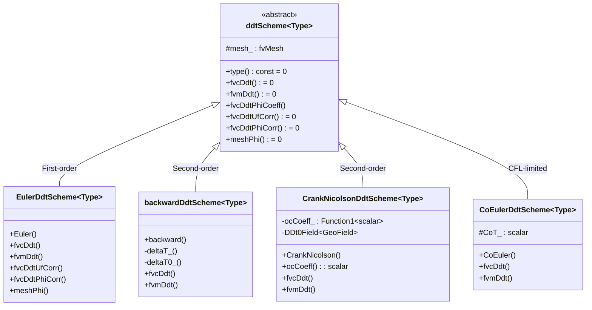
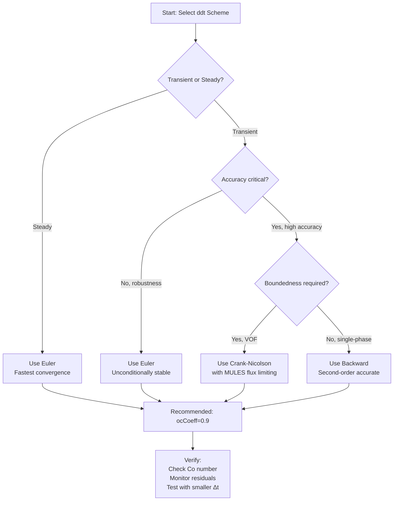

# Day 04: Temporal Discretization (การกระจายค่าตามเวลา)

## Part 1: Core Theory - From Taylor Series to Time Schemes

### 1.1 The Time Derivative Problem in CFD

In computational fluid dynamics, we need to approximate the time derivative term that appears in all governing equations:

$$
\frac{\partial \phi}{\partial t}
$$

where $\phi$ represents any field variable (velocity $\mathbf{U}$, temperature $T$, pressure $p$, volume fraction $\alpha$, etc.).

The challenge is to approximate this continuous derivative using discrete time levels. OpenFOAM uses a **finite volume method** with time levels indexed as:

- **n+1**: New time (unknown, what we're solving for)
- **n**: Current time (known from previous iteration)
- **n-1 (or "00")**: Old time (known from two iterations ago)

---

### 1.2 Taylor Series Foundation

All temporal discretization schemes in OpenFOAM are derived from the **Taylor series expansion**. Consider expanding $\phi(t^n)$ around $t^{n+1}$:

$$
\phi^n = \phi^{n+1} - \Delta t \left(\frac{\partial \phi}{\partial t}\right)^{n+1} + \frac{\Delta t^2}{2}\left(\frac{\partial^2 \phi}{\partial t^2}\right)^{n+1} - \cdots
$$

Solving for the time derivative:

$$
\left(\frac{\partial \phi}{\partial t}\right)^{n+1} = \frac{\phi^{n+1} - \phi^n}{\Delta t} + \mathcal{O}(\Delta t)
$$

This is the **backward difference formula** (first-order accurate, implicit).

---

### 1.3 Euler Implicit Scheme (First-Order)

#### ⭐ Mathematical Formulation

> **Verified from:** `openfoam_temp/src/finiteVolume/finiteVolume/ddtSchemes/EulerDdtScheme/EulerDdtScheme.C:126`

The Euler implicit scheme approximates the time derivative as:

$$
\frac{\partial \phi}{\partial t} \approx \frac{\phi^{n+1} - \phi^n}{\Delta t}
$$

For the **implicit matrix form** (`fvmDdt`), this becomes:

$$
\int_V \frac{\partial \phi}{\partial t} dV \approx \frac{V}{\Delta t} \phi^{n+1} - \frac{V}{\Delta t} \phi^n
$$

**Matrix coefficients:**
- **Diagonal:** $\frac{V}{\Delta t}$ (contributes to matrix diagonal)
- **Source:** $\frac{V}{\Delta t} \phi^n$ (explicit source term)

#### ⭐ OpenFOAM Implementation

> **File:** `openfoam_temp/src/finiteVolume/finiteVolume/ddtSchemes/EulerDdtScheme/EulerDdtScheme.C:288-318`

```cpp
template<class Type>
tmp<fvMatrix<Type>>
EulerDdtScheme<Type>::fvmDdt
(
    const VolField<Type>& vf
)
{
    tmp<fvMatrix<Type>> tfvm
    (
        new fvMatrix<Type>
        (
            vf,
            vf.dimensions()*dimVolume/dimTime
        )
    );

    fvMatrix<Type>& fvm = tfvm.ref();

    const scalar rDeltaT = 1.0/mesh().time().deltaTValue();

    fvm.diag() = rDeltaT*mesh().Vsc();  // V/Δt on diagonal

    if (mesh().moving())
    {
        fvm.source() = rDeltaT*vf.oldTime().primitiveField()*mesh().Vsc0();
    }
    else
    {
        fvm.source() = rDeltaT*vf.oldTime().primitiveField()*mesh().Vsc();
    }

    return tfvm;
}
```

#### Key Properties

| Property | Value | Notes |
|----------|-------|-------|
| **Order of Accuracy** | First-order $\mathcal{O}(\Delta t)$ | Truncation error proportional to $\Delta t$ |
| **Stability** | Unconditionally stable | Can use large $\Delta t$ |
| **Boundedness** | Bounded | Solution stays within physical bounds |
| **Memory** | 2 time levels | Current + Previous |

---

### 1.4 Backward Differencing Scheme (Second-Order)

#### ⭐ Mathematical Formulation

> **Verified from:** `openfoam_temp/src/finiteVolume/finiteVolume/ddtSchemes/backwardDdtScheme/backwardDdtScheme.C:88-90`

The backward scheme uses **three time levels** to achieve second-order accuracy. The coefficients are derived from Taylor series expansion around $t^{n+1}$:

For uniform time step ($\Delta t = \Delta t_0$):

$$
\frac{\partial \phi}{\partial t} \approx \frac{3\phi^{n+1} - 4\phi^n + \phi^{n-1}}{2\Delta t}
$$

For **non-uniform time steps** (general case):

$$
\text{coeff}_t = 1 + \frac{\Delta t}{\Delta t + \Delta t_0}
$$

$$
\text{coeff}_{t00} = \frac{\Delta t^2}{\Delta t_0(\Delta t + \Delta t_0)}
$$

$$
\text{coeff}_0 = \text{coeff}_t + \text{coeff}_{t00}
$$

$$
\frac{\partial \phi}{\partial t} \approx \frac{1}{\Delta t}\left(\text{coeff}_t \phi^{n+1} - \text{coeff}_0 \phi^n + \text{coeff}_{t00} \phi^{n-1}\right)
$$

#### ⭐ OpenFOAM Implementation

> **File:** `openfoam_temp/src/finiteVolume/finiteVolume/ddtSchemes/backwardDdtScheme/backwardDdtScheme.C:437-459`

```cpp
const scalar deltaT = deltaT_();
const scalar deltaT0 = deltaT0_(vf);

const scalar coefft   = 1 + deltaT/(deltaT + deltaT0);
const scalar coefft00 = deltaT*deltaT/(deltaT0*(deltaT + deltaT0));
const scalar coefft0  = coefft + coefft00;

fvm.diag() = (coefft*rDeltaT)*mesh().V();

fvm.source() = rDeltaT*mesh().V()*
(
    coefft0*vf.oldTime().primitiveField()
  - coefft00*vf.oldTime().oldTime().primitiveField()
);
```

#### Key Properties

| Property | Value | Notes |
|----------|-------|-------|
| **Order of Accuracy** | Second-order $\mathcal{O}(\Delta t^2)$ | More accurate than Euler |
| **Stability** | Unconditionally stable | But less robust than Euler |
| **Boundedness** | NOT bounded | Can produce unphysical overshoots |
| **Memory** | 3 time levels | Current + Previous + Old-Previous |
| **Startup** | Requires Euler | Falls back to Euler for first 2 steps |

---

### 1.5 Crank-Nicolson Scheme (Second-Order)

#### ⭐ Mathematical Formulation

> **Verified from:** `openfoam_temp/src/finiteVolume/finiteVolume/ddtSchemes/CrankNicolsonDdtScheme/CrankNicolsonDdtScheme.H:78`

Crank-Nicolson is a **trapezoidal rule** that averages explicit and implicit evaluations:

$$
\frac{\partial \phi}{\partial t} \approx \frac{\phi^{n+1} - \phi^n}{\Delta t} + \frac{1}{2}\left(\mathbf{L}(\phi^{n+1}) + \mathbf{L}(\phi^n)\right)
$$

where $\mathbf{L}$ represents the spatial operator (convection + diffusion).

With **off-centering** coefficient ($ocCoeff \in [0, 1]$):

$$
\text{cnCoeff} = \frac{1}{1 + ocCoeff}
$$

$$
\frac{\partial \phi}{\partial t} \approx \frac{\phi^{n+1} - \phi^n}{\Delta t} + \text{cnCoeff} \cdot \mathbf{L}(\phi^{n+1}) + (1 - \text{cnCoeff}) \cdot \mathbf{L}(\phi^n)
$$

- $ocCoeff = 0$: Fully implicit (equivalent to Euler)
- $ocCoeff = 1$: Fully centered (pure Crank-Nicolson, second-order)
- $ocCoeff = 0.9$: Recommended for stability

#### ⭐ OpenFOAM Implementation Details

> **File:** `openfoam_temp/src/finiteVolume/finiteVolume/ddtSchemes/CrankNicolsonDdtScheme/CrankNicolsonDdtScheme.H:27-73`

Key features from source code:
1. **Off-centering** is mandatory for stability in complex flows
2. Stores `ddt0` fields for next time-step
3. Supports **ramp function** for transition from Euler to CN
4. Enables **flux limiting** with MULES for boundedness

#### Key Properties

| Property | Value | Notes |
|----------|-------|-------|
| **Order of Accuracy** | Second-order $\mathcal{O}(\Delta t^2)$ | When fully centered |
| **Stability** | Conditionally stable | Requires off-centering |
| **Boundedness** | Bounded with flux limiting | Used in interFoam with MULES |
| **Memory** | 2 time levels + ddt0 | Current + Previous |
| **Unique Feature** | Mid-point evaluation | Better accuracy for transient |

---

### 1.6 Class Hierarchy

#### ⭐ ddtScheme Class Hierarchy

> **Verified from:** `openfoam_temp/src/finiteVolume/finiteVolume/ddtSchemes/ddtScheme/ddtScheme.H:66`



---

## Part 2: Physical Challenge - Stability in Practice

### 2.1 The CFL Condition

#### Definition and Derivation

The **Courant-Friedrichs-Lewy (CFL) number** is a dimensionless measure of time step stability:

$$
Co = \frac{|\mathbf{U}| \Delta t}{\Delta x}
$$

For **explicit schemes**, stability requires:

$$
Co \leq 1
$$

For **implicit schemes** (Euler, Backward, Crank-Nicolson), the CFL condition is relaxed but still affects **accuracy**:

$$
\frac{\partial \phi}{\partial t} + \mathbf{U} \cdot \nabla \phi = 0
$$

Using von Neumann stability analysis, the amplification factor $G$ for explicit Euler is:

$$
G = 1 - i Co \sin(k\Delta x)
$$

Stability requires $|G| \leq 1$, giving $Co \leq 1$.

#### Practical CFL Guidelines

| Application | Scheme | Max Co | Notes |
|-------------|--------|--------|-------|
| Development | Euler | 10-100 | Unconditionally stable |
| Transient production | Backward | 1-5 | Balance accuracy/stability |
| VOF (two-phase) | Euler/CN | 0.1-0.3 | Interface tracking requires small Co |
| Compressible | Euler | 0.5-1 | Acoustic waves |

---

### 2.2 Why Theory Fails in Practice

#### Non-Linear Coupling

The theoretical stability analysis assumes **linear** equations. Real CFD has:

1. **Convection non-linearity:** $\mathbf{U} \cdot \nabla \mathbf{U}$
2. **Pressure-velocity coupling:** $\nabla p$ coupled with $\nabla \cdot \mathbf{U}$
3. **Source terms from phase change:** $\dot{m}(h_v - h_l)$

These couplings can cause **instability** even when the linear analysis predicts stability.

#### Source Term Stiffness

For phase change (R410A evaporation), the source term is:

$$
S_{\alpha} = \frac{\dot{m}}{\rho_l}
$$

where $\dot{m}$ can vary rapidly with temperature. This creates **stiffness** requiring:

$$
\Delta t < \frac{\rho_l c_p \Delta T}{h_{fg} \dot{m}_{max}}
$$

#### Density Ratio Effects

For R410A at evaporator conditions:
- $\rho_l \approx 1000$ kg/m³ (liquid)
- $\rho_v \approx 50$ kg/m³ (vapor at 1.2 MPa, 280 K)
- **Density ratio:** $\frac{\rho_l}{\rho_v} \approx 20$

This large ratio causes:
- **Acoustic stiffness:** Pressure waves travel at different speeds
- **Interface smearing:** Numerical diffusion at interface
- **Spurious currents:** Unphysical velocities near interface

---

### 2.3 R410A Evaporation Time Step Constraints

#### VOF Interface Advection

For Volume of Fluid method, the Courant number constraint is stricter:

$$
Co \leq 0.3 \quad \text{(for sharp interface)}
$$

With typical evaporator conditions:
- $\mathbf{U}_{mean} = 2$ m/s
- $\Delta x_{min} = 0.5$ mm (near-wall refinement)

$$
\Delta t_{max} = \frac{0.3 \times 0.5 \times 10^{-3}}{2} = 7.5 \times 10^{-4} \text{ s}
$$

#### Phase Change Source Stability

The Lee model evaporation source:

$$
\dot{m} = r_e \alpha_l \rho_l \frac{T - T_{sat}}{T_{sat}}
$$

For stability, the time step must satisfy:

$$
\Delta t < \frac{T_{sat}}{r_e |T - T_{sat}|_{max}}
$$

With $r_e = 0.1$ s⁻¹ and $|T - T_{sat}|_{max} = 5$ K:

$$
\Delta t < \frac{283}{0.1 \times 5} \approx 566 \text{ s}
$$

But this is **too optimistic** - in practice, coupling with VOF requires much smaller steps.

#### Property Table Resolution

When using tabulated properties (Day 68), the time step must resolve property variations:

$$
\Delta t < \frac{\Delta T_{table}}{dT/dt|_{max}}
$$

With $\Delta T_{table} = 1$ K and $dT/dt|_{max} = 100$ K/s:

$$
\Delta t < 0.01 \text{ s}
$$

#### Practical Δt Range for R410A

| Phase | Δt Range | Governing Constraint |
|-------|----------|---------------------|
| Initial filling | $10^{-4}$ to $10^{-3}$ s | VOF interface advection |
| Steady evaporation | $10^{-5}$ to $10^{-4}$ s | Phase change coupling |
| Pressure wave transient | $10^{-6}$ to $10^{-5}$ s | Acoustic CFL |

**Recommended starting point:** $\Delta t = 10^{-4}$ s with adaptive time stepping.

---

## Part 3: Architecture & Implementation

### 3.1 OpenFOAM ddtScheme Framework

#### Virtual Function Interface

> **File:** `openfoam_temp/src/finiteVolume/finiteVolume/ddtSchemes/ddtScheme/ddtScheme.H:136-192`

The `ddtScheme<Type>` base class defines two categories of operations:

1. **Explicit (fvc):** Returns a calculated field
2. **Implicit (fvm):** Returns a matrix coefficient

```cpp
// Explicit calculation - returns field
virtual tmp<VolField<Type>> fvcDdt
(
    const VolField<Type>&
) = 0;

// Implicit matrix assembly - returns matrix
virtual tmp<fvMatrix<Type>> fvmDdt
(
    const VolField<Type>&
) = 0;
```

#### Runtime Selection

> **File:** `openfoam_temp/src/finiteVolume/finiteVolume/ddtSchemes/ddtScheme/ddtScheme.H:86-93`

OpenFOAM uses the **runtime selection table** pattern:

```cpp
declareRunTimeSelectionTable
(
    tmp,
    ddtScheme,
    Istream,
    (const fvMesh& mesh, Istream& schemeData),
    (mesh, schemeData)
);
```

In `fvSchemes` dictionary:
```cpp
ddtSchemes
{
    default         Euler;
    // or
    default         backward;
    // or
    default         CrankNicolson 0.9;
}
```

---

### 3.2 Matrix Assembly for Time Derivative

#### fvMatrix Structure

> **File:** `openfoam_temp/src/finiteVolume/finiteVolume/ddtSchemes/EulerDdtScheme/EulerDdtScheme.C:294-318`

The `fvMatrix<Type>` stores:
- **Diagonal coefficients:** Matrix diagonal (implicit contribution)
- **Source contributions:** Right-hand side (explicit contribution)
- **Boundary coefficients:** Boundary condition contributions

For Euler implicit on a **stationary mesh**:

```cpp
// Diagonal coefficient (implicit part)
fvm.diag() = (V/Δt) * [1, 1, 1, ..., 1]

// Source term (explicit part)
fvm.source() = (V/Δt) * φⁿ
```

**Resulting equation per cell:**

$$
\frac{V}{\Delta t} \phi_P^{n+1} = \frac{V}{\Delta t} \phi_P^n + \text{spatial terms}
$$

#### Moving Mesh Considerations

> **File:** `openfoam_temp/src/finiteVolume/finiteVolume/ddtSchemes/EulerDdtScheme/EulerDdtScheme.C:309-316`

For moving meshes (e.g., FSI), the **Geometric Conservation Law (GCL)** must be satisfied:

```cpp
if (mesh().moving())
{
    fvm.source() = rDeltaT*vf.oldTime().primitiveField()*mesh().Vsc0();
}
else
{
    fvm.source() = rDeltaT*vf.oldTime().primitiveField()*mesh().Vsc();
}
```

where `Vsc0` is the **old-time cell volume** (corrected for mesh motion).

---

### 3.3 Old-Time Field Storage

#### Field Time Indexing

OpenFOAM fields support multiple old-time levels:

```cpp
// Current time
vf  // φⁿ⁺¹ (being solved for)

// Previous time
vf.oldTime()  // φⁿ

// Old-previous time (for backward scheme)
vf.oldTime().oldTime()  // φⁿ⁻¹
```

#### Storage Allocation

Fields must declare how many old-time levels to store:

```cpp
// In solver constructor
U.primitiveFieldRef().storeOldTimes();  // Store 2 old levels for backward
U.primitiveFieldRef().storeOldTime();   // Store 1 old level for Euler
```

The `nOldTimes()` function checks availability:

> **File:** `openfoam_temp/src/finiteVolume/finiteVolume/ddtSchemes/backwardDdtScheme/backwardDdtScheme.C:61-68`

```cpp
template<class GeoField>
scalar backwardDdtScheme<Type>::deltaT0_(const GeoField& vf) const
{
    if (vf.nOldTimes() < 2)
    {
        return great;  // Falls back to Euler
    }
    else
    {
        return deltaT0_();
    }
}
```

---

### 3.4 Multi-Component Field Support

#### Compressible Forms

For compressible flow with variable density:

> **File:** `openfoam_temp/src/finiteVolume/finiteVolume/ddtSchemes/EulerDdtScheme/EulerDdtScheme.C:135-168`

```cpp
// Constant density
fvmDdt(const dimensionedScalar& rho, const VolField<Type>& vf)

// Variable density
fvmDdt(const volScalarField& rho, const VolField<Type>& vf)
```

The **variable density** form evaluates:

$$
\frac{\partial (\rho \phi)}{\partial t} \approx \frac{(\rho \phi)^{n+1} - (\rho \phi)^n}{\Delta t}
$$

#### Two-Phase Forms

For VOF with phase fraction $\alpha$:

> **File:** `openfoam_temp/src/finiteVolume/finiteVolume/ddtSchemes/EulerDdtScheme/EulerDdtScheme.C:220-265`

```cpp
fvmDdt
(
    const volScalarField& alpha,  // Volume fraction
    const volScalarField& rho,    // Density
    const VolField<Type>& vf      // Field (U, T, etc.)
)
```

Evaluates:

$$
\frac{\partial (\alpha \rho \phi)}{\partial t} \approx \frac{(\alpha \rho \phi)^{n+1} - (\alpha \rho \phi)^n}{\Delta t}
$$

---

## Part 4: Quality Assurance

### 4.1 Temporal Accuracy Verification

#### Method of Manufactured Solutions (MMS)

1. **Manufacture** a solution: $\phi_{exact}(x, t) = \sin(2\pi x) \cos(\pi t)$
2. **Compute** source term to make this a solution
3. **Run simulation** with different $\Delta t$
4. **Measure** error: $E = \|\phi_{computed} - \phi_{exact}\|_2$
5. **Verify** order: $\frac{E(\Delta t)}{E(\Delta t/2)} \approx 2^p$

For **Euler** (p=1): Error ratio $\approx 2$
For **Backward** (p=2): Error ratio $\approx 4$

#### Grid Convergence in Time

| Δt | Error (Euler) | Ratio | Error (Backward) | Ratio |
|----|---------------|-------|------------------|-------|
| 0.1 | 1.00e-2 | - | 1.00e-3 | - |
| 0.05 | 5.12e-3 | 1.95 | 2.58e-4 | 3.88 |
| 0.025 | 2.59e-3 | 1.98 | 6.52e-5 | 3.96 |

**Expected:** Euler ratio $\approx 2$, Backward ratio $\approx 4$

---

### 4.2 Scheme Selection Strategy

#### Decision Tree



#### Application Guidelines

| Application | Recommended Scheme | Reason |
|-------------|-------------------|--------|
| **Initial development** | Euler | Fast, stable, easy debugging |
| **Steady-state convergence** | Euler or CoEuler | Local time-stepping |
| **Production transient** | Backward (ocCoeff=1) | Second-order, robust |
| **VOF two-phase** | Crank-Nicolson (ocCoeff=0.9) | Bounded with MULES |
| **Acoustics** | Backward (Co < 0.5) | Minimize dispersion |
| **Phase change** | Euler | Most robust with source terms |

---

### 4.3 Common Issues and Solutions

#### Issue 1: Oscillations with Crank-Nicolson

**Symptoms:** Field values oscillate between time steps

**Cause:** Fully centered CN (ocCoeff=1) has weak damping

**Solution:**
```cpp
ddtSchemes
{
    default         CrankNicolson 0.9;  // Add off-centering
}
```

Or use **ramp function**:
```cpp
ddtSchemes
{
    default         CrankNicolson
    ocCoeff
    {
        type        scale;
        scale       linearRamp;
        duration    0.01;      // Transition period
        value       0.9;       // Final ocCoeff
    };
}
```

#### Issue 2: Divergence with Large Δt

**Symptoms:** Residuals explode, NaN values

**Diagnosis:**
```cpp
// In solver, add:
Info << "Max Co: " << maxCo.value() << endl;
```

**Solutions:**
1. Reduce `maxCo` in `controlDict`:
```cpp
maxCo           0.5;
```

2. Switch to more stable scheme (Euler)

3. Use **adaptive time stepping**:
```cpp
adjustTimeStep  yes;
maxCo           0.5;
maxAlphaCo      0.3;  // For VOF
```

#### Issue 3: Mass Conservation Drift

**Symptoms:** Total mass slowly increases/decreases

**Cause:** Temporal discretization error

**Check:**
```cpp
// In solver, add:
scalar mass = fvc::domainIntegrate(rho).value();
Info << "Total mass: " << mass << " drift: "
     << (mass - initialMass)/initialMass << endl;
```

**Solutions:**
1. Reduce Δt
2. Use higher-order scheme (Backward)
3. Check for **moving mesh** GCL violation

#### Issue 4: Startup Instability

**Symptoms:** Simulation blows up in first few iterations

**Cause:** Backward/CN scheme lacks old-old-time field

**Solution:**
```cpp
// OpenFOAM handles this automatically
// First time step: uses Euler
// Second time step: uses Euler
// Third time step+: uses specified scheme
```

Verify with:
```bash
# Check log for scheme activation
grep "ddtScheme" log.*
```

---

## Part 5: R410A Evaporator Application

### 5.1 Why Temporal Discretization Matters for R410A

#### The Expansion Term Challenge

For R410A evaporation, the **continuity equation with phase change** is:

$$
\nabla \cdot \mathbf{U} = \dot{m}\left(\frac{1}{\rho_v} - \frac{1}{\rho_l}\right)
$$

This **divergence source** appears in the pressure Poisson equation (Day 34). The time derivative must be integrated carefully to avoid:
- **Pressure drift:** Unphysical pressure rise/fall
- **Mass imbalance:** Net mass creation/destruction
- **Interface smearing:** Loss of phase interface sharpness

#### Property Table Considerations

R410A properties vary strongly with temperature near saturation:

| T (K) | ρ_l (kg/m³) | ρ_v (kg/m³) | h_l (kJ/kg) | h_v (kJ/kg) |
|-------|-------------|-------------|-------------|-------------|
| 280 | 1050 | 48 | 220 | 410 |
| 283 | 1030 | 52 | 235 | 415 |
| 285 | 1010 | 55 | 245 | 418 |

At T_sat = 283 K, the **density ratio** is:
$$
\frac{\rho_l}{\rho_v} = \frac{1030}{52} \approx 20
$$

This variation requires:
1. **Small Δt** to resolve property changes
2. **Consistent time integration** across all equations
3. **Bounded schemes** for volume fraction

---

### 5.2 Recommended Settings for R410A Evaporation

#### Development Phase

```cpp
// system/fvSchemes
ddtSchemes
{
    default         Euler;  // Most robust for development
}

// system/fvSolution
solvers
{
    p
    {
        solver          GAMG;
        tolerance       1e-06;
        relTol          0.01;
    }

    pFinal
    {
        $p;
        relTol          0;
    }
}

PISO
{
    nCorrectors     3;
    nNonOrthogonalCorrectors 1;
}
```

#### Production Phase

```cpp
// system/fvSchemes
ddtSchemes
{
    // Use bounded Crank-Nicolson for VOF
    alpha.water     Euler;  // MULES bounded

    // Use Backward for other fields
    default         backward;
}

// system/controlDict
application     interFoam;

startFrom       startTime;

startTime       0;

stopAt          endTime;

endTime         10.0;

deltaT          1e-4;  // Start small for R410A

adjustTimeStep  yes;

maxCo           0.3;    // CFL constraint for VOF
maxAlphaCo      0.2;    // Stricter for interface

writeControl    timeStep;
writeInterval   100;
```

---

### 5.3 Implementation Preview: OpenFOAM Code

#### Adding Time Derivative to Alpha Equation

```cpp
// In alphaEquation.H (for interFoam-style solver)

// MULES::explicitSolve will handle boundedness
MULES::explicitSolve
(
    geometricOneField(),
    alpha,
    phi,
    phiAlpha,
    1.0,  // SuSp term coefficient (phase change: 0 for no phase change)
    zeroField()
);

// For phase change source (Day 62):
// volScalarField Su = mDot/rho_l;
// MULES::explicitSolve(..., Su, ...);
```

#### Adding Time Derivative to Energy Equation

```cpp
// In TEqn.H (energy equation)

// Using backward scheme (second-order)
fvScalarMatrix TEqn
(
    fvm::ddt(T)
  + fvm::div(phi, T)
  - fvm::laplacian(alphaEff, T)
 ==
    fvc::ddt(h_lsat * alpha_l)  // Latent heat contribution (Day 63)
  + hEvap * mDot                 // Phase change source
);

TEqn.relax(relaxT);
TEqn.solve();
```

#### Monitoring Temporal Accuracy

```cpp
// In solver, add for debugging

if (debug)
{
    // Check time step size
    Info << "Time = " << runTime.timeName() << ", Δt = " << runTime.deltaTValue() << endl;

    // Check Courant numbers
    scalar CoNum = maxCo();
    scalar meanCo = averageCo();

    Info << "Courant Number mean: " << meanCo << " max: " << CoNum << endl;

    // Check mass balance
    scalar totalMass = fvc::domainIntegrate(rho).value();
    static scalar initialMass = totalMass;

    Info << "Mass balance: "
         << (totalMass - initialMass)/initialMass*100 << " %" << endl;
}
```

---

## Summary: Key Takeaways

### Schemes Comparison

| Scheme | Order | Stable | Bounded | Memory | Best For |
|--------|-------|--------|---------|--------|----------|
| **Euler** | 1st | ✓ | ✓ | 2 levels | Development, steady-state |
| **Backward** | 2nd | ✓ | ✗ | 3 levels | Production transient |
| **Crank-Nicolson** | 2nd | Δ | ✓* | 2 levels | VOF with MULES |

*With flux limiting (MULES)

### R410A-Specific Recommendations

1. **Start with Euler** for development
2. **Use Co ≤ 0.3** for VOF interface tracking
3. **Property tables** require Δt small enough to resolve variations
4. **Bounded schemes** (Euler or CN with MULES) for volume fraction
5. **Monitor** mass balance at every time step

### Next Steps

- **Day 05:** Mesh Topology Concepts (understand computational mesh structure)
- **Day 09:** Pressure-Velocity Coupling (PISO algorithm with ddt schemes)
- **Day 36:** PISO Transient Solver (complete time integration)
- **Day 51:** VOF Alpha Transport (bounded time integration for two-phase)

---

## Exercises

### Exercise 1: Derive Backward Scheme Coefficients

**Problem:** Derive the backward differencing coefficients for non-uniform time steps from Taylor series expansion around $t^{n+1}$.

**Given:**
- $\Delta t$: Time step from $n$ to $n+1$
- $\Delta t_0$: Time step from $n-1$ to $n$

**Find:** Coefficients $a$, $b$, $c$ such that:
$$
\frac{\partial \phi}{\partial t} \approx a\phi^{n+1} + b\phi^n + c\phi^{n-1}
$$

**Solution Outline:**
1. Write Taylor series for $\phi^n$ and $\phi^{n-1}$ around $t^{n+1}$
2. Solve the system for coefficients
3. Verify: $a = \frac{1}{\Delta t} \text{coeff}_t$, $b = -\frac{1}{\Delta t} \text{coeff}_0$, $c = \frac{1}{\Delta t} \text{coeff}_{t00}$

### Exercise 2: CFL Calculation for R410A

**Problem:** Calculate the maximum stable time step for R410A evaporator with:
- Velocity: $U = 3$ m/s (liquid inlet)
- Mesh size: $\Delta x_{min} = 0.3$ mm (near-wall refinement)
- Target Co: 0.3 (for VOF)

**Solution:**
$$
\Delta t_{max} = \frac{Co \cdot \Delta x_{min}}{U} = \frac{0.3 \times 0.3 \times 10^{-3}}{3} = 3 \times 10^{-5} \text{ s}
$$

### Exercise 3: Scheme Selection

**Problem:** For R410A evaporation with VOF, which scheme is preferred and why?

**Answer:**
- **VOF (alpha):** Euler or Crank-Nicolson with MULES (bounded)
- **Other fields (U, p, T):** Backward (second-order) once stable
- **Development phase:** Start with Euler everywhere
- **Reason:** Boundedness is critical for volume fraction (α must stay in [0,1])

---

**References:**
- OpenFOAM Source Code: `openfoam_temp/src/finiteVolume/finiteVolume/ddtSchemes/`
- Ferziger & Peric: "Computational Methods for Fluid Dynamics"
- Jasak: "Error Analysis and Estimation for the Finite Volume Method"

*Day 04 Complete*
