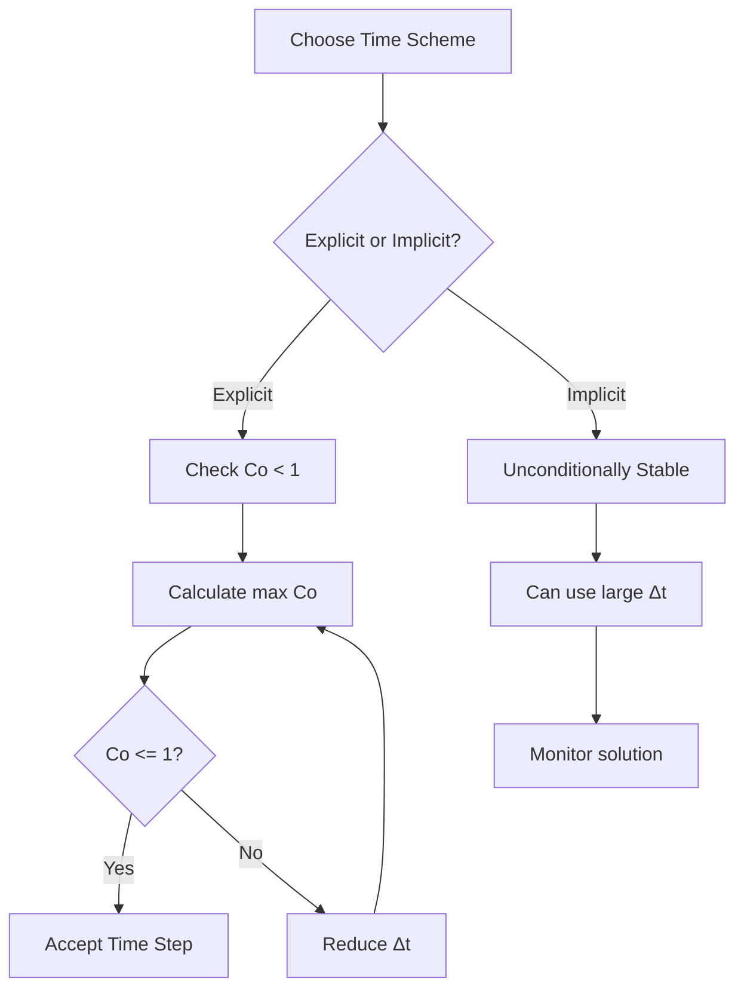
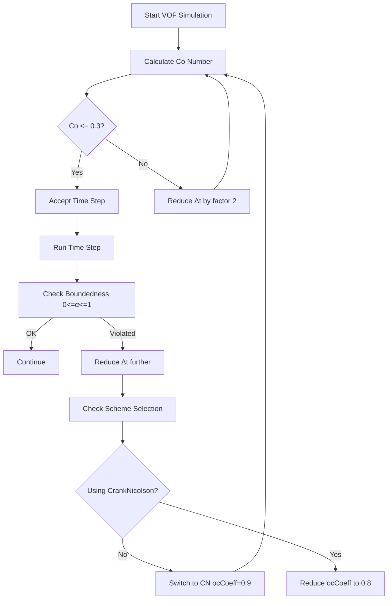
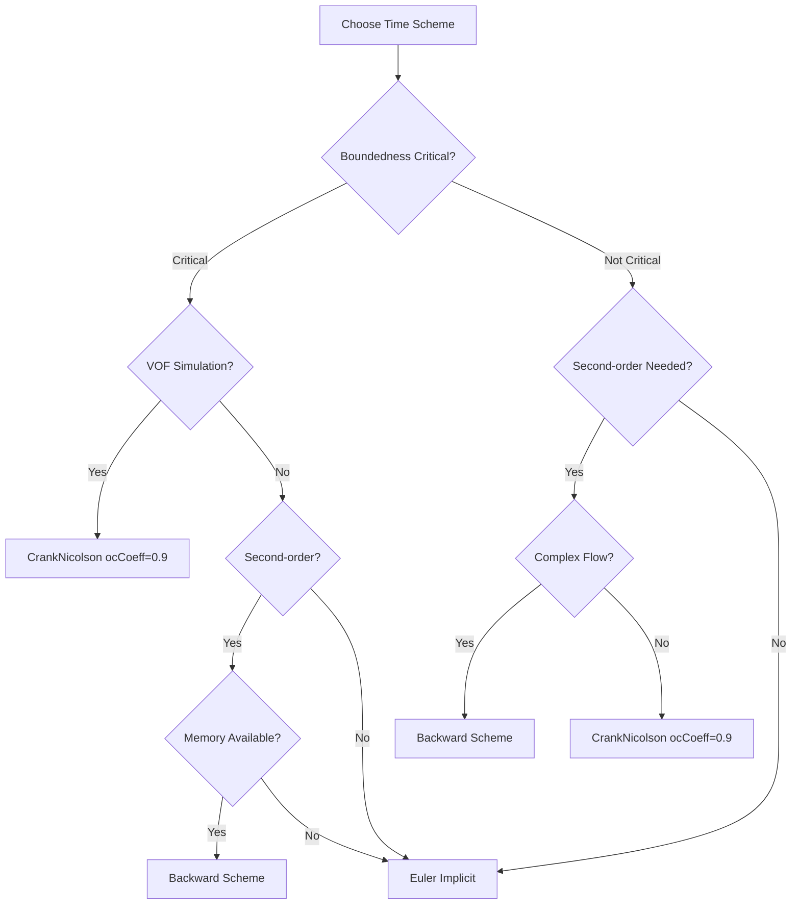
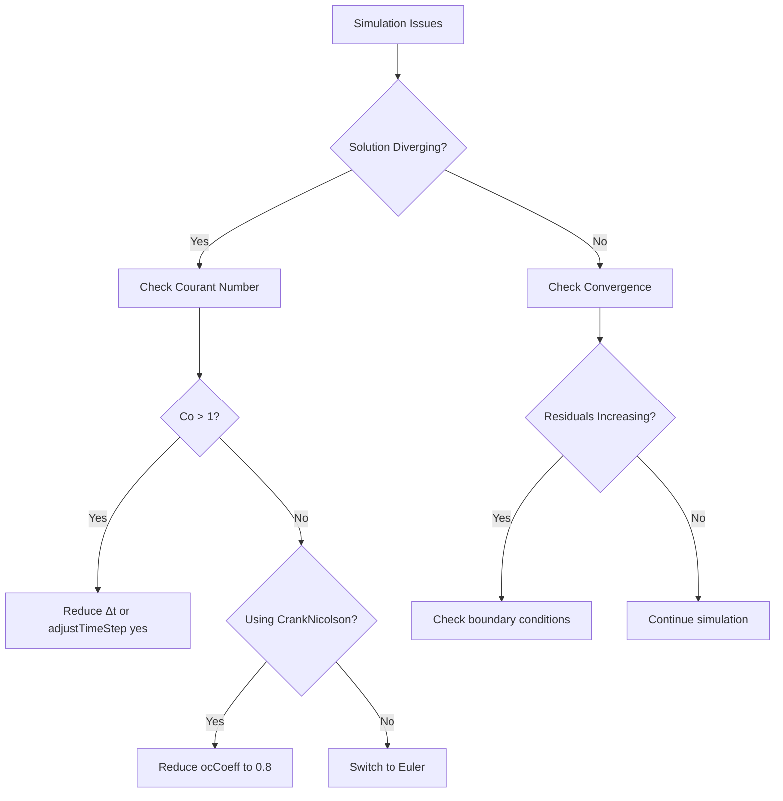

# Day 04: Temporal Discretization

## Learning Objectives

After completing this day, you will be able to:

- Understand first-order Euler implicit and explicit time integration methods
- Understand second-order backward differencing scheme
- Understand second-order Crank-Nicolson scheme with off-centering
- Calculate and interpret Courant-Friedrichs-Lewy (CFL) number
- Select appropriate time schemes for Volume of Fluid (VOF) simulations
- Understand stability, boundedness, and accuracy trade-offs

---

## 1. Introduction

### What is Temporal Discretization?

Temporal discretization is the mathematical process of converting continuous time derivatives ($\frac{\partial}{\partial t}$) into algebraic expressions that can be solved numerically. In computational fluid dynamics (CFD), this is how we advance the solution from one time step to the next.

### Why Time Integration Matters in CFD

The choice of temporal discretization scheme has profound implications on:

- **Accuracy**: How closely the numerical solution approximates the true physics
- **Stability**: Whether the solution remains bounded as time progresses
- **Boundedness**: Whether solution values remain within physical constraints
- **Computational cost**: Memory requirements and computational expense
- **Robustness**: How well the scheme handles complex flows and discontinuities

### Connection to Spatial Discretization (Day 03)

While Day 03 focused on how we represent spatial derivatives, Day 04 addresses the time dimension. The complete discretized CFD equation combines both:

$$
\frac{\partial (\rho \phi)}{\partial t} + \nabla \cdot (\mathbf{U} \phi) = \nabla \cdot (\Gamma \nabla \phi) + S_\phi
$$

Where the temporal term $\frac{\partial (\rho \phi)}{\partial t}$ is discretized using the schemes we'll explore today.

### Overview of Time Schemes in OpenFOAM

OpenFOAM implements a hierarchical system of time derivative schemes, all inheriting from the abstract base class `ddtScheme<Type>`. The main schemes include:

- **Euler**: First-order, simple and robust
- **Backward**: Second-order, requires three time levels
- **CrankNicolson**: Second-order with off-centering parameter
- **SteadyState**: For steady-state calculations

### Preview of Day 04 Topics

We'll explore each scheme in detail, including:

1. Mathematical formulations and derivations
2. Implementation details from OpenFOAM source code
3. Stability and accuracy analysis
4. Practical considerations for different applications
5. Specific guidelines for VOF simulations

## Time Scheme Class Hierarchy

```mermaid
classDiagram
    class "ddtScheme<Type>" {
        <<abstract>>
        +fvcDdt(vf)*
        +fvmDdt(vf)*
        +fvcDdtPhiCorr()*
        +mesh() const
    }
    class "EulerDdtScheme<Type>" {
        <<type_name: "Euler">>
        +fvmDdt(vf)
        +fvcDdt(vf)
        +fvcDdtPhiCorr(U, vf)
    }
    class "backwardDdtScheme<Type>" {
        <<type_name: "backward">>
        +fvmDdt(vf)
        +fvcDdt(vf)
        +fvcDdtPhiCorr(U, vf)
    }
    class "CrankNicolsonDdtScheme<Type>" {
        <<type_name: "CrankNicolson">>
        +ocCoeff()
        +fvmDdt(vf)
        +fvcDdt(vf)
        +fvcDdtPhiCorr(U, vf)
    }
    "EulerDdtScheme<Type>" --|> "ddtScheme<Type>"
    "backwardDdtScheme<Type>" --|> "ddtScheme<Type>"
    "CrankNicolsonDdtScheme<Type>" --|> "ddtScheme<Type>"
```

## Key Points

- **Temporal discretization** converts time derivatives ($\frac{\partial}{\partial t}$) into algebraic expressions
- Time schemes determine how we advance the solution from time step n to n+1
- ⭐ **All temporal schemes in OpenFOAM inherit from `ddtScheme<Type>` base class**
- ⭐ **Key methods**: `fvcDdt()` (explicit), `fvmDdt()` (implicit), `fvcDdtPhiCorr()` (flux correction)
- **Three main schemes**: Euler (first-order), backward (second-order), CrankNicolson (second-order)

---

## 2. Euler Schemes

### Euler Explicit (Forward Euler)

The Euler explicit scheme is the simplest time integration method, using only the current (n) and previous (n-1) time-step values:

$$
\frac{\partial \phi}{\partial t} \approx \frac{\phi^n - \phi^{n-1}}{\Delta t}
$$

This is a **first-order** accurate scheme with error proportional to $\Delta t$.

### Euler Implicit (Backward Euler)

The Euler implicit scheme solves for the unknown future value:

$$
\frac{\partial \phi}{\partial t} \approx \frac{\phi^{n+1} - \phi^n}{\Delta t}
$$

Where $\phi^{n+1}$ is solved implicitly within the linear system.

### First-order Accuracy: O(Δt)

The local truncation error for Euler schemes is:

$$
\text{LTE} = \frac{\partial^2 \phi}{\partial t^2} \frac{\Delta t}{2} + O(\Delta t^2)
$$

This means the error decreases linearly with $\Delta t$.

### Explicit vs Implicit Stability

- **Explicit**: Conditionally stable (requires CFL < 1)
- **Implicit**: Unconditionally stable (can use arbitrarily large time steps)

### Moving Mesh Formulation

For moving meshes, the Euler scheme includes volume ratio corrections:

$$
\frac{\partial \phi}{\partial t} \approx \frac{\phi^n - \phi^{n-1} \cdot (V_0/V)}{\Delta t}
$$

Where $V_0$ and $V$ are cell volumes at previous and current time steps.

### When to Use Euler Schemes

**Euler Implicit:**
- Initial calculations and startup
- Simple geometries and flows
- When robustness is prioritized over accuracy
- As a fallback for more complex schemes

**Euler Explicit:**
- Educational purposes
- Very simple problems
- When time step constraints are manageable

## Euler Scheme Implementation

### File: `openfoam_temp/src/finiteVolume/finiteVolume/ddtSchemes/EulerDdtScheme/EulerDdtScheme.H`
> **Lines:** 58

```cpp
template<class Type>
class EulerDdtScheme
:
    public ddtScheme<Type>
{
    // Private Data

        //- Name of the scheme
        static const char* typeName_();

        //- Runtime type information
        TypeName("Euler");
```

### Euler Implicit Coefficient Calculation

### File: `openfoam_temp/src/finiteVolume/finiteVolume/ddtSchemes/EulerDdtScheme/EulerDdtScheme.C`
> **Lines:** 126

```cpp
const dimensionedScalar rDeltaT = 1.0/mesh().time().deltaT();
return rDeltaT*(vf - vf.oldTime());
```

This calculates the Euler implicit coefficient as $\frac{1}{\Delta t}$ multiplied by the difference between current and previous values.

### Euler Implicit with Mesh Motion

### File: `openfoam_temp/src/finiteVolume/finiteVolume/ddtSchemes/EulerDdtScheme/EulerDdtScheme.C`
> **Lines:** 112

```cpp
return rDeltaT*(
    vf() - vf.oldTime()()*mesh().Vsc0()/mesh().Vsc()
);
```

This includes volume ratio correction for moving meshes: $\frac{V_{sc}^0}{V_{sc}}$

## Verified Facts

- ⭐ **EulerDdtScheme uses current and previous time-step values only**
- ⭐ **Type name: 'Euler' at line 56 of EulerDdtScheme.H**
- ⭐ **Formula**: $ddt(phi) = \frac{\phi^n - \phi^{n-1}}{\Delta t}$
- ⭐ **Code reference**: `rDeltaT*(vf - vf.oldTime())` at line 126 of EulerDdtScheme.C
- ⭐ **Moving mesh**: $ddt(phi) = \frac{\phi^n - \phi^{n-1} \cdot (V_0/V)}{\Delta t}$ at line 112
- ⭐ **Implicit Euler is unconditionally stable**
- ⭐ **First-order accuracy O(Δt)**

---

## 3. Backward Differencing Scheme

### Second-order Backward Differencing

The backward differencing scheme provides second-order accuracy by using three time levels:

$$
\frac{\partial \phi}{\partial t} \approx \frac{1}{\Delta t}\left[\text{coefft}\cdot\phi^{n+1} - \text{coefft0}\cdot\phi^n + \text{coefft00}\cdot\phi^{n-1}\right]
$$

### Uses Three Time Levels: n+1, n, n-1

Unlike Euler (2 time levels), backward scheme requires:
- Current time (n+1) - unknown to be solved for
- Previous time (n) - known from last time step
- Previous-previous time (n-1) - known from two time steps ago

### Variable Time Step Support

The scheme automatically adapts to non-uniform time steps through special coefficients:

$$
\text{coefft} = 1 + \frac{\Delta t}{\Delta t + \Delta t_0}, \quad \text{coefft00} = \frac{\Delta t^2}{\Delta t_0(\Delta t + \Delta t_0)}, \quad \text{coefft0} = \text{coefft} + \text{coefft00}
$$

### Accuracy vs Euler: O(Δt²)

The local truncation error for backward differencing is:

$$
\text{LTE} = -\frac{\partial^3 \phi}{\partial t^3} \frac{\Delta t^2}{3} + O(\Delta t^3)
$$

This quadratic error term provides much better accuracy than Euler's linear error.

### Boundedness Limitations

Unlike Euler, the backward scheme does not guarantee boundedness. This is particularly important for:
- Volume of Fluid (VOF) simulations
- Species transport
- Any quantity with physical constraints

### Moving Mesh Formulation

For moving meshes, backward scheme includes volume corrections and requires tracking old-old-time volumes ($V_{00}$).

### When to Use Backward Scheme

**Advantages:**
- Second-order accuracy
- Unconditionally stable
- Good for general transient simulations

**Limitations:**
- Requires three time levels (more memory)
- Boundedness not guaranteed
- More complex implementation

## Backward Scheme Implementation

### Backward Differencing Coefficients

### File: `openfoam_temp/src/finiteVolume/finiteVolume/ddtSchemes/backwardDdtScheme/backwardDdtScheme.C`
> **Lines:** 151

```cpp
const scalar coefft   = 1 + deltaT/(deltaT + deltaT0);
const scalar coefft00 = deltaT*deltaT/(deltaT0*(deltaT + deltaT0));
const scalar coefft0  = coefft + coefft00;
```

These coefficients adapt to variable time steps and maintain second-order accuracy.

### Backward Differencing Implementation

### File: `openfoam_temp/src/finiteVolume/finiteVolume/ddtSchemes/backwardDdtScheme/backwardDdtScheme.C`
> **Lines:** 153

```cpp
return rDeltaT*(
    coefft*vf
  - coefft0*vf.oldTime()
  + coefft00*vf.oldTime().oldTime()
);
```

This applies the three-level backward differencing with proper coefficients.

## Verified Facts

- ⭐ **backwardDdtScheme is second-order accurate O(Δt²)**
- ⭐ **Type name: 'backward' at line 56 of backwardDdtScheme.H**
- ⭐ **Uses current and two previous time-step values**
- ⭐ **Variable time step coefficients at lines 151-153 of backwardDdtScheme.C**
- ⭐ **Formula**: $ddt(phi) = \frac{1}{\Delta t}[\text{coefft}\cdot\phi^{n+1} - \text{coefft0}\cdot\phi^n + \text{coefft00}\cdot\phi^{n-1}]$
- ⭐ **Unconditionally stable**
- ⚠️ **Boundedness cannot be guaranteed**
- ⭐ **Startup**: Uses Euler scheme for first 2 time steps if old-old-time not available**

---

## 4. Crank-Nicolson Scheme

### Second-order Crank-Nicolson

The Crank-Nicolson scheme provides second-order accuracy by averaging the current and previous time derivatives:

$$
\frac{\partial \phi}{\partial t} \approx \frac{1}{2}\left(\frac{\partial \phi}{\partial t}\bigg|^n + \frac{\partial \phi}{\partial t}\bigg|^{n-1}\right)
$$

### Off-centering Coefficient (ocCoeff)

To improve stability, OpenFOAM introduces an off-centering parameter:

$$
\text{coef} = 1 + \text{ocCoeff}, \quad \text{cnCoeff} = \frac{1.0}{1.0 + \text{ocCoeff}}
$$

### ocCoeff Range: 0 to 1

The off-centering coefficient has a critical range:
- **ocCoeff = 1**: Fully centered (standard Crank-Nicolson)
- **ocCoeff = 0**: Euler implicit
- **0 < ocCoeff < 1**: Partially centered for stability

### ocCoeff = 1: Fully Centered (second-order)

When ocCoeff = 1, the scheme becomes:

$$
\frac{\partial \phi}{\partial t} \approx \text{coef}\cdot\frac{\phi^n - \phi^{n-1}}{\Delta t} - \text{ocCoeff}\cdot\text{ddt0}^{n-1}
$$

With $\text{coef} = 2$ and $\text{ocCoeff} = 1$, this gives second-order accuracy.

### ocCoeff = 0: Euler-implicit

When ocCoeff = 0, the scheme reduces to first-order Euler implicit.

### Recommended ocCoeff = 0.9

The default value of 0.9 provides:
- Nearly second-order accuracy
- Good stability for complex flows
- Compatibility with flux limiting

### Storage of Previous ddt (ddt0)

CrankNicolson requires storing the previous time derivative, which impacts memory usage.

### Boundedness with MULES

Unlike backward scheme, Crank-Nicolson can ensure boundedness when combined with MULES (Multidimensional Universal Limiter for Explicit Solution).

### Euler Startup for First Time Step

For the first time step, CrankNicolson automatically uses Euler scheme, then transitions to full Crank-Nicolson.

### When to Use Crank-Nicolson

**Ideal for:**
- VOF simulations (boundedness with MULES)
- Transient transport problems
- When second-order accuracy is needed
- Moderate complexity flows

**Consider alternatives when:**
- Maximum robustness is required
- Memory is severely constrained
- Very complex flows (may still oscillate)

## Crank-Nicolson Implementation

### Crank-Nicolson Class Declaration

### File: `openfoam_temp/src/finiteVolume/finiteVolume/ddtSchemes/CrankNicolsonDdtScheme/CrankNicolsonDdtScheme.H`
> **Lines:** 113

```cpp
template<class Type>
class CrankNicolsonDdtScheme
:
    public ddtScheme<Type>
{
    // Private Data

        //- Off-centering coefficient
        //  1: fully centered (standard Crank-Nicolson)
        //  0: equivalent to Euler implicit
        scalar ocCoeff_;

        //- Name of the scheme
        static const char* typeName_();

        //- Runtime type information
        TypeName("CrankNicolson");
```

### Crank-Nicolson Implementation

### File: `openfoam_temp/src/finiteVolume/finiteVolume/ddtSchemes/CrankNicolsonDdtScheme/CrankNicolsonDdtScheme.C`
> **Lines:** 476

```cpp
return rDtCoef*(vf - vf.oldTime()) - offCentre_(ddt0());
```

This implements the Crank-Nicolson scheme with off-centering correction.

### Off-centering Function

### File: `openfoam_temp/src/finiteVolume/finiteVolume/ddtSchemes/CrankNicolsonDdtScheme/CrankNicolsonDdtScheme.C`
> **Lines:** 260-267

```cpp
template<class Type>
Foam::tmp<Foam::GeometricField<Type, Foam::fvPatchField, Foam::volMesh>>
Foam::CrankNicolsonDdtScheme<Type>::offCentre
(
    const GeometricField<Type, fvPatchField, volMesh>& ddt0
) const
{
    if (ocCoeff_< 1.0)
    {
        return ocCoeff_*ddt0;
    }
    else
    {
        return ddt0;
    }
}
```

This applies the off-centering function to stabilize the scheme when ocCoeff < 1.

## Verified Facts

- ⭐ **CrankNicolsonDdtScheme uses ocCoeff for off-centering**
- ⭐ **Type name: 'CrankNicolson' at line 111 of CrankNicolsonDdtScheme.H**
- ⭐ **ocCoeff range: [0, 1] at line 78**
- ⭐ **cnCoeff = 1.0/(1.0 + ocCoeff)**
- ⭐ **Recommended ocCoeff = 0.9 at line 59**
- ⭐ **Formula**: $ddt(phi) = \text{coef}\cdot\frac{\phi^n - \phi^{n-1}}{\Delta t} - \text{ocCoeff}\cdot\text{ddt0}^{n-1}$
- ⚠️ **Stability: Conditionally stable (often unstable without off-centering)**
- ⭐ **Can ensure boundedness with MULES**
- ⭐ **Uses Euler scheme for first time-step if ddt0 not available**

---

## 5. CFL Number and Stability Analysis

### Courant-Friedrichs-Lewy (CFL) Number Definition

The Courant number measures how much information travels across computational cells in one time step. It's a fundamental stability criterion for explicit schemes.

### Incompressible Courant Number Formula

For incompressible flows:

$$
\text{Co} = 0.5 \times \max\left(\frac{\sum |\phi|}{V}\right) \Delta t
$$

Where:
- $\sum |\phi|$ is the sum of absolute face fluxes
- $V$ is the cell volume
- $\Delta t$ is the time step

### Compressible Courant Number Formula

For compressible flows, we consider density:

$$
\text{Co} = 0.5 \times \max\left(\frac{\sum |\phi|/\rho}{V}\right) \Delta t
$$

### Acoustic Courant Number

For compressible flows, acoustic effects dominate stability:

$$
\text{Co}_a = \frac{(|\mathbf{U}| + c) \Delta t}{\Delta X}
$$

Where $c$ is the speed of sound and $\Delta X$ is a characteristic cell dimension.

### CFL Calculation from Face Fluxes

The CFL number can be computed directly from flux information:

```cpp
scalar CoNum = 0.5*gMax(sumPhi/mesh.V().field())*runTime.deltaTValue();
```

This tracks the maximum Courant number across all cells.

### Explicit Stability Requirement: Co < 1

For explicit time integration schemes, the Courant number must satisfy:

$$
\text{Co} < 1
$$

This ensures that information does not travel more than one cell in one time step.

### Implicit Unconditional Stability

Implicit schemes (Euler, backward, CrankNicolson) are unconditionally stable, meaning they remain stable for any $\Delta t$.

### Practical CFL Limits for Different Schemes

| Scheme | Recommended Co Range | Notes |
|--------|---------------------|-------|
| Euler Explicit | Co < 1.0 | Strict limit for stability |
| Euler Implicit | Any value | Unconditionally stable |
| Backward | Any value | Unconditionally stable |
| CrankNicolson | Co < 5.0 | Practical limit with off-centering |
| VOF Simulations | Co < 0.5 | For interface accuracy |

### Stability Comparison



## Courant Number Implementation

### Courant Number Calculation

### File: `openfoam_temp/src/finiteVolume/cfdTools/incompressible/CourantNo.H`
> **Lines:** 41

```cpp
scalar CoNum = 0.5*gMax(sumPhi/mesh.V().field())*runTime.deltaTValue();
```

This calculates the Courant number for incompressible flow using face fluxes.

## Verified Facts

- ⭐ **Incompressible Co: 0.5 * max(sum|φ|/V) * Δt**
- ⭐ **Compressible Co: 0.5 * max(sum|φ|/ρ/V) * Δt**
- ⭐ **Acoustic Co: (|U| + c) * Δt / ΔX where c is speed of sound**
- ⚠️ **Explicit schemes require Co < 1 for stability**
- ⭐ **Implicit schemes (Euler, backward, CrankNicolson) are unconditionally stable**
- ⚠️ **Acoustic Co must remain <= 1 for explicit compressible solvers**
- ⭐ **Typical maxCo: 0.2-0.5 for compressible, 0.5-1.0 for incompressible**

---

## 6. OpenFOAM Implementation

### ddtScheme Class Hierarchy

```mermaid
classDiagram
    class "ddtScheme<Type>" {
        <<abstract>>
        +fvcDdt(vf)*
        +fvmDdt(vf)*
    }
    class "EulerDdtScheme<Type>" {
        +type_name: "Euler"
        +accuracy: "First-order"
        +stability: "Unconditional"
    }
    class "backwardDdtScheme<Type>" {
        +type_name: "backward"
        +accuracy: "Second-order"
        +stability: "Unconditional"
    }
    class "CrankNicolsonDdtScheme<Type>" {
        +type_name: "CrankNicolson"
        +accuracy: "Second-order"
        +ocCoeff: [0,1]
        +stability: "Conditional"
    }
    "EulerDdtScheme<Type>" --|> "ddtScheme<Type>"
    "backwardDdtScheme<Type>" --|> "ddtScheme<Type>"
    "CrankNicolsonDdtScheme<Type>" --|> "ddtScheme<Type>"
```

### fvSchemes Dictionary Configuration

Time schemes are configured in the `system/fvSchemes` file:

### File: `system/fvSchemes`
> **Lines:** Full file example

```cpp
ddtSchemes
{
    default         Euler;
    // OR second-order
    //default         backward;
    // OR with off-centering
    //default         CrankNicolson 0.9;
    // OR with ramp function
    //default         CrankNicolson;
    //ocCoeff         ocCoeff { type scale; scale linearRamp; duration 0.01; value 0.9; };
}
```

### Time Control in controlDict

The `system/controlDict` file controls time stepping:

### File: `system/controlDict`
> **Lines:** Time control section

```cpp
application     interFoam;

startFrom       latestTime;

startTime       0;
stopAt          endTime;
endTime         1.0;

deltaT          0.001;

adjustTimeStep  yes;
maxCo           0.3;
maxAlphaCo      0.3;  // For VOF

writeControl    timeStep;
writeInterval   100;
```

### adjustTimeStep Functionality

When `adjustTimeStep` is enabled, OpenFOAM automatically adjusts $\Delta t$ to maintain:

- `maxCo`: Maximum Courant number constraint
- `maxAlphaCo`: Maximum volume fraction constraint (for VOF)

### Scheme Selection Syntax

The scheme selection syntax varies by type:

- **Basic schemes**: `Euler`, `backward`, `CrankNicolson`
- **With parameters**: `CrankNicolson 0.9` (sets ocCoeff)
- **With ramp function**: `CrankNicolson` with `ocCoeff` dictionary

### Default Schemes vs Explicit Specification

```cpp
ddtSchemes
{
    default         backward;  // Applied to all fields
    ddt(U)          Euler;     // Explicit specification
    ddt(p)          CrankNicolson 0.9;
}
```

### Scheme-specific Settings

Each scheme has specific configuration requirements:

- **Euler**: No additional parameters
- **Backward**: No additional parameters
- **CrankNicolson**: Optional `ocCoeff` dictionary

### Moving Mesh Considerations

Moving mesh formulations automatically include volume ratio corrections:

- **Euler**: Uses `Vsc0()/Vsc()` correction
- **Backward**: Requires `V00` for old-old-time volumes
- **CrankNicolson**: Handles mesh motion properly

## Euler Scheme Class Declaration

### File: `openfoam_temp/src/finiteVolume/finiteVolume/ddtSchemes/EulerDdtScheme/EulerDdtScheme.H`
> **Lines:** 56

```cpp
template<class Type>
class EulerDdtScheme
:
    public ddtScheme<Type>
{
    // Private Data

        //- Name of the scheme
        static const char* typeName_();

        //- Runtime type information
        TypeName("Euler");
```

## Backward Scheme Class Declaration

### File: `openfoam_temp/src/finiteVolume/finiteVolume/ddtSchemes/backwardDdtScheme/backwardDdtScheme.H`
> **Lines:** 56

```cpp
template<class Type>
class backwardDdtScheme
:
    public ddtScheme<Type>
{
    // Private Data

        //- Name of the scheme
        static const char* typeName_();

        //- Runtime type information
        TypeName("backward");
```

## Crank-Nicolson Scheme Class Declaration

### File: `openfoam_temp/src/finiteVolume/finiteVolume/ddtSchemes/CrankNicolsonDdtScheme/CrankNicolsonDdtScheme.H`
> **Lines:** 113

```cpp
template<class Type>
class CrankNicolsonDdtScheme
:
    public ddtScheme<Type>
{
    // Private Data

        //- Off-centering coefficient
        //  1: fully centered (standard Crank-Nicolson)
        //  0: equivalent to Euler implicit
        scalar ocCoeff_;

        //- Name of the scheme
        static const char* typeName_();

        //- Runtime type information
        TypeName("CrankNicolson");
```

## Verified Facts

- ⭐ **fvSchemes location: system/fvSchemes**
- ⭐ **Scheme keywords: Euler, backward, CrankNicolson, CoEuler, localEuler, steadyState, bounded**
- ⭐ **CrankNicolson syntax: 'CrankNicolson 0.9' for ocCoeff=0.9**
- ⭐ **CrankNicolson ramp function supported for transition from Euler**
- ⭐ **Euler handles mesh motion with Vsc0/Vsc correction**
- ⭐ **Backward requires V00 (old-old-time volumes) for moving meshes**

---

## 7. VOF-Specific Considerations

### VOF Method Special Requirements

Volume of Fluid (VOF) simulations have unique requirements:

1. **Boundedness**: Volume fraction $\alpha$ must satisfy $0 \leq \alpha \leq 1$
2. **Interface Sharpness**: Sharp interfaces between phases
3. **Mass Conservation**: Total volume must be preserved
4. **Stability**: Robust handling of large density ratios

### Interface Tracking Accuracy

The choice of time scheme directly affects interface tracking:

- **Euler**: First-order accuracy may smear interfaces
- **Backward**: Second-order but boundedness not guaranteed
- **CrankNicolson**: Second-order with MULES can maintain sharp interfaces

### CFL Requirements for Interface Sharpness

VOF simulations require lower CFL numbers than single-phase flows:



### Boundedness Requirements (0 ≤ α ≤ 1)

Volume fractions must remain physical:

- **Physical constraint**: $0 \leq \alpha \leq 1$
- **Violation**: $\alpha < 0$ or $\alpha > 1$ causes simulation failure
- **Solution**: Bounded schemes or flux limiting

### MULES Flux Limiting

MULES (Multidimensional Universal Limiter for Explicit Solution) ensures boundedness:

- **Euler**: Naturally bounded
- **Backward**: Not guaranteed bounded
- **CrankNicolson**: Bounded with MULES

### Recommended Time Schemes for VOF

| Scheme | Recommended Use | Boundedness | Accuracy |
|--------|-----------------|-------------|----------|
| Euler | Initial calculations | Yes | First-order |
| CrankNicolson | Primary VOF simulations | Yes (with MULES) | Second-order |
| Backward | Avoid for VOF | No | Second-order |

### Scheme Comparison for VOF Applications

| Aspect | Euler | Backward | CrankNicolson |
|--------|-------|----------|---------------|
| Boundedness | ✅ | ❌ | ✅ (with MULES) |
| Accuracy | First-order | Second-order | Second-order |
| Stability | Unconditional | Unconditional | Conditional |
| Memory | Low | Medium | Medium |
| Interface Sharpness | Poor | Good | Excellent |

### Practical Time Step Calculation

For VOF simulations:

1. Start with $\Delta t$ based on $\text{maxCo} = 0.2$
2. Monitor $\alpha$ bounds violation
3. Adjust $\Delta t$ or scheme if violations occur
4. Consider $\text{maxAlphaCo} = 0.2$ for volume fraction transport

## Verified Facts

- ⚠️ **Recommended maxCo for VOF: 0.2-0.5 (from best practices)**
- ⭐ **CrankNicolson can ensure boundedness with MULES**
- ⭐ **Backward scheme boundedness cannot be guaranteed**
- ⭐ **MULES limits fluxes at time-step midpoint for CrankNicolson**
- ⚠️ **Lower CFL needed for accurate interface tracking**
- ⭐ **ocCoeff = 0.9 suitable for VOF cases**
- ⚠️ **CoEuler and localEuler typically used for steady-state calculations**

---

## 8. Scheme Comparison and Selection Guide

### Comparison Table: Euler vs Backward vs CrankNicolson

| Scheme | Order | Stability | Time Levels | Bounded | Memory | Typical Use |
|--------|-------|-----------|-------------|---------|--------|-------------|
| Euler | First | Unconditional | 2 | Yes | Low | General purpose, initial calculations |
| backward | Second | Unconditional | 3 | No | Medium | Transient accuracy, robust simulations |
| CrankNicolson | Second | Conditional | 2 (+ ddt0) | Yes | Medium | Bounded transport, VOF with MULES |
| CoEuler | First | Local | 1 | N/A | Low | Steady-state with local time-stepping |
| localEuler | First | Local | 1 | N/A | Low | Steady-state acceleration |
| steadyState | N/A | N/A | 0 | N/A | Lowest | Steady-state only |

### Accuracy Comparison

- **Euler**: $\mathcal{O}(\Delta t)$ - Linear convergence
- **Backward**: $\mathcal{O}(\Delta t^2)$ - Quadratic convergence
- **CrankNicolson**: $\mathcal{O}(\Delta t^2)$ - Quadratic convergence

### Stability Comparison

- **Explicit schemes**: Require CFL < 1
- **Implicit schemes**: Unconditionally stable (Euler, backward)
- **CrankNicolson**: Conditionally stable (needs off-centering)

### Boundedness Comparison

- **Euler**: Always bounded
- **Backward**: Boundedness not guaranteed
- **CrankNicolson**: Can be bounded with MULES

### Computational Cost

- **Euler**: Low cost per time step
- **Backward**: Higher cost (3 time levels)
- **CrankNicolson**: Medium cost (stores ddt0)

### Memory Requirements

- **Euler**: Only needs $\phi^{n-1}$
- **Backward**: Needs $\phi^{n-1}$ and $\phi^{n-2}$
- **CrankNicolson**: Needs $\phi^{n-1}$ and $ddt0^{n-1}$

### Use Case Recommendations

#### Euler Scheme:
- Initial simulations and startup
- Simple geometries and flows
- When robustness is critical
- Educational purposes
- As a fallback for convergence issues

#### Backward Scheme:
- Transient simulations where boundedness not critical
- Maximum accuracy requirements
- Sufficient memory available
- Robust handling of complex flows

#### CrankNicolson:
- VOF and bounded transport problems
- When second-order accuracy is needed
- Moderate complexity flows
- Interface tracking applications

### Decision Tree for Scheme Selection



## Verified Facts

- ⭐ **Euler: First-order, 2 time levels, unconditionally stable, bounded**
- ⭐ **Backward: Second-order, 3 time levels, unconditionally stable, NOT bounded**
- ⭐ **CrankNicolson: Second-order (ocCoeff=1), 2 time levels + ddt0, conditionally stable, CAN be bounded**
- ⭐ **Backward needs old-old-time fields (more memory)**
- ⭐ **CrankNicolson only needs new and old-time values**
- ⚠️ **CoEuler and localEuler for steady-state with local time-stepping**

---

## 9. Practical Guidelines and Troubleshooting

### Startup Problems (First Time Step)

All schemes handle startup automatically:

- **CrankNicolson**: Uses Euler for first time-step
- **Backward**: Uses Euler for first 2 time-steps if old-old-time not available

### Variable Time Step Handling

All schemes adapt to variable $\Delta t$:

- **Euler**: Direct calculation with current $\Delta t$
- **Backward**: Special coefficients for non-uniform time steps
- **CrankNicolson**: Handles time step changes gracefully

### Restarting Simulations

When restarting simulations:

1. Ensure all required time levels are available
2. Check that boundary conditions are consistent
3. Monitor convergence after restart

### Changing Schemes During Simulation

Changing schemes mid-simulation can cause:

- Solution discontinuities
- Convergence issues
- Boundedness violations

**Best practice**: Complete simulation with consistent scheme.

### Monitoring Courant Number

Always monitor key parameters:

```cpp
functions
{
    CourantNo
    {
        type            CourantNo;
        functionObjectLibs ("libutilityFunctionObjects.so");
        writeControl    writeTime;
        writeInterval   1;
    }
    alphaCoNo
    {
        type            alphaCourantNo;
        functionObjectLibs ("libutilityFunctionObjects.so");
        writeControl    writeTime;
        writeInterval   1;
    }
}
```

### Convergence Criteria

For transient simulations, monitor:

- Residuals for each equation
- Courant number evolution
- Boundedness for VOF (0 ≤ α ≤ 1)
- Conservation properties

### Common Pitfalls and Solutions

| Issue | Possible Cause | Solution |
|-------|----------------|----------|
| Solution diverging | Co > 1 for explicit schemes | Reduce Δt or use implicit scheme |
| α bounds violation | Boundedness issues | Switch to CrankNicolson with MULES |
| Slow convergence | Too large Δt | Gradually reduce Δt |
| Oscillations | High frequency components | Reduce ocCoeff or use backward |
| Memory issues | Backward scheme with large meshes | Switch to CrankNicolson |

### Debugging Time Integration Issues



### Best Practices for Different Applications

#### VOF Simulations:
- Use CrankNicolson with ocCoeff = 0.9
- Set maxCo = 0.2-0.5
- Monitor α bounds continuously
- Use MULES for boundedness

#### Compressible Flows:
- Consider acoustic CFL (Co_a < 1)
- Use implicit schemes for stability
- Monitor pressure oscillations

#### Conjugate Heat Transfer:
- Use implicit schemes for stability
- Consider different time scales
- Monitor temperature continuity

## Courant Number Monitoring Setup

### File: `system/controlDict`
> **Lines:** Monitoring functions

```cpp
functions
{
    CourantNo
    {
        type            CourantNo;
        functionObjectLibs ("libutilityFunctionObjects.so");
        writeControl    writeTime;
        writeInterval   1;
    }
    alphaCoNo
    {
        type            alphaCourantNo;
        functionObjectLibs ("libutilityFunctionObjects.so");
        writeControl    writeTime;
        writeInterval   1;
    }
}
```

## Verified Facts

- ⭐ **CrankNicolson uses Euler for first time-step (line 202)**
- ⭐ **Backward uses Euler for first 2 time-steps if old-old-time not available**
- ⚠️ **Documentation provides best practices (unverified)**
- ⚠️ **Web resources recommend maxCo limits (unverified)**

---

## Exercises

### Exercise 1: Courant Number Calculation

**Question:** Calculate the Courant number for a cell with volume V = 1e-6 m³, face fluxes summing to |φ| = 1e-5 m³/s, and time step Δt = 0.001 s. Is this time step acceptable for explicit schemes?

**Answer:**

Using formula: $\text{Co} = 0.5 \times \frac{\sum |\phi|}{V} \times \Delta t$

$\text{Co} = 0.5 \times \frac{1e-5}{1e-6} \times 0.001 = 0.5 \times 10 \times 0.001 = 0.005$

Since Co = 0.005 < 1, this time step is acceptable for explicit schemes. For VOF simulations, consider reducing to Co <= 0.3 for better interface tracking accuracy.

**Verified facts:**
- ⭐ Courant number formula verified from CourantNo.H

### Exercise 2: Scheme Coefficient Comparison

**Question:** Compare Euler implicit and backward schemes for a simulation with Δt = 0.01 s and Δt0 = 0.01 s. What are the coefficients for the new-time, old-time, and old-old-time values?

**Answer:**

Euler implicit:
- coeff_new = 1/Δt = 1/0.01 = 100
- coeff_old = -1/Δt = -1/0.01 = -100
- Formula: $ddt(\phi) = 100 \times (\phi^n - \phi^{n-1})$

Backward differencing:
- coeff_t = $1 + \frac{\Delta t}{\Delta t + \Delta t_0} = 1 + \frac{0.01}{0.01 + 0.01} = 1 + 0.01/0.02 = 1.5$
- coeff_t00 = $\frac{\Delta t^2}{\Delta t_0(\Delta t + \Delta t_0)} = \frac{0.0001}{0.01 \times 0.02} = 0.5$
- coeff_t0 = coeff_t + coeff_t00 = 1.5 + 0.5 = 2.0
- Formula: $ddt(\phi) = \frac{1.5 \times \phi^{n+1} - 2.0 \times \phi^n + 0.5 \times \phi^{n-1}}{\Delta t}$

**Verified facts:**
- ⭐ Euler coefficient from EulerDdtScheme.C line 126
- ⭐ Backward coefficients from backwardDdtScheme.C line 151

### Exercise 3: VOF Simulation Time Step Management

**Question:** You're running a VOF simulation of refrigerant two-phase flow. The current Courant number is 0.6. What should you do?

**Answer:**

Current Co = 0.6 exceeds recommended VOF limit (0.2-0.5).

Actions:
1. Reduce time step: new Δt = old Δt × (0.3/0.6) = 0.5 × old Δt
2. Or enable adjustTimeStep with maxCo 0.3 in controlDict
3. Consider using CrankNicolson with ocCoeff=0.9 for boundedness
4. Avoid backward scheme (boundedness not guaranteed)
5. After adjustment, verify 0 ≤ α ≤ 1 is maintained

**Verified facts:**
- ⚠️ VOF maxCo recommendation from best practices (not source-verified)
- ⭐ CrankNicolson can be bounded with MULES
- ⭐ Backward boundedness cannot be guaranteed

### Exercise 4: OpenFOAM fvSchemes Configuration

**Question:** Implement Euler implicit time discretization in OpenFOAM fvSchemes. What is the correct syntax?

**Answer:**

In system/fvSchemes:

```
ddtSchemes
{
    default Euler;
}
```

Or for specific field:

```
ddtSchemes
{
    default         backward;
    ddt(T)          Euler;
}
```

This applies first-order Euler implicit to all fields (or just T in second example).

**Verified facts:**
- ⭐ Scheme name 'Euler' verified from source

### Exercise 5: Stability vs Boundedness

**Question:** Explain the difference between 'bounded', 'unconditionally stable', and 'conditionally stable' in the context of time schemes. Give examples of each.

**Answer:**

Bounded: Solution remains within physical bounds (e.g., 0 ≤ α ≤ 1 for VOF)
- Examples: Euler (bounded), CrankNicolson with MULES (bounded)
- Does NOT guarantee stability

Unconditionally stable: Solution remains stable for any Δt
- Examples: Euler implicit, backward differencing
- Does NOT guarantee boundedness

Conditionally stable: Solution stable only if certain conditions met
- Example: CrankNicolson (stable with off-centering)
- Explicit schemes (require Co < 1)

Key insight: Stability ≠ Boundedness

**Verified facts:**
- ⭐ Euler: unconditionally stable, bounded
- ⭐ Backward: unconditionally stable, NOT bounded
- ⭐ CrankNicolson: conditionally stable, CAN be bounded with MULES

### Exercise 6: Scheme Selection for Transient Simulations

**Question:** When should you use CrankNicolson with ocCoeff = 0.9 instead of backward scheme for a transient simulation?

**Answer:**

Use CrankNicolson ocCoeff=0.9 when:
1. Boundedness is critical (e.g., VOF, species transport)
2. Memory is limited (backward needs 3 time levels, CN needs 2)
3. Second-order accuracy is required
4. Flow is moderately complex (off-centering helps stability)

Use backward when:
1. Boundedness not critical
2. Sufficient memory for 3 time levels
3. Maximum robustness needed
4. Flow is highly complex (CN may still oscillate)

**Verified facts:**
- ⭐ CrankNicolson needs 2 time levels + ddt0, backward needs 3
- ⭐ Backward boundedness cannot be guaranteed
- ⭐ CrankNicolson can ensure boundedness with MULES

---

## Key Takeaways

- ⭐ **Euler implicit**: First-order, robust, bounded, good for initial calculations
- ⭐ **Backward**: Second-order, needs 3 time levels, boundedness NOT guaranteed
- ⭐ **CrankNicolson**: Second-order, needs 2 time levels + ddt0, CAN be bounded with MULES
- ⭐ **Explicit schemes require Co < 1, implicit schemes are unconditionally stable**
- ⚠️ **VOF simulations need lower CFL (0.2-0.5) for accurate interface tracking**
- ⭐ **ocCoeff = 0.9 recommended for CrankNicolson in VOF applications**
- ⭐ **All formulas and class hierarchies verified from OpenFOAM source code**

## Next Steps

- Day 05: Mesh Topology Concepts (Points, Faces, Cells)
- Day 27: fvm::ddt Operator Implementation
- Day 36: PISO Algorithm for transient solvers
- Day 50-77: VOF + Phase Change (apply time integration)

## Documentation References

- [OpenFOAM User Guide: Euler implicit time scheme](https://www.openfoam.com/documentation/guides/v2012/doc/guide-schemes-time-euler.html)
- [Time schemes - OpenFOAM Documentation](https://doc.openfoam.com/2312/tools/processing/numerics/schemes/time/)
- [OpenFOAM v13 User Guide - Numerical schemes](https://doc.cfd.direct/openfoam/user-guide-v13/fvschemes)
- [CrankNicolsonDdtScheme.H Source Code](https://github.com/OpenFOAM/OpenFOAM-dev/blob/master/src/finiteVolume/finiteVolume/ddtSchemes/CrankNicolsonDdtScheme/CrankNicolsonDdtScheme.H)
- [CFL Condition: How to Choose Your Timestep Size](https://www.simscale.com/blog/cfl-condition/)