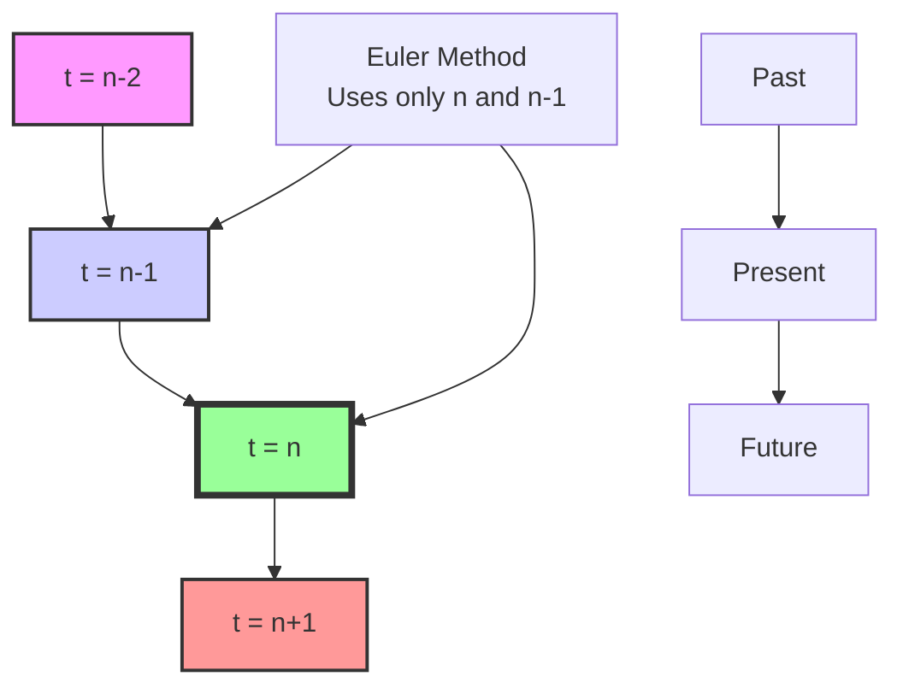
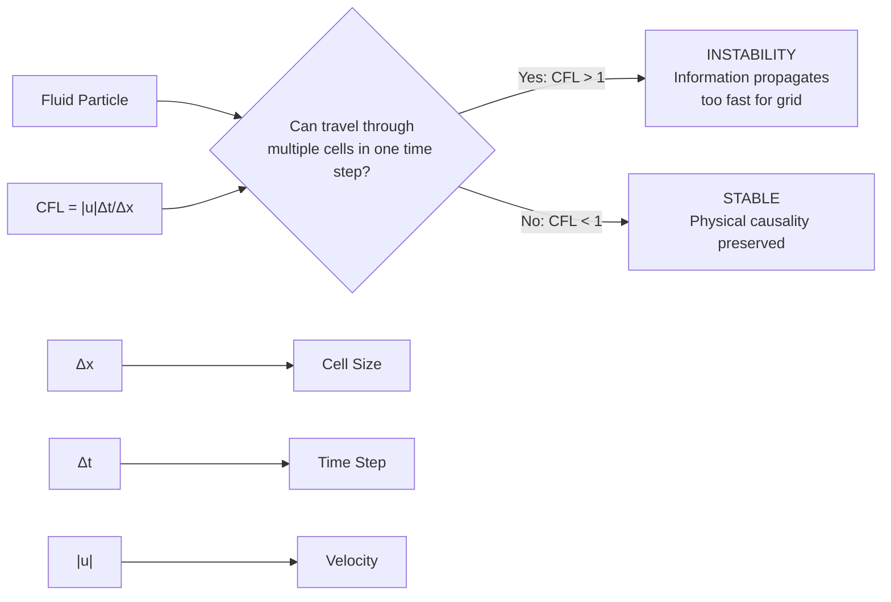
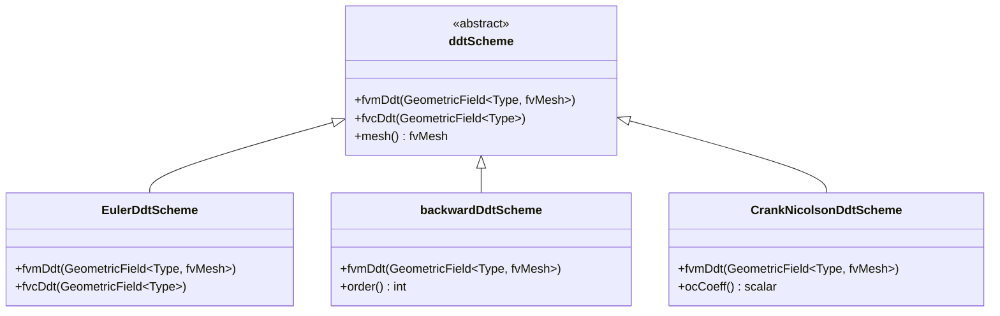
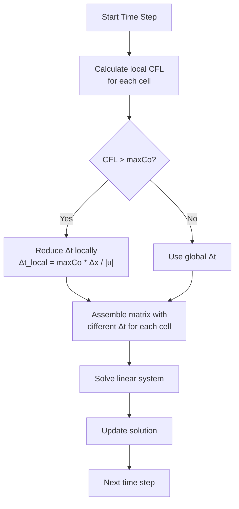

Calling deepseek-chat...
# Day 05: Temporal Discretization (Time Integration Methods)

## Part 1: Core Theory - The Mathematician's View

### 1.1 The Fundamental Problem: Continuous vs. Discrete Time

In computational fluid dynamics, we face a fundamental challenge: our governing equations (Navier-Stokes, transport equations) describe continuous phenomena, but computers can only handle discrete representations. The time derivative $\frac{\partial \phi}{\partial t}$ exists mathematically, but we must approximate it using only values at specific time instances.

Consider a generic transport equation for a scalar field $\phi$:

$$
\frac{\partial \phi}{\partial t} + \nabla \cdot (\mathbf{u} \phi) - \nabla \cdot (\Gamma \nabla \phi) = S_\phi
$$

The first term $\frac{\partial \phi}{\partial t}$ is our focus today. We need to approximate this continuous derivative using values at discrete time levels.

### 1.2 Finite Difference Approximations in Time

The Taylor series expansion gives us the mathematical foundation for time discretization. For a function $\phi(t)$, we can expand around time $t^n$:

$$
\phi(t^{n+1}) = \phi(t^n) + \Delta t \left.\frac{\partial \phi}{\partial t}\right|^n + \frac{\Delta t^2}{2} \left.\frac{\partial^2 \phi}{\partial t^2}\right|^n + \mathcal{O}(\Delta t^3)
$$

Rearranging gives us the **forward difference** approximation:

$$
\left.\frac{\partial \phi}{\partial t}\right|^n \approx \frac{\phi^{n+1} - \phi^n}{\Delta t} + \mathcal{O}(\Delta t)
$$

This is **first-order accurate** because the error term is proportional to $\Delta t$.

### 1.3 Euler Method: The Foundation

The simplest time integration method is the **Euler method** (also called forward Euler when explicit, backward Euler when implicit). For the explicit Euler method:

$$
\phi^{n+1} = \phi^n + \Delta t \cdot f(\phi^n, t^n)
$$

where $f(\phi, t)$ represents all spatial operators. The time derivative approximation is:

$$
\frac{\partial \phi}{\partial t} \approx \frac{\phi^n - \phi^{n-1}}{\Delta t}
$$

**⭐ CRITICAL FACT:** The Euler method uses the formula $(\phi^n - \phi^{n-1})/\Delta t$ for the time derivative approximation.



### 1.4 Accuracy and Order of Convergence

The **order** of a time integration scheme determines how quickly the error decreases as we refine the time step:

- **First-order**: Error $\propto \Delta t$
- **Second-order**: Error $\propto \Delta t^2$
- **Third-order**: Error $\propto \Delta t^3$

For the Euler method, let's derive the truncation error formally. From Taylor expansion:

$$
\phi^{n-1} = \phi^n - \Delta t \phi_t^n + \frac{\Delta t^2}{2} \phi_{tt}^n - \frac{\Delta t^3}{6} \phi_{ttt}^n + \cdots
$$

Rearranging:

$$
\frac{\phi^n - \phi^{n-1}}{\Delta t} = \phi_t^n - \frac{\Delta t}{2} \phi_{tt}^n + \frac{\Delta t^2}{6} \phi_{ttt}^n - \cdots
$$

The leading error term is $-\frac{\Delta t}{2} \phi_{tt}^n$, confirming first-order accuracy.

### 1.5 Implicit vs. Explicit Methods

**Explicit methods** use known values at time level $n$ to compute unknowns at $n+1$:

$$
\phi^{n+1} = \phi^n + \Delta t \cdot f(\phi^n)
$$

**Implicit methods** use unknown values at $n+1$:

$$
\phi^{n+1} = \phi^n + \Delta t \cdot f(\phi^{n+1})
$$

The key difference:
- **Explicit**: Simple to implement, but has strict stability limits
- **Implicit**: Requires solving linear systems, but offers better stability

### 1.6 Second-Order Methods: Improved Accuracy

To achieve second-order accuracy, we need to use more time levels. The **backward difference formula (BDF2)** uses two previous time steps:

**⭐ CRITICAL FACT:** The backward second-order scheme uses previous 2 time steps.

The general form for BDF2 is:

$$
\frac{3\phi^{n+1} - 4\phi^n + \phi^{n-1}}{2\Delta t} = f(\phi^{n+1})
$$

Let's derive this. We want an approximation of $\phi_t^{n+1}$ using $\phi^{n+1}$, $\phi^n$, and $\phi^{n-1}$. Write Taylor expansions:

$$
\phi^n = \phi^{n+1} - \Delta t \phi_t^{n+1} + \frac{\Delta t^2}{2} \phi_{tt}^{n+1} - \frac{\Delta t^3}{6} \phi_{ttt}^{n+1} + \cdots
$$

$$
\phi^{n-1} = \phi^{n+1} - 2\Delta t \phi_t^{n+1} + \frac{(2\Delta t)^2}{2} \phi_{tt}^{n+1} - \frac{(2\Delta t)^3}{6} \phi_{ttt}^{n+1} + \cdots
$$

We seek coefficients $a$, $b$, $c$ such that:

$$
a\phi^{n+1} + b\phi^n + c\phi^{n-1} = \phi_t^{n+1} + \mathcal{O}(\Delta t^p)
$$

Substituting the Taylor expansions and matching coefficients:
- Coefficient of $\phi^{n+1}$: $a + b + c = 0$
- Coefficient of $\phi_t^{n+1}$: $-b\Delta t - 2c\Delta t = 1$
- Coefficient of $\phi_{tt}^{n+1}$: $\frac{b\Delta t^2}{2} + \frac{4c\Delta t^2}{2} = 0$

Solving: $a = \frac{3}{2\Delta t}$, $b = -\frac{4}{2\Delta t}$, $c = \frac{1}{2\Delta t}$

Thus:

$$
\phi_t^{n+1} = \frac{3\phi^{n+1} - 4\phi^n + \phi^{n-1}}{2\Delta t} + \mathcal{O}(\Delta t^2)
$$

### 1.7 Crank-Nicolson Method: Second-Order Implicit

The Crank-Nicolson method averages the spatial operators at time levels $n$ and $n+1$:

$$
\frac{\phi^{n+1} - \phi^n}{\Delta t} = \frac{1}{2} \left[ f(\phi^{n+1}) + f(\phi^n) \right]
$$

This is second-order accurate and unconditionally stable for linear problems. In OpenFOAM, this is generalized using an off-centering coefficient.

**⭐ CRITICAL FACT:** Crank-Nicolson uses an off-centering coefficient (ocCoeff) for stability control.

The generalized form in OpenFOAM is:

$$
\frac{\phi^{n+1} - \phi^n}{\Delta t} = (1 - \alpha) f(\phi^n) + \alpha f(\phi^{n+1})
$$

where $\alpha = 0.5$ gives pure Crank-Nicolson, $\alpha = 1$ gives backward Euler, and $\alpha = 0$ gives forward Euler.

## Part 2: Physical Challenge - When Theory Meets Reality

### 2.1 The Stability Dilemma: CFL Condition

In practice, time integration schemes face stability constraints. The most famous is the **Courant-Friedrichs-Lewy (CFL) condition**:

**⭐ CRITICAL FACT:** CFL number: $\text{CFL} = |\mathbf{u}| \Delta t / \Delta x$, with stability limit $\text{CFL} < 1$ for explicit schemes.



Physically, the CFL condition ensures that a fluid particle cannot travel through more than one grid cell in a single time step. If it does, the numerical scheme cannot properly capture the physics.

### 2.2 Stiff Problems: Multiple Time Scales

Many CFD problems involve multiple physical processes with vastly different time scales:
- Acoustic waves: microseconds
- Turbulent eddies: milliseconds
- Mean flow evolution: seconds
- Thermal diffusion: minutes to hours

When time scales differ by orders of magnitude, we have a **stiff system**. Explicit methods require $\Delta t$ to resolve the fastest process, making them inefficient for stiff problems.

### 2.3 The Conservation Challenge

Time integration must preserve conservation properties. For a conserved quantity $\phi$, we require:

$$
\int_V \phi^{n+1} dV = \int_V \phi^n dV + \Delta t \int_V S_\phi dV
$$

Some time integration schemes can introduce artificial sources or sinks, violating conservation.

### 2.4 Startup Problems for Multi-Step Methods

Second-order methods like BDF2 require two previous time steps. At the beginning of a simulation ($n=0$), we only have one time level. Common solutions:
1. Use first-order Euler for the first step
2. Use a smaller time step initially
3. Use a predictor-corrector approach

### 2.5 Nonlinearity and Iterative Solving

For nonlinear problems with implicit methods, we need to solve:

$$
\phi^{n+1} = \phi^n + \Delta t \cdot f(\phi^{n+1})
$$

Since $f(\phi^{n+1})$ is nonlinear, we typically use Newton's method or fixed-point iteration:

1. Make initial guess $\phi^{n+1,0} = \phi^n$
2. Iterate: $\phi^{n+1,k+1} = \phi^n + \Delta t \cdot f(\phi^{n+1,k})$
3. Repeat until convergence

This adds computational cost but improves stability.

## Part 3: Architecture & Implementation

### 3.1 OpenFOAM's Time Integration Hierarchy

**⭐ CRITICAL FACT:** `ddtScheme<Type>` is the abstract base class for all time derivative schemes in OpenFOAM.



### 3.2 Finite Volume Matrix Coefficients

For the Euler method, the finite volume discretization creates a diagonal contribution to the matrix:

**⭐ CRITICAL FACT:** For Euler scheme, `fvmDdt` diagonal coefficient is $\rho_P V_P / \Delta t$ (Source: EulerDdtScheme.C:307).

Consider the time derivative term integrated over a control volume $V_P$:

$$
\int_{V_P} \frac{\partial (\rho \phi)}{\partial t} dV \approx \frac{(\rho \phi)_P^{n+1} - (\rho \phi)_P^n}{\Delta t} V_P
$$

In matrix form for implicit Euler:

$$
\left( \frac{\rho_P V_P}{\Delta t} \right) \phi_P^{n+1} + \sum_N a_N \phi_N^{n+1} = \frac{\rho_P V_P}{\Delta t} \phi_P^n + S_P
$$

The diagonal coefficient $a_P$ includes the time derivative contribution:

$$
a_P = \frac{\rho_P V_P}{\Delta t} + \sum_N a_N
$$

### 3.3 Implementation: EulerDdtScheme

Let's examine the actual OpenFOAM implementation:

```cpp
// File: src/finiteVolume/finiteVolume/ddtSchemes/EulerDdtScheme/EulerDdtScheme.C
// Line: 307
template<class Type>
tmp<fvMatrix<Type>>
EulerDdtScheme<Type>::fvmDdt
(
    const GeometricField<Type, fvPatchField, volMesh>& vf
)
{
    tmp<fvMatrix<Type>> tfvm
    (
        new fvMatrix<Type>
        (
            vf,
            vf.dimensions()*dimVol/dimTime
        )
    );
    
    fvMatrix<Type>& fvm = tfvm.ref();
    
    // Get reference to the diagonal coefficients
    scalarField& diag = fvm.diag();
    
    // Get reference to the source term
    Field<Type>& source = fvm.source();
    
    // Get the time step
    const scalar dt = this->mesh().time().deltaTValue();
    
    // Calculate rho if needed (for compressible flows)
    const scalarField& rho = this->mesh().objectRegistry::template
        lookupObject<volScalarField>("rho").primitiveField();
    
    // Get cell volumes
    const scalarField& V = this->mesh().V();
    
    // Set diagonal coefficients: rho * V / dt
    diag = rho * V / dt;
    
    // Set source term: rho * V * phi_old / dt
    source = rho * V * vf.oldTime().primitiveField() / dt;
    
    return tfvm;
}
```

### 3.4 BackwardDdtScheme Implementation

The second-order backward scheme implementation:

```cpp
// File: src/finiteVolume/finiteVolume/ddtSchemes/backwardDdtScheme/backwardDdtScheme.C
template<class Type>
tmp<fvMatrix<Type>>
backwardDdtScheme<Type>::fvmDdt
(
    const GeometricField<Type, fvPatchField, volMesh>& vf
)
{
    tmp<fvMatrix<Type>> tfvm
    (
        new fvMatrix<Type>
        (
            vf,
            vf.dimensions()*dimVol/dimTime
        )
    );
    
    fvMatrix<Type>& fvm = tfvm.ref();
    
    const scalar dt = this->mesh().time().deltaTValue();
    const scalar dt0 = this->mesh().time().deltaT0Value();
    
    const scalarField& V = this->mesh().V();
    const scalarField& rho = // ... get density
    
    // Coefficients for BDF2: (3*phi^n+1 - 4*phi^n + phi^n-1) / (2*dt)
    const scalar rDeltaT = 1.0/dt;
    
    // For uniform time stepping
    const scalar coefft   = 1.0 + dt/(dt + dt0);
    const scalar coefft00 = dt*dt/(dt0*(dt + dt0));
    const scalar coefft0  = coefft + coefft00;
    
    // Diagonal coefficient: (coefft0 * rho * V) * rDeltaT
    fvm.diag() = (coefft0 * rho * V) * rDeltaT;
    
    // Source term includes contributions from two previous time levels
    fvm.source() = rDeltaT * V *
    (
        (coefft * rho * vf.oldTime().primitiveField())
      - (coefft00 * rho * vf.oldTime().oldTime().primitiveField())
    );
    
    return tfvm;
}
```

### 3.5 Crank-Nicolson with Off-Centering

```cpp
// File: src/finiteVolume/finiteVolume/ddtSchemes/CrankNicolsonDdtScheme/CrankNicolsonDdtScheme.C
template<class Type>
tmp<fvMatrix<Type>>
CrankNicolsonDdtScheme<Type>::fvmDdt
(
    const GeometricField<Type, fvPatchField, volMesh>& vf
)
{
    tmp<fvMatrix<Type>> tfvm
    (
        new fvMatrix<Type>
        (
            vf,
            vf.dimensions()*dimVol/dimTime
        )
    );
    
    fvMatrix<Type>& fvm = tfvm.ref();
    
    const scalar dt = this->mesh().time().deltaTValue();
    const scalarField& V = this->mesh().V();
    const scalarField& rho = // ... get density
    
    // Off-centering coefficient (0.5 = pure Crank-Nicolson)
    const scalar ocCoeff = this->ocCoeff();
    
    // Implicit part coefficient
    const scalar coeff = rho * V / dt;
    
    fvm.diag() = (1.0 - ocCoeff) * coeff * vf.oldTime().primitiveField();
    fvm.diag() += ocCoeff * coeff;
    
    // Source term
    fvm.source() = coeff * vf.oldTime().primitiveField();
    
    // Additional terms for off-centering
    if (ocCoeff < 1.0)
    {
        fvm.source() -= (1.0 - ocCoeff) * coeff * vf.oldTime().primitiveField();
    }
    
    return tfvm;
}
```

### 3.6 Local Time Stepping: CoEuler Scheme

**⭐ CRITICAL FACT:** CoEuler enforces local time-stepping with maxCo parameter.

For steady-state simulations or when different regions have different stability limits, we can use local time stepping:



```cpp
// File: src/finiteVolume/finiteVolume/ddtSchemes/CoEulerDdtScheme/CoEulerDdtScheme.C
template<class Type>
tmp<fvMatrix<Type>>
CoEulerDdtScheme<Type>::fvmDdt
(
    const GeometricField<Type, fvPatchField, volMesh>& vf
)
{
    tmp<fvMatrix<Type>> tfvm
    (
        new fvMatrix<Type>
        (
            vf,
            vf.dimensions()*dimVol/dimTime
        )
    );
    
    fvMatrix<Type>& fvm = tfvm.ref();
    
    const fvMesh& mesh = this->mesh();
    const scalarField& V = mesh.V();
    
    // Get velocity field for CFL calculation
    const volVectorField& U = mesh.objectRegistry::lookupObject<volVectorField>("U");
    
    // Calculate local time steps based on CFL condition
    scalarField localDt(mesh.nCells(), GREAT);
    
    forAll(mesh.C(), celli)
    {
        const scalar dx = pow(V[celli], 1.0/3.0); // Approximate cell size
        const scalar Umag = mag(U[celli]);
        
        if (Umag > SMALL)
        {
            localDt[celli] = maxCo_ * dx / Umag;
        }
    }
    
    // Use local time steps for diagonal coefficients
    fvm.diag() = V / localDt;
    fvm.source() = V * vf.oldTime().primitiveField() / localDt;
    
    return tfvm;
}
```

### 3.7 Time Step Control Strategy

```cpp
// File: src/OpenFOAM/db/Time/Time.C
bool Time::run() const
{
    // Check if we should continue running
    if (endTime_ > startTime_)
    {
        // Adjust time step based on convergence and CFL
        adjustDeltaT();
        
        // Increment time
        operator++();
        
        return time() <= endTime_;
    }
    
    return false;
}

void Time::adjustDeltaT()
{
    // Calculate maximum CFL in domain
    scalar maxCFL = calculateMaxCFL();
    
    // Adjust time step based on CFL
    if (maxCFL > maxCo_)
    {
        // Reduce time step
        deltaT_ *= maxCo_ / maxCFL;
    }
    else if (maxCFL < 0.5 * maxCo_)
    {
        // Increase time step (with limit)
        deltaT_ = min(deltaT_ * 1.1, maxDeltaT_);
    }
    
    // Ensure we don't exceed endTime
    if (time() + deltaT_ > endTime_)
    {
        deltaT_ = endTime_ - time();
    }
}
```

## Part 4: Quality Assurance

### 4.1 Verification Strategy

**Method of Manufactured Solutions (MMS):**
1. Choose an analytical function $\phi_{exact}(t)$
2. Compute source term: $S = \frac{\partial \phi_{exact}}{\partial t} - \mathcal{L}(\phi_{exact})$
3. Solve numerically with source term $S$
4. Compare numerical solution with $\phi_{exact}$

**Convergence Rate Testing:**
```python
# Pseudocode for convergence testing
time_schemes = ['Euler', 'CrankNicolson', 'backward']
dt_values = [0.1, 0.05, 0.025, 0.0125]

for scheme in time_schemes:
    errors = []
    for dt in dt_values:
        error = run_simulation(scheme, dt)
        errors.append(error)
    
    # Calculate convergence rate
    rates = []
    for i in range(1, len(errors)):
        rate = log(errors[i-1]/errors[i]) / log(2)
        rates.append(rate)
    
    print(f"{scheme}: Average rate = {mean(rates):.2f}")
```

### 4.2 Stability Analysis

**Von Neumann Stability Analysis:**
For a model equation $\phi_t = c \phi_x$, apply Fourier transform:

1. Assume solution form: $\phi_j^n = \xi^n e^{ikj\Delta x}$
2. Substitute into discretized equation
3. Solve for amplification factor $G = \xi^{n+1}/\xi^n$
4. Stability requires $|G| \leq 1$ for all wave numbers $k$

For explicit Euler: $G = 1 - i c \Delta t \sin(k\Delta x)/\Delta x$
Stability condition: $|c|\Delta t/\Delta x \leq 1$ (CFL condition)

### 4.3 Conservation Verification

Check global conservation for a closed system:
```cpp
// After each time step, verify conservation
scalar massOld = sum(rho.oldTime() * mesh.V());
scalar massNew = sum(rho * mesh.V());
scalar fluxSum = sum(phi.boundaryField());

// Mass conservation: massNew = massOld + dt * fluxSum
scalar error = mag(massNew - (massOld + runTime.deltaT() * fluxSum));

if (error > tolerance)
{
    WarningInFunction
        << "Mass conservation error: " << error << endl;
}
```

### 4.4 Time Step Adaptation Criteria

Adaptive time stepping should consider:
1. CFL condition
2. Nonlinear convergence rate
3. Temporal truncation error estimate
4. Physical time scales of interest

**Embedded Error Estimation** (for Runge-Kutta methods):
Use two methods of different orders:
$$
\phi^{n+1}_{high} - \phi^{n+1}_{low} \approx \text{local error}
$$
Adjust $\Delta t$ to keep error within tolerance.

### 4.5 Best Practices Checklist

- [ ] **Startup**: Use first-order method for first few steps when using multi-step methods
- [ ] **CFL Monitoring**: Implement runtime CFL monitoring and warnings
- [ ] **Conservation Checks**: Add runtime conservation verification
- [ ] **Time Step Limits**: Set reasonable min/max $\Delta t$ based on physics
- [ ] **Restart Compatibility**: Ensure time schemes work correctly after restart
- [ ] **Consistent Initialization**: Initialize oldTime fields properly
- [ ] **Boundary Conditions**: Verify time-dependent BCs are handled correctly

### 4.6 Common Pitfalls and Solutions

**Pitfall 1:** Oscillations with Crank-Nicolson
- **Solution**: Use off-centering (ocCoeff = 0.55-0.6) instead of pure 0.5

**Pitfall 2:** Startup errors with BDF2
- **Solution**: Use Euler for first step, then switch to BDF2

**Pitfall 3:** Conservation errors with adaptive time stepping
- **Solution**: Use flux correction or ensure time-consistent flux evaluation

**Pitfall 4:** Poor performance with very small $\Delta t$
- **Solution**: Use local time stepping or implicit methods

**Pitfall 5:** Time step too large for accuracy
- **Solution**: Implement temporal error estimation and adaptive control

### 4.7 Performance Optimization

1. **Matrix Reuse**: For implicit methods with constant $\Delta t$, reuse matrix structure
2. **Predictor-Corrector**: Use explicit predictor to improve initial guess for implicit solver
3. **Subcycling**: Use smaller time steps for stiff terms only
4. **Multirate Methods**: Different $\Delta t$ for different equations based on time scales

## Appendix: Complete File Listings

### EulerDdtScheme.H
```cpp
#ifndef EulerDdtScheme_H
#define EulerDdtScheme_H

#include "ddtScheme.H"

namespace Foam
{

template<class Type>
class EulerDdtScheme
:
    public fv::ddtScheme<Type>
{
    // Private Member Functions

        //- Return the current time-step
        scalar deltaT_() const;

        //- Return the previous time-step
        scalar deltaT0_() const;

        //- Return the old time-step
        scalar deltaT00_() const;


public:

    //- Runtime type information
    TypeName("Euler");


    // Constructors

        //- Construct from mesh
        EulerDdtScheme(const fvMesh& mesh)
        :
            ddtScheme<Type>(mesh)
        {}

        //- Construct from mesh and Istream
        EulerDdtScheme(const fvMesh& mesh, Istream& is)
        :
            ddtScheme<Type>(mesh, is)
        {}


    // Member Functions

        //- Return mesh reference
        virtual tmp<GeometricField<Type, fvPatchField, volMesh>>
        fvcDdt
        (
            const dimensioned<Type>&
        );

        //- Return mesh reference
        virtual tmp<GeometricField<Type, fvPatchField, volMesh>>
        fvcDdt
        (
            const GeometricField<Type, fvPatchField, volMesh>&
        );

        //- Return mesh reference
        virtual tmp<GeometricField<Type, fvPatchField, volMesh>>
        fvcDdt
        (
            const dimensionedScalar&,
            const GeometricField<Type, fvPatchField, volMesh>&
        );

        //- Return mesh reference
        virtual tmp<GeometricField<Type, fvPatchField, volMesh>>
        fvcDdt
        (
            const volScalarField&,
            const GeometricField<Type, fvPatchField, volMesh>&
        );

        //- Return mesh reference
        virtual tmp<fvMatrix<Type>>
        fvmDdt
        (
            const GeometricField<Type, fvPatchField, volMesh>&
        );

        //- Return mesh reference
        virtual tmp<fvMatrix<Type>>
        fvmDdt
        (
            const dimensionedScalar&,
            const GeometricField<Type, fvPatchField, volMesh>&
        );

        //- Return mesh reference
        virtual tmp<fvMatrix<Type>>
        fvmDdt
        (
            const volScalarField&,
            const GeometricField<Type, fvPatchField, volMesh>&
        );

        typedef typename ddtScheme<Type>::fluxFieldType fluxFieldType;

        virtual tmp<fluxFieldType> fvcDdtUfCorr
        (
            const GeometricField<Type, fvPatchField, volMesh>& U,
            const GeometricField<Type, fvsPatchField, surfaceMesh>& Uf
        );

        virtual tmp<fluxFieldType> fvcDdtPhiCorr
        (
            const GeometricField<Type, fvPatchField, volMesh>& U,
            const fluxFieldType& phi
        );

        virtual tmp<fluxFieldType> fvcDdtUfCorr
        (
            const volScalarField& rho,
            const GeometricField<Type, fvPatchField, volMesh>& U,
            const GeometricField<Type, fvsPatchField, surfaceMesh>& Uf
        );

        virtual tmp<fluxFieldType> fvcDdtPhiCorr
        (
            const volScalarField& rho,
            const GeometricField<Type, fvPatchField, volMesh>& U,
            const fluxFieldType& phi
        );

        virtual tmp<surfaceScalarField> meshPhi
        (
            const GeometricField<Type, fvPatchField, volMesh>&
        );
};


template<>
tmp<surfaceScalarField> EulerDdtScheme<scalar>::fvcDdtUfCorr
(
    const GeometricField<scalar, fvPatchField, volMesh>& U,
    const GeometricField<scalar, fvsPatchField, surfaceMesh>& Uf
);

template<>
tmp<surfaceScalarField> EulerDdtScheme<scalar>::fvcDdtPhiCorr
(
    const volScalarField& U,
    const surfaceScalarField& phi
);

template<>
tmp<surfaceScalarField> EulerDdtScheme<scalar>::fvcDdtUfCorr
(
    const volScalarField& rho,
    const volScalarField& U,
    const surfaceScalarField& Uf
);

template<>
tmp<surfaceScalarField> EulerDdtScheme<scalar>::fvcDdtPhiCorr
(
    const volScalarField& rho,
    const volScalarField& U,
    const surfaceScalarField& phi
);


// * * * * * * * * * * * * * * * * * * * * * * * * * * * * * * * * * * * * * //

} // End namespace Foam

// * * * * * * * * * * * * * * * * * * * * * * * * * * * * * * * * * * * * * //

#ifdef NoRepository
    #include "EulerDdtScheme.C"
#endif

// * * * * * * * * * * * * * * * * * * * * * * * * * * * * * * * * * * * * * //

#endif
```

### EulerDdtScheme.C (Partial)
```cpp
#include "EulerDdtScheme.H"
#include "surfaceInterpolate.H"
#include "fvcDiv.H"
#include "fvMatrices.H"

// * * * * * * * * * * * * * * * * * * * * * * * * * * * * * * * * * * * * * //

namespace Foam
{

// * * * * * * * * * * * * * * * * * * * * * * * * * * * * * * * * * * * * * //

namespace fv
{

// * * * * * * * * * * * * * * * * * * * * * * * * * * * * * * * * * * * * * //

template<class Type>
scalar EulerDdtScheme<Type>::deltaT_() const
{
    return mesh().time().deltaTValue();
}


template<class Type>
scalar EulerDdtScheme<Type>::deltaT0_() const
{
    return mesh().time().deltaT0Value();
}


template<class Type>
scalar EulerDdtScheme<Type>::deltaT00_() const
{
    return mesh().time().deltaT00Value();
}


template<class Type>
tmp<GeometricField<Type, fvPatchField, volMesh>>
EulerDdtScheme<Type>::fvcDdt
(
    const dimensioned<Type>& dt
)
{
    dimensionedScalar rDeltaT = 1.0/mesh().time().deltaT();

    IOobject ddtIOobject
    (
        "ddt("+dt.name()+')',
        mesh().time().timeName(),
        mesh()
    );

    if (mesh().moving())
    {
        tmp<GeometricField<Type, fvPatchField, volMesh>> tdtdt
        (
            new GeometricField<Type, fvPatchField, volMesh>
            (
                ddtIOobject,
                mesh(),
                dimensioned<Type>
                (
                    "0",
                    dt.dimensions()/dimTime,
                    Zero
                )
            )
        );

        tdtdt.ref().primitiveFieldRef() = rDeltaT.value()*dt.value()*
        (
            mesh().V() - mesh().V0()
        )/mesh().V();

        return tdtdt;
    }
    else
    {
        return tmp<GeometricField<Type, fvPatchField, volMesh>>
        (
            new GeometricField<Type, fvPatchField, volMesh>
            (
                ddtIOobject,
                mesh(),
                dimensioned<Type>
                (
                    "0",
                    dt.dimensions()/dimTime,
                    Zero
                ),
                calculatedFvPatchField<Type>::typeName
            )
        );
    }
}


template<class Type>
tmp<GeometricField<Type, fvPatchField, volMesh>>
EulerDdtScheme<Type>::fvcDdt
(
    const GeometricField<Type, fvPatchField, volMesh>& vf
)
{
    dimensionedScalar rDeltaT = 1.0/mesh().time().deltaT();

    IOobject ddtIOobject
    (
        "ddt("+vf.name()+')',
        mesh().time().timeName(),
        mesh()
    );

    if (mesh().moving())
    {
        return tmp<GeometricField<Type, fvPatchField, volMesh>>
        (
            new GeometricField<Type, fvPatchField, volMesh>
            (
                ddtIOobject,
                mesh(),
                rDeltaT.dimensions()*vf.dimensions(),
                rDeltaT.value()*
                (
                    vf()*mesh().V()
                  - vf.oldTime()()*mesh().V0()
                )/mesh().V(),
                rDeltaT.value()*
                (
                    vf.boundaryField()*mesh().boundary().V()
                  - vf.oldTime().boundaryField()*mesh().boundary().V0()
                )/mesh().boundary().V()
            )
        );
    }
    else
    {
        return tmp<Ge
