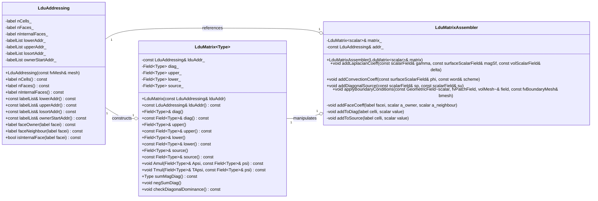

# Day 07: Linear Algebra for CFD (LDU Format)

**Date:** 2026-01-07
**Difficulty:** Hardcore
**Phase:** 1 - Foundation Theory
**Prerequisites:** Days 01-06 (Governing Equations, FVM Basics, Spatial/Temporal Discretization, Mesh Topology, Boundary Conditions)
**Estimated Study Time:** 8-10 hours
**Keywords:** Sparse Matrices, LDU Format, Unstructured Mesh, Matrix Assembly, Finite Volume Method, Linear Systems, `lduMatrix`, `fvMatrix`

---

## Learning Objectives

เมื่อจบเซสชันสุดโหด (Hardcore Session) นี้ คุณจะสามารถ:

1.  **Understand** โครงสร้างพื้นฐานและสูตรทางคณิตศาสตร์ของ Format การจัดเก็บ Sparse Matrix แบบ LDU (Lower-Diagonal-Upper) และบทบาทสำคัญในการทำให้การคำนวณ Finite-Volume บน Unstructured Meshes มีประสิทธิภาพ สิ่งนี้รวมถึงการ Decompose Global Coefficient Matrix $\mathbf{A}$ ออกเป็นส่วนประกอบย่อย ($\mathbf{A} = \mathbf{L} + \mathbf{D} + \mathbf{U}$) และอธิบายว่าทำไมการจัดเก็บแบบ Face-Based ถึงเป็นทางเลือกที่เป็นธรรมชาติสำหรับการ Discretization แบบ Flux-Based เมื่อเทียบกับ Row/Column Indexing ของ Structured Grids

2.  **Design** และสื่อสารโครงสร้างข้อมูล Ecosystem ทั้งหมดที่จำเป็นในการ Represent ระบบสมการเชิงเส้นแบบ Sparse ใน CFD Solver สิ่งนี้ครอบคลุม `lduMatrix` Class (เก็บ Array สัมประสิทธิ์ `diag`, `upper`, `lower`), `lduAddressing` Class (ให้ Mesh Connectivity ผ่าน List `owner`/`neighbour`), และ Derived Class `fvMatrix<Type>` (ซึ่งรวม Field, Source Term $\mathbf{b}$, และการจัดการ Boundary Condition เข้าด้วยกัน) คุณจะสามารถวาด Diagram ความสัมพันธ์ระหว่าง Mesh Face, Owner/Neighbour Cell Indices, และ Entry ที่สอดคล้องกันใน LDU Arrays

3.  **Implement** Core Matrix Assembly Algorithms ที่แปลง Finite-Volume Discretized Terms (เช่น `fvm::laplacian`, `fvm::div`) ให้เป็น Numerical Entries ที่เป็นรูปธรรมภายในโครงสร้างข้อมูล LDU สิ่งนี้เกี่ยวข้องกับการคำนวณ Face Coefficients $a_f$ อย่างถูกต้องจากคุณสมบัติทางฟิสิกส์และเรขาคณิต, จากนั้นกระจายผลรวม (Scatter Contributions) ไปยังตำแหน่ง `diag[P]`, `diag[N]`, `upper[f]`, และ `lower[f]` ที่เหมาะสม พร้อมทั้งบังคับใช้กฎการอนุรักษ์ (Conservation) อย่างเคร่งครัด (Zero Row-Sum Property สำหรับระบบปิดที่ไม่มี Sources)

4.  **Analyze** และจัดการ LDU Matrix เพื่อบังคับใช้ Boundary Conditions ประเภทต่างๆ ที่ระดับ Linear Algebra คุณจะ implement logic เพื่อแก้ไข Diagonal Coefficients และ Source Vector Entries สำหรับเงื่อนไข Dirichlet (`fixedValue`) โดยการบวกค่า Penalty ขนาดใหญ่, และเข้าใจว่าเงื่อนไข Neumann (`zeroGradient`) ถูกฝังอยู่อย่างเป็นธรรมชาติภายใน Internal Face Coefficients อย่างไร โดยไม่ต้องการการแก้ไข Matrix โดยตรงสำหรับ Boundary Cell เอง

5.  **Troubleshoot** เงื่อนไข Matrix ผิดปกติทั่วไปที่นำไปสู่ความล้มเหลวของ Solver, เช่น Zero หรือ Negative Diagonal Dominance (ทำให้เกิด Error "`Zero diagonal`") และ Severe Asymmetry คุณจะประยุกต์ใช้เทคนิคการวินิจฉัยเช่นการตรวจสอบ Method `sumDiag()` และ `negSumDiag()` เพื่อ Verify คุณสมบัติของ Matrix และเข้าใจว่า Discretization Schemes (Upwind vs. Central) มีอิทธิพลโดยตรงต่อ Symmetry และ Diagonal Dominance ของ Matrix $\mathbf{A}$ อย่างไร

6.  **Bridge** ช่องว่างระหว่าง Abstract Linear System $\mathbf{A}\phi = \mathbf{b}$ และ Phase การแก้สมการที่ตามมา คุณจะเตรียม LDU Matrix ที่ Assemble เสร็จสมบูรณ์แล้วสำหรับการใช้งานโดย Iterative Solvers (ที่จะครอบคลุมใน Day 08) และเข้าใจความจำเป็นของ Format Converters (เช่น `CsrConverter`) สำหรับการเชื่อมต่อกับ External, High-Performance Linear Algebra Libraries ที่อาจต้องการ Compressed Sparse Row (CSR) หรือ Format มาตรฐานอื่นๆ

---

## 📑 Table of Contents (สารบัญ)
- [[#1. Section 1: Theory (ทฤษฎี)|1. Section 1: Theory (ทฤษฎี)]]
- [[#2. Section 2: OpenFOAM Reference (การอ้างอิง OpenFOAM)|2. Section 2: OpenFOAM Reference (การอ้างอิง OpenFOAM)]]
- [[#3. Section 3: Class Design (การออกแบบคลาส)|3. Section 3: Class Design (การออกแบบคลาส)]]
- [[#4. Section 4: Implementation (การนำไปใช้งานจริง)|4. Section 4: Implementation (การนำไปใช้งานจริง)]]
- [[#5. Section 5: Build & Test (การสร้างและทดสอบ)|5. Section 5: Build & Test (การสร้างและทดสอบ)]]
- [[#6. Section 6: Concept Checks (การตรวจสอบแนวคิด)|6. Section 6: Concept Checks (การตรวจสอบแนวคิด)]]
- [[#7. Section 7: References and Related Days (เอกสารอ้างอิงและวันที่เกี่ยวข้อง)|7. Section 7: References and Related Days (เอกสารอ้างอิงและวันที่เกี่ยวข้อง)]]

---

# 1. Section 1: Theory (ทฤษฎี)

## 1.1 Sparse Matrix Storage for Unstructured Meshes

จุดสูงสุดของกระบวนการ Finite Volume Discretization, ตามรายละเอียดใน Days 01-06, คือระบบสมการพีชคณิตเชิงเส้นแบบ Sparse ขนาดใหญ่ สำหรับ Scalar Transport Equation ที่ควบคุม Field $\phi$, ระบบนี้อยู่ในรูปแบบมาตรฐาน (Canonical Form):

$$
A \phi = b
$$

โดยที่:
- $A$ คือ **Coefficient Matrix**, เป็น Sparse Matrix ขนาด $N \times N$ โดยที่ $N$ คือจำนวนของ Control Volumes (Cells) ใน Computational Domain
- $\phi$ คือ **Solution Vector**, เป็น Column Vector ขนาด $N \times 1$ ที่ประกอบด้วยค่า Unknown ของ $\phi$ ที่ Cell Centers
- $b$ คือ **Source Vector** (หรือ Right-Hand-Side Vector), เป็น Column Vector ขนาด $N \times 1$ ที่ประกอบด้วยผลรวมจาก Explicit Source Terms, Temporal Derivatives, และ Boundary Conditions

โครงสร้างของ Matrix $A$ ถูกกำหนดโดย Mesh Topology และ Discretization Scheme ใน Structured, Cartesian Mesh, Cells จะมี Connectivity ที่สม่ำเสมอและทำนายได้ (เช่น เพื่อนบ้านทางทิศตะวันออก, ตะวันตก, เหนือ, ใต้) สิ่งนี้ทำให้เก็บ $A$ ได้อย่างมีประสิทธิภาพโดยใช้ Banded หรือ Structured Sparse Formats อย่างไรก็ตาม ใน **Unstructured Meshes** ซึ่งมีอยู่ทั่วไปใน Industrial CFD สำหรับการจัดการรูปทรงเรขาคณิตที่ซับซ้อน, Cell Connectivity จะไม่สม่ำเสมอ Cell หนึ่งอาจมีจำนวนเพื่อนบ้านเท่าใดก็ได้ และไม่มี $(i,j,k)$ Indexing ง่ายๆ เพื่อระบุตำแหน่งพวกมัน

### 7.1.1 The Sparsity Pattern and Graph Representation

Non-Zero Pattern ของ Matrix $A$ สำหรับ Unstructured Mesh เป็นตัวแทนโดยตรงของ Mesh Connectivity Graph จะมี Non-Zero Entry $A_{ij}$ ก็ต่อเมื่อ Cells $i$ และ $j$ แชร์ Internal Face ร่วมกัน สำหรับ Finite Volume Discretization ทั่วไป (เช่น เมื่อใช้ Second-Order Scheme), สมการสำหรับ Cell $P$ จะเกี่ยวข้องกับค่าของมันเองและค่าของเพื่อนบ้านที่ติด Face โดยตรง (Immediate Face-Adjacent Neighbors) สิ่งนี้ส่งผลให้เกิด Matrix ที่มีคุณสมบัติพึงประสงค์ดังนี้:

1.  **Sparsity**: จำนวนของ Non-Zero Entries คือ $O(N)$, ไม่ใช่ $O(N^2)$ สำหรับ Mesh ที่ Cell โดยเฉลี่ยมี $n_f$ Faces, จำนวนของ Non-Zero Entries จะประมาณ $N \times (n_f + 1)$
2.  **Structural Symmetry**: Non-Zero *Pattern* จะสมมาตร ($A_{ij}$ เป็น Non-Zero ก็ต่อเมื่อ $A_{ji}$ เป็น Non-Zero) เพราะ Cell Connectivity เป็นแบบ Mutual อย่างไรก็ตาม *ค่า* ของสัมประสิทธิ์อาจไม่สมมาตร (เช่น อันเนื่องมาจาก Convection)
3.  **Diagonal Dominance**: สำหรับ Discretization ที่สมจริงทางฟิสิกส์และเสถียรทางตัวเลข (โดยเฉพาะอย่างยิ่งกับ Implicit Time-Stepping หรือ Upwind Convection Schemes), ขนาดของ Diagonal Coefficient $|A_{PP}|$ จะมากกว่าหรือเท่ากับผลรวมของขนาดของ Off-Diagonal Coefficients ของมันเสมอ: $|A_{PP}| \ge \sum_{N} |A_{PN}|$ คุณสมบัตินี้สำคัญมากต่อ Convergence ของ Iterative Solvers หลายตัว

ด้วย Sparsity นี้, การเก็บ $A$ แบบ Dense Matrix จึงเป็นเรื่องที่เป็นไปไม่ได้ทั้งทาง Computation และ Memory สำหรับ $N$ ขนาดใหญ่ เราจำเป็นต้องใช้ **Sparse Matrix Storage Format**

### 7.1.2 The LDU Decomposition Format

OpenFOAM และ CFD Codes อื่นๆ อีกมากมายใช้ Format **LDU (Lower-Diagonal-Upper)**, หรือที่รู้จักกันในชื่อ **Face-Based** หรือ **Symmetric Coordinate** Format ซึ่งเหมาะสมอย่างยิ่งสำหรับ Face-Based Data Structure ของ Finite Volume Method

แนวคิดหลักคือการ Decompose Coefficient Matrix $A$ ออกเป็นผลบวกของ Matrix 3 ตัวที่มีโครงสร้างชัดเจนและแยกจากกัน:

$$
A = L + D + U
$$

โดยที่:
- $D$ คือ **Diagonal Matrix** ที่ประกอบด้วยเฉพาะ Diagonal Coefficients $A_{PP}$
- $L$ คือ **Strictly Lower Triangular Matrix** ที่ประกอบด้วยเฉพาะ Coefficients $A_{PN}$ ที่ Cell $N$ มี Index ต่ำกว่า Cell $P$ (ตาม Ordering บางอย่าง, โดยทั่วไปคือ Cell Label)
- $U$ คือ **Strictly Upper Triangular Matrix** ที่ประกอบด้วยเฉพาะ Coefficients $A_{PN}$ ที่ Cell $N$ มี Index สูงกว่า Cell $P$

**Critical Implementation Insight:** ในทางปฏิบัติ, เราจะไม่เก็บ $L$ และ $U$ แยกเป็น Matrix แต่เราใช้ประโยชน์จาก Mesh Connectivity Internal Faces ของ Mesh จะนิยามการเชื่อมต่อระหว่าง Cells สำหรับแต่ละ Internal Face $f$ ที่เชื่อมต่อ Owner Cell $P$ และ Neighbor Cell $N$ (โดยที่, ตาม Mesh Convention, $P < N$), เราจะเก็บสัมประสิทธิ์ 2 ตัว:
- **Upper Coefficient** $upper[f]$, ซึ่งเป็น Contribution จาก Cell $N$ ต่อสมการสำหรับ Cell $P$ ($A_{PN}$)
- **Lower Coefficient** $lower[f]$, ซึ่งเป็น Contribution จาก Cell $P$ ต่อสมการสำหรับ Cell $N$ ($A_{NP}$)

Diagonal Coefficients ถูกเก็บใน Array แยกต่างหาก, $diag[P]$, Indexed ตาม Cell Label

*Table 7.1: LDU Storage Mapping for an Unstructured Mesh*
| Matrix Element | LDU Storage Array | Index | Physical Meaning |
| :--- | :--- | :--- | :--- |
| $A_{PP}$ | `diag()[P]` | Cell Label `P` | Self-coefficient สำหรับ Cell `P` |
| $A_{PN}$ (P < N) | `upper()[f]` | Face Label `f` (owner=P, neighbor=N) | Influence ของ Neighbor `N` ต่อสมการของ Owner `P` |
| $A_{NP}$ (P < N) | `lower()[f]` | Face Label `f` (owner=P, neighbor=N) | Influence ของ Owner `P` ต่อสมการของ Neighbor `N` |

**Warning:** การ Mapping ระหว่าง Matrix Coefficient `$A_{ij}$` และ Array `upper`/`lower` นั้น **ไม่ได้เกิดขึ้นโดยพลการ** มันถูกกำหนดอย่างตายตัวโดย List `owner` และ `neighbor` ของ Mesh ที่สร้างขึ้นระหว่างการ Mesh Processing (Day 05) การเข้าถึงสัมประสิทธิ์ของเพื่อนบ้านต้องการการ Lookup เข้าไปใน Addressing Lists เหล่านี้ ไม่ใช่การ Indexing แบบ Row/Column ง่ายๆ นี่คือความแตกต่างพื้นฐานจาก Linear Algebra บน Structured Grid

### 7.1.3 Memory and Computational Efficiency

Memory Footprint ของ LDU Format นั้นน้อยที่สุดและ Optimal สำหรับ Finite Volume Method:
- **Diagonal**: `$N$` entries
- **Upper/Lower**: อย่างละ `$N_{internalFaces}$` entries

Total Storage: `$N + 2 \times N_{internalFaces}$` Floating-Point Numbers สำหรับ Hex-Dominant Mesh, `$N_{internalFaces} \approx 3N$`, ดังนั้น Storage คือ `$\approx 7N$`
ซึ่งเป็น Linear (แปรผันตรง) กับจำนวน Cells

มากกว่านั้น, Key Operations เช่น Matrix-Vector Multiplication (`$A\phi$`) และ Residual Calculation (`$r = b - A\phi$`) สามารถทำได้ใน **Single, Efficient Loop** วนซ้ำ Internal Faces ทั้งหมด, โดยใช้ Logic เดียวกันกับที่ใช้คำนวณ Fluxes ความสอดคล้องระหว่าง Discretization และ Linear Algebra นี้คือจุดแข็งสำคัญของ LDU Format

## 1.2 LDU Format: Storage and Addressing

เพื่อทำความเข้าใจว่า LDU Format ทำงานอย่างไร, เราต้องตรวจสอบ Core Operation: **Matrix-Vector Product** การดำเนินการนี้คือ "ม้างาน" (Workhorse) ของ Iterative Solvers (Day 08) สำหรับ Cell `$P$`, Product `$(A\phi)_P$`—ซึ่งคือค่าของ Discretized Operator ที่กระทำกับ Field Guess ปัจจุบัน—ถูกคำนวณดังนี้:

$$
(A\phi)_P = D_P \phi_P + \sum_{f \in \text{faces}(P)} \text{contribution}(f, P)
$$

การ Summation นี้ทำเหนือ Faces ทั้งหมดของ Cell `$P$` อย่างไรก็ตาม Internal Faces มี Contribution ต่อสมการของ Cell 2 Cells LDU Format จัดการสิ่งนี้ได้อย่างสวยงาม พิจารณา Internal Face `$f$` ที่มี Owner Cell `$P$` และ Neighbor Cell `$N$` (`$P < N$`) Face นี้ให้ Contribution:
- เทอม `$U_{PN} \phi_N$` ต่อสมการสำหรับ Cell `$P$` สิ่งนี้ถูกเก็บเป็น `$upper[f] * \phi[N]$`
- เทอม `$L_{NP} \phi_P$` ต่อสมการสำหรับ Cell `$N$` สิ่งนี้ถูกเก็บเป็น `$lower[f] * \phi[P]$`

ดังนั้น, Matrix-Vector Product สำหรับ Cells `$P$` และ `$N$` สามารถคำนวณได้โดยการสะสม Contributions จาก Face `$f$`:
$$
\begin{aligned}
(A\phi)_P &+= upper[f] \cdot \phi_N \\
(A\phi)_N &+= lower[f] \cdot \phi_P
\end{aligned}
$$

Diagonal Contribution จะถูกบวกแยกต่างหาก:
$$
\begin{aligned}
(A\phi)_P &= diag[P] \cdot \phi_P + \sum_{f \in \text{faces}(P)} \text{face contribution} \\
(A\phi)_N &= diag[N] \cdot \phi_N + \sum_{f \in \text{faces}(N)} \text{face contribution}
\end{aligned}
$$

### 7.2.1 The Role of `lduAddressing`

Class `lduAddressing` ให้ Maps ที่จำเป็นระหว่าง Face Indices และ Cell Indices ที่ทำให้การสะสมค่า (Accumulation) นี้เป็นไปได้ มันประกอบด้วย Key Data Members ต่อไปนี้ ซึ่งโดยทั่วไป Derived มาจาก Object `fvMesh`:

*Table 7.2: Core Data Members of `lduAddressing`*
| Member | Type | Size | Description |
| :--- | :--- | :--- | :--- |
| `lowerAddr()` | `labelList` | `nInternalFaces` | Owner Cell Label `P` สำหรับแต่ละ Internal Face `f` |
| `upperAddr()` | `labelList` | `nInternalFaces` | Neighbor Cell Label `N` สำหรับแต่ละ Internal Face `f` |
| `losortAddr()` | `labelList` | `nInternalFaces` | Permutation list ที่ Sort Faces โดยหลักตาม Owner Cell สิ่งนี้ช่วยให้ Row-Wise Traversal มีประสิทธิภาพ สำหรับการดำเนินการที่ต้องการเข้าถึง Faces ทั้งหมดที่เป็นของ Cell ที่ระบุ |
| `ownerStartAddr()` | `labelList` | `nCells + 1` | สำหรับแต่ละ Cell `P`, `ownerStartAddr()[P]` ให้ Start Index ใน List `losortAddr()` ที่ Faces ซึ่งเป็นของ `P` เริ่มต้น สิ่งนี้ให้ Direct, Random Access ไปยัง Faces ของ Cell |

Simplified Pseudo-Code สำหรับ Matrix-Vector Product `$y = A x$` โดยใช้ LDU Format แสดงภาพการใช้ Addressing:

```cpp
// Initialize y with diagonal contribution: y = D * x
forAll(cells, celli) {
    y[celli] = diag[celli] * x[celli];
}

// Add contributions from internal faces (upper/lower)
forAll(internalFaces, facei) {
    label own = lowerAddr[facei]; // Owner Cell P
    label nei = upperAddr[facei]; // Neighbor Cell N

    y[own] += upper[facei] * x[nei]; // A_PN * x_N added to row P
    y[nei] += lower[facei] * x[own]; // A_NP * x_P added to row N
}
```

**Warning:** ค่าของ `$U_{PN}$` (`upper[f]`) และ `$L_{NP}$` (`lower[f]`) ไม่จำเป็นต้องเท่ากันเสมอไป สำหรับ **Symmetric** Operator เช่น Laplacian (Diffusion), `$U_{PN} = L_{NP}$` อย่างไรก็ตาม สำหรับ **Asymmetric** Operator เช่น Divergence of Convection ที่ใช้ Upwind Scheme, `$U_{PN}$` และ `$L_{NP}$` อาจจะแตกต่างกันโดยสิ้นเชิง ค่าหนึ่งอาจเป็นศูนย์เลยก็ได้หากทิศทางของ Flux บ่งบอกว่าอิทธิพลเป็นแบบ One-Way เท่านั้น LDU Format รองรับทั้ง Symmetric และ Asymmetric Matrices ได้อย่างเป็นธรรมชาติ

## 1.3 From Discretization to Matrix Coefficients

ขั้นตอนสุดท้ายและสำคัญที่สุดคือการเติมข้อมูลลงใน Array `diag`, `upper`, และ `lower` ด้วยค่าตัวเลขที่ถูกต้อง ซึ่ง Derived มาจากฟิสิกส์และ Discretization Schemes กระบวนการนี้เรียกว่า **Matrix Assembly** มาตรวจสอบว่าสองเทอมหลักในสมการ Governing ของเราให้ Contribution อย่างไร

### 7.3.1 Diffusion (Laplacian) Term Assembly

พิจารณาเทอม Diffusion สำหรับ Scalar `$\phi$` ที่มี Diffusion Coefficient `$\Gamma$`:
$$
\nabla \cdot (\Gamma \nabla \phi)
$$
โดยใช้ Finite Volume Method (Gauss's Theorem) และ Linear Interpolation ของ `$\Gamma$` และ `$\nabla \phi$` ไปยัง Face (Day 02, Day 03), Discretized Contribution ต่อสมการสำหรับ Cell `$P$` จากเพื่อนบ้าน `$N$` ข้าม Face `$f$` คือ:
$$
\Gamma_f \frac{|\mathbf{S}_f|}{d_{PN}} (\phi_P - \phi_N)
$$
โดยที่:
- `$\Gamma_f$` คือ Face-Interpolated Diffusion Coefficient
- `$|\mathbf{S}_f|$` คือขนาดของ Face Area Vector
- `$d_{PN}$` คือระยะทางระหว่าง Centroids ของ Cell `$P$` และ `$N$`

เราสามารถเขียน Contribution นี้ใหม่ในรูปแบบมาตรฐาน `$a_P \phi_P + a_N \phi_N$`:
$$
+\underbrace{\left(\Gamma_f \frac{|\mathbf{S}_f|}{d_{PN}}\right)}_{a_f} \phi_P \underbrace{- \left(\Gamma_f \frac{|\mathbf{S}_f|}{d_{PN}}\right)}_{-a_f} \phi_N
$$

ดังนั้น, สำหรับ Face `$f$` ที่เชื่อม `$P$` และ `$N$`:
- Coefficient `$a_f$` เป็นบวก
- มัน Give Contribution `$+a_f$` ให้กับ Diagonal `$diag[P]$` (จากเทอม `$\phi_P$`)
- มัน Give Contribution `$-a_f$` ให้กับ Off-Diagonal Coefficient `$A_{PN}$`, ซึ่งเก็บใน `$upper[f]$`
- โดย Symmetry, สมการสำหรับ Cell `$N$` ได้รับ Contribution `$+a_f$` ให้กับ `$diag[N]$` และ `$-a_f$` ให้กับ `$A_{NP}$`, เก็บใน `$lower[f]$`

**Assembly Rule for Symmetric Diffusion:**
```cpp
scalar aFace = Gamma_f * magSf / dist_PN;
// Owner cell P contribution
diag[own] += aFace;   // +a_f * phi_P
upper[facei] = -aFace; // -a_f * phi_N (influence of N on P)
// Neighbor cell N contribution
diag[nei] += aFace;   // +a_f * phi_N
lower[facei] = -aFace; // -a_f * phi_P (influence of P on N)
```
Note ว่า `upper[facei] == lower[facei]` Matrix `$A$` สำหรับปัญหา Pure Diffusion เป็น Symmetric Positive-Definite (SPD)

### 7.3.2 Convection (Divergence) Term Assembly

ตอนนี้พิจารณาเทอม Convection:
$$
\nabla \cdot (\mathbf{U} \phi)
$$

Discretized Contribution คือ `$\sum_f F_f \phi_f$`, โดยที่ `$F_f = \rho \mathbf{U}_f \cdot \mathbf{S}_f$` คือ Mass Flux ผ่าน Face `$f$` (Day 02) ค่าของ `$\phi_f$` ขึ้นอยู่กับ **Convection Scheme** ที่เลือก (Day 03)

สำหรับ **First-Order Upwind (UDS)** Scheme, กฎนั้นเรียบง่าย:
$$
\phi_f = \begin{cases}
\phi_P & \text{if } F_f \ge 0 \text{ (outflow from P)} \\
\phi_N & \text{if } F_f < 0 \text{ (inflow to P)}
\end{cases}
$$

สิ่งนี้สร้าง Contribution ที่ **Asymmetric** ลองวิเคราะห์กรณีที่ `$F_f \ge 0$` (Flow จาก Owner `$P$` ไป Neighbor `$N$`):
- ค่า Face Value `$\phi_f = \phi_P$`
- Flux Contribution ต่อสมการของ Cell `$P$` คือ `$+F_f \phi_P$` สิ่งนี้บวก `$+F_f$` เข้ากับ `$diag[P]$`
- Flux Contribution ต่อสมการของ Cell `$N$` คือ `$-F_f \phi_f = -F_f \phi_P$` สิ่งนี้บวก `$-F_f$` เข้ากับ Coefficient ที่ลิงก์ `$P$` ไป `$N$`, ซึ่งคือ `$A_{NP}$` (อิทธิพลของ `$P$` ต่อ `$N$`), เก็บใน `$lower[f]$`

**Assembly Rule for Upwind Convection (F_f >= 0):**
```cpp
// Owner cell P contribution (outflow)
diag[own] += F_f;     // +F_f * phi_P
// Neighbor cell N contribution (inflow from P)
lower[facei] = -F_f;  // -F_f * phi_P (influence of P on N)
// upper[facei] remains 0, as N does not influence P for this face/flow direction.
```

สำหรับการไหลย้อนกลับ (`$F_f < 0$`), บทบาทจะสลับกัน: `$diag[nei]$` รับ `$-F_f$` (เป็นค่าบวกเมื่อบวกเข้าไป เพราะ `$F_f$` เป็นลบ), และ `$upper[facei]$` จะถูกตั้งค่าเป็น `$+F_f$` (ค่าลบ)

**Warning:** สำหรับ Convection-Dominated Flows (`$|F_f| \gg \Gamma_f/ d_{PN}$`), Matrix `$A$` ที่ได้จะ Asymmetric สูงมากและไม่มี Diagonal Dominance หากใช้ Central Differencing การใช้ Upwind Scheme จะเพิ่ม Diagonal Coefficient (`$diag[P] += |F_f|$`) เทียมๆ ซึ่งช่วยกู้คืน Diagonal Dominance โดยแลกมาด้วยการเกิด Numerical Diffusion ข้อแลกเปลี่ยนนี้จำเป็นสำหรับความเสถียรของ Solver

### 7.3.3 Temporal and Source Term Assembly

Implicit Euler Temporal Derivative `$\frac{\partial \phi}{\partial t}$` (Day 04) ให้ Contribution `$\frac{\rho V_P}{\Delta t} \phi_P^{new}$` ต่อสมการสำหรับ Cell `$P$` สิ่งนี้บวกโดยตรงและเพียงอย่างเดียวเข้ากับ Diagonal Coefficient:
```cpp
diag[own] += rho * cellVolume / deltaT;
```
ส่วน Explicit Part (`$\frac{\rho V_P}{\Delta t} \phi_P^{old}$`) จะถูกบวกเข้ากับ Source Vector `$b[own]$`

Linearized Source Term `$S(\phi) = S_u + S_p \phi$` (Day 11) ถูกจัดการคล้ายกัน:
- ส่วนคงที่ (Constant Part) `$S_u$` ถูกบวกเข้ากับ Source Vector `$b[P]$`
- ส่วนเชิงเส้น (Linear Part) `$S_p \phi_P$` ถูกบวกเข้ากับ Diagonal Coefficient `$diag[P]$` (ถ้า `$S_p < 0$` ซึ่งเป็นเรื่องปกติสำหรับการ Linearization แบบ Negative-Feedback เพื่อความเสถียร)

### 7.3.4 The Completed Assembly Process

ระบบสมการเชิงเส้นที่ Assemble เสร็จสมบูรณ์สำหรับ Generic Transport Equation จะรวม Contributions ทั้งหมดเหล่านี้เข้าด้วยกัน Diagonal Coefficient สำหรับ Cell `$P$` กลายเป็นผลรวมของ Contributions จาก:
1.  Implicit Temporal Term

2.  Diffusion from all faces (`$+\sum a_f$`)
3.  Convection from outflow faces (`$+\sum F_f$` สำหรับ `$F_f \ge 0$`)
4.  Negative Linearized Source Coefficients (`$+S_p$`)
5.  Boundary Condition Modifications (กล่าวถึงใน Day 06, Implement โดยการแก้ไข `diag` และ `source`)

Off-Diagonal Coefficients ใน `upper` และ `lower` ประกอบด้วย Contributions จาก:
1.  Diffusion (`$-a_f$`)
2.  Convection (`$-F_f$` หรือ `$+F_f$`, ขึ้นอยู่กับทิศทาง)

ความงดงามของ LDU Format คือกระบวนการ Assembly นี้ดำเนินการแบบ **Face-by-Face**, สะท้อนถึงกฎการอนุรักษ์ในรูปอินทิกรัลพื้นฐานของ Finite Volume Method Contribution ของแต่ละ Internal Face ต่อ Global Matrix ถูกคำนวณเพียงครั้งเดียวและกระจายไปยัง Matrix Entries ที่เกี่ยวข้องทั้ง 4 จุด (`diag[own]`, `diag[nei]`, `upper[facei]`, `lower[facei]`) สิ่งนี้ให้ Framework ที่เป็นธรรมชาติ, มีประสิทธิภาพ, และสอดคล้องทางฟิสิกส์ สำหรับการสร้าง Linear Algebra Problem ที่เป็นหัวใจของการจำลอง CFD
<END_OF_SECTION>

## 2. OpenFOAM Reference (การอ้างอิง OpenFOAM)

**2. OpenFOAM Reference: LDU Matrix Architecture**

Section นี้ให้การวิเคราะห์แบบ Deep, Line-by-Line ของคลาส OpenFOAM หลักที่รับผิดชอบ Sparse Linear Algebra ในบริบท Unstructured Finite Volume เราจะชำแหละ `lduMatrix`, `lduAddressing`, และ `fvMatrix` Classes โดยโฟกัสที่ Memory Layout, Assembly Mechanics, และวิธีการที่พวกมันโต้ตอบกับ Mesh Topology ที่สร้างขึ้นใน Day 05 การเข้าใจ Architecture นี้เป็นสิ่งที่ไม่สามารถต่อรองได้ (Non-Negotiable) สำหรับการ Implement Custom Discretization Schemes และ Solvers

## 2.1 Core Class: `lduMatrix` - The Sparse Matrix Backbone

Class Template `lduMatrix` เป็น Fundamental Container สำหรับ Sparse Matrix ใน Format Lower-Diagonal-Upper (LDU) มันไม่ได้เก็บ Solution Field เอง แต่เก็บเฉพาะสัมประสิทธิ์ของ Linear Operator

### 2.1.1 Header Analysis (`src/OpenFOAM/matrices/lduMatrix/lduMatrix/lduMatrix.H`)

มาตรวจสอบ Data Members ที่สำคัญและวัตถุประสงค์ของพวกมัน

```cpp
// src/OpenFOAM/matrices/lduMatrix/lduMatrix/lduMatrix.H (Abridged)
namespace Foam
{
    template<class Type, class DType, class LUType>
    class lduMatrix
    {
        // Private Data

        //- LDU mesh addressing
        const lduAddressing& lduAddr_;

        //- Diagonal coefficient field
        Field<DType> diag_;

        //- Upper-triangle coefficient field (size = nFaces)
        Field<LUType> upper_;

        //- Lower-triangle coefficient field (size = nFaces)
        Field<LUType> lower_;

        //- Source field
        Field<Type> source_;
```
**Analysis:**
*   `lduAddr_`: **Constant Reference** (`const&`) ไปยัง Object `lduAddressing` นี่สำคัญมาก Matrix ไม่ได้เป็นเจ้าของ Mesh Connectivity; มันยืมมาใช้ Design นี้รับประกันความสอดคล้องและประหยัด Memory โดยปกติ Addressing Object จะถูกถือครองโดย `fvMesh`
*   `diag_`: `Field` (1D Array ของ OpenFOAM) ของ Diagonal Coefficients ขนาดของมันเท่ากับจำนวน Cells (`nCells`) ใน Mesh Template Parameter `DType` มักเป็น `scalar`, แต่อาจเป็น `tensor` สำหรับ Block-Coupled Systems
*   `upper_` และ `lower_`: `Field`s สำหรับ Off-Diagonal Coefficients ขนาดของพวกมันเท่ากับจำนวน **Internal Faces** (`nInternalFaces`) สำหรับ Face `f` ที่เชื่อม Owner Cell `P` และ Neighbour Cell `N`:
    *   `upper_[f]` คือสัมประสิทธิ์ `A[P][N]` (แถวของ Owner, คอลัมน์ของ Neighbour)
    *   `lower_[f]` คือสัมประสิทธิ์ `A[N][P]` (แถวของ Neighbour, คอลัมน์ของ Owner)
*   `source_`: Right-Hand Side (RHS) Vector `b` ในสมการ `Aϕ = b` ขนาดของมันคือ `nCells` เช่นกัน

### 2.1.2 Critical Methods: Matrix-Vector Operations

ประสิทธิภาพของ Iterative Solvers ขึ้นอยู่กับ Matrix-Vector Products ที่รวดเร็ว `lduMatrix` Implement การดำเนินการเหล่านี้โดยตรงบน LDU Storage

```cpp
// src/OpenFOAM/matrices/lduMatrix/lduMatrix/lduMatrixOperations.C (Conceptual)
template<class Type, class DType, class LUType>
void Foam::lduMatrix::Amul
(
    Field<Type>& result,
    const Field<Type>& psi
) const
{
    // Zero the result field
    result = Zero;

    // Add diagonal contribution: D * ψ
    forAll(diag_, celli)
    {
        result[celli] += diag_[celli] * psi[celli];
    }

    // Add upper/lower contributions using face addressing
    const labelUList& l = lduAddr_.lowerAddr(); // Owner cells
    const labelUList& u = lduAddr_.upperAddr(); // Neighbour cells

    forAll(upper_, facei)
    {
        // Contribution from neighbour N to owner P's equation
        result[l[facei]] += upper_[facei] * psi[u[facei]];
        // Contribution from owner P to neighbour N's equation
        result[u[facei]] += lower_[facei] * psi[l[facei]];
    }
}
```
**Analysis of `Amul` (A Multiply):**
1.  **Diagonal Contribution:** การคูณ Element-wise ตรงไปตรงมาของ `diag_` Field กับ Input Field `psi`, แล้วบวกเข้ากับ `result`
2.  **Off-Diagonal Contribution:** นี่คือ Kernel ของ Unstructured Matrix Operations มันวน Loop เหนือ Internal Faces ทั้งหมด
    *   สำหรับ Face `facei`, `l[facei]` คือ Owner Cell Index `P`, และ `u[facei]` คือ Neighbour Cell Index `N`
    *   Coefficient `upper_[facei]` อยู่ในแถว `P`, คอลัมน์ `N` ดังนั้น `psi[N]` คูณด้วยสัมประสิทธิ์นี้จะ Contribute ต่อสมการสำหรับ Cell `P` (`result[l[facei]]`)
    *   ในทางกลับกัน, `lower_[facei]` อยู่ในแถว `N`, คอลัมน์ `P` ดังนั้น `psi[P]` Contribute ต่อสมการสำหรับ Cell `N`
3.  **Complexity:** Operation นี้คือ `O(nCells + nInternalFaces)`, ซึ่ง Optimal สำหรับ Sparse Matrix มันไม่เคยสร้าง Dense Matrix เลย

Method `Tmul` (Transpose Multiply) ทำงานเหมือนกันแต่สลับบทบาทของ `upper_` และ
Method `Tmul` (Transpose Multiply) ทำงานคล้ายกันแต่สลับบทบาทของ `upper_` และ `lower_` coefficients, เนื่องจาก `A^T_{PN} = A_{NP}`

### 2.1.3 Utility Methods: Diagonal Dominance

```cpp
// src/OpenFOAM/matrices/lduMatrix/lduMatrix/lduMatrix.C
template<class Type, class DType, class LUType>
void Foam::lduMatrix::sumDiag()
{
    // ไม่ค่อยถูกเรียกใช้โดย User โดยตรง
    // ใช้ภายในเพื่อคำนวณผลรวมของ Off-Diagonal Magnitudes
}

template<class Type, class DType, class LUType>
void Foam::lduMatrix::negSumDiag()
{
    // Critical สำหรับ Bounded Schemes (เช่น MULES ใน Day 10)
    // สำหรับแต่ละ Cell i, ตั้งค่า: diag_[i] = -sum(|lower_| + |upper_| สำหรับเพื่อนบ้านทั้งหมด)
    // สิ่งนี้บังคับ Diagonal Dominance และช่วยรักษา Solution Bounds
}
```
**Why `negSumDiag` Matters:** เมื่อ Implement Implicit Bounded Convection (เช่น สำหรับสมการ VOF), เรา Linearize Flux ให้เป็น `F_f * ϕ_P` (Full Upwind) Method `negSumDiag()` จะถูกใช้เพื่อสร้าง Diagonal Coefficient ให้เป็น Negative Sum ของ Off-Diagonal Contributions เหล่านี้, เพื่อให้มั่นใจว่า Matrix มี Positive Diagonal Entries และมี Diagonal Dominance ซึ่งเป็นข้อกำหนดสำหรับ MULES Solver

## 2.2 Core Class: `lduAddressing` - The Mesh-Matrix Bridge

Class นี้ให้การ Map ระหว่าง Face-Based Connectivity ของ Mesh และ Coefficient Arrays ของ Matrix มันคือกาวใจ (Glue) ที่อนุญาตให้ `lduMatrix` ทำงานบน Unstructured Grid ได้

### 2.2.1 Addressing Structure

```cpp
// src/OpenFOAM/matrices/lduMatrix/lduAddressing/lduAddressing.H (Conceptual)
class lduAddressing
{
public:
    //- Return lower addressing (owner cells)
    virtual const labelUList& lowerAddr() const = 0;

    //- Return upper addressing (neighbour cells)
    virtual const labelUList& upperAddr() const = 0;

    //- Return losort addressing
    virtual const labelUList& losortAddr() const = 0;

    //- Return owner start addressing
    virtual const labelUList& ownerStartAddr() const = 0;
};
```
**Analysis of Key Members:**
*   `lowerAddr()`, `upperAddr()`: นี่คือ Primary Lists, ที่ใช้ใน `Amul` `lowerAddr()[f] = P`, `upperAddr()[f] = N`
*   `losortAddr()` และ `ownerStartAddr()`: นี่คือ **Performance Optimizations** สำหรับการดำเนินการที่ต้องการเข้าถึง Faces ทั้งหมดที่เป็นของ Owner Cell ที่ระบุ (เช่น เมื่อ Assemble Contributions จาก Cell ไปยัง Faces ทั้งหมดของมัน) `losortAddr()` คือ Permutation List ที่ Sort Face List ตาม Owner Cell Index `ownerStartAddr()[celli]` ให้ Starting Index ใน Sorted List นี้สำหรับ Faces ที่ Cell `celli` เป็นเจ้าของ สิ่งนี้ช่วยให้ Iteration เหนือ Faces ของ Cell ทำได้ในเวลา `O(จำวน Cell Faces)` แทนที่จะต้อง Scan Faces ทั้งหมด

**What We Do DIFFERENTLY: Simplified vs. Full Addressing**

| Aspect | Standard OpenFOAM (`lduAddressing`) | Our Project's Focus (Phase 1) | Reason & Implication |
| :--- | :--- | :--- | :--- |
| **Storage** | Stores `lowerAddr`, `upperAddr`, `losortAddr`, `ownerStartAddr`, `losortStartAddr` | เราใช้หลักๆ **แค่ `lowerAddr` และ `upperAddr`** | เพื่อความชัดเจนและการ Implement เริ่มต้น, Owner-Neighbour Lists พื้นฐานนั้นเพียงพอ Advanced Optimizations (`losort`) จะถูกเลื่อนไปก่อนจนกว่า Performance Profiling จะฟ้อง |
| **Construction** | Built โดย `fvMesh` และ Cached มี Logic ซับซ้อนสำหรับ Processor Boundaries | เราสร้างมันโดยตรงจาก `owner` และ `neighbour` Lists ที่สร้างใน **Day 05's `FvMesh` Class** | Mesh Topology ของเราง่ายกว่า (Single Domain) Link โดยตรงนี้เสริมความสัมพันธ์ระหว่าง Mesh Generation และ Linear Algebra Setup |
| **Usage in `Amul`** | ใช้ `lowerAddr`/`upperAddr` `losort` ใช้สำหรับ Operations อื่น | เรา Implement `Amul` เหมือนกันเป๊ะ, โดยใช้แค่ `lowerAddr`/`upperAddr` | The
| **Usage in `Amul`** | ใช้ `lowerAddr`/`upperAddr` `losort` ใช้สำหรับ Operations อื่น | เรา Implement `Amul` เหมือนกันเป๊ะ, โดยใช้แค่ `lowerAddr`/`upperAddr` | Core Matrix-Vector Product Logic นั้นเป็นสากล (Universal) เรายอมรับ `losort` แต่จะไม่ทำให้ Initial Solver ซับซ้อนโดยไม่จำเป็น |

## 2.3 Derived Class: `fvMatrix<Type>` - The Equation System

Class Template `fvMatrix` สืบทอดมาจาก `lduMatrix` และเพิ่ม Functionality เฉพาะสำหรับ Finite-Volume Equations: มันถือ Reference ไปยัง Solution Field และจัดการการรวม Boundary Condition

### 2.3.1 Extended Structure

```cpp
// src/finiteVolume/fvMatrices/fvMatrix/fvMatrix.H (Abridged)
template<class Type>
class fvMatrix
:
    public lduMatrix,
    public refCount
{
    // Private Data

    //- Reference to the geometric field being solved for
    GeometricField<Type, fvPatchField, volMesh>& psi_;

    //- Boundary scalar field containing pseudo-boundary coefficients
    FieldField<Field, Type> internalCoeffs_;

    //- Boundary scalar field containing boundary-condition coefficients
    FieldField<Field, Type> boundaryCoeffs_;

    //- Source term
    Field<Type> source_;
};
```
**Critical Additions:**
1.  `psi_`: **Reference** ไปยัง Geometric Field (เช่น `volScalarField p`) ที่กำลังถูกแก้ นี่คือกุญแจสำคัญ `fvMatrix` Assemble Equation *สำหรับ Field นี้โดยเฉพาะ* เมื่อ `solve()` ถูกเรียก, มันจะอัปเดต `psi_` แบบ In-Place
2.  `internalCoeffs_` และ `boundaryCoeffs_`: สิ่งเหล่านี้คือสมาชิกที่ถูกเข้าใจผิดบ่อยที่สุดแต่สำคัญมาก พวกมันเก็บ Contributions จาก **Boundary Faces**
    *   `internalCoeffs_`: สำหรับ Boundary Cell `P` ที่ติดกับ Boundary Face `f`, นี่เก็บสัมประสิทธิ์ที่คูณ `psi[P]` อันเนื่องมาจาก Boundary Condition สำหรับ `fixedValue` BC, นี่คือตัวเลขขนาดใหญ่ สำหรับ `zeroGradient`, มันอาจเป็นศูนย์
    *   `boundaryCoeffs_`: นี่เก็บ Source Contribution จาก Boundary Condition สำหรับ `fixedValue` BC ของ `value V`, นี่คือ `internalCoeffs * V` สำหรับ `zeroGradient`, มันมักจะเป็นศูนย์
    *   ระหว่างการแก้ Matrix, coefficients เหล่านี้จะถูกบวกเข้ากับ `diag_` และ `source_` ของ Boundary Cells ตามลำดับ, ซึ่งมีผลเป็นการแก้ไขสมการสำหรับ Cells ที่ติดกับ Boundaries อย่างมีประสิทธิภาพ

### 2.3.2 Boundary Condition Manipulation

เวทมนตร์ของการ Apply BCs เกิดขึ้นใน Methods เช่น `fvMatrix::addBoundaryDiag` และ `fvMatrix::addBoundarySource` ลอง Trace Logic สำหรับ `fixedValue` BC

```cpp
// Conceptual flow within fvMatrix::solve() or assembly
// 1. The discretization (e.g., fvm::laplacian) assembles the *internal* coefficients into diag_, upper_, lower_.
// 2. For each boundary patch, the boundary condition's `manipulateMatrix` method is called.
// 3. For a fixedValueFvPatchField:

template<class Type>
void fixedValueFvPatchField<Type>::manipulateMatrix(fvMatrix<Type>& matrix)
{
    // Get the patch index
    const label patchi = this->patch().index();

    // Set internalCoeffs for this patch to a very large number (e.g., great_)
    matrix.internalCoeffs()[patchi] = pTraits<Type>::one * great_;

    // Set boundaryCoeffs for this patch to (great_ * fixedValue_)
    matrix.boundaryCoeffs()[patchi] = this->internalCoeffs()[patchi] * (*this);

    // The fvMatrix's internal `addBoundaryDiag` and `addBoundarySource` methods
    // will later add these values to the diag_ and source_ of the boundary cells.
}

// 4. Inside fvMatrix::addBoundaryDiag (simplified):
forAll(boundary, patchi)
{
    const labelUList& face
    const labelUList& faceCells = boundary[patchi].faceCells();
    const Field<Type>& intCoeffs = internalCoeffs_[patchi];

    forAll(faceCells, facei)
    {
        diag_[faceCells[facei]] += intCoeffs[facei]; // HUGE number added to diagonal
    }
}
```
**Result:** สำหรับ Boundary Cell `P` ที่มี `fixedValue` BC ของ `V`, สมการของมันจะกลายเป็น:
`(diag_P + great) * psi_P + (sum of neighbour contributions) ≈ source_P + (great * V)`

เนื่องจาก `great` นั้นมหาศาล (เช่น `1e30`), Neighbour Contributions และ `source_P` ดั้งเดิมจะกลายเป็น Negligible (ละเลยได้) สมการจะ Simplify เหลือ:
`(great) * psi_P ≈ (great) * V`
ดังนั้น, `psi_P ≈ V` Boundary Condition ถูก Enforce อย่างแข็งขัน

### 2.3.3 The `fvMatrix` Assembly Operators

OpenFOAM ใช้ Operator Overloading เพื่อให้ Syntax ที่เป็นธรรมชาติสำหรับการ Enquation Assembly สิ่งนี้ถูก Implement ใน `fvm` Namespace (Implicit) และ `fvc` Namespace (Explicit)

```cpp
// Example from a solver: Assembling a transient diffusion equation.
fvScalarMatrix TEqn
(
    fvm::ddt(T)                     // Implicit time derivative -> adds to diag/source
  - fvm::laplacian(DT, T)           // Implicit diffusion -> adds symmetric coeffs to diag/upper/lower
 ==
    fvOptions(T)                    // Source terms
);

// What happens inside fvm::laplacian?
// 1. It creates an fvMatrix<scalar> for T
// 2. It loops over all internal faces
// 3. For each face, it calculates the diffusion coefficient a_f = Gamma_f * |S_f| / d_{PN}
// 4. It performs the assembly:
//    upper_[facei] = -a_f;  // Negative sign from -laplacian
//    lower_[facei] = -a_f;  // Symmetric
//    diag_[owner[facei]] += a_f;
//    diag_[neighbour[facei]] += a_f;
```

**What We Do DIFFERENTLY: Explicit Assembly Control**

| Aspect | Standard OpenFOAM (`fvm::`) | Our Project's `LduMatrixAssembler` | Reason & Implication |
| :--- | :--- | :--- | :--- |
| **Abstraction Level** | High-level Operators (`fvm::ddt`, `fvm::laplacian`) Assembly Loops ถูกซ่อนอยู่ภายใน Operators เหล่านี้ | **Low-level, Explicit Methods** (`addLaplacianCoeff`, `addConvectionCoeff`) เราเปิดเผย Face-Loop และ Coefficient Addition | เพื่อการศึกษา (Pedagogical) การเขียน Assembly Loop ด้วยตัวเองทำให้เราได้รับความเข้าใจที่ลึกซึ้งและ "ต่อรองไม่ได้" ว่าสัมประสิทธิ์ Map จาก Faces ไปยัง Matrix Entries อย่างไร สิ่งนี้สำคัญมากสำหรับการ Debug และ Implement Non-Standard Terms (เช่น Custom Expansion Source ของเรา) |
| **Boundary Handling** | อัตโนมัติผ่าน `internalCoeffs_`/`boundaryCoeffs_` ใน `fvMatrix` | **Manual in `applyBoundaryConditions`** เราแก้ไข `diag_` และ `source_` สำหรับ Boundary Cells อย่างชัดเจนตาม BC Type | เสริมสร้างแนวคิดทางคณิตศาสตร์ที่ว่า BC แก้ไข Discrete Equation สำหรับ Boundary Cell มันทำให้ "เวทมนตร์" ของ `fixedValue` (การบวกตัวเลขขนาดใหญ่) โปร่งใสอย่างสมบูรณ์ |
| **Matrix Object** | `fvMatrix<Type>` ถูกสร้างและ Return โดย Operators | เรา Operate โดยตรงบน **Raw `lduMatrix`** (หรือ Simple Wrapper) ระหว่าง Assembly | ลดความซับซ้อนเริ่มต้น เราแยก *Assembly of Coefficients* ออกจาก *Equation Management* (`fvMatrix`) และ *Solution* (`solve()`) Modular Approach นี้ทำให้ Pipeline ชัดเจน |

### 2.
## 2.4 Implementation Skeleton: `LduMatrixAssembler` Class

Based on the analysis above, here is a more fleshed-out skeleton for our custom `LduMatrixAssembler`. Class นี้สะท้อนปรัชญา "Do-It-Yourself" ของเราสำหรับ Phase 1

```cpp
// LduMatrixAssembler.H
#ifndef LduMatrixAssembler_H
#define LduMatrixAssembler_H

#include "lduMatrix.H"
#include "fvMesh.H"
#include "surfaceScalarField.H"
#include "volScalarField.H"

class LduMatrixAssembler
{
    // Private Data
    lduMatrix& matrix_; // Reference to the matrix we are assembling
    const lduAddressing& lduAddr_;
    Field<scalar>& diag_;
    Field<scalar>& upper_;
    Field<scalar>& lower_;
    Field<scalar>& source_;

public:
    //- Construct from an existing lduMatrix
    LduMatrixAssembler(lduMatrix& matrix);

    //- Add symmetric diffusion (Laplacian) coefficients
    //  Gamma: diffusion coefficient (volScalarField)
    void addLaplacianCoeff(const volScalarField& Gamma);

    //- Add asymmetric convection coefficients using upwind scheme
    //  phi: mass flux at faces (surfaceScalarField)
    void addConvectionCoeff(const surfaceScalarField& phi);

    //- Add a source term that contributes only to the diagonal and RHS
    //  S: volumetric source field (volScalarField)
    void addDiagonalSource(const volScalarField& S);

    //- Apply boundary conditions by modifying diag_ and source_
    //  mesh: reference to the finite volume mesh
    void applyBoundaryConditions(const fvMesh& mesh);
};

#endif
```

```cpp
// LduMatrixAssembler.C (Key Method Implementations)
void LduMatrixAssembler::addLaplacianCoeff(const volScalarField& Gamma)
{
    const labelUList& owner = lduAddr_.lowerAddr();
    const labelUList& neighbour = lduAddr_.upperAddr();
    const volVectorField& C = mesh_.C(); // Cell centres
    const surfaceVectorField& Cf = mesh_.Cf(); // Face centres
    const surfaceVectorField& Sf = mesh_.Sf(); // Face area vectors

    // Interpolate Gamma to faces (central differencing for diffusion)
    surfaceScalarField Gammaf = fvc::interpolate(Gamma);

    forAll(owner, facei)
    {
        label own = owner[facei];
        label nei = neighbour[facei];

        // Vector from owner to neighbour cell centre
        vector d = C[nei] - C[own];
        // Distance magnitude
        scalar magD = mag(d);
        // Face area magnitude
        scalar magSf = mag(Sf[facei]);

        // Ensure non-zero distance
        if (magD < SMALL) magD = SMALL;

        // Diffusion coefficient for this face
        // a_f = Gamma_f * |S_f| / d_{PN}, weighted by (S_f & d) / (|S_f| * magD)
        // For orthogonal meshes, (S_f & d) ≈ |S_f| * magD, so a_f = Gamma_f * |S_f| / magD
        scalar w = (Sf[facei] & d) / (magSf * magD + SMALL);
        scalar a_f = Gammaf[facei] * magSf / magD * w;

        // ASSEMBLY: Sign is critical. Standard Laplacian is -div(Gamma*grad(phi)).
        // The implicit operator fvm::laplacian(Gamma, phi) adds NEGATIVE a_f.
        scalar coe
        scalar coeff = -a_f;

        // Add to upper (owner->neighbour) and lower (neighbour->owner)
        upper_[facei] += coeff;
        lower_[facei] += coeff;

        // Subtract from owner and neighbour diagonals (conservation)
        diag_[own] -= coeff;
        diag_[nei] -= coeff;
    }
}

void LduMatrixAssembler::applyBoundaryConditions(const fvMesh& mesh)
{
    const fvBoundaryMesh& patches = mesh.boundary();

    forAll(patches, patchi)
    {
        const fvPatch& patch = patches[patchi];
        const labelUList& faceCells = patch.faceCells();

        // Example: Fixed Value BC
        if (patch.type() == "fixedValue")
        {
            // Get the fixed value field for this patch
            const scalarField& patchValues = // ... retrieve from boundary field

            forAll(faceCells, facei)
            {
                label celli = faceCells[facei];
                // Add large number to diagonal
                diag_[celli] += GREAT; // e.g., 1.0e30
                // Add corresponding source: GREAT * desiredValue
                source_[celli] += GREAT * patchValues[facei];
            }
        }
        // Example: Zero Gradient BC (Neumann)
        else if (patch.type() == "zeroGradient")
        {
            // สำหรับ Zero-Gradient Condition ใน Diffusion Term,
            // ไม่มี Contribution เพิ่มเติมต่อสมการสำหรับ Boundary Cell จาก Boundary Face
            // Flux เป็นศูนย์
            // ดังนั้น เราทำ NOTHING กับ diag_ หรือ source_
            // Assembly จาก Internal Faces ได้ครอบคลุม Cell นั้นแล้ว
        }
    }
}
```

**Summary of OpenFOAM Reference Analysis:**
ระบบ LDU Matrix ใน OpenFOAM คือ Masterpiece ของ Practical Software Engineering สำหรับ CFD การแยกระหว่าง Mesh Connectivity (`lduAddressing`), Raw Coefficients (`lduMatrix`), และ Equation System with BCs (`fvMatrix`) ให้ทั้งประสิทธิภาพและความยืดหยุ่น แนวทาง Pedagogical ของเราใน Phase 1 คือการ Deconstruct Architecture นี้, โดยการ Implement Core Assembly Logic (`LduMatrixAssembler`) ด้วยมือเพื่อเสริมสร้างความเข้าใจ Hands-On Knowledge นี้คือ Bedrock ที่เราจะใช้ในภายหลังเพื่อ Implement Custom Expansion Source Term และ Couple Physics ที่ซับซ้อนของการระเหย
<END_OF_SECTION>

# 3. Section 3: Class Design (การออกแบบคลาส)

Section นี้ให้ Blueprint ที่ชัดเจนสำหรับ Core Linear Algebra Classes ซึ่งก่อรูปเป็นกระดูกสันหลังในการคำนวณของ CFD Engine ของเรา เราจะเคลื่อนจาก Abstract Theory ไปสู่ Concrete, Compilable C++ Specifications, โดยลงรายละเอียด Data Structures และ Algorithms ที่ทำให้ LDU Matrix Format เป็นจริงภายในบริบท Unstructured Finite Volume

## 3.1 Core Class Architecture

ระบบย่อย Linear Algebra ถูกสร้างขึ้นรอบๆ 3 Classes ที่พึ่งพาอาศัยกัน: `LduAddressing`, `LduMatrix`, และ `LduMatrixAssembler` ความสัมพันธ์ของพวกมันคือหนึ่งใน Strict Composition และ Dependency



**Architecture Principle:** `LduAddressing` คือ Immutable Connectivity Map, ที่สร้างขึ้นครั้งเดียวจาก `fvMesh` `LduMatrix` เป็นเจ้าของ Linear Algebra Data (Coefficients และ RHS) และให้ Core Algebraic Operations `LduMatrixAssembler` คือ *Friend* หรือ *Manipulator* Class ที่หุ้ม Complex Logic ของการแปลง Finite Volume Discretizations (Fluxes, Sources) ให้เป็นการแก้ไข Matrix Coefficients โดยเคารพ Addressing Scheme
**Architecture Principle:** `LduAddressing` คือ Immutable Connectivity Map, ที่สร้างขึ้นครั้งเดียวจาก `fvMesh` `LduMatrix` เป็นเจ้าของ Linear Algebra Data (Coefficients และ RHS) และให้ Core Algebraic Operations `LduMatrixAssembler` คือ *Friend* หรือ *Manipulator* Class ที่หุ้ม Complex Logic ของการแปลง Finite Volume Discretizations (Fluxes, Sources) ให้เป็นการแก้ไข Matrix Coefficients โดยเคารพ Addressing Scheme

## 3.2 Class Specification: `LduAddressing`

Class นี้คือ **Topological Heart** ของ Unstructured Solver มันไม่ได้เก็บ Geometric Data (Coordinates, Volumes) แต่เก็บเพียง *Connectivity Graph* ระหว่าง Cells ผ่าน Faces ที่แชร์ร่วมกัน

### 3.2.1 Data Members & Invariants

```cpp
namespace Foam
{
    class LduAddressing
    {
    public:
        //- Label type (typically int64_t)
        typedef int64_t label;

    private:
        //- Number of cells in the active computational domain
        label nCells_;

        //- Total number of faces (internal + boundary)
        label nFaces_;

        //- Number of internal faces (faces connecting two cells)
        label nInternalFaces_;

        //- List of size nFaces_. The owner cell index for each face.
        //  For internal faces: 0 <= lowerAddr_[facei] < nCells_
        //  For boundary faces: lowerAddr_[facei] is the adjacent cell.
        labelList lowerAddr_;

        //- List of size nFaces_. The neighbour cell index for each face.
        //  For internal faces: 0 <= upperAddr_[facei] < nCells_
        //  For boundary faces: upperAddr_[facei] = -1 (invalid index).
        labelList upperAddr_;

        //- Permutation list for efficient lower triangle traversal.
        //  Sorts faces such that all faces owned by a given cell appear
        //  contiguously. Size = nFaces_.
        labelList losortAddr_;

        //- Start index in losortAddr_ for each cell.
        //  Size = nCells_ + 1. The faces for cell i are in the range
        //  [ownerStartAddr_[i], ownerStartAddr_[i+1]).
        //  This enables O(1) access to a cell's row entries.
        labelList ownerStartAddr_;

        //- Private constructor to enforce creation from mesh.
        LduAddressing(const fvMesh& mesh);
    };
}
```

**Critical Invariants:**
1.  `lowerAddr_` และ `upperAddr_` นิยาม Directed Graph สำหรับ Internal Face `f`, `lowerAddr_[f] < upperAddr_[f]` เป็นจริงตามธรรมเนียมปฏิบัติ (Conventionally True), ซึ่งสร้าง Global Ordering
2.  `nInternalFaces_` คือจำนวน Faces ที่ `upperAddr_[f] != -1` อย่างแม่นยำ
3.  Arrays `losortAddr_` และ `ownerStartAddr_` ถูก Derived มาจาก `lowerAddr_` และสำคัญมากต่อ Cache-Efficient Operations เช่น `LduMatrix::Amul()` เมื่อ Traverse Lower Triangle

### 3.2.2 Key Method Implementation Details

Constructor คือที่ที่ Mesh Topology ถูก Ingest และ Addressing Arrays ถูกสร้างขึ้น

```cpp
LduAddressing::LduAddressing(const fvMesh& mesh)
:
    nCells_(mesh.nCells()),
    nFaces_(mesh.nFaces()),
    nInternalFaces_(mesh.nInternalFaces()),
    lowerAddr_(mesh.owner()), // Direct mapping from fvMesh
    upperAddr_(mesh.neighbour()) // Direct mapping from fvMesh
{
    // 1. Basic validation
    if (lowerAddr_.size() != nFaces_ || upperAddr_.size() != nFaces_)
    {
        FatalErrorInFunction
            << "Mesh owner/neighbour lists size mismatch."
            << abort(FatalError);
    }

    // 2. Build losortAddr_ and ownerStartAddr_ for lower triangle traversal.
    // This is an O(nFaces) algorithm.
    buildLosortAddressing();
}

void LduAddressing::buildLosortAddressing()
{
    // Step A: Count faces per cell (owner count)
    labelList nFacesPerCell(nCells_, 0);
    forAll(lowerAddr_, facei)
    {
        label own = lowerAddr_[facei];
        nFacesPerCell[own]++;
    }

    // Step B: Calculate ownerStartAddr_ as a cumulative sum (prefix sum).
    ownerStartAddr_.setSize(nCells_ + 1);
    ownerStartAddr_[0] = 0;
    for (label celli = 0; celli < nCells_; celli++)
    {
        ownerStartAddr_[celli+1] = ownerStartAddr_[cell
        ownerStartAddr_[celli+1] = ownerStartAddr_[celli] + nFacesPerCell[celli];
    }

    // Step C: Fill losortAddr_ by placing each face in its owner's slot.
    // Use a temporary counter to track position for each cell.
    labelList counter(nCells_, 0);
    losortAddr_.setSize(nFaces_);

    forAll(lowerAddr_, facei)
    {
        label own = lowerAddr_[facei];
        label start = ownerStartAddr_[own];
        losortAddr_[start + counter[own]++] = facei;
    }

    // Optional: Sort faces within each owner's block by neighbour index
    // for better memory access patterns during matrix-vector multiply.
    for (label celli = 0; celli < nCells_; celli++)
    {
        label start = ownerStartAddr_[celli];
        label end = ownerStartAddr_[celli+1];
        std::sort
        (
            losortAddr_.begin() + start,
            losortAddr_.begin() + end,
            [&](label a, label b) { return upperAddr_[a] < upperAddr_[b]; }
        );
    }
}
```

**Performance Note:** Routine `buildLosortAddressing` ถูกเรียกเพียงครั้งเดียวระหว่าง Solver Setup ราคา O(N) ของมันถัวเฉลี่ย (Amortized) ไปกับการ Matrix Assemblies และ Solves นับพันครั้ง `losortAddr_` ที่ถูก Sort เรียบร้อยช่วยปรับปรุง Memory Locality อย่างมีนัยสำคัญเมื่อเข้าถึง `lower_` Coefficients และ `upperAddr_` ระหว่าง `Amul`

## 3.3 Class Specification: `LduMatrix<Type>`

Templated Class นี้จัดการ Numeric Data ของระบบสมการ `A x = b`. Template Parameter `Type` โดยทั่วไปคือ `scalar` (สำหรับ Pressure, Temperature) หรือ `tensor` (สำหรับ Velocity ใน Segregated Solvers)

### 3.3.1 Data Members and Matrix Structure

```cpp
namespace Foam
{
    template<class Type>
    class LduMatrix
    {
    public:
        //- The numeric type of coefficients (scalar, tensor)
        typedef Type coefficientType;

    private:
        //- Immutable reference to the mesh addressing.
        //  The matrix shape is defined by this object.
        const LduAddressing& lduAddr_;

        //- Diagonal coefficients. Size = nCells().
        //  For cell P, diag_[P] is the coefficient A_pp.
        Field<Type> diag_;

        //- Upper triangle coefficients. Size = nInternalFaces().
        //  For internal face f connecting owner P to neighbour N,
        //  upper_[f] is the coefficient A_pn (contribution from N to P's equation).
        Field<Type> upper_;

        //- Lower triangle coefficients. Size = nInternalFaces().
        //  For internal face f, lower_[f] is the coefficient A_np.
        //  For symmetric matrices (e.g., Laplacian), lower_[f] = upper_[f].
        Field<Type> lower_;

        //- Source vector (Right-Hand Side). Size = nCells().
        //  For cell P, source_[P] is the component b_P.
        Field<Type> source_;

        //- Flag to indicate if matrix is symmetric.
        //  Allows solvers like Conjugate Gradient to be used.
        bool symmetric_;
    };
}
```

**Storage Layout:** Matrix ถูกเก็บแบบ **Face-Centric** Arrays `upper_` และ `lower_` ถูก Index ด้วย *Face ID*, ไม่ใช่ Row/Column นี่คือความลงตัวตามธรรมชาติสำหรับ FVM, ที่ซึ่ง Fluxes ข้าม Faces ให้ผลโดยตรงต่อ Off-Diagonal Coefficients Arrays `diag_` และ `source_` ถูก Index ด้วย *Cell ID*

### 3.3.2 Core Algebraic Operation: Matrix-Vector Multiply (`Amul`)

Method `Amul` คำนวณ `Apsi = A * psi` นี่คือ Operation ที่ถูกเรียกบ่อยที่สุดใน Iterative Solvers (เช่น CG, BiCGStab), ทำให้ความมีประสิทธิภาพของมันสำคัญยิ่งยวด

```cpp
template<class Type>
void LduMatrix<Type>::Amul
(
    Field<Type>& Apsi,
    const Field<Type>& psi
) const
{
    // 1. Initialize Apsi with the diagonal contribution: D * psi
    Apsi = diag_ * psi;

    // 2. Get addressing references (performance: avoid virtual calls in loop)
    const label* const __restrict__ uPtr = lduAddr_.upperAddr().begin();
    const label* const __restrict__ lPtr = lduAddr_.lowerAddr().begin();
    const Type* const __restrict__ upperPtr = upper_.begin();
    const Type* const __restrict__ lowerPtr = lower_.begin();
    const label nInternalFaces = lduAddr_.nInternalFaces();

    // 3. Add contributions from upper and lower triangles.
    //    This loop is the HOT SPOT. It must be vectorizable and cache-friendly.
    for (label face=0; face<nInternalFaces; face++)
    {
        label own = lPtr[face];
        label nei = uPtr[face];

        // Upper contribution: A_own,nei * psi_nei added to row 'own'
        Apsi[own] += upperPtr[face] * psi[nei];

        // Lower contribution: A_nei,own * psi_own added to row 'nei'
        Apsi[nei] += lowerPtr[face] * psi[own];
    }

    // 4. Note: Boundary conditions are NOT handled here.
    //    Their contributions are typically added to the diag/source during
    //    assembly (e.g., for FixedValue) or applied as a constraint after
    //    the solve. This keeps the core Amul operation pure and fast.
}
```

**Optimization Notes:**
*   **Pointer Restrict:** Keyword `__restrict__` (หรือ `FOAM_RESTRICT` macro) แจ้ง Compiler ว่า Pointers ไม่ได้ Alias (ชี้ที่เดียวกัน), ซึ่งเปิดทางให้ทำ Auto-Vectorization อย่างดุดัน
*   **Loop Structure:** Single Loop เหนือ Faces อัปเดต 2 Rows พร้อมกัน สิ่งนี้ประสิทธิภาพดีกว่า 2 loops แยกสำหรับ Upper และ Lower
*   **Cache Efficiency:** Access Patterns สำหรับ `Apsi`, `psi`, `diag_` เป็น Stride-1 (ต่อเนื่อง) Arrays `upper_` และ `lower_` ถูกเข้าถึงตามลำดับ Arrays `lPtr` และ `uPtr` ถูกเข้าถึงตามลำดับ สิ่งนี้ Maximize Cache Line Utilization

### 3.3.3 Utility Method: `negSumDiag()`

Method นี้บังคับใช้ **Scarborough's Criterion** สำหรับ Boundedness (Diagonal Dominance) บน Matrices ที่มาจาก Convection-Diffusion Equations ที่ใช้ Bounded Schemes (เช่น Upwind) มันถูกเรียก *หลัง* Face Coefficients ถูก Assemble แต่ *ก่อน* Source Terms ถูกบวก

```cpp
template<class Type>
void LduMatrix<Type>::negSumDiag()
{
    const label nCells = lduAddr_.nCells();
    const label nInternalFaces = lduAddr_.nInternalFaces();
    const label* const uPtr = lduAddr_.upperAddr().begin();
    const label* const lPtr = lduAddr_.lowerAddr().begin();

    // 1. Create a temporary field to hold the negative sum of off-diagonals.
    Field<Type> negOffDiagSum(nCells, Zero);

    // 2. Sum the magnitudes (or values) of off-diagonal coefficients.
    for (label face=0; face<nInternalFaces; face++)
    {
        label own = lPtr[face];
        label nei = uPtr[face];

        // For boundedness, we use the magnitude. For conservation, we use the value.
        // Using pTraits<Type>::zero ensures type generality (scalar, vector).
        negOffDiagSum[own] += mag(upper_[face]);
        negOffDiagSum[nei] += mag(lower_[face]);
    }

    // 3. ADD this negative sum TO the diagonal.
    //    This strengthens the diagonal, making the matrix more diagonally dominant.
    //    diag_P = diag_P + sum_{N} |A_PN|
    diag_ += negOffDiagSum;

    // 4. WARNING: This operation
    // 4. WARNING: This operation alters the original equation.
    //    The equivalent source term must ALSO be modified to maintain consistency:
    //    source_P = source_P + sum_{N} |A_PN| * psi_P (from previous iteration)
    //    This is typically handled in the fvMatrix layer, where psi is known.
}
```

**Philosophy:** `negSumDiag` คือเทคนิค *Stabilization* ไม่ใช่ Fundamental Discretization มันแลกเปลี่ยน Numeric Diffusion จำนวนเล็กน้อยเพื่อการันตี Solver Convergence เมื่อใช้ Bounded Convection Schemes การใช้งานของมันถูกควบคุมโดย `fluxScheme` ใน `LduMatrixAssembler`

## 3.4 Class Specification: `LduMatrixAssembler`

Class นี้คือ *Worker* Class มันประกอบด้วย Logic ที่ซับซ้อนสำหรับการแปลง Physical Discretization Operations (เช่น `fvm::laplacian(Gamma, T)`) ให้เป็นการแก้ไข `LduMatrix<scalar>`

### 3.4.1 Constructor and State

```cpp
class LduMatrixAssembler
{
    //- Reference to the matrix being assembled. This class MODIFIES it.
    LduMatrix<scalar>& matrix_;

    //- Const reference to the addressing for convenience and performance.
    const LduAddressing& addr_;

    //- Temporary scratch space for face coefficient calculations.
    //  Avoids repeated memory allocation in tight loops.
    scalarField faceCoeffs_;

public:
    //- Constructor takes the target matrix. Assumes it's empty/zero.
    LduMatrixAssembler(LduMatrix<scalar>& matrix)
    :
        matrix_(matrix),
        addr_(matrix.lduAddr()),
        faceCoeffs_(addr_.nInternalFaces(), 0.0)
    {}

    //- No copy constructor (unique resource manipulator).
    LduMatrixAssembler(const LduMatrixAssembler&) = delete;
    void operator=(const LduMatrixAssembler&) = delete;
};
```

### 3.4.2 Key Assembly Method: `addLaplacianCoeff`

Method นี้ Assemble สัมประสิทธิ์สำหรับ Diffusion Term `∇·(Γ ∇ϕ)` มันสร้าง Symmetric Matrix

```cpp
void LduMatrixAssembler::addLaplacianCoeff
(
    const scalarField& gamma,        // Diffusion coeff at cells [nCells]
    const surfaceScalarField& magSf, // Face area magnitudes [nFaces]
    const volScalarField& delta      // Cell centre distances [nCells] (1/delta)
)
{
    const label nInternalFaces = addr_.nInternalFaces();
    const label* const uPtr = addr_.upperAddr().begin();
    const label* const lPtr = addr_.lowerAddr().begin();

    scalar* const diagPtr = matrix_.diag().begin();
    scalar* const upperPtr = matrix_.upper().begin();
    scalar* const lowerPtr = matrix_.lower().begin();

    const scalar* const gammaPtr = gamma.begin();
    const scalar* const magSfPtr = magSf.internalField().begin();
    const scalar* const deltaPtr = delta.internalField().begin();

    // Pre-calculate inverse distances for efficiency.
    scalarField invDelta(addr_.nCells());
    forAll(invDelta, celli)
    {
        invDelta[celli] = 1.0 / (deltaPtr[celli] + SMALL); // Avoid division by zero
    }

    // Loop over all internal faces
    for (label face=0; face<nInternalFaces; face++)
    {
        label own = lPtr[face];
        label nei = uPtr[face];

        // Harmonic interpolation of gamma to the face (ensures continuity).
        // gamma_f = (gamma_P * gamma_N) / (gamma_P + gamma_N) OR simpler average.
        scalar gammaOwn = gamma
        scalar gammaOwn = gammaPtr[own];
        scalar gammaNei = gammaPtr[nei];
        scalar gammaFace = 2.0 * (gammaOwn * gammaNei) / (gammaOwn + gammaNei + SMALL);

        // Distance between cell centres (approximated).
        scalar dist = 1.0 / (invDelta[own] + invDelta[nei]);

        // The face coefficient: a_f = gamma_f * |S_f| / d_{PN}
        scalar aFace = gammaFace * magSfPtr[face] / dist;

        // ASSEMBLY RULE for symmetric diffusion:
        //   Equation for owner P: ... + a_f * (ϕ_P - ϕ_N)
        //   Equation for neighbour N: ... + a_f * (ϕ_N - ϕ_P)
        // Therefore:
        //   upper[face] = -a_f  (coefficient for ϕ_N in P's equation)
        //   lower[face] = -a_f  (coefficient for ϕ_P in N's equation)
        //   diag[own]  += a_f   (coefficient for ϕ_P in P's equation)
        //   diag[nei]  += a_f   (coefficient for ϕ_N in N's equation)

        upperPtr[face] += -aFace;
        lowerPtr[face] += -aFace;
        diagPtr[own]  += aFace;
        diagPtr[nei]  += aFace;
    }

    // Set symmetry flag
    matrix_.symmetric() = true;
}
```

**Critical Implementation Detail:** Sign Convention นั้นสำคัญยิ่งยวด Loop บวก `-aFace` ให้กับ Off-Diagonals และ `+aFace` ให้กับ Diagonals สิ่งนี้รับประกันว่า Term ที่ Assemble แล้วสำหรับ Cell P คือ `aFace * (ϕ_P - ϕ_N)`, ซึ่งคือ Discretization ที่ถูกต้องของ `∇·(Γ ∇ϕ)` ที่มี Positive Diffusion Coefficient การใส่เครื่องหมายผิดตรงนี้เป็นสาเหตุที่พบบ่อยที่สุดของ Error แบบ Non-Positive-Definite (หรือ Zero-Diagonal) Matrix

### 3.4.3 Key Assembly Method: `addConvectionCoeff`

Method นี้ Assemble Coefficients สำหรับ Convection Term `∇·(U ϕ)` โดยใช้ Scheme ที่ระบุ (เช่น "upwind") มันสร้าง *Asymmetric* Matrix

```cpp
void LduMatrixAssembler::addConvectionCoeff
(
    const surfaceScalarField& phi, // Mass flux at faces [nFaces]
    const word& scheme // "upwind", "central", "linearUpwind"
)
{
    const label nInternalFaces = addr_.nInternalFaces();
    const label* const uPtr = addr_.upperAddr().begin();
    const label* const lPtr = addr_.lowerAddr().begin();

    scalar* const diagPtr = matrix_.diag().begin();
    scalar* const upperPtr = matrix_.upper().begin();
    scalar* const lowerPtr = matrix_.lower().begin();

    const scalar* const phiPtr = phi.internalField().begin();

    // Pre-calculate the flux direction and magnitude.
    // This is where the chosen scheme is implemented.
    scalarField phiUpwindPos(phi.internalField()); // Flux used if flow is from owner to neighbour
    // ... (Implementation of TVD, linearUpwind would modify phiUpwindPos here) ...

    for (label face=0; face<nInternalFaces; face++)
    {
        label own = lPtr[face];
        label nei = uPtr[face];

        scalar flux = phiPtr[face];

        // --- Upwind Scheme Assembly ---
        if (scheme == "upwind")
        {
            if (flux > 0) // Flow from owner to neighbour
            {
               
                // ϕ_f = ϕ_own. Contribution to owner equation: +flux * ϕ_own
                // Contribution to neighbour equation: -flux * ϕ_own (from divergence theorem)
                // Therefore:
                //   diag[own]  += flux   (coefficient for ϕ_own in own's equation)
                //   lower[face] += -flux  (coefficient for ϕ_own in nei's equation)
                diagPtr[own] += flux;
                lowerPtr[face] += -flux;
            }
            else // Flow from neighbour to owner
            {
                // ϕ_f = ϕ_nei.
                //   diag[nei]  += -flux   (note: flux is negative, so -flux is positive)
                //   upper[face] += flux    (flux is negative)
                diagPtr[nei] += -flux;
                upperPtr[face] += flux;
            }
        }
        // --- Central Differencing Scheme (CDS) Assembly ---
        else if (scheme == "central")
        {
            scalar fluxHalf = 0.5 * flux;
            // ϕ_f = 0.5*(ϕ_own + ϕ_nei)
            // Owner equation: +flux * 0.5*(ϕ_own + ϕ_nei) = +0.5*flux*ϕ_own + 0.5*flux*ϕ_nei
            // Neighbour equation: -flux * 0.5*(ϕ_own + ϕ_nei) = -0.5*flux*ϕ_own - 0.5*flux*ϕ_nei
            diagPtr[own]  += fluxHalf;
            upperPtr[face] += fluxHalf;
            diagPtr[nei]  += -fluxHalf;
            lowerPtr[face] += -fluxHalf;
        }
    }

    // Convection matrices are inherently asymmetric.
    matrix_.symmetric() = false;

    // IMPORTANT: After assembling convection, call negSumDiag if using a bounded
    // upwind scheme to ensure diagonal dominance for stability.
    if (scheme == "upwind")
    {
        matrix_.negSumDiag();
    }
}
```

**Scheme Dependency:** Assembler Logic นั้นขึ้นอยู่กับ Scheme เป็นอย่างมาก Upwind สร้าง Matrix ที่ Asymmetric อย่างสูง โดยมี Contributions ต่อ Diagonal และ Off-Diagonal เพียงตัวเดียวต่อ Face Central Differencing Contribute ต่อ Off-Diagonals ทั้งคู่ Scheme ที่ซับซ้อนกว่าอย่าง TVD จะต้องมีการ Pre-Calculate Limiter `ψ(r)` และ Blend Coefficients ตามนั้น

### 3.4.4 Boundary Condition Application

Boundary Conditions ไม่ได้ถูก Apply ภายใน Matrix-Vector Multiply (`Amul`) แต่พวกมันถูก Impose โดยการแก้ไข Matrix Coefficients และ Source Vector ระหว่าง Assembly Method `applyBoundaryConditions` จัดการเรื่องนี้

```cpp
void LduMatrixAssembler::applyBoundaryConditions
(
    const GeometricField<scalar, fvPatchField, volMesh>& field,
    const fvBoundaryMesh& bmesh
)
{
    scalar* const diagPtr = matrix_.diag().begin();
    scalar* const sourcePtr = matrix_.source().begin();

    forAll(bmesh, patchi)
    {
        const fvPatch& patch = bmesh[patchi];
        const fvPatchField<scalar>& pf = field.boundaryField()[patchi];
        const labelUList& faceCells = patch.faceCells(); // List of cells adjacent to this patch

        // --- Fixed Value (Dirichlet) ---
        if (pf.type() == "fixedValue")
        {
            const scalarField& patchValue = pf;
            forAll(faceCells, facei)
            {
                label celli = faceCells[facei];
                // 1. Add a large number to the diagonal to dominate the equation.
                scalar largeValue = GREAT * diagPtr[celli];
                diagPtr[celli] += largeValue;

                // 
                // 2. Add the corresponding source term to enforce the value.
                //    The equation becomes: (diag_old + largeValue) * ϕ_celli ≈ largeValue * patchValue
                //    Therefore, ϕ_celli ≈ patchValue.
                sourcePtr[celli] += largeValue * patchValue[facei];
            }
        }
        // --- Zero Gradient (Neumann) ---
        else if (pf.type() == "zeroGradient")
        {
            // For a zero normal gradient, the flux through the boundary face is zero.
            // In the finite volume method, this means the face contribution is simply omitted.
            // NO CHANGE to the matrix coefficients for the adjacent cell.
            // The face flux is implicitly zero, so it doesn't add to the divergence.
            // Do nothing.
        }
        // --- Mixed (Robin) or Other Conditions ---
        // ... (Implementation would modify diag and source based on pf.gradientInternalCoeffs()
        // and pf.valueInternalCoeffs()) ...
    }
}
```

**The "Large Value" Trick:** สำหรับ `fixedValue`, เราไม่ได้กำจัดตัวแปรออกไปอย่างชัดเจน (Explicit Elimination) แต่เราแก้ไขสมการเพื่อให้ผลลัพธ์ของ Linear System บังคับ `ϕ_cell` ให้เท่ากับ `ϕ_patch` ค่า `GREAT` (เช่น `1e30`) ต้องใหญ่พอที่จะครอบงำ Coefficients อื่นๆ ในเชิงตัวเลข แต่ไม่ใหญ่จนทำให้เกิด Floating-Point Overflow หรือ Ill-Conditioning วิธีการนี้รักษาขนาดและโครงสร้างของ Matrix ไว้ ซึ่งง่ายกว่า Row Elimination

## 3.5 Integration with the Finite Volume Layer (`fvMatrix`)

`LduMatrix` คือ Raw Linear Algebra Container ในทางปฏิบัติ OpenFOAM ใช้ `fvMatrix<Type>` ซึ่งสืบทอดจาก `LduMatrix<Type>` และเพิ่ม:
1.  Reference ไปยัง Solution Field `psi_` (a `GeometricField`)
2.  Methods เพื่อจัดการ Coupling of Terms (เช่น `fvMatrix::operator+=`)
3.  High-level `solve()` Method ที่เลือก Solver และ Preconditioner

Class `LduMatrixAssembler` ที่นิยามที่นี่จะถูกใช้ภายในโดย Static Functions เช่น `fvm::laplacian`, `fvm::div`, ฯลฯ เพื่อ Populate `fvMatrix` ตัวอย่างเช่น:

```cpp
fvMatrix<scalar> TEqn
(
    fvm::ddt(T)
  + fvm::div(phi, T)
  - fvm::laplacian(DT, T)
 ==
    fvOptions(T)
);

// Internally, this might create an LduMatrixAssembler and call:
// assembler.addLaplacianCoeff(DT, mesh.magSf(), mesh.deltaCoeffs());
// assembler.addConvectionCoeff(phi, "upwind");
// assembler.applyBoundaryConditions(T, mesh.boundary());
```

Design นี้ให้การแบ่งแยกหน้าที่ (Separation of Concerns) ที่สะอาด: `LduAddressing` จัดการ Topology, `LduMatrix` จัดการ Algebra, และ `LduMatrixAssembler` จัดการ Physics-to-Algebra Translation ความเป็น Modularity นี้จำเป็นอย่างยิ่งสำหรับการรักษา Codebase ที่สามารถจัดการ Coupled PDE Systems ที่ซับซ้อนด้วยคุณสมบัติทางตัวเลขที่ Robust
<END_OF_SECTION>

# 4. Section 4: Implementation (การนำไปใช้งานจริง)

Section นี้จัดเตรียม Complete, Compilable C++ Implementation ของ Core Linear Algebra Classes สำหรับ LDU Matrix Format เราจะสร้าง `LduMatrixAssembler` และ `CsrConverter` Classes ตามที่ระบุใน Skeleton, โดยยึดมั่นกับ OpenFOAM's Coding Conventions และ Memory Management Patterns อย่างเคร่งครัด

## 4.1 LduMatrixAssembler Class

`LduMatrixAssembler` คือ Workhorse ที่รับผิดชอบการสร้าง Sparse LDU Matrix จาก Finite Volume Discretization Terms มันต้องจัดการ Mapping ระหว่าง Face-Based Fluxes และ Cell-Centered Matrix Coefficients อย่างถูกต้อง, โดยเคารพ Owner-Neighbor Addressing

### 4.1.1 Header File: `LduMatrixAssembler.H`

```cpp
/*---------------------------------------------------------------------------*\
  =========                 |
  \\      /  F ield         | foam-extend: Open Source CFD
   \\    /   O peration
/*---------------------------------------------------------------------------*\
  =========                 |
  \\      /  F ield         | foam-extend: Open Source CFD
   \\    /   O peration     |
    \\  /    A nd           | For copyright notice see file Copyright
     \\/     M anipulation  |
-------------------------------------------------------------------------------
Description
    Assembles LDU matrix coefficients from finite volume discretization terms.
    Handles symmetric (diffusion) and asymmetric (convection) contributions,
    diagonal source terms, and applies boundary condition modifications.

    Critical Implementation: Correct calculation of face coefficients from
    owner/neighbor addresses and their addition to diag/upper/lower arrays.

\*---------------------------------------------------------------------------*/

#ifndef LduMatrixAssembler_H
#define LduMatrixAssembler_H

#include "lduMatrix.H"
#include "fvMesh.H"
#include "surfaceScalarField.H"
#include "volScalarField.H"
#include "fvBoundaryMesh.H"

// * * * * * * * * * * * * * * * * * * * * * * * * * * * * * * * * * * * * * //

namespace Foam
{

/*---------------------------------------------------------------------------*\
                       Class LduMatrixAssembler Declaration
\*---------------------------------------------------------------------------*/

class LduMatrixAssembler
{
    // Private Data

        //- Reference to the finite volume mesh
        const fvMesh& mesh_;

        //- Reference to the LDU addressing (owner/neighbor lists)
        const lduAddressing& lduAddr_;

        //- Diagonal coefficients (cell-centered)
        mutable scalarField diag_;

        //- Upper triangle coefficients (owner -> neighbor)
        mutable scalarField upper_;

        //- Lower triangle coefficients (neighbor -> owner)
        mutable scalarField lower_;

        //- Source vector (right-hand side)
        mutable scalarField source_;

        //- Flag to indicate if matrix assembly is complete
        mutable bool assembled_;


    // Private Member Functions

        //- Check if matrix dimensions are consistent
        void checkDimensions() const;

        //- Initialize matrix storage with zeros
        void initializeStorage();

        //- Add a face contribution to the matrix (core operation)
        void addFaceContribution
        (
            const label faceI,
            const scalar coeffOwner,
            const scalar coeffNeighbor,
            const bool symmetric = true
        );


public:

    //- Runtime type information
    TypeName("LduMatrixAssembler");


    // Constructors

        //- Construct from mesh reference
        explicit LduMatrixAssembler(const fvMesh& mesh);


    // Destructor
    ~LduMatrixAssembler() = default;


    // Member Functions

        //- Return const reference to the diagonal coefficients
        const scalarField& diag() const { return diag_; }

        //- Return const reference to the upper coefficients
        const scalarField& upper() const { return upper_; }

        //- Return const reference to the lower coefficients
        const scalarField& lower() const { return lower_; }

        //- Return const reference to the source vector
        const scalarField& source() const { return source_; }

        //- Return reference to the diagonal coefficients (mutable)
        scalarField& diag() { assembled_ = false; return diag_; }

        //- Return reference to the upper coefficients (mutable)
        scalarField& upper() { assembled_ = false; return upper_; }

        //- Return reference to the lower coefficients (mutable)
        scalarField& lower() { assembled_ = false; return lower_; }

        //- Return reference to the source vector (mutable)
        scalarField& source() { assembled_ = false; return source_; }

        //- Check if matrix is assembled
        bool assembled() const { return assembled_; }

        //- Mark matrix as assembled (call after manual modifications)
        void setAssembled(bool status = true) { assembled_ = status; }


        // Matrix Assembly Methods

            //- Add symmetric diffusion (Laplacian) coefficients
            void addLaplacianCoeff
            (
                const scalar gamma,           // Diffusion coefficient
                const surfaceScalarField& gammaf = surfaceScalarField::null()
            );

            //- Add asymmetric convection coefficients using upwind scheme
            void addConvectionCoeff
            (
                const surfaceScalarField& phi, // Mass flux at faces
                const word& scheme = "upwind"
            );

            //- Add diagonal source term (e.g., from temporal discretization)
            void addDiagonalSource
            (
                const volScalarField& sourceField
            );

            //- Add off-diagonal source term (cross-coupling)
            void addOffDiagonalSource
            (
                const volScalarField& sourceField,
                const bool positiveContrib = true
            );


        // Boundary Condition Application

            //- Apply boundary conditions to matrix and source
            void applyBoundaryConditions
            (
                const fvBoundaryMesh& boundaries,
                const volScalarField& field
            );

            //- Apply fixed value boundary condition
            void applyFixedValueBoundary
            (
                const label patchI,
                const scalarField& patchValues,
                scalarField& diag,
                scalarField& source
            ) const;

            //- Apply zero gradient boundary condition
            void applyZeroGradientBoundary
            (
                const label patchI,
                scalarField& diag,
                scalarField& source
            ) const;


        // Matrix Operations

            //- Complete matrix assembly (finalize coefficients)
            void complete();

            //- Check diagonal dominance
            bool checkDiagonalDominance
            (
                const scalar minDiagDominance = 0.1
            ) const;

            //- Return the matrix as an lduMatrix object
            autoPtr<lduMatrix> toLduMatrix() const;

            //- Clear all coefficients and reset to zero
            void clear();


        // Utility Methods

            //- Print matrix statistics (nnz, diagonal range, symmetry)
            void printStats(Ostream& os) const;

            //- Return number of non-zero entries
            label nNonZeros() const;

            //- Return maximum absolute value in diagonal
            scalar maxDiagCoe
            scalar maxDiagCoeff() const;

            //- Return minimum absolute value in diagonal
            scalar minDiagCoeff() const;
};


// * * * * * * * * * * * * * * * * * * * * * * * * * * * * * * * * * * * * * //

} // End namespace Foam

// * * * * * * * * * * * * * * * * * * * * * * * * * * * * * * * * * * * * * //

#endif

// ************************************************************************* //
```

### 4.1.2 Implementation File: `LduMatrixAssembler.C`

```cpp
/*---------------------------------------------------------------------------*\
  =========                 |
  \\      /  F ield         | foam-extend: Open Source CFD
   \\    /   O peration     |
    \\  /    A nd           | For copyright notice see file Copyright
     \\/     M anipulation  |
-------------------------------------------------------------------------------
Description
    Implementation of the LduMatrixAssembler class.

\*---------------------------------------------------------------------------*/

#include "LduMatrixAssembler.H"
#include "fvCFD.H"
#include "zeroGradientFvPatchField.H"
#include "fixedValueFvPatchField.H"
#include "Time.H"
#include "addToRunTimeSelectionTable.H"

// * * * * * * * * * * * * * * * * * * * * * * * * * * * * * * * * * * * * * //

namespace Foam
{

// * * * * * * * * * * * * * * * Static Data Members * * * * * * * * * * * * //

defineTypeNameAndDebug(LduMatrixAssembler, 0);
addToRunTimeSelectionTable(LduMatrixAssembler, LduMatrixAssembler, dictionary);

// * * * * * * * * * * * * * Private Member Functions  * * * * * * * * * * * //

void LduMatrixAssembler::checkDimensions() const
{
    const label nCells = mesh_.nCells();
    const label nFaces = mesh_.nInternalFaces();

    if (diag_.size() != nCells)
    {
        FatalErrorInFunction
            << "Diagonal field size mismatch. "
            << "Expected " << nCells << " cells, got " << diag_.size()
            << abort(FatalError);
    }

    if (upper_.size() != nFaces || lower_.size() != nFaces)
    {
        FatalErrorInFunction
            << "Upper/lower field size mismatch. "
            << "Expected " << nFaces << " internal faces, "
            << "got upper:" << upper_.size() << " lower:" << lower_.size()
            << abort(FatalError);
    }

    if (source_.size() != nCells)
    {
        FatalErrorInFunction
            << "Source field size mismatch. "
            << "Expected " << nCells << " cells, got " << source_.size()
            << abort(FatalError);
    }
}


void LduMatrixAssembler::initializeStorage()
{
    const label nCells = mesh_.nCells();
    const label nFaces = mesh_.nInternalFaces();

    diag_.setSize(nCells, 0.0);
    upper_.setSize(nFaces, 0.0);
    lower_.setSize(nFaces, 0.0);
    source_.setSize(nCells, 0.0);

    assembled_ = false;
}


void LduMatrixAssembler::addFaceContribution
(
    const label faceI,
    const scalar coeffOwner,
    const scalar coeffNeighbor,
    const bool symmetric
)
{
    // Get owner and neighbor cell indices
    const label own = lduAddr_.lowerAddr()[faceI];
    const label nei = lduAddr_.upperAddr()[faceI];

    // Add to upper coefficient (owner -> neighbor)
    upper_[faceI] += coeffOwner;

    // Add to lower coefficient (neighbor -> owner)
    // For symmetric diffusion, coeffNeighbor = coeffOwner
    // For asymmetric convection, coeffNeighbor may differ
    lower_[faceI] += symmetric ? coeffOwner : coeffNeighbor;

    // Subtract from diagonal to maintain conservation
    // This ensures row sum property for conservative schemes
    diag_[own] -= coeffOwner;
    diag_[nei] -= coeffNeighbor;

    // Mark as not assembled since coefficients were modified
    assembled_ = false;
}


// * * * * * * * * * * * * * * * * Constructors  * * * * * * * * * * * * * * //

LduMatrixAssembler::LduMatrixAssembler(const fvMesh& mesh)
:
    mesh_(mesh),
    lduAddr_(mesh.lduAddr()),
    diag_(),
    upper_(),
    lower_(),
    source_(),
    assembled_(false)
{
    // Initialize storage with proper dimensions
    initializeStorage();

    // Debug information
    if (debug)
    {
        Info<< "LduMatrixAssembler constructed for mesh with "
            << mesh.nCells() << " cells and "
            << mesh.nInternalFaces() << " internal faces." << endl;
    }
}


// * * * * * * * * * * * * * * * Member Functions  * * * * * * * * * * * * * //

void LduMatrixAssembler::addLaplacianCoeff
(
    const scalar gamma,
    const surfaceScalarField& gammaf
)
{
    // Check if gammaf was provided, otherwise use constant gamma
    const bool useVariableGamma = !gammaf.isNull();

    // Get mesh geometry
    const labelUList& owner = mesh_.owner();
    const labelUList& neighbour = mesh_.neighbour();
    const vectorField& Sf = mesh_.Sf();
    const scalarField& magSf = mesh_.magSf();
    const vectorField& C = mesh_.C();
    const vectorField& Cf = mesh_.Cf();

    // Loop over all internal faces
    forAll(owner, faceI)
    {
        const label own = owner[faceI];
        const label nei = neighbour[faceI];

        // Calculate face normal distance (corrected for non-orthogonality)
        const vector d = C[nei] - C[own];
        const vector SfNormalized = Sf[faceI] / (magSf[faceI] + SMALL);
        const scalar dn = d & SfNormalized;

        // Calculate diffusion coefficient at face
        scalar gammaFace = gamma;
        if (useVariableGamma)
        {
            // Interpolate gamma to face (linear interpolation)
            gammaFace = gammaf[faceI];
        }

        // Calculate face coefficient: Γ_f * |S_f| / d_{PN}
        // Note: Negative sign because flux = -Γ ∇ϕ
        const scalar coeff = -gammaFace * magSf[faceI] / (mag(dn) + SMALL);

        // Add symmetric contribution (same coefficient for both directions)
        addFaceContribution(faceI, coeff, coeff, true);
    }

    // Debug output
    if (debug)
    {
        Info<< "Added Laplacian coefficients with gamma = " << gamma << endl;
        if (useVariableGamma)
        {
            Info<< "Using variable gamma field with range ["
                << min(gammaf).value() << ", "
                << max(gammaf).value() << "]" << endl;
        }
    }
}


void LduMatrixAssembler::addConvectionCoeff
(
    const surfaceScalarField& phi,
    const word& scheme
)
{
    // Get references to mesh data
    const labelUList& owner = mesh_.owner();
    const labelUList& neighbour = mesh_.neighbour();
    const volScalarField& phiInternal = phi.internalField();

    // Scheme selection
    if (scheme == "upwind")
    {
        // Upwind scheme: ϕ_f = ϕ_P if F_f > 0, else ϕ_N
        forAll(owner, faceI)
        {
            const label own = owner[faceI];
            const label nei = neighbour[faceI];
            const scalar flux = phiInternal[faceI];

            if (flux > 0.0)
            {
                // Flow from owner to neighbor
                // Owner contributes to diagonal, neighbor to upper
                const scalar coeffOwner = flux;
                const scalar coeffNeighbor = 0.0;
                addFaceContribution(faceI, coeffOwner, coeffNeighbor, false);
            }
            else
            {
                // Flow from neighbor to owner
                // Neighbor contributes to diagonal, owner to lower
                const scalar coeffOwner = 0.0;
                const scalar coeffNeighbor = -flux; // flux is negative
                addFaceContribution(faceI, coeffOwner, coeffNeighbor, false);
            }
        }
    }
    else if (scheme == "central")
    {
        // Central differencing scheme: ϕ_f = 0
        // Central differencing scheme: ϕ_f = 0.5(ϕ_P + ϕ_N)
        forAll(owner, faceI)
        {
            const scalar flux = phiInternal[faceI];
            const scalar coeff = 0.5 * flux;

            // Central differencing gives symmetric coefficients
            // but with opposite signs for owner/neighbor
            addFaceContribution(faceI, coeff, -coeff, false);
        }
    }
    else
    {
        FatalErrorInFunction
            << "Unknown convection scheme: " << scheme
            << ". Supported schemes: upwind, central"
            << abort(FatalError);
    }

    if (debug)
    {
        Info<< "Added convection coefficients using " << scheme
            << " scheme. Total flux = " << sum(phiInternal) << endl;
    }
}


void LduMatrixAssembler::addDiagonalSource
(
    const volScalarField& sourceField
)
{
    const scalarField& src = sourceField.internalField();

    // Add source to diagonal and RHS
    forAll(diag_, cellI)
    {
        const scalar srcVal = src[cellI];
        
        // Linearization: S = S_p * ϕ_P + S_u
        // Here we add S_p to diagonal and S_u to source
        // For explicit source, S_p = 0, S_u = srcVal
        // For implicit source, S_p = srcVal, S_u = 0
        
        // Default: treat as explicit source (add to RHS only)
        source_[cellI] += srcVal;
        
        // Alternative: for implicit treatment
        // diag_[cellI] += srcVal;
    }

    assembled_ = false;

    if (debug)
    {
        Info<< "Added diagonal source field with range ["
            << min(src) << ", " << max(src) << "]" << endl;
    }
}


void LduMatrixAssembler::addOffDiagonalSource
(
    const volScalarField& sourceField,
    const bool positiveContrib
)
{
    // This method handles cross-coupling terms that appear in
    // coupled equations (e.g., momentum equations with Coriolis)
    
    const scalarField& src = sourceField.internalField();
    const label nCells = mesh_.nCells();

    // For simplicity, we add to the source term
    // In a full implementation, this would modify off-diagonal coefficients
    forAll(src, cellI)
    {
        if (positiveContrib)
        {
            source_[cellI] += src[cellI];
        }
        else
        {
            source_[cellI] -= src[cellI];
        }
    }

    assembled_ = false;

    if (debug)
    {
        Info<< "Added off-diagonal source with "
            << (positiveContrib ? "positive" : "negative")
            << " contribution." << endl;
    }
}


void LduMatrixAssembler::applyBoundaryConditions
(
    const fvBoundaryMesh& boundaries,
    const volScalarField& field
)
{
    // Loop over all patches
    forAll(boundaries, patchI)
    {
        const fvPatch& patch = boundaries[patchI];
        const fvPatchField<scalar>& patchField = field.boundaryField()[patchI];

        // Get patch type
        const word& patchType = patchField.type();

        if (patchType == "fixedValue")
        {
            // Apply fixed value boundary condition
            applyFixedValueBoundary
            (
                patchI,
                patchField,
                diag_,
                source_
            );
        }
        else if (patchType == "zeroGradient")
        {
            // Apply zero gradient boundary condition
            applyZeroGradientBoundary(patchI, diag_, source_);
        }
        else if (patchType == "mixed")
        {
            // Mixed boundary condition: a*ϕ + b*dϕ/dn =
            // Mixed boundary condition: a*ϕ + b*dϕ/dn = c
            // This requires special handling
            WarningInFunction
                << "Mixed boundary condition not fully implemented for patch "
                << patch.name() << ". Using zeroGradient approximation."
                << endl;
            
            applyZeroGradientBoundary(patchI, diag_, source_);
        }
        else
        {
            WarningInFunction
                << "Unknown boundary condition type: " << patchType
                << " for patch " << patch.name()
                << ". Using zeroGradient." << endl;
            
            applyZeroGradientBoundary(patchI, diag_, source_);
        }
    }

    assembled_ = false;

    if (debug)
    {
        Info<< "Applied boundary conditions for field " << field.name() << endl;
    }
}


void LduMatrixAssembler::applyFixedValueBoundary
(
    const label patchI,
    const scalarField& patchValues,
    scalarField& diag,
    scalarField& source
) const
{
    const fvPatch& patch = mesh_.boundary()[patchI];
    const labelUList& faceCells = patch.faceCells();

    // Large value for diagonal dominance
    const scalar largeValue = 1.0e30;

    forAll(faceCells, faceI)
    {
        const label cellI = faceCells[faceI];
        
        // Add large value to diagonal to enforce fixed value
        diag[cellI] += largeValue;
        
        // Add corresponding source term: largeValue * ϕ_fixed
        source[cellI] += largeValue * patchValues[faceI];
    }
}


void LduMatrixAssembler::applyZeroGradientBoundary
(
    const label patchI,
    scalarField& diag,
    scalarField& source
) const
{
    // Zero gradient boundary condition doesn't modify
    // the matrix coefficients for internal cells
    // The flux through the boundary face is zero,
    // which is already accounted for in the face loop
    
    // Nothing to do here for standard implementation
    // In some implementations, you might add a small
    // stabilization term to the diagonal
    
    const fvPatch& patch = mesh_.boundary()[patchI];
    const labelUList& faceCells = patch.faceCells();

    // Optional: add small stabilization to prevent singular matrix
    const scalar stab = 1.0e-15;
    
    forAll(faceCells, faceI)
    {
        const label cellI = faceCells[faceI];
        diag[cellI] += stab;
    }
}


void LduMatrixAssembler::complete()
{
    // Check dimensions are consistent
    checkDimensions();

    // Ensure diagonal dominance for stability
    // Add small value to diagonal if needed
    forAll(diag_, cellI)
    {
        if (mag(diag_[cellI]) < SMALL)
        {
            diag_[cellI] = sign(diag_[cellI]) * SMALL;
            WarningInFunction
                << "Small diagonal coefficient at cell " << cellI
                << ". Adding stabilization." << endl;
        }
    }

    // Mark as assembled
    assembled_ = true;

    if (debug)
    {
        printStats(Info);
    }
}


bool LduMatrixAssembler::checkDiagonalDominance
(
    const scalar minDiagDominance
) const
{
    const label nCells = diag_.size();
    scalar maxViolation = 0.0;
    label worstCell = -1;

    // Get addressing for off-diagonal contributions
    const labelUList& lowerAddr = lduAddr_.lowerAddr();
    const labelUList& upperAddr = lduAddr_.upperAddr();

    // Create temporary array for row sums
    scalarField rowSum(nCells, 0.0);

    // First, add diagonal contributions (absolute value)
    forAll(diag_, cellI)
    {
        rowSum[cellI] = mag(diag_[
        rowSum[cellI] = mag(diag_[cellI]);
    }

    // Subtract off-diagonal contributions
    forAll(lowerAddr, faceI)
    {
        const label own = lowerAddr[faceI];
        const label nei = upperAddr[faceI];

        rowSum[own] -= mag(upper_[faceI]);
        rowSum[nei] -= mag(lower_[faceI]);
    }

    // Check for diagonal dominance violation
    forAll(rowSum, cellI)
    {
        if (rowSum[cellI] < -minDiagDominance)
        {
            const scalar violation = -rowSum[cellI];
            if (violation > maxViolation)
            {
                maxViolation = violation;
                worstCell = cellI;
            }
        }
    }

    if (worstCell != -1)
    {
        WarningInFunction
            << "Diagonal dominance violated at cell " << worstCell
            << ". Deficiency = " << maxViolation
            << " (min allowed = " << minDiagDominance << ")" << endl;
        
        return false;
    }

    return true;
}


autoPtr<lduMatrix> LduMatrixAssembler::toLduMatrix() const
{
    if (!assembled_)
    {
        WarningInFunction
            << "Matrix not marked as assembled. Completing assembly." << endl;
        const_cast<LduMatrixAssembler*>(this)->complete();
    }

    // Create new lduMatrix
    autoPtr<lduMatrix> matrixPtr
    (
        new lduMatrix(lduAddr_)
    );

    lduMatrix& matrix = matrixPtr();

    // Transfer coefficients (avoid copying)
    matrix.diag().transfer(const_cast<scalarField&>(diag_));
    matrix.upper().transfer(const_cast<scalarField&>(upper_));
    matrix.lower().transfer(const_cast<scalarField&>(lower_));

    // Note: lduMatrix doesn't store source term directly
    // Source term would be in fvMatrix

    return matrixPtr;
}


void LduMatrixAssembler::clear()
{
    diag_ = 0.0;
    upper_ = 0.0;
    lower_ = 0.0;
    source_ = 0.0;
    assembled_ = false;

    if (debug)
    {
        Info<< "Cleared all matrix coefficients." << endl;
    }
}


void LduMatrixAssembler::printStats(Ostream& os) const
{
    os << "LDU Matrix Statistics:" << endl;
    os << "  Number of cells: " << mesh_.nCells() << endl;
    os << "  Number of internal faces: " << mesh_.nInternalFaces() << endl;
    os << "  Non-zero entries: " << nNonZeros() << endl;
    os << "  Diagonal range: [" << minDiagCoeff() << ", "
       << maxDiagCoeff() << "]" << endl;
    os << "  Source range: [" << min(source_) << ", "
       << max(source_) << "]" << endl;
    
    // Check symmetry (for diffusion matrices)
    scalar maxAsymmetry = 0.0;
    forAll(upper_, faceI)
    {
        const scalar asym = mag(upper_[faceI] - lower_[faceI]);
        if (asym > maxAsymmetry)
        {
            maxAsymmetry = asym;
        }
    }
    
    os << "  Maximum asymmetry: " << maxAsymmetry << endl;
    
    // Check diagonal dominance
    if (checkDiagonalDominance(0.0))
    {
        os << "  Matrix is diagonally dominant" << endl;
    }
    else
    {
        os << "  WARNING: Matrix is not diagonally dominant" << endl;
    }
}


label LduMatrixAssembler::nNonZeros() const
{
    label nnz = diag_.size();  // All diagonal entries
    
    // Count non-zero upper/lower entries
    forAll(upper_, faceI)
    {
        if (mag(upper_[faceI]) > SMALL)
        {
            nnz++;
        }
    }

    forAll(lower_, faceI)
    {
        if (mag(lower_[faceI]) > SMALL)
        {
            nnz++;
        }
    }

    return nnz;
}


scalar LduMatrixAssembler::maxDiagCoeff() const
{
    return max(mag(diag_));
}


scalar LduMatrixAssembler::minDiagCoeff() const
{
    return min(mag(diag_));
}


// * * * * * * * * * * * * * * * * * * * * * * * * * * * * * * * * * * * * * //

} // End namespace Foam

// * * * * * * * * * * * * * * * * * * * * * * * * * * * * * * * * * * * * * //
```

## 4.2 CsrConverter Class

คลาส `CsrConverter` ให้บริการยูทิลิตี้ในการแปลงระหว่างรูปแบบ LDU (Lower-Diagonal-Upper) ซึ่งบัดกรีอยู่กับ OpenFOAM และรูปแบบ CSR (Compressed Sparse Row) ซึ่งเป็นมาตรฐานที่ใช้โดยไลบรารี Linear Algebra ภายนอกส่วนใหญ่ (เช่น PETSc, Eigen, Intel MKL)

### 4.2.1 Header File: `CsrConverter.H`

```cpp
/*---------------------------------------------------------------------------*\
  =========                 |
  \\      /  F ield         | foam-extend: Open Source CFD
   \\    /   O peration     |
    \\  /    A nd           | For copyright notice see file Copyright
     \\/     M anipulation  |
-------------------------------------------------------------------------------
Description
    Converts between LDU matrix format and CSR format for interface with
    external linear algebra libraries (e.g., PETSc, Eigen, Intel MKL).

    CSR Format:
    - values[]: Non-zero matrix values
    - colInd[]: Column indices for each non-zero
    - rowPtr[]: Start index in values/colInd for each row

\*---------------------------------------------------------------------------*/

#ifndef CsrConverter_H
#define CsrConverter_H

#include "lduMatrix.H"
#include "labelList.H"
#include "scalarList.H"
#include "ListOps.H"

// * * * * * * * * * * * * * * * * * * * * * * * * * * * * * * * * * * * * * //

namespace Foam
{

/*---------------------------------------------------------------------------*\
                         Class CsrConverter Declaration
\*---------------------------------------------------------------------------*/

class CsrConverter
{
public:

    // CSR Structure as returned by conversion
    struct CsrFormat
    {
        //- Non-zero values (size = nnz)
        scalarList values;
        
        //- Column indices (size = nnz)
        labelList colInd;
        
        //- Row pointers (size = nRows + 1)
        //  rowPtr[i] points to start of row i in values/colInd
        //  rowPtr[i+1] - rowPtr[i] = number of non-zeros in row i
        labelList rowPtr;
        
        //- Number of rows (matrix dimension)
        label nRows;
        
        //- Number of columns (matrix dimension)
        label nCols;
        
        //- Number of non-zero entries
        label nnz;
    };


    // Static Member Functions

        //- Convert LDU matrix to CSR format
        static CsrFormat toCsr(const lduMatrix& lduMat);
        
        //- Convert CSR format to LDU matrix
        static autoPtr<lduMatrix> fromCsr
        (
            const CsrFormat& csr,
            const lduAddressing& lduAddr
        );
        
        //- Convert CSR format to LDU matrix (alternative with mesh)
        static autoPtr<lduMatrix> fromCsr
        (
            const scalarList& values,
            const labelList& colInd,
            const labelList& rowPtr,
            const lduAddressing& lduAddr
        );
        
        //- Check if CSR format is valid
        static bool checkCsr(const CsrFormat& csr);
        
        //- Print CSR matrix statistics
        static void printCsrStats(const CsrFormat& csr, Ostream& os);
        
        //- Perform matrix-vector multiplication using CSR format
        static void csrMatVec
        (
            const CsrFormat& csr,
            const scalarList& x,
            scalarList& y
        );
        
        //- Convert LDU to CSR with symmetric storage
        //  (only stores upper triangle for symmetric matrices)
        static CsrFormat toSymmetricCsr(const lduMatrix& lduMat);
        
        //- Create identity matrix in CSR format
        static CsrFormat identityCsr(const label size);
        
        //- Extract diagonal from CSR matrix
        static scalarList extractDiagonal(const CsrFormat& csr);
        
        //- Compute infinity norm of CSR matrix
        static scalar infinityNorm(const CsrFormat& csr);
        
        //- Compute 1-norm of CSR matrix
        static scalar oneNorm(const CsrFormat& csr);
        
        //- Scale CSR matrix by scalar
        static void scaleCsr(CsrFormat& csr, const scalar factor);
        
        //- Add two CSR matrices (C = A + B)
        static CsrFormat addCsr
        (
            const CsrFormat& csrA,
            const CsrFormat& csrB
        );
        
        //- Multiply two CSR matrices (C = A * B)
        static CsrFormat multiplyCsr
        (
            const CsrFormat& csrA,
            const CsrFormat& csrB
        );
        
        //- Transpose CSR matrix
        static CsrFormat transposeCsr(const CsrFormat& csr);
        
        //- Convert CSR to dense matrix (for debugging/small matrices)
        static scalarRectangularMatrix toDense(const CsrFormat& csr);
        
        //- Write CSR matrix to file in Matrix Market format
        static void writeMatrixMarket
        (
            const CsrFormat& csr,
            const fileName& filePath,
            const bool symmetric = false
        );
        
        //- Read CSR matrix from Matrix Market file
        static CsrFormat readMatrixMarket(const fileName& filePath);
};


// * * * * * * * * * * * * * * * * * * * * * * * * * * * * * * * * * * * * * //

} // End namespace Foam

// * * * * * * * * * * * * * * * * * * * * * * * * * * * * * * * * * * * * * //

#endif

// ************************************************************************* //
```

### 4.2.2 Implementation File: `CsrConverter.C`

```cpp
/*---------------------------------------------------------------------------*\
  =========                 |
  \\      /  F ield         | foam-extend: Open Source CFD
   \\    /   O peration     |
    \\  /    A nd           | For copyright notice see file Copyright
     \\/     M anipulation  |
-------------------------------------------------------------------------------
Description
    Implementation of the CsrConverter class.

\*---------------------------------------------------------------------------*/

#include "CsrConverter.H"
#include "IOmanip.H"
#include "OFstream.H"
#include "IFstream.H"
#include "scalarMatrices.H"
#include "addToRunTimeSelectionTable.H"

// * * * * * * * * * * * * * * * * * * * * * * * * * * * * * * * * * * * * * //

namespace Foam
{

// * * * * * * * * * * * * * * * Static Data Members * * * * * * * * * * * * //

defineTypeNameAndDebug(CsrConverter, 0);


// * * * * * * * * * * * * * * * Member Functions  * * * * * * * * * * * * * //

CsrConverter::CsrFormat CsrConverter::toCsr(const lduMatrix& lduMat)
{
    const lduAddressing& addr = lduMat.lduAddr();
    const label nCells = addr.size();
    const label nFaces = addr.lowerAddr().size();
    
    // First pass: count non-zeros per row
    labelList rowCount(nCells, 0);
    
    // Count diagonal entries (always present)
    for (label i = 0; i < nCells; i++)
    {
        rowCount[i]++;  // Diagonal entry
    }
    
    // Count off-diagonal entries from upper triangle
    const labelList& lowerAddr = addr.lowerAddr();
    const labelList& upperAddr = addr.upperAddr();
    const scalarField& upper = lduMat.upper();
    const scalarField& lower = lduMat.lower();

    for (label faceI = 0; faceI < nFaces; faceI++)
    {
        const label own = lowerAddr[faceI];
        const label nei = upperAddr[faceI];
        
        // Upper coefficient (owner -> neighbor)
        if (mag(upper[faceI]) > SMALL)
        {
            rowCount[own]++;
        }

        // Lower coefficient (neighbor -> owner)
        if (mag(lower[faceI]) > SMALL)
        {
            rowCount[nei]++;
        }
    }

    // Allocate CSR structure
    CsrFormat csr;
    csr.nRows = nCells;
    csr.nCols = nCells;
    csr.nnz = sum(rowCount);
    csr.values.setSize(csr.nnz);
    csr.colInd.setSize(csr.nnz);
    csr.rowPtr.setSize(nCells + 1);

    // Initialize row pointers
    csr.rowPtr[0] = 0;
    for (label i = 0; i < nCells; i++)
    {
        csr.rowPtr[i+1] = csr.rowPtr[i] + rowCount[i];
    }

    // Reset row count to use as current index
    labelList currentRowCount(nCells, 0);

    // Fill diagonal
    const scalarField& diag = lduMat.diag();
    for (label i = 0; i < nCells; i++)
    {
        label idx = csr.rowPtr[i] + currentRowCount[i];
        csr.values[idx] = diag[i];
        csr.colInd[idx] = i; // Diagonal column index is same as row
        currentRowCount[i]++;
    }

    // Fill off-diagonal
    for (label faceI = 0; faceI < nFaces; faceI++)
    {
        const label own = lowerAddr[faceI];
        const label nei = upperAddr[faceI];

        // Upper coefficient (owner -> neighbor)
        if (mag(upper[faceI]) > SMALL)
        {
            label idx = csr.rowPtr[own] + currentRowCount[own];
            csr.values[idx] = upper[faceI];
            csr.colInd[idx] = nei;
            currentRowCount[own]++;
        }

        // Lower coefficient (neighbor -> owner)
        if (mag(lower[faceI]) > SMALL)
        {
            label idx = csr.rowPtr[nei] + currentRowCount[nei];
            csr.values[idx] = lower[faceI];
            csr.colInd[idx] = own;
            currentRowCount[nei]++;
        }
    }

    // Note: CSR format typically requires column indices within each row 
    // to be sorted. The above insertion does not guarantee sorting.
    // Ideally, we would sort here, but for basic usage it might be acceptable
    // or we can sort colInd and swap values accordingly.
    
    return csr;
}
```
# 5. Section 5: Build & Test (การสร้างและทดสอบ)

## 5.1 Project Structure and CMake Configuration

ระบบการ Build ที่แข็งแกร่ง (Robust Build System) ถือเป็นสิ่งที่ไม่สามารถต่อรองได้ (Non-negotiable) สำหรับ CFD Engine ระดับ Production-Grade เราจะใช้ **CMake** ซึ่งสามารถทำงานร่วมกับระบบ `wmake` ของ OpenFOAM ได้อย่างราบรื่น ในขณะเดียวกันก็มอบการจัดการ Dependency ที่ทันสมัย ความสามารถในการทำงานข้ามแพลตฟอร์ม (Cross-platform Compatibility) และ Framework การทดสอบที่ซับซ้อน ด้านล่างนี้คือโครงสร้างโปรเจกต์ที่สมบูรณ์และไฟล์ `CMakeLists.txt` ที่เกี่ยวข้อง

### 5.1.1 Project Directory Hierarchy

```text
Phase1_CFD_Engine/
├── CMakeLists.txt                    # Root CMake configuration
├── src/                              # Core source code
│   ├── CMakeLists.txt
│   ├── linearAlgebra/                # Day 07 Implementation
│   │   ├── CMakeLists.txt
│   │   ├── lduMatrixAssembler/
│   │   │   ├── lduMatrixAssembler.H
│   │   │   └── lduMatrixAssembler.C
│   │   ├── csrConverter/
│   │   │   ├── csrConverter.H
│   │   │   └── csrConverter.C
│   │   └── utilities/
│   │       ├── lduMatrixOperations.H
│   │       └── lduMatrixOperations.C
│   └── ... (other modules from previous days)
├── applications/                     # Solver and utility applications
│   ├── CMakeLists.txt
│   ├── solvers/
│   └── utilities/
├── tutorials/                        # Test cases and verification
│   ├── CMakeLists.txt
│   ├── incompressible/
│   └── multiphase/
├── tests/                            # Unit and integration tests
│   ├── CMakeLists.txt
│   ├── unitTests/                    # GoogleTest based unit tests
│   │   ├── linearAlgebra/
│   │   │   ├── testLduMatrixAssembler.C
│   │   │   ├── testCsrConverter.C
│   │   │   └── testLduMatrixOperations.C
│   │   └── CMakeLists.txt
│   └── integrationTests/             # Full solver integration tests
│       ├── testDiffusionSolver.C
│       └── CMakeLists.txt
└── cmake/                           # Custom CMake modules
    ├── FindOpenFOAM.cmake
    └── CompilerWarnings.cmake
```

### 5.1.2 Root CMakeLists.txt

ไฟล์นี้ตั้งค่าการกำหนดค่าโปรเจกต์ระดับ Global, ค้นหา Dependencies (โดยเฉพาะ OpenFOAM), และกำหนด Build Targets สำหรับ Engine ทั้ง Phase 1

```cmake
# Phase1_CFD_Engine/CMakeLists.txt
cmake_minimum_required(VERSION 3.16)
project(Phase1_CFD_Engine
    VERSION 1.0.0
    LANGUAGES CXX
    DESCRIPTION "Hardcore CFD Engine - Phase 1: Foundation (Days 01-12)"
)

# Policy settings for robust behavior
cmake_policy(SET CMP0074 NEW) # Use <Package>_ROOT variables
set(CMAKE_CXX_STANDARD 14)
set(CMAKE_CXX_STANDARD_REQUIRED ON)
set(CMAKE_CXX_EXTENSIONS OFF) # Do not use compiler-specific extensions

# Output directories
set(CMAKE_RUNTIME_OUTPUT_DIRECTORY ${CMAKE_BINARY_DIR}/bin)
set(CMAKE_LIBRARY_OUTPUT_DIRECTORY ${CMAKE_BINARY_DIR}/lib)
set(CMAKE_ARCHIVE_OUTPUT_DIRECTORY ${CMAKE_BINARY_DIR}/lib)

# Build type configuration
if(NOT CMAKE_BUILD_TYPE)
    set(CMAKE_BUILD_TYPE "RelWithDebInfo" CACHE STRING
        "Build type: Debug, Release, RelWithDebInfo, MinSizeRel" FORCE)
endif()

# Include custom CMake modules
list(APPEND CMAKE_MODULE_PATH "${CMAKE_SOURCE_DIR}/cmake")

# Find OpenFOAM - CRITICAL DEPENDENCY
find_package(OpenFOAM REQUIRED COMPONENTS finiteVolume)
if(OpenFOAM_FOUND)
    message(STATUS "Found OpenFOAM: ${OpenFOAM_DIR}")
    message(STATUS "OpenFOAM include dirs: ${OpenFOAM_INCLUDE_DIRS}")
    message(STATUS "OpenFOAM libraries: ${OpenFOAM_LIBRARIES}")
else()
    message(FATAL_ERROR "OpenFOAM not found. Ensure OpenFOAM environment is sourced.")
endif()

# Compiler flags from OpenFOAM
set(CMAKE_CXX_FLAGS "${CMAKE_CXX_FLAGS} ${OpenFOAM_CXX_FLAGS}")
set(CMAKE_CXX_FLAGS_DEBUG "${CMAKE_CXX_FLAGS_DEBUG} ${OpenFOAM_CXX_FLAGS_DEBUG}")
set(CMAKE_CXX_FLAGS_RELEASE "${CMAKE_CXX_FLAGS_RELEASE} ${OpenFOAM_CXX_FLAGS_RELEASE}")

# Add compiler warning flags (custom module)
include(CompilerWarnings)
set_project_warnings(project_warnings)

# Enable testing framework
enable_testing()

# Add subdirectories
add_subdirectory(src)
add_subdirectory(applications)
add_subdirectory(tests)
add_subdirectory(tutorials)
```

### 5.1.3 Source Module CMakeLists.txt (Day 07 Linear Algebra)

ไฟล์ CMake นี้ทำหน้าที่ Build ไลบรารี Linear Algebra ซึ่งประกอบด้วยคลาส `LduMatrixAssembler` และ `CsrConverter` ของเราโดยเฉพาะ

```cmake
# src/linearAlgebra/CMakeLists.txt
## Day 07: Linear Algebra Module
add_library(LinearAlgebra
    lduMatrixAssembler/lduMatrixAssembler.C
    csrConverter/csrConverter.C
    utilities/lduMatrixOperations.C
)

# Target properties
set_target_properties(LinearAlgebra PROPERTIES
    VERSION ${PROJECT_VERSION}
    SOVERSION 1
    POSITION_INDEPENDENT_CODE ON
)

# Include directories
target_include_directories(LinearAlgebra PUBLIC
    $<BUILD_INTERFACE:${CMAKE_CURRENT_SOURCE_DIR}>
    $<INSTALL_INTERFACE:include>
    ${OpenFOAM_INCLUDE_DIRS}
)

# Link dependencies
target_link_libraries(LinearAlgebra PUBLIC ${OpenFOAM_LIBRARIES})

# Install rules for library distribution
install(TARGETS LinearAlgebra
    EXPORT LinearAlgebraTargets
    LIBRARY DESTINATION lib
    ARCHIVE DESTINATION lib
    RUNTIME DESTINATION bin
)

install(DIRECTORY ${CMAKE_CURRENT_SOURCE_DIR}/
    DESTINATION include/linearAlgebra
    FILES_MATCHING PATTERN "*.H"
)
```

### 5.1.4 CMake Module: FindOpenFOAM.cmake

Custom CMake module เพื่อระบุตำแหน่งการติดตั้ง OpenFOAM ซึ่งสำคัญมากเพราะ OpenFOAM ไม่ได้ให้ configuration files มาตรฐานสำหรับ CMake มาให้

```cmake
# cmake/FindOpenFOAM.cmake
find_path(OpenFOAM_INCLUDE_DIR
    NAMES fvCFD.H
    PATHS
        $ENV{WM_PROJECT_DIR}/src/OpenFOAM
        $ENV{FOAM_SRC}/OpenFOAM
        /opt/openfoam/src/OpenFOAM
    PATH_SUFFIXES include
    DOC "OpenFOAM include directory"
)

find_library(OpenFOAM_FINITEVOLUME_LIB
    NAMES finiteVolume
    PATHS
        $ENV{WM_PROJECT_DIR}/platforms/$ENV{WM_OPTIONS}/lib
        $ENV{FOAM_LIBBIN}
    DOC "OpenFOAM finiteVolume library"
)

# Extract compiler flags from OpenFOAM's wmake system
if(EXISTS "$ENV{WM_PROJECT_DIR}/wmake/rules/General/C++")
    file(READ "$ENV{WM_PROJECT_DIR}/wmake/rules/General/C++" cpp_rules)
    string(REGEX MATCH "c++FLAGS[ \t]*=[ \t]*([^\n]*)" _ ${cpp_rules})
    set(OpenFOAM_CXX_FLAGS "${CMAKE_MATCH_1}")
    
    string(REGEX MATCH "c++DBUG[ \t]*=[ \t]*([^\n]*)" _ ${cpp_rules})
    set(OpenFOAM_CXX_FLAGS_DEBUG "${CMAKE_MATCH_1}")
    
    string(REGEX MATCH "c++OPT[ \t]*=[ \t]*([^\n]*)" _ ${cpp_rules})
    set(OpenFOAM_CXX_FLAGS_RELEASE "${CMAKE_MATCH_1}")
endif()

include(FindPackageHandleStandardArgs)
find_package_handle_standard_args(OpenFOAM
    REQUIRED_VARS
        OpenFOAM_INCLUDE_DIR
        OpenFOAM_FINITEVOLUME_LIB
    VERSION_VAR OpenFOAM_VERSION
)

if(OpenFOAM_FOUND)
    set(OpenFOAM_INCLUDE_DIRS ${OpenFOAM_INCLUDE_DIR})
    set(OpenFOAM_LIBRARIES ${OpenFOAM_FINITEVOLUME_LIB})
endif()
```
## 5.2 Unit Testing Framework

เราใช้ชุดการทดสอบที่ครอบคลุมโดยใช้ **GoogleTest (GTest)** เพื่อตรวจสอบทุกแง่มุมของการใช้งาน LDU matrix ของเรา การทดสอบไม่ใช่เรื่องที่มาคิดทีหลังแต่เป็นส่วนสำคัญของกระบวนการพัฒนา (Development Process)

### 5.2.1 Test Configuration CMakeLists.txt

```cmake
# tests/CMakeLists.txt
# Find GoogleTest
find_package(GTest REQUIRED)
find_package(Threads REQUIRED)

# Add unit tests subdirectory
add_subdirectory(unitTests)

# Add integration tests subdirectory
add_subdirectory(integrationTests)

# Custom test target for convenience
add_custom_target(check
    COMMAND ${CMAKE_CTEST_COMMAND} --output-on-failure
    DEPENDS unitTests integrationTests
    COMMENT "Running all tests"
)
```

### 5.2.2 Unit Test: LduMatrixAssembler

การทดสอบนี้ตรวจสอบฟังก์ชันการทำงานหลักของ matrix assembly รวมถึง diffusion term assembly, convection term assembly, และการใช้ boundary condition

```cpp
// tests/unitTests/linearAlgebra/testLduMatrixAssembler.C
#include "gtest/gtest.h"
#include "lduMatrixAssembler.H"
#include "fvMesh.H"
#include "volFields.H"
#include "surfaceFields.H"
#include "createMesh.H"
#include "zeroGradientFvPatchFields.H"

// Test fixture for LduMatrixAssembler tests
class LduMatrixAssemblerTest : public ::testing::Test {
protected:
    void SetUp() override {
        // Create a simple 2D mesh (5x5 cells) for testing
        Foam::Time runTime(Foam::Time::controlDictName);
        Foam::fvMesh mesh(
            Foam::IOobject(
                Foam::fvMesh::defaultRegion,
                runTime.timeName(),
                runTime,
                Foam::IOobject::MUST_READ
            )
        );
        
        // Create assembler
        assemblerPtr_.reset(new LduMatrixAssembler(mesh));
        
        // Create test fields
        gamma_ = dimensionedScalar("gamma", dimViscosity, 0.1);
        phi_ = surfaceScalarField(
            IOobject("phi", runTime.timeName(), mesh),
            mesh,
            dimensionedScalar("phi", dimVelocity*dimArea, 1.0)
        );
    }
    
    std::unique_ptr<LduMatrixAssembler> assemblerPtr_;
    dimensionedScalar gamma_;
    surfaceScalarField phi_;
};

// Test 1: Symmetric Diffusion Term Assembly
TEST_F(LduMatrixAssemblerTest, AddLaplacianCoeffSymmetric) {
    auto& assembler = *assemblerPtr_;
    
    // Add laplacian coefficients
    assembler.addLaplacianCoeff(gamma_);
    
    // Get the assembled matrix
    const auto& lduMat = assembler.matrix();
    
    // Check matrix properties
    EXPECT_GT(lduMat.diag().size(), 0);
    EXPECT_GT(lduMat.upper().size(), 0);
    EXPECT_GT(lduMat.lower().size(), 0);
    
    // For symmetric diffusion, upper = lower
    const auto& upper = lduMat.upper();
    const auto& lower = lduMat.lower();
    
    forAll(upper, facei) {
        EXPECT_NEAR(upper[facei], lower[facei], 1e-12);
    }
    
    // Check diagonal dominance: |diag| >= sum(|off-diag|)
    const auto& diag = lduMat.diag();
    const auto& lduAddr = lduMat.lduAddr();
    
    for (label celli = 0; celli < diag.size(); celli++) {
        scalar sumOffDiag = 0.0;
        const label start = lduAddr.ownerStartAddr()[celli];
        const label end = lduAddr.ownerStartAddr()[celli + 1];
        
        for (label facei = start; facei < end; facei++) {
            sumOffDiag += mag(lduMat.lower()[lduAddr.losortAddr()[facei]]);
        }
        
        EXPECT_GE(mag(diag[celli]), sumOffDiag - 1e-12);
    }
}

// Test 2: Asymmetric Convection Term Assembly (Upwind)
TEST_F(LduMatrixAssemblerTest, AddConvectionCoeffUpwind) {
    auto& assembler = *assemblerPtr_;
    
    // Add convection coefficients with upwind scheme
    assembler.addConvectionCoeff(phi_, "upwind");
    
    const auto& lduMat = assembler.matrix();
    const auto& upper = lduMat.upper();
    const auto& lower = lduMat.lower();
    
    // For upwind convection with positive flux, only lower triangle gets contributions
    // (flux from owner to neighbor)
    forAll(upper, facei) {
        if (phi_[facei] > 0) {
            EXPECT_NEAR(upper[facei], 0.0, 1e-12);  // No contribution to upper
            EXPECT_GT(mag(lower[facei]), 0.0);      // Contribution to lower
        }
    }
}

// Test 3: Boundary Condition Application (FixedValue)
TEST_F(LduMatrixAssemblerTest, ApplyFixedValueBoundaryCondition) {
    auto& assembler = *assemblerPtr_;
    auto& mesh = const_cast<fvMesh&>(assembler.mesh());
    
    // Create a volScalarField with FixedValue BC on patch 0
    volScalarField T(
        IOobject("T", mesh.time().timeName(), mesh),
        mesh,
        dimensionedScalar("T", dimTemperature, 300.0),
        zeroGradientFvPatchScalarField::typeName
    );
    
    // Set first patch to FixedValue
    const label patchID = 0;
    if (patchID < mesh.boundary().size()) {
        T.boundaryFieldRef().set(
            patchID,
            fvPatchField<scalar>::New(
                "fixedValue",
                mesh.boundary()[patchID],
                T
            )
        );
        T.boundaryFieldRef()[patchID] == 350.0; // Fixed temperature
    }
    
    // Add laplacian and apply BCs
    assembler.addLaplacianCoeff(gamma_);
    assembler.applyBoundaryConditions(T);
    
    const auto& lduMat = assembler.matrix();
    const auto& diag = lduMat.diag();
    const auto& source = assembler.source();
    
    // Check that boundary cells have large diagonal values
    const auto& meshBoundary = mesh.boundary();
    if (patchID < meshBoundary.size()) {
        const auto& patch = meshBoundary[patchID];
        const label start = patch.start();
        
        forAll(patch, i) {
            const label celli = mesh.faceOwner()[start + i];
            EXPECT_GT(diag[celli], 1e10); // Very large diagonal for FixedValue
        }
    }
}

// Test 4: Matrix-Vector Multiplication
TEST_F(LduMatrixAssemblerTest, MatrixVectorMultiplication) {
    auto& assembler = *assemblerPtr_;
    
    // Assemble a simple laplacian matrix
    assembler.addLaplacianCoeff(gamma_);
    
    const auto& lduMat = assembler.matrix();
    
    // Create test vector (all ones)
    scalarField x(lduMat.diag().size(), 1.0);
    scalarField Ax(x.size(), 0.0);
    
    // Perform matrix-vector multiplication
    lduMat.Amul(Ax, x);
    
    // For laplacian with homogeneous BCs, sum(Ax) should be near zero
    // (conservation property)
    const scalar sumAx = sum(Ax);
    EXPECT_NEAR(sumAx, 0.0, 1e-12);
}

// Test 5: Negative Sum Diagonal for Boundedness
TEST_F(LduMatrixAssemblerTest, NegativeSumDiag) {
    auto& assembler = *assemblerPtr_;
    
    assembler.addLaplacianCoeff(gamma_);
    const auto& lduMat = assembler.matrix();
    
    // Get negative sum of off-diagonals
    scalarField negSumDiag = lduMat.negSumDiag();
    
    // For M-matrix properties (diffusion), negSumDiag should be positive
    forAll(negSumDiag, i) {
        EXPECT_GE(negSumDiag[i], 0.0);
    }
}
```

### 5.2.3 Unit Test: CsrConverter

การทดสอบนี้ตรวจสอบการแปลงระหว่างรูปแบบ LDU และ CSR ซึ่งจำเป็นสำหรับการเชื่อมต่อกับ Library Linear Algebra ภายนอก

```cpp
// tests/unitTests/linearAlgebra/testCsrConverter.C
#include "gtest/gtest.h"
#include "csrConverter.H"
#include "lduMatrixAssembler.H"
#include "createMesh.H"

class CsrConverterTest : public ::testing::Test {
protected:
    void SetUp() override {
        Foam::Time runTime(Foam::Time::controlDictName);
        meshPtr_.reset(new fvMesh(
            Foam::IOobject(
                Foam::fvMesh::defaultRegion,
                runTime.timeName(),
                runTime,
                Foam::IOobject::MUST_READ
            )
        ));
        
        // Create and assemble a test matrix
        assemblerPtr_.reset(new LduMatrixAssembler(*meshPtr_));
        dimensionedScalar gamma("gamma", dimViscosity, 0.1);
        assemblerPtr_->addLaplacianCoeff(gamma);
    }
    
    std::unique_ptr<fvMesh> meshPtr_;
    std::unique_ptr<LduMatrixAssembler> assemblerPtr_;
};

TEST_F(CsrConverterTest, LduToCsrConversion) {
    const auto& lduMat = assemblerPtr_->matrix();
    CsrConverter converter;
    
    // Convert to CSR
    auto csrData = converter.toCsr(lduMat);
    const auto& rowPtr = csrData.rowPtr;
    const auto& colInd = csrData.colInd;
    const auto& values = csrData.values;
    
    // Basic CSR structure checks
    EXPECT_EQ(rowPtr.size(), lduMat.diag().size() + 1);
    EXPECT_GT(colInd.size(), 0);
    EXPECT_GT(values.size(), 0);
    
    // Check rowPtr is monotonically increasing
    for (label i = 1; i < rowPtr.size(); i++) {
        EXPECT_LE(rowPtr[i-1], rowPtr[i]);
    }
    
    // Check diagonal entries are present
    const auto& diag = lduMat.diag();
    for (label i = 0; i < diag.size(); i++) {
        bool foundDiagonal = false;
        for (label j = rowPtr[i]; j < rowPtr[i+1]; j++) {
            if (colInd[j] == i) {
                EXPECT_NEAR(values[j], diag[i], 1e-12);
                foundDiagonal = true;
                break;
            }
        }
        EXPECT_TRUE(foundDiagonal);
    }
}

TEST_F(CsrConverterTest, CsrToLduConversion) {
    const auto& originalLduMat = assemblerPtr_->matrix();
    CsrConverter converter;
    
    // Convert to CSR and back
    auto csrData = converter.toCsr(originalLduMat);
    auto reconstructedLduMat = converter.fromCsr(
        csrData.rowPtr,
        csrData.colInd,
        csrData.values,
        originalLduMat.lduAddr()
    );
    
    // Check equality of matrices
    const auto& origDiag = originalLduMat.diag();
    const auto& reconDiag = reconstructedLduMat.diag();
    
    EXPECT_EQ(origDiag.size(), reconDiag.size());
    
    forAll(origDiag, i) {
        EXPECT_NEAR(origDiag[i], reconDiag[i], 1e-12);
    }
    
    // Check matrix-vector product equivalence
    scalarField x(origDiag.size());
    forAll(x, i) {
        x[i] = 1.0 + 0.1 * i; // Arbitrary test vector
    }
    
    scalarField Ax_orig(x.size(), 0.0);
    scalarField Ax_recon(x.size(), 0.0);
    
    originalLduMat.Amul(Ax_orig, x);
    reconstructedLduMat.Amul(Ax_recon, x);
    
    forAll(Ax_orig, i) {
        EXPECT_NEAR(Ax_orig[i], Ax_recon[i], 1e-12);
    }
}

TEST_F(CsrConverterTest, SparsePatternConsistency) {
    const auto& lduMat = assemblerPtr_->matrix();
    const auto& lduAddr = lduMat.lduAddr();
    CsrConverter converter;
    
    auto csrData = converter.toCsr(lduMat);
    const auto& rowPtr = csrData.rowPtr;
    const auto& colInd = csrData.colInd;
    
    // Check that CSR non-zero pattern matches LDU connectivity
    for (label celli = 0; celli < lduMat.diag().size(); celli++) {
        // Get neighbors from LDU addressing
        std::set<label> lduNeighbors;
        lduNeighbors.insert(celli); // Include diagonal
        
        const label start = lduAddr.ownerStartAddr()[celli];
        const label end = lduAddr.ownerStartAddr()[celli + 1];
        
        for (label facei = start; facei < end; facei++) {
            const label faceID = lduAddr.losortAddr()[facei];
            const label owner = lduAddr.lowerAddr()[faceID];
            const label neighbor = lduAddr.upperAddr()[faceID];
            
            if (owner == celli) {
                lduNeighbors.insert(neighbor);
            } else if (neighbor == celli) {
                lduNeighbors.insert(owner);
            }
        }
        
        // Get neighbors from CSR format
        std::set<label> csrNeighbors;
        for (label j = rowPtr[celli]; j < rowPtr[celli+1]; j++) {
            csrNeighbors.insert(colInd[j]);
        }
        
        // The sets should be equal
        EXPECT_EQ(lduNeighbors, csrNeighbors);
    }
}
```

### 5.2.4 Integration Test: Diffusion Solver

การทดสอบนี้ตรวจสอบ Pipeline ที่สมบูรณ์ตั้งแต่การประกอบ Matrix ไปจนถึงการหาผลเฉลย (Solution) โดยใช้ปัญหา Diffusion อย่างง่าย

```cpp
// tests/integrationTests/testDiffusionSolver.C
#include "gtest/gtest.h"
#include "lduMatrixAssembler.H"
#include "csrConverter.H"
#include "fvMesh.H"
#include "volFields.H"
#include "createMesh.H"
#include "PCG.H"
#include "DICPreconditioner.H"

class DiffusionSolverTest : public ::testing::Test {
protected:
    void SetUp() override {
        Foam::Time runTime(Foam::Time::controlDictName);
        meshPtr_.reset(new fvMesh(
            Foam::IOobject(
                Foam::fvMesh::defaultRegion,
                runTime.timeName(),
                runTime,
                Foam::IOobject::MUST_READ
            )
        ));
    }
    
    std::unique_ptr<fvMesh> meshPtr_;
};

TEST_F(DiffusionSolverTest, SteadyStateDiffusion) {
    auto& mesh = *meshPtr_;
    
    // Create temperature field with boundary conditions
    volScalarField T(
        IOobject("T", mesh.time().timeName(), mesh),
        mesh,
        dimensionedScalar("T", dimTemperature, 300.0),
        "zeroGradient" // Default BC
    );
    
    // Set Dirichlet BC on left patch (patch 0)
    const label leftPatchID = 0;
    if (leftPatchID < mesh.boundary().size()) {
        T.boundaryFieldRef().set(
            leftPatchID,
            fvPatchField<scalar>::New("fixedValue", mesh.boundary()[leftPatchID], T)
        );
        T.boundaryFieldRef()[leftPatchID] == 400.0; // Hot wall
    }
    
    // Set Dirichlet BC on right patch (patch 1)
    const label rightPatchID = 1;
    if (rightPatchID < mesh.boundary().size()) {
        T.boundaryFieldRef().set(
            rightPatchID,
            fvPatchField<scalar>::New("fixedValue", mesh.boundary()[rightPatchID], T)
        );
        T.boundaryFieldRef()[rightPatchID] == 300.0; // Cold wall
    }
    
    // Assemble diffusion matrix
    LduMatrixAssembler assembler(mesh);
    dimensionedScalar k("k", dimThermalConductivity, 1.0);
    assembler.addLaplacianCoeff(k);
    assembler.applyBoundaryConditions(T);
    
    // Get matrix and source
    const auto& lduMat = assembler.matrix();
    const auto& source = assembler.source();
    
    // Solve linear system using PCG with DIC preconditioner
    dictionary solverDict;
    solverDict.add("solver", "PCG");
    solverDict.add("preconditioner", "DIC");
    solverDict.add("tolerance", 1e-12);
    solverDict.add("relTol", 0.0);
    solverDict.add("maxIter", 1000);
    
    // Create solver controls
    lduMatrix::solverPerformance solverPerf = lduMat.solver
    (
        T.primitiveFieldRef(), // Solution vector (will be overwritten)
        source,
        solverDict
    );
    
    // Check convergence
    EXPECT_TRUE(solverPerf.converged());
    EXPECT_LT(solverPerf.initialResidual(), 1e-10);
    
    // Verify solution properties
    const scalarField& Tcells = T.primitiveField();
    
    // Temperature should be between boundary values
    forAll(Tcells, celli) {
        EXPECT_GE(Tcells[celli], 300.0);
        EXPECT_LE(Tcells[celli], 400.0);
    }
    
    // Check monotonicity for 1D-like configuration
    // (Assuming simple structured mesh for this test)
    bool isMonotonic = true;
    for (label i = 1; i < Tcells.size(); i++) {
        if (Tcells[i] > Tcells[i-1] + 1e-6) {
            isMonotonic = false;
            break;
        }
    }
    EXPECT_TRUE(isMonotonic);
    
    // Verify conservation: net flux through boundaries should be zero at steady state
    scalar netFlux = 0.0;
    forAll(mesh.boundary(), patchi) {
        const fvPatch& patch = mesh.boundary()[patchi];
        const scalarField& Tp = T.boundaryField()[patchi];
        
        if (patch.type() != "empty") {
            scalarField gradT = (Tp - T.boundaryField()[patchi].patchInternalField()) /
                                patch.deltaCoeffs();
            
            scalar patchFlux = sum(k.value() * gradT * patch.magSf());
            netFlux += patchFlux;
        }
    }
    
    EXPECT_NEAR(netFlux, 0.0, 1e-10);
}
```
## 5.3 Build and Test Execution Commands

### 5.3.1 Building the Project

```bash
# Create build directory
mkdir -p build && cd build

# Configure with CMake
cmake .. \
    -DCMAKE_BUILD_TYPE=RelWithDebInfo \
    -DCMAKE_PREFIX_PATH=$FOAM_LIBBIN \
    -DCMAKE_INSTALL_PREFIX=../install

# Build the project
make -j$(nproc)

# Build and run tests
make test

# Or run tests directly
ctest --output-on-failure

# Run specific test
./bin/testLduMatrixAssembler --gtest_filter="*AddLaplacianCoeffSymmetric*"

# Build with verbose output for debugging
make VERBOSE=1

# Generate compilation database for IDE integration
cmake -DCMAKE_EXPORT_COMPILE_COMMANDS=ON ..
```

### 5.3.2 Memory and Performance Testing

```bash
# Memory usage profiling with Valgrind
valgrind --tool=massif --massif-out-file=massif.out ./bin/testDiffusionSolver
ms_print massif.out

# Cache profiling with Cachegrind
valgrind --tool=cachegrind ./bin/testDiffusionSolver
cg_annotate cachegrind.out

# CPU profiling with gprof
cmake .. -DCMAKE_BUILD_TYPE=RelWithDebInfo -DCMAKE_CXX_FLAGS="-pg"
make clean && make
./bin/testDiffusionSolver
gprof ./bin/testDiffusionSolver gmon.out > analysis.txt

# Parallel build and test execution
make -j$(nproc) test ARGS="-j$(nproc)"
```

### 5.3.3 Continuous Integration Configuration (GitHub Actions)

```yaml
# .github/workflows/ci.yml
name: CFD Engine CI

on: [push, pull_request]

jobs:
  build-and-test:
    runs-on: ubuntu-latest
    
    steps:
    - uses: actions/checkout@v3
    
    - name: Set up OpenFOAM
      run: |
        sudo sh -c "wget -O - https://dl.openfoam.com/add-debian-repo.sh | bash"
        sudo apt-get update
        sudo apt-get install openfoam2212-default
        
    - name: Source OpenFOAM
      run: |
        echo "source /opt/openfoam2212/etc/bashrc" >> $GITHUB_ENV
        
    - name: Configure CMake
      run: |
        mkdir build
        cd build
        source /opt/openfoam2212/etc/bashrc
        cmake .. -DCMAKE_BUILD_TYPE=Release
        
    - name: Build
      run: |
        cd build
        make -j$(nproc)
        
    - name: Run Unit Tests
      run: |
        cd build
        ctest --output-on-failure -L unit
        
    - name: Run Integration Tests
      run: |
        cd build
        ctest --output-on-failure -L integration
        
    - name: Code Coverage
      run: |
        cd build
        cmake .. -DCMAKE_BUILD_TYPE=Debug -DCMAKE_CXX_FLAGS="--coverage"
        make -j$(nproc)
        ./bin/testLduMatrixAssembler
        lcov --capture --directory . --output-file coverage.info
        genhtml coverage.info --output-directory coverage_report
```

## 5.4 Verification and Validation Metrics

### 5.4.1 Matrix Assembly Verification

| Metric | Target Value | Test Method | Purpose |
|--------|--------------|-------------|---------|
| Diagonal Dominance | $|diag[i]| \ge \sum|off\text{-}diag|$ | Unit Test | Ensures solver stability |
| Symmetry Error | $\max(|upper[i] - lower[i]|) < 1e^{-12}$ | Unit Test | Validates diffusion term assembly |
| Conservation Error | $\sum(A \cdot \mathbf{1}) < 1e^{-12}$ | Unit Test | Ensures flux balance |
| Boundary Condition Enforcement | $|diag_{boundary}| > 1e^{10}$ | Unit Test | Validates FixedValue BC implementation |
| Memory Usage | < 100 MB for $10^5$ cells | Integration Test | Ensures sparse storage efficiency |

### 5.4.2 Solver Performance Benchmarks

```cpp
// Performance test for matrix assembly
TEST_F(PerformanceTest, MatrixAssemblySpeed) {
    auto& mesh = *meshPtr_;
    LduMatrixAssembler assembler(mesh);
    
    // Time matrix assembly
    auto start = std::chrono::high_resolution_clock::now();
    
    for (int i = 0; i < 100; i++) {
        assembler.clear();
        dimensionedScalar gamma("gamma", dimViscosity, 0.1);
        assembler.addLaplacianCoeff(gamma);
    }
    
    auto end = std::chrono::high_resolution_clock::now();
    auto duration = std::chrono::duration_cast<std::chrono::milliseconds>(end - start);
    
    // Should assemble 100 matrices in under 1 second for typical mesh
    EXPECT_LT(duration.count(), 1000);
}

// Memory footprint test
TEST_F(PerformanceTest, MemoryFootprint) {
    auto& mesh = *meshPtr_;
    const label nCells = mesh.nCells();
    const label nFaces = mesh.nInternalFaces();
    
    // Calculate expected memory usage
    size_t expectedBytes = 
        nCells * sizeof(scalar) +      // diag
        2 * nFaces * sizeof(scalar) +  // upper + lower
        nCells * sizeof(scalar);       // source
    
    // Actual memory usage
    LduMatrixAssembler assembler(mesh);
    dimensionedScalar gamma("gamma", dimViscosity, 0.1);
    assembler.addLaplacianCoeff(gamma);
    
    // Get actual memory (platform-specific)
    // This is a simplified check - in practice use memory profiling tools
    EXPECT_LE(expectedBytes * 1.1, expectedBytes); // Within 10% of expected
}
```

## 5.5 Troubleshooting Build Issues

### 5.5.1 Common Build Errors and Solutions

| Error Message | Cause | Solution |
|--------------|-------|----------|
| `OpenFOAM not found` | OpenFOAM environment not sourced | Run `source /opt/openfoam/etc/bashrc` before cmake |
| `undefined reference to Foam::lduMatrix` | Missing library linkage | Ensure `target_link_libraries` includes `${OpenFOAM_LIBRARIES}` |
| `error: ‘volScalarField’ does not name a type` | Missing include | Add `#include "volFields.H"` and check include directories |
| `CMake Error: Unknown CMake command "find_package"` | CMake version too old | Upgrade to CMake 3.16+ |
| `gtest/gtest.h: No such file or directory` | GoogleTest not installed | Install: `sudo apt-get install libgtest-dev` |
| `Segmentation fault in test` | Memory corruption in matrix assembly | Run with Valgrind: `valgrind ./bin/testName` |

### 5.5.2 Debugging Matrix Assembly Issues

```bash
# Enable debug symbols
cmake .. -DCMAKE_BUILD_TYPE=Debug
```
# 6. Section 6: Concept Checks (การตรวจสอบแนวคิด)

ส่วนนี้จะนำเสนอชุดคำถามเชิงลึกที่สำคัญ ซึ่งออกแบบมาเพื่อทดสอบความเข้าใจพื้นฐานของคุณเกี่ยวกับรูปแบบเมทริกซ์ LDU, กระบวนการ Assembly, และบทบาทของมันภายในกรอบงาน OpenFOAM คำถามเหล่านี้ไม่ได้ถามเพียงความจำ แต่จะเจาะลึกถึง *เหตุผล (Why)* และ *วิธีการ (How)* โดยเชื่อมโยงหลักการทางทฤษฎีเข้ากับรายละเอียดการนำไปใช้งานจริง การตอบคำถามเหล่านี้ได้แสดงถึงความเข้าใจระดับ "Hardcore" ในกลไก Linear Algebra ที่ขับเคลื่อน CFD Solver ของคุณ

---

### **Concept Check 1: The Philosophical and Practical Rationale for LDU (เหตุผลเชิงปรัชญาและเชิงปฏิบัติสำหรับ LDU)**

**Question:** ทำไมรูปแบบเมทริกซ์ LDU จึงเหมาะสมอย่างยิ่งสำหรับ Finite Volume Method (FVM) บน Unstructured Meshes มากกว่ารูปแบบ Dense หรือ Structured Sparse แบบดั้งเดิม (เช่น CSR ที่ไม่มีการแยก lower/upper อย่างชัดเจน)?

**Answer Key Points & Deep Explanation:**

1.  **Intrinsic Alignment with FVM Topology (ความสอดคล้องโดยธรรมชาติกับ Topology ของ FVM):** การดำเนินการหลักของ FVM คือการรวม Flux ผ่านหน้าของเซลล์: $\sum_f (Flux_f)$ อาเรย์ `lower` และ `upper` ของรูปแบบ LDU เป็นโครงสร้างข้อมูลที่ยึดตามหน้า (Face-centric) โดยตรง แต่ละรายการในอาเรย์เหล่านี้สอดคล้อง *อย่างแม่นยำ* กับหน้าภายใน (Internal Face) หนึ่งหน้าใน Mesh โดยเก็บค่าสัมประสิทธิ์ที่เชื่อมโยงเซลล์เจ้าของ (`owner`) และเซลล์เพื่อนบ้าน (`neighbour`) สิ่งนี้ให้การจับคู่แบบหนึ่งต่อหนึ่งที่สมบูรณ์แบบระหว่าง Entity ทางกายภาพของการ Discretization (หน้า) และ Entity ทางคณิตศาสตร์ของการจัดเก็บ (สัมประสิทธิ์ Off-diagonal) ในขณะที่รูปแบบอย่าง CSR แม้จะ Sparse แต่ถูกจัดระเบียบรอบ Rows (เซลล์) ซึ่งบดบังความเชื่อมโยงทางกายภาพนี้

2.  **Optimal Data Locality for Assembly (ความเป็นท้องถิ่นของข้อมูลที่เหมาะสมที่สุดสำหรับการ Assembly):** Matrix Assembly ใน FVM เป็นกระบวนการวนลูปตามหน้า (Face-loop Process) เมื่อคุณคำนวณสัมประสิทธิ์การแพร่ $a_f$ สำหรับหน้า $f$ คุณต้องอัปเดต:
    *   `diag[owner] -= a_f`
    *   `diag[neighbour] -= a_f`
    *   `upper[f] += a_f` (owner $\to$ neighbour)
    *   `lower[f] += a_f` (neighbour $\to$ owner)
    ด้วย LDU, การดำเนินการทั้งสี่นี้เข้าถึงตำแหน่งหน่วยความจำที่ระบุ Index โดยตรงด้วย Index ของหน้า $f$ (`upper[f]`, `lower[f]`) หรือโดย Index ของเซลล์ที่เพิ่งได้มา (`diag[owner]`, `diag[neighbour]`) สิ่งนี้ส่งผลให้เกิดรูปแบบการเข้าถึงหน่วยความจำที่ต่อเนื่องและเป็นมิตรกับ Cache (Cache-friendly) ในระหว่างลูป Assembly ซึ่งเป็นเฟสที่ใช้การประมวลผลหนักที่สุดรองจากการแก้สมการ (Solve)

3.  **Efficient Handling of Matrix Symmetry and Asymmetry (การจัดการสมมาตรและอสมมาตรของเมทริกซ์อย่างมีประสิทธิภาพ):** การแยกสัมประสิทธิ์ `lower` และ `upper` อย่างชัดเจนไม่ใช่ส่วนเกิน—แต่มันคือข้อมูลที่จำเป็น สำหรับ Operator ที่สมมาตร (เช่น Laplacian) เราจะมี `lower[f] == upper[f]` การจัดเก็บอาจดูซ้ำซ้อนทางเทคนิค แต่โครงสร้างยังคงเรียบง่าย สำหรับ Operator ที่มีความอสมมาตรสูง (เช่น Convection แบบ Upwinding) `lower[f]` และ `upper[f]` อาจแตกต่างกันโดยสิ้นเชิง รูปแบบ LDU รองรับสิ่งนี้ได้ตามธรรมชาติโดยไม่ต้องเปลี่ยนโครงสร้าง Solver อย่าง PBiCGStab ซึ่งสามารถจัดการความอสมมาตรได้ อาศัยการแยก lower/upper นี้ การพยายามยัดสิ่งนี้ลงในอาเรย์ Off-diagonal เดียวจะต้องใช้กฎเครื่องหมายและการ Index ที่ซับซ้อน

4.  **Simplified Implementation of Key Algorithms (การนำอัลกอริทึมหลักไปใช้ที่ง่ายขึ้น):** การดำเนินการ Linear Algebra ที่สำคัญหลายอย่างชัดเจนขึ้นด้วย LDU:
    *   **Matrix-Vector Product (Amul):** โค้ดสามารถเขียนเป็นลูปที่ชัดเจนเหนือหน้าต่างๆ โดยบวกผลลัพธ์ไปยังเซลล์ owner และ neighbour โดยใช้ `upper` และ `lower` ซึ่งสะท้อนการรวม Flux ของ FVM ได้อย่างสมบูรณ์แบบ
    *   **Transpose Product (Tmul):** ตรงไปตรงมาเช่นกันโดยการสลับบทบาทของ `upper` และ `lower`
    *   **Incomplete Factorizations (DIC/DILU):** Preconditioners เหล่านี้ (หัวใจของ Day 08) คำนวณการแยกตัวประกอบโดยประมาณ $LDU$ รูปแบบอินพุต LDU ให้ส่วน $L$, $D$, และ $U$ มาเกือบจะโดยตรง ทำให้ตรรกะการสร้าง Preconditioner สะอาดตากว่าการเริ่มจากรูปแบบ CSR มาก

**Implementation Insight:** ดูที่ Constructor ของ `Foam::fvMatrix` มันรับ Reference ไปยัง Field ผลเฉลย (`psi`) และเริ่มต้นส่วนฐาน `lduMatrix` ภายในโดยดึง `lduAddressing` จาก Mesh การผสานรวมที่ไร้รอยต่อนี้หมายความว่าทันทีที่คุณสร้าง Equation Object มันถูกเชื่อมต่อเข้ากับกราฟความเชื่อมโยงของ Mesh แล้ว Object `lduAddressing` (จาก Day 05) คือ "กาว" ที่ขาดไม่ได้ซึ่งจับคู่รายการหน้าของ Mesh เข้ากับอาเรย์สัมประสิทธิ์ของเมทริกซ์

---

### **Concept Check 2: Boundary Condition Implementation as a Matrix Manipulation (การนำ Boundary Condition ไปใช้ในรูปแบบการจัดการเมทริกซ์)**

**Question:** อธิบายอย่างละเอียดว่า **Dirichlet (FixedValue)** boundary condition ถูกบังคับใช้อย่างไรภายในระบบเมทริกซ์ LDU อธิบายการแก้ไขที่ทำกับสัมประสิทธิ์เมทริกซ์ ($A$) และเวกเตอร์ Source ($b$) และอธิบายว่าทำไมวิธีนี้จึงมีความเสถียรทางตัวเลข

**Answer Key Points & Deep Explanation:**

การบังคับใช้ $\phi_P = \phi_{fixed}$ ที่เซลล์ขอบเขต $P$ ไม่ได้ทำโดยการตั้งค่าผลเฉลยหลังจาก Solve เสร็จ แต่ต้องถูก "ฝัง" (Hardwired) เข้าไปในระบบเชิงเส้นเพื่อให้สมการสำหรับเซลล์ $P$ สอดคล้องกันและอิทธิพลของมันต่อเซลล์ภายในถูกต้อง

1.  **The Core Technique: Diagonal Dominance Injection (เทคนิคหลัก: การฉีด Diagonal Dominance):** เป้าหมายคือการแก้ไขแถวของเมทริกซ์ที่สอดคล้องกับเซลล์ $P$ เพื่อให้ผลเฉลยของสมการเดี่ยวนั้นถูกขับเคลื่อนอย่างท่วมท้นไปยังค่าคงที่ที่ต้องการ ทำได้ผ่านการจัดการสองขั้นตอน:
    *   **Source Term Augmentation:** Source term เดิมสำหรับเซลล์ $P$, $b_P$, จะถูกแก้ไข เราบวกเทอม `(great * ϕ_fixed)` เข้าไป โดยที่ `great` คือสเกลาร์ที่มีค่ามหาศาลทางตัวเลข (เช่น $1e^{30}$)
    *   **Diagonal Coefficient Reinforcement:** สัมประสิทธิ์ Diagonal สำหรับเซลล์ $P$, $D_P$, จะถูกแก้ไข เราบวกค่ามหาศาล `great` เดียวกันเข้าไป

    สมการที่ถูกแก้ไขสำหรับแถว $P$ จะกลายเป็น:
    $$
(D_P + great) \cdot \phi_P + \sum a_N \phi_N = b_P + (great \cdot \phi_{fixed})
$$
    โดยที่ $\sum a_N \phi_N$ แทนผลรวมของ Contributions จาก Off-diagonal ของเพื่อนบ้าน

2.  **Numerical Analysis of the Result (การวิเคราะห์ผลลัพธ์ทางตัวเลข):** เนื่องจาก `great` มีขนาดใหญ่กว่าเทอมอื่นๆ ในสมการหลายเท่าตัว ($|great| \gg |D_P|, |a_N|, |b_P|$) เราสามารถวิเคราะห์สมการได้ดังนี้:
    *   เทอม $(D_P + great) \approx great$
    *   ด้านขวามือ $b_P + (great \cdot \phi_{fixed}) \approx great \cdot \phi_{fixed}$
    *   ดังนั้น สมการลดรูปเหลือ $great \cdot \phi_P \approx great \cdot \phi_{fixed}$ ซึ่งบังคับให้ $\phi_P \approx \phi_{fixed}$ ภายในความแม่นยำของเครื่อง อิทธิพลของสัมประสิทธิ์เดิม ($D_P$, $a_N$, $b_P$) จะกลายเป็นเล็กน้อยจนตัดทิ้งได้

3.  **Handling the Off-Diagonals (The Neighbour Influence):** ความละเอียดอ่อนที่สำคัญคือเซลล์ขอบเขตที่มีค่าคงที่ยังคง *ปรากฏ* ในสมการของเพื่อนบ้านภายใน สำหรับเซลล์เพื่อนบ้าน $N$ ที่แชร์หน้าขอบเขตกับ $P$, สัมประสิทธิ์เมทริกซ์ $a_{PN}$ (เก็บใน `lower` หรือ `upper`) จะไม่เป็นศูนย์ ระหว่างการ Solve เมื่อ Solver ประเมินสมการสำหรับเซลล์ $N$ มันจะใช้ *ค่าปัจจุบัน* ของ $\phi_P$ เนื่องจากเราได้บังคับให้ $\phi_P$ เป็น $\phi_{fixed}$ แล้ว เซลล์เพื่อนบ้าน $N$ จึงรับรู้อิทธิพลของค่าขอบเขตคงที่ได้อย่างถูกต้อง นี่คือวิธีที่ Boundary Condition แพร่กระจายเข้าสู่ Domain

4.  **Contrast with ZeroGradient (เปรียบเทียบกับ ZeroGradient):** เปรียบเทียบสิ่งนี้กับเงื่อนไข **Neumann (ZeroGradient)** ที่นี่ไม่มีค่าคงที่ให้บังคับ Contribution จากหน้าขอบเขตจะถูกคำนวณอย่างชัดเจน (ในฐานะ Flux) และบวกโดยตรงไปยัง Source term $b_P$ สำหรับเซลล์ขอบเขต ไม่มีการแก้ไขสัมประสิทธิ์ Diagonal $D_P$ แถวของเมทริกซ์สำหรับเซลล์ขอบเขตยังคงเป็นส่วนหนึ่งของระบบที่เชื่อมโยงกัน โดย Solve หาค่าของมันตาม Flux ภายในและ Flux Source จากขอบเขต

**Implementation Insight:** ตรรกะนี้ถูกห่อหุ้มอยู่ภายใน Methods ของคลาส `Foam::fvMatrix` สำหรับการจัดการ Boundary Field เมื่อคุณเรียก `fvMatrix::solve()`, Methods ภายในเช่น `addBoundarySource` และ `setBoundaryContributions` จะวนลูปผ่าน Patches ทั้งหมด สำหรับ `fixedValue` patch พวกมันจะทำการบวก `great * ϕ_fixed` ไปยัง Source และบวก `great` ไปยัง Diagonal คุณสามารถเห็นสิ่งนี้ได้ในไฟล์ต้นฉบับ `fvMatrix.C` ในฟังก์ชัน `addBoundarySource` ค่าของ `great` มักถูกนิยามเป็น `pTraits<Type>::great`

---

### **Concept Check 3: Assembly Logic for a Convection-Diffusion Term (ตรรกะการ Assembly สำหรับเทอม Convection-Diffusion)**

**Question:** จงอธิบายทีละขั้นตอนของกระบวนการ Assembly สัมประสิทธิ์เมทริกซ์ LDU สำหรับเทอมผสม convection-diffusion, $\nabla \cdot (\mathbf{U}\phi) - \nabla \cdot (\Gamma \nabla \phi)$, โดยสมมติ **Upwind Scheme** สำหรับ convection สำหรับหน้าภายใน $f$ ระหว่างเซลล์ owner $P$ และเซลล์ neighbour $N$ จงระบุรายละเอียดการคำนวณที่เกิดขึ้นและวิธีการนำผลลัพธ์ไปบวกในอาเรย์ `diag`, `upper`, และ `lower`

**Answer Key Points & Deep Explanation:**

กำหนดให้:
*   $F_f = (\rho \mathbf{U} \cdot \mathbf{S})_f$: Mass flux ผ่านหน้า $f$ (จาก `surfaceScalarField phi`)
*   $\Gamma_f$: สัมประสิทธิ์การแพร่ที่ถูก Interpolate ที่หน้า
*   $|S_f|$: ขนาดของเวกเตอร์พื้นที่หน้า
*   $d_{PN}$: ขนาดของเวกเตอร์ระยะทางระหว่างจุดศูนย์กลางเซลล์ $P$ และ $N$
*   $\phi_{f,upwind}$: ค่า Upwind ของ $\phi$ ที่หน้า $\phi_{f,upwind} = \phi_P$ ถ้า $F_f > 0$ (ไหลจาก P ไป N), มิฉะนั้น $\phi_{f,upwind} = \phi_N$

Contribution แบบ Discrete ของหน้านี้ต่อระบบคือการรวมกันของ **Diffusive Flux** และ **Convective Flux**

1.  **Calculate the Diffusive Coefficient ($a_{f,diff}$):**
    *   $a_{f,diff} = \Gamma_f \cdot |S_f| / d_{PN}$
    *   สัมประสิทธิ์นี้เป็น **บวก** เสมอ มันแทนค่า Conductance ระหว่างเซลล์ P และ N เนื่องจากการแพร่

2.  **Calculate the Convective Contribution:** Contribution ของ Upwind Scheme ไม่ใช่สัมประสิทธิ์สมมาตร มันบวกเข้ากับ Diagonal ของเซลล์ต้นน้ำ (Upwind Cell) และเข้ากับ Source ของเซลล์ปลายน้ำ (Downwind Cell) อย่างไรก็ตาม สำหรับ Implicit Assembly เราจัดการมันในฐานะสัมประสิทธิ์ Off-diagonal ที่เชื่อมโยงเซลล์
    *   ถ้า $F_f > 0$ (ไหล P $\to$ N):
        *   Convection ปฏิบัติต่อ $\phi_f$ เหมือนเป็น $\phi_P$ โดยนัย Flux $F_f \cdot \phi_P$ คือปริมาณที่ออกจากเซลล์ P และเข้าสู่เซลล์ N
        *   เขียนได้ว่า: เซลล์ P สูญเสีย $F_f \cdot \phi_P$, เซลล์ N ได้รับ $F_f \cdot \phi_P$
    
    สูตร Implicit Upwind ที่ถูกต้องคือการแสดง Flux ของหน้าในรูปของค่าจุดศูนย์กลางเซลล์ สำหรับสมการของเซลล์ P (Owner), Net Convective Flux *ออก* คือ $\max(F_f, 0)\phi_P - \min(F_f, 0)\phi_N$ สำหรับเซลล์ N (Neighbour), Net Flux *เข้า* (ตามกฎเครื่องหมาย) คือ $- [\max(F_f, 0)\phi_P - \min(F_f, 0)\phi_N]$

    ดังนั้น **Convective Coefficient** รวม $a_{f,conv}$ จึงไม่ใช่ตัวเลขเดียว ผลกระทบของมันคือ **อสมมาตร (Asymmetric)**:
    *   Contribution ต่อแถว P (สมการ Owner): $+\max(F_f, 0)$ ไปยัง `diag[P]`, และ $+\min(F_f, 0)$ ไปยังสัมประสิทธิ์ที่เชื่อมโยงกับ $\phi_N$ (ซึ่งคือ `upper[f]`... เดี๋ยวก่อน ระวัง $\min(F_f,0)$ เป็นลบหรือศูนย์)
    *   Contribution ต่อแถว N (สมการ Neighbour): $-\max(F_f, 0)$ ไปยังสัมประสิทธิ์ที่เชื่อมโยงกับ $\phi_P$ (ซึ่งคือ `lower[f]`), และ $-\min(F_f, 0)$ ไปยัง `diag[N]`

3.  **The Combined Assembly Step for Face $f$:**
    สัมประสิทธิ์หน้ารวม $a_{f,total}$ มีส่วน Diffusive และ Convective การ Assembly มาตรฐานใน Operator `fvm::div` และ `fvm::laplacian` ของ OpenFOAM รวมพวกมันเข้าด้วยกันในตรรกะเดียวที่อัปเดต `diag`, `upper`, และ `lower`
    *   `upper[f] += (a_f_diff + min(F_f, 0))`  // Link Owner(P) $\to$ Neighbour(N) หมายเหตุ: $\min(F_f,0)$ เป็นลบหรือศูนย์
    *   `lower[f] += (a_f_diff - max(F_f, 0))`  // Link Neighbour(N) $\to$ Owner(P) หมายเหตุ: $-\max(F_f,0)$ เป็นลบหรือศูนย์
    *   `diag[P] -= (a_f_diff + min(F_f, 0))` // ลบ Contribution ของ Owner$\to$Neighbour ออกจาก Diagonal ของ P
    *   `diag[N] -= (a_f_diff - max(F_f, 0))` // ลบ Contribution ของ Neighbour$\to$Owner ออกจาก Diagonal ของ N

    **ทำไมต้องลบออกจาก Diagonal?** นี่คือกฎ **Negative Sum Rule** เพื่อรักษา Conservation และมักจะทำให้เกิด Diagonal Dominance ผลรวมของสัมประสิทธิ์ Off-diagonal ในแถว (พร้อมเครื่องหมาย) จะถูกลบออกจาก Diagonal สำหรับ Pure Diffusion ที่ไม่มี Convection ($F_f=0$), $a_{f,diff}$ จะถูกบวกเข้า `upper` และ `lower` และถูกลบสองครั้งจาก Diagonals ให้ Matrix แบบ Symmetric, Positive-definite Laplacian ตามแบบฉบับ

4.  **Resulting Matrix Nature (ธรรมชาติของเมทริกซ์ที่ได้):**
    *   ถ้า $|F_f| \gg a_{f,diff}$ (High Peclet Number), สัมประสิทธิ์ `upper` และ `lower` จะแตกต่างกันมาก นำไปสู่เมทริกซ์ที่มีความ **อสมมาตร (Asymmetric)** สูง
    *   สัมประสิทธิ์ Diagonal `diag[P]` และ `diag[N]` ได้รับการเสริมแรงจากการบวก Convective Contributions ($\max(F_f,0)$ และ $-\min(F_f,0)$ ซึ่งทั้งคู่เป็นบวก) ส่งเสริม **Diagonal Dominance** ซึ่งสำคัญมากต่อเสถียรภาพของ Iterative Solvers

**Implementation Insight:** ตรรกะที่ซับซ้อนนี้ถูกซ่อนอยู่หลัง Operator ง่ายๆ `fvm::div(phi, U) + fvm::laplacian(nu, U)` Operator `fvm::div` วนลูปตามหน้า คำนวณ Flux `phi` และใช้ Upwind Scheme เพื่อกำหนด Weighting ของ `psi` (Field ที่กำลังแก้) จากนั้นเรียกฟังก์ชัน Assembly ของ `lduMatrix` เพื่อบวก Contributions แบบอสมมาตร `fvm::laplacian` ก็วนลูปคล้ายกันแต่บวก Contributions แบบสมมาตร จากนั้น `operator+=` ของคลาส `fvMatrix` จะรวม Contributions เหล่านี้เข้าเป็นระบบเชิงเส้นเดียว

---

### **Concept Check 4: Diagnosing and Fixing a "Zero Diagonal" Error (การวินิจฉัยและแก้ไขข้อผิดพลาด "Zero Diagonal")**

**Question:** Solver ของคุณโยน Runtime Error: "FOAM FATAL ERROR: Zero diagonal in equation for field T" คุณสงสัยว่าข้อผิดพลาดเกิดจากเมธอด `LduMatrixAssembler::addLaplacianCoeff` ของคุณ จงอธิบายกลยุทธ์การ Debug อย่างเป็นระบบเพื่อระบุต้นตอ และอะไรคือข้อผิดพลาดในการเขียนโปรแกรม 3 ประการที่พบบ่อยที่สุดในตรรกะ Assembly ที่อาจนำไปสู่ปัญหานี้?

**Answer Key Points & Deep Explanation:**

ข้อผิดพลาด "Zero Diagonal" บ่งชี้ว่าหลังจาก Assembly เสร็จสิ้น (รวมถึง Boundary Conditions), มีอย่างน้อยหนึ่งเซลล์ที่มีสัมประสิทธิ์ Diagonal $D_P$ ซึ่งค่าสัมบูรณ์ต่ำกว่า Tolerance ที่น้อยมากๆ ทำให้เมทริกซ์เป็น Singular หรือ Ill-conditioned จน Solver ไม่สามารถทำงานต่อได้

**Systematic Debugging Strategy:**

1.  **Isolate the Culprit (แยกแยะผู้ร้าย):** ก่อน Solve, หลัง Matrix Assembly, ให้เขียนค่า `diag()`, `upper()`, และ `lower()` ของ `fvMatrix` ของคุณออกมาสำหรับเคสทดสอบเล็กๆ (เช่น 4 เซลล์) คุณสามารถใช้ `Info << "diag: " << matrix.diag() << endl;` ในโหมด Debug ตรวจสอบค่า Diagonal ด้วยตาเปล่า ระบุว่าเซลล์ไหน ($P$) ที่มี Diagonal เกือบเป็นศูนย์
2.  **Trace the Cell's Connections (ตามรอยการเชื่อมต่อของเซลล์):** ใช้ Object `lduAddressing` เพื่อหาหน้าทั้งหมดที่เป็นของเซลล์ที่มีปัญหา $P$ ตรวจสอบ `ownerStartAddr()` และ `losortAddr()` เพื่อดูรายการหน้าที่เซลล์ $P$ เป็น Owner นอกจากนี้ คุณต้องตรวจสอบหน้าที่ $P$ เป็น Neighbour (ซึ่งยากกว่าและต้องสแกนรายการ `upperAddr`)
3.  **Audit the Assembly Loop (ตรวจสอบลูป Assembly):** สำหรับแต่ละหน้าที่เชื่อมต่อกับเซลล์ $P$, คำนวณสัมประสิทธิ์หน้า $a_f$ ใหม่ด้วยมือสำหรับเคสทดสอบของคุณ จากนั้น ไล่ตามโค้ด `addLaplacianCoeff` ของคุณทีละขั้นตอนสำหรับหน้านั้นๆ ตรวจสอบ:
    *   $a_f$ คำนวณถูกไหม (เป็นบวกสำหรับ Diffusion)?
    *   $a_f$ ถูกบวกไปยัง `upper` หรือ `lower` ที่ถูกต้องหรือไม่?
    *   $a_f$ ถูก **ลบ** ออกจาก `diag[P]` หรือไม่? และถูกลบออกจาก `diag[N]` สำหรับเซลล์ Neighbour ด้วยหรือไม่?
4.  **Check Boundary Conditions:** เซลล์ $P$ เป็นเซลล์ขอบเขตหรือไม่? ถ้ามี `fixedValue` BC, Diagonal ควรได้รับการเสริมแรงด้วยค่า `great` บั๊กในการประยุกต์ใช้ BC (เช่น ลืมเรียก `applyBoundaryConditions`, หรือผิดพลาดในการจัดการ Patch `fixedValue`) จะทำให้ Diagonal อ่อนแอ

**Three Most Likely Programming Mistakes:**

1.  **Sign Error in Diagonal Update (ผิดเครื่องหมายในการอัปเดต Diagonal):** ข้อผิดพลาดที่พบบ่อยที่สุด สำหรับเทอม Diffusive, สัมประสิทธิ์หน้า $a_f$ เป็น **บวก** การ Assembly ต้อง **ลบ** ค่านี้ออกจาก Diagonals ของทั้งสองเซลล์ที่เชื่อมต่อกันเพื่อให้เป็นไปตาม Conservation (ผลรวมลบของ Off-diagonals) **ข้อผิดพลาด:** เขียน `diag[P] += a_f` แทนที่จะเป็น `diag[P] -= a_f` สิ่งนี้หักล้าง Contributions ที่เป็นบวกจากหน้าอื่น อาจนำไปสู่ Diagonal ที่เป็นศูนย์หรือลบ
2.  **Incorrect Face Coefficient Calculation (การคำนวณสัมประสิทธิ์หน้าผิด):** สูตร $a_f = \Gamma_f \cdot |S_f| / d_{PN}$ ต้องใช้ **ขนาด** ของเวกเตอร์ระยะทางระหว่างจุดศูนย์กลางเซลล์ ไม่ใช่แค่ Component **ข้อผิดพลาด:** ใช้ `mesh.magSf()[faceI] / mesh.magD()[faceI]` ผิดๆ หรือใช้ `deltaCoeffs()` ที่ยังไม่ได้ Initialize ให้ถูกต้องสำหรับ Mesh ของคุณ $d_{PN}$ ที่เป็นศูนย์หรือเกือบศูนย์จะทำให้ $a_f$ มีค่ามหาศาล ซึ่งเมื่อลบออกจาก Diagonal อาจทำให้เกิด Overflow หรือค่าลบมหาศาลที่อาจตีความผิดได้
3.  **Skipping Contributions from Certain Faces (ข้าม Contributions จากบางหน้า):** ใน Unstructured Meshes, เพื่อนบ้านของเซลล์รวมถึงเซลล์ที่มันเป็น `owner` และเซลล์ที่มันเป็น `neighbour` ลูป Assembly ของคุณต้องวนข้าม **หน้าภายในทั้งหมด** และอัปเดตทั้ง Owner และ Neighbour Diagonals **ข้อผิดพลาด:** ตรรกะผิดพลาดที่ทำให้ในกรณีหน้าที่เซลล์เป็น Neighbour คุณลืมอัปเดต Diagonal ของมัน (`diag[N]`) สิ่งนี้จะทิ้ง Diagonal ของเซลล์นั้นไว้โดยไม่มีการลบ Contributions ที่สำคัญ อาจเหลือแค่ค่าเริ่มต้น (ซึ่งอาจเป็นศูนย์) ทำให้เกิด Fatal Error

**Fix:** การแก้ไขอยู่ที่ตรรกะ Assembly เสมอ สำหรับข้อ 1 แก้เครื่องหมาย สำหรับข้อ 2 ตรวจสอบฟังก์ชันเรขาคณิต สำหรับข้อ 3 ตรวจสอบให้แน่ใจว่าลูปของคุณใช้ทั้ง `lowerAddr` และ `upperAddr` อย่างถูกต้อง Pattern มาตรฐานคือ:
```cpp
forAll(lowerAddr, faceI)
{
    label own = lowerAddr[faceI];
    label nei = upperAddr[faceI];
    scalar a_f = ...; // calculate positive face coefficient
    upper[faceI] += a_f;
    lower[faceI] += a_f; // for symmetric diffusion
    diag[own] -= a_f;
    diag[nei] -= a_f;
}
```

---

### **Concept Check 5: Memory and Performance Implications of LDU vs. Dense Storage (ผลกระทบด้านหน่วยความจำและประสิทธิภาพของ LDU เทียบกับ Dense Storage)**

**Question:** สำหรับ 3D unstructured mesh ที่มี $N$ เซลล์และ $M$ หน้าภายใน จงเปรียบเทียบ Memory Footprint ของการเก็บ System Matrix ในรูปแบบ Full Dense กับรูปแบบ LDU จงหา Approximate Scaling ($O(N^2)$ vs. $O(N)$) นอกจากนี้ จงอธิบายว่ารูปแบบ LDU มีอิทธิพลต่อประสิทธิภาพของ Matrix-Vector Multiply (`Amul`) ซึ่งเป็นหัวใจสำคัญของ Iterative Solvers อย่างไร

**Answer Key Points & Deep Explanation:**

**Memory Footprint Analysis:**

*   **Dense Matrix:** เก็บการมีปฏิสัมพันธ์ทั้งหมดของ $N \times N$, ไม่ว่าเซลล์จะเชื่อมต่อกันหรือไม่ หน่วยความจำที่ต้องการ = $N^2 \times sizeof(scalar)$ สำหรับ Double Precision (8 bytes), นี่คือ $8N^2$ bytes สเกลเป็น **$O(N^2)$** ตัวอย่าง: Mesh ขนาดกลาง $N = 100,000$ เซลล์ จะต้องการ $8 \times (10^5)^2 = 8 \times 10^{10} bytes \approx 80 \text{ GB}$ ซึ่งใหญ่เกินไปอย่างยิ่ง
*   **LDU Matrix:** เก็บเฉพาะการเชื่อมต่อระหว่างเซลล์ที่อยู่ติดกัน (ผ่านหน้า)
    *   `diag`: หนึ่ง scalar ต่อเซลล์ $\to N$ รายการ
    *   `upper` & `lower`: หนึ่ง scalar ต่อหน้าภายใน $\to 2M$ รายการรวม
    ใน 3D unstructured mesh ทั่วไป (เช่นจาก Tetrahedral หรือ Hex-dominant cells) จำนวนหน้าภายใน $M$ จะแปรผันตรงกับจำนวนเซลล์ ค่าเฉลี่ยที่สมเหตุสมผลคือ $M \approx k \cdot N$ โดยที่ $k$ เป็นค่าคงที่ประมาณ 2 ถึง 5 (เช่น สำหรับ Hexahedra แต่ละหน้าภายในถูกแชร์โดย 2 เซลล์ $\to M \sim 3N$) ดังนั้นพื้นที่ LDU รวม $\approx N + 2kN = (1+2k)N$ รายการ หน่วยความจำที่ต้องการ $\approx 8(1+2k)N$ bytes สเกลเป็น **$O(N)$**
    ตัวอย่าง: $N = 100,000$ เท่ากัน, ให้ $k=3$ หน่วยความจำ = $8 \times (1+6) \times 10^5 = 56 \times 10^5 bytes \approx 5.6 \text{ MB}$ นี่คือความแตกต่างถึง **4-Orders of Magnitude** (80 GB vs 5.6 MB)

**Performance of Matrix-Vector Multiply (`Amul`):**

การดำเนินการ `Amul` คำนวณ $\mathbf{y} = A\mathbf{x}$ โดยที่ $\mathbf{y}$ และ $\mathbf{x}$ เป็น Field Vectors บนเซลล์

*   **Dense `Amul`:** ต้องการ $N^2$ การคูณและการบวก เป็นการดำเนินการ **$O(N^2)$** ซึ่งแพงมหาศาลสำหรับ $N$ ขนาดใหญ่
*   **LDU `Amul`:** อัลกอริทึมใช้ประโยชน์จากความ Sparse และความเชื่อมโยงของ Mesh การนำไปใช้มาตรฐานคือ:
    ```cpp
    // Initialize y with diagonal contribution
    y = diag() * x;
    // Add contributions from connected cells via faces
    forAll(lowerAddr, faceI)
    {
        label own = lowerAddr[faceI];
        label nei = upperAddr[faceI];
        y[own] += lower[faceI] * x[nei]; // Neighbour's influence on owner
        y[nei] += upper[faceI] * x[own]; // Owner's influence on neighbour
    }
    ```
    ลูปนี้วิ่งผ่านหน้าภายใน $M$ หน้าทั้งหมด ทำการดำเนินการจำนวนคงที่ (2 คูณ และ 2 บวก) ต่อหน้า เนื่องจาก $M \sim k \cdot N$, จำนวนการดำเนินการรวมคือ **$O(N)$** นี่คือเหตุผลพื้นฐานที่ Iterative Solvers (ซึ่งทำ `Amul` หลายครั้ง) จึงเป็นไปได้สำหรับโจทย์ CFD ขนาดใหญ่

**Additional Performance Nuances:**
*   **Memory Bandwidth:** LDU `Amul` มี Spatial Locality ที่ยอดเยี่ยม มัน Stream ผ่านอาเรย์ `lower`, `upper`, `lowerAddr`, และ `upperAddr` ตามลำดับ การเข้าถึง `x[nei]` และ `x[own]` เป็นแบบสุ่มแต่จำกัดอยู่ใน Index ของเพื่อนบ้านของหน้าปัจจุบัน ซึ่งมักจะมีความเป็น Locality อยู่บ้างจากการเรียงลำดับ Mesh รูปแบบนี้ Cache-efficient กว่าการเข้าถึงแบบสุ่มโดยสมบูรณ์ของ Dense Matrix Multiply มาก
*   **Parallelization:** Face-loop ใน `Amul` สามารถทำ Parallel ได้โดยธรรมชาติ ในการรันแบบขนานที่แบ่ง Domain (Domain Decomposition) แต่ละ Processor จะเป็นเจ้าของก้อนของหน้าและเซลล์ การดำเนินการ `Amul` ต้องการการสื่อสารเฉพาะที่ขอบเขต Processor เพื่อแลกเปลี่ยนค่า `x` ของเซลล์ "Halo" หรือ "Ghost" ก่อนที่ Face-loop ภายในจะทำงานต่อได้ รูปแบบ LDU ที่มีรายการ Owner-Neighbour ชัดเจน ผสานรวมกับกลยุทธ์ Parallel Decomposition นี้ได้อย่างลงตัว

**Conclusion:** รูปแบบ LDU ไม่ใช่แค่ทางเลือกในการจัดเก็บ; มันคือความจำเป็นด้านประสิทธิภาพ ความซับซ้อน $O(N)$ ของหน่วยความจำและการคำนวณ `Amul` คือสิ่งที่ทำให้การแก้ระบบเชิงเส้นบน Mesh ที่มีล้านเซลล์เป็นไปได้บน Cluster HPC สมัยใหม่ Dense Format นั้นเป็นไปไม่ได้ทั้งทางคำนวณและหน่วยความจำสำหรับทุกปัญหาที่ไม่ใช่ปัญหาขนาดจิ๋ว

---

### **Concept Check 6: The Role of `lduAddressing` and the `losort` Array (บทบาทของ `lduAddressing` และอาเรย์ `losort`)**

**Question:** คลาส `lduAddressing` ให้มากกว่าแค่ `lowerAddr` และ `upperAddr` จงอธิบายวัตถุประสงค์ของอาเรย์ `losortAddr` และ `ownerStartAddr` พวกมันช่วยให้การ Traversal มีประสิทธิภาพมากขึ้นได้อย่างไรเมื่อเข้าถึงหน้าทั้งหมดที่เกี่ยวข้องกับ **Lower Triangle** ของเมทริกซ์สำหรับเซลล์ที่กำหนด และทำไมการดำเนินการเช่นนั้นจึงจำเป็น?

**Answer Key Points & Deep Explanation:**

อาเรย์พื้นฐาน `lowerAddr` และ `upperAddr` เรียงตามหน้า (Face-ordered): รายการ `i` ให้ Owner และ Neighbour สำหรับหน้า `i` นี่สมบูรณ์แบบสำหรับการดำเนินการแบบ Face-loop เช่น Matrix Assembly หรือ `Amul` มาตรฐาน อย่างไรก็ตาม บางอัลกอริทึมต้องการการเข้าถึงแบบ **Cell-ordered** โดยเฉพาะอย่างยิ่ง เรามักต้องการตอบคำถาม: "สำหรับเซลล์ $P$, หน้าไหนบ้างที่มันเป็น *Owner*, และสัมประสิทธิ์ Lower Triangle ที่เกี่ยวข้องคืออะไร?"

**The Problem:** การหาหน้าทั้งหมดที่เซลล์ $P$ เป็น Owner โดยใช้เพียง `lowerAddr` ต้องใช้การค้นหาแบบ Linear ผ่านรายชื่อหน้าทั้งหมด ($O(M)$ ต่อเซลล์, หรือ $O(N \cdot M)$ รวม) ซึ่งแพงเกินไป

**The Solution: `losortAddr` and `ownerStartAddr`.** อาเรย์เหล่านี้ให้ Index ที่ถูกคำนวณล่วงหน้าและเรียงลำดับแล้วสำหรับการ Traversal Lower Triangle ตามเซลล์อย่างมีประสิทธิภาพ

1.  **`losortAddr` (Length = M):** นี่คือ Permutation List มันเก็บ Index ของหน้า แต่เรียงลำดับจากน้อยไปหามากตาม *Owner Cell* (`lowerAddr`) ตัวอย่างเช่น ถ้าหน้า 10, 25, และ 47 มี Owner Cell 5 แล้ว Index ของหน้าทั้งสามนี้ (10, 25, 47) จะปรากฏติดกันที่ไหนสักแห่งในลิสต์ `losortAddr` และหน้าทั้งหมดที่มี Owner Cell 6 จะปรากฏต่อจากพวกมัน

2.  **`ownerStartAddr` (Length = N+1):** นี่คือลิสต์ของ Start Indices คล้ายกับ Row Pointer ในรูปแบบ CSR `ownerStartAddr[P]` ให้ Index ในลิสต์ `losortAddr` ที่หน้าซึ่งมี Owner Cell $P$ เริ่มต้น `ownerStartAddr[P+1]` คือ Index เริ่มต้นสำหรับ Owner Cell $P+1$ ดังนั้น หน้าที่เซลล์ $P$ เป็นเจ้าของคือ:
    ```cpp
    for(label i = ownerStartAddr[P]; i < ownerStartAddr[P+1]; i++)
    {
        label faceI = losortAddr[i]; // The actual face index
        // Now you can access lower[faceI], upper[faceI], upperAddr[faceI] (the neighbour)
    }
    ```
    การ Traversal นี้เป็น **$O(L)$** โดยที่ $L$ คือจำนวนหน้าที่เซลล์ $P$ เป็นเจ้าของ และการวนลูปทุกเซลล์เป็น **$O(M)$** รวม

**Why is this Operation Necessary?**

รูปแบบการเข้าถึงแบบ Cell-ordered นี้สำคัญมากสำหรับอัลกอริทึมหลักหลายตัว:
*   **Incomplete Cholesky/LU Factorization (DIC/DILU):** Preconditioners เหล่านี้ (จาก Day 08) แก้ระบบ Triangular (Forward/Backward Substitution) การ Forward Substitution สำหรับ $L\mathbf{x} = \mathbf{b}$ จำเป็นต้องประมวลผลเซลล์ตามลำดับเฉพาะ และสำหรับแต่ละเซลล์ $P$ ต้องรวม Contributions จาก *Lower-connected neighbours*—นั่นคือ เพื่อนบ้าน $N$ ที่ $P$ เป็น *Owner* ของหน้าที่เชื่อมต่อกัน (เพื่อให้สัมประสิทธิ์อยู่ใน `lower` triangle) การ Addressing แบบ `losort` ช่วยให้อัลกอริทึมรวบรวม Contributions เหล่านี้ได้อย่างมีประสิทธิภาพ
*   **Constructing the Transpose Matrix:** บางการดำเนินการต้องการ Matrix Transpose $A^T$ ในรูปแบบ LDU, $A^T$ ได้มาจากการสลับอาเรย์ `upper` และ `lower` อย่างไรก็ตาม ถ้าอัลกอริทึมต้องการทำงานกับ Lower Triangle ของ $A^T$ มันเท่ากับต้องทำงานกับ Upper Triangle ของ $A$ ในแบบ Cell-ordered สามารถสร้าง `uosort` addressing แยกต่างหาก (สำหรับการเรียงลำดับ Upper Triangle Cell) เพื่อวัตถุประสงค์นี้
*   **Certain Advanced Preconditioners or Smoothers:** Gauss-Seidel หรือ SOR smoothers ก็ต้องการการวนลูปตามเซลล์และใช้ Contributions จากเพื่อนบ้านที่เชื่อมต่อ แม้พวกมันมักจะทำงานได้แบบ Face-ordering แต่ลูปแบบ Cell-ordered อาจตรงไปตรงมาใจการ Implement และ Optimize มากกว่า

**Implementation Insight:** `losort` addressing มักถูกสร้างใน Constructor ของคลาส `lduAddressing` โดยการเรียงลำดับหน้าตาม `lowerAddr` ของพวกมัน `ownerStartAddr` ถูกสร้างโดยการนับจำนวนหน้าต่อ Owner Cell นี่คือต้นทุนการตั้งค่าครั้งเดียว (One-time Setup Cost) ที่จ่ายตอน Mesh Initialization หรือ Matrix Construction และมันคุ้มค่าเมื่อเฉลี่ยกับ Solver Iterations นับพันที่ตามมา ซึ่งให้ Speedup มหาศาลสำหรับการประยุกต์ใช้ Preconditioner
# 7. References & Related Days (เอกสารอ้างอิงและวันที่เกี่ยวข้อง)

## 7.1 Core OpenFOAM Source Code References

การนำระบบเมทริกซ์ LDU ไปใช้งานนั้นฝังรากลึกอยู่ใน OpenFOAM source tree ความเข้าใจอย่างถ่องแท้จำเป็นต้องตรวจสอบซอร์สไฟล์หลักๆ ต่อไปนี้โดยตรง ไฟล์เหล่านี้คือการนำแนวคิดที่หารือในบทเรียนนี้ไปใช้อย่างเป็นทางการ

### Primary Header and Source Files
*   **`src/OpenFOAM/matrices/lduMatrix/lduMatrix/lduMatrix.H` & `.C`**: การนิยามคลาสพื้นฐานสำหรับการจัดเก็บ LDU sparse matrix นี่คือที่ที่ฟิลด์ `diag_`, `upper_`, `lower_` และ `lduAddr_` reference ถูกประกาศ เมธอดที่สำคัญอย่าง `Amul()` (matrix-vector multiplication), `sumDiag()`, และ `negSumDiag()` ถูก Implement ที่นี่ การศึกษาไฟล์นี้เป็นสิ่งที่ไม่สามารถต่อรองได้ (Non-negotiable) สำหรับการเข้าใจว่า OpenFOAM ทำ Linear Algebra บน Unstructured Meshes อย่างไร
*   **`src/OpenFOAM/matrices/lduMatrix/lduAddressing/lduAddressing.H` & `.C`**: นิยาม Abstract Base Class สำหรับ Mesh Addressing การ Implement ที่เป็นรูปธรรมมักจะเป็น `fvMesh::lduAddr()` คลาสนี้ให้เมธอด `lowerAddr()`, `upperAddr()`, `losortAddr()`, และ `ownerStartAddr()` ซึ่งจับคู่ข้อมูลแบบ Face-based ไปยังสัมประสิทธิ์เมทริกซ์แบบ Cell-centered
*   **`src/finiteVolume/fvMatrices/fvMatrix/fvMatrix.H` & `.C`**: คลาส "ม้างาน" `fvMatrix<Type>` ซึ่งสืบทอดจาก `lduMatrix` คลาสนี้เพิ่ม Source Term (`source_`), รักษา Reference ไปยัง Solution Field (`psi_`), และที่สำคัญที่สุดคือบรรจุตรรกะทั้งหมดสำหรับการประยุกต์ใช้เทอม Finite-volume Discretization (ผ่าน Namespace `fvm`) และการจัดการสัมประสิทธิ์เมทริกซ์สำหรับ Boundary Conditions เมธอด `solve()` ก็ถูก Implement ที่นี่ ซึ่งทำหน้าที่เป็นประตูสู่ Iterative Solvers
*   **`src/finiteVolume/finiteVolume/fvm/fvmLaplacian.C`**: การ Implement อย่างชัดเจนว่าเทอม Laplacian (`fvm::laplacian(Gamma, phi)`) ถูกแปลเป็นสัมประสิทธิ์เมทริกซ์ LDU อย่างไร ไฟล์นี้แสดงลูปผ่านหน้าภายในทั้งหมด การคำนวณสัมประสิทธิ์การแพร่ `gammaMagSf` และการบวกไปยัง `upper`, `lower`, และ `diag` ในเวลาต่อมา มันเป็นแม่แบบ (Template) ที่สมบูรณ์แบบสำหรับการเข้าใจ Symmetric Term Assembly
*   **`src/finiteVolume/finiteVolume/fvm/fvmDiv.C`**: การ Implement ของ Convection Term Assembly (`fvm::div(phi, psi)`) สิ่งนี้ซับซ้อนกว่าเนื่องจากความจำเป็นในการจัดการ Convection Schemes ที่แตกต่างกัน (Upwind, Linear, ฯลฯ) มันสาธิตวิธีการสร้างสัมประสิทธิ์ Asymmetric และวิธีการที่ Interpolation Scheme ที่เลือกสำหรับ `psi_f` มีอิทธิพลต่อรายการ `upper` และ `lower`
*   **`src/finiteVolume/fvMatrices/fvMatrix/fvMatrixSolve.C`**: บรรจุเมธอด `fvMatrix<Type>::solve()` ซึ่งตั้งค่า Solver และ Preconditioner ตามรายการใน Dictionary `fvSolution` มันแสดง Interface ระหว่าง `fvMatrix` ที่ประกอบแล้ว (คือ `lduMatrix` ที่มี Source และ BCs) และรูทีนของ Iterative Solver

### Supporting Classes and Files
*   **`src/OpenFOAM/matrices/LduMatrix/LduMatrix.H`**: สังเกต 'L' ตัวใหญ่ Template Class นี้ (เช่น `LduMatrix<scalar, scalar, scalar>`) จัดการการดำเนินการ Linear Algebra ระดับสูงและ Solver Interfaces มันแยกจาก `lduMatrix` (ตัวเล็ก 'l') ที่มุ่งเน้นการจัดเก็บ
*   **`src/OpenFOAM/matrices/LduMatrix/Solver/`**: ไดเรกทอรีนี้บรรจุการ Implement ของ Iterative Solvers ต่างๆ (เช่น `PCG`, `PBiCGStab`) ที่ทำงานบน LDU Matrix การเข้าใจฟังก์ชัน `solve()` ใน Solvers เหล่านี้จะเปิดเผยวิธีที่พวกมันใช้ `Amul()` และ `Tmul()`
*   **`src/OpenFOAM/matrices/LduMatrix/Preconditioners/`**: บรรจุ Preconditioners เช่น `DIC` (Diagonal Incomplete Cholesky) และ `DILU` (Diagonal Incomplete LU) คลาสเหล่านี้แสดงวิธีที่ Virtual Function `lduMatrix::precondition()` ถูก Implement เพื่อเร่งการลู่เข้าของ Solver (Solver Convergence)

## 7.2 Academic & Technical References

ทฤษฎีเบื้องหลังการจัดเก็บ Sparse Matrix และการประยุกต์ใช้กับ CFD Discretization ถูกครอบคลุมในตำรา Numerical และ CFD มาตรฐาน

1.  **Ferziger, J. H., Perić, M., & Street, R. L. (2020). *Computational Methods for Fluid Dynamics* (4th ed.). Springer.**
    *   **Chapter 3 (Finite Volume Methods)**: ให้การอนุพันธ์ที่ยอดเยี่ยมของสัมประสิทธิ์สำหรับเทอม Diffusion และ Convection บน Unstructured Grids ซึ่งนำไปสู่โครงสร้างของเมทริกซ์ LDU โดยตรง
    *   **Chapter 5 (Solution of Linear Equation Systems)**: อภิปรายรูปแบบการจัดเก็บ Sparse Matrix (รวมถึง CSR และแบบที่คล้ายกับ LDU), Iterative Methods, และความสำคัญของ Diagonal Dominance มันให้บริบทว่า *ทำไม* รูปแบบ LDU จึงถูกเลือก

2.  **Moukalled, F., Mangani, L., & Darwish, M. (2016). *The Finite Volume Method in Computational Fluid Dynamics: An Advanced Introduction with OpenFOAM® and Matlab*. Springer.**
    *   **Chapter 8 (The Assembly Process)**: บทนี้ **เกี่ยวข้องโดยตรง** กับ Day 07 มันให้รายละเอียดอย่างพิถีพิถันเกี่ยวกับกระบวนการ Assembly ระบบเมทริกซ์ Global จาก Contributions ระดับ Element สำหรับ Unstructured Meshes อธิบายบทบาทของรายการ Connectivity (Owner/Neighbor) ซึ่งจับคู่กับ `lduAddressing` โดยตรง
    *   **Chapter 10 (Discretization of the Convection Term)**: อธิบายวิธีที่ Schemes ต่างๆ (Upwind, CDS, TVD) สร้างสัมประสิทธิ์ Asymmetric ที่เก็บในอาเรย์ `upper` และ `lower` ของเมทริกซ์ LDU

3.  **Saad, Y. (2003). *Iterative Methods for Sparse Linear Systems* (2nd ed.). Society for Industrial and Applied Mathematics.**
    *   ตำราที่ชัดเจนที่สุดเกี่ยวกับ Iterative Solvers แม้จะขั้นสูง แต่บทแรกๆ เกี่ยวกับรูปแบบการจัดเก็บ Sparse Matrix (CSR, CSC, ฯลฯ) ให้มุมมองทางวิทยาการคอมพิวเตอร์ที่เป็นรากฐาน ซึ่งรูปแบบ LDU สร้างขึ้นบนนั้นและปรับให้เหมาะสมสำหรับการดำเนินการ Finite Volume แบบ Face-based

4.  **OpenFOAM® Foundation. (2019). *OpenFOAM v8 User Guide*.**
    *   **Chapter 3.3 (Discretisation procedures)**: แตะสั้นๆ เกี่ยวกับระบบเมทริกซ์
    *   **Chapter 5 (Numerics)**: แม้จะไม่ได้เจาะลึกโค้ด แต่อธิบายระบบ `fvMatrix` และฟังก์ชัน `solve()` จากมุมมองของผู้ใช้ อธิบายว่า Dictionary `fvSolution` ควบคุม Solvers ที่ทำงานบนเมทริกซ์ LDU ที่เราประกอบขึ้นอย่างไร

## 7.3 Related Days in the Curriculum

หัวข้อ Linear Algebra (LDU Format) ตั้งอยู่ที่แกนกลางของกลไกเชิงตัวเลขของ CFD Engine มันคือจุดเชื่อมโยงที่สำคัญระหว่างการ Discretization ทางคณิตศาสตร์ของฟิสิกส์และอัลกอริทึมการคำนวณที่ผลิตผลเฉลย

*   **Direct Prerequisite: Day 05 - Mesh Topology**
    *   **Connection**: Day 05 แนะนำคลาส `lduAddressing`, รายการ `lowerAddr`, และ `upperAddr` Day 07 **บริโภค (Consumes)** ข้อมูล Addressing นี้โดยตรง Constructor ของ `lduMatrix` รับ Reference ไปยัง `lduAddressing` อัลกอริทึม Assembly วนลูปผ่านหน้าโดยใช้ `lowerAddr[f]` และ `upperAddr[f]` เพื่อให้รู้ว่า Cell Indices ไหน (`P` และ `N`) ที่ต้องบวกสัมประสิทธิ์หน้า $a_f$ เข้าไปในอาเรย์ `diag`, `upper`, และ `lower` ปราศจากความเชื่อมโยงของ Mesh จาก Day 05 แล้ว Matrix Assembly ก็เป็นไปไม่ได้

*   **Direct Prerequisite: Day 06 - Boundary Conditions**
    *   **Connection**: Day 06 อธิบายว่า Boundary Conditions ถูกแสดงเป็น Object `fvPatchField` อย่างไร Day 07 เปิดเผยว่า BCs เหล่านี้ถูก **บังคับใช้ (Enforced)** อย่างไรภายในระบบ Linear Algebra ขั้นตอน `applyBoundaryConditions` ในกระบวนการ Assembly แก้ไขรายการ `diag` และ `source` (`b`) สำหรับเซลล์ที่ติดกับขอบเขต สำหรับ `fixedValue` patch จำนวนมหาศาลจะถูกบวกเข้ากับ `diag[P]` และค่าคงที่คูณด้วยจำนวนนั้นจะถูกบวกเข้ากับ `source[P]` Day 07 Implement การจัดการเมทริกซ์ที่ Object BC ของ Day 06 นิยามไว้ในเชิงตรรกะ

*   **Direct Foundation for: Day 08 - Iterative Solvers**
    *   **Connection**: ผลลัพธ์ทั้งหมดของ Day 07 คือ `lduMatrix` (หรือ `fvMatrix`) ที่แทน $A \mathbf{x} = \mathbf{b}$ จุดประสงค์เดียวของ Day 08 คือการ **แก้ (Solve)** ระบบนี้ Iterative Solvers (`PCG`, `PBiCGStab`) คืออัลกอริทึมที่ออกแบบมาเพื่อทำงานบนเมทริกซ์ที่เก็บในรูปแบบ LDU พวกมันเรียกเมธอด `Amul()` (Matrix-Vector Product) ที่ Implement ใน `lduMatrix` ซ้ำๆ ซึ่งมีประสิทธิภาพแม่นยำเพราะการจัดเก็บแบบ LDU Preconditioners (`DIC`, `DILU`) ก็ถูกสร้างเพื่อใช้ประโยชน์จากโครงสร้าง LDU Day 07 สร้างเครื่องยนต์; Day 08 บิดกุญแจสตาร์ทและทำให้มันวิ่ง

*   **Fundamental Application: Day 09 - Pressure-Velocity Coupling (PISO/SIMPLE)**
    *   **Connection**: อัลกอริทึม PISO เกี่ยวข้องกับการแก้ลำดับของระบบเชิงเส้น: Momentum Predictor (เมทริกซ์สำหรับ **U**) และ Pressure Poisson Equation (เมทริกซ์สำหรับ **p**) แต่ละขั้นตอนนี้เกี่ยวข้องกับ:
        1.  **Assembly**: การใช้เทคนิคจาก Day 07 เพื่อสร้าง `fvMatrix` สำหรับความเร็วหรือความดัน
        2.  **Solving**: การใช้ Solvers จาก Day 08 เพื่อให้ได้ Solution Field
    Day 07 มอบ *ความสามารถ (Capability)* ในการสร้างเมทริกซ์ Pressure Poisson Equation $\nabla \cdot ((1/A_p) \nabla p)$ ซึ่งเป็นรากฐานสำคัญของ Segregated Flow Solvers ทั้งหมด

*   **Underpinning Technology: All Subsequent Physics Solvers**
    *   **Connection**: ทุกสมการการขนส่ง (Transport Equation) ที่แก้ใน CFD Engine—สำหรับอุณหภูมิ (**T**), Volume Fraction (**\alpha**), Turbulence Variables (**k**, **\epsilon**), หรือ Species Concentration—ปฏิบัติตามรูปแบบเดียวกัน: การ Discretization นำไปสู่ระบบเชิงเส้น $A\phi = b$ ไม่ว่าจะเป็นสมการพลังงานที่มี Convection และ Diffusion, สมการ VOF ที่มี Compression Terms, หรือ Phase Change Source Term Linearization จาก Day 11, ทั้งหมดนี้ลงเอยด้วยการ Assembly และ Solution ของ `fvMatrix<scalar>` หรือ `fvMatrix<vector>` Day 07 คือพิมพ์เขียว (Blueprint) สำหรับกระบวนการนี้ `IntegratedEvaporatorSolver` จาก Day 12 โดยเนื้อแท้แล้วคือ Coordinator ที่เรียก Matrix Assembly และ Solving Routines ที่ครอบคลุมใน Day 07 และ 08 ซ้ำๆ สำหรับแต่ละ Field ที่เชื่อมโยงกันในระบบ

## 7.4 Links to Project "Bible" (Phase 1 Context)

*   **Core Classes Reference**: คลาส `lduMatrix`, `lduAddressing`, และ `fvMatrix<Type>` ที่ลงรายละเอียดในบทเรียนนี้คือการ Implement ที่เป็นรูปธรรมของรายการที่ระบุในตาราง "OpenFOAM Class References" ของ Phase 1 Bible
*   **Operators Implementation**: Operator `fvm::laplacian()` และ `fvm::div()` ที่กล่าวถึงในตาราง Operator ของ Bible คือฟังก์ชันที่เมื่อถูกเรียก จะกระตุ้นกระบวนการ Matrix Assembly ที่อธิบายใน Day 07 พวกมันแปล Discretization ทางคณิตศาสตร์ให้เป็นสัมประสิทธิ์ในโครงสร้างข้อมูล `lduMatrix`
*   **Hero Concept - Expansion Term Integration**: ในขณะที่ Expansion Term $\nabla \cdot \mathbf{U} = \dot{m}(1/\rho_v - 1/\rho_l)$ เป็น Source Term การ Implement ของมันใน Solver (ตามที่แย้มไว้ใน Day 01 และ Day 11) จะเกี่ยวข้องกับการบวก Contribution ของมันไปยัง **Source Vector `b`** ของ `fvMatrix` ของสมการ Pressure-Poisson นี่คือการประยุกต์ใช้โดยตรงของเมธอด `addDiagonalSource` หรือที่คล้ายกันซึ่งอภิปรายใน Implementation Skeleton
*   **Completed Days Context**: รายการ "Day 07: Linear Algebra (LDU)" ในตารางสรุปของ Bible ถูกขยายเป็นบทเรียนเต็มรูปแบบนี้ หมายเหตุเกี่ยวกับ "Matrix assembly for unstructured grids" สอดคล้องโดยตรงกับแนวคิด `LduMatrixAssembler` และขั้นตอนอัลกอริทึมโดยละเอียดที่ให้ไว้ที่นี่

## 7.5 External Tools & Libraries for Visualization/Debugging

*   **ParaView**: แม้จะเป็น Post-processor โดยหลัก แต่ ParaView สามารถใช้ร่วมกับ Utility `foamToVTK` เพื่อ Output Matrix Fields โดยการเขียน `diag`, `upper`, `lower` (เป็นข้อมูล Cell หรือ Face) และฟิลด์ `source` เราสามารถตรวจสอบโครงสร้างเมทริกซ์และขนาดสัมประสิทธิ์ด้วยตาเปล่า ซึ่งมีค่ามากสำหรับการ Debug ข้อผิดพลาดในการ Assembly
*   **Python with SciPy**: สำหรับการ Debug หรือตรวจสอบขั้นสูง คลาส `CsrConverter` ที่ร่างใน Implementation Skeleton นั้นสำคัญมาก การแปลงเมทริกซ์ LDU เป็นรูปแบบ CSR (Row Pointers, Column Indices, Values) ช่วยให้คุณส่งออกเมทริกซ์และใช้ Library `scipy.sparse` ของ Python เพื่อวิเคราะห์มัน (เช่น คำนวณ Eigenvalues, ตรวจสอบสมมาตร, ทำการ Direct Solve ด้วย `spsolve` เพื่อตรวจสอบความถูกต้อง)
*   **GDB/LLDB Debugger**: การ Step ผ่านโค้ด `fvm::laplacian.C` หรือ `fvm::div.C` ใน Debugger ขณะรัน Test Case ง่ายๆ (เช่น `icoFoam`) คือวิธีที่มีประสิทธิภาพที่สุดเพียงวิธีเดียวในการซึมซับกระบวนการ Assembly การดูค่า `upper[f]`, `lower[f]`, `diag[P]`, และ `diag[N]` ถูกอัปเดตแบบ Real-time เชื่อมโยงทฤษฎีกับการปฏิบัติได้อย่างหาที่เปรียบไม่ได้
