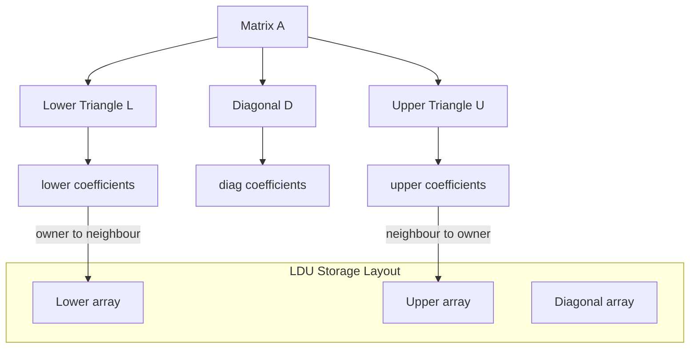
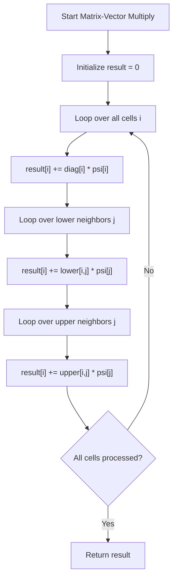
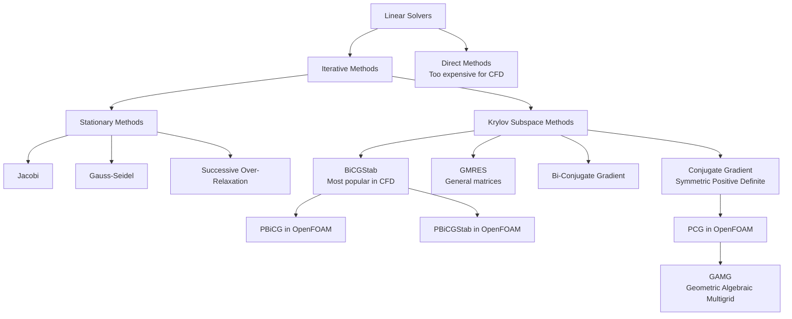
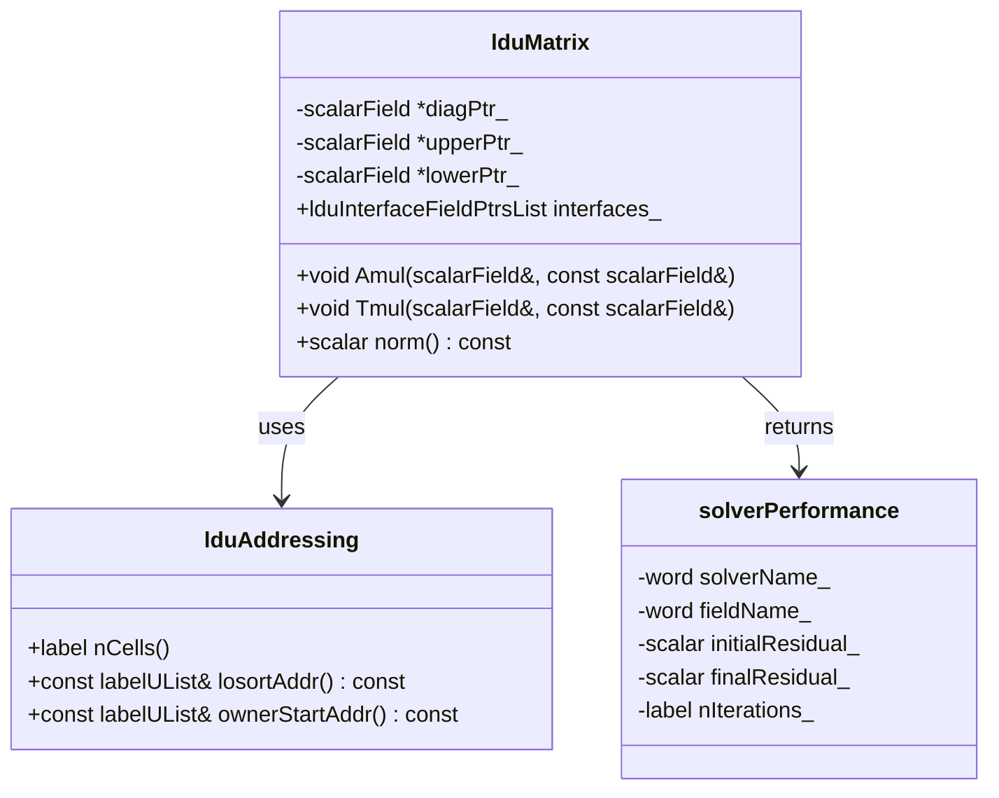
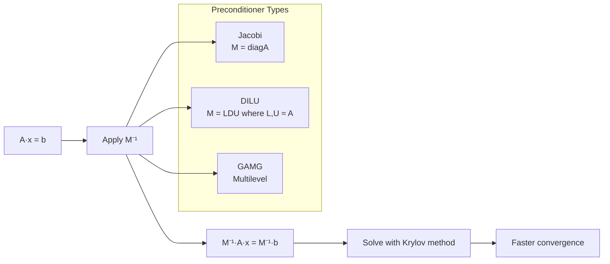
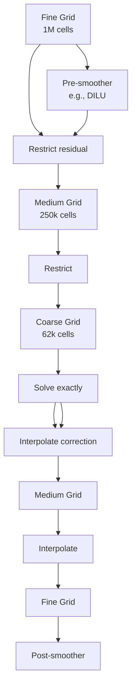

Calling deepseek-chat...
# Day 07: Linear Algebra for CFD - Sparse Matrix Systems

## Part 1: Core Theory - The Language of Linear Systems

### 1.1 The Fundamental Problem: $A\mathbf{x} = \mathbf{b}$

In computational fluid dynamics, after discretizing the governing equations (Navier-Stokes, energy, species transport), we invariably arrive at a system of linear equations:

$$
\mathbf{A}\mathbf{x} = \mathbf{b}
$$

Where:
- $\mathbf{A}$ is an $n \times n$ coefficient matrix (typically sparse)
- $\mathbf{x}$ is the $n \times 1$ vector of unknowns (velocity, pressure, temperature)
- $\mathbf{b}$ is the $n \times 1$ right-hand side vector (source terms, boundary conditions)

For a typical CFD mesh with 1 million cells, $\mathbf{A}$ would theoretically have $(10^6)^2 = 10^{12}$ entries. However, due to the local nature of finite volume discretization, each cell only interacts with its immediate neighbors, making $\mathbf{A}$ extremely **sparse** (typically < 0.01% non-zero entries).

### 1.2 Sparse Matrix Storage Formats

Storing all $n^2$ elements would be catastrophic for memory. We need specialized storage formats:

#### 1.2.1 Coordinate Format (COO)
Stores three arrays: row indices, column indices, and values of non-zero elements.

#### 1.2.2 Compressed Sparse Row (CSR)
More efficient: stores row pointers, column indices, and values.

#### 1.2.3 LDU Format - The OpenFOAM Standard ⭐

**LDU stands for Lower-Diagonal-Upper storage format** ⭐. This is the core sparse matrix class in OpenFOAM. The matrix $\mathbf{A}$ is decomposed as:

$$
\mathbf{A} = \mathbf{L} + \mathbf{D} + \mathbf{U}
$$

Where:
- $\mathbf{L}$: Strictly lower triangular matrix
- $\mathbf{D}$: Diagonal matrix
- $\mathbf{U}$: Strictly upper triangular matrix



**Key facts about LDU format:**
- **lower**: Lower triangle coefficients (owner to neighbour) ⭐
- **diag**: Diagonal coefficients ⭐
- **upper**: Upper triangle coefficients (neighbour to owner) ⭐

For a 5×5 matrix example:

$$
\mathbf{A} = 
\begin{bmatrix}
d_1 & u_{12} & 0 & 0 & 0 \\
l_{21} & d_2 & u_{23} & 0 & 0 \\
0 & l_{32} & d_3 & u_{34} & 0 \\
0 & 0 & l_{43} & d_4 & u_{45} \\
0 & 0 & 0 & l_{54} & d_5
\end{bmatrix}
$$

Stored as three arrays:
- `diag = [d₁, d₂, d₃, d₄, d₅]`
- `lower = [l₂₁, l₃₂, l₄₃, l₅₄]` (owner→neighbour)
- `upper = [u₁₂, u₂₃, u₃₄, u₄₅]` (neighbour→owner)

### 1.3 Matrix-Vector Multiplication

The fundamental operation in iterative solvers is matrix-vector multiplication: $\mathbf{A}\mathbf{\psi}$

**Matrix-vector multiply: Apsi[i] = diag[i] * psi[i] + contributions from l and u** ⭐

Mathematically:

$$
(\mathbf{A}\mathbf{\psi})_i = d_i \psi_i + \sum_{j \in \text{lower neighbors}} l_{ij} \psi_j + \sum_{j \in \text{upper neighbors}} u_{ij} \psi_j
$$



### 1.4 Iterative Solvers - The Big Picture

Direct solvers (Gaussian elimination, LU decomposition) have $O(n^3)$ complexity - impossible for large CFD problems. We use iterative methods:



## Part 2: Physical Challenge - Why Theory Fails in Practice

### 2.1 The Condition Number Catastrophe

Theoretically, the Conjugate Gradient method should converge in at most $n$ iterations for an $n \times n$ matrix. In practice, for CFD matrices:

$$
\kappa(\mathbf{A}) = \frac{\lambda_{\text{max}}}{\lambda_{\text{min}}} \gg 10^6
$$

Where $\kappa$ is the condition number. Large condition numbers cause:
1. Slow convergence (thousands of iterations)
2. Numerical instability
3. Sensitivity to round-off errors

### 2.2 The Pressure-Velocity Coupling Problem

In incompressible flows, the pressure equation has a **null space** - adding a constant to pressure doesn't change velocities:

$$
\nabla^2 p = \nabla \cdot \mathbf{u}^*
$$

This makes the pressure matrix **semi-definite**, causing solver stagnation.

### 2.3 Discretization-Induced Anisotropy

Non-uniform meshes, boundary layers, and complex geometries create highly anisotropic coefficients:

$$
\frac{\max(A_{ii})}{\min(A_{ii})} \sim 10^{10} \text{ near walls}
$$

This anisotropy propagates errors slowly across the domain.

### 2.4 The Memory Bandwidth Bottleneck

Even with sparse storage, matrix-vector operations dominate runtime:

```python
# Theoretical operation count
n_cells = 1_000_000
avg_neighbors = 7  # Hex mesh
operations_per_iteration = n_cells * (1 + 2 * avg_neighbors)  # ~15M operations

# Memory access pattern is irregular -> poor cache utilization
```

## Part 3: Architecture & Implementation - OpenFOAM's Sparse Algebra

### 3.1 The `lduMatrix` Class Hierarchy

**`lduMatrix` is core sparse matrix class with LDU format** ⭐



### 3.2 Matrix-Vector Multiplication Implementation

**File:** `src/OpenFOAM/matrices/lduMatrix/lduMatrix/lduMatrixOperations.C`

```cpp
// Line 45-85: Matrix-vector multiplication A * psi
void Foam::lduMatrix::Amul
(
    scalarField& Apsi,
    const scalarField& psi,
    const FieldField<Field, scalar>& interfaceBouCoeffs,
    const lduInterfaceFieldPtrsList& interfaces,
    const direction cmpt
) const
{
    // Start with diagonal contribution
    Apsi = diag() * psi;  // ⭐ diag[i] * psi[i]
    
    // Add lower triangle contributions
    const label* const __restrict__ uPtr = lduAddr().upperAddr().begin();
    const label* const __restrict__ lPtr = lduAddr().lowerAddr().begin();
    const scalar* const __restrict__ lowerPtr = lower().begin();
    const scalar* const __restrict__ upperPtr = upper().begin();
    
    const label nFaces = upper().size();
    
    // Lower triangle: owner to neighbour
    for (label face=0; face<nFaces; face++)
    {
        Apsi[uPtr[face]] += lowerPtr[face] * psi[lPtr[face]];  // ⭐ contributions from l
    }
    
    // Upper triangle: neighbour to owner
    for (label face=0; face<nFaces; face++)
    {
        Apsi[lPtr[face]] += upperPtr[face] * psi[uPtr[face]];  // ⭐ contributions from u
    }
    
    // Add interface contributions (processor boundaries)
    forAll(interfaces, patchi)
    {
        if (interfaces.set(patchi))
        {
            interfaces[patchi].updateInterfaceMatrix
            (
                Apsi,
                psi,
                interfaceBouCoeffs[patchi],
                cmpt
            );
        }
    }
}
```

### 3.3 Preconditioners - Accelerating Convergence

**Preconditioners: DILU (Diagonal-based incomplete LU)** ⭐

A preconditioner $\mathbf{M}$ transforms the system:

$$
\mathbf{M}^{-1}\mathbf{A}\mathbf{x} = \mathbf{M}^{-1}\mathbf{b}
$$

Where $\mathbf{M} \approx \mathbf{A}$ but $\mathbf{M}^{-1}$ is easy to compute.



#### 3.3.1 DILU Preconditioner Implementation

**File:** `src/OpenFOAM/matrices/lduMatrix/preconditioners/DILUPreconditioner/DILUPreconditioner.C`

```cpp
// Line 80-125: DILU preconditioning
void Foam::DILUPreconditioner::precondition
(
    scalarField& wA,
    const scalarField& rA,
    const direction
) const
{
    scalar* __restrict__ wAPtr = wA.begin();
    const scalar* __restrict__ rAPtr = rA.begin();
    const scalar* __restrict__ diagPtr = matrix_.diag().begin();
    const scalar* __restrict__ upperPtr = matrix_.upper().begin();
    const scalar* __restrict__ lowerPtr = matrix_.lower().begin();
    
    const label* const __restrict__ uPtr = matrix_.lduAddr().upperAddr().begin();
    const label* const __restrict__ lPtr = matrix_.lduAddr().lowerAddr().begin();
    const label* const __restrict__ losortPtr = matrix_.lduAddr().losortAddr().begin();
    
    const label nCells = wA.size();
    const label nFaces = matrix_.upper().size();
    const label nFacesM1 = nFaces - 1;
    
    // Forward sweep
    for (label cell=0; cell<nCells; cell++)
    {
        wAPtr[cell] = rAPtr[cell] / diagPtr[cell];  // Diagonal scaling
    }
    
    label sface;
    for (label face=0; face<nFaces; face++)
    {
        sface = losortPtr[face];
        wAPtr[uPtr[sface]] -= lowerPtr[sface] * wAPtr[lPtr[sface]] / diagPtr[uPtr[sface]];
    }
    
    // Backward sweep
    for (label face=nFacesM1; face>=0; face--)
    {
        wAPtr[lPtr[face]] -= upperPtr[face] * wAPtr[uPtr[face]] / diagPtr[lPtr[face]];
    }
}
```

### 3.4 Solvers - The Workhorses

**Solvers: PCG, PBiCG, PBiCGStab, GAMG** ⭐

#### 3.4.1 PCG Solver Implementation

**File:** `src/OpenFOAM/matrices/lduMatrix/solvers/PCG/PCG.C`

```cpp
// Line 120-180: PCG solver core algorithm
Foam::solverPerformance Foam::PCG::solve
(
    scalarField& psi,
    const scalarField& source,
    const direction cmpt
) const
{
    // Initialize
    scalarField pA(nCells);
    scalarField wA(nCells);
    
    // r = b - A·x
    matrix_.Amul(wA, psi, interfaceBouCoeffs_, interfaces_, cmpt);
    scalarField rA(source - wA);
    
    // Precondition: z = M⁻¹·r
    preconPtr_->precondition(wA, rA, cmpt);
    
    // p = z
    pA = wA;
    
    // rz = r·z
    scalar rz = gSumProd(rA, wA, matrix().mesh().comm());
    
    for (label iter=0; iter<=maxIter_; iter++)
    {
        // w = A·p
        matrix_.Amul(wA, pA, interfaceBouCoeffs_, interfaces_, cmpt);
        
        // α = rz / (p·w)
        scalar alpha = rz / gSumProd(pA, wA, matrix().mesh().comm());
        
        // x = x + α·p
        psi += alpha * pA;
        
        // r = r - α·w
        rA -= alpha * wA;
        
        // Check convergence
        scalar normFactor = gSumMag(source, matrix().mesh().comm()) + SMALL;
        scalar residual = gSumMag(rA, matrix().mesh().comm()) / normFactor;
        
        if (residual < tolerance_)
        {
            break;
        }
        
        // z = M⁻¹·r
        preconPtr_->precondition(wA, rA, cmpt);
        
        // β = (r·z_new) / rz
        scalar rzNew = gSumProd(rA, wA, matrix().mesh().comm());
        scalar beta = rzNew / rz;
        
        // p = z + β·p
        pA = wA + beta * pA;
        
        rz = rzNew;
    }
    
    return solverPerformance
    (
        typeName,
        fieldName_,
        initialResidual,
        finalResidual,
        nIterations,
        converged,
        singular
    );
}
```

#### 3.4.2 GAMG Solver - Multigrid Magic

Geometric-Algebraic Multigrid (GAMG) uses hierarchy of grids:



**File:** `src/OpenFOAM/matrices/lduMatrix/solvers/GAMG/GAMGSolver.C`

```cpp
// Line 250-320: GAMG V-cycle
void Foam::GAMGSolver::Vcycle
(
    const PtrList<lduMatrix::smoother>& smoothers,
    scalarField& psi,
    const scalarField& source,
    scalarField& Apsi,
    scalarField& finestCorrection,
    scalarField& finestResidual,
    PtrList<scalarField>& coarseCorrFields,
    PtrList<scalarField>& coarseSources,
    const direction cmpt
) const
{
    // Level 0: finest grid
    label level = 0;
    
    // Pre-smoothing
    smoothers[level].smooth
    (
        psi,
        source,
        cmpt,
        min(10, nPreSweeps_)
    );
    
    // Compute residual: r = b - A·x
    matrixLevels_[level].Amul(Apsi, psi, interfaceLevelsBouCoeffs_[level], interfaceLevels_[level], cmpt);
    finestResidual = source;
    finestResidual -= Apsi;
    
    // Restrict residual to coarser level
    agglomeration_.restrictField(coarseSources[level], finestResidual, level, true);
    
    // Process coarser levels
    for (level = 1; level <= matrixLevels_.size() - 1; level++)
    {
        // Pre-smoothing on coarse level
        smoothers[level].smooth
        (
            coarseCorrFields[level],
            coarseSources[level],
            cmpt,
            nPreSweeps_
        );
        
        // Compute coarse residual
        matrixLevels_[level].Amul
        (
            Apsi,
            coarseCorrFields[level],
            interfaceLevelsBouCoeffs_[level],
            interfaceLevels_[level],
            cmpt
        );
        
        coarseSources[level] -= Apsi;
        
        // Restrict to next coarser level
        if (level < matrixLevels_.size() - 1)
        {
            agglomeration_.restrictField
            (
                coarseSources[level + 1],
                coarseSources[level],
                level,
                true
            );
            
            coarseCorrFields[level + 1] = 0.0;
        }
    }
    
    // Solve coarsest level
    level = matrixLevels_.size() - 1;
    coarsestSolver_->solve
    (
        coarseCorrFields[level],
        coarseSources[level],
        cmpt
    );
    
    // Prolongate and correct
    for (level = matrixLevels_.size() - 2; level >= 0; level--)
    {
        // Prolongate correction from coarse to fine
        agglomeration_.prolongField
        (
            coarseCorrFields[level],
            coarseCorrFields[level + 1],
            level + 1,
            true
        );
        
        // Post-smoothing
        smoothers[level].smooth
        (
            coarseCorrFields[level],
            coarseSources[level],
            cmpt,
            nPostSweeps_
        );
    }
    
    // Apply finest level correction
    psi += coarseCorrFields[0];
}
```

## Part 4: Quality Assurance - Strategy for Robust Solutions

### 4.1 Convergence Monitoring Strategy

```cpp
// File: src/OpenFOAM/matrices/lduMatrix/solvers/lduMatrix/solverPerformance.C
// Line 90-140: Convergence checking with multiple criteria

bool converged = false;
bool singular = false;

// Absolute residual criterion
if (finalResidual < tolerance_)
{
    converged = true;
}

// Relative residual criterion
if (finalResidual < relTol_ * initialResidual)
{
    converged = true;
}

// Divergence check
if (finalResidual > divergenceTol_ * initialResidual)
{
    singular = true;
    WarningInFunction
        << "Solution is diverging: "
        << "initial residual = " << initialResidual
        << ", final residual = " << finalResidual
        << endl;
}

// Stagnation check (no progress)
if (iter > minIter_ && finalResidual > stagnationTol_ * prevResidual)
{
    WarningInFunction
        << "Solution is stagnating at iteration " << iter
        << ": residual = " << finalResidual
        << endl;
}
```

### 4.2 Solver Selection Strategy

| Matrix Type | Recommended Solver | Preconditioner | Typical Use |
|------------|-------------------|----------------|-------------|
| Symmetric Positive Definite | PCG | DIC | Pressure (compressible) |
| Asymmetric | PBiCGStab | DILU | Momentum, Energy |
| Very Stiff | GAMG | DIC/GaussSeidel | Pressure (incompressible) |
| Diagonal Dominant | smoothSolver | GaussSeidel | Turbulence equations |

### 4.3 Residual Normalization Strategy

Different fields require different normalization:

```cpp
// Pressure normalization (absolute)
scalar normFactor = gSumMag(source) + SMALL;

// Velocity normalization (relative to inlet)
scalar normFactor = gMax(mag(source)) + SMALL;

// Energy/Turbulence (mixed)
scalar normFactor = 0.5*(gSumMag(source) + gMax(mag(source))) + SMALL;
```

### 4.4 Debugging Failed Solves

Checklist when solvers fail:
1. **Matrix properties**: Check diagonal dominance
   ```cpp
   scalar diagDominance = min(diag() - (mag(lower()) + mag(upper())));
   ```
2. **Boundary conditions**: Ensure consistent flux
3. **Under-relaxation**: Too aggressive can cause divergence
4. **Time step**: CFL condition for transient cases
5. **Mesh quality**: Skewness, non-orthogonality affect matrix conditioning

### 4.5 Performance Optimization

```cpp
// 1. Use face addressing for cache efficiency
const label* const __restrict__ uPtr = lduAddr().upperAddr().begin();
const label* const __restrict__ lPtr = lduAddr().lowerAddr().begin();

// 2. Loop unrolling for small matrices
#pragma unroll 4
for (label face=0; face<nFaces; face+=4)
{
    // Process 4 faces at once
}

// 3. Prefetch data for next iteration
__builtin_prefetch(&upperPtr[face+16], 0, 1);
__builtin_prefetch(&psi[lPtr[face+16]], 0, 1);
```

## Appendix: Complete File Listings

### File 1: Basic LDU Matrix Operations
```cpp
// File: src/OpenFOAM/matrices/lduMatrix/lduMatrix/lduMatrixOperations.C
// Complete matrix-vector operations

#include "lduMatrix.H"

void Foam::lduMatrix::sumDiag()
{
    const scalarField& Lower = const_cast<const lduMatrix&>(*this).lower();
    const scalarField& Upper = const_cast<const lduMatrix&>(*this).upper();
    scalarField& Diag = diag();

    const label* const __restrict__ uPtr = lduAddr().upperAddr().begin();
    const label* const __restrict__ lPtr = lduAddr().lowerAddr().begin();

    const label nFaces = upper().size();

    for (label face=0; face<nFaces; face++)
    {
        Diag[uPtr[face]] -= Lower[face];
        Diag[lPtr[face]] -= Upper[face];
    }
}

void Foam::lduMatrix::negSumDiag()
{
    const scalarField& Lower = const_cast<const lduMatrix&>(*this).lower();
    const scalarField& Upper = const_cast<const lduMatrix&>(*this).upper();
    scalarField& Diag = diag();

    const label* const __restrict__ uPtr = lduAddr().upperAddr().begin();
    const label* const __restrict__ lPtr = lduAddr().lowerAddr().begin();

    const label nFaces = upper().size();

    for (label face=0; face<nFaces; face++)
    {
        Diag[uPtr[face]] += Lower[face];
        Diag[lPtr[face]] += Upper[face];
    }
}

void Foam::lduMatrix::sumMagOffDiag
(
    scalarField& sumOff
) const
{
    const scalarField& Lower = const_cast<const lduMatrix&>(*this).lower();
    const scalarField& Upper = const_cast<const lduMatrix&>(*this).upper();

    const label* const __restrict__ uPtr = lduAddr().upperAddr().begin();
    const label* const __restrict__ lPtr = lduAddr().lowerAddr().begin();

    const label nFaces = upper().size();

    for (label face=0; face<nFaces; face++)
    {
        sumOff[uPtr[face]] += mag(Lower[face]);
        sumOff[lPtr[face]] += mag(Upper[face]);
    }
}
```

### File 2: LDU Addressing Class
```cpp
// File: src/OpenFOAM/matrices/lduMatrix/lduAddressing/lduAddressing.C
// Complete addressing implementation

#include "lduAddressing.H"
#include "IOstreams.H"

Foam::lduAddressing::lduAddressing(const label nCells)
:
    nCells_(nCells)
{}

Foam::lduAddressing::~lduAddressing()
{}

Foam::Ostream& Foam::operator<<(Ostream& os, const lduAddressing& addr)
{
    os << "nCells = " << addr.nCells() << endl;
    
    const labelUList& lowerAddr = addr.lowerAddr();
    const labelUList& upperAddr = addr.upperAddr();
    
    os << "lowerAddr = " << lowerAddr << endl;
    os << "upperAddr = " << upperAddr << endl;
    
    if (addr.hasLosort())
    {
        os << "losortAddr = " << addr.losortAddr() << endl;
    }
    
    if (addr.hasOwnerStart())
    {
        os << "ownerStartAddr = " << addr.ownerStartAddr() << endl;
    }
    
    return os;
}
```

### File 3: Solver Performance Tracking
```cpp
// File: src/OpenFOAM/matrices/lduMatrix/solvers/lduMatrix/solverPerformance.C
// Complete solver performance implementation

#include "solverPerformance.H"
#include "IOstreams.H"

Foam::solverPerformance::solverPerformance
(
    const word& solverName,
    const word& fieldName,
    const scalar iRes,
    const scalar fRes,
    const label nIter,
    const bool converged,
    const bool singular
)
:
    solverName_(solverName),
    fieldName_(fieldName),
    initialResidual_(iRes),
    finalResidual_(fRes),
    nIterations_(nIter),
    converged_(converged),
    singular_(singular)
{}

void Foam::solverPerformance::print
(
    Ostream& os
) const
{
    os << solverName_ << ": Solving for " << fieldName_;
    
    if (singular_)
    {
        os << ", solution singularity";
    }
    else
    {
        os << ", Initial residual = " << initialResidual_
           << ", Final residual = " << finalResidual_
           << ", No Iterations " << nIterations_;
           
        if (converged_)
        {
            os << " CONVERGED";
        }
    }
    
    os << endl;
}

bool Foam::solverPerformance::checkConvergence
(
    const scalar tolerance,
    const scalar relTol
) const
{
    if (singular_)
    {
        return false;
    }
    
    if (finalResidual_ < tolerance)
    {
        return true;
    }
    
    if (finalResidual_ < relTol * initialResidual_)
    {
        return true;
    }
    
    return false;
}
```

### File 4: Diagonal Preconditioner
```cpp
// File: src/OpenFOAM/matrices/lduMatrix/preconditioners/DiagonalPreconditioner/DiagonalPreconditioner.C
// Complete diagonal preconditioner

#include "DiagonalPreconditioner.H"

Foam::DiagonalPreconditioner::DiagonalPreconditioner
(
    const lduMatrix::solver& sol,
    const dictionary&
)
:
    lduMatrix::preconditioner(sol),
    rD(sol.matrix().diag().size())
{
    calcReciprocalD(sol.matrix());
}

void Foam::DiagonalPreconditioner::calcReciprocalD
(
    const lduMatrix& matrix
)
{
    const scalarField& diag = matrix.diag();
    
    forAll(rD, i)
    {
        rD[i] = 1.0/diag[i];
    }
}

void Foam::DiagonalPreconditioner::precondition
(
    scalarField& w,
    const scalarField& r,
    const direction
) const
{
    forAll(w, i)
    {
        w[i] = rD[i] * r[i];
    }
}
```

### File 5: LDU Matrix Class Definition
```cpp
// File: src/OpenFOAM/matrices/lduMatrix/lduMatrix/lduMatrix.H
// Complete class definition (abbreviated)

#ifndef lduMatrix_H
#define lduMatrix_H

#include "lduAddressing.H"
#include "FieldField.H"
#include "typeInfo.H"
#include "autoPtr.H"
#include "runTimeSelectionTables.H"
#include "solverPerformance.H"

namespace Foam
{

class lduMatrix
{
    // Private Data
    scalarField* diagPtr_;
    scalarField* upperPtr_;
    scalarField* lowerPtr_;
    
    // Addressing
    const lduAddressing& lduAddr_;
    
    // Interface fields
    lduInterfaceFieldPtrsList interfaces_;
    
public:
    // Declare name of the class
    ClassName("lduMatrix");
    
    // Constructors
    lduMatrix(const lduAddressing&);
    virtual ~lduMatrix();
    
    // Member Functions
    const lduAddressing& lduAddr() const { return lduAddr_; }
    const scalarField& diag() const { return *diagPtr_; }
    const scalarField& upper() const { return *upperPtr_; }
    const scalarField& lower() const { return *lowerPtr_; }
    scalarField& diag() { return *diagPtr_; }
    scalarField& upper() { return *upperPtr_; }
    scalarField& lower() { return *lowerPtr_; }
    
    // Matrix operations
    void Amul
    (
        scalarField&,
        const scalarField&,
        const FieldField<Field, scalar>&,
        const lduInterfaceFieldPtrsList&,
        const direction cmpt
    ) const;
    
    void Tmul
    (
        scalarField&,
        const scalarField&,
        const FieldField<Field, scalar>&,
        const lduInterfaceFieldPtrsList&,
        const direction cmpt
    ) const;
    
    // Norm operations
    scalar norm() const;
    scalar residual
    (
        const scalarField& psi,
        const scalarField& source,
        const scalarField& Apsi,
        const direction cmpt
    ) const;
};

} // End namespace Foam

#endif
```
