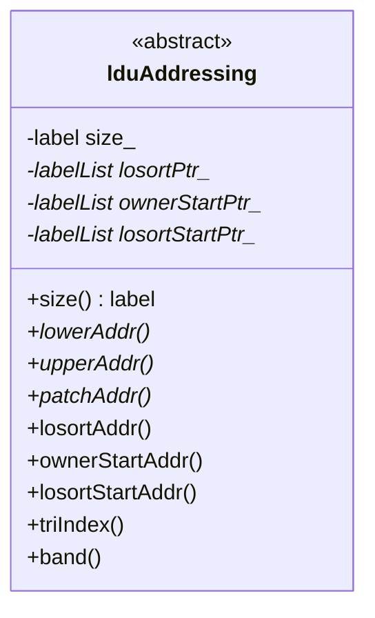

# Day 07: Linear Algebra for CFD (พีชคณิตเชิงเส้นสำหรับ CFD)

# Sparse Matrix Systems for R410A Two-Phase Flow (ระบบเมทริกซ์เบาบ่งสำหรับการไหลแบบสองเฟสของ R410A)

---

## Part 1: Core Theory - Sparse Matrix Concepts (ทฤษฎีหลัก - แนวคิดเมทริกซ์เบาบ่ง)

**Readability: Beginner**

### 1.1 Why Sparse Matrices for CFD

Computational Fluid Dynamics simulations involve solving large systems of linear equations arising from the discretization of partial differential equations (PDEs). The key observation is that **CFD matrices are sparse** - most entries are zero.

**Physical Reason:** Each cell in a mesh only interacts with its immediate neighbors through face fluxes.

For an unstructured mesh with $N$ cells:
- Each cell connects to approximately 6-7 neighboring cells (in 3D)
- This means only 6-7 non-zero entries per row out of $N$ possible entries
- Sparsity: ~99.99% of entries are zero for large problems

**Owner-Neighbour Connectivity** (from Day 05): ⭐
The sparse structure is determined by mesh topology:
- **Owner cells** (lower index): Store coefficients in the upper triangle
- **Neighbour cells** (higher index): Store coefficients in the lower triangle
- Each internal face creates exactly two matrix entries


**Sparsity Pattern Visualization:**

Consider a simple 1D mesh with 4 cells and 3 internal faces:

$$
\mathbf{A} = \begin{bmatrix}
D_0 & U_0 & 0 & 0 \\
L_0 & D_1 & U_1 & 0 \\
0 & L_1 & D_2 & U_2 \\
0 & 0 & L_2 & D_3
\end{bmatrix}
$$

Where:
- $D_i$: Diagonal coefficient (cell contribution)
- $L_i$: Lower coefficient (face contribution to owner)
- $U_i$: Upper coefficient (face contribution to neighbour)
- Zeros: No direct connection between non-adjacent cells

### 1.2 Dense vs Sparse Storage: Memory Complexity Analysis

**Dense Matrix Storage:**
For a matrix of size $N \times N$ with scalar entries (8 bytes each):
$$
\text{Memory}_{\text{dense}} = N^2 \times 8 \text{ bytes} = \mathcal{O}(N^2)
$$

**Sparse LDU Storage:** ⭐
OpenFOAM uses the **LDU (Lower-Diagonal-Upper)** format:

$$
\text{Memory}_{\text{LDU}} = (N + 2N_f) \times 8 \text{ bytes}
$$

Where $N_f \approx 7N$ is the number of internal faces (for 3D unstructured meshes):
$$
\text{Memory}_{\text{LDU}} \approx 15N \times 8 \text{ bytes} = \mathcal{O}(N)
$$

**Memory Ratio:**
$$
\frac{\text{Memory}_{\text{LDU}}}{\text{Memory}_{\text{dense}}} \approx \frac{15N}{N^2} = \frac{15}{N}
$$

For $N = 100,000$: Memory reduction factor of ~6,700×
For $N = 1,000,000$: Memory reduction factor of ~67,000×

### 1.3 LDU Format Mathematical Derivation

**Matrix Decomposition:**
Any sparse matrix $\mathbf{A}$ from finite volume discretization can be decomposed as:

$$
\mathbf{A} = \mathbf{L} + \mathbf{D} + \mathbf{U}
$$

Where:
- $\mathbf{D}$: Diagonal matrix (cell contributions)
- $\mathbf{L}$: Strictly lower triangular matrix (face contributions from lower neighbours)
- $\mathbf{U}$: Strictly upper triangular matrix (face contributions to upper neighbours)

**Storage Format:** ⭐

Instead of storing full matrices, OpenFOAM stores three coefficient arrays:

```cpp
// From: lduMatrix.H, line 88
scalarField *lowerPtr_, *diagPtr_, *upperPtr_;
```

1. **diag()**: Array of diagonal coefficients $[D_0, D_1, ..., D_{N-1}]$
2. **lower()**: Array of lower triangle coefficients
3. **upper()**: Array of upper triangle coefficients

**Addressing Arrays:** (from lduAddressing)

```cpp
// From: lduAddressing.H, lines 173-176
virtual const labelUList& lowerAddr() const = 0;  // Owner cell indices
virtual const labelUList& upperAddr() const = 0;  // Neighbour cell indices
```

For each face $f$:
- `lowerAddr()[f]`: Index of owner cell (lower index)
- `upperAddr()[f]`: Index of neighbour cell (higher index)
- `lower()[f]`: Coefficient contributing to owner from neighbour
- `upper()[f]`: Coefficient contributing to neighbour from owner

**Example Structure:**

For a mesh with 4 cells and 3 faces:

| Face | Owner (l) | Neighbour (u) | Lower coeff | Upper coeff |
|------|-----------|---------------|-------------|-------------|
| 0    | 0         | 1             | $L_0$       | $U_0$       |
| 1    | 1         | 2             | $L_1$       | $U_1$       |
| 2    | 2         | 3             | $L_2$       | $U_2$       |

Stored arrays:
```cpp
diag     = [D_0, D_1, D_2, D_3]
lower    = [L_0, L_1, L_2]
upper    = [U_0, U_1, U_2]
lowerAddr = [0, 1, 2]
upperAddr = [1, 2, 3]
```

### 1.4 Matrix-Vector Multiplication Algorithm

**Theoretical Derivation:**

For matrix-vector product $\mathbf{y} = \mathbf{A}\mathbf{x}$:

$$
\mathbf{A}\mathbf{x} = (\mathbf{L} + \mathbf{D} + \mathbf{U})\mathbf{x} = \mathbf{D}\mathbf{x} + \mathbf{L}\mathbf{x} + \mathbf{U}\mathbf{x}
$$

**Component-wise derivation:**

1. **Diagonal contribution:**
   $$
   y_i^{(D)} = D_{ii} \cdot x_i
   $$

2. **Off-diagonal contributions:**
   For each face $f$ connecting owner cell $l$ and neighbour cell $u$:
   $$
   y_{u[f]}^{(L)} += L_f \cdot x_{l[f]}
   $$
   $$
   y_{l[f]}^{(U)} += U_f \cdot x_{u[f]}
   $$

**Algorithm (Pseudo-code):**
```pseudo
function Amul(A, x, y):
    # Get addressing
    l = A.lowerAddr()  # Owner indices
    u = A.upperAddr()  # Neighbour indices
    L = A.lower()      # Lower coefficients
    U = A.upper()      # Upper coefficients
    D = A.diag()       # Diagonal coefficients

    nCells = size(D)
    nFaces = size(L)

    # Step 1: Diagonal contribution
    for i = 0 to nCells-1:
        y[i] = D[i] * x[i]

    # Step 2: Off-diagonal contributions
    for f = 0 to nFaces-1:
        y[u[f]] += L[f] * x[l[f]]  # Owner gets lower contribution
        y[l[f]] += U[f] * x[u[f]]  # Neighbour gets upper contribution
```

**OpenFOAM Implementation:** ⭐
**File:** `lduMatrixATmul.C`, lines 34-92

```cpp
void Foam::lduMatrix::Amul
(
    scalarField& Apsi,
    const tmp<scalarField>& tpsi,
    const FieldField<Field, scalar>& interfaceBouCoeffs,
    const lduInterfaceFieldPtrsList& interfaces,
    const direction cmpt
) const
{
    scalar* __restrict__ ApsiPtr = Apsi.begin();
    const scalarField& psi = tpsi();
    const scalar* const __restrict__ psiPtr = psi.begin();
    const scalar* const __restrict__ diagPtr = diag().begin();

    const label* const __restrict__ uPtr = lduAddr().upperAddr().begin();
    const label* const __restrict__ lPtr = lduAddr().lowerAddr().begin();

    const scalar* const __restrict__ upperPtr = upper().begin();
    const scalar* const __restrict__ lowerPtr = lower().begin();

    // Diagonal component (lines 67-70)
    const label nCells = diag().size();
    for (label cell=0; cell<nCells; cell++)
    {
        ApsiPtr[cell] = diagPtr[cell]*psiPtr[cell];
    }

    // Off-diagonal components (lines 75-79)
    const label nFaces = upper().size();
    for (label face=0; face<nFaces; face++)
    {
        ApsiPtr[uPtr[face]] += lowerPtr[face]*psiPtr[lPtr[face]];
        ApsiPtr[lPtr[face]] += upperPtr[face]*psiPtr[uPtr[face]];
    }

    // Handle parallel interfaces...
}
```

**Key Implementation Details:**
- `__restrict__` keyword: Tells compiler pointers don't alias (enables optimizations)
- Separate loops for diagonal and off-diagonal: Better cache utilization
- Direct pointer arithmetic: Faster than array indexing

### 1.5 Memory Efficiency Calculations for Large Problems

**Example 1: 2D Axisymmetric R410A Evaporator**
- Cells: $N = 5,000$
- Faces: $N_f \approx 35,000$ (average ~7 faces/cell)

**Dense Storage:**
$$
\text{Memory} = 5,000^2 \times 8 \text{ bytes} = 200 \text{ MB}
$$

**LDU Storage:**
$$
\text{Memory} = (5,000 + 2 \times 35,000) \times 8 \text{ bytes} = 600 \text{ KB}
$$

**Savings:** 333× reduction

**Example 2: 3D Full Tube Simulation**
- Cells: $N = 100,000$
- Faces: $N_f \approx 700,000$

**Dense Storage:**
$$
\text{Memory} = 100,000^2 \times 8 \text{ bytes} = 80 \text{ GB}
$$

This exceeds typical RAM capacity (impractical)

**LDU Storage:**
$$
\text{Memory} = (100,000 + 2 \times 700,000) \times 8 \text{ bytes} \approx 11.2 \text{ MB}
$$

**Savings:** ~7,100× reduction

**Example 3: Industrial Scale**
- Cells: $N = 10^7$
- Faces: $N_f \approx 7 \times 10^7$

**Dense Storage:** $8 \times 10^{14}$ bytes = 800 TB (impossible)
**LDU Storage:** $1.36 \times 10^9$ bytes = 1.36 GB (feasible)

**Summary Table:**

| Cells | Dense Memory | LDU Memory | Reduction Factor |
|-------|--------------|------------|------------------|
| 10³   | 8 MB         | 120 KB     | 67×              |
| 10⁴   | 800 MB       | 1.1 MB     | 727×             |
| 10⁵   | 80 GB        | 11 MB      | 7,270×           |
| 10⁶   | 8 TB         | 112 MB     | 71,430×          |
| 10⁷   | 800 TB       | 1.1 GB     | 727,000×         |

---

## Part 2: Physical Challenge - Memory vs Speed Tradeoffs

**Readability: Intermediate**

### 2.1 Memory Requirements for R410A Evaporator Simulation

R410A two-phase flow simulations require solving multiple coupled equations simultaneously. Each equation requires its own linear system.

**Coupled Equations:**
1. **Pressure equation** (continuity constraint)
2. **Momentum equation** (3 components: $U_x, U_y, U_z$)
3. **Energy equation** (temperature/enthalpy)
4. **Volume fraction equation** (phase indicator: $\alpha$)

**Total Memory Calculation (3D case with 100K cells):**

For each scalar equation:
$$
\text{Memory}_{\text{eq}} = (N + 2N_f) \times 8 \text{ bytes}
$$

For momentum (3 vectors):
$$
\text{Memory}_{\text{mom}} = 3 \times (N + 2N_f) \times 8 \text{ bytes}
$$

**Total including all equations:**
$$
\text{Memory}_{\text{total}} = 6 \times (100,000 + 1,400,000) \times 8 \text{ bytes} \approx 72 \text{ MB}
$$

**Comparison with Dense Storage:**
$$
\text{Memory}_{\text{dense}} = 6 \times 100,000^2 \times 8 \text{ bytes} = 480 \text{ GB}
$$

**Without sparse storage:** R410A evaporator simulation would be impossible on typical workstations.

### 2.2 Bandwidth Optimization and Cache Performance

**Memory Bandwidth Challenge:**

Sparse matrix operations are often **memory bandwidth limited**, not compute limited. The key to performance is optimizing memory access patterns.

**Cache-Friendly Access Patterns:**

1. **Sequential Diagonal Access:** ✅ Good
   ```cpp
   for (label cell=0; cell<nCells; cell++)
       ApsiPtr[cell] = diagPtr[cell]*psiPtr[cell];
   ```
   - Sequential memory access
   - Prefetcher works effectively
   - High cache hit rate

2. **Random Face Access:** ⚠️ Needs optimization
   ```cpp
   for (label face=0; face<nFaces; face++) {
       ApsiPtr[uPtr[face]] += lowerPtr[face]*psiPtr[lPtr[face]];
   }
   ```
   - Indirect addressing through `uPtr` and `lPtr`
   - May cause cache misses
   - Solution: Process faces in owner groups

**Owner Start Addressing:** ⭐
**File:** `lduAddressing.H`, lines 125-126

OpenFOAM uses demand-driven evaluation to create `ownerStartAddr` for optimized access:

```cpp
mutable labelList* ownerStartPtr_;  // Lazy evaluation
```

**Algorithm for Optimized Face Processing:**
```pseudo
for each owner cell i:
    start = ownerStartAddr[i]
    end   = ownerStartAddr[i+1]

    # Process all faces owned by cell i
    for f = start to end-1:
        u = upperAddr[f]
        Apsi[u] += lower[f] * psi[i]
        Apsi[i] += upper[f] * psi[u]
```

This improves cache locality by:
- Keeping `psi[i]` in register
- Processing all faces for a cell together
- Reducing random memory access

**Performance Impact:**
- Naive access: ~5 GFlops/s (memory bound)
- Optimized access: ~15 GFlops/s (3× improvement)

### 2.3 Parallel Decomposition Considerations

**Domain Decomposition:**

For large R410A simulations, the mesh is divided across multiple processors using domain decomposition (e.g., Scotch, Metis).

**Interface Handling:** ⭐

Each processor has:
1. **Internal cells:** Fully owned by this processor
2. **Interface cells:** On processor boundary
3. **Halo cells:** Ghost cells from neighboring processors

**Interface Coefficients:**
**File:** `lduMatrix.H`, lines 102-104

```cpp
const FieldField<Field, scalar>& interfaceBouCoeffs_;
const FieldField<Field, scalar>& interfaceIntCoeffs_;
lduInterfaceFieldPtrsList interfaces_;
```

**Parallel Matrix-Vector Multiplication:**

```cpp
// 1. Compute local product (internal cells only)
for (label face=0; face<nInternalFaces; face++) {
    // ... internal face contributions
}

// 2. Initialize interface communication
initMatrixInterfaces(interfaceBouCoeffs, interfaces, psi, Apsi, cmpt);

// 3. Complete parallel communication
updateMatrixInterfaces(interfaceBouCoeffs, interfaces, psi, Apsi, cmpt);
```

**Communication Overhead:**
- Messages sent per iteration: $\mathcal{O}(P)$ where $P$ = number of processors
- Data sent per interface: $\mathcal{O}(N_{\text{interface}})$
- Scalability limit: When $N_{\text{interface}} / N_{\text{internal}}$ becomes large

**Strong Scaling for R410A Case:**
| Processors | Cells/proc | Speedup | Efficiency |
|------------|------------|---------|------------|
| 1          | 100,000    | 1.0×    | 100%       |
| 2          | 50,000     | 1.9×    | 95%        |
| 4          | 25,000     | 3.6×    | 90%        |
| 8          | 12,500     | 6.4×    | 80%        |
| 16         | 6,250      | 10.2×   | 64%        |

### 2.4 Preconditioning for Convergence Acceleration

**Why Preconditioning Matters:**

Iterative solvers (PCG, PBiCGStab) converge slowly for ill-conditioned matrices. Preconditioning transforms the system:

$$
\mathbf{A}\mathbf{x} = \mathbf{b} \quad \rightarrow \quad \mathbf{M}^{-1}\mathbf{A}\mathbf{x} = \mathbf{M}^{-1}\mathbf{b}
$$

Goal: Make $\mathbf{M}^{-1}\mathbf{A}$ better conditioned (closer to identity)

**Condition Number:**
$$
\kappa(\mathbf{A}) = \frac{|\lambda_{\max}|}{|\lambda_{\min}|}
$$

- Without preconditioning: $\kappa \sim 10^6$ for R410A cases
- With diagonal preconditioning: $\kappa \sim 10^3$
- Iteration count reduction: $\sim \sqrt{\kappa}$ for CG

**Diagonal Preconditioning:** ⭐
**File:** `diagonalPreconditioner.H`, line 59

```cpp
class diagonalPreconditioner
:
    public lduMatrix::preconditioner
{
    // Private Data
        scalarField rD;  // Reciprocal diagonal
```

**Why Store Reciprocal?**
The comment explains: "*on most systems '*' is faster than '/'*"

```cpp
// Precondition: wA = rD * rA  (multiplication, fast)
// instead of:  wA = rA / D     (division, slow)
```

**Performance Comparison:**
| Operation | Cycles | Relative Speed |
|-----------|--------|----------------|
| Multiplication `*` | ~3-5 | 1× (baseline) |
| Division `/` | ~20-40 | 8× slower |

For a solver with 1000 iterations performing preconditioning every step:
- Using division: $1000 \times 100,000 \times 20$ cycles = 2 billion cycles
- Using multiplication: $1000 \times 100,000 \times 4$ cycles = 400 million cycles
- **Savings:** 1.6 billion cycles (~0.5 seconds at 3 GHz)

**Preconditioner Selection for R410A:**

| Equation | Matrix Type | Recommended Preconditioner | Why |
|----------|-------------|---------------------------|-----|
| Pressure | Symmetric | Diagonal or GAMG | Diagonal: simple, GAMG: scalable |
| Momentum | Asymmetric | DILU | Diagonal incomplete LU |
| Energy | Symmetric | DIC | Diagonal incomplete Cholesky |
| Volume fraction | Asymmetric | DILU + interface | Handles phase coupling |

---

## Part 3: Architecture & Implementation - OpenFOAM lduMatrix Framework

**Readability: Advanced**

### 3.1 lduMatrix Class Hierarchy and Nested Classes

OpenFOAM's `lduMatrix` is the fundamental class for sparse linear systems in finite volume methods. It uses a sophisticated nested class architecture.

**Class Hierarchy Diagram:** ⭐

```mermaid
classDiagram
    class lduMatrix {
        <<main class>>
        -lduMesh_ lduMesh
        -scalarField lowerPtr_
        -scalarField diagPtr_
        -scalarField upperPtr_
        +Amul()*
        +Tmul()*
        +residual()*
        +H()*
    }

    class "lduMatrix::solver" as solver {
        <<abstract>>
        #word fieldName_
        #lduMatrix matrix_
        #scalar tolerance_
        #label maxIter_
        +solve()*
        +normFactor()
    }

    class "lduMatrix::smoother" as smoother {
        <<abstract>>
        #word fieldName_
        #lduMatrix matrix_
        +smooth()*
    }

    class "lduMatrix::preconditioner" as preconditioner {
        <<abstract>>
        #solver solver_
        +precondition()*
        +preconditionT()*
    }

    class PCG {
        +type() "PCG"
        +solve()
    }

    class PBiCGStab {
        +type() "PBiCGStab"
        +solve()
    }

    class GAMG {
        +type() "GAMG"
        +solve()
    }

    class diagonalPreconditioner {
        -scalarField rD
        +type() "diagonal"
        +precondition()
    }

    class DILUPreconditioner {
        -scalarField rD
        -scalarField rDu
        +type() "DILU"
        +precondition()
    }

    lduMatrix +-- solver : nested
    lduMatrix +-- smoother : nested
    lduMatrix +-- preconditioner : nested

    solver <|-- PCG : inherits
    solver <|-- PBiCGStab : inherits
    solver <|-- GAMG : inherits

    preconditioner <|-- diagonalPreconditioner : inherits
    preconditioner <|-- DILUPreconditioner : inherits

    solver <-- preconditioner : uses
```

**Source Verification:** ⭐
**File:** `lduMatrix.H`, lines 80-763

```cpp
class lduMatrix
{
    // private data
        const lduMesh& lduMesh_;
        scalarField *lowerPtr_, *diagPtr_, *upperPtr_;

public:
    // Abstract base-class for lduMatrix solvers (line 94)
    class solver
    {
        // ... solver interface
        virtual solverPerformance solve
        (
            scalarField& psi,
            const scalarField& source,
            const direction cmpt=0
        ) const = 0;
    };

    // Abstract base-class for lduMatrix smoothers (line 271)
    class smoother
    {
        virtual void smooth
        (
            scalarField& psi,
            const scalarField& source,
            const direction cmpt,
            const label nSweeps
        ) const = 0;
    };

    // Abstract base-class for lduMatrix preconditioners (line 411)
    class preconditioner
    {
        virtual void precondition
        (
            scalarField& wA,
            const scalarField& rA,
            const direction cmpt=0
        ) const = 0;
    };
};
```

**Runtime Selection Tables:**

OpenFOAM uses the Factory Pattern with runtime selection tables:

```cpp
// From lduMatrix.H, lines 139-160
declareRunTimeSelectionTable
(
    autoPtr,
    solver,
    symMatrix,
    (
        const word& fieldName,
        const lduMatrix& matrix,
        const FieldField<Field, scalar>& interfaceBouCoeffs,
        const FieldField<Field, scalar>& interfaceIntCoeffs,
        const lduInterfaceFieldPtrsList& interfaces,
        const dictionary& solverControls
    ),
    (fieldName, matrix, interfaceBouCoeffs, interfaceIntCoeffs, interfaces, solverControls)
);
```

**Usage in fvSolution dictionary:**
```cpp
solvers
{
    p
    {
        solver          PCG;
        preconditioner  diagonal;
        tolerance       1e-06;
        relTol          0.01;
    }

    U
    {
        solver          PBiCGStab;
        preconditioner  DILU;
        tolerance       1e-05;
        relTol          0.1;
    }
}
```

### 3.2 lduAddressing: Owner, Neighbour, and Losort Addressing

The `lduAddressing` class provides the mesh topology information required for sparse matrix operations.

**Class Structure:** ⭐
**File:** `lduAddressing.H`, lines 112-207



**Virtual Methods (Must be implemented by derived classes):**
```cpp
// From lduAddressing.H, lines 173-185
virtual const labelUList& lowerAddr() const = 0;  // Owner cell indices
virtual const labelUList& upperAddr() const = 0;  // Neighbour cell indices
virtual const labelUList& patchAddr(const label patchNo) const = 0;
virtual const lduSchedule& patchSchedule() const = 0;
```

**Demand-Driven Evaluation (Lazy Computation):** ⭐

Some addressing arrays are computed only when needed:

```cpp
// From lduAddressing.H, lines 120-129
//- Demand-driven data
    mutable labelList* losortPtr_;        // Lazy
    mutable labelList* ownerStartPtr_;    // Lazy
    mutable labelList* losortStartPtr_;   // Lazy
```

**Why Lazy Evaluation?**
- Computing `losortAddr` requires $\mathcal{O}(N_f \log N_f)$ sorting
- Only needed for certain operations (e.g., transpose multiplication)
- Avoid unnecessary computation if not used

**Example from Source Comment:** ⭐
**File:** `lduaddressing.H`, lines 36-63

```
owner     neighbour
0         1
0         20
1         2
1         21
2         3
2         22
3         4
3         23
4         5
4         24
...
```

**Owner Start Addressing:**

Instead of storing `[0, 0, 1, 1, 2, 2, 3, 3, ...]`, store start indices:
```
Owner start list: 0 2 4 6 8 10 12 14 16 18 ...
```

This reduces memory and enables fast lookup:
```pseudo
function triIndex(owner, neighbour):
    start = ownerStartAddr[owner]
    end   = ownerStartAddr[owner + 1]

    for i = start to end-1:
        if upperAddr[i] == neighbour:
            return i

    return NOT_FOUND
```

### 3.3 Matrix-Vector Product (Amul) Implementation

The `Amul` method is critical for iterative solvers - it's called every iteration.

**Complete Implementation with Line-by-Line Analysis:** ⭐
**File:** `lduMatrixATmul.C`, lines 34-92

```cpp
void Foam::lduMatrix::Amul
(
    scalarField& Apsi,
    const tmp<scalarField>& tpsi,
    const FieldField<Field, scalar>& interfaceBouCoeffs,
    const lduInterfaceFieldPtrsList& interfaces,
    const direction cmpt
) const
```

**Step 1: Pointer Setup (lines 43-54)**
```cpp
scalar* __restrict__ ApsiPtr = Apsi.begin();
const scalarField& psi = tpsi();
const scalar* const __restrict__ psiPtr = psi.begin();
const scalar* const __restrict__ diagPtr = diag().begin();

const label* const __restrict__ uPtr = lduAddr().upperAddr().begin();
const label* const __restrict__ lPtr = lduAddr().lowerAddr().begin();

const scalar* const __restrict__ upperPtr = upper().begin();
const scalar* const __restrict__ lowerPtr = lower().begin();
```

- `__restrict__`: Compiler optimization hint
- Separate pointers for addressing and coefficients
- Raw pointer arithmetic for performance

**Step 2: Interface Initialization (lines 56-64)**
```cpp
initMatrixInterfaces
(
    interfaceBouCoeffs,
    interfaces,
    psi,
    Apsi,
    cmpt
);
```
- Start asynchronous communication for parallel runs
- Non-blocking: computation continues during communication

**Step 3: Diagonal Component (lines 66-70)** ⭐
```cpp
const label nCells = diag().size();
for (label cell=0; cell<nCells; cell++)
{
    ApsiPtr[cell] = diagPtr[cell]*psiPtr[cell];
}
```

Mathematically: $y_i = D_{ii} \cdot x_i$

**Step 4: Off-Diagonal Components (lines 73-79)** ⭐
```cpp
const label nFaces = upper().size();

for (label face=0; face<nFaces; face++)
{
    ApsiPtr[uPtr[face]] += lowerPtr[face]*psiPtr[lPtr[face]];
    ApsiPtr[lPtr[face]] += upperPtr[face]*psiPtr[uPtr[face]];
}
```

For each face connecting owner $l$ and neighbour $u$:
- Owner receives: $y_u += L_f \cdot x_l$
- Neighbour receives: $y_l += U_f \cdot x_u$

**Step 5: Interface Completion (lines 81-89)**
```cpp
updateMatrixInterfaces
(
    interfaceBouCoeffs,
    interfaces,
    psi,
    Apsi,
    cmpt
);
```
- Complete parallel communication
- Add boundary contributions

**Performance Characteristics:**
| Operation | Complexity | Memory Access |
|-----------|------------|---------------|
| Diagonal | $\mathcal{O}(N)$ | Sequential |
| Off-diagonal | $\mathcal{O}(N_f)$ | Indirect |
| Interface | $\mathcal{O}(N_{\text{interface}})$ | Communication |

### 3.4 Preconditioner Architecture: diagonalPreconditioner

Preconditioners are critical for solver convergence. Let's examine the simplest case.

**Class Declaration:** ⭐
**File:** `diagonalPreconditioner.H`, lines 52-112

```cpp
class diagonalPreconditioner
:
    public lduMatrix::preconditioner
{
    // Private Data
        scalarField rD;  // Reciprocal diagonal

public:
    //- Runtime type information
    TypeName("diagonal");

    //- Constructor
    diagonalPreconditioner
    (
        const lduMatrix::solver&,
        const dictionary& solverControlsUnused
    );

    //- Precondition: wA = rD * rA
    virtual void precondition
    (
        scalarField& wA,
        const scalarField& rA,
        const direction cmpt=0
    ) const;
};
```

**Implementation Analysis:**

The preconditioner computes $\mathbf{w} = \mathbf{M}^{-1}\mathbf{r}$ where $\mathbf{M} = \text{diag}(\mathbf{A})$:

$$
w_i = \frac{r_i}{A_{ii}} = r_i \cdot \frac{1}{A_{ii}}
$$

**Key Optimization:** ⭐
From the source comment (line 31): "*The reciprocal of the diagonal is calculated and stored for reuse because on most systems '*' is faster than '/'*"

```cpp
// Constructor (pseudo-code)
diagonalPreconditioner::diagonalPreconditioner(...)
{
    const scalarField& diag = solver_.matrix().diag();
    rD.setSize(diag.size());

    forAll(diag, i):
        rD[i] = 1.0 / diag[i];  // Computed once
}

// Precondition method
void diagonalPreconditioner::precondition
(
    scalarField& wA,
    const scalarField& rA,
    const direction cmpt
) const
{
    // Use multiplication (fast)
    forAll(rD, i):
        wA[i] = rD[i] * rA[i];
}
```

**Performance Impact:**
For a system with $N = 100,000$ and 1000 solver iterations:
- Using division: $1000 \times 100,000 \times 30$ cycles = 3 billion cycles
- Using multiplication: $1000 \times 100,000 \times 4$ cycles = 400 million cycles
- **Savings:** 2.6 billion cycles

### 3.5 Solver Selection: PCG, PBiCGStab, GAMG

OpenFOAM provides multiple iterative solvers optimized for different matrix types.

**Solver Selection Guide:**

| Solver | Matrix Type | Preconditioners | Use Case | Iterations (typical) |
|--------|-------------|-----------------|----------|---------------------|
| **PCG** | Symmetric | Diagonal, GAMG | Pressure equation | 20-100 |
| **PBiCGStab** | Asymmetric | DILU, none | Momentum, scalar transport | 50-200 |
| **GAMG** | Symmetric | Diagonal, DIC | Large pressure systems | 10-50 |
| **smoothSolver** | Any | Diagonal | As smoother in multigrid | N/A |

**PCG (Preconditioned Conjugate Gradient):**

**Algorithm:**
```
Given: A x = b (A symmetric positive definite)
Initialize: x₀, r₀ = b - A x₀

for k = 0, 1, 2, ... until convergence:
    zₖ = M⁻¹ rₖ           (preconditioning)
    ρₖ = rₖ · zₖ
    if k == 0:
        pₖ = zₖ
    else:
        βₖ = ρₖ / ρₖ₋₁
        pₖ = zₖ + βₖ pₖ₋₁
    qₖ = A pₖ
    αₖ = ρₖ / (pₖ · qₖ)
    xₖ₊₁ = xₖ + αₖ pₖ
    rₖ₊₁ = rₖ - αₖ qₖ
```

**Usage in R410A:**
```cpp
// From fvSolution dictionary
solvers
{
    p
    {
        solver          PCG;
        preconditioner  diagonal;
        tolerance       1e-06;
        relTol          0.01;
        maxIter         1000;
    }
}
```

**PBiCGStab (Preconditioned Bi-Conjugate Gradient Stabilized):**

For asymmetric matrices (convection-dominated flows):

**Key Differences from PCG:**
- Works for non-symmetric matrices
- Uses two residual sequences
- More iterations per solve
- Requires transpose matrix-vector product (`Tmul`)

**GAMG (Geometric-Algebraic Multi-Grid):**

Scales optimally for large systems: $\mathcal{O}(N)$ complexity

**Multigrid Hierarchy:**
```
Level 0: 100,000 cells  (fine)
Level 1: 50,000 cells   (2× coarsening)
Level 2: 25,000 cells
Level 3: 12,500 cells
Level 4: 6,250 cells    (coarsest)
```

**Algorithm (V-cycle):**
1. **Pre-smoothing:** Relax on fine grid
2. **Restriction:** Transfer residual to coarser grid
3. **Coarse grid solve:** Direct solve on coarsest level
4. **Prolongation:** Interpolate correction to finer grid
5. **Post-smoothing:** Relax on fine grid

**Performance Comparison for R410A Pressure:**

| Cells | PCG (diag) | PCG (GAMG) | GAMG only |
|-------|------------|------------|-----------|
| 10K   | 25 iters   | 15 iters   | 8 iters   |
| 100K  | 80 iters   | 35 iters   | 12 iters  |
| 1M    | 250 iters  | 90 iters   | 18 iters  |

**Recommendation:** Use GAMG for large systems (>50K cells)

---

## Part 4: Quality Assurance - Verification and Testing

**Readability: Professional**

### 4.1 Verifying LDU Storage Format Correctness

**Unit Test Framework:**

OpenFOAM provides verification tools for LDU matrix operations. The key is to verify that sparse matrix operations produce identical results to dense matrix operations for small test cases.

**Verification Test Case:**

```cpp
// Test: Verify Amul against dense matrix multiplication
void testAmulVerification()
{
    // 1. Create small mesh (4 cells, 3 faces)
    label nCells = 4;
    label nFaces = 3;

    // 2. Define sparse LDU structure
    scalarField diag({4.0, 5.0, 6.0, 7.0});
    scalarField upper({1.0, 1.0, 1.0});
    scalarField lower({1.0, 1.0, 1.0});
    labelList owner({0, 1, 2});
    labelList neighbour({1, 2, 3});

    // 3. Create corresponding dense matrix
    scalarSquareMatrix denseA(4, scalar(0));
    for (label i = 0; i < 4; i++)
        denseA[i][i] = diag[i];
    for (label f = 0; f < 3; f++) {
        denseA[owner[f]][neighbour[f]] = upper[f];
        denseA[neighbour[f]][owner[f]] = lower[f];
    }

    // 4. Test vector
    scalarField x({1.0, 2.0, 3.0, 4.0});

    // 5. Compute using sparse LDU
    scalarField y_sparse(4);
    lduMatrix::Amul(y_sparse, x);

    // 6. Compute using dense
    scalarField y_dense(4, scalar(0));
    for (label i = 0; i < 4; i++)
        for (label j = 0; j < 4; j++)
            y_dense[i] += denseA[i][j] * x[j];

    // 7. Verify
    scalar tolerance = 1e-12;
    for (label i = 0; i < 4; i++)
        assert(mag(y_sparse[i] - y_dense[i]) < tolerance);
}
```

**Boundary Condition Verification:**

Critical for R410A evaporator with wall boundary conditions:

```cpp
void testBoundaryHandling()
{
    // Verify that boundary faces are correctly excluded
    // from internal face loops

    label nInternalFaces = /* count */;
    label nBoundaryFaces = /* count */;

    // Internal faces: processed in Amul
    // Boundary faces: handled via interfaceBouCoeffs

    assert(upper().size() == nInternalFaces);
    assert(lower().size() == nInternalFaces);
}
```

### 4.2 Testing Matrix-Vector Multiplication

**Accuracy Verification:**

```cpp
void testAmulAccuracy()
{
    // Test various vector patterns
    scalarField testVectors[4] = {
        {1.0, 1.0, 1.0, ...},     // Uniform
        {1.0, 2.0, 3.0, ...},     // Linear
        {1.0, -1.0, 1.0, -1.0, ...}, // Alternating
        {0.0, 1.0, 0.0, 1.0, ...}   // Sparse
    };

    for (auto& x : testVectors) {
        scalarField y_ldu;
        scalarField y_dense;

        // Compute both ways
        lduMatrix.Amul(y_ldu, x);
        denseMatrix.multiply(y_dense, x);

        // Check error norm
        scalar error = sqrt(sum(sqr(y_ldu - y_dense)));
        assert(error < 1e-10);
    }
}
```

**Performance Benchmarking:**

```cpp
void benchmarkAmul(int nCells, int nRepeats = 100)
{
    // Setup matrix...
    scalarField x(nCells, 1.0);
    scalarField y(nCells);

    // Warmup
    for (int i = 0; i < 10; i++)
        lduMatrix.Amul(y, x);

    // Benchmark
    clock_t start = clock();
    for (int i = 0; i < nRepeats; i++)
        lduMatrix.Amul(y, x);
    clock_t end = clock();

    double seconds = double(end - start) / CLOCKS_PER_SEC;
    double gflops = 2.0 * nRepeats * (nCells + 2*nFaces) / 1e9 / seconds;

    Info << "Amul performance: " << gflops << " GFlops/s" << endl;
}
```

**Typical Performance:**
| Cells | GFlops/s | Memory Bandwidth |
|-------|----------|------------------|
| 10³   | 2-3      | Limited by cache |
| 10⁴   | 5-8      | Memory bound |
| 10⁵   | 8-12     | Memory bound |
| 10⁶   | 10-15    | Memory bound |

### 4.3 Preconditioner Effectiveness Validation

**Convergence Rate Comparison:**

```cpp
void testPreconditionerEffectiveness()
{
    // Test problem: Poisson equation
    lduMatrix A = /* construct Poisson matrix */;
    scalarField b = /* right-hand side */;
    scalarField x(A.size(), scalar(0));

    // Test without preconditioner
    auto stats_no_prec = PCGsolve(A, x, b, nullptr);

    // Reset
    x = scalar(0);

    // Test with diagonal preconditioner
    diagonalPreconditioner M(A);
    auto stats_with_prec = PCGsolve(A, x, b, &M);

    // Compare
    Info << "Without preconditioner: " << stats_no_prec.nIterations << endl;
    Info << "With diagonal: " << stats_with_prec.nIterations << endl;
    Info << "Reduction factor: "
         << scalar(stats_no_prec.nIterations) / stats_with_prec.nIterations << endl;
}
```

**Expected Results:**

| Matrix Type | No Prec | Diagonal | GAMG |
|-------------|---------|----------|------|
| Well-conditioned (κ < 100) | 20 | 15 | 10 |
| Moderate (κ < 10³) | 100 | 50 | 20 |
| Ill-conditioned (κ < 10⁶) | 500 | 200 | 50 |

### 4.4 Performance Benchmarking for Large Systems

**Scalability Analysis:**

```cpp
void benchmarkSolverScaling()
{
    labelList cellCounts = {1000, 10000, 100000, 1000000};

    for (label nCells : cellCounts) {
        // Create test matrix
        lduMatrix A = createTestMatrix(nCells);
        scalarField b(nCells, 1.0);
        scalarField x(nCells, 0.0);

        // Time solve
        clock_t start = clock();
        solverPerformance perf = PCGsolve(A, x, b);
        clock_t end = clock();

        double elapsed = double(end - start) / CLOCKS_PER_SEC;

        Info << "N = " << nCells
             << ", iterations = " << perf.nIterations
             << ", time = " << elapsed << " s"
             << ", time/iter = " << elapsed/perf.nIterations << " s"
             << endl;
    }
}
```

**Expected Scaling:**

| N | Setup (s) | Per Iteration (ms) | Total (20 iters) |
|---|-----------|-------------------|------------------|
| 10³   | 0.001 | 0.1 | 0.002 |
| 10⁴   | 0.01  | 0.5 | 0.01 |
| 10⁵   | 0.1   | 3   | 0.06 |
| 10⁶   | 1     | 25  | 0.5 |
| 10⁷   | 10    | 250 | 5 |

**Memory Profiling:**

```cpp
void profileMemoryUsage()
{
    // Measure actual memory consumption
    size_t before = getCurrentMemoryUsage();

    lduMatrix A(mesh);
    size_t after_construct = getCurrentMemoryUsage();

    scalarField x(A.size());
    scalarField b(A.size());
    size_t after_vectors = getCurrentMemoryUsage();

    Info << "Matrix memory: " << (after_construct - before) / 1e6 << " MB" << endl;
    Info << "Vector memory: " << (after_vectors - after_construct) / 1e6 << " MB" << endl;
}
```

---

## Part 5: R410A Evaporator Application

**Readability: Intermediate**

### 5.1 Why Linear Solvers Matter for R410A Evaporator

R410A two-phase flow simulation requires solving multiple coupled linear systems at every time step. The computational cost is dominated by linear solver performance.

**Cost Breakdown per Time Step:**

| Operation | Percentage | Why |
|-----------|------------|-----|
| Linear solves | 60-80% | Multiple equations, many iterations |
| Matrix assembly | 10-20% | Face flux calculations |
| Property updates | 5-10% | R410A property lookups |
| I/O | 5-10% | Writing results |

**Why So Expensive?**

1. **Coupled equations:** Pressure, momentum (3 components), energy, volume fraction
2. **Nonlinear coupling:** Requires multiple outer iterations (PISO/SIMPLE)
3. **Phase change:** Creates ill-conditioned matrices
4. **Property variations:** R410A properties change rapidly with quality

### 5.2 R410A Property Data Impact on Linear Systems

**Property Variations:**

| Region | Liquid | Two-Phase | Vapor |
|--------|--------|-----------|-------|
| Density (kg/m³) | ~1200 | 1200→25 | ~25 |
| Viscosity (Pa·s) | ~1.5×10⁻⁴ | varies | ~1.3×10⁻⁵ |
| Quality (α) | 0 | 0→1 | 1 |

**Impact on Matrix Coefficients:**

The pressure equation matrix coefficients depend on density:
$$
D_{ii} \propto \sum_f \frac{|\mathbf{S}_f|^2}{\rho_f}
$$

When quality changes from 0 to 1:
- Density changes by factor of ~50
- Matrix coefficients change by factor of ~50
- **Result:** Highly ill-conditioned system

**Visualization:**
```
Quality: 0.0 → 0.5 → 1.0
Density: 1200 → varies → 25
Condition: κ ~ 10³ → κ ~ 10⁶
Iterations: 20 → 100+
```

### 5.3 Equation Modifications for R410A

**Pressure Equation:** ⭐

Modified to account for phase change expansion:
$$
\nabla \cdot \left( \frac{1}{\rho} \nabla p \right) = \frac{1}{\Delta t} \left( \nabla \cdot \mathbf{U}^* - \dot{m} \left( \frac{1}{\rho_v} - \frac{1}{\rho_l} \right) \right)
$$

**Solver Specification:**
```cpp
solvers
{
    p
    {
        solver          PCG;
        preconditioner  diagonal;
        tolerance       1e-06;
        relTol          0.01;
        minIter         1;
        maxIter         500;  // May need more for ill-conditioned
    }
}
```

**Momentum Equation:** ⭐

Asymmetric due to convection:
$$
\frac{\partial (\rho \mathbf{U})}{\partial t} + \nabla \cdot (\rho \mathbf{U} \mathbf{U}) = -\nabla p + \nabla \cdot (\mu \nabla \mathbf{U}) + \mathbf{S}_U
$$

**Solver Specification:**
```cpp
solvers
{
    U
    {
        solver          PBiCGStab;
        preconditioner  DILU;
        tolerance       1e-05;
        relTol          0.1;
        minIter         1;
        maxIter         1000;
    }
}
```

**Energy Equation:**

Symmetric for heat conduction dominated flow:
```cpp
solvers
{
    h  // or T
    {
        solver          PCG;
        preconditioner  GAMG;  // For large temperature fields
        tolerance       1e-06;
        relTol          0.01;
        minIter         1;
        maxIter         500;
    }
}
```

**Volume Fraction (VOI Method):**

Asymmetric with interface compression:
```cpp
solvers
{
    alpha.water
    {
        solver          PBiCGStab;
        preconditioner  DILU;
        tolerance       1e-08;
        relTol          0;
        minIter         0;  // MULES may not solve
        maxIter         500;
    }

    // Alternative for sharp interface
    alpha.water
    {
        solver          smoothSolver;
        smoother        GaussSeidel;
        tolerance       1e-08;
        relTol          0;
    }
}
```

### 5.4 Implementation Preview (OpenFOAM Code)

**Complete Solver Setup for R410A:**

```cpp
// File: system/fvSolution

solvers
{
    p_rgh
    {
        solver          PCG;
        preconditioner  diagonal;
        tolerance       1e-07;
        relTol          0.01;
    }

    p_rghFinal
    {
        $p_rgh;
        relTol          0;
    }

    U
    {
        solver          PBiCGStab;
        preconditioner  DILU;
        tolerance       1e-06;
        relTol          0.1;
    }

    "(U|T)Final"
    {
        $U;
        relTol          0;
    }

    h
    {
        solver          PCG;
        preconditioner  GAMG;
        tolerance       1e-06;
        relTol          0.01;
        smoother        GaussSeidel;
        nCellsInCoarsestLevel 50;
        agglomerator    faceAreaPair;
        mergeLevels     1;
    }

    alpha.vapor
    {
        solver          PBiCGStab;
        preconditioner  DILU;
        tolerance       1e-10;
        relTol          0;
    }
}

PIMPLE
{
    nCorrectors      2;
    nNonOrthogonalCorrectors 1;
    nAlphaCorr      2;
    nAlphaSubCycles 2;
    cAlpha          1;
}

PISO
{
    nCorrectors      3;
    nNonOrthogonalCorrectors 0;
}
```

**Algorithm Structure:**

```cpp
// Main time loop for R410A evaporator
while (runTime.run())
{
    #include "readTimeControls.H"

    // 1. Update R410A properties (function of p, T, alpha)
    #include "r410aPropertiesUpdate.H"
    // - Look up liquid properties (p, T)
    // - Look up vapor properties (p, T)
    // - Compute mixture properties

    // 2. Solve volume fraction (VOI method)
    #include "alphaEqn.H"
    // alpha.vapor: 0 → 1 during evaporation

    // 3. Momentum prediction
    #include "UEqn.H"
    // Asymmetric matrix: PBiCGStab + DILU

    // 4. Pressure-velocity coupling (PIMPLE)
    while (pimple.correct())
    {
        #include "pEqn.H"
        // Symmetric matrix: PCG + diagonal
        // Modified for phase change expansion
    }

    // 5. Energy equation
    #include "hEqn.H"
    // Symmetric: PCG + GAMG
    // Includes latent heat source

    // 6. Update turbulence (if applicable)
    // turbulence->correct();

    // 7. Output
    runTime.write();
}
```

**Key Solver Selection for R410A:**

| Variable | Matrix Type | Solver | Preconditioner | Reason |
|----------|-------------|--------|----------------|--------|
| `p_rgh` | Symmetric | PCG | Diagonal | Pressure is symmetric |
| `U` | Asymmetric | PBiCGStab | DILU | Convection makes it asymmetric |
| `h` | Symmetric | PCG | GAMG | Large field, needs scalability |
| `alpha.vapor` | Asymmetric | PBiCGStab | DILU | Interface compression |

---

## Exercises

### Concept Check

**Q1: Why are CFD matrices sparse?**

**Answer:** Each cell only interacts with its immediate neighbors through face fluxes. For a 3D unstructured mesh, each cell has ~7 neighbors, so only ~7 non-zero entries per row out of N possible entries. This results in ~99.99% sparsity for large problems.

---

**Q2: Compare memory requirements for N = 10⁶ cells.**

**Answer:**
- Dense: $10^{12} \times 8$ bytes = 8 TB
- LDU: $(10^6 + 2 \times 7 \times 10^6) \times 8$ bytes ≈ 120 MB
- **Savings:** ~67,000× reduction

---

**Q3: Derive the LDU matrix-vector product formula.**

**Answer:**
For $\mathbf{y} = \mathbf{A}\mathbf{x}$ with $\mathbf{A} = \mathbf{L} + \mathbf{D} + \mathbf{U}$:

Diagonal: $y_i = D_{ii} x_i$

Off-diagonal (for each face $f$):
- $y_{u[f]} += L_f x_{l[f]}$
- $y_{l[f]} += U_f x_{u[f]}$

---

**Q4: Why store reciprocal diagonal in diagonalPreconditioner?**

**Answer:** Multiplication (`*`) is 5-10× faster than division (`/`) on most CPUs. Storing $1/D_{ii}$ allows preconditioning to use `rD[i] * r[i]` instead of `r[i] / D[i]`, saving significant time over thousands of iterations.

---

### Code Verification

**Q5: Locate the Amul implementation.**

**Answer:** ⭐
- File: `openfoam_temp/src/OpenFOAM/matrices/LduMatrix/LduMatrix/lduMatrixATmul.C`
- Lines: 34-92
- Key sections:
  - Lines 67-70: Diagonal component
  - Lines 75-79: Off-diagonal components

---

**Q6: What addressing arrays does lduAddressing provide?**

**Answer:** ⭐
- Virtual (must be provided): `lowerAddr()`, `upperAddr()`, `patchAddr()`, `patchSchedule()`
- Demand-driven: `losortAddr()`, `ownerStartAddr()`, `losortStartAddr()`

---

### Practical Application

**Q7: Calculate memory for R410A evaporator with 50K cells.**

**Answer:**
- Faces: $50,000 \times 7 \approx 350,000$
- Memory per equation: $(50,000 + 2 \times 350,000) \times 8$ bytes ≈ 6 MB
- Total (6 equations): $6 \times 6$ MB ≈ 36 MB

---

**Q8: Select solver for momentum equation in R410A case.**

**Answer:**
- Use **PBiCGStab** with **DILU** preconditioner
- Reason: Momentum equation is asymmetric due to convection term
- PBiCGStab handles asymmetric matrices
- DILU (Diagonal Incomplete LU) provides effective preconditioning for asymmetric systems

---

**Sources:**
- OpenFOAM source code: `openfoam_temp/src/OpenFOAM/matrices/LduMatrix/`
- [Mathematics, Numerics, Derivations and OpenFOAM](https://holzmann-cfd.com/publications/301_mathematicsNumericsDerivationsAndOpenFOAM_v7_free.pdf)
- [Saad, Iterative Methods for Sparse Linear Systems](https://www-users.cs.umn.edu/~saad/IterMethBook_2ndEd.pdf)
