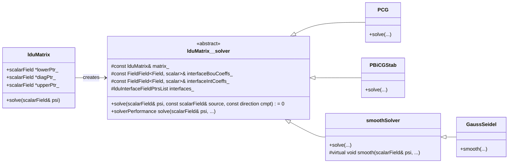
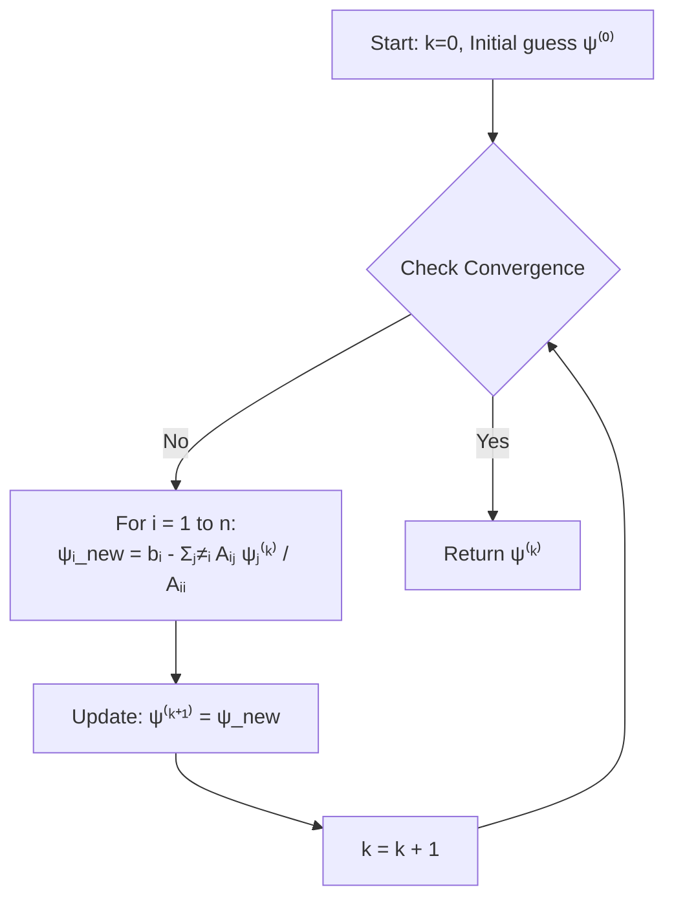
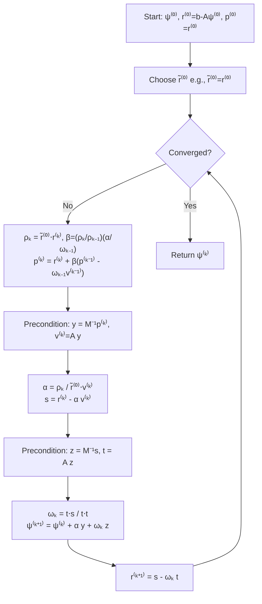

Calling deepseek-chat...

# Day 08: Iterative Solvers Theory

## Introduction: Direct vs. Iterative Methods

For solving the linear system **Aψ = b**, two primary approaches exist:

*   **Direct Methods** (e.g., Gaussian Elimination, LU decomposition): Compute the exact solution (within machine precision) in a finite number of operations. They are robust but computationally expensive (`O(n³)` for dense matrices) and memory-intensive for large systems, as fill-in can occur.
*   **Iterative Methods**: Start with an initial guess **ψ⁽⁰⁾** and generate a sequence of improving approximate solutions **ψ⁽ᵏ⁾** until convergence. They are preferred for **large, sparse systems** (common in CFD) because they:
    *   Have lower memory footprints (`O(n)` for matrix-vector products).
    *   Can exploit sparsity for faster operations.
    *   Can be stopped once a specified tolerance is reached.

In OpenFOAM, iterative solvers are implemented within the `lduMatrix` framework, which handles **Lower-Diagonal-Upper** storage for sparse matrices.

## 1. The `lduMatrix::solver` Base Class ⭐

All iterative solvers in OpenFOAM inherit from the abstract base class `lduMatrix::solver`. This class defines the common interface for solving linear systems.

**Class Hierarchy (Mermaid):**


**Key Code Snippet (`src/OpenFOAM/matrices/lduMatrix/lduMatrix/lduMatrix.H`):**
```cpp
namespace Foam {
    class lduMatrix {
        public:
            //- Abstract base-class for lduMatrix solvers
            class solver {
                protected:
                    //- Protected data
                    const word fieldName_;
                    const lduMatrix& matrix_;
                    const FieldField<Field, scalar>& interfaceBouCoeffs_;
                    const FieldField<Field, scalar>& interfaceIntCoeffs_;
                    lduInterfaceFieldPtrsList interfaces_;
                    //- Solver controls
                    const dictionary& controlDict_;
                    ...
                public:
                    //- Virtual destructor
                    virtual ~solver() = default;
                    //- Solve the matrix with this solver
                    virtual solverPerformance solve
                    (
                        scalarField& psi,
                        const scalarField& source,
                        const direction cmpt = 0
                    ) const = 0;
            };
    };
}
```

## 2. Basic Relaxation Methods: Smoothers

These are often used as **preconditioners** or **smoothers** in multigrid methods.

### Jacobi Method ⭐
The Jacobi method solves the i-th equation for the i-th unknown, using values from the previous iteration. It is inherently parallelizable.

**Derivation:**
From `Aψ = b`, for row *i*:
```
∑ⱼ Aᵢⱼ ψⱼ = bᵢ
=> Aᵢᵢ ψᵢ + ∑ⱼ≠ᵢ Aᵢⱼ ψⱼ = bᵢ
```
Solving for `ψᵢ`:
```
ψᵢ⁽ᵏ⁺¹⁾ = ( bᵢ - ∑ⱼ≠ᵢ Aᵢⱼ ψⱼ⁽ᵏ⁾ ) / Aᵢᵢ
```
In matrix form, with `A = D + L + U` (Diagonal, Lower, Upper):
```
ψ⁽ᵏ⁺¹⁾ = D⁻¹ (b - (L + U) ψ⁽ᵏ⁾)
```

**Algorithm Flow (Mermaid):**


### Gauss-Seidel Method ⭐
An improvement over Jacobi that uses **newly computed values immediately**. This leads to faster convergence but introduces a data dependency, making it less parallel.

**Derivation:**
```
ψᵢ⁽ᵏ⁺¹⁾ = ( bᵢ - ∑ⱼ<ᵢ Aᵢⱼ ψⱼ⁽ᵏ⁺¹⁾ - ∑ⱼ>ᵢ Aᵢⱼ ψⱼ⁽ᵏ⁾ ) / Aᵢᵢ
```
In matrix form:
```
(D + L) ψ⁽ᵏ⁺¹⁾ = b - U ψ⁽ᵏ⁾
=> ψ⁽ᵏ⁺¹⁾ = (D + L)⁻¹ (b - U ψ⁽ᵏ⁾)
```
**Successive Over-Relaxation (SOR)** introduces a relaxation factor `ω` to accelerate convergence:
```
ψᵢ⁽ᵏ⁺¹⁾ = (1-ω)ψᵢ⁽ᵏ⁾ + ω * (GS update)
```

**Code Snippet (`src/OpenFOAM/matrices/lduMatrix/smoothers/GaussSeidel/GaussSeidelSmoother.C`):**
```cpp
void Foam::GaussSeidelSmoother::smooth
(
    scalarField& psi,
    const scalarField& source,
    const direction cmpt,
    const label nSweeps
) const
{
    const scalar* const __restrict__ diagPtr = matrix_.diag().begin();
    const scalar* const __restrict__ upperPtr = matrix_.upper().begin();
    const scalar* const __restrict__ lowerPtr = matrix_.lower().begin();
    // ... (loop over cells and faces)
    for (label sweep=0; sweep<nSweeps; ++sweep)
    {
        // Forward sweep
        forAll(psi, celli)
        {
            scalar sum = source[celli];
            // Subtract contributions from lower/upper neighbours
            // using latest available psi values
            const label fStart = lowerAddr[celli];
            const label fEnd = lowerAddr[celli + 1];
            for (label facei=fStart; facei<fEnd; ++facei)
            {
                sum -= lowerPtr[facei]*psi[lowerPtr[facei]];
            }
            // ... similar for upper
            psi[celli] = sum/diagPtr[celli];
        }
    }
}
```

## 3. Krylov Subspace Methods

These methods project the problem onto a sequence of expanding subspaces (`Kₘ = span{r⁽⁰⁾, A r⁽⁰⁾, ..., Aᵐ⁻¹ r⁽⁰⁾}`) to find the optimal solution.

### Preconditioned Conjugate Gradient (PCG) ⭐
The **CG method** is the algorithm of choice for **Symmetric Positive Definite (SPD)** matrices. **Preconditioning** (`M⁻¹`) is used to cluster eigenvalues and dramatically improve convergence rate.

**PCG Algorithm:**
1.  Compute `r⁽⁰⁾ = b - A ψ⁽⁰⁾`
2.  Solve `M z⁽⁰⁾ = r⁽⁰⁾`
3.  Set `p⁽⁰⁾ = z⁽⁰⁾`
4.  For `k = 0, 1, ...` until convergence:
    *   `αₖ = (r⁽ᵏ⁾ᵀ z⁽ᵏ⁾) / (p⁽ᵏ⁾ᵀ A p⁽ᵏ⁾)`
    *   `ψ⁽ᵏ⁺¹⁾ = ψ⁽ᵏ⁾ + αₖ p⁽ᵏ⁾`
    *   `r⁽ᵏ⁺¹⁾ = r⁽ᵏ⁾ - αₖ A p⁽ᵏ⁾`
    *   Solve `M z⁽ᵏ⁺¹⁾ = r⁽ᵏ⁺¹⁾`
    *   `βₖ = (r⁽ᵏ⁺¹⁾ᵀ z⁽ᵏ⁺¹⁾) / (r⁽ᵏ⁾ᵀ z⁽ᵏ⁾)`
    *   `p⁽ᵏ⁺¹⁾ = z⁽ᵏ⁺¹⁾ + βₖ p⁽ᵏ⁾`

**Code Snippet (`src/OpenFOAM/matrices/lduMatrix/solvers/PCG/PCG.C`):**
```cpp
Foam::solverPerformance Foam::PCG::solve
(
    scalarField& psi,
    const scalarField& source,
    const direction cmpt
) const
{
    // ... Setup and initialize
    scalarField pA(p.size());
    scalarField wA(psi.size());
    // Initial residual
    matrix_.Amul(wA, psi, interfaceBouCoeffs_, interfaces_, cmpt);
    scalarField r(source - wA);
    scalarField z(r.size());
    preconPtr->precondition(z, r, cmpt); // Apply preconditioner M⁻¹
    scalar rZ = gSumProd(r, z); // (r, z)
    // ... Start CG loop
    do {
        matrix_.Amul(pA, p, interfaceBouCoeffs_, interfaces_, cmpt);
        scalar wApA = gSumProd(wA, pA); // (p, Ap)
        scalar alpha = rZ / wApA;
        forAll(psi, i) {
            psi[i] += alpha * p[i];
            r[i] -= alpha * pA[i];
        }
        preconPtr->precondition(z, r, cmpt); // Precondition new residual
        scalar rZNew = gSumProd(r, z);
        scalar beta = rZNew / rZ;
        forAll(p, i) {
            p[i] = z[i] + beta * p[i];
        }
        rZ = rZNew;
    } while ( ... ); // Check convergence
}
```

## 4. Methods for Non-Symmetric Systems

### Preconditioned Bi-Conjugate Gradient Stabilized (PBiCGStab) ⭐
Developed by **Van der Vorst (1992)**, BiCGStab is a popular, robust method for **non-symmetric** matrices. It avoids the irregular convergence of BiCG while maintaining relatively low work per iteration.

**PBiCGStab Algorithm (Simplified Overview):**
It constructs iterations using a combination of BiCG steps and GMRES(1)-type stabilization to smooth convergence.

**Algorithm Flow (Mermaid):**


**Code Snippet (`src/OpenFOAM/matrices/lduMatrix/solvers/PBiCGStab/PBiCGStab.C`):**
```cpp
// Key loop structure within PBiCGStab::solve
do {
    // ... BiCG part: compute ρ, β, update p
    rho = gSumProd(rStar, r);
    beta = (rho/rhoOld)*(alpha/omega);
    forAll(p, i) {
        p[i] = r[i] + beta*(p[i] - omega*v[i]);
    }
    // Precondition and compute v = A p
    preconPtr->precondition(y, p, cmpt);
    matrix_.Amul(v, y, ...);
    // ... Compute α, update s
    alpha = rho/gSumProd(rStar, v);
    forAll(s, i) {
        s[i] = r[i] - alpha*v[i];
    }
    // GMRES(1) stabilization: precondition and compute t = A s
    preconPtr->precondition(z, s, cmpt);
    matrix_.Amul(t, z, ...);
    // ... Compute ω, update ψ and r
    omega = gSumProd(t, s)/gSumProd(t, t);
    forAll(psi, i) {
        psi[i] += alpha*y[i] + omega*z[i];
        r[i] = s[i] - omega*t[i];
    }
} while ( ... );
```

## 5. Convergence Criteria ⭐

Iterations stop when the error is deemed sufficiently small. The most common measure is the **relative residual**.

**Definition:**
```
Relative Residual = || r⁽ᵏ⁾ || / || r⁽⁰⁾ || = || b - A ψ⁽ᵏ⁾ || / || b - A ψ⁽⁰⁾ || ≤ tolerance
```
Where `||·||` is a norm (typically L2). The tolerance is user-defined (e.g., `1e-6`). Additional criteria include:
*   **Absolute tolerance:** `|| r⁽ᵏ⁾ || ≤ absTol`.
*   **Divergence check:** Stop if residual increases dramatically.
*   **Maximum iterations:** Hard stop to prevent infinite loops.

**Code Snippet (`src/OpenFOAM/matrices/lduMatrix/solvers/lduMatrix/solverPerformance.H`):**
```cpp
bool Foam::solverPerformance::checkConvergence
(
    const scalar Tolerance,
    const scalar RelTolerance
) const
{
    return
    (
        (finalResidual_ < Tolerance) // Absolute
     || (
            (initialResidual_ > VSMALL) // Avoid division by zero
         && (finalResidual_/initialResidual_ < RelTolerance) // Relative
        )
    );
}
```

## Appendix

### A. Common Preconditioners in OpenFOAM
*   **DILU:** Diagonal Incomplete LU, a simple and robust choice for asymmetric matrices.
*   **DIC/DICGaussSeidel:** Diagonal Incomplete Cholesky (for symmetric matrices), often with Gauss-Seidel sweeps.
*   **FDIC:** Faster DIC, a diagonal-based variant.
*   **GAMG:** Geometric Agglomerated Multi-Grid, not just a preconditioner but a powerful solver itself.

### B. Solver Selection Guide
| Matrix Type | Recommended Solver | Typical Preconditioner |
| :--- | :--- | :--- |
| **Symmetric** (e.g., Pressure) | **PCG** | DIC, FDIC, GAMG |
| **Asymmetric** (e.g., Velocity) | **PBiCGStab** | DILU, DILU-GaussSeidel |
| **Asymmetric, difficult** | **GAMG** (as solver) | SmoothSolver (e.g., GaussSeidel) as smoother |

### C. Key References
1.  Barrett, R., et al. (1994). *Templates for the Solution of Linear Systems: Building Blocks for Iterative Methods*. SIAM.
2.  Saad, Y. (2003). *Iterative Methods for Sparse Linear Systems* (2nd ed.). SIAM.
3.  Van der Vorst, H. A. (1992). **Bi-CGSTAB: A Fast and Smoothly Converging Variant of Bi-CG for the Solution of Nonsymmetric Linear Systems**. *SIAM Journal on Scientific and Statistical Computing*, 13(2), 631–644. (The seminal BiCGStab paper).
4.  OpenFOAM Source Code: `src/OpenFOAM/matrices/lduMatrix/`.
```
