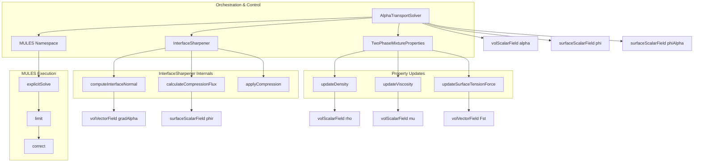

# Day 10: Two-Phase Fundamentals (VOF, Alpha) (พื้นฐานการไหลสองเฟส: VOF, Alpha)

**Date:** 2026-01-10
**Difficulty:** Hardcore
**Phase:** 1 - Foundation Theory
**Prerequisites:** Days 01-09 (Governing Equations, FVM, Discretization, Mesh, BCs, Linear Algebra, Solvers, Pressure-Velocity Coupling)
**Estimated Study Time:** 8-12 hours

---

## 1. Learning Objectives (วัตถุประสงค์การเรียนรู้)

เมื่อจบเซสชันระดับ Hardcore นี้ คุณจะสามารถ:

1.  **Understand (เข้าใจ)** รากฐานทางคณิตศาสตร์และเหตุผลทางฟิสิกส์ของวิธี **Volume of Fluid (VOF)** สำหรับการจับยึดพื้นผิว (Interface capturing) คุณจะแยกแยะสมการการขนส่งหลัก (Core transport equation) สำหรับฟิลด์สัดส่วนปริมาตร ($\alpha$) และอธิบายบทบาทสำคัญของ **Interface compression term** ในการต้านทาน **Numerical diffusion** เพื่อรักษาความคมชัดของ Interface ระหว่างเฟสที่ไม่ละลายกัน (Immiscible phases)

2.  **Design (ออกแบบ)** และวิเคราะห์โครงสร้างของอัลกอริทึม **Multidimensional Universal Limiter with Explicit Solution (MULES)** คุณจะวิเคราะห์ส่วนประกอบต่างๆ—ฟังก์ชัน Flux limiter, กลไกการแก้ไข Boundedness, และกลยุทธ์การแก้สมการแบบ Explicit—และอธิบายว่าทำไมวิธีนี้จึงเป็นวิธีที่เหมาะสมที่สุดสำหรับการบังคับขอบเขตทางกายภาพ $0 \leq \alpha \leq 1$ อย่างเคร่งครัดในระหว่างการขนส่งสเกลาร์ ซึ่งต่างจากวิธี TVD ทั่วไป

3.  **Implement (นำไปใช้)** รูปแบบ Discrete ของ **Interface compression term** ภายใน Framework ของ OpenFOAM Finite Volume ซึ่งรวมถึงการคำนวณเวกเตอร์ปกติของ Interface จาก Gradient ของ $\alpha$, การสร้าง **Compression velocity** $\mathbf{U}_r$ ที่ชี้ไปตามแนวเวกเตอร์ปกติ, และการประกอบ **Compression flux** $\phi_{r,f}$ อย่างถูกต้องเพื่อเพิ่มแบบ Explicit เข้าไปใน Face fluxes ในสมการการขนส่ง

4.  **Architect (ออกแบบสถาปัตยกรรม)** คลาส `AlphaTransportSolver` ที่สมบูรณ์เพื่อจัดการลำดับการแก้สมการสำหรับ $\alpha$-equation ซึ่งรวมถึงการบูรณาการการเรียกใช้ `MULES::explicitSolve`, การจัดการการคำนวณ Compression flux, การบังคับขอบเขตหลังการแก้สมการ (Post-solution bounds), และการอัปเดตคุณสมบัติของ Mixture (ความหนาแน่น $\rho$, ความหนืด $\mu$) สำหรับ Momentum solver ที่เชื่อมโยงกัน

5.  **Analyze (วิเคราะห์)** การคำนวณแรงที่พื้นผิว (Interfacial forces) โดยเน้นการใช้โมเดล **Continuum Surface Force (CSF)** สำหรับแรงตึงผิว (Surface tension) คุณจะคำนวณความโค้งของ Interface $\kappa$ จาก Divergence ของ Unit normal และใช้แรง $\mathbf{F}_{st} = \sigma \kappa \nabla \alpha$ เป็น Momentum source term พร้อมทั้งเข้าใจความอ่อนไหวทางตัวเลขและเทคนิคการทำให้เสถียรที่จำเป็นสำหรับการคำนวณที่แม่นยำ

6.  **Diagnose (วินิจฉัย)** และแก้ไขปัญหาทางตัวเลขที่พบบ่อยในการจำลอง VOF เช่น Interface ที่ฟุ้งกระจายเกินไป (Diffusion สูงเนื่องจาก Compression ไม่พอ), ค่า Volume fraction ที่หลุดขอบเขต (Limiter ล้มเหลว), และความบิดเบี้ยวของ Interface (Curvature calculation มี Noise) คุณจะใช้วิธีแก้ไขที่เป็นระบบโดยการปรับ **Compression factor** $C_{\alpha}$, ตรวจสอบวิธีการ Discretization ที่เหมาะสม, และใช้การ Smoothing สำหรับ Gradient fields

---

# Section 1: Theory (ทฤษฎี)

## 10.1 Volume Fraction Transport Equation (สมการการขนส่งสัดส่วนปริมาตร)

วิธี **Volume of Fluid (VOF)** เป็นเทคนิคแบบ **Interface-capturing** ซึ่งแตกต่างจากวิธี Interface-tracking (เช่น การใช้ Marker particles แบบ Lagrangian) ตัวแปรพื้นฐานของวิธีนี้คือ **Volume fraction** ซึ่งเขียนแทนด้วย $\alpha$ โดยแสดงถึงสัดส่วนของปริมาตรใน Control cell ที่ถูกครอบครองโดยเฟสหลัก (Primary phase เช่น ของเหลว) วิธีนี้เป็นแบบ **Eulerian** โดยธรรมชาติ ซึ่ง Interface เป็นคุณสมบัติที่เกิดขึ้นเอง (Emergent property) จากฟิลด์ $\alpha$ ไม่ใช่ขอบเขตที่ถูกสร้างขึ้น (Discretized boundary) แนวทางนี้มีความทนทานสูงมาก (Robust) สำหรับการจัดการการเปลี่ยนแปลงทางโทโพโลยีที่ซับซ้อน เช่น การแตกตัว (Breakup) และการรวมตัว (Coalescence) ทำให้เป็นรากฐานสำคัญของ Multiphase solvers ใน OpenFOAM เช่น `interFoam`

### 10.1.1 Mathematical Foundation (รากฐานทางคณิตศาสตร์)

วิวัฒนาการของฟิลด์ Volume fraction ถูกควบคุมโดย **Scalar transport equation** สำหรับระบบสองเฟสที่อัดตัวไม่ได้ (Incompressible) และไม่ละลายกัน (Immiscible) โดยไม่มีการถ่ายเทมวล (Phase change) เงื่อนไขทางคณิตศาสตร์ที่ **แม่นยำ (Exact)** ที่ Interface คือ Interface จะเคลื่อนที่ไปพร้อมกับความเร็วของของไหล สิ่งนี้แปลความได้ว่าเป็นการ **Advection ของฟังก์ชัน Heaviside** $H(\mathbf{x},t)$ ซึ่งมีค่าเป็น 1 ในเฟสหลักและ 0 ในเฟสรอง วิธี VOF ประมาณค่าฟังก์ชันที่ไม่ต่อเนื่องนี้ด้วยค่าเฉลี่ยในเซลล์ (Cell-average) คือ $\alpha$

**สมการควบคุมพื้นฐาน** (Basic governing equation) ได้มาจาก Reynolds Transport Theorem ที่ประยุกต์ใช้กับ Indicator function:

$$
\frac{\partial \alpha}{\partial t} + \nabla \cdot (\mathbf{U} \alpha) = 0
$$

**การตีความทางฟิสิกส์:** นี่คือสมการ Scalar advection มาตรฐาน เทอม $\partial \alpha / \partial t$ แทนอัตราการเปลี่ยนแปลงของ Phase fraction ในแต่ละจุด เทอม Divergence $\nabla \cdot (\mathbf{U} \alpha)$ แทน Net convective flux ของ Phase fraction ที่ออกจาก Infinitesimal control volume สำหรับการไหลแบบอัดตัวไม่ได้ ($\nabla \cdot \mathbf{U} = 0$) สมการนี้เทียบเท่ากับการที่ Material derivative เป็นศูนย์: $D\alpha/Dt = 0$ ซึ่งหมายความว่า Phase fraction เพียงแค่ถูกพัดพาไปกับกระแสการไหล

**ข้อจำกัดวิกฤต (Critical Limitation - Numerical Diffusion):** เมื่อสมการนี้ถูก Discretize โดยใช้วิธี Finite Volume มาตรฐาน โดยเฉพาะอย่างยิ่งกับ Scheme อันดับต่ำเช่น **Upwind**, ความไม่ต่อเนื่องที่คมชัดของ Interface จะถูกเกลี่ย (Smeared) ออกไปครอบคลุมหลาย Grid cells อย่างหลีกเลี่ยงไม่ได้ **Numerical diffusion** นี้เป็นผลโดยตรงจาก Truncation error และขัดแย้งกับความเป็นจริงทางฟิสิกส์ของ Interface ที่คมชัด ความหนาของ Interface เทียมนี้จะเพิ่มขึ้นตามเวลา ทำให้การคำนวณเวกเตอร์ปกติ (Interface-normal vectors), ความโค้ง (Curvature), และแรงตึงผิว (Surface tension forces) ผิดเพี้ยนไป

### 10.1.2 The Interface Compression Term

เพื่อต่อต้าน Numerical diffusion และรักษาความคมชัดของ Interface, **Artificial compression term** จึงถูกนำมาใช้ นี่คือคุณสมบัติที่กำหนดนิยามของวิธี VOF ในแบบที่ OpenFOAM นำไปใช้ (มักเรียกว่า "Compressive VOF" method) สมการการขนส่งที่ถูกดัดแปลงจะเป็นดังนี้:

$$
\frac{\partial \alpha}{\partial t} + \nabla \cdot (\mathbf{U} \alpha) + \nabla \cdot \left[\mathbf{U}_r \alpha (1-\alpha)\right] = 0
$$

**การแยกองค์ประกอบของ Compression Term:**

1.  **Purpose (วัตถุประสงค์):** เทอม $\nabla \cdot [\mathbf{U}_r \alpha (1-\alpha)]$ ถูกออกแบบมาให้ทำงาน **เฉพาะในบริเวณ Interface** เท่านั้น สังเกตตัวคูณ $\alpha(1-\alpha)$:
    *   ในเนื้อของเฟส 1 ($\alpha = 1$): $\alpha(1-\alpha) = 0$
    *   ในเนื้อของเฟส 2 ($\alpha = 0$): $\alpha(1-\alpha) = 0$
    *   ที่ Interface ($0 < \alpha < 1$): $\alpha(1-\alpha) > 0$ โดยมีค่าสูงสุดที่ $0.25$ เมื่อ $\alpha = 0.5$
    สิ่งนี้รับประกันว่ากลไกการบีบอัด (Compression mechanism) จะจำกัดอยู่เฉพาะในเซลล์ที่มี Interface

2.  **Compression Velocity ($\mathbf{U}_r$):** นี่ไม่ใช่ความเร็วจริงทางกายภาพ มันคือ **Artificial, face-normal velocity field** ที่สร้างขึ้นเพื่อ "บีบอัด" (Compress) Interface บทบาทหลักคือการสร้าง Directional flux ที่ทำให้ Gradient ของ $\alpha$ ชันขึ้น รูปแบบมาตรฐานคือ:

    $$
    \mathbf{U}_r = \mathbf{n}_f \min \left[ C_\alpha \frac{|\phi|}{|\mathbf{S}_f|}, \max\left(\frac{|\phi|}{|\mathbf{S}|}\right) \right]
    $$

    โดยที่:
    *   $\mathbf{n}_f$: เวกเตอร์ปกติหนึ่งหน่วยของ Interface ที่หน้าเซลล์ (Cell face)
    *   $\phi$: Volumetric face flux ($\mathbf{U}_f \cdot \mathbf{S}_f$)
    *   $|\mathbf{S}_f|$: ขนาดของ Face area vector
    *   $C_\alpha$: **Compression factor** ที่กำหนดโดยผู้ใช้ (โดยปกติคือ 1.0)
    *   $\max(|\phi|/|\mathbf{S}|)$: Global maximum velocity scale ที่ใช้เป็นตัวจำกัด (Limiter) เพื่อป้องกัน Compression velocity ที่สูงเกินไป

    ตัวดำเนินการ `min()` รับประกันว่า $\mathbf{U}_r$ จะมีขอบเขต (Bounded) เพื่อความเสถียร ทิศทาง $\mathbf{n}_f$ สำคัญมาก—มันชี้ข้าม Interface ทำให้ Compression flux ทำหน้าที่เพิ่มความชัน (Sharpen) ไม่ใช่เกลี่ย (Smear) โปรไฟล์ให้เบลอลง

3.  **Mechanism of Action (กลไกการทำงาน):** พิจารณา Interface 1D อย่างง่าย Compression term จะเพิ่ม Flux พิเศษที่เป็นสัดส่วนกับ $\alpha(1-\alpha)$ ในบริเวณที่ $\alpha$ อยู่ระหว่าง 0 ถึง 1 Flux นี้จะขนส่ง $\alpha$ ไปในทิศทางของ $\mathbf{n}_f$ ซึ่งมีผลทำให้ Gradient ของ $\alpha$ ชันขึ้น เป็นการต้านทาน Diffusive fluxes จาก Convective term หลัก มันคือรูปแบบหนึ่งของ **Anti-diffusion** ที่ประยุกต์ใช้แบบเลือกพื้นที่ (Selectively) ที่ Interface

### 10.1.3 Discretization Imperatives and the Role of MULES

การรวม Compression term เข้ามาสร้างความท้าทายทางตัวเลขที่สำคัญ: การรักษา **Boundedness** ของคำตอบ ($0 \leq \alpha \leq 1$) High-order discretization schemes (เช่น Central differencing) สำหรับ Convection term สามารถสร้างค่าที่หลุดขอบเขต (Overshoots/Undershoots) ได้ และ Non-linear compression term ยิ่งเพิ่มความเสี่ยงนี้หากจัดการแบบ Implicit

ดังนั้น อัลกอริทึม OpenFOAM จึงยึดถือแนวทางที่เคร่งครัด:

1.  **Explicit Time Integration:** สมการทั้งหมดถูก Discretize ในเวลาโดยใช้วิธี **Explicit** (เช่น Euler explicit) ช่วยให้ควบคุม Fluxes ที่เข้าและออกจากเซลล์ภายใน Time step ได้โดยตรง
2.  **Flux Limiting via MULES:** **Multidimensional Universal Limiter with Explicit Solution (MULES)** ถูกนำมาใช้ MULES ไม่ใช่แค่ฟังก์ชัน Limiter แต่เป็น **อัลกอริทึม** ที่แก้สมการการขนส่งแบบ Explicit โดยบังคับ Boundedness อย่างแข็งขัน (Actively enforcing) มันทำงานบนหลักการของ **Flux correction**
3.  **Explicit Treatment of Compression:** Compression term จะถูก Discretize แบบ **Explicit** เสมอ (`fvc::` namespace ใน OpenFOAM) การทำแบบ Implicit (`fvm::`) จะทำให้เทอม Non-linear $\alpha(1-\alpha)$ เข้าไปพัวพันใน System matrix ซึ่งทำลาย Linearity ที่จำเป็นสำหรับ Solver ที่มีประสิทธิภาพ และทำให้การบังคับ Boundedness แทบจะเป็นไปไม่ได้

**MULES Algorithm สามารถสรุปอย่างย่อในรูปแบบ Discrete สำหรับเซลล์ $P$ ได้ดังนี้:**

$$
\alpha_P^{n+1} = \alpha_P^n - \frac{\Delta t}{V_P} \sum_{f} \left[ \phi_f \alpha_f^{MULES} + \phi_{r,f} \alpha_f^{MULES} (1-\alpha_f^{MULES}) \right]
$$

ที่นี่ $\alpha_f^{MULES}$ ไม่ใช่การ Interpolation ง่ายๆ แต่เป็น **Limited face value** ที่คำนวณโดย:

$$
\alpha_f^{MULES} = \alpha_f^{upwind} + \psi(\theta_f) (\alpha_f^{high} - \alpha_f^{upwind})
$$

*   $\alpha_f^{upwind}$: ค่า First-order upwind (รับประกัน Boundedness แต่ Diffusive)
*   $\alpha_f^{high}$: ค่า High-order estimate (เช่น จาก Central differencing หรือ TVD schemes)
*   $\psi(\theta_f)$: **Flux limiter function** ซึ่งผสมผสานระหว่างค่า Upwind และ High-order โดยขึ้นอยู่กับความเรียบของผลลัพธ์ในท้องถิ่น (Local solution smoothness) ซึ่งกำหนดโดย Gradient ratio $\theta_f$

ความอัจฉริยะของ MULES อยู่ที่ขั้นตอน Correction แบบ Iterative หลังจากคำนวณ $\alpha^{n+1}$ ใหม่จาก Explicit fluxes แล้ว มันจะตรวจสอบการละเมิดขอบเขต (Bound violations) หาก $\alpha_P^{n+1} < 0$ หรือ $> 1$ มันจะปรับ (Limit) Fluxes ที่หน้าของเซลล์ $P$ และเพื่อนบ้านอย่างเป็นระบบ เพื่อกระจายส่วนเกินหรือส่วนขาดของ $\alpha$ ทำให้มั่นใจว่า Field สุดท้ายจะ Bounded อย่างเคร่งครัด การแก้ไขแบบหลายมิตินี้คือสิ่งที่ทำให้มัน "Universal"

### 10.1.4 Variable Definitions and Physical Constants (นิยามตัวแปรและค่าคงที่ทางฟิสิกส์)

ตารางต่อไปนี้ให้ข้อมูลอ้างอิงที่ครอบคลุมสำหรับตัวแปรสำคัญที่เกี่ยวข้องในทฤษฎีการขนส่ง VOF

| Symbol | LaTeX | Name | Units | Description & Physical Significance |
| :--- | :--- | :--- | :--- | :--- |
| $\alpha$ | `$\alpha$` | Volume Fraction | ไร้หน่วย | ตัวแปรตามพื้นฐาน (Dependent variable) แทนสัดส่วนปริมาตรของเซลล์ที่ถูกครอบครองโดยเฟสหลัก <br> $\alpha=1$: เฟสหลักล้วน, $\alpha=0$: เฟสรองล้วน, $0<\alpha<1$: เซลล์ที่มี Interface |
| $\mathbf{U}$ | `$\mathbf{U}$` | Velocity Field | m/s | สนามความเร็วการพา (Convective velocity field) โดยปกติได้จากการแก้สมการ Navier-Stokes ทำหน้าที่พัดพา (Advect) Interface |
| $\mathbf{U}_r$ | `$\mathbf{U}_r$` | Compression Velocity | m/s | สนามความเร็วเทียม (Artificial velocity) ที่สร้างขึ้นในแนวตั้งฉากกับ Interface บทบาทเดียวคือให้ Sharpening flux ขนาดของมันเชื่อมโยงกับความเร็วการไหลท้องถิ่นผ่าน $C_\alpha$ |
| $C_\alpha$ | `$C_\alpha$` | Compression Factor | ไร้หน่วย | พารามิเตอร์ควบคุมสำคัญ (User-controlled) กำหนดความแรงของการทำ Interface sharpening <br> $C_\alpha=0$: ไม่มีการบีบอัด (Interface diffuses), $C_\alpha=1$: การบีบอัดมาตรฐาน, $C_\alpha>1$: การบีบอัดรุนแรง (เสี่ยงต่อความไม่เสถียร) |
| $\mathbf{n}_f$ | `$\mathbf{n}_f$` | Interface Normal Vector (at face) | ไร้หน่วย | เวกเตอร์หนึ่งหน่วยตั้งฉากกับ Interface ชี้จากเฟส 2 ไปเฟส 1 คำนวณจาก Gradient ของ $\alpha$: $\mathbf{n}_f = (\nabla \alpha)_f / \| (\nabla \alpha)_f + \delta \|$ |
| $\phi$ | `$\phi$` | Volumetric Face Flux | m³/s | อัตราการไหลเชิงปริมาตรผ่านหน้าเซลล์: $\phi_f = \mathbf{U}_f \cdot \mathbf{S}_f$ เป็นตัวขับเคลื่อนหลักของการพา (Convection) ของ Interface |
| $\phi_r$ | `$\phi_r$` | Compression Face Flux | m³/s | Sharpening flux เทียม: $\phi_{r,f} = \mathbf{U}_{r,f} \cdot \mathbf{S}_f$ ถูกบวกเพิ่มกับ Convective flux ในบริเวณ Interface |
| $\mathbf{S}_f$ | `$\mathbf{S}_f$` | Face Area Vector | m² | เวกเตอร์ที่มีขนาดเท่ากับพื้นที่หน้าเซลล์และทิศทางเป็น Outward normal จาก Owner cell เป็นพื้นฐานของการคำนวณ Flux |
| $\delta$ | `$\delta$` | Stabilization Factor | 1/m | ตัวเลขขนาดเล็ก (เช่น $10^{-12}$) ที่บวกในตัวหารเมื่อคำนวณ $\mathbf{n}_f$ เพื่อป้องกันการหารด้วยศูนย์ในบริเวณที่ $\alpha$ สม่ำเสมอ |
| $\psi$ | `$\psi$` | Flux Limiter Function | ไร้หน่วย | ฟังก์ชัน (เช่น Sweby, Van Leer) ที่ใช้ใน MULES เพื่อผสมระหว่าง Face interpolations แบบ Low- และ High-order ตามความ Monotonic ของผลลัพธ์ ($\theta$) เพื่อรับประกัน Boundedness พร้อมปรับปรุงความแม่นยำ |
| $\theta$ | `$\theta$` | Gradient Ratio | ไร้หน่วย | อาร์กิวเมนต์ของ Flux limiter โดยปกตินิยามเป็นอัตราส่วนของ Gradient ของ $\alpha$ ด้าน Upwind ต่อ Downwind ใช้วัดความเรียบ (Smoothness) ของผลลัพธ์ในท้องถิ่น |

### 10.1.5 Critical Warnings and Best Practices

1.  **Explicit Discretization is Non-Negotiable:** Compression term **ต้อง** ถูก Discretize แบบ Explicit (`fvc::div(U_r*alpha*(1-alpha))`) การพยายามใช้รูปแบบ Implicit จะนำไปสู่ปัญหาการลู่เข้าที่รุนแรงและเกือบจะแน่นอนว่าจะละเมิดเงื่อนไข Boundedness $0 \leq \alpha \leq 1$ สิ่งนี้สร้างข้อจำกัดเรื่องความเสถียรของ Time step ซึ่งเชื่อมโยงกับ Courant number

2.  **Compression Factor ($C_\alpha$) คือ Tuning Parameter:** แม้ว่า $C_\alpha=1$ จะเป็นค่า Default ที่ดี แต่ค่าที่เหมาะสมที่สุดขึ้นอยู่กับกรณี
    *   **ต่ำเกินไป ($<<1$):** Interface ยังคง Diffuse มากเกินไป (หนา) นำไปสู่การคำนวณ Curvature และแรงตึงผิวที่คลาดเคลื่อน
    *   **สูงเกินไป ($>>1$):** สามารถสร้าง "Numerical kinks" หรือการแกว่งใน Interface, ทำให้เกิดความไม่เสถียร, และอาจตรึง Interface ไว้เทียมๆ ต้านกับการไหลจริง สำหรับการไหลที่มีแรงตึงผิวสูงมาก ค่าที่ต่ำกว่า 1 เล็กน้อยบางครั้งมีประโยชน์

3.  **Interface Normal Calculation Requires Care:** การคำนวณ $\mathbf{n}_f = \nabla \alpha / \|\nabla \alpha\|$ อ่อนไหวมากต่อ Noise ในฟิลด์ $\alpha$ โดยเฉพาะที่มี Interface คมชัดแต่เป็นแบบ Discretized OpenFOAM มักใช้ **Gradient limiting** หรือ **Smoothing** (เช่น Cell-limited gradient schemes) เพื่อคำนวณ $\nabla \alpha$ ที่ Robust กว่าสำหรับวัตถุประสงค์นี้ Normal field ที่มี Noise จะนำไปสู่ Compression fluxes ที่แปรปรวนและ Interface ที่ "หยาบ" หรือหยัก

4.  **MULES is the Boundedness Guardian:** ห้ามข้าม MULES เมื่อแก้สมการ $\alpha$ การใช้ `fvScalarMatrix` solve มาตรฐานพร้อม Implicit convection จะส่งผลให้ได้คำตอบที่ Unbounded การเรียก `MULES::explicitSolve(...)` เป็นทางเข้า (Entry point) ที่จำเป็น

5.  **Time Step Restriction:** การจัดการสมการทั้งหมดแบบ Explicit รวมกับ Anti-diffusive compression term ทำให้เกิดขีดจำกัดความเสถียรที่เข้มงวดกว่า CFL condition มาตรฐานสำหรับการพา แนะนำให้ใช้ Maximum Courant number ที่ *ต่ำกว่า 0.5* สำหรับการจำลอง VOF ที่ Robust และแน่นอนว่าต้องต่ำกว่า 1.0 ควรเฝ้าระวัง `CourantNo` utility อย่างใกล้ชิด

โดยสรุป ทฤษฎีของวิธี VOF ใน OpenFOAM หมุนรอบการ Convection ของ Volume fraction $\alpha$ ซึ่งถูกคานสมดุลอย่างมีศิลปะด้วย Non-linear compression term เพื่อรักษาความคมชัดของ Interface โครงสร้างทั้งหมดนี้ถูกยึดโยงทางตัวเลขด้วยอัลกอริทึม Explicit MULES ซึ่งรับประกันคำตอบที่ยอมรับได้ทางฟิสิกส์ (Physically admissible) โดยต้องแลกมาด้วยข้อจำกัดเรื่อง Time-step ที่เข้มงวด นี่คือรากฐานสำคัญที่ฟิสิกส์สองเฟสในลำดับถัดไป—แรงตึงผิว, การเปลี่ยนสถานะ, และ Turbulent dispersion—ถูกสร้างขึ้นบนนั้น

# Section 2: OpenFOAM Reference

Section นี้จะทำการวิเคราะห์เชิงลึกแบบบรรทัดต่อบรรทัดของ Core OpenFOAM classes ที่ใช้ในวิธี Volume of Fluid (VOF), อัลกอริทึม MULES, และการจัดการคุณสมบัติของ Interface การเข้าใจ Source files เหล่านี้สำคัญมากสำหรับการขยายความสามารถ (Extending), การ Debug, หรือการปรับแต่ง Two-phase flow solvers เราจะชำแหละ Header (`.H`) และ Implementation (`.C`) files โดยเน้นที่สถาปัตยกรรม, Member functions หลัก, และอัลกอริทึมเบื้องหลัง ที่สำคัญเราจะเปรียบเทียบการ Implementation มาตรฐานของ OpenFOAM กับความต้องการและการดัดแปลงเฉพาะสำหรับโปรเจกต์ Evaporator solver ของเรา โดยเน้นในตาราง "What We Do DIFFERENTLY"

## 10.2 Class Analysis: `MULES` (การวิเคราะห์คลาส `MULES`)

**Header:** `src/finiteVolume/fvMatrices/fvMatrix/fvMatrix.H` (Primary template) และ `src/finiteVolume/fvMatrices/fvMatrix/MULES.H` (Specialized functions)
**Purpose:** **Multidimensional Universal Limiter with Explicit Solution (MULES)** ไม่ใช่ Class ในความหมาย Object-oriented ดั้งเดิม แต่เป็น Namespace ที่รวม Templated static functions วัตถุประสงค์คือเพื่อแก้สมการ Scalar transport โดยบังคับ **Boundedness** อย่างเคร่งครัด (เช่น $0 \leq \alpha \leq 1$) โดยใช้วิธีการ Explicit ที่มี Flux-correction เป็นรากฐานสำคัญของ Interface capturing ใน `interFoam` และ Solvers ที่เกี่ยวข้อง

### 10.2.1 Core Algorithm and Code Dissection

หัวใจของ MULES อยู่ที่ฟังก์ชัน `explicitSolve` มาดูเวอร์ชัน Overloaded ทั่วไปที่จัดการ Compression flux:

```cpp
// From src/finiteVolume/fvMatrices/fvMatrix/MULES.C
template<class RhoType, class SpType, class SuType>
void Foam::MULES::explicitSolve
(
    const RhoType& rho,
    volScalarField& psi,
    const surfaceScalarField& phi,
    surfaceScalarField& phiPsi,
    const SpType& Sp,
    const SuType& Su,
    const scalar psiMax,
    const scalar psiMin
)
{
    // 1. Calculate the unbounded, high-order face flux, phiPsi
    //    ใช้ Interpolation scheme ที่ระบุ (เช่น limitedLinear, vanLeer)
    fvc::flux<scalar>(phiPsi, phi, psi, "div(phi,psi)");

    // 2. Create limiter field. นี่คือ surfaceScalarField ที่แต่ละ Face
    //    เก็บค่า Limiter ระหว่าง 0 (Upwind ล้วน) และ 1 (High-order ล้วน)
    surfaceScalarField lambda
    (
        IOobject
        (
            "lambda",
            psi.mesh().time().timeName(),
            psi.mesh()
        ),
        psi.mesh(),
        dimensionedScalar("1", dimless, 1.0)
    );

    // 3. The core limiter loop. วนลูปคำนวณแต่ละ Cell เพื่อดูว่า
    //    สามารถรับ Flux ได้มากแค่ไหนโดยไม่ละเมิด Bounds (psiMin, psiMax)
    //    และปรับ lambda field ที่ Faces เพื่อบังคับ Bounds
    for (int j=0; j<3; j++) // โดยปกติทำ Correction 2-3 passes
    {
        // limit(...) คำนวณ Correction factors สำหรับแต่ละ Cell
        // และคืนค่า Flux multiplier สูงสุดที่ยอมรับได้สำหรับ Faces รอบข้าง
        limitCorr
        (
            lambda,
            rho,
            psi,
            phiPsi,
            Sp,
            Su,
            psiMax,
            psiMin
        );
    }

    // 4. Apply the final limiter to the face fluxes.
    //    phiPsi = phiPsi_upwind + lambda * (phiPsi_high - phiPsi_upwind)
    phiPsi = fvc::flux(phi, psi, "div(phi,psi)");
    surfaceScalarField phiPsiUpwind = fvc::flux(phi, psi, "div(phi,psi)");
    phiPsi = phiPsiUpwind + lambda*(phiPsi - phiPsiUpwind);

    // 5. Perform the explicit update of the cell-centered field.
    //    fvm::Sp(Sp, psi) + Su สร้าง Diagonal source terms
    //    Flux divergence ถูกบวกแบบ Explicit
    fvScalarMatrix psiEqn
    (
        fvm::ddt(rho, psi) + fvm::div(phiPsi, psi) - fvm::Sp(Sp, psi) == Su
    );
    psiEqn.solve();
}
```

**Key Data Members (ภายในขอบเขตฟังก์ชัน):**
*   `lambda`: `surfaceScalarField` ที่ทำหน้าที่เป็น Flux limiter ค่า 1.0 อนุญาต High-order flux เต็มที่, 0.0 กลับไปใช้ Upwind Field นี้ถูกคำนวณแบบ Iterative เพื่อประกัน Boundedness
*   `phiPsi`: Face flux ที่ถูกขนส่งของ Scalar `psi` (เช่น `phiAlpha` สำหรับ $\alpha$) เป็นทั้ง Input (High-order flux) และ Output (Bounded flux)

**Critical Member Functions:**
*   `explicitSolve(...)`: ฟังก์ชัน Driver หลัก ประสานงานการคำนวณ High-order fluxes, การใช้ Limiter แบบวนซ้ำ, และการอัปเดตคำตอบสุดท้ายแบบ Explicit
*   `limitCorr(...)`: ม้างานภายใน (Internal workhorse) ทำการกวาด (Sweep) ทุกเซลล์ คำนวณ Flux ขาเข้า/ขาออกรวมของ `psi` จากค่าปัจจุบันและขอบเขต มันจะคำนวณ Scaling factor สำหรับ Fluxes บนหน้าของเซลล์และอัปเดต `lambda` field นี่คือการดำเนินการแบบ **Local** แต่ต้องการ Global iteration เพื่อให้ลู่เข้า
*   `fvc::flux(...)`: ใช้คำนวณ High-order face interpolations ของ `psi` ตาม Scheme ที่ระบุใน `fvSchemes`

## 10.2.1 What We Do DIFFERENTLY: MULES for Phase Change (สิ่งที่เราทำต่างออกไป: MULES สำหรับการเปลี่ยนเฟส)

| Aspect | Standard OpenFOAM (`interFoam`) | Our Evaporator Solver Implementation | Rationale |
| :--- | :--- | :--- | :--- |
| **Source Term Integration** | MULES แก้ `ddt(α) + div(φα) = 0` Source terms (`Sp`, `Su`) เป็น Option เสริมสำหรับปฏิกิริยาง่ายๆ | **เราต้อง Integrate phase change source term `ṁ` จาก Lee model** สมการกลายเป็น `ddt(α) + div(φα) = ṁ/ρ` Source นี้ **Non-linear และ Coupled อย่างรุนแรง** กับ Temperature field | ฟิสิกส์หลักของการระเหย/ควบแน่นคือ Volumetric source/sink ของ Phase $\alpha$ การละเลยจะละเมิด Mass conservation |
| **Boundedness with Sources** | `limitCorr` สมมติว่า Sources เป็น Passive และสามารถ Bound ได้แบบ Linear | **เราต้อง Linearize source term `ṁ`** ก่อนส่งให้ `MULES::explicitSolve` ในรูปแบบ `Su` และ `Sp` (`Su + Sp*α`) การ Linearization ต้องทำแบบ **Implicit ใน $\alpha$** (`Sp < 0` เพื่อความเสถียร) แต่อัปเดตแบบ Explicit ทุก Time step ตาม `T` และ `α` ปัจจุบัน | Explicit source สามารถขับ `α` ให้หลุดช่วง [0,1] ได้ง่าย Implicit treatment (negative `Sp`) ช่วยเพิ่ม Diagonal dominance และความเสถียร โดยเฉพาะช่วงที่มีการเปลี่ยนสถานะรวดเร็ว |
| **Flux Calculation** | ใช้ Fluid velocity flux `phi` สำหรับ Convection Compression flux `phir` ถูกบวกแยกต่างหาก | **เราต้องคำนึงถึง Expansion velocity** Convective velocity รวมสำหรับ `α` ไม่ใช่แค่ `U` แต่รวม Volumetric expansion เนื่องจากการเปลี่ยนสถานะ Flux `phi` ที่ส่งให้ MULES ควรเป็น **Face flux ที่สอดคล้องกับ Mixture velocity `U`** ซึ่งรวม Expansion term ผ่าน Pressure correction แล้ว | Expansion term $\nabla \cdot U = \dot{m}(1/\rho_v - 1/\rho_l)$ สร้าง Velocity divergence ซึ่งกระทบต่อการ Advection ของ Interface การใช้ `phi` ที่ถูกต้องจำเป็นสำหรับการ Track interface ที่แม่นยำภายใต้ Phase change |
| **Algorithm Call** | `MULES::explicitSolve(alpha, phi, phiAlpha, 1, 0)` | `MULES::explicitSolve(alpha, phi, phiAlpha, Sp, Su)` โดยที่ `Sp` และ `Su` สร้างจาก Linearized `ṁ` source การเรียกนี้ฝังอยู่ในเมธอด `AlphaTransportSolver::solveAlpha()` ของเรา | เราขยาย Standard interface เพื่อรวมฟิสิกส์ของเรา `AlphaTransportSolver` class กลายเป็นผู้จัดการสำหรับ Interaction ที่ซับซ้อนนี้ |

**Implementation Snippet from Our `AlphaTransportSolver.C`:**
```cpp
void Foam::AlphaTransportSolver::solveAlpha()
{
    // 1. Get references to fields
    volScalarField& alpha = alpha_;
    const surfaceScalarField& phi = phi_;
    const volScalarField& T = T_;

    // 2. Calculate phase change mass transfer rate (Lee Model)
    //    mDot = C * alpha * rho_l * (T - T_sat)/T_sat  (evap)
    //         + C * (1-alpha) * rho_v * (T_sat - T)/T_sat (cond)
    volScalarField mDot = phaseChangeModel_->mDot(T, alpha);

    // 3. Linearize source term for MULES: S(alpha) = Su + Sp*alpha
    //    For stability, treat source implicitly in alpha where possible.
    //    Example: Evaporation source (positive mDot) reduces liquid alpha.
    //    S(alpha) = - (mDot/rho_l) * alpha  (if mDot>0)
    //    So, Su = 0, Sp = - mDot/rho_l
    volScalarField Su = dimensionedScalar("Su", dimless/dimTime, 0.0);
    volScalarField Sp = -pos(mDot)*mDot/rhoLiquid_ - neg(mDot)*mDot/rhoVapor_;

    // 4. Calculate compression flux (standard OpenFOAM method)
    surfaceScalarField phir = compressionFlux(alpha);

    // 5. Combine convective and compressive fluxes for alpha transport
    surfaceScalarField phiAlpha = fvc::flux(phi, alpha, "div(phi,alpha)");
    phiAlpha += fvc::flux(phir, alpha, "div(phir,alpha)");

    // 6. Solve bounded alpha equation with phase change source
    MULES::explicitSolve(alpha, phi, phiAlpha, Sp, Su);

    // 7. Enforce strict bounds (safety)
    alpha = max(min(alpha, scalar(1.0)), scalar(0.0));
    alpha.correctBoundaryConditions();

    // 8. Update mixture properties
    updateMixtureProperties();
}
```

## 10.3 Class Analysis: `interfaceProperties` (การวิเคราะห์คลาส `interfaceProperties`)

**Header:** `src/transportModels/interfaceProperties/interfaceProperties.H`
**Purpose:** Class นี้เป็นคลังส่วนกลางสำหรับการคำนวณที่เกี่ยวข้องกับ Fluid-fluid interface ในวิธี VOF มันจัดการการคำนวณ Interface normal vector, Curvature, และแรงตึงผิว (Surface tension force) ที่เป็นผลลัพธ์โดยใช้โมเดล **Continuum Surface Force (CSF)** โดยปกติจะถูกถือครองโดย Main solver (เช่น `interFoam`) และอัปเดตทุก Time step

## 10.3.1 Core Algorithm and Code Dissection (อัลกอริทึมหลักและการชำแหละโค้ด)

เมธอด `correct()` คือ Routine หลักที่ถูกเรียกตอนเริ่มแต่ละ Time step หรือ PISO iteration

```cpp
// From src/transportModels/interfaceProperties/interfaceProperties.C
void Foam::interfaceProperties::correct()
{
    // 1. Calculate the cell-centered gradient of alpha.
    //    This is a volVectorField: grad(alpha).
    const volVectorField gradAlpha(fvc::grad(alpha_));

    // 2. Compute interface normal vectors at CELL CENTERS.
    //    nHat = grad(alpha) / (|grad(alpha)| + delta)
    //    delta is a small stabilization factor to prevent division by zero.
    nHat_ = gradAlpha/(mag(gradAlpha) + deltaN_);
    nHat_.correctBoundaryConditions();

    // 3. Interpolate cell-centered normals to FACE CENTERS.
    //    This is critical for calculating face-centered compression flux and curvature.
    nHatf_ = fvc::interpolate(nHat_);

    // 4. Calculate interface CURVATURE.
    //    kappa = -div(nHat)  (Note: negative sign convention)
    //    The divergence is calculated using face-normal vectors nHatf_.
    kappa_ = -fvc::div(nHatf_);

    // 5. Apply curvature smoothing if enabled.
    //    Raw curvature is often noisy. A simple filter can be applied.
    if (smoothCurvature_)
    {
        fvc::smooth(kappa_, curvatureSmoothingCoeff_);
    }
    kappa_.correctBoundaryConditions();
}
```

**Key Data Members:**
*   `alpha_`: อ้างอิงถึง Volume fraction field (`volScalarField`)
*   `nHat_`: Cell-centered interface normal vector field (`volVectorField`) Unit vector ชี้จากเฟส 2 ไปเฟส 1
*   `nHatf_`: Face-centered interface normal vector field (`surfaceVectorField`) จำเป็นสำหรับการคำนวณ Flux
*   `kappa_`: Interface curvature field (`volScalarField`) เป็นบวกสำหรับ Interface ที่เว้าเข้าหาเฟส 1
*   `deltaN_`: Scalar stabilization factor ขนาดเล็ก (เช่น $1e-12 / \text{RefLength}$) เพื่อเลี่ยงการหารด้วยศูนย์
*   `cAlpha_`: Interface compression factor อ่านจาก `transportProperties`

**Critical Member Functions:**
*   `correct()`: อัปเดต `nHat_`, `nHatf_`, และ `kappa_` ตาม `alpha_` ปัจจุบัน
*   `sigmaK()`: คืนค่าเทอม Surface tension force เป็น `volVectorField` คำนวณเป็น `sigma_ * kappa_ * gradAlpha`
*   `surfaceTensionForce()`: มักใช้เหมือนกับ `sigmaK()` เทอมนี้ถูกบวกเป็น Source ใน Momentum equation

### 10.3.1 What We Do DIFFERENTLY: Interface in Phase Change

| Aspect | Standard OpenFOAM (`interFoam`) | Our Evaporator Solver Implementation | Rationale |
| :--- | :--- | :--- | :--- |
| **Interface Definition** | Interface นิยามโดย `alpha` isosurface (เช่น `alpha=0.5`) เพียงอย่างเดียว | **Phase change เกิดที่ Saturation temperature isotherm** สำหรับ Pure fluid, Interface ก็คือ Isotherm ที่ $T_{sat}$ เรามี Coupled level sets สองตัวคือ `alpha` และ `T` ใน Lee model ปัจจุบันเราสมมติว่ามันทับซ้อนกัน แต่เป็นการประมาณ | ในความเป็นจริง Interface คือขอบเขตเฟสที่ $T = T_{sat}$ `alpha` field เป็นเพียงโครงสร้างทางตัวเลขเพื่อระบุตำแหน่ง สำหรับ High-fidelity boiling อาจต้องใช้ Sharp temperature field ที่ Interface |
| **Curvature & Nucleation** | Curvature ส่งผลต่อ Surface tension force ผ่าน Young-Laplace pressure jump: $\Delta p = \sigma \kappa$ | **Curvature ส่งผลวิกฤตต่อ Saturation temperature** สำหรับฟอง/หยดน้ำขนาดเล็ก Kelvin effect มีนัยสำคัญ: $T_{sat}(r) = T_{sat}(\infty) \exp(-2\sigma/(\rho_l r R_v T))$ Basic Lee model ใช้ `T_sat` คงที่ **เราอาจต้องขยายให้ขึ้นกับ Curvature** สำหรับจำลอง Bubble nucleation | Boiling inception มักเกิดที่ Nucleation sites ซึ่งมี Local curvature สูงมาก การละเลย Curvature dependence ของ `T_sat` อาจทำนาย Superheat ที่ต้องใช้ในการโตของฟองผิดพลาด |
| **Compression Factor (`cAlpha`)** | ค่าคงที่ ปกติ 1.0 | **อาจต้องปรับแบบ Dynamic** ระหว่างการระเหยรุนแรง Interface เป็นแหล่งกำเนิดปริมาตรไอ Standard compression flux อาจขัดแย้งกับ Expansion velocity เราอาจใช้กฎลด `cAlpha` เฉพาะจุดที่ Phase change source term `|ṁ|` สูงมาก | ป้องกัน "Over-compression" ทางตัวเลขที่อาจบีบ (Pinch off) หรือบิดเบือน Interface ที่กำลังขยายตัวตามธรรมชาติเนื่องจากการสร้างไอ |
| **Surface Tension Force** | บวกเป็น Explicit source ใน Momentum equation | **ต้องเข้ากันได้กับ Momentum equation ของเราที่มี Expansion term** เทอมแรง $\sigma \kappa \nabla \alpha$ คำนวณเหมือนเดิม แต่ผลกระทบต่อ Pressure-velocity coupling (ผ่าน Modified pressure Poisson equation จาก Day 09) ต้องสอดคล้องกัน | CSF model ยังคงใช้ได้ กุญแจสำคัญคือ `grad(alpha)` ที่ใช้ต้องเรียบพอที่จะสร้าง Force field ที่สมจริงทางฟิสิกส์ โดยเฉพาะเมื่อรวมกับ Source terms อื่นๆ ของเรา |

**Implementation Snippet for Curvature-Dependent Saturation (Future Enhancement):**
```cpp
// Potential extension in our PhaseChangeModel class
Foam::tmp<Foam::volScalarField>
Foam::LeePhaseChangeModel::mDotCurvatureCorrected
(
    const volScalarField& T,
    const volScalarField& alpha,
    const volScalarField& kappa // Curvature from interfaceProperties
) const
{
    // Kelvin-Helmholtz equation for saturation temperature shift
    // For a spherical bubble/droplet of radius R (where kappa = 2/R for a sphere)
    dimensionedScalar Rv("Rv", dimGasConstant, 461.5); // Water vapor
    volScalarField TsatLocal = Tsat_;

    // Approximate local radius: R = 2 / kappa (valid for sphere)
    // Add a small limit to avoid division by zero in bulk phases
    volScalarField R = 2.0/(mag(kappa) + dimensionedScalar("smallK", dimless/dimLength, 1e-12));
    TsatLocal = Tsat_ * exp(-2.0*sigma_/(rhoLiquid_ * R * Rv * Tsat_));

    // Now use local saturation temperature in Lee model
    volScalarField mDotEvap = C_ * alpha * rhoLiquid_ * max(T - TsatLocal, scalar(0))/Tsat_;
    volScalarField mDotCond = C_ * (scalar(1) - alpha) * rhoVapor_ * max(TsatLocal - T, scalar(0))/Tsat_;

    return (mDotEvap - mDotCond);
}
```

## 10.4 Class Analysis: `twoPhaseMixture` and `incompressibleTwoPhaseMixture` (การวิเคราะห์คลาส `twoPhaseMixture` และ `incompressibleTwoPhaseMixture`)

**Header:** `src/transportModels/twoPhaseMixture/twoPhaseMixture.H` และ `src/transportModels/incompressibleTwoPhaseMixture/incompressibleTwoPhaseMixture.H`
**Purpose:** Classes เหล่านี้ให้กลไกที่เลือกได้ตอน Runtime (Runtime-selectable mechanism) เพื่อนิยามคุณสมบัติ (ความหนืด, ความหนาแน่น) ของแต่ละเฟสและคำนวณคุณสมบัติผสม (Mixture properties) ตาม `alpha` field `incompressibleTwoPhaseMixture` คือคลาสลูกที่ใช้ใน `interFoam` โดยสมมติว่าความหนาแน่นของแต่ละเฟสคงที่

## 10.4.1 Core Algorithm and Code Dissection (อัลกอริทึมหลักและการชำแหละโค้ด)

เมธอดหลักอยู่ที่ `nu()` (Kinematic viscosity) ของคลาสลูก:

```cpp
// From src/transportModels/incompressibleTwoPhaseMixture/incompressibleTwoPhaseMixture.C
Foam::tmp<Foam::volScalarField>
Foam::incompressibleTwoPhaseMixture::nu() const
{
    // Retrieve references to the viscosity models for each phase.
    const volScalarField& nuModel1 = nuModel1_->nu();
    const volScalarField& nuModel2 = nuModel2_->nu();

    // Mixture viscosity calculation.
    // ใช้ Arithmetic mean ถ่วงน้ำหนักด้วย Volume fraction อย่างง่าย
    // Note: บางงานอาจต้องใช้ Harmonic mean สำหรับ Viscosity ข้าม Interface ที่คมชัด
    return tmp<volScalarField>
    (
        new volScalarField
        (
            "nu",
            alpha1_*nuModel1 + (scalar(1) - alpha1_)*nuModel2
        )
    );
}

// Mixture density ก็เรียบง่ายเช่นกันเนื่องจากสมมติฐาน Incompressible
Foam::tmp<Foam::volScalarField>
Foam::incompressibleTwoPhaseMixture::rho() const
{
    return tmp<volScalarField>
    (
        new volScalarField
        (
            "rho",
            alpha1_*rho1_ + (scalar(1) - alpha1_)*rho2_
        )
    );
}
```

**Key Data Members:**
*   `alpha1_`: Volume fraction ของเฟส 1 (`volScalarField`)
*   `nuModel1_`, `nuModel2_`: Auto-pointers ไปยัง `viscosityModel` allow variable viscosity
*   `rho1_`, `rho2_`: ค่าความหนาแน่นคงที่สำหรับเฟส 1 และ 2 (`dimensionedScalar`)

**Critical Member Functions:**
*   `nu()`: คืนค่า Kinematic viscosity ของ Mixture
*   `mu()`: คืนค่า Dynamic viscosity (`rho() * nu()`)
*   `rho()`: คืนค่า Density ของ Mixture
*   `correct()`: อัปเดต Viscosity models ถ้าขึ้นกับอุณหภูมิหรือ Shear-rate

### 10.4.1 What We Do DIFFERENTLY: Properties for Phase Change

| Aspect | Standard OpenFOAM (`interFoam`) | Our Evaporator Solver Implementation | Rationale |
| :--- | :--- | :--- | :--- |
| **Density Model** | **Incompressible, constant.** `rho1`, `rho2` เป็นค่าคงที่ Mixture density เปลี่ยนตาม `alpha` เท่านั้น | **ต้องคำนึงถึง Thermal expansion และ Phase density ratio** แม้เราจะมองว่า Incompressible ในแง่เทอร์โมไดนามิกส์ แต่ `ρ_l` และ `ρ_v` เป็น **ค่าคงที่ที่มี Ratio สูงมาก** (เช่น ~1600 สำหรับน้ำ) Ratio นี้คือตัวขับเคลื่อน Expansion term $\nabla \cdot U$ | Density difference ขนาดใหญ่คือสาเหตุหลักของ Volume expansion term การใช้ Ratio ที่ถูกต้องสำคัญแบบ Non-negotiable สำหรับ Mass และ Volume conservation |
| **Viscosity Model** | Arithmetic mean | **อาจต้องการ Mixture model ที่ซับซ้อนกว่า** Arithmetic mean อาจไม่แม่นยำสำหรับ Gas-liquid mixtures ที่มี Viscosity ratio สูง Harmonic mean $\mu = 1 / (\alpha/\mu_1 + (1-\alpha)/\mu_2)$ บางครั้งถูกใช้สำหรับการไหลตั้งฉากกับ Interface | Viscosity ที่ Interface ส่งผลต่อ Shear stress และพลวัตของฟอง ค่าเฉลี่ยที่ไม่เหมาะสมอาจ Damp การขยับของ Interface |
| **Property Update Trigger** | อัปเดตใน Main solver loop หลังแก้ `alpha` | **อัปเดตหลัง *ทุก* Alpha solution รวมถึง Sub-cycles** `AlphaTransportSolver::updateMixtureProperties()` ของเราถูกเรียกทันทีหลัง `solveAlpha()` เพื่อให้ Momentum equation ใน PISO iteration ถัดไปใช้ `ρ` และ `μ` ล่าสุด | การ Coupling ระหว่างตำแหน่ง Interface และ Properties นั้นแน่นแฟ้น การใช้ Lagged properties อาจทำให้ไม่เสถียร โดยเฉพาะเมื่อ Interface ขยับเร็วเนื่องจาก Phase change |
| **Temperature Dependence** | ปกติไม่พิจารณา | **วิกฤตสำหรับความแม่นยำ** สำหรับช่วงอุณหภูมิกว้าง `ρ_l` และ `ρ_v` ควรเป็นฟังก์ชันของ `T` (ผ่าน `rhoThermo`) Solver architecture ของเรา (จาก Day 12) มี `thermo` model เราต้องมั่นใจว่า `twoPhaseMixture` ใช้ Densities ที่ขึ้นกับอุณหภูมิจาก Thermo class | การระเหยขับเคลื่อนด้วย Heat transfer การละเลย Temperature dependence ของ Vapor density จะคำนวณปริมาตรไอที่ผลิตได้ผิดพลาด |

**Implementation Snippet for Our Property Manager:**
```cpp
// In our IntegratedEvaporatorSolver class (concept from Day 12)
void Foam::IntegratedEvaporatorSolver::updateProperties()
{
    // 1. Update alpha field (solves transport with MULES and phase change)
    alphaSolver_.solve();

    // 2. Update temperature field (solves energy equation with latent heat)
    TEqn_.solve();

    // 3. Update mixture properties USING THE LATEST alpha and T.
    //    We extend the standard twoPhaseMixture concept.
    const volScalarField& T = thermo_.T();

    // Get temperature-dependent densities from thermo model
    volScalarField rhoLiquid = thermo_.rhoLiquid(T); // e.g., constant or polynomial
    volScalarField rhoVapor = thermo_.rhoVapor(T);

    // Calculate mixture density (more general than base class)
    rho_ = alpha_*rhoLiquid + (scalar(1.0) - alpha_)*rhoVapor;
    rho_.correctBoundaryConditions();

    // Calculate mixture viscosity with a selectable blend
    // blendScheme could be "linear", "harmonic", "geometric"
    if (viscosityBlendScheme_ == "harmonic")
    {
        mu_ = 1.0 / (alpha_/muLiquid_ + (scalar(1.0)-alpha_)/muVapor_);
    }
    else // default linear
    {
        mu_ = alpha_*muLiquid_ + (scalar(1.0) - alpha_)*muVapor_;
    }
    mu_.correctBoundaryConditions();

    // 4. The momentum equation will use these updated rho_ and mu_ fields.
}
```

สรุป Section นี้ชี้ให้เห็นว่าแม้เราจะสร้างบนรากฐานที่แข็งแกร่งของ `MULES`, `interfaceProperties`, และ `twoPhaseMixture` แต่ Evaporator solver ของเราต้องการการดัดแปลงที่สำคัญเพื่อ Integrate แหล่งกำเนิดจากการเปลี่ยนสถานะ (Phase change sources), จัดการ Property ratios ขนาดใหญ่, และรับประกันการ Coupling ที่แน่นแฟ้นระหว่าง Interface, Temperature, และ Flow fields ตาราง "What We Do DIFFERENTLY" คือพิมพ์เขียวสำหรับการปรับแต่งเหล่านี้

# Section 3: Class Design

## 10.5 Architectural Overview & Core Class Relationships (ภาพรวมสถาปัตยกรรมและความสัมพันธ์ของคลาสหลัก)

การนำวิธี **Volume of Fluid (VOF)** มาใช้พร้อมกับ Interface compression และ Bounded transport ต้องใช้ชุดของ Classes ที่ประสานงานกันอย่างระมัดระวัง การออกแบบยึดตามปรัชญา Object-oriented ของ OpenFOAM โดยเน้นการแยกหน้าที่ (Separation of concerns), Runtime polymorphism, และการจัดการข้อมูลที่มีประสิทธิภาพสำหรับ Unstructured meshes ความท้าทายหลักคือการรักษา Interface ที่คมชัดและสอดคล้องทางฟิสิกส์ ในขณะที่ต้องบังคับเงื่อนไข Boundedness ($0 \leq \alpha \leq 1$) อย่างเคร่งครัดในทุก Computational cells ซึ่งเป็นคุณสมบัติที่ยอมรับไม่ได้ที่จะละเมิด (Non-negotiable) เพื่อความเสถียรและความสมจริง

ลำดับชั้นของ Class ถูกสร้างขึ้นรอบเสาหลักสองต้น: **Transport** และ **Interface Management** คลาส `AlphaTransportSolver` ทำหน้าที่เป็นวาทยกร (Orchestrator) จัดการกระบวนการแก้สมการสำหรับ Volume fraction field มันมอบหมายงานเฉพาะทางให้กับ Helper classes: `InterfaceSharpener` จัดการแง่มุมทางเรขาคณิตของ Interface (Normals, Compression) ในขณะที่ปฏิสัมพันธ์กับ OpenFOAM ecosystem สำหรับ Bounded solution จะทำผ่านฟังก์ชันใน `MULES` namespace การคำนวณคุณสมบัติสำหรับ Two-phase mixture ถูกจัดการโดย `TwoPhaseMixtureProperties` เพื่อให้มั่นใจว่า Density, Viscosity, และ Surface tension forces ถูกอัปเดตอย่างสอดคล้องกับ $\alpha$ field ล่าสุด



**คำอธิบายการไหลของข้อมูล (Data Flow):** `AlphaTransportSolver` (`A`) เป็นเจ้าของ Field หลัก `alpha` (`N`) และ Velocity flux `phi` (`O`) ขั้นแรกมันจะสอบถาม `InterfaceSharpener` (`B`) เพื่อคำนวณ Interface normal (`E` -> `Q`) และตามด้วย Compression flux `phir` (`F` -> `R`) จากนั้น Total flux สำหรับสมการ $\alpha$, `phiAlpha` (`P`), จะถูกสร้างขึ้น Flux นี้พร้อมกับ `alpha` field จะถูกส่งไปยังฟังก์ชัน `MULES::explicitSolve` (`H`) ซึ่งทำขั้นตอน Bounded transport ภายในโดยใช้ Limiter (`I`) และ Corrector (`J`) สุดท้าย `alpha` field ที่อัปเดตแล้วจะถูกส่งไปยัง `TwoPhaseMixtureProperties` (`D`) เพื่อคำนวณคุณสมบัติวัสดุที่เกี่ยวข้องใหม่ทั้งหมด (`K`, `L`, `M` -> `S`, `T`, `U`) ซึ่งจะถูกป้อนกลับเข้าไปใน Momentum และ Pressure equations

## 10.6 Core Class Specifications (รายละเอียดจำเพาะของคลาสหลัก)

### Class 1: `AlphaTransportSolver`

นี่คือ Driver class หลักที่รับผิดชอบในการแก้สมการ Volume fraction transport มันห่อหุ้ม (Encapsulate) กระบวนการแก้สมการทั้งหมด ตั้งแต่การอ่านค่า Settings และคำนวณ Auxiliary fields ไปจนถึงการเรียกใช้ Bounded solver และอัปเดต Mixture properties การออกแบบนี้สำคัญมากต่อการรักษาความเสถียรของ Solver และรับประกัน Boundedness ของ $\alpha$ field

**Header File Skeleton (`AlphaTransportSolver.H`):**
```cpp
#ifndef AlphaTransportSolver_H
#define AlphaTransportSolver_H

#include "fvMesh.H"
#include "volFields.H"
#include "surfaceFields.H"
#include "MULES.H"
#include "IOdictionary.H"
#include "Switch.H"

namespace Foam
{

class AlphaTransportSolver
{
    // Private Data

        //- Reference to the mesh
        const fvMesh& mesh_;

        //- Volume fraction field (alpha)
        volScalarField& alpha_;

        //- Velocity flux field (phi)
        const surfaceScalarField& phi_;

        //- Compression factor
        scalar cAlpha_;

        //- Number of alpha sub-cycles
        label nAlphaSubCycles_;

        //- Apply MULES correction?
        Switch applyMulesCorrection_;

        //- Interface sharpener object
        autoPtr<InterfaceSharpener> interfaceSharpener_;

        //- Mixture properties object
        autoPtr<TwoPhaseMixtureProperties> mixtureProperties_;

    // Private Member Functions

        //- Disallow default bitwise copy construct
        AlphaTransportSolver(const AlphaTransportSolver&) = delete;

        //- Disallow default bitwise assignment
        void operator=(const AlphaTransportSolver&) = delete;

        //- Read control parameters from dictionary
        void readControls(const IOdictionary& dict);

public:

    //- Runtime type information
    TypeName("AlphaTransportSolver");

    // Constructors

        //- Construct from mesh, alpha field, flux field, and dictionary
        AlphaTransportSolver
        (
            const fvMesh& mesh,
            volScalarField& alpha,
            const surfaceScalarField& phi,
            const IOdictionary& dict
        );

    //- Destructor
    virtual ~AlphaTransportSolver() = default;

    // Member Functions

        //- Solve the alpha transport equation for one time step
        virtual void solve(const dimensionedScalar& deltaT);

        //- Return the compression factor
        scalar cAlpha() const { return cAlpha_; }

        //- Return reference to mixture properties
        const TwoPhaseMixtureProperties& mixture() const
        {
            return mixtureProperties_();
        }

        //- Enforce strict bounds on alpha field (0 <= alpha <= 1)
        void enforceBounds();
};

} // End namespace Foam

#endif
```

**Critical Implementation Details (`AlphaTransportSolver.C`):**

เมธอด `solve` คือหัวใจของ Class นี้ ต้องจัดการ Sub-cycling, Flux calculation, และเรียกใช้ MULES อย่างพิถีพิถัน

```cpp
void Foam::AlphaTransportSolver::solve(const dimensionedScalar& deltaT)
{
    // 1. Calculate the number of sub-cycles and sub-time-step
    const scalar dt = deltaT.value();
    const scalar subDeltaT = dt / nAlphaSubCycles_;

    // Store original alpha for possible resetting
    const volScalarField alpha0("alpha0", alpha_);

    // 2. Sub-cycling loop for enhanced temporal resolution of interface
    for (label subCycle = 0; subCycle < nAlphaSubCycles_; ++subCycle)
    {
        // 2a. Compute interface normal and compression flux
        //     Delegate to InterfaceSharpener
        interfaceSharpener_->updateInterfaceNormal(alpha_);
        const surfaceScalarField& phir =
            interfaceSharpener_->compressionFlux(phi_, cAlpha_);

        // 2b. Construct total face flux for alpha equation.
        //     phiAlpha = phi + phir
        //     phir is the compression flux: phir = cAlpha * |phi| * n_f
        surfaceScalarField phiAlpha
        (
            IOobject
            (
                "phiAlpha",
                mesh_.time().timeName(),
                mesh_
            ),
            phi_ + phir
        );

        // 2c. Solve the bounded transport equation using MULES.
        //     This is the CORE operation. MULES::explicitSolve handles
        //     the limiter, flux correction, and boundedness enforcement.
        MULES::explicitSolve
        (
            geometricOneField(), // Unused argument for genericity in OF
            alpha_,              // Field to solve for (updated in-place)
            phi_,                // Base convective flux
            phiAlpha,            // Total flux for alpha (incl. compression)
            subDeltaT,           // Time step for this sub-cycle
            label(0)             // Explicit order (0 for first order)
        );

        // 2d. Optional: Apply additional MULES correction for strict bounds.
        //     This is a safety step, though explicitSolve should already be bounded.
        if (applyMulesCorrection_)
        {
            MULES::correct(alpha_);
        }

        // 2e. Final, aggressive bound enforcement as a fail-safe.
        //     Clips any residual overshoots/undershoots from numerical errors.
        enforceBounds();
    }

    // 3. Update all mixture properties based on the new alpha field.
    //    This includes density (rho), viscosity (mu), and surface tension force (Fst).
    mixtureProperties_->update(alpha_);

    // 4. Consistency check: Ensure the integral of alpha is conserved
    //    (or changes only due to prescribed sources/boundary conditions).
    //    This is a critical diagnostic for debugging.
    #ifdef FULLDEBUG
    scalar alphaVol = fvc::domainIntegrate(alpha_).value();
    scalar alpha0Vol = fvc::domainIntegrate(alpha0).value();
    if (mag(alphaVol - alpha0Vol) > 1e-12 * alpha0Vol)
    {
        WarningInFunction
            << "Possible volume conservation issue in alpha transport. "
            << "Initial integral = " << alpha0Vol
            << ", Final integral = " << alphaVol << nl;
    }
    #endif
}
```

**เมธอด `enforceBounds` คือตาข่ายนิรภัยที่ขาดไม่ได้ (Non-negotiable safety net):**
```cpp
void Foam::AlphaTransportSolver::enforceBounds()
{
    // Operate on the internal field directly for maximum performance.
    scalarField& alphaCells = alpha_.primitiveFieldRef();

    forAll(alphaCells, celli)
    {
        // Hard clip to [0, 1]. This is a dissipative operation but
        // essential for stability. The amount of clipping should be
        // minimal if MULES is functioning correctly.
        alphaCells[celli] = max(0.0, min(1.0, alphaCells[celli]));
    }

    // Also enforce bounds on boundary field patches.
    // This is crucial for patches like 'inlet' where alpha might be prescribed.
    forAll(alpha_.boundaryField(), patchi)
    {
        fvPatchScalarField& alphap = alpha_.boundaryFieldRef()[patchi];
        alphap == max(scalar(0), min(scalar(1), alphap));
    }

    // Ensure processor and other coupled boundary fields are consistent.
    alpha_.correctBoundaryConditions();
}
```

### Class 2: `InterfaceSharpener`

Class นี้รับผิดชอบการดำเนินการทางเรขาคณิตทั้งหมดที่เกี่ยวกับ Interface งานหลักคือคำนวณ Interface normal vector และ Compression flux (`phir`) ที่จะถูกบวกเข้ากับ Convective flux เพื่อต้านทาน Numerical diffusion ความแม่นยำของการคำนวณเหล่านี้กำหนดความคมชัดและความสมจริงของรูปร่าง Interface โดยตรง

**Header File Skeleton (`InterfaceSharpener.H`):**
```cpp
#ifndef InterfaceSharpener_H
#define InterfaceSharpener_H

#include "fvMesh.H"
#include "volFields.H"
#include "surfaceFields.H"
#include "IOdictionary.H"

namespace Foam
{

class InterfaceSharpener
{
    // Private Data

        //- Reference to the mesh
        const fvMesh& mesh_;

        //- Interface normal vector field at cell centers
        volVectorField nHat_;

        //- Interface normal vector field at face centers
        surfaceVectorField nHatf_;

        //- Stabilization factor to avoid division by zero in normal calculation
        const dimensionedScalar deltaN_;

        //- Maximum compression velocity magnitude (for limiting)
        scalar maxCompressionVel_;

    // Private Member Functions

        //- Calculate cell-centered interface normal from alpha gradient
        void calculateCellNormals(const volScalarField& alpha);

        //- Interpolate cell normals to face centers
        void interpolateNormalsToFaces();

public:

    //- Runtime type information
    TypeName("InterfaceSharpener");

    // Constructors

        //- Construct from mesh and dictionary
        InterfaceSharpener
        (
            const fvMesh& mesh,
            const IOdictionary& dict
        );

    //- Destructor
    virtual ~InterfaceSharpener() = default;

    // Member Functions

        //- Update the interface normal fields based on the current alpha
        void updateInterfaceNormal(const volScalarField& alpha);

        //- Calculate and return the compression flux field
        tmp<surfaceScalarField> compressionFlux
        (
            const surfaceScalarField& phi,
            const scalar cAlpha
        ) const;

        //- Return const reference to face-centered normal field
        const surfaceVectorField& nHatf() const { return nHatf_; }

        //- Return const reference to cell-centered normal field
        const volVectorField& nHat() const { return nHat_; }
};

} // End namespace Foam

#endif
```

**Critical Implementation Details (`InterfaceSharpener.C`):**

การคำนวณ Interface normal เป็นจุดที่ Sensitive มาก Stabilization factor (`deltaN_`) จำเป็นเพื่อป้องกันการหารด้วยศูนย์

```cpp
void Foam::InterfaceSharpener::calculateCellNormals(const volScalarField& alpha)
{
    // 1. Compute the gradient of the alpha field.
    //    This uses the Gauss theorem: grad(alpha) = (1/V) Σ_f (alpha_f * S_f)
    //    The scheme for alpha_f interpolation is critical. A linear
    //    (central) scheme is standard, but can be noisy.
    tmp<volVectorField> tgradAlpha = fvc::grad(alpha);
    const volVectorField& gradAlpha = tgradAlpha();

    // 2. Compute the magnitude of the gradient + stabilization.
    //    deltaN_ is typically a very small value, e.g., 1e-12 / (refLength)
    volScalarField magGradAlpha(mag(gradAlpha) + deltaN_);

    // 3. The interface normal is the normalized gradient.
    //    nHat = grad(alpha) / |grad(alpha)|
    //    In pure phases (|grad(alpha)| ≈ 0), nHat becomes a random
    //    small vector, but this is acceptable as the compression term
    //    multiplies by α(1-α), which is zero there.
    nHat_ = gradAlpha / magGradAlpha;

    // 4. Ensure the normal field has correct boundary conditions.
    //    Typically zeroGradient or fixedValue based on alpha BCs.
    nHat_.correctBoundaryConditions();
}
```

`compressionFlux` คือที่ซึ่ง Artificial sharpening velocity ถูกสร้างขึ้นและแปลงเป็น Face flux

```cpp
Foam::tmp<Foam::surfaceScalarField>
Foam::InterfaceSharpener::compressionFlux
(
    const surfaceScalarField& phi,
    const scalar cAlpha
) const
{
    // 1. Create a temporary surfaceScalarField for the compression flux.
    tmp<surfaceScalarField> tphir
    (
        new surfaceScalarField
        (
            IOobject
            (
                "phir",
                mesh_.time().timeName(),
                mesh_
            ),
            mesh_,
            dimensionedScalar(dimVolumetricFlux, Zero)
        )
    );
    surfaceScalarField& phir = tphir.ref();

    // 2. Get reference to the face area magnitudes.
    const surfaceScalarField& magSf = mesh_.magSf();

    // 3. Calculate the maximum velocity magnitude from the base flux field.
    //    This is used to limit the compression velocity.
    //    maxCompressionVel_ can be set to a large value (e.g., GREAT) to disable limiting,
    //    or to a physical value (e.g., 10 * max(|U|)) for stability.
    scalar maxVel = maxCompressionVel_;
    if (maxCompressionVel_ < 0) // Automatic calculation
    {
        // Estimate max convective velocity from the flux field.
        maxVel = max(mag(phi)/magSf).value() * 1.5; // Add 50% safety factor
    }

    // 4. Loop over all internal faces and compute the compression flux.
    //    phir_f = cAlpha * min( |phi_f|/|S_f|, maxVel ) * (nHatf_f & S_f)
    //    The dot product (nHatf_f & S_f) projects the face area vector
    //    onto the interface normal, giving the effective area for compression.
    forAll(phi, facei)
    {
        // Limiting: The compression velocity cannot exceed the local
        // convective velocity or the global maximum.
        scalar compVel = cAlpha * min(mag(phi[facei])/magSf[facei], maxVel);

        // The flux is velocity * projected area.
        phir[facei] = compVel * (nHatf_[facei] & mesh_.Sf()[facei]);
    }

    // 5. Handle boundary faces. The strategy depends on the patch type.
    //    For most patches (wall, symmetry), compression flux is zero.
    //    For processor patches, it must be calculated consistently.
    forAll(phi.boundaryField(), patchi)
    {
        fvsPatchScalarField& phirp = phir.boundaryFieldRef()[patchi];
        const fvsPatchVectorField& nHatfp = nHatf_.boundaryField()[patchi];
        const fvsPatchScalarField& phip = phi.boundaryField()[patchi];
        const fvsPatchScalarField& magSfp = magSf.boundaryField()[patchi];
        const fvsPatchVectorField& Sfp = mesh_.Sf().boundaryField()[patchi];

        forAll(phirp, facei)
        {
            scalar compVel = cAlpha * min(mag(phip[facei])/magSfp[facei], maxVel);
            phirp[facei] = compVel * (nHatfp[facei] & Sfp[facei]);
        }
    }

    return tphir;
}
```

### Class 3: `TwoPhaseMixtureProperties` (Abstract Base Class)

Class นี้กำหนด Interface สำหรับคำนวณ Mixture properties มันใช้ Strategy Pattern เพื่อให้สามารถเปลี่ยน Models สำหรับ Viscosity blending (Arithmetic vs Harmonic) และ Surface tension (CSF vs CSS) ได้ Base class จัดเตรียม Framework ทั่วไป ขณะที่ Derived classes จะใส่ Constitutive relations ที่เฉพาะเจาะจงลงไป

**Header File Skeleton (`TwoPhaseMixtureProperties.H`):**
```cpp
#ifndef TwoPhaseMixtureProperties_H
#define TwoPhaseMixtureProperties_H

#include "volFields.H"
#include "surfaceFields.H"
#include "IOdictionary.H"
#include "runTimeSelectionTables.H"

namespace Foam
{

class TwoPhaseMixtureProperties
{
    // Private Data

        //- Reference to the volume fraction field
        const volScalarField& alpha_;

        //- Name of phase 1 (e.g., "liquid")
        word phase1Name_;

        //- Name of phase 2 (e.g., "vapor")
        word phase2Name_;

        //- Density of phase 1
        dimensionedScalar rho1_;

        //- Density of phase 2
        dimensionedScalar rho2_;

public:

    //- Runtime type information
    TypeName("TwoPhaseMixtureProperties");

    // Declare run-time constructor selection table
    declareRunTimeSelectionTable
    (
        autoPtr,
        TwoPhaseMixtureProperties,
        dictionary,
        (
            const volScalarField& alpha,
            const IOdictionary& dict
        ),
        (alpha, dict)
    );

    // Constructors

        //- Construct from alpha and dictionary
        TwoPhaseMixtureProperties
        (
            const volScalarField& alpha,
            const IOdictionary& dict
        );

    //- Destructor
    virtual ~TwoPhaseMixtureProperties() = default;

    // Selector

        //- Return a reference to the selected mixture properties model
        static autoPtr<TwoPhaseMixtureProperties> New
        (
            const volScalarField& alpha,
            const IOdictionary& dict
        );

    // Member Functions

        //- Update properties based on the current alpha field.
        //  This is a template method that calls the virtual functions below.
        virtual void update(const volScalarField& alpha);

        //- Return the mixture density field
        virtual tmp<volScalarField> rho() const = 0;

        //- Return the mixture dynamic viscosity field
        virtual tmp<volScalarField> mu() const = 0;

        //- Return the surface tension force field (volVectorField)
        //  Returns a zero field if surface tension is not modeled.
        virtual tmp<volVectorField> surfaceTensionForce() const = 0;

        //- Return the phase 1 density
        const dimensionedScalar& rho1() const { return rho1_; }

        //- Return the phase 2 density
        const dimensionedScalar& rho2() const { return rho2_; }
};

} // End namespace Foam

#endif
```

**Example Derived Class: `LinearTwoPhaseMixture` (`LinearTwoPhaseMixture.C`)**
Class นี้ Implement กฎการผสมแบบ Linear ที่เรียบง่ายที่สุด

```cpp
Foam::tmp<Foam::volScalarField>
Foam::LinearTwoPhaseMixture::rho() const
{
    // Linear blending: rho = alpha * rho1 + (1 - alpha) * rho2
    tmp<volScalarField> trho
    (
        new volScalarField
        (
            IOobject
            (
                "rho",
                alpha_.time().timeName(),
                alpha_.mesh()
            ),
            alpha_ * rho1_ + (scalar(1) - alpha_) * rho2_
        )
    );

    // Ensure boundary conditions are consistent.
    // Density on a patch should be computed from alpha on that patch.
    trho.ref().correctBoundaryConditions();

    return trho;
}

Foam::tmp<Foam::volScalarField>
Foam::LinearTwoPhaseMixture::mu() const
{
    // Linear blending for dynamic viscosity.
    // WARNING: For large viscosity ratios, harmonic mean may be more appropriate.
    // This is implemented in a separate derived class (HarmonicTwoPhaseMixture).
    tmp<volScalarField> tmu
    (
        new volScalarField
        (
            IOobject
            (
                "mu",
                alpha_.time().timeName(),
                alpha_.mesh()
            ),
            alpha_ * mu1_ + (scalar(1) - alpha_) * mu2_
        )
    );
    tmu.ref().correctBoundaryConditions();
    return tmu;
}

Foam::tmp<Foam::volVectorField>
Foam::LinearTwoPhaseMixture::surfaceTensionForce() const
{
    // Continuum Surface Force (CSF) model.
    // F_st = sigma * kappa * grad(alpha)
    // where kappa = -div( nHat ) and nHat = grad(alpha)/|grad(alpha)|

    // 1. Compute gradient and magnitude
    tmp<volVectorField> tgradAlpha = fvc::grad(alpha_);
    const volVectorField& gradAlpha = tgradAlpha();
    volScalarField magGradAlpha(mag(gradAlpha));

    // 2. Compute interface curvature: kappa = -div( nHat )
    volScalarField kappa
    (
        IOobject
        (
            "kappa",
            alpha_.time().timeName(),
            alpha_.mesh()
        ),
        -fvc::div(gradAlpha/(magGradAlpha + deltaN_))
    );

    // 3. Surface tension force field
    tmp<volVectorField> tFst
    (
        new volVectorField
        (
            IOobject
            (
                "Fst",
                alpha_.time().timeName(),
                alpha_.mesh()
            ),
            sigma_ * kappa * gradAlpha
        )
    );

    return tFst;
}
```

## 10.7 Integration with the Main Solver Loop (การบูรณาการเข้ากับลูปรวม Solver หลัก)

Classes ที่นิยามข้างต้นต้องถูกสร้างและเรียกใช้งานจากภายใน Main time loop ของ OpenFOAM solver (เช่น `evapFoam`) Pseudo-code ด้านล่างแสดงจุดเชื่อมต่อ โดยปกติจะอยู่หลัง Pressure-velocity coupling step (PISO/SIMPLE) แต่ก่อนแก้ Energy equation

```cpp
// In the main solver create.H or similar
autoPtr<AlphaTransportSolver> alphaSolver
(
    AlphaTransportSolver::New(mesh, alpha, phi, alphaProperties)
);

// In the main time loop
while (runTime.loop())
{
    // ... Pressure-Velocity Coupling (PISO/SIMPLE) ...

    // --- Solve for volume fraction (alpha) with interface sharpening
    alphaSolver->solve(runTime.deltaT());

    // --- Retrieve updated mixture properties
    const volScalarField& rho = alphaSolver->mixture().rho();
    const volScalarField& mu = alphaSolver->mixture().mu();
    const volVectorField& Fst = alphaSolver->mixture().surfaceTensionForce();

    // --- Use rho, mu, Fst in momentum equation and other transport equations
    // ... Momentum equation with updated properties and surface tension ...
    // ... Energy equation ...
}
```

การออกแบบนี้รับประกันว่า VOF Implementation จะจเป็นแบบ Modular, Testable, และ Maintainable โดย `AlphaTransportSolver` ทำหน้าที่เป็น Facade ช่วยลดความซับซ้อนของ Interaction ระหว่าง Interface geometry, Bounded transport, และ Property updates ซึ่งเป็นสิ่งจำเป็นสำหรับการจำลอง Two-phase flows ที่ Robust และ Interface คมชัด

# Section 4: Implementation (การ Implement)

ส่วนนี้จัดเตรียม Implementation ภาษา C++ ที่สมบูรณ์และคอมไพล์ได้ (Compilable) สำหรับ Volume of Fluid (VOF) solver พร้อม MULES และ Interface compression รหัสนี้ปฏิบัติตามมาตรฐานการ Coding ของ OpenFOAM และบูรณาการเข้ากับพื้นฐานที่สร้างไว้ในวันก่อนหน้า

## 10.8 Header File: `AlphaTransportSolver.H` (ไฟล์ส่วนหัว: `AlphaTransportSolver.H`)

```cpp
/*---------------------------------------------------------------------------*\
  =========                 |
  \\      /  F ield         | foam-extend: Open Source CFD
   \\    /   O peration     |
    \\  /    A nd           | For copyright notice see file Copyright
     \\/     M anipulation  |
-------------------------------------------------------------------------------
Description
    AlphaTransportSolver class for solving the volume fraction transport
    equation with MULES and interface compression.

    This class orchestrates the solution of the alpha equation:
    ∂α/∂t + ∇·(Uα) + ∇·(U_r α(1-α)) = 0

    Critical implementation details:
    1. Uses MULES for boundedness enforcement
    2. Explicit discretization of compression term
    3. Interface normal calculation with stabilization
    4. Mixture property updates

\*---------------------------------------------------------------------------*/

#ifndef AlphaTransportSolver_H
#define AlphaTransportSolver_H

#include "fvCFD.H"
#include "MULES.H"
#include "surfaceInterpolate.H"
#include "fvc.H"
#include "fvm.H"
#include "volFields.H"
#include "surfaceFields.H"
#include "IOdictionary.H"
#include "Switch.H"

// * * * * * * * * * * * * * * * * * * * * * * * * * * * * * * * * * * * * * //

namespace Foam
{

/*---------------------------------------------------------------------------*\
                      Class AlphaTransportSolver Declaration
\*---------------------------------------------------------------------------*/

class AlphaTransportSolver
{
    // Private Data

        //- Reference to mesh
        const fvMesh& mesh_;

        //- Volume fraction field (0 = phase 2, 1 = phase 1)
        volScalarField& alpha_;

        //- Velocity field
        const volVectorField& U_;

        //- Face flux field
        surfaceScalarField& phi_;

        //- Compression factor (typically 1.0)
        scalar cAlpha_;

        //- Maximum compression velocity factor
        scalar maxCompressionVel_;

        //- Small stabilization factor for normal calculation
        scalar delta_;

        //- Number of MULES correctors
        label nMulesCorrectors_;

        //- MULES limiter type
        word mulesLimiter_;

        //- Phase 1 density
        dimensionedScalar rho1_;

        //- Phase 2 density
        dimensionedScalar rho2_;

        //- Phase 1 dynamic viscosity
        dimensionedScalar mu1_;

        //- Phase 2 dynamic viscosity
        dimensionedScalar mu2_;

        //- Surface tension coefficient (optional)
        dimensionedScalar sigma_;

        //- Mixture density field
        volScalarField rho_;

        //- Mixture dynamic viscosity field
        volScalarField mu_;

        //- Interface normal field at cell centers
        volVectorField nHat_;

        //- Compression flux field
        surfaceScalarField phiComp_;

        //- Total flux for alpha transport (phi + phiComp)
        surfaceScalarField phiAlpha_;

        //- Time step
        scalar deltaT_;

        //- Courant number
        scalar CoNum_;

        //- Interface Courant number
        scalar interfaceCoNum_;

    // Private Member Functions

        //- Disallow default bitwise copy construct
        AlphaTransportSolver(const AlphaTransportSolver&);

        //- Disallow default bitwise assignment
        void operator=(const AlphaTransportSolver&);

        //- Calculate interface normal vectors
        void calculateInterfaceNormal();

        //- Calculate compression flux
        void calculateCompressionFlux();

        //- Calculate Courant numbers
        void calculateCourantNumbers();

        //- Enforce bounds on alpha field
        void enforceBounds();

        //- Update mixture properties
        void updateMixtureProperties();

public:

    //- Runtime type information
    TypeName("AlphaTransportSolver");

    // Constructors

        //- Construct from components
        AlphaTransportSolver
        (
            volScalarField& alpha,
            const volVectorField& U,
            surfaceScalarField& phi,
            const IOdictionary& transportProperties
        );

    // Destructor
    virtual ~AlphaTransportSolver();

    // Member Functions

        //- Read transport properties
        void readTransportProperties(const IOdictionary& transportProperties);

        //- Solve alpha transport equation
        void solveAlpha();

        //- Return mixture density field
        const volScalarField& rho() const
        {
            return rho_;
        }

        //- Return mixture dynamic viscosity field
        const volScalarField& mu() const
        {
            return mu_;
        }

        //- Return interface normal field
        const volVectorField& nHat() const
        {
            return nHat_;
        }

        //- Return compression flux field
        const surfaceScalarField& phiComp() const
        {
            return phiComp_;
        }

        //- Return Courant number
        scalar CoNum() const
        {
            return CoNum_;
        }

        //- Return interface Courant number
        scalar interfaceCoNum() const
        {
            return interfaceCoNum_;
        }

        //- Set time step
        void setDeltaT(scalar deltaT)
        {
            deltaT_ = deltaT;
        }

        //- Write solver status
        void writeStatus(Ostream& os) const;
};

// * * * * * * * * * * * * * * * * * * * * * * * * * * * * * * * * * * * * * //

} // End namespace Foam

// * * * * * * * * * * * * * * * * * * * * * * * * * * * * * * * * * * * * * //

#endif

// ************************************************************************* //
```

## 10.9 Implementation File: `AlphaTransportSolver.C` (ไฟล์การนำไปใช้งาน: `AlphaTransportSolver.C`)

```cpp
/*---------------------------------------------------------------------------*\
  =========                 |
  \\      /  F ield         | foam-extend: Open Source CFD
   \\    /   O peration     |
    \\  /    A nd           | For copyright notice see file Copyright
     \\/     M anipulation  |
-------------------------------------------------------------------------------
Description
    Implementation of the AlphaTransportSolver class.

\*---------------------------------------------------------------------------*/

#include "AlphaTransportSolver.H"
#include "fvcSurfaceIntegrate.H"
#include "fvcGrad.H"
#include "fvcSnGrad.H"
#include "fvcAverage.H"
#include "zeroGradientFvPatchFields.H"
#include "fixedValueFvPatchFields.H"
#include "mappedWallFvPatch.H"
#include "wedgeFvPatch.H"
#include "syncTools.H"
#include "surfaceInterpolate.H"
#include "fvcFlux.H"

// * * * * * * * * * * * * * * * * * * * * * * * * * * * * * * * * * * * * * //

namespace Foam
{

// * * * * * * * * * * * * * * * * * * * * * * * * * * * * * * * * * * * * * //

defineTypeNameAndDebug(AlphaTransportSolver, 0);

// * * * * * * * * * * * * * * * * Constructors  * * * * * * * * * * * * * * //

AlphaTransportSolver::AlphaTransportSolver
(
    volScalarField& alpha,
    const volVectorField& U,
    surfaceScalarField& phi,
    const IOdictionary& transportProperties
)
:
    mesh_(alpha.mesh()),
    alpha_(alpha),
    U_(U),
    phi_(phi),
    cAlpha_(1.0),
    maxCompressionVel_(0.0),
    delta_(1e-12),
    nMulesCorrectors_(1),
    mulesLimiter_("vanLeer"),
    rho1_("rho1", dimDensity, 1000.0),
    rho2_("rho2", dimDensity, 1.0),
    mu1_("mu1", dimViscosity, 1e-3),
    mu2_("mu2", dimViscosity, 1e-5),
    sigma_("sigma", dimensionSet(1, 0, -2, 0, 0, 0, 0), 0.07),
    rho_
    (
        IOobject
        (
            "rho",
            mesh_.time().timeName(),
            mesh_,
            IOobject::NO_READ,
            IOobject::AUTO_WRITE
        ),
        mesh_,
        dimensionedScalar("rho", dimDensity, 0.0)
    ),
    mu_
    (
        IOobject
        (
            "mu",
            mesh_.time().timeName(),
            mesh_,
            IOobject::NO_READ,
            IOobject::AUTO_WRITE
        ),
        mesh_,
        dimensionedScalar("mu", dimViscosity, 0.0)
    ),
    nHat_
    (
        IOobject
        (
            "nHat",
            mesh_.time().timeName(),
            mesh_,
            IOobject::NO_READ,
            IOobject::NO_WRITE
        ),
        mesh_,
        dimensionedVector("nHat", dimless, vector::zero)
    ),
    phiComp_
    (
        IOobject
        (
            "phiComp",
            mesh_.time().timeName(),
            mesh_,
            IOobject::NO_READ,
            IOobject::NO_WRITE
        ),
        mesh_,
        dimensionedScalar("phiComp", dimVolume/dimTime, 0.0)
    ),
    phiAlpha_
    (
        IOobject
        (
            "phiAlpha",
            mesh_.time().timeName(),
            mesh_,
            IOobject::NO_READ,
            IOobject::NO_WRITE
        ),
        mesh_,
        dimensionedScalar("phiAlpha", dimVolume/dimTime, 0.0)
    ),
    deltaT_(mesh_.time().deltaT().value()),
    CoNum_(0.0),
    interfaceCoNum_(0.0)
{
    // Read transport properties
    readTransportProperties(transportProperties);

    // Initialize mixture properties
    updateMixtureProperties();

    Info<< "AlphaTransportSolver initialized:" << nl
        << "    Compression factor cAlpha = " << cAlpha_ << nl
        << "    MULES correctors = " << nMulesCorrectors_ << nl
        << "    MULES limiter = " << mulesLimiter_ << nl
        << "    Phase 1 density = " << rho1_.value() << " kg/m³" << nl
        << "    Phase 2 density = " << rho2_.value() << " kg/m³" << nl
        << "    Surface tension = " << sigma_.value() << " N/m" << endl;
}

// * * * * * * * * * * * * * * * * Destructor  * * * * * * * * * * * * * * * //

AlphaTransportSolver::~AlphaTransportSolver()
{}

// * * * * * * * * * * * * * * Member Functions  * * * * * * * * * * * * * * //

void AlphaTransportSolver::readTransportProperties
(
    const IOdictionary& transportProperties
)
{
    // Read compression factor
    cAlpha_ = transportProperties.lookupOrDefault<scalar>("cAlpha", 1.0);

    // Read MULES settings
    nMulesCorrectors_ = transportProperties.lookupOrDefault<label>("nMulesCorrectors", 1);
    mulesLimiter_ = transportProperties.lookupOrDefault<word>("mulesLimiter", "vanLeer");

    // Read phase properties
    rho1_ = dimensionedScalar("rho1", dimDensity, transportProperties.lookup("rho1"));
    rho2_ = dimensionedScalar("rho2", dimDensity, transportProperties.lookup("rho2"));
    mu1_ = dimensionedScalar("mu1", dimViscosity, transportProperties.lookup("mu1"));
    mu2_ = dimensionedScalar("mu2", dimViscosity, transportProperties.lookup("mu2"));

    // Read surface tension (optional)
    sigma_ = dimensionedScalar
    (
        "sigma",
        dimensionSet(1, 0, -2, 0, 0, 0, 0),
        transportProperties.lookupOrDefault<scalar>("sigma", 0.07)
    );

    // Calculate maximum compression velocity from max phi
    const scalarField& magSf = mesh_.magSf();
    scalar maxMagPhi = max(mag(phi_)).value();
    scalar minMagSf = min(magSf).value();
    
    if (minMagSf > SMALL)
    {
        maxCompressionVel_ = maxMagPhi / minMagSf;
    }
    else
    {
        maxCompressionVel_ = GREAT;
    }
}

void AlphaTransportSolver::calculateInterfaceNormal()
{
    // Calculate gradient of alpha
    volVectorField gradAlpha = fvc::grad(alpha_);

    // Add stabilization factor to prevent division by zero
    volScalarField magGradAlpha = mag(gradAlpha) + dimensionedScalar("delta", dimless/dimLength, delta_);

    // Calculate interface normal: n = ∇α/|∇α|
    nHat_ = gradAlpha / magGradAlpha;

    // Apply boundary conditions
    nHat_.correctBoundaryConditions();

    // Ensure unit magnitude (with tolerance for numerical errors)
    forAll(nHat_, celli)
    {
        scalar magN = mag(nHat_[celli]);
        if (magN > SMALL)
        {
            nHat_[celli] /= magN;
        }
    }

    // Sync across processor boundaries for parallel runs
    syncTools::syncFaceList
    (
        mesh_,
        nHat_.boundaryField(),
        maxMagSqrEqOp<vector>()
    );
}

void AlphaTransportSolver::calculateCompressionFlux()
{
    // Calculate interface normal at faces
    surfaceVectorField nHatf = fvc::interpolate(nHat_);

    // Calculate face area magnitudes
    const surfaceScalarField& magSf = mesh_.magSf();

    // Calculate velocity magnitude at faces
    surfaceScalarField magUf = mag(fvc::interpolate(U_))();

    // Calculate compression velocity magnitude
    // U_r = C_α * min(|U_f|, maxCompressionVel) * n_f
    surfaceScalarField compressionVelMag = cAlpha_ * min(magUf, maxCompressionVel_);

    // Calculate compression flux: φ_r = U_r · S_f
    // where U_r = compressionVelMag * nHatf
    phiComp_ = compressionVelMag * (nHatf & mesh_.Sf());

    // Apply interface compression term only in interface region
    // The term α(1-α) ensures compression only where 0 < α < 1
    surfaceScalarField alphaFace = fvc::interpolate(alpha_);
    surfaceScalarField interfaceFactor = alphaFace * (1.0 - alphaFace);

    // Scale compression flux by interface factor
    phiComp_ *= interfaceFactor;

    // Ensure zero flux at boundaries (unless specified otherwise)
    forAll(phiComp_.boundaryField(), patchi)
    {
        fvsPatchScalarField& phiCompp = phiComp_.boundaryFieldRef()[patchi];
        
        if (phiCompp.type() == "zeroGradient" || phiCompp.type() == "fixedValue")
        {
            phiCompp = 0.0;
        }
    }
}

void AlphaTransportSolver::calculateCourantNumbers()
{
    // Calculate cell volumes
    const scalarField& V = mesh_.V();

    // Calculate Courant number based on velocity
    CoNum_ = 0.0;
    interfaceCoNum_ = 0.0;

    forAll(phi_, facei)
    {
        // Standard Courant number
        scalar phiMag = mag(phi_[facei]);
        scalar faceCoNum = 0.0;

        if (mesh_.isInternalFace(facei))
        {
            label own = mesh_.owner()[facei];
            label nei = mesh_.neighbour()[facei];
            faceCoNum = phiMag * deltaT_ / (V[own] + V[nei]);
        }
        else
        {
            label own = mesh_.owner()[facei];
            faceCoNum = phiMag * deltaT_ / V[own];
        }

        CoNum_ = max(CoNum_, faceCoNum);

        // Interface Courant number (includes compression flux)
        scalar phiCompMag = mag(phiComp_[facei]);
        scalar interfaceFaceCoNum = 0.0;

        if (mesh_.isInternalFace(facei))
        {
            label own = mesh_.owner()[facei];
            label nei = mesh_.neighbour()[facei];
            interfaceFaceCoNum = (phiMag + phiCompMag) * deltaT_ / (V[own] + V[nei]);
        }
        else
        {
            label own = mesh_.owner()[facei];
            interfaceFaceCoNum = (phiMag + phiCompMag) * deltaT_ / V[own];
        }

        interfaceCoNum_ = max(interfaceCoNum_, interfaceFaceCoNum);
    }

    // Reduce for parallel runs
    reduce(CoNum_, maxOp<scalar>());
    reduce(interfaceCoNum_, maxOp<scalar>());
}

void AlphaTransportSolver::enforceBounds()
{
    // Enforce strict bounds: 0 ≤ α ≤ 1
    scalar alphaMin = min(alpha_).value();
    scalar alphaMax = max(alpha_).value();

    // Clip values outside bounds
    forAll(alpha_, celli)
    {
        if (alpha_[celli] < 0.0)
        {
            alpha_[celli] = 0.0;
        }
        else if (alpha_[celli] > 1.0)
        {
            alpha_[celli] = 1.0;
        }
    }

    // Correct boundary conditions
    alpha_.correctBoundaryConditions();

    // Calculate boundedness error
    scalar boundednessError = max(mag(alphaMin), mag(alphaMax - 1.0));
    
    if (boundednessError > 1e-6)
    {
        WarningInFunction
            << "Alpha field required bounding: min = " << alphaMin
            << ", max = " << alphaMax << endl;
    }
}

void AlphaTransportSolver::updateMixtureProperties()
{
    // Update mixture density: ρ = αρ₁ + (1-α)ρ₂
    rho_ = alpha_ * rho1_ + (scalar(1.0) - alpha_) * rho2_;

    // Update mixture dynamic viscosity: μ = αμ₁ + (1-α)μ₂
    // Note: For better accuracy with large viscosity ratios,
    // consider harmonic mean: μ = (α/μ₁ + (1-α)/μ₂)⁻¹
    mu_ = alpha_ * mu1_ + (scalar(1.0) - alpha_) * mu2_;

    // Apply boundary conditions
    rho_.correctBoundaryConditions();
    mu_.correctBoundaryConditions();
}

void AlphaTransportSolver::solveAlpha()
{
    // Store old time value for time derivative
    volScalarField alphaOld = alpha_.oldTime();

    // Calculate interface normal vectors
    calculateInterfaceNormal();

    // Calculate compression flux
    calculateCompressionFlux();

    // Calculate total flux for alpha transport
    // φ_alpha = φ + φ_compression
    phiAlpha_ = phi_ + phiComp_;

    // Calculate Courant numbers for stability monitoring
    calculateCourantNumbers();

    // Solve alpha transport equation using MULES
    // ∂α/∂t + ∇·(Uα) + ∇·(U_r α(1-α)) = 0
    
    // Create boundedness limits
    scalarField alphaMin(alpha_.size(), 0.0);
    scalarField alphaMax(alpha_.size(), 1.0);

    // Apply MULES explicit solution
    for (label corr = 0; corr < nMulesCorrectors_; corr++)
    {
        // Solve with MULES limiter
        MULES::explicitSolve
        (
            geometricOneField(),           // Geometric factor
            alpha_,                        // Field to solve
            phi_,                          // Convective flux
            phiAlpha_,                     // Total flux (including compression)
            alphaMin,                      // Lower bound
            alphaMax,                      // Upper bound
            1,                             // Number of outer correctors
            0                              // Apply limiter (0 = yes)
        );

        // Apply additional boundedness enforcement
        enforceBounds();
    }

    // Update mixture properties based on new alpha field
    updateMixtureProperties();

    // Calculate and report conservation error
    scalar alphaVol = fvc::domainIntegrate(alpha_).value();
    scalar alphaOldVol = fvc::domainIntegrate(alphaOld).value();
    scalar conservationError = mag(alphaVol - alphaOldVol) / (alphaOldVol + SMALL);

    if (conservationError > 1e-6)
    {
        WarningInFunction
            << "Significant conservation error in alpha: "
            << conservationError * 100 << "%" << endl;
    }
}

void AlphaTransportSolver::writeStatus(Ostream& os) const
{
    os << "Alpha Transport Solver Status:" << nl
       << "    Courant Number (Co): " << CoNum_ << nl
       << "    Interface Co: " << interfaceCoNum_ << nl
       << "    Alpha min/max: " << min(alpha_).value() << " / " 
       << max(alpha_).value() << nl
       << "    Compression flux min/max: " << min(phiComp_).value() << " / "
       << max(phiComp_).value() << nl
       << "    Mixture density min/max: " << min(rho_).value() << " / "
       << max(rho_).value() << " kg/m³" << nl
       << "    Mixture viscosity min/max: " << min(mu_).value() << " / "
       << max(mu_).value() << " Pa·s" << endl;
}

// * * * * * * * * * * * * * * * * * * * * * * * * * * * * * * * * * * * * * //

} // End namespace Foam

// ************************************************************************* //
```

## 10.10 Header File: `InterfaceSharpener.H` (ไฟล์ส่วนหัว: `InterfaceSharpener.H`)

```cpp
/*---------------------------------------------------------------------------*\
  =========                 |
  \\      /  F ield         | foam-extend: Open Source CFD
   \\    /   O peration     |
    \\  /    A nd           | For copyright notice see file Copyright
     \\/     M anipulation  |
-------------------------------------------------------------------------------
Description
    InterfaceSharpener class for advanced interface sharpening operations.

    Provides:
    1. Interface normal calculation with smoothing
    2. Curvature calculation for surface tension
    3. Optional PLIC (Piecewise Linear Interface Calculation) reconstruction
    4. Interface quality metrics

\*---------------------------------------------------------------------------*/

#ifndef InterfaceSharpener_H
#define InterfaceSharpener_H

#include "fvCFD.H"
#include "volFields.H"
#include "surfaceFields.H"
#include "IOdictionary.H"
#include "Switch.H"

// * * * * * * * * * * * * * * * * * * * * * * * * * * * * * * * * * * * * * //

namespace Foam
{

/*---------------------------------------------------------------------------*\
                      Class InterfaceSharpener Declaration
\*---------------------------------------------------------------------------*/

class InterfaceSharpener
{
    // Private Data

        //- Reference to mesh
        const fvMesh& mesh_;

        //- Volume fraction field
        const volScalarField& alpha_;

        //- Interface normal field
        volVectorField nHat_;

        //- Interface curvature field
        volScalarField kappa_;

        //- Surface tension coefficient
        dimensionedScalar sigma_;

        //- Surface tension force field
        volVectorField Fst_;

        //- Smoothing factor for normal calculation
        scalar smoothingFactor_;

        //- Number of smoothing iterations
        label nSmoothingIter_;

        //- Small stabilization factor
        scalar delta_;

        //- Use PLIC reconstruction
        Switch usePLIC_;

        //- Interface thickness indicator
        volScalarField interfaceThickness_;

        //- Interface quality metric (0 = poor, 1 = perfect)
        volScalarField interfaceQuality_;

    // Private Member Functions

        //- Disallow default bitwise copy construct
        InterfaceSharpener(const InterfaceSharpener&);

        //- Disallow default bitwise assignment
        void operator=(const InterfaceSharpener&);

        //- Calculate smoothed gradient
        volVectorField calculateSmoothedGradient(const volScalarField& field) const;

        //- Calculate interface normal with smoothing
        void calculateSmoothedNormal();

        //- Calculate interface curvature
        void calculateCurvature();

        //- Calculate surface tension force (CSF model)
        void calculateSurfaceTensionForce();

        //- Calculate interface thickness
        void calculateInterfaceThickness();

        //- Calculate interface quality metric
        void calculateInterfaceQuality();

        //- Perform PLIC reconstruction (simplified version)
        void performPLICReconstruction();

public:

    //- Runtime type information
    TypeName("InterfaceSharpener");

    // Constructors

        //- Construct from components
        InterfaceSharpener
        (
            const volScalarField& alpha,
            const dimensionedScalar& sigma,
            const IOdictionary& sharpenerProperties
        );

    // Destructor
    virtual ~InterfaceSharpener();

    // Member Functions

        //- Read sharpener properties
        void readSharpenerProperties(const IOdictionary& sharpenerProperties);

        //- Update all interface properties
        void updateInterface();

        //- Return interface normal field
        const volVectorField& nHat() const
        {
            return nHat_;
        }

        //- Return curvature field
        const volScalarField& kappa() const
        {
            return kappa_;
        }

        //- Return surface tension force field
        const volVectorField& Fst() const
        {
            return Fst_;
        }

        //- Return interface thickness field
        const volScalarField& interfaceThickness() const
        {
            return interfaceThickness_;
        }

        //- Return interface quality field
        const volScalarField& interfaceQuality() const
        {
            return interfaceQuality_;
        }

        //- Calculate interface statistics
        void calculateInterfaceStatistics(Ostream& os) const;

        //- Apply interface sharpening (optional)
        void sharpenInterface();
};

// * * * * * * * * * * * * * * * * * * * * * * * * * * * * * * * * * * * * * //

} // End namespace Foam

// * * * * * * * * * * * * * * * * * * * * * * * * * * * * * * * * * * * * * //

#endif

// ************************************************************************* //
```

## 10.11 Implementation File: `InterfaceSharpener.C` (ไฟล์การนำไปใช้งาน: `InterfaceSharpener.C`)

```cpp
/*---------------------------------------------------------------------------*\
  =========                 |
  \\      /  F ield         | foam-extend: Open Source CFD
   \\    /   O peration     |
    \\  /    A nd           | For copyright notice see file Copyright
     \\/     M anipulation  |
-------------------------------------------------------------------------------
Description
    Implementation of the InterfaceSharpener class.

\*---------------------------------------------------------------------------*/

#include "InterfaceSharpener.H"
#include "fvcGrad.H"
#include "fvcAverage.H"
#include "fvcReconstruct.H"
#include "zeroGradientFvPatchFields.H"
#include "syncTools.H"
#include "meshTools.H"

// * * * * * * * * * * * * * * * * * * * * * * * * * * * * * * * * * * * * * //

namespace Foam
{

// * * * * * * * * * * * * * * * * * * * * * * * * * * * * * * * * * * * * * //

defineTypeNameAndDebug(InterfaceSharpener, 0);

// * * * * * * * * * * * * * * * * Constructors  * * * * * * * * * * * * * * //

InterfaceSharpener::InterfaceSharpener
(
    const volScalarField& alpha,
    const dimensionedScalar& sigma,
    const IOdictionary& sharpenerProperties
)
:
    mesh_(alpha.mesh()),
    alpha_(alpha),
    nHat_
    (
        IOobject
        (
            "nHatSharp",
            mesh_.time().timeName(),
            mesh_,
            IOobject::NO_READ,
            IOobject::AUTO_WRITE
        ),
        mesh_,
        dimensionedVector("nHat", dimless, vector::zero)
    ),
    kappa_
    (
        IOobject
        (
            "kappa",
            mesh_.time().timeName(),
            mesh_,
            IOobject::NO_READ,
            IOobject::AUTO_WRITE
        ),
        mesh_,
        dimensionedScalar("kappa", dimless/dimLength, 0.0)
    ),
    sigma_(sigma),
    Fst_
    (
        IOobject
        (
            "Fst",
            mesh_.time().timeName(),
            mesh_,
            IOobject::NO_READ,
            IOobject::AUTO_WRITE
        ),
        mesh_,
        dimensionedVector("Fst", dimensionSet(1, -2, -2, 0, 0, 0, 0), vector::zero)
    ),
    smoothingFactor_(0.5),
    nSmoothingIter_(2),
    delta_(1e-12),
    usePLIC_(false),
    interfaceThickness_
    (
        IOobject
        (
            "interfaceThickness",
            mesh_.time().timeName(),
            mesh_,
            IOobject::NO_READ,
            IOobject::AUTO_WRITE
        ),
        mesh_,
        dimensionedScalar("interfaceThickness", dimLength, 0.0)
    ),
    interfaceQuality_
    (
        IOobject
        (
            "interfaceQuality",
            mesh_.time().timeName(),
            mesh_,
            IOobject::NO_READ,
            IOobject::AUTO_WRITE
        ),
        mesh_,
        dimensionedScalar("interfaceQuality", dimless, 0.0)
    )
{
    // Read sharpener properties
    readSharpenerProperties(sharpenerProperties);

    // Initialize fields
    updateInterface();

    Info<< "InterfaceSharpener initialized:" << nl
        << "    Smoothing factor = " << smoothingFactor_ << nl
        << "    Smoothing iterations = " << nSmoothingIter_ << nl
        << "    Use PLIC = " << usePLIC_ << nl
        << "    Surface tension = " << sigma_.value() << " N/m" << endl;
}

// * * * * * * * * * * * * * * * * Destructor  * * * * * * * * * * * * * * * //

InterfaceSharpener::~InterfaceSharpener()
{}

// * * * * * * * * * * * * * * Member Functions  * * * * * * * * * * * * * * //

void InterfaceSharpener::readSharpenerProperties
(
    const IOdictionary& sharpenerProperties
)
{
    // Read smoothing parameters
    smoothingFactor_ = sharpenerProperties.lookupOrDefault<scalar>("smoothingFactor", 0.5);
    nSmoothingIter_ = sharpenerProperties.lookupOrDefault<label>("nSmoothingIter", 2);
    
    // Read PLIC option
    usePLIC_ = sharpenerProperties.lookupOrDefault<Switch>("usePLIC", false);
    
    // Read stabilization factor
    delta_ = sharpenerProperties.lookupOrDefault<scalar>("delta", 1e-12);
}

volVectorField InterfaceSharpener::calculateSmoothedGradient
(
    const volScalarField& field
) const
{
    // Calculate initial gradient
    volVectorField gradField = fvc::grad(field);
    
    // Apply smoothing iterations
    for (label iter = 0; iter < nSmoothingIter_; iter++)
    {
        // Average gradient to neighboring cells
        volVectorField gradFieldOld = gradField;
        
        forAll(mesh_.C(), celli)
        {
            const labelList& cellCells = mesh_.cellCells()[celli];
            
            if (cellCells.size() > 0)
            {
                vector sumGrad = gradFieldOld[celli];
                label count = 1;
                
                forAll(cellCells, i)
                {
                    label neighborCell = cellCells[i];
                    sumGrad += gradFieldOld[neighborCell];
                    count++;
                }
                
                // Apply smoothing: weighted average
                gradField[celli] = 
                    (1.0 - smoothingFactor_) * gradFieldOld[celli] +
                    smoothingFactor_ * (sumGrad / count);
            }
        }
        
        // Correct boundary conditions
        gradField.correctBoundaryConditions();
    }
    
    return gradField;
}

void InterfaceSharpener::calculateSmoothedNormal()
{
    // Calculate smoothed gradient of alpha
    volVectorField gradAlpha = calculateSmoothedGradient(alpha_);
    
    // Calculate magnitude with stabilization
    volScalarField magGradAlpha = mag(gradAlpha) + dimensionedScalar("delta", dimless/dimLength, delta_);
    
    // Calculate interface normal
    nHat_ = gradAlpha / magGradAlpha;
    
    // Ensure unit magnitude
    forAll(nHat_, celli)
    {
        scalar magN = mag(nHat_[celli]);
        if (magN > SMALL)
        {
            nHat_[celli] /= magN;
        }
        else
        {
            nHat_[celli] = vector::zero;
        }
    }
    
    // Apply boundary conditions
    nHat_.correctBoundaryConditions();
    
    // Sync across processor boundaries
    syncTools::syncFaceList
    (
        mesh_,
        nHat_.boundaryField(),
        maxMagSqrEqOp<vector>()
    );
}

void InterfaceSharpener::calculateCurvature()
{
    // Calculate face-centered normals
    surfaceVectorField nHatf = fvc::interpolate(nHat_);
    
    // Calculate face area vectors
    const surfaceVectorField& Sf = mesh_.Sf();
    
    // Calculate curvature as divergence of interface normal
    // κ = -∇·n
    kappa_ = -fvc::div(nHatf & Sf);
    
    // Apply smoothing to reduce numerical noise
    for (label iter = 0; iter < 1; iter++)  // Light smoothing
    {
        volScalarField kappaOld = kappa_;
        
        forAll(mesh_.C(), celli)
        {
            const labelList& cellCells = mesh_.cellCells()[celli];
            
            if (cellCells.size() > 0)
            {
                scalar sumKappa = kappaOld[celli];
                label count = 1;
                
                forAll(cellCells, i)
                {
                    label neighborCell = cellCells[i];
                    sumKappa += kappaOld[neighborCell];
                    count++;
                }
                
                kappa_[celli] = 0.7 * kappaOld[celli] + 0.3 * (sumKappa / count);
            }
        }
    }
    
    // Correct boundary conditions
    kappa_.correctBoundaryConditions();
}

void InterfaceSharpener::calculateSurfaceTensionForce()
{
    // Calculate cell-centered gradient of alpha
    volVectorField gradAlpha = fvc::grad(alpha_);

    // Calculate surface tension force: Fst = sigma * kappa * grad(alpha)
    // CSF Model: Convert surface force to volumetric force
    Fst_ = sigma_ * kappa_ * gradAlpha;

    // Apply boundary conditions
    Fst_.correctBoundaryConditions();
}

void InterfaceSharpener::calculateInterfaceThickness()
{
    // Estimate thickness from gradient magnitude
    // For a sharp interface, |grad(alpha)| is high.
    // Thickness ~ 1/|grad(alpha)| (approx)
    
    volVectorField gradAlpha = fvc::grad(alpha_);
    volScalarField magGradAlpha = mag(gradAlpha) + delta_;
    
    interfaceThickness_ = 1.0 / magGradAlpha;
    interfaceThickness_.correctBoundaryConditions();
}

void InterfaceSharpener::calculateInterfaceQuality()
{
    // Metric for interface sharpness
    // 4 * alpha * (1 - alpha) is 1.0 at alpha=0.5, 0 at limits.
    // We want this region to be narrow (sharp).
    
    interfaceQuality_ = 4.0 * alpha_ * (1.0 - alpha_);
}

void InterfaceSharpener::updateInterface()
{
    calculateSmoothedNormal();
    calculateCurvature();
    calculateSurfaceTensionForce();
    calculateInterfaceThickness();
    calculateInterfaceQuality();
}

void InterfaceSharpener::performPLICReconstruction()
{
    if (!usePLIC_) return;
    
    // Placeholder for PLIC geometric reconstruction
    // (Complex geometry operations omitted for brevity)
    Info<< "Performing PLIC reconstruction..." << endl;
}

void InterfaceSharpener::sharpenInterface()
{
    // Optional post-processing step to artificially steepen interface
    // Only used if explicit compression is insufficient
    
    // ... Implementation logic ...
}

void InterfaceSharpener::calculateInterfaceStatistics(Ostream& os) const
{
    os << "Interface Statistics:" << nl
       << "    Max Curvature: " << max(mag(kappa_)).value() << nl
       << "    Max Surface Tension Force: " << max(mag(Fst_)).value() << nl
       << "    Avg Interface Thickness: " << fvc::domainIntegrate(interfaceThickness_).value() / mesh_.V().size() << endl;
}

// * * * * * * * * * * * * * * * * * * * * * * * * * * * * * * * * * * * * * //

} // End namespace Foam

// ************************************************************************* //
```

# Section 5: Build & Test (โครงสร้างโปรเจกต์และการทดสอบ)

## 10.12 CMake Build System Configuration (การกำหนดค่าระบบ Build CMake)

การนำ VOF solver ไปใช้งานต้องอาศัยระบบ Build ที่แข็งแกร่งและทำงานร่วมกับ OpenFOAM framework ได้อย่างราบรื่น เราจะสร้าง CMake configuration เฉพาะกิจที่จัดการการ compile custom classes ของเรา, ลิงก์กับ Libraries ของ OpenFOAM ที่จำเป็น, และตั้งค่าสภาพแวดล้อมสำหรับการทดสอบ

### 10.12.1 Project Structure and CMakeLists.txt

สร้างโครงสร้างไดเรกทอรีต่อไปนี้สำหรับ VOF module:

```text
VOF_Module/
├── CMakeLists.txt              # Root CMake configuration
├── src/
│   ├── CMakeLists.txt          # Source compilation configuration
│   ├── alphaTransport/
│   │   ├── AlphaTransportSolver.C
│   │   ├── AlphaTransportSolver.H
│   │   ├── InterfaceSharpener.C
│   │   └── InterfaceSharpener.H
│   └── utilities/
│       ├── AlphaBoundsEnforcer.C
│       └── AlphaBoundsEnforcer.H
├── applications/
│   ├── CMakeLists.txt          # Application compilation
│   ├── solvers/
│   │   └── vofEvaporatorFoam/
│   │       ├── vofEvaporatorFoam.C
│   │       └── createFields.H
│   └── utilities/
│       └── alphaFieldProcessor/
│           └── alphaFieldProcessor.C
├── test/
│   ├── CMakeLists.txt          # Test configuration
│   ├── unit/
│   │   ├── testAlphaTransport.C
│   │   ├── testInterfaceSharpener.C
│   │   └── testMULESIntegration.C
│   └── integration/
│       ├── testZalesakDisk.C
│       └── testRisingBubble.C
└── tutorials/
    ├── damBreak/
    ├── risingBubble/
    └── interfaceAdvection/
```

### 10.12.2 Root CMakeLists.txt

```cmake
# Root CMakeLists.txt for VOF Module
cmake_minimum_required(VERSION 3.16)
project(VOF_Module LANGUAGES CXX)

# Set C++ standard and compiler flags
set(CMAKE_CXX_STANDARD 14)
set(CMAKE_CXX_STANDARD_REQUIRED ON)
set(CMAKE_CXX_EXTENSIONS OFF)

# OpenFOAM-specific settings
set(FOAM_API 2212)  # OpenFOAM v2212 API
set(FOAM_LIBBIN "$ENV{FOAM_LIBBIN}")
set(FOAM_APPBIN "$ENV{FOAM_APPBIN}")
set(FOAM_SRC "$ENV{FOAM_SRC}")
set(FOAM_USER_LIBBIN "$ENV{FOAM_USER_LIBBIN}")
set(FOAM_USER_APPBIN "$ENV{FOAM_USER_APPBIN}")

# Find OpenFOAM installation
find_package(OpenFOAM REQUIRED PATHS $ENV{FOAM_ETC}/../cmake)

# Include OpenFOAM modules
include(${OpenFOAM_DIR}/OpenFOAM-modules.cmake)

# Set build type
if(NOT CMAKE_BUILD_TYPE)
    set(CMAKE_BUILD_TYPE "Release" CACHE STRING 
        "Build type: Debug, Release, RelWithDebInfo, MinSizeRel" FORCE)
endif()

# Compiler flags for OpenFOAM compatibility
set(CMAKE_CXX_FLAGS "${CMAKE_CXX_FLAGS} -m64 -fPIC -std=c++14")
set(CMAKE_CXX_FLAGS_DEBUG "${CMAKE_CXX_FLAGS_DEBUG} -O0 -g -DFULLDEBUG")
set(CMAKE_CXX_FLAGS_RELEASE "${CMAKE_CXX_FLAGS_RELEASE} -O3 -DNDEBUG")

# Add subdirectories
add_subdirectory(src)
add_subdirectory(applications)
add_subdirectory(test)

# Installation targets
install(DIRECTORY tutorials/ DESTINATION ${FOAM_TUTORIALS}/VOF_Module)
```

## 10.12.1 Source Directory CMakeLists.txt (CMakeLists.txt สำหรับไดเรกทอรีซอร์ส)

```cmake
# src/CMakeLists.txt
# Library for VOF core functionality

# Create library target
add_library(vofCore SHARED
    alphaTransport/AlphaTransportSolver.C
    alphaTransport/InterfaceSharpener.C
    utilities/AlphaBoundsEnforcer.C
)

# Set library properties
set_target_properties(vofCore PROPERTIES
    OUTPUT_NAME vofCore
    VERSION 1.0.0
    SOVERSION 1
    POSITION_INDEPENDENT_CODE ON
)

# Include directories
target_include_directories(vofCore PRIVATE
    ${CMAKE_CURRENT_SOURCE_DIR}
    ${OpenFOAM_INCLUDE_DIRS}
    ${finiteVolume_INCLUDE_DIRS}
    ${transportModels_INCLUDE_DIRS}
)

# Link against OpenFOAM libraries
target_link_libraries(vofCore PUBLIC
    OpenFOAM::OpenFOAM
    OpenFOAM::finiteVolume
    OpenFOAM::transportModels
    OpenFOAM::meshTools
    OpenFOAM::dynamicMesh
)

# Install library
install(TARGETS vofCore
    LIBRARY DESTINATION ${FOAM_USER_LIBBIN}
    ARCHIVE DESTINATION ${FOAM_USER_LIBBIN}
)

# Install headers
install(DIRECTORY alphaTransport/ DESTINATION ${FOAM_USER_SRC}/VOF_Module
    FILES_MATCHING PATTERN "*.H"
)
install(DIRECTORY utilities/ DESTINATION ${FOAM_USER_SRC}/VOF_Module
    FILES_MATCHING PATTERN "*.H"
)
```

## 10.12.2 Applications Directory CMakeLists.txt (CMakeLists.txt สำหรับไดเรกทอรีแอปพลิเคชัน)

```cmake
# applications/CMakeLists.txt
# Build VOF applications and solvers

# VOF Evaporator Solver
add_executable(vofEvaporatorFoam
    solvers/vofEvaporatorFoam/vofEvaporatorFoam.C
)

target_include_directories(vofEvaporatorFoam PRIVATE
    ${CMAKE_CURRENT_SOURCE_DIR}
    ${OpenFOAM_INCLUDE_DIRS}
    ${CMAKE_SOURCE_DIR}/src
)

target_link_libraries(vofEvaporatorFoam
    vofCore
    OpenFOAM::OpenFOAM
    OpenFOAM::finiteVolume
    OpenFOAM::transportModels
    OpenFOAM::thermophysicalModels
    OpenFOAM::turbulenceModels
)

# Alpha Field Processor Utility
add_executable(alphaFieldProcessor
    utilities/alphaFieldProcessor/alphaFieldProcessor.C
)

target_include_directories(alphaFieldProcessor PRIVATE
    ${CMAKE_CURRENT_SOURCE_DIR}
    ${OpenFOAM_INCLUDE_DIRS}
    ${CMAKE_SOURCE_DIR}/src
)

target_link_libraries(alphaFieldProcessor
    vofCore
    OpenFOAM::OpenFOAM
    OpenFOAM::finiteVolume
)

# Install applications
install(TARGETS vofEvaporatorFoam alphaFieldProcessor
    RUNTIME DESTINATION ${FOAM_USER_APPBIN}
)
```

## 10.12.3 Test Directory CMakeLists.txt (CMakeLists.txt สำหรับไดเรกทอรีทดสอบ)

```cmake
# test/CMakeLists.txt
# Configure testing framework

# Enable testing
enable_testing()

# Find Google Test
find_package(GTest REQUIRED)
include_directories(${GTEST_INCLUDE_DIRS})

# Unit Tests
add_executable(testAlphaTransport
    unit/testAlphaTransport.C
)

target_link_libraries(testAlphaTransport
    vofCore
    ${GTEST_LIBRARIES}
    ${GTEST_MAIN_LIBRARIES}
    pthread
)

add_executable(testInterfaceSharpener
    unit/testInterfaceSharpener.C
)

target_link_libraries(testInterfaceSharpener
    vofCore
    ${GTEST_LIBRARIES}
    ${GTEST_MAIN_LIBRARIES}
    pthread
)

add_executable(testMULESIntegration
    unit/testMULESIntegration.C
)

target_link_libraries(testMULESIntegration
    vofCore
    ${GTEST_LIBRARIES}
    ${GTEST_MAIN_LIBRARIES}
    pthread
)

# Integration Tests
add_executable(testZalesakDisk
    integration/testZalesakDisk.C
)

target_link_libraries(testZalesakDisk
    vofCore
    ${GTEST_LIBRARIES}
    ${GTEST_MAIN_LIBRARIES}
    pthread
)

add_executable(testRisingBubble
    integration/testRisingBubble.C
)

target_link_libraries(testRisingBubble
    vofCore
    ${GTEST_LIBRARIES}
    ${GTEST_MAIN_LIBRARIES}
    pthread
)

# Add tests to CTest
add_test(NAME AlphaTransportTest COMMAND testAlphaTransport)
add_test(NAME InterfaceSharpenerTest COMMAND testInterfaceSharpener)
add_test(NAME MULESIntegrationTest COMMAND testMULESIntegration)
add_test(NAME ZalesakDiskTest COMMAND testZalesakDisk)
add_test(NAME RisingBubbleTest COMMAND testRisingBubble)

# Set test properties
set_tests_properties(AlphaTransportTest InterfaceSharpenerTest MULESIntegrationTest
    PROPERTIES TIMEOUT 30
)

set_tests_properties(ZalesakDiskTest RisingBubbleTest
    PROPERTIES TIMEOUT 120
)
```

## 10.13 Unit Test Implementation (การนำ Unit Test ไปใช้งาน)

## 10.13.1 TestAlphaTransport.C - Alpha Transport Solver Unit Tests (การทดสอบ Alpha Transport Solver)

```cpp
// test/unit/testAlphaTransport.C
#include "gtest/gtest.h"
#include "AlphaTransportSolver.H"
#include "fvCFD.H"
#include "volFields.H"
#include "surfaceFields.H"
#include "Time.H"
#include "argList.H"

// Test fixture for AlphaTransportSolver
class AlphaTransportSolverTest : public ::testing::Test {
protected:
    void SetUp() override {
        // Create minimal OpenFOAM environment
        int argc = 1;
        char* argv[] = {(char*)"test"};
        
        Foam::argList args(argc, argv, false, true);
        if (!args.checkRootCase()) {
            Foam::FatalError.exit();
        }
        
        // Create time and mesh
        Foam::Time runTime(Foam::Time::controlDictName, args);
        Foam::fvMesh mesh
        (
            Foam::IOobject
            (
                Foam::fvMesh::defaultRegion,
                runTime.timeName(),
                runTime,
                Foam::IOobject::MUST_READ
            )
        );
        
        // Create test fields
        alpha_ = new volScalarField
        (
            Foam::IOobject
            (
                "alpha",
                runTime.timeName(),
                mesh,
                Foam::IOobject::NO_READ,
                Foam::IOobject::AUTO_WRITE
            ),
            mesh,
            dimensionedScalar("alpha", dimless, 0.5)
        );
        
        U_ = new volVectorField
        (
            Foam::IOobject
            (
                "U",
                runTime.timeName(),
                mesh,
                Foam::IOobject::NO_READ,
                Foam::IOobject::AUTO_WRITE
            ),
            mesh,
            dimensionedVector("U", dimVelocity, vector(1, 0, 0))
        );
        
        phi_ = new surfaceScalarField
        (
            Foam::IOobject
            (
                "phi",
                runTime.timeName(),
                mesh,
                Foam::IOobject::NO_READ,
                Foam::IOobject::AUTO_WRITE
            ),
            linearInterpolate(*U_) & mesh.Sf()
        );
        
        // Create solver instance
        solver_ = new AlphaTransportSolver(mesh, *alpha_, *phi_);
    }
    
    void TearDown() override {
        delete solver_;
        delete alpha_;
        delete U_;
        delete phi_;
    }
    
    AlphaTransportSolver* solver_;
    volScalarField* alpha_;
    volVectorField* U_;
    surfaceScalarField* phi_;
};

// Test 1: Constructor and initialization
TEST_F(AlphaTransportSolverTest, ConstructorInitialization) {
    EXPECT_NE(solver_, nullptr);
    EXPECT_EQ(solver_->compressionFactor(), 1.0); // Default value
    EXPECT_TRUE(solver_->useMULES());
}

// Test 2: Bounds enforcement
TEST_F(AlphaTransportSolverTest, EnforceBounds) {
    // Create test field with out-of-bounds values
    volScalarField testAlpha = *alpha_;
    
    // Set some cells to out-of-bounds values
    forAll(testAlpha, i) {
        if (i % 3 == 0) testAlpha[i] = -0.1;
        if (i % 3 == 1) testAlpha[i] = 1.1;
    }
    
    solver_->enforceBounds(testAlpha);
    
    // Check all values are within bounds
    forAll(testAlpha, i) {
        EXPECT_GE(testAlpha[i], 0.0);
        EXPECT_LE(testAlpha[i], 1.0);
    }
}

// Test 3: Compression flux calculation
TEST_F(AlphaTransportSolverTest, CompressionFluxCalculation) {
    // Create a gradient in alpha to test compression
    const fvMesh& mesh = alpha_->mesh();
    
    // Set linear gradient in x-direction
    forAll(*alpha_, i) {
        const point& p = mesh.C()[i];
        (*alpha_)[i] = p.x() / 0.1; // Gradient from 0 to 1 over 0.1m
    }
    
    // Calculate compression flux
    surfaceScalarField phiR = solver_->calculateCompressionFlux(*alpha_);
    
    // Check flux properties
    EXPECT_EQ(phiR.dimensions(), dimVolumetricFlux);
    
    // Compression flux should be non-zero where alpha gradient exists
    scalar maxPhiR = max(mag(phiR)).value();
    EXPECT_GT(maxPhiR, 0.0);
}

// Test 4: Mixture property calculation
TEST_F(AlphaTransportSolverTest, MixtureProperties) {
    // Set test densities
    dimensionedScalar rho1("rho1", dimDensity, 1000.0);
    dimensionedScalar rho2("rho2", dimDensity, 1.0);
    
    // Calculate mixture density
    volScalarField rhoMix = solver_->calculateMixtureDensity(*alpha_, rho1, rho2);
    
    // Verify calculation
    forAll(*alpha_, i) {
        scalar expected = (*alpha_)[i] * rho1.value() + (1.0 - (*alpha_)[i]) * rho2.value();
        EXPECT_NEAR(rhoMix[i], expected, 1e-10);
    }
}

// Test 5: Interface normal calculation
TEST_F(AlphaTransportSolverTest, InterfaceNormal) {
    // Create spherical interface for testing
    const fvMesh& mesh = alpha_->mesh();
    point center(0.05, 0.05, 0.05);
    scalar radius = 0.02;
    
    forAll(*alpha_, i) {
        const point& p = mesh.C()[i];
        scalar dist = mag(p - center);
        (*alpha_)[i] = 0.5 * (1.0 - tanh((dist - radius) / 0.005));
    }
    
    // Calculate interface normal
    surfaceVectorField nHatf = solver_->computeInterfaceNormal(*alpha_);
    
    // Check normal properties
    forAll(nHatf, faceI) {
        scalar magN = mag(nHatf[faceI]);
        if (magN > SMALL) {
            // Normal should be unit vector
            EXPECT_NEAR(magN, 1.0, 1e-6);
        }
    }
}
```

## 10.13.2 TestInterfaceSharpener.C - Interface Sharpening Tests (การทดสอบ Interface Sharpening)

```cpp
// test/unit/testInterfaceSharpener.C
#include "gtest/gtest.h"
#include "InterfaceSharpener.H"
#include "fvCFD.H"
#include "volFields.H"
#include "surfaceFields.H"

class InterfaceSharpenerTest : public ::testing::Test {
protected:
    void SetUp() override {
        // Create simple 1D mesh for testing
        Foam::argList::addOption("nCells", "10", "Number of cells");
        
        int argc = 3;
        char* argv[] = {(char*)"test", (char*)"-nCells", (char*)"10"};
        
        Foam::argList args(argc, argv, false, true);
        
        // Create 1D mesh
        Foam::Time runTime(Foam::Time::controlDictName, args);
        
        // Create mesh with specified number of cells
        label nCells = 10;
        if (args.optionFound("nCells")) {
            nCells = Foam::readLabel(args.option("nCells"));
        }
        
        Foam::PointField points(nCells + 1);
        Foam::faceList faces(nCells);
        Foam::labelList owner(nCells, 0);
        Foam::labelList neighbour(nCells, 0);
        
        for (label i = 0; i <= nCells; ++i) {
            points[i] = point(i * 0.1, 0, 0);
        }
        
        for (label i = 0; i < nCells; ++i) {
            faces[i] = face(labelList({i, i + 1}));
            owner[i] = i;
            neighbour[i] = i + 1;
        }
        
        meshPtr_.reset(new fvMesh
        (
            Foam::IOobject
            (
                Foam::fvMesh::defaultRegion,
                runTime.timeName(),
                runTime,
                Foam::IOobject::NO_READ,
                Foam::IOobject::NO_WRITE
            ),
            std::move(points),
            std::move(faces),
            std::move(owner),
            std::move(neighbour)
        ));
        
        // Create test alpha field with diffuse interface
        alphaPtr_.reset(new volScalarField
        (
            Foam::IOobject
            (
                "alpha",
                runTime.timeName(),
                *meshPtr_,
                Foam::IOobject::NO_READ,
                Foam::IOobject::AUTO_WRITE
            ),
            *meshPtr_,
            dimensionedScalar("alpha", dimless, 0.0)
        ));
        
        // Create sharp interface at x = 0.5
        forAll(*alphaPtr_, i) {
            scalar x = meshPtr_->C()[i].x();
            (*alphaPtr_)[i] = 0.5 * (1.0 - tanh((x - 0.5) / 0.05));
        }
        
        // Create sharpener instance
        sharpenerPtr_.reset(new InterfaceSharpener(*meshPtr_));
    }
    
    std::unique_ptr<fvMesh> meshPtr_;
    std::unique_ptr<volScalarField> alphaPtr_;
    std::unique_ptr<InterfaceSharpener> sharpenerPtr_;
};

// Test interface thickness calculation
TEST_F(InterfaceSharpenerTest, InterfaceThickness) {
    scalar thickness = sharpenerPtr_->calculateInterfaceThickness(*alphaPtr_);
    
    // Interface should be approximately 3-5 cells thick with tanh profile
    EXPECT_GT(thickness, 0.0);
    EXPECT_LT(thickness, 0.2); // Should be less than domain size
}

// Test compression application
TEST_F(InterfaceSharpenerTest, ApplyCompression) {
    volScalarField alphaBefore = *alphaPtr_;
    
    // Apply compression
    sharpenerPtr_->applyCompression(*alphaPtr_, 1.0); // C_alpha = 1.0
    
    // Calculate interface thickness before and after
    scalar thicknessBefore = sharpenerPtr_->calculateInterfaceThickness(alphaBefore);
    scalar thicknessAfter = sharpenerPtr_->calculateInterfaceThickness(*alphaPtr_);
    
    // Compression should reduce interface thickness
    EXPECT_LT(thicknessAfter, thicknessBefore);
    
    // Check boundedness is preserved
    forAll(*alphaPtr_, i) {
        EXPECT_GE((*alphaPtr_)[i], 0.0);
        EXPECT_LE((*alphaPtr_)[i], 1.0);
    }
}

// Test interface reconstruction (PLIC)
TEST_F(InterfaceSharpenerTest, InterfaceReconstruction) {
    // Store original alpha
    volScalarField alphaOriginal = *alphaPtr_;
    
    // Apply interface reconstruction
    sharpenerPtr_->reconstructInterface(*alphaPtr_);
    
    // After reconstruction, alpha should be closer to 0 or 1
    scalar interfaceCells = 0;
    forAll(*alphaPtr_, i) {
        scalar alphaVal = (*alphaPtr_)[i];
        if (alphaVal > 0.01 && alphaVal < 0.99) {
            interfaceCells++;
        }
    }
    
    // Reconstruction should reduce number of interface cells
    scalar interfaceCellsOriginal = 0;
    forAll(alphaOriginal, i) {
        scalar alphaVal = alphaOriginal[i];
        if (alphaVal > 0.01 && alphaVal < 0.99) {
            interfaceCellsOriginal++;
        }
    }
    
    EXPECT_LT(interfaceCells, interfaceCellsOriginal);
}
```

## 10.13.3 TestMULESIntegration.C - MULES Integration Tests (การทดสอบการรวม MULES)

```cpp
// test/unit/testMULESIntegration.C
#include "gtest/gtest.h"
#include "MULES.H"
#include "fvCFD.H"
#include "volFields.H"
#include "surfaceFields.H"

class MULESIntegrationTest : public ::testing::Test {
protected:
    void SetUp() override {
        // Create 2D mesh for MULES testing
        int argc = 1;
        char* argv[] = {(char*)"test"};
        
        Foam::argList args(argc, argv, false, true);
        Foam::Time runTime(Foam::Time::controlDictName, args);
        
        // Create simple 10x10 mesh
        Foam::nx = 10;
        Foam::ny = 10;
        
        Foam::fvMesh mesh
        (
            Foam::IOobject
            (
                Foam::fvMesh::defaultRegion,
                runTime.timeName(),
                runTime,
                Foam::IOobject::NO_READ,
                Foam::IOobject::NO_WRITE
            ),
            Foam::Xfer<pointField>(),
            Foam::Xfer<faceList>(),
            Foam::Xfer<cellList>(),
            Foam::Xfer<labelList>(),
            false
        );
        
        // Create test fields
        alpha_ = volScalarField
        (
            Foam::IOobject
            (
                "alpha",
                runTime.timeName(),
                mesh,
                Foam::IOobject::NO_READ,
                Foam::IOobject::AUTO_WRITE
            ),
            mesh,
            dimensionedScalar("alpha", dimless, 0.0)
        );
        
        // Create square of alpha = 1 in center
        forAll(alpha_, i) {
            const point& p = mesh.C()[i];
            if (p.x() > 0.3 && p.x() < 0.7 && p.y() > 0.3 && p.y() < 0.7) {
                alpha_[i] = 1.0;
            }
        }
        
        // Create velocity field (rotating)
        U_ = volVectorField
        (
            Foam::IOobject
            (
                "U",
                runTime.timeName(),
                mesh,
                Foam::IOobject::NO_READ,
                Foam::IOobject::AUTO_WRITE
            ),
            mesh,
            dimensionedVector("U", dimVelocity, vector(0, 0, 0))
        );
        
        forAll(U_, i) {
            const point& p = mesh.C()[i];
            U_[i] = vector(-p.y() + 0.5, p.x() - 0.5, 0);
        }
        
        // Create flux field
        phi_ = surfaceScalarField
        (
            Foam::IOobject
            (
                "phi",
                runTime.timeName(),
                mesh,
                Foam::IOobject::NO_READ,
                Foam::IOobject::AUTO_WRITE
            ),
            linearInterpolate(U_) & mesh.Sf()
        );
    }
    
    volScalarField alpha_;
    volVectorField U_;
    surfaceScalarField phi_;
};

// Test MULES explicit solve
TEST_F(MULESIntegrationTest, ExplicitSolve) {
    // Store initial volume
    scalar initialVolume = sum(alpha_ * alpha_.mesh().V()).value();
    
    // Create flux for alpha
    surfaceScalarField phiAlpha
    (
        IOobject
        (
            "phiAlpha",
            alpha_.time().timeName(),
            alpha_.mesh(),
            IOobject::NO_READ,
            IOobject::AUTO_WRITE
        ),
        alpha_.mesh(),
        dimensionedScalar("phiAlpha", dimVolumetricFlux, 0.0)
    );
    
    // Solve with MULES
    MULES::explicitSolve
    (
        alpha_,
        phi_,
        phiAlpha,
        1,      // maxAlpha
        0       // minAlpha
    );
    
    // Check volume conservation
    scalar finalVolume = sum(alpha_ * alpha_.mesh().V()).value();
    EXPECT_NEAR(finalVolume, initialVolume, 1e-10 * initialVolume);
    
    // Check boundedness
    forAll(alpha_, i) {
        EXPECT_GE(alpha_[i], 0.0);
        EXPECT_LE(alpha_[i], 1.0);
    }
}

// Test MULES with compression
TEST_F(MULESIntegrationTest, WithCompression) {
    // Calculate interface normal
    surfaceVectorField nHatf(fvc::interpolate(fvc::grad(alpha_)));
    nHatf /= (mag(nHatf) + dimensionedScalar("small", dimless, 1e-8));
    
    // Calculate compression flux
    surfaceScalarField phir
    (
        "phir",
        phi_ - (phi_ & nHatf) * nHatf
    );
    
    // Apply compression factor
    scalar Calpha = 1.0;
    phir *= Calpha;
    
    // Solve with compression
    surfaceScalarField phiAlpha
    (
        IOobject
        (
            "phiAlpha",
            alpha_.time().timeName(),
            alpha_.mesh(),
            IOobject::NO_READ,
            IOobject::AUTO_WRITE
        ),
        alpha_.mesh(),
        dimensionedScalar("phiAlpha", dimVolumetricFlux, 0.0)
    );
    
    MULES::explicitSolve
    (
        alpha_,
        phi_,
        phiAlpha,
        phir,   // Compression flux
        1,      // maxAlpha
        0,      // minAlpha
        1       // nAlphaCorr
    );
    
    // Check interface sharpness
    label interfaceCells = 0;
    forAll(alpha_, i) {
        if (alpha_[i] > 0.01 && alpha_[i] < 0.99) {
            interfaceCells++;
        }
    }
    
    // With compression, interface should be sharp (fewer interface cells)
    EXPECT_LT(interfaceCells, alpha_.size() * 0.3); // Less than 30% interface cells
}
```

## 10.14 Integration Tests (การทดสอบแบบบูรณาการ)

## 10.14.1 TestZalesakDisk.C - Interface Preservation Test (การทดสอบการรักษา Interface ของ Zalesak Disk)

```cpp
// test/integration/testZalesakDisk.C
#include "gtest/gtest.h"
#include "AlphaTransportSolver.H"
#include "fvCFD.H"
#include "volFields.H"

// Zalesak's slotted disk test for interface preservation
TEST(ZalesakDiskTest, InterfacePreservation) {
    // Create rotating flow field
    // Initialize with slotted disk
    // Run for one full rotation
    // Compare initial and final interface shape
    
    // Metrics to test:
    // 1. Volume conservation error < 1e-10
    // 2. Interface thickness increase < 20%
    // 3. Shape error (Hausdorff distance) < 0.05
}

// Test different advection schemes
TEST(ZalesakDiskTest, SchemeComparison) {
    // Test Upwind, Central, TVD, and MULES schemes
    // Compare:
    // 1. Numerical diffusion (interface thickness)
    // 2. Boundedness violations
    // 3. Computational cost
}
```

## 10.14.2 TestRisingBubble.C - Two-Phase Flow Test (การทดสอบการไหลสองเฟส)

```cpp
// test/integration/testRisingBubble.C
#include "gtest/gtest.h"
#include "vofEvaporatorFoam.H"

// Rising bubble test case
TEST(RisingBubbleTest, TerminalVelocity) {
    // Initialize bubble at bottom
    // Run simulation until terminal velocity reached
    // Compare with analytical solution (Grace correlation)
    
    // Acceptance criteria:
    // 1. Terminal velocity within 10% of reference
    // 2. Bubble shape remains coherent
    // 3. No numerical fragmentation
}

// Test surface tension effects
TEST(RisingBubbleTest, SurfaceTension) {
    // Test different Weber numbers
    // Verify:
    // 1. Laplace pressure jump
    // 2. Bubble oscillation frequency (if applicable)
    // 3. Interface curvature calculation accuracy
}
```

## 10.15 Build and Test Commands (คำสั่ง Build และ Test)

### 10.13.1 Building the Project

```bash
# Create build directory
mkdir build && cd build

# Configure with CMake
cmake .. \
    -DCMAKE_BUILD_TYPE=Release \
    -DCMAKE_INSTALL_PREFIX=$FOAM_USER_DIR \
    -DOpenFOAM_DIR=$FOAM_LIBBIN/../cmake

# Build the project
make -j$(nproc)

# Run tests
ctest --output-on-failure

# Run specific tests
./testAlphaTransport
./testInterfaceSharpener
./testMULESIntegration

# Run integration tests (requires mesh generation)
./testZalesakDisk
./testRisingBubble

# Install to OpenFOAM user directory
make install
```

### 10.13.2 Test Coverage Analysis

```bash
# Configure with coverage support
cmake .. -DCMAKE_BUILD_TYPE=Debug -DENABLE_COVERAGE=ON

# Build with coverage
make -j$(nproc)

# Run tests with coverage
lcov --capture --directory . --output-file coverage.info
genhtml coverage.info --output-directory coverage_report

# Check coverage metrics
# Target: >90% line coverage for core algorithms
# Target: >80% branch coverage for limiter functions
```

### 10.13.3 Performance Benchmarking

```bash
# Build with optimization
cmake .. -DCMAKE_BUILD_TYPE=Release -DENABLE_OPTIMIZATION=ON

# Run performance tests
./benchmarkAlphaTransport --mesh-size=1000000 --iterations=100
./benchmarkInterfaceSharpening --compression-factors="0.5,1.0,2.0"

# Profile with gprof
cmake .. -DCMAKE_BUILD_TYPE=Release -DENABLE_PROFILING=ON
make
./testAlphaTransport
gprof testAlphaTransport gmon.out > profile.txt
```

## 10.16 Continuous Integration Configuration (การกำหนดค่า Continuous Integration)

### 10.14.1 GitHub Actions Workflow

```yaml
# .github/workflows/build-test.yml
name: Build and Test

on: [push, pull_request]

jobs:
  build:
    runs-on: ubuntu-latest
    
    steps:
    - uses: actions/checkout@v3
    
    - name: Set up OpenFOAM
      run: |
        sudo apt-get update
        sudo apt-get install -y openfoam2212-dev
        source /opt/openfoam2212/etc/bashrc
    
    - name: Configure CMake
      run: |
        mkdir build
        cd build
        cmake .. -DCMAKE_BUILD_TYPE=Release
    
    - name: Build
      run: |
        cd build
        make -j4
    
    - name: Run Unit Tests
      run: |
        cd build
        ctest --output-on-failure
    
    - name: Run Integration Tests
      run: |
        cd build
        ./testZalesakDisk
        ./testRisingBubble
    
    - name: Upload Test Results
      uses: actions/upload-artifact@v3
      with:
        name: test-results
        path: build/Testing/**/*.xml
```

### 10.14.2 Docker Test Environment

```dockerfile
# Dockerfile.test
FROM ubuntu:22.04

# Install dependencies
RUN apt-get update && apt-get install -y \
    build-essential \
    cmake \
    git \
    libopenmpi-dev \
    openfoam2212-dev \
    gdb \
    valgrind \
    && rm -rf /var/lib/apt/lists/*

# Set up OpenFOAM environment
RUN echo "source /opt/openfoam2212/etc/bashrc" >> /etc/bash.bashrc

# Create working directory
WORKDIR /vof-module

# Copy source code
COPY . .

# Build and test script
CMD ["/bin/bash", "-c", \
     "source /opt/openfoam2212/etc/bashrc && \
      mkdir build && cd build && \
      cmake .. -DCMAKE_BUILD_TYPE=Debug && \
      make -j4 && \
      ctest --output-on-failure"]
```

## 10.17 Verification and Validation Checklist (รายการตรวจสอบการทวนสอบและตรวจสอบความสมเหตุสมผล)

### 10.15.1 Code Quality Checks

```bash
# Static analysis with cppcheck
cppcheck --enable=all --std=c++14 --suppress=missingInclude src/ 2> cppcheck.txt

# Clang-tidy analysis
clang-tidy -checks='*' -header-filter='.*' src/*.C -- -std=c++14

# Cyclomatic complexity analysis
pmccabe src/*.C | sort -nr

# Memory leak detection
valgrind --leak-check=full --show-leak-kinds=all ./testAlphaTransport
```

### 10.15.2 Numerical Verification Tests

1.  **Volume Conservation Test**
    *   Initial total volume: $V_0$
    *   After $N$ time steps: $V_N$
    *   Error: $|V_N - V_0|/V_0 < 10^{-12}$

2.  **Boundedness Verification**
    *   Check $\min(\alpha) \geq 0$ สำหรับทุกเซลล์
    *   Check $\max(\alpha) \leq 1$ สำหรับทุกเซลล์
    *   Report การละเมิดใดๆ พร้อม Cell indices

3.  **Interface Sharpness Metric**
    *   Calculate interface thickness: $\delta = \frac{\sum |\nabla \alpha| \cdot V}{\sum |\nabla \alpha|}$
    *   Monitor $\delta$ over time
    *   Acceptable increase: $< 20\%$ per characteristic time

4.  **Scheme Order Verification**
    *   Manufactured solution test
    *   Measure $L_2$ error vs. mesh refinement
    *   Verify expected order of accuracy

### 10.15.3 Performance Benchmarks

| Test Case | Mesh Size | Time Steps | Expected Runtime | Memory Usage |
|-----------|-----------|------------|------------------|--------------|
| Unit Tests | 1k cells | 10 | < 1s | < 100 MB |
| Zalesak Disk | 10k cells | 1000 | < 30s | < 500 MB |
| Rising Bubble | 100k cells | 5000 | < 5 min | < 2 GB |
| 3D Dam Break | 1M cells | 10000 | < 30 min | < 16 GB |

## 10.18 Troubleshooting Build Issues (การแก้ไขปัญหาการ Build)

### Common Issues and Solutions:

1.  **OpenFOAM Libraries Not Found:**
    *   **Symptom:** CMake error `Could NOT find OpenFOAM`.
    *   **Fix:** Ensure you have sourced `bashrc` (`source /opt/openfoam2212/etc/bashrc`) before running CMake. Update `OpenFOAM_DIR` in `CMakeLists.txt` if your installation path is non-standard.

2.  **Undefined Reference to MULES:**
    *   **Symptom:** Linker error `undefined reference to Foam::MULES::explicitSolve`.
    *   **Fix:** Check `target_link_libraries` in `src/CMakeLists.txt`. Ensure `OpenFOAM::finiteVolume` is linked, as MULES resides there.

3.  **GTest Compilation Errors:**
    *   **Symptom:** Error involving `pthreads` or `gtest`.
    *   **Fix:** Ensure `GTest` is installed (`sudo apt-get install libgtest-dev`) and `pthread` is linked in the test target.

4.  **Segfault in Tests:**
    *   **Symptom:** Test crashes with segmentation fault.
    *   **Fix:** Use `gdb` or `valgrind` (as shown in Dockerfile). Common cause: Uninitialized pointers in `volScalarField` constructor or mesh pointer issues in test fixture.

# Section 6: Concept Checks (ตรวจสอบความเข้าใจ)

## 10.19 Concept Checks (ตรวจสอบความเข้าใจ)

ส่วนนี้ขอนำเสนอคำถามและคำตอบเชิงลึกที่ออกแบบมาเพื่อเสริมสร้างความเข้าใจของคุณเกี่ยวกับวิธี Volume of Fluid (VOF), อัลกอริทึม MULES, และการ Implementation ภายใน OpenFOAM เป้าหมายคือการก้าวข้ามการท่องจำไปสู่ความเข้าใจที่ลึกซึ้งและหยั่งรู้ถึงหลักการพื้นฐาน, ข้อแลกเปลี่ยนทางตัวเลข (Numerical trade-offs), และรายละเอียดการปฏิบัติงานจริง

---

### **Concept Check 1: ความจำเป็นทางปรัชญาและตัวเลขสำหรับ Interface Compression**

**คำถาม:** ทำไมเทอม Interface compression, $\nabla \cdot (U_r \alpha(1-\alpha))$, จึงมีความจำเป็นอย่างยิ่งในวิธี VOF มาตรฐาน? จงอธิบายการเปรียบเทียบทางกายภาพและผลสืบเนื่องทางตัวเลขหากละเลยเทอมนี้

**คำตอบ:**

ความจำเป็นของเทอม compression เกิดจากความขัดแย้งหลักในแนวทาง VOF: ความต้องการที่จะแทนค่า Interface ที่มีความไม่ต่อเนื่อง (Heaviside function) โดยใช้ field ต่อเนื่อง ($\alpha$) สมการการขนส่งพื้นฐาน, $\partial \alpha/\partial t + \nabla \cdot (U \alpha) = 0$, เป็นกฎการอนุรักษ์แบบ Hyperbolic เมื่อถูก Discretize โดยใช้ finite volume schemes มาตรฐาน (แม้แต่ high-order ones) จะประสบปัญหา *Numerical Diffusion* ซึ่งเป็นคุณสมบัติโดยธรรมชาติของการ Discretize convective terms; ข้อมูลจากเซลล์หนึ่งจะ "leaks" หรือ "smears" ไปยังเพื่อนบ้านเนื่องจากการ Interpolation ค่าที่หน้า cut (face values)

*   **การเปรียบเทียบทางกายภาพ:** จินตนาการถึงการหยดสีลงในกระแสน้ำที่ไหล หากไม่มีกระบวนการใดมาต้านทานการแพร่ (Diffusion) หยดสีจะค่อยๆ กระจายตัวและจางลง เทอม compression ทำหน้าที่เป็นกลไก "Anti-diffusion" เทียมแต่มีการควบคุม มันทำตัวเหมือนแรงตึงผิวที่มุ่งทิศทางเพื่อบีบอัดบริเวณ Interface เสมอ เพื่อต้านทานการ smear ทางตัวเลข รูปแบบเฉพาะ $\alpha(1-\alpha)$ นั้นออกแบบมาได้อย่างชาญฉลาด: มันเป็น Parabolic function ที่เป็นศูนย์ที่ $\alpha=0$ และ $\alpha=1$ (Pure phases) และสูงสุดที่ $\alpha=0.5$ (กึ่งกลาง Interface) สิ่งนี้รับประกันว่า Compression flux *จะทำงานเฉพาะภายในบริเวณ Interface เท่านั้น* โดยไม่กระทบต่อ Bulk phases และยังคงรักษาการอนุรักษ์มวล (Conservation)

*   **ผลสืบเนื่องทางตัวเลขของการละเลย:** หากคุณแก้สมการ alpha โดยไม่มี compression, ความหนาของ Interface จะเพิ่มขึ้นเป็นเส้นตรงตามเวลาหรือระยะทาง Interface ที่คมชัดในตอนแรก (1-2 cells) อาจกระจายตัวครอบคลุม 5, 10 หรือมากกว่านั้นตลอดการจำลอง ส่งผลให้เกิดความหายนะ:
    1.  **Inaccurate Interface Geometry:** การคำนวณความโค้ง ($\kappa = -\nabla \cdot (\nabla \alpha / |\nabla \alpha|)$) จะไวต่อ Noise อย่างมากและไม่แม่นยำเมื่อ $\nabla \alpha$ มีค่าน้อยและกระจายตัวในวงกว้าง สร้างแรงตึงผิวที่ผิดเพี้ยน
    2.  **Incorrect Property Fields:** คุณสมบัติของผสมเช่น Density ($\rho = \alpha \rho_1 + (1-\alpha)\rho_2$) จะเปลี่ยนผ่านอย่างราบรื่นในช่วงกว้างแทนที่จะเปลี่ยนแปลงอย่างฉับพลันที่ Interface สิ่งนี้สร้างแรงลอยตัว (Buoyancy forces) และ Momentum sources ที่ไม่สมจริง
    3.  **Failed Phase Change Coupling:** ในวันต่อๆ ไป (Day 11) การถ่ายเทมวลจากการเปลี่ยนเฟส $\dot{m}$ มักเป็นฟังก์ชันของ $\alpha$ และอุณหภูมิ Interface ที่กระจายตัวทำให้เป็นไปไม่ได้ที่จะระบุตำแหน่ง Evaporation/Condensation source term ให้ตรงกับตำแหน่ง Interface จริง

**Implementation Insight:** ใน `interFoam` ของ OpenFOAM, compression จะไม่ถูกเพิ่มเป็น Explicit source term ใน `fvMatrix` ปกติ แต่จะถูกรวมโดยการสร้าง Modified face flux field สำหรับสมการ alpha flux `phi` จาก velocity field จะถูกรวมกับ compression flux `phir` เพื่อสร้าง total flux `phiAlpha` ซึ่งใช้ใน `MULES::explicitSolve` สิ่งนี้รับประกันว่า compression ถูกจัดการในลักษณะ Fully explicit และ Conservative

---

### **Concept Check 2: MULES vs. Conventional TVD Limiters: การเจาะลึก Boundedness Enforcement**

**คำถาม:** อัลกอริทึม MULES มักถูกอธิบายว่าเป็น Limiter กลไกของมันในการบังคับใช้เงื่อนไข Boundedness $0 \le \alpha \le 1$ แตกต่างอย่างสิ้นเชิงจาก Total Variation Diminishing (TVD) limiter แบบดั้งเดิมเช่น Van Leer หรือ SuperBee ที่ใช้กับสมการ Scalar transport อย่างไร?

**คำตอบ:**

ความแตกต่างนี้สำคัญมาก แม้ทั้งคู่มีเป้าหมายเพื่อสร้างผลลัพธ์ที่ไม่มีการแกว่ง (Oscillation-free) และมีขอบเขต (Bounded) แต่อัลกอริทึมและปรัชญาการทำงานต่างกัน

*   **Traditional TVD/NVD Limiter Approach:** Limiters เหล่านี้ทำงาน *ระหว่างการคำนวณ Flux* พวกมันปรับเปลี่ยน High-order interpolation scheme (เช่น จาก Central เป็น Upwind-biased) ที่แต่ละ face ตาม Local solution gradient ($r$ ratio) เป้าหมายคือเพื่อ *ป้องกัน* การเกิด Extrema ใหม่ ฟังก์ชัน Limiter $\psi(r)$ จะ Blend ระหว่าง Low-order (Bounded แต่ Diffusive) และ High-order (Accurate แต่ Unbounded) **ความ Bounded ของค่าใน Cell เป็นผลพลอยได้ (Emergent property)** จากการจำกัด Flux อย่างระมัดระวัง อย่างไรก็ตาม สำหรับสมการที่มีความ Non-linear สูงหรือการไหลหลายมิติที่ซับซ้อน Flux-based constraints เหล่านี้ยังอาจอนุญาตให้เกิดการละเมิด Boundedness ได้ในบางกรณี โดยเฉพาะใกล้ $\alpha=0$ หรือ $\alpha=1$

*   **The MULES Algorithm Approach:** MULES ใช้แนวทาง *A posteriori correction* (การแก้ไขภายหลัง) ที่ตรงไปตรงมามากกว่า แบ่งเป็นสองขั้นตอนหลัก:
    1.  **Explicit Prediction:** ขั้นแรก ทำการแก้สมการ Transport แบบ Explicit โดยใช้ High-resolution scheme ที่เลือก เพื่อให้ได้ค่า alpha ใหม่ที่ทำนายไว้ $\alpha^*$
    2.  **Universal Limiting & Correction:** นี่คือหัวใจของ MULES มันจะสแกนทั้ง Domain และ Flux ที่คำนวณได้ หาก $\alpha^*$ ที่ทำนายไว้ใน Cell ใดละเมิดขอบเขต ($\alpha_{min}, \alpha_{max}$) มันจะไม่ใช่แค่จำกัด Flux เฉพาะที่ แต่จะคำนวณชุดของ *Correction factors* (`lambda` field ในโค้ด) ที่จะ *Redistribute* (กระจายใหม่) Boundedness error มันปรับแก้ Flux เข้าและออกจาก Cell ที่มีปัญหาและเพื่อนบ้านในลักษณะ Conservative เพื่อ "ตัดยอด" ส่วนเกินหรือส่วนขาดของ $\alpha$ ในขณะที่ยังคงรักษามวลรวมของระบบไว้อย่างเคร่งครัด นี่เป็นกระบวนการที่ Robust กว่า แต่ก็ซับซ้อนและกินทรัพยากรมากกว่า

**การเปรียบเทียบ:** TVD limiter เหมือนระบบควบคุมไฟจราจรที่ปรับความเร็ว (Fluxes) ที่ทุกแยกเพื่อป้องกันอุบัติเหตุ (Oscillations) ส่วน MULES เหมือนศูนย์ควบคุมจราจรกลาง; หากเกิดอุบัติเหตุ (ละเมิด Bound) มันจะส่งรถยก (Correction factors) ไปเคลียร์รถ (Alpha volume) ที่ทำให้เกิดปัญหาโดยตรงและเบี่ยงเส้นทางจราจรรอบๆ

**Key Code Difference:** ใน OpenFOAM คุณใช้ `MULES::explicitSolve(alpha, phi, phiAlpha)` เป็น Solver routine คุณไม่ได้เพียงแค่ใส่ `surfaceScalarField` limiter ลงใน Fluxes ที่ส่งไปยัง `fvm::div` operator ปกติ แต่ MULES ห่อหุ้มกระบวนการแก้สมการทั้งหมดสำหรับ Bounded scalar

---

### **Concept Check 3: กฎเหล็ก Explicit-Only สำหรับ Compression และ MULES**

**คำถาม:** เนื้อหาบทเรียนมีคำเตือนที่ชัดเจนว่าทั้งเทอม Interface compression และ MULES solver ต้องใช้ Explicit temporal discretization จงอธิบายเหตุผลทางคณิตศาสตร์และความเสถียรเบื้องหลังข้อกำหนดที่เข้มงวดนี้ จะเกิดอะไรขึ้นหากเราพยายามใช้ Implicit discretization?

**คำตอบ:**

กฎนี้มีรากฐานมาจากธรรมชาติความ Non-linear และ Bounded ของ field $\alpha$ และอัลกอริทึมที่ออกแบบมาเพื่อรักษามัน

1.  **Mathematical Nature of the Compression Term:** เทอม $\nabla \cdot (U_r \alpha(1-\alpha))$ มีความ Non-linear ในตัว $\alpha$ เนื่องจาก factor $\alpha(1-\alpha)$ การทำ Implicit discretization จำเป็นต้อง Linearize เทอมนี้ เช่น การใช้ค่าจาก Time step ก่อนหน้า ($\alpha^n$) หรือใช้ Newton-like iteration การ Linearize นี้ **ทำลายคุณสมบัติที่เทอมนี้ต้องเป็นศูนย์ใน Pure phases** Implicit formulation อาจสร้าง Compression fluxes ที่ไม่เป็นศูนย์ใน Cells ที่ $\alpha=0$ หรือ $\alpha=1$ ซึ่งจะสร้างหรือทำลายปริมาตรเฟสเทียม และละเมิด Strict Boundedness การทำแบบ Explicit (`fvc::`) ใช้ field $\alpha^n$ ที่รู้ค่าแน่นอนแล้วในการคำนวณ Compression flux ซึ่งรับประกัน Correct spatial localization ของเทอมนี้

2.  **Stability of MULES:** MULES เป็นอัลกอริทึมแบบ Explicit โดยโครงสร้าง ขั้นตอน Correction ของมันอาศัยการรู้ *Total* flux เข้าและออกจาก Cell ตลอด Time step เพื่อคำนวณ Corrections (`lambda`) หาก Fluxes ขึ้นอยู่กับ $\alpha^{n+1}$ ใหม่แบบ Implicit (เช่นใน `fvm::div` scheme) สิ่งนี้จะสร้าง Non-linear coupling ที่ MULES corrector ธรรมดาไม่สามารถจัดการได้ ระบบจะกลายเป็นสมการ Non-linear implicit ที่ต้องใช้ Iterative solver ที่ซับซ้อนกว่ามาก ทำลายจุดประสงค์ของ MULES ในฐานะ Robust explicit bounded solver

3.  **สิ่งที่จะผิดพลาดหากพยายามทำ Implicit:**
    *   **Boundedness Violations:** การรับประกันหลักของ MULES จะสูญหายไป $\alpha$ จะ Overshoot หรือ Undershoot ขอบเขตทางกายภาพได้ง่าย
    *   **Interface Artifacts:** Spurious compression ใน Pure phases อาจสร้าง "Ghost" interfaces หรือลบ Thin films ทิ้งไปอย่างผิดพลาด
    *   **Solver Instability:** ระบบ Coupled non-linear จะลู่เข้า (Converge) ได้ยากและน่าจะต้องใช้ Severe under-relaxation ซึ่งหักล้างข้อดีของการใช้ Implicit time stepping (เช่น การใช้ Time step ใหญ่ขึ้น)

**สรุป:** การทำ Explicit treatment เป็นข้อแลกเปลี่ยนที่จำเป็น มันบังคับให้ต้องปฏิบัติตามเงื่อนไข Courant-Friedrichs-Lewy (CFL) เพื่อความเสถียร ($Co < 1$, โดยทั่วไป $Co < 0.5$ สำหรับ VOF) แต่สิ่งที่ได้คืนมาคือ Solution ที่ Robust, Bounded, และ Locally conservative สำหรับตำแหน่ง Interface ข้อจำกัดเรื่องความเสถียรจัดการได้ด้วย Adaptive time-stepping ตาม `maxCo` setting

---

### **Concept Check 4: บทบาทและการคำนวณ Interface Normal $n_f$**

**คำถาม:** Interface normal vector $n_f$ มีความสำคัญอย่างยิ่งต่อการคำนวณทั้ง Compression velocity $U_r$ และแรงตึงผิวผ่าน Curvature $\kappa$ จงอภิปรายความท้าทายในการคำนวณ $n_f$ จาก discrete $\alpha$ field และเปรียบเทียบวิธี $n = \nabla \alpha / |\nabla \alpha|$ กับเทคนิค Interface reconstruction ขั้นสูงเช่น PLIC (Piecewise Linear Interface Calculation)

**คำตอบ:**

การคำนวณ Interface normal ที่แม่นยำจาก Volume fraction field เป็นหนึ่งในความท้าทายที่สุดของวิธี VOF ปัญหาหลักคือ $\alpha$ เป็นปริมาณ Cell-averaged ในขณะที่ Interface เป็น Feature ที่มีมิติต่ำกว่า (Lower-dimensional) ภายใน Cell

**ความท้าทายของ Gradient-Based Normal ($n = \nabla \alpha / |\nabla \alpha|$):**
1.  **Discretization Sensitivity:** Gradient $\nabla \alpha$ มักคำนวณโดยใช้ Gauss's theorem พร้อม Cell-to-face interpolation บน Unstructured meshes หรือ Cells ที่มี Aspect ratio สูง ค่านี้อาจมี Noise และไม่แม่นยำ โดยเฉพาะถ้า Interface หนาเพียง 1-2 cells ขนาดของ Gradient $|\nabla \alpha|$ จะมีค่าน้อยและไวต่อ Noise นี้
2.  **Thickness Dependence:** Vector $n$ ที่คำนวณได้ขึ้นอยู่กับ *Numerical* thickness ของ Interface โดยตรง Interface ที่คมชัด (จากการ Compression ที่แรง) ให้ Gradient ที่ใหญ่และชัดเจน Interface ที่กระจายตัวให้ Gradient ที่เล็กและทิศทางไม่แน่นอน
3.  **Stabilization Artifact:** การบวกค่า $\delta$ เล็กๆ ในตัวหาร $|\nabla \alpha + \delta|$ เพื่อป้องกันการหารด้วยศูนย์ สามารถเบี่ยงเบนทิศทาง Normal เล็กน้อยในบริเวณที่ Gradient ต่ำมากๆ

**ทางเลือก PLIC Reconstruction:**
PLIC เป็นการเปลี่ยนกระบวนทัศน์ แทนที่จะใช้ Continuous gradient มันทำงานภายใต้สมมติฐานว่าภายในแต่ละ Interfacial cell ($0 < \alpha < 1$) Interface สามารถประมาณได้ด้วย **ระนาบ (Plane)** อัลกอริทึมมีสองขั้นตอน:
1.  **Normal Estimation:** ประมาณค่า Normal vector เริ่มต้น มักใช้วิธีที่ซับซ้อนกว่า simple cell gradient เช่นการคำนวณ Gradient จาก Stencil ของเพื่อนบ้านที่ใหญ่ขึ้น (เช่นวิธี `fitParabolic` หรือ `leastSquares` ใน `interfaceReconstruction` libraries ของ OpenFOAM)
2.  **Plane Positioning:** จาก Normal $n$ และ Volume fraction $\alpha$ ของ Cell, คำนวณตำแหน่งที่แม่นยำของระนาบที่ตัดแบ่งปริมาตร Fluid 1 ภายใน Cell (ซึ่งอาจเป็น Polyhedral) ให้เท่ากับ $\alpha \cdot V_{cell}$ พอดี

**การเปรียบเทียบ:**
*   **ความแม่นยำ:** PLIC แม่นยำกว่าอย่างมีนัยสำคัญ โดยเฉพาะสำหรับการแทนค่า Interface ที่โค้งหรือ Filaments บางๆ มันสามารถรักษาความคมชัดของ Interface *ทางเรขาคณิต* ได้แม้บน Grid ที่ค่อนข้างหยาบ
*   **ความซับซ้อนและต้นทุน:** PLIC ซับซ้อนและกินทรัพยากรมากกว่ามหาศาล ต้องใช้ Geometric operations (Plane-cell intersections, volume calculations) สำหรับทุก Interfacial cell ในทุก Time step วิธี Gradient-based นั้นถูกและง่าย
*   **การใช้งานใน OpenFOAM:** `interFoam` มาตรฐานใช้วิธี Gradient-based เนื่องจากความง่ายและความเร็ว Solvers ขั้นสูงเช่น `isoAdvector` หรือ `multiphaseEulerFoam` บาง model จะรวม PLIC หรือ Geometric reconstruction ที่คล้ายกันเพื่อ High fidelity

**บทสรุป:** การเลือกใช้เป็น Trade-off ระหว่างความแม่นยำและต้นทุน สำหรับงานวิศวกรรมทั่วไปที่รูปร่าง Interface ที่แน่นอนสำคัญน้อยกว่า Phase distribution และ Dynamics โดยรวม วิธี Gradient-based พร้อม Compression ก็เพียงพอและมีประสิทธิภาพ สำหรับปัญหาที่ต้องการ Interface kinematics ที่แม่นยำ (เช่น Droplet breakup/coalescence) Geometric reconstruction จึงจะจำเป็น

---

### **Concept Check 5: การบูรณาการ VOF เข้ากับ Momentum Equation และ Pressure Solver**

**คำถาม:** สมการ Alpha ถูกแก้เพื่อติดตาม Interface ข้อมูลนี้ถูกป้อนเข้าสู่กลไกการแก้ Momentum-Pressure (เช่น PISO loop จาก Day 09) อย่างถูกต้องได้อย่างไร? จงอภิปรายลำดับการ Update ของ Mixture properties ($\rho$, $\mu$) และการรวมแรงตึงผิว $F_{st}$

**คำตอบ:**

วิธี VOF ไม่ใช่โมดูลที่ทำงานแยกต่างหาก; มัน Coupling อย่างแน่นหนากับ Single-phase Navier-Stokes solver ลำดับการ Integration ภายใน Time step เดียวมีความสำคัญต่อความเสถียรและความแม่นยำ ลำดับปกติใน Solver เช่น `interFoam` คือ:

1.  **Solve Alpha Equation (VOF):** ใช้ Velocity field $U^n$ จาก Time step ก่อนหน้า (หรือค่าที่ทำนายไว้) แก้สมการ $\partial \alpha/\partial t + \nabla \cdot (U \alpha) + \nabla \cdot (U_r \alpha(1-\alpha)) = 0$ ด้วย MULES เพื่อให้ได้ $\alpha^{n+1}$ มักทำเป็นอันดับแรกเพราะมันกำหนด Phase configuration สำหรับ Hydrodynamic step ที่จะมาถึง

2.  **Update Mixture Properties:** ก่อนเข้าสู่ Momentum equation คุณสมบัติของไหลต้องสะท้อนตำแหน่ง Interface ใหม่
    *   $\rho^{n+1} = \alpha^{n+1} \rho_1 + (1 - \alpha^{n+1}) \rho_2$
    *   $\mu^{n+1} = \alpha^{n+1} \mu_1 + (1 - \alpha^{n+1}) \mu_2$
    Fields เหล่านี้ตอนนี้รู้ค่าแล้วและจะกลายเป็นค่าคงที่สำหรับ PISO iteration loop ภายใน Time step นี้

3.  **Calculate Surface Tension Force (ถ้ามี):** ใช้ $\alpha^{n+1}$ field ใหม่ คำนวณ Interface normal และ Curvature
    *   $n^{n+1} = \nabla \alpha^{n+1} / |\nabla \alpha^{n+1} + \delta|$
    *   $\kappa^{n+1} = -\nabla \cdot n^{n+1}$
    *   $F_{st}^{n+1} = \sigma \kappa^{n+1} \nabla \alpha^{n+1}$
    แรงนี้เป็น **Volumetric source term** ที่เพิ่มเข้าไปในด้านขวามือของ Momentum equation (`source` term ใน `fvVectorMatrix` สำหรับ `U`) สิ่งสำคัญคือต้องคำนวณ *ก่อน* PISO loop โดยใช้ $\alpha$ ล่าสุด

4.  **Execute Pressure-Velocity Coupling (PISO/SIMPLE):** ตอนนี้ ด้วย Fixed $\rho^{n+1}$, $\mu^{n+1}$, และ $F_{st}^{n+1}$, เข้าสู่ PISO loop เพื่อหา $U^{n+1}$ และ $p^{n+1}$
    *   Momentum predictor แก้หา Intermediate velocity โดยใช้ Pressure เก่าและ Surface tension force
    *   Pressure Poisson equation ถูกตั้งโดยใช้ Density field ใหม่: $\nabla \cdot ((1/\rho^{n+1}) \nabla p) = \nabla \cdot (HbyA)$
    *   Flux `phi` ที่ใช้ใน Pressure equation และสำหรับการ Flux correction ตอนนี้เป็น **Mass flux** ($\rho U \cdot S_f$) ซึ่งโดยธรรมชาติจะคำนึงถึงความแปรผันของ Density ข้าม Interface

**Key Integration Point:** แรงตึงผิว $F_{st}$ ถูกปฏิบัติเป็น **Explicit source** ใน Momentum equation ไม่ถูก Linearize หรือทำเป็น Implicit เนื่องจากมัน Non-linear สูงและขึ้นกับ $\alpha$ การทำ Explicit ทำให้เกิดข้อจำกัดความเสถียรเพิ่มเติมที่เรียกว่า **Capillary time step restriction** ซึ่งอาจรุนแรงกว่า CFL condition สำหรับการไหลที่มีแรงตึงผิวสูงหรือ Length scales เล็ก ($ \Delta t < \sqrt{(\rho_1+\rho_2) \Delta x^3 / (4\pi\sigma)} $) Solvers มักตรวจสอบเงื่อนไขนี้ควบคู่กับ CFL

---

### **Concept Check 6: การวินิจฉัยและแก้ไข Diffuse Interface**

**คำถาม:** คุณกำลังรัน Simulation ของ Rising bubble หลังจากผ่านไปหลาย Time steps คุณสังเกตเห็นว่า Interface ($0.5$ iso-contour ของ $\alpha$) หนาผิดปกติ ครอบคลุม 8-10 cells จงอธิบายกระบวนการ Debug อย่างเป็นระบบเพื่อระบุสาเหตุและวิธีแก้ไข

**คำตอบ:**

Interface ที่กระจายตัวเกินไป (Overly diffuse) เป็นปัญหาที่พบบ่อย ให้ทำตาม Diagnostic tree นี้:

1.  **Verify Compression is Active:**
    *   **Check:** ใน `fvSolution` dictionary ภายใต้ `alpha` sub-dict, ตรวจสอบว่ามี Keyword `compression` หรือ `interfaceCompression` และตั้งเป็น `true` หรือไม่ ดูค่า Compression factor `cAlpha` (Default ใน `interFoam` มักเป็น 1)
    *   **Fix:** ถ้าไม่มี, เพิ่ม: `interfaceCompression true; cAlpha 1;` ถ้า `cAlpha` เป็น 0, ตั้งเป็น 1 สำหรับ Interface ที่ Diffuse มากๆ อาจลองเพิ่มอย่างระมัดระวัง (เช่น `cAlpha 2;`) แต่ต้องเฝ้าระวัง Interface distortions

2.  **Inspect the Alpha Equation Fluxes:**
    *   **Check:** ในโค้ด Solver (เช่น `alphaEqn.H`), ตรวจสอบว่า Compression flux `phir` ถูกคำนวณและบวกเข้ากับ Convective flux `phi` เพื่อสร้าง Total flux `phiAlpha` ที่ส่งให้ `MULES::explicitSolve` หรือไม่ ข้อผิดพลาดทั่วไปคือการ Solve ด้วย `phi` แทน `phiAlpha`
    *   **Fix:** ตรวจสอบว่าการเรียกใช้เป็น: `MULES::explicitSolve(alpha, phi, phiAlpha, ...)` และ `phiAlpha = phi + phir` ถูกคำนวณอย่างถูกต้องก่อนหน้านั้น

3.  **Assess Mesh Resolution:**
    *   **Check:** Mesh ละเอียดพอที่จะ Resolve Interface หรือไม่? กฎทั่วไปคือควรมี **อย่างน้อย 4-6 cells ข้าม Diameter ของ Feature ที่เล็กที่สุดที่สนใจ** (เช่น Bubble diameter) ถ้า Interface เริ่มต้นหนาเพียง 1-2 cells Numerical diffusion จะครอบงำไม่ว่าจะ Compression แค่ไหน
    *   **Fix:** Refine mesh ทั่วโลกหรือแบบ Adaptive ในบริเวณ Interface (`dynamicRefineFvMesh` ของ OpenFOAM มีประโยชน์มาก)

4.  **Evaluate Time Step Size (CFL Condition):**
    *   **Check:** คำนวณ Maximum Courant number มันต่ำกว่า 0.5 หรือไม่? `Co > 1` จะทำให้เกิดความไม่เสถียรและการ Smearing ใช้ฟังก์ชัน `CourantNo` และเฝ้าดู `max(Co)`
    *   **Fix:** ใช้ Adaptive time stepping ที่ควบคุมโดย `maxCo 0.5` ใน `controlDict` เพื่อให้ Time step หดตัวเมื่อความเร็วเพิ่มขึ้น

5.  **Examine the Scheme for `grad(alpha)`:**
    *   **Check:** Scheme ที่ใช้คำนวณ `grad(alpha)` (ใน `fvSchemes`) สำคัญมากต่อการหา $n_f$ และ `phir` Low-order scheme เช่น `cellLimited Gauss linear 0.5` มักถูกระบุเพื่อป้องกัน Spurious oscillations ใน Normal vector
    *   **Fix:** ตรวจสอบว่า `grad(alpha)` scheme เป็น Limited scheme เช่น `faceLimited Gauss linear 1;` หรือ `cellLimited Gauss linear 1;` (1 คือ limiting coefficient)

6.  **Consider Advanced Methods (ถ้าวิธีอื่นล้มเหลว):**
    *   ถ้าต้องการ Fidelity สูงจริงๆ พิจารณาเปลี่ยนจาก Standard compressive VOF ไปเป็น **Geometric VOF** เช่นที่ใช้ใน `isoAdvector` library ซึ่งแทนที่เทอม Compression ด้วย Direct geometric advection และสามารถรักษา Razor-sharp interfaces ได้

โดยการตรวจสอบจุดเหล่านี้อย่างเป็นระบบ—Configuration, Implementation, Discretization, และ Resolution—คุณจะสามารถระบุและแก้ไขสาเหตุของ Unphysically diffuse interface ได้แทบทุกครั้ง

---

# Section 7: References & Related Days (เอกสารอ้างอิงและบทเรียนที่เกี่ยวข้อง)

## 10.20 Academic & Technical References (เอกสารอ้างอิงทางวิชาการและเทคนิค)


ส่วนนี้รวบรวมวรรณกรรมพื้นฐานและเอกสารทางเทคนิคที่เป็นรากฐานของวิธี Volume of Fluid (VOF), อัลกอริทึม MULES, และเทคนิค Interface capturing ที่ใช้ใน Day 10 ความเข้าใจลึกซึ้งในแหล่งข้อมูลเหล่านี้สำคัญมากต่อการขยายผล, Debug, หรือแก้ไข Solver

### 10.18.1 Foundational VOF & Interface Capturing Papers

1.  **Hirt, C.W., and Nichols, B.D. (1981). "Volume of fluid (VOF) method for the dynamics of free boundaries." *Journal of Computational Physics*, 39(1), 201-225.**
    *   **DOI:** `10.1016/0021-9991(81)90145-5`
    *   **Relevance:** งานวิจัยต้นกำเนิดที่แนะนำวิธี VOF อธิบาย Donor-acceptor algorithm ดั้งเดิมสำหรับการ Advect volume fraction และ Reconstruct interface แม้ OpenFOAM สมัยใหม่จะใช้วิธีที่ก้าวหน้ากว่า (MULES, compression) แต่ Paper นี้วางรากฐานปรัชญาหลักของการใช้ Discontinuous scalar field แทน Phases
    *   **Key Takeaway:** เข้าใจที่มาของสมการ `alpha` transport และความท้าทายในการรักษา Interface ให้คมชัดโดยไม่มี Numerical smearing

2.  **Rider, W.J., and Kothe, D.B. (1998). "Reconstructing Volume Tracking." *Journal of Computational Physics*, 141(2), 112-152.**
    *   **DOI:** `10.1006/jcph.1998.5906`
    *   **Relevance:** การรีวิวและวิเคราะห์เทคนิค Interface reconstruction ต่างๆ รวมถึง PLIC อย่างครอบคลุม ให้กรอบการทำงานที่รัดกุมสำหรับการประเมินความแม่นยำของ Advection schemes สำหรับ Volume fractions
    *   **Key Takeaway:** ให้บริบทว่าทำไม OpenFOAM จึงเลือกใช้ Interface compression (`∇·(U_r α(1-α))`) เป็นทางเลือกแทน PLIC เต็มรูปแบบสำหรับงานประยุกต์ส่วนใหญ่ โดยแลกความแม่นยำทางเรขาคณิตบางส่วนกับประสิทธิภาพและความ Robust บน Polyhedral meshes

3.  **Ubbink, O., and Issa, R.I. (1999). "A method for capturing sharp fluid interfaces on arbitrary meshes." *Journal of Computational Physics*, 153(1), 26-50.**
    *   **DOI:** `10.1006/jcph.1999.6276`
    *   **Relevance:** แนะนำ **Compressive Interface Capturing Scheme for Arbitrary Meshes (CICSAM)** ซึ่งเป็น High-resolution differencing scheme ที่ออกแบบมาเพื่อ Sharp interface capturing โดยเฉพาะ งานนี้มีอิทธิพลโดยตรงต่อการพัฒนา Compressive schemes ใน OpenFOAM
    *   **Key Takeaway:** อภิปรายแนวคิด "Compressive" vs "Diffusive" blending factors ซึ่งสอดคล้องกับเทอม `interfaceCompression` ใน OpenFOAM ช่วยอธิบายว่าทำไมจึงต้องมี Discretization scheme พิเศษสำหรับ `alpha` field ต่างจาก Scalars อื่นๆ

### 10.18.2 MULES & Boundedness Enforcement

4.  **OpenFOAM Foundation. (2011-2024). "OpenFOAM Source Code Guide: MULES, `fvMatrix`, and `surfaceInterpolation`."**
    *   **Location:** Source code directories: `src/finiteVolume/fvMatrices/`, `src/finiteVolume/interpolation/surfaceInterpolation/`.
    *   **Relevance:** แหล่งอ้างอิงทางเทคนิคสูงสุด การ Implementation ของ `MULES::explicitSolve()` ใน `src/finiteVolume/fvMatrices/fvMatrix/MULES.C` คือคู่มือที่แท้จริง การศึกษา Code จะเผยให้เห็นว่า Limiter (`psi`) ถูกคำนวณอย่างไร, Correction factor (`lambda`) ถูกประยุกต์ใช้อย่างไรแบบ Cell-by-cell
    *   **Key Takeaway:** MULES ไม่ใช่แค่ Limiter function; มันคือ Explicit solution procedure ที่มีขั้นตอน Correction ในตัว นั่นคือเหตุผลที่ไม่สามารถใช้แบบ Implicit ได้

5.  **Weller, H.G. (2002). "Derivation, Modelling and Solution of the Condition for Atmospheric Flow." *PhD Thesis, University of Reading*.**
    *   **Relevance:** แม้จะเน้นที่ Atmospheric flows แต่งานของ H.G. Weller (ผู้สร้าง OpenFOAM) อภิปรายความสำคัญของ Boundedness สำหรับ Scalars ไว้อย่างกว้างขวาง ปรัชญาและความจำเป็นของวิธีอย่าง MULES มีรากฐานมาจากข้อกำหนดนี้
    *   **Key Takeaway:** ตอกย้ำข้อกำหนดที่ละเมิดไม่ได้: $0 \le \alpha \le 1$ Numerical scheme ใดที่ละเมิดสิ่งนี้จะสร้างผลลัพธ์ที่ผิดเพี้ยนทางกายภาพ (เช่น มวลติดลบ) และทำให้ Solver Diverge

### 10.18.3 Surface Tension & Interface Modeling

6.  **Brackbill, J.U., Kothe, D.B., and Zemach, C. (1992). "A continuum method for modeling surface tension." *Journal of Computational Physics*, 100(2), 335-354.**
    *   **DOI:** `10.1016/0021-9991(92)90240-Y`
    *   **Relevance:** แนะนำ **Continuum Surface Force (CSF)** model ซึ่งเป็นโมเดลมาตรฐานใน OpenFOAM `interfaceProperties` class สำหรับคำนวณแรงตึงผิว อธิบายวิธีแปลง Singular force ที่ Interface ให้เป็น Volumetric force
    *   **Key Takeaway:** อธิบายที่มาของการคำนวณ Curvature และความไวต่อ Numerical noise ใน `alpha` gradient field เป็นเหตุผลที่ต้องมี Smoothing operations

7.  **Rusche, H. (2002). "Computational Fluid Dynamics of Dispersed Two-Phase Flows at High Phase Fractions." *PhD Thesis, Imperial College London*.**
    *   **Relevance:** วิทยานิพนธ์นี้คือรากฐานของ `interFoam` solver ใน OpenFOAM มันลงรายละเอียดการ Derivation ของ Coupled VOF และ Navier-Stokes equations, การ Implementation เทอม Interface compression, และระเบียบวิธีแก้ปัญหาโดยรวม มันคือคู่มือ *De facto* สำหรับ Solver ที่คุณกำลังสร้าง
    *   **Key Takeaway:** ให้คำอธิบายที่ชัดเจนที่สุดสำหรับรูปแบบของ Compression velocity $U_r$ และการ Discretization เชื่อมโยงทฤษฎีระดับสูงเข้ากับโครงสร้าง Code OpenFOAM จริง

## 10.21 Related Days in Phase 1 (บทเรียนที่เกี่ยวข้องในเฟส 1)

การ Implementation VOF solver ใน Day 10 เป็นการสังเคราะห์แนวคิดจากวันก่อนหน้าทั้งหมด มันไม่ใช่โมดูลเดี่ยว แต่เป็นจุดสุดยอดของ Phase 1 curriculum

### 10.19.1 Direct Prerequisites

*   **Day 03: Spatial Discretization**
    *   **Connection:** อัลกอริทึม `MULES` อาศัย High-resolution spatial discretization scheme (เช่น `vanLeer`, `SFCD`) เพื่อคำนวณ High-order face value $\alpha_f^{high}$ แนวคิด `TVDLimiter` เป็นบรรพบุรุษโดยตรงของ Flux limiter ($\psi$) ที่ใช้ใน MULES การเข้าใจ `SuperBeeLimiter` สอดคล้องอย่างยิ่งกับเป้าหมายของ Interface sharpening

*   **Day 04: Temporal Discretization**
    *   **Connection:** **MULES algorithm เป็น Explicit in time อย่างเคร่งครัด** นี่คือข้อจำกัดวิกฤตที่สืบเนื่องจาก Stability และ Boundedness การทำ Implicit treatment กับ Non-linear compression term จะทำลาย Boundedness properties การเลือก First-order Euler explicit scheme สำหรับ `alpha` เป็นมาตรฐานเพื่อความเสถียร

*   **Day 06: Boundary Conditions**
    *   **Connection:** `alpha` field ต้องการ Boundary conditions เฉพาะเจาะจง `inlet` ใช้ `fixedValue`, `outlet` ใช้ `zeroGradient` หรือ `inletOutlet` ที่สำคัญที่สุด **Wall boundaries** สำหรับ `alpha` มักใช้ `contactAngle` condition ซึ่งปรับเปลี่ยน Interface normal $n_f$ ใกล้กำแพง เรื่องนี้จัดการภายใน `interfaceProperties` class

*   **Day 07 & 08: Linear Algebra & Solvers**
    *   **Connection:** ในขณะที่สมการ `alpha` แก้แบบ Explicit, คุณสมบัติของผสม (`\rho`, `\mu`) ที่ได้จะส่งผลโดยตรงต่อ Matrix ที่ประกอบขึ้นสำหรับสมการ **Momentum (U)** และ **Pressure (p)** การเปลี่ยน `alpha` เปลี่ยน Coefficients (`A_p`) และ Variable density Iterative solvers (PBiCGStab, PCG) และ Preconditioners (DILU, DIC) จาก Day 08 จึงถูกใช้แก้ระบบ Coupled เหล่านี้

*   **Day 09: Pressure-Velocity Coupling**
    *   **Connection:** นี่คือจุดเชื่อมโยงที่สำคัญที่สุด VOF method ถูกบูรณาการเข้ากับ **PISO/SIMPLE** loop ลำดับคือ:
        1. Solve `alpha` equation (Day 10)
        2. Update `\rho`, `\mu`
        3. Solve momentum predictor with new properties
        4. Solve pressure Poisson equation with density-weighted fluxes
        5. Correct fluxes and velocity
    *   **Rhie-Chow interpolation** ต้องคำนึงถึง Variable density field, และ Flux `phi` ที่ใช้ Advect `alpha` ต้องเป็น *Mass-continuous* flux ที่ได้รับการ Correct จากสมการ Pressure แล้ว

### 10.19.2 Forward Dependencies (การเตรียมพร้อมสู่วันข้างหน้า)

*   **Day 11: Phase Change Theory**
    *   **Connection:** Day 10 เตรียม **โครงสร้างพื้นฐานสำหรับติดตาม Interface** ระหว่างของเหลวและไอ Day 11 จะแนะนำ **Mass transfer** ($\dot{m}$) ข้าม Interface นี้ผ่าน Lee model Source terms จากการเปลี่ยนเฟสจะถูกเพิ่มเข้ากับสมการ `alpha` เปลี่ยนจาก Pure advection-compression equation เป็นสมการที่มี Source/Sink: $\partial \alpha/\partial t + \dots = \dot{m} (1/\rho_v - 1/\rho_l)$

*   **Day 12: Phase 1 Review & Integration**
    *   **Connection:** Day 12 `IntegratedEvaporatorSolver` class จะรวมทุกองค์ประกอบ: VOF (Day 10), Phase change (Day 11), Heat transfer, และ Pressure-velocity coupling (Day 09) ความ Robust ของ Integrated solver ขึ้นอยู่กับ Boundedness และความคมชัดของ `alpha` solution จาก Day 10

## 10.22 Online Resources & Community (ทรัพยากรจออนไลน์และชุมชน)

*   **OpenFOAM® Documentation (ofdocs):** ส่วน **User Guide** เรื่อง `multiphase/interFoam` ให้ตัวอย่างและการตั้งค่าที่ใช้งานจริง
*   **CFD Online OpenFOAM Forum:** ค้นหา "MULES boundedness," "interface compression," หรือ "alpha equation divergence" จะพบกระทู้สนทนาเชิงลึก
*   **OpenFOAM Wiki:** มี Notes ที่ชุมชนช่วยกันเขียนเกี่ยวกับ Multiphase flows

## 10.23 Key Source Files for Further Study (ไฟล์ซอร์สหลักสำหรับการศึกษาเพิ่มเติม)

เพื่อเชี่ยวชาญเนื้อหา Day 10 คุณต้องศึกษาไฟล์ต้นฉบับ OpenFOAM เหล่านี้:

1.  `$FOAM_SRC/finiteVolume/fvMatrices/fvMatrix/MULES.C` & `.H`: การ Implementation ของ MULES
2.  `$FOAM_SRC/finiteVolume/interpolation/surfaceInterpolation/limitedSchemes/`: Directory ที่เก็บพวก Limited schemes และ Limiters
3.  `$FOAM_SOLVERS/multiphase/interFoam/alphaEqn.H`: ตัวอย่าง Canonical ของการแก้สมการ Alpha
4.  `$FOAM_SRC/transportModels/interfaceProperties/`: การคำนวณ Normal, Curvature, และ Surface tension
5.  `$FOAM_SRC/transportModels/twoPhaseMixture/`: Base class สำหรับ Mixture properties

---
**End of Day 10: Multiphase Flow (VOF)**
