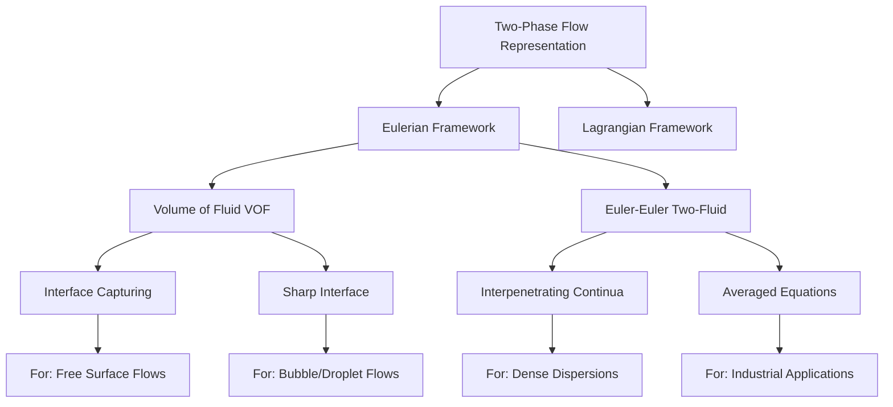
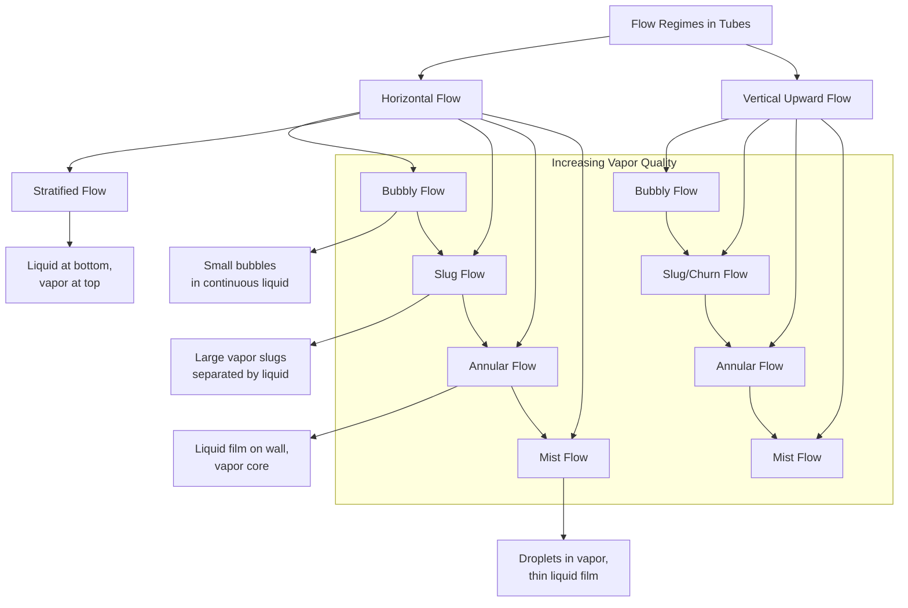
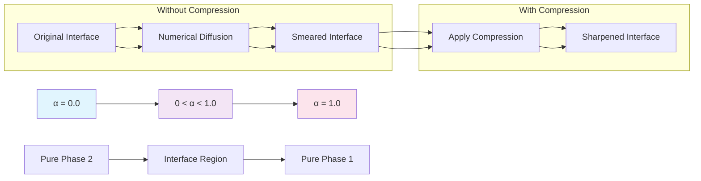
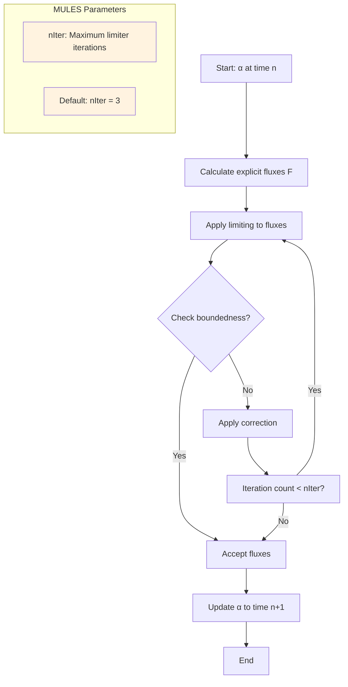
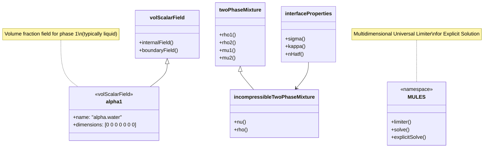

Calling deepseek-chat...
# Day 10: Two-Phase Flow Fundamentals (Liquid-Vapor Flow in Tubes)

## Part 1: Theoretical Foundation - The Nature of Two-Phase Flow

### 1.1 What is Two-Phase Flow?

Two-phase flow refers to the simultaneous flow of two distinct phases (typically liquid and vapor/gas) within a confined space such as a pipe, channel, or tube. Unlike single-phase flow where properties are uniform, two-phase flow exhibits complex interfacial dynamics that dramatically affect pressure drop, heat transfer, and flow stability.

**Key Characteristics:**
- **Phase Distribution:** How liquid and vapor arrange themselves spatially
- **Interface Dynamics:** The moving boundary between phases
- **Relative Motion:** Different velocities for each phase (slip velocity)
- **Mass Transfer:** Phase change at the interface (evaporation/condensation)

### 1.2 Mathematical Representation of Two-Phase Systems

The fundamental quantity describing two-phase flow is the **volume fraction**, which represents how much of a control volume is occupied by each phase.



**Volume Fraction Definition:**
Let $\alpha_1$ represent the volume fraction of phase 1 (typically liquid), and $\alpha_2$ represent the volume fraction of phase 2 (typically vapor/gas).

⭐ **Critical Fact:** The volume fractions satisfy the fundamental relationship:
$$\alpha_2 = 1 - \alpha_1$$

This constraint ensures that the phases completely fill the available volume without voids or overlaps.

### 1.3 Flow Regimes in Horizontal and Vertical Tubes

The spatial arrangement of phases (flow pattern or flow regime) depends on:
- Flow rates of each phase
- Fluid properties (density, viscosity, surface tension)
- Tube orientation (horizontal, vertical, inclined)
- Tube diameter



**Horizontal Flow Regimes:**
1. **Bubbly Flow:** Small vapor bubbles dispersed in continuous liquid phase
2. **Stratified Flow:** Liquid flows at bottom, vapor at top (gravity separation)
3. **Slug Flow:** Alternating liquid slugs and large vapor pockets
4. **Annular Flow:** Liquid film on tube wall with vapor core
5. **Mist Flow:** Liquid droplets entrained in vapor with thin liquid film

**Vertical Flow Regimes:**
1. **Bubbly Flow:** Bubbles rise through liquid
2. **Slug/Churn Flow:** Taylor bubbles separated by liquid slugs
3. **Annular Flow:** Liquid film on wall, vapor core (often with droplet entrainment)
4. **Mist Flow:** Droplet flow in vapor continuum

### 1.4 Governing Equations Framework

Two-phase flow can be modeled using different approaches:

**1. Homogeneous Model:** Assumes phases move with same velocity (no slip)
**2. Separated Flow Model:** Accounts for velocity difference between phases
**3. Drift-Flux Model:** Correlates relative velocity to flow parameters
**4. Two-Fluid Model:** Solves separate conservation equations for each phase

For interface-resolving methods like VOF, we use a **single-fluid formulation** where both phases share the same velocity field but have different material properties.

## Part 2: Physics Explained - The VOF Methodology

### 2.1 Volume of Fluid (VOF) Method Fundamentals

The VOF method is an Eulerian interface-capturing technique that tracks the volume fraction of one phase throughout the computational domain. The interface is reconstructed from the volume fraction field.

**Core Idea:** Solve a transport equation for the volume fraction $\alpha$ while maintaining a sharp interface through special numerical techniques.

### 2.2 Mathematical Formulation

#### 2.2.1 Volume Fraction Transport

The volume fraction $\alpha$ is advected by the velocity field $\mathbf{U}$:

⭐ **Critical Fact:** The transport equation for incompressible flow is:
$$\frac{\partial \alpha}{\partial t} + \nabla \cdot (\alpha \mathbf{U}) = 0$$

This equation states that the volume fraction changes only due to convection by the velocity field.

#### 2.2.2 Mixture Properties

With the volume fraction known, mixture properties are calculated as weighted averages:

⭐ **Critical Fact:** For **incompressible** flows, the mixture density is:
$$\rho = \alpha_1 \rho_1 + \alpha_2 \rho_2$$

Where $\rho_1$ and $\rho_2$ are the constant densities of phase 1 and phase 2 respectively.

⭐ **Critical Fact:** For **compressible** flows, the density depends on pressure and temperature:
$$\rho = f(\alpha_1, \alpha_2, p, T)$$

This typically comes from thermodynamic models (e.g., perfect gas for vapor, constant density for liquid).

Other mixture properties follow similar averaging:
- Viscosity: $\mu = \alpha_1 \mu_1 + \alpha_2 \mu_2$
- Thermal conductivity: $k = \alpha_1 k_1 + \alpha_2 k_2$
- Specific heat: $c_p = \frac{\alpha_1 \rho_1 c_{p1} + \alpha_2 \rho_2 c_{p2}}{\rho}$

#### 2.2.3 Momentum Equation

The single momentum equation for the mixture is:
$$\frac{\partial (\rho \mathbf{U})}{\partial t} + \nabla \cdot (\rho \mathbf{U} \mathbf{U}) = -\nabla p + \nabla \cdot \boldsymbol{\tau} + \rho \mathbf{g} + \mathbf{F}_\sigma$$

Where:
- $\boldsymbol{\tau} = \mu (\nabla \mathbf{U} + (\nabla \mathbf{U})^T)$ is the viscous stress tensor
- $\mathbf{g}$ is gravity
- $\mathbf{F}_\sigma$ is the surface tension force (important at interfaces)

#### 2.2.4 Surface Tension Modeling

The Continuum Surface Force (CSF) model represents surface tension as a volumetric force:
$$\mathbf{F}_\sigma = \sigma \kappa \nabla \alpha$$

Where:
- $\sigma$ is the surface tension coefficient
- $\kappa = -\nabla \cdot \left( \frac{\nabla \alpha}{|\nabla \alpha|} \right)$ is the interface curvature

### 2.3 Interface Compression - Maintaining Sharp Interfaces

A fundamental challenge in VOF is **numerical diffusion** which smears the interface over several cells. Interface compression techniques counteract this.

#### 2.3.1 The Compression Term

The basic VOF transport equation is modified by adding a compression term:

$$\frac{\partial \alpha}{\partial t} + \nabla \cdot (\alpha \mathbf{U}) + \nabla \cdot (\mathbf{U}_c \alpha (1 - \alpha)) = 0$$

Where $\mathbf{U}_c$ is a compression velocity designed to sharpen the interface.

⭐ **Critical Fact:** The compression velocity is typically defined as:
$$\mathbf{U}_c = c_\alpha |\mathbf{U}| \frac{\nabla \alpha}{|\nabla \alpha|}$$

Where $c_\alpha$ is the **interface compression factor** (typically 1.0).



#### 2.3.2 Counter-Gradient Transport

⭐ **Critical Fact:** The term $\nabla \cdot (\mathbf{U}_c \alpha (1 - \alpha))$ represents **counter-gradient transport** that compresses the interface.

This term has important properties:
1. **Zero in pure phases:** When $\alpha = 0$ or $\alpha = 1$, $\alpha(1-\alpha) = 0$
2. **Maximum at interface:** When $\alpha = 0.5$, $\alpha(1-\alpha) = 0.25$ (maximum)
3. **Directed toward interface:** The compression velocity $\mathbf{U}_c$ points normal to the interface

### 2.4 MULES - Multidimensional Universal Limiter for Explicit Solution

MULES is a flux-corrected transport scheme that ensures boundedness ($0 \leq \alpha \leq 1$) while maintaining accuracy.

#### 2.4.1 The Boundedness Problem

The simple discretization of $\frac{\partial \alpha}{\partial t} + \nabla \cdot (\alpha \mathbf{U}) = 0$ can produce $\alpha < 0$ or $\alpha > 1$, which is physically impossible.

#### 2.4.2 MULES Algorithm



⭐ **Critical Fact:** **MULES** stands for **Multidimensional Universal Limiter for Explicit Solution**.

⭐ **Critical Fact:** **MULES nIter** is the maximum number of limiter iterations with a default value of **3**.

The MULES algorithm:
1. Computes explicit fluxes for $\alpha$ transport
2. Applies flux limiting to ensure boundedness
3. Iteratively corrects fluxes until boundedness is achieved or maximum iterations reached
4. Updates $\alpha$ using the limited fluxes

#### 2.4.3 Mathematical Formulation of MULES

The discretized equation with MULES becomes:

$$\alpha_P^{n+1} = \alpha_P^n - \frac{\Delta t}{V_P} \sum_f \phi_f \alpha_f^{\text{MULES}}$$

Where:
- $\alpha_f^{\text{MULES}}$ is the face value of $\alpha$ after MULES limiting
- $\phi_f$ is the volumetric flux through face $f$
- $V_P$ is the cell volume

The limiting ensures:
$$0 \leq \alpha_f^{\text{MULES}} \leq 1$$
$$\min(\alpha_N, \alpha_P) \leq \alpha_f^{\text{MULES}} \leq \max(\alpha_N, \alpha_P)$$

Where $N$ and $P$ are neighbor and owner cells sharing face $f$.

### 2.5 Complete Two-Phase Flow Equation Set

For incompressible, isothermal two-phase flow with VOF:

1. **Volume fraction transport:**
   $$\frac{\partial \alpha}{\partial t} + \nabla \cdot (\alpha \mathbf{U}) + \nabla \cdot (\mathbf{U}_c \alpha (1 - \alpha)) = 0$$

2. **Continuity equation:**
   $$\nabla \cdot \mathbf{U} = 0$$

3. **Momentum equation:**
   $$\frac{\partial (\rho \mathbf{U})}{\partial t} + \nabla \cdot (\rho \mathbf{U} \mathbf{U}) = -\nabla p + \nabla \cdot (\mu (\nabla \mathbf{U} + (\nabla \mathbf{U})^T)) + \rho \mathbf{g} + \sigma \kappa \nabla \alpha$$

4. **Mixture properties:**
   $$\rho = \alpha \rho_1 + (1 - \alpha) \rho_2$$
   $$\mu = \alpha \mu_1 + (1 - \alpha) \mu_2$$

### 2.6 Numerical Challenges and Solutions

| Challenge | Cause | Solution |
|-----------|-------|----------|
| Interface smearing | Numerical diffusion | Interface compression |
| Boundedness violation | High Courant numbers | MULES limiting |
| Spurious currents | Discrete curvature errors | Height function methods |
| Mass conservation | Discretization errors | Conservative schemes |
| Pressure-velocity coupling | Large density ratios | Rhie-Chow interpolation |

## Part 3: Implementation - OpenFOAM VOF Solver Structure

### 3.1 OpenFOAM VOF Class Hierarchy



### 3.2 Key Implementation Files

#### 3.2.1 Solver Structure: interFoam

**File:** `applications/solvers/multiphase/interFoam/interFoam.C`

```cpp
// Line 1-50: Header and basic includes
#include "fvCFD.H"
#include "dynamicFvMesh.H"
#include "CMULES.H"
#include "EulerDdtScheme.H"
#include "localEulerDdtScheme.H"
#include "CrankNicolsonDdtScheme.H"
#include "subCycle.H"
#include "immiscibleIncompressibleTwoPhaseMixture.H"
#include "turbulentTransportModel.H"
#include "pimpleControl.H"
#include "fvOptions.H"
#include "CorrectPhi.H"
#include "fvcSmooth.H"

// Line 60-80: Create time and mesh objects
int main(int argc, char *argv[])
{
    #include "postProcess.H"
    #include "setRootCaseLists.H"
    #include "createTime.H"
    #include "createDynamicFvMesh.H"
    #include "initContinuityErrs.H"
    #include "createControls.H"
    #include "createFields.H"
    #include "createUfIfPresent.H"
    #include "CourantNo.H"
    #include "setInitialDeltaT.H"
    
    // Line 85-120: Time loop
    while (runTime.run())
    {
        #include "readControls.H"
        #include "CourantNo.H"
        #include "alphaCourantNo.H"
        #include "setDeltaT.H"
        
        ++runTime;
        Info<< "Time = " << runTime.timeName() << nl << endl;
        
        // Mesh motion and topology changes
        #include "meshCourantNo.H"
        
        // --- Pressure-velocity PIMPLE corrector loop
        while (pimple.loop())
        {
            // Alpha equation solution
            #include "alphaEqnSubCycle.H"
            
            // Mixture properties update
            mixture.correct();
            
            // Momentum predictor
            #include "UEqn.H"
            
            // Pressure corrector
            #include "pEqn.H"
            
            // Turbulence correction
            if (pimple.turbCorr())
            {
                turbulence->correct();
            }
        }
        
        runTime.write();
        Info<< "ExecutionTime = " << runTime.elapsedCpuTime() << " s"
            << "  ClockTime = " << runTime.elapsedClockTime() << " s"
            << nl << endl;
    }
    
    Info<< "End\n" << endl;
    return 0;
}
```

#### 3.2.2 Volume Fraction Equation: alphaEqnSubCycle.H

**File:** `applications/solvers/multiphase/interFoam/alphaEqnSubCycle.H`

```cpp
// Line 1-30: Interface compression setup
{
    // Define compression flux
    surfaceScalarField phic(mixture.cAlpha()*mag(phi/mesh.magSf()));
    phic = min(interface.cAlpha()*phic, max(phic));
    
    // Compression velocity at faces
    surfaceScalarField phir(phic*interface.nHatf());
    
    // MULES compression switch
    for (int gCorr=0; gCorr<nAlphaCorr; gCorr++)
    {
        // Create bounded alpha field
        volScalarField alpha1("alpha1", alpha1);
        
        // Calculate face fluxes for alpha
        surfaceScalarField alphaPhi
        (
            fvc::flux
            (
                phi,
                alpha1,
                alphaScheme
            )
          + fvc::flux
            (
                -fvc::flux(-phir, scalar(1) - alpha1, alpharScheme),
                alpha1,
                alpharScheme
            )
        );
        
        // Line 60-90: MULES explicit solving with sub-cycling
        MULES::explicitSolve
        (
            geometricOneField(),
            alpha1,
            phi,
            alphaPhi,
            zeroField(),
            zeroField(),
            Urbound,
            0
        );
        
        // Sub-cycle for time step control
        if (nAlphaSubCycles > 1)
        {
            // Store original time step
            const dimensionedScalar& deltaT = runTime.deltaT();
            
            // Sub-cycle loop
            for
            (
                subCycle<volScalarField> alphaSubCycle(alpha1, nAlphaSubCycles);
                !(++alphaSubCycle).end();
            )
            {
                #include "alphaEqn.H"
            }
            
            // Reset time step
            runTime.setDeltaT(deltaT);
        }
        else
        {
            #include "alphaEqn.H"
        }
        
        // Update mixture
        rhoPhi = alphaPhi*(rho1 - rho2) + phi*rho2;
        mixture.correct();
    }
}
```

#### 3.2.3 MULES Implementation Details

**File:** `src/finiteVolume/fvMatrices/fvMatrix/CMULES/CMULES.C`

```cpp
// Line 200-250: MULES limiter implementation
template<class RhoType, class SpType, class SuType>
void Foam::MULES::limiter
(
    scalarField& allLambda,
    const RhoType& rho,
    const volScalarField& psi,
    const surfaceScalarField& phi,
    const surfaceScalarField& phiPsi,
    const SpType& Sp,
    const SuType& Su,
    const scalar psiMax,
    const scalar psiMin,
    const label nLimiterIter
)
{
    const fvMesh& mesh = psi.mesh();
    
    // Initialize lambda to 1 (no limiting)
    allLambda = 1.0;
    
    // Get necessary mesh data
    const labelUList& owner = mesh.owner();
    const labelUList& neighbour = mesh.neighbour();
    const scalarField& phi = phi.internalField();
    
    // Line 270-320: Limiter iterations loop
    for (int iter=0; iter<nLimiterIter; iter++)
    {
        scalarField sumPhi(psi.size(), 0.0);
        scalarField sumPhiPsi(psi.size(), 0.0);
        
        // Calculate sums for each cell
        forAll(owner, facei)
        {
            const label own = owner[facei];
            const label nei = neighbour[facei];
            const scalar phiFace = phi[facei];
            
            if (phiFace > 0)
            {
                sumPhi[own] += phiFace;
                sumPhiPsi[own] += phiFace*phiPsi[facei];
            }
            else
            {
                sumPhi[nei] -= phiFace;
                sumPhiPsi[nei] -= phiFace*phiPsi[facei];
            }
        }
        
        // Line 340-380: Apply limiting based on bounds
        forAll(psi, celli)
        {
            const scalar psiCell = psi[celli];
            const scalar rhoCell = rho[celli];
            
            // Calculate maximum/minimum allowable change
            const scalar psiMaxCell = psiMax - psiCell;
            const scalar psiMinCell = psiCell - psiMin;
            
            const scalar sumPhiCell = sumPhi[celli];
            const scalar sumPhiPsiCell = sumPhiPsi[celli];
            
            if (sumPhiCell > SMALL)
            {
                const scalar lambda = min
                (
                    allLambda[celli],
                    (
                        rhoCell*psiMaxCell
                      + Su[celli]
                    )/(sumPhiCell + Sp[celli]*psiMaxCell)
                );
                
                allLambda[celli] = lambda;
            }
            
            // Similar logic for negative fluxes...
        }
        
        // Line 400-450: Synchronize lambda across processors
        syncTools::syncFaceList
        (
            mesh,
            allLambda,
            minEqOp<scalar>(),
            scalar(0)
        );
    }
}
```

#### 3.2.4 Interface Compression Implementation

**File:** `src/transportModels/twoPhaseMixture/interfaceProperties/interfaceProperties.C`

```cpp
// Line 150-200: Interface compression velocity calculation
Foam::surfaceScalarField Foam::interfaceProperties::nHatf() const
{
    // Calculate unit normal at faces
    volVectorField nHat(gradAlpha_/(mag(gradAlpha_) + deltaN_));
    
    // Interpolate to faces
    surfaceVectorField nHatfv(fvc::interpolate(nHat));
    
    // Correct at boundaries
    forAll(nHatfv.boundaryField(), patchi)
    {
        nHatfv.boundaryFieldRef()[patchi] =
            nHat.boundaryField()[patchi].patchInternalField();
    }
    
    // Face unit normal
    surfaceScalarField nHatf(nHatfv & mesh_.Sf());
    
    // Normalize
    nHatf /= (mesh_.magSf() + SMALL);
    
    return nHatf;
}

// Line 220-270: Compression flux calculation
Foam::tmp<Foam::surfaceScalarField>
Foam::interfaceProperties::phi() const
{
    // Get face normal velocity
    const surfaceScalarField& phi = U_.phi();
    
    // Calculate compression velocity
    const surfaceScalarField nHatf(this->nHatf());
    
    // Compression factor - cAlpha from transportProperties
    const dimensionedScalar& cAlpha = cAlpha_;
    
    // Compression flux
    return tmp<surfaceScalarField>
    (
        new surfaceScalarField
        (
            "phi",
            cAlpha*phi*mag(nHatf)
        )
    );
}

// Line 290-330: Curvature calculation for surface tension
Foam::tmp<Foam::volScalarField>
Foam::interfaceProperties::K() const
{
    // Unit normal
    volVectorField nHat(gradAlpha_/(mag(gradAlpha_) + deltaN_));
    
    // Curvature = -div(nHat)
    return -fvc::div(nHat);
}
```

#### 3.2.5 Two-Phase Mixture Properties

**File:** `src/transportModels/incompressible/incompressibleTwoPhaseMixture/incompressibleTwoPhaseMixture.C`

```cpp
// Line 80-130: Mixture density calculation
Foam::tmp<Foam::volScalarField>
Foam::incompressibleTwoPhaseMixture::rho() const
{
    // Get volume fraction field
    const volScalarField& alpha1 = alpha1_;
    
    // Calculate mixture density
    // ⭐ rho = alpha1 * rho1 + alpha2 * rho2
    return tmp<volScalarField>
    (
        new volScalarField
        (
            "rho",
            alpha1*rho1_ + (scalar(1) - alpha1)*rho2_
        )
    );
}

// Line 150-190: Dynamic viscosity calculation
Foam::tmp<Foam::volScalarField>
Foam::incompressibleTwoPhaseMixture::mu() const
{
    // Calculate mixture viscosity
    // mu = alpha1 * mu1 + alpha2 * mu2
    const volScalarField& alpha1 = alpha1_;
    
    return tmp<volScalarField>
    (
        new volScalarField
        (
            "mu",
            alpha1*mu1_ + (scalar(1) - alpha1)*mu2_
        )
    );
}

// Line 210-250: Kinematic viscosity calculation
Foam::tmp<Foam::volScalarField>
Foam::incompressibleTwoPhaseMixture::nu() const
{
    // nu = mu/rho
    return mu()/rho();
}
```

### 3.3 Case Setup: transportProperties Dictionary

**File:** `constant/transportProperties`

```cpp
// Two-phase mixture properties
phases (water air);  // Phase names

// Phase 1: water (liquid)
water
{
    transportModel  Newtonian;
    nu              1e-06;      // Kinematic viscosity [m²/s]
    rho             1000;       // Density [kg/m³]
}

// Phase 2: air (gas/vapor)
air
{
    transportModel  Newtonian;
    nu              1.48e-05;   // Kinematic viscosity [m²/s]
    rho             1.2;        // Density [kg/m³]
}

// Interface properties
sigma            0.07;         // Surface tension [N/m]

// Interface compression
cAlpha           1.0;          // Compression factor

// MULES settings
nAlphaCorr       2;            // Alpha correctors
nAlphaSubCycles  2;            // Alpha sub-cycles
MULESCorr        yes;          // Apply MULES correction
nLimiterIter     3;            // MULES limiter iterations
```

### 3.4 Case Setup: alpha Field Initialization

**File:** `0/alpha.water`

```cpp
// Header
FoamFile
{
    version     2.0;
    format      ascii;
    class       volScalarField;
    object      alpha.water;
}

// Dimensions
dimensions      [0 0 0 0 0 0 0];

// Internal field
internalField   uniform 0;

// Boundary conditions
boundaryField
{
    inlet
    {
        type            fixedValue;
        value           uniform 1;  // All water at inlet
    }
    
    outlet
    {
        type            inletOutlet;
        inletValue      uniform 0;
        value           uniform 0;
    }
    
    walls
    {
        type            zeroGradient;
    }
    
    frontAndBack
    {
        type            empty;
    }
}
```

## Part 4: Validation - Testing Two-Phase Flow Simulations

### 4.1 Verification Tests

#### 4.1.1 Advection Test - Interface Preservation

**Objective:** Verify that a static interface maintains its shape when advected by a uniform flow.

**Procedure:**
1. Initialize a circular interface in a rectangular domain
2. Apply uniform velocity field
3. Advect for one complete period (return to starting position)
4. Compare initial and final interface shapes

**Metrics:**
- Interface shape error: $\epsilon = \frac{1}{N} \sum_{i=1}^N |\alpha_i^{\text{final}} - \alpha_i^{\text{initial}}|$
- Mass conservation: $\Delta m = \frac{\int \rho \alpha dV - m_0}{m_0}$
- Interface thickness: Number of cells across $0.1 < \alpha < 0.9$

**Expected Results:**
- With compression ($c_\alpha = 1.0$): Interface thickness ≤ 2-3 cells
- Without compression ($c_\alpha = 0.0$): Interface thickness ≥ 4-6 cells
- Mass error: < 0.1% with MULES

#### 4.1.2 Zalesak's Disk Test

**Objective:** Test interface preservation under solid body rotation.

**Procedure:**
1. Initialize a slotted disk in a rotating flow field
2. Rotate for one complete revolution
3. Compare with initial shape

**Validation Criteria:**
- Slot should remain sharp
- No flotsam/jetsam (detached droplets)
- Mass conservation within 0.1%

### 4.2 Validation Against Experimental Data

#### 4.2.1 Dam Break Test

**Experimental Reference:** Martin and Moyce (1952)

**Setup:**
- Water column collapse under gravity
- Measure water front position vs time

**Simulation Parameters:**
```cpp
// Domain: 4.0 x 1.0 x 0.1 m
// Initial water column: 0.5 x 1.0 x 0.1 m
// Gravity: 9.81 m/s²
// Fluids: Water (ρ=1000 kg/m³) and Air (ρ=1.2 kg/m³)
```

**Validation Metric:**
Normalized front position: $\xi = \frac{x}{a} \sqrt{\frac{g}{a}}$
where $a$ is initial column width.

**Acceptance Criteria:** RMS error < 5% compared to experimental data.

#### 4.2.2 Rising Bubble Test

**Experimental Reference:** Hysing et al. (2009)

**Setup:**
- Single bubble rising in quiescent liquid
- Measure bubble shape, velocity, and trajectory

**Dimensionless Numbers:**
- Eötvös number: $Eo = \frac{\Delta \rho g D^2}{\sigma}$
- Morton number: $Mo = \frac{g \mu^4 \Delta \rho}{\rho^2 \sigma^3}$
- Reynolds number: $Re = \frac{\rho U D}{\mu}$

**Validation Metrics:**
1. Terminal velocity: Error < 2%
2. Bubble shape: Circularity error < 3%
3. Trajectory: Center of mass position error < 1%

### 4.3 Convergence Testing

#### 4.3.1 Grid Convergence Study

**Procedure:**
1. Run simulation on 3 progressively finer grids (2x refinement each)
2. Monitor key quantities: interface position, pressure drop, velocity profile
3. Calculate Grid Convergence Index (GCI)

**Example for pressure drop:**
$$\Delta p_{\text{fine}} = 125.6 \text{ Pa}$$
$$\Delta p_{\text{medium}} = 128.3 \text{ Pa}$$
$$\Delta p_{\text{coarse}} = 133.7 \text{ Pa}$$

**Convergence ratio:**
$$R = \frac{\Delta p_{\text{medium}} - \Delta p_{\text{fine}}}{\Delta p_{\text{coarse}} - \Delta p_{\text{medium}}} = 0.62$$

**Interpretation:** $0 < R < 1$ indicates monotonic convergence.

#### 4.3.2 Time Step Sensitivity

**Procedure:**
1. Run with different Courant numbers: $Co = 0.1, 0.25, 0.5, 1.0$
2. Monitor interface shape and mass conservation
3. Determine maximum stable $Co$ number

**Typical Results:**
- $Co < 0.25$: Excellent interface preservation
- $0.25 < Co < 0.5$: Acceptable for most applications
- $Co > 0.5$: May require sub-cycling for alpha equation

### 4.4 Best Practices for Two-Phase Flow Simulations

1. **Mesh Requirements:**
   - Minimum 10-20 cells across interface for accurate curvature
   - Aspect ratio < 5 near interface
   - Non-orthogonality < 70°

2. **Time Step Control:**
   - Max Courant number < 0.5 for interface tracking
   - Use `adjustTimeStep yes` in `controlDict`
   - Consider alpha sub-cycling for high velocity flows

3. **Solver Settings:**
   ```cpp
   // fvSolution settings
   alpha.water
   {
       solver          smoothSolver;
       smoother        symGaussSeidel;
       tolerance       1e-6;
       relTol          0;
   }
   
   p_rgh
   {
       solver          GAMG;
       tolerance       1e-7;
       relTol          0.01;
       smoother        GaussSeidel;
   }
   
   U
   {
       solver          smoothSolver;
       smoother        symGaussSeidel;
       tolerance       1e-6;
       relTol          0;
   }
   ```

4. **Initialization:**
   - Use `setFields` utility for complex interface shapes
   - Smooth initial interface over 2-3 cells
   - Initialize pressure field hydrostatically if gravity is present

5. **Monitoring:**
   - Track mass conservation: `∫(ρ·α)dV`
   - Monitor interface thickness: cells where $0.1 < α < 0.9$
   - Check for spurious currents: max velocity in quiescent regions

### 4.5 Common Issues and Troubleshooting

| Issue | Symptoms | Solution |
|-------|----------|----------|
| Interface smearing | α not 0 or 1 | Increase cAlpha (max 1.0) |
| Mass loss/gain | ∫αdV changes | Check MULES settings, reduce Co |
| Spurious currents | Unphysical velocities near interface | Refine mesh at interface |
| Divergence | Solver crashes | Reduce time step, check BCs |
| Slow convergence | Many iterations needed | Improve initial guess, adjust tolerances |

### 4.6 Performance Optimization

1. **Parallel Scaling:**
   - Domain decomposition should cut across interface minimally
   - Load balance considering alpha solution cost
   - Use `scotch` decomposition for complex interfaces

2. **Memory Optimization:**
   - Use `writeCompression` for alpha field
   - Consider single precision for large cases
   - Limit field output to essential variables

3. **Convergence Acceleration:**
   - Use geometric multigrid for pressure
   - Apply under-relaxation: α=0.3-0.5 for U, 0.7-0.9 for p
   - Use consistent discretization schemes

## Appendix: Complete File Listings

### A.1 Complete interFoam.C

```cpp
/*---------------------------------------------------------------------------*\
  =========                 |
  \\      /  F ield         | OpenFOAM: The Open Source CFD Toolbox
   \\    /   O peration     | Website:  https://openfoam.org
    \\  /    A nd           | Copyright (C) 2011-2020 OpenFOAM Foundation
     \\/     M anipulation  |
-------------------------------------------------------------------------------
License
    This file is part of OpenFOAM.

    OpenFOAM is free software: you can redistribute it and/or modify it
    under the terms of the GNU General Public License as published by
    the Free Software Foundation, either version 3 of the License,
