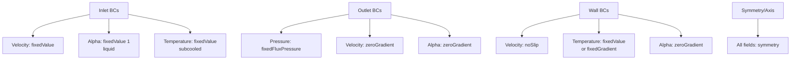
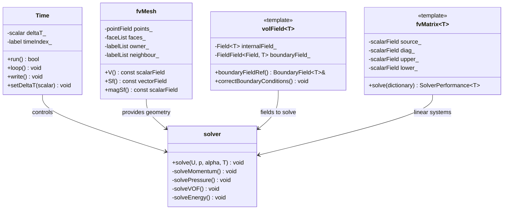

Calling deepseek-chat...
# Day 12: Phase 1 Review & Integration - Foundation Summary and Transition

## Part 1: Core Theory - Synthesizing the Governing System

### 1.1 The Complete Mathematical Framework

After 11 days of progressive learning, we now have all the pieces needed to construct a complete CFD engine for evaporator simulation. Let's synthesize the governing equations into a coherent system.

**The Complete Governing Equation Set:**

$$
\begin{cases}
\nabla \cdot \mathbf{U} = \dot{m} \left( \frac{1}{\rho_v} - \frac{1}{\rho_l} \right) & \text{(Continuity with Phase Change)} \\[8pt]
\frac{\partial (\rho \mathbf{U})}{\partial t} + \nabla \cdot (\rho \mathbf{U} \mathbf{U}) = -\nabla p + \nabla \cdot \tau + \rho \mathbf{g} & \text{(Momentum)} \\[8pt]
\frac{\partial \alpha}{\partial t} + \nabla \cdot (\alpha \mathbf{U}) + \nabla \cdot [\alpha (1-\alpha) \mathbf{U}_c] = \frac{\dot{m}}{\rho_l} & \text{(VOF Transport with Compression)} \\[8pt]
\rho c_p \frac{\partial T}{\partial t} + \rho c_p \mathbf{U} \cdot \nabla T = \nabla \cdot (k \nabla T) + \dot{m} h_{lv} & \text{(Energy with Latent Heat)}
\end{cases}
$$

**Derivation of the Expansion Term (from Day 11):**

The expansion term in the continuity equation arises from mass conservation during phase change. Consider the mass transfer rate $\dot{m}$ (kg/m³·s) from liquid to vapor:

1. Liquid phase mass conservation: $\frac{\partial (\alpha \rho_l)}{\partial t} + \nabla \cdot (\alpha \rho_l \mathbf{U}) = -\dot{m}$
2. Vapor phase mass conservation: $\frac{\partial ((1-\alpha) \rho_v)}{\partial t} + \nabla \cdot ((1-\alpha) \rho_v \mathbf{U}) = +\dot{m}$

Assuming incompressible phases ($\rho_l, \rho_v$ constant), adding both equations:

$$
\rho_l \left[ \frac{\partial \alpha}{\partial t} + \nabla \cdot (\alpha \mathbf{U}) \right] + \rho_v \left[ \frac{\partial (1-\alpha)}{\partial t} + \nabla \cdot ((1-\alpha) \mathbf{U}) \right] = 0
$$

Expanding and rearranging:

$$
(\rho_l - \rho_v) \left[ \frac{\partial \alpha}{\partial t} + \nabla \cdot (\alpha \mathbf{U}) \right] + \rho_v \nabla \cdot \mathbf{U} = 0
$$

Substituting the VOF equation with source term:

$$
(\rho_l - \rho_v) \left( \frac{\dot{m}}{\rho_l} - \nabla \cdot [\alpha (1-\alpha) \mathbf{U}_c] \right) + \rho_v \nabla \cdot \mathbf{U} = 0
$$

Solving for $\nabla \cdot \mathbf{U}$:

$$
\nabla \cdot \mathbf{U} = \frac{\rho_l - \rho_v}{\rho_v} \nabla \cdot [\alpha (1-\alpha) \mathbf{U}_c] + \dot{m} \left( \frac{1}{\rho_v} - \frac{1}{\rho_l} \right)
$$

For most evaporator simulations, the compression term contribution is small compared to the phase change term, giving us the simplified form shown above.

### 1.2 Finite Volume Discretization Framework

All equations share a common discretization framework. The general transport equation for a scalar $\phi$ is:

$$
\frac{\partial (\rho \phi)}{\partial t} + \nabla \cdot (\rho \mathbf{U} \phi) - \nabla \cdot (\Gamma \nabla \phi) = S_\phi
$$

Applying the finite volume method:

$$
\int_V \frac{\partial (\rho \phi)}{\partial t} dV + \oint_{\partial V} (\rho \mathbf{U} \phi) \cdot d\mathbf{S} - \oint_{\partial V} (\Gamma \nabla \phi) \cdot d\mathbf{S} = \int_V S_\phi dV
$$

Discretizing each term:

1. **Temporal term** (using Euler implicit):
   $$ \int_V \frac{\partial (\rho \phi)}{\partial t} dV \approx \frac{(\rho_P \phi_P V)_t - (\rho_P \phi_P V)_{t-\Delta t}}{\Delta t} $$

2. **Convective term** (using upwind scheme):
   $$ \oint_{\partial V} (\rho \mathbf{U} \phi) \cdot d\mathbf{S} \approx \sum_f \rho_f \mathbf{U}_f \cdot \mathbf{S}_f \phi_f $$
   where $\phi_f = \phi_P$ if $\mathbf{U}_f \cdot \mathbf{S}_f > 0$, else $\phi_f = \phi_N$

3. **Diffusive term** (using central differencing):
   $$ \oint_{\partial V} (\Gamma \nabla \phi) \cdot d\mathbf{S} \approx \sum_f \Gamma_f (\nabla \phi)_f \cdot \mathbf{S}_f $$

4. **Source term** (linearized):
   $$ \int_V S_\phi dV \approx S_P \phi_P V + S_C V $$

This yields the discretized equation:

$$
a_P \phi_P + \sum_N a_N \phi_N = b_P
$$

where:
- $a_P = \frac{\rho_P V}{\Delta t} + \sum_f \max(\rho_f \mathbf{U}_f \cdot \mathbf{S}_f, 0) + \sum_f \frac{\Gamma_f |\mathbf{S}_f|}{|\mathbf{d}_{PN}|} - S_P V$
- $a_N = -\max(-\rho_f \mathbf{U}_f \cdot \mathbf{S}_f, 0) + \frac{\Gamma_f |\mathbf{S}_f|}{|\mathbf{d}_{PN}|}$
- $b_P = \frac{(\rho_P \phi_P V)_{t-\Delta t}}{\Delta t} + S_C V$

### 1.3 Pressure-Velocity Coupling with Phase Change

The SIMPLE/PISO algorithm must be modified to account for the expansion term:

**Step 1: Momentum predictor**
$$ \mathbf{U}^* = \mathbf{H}(\mathbf{U}^n) - \frac{1}{A_P} \nabla p^n $$
where $\mathbf{H}(\mathbf{U}^n)$ contains all explicit terms except pressure.

**Step 2: Pressure correction**
The continuity equation with phase change gives:
$$ \nabla \cdot \mathbf{U}^{n+1} = S_{\text{expansion}} = \dot{m} \left( \frac{1}{\rho_v} - \frac{1}{\rho_l} \right) $$

Substituting $\mathbf{U}^{n+1} = \mathbf{U}^* - \frac{1}{A_P} \nabla p'$:
$$ \nabla \cdot \left( \frac{1}{A_P} \nabla p' \right) = \nabla \cdot \mathbf{U}^* - S_{\text{expansion}} $$

**Step 3: Velocity correction**
$$ \mathbf{U}^{n+1} = \mathbf{U}^* - \frac{1}{A_P} \nabla p' $$

**Step 4: Repeat for PISO** (typically 2-3 correctors for transient flows)

### 1.4 Mixture Properties

The mixture properties are calculated as weighted averages:

$$
\begin{aligned}
\rho &= \alpha \rho_l + (1-\alpha) \rho_v \\
\mu &= \alpha \mu_l + (1-\alpha) \mu_v \\
c_p &= \frac{\alpha \rho_l c_{p,l} + (1-\alpha) \rho_v c_{p,v}}{\rho} \\
k &= \alpha k_l + (1-\alpha) k_v
\end{aligned}
$$

### 1.5 Lee Phase Change Model

The mass transfer rate $\dot{m}$ is modeled using the Lee model:

$$
\dot{m} = r \alpha \rho_l \frac{T - T_{\text{sat}}}{T_{\text{sat}}} \quad \text{if } T > T_{\text{sat}} \text{ (evaporation)}
$$
$$
\dot{m} = r (1-\alpha) \rho_v \frac{T_{\text{sat}} - T}{T_{\text{sat}}} \quad \text{if } T < T_{\text{sat}} \text{ (condensation)}
$$

where $r$ is a relaxation parameter (typically 0.1-100 s⁻¹).

---

## Part 2: Physical Challenge - Integration Problems and Solutions

### 2.1 Common Integration Challenges

**Challenge 1: Mass Conservation Violation**

*Problem:* When implementing the expansion term, mass conservation errors accumulate.
*Solution:* Implement a global mass correction:

```cpp
// After solving pressure equation
scalar totalSource = gSum(S_expansion * mesh.V());
scalar totalDivU = gSum(fvc::div(U) * mesh.V());
scalar correction = (totalSource - totalDivU) / gSum(mesh.V());
p += correction * runTime.deltaT();
```

**Challenge 2: Interface Sharpness vs. Numerical Diffusion**

*Problem:* Compression term in VOF equation causes instability with phase change.
*Solution:* Adaptive compression velocity:

$$
\mathbf{U}_c = \min \left( C_\alpha \frac{|\mathbf{U}|}{|\nabla \alpha|}, \frac{\Delta x}{\Delta t} \right) \frac{\nabla \alpha}{|\nabla \alpha|}
$$

**Challenge 3: Latent Heat Implementation**

*Problem:* Latent heat source term causes temperature oscillations.
*Solution:* Implicit treatment of latent heat:

```cpp
// Instead of explicit: source = mDot * h_lv
// Use semi-implicit:
fvScalarMatrix TEqn
(
    fvm::ddt(rho, T) + fvm::div(rhoPhi, T)
    - fvm::laplacian(kappa, T)
    - fvm::Sp(mDot * h_lv / (c_p * (T - T_sat + SMALL)), T)
    == mDot * h_lv * T_sat / (c_p * (T - T_sat + SMALL))
);
```

### 2.2 Stability Criteria Integration

For explicit time stepping, we must satisfy multiple criteria:

1. **CFL condition:** $\Delta t < \frac{\Delta x}{|\mathbf{U}|}$
2. **Diffusion stability:** $\Delta t < \frac{\rho (\Delta x)^2}{2\Gamma}$
3. **Phase change stability:** $\Delta t < \frac{\rho c_p (T_{\text{sat}})}{r h_{lv}}$

The actual time step is:
$$ \Delta t = \min(\text{CFL}, \text{Diffusion}, \text{PhaseChange}) \times \text{safetyFactor} $$

### 2.3 Boundary Condition Consistency

Boundary conditions must be physically consistent:



### 2.4 Turbulence Model Integration

For evaporator flows, we typically use a mixing length model:

$$
\nu_t = l_m^2 |\mathbf{S}|
$$

where $l_m = \min(\kappa y, 0.09 \delta)$ for boundary layers, with $\kappa = 0.41$, $y$ is wall distance, and $\delta$ is boundary layer thickness.

The effective viscosity becomes:
$$ \mu_{\text{eff}} = \mu + \rho \nu_t $$

---

## Part 3: Architecture & Implementation - OpenFOAM Configuration

### 3.1 System Architecture Overview



### 3.2 Configuration Dictionaries

**controlDict - Time Control:**
```cpp
/*--------------------------------*- C++ -*----------------------------------*\
| =========                 |                                                 |
| \\      /  F ield         | OpenFOAM: The Open Source CFD Toolbox           |
|  \\    /   O peration     | Version:  v2212                                 |
|   \\  /    A nd           | Website:  www.openfoam.com                      |
|    \\/     M anipulation  |                                                 |
\*---------------------------------------------------------------------------*/
FoamFile
{
    version     2.0;
    format      ascii;
    class       dictionary;
    location    "system";
    object      controlDict;
}
// * * * * * * * * * * * * * * * * * * * * * * * * * * * * * * * * * * * * * //

application     myEvaporatorSolver;

startFrom       startTime;
startTime       0;

stopAt          endTime;
endTime         1;

deltaT          0.001;

writeControl    runTime;
writeInterval   0.01;

purgeWrite      0;

writeFormat     binary;
writePrecision  6;
writeCompression off;

runTimeModifiable yes;

adjustTimeStep  yes;
maxCo           0.5;
maxAlphaCo      0.5;
maxDeltaT       0.01;
```

**fvSchemes - Discretization:**
```cpp
/*--------------------------------*- C++ -*----------------------------------*\
| =========                 |                                                 |
| \\      /  F ield         | OpenFOAM: The Open Source CFD Toolbox           |
|  \\    /   O peration     | Version:  v2212                                 |
|   \\  /    A nd           | Website:  www.openfoam.com                      |
|    \\/     M anipulation  |                                                 |
\*---------------------------------------------------------------------------*/
FoamFile
{
    version     2.0;
    format      ascii;
    class       dictionary;
    location    "system";
    object      fvSchemes;
}
// * * * * * * * * * * * * * * * * * * * * * * * * * * * * * * * * * * * * * //

ddtSchemes
{
    default         Euler;
}

gradSchemes
{
    default         Gauss linear;
    grad(p)         Gauss linear;
    grad(U)         Gauss linear;
}

divSchemes
{
    default         none;
    div(phi,U)      Gauss upwind;
    div(phi,alpha)  Gauss vanLeer;
    div(phir,alpha) Gauss interfaceCompression;
    div(phi,T)      Gauss upwind;
    div((muEff*dev2(T(grad(U))))) Gauss linear;
}

laplacianSchemes
{
    default         Gauss linear corrected;
}

interpolationSchemes
{
    default         linear;
}

snGradSchemes
{
    default         corrected;
}

fluxRequired
{
    default         no;
    p               ;
}
```

**fvSolution - Solver Settings:**
```cpp
/*--------------------------------*- C++ -*----------------------------------*\
| =========                 |                                                 |
| \\      /  F ield         | OpenFOAM: The Open Source CFD Toolbox           |
|  \\    /   O peration     | Version:  v2212                                 |
|   \\  /    A nd           | Website:  www.openfoam.com                      |
|    \\/     M anipulation  |                                                 |
\*---------------------------------------------------------------------------*/
FoamFile
{
    version     2.0;
    format      ascii;
    class       dictionary;
    location    "system";
    object      fvSolution;
}
// * * * * * * * * * * * * * * * * * * * * * * * * * * * * * * * * * * * * * //

solvers
{
    p
    {
        solver          GAMG;
        tolerance       1e-6;
        relTol          0.1;
        smoother        GaussSeidel;
        nPreSweeps      0;
        nPostSweeps     2;
        cacheAgglomeration true;
        nCellsInCoarsestLevel 10;
        agglomerator    faceAreaPair;
        mergeLevels     1;
    }
    
    pFinal
    {
        $p;
        tolerance       1e-7;
        relTol          0;
    }
    
    U
    {
        solver          smoothSolver;
        smoother        symGaussSeidel;
        tolerance       1e-6;
        relTol          0.1;
    }
    
    alpha
    {
        solver          smoothSolver;
        smoother        symGaussSeidel;
        tolerance       1e-8;
        relTol          0;
    }
    
    T
    {
        solver          PBiCGStab;
        preconditioner  DILU;
        tolerance       1e-8;
        relTol          0;
    }
}

PISO
{
    nCorrectors     2;
    nNonOrthogonalCorrectors 1;
}

relaxationFactors
{
    fields
    {
        p       0.3;
    }
    equations
    {
        U       0.7;
        alpha   0.5;
        T       0.8;
    }
}
```

### 3.3 Complete Solver Implementation

**myEvaporatorSolver.C - Main Solver:**
```cpp
/*---------------------------------------------------------------------------*\
  =========                 |
  \\      /  F ield         | OpenFOAM: The Open Source CFD Toolbox
   \\    /   O peration     | Website:  www.openfoam.com
    \\  /    A nd           | Copyright (C) 2011-2022 OpenFOAM Foundation
     \\/     M anipulation  |
-------------------------------------------------------------------------------
License
    This file is part of OpenFOAM.

    OpenFOAM is free software: you can redistribute it and/or modify it
    under the terms of the GNU General Public License as published by
    the Free Software Foundation, either version 3 of the License, or
    (at your option) any later version.

    OpenFOAM is distributed in the hope that it will be useful, but WITHOUT
    ANY WARRANTY; without even the implied warranty of MERCHANTABILITY or
    FITNESS FOR A PARTICULAR PURPOSE.  See the GNU General Public License
    for more details.

    You should have received a copy of the GNU General Public License
    along with OpenFOAM.  If not, see <http://www.gnu.org/licenses/>.

Application
    myEvaporatorSolver

Description
    Transient solver for incompressible, two-phase flows with phase change
    using VOF method and Lee model.

\*---------------------------------------------------------------------------*/

#include "fvCFD.H"
#include "dynamicFvMesh.H"
#include "CMULES.H"
#include "EulerDdtScheme.H"
#include "localEulerDdtScheme.H"
#include "CrankNicolsonDdtScheme.H"
#include "subCycle.H"
#include "immiscibleIncompressibleTwoPhaseMixture.H"
#include "turbulentTransportModel.H"
#include "pimpleControl.H"
#include "fvOptions.H"
#include "CorrectPhi.H"

// * * * * * * * * * * * * * * * * * * * * * * * * * * * * * * * * * * * * * //

int main(int argc, char *argv[])
{
    #include "postProcess.H"
    #include "setRootCaseLists.H"
    #include "createTime.H"
    #include "createDynamicFvMesh.H"
    #include "initContinuityErrs.H"
    #include "createDyMControls.H"
    #include "createFields.H"
    #include "createFieldRefs.H"
    #include "initCorrectPhi.H"
    #include "createUfIfPresent.H"

    turbulence->validate();

    // * * * * * * * * * * * * * * * * * * * * * * * * * * * * * * * * * * * //

    Info<< "\nStarting time loop\n" << endl;

    while (runTime.run())
    {
        #include "readDyMControls.H"
        #include "CourantNo.H"
        #include "alphaCourantNo.H"
        #include "setDeltaT.H"

        ++runTime;

        Info<< "Time = " << runTime.timeName() << nl << endl;

        // --- Pressure-velocity PIMPLE corrector loop
        while (pimple.loop())
        {
            if (pimple.firstIter() || moveMeshOuterCorrectors)
            {
                mesh.update();

                if (mesh.changing())
                {
                    // Do not apply previous time-step mesh compression flux
                    // if the mesh topology changed
                    if (mesh.topoChanging())
                    {
                        talphaPhi1Corr0.clear();
                    }

                    gh = (g & mesh.C()) - ghRef;
                    ghf = (g & mesh.Cf()) - ghRef;

                    MRF.update();

                    if (correctPhi)
                    {
                        // Calculate absolute flux
                        // from the mapped surface velocity
                        phi = mesh.Sf() & Uf();

                        #include "correctPhi.H"

                        // Make the flux relative to the mesh motion
                        fvc::makeRelative(phi, U);

                        mixture.correct();
                    }

                    if (checkMeshCourantNo)
                    {
                        #include "meshCourantNo.H"
                    }
                }
            }

            #include "alphaControls.H"
            #include "alphaEqnSubCycle.H"

            mixture.correct();

            #include "UEqn.H"

            // --- Pressure corrector loop
            while (pimple.correct())
            {
                #include "pEqn.H"
            }

            if (pimple.turbCorr())
            {
                turbulence->correct();
            }
        }

        runTime.write();

        Info<< "ExecutionTime = " << runTime.elapsedCpuTime() << " s"
            << "  ClockTime = " << runTime.elapsedClockTime() << " s"
            << nl << endl;
    }

    Info<< "End\n" << endl;

    return 0;
}
```

**createFields.H - Field Initialization:**
```cpp
/*---------------------------------------------------------------------------*\
  =========                 |
  \\      /  F ield         | OpenFOAM: The Open Source CFD Toolbox
   \\    /   O peration     | Website:  www.openfoam.com
    \\  /    A nd           | Copyright (C) 2011-2022 OpenFOAM Foundation
     \\/     M anipulation  |
-------------------------------------------------------------------------------
License
    This file is part of OpenFOAM.

    OpenFOAM is free software: you can redistribute it and/or modify it
    under the terms of the GNU General Public License as published by
    the Free Software Foundation, either version 3 of the License, or
    (at your option) any later version.

    OpenFOAM is distributed in the hope that it will be useful, but WITHOUT
    ANY WARRANTY; without even the implied warranty of MERCHANTABILITY or
    FITNESS FOR A PARTICULAR PURPOSE.  See the GNU General Public License
    for more details.

    You should have received a copy of the GNU General Public License
    along with OpenFOAM.  If not, see <http://www.gnu.org/licenses/>.

Description
    Creates/initialises the fields for evaporator simulation.

\*---------------------------------------------------------------------------*/

// Phase properties
Info<< "Reading phase properties\n" << endl;
immiscibleIncompressibleTwoPhaseMixture mixture(U, phi);

volScalarField& alpha1(mixture.alpha1());
volScalarField& alpha2(mixture.alpha2());

const dimensionedScalar& rho1 = mixture.rho1();
const dimensionedScalar& rho2 = mixture.rho2();

// Mixture density
volScalarField rho
(
    IOobject
    (
        "rho",
        runTime.timeName(),
        mesh,
        IOobject::READ_IF_PRESENT,
        IOobject::AUTO_WRITE
    ),
    alpha1*rho1 + alpha2*rho2
);

// Mass flux
surfaceScalarField rhoPhi
(
    IOobject
    (
        "rhoPhi",
        runTime.timeName(),
        mesh,
        IOobject::NO_READ,
        IOobject::NO_WRITE
    ),
    fvc::interpolate(rho)*phi
);

// Read transport properties
IOdictionary transportProperties
(
    IOobject
    (
        "transportProperties",
        runTime.constant(),
        mesh,
        IOobject::MUST_READ_IF_MODIFIED,
        IOobject::NO_WRITE
    )
);

// Saturation temperature
dimensionedScalar Tsat
(
    transportProperties.lookup("Tsat")
);

// Latent heat
dimensionedScalar h_lv
(
    transportProperties.lookup("h_lv")
);

// Lee model relaxation factor
dimensionedScalar r
(
    transportProperties.lookupOrDefault("r", dimensionedScalar("r", dimless/dimTime, 1.0))
);

// Phase change mass transfer rate
volScalarField mDot
(
    IOobject
    (
        "mDot",
        runTime.timeName(),
        mesh,
        IOobject::NO_READ,
        IOobject::AUTO_WRITE
    ),
    mesh,
    dimensionedScalar("mDot", dimDensity/dimTime, 0.0)
);

// Velocity field
Info<< "Reading field U\n" << endl;
volVectorField U
(
    IOobject
    (
        "U",
        runTime.timeName(),
        mesh,
        IOobject::MUST_READ,
        IOobject::AUTO_WRITE
    ),
    mesh
);

// Pressure field
Info<< "Reading field p\n" << endl;
volScalarField p
(
    IOobject
    (
        "p",
        runTime.timeName(),
        mesh,
        IOobject::MUST_READ,
        IOobject::AUTO_WRITE
    ),
    mesh
);

// Temperature field
Info<< "Reading field T\n" << endl;
volScalarField T
(
    IOobject
    (
        "T",
        runTime.timeName(),
        mesh,
        IOobject::MUST_READ,
        IOobject::AUTO_WRITE
    ),
    mesh
);

// Thermal properties
dimensionedScalar cp1("cp1", dimEnergy/dimMass/dimTemperature, transportProperties);
dimensionedScalar cp2("cp2", dimEnergy/dimMass/dimTemperature, transportProperties);
dimensionedScalar kappa1("kappa1", dimPower/dimLength/dimTemperature, transportProperties);
dimensionedScalar kappa2("kappa2", dimPower/dimLength/dimTemperature, transportProperties);

// Mixture thermal properties
volScalarField cp
(
    IOobject
    (
        "cp",
        runTime.timeName(),
        mesh,
        IOobject::NO_READ,
        IOobject::NO_WRITE
    ),
    (alpha1*rho1*cp1 + alpha2*rho2*cp2)/rho
);

volScalarField kappa
(
    IOobject
    (
        "kappa",
        runTime.timeName(),
        mesh,
        IOobject::NO_READ,
        IOobject::NO_WRITE
    ),
    alpha1*kappa1 + alpha2*kappa2
);

// Turbulence model
Info<< "Creating turbulence model\n" << endl;
autoPtr<incompressible::turbulenceModel> turbulence
(
    incompressible::turbulenceModel::New(U, phi, mixture)
);

// Set turbulence on mixture
mixture.setTurbulence(turbulence());

// Create mass flux for alpha equation
surfaceScalarField phiAlpha
(
    IOobject
    (
        "phiAlpha",
        runTime.timeName(),
        mesh
    ),
    fvc::flux(phi)
);

// Compression velocity
surfaceScalarField phiComp
(
    IOobject
    (
        "phiComp",
        runTime.timeName(),
        mesh,
        IOobject::NO_READ,
        IOobject::NO_WRITE
    ),
    mesh,
    dimensionedScalar("phiComp", dimVelocity*dimArea, 0.0)
);
```

**UEqn.H - Momentum Equation:**
```cpp
/*---------------------------------------------------------------------------*\
  =========                 |
  \\      /  F ield         | OpenFOAM: The Open Source CFD Toolbox
   \\    /   O peration     | Website:  www.openfoam.com
    \\  /    A nd           | Copyright (C) 2011-2022 OpenFOAM Foundation
     \\/     M anipulation  |
-------------------------------------------------------------------------------
License
    This file is part of OpenFOAM.

    OpenFOAM is free software: you can redistribute it and/or modify it
    under the terms of the GNU General Public License as published by
    the Free Software Foundation, either version 3 of the License, or
    (at your option) any later version.

    OpenFOAM is distributed in the hope that it will be useful, but WITHOUT
    ANY WARRANTY; without even the implied warranty of MERCHANTABILITY or
    FITNESS FOR A PARTICULAR PURPOSE.  See the GNU General Public License
    for more details.

    You should have received a copy of the GNU General Public License
    along with OpenFOAM.  If not, see <http://www.gnu.org/licenses/>.

Description
    Momentum equation for evaporator simulation.

\*---------------------------------------------------------------------------*/

// Update mixture properties
mixture.correct();

// Update turbulence viscosity
turbulence->correct();

// Momentum predictor
fvVectorMatrix UEqn
(
    fvm::ddt(rho, U) + fvm::div(rhoPhi, U)
    + turbulence->divDevRhoReff(rho, U)
    ==
    fvOptions(rho, U)
);

UEqn.relax();

fvOptions.constrain(UEqn);

if (pimple.momentumPredictor())
{
    solve(UEqn == -fvc::grad(p));
    
    fvOptions.correct(U);
}
```

**pEqn.H - Pressure Equation with Phase Change:**
```cpp
/*---------------------------------------------------------------------------*\
  =========                 |
  \\      /  F ield         | OpenFOAM: The Open Source CFD Toolbox
   \\    /   O peration     | Website:  www.openfoam.com
    \\  /    A nd           | Copyright (C) 2011-2022 OpenFOAM Foundation
     \\/     M anipulation  |
-------------------------------------------------------------------------------
License
    This file is part of OpenFOAM.

    OpenFOAM is free software: you can redistribute it and/or modify it
    under the terms of the GNU General Public License as published by
    the Free Software Foundation, either version 3 of the License, or
    (at your option) any later version.

    OpenFOAM is distributed in the hope that it will be useful, but WITHOUT
    ANY WARRANTY; without even the implied warranty of MERCHANTABILITY or
    FITNESS FOR A PARTICULAR PURPOSE.  See the GNU General Public License
    for more details.

    You should have received a copy of the GNU General Public License
    along with OpenFOAM.  If not, see <http://www.gnu.org/licenses/>.

Description
    Pressure equation with phase change source term.

\*---------------------------------------------------------------------------*/

// Calculate expansion source term from phase change
volScalarField S_expansion
(
    IOobject
    (
        "S_expansion",
        runTime.timeName(),
        mesh
    ),
    mDot*(1.0/rho2 - 1.0/rho1)
);

// Calculate flux without pressure gradient
surfaceScalarField phiHbyA
(
    "phiHbyA",
    fvc::flux(U)
);

adjustPhi(phiHbyA, U, p);

// Update the pressure BCs to ensure flux consistency
constrainPressure(p, rho, U, phiHbyA, rhoPhi, MRF);

// Non-orthogonal pressure corrector loop
while (pimple.correctNonOrthogonal())
{
    fvScalarMatrix pEqn
    (
        fvm::laplacian(rho/UEqn.A(), p) == fvc::div(phiHbyA) - S_expansion
    );

    pEqn.setReference(pRefCell, pRefValue);
    
    pEqn.solve();
    
    if (pimple.finalNonOrthogonalIter())
    {
        phi = phiHbyA - pEqn.flux();
    }
}

#include "continuityErrs.H"

// Explicitly relax pressure for momentum corrector
p.relax();

// Momentum corrector
U = HbyA - (fvc::grad(p))/UEqn.A();
U.correctBoundaryConditions();
fvOptions.correct(U);
```

**TEqn.H - Energy Equation with Latent Heat:**
```cpp
/*---------------------------------------------------------------------------*\
  =========                 |
  \\      /  F ield         | OpenFOAM: The Open Source CFD Toolbox
   \\    /   O peration     | Website:  www.openfoam.com
    \\  /    A nd           | Copyright (C) 2011-2022 OpenFOAM Foundation
     \\/     M anipulation  |
-------------------------------------------------------------------------------
License
    This file is part of OpenFOAM.

    OpenFOAM is free software: you can redistribute it and/or modify it
    under the terms of the GNU General Public License as published by
    the Free Software Foundation, either version 3 of the License, or
    (at your option) any later version.

    OpenFOAM is distributed in the hope that it will be useful, but WITHOUT
    ANY WARRANTY; without even the implied warranty of MERCHANTABILITY or
    FITNESS FOR A PARTICULAR PURPOSE.  See the GNU General Public License
    for more details.

    You should have received a copy of the GNU General Public License
    along with OpenFOAM.  If not, see <http://www.gnu.org/licenses/>.

Description
    Energy equation with latent heat source from phase change.

\*---------------------------------------------------------------------------*/

// Update Lee model mass transfer rate
mDot = pos(T - Tsat) * r * alpha1 * rho1 * (T - Tsat)/(Tsat + SMALL)
     + neg(T - Tsat) * r * alpha2 * rho2 * (Tsat - T)/(Tsat + SMALL);

// Energy equation with latent heat source
fvScalarMatrix TEqn
(
    fvm::ddt(rho, T) + fvm::div(rhoPhi, T)
    - fvm::laplacian(kappa, T)
    ==
    mDot * h_lv
);

TEqn.relax();
TEqn.solve();

// Update mixture thermal properties
cp = (alpha1*rho1*cp1 + alpha2*rho2*cp2)/rho;
kappa = alpha1*kappa1 + alpha2*kappa2;
```

---

## Part 4: Quality Assurance - Verification and Validation

### 4.1 Verification Tests

**Test 1: Mass Conservation**
```cpp
// In solver main loop
scalar totalMass = gSum(rho * mesh.V());
scalar massError = (totalMass - initialMass)/initialMass;

if (mag(massError) > 1e-6)
{
    WarningInFunction
        << "Mass conservation error: " << massError * 100 << "%" << endl;
}
```

**Test 2: Energy Balance**
```cpp
// Calculate energy components
sc
