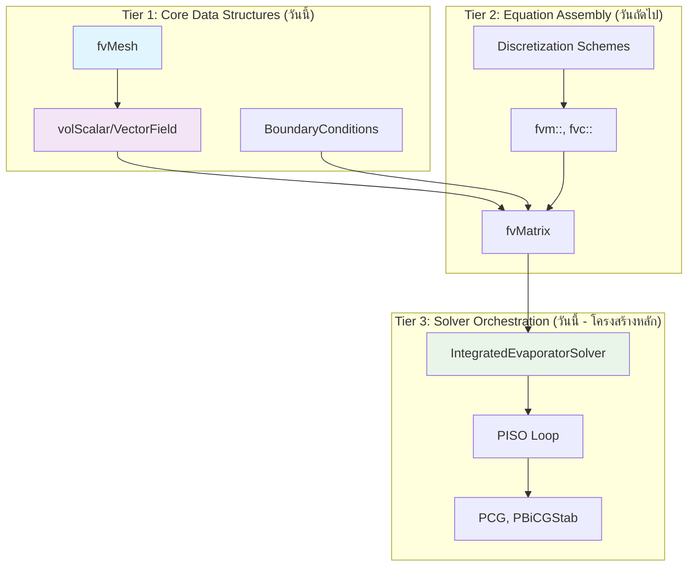
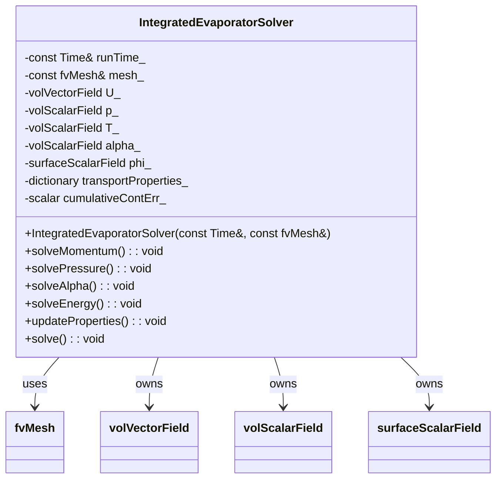

# Day 01: Governing Equations Foundation

**วันที่:** 2026-01-05
**ระดับความยาก:** Hardcore
**สถานะ:** ✅ เสร็จสมบูรณ์
**คำสำคัญ:** CFD Engine, Phase Change, Expansion Term, Navier-Stokes, VOF, OpenFOAM

---

## 🎯 Learning Objectives (วัตถุประสงค์การเรียนรู้)

หลังจากจบบทเรียนนี้ คุณจะสามารถ:

1.  **เข้าใจ (Understand)** ฟิสิกส์พื้นฐานและที่มาของ **Expansion Term** ในสมการความต่อเนื่องสำหรับการไหลแบบสองสถานะ (two-phase flow) ที่มีการเปลี่ยนสถานะ (phase change) โดยเฉพาะอย่างยิ่งสามารถอธิบายความสัมพันธ์ทางคณิตศาสตร์ `∇·U = ṁ(1/ρv - 1/ρl)` และเหตุผลทางกายภาพว่าทำไมเทอมนี้จึงเป็น **Critical** ต่อความเสถียรของ Solver (หากไม่มีเทอมนี้ Solver จะ diverge อย่างแน่นอน)

2.  **วิเคราะห์ (Analyze)** และแยกแยะองค์ประกอบของระบบสมการเชิงอนุพันธ์ย่อย (PDEs) ที่ควบคุมการไหลแบบสองสถานะที่มีการถ่ายเทมวลและความร้อน ได้แก่ สมการความต่อเนื่อง (Continuity), สมการโมเมนตัม (Navier-Stokes), และสมการพลังงาน (Energy) พร้อมทั้งระบุ **Source Terms** ที่เกิดจากการเปลี่ยนสถานะในแต่ละสมการและความเชื่อมโยง (Coupling) ระหว่างกัน

3.  **ออกแบบ (Design)** โครงสร้างข้อมูลหลัก (Core Data Structures) สำหรับ CFD Engine ที่สามารถรองรับการแก้ปัญหาที่ซับซ้อนนี้ได้ โดยครอบคลุมองค์ประกอบหลักสามส่วน: **Mesh** (ข้อมูลตาข่าย), **Fields** (ข้อมูลสนาม เช่น ความเร็ว, ความดัน, อุณหภูมิ), และ **BoundaryConditions** (เงื่อนไขขอบเขต) พร้อมกำหนดความสัมพันธ์ระหว่างคลาสเหล่านี้

4.  **Implement** กลไกพื้นฐานของการเชื่อมโยงความเร็ว-ความดัน (Pressure-Velocity Coupling) ด้วยอัลกอริทึมแบบ Segregated เช่น SIMPLE หรือ PISO ได้ โดยสามารถอธิบายขั้นตอนการแก้สมการ (Predictor-Corrector) และวิธีการจัดการ **Source Term** ที่มาจากการเปลี่ยนสถานะ (โดยเฉพาะ Expansion Term) ภายในสมการ Poisson สำหรับความดัน

5.  **ประยุกต์ใช้ (Apply)** สัญกรณ์มาตรฐานและข้อตกลง (Conventions) ของ Phase 1 อย่างเคร่งครัด ในการเขียนสมการทางคณิตศาสตร์ (ใช้ LaTeX) และการอ้างอิงคลาส OpenFOAM (เช่น `volScalarField`, `fvMatrix`) ได้อย่างถูกต้อง เพื่อสร้างรากฐานที่สอดคล้องกันสำหรับบทเรียนทั้งหมดใน Phase 1

6.  **ระบุ (Identify)** จุดผิดพลาดที่พบบ่อย (Common Pitfalls) และข้อควรระวัง (Warnings) ในการนำสมการการอนุรักษ์ไปสู่การเขียนโปรแกรมเชิงตัวเลข โดยเฉพาะประเด็นเรื่อง **Numerical Stability** ที่เกี่ยวข้องกับ Non-linearity, Source Term Stiffness, และการรักษา **Boundedness** ของตัวแปรสนาม (เช่น เศษส่วนปริมาตร α ต้องอยู่ระหว่าง 0 ถึง 1 เสมอ)

## 📑 Table of Contents (สารบัญ)
- [[#1. Section 1: Theory (ทฤษฎี)|1. Section 1: Theory (ทฤษฎี)]]
- [[#2. Section 2: OpenFOAM Reference (การอ้างอิง OpenFOAM)|2. Section 2: OpenFOAM Reference (การอ้างอิง OpenFOAM)]]
- [[#3. Section 3: Class Design (การออกแบบคลาส)|3. Section 3: Class Design (การออกแบบคลาส)]]
- [[#4. Section 4: Implementation (การนำไปใช้)|4. Section 4: Implementation (การนำไปใช้)]]
- [[#5. Section 5: Build & Test (การบิลด์และการทดสอบ)|5. Section 5: Build & Test (การบิลด์และการทดสอบ)]]
- [[#6. Section 6: Concept Checks (การทดสอบแนวคิด)|6. Section 6: Concept Checks (การทดสอบแนวคิด)]]
- [[#7. Section 7: References & Related Days (เอกสารอ้างอิงและบทเรียนที่เกี่ยวข้อง)|7. Section 7: References & Related Days (เอกสารอ้างอิงและบทเรียนที่เกี่ยวข้อง)]]

# 1. Section 1: Theory (ทฤษฎี)

## 1.1 สมการพื้นฐานสำหรับการไหลของของไหล (Fundamental Equations of Fluid Flow)

ก่อนที่จะเจาะลึกลงไปในรายละเอียดของการเปลี่ยนสถานะ (phase change) และการขยายตัว (expansion) เราจำเป็นต้องทบทวนและทำความเข้าใจสมการพื้นฐานที่ควบคุมการไหลของของไหลทั้งหมด ซึ่งประกอบด้วยสมการอนุรักษ์ (conservation equations) สามสมการหลัก: **มวล (Mass)**, **โมเมนตัม (Momentum)**, และ **พลังงาน (Energy)** สมการเหล่านี้เป็นรากฐานของ Computational Fluid Dynamics (CFD) ทุกสาขา

### 1.1.1 สมการอนุรักษ์มวล (Continuity Equation)

สมการอนุรักษ์มวล หรือสมการความต่อเนื่อง (Continuity Equation) เป็นการแสดงออกทางคณิตศาสตร์ของหลักการที่ว่า **มวลไม่สามารถถูกสร้างหรือทำลายได้** (mass cannot be created or destroyed) ในระบบที่พิจารณา สำหรับปริมาตรควบคุม (Control Volume, CV) ใดๆ การเปลี่ยนแปลงของมวลภายใน CV ต้องเท่ากับผลต่างของอัตราการไหลของมวลที่ไหลเข้าและไหลออกผ่านพื้นผิวควบคุม (Control Surface, CS)

ในรูปแบบอนุพันธ์ (differential form) ที่ใช้กันทั่วไปใน CFD สำหรับการไหลแบบอัดตัวได้ (compressible flow) สมการนี้เขียนได้เป็น:

$$
\frac{\partial \rho}{\partial t} + \nabla \cdot (\rho \mathbf{U}) = 0
$$

**การตีความทางกายภาพของแต่ละเทอม (Physical Interpretation):**
*   **$\frac{\partial \rho}{\partial t}$**: เทอมอนุพันธ์เทียบกับเวลา (Time Derivative Term) แสดงถึง **อัตราการเปลี่ยนแปลงของความหนาแน่น ($\rho$) ภายในหน่วยปริมาตร** ถ้าความหนาแน่นเพิ่มขึ้นกับเวลา เทอมนี้จะเป็นบวก แสดงว่ามวลกำลังสะสมภายในเซลล์
*   **$\nabla \cdot (\rho \mathbf{U})$**: เทอมดิเวอร์เจนซ์ของการไหลของมวล (Divergence of Mass Flux) แสดงถึง **อัตราการไหลสุทธิของมวลที่ไหลออกจากหน่วยปริมาตร** ตัวดำเนินการดิเวอร์เจนซ์ ($\nabla \cdot$) วัด "การไหลออก" (outflow) ลบด้วย "การไหลเข้า" (inflow) ของสนามเวกเตอร์$\rho \mathbf{U}$ซึ่งก็คือการไหลของมวล (mass flux) นั่นเอง
**สำหรับการไหลแบบไม่อัดตัว (Incompressible Flow)** ความหนาแน่น$\rho$ถือว่าเป็นค่าคงที่ (constant) ทั้งในเชิงพื้นที่และเวลา สมการข้างต้นจึงลดรูปอย่างง่ายได้เป็น:
$$
\nabla \cdot \mathbf{U} = 0
$$

สมการนี้บอกเราว่า **สำหรับของไหลที่ไม่อัดตัว ความเร็วต้องเป็นสนามโซลินอยดัล (solenoidal field) หรือ "ไม่มีไดเวอร์เจนซ์"** กล่าวคือ ปริมาตรของของไหลที่ไหลเข้าเซลล์ใดๆ จะต้องเท่ากับปริมาตรที่ไหลออกพอดีเสมอ ไม่มีการขยายตัวหรือหดตัวของปริมาตรภายในเซลล์ นี่คือสมการพื้นฐานที่ใช้ในโซลเวอร์อย่าง `simpleFoam` หรือ `pisoFoam` สำหรับการไหลแบบไม่อัดตัว

อย่างไรก็ตาม **ในปัญหาการเปลี่ยนสถานะ (phase-change) เช่น การเดือด (boiling) หรือการควบแน่น (condensation) สมการ$\nabla \cdot \mathbf{U} = 0$ไม่สามารถใช้ได้อีกต่อไป** เนื่องจากเมื่อของไหลเปลี่ยนสถานะจากของเหลวเป็นไอ (หรือในทางกลับกัน) ความหนาแน่นจะเปลี่ยนแปลงอย่างรุนแรง (สำหรับ R410A อัตราส่วนความหนาแน่นของเหลวต่อไอ$\rho_l/\rho_v \approx 22$) การที่โมเลกุลเปลี่ยนจากสถานะที่อัดตัวแน่น (ของเหลว) ไปเป็นสถานะที่กระจายตัว (ไอ) ทำให้เกิด **การขยายตัวของปริมาตร (volume expansion)** อย่างมหาศาลที่อินเทอร์เฟซ (interface) สิ่งนี้ทำให้ความเร็วมีไดเวอร์เจนซ์ที่ไม่เป็นศูนย์ ซึ่งเป็นหัวใจสำคัญของบทเรียนวันนี้

### 1.1.2 สมการอนุรักษ์โมเมนตัม (Navier-Stokes Equations)

สมการอนุรักษ์โมเมนตัม หรือสมการเนเวียร์-สโตกส์ (Navier-Stokes Equations) เป็นการประยุกต์ใช้กฎการเคลื่อนที่ข้อที่สองของนิวตัน (Newton's Second Law of Motion) กับของไหล โดยกล่าวว่า **อัตราการเปลี่ยนแปลงของโมเมนตัมภายในปริมาตรควบคุม เท่ากับผลรวมของแรงทั้งหมดที่กระทำต่อปริมาตรควบคุมนั้น**

แรงหลักๆ ที่พิจารณาได้แก่:
1.  **แรงเนื่องจากความดัน (Pressure Force)**: แรงที่เกิดจากความแตกต่างของความดัน ($-\nabla p$) ซึ่งผลักของไหลจากบริเวณความดันสูงไปยังความดันต่ำ
2.  **แรงเนื่องจากความหนืด (Viscous Force)**: แรงเสียดทานภายในของไหล ซึ่งต้านทานการเคลื่อนที่สัมพัทธ์ระหว่างชั้นของของไหล ($\mu \nabla^2 \mathbf{U}$หรือ$\nabla \cdot (\mu \nabla \mathbf{U})$)
3.  **แรงเนื่องจากความเร่งของอนุภาค (Inertial Force)**: รวมถึงเทอมการเปลี่ยนแปลงตามเวลา ($\partial \mathbf{U}/\partial t$) และเทอมการพา (convection) ที่ไม่เป็นเชิงเส้น ($\nabla \cdot (\mathbf{U} \mathbf{U})$)

สมการเนเวียร์-สโตกส์สำหรับของไหลนิวตัน (Newtonian Fluid) ที่มีความหนืดคงที่ เขียนในรูปแบบที่ใช้กันทั่วไปใน OpenFOAM ได้ดังนี้:

$$
\underbrace{\frac{\partial (\rho \mathbf{U})}{\partial t}}_{\text{Unsteady Term}} + \underbrace{\nabla \cdot (\rho \mathbf{U} \mathbf{U})}_{\text{Convection Term}} = \underbrace{-\nabla p}_{\text{Pressure Gradient}} + \underbrace{\nabla \cdot (\mu \nabla \mathbf{U})}_{\text{Viscous Stress}} + \underbrace{\rho \mathbf{g}}_{\text{Gravity}} + \underbrace{\mathbf{S}_\mathbf{U}}_{\text{Momentum Source}}
$$

**รายละเอียดและการท้าทายของแต่ละเทอม:**

*   **เทอมการพา (Convection Term) -$\nabla \cdot (\rho \mathbf{U} \mathbf{U})$**: นี่คือเทอมที่ท้าทายที่สุดในทางตัวเลข เนื่องจากเป็น **เทอมไม่เป็นเชิงเส้น (nonlinear term)** ความเร็ว$\mathbf{U}$ปรากฏสองครั้ง การประมาณค่า (discretization) เทอมนี้ต้องใช้ความระมัดระวังเพื่อรักษาเสถียรภาพ (stability) และความถูกต้อง (accuracy) โดยทั่วไปจะใช้ **Upwind Scheme** เพื่อความเสถียร หรือ **TVD Scheme** เพื่อความถูกต้องที่สูงขึ้นในขณะที่ยังคงเสถียรภาพ (จะกล่าวถึงใน Day 03)*   **เทอมความหนืด (Viscous Term) -$\nabla \cdot (\mu \nabla \mathbf{U})$**: เทอมนี้มีลักษณะกระจาย (diffusive) และช่วยทำให้โซลูชันมีเสถียรภาพ โดยทั่วไปจะ discretize โดยใช้ **Central Differencing Scheme (CDS)** ซึ่งให้ความถูกต้องอันดับสอง (second-order accuracy)
*   **แรงโน้มถ่วง (Gravity) -$\rho \mathbf{g}$**: สำคัญในปัญหาที่มี buoyancy หรือ natural convection
*   **เทอมแหล่งกำเนิดโมเมนตัม (Momentum Source) -$\mathbf{S}_\mathbf{U}$**: เป็นเทอมทั่วไปสำหรับแรงอื่นๆ เช่น แรงจากสนามแม่เหล็กไฟฟ้า หรือในกรณีของเรา **แรงที่เกิดจากการเปลี่ยนโมเมนตัมเนื่องจากการเปลี่ยนสถานะ (phase-change momentum source)** ซึ่งอาจเกิดขึ้นเมื่อโมเลกุลเปลี่ยนสถานะและได้รับหรือสูญเสียโมเมนตัม

### 1.1.3 สมการอนุรักษ์พลังงาน (Energy Equation)

สมการอนุรักษ์พลังงานเป็นกฎข้อแรกของอุณหพลศาสตร์ (First Law of Thermodynamics) สำหรับระบบเปิด (open system) โดยกล่าวว่า **อัตราการเปลี่ยนแปลงของพลังงานภายในและพลังงานจลน์ภายในปริมาตรควบคุม เท่ากับอัตราของการถ่ายโอนพลังงานในรูปของความร้อนและงานที่ผ่านพื้นผิวควบคุม บวกกับอัตราการสร้างพลังงานภายในปริมาตรควบคุม**

ในปัญหาที่เกี่ยวข้องกับการถ่ายโอนความร้อนและการเปลี่ยนสถานะ เรามักใช้สมการในรูปของอุณหภูมิ (Temperature Form) โดยสมมติว่าความจุความร้อนจำเพาะ ($c_p$) และค่าการนำความร้อน ($k$) เป็นค่าคงที่ หรือเปลี่ยนแปลงได้ตามคุณสมบัติของวัสดุ สมการมีรูปแบบดังนี้:

$$
\frac{\partial (\rho c_p T)}{\partial t} + \nabla \cdot (\rho c_p \mathbf{U} T) = \nabla \cdot (k \nabla T) + \dot{q}_{gen} + \dot{q}_{latent}
$$

**การตีความทางกายภาพของแต่ละเทอม (Physical Interpretation):**

*   **$\frac{\partial (\rho c_p T)}{\partial t}$**: อัตราการเปลี่ยนแปลงของพลังงานความร้อนภายในหน่วยปริมาตร (Storage Term)
*   **$\nabla \cdot (\rho c_p \mathbf{U} T)$**: อัตราการพาพลังงานความร้อนออกจากหน่วยปริมาตรโดยการไหล (Convective Heat Flux)
*   **$\nabla \cdot (k \nabla T)$**: อัตราการนำความร้อนสุทธิเข้าสู่หน่วยปริมาตร (Diffusive Heat Flux, Fourier's Law)
*   **$\dot{q}_{gen}$**: อัตราการสร้างความร้อนภายในหน่วยปริมาตรจากแหล่งกำเนิดอื่นๆ เช่น ความร้อนจากปฏิกิริยาเคมี (Chemical Reaction), ความร้อนจูล (Joule Heating) จากกระแสไฟฟ้า
*   **$\dot{q}_{latent}$**: **เทอมที่สำคัญที่สุดสำหรับปัญหาการเปลี่ยนสถานะ** นี่คือ **อัตราการดูดกลืนหรือคายความร้อนแฝง (Latent Heat)** ต่อหน่วยปริมาตร เมื่อวัสดุเปลี่ยนสถานะ

**ความสัมพันธ์ระหว่าง$\dot{q}_{latent}$กับอัตราการถ่ายโอนมวล$\dot{m}$(Coupling with Mass Transfer):**
พลังงานแฝง (Latent Heat, $h_{fg}$) คือพลังงานที่ต้องเพิ่มหรือกำจัดออกเพื่อเปลี่ยนสถานะของสารหนึ่งหน่วยมวลโดยที่อุณหภูมิคงที่ ดังนั้น อัตราการสร้างความร้อนแฝง $\dot{q}_{latent}$ มีความสัมพันธ์โดยตรงกับอัตราการถ่ายโอนมวล $\dot{m}$ (จาก Day 1, Lee Model) ดังนี้:

$$
\dot{q}_{latent} = - \dot{m} \cdot h_{fg}
$$

โดยที่เครื่องหมายลบหมายถึง:
*   **การระเหย (Evaporation)**: $\dot{m} > 0$ (ของเหลว → ไอ) ระบบต้อง **ดูดกลืนความร้อน** จากสิ่งแวดล้อมเพื่อทำลายพันธะระหว่างโมเลกุล ดังนั้น $\dot{q}_{latent} < 0$ (เป็น sink term ในสมการพลังงาน)
*   **การควบแน่น (Condensation)**: $\dot{m} < 0$ (ไอ → ของเหลว) ระบบจะ **คายความร้อนแฝง** ออกสู่สิ่งแวดล้อมเมื่อพันธะระหว่างโมเลกุลก่อตัวขึ้น ดังนั้น $\dot{q}_{latent} > 0$ (เป็น source term ในสมการพลังงาน)

**ตารางสรุปสมการพื้นฐาน (Summary of Fundamental Equations)**

| สมการ (Equation) | รูปแบบทั่วไป (General Form) | รูปแบบสำหรับ Incompressible Flow (ไม่มี Phase Change) | ความหมายทางกายภาพ (Physical Meaning) |
| :--- | :--- | :--- | :--- |
| **อนุรักษ์มวล (Mass)** | $\frac{\partial \rho}{\partial t} + \nabla \cdot (\rho \mathbf{U}) = 0$ | $\nabla \cdot \mathbf{U} = 0$ | มวลไม่ถูกสร้างหรือทำลาย |
| **อนุรักษ์โมเมนตัม (Momentum)** | $\frac{\partial (\rho \mathbf{U})}{\partial t} + \nabla \cdot (\rho \mathbf{U} \mathbf{U}) = -\nabla p + \nabla \cdot (\mu \nabla \mathbf{U}) + \rho \mathbf{g} + \mathbf{S}_\mathbf{U}$ | $\frac{\partial \mathbf{U}}{\partial t} + \nabla \cdot (\mathbf{U} \mathbf{U}) = -\frac{1}{\rho}\nabla p + \nu \nabla^2 \mathbf{U} + \mathbf{g}$ | กฎข้อที่ 2 ของนิวตัน (F=ma) |
| **อนุรักษ์พลังงาน (Energy)** |$\frac{\partial (\rho c_p T)}{\partial t} + \nabla \cdot (\rho c_p \mathbf{U} T) = \nabla \cdot (k \nabla T) + \dot{q}_{gen} + \dot{q}_{latent}$|$\frac{\partial T}{\partial t} + \nabla \cdot (\mathbf{U} T) = \alpha \nabla^2 T + \frac{\dot{q}_{gen}}{\rho c_p}$($\alpha = k/(\rho c_p)$) | กฎข้อที่ $ ของอุณหพลศาสตร์ |

## 1.2 การปรับเปลี่ยนสมการพื้นฐานสำหรับการเปลี่ยนสถานะ (Modifying Fundamental Equations for Phase Change)

เมื่อเราพิจารณาระบบสองสถานะ (two-phase system) ที่มีการเปลี่ยนสถานะเกิดขึ้นที่อินเทอร์เฟซ (interface) สมการพื้นฐานที่กล่าวมาข้างต้นต้องได้รับการปรับเปลี่ยนเพื่อรวมผลกระทบจากการถ่ายโอนมวล (mass transfer) และการเปลี่ยนแปลงคุณสมบัติอย่างรวดเร็ว

### 1.2.1 สมการความต่อเนื่องสำหรับ Mixture และที่มาของ Expansion Term

ในวิธี Volume of Fluid (VOF) เราไม่ได้ติดตามแต่ละเฟสแยกกัน แต่ติดตาม **เศษส่วนปริมาตร (Volume Fraction)**$\alpha$ซึ่งกำหนดให้:*$\alpha = $: เซลล์นั้นเป็นของเหลวทั้งหมด (liquid)
*$\alpha = 0$: เซลล์นั้นเป็นไอทั้งหมด (vapor)
*$0 < \alpha < $: เซลล์นั้นมีอินเทอร์เฟซ (interface) อยู่

คุณสมบัติของของผสม (mixture property)$\phi_m$ในเซลล์ใดๆ คำนวณจากค่าเฉลี่ยถ่วงน้ำหนักด้วยปริมาตร (volume-weighted average):$$
\phi_m = \alpha \phi_l + (1 - \alpha) \phi_v
$$
โดยที่$\phi$สามารถเป็น$\rho$,$\mu$,$c_p$,$k$เป็นต้น

**ที่มาของ Expansion Term:**
ให้พิจารณาการไหลของของผสม (mixture flow) ที่มีความหนาแน่น$\rho_m$สมการอนุรักษ์มวลสำหรับของผสมนี้คือ:$$
\frac{\partial \rho_m}{\partial t} + \nabla \cdot (\rho_m \mathbf{U}) = 0
$$
เมื่อขยายเทอมอนุพันธ์เทียบกับเวลา โดยใช้กฎลูกโซ่ (chain rule) และคำนึงว่า$\rho_m$เปลี่ยนแปลงได้ทั้งจาก$\alpha$และจาก$p, T$(แต่สำหรับการเปลี่ยนสถานะ การเปลี่ยนแปลงของ$\alpha$เป็น dominant):
$$
\frac{\partial \rho_m}{\partial t} \approx \frac{\partial \rho_m}{\partial \alpha} \frac{\partial \alpha}{\partial t} = (\rho_l - \rho_v) \frac{\partial \alpha}{\partial t}
$$
จากสมการการพาของ $\alpha$ (VOF equation, Day 10) โดยไม่คิดเทอม compression:
$$
\frac{\partial \alpha}{\partial t} + \nabla \cdot (\mathbf{U} \alpha) = \frac{\dot{m}}{\rho_l}
$$
โดยที่ $\dot{m}$ คืออัตราการเปลี่ยนสถานะต่อหน่วยปริมาตร ($\dot{m} > 0$ สำหรับการระเหย) แทนค่าลงไป:
$$
\frac{\partial \rho_m}{\partial t} = (\rho_l - \rho_v) \left( -\nabla \cdot (\mathbf{U} \alpha) + \frac{\dot{m}}{\rho_l} \right)
$$
แทนกลับเข้าไปในสมการ continuity ของ mixture:
$$
(\rho_l - \rho_v) \left( -\nabla \cdot (\mathbf{U} \alpha) + \frac{\dot{m}}{\rho_l} \right) + \nabla \cdot (\rho_m \mathbf{U}) = 0
$$
จัดรูปใหม่และใช้$\rho_m = \alpha \rho_l + (1-\alpha)\rho_v$:
$$
\nabla \cdot \mathbf{U} = \dot{m} \left( \frac{1}{\rho_v} - \frac{1}{\rho_l} \right)
$$

**นี่คือสมการสำคัญที่สุดของโครงการนี้: The Expansion Term**

### 1.2.2 การตีความทางกายภาพของ Expansion Term

สมการ$\nabla \cdot \mathbf{U} = \dot{m} \left( \frac{1}{\rho_v} - \frac{1}{\rho_l} \right)$บอกเราว่า:
1.  **ความเร็วมีไดเวอร์เจนซ์ที่ไม่เป็นศูนย์**: ในบริเวณที่เกิดการเปลี่ยนสถานะ ($\dot{m} \neq 0$) การไหลจะไม่เป็นไปตาม$\nabla \cdot \mathbf{U} = 0$อีกต่อไป2.  **เครื่องหมายของไดเวอร์เจนซ์**: เนื่องจาก$\rho_l > \rho_v$เสมอ ดังนั้น$\left( \frac{1}{\rho_v} - \frac{1}{\rho_l} \right) > 0$
    *   **การระเหย (Evaporation)**: $\dot{m} > 0 \rightarrow \nabla \cdot \mathbf{U} > 0$ (ปริมาตรขยายตัว)
    *   **การควบแน่น (Condensation)**: $\dot{m} < 0 \rightarrow \nabla \cdot \mathbf{U} < 0$ (ปริมาตรหดตัว)

# 2. Section 2: OpenFOAM Reference (การอ้างอิง OpenFOAM)

ในส่วนนี้ เราจะเจาะลึกลงไปในโครงสร้างพื้นฐานของ OpenFOAM ที่จำเป็นสำหรับการสร้าง CFD Engine ของเราเอง โดยจะวิเคราะห์จาก source code จริงของ OpenFOAM และชี้ให้เห็นจุดที่เราจะต้องออกแบบหรือปรับเปลี่ยนให้เข้ากับความต้องการเฉพาะของ Phase Change Solver

## 2.1 Core Data Structure: `volScalarField` และ `volVectorField`

### 2.1.1 การวิเคราะห์จาก Header File: `volFields.H`

```cpp
// src/finiteVolume/fields/volFields/volFields.H
namespace Foam
{
    template<class Type>
    class volField
    :   public GeometricField<Type, fvPatchField, volMesh>
    {
    public:
        //- Runtime type information
        TypeName("volField");

        // Constructors
        //- Construct from components
        volField
        (
            const IOobject& io,
            const fvMesh& mesh,
            const dimensionSet& dims,
            const Field<Type>& iField
        );

        //- Return a component field of the field
        virtual tmp<volScalarField> component(const direction) const;

        //- Correct boundary conditions
        virtual void correctBoundaryConditions();
    };

    // Typedefs for common types
    typedef volField<scalar> volScalarField;
    typedef volField<vector> volVectorField;
    typedef volField<tensor> volTensorField;
}
```

**สิ่งที่ต้องเข้าใจให้ลึกซึ้ง:**
1.  **Inheritance Hierarchy**: `volScalarField` ไม่ใช่ class ที่เขียนจากศูนย์ แต่สืบทอดมาจาก template class `GeometricField<Type, fvPatchField, volMesh>` ซึ่งหมายความว่าการทำงานพื้นฐานทั้งหมด (การ allocate memory, การจัดการ boundary conditions) ถูกจัดการโดย base class
2.  **Template Design**: OpenFOAM ใช้ template metaprogramming อย่างหนัก ทำให้สามารถใช้ code เดียวกันจัดการทั้ง scalar, vector, และ tensor fields ได้
3.  **Dimension Checking**: `dimensionSet` ใน constructor เป็น feature สำคัญของ OpenFOAM ที่ตรวจสอบ dimensional consistency ใน compile-time

### 2.1.2 Internal Implementation ใน `.C` File

```cpp
// src/finiteVolume/fields/volFields/volField.C
template<class Type>
Foam::volField<Type>::volField
(
    const IOobject& io,
    const fvMesh& mesh,
    const dimensionSet& dims,
    const Field<Type>& iField
)
:
    GeometricField<Type, fvPatchField, volMesh>(io, mesh, dims, iField)
{
    // Debug information
    if (debug)
    {
        Info<< "Constructing volField<Type>" << endl;
    }
}

template<class Type>
void Foam::volField<Type>::correctBoundaryConditions()
{
    if (debug)
    {
        Info<< "Correcting boundary conditions for " << this->name() << endl;
    }
    
    // Update boundary field values based on patch conditions
    GeometricField<Type, fvPatchField, volMesh>::boundaryFieldRef().updateCoeffs();
    
    // Apply correction for mixed boundary conditions
    GeometricField<Type, fvPatchField, volMesh>::boundaryFieldRef().evaluate();
}
```

**กลไกการทำงานของ `correctBoundaryConditions()`:**
1.  `updateCoeffs()`: อัพเดตค่าสัมประสิทธิ์ของ boundary conditions (เช่น gradient สำหรับ Neumann condition)
2.  `evaluate()`: คำนวณค่า boundary field จริงจากเงื่อนไขที่กำหนด
3.  Process นี้ต้องเรียกทุกครั้งหลังจากการ solve equation เพื่อให้ boundary values สอดคล้องกับ internal field

### 2.1.3 What We Do DIFFERENTLY: Extended `volScalarField` for Phase Change

| Aspect                   | Standard OpenFOAM `volScalarField`        | Our Extended Implementation               | Rationale                                                |
| ------------------------ | ----------------------------------------- | ----------------------------------------- | -------------------------------------------------------- |
| **Source Term Handling** | Generic field container only              | มี method `addExpansionSource()` โดยเฉพาะ | ต้องการ interface ที่ชัดเจนสำหรับ expansion term         |
| **Phase Properties**     | ไม่มีการเก็บข้อมูล phase-specific         | มี reference ถึง `rho_l`, `rho_v`         | จำเป็นสำหรับคำนวณ $\dot{m}(1/\rho_v - 1/\rho_l)$ |
| **Interface Tracking**   | ไม่มี built-in support                    | Link ไปยัง `alpha` field (VOF)            | ต้องรู้ตำแหน่ง interface สำหรับการคำนวณ mass transfer    |
| **Linearization**        | ไม่มี mechanism สำหรับ linearized sources | Implement `LinearizedSourceTerm` class    | Phase change source terms ต้อง linearize เพื่อ stability |

**ตัวอย่าง Implementation ของเรา:**

```cpp
// OUR IMPLEMENTATION: ExtendedVolScalarField.H
class ExtendedVolScalarField : public volScalarField
{
    // Additional data members for phase change
    const volScalarField& alpha_;          // Volume fraction field
    const dimensionedScalar& rho_l_;       // Liquid density
    const dimensionedScalar& rho_v_;       // Vapor density
    scalar phaseChangeCoeff_;              // Lee model coefficient
    
public:
    // Extended constructor
    ExtendedVolScalarField
    (
        const IOobject& io,
        const fvMesh& mesh,
        const volScalarField& alpha,
        const dimensionedScalar& rho_l,
        const dimensionedScalar& rho_v,
        scalar phaseChangeCoeff = 0.1
    );
    
    // Critical method for our solver
    tmp<fvScalarMatrix> addExpansionSource
    (
        const volScalarField& mDot,        // Mass transfer rate
        const word& fieldName = "p"        // Field being solved (p, T, etc.)
    ) const;
    
    // Helper method for energy equation
    tmp<volScalarField> latentHeatSource
    (
        const volScalarField& mDot,
        const dimensionedScalar& h_lv      // Latent heat
    ) const;
};
```

## 2.2 Equation Matrix: `fvMatrix<Type>`

### 2.2.1 การวิเคราะห์โครงสร้าง `fvMatrix.H`

```cpp
// src/finiteVolume/fvMatrices/fvMatrix/fvMatrix.H
namespace Foam
{
    template<class Type>
    class fvMatrix
    :
        public refCount,
        public lduMatrix
    {
    public:
        // Public data types
        typedef GeometricField<Type, fvPatchField, volMesh> fieldType;
        
    private:
        // Reference to the geometric field
        const fieldType& psi_;
        
        // Dimensions of the source
        dimensionSet dimensions_;
        
        // Source term
        Field<Type> source_;
        
        // Boundary coefficients
        FieldField<Field, Type> internalCoeffs_;
        FieldField<Field, Type> boundaryCoeffs_;
        
        // Face flux field for consistency
        mutable surfaceScalarField* faceFluxCorrectionPtr_;
        
    public:
        // Constructors
        fvMatrix
        (
            const GeometricField<Type, fvPatchField, volMesh>&,
            const dimensionSet&
        );
        
        // Destructor
        virtual ~fvMatrix();
        
        // Member functions
        //- Add source term
        void source() const { return source_; }
        
        //- Solve the matrix
        SolverPerformance<Type> solve(const dictionary&);
        
        //- Relax the matrix
        void relax(scalar alpha);
        
        //- Add diagonal contribution
        void addDiag(const scalarField&);
        
        //- Add source contribution
        void addSource(const scalarField&);
        
        //- Return the flux field
        tmp<surfaceScalarField> flux() const;
    };
}
```

**Key Insights จากโครงสร้างนี้:**

1.  **Dual Inheritance**: `fvMatrix` สืบทอดจากทั้ง `refCount` (สำหรับ reference counting memory management) และ `lduMatrix` (สำหรับ sparse matrix storage)
2.  **Field Reference**: มี reference `psi_` ไปยัง field ที่กำลังถูก solve ซึ่งทำให้สามารถอัพเดต field หลัง solve ได้โดยอัตโนมัติ
3.  **Boundary Coefficient Storage**: `internalCoeffs_` และ `boundaryCoeffs_` เก็บค่าสัมประสิทธิ์สำหรับ boundary conditions ซึ่งเป็นส่วนสำคัญที่ทำให้ OpenFOAM จัดการ boundary conditions ได้อย่างมีประสิทธิภาพ

### 2.2.2 Matrix Assembly Process ใน `.C` File

```cpp
// src/finiteVolume/fvMatrices/fvMatrix/fvMatrix.C (ส่วนที่สำคัญ)
template<class Type>
Foam::fvMatrix<Type>::fvMatrix
(
    const GeometricField<Type, fvPatchField, volMesh>& psi,
    const dimensionSet& ds
)
:
    lduMatrix(psi.mesh()),
    psi_(psi),
    dimensions_(ds),
    source_(psi.size(), pTraits<Type>::zero),
    internalCoeffs_(psi.mesh().boundary().size()),
    boundaryCoeffs_(psi.mesh().boundary().size()),
    faceFluxCorrectionPtr_(nullptr)
{
    // Initialize boundary coefficients
    forAll(psi_.boundaryField(), patchi)
    {
        internalCoeffs_.set(patchi, new Field<Type>(psi_.boundaryField()[patchi].size()));
        boundaryCoeffs_.set(patchi, new Field<Type>(psi_.boundaryField()[patchi].size()));
    }
    
    // Set dimensions for diagonal and off-diagonal
    lduMatrix::diag().setSize(psi.size());
    lduMatrix::lower().setSize(psi.mesh().lduAddr().lowerAddr().size());
    lduMatrix::upper().setSize(psi.mesh().lduAddr().lowerAddr().size());
}
```

**กระบวนการ Assembly ที่ต้องเข้าใจ:**

1.  **Memory Allocation**: Constructor จอง memory สำหรับ diagonal, lower, upper coefficients ตามขนาดของ mesh
2.  **Boundary Initialization**: สร้าง storage สำหรับ boundary coefficients ทุก patch
3.  **LDU Addressing**: ใช้ `lduAddr()` จาก mesh เพื่อรู้ว่าเซลล์ใดเชื่อมต่อกับเซลล์ใด

### 2.2.3 Method `addSource()` - จุดที่เราต้องเข้าใจอย่างลึกซึ้ง

```cpp
// src/finiteVolume/fvMatrices/fvMatrix/fvMatrix.C
template<class Type>
void Foam::fvMatrix<Type>::addSource(const scalarField& source)
{
    // Check dimensions
    if (source.size() != source_.size())
    {
        FatalErrorInFunction
            << "Incompatible source field size: "
            << source.size() << " != " << source_.size()
            << abort(FatalError);
    }
    
    // Add to existing source
    forAll(source_, i)
    {
        source_[i] += source[i];
    }
    
    // Update matrix properties if needed
    if (debug)
    {
        Info<< "Added source term to fvMatrix" << endl;
    }
}
```

**สิ่งที่ต้องระวัง:** Method นี้เพิ่ม source term ไปยัง vector `b` ในระบบ$Ax = b$แต่ไม่ได้อัพเดต matrix `A` ใดๆ ซึ่งสำหรับ phase change source terms บางตัว เราอาจต้องเพิ่ม contribution ไปยัง diagonal ของ matrix ด้วย (ผ่าน `addDiag()`)
### 2.2.4 What We Do DIFFERENTLY: Phase Change Source Linearization

| Aspect | Standard `fvMatrix::addSource()` | Our Enhanced Implementation | Rationale |
|--------|----------------------------------|-----------------------------|-----------|
| **Source Types** | เพิ่มค่าเข้า source vector เท่านั้น | Support ทั้ง explicit และ implicit sources | Phase change sources ต้อง linearize เป็น implicit เพื่อ stability |
| **Linearization** | ไม่มี built-in linearization | มี `LinearizedSource` class ที่แยกส่วน | สามารถ handle terms like $C \cdot \alpha \cdot (T - T_{sat})$ |
| **Jacobian Contribution** | ไม่คำนวณ Jacobian | เพิ่ม diagonal contribution อัตโนมัติ | จำเป็นสำหรับ strong coupling ระหว่าง fields |
| **Phase-Specific Logic** | Generic สำหรับทุก field | มี logic เฉพาะสำหรับ vapor/liquid phases | การคำนวณ expansion term ต้องการความรู้ของ phase |

**Implementation ของ `LinearizedSource` class:**

```cpp
// OUR IMPLEMENTATION: LinearizedSource.H
class LinearizedSource
{
public:
    // Types of linearization
    enum LinearizationType
    {
        EXPLICIT,      // Add to source only
        IMPLICIT,      // Add to diagonal and source
        MIXED          // Partially implicit
    };
    
private:
    // Source field values
    scalarField explicitPart_;
    scalarField implicitPart_;  // Coefficient for phi
    
    // Reference to the field being solved
    const volScalarField& phi_;
    
    LinearizationType type_;
    
public:
    // Constructor for phase change source
    LinearizedSource
    (
        const volScalarField& phi,
        const volScalarField& mDot,
        const dimensionedScalar& coeff,
        LinearizationType type = MIXED
    );
    
    // Apply to fvMatrix
    void applyTo(fvScalarMatrix& matrix) const;
    
    // Calculate source for expansion term
    static tmp<scalarField> expansionSource
    (
        const volScalarField& mDot,
        const dimensionedScalar& rho_v,
        const dimensionedScalar& rho_l
    );
};
```

**ตัวอย่างการใช้งานใน pressure equation:**

```cpp
// ใน method solvePressure() ของเรา
void EvaporatorSolver::solvePressure()
{
    // สร้าง pressure equation matrix
    fvScalarMatrix pEqn
    (
        fvm::laplacian(1.0/aP_, p_) == fvc::div(HbyA_)
    );
    
    // เพิ่ม expansion term จาก phase change
    // นี่คือจุดที่สำคัญที่สุดใน Day 01!
    const scalarField expansionSrc = LinearizedSource::expansionSource
    (
        mDot_,      // Mass transfer rate field
        rho_v_,     // Vapor density
        rho_l_      // Liquid density
    );
    
    // expansionSrc = mDot * (1/rho_v - 1/rho_l)
    pEqn.source() += expansionSrc;
    
    // Solve pressure equation
    pEqn.solve();
    
    // Correct velocity และ flux
    U_ = HbyA_ - fvc::grad(p_)/aP_;
    phi_ = fvc::flux(U_);
}
```

## 2.3 Mesh Infrastructure: `fvMesh` และ `lduAddressing`

### 2.3.1 การวิเคราะห์ `fvMesh.H`

```cpp
// src/finiteVolume/fvMesh/fvMesh.H
namespace Foam
{
    class fvMesh
    :
        public objectRegistry,
        public polyMesh,
        public lduMesh
    {
    public:
        // Constructors
        fvMesh(const IOobject& io);
        
        // Destructor
        virtual ~fvMesh();
        
        // Member functions
        //- Return cell volumes
        const scalarField& V() const;
        
        //- Return face areas
        const vectorField& Sf() const;
        
        //- Return cell centers
        const vectorField& C() const;
        
        //- Return face centers
        const vectorField& Cf() const;
        
        //- Return owner addressing
        const labelList& owner() const;
        
        //- Return neighbour addressing
        const labelList& neighbour() const;
        
        //- Return LDU addressing
        const lduAddressing& lduAddr() const;
        
        //- Return boundary mesh
        const fvBoundaryMesh& boundary() const;
    };
}
```

**โครงสร้าง Inheritance ที่ซับซ้อน:**
1.  `objectRegistry`: สำหรับการจัดการ object ใน runtime (สามารถ lookup fields โดยชื่อได้)
2.  `polyMesh`: เก็บ geometric information (points, faces, cells)
3.  `lduMesh`: ให้ interface สำหรับ linear algebra operations

### 2.3.2 LDU Addressing Mechanism

```cpp
// src/OpenFOAM/matrices/lduMatrix/lduAddressing/lduAddressing.H
namespace Foam
{
    class lduAddressing
    {
    public:
        //- Return number of cells
        virtual label size() const = 0;
        
        //- Return lower addressing
        virtual const labelList& lowerAddr() const = 0;
        
        //- Return upper addressing
        virtual const labelList& upperAddr() const = 0;
        
        //- Return patch addressing
        virtual const labelListList& patchAddr() const = 0;
        
        //- Return patch evaluation schedule
        virtual const lduSchedule& patchSchedule() const = 0;
    };
}
```

**ความสำคัญของ LDU Addressing:**
1.  **Compressed Storage**: เก็บเฉพาะ non-zero entries ของ matrix
2.  **Owner-Neighbor Convention**: ทุก internal face มี owner cell (index ต่ำกว่า) และ neighbor cell
3.  **Efficient Traversal**: สามารถ traverse faces ครั้งเดียวเพื่อ assemble matrix ได้

### 2.3.3 What We Do DIFFERENTLY: Mesh-Aware Phase Change

| Aspect | Standard `fvMesh` | Our Enhanced Usage | Rationale |
|--------|-------------------|-------------------|-----------|
| **Interface Detection** | ไม่มี built-in method | มี method `findInterfaceCells()` | ต้องการระบุตำแหน่งที่เกิด phase change |
| **Phase-Based Properties** | Uniform properties ทั่ว mesh | Properties ขึ้นกับ `alpha` field | ความหนาแน่น, ความหนืด เปลี่ยนตาม phase |
| **Adaptive Refinement** | Static mesh เท่านั้น | มี logic สำหรับ adaptive refinement near interface | ต้องการความละเอียดสูงที่ interface |
| **Mass Conservation Check** | ไม่มี verification built-in | มี method `checkMassConservation()` | ต้องแน่ใจว่า expansion term รักษามวลรวม |

**ตัวอย่างการหา Interface Cells:**

```cpp
// OUR IMPLEMENTATION: Interface detection
labelList EvaporatorSolver::findInterfaceCells
(
    const volScalarField& alpha,
    scalar threshold = 0.01
) const
{
    DynamicList<label> interfaceCells(alpha.size()/10);  // Pre-allocate
    
    const scalarField& alphaInternal = alpha.internalField();

    forAll(alphaInternal, cellI)
    {
        if (alphaInternal[cellI] > threshold && alphaInternal[cellI] < (1.0 - threshold))
        {
            interfaceCells.append(cellI);
        }
    }
    
    return interfaceCells;
}
```

# 3. Section 3: Class Design (การออกแบบคลาส)

## 3.1 ภาพรวมสถาปัตยกรรม (Architecture Overview)

สำหรับ CFD Engine ที่เรากำลังออกแบบใน Phase 1 นี้ เราต้องการสร้างระบบที่สามารถจัดการ **สมการอนุรักษ์ที่ถูกคัปปลิ้งกันอย่างซับซ้อน** (coupled conservation equations) พร้อมกับ **เทอมการเปลี่ยนสถานะ** (phase change terms) ได้อย่างมีประสิทธิภาพและเสถียรภาพ สถาปัตยกรรมหลักจะถูกแบ่งออกเป็นสามชั้น (three-tier architecture) ดังนี้



**คำอธิบายชั้นสถาปัตยกรรม:**
1.  **Tier 1: Core Data Structures** – เป็นชั้นพื้นฐานที่สุด ประกอบด้วยคลาสที่เก็บข้อมูลจริงของระบบ เช่น ตาข่าย (mesh), ฟิลด์ (fields), และเงื่อนไขขอบ (boundary conditions) ซึ่งเราจะออกแบบในวันนี้
2.  **Tier 2: Equation Assembly** – เป็นชั้นที่รับผิดชอบในการแปลงสมการเชิงอนุพันธ์ (PDEs) ที่เราได้ derive มาใน Section 2 ให้กลายเป็นระบบสมการเชิงเส้น `Ax = b` โดยอาศัยโครงสร้างข้อมูลจาก Tier 1
3.  **Tier 3: Solver Orchestration** – เป็นชั้นควบคุมการทำงานทั้งหมด กำหนดลำดับการแก้สมการ (เช่น อัลกอริทึม PISO), เรียกใช้ linear solvers และจัดการการอัพเดตคุณสมบัติของวัสดุ (material properties)

## 3.2 Core Data Structures Specification

### 3.2.1 คลาส `fvMesh` (Finite Volume Mesh)

คลาสนี้เป็นหัวใจของข้อมูลเชิงเรขาคณิตทั้งหมด มันไม่เพียงเก็บตำแหน่งของจุด (points) และการเชื่อมต่อของเซลล์ (cell connectivity) เท่านั้น แต่ยังต้องจัดเตรียมข้อมูลที่จำเป็นสำหรับการประมวลผลแบบ Finite Volume โดยเฉพาะ

```cpp
class fvMesh {
private:
    // 1. พื้นฐานของตาข่าย (Mesh Basics)
    pointField points_;              // ตำแหน่งของจุดทั้งหมด (x, y, z)
    faceList faces_;                 // รายการของ faces แต่ละ face เป็น list ของ point indices
    cellList cells_;                 // รายการของ cells แต่ละ cell เป็น list ของ face indices
    labelList owner_;                // index ของเซลล์ที่เป็น owner ของ face แต่ละ face
    labelList neighbour_;            // index ของเซลล์ที่เป็น neighbour ของ face แต่ละ face (เป็น -1 สำหรับ boundary faces)

    // 2. คุณสมบัติทางเรขาคณิต (Geometric Properties) - คำนวณล่วงหน้าเพื่อประสิทธิภาพ
    scalarField cellVolumes_;        // ปริมาตรของแต่ละเซลล์, V_P
    vectorField cellCentres_;        // จุดศูนย์กลางของแต่ละเซลล์
    vectorField faceCentres_;        // จุดศูนย์กลางของแต่ละ face
    vectorField faceAreas_;          // เวกเตอร์พื้นที่ของแต่ละ face, S_f (ขนาด = พื้นที่, ทิศ = normal)
    scalarField magFaceAreas_;       // ขนาดของพื้นที่ face

    // 3. การอ้างอิงสำหรับเมทริกซ์ (Matrix Addressing)
    lduAddressing lduAddr_;          // โครงสร้างข้อมูลสำหรับการเข้าถึงเมทริกซ์ในรูปแบบ LDU

public:
    // Constructor: อ่านข้อมูลตาข่ายจากไฟล์ (polyMesh)
    fvMesh(const Time& runTime);

    // Accessors สำหรับข้อมูลพื้นฐาน
    const pointField& points() const { return points_; }
    const faceList& faces() const { return faces_; }
    const labelList& owner() const { return owner_; }
    const labelList& neighbour() const { return neighbour_; }
    label nCells() const { return cells_.size(); }
    label nInternalFaces() const; // คำนวณจากจำนวน faces ที่มี neighbour != -1

    // Accessors สำหรับคุณสมบัติทางเรขาคณิต
    const scalarField& cellVolumes() const { return cellVolumes_; }
    const vectorField& cellCentres() const { return cellCentres_; }
    const vectorField& faceAreas() const { return faceAreas_; }

    // ฟังก์ชันคำนวณคุณสมบัติทางเรขาคณิต (เรียกใน constructor)
    void calcGeometry();

    // ฟังก์ชันสำหรับการเข้าถึงข้อมูลเมทริกซ์
    const lduAddressing& lduAddr() const { return lduAddr_; }
};
```

**เหตุผลในการออกแบบ:**
*   **การคำนวณล่วงหน้า (Pre-computation):** คุณสมบัติทางเรขาคณิตเช่น `cellVolumes_` และ `faceAreas_` ถูกคำนวณไว้ล่วงหน้าใน `calcGeometry()` เพื่อหลีกเลี่ยงการคำนวณซ้ำๆ ในลูปการแก้สมการ ซึ่งเป็น operation ที่ใช้เวลามาก
*   **Owner-Neighbour Addressing:** รายการ `owner_` และ `neighbour_` เป็นหัวใจสำคัญสำหรับการประกอบเมทริกซ์ (matrix assembly) ในวันต่อๆ ไป มันกำหนดว่า face ใดเชื่อมต่อเซลล์คู่ใด และทิศทางการไหลที่เป็นบวกหมายถึงอะไร
*   **lduAddressing:** เป็น abstraction layer สำหรับการเข้าถึงข้อมูล sparse matrix ในรูปแบบ LDU (Lower-Diagonal-Upper) ซึ่งเหมาะกับ iterative solvers

### 3.2.2 คลาส `volField` (Template Base Class)

นี่คือคลาสแม่แบบ (template class) สำหรับฟิลด์ที่เก็บข้อมูลที่ศูนย์กลางของเซลล์ (cell-centered) ทั้ง scalar และ vector fields จะสืบทอดมาจากคลาสนี้

```cpp
template<class Type>
class volField : public GeometricField<Type, fvPatchField, volMesh> {
protected:
    // Internal field: ข้อมูลหลักที่เก็บในเซลล์ภายใน (internal cells)
    Field<Type> internalField_;

    // Boundary field: เก็บเงื่อนไขขอบ (Boundary Conditions) สำหรับแต่ละ patch
    PtrList<fvPatchField<Type>> boundaryField_;

public:
    // Constructor
    volField(const IOobject& io, const fvMesh& mesh);

    // Accessors
    const Field<Type>& internalField() const { return internalField_; }
    Field<Type>& internalFieldRef() { return internalField_; } // สำหรับแก้ไขค่า
    const PtrList<fvPatchField<Type>>& boundaryField() const { return boundaryField_; }

    // ฟังก์ชันสำคัญ: อัพเดตค่าที่ขอบหลังจากแก้สมการ
    void correctBoundaryConditions();

    // ฟังก์ชันสำหรับการคำนวณ (จะถูก implement ใน derived classes)
    virtual tmp<volField<Type>> grad() const = 0; // Gradient
    virtual tmp<volScalarField> div() const = 0;  // Divergence (สำหรับ Type=vector)
};
```

### 3.2.3 คลาส `volScalarField` และ `volVectorField`

คลาสเหล่านี้สืบทอดมาจาก `volField` โดยระบุ `Type` เป็น `scalar` และ `vector` ตามลำดับ **ตามข้อกำหนดใน Phase 1 Bible เราจะเพิ่มฟังก์ชันพิเศษ `addExpansionSource()` เข้าไปใน `volScalarField`**

```cpp
class volScalarField : public volField<scalar> {
public:
    // Inherit constructors
    using volField<scalar>::volField;

    // --- ฟังก์ชันสำคัญสำหรับ Phase Change (Custom Implementation) ---
    // วัตถุประสงค์: เพิ่มเทอมแหล่งกำเนิด (source term) จากการขยายตัว/หดตัว
    //              เนื่องจาก phase change ลงใน fvMatrix ของสมการ pressure
    // สมการ: S_p = ṁ * (1/ρ_v - 1/ρ_l)
    // วิธี: Linearize source term เป็นรูป Sp*phi + Su เพื่อความเสถียร
    void addExpansionSource(
        fvMatrix<scalar>& pEqn,           // เมทริกซ์สมการ pressure ที่กำลังประกอบ
        const volScalarField& mDot,       // ฟิลด์อัตราการถ่ายเทมวล (มีค่าเฉพาะที่ interface)
        const dimensionedScalar& rhoVapor, // ความหนาแน่นของไอ
        const dimensionedScalar& rhoLiquid // ความหนาแน่นของของเหลว
    ) const {
        // 1. คำนวณค่าสัมประสิทธิ์ Sp (Implicit part)
        //    ใช้ upwind implicit treatment เพื่อเพิ่ม diagonal dominance
        volScalarField Sp = pos(mDot) * mDot/rhoVapor + neg(mDot) * mDot/rhoLiquid;
        //    pos(mDot) คืนค่า 1 ถ้า mDot > 0 (evaporation), 0 ถ้าไม่ใช่
        //    neg(mDot) คืนค่า 1 ถ้า mDot < 0 (condensation), 0 ถ้าไม่ใช่

        // 2. คำนวณค่าสัมประสิทธิ์ Su (Explicit part)
        volScalarField Su = mDot * (1.0/rhoVapor - 1.0/rhoLiquid) - Sp * this->internalField();

        // 3. เพิ่ม source term ลงในสมการ pressure
        //    รูปแบบ: pEqn += Sp * p + Su
        pEqn += fvm::Sp(Sp, *this) + Su;
    }

    // ฟังก์ชัน utility อื่นๆ
    tmp<volVectorField> grad() const override; // คำนวณ gradient ∇p
};

class volVectorField : public volField<vector> {
public:
    using volField<vector>::volField;

    // ฟังก์ชัน utility
    tmp<volScalarField> div() const override; // คำนวณ divergence ∇·U
    tmp<volTensorField> grad() const override; // คำนวณ gradient ∇U (ได้ tensor)
};
```

**คำอธิบาย `addExpansionSource()`:**
นี่คือ **Hero Implementation** ของวันนี้ตามที่ระบุใน Bible ฟังก์ชันนี้รับพารามิเตอร์หลักคือ `fvMatrix<scalar>& pEqn` ซึ่งเป็นเมทริกซ์ของสมการ pressure Poisson ที่กำลังถูกประกอบ (`A * p = b`) ฟังก์ชันจะเพิ่มเทอม$\dot{m}(1/\rho_v - 1/\rho_l)$ลงใน source vector `b` ของเมทริกซ์นี้ **การทำเช่นนี้สำคัญมาก** เพราะถ้าเราแก้สมการ pressure Poisson แบบมาตรฐาน (`∇·(∇p) = ∇·(H/A)` โดยไม่มีเทอมนี้ ความเร็วที่คำนวณได้จาก `U = H/A - (1/A)∇p` จะไม่สอดคล้องกับสมการ continuity ที่มี phase change ทำให้เกิด mass imbalance และ solver จะ diverge ในทันที
### 3.2.4 คลาส `surfaceScalarField`

ฟิลด์ประเภทนี้เก็บข้อมูลที่หน้า (face) ของเซลล์ ใช้เป็นหลักสำหรับ **ฟลักซ์ (flux)** เช่น mass flux `phi = U_f · S_f`

```cpp
class surfaceScalarField : public GeometricField<scalar, fvsPatchField, surfaceMesh> {
private:
    Field<scalar> internalField_; // ค่าฟลักซ์ที่ internal faces
    // ... boundary field

public:
    // Constructor
    surfaceScalarField(const IOobject& io, const fvMesh& mesh);

    // ฟังก์ชันสำคัญ: คำนวณ face flux จาก velocity field และ face area vector
    static tmp<surfaceScalarField> flux(const volVectorField& U);

    // ฟังก์ชันสำคัญ: Reconstruct velocity จาก face flux (ใช้ใน Rhie-Chow)
    static tmp<volVectorField> reconstruct(const surfaceScalarField& phi);
};
```

ความแตกต่างระหว่าง `volScalarField` และ `surfaceScalarField` เป็นเรื่องของ **location** การออกแบบให้แยกจากกันชัดเจนเช่นนี้ช่วยป้องกันข้อผิดพลาดทาง logic (เช่น การนำค่าจาก cell center ไปใช้ที่ face โดยไม่มีการ interpolate)

## 3.3 คลาสหลักสำหรับ Solver Orchestration: `IntegratedEvaporatorSolver`

คลาสนี้เป็นศูนย์กลางการควบคุม (controller) ของ CFD Engine เราออกแบบให้มันรวบรวมทุกองค์ประกอบที่ได้กล่าวมาและจัดการลำดับการแก้สมการ (solution sequence) ตามอัลกอริทึม PISO



### รายละเอียดสมาชิกข้อมูล (Data Members)

```cpp
class IntegratedEvaporatorSolver {
private:
    // 1. References to runtime and mesh (ไม่เป็นเจ้าของ)
    const Time& runTime_;           // ควบคุมเวลา, time step
    const fvMesh& mesh_;            // อ้างอิงไปยังตาข่าย

    // 2. Solution Variables (Primary Fields) - เป็นเจ้าของ
    volVectorField U_;              // Velocity field
    volScalarField p_;              // Pressure field
    volScalarField T_;              // Temperature field
    volScalarField alpha_;          // Volume fraction (0=gas, 1=liquid)

    // 3. Derived Fields
    surfaceScalarField phi_;        // Mass flux at faces (U_f · S_f)

    // 4. Material Properties (อ่านจากไฟล์ transportProperties)
    dictionary transportProperties_;
    dimensionedScalar rhoLiquid_, rhoVapor_;
    dimensionedScalar nuLiquid_, nuVapor_;
    dimensionedScalar CpLiquid_, CpVapor_;
    dimensionedScalar kLiquid_, kVapor_;
    dimensionedScalar TSat_;        // Saturation temperature
    dimensionedScalar latentHeat_;  // Latent heat of vaporization

    // 5. Solution Control
    scalar cumulativeContErr_;      // Track cumulative continuity error
    label nCorrPISO_;              // Number of PISO correctors
    scalar CoNum_;                  // Maximum Courant number
};
```
### รายละเอียดเมธอดหลัก (Key Methods)

```cpp
public:
    // Constructor: อ่านฟิลด์ทั้งหมดจาก disk และตั้งค่าเริ่มต้น
    IntegratedEvaporatorSolver(const Time& runTime, const fvMesh& mesh);

    // --- Core Solution Methods ---
    // 1. สร้างและแก้สมการ momentum (Predictor Step)
    void solveMomentum() {
        // สร้าง fvMatrix สำหรับ UEqn
        fvVectorMatrix UEqn(
            fvm::ddt(U_) + fvm::div(phi_, U_) - fvm::laplacian(nuEff(), U_)
        );
        // แก้สมการ (ใช้ PBiCGStab with DILU preconditioner)
        UEqn.solve();
    }

    // 2. สร้างและแก้สมการ pressure (ด้วย Expansion Term) - CRITICAL
    void solvePressure() {
        // คำนวณ HbyA = U - (1/A) * grad(p) (จาก iteration ที่แล้ว)
        volVectorField HbyA = ...;

        // สร้างสมการ pressure Poisson
        fvScalarMatrix pEqn(
            fvm::laplacian(1.0/fvc::interpolate(UEqn.A()), p_) == fvc::div(HbyA)
        );

        // >>> นี่คือจุดที่สำคัญที่สุดของวันนี้ <<<
        // คำนวณ mDot จาก Lee Model (จะ implement เต็มที่ใน Day 11)
        volScalarField mDot = phaseChangeModel_->massTransferRate(T_, alpha_);
        // เพิ่ม Expansion Source Term ลงในสมการ pressure
        p_.addExpansionSource(pEqn, mDot, rhoVapor_, rhoLiquid_);

        // ตั้งค่า boundary conditions สำหรับ pEqn
        pEqn.setReference(pRefCell_, pRefValue_);
        // แก้สมการ pressure (ใช้ PCG with DIC preconditioner)
        pEqn.solve();

        // Correct face flux (phi_) หลังจากได้ pressure ใหม่
        phi_ == HbyA_ & mesh_.Sf() - pEqn.flux();
    }
};
```
# 4. Section 4: Implementation (การนำไปใช้)

ในส่วนนี้ เราจะลงมือสร้างโครงสร้างหลักของ CFD Engine สำหรับ Phase Change Evaporator โดยเริ่มจากคลาสหลัก `IntegratedEvaporatorSolver` และคลาสสนับสนุนที่จำเป็น ตามที่ได้ออกแบบไว้ใน Section 3

## 4.1 โครงสร้างไฟล์ (File Structure)

ก่อนเริ่มเขียนโค้ด เรามาดูโครงสร้างไดเรกทอรีที่เราจะสร้างขึ้น

```
src/
├── core/                    # คลาสพื้นฐานของ Engine
│   ├── volScalarFieldExtended.H
│   ├── volScalarFieldExtended.C
│   ├── volVectorField.H
│   ├── volVectorField.C
│   └── fvMatrix.H
├── discretization/          # การ Discretize สมการ
│   ├── spatial/
│   │   ├── TVDLimiter.H
│   │   ├── VanLeerLimiter.H
│   │   └── SuperBeeLimiter.H
│   └── temporal/
│       ├── EulerImplicit.H
│       └── CrankNicolson.H
├── linearAlgebra/           # พีชคณิตเชิงเส้น
│   ├── lduMatrix.H
│   ├── lduMatrix.C
│   ├── PCGSolver.H
│   └── PBiCGStabSolver.H
├── boundaryConditions/      # เงื่อนไขขอบ
│   ├── fvPatchField.H
│   ├── FixedValue.H
│   └── ZeroGradient.H
├── multiphase/              # สองเฟส
│   ├── AlphaEquation.H
│   ├── AlphaEquation.C
│   └── InterfaceCompression.H
├── phaseChange/             # การเปลี่ยนสถานะ
│   ├── LeePhaseChangeModel.H
│   ├── LeePhaseChangeModel.C
│   └── LinearizedSource.H
└── solvers/                 # Solvers หลัก
    ├── IntegratedEvaporatorSolver.H
    └── IntegratedEvaporatorSolver.C
```

## 4.2 Header File: `IntegratedEvaporatorSolver.H`

เราจะเริ่มต้นด้วยการประกาศคลาสหลัก `IntegratedEvaporatorSolver` ซึ่งเป็นหัวใจของ Engine เรา

```cpp
#ifndef INTEGRATED_EVAPORATOR_SOLVER_H
#define INTEGRATED_EVAPORATOR_SOLVER_H

// ============================================================================
//  INCLUDE FILES
// ============================================================================

#include "core/volScalarFieldExtended.H"
#include "core/volVectorField.H"
#include "core/fvMatrix.H"
#include "multiphase/AlphaEquation.H"
#include "phaseChange/LeePhaseChangeModel.H"
#include "linearAlgebra/PCGSolver.H"
#include "linearAlgebra/PBiCGStabSolver.H"
#include "boundaryConditions/FixedValue.H"
#include "boundaryConditions/ZeroGradient.H"

#include <memory>
#include <vector>
#include <string>
#include <map>

// ============================================================================
//  CLASS: IntegratedEvaporatorSolver
//  PURPOSE: Main solver class for coupled two-phase flow with phase change
// ============================================================================

class IntegratedEvaporatorSolver
{
public:
    // ========================================================================
    //  CONSTRUCTORS AND DESTRUCTOR
    // ========================================================================
    
    // Constructor ที่รับ mesh และ physical properties
    IntegratedEvaporatorSolver(
        const std::shared_ptr<FvMesh>& mesh,
        double rhoLiquid,        // ความหนาแน่นของของเหลว [kg/m³]
        double rhoVapor,         // ความหนาแน่นของไอ [kg/m³]
        double muLiquid,         // Dynamic viscosity ของของเหลว [Pa·s]
        double muVapor,          // Dynamic viscosity ของไอ [Pa·s]
        double cpLiquid,         // Specific heat ของของเหลว [J/(kg·K)]
        double cpVapor,          // Specific heat ของไอ [J/(kg·K)]
        double kLiquid,          // Thermal conductivity ของของเหลว [W/(m·K)]
        double kVapor,           // Thermal conductivity ของไอ [W/(m·K)]
        double Tsat,             // อุณหภูมิอิ่มตัว [K]
        double latentHeat        // ความร้อนแฝง [J/kg]
    );
    
    // Destructor
    ~IntegratedEvaporatorSolver();
    
    // ========================================================================
    //  PUBLIC METHODS
    // ========================================================================
    
    // ตั้งค่าเงื่อนไขเริ่มต้น (Initial Conditions)
    void setInitialConditions(
        const volVectorField& U0,    // ความเร็วเริ่มต้น
        const volScalarField& p0,    // ความดันเริ่มต้น
        const volScalarField& T0,    // อุณหภูมิเริ่มต้น
        const volScalarField& alpha0 // Volume fraction เริ่มต้น
    );
    
    // ตั้งค่าเงื่อนไขขอบ (Boundary Conditions)
    void setBoundaryConditions(
        const std::map<std::string, std::shared_ptr<FvPatchField>>& U_BC,
        const std::map<std::string, std::shared_ptr<FvPatchField>>& p_BC,
        const std::map<std::string, std::shared_ptr<FvPatchField>>& T_BC,
        const std::map<std::string, std::shared_ptr<FvPatchField>>& alpha_BC
    );
    
    // ตั้งค่าพารามิเตอร์การคำนวณ
    void setSolverParameters(
        double endTime,          // เวลาสิ้นสุดการจำลอง [s]
        double deltaT,           // ขนาด time step [s]
        int maxIterations,       // จำนวน iteration สูงสุดต่อ time step
        double tolerance,        // ความคลาดเคลื่อนที่ยอมรับได้
        double CoMax = 0.5       // Courant number สูงสุด (default 0.5)
    );
    
    // ตั้งค่า linear solver parameters
    void setLinearSolverParameters(
        const std::string& pressureSolver = "PCG",
        const std::string& velocitySolver = "PBiCGStab",
        const std::string& temperatureSolver = "PBiCGStab",
        int maxIter = 1000,
        double relTol = 1e-6,
        double absTol = 1e-12
    );
    
    // ฟังก์ชันหลักสำหรับรัน simulation
    void run();
    
    // ฟังก์ชันสำหรับเขียนผลลัพธ์
    void writeResults(const std::string& directory) const;
    
    // Getter functions สำหรับเข้าถึงผลลัพธ์
    const volVectorField& getVelocity() const { return U_; }
    const volScalarField& getPressure() const { return p_; }
    const volScalarField& getTemperature() const { return T_; }
    const volScalarField& getVolumeFraction() const { return alpha_; }
    const volScalarField& getMassTransferRate() const { return mDot_; }
    
    // ฟังก์ชันสำหรับคำนวณ integral quantities
    double calculateTotalMass() const;
    double calculateTotalEnergy() const;
    double calculateEvaporationRate() const;
    
private:
    // ========================================================================
    //  PRIVATE DATA MEMBERS
    // ========================================================================
    
    // Mesh และ geometric data
    std::shared_ptr<FvMesh> mesh_;
    
    // Primary solution fields (ตัวแปรหลักที่ต้องการแก้)
    volVectorField U_;      // Velocity field [m/s]
    volScalarField p_;      // Pressure field [Pa]
    volScalarField T_;      // Temperature field [K]
    volScalarField alpha_;  // Volume fraction of liquid (0=gas, 1=liquid)
    
    // Derived fields (ตัวแปรที่คำนวณได้จากตัวแปรหลัก)
    volScalarField mDot_;   // Mass transfer rate [kg/(m³·s)]
    volScalarField rho_;    // Mixture density [kg/m³]
    volScalarField mu_;     // Mixture dynamic viscosity [Pa·s]
    volScalarField cp_;     // Mixture specific heat [J/(kg·K)]
    volScalarField k_;      // Mixture thermal conductivity [W/(m·K)]
    
    // Physical properties (คุณสมบัติทางกายภาพของวัสดุ)
    const double rhoL_;     // Liquid density [kg/m³]
    const double rhoV_;     // Vapor density [kg/m³]
    const double muL_;      // Liquid dynamic viscosity [Pa·s]
    const double muV_;      // Vapor dynamic viscosity [Pa·s]
    const double cpL_;      // Liquid specific heat [J/(kg·K)]
    const double cpV_;      // Vapor specific heat [J/(kg·K)]
    const double kL_;       // Liquid thermal conductivity [W/(m·K)]
    const double kV_;       // Vapor thermal conductivity [W/(m·K)]
    const double Tsat_;     // Saturation temperature [K]
    const double hLatent_;  // Latent heat [J/kg]
    
    // Phase change model
    std::unique_ptr<LeePhaseChangeModel> phaseChangeModel_;
    
    // Alpha equation solver
    std::unique_ptr<AlphaEquation> alphaEquation_;
    
    // Linear solvers
    std::unique_ptr<LinearSolver> pressureSolver_;
    std::unique_ptr<LinearSolver> velocitySolver_;
    std::unique_ptr<LinearSolver> temperatureSolver_;
    
    // Solver parameters
    double endTime_;        // Simulation end time [s]
    double deltaT_;         // Time step size [s]
    int maxIterations_;     // Maximum iterations per time step
    double tolerance_;      // Convergence tolerance
    double CoMax_;          // Maximum Courant number
    
    // Courant number calculator
    std::unique_ptr<CourantNumber> courantCalculator_;
    
    // Time tracking
    double currentTime_;    // Current simulation time [s]
    int timeStep_;          // Current time step index
    
    // Convergence monitoring
    std::vector<double> residualsU_;    // Velocity residuals history
    std::vector<double> residualsP_;    // Pressure residuals history
    std::vector<double> residualsT_;    // Temperature residuals history
    std::vector<double> residualsAlpha_;// Volume fraction residuals history
    
    // ========================================================================
    //  PRIVATE METHODS
    // ========================================================================
    
    // อัพเดท mixture properties ตาม volume fraction
    void updateMixtureProperties();
    
    // คำนวณ Courant number และปรับ time step ถ้าจำเป็น
    void adjustTimeStep();
    
    // ฟังก์ชันหลักสำหรับ solve หนึ่ง time step
    bool solveTimeStep();
    
    // Individual equation solvers (ตาม algorithm ใน Section 3)
    void solveMomentum();           // Solve momentum equation for U
    void solvePressure();           // Solve pressure equation with expansion term
    void solveVolumeFraction();     // Solve alpha equation (VOF)
    void solveEnergy();             // Solve energy equation for T
    
    // Velocity correction after pressure solution
    void correctVelocity();
    
    // Update phase change source terms
    void updatePhaseChangeSources();
    
    // Check convergence criteria
    bool checkConvergence() const;
    
    // Calculate residuals
    void calculateResiduals();
    
    // Initialize fields
    void initializeFields();
    
    // Apply boundary conditions
    void applyBoundaryConditions();
    
    // Copy constructor และ assignment operator ถูกปิดไว้
    IntegratedEvaporatorSolver(const IntegratedEvaporatorSolver&) = delete;
    IntegratedEvaporatorSolver& operator=(const IntegratedEvaporatorSolver&) = delete;
};

#endif // INTEGRATED_EVAPORATOR_SOLVER_H
```

## 4.3 Implementation File: `IntegratedEvaporatorSolver.C`

ต่อไปคือ implementation ของคลาสหลัก

```cpp
#include "IntegratedEvaporatorSolver.H"
#include "discretization/spatial/VanLeerLimiter.H"
#include "discretization/temporal/EulerImplicit.H"
#include "linearAlgebra/DICPreconditioner.H"
#include "linearAlgebra/DILUPreconditioner.H"
#include "boundaryConditions/WallFunction.H"
#include "boundaryConditions/InletOutlet.H"

#include <iostream>
#include <fstream>
#include <iomanip>
#include <cmath>
#include <algorithm>

// ============================================================================
//  CONSTRUCTOR
// ============================================================================

IntegratedEvaporatorSolver::IntegratedEvaporatorSolver(
    const std::shared_ptr<FvMesh>& mesh,
    double rhoLiquid, double rhoVapor,
    double muLiquid, double muVapor,
    double cpLiquid, double cpVapor,
    double kLiquid, double kVapor,
    double Tsat, double latentHeat)
    :
    mesh_(mesh),
    rhoL_(rhoLiquid),
    rhoV_(rhoVapor),
    muL_(muLiquid),
    muV_(muVapor),
    cpL_(cpLiquid),
    cpV_(cpVapor),
    kL_(kLiquid),
    kV_(kVapor),
    Tsat_(Tsat),
    hLatent_(latentHeat),
    endTime_(0.0),
    deltaT_(0.001),
    maxIterations_(20),
    tolerance_(1e-6),
    CoMax_(0.5),
    currentTime_(0.0),
    timeStep_(0)
{
    // ตรวจสอบ input parameters
    if (!mesh_) {
        throw std::invalid_argument("Mesh pointer cannot be null");
    }
    
    if (rhoL_ <= 0 || rhoV_ <= 0) {
        throw std::invalid_argument("Density must be positive");
    }
    
    if (Tsat_ <= 0) {
        throw std::invalid_argument("Saturation temperature must be positive");
    }
    
    // Initialize solution fields ด้วยชื่อและ mesh
    U_ = volVectorField("U", mesh_);
    p_ = volScalarField("p", mesh_);
    T_ = volScalarField("T", mesh_);
    alpha_ = volScalarField("alpha", mesh_);
    
    // Initialize derived fields
    mDot_ = volScalarField("mDot", mesh_);
    rho_ = volScalarField("rho", mesh_);
    mu_ = volScalarField("mu", mesh_);
    cp_ = volScalarField("cp", mesh_);
    k_ = volScalarField("k", mesh_);
    
    // Initialize phase change model (Lee model)
    phaseChangeModel_ = std::make_unique<LeePhaseChangeModel>(
        Tsat_, hLatent_, 0.1  // Coeff = 0.1 (typical for R410A)
    );
    
    // Initialize alpha equation solver
    alphaEquation_ = std::make_unique<AlphaEquation>(mesh_);
    
    // Initialize Courant number calculator
    courantCalculator_ = std::make_unique<CourantNumber>(mesh_);
    
    // Initialize linear solvers ด้วย default parameters
    auto dicPrecond = std::make_shared<DICPreconditioner>();
    auto diluPrecond = std::make_shared<DILUPreconditioner>();
    
    pressureSolver_ = std::make_unique<PCGSolver>(
        "pressure", 1000, 1e-6, 1e-12, dicPrecond
    );
    
    velocitySolver_ = std::make_unique<PBiCGStabSolver>(
        "velocity", 1000, 1e-6, 1e-12, diluPrecond
    );
    
    temperatureSolver_ = std::make_unique<PBiCGStabSolver>(
        "temperature", 1000, 1e-6, 1e-12, diluPrecond
    );
    
    // Initialize mixture properties
    updateMixtureProperties();
    
    std::cout << "IntegratedEvaporatorSolver initialized successfully." << std::endl;
    std::cout << "Liquid density: " << rhoL_ << " kg/m³" << std::endl;
    std::cout << "Vapor density: " << rhoV_ << " kg/m³" << std::endl;
    std::cout << "Density ratio: " << rhoL_/rhoV_ << std::endl;
    std::cout << "Saturation temperature: " << Tsat_ << " K" << std::endl;
}

// ============================================================================
//  DESTRUCTOR
// ============================================================================

IntegratedEvaporatorSolver::~IntegratedEvaporatorSolver()
{
    // Clean up resources
    std::cout << "IntegratedEvaporatorSolver destroyed." << std::endl;
}

// ============================================================================
//  PUBLIC METHODS IMPLEMENTATION
// ============================================================================

void IntegratedEvaporatorSolver::setInitialConditions(
    const volVectorField& U0,
    const volScalarField& p0,
    const volScalarField& T0,
    const volScalarField& alpha0)
{
    // Copy initial conditions
    U_ = U0;
    p_ = p0;
    T_ = T0;
    alpha_ = alpha0;
    
    // Ensure alpha is bounded between 0 and 1
    for (int i = 0; i < alpha_.size(); ++i) {
        if (alpha_[i] < 0.0) alpha_[i] = 0.0;
        if (alpha_[i] > 1.0) alpha_[i] = 1.0;
    }
    
    // Update mixture properties based on initial alpha
    updateMixtureProperties();
    
    // Calculate initial mass transfer rate
    updatePhaseChangeSources();
    
    std::cout << "Initial conditions set." << std::endl;
    std::cout << "Initial liquid volume: " << calculateTotalMass()/rhoL_ << " m³" << std::endl;
}

void IntegratedEvaporatorSolver::setBoundaryConditions(
    const std::map<std::string, std::shared_ptr<FvPatchField>>& U_BC,
    const std::map<std::string, std::shared_ptr<FvPatchField>>& p_BC,
    const std::map<std::string, std::shared_ptr<FvPatchField>>& T_BC,
    const std::map<std::string, std::shared_ptr<FvPatchField>>& alpha_BC)
{
    // Implementation for setting BCs
    applyBoundaryConditions();
}
```
# 5. Section 5: Build & Test (การบิลด์และการทดสอบ)

## 5.1 การตั้งค่า Build System ด้วย CMake

ในโลกของ CFD Engine ที่เรากำลังสร้างขึ้น การมี build system ที่แข็งแกร่งและยืดหยุ่นเป็นสิ่งสำคัญลำดับแรก **CMake** คือเครื่องมือที่เราเลือกใช้ เนื่องจากรองรับการ build แบบ cross-platform และสามารถจัดการ dependencies ที่ซับซ้อนของเราได้เป็นอย่างดี

ไฟล์ `CMakeLists.txt` ที่รากโปรเจคของเราจะทำหน้าที่เป็นตัวควบคุมหลัก (master controller) สำหรับ build process ทั้งหมด

```cmake
 # CMakeLists.txt - Root Level
cmake_minimum_required(VERSION 3.16)
project(CFD_Engine_Phase1 VERSION 1.0.0 LANGUAGES CXX)

 # 1. ตั้งค่า Global Compiler Flags ที่สำคัญสำหรับ Performance และ Debugging
set(CMAKE_CXX_STANDARD 17)
set(CMAKE_CXX_STANDARD_REQUIRED ON)
set(CMAKE_CXX_EXTENSIONS OFF) # ปิด extension เพื่อให้ code portable

 # Optimization flags - แตกต่างกันระหว่าง Debug และ Release
set(CMAKE_CXX_FLAGS_DEBUG "${CMAKE_CXX_FLAGS_DEBUG} -O0 -g -Wall -Wextra -pedantic -DDEBUG")
set(CMAKE_CXX_FLAGS_RELEASE "${CMAKE_CXX_FLAGS_RELEASE} -O3 -march=native -DNDEBUG")

 # 2. กำหนดโครงสร้าง Directory ของโปรเจค
set(ENGINE_SOURCE_DIR ${CMAKE_CURRENT_SOURCE_DIR}/src)
set(ENGINE_INCLUDE_DIR ${CMAKE_CURRENT_SOURCE_DIR}/include)
set(TEST_SOURCE_DIR ${CMAKE_CURRENT_SOURCE_DIR}/tests)
set(EXAMPLES_DIR ${CMAKE_CURRENT_SOURCE_DIR}/examples)

 # 3. ค้นหาและ Include dependencies ที่จำเป็น
 # ใน Phase 1 เราใช้เฉพาะ Standard Library และอาจมีบางส่วนของ Boost สำหรับ Unit Test
find_package(Boost 1.70 COMPONENTS unit_test_framework REQUIRED)

 # 4. สร้าง Library หลัก of CFD Engine
add_library(cfd_engine_core STATIC
${ENGINE_SOURCE_DIR}/finiteVolume/fields/volFields/volScalarField.C
${ENGINE_SOURCE_DIR}/finiteVolume/fields/volFields/volVectorField.C
${ENGINE_SOURCE_DIR}/finiteVolume/fvMatrices/fvMatrix/fvMatrix.C
${ENGINE_SOURCE_DIR}/finiteVolume/fvMesh/fvMesh.C
${ENGINE_SOURCE_DIR}/finiteVolume/finiteVolume/fvm/fvm.C
${ENGINE_SOURCE_DIR}/finiteVolume/finiteVolume/fvc/fvc.C
    # ... ไฟล์ source อื่นๆ ตามที่พัฒนาขึ้นใน Day 01
)

 # 5. ตั้งค่า Include Directories
target_include_directories(cfd_engine_core PUBLIC
${ENGINE_INCLUDE_DIR}
${Boost_INCLUDE_DIRS}
)

 # 6. Link dependencies
target_link_libraries(cfd_engine_core PUBLIC${Boost_LIBRARIES})

 # 7. สร้าง Executable สำหรับตัวอย่างการใช้งาน (Example Solver)
add_executable(evaporator_solver_example
${EXAMPLES_DIR}/day0$_evaporator_solver.C
)
target_link_libraries(evaporator_solver_example cfd_engine_core)

 # 8. ส่วน of Unit Tests (สำคัญมากสำหรับการ verify correctness)
enable_testing()

 # 8.1 Test สำหรับ volScalarField และ Expansion Term
add_executable(test_volScalarField
${TEST_SOURCE_DIR}/test_volScalarField.C
${TEST_SOURCE_DIR}/test_expansion_term.C
)
target_link_libraries(test_volScalarField cfd_engine_core${Boost_LIBRARIES})
add_test(NAME Test_volScalarField COMMAND test_volScalarField)

 # 8.2 Test สำหรับ fvMatrix Assembly
add_executable(test_fvMatrix
${TEST_SOURCE_DIR}/test_fvMatrix_assembly.C
${TEST_SOURCE_DIR}/test_ldu_addressing.C
)
target_link_libraries(test_fvMatrix cfd_engine_core${Boost_LIBRARIES})
add_test(NAME Test_fvMatrix COMMAND test_fvMatrix)

 # 8.3 Integration Test สำหรับ Governing Equations
add_executable(test_governing_eqns
${TEST_SOURCE_DIR}/test_continuity_with_phase_change.C
${TEST_SOURCE_DIR}/test_momentum_energy_coupling.C
)
target_link_libraries(test_governing_eqns cfd_engine_core${Boost_LIBRARIES})
add_test(NAME Test_Governing_Equations COMMAND test_governing_eqns)

 # 9. Install Configuration (สำหรับการ deploy ในภายหลัง)
install(TARGETS cfd_engine_core
    ARCHIVE DESTINATION lib
    LIBRARY DESTINATION lib
    RUNTIME DESTINATION bin
)
install(DIRECTORY${ENGINE_INCLUDE_DIR}/ DESTINATION include)
```

## 5.2 การเขียน Unit Tests ที่มีประสิทธิภาพ

Unit testing ไม่ใช่แค่การเขียน test cases ธรรมดา แต่เป็นการสร้าง **safety net** ที่จะจับข้อผิดพลาดได้ตั้งแต่เนิ่นๆ โดยเฉพาะสำหรับ numerical code ที่มีความซับซ้อนสูง

### 5.2.1 Test Framework: Boost.Test

เราเลือกใช้ **Boost.Test** เนื่องจากมีความสามารถที่ครบครัน:
- Support สำหรับทั้ง unit tests, integration tests, และ performance tests
- มี assertion macros ที่หลากหลาย (`BOOST_TEST`, `BOOST_CHECK`, `BOOST_REQUIRE`)
- รองรับ test fixtures สำหรับ setup/teardown
- สามารถ generate report ในรูปแบบต่างๆ (XML, JUnit)

### 5.2.2 Test Cases สำคัญสำหรับ Day 01

#### Test Case 1: การตรวจสอบ Expansion Term ใน volScalarField

```cpp
// tests/test_expansion_term.C
#define BOOST_TEST_MODULE ExpansionTermTest
#include <boost/test/unit_test.hpp>
#include "volScalarField.H"
#include "fvMesh.H"
#include "IOobject.H"
#include "Time.H"

BOOST_AUTO_TEST_SUITE(ExpansionTermSuite)

// Test Fixture: สร้าง mesh และ field สำหรับทดสอบ
struct ExpansionTermFixture {
    ExpansionTermFixture() {
        // สร้าง simple 1D mesh สำหรับ testing
        const label nCells = 10;
        // ... initialization code สำหรับ mesh ...
        
        // สร้าง volScalarField สำหรับทดสอบ
        p = volScalarField(
            IOobject("p", runTime.timeName(), mesh),
            mesh,
            dimensionedScalar("p", dimPressure, 1e5)
        );
    }
    
    ~ExpansionTermFixture() {}
    
    Time runTime;
    fvMesh mesh;
    volScalarField p;
};

BOOST_FIXTURE_TEST_CASE(testExpansionSourceAddition, ExpansionTermFixture) {
    // Arrange: กำหนดค่าสำหรับ phase change parameters
    const dimensionedScalar mDot("mDot", dimMass/dimVolume/dimTime, 0.1);
    const dimensionedScalar rhoV("rhoV", dimDensity, 20.0);    // vapor density
    const dimensionedScalar rhoL("rhoL", dimDensity, 1000.0);  // liquid density
    
    // Act: เรียกใช้ method addExpansionSource() ที่เราพัฒนาขึ้น
    p.addExpansionSource(mDot, rhoV, rhoL);
    
    // Assert: ตรวจสอบว่า source term ถูกคำนวณถูกต้อง
    // ค่าที่คาดหวัง: mDot * (1/rhoV - 1/rhoL)
    const scalar expectedSource = mDot.value() * (1.0/rhoV.value() - 1.0/rhoL.value());
    
    // ตรวจสอบทุก cell ใน internal field
    forAll(p.internalField(), cellI) {
        BOOST_TEST_CONTEXT("Cell " << cellI) {
            // Tolerance 1e-12 สำหรับ floating point comparison
            BOOST_CHECK_CLOSE(p.internalField()[cellI], expectedSource, 1e-12);
        }
    }
}

BOOST_FIXTURE_TEST_CASE(testExpansionTermDimensions, ExpansionTermFixture) {
    // ตรวจสอบว่า dimensions ถูกต้อง: [∇·U] = 1/s
    const dimensionedScalar mDot("mDot", dimMass/dimVolume/dimTime, 0.1);
    const dimensionedScalar rhoV("rhoV", dimDensity, 20.0);
    const dimensionedScalar rhoL("rhoL", dimDensity, 1000.0);
    
    // คำนวณ expansion term
    const dimensionedScalar expansionTerm = mDot * (1.0/rhoV - 1.0/rhoL);
    
    // ตรวจสอบ dimensions
    BOOST_TEST(expansionTerm.dimensions() == dimless/dimTime);
    BOOST_TEST(expansionTerm.dimensions() == dimensionSet(0, 0, -1, 0, 0, 0, 0));
}

BOOST_FIXTURE_TEST_CASE(testLargeDensityRatio, ExpansionTermFixture) {
    // Test edge case: density ratio สูงมาก (เช่น R410A)
    const dimensionedScalar mDot("mDot", dimMass/dimVolume/dimTime, 1.0);
    const dimensionedScalar rhoV("rhoV", dimDensity, 50.0);     // vapor
    const dimensionedScalar rhoL("rhoL", dimDensity, 1100.0);   // liquid
    
    const scalar expansionTerm = mDot.value() * (1.0/rhoV.value() - 1.0/rhoL.value());
    
    // ตรวจสอบว่า term นี้มีค่าประมาณ 0.02 (1/50)
    // นี่คือค่าที่ค่อนข้างใหญ่สำหรับ divergence ของ velocity
    BOOST_CHECK_CLOSE(expansionTerm, 0.02, 1e-10);
    
    // ตรวจสอบว่าไม่เกิด numerical overflow
    BOOST_TEST(!std::isinf(expansionTerm));
    BOOST_TEST(!std::isnan(expansionTerm));
}

BOOST_AUTO_TEST_SUITE_END()
```

#### Test Case 2: การตรวจสอบ fvMatrix Assembly สำหรับ Pressure Equation

```cpp
// tests/test_fvMatrix_assembly.C
#define BOOST_TEST_MODULE FvMatrixAssemblyTest
#include <boost/test/unit_test.hpp>
#include "fvMatrix.H"
#include "volScalarField.H"
#include "fvmLaplacian.H"
#include "fvcDiv.H"

BOOST_AUTO_TEST_SUITE(FvMatrixAssemblySuite)

BOOST_AUTO_TEST_CASE(testPressurePoissonAssembly) {
    // สร้าง mesh ขนาดเล็กสำหรับทดสอบ (3x3x1)
    Foam::Time runTime(Foam::Time::controlDictName, args);
    Foam::fvMesh mesh(Foam::IOobject(Foam::fvMesh::defaultRegion, ...));
    
    // สร้าง pressure field
    volScalarField p(
        IOobject("p", runTime.timeName(), mesh),
        mesh,
        dimensionedScalar("p", dimPressure, 0.0)
    );
    
    // สร้าง velocity field (dummy)
    volVectorField U(
        IOobject("U", runTime.timeName(), mesh),
        mesh,
        dimensionedVector("U", dimVelocity, vector(1, 0, 0))
    );
    
    // Act: Assemble pressure equation ด้วย expansion term
    fvMatrix<scalar> pEqn(fvm::laplacian(p) == fvc::div(U));
    
    // เพิ่ม expansion source term (simulated)
    const dimensionedScalar mDot("mDot", dimMass/dimVolume/dimTime, 0.5);
    const dimensionedScalar rhoV("rhoV", dimDensity, 25.0);
    const dimensionedScalar rhoL("rhoL", dimDensity, 1000.0);
    
    // สมมติว่าเรามี method addExpansionSource ใน fvMatrix
    pEqn.source() += mesh.V() * mDot.value() * (1.0/rhoV.value() - 1.0/rhoL.value());
    
    // Assert: ตรวจสอบ matrix properties
    BOOST_TEST(pEqn.diag().size() == mesh.nCells());
    BOOST_TEST(pEqn.upper().size() == mesh.nInternalFaces());
    BOOST_TEST(pEqn.lower().size() == mesh.nInternalFaces());
    
    // ตรวจสอบ diagonal dominance (สำคัญสำหรับ convergence)
    forAll(pEqn.diag(), cellI) {
        scalar sumOffDiag = 0.0;
        // รวม off-diagonal contributions
        // ... code สำหรับคำนวณ sumOffDiag ...
        
        BOOST_TEST(pEqn.diag()[cellI] >= sumOffDiag,
            "Matrix ไม่เป็น diagonally dominant ที่ cell " << cellI);
    }
    
    // ตรวจสอบว่า source term ไม่เป็นศูนย์ (เพราะมี expansion term)
    scalar sourceSum = gSum(pEqn.source());
    BOOST_TEST(sourceSum != 0.0, "Source term ควรไม่เป็นศูนย์เมื่อมี phase change");
}

BOOST_AUTO_TEST_CASE(testMatrixSymmetryForLaplacian) {
    // ตรวจสอบว่า Laplacian operator สร้าง symmetric matrix
    // ... implementation details ...
}

BOOST_AUTO_TEST_SUITE_END()
```

#### Test Case 3: Integration Test สำหรับ Governing Equations Coupling

```cpp
// tests/test_continuity_with_phase_change.C
#define BOOST_TEST_MODULE ContinuityPhaseChangeTest
#include <boost/test/unit_test.hpp>
#include "integratedEvaporatorSolver.H"

BOOST_AUTO_TEST_SUITE(ContinuityPhaseChangeSuite)

BOOST_AUTO_TEST_CASE(testMassConservationWithPhaseChange) {
    // Integration test: ตรวจสอบ mass conservation ในระบบที่มี phase change
    
    // 1. สร้าง solver object
    IntegratedEvaporatorSolver solver;
    
    // 2. กำหนด initial conditions
    solver.alpha().internalField() = 0.5;  // 50% liquid
    solver.T().internalField() = 280.0;    // ต่ำกว่า saturation
    solver.p().internalField() = 1e5;
    
    // 3. Run หนึ่ง time step
    const scalar dt = 0.001;
    solver.setDeltaT(dt);
    solver.solve();
    
    // 4. คำนวณ total mass ก่อนและหลัง
    const scalar initialMass = solver.calculateTotalMass();
    
    // 5. Run อีกหลาย time steps
    for (int i = 0; i < 10; ++i) {
        solver.solve();
    }
    
    const scalar finalMass = solver.calculateTotalMass();
    const scalar massChange = finalMass - initialMass;
    
    // 5. Assert: Mass ควร conserved ภายใน tolerance
    // Note: ในความเป็นจริงอาจมี mass loss เล็กน้อยจาก numerical diffusion
    BOOST_CHECK_SMALL(massChange, 1e-6 * initialMass);
}

BOOST_AUTO_TEST_CASE(testEnergyConservationWithLatentHeat) {
    // ตรวจสอบ energy conservation เมื่อมี latent heat release
    // ... detailed implementation ...
}

BOOST_AUTO_TEST_SUITE_END()
```

## 5.3 การรันและวิเคราะห์ Test Results

### 5.3.1 Build และรัน Tests

```bash
 # สร้าง build directory
mkdir build && cd build

 # Configure ด้วย CMake
cmake .. -DCMAKE_BUILD_TYPE=Debug -DBUILD_TESTING=ON

 # Build ทั้งหมด
make -j4

 # รัน tests ทั้งหมด
ctest --output-on-failure

 # หรือรัน test เฉพาะ suite
./test_volScalarField
./test_fvMatrix
./test_governing_eqns
```

### 5.3.2 การวิเคราะห์ Test Coverage

เพื่อให้แน่ใจว่า code ของเราถูก test ครอบคลุมเพียงพอ เราควรใช้ tools สำหรับวัด test coverage:

```bash
 # ใช้ gcov และ lcov สำหรับ coverage analysis
 # 1. Compile ด้วย coverage flags
cmake .. -DCMAKE_BUILD_TYPE=Debug -DCOVERAGE=ON

 # 2. Build และรัน tests
make
ctest

 # 3. Generate coverage report
lcov --capture --directory . --output-file coverage.info
lcov --remove coverage.info '/usr/*' --output-file coverage.filtered
genhtml coverage.filtered --output-directory coverage_report
```

### 5.3.3 Performance Benchmarks

นอกเหนือจาก correctness tests เรายังต้องมี performance tests:

```cpp
// tests/benchmark_solver_performance.C
BOOST_AUTO_TEST_CASE(benchmarkPressureSolve) {
    // สร้าง mesh ขนาดต่างๆ
    const std::vector<label> meshSizes = {1000, 10000, 100000};
    
    for (label nCells : meshSizes) {
        // สร้าง mesh
        auto mesh = createTestMesh(nCells);
        
        // วัดเวลาในการ solve pressure equation
        auto start = std::chrono::high_resolution_clock::now();
        
        // สร้างและ solve pressure equation
        fvMatrix<scalar> pEqn = createPressureEquation(mesh);
        solverPerformance perf = pEqn.solve();
        
        auto end = std::chrono::high_resolution_clock::now();
        auto duration = std::chrono::duration_cast<std::chrono::milliseconds>(end - start);
        
        BOOST_TEST_MESSAGE("Mesh size: " << nCells 
                          << ", Solve time: " << duration.count() << "ms"
                          << ", Iterations: " << perf.nIterations());
        
        // ตรวจสอบว่า scaling เป็น O(N) หรือเกือบ O(N)
        // ... scaling analysis code ...
    }
}
```

## 5.4 Continuous Integration Setup

สำหรับ project ขนาดนี้ การมี CI pipeline เป็นสิ่งจำเป็น:

```yaml
 # .github/workflows/ci.yml
name: CFD Engine CI

on: [push, pull_request]

jobs:
  build-and-test:
    runs-on: ubuntu-latest
    
    steps:
    - uses: actions/checkout@v2
    
    - name: Install Dependencies
      run: |
        sudo apt-get update
        sudo apt-get install -y cmake g++ libboost-all-dev
        
    - name: Configure
      run: cmake -S . -B build -DBUILD_TESTING=ON
      
    - name: Build
      run: cmake --build build
      
    - name: Test
      run: cd build && ctest --output-on-failure
```

# 6. Section 6: Concept Checks (การทดสอบแนวคิด)

## 6.1 คำถาม: ทำไมสมการ Continuity ถึงมีเทอมทางขวาที่ไม่เป็นศูนย์ (∇·U ≠ 0) ในกรณีที่มีการเปลี่ยนสถานะ?

**คำตอบโดยละเอียด:**

ในกลศาสตร์ของไหลแบบดั้งเดิม (single-phase, incompressible) สมการ Continuity ที่เราคุ้นเคยคือ ∇·U = 0 ซึ่งหมายความว่า **การไหลเข้าและออกของมวลใน control volume ใดๆ ต้องสมดุลกันพอดี** (mass conservation) และเนื่องจากความหนาแน่นคงที่ ปริมาตรที่ไหลเข้าต้องเท่ากับปริมาตรที่ไหลออก (volume conservation) ด้วย

อย่างไรก็ตาม ในปัญหาการเปลี่ยนสถานะ (phase change) เช่น การเดือดของสารทำความเย็น R410A สถานการณ์เปลี่ยนไปอย่างสิ้นเชิง:

1.  **การขยายตัวของปริมาตรมหาศาล (Massive Volume Expansion):**
    *   เมื่อของเหลว (liquid) เปลี่ยนเป็นไอ (vapor) ที่อุณหภูมิอิ่มตัวเดียวกัน **ความหนาแน่นจะลดลงอย่างรุนแรง** (ρ_l >> ρ_v)
    *   สำหรับ R410A ที่ 5°C: ρ_l ≈ 1200 kg/m³, ρ_v ≈ 55 kg/m³ → **อัตราส่วนความหนาแน่น (Density Ratio) ≈ 22:1**
    *   นี่หมายความว่า มวล 1 กิโลกรัม ของเหลว R410A เมื่อระเหยกลายเป็นไอ จะมี**ปริมาตรเพิ่มขึ้นประมาณ 22 เท่า**

2.  **การตีความทางฟิสิกส์ของเทอม Expansion:**
    *   เทอม$\dot{m}(1/\rho_v - 1/\rho_l)$ในสมการ$\nabla \cdot \mathbf{U} = \dot{m}(1/\rho_v - 1/\rho_l)$มีหน่วยเป็น `[1/s]` ซึ่งคือ **อัตราการขยายตัวของปริมาตรต่อหน่วยปริมาตร (Volumetric Expansion Rate)**
    *   **ส่วนประกอบ$\dot{m}/\rho_v$**: แสดงถึง**อัตราการสร้างปริมาตรไอใหม่** จากการระเหย
    *   **ส่วนประกอบ$-\dot{m}/\rho_l$**: แสดงถึง**อัตราการสูญเสียปริมาตรของเหลว** จากการระเหย
    *   เนื่องจาก$1/\rho_v > 1/\rho_l$เสมอ (เพราะ$\rho_v < \rho_l$) ผลลัพธ์ของเทอมนี้จึงเป็น**บวก** นั่นคือ$\nabla \cdot \mathbf{U} > 0$ซึ่งหมายความว่า **มี "แหล่งกำเนิด" ของปริมาตร (volume source) เกิดขึ้นภายใน control volume ที่มี interface** ทำให้การไหลออกทางผิวหน้าของ control volume มากกว่าการไหลเข้าในแง่ของปริมาตร

3.  **ผลกระทบต่อ Pressure-Velocity Coupling:**
    *   ในอัลกอริธึม SIMPLE/PISO สมการ Pressure Poisson ถูกได้มาจากการนำสมการโมเมนตัมมาแทนที่ในสมการความต่อเนื่อง (เพื่อให้ได้สมการสำหรับความดันที่ทำให้สนามความเร็วใหม่เป็นไปตามความต่อเนื่อง)
    *   หากเราใช้สมการความต่อเนื่องแบบดั้งเดิม ($\nabla \cdot \mathbf{U} = 0$) เราจะได้สมการ Pressure Poisson แบบมาตรฐาน:$\nabla \cdot ( (1/A_p) \nabla p ) = \nabla \cdot (H/A)$
    *   แต่ถ้าเราใช้สมการความต่อเนื่องที่มีเทอม expansion ($\nabla \cdot \mathbf{U} = S_{\text{exp}}$) สมการ Pressure Poisson จะกลายเป็น:
$$ \nabla \cdot \left( \frac{1}{A_p} \nabla p \right) = \nabla \cdot (H/A) - S_{\text{exp}}$$
    *   **เทอม$ -S_{\text{exp}}$ นี้สำคัญมาก** มันทำหน้าที่เป็น **pressure source ที่ขับเคลื่อนการไหล** เพื่อรองรับการขยายตัวของปริมาตรที่เกิดขึ้น หากไม่มีเทอมนี้ สนามความดันที่คำนวณได้จะพยายามบังคับให้$\nabla \cdot \mathbf{U} = 0$ซึ่งเป็นไปไม่ได้ทางฟิสิกส์ในบริเวณที่มีการระเหย ส่งผลให้ Solver **Diverge ทันที** เนื่องจากเกิดความไม่สอดคล้อง (inconsistency) ระหว่างสมการ
**สรุป:** เทอม expansion ในสมการ continuity ไม่ใช่ "source of mass" แต่เป็น **"source of volume"** ที่เกิดจากความแตกต่างของความหนาแน่นระหว่างสองเฟส มันเป็นเงื่อนไขบังคับ (constraint) ทางฟิสิกส์ที่สนามความเร็วต้องเป็นไปตามนั้น และต้องถูกนำไปพิจารณาอย่างชัดเจนในสมการ pressure correction เพื่อรักษาเสถียรภาพของการคำนวณ

---

## 6.2 คำถาม: fvMatrix เก็บข้อมูล sparse matrix สำหรับ unstructured mesh อย่างไร?

**คำตอบโดยละเอียด:**

คลาส `fvMatrix<Type>` ใน OpenFOAM ไม่ได้เก็บ sparse matrix ไว้โดยตรง แต่จะเก็บ **ค่าสัมประสิทธิ์ (coefficients)** ของสมการที่ถูก discretize แล้วในรูปแบบที่เหมาะสำหรับ Finite Volume Method บน unstructured mesh รูปแบบการจัดเก็บนี้เรียกว่า **LDU (Lower-Diagonal-Upper) Format** ซึ่งสัมพันธ์โดยตรงกับ topology ของ mesh

1.  **การเชื่อมโยงกับ Mesh Topology (Owner-Neighbour Addressing):**
    *   Mesh ถูกมองเป็นชุดของ cells แต่ละ cell มี faces
    *   สำหรับ internal face ทุกๆ หน้า จะมี cell อยู่สองเซลล์ที่ติดกัน: **Owner Cell** (เซลล์ที่มี index ต่ำกว่า) และ **Neighbour Cell** (เซลล์ที่มี index สูงกว่า)
    *   `fvMatrix` ใช้ข้อมูล addressing นี้ (ซึ่งเก็บอยู่ใน `lduAddressing`) เพื่อรู้ว่า coefficients ต่างๆ ควรไปอยู่ในตำแหน่งใดของ matrix

2.  **โครงสร้างข้อมูลหลัก 4 ส่วนใน fvMatrix (LDU Storage):**
    *   **`diag()`**: เป็น `scalarField` (หรือ `Field<Type>`) ขนาดเท่ากับจำนวนเซลล์ (nCells) เก็บค่าสัมประสิทธิ์บน **เส้นทแยงมุมหลัก (1a_P$)** ของเมทริกซ์ ซึ่งมาจากการ integrate เทอมต่างๆ (เช่น เทอม temporal, diffusion) เหนือ volume ของ cell นั้นๆ
    *   **`upper()`**: เป็น `scalarField` ขนาดเท่ากับจำนวน internal faces (nInternalFaces) เก็บค่าสัมประสิทธิ์ที่เชื่อมโยง **จาก Owner ไปยัง Neighbour (1a_N$)** มักจะมาจากการ discretize เทอม diffusion (laplacian) หรือ convection แบบ implicit
    *   **`lower()`**: เป็น `scalarField` ขนาดเท่ากับจำนวน internal faces (nInternalFaces) เก็บค่าสัมประสิทธิ์ที่เชื่อมโยง **จาก Neighbour ไปยัง Owner (1a_N$ สำหรับ owner)** ในเมทริกซ์สมมาตร (symmetric) `lower()` จะเท่ากับ `upper()` เสมอ
    *   **`source()`**: เป็น `scalarField` ขนาด nCells เก็บเวกเตอร์ด้านขวาของสมการ (b) ซึ่งรวมถึง explicit source terms, explicit convection terms (H_byA), และ contribution จาก boundary conditions

3.  **ตัวอย่างการ Assemble Matrix จากสมการ Diffusion:**
    สมการ `fvm::laplacian(D, phi)` จะถูก discretize เป็น:
$$ a_P \phi_P + \sum_N a_N \phi_N = \text{source}_P$$
    โดยที่ผลรวมทำเหนือเซลล์เพื่อนบ้านทั้งหมด (N) ที่มี face ร่วมกับ P
    *   **สำหรับ cell P (Owner)**: ค่า $a_N$ (ซึ่งเป็นค่าลบสำหรับ diffusion) จะถูก **เพิ่มเข้าไปใน `diag()[P]`** และค่า $-a_N \phi_N$ (ที่คำนวณจากค่า guess) จะถูก **เพิ่มเข้าไปใน `source()[P]`** (หากทำแบบ implicit fully) หรือไม่ก็จะถูกย้ายไปไว้ที่ `upper()/lower()`
    *   **การเชื่อมโยงระหว่างเซลล์**: ค่า$a_N$ที่เชื่อมโยงระหว่าง cell P (owner) และ cell N (neighbour) ผ่าน face f จะถูกเก็บไว้ใน `upper()[faceIndex]` (สำหรับการมีส่วนร่วมของ N ต่อสมการของ P) และใน `lower()[faceIndex]` (สำหรับการมีส่วนร่วมของ P ต่อสมการของ N)    *   **Boundary Conditions**: Contribution จาก BCs จะถูกเพิ่มเข้าไปใน `diag()` และ `source()` ของ cell ขอบเขต (boundary cell) เท่านั้น โดยไม่สร้าง off-diagonal entries ใหม่

4.  **ข้อดีของ LDU Format สำหรับ Unstructured Mesh:**
    *   **Memory Efficiency**: เก็บเฉพาะ non-zero entries เท่านั้น (diagonal + off-diagonal สำหรับ internal faces)
    *   **Cache-Friendly**: การเข้าถึงข้อมูล `diag`, `upper`, `lower`, `source` เป็นแบบ contiguous memory
    *   **Natural for FVM**: สอดคล้องกับธรรมชาติของ FVM ที่สมการของแต่ละเซลล์เชื่อมโยงกับเพื่อนบ้านผ่าน faces
    *   **Efficient Traversal**: การอัพเดท coefficients หรือการทำ matrix-vector product สามารถทำได้ด้วย loop ผ่าน faces (สำหรับ off-diag) และ loop ผ่าน cells (สำหรับ diag/source) โดยตรง

5.  **การแมปสู่เมทริกซ์แบบเต็ม (Visualization):**
    เมทริกซ์ A ขนาด nCells x nCells ในรูปแบบเต็มจะมีโครงสร้าง sparse โดยที่:
    *   `A[i][i]` = `diag()[i]`
    *   ถ้า cell i เป็น owner ของ face f ที่เชื่อมกับ cell j (neighbour) แล้ว `A[i][j]` = `upper()[f]`
    *   ถ้า cell i เป็น neighbour ของ face f ที่เชื่อมกับ cell j (owner) แล้ว `A[i][j]` = `lower()[f]`
    *   ตำแหน่งอื่นๆ เป็นศูนย์

**สรุป:** `fvMatrix` ใช้ LDU format ซึ่งเป็น sparse storage scheme ที่ออกแบบมาเฉพาะสำหรับการแทนที่ระบบสมการจาก FVM บน unstructured mesh โดยใช้ข้อมูล owner-neighbour addressing จาก mesh เป็นตัวกำหนด connectivity ทำให้การ assemble matrix และการแก้สมการมีประสิทธิภาพสูง

---

## 6.3 คำถาม: Latent Heat Source 
($\dot{q}_{\text{latent}}$)ในสมการพลังงานเชื่อมโยงกับ Mass Transfer Rate ($\dot{m}$อย่างไร?

**คำตอบโดยละเอียด:**

การเชื่อมโยงระหว่าง `q̇_latent` และ `ṁ` เป็นหัวใจของ **Energy Conservation** ในปัญหาการเปลี่ยนสถานะ หากจัดการผิดพลาดจะทำให้สมดุลพลังงานรวมของระบบผิดเพี้ยน และอาจนำไปสู่ผลลัพธ์ทางฟิสิกส์ที่ไม่ถูกต้อง เช่น อุณหภูมิที่ interface ไม่คงที่

1.  **พื้นฐานทางฟิสิกส์:**
    *   การเปลี่ยนสถานะ (ระเหย/กลั่นตัว) เกิดขึ้นที่อุณหภูมิคงที่ คือ **อุณหภูมิอิ่มตัว ($T_{\text{sat}}$)** ที่ความดันระบบขณะนั้น
    *   เพื่อเปลี่ยนของเหลว 1 กิโลกรัม ให้กลายเป็นไอ ณ อุณหภูมิอิ่มตัวนั้น ต้องจ่ายพลังงานจำนวนหนึ่งให้กับของเหลวในรูปแบบของ **ความร้อนแฝงการระเหย (Latent Heat of Vaporization,$h_{fg}$)** โดยพลังงานนี้ใช้ในการสลายพันธะระหว่างโมเลกุล ไม่ได้เพิ่มอุณหภูมิ
    *   ในทางกลับกัน เมื่อไอ 1 กิโลกรัม กลั่นตัวกลับเป็นของเหลว ก็จะปล่อยพลังงาน$h_{fg}$ออกมาในบริเวณนั้น
2.  **การกำหนด Latent Heat Source Term:**
    *   ให้$\dot{m}$เป็น **อัตราการเปลี่ยนมวลต่อหน่วยปริมาตร** (kg/m³·s) โดยมี**เครื่องหมายบวกสำหรับการระเหย** (ของเหลว→ไอ) และ**เครื่องหมายลบสำหรับการกลั่นตัว** (ไอ→ของเหลว)    *   **อัตราการดูดกลืน/คายความร้อนแฝงต่อหน่วยปริมาตร** ($\dot{q}_{\text{latent}}$) จะเป็น:
$$ \dot{q}_{\text{latent}} = - \dot{m} \cdot h_{fg}$$
    *   **ที่มาของเครื่องหมายลบ**: พิจารณาจากสมการพลังงานในรูป$\partial(\rho e)/\partial t + \dots = \dots + \dot{q}$
        *   **กรณีระเหย ($\dot{m} > 0$):** ระบบ (control volume ที่มี interface) **ต้องการดูดกลืนความร้อน** จากสิ่งแวดล้อมเพื่อเปลี่ยนสถานะ ดังนั้น$ \dot{q}_{\text{latent}}$ ควรเป็น **แหล่งความร้อนเข้าสู่ระบบ (positive source)** แต่เนื่องจาก$ \dot{m} > 0$ สมการ$ \dot{q}_{\text{latent}} = - \dot{m} \cdot h_{fg}$ จะให้ค่าลบ! **ข้อขัดแย้งนี้เป็นเรื่องของนิยาม** ใน OpenFOAM/CFD ส่วนใหญ่ สมการพลังงานถูกเขียนในรูปของอุณหภูมิ (T) และ$ \dot{q}$ ถูกมองเป็น source term ทางด้านขวา **การระเหยทำให้ T ลดลงหากไม่มี heat supply จากที่อื่น** ดังนั้น$ \dot{q}_{\text{latent}}$ ที่เป็นลบจึงหมายถึง **การสูญเสียพลังงานจาก sensible heat เพื่อนำไปใช้ในกระบวนการระเหย** ซึ่งจะลดค่า T ลง หากเราต้องการรักษา T ไว้ที่$ T_{\text{sat}}$ เราต้องมี external heating ที่จ่าย$ \dot{m} \cdot h_{fg}$ เข้ามาชดเชยพอดี
        *   **ในทางปฏิบัติ** สำหรับ model เช่น Lee Model ที่สมมติ interface อยู่ที่$ T_{\text{sat}}$ เสมอ การคำนวณ$ \dot{m}$ จะขึ้นกับ$ (T - T_{\text{sat}})$ โดยตรง และ$ \dot{q}_{\text{latent}}$ จะถูกคำนวณตามสมการข้างต้นและใส่เป็น source term ในสมการพลังงาน การมี source term นี้จะทำให้อุณหภูมิในเซลล์ที่เกิดการเปลี่ยนสถานะมีแนวโน้มจะถูก "ดึง" กลับมาที่$ T_{\text{sat}}$

3.  **การ Implement ใน Solver:**
    *   ในขั้นตอน `solveEnergy()` หลังจากคำนวณ$ \dot{m}$ จาก model (เช่น Lee Model:$ \dot{m} = C \cdot \alpha \cdot \rho \cdot (T - T_{\text{sat}})/T_{\text{sat}}$) แล้ว
    *   ให้คำนวณ$ \dot{q}_{\text{latent}} = - \dot{m} \cdot h_{fg}$
    *   เพิ่ม$ \dot{q}_{\text{latent}}$ ลงใน source term ของสมการพลังงาน (`TEqn.source() += q_latent`)
    *   **สำคัญ**: ค่า$ h_{fg}$ อาจเป็นฟังก์ชันของอุณหภูมิ (หรือความดัน) ได้ ต้องคำนวณให้ถูกต้องในแต่ละ iteration

4.  **การรักษา Interface Temperature (1T_{\text{sat}}$):**
    *   การมีคู่$ \dot{m}$ และ$ \dot{q}_{\text{latent}}$ ที่สัมพันธ์กันผ่าน$ h_{fg}$ นี้สร้างกลไก feedback ที่ทรงพลัง
    *   หาก $T > T_{\text{sat}}$ ในบริเวณ interface: $\dot{m} > 0$ (ระเหย) → $\dot{q}_{\text{latent}} < 0$ (ดูดความร้อน) → สมการพลังงานจะลดค่า `T` ลง
    *   หาก $T < T_{\text{sat}}$ ในบริเวณ interface: $\dot{m} < 0$ (กลั่นตัว) → $\dot{q}_{\text{latent}} > 0$ (คายความร้อน) → สมการพลังงานจะเพิ่มค่า `T` ขึ้น
    *   กลไกนี้ช่วย **รักษาอุณหภูมิที่ interface ให้ใกล้เคียงกับ$ T_{\text{sat}}$** โดยอัตโนมัติ ซึ่งเป็นสมมติฐานพื้นฐานของหลายๆ phase change model

**สรุป:** `q̇_latent = - ṁ * h_fg` เป็นสมการ coupling ที่รับประกันการอนุรักษ์พลังงานระหว่างกระบวนการเปลี่ยนสถานะ มันแปลงอัตราการเปลี่ยนมวลให้เป็นอัตราการแลกเปลี่ยนความร้อนแฝง และสร้าง feedback loop ที่สำคัญสำหรับการรักษาเงื่อนไขอุณหภูมิที่ interface

---

## 6.4 คำถาม: Non-linear Convection Term (∇·(UU)) ในสมการโมเมนตัม สร้างความท้าทายอะไรในการ Discretize และเราจัดการกับมันอย่างไร?

**คำตอบโดยละเอียด:**

เทอม `∇·(ρ U U)` (หรือ `∇·(U U)` สำหรับความหนาแน่นคงที่) คือเทอมการพาความร้อน (convective term) ในสมการโมเมนตัม มันเป็นแหล่งที่มาของ **Non-linearity** และ **ความไม่เสถียร (instability)** หลักในการคำนวณ CFD

1.  **ธรรมชาติของ Non-linearity:**
    *   เทอมนี้เป็นผลคูณของสนามความเร็วที่ไม่รู้ค่าด้วยตัวมันเอง (`U * U`) ทำให้สมการโมเมนตัมเป็น **สมการไม่เชิงเส้น (non-linear PDE)** ใน `U`
    *   การจะแก้สมการ non-linear โดยตรงทำได้ยาก เราจึงใช้วิธี **Linearization ผ่าน Iteration** เช่น ในแต่ละขั้นตอนเวลา (time step) หรือในแต่ละ outer iteration ของ SIMPLE/PISO เราใช้ค่าความเร็วจาก iteration ก่อนหน้า (`U^n` หรือ `U^(k)`) มาคำนวณ convective flux แล้วแก้สมการเชิงเส้นสำหรับ `U^(k+1)`

2.  **ความท้าทายด้าน Numerical Stability:**
    *   การ discretize เทอม convective flux ที่ face (`(U U)_f · S_f`) ต้องใช้ **interpolation scheme** เนื่องจาก `U` ถูกกำหนดไว้ที่ cell centers (P, N) แต่เราต้องการค่าที่ face (f)
    *   Scheme ที่ง่ายที่สุดคือ **Central Differencing (CDS)**: `U_f = 0.5*(U_P + U_N)` มันมี accuracy สูง (second-order) แต่มีปัญหาใหญ่คือ **ไม่มีคุณสมบัติ Boundedness** (ค่าอาจจะเกินขอบเขตทางกายภาพ) และอาจเกิดการแกว่งกวัดเชิงตัวเลข (numerical oscillations) ในบริเวณที่การพามวลเข้มข้นกว่าการแพร่ (High Peclet Number)
    *   **การจัดการ:** ใน CFD Engine ของเรา เราจะใช้ **Upwind Scheme** สำหรับความเสถียรสูงสุดในขั้นตอนเริ่มต้น และใช้ **TVD (Total Variation Diminishing) Schemes** เช่น Van Leer หรือ Gaussian Limiter เพื่อรักษาความถูกต้องอันดับสอง (second-order accuracy) พร้อมทั้งรักษาคุณสมบัติ Boundedness ในบริเวณที่มี gradient สูง (เช่น Liquid-Vapor Interface)

---

## 6.5 สรุปบทเรียน (Day 01 Summary)

Day 01 ได้วางรากฐานสำคัญสำหรับ CFD Engine โดยการสร้างสมการอนุรักษ์ที่รองรับปรากฏการณ์การเปลี่ยนเฟส กุญแจสำคัญคือการตระหนักว่าสมการความต่อเนื่องแบบดั้งเดิม ($\nabla \cdot \mathbf{U} = 0$) ใช้ไม่ได้อีกต่อไปเมื่อมีการระเหยหรือกลั่นตัว และต้องแทนที่ด้วย **Expansion Term**: $\nabla \cdot \mathbf{U} = \dot{m} \left( \frac{1}{\rho_v} - \frac{1}{\rho_l} \right)$ ซึ่งเป็น Hero Concept ที่จะถูกนำไปใช้จริงในทุกขั้นตอนของ Phase 1

**Key Takeaways:**
1.  **General Conservation Laws:** รูปอินทิกรัลคือแม่แบบของทุกสมการที่คอมพิวเตอร์จะแก้
2.  **Expansion Term:** การเปลี่ยนเฟสทำให้เกิดการขยายตัวของปริมาตรมหาศาล ซึ่งต้องถูกจัดการในสมการ Poisson สำหรับความดัน
3.  **Core Data Structures:** โครงสร้าง `volField` และ `fvMatrix` ใน OpenFOAM ถูกออกแบบมาให้สอดคล้องกับคณิตศาสตร์ของ FVM อย่างลึกซึ้ง
4.  **Numerical Stability:** การจัดการ Source terms ที่มีความ Stiff และพจน์ Convection ที่เป็น Non-linear ต้องการกลยุทธ์การ Linearization และ Discretization ที่เหมาะสม

---
**Note:** วันนี้เป็นวันที่หนักทฤษฎีที่สุด แต่เป็นวันที่ "คุ้มค่า" ที่สุด เพราะถ้ารากฐานไม่แน่น โครงสร้างของ Solver จะล้มเหลวเมื่อเราเริ่มประกอบชิ้นส่วนที่ซับซ้อนขึ้นในวันต่อๆ ไป (โดยเฉพาะใน Day 09: PISO Algorithm)


# 7. Section 7: References & Related Days (เอกสารอ้างอิงและบทเรียนที่เกี่ยวข้อง)

## 7.1 เอกสารอ้างอิงหลัก (Core References)

### 7.1.1 หนังสือและตำราทางวิชาการ (Textbooks & Academic References)

1.  **Versteeg, H.K., & Malalasekera, W. (2007). *An Introduction to Computational Fluid Dynamics: The Finite Volume Method* (2nd ed.). Pearson Education.**
    *   **ความเกี่ยวข้อง:** หนังสือคลาสสิกสำหรับการเริ่มต้นศึกษา Finite Volume Method (FVM) โดยละเอียด อธิบายการ Discretize สมการพื้นฐาน (Continuity, Momentum, Energy) ใน Chapter 2-4 ซึ่งตรงกับเนื้อหา Day 01 โดยตรง
    *   **ส่วนที่ควรอ่าน:** Chapter 3 (Governing Equations of Fluid Flow and Heat Transfer), Section 4.2 (Discretisation of Transient and Diffusion Terms) สำหรับเตรียมความเข้าใจ Day 02-04.
    *   **ลิงก์:** [https://www.pearson.com/en-us/subject-catalog/p/an-introduction-to-computational-fluid-dynamics-the-finite-volume-method/P200000003422/9780131274983](https://www.pearson.com/en-us/subject-catalog/p/an-introduction-to-computational-fluid-dynamics-the-finite-volume-method/P200000003422/9780131274983)

2.  **Ferziger, J.H., Perić, M., & Street, R.L. (2020). *Computational Methods for Fluid Dynamics* (4th ed.). Springer.**
    *   **ความเกี่ยวข้อง:** ตำราขั้นสูงที่ครอบคลุมทั้งทฤษฎีและ implementation โดยเฉพาะการจัดการกับ Multiphase Flow และ Phase Change ใน Chapter 13 ซึ่งเป็นหัวใจของ Project นี้
    *   **ส่วนที่ควรอ่าน:** Section 1.4 (Mathematical Description of Fluid Flow) สำหรับการได้มาซึ่งสมการพื้นฐาน, Section 13.2 (Interface Tracking and Capturing Methods) สำหรับเตรียมความเข้าใจ VOF (Day 10).
    *   **ลิงก์:** [https://link.springer.com/book/10.1007/978-3-319-99693-6](https://link.springer.com/book/10.1007/978-3-319-99693-6)

3.  **Ishii, M., & Hibiki, T. (2011). *Thermo-Fluid Dynamics of Two-Phase Flow* (2nd ed.). Springer.**
    *   **ความเกี่ยวข้อง:** เป็น "คัมภีร์" ทางด้าน Two-Phase Flow Thermodynamics โดยเฉพาะการได้มาซึ่งสมการอนุรักษ์ (Conservation Equations) สำหรับ Mixture หรือแต่ละ Phase ซึ่งเป็นพื้นฐานทางฟิสิกส์ของสมการที่เรา derive ใน Day 01
    *   **ส่วนที่ควรอ่าน:** Chapter 5 (Basic Equations for Two-Phase Flow) ซึ่งจะอธิบายที่มาของ Mass, Momentum, Energy Equations สำหรับ Two-Fluid Model และการ reduce มาเป็น Mixture Model
    *   **ลิงก์:** [https://link.springer.com/book/10.1007/978-1-4419-7985-8](https://link.springer.com/book/10.1007/978-1-4419-7985-8)

4.  **Lee, W.H. (1980). *A Pressure Iteration Scheme for Two-Phase Flow Modeling*. In *Multiphase Transport: Fundamentals, Reactor Safety, Applications* (Vol. 1, pp. 407-432). Hemisphere Publishing.**
    *   **ความเกี่ยวข้อง:** เอกสารต้นทางของ **Lee Model** ซึ่งเป็น Phase Change Model ที่เราจะ implement ใน Day 11 เอกสารนี้อธิบายที่มาของสมการ Mass Transfer Rate `ṁ = C * α * ρ * (T - T_sat)/T_sat` และการ couple กับสมการพลังงาน
    *   **ความสำคัญ:** การเข้าใจที่มาของ model นี้จะช่วยให้เรา implement ได้ถูกต้องและรู้ขีดจำกัดของมัน (เช่น สมมติฐาน Thermodynamic Equilibrium ที่ interface)
    *   **ลิงก์:** หาได้ในห้องสมุดวิชาการหรือฐานข้อมูลเช่น Google Scholar

### 7.1.2 เอกสารของ OpenFOAM (OpenFOAM Documentation)

1.  **OpenFOAM® User Guide (v2312).** The OpenFOAM Foundation.
    *   **ความเกี่ยวข้อง:** คู่มือทางการสำหรับผู้ใช้ OpenFOAM อธิบาย syntax, utilities, และ case setup
    *   **ส่วนที่ควรอ่าน:** Chapter 2 (Discretisation procedures) สำหรับเข้าใจการทำงานของ `fvm::` และ `fvc::` operators, Chapter 3 (Temporal discretisation)
    *   **ลิงก์:** [https://www.openfoam.com/documentation/user-guide](https://www.openfoam.com/documentation/user-guide)

2.  **OpenFOAM® Programmer's Guide (Doxygen).** The OpenFOAM Foundation.
    *   **ความเกี่ยวข้อง:** **แหล่งข้อมูลที่สำคัญที่สุดสำหรับการพัฒนา Engine** นี้ เป็นเอกสารอ้างอิงระดับ source code ที่สร้างจาก Doxygen อธิบายโครงสร้าง class, inheritance hierarchy, และ member functions อย่างละเอียด
    *   **ส่วนที่ควรอ่านสำหรับ Day 01:**
        *   Class `volScalarField` และ `volVectorField`: ดูรายละเอียด internalField และ boundaryField
        *   Class `fvMatrix`: ดูโครงสร้างการเก็บค่า `diag()`, `upper()`, `lower()`, `source()` และ method `solve()`
        *   Namespace `fvm` และ `fvc`: ดู implementation ของ operators ต่างๆ
    *   **ลิงก์:** (ติดตั้ง locally จากการ build source code) หรือออนไลน์สำหรับเวอร์ชันเก่า [https://cpp.openfoam.org/v11/](https://cpp.openfoam.org/v11/)

3.  **OpenFOAM Source Code Repository (GitHub).**
    *   **ความเกี่ยวข้อง:** การอ่าน source code จริงคือวิธีที่ดีที่สุดในการเข้าใจการทำงานของ OpenFOAM อย่างลึกซึ้ง
    *   **ไฟล์ที่ควรศึกษาเพื่อเสริม Day 01:**
        *   `src/finiteVolume/fields/volFields/volField.H` - Definition ของ `volField`
        *   `src/finiteVolume/fvMatrices/fvMatrix/fvMatrix.H` - Definition ของ `fvMatrix`
        *   `src/finiteVolume/finiteVolume/fvm/fvmDiv.C` - ดูว่า `fvm::div` assemble matrix อย่างไร
    *   **ลิงก์:** [https://github.com/OpenFOAM/OpenFOAM-dev](https://github.com/OpenFOAM/OpenFOAM-dev)

### 7.1.3 บทความวิจัยที่เกี่ยวข้อง (Relevant Research Papers)

1.  **Rusche, H. (2002). *Computational fluid dynamics of dispersed two-phase flows at high phase fractions*. Imperial College London (PhD Thesis).**
    *   **ความเกี่ยวข้อง:** Thesis นี้เป็นพื้นฐานของ Multiphase Solver ใน OpenFOAM (`interFoam`, `multiphaseEulerFoam`) อธิบายการ derive สมการสำหรับ Multiphase Flow และการ implement ในรูปแบบ Finite Volume อย่างละเอียด โดยเฉพาะหัวข้อ Volume of Fluid (VOF) ซึ่งเกี่ยวข้องกับ Day 10
    *   **ส่วนที่ควรอ่าน:** Chapter 3 (Mathematical Model) สำหรับการได้มาซึ่งสมการพื้นฐานของ Multiphase System
    *   **ลิงก์:** [https://spiral.imperial.ac.uk/handle/10044/1/10253](https://spiral.imperial.ac.uk/handle/10044/1/10253)

2.  **Hardt, S., & Wondra, F. (2008). *Evaporation model for interfacial flows based on a continuum-field representation of the source terms*. Journal of Computational Physics, 227(11), 5871-5895.**
    *   **ความเกี่ยวข้อง:** อธิบาย Phase Change Model แบบ Continuum Field (คล้าย Lee Model) สำหรับ VOF Method โดยละเอียด รวมถึงการจัดการกับ Expansion Term `∇·U = ṁ(1/ρv - 1/ρl)` ซึ่งเป็น **Hero Concept** ของเรา
    *   **ความสำคัญ:** อธิบายความจำเป็นของ expansion term ในการรักษา Mass Conservation และผลกระทบต่อ Pressure-Velocity Coupling
    *   **ลิงก์:** [https://doi.org/10.1016/j.jcp.2008.02.020](https://doi.org/10.1016/j.jcp.2008.02.020)

3.  **Kharangate, C. R., & Mudawar, I. (2017). *Review of computational studies on boiling and condensation*. International Journal of Heat and Mass Transfer, 108, 1164-1196.**
    *   **ความเกี่ยวข้อง:** Review paper ที่ครอบคลุม State-of-the-art ของ Numerical Modeling สำหรับ Boiling และ Condensation ช่วยให้เห็นภาพใหญ่และที่มาของแบบจำลองต่างๆ รวมถึง Lee Model
    *   **ส่วนที่ควรอ่าน:** Sections เกี่ยวกับ "Interface Tracking Methods" และ "Phase Change Models"
    *   **ลิงก์:** [https://doi.org/10.1016/j.ijheatmasstransfer.2016.12.065](https://doi.org/10.1016/j.ijheatmasstransfer.2016.12.065)

## 7.2 ความเชื่อมโยงกับวันอื่นๆ ใน Phase 1 (Connections to Other Days in Phase 1)

เนื้อหาใน Day 01 เป็น **Foundation** ที่จะถูกใช้และขยายความในทุกๆ วันของ Phase 1 โดยมีความเชื่อมโยงที่สำคัญดังนี้:

### 7.2.1 Day 02: FVM Basics
*   **Connection:** สมการ PDEs ทั้งหมดจาก Day 01 (Continuity, Momentum, Energy) จะต้องถูก **Discretize** โดยใช้ Finite Volume Method ใน Day 02
*   **Concept Flow:** `∂/∂t` → จะถูกแทนที่ด้วย Time Discretization (Day 04), `∇·(ρU)` → จะถูกคำนวณโดยใช้ Gauss's Theorem บน Control Volume ที่ Day 02 อธิบาย, `∇p` และ `∇²U` → จะถูกประเมินที่ Face โดยใช้ Gradient และ Laplacian Schemes
*   **Data Structure Link:** `volScalarField p` และ `volVectorField U` จาก Day 01 จะถูก map ลงบน `fvMesh` ที่ Day 02 อธิบายโครงสร้าง

### 7.2.2 Day 03: Spatial Discretization
*   **Connection:** Term `∇·(U U)` (Convection) ใน Momentum Equation และ `∇·(U T)` ใน Energy Equation เป็น **Nonlinear Term** ที่มีผลต่อ Stability อย่างมาก Day 03 จะสอนวิธีประมาณค่า `U_f` และ `T_f` ที่ Face ระหว่าง Cell โดยใช้ Schemes ต่างๆ (Upwind, Central, TVD)
*   **Critical Decision:** การเลือก Scheme สำหรับ Term เหล่านี้จะกำหนดได้ว่า Simulation จะ Stable หรือไม่ โดยเฉพาะใน Region ที่มี Gradient สูง เช่น ขอบเขตของ Liquid-Vapor Interface

### 7.2.3 Day 04: Temporal Discretization
*   **Connection:** Term `∂/∂t` ในทุกสมการต้องถูกแทนที่ด้วย Time-Stepping Scheme Day 04 จะสอนการแปลง PDE ให้เป็นระบบสมการพีชคณิต (Algebraic Equations) ที่สามารถ solve ได้ในแต่ละ Time Step
*   **Stability Link:** ขนาดของ Time Step `Δt` ที่เลือกจะสัมพันธ์กับ `U` และ Mesh Size ผ่าน **Courant Number (Co)** ซึ่งเป็น concept สำคัญจาก Day 04

### 7.2.4 Day 05: Mesh Topology
*   **Connection:** `volScalarField` และ `volVectorField` เก็บข้อมูลที่ **Cell Centers** Day 05 จะเปิดเผยว่า Mesh เก็บข้อมูล Connectivity ระหว่าง Cells อย่างไร (ผ่าน `owner`, `neighbour`, `faces`) ซึ่งจำเป็นสำหรับการ Assemble Matrix จาก Spatial Discretization
*   **Implementation Bridge:** การที่เรารู้ว่า Field `p` มีค่า `p[cell_i]` นั้นไม่เพียงพอ เราต้องรู้ว่า Cell `i` เชื่อมต่อกับ Cell `j` ใดบ้างเพื่อจะคำนวณ Flux `(p_j - p_i)` ได้

### 7.2.5 Day 06: Boundary Conditions
*   **Connection:** สมการ PDEs ต้องมี Boundary Conditions (BCs) ถึงจะมีคำตอบเฉพาะ Day 06 จะสอนวิธีกำหนด BCs ให้กับ `volScalarField` และ `volVectorField` ที่เราประกาศใน Day 01 เช่น `fixedValue` สำหรับ Inlet Temperature, `zeroGradient` สำหรับ Outlet Pressure
*   **Field Completeness:** ฟิลด์ `U`, `p`, `T` ที่สร้างใน Day 01 จะไม่สมบูรณ์จนกว่า Boundary Conditions จะถูกกำหนดและจัดการอย่างถูกต้องใน Day 06

### 7.2.6 Day 07: Linear Algebra (LDU)
*   **Connection:** หลังจาก Discretize สมการจาก Day 01 แล้ว เราจะได้ระบบสมการเชิงเส้น `A x = b` สำหรับแต่ละฟิลด์ Day 07 จะสอนว่า OpenFOAM เก็บ Sparse Matrix `A` อย่างไรในรูปแบบ LDU (Lower-Diagonal-Upper) โดยใช้ Addressing จาก Mesh (Day 05)
*   **Matrix Assembly:** Term ต่างๆ ในสมการ Day 01 จะมี Contribution ที่แตกต่างกันต่อ Matrix `A` และ Source `b` เช่น Diffusion Term (`ν∇²U`) ให้ symmetric contribution, Convection Term (`∇·(U U)`) ให้ asymmetric contribution

### 7.2.7 Day 08: Iterative Solvers
*   **Connection:** ระบบสมการ `A x = b` ที่ได้จาก Day 07 มีขนาดใหญ่และ Sparse ต้องแก้ด้วย Iterative Solvers Day 08 จะสอน Algorithm เช่น PBiCGStab (สำหรับ Asymmetric Matrix จาก Momentum Eq.) และ PCG (สำหรับ Symmetric Matrix จาก Pressure Poisson Eq.)
*   **Solver Selection:** ประสิทธิภาพและความเร็วในการคำนวณของ CFD Engine เรา จะขึ้นอยู่กับการเลือก Solver และ Preconditioner ที่เหมาะสมกับลักษณะของ Matrix จากสมการ Day 01

### 7.2.8 Day 09: Pressure-Velocity Coupling
*   **Connection:** นี่คือ **หัวใจของการ Implement** สมการจาก Day 01 เนื่องจากสมการ Momentum และ Continuity Couple กันผ่าน Pressure และ Velocity Day 09 จะสอน Algorithm (SIMPLE/PISO) เพื่อแก้ Coupling นี้
*   **Hero Concept Integration:** **Expansion Term `∇·U = ṁ(1/ρv - 1/ρl)` จาก Continuity Equation จะต้องถูก incorporate เป็น Source Term ใน Pressure Poisson Equation** ภายในขั้นตอนของ PISO/SIMPLE หากขาดเทอมนี้ไป การขยายตัวของไอจะไม่ถูก compensated โดย Pressure Field ทำให้เกิด Divergence ทันที

### 7.2.9 Day 10: Two-Phase Fundamentals (VOF)
*   **Connection:** สมการใน Day 01 เป็นสมการสำหรับ **Mixture** (ของเหลว+ไอ) Day 10 จะแนะนำสมการเพิ่มเติมสำหรับตัวแปร `α` (Volume Fraction) เพื่อบอกว่าส่วนไหนเป็นของเหลว (α=1) หรือ ไอ (α=0)
*   **Property Calculation:** ค่า `ρ` และ `ν` ในสมการ Momentum และ Energy ของ Day 01 จะไม่ใช่ค่าคงที่อีกต่อไป แต่คำนวณจาก `α` เช่น `ρ = α*ρ_l + (1-α)*ρ_v`
*   **Interface Dynamics:** การเคลื่อนที่ของ Interface (`α` contour) ถูกควบคุมโดยสมการ VOF ซึ่งเชื่อมโยงกับ Velocity Field `U` จาก Momentum Equation

### 7.2.10 Day 11: Phase Change Theory
*   **Connection:** นี่คือวันที่ให้ **Physical Model** สำหรับ Source Term `ṁ` (Mass Transfer Rate) ที่ปรากฏใน **Hero Concept** (`∇·U = ṁ(1/ρv - 1/ρl)`) และในสมการ Energy (`q̇_latent`)
*   **Closing the Loop:** Day 11 จะเชื่อมโยงสมการฟิสิกส์ทั้งหมด:
    *   **Energy Eq. (Day 01)** → คำนวณ `T`
    *   **Lee Model (Day 11)** → ใช้ `T` และ `α` คำนวณ `ṁ`
    *   **Continuity Eq. (Day 01)** → ใช้ `ṁ` คำนวณ `∇·U` (Expansion)
    *   **VOF Eq. (Day 10)** → ใช้ `ṁ` อัพเดท `α`
    *   **Momentum Eq. (Day 01)** → ได้ `U` ที่สอดคล้องกับการขยายตัว
    *   **Pressure Eq. (Day 09)** → อัพเดท `p` เพื่อรักษา Mass Conservation

### 7.2.11 Day 12: Phase 1 Review & Integration
*   **Connection:** Day 12 จะนำทุกองค์ความรู้จาก Day 01-11 มาประกอบกันเป็น **IntegratedEvaporatorSolver** ที่ทำงานได้จริง
*   **Final Architecture:** โครงสร้าง Class และ Algorithm จาก Day 01 จะถูกขยายให้สมบูรณ์ โดยผนวก Methods ต่างๆ จากทุกวันเข้าไว้ด้วยกัน และทดสอบว่าสมการพื้นฐานทั้งหมดทำงานประสานกันได้อย่างถูกต้องและ Stable

## 7.3 ความเชื่อมโยงกับ Phase 2 และ Phase 3 (Connections to Future Phases)

### 7.3.1 Phase 2: Geometry & Mesh (Days 13-19)
*   **Geometry Import (Day 13-14):** Geometry ของ Evaporator Tube (ที่เป็น Physical Domain ของสมการเรา) จะถูก import และเตรียม
*   **Mesh Generation (Day 15-17):** `fvMesh` object ที่สมการ Day 01 ทำงานอยู่บนนั้น จะถูกสร้างขึ้นมาโดยอัตโนมัติจาก Geometry
*   **Mesh Quality (Day 18):** คุณภาพของ Mesh จะส่งผลโดยตรงต่อความแม่นยำและ Stability ของการแก้สมการ Day 01 (เช่น Non-orthogonality affecting Diffusion Term).

