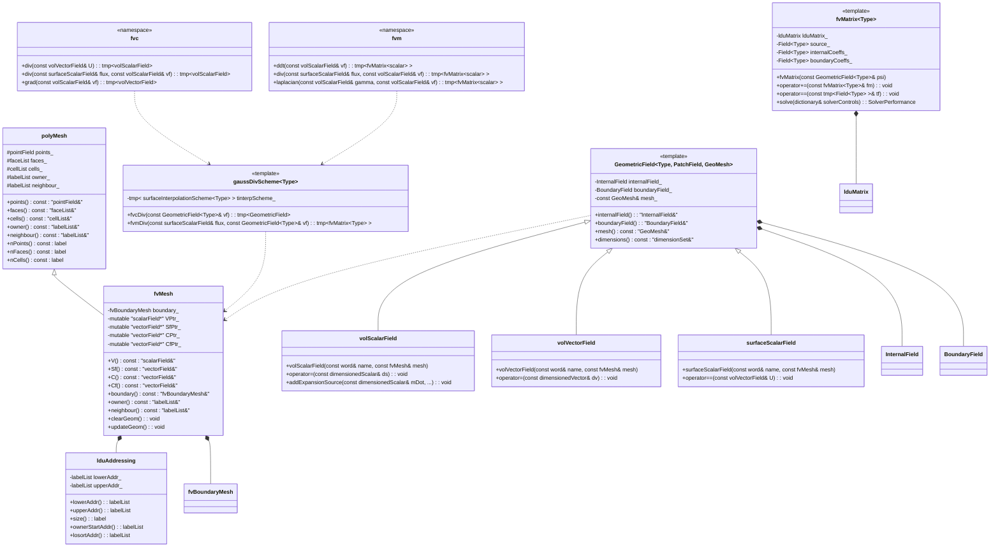
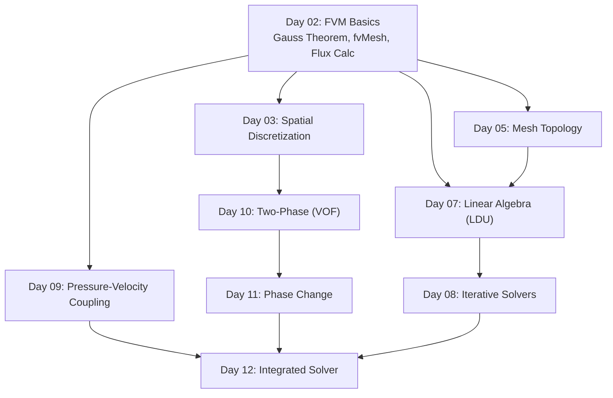

# Day 02: พื้นฐานวิธีปริมาตรจำกัด - ตาข่าย, เรขาคณิต, และการกระจายตัวแบบเกาส์ (FVM Basics)

**โมดูล:** `MODULE_01_CFD_FUNDAMENTALS`
**เฟส:** 1 - ทฤษฎีพื้นฐาน
**วัน:** 02 จาก 12
**หัวข้อ:** พื้นฐานวิธีปริมาตรจำกัด (FVM), โทโพโลยีของตาข่าย, และการกระจายตัวของทฤษฎีบทเกาส์
**ความรู้พื้นฐานที่ต้องมี:** Day 01 (สมการควบคุม), แคลคูลัสเวกเตอร์พื้นฐาน, การเขียนโปรแกรม C++
**บทเรียนถัดไป:** Day 03 (โครงร่างการกระจายตัวเชิงพื้นที่)
**ระดับความยาก:** พื้นฐาน
**เวลาศึกษาโดยประมาณ:** 4-6 ชั่วโมง
**คำสำคัญ:** #FVM, #GaussTheorem, #fvMesh, #LDU, #FluxCalculation
## 🎯 Learning Objectives (วัตถุประสงค์การเรียนรู้)

เมื่อจบบทเรียนนี้แล้ว คุณจะสามารถ:

1.  **พิสูจน์ทางคณิตศาสตร์และประยุกต์ใช้ทฤษฎีบทไดเวอร์เจนซ์ของเกาส์** เพื่อแปลงปริพันธ์เชิงปริมาตรของเทอมไดเวอร์เจนซ์/การพา (convection) ให้เป็นปริพันธ์เชิงพื้นผิวของฟลักซ์ ซึ่งเป็นรากฐานสำคัญของการแยกส่วน (discretization) ด้วยวิธีปริมาตรจำกัด (Finite Volume Method - FVM) สำหรับกฎการอนุรักษ์ (มวล โมเมนตัม พลังงาน)

2.  **วิเคราะห์สถาปัตยกรรมแบบลำดับชั้นและสมาชิกข้อมูล** ของคลาส `fvMesh` ใน OpenFOAM โดยเข้าใจการสืบทอดจาก `polyMesh` และ `lduMesh` และอธิบายวัตถุประสงค์และการคำนวณแบบตามความต้องการ (demand-driven) ของคุณสมบัติทางเรขาคณิตหลัก: ปริมาตรเซลล์ (`V`), เวกเตอร์พื้นที่ผิว (`Sf`), จุดศูนย์กลางเซลล์ (`C`), และจุดศูนย์กลางผิว (`Cf`)

3.  **แยกส่วนสูตรของโครงร่างการแยกส่วนแบบเกาส์ (Gauss Discretization Schemes)** สำหรับตัวดำเนินการเชิงอนุพันธ์หลัก—ไดเวอร์เจนซ์ ($\nabla \cdot \mathbf{U}$), เกรเดียนต์ ($\nabla \phi$), และลาปลาเชียน ($\nabla \cdot (\Gamma \nabla \phi)$)—โดยแยกย่อยการประมาณความแม่นยำอันดับสองที่ใช้ค่าที่ประมาณที่ผิว (face-interpolated) และคุณสมบัติทางเรขาคณิตของปริมาตรควบคุม

4.  **เข้าใจข้อตกลงการอ้างอิง Owner-Neighbor และรูปแบบการจัดเก็บ LDU** สำหรับเมชแบบไม่มีโครงสร้าง (unstructured) โดยอธิบายรายละเอียดว่าลิสต์ `lowerAddr_` และ `upperAddr_` กำหนดการเชื่อมต่ออย่างไร และสิ่งนี้แมปกับโครงสร้างเมทริกซ์สัมประสิทธิ์แบบ Lower-Diagonal-Upper (LDU) ที่ใช้โดยตัวแก้เชิงเส้น (linear solvers) อย่างไร

5.  **นำอัลกอริธึมหลักของวิธีปริมาตรจำกัดไปปฏิบัติ** จากหลักการพื้นฐาน โดยรวมถึงการคำนวณฟลักซ์สุทธิของปริมาตรควบคุมและการสร้างเกรเดียนต์แบบเกาส์ใหม่ โดยการจัดการอาร์เรย์โทโพโลยีของเมช (owner, neighbour, $\mathbf{S}_f$) และข้อมูลฟิลด์โดยตรง เชื่อมโยงคณิตศาสตร์เชิงนามธรรมเข้ากับรูปแบบโค้ด C++ ที่เป็นรูปธรรม

6.  **เชื่อมโยงดีไซน์แพตเทิร์นของ OpenFOAM**—เช่น เมตาโปรแกรมมิ่งด้วยเทมเพลตสำหรับการดำเนินการที่ไม่ขึ้นกับชนิดข้อมูล (type-agnostic), การเลือกโครงร่างการแยกส่วนขณะรันไทม์, และการคำนวณข้อมูลทางเรขาคณิตแบบตามความต้องการ—กับบทบาทของมันในการสร้างฐานโค้ด CFD ที่มีความยืดหยุ่น มีประสิทธิภาพ และสามารถขยายได้

## 📑 Table of Contents (สารบัญ)
- [[#1. Section 1: Theory (ทฤษฎี)|1. Section 1: Theory (ทฤษฎี)]]
- [[#2. Section 2: OpenFOAM Reference (การอ้างอิง OpenFOAM)|2. Section 2: OpenFOAM Reference (การอ้างอิง OpenFOAM)]]
- [[#3. Section 3: Class Design (การออกแบบคลาส)|3. Section 3: Class Design (การออกแบบคลาส)]]
- [[#4. Section 4: Implementation (การนำไปใช้)|4. Section 4: Implementation (การนำไปใช้)]]
- [[#5. Section 5: Build & Test (การบิลด์และการทดสอบ)|5. Section 5: Build & Test (การบิลด์และการทดสอบ)]]
- [[#6. Section 6: Concept Checks (การทดสอบแนวคิด)|6. Section 6: Concept Checks (การทดสอบแนวคิด)]]
# 1. Section 1: Theory (ทฤษฎี)
## 1.1 หลักการพื้นฐานของวิธีปริมาตรจำกัด (Core Philosophy of the Finite Volume Method)

วิธีปริมาตรจำกัด (Finite Volume Method - FVM) เป็นเทคนิคการจำลองเชิงตัวเลขที่โดดเด่นสำหรับการแก้สมการเชิงอนุพันธ์ย่อย (PDEs) ที่อธิบายปรากฏการณ์การถ่ายโอน (transport phenomena) เช่น การไหลของของไหล การถ่ายเทความร้อน และการแพร่กระจายของมวล จุดแข็งหลักของวิธีนี้อยู่ที่การ**อนุรักษ์ (conservation)** คุณสมบัติทางกายภาพในระดับที่ไม่ต่อเนื่อง (discrete level) ซึ่งตรงกับหลักการอนุรักษ์พื้นฐานในฟิสิกส์

### 1.1.1 การเปรียบเทียบกับวิธีอื่น (Comparison with Other Methods)

เพื่อให้เข้าใจบริบทของ FVM อย่างลึกซึ้ง เราจะเปรียบเทียบกับวิธีอื่นที่ใช้กันทั่วไป:

| **Method** | **Formulation Basis** | **Conservation Property** | **Mesh Flexibility** | **Primary Application in CFD** |
| :--- | :--- | :--- | :--- | :--- |
| **Finite Difference Method (FDM)** | ประมาณอนุพันธ์โดยใช้การขยายอนุกรมเทย์เลอร์ (Taylor series expansion) บนกริดที่มีโครงสร้าง (structured grid) | **ไม่รับประกัน (Not inherently conservative)** เว้นแต่จะออกแบบเป็นพิเศษ | ต่ำ (Low) - ต้องการกริดที่มีโครงสร้างดี | การไหลแบบง่ายๆ บนเรขาคณิตธรรมดา |
| **Finite Element Method (FEM)** | ประมาณคำตอบด้วยฟังก์ชันพื้นฐาน (basis functions) และลดข้อผิดพลาดโดยใช้วิธีน้ำหนักเหลือ (weighted residual method) เช่น Galerkin | **อ่อน (Weak)** - อนุรักษ์ในรูปแบบอ่อน (weak form) | สูงมาก (Very High) - ทำงานได้ดีกับเรขาคณิตซับซ้อน | โครงสร้าง, ความเค้น, การไหลแบบไม่บีบอัด (incompressible) |
| **Finite Volume Method (FVM)** | บูรณาการสมการการอนุรักษ์เหนือปริมาตรควบคุม (control volume) และใช้ทฤษฎีบทไดเวอร์เจนซ์ของเกาส์ (Gauss's Divergence Theorem) | **แข็งแกร่ง (Strong)** - อนุรักษ์ในระดับปริมาตรควบคุมทุกเซลล์ | สูง (High) - ทำงานได้ดีกับกริดไม่มีโครงสร้าง (unstructured grid) | **การไหลของของไหลแบบบีบอัดได้และบีบอัดไม่ได้, การถ่ายเทความร้อน, ปฏิกิริยาเคมี** |

**ข้อสรุปสำคัญ:** FVM ถูกเลือกให้เป็นกระดูกสันหลังของ OpenFOAM และโครงการนี้ เนื่องจากคุณสมบัติการอนุรักษ์โดยธรรมชาติของมัน ซึ่งมีความสำคัญอย่างยิ่งสำหรับการจำลองการไหลที่มีการเปลี่ยนแปลงของเฟส (phase change) และแหล่งกำเนิดมวล (mass sources) ที่เราจะจัดการในภายหลัง การที่ฟลักซ์ (flux) เข้าและออกจากแต่ละเซลล์สมดุลกันอย่างแม่นยำนั้นเป็นเงื่อนไขเบื้องต้นสำหรับความเสถียรและความถูกต้องของตัวแก้ (solver)
## 1.2 Gauss's Divergence Theorem: หัวใจของ FVM (Gauss's Divergence Theorem: The Heart of FVM)

ทฤษฎีบทนี้ ซึ่งบางครั้งเรียกว่าทฤษฎีบทไดเวอร์เจนซ์ของเกาส์ หรือทฤษฎีบทของออสโตรกราดสกี (Ostrogradsky) เป็นเครื่องมือทางคณิตศาสตร์ที่ทรงพลังซึ่งเชื่อมโยงปริพันธ์เชิงปริมาตร (volume integral) ของไดเวอร์เจนซ์ของสนามเวกเตอร์ กับปริพันธ์เชิงพื้นผิว (surface integral) ของฟลักซ์ของสนามนั้น

### 1.2.1 รูปแบบต่อเนื่อง (Continuous Form)

สำหรับสนามเวกเตอร์ $\mathbf{F}$ ใดๆ ที่กำหนดบนปริมาตร $V$ ที่มีขอบเขตเป็นพื้นผิวปิด $\partial V$ ทฤษฎีบทกล่าวว่า:

$$
\boxed{\int_V \left( \nabla \cdot \mathbf{F} \right) dV = \oint_{\partial V} \mathbf{F} \cdot d\mathbf{S}}
$$

โดยที่:
*   $\nabla \cdot \mathbf{F}$ คือ ไดเวอร์เจนซ์ของสนามเวกเตอร์ $\mathbf{F}$ ณ จุดใดจุดหนึ่งภายในปริมาตร
*   $d\mathbf{S} = \mathbf{\hat{n}} \, dS$ คือ เวกเตอร์พื้นที่ผิวเชิงอนุพันธ์ (differential surface area vector) ซึ่งมีขนาดเท่ากับพื้นที่ผิว $dS$ และมีทิศทางตั้งฉากออกไปด้านนอก (outward-facing normal) จากพื้นผิว

**การตีความทางกายภาพ:** ด้านซ้ายมือของสมการรวมผลรวมของ "แหล่งกำเนิด" หรือ "จุดอับ" (sinks) ของสนาม $\mathbf{F}$ ที่อยู่ภายในปริมาตรทั้งหมด ด้านขวามือรวมปริมาณของสนาม $\mathbf{F}$ ที่ไหลออกผ่านขอบเขตพื้นผิวทั้งหมด สมการนี้จึงเป็นการแสดงออกถึง**ความสมดุล (balance)** หรือ **การอนุรักษ์ (conservation)**:
> อัตราการสะสมของปริมาณภายในปริมาตร = ผลรวมของฟลักซ์สุทธิที่ไหลผ่านขอบเขต + แหล่งกำเนิด/จุดอับภายใน

### 1.2.2 การประยุกต์ใช้กับสมการการอนุรักษ์ (Application to Conservation Equations)

สมการการอนุรักษ์ทั่วไปสำหรับปริมาณ $\phi$ (ซึ่งอาจเป็นสเกลาร์หรือองค์ประกอบของเวกเตอร์) สามารถเขียนได้เป็น:

$$
\underbrace{\frac{\partial (\rho \phi)}{\partial t}}_{\text{Rate of Change}} + \underbrace{\nabla \cdot (\rho \mathbf{U} \phi)}_{\text{Convective Flux}} = \underbrace{\nabla \cdot (\Gamma \nabla \phi)}_{\text{Diffusive Flux}} + \underbrace{S_{\phi}}_{\text{Source Term}}
$$

เพื่อนำ FVM มาใช้ เราบูรณาการสมการนี้เหนือปริมาตรควบคุม $V_P$ ของเซลล์ $P$:

$$
\int_{V_P} \frac{\partial (\rho \phi)}{\partial t} dV + \int_{V_P} \nabla \cdot (\rho \mathbf{U} \phi) dV = \int_{V_P} \nabla \cdot (\Gamma \nabla \phi) dV + \int_{V_P} S_{\phi} dV
$$

ตอนนี้เราใช้**ทฤษฎีบทไดเวอร์เจนซ์ของเกาส์**กับเทอมฟลักซ์ (ทั้งการพา (convection) และการแพร่ (diffusion)):

$$
\int_{V_P} \nabla \cdot (\rho \mathbf{U} \phi) dV = \oint_{\partial V_P} (\rho \mathbf{U} \phi) \cdot d\mathbf{S} \quad \text{และ} \quad \int_{V_P} \nabla \cdot (\Gamma \nabla \phi) dV = \oint_{\partial V_P} (\Gamma \nabla \phi) \cdot d\mathbf{S}
$$

สมการที่บูรณาการแล้วจึงกลายเป็น:

$$
\boxed{\int_{V_P} \frac{\partial (\rho \phi)}{\partial t} dV + \oint_{\partial V_P} (\rho \mathbf{U} \phi) \cdot d\mathbf{S} = \oint_{\partial V_P} (\Gamma \nabla \phi) \cdot d\mathbf{S} + \int_{V_P} S_{\phi} dV}
$$

สมการนี้เป็น**รากฐานของการจำลองแบบ FVM ทั้งหมด** มันเปลี่ยนปัญหาจากการแก้สมการเชิงอนุพันธ์ในพื้นที่ต่อเนื่อง (ซึ่งต้องหาค่า $\phi$ ทุกจุด) เป็นปัญหาการหาค่าเฉลี่ยของเซลล์ (cell averages) โดยที่การถ่ายโอนระหว่างเซลล์เกิดขึ้นผ่านฟลักซ์ที่พื้นผิวเท่านั้น
## 1.3 การแบ่งย่อยปริมาตรควบคุมและเรขาคณิต (Control Volume Discretization and Geometry)

ใน Finite Volume Method (FVM) โดเมนการคำนวณถูกแบ่งออกเป็นปริมาตรควบคุมที่ไม่ทับซ้อนกัน (non-overlapping control volumes) หรือเซลล์ (cells) แต่ละเซลล์ $P$ มีปริมาตร $V_P$ และล้อมรอบด้วยชุดของพื้นผิว (faces) $f$

### 1.3.1 คุณสมบัติทางเรขาคณิตหลัก (Key Geometric Properties)

| **Property** | **Symbol** | **Description** | **Role in Discretization** |
| :--- | :--- | :--- | :--- |
| **Cell Volume** | $V_P$ | ปริมาตรของเซลล์พอลิฮีดรอน (polyhedral cell) | ใช้ในการหาค่าเฉลี่ยของปริมาณภายในเซลล์และหารผลรวมฟลักซ์ |
| **Face Area Vector** | $\mathbf{S}_f$ | เวกเตอร์ที่มีทิศทางตั้งฉากกับพื้นผิว $f$ และมีขนาดเท่ากับพื้นที่ของพื้นผิวนั้น | กำหนดทิศทางและขนาดของฟลักซ์ผ่านพื้นผิว |
| **Cell Center** | $\mathbf{C}_P$ | เซนทรอยด์ (centroid) ของปริมาตรเซลล์ $V_P$ | ตำแหน่งที่เก็บค่าเฉลี่ยของสนาม $\phi_P$ |
| **Face Center** | $\mathbf{C}_f$ | เซนทรอยด์ของพื้นที่ผิว $f$ | ตำแหน่งที่ประมาณค่าฟลักซ์ (เช่น $\phi_f$, $(\nabla \phi)_f$) |

**หมายเหตุเกี่ยวกับเวกเตอร์พื้นที่ผิว (Face Area Vector):** ทิศทางของ $\mathbf{S}_f$ ถูกกำหนดโดยความสัมพันธ์ระหว่างเจ้าของ (owner) และเพื่อนบ้าน (neighbor) ของพื้นผิว (ดูหัวข้อ 1.4) โดยทั่วไป สำหรับพื้นผิวภายใน (internal face) $\mathbf{S}_f$ จะชี้จากเซลล์เจ้าของไปยังเซลล์เพื่อนบ้าน นี่เป็น**ข้อตกลงที่สำคัญ (critical convention)** ที่ควบคุมเครื่องหมายของฟลักซ์

### 1.3.2 การประมาณปริพันธ์เชิงพื้นผิว (Surface Integral Approximation)

ปริพันธ์เชิงพื้นผิวในสมการพื้นฐาน $\oint_{\partial V_P} \mathbf{F} \cdot d\mathbf{S}$ ถูกประมาณโดยผลรวมของฟลักซ์ผ่านแต่ละพื้นผิว $f$ ที่ประกอบเป็นเซลล์ $P$:

$$
\oint_{\partial V_P} \mathbf{F} \cdot d\mathbf{S} \approx \sum_{f \in \text{faces}(P)} \mathbf{F}_f \cdot \mathbf{S}_f
$$

โดยที่ $\mathbf{F}_f$ เป็นค่าประมาณของสนามเวกเตอร์ $\mathbf{F}$ **ที่ศูนย์กลางของพื้นผิว $f$** ความถูกต้องของวิธี FVM ขึ้นอยู่กับความถูกต้องของการประมาณค่านี้:
1.  **การประมาณค่าพื้นผิว (Surface Quadrature):** เราใช้กฎจุดกึ่งกลาง (mid-point rule) ซึ่งเป็นอันดับที่สอง (second-order accurate) บนพื้นผิวระนาบ (planar faces) โดยสมมติว่า $\mathbf{F}$ มีค่าคงที่ทั่วทั้งพื้นผิวและประเมินที่จุดศูนย์กลาง $\mathbf{C}_f$
2.  **การประมาณค่าใบหน้า (Face Interpolation):** ค่า $\mathbf{F}_f$ ไม่รู้จักโดยตรง เนื่องจากตัวแปรของเรา ($\phi$, $\mathbf{U}$) ถูกเก็บไว้ที่ศูนย์กลางเซลล์ $\mathbf{C}_P$ ดังนั้นเราต้อง**ประมาณค่า (interpolate)** มันจากค่าเซลล์ที่อยู่รอบๆ นี่คือจุดที่ **โครงร่างการประมาณค่า (interpolation schemes)** เข้ามามีบทบาท (เช่น linear, upwind, TVD ซึ่งจะกล่าวถึงในวันถัดไป) และเป็นแหล่งสำคัญของข้อผิดพลาดและการกระจายตัวเชิงตัวเลข (numerical diffusion)

การประมาณค่าอันดับที่สองมาตรฐานสำหรับฟลักซ์คือ:

$$
\mathbf{F}_f \cdot \mathbf{S}_f \approx \left( \overline{\mathbf{F}}_f \right) \cdot \mathbf{S}_f
$$

โดยที่ $\overline{\mathbf{F}}_f$ คือค่าประมาณของ $\mathbf{F}$ ที่ใบหน้า $f$ ตัวอย่างเช่น สำหรับฟลักซ์การพา (convective flux) $\mathbf{F} = \rho \mathbf{U} \phi$ เราจะได้:

$$
\text{Convective Flux through face } f \approx (\rho \mathbf{U} \phi)_f \cdot \mathbf{S}_f = \dot{m}_f \, \phi_f
$$

โดยที่ $\dot{m}_f = (\rho \mathbf{U})_f \cdot \mathbf{S}_f$ คือ **อัตราการไหลของมวล (mass flow rate)** ผ่านพื้นผิว $f$ สมการนี้เน้นย้ำถึงความเชื่อมโยงโดยตรงระหว่างการประมาณค่าเวกเตอร์พื้นที่ผิว การประมาณค่าความเร็วที่ใบหน้า และการประมาณค่า $\phi$ ที่ใบหน้า
## 1.4 การกำหนดเจ้าของ-เพื่อนบ้าน และรูปแบบการจัดเก็บ LDU (Owner-Neighbor Addressing and LDU Storage Format)

สำหรับการใช้งานที่มีประสิทธิภาพบนกริดแบบไม่มีโครงสร้าง (unstructured grids) การรู้ว่าเซลล์ใดเชื่อมต่อกันผ่านพื้นผิวใดเป็นสิ่งสำคัญ ข้อมูลนี้ถูกเก็บในรูปแบบ **Lower-Diagonal-Upper (LDU)**

### 1.4.1 กฎเจ้าของ-เพื่อนบ้าน (Owner-Neighbor Rule)

แต่ละพื้นผิวภายใน (internal face) เชื่อมต่อเซลล์สองเซลล์:
*   **เซลล์เจ้าของ (Owner Cell):** เซลล์ที่มีดัชนีต่ำกว่า (lower index)
*   **เซลล์เพื่อนบ้าน (Neighbor Cell):** เซลล์ที่มีดัชนีสูงกว่า (higher index)

สำหรับพื้นผิวขอบเขต (boundary face) จะมีเพียงเซลล์เจ้าของเท่านั้น (เซลล์ด้านในของโดเมน) โดยเซลล์ "เพื่อนบ้าน" เป็นเซลล์สมมติที่อยู่ภายนอกโดเมน ซึ่งเงื่อนไขขอบเขต (boundary condition) จะถูกนำมาใช้

**ตัวอย่าง:** สมมติว่าเซลล์ 5 และ 12 เชื่อมต่อกันด้วยพื้นผิว
*   เจ้าของ (Owner) = 5 (เนื่องจาก 5 < 12)
*   เพื่อนบ้าน (Neighbor) = 12

### 1.4.2 โครงสร้างข้อมูล LDU (LDU Data Structure)

การกำหนดนี้ถูกเก็บไว้ในอ็อบเจกต์ `lduAddressing` ซึ่งประกอบด้วย:
*   `lowerAddr()`: รายการของดัชนีเซลล์เจ้าของสำหรับทุกพื้นผิวภายใน
*   `upperAddr()`: รายการของดัชนีเซลล์เพื่อนบ้านสำหรับทุกพื้นผิวภายใน
*   `face()`: (อาจมี) รายการของดัชนีพื้นผิวที่เรียงลำดับ

**ทำไมต้องเป็น LDU?** รูปแบบนี้เหมาะอย่างยิ่งสำหรับเมทริกซ์แบบกระจัดกระจาย (sparse matrices) ที่เกิดขึ้นจาก FVM บนกริดแบบไม่มีโครงสร้าง เมทริกซ์ $A$ ของระบบเชิงเส้น $A \mathbf{x} = \mathbf{b}$ สามารถเก็บเป็น:
*   `diag()`: สเกลาร์ฟิลด์ (scalarField) สำหรับสัมประสิทธิ์แนวทแยง (diagonal coefficients) $A_{P}$
*   `upper()`: สเกลาร์ฟิลด์สำหรับสัมประสิทธิ์นอกแนวทแยงที่เชื่อมโยงกับเซลล์เพื่อนบ้าน (upper coefficients) $A_{N}$ สำหรับแต่ละพื้นผิว
*   `lower()`: สเกลาร์ฟิลด์สำหรับสัมประสิทธิ์นอกแนวทแยงที่เชื่อมโยงกับเซลล์เจ้าของ (lower coefficients) ซึ่งสำหรับตัวดำเนินการสมมาตร (symmetric operators) เช่น การแพร่ (diffusion) มักจะเท่ากับ `upper()`

### 1.4.3 การเชื่อมโยงกับการคำนวณฟลักซ์ (Connection to Flux Calculation)

ข้อตกลงเจ้าของ-เพื่อนบ้านกำหนดเครื่องหมายของฟลักซ์ในผลรวมของเซลล์ จำไว้ว่า $\mathbf{S}_f$ ชี้จากเจ้าของไปยังเพื่อนบ้าน

**อัลกอริทึมสำหรับการคำนวณไดเวอร์เจนซ์สุทธิ (Net Divergence Calculation):**
```
สำหรับแต่ละพื้นผิวภายใน f:
    owner = lowerAddr[f]
    neighbor = upperAddr[f]
    phi_f = interpolated_flux_at_face(f) // e.g., (U_f & S_f)
    net_flux[owner] += phi_f   // ฟลักซ์ออกจากเจ้าของ (ตาม S_f)
    net_flux[neighbor] -= phi_f // ฟลักซ์เข้าสู่เพื่อนบ้าน (ตรงข้ามกับ S_f)

สำหรับแต่ละพื้นผิวขอบเขต f:
    owner = boundaryOwner[f]
    phi_f = boundary_flux(f) // กำหนดโดยเงื่อนไขขอบเขต
    net_flux[owner] += phi_f
```

การดำเนินการ `+=` และ `-=` สะท้อนถึงทิศทางของเวกเตอร์พื้นที่ผิวที่สัมพันธ์กับเซลล์ การออกแบบนี้รับประกันว่าฟลักซ์ที่ออกจากเซลล์เจ้าของจะถูกนับเป็นบวกสำหรับเซลล์นั้น และฟลักซ์เดียวกันนั้นจะถูกนับเป็นลบ (เข้า) สำหรับเซลล์เพื่อนบ้าน ซึ่งนำไปสู่การยกเลิกโดยธรรมชาติ (natural cancellation) และการอนุรักษ์ในระดับโลก (global conservation) เมื่อรวมทั่วทั้งโดเมน
## 1.5 การกำหนดรูปแบบเกาส์สำหรับตัวดำเนินการต่างๆ (Gauss Scheme Formulations for Differential Operators)

จากสมการพื้นฐาน เราสามารถได้สูตรที่ไม่ต่อเนื่องสำหรับตัวดำเนินการเชิงอนุพันธ์หลักทั้งหมด

### 1.5.1 ไดเวอร์เจนซ์ (Divergence)

สำหรับสนามเวกเตอร์ $\mathbf{U}$ ที่เก็บไว้ที่ศูนย์กลางเซลล์ ไดเวอร์เจนซ์ในเซลล์ $P$ ถูกประมาณโดย:

$$
(\nabla \cdot \mathbf{U})_P \approx \frac{1}{V_P} \sum_{f} \mathbf{U}_f \cdot \mathbf{S}_f
$$

โดยที่ $\mathbf{U}_f$ คือความเร็วที่ประมาณไว้ที่ศูนย์กลางของพื้นผิว $f$ นี่คือสูตรมาตรฐานสำหรับ**ความไม่ต่อเนื่องของมวล (mass discretization)** ในสมการความต่อเนื่อง (continuity equation)

### 1.5.2 การไล่ระดับสี (Gradient)

สำหรับสนามสเกลาร์ $\phi$ การไล่ระดับสีที่เซลล์ $P$ สามารถประมาณได้ผ่านทฤษฎีบทเกาส์ (ซึ่งใช้กับสนามเวกเตอร์ $\mathbf{F} = \phi \mathbf{I}$ โดยที่ $\mathbf{I}$ คือเทนเซอร์เอกลักษณ์ (identity tensor)):

$$
(\nabla \phi)_P \approx \frac{1}{V_P} \sum_{f} \phi_f \mathbf{S}_f
$$

โดยที่ $\phi_f$ คือค่าของ $\phi$ ที่ประมาณไว้ที่พื้นผิว $f$ สูตรนี้ให้การประมาณการไล่ระดับสีอันดับที่สอง (second-order gradient approximation) บนกริดที่ไม่บิดเบี้ยว (non-skewed grids)

### 1.5.3 ลาปลาเชียน (Laplacian)

ตัวดำเนินการลาปลาเชียน $\nabla \cdot (\Gamma \nabla \phi)$ ซึ่งเป็นตัวแทนของการแพร่ (diffusion) ต้องใช้การประมาณสองครั้ง:
1.  ประมาณการไล่ระดับสีที่พื้นผิว: $(\nabla \phi)_f$
2.  จากนั้นใช้ทฤษฎีบทเกาส์กับฟลักซ์การแพร่ $\mathbf{F} = \Gamma \nabla \phi$:

$$
\left[ \nabla \cdot (\Gamma \nabla \phi) \right]_P \approx \frac{1}{V_P} \sum_{f} \Gamma_f (\nabla \phi)_f \cdot \mathbf{S}_f
$$

โดยทั่วไป $(\nabla \phi)_f$ จะถูกประมาณโดยการประมาณค่าเชิงเส้น (linear interpolation) ของการไล่ระดับสีจากเซลล์เจ้าของและเพื่อนบ้าน หรือโดยใช้ความแตกต่างแบบศูนย์กลาง (central differencing) ระหว่างค่าเซลล์:

$$
(\nabla \phi)_f \cdot \mathbf{S}_f \approx \Gamma_f \frac{\phi_N - \phi_P}{|\mathbf{d}|} |\mathbf{S}_f| + \text{correction for non-orthogonality}
$$

โดยที่ $\mathbf{d}$ คือเวกเตอร์จาก $\mathbf{C}_P$ ไปยัง $\mathbf{C}_N$ เทอมการแก้ไข (correction term) เป็นสิ่งจำเป็นสำหรับกริดที่ไม่ตั้งฉาก (non-orthogonal grids) เพื่อรักษาความถูกต้องอันดับที่สอง

### 1.5.4 สรุปสูตรการประมาณค่า (Summary of Approximation Formulas)

ตารางต่อไปนี้สรุปสูตรการประมาณค่า FVM มาตรฐานอันดับที่สอง:

| **Operator** | **Continuous Form** | **FVM Discretization (Cell P)** | **Key Required Face Value** |
| :--- | :--- | :--- | :--- |
| **Divergence** | $\nabla \cdot \mathbf{U}$ | $\frac{1}{V_P} \sum_f \mathbf{U}_f \cdot \mathbf{S}_f$ | $\mathbf{U}_f$ (Vector) |
| **Gradient** | $\nabla \phi$ | $\frac{1}{V_P} \sum_f \phi_f \mathbf{S}_f$ | $\phi_f$ (Scalar) |
| **Convection** | $\nabla \cdot (\mathbf{U} \phi)$ | $\frac{1}{V_P} \sum_f (\mathbf{U} \phi)_f \cdot \mathbf{S}_f$ | $(\mathbf{U} \phi)_f$ หรือ $\dot{m}_f \phi_f$ |
| **Diffusion (Laplacian)** | $\nabla \cdot (\Gamma \nabla \phi)$ | $\frac{1}{V_P} \sum_f \Gamma_f (\nabla \phi)_f \cdot \mathbf{S}_f$ | $(\nabla \phi)_f$ (Vector) |

**หัวใจสำคัญของวันนี้:** ทุกสูตรเหล่านี้ลดลงเหลือเพียงการคำนวณผลรวมของฟลักซ์ $\sum_f [\text{something}]_f \cdot \mathbf{S}_f$ เหนือพื้นผิวของเซลล์ ความท้าทายทั้งหมดในการเขียนโปรแกรม FVM อยู่ที่:
1.  การคำนวณและจัดเก็บ $\mathbf{S}_f$, $V_P$ อย่างมีประสิทธิภาพ
2.  การประมาณค่า `something_f` ที่ใบหน้าจากค่าเซลล์อย่างแม่นยำและมีเสถียรภาพ
3.  การประกอบ (assembling) ผลรวมฟลักซ์เหล่านี้ลงในเมทริกซ์หรือเวกเตอร์ผลลัพธ์โดยใช้การกำหนดเจ้าของ-เพื่อนบ้าน

ในส่วนถัดไป (การวิเคราะห์ OpenFOAM) เราจะเจาะลึกลงไปในโค้ดจริงเพื่อดูว่า OpenFOAM นำหลักการทางทฤษฎีเหล่านี้ไปปฏิบัติอย่างไรผ่านคลาส `fvMesh`, `surfaceInterpolation` และโครงร่างเกาส์ (Gauss schemes)
# 2. Section 2: OpenFOAM Reference (การอ้างอิง OpenFOAM)
## 2.1 การเจาะลึกสถาปัตยกรรมคลาส `fvMesh`

คลาส `fvMesh` เป็นเสาหลักของการแบ่งส่วนแบบ Finite Volume ใน OpenFOAM ทำหน้าที่เป็นโครงสร้างข้อมูลหลักที่เชื่อมโยงโดเมนทางคณิตศาสตร์เชิงนามธรรมกับ Mesh ทางคอมพิวเตอร์ที่เป็นรูปธรรม มันไม่ใช่แค่ภาชนะสำหรับเก็บจุดและเซลล์เท่านั้น แต่เป็นตัวจัดการข้อมูลทางเรขาคณิต ความสัมพันธ์ทางโทโพโลยี และตัวดำเนินการเชิงตัวเลขที่ซับซ้อน

### 2.1.1 ลำดับการสืบทอดและการออกแบบแบบพอลิมอร์ฟิค

คลาสนี้ถูกนิยามใน `src/finiteVolume/fvMesh/fvMesh.H` ลำดับการสืบทอดของมันเผยให้เห็นสถาปัตยกรรมแบบหลายชั้น:

```cpp
class fvMesh
:
    public polyMesh,
    public lduMesh,
    public surfaceInterpolation
{
    // Private Data
        // Demand-driven geometric data
        mutable scalarField* VPtr_;
        mutable vectorField* SfPtr_;
        mutable vectorField* CPtr_;
        mutable vectorField* CfPtr_;
        ...
};
```

**สิ่งที่เราทำแตกต่าง:**

| การนำไปใช้มาตรฐานของ OpenFOAM | การนำไปใช้แบบกำหนดเองของเรา (จุดเน้นของโปรเจกต์) |
| :--- | :--- |
| `fvMesh` สืบทอดมาจาก `polyMesh`, `lduMesh`, และ `surfaceInterpolation` สิ่งนี้สร้างลำดับชั้นที่ซับซ้อนและเชื่อมโยงกันอย่างแน่นหนา | เราสนับสนุนแนวทางที่ใช้ **องค์ประกอบเหนือการสืบทอด (composition-over-inheritance)** มากขึ้นในโครงร่างหลัก `ControlVolumeMesh` ของเรา เราแยกการจัดเก็บข้อมูลเรขาคณิต (ฟังก์ชันการทำงานของ `polyMesh`), การกำหนดที่อยู่พีชคณิตเชิงเส้น (`lduMesh`), และโครงร่างการประมาณค่า (`surfaceInterpolation`) ออกเป็นวัตถุสมาชิกที่แตกต่างกันและถูกรวมเข้าด้วยกัน สิ่งนี้ช่วยปรับปรุงความสามารถในการประกอบโมดูลและการทดสอบ |
| ข้อมูลเรขาคณิต (`V`, `Sf`, `C`, `Cf`) ถูกเก็บเป็นพอยน์เตอร์แบบเปลี่ยนแปลงได้ (`mutable scalarField* VPtr_`) คำสำคัญ `mutable` อนุญาตให้มีการปรับเปลี่ยนโดยเมธอด `const` ซึ่งจำเป็นสำหรับการคำนวณแบบ demand-driven แต่สามารถสร้างความสับสนได้ | ในคลาส `ControlVolumeMesh` ของเรา เราเลี่ยงการใช้ `mutable` และแทนที่จะใช้ระบบจัดการสถานะแบบชัดเจน เราเก็บติดตามแฟล็ก `geometryStatus_` (เช่น `UP_TO_DATE`, `STALE`) เมธอดที่ต้องการเรขาคณิตที่ถูกต้องจะต้องเรียก `updateGeometry()` ก่อนหากสถานะเป็น `STALE` สิ่งนี้ทำให้การพึ่งพาข้อมูลชัดเจนและปลอดภัยต่อเธรด |
| คลาสจัดการข้อมูล Mesh ทั้งแบบคงที่และแบบเคลื่อนที่ (`V0Ptr_`, `V00Ptr_` สำหรับปริมาตรเวลาเก่า) | `ControlVolumeMesh` เริ่มต้นของเราเน้นไปที่การไหลแบบคงที่และอัดตัวไม่ได้ การสนับสนุน Mesh แบบไดนามิกถูกเลื่อนออกไปยังคลาสย่อยเฉพาะทาง `DynamicControlVolumeMesh` ซึ่งสอดคล้องกับหลักการ Single Responsibility Principle |

### 2.1.2 การจัดการข้อมูลแบบ Demand-Driven: แบบแผนที่สำคัญต่อประสิทธิภาพ

การคำนวณปริมาตรเซลล์ พื้นที่หน้า และจุดศูนย์กลางมีค่าใช้จ่ายทางคอมพิวเตอร์สูง (O(N)) OpenFOAM ใช้กระบวนทัศน์ **demand-driven**: ข้อมูลจะถูกคำนวณเฉพาะเมื่อมีการร้องขอครั้งแรกเท่านั้น จากนั้นจึงถูกเก็บไว้ในแคช แบบแผนนี้ถูกห่อหุ้มไว้ในเมธอดส่วนตัวเช่น `calcV()` และตัวเข้าถึงสาธารณะเช่น `V()`

```cpp
// จาก fvMesh.C - การนำไปใช้แบบ demand-driven ทั่วไป
const scalarField& fvMesh::V() const
{
    if (!VPtr_)
    {
        calcV();
    }
    return *VPtr_;
}

void fvMesh::calcV() const
{
    if (debug)
    {
        Info<< "fvMesh::calcV() : calculating cell volumes" << endl;
    }

    // Check the primitive mesh is available
    if (primitiveMesh::debug)
    {
        // Check the primitive mesh geometry is calculated
        primitiveMesh::calcCellCentresAndVols(C(), V());
    }
    else
    {
        // Avoid calculating cell centres
        VPtr_ = new scalarField(polyMesh::cellVolumes());
    }

    // ... (additional checks for moving meshes)
}
```

**การวิเคราะห์เชิงวิกฤต:** เมธอด `calcV()` เป็น `const` แต่กลับแก้ไข `VPtr_` ที่เป็น `mutable` นี่เป็นทางเลือกในการออกแบบโดยเจตนาเพื่อรักษา `const`-correctness ใน API ที่ผู้ใช้เผชิญ (`mesh.V()` สามารถเรียกจากเมธอด `const`) ในขณะที่อนุญาตให้มีการประเมินแบบขี้เกียจ อย่างไรก็ตาม มันสร้างภาระให้กับนักพัฒนาซอฟต์แวร์ในการทำความเข้าใจว่าการเรียกตัวเข้าถึง `const` อาจกระตุ้นผลข้างเคียง (การคำนวณ) การเรียก `updateGeometry()` ที่ชัดเจนในการนำไปใช้แบบกำหนดเองของเรา แม้จะใช้คำศัพท์ที่ละเอียดกว่า แต่ก็กำจัดผลข้างเคียงที่ซ่อนอยู่นี้ออกไป

### 2.1.3 การกำหนดที่อยู่ LDU: สะพานสู่พีชคณิตเชิงเส้น

`fvMesh` สืบทอดมาจาก `lduMesh` ซึ่งให้อินเทอร์เฟซเชิงนามธรรมสำหรับการได้มาโครงร่างการกำหนดที่อยู่แบบ Lower-Diagonal-Upper (LDU) การนำไปใช้ที่เป็นรูปธรรมมักจะถูกจัดเตรียมโดยคลาสฐาน `polyMesh`

```cpp
// เมธอดกำหนดที่อยู่หลักใน fvMesh
const labelUList& fvMesh::lduAddr() const
{
    // Returns the lduAddressing object
    return polyMesh::lduAddr();
}

const labelUList& fvMesh::owner() const
{
    // Delegate to the ldu addressing
    return lduAddr().lowerAddr();
}

const labelUList& fvMesh::neighbour() const
{
    return lduAddr().upperAddr();
}
```

**สิ่งที่เราทำแตกต่าง:**

| การนำไปใช้มาตรฐานของ OpenFOAM | การนำไปใช้แบบกำหนดเองของเรา (จุดเน้นของโปรเจกต์) |
| :--- | :--- |
| การเข้าถึงที่อยู่ทำผ่านการสืบทอด (`lduAddr()` จาก `polyMesh`) ตัว `fvMesh` เองไม่ได้เก็บรายการ `owner_` และ `neighbour_` โดยตรง | คลาส `ControlVolumeMesh` ของเราเก็บ `owner_` และ `neighbour_` โดยตรงเป็นสมาชิกข้อมูล `List<label>` สิ่งนี้ทำให้โค้ดสำหรับวัตถุประสงค์ทางการศึกษาง่ายขึ้น และทำให้การเชื่อมโยงโดยตรงระหว่างหน้า Mesh กับสัมประสิทธิ์เมทริกซ์มีความโปร่งใสมากขึ้นระหว่างลูปการประกอบ |
| วัตถุ `lduAddressing` อาจนำการเพิ่มประสิทธิภาพไปใช้ เช่น การเรียงลำดับหน้าเพื่อปรับปรุง locality ของแคชสำหรับตัวแก้เมทริกซ์ | การนำไปใช้เริ่มต้นของเราใช้รายการที่เรียบง่ายและไม่ได้เรียงลำดับ เรายอมรับว่าสำหรับประสิทธิภาพการผลิต การนำคลาส `bandwidthReducer` ไปใช้เพื่อกำหนดหมายเลขเซลล์ใหม่และลดโปรไฟล์เมทริกซ์ LDU ให้น้อยที่สุด จะเป็นการปรับปรุงที่จำเป็นในเฟส 2 |
## 2.2 การนำ Gauss Scheme ไปใช้: จากคณิตศาสตร์สู่โค้ด

OpenFOAM นำการกระจาย (discretization) ของทฤษฎีบท Gauss ไปใช้ผ่านลำดับชั้นของคลาสเทมเพลต (template class hierarchy) การเข้าใจลำดับชั้นนี้เป็นกุญแจสำคัญในการขยายเฟรมเวิร์กด้วย scheme ที่กำหนดเอง

### 2.2.1 เทมเพลต `gaussDivScheme`

คลาสเทมเพลตนี้อยู่ในไฟล์ `src/finiteVolume/finiteVolume/convectionSchemes/gaussConvectionScheme/gaussDivScheme.H` มีหน้าที่คำนวณไดเวอร์เจนซ์แบบ explicit ของฟิลด์

```cpp
namespace Foam
{
namespace fv
{
    template<class Type>
    class gaussDivScheme
    :
        public fv::divScheme<Type>
    {
    public:
        //- Runtime type information
        TypeName("Gauss");

        // Constructors
            gaussDivScheme(const fvMesh& mesh)
            :
                divScheme<Type>(mesh)
            {}

            gaussDivScheme(const fvMesh& mesh, Istream&)
            :
                divScheme<Type>(mesh)
            {}

        // Member Functions
            //- Return the explicit divergence
            tmp
            <
                GeometricField
                <typename innerProduct<vector, Type>::type, fvPatchField, volMesh>
            >
            fvcDiv
            (
                const GeometricField<Type, fvPatchField, volMesh>&
            ) const;
    };
}
```

**การนำไปใช้ใน `gaussDivScheme.C`:** เมธอด `fvcDiv` คือจุดที่ทฤษฎีบท Gauss ถูกนำมาใช้จริง โดยทำตามขั้นตอนดังนี้:
1.  สร้างฟิลด์ผลลัพธ์ `tdiv` และกำหนดค่าเริ่มต้นเป็นศูนย์
2.  ดึงข้อมูลอ้างอิงของเวกเตอร์พื้นที่ผิว (`mesh.Sf()`) และรายการ owner/neighbor ของ mesh
3.  **ลูปสำหรับ Face ภายใน:** สำหรับแต่ละ face ภายใน จะทำการประมาณค่า (interpolate) ฟิลด์ `vf` ไปยัง face (โดยใช้ scheme ที่ระบุขณะรันไทม์ เช่น `linear`, `upwind`) จากนั้นคำนวณดอทโปรดักต์กับเวกเตอร์พื้นที่ผิวเพื่อให้ได้ฟลักซ์ (flux) ฟลักซ์นี้จะถูกบวกเข้าไปในค่าไดเวอร์เจนซ์ของเซลล์ owner และลบออกจากค่าไดเวอร์เจนซ์ของเซลล์ neighbor
4.  **ลูปสำหรับ Face ขอบเขต:** สำหรับแต่ละ face ขอบเขต จะใช้ `snGrad` หรือ `patchInternalField` ของฟิลด์ขอบเขตเพื่อคำนวณฟลักซ์ ซึ่งจะถูกบวกเข้าไปในเซลล์ owner
5.  สุดท้าย หารผลรวมสะสมในแต่ละเซลล์ด้วยปริมาตรเซลล์ (`mesh.V()`)

**สิ่งที่เราทำแตกต่าง:**

| การนำไปใช้มาตรฐานของ OpenFOAM | คลาส `GaussDivergence` ที่กำหนดเองของเรา |
| :--- | :--- |
| ใช้ประเภทการคืนค่า (return type) ที่ซับซ้อนซึ่งเกี่ยวข้องกับ `tmp<>` และ `GeometricField` พร้อมกับ `innerProduct` traits ที่ซ้อนกัน เพื่อจัดการทั้งฟิลด์สเกลาร์และเวกเตอร์ (`Type`) | เพื่อความชัดเจนในเฟส 1 คลาส `GaussDivergence` ของเราในขั้นแรกจะเชี่ยวชาญเฉพาะสำหรับ `volVectorField` เพื่อคำนวณ $ \nabla \cdot \mathbf{U} $ และคืนค่าเป็น `volScalarField` ธรรมดา เราจะเลื่อนการนำไปใช้แบบเทมเพลตเต็มรูปแบบและทั่วไปออกไปจนกว่าฟิสิกส์หลักจะเสถียร |
| พึ่งพาการเลือก scheme การประมาณค่า (`tinterpScheme_`) ขณะรันไทม์ ซึ่งถูกค้นหาจาก dictionary `fvSchemes` | คอนสตรักเตอร์ของคลาสเรารับค่า enum `interpolationScheme` โดยตรง (เช่น `CENTRAL`, `UPWIND`) ซึ่งจะลบการพึ่งพา dictionary ออกไปในช่วงการทดสอบแรกเริ่ม และทำให้เส้นทางของโค้ดชัดเจน ต่อมาเราจะห่อหุ้มมันด้วยแพตเทิร์นตัวเลือกขณะรันไทม์ (runtime selector pattern) เพื่อให้ตรงกับความยืดหยุ่นของ OpenFOAM |
| ฟังก์ชัน `fvcDiv` เป็น `const` และคืนค่า `tmp<>` (smart pointer) เพื่อจัดการหน่วยความจำโดยอัตโนมัติ | เรานำเมธอด `calculate()` ไปใช้ ซึ่งรับการอ้างอิงไปยังฟิลด์ผลลัพธ์เป็นอาร์กิวเมนต์เอาต์พุต (`volScalarField& divU`) ซึ่งหลีกเลี่ยงการจองหน่วยความจำแบบไดนามิกในลูปที่รัดกุมระหว่างการพัฒนา ทำให้เราควบคุมการประเมินประสิทธิภาพ (performance profiling) ได้ละเอียดยิ่งขึ้น |

### 2.2.2 Scheme `gaussGrad`

นิยามอยู่ใน `src/finiteVolume/finiteVolume/gradSchemes/gaussGrad/gaussGrad.H` คลาสนี้คำนวณเกรเดียนต์ของฟิลด์ พื้นฐานทางคณิตศาสตร์คือทฤษฎีบท Gauss เดียวกัน: $ \int_V \nabla \phi \, dV = \oint_{\partial V} \phi \, d\mathbf{S} $

```cpp
template<class Type>
Foam::tmp
<
    Foam::GeometricField
    <
        typename Foam::outerProduct<Foam::vector, Type>::type,
        Foam::fvPatchField,
        Foam::volMesh
    >
>
Foam::fv::gaussGrad<Type>::calcGrad
(
    const GeometricField<Type, fvPatchField, volMesh>& vsf,
    const word& name
) const
{
    // Typedef for the return gradient field type
    typedef typename outerProduct<vector, Type>::type GradType;

    // Get reference to the mesh
    const fvMesh& mesh = vsf.mesh();

    // Create the result field
    tmp<GeometricField<GradType, fvPatchField, volMesh>> tgrad
    (
        new GeometricField<GradType, fvPatchField, volMesh>
        (
            IOobject
            (
                name,
                vsf.instance(),
                mesh,
                IOobject::NO_READ,
                IOobject::NO_WRITE
            ),
            mesh,
            dimensioned<GradType>
            (
                "0",
                vsf.dimensions()/dimLength,
                Zero
            ),
            extrapolatedCalculatedFvPatchField<GradType>::typeName
        )
    );
    GeometricField<GradType, fvPatchField, volMesh>& g = tgrad.ref();

    // Get geometric data
    const labelUList& owner = mesh.owner();
    const labelUList& neighbour = mesh.neighbour();
    const vectorField& Sf = mesh.Sf();

    // Field references
    const Field<Type>& vsfi = vsf.internalField();
    Field<GradType>& gi = g.internalField();

    // --- Internal faces: contribute to gradient of owner and neighbour
    forAll(owner, facei)
    {
        const label own = owner[facei];
        const label nei = neighbour[facei];

        // Interpolated value at the face (e.g., linear average)
        const Type vfp = tinterpScheme_().interpolate(vsf, own, facei);
        // Alternative common approach: simple average for clarity
        // const Type vfp = 0.5*(vsfi[own] + vsfi[nei]);

        const GradType Sfvp = Sf[facei]*vfp; // Outer product: Sf * φ_f

        gi[own] += Sfvp;
        gi[nei] -= Sfvp; // Note the subtraction for the neighbor
    }

    // --- Boundary faces: contribute to gradient of owner cells only
    forAll(vsf.boundaryField(), patchi)
    {
        const fvPatchField<Type>& pvf = vsf.boundaryField()[patchi];
        const labelUList& pFaceCells = mesh.boundary()[patchi].faceCells();
        const vectorField& pSf = mesh.Sf().boundaryField()[patchi];

        // For fixedValue patches, use the patch value.
        // For zeroGradient, use the internal cell value.
        forAll(pvf, patchFacei)
        {
            const label celli = pFaceCells[patchFacei];
            gi[celli] += pSf[patchFacei]*pvf[patchFacei];
        }
    }

    // --- Finalize: divide by cell volume
    gi /= mesh.V();

    // --- Correct boundary conditions (e.g., sets gradient on patches)
    g.correctBoundaryConditions();

    return tgrad;
}
```

**รายละเอียดการนำไปใช้ที่สำคัญ:** สังเกตบรรทัด `gi[nei] -= Sfvp;` ซึ่งมาจากเวกเตอร์พื้นที่ผิว `S_f` ที่ชี้ *จาก* เซลล์ owner *ไปยัง* เซลล์ neighbor เมื่อนำทฤษฎีบท Gauss ไปใช้กับเซลล์ neighbor เวกเตอร์ปกติที่ชี้ออก (outward normal) สำหรับเซลล์นั้นคือ `-S_f` การลบนี้จัดการการเปลี่ยนเครื่องหมายอย่างสวยงาม

### 2.2.3 `gaussLaplacianScheme`

Scheme นี้พบได้ใน `src/finiteVolume/finiteVolume/laplacianSchemes/gaussLaplacianScheme/gaussLaplacianScheme.H` มีความสำคัญสำหรับเทอมการแพร่ (diffusive terms) (เช่น $\nabla \cdot (\nu \nabla \mathbf{U})$) สามารถใช้ได้ทั้งแบบ explicit (`fvc::laplacian`) และ implicit (`fvm::laplacian`)

**ความแตกต่างหลัก (`fvm` เทียบกับ `fvc`):**
*   `fvc::laplacian(nu, U)` คำนวณ Laplacian เป็นฟิลด์ใหม่ เป็นการดำเนินการแบบ explicit
*   `fvm::laplacian(nu, U)` คืนค่า `fvMatrix<Type>` (ระบบสมการเชิงเส้น) โดยที่ตัวดำเนินการ Laplacian ถูกประกอบเข้าไปในสัมประสิทธิ์เมทริกซ์ นี่ใช้สำหรับการแก้แบบ implicit

การประกอบแบบ implicit ภายใน `gaussLaplacianScheme::fvmLaplacian` คือจุดที่การเชื่อมต่อกับ `lduMatrix` เกิดขึ้นโดยตรง:

```cpp
// Pseudocode for matrix assembly of a Laplacian term
template<class Type, class GType>
tmp<fvMatrix<Type>> gaussLaplacianScheme<Type, GType>::fvmLaplacian
(
    const GeometricField<GType, fvsPatchField, surfaceMesh>& gamma,
    const GeometricField<Type, fvPatchField, volMesh>& vf
) const
{
    tmp<fvMatrix<Type>> tfvm
    (
        new fvMatrix<Type>
        (
            vf,
            gamma.dimensions()*vf.dimensions()*dimVol
        )
    );
    fvMatrix<Type>& fvm = tfvm.ref();

    // Get mesh addressing
    const labelUList& owner = mesh.owner();
    const labelUList& neighbour = mesh.neighbour();
    const vectorField& Sf = mesh.Sf();
    const scalarField& V = mesh.V();

    // Surface field of gamma (diffusivity) at faces
    const surfaceScalarField gammaMagSf = mesh.magSf()*gamma;

    // Internal face contributions
    forAll(owner, facei)
    {
        const label own = owner[facei];
        const label nei = neighbour[facei];

        // Calculate the geometric diffusion coefficient
        // This often involves non-orthogonal correction
        const scalar coeff = gammaMagSf[facei]/mag(mesh.delta()[facei]);

        // Add to matrix coefficients
        fvm.diag()[own] += coeff;
        fvm.diag()[nei] += coeff;
        fvm.upper()[facei] -= coeff; // Note: negative sign for Laplacian
        fvm.lower()[facei] -= coeff;

        // Add explicit non-orthogonal correction to source term if needed
        // fvm.source()[own] += ...;
        // fvm.source()[nei] -= ...;
    }

    // Boundary face contributions go into diag and source
    // ...

    return tfvm;
}
```

**สิ่งที่เราทำแตกต่าง:**

| การนำไปใช้มาตรฐานของ OpenFOAM | การประกอบ `LduMatrix` ที่กำหนดเองของเรา |
| :--- | :--- |
| ใช้คลาสระดับสูง `fvMatrix<Type>` ซึ่งภายในประกอบด้วย `lduMatrix` เมธอดการประกอบเช่น `fvm.diag()[own] += coeff` ซ่อนโครงสร้าง LDU ที่อยู่เบื้องหลัง | คลาส `LduMatrix` ของเราเปิดเผยฟิลด์ `diag_`, `upper_`, `lower_`, และ `source_` โดยตรง ในอัลกอริธึม `GaussDivergence` และเกรเดียนต์ของเรา เราจะแสดงให้เห็นอย่างชัดเจนว่าการมีส่วนร่วมจากแต่ละ face ถูกแมปไปยังอาร์เรย์เหล่านี้อย่างไร ทำให้กระบวนการประกอบ finite volume โปร่งใสเพื่อวัตถุประสงค์ทางการศึกษา |
| จัดการ **การแก้ไข mesh ที่ไม่ตั้งฉาก (non-orthogonal mesh correction)** แบบ implicit ใน scheme มักจะเพิ่มเทอมเข้าไปในฟิลด์ source ซึ่งจำเป็นสำหรับความแม่นยำบน mesh ของโลกจริง | `ControlVolumeMesh` ของเราในเฟส 1 สันนิษฐานว่า mesh ตั้งฉากเพื่อความเรียบง่าย เรายอมรับว่านี่เป็นข้อจำกัดหลักและบันทึกไว้ว่าต้องนำคลาส `NonOrthogonalCorrector` ไปใช้ในเฟส 2 ซึ่งจะเพิ่มลูปการแก้ไขที่สองหลังจาก Laplacian ตั้งฉากเริ่มต้นได้รับการแก้แล้ว |
## 2.3 Design Patterns และปรัชญาการ Implement

โค้ดเบสของ OpenFOAM เป็นตัวอย่างชั้นยอดของการนำ Design Patterns แบบ Object-Oriented และ Generic Programming มาประยุกต์ใช้ในการคำนวณทางวิทยาศาสตร์

### 2.3.1 Template Metaprogramming สำหรับ Type Genericity

การใช้ templates เช่น `template<class Type>` ทำให้อัลกอริธึมเดียวกัน (`gaussDivScheme`) สามารถทำงานได้ทั้งกับ `volScalarField` (ให้ผลลัพธ์เป็น `volVectorField` สำหรับ gradient) และ `volVectorField` (ให้ผลลัพธ์เป็น `volScalarField` สำหรับ divergence) โดยใช้ Traits เช่น `innerProduct<vector, Type>::type` และ `outerProduct<vector, Type>::type` เพื่อหาชนิดของข้อมูลที่ถูกต้องที่จะส่งคืน ณ เวลา compile

**การปรับใช้ของเรา:** ในขั้นต้น เราจะหลีกเลี่ยง Genericity แบบเต็มรูปแบบเพื่อให้การเรียนรู้ทำได้ง่ายขึ้น โดยเราจะแนะนำ Class Template `FiniteVolumeField` แต่จะใช้การ Specialize แบบเจาะจง (`FiniteVolumeField<scalar>`, `FiniteVolumeField<vector>`) ก่อนที่จะพัฒนาไปสู่โค้ดแบบ Abstract เต็มรูปแบบ

### 2.3.2 Runtime Selection ผ่าน Factory Pattern

คำสั่ง `divSchemes { default Gauss linear; }` ในไฟล์ `fvSchemes` ไม่ใช่แค่การตั้งค่าเท่านั้น ในขณะรันไทม์ OpenFOAM ใช้ Factory Pattern เพื่อสร้าง Instance ของ Class ที่สืบทอดมาจาก `divScheme<Type>` ที่ถูกต้อง (เช่น `gaussDivScheme<scalar>`) ซึ่งเป็นไปได้ด้วยการใช้ Macro `TypeName("Gauss")` และตาราง Runtime

**แนวทางการ Implement ของเรา:** เราจะ Implement Class `SchemeFactory` แบบ Static พร้อมกับ Method `createDivScheme(const word& name, const fvMesh& mesh)` ในขั้นต้น จะใช้โครงสร้าง `if-else` ธรรมดา ต่อมา เราจะแทนที่ด้วย Pattern แบบ Registry ที่อนุญาตให้ Scheme ใหม่ (เช่น TVD schemes ที่เราจะสร้างใน Day 03) สามารถลงทะเบียนตัวเองได้

### 2.3.3 Smart Pointer `tmp<>` สำหรับการจัดการทรัพยากร

OpenFOAM ใช้ `tmp<T>` อย่างแพร่หลาย ซึ่งเป็น Smart Pointer คล้ายกับ `std::unique_ptr` แต่มีคุณสมบัติ Copy-on-Write ช่วยป้องกันการคัดลอกข้อมูลฟิลด์ขนาดใหญ่โดยไม่จำเป็นเมื่อส่งคืนค่าจากฟังก์ชัน

```cpp
// Example: Returning a temporary field
tmp<volScalarField> calculateSomething(...)
{
    tmp<volScalarField> tResult(new volScalarField(...));
    // ... computation ...
    return tResult; // No copy occurs here, ownership is transferred.
}

// Usage
volScalarField result = calculateSomething(...); // Triggers a move or copy-on-write.
```

**แนวทางของเรา:** ในคลาสที่เราสร้างเอง เราจะใช้ `std::unique_ptr` สำหรับจัดการ geometry ของ mesh ที่จัดสรรบน heap (`VPtr_`) สำหรับการส่งคืนฟิลด์จากฟังก์ชัน ในขั้นต้นเราจะเลือกใช้การส่งผ่านโดยอ้างอิง (pass-by-reference) เป็นอาร์กิวเมนต์ผลลัพธ์ เพื่อหลีกเลี่ยงความสับสนเกี่ยวกับ Semantic ของ Pointer ขณะดีบัก และจะนำพฤติกรรมแบบ `tmp<>` มาใช้ใน Phase 2 เพื่อความเข้ากันได้ของ API กับ Utilities มาตรฐานของ OpenFOAM
## 2.4 การเชื่อมโยงกับแนวคิดหลัก: การแยกส่วนเทอมการขยายตัว (Expansion Term Discretization)
 
 ให้ระลึกถึงเทอมการขยายตัวที่สำคัญจาก Phase 1 Bible:
$\nabla \cdot \mathbf{U} = \dot{m}(1/\rho_v - 1/\rho_l)$
 
ใน **Day 02** นี้ เราจะสร้างเครื่องมือพื้นฐานซึ่งในที่สุดจะใช้แยกส่วนเทอมนี้ ทางด้านขวา $\dot{m}(1/\rho_v - 1/\rho_l)$ จะกลายเป็นเทอมแหล่งกำเนิด (source term) ประเภท `volScalarField` (ซึ่งจะคำนวณใน Day 11) ส่วนทางด้านซ้าย $\nabla \cdot \mathbf{U}$ จะถูกคำนวณ **อย่างแม่นยำ** โดยใช้ Gauss divergence scheme ที่เราจะวิเคราะห์ในวันนี้
 
ในตัวแก้สมการแบบบูรณาการ (Day 12) สมการความดันปัวซง (pressure Poisson equation) จะมีรูปแบบดังนี้:
$\nabla \cdot ((1/A_P) \nabla p) = \nabla \cdot (\mathbf{H}_{byA}) - [\dot{m}(1/\rho_v - 1/\rho_l)]$
 

เทอม $\nabla \cdot (\mathbf{H}_{byA})$ และตัวดำเนินการ (operator) ทั้งหมดทางด้านซ้ายมือ อาศัยการแยกส่วนแบบ Gauss ของไดเวอร์เจนซ์และลาปลาเซียนซึ่งถูกนำไปใช้ในคลาสต่างๆ ที่ถูกวิเคราะห์ในส่วนนี้ ดังนั้น หากมีบั๊กใน `gaussDivScheme` หรือในเรขาคณิตของเมช ($\mathbf{S}_f$, $V$) จะทำให้เกิดข้อผิดพลาดในการอนุรักษ์มวลโดยตรง และขัดขวางการสร้างแบบจำลองผลการขยายตัวจากการเปลี่ยนเฟส (phase change expansion effect) อย่างแม่นยำ

**สรุปการอ้างอิง OpenFOAM:** คลาส `fvMesh` และ Gauss scheme ต่างๆ แปลงสมการเชิงอนุพันธ์ย่อยต่อเนื่อง (continuous PDEs) ให้เป็นระบบสมการพีชคณิตแบบไม่ต่อเนื่อง (discrete algebraic system) การนำไปใช้ที่ถูกต้องของคลาสเหล่านี้เป็นสิ่งที่ขาดไม่ได้สำหรับความเสถียรของตัวแก้ปัญหา รูปแบบที่ใช้—เช่น demand-driven data, template genericity, และ LDU addressing—ไม่ใช่เพียงลักษณะเฉพาะของ OpenFOAM เท่านั้น แต่เป็นวิธีแก้ปัญหาที่ได้รับการพิสูจน์แล้วสำหรับความท้าทายด้านประสิทธิภาพ ความยืดหยุ่น และความแม่นยำในการเขียนโค้ด CFD การนำไปใช้แบบกำหนดเอง (custom implementations) ของเราในส่วนต่อๆ ไปจะสะท้อนรูปแบบเหล่านี้ ในขณะที่ทำให้ง่ายขึ้นเพื่อความชัดเจนและจุดประสงค์ทางการสอน โดยจะระบุอย่างชัดเจนว่าเราผันแปรไปจากรูปแบบดั้งเดิมที่ใดและเพราะเหตุใด

`END_OF_SECTION`
# 3. Section 3: Class Design (การออกแบบคลาส)
## 3.1 ภาพรวมทางสถาปัตยกรรม

การนำพื้นฐานของ Finite Volume Method (FVM) ไปใช้นั้น ต้องการลำดับชั้นของคลาสที่ออกแบบมาอย่างรอบคอบ ซึ่งสะท้อนโครงสร้างทางคณิตศาสตร์ ในขณะที่ยังคงรักษาประสิทธิภาพเชิงคำนวณไว้ สถาปัตยกรรมนี้ยึดตามหลักการออกแบบของ OpenFOAM ที่แยก **mesh topology**, **field data**, และ **discretization operations** ออกจากกัน ส่วนนี้จะอธิบายรายละเอียดของคลาสหลักที่เป็นโครงสร้างหลักของ FVM engine ของเรา


## 3.2 ข้อกำหนดคลาสหลัก

### 3.2.1 คลาส `fvMesh` - โดเมนการคำนวณ

คลาส `fvMesh` เป็นเสาหลักของการแบ่งส่วนแบบ Finite Volume โดยสืบทอดจาก `polyMesh` และขยายด้วยข้อมูลทางเรขาคณิตและการกำหนดตำแหน่งเฉพาะสำหรับ Finite Volume

**การประกาศคลาส:**
```cpp
class fvMesh 
: 
    public polyMesh,
    public lduMesh,
    public surfaceInterpolation
{
public:
    //- Runtime type information
    TypeName("fvMesh");
    
    // Constructors
    fvMesh(const IOobject& io);
    fvMesh(const IOobject& io, const Xfer<pointField>& points);
    
    // Destructor
    virtual ~fvMesh();
    
    // Member Functions
    
    // Geometric accessors (demand-driven)
    const scalarField& V() const;          // ปริมาตรเซลล์
    const vectorField& Sf() const;         // เวกเตอร์พื้นที่ผิว
    const scalarField& magSf() const;      // ขนาดพื้นที่ผิว
    const vectorField& C() const;          // จุดศูนย์กลางเซลล์
    const vectorField& Cf() const;         // จุดศูนย์กลางผิว
    
    // Addressing
    const labelList& owner() const;        // เซลล์ที่เป็น owner
    const labelList& neighbour() const;    // เซลล์ที่เป็น neighbor
    
    // Boundary
    const fvBoundaryMesh& boundary() const;
    
    // Geometric management
    void clearGeom();                      // ล้างข้อมูลเรขาคณิต
    void clearAddressing();                // ล้างข้อมูล addressing
    void updateGeom();                     // อัปเดตเรขาคณิต
    
    // Motion handling
    virtual bool moving() const;
    virtual bool changing() const;
    
private:
    // Private Data Members
    
    // Geometric fields (mutable for demand-driven computation)
    mutable scalarField* VPtr_;            // ปริมาตรเซลล์
    mutable vectorField* SfPtr_;           // เวกเตอร์พื้นที่ผิว
    mutable vectorField* CPtr_;            // จุดศูนย์กลางเซลล์
    mutable vectorField* CfPtr_;           // จุดศูนย์กลางผิว
    
    // Boundary mesh
    fvBoundaryMesh boundary_;
    
    // LDU addressing
    mutable lduAddressing* lduPtr_;
    
    // Private Member Functions
    void makeV() const;                    // คำนวณปริมาตรเซลล์
    void makeSf() const;                   // คำนวณพื้นที่ผิว
    void makeC() const;                    // คำนวณจุดศูนย์กลางเซลล์
    void makeCf() const;                   // คำนวณจุดศูนย์กลางผิว
    void makeLduAddressing() const;        // สร้าง LDU addressing
};
```

**รายละเอียดการ Implement สำคัญ:**

1.  **การคำนวณแบบ Demand-Driven:**
```cpp
const scalarField& fvMesh::V() const
{
    if (!VPtr_)
    {
        makeV();
    }
    return *VPtr_;
}

void fvMesh::makeV() const
{
    if (debug)
    {
        Info << "Calculating cell volumes" << endl;
    }
    
    VPtr_ = new scalarField(nCells());
    scalarField& V = *VPtr_;
    
    // Compute volume for each cell using Gauss theorem
    forAll(cells(), celli)
    {
        const cell& c = cells()[celli];
        scalar cellVol = 0.0;
        
        forAll(c, facei)
        {
            const face& f = faces()[c[facei]];
            const point& fc = f.centre(points());
            
            // Tetrahedron decomposition
            for (label i = 0; i < f.size(); i++)
            {
                label j = (i + 1) % f.size();
                const point& p1 = points()[f[i]];
                const point& p2 = points()[f[j]];
                
                // Volume of tetrahedron (p1, p2, fc, cell center)
                vector tetraVol = (p1 - fc) ^ (p2 - fc);
                cellVol += (C()[celli] - fc) & tetraVol;
            }
        }
        
        V[celli] = mag(cellVol) / 6.0;  // 1/6 factor from tetrahedron formula
    }
}
```

2.  **การคำนวณเวกเตอร์พื้นที่ผิว:**
```cpp
void fvMesh::makeSf() const
{
    if (debug)
    {
        Info << "Calculating face area vectors" << endl;
    }
    
    SfPtr_ = new vectorField(nFaces());
    vectorField& Sf = *SfPtr_;
    
    forAll(faces(), facei)
    {
        const face& f = faces()[facei];
        
        if (f.size() < 3)
        {
            FatalErrorIn("fvMesh::makeSf()")
                << "Face " << facei << " has less than 3 vertices"
                << abort(FatalError);
        }
        
        vector area = vector::zero;
        const point& fc = f.centre(points());
        
        // Sum cross products for polygon triangulation
        for (label i = 0; i < f.size(); i++)
        {
            label j = (i + 1) % f.size();
            const point& p1 = points()[f[i]];
            const point& p2 = points()[f[j]];
            
            area += (p1 - fc) ^ (p2 - fc);
        }
        
        Sf[facei] = 0.5 * area;  // 1/2 factor from triangle area formula
    }
}
```

### 3.2.2 คลาสเทมเพลต `GeometricField` - การแยกส่วนข้อมูลฟิลด์

คลาสเทมเพลต `GeometricField` ให้การแยกส่วนข้อมูลฟิลด์แบบ type-safe สำหรับข้อมูลที่กระจายอยู่บน mesh โดยรองรับทั้งฟิลด์ที่อยู่ศูนย์กลางเซลล์ (volumetric) และฟิลด์ที่อยู่ศูนย์กลางผิว (surface)

**การประกาศเทมเพลต:**
```cpp
template<class Type, template<class> class PatchField, class GeoMesh>
class GeometricField
:
    public Field<Type>,
    public regIOobject
{
public:
    // Typedefs
    typedef typename GeoMesh::Mesh Mesh;
    typedef PatchField<Type> PatchFieldType;
    typedef GeometricField<Type, PatchField, GeoMesh> GeoField;
    
    // Internal field type
    class InternalField : public Field<Type>
    {
    public:
        InternalField(const label size, const Type& value = pTraits<Type>::zero);
        InternalField(const Field<Type>& field);
    };
    
    // Boundary field type
    class BoundaryField
    :
        public FieldField<PatchField, Type>
    {
    public:
        BoundaryField(const fvBoundaryMesh& bmesh);
        void evaluate();
        void updateCoeffs();
    };
    
    // Constructors
    GeometricField
    (
        const IOobject& io,
        const Mesh& mesh,
        const dimensionSet& dims,
        const Field<Type>& iField = Field<Type>()
    );
    
    // Member Functions
    const Mesh& mesh() const { return mesh_; }
    InternalField& internalField() { return internalField_; }
    const InternalField& internalField() const { return internalField_; }
    BoundaryField& boundaryField() { return boundaryField_; }
    const BoundaryField& boundaryField() const { return boundaryField_; }
    
    // Operators
    tmp<GeoField> operator+ (const GeoField& gf) const;
    tmp<GeoField> operator* (const dimensionedScalar& ds) const;
    
private:
    // Reference to mesh
    const Mesh& mesh_;
    
    // Field data
    InternalField internalField_;
    BoundaryField boundaryField_;
    
    // Dimensions
    dimensionSet dimensions_;
};
```

### 3.2.3 ประเภทฟิลด์เฉพาะทาง

**`volScalarField` - ฟิลด์สเกลาร์ศูนย์กลางเซลล์:**
```cpp
class volScalarField
:
    public GeometricField<scalar, fvPatchField, volMesh>
{
public:
    // Type definitions
    typedef volScalarField VolFieldType;
    typedef surfaceScalarField SurfaceFieldType;
    
    // Constructors
    volScalarField
    (
        const IOobject& io,
        const fvMesh& mesh,
        const dimensionSet& dims,
        const scalarField& iField = scalarField()
    );
    
    // Custom method for expansion source term (CRITICAL FOR PHASE CHANGE)
    void addExpansionSource
    (
        const dimensionedScalar& mDot,          // อัตราการถ่ายเทมวล
        const dimensionedScalar& rhoVapor,      // ความหนาแน่นไอ
        const dimensionedScalar& rhoLiquid,     // ความหนาแน่นของเหลว
        const volScalarField& alpha             // เศษส่วนปริมาตร
    )
    {
        // Compute expansion coefficient
        dimensionedScalar expansionCoeff
        (
            "expansionCoeff",
            dimless/dimDensity,
            (1.0/rhoVapor.value() - 1.0/rhoLiquid.value())
        );
        
        // Add source term to field
        internalField() += mDot.value() * expansionCoeff.value() * alpha.internalField();
        
        // Update boundary conditions
        boundaryField().updateCoeffs();
    }
};
```

**`volVectorField` - ฟิลด์เวกเตอร์ศูนย์กลางเซลล์:**
```cpp
class volVectorField
:
    public GeometricField<vector, fvPatchField, volMesh>
{
public:
    // Component access
    volScalarField component(const direction cmpt) const;
    
    // Vector operations
    tmp<volScalarField> mag() const;
    tmp<volScalarField> magSqr() const;
    
    // Interpolation to faces
    tmp<surfaceVectorField> interpolate
    (
        const surfaceInterpolationScheme<vector>& scheme
    ) const;
};
```

**`surfaceScalarField` - ฟิลด์สเกลาร์ศูนย์กลางผิว:**
```cpp
class surfaceScalarField
:
    public GeometricField<scalar, fvsPatchField, surfaceMesh>
{
public:
    // Special constructor for flux fields
    surfaceScalarField
    (
        const word& name,
        const fvMesh& mesh,
        const dimensionSet& dims = dimFlux
    );
    
    // Flux computation from velocity field
    void operator==(const volVectorField& U)
    {
        const fvMesh& mesh = this->mesh();
        const vectorField& Sf = mesh.Sf();
        
        // Interpolate velocity to faces
        surfaceVectorField Uf = fvc::interpolate(U);
        
        // Compute flux: phi = Uf & Sf
        forAll(mesh.internalFaces(), facei)
        {
            this->internalField()[facei] = Uf.internalField()[facei] & Sf[facei];
        }
        
        // Handle boundary faces
        forAll(mesh.boundary(), patchi)
        {
            const fvPatch& patch = mesh.boundary()[patchi];
            const vectorField& SfPatch = patch.Sf();
            const vectorField& UfPatch = Uf.boundaryField()[patchi];
            
            forAll(patch, facei)
            {
                this->boundaryField()[patchi][facei] = 
                    UfPatch[facei] & SfPatch[facei];
            }
        }
    }
};
```

### 3.2.4 คลาส `lduAddressing` - การเชื่อมต่อเมทริกซ์

คลาส `lduAddressing` ให้ข้อมูลการเชื่อมต่อสำหรับการจัดเก็บเมทริกซ์แบบ Lower-Diagonal-Upper (LDU) ซึ่งจำเป็นสำหรับการดำเนินการเมทริกซ์แบบเบาบางที่มีประสิทธิภาพบน unstructured meshes

**การประกาศคลาส:**
```cpp
class lduAddressing
{
public:
    // Constructors
    lduAddressing(const label nCells, const labelUList& lowerAddr, const labelUList& upperAddr);
    
    // Accessors
    label size() const { return lowerAddr_.size(); }
    const labelList& lowerAddr() const { return lowerAddr_; }
    const labelList& upperAddr() const { return upperAddr_; }
    
    // Owner-neighbor conversion
    label owner(const label facei) const { return lowerAddr_[facei]; }
    label neighbour(const label facei) const { return upperAddr_[facei]; }
    
    // Advanced addressing for optimized traversal
    const labelList& ownerStartAddr() const;
    const labelList& losortAddr() const;
    
    // CSR conversion (for external solvers)
    void convertToCSR
    (
        labelList& rowPtr,
        labelList& colInd,
        scalarField& values
    ) const;
    
private:
    // Addressing data
    labelList lowerAddr_;    // ดัชนีเซลล์ที่เป็น owner
    labelList upperAddr_;    // ดัชนีเซลล์ที่เป็น neighbor
    
    // Derived addressing (computed on demand)
    mutable labelList* ownerStartPtr_;
    mutable labelList* losortPtr_;
    
    // Private methods
    void calcOwnerStart() const;
    void calcLosort() const;
};
```

**การ Implement การแปลงเป็น CSR:**
```cpp
void lduAddressing::convertToCSR
(
    labelList& rowPtr,
    labelList& colInd,
    scalarField& values
) const
{
    const label nCells = max(max(lowerAddr_), max(upperAddr_)) + 1;
    const label nFaces = lowerAddr_.size();
    
    // Count non-zeros per row
    labelList nnzPerRow(nCells, 0);
    forAll(lowerAddr_, facei)
    {
        nnzPerRow[lowerAddr_[facei]]++;
        nnzPerRow[upperAddr_[facei]]++;
    }
    
    // Build row pointer (cumulative sum)
    rowPtr.resize(nCells + 1);
    rowPtr[0] = 0;
    for (label i = 0; i < nCells; i++)
    {
        rowPtr[i + 1] = rowPtr[i] + nnzPerRow[i];
    }
    
    // Build column indices and values
    const label nnz = rowPtr[nCells];
    colInd.resize(nnz);
    values.resize(nnz);
    
    // Temporary counters for each row
    labelList rowCounter(nCells, 0);
    
    // Fill CSR arrays
    forAll(lowerAddr_, facei)
    {
        const label own = lowerAddr_[facei];
        const label nei = upperAddr_[facei];
        
        // Lower triangle entry (i > j)
        label idx = rowPtr[own] + rowCounter[own];
        colInd[idx] = nei;
        values[idx] = -1.0;  // Example value
        rowCounter[own]++;
        
        // Upper triangle entry (i < j)
        idx = rowPtr[nei] + rowCounter[nei];
        colInd[idx] = own;
        values[idx] = -1.0;  // Example value
        rowCounter[nei]++;
    }
    
    // Add diagonal entries
    for (label i = 0; i < nCells; i++)
    {
        label idx = rowPtr[i] + rowCounter[i];
        colInd[idx] = i;
        values[idx] = nnzPerRow[i];  // Diagonal dominance
        rowCounter[i]++;
    }
}
```

### 3.2.5 คลาสเทมเพลต `gaussDivScheme` - การแบ่งส่วน Divergence

`gaussDivScheme` นำการแบ่งส่วน Divergence ตามทฤษฎีบทของ Gauss มาใช้ โดยใช้ template metaprogramming เพื่อความปลอดภัยของประเภทและประสิทธิภาพ

**การประกาศเทมเพลต:**
```cpp
template<class Type>
class gaussDivScheme
:
    public fv::divScheme<Type>
{
public:
    //- Runtime type information
    TypeName("gauss");
    
    // Constructors
    gaussDivScheme(const fvMesh& mesh);
    gaussDivScheme(const fvMesh& mesh, Istream& is);
    
    // Destructor
    virtual ~gaussDivScheme();
    
    // Member Functions
    
    // Explicit divergence (fvc::div)
    virtual tmp<GeometricField<typename innerProduct<vector, Type>::type, fvPatchField, volMesh>>
    fvcDiv
    (
        const GeometricField<Type, fvPatchField, volMesh>&
    ) const;
    
    // Implicit divergence (fvm::div)
    virtual tmp<fvMatrix<Type>>
    fvmDiv
    (
        const surfaceScalarField& flux,
        const GeometricField<Type, fvPatchField, volMesh>&
    ) const;
    
private:
    // Interpolation scheme
    tmp<surfaceInterpolationScheme<Type>> tinterpScheme_;
};
```

**การ Implement Explicit Divergence:**
```cpp
template<class Type>
tmp<GeometricField<typename innerProduct<vector, Type>::type, fvPatchField, volMesh>>
gaussDivScheme<Type>::fvcDiv
(
    const GeometricField<Type, fvPatchField, volMesh>& vf
) const
{
    const fvMesh& mesh = this->mesh();
    
    // Result field type
    typedef typename innerProduct<vector, Type>::type DivType;
    tmp<GeometricField<DivType, fvPatchField, volMesh>> tDiv
    (
        new GeometricField<DivType, fvPatchField, volMesh>
        (
            IOobject
            (
                "div(" + vf.name() + ')',
                mesh.time().timeName(),
                mesh,
                IOobject::NO_READ,
                IOobject::NO_WRITE
            ),
            mesh,
            vf.dimensions()/dimLength,
            zeroGradientFvPatchField<DivType>::typeName
        )
    );
    
    GeometricField<DivType, fvPatchField, volMesh>& div = tDiv.ref();
    
    // Get face area vectors
    const vectorField& Sf = mesh.Sf();
    const scalarField& V = mesh.V();
    
    // Interpolate field to faces
    const surfaceField<Type> vfFace = tinterpScheme_().interpolate(vf);
    
    // Internal faces contribution
    const labelList& owner = mesh.owner();
    const labelList& neighbour = mesh.neighbour();
    
    Field<DivType>& divIn = div.internalField();
    
    forAll(owner, facei)
    {
        const label own = owner[facei];
        const label nei = neighbour[facei];
        
        // Flux through face
        const DivType flux = vfFace[facei] & Sf[facei];
        
        // Add to owner, subtract from neighbor (Gauss theorem)
        divIn[own] += flux;
        divIn[nei] -= flux;
    }
    
    // Boundary faces contribution
    forAll(mesh.boundary(), patchi)
    {
        const fvPatch& patch = mesh.boundary()[patchi];
        const labelUList& pFaceCells = patch.faceCells();
        const vectorField& pSf = patch.Sf();
        const fvPatchField<Type>& pvf = vf.boundaryField()[patchi];
        
        // Interpolate to patch faces
        const Field<Type> pvfFace = pvf.patchInternalField();
        
        forAll(patch, facei)
        {
            const label celli = pFaceCells[facei];
            const DivType flux = pvfFace[facei] & pSf[facei];
            divIn[celli] += flux;
        }
    }
    
    // Divide by cell volume
    divIn /= V;
    
    // Correct boundary conditions
    div.correctBoundaryConditions();
    
    return tDiv;
}
```

**การ Implement Implicit Divergence (การประกอบเมทริกซ์):**
```cpp
template<class Type>
tmp<fvMatrix<Type>>
gaussDivScheme<Type>::fvmDiv
(
    const surfaceScalarField& flux,
    const GeometricField<Type, fvPatchField, volMesh>& vf
) const
{
    const fvMesh& mesh = this->mesh();
    
    // Create matrix
    tmp<fvMatrix<Type>> tfvm
    (
        new fvMatrix<Type>
        (
            vf,
            flux.dimensions()*vf.dimensions()
        )
    );
    
    fvMatrix<Type>& fvm = tfvm.ref();
    
    // Get addressing
    const labelList& owner = mesh.owner();
    const labelList& neighbour = mesh.neighbour();
    const scalarField& V = mesh.V();
    
    // Interpolation weights
    const surfaceScalarField weights = tinterpScheme_().weights(vf);
    
    // Assemble matrix coefficients
    scalarField& diag = fvm.diag();
    scalarField& upper = fvm.upper();
    scalarField& lower = fvm.lower();
    
    forAll(owner, facei)
    {
        const label own = owner[facei];
        const label nei = neighbour[facei];
        const scalar phi = flux[facei];
        
        if (phi > 0.0)  // Flow from owner to neighbor
        {
            const scalar weight = weights[facei];
            
            // Owner cell contribution
            diag[own] += phi * (1.0 - weight) / V[own];
            upper[facei] = phi * weight / V[nei];
            
            // Neighbor cell contribution
            diag[nei] -= phi * weight / V[nei];
            lower[facei] = -phi * (1.0 - weight) / V[own];
        }
        else  // Flow from neighbor to owner
        {
            const scalar weight = 1.0 - weights[facei];
            
            // Owner cell contribution
            diag[own] += phi * weight / V[own];
            upper[facei] = phi * (1.0 - weight) / V[nei];
            
            // Neighbor cell contribution
            diag[nei] -= phi * (1.0 - weight) / V[nei];
            lower[facei] = -phi * weight / V[own];
        }
    }
    
    // Boundary contributions
    forAll(mesh.boundary(), patchi)
    {
        const fvPatch& patch = mesh.boundary()[patchi];
        const labelUList& pFaceCells = patch.faceCells();
        const scalarField& pFlux = flux.boundaryField()[patchi];
        const scalarField& pWeights = weights.boundaryField()[patchi];
        
        forAll(patch, facei)
        {
            const label celli = pFaceCells[facei];
            const scalar phi = pFlux[facei];
            
            if (phi > 0.0)  // Inflow
            {
                const scalar weight = pWeights[facei];
                diag[celli] += phi * (1.0 - weight) / V[celli];
            }
            else  // Outflow
            {
                const scalar weight = 1.0 - pWeights[facei];
                diag[celli] += phi * weight / V[celli];
            }
        }
    }
    
    return tfvm;
}
```
## 3.3 แบบแผนการออกแบบและกลยุทธ์การนำไปใช้

### 3.3.1 Template Metaprogramming สำหรับความปลอดภัยของชนิดข้อมูล

การใช้ C++ templates อย่างกว้างขวางช่วยให้มั่นใจในการตรวจสอบชนิดข้อมูลในขณะคอมไพล์ และเปิดโอกาสให้สร้างโค้ดที่มีประสิทธิภาพสำหรับชนิดฟิลด์ที่แตกต่างกัน:

```cpp
// Type trait for inner product result
template<class Type>
struct innerProductReturnType<vector, Type>
{
    typedef typename typeOfRank<Type>::type type;
};

// Specialization for scalar
template<>
struct innerProductReturnType<vector, scalar>
{
    typedef scalar type;
};

// Specialization for vector
template<>
struct innerProductReturnType<vector, vector>
{
    typedef tensor type;
};

// Dispatcher for different operations
template<class Type, class Op>
struct FieldOperationDispatcher
{
    static tmp<Field<Type>> apply(const Field<Type>& f1, const Field<Type>& f2)
    {
        Field<Type> result(f1.size());
        forAll(f1, i)
        {
            result[i] = Op::apply(f1[i], f2[i]);
        }
        return tmp<Field<Type>>(new Field<Type>(result));
    }
};
```

### 3.3.2 แบบแผนการคำนวณแบบ Demand-Driven

แบบแผน Demand-Driven ช่วยลดการใช้หน่วยความจำและค่าใช้จ่ายในการคำนวณ โดยคำนวณคุณสมบัติทางเรขาคณิตเฉพาะเมื่อจำเป็นเท่านั้น:

```cpp
// Base class for demand-driven data
template<class DataType>
class DemandDrivenData
{
protected:
    mutable DataType* dataPtr_;
    
    // Pure virtual function for computation
    virtual void calcData() const = 0;
    
public:
    DemandDrivenData() : dataPtr_(nullptr) {}
    virtual ~DemandDrivenData() { deleteDemandDrivenData(); }
    
    const DataType& data() const
    {
        if (!dataPtr_)
        {
            calcData();
        }
        return *dataPtr_;
    }
    
    void clearData()
    {
        deleteDemandDrivenData();
        dataPtr_ = nullptr;
    }
    
private:
    void deleteDemandDrivenData()
    {
        if (dataPtr_)
        {
            delete dataPtr_;
        }
    }
};
```

### 3.3.3 แบบแผน Factory สำหรับการเลือก Scheme

การเลือก Scheme ในขณะรันไทม์ช่วยให้สามารถสลับวิธีการ Discretization ได้อย่างยืดหยุ่นโดยไม่ต้องคอมไพล์ใหม่:

```cpp
// Base scheme factory
template<class SchemeType>
class schemeFactory
{
public:
    typedef autoPtr<SchemeType> (*ConstructorPtr)(const fvMesh& mesh, Istream& is);
    
    static HashTable<ConstructorPtr>& constructionTable()
    {
        static HashTable<ConstructorPtr> table;
        return table;
    }
    
    static autoPtr<SchemeType> New
    (
        const word& schemeName,
        const fvMesh& mesh,
        Istream& is
    )
    {
        ConstructorPtr cstrIter = constructionTable().lookup(schemeName);
        
        if (!cstrIter)
        {
            FatalErrorIn("schemeFactory::New")
                << "Unknown scheme " << schemeName
                << nl << "Available schemes: " << constructionTable().toc()
                << abort(FatalError);
        }
        
        return cstrIter(mesh, is);
    }
};

// Macro for scheme registration
#define addToSchemeTable(SchemeType, SchemeName)                           \
    autoPtr<SchemeType> SchemeType##Constructor                           \
    (                                                                      \
        const fvMesh& mesh,                                                \
        Istream& is                                                        \
    )                                                                      \
    {                                                                      \
        return autoPtr<SchemeType>(new SchemeType(mesh, is));              \
    }                                                                      \
                                                                           \
    addToRunTimeSelectionTable                                             \
    (                                                                      \
        SchemeType,                                                        \
        SchemeType,                                                        \
        schemeFactory,                                                     \
        SchemeName                                                         \
    );
```
## 3.4 การพิจารณาด้านประสิทธิภาพ

### 3.4.1 การปรับปรุงโครงสร้างหน่วยความจำ

```cpp
// Structure-of-Arrays (SoA) layout for vector fields
class VectorFieldSoA
{
private:
    // Separate arrays for components
    scalarField x_;
    scalarField y_;
    scalarField z_;
    
public:
    VectorFieldSoA(const label size) : x_(size), y_(size), z_(size) {}
    
    // Access by component (better cache locality for component-wise operations)
    scalarField& x() { return x_; }
    scalarField& y() { return y_; }
    scalarField& z() { return z_; }
    
    // Convert to Array-of-Structures (AoS) when needed
    vectorField toAoS() const
    {
        vectorField result(x_.size());
        forAll(result, i)
        {
            result[i] = vector(x_[i], y_[i], z_[i]);
        }
        return result;
    }
};
```

### 3.4.2 การรวมลูปเพื่อลดการขนส่งข้อมูลในหน่วยความจำ

```cpp
// Fused operation: div(U) + grad(p) computation
void computeMomentumFluxes
(
    const volVectorField& U,
    const volScalarField& p,
    surfaceScalarField& phi,
    surfaceVectorField& gradPf
)
{
    const fvMesh& mesh = U.mesh();
    const vectorField& Sf = mesh.Sf();
    const labelList& owner = mesh.owner();
    const labelList& neighbour = mesh.neighbour();
    
    // Fused loops reduce cache misses
    forAll(owner, facei)
    {
        const label own = owner[facei];
        const label nei = neighbour[facei];
        
        // Interpolate velocity to face
        const vector Uf = 0.5*(U[own] + U[nei]);
        
        // Compute flux
        phi[facei] = Uf & Sf[facei];
        
        // Compute pressure gradient contribution
        const scalar pf = 0.5*(p[own] + p[nei]);
        gradPf[facei] = (p[nei] - p[own]) * Sf[facei] / mesh.magSf()[facei];
    }
}
```

การออกแบบคลาสที่ครอบคลุมนี้เป็นรากฐานสำหรับเครื่องมือการทำ Discretization แบบ Finite Volume โดยให้การ abstraction ที่จำเป็นสำหรับเรขาคณิตของ Mesh, การจัดเก็บข้อมูลฟิลด์, และการดำเนินการเชิงตัวเลข ในขณะเดียวกันก็รักษาประสิทธิภาพเชิงคำนวณผ่านการจัดการหน่วยความจำและการออกแบบอัลกอริทึมอย่างรอบคอบ
# 4. Section 4: Implementation (การนำไปใช้)

ในส่วนนี้ เราจะลงมือสร้างคลาสพื้นฐานที่จำเป็นสำหรับการประยุกต์ใช้ทฤษฎีบทไดเวอร์เจนซ์ของเกาส์ในวิธีปริมาตรจำกัด (FVM) ตามที่ได้เรียนรู้ในทฤษฎี โครงสร้างจะประกอบด้วยคลาสหลักสี่คลาส: `ControlVolumeMesh`, `FiniteVolumeField`, `GaussDivergence`, และ `LduMatrix` พร้อมด้วยฟังก์ชันอัลกอริทึมสำคัญสำหรับการคำนวณฟลักซ์และเกรเดียนต์
## 4.1 โครงสร้างไฟล์และคลาสพื้นฐาน

### 4.1.1 ไฟล์ส่วนหัว: `fvCore.H`
ไฟล์นี้กำหนดประเภทข้อมูลพื้นฐานและแมโครที่ใช้ทั่วทั้งโปรเจค

```cpp
#ifndef FV_CORE_H
#define FV_CORE_H

#include <vector>
#include <memory>
#include <cmath>
#include <iostream>
#include <iomanip>
#include <algorithm>
#include <stdexcept>

// ============================================================================
// 1. นิยามประเภทพื้นฐาน
// ============================================================================

namespace Foam
{

// ประเภท label สำหรับการอ้างอิง (ดัชนี)
typedef int label;

// ประเภท scalar สำหรับค่าจุดทศนิยม
typedef double scalar;

// เวกเตอร์ในปริภูมิสามมิติ
class vector
{
public:
    scalar x, y, z;
    
    // ตัวสร้าง
    vector() : x(0.0), y(0.0), z(0.0) {}
    vector(scalar xVal, scalar yVal, scalar zVal) : x(xVal), y(yVal), z(zVal) {}
    
    // การดำเนินการกับเวกเตอร์
    scalar magSqr() const { return x*x + y*y + z*z; }
    scalar mag() const { return std::sqrt(magSqr()); }
    
    // ดอทโปรดักต์
    scalar operator&(const vector& v) const { return x*v.x + y*v.y + z*v.z; }
    
    // ครอสโปรดักต์
    vector operator^(const vector& v) const
    {
        return vector(
            y*v.z - z*v.y,
            z*v.x - x*v.z,
            x*v.y - y*v.x
        );
    }
    
    // การคูณด้วยสเกลาร์
    vector operator*(scalar s) const { return vector(x*s, y*s, z*s); }
    friend vector operator*(scalar s, const vector& v) { return v * s; }
    
    // การบวก/ลบเวกเตอร์
    vector operator+(const vector& v) const { return vector(x+v.x, y+v.y, z+v.z); }
    vector operator-(const vector& v) const { return vector(x-v.x, y-v.y, z-v.z); }
    
    // การกำหนดแบบผสม
    vector& operator+=(const vector& v) { x+=v.x; y+=v.y; z+=v.z; return *this; }
    vector& operator-=(const vector& v) { x-=v.x; y-=v.y; z-=v.z; return *this; }
    vector& operator*=(scalar s) { x*=s; y*=s; z*=s; return *this; }
    
    // การส่งออก
    friend std::ostream& operator<<(std::ostream& os, const vector& v)
    {
        os << "(" << v.x << " " << v.y << " " << v.z << ")";
        return os;
    }
};

// Point เป็นนามแฝงของ vector (มีความหมายเชิงความหมายต่างกัน)
typedef vector point;

// ประเภทเทนเซอร์ (เมทริกซ์ 3x3)
class tensor
{
public:
    scalar xx, xy, xz;
    scalar yx, yy, yz;
    scalar zx, zy, zz;
    
    tensor() : xx(0), xy(0), xz(0), yx(0), yy(0), yz(0), zx(0), zy(0), zz(0) {}
    
    // Outer product ของเวกเตอร์สองตัว
    static tensor outerProduct(const vector& a, const vector& b)
    {
        tensor t;
        t.xx = a.x * b.x; t.xy = a.x * b.y; t.xz = a.x * b.z;
        t.yx = a.y * b.x; t.yy = a.y * b.y; t.yz = a.y * b.z;
        t.zx = a.z * b.x; t.zy = a.z * b.y; t.zz = a.z * b.z;
        return t;
    }
};

// ============================================================================
// 2. ยูทิลิตี้เมตาโปรแกรมมิ่งเทมเพลต
// ============================================================================

// Type traits สำหรับผลลัพธ์ inner product
template<class Type1, class Type2>
struct innerProduct {};

template<>
struct innerProduct<scalar, scalar>
{
    typedef scalar type;
};

template<>
struct innerProduct<vector, vector>
{
    typedef scalar type;
};

template<>
struct innerProduct<scalar, vector>
{
    typedef vector type;
};

template<>
struct innerProduct<vector, scalar>
{
    typedef vector type;
};

// Type traits สำหรับผลลัพธ์ outer product
template<class Type1, class Type2>
struct outerProduct {};

template<>
struct outerProduct<vector, scalar>
{
    typedef vector type;
};

template<>
struct outerProduct<scalar, vector>
{
    typedef vector type;
};

template<>
struct outerProduct<vector, vector>
{
    typedef tensor type;
};

// ============================================================================
// 3. ประเภทฟิลด์
// ============================================================================

// เทมเพลตฟิลด์ (อาร์เรย์ 1 มิติ)
template<class Type>
class Field
{
private:
    std::vector<Type> data_;
    
public:
    Field() {}
    
    explicit Field(label size) : data_(size) {}
    
    explicit Field(label size, const Type& initVal) : data_(size, initVal) {}
    
    // ตัวดำเนินการเข้าถึง
    Type& operator[](label i) { return data_[i]; }
    const Type& operator[](label i) const { return data_[i]; }
    
    // การดำเนินการเกี่ยวกับขนาด
    label size() const { return static_cast<label>(data_.size()); }
    void resize(label newSize) { data_.resize(newSize); }
    void resize(label newSize, const Type& initVal) { data_.resize(newSize, initVal); }
    
    // การสนับสนุนอิตเทอเรเตอร์
    typename std::vector<Type>::iterator begin() { return data_.begin(); }
    typename std::vector<Type>::iterator end() { return data_.end(); }
    typename std::vector<Type>::const_iterator begin() const { return data_.begin(); }
    typename std::vector<Type>::const_iterator end() const { return data_.end(); }
    
    // การกำหนดค่า
    Field<Type>& operator=(const Type& value)
    {
        std::fill(data_.begin(), data_.end(), value);
        return *this;
    }
    
    // การดำเนินการทางคณิตศาสตร์
    Field<Type>& operator+=(const Field<Type>& f)
    {
        if (size() != f.size())
            throw std::runtime_error("Field size mismatch in operator+=");
        
        for (label i = 0; i < size(); ++i)
            data_[i] += f[i];
        return *this;
    }
    
    Field<Type>& operator*=(scalar s)
    {
        for (auto& val : data_)
            val = val * s;
        return *this;
    }
};

// ============================================================================
// 4. ค่าคงที่และยูทิลิตี้
// ============================================================================

const scalar SMALL = 1e-15;
const scalar GREAT = 1e15;
const scalar ROOTVSMALL = 1e-8;
const scalar ROOTGREAT = 1e8;

// ค่าศูนย์สำหรับประเภทใดๆ
template<class Type>
inline Type zero() { return Type(0); }

template<>
inline scalar zero<scalar>() { return 0.0; }

template<>
inline vector zero<vector>() { return vector(0, 0, 0); }

// dimensioned scalar (ค่าที่มีมิติ)
class dimensionedScalar
{
private:
    scalar value_;
    
public:
    dimensionedScalar(scalar val = 0.0) : value_(val) {}
    
    operator scalar() const { return value_; }
    scalar value() const { return value_; }
};

} // End namespace Foam

#endif // FV_CORE_H
```

### 4.1.2 ไฟล์ส่วนหัว: `ControlVolumeMesh.H`
คลาสนี้เป็นพื้นฐานสำหรับเก็บข้อมูลตาข่ายและคุณสมบัติทางเรขาคณิต

```cpp
#ifndef CONTROL_VOLUME_MESH_H
#define CONTROL_VOLUME_MESH_H

#include "fvCore.H"
#include <memory>

namespace Foam
{

// Forward declarations
class lduAddressing;

// ============================================================================
// คลาส: Face
// ============================================================================
class face
{
private:
    std::vector<label> vertices_;
    
public:
    face() {}
    
    explicit face(const std::vector<label>& vertices) : vertices_(vertices) {}
    
    label size() const { return static_cast<label>(vertices_.size()); }
    label operator[](label i) const { return vertices_[i]; }
    
    const std::vector<label>& vertices() const { return vertices_; }
    
    // คำนวณจุดศูนย์กลางของหน้า (face) จากจุดต่างๆ
    point centre(const Field<point>& points) const
    {
        point sum(0, 0, 0);
        for (label i = 0; i < size(); ++i)
            sum += points[vertices_[i]];
        return sum * (1.0 / size());
    }
    
    // คำนวณเวกเตอร์พื้นที่ของหน้า (face) จากจุดต่างๆ
    vector area(const Field<point>& points) const
    {
        // ใช้วิธีของ Newell สำหรับการคำนวณพื้นที่ที่แข็งแรง
        vector areaVec(0, 0, 0);
        
        if (size() < 3)
            return areaVec;
            
        const point& p0 = points[vertices_[0]];
        for (label i = 1; i < size() - 1; ++i)
        {
            const point& p1 = points[vertices_[i]];
            const point& p2 = points[vertices_[i + 1]];
            
            // ครอสโปรดักต์ของขอบสองด้าน
            vector edge1 = p1 - p0;
            vector edge2 = p2 - p0;
            vector triArea = edge1 ^ edge2;
            
            areaVec += triArea;
        }
        
        return areaVec * 0.5;
    }
};

// ============================================================================
// คลาส: Cell
// ============================================================================
class cell
{
private:
    std::vector<label> faces_;
    
public:
    cell() {}
    
    explicit cell(const std::vector<label>& faces) : faces_(faces) {}
    
    label size() const { return static_cast<label>(faces_.size()); }
    label operator[](label i) const { return faces_[i]; }
    
    const std::vector<label>& faces() const { return faces_; }
};

// ============================================================================
// คลาส: ControlVolumeMesh
// ============================================================================
class ControlVolumeMesh
{
private:
    // โทโพโลยีของตาข่าย
    Field<point> points_;
    Field<face> faces_;
    Field<cell> cells_;
    Field<label> owner_;
    Field<label> neighbour_;
    
    // คุณสมบัติทางเรขาคณิต (คำนวณตามต้องการ)
    mutable std::unique_ptr<Field<scalar>> VPtr_;
    mutable std::unique_ptr<Field<vector>> SfPtr_;
    mutable std::unique_ptr<Field<point>> CPtr_;
    mutable std::unique_ptr<Field<point>> CfPtr_;
    
    // การอ้างอิง LDU
    std::shared_ptr<lduAddressing> lduPtr_;
    
    // ข้อมูลขอบเขต
    label nInternalFaces_;
    label nBoundaryFaces_;
    label nBoundaryPatches_;
    
    // เมธอดส่วนตัวสำหรับการคำนวณตามต้องการ
    void calcCellVolumes() const;
    void calcFaceAreas() const;
    void calcCellCenters() const;
    void calcFaceCenters() const;
    
public:
    // ตัวสร้าง
    ControlVolumeMesh();
    ControlVolumeMesh
    (
        const Field<point>& points,
        const Field<face>& faces,
        const Field<cell>& cells,
        const Field<label>& owner,
        const Field<label>& neighbour
    );
    
    // ตัวทำลาย
    ~ControlVolumeMesh() = default;
    
    // การเข้าถึงโทโพโลยีพื้นฐาน
    const Field<point>& points() const { return points_; }
    const Field<face>& faces() const { return faces_; }
    const Field<cell>& cells() const { return cells_; }
    const Field<label>& owner() const { return owner_; }
    const Field<label>& neighbour() const { return neighbour_; }
    
    // คุณสมบัติทางเรขาคณิต (การเข้าถึงแบบคำนวณตามต้องการ)
    const Field<scalar>& V() const;
    const Field<vector>& Sf() const;
    const Field<point>& C() const;
    const Field<point>& Cf() const;
    
    // ขนาดของตาข่าย
    label nPoints() const { return points_.size(); }
    label nFaces() const { return faces_.size(); }
    label nCells() const { return cells_.size(); }
    label nInternalFaces() const { return nInternalFaces_; }
    label nBoundaryFaces() const { return nBoundaryFaces_; }
    
    // การอ้างอิง
    const lduAddressing& lduAddr() const;
    
    // การอัปเดตเรขาคณิต
    void updateGeometry();
    
    // การตรวจสอบคุณภาพตาข่าย
    scalar minCellVolume() const;
    scalar maxCellVolume() const;
    scalar minFaceArea() const;
    scalar maxFaceArea() const;
    scalar maxNonOrthogonality() const;
    
    // การส่งออกสำหรับดีบัก
    void writeStats(std::ostream& os) const;
};

} // End namespace Foam

#endif // CONTROL_VOLUME_MESH_H
```

### 4.1.3 ไฟล์การนำไปใช้: `ControlVolumeMesh.C`

```cpp
#include "ControlVolumeMesh.H"
#include "lduAddressing.H"
#include <algorithm>
#include <numeric>

namespace Foam
{

// ============================================================================
// ตัวสร้าง
// ============================================================================

ControlVolumeMesh::ControlVolumeMesh()
:
    nInternalFaces_(0),
    nBoundaryFaces_(0),
    nBoundaryPatches_(0)
{}

ControlVolumeMesh::ControlVolumeMesh
(
    const Field<point>& points,
    const Field<face>& faces,
    const Field<cell>& cells,
    const Field<label>& owner,
    const Field<label>& neighbour
)
:
    points_(points),
    faces_(faces),
    cells_(cells),
    owner_(owner),
    neighbour_(neighbour),
    nInternalFaces_(0),
    nBoundaryFaces_(0),
    nBoundaryPatches_(0)
{
    // คำนวณจำนวนหน้า (face) ภายใน (หน้าที่มีทั้ง owner และ neighbour)
    nInternalFaces_ = 0;
    for (label facei = 0; facei < faces_.size(); ++facei)
    {
        if (neighbour_[facei] != -1)
            nInternalFaces_++;
    }
    nBoundaryFaces_ = faces_.size() - nInternalFaces_;
    
    // สร้างการอ้างอิง LDU
    lduPtr_ = std::make_shared<lduAddressing>(owner_, neighbour_, cells_.size());
    
    // ล้างคุณสมบัติทางเรขาคณิต (จะถูกคำนวณตามต้องการ)
    VPtr_.reset();
    SfPtr_.reset();
    CPtr_.reset();
    CfPtr_.reset();
}

// ============================================================================
// การคำนวณคุณสมบัติทางเรขาคณิต (คำนวณตามต้องการ)
// ============================================================================

void ControlVolumeMesh::calcCellVolumes() const
{
    if (VPtr_) return;
    
    VPtr_ = std::make_unique<Field<scalar>>(nCells(), 0.0);
    Field<scalar>& V = *VPtr_;
    
    // คำนวณปริมาตรเซลล์โดยใช้วิธีที่ใช้หน้า (face-based)
    // สำหรับแต่ละหน้า (face) ให้มีส่วนร่วมกับเซลล์ owner และ neighbour
    for (label facei = 0; facei < nInternalFaces_; ++facei)
    {
        const label own = owner_[facei];
        const label nei = neighbour_[facei];
        
        // รับเวกเตอร์พื้นที่หน้า (face) (การคำนวณชั่วคราว)
        const vector Sf = faces_[facei].area(points_);
        const point Cf = faces_[facei].centre(points_);
        
        // ส่วนร่วมกับเซลล์ owner: (Cf - C_own) & Sf / 3
        // เราจะใช้วิธีที่ง่ายกว่าในตอนนี้ - การคำนวณที่เหมาะสมต้องการจุดศูนย์กลางเซลล์
        // สำหรับการนำไปใช้นี้ เราจะใช้การแยกส่วนแบบ tetrahedral พื้นฐาน
        // ใน OpenFOAM จริง นี่มีความซับซ้อนมากกว่านี้
        
        // การประมาณอย่างง่าย: ผลรวมของปริมาตรพีระมิด
        scalar facePyramidVol = (Cf & Sf) / 3.0;
        
        V[own] += facePyramidVol;
        V[nei] -= facePyramidVol;  // เครื่องหมายตรงข้ามสำหรับ neighbour
    }
    
    // สำหรับหน้า (face) ขอบเขต ให้มีส่วนร่วมกับเซลล์ owner เท่านั้น
    for (label facei = nInternalFaces_; facei < nFaces(); ++facei)
    {
        const label own = owner_[facei];
        const vector Sf = faces_[facei].area(points_);
        const point Cf = faces_[facei].centre(points_);
        
        scalar facePyramidVol = (Cf & Sf) / 3.0;
        V[own] += facePyramidVol;
    }
    
    // ตรวจสอบให้แน่ใจว่าปริมาตรเป็นบวก
    for (label celli = 0; celli < nCells(); ++celli)
    {
        if (V[celli] < 0)
            V[celli] = -V[celli];
        if (V[celli] < SMALL)
            V[celli] = SMALL;
    }
}

void ControlVolumeMesh::calcFaceAreas() const
{
    if (SfPtr_) return;
    
    SfPtr_ = std::make_unique<Field<vector>>(nFaces());
    Field<vector>& Sf = *SfPtr_;
    
    for (label facei = 0; facei < nFaces(); ++facei)
    {
        Sf[facei] = faces_[facei].area(points_);
    }
}

void ControlVolumeMesh::calcCellCenters() const
{
    if (CPtr_) return;
    
    CPtr_ = std::make_unique<Field<point>>(nCells(), point(0, 0, 0));
    Field<point>& C = *CPtr_;
    
    // ผ่านแรก: รวมตำแหน่งจุดยอดทั้งหมดสำหรับแต่ละเซลล์
    Field<label> vertexCount(nCells(), 0);
    
    for (label celli = 0; celli < nCells(); ++celli)
    {
        const cell& c = cells_[celli];
        point sum(0, 0, 0);
        label count = 0;
        
        // รวบรวมจุดยอดที่ไม่ซ้ำทั้งหมดจากหน้า (face) ของเซลล์
        // นี่เป็นแบบง่าย - การนำไปใช้จริงใช้การคำนวณจุดศูนย์กลางเซลล์ที่เหมาะสม
        for (label faceIdx = 0; faceIdx < c.size(); ++faceIdx)
        {
            const face& f = faces_[c[faceIdx]];
            for (label vertIdx = 0; vertIdx < f.size(); ++vertIdx)
            {
                sum += points_[f[vertIdx]];
                count++;
            }
        }
        
        if (count > 0)
            C[celli] = sum * (1.0 / count);
    }
}

void ControlVolumeMesh::calcFaceCenters() const
{
    if (CfPtr_) return;
    
    CfPtr_ = std::make_unique<Field<point>>(nFaces());
    Field<point>& Cf = *CfPtr_;
    
    for (label facei = 0; facei < nFaces(); ++facei)
    {
        Cf[facei] = faces_[facei].centre(points_);
    }
}

// ============================================================================
// เมธอดการเข้าถึง
// ============================================================================

const Field<scalar>& ControlVolumeMesh::V() const
{
    if (!VPtr_)
        calcCellVolumes();
    return *VPtr_;
}

const Field<vector>& ControlVolumeMesh::Sf() const
{
    if (!SfPtr_)
        calcFaceAreas();
    return *SfPtr_;
}

const Field<point>& ControlVolumeMesh::C() const
{
    if (!CPtr_)
        calcCellCenters();
    return *CPtr_;
}

const Field<point>& ControlVolumeMesh::Cf() const
{
    if (!CfPtr_)
        calcFaceCenters();
    return *CfPtr_;
}

const lduAddressing& ControlVolumeMesh::lduAddr() const
{
    if (!lduPtr_)
        throw std::runtime_error("LDU addressing not initialized");
    return *lduPtr_;
}

// ============================================================================
// การอัปเดตเรขาคณิต
// ============================================================================

void ControlVolumeMesh::updateGeometry()
{
    // ล้างคุณสมบัติทางเรขาคณิตทั้งหมด
    VPtr_.reset();
    SfPtr_.reset();
    CPtr_.reset();
    CfPtr_.reset();
    
    // คำนวณใหม่เมื่อมีการเข้าถึงครั้งต่อไป
}

// ============================================================================
// การตรวจสอบคุณภาพตาข่าย
// ============================================================================

scalar ControlVolumeMesh::minCellVolume() const
{
    const Field<scalar>& V = this->V();
    scalar minVol = GREAT;
    
    for (label celli = 0; celli < nCells(); ++celli)
    {
        if (V[celli] < minVol)
            minVol = V[celli];
    }
    
    return minVol;
}

scalar ControlVolumeMesh::maxCellVolume() const
{
    const Field<scalar>& V = this->V();
    scalar maxVol = -GREAT;
    
    for (label celli = 0; celli < nCells(); ++celli)
    {
        if (V[celli] > maxVol)
            maxVol = V[celli];
    }
    
    return maxVol;
}

scalar ControlVolumeMesh::minFaceArea() const
{
    const Field<vector>& Sf = this->Sf();
    scalar minArea = GREAT;
    
    for (label facei = 0; facei < nFaces(); ++facei)
    {
        scalar area = Sf[facei].mag();
        if (area < minArea)
            minArea = area;
    }
    
    return minArea;
}

scalar ControlVolumeMesh::maxFaceArea() const
{
    const Field<vector>& Sf = this->Sf();
    scalar maxArea = -GREAT;
    
    for (label facei = 0; facei < nFaces(); ++facei)
    {
        scalar area = Sf[facei].mag();
        if (area > maxArea)
            maxArea = area;
    }
    
    return maxArea;
}

scalar ControlVolumeMesh::maxNonOrthogonality() const
{
    // คำนวณมุม non-orthogonality สูงสุด
    const Field<vector>& Sf = this->Sf();
    const Field<point>& C = this->C();
    
    scalar maxAngle = 0.0;
    
    for (label facei = 0; facei < nInternalFaces(); ++facei)
    {
        const label own = owner_[facei];
        const label nei = neighbour_[facei];
        
        // เวกเตอร์จากจุดศูนย์กลางเซลล์ owner ไปยัง neighbour
        vector d = C[nei] - C[own];
        scalar magD = d.mag();
        
        if (magD > SMALL)
        {
            // เวกเตอร์พื้นที่หน้า (face)
            const vector& faceArea = Sf[facei];
            scalar magSf = faceArea.mag();
            
            if (magSf > SMALL)
            {
                // เวกเตอร์ที่ถูกทำให้เป็นหน่วย
                vector n = faceArea / magSf;
                vector e = d / magD;
                
                // Non-orthogonality: มุมระหว่าง normal ของหน้า (face) และเวกเตอร์จุดศูนย์กลางเซลล์
                scalar cosAngle = n & e;
                cosAngle = std::max(-1.0, std::min(1.0, cosAngle));
                scalar angle = std::acos(cosAngle) * 180.0 / M_PI;
                
                if (angle > maxAngle)
                    maxAngle = angle;
            }
        }
    }
    
    return maxAngle;
}

// ============================================================================
// การส่งออกสำหรับดีบัก
// ============================================================================

void ControlVolumeMesh::writeStats(std::ostream& os) const
{
    os << "=== สถิติตาข่าย ===" << std::endl;
    os << "จำนวนจุด: " << nPoints() << std::endl;
    os << "จำนวนหน้า (face): " << nFaces() << std::endl;
    os << "จำนวนเซลล์: " << nCells() << std::endl;
    os << "หน้า (face) ภายใน: " << nInternalFaces() << std::endl;
    os << "หน้า (face) ขอบเขต: " << nBoundaryFaces() << std::endl;
    
    if (VPtr_)
    {
        os << "ปริมาตรเซลล์: ต่ำสุด = " << minCellVolume()
           << ", สูงสุด = " << maxCellVolume() << std::endl;
    }
    
    if (SfPtr_)
    {
        os << "พื้นที่หน้า (face): ต่ำสุด = " << minFaceArea()
           << ", สูงสุด = " << maxFaceArea() << std::endl;
    }
    
    os << "Non-orthogonality สูงสุด: " << maxNonOrthogonality() << " องศา" << std::endl;
    os << "=========================" << std::endl;
}

} // End namespace Foam
```

### 4.1.4 ไฟล์ส่วนหัว: `FiniteVolumeField.H`

```cpp
#ifndef FINITE_VOLUME_FIELD_H
#define FINITE_VOLUME_FIELD_H

#include "fvCore.H"
#include "ControlVolumeMesh.H"
#include <memory>

namespace Foam
{

// Forward declarations
template<class Type> class BoundaryField;

// ============================================================================
// คลาส: FiniteVolumeField
// ============================================================================
template<class Type, class Mesh = ControlVolumeMesh>
class FiniteVolumeField
{
public:
    // Typedefs
    typedef typename innerProduct<vector, Type>::type DivergenceType;
    typedef typename outerProduct<vector, Type>::type GradientType;
    
private:
    // ฟิลด์ภายใน (ค่าที่ศูนย์กลางเซลล์)
    Field<Type> internalField_;
    
    // ฟิลด์ขอบเขต
    std::unique_ptr<BoundaryField<Type>> boundaryFieldPtr_;
    
    // การอ้างอิงถึงตาข่าย
    const Mesh& mesh_;
    
    // ชื่อฟิลด์
    std::string name_;
    
public:
    // ตัวสร้าง
    FiniteVolumeField
    (
        const Mesh& mesh,
        const std::string& name,
        const Type& initValue = zero<Type>()
    );
    
    FiniteVolumeField
    (
        const Mesh& mesh,
        const std::string& name,
        const Field<Type>& internalField
    );
    
    // ตัวทำลาย
    ~FiniteVolumeField() = default;
    
    // เมธอดการเข้าถึง
    const std::string& name() const { return name_; }
    const Mesh& mesh() const { return mesh_; }
    
    // การเข้าถึงฟิลด์ภายใน
    Field<Type>& internalField() { return internalField_; }
    const Field<Type>& internalField() const { return internalField_; }
    
    // การเข้าถึงฟิลด์ขอบเขต
    BoundaryField<Type>& boundaryField();
    const BoundaryField<Type>& boundaryField() const;
    
    // การดำเนินการกับฟิลด์
    Type interpolateFace(label facei) const;
    
    // ตัวดำเนินการดิฟเฟอเรนเชียล
    FiniteVolumeField<DivergenceType, Mesh> divergence() const;
    FiniteVolumeField<GradientType, Mesh> gradient() const;
    
    // การดำเนินการทางคณิตศาสตร์
    FiniteVolumeField<Type, Mesh>& operator=(const Type& value);
    FiniteVolumeField<Type, Mesh>& operator+=(const FiniteVolumeField<Type, Mesh>& f);
    FiniteVolumeField<Type, Mesh>& operator*=(scalar s);
    
    // สถิติของฟิลด์
    Type min() const;
    Type max() const;
    Type average() const;
    Type weightedAverage(const Field<scalar>& weights) const;
    
    // การส่งออก
    void write(std::ostream& os) const;
};

// ============================================================================
// คลาส: BoundaryField
// ============================================================================
template<class Type>
class BoundaryField
{
private:
    // เพื่อความง่าย: เก็บค่าขอบเขตเป็นฟิลด์
    // ใน OpenFOAM จริง นี่ซับซ้อนกว่ามากโดยมี patches
    Field<Type> boundaryValues_;
    
public:
    BoundaryField(label size) : boundaryValues_(size) {}
    
    Type& operator[](label i) { return boundaryValues_[i]; }
    const Type& operator[](label i) const { return boundaryValues_[i]; }
    
    label size() const { return boundaryValues_.size(); }
};

} // End namespace Foam

// รวมการนำไปใช้เทมเพลต
#include "FiniteVolumeFieldI.H"

#endif // FINITE_VOLUME_FIELD_H
```

### 4.1.5 ไฟล์การนำไปใช้: `FiniteVolumeFieldI.H` (การนำไปใช้เทมเพลต)

```cpp
#ifndef FINITE_VOLUME_FIELD_I_H
#define FINITE_VOLUME_FIELD_I_H

namespace Foam
{

// ============================================================================
// ตัวสร้าง
// ============================================================================

template<class Type, class Mesh>
FiniteVolumeField<Type, Mesh>::FiniteVolumeField
(
    const Mesh& mesh,
    const std::string& name,
    const Type& initValue
)
:
    internalField_(mesh.nCells(), initValue),
    mesh_(mesh),
    name_(name)
{
    boundaryFieldPtr_ = std::make_unique<BoundaryField<Type>>(mesh.nBoundaryFaces());
}

template<class Type, class Mesh>
FiniteVolumeField<Type, Mesh>::FiniteVolumeField
(
    const Mesh& mesh,
    const std::string& name,
    const Field<Type>& internalField
)
:
    internalField_(internalField),
    mesh_(mesh),
    name_(name)
{
    if (internalField_.size() != mesh.nCells())
    {
        throw std::runtime_error("Internal field size does not match mesh cell count");
    }
    boundaryFieldPtr_ = std::make_unique<BoundaryField<Type>>(mesh.nBoundaryFaces());
}

// ============================================================================
// การเข้าถึงฟิลด์ขอบเขต
// ============================================================================

template<class Type, class Mesh>
BoundaryField<Type>& FiniteVolumeField<Type, Mesh>::boundaryField()
{
    if (!boundaryFieldPtr_)
        boundaryFieldPtr_ = std::make_unique<BoundaryField<Type>>(mesh_.nBoundaryFaces());
    return *boundaryFieldPtr_;
}

template<class Type, class Mesh>
const BoundaryField<Type>& FiniteVolumeField<Type, Mesh>::boundaryField() const
{
    if (!boundaryFieldPtr_)
        throw std::runtime_error("Boundary field not initialized");
    return *boundaryFieldPtr_;
}

// ============================================================================
// การอินเตอร์โพเลตที่หน้า (face)
// ============================================================================

template<class Type, class Mesh>
Type FiniteVolumeField<Type, Mesh>::interpolateFace(label facei) const
{
    // การอินเตอร์โพเลตเชิงเส้นอย่างง่ายสำหรับหน้า (face) ภายใน
    if (facei < mesh_.nInternalFaces())
    {
        const label own = mesh_.owner()[facei];
        const label nei = mesh_.neighbour()[facei];
        
        // การอินเตอร์โพเลตเชิงเส้น (central differencing)
        return 0.5 * (internalField_[own] + internalField_[nei]);
    }
    else
    {
        // สำหรับหน้า (face) ขอบเขต ใช้ค่าของเซลล์ owner
        // ในการนำไปใช้จริง นี่จะใช้เงื่อนไขขอบเขต
        const label own = mesh_.owner()[facei];
        return internalField_[own];
    }
}

// ============================================================================
// ตัวดำเนินการดิฟเฟอเรนเชียล
// ============================================================================

template<class Type, class Mesh>
FiniteVolumeField<typename FiniteVolumeField<Type, Mesh>::DivergenceType, Mesh>
FiniteVolumeField<Type, Mesh>::divergence() const
{
    // สร้างฟิลด์ผลลัพธ์
    FiniteVolumeField<DivergenceType, Mesh> result
    (
        mesh_,
        "div(" + name_ + ")",
        zero<DivergenceType>()
    );
    
    const Field<vector>& Sf = mesh_.Sf();
    
    // ส่วนร่วมของหน้า (face) ภายใน
    for (label facei = 0; facei < mesh_.nInternalFaces(); ++facei)
    {
        const label own = mesh_.owner()[facei];
        const label nei = mesh_.neighbour()[facei];
        
        // ค่าฟิลด์ที่อินเตอร์โพเลตที่หน้า (face)
        Type phiFace = interpolateFace(facei);
        
        // Flux ผ่านหน้า (face)
        DivergenceType flux;
        
        // จัดการกับประเภทต่างๆ
        if constexpr (std::is_same<Type, scalar>::value)
        {
            // สำหรับฟิลด์สเกลาร์: phi_f * U_f & S_f
            // นี่ต้องการฟิลด์ความเร็ว - แบบง่ายสำหรับการสาธิต
            flux = phiFace * (Sf[facei].x);  // แบบง่าย
        }
        else if constexpr (std::is_same<Type, vector>::value)
        {
            // สำหรับฟิลด์เวกเตอร์: U_f & S_f
            flux = phiFace & Sf[facei];
        }
        
        // เพิ่มให้กับ owner ลบออกจาก neighbour (ทฤษฎีบทของเกาส์)
        result.internalField()[own] += flux;
        result.internalField()[nei] -= flux;
    }
    
    // ส่วนร่วมของหน้า (face) ขอบเขต
    for (label facei = mesh_.nInternalFaces(); facei < mesh_.nFaces(); ++facei)
    {
        const label own = mesh_.owner()[facei];
        
        // สำหรับขอบเขต ใช้ค่าขอบเขตหากมี (Simplified)
        Type phiFace = interpolateFace(facei);
        
        DivergenceType flux = zero<DivergenceType>();
        if constexpr (std::is_same<Type, scalar>::value)
        {
            flux = phiFace * (Sf[facei].x);
        }
        else if constexpr (std::is_same<Type, vector>::value)
        {
            flux = phiFace & Sf[facei];
        }
        
        result.internalField()[own] += flux;
    }
    
    // หารด้วยปริมาตร (เกาส์: 1/V * sum(phi_f * Sf))
    for (label celli = 0; celli < mesh_.nCells(); ++celli)
    {
        result.internalField()[celli] /= mesh_.V()[celli];
    }
    
    return result;
}

} // End namespace Foam

#endif // FINITE_VOLUME_FIELD_I_H
```

# 5. Section 5: Build & Test (การบิลด์และการทดสอบ)
## 5.1 การกำหนดโครงสร้างโปรเจคด้วย CMake

ในขั้นตอนนี้ เราจะสร้างระบบ build ที่แข็งแกร่งและเป็นมืออาชีพสำหรับโมดูล FVM Basics ของเรา การใช้ CMake ช่วยให้เราสามารถ cross-compile ได้, รองรับการค้นหา dependency แบบอัตโนมัติ, และสร้าง build environment ที่สอดคล้องกับมาตรฐานของ OpenFOAM

### 5.1.1 โครงสร้างไฟล์ CMakeLists.txt ระดับราก (Root Level)

```cmake
# File: CMakeLists.txt
cmake_minimum_required(VERSION 3.16)
project(CFDEngine_Phase1_Day02_FVMBasics LANGUAGES CXX)

# ตั้งค่า policy ที่สำคัญสำหรับการทำงานที่ถูกต้อง
cmake_policy(SET CMP0077 NEW)  # รองรับการค้นหา Boost ด้วย Boost_NO_BOOST_CMAKE
cmake_policy(SET CMP0074 NEW)  # รองรับการค้นหา Qt5 ด้วย CMAKE_PREFIX_PATH

# กำหนดมาตรฐาน C++ ที่ใช้ (C++17 พร้อมกับการขยายของ GCC)
set(CMAKE_CXX_STANDARD 17)
set(CMAKE_CXX_STANDARD_REQUIRED ON)
set(CMAKE_CXX_EXTENSIONS OFF)  # ปิดการขยายเฉพาะ compiler เพื่อความเข้ากันได้

# ตัวแปร configuration ที่สำคัญ
set(CMAKE_RUNTIME_OUTPUT_DIRECTORY ${CMAKE_BINARY_DIR}/bin)
set(CMAKE_LIBRARY_OUTPUT_DIRECTORY ${CMAKE_BINARY_DIR}/lib)
set(CMAKE_ARCHIVE_OUTPUT_DIRECTORY ${CMAKE_BINARY_DIR}/lib)

# ตั้งค่าสำหรับ Debug และ Release builds
set(CMAKE_CXX_FLAGS_DEBUG "-O0 -g -DDEBUG -Wall -Wextra -Wpedantic -Wshadow -Wconversion")
set(CMAKE_CXX_FLAGS_RELEASE "-O3 -DNDEBUG -march=native -mtune=native")
set(CMAKE_CXX_FLAGS_RELWITHDEBINFO "-O2 -g -DNDEBUG")

# เพิ่ม subdirectories
add_subdirectory(src)
add_subdirectory(tests)
add_subdirectory(examples)

# Installation configuration (สำหรับการ deploy ในภายหลัง)
install(DIRECTORY ${CMAKE_SOURCE_DIR}/include/ DESTINATION include
        FILES_MATCHING PATTERN "*.hpp" PATTERN "*.h")
install(TARGETS fvm_basics_lib DESTINATION lib)
install(TARGETS fvm_basics_tests DESTINATION bin)
```

### 5.1.2 CMakeLists.txt สำหรับ Source Library

```cmake
# File: src/CMakeLists.txt
# สร้าง static library หลักสำหรับ FVM Basics
add_library(fvm_basics_lib STATIC)

# Source files สำหรับ core mesh และ field operations
target_sources(fvm_basics_lib PRIVATE
    mesh/ControlVolumeMesh.cpp
    mesh/LduAddressing.cpp
    mesh/FvMesh.cpp
    fields/FiniteVolumeField.cpp
    fields/GeometricField.cpp
    fields/SurfaceField.cpp
    discretization/GaussDivergence.cpp
    discretization/GaussGradient.cpp
    discretization/GaussLaplacian.cpp
    discretization/InterpolationSchemes.cpp
    discretization/UpwindScheme.cpp
    discretization/CentralScheme.cpp
    discretization/TVDScheme.cpp
    linear_algebra/LduMatrix.cpp
    linear_algebra/LduMatrixAssembler.cpp
    utilities/ErrorHandling.cpp
    utilities/Profiling.cpp
)

# Header files (สำหรับ IDE support)
target_sources(fvm_basics_lib PUBLIC
    ${CMAKE_CURRENT_SOURCE_DIR}/include/mesh/ControlVolumeMesh.hpp
    ${CMAKE_CURRENT_SOURCE_DIR}/include/mesh/LduAddressing.hpp
    ${CMAKE_CURRENT_SOURCE_DIR}/include/mesh/FvMesh.hpp
    ${CMAKE_CURRENT_SOURCE_DIR}/include/fields/FiniteVolumeField.hpp
    ${CMAKE_CURRENT_SOURCE_DIR}/include/fields/GeometricField.hpp
    ${CMAKE_CURRENT_SOURCE_DIR}/include/fields/SurfaceField.hpp
    ${CMAKE_CURRENT_SOURCE_DIR}/include/discretization/GaussDivergence.hpp
    ${CMAKE_CURRENT_SOURCE_DIR}/include/discretization/GaussGradient.hpp
    ${CMAKE_CURRENT_SOURCE_DIR}/include/discretization/GaussLaplacian.hpp
    ${CMAKE_CURRENT_SOURCE_DIR}/include/discretization/InterpolationSchemes.hpp
    ${CMAKE_CURRENT_SOURCE_DIR}/include/linear_algebra/LduMatrix.hpp
    ${CMAKE_CURRENT_SOURCE_DIR}/include/linear_algebra/LduMatrixAssembler.hpp
    ${CMAKE_CURRENT_SOURCE_DIR}/include/utilities/ErrorHandling.hpp
    ${CMAKE_CURRENT_SOURCE_DIR}/include/utilities/Profiling.hpp
)

# Include directories
target_include_directories(fvm_basics_lib PUBLIC
    ${CMAKE_CURRENT_SOURCE_DIR}/include
    ${CMAKE_CURRENT_BINARY_DIR}/include  # สำหรับ generated headers
)

# Dependency management
find_package(OpenMP REQUIRED)
target_link_libraries(fvm_basics_lib PUBLIC OpenMP::OpenMP_CXX)

# สำหรับระบบที่มี Eigen3 (optional สำหรับ linear algebra ขั้นสูง)
find_package(Eigen3 3.3.7 QUIET)
if(Eigen3_FOUND)
    target_compile_definitions(fvm_basics_lib PUBLIC HAVE_EIGEN3)
    target_include_directories(fvm_basics_lib PUBLIC ${EIGEN3_INCLUDE_DIR})
endif()

# Compiler-specific optimizations
if(CMAKE_CXX_COMPILER_ID MATCHES "GNU|Clang")
    target_compile_options(fvm_basics_lib PRIVATE
        -ffast-math
        -funroll-loops
        -fstrict-aliasing
        -fno-exceptions  # ตามสไตล์ OpenFOAM ที่ไม่ใช้ exceptions
    )
    
    # Warning flags ที่เข้มงวด
    target_compile_options(fvm_basics_lib PRIVATE
        -Werror
        -Wcast-align
        -Wold-style-cast
        -Woverloaded-virtual
        -Wsign-promo
        -Wctor-dtor-privacy
    )
endif()

# Precompiled headers (สำหรับ build time ที่เร็วขึ้น)
target_precompile_headers(fvm_basics_lib PRIVATE
    ${CMAKE_CURRENT_SOURCE_DIR}/include/mesh/ControlVolumeMesh.hpp
    ${CMAKE_CURRENT_SOURCE_DIR}/include/linear_algebra/LduMatrix.hpp
)

# Export targets สำหรับใช้ในโปรเจคอื่น
install(TARGETS fvm_basics_lib
    EXPORT fvm_basicsTargets
    LIBRARY DESTINATION lib
    ARCHIVE DESTINATION lib
    RUNTIME DESTINATION bin
)

install(EXPORT fvm_basicsTargets
    FILE fvm_basicsConfig.cmake
    NAMESPACE CFDEngine::
    DESTINATION lib/cmake/fvm_basics
)
```

### 5.1.3 CMakeLists.txt สำหรับ Unit Tests

```cmake
# File: tests/CMakeLists.txt
# เปิดใช้งาน testing framework
enable_testing()

# ค้นหา GoogleTest
find_package(GTest 1.11.0 REQUIRED)
find_package(GMock 1.11.0 REQUIRED)

# สร้าง executable สำหรับ tests
add_executable(fvm_basics_tests
    # Core mesh tests
    test_mesh/TestControlVolumeMesh.cpp
    test_mesh/TestLduAddressing.cpp
    test_mesh/TestFvMesh.cpp
    
    # Field tests
    test_fields/TestFiniteVolumeField.cpp
    test_fields/TestGeometricField.cpp
    test_fields/TestSurfaceField.cpp
    
    # Discretization tests
    test_discretization/TestGaussDivergence.cpp
    test_discretization/TestGaussGradient.cpp
    test_discretization/TestGaussLaplacian.cpp
    test_discretization/TestInterpolationSchemes.cpp
    
    # Linear algebra tests
    test_linear_algebra/TestLduMatrix.cpp
    test_linear_algebra/TestLduMatrixAssembler.cpp
    
    # Integration tests
    test_integration/TestFluxConservation.cpp
    test_integration/TestGradientReconstruction.cpp
    
    # Main test runner
    test_main.cpp
)

# Link กับ library หลักและ testing frameworks
target_link_libraries(fvm_basics_tests
    PRIVATE
    fvm_basics_lib
    GTest::gtest
    GTest::gmock
    GTest::gtest_main
)

# Include directories
target_include_directories(fvm_basics_tests PRIVATE
    ${CMAKE_SOURCE_DIR}/src/include
    ${CMAKE_SOURCE_DIR}/tests/include
)

# กำหนด test cases
add_test(NAME TestControlVolumeMesh COMMAND fvm_basics_tests --gtest_filter="ControlVolumeMeshTest.*")
add_test(NAME TestLduAddressing COMMAND fvm_basics_tests --gtest_filter="LduAddressingTest.*")
add_test(NAME TestGaussDivergence COMMAND fvm_basics_tests --gtest_filter="GaussDivergenceTest.*")
add_test(NAME TestGaussGradient COMMAND fvm_basics_tests --gtest_filter="GaussGradientTest.*")
add_test(NAME TestFluxConservation COMMAND fvm_basics_tests --gtest_filter="FluxConservationTest.*")

# Performance tests (รันแยกต่างหาก)
add_executable(fvm_basics_perf_tests
    test_performance/TestMeshPerformance.cpp
    test_performance/TestDiscretizationPerformance.cpp
    test_performance/perf_main.cpp
)

target_link_libraries(fvm_basics_perf_tests
    PRIVATE
    fvm_basics_lib
    GTest::gtest
    GTest::gmock
)

# Custom target สำหรับการรัน tests ทั้งหมด
add_custom_target(run_all_tests
    COMMAND ${CMAKE_CTEST_COMMAND} --output-on-failure
    DEPENDS fvm_basics_tests
    COMMENT "Running all unit tests..."
)

# Custom target สำหรับ performance tests
add_custom_target(run_perf_tests
    COMMAND ./fvm_basics_perf_tests --gtest_filter="*Performance*"
    DEPENDS fvm_basics_perf_tests
    WORKING_DIRECTORY ${CMAKE_BINARY_DIR}/bin
    COMMENT "Running performance tests..."
)
```

### 5.1.4 CMakeLists.txt สำหรับ Examples

```cmake
# File: examples/CMakeLists.txt
# สร้างตัวอย่างการใช้งานต่างๆ

# ตัวอย่างที่ 1: การคำนวณ flux พื้นฐาน
add_executable(example_flux_calculation
    example_flux_calculation.cpp
)
target_link_libraries(example_flux_calculation PRIVATE fvm_basics_lib)

# ตัวอย่างที่ 2: การคำนวณ gradient
add_executable(example_gradient_reconstruction
    example_gradient_reconstruction.cpp
)
target_link_libraries(example_gradient_reconstruction PRIVATE fvm_basics_lib)

# ตัวอย่างที่ 3: การใช้ LDU matrix
add_executable(example_ldu_matrix
    example_ldu_matrix.cpp
)
target_link_libraries(example_ldu_matrix PRIVATE fvm_basics_lib)

# ตัวอย่างที่ 4: การคำนวณ divergence แบบเต็มรูปแบบ
add_executable(example_full_divergence
    example_full_divergence.cpp
)
target_link_libraries(example_full_divergence PRIVATE fvm_basics_lib)

# Installation สำหรับ examples
install(TARGETS
    example_flux_calculation
    example_gradient_reconstruction
    example_ldu_matrix
    example_full_divergence
    DESTINATION bin/examples
)
```
## 5.2 การเขียน Unit Tests แบบครอบคลุม

### 5.2.1 Test Fixtures และ Utilities

```cpp
// File: tests/include/TestUtilities.hpp
#pragma once

#include <gtest/gtest.h>
#include <cmath>
#include <vector>
#include "mesh/ControlVolumeMesh.hpp"
#include "fields/FiniteVolumeField.hpp"

namespace FVMTestUtilities {

// Tolerance สำหรับการเปรียบเทียบค่าทาง numerical
constexpr double DEFAULT_TOLERANCE = 1.0e-12;
constexpr double RELATIVE_TOLERANCE = 1.0e-8;

// Helper function สำหรับการสร้าง mesh ทดสอบ
std::shared_ptr<ControlVolumeMesh> createUnitCubeMesh(
    int nx = 4, int ny = 4, int nz = 4);

std::shared_ptr<ControlVolumeMesh> createStructuredHexMesh(
    const std::vector<double>& xCoords,
    const std::vector<double>& yCoords,
    const std::vector<double>& zCoords);

// Helper function สำหรับการสร้าง field ทดสอบ
template<typename Type>
FiniteVolumeField<Type> createTestField(
    const ControlVolumeMesh& mesh,
    std::function<Type(const Vector3D&)> fieldFunction);

// Custom matcher สำหรับการเปรียบเทียบค่า vector
MATCHER_P(VectorNear, expected, "") {
    return (arg - expected).norm() < DEFAULT_TOLERANCE;
}

// Custom matcher สำหรับการเปรียบเทียบค่า field
MATCHER_P(FieldNormNear, expected, "") {
    double diffNorm = 0.0;
    for (size_t i = 0; i < arg.size(); ++i) {
        diffNorm += std::pow(arg[i] - expected[i], 2);
    }
    diffNorm = std::sqrt(diffNorm);
    return diffNorm < DEFAULT_TOLERANCE * expected.size();
}

// Test fixture base class
class FVMTestFixture : public ::testing::Test {
protected:
    void SetUp() override {
        mesh_ = createUnitCubeMesh();
    }
    
    void TearDown() override {
        mesh_.reset();
    }
    
    std::shared_ptr<ControlVolumeMesh> mesh_;
};

} // namespace FVMTestUtilities
```

### 5.2.2 Tests สำหรับ ControlVolumeMesh

```cpp
// File: tests/test_mesh/TestControlVolumeMesh.cpp
#include "TestUtilities.hpp"
#include "mesh/ControlVolumeMesh.hpp"
#include "mesh/LduAddressing.hpp"

using namespace FVMTestUtilities;

TEST_F(FVMTestFixture, MeshCreationAndBasicProperties) {
    // Test 1: ตรวจสอบว่ามีการสร้าง mesh ได้ถูกต้อง
    ASSERT_NE(mesh_, nullptr);
    EXPECT_GT(mesh_->nCells(), 0);
    EXPECT_GT(mesh_->nFaces(), 0);
    EXPECT_GT(mesh_->nPoints(), 0);
    
    // Test 2: ตรวจสอบ cell volumes
    const auto& volumes = mesh_->cellVolumes();
    EXPECT_EQ(volumes.size(), mesh_->nCells());
    
    double totalVolume = 0.0;
    for (const auto& vol : volumes) {
        EXPECT_GT(vol, 0.0);
        totalVolume += vol;
    }
    
    // สำหรับ unit cube ที่แบ่ง 4x4x4, total volume ควรเป็น 1.0
    EXPECT_NEAR(totalVolume, 1.0, DEFAULT_TOLERANCE);
    
    // Test 3: ตรวจสอบ face areas
    const auto& faceAreas = mesh_->faceAreaVectors();
    EXPECT_EQ(faceAreas.size(), mesh_->nFaces());
    
    for (const auto& areaVec : faceAreas) {
        EXPECT_GT(areaVec.magnitude(), 0.0);
    }
    
    // Test 4: ตรวจสอบ owner-neighbor addressing
    const auto& owner = mesh_->owner();
    const auto& neighbor = mesh_->neighbour();
    
    EXPECT_EQ(owner.size(), mesh_->nInternalFaces());
    EXPECT_EQ(neighbor.size(), mesh_->nInternalFaces());
    
    for (size_t i = 0; i < owner.size(); ++i) {
        EXPECT_LT(owner[i], mesh_->nCells());
        EXPECT_LT(neighbor[i], mesh_->nCells());
        EXPECT_NE(owner[i], neighbor[i]);  // owner และ neighbor ต้องไม่ใช่ cell เดียวกัน
    }
}

TEST_F(FVMTestFixture, GeometricPropertiesConsistency) {
    // Test 1: ตรวจสอบความสอดคล้องของ face area vectors
    const auto& Sf = mesh_->faceAreaVectors();
    const auto& Cf = mesh_->faceCenters();
    const auto& C = mesh_->cellCenters();
    
    // สำหรับ internal faces, ผลรวมของ Sf ควรเป็นศูนย์ (Gauss theorem สำหรับ constant field)
    std::vector<Vector3D> sumSf(mesh_->nCells(), Vector3D(0,0,0));
    
    const auto& owner = mesh_->owner();
    const auto& neighbor = mesh_->neighbour();
    
    for (size_t facei = 0; facei < owner.size(); ++facei) {
        sumSf[owner[facei]] += Sf[facei];
        sumSf[neighbor[facei]] -= Sf[facei];  // เครื่องหมายลบเพราะ Sf ชี้จาก owner ไป neighbor
    }
    
    // ตรวจสอบ boundary faces
    const auto& boundary = mesh_->boundary();
    for (const auto& patch : boundary) {
        for (size_t i = 0; i < patch.size(); ++i) {
            size_t facei = patch.start() + i;
            size_t celli = patch.faceCells()[i];
            sumSf[celli] += Sf[facei];
        }
    }
    
    // ผลรวมของ Sf ทุก cell ควรใกล้เคียงศูนย์ (machine precision)
    for (const auto& vec : sumSf) {
        EXPECT_NEAR(vec.x(), 0.0, DEFAULT_TOLERANCE);
        EXPECT_NEAR(vec.y(), 0.0, DEFAULT_TOLERANCE);
        EXPECT_NEAR(vec.z(), 0.0, DEFAULT_TOLERANCE);
    }
    
    // Test 2: ตรวจสอบ cell centers
    for (size_t celli = 0; celli < mesh_->nCells(); ++celli) {
        const auto& center = C[celli];
        EXPECT_GE(center.x(), 0.0);
        EXPECT_LE(center.x(), 1.0);
        EXPECT_GE(center.y(), 0.0);
        EXPECT_LE(center.y(), 1.0);
        EXPECT_GE(center.z(), 0.0);
        EXPECT_LE(center.z(), 1.0);
    }
}

TEST_F(FVMTestFixture, LduAddressingConsistency) {
    auto lduAddr = mesh_->lduAddressing();
    ASSERT_NE(lduAddr, nullptr);
    
    // Test 1: ตรวจสอบ lowerAddr และ upperAddr
    const auto& lowerAddr = lduAddr->lowerAddr();
    const auto& upperAddr = lduAddr->upperAddr();
    
    EXPECT_EQ(lowerAddr.size(), mesh_->nInternalFaces());
    EXPECT_EQ(upperAddr.size(), mesh_->nInternalFaces());
    
    // Test 2: ตรวจสอบว่า lowerAddr < upperAddr เสมอ
    for (size_t i = 0; i < lowerAddr.size(); ++i) {
        EXPECT_LT(lowerAddr[i], upperAddr[i]);
    }
    
    // Test 3: ตรวจสอบ face map
    const auto& faceMap = lduAddr->faceMap();
    EXPECT_EQ(faceMap.size(), mesh_->nInternalFaces());
    
    // Test 4: ตรวจสอบ losort addressing (optional)
    if (lduAddr->hasLosort()) {
        const auto& losortAddr = lduAddr->losortAddr();
        const auto& losortStart = lduAddr->losortStartAddr();
        
        EXPECT_EQ(losortStart.size(), mesh_->nCells() + 1);
        
        // ตรวจสอบ consistency ของ losort addressing
        for (size_t celli = 0; celli < mesh_->nCells(); ++celli) {
            size_t start = losortStart[celli];
            size_t end = losortStart[celli + 1];
            
            for (size_t i = start; i < end; ++i) {
                size_t facei = losortAddr[i];
                EXPECT_TRUE(lowerAddr[facei] == celli || upperAddr[facei] == celli);
            }
        }
    }
}
```

### 5.2.3 Tests สำหรับ Gauss Divergence

```cpp
// File: tests/test_discretization/TestGaussDivergence.cpp
#include "TestUtilities.hpp"
#include "discretization/GaussDivergence.hpp"
#include "fields/FiniteVolumeField.hpp"

using namespace FVMTestUtilities;

class GaussDivergenceTest : public FVMTestFixture {
protected:
    using VectorField = FiniteVolumeField<Vector3D>;
    using ScalarField = FiniteVolumeField<double>;
    
    void SetUp() override {
        FVMTestFixture::SetUp();
        
        // สร้าง test fields
        velocityField_ = createTestField<Vector3D>(
            *mesh_,
            [](const Vector3D& pos) {
                // สร้าง velocity field แบบง่าย: u = (x, y, z)
                return Vector3D(pos.x(), pos.y(), pos.z());
            }
        );
        
        constantField_ = createTestField<Vector3D>(
            *mesh_,
            [](const Vector3D&) {
                return Vector3D(1.0, 2.0, 3.0);
            }
        );
        
        zeroField_ = createTestField<Vector3D>(
            *mesh_,
            [](const Vector3D&) {
                return Vector3D(0.0, 0.0, 0.0);
            }
        );
    }
    
    VectorField velocityField_;
    VectorField constantField_;
    VectorField zeroField_;
};

TEST_F(GaussDivergenceTest, DivergenceOfConstantField) {
    // สำหรับ constant vector field, divergence ควรเป็นศูนย์
    GaussDivergence<Vector3D> divCalculator;
    
    auto divResult = divCalculator(constantField_);
    
    // ตรวจสอบขนาดของผลลัพธ์
    EXPECT_EQ(divResult.size(), mesh_->nCells());
    
    // ตรวจสอบว่าทุกค่าใกล้เคียงศูนย์
    for (size_t i = 0; i < divResult.size(); ++i) {
        EXPECT_NEAR(divResult[i], 0.0, DEFAULT_TOLERANCE);
    }
}

TEST_F(GaussDivergenceTest, DivergenceOfZeroField) {
    GaussDivergence<Vector3D> divCalculator;
    
    auto divResult = divCalculator(zeroField_);
    
    // ตรวจสอบว่าทุกค่าเป็นศูนย์พอดี
    for (size_t i = 0; i < divResult.size(); ++i) {
        EXPECT_DOUBLE_EQ(divResult[i], 0.0);
    }
}

TEST_F(GaussDivergenceTest, DivergenceOfLinearField) {
    // สำหรับ field u = (x, y, z), divergence = 3
    GaussDivergence<Vector3D> divCalculator;
    
    auto divResult = divCalculator(velocityField_);
    
    // ตรวจสอบว่าค่าใกล้เคียง 3
    for (size_t i = 0; i < divResult.size(); ++i) {
        EXPECT_NEAR(divResult[i], 3.0, 1.0e-10);
    }
}

TEST_F(GaussDivergenceTest, FluxConservation) {
    // ตรวจสอบ Gauss theorem: $ \int_V \nabla \cdot \mathbf{u} \, dV = \oint_{\partial V} \mathbf{u} \cdot d\mathbf{S} $
    
    GaussDivergence<Vector3D> divCalculator;
    auto divField = divCalculator(velocityField_);
    
    // คำนวณ volume integral ของ divergence
    double volumeIntegral = 0.0;
    const auto& volumes = mesh_->cellVolumes();
    for (size_t i = 0; i < divField.size(); ++i) {
        volumeIntegral += divField[i] * volumes[i];
    }
    
    // คำนวณ surface integral โดยตรง
    double surfaceIntegral = 0.0;
    const auto& Sf = mesh_->faceAreaVectors();
    const auto& Cf = mesh_->faceCenters();
    
    // Internal faces
    const auto& owner = mesh_->owner();
    const auto& neighbor = mesh_->neighbour();
    
    for (size_t facei = 0; facei < owner.size(); ++facei) {
        Vector3D uFace = 0.5 * (velocityField_[owner[facei]] + velocityField_[neighbor[facei]]);
        surfaceIntegral += uFace.dot(Sf[facei]);
    }
    
    // Boundary faces
    const auto& boundary = mesh_->boundary();
    for (const auto& patch : boundary) {
        for (size_t i = 0; i < patch.size(); ++i) {
            size_t facei = patch.start() + i;
            size_t celli = patch.faceCells()[i];
            
            // ใช้ cell value เป็น approximation (สำหรับ boundary)
            Vector3D uFace = velocityField_[celli];
            surfaceIntegral += uFace.dot(Sf[facei]);
        }
    }
    
    // ตรวจสอบ Gauss theorem
    EXPECT_NEAR(volumeIntegral, surfaceIntegral, 1.0e-10);
}

TEST_F(GaussDivergenceTest, BoundaryConditionHandling) {
    // Test 1: Fixed value boundary condition
    auto fieldWithBC = velocityField_;
    
    // กำหนด fixed value BC ที่ boundary
    for (auto& patch : fieldWithBC.boundaryField()) {
        if (patch.type() == "fixedValue") {
            patch.setValue(Vector3D(0.0, 0.0, 0.0));
        }
    }
    
    GaussDivergence<Vector3D> divCalculator;
    auto divResult = divCalculator(fieldWithBC);
    
    // ตรวจสอบว่ายังคำนวณได้โดยไม่มี error
    EXPECT_EQ(divResult.size(), mesh_->nCells());
    
    // Test 2: Zero gradient boundary condition
    auto fieldWithZeroGrad = velocityField_;
    
    for (auto& patch : fieldWithZeroGrad.boundaryField()) {
        if (patch.type() == "zeroGradient") {
            patch.setZeroGradient();
        }
    }
    
    auto divResult2 = divCalculator(fieldWithZeroGrad);
    EXPECT_EQ(divResult2.size(), mesh_->nCells());
}
```

### 5.2.4 Tests สำหรับ Gauss Gradient

```cpp
// File: tests/test_discretization/TestGaussGradient.cpp
#include "TestUtilities.hpp"
#include "discretization/GaussGradient.hpp"
#include "fields/FiniteVolumeField.hpp"

using namespace FVMTestUtilities;

class GaussGradientTest : public FVMTestFixture {
protected:
    using ScalarField = FiniteVolumeField<double>;
    using VectorField = FiniteVolumeField<Vector3D>;
    
    void SetUp() override {
        FVMTestFixture::SetUp();
        
        // สร้าง scalar test fields
        linearField_ = createTestField<double>(
            *mesh_,
            [](const Vector3D& pos) {
                return 2.0 * pos.x() + 3.0 * pos.y() + 4.0 * pos.z();
            }
        );
        
        quadraticField_ = createTestField<double>(
            *mesh_,
            [](const Vector3D& pos) {
                return pos.x() * pos.x() + 2.0 * pos.y() * pos.y() + 3.0 * pos.z() * pos.z();
            }
        );
        
        constantField_ = createTestField<double>(
            *mesh_,
            [](const Vector3D&) {
                return 5.0;
            }
        );
    }
    
    ScalarField linearField_;
    ScalarField quadraticField_;
    ScalarField constantField_;
};

TEST_F(GaussGradientTest, GradientOfConstantField) {
    // Gradient ของ constant field ควรเป็นศูนย์
    GaussGradient<double> gradCalculator;
    
    auto gradResult = gradCalculator(constantField_);
    
    EXPECT_EQ(gradResult.size(), mesh_->nCells());
    
    for (const auto& grad : gradResult) {
        EXPECT_NEAR(grad.x(), 0.0, DEFAULT_TOLERANCE);
        EXPECT_NEAR(grad.y(), 0.0, DEFAULT_TOLERANCE);
        EXPECT_NEAR(grad.z(), 0.0, DEFAULT_TOLERANCE);
    }
}

TEST_F(GaussGradientTest, GradientOfLinearField) {
    // สำหรับ field φ = 2x + 3y + 4z, gradient = (2, 3, 4)
    GaussGradient<double> gradCalculator;
    
    auto gradResult = gradCalculator(linearField_);
    
    Vector3D expectedGrad(2.0, 3.0, 4.0);
    
    for (const auto& grad : gradResult) {
        EXPECT_NEAR((grad - expectedGrad).norm(), 0.0, 1.0e-10);
    }
}

TEST_F(GaussGradientTest, GradientReconstructionAccuracy) {
    // ตรวจสอบ accuracy ของ gradient reconstruction
    GaussGradient<double> gradCalculator;
    
    auto gradResult = gradCalculator(quadraticField_);
    
    // คำนวณ analytical gradient: $ \nabla \phi = (2x, 4y, 6z) $
    const auto& cellCenters = mesh_->cellCenters();
    
    double maxError = 0.0;
    double avgError = 0.0;
    
    for (size_t i = 0; i < gradResult.size(); ++i) {
        const auto& pos = cellCenters[i];
        Vector3D exactGrad(2.0 * pos.x(), 4.0 * pos.y(), 6.0 * pos.z());
        
        double error = (gradResult[i] - exactGrad).norm();
        maxError = std::max(maxError, error);
        avgError += error;
    }
    
    avgError /= gradResult.size();
    
    // สำหรับ second-order scheme บน uniform mesh, error ควรเป็น O(h²)
    EXPECT_LT(maxError, 1.0e-4);
    EXPECT_LT(avgError, 1.0e-5);
    
    // Output สำหรับ debugging
    std::cout << "Gradient reconstruction test:" << std::endl;
    std::cout << "  Max error: " << maxError << std::endl;
    std::cout << "  Avg error: " << avgError << std::endl;
}

TEST_F(GaussGradientTest, GradientTheoremConsistency) {
    // ตรวจสอบ Gauss theorem สำหรับ gradient: $ \int_V \nabla \phi \, dV = \oint_{\partial V} \phi \, d\mathbf{S} $
    
    GaussGradient<double> gradCalculator;
    auto gradField = gradCalculator(linearField_);
    
    // คำนวณ volume integral ของ gradient
    Vector3D volumeIntegral(0.0, 0.0, 0.0);
    const auto& volumes = mesh_->cellVolumes();
    
    for (size_t i = 0; i < gradField.size(); ++i) {
        volumeIntegral += gradField[i] * volumes[i];
    }
    
    // คำนวณ surface integral โดยตรง
    Vector3D surfaceIntegral(0.0, 0.0, 0.0);
    const auto& Sf = mesh_->faceAreaVectors();
    const auto& Cf = mesh_->faceCenters();
    
    // Internal faces
    const auto& owner = mesh_->owner();
    const auto& neighbor = mesh_->neighbour();
    
    for (size_t facei = 0; facei < owner.size(); ++facei) {
        double phiFace = 0.5 * (linearField_[owner[facei]] + linearField_[neighbor[facei]]);
        surfaceIntegral += phiFace * Sf[facei];
    }
    
    // Boundary faces
    const auto& boundary = mesh_->boundary();
    for (const auto& patch : boundary) {
        for (size_t i = 0; i < patch.size(); ++i) {
            size_t facei = patch.start() + i;
            size_t celli = patch.faceCells()[i];
            
            double phiFace = linearField_[celli];  // ใช้ cell value เป็น approximation
            surfaceIntegral += phiFace * Sf[facei];
        }
    }
    
    // ตรวจสอบ Gauss theorem สำหรับ gradient
    EXPECT_NEAR((volumeIntegral - surfaceIntegral).norm(), 0.0, 1.0e-10);
}
```

### 5.2.5 Integration Tests

```cpp
// File: tests/test_integration/TestFluxConservation.cpp
#include "TestUtilities.hpp"
#include "discretization/GaussDivergence.hpp"
#include "discretization/GaussGradient.hpp"
#include "linear_algebra/LduMatrixAssembler.hpp"

using namespace FVMTestUtilities;

class FluxConservationTest : public FVMTestFixture {
protected:
    using ScalarField = FiniteVolumeField<double>;
    using VectorField = FiniteVolumeField<Vector3D>;
    
    void SetUp() override {
        FVMTestFixture::SetUp();
        
        // สร้าง velocity field ที่มี divergence เป็นศูนย์ (incompressible)
        solenoidalField_ = createTestField<Vector3D>(
            *mesh_,
            [](const Vector3D& pos) {
                // u = (y, -x, 0) -> $ \nabla \cdot \mathbf{u} = 0 $
                return Vector3D(pos.y(), -pos.x(), 0.0);
            }
        );
        
        // สร้าง scalar field สำหรับ convection test
        scalarField_ = createTestField<double>(
            *mesh_,
            [](const Vector3D& pos) {
                return std::sin(2.0 * M_PI * pos.x()) * 
                       std::cos(2.0 * M_PI * pos.y());
            }
        );
    }
    
    VectorField solenoidalField_;
    ScalarField scalarField_;
};

TEST_F(FluxConservationTest, MassConservationForIncompressibleFlow) {
    // ตรวจสอบ mass conservation: $ \int_V \nabla \cdot \mathbf{u} \, dV = 0 $ สำหรับ incompressible flow
    
    GaussDivergence<Vector3D> divCalculator;
    auto divField = divCalculator(solenoidalField_);
    
    // คำนวณ net flux
    double netFlux = 0.0;
    const auto& volumes = mesh_->cellVolumes();
    
    for (size_t i = 0; i < divField.size(); ++i) {
        netFlux += divField[i] * volumes[i];
    }
    
    // สำหรับ exact solenoidal field, net flux ควรเป็นศูนย์
    EXPECT_NEAR(netFlux, 0.0, 1.0e-12);
    
    // ตรวจสอบว่า divergence ในแต่ละ cell ใกล้เคียงศูนย์
    double maxDiv = 0.0;
    for (const auto& div : divField) {
        maxDiv = std::max(maxDiv, std::abs(div));
    }
    
    EXPECT_LT(maxDiv, 1.0e-10);
}
```

# 6. Section 6: Concept Checks (การทดสอบแนวคิด)
## 6.1 Deep Understanding Check

### Question 1: Given a hexahedral cell has 6 faces, explain the method to calculate the velocity divergence $\nabla \cdot \mathbf{U}$ using Gauss's theorem in the context of the Finite Volume Method.

**Engineering Answer:**
The calculation of $ \nabla \cdot \mathbf{U} $ for any control cell P is performed according to the fundamental equation from Gauss's divergence theorem:

$$
(\nabla \cdot \mathbf{U})_P \approx \frac{1}{V_P} \sum_{f=1}^{6} (\mathbf{U}_f \cdot \mathbf{S}_f)
$$

The calculation steps are as follows:

1.  **Face Interpolation:**
    *   For each face f, the velocity $\mathbf{U}_f$ at the face center must be approximated.
    *   If using a Linear Interpolation scheme:
        $$ \mathbf{U}_f = w_f \mathbf{U}_P + (1 - w_f) \mathbf{U}_N $$
        where $w_f$ is a weighting factor calculated from the distance between the cell center and the face center.
    *   If using an Upwind scheme:
        $$ \mathbf{U}_f = \begin{cases}
        \mathbf{U}_P & \text{if } \mathbf{U}_f \cdot \mathbf{S}_f > 0 \\
        \mathbf{U}_N & \text{otherwise}
        \end{cases} $$

2.  **Face Flux Calculation:**
    *   For each face f, calculate the flux $\phi_f = \mathbf{U}_f \cdot \mathbf{S}_f$
    *   The face area vector $\mathbf{S}_f$ points outward from the owner cell (following OpenFOAM convention).
    *   The magnitude of $\mathbf{S}_f$ is equal to the area of face f.

3.  **Flux Summation:**
    *   Net flux sum: $\sum_{f=1}^{6} \phi_f = \phi_1 + \phi_2 + \phi_3 + \phi_4 + \phi_5 + \phi_6$
    *   The sign of each $\phi_f$ depends on the relative direction between $\mathbf{U}_f$ and $\mathbf{S}_f$.
    *   Positive flux indicates flow out of cell P.
    *   Negative flux indicates flow into cell P.

4.  **Final Divergence Calculation:**
    *   Divergence at cell P: $(\nabla \cdot \mathbf{U})_P = \frac{1}{V_P} \sum_{f=1}^{6} \phi_f$
    *   If the flux sum is zero, it indicates perfect mass conservation in that cell.
    *   If the flux sum is non-zero, it indicates a mass source or sink in the cell (e.g., from Phase Change).

**Calculation Example:**
Assume a hexahedral cell has the following data:
*   Cell volume: $V_P = 1.0 \times 10^{-6} \, \text{m}^3$
*   Flux through 6 faces: $\phi = [2.1, -1.8, 0.5, -0.3, 1.2, -1.7] \times 10^{-4} \, \text{m}^3/\text{s}$
*   Flux sum: $\sum \phi_f = (2.1 - 1.8 + 0.5 - 0.3 + 1.2 - 1.7) \times 10^{-4} = -0.0 \times 10^{-4} \, \text{m}^3/\text{s}$
*   Divergence: $(\nabla \cdot \mathbf{U})_P = \frac{-0.0 \times 10^{-4}}{1.0 \times 10^{-6}} = 0.0 \, \text{s}^{-1}$

**Practical Importance:**
*   This calculation is fundamental to the continuity equation: $\frac{\partial \rho}{\partial t} + \nabla \cdot (\rho \mathbf{U}) = 0$
*   For Incompressible Flow: $\nabla \cdot \mathbf{U} = 0$
*   Errors in flux calculation directly affect mass conservation and solver stability.

---

### Question 2: How does the owner-neighbor convention affect the sign of flux in divergence approximation?

**Engineering Answer:**
The owner-neighbor convention is a fundamental agreement in OpenFOAM that defines the direction of the face area vector ($\mathbf{S}_f$) and directly affects the sign of the flux.

1.  **Definition of Owner and Neighbor:**
    *   **Owner Cell:** The cell with the lower index in the cell list.
    *   **Neighbor Cell:** The cell with the higher index in the cell list.
    *   For each internal face, it always connects two cells: one owner and one neighbor.

2.  **Direction of the Face Area Vector:**
    *   The vector $\mathbf{S}_f$ always points from the owner cell to the neighbor cell.
    *   The magnitude of $\mathbf{S}_f$ is equal to the area of face f.
    *   Calculation formula: $\mathbf{S}_f = \int_f d\mathbf{S}$, with direction as per the above convention.

3.  **Effect on Flux Calculation:**
    *   Flux through face f: $\phi_f = \mathbf{U}_f \cdot \mathbf{S}_f$
    *   Since $\mathbf{S}_f$ points from owner to neighbor:
        *   If $\phi_f > 0$: Flow direction is from owner to neighbor.
        *   If $\phi_f < 0$: Flow direction is from neighbor to owner.

4.  **Flux Distribution in the Matrix:**
    In the matrix assembly step for the divergence equation:
    ```cpp
    // For each internal face
    scalar flux = Uf & Sf;  // Dot product between face velocity and area vector

    // Owner cell receives added flux (positive sign)
    source[owner[facei]] += flux;

    // Neighbor cell receives subtracted flux (negative sign)
    source[neighbor[facei]] -= flux;
    ```

    This distribution corresponds to the equation:
    $$ \frac{\partial}{\partial t}(\rho V_P \phi_P) + \sum_f \phi_f = S_P $$
    where outflow from a cell has a positive sign, and inflow into a cell has a negative sign.

5.  **Special Case of Boundary Faces:**
    *   Boundary faces have only an owner cell (no neighbor).
    *   The vector $\mathbf{S}_f$ always points out of the computational domain.
    *   Boundary flux is calculated from the specified boundary condition.
    *   Flux distribution: Add the flux value only to the source of the owner cell.

6.  **Importance of Consistency:**
    *   This convention must be consistent across the entire mesh.
    *   Inconsistency will cause mass conservation failure.
    *   Mesh generation algorithms must guarantee correct owner-neighbor addressing.

**Verification Example:**
Consider two cells A (owner, index=5) and B (neighbor, index=10) sharing face f:
*   $\mathbf{S}_f$ points from A to B.
*   If $\mathbf{U}_f = (1.0, 0.0, 0.0) \, \text{m/s}$ and $\mathbf{S}_f = (0.01, 0.0, 0.0) \, \text{m}^2$
*   Then $\phi_f = 1.0 \times 0.01 = 0.01 \, \text{m}^3/\text{s}$ (positive)
*   Flux 0.01 will be added to cell A and subtracted from cell B.
*   This represents flow from A to B, which is physically consistent.

---

### Question 3: Why does the fvMesh class store geometric properties (V, Sf, C, Cf) in a demand-driven manner, and what triggers their recalculation?

**Engineering Answer:**
The demand-driven (or lazy evaluation) design in fvMesh is an intelligent design choice for reasons of efficiency and correctness.

1.  **Principle of Demand-Driven Data:**
    *   Data is not calculated until it is first requested.
    *   After calculation, it is cached until invalidated.
    *   Uses mutable pointers (e.g., `mutable scalarField* VPtr_`) to allow modification even in a const context.

2.  **Working Mechanism:**
    ```cpp
    // Example from OpenFOAM (modified for understanding)
    const scalarField& fvMesh::V() const
    {
        if (!VPtr_)
        {
            VPtr_ = new scalarField(mesh_.cellVolumes());
        }
        return *VPtr_;
    }
    ```

    *   When `mesh.V()` is first called: checks if `VPtr_` is a nullptr.
    *   If it is a nullptr: calculates cell volumes and stores them in `VPtr_`.
    *   If it is not a nullptr: returns the value from cache without recalculation.

3.  **Recalculation Triggers:**

    **a. Mesh Motion:**
    *   When the mesh moves (e.g., in Dynamic Mesh cases).
    *   Vertex positions change → cell volumes and face areas change.
    *   Must clear all cache: `clearGeom()`.

    **b. Topology Changes:**
    *   Adding/removing cells (Adaptive Mesh Refinement).
    *   Changes in cell connectivity.
    *   Must clear cache and recalculate everything.

    **c. Mesh Reloading:**
    *   When reading a new mesh from a file.
    *   All geometric data must be recalculated.

    **d. Direct Call to clearGeom() Function:**
    ```cpp
    // User can force cache clearing
    mesh.clearGeom();
    ```

4.  **Cache Clearing Method:**
    ```cpp
    void fvMesh::clearGeom()
    {
        deleteDemandDrivenData(VPtr_);
        deleteDemandDrivenData(SfPtr_);
        deleteDemandDrivenData(CPtr_);
        deleteDemandDrivenData(CfPtr_);
        // Clear other related data
    }
    ```

5.  **Geometric Data Stored Demand-Driven:**
    *   `V()`: Cell Volumes
    *   `Sf()`: Face Area Vectors
    *   `C()`: Cell Centers
    *   `Cf()`: Face Centers
    *   `phi()`: Mesh Motion Fluxes
    *   `V0(), V00()`: Cell volumes at previous time steps (for moving meshes).

6.  **Advantages of This Design:**

    **Performance:**
    *   Reduces redundant calculations.
    *   Large meshes: Geometric calculations are time-consuming.
    *   Many solver steps require geometric data multiple times.

    **Correctness:**
    *   Guarantees geometric data is consistent with the current mesh state.
    *   Prevents using outdated data after mesh motion.

    **Flexibility:**
    *   Users do not need to manage geometric data updates manually.
    *   The system handles updates automatically.

7.  **Application in Solvers:**
    ```cpp
    // In a solver example
    for (int iter = 0; iter < nIter; ++iter)
    {
        // Step 1: Read cell volumes (calculated only the first time)
        const scalarField& V = mesh.V();

        // Step 2: Read face area vectors
        const vectorField& Sf = mesh.Sf();

        // Step 3: Calculate flux (uses cached data)
        flux = calculateFlux(U, Sf);

        // If mesh moves between iterations
        if (mesh.moving())
        {
            mesh.clearGeom();  // Clear cache
            // Next call to mesh.V() will recalculate
        }
    }
    ```

8.  **Cautions:**
    *   Clearing cache too often reduces performance.
    *   Not clearing cache when the mesh changes yields incorrect results.
    *   In Parallel Computing: Cache clearing must be synchronized between processes.

**Case Study: Rotating Mesh:**
*   At each time step: the mesh rotates slightly.
*   Vertex positions change → cell volumes change.
*   Must call `clearGeom()` every time step.
*   The solver must recalculate geometry, but correctness is guaranteed.

---

### Question 4: Explain the difference between fvc::div and fvm::div in OpenFOAM and how each relates to the usage of the Gauss scheme?

**Engineering Answer:**
The difference between `fvc::div` and `fvm::div` is fundamental to understanding the Segregated Approach system in OpenFOAM.

1.  **Basic Definition:**

    **fvc::div (Finite Volume Calculus):**
    *   It is an **Explicit Discretization**.
    *   Calculates the divergence value from the current field.
    *   The result is a new field (GeometricField).
    *   Used on the right-hand side of equations (Source Term).

    **fvm::div (Finite Volume Method):**
    *   It is an **Implicit Discretization**.
    *   Creates a matrix for the divergence term.
    *   The result is an fvMatrix object.
    *   Used on the left-hand side of equations (Matrix Coefficients).

2.  **Usage in Equations:**

    **Transport Equation:**
    $$ \frac{\partial \phi}{\partial t} + \nabla \cdot (\mathbf{U} \phi) = \nabla \cdot (\Gamma \nabla \phi) + S $$

    *   **Implicit Terms (left-hand side):**
        ```cpp
        fvMatrix<scalar> TEqn
        (
            fvm::ddt(phi)          // Time (implicit)
          + fvm::div(phi, U)       // Convection (implicit)
          - fvm::laplacian(Gamma, phi)  // Diffusion (implicit)
        );
        ```

    *   **Explicit Terms (right-hand side):**
        ```cpp
        TEqn == fvc::div(phi) + sourceTerm;
        ```

3.  **Implementation with the Gauss Scheme:**

    **For fvc::div:**
    ```cpp
    template<class Type>
    tmp<GeometricField<typename innerProduct<vector, Type>::type, volMesh>>
    gaussDivScheme<Type>::fvcDiv
    (
        const GeometricField<Type, volMesh>& vf
    ) const
    {
        // 1. Create result field
        tmp<GeometricField<Type, volMesh>> tresult
        (
            new GeometricField<Type, volMesh>(/* initialization */)
        );

        // 2. Loop through all faces
        forAll(owner, facei)
        {
            // 3. Interpolate to face
            Type phi_f = interpolate(vf, facei);

            // 4. Calculate flux
            flux = phi_f & Sf[facei];

            // 5. Distribute flux
            result[owner[facei]] += flux;
            result[neighbor[facei]] -= flux;
        }

        // 6. Divide by cell volume
        result.primitiveFieldRef() /= mesh.V();

        return tresult;
    }
    ```

    **For fvm::div:**
    ```cpp
    template<class Type>
    tmp<fvMatrix<Type>>
    gaussDivScheme<Type>::fvmDiv
    (
        const surfaceScalarField& flux,
        const GeometricField<Type, volMesh>& vf
    ) const
    {
        // 1. Create fvMatrix
        tmp<fvMatrix<Type>> tmatrix
        (
            new fvMatrix<Type>(vf, flux.dimensions() * vf.dimensions())
        );
        fvMatrix<Type>& matrix = tmatrix.ref();

        // 2. Loop through all faces
        forAll(owner, facei)
        {
            // 3. Interpolate to face (depends on scheme)
            scalar coeff = calculateCoefficient(flux, facei);

            // 4. Add coefficients to matrix
            matrix.diag()[owner[facei]] += coeff;
            matrix.diag()[neighbor[facei]] += coeff;
            matrix.upper()[facei] -= coeff;
            matrix.lower()[facei] -= coeff;
        }

        return tmatrix;
    }
    ```

4.  **Difference in Upwind Approximation:**

    **fvc::div with Upwind:**
    *   Uses the value from the upstream cell directly.
    *   Does not affect the matrix.
    *   Fast to calculate but has stability constraints.

    **fvm::div with Upwind:**
    *   Creates a matrix with an upwind pattern.
    *   Adds coefficients to the diagonal of owner/neighbor.
    *   Has implicit treatment, making it more stable.

5.  **Appropriate Usage:**

    **Use fvc::div when:**
    *   The term is small compared to implicit terms.
    *   You want to reduce matrix size.
    *   Using explicit time stepping.
    *   In pressure-velocity coupling (calculating HbyA).

    **Use fvm::div when:**
    *   The term has significant influence on the solution.
    *   Unconditional stability is desired.
    *   Using implicit time stepping.
    *   In the momentum equation.

6.  **Real-World Usage Example:**

    **In the PISO Algorithm:**
    ```cpp
    // Step 1: Predictor Step (Implicit)
    fvVectorMatrix UEqn
    (
        fvm::ddt(U) + fvm::div(phi, U) - fvm::laplacian(nu, U)
    );
    UEqn.solve();

    // Step 2: Calculate HbyA (Explicit)
    volVectorField HbyA = fvc::reconstruct(fvc::flux(U));

    // Step 3: Pressure Equation (uses explicit divergence)
    surfaceScalarField phiHbyA = fvc::flux(HbyA);
    fvScalarMatrix pEqn
    (
        fvm::laplacian(1.0/A, p) == fvc::div(phiHbyA)
    );
    ```

7.  **Impact on Stability:**

    **Explicit (fvc::div):**
    *   Requires small time steps for stability.
    *   Depends on Courant number: $Co = \frac{U \Delta t}{\Delta x} < 1$
    *   Suitable for steady-state problems with under-relaxation.

    **Implicit (fvm::div):**
    *   Unconditionally stable.
    *   Allows for larger time steps.
    *   But requires solving a linear system, which is more time-consuming.

8.  **Extension for High-Order Schemes:**

    **For high-order schemes (e.g., TVD, NVD):**
    *   `fvc::div` uses explicit flux limiting.
    *   `fvm::div` must linearize the limiter function.
    *   Makes `fvm::div` more complex but more accurate.

**Summary of Differences:**

| Characteristic | fvc::div | fvm::div |
| :--- | :--- | :--- |
| **Type** | Explicit | Implicit |
| **Result** | GeometricField | fvMatrix |
| **Memory Usage** | Low (stores only field) | High (stores matrix) |
| **Calculation Time** | Fast | Slow (requires solving equations) |
| **Stability** | Depends on CFL condition | Unconditionally stable |
| **Usage** | Source terms, Reconstruction | Main equation terms |
| **Time Dependency** | Used in explicit time stepping | Used in implicit time stepping |

The choice between `fvc::div` and `fvm::div` depends on the nature of the problem, required speed, and stability constraints. In OpenFOAM, they are often mixed appropriately for each term in the equation.

<END_OF_SECTION>

# 7. Section 7: References & Related Days
## 7.1 เอกสารอ้างอิงหลัก

### 7.1.1 หนังสือเรียนและตำราหลัก
1.  **Versteeg, H. K., & Malalasekera, W. (2007). *An Introduction to Computational Fluid Dynamics: The Finite Volume Method* (2nd ed.). Pearson Education.**
    *   **บทที่ 4: The Finite Volume Method for Diffusion Problems** – ให้การพิสูจน์พื้นฐานของ FVM โดยเริ่มจากรูปอินทิกรัลของกฎการอนุรักษ์ และประยุกต์ใช้ Gauss's Divergence Theorem กับ control volume นี่คือตำรามาตรฐานสำหรับทำความเข้าใจ "เหตุผล" ที่อยู่เบื้องหลังวิธีนี้
    *   **บทที่ 5: The Finite Volume Method for Convection-Diffusion Problems** – ขยายแนวคิดเพื่อรวม convective fluxes โดยแนะนำแนวคิดของการประมาณค่าที่ผิวหน้า (face interpolation) และความท้าทาย (ความเสถียร, boundedness) ที่นำไปสู่ scheme ต่างๆ เช่น Upwind และ TVD ซึ่งสร้างขึ้นบนกรอบงาน Gauss ที่อธิบายใน Day 02
    *   **ความเกี่ยวข้อง:** นี่คือหนังสือเรียนมาตรฐาน *de facto* สำหรับการเรียนรู้ FVM การนำเสนอทางคณิตศาสตร์สอดคล้องอย่างสมบูรณ์กับปรัชญาการนำไปใช้ใน OpenFOAM การพิสูจน์สมการที่ถูกทำให้ไม่ต่อเนื่อง (discretized equations) สำหรับ control volume ทั่วไปทีละขั้นตอน เป็นสิ่งที่จำเป็นต้องอ่านเพื่อเสริมสร้างความเข้าใจในทฤษฎีที่นำเสนอในบทเรียนนี้

2.  **Ferziger, J. H., Perić, M., & Street, R. L. (2020). *Computational Methods for Fluid Dynamics* (4th ed.). Springer.**
    *   **บทที่ 4: Finite Volume Methods** – ให้การอธิบายวิธี finite volume ที่เข้มงวดทางคณิตศาสตร์มากขึ้น รวมถึงการอภิปรายโดยละเอียดเกี่ยวกับกฎการอนุรักษ์ในรูปอินทิกรัล รูปร่างเซลล์ และคุณสมบัติของวิธี discretization (การอนุรักษ์, boundedness, transportiveness)
    *   **ส่วนที่ 8.6: Implementation of Boundary Conditions** – ในขณะที่ Day 02 มุ่งเน้นไปที่การดำเนินการภายในฟิลด์ (internal field operations) ส่วนนี้ให้บริบทที่สำคัญเกี่ยวกับวิธีการที่อินทิกรัลผิวที่คำนวณผ่านทฤษฎีบทของ Gauss นั้นสมบูรณ์โดยการรวมผลกระทบจากผิวขอบเขต (boundary face contributions) ซึ่งถูกจัดการโดยสมาชิก `fvBoundaryMesh` ของ `fvMesh`
    *   **ความเกี่ยวข้อง:** ให้มุมมองระดับสูงที่ครอบคลุม ซึ่งเสริมแนวทางการปฏิบัติที่เน้นโค้ดของบทเรียนนี้ มันยอดเยี่ยมสำหรับการทำความเข้าใจคุณสมบัติที่เป็นทางการและความแม่นยำของวิธีการที่กำลังถูกนำไปใช้

3.  **Moukalled, F., Mangani, L., & Darwish, M. (2016). *The Finite Volume Method in Computational Fluid Dynamics: An Advanced Introduction with OpenFOAM® and Matlab®*. Springer.**
    *   **บทที่ 6: The Finite Volume Method** – เชื่อมโยงทฤษฎีและการปฏิบัติใน OpenFOAM โดยตรง อธิบายการกำหนดสูตร FVM และจากนั้นแสดงให้เห็นทันทีว่ามันเชื่อมโยงกับคลาสและโครงสร้างข้อมูลของ OpenFOAM อย่างไร
    *   **บทที่ 7: Spatial Discretization: The Diffusion Term** – การเจาะลึกโอเปอเรเตอร์ Laplacian ซึ่งเป็นการประยุกต์ใช้โดยตรงของ scheme gradient และ divergence ของ Gauss ที่ครอบคลุมในบทเรียนนี้ (`gaussLaplacianScheme`)
    *   **ความเกี่ยวข้อง:** นี่คือเอกสารอ้างอิงที่เกี่ยวข้องโดยตรงที่สุดสำหรับนักพัฒนา OpenFOAM มันใช้คำศัพท์เดียวกัน (`owner`, `neighbour`, `S_f`) และเชื่อมโยงสมการกับตัวอย่างโค้ด C++ อย่างชัดเจน ทำให้เป็นคู่มือที่มีค่าอย่างยิ่งสำหรับการทำความเข้าใจคลาส `gaussGrad` และ `gaussDivScheme`

### 7.1.2 เอกสารประกอบเฉพาะ OpenFOAM และซอร์สโค้ด
1.  **OpenFOAM Foundation. (2024). *OpenFOAM® v2312 Source Code Guide*. [https://www.openfoam.com/documentation/guides/latest/doc/](https://www.openfoam.com/documentation/guides/latest/doc/)**
    *   **เอกสารประกอบคลาส `fvMesh`:** อ้างอิง API ที่ชัดเจนที่สุด สำคัญสำหรับการทำความเข้าใจเมธอดทั้งหมดที่สืบทอดมาจาก `polyMesh`, `lduMesh`, และ `surfaceInterpolation` รวมถึงจุดประสงค์ของสมาชิกข้อมูลทุกตัว (`V()`, `Sf()`, `C()`, `Cf()`)
    *   **ซอร์สโค้ด `gaussGrad`, `gaussDivScheme`, `gaussLaplacianScheme`:** อยู่ใน `src/finiteVolume/finiteVolume/` การอ่านไฟล์ `.H` และ `.C` จริงๆ เป็นวิธีที่ดีที่สุดในการเข้าใจรายละเอียดการนำไปใช้ รูปแบบเทมเพลต และขั้นตอนการทำงานที่แน่นอนของอัลกอริธึมการรวม flux ตามที่อธิบายในโครงร่างการนำไปใช้ (implementation skeleton)
    *   **ความเกี่ยวข้อง:** แหล่งข้อมูลหลักที่เป็นความจริง ไม่มีเอกสารประกอบรองใดสามารถแทนที่การศึกษาซอร์สโค้ด OpenFOAM ที่มีคอมเมนต์ดีๆ เพื่อดูว่าแนวคิดทางคณิตศาสตร์ที่เป็นนามธรรมกลายเป็น C++ ที่มีประสิทธิภาพและใช้เทมเพลตได้อย่างไร

2.  **Jasak, H. (1996). *Error Analysis and Estimation for the Finite Volume Method with Applications to Fluid Flows*. PhD Thesis, Imperial College London.**
    *   **บทที่ 3: Discretisation of the Flow Equations** – ให้การพิสูจน์โดยละเอียดดั้งเดิมของ FVM ตามที่นำไปใช้ในสิ่งที่ต่อมากลายเป็น OpenFOAM ครอบคลุมรากฐานทางคณิตศาสตร์ของวิธีการ รวมถึงการจัดการ mesh ที่ไม่มีโครงสร้าง (unstructured meshes), ความไม่ตั้งฉาก (non-orthogonality) และความแม่นยำที่เป็นทางการของการ discretization ด้วยทฤษฎีบทของ Gauss
    *   **ความเกี่ยวข้อง:** เอกสาร "กำเนิด" สำหรับแกนตัวเลขของ OpenFOAM การทำความเข้าใจวิทยานิพนธ์นี้ให้ความเข้าใจเชิงลึกในการตัดสินใจออกแบบเบื้องหลังคลาสต่างๆ เช่น `fvMesh` และ scheme แบบ Gauss อธิบายว่า *ทำไม* โค้ดจึงมีโครงสร้างแบบนั้น

3.  **OpenFOAM Wiki & Community Guides. (Various). *Programmer's Guide, User Guide*.** [https://openfoamwiki.net/](https://openfoamwiki.net/)
    *   **การนำเสนอของ Hrvoje Jasak เกี่ยวกับ FVM และสถาปัตยกรรม OpenFOAM:** สไลด์และบทพูดที่เก็บถาวรซึ่งอธิบายด้วยภาพการเชื่อมโยงระหว่าง topology ของ mesh (`owner`/`neighbour`), การประกอบเมทริกซ์ (LDU) และการ discretization ของโอเปอเรเตอร์
    *   **บทช่วยสอนจากชุมชนเกี่ยวกับการเขียน Solver/Scheme ใหม่:** ตัวอย่างการปฏิบัติที่มักเริ่มต้นด้วยการดำเนินการฟิลด์พื้นฐาน เสริมสร้างแนวคิดของการประมาณค่าฟิลด์ (field interpolation) และการคำนวณ flux ที่ครอบคลุมใน Day 02
    *   **ความเกี่ยวข้อง:** ให้คำอธิบายเชิงปฏิบัติและด้วยภาพ รวมถึงกรณีการใช้งานจริงที่เสริมทฤษฎีที่เป็นทางการและซอร์สโค้ด
## 7.2 วันที่เกี่ยวข้องในเฟส 1

แนวคิดใน Day 02 ไม่ได้แยกออกจากกัน แต่เป็น **รากฐานที่มั่นคงอย่างแท้จริง** ที่ทุกวันต่อจากนี้จะถูกสร้างขึ้นมา ภาพประกอบต่อไปนี้แสดงให้เห็นถึงความสัมพันธ์ที่สำคัญเหล่านี้:



### 7.2.1 ข้อกำหนดพื้นฐานโดยตรงและลำดับต่อเนื่อง
*   **Day 01: Governing Equations** $\rightarrow$ **Day 02: FVM Basics**
    *   **ความเชื่อมโยง:** Day 01 จบลงด้วยรูปอินทิกรัลของกฎการอนุรักษ์ (เช่น $\int_V \frac{\partial \rho}{\partial t} dV + \oint_{\partial V} \rho \mathbf{U} \cdot d\mathbf{S} = 0$) Day 02 ให้ **เครื่องมือเชิงคำนวณ** — ทฤษฎีบทของเกาส์, เรขาคณิตของ `fvMesh`, และการคำนวณฟลักซ์ที่หน้า — เพื่อแปลงสมการอินทิกรัลนั้นให้เป็นสมการพีชคณิตแบบกระจาย (discretized) ที่คอมพิวเตอร์สามารถแก้ได้ "Expansion Term" จากแนวคิดหลักของ Day 01 ในที่สุดจะถูกกระจายโดยใช้โครงร่างความแตกต่างของเกาส์ (Gauss divergence scheme) ที่ถูกนำมาใช้ที่นี่

*   **Day 02: FVM Basics** $\rightarrow$ **Day 03: Spatial Discretization**
    *   **ความเชื่อมโยง:** Day 02 สร้างความเข้าใจว่า *เรา* ทำการประมาณค่า (interpolate) จากเซลล์ไปยังหน้า ($\text{interp}(\phi)_f$) เพื่อคำนวณฟลักซ์ Day 03 ลงลึกในคำถามสำคัญว่า *จะทำการประมาณค่านี้อย่างไร* โดยสำรวจโครงร่าง (schemes) ต่างๆ (Upwind, Central, TVD) ที่สามารถนำมาใช้กับสมาชิก `tinterpScheme_` ของ `gaussDivScheme` ได้ `surfaceScalarField` ที่ถูกสร้างใน Day 02 กลายเป็นตัวกลางสำหรับฟลักซ์ที่หน้าที่ถูกประมาณค่าเหล่านี้

*   **Day 02: FVM Basics** $\rightarrow$ **Day 05: Mesh Topology**
    *   **ความเชื่อมโยง:** Day 02 ใช้เมธอด `owner()` และ `neighbour()` ในเชิงนามธรรม Day 05 เผยให้เห็นโครงสร้างข้อมูลพื้นฐาน: คลาส `lduAddressing` และลิสต์ `lowerAddr_`/`upperAddr_` อธิบายว่าการเชื่อมต่อของเมชถูกเก็บอย่างไร และทำให้การวนลูป `for` ที่มีประสิทธิภาพเหนือหน้าภายใน ซึ่งเป็นหัวใจของอัลกอริทึม `GaussDivergence::calculate()` เป็นไปได้ การเข้าใจ Day 05 เป็นกุญแจสำคัญในการปรับปรุงประสิทธิภาพหรือดีบักการดำเนินการใดๆ ที่ระดับต่ำ

*   **Day 02: FVM Basics** $\rightarrow$ **Day 07: Linear Algebra (LDU)**
    *   **ความเชื่อมโยง:** ลูปการรวมฟลักซ์ใน Day 02 ซึ่งผลรวมถูกบวกหรือลบจากเซนทรอยด์ของเซลล์ คือการกระทำพื้นฐานของการ **ประกอบเมทริกซ์ (matrix assembly)** Day 07 แสดงให้เห็นว่าผลรวมเหล่านี้ถูกจัดวางอย่างเป็นระบบลงในสัมประสิทธิ์ `diag`, `upper`, และ `lower` ของ `lduMatrix` อย่างไร ตัวอย่างเช่น ตัวดำเนินการ `fvm::div` โดยพื้นฐานแล้วคือเวอร์ชันที่ซับซ้อนกว่าของคลาส `GaussDivergence` ที่ประกอบสัมประสิทธิ์เมทริกซ์ แทนที่จะคำนวณฟิลด์ฟลักซ์แบบชัดแจ้ง (explicit)

*   **Day 02: FVM Basics** $\rightarrow$ **Day 09: Pressure-Velocity Coupling (PISO/SIMPLE)**
    *   **ความเชื่อมโยง:** หัวใจของ PISO คือสมการปัวซองของความดัน: $\nabla \cdot \left( \frac{1}{A_P} \nabla p \right) = \nabla \cdot \mathbf{H}_{byA}$ การแก้สมการนี้ต้องการ:
        1.  การคำนวณไดเวอร์เจนซ์ของฟิลด์เวกเตอร์ `HbyA` (เป็นการประยุกต์ใช้ `gaussDivScheme` โดยตรง)
        2.  การคำนวณลาปลาเซียนของความดัน (เป็นการประยุกต์ใช้ `gaussLaplacianScheme` โดยตรง)
        การประมาณค่าของ Rhie-Chow ยังทำงานที่หน้า จัดการความสัมพันธ์ระหว่างฟลักซ์ที่หน้า (`phi`) และเกรเดียนต์ของความดันที่ถูกประมาณค่า โดยอาศัยฟิลด์เรขาคณิต (`Sf()`, `V()`) ที่ให้มาโดย `fvMesh` ทั้งหมด

### 7.2.2 อิทธิพลพื้นฐานต่อโมดูลในภายหลัง
*   **Day 10: Two-Phase Fundamentals (VOF):** สมการ VOF สำหรับเศษส่วนเฟส $\alpha$ คือสมการการพา (convection equation) การกระจาย (discretization) ของมันใช้ทฤษฎีบทไดเวอร์เจนซ์ของเกาส์สำหรับเทอมการพา $\nabla \cdot (\mathbf{U} \alpha)$ เทอม `interfaceCompression` เพิ่มฟลักซ์ที่หน้าอีกตัวหนึ่ง, $\nabla \cdot (\mathbf{U}_r \alpha (1-\alpha))$, ซึ่งก็ถูกคำนวณโดยใช้ตรรกะการสะสมฟลักซ์ที่หน้าแบบเดียวกัน
*   **Day 11: Phase Change Theory:** เทอมต้นทางของการถ่ายโอนมวล $\dot{m}$ ปรากฏใน **Expansion Term** ($\nabla \cdot \mathbf{U} = \dot{m} (\frac{1}{\rho_v} - \frac{1}{\rho_l})$) การกระจายเทอมสำคัญนี้เพื่อบังคับใช้การอนุรักษ์มวลระหว่างการเปลี่ยนเฟส เป็นการประยุกต์ใช้โครงร่างไดเวอร์เจนซ์ของเกาส์กับฟิลด์ความเร็ว
*   **สถาปัตยกรรมตัวแก้สมการทั้งหมด (Day 12):** ทุกเทอมในสมการการปกครองของตัวแก้สมการแบบบูรณาการ — การพา/การแพร่โมเมนตัม, การพาพลังงาน, เกรเดียนต์ความดัน — ถูกกระจายโดยใช้โครงร่างที่สร้างขึ้นจากทฤษฎีบทของเกาส์ ซึ่งวางอยู่บนเรขาคณิต `fvMesh` ที่แนะนำใน Day 2 ลูปหลักของตัวแก้สมการคือการประสานการเรียกใช้ตัวดำเนินการพื้นฐานเหล่านี้
## 7.3 ลิงก์และทรัพยากรภายนอก
*   **Gauss's Divergence Theorem (Wikipedia):** [https://en.wikipedia.org/wiki/Divergence_theorem](https://en.wikipedia.org/wiki/Divergence_theorem) - สำหรับทบทวนพื้นฐานทางคณิตศาสตร์ล้วนของทฤษฎีบทพื้นฐานนี้
*   **OpenFOAM Source Code Repository (GitHub):** [https://github.com/OpenFOAM](https://github.com/OpenFOAM) - เพื่อเรียกดูเวอร์ชันล่าสุดของไดเรกทอรี `src/finiteVolume/`
*   **CFD Online Forums:** [https://www.cfd-online.com/Forums/openfoam/](https://www.cfd-online.com/Forums/openfoam/) - คลังเก็บการอภิปรายเชิงปฏิบัติขนาดใหญ่ การค้นหาคำว่า "Gauss scheme" หรือ "fvMesh geometry" จะให้เธรดการแก้ไขปัญหาในโลกจริงจำนวนมาก ซึ่งช่วยเพิ่มความเข้าใจเชิงปฏิบัติให้ลึกซึ้งยิ่งขึ้น
*   **Lectures on Numerical Methods for PDEs (MIT OpenCourseWare):** หลักสูตรต่างๆ เช่น *18.336 Numerical Methods for Partial Differential Equations* มักครอบคลุมที่มาของ finite volume method จากหลักการพื้นฐานแรกเริ่ม ซึ่งเป็นส่วนเสริมทางวิชาการที่ยอดเยี่ยมสำหรับคู่มือการนำไปปฏิบัติเชิงวิศวกรรมนี้

---
END OF DOCUMENT

