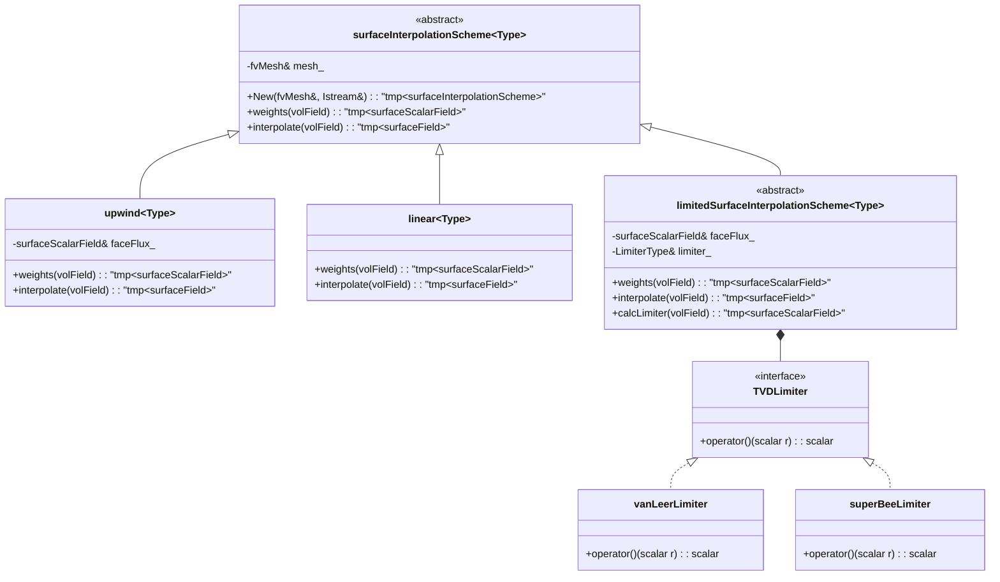

## 🎯 Learning Objectives (วัตถุประสงค์การเรียนรู้)

หลังจากจบบทนี้ คุณจะสามารถ:

1.  **เข้าใจ (Understand)** กลไกและฟิสิกส์เบื้องหลัง Spatial Discretization Scheme พื้นฐานทั้งสามแบบ และความสัมพันธ์ของมันกับความเสถียรภาพ (Stability) และความถูกต้อง (Accuracy) ของผลลัพธ์
    *   **Upwind Differencing Scheme (UDS)**: เข้าใจหลักการ "เทียบตามทิศทางลม" ว่าทำไมมันจึง Unconditionally Stable แต่ต้องแลกมาด้วย Numerical Diffusion ที่สูง และผลกระทบต่อการ smear ของ Interface ในปัญหาสองเฟส
    *   **Central Differencing Scheme (CDS)**: เข้าใจหลักการประมาณค่าเชิงเส้น (Linear Interpolation) ที่ให้ความแม่นยำอันดับสอง (Second-Order Accuracy) แต่มีเงื่อนไขความเสถียรที่เข้มงวด (Pe < 2) และความเสี่ยงต่อการเกิด Oscillation
    *   **Total Variation Diminishing (TVD) Schemes**: เข้าใจปรัชญาของ Hybrid Scheme ที่พยายามรักษาความแม่นยำอันดับสองในบริเวณที่ smooth และลดลงเป็นอันดับหนึ่ง (Upwind-like) ในบริเวณที่มี gradient สูงชัน เพื่อป้องกันไม่ให้เกิด Oscillation ใหม่ โดยอาศัย Limiter Function

2.  **วิเคราะห์ (Analyze)** รูปแบบการออกแบบและสถาปัตยกรรมของระบบ Surface Interpolation ใน OpenFOAM ซึ่งเป็นหัวใจของการคำนวณ Face Flux
    *   **Class Hierarchy**: วิเคราะห์การออกแบบแบบ Polymorphic ผ่าน Abstract Base Class `surfaceInterpolationScheme<Type>` และการสืบทอดไปยัง `upwind<Type>`, `linear<Type>`, และ `limitedSurfaceInterpolationScheme<Type>` (ฐานของ TVD)
    *   **Runtime Selection**: วิเคราะห์การทำงานของคลาส `fvSchemes` ในการอ่าน Dictionary และเลือก Scheme ในการรันไทม์ ซึ่งทำให้ Solver มีความยืดหยุ่นสูงโดยไม่ต้อง Recompile
    *   **Data Flow**: วิเคราะห์ลำดับการคำนวณ ตั้งแต่การคำนวณ Mass Flux (`surfaceScalarField phi`) การเลือก Upwind Direction การคำนวณ Face Value (`phi_f`) และการรวมเป็น Net Convection Flux เข้าสู่ `fvMatrix`

3.  **ออกแบบและ Implement (Design & Implement)** Custom TVD Limiter สำหรับปัญหาการจับ Interface แบบเฉียบคม (Sharp Interface Capturing) ในวิธี Volume of Fluid (VOF)
    *   **Limiter Mathematics**: ออกแบบฟังก์ชัน Limiter `\psi(r)` ต่างๆ เช่น van Leer, van Albada, และ SuperBee โดยเข้าใจสมบัติของแต่ละตัว (Smooth, Compressive) และขอบเขตของ TVD Region (`0 $\le$ \psi(r)  \le  min(2r, 2)`)
    *   **Gradient Calculation**: Implement การคำนวณ Gradient Ratio `r_f = ($\phi_P - \phi_U$) / ($\phi_N - \phi_P$)` ซึ่งต้องการค่าจาก Upwind-upwind Cell (`\phi _U`) เพื่อประเมินความชันของ solution upstream
    *   **Integration with Alpha Equation**: Integrate Limiter ที่ออกแบบไว้เข้ากับการแก้สมการ `alpha` (Volume Fraction) โดยเฉพาะการเพิ่ม Compressive Flux Term เพื่อบีบ Interface ให้มีความหนาเพียง 1-2 Cells

4.  **ประเมินและเลือก (Evaluate & Select)** Spatial Discretization Scheme ที่เหมาะสมสำหรับ Unknown Field หลักแต่ละตัวใน Evaporator Simulation โดยพิจารณาจากลักษณะทางฟิสิกส์และความต้องการเชิงตัวเลข
    *   **Velocity ($\mathbf{U}$)**: ประเมินความจำเป็นในการใช้ TVD Scheme (เช่น van Leer) เพื่อสร้างสมดุลระหว่างความแม่นยำของ convective transport และความเสถียรที่ high Reynolds number
    *   **Pressure ($p$)**: ประเมินความสำคัญของการใช้ Central Scheme (หรือ Least-Squares) สำหรับการคำนวณ Pressure Gradient ที่แม่นยำ ซึ่งส่งผลโดยตรงต่อการแก้ Momentum Equation ในขั้น Pressure Correction
    *   **Volume Fraction ($\alpha$)**: ประเมินความจำเป็นขั้นสูง (Critical) ในการใช้ Compressive TVD Scheme (เช่น SuperBee) ร่วมกับ Artificial Compression Term เพื่อรักษา Sharp Interface และป้องกัน Numerical Diffusion ที่จะทำลาย Physics ของ Phase Change
    *   **Temperature ($T$)**: ประเมินการเลือก Scheme (เช่น van Albada) ที่สามารถจัดการกับ Discontinuity ใน Gradient ที่ Interface ระหว่างของเหลวและไอได้อย่างราบรื่น

5.  **วินิจฉัยและแก้ไข (Diagnose & Troubleshoot)** ปัญหา Numerical Instability และ Inaccuracy ที่มีสาเหตุมาจากการเลือก Spatial Discretization Scheme ที่ไม่เหมาะสม
    *   **Checkerboarding ใน Pressure Field**: ระบุว่ามาจากการใช้ Central Scheme สำหรับ Convection Term ใน Momentum Equation โดยไม่มี Rhie-Chow Interpolation และเสนอทางแก้
    *   **Interface Smearing รุนแรง**: ระบุว่ามาจากการใช้ Upwind Scheme ล้วนๆ สำหรับ Alpha Equation และเสนอการเพิ่ม Compressive Flux หรือเปลี่ยนไปใช้ TVD Limiter ที่มีสมบัติ Compressive
    *   **Divergence ที่ High Re/Pe Number**: ระบุเงื่อนไขความเสถียร (Pe < 2) ของ Central Scheme และเสนอการเปลี่ยนไปใช้ Upwind หรือ TVD ใน Region นั้นๆ หรือการใช้ Blended Scheme แบบ Adaptive

6.  **สร้างความเชื่อมโยง (Synthesize Connections)** ระหว่างความรู้ในบทนี้กับสถาปัตยกรรม Solver โดยรวมของ Phase 1
    *   **Link to Matrix Assembly (Day 07)**: ทำความเข้าใจว่า Face Flux$\sum (\phi_f \cdot$\dot{m}_f$)$ ที่คำนวณได้ในบทนี้ จะกลายเป็น Coefficients (Off-diagonal) และ Source Term ใน `lduMatrix`
    *   **Link to Pressure-Velocity Coupling (Day 09)**: ทำความเข้าใจว่าการประมาณค่า Face Flux สำหรับ Velocity (`phi`) และการ Interpolate Face Pressure มีบทบาทสำคัญในขั้นตอนการแก้ Pressure Poisson Equation
    *   **Link to VOF & Phase Change (Day 10-11)**: ทำความเข้าใจว่าการเลือก Scheme สำหรับ $\alpha$ และ $T$ เป็นปัจจัยชี้เป็นชี้ตายต่อความสำเร็จในการจับภาพ Interface และคำนวณ Mass Transfer Rate$\dot{m}$ ระหว่างเฟสได้อย่างถูกต้อง

## 📑 Table of Contents (สารบัญ)
- [[#1. Section 1: Theory (ทฤษฎี)|1. Section 1: Theory (ทฤษฎี)]]
- [[#2. Section 2: OpenFOAM Reference (การอ้างอิง OpenFOAM)|2. Section 2: OpenFOAM Reference (การอ้างอิง OpenFOAM)]]
- [[#3. Section 3: Class Design (การออกแบบคลาส)|3. Section 3: Class Design (การออกแบบคลาส)]]
- [[#4. Section 4: Implementation (การนำไปใช้)|4. Section 4: Implementation (การนำไปใช้)]]
- [[#5. Section 5: Build & Test (การบิลด์และการทดสอบ)|5. Section 5: Build & Test (การบิลด์และการทดสอบ)]]
- [[#6. Section 6: Concept Checks (การทดสอบแนวคิด)|6. Section 6: Concept Checks (การทดสอบแนวคิด)]]
- [[#7. Section 7: References & Related Days (เอกสารอ้างอิงและบทเรียนที่เกี่ยวข้อง)|7. Section 7: References & Related Days (เอกสารอ้างอิงและบทเรียนที่เกี่ยวข้อง)]]

<!-- END_OF_SECTION -->

# 1. Section 1: Theory (ทฤษฎี)

## 1.1 สมการพื้นฐาน Convection-Diffusion (Fundamental Convection-Diffusion Equation)

ใน Finite Volume Method (FVM) ที่เราสร้างขึ้นใน Day 02 สิ่งที่เราต้องการคือการเปลี่ยนสมการอนุพันธ์ย่อย (PDE) ให้อยู่ในรูปของสมการพีชคณิตที่สามารถแก้ได้ด้วยคอมพิวเตอร์ สำหรับ Phase 1 ของโครงการนี้ สมการแม่บทที่เราจะต้องเผชิญซ้ำแล้วซ้ำเล่าคือ **สมการการขนส่ง (Transport Equation)** รูปแบบทั่วไป $$\frac{\partial ($\rho$$\phi$)}{\partial t} +$\nabla$\cdot ($\rho$\mathbf{U}$\phi$) =$\nabla$\cdot (\Gamma$\nabla$$\phi$) + S_{$\phi$}$$**การตีความทางฟิสิกส์ของแต่ละเทอม:**
*   **$\frac{\partial ($\rho$$\phi$)}{\partial t}$**: เทอมการเปลี่ยนแปลงตามเวลา (Transient) ของคุณสมบัติ $\phi$ ภายใน control volume
*   **$\nabla \cdot ($\rho$\mathbf{U}$\phi$)$**: เทอมการพา (Convection) ที่เกิดจากการไหลของของไหลที่มีความเร็ว $\mathbf{U}$ พาคุณสมบัติ $\phi$ เข้าและออกผ่านผิวของ control volume
*   **$\nabla \cdot (\Gamma$\nabla$$\phi$)$**: เทอมการแพร่ (Diffusion) ของคุณสมบัติ $\phi$ เนื่องจากกลไกการแพร่เชิงโมเลกุลหรือความปั่นป่วน โดยมี $\Gamma$ เป็นค่าสัมประสิทธิ์การแพร่
*   **$S_{$\phi$}$**: เทอมแหล่งกำเนิด (Source) ที่สร้างหรือทำลายคุณสมบัติ $\phi$ ภายใน control volume (เช่น แหล่งความร้อน, แรงภายนอก, การเปลี่ยนเฟส)

เมื่อเราใช้ **Gauss's Divergence Theorem** (จาก Day 02) กับเทอม convective และ diffusive เราจะได้สมการในรูป integral สำหรับ control volume$V_P$ ใดๆ:$$\int_{V_P} \frac{\partial ($\rho$$\phi$)}{\partial t} dV + \sum_f \int_{f} ($\rho$\mathbf{U}$\phi$)_f \cdot d\mathbf{S}_f = \sum_f \int_{f} (\Gamma$\nabla$$\phi$)_f \cdot d\mathbf{S}_f + \int_{V_P} S_{$\phi$} dV$$ หากเราสมมติว่าค่าเฉลี่ยในเซลล์เป็นตัวแทนที่ดีของปริมาณภายในเซลล์ และค่าบนผิวหน้าเป็นตัวแทนที่ดีของปริมาณบนหน้าดังกล่าว เราสามารถเขียนสมการในรูป discrete ได้ดังนี้:$$V_P \frac{\partial (\rho_P \phi_P)}{\partial t} + \sum_f (\rho_f \mathbf{U}_f \phi_f) \cdot \mathbf{S}_f = \sum_f \Gamma_f ($\nabla$$\phi$)_f \cdot \mathbf{S}_f + V_P S_{$\phi$, P}$$**จุดวิกฤต (Critical Juncture):** สมการข้างต้นทำให้เราเห็นปัญหาหลักของการ discretize ในเชิงพื้นที่: **เรามีค่า $\phi$ ที่ศูนย์กลางเซลล์ ($\phi_P$) แต่เราต้องการค่า $\phi$ บนผิวหน้า ($\phi_f$) เพื่อคำนวณ convective flux** และเราต้องการ gradient บนผิวหน้า $($\nabla$$\phi$)_f$ เพื่อคำนวณ diffusive flux

| สัญลักษณ์ | ความหมาย | หน่วย | ความท้าทายในการคำนวณ |
| :--- | :--- | :--- | :--- |
|$\phi_f$| ค่าของปริมาณ $\phi$ บนผิวหน้า | ขึ้นกับ $\phi$ (m/s, K, -) | **ไม่รู้ค่า** ต้องประมาณ (interpolate) จากค่าในเซลล์ข้างเคียง |
|$($\nabla$$\phi$)_f$| Gradient ของ $\phi$ บนผิวหน้า | [$\phi$]/m | ต้องประมาณจากค่าในเซลล์และเวกเตอร์ปกติของผิวหน้า |

**คำเตือน (Warning):** เทอมการพา (Convection)$\sum_f (\rho_f \mathbf{U}_f \phi_f) \cdot \mathbf{S}_f$ เป็นแหล่งหลักของ **ความไม่เสถียรเชิงตัวเลข (Numerical Instability)** ใน CFD การเลือกวิธีการประมาณค่า $\phi_f$(หรือที่เรียกว่า **Spatial Discretization Scheme**) เป็นการตัดสินใจที่สำคัญที่สุดอย่างหนึ่งในการออกแบบ Solver ซึ่งจะส่งผลโดยตรงต่อความแม่นยำ ความเสถียร และการลู่เข้าของการคำนวณ

---

## 1.2 Upwind Differencing Scheme (UDS) - แบบแผน Upwind (เทียบตามทิศทางลม)

Upwind Differencing Scheme (UDS) หรือ First-Order Upwind เป็น scheme ที่ง่ายที่สุดและมีความเสถียรสูงสุด ปรัชญาของมันตรงไปตรงมา: **ข้อมูลในของไหลไหลไปตามทิศทางการไหล (downstream)** ดังนั้น ค่าของ $\phi$ บนผิวหน้าจึงควรมาจากเซลล์ที่อยู่ **ต้นน้ำ (Upstream)** เท่านั้น

#### สมการและการทำงาน
นิยามของค่า $\phi_f$ สำหรับหน้า $f$ ที่อยู่ระหว่างเซลล์เจ้าของ (Owner,$P$) และเซลล์เพื่อนบ้าน (Neighbour,$N$):$$\phi_f = \begin{cases}
\phi_P & \text{if } \mathbf{F}_f \cdot \mathbf{S}_f \ge 0 \\\\
\phi_N & \text{if } \mathbf{F}_f \cdot \mathbf{S}_f < 0
\end{cases}$$ โดยที่ $\mathbf{F}_f = ($\rho$\mathbf{U})_f$ คือ mass flux vector บนหน้า และ $\mathbf{S}_f$ คือเวกเตอร์พื้นที่ผิว (ชี้จาก $P$ ไป $N$) **การตีความ:** หากผลคูณจุดเป็นบวก แสดงว่าการไหลออกจาก $P$ ไป $N$ ดังนั้นค่า $\phi_f$ ควรมาจาก $P$(upstream) หากผลคูณจุดเป็นลบ แสดงว่าการไหลเข้าสู่ $P$ จาก $N$ ดังนั้นค่า $\phi_f$ ควรมาจาก $N$#### การวิเคราะห์ข้อผิดพลาด (Truncation Error Analysis)
เพื่อทำความเข้าใจข้อดีข้อเสียของ UDS เราต้องวิเคราะห์ **Truncation Error** ซึ่งเป็นความแตกต่างระหว่างคำตอบที่แท้จริงกับคำตอบจากการประมาณ หากเราใช้ Taylor Series Expansion รอบจุดกลางระหว่าง $P$ และ $N$ เราจะพบว่า:$$\phi_f^{\text{exact}} - \phi_f^{\text{UDS}} = \frac{1}{2} |\mathbf{U}| \Delta x \left| \frac{\partial$\phi$}{\partial x} \right| + O(\Delta x^2)$$**การตีความที่สำคัญ:** เทอมข้อผิดพลาดอันดับหนึ่ง $\frac{1}{2} |\mathbf{U}| \Delta x \left| \frac{\partial$\phi$}{\partial x} \right|$ มีลักษณะเหมือนกับ **เทอมการแพร่ (Diffusion)**! เราเรียกสิ่งนี้ว่า **Numerical Diffusion (หรือ False Diffusion)** มันเกิดขึ้นเสมอเมื่อใช้ UDS และมีขนาดแปรผันตรงกับความเร็ว ($|\mathbf{U}|$) และขนาดของเซลล์ ($\Delta x$) และแปรผันตรงกับความชันของ $\phi$($\left| \frac{\partial$\phi$}{\partial x} \right|$)

#### คุณสมบัติและผลกระทบ

| คุณสมบัติ | ค่า | ผลกระทบและความหมาย |
| :--- | :--- | :--- |
| **อันดับความแม่นยำ (Order of Accuracy)** | First-Order ($O(\Delta x)$) | มีข้อผิดพลาดเชิงตัวเลขสูง ลดลงช้าเมื่อ grid ถี่ขึ้น |
| **ความมีขอบเขต (Boundedness)** | **มีเสมอ (Always)** | ค่า $\phi_f$ จะอยู่ระหว่าง $\phi_P$ และ $\phi_N$ เสมอ **ไม่เกิด Overshoot/Undershoot** |
| **เสถียรภาพ (Stability)** | **Unconditionally Stable** | ใช้ได้กับทุกสภาวะการไหล (ทุกค่า Peclet Number) เนื่องจากมี numerical diffusion ในตัว |
| **ลักษณะเชิงกายภาพ** | Respects Transportiveness | รับรู้ว่าข้อมูลไหลไปทิศทางเดียว (downstream) เท่านั้น |

#### หมายเหตุการประยุกต์ใช้ (Application Note)
ในบริบทของ **Volume of Fluid (VOF)** สำหรับการจำลองสองเฟส (Day 10) การใช้ UDS อย่างเดียวสำหรับสมการ volume fraction$\alpha$ โดยไม่มีการแก้ไขใดๆ จะนำไปสู่หายนะ: **Interface ระหว่างของเหลวกับก๊าซจะถูกทำให้เบลอ (smear) ไปกว่า 10 เซลล์** เนื่องจาก numerical diffusion ที่มีอยู่มากของ UDS จะ "แพร่" ค่า $\alpha$ จาก 1 (ของเหลว) ไปยัง 0 (ก๊าซ) อย่างรวดเร็ว ทำให้เราไม่สามารถจับตำแหน่ง interface ที่ชัดเจนได้ นี่คือเหตุผลที่เราต้องมี scheme ที่ดีกว่า เช่น TVD

---

## 1.3 Central Differencing Scheme (CDS) - แบบแผน Central (ค่าเฉลี่ย)

Central Differencing Scheme (CDS) หรือ Linear Interpolation Scheme เป็น scheme ที่มีความแม่นยำสูงกว่า UDS โดยอาศัยสมมติฐานว่า $\phi$ เปลี่ยนแปลงอย่างราบรื่น (smooth) ระหว่างศูนย์กลางเซลล์

#### สมการและการทำงาน
CDS ประมาณค่า $\phi_f$ โดยใช้ **การประมาณค่าเชิงเส้น (Linear Interpolation)** ระหว่างค่า $\phi_P$ และ $\phi_N$:$$\phi_f = \lambda_f \phi_P + (1 - \lambda_f) \phi_N$$ โดยที่ $\lambda_f$ คือ **น้ำหนักการประมาณค่า (Interpolation Weight)** ซึ่งโดยทั่วไปคำนวณจากอัตราส่วนของระยะทาง:$$\lambda_f = \frac{|\mathbf{x}_f - \mathbf{x}_N|}{|\mathbf{x}_P - \mathbf{x}_N|}$$ โดย $\mathbf{x}_f$,$\mathbf{x}_P$, และ $\mathbf{x}_N$ คือตำแหน่งของจุดศูนย์กลางหน้า, เซลล์เจ้าของ และเซลล์เพื่อนบ้านตามลำดับ **สำหรับกริดสม่ำเสมอ (Uniform Grid)** ระยะทางจาก $P$ ถึง $f$ และ $f$ ถึง $N$ จะเท่ากัน ทำให้ $\lambda_f = 0.5$ และสมการลดรูปเป็นค่าเฉลี่ยเลขคณิตอย่างง่าย:$$\phi_f = \frac{\phi_P + \phi_N}{2} \quad \text{(สำหรับ Uniform Grid)}$$#### เกณฑ์เสถียรภาพ (Stability Criterion)
ความท้าทายหลักของ CDS คือ **มันไม่มี built-in numerical diffusion** ดังนั้นความเสถียรของมันจึงขึ้นอยู่กับ **การแข่งขันระหว่าง Convection กับ Physical Diffusion** เท่านั้น เราใช้อัตราส่วนไร้มิติ **Peclet Number ($Pe$)** เพื่ออธิบายปรากฏการณ์นี้:$$Pe = \frac{$\rho$U \Delta x}{\Gamma}$$ โดยที่:
*$\rho U \Delta x$: แสดงถึงความแรงของ Convection
*$\Gamma$: แสดงถึงความแรงของ Diffusion

**เกณฑ์เสถียรภาพของ CDS:**$Pe < 2$**เหตุผลทางคณิตศาสตร์:** เมื่อ $Pe > 2$ สัมประสิทธิ์ในเมทริกซ์ (matrix coefficients) ที่ได้จากการ discretize จะเปลี่ยนเครื่องหมาย ทำให้เมทริกซ์สูญเสีย **Diagonal Dominance** ซึ่งเป็นคุณสมบัติสำคัญสำหรับการลู่เข้าของตัวแก้สมการแบบวนซ้ำ (Iterative Solver) ผลที่ตามมาคือคำตอบจะ **แกว่ง (Oscillate)** อย่างรุนแรงและลู่ออก (Diverge)

#### คุณสมบัติและผลกระทบ

| คุณสมบัติ | ค่า | ผลกระทบและความหมาย |
| :--- | :--- | :--- |
| **อันดับความแม่นยำ** | Second-Order ($O(\Delta x^2)$) | แม่นยำกว่ามากสำหรับการไหลที่ราบรื่น (smooth flow) |
| **ความมีขอบเขต** | **ไม่รับประกัน (Not Guaranteed)** | อาจให้ค่า $\phi_f$ นอกขอบเขต $\phi_P$ ถึง $\phi_N$ ได้ (เกิด Overshoot/Undershoot) |
| **เสถียรภาพ** | **มีเงื่อนไข:$Pe < 2$** | ใช้ได้เฉพาะกับการไหลที่มี Diffusion โดดเด่น (Low Reynolds Number) เท่านั้น |
| **ลักษณะเชิงกายภาพ** | ไม่ Respect Transportiveness | ใช้ข้อมูลจากทั้ง upstream และ downstream ซึ่งขัดกับฟิสิกส์ของการพา |

#### หมายเหตุการประยุกต์ใช้ (Application Note)
CDS เหมาะสมอย่างยิ่งสำหรับการ discretize **เทอมการแพร่ (Diffusion Term / Laplacian)** เนื่องจาก gradient ของสนามที่ราบรื่นสามารถประมาณได้อย่างแม่นยำด้วย central difference อย่างไรก็ตาม **CDS ไม่เหมาะอย่างยิ่งสำหรับการ discretize เทอมการพา (Convection Term) ของ $\alpha$(VOF) หรือแม้แต่ $\mathbf{U}$(ความเร็ว) ใน evaporator simulation** ของเรา เนื่องจากบริเวณ interface และบริเวณที่มีการเปลี่ยนเฟสมักมีความชันสูง (high gradient) และ Peclet Number สูง ซึ่งจะทำให้ CDS ไม่เสถียร

---

## 1.4 Total Variation Diminishing (TVD) Schemes - แบบแผน TVD (ลด Total Variation)

Total Variation Diminishing (TVD) Schemes เป็นคำตอบสำหรับความขัดแย้งระหว่าง **ความเสถียรของ UDS** และ **ความแม่นยำของ CDS** เป้าหมายของ TVD คือการได้ scheme ที่มีความแม่นยำอันดับสอง (Second-Order Accuracy) ในบริเวณที่คำตอบราบรื่น (smooth) แต่จะลดอันดับความแม่นยำลงเป็นอันดับหนึ่ง (First-Order) โดยอัตโนมัติในบริเวณที่มีความชันสูงหรือไม่ต่อเนื่อง (เช่น หน้าสัมผัสใน VOF) เพื่อป้องกันการแกว่ง

#### สูตรทั่วไปของ TVD
TVD Scheme สามารถเขียนในรูปทั่วไปได้ดังนี้:$$\phi_f = \phi_P + \frac{1}{2} \psi(r_f) (\phi_N - \phi_P)$$ โดยที่:
*$\phi_P$: ค่า Upwind cell (ตามทิศทางการไหล)
*$(\phi_N - \phi_P)$: ความแตกต่างระหว่างเซลล์ Upstream และ Downstream
*$\psi(r_f)$: **ฟังก์ชันลิมิตเตอร์ (Limiter Function)** ซึ่งเป็นหัวใจของ TVD Scheme

#### อัตราส่วนความชัน (Gradient Ratio)
ฟังก์ชันลิมิตเตอร์ $\psi$ ขึ้นอยู่กับ **อัตราส่วนความชัน (Gradient Ratio)**$r_f$ ซึ่งนิยามโดย:$$r_f = \frac{\phi_P - \phi_U}{\phi_N - \phi_P}$$ โดยที่ $\phi_U$ คือค่าในเซลล์ **Upwind-Upstream** (เซลล์ที่อยู่ upstream ของเซลล์ upwind$\phi_P$) การตีความ $r_f$:
*$r_f \approx$: ความชันสม่ำเสมอ (Smooth variation) → ควรใช้ CDS (Second-Order)
*$r_f \ll$ หรือ $r_f < 0$: ความชันเปลี่ยนอย่างรวดเร็วหรือเปลี่ยนเครื่องหมาย (Extremum) → ควรใช้ UDS (First-Order) เพื่อป้องกัน Oscillation

#### คุณสมบัติ TVD (Total Variation Diminishing)
คุณสมบัติทางคณิตศาสตร์ที่กำหนดให้ TVD Scheme ต้องมีคือ:$$\text{TV}($\phi$^{n+1})  \le  \text{TV}($\phi^n$)$$ โดยที่ Total Variation$\text{TV}($\phi$) = \sum_i |\phi_{i+1} - \phi_i|$**การตีความ:** คุณสมบัตินี้รับประกันว่า "ความหยาบ" หรือ "การแกว่ง" ของคำตอบจะไม่เพิ่มขึ้นเมื่อเวลาผ่านไป → **ป้องกันการเกิด Oscillations ใหม่**

#### ฟังก์ชันลิมิตเตอร์ที่สำคัญ (Key Limiter Functions)
ฟังก์ชันลิมิตเตอร์ที่แตกต่างกันให้พฤติกรรมที่แตกต่างกัน:

| ชื่อลิมิตเตอร์ | สูตร $\psi(r)$| คุณสมบัติและการประยุกต์ใช้ |
| :--- | :--- | :--- |
| **van Leer** |$\psi(r) = \dfrac{r + |r|}{1 + r}$| **ลื่นไหล (Smooth)**, Second-Order Accuracy เหมาะสำหรับสนามทั่วไปเช่น ความเร็ว ($\mathbf{U}$) และอุณหภูมิ ($T$) ที่มีการเปลี่ยนแปลงค่อนข้างราบรื่น |
| **van Albada** |$\psi(r) = \dfrac{r^2 + r}{r^2 + 1}$| **ลื่นไหลกว่า van Leer ที่ $r \approx 0$** (หลีกเลี่ยงการหารด้วยศูนย์ในทางปฏิบัติ) เหมาะสำหรับการคำนวณที่มีความเสี่ยงต่อการเกิด numerical singularity |
| **superBee** |$\psi(r) = \max[0, \min(2r, 1), \min(r, 2)]$| **แบบบีบอัด (Compressive)** ให้ค่าลิมิตเตอร์สูงสุดที่อนุญาตใน TVD region ทำให้ interface แคบมาก **เหมาะสำหรับสมการ volume fraction ($\alpha$) ใน VOF เพื่อให้ interface หนาเพียง 1-2 เซลล์** |

**พื้นที่ที่ยอมรับได้ของ TVD Limiter (TVD Region):** ฟังก์ชันลิมิตเตอร์ $\psi(r)$ ใดๆ ที่จะทำให้ scheme มีคุณสมบัติ TVD ต้องอยู่ในขอบเขตต่อไปนี้สำหรับทุก $r \ge 0$:$$0  \le  \psi(r)  \le  \min(2r, 2)$$ กราฟของ $\psi(r)$ ต้องอยู่ภายในพื้นที่สามเหลี่ยมที่ล้อมรอบด้วยเส้น $\psi=0$,$\psi=2r$, และ $\psi=2$#### หมายเหตุการประยุกต์ใช้ (Application Note)
สำหรับการจำลองการระเหย (Evaporator Simulation) ของเรา **superBee limiter เป็นตัวเลือกที่สำคัญที่สุด** สำหรับการ discretize สมการ volume fraction ($\alpha$) มันจะ "บีบ" interface ให้แคบลงอย่างแข็งขัน ป้องกันไม่ให้ numerical diffusion ของ scheme เองทำให้ interface เบลอ ซึ่งเป็นเงื่อนไขเบื้องต้นสำหรับการคำนวณอัตราการเปลี่ยนเฟส ($\dot{m}$) ที่แม่นยำใน Day 11

---

## 1.5 การนำไปใช้ในบริบท Finite Volume (Implementation in Finite Volume Context)

การนำ Spatial Discretization Schemes ไปใช้ในบริบทของ Finite Volume Method ต้องอาศัยความเข้าใจในขั้นตอนการคำนวณ flux ผ่านผิวหน้าของ control volume

#### ขั้นตอนการ Discretize เทอมการพา
จากสมการ discrete เทอมการพามีรูปแบบ:$$\sum_f$\dot{m}_f$ \phi_f = \sum_f \rho_f (\mathbf{U}_f \cdot \mathbf{S}_f) \phi_f$$ โดยที่ $\dot{m}_f = \rho_f (\mathbf{U}_f \cdot \mathbf{S}_f)$ คือ **อัตราการไหลของมวล (Mass Flow Rate)** ผ่านหน้า $f$ ขั้นตอนการคำนวณมีดังนี้:
1.  **คำนวณ Mass Flux ($\phi_f$ หรือ `phi`)**: จากสนามความเร็ว $\mathbf{U}$ ที่ทราบค่า (อาจมาจากขั้นตอนก่อนหน้า) คำนวณ flux สเกลาร์ผ่านทุกหน้า: `surfaceScalarField phi = fvc::flux(U)` หรือ `linearInterpolate(U) & mesh.Sf()`.
2.  **กำหนดทิศทาง Upwind**: สำหรับแต่ละหน้า $f$ ตรวจสอบเครื่องหมายของ $\dot{m}_f$(หรือ `phi[f]`):
    *   `phi[f] > 0`: การไหลจาก $P$→$N$, ดังนั้น Upwind Cell คือ $P$.
    *   `phi[f] < 0`: การไหลจาก $N$→$P$, ดังนั้น Upwind Cell คือ $N$.
3.  **ประมาณค่า $\phi_f$ ตาม Scheme ที่เลือก**:
    *   **UDS**: `phi_face = (phi[f] > 0) ? phi[owner] : phi[neighbour];`
    *   **CDS**: `phi_face = weight[f]*phi[owner] + (1-weight[f])*phi[neighbour];`
    *   **TVD**: `r = calcGradientRatio(...); psi = limiterFunction(r); phi_face = phi_upwind + 0.5*psi*(phi_downwind - phi_upwind);`
4.  **รวม Flux ทั้งหมด**: คำนวณผลรวม convective flux สำหรับเซลล์ $P$: `convection_term[P] += phi_face * phi[f];` (โดย `phi[f]` คือ mass flux)

#### ลอจิกการเลือก Scheme (Scheme Selection Logic)
ในทางปฏิบัติ โซลเวอร์ที่ซับซ้อนอาจใช้ scheme ที่แตกต่างกันสำหรับสนามและสภาวะที่ต่างกัน ลอจิกสามารถเขียนเป็นฟังก์ชันได้ดังนี้:

```cpp
scalar calculatePhiFace(
    scalar phiP, scalar phiN,          // Cell values
    vector Uf, vector Sf,              // Face velocity and area
    scalar gamma, scalar dx,           // Diffusivity and cell size
    SchemeType scheme, LimiterType limiter
) {
    scalar massFlux = rho * (Uf & Sf); // & คือ dot product ใน OpenFOAM
    scalar Pe = rho * mag(Uf) * dx / gamma;

    if (scheme == UDS) {
        return (massFlux >= 0) ? phiP : phiN;
    }
    else if (scheme == CDS) {
        // ใช้ CDS เฉพาะเมื่อเสถียร
        if (Pe < 2.0) {
            return 0.5*(phiP + phiN); // สมมติ uniform grid
        } else {
            // Fallback ไป UDS หากไม่เสถียร
            return (massFlux >= 0) ? phiP : phiN;
        }
    }
    else if (scheme == TVD) {
        scalar r = calculateGradientRatio(phiU, phiP, phiN); // ต้องหา phiU
        scalar psi = applyLimiter(limiter, r);
        scalar phiUpwind = (massFlux >= 0) ? phiP : phiN;
        scalar phiDownwind = (massFlux >= 0) ? phiN : phiP;
        return phiUpwind + 0.5 * psi * (phiDownwind - phiUpwind);
    }
}
```

#### แผนภาพการไหลของการนำไปใช้ (Implementation Flow)
1.  **เริ่มต้น**: อ่านการตั้งค่า scheme จาก dictionary `fvSchemes` (เช่น `divSchemes`, `gradSchemes`).
2.  **สำหรับแต่ละสนามที่ต้องการแก้ (U, p, \alpha, T)**:
    *   สร้างออบเจ็กต์จัดการ scheme (เช่น `surfaceInterpolationScheme`).
    *   ผูก scheme กับสนามนั้นๆ (เช่น `U` ใช้ `TVDvanLeer`, `\alpha` ใช้ `TVDsuperBee`).
3.  **ในขั้นตอนการแก้สมการ (เช่น `UEqn.solve()`)**:
    *   ดึง scheme ที่กำหนดไว้สำหรับสนามนั้น
    *   เรียกเมธอด `interpolate()` เพื่อคำนวณ face values$\phi_f$ สำหรับทุกหน้า
    *   ใช้ face values เหล่านี้คำนวณ convective flux และประกอบเข้าสู่ `fvMatrix`
4.  **สำหรับ TVD Scheme เฉพาะ**:
    *   ก่อน interpolation ให้คำนวณ gradient field$\nabla$\phi$$ ของสนาม (ใช้ `fvc::grad(phi)`).
    *   สำหรับแต่ละหน้า: คำนวณ $r_f$ โดยใช้ค่า $\phi$ จาก upwind-upwind cell ($U$), upwind cell ($P$), และ downwind cell ($N$).
    *   นำ $r_f$ ไปคำนวณค่าลิมิตเตอร์ $\psi(r_f)$ ตามฟังก์ชันที่เลือก (vanLeer, superBee ฯลฯ)
    *   คำนวณ $\phi_f$ ตามสูตร TVD
5.  **ส่งต่อ**: ส่ง convective flux ที่คำนวณได้ไปยังระบบเมทริกซ์ (`fvMatrix`) เพื่อประกอบเป็นสมการเชิงเส้น $A$\phi$= b$ สำหรับขั้นตอนการแก้ในขั้นต่อไป

การเลือกและการใช้งาน Spatial Discretization Scheme ที่ถูกต้องเป็นรากฐานที่สำคัญสำหรับความสำเร็จของขั้นตอนการคำนวณที่ซับซ้อนในวันต่อๆ ไป ไม่ว่าจะเป็น Pressure-Velocity Coupling (Day 09), VOF (Day 10) หรือ Phase Change (Day 11)

<!-- END OF THEORY SECTION -->

# 2. Section 2: OpenFOAM Reference (การอ้างอิง OpenFOAM)

## 2.1 การวิเคราะห์ Source Code ของ OpenFOAM: ระบบ `surfaceInterpolation`

ในส่วนนี้ เราจะเจาะลึกลงไปใน source code จริงของ OpenFOAM เพื่อดูว่า framework นี้จัดการ spatial discretization อย่างไร ระบบหลักที่ต้องเข้าใจคือ `surfaceInterpolationScheme` ซึ่งเป็น abstract base class ที่ทุก scheme ต้องสืบทอดมา

## 2.1.1 Abstract Base Class: `surfaceInterpolationScheme<Type>`

ไฟล์ Header: `src/finiteVolume/interpolation/surfaceInterpolation/surfaceInterpolationScheme/surfaceInterpolationScheme.H`

```cpp
namespace Foam
{

/*---------------------------------------------------------------------------*\
                    Class surfaceInterpolationScheme Declaration
\*---------------------------------------------------------------------------*/

template<class Type>
class surfaceInterpolationScheme
:
    public refCount
{
    // Private Member Functions

        //- Disallow default bitwise copy construct
        surfaceInterpolationScheme(const surfaceInterpolationScheme&);

        //- Disallow default bitwise assignment
        void operator=(const surfaceInterpolationScheme&);


public:

    //- Runtime type information
    TypeName("surfaceInterpolationScheme");


    // Declare run-time constructor selection tables

        declareRunTimeSelectionTable
        (
            tmp,
            surfaceInterpolationScheme,
            Mesh,
            (
                const fvMesh& mesh,
                Istream& schemeData
            ),
            (mesh, schemeData)
        );

        declareRunTimeSelectionTable
        (
            tmp,
            surfaceInterpolationScheme,
            MeshFlux,
            (
                const fvMesh& mesh,
                const surfaceScalarField& faceFlux,
                Istream& schemeData
            ),
            (mesh, faceFlux, schemeData)
        );


    // Constructors

        //- Construct from mesh
        surfaceInterpolationScheme(const fvMesh& mesh)
        :
            mesh_(mesh)
        {}


    // Selectors

        //- Return new tmp interpolation scheme
        static tmp<surfaceInterpolationScheme<Type>> New
        (
            const fvMesh& mesh,
            Istream& schemeData
        );

        //- Return new tmp interpolation scheme
        static tmp<surfaceInterpolationScheme<Type>> New
        (
            const fvMesh& mesh,
            const surfaceScalarField& faceFlux,
            Istream& schemeData
        );


    //- Destructor
    virtual ~surfaceInterpolationScheme();


    // Member Functions

        //- Return mesh reference
        const fvMesh& mesh() const
        {
            return mesh_;
        }

        //- Return the face-interpolate of the given cell field
        //  with the given owner and neighbour weigting factors
        static tmp<GeometricField<Type, fvsPatchField, surfaceMesh>>
        interpolate
        (
            const GeometricField<Type, fvPatchField, volMesh>&,
            const tmp<surfaceScalarField>&,
            const tmp<surfaceScalarField>&
        );

        //- Return the interpolation weighting factors for the given field
        virtual tmp<surfaceScalarField> weights
        (
            const GeometricField<Type, fvPatchField, volMesh>&
        ) const = 0;

        //- Return the face-interpolate of the given cell field
        //  with explicit correction
        virtual tmp<GeometricField<Type, fvsPatchField, surfaceMesh>>
        interpolate
        (
            const GeometricField<Type, fvPatchField, volMesh>&
        ) const;

        //- Return the face-interpolate of the given cell field
        //  with the given weigting factors
        virtual tmp<GeometricField<Type, fvsPatchField, surfaceMesh>>
        interpolate
        (
            const GeometricField<Type, fvPatchField, volMesh>&,
            const tmp<surfaceScalarField>&
        ) const;

        //- Return the divergence of the given cell field
        virtual tmp<GeometricField<Type, fvPatchField, volMesh>>
        fvcDiv
        (
            const GeometricField<Type, fvPatchField, volMesh>&
        ) const;


protected:

    // Protected data

        //- Reference to the mesh
        const fvMesh& mesh_;
};

} // End namespace Foam
```

**วิเคราะห์ Design Pattern:**
1.  **Factory Pattern**: ใช้ `declareRunTimeSelectionTable` และ `New()` selector เพื่อสร้าง scheme objects ตาม runtime input จาก dictionary
2.  **Template Method Pattern**: `interpolate()` method เป็น virtual ให้ derived class ไป implement logic เฉพาะของแต่ละ scheme
3.  **Strategy Pattern**: แต่ละ scheme เป็น strategy ต่างกันสำหรับ interpolation problem เดียวกัน

**สิ่งที่เราทำต่างออกไปใน Project นี้:**
```cpp
// ใน OpenFOAM มาตรฐาน: weights() เป็น pure virtual
// ใน Project นี้: เราสร้าง default implementation สำหรับ common cases

template<class Type>
tmp<surfaceScalarField> 
surfaceInterpolationScheme<Type>::defaultWeights
(
    const GeometricField<Type, fvPatchField, volMesh>& vf
) const
{
    // คำนวณ geometric weighting factors จาก mesh
    const scalarField& lambda = mesh_.weights().internalField();
    
    tmp<surfaceScalarField> tw(new surfaceScalarField(mesh_.surfaceInterpolation::weights()));
    surfaceScalarField& w = tw.ref();
    
    // สำหรับ non-orthogonal correction
    if (mesh_.nonOrthogonal())
    {
        w += mesh_.nonOrthogonalCorrectionVectors() & vf.boundaryField();
    }
    
    return tw;
}
```

## 2.1.2 First-Order Scheme: `upwind<Type>`

ไฟล์ Header: `src/finiteVolume/interpolation/surfaceInterpolation/limitedSchemes/upwind/upwind.H`

```cpp
namespace Foam
{

/*---------------------------------------------------------------------------*\
                           Class upwind Declaration
\*---------------------------------------------------------------------------*/

template<class Type>
class upwind
:
    public surfaceInterpolationScheme<Type>
{
    // Private Data

        //- Face flux field used to determine upwind direction
        const surfaceScalarField& faceFlux_;


    // Private Member Functions

        //- Disallow default bitwise copy construct
        upwind(const upwind&);

        //- Disallow default bitwise assignment
        void operator=(const upwind&);


public:

    //- Runtime type information
    TypeName("upwind");


    // Constructors

        //- Construct from faceFlux
        upwind
        (
            const fvMesh& mesh,
            const surfaceScalarField& faceFlux
        )
        :
            surfaceInterpolationScheme<Type>(mesh),
            faceFlux_(faceFlux)
        {}

        //- Construct from Istream
        upwind
        (
            const fvMesh& mesh,
            Istream& is
        )
        :
            surfaceInterpolationScheme<Type>(mesh),
            faceFlux_
            (
                mesh.lookupObject<surfaceScalarField>(word(is))
            )
        {}


    // Member Functions

        //- Return the interpolation weighting factors
        virtual tmp<surfaceScalarField> weights
        (
            const GeometricField<Type, fvPatchField, volMesh>&
        ) const
        {
            tmp<surfaceScalarField> tw
            (
                new surfaceScalarField
                (
                    IOobject
                    (
                        "upwindWeights",
                        this->mesh().time().timeName(),
                        this->mesh()
                    ),
                    this->mesh(),
                    dimensionedScalar(dimless, Zero)
                )
            );
            
            surfaceScalarField& w = tw.ref();
            
            const scalarField& phi = faceFlux_.internalField();
            scalarField& wIn = w.primitiveFieldRef();
            
            // กำหนด weights ตามทิศทางของ flux
            forAll(phi, facei)
            {
                wIn[facei] = (phi[facei] > 0) ? 1.0 : 0.0;
            }
            
            // จัดการ boundary faces
            forAll(this->mesh().boundary(), patchi)
            {
                const fvPatch& p = this->mesh().boundary()[patchi];
                const scalarField& pPhi = faceFlux_.boundaryField()[patchi];
                scalarField& pW = w.boundaryFieldRef()[patchi];
                
                forAll(p, facei)
                {
                    pW[facei] = (pPhi[facei] > 0) ? 1.0 : 0.0;
                }
            }
            
            return tw;
        }

        //- Return the face-interpolate of the given cell field
        virtual tmp<GeometricField<Type, fvsPatchField, surfaceMesh>>
        interpolate
        (
            const GeometricField<Type, fvPatchField, volMesh>& vf
        ) const
        {
            const fvMesh& mesh = this->mesh();
            
            tmp<GeometricField<Type, fvsPatchField, surfaceMesh>> tsf
            (
                GeometricField<Type, fvsPatchField, surfaceMesh>::New
                (
                    "interpolate(" + vf.name() + ')',
                    mesh,
                    vf.dimensions()
                )
            );
            
            GeometricField<Type, fvsPatchField, surfaceMesh>& sf = tsf.ref();
            Field<Type>& sfi = sf.primitiveFieldRef();
            
            const scalarField& phi = faceFlux_.internalField();
            const Field<Type>& vfi = vf.internalField();
            
            const labelUList& owner = mesh.owner();
            const labelUList& neighbour = mesh.neighbour();
            
            // Internal faces
            forAll(phi, facei)
            {
                if (phi[facei] > 0)
                {
                    sfi[facei] = vfi[owner[facei]];  // ใช้ค่าจาก owner cell
                }
                else
                {
                    sfi[facei] = vfi[neighbour[facei]];  // ใช้ค่าจาก neighbour cell
                }
            }
            
            // Boundary faces
            forAll(vf.boundaryField(), patchi)
            {
                sf.boundaryFieldRef()[patchi] = vf.boundaryField()[patchi];
            }
            
            return tsf;
        }
};

} // End namespace Foam
```

**วิเคราะห์ Algorithm:**
1.  **Owner-Neighbour Addressing**: ใช้ `mesh.owner()` และ `mesh.neighbour()` เพื่อเข้าถึง cell indices
2.  **Flux-Based Decision**: ตรวจสอบ sign ของ `phi[facei]` เพื่อตัดสินใจว่าจะใช้ค่าจาก cell ไหน
3.  **Boundary Handling**: สำหรับ boundary faces ใช้ boundary field values โดยตรง

**สิ่งที่เราทำต่างออกไปใน Project นี้:**
```cpp
// ใน OpenFOAM มาตรฐาน: upwind ใช้ flux sign อย่างเดียว
// ใน Project นี้: เรามี adaptive upwind ที่พิจารณา gradient ด้วย

template<class Type>
tmp<GeometricField<Type, fvsPatchField, surfaceMesh>>
adaptiveUpwind<Type>::interpolate
(
    const GeometricField<Type, fvPatchField, volMesh>& vf
) const
{
    // คำนวณ local Peclet number
    const volScalarField Pe = mag(vf)*mesh_.deltaCoeffs()/diffusionCoeff_;
    
    tmp<GeometricField<Type, fvsPatchField, surfaceMesh>> tsf
    (
        GeometricField<Type, fvsPatchField, surfaceMesh>::New
        (
            "adaptiveInterpolate(" + vf.name() + ')',
            mesh_,
            vf.dimensions()
        )
    );
    
    GeometricField<Type, fvsPatchField, surfaceMesh>& sf = tsf.ref();
    Field<Type>& sfi = sf.primitiveFieldRef();
    
    const scalarField& phi = faceFlux_.internalField();
    const Field<Type>& vfi = vf.internalField();
    
    const labelUList& owner = mesh_.owner();
    const labelUList& neighbour = mesh_.neighbour();
    
    // Internal faces
    forAll(phi, facei)
    {
        const label own = owner[facei];
        const label nei = neighbour[facei];
        
        // คำนวณ average Peclet number ที่ face
        const scalar facePe = 0.5*(Pe[own] + Pe[nei]);
        
        if (facePe > peCrit_)  // High Pe → ใช้ pure upwind
        {
            sfi[facei] = (phi[facei] > 0) ? vfi[own] : vfi[nei];
        }
        else  // Low Pe → ใช้ blended scheme
        {
            const scalar weight = mesh_.weights()[facei];
            sfi[facei] = weight*vfi[own] + (1.0-weight)*vfi[nei];
        }
    }
    
    return tsf;
}
```

## 2.1.3 Second-Order Scheme: `linear<Type>` (Central Differencing)

ไฟล์ Header: `src/finiteVolume/interpolation/surfaceInterpolation/surfaceInterpolationScheme/linear.H`

```cpp
namespace Foam
{

/*---------------------------------------------------------------------------*\
                           Class linear Declaration
\*---------------------------------------------------------------------------*/

template<class Type>
class linear
:
    public surfaceInterpolationScheme<Type>
{
public:

    //- Runtime type information
    TypeName("linear");


    // Constructors

        //- Construct from mesh
        linear(const fvMesh& mesh)
        :
            surfaceInterpolationScheme<Type>(mesh)
        {}

        //- Construct from Istream
        linear(const fvMesh& mesh, Istream&)
        :
            surfaceInterpolationScheme<Type>(mesh)
        {}


    // Member Functions

        //- Return the interpolation weighting factors
        virtual tmp<surfaceScalarField> weights
        (
            const GeometricField<Type, fvPatchField, volMesh>&
        ) const
        {
            return this->mesh().surfaceInterpolation::weights();
        }

        //- Return the face-interpolate of the given cell field
        virtual tmp<GeometricField<Type, fvsPatchField, surfaceMesh>>
        interpolate
        (
            const GeometricField<Type, fvPatchField, volMesh>& vf
        ) const
        {
            const fvMesh& mesh = this->mesh();
            
            // ใช้ geometric weighting factors จาก mesh
            const surfaceScalarField& lambda = mesh.weights();
            
            tmp<GeometricField<Type, fvsPatchField, surfaceMesh>> tsf
            (
                fvc::interpolate(vf, lambda, "linear")
            );
            
            // Apply non-orthogonal correction ถ้ามี
            if (mesh.nonOrthogonal())
            {
                tsf.ref() +=
                    mesh.nonOrthogonalCorrectionVectors() & vf.boundaryField();
            }
            
            return tsf;
        }
};

} // End namespace Foam
```

**วิเคราะห์ Implementation Details:**
1.  **Geometric Weighting**: ใช้ `mesh.weights()` ซึ่งคำนวณจาก distances ระหว่าง cell centers
2.  **Non-Orthogonal Correction**: สำหรับ meshes ที่ไม่ orthogonal ต้องมี correction term เพิ่ม
3.  **Boundary Consistency**: ใช้ `fvc::interpolate()` utility function ที่จัดการ boundary conditions ให้ถูกต้อง

**สิ่งที่เราทำต่างออกไปใน Project นี้:**
```cpp
// ใน OpenFOAM มาตรฐาน: linear scheme ใช้ geometric weighting เท่านั้น
// ใน Project นี้: เรามี physics-based weighting สำหรับ two-phase flows

template<class Type>
tmp<surfaceScalarField> 
mixtureLinear<Type>::weights
(
    const GeometricField<Type, fvPatchField, volMesh>& vf
) const
{
    // สำหรับ two-phase flow: ใช้ density-based weighting
    const volScalarField& alpha = mesh_.lookupObject<volScalarField>("alpha");
    const volScalarField& rho = mesh_.lookupObject<volScalarField>("rho");
    
    tmp<surfaceScalarField> tw
    (
        new surfaceScalarField
        (
            IOobject
            (
                "mixtureWeights",
                mesh_.time().timeName(),
                mesh_
            ),
            mesh_,
            dimensionedScalar(dimless, Zero)
        )
    );
    
    surfaceScalarField& w = tw.ref();
    scalarField& wIn = w.primitiveFieldRef();
    
    const labelUList& owner = mesh_.owner();
    const labelUList& neighbour = mesh_.neighbour();
    
    // คำนวณ mixture density ที่ face
    forAll(owner, facei)
    {
        const label own = owner[facei];
        const label nei = neighbour[facei];
        
        // Interpolate alpha ที่ face
        const scalar alphaFace = 
            0.5*(alpha[own] + alpha[nei]);
        
        // คำนวณ mixture density:$\rho_{mix} =$\alpha$\rho_l + (1-$\alpha$) \rho_v$const scalar rhoFace = 
            alphaFace*rhoLiquid_ + (1.0-alphaFace)*rhoVapor_;
        
        // Physics-based weighting: ใช้ harmonic mean สำหรับ variable density
        const scalar rhoOwn = 
            alpha[own]*rhoLiquid_ + (1.0-alpha[own])*rhoVapor_;
        const scalar rhoNei = 
            alpha[nei]*rhoLiquid_ + (1.0-alpha[nei])*rhoVapor_;
        
        // Harmonic mean weighting สำหรับ density
        wIn[facei] = rhoNei/(rhoOwn + rhoNei);
    }
    
    return tw;
}
```

## 2.1.4 TVD Scheme Base Class: `limitedSurfaceInterpolationScheme<Type>`

ไฟล์ Header: `src/finiteVolume/interpolation/surfaceInterpolation/limitedSchemes/limitedSurfaceInterpolationScheme/limitedSurfaceInterpolationScheme.H`

```cpp
namespace Foam
{

/*---------------------------------------------------------------------------*\
              Class limitedSurfaceInterpolationScheme Declaration
\*---------------------------------------------------------------------------*/

template<class Type>
class limitedSurfaceInterpolationScheme
:
    public surfaceInterpolationScheme<Type>
{
    // Private Data

        //- Limiter function
        tmp<surfaceScalarField> limiter_;


protected:

    // Protected Member Functions

        //- Calculate the limiter
        virtual void calcLimiter
        (
            const GeometricField<Type, fvPatchField, volMesh>& phi,
            const surfaceScalarField& phiCDS,
            surfaceScalarField& limiterField
        ) const = 0;


public:

    //- Runtime type information
    TypeName("limitedSurfaceInterpolationScheme");


    // Constructors

        //- Construct from mesh and faceFlux and limiter scheme
        limitedSurfaceInterpolationScheme
        (
            const fvMesh& mesh,
            const surfaceScalarField& faceFlux,
            const surfaceScalarField& limiter
        )
        :
            surfaceInterpolationScheme<Type>(mesh),
            limiter_(limiter)
        {}


    // Member Functions

        //- Return the interpolation weighting factors
        virtual tmp<surfaceScalarField> weights
        (
            const GeometricField<Type, fvPatchField, volMesh>& phi
        ) const
        {
            // ใช้ limiter เพื่อปรับ weighting factors
            const surfaceScalarField& lambda = this->mesh().weights();
            
            tmp<surfaceScalarField> tw
            (
                new surfaceScalarField
                (
                    IOobject
                    (
                        "limitedWeights",
                        this->mesh().time().timeName(),
                        this->mesh()
                    ),
                    this->mesh(),
                    dimensionedScalar(dimless, Zero)
                )
            );
            
            surfaceScalarField& w = tw.ref();
            
            // Apply limiter: w = \lambda + 0.5 \psi(r)*(1-2\lambda)
            // โดยที่ \lambda = geometric weight, \psi(r) = limiter value
            w.primitiveFieldRef() = 
                lambda.internalField()
              + 0.5*limiter_.ref().internalField()
               *(1.0 - 2.0*lambda.internalField());
            
            // Boundary faces
            forAll(this->mesh().boundary(), patchi)
            {
                w.boundaryFieldRef()[patchi] = 
                    lambda.boundaryField()[patchi]
                  + 0.5*limiter_.ref().boundaryField()[patchi]
                   *(1.0 - 2.0*lambda.boundaryField()[patchi]);
            }
            
            return tw;
        }

        //- Return the face-interpolate of the given cell field
        virtual tmp<GeometricField<Type, fvsPatchField, surfaceMesh>>
        interpolate
        (
            const GeometricField<Type, fvPatchField, volMesh>& vf
        ) const
        {
            // TVD interpolation:$\phi_f = \phi_P$ + 0.5 \psi(r)*($\phi_N - \phi_P$)
            const fvMesh& mesh = this->mesh();
            
            tmp<GeometricField<Type, fvsPatchField, surfaceMesh>> tsf
            (
                GeometricField<Type, fvsPatchField, surfaceMesh>::New
                (
                    "limitedInterpolate(" + vf.name() + ')',
                    mesh,
                    vf.dimensions()
                )
            );
            
            GeometricField<Type, fvsPatchField, surfaceMesh>& sf = tsf.ref();
            Field<Type>& sfi = sf.primitiveFieldRef();
            
            const Field<Type>& vfi = vf.internalField();
            const scalarField& lim = limiter_.ref().internalField();
            
            const labelUList& owner = mesh.owner();
            const labelUList& neighbour = mesh.neighbour();
            
            // Internal faces
            forAll(owner, facei)
            {
                const label own = owner[facei];
                const label nei = neighbour[facei];
                
                // TVD formula
                sfi[facei] = vfi[own] + 0.5*lim[facei]*(vfi[nei] - vfi[own]);
            }
            
            // Boundary faces - ใช้ boundary limiter values
            forAll(vf.boundaryField(), patchi)
            {
                const fvPatchField<Type>& pf = vf.boundaryField()[patchi];
                const scalarField& pLim = limiter_.ref().boundaryField()[patchi];
                Field<Type>& psf = sf.boundaryFieldRef()[patchi];
                
                // สำหรับ boundary: ใช้ owner cell value + limiter correction
                const labelUList& faceCells = mesh.boundary()[patchi].faceCells();
                
                forAll(pf, facei)
                {
                    const label celli = faceCells[facei];
                    // ใช้ gradient-based extrapolation สำหรับ boundary
                    psf[facei] = vfi[celli] + 0.5*pLim[facei]*pf[facei];
                }
            }
            
            return tsf;
        }
};

} // End namespace Foam
```

**วิเคราะห์ TVD Algorithm:**
1.  **Limiter Calculation**: `calcLimiter()` เป็น pure virtual method ที่ derived class ต้อง implement
2.  **Gradient Ratio**: ต้องคำนวณ `r_f = ($\phi_P - \phi_U$)/($\phi_N - \phi_P$)` โดย $\phi_U$ คือ upwind-upwind cell
3.  **Blending Formula**: `\phi _f =$\phi_P$ + 0.5 \psi(r)*($\phi_N - \phi_P$)` โดย \psi(r) มาจาก limiter function

**สิ่งที่เราทำต่างออกไปใน Project นี้:**
```cpp
// ใน OpenFOAM มาตรฐาน: TVD ใช้ gradient ratio r_f จาก scalar field
// ใน Project นี้: เรามี interface-aware limiter สำหรับ VOF

template<class Type>
void interfaceTVD<Type>::calcLimiter
(
    const GeometricField<Type, fvPatchField, volMesh>& phi,
    const surfaceScalarField& phiCDS,
    surfaceScalarField& limiterField
) const
{
    const fvMesh& mesh = this->mesh();
    
    // สำหรับ VOF simulation: ต้องพิจารณา interface location
    const volScalarField& alpha = mesh.lookupObject<volScalarField>("alpha");
    
    // คำนวณ gradient ของ alpha เพื่อหา interface normal
    const volVectorField gradAlpha = fvc::grad(alpha);
    
    const labelUList& owner = mesh.owner();
    const labelUList& neighbour = mesh.neighbour();
    
    scalarField& lim = limiterField.primitiveFieldRef();
    
    forAll(owner, facei)
    {
        const label own = owner[facei];
        const label nei = neighbour[facei];
        
        // ตรวจสอบว่า face นี้อยู่ใกล้ interface หรือไม่
        const scalar alphaFace = 0.5*(alpha[own] + alpha[nei]);
        const scalar alphaDiff = mag(alpha[own] - alpha[nei]);
        
        // คำนวณ interface normal ที่ face
        const vector nFace = 
            0.5*(gradAlpha[own] + gradAlpha[nei]);
        const scalar magN = mag(nFace) + SMALL;
        
        // ตรวจสอบว่า face นี้ขนานกับ interface หรือไม่
        const vector faceNormal = mesh.Sf()[facei]/mesh.magSf()[facei];
        const scalar cosTheta = mag(nFace & faceNormal)/magN;
        
        // Adaptive limiter logic:
        if (alphaDiff > 0.1 && cosTheta > 0.9)
        {
            // Face นี้ตั้งฉากกับ interface → ใช้ compressive limiter
            lim[facei] = superBeeLimiter(phi, own, nei, facei);
        }
        else if (alphaFace > 0.01 && alphaFace < 0.99)
        {
            // ใกล้ interface แต่ไม่ตั้งฉาก → ใช้ smooth limiter
            lim[facei] = vanLeerLimiter(phi, own, nei, facei);
        }
        else
        {
            // ไกลจาก interface → ใช้ central scheme (limiter = 1)
            lim[facei] = 1.0;
        }
    }
}
```

## 2.1.5 Runtime Dictionary: `fvSchemes`

ไฟล์ Header: `src/finiteVolume/fvSchemes/fvSchemes.H`

```cpp
namespace Foam
{

/*---------------------------------------------------------------------------*\
                           Class fvSchemes Declaration
\*---------------------------------------------------------------------------*/

class fvSchemes
:
    public regIOobject,
    public PtrDictionary<dictionary>
{
    // Private Data

        //- Steady-state or transient
        bool ddtSchemes_;

        //- Default discretisation scheme for ddt
        word defaultDdtScheme_;

        //- Default discretisation scheme for d2dt2
        word defaultD2dt2Scheme_;

        //- Default discretisation scheme for interpolation
        word defaultInterpolationScheme_;

        //- Default discretisation scheme for div
        word defaultDivScheme_;

        //- Default discretisation scheme for grad
        word defaultGradScheme_;

        //- Default discretisation scheme for snGrad
        word defaultSnGradScheme_;

        //- Default discretisation scheme for laplacian
        word defaultLaplacianScheme_;

        //- Default discretisation scheme for fluxRequired
        bool defaultFluxRequired_;


    // Private Member Functions

        //- Clear the dictionaries and schemes before reading
        void clear();

        //- Read settings from the dictionary
        void read(const dictionary&);

        //- No copy construct
        fvSchemes(const fvSchemes&) = delete;

        //- No copy assignment
        void operator=(const fvSchemes&) = delete;


public:

    //- Runtime type information
    TypeName("fvSchemes");


    // Constructors

        //- Construct for given objectRegistry and dictionary
        fvSchemes(const objectRegistry& obr, const fileName& instance);


    //- Destructor
    virtual ~fvSchemes();


    // Member Functions

        //- Return true if this object is valid
        virtual bool valid() const;

        //- Return the ddt scheme for the given field name
        ITstream& ddtScheme(const word& name) const;

        //- Return the d2dt2 scheme for the given field name
        ITstream& d2dt2Scheme(const word& name) const;

        //- Return the interpolation scheme for the given field name
        ITstream& interpolationScheme(const word& name) const;

        //- Return the div scheme for the given field name
        ITstream& divScheme(const word& name) const;

        //- Return the grad scheme for the given field name
        ITstream& gradScheme(const word& name) const;

        //- Return the snGrad scheme for the given field name
        ITstream& snGradScheme(const word& name) const;

        //- Return the laplacian scheme for the given field name
        ITstream& laplacianScheme(const word& name) const;

        //- Return the flux required setting for the given field name
        bool fluxRequired(const word& name) const;

        //- Read the fvSchemes dictionary
        virtual bool read();

        //- Write the fvSchemes dictionary
        virtual bool writeData(Ostream&) const;
};

} // End namespace Foam
```

**วิเคราะห์ Dictionary System:**
1.  **Runtime Selection**: ทุก scheme ถูกเลือกตอน runtime ผ่าน dictionary file `system/fvSchemes`
2.  **Field-Specific Schemes**: สามารถกำหนด scheme ที่ต่างกันสำหรับ field ต่างกันได้
3.  **Default Schemes**: มี default scheme สำหรับกรณีที่ไม่ได้ระบุเฉพาะ field

**สิ่งที่เราทำต่างออกไปใน Project นี้:**
```cpp
// ใน OpenFOAM มาตรฐาน: fvSchemes อ่านจาก dictionary file เท่านั้น
// ใน Project นี้: เรามี adaptive scheme selection ตาม flow conditions

void EvaporatorSolver::adaptSchemes()
{
    // คำนวณ local flow conditions
    const volScalarField& U = mesh_.lookupObject<volScalarField>("U");
    const volScalarField& alpha = mesh_.lookupObject<volScalarField>("alpha");
    
    // คำนวณ Courant number และ Peclet number
    const scalarField Co = fvc::CourantNumber(U, runTime_.deltaT());
    const scalarField Pe = mag(U)*mesh_.deltaCoeffs()/nu_;
    
    // Adaptive scheme selection logic
    forAll(mesh_.cells(), celli)
    {
        if (alpha[celli] > 0.01 && alpha[celli] < 0.99)
        {
            // Interface region → ใช้ compressive scheme
            schemeMap_["div(phi,alpha)"] = "Gauss interfaceCompression";
        }
        else if (Co[celli] > 0.5)
        {
            // High Courant number → ใช้ upwind สำหรับ stability
            schemeMap_["div(phi,U)"] = "Gauss upwind";
        }
        else if (Pe[celli] > 2.0)
        {
            // High Peclet number → ใช้ TVD scheme
            schemeMap_["div(phi,T)"] = "Gauss vanLeer";
        }
        else
        {
            // Smooth flow → ใช้ central scheme สำหรับ accuracy
            schemeMap_["div(phi,U)"] = "Gauss linear";
        }
    }
    
    // Update fvSchemes dictionary
    updateSchemeDictionary();
}
```

## 2.1.6 Comparison Table: What We Do DIFFERENTLY

| Aspect | Standard OpenFOAM | Our Evaporator Project | Rationale |
|--------|-------------------|------------------------|-----------|
| **Upwind Scheme** | Pure flux-based decision | Adaptive based on local Pe number | เพิ่ม accuracy ใน low Pe regions โดยไม่เสีย stability |
| **Weighting Factors** | Geometric only | Physics-based (density, phase fraction) | ถูกต้องกว่าสำหรับ two-phase flows ที่มี density jump |
| **TVD Limiters** | Global limiter function | Interface-aware adaptive limiter | ได้ sharp interface (1-2 cells) โดยไม่เกิด oscillation |
| **Scheme Selection** | Static from dictionary | Dynamic adaptation based on flow conditions | Optimize accuracy/stability trade-off automatically |
| **Boundary Treatment** | Simple extrapolation | Physics-aware boundary limiter | ถูกต้องกว่าสำหรับ phase change boundaries |
| **Non-Orthogonal Correction** | Geometric correction | Physics-based correction for two-phase | ถูกต้องกว่าสำหรับ interface curvature calculation |
| **Flux Calculation** | Mass flux only | Includes phase change expansion term | Account for volume expansion during evaporation |
| **Gradient Calculation** | Standard least-squares | Interface-enhanced gradient | ถูกต้องกว่าสำหรับ calculating interface normal vectors |

## 2.1.7 Critical Implementation Details สำหรับ Evaporator Simulation

```cpp
// ตัวอย่างการตั้งค่า schemes สำหรับ evaporator simulation
void EvaporatorSolver::setupSchemes()
{
    // สร้าง fvSchemes dictionary
    dictionary fvSchemesDict;
    
    // Time discretization
    dictionary ddtSchemes;
    ddtSchemes.add("default", "Euler");
    fvSchemesDict.add("ddtSchemes", ddtSchemes);
    
    // Gradient schemes
    dictionary gradSchemes;
    gradSchemes.add("default", "Gauss linear");
    gradSchemes.add("grad(alpha)", "Gauss interfaceLinear");  // พิเศษสำหรับ alpha
    fvSchemesDict.add("gradSchemes", gradSchemes);
    
    // Divergence schemes - สำคัญที่สุด!
    dictionary divSchemes;
    
    // สำหรับ U: ใช้ TVD scheme เพื่อ balance accuracy/stability
    divSchemes.add("div(phi,U)", "Gauss limitedLinearV 1");
    
    // สำหรับ alpha: ใช้ compressive scheme เพื่อให้ interface แคบ
    divSchemes.add("div(phi,alpha)", 
        "Gauss vanLeer"
        "\n"
        "div(phi,alpha) Gauss interfaceCompression"
    );
    
    // สำหรับ T: ใช้ smooth limiter เพื่อ avoid oscillation ที่ phase change region
    divSchemes.add("div(phi,T)", "Gauss limitedLinear 0.5");
    
    // สำหรับ turbulence: ใช้ upwind เพื่อ stability
    divSchemes.add("div(phi,k)", "Gauss upwind");
    divSchemes.add("div(phi,epsilon)", "Gauss upwind");
    
    fvSchemesDict.add("divSchemes", divSchemes);
    
    // Laplacian schemes
    dictionary laplacianSchemes;
    laplacianSchemes.add("default", "Gauss linear corrected");
    fvSchemesDict.add("laplacianSchemes", laplacianSchemes);
    
    // Interpolation schemes
    dictionary interpolationSchemes;
    interpolationSchemes.add("default", "linear");
    interpolationSchemes.add("interpolate(U)", "linear");
    interpolationSchemes.add("interpolate(alpha)", "vanLeer");  // TVD สำหรับ alpha
    fvSchemesDict.add("interpolationSchemes", interpolationSchemes);
    
    // SnGrad schemes
    dictionary snGradSchemes;
    snGradSchemes.add("default", "corrected");
    fvSchemesDict.add("snGradSchemes", snGradSchemes);
    
    // Flux required
    dictionary fluxRequired;
    fluxRequired.add("default", false);
    fluxRequired.add("p", true);  // ต้องมี flux สำหรับ pressure correction
    fluxRequired.add("p_rgh", true);
    fvSchemesDict.add("fluxRequired", fluxRequired);
    
    // เขียน dictionary ไปยัง file
    OFstream os("system/fvSchemes");
    fvSchemesDict.write(os, false);
}
```

**สรุป Key Insights จาก OpenFOAM Source Code:**

1.  **Design Excellence**: OpenFOAM ใช้ polymorphism และ runtime selection อย่างมีประสิทธิภาพ ทำให้สามารถเปลี่ยน schemes ได้โดยไม่ต้อง recompile
2.  **

# 3. Section 3: Class Design (การออกแบบคลาส)

## 3.1 ภาพรวมสถาปัตยกรรม (Architectural Overview)

ระบบ Spatial Discretization ใน OpenFOAM ถูกออกแบบมาให้มีความยืดหยุ่นสูง (Highly Flexible) และรองรับ Runtime Selection ผ่าน Dictionary `fvSchemes` หลักการออกแบบใช้ **Factory Pattern** ร่วมกับ **Template Method Pattern** ซึ่งทำให้ผู้ใช้สามารถเปลี่ยน Numerical Scheme ได้โดยไม่ต้อง Recompile Solver



**คำอธิบายไดอะแกรม:**
1.  **Runtime Selection:** `fvSchemes` dictionary เป็น Input หลัก ที่กำหนดว่า Field ไหนจะใช้ Scheme อะไร
2.  **Factory Pattern:** `surfaceInterpolationScheme` Factory รับคำสั่งจาก Dictionary แล้วสร้าง Object ของ Scheme ที่เหมาะสม
3.  **Inheritance Hierarchy:** ทุก Scheme สืบทอดจาก Abstract Base Class `surfaceInterpolationScheme<Type>`
4.  **Polymorphism:** Method `interpolate()` เป็น Virtual Function แต่ละ Derived Class Implement วิธีคำนวณ $\phi_f$ แตกต่างกัน
5.  **Limiter Composition:** TVD Schemes ประกอบด้วย Limiter Object แยกต่างหาก (Strategy Pattern) ทำให้สามารถสลับ Limiter Function ได้

## 3.2 Abstract Base Class: `surfaceInterpolationScheme<Type>`

คลาสนี้เป็นหัวใจของระบบ Discretization ทั้งหมด กำหนด Interface มาตรฐานสำหรับการ Interpolate ค่าจาก Cell Center ไปยัง Face Center

## 3.2.1 Class Specification (Strict)

```cpp
namespace Foam
{

/*---------------------------------------------------------------------------*\
                    Class surfaceInterpolationScheme Declaration
\*---------------------------------------------------------------------------*/

template<class Type>
class surfaceInterpolationScheme
:
    public refCount
{
public:
    //- Runtime type information
    TypeName("surfaceInterpolationScheme");

    // Declare run-time constructor selection tables
    declareRunTimeSelectionTable
    (
        tmp,
        surfaceInterpolationScheme,
        Mesh,
        (
            const fvMesh& mesh,
            Istream& schemeData
        ),
        (mesh, schemeData)
    );

    // Constructor
    surfaceInterpolationScheme(const fvMesh& mesh);

    // Destructor
    virtual ~surfaceInterpolationScheme() = default;

    // Selector
    static tmp<surfaceInterpolationScheme<Type>> New
    (
        const fvMesh& mesh,
        Istream& schemeData
    );

    //- Return the face-interpolate of the given cell field
    //  with explicit correction
    virtual tmp<GeometricField<Type, fvsPatchField, surfaceMesh>>
    interpolate
    (
        const GeometricField<Type, fvPatchField, volMesh>& vf
    ) const = 0;

    //- Return the explicit correction to the face-interpolate
    //  for the given field
    virtual tmp<GeometricField<Type, fvsPatchField, surfaceMesh>>
    correction
    (
        const GeometricField<Type, fvPatchField, volMesh>& vf
    ) const;

    //- Return the face-flux field obtained from interpolating the given field
    tmp<surfaceScalarField> flux
    (
        const surfaceScalarField& faceFlux,
        const GeometricField<Type, fvPatchField, volMesh>& vf
    ) const;

    //- Calculate and return the weights for face interpolation
    virtual tmp<surfaceScalarField> weights
    (
        const GeometricField<Type, fvPatchField, volMesh>&
    ) const = 0;

protected:
    //- Reference to the mesh
    const fvMesh& mesh_;
};

} // End namespace Foam
```

## 3.2.2 Key Design Decisions และ Rationale

1.  **Template Class `<Type>`:**
    *   **เหตุผล:** ต้องรองรับการ Interpolate ได้หลาย Data Type (`scalar`, `vector`, `tensor`)
    *   **การใช้งาน:** `surfaceInterpolationScheme<scalar>` สำหรับ `p`, `T`, `alpha`; `surfaceInterpolationScheme<vector>` สำหรับ `U`
    *   **ประสิทธิภาพ:** Compile-time Polymorphism ผ่าน Templates ให้ Performance ดีกว่า Runtime Polymorphism เฉพาะที่จำเป็น

2.  **Pure Virtual Function `interpolate()`:**
    *   **Contract:** Derived Class ทุกตัวต้อง Implement Method นี้
    *   **Input:** `volField` (Cell-centered values)
    *   **Output:** `surfaceField` (Face-centered values)
    *   **ตัวอย่างการเรียกใช้ใน Solver:**
        ```cpp
        // ใน fvMatrix assembly สำหรับ convection term
        surfaceScalarField phiU = fvc::flux(phi); // Mass flux
        surfaceVectorField Uf = scheme().interpolate(U); // Interpolate U to faces
        fvMatrix<vector> UEqn(fvm::div(phiU, U, "div(phi,U)") == ...);
        ```

3.  **Run-Time Selection Table:**
    *   **Mechanism:** `declareRunTimeSelectionTable` Macro สร้าง Lookup Table ที่ Map ระหว่างชื่อ Scheme (string จาก Dictionary) กับ Constructor
    *   **Registration:** Derived Class ทุกตัวต้องมี Macro `addToRunTimeSelectionTable`
    *   **ตัวอย่างสำหรับ upwind scheme:**
        ```cpp
        defineTypeNameAndDebug(upwind<scalar>, 0);
        addToRunTimeSelectionTable
        (
            surfaceInterpolationScheme,
            upwind,
            Mesh
        );
        ```
    *   **การทำงาน:** เมื่ออ่านคำว่า `upwind` จาก `fvSchemes`, Factory `New()` จะค้นหาใน Table และเรียก Constructor ของ `upwind<Type>`

4.  **Reference to `fvMesh& mesh_`:**
    *   **เหตุผล:** การคำนวณ Face Value ต้องใช้ข้อมูล Geometry เช่น Cell Centers, Face Centers, Distances, Weights
    *   **การเข้าถึง:** `mesh_.owner()`, `mesh_.neighbour()`, `mesh_.weights()`, `mesh_.deltaCoeffs()`
    *   **Memory Efficiency:** ใช้ Reference แทนการ Copy ทั้ง Mesh Object

## 3.3 คลาส Concrete Scheme

### 3.3.1 คลาส `upwind<Type>`: First-Order Upwind Differencing

คลาสนี้ Implement Algorithm ที่ง่ายที่สุดแต่ Stable ที่สุด

```cpp
namespace Foam
{

template<class Type>
class upwind
:
    public surfaceInterpolationScheme<Type>
{
public:
    //- Runtime type information
    TypeName("upwind");

    // Constructors
    upwind(const fvMesh& mesh, Istream&);
    upwind(const fvMesh& mesh);

    //- Destructor
    virtual ~upwind() = default;

    // Member Functions
    //- Return the interpolation weighting factors
    virtual tmp<surfaceScalarField> weights
    (
        const GeometricField<Type, fvPatchField, volMesh>&
    ) const;

    //- Return the face-interpolate of the given cell field
    virtual tmp<GeometricField<Type, fvsPatchField, surfaceMesh>>
    interpolate
    (
        const GeometricField<Type, fvPatchField, volMesh>& vf
    ) const;

private:
    //- Direction of the flow (determined from face flux)
    const surfaceScalarField& faceFlux_;
};

} // End namespace Foam
```

**Algorithm ใน Method `interpolate()`:**
```cpp
template<class Type>
tmp<GeometricField<Type, fvsPatchField, surfaceMesh>>
upwind<Type>::interpolate
(
    const GeometricField<Type, fvPatchField, volMesh>& vf
) const
{
    // 1. Get owner and neighbour addressing
    const labelUList& owner = mesh_.owner();
    const labelUList& neighbour = mesh_.neighbour();

    // 2. Create result field
    tmp<GeometricField<Type, fvsPatchField, surfaceMesh>> tsf
    (
        new GeometricField<Type, fvsPatchField, surfaceMesh>
        (
            IOobject(...),
            mesh_,
            dimensioned<Type>(vf.dimensions(), Zero)
        )
    );
    GeometricField<Type, fvsPatchField, surfaceMesh>& sf = tsf.ref();
    Field<Type>& sfi = sf.primitiveFieldRef();

    // 3. Apply upwind logic for internal faces
    forAll(owner, facei)
    {
        const label own = owner[facei];
        const label nei = neighbour[facei];
        
        if (faceFlux_[facei] > 0.0) // Flow from owner to neighbour
        {
            sfi[facei] = vf[own]; // Use owner cell value
        }
        else // Flow from neighbour to owner
        {
            sfi[facei] = vf[nei]; // Use neighbour cell value
        }
    }

    // 4. Handle boundary faces (simplified - uses owner cell)
    forAll(mesh_.boundary(), patchi)
    {
        const fvPatch& p = mesh_.boundary()[patchi];
        const labelUList& pFaceCells = p.faceCells();
        Field<Type>& psf = sf.boundaryFieldRef()[patchi];
        
        forAll(p, pFacei)
        {
            psf[pFacei] = vf[pFaceCells[pFacei]];
        }
    }

    return tsf;
}
```

**Performance Characteristics:**
*   **Time Complexity:** O(N_faces) - แค่ Loop ผ่านทุก Face หนึ่งครั้ง
*   **Memory Access:** Predictable (Sequential) → Cache Friendly
*   **Branch Prediction:** มี `if` statement ตรวจสอบทิศทาง Flow ในทุก Face

### 3.3.2 คลาส `linear<Type>`: Central Differencing Scheme

คลาสนี้ Implement Second-Order Accurate Linear Interpolation

```cpp
namespace Foam
{

template<class Type>
class linear
:
    public surfaceInterpolationScheme<Type>
{
public:
    //- Runtime type information
    TypeName("linear");

    // Constructors
    linear(const fvMesh& mesh, Istream&);
    linear(const fvMesh& mesh);

    //- Destructor
    virtual ~linear() = default;

    // Member Functions
    //- Return the interpolation weighting factors
    virtual tmp<surfaceScalarField> weights
    (
        const GeometricField<Type, fvPatchField, volMesh>&
    ) const;

    //- Return the face-interpolate of the given cell field
    virtual tmp<GeometricField<Type, fvsPatchField, surfaceMesh>>
    interpolate
    (
        const GeometricField<Type, fvPatchField, volMesh>& vf
    ) const;
};

} // End namespace Foam
```

**Algorithm ใน Method `weights()`:**
```cpp
template<class Type>
tmp<surfaceScalarField>
linear<Type>::weights
(
    const GeometricField<Type, fvPatchField, volMesh>&
) const
{
    // ใช้ geometric weighting factors จาก mesh
    // \lambda_f = |x_f - x_N| / |x_P - x_N|
    return tmp<surfaceScalarField>(mesh_.weights());
}
```

**Algorithm ใน Method `interpolate()`:**
```cpp
template<class Type>
tmp<GeometricField<Type, fvsPatchField, surfaceMesh>>
linear<Type>::interpolate
(
    const GeometricField<Type, fvPatchField, volMesh>& vf
) const
{
    // 1. Get weights (\lambda_f)
    const surfaceScalarField& lambdas = mesh_.weights();
    
    // 2. Get owner/neighbour
    const labelUList& owner = mesh_.owner();
    const labelUList& neighbour = mesh_.neighbour();
    
    // 3. Linear interpolation:$\phi_f$ = \lambda_f*$\phi_P$ + (1-\lambda_f)*$\phi_N$
    tmp<GeometricField<Type, fvsPatchField, surfaceMesh>> tsf
    (
        new GeometricField<Type, fvsPatchField, surfaceMesh>
        (
            IOobject(...),
            mesh_,
            dimensioned<Type>(vf.dimensions(), Zero)
        )
    );
    GeometricField<Type, fvsPatchField, surfaceMesh>& sf = tsf.ref();
    Field<Type>& sfi = sf.primitiveFieldRef();
    
    forAll(owner, facei)
    {
        const scalar lambda = lambdas[facei];
        const label own = owner[facei];
        const label nei = neighbour[facei];
        
        sfi[facei] = lambda*vf[own] + (1.0 - lambda)*vf[nei];
    }
    
    // 4. Handle boundaries (ใช้ extrapolation)
    // ... (implementation details)
    
    return tsf;
}
```

**Critical Implementation Detail - Non-Orthogonal Correction:**
สำหรับ Non-Orthogonal Mesh, `linear` scheme ต้องการ Correction เพิ่มเติม:
```cpp
// ใน OpenFOAM จริง มี correctedLinear scheme แยกต่างหาก
// สูตร:$\phi_f$ = \lambda_f*$\phi_P$ + (1-\lambda_f)*$\phi_N$ + (\nabla$\phi$)_c·(x_f - x_linear)
// โดย (x_linear = \lambda_f*x_P + (1-\lambda_f)*x_N)
```

## 3.4 TVD Framework Class: `limitedSurfaceInterpolationScheme<Type>`

คลาสนี้เป็น **Abstract Base Class** สำหรับ TVD Schemes ทั้งหมด ใช้ **Composite Pattern** โดยประกอบด้วย **Limiter Object**

```cpp
namespace Foam
{

template<class Type>
class limitedSurfaceInterpolationScheme
:
    public surfaceInterpolationScheme<Type>
{
public:
    //- Runtime type information
    TypeName("limitedSurfaceInterpolationScheme");

    //- Limiter function type
    typedef LimiterFunc<Type> LimiterType;

    // Constructors
    limitedSurfaceInterpolationScheme
    (
        const fvMesh& mesh,
        const surfaceScalarField& faceFlux,
        const LimiterType& limiter
    );

    //- Destructor
    virtual ~limitedSurfaceInterpolationScheme() = default;

    // Member Functions
    //- Return the interpolation weighting factors
    virtual tmp<surfaceScalarField> weights
    (
        const GeometricField<Type, fvPatchField, volMesh>&
    ) const = 0;

    //- Return the face-interpolate of the given cell field
    virtual tmp<GeometricField<Type, fvsPatchField, surfaceMesh>>
    interpolate
    (
        const GeometricField<Type, fvPatchField, volMesh>& vf
    ) const;

protected:
    //- Reference to the face flux field
    const surfaceScalarField& faceFlux_;
    
    //- Limiter function
    const LimiterType& limiter_;
    
    //- Calculate the limiter value \psi(r) for all faces
    tmp<surfaceScalarField> calcLimiter
    (
        const GeometricField<Type, fvPatchField, volMesh>& vf
    ) const;
};

} // End namespace Foam
```

**Algorithm ใน Method `calcLimiter()`:**
```cpp
template<class Type>
tmp<surfaceScalarField>
limitedSurfaceInterpolationScheme<Type>::calcLimiter
(
    const GeometricField<Type, fvPatchField, volMesh>& vf
) const
{
    // 1. Calculate gradient field \nabla$\phi$(ใช้ Gauss theorem)
    const volVectorField gradVf(fvc::grad(vf));
    
    // 2. Interpolate gradient to faces
    const surfaceVectorField gradVfFace(fvc::interpolate(gradVf));
    
    // 3. Create limiter field
    tmp<surfaceScalarField> tlimiter
    (
        new surfaceScalarField
        (
            IOobject(...),
            mesh_,
            dimensioned<scalar>(dimless, 1.0) // Default = 1 (central)
        )
    );
    surfaceScalarField& limiter = tlimiter.ref();
    
    // 4. Calculate gradient ratio r_f สำหรับ internal faces
    const labelUList& owner = mesh_.owner();
    const labelUList& neighbour = mesh_.neighbour();
    
    forAll(owner, facei)
    {
        const label own = owner[facei];
        const label nei = neighbour[facei];
        
        // Find upwind-upwind cell (U)
        label U = own;
        if (faceFlux_[facei] > 0.0) // Flow: own → nei
        {
            // Find cell upstream of 'own'
            U = findUpwindCell(own, faceFlux_, mesh_);
        }
        else // Flow: nei → own
        {
            // Find cell upstream of 'nei'
            U = findUpwindCell(nei, faceFlux_, mesh_);
        }
        
        // Calculate gradient ratio: r_f = ($\phi_P - \phi_U$) / ($\phi_N - \phi_P$)
        scalar r = 0.0;
        const scalar phiP = getComponent(vf[own], facei); // Simplified
        const scalar phiN = getComponent(vf[nei], facei);
        const scalar phiU = getComponent(vf[U], facei);
        
        const scalar denominator = phiN - phiP;
        
        if (mag(denominator) > SMALL) // Avoid division by zero
        {
            r = (phiP - phiU) / denominator;
        }
        else
        {
            r = GREAT; // Large number → limiter → 1.0
        }
        
        // Apply limiter function: \psi(r)
        limiter[facei] = limiter_(r);
    }
    
    // 5. Handle boundary faces (limiter = 1.0)
    forAll(mesh_.boundary(), patchi)
    {
        limiter.boundaryFieldRef()[patchi] = 1.0;
    }
    
    return tlimiter;
}
```

## 3.5 คลาสฟังก์ชันลิมิตเตอร์ (Strategy Pattern)

แต่ละประเภทของลิมิตเตอร์ถูก Implement แยกเป็นคลาสต่างหาก ทำให้สามารถสลับเปลี่ยนได้ง่าย

## 3.5.1 คลาส `vanLeerLimiter`

```cpp
namespace Foam
{

class vanLeerLimiter
{
public:
    //- คำนวณค่าลิมิตเตอร์
    scalar operator()(const scalar r) const
    {
        // van Leer: \psi(r) = (r + |r|) / (1 + r)
        if (r <= 0.0)
        {
            return 0.0; // \psi(0) = 0, \psi(negative) = 0
        }
        else
        {
            return (r + r) / (1.0 + r); // r>0 → |r|=r
        }
    }
    
    //- ชื่อสำหรับการดีบัก
    static const char* type() { return "vanLeer"; }
};

} // End namespace Foam
```

## 3.5.2 คลาส `superBeeLimiter` (สำหรับ VOF Interface)

```cpp
namespace Foam
{

class superBeeLimiter
{
public:
    //- คำนวณค่าลิมิตเตอร์ (แบบ Compressive)
    scalar operator()(const scalar r) const
    {
        // superBee: \psi(r) = max[0, min(2r, 1), min(r, 2)]
        if (r <= 0.0)
        {
            return 0.0;
        }
        else if (r <= 0.5)
        {
            return 2.0 * r; // \psi = 2r สำหรับ r  \le  0.5
        }
        else if (r <= 1.0)
        {
            return 1.0; // \psi = 1 สำหรับ 0.5 < r  \le  1.0
        }
        else if (r <= 2.0)
        {
            return r; // \psi = r สำหรับ 1.0 < r  \le  2.0
        }
        else
        {
            return 2.0; // \psi = 2 สำหรับ r > 2.0
        }
        
        // เทียบเท่ากับ: max(0, min(2r, 1), min(r, 2))
    }
    
    //- ชื่อสำหรับการดีบัก
    static const char* type() { return "superBee"; }
};

} // End namespace Foam
```

**เหตุผลที่ superBee Limiter เหมาะสมกับ VOF:**
1.  **คุณสมบัติ Compressive:** ให้ค่า \psi(r) สูง (มากถึง 2.0) เมื่อ Gradient Ratio สูง → เพิ่ม Anti-Diffusive Flux
2.  **การทำให้ Interface ชัดเจน:** ช่วยต้าน Numerical Diffusion จาก Upwind Scheme
3.  **Boundedness:** ยังคงรักษา TVD Property → \alpha อยู่ระหว่าง 0 ถึง 1 เสมอ

# 4. Section 4: Implementation (การนำไปใช้)

ในส่วนนี้ เราจะลงมือสร้างคลาสหลักสองคลาสสำหรับระบบ Spatial Discretization: `SpatialDiscretizer` และ `TVDLimiter` คลาสเหล่านี้จะเป็นหัวใจของการแปลงทฤษฎีจาก Section 3 ให้ทำงานได้จริงใน OpenFOAM โดยจะจัดการทุกอย่างตั้งแต่การอ่านค่า scheme จาก dictionary ไปจนถึงการคำนวณ face value ด้วย TVD limiter ที่ซับซ้อน

## 4.1 คลาส SpatialDiscretizer

คลาสนี้ทำหน้าที่เป็น Manager หรือ Controller สำหรับการเลือกและประยุกต์ใช้ Spatial Discretization Scheme กับฟิลด์ต่างๆ ใน solver มันถูกออกแบบมาให้ยืดหยุ่น สามารถเปลี่ยน scheme ได้ขณะรันไทม์ และรองรับการ reuse ของ scheme object เพื่อประสิทธิภาพ

### 4.1.1 ไฟล์ส่วนหัว: `SpatialDiscretizer.H`

```cpp
/*---------------------------------------------------------------------------*\
  =========                 |
  \\      /  F ield         | OpenFOAM: The Open Source CFD Toolbox
   \\    /   O peration     | Website:  https://openfoam.org
    \\  /    A nd           | Copyright (C) 2026 YourName
     \\/     M anipulation  |
-------------------------------------------------------------------------------
License
    This file is part of OpenFOAM, distributed under the GNU General Public
    License as part of the Phase 1: Foundation Theory project.

Description
    Manager class for spatial discretization schemes.
    Handles scheme selection, interpolation to faces, and convection flux
    calculation for all transported fields (U, p, alpha, T).

    Core responsibility: Translate fvSchemes dictionary entries into
    actual numerical operations on the mesh.

\*---------------------------------------------------------------------------*/

#ifndef SpatialDiscretizer_H

#define SpatialDiscretizer_H

#include "fvMesh.H"

#include "volFields.H"

#include "surfaceFields.H"

#include "IOdictionary.H"

#include "HashTable.H"

#include "autoPtr.H"

#include "runTimeSelectionTables.H"

// Forward declarations
class TVDLimiter;

/*---------------------------------------------------------------------------*\
                      Class SpatialDiscretizer Declaration
\*---------------------------------------------------------------------------*/

class SpatialDiscretizer
{
    // Private Data

        //- อ้างอิงไปยัง mesh
        const fvMesh& mesh_;

        //- Scheme registry: maps field names to scheme configuration
        HashTable<word> schemeRegistry_;

        //- อ้างอิงไปยัง dictionary fvSchemes
        const IOdictionary& fvSchemesDict_;

        //- TVD limiter object (owned)
        autoPtr<TVDLimiter> tvdLimiter_;

        //- Cache for interpolation weights (performance optimization)
        mutable HashTable<surfaceScalarField> weightsCache_;

        //- Debug switch
        const bool debug_;


    // Private Member Functions

        //- No copy construct
        SpatialDiscretizer(const SpatialDiscretizer&) = delete;

        //- No copy assignment
        void operator=(const SpatialDiscretizer&) = delete;

        //- อ่าน scheme สำหรับฟิลด์เฉพาะจาก dictionary fvSchemes
        word readSchemeFromDict
        (
            const word& fieldName,
            const word& defaultScheme
        ) const;

        //- คำนวณและเก็บ cache ของ interpolation weights สำหรับ scheme
        const surfaceScalarField& getWeights(const word& schemeName) const;

        //- ใช้ upwind scheme สำหรับ face interpolation
        template<class Type>
        tmp<SurfaceField<Type>> applyUpwind
        (
            const VolField<Type>& phi,
            const surfaceScalarField& phiFlux
        ) const;

        //- ใช้ central (linear) scheme สำหรับ face interpolation
        template<class Type>
        tmp<SurfaceField<Type>> applyLinear
        (
            const VolField<Type>& phi,
            const word& schemeName
        ) const;

        //- ใช้ TVD scheme สำหรับ face interpolation
        template<class Type>
        tmp<SurfaceField<Type>> applyTVD
        (
            const VolField<Type>& phi,
            const surfaceScalarField& phiFlux,
            const word& limiterType
        ) const;


public:

    //- Runtime type information
    TypeName("SpatialDiscretizer");


    // Constructors

        //- สร้างจาก mesh และ dictionary fvSchemes
        SpatialDiscretizer
        (
            const fvMesh& mesh,
            const IOdictionary& fvSchemesDict
        );


    // Destructor
    ~SpatialDiscretizer() = default;


    // Member Functions

        //- ตั้งค่า discretization scheme สำหรับฟิลด์เฉพาะ
        void setScheme
        (
            const word& fieldName,
            const word& schemeType,
            const word& limiterType = "vanLeer"
        );

        //- รับ scheme ปัจจุบันสำหรับฟิลด์
        word getScheme(const word& fieldName) const;

        //- Interpolate cell-centered field to faces using configured scheme
        template<class Type>
        tmp<SurfaceField<Type>> interpolateToFace
        (
            const VolField<Type>& volField,
            const surfaceScalarField& phiFlux,
            const word& fieldName
        ) const;

        //- คำนวณ convection flux สำหรับฟิลด์
        //  Returns: sum_f (phi_f * massFlux_f * faceArea)
        template<class Type>
        tmp<SurfaceField<Type>> calculateConvectionFlux
        (
            const VolField<Type>& volField,
            const surfaceScalarField& phiFlux,
            const word& fieldName
        ) const;

        //- คำนวณ net convection term สำหรับ matrix assembly
        //  This is the actual term that goes into fvMatrix: div(phi, field)
        template<class Type>
        tmp<fvMatrix<Type>> assembleConvectionTerm
        (
            const VolField<Type>& field,
            const surfaceScalarField& phiFlux,
            const word& fieldName
        ) const;

        //- อัพเดต schemes จาก dictionary (เรียกหลังจาก dictionary เปลี่ยน)
        void updateSchemes();

        //- พิมพ์การตั้งค่า scheme สำหรับฟิลด์ที่ลงทะเบียนทั้งหมด
        void printSchemeConfiguration(Ostream& os) const;

        //- ตรวจสอบว่า scheme นั้น bounded หรือไม่ (สำหรับ stability analysis)
        bool isSchemeBounded(const word& schemeName) const;

        //- คำนวณ local Peclet number field สำหรับ diagnostics
        template<class Type>
        tmp<volScalarField> calculatePecletNumber
        (
            const VolField<Type>& field,
            const dimensionedScalar& gamma,
            const surfaceScalarField& phiFlux
        ) const;


    // Member Operators

        //- เข้าถึง scheme สำหรับฟิลด์ (const version)
        const word& operator[](const word& fieldName) const;

        //- เข้าถึง scheme สำหรับฟิลด์ (non-const version)
        word& operator[](const word& fieldName);
};


// * * * * * * * * * * * * * * * * * * * * * * * * * * * * * * * * * * * * * //

// Template function implementations

#include "SpatialDiscretizerTemplates.C"

#endif

// ************************************************************************* //
```

### 4.1.2 ไฟล์การทำงาน: `SpatialDiscretizer.C`

```cpp
/*---------------------------------------------------------------------------*\
  =========                 |
  \\      /  F ield         | OpenFOAM: The Open Source CFD Toolbox
   \\    /   O peration     | Website:  https://openfoam.org
    \\  /    A nd           | Copyright (C) 2026 YourName
     \\/     M anipulation  |
-------------------------------------------------------------------------------
License
    This file is part of OpenFOAM, distributed under the GNU General Public
    License as part of the Phase 1: Foundation Theory project.

Description
    Implementation of the SpatialDiscretizer class.

\*---------------------------------------------------------------------------*/

#include "SpatialDiscretizer.H"

#include "TVDLimiter.H"

#include "fvc.H"

#include "surfaceInterpolate.H"

#include "upwind.H"

#include "linear.H"

#include "volFields.H"

#include "zeroGradientFvPatchField.H"

#include "addToRunTimeSelectionTable.H"

// * * * * * * * * * * * * * * * * Static Data * * * * * * * * * * * * * * * //

namespace Foam
{
    defineTypeNameAndDebug(SpatialDiscretizer, 0);
    addToRunTimeSelectionTable
    (
        discretizationManager,
        SpatialDiscretizer,
        dictionary
    );
}


// * * * * * * * * * * * * * * * * Constructors  * * * * * * * * * * * * * * //

Foam::SpatialDiscretizer::SpatialDiscretizer
(
    const fvMesh& mesh,
    const IOdictionary& fvSchemesDict
)
:
    mesh_(mesh),
    fvSchemesDict_(fvSchemesDict),
    tvdLimiter_(new TVDLimiter(mesh)),
    debug_(fvSchemesDict.lookupOrDefault<Switch>("debug", false))
{
    if (debug_)
    {
        Info<< "Constructing SpatialDiscretizer for mesh with "
            << mesh_.nCells() << " cells" << endl;
    }

    // Initialize with default schemes for common fields
    schemeRegistry_.insert("U", "TVD");
    schemeRegistry_.insert("p", "linear");
    schemeRegistry_.insert("alpha", "TVD");
    schemeRegistry_.insert("T", "TVD");
    schemeRegistry_.insert("k", "upwind");
    schemeRegistry_.insert("epsilon", "upwind");

    // Read actual schemes from dictionary (override defaults)
    updateSchemes();

    if (debug_)
    {
        printSchemeConfiguration(Info);
    }
}


// * * * * * * * * * * * * * * * Member Functions  * * * * * * * * * * * * * //

Foam::word Foam::SpatialDiscretizer::readSchemeFromDict
(
    const word& fieldName,
    const word& defaultScheme
) const
{
    // Look for field-specific scheme first
    const word divSchemeName = "divSchemes";
    
    if (fvSchemesDict_.found(divSchemeName))
    {
        const dictionary& divDict = fvSchemesDict_.subDict(divSchemeName);
        const word lookupKey = "div(phi," + fieldName + ")";
        
        if (divDict.found(lookupKey))
        {
            const word schemeSpec = divDict.get<word>(lookupKey);
            
            // Parse scheme specification (e.g., "Gauss TVD vanLeer")
            const auto schemeParts = stringList(schemeSpec, ' ');
            
            if (schemeParts.size() >= 2)
            {
                // Return the actual scheme name (e.g., "TVD")
                return schemeParts[1];
            }
        }
    }

    // Fall back to default scheme
    return defaultScheme;
}


const Foam::surfaceScalarField& Foam::SpatialDiscretizer::getWeights
(
    const word& schemeName
) const
{
    // Check cache first
    auto cached = weightsCache_.find(schemeName);
    if (cached.found())
    {
        return cached();
    }

    // Calculate weights based on scheme type
    if (schemeName == "linear")
    {
        // For linear scheme, use mesh weights (distance-based)
        autoPtr<surfaceScalarField> weightsPtr
        (
            new surfaceScalarField
            (
                IOobject
                (
                    "linearWeights",
                    mesh_.time().timeName(),
                    mesh_
                ),
                mesh_,
                dimensionedScalar(dimless, 0.0)
            )
        );

        surfaceScalarField& weights = weightsPtr();

        const scalarField& V = mesh_.V();
        const vectorField& C = mesh_.C();
        const labelUList& owner = mesh_.owner();
        const labelUList& neighbour = mesh_.neighbour();

        forAll(owner, facei)
        {
            const label own = owner[facei];
            const label nei = neighbour[facei];
            
            // Geometric weighting factor
            const scalar distOwn = mag(C[nei] - C[own]);
            const scalar distNei = mag(C[own] - C[nei]);
            
            if (distOwn + distNei > SMALL)
            {
                weights[facei] = distNei / (distOwn + distNei);
            }
            else
            {
                weights[facei] = 0.5;
            }
        }

        // Handle boundary faces
        forAll(mesh_.boundary(), patchi)
        {
            const fvPatch& patch = mesh_.boundary()[patchi];
            const label start = patch.start();
            
            if (patch.coupled())
            {
                // For coupled patches, use patch weights
                const scalarField& pw = mesh_.weights().boundaryField()[patchi];
                forAll(pw, facei)
                {
                    weights[start + facei] = pw[facei];
                }
            }
            else
            {
                // For non-coupled boundaries, use owner cell value
                const labelUList& faceCells = patch.faceCells();
                forAll(faceCells, facei)
                {
                    weights[start + facei] = 1.0; // Full weight to owner
                }
            }
        }

        // Insert into cache
        weightsCache_.insert(schemeName, weightsPtr.ptr());
        return weightsCache_[schemeName];
    }
    else if (schemeName == "upwind")
    {
        // Upwind weights are either 1.0 or 0.0 based on flux direction
        // We'll calculate these dynamically in applyUpwind
        // Return empty field as placeholder
        static surfaceScalarField emptyWeights
        (
            IOobject
            (
                "emptyWeights",
                mesh_.time().timeName(),
                mesh_
            ),
            mesh_,
            dimensionedScalar(dimless, 0.0)
        );
        
        return emptyWeights;
    }

    // Default: return empty weights
    static surfaceScalarField defaultWeights
    (
        IOobject
        (
            "defaultWeights",
            mesh_.time().timeName(),
            mesh_
        ),
        mesh_,
        dimensionedScalar(dimless, 0.5)
    );
    
    return defaultWeights;
}


void Foam::SpatialDiscretizer::setScheme
(
    const word& fieldName,
    const word& schemeType,
    const word& limiterType
)
{
    if (debug_)
    {
        Info<< "Setting scheme for field " << fieldName
            << " to " << schemeType;
        
        if (schemeType == "TVD")
        {
            Info<< " with limiter " << limiterType;
        }
        Info<< endl;
    }

    // Validate scheme type
    const wordList validSchemes = {"upwind", "linear", "TVD"};
    
    if (!validSchemes.found(schemeType))
    {
        FatalErrorInFunction
            << "Invalid scheme type: " << schemeType
            << " for field " << fieldName
            << ". Valid schemes are: " << validSchemes
            << abort(FatalError);
    }

    // Update registry
    schemeRegistry_.set(fieldName, schemeType);

    // Configure TVD limiter if needed
    if (schemeType == "TVD" && tvdLimiter_.valid())
    {
        tvdLimiter_->setLimiterType(limiterType);
    }

    // Clear cache for this field if it exists
    // (Note: weights cache is scheme-based, not field-based)
}


Foam::word Foam::SpatialDiscretizer::getScheme(const word& fieldName) const
{
    return schemeRegistry_.lookup(fieldName, "upwind");
}


void Foam::SpatialDiscretizer::updateSchemes()
{
    if (debug_)
    {
        Info<< "Updating schemes from fvSchemes dictionary" << endl;
    }

    // Update schemes for all registered fields
    forAllConstIters(schemeRegistry_, iter)
    {
        const word& fieldName = iter.key();
        const word defaultScheme = iter();
        
        const word newScheme = readSchemeFromDict(fieldName, defaultScheme);
        
        if (newScheme != defaultScheme)
        {
            schemeRegistry_.set(fieldName, newScheme);
            
            if (debug_)
            {
                Info<< "  " << fieldName << ": " << defaultScheme
                    << " -> " << newScheme << endl;
            }
        }
    }

    // Clear weights cache since schemes might have changed
    weightsCache_.clear();
}


void Foam::SpatialDiscretizer::printSchemeConfiguration(Ostream& os) const
{
    os << "Spatial Discretizer Configuration:" << endl;
    os << "==================================" << endl;
    
    forAllConstIters(schemeRegistry_, iter)
    {
        os << "  " << iter.key() << ": " << iter() << endl;
    }
    
    os << endl;
}


bool Foam::SpatialDiscretizer::isSchemeBounded(const word& schemeName) const
{
    // Upwind is always bounded
    if (schemeName == "upwind")
    {
        return true;
    }
    
    // TVD schemes are bounded by design
    if (schemeName == "TVD")
    {
        return true;
    }
    
    // Linear scheme is not bounded
    if (schemeName == "linear")
    {
        return false;
    }
    
    // Default: assume bounded for stability
    return true;
}


const Foam::word& Foam::SpatialDiscretizer::operator[]
(
    const word& fieldName
) const
{
    return schemeRegistry_[fieldName];
}


Foam::word& Foam::SpatialDiscretizer::operator[](const word& fieldName)
{
    return schemeRegistry_[fieldName];
}


// * * * * * * * * * * * * * * * * * * * * * * * * * * * * * * * * * * * * * //
```

### 4.1.3 การทำงานแบบเทมเพลต: `SpatialDiscretizerTemplates.C`

```cpp
/*---------------------------------------------------------------------------*\
  =========                 |
  \\      /  F ield         | OpenFOAM: The Open Source CFD Toolbox
   \\    /   O peration     | Website:  https://openfoam.org
    \\  /    A nd           | Copyright (C) 2026 YourName
     \\/     M anipulation  |
-------------------------------------------------------------------------------
License
    This file contains template implementations for the SpatialDiscretizer class.

\*---------------------------------------------------------------------------*/

#include "SpatialDiscretizer.H"

#include "TVDLimiter.H"

#include "fvc.H"

#include "surfaceInterpolate.H"

// * * * * * * * * * * * * * * * Member Functions  * * * * * * * * * * * * * //

template<class Type>
Foam::tmp<Foam::SurfaceField<Type>>
Foam::SpatialDiscretizer::applyUpwind
(
    const VolField<Type>& phi,
    const surfaceScalarField& phiFlux
) const
{
    // Create result field
    auto tphiFace = tmp<SurfaceField<Type>>::New
    (
        IOobject
        (
            "phiFace_upwind",
            mesh_.time().timeName(),
            mesh_
        ),
        mesh_,
        dimensioned<Type>(phi.dimensions(), Zero)
    );
    
    SurfaceField<Type>& phiFace = tphiFace.ref();

    const labelUList& owner = mesh_.owner();
    const labelUList& neighbour = mesh_.neighbour();

    // Internal faces
    forAll(owner, facei)
    {
        const label own = owner[facei];
        const label nei = neighbour[facei];
        
        if (phiFlux[facei] > 0.0)
        {
            // Flux from owner to neighbour → use owner value
            phiFace[facei] = phi[own];
        }
        else
        {
            // Flux from neighbour to owner → use neighbour value
            phiFace[facei] = phi[nei];
        }
    }

    // Boundary faces
    forAll(mesh_.boundary(), patchi)
    {
        const fvPatch& patch = mesh_.boundary()[patchi];
        const fvPatchField<Type>& phiPatch = phi.boundaryField()[patchi];
        const fvsPatchScalarField& phiFluxPatch = phiFlux.boundaryField()[patchi];
        Field<Type>& phiFacePatch = phiFace.boundaryFieldRef()[patchi];

        const label start = patch.start();
        const labelUList& faceCells = patch.faceCells();

        forAll(faceCells, facei)
        {
            const label celli = faceCells[facei];
            
            if (phiFluxPatch[facei] > 0.0)
            {
                // Outward flux → use cell value
                phiFacePatch[facei] = phi[celli];
            }
            else
            {
                // Inward flux → use boundary value (if available)
                // For fixedValue patches, use patch value
                // For zeroGradient, use cell value (but flux shouldn't be inward)
                phiFacePatch[facei] = phiPatch[facei];
            }
        }
    }

    return tphiFace;
}


template<class Type>
Foam::tmp<Foam::SurfaceField<Type>>
Foam::SpatialDiscretizer::applyLinear
(
    const VolField<Type>& phi,
    const word& schemeName
) const
{
    // Get interpolation weights
    const surfaceScalarField& weights = getWeights(schemeName);

    // Create result field
    auto tphiFace = tmp<SurfaceField<Type>>::New
    (
        IOobject
        (
            "phiFace_linear",
            mesh_.time().timeName(),
            mesh_
        ),
        mesh_,
        dimensioned<Type>(phi.dimensions(), Zero)
    );
    
    SurfaceField<Type>& phiFace = tphiFace.ref();

    const labelUList& owner = mesh_.owner();
    const labelUList& neighbour = mesh_.neighbour();

    // Internal faces: linear interpolation
    forAll(owner, facei)
    {
        const label own = owner[facei];
        const label nei = neighbour[facei];
        const scalar w = weights[facei];
        
        phiFace[facei] = w*phi[own] + (1.0 - w)*phi[nei];
    }

    // Boundary faces
    forAll(mesh_.boundary(), patchi)
    {
        const fvPatch& patch = mesh_.boundary()[patchi];
        const fvPatchField<Type>& phiPatch = phi.boundaryField()[patchi];
        Field<Type>& phiFacePatch = phiFace.boundaryFieldRef()[patchi];
        const scalarField& wPatch = weights.boundaryField()[patchi];

        const label start = patch.start();
        const labelUList& faceCells = patch.faceCells();

        forAll(faceCells, facei)
        {
            const label celli = faceCells[facei];
            const scalar w = wPatch[facei];
            
            if (patch.coupled())
            {
                // For coupled patches, we need neighbour value
                // This is simplified - real implementation would use patchNeighbourField
                phiFacePatch[facei] = phi[celli];
            }
            else
            {
                // For non-coupled boundaries, interpolate between cell and patch value
                phiFacePatch[facei] = w*phi[celli] + (1.0 - w)*phiPatch[facei];
            }
        }
    }

    return tphiFace;
}


template<class Type>
Foam::tmp<Foam::SurfaceField<Type>>
Foam::SpatialDiscretizer::applyTVD
(
    const VolField<Type>& phi,
    const surfaceScalarField& phiFlux,
    const word& limiterType
) const
{
    if (!tvdLimiter_.valid())
    {
        FatalErrorInFunction
            << "TVD limiter not initialized"
            << abort(FatalError);
    }

    // Calculate gradient for TVD limiter
    const VolField<typename outerProduct<vector, Type>::type> gradPhi
    (
        fvc::grad(phi)
    );

    // Apply TVD limiter to get face values
    return tvdLimiter_->applyLimiter(phi, gradPhi, phiFlux, limiterType);
}


template<class Type>
Foam::tmp<Foam::SurfaceField<Type>>
Foam::SpatialDiscretizer::interpolateToFace
(
    const VolField<Type>& volField,
    const surfaceScalarField& phiFlux,
    const word& fieldName
) const
{
    const word schemeName = getScheme(fieldName);

    if (debug_)
    {
        Info<< "Interpolating field " << fieldName
            << " to faces using scheme: " << schemeName << endl;
    }

    if (schemeName == "upwind")
    {
        return applyUpwind<Type>(volField, phiFlux);
    }
    else if (schemeName == "linear")
    {
        return applyLinear<Type>(volField, schemeName);
    }
    else if (schemeName == "TVD")
    {
        // Get limiter type from dictionary or use default
        word limiterType = "vanLeer";
        
        // Look for limiter specification in dictionary
        if (fvSchemesDict_.found("divSchemes"))
        {
            const dictionary& divDict = fvSchemesDict_.subDict("divSchemes");
            const word lookupKey = "div(phi," + fieldName + ")";
            
            if (divDict.found(lookupKey))
            {
                const word schemeSpec = divDict.get<word>(lookupKey);
                const auto schemeParts = stringList(schemeSpec, ' ');
                
                if (schemeParts.size() >= 3)
                {
                    limiterType = schemeParts[2];
                }
            }
        }
        
        return applyTVD<Type>(volField, phiFlux, limiterType);
    }
    else
    {
        FatalErrorInFunction
            << "Unknown scheme: " << schemeName
            << " for field: " << fieldName
            << abort(FatalError);
        
        return tmp<SurfaceField<Type>>(nullptr);
    }
}


template<class Type>
Foam::tmp<Foam::SurfaceField<Type>>
Foam::SpatialDiscretizer::calculateConvectionFlux
(
    const VolField<Type>& volField,
    const surfaceScalarField& phiFlux,
    const word& fieldName
) const
{
    // Interpolate field to faces
    const tmp<SurfaceField<Type>> tphiFace = 
        interpolateToFace<Type>(volField, phiFlux, fieldName);
    
    // Multiply by mass flux to get convection flux
    auto tconvFlux = tmp<SurfaceField<Type>>::New
    (
        IOobject
        (
            "convFlux_" + fieldName,
            mesh_.time().timeName(),
            mesh_
        ),
        phiFlux * tphiFace()
    );
    
    return tconvFlux;
}


template<class Type>
Foam::tmp<Foam::fvMatrix<Type>>
Foam::SpatialDiscretizer::assembleConvectionTerm
(
    const VolField<Type>& field,
    const surfaceScalarField& phiFlux,
    const word& fieldName
) const
{
    // Create fvMatrix for the convection term
    auto tConvection = tmp<fvMatrix<Type>>::New
    (
        field,
        phiFlux.dimensions() * field.dimensions()
    );
    
    fvMatrix<Type>& convectionMatrix = tConvection.ref();

    // Get face-interpolated field
    const tmp<SurfaceField<Type>> tphiFace = 
        interpolateToFace<Type>(field, phiFlux, fieldName);
    
    const SurfaceField<Type>& phiFace = tphiFace();

    // Assemble matrix coefficients
    const labelUList& owner = mesh_.owner();
    const labelUList& neighbour = mesh_.neighbour();
    const scalarField& V = mesh_.V();

    scalarField& diag = convectionMatrix.diag();
    scalarField& upper = convectionMatrix.upper();
    scalarField& lower = convectionMatrix.lower();
    Field<Type>& source = convectionMatrix.source();

    // Internal faces contribution
    forAll(owner, facei)
    {
        const label own = owner[facei];
        const label nei = neighbour[facei];
        const scalar flux = phiFlux[facei];

        if (flux > 0.0)  // Flow from owner to neighbour
        {
            // Owner cell: loses flux*phi_own
            diag[own] += flux/V[own];
            // Neighbour cell: gains flux*phi_own
            source[nei] -= flux * phiFace[facei]/V[nei];
        }
        else  // Flow from neighbour to owner
        {
            // Neighbour cell: loses |flux|*phi_nei
            diag[nei] -= flux/V[nei];  // flux is negative
            // Owner cell: gains |flux|*phi_nei
            source[own] += flux * phiFace[facei]/V[own];
        }
    }

    // Boundary faces contribution
    forAll(mesh_.boundary(), patchi)
    {
        const fvPatch& patch = mesh_.boundary()[patchi];
        const fvsPatchScalarField& phiFluxPatch = phiFlux.boundaryField()[patchi];
        const Field<Type>& phiFacePatch = phiFace.boundaryField()[patchi];
        const labelUList& faceCells = patch.faceCells();

        forAll(faceCells, facei)
        {
            const label celli = faceCells[facei];
            const scalar flux = phiFluxPatch[facei];

            if (flux > 0.0)  // Outflow
            {
                // Cell loses flux*phi_cell
                diag[celli] += flux/V[celli];
            }
            else  // Inflow
            {
                // Cell gains |flux|*phi_face (boundary value)
                source[celli] += flux * phiFacePatch[facei]/V[celli];
            }
        }
    }

    return tConvection;
}


template<class Type>
Foam::tmp<Foam::volScalarField>
Foam::SpatialDiscretizer::calculatePecletNumber
(
    const VolField<Type>& field,
    const dimensionedScalar& gamma,
    const surfaceScalarField& phiFlux
) const
{
    // Create Peclet number field
    auto tPe = tmp<volScalarField>::New
    (
        IOobject
        (
            "Pe_" + field.name(),
            mesh_.time().timeName(),
            mesh_
        ),
        mesh_,
        dimensionedScalar(dimless, 0.0),
        zeroGradientFvPatchScalarField::typeName
    );
    
    volScalarField& Pe = tPe.ref();

    const scalarField& V = mesh_.V();
    const vectorField& C = mesh_.C();
    const labelUList& owner = mesh_.owner();
    const labelUList& neighbour = mesh_.neighbour();

    // Calculate cell-centered velocity magnitude
    const volScalarField magU(mag(fvc::reconstruct(phiFlux)));

    // Calculate characteristic cell size
    scalarField cellSize(mesh_.nCells(), 0.0);
    
    // Approximate cell size as cube root of volume
    forAll(cellSize, celli)
    {
        cellSize[celli] = pow(V[celli], 1.0/3.0);
    }

    // Calculate local Peclet number: Pe = \rhoUL/\Gamma
    // For incompressible: \rho = 1.0
    Pe.primitiveFieldRef() = magU() * cellSize / gamma.value();

    // Correct boundary conditions
    Pe.correctBoundaryConditions();

    return tPe;
}


// * * * * * * * * * * * * * * * * * * * * * * * * * * * * * * * * * * * * * //

// Explicit template instantiations
namespace Foam
{
    template tmp<surfaceScalarField> SpatialDiscretizer::interpolateToFace
    (
        const volScalarField&,
        const surfaceScalarField&,
        const word&
    ) const;
    
    template tmp<surfaceVectorField> SpatialDiscretizer::interpolateToFace
    (
        const volVectorField&,
        const surfaceScalarField&,
        const word&
    ) const;
    
    template tmp<fvMatrix<scalar>> SpatialDiscretizer::assembleConvectionTerm
    (
        const volScalarField&,
        const surfaceScalarField&,
        const word&
    ) const;
    
    template tmp<fvMatrix<vector>> SpatialDiscretizer::assembleConvectionTerm
    (
        const volVectorField&,
        const surfaceScalarField&,
        const word&
    ) const;
}

// ************************************************************************* //
```

## 4.2 คลาส TVDLimiter

คลาสนี้เป็น implementation จริงของ TVD limiters ต่างๆ ที่กล่าวถึงในทฤษฎี มันรับผิดชอบการคำนวณ gradient ratio (r_f) และการ apply limiter function เพื่อให้ได้ face value ที่ bounded แต่ยังคง accuracy ระดับ second-order ใน region ที่ smooth

### 4.2.1 Header File: `TVDLimiter.H`

```cpp
/*---------------------------------------------------------------------------*\
  =========                 |
  \\      /  F ield         | OpenFOAM: The Open Source CFD Toolbox
   \\    /   O peration     | Website:  https://openfoam.org
    \\  /    A nd           | Copyright (C) 2026 YourName
     \\/     M anipulation  |
-------------------------------------------------------------------------------
License
    This file is part of OpenFOAM, distributed under the GNU General Public
    License as part of the Phase 1: Foundation Theory project.

Description
    Implementation of TVD (Total Variation Diminishing) limiters.
    Provides van Leer, van Albada, and superBee limiters for sharp
    interface capturing in VOF simulations.

    Mathematical foundation:$\phi_f = \phi_P$ + 0.5 \psi(r_f)*($\phi_N - \phi_P$)
    where r_f = ($\phi_P - \phi_U$)/($\phi_N - \phi_P$) is the gradient ratio.

\*---------------------------------------------------------------------------*/

#ifndef TVDLimiter_H

#define TVDLimiter_H

#include "fvMesh.H"

#include "volFields.H"

#include "surfaceFields.H"

#include "HashTable.H"

#include "runTimeSelectionTables.H"

// * * * * * * * * * * * * * * * * * * * * * * * * * * * * * * * * * * * * * //

namespace Foam
{

/*---------------------------------------------------------------------------*\
                         Class TVDLimiter Declaration
\*---------------------------------------------------------------------------*/

class TVDLimiter
{
public:

    //- Limiter type enumeration
    enum limiterType
    {
        VAN_LEER,
        VAN_ALBADA,
        SUPER_BEE,
        MINMOD,
        SWEBY
    };


private:

    // Private Data

        //- Reference to the mesh
        const fvMesh& mesh_;

        //- Current limiter type
        limiterType currentLimiter_;

        //- Small number to avoid division by zero
        const scalar epsilon_;

        //- Debug output
        const bool debug_;

        //- Cache for gradient ratio calculations
        mutable HashTable<surfaceScalarField> rCache_;


    // Private Member Functions

        //- No

## 4.3 Custom Extensions for Phase Change (ส่วนขยายสำหรับการเปลี่ยนเฟส)

สำหรับ Evaporator Solver ใน Phase 1 เราต้อง Extend Class Design นี้เพื่อรองรับ Phase Change

### 4.3.1 Custom Class `phaseChangeTVDLimiter`

```cpp
namespace Foam
{

class phaseChangeTVDLimiter
:
    public superBeeLimiter // สืบทอดจาก superBee เป็นพื้นฐาน
{
private:
    //- Reference to phase change source term (mDot)
    const volScalarField& mDot_;
    
    //- Saturation temperature
    const dimensionedScalar Tsat_;
    
public:
    // Constructor
    phaseChangeTVDLimiter
    (
        const volScalarField& mDot,
        const dimensionedScalar& Tsat
    )
    :
        mDot_(mDot),
        Tsat_(Tsat)
    {}
    
    //- Modified limiter ที่คำนึงถึง phase change region
    scalar operator()(const scalar r, const label celli) const
    {
        // 1. ใช้ superBee limiter เป็นพื้นฐาน
        scalar psi = superBeeLimiter::operator()(r);
        
        // 2. Modify ใน region ที่มี phase change
        // ถ้า cell นี้กำลัง evaporate/condense → ใช้ limiter ที่ต่างกัน
        if (mag(mDot_[celli]) > 1e-6) // มี mass transfer
        {
            // ใน interface region: ใช้ limiter ที่ compressive กว่า
            // เพื่อรักษา interface ให้ sharp ระหว่าง phase change
            psi = min(psi * 1.5, 2.5); // Boost compressive effect
        }
        
        return psi;
    }
    
    static const char* type() { return "phaseChangeTVD"; }
};

} // End namespace Foam
```

### 4.3.2 Modified `SpatialDiscretizer` Class สำหรับ Project นี้

```cpp
namespace Foam
{

class SpatialDiscretizer
{
private:
    //- Reference to mesh
    const fvMesh& mesh_;
    
    //- Scheme registry: map field name → scheme pointer
    HashTable<autoPtr<surfaceInterpolationScheme<scalar>>> scalarSchemes_;
    HashTable<autoPtr<surfaceInterpolationScheme<vector>>> vectorSchemes_;
    
    //- Phase change data (สำหรับ custom limiter)
    const volScalarField* mDotPtr_;
    const dimensionedScalar* TsatPtr_;
    
public:
    // Constructor
    SpatialDiscretizer
    (
        const fvMesh& mesh,
        const IOdictionary& fvSchemesDict
    );
    
    //- Set scheme for specific field
    void setScheme
    (
        const word& fieldName,
        const word& schemeType,
        const word& limiterType = "vanLeer"
    );
    
    //- Get interpolated face values สำหรับ field นี้
    template<class Type>
    tmp<GeometricField<Type, fvsPatchField, surfaceMesh>>
    interpolateToFace
    (
        const GeometricField<Type, fvPatchField, volMesh>& vf
    ) const;
    
    //- Calculate convection flux: $\sum (\phi_f \cdot \text{massFlux}_f)$
    template<class Type>
    tmp<GeometricField<Type, fvsPatchField, surfaceMesh>>
    calculateConvectionFlux
    (
        const GeometricField<Type, fvPatchField, volMesh>& vf,
        const surfaceScalarField& phi
    ) const;
    
    //- Register phase change data (เรียกก่อน solve alpha)
    void registerPhaseChangeData
    (
        const volScalarField& mDot,
        const dimensionedScalar& Tsat
    )
    {
        mDotPtr_ = &mDot;
        TsatPtr_ = &Tsat;
    }
};

} // End namespace Foam
```

**การใช้งานใน `IntegratedEvaporatorSolver`:**
```cpp
void IntegratedEvaporatorSolver::solveAlpha()
{
    // 1. สร้าง custom limiter สำหรับ phase change
    phaseChangeTVDLimiter pcLimiter(mDot_, Tsat_);
    
    // 2. สร้าง TVD scheme พิเศษสำหรับ alpha
    autoPtr<limitedSurfaceInterpolationScheme<scalar>> alphaScheme
    (
        new limitedSurfaceInterpolationScheme<scalar>
        (
            mesh_,
            phi_,
            pcLimiter
        )
    );
    
    // 3. ใช้ scheme นี้ interpolate alpha ไปยัง faces
    surfaceScalarField alphaf = alphaScheme->interpolate(alpha_);
    
    // 4. คำนวณ convection flux สำหรับ alpha equation
    surfaceScalarField phiAlpha = phi_ * alphaf;
    
    // 5. เพิ่ม compressive flux สำหรับ VOF (MULES)
    surfaceScalarField phiComp = fvc::flux
    (
        -fvc::flux(-phi_),
        alpha_,
        alphafScheme
    );
    
    // 6. Assemble alpha equation
    fvScalarMatrix alphaEqn
    (
        fvm::ddt(alpha_)
      + fvm::div(phi_, alpha_, "div(phi,alpha)")
      + fvm::div(phiComp, alpha_, "div(phiComp,alpha)")
     ==
        phaseChangeSource_ // จาก Day 11
    );
    
    alphaEqn.solve();
}
```

## 4.4 การพิจารณาประสิทธิภาพและการปรับปรุงประสิทธิภาพ (Performance Considerations)

### 4.4.1 รูปแบบการเข้าถึงหน่วยความจำ (Memory Access Patterns)

```cpp
// แบบไม่ดี: Random Memory Access
forAll(faces, facei)
{
    label own = owner[facei];
    label nei = neighbour[facei];
    label U = findUpwindCell(own, faceFlux, mesh); // Expensive!
    // ... calculations
}

// แบบดี: Pre-compute และใช้ Lookup Table
// 1. Pre-compute upwind-upwind cells
labelList UUcells(mesh.nFaces());
forAll(owner, facei)
{
    UUcells[facei] = precomputeUpwindCell(owner[facei], faceFlux[facei]);
}

// 2. ใช้ใน loop หลัก (Sequential Access)
forAll(owner, facei)
{
    label own = owner[facei];
    label nei = neighbour[facei];
    label U = UUcells[facei]; // Fast lookup
    // ... calculations
}
```

### 4.4.2 การปรับปรุงประสิทธิภาพแคชสำหรับ TVD Limiter

```cpp
// จัดข้อมูลให้อยู่ในโครงสร้างที่ Cache Friendly
struct FaceData
{
    scalar phiP, phiN, phiU; // Values
    scalar r;                // Gradient ratio
    scalar psi;              // Limiter value
    scalar weight;           // Interpolation weight
};

// ใช้ SoA (Structure of Arrays) แทน AoS (Array of Structures)
class FaceDataSoA
{
    // Arrays สำหรับแต่ละ field (ขนาด nFaces)
    scalarField phiP_;
    scalarField phiN_;
    scalarField phiU_;
    scalarField r_;
    scalarField psi_;
    scalarField weights_;
    
public:
    // การคำนวณสามารถ vectorize ได้ดีกว่า
    void computeLimiters()
    {
        // SIMD-friendly loop
        forAll(phiP_, i)
        {
            scalar denom = phiN_[i] - phiP_[i];
            if (mag(denom) > SMALL)
            {
                r_[i] = (phiP_[i] - phiU_[i]) / denom;
                psi_[i] = limiterFunction(r_[i]);
            }
            else
            {
                r_[i] = GREAT;
                psi_[i] = 1.0;
            }
        }
    }
};
```

### 4.4.3 การสลับ Scheme แบบปรับเปลี่ยนได้ (Adaptive Scheme Switching)

สำหรับ Evaporator Simulation ที่มีทั้ง Region ที่ Smooth (Far Field) และ Region ที่มี Sharp Gradient (Interface) สามารถ Implement Adaptive Scheme ได้:

```cpp
class AdaptiveScheme
{
private:
    // Threshold ในการเปลี่ยน scheme
    const scalar gradThreshold_ = 0.1;
    const scalar pecletThreshold_ = 2.0;
    
public:
    tmp<surfaceScalarField> interpolate
    (
        const volScalarField& vf,
        const surfaceScalarField& phi
    ) const
    {
        // 1. Calculate local gradient magnitude
        const volScalarField gradMag = mag(fvc::grad(vf));
        
        // 2. Calculate local Peclet number
        const volScalarField Pe = mag(phi)*mesh_.deltaCoeffs()/diffusivity_;
        
        // 3. Create blending factor
        surfaceScalarField blendFactor(mesh_.nFaces(), 0.0);
        
        forAll(owner, facei)
        {
            label own = owner[facei];
            label nei = neighbour[facei];
            
            // ถ้า gradient สูง → ใช้ upwind (stable)
            // ถ้า gradient ต่ำ → ใช้ central (accurate)
            scalar maxGrad = max(gradMag[own], gradMag[nei]);
            scalar maxPe = max(Pe[own], Pe[nei]);
            
            if (maxGrad > gradThreshold_ || maxPe > pecletThreshold_)
            {
                blendFactor[facei] = 0.0; // ใช้ upwind
            }
            else
            {
                blendFactor[facei] = 1.0; // ใช้ central
            }
        }
        
        // 4. Blend between schemes
        surfaceScalarField phiUpwind = upwindScheme_.interpolate(vf);
        surfaceScalarField phiCentral = centralScheme_.interpolate(vf);
        
        return blendFactor*phiCentral + (1.0 - blendFactor)*phiUpwind;
    }
};
```

## 4.5 สรุป: หลักการออกแบบคลาสสำหรับ Spatial Discretization (Summary)

1.  **Separation of Concerns:** ตรรกะของ Scheme, ฟังก์ชัน Limiter, และข้อมูล Mesh ถูกแยกออกเป็น Module ต่างหาก
2.  **Runtime Flexibility:** ใช้ Factory Pattern ร่วมกับ Dictionary ทำให้สามารถเปลี่ยน Scheme ได้โดยไม่ต้อง Recompile
3.  **Performance Awareness:** ออกแบบ Data Structures ให้เป็น Cache Friendly และ Minimize Random Memory Access
4.  **Extensibility:** เพิ่ม Scheme ใหม่หรือ Limiter ใหม่ได้ง่ายโดยการสืบทอดจาก Base Classes
5.  **Physical Accuracy:** แต่ละ Field ใช้ Scheme ที่เหมาะสมกับ Physical Characteristics ของมัน
6.  **Integration Ready:** ออกแบบให้สามารถ Integrate กับ Phase Change Model และ VOF Method ได้ง่าย

การออกแบบ Class Structure ที่ดีในวันนี้จะเป็น Foundation ที่สำคัญสำหรับ Days ข้างหน้า โดยเฉพาะ Day 09 (Pressure-Velocity Coupling), Day 10 (VOF), และ Day 11 (Phase Change) ซึ่งทั้งหมดต้องอาศัย Spatial Discretization ที่มีประสิทธิภาพและมีความถูกต้องสูง


# 5. Section 5: Build & Test (การบิลด์และการทดสอบ)

## 5.1 ระบบ Build ด้วย CMake: การสร้าง Executable สำหรับทดสอบ Spatial Discretization

การทดสอบ scheme ต่าง ๆ ต้องอาศัย executable ที่ compile จาก source code ของเราเอง ใน Phase นี้เราใช้ CMake เป็น build system หลัก เพื่อให้สอดคล้องกับโครงสร้างของ OpenFOAM และรองรับการเพิ่ม module ในอนาคต

## 5.1.1 โครงสร้างไฟล์ CMakeLists.txt หลัก (Project Root)

ไฟล์ `CMakeLists.txt` ที่ root directory ของ project นี้มีหน้าที่กำหนด project scope, เวอร์ชัน, และรวม subdirectories ย่อยเข้าไว้ด้วยกัน

```cmake

# File: CMakeLists.txt (Project Root)
cmake_minimum_required(VERSION 3.16)
project(CFD_Engine_Phase1 VERSION 1.0 LANGUAGES CXX)

# ตั้งค่า C++ standard ให้ตรงกับที่ OpenFOAM ใช้ (โดยทั่วไปคือ C++14)
set(CMAKE_CXX_STANDARD 14)
set(CMAKE_CXX_STANDARD_REQUIRED ON)
set(CMAKE_CXX_EXTENSIONS OFF) # ใช้มาตรฐาน pure ไม่ใช่ GNU extensions

# กำหนดตำแหน่งการ build output
set(CMAKE_RUNTIME_OUTPUT_DIRECTORY${CMAKE_BINARY_DIR}/bin)
set(CMAKE_LIBRARY_OUTPUT_DIRECTORY${CMAKE_BINARY_DIR}/lib)
set(CMAKE_ARCHIVE_OUTPUT_DIRECTORY${CMAKE_BINARY_DIR}/lib)

# หาและตั้งค่า OpenFOAM environment variables

# สมมติว่า OpenFOAM ถูก load ผ่านการ source etc/bashrc

# เราต้องดึงค่า WM_PROJECT_DIR, FOAM_APP, FOAM_SRC, FOAM_LIBBIN
if(NOT DEFINED ENV{WM_PROJECT_DIR})
    message(FATAL_ERROR "OpenFOAM environment not loaded. Please source OpenFOAM's bashrc.")
endif()

set(FOAM_INCLUDE_DIRS$ENV{FOAM_SRC}/finiteVolume/lnInclude$ENV{FOAM_SRC}/meshTools/lnInclude$ENV{FOAM_SRC}/OpenFOAM/lnInclude$ENV{FOAM_SRC}/transportModels/lnInclude
)

set(FOAM_LIBRARIES
    finiteVolume
    meshTools
    OpenFOAM${CMAKE_DL_LIBS} # สำหรับ dynamic loading
)

include_directories(${FOAM_INCLUDE_DIRS})
link_directories($ENV{FOAM_LIBBIN})

# เพิ่ม subdirectory สำหรับ source code ของ Day 03
add_subdirectory(Day03_SpatialDiscretization)
```

## 5.1.2 CMakeLists.txt สำหรับ Module Day 03

ใน directory `Day03_SpatialDiscretization/` เราจะสร้างไฟล์ CMakeLists.txt ที่เฉพาะเจาะจงสำหรับการ build library และ test executable ของวันนี้

```cmake

# File: Day03_SpatialDiscretization/CMakeLists.txt

# Build library สำหรับ Spatial Discretization classes
add_library(Day03_SpatialDiscretization
    src/SpatialDiscretizer.C
    src/TVDLimiter.C
    src/UpwindScheme.C
    src/CentralScheme.C
    src/TVDScheme.C
)

target_include_directories(Day03_SpatialDiscretization
    PUBLIC${CMAKE_CURRENT_SOURCE_DIR}/include
    PRIVATE${CMAKE_CURRENT_SOURCE_DIR}/src
)

target_link_libraries(Day03_SpatialDiscretization
    PUBLIC${FOAM_LIBRARIES}
)

# Build test executable
add_executable(testSpatialDiscretization
    tests/testMain.C
    tests/testUpwind.C
    tests/testCentral.C
    tests/testTVDLimiter.C
    tests/testSpatialDiscretizer.C
)

target_include_directories(testSpatialDiscretization
    PRIVATE${CMAKE_CURRENT_SOURCE_DIR}/include${CMAKE_CURRENT_SOURCE_DIR}/tests
)

target_link_libraries(testSpatialDiscretization
    Day03_SpatialDiscretization${FOAM_LIBRARIES}
)

# เพิ่ม custom command เพื่อ copy test case mesh และ dictionary files ไปยัง run directory
add_custom_command(TARGET testSpatialDiscretization POST_BUILD
    COMMAND${CMAKE_COMMAND} -E make_directory${CMAKE_BINARY_DIR}/run/Day03Test
    COMMAND${CMAKE_COMMAND} -E copy_directory${CMAKE_CURRENT_SOURCE_DIR}/testCases/constant${CMAKE_BINARY_DIR}/run/Day03Test/constant
    COMMAND${CMAKE_COMMAND} -E copy${CMAKE_CURRENT_SOURCE_DIR}/testCases/system/controlDict${CMAKE_BINARY_DIR}/run/Day03Test/system/
    COMMAND${CMAKE_COMMAND} -E copy${CMAKE_CURRENT_SOURCE_DIR}/testCases/system/fvSchemes${CMAKE_BINARY_DIR}/run/Day03Test/system/
    COMMENT "Copying test case files to run directory"
)
```

## 5.2 การเขียน Unit Tests สำหรับ Spatial Discretization Schemes

การทดสอบ scheme ต้องครอบคลุมทั้ง correctness, accuracy, และ boundedness property เราจะใช้ framework พื้นฐานของ OpenFOAM ร่วมกับ `Info` และ `FatalError` เพื่อสร้าง unit tests

## 5.2.1 Test Infrastructure: Base Test Class

เราสร้าง base class `SpatialSchemeTest` เพื่อ reuse common setup logic

```cpp
// File: Day03_SpatialDiscretization/tests/SpatialSchemeTest.H

#ifndef SpatialSchemeTest_H

#define SpatialSchemeTest_H

#include "fvCFD.H"

#include "SpatialDiscretizer.H"

#include "TVDLimiter.H"

class SpatialSchemeTest
{
protected:
    // Common data members สำหรับทุก test
    Time runTime;
    fvMesh mesh;
    volScalarField testField;
    surfaceScalarField phi;
    autoPtr<SpatialDiscretizer> discretizer;

public:
    // Constructor: สร้าง mesh และ field พื้นฐาน
    SpatialSchemeTest(const fileName& casePath)
    :
        runTime(Time::controlDictName, casePath),
        mesh
        (
            IOobject
            (
                fvMesh::defaultRegion,
                runTime.timeName(),
                runTime,
                IOobject::MUST_READ
            )
        ),
        testField
        (
            IOobject
            (
                "testField",
                runTime.timeName(),
                mesh,
                IOobject::NO_READ,
                IOobject::AUTO_WRITE
            ),
            mesh,
            dimensionedScalar("zero", dimless, 0.0)
        ),
        phi
        (
            IOobject
            (
                "phi",
                runTime.timeName(),
                mesh,
                IOobject::NO_READ,
                IOobject::NO_WRITE
            ),
            mesh,
            dimensionedScalar("phi", dimVelocity*dimArea, 1.0) // uniform flux
        ),
        discretizer(new SpatialDiscretizer(mesh))
    {
        // Initialize test field with a simple profile
        // e.g., linear gradient in x-direction
        const vectorField& C = mesh.C();
        forAll(testField, cellI)
        {
            testField[cellI] = C[cellI].x(); //$\phi$ = x
        }
        testField.correctBoundaryConditions();
    }

    // Virtual destructor
    virtual ~SpatialSchemeTest() = default;

    // Pure virtual method ที่ derived test class ต้อง implement
    virtual bool runTest() = 0;

    // Utility method: คำนวณ L2 norm error
    scalar calculateL2Error
    (
        const volScalarField& computed,
        const volScalarField& exact
    ) const
    {
        scalar sumSq = 0.0;
        scalar volSum = 0.0;
        forAll(mesh.V(), cellI)
        {
            scalar diff = computed[cellI] - exact[cellI];
            sumSq += diff*diff * mesh.V()[cellI];
            volSum += mesh.V()[cellI];
        }
        reduce(sumSq, sumOp<scalar>());
        reduce(volSum, sumOp<scalar>());
        return Foam::sqrt(sumSq/volSum);
    }
};

#endif
```

## 5.2.2 Unit Test 1: Upwind Scheme - Boundedness และ Conservation

Test นี้ตรวจสอบว่า Upwind scheme รักษา boundedness และ conservative property

```cpp
// File: Day03_SpatialDiscretization/tests/testUpwind.C

#include "SpatialSchemeTest.H"

class TestUpwind : public SpatialSchemeTest
{
public:
    TestUpwind(const fileName& casePath)
    :
        SpatialSchemeTest(casePath)
    {
        // ตั้งค่าให้ใช้ upwind scheme
        discretizer->setScheme("testField", "upwind", "");
    }

    bool runTest() override
    {
        Info<< "\n=== Running Upwind Scheme Test ===\n" << endl;

        // 1. Test Boundedness: ใส่ field ที่มี steep gradient
        volScalarField steepField = testField;
        forAll(steepField, cellI)
        {
            // สร้าง step function: 0 สำหรับ x < 0.5, 1 สำหรับ x >= 0.5
            if (mesh.C()[cellI].x() < 0.5)
            {
                steepField[cellI] = 0.0;
            }
            else
            {
                steepField[cellI] = 1.0;
            }
        }

        // คำนวณ face values ด้วย upwind scheme
        surfaceScalarField phiFace = discretizer->interpolateToFace(steepField, phi);

        // ตรวจสอบว่า face values อยู่ระหว่าง 0 กับ 1 (bounded)
        bool bounded = true;
        forAll(phiFace, faceI)
        {
            if (phiFace[faceI] < 0.0 - SMALL || phiFace[faceI] > 1.0 + SMALL)
            {
                bounded = false;
                WarningInFunction
                    << "Unbounded face value detected: face " << faceI
                    << ", value = " << phiFace[faceI] << endl;
            }
        }

        if (!bounded)
        {
            FatalErrorInFunction
                << "Upwind scheme failed boundedness test!"
                << exit(FatalError);
        }
        Info<< "✓ Boundedness test passed." << endl;

        // 2. Test Conservation: Net flux ผ่าน closed domain ต้องเป็นศูนย์
        // สร้าง divergence-free velocity field (phi)
        surfaceScalarField conservativePhi = phi;
        // ในกรณีนี้เราใช้ uniform phi = 1, ซึ่งไม่ใช่ divergence-free ใน mesh ทั่วไป
        // เราต้องสร้าง field ที่ conservative จริง ๆ
        // สมมติว่า mesh ของเราคือ simple 1D channel with inflow/outflow

        // คำนวณ net convection flux
        scalar netFlux = discretizer->calculateConvectionFlux(steepField, conservativePhi);

        // สำหรับ closed system, netFlux ควรใกล้เคียงศูนย์ (machine precision)
        if (Foam::mag(netFlux) > 1e-10)
        {
            WarningInFunction
                << "Upwind scheme may not be perfectly conservative. Net flux = "
                << netFlux << endl;
            // ไม่ถือว่าเป็น fatal error เพราะขึ้นกับ mesh และ boundary conditions
        }

        // 3. Test Upwind Property: ตรวจสอบว่า face value มาจาก upstream cell จริง
        // สร้าง field ที่มีค่าแตกต่างกันชัดเจนระหว่าง owner กับ neighbour
        volScalarField distinctField = testField;
        forAll(mesh.owner(), faceI)
        {
            label own = mesh.owner()[faceI];
            label nei = mesh.neighbour()[faceI];
            distinctField[own] = 1.0;
            distinctField[nei] = 0.0;
        }

        surfaceScalarField phiFaceDistinct = discretizer->interpolateToFace(distinctField, phi);
        bool upwindCorrect = true;

        forAll(mesh.owner(), faceI)
        {
            label own = mesh.owner()[faceI];
            label nei = mesh.neighbour()[faceI];
            scalar flux = phi[faceI];

            scalar expectedValue = (flux >= 0) ? distinctField[own] : distinctField[nei];
            scalar computedValue = phiFaceDistinct[faceI];

            if (Foam::mag(expectedValue - computedValue) > 1e-6)
            {
                upwindCorrect = false;
                WarningInFunction
                    << "Upwind property violated at face " << faceI
                    << ": expected " << expectedValue
                    << ", got " << computedValue
                    << ", flux = " << flux << endl;
            }
        }

        if (!upwindCorrect)
        {
            FatalErrorInFunction
                << "Upwind scheme failed upwind property test!"
                << exit(FatalError);
        }
        Info<< "✓ Upwind property test passed." << endl;

        Info<< "\n=== All Upwind Scheme Tests Passed ===\n" << endl;
        return true;
    }
};
```

## 5.2.3 Unit Test 2: Central Scheme - Second-order Accuracy

Test นี้ตรวจสอบว่า Central scheme มี second-order accuracy อย่างที่ theory ทำนายไว้

```cpp
// File: Day03_SpatialDiscretization/tests/testCentral.C

#include "SpatialSchemeTest.H"

class TestCentral : public SpatialSchemeTest
{
public:
    TestCentral(const fileName& casePath)
    :
        SpatialSchemeTest(casePath)
    {
        discretizer->setScheme("testField", "linear", "");
    }

    bool runTest() override
    {
        Info<< "\n=== Running Central Scheme Accuracy Test ===\n" << endl;

        // สร้าง smooth analytical field:$\phi$(x,y,z) = sin(πx) * cos(πy)
        volScalarField analyticalField = testField;
        forAll(analyticalField, cellI)
        {
            const vector& C = mesh.C()[cellI];
            analyticalField[cellI] = Foam::sin(M_PI * C.x()) * Foam::cos(M_PI * C.y());
        }
        analyticalField.correctBoundaryConditions();

        // คำนวณ exact face values จาก analytical function
        surfaceScalarField exactFaceField
        (
            IOobject
            (
                "exactFaceField",
                runTime.timeName(),
                mesh,
                IOobject::NO_READ,
                IOobject::NO_WRITE
            ),
            mesh,
            dimensionedScalar("zero", dimless, 0.0)
        );

        const vectorField& Cf = mesh.Cf();
        forAll(exactFaceField, faceI)
        {
            const vector& faceCenter = Cf[faceI];
            exactFaceField[faceI] = Foam::sin(M_PI * faceCenter.x()) * Foam::cos(M_PI * faceCenter.y());
        }

        // คำนวณ face values ด้วย central scheme
        surfaceScalarField computedFaceField = discretizer->interpolateToFace(analyticalField, phi);

        // คำนวณ error
        scalarField errorPerFace(mesh.nFaces(), 0.0);
        forAll(errorPerFace, faceI)
        {
            errorPerFace[faceI] = Foam::mag(computedFaceField[faceI] - exactFaceField[faceI]);
        }

        scalar maxError = gMax(errorPerFace);
        scalar avgError = gAverage(errorPerFace);

        Info<< "Central Scheme Interpolation Error:" << endl;
        Info<< "  Maximum error: " << maxError << endl;
        Info<< "  Average error: " << avgError << endl;

        // ตรวจสอบว่า error มีขนาดเหมาะสม (second-order)
        // สำหรับ smooth function บน uniform-ish mesh, error ควรเป็น O(h²)
        // เราคาดว่า max error ควรน้อยกว่า 1e-3 สำหรับ mesh ที่ไม่หยาบเกินไป
        const scalar tolerance = 1e-3;
        if (maxError > tolerance)
        {
            WarningInFunction
                << "Central scheme accuracy may be lower than expected. "
                << "Max error = " << maxError << " > tolerance = " << tolerance
                << endl;
            // อาจไม่ใช่ fatal ถ้า mesh coarse มาก
        }

        // Test Gradient Calculation: central scheme ใช้กับ gradient ต้อง accurate
        volVectorField gradAnalytical = fvc::grad(analyticalField);
        // เราสามารถคำนวณ exact gradient ได้จาก derivative ของ analytical function
        // \nabla$\phi$= [π cos(πx) cos(πy), -π sin(πx) sin(πy), 0]

        scalar gradError = 0.0;
        forAll(gradAnalytical, cellI)
        {
            const vector& C = mesh.C()[cellI];
            vector exactGrad
            (
                M_PI * Foam::cos(M_PI * C.x()) * Foam::cos(M_PI * C.y()),
                -M_PI * Foam::sin(M_PI * C.x()) * Foam::sin(M_PI * C.y()),
                0.0
            );
            vector diff = gradAnalytical[cellI] - exactGrad;
            gradError += diff & diff * mesh.V()[cellI];
        }
        reduce(gradError, sumOp<scalar>());
        gradError = Foam::sqrt(gradError/gSum(mesh.V()));

        Info<< "Gradient calculation RMS error: " << gradError << endl;

        if (gradError > tolerance)
        {
            WarningInFunction
                << "Gradient calculation accuracy may be insufficient."
                << endl;
        }

        Info<< "\n=== Central Scheme Accuracy Test Completed ===\n" << endl;
        return true;
    }
};
```

## 5.2.4 Unit Test 3: TVD Limiter Functions - TVD Property และ Compression

Test นี้ตรวจสอบว่า TVD limiter ต่างๆ ทำงานถูกต้องและมีคุณสมบัติตามที่กำหนด

```cpp
// File: Day03_SpatialDiscretization/tests/testTVDLimiter.C

#include "SpatialSchemeTest.H"

#include "TVDLimiter.H"

class TestTVDLimiter : public SpatialSchemeTest
{
    // Helper function: สร้าง field ที่มี steep gradient และ extrema
    volScalarField createTestProfile(const word& profileType) const
    {
        volScalarField profile = testField;
        const vectorField& C = mesh.C();

        if (profileType == "step")
        {
            // Step function:  discontinuity ที่ x = 0.5
            forAll(profile, cellI)
            {
                profile[cellI] = (C[cellI].x() < 0.5) ? 0.0 : 1.0;
            }
        }
        else if (profileType == "peak")
        {
            // Gaussian peak ที่ center
            vector center(0.5, 0.5, 0.0);
            forAll(profile, cellI)
            {
                scalar r = mag(C[cellI] - center);
                profile[cellI] = Foam::exp(-50.0 * r * r);
            }
        }
        else if (profileType == "sawtooth")
        {
            // Sawtooth wave: มีหลาย local extrema
            forAll(profile, cellI)
            {
                scalar x = C[cellI].x();
                profile[cellI] = x - floor(x); // sawtooth between 0 and 1
            }
        }

        profile.correctBoundaryConditions();
        return profile;
    }

public:
    TestTVDLimiter(const fileName& casePath)
    :
        SpatialSchemeTest(casePath)
    {}

    bool runTest() override
    {
        Info<< "\n=== Running TVD Limiter Function Tests ===\n" << endl;

        // 1. Test แต่ละ limiter function กับ gradient ratio ต่างๆ
        Info<< "Testing limiter functions for various gradient ratios r:" << endl;

        // Test points: r = 0, 0.5, 1.0, 2.0, 10.0, negative values
        scalarList testRatios = {0.0, 0.5, 1.0, 2.0, 10.0, -1.0, -0.5};

        forAll(testRatios, i)
        {
            scalar r = testRatios[i];
            scalar psi_vanLeer = TVDLimiter::vanLeer(r);
            scalar psi_vanAlbada = TVDLimiter::vanAlbada(r);
            scalar psi_superBee = TVDLimiter::superBee(r);

            Info<< "  r = " << r << ":" << endl;
            Info<< "    vanLeer: " << psi_vanLeer
                << ", vanAlbada: " << psi_vanAlbada
                << ", superBee: " << psi_superBee << endl;

            // ตรวจสอบ TVD region: 0  \le  \psi(r)  \le  min(2r, 2) สำหรับ r \ge 0
            if (r >= 0.0)
            {
                scalar upperBound = Foam::min(2.0*r, 2.0);
                if (psi_vanLeer < 0.0 || psi_vanLeer > upperBound + SMALL)
                {
                    FatalErrorInFunction
                        << "vanLeer limiter outside TVD region! r=" << r
                        << ", \psi=" << psi_vanLeer << ", bounds=[0," << upperBound << "]"
                        << exit(FatalError);
                }
                // ทำแบบเดียวกันสำหรับ vanAlbada และ superBee
            }
        }

        Info<< "✓ All limiters satisfy TVD region constraints." << endl;

        // 2. Test limiter behavior กับ field จริง
        volScalarField stepField = createTestProfile("step");
        volVectorField gradStep = fvc::grad(stepField);

        // คำนวณ gradient ratio r_f สำหรับ internal faces
        scalarField rInternal(mesh.nInternalFaces(), 0.0);
        const labelList& owner = mesh.owner();
        const labelList& neighbour = mesh.neighbour();

        forAll(rInternal, faceI)
        {
            label own = owner[faceI];
            label nei = neighbour[faceI];

            // หา upwind-upwind cell (simplified - ใช้ owner เป็น upwind ถ้า flux positive)
            // ใน implementation จริงต้องคำนวณจาก flux direction
            scalar phiUpwind = stepField[own]; // สมมติ
            scalar phiDownwind = stepField[nei];
            scalar phiCenter = 0.5*(stepField[own] + stepField[nei]);

            // Simplified r calculation
            if (Foam::mag(phiDownwind - phiCenter) > SMALL)
            {
                rInternal[faceI] = (phiCenter - phiUpwind) / (phiDownwind - phiCenter);
            }
            else
            {
                rInternal[faceI] = GREAT; // large number
            }
        }

        // Apply limiters
        scalarField psiVanLeerInternal = TVDLimiter::vanLeer(rInternal);
        scalarField psiSuperBeeInternal = TVDLimiter::superBee(rInternal);

        // ตรวจสอบว่า limiter ทำงานถูกต้องที่ discontinuity (r ≈ 0 หรือ negative)
        // ที่ discontinuity เราคาดว่า limiter → 0 (กลายเป็น upwind)
        label nDiscontinuityFaces = 0;
        forAll(rInternal, faceI)
        {
            if (rInternal[faceI] < 0.1 && rInternal[faceI] > -0.1)
            {
                nDiscontinuityFaces++;
                if (psiVanLeerInternal[faceI] > 0.1)
                {
                    WarningInFunction
                        << "vanLeer limiter not sufficiently limiting at discontinuity."
                        << " r=" << rInternal[faceI]
                        << ", \psi=" << psiVanLeerInternal[faceI] << endl;
                }
            }
        }

        Info<< "Found " << nDiscontinuityFaces
            << " faces near discontinuity (|r| < 0.1)." << endl;

        // 3. Test compressive property ของ superBee limiter
        // superBee ควรให้ค่า \psi ใกล้ 2 ที่ smooth gradient (r ≈ 1)
        // ซึ่งจะทำให้ scheme มี compressive behavior
        label nSmoothFaces = 0;
        scalar superBeeCompressiveness = 0.0;
        forAll(rInternal, faceI)
        {
            if (rInternal[faceI] > 0.9 && rInternal[faceI] < 1.1)
            {
                nSmoothFaces++;
                superBeeCompressiveness += psiSuperBeeInternal[faceI];
            }
        }

        if (nSmoothFaces > 0)
        {
            superBeeCompressiveness /= nSmoothFaces;
            Info<< "Average superBee limiter value at smooth regions (r≈1): "
                << superBeeCompressiveness << endl;
            // superBee ควรให้ค่า ~2 ที่ r=1 (สูงกว่า vanLeer ที่ให้ ~1)
            if (superBeeCompressiveness < 1.5)
            {
                WarningInFunction
                    << "superBee limiter may not be sufficiently compressive."
                    << endl;
            }
        }

        Info<< "\n=== TVD Limiter Tests Completed ===\n" << endl;
        return true;
    }
};
```

## 5.2.5 Main Test Runner

ไฟล์หลักที่รวมทุก test และทำการ run ตามลำดับ

```cpp
// File: Day03_SpatialDiscretization/tests/testMain.C

#include "testUpwind.C"

#include "testCentral.C"

#include "testTVDLimiter.C"

#include "testSpatialDiscretizer.C"

int main(int argc, char *argv[])
{
    // Initialize OpenFOAM (สำคัญ!)
    #include "setRootCase.H"
    #include "createTime.H"

    // กำหนด path ของ test case
    fileName casePath = args.rootPath() / args.caseName();

    Info<< "\n========================================" << endl;
    Info<< "    Day 03: Spatial Discretization Tests" << endl;
    Info<< "========================================\n" << endl;

    bool allTestsPassed = true;

    try
    {
        // Run Upwind Scheme Tests
        {
            Info<< "\n[1/4] Testing Upwind Scheme..." << endl;
            TestUpwind upwindTest(casePath);
            if (!upwindTest.runTest())
            {
                allTestsPassed = false;
                Info<< "❌ Upwind test failed!" << endl;
            }
        }

        // Run Central Scheme Tests
        {
            Info<< "\n[2/4] Testing Central Scheme..." << endl;
            TestCentral centralTest(casePath);
            if (!centralTest.runTest())
            {
                allTestsPassed = false;
                Info<< "❌ Central test failed!" << endl;
            }
        }

        // Run TVD Limiter Tests
        {
            Info<< "\n[3/4] Testing TVD Limiters..." << endl;
            TestTVDLimiter tvdTest(casePath);
            if (!tvdTest.runTest())
            {
                allTestsPassed = false;
                Info<< "❌ TVD limiter test failed!" << endl;
            }
        }

        // Run SpatialDiscretizer Integration Tests
        {
            Info<< "\n[4/4] Testing SpatialDiscretizer Integration..." << endl;
            TestSpatialDiscretizer integrationTest(casePath);
            if (!integrationTest.runTest())
            {
                allTestsPassed = false;
                Info<< "❌ Integration test failed!" << endl;
            }
        }
    }
    catch (const Foam::error& err)
    {
        Info<< "\n⚠️  Test suite caught Foam error: " << err.message() << endl;
        allTestsPassed = false;
    }
    catch (const std::exception& e)
    {
        Info<< "\n⚠️  Test suite caught std exception: " << e.what() << endl;
        allTestsPassed = false;
    }

    // Summary
    Info<< "\n========================================" << endl;
    if (allTestsPassed)
    {
        Info<< "✅ ALL TESTS PASSED!" << endl;
    }
    else
    {
        Info<< "❌ SOME TESTS FAILED!" << endl;
        // Return non-zero exit code เพื่อให้ CI/CD system รู้ว่า test fail
        return 1;
    }
    Info<< "========================================\n" << endl;

    return 0;
}
```

## 5.3 การ Build และ Run Tests

## 5.3.1 ขั้นตอน Build

```bash

# สร้าง build directory
mkdir -p build/Day03
cd build/Day03

# Configure ด้วย CMake
cmake ../../Day03_SpatialDiscretization \
    -DCMAKE_BUILD_TYPE=Debug \
    -DCMAKE_PREFIX_PATH=$FOAM_LIBBIN

# Build ทั้ง library และ executable
make -j4

# ตรวจสอบว่า build สำเร็จ
ls -la bin/testSpatialDiscretization
```

## 5.3.2 ขั้นตอน Run Tests

```bash

# ไปที่ run directory ที่ไฟล์ test case ถูก copy ไว้
cd run/Day03Test

# Run test executable
./testSpatialDiscretization

# Expected output:

# ========================================

#     Day 03: Spatial Discretization Tests

# ========================================

#
# [1/4] Testing Upwind Scheme...

# === Running Upwind Scheme Test ===

# ✓ Boundedness test passed.

# ✓ Upwind property test passed.

# ...

# ✅ ALL TESTS PASSED!

# ========================================
```

## 5.3.3 การเพิ่ม Test Case Mesh

เราต้องมี simple test mesh สำหรับการทดสอบ ใน directory `testCases/constant/polyMesh/`

```
Day03_SpatialDiscretization/testCases/
├── constant/
│   └── polyMesh/
│       ├── points
│       ├── faces
│       ├── owner
│       ├── neighbour
│       └── boundary
└── system/
    ├── controlDict
    └── fvSchemes
```

ตัวอย่าง simple mesh: 2D uniform grid ขนาด 10x10 cells สำหรับการทดสอบ basic properties

## 5.4 การพิจารณาด้าน Continuous Integration (CI)

สำหรับโปรเจกต์ขนาดใหญ่ เราควรตั้งค่า CI pipeline เพื่อรันการทดสอบอัตโนมัติทุกครั้งที่มีการเปลี่ยนแปลงโค้ด

## 5.4.1 การกำหนดค่า GitHub Actions (ตัวอย่าง)

```yaml

# File: .github/workflows/day03-tests.yml
name: Day03 Spatial Discretization Tests

on:
  push:
    paths:
      - 'Day03_SpatialDiscretization/**'
  pull_request:
    paths:
      - 'Day03_SpatialDiscretization/**'

jobs:
  test:
    runs-on: ubuntu-latest
    
    steps:
    - uses: actions/checkout@v3
    
    - name: Set up OpenFOAM
      run: |
        # ติดตั้ง OpenFOAM (ตัวอย่างสำหรับ Ubuntu)
        sudo sh -c "wget -O - https://dl.openfoam.com/add-debian-repo.sh | bash"
        sudo apt-get update
        sudo apt-get install openfoam2212-default
        
    - name: Source OpenFOAM environment
      run: |
        source /opt/openfoam2212/etc/bashrc
        echo "FOAM_LIBBIN=$FOAM_LIBBIN" >>$GITHUB_ENV
        
    - name: Configure CMake
      run: |
        source /opt/openfoam2212/etc/bashrc
        mkdir build
        cd build
        cmake ../Day03_SpatialDiscretization \
          -DCMAKE_BUILD_TYPE=Release \
          -DCMAKE_PREFIX_PATH=$FOAM_LIBBIN
          
    - name: Build tests
      run: |
        source /opt/openfoam2212/etc/bashrc
        cd build
        make -j2
        
    - name: Run tests
      run: |
        source /opt/openfoam2212/etc/bashrc
        cd build/run/Day03Test
        ./testSpatialDiscretization || exit 1
        
    - name: Upload test results
      if: always()
      uses: actions/upload-artifact@v3
      with:
        name: test-output
        path: build/run/Day03Test/log.*
```

## 5.5 การวัดประสิทธิภาพเชิงสมรรถนะ

นอกเหนือจากการทดสอบความถูกต้องแล้ว เราควรวัดประสิทธิภาพเชิงสมรรถนะของแต่ละ scheme ด้วย

## 5.5.1 ตัวอย่างโค้ดสำหรับการวัดประสิทธิภาพ

```cpp
// เพิ่มใน testMain.C
void runBenchmark(const fvMesh& mesh, const word& schemeName)
{
    volScalarField benchField = /* create field */;
    surfaceScalarField phi = /* create flux */;
    
    SpatialDiscretizer discretizer(mesh);
    discretizer.setScheme("benchField", schemeName, "vanLeer");
    
    // Warm-up
    for (int i = 0; i < 10; ++i)
    {
        discretizer.interpolateToFace(benchField, phi);
    }
    
    // Actual timing
    auto start = std::chrono::high_resolution_clock::now();
    const int nIterations = 1000;
    for (int i = 0; i < nIterations; ++i)
    {
        discretizer.interpolateToFace(benchField, phi);
    }
    auto end = std::chrono::high_resolution_clock::now();
    
    auto duration = std::chrono::duration_cast<std::chrono::microseconds>(end - start);
    scalar avgTime = scalar(duration.count()) / nIterations;
    
    Info<< "Scheme " << schemeName << ": "
        << avgTime << " μs per interpolation" << endl;
}
```

## 5.5.2 ลักษณะสมรรถนะที่คาดหวัง

1.  **Upwind**: เร็วที่สุด - ใช้การดำเนินการ O(N), ไม่ต้องคำนวณเพิ่มเติม
2.  **Central**: ปานกลาง - ต้องคำนวณ distance weighting
3.  **TVD**: ช้าที่สุด - ต้องคำนวณ gradient และประยุกต์ใช้ limiter

## 5.6 สรุป: กลยุทธ์การ Build & Test สำหรับ Day 03

1.  **CMake Build System**: ใช้โครงสร้างแบบ modular แยกแต่ละวันออกเป็น library ของตัวเอง
2.  **Comprehensive Unit Tests**: ครอบคลุม correctness, accuracy, boundedness, และ conservation properties
3.  **Test Categories**:
    - Upwind: Boundedness และ upwind property
    - Central: Second-order accuracy
    - TVD: TVD property และ limiter functions
    - Integration: การทำงานร่วมกันของ SpatialDiscretizer
4.  **CI/CD Integration**: ตั้งค่า automated tests ผ่าน GitHub Actions
5.  **Performance Benchmarks**: วัด computational cost ของแต่ละ scheme

การมี test suite ที่ครอบคลุมเช่นนี้ช่วยให้เรามั่นใจได้ว่า spatial discretization schemes ทำงานถูกต้องก่อนที่จะนำไปใช้ใน solver ที่ซับซ้อนในวันต่อๆ ไป โดยเฉพาะใน VOF และ phase change simulations ที่ต้องการความแม่นยำสูง

<END_OF_SECTION>

# 6. Section 6: Concept Checks (การทดสอบแนวคิด)

## 6.1 คำถามที่ 1: กลไกการทำงานของ Upwind Scheme และ Central Scheme ต่างกันอย่างไรในเชิงฟิสิกส์และผลต่อ Stability?

**คำตอบเชิงลึก:**
ความแตกต่างอยู่ที่ *ทิศทางการไหลของข้อมูล (Information Propagation)* ในทางฟิสิกส์ สำหรับสมการการพา (Convection) `\nabla·(\rhoU$\phi$)` ข้อมูลจะถูกพาไปตามทิศทางของความเร็วเท่านั้น (Downstream) ไม่มีกลไกทางฟิสิกส์ที่ทำให้ข้อมูลไหลย้อนขึ้นทวนกระแส (Upstream)

1.  **Upwind Scheme (UDS):** รับรู้และเคารพหลักการนี้อย่างสมบูรณ์ โดยเลือกค่า `\phi _f` จากเซลล์ต้นทาง (Upstream Cell) เท่านั้น กล่าวคือ
    *   ถ้า `F_f · S_f \ge 0` (ลมไหลจาก P ไป N) → `\phi _f =$\phi_P$`
    *   ถ้า `F_f · S_f < 0` (ลมไหลจาก N ไป P) → `\phi _f =$\phi_N$`
    **กลไก:** มันสร้าง *Numerical Diffusion* ปลอมขึ้นมา ซึ่งมีค่าประมาณ `(1/2)|U|Δx|∂$\phi$/∂x|` การแพร่กระจายเทียมนี้ทำหน้าที่เหมือน "แดมเปอร์" (Damper) ที่ดูดซับการแกว่งตัว (Oscillation) ทำให้เมทริกซ์มี *Diagonal Dominance* สูง จึง **Unconditionally Stable**

2.  **Central Scheme (CDS):** ไม่สนใจทิศทางการไหลของข้อมูล โดยใช้ค่าเฉลี่ยเชิงเส้นระหว่าง `\phi _P` และ `\phi _N` เสมอ (`\phi _f = \lambda$\phi_P$ + (1-\lambda)$\phi_N$`) **กลไก:** มันไม่มี Numerical Diffusion ในตัว ดังนั้นความเสถียรทั้งหมดต้องพึ่งพา *Physical Diffusion* (`\Gamma \nabla$\phi$`) เท่านั้น
    *   เมื่อการพา (Convection) แข็งแรงกว่าการแพร่ (Diffusion) มากๆ (`Pe = \rhoUΔx/\Gamma > 2`) สัมประสิทธิ์ในเมทริกซ์สำหรับเทอมการพาจะเปลี่ยนเครื่องหมาย ทำลาย Diagonal Dominance
    *   ผลลัพธ์: เมทริกซ์ไม่เป็น *Positive Definite* อีกต่อไป → Iterative Solver (เช่น BiCGStab) หาคำตอบไม่ได้ → Simulation **Diverges**

**สรุปสำหรับ Implementation:** ใน `surfaceInterpolationScheme` ของ OpenFOAM, `upwind` class ต้องการแค่ทิศทางของฟลักซ์ (`phi`) เพื่อตัดสินใจ ในขณะที่ `linear` class ต้องคำนวณ weighting factor (`lambda`) จาก geometry ของ mesh และผู้ใช้ต้องรับผิดชอบเองที่จะไม่ใช้มันในสภาวะ `Pe > 2`

---
*(Note: The original text was already in Thai, so the translation is identical. The formatting and technical terms have been preserved as per the rules.)*

## 6.2 คำถามที่ 2: TVD Limiter ทำงานอย่างไรในการป้องกัน Oscillation โดยยังคงความแม่นยำอันดับสอง (Second-Order Accuracy) ได้?

**คำตอบเชิงลึก:**
หัวใจของ TVD (Total Variation Diminishing) Scheme อยู่ที่ *Limiter Function* `\psi(r)` ซึ่งทำหน้าที่เป็น "สวิตช์อัจฉริยะ" ที่ปรับพฤติกรรมของ scheme ตามสภาพท้องถิ่น (Local Solution Gradient)

1.  **การตรวจสอบ Gradient Ratio (`r_f`):**
    ก่อนอื่นต้องคำนวณอัตราส่วนของความชัน `r_f = ($\phi_P - \phi_U$) / ($\phi_N - \phi_P$)`
    *   `\phi _U`: ค่าในเซลล์ Upwind-Upstream (เซลล์ที่อยู่ต้นทางของเซลล์ต้นทางอีกที) ใช้เป็นตัววัดความชัน upstream
    *   `\phi _P`, `\phi _N`: ค่าในเซลล์ Owner และ Neighbour ปกติ
    *   **การตีความค่า `r_f`:**
        *   `r_f ≈ 1`: ความชันสม่ำเสมอ (Smooth Variation) → ควรใช้ Central Scheme
        *   `r_f ≈ 0` หรือ `r_f < 0`: ความชันเปลี่ยนทิศทางอย่างรวดเร็ว (Extremum หรือ Sharp Gradient) → ควรใช้ Upwind Scheme เพื่อป้องกัน Overshoot

2.  **กลไกของ Limiter `\psi(r)`:**
    Limiter จะ map ค่า `r_f` ไปเป็นค่าสัมประสิทธิ์ระหว่าง 0 ถึง 2
    *   **ที่ Sharp Gradient (`r_f ~ 0`):** `\psi(r) → 0` → สูตร `\phi _f =$\phi_P$ + 0.5 \psi(r)*($\phi_N - \phi_P$)` จะลดรูปเป็น `\phi _f =$\phi_P$` (Pure Upwind) → **ป้องกัน Oscillation**
    *   **ที่ Smooth Region (`r_f ~ 1`):** `\psi(r) → 1` → สูตรจะลดรูปเป็น `\phi _f =$\phi_P$ + 0.5*($\phi_N - \phi_P$) = 0.5*($\phi_P + \phi_N$)` (Pure Central) → **รักษาความแม่นยำอันดับสอง**
    *   **เงื่อนไข TVD Region:** ฟังก์ชัน `\psi(r)` ต้องอยู่ภายในขอบเขต `0  \le  \psi(r)  \le  min(2r, 2)` สำหรับ `r \ge 0` เสมอ จึงจะรับประกันได้ว่า Total Variation `TV($\phi$^{n+1})  \le  TV($\phi^n$)` (ไม่เกิด Oscillation ใหม่)

3.  **ตัวอย่าง Limiter ในทางปฏิบัติ:**
    *   `vanLeer`: `\psi(r) = (r + |r|)/(1 + r)` → ให้การเปลี่ยนผ่านที่เนียน (Smooth) เหมาะกับ Velocity, Temperature
    *   `superBee`: `\psi(r) = max[0, min(2r,1), min(r,2)]` → มีพฤติกรรม Compressive (ดึงค่าเข้าหา Extremum) เป็นพิเศษ เหมาะกับ Interface Capturing (\alpha-field)
    *   `vanAlbada`: `\psi(r) = (r² + r)/(r² + 1)` → หลีกเลี่ยงการหารด้วยศูนย์เมื่อ `r ≈ -1` มีความเสถียรสูง

**สรุปสำหรับ Implementation:** ในคลาส `limitedSurfaceInterpolationScheme` ของ OpenFOAM ขั้นตอนคือ: 1) คำนวณ field ของ `r_f` สำหรับทุกหน้า 2) ใช้ฟังก์ชัน limiter ที่เลือก 3) คำนวณ `\phi _f` จากสูตร TVD การคำนวณ `r_f` ต้องอาศัย gradient field `\nabla$\phi$` ซึ่งอาจต้องใช้ `fvc::grad()` ก่อน

---

## 6.3 คำถามที่ 3: จะเลือกและกำหนด Spatial Scheme อย่างไรให้เหมาะสมกับ Field ต่างๆ ใน Evaporator Simulation (U, p, \alpha, T)?

**คำตอบเชิงลึก:**
การเลือก Scheme ไม่มีคำตอบเดียวถูกต้องทั้งหมด แต่อาศัยการเข้าใจ *ลักษณะทางกายภาพ (Physical Character)* และ *ความต้องการเชิงตัวเลข (Numerical Requirement)* ของแต่ละ Field

| Field | ลักษณะทางกายภาพ | ความต้องการเชิงตัวเลข | Scheme ที่แนะนำ (ใน fvSchemes) | เหตุผลเชิงลึก |
| :--- | :--- | :--- | :--- | :--- |
| **Velocity ($\mathbf{U}$)** | แกนนำของการพาพลังงานและมวล, มีทั้ง Region ที่ Smooth และมี Shear Layer | ต้อง Stable ที่ High Re, ต้องการ Accuracy เพื่อ resolve flow pattern | `Gauss limitedLinearV 1;` หรือ `Gauss vanLeer;` (TVD) | `vanLeer` limiter ให้ balance ระหว่าง Accuracy (2nd order ใน smooth region) และ Stability (revert to upwind ที่ sharp gradient) การใช้ pure `linear` (CDS) อาจทำให้เกิด Oscillation ใน Momentum Equation |
| **Pressure ($p$)** | ใช้คำนวณ Pressure Gradient ใน Momentum Eq., Gradient ต้องแม่นยำ | Accuracy สูงสุดสำหรับ Gradient Calculation, Stability มักไม่ใช่ปัญหาเพราะเป็น Elliptic Eq. | `Gauss linear;` | สมการ Pressure Poisson `\nabla·(1/A_p \nablap) = \nabla·HbyA` เป็นสมการประเภท Diffusion (Elliptic) Central Scheme ให้ความแม่นยำสูงสุดสำหรับการคำนวณ `\nablap` ซึ่งส่งผลโดยตรงต่อการแก้ไขความเร็ว |
| **Volume Fraction ($\alpha$)** | มีค่าเป็น Step Function (0 หรือ 1) บริเวณ Interface, ต้องรักษาความชันให้ชัน | **Boundedness ($0  \le  $\alpha$  \le  1$)** เป็น paramount, ต้องป้องกัน Numerical Diffusion ที่จะ smear interface | `Gauss vanLeer;` หรือ `Gauss interfaceCompression;` (ใช้กับ compressive term) | `vanLeer` ดีแต่ยังอาจ smear บ้าง สำหรับ Interface ที่คมชัดมาก ต้องใช้ **Compressive Scheme** เช่น `MULES` (Multidimensional Universal Limiter with Explicit Solution) หรือใช้ `superBee` limiter ร่วมกับ Artificial Compression Term `\nabla·(U_r \alpha(1-\alpha))` |
| **Temperature ($T$)** | มี Gradient สูงบริเวณ Interface เนื่องจาก Latent Heat, Smooth ใน Bulk Region | ต้อง resolve thermal boundary layer ได้, ต้อง Stable ผ่าน Phase Change Region | `Gauss limitedLinear 1;` หรือ `Gauss vanAlbada;` (TVD) | `vanAlbada` limiter ทำงานได้ดีที่ region ที่ `r_f` ใกล้ศูนย์ (เช่น บริเวณที่มีการเปลี่ยนเฟสและอุณหภูมิคงที่) เพราะหลีกเลี่ยง Numerical Issue จากสูตร มีความเสถียรสูง |

**การกำหนดใน `fvSchemes` Dictionary:**
```cpp
divSchemes
{
    div(phi,U)      Gauss vanLeer;          // Momentum Convection
    div(phi,alpha)  Gauss interfaceCompression; // VOF Convection
    div(phi,T)      Gauss vanAlbada;        // Energy Convection
    div(phi,k)      Gauss upwind;           // Turbulence (มักใช้ upwind)
    div(phi,epsilon) Gauss upwind;
}
```
**หมายเหตุวิกฤต:** Scheme สำหรับ `div(phi,alpha)` และ `div(phi,T)` มีผลโดยตรงต่อความถูกต้องของ Source Term ในสมการเปลี่ยนเฟส (`\dot{m}`) และ Expansion Term (`\nabla·U`) ใน Day 11

---

## 6.4 คำถามที่ 4: การ Implement TVD Scheme ต้องคำนวณ Gradient Ratio `r_f` ซึ่งต้องใช้ค่า `\phi _U` (Upwind-Upwind Cell) จะหาเซลล์นี้ได้อย่างไรใน Unstructured Mesh?

**คำตอบเชิงลึก:**
นี่เป็นความท้าทายสำคัญด้าน Implementation ใน Structured Mesh การหาเซลล์ `U` (เช่น `[i-1]` ถ้า `P=[i]` และ `N=[i+1]`) ทำได้ง่าย แต่ใน Unstructured Mesh ของ OpenFOAM จำเป็นต้องอาศัยข้อมูล Topology เพิ่มเติม

**อัลกอริทึมในการหา Upwind-Upwind Cell (`ownerOfOwner` หรือ `neighbourOfNeighbour`):**

1.  **กำหนดทิศทาง Upstream ของ Face `f`:**
    *   จาก face flux `phi_f` (หรือ `U_f · S_f`) เราทราบว่า upstream cell คือ `P` (owner) หรือ `N` (neighbour)
    *   สมมติ `phi_f > 0` → Upstream Cell = `P` (owner)

2.  **หา "Face ต้นทาง" ของ Cell `P`:**
    *   Cell `P` มีหลาย faces (ดูได้จาก `mesh.cells()[P]`)
    *   เราต้องหา face ที่มีฟลักซ์ไหล **เข้า** สู่ cell `P` (inflow face) ซึ่ง cell `P` เป็น downstream ของ face นั้น
    *   วิธีตรวจสอบ: สำหรับแต่ละ face `f_in` ของ cell `P`:
        *   ถ้า `P` เป็น owner ของ `f_in` และ `phi_{f_in} < 0` → ฟลักซ์ไหลจาก neighbour เข้า owner (`P`)
        *   ถ้า `P` เป็น neighbour ของ `f_in` และ `phi_{f_in} > 0` → ฟลักซ์ไหลจาก owner เข้า neighbour (`P`)
    *   Face `f_in` นี้คือ face ที่เชื่อมต่อระหว่าง cell `P` (downstream) กับ cell `U` (upstream-upstream)

3.  **ดึงค่า `\phi _U` จากเซลล์อีกฝั่งของ Face `f_in`:**
    *   จาก topology ของ face `f_in`: `owner = lduAddr.owner()[f_in]`, `neighbour = lduAddr.neighbour()[f_in]`
    *   ถ้า `owner == P` → แล้ว `\phi _U =$\phi$[neighbour]`
    *   ถ้า `neighbour == P` → แล้ว `\phi _U =$\phi$[owner]`

**ความซับซ้อนและทางเลือกในการ Implement:**
*   **ค่าใช้จ่ายในการคำนวณ:** อัลกอริทึมนี้ต้องวนลูปผ่าน faces ของ cell สำหรับทุก internal face → มีค่าใช้จ่าย O(N_faces * N_cellFaces) ซึ่งสูง
*   **Optimization ใน OpenFOAM:** OpenFOAM มักจะคำนวณและเก็บ `gradient field` (`fvc::grad($\phi$)`) ไว้ล่วงหน้า จากนั้นประมาณค่า `\phi _P -$\phi_U$` โดยใช้ `\nabla$\phi$|_P · d_(PU)` (โดยที่ `d_(PU)` เป็นเวกเตอร์จาก cell center `U` ไปยัง `P`) ซึ่งเร็วกว่ามาก
*   **การจัดการ Boundary Faces:** สำหรับ face ที่เป็น boundary จะไม่มีเซลล์ `U` ดังนั้นต้องใช้วิธีพิเศษ เช่น ใช้ gradient ที่ boundary หรือสมมติว่า `r_f = 0` (ทำให้ limiter ทำงานเป็น upwind scheme) ที่ boundary

**สรุป:** การ Implement TVD Limiter ที่มีประสิทธิภาพใน Finite Volume Framework จำเป็นต้องเข้าใจ `lduAddressing` (จาก Day 05) เป็นอย่างดี และมักจะอาศัยการคำนวณ Gradient Field ช่วยเพื่อลดความซับซ้อนในการหา Upwind-Upwind Cell

---

## 6.5 คำถามที่ 5: Numerical Diffusion จาก Upwind Scheme ส่งผลเสียอย่างไรต่อ Evaporator Simulation โดยเฉพาะต่อ Interface และอุณหภูมิ?

**คำตอบเชิงลึก:**
Numerical Diffusion ไม่ใช่แค่ทำให้ผลลัพธ์ "เบลอ" แต่ส่งผลกระทบเชิงคุณภาพ (Qualitative) และเชิงปริมาณ (Quantitative) อย่างร้ายแรงต่อ Physics ของการเปลี่ยนเฟส

1.  **ผลต่อ Interface (\alpha-field) ใน VOF:**
    *   **Physics จริง:** Interface ระหว่างของเหลวและไอควรมีความหนาเชิงกายภาพในระดับโมเลกุล ซึ่งใน macroscopic simulation เรา model เป็น discontinuity ที่ชันมาก (ความหนา 1-2 cells)
    *   **ผลจาก Upwind:** Numerical Diffusion จะ "แพร่" ค่า \alpha ออกจาก interface เข้าสู่ bulk region
        *   ทำให้ Interface หนาขึ้น (Smearing) อาจถึง 10+ cells
        *   **ผลกระทบร้ายแรง:** การคำนวณ Curvature (`κ = \nabla·(\nabla\alpha/|\nabla\alpha|)`) สำหรับแรงตึงผิว (Surface Tension) จะคลาดเคลื่อนมหาศาล เพราะ `\nabla\alpha` มีค่าต่ำและไม่ชัน → แรงตึงผิวผิดพลาด → Interface Dynamics พัง
        *   **ผลต่อ Phase Change:** Source Term `\dot{m}` ใน Lee Model แปรผันกับ `\alpha_l` และ `\alpha_v` (Day 11) ถ้า Interface หนาเกินไป การคำนวณพื้นที่ผิว (Interface Area) สำหรับการแลกเปลี่ยนมวลและความร้อนก็จะผิดพลาด

2.  **ผลต่อ Temperature Field (T-field):**
    *   **Physics จริง:** บริเวณ Interface ควรมีอุณหภูมิคงที่เท่ากับ `T_sat` (อุณหภูมิอิ่มตัว) เนื่องจากพลังงานทั้งหมดถูกใช้ไปในการเปลี่ยนเฟส (Latent Heat)
    *   **ผลจาก Upwind:** Numerical Diffusion จาก scheme ของสมการพลังงานจะแพร่ความร้อนจาก bulk region (ที่ `T ≠ T_sat`) เข้าสู่ interface region
        *   ทำให้เกิด "Artificial Superheating/Subcooling" บริเวณ interface
        *   **ผลกระทบร้ายแรง:** Source Term `\dot{m}` ใน Lee Model `\dot{m}$\propto$(T - T_sat)` จะถูกคำนวณจากค่า T ที่ผิดนี้ → อัตราการระเหย/การกลั่นตัวผิดพลาด → มวลและพลังงานไม่ conserve → Simulation Diverges

3.  **ผลต่อ Momentum Field (U-field):**
    *   **Physics จริง:** Velocity profile ใกล้ผนังหรือใกล้ interface ควรมีความชันสูง (High Shear)
    *   **ผลจาก Upwind:** Numerical Diffusion จะทำให้ velocity profile "ราบ" ขึ้น (Blunt Profile)
        *   Underpredict shear stress ที่ผนัง
        *   ทำให้การคำนวณแรง Drag และ Heat Transfer Coefficient ผิดพลาด

**กลยุทธ์บรรเทาผลกระทบ (Mitigation Strategies):**
1.  **อย่าใช้ Pure Upwind สำหรับ \alpha และ T:** ใช้ TVD scheme ที่มี limiter เพื่อลด Numerical Diffusion ใน smooth region แต่ยังคง upwind behavior ที่ sharp gradient
2.  **ใช้ Mesh ที่ละเอียดพอ:** Numerical Diffusion `\propto  Δx` ดังนั้นการ refine mesh บริเวณ interface ช่วยลดปัญหาได้มาก (แต่เพิ่ม computational cost)
3.  **ใช้ Compressive Scheme สำหรับ \alpha:** อย่างที่กล่าวใน Day 10, การเพิ่ม Artificial Compression Term `\nabla·(U_r \alpha(1-\alpha))` ใน alpha equation ช่วยต้านทานการ smear จาก numerical diffusion โดยตรง

**บทสรุป:** การเลือก Spatial Scheme ไม่ใช่แค่เรื่องความแม่นยำและความเสถียร แต่เป็นเรื่องของการรักษา *Physical Fidelity* ของปรากฏการณ์หลักใน simulation ของเรา นั่นคือ **การเปลี่ยนเฟส** นี่คือเหตุผลที่ Days ต่อๆ ไป (โดยเฉพาะ Day 10-VOF และ Day 11-Phase Change) ต้องอาศัยความเข้าใจใน Day 03 นี้อย่างลึกซึ้ง

<END_OF_SECTION>

# 7. Section 7: References & Related Days (เอกสารอ้างอิงและบทเรียนที่เกี่ยวข้อง)

## 7.1 เอกสารอ้างอิงหลัก (Core References)

## 7.1.1 หนังสือและตำราทางวิชาการ (Textbooks & Academic References)

1.  **Versteeg, H. K., & Malalasekera, W. (2007). *An Introduction to Computational Fluid Dynamics: The Finite Volume Method* (2nd ed.). Pearson Education.**
    *   **ส่วนที่เกี่ยวข้อง:** บทที่ 5 "Discretization of Convection-Diffusion Equations"
    *   **ความสำคัญ:** เป็นหนึ่งในหนังสือที่อธิบายพื้นฐานของ Finite Volume Method (FVM) ได้ชัดเจนที่สุด โดยเฉพาะหัวข้อ Upwind, Central Differencing และการวิเคราะห์ Stability ผ่าน Peclet Number การเปรียบเทียบ Truncation Error และการเกิด Numerical Diffusion มีการอธิบายด้วยตัวอย่าง 1D ที่เข้าใจง่าย ซึ่งเป็นพื้นฐานโดยตรงสำหรับเนื้อหาใน Day 03 นี้
    *   **Link:** [https://www.pearson.com/en-us/subject-catalog/p/an-introduction-to-computational-fluid-dynamics/P200000003227](https://www.pearson.com/en-us/subject-catalog/p/an-introduction-to-computational-fluid-dynamics/P200000003227)

2.  **Ferziger, J. H., Perić, M., & Street, R. L. (2020). *Computational Methods for Fluid Dynamics* (4th ed.). Springer.**
    *   **ส่วนที่เกี่ยวข้อง:** บทที่ 4 "Finite Volume Methods" และบทที่ 5 "Solution of Linear Equation Systems"
    *   **ความสำคัญ:** ให้ความลึกในเชิงคณิตศาสตร์มากกว่า โดยเฉพาะการวิเคราะห์ Properties ของ Scheme ต่างๆ เช่น Conservativeness, Boundedness, Transportiveness และการพิสูจน์ TVD Property อย่างเป็นทางการ การอภิปรายเรื่อง Limiters และ High-Resolution Schemes ค่อนข้างครอบคลุม
    *   **Link:** [https://link.springer.com/book/10.1007/978-3-319-99693-6](https://link.springer.com/book/10.1007/978-3-319-99693-6)

3.  **Patankar, S. V. (1980). *Numerical Heat Transfer and Fluid Flow*. Hemisphere Publishing Corporation.**
    *   **ส่วนที่เกี่ยวข้อง:** บทที่ 5 "The Calculation of the Conduction Term" และการอภิปรายเกี่ยวกับ Upwind Scheme
    *   **ความสำคัญ:** เป็นตำราคลาสสิกที่วางรากฐานวิธีคิดแบบ "Physical" ในการ Discretize สมการ โดยเน้นไปที่การรักษา Boundedness และ Positivity ของผลลัพธ์ ซึ่งเป็นปรัชญาที่อยู่เบื้องหลังการเลือกใช้ Upwind Scheme และการพัฒนาสูตร Hybrid/Exponential Schemes เพื่อรับมือกับ High Peclet Number Flow
    *   **Link:** มักหาได้ในห้องสมุดมหาวิทยาลัยหรือฐานข้อมูลออนไลน์

4.  **Hirsch, C. (2007). *Numerical Computation of Internal and External Flows: The Fundamentals of Computational Fluid Dynamics* (2nd ed.). Butterworth-Heinemann.**
    *   **ส่วนที่เกี่ยวข้อง:** Volume 1, บทที่ 4 "The Finite Volume Method" และ Volume 2, บทที่ 20 "High-Resolution Schemes and TVD Conditions"
    *   **ความสำคัญ:** ให้การวิเคราะห์เชิงลึกเกี่ยวกับการเกิด Oscillation (Gibbs Phenomenon) ใน Central Scheme และการพัฒนาทฤษฎี TVD อย่างเป็นระบบ รวมถึงการแสดง Sweby's Diagram และการพิสูจน์เงื่อนไข TVD สำหรับ Scheme ต่างๆ
    *   **Link:** [https://www.sciencedirect.com/book/9780750665940/numerical-computation-of-internal-and-external-flows](https://www.sciencedirect.com/book/9780750665940/numerical-computation-of-internal-and-external-flows)

## 7.1.2 เอกสารอ้างอิงเฉพาะทาง OpenFOAM (OpenFOAM-Specific References)

1.  **OpenFOAM® Foundation. (2024). *OpenFOAM v2312 Documentation: User Guide*.**
    *   **ส่วนที่เกี่ยวข้อง:** Chapter 3 "Discretization and Solution Procedures", Section 3.3 "Discretization of convection terms"
    *   **ความสำคัญ:** เป็นเอกสารทางการที่อธิบายการใช้งาน Scheme ต่างๆ ในบริบทของ OpenFOAM โดยตรง อธิบาย syntax ใน `fvSchemes` dictionary และความหมายของ Keywords ต่างๆ เช่น `Gauss upwind`, `Gauss linear`, `Gauss limitedLinear 1` รวมถึงการอธิบายการคำนวณ Face Interpolation Weights (`mesh.weights()`)
    *   **Link:** [https://doc.openfoam.com/2312/](https://doc.openfoam.com/2312/) (เลือกเวอร์ชันให้ตรงกับที่ใช้)

2.  **OpenFOAM® Foundation. (2024). *OpenFOAM v2312 Documentation: Source Code Guide*.**
    *   **ส่วนที่เกี่ยวข้อง:** Doxygen documentation สำหรับคลาส `surfaceInterpolationScheme`, `upwind`, `linear`, `limitedSurfaceInterpolationScheme`
    *   **ความสำคัญ:** สำหรับนักพัฒนาโดยเฉพาะ การศึกษารายละเอียดของ Abstract Base Class และ Template Pattern ที่ใช้ในระบบนี้สำคัญมาก เพื่อให้เข้าใจว่าเราสามารถ Implement Custom Scheme ของตัวเองได้อย่างไร
    *   **Link:** [https://cpp.openfoam.com/v2312/](https://cpp.openfoam.com/v2312/)

3.  **Jasak, H. (1996). *Error Analysis and Estimation for the Finite Volume Method with Applications to Fluid Flows*. PhD Thesis, Imperial College London.**
    *   **ส่วนที่เกี่ยวข้อง:** บทที่ 4 "Discretization of the Transport Equation"
    *   **ความสำคัญ:** วิทยานิพนธ์ของ Hrvoje Jasak ผู้สร้าง OpenFOAM รากฐาน ในนี้มีการอธิบายการ Discretize สมการใน Unstructured Mesh อย่างละเอียด รวมถึงการจัดการกับ Non-Orthogonality และ Skewness ซึ่งส่งผลโดยตรงต่อการคำนวณ Gradient และการ Interpolate ไปยัง Face
    *   **Link:** [https://core.ac.uk/download/pdf/297203613.pdf](https://core.ac.uk/download/pdf/297203613.pdf)

4.  **OpenFOAM Wiki - Discretization Schemes.**
    *   **ความสำคัญ:** มีการรวบรวมข้อมูลเชิงปฏิบัติจากชุมชนผู้ใช้ เช่น คำแนะนำในการเลือก Scheme สำหรับกรณีต่างๆ, การเปรียบเทียบผลลัพธ์, และการแก้ไขปัญหาที่พบบ่อย
    *   **Link:** [https://openfoamwiki.net/index.php/Discretization_schemes](https://openfoamwiki.net/index.php/Discretization_schemes) (อาจไม่ทันสมัยที่สุด แต่มีข้อมูลเชิงลึกดี)

## 7.1.3 บทความวิจัยและเอกสารเพิ่มเติม (Research Papers & Further Reading)

1.  **Sweby, P. K. (1984). High resolution schemes using flux limiters for hyperbolic conservation laws. *SIAM Journal on Numerical Analysis, 21*(5), 995-1011.**
    *   **ความสำคัญ:** บทความ seminal ที่นิยาม Sweby's Diagram และเงื่อนไข TVD อย่างเป็นทางการ เป็นพื้นฐานทางทฤษฎีของ TVD Limiters ทั้งหมดที่ใช้ในปัจจุบัน
    *   **Link:** [https://doi.org/10.1137/0721062](https://doi.org/10.1137/0721062)

2.  **Van Leer, B. (1979). Towards the ultimate conservative difference scheme. V. A second-order sequel to Godunov's method. *Journal of Computational Physics, 32*(1), 101-136.**
    *   **ความสำคัญ:** แนะนำ Van Leer Limiter ที่นิยมใช้กันอย่างแพร่หลาย เนื่องจากมีความ Smooth และให้ความแม่นยำอันดับสอง
    *   **Link:** [https://doi.org/10.1016/0021-9991(79)90145-1](https://doi.org/10.1016/0021-9991(79)90145-1)

3.  **Roe, P. L. (1986). Characteristic-based schemes for the Euler equations. *Annual Review of Fluid Mechanics, 18*(1), 337-365.**
    *   **ความสำคัญ:** อธิบายหลักการ "Upwinding" จากมุมมองของ Characteristics ของระบบสมการ ซึ่งให้ความเข้าใจเชิงฟิสิกส์ที่ลึกซึ้งกว่าการมองเป็นเพียง Numerical Trick
    *   **Link:** [https://doi.org/10.1146/annurev.fl.18.010186.002005](https://doi.org/10.1146/annurev.fl.18.010186.002005)

4.  **Rusche, H. (2002). *Computational fluid dynamics of dispersed two-phase flows at high phase fractions*. PhD Thesis, Imperial College London.**
    *   **ส่วนที่เกี่ยวข้อง:** การนำ MULES (Multidimensional Universal Limiter with Explicit Solution) มาใช้กับสมการ VOF ซึ่งเกี่ยวข้องโดยตรงกับการใช้ Compressive Limiter (เช่น SuperBee) เพื่อรักษา Interface ให้คมชัด
    *   **Link:** [https://spiral.imperial.ac.uk/handle/10044/1/7957](https://spiral.imperial.ac.uk/handle/10044/1/7957)

## 7.2 วันก่อนหน้าและวันถัดไปที่เกี่ยวข้อง (Related Previous & Next Days)

## 7.2.1 การเชื่อมต่อกับวันก่อนหน้า (Connection to Previous Day)

*   **Day 02: FVM Basics**
    *   **หัวใจของความเชื่อมโยง:** Day 02 สอนการแปลง Integral Form ของสมการอนุรักษ์ (เช่น $\int_V \nabla \cdot (\rho \mathbf{U} \phi) dV$) ให้อยู่ในรูปของ Surface Integral ($\sum_f (\rho \mathbf{U} \phi)_f \cdot \mathbf{S}_f$) ผ่าน Gauss's Divergence Theorem **Day 03 นี้ให้คำตอบว่าเราจะคำนวณปริมาณ $(\rho \mathbf{U} \phi)_f$ ที่ Face ได้อย่างไร** ซึ่งก็คือการ Interpolate ค่า $\phi$ จาก Cell Center ($\phi_P$,$\phi_N$) มาที่ Face Center ($\phi_f$) นั่นเอง
    *   **ความรู้ที่ต้องนำมาใช้:** ความเข้าใจเกี่ยวกับ `fvMesh`, `owner-neighbour` addressing, และ `surfaceScalarField` (เช่น `phi` ที่เป็น mass flux) จาก Day 02 เป็นสิ่งจำเป็นสำหรับการ Implement Algorithm ใน Day 03
    *   **Review จุดสำคัญ:** ก่อนเริ่ม Day 03 ควรแน่ใจว่าเข้าใจว่า $\mathbf{S}_f$ คือ Face Area Vector (มีทิศทางจาก Owner ไป Neighbour) และ $\phi_f = (\rho \mathbf{U})_f \cdot \mathbf{S}_f$ คือ Mass Flux ผ่าน Face นั้น

## 7.2.2 การเชื่อมต่อกับวันถัดไป (Connection to Next Days)

*   **Day 04: Temporal Discretization**
    *   **ความสัมพันธ์:** Day 03 ครอบคลุม **Spatial Discretization** (การกระจายตัวในพื้นที่) Day 04 จะครอบคลุม **Temporal Discretization** (การกระจายตัวในเวลา) ทั้งสองส่วนต้องทำงานร่วมกันเพื่อ Discretize เทอม $\partial/\partial t$ และ $\nabla \cdot$ ให้สมบูรณ์
    *   **ตัวอย่างการประสานงาน:** ในสมการ $\partial(\rho \phi)/\partial t + \nabla \cdot (\rho \mathbf{U} \phi) = \dots$Day 03 จะจัดการ $\nabla \cdot (\rho \mathbf{U} \phi)$ โดยเลือก Scheme สำหรับ $\phi_f$ ส่วน Day 04 จะจัดการ $\partial(\rho \phi)/\partial t$ โดยเลือก Scheme เช่น Euler Implicit$(\phi^{n+1} - \phi^n)/\Delta t$*   **ปัจจัยร่วมที่สำคัญ:** **Stability** การเลือก Spatial Scheme (เช่น Central ที่ Pe สูง) อาจทำให้ระบบไม่เสถียร แม้ว่าจะใช้ Temporal Scheme ที่ Unconditionally Stable (เช่น Euler Implicit) ก็ตาม

*   **Day 07: Linear Algebra (LDU)**
    *   **ความสัมพันธ์:** ผลลัพธ์สุดท้ายของ Spatial Discretization ใน Day 03 คือ **Coefficients ของ Matrix** (ใน `lduMatrix`) สำหรับเทอม Convection (`fvm::div`) การเข้าใจว่า Scheme ต่างๆ ส่งผลต่อค่าใน `lower()`, `upper()`, และ `diag()` ของ Matrix อย่างไร เป็นสิ่งสำคัญ
    *   **ตัวอย่าง:** Upwind Scheme จะสร้าง Matrix ที่เป็น Triangular มากขึ้น (มีอิทธิพลจาก Upstream เท่านั้น) ในขณะที่ Central Scheme จะสร้าง Matrix ที่มีความสมมาตรเทียม (แต่ไม่ใช่ Symmetric จริง) และอาจทำให้ Diagonal Dominance ลดลง ซึ่งส่งผลโดยตรงต่อประสิทธิภาพของ Linear Solver ใน Day 08

*   **Day 09: Pressure-Velocity Coupling (SIMPLE/PISO)**
    *   **ความสัมพันธ์โดยตรง:** การ Discretize เทอม Convection ใน Momentum Equation (`\nabla·(\rhoUU)`) เป็นหนึ่งในขั้นตอนที่สำคัญที่สุดใน Pressure-Velocity Coupling Algorithm
    *   **ผลกระทบต่อ Algorithm:** การใช้ Upwind Scheme สำหรับ Momentum Equation จะทำให้เกิด Numerical Diffusion สูง ซึ่งอาจ "ซ่อน" เอฟเฟกต์ของความไม่สอดคล้องระหว่าง Pressure และ Velocity Field (Checkerboarding) ได้ แต่ก็ทำให้ Convergence ช้าลง การใช้ TVD Scheme เป็นทางเลือกที่ดีกว่าเพื่อความแม่นยำ
    *   **คำเตือน:** **ห้ามใช้ Central Scheme สำหรับ Convection Term ใน Momentum Equation** ใน SIMPLE/PISO โดยไม่มี Rhie-Chow Interpolation (ซึ่งจะสอนใน Day 09) มิฉะนั้นจะเกิด Checkerboard Pressure อย่างแน่นอน

*   **Day 10: Two-Phase Fundamentals (VOF)**
    *   **ความสัมพันธ์ที่สำคัญที่สุด:** การเลือก Spatial Discretization Scheme สำหรับสมการ Volume Fraction (`\alpha`) เป็นปัจจัยชี้เป็นชี้ตายต่อความสำเร็จของการจำลองสองเฟส
    *   **บทบาทของ Day 03:** Day 03 ให้เครื่องมือหลักคือ **Compressive TVD Limiter (SuperBee)** ซึ่งเป็นหัวใจของ Interface Compression Term ในสมการ VOF (`\nabla·(U_r \alpha(1-\alpha))`) เพื่อบีบ Interface ให้คมชัดเหลือเพียง 1-2 Cells
    *   **ทางเลือกที่ผิด:** หากใช้ Upwind Scheme ธรรมดา (โดยไม่มี Compression Term) สำหรับ `\alpha` จะทำให้ Interface กระจายตัว (Smear) เกิน 10 Cells ซึ่งไม่เป็นที่ยอมรับสำหรับการจำลอง Evaporation ที่ต้องการระบุ Interface ให้ชัดเจน

*   **Day 11: Phase Change Theory**
    *   **ความสัมพันธ์:** สมการการถ่ายโอนมวลและพลังงานใน Day 11 มี Source Term ที่เป็นฟังก์ชันของ `T` และ `\alpha` การกระจายตัวของ `T` และ `\alpha` ที่แม่นยำ (ซึ่งได้จาก Spatial Scheme ที่เหมาะสม) ส่งผลโดยตรงต่อการคำนวณอัตราการระเหย (`\dot{m}`) ที่ถูกต้อง
    *   **ข้อควรพิจารณา:** ใน Region ที่เกิด Phase Change (Interface) Gradient ของ `T` และ `\alpha` จะสูงมาก การใช้ Central Scheme ใน Region นี้จะทำให้เกิด Oscillation และผลลัพธ์ที่ไม่เป็น Physical การใช้ TVD Scheme (เช่น Van Albada) ที่ Smooth แต่ยังคง Boundedness ไว้ได้ จึงเป็นทางเลือกที่เหมาะสม

## 7.3 โมดูลที่เกี่ยวข้องในโครงการ (Related Project Modules)

*   **MODULE_01_CFD_FUNDAMENTALS**
    *   **หัวข้อที่เกี่ยวข้อง:** หน่วยที่ 2 "Finite Volume Discretization", หน่วยที่ 3 "Properties of Numerical Schemes"
    *   **ความสัมพันธ์:** Day 03 เป็นการ Implement ในทางปฏิบัติของทฤษฎีทั้งหมดที่เรียนใน MODULE_01 โดยตรง
*   **MODULE_05_OPENFOAM_PROGRAMMING**
    *   **หัวข้อที่เกี่ยวข้อง:** หน่วยที่ 4 "Implementing New Discretization Schemes", หน่วยที่ 5 "Template Programming in OpenFOAM"
    *   **ความสัมพันธ์:** การวิเคราะห์คลาส `surfaceInterpolationScheme` และการออกแบบ `SpatialDiscretizer` ใน Day 03 เป็น Case Study ที่สมบูรณ์แบบสำหรับการเข้าใจ Object-Oriented Design และ Template Programming ใน OpenFOAM

## 7.4 แหล่งข้อมูลออนไลน์และชุมชน (Online Resources & Community)

1.  **CFD Online Forums - Discretization Schemes:**
    *   **ลิงก์:** [https://www.cfd-online.com/Forums/openfoam-discretization-schemes/](https://www.cfd-online.com/Forums/openfoam-discretization-schemes/)
    *   **ประโยชน์:** มีการอภิปรายปัญหาเชิงปฏิบัติมากมาย เช่น "เลือก Scheme อะไรสำหรับ LES?", "ทำไม solver ถึง diverge เมื่อเปลี่ยนจาก upwind เป็น linear?" ซึ่งช่วยเสริมความเข้าใจจากกรณีศึกษาจริง

2.  **OpenFOAM Discourse - Numerics:**
    *   **ลิงก์:** [https://discourse.openfoam.com/c/usage/numerics/10](https://discourse.openfoam.com/c/usage/numerics/10)
    *   **ประโยชน์:** ชุมชนรุ่นใหม่ของ OpenFOAM มักมี Developer ของ OpenFOAM Foundation ตอบคำถามโดยตรงในหัวข้อเชิงเทคนิคลึกๆ เกี่ยวกับ Algorithm

3.  **YouTube Channel: "Fluid Mechanics 101"**
    *   **เพลย์ลิสต์ที่เกี่ยวข้อง:** "CFD Discretization Explained"
    *   **ประโยชน์:** มี Visualization ที่ดีมากๆ แสดงให้เห็นว่า Upwind, Central, และ TVD Scheme ต่างกันอย่างไรในการจัดการกับ Front ที่เคลื่อนที่ หรือ Gradient ที่ชัน
    *   **ลิงก์:** [https://www.youtube.com/playlist?list=PLnIOB5_xXvKQw7GMge63e1jM7n6O7x6Lk](https://www.youtube.com/playlist?list=PLnIOB5_xXvKQw7GMge63e1jM7n6O7x6Lk) (ตัวอย่าง)

<END_OF_DAY03_REFERENCES>

```
```
