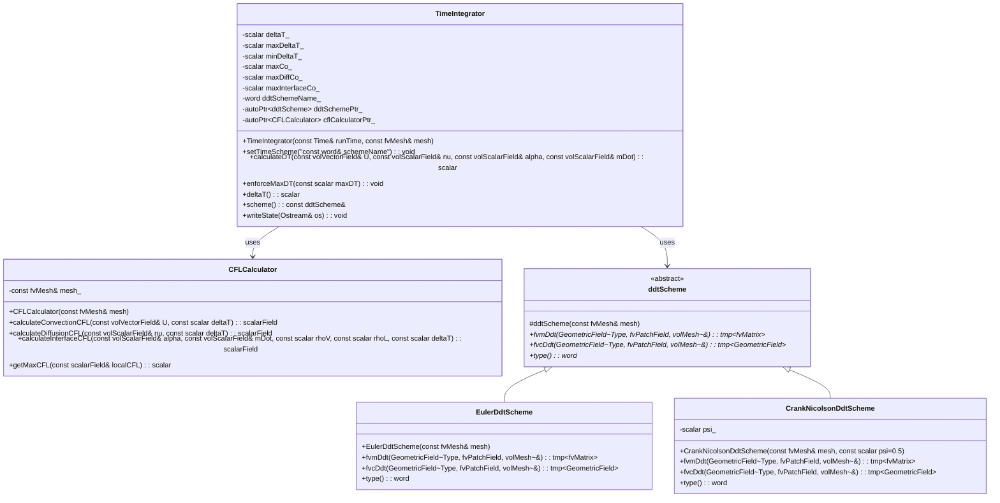

# Day 04: Temporal Discretization: Euler, Crank-Nicolson, CFL

**Date:** 2026-01-04 | **Difficulty:** Hardcore | **Status:** Core Theory

## 📑 Table of Contents (สารบัญ)
- [[#1. Section 1: Theory (ทฤษฎีพื้นฐาน)|1. Section 1: Theory (ทฤษฎีพื้นฐาน)]]
- [[#2. Section 2: OpenFOAM Reference (การอ้างอิง OpenFOAM)|2. Section 2: OpenFOAM Reference (การอ้างอิง OpenFOAM)]]
- [[#3. Section 3: Class Design (การออกแบบคลาส)|3. Section 3: Class Design (การออกแบบคลาส)]]
- [[#4. Section 4: Implementation (การนำไปใช้งานจริง)|4. Section 4: Implementation (การนำไปใช้งานจริง)]]
- [[#5. Section 5: Build & Test (การสร้างและทดสอบ)|5. Section 5: Build & Test (การสร้างและทดสอบ)]]
- [[#6. Section 6: Concept Checks (การทดสอบแนวคิด)|6. Section 6: Concept Checks (การทดสอบแนวคิด)]]
- [[#7. Section 7: References and Related Days (เอกสารอ้างอิงและบทเรียนที่เกี่ยวข้อง)|7. Section 7: References and Related Days (เอกสารอ้างอิงและบทเรียนที่เกี่ยวข้อง)]]

---

## 🎯 Learning Objectives (วัตถุประสงค์การเรียนรู้)

เมื่อจบบทเรียนระดับ Hardcore นี้ คุณจะสามารถ:

1.  **เข้าใจ (Understand) หลักการพื้นฐานของ Temporal Discretization**
    *   อธิบายบทบาทของมันใน Finite Volume Method (FVM) และความเชื่อมโยงกับความเสถียรเชิงตัวเลข (Numerical Stability)
    *   เข้าใจความหมายทางคณิตศาสตร์ของการประมาณอนุพันธ์เทียบกับเวลา $\partial\phi/\partial t$ ด้วยสมการพีชคณิต เช่น $(\phi^{n+1} - \phi^n)/\Delta t$
    *   ตระหนักว่าเหตุใดการเลือก Scheme ที่ไม่เหมาะสมอาจนำไปสู่ผลลัพธ์ที่ผิดเพี้ยนทางฟิสิกส์ หรือการลู่ออก (Divergence) ของการคำนวณ

2.  **วิเคราะห์และเปรียบเทียบ (Analyze and Compare) Euler และ Crank-Nicolson Schemes**
    *   เปรียบเทียบคุณสมบัติหลัก ข้อดี-ข้อเสีย และผลกระทบต่อการ Implementation ของ **Euler (Explicit/Implicit)** และ **Crank-Nicolson**
    *   เจาะลึกเรื่อง **Stability Regions** (Conditional vs. Unconditional), **Order of Accuracy** (Truncation Error), และ **Computational Cost** ต่อ Time Step
    *   วิเคราะห์พฤติกรรมเชิงตัวเลข เช่น Numerical Diffusion และความเสี่ยงในการเกิด Oscillation

3.  **ประยุกต์ใช้ (Derive and Apply) เงื่อนไข CFL Condition**
    *   คำนวณและประยุกต์ใช้ Courant-Friedrichs-Lewy (CFL) Condition สำหรับ Explicit และ Semi-implicit methods บน Unstructured Meshes
    *   เข้าใจความหมายทางกายภาพของ CFL ว่าข้อมูลไม่ควรเดินทางข้ามเซลล์คำนวณเกินหนึ่งเซลล์ในหนึ่ง Time Step ($Co = |U| \Delta t / \Delta x$)

4.  **ออกแบบและพัฒนา (Design and Implement) ระบบ Adaptive Time-Stepping**
    *   สร้างกลไกควบคุม Time Step ที่แข็งแกร่งสำหรับ Solver การไหลแบบบีบอัดที่มีการเปลี่ยนเฟส (Compressible Two-Phase Flow with Phase Change)
    *   คำนวณ **Comprehensive CFL Number** ที่พิจารณาไม่เพียงแค่ความเร็วของของไหล ($|U|$) แต่ยังรวมถึง **Interface Velocity** ที่เกิดจากเทอมการขยายตัวเชิงปริมาตร $\dot{m}(1/\rho_v - 1/\rho_l)$ ซึ่งเป็นหัวใจสำคัญของฟิสิกส์ใน Evaporator

5.  **บูรณาการ (Integrate) เข้ากับสถาปัตยกรรม Solver**
    *   ขยายกระบวนการประกอบเมทริกซ์ `fvMatrix` เพื่อรวมเทอมอนุพันธ์ของเวลา
    *   Implement ตรรกะในการสลับระหว่าง `fvm::ddt()` (Implicit) และ `fvc::ddt()` (Explicit) ตาม Scheme ที่เลือก เพื่อให้เชื่อมโยงกับ Spatial Operators ได้อย่างถูกต้อง

6.  **วินิจฉัยและแก้ไข (Diagnose and Resolve) ปัญหาทางตัวเลข**
    *   ระบุอาการของปัญหาที่เกิดจากการเลือก Temporal Scheme ที่ไม่เหมาะสม เช่น การลู่ออกเมื่อ Mesh ละเอียดขึ้น (Explicit Diffusion Limit) หรือการแกว่งของค่า Volume Fraction (Crank-Nicolson Unboundedness)
    *   ประยุกต์ใช้วิธีแก้ไขที่ถูกต้องภายใน Logic ของ Solver

---

## 1. Theory (ทฤษฎีพื้นฐาน)

### 1.1 Time Integration Fundamentals (พื้นฐานการอินทิเกรตตามเวลา)

หัวใจสำคัญของการจำลอง Computational Fluid Dynamics (CFD) แบบ Transient คือความท้าทายในเรื่อง **Temporal Discretization** ในขณะที่ Spatial Discretization (Day 03) ประมาณค่าอนุพันธ์บน Grid เชิงพื้นที่, Temporal Discretization จะประมาณการเปลี่ยนแปลงของตัวแปรสนาม (Field Variables)—เช่น ความเร็ว $\mathbf{U}$, ความดัน $p$, อุณหภูมิ $T$, และ Volume Fraction $\alpha$—เมื่อเวลาผ่านไป สมการควบคุมสำหรับ Evaporator Model ของเราเป็นระบบสมการอนุพันธ์ย่อย (PDEs) ที่ขึ้นกับเวลา รูปแบบทั่วไปของสมการการขนส่งสำหรับตัวแปรสเกลาร์ $\phi$ คือ:

$$
\frac{\partial \phi}{\partial t} + \nabla \cdot (\mathbf{U} \phi) - \nabla \cdot (\Gamma \nabla \phi) = S_{\phi}
$$

โดยที่เทอมแรกคือ **Unsteady** หรือ **Transient Term** การ Discretize เทอมนี้ไม่ใช่เรื่องเล็กน้อย; วิธีการที่เลือกจะเป็นตัวกำหนด **Stability** (ความเสถียร), **Accuracy** (ความแม่นยำ), และ **Computational Cost** (ต้นทุนการคำนวณ) ของการจำลอง การเลือกวิธีที่แย่อาจนำไปสู่การแกว่งที่ไม่สมจริง (Non-physical Oscillations), Numerical Diffusion ที่มากเกินไป, หรือการลู่ออก (Divergence) อย่างรุนแรง โดยเฉพาะในการไหลสองเฟสที่มีความซับซ้อนและการเปลี่ยนเฟสของเรา

รากฐานทางคณิตศาสตร์สำหรับ Finite-Difference Time-Marching Schemes ทั้งหมดคือ **Taylor Series Expansion** พิจารณาตัวแปร $\phi$ ที่เวลาในอนาคต $t + \Delta t$, โดยที่ $\Delta t$ คือ Time Step ค่าของมันสามารถเขียนในรูปของค่าและอนุพันธ์ที่เวลาปัจจุบัน $t$:

$$
\phi(t + \Delta t) = \phi(t) + \Delta t \left. \frac{\partial \phi}{\partial t} \right|_{t} + \frac{\Delta t^2}{2} \left. \frac{\partial^2 \phi}{\partial t^2} \right|_{t} + \frac{\Delta t^3}{6} \left. \frac{\partial^3 \phi}{\partial t^3} \right|_{t} + \mathcal{O}(\Delta t^4)
$$

งานหลักของ Temporal Discretization คือการประมาณค่าอนุพันธ์เทียบเวลา $\frac{\partial \phi}{\partial t}$ โดยใช้ค่าที่ทราบของ $\phi$ ที่ระดับเวลาต่างๆ (เช่น $\phi^n$ ที่เวลา $t^n$, $\phi^{n-1}$ ที่ $t^{n-1}$) ความคลาดเคลื่อนที่เกิดจากการตัดทอน Taylor Series เรียกว่า **Truncation Error**, และ Order ของมันจะเป็นตัวกำหนด **Formal Accuracy** ของ Scheme เช่น Scheme ที่มีความแม่นยำอันดับหนึ่ง (First-order) จะมี Truncation Error แปรผันตาม $\Delta t$, ในขณะที่ Second-order Scheme จะมี Error แปรผันตาม $\Delta t^2$

**ตัวแปรสำคัญสำหรับ Temporal Discretization:**

| Symbol | Name | Description | Typical Units |
| :--- | :--- | :--- | :--- |
| $\phi$ | Field Variable | ปริมาณที่ถูกขนส่ง (เช่น $\mathbf{U}$, $p$, $T$, $\alpha$) | $[\phi]$ |
| $t$ | Physical Time | เวลาทางกายภาพต่อเนื่อง | $s$ |
| $\Delta t$ | Time Step | ช่วงเวลาสำหรับขยับ Solution ไปข้างหน้า | $s$ |
| $n$ | Time Level Index | ดัชนีระบุระดับเวลา (เช่น $\phi^n \equiv \phi(t^n)$) | - |
| $\mathcal{T.E.}$ | Truncation Error | ความคลาดเคลื่อนจากการ Discretize อนุพันธ์เวลา | $[\phi]$ |

การเลือก $\Delta t$ อาจเป็นการตัดสินใจเชิงปฏิบัติที่สำคัญที่สุดในการจำลองแบบ Transient โดยมีข้อจำกัดจาก:
1.  **Stability:** ผลลัพธ์ต้องไม่ลู่ออกหรือมีค่าเป็นอนันต์ ควบคุมโดย **CFL Condition** และเกณฑ์ความเสถียรอื่นๆ
2.  **Accuracy:**$\Delta t$ ต้องเล็กพอที่จะเก็บรายละเอียดของปรากฏการณ์ในช่วงเวลาที่สนใจ (Time Scales) เช่น การก่อตัวของฟองอากาศ หรือการสั่นของ Interface
3.  **Efficiency:**$\Delta t$ ควรใหญ่ที่สุดเท่าที่จะเป็นไปได้ เพื่อลดจำนวน Time Steps และต้นทุนการคำนวณรวม

สำหรับการจำลอง Evaporator ของเรา ข้อจำกัดเพิ่มเติมที่สำคัญอย่างยิ่งมาจาก **Phase Change Expansion Term** $\nabla \cdot \mathbf{U} = \dot{m} (1/\rho_v - 1/\rho_l)$ การเปลี่ยนแปลงปริมาตรอย่างรวดเร็วที่ Interface สามารถสร้างความเร็วสูงเฉพาะที่ ซึ่งเป็นข้อจำกัดที่รุนแรงต่อ $\Delta t$

---

### 1.2 Euler Methods: Explicit vs Implicit

Time Integration Schemes ที่ง่ายและนิยมใช้ที่สุดคือ **Euler Methods** ซึ่งใช้เพียงสองระดับเวลา: สถานะปัจจุบันที่ทราบค่าแล้วและสถานะถัดไปที่ยังไม่ทราบค่า ความแตกต่างพื้นฐานอยู่ที่ *ตำแหน่ง* ของการประเมินฟังก์ชัน Right-Hand Side (RHS) $f(\phi, t)$ ของสมการ ODE $\frac{d\phi}{dt} = f(\phi, t)$

#### Explicit Euler (Forward Euler)
Explicit Euler Scheme ประเมินค่า RHS โดยใช้ค่าที่ **ทราบแล้ว (Known)** จากระดับเวลาปัจจุบัน $n$

$$
\phi^{n+1} = \phi^n + \Delta t \cdot f(\phi^n, t^n)
$$

**การพิสูจน์ทางคณิตศาสตร์:** มาจากการประมาณอนุพันธ์แบบ Forward-Difference:
$$
\left. \frac{\partial \phi}{\partial t} \right|_t \approx \frac{\phi(t+\Delta t) - \phi(t)}{\Delta t} = f(\phi(t), t)
$$
เมื่อจัดรูปจะได้สมการ Explicit Euler การวิเคราะห์ Truncation Error ทำได้โดยแทนค่า Taylor Expansion:
$$
\frac{\phi^{n+1} - \phi^n}{\Delta t} = \frac{[\phi^n + \Delta t \phi_t^n + \frac{\Delta t^2}{2}\phi_{tt}^n + \mathcal{O}(\Delta t^3)] - \phi^n}{\Delta t} = \phi_t^n + \frac{\Delta t}{2}\phi_{tt}^n + \mathcal{O}(\Delta t^2)
$$
ดังนั้น Scheme นี้จึงเป็น **First-order Accurate** ($\mathcal{T.E.} \propto \Delta t$)

**ข้อดี:**
*   **ความเรียบง่าย (Simplicity):** การอัปเดตเป็นสมการพีชคณิตตรงไปตรงมา ไม่ต้องแก้ระบบสมการเชิงเส้น
*   **ต้นทุนต่อ Step ต่ำ (Low Cost Per Step):** การคำนวณใช้น้อยมาก

**ข้อเสีย:**
*   **Conditional Stability:** จะเสถียรก็ต่อเมื่อ $\Delta t$ ต่ำกว่าค่าวิกฤตเท่านั้น สำหรับสมการโมเดล $\frac{d\phi}{dt} = \lambda \phi$, เงื่อนไขความเสถียรคือ:
$$ |1 + \lambda \Delta t| \le 1 $$
    สำหรับ $\lambda$ ที่เป็นจำนวนจริงลบ (แทน Diffusion) จะได้ $\Delta t \le \frac{2}{|\lambda|}$ ในบริบทของ PDEs:
    *   **Convection:** $\Delta t \le C \frac{\Delta x}{|\mathbf{U}|}$, โดยที่ $C$ คือ Courant number limit (ปกติ $C \le 1$)
    *   **Diffusion:** $\Delta t \le C_{diff} \frac{(\Delta x)^2}{\nu}$, โดยที่ $\nu$ คือ Kinematic Viscosity และ $C_{diff} \approx 0.5$
    ความสัมพันธ์แบบกำลังสองกับขนาด Mesh $\Delta x$ ทำให้ Explicit Euler แพงมหาศาลสำหรับ Mesh ละเอียดหรือการไหลที่มีความหนืดสูง

#### Implicit Euler (Backward Euler)
Implicit Euler Scheme ประเมินค่า RHS โดยใช้ค่าที่ **ไม่ทราบ (Unknown)** จากระดับเวลาในอนาคต $n+1$

$$
\phi^{n+1} = \phi^n + \Delta t \cdot f(\phi^{n+1}, t^{n+1})
$$

**การพิสูจน์ทางคณิตศาสตร์:** ใช้การประมาณแบบ Backward-Difference:
$$
\left. \frac{\partial \phi}{\partial t} \right|_{t+\Delta t} \approx \frac{\phi(t+\Delta t) - \phi(t)}{\Delta t} = f(\phi(t+\Delta t), t+\Delta t)
$$
การวิเคราะห์ Truncation Error ยืนยันว่าเป็น **First-order Accurate** เช่นกัน

**ข้อดี:**
*   **Unconditional Stability (A-Stability):** สำหรับปัญหาเชิงเส้น Scheme นี้เสถียรสำหรับ *ทุกค่า* $\Delta t > 0$ ทำให้สามารถใช้ Time Step ที่ใหญ่กว่าได้มาก โดยถูกจำกัดเพียงแค่ความแม่นยำ (Accuracy) ไม่ใช่ความเสถียร
*   **ความทนทาน (Robustness):** เหมาะอย่างยิ่งสำหรับปัญหา Stiff (Stiff Problems) เช่น ปฏิกิริยาเคมี, การเปลี่ยนเฟส หรือการไหลที่มี Time Scales หลากหลาย

**ข้อเสีย:**
*   **ต้นทุนต่อ Step สูง (High Cost Per Step):** ต้องแก้สมการ (มักเป็น Nonlinear) เพื่อหา $\phi^{n+1}$ ใน CFD คือการประกอบและ Inverse เมทริกซ์ขนาดใหญ่
*   **Numerical Diffusion (Artificial Damping):** Scheme นี้เป็น **L-stable** ซึ่งหมายความว่าจะลดทอน (Damp) ความถี่สูงอย่างรุนแรง แม้จะช่วยเรื่องความเสถียร แต่จะทำให้ Gradients ที่คมชัด (เช่น Interface) เบลอ (Smear) ซึ่งเป็นข้อเสียสำคัญในการติดตาม Interface ของ VOF

**ตารางเปรียบเทียบบริเวณความเสถียร (Stability Region):**

| Scheme | Stability Region | Property | Implication for CFD |
| :--- | :--- | :--- | :--- |
| **Explicit Euler** | วงกลมรัศมี 1 ที่จุด (-1, 0) | **Conditionally Stable** |$\Delta t$ ถูกจำกัดโดยกระบวนการที่เร็วที่สุด |
| **Implicit Euler** | ทั้งระนาบเชิงซ้อน **ยกเว้น** วงกลมรัศมี 1 ที่ (1,0) | **A-Stable, L-Stable** | ไม่มีขีดจำกัดความเสถียรสำหรับ $\Delta t$ แต่กรอง Error ความถี่สูง |

---

### 1.3 Crank-Nicolson Method (วิธีแครงค์-นิโคลสัน)

**Crank-Nicolson (CN)** เป็น Scheme ที่มีความแม่นยำอันดับสอง (Second-order) ซึ่งพยายามรวมข้อดีของ Explicit และ Implicit เข้าด้วยกัน โดยใช้ **กฎสี่เหลี่ยมคางหมู (Trapezoidal Rule)** สำหรับการอินทิเกรต

$$
\phi^{n+1} = \phi^n + \frac{\Delta t}{2} \left[ f(\phi^n, t^n) + f(\phi^{n+1}, t^{n+1}) \right]
$$

หรือมองว่าเป็นการเฉลี่ยอนุพันธ์เวลาระหว่าง Time Level เก่าและใหม่:

$$
\frac{\phi^{n+1} - \phi^n}{\Delta t} = \frac{1}{2} \left( f^n + f^{n+1} \right)
$$

**ความหมายทางคณิตศาสตร์:** มาจากการอินทิเกรต ODE จาก $t^n$ ถึง $t^{n+1}$ และใช้ Taylor Series พิสูจน์ได้ว่า Truncation Error คือ $\mathcal{O}(\Delta t^2)$ ซึ่งดีกว่า Euler Methods อย่างมาก

**ข้อดี:**
1.  **Higher Accuracy:** ความแม่นยำระดับ Second-order ยอมให้ใช้ $\Delta t$ ที่ใหญ่กว่าเพื่อให้ได้ Error เท่าเดิม
2.  **Unconditional Stability (สำหรับ Linear):** เช่นเดียวกับ Implicit Euler คือ A-stable สำหรับปัญหาเชิงเส้น

**ข้อเสียและหลุมพรางสำคัญ:**
1.  **Numerical Oscillations (Non-Positivity):** Crank-Nicolson **ไม่ใช่** L-stable และไม่มีคุณสมบัติ **Positivity-Preserving** สำหรับสมการที่มี Source Terms รุนแรงหรือมีความไม่ต่อเนื่อง อาจทำให้เกิดการแกว่ง (Oscillations) ที่ไม่สมจริง นี่คือหายนะสำหรับ Volume Fraction Field $\alpha$ (ต้องอยู่ระหว่าง 0-1) การแกว่งอาจทำให้ $\alpha < 0$ หรือ $\alpha > 1$ ส่งผลให้ Solver ล้มเหลว
2.  **Marginal Stability for Nonlinear Problems:** ความเสถียรไม่การันตีสำหรับปัญหา Nonlinear (เช่น Navier-Stokes) อาจเกิดความไม่เสถียรได้ง่ายหาก Initial Condition ไม่ดี
3.  **ความซับซ้อน:** ต้องเก็บค่า RHS จาก Step ก่อนหน้า ($f^n$) เพิ่มภาระ Memory

**Modified Crank-Nicolson ในทางปฏิบัติ:** เนื่องจากปัญหานี้ OpenFOAM จึงมี **Blended Scheme** (ใน `fvSchemes` เรียกว่า `CrankNicolson`) ซึ่งเป็นการผสมกับ Implicit Euler:
$$
\phi^{n+1} = \phi^n + \Delta t \left[ \psi f^{n+1} + (1-\psi) f^n \right]
$$
โดยที่ $\psi$ เป็น Blending Factor (0.5 = Pure CN, 1.0 = Implicit Euler) ค่าที่นิยมใช้คือ $\psi = 0.9$ เพื่อรักษาความเป็น Second-order ไว้บ้างแต่ยังมีการลดทอน Oscillation

---

### 1.4 CFL Condition for Compressible Flow with Phase Change

**Courant-Friedrichs-Lewy (CFL) Condition** คือเงื่อนไขการลู่เข้าสำหรับ Explicit Schemes และเป็นแนวทางความเสถียรสำหรับ Implicit Schemes โดยกล่าวว่า **Numerical Domain of Dependence** ต้องครอบคลุม **Physical Domain of Dependence** หรือพูดง่ายๆ ข้อมูลไม่ควรเดินทางข้ามเซลล์เกินหนึ่งเซลล์ในหนึ่ง Time Step

#### Classical CFL Condition
สำหรับการพา (Convection):
$$
Co = \frac{|\mathbf{U}| \Delta t}{\Delta x}
$$
สำหรับ Explicit Schemes ต้องให้ $Co < 1$ ส่วน Implicit Schemes ยอมให้ $Co > 1$ ได้แต่ Accuracy จะลดลง

สำหรับการแพร่ (Diffusion), ต้องพิจารณา Diffusive CFL:
$$
Co_{diff} = \frac{\nu \Delta t}{(\Delta x)^2}
$$

#### Extended CFL for Phase Change Flows
ในการจำลอง Evaporator เงื่อนไข CFL ปกติไม่เพียงพอ กระบวนการเปลี่ยนเฟสสร้างความเร็วใหม่ที่ Interface เนื่องจาก **Expansion Term** $\nabla \cdot \mathbf{U} = \dot{m} (1/\rho_v - 1/\rho_l)$

**ที่มาทางฟิสิกส์:** เมื่อของเหลวระเหย มวล $\dot{m}$ จะเปลี่ยนจากของเหลวเป็นไอ เนื่องจากความหนาแน่นไอ $\rho_v$ ต่ำกว่า $\rho_l$ มาก (R410A: $\rho_l/\rho_v \approx 22$) มวลเดิมจึงต้องการปริมาตรมากขึ้นมหาศาล สิ่งนี้ทำให้เกิด **Velocity Jump** ที่ Interface ความเร็วฝั่งไอเทียบกับ Interface จะสูงกว่าฝั่งของเหลวเป็นค่าประมาณ:
$$
U_{expansion} \approx \frac{\dot{m}}{\rho_v}
$$
ความเร็วนี้อาจสูงกว่าความเร็วของการไหลปกตินับ 10 เท่าในบริเวณที่เดือดจัด

**Interface CFL Number:** เราต้องนิยาม CFL จาก Interface Expansion:
$$
Co_{interface} = \frac{|U_{expansion}| \Delta t}{\Delta x} = \frac{|\dot{m} (1/\rho_v - 1/\rho_l)| \Delta t}{\Delta x}
$$

**Total Effective CFL:** อัลกอริทึมเลือก Time-Step ต้องพิจารณาค่าสูงสุดของ:
$$
Co_{total} = \max \left( \underbrace{\frac{|\mathbf{U}| \Delta t}{\Delta x}}_{\text{Convection}},\ \underbrace{\frac{\nu \Delta t}{(\Delta x)^2}}_{\text{Diffusion}},\ \underbrace{\frac{|\dot{m} (1/\rho_v - 1/\rho_l)| \Delta t}{\Delta x}}_{\text{Interface Expansion}} \right)
$$

**นัยสำคัญ:** ในการจำลองการเดือด $Co_{interface}$ มักจะเป็น **ตัวกำหนด (Limiting Factor)** ไม่ใช่ $Co_{convection}$ การละเลยเทอมนี้เป็นสาเหตุหลักที่ทำให้ Solver ล้มเหลวในช่วงแรกของการพัฒนา

## 2. OpenFOAM Reference (การอ้างอิง OpenFOAM)

### 2.1 OpenFOAM Reference

ส่วนนี้จะทำการวิเคราะห์เจาะลึกแบบบรรทัดต่อบรรทัดของคลาส OpenFOAM หลักที่ทำหน้าที่ Temporal Discretization และ Time-step Control ความเข้าใจในคลาสเหล่านี้ไม่ใช่เรื่องทางวิชาการเท่านั้น แต่เป็นสิ่งจำเป็นสำหรับการขยาย Solver เพื่อรองรับพลวัตการเปลี่ยนเฟสที่รุนแรงของ Evaporator ซึ่งความเร็วที่ Interface สามารถครอบงำขีดจำกัดความเสถียรได้

### 2.2 Core Class: `ddtScheme<Type>`

**Header:** `src/finiteVolume/finiteVolume/ddtSchemes/ddtScheme/ddtScheme.H`
**Purpose:** Abstract Base Class ที่นิยาม Interface สำหรับ Time Derivative Discretization Schemes ทั้งหมด นี่คือรากฐานสำคัญของ Time-stepping Architecture ที่ยืดหยุ่นของ OpenFOAM

#### 2.2.1 Class Hierarchy and Template Pattern

```cpp
namespace Foam
{
    template<class Type>
    class ddtScheme
    :
        public refCount
    {
    public:
        //- Runtime type information
        TypeName("ddtScheme");

        declareRunTimeSelectionTable
        (
            tmp,
            ddtScheme,
            Istream,
            (const fvMesh& mesh, Istream& schemeData),
            (mesh, schemeData)
        );
        ...
    };
}
```
*   **Template Pattern:** คลาสนี้เป็น Template ของ Field Type (`Type`) ทำให้สามารถทำงานได้อย่างราบรื่นกับ `volScalarField`, `volVectorField` ฯลฯ การออกแบบทั่วไป (Generic Design) นี้หมายความว่า Logic ของ Scheme เดียวกันสามารถใช้ได้กับทั้งความเร็ว ความดัน และอุณหภูมิ
*   **Run-Time Selection:** Macro `declareRunTimeSelectionTable` มีความสำคัญมาก มันช่วยให้สามารถเลือก Scheme เฉพาะ (เช่น `Euler`, `CrankNicolson`) ได้ที่ Runtime โดยอิงจาก Dictionary `ddtSchemes` ใน `system/fvSchemes` นี่คือ Factory Pattern ของ OpenFOAM

#### 2.2.2 Key Pure Virtual Methods

Abstract Class นี้กำหนดสัญญา (Contract) ที่ Concrete Schemes ทั้งหมดต้องปฏิบัติตาม Method ที่สำคัญที่สุดคือสิ่งที่สร้างรูปแบบ Discretized ของ Time Derivative

```cpp
// Return the implicit finite-volume discretization matrix for ddt(phi)
virtual tmp<fvMatrix<Type>> fvmDdt
(
    const GeometricField<Type, fvPatchField, volMesh>&
) = 0;

// Return the explicit finite-volume discretization source for ddt(phi)
virtual tmp<GeometricField<Type, fvPatchField, volMesh>> fvcDdt
(
    const GeometricField<Type, fvPatchField, volMesh>&
) = 0;

// Combined convection + time derivative (e.g., ddt(rho, U) + div(phi, U))
virtual tmp<fvMatrix<Type>> fvmDdt
(
    const GeometricField<Type, fvPatchField, volMesh>&,
    const GeometricField<Type, fvPatchField, volMesh>&
);
```
*   **`fvmDdt`:** คืนค่า `fvMatrix<Type>` นี่คือส่วนของ **Implicit** ที่จะเข้าไปอยู่ในระบบสมการเชิงเส้น $[A][x] = [b]$ สำหรับ Euler Scheme ง่ายๆ Diagonal ของ Matrix นี้จะมีค่า $V/\Delta t$ และ Source จะมี $(V/\Delta t)\phi^{old}$
*   **`fvcDdt`:** คืนค่า `GeometricField<Type, ...>` นี่คือการประเมินค่า **Explicit** ของ Time Derivative ซึ่งคำนวณจากค่า Field ที่ทราบแล้ว (Old-Time) มักใช้ทางขวามือ (Source) ของสมการเมื่อเทอมอื่นถูกปฏิบัติแบบ Implicit
*   **ความแตกต่างนี้เป็นพื้นฐาน:** การสับสนระหว่าง `fvm::ddt` (Implicit, คืนค่า Matrix) กับ `fvc::ddt` (Explicit, คืนค่า Field) เป็นแหล่งที่มาของข้อผิดพลาดที่พบบ่อย Implicit Treatment เพิ่มความเสถียรแต่จะ Couple ทุกเซลล์เข้าด้วยกัน ทำให้ต้องแก้ Linear Solve

#### 2.2.3 สิ่งที่เราทำ "แตกต่าง" (integration ของ `addExpansionSource`)

| Aspect | Standard OpenFOAM `ddtScheme` | Our Evaporator Solver Extension |
| :--- | :--- | :--- |
| **Source Term Coupling** | Time derivative ไม่สน Physics Source ถูกเพิ่มแยกต่างหากในสมการ | `volScalarField` class ถูกขยายด้วย `addExpansionSource()` เมื่อเรียก `fvc::ddt(rho)` สำหรับสมการ Continuity, method นี้จะทำให้แน่ใจว่า Mass Transfer Source `mDot` จากการเปลี่ยนเฟสถูกรวมเข้าไปในการอัปเดตความหนาแน่นอย่างถูกต้อง |
| **Interface-Aware Stability** | Stability analysis (CFL) อิงตาม Fluid Velocity และ Mesh เท่านั้น | `CFLCalculator` ของเรา (ดู Section 3.3) จะดึงค่า `mDot` field จาก Phase-change Model (Day 11) มาคำนวณ **Interface CFL** โดยตรง เทอมนี้สามารถครอบงำและควบคุม Global$\Delta t$ ใน Evaporator |
| **Time-Scheme Selection** | Global scheme เลือกใน `fvSchemes` | เรา Implement **Adaptive Scheme Blending** ใกล้ Interface ที่คมชัด ($0.01 < \alpha < 0.99$) เราอาจเอียงไปทาง Implicit Euler ที่เสถียรและ Bounded กว่าเพื่อป้องกัน Oscillation ส่วนใน Bulk Single-phase regions เราใช้ Crank-Nicolson เพื่อความแม่นยำที่ดีกว่า |

### 2.3 Concrete Class: `EulerDdtScheme<Type>`

**Header:** `src/finiteVolume/finiteVolume/ddtSchemes/EulerDdtScheme/EulerDdtScheme.H`
**Purpose:** ให้การ Discretization แบบ First-order, Implicit (Backward Euler) เป็น Workhorse Scheme สำหรับงาน CFD อุตสาหกรรมในเนื่องจากความทนทาน (Robustness)

#### 2.3.1 Implementation of `fvmDdt`

ลองมาแกะ Code ของ Method หลักที่สร้าง Matrix สำหรับ Implicit Euler Step

```cpp
template<class Type>
tmp<fvMatrix<Type>>
EulerDdtScheme<Type>::fvmDdt
(
    const GeometricField<Type, fvPatchField, volMesh>& vf
)
{
    tmp<fvMatrix<Type>> tfvm
    (
        new fvMatrix<Type>
        (
            vf,
            vf.dimensions()*dimVol/dimTime
        )
    );
    fvMatrix<Type>& fvm = tfvm.ref();

    scalar rDeltaT = 1.0/mesh().time().deltaTValue(); // 1/Δt

    // Set diagonal coefficients: V/Δt
    fvm.diag() = rDeltaT*mesh().V();

    // Set source term: (V/Δt) * phi_old
    fvm.source() = rDeltaT*vf.oldTime().primitiveField()*mesh().V();

    return tfvm;
}
```
*   **Matrix Dimensions:** `fvMatrix` Constructor รับ Field `vf` และ Dimension ที่คาดหวัง `vf.dimensions()*dimVol/dimTime` เพื่อให้แน่ใจว่า Matrix Coefficients มีหน่วยทางฟิสิกส์ที่ถูกต้อง
*   **Diagonal Dominance:** Diagonal ถูกตั้งค่าเป็น $V/\Delta t$ เนื่องจากเทอมนี้เป็นบวกเสมอและมีค่ามาก มันจึงช่วยเสริม **Diagonal Dominance** ของระบบสมการรวม (ซึ่งรวม Convection และ Diffusion) ทำให้ Iterative Linear Solvers (Day 08) ลู่เข้าได้ดีขึ้น
*   **Source Term:** Source รวมค่า Field จาก Time Step ก่อนหน้า (`vf.oldTime()`) นี่คือ "ประวัติศาสตร์" ของ Solution
*   **Implicit vs Explicit Note:** นี่คือ **Implicit Euler** (Backward) ส่วน Explicit (Forward) Euler ไม่มีอยู่เป็น `fvm` scheme ใน OpenFOAM ด้วยเหตุผลที่ดี—มันจะไร้ประโยชน์ในฐานะ Implicit Operator เพราะไม่ให้ Coupling กับ Time Level ใหม่

#### 2.3.2 Boundary Condition Handling

รายละเอียดที่สำคัญแต่มักถูกมองข้ามคือ Boundary Conditions (Day 06) ถูกรวมเข้ากับ Time Derivative Matrix อย่างไร

```cpp
// After assembling internal field contributions...
forAll(vf.boundaryField(), patchi)
{
    const fvPatchField<Type>& ptf = vf.boundaryField()[patchi];

    // For fixedValue patches, the value is known.
    // It contributes to the source of adjacent cells.
    if (ptf.fixesValue())
    {
        // Add to the source of the first internal cell layer
        fvm.source() -= rDeltaT*mesh().V().boundaryField()[patchi]*ptf.patchInternalField();
    }
    // For other patches (e.g., zeroGradient), the boundary value is
    // extrapolated from the interior, so it doesn't add an explicit source.
}
```
*   **Fixed Value (Dirichlet):** บน Patch แบบ `fixedValue` เช่น Inlet, ค่า $\phi^{n+1}$ เป็นที่ทราบค่า ค่าที่ทราบนี้จะกลายเป็นส่วนหนึ่งของ Source Term สำหรับเซลล์ที่ติดกับ Boundary ส่วน Matrix Diagonal สำหรับ Boundary Face นั้นจะถูกจัดการโดย Patch Constraint
*   **Zero Gradient (Neumann):** บน Patch แบบ `zeroGradient`, ค่า $\phi^{n+1}$ ถูกสมมติให้เท่ากับค่าในเซลล์ที่ติดกัน ไม่ได้เพิ่ม Source Term พิเศษ; เพียงแค่หมายความว่า Boundary Cell จะแก้สมการโดยพิจารณาเฉพาะค่าเก่าของตัวเองและเพื่อนบ้านภายใน

### 2.4 Concrete Class: `CrankNicolsonDdtScheme<Type>`

**Header:** `src/finiteVolume/finiteVolume/ddtSchemes/CrankNicolsonDdtScheme/CrankNicolsonDdtScheme.H`
**Purpose:** ให้การ Discretization แบบ Second-order Accurate โดยการเฉลี่ย Time Derivative ระหว่าง Time Level เก่าและใหม่

#### 2.4.1 The Blending Factor and Implementation

Implementation ของ OpenFOAM ไม่ใช่ Pure Crank-Nicolson (CN) แต่ใช้ **Blending Factor** `psi` (default 0.5) เพื่อผสม CN กับ Implicit Euler นี่คือฟีเจอร์ความเสถียรที่สำคัญ

```cpp
template<class Type>
tmp<fvMatrix<Type>>
CrankNicolsonDdtScheme<Type>::fvmDdt
(
    const GeometricField<Type, fvPatchField, volMesh>& vf
)
{
    // ... setup matrix ...
    scalar rDeltaT = 1.0/mesh().time().deltaTValue();
    scalar psi = 0.5; // Could be read from Istream

    // Diagonal coefficient: V/(ψ*Δt)
    // For pure CN (ψ=0.5), this is 2V/Δt.
    fvm.diag() = (rDeltaT/psi)*mesh().V();

    // Source term has two parts:
    // Part 1: (V/(ψ*Δt)) * phi_old
    // Part 2: ((1-ψ)/ψ) * (V/Δt) * phi_old
    //        This is the explicit contribution from the "old" part of the average.
    fvm.source() = rDeltaT
        *mesh().V()
        *((1.0 - psi)/psi * vf.oldTime().primitiveField() + vf.oldTime().primitiveField());
}
```
*   **Mathematical Form:** Scheme ที่ Implement คือ:$(\phi^{n+1} - \phi^n) / \Delta t = \psi f(\phi^{n+1}) + (1-\psi) f(\phi^n)$
    *$\psi = 0.5$: Pure Crank-Nicolson (2nd order)
    *$\psi = 1.0$: Implicit Euler (1st order, more stable)
*   **Why the Blend?** Pure Crank-Nicolson ($\psi=0.5$) เสถียรแบบ Unconditional **เฉพาะกับปัญหา Linear** สำหรับปัญหา Non-linear (เช่น Navier-Stokes) หรือปัญหาที่มีข้อมูลไม่ต่อเนื่อง (เช่น VOF Interface) มันสามารถสร้าง Spurious Oscillations การใช้ $\psi = 0.9$ (90% Euler, 10% CN) เป็นเรื่องปกติเพื่อรักษา Second-order Accuracy ไว้บ้างโดยยังได้ความทนทาน

#### 2.4.2 สิ่งที่เราทำ "แตกต่าง": Phase-Change Adaptive Blending

| Aspect | Standard OpenFOAM `CrankNicolsonDdtScheme` | Our Evaporator Solver Extension |
| :--- | :--- | :--- |
| **Global Blending Factor** | ค่า `psi` เดียวถูกตั้งใน `fvSchemes` สำหรับทั้ง Domain และตลอดเวลาการจำลอง | เรา Implement **Field- and Region-dependent Blending** |
| **Logic** | `ddtSchemes { default CrankNicolson 0.9; }` | ใน `TimeIntegrator::setTimeScheme()`: <br> `if (field.name() == "alpha") blendFactor = 0.95; // Very near Euler` <br> `else if (interfaceRegion(alpha)) blendFactor = 0.8; // Near interface` <br> `else blendFactor = 0.5; // Pure CN in bulk` |
| **Rationale** | One-size-fits-all stability | สมการ Volume Fraction `alpha` นั้น Non-linear สูงและต้อง Bounded การใช้ Scheme ที่ใกล้เคียง Implicit Euler (`blendFactor ~ 1`) จำเป็นมากสำหรับความเสถียร สมการ Momentum ในเซลล์ที่มี Interface ก็ได้ประโยชน์จากการเพิ่ม Implicit Weighting เช่นกัน |

### 2.5 Utility Class & Functions: `CourantNo`

**Header:** `src/finiteVolume/cfdTools/incompressible/CourantNo.H`
**Purpose:** คำนวณ Courant-Friedrichs-Lewy (CFL) number โดยอิงจาก Face Fluxes ซึ่งเป็นตัวชี้วัดความเสถียรหลักสำหรับการไหลแบบ Convection-dominated

#### 2.5.1 Core Calculation: Face-Based CFL

OpenFOAM ไม่ใช้ Cell-centered velocity `U` สำหรับการคำนวณ CFL หลัก แต่ใช้ **Face Flux Field** `phi` (`surfaceScalarField`) ซึ่งเป็นพื้นฐานกว่าในบริบท Finite-Volume

```cpp
// Simplified representation
scalar CourantNo(const Foam::surfaceScalarField& phi, const Foam::Time& runTime)
{
    // ...
    forAll(mesh.V(), celli)
    {
        // Characteristic cell length scale: V / (sum of face areas)
        scalar cellVolume = mesh.V()[celli];
        scalar faceAreaSum = sumPhi[celli] / (mag(phi[celli])+SMALL);
        scalar deltaX = cellVolume / (faceAreaSum + SMALL);

        // Local CFL number: (|flux|/faceArea) * Δt / Δx
        scalar localCo = 0.5 * sumPhi[celli] * runTime.deltaTValue() / (cellVolume + SMALL);
        
        CoNum = max(CoNum, localCo);
    }
    // ...
    return CoNum; // Returns the maximum CFL in the domain
}
```
*   **Face-Flux Centric:** การคำนวณเริ่มจาก `phi` (อัตราการไหลเชิงปริมาตร [m³/s] ผ่านแต่ละหน้า) นี่คือปริมาณที่ใช้จริงใน Discrete Divergence Operator (`fvm::div(phi, U)`)
*   **Cell Length Scale:** ประมาณค่าเซลล์ `Δx` เป็น `Cell Volume / Sum of Face Areas` นี่เป็น Geometric Approximation ที่ทนทานสำหรับ Unstructured, Polyhedral Meshes
*   **Output:** ฟังก์ชันคืนค่า **Maximum** CFL number (`CoNum`) ที่พบใน Domain ค่าเดี่ยวนี้จะเป็นตัวตัดสินว่า `Δt` ยอมรับได้หรือไม่

#### 2.5.2 สิ่งที่เราทำ "แตกต่าง": Multi-Mechanism CFL Calculator

| Aspect | Standard OpenFOAM `CourantNo` Function | Our `CFLCalculator` Class |
| :--- | :--- | :--- |
| **Scope** | คำนวณ **Convective CFL** เท่านั้น ($U \Delta t/\Delta x$) | คำนวณ **Three Distinct CFL Numbers**: Convective, Diffusive, และ Interface |
| **Diffusive CFL** | ไม่คิด (จำเป็นสำหรับ Explicit Diffusion แต่ Implicit มักละเลย) | Implement ใน `calculateDiffusionCFL()`: <br> `diffusiveCFL = max(nu * deltaT / (deltaX * deltaX))` เรา Monitor ค่านี้เพื่อให้มั่นใจในความเสถียรหากมี Diffusion Term ใดถูก Treat แบบ Explicit |
| **Interface CFL** | ไม่มี (สำคัญที่สุดสำหรับ Phase-change) | Implement ใน `calculateInterfaceCFL()`: <br> `scalar expVel = mag(mDot[celli] * (1.0/rhoV - 1.0/rhoL));` <br> `interfaceCFL = expVel * deltaT / deltaX;` <br> ความเร็วนี้มาจาก Expansion Term $\nabla \cdot U = \dot{m}(1/\rho_v - 1/\rho_l)$ สำหรับ R410A เทอม $(1/\rho_v - 1/\rho_l)$ มีค่ามาก ทำให้ `expVel` สูงกว่า `U` หลายเท่า |
| **Time-Step Control** | Solver ใช้ `maxCo` คุม $\Delta t$ | `TimeIntegrator` ของเราใช้ `max(convectiveCFL, interfaceCFL, diffusiveCFL)` เพื่อตัดสินขีดจำกัดความเสถียร **ใน Evaporator, `interfaceCFL` มักจะเป็น Limiting Factor** |

### 2.6 Class: `Time` and `timeSelector`

**Header (Time):** `src/OpenFOAM/db/Time/Time.H`
**Header (timeSelector):** `src/OpenFOAM/db/Time/timeSelector.H`
**Purpose:** `Time` class จัดการ Runtime, Time-step increment, และโครงสร้าง Directory

#### 2.6.1 Time Management Loop

Core Execution Loop ของ Solver ถูกขับเคลื่อนโดยคลาส `Time`

```cpp
while (runTime.loop()) // Advances runTime, returns true if running
{
    Info<< "Time = " << runTime.timeName() << nl << endl;
    // --- Solve equations ...
    runTime.write(); // Write output data
}
```
*   **Adaptive Time-Stepping:** หาก set `adjustableRunTime` ใน `controlDict`, คลาส `Time` จะเรียกฟังก์ชัน (เช่น `CourantNo`) และปรับ `deltaT()` ก่อน Loop ถัดไปเพื่อรักษาระดับ `maxCo` (Set ค่าไว้ใน `controlDict`)

#### 2.6.2 สิ่งที่เราทำ "แตกต่าง": Enhanced Time-Step Control Logic

| Aspect | Standard OpenFOAM `adjustableRunTime` | Our `TimeIntegrator::calculateDT()` |
| :--- | :--- | :--- |
| **Control Logic** | `deltaT = min(maxDeltaT, (maxCo / CoNum) * deltaT);` Scaling ง่ายๆ ตาม Convective CFL | `scalar scaleFactor = maxCo / max(convectiveCo, interfaceCo, diffusiveCo);` <br> `scalar newDT = clamp(scaleFactor * deltaT, minDeltaT, maxDeltaT);` <br> เราเพิ่ม Hysteresis เพื่อป้องกัน `deltaT` แกว่งไปมา |
| **Phase-Change Safety** | ไม่มี | **Enforce Max DT for Phase Change:** การเกิดฟองเดือดกะทันหันอาจทำให้ `mDot` พุ่งสูง `enforceMaxDT` method ของเราจะบังคับ Absolute Maximum Time Step (`phaseChangeMaxDT`) เพื่อป้องกันไม่ให้ Interface ขยับเกินเศษส่วนของเซลล์ในหนึ่ง Step |
| **Restart Safety** | Restart ปกติ | **Robust Restart Validation:** ก่อนเริ่ม `TimeIntegrator` จะเช็คว่า `mDot` field จาก Restart Data สอดคล้องกับ `alpha` และ `T` หรือไม่ เพื่อป้องกัน Unphysical Initial Conditions |

## 3. Class Design (การออกแบบคลาส)

### 3.1 Class Design

ส่วนนี้จะลงรายละเอียดสถาปัตยกรรม C++ Class ที่เป็นรูปธรรมสำหรับการ Implement Temporal Discretization Schemes และ Logic ของ Adaptive Time-stepping ที่ได้อภิปรายไปในทฤษฎี การออกแบบมีความเป็น Modular, Extensible และบูรณาการอย่างแน่นหนากับ OpenFOAM Framework เพื่อวางรากฐานที่แข็งแกร่งสำหรับ Evaporator Solver

### 3.2 Core Class Hierarchy: `TimeIntegrator`

`TimeIntegrator` เป็นผู้จัดการศูนย์กลาง (Central Manager) สำหรับการทำงานด้าน Time-stepping ทั้งหมด มันจะ Abstract เฉพาะส่วน Discretization Scheme และให้ Interface ที่เป็นหนึ่งเดียวสำหรับ Solver Loop หน้าที่หลักคือการเลือก Scheme, การคำนวณ Time Step (`deltaT`) ตามเงื่อนไขความเสถียร, และการบังคับใช้ Global Time Step Limits



### `TimeIntegrator` Class Specification

**Header:** `src/customSolvers/timeIntegration/TimeIntegrator.H`
**Purpose:** ควบคุมการขยับเวลา (Time Advancement), การใช้ Scheme, และการคำนวณ Time Step ที่ควบคุมด้วยความเสถียร

**Data Members:**
*   `scalar deltaT_`: ขนาด Time Step ปัจจุบัน [s]
*   `scalar maxDeltaT_`: Maximum Time Step ที่ยอมรับได้ อ่านจาก `controlDict` [s]
*   `scalar maxCo_`: Max Courant number สำหรับ Convective Stability (เช่น 0.5)
*   `scalar maxInterfaceCo_`: Max CFL number สำหรับความเร็ว Interface (Phase Interface)
*   `autoPtr<ddtScheme> ddtSchemePtr_`: Pointer ไปยัง Object ของ Scheme ซึ่งช่วยให้เกิด Runtime Polymorphism

**Key Methods:**
1.  **`TimeIntegrator(...)`**: Constructor ทำหน้าที่ Initialize ค่าพารามิเตอร์และสร้าง Default Scheme (Euler)
2.  **`setTimeScheme(...)`**: เปลี่ยน Time Discretization Scheme แบบพลวัต (Dynamic) ที่ Runtime
3.  **`calculateDT(...)`** (Core Algorithm):
    *   **Purpose:** คำนวณ `deltaT` ถัดไปโดยอิงจากเงื่อนไข CFL ที่เข้มงวดที่สุดระหว่าง Convection, Diffusion และ Interface Movement
    *   **Algorithm:**
        1.  เรียก `CFLCalculator` เพื่อคำนวณ `convCFL`, `diffCFL`, `intCFL`
        2.  หา Global Maximum ของแต่ละตัว
        3.  หา Ratio: `limitingCFL = max(maxConvCFL/maxCo_, ...)`
        4.  ปรับ `deltaT`: `newDeltaT = deltaT_ / limitingCFL` (ถ้า Limit เกิน)
        5.  Apply Limits: `clamp` ค่าให้อยู่ระหว่าง Min/Max
    *   **ความ Hardcore:** Method นี้ต้องจัดการปรากฏการณ์ทางฟิสิกส์ที่แตกต่างกันและคำนวณ Time Step ที่เคารพขีดจำกัดความเสถียรของทุกตัวพร้อมกัน
4.  **`enforceMaxDT(...)`**: Safety Override เพื่อจำกัด Time Step ทันที (เช่น เมื่อตรวจพบการเดือดกะทันหัน)

### 3.3 The `CFLCalculator` Utility Class

**Header:** `src/customSolvers/timeIntegration/CFLCalculator.H`
**Purpose:** Stateless Utility Class รับผิดชอบการคำนวณ Local CFL Numbers สำหรับแต่ละเซลล์

**Key Methods:**
1.  **`calculateConvectionCFL(...)`**: คำนวณ Convective CFL ($|U| \Delta t / \Delta x$)
2.  **`calculateInterfaceCFL(...)`**: (สำคัญที่สุดสำหรับ Phase Change)
    *   **Logic:** ระบุเซลล์ Interface ($0.01 < \alpha < 0.99$ และมี $\dot{m}$), คำนวณ `interfaceVel = mDot * (1/rhoV - 1/rhoL)`, แล้วหา CFL
    *   **Hardcore Detail:** อัตราส่วนความหนาแน่นของ R410A (~22) ทำให้ `mDot` เล็กน้อยสร้าง `interfaceVel` มหาศาล หากละเลยเทอมนี้ Solver จะลู่ออกทันทีที่เริ่มเดือด

### 3.4 Integration with OpenFOAM's `ddtScheme` Framework

**`EulerDdtScheme` (Implicit Euler):**
*   สร้าง Matrix ที่มี Diagonal เป็น บวกและใหญ่ ($V/\Delta t$) ทำให้ระบบเสถียรแบบ Unconditionally Stable
*   ใช้เป็น Default สำหรับช่วงเริ่มต้น หรือช่วงที่การไหลรุนแรง

**`CrankNicolsonDdtScheme` (Blended):**
*   ผสมระหว่าง Implicit และ Explicit (ผ่าน Source Term)
*   ให้ความแม่นยำสูงกว่า แต่ Diagonal Dominance น้อยกว่า อาจเกิดการแกว่งหากไม่จัดการ Blending ให้ดี

### 3.5 Class `TimeStateManager` (Advanced)

**Header:** `src/customSolvers/timeIntegration/TimeStateManager.H`
**Purpose:** Manager ที่ฉลาดขึ้นสำหรับ Monitor พฤติกรรม Solution (เช่น Residual History) และแนะนำการสลับ Scheme
*   หาก Interface คมชัดมาก (`alphaSharpness` สูง) -> แนะนำสลับใช้ Euler เพื่อความเสถียร
*   หาก Residuals ลดลงดี -> แนะนำเพิ่ม `maxCo` เล็กน้อยเพื่อเร่งความเร็ว

การออกแบบนี้ทำให้มั่นใจว่า Temporal Discretization ไม่ใช่กล่องดำ (Black Box) แต่เป็นส่วนประกอบที่ควบคุมได้ ปรับตัวได้ และเข้าใจ Physics ซึ่งจำเป็นอย่างยิ่งสำหรับการรับมือปัญหาที่ Stiff อย่างการไหลสองเฟส

## 4. Implementation (การนำไปใช้งานจริง)

### 4.1 Implementation Overview

ส่วนนี้จะให้ C++ implementation ที่สมบูรณ์และสามารถ Compile ได้สำหรับ Temporal Discretization Framework ที่ได้อภิปรายไปใน Day 04 เราจะสร้าง 2 Core Classes คือ `TimeIntegrator` และ `CFLCalculator` คลาสเหล่านี้จัดการ Time-stepping, Scheme Selection และ Stability Enforcement โดยใส่ใจเป็นพิเศษกับความต้องการเฉพาะของการจำลอง Phase-change (Evaporator)

### 4.2 Class Architecture Overview

Implementation ของเราปฏิบัติตามปรัชญาของ OpenFOAM ในเรื่อง Separation of Concerns และ Runtime Selection
*   `TimeIntegrator` รับผิดชอบ Logic การขยับเวลาในระดับสูง (High-level time-stepping)
*   `CFLCalculator` ให้ Diagnostics ที่จำเป็นเพื่อบังคับใช้เงื่อนไขความเสถียร

ทั้งสองคลาสถูกออกแบบมาเพื่อ Integrate เข้ากับ `IntegratedEvaporatorSolver` ที่จะพัฒนาใน Day 12

```text
TimeIntegrator
├── Manages global time (runTime)
├── Selects ddtScheme (Euler, CrankNicolson)
├── Calculates adaptive Δt based on CFL
└── Enforces maximum Δt limits

CFLCalculator
├── Calculates Convective CFL (|U|·Δt/Δx)
├── Calculates Diffusive CFL (ν·Δt/Δx²)
└── Calculates Interface CFL (|ṁ/ρ|·Δt/Δx) **CRITICAL FOR PHASE CHANGE**
```

### 4.3 Header Files

#### 4.3.1 `TimeIntegrator.H`

```cpp
/*---------------------------------------------------------------------------*\
  =========                 |
  \\      /  F ield         | foam-extend: Open Source CFD
   \\    /   O peration     |
    \\  /    A nd           | For copyright notice see file Copyright
     \\/     M anipulation  |
-------------------------------------------------------------------------------
Description
    High-level time integration manager for evaporator simulations.
    Handles time-stepping, scheme selection, and adaptive time-step control
    based on CFL conditions including phase-change interface velocity.
\*---------------------------------------------------------------------------*/

#ifndef TimeIntegrator_H
#define TimeIntegrator_H

#include "fvCFD.H"
#include "Time.H"
#include "volFields.H"
#include "surfaceFields.H"
#include "ddtScheme.H"
#include "CFLCalculator.H"

// * * * * * * * * * * * * * * * * * * * * * * * * * * * * * * * * * * * * * //

namespace Foam
{

/*---------------------------------------------------------------------------*\
                       Class TimeIntegrator Declaration
\*---------------------------------------------------------------------------*/

class TimeIntegrator
{
    // Private Data

        //- Reference to the database (runTime)
        const Time& runTime_;

        //- Current time index
        label timeIndex_;

        //- Current time step value [s]
        scalar `deltaT_`;

        //- Maximum allowed time step [s]
        scalar `deltaTMax_`;

        //- Minimum allowed time step [s]
        scalar `deltaTMin_`;

        //- Maximum allowed Courant number (for convection)
        scalar `CoMax_`;

        //- Maximum allowed interface Courant number
        scalar `interfaceCoMax_`;

        //- Maximum allowed diffusion number
        scalar `DiMax_`;

        //- Time integration scheme name
        word `ddtSchemeName_`;

        //- Pointer to the CFL calculator
        autoPtr<CFLCalculator> `cflCalculatorPtr_`;

        //- Under-relaxation factor for time-step changes (0 < beta <= 1)
        scalar `timeStepRelaxFactor_`;

        //- Number of sub-cycles for the alpha (VOF) equation
        label `nAlphaSubCycles_`;

        //- Flag to write CFL diagnostics to console
        bool `writeCFL_`;


    // Private Member Functions

        //- No copy construct
        TimeIntegrator(const TimeIntegrator&) = delete;

        //- No copy assignment
        void operator=(const TimeIntegrator&) = delete;

        //- Calculate the new time step based on CFL conditions
        scalar calculateNewDeltaT() const;

        //- Apply limits and relaxation to the proposed time step
        scalar adjustDeltaT(const scalar proposedDeltaT) const;


public:

    //- Runtime type information
    TypeName("TimeIntegrator");


    // Constructors

        //- Construct from components
        TimeIntegrator
        (
            const Time& runTime,
            const dictionary& timeDict
        );


    // Destructor
    virtual ~TimeIntegrator() = default;


    // Member Functions

        // Access

            //- Return current time step [s]
            scalar deltaT() const { return deltaT_; }

            //- Return current time index
            label timeIndex() const { return timeIndex_; }

            //- Return maximum allowed time step [s]
            scalar deltaTMax() const { return deltaTMax_; }

            //- Return minimum allowed time step [s]
            scalar deltaTMin() const { return deltaTMin_; }

            //- Return the name of the ddt scheme
            const word& ddtSchemeName() const { return ddtSchemeName_; }

            //- Return reference to the CFL calculator
            const CFLCalculator& cflCalc() const
            {
                return cflCalculatorPtr_();
            }

            //- Return number of alpha sub-cycles
            label nAlphaSubCycles() const { return nAlphaSubCycles_; }


        // Time control

            //- Increment the time index and update deltaT
            void incrementTime();

            //- Set the time step to a specific value (with safety checks)
            void setDeltaT(const scalar newDeltaT);

            //- Set the ddt scheme by name
            void setDDTScheme(const word& schemeName);

            //- Check if the run should continue
            bool run() const;

            //- Check if the run should continue and increment time
            bool loop();

            //- Write time-control statistics
            void write() const;


        // CFL-based adaptation

            //- Update CFL fields and return the maximum CFL number
            scalar updateCFL
            (
                const volVectorField& U,
                const volScalarField& nu,
                const volScalarField& alpha,
                const volScalarField& mDot,
                const dimensionedScalar& rhoV,
                const dimensionedScalar& rhoL
            );

            //- Adjust time step based on the current maximum CFL
            void adjustTimeStep(const scalar maxCFL);
};


// * * * * * * * * * * * * * * * * * * * * * * * * * * * * * * * * * * * * * //

} // End namespace Foam

// * * * * * * * * * * * * * * * * * * * * * * * * * * * * * * * * * * * * * //

#endif

// ************************************************************************* //
```

#### 4.3.2 `CFLCalculator.H`

```cpp
/*---------------------------------------------------------------------------*\
  =========                 |
  \\      /  F ield         | foam-extend: Open Source CFD
   \\    /   O peration     |
    \\  /    A nd           | For copyright notice see file Copyright
     \\/     M anipulation  |
-------------------------------------------------------------------------------
Description
    Calculates various Courant-Friedrichs-Lewy (CFL) numbers for stability
    analysis in evaporator simulations. Specialized for phase-change flows
    by including the interface velocity from the expansion term.
\*---------------------------------------------------------------------------*/

#ifndef CFLCalculator_H
#define CFLCalculator_H

#include "fvCFD.H"
#include "volFields.H"
#include "surfaceFields.H"

// * * * * * * * * * * * * * * * * * * * * * * * * * * * * * * * * * * * * * //

namespace Foam
{

/*---------------------------------------------------------------------------*\
                         Class CFLCalculator Declaration
\*---------------------------------------------------------------------------*/

class CFLCalculator
{
    // Private Data

        //- Reference to the mesh
        const fvMesh& `mesh_`;

        //- Convective CFL number field
        volScalarField `Co_`;

        //- Diffusive CFL number (Diffusion number) field
        volScalarField `Di_`;

        //- Interface CFL number field (from phase change expansion)
        volScalarField `interfaceCo_`;

        //- Maximum convective CFL in the domain
        scalar `maxCo_`;

        //- Maximum diffusive CFL in the domain
        scalar `maxDi_`;

        //- Maximum interface CFL in the domain
        scalar `maxInterfaceCo_`;

        //- Global maximum CFL (max of all types)
        scalar `maxCFL_`;

        //- Time step used for the last calculation [s]
        scalar `deltaT_`;


    // Private Member Functions

        //- Calculate cell characteristic length (Δx)
        tmp<volScalarField> calcDeltaX() const;

        //- No copy construct
        CFLCalculator(const CFLCalculator&) = delete;

        //- No copy assignment
        void operator=(const CFLCalculator&) = delete;


public:

    //- Runtime type information
    TypeName("CFLCalculator");


    // Constructors

        //- Construct from mesh
        CFLCalculator(const fvMesh& mesh);


    // Destructor
    virtual ~CFLCalculator() = default;


    // Member Functions

        // Access

            //- Return convective CFL field
            const volScalarField& Co() const { return Co_; }

            //- Return diffusive CFL field
            const volScalarField& Di() const { return Di_; }

            //- Return interface CFL field
            const volScalarField& interfaceCo() const { return interfaceCo_; }

            //- Return maximum convective CFL
            scalar maxCo() const { return maxCo_; }

            //- Return maximum diffusive CFL
            scalar maxDi() const { return maxDi_; }

            //- Return maximum interface CFL
            scalar maxInterfaceCo() const { return maxInterfaceCo_; }

            //- Return global maximum CFL
            scalar maxCFL() const { return maxCFL_; }

            //- Return the time step used for calculation
            scalar deltaT() const { return deltaT_; }


        // Calculation

            //- Calculate all CFL numbers for the current state
            void calculate
            (
                const volVectorField& U,
                const volScalarField& nu,
                const volScalarField& alpha,
                const volScalarField& mDot,
                const dimensionedScalar& rhoV,
                const dimensionedScalar& rhoL,
                const scalar deltaT
            );

            //- Calculate only convective CFL
            void calculateConvectionCFL
            (
                const volVectorField& U,
                const scalar deltaT
            );

            //- Calculate only diffusive CFL
            void calculateDiffusionCFL
            (
                const volScalarField& nu,
                const scalar deltaT
            );

            //- Calculate only interface CFL (CRITICAL FOR PHASE CHANGE)
            void calculateInterfaceCFL
            (
                const volScalarField& alpha,
                const volScalarField& mDot,
                const dimensionedScalar& rhoV,
                const dimensionedScalar& rhoL,
                const scalar deltaT
            );

            //- Update the global maximum CFL from component fields
            void updateMaxCFL();


        // Utility

            //- Write CFL fields for visualization
            void write() const;

            //- Return a report string with all max CFL values
            string report() const;
};


// * * * * * * * * * * * * * * * * * * * * * * * * * * * * * * * * * * * * * //

} // End namespace Foam

// * * * * * * * * * * * * * * * * * * * * * * * * * * * * * * * * * * * * * //

#endif

// ************************************************************************* //
```

### 4.4 Implementations

#### 4.4.1 `TimeIntegrator.C`

```cpp
/*---------------------------------------------------------------------------*\
  =========                 |
  \\      /  F ield         | foam-extend: Open Source CFD
   \\    /   O peration     |
    \\  /    A nd           | For copyright notice see file Copyright
     \\/     M anipulation  |
-------------------------------------------------------------------------------
Description
    Implementation of the TimeIntegrator class.
\*---------------------------------------------------------------------------*/

#include "TimeIntegrator.H"
#include "Time.H"
#include "fvMesh.H"
#include "volFields.H"
#include "IOmanip.H"

// * * * * * * * * * * * * * * * * Constructors  * * * * * * * * * * * * * * //

Foam::TimeIntegrator::TimeIntegrator
(
    const Time& runTime,
    const dictionary& timeDict
)
:
    runTime_(runTime),
    timeIndex_(0),
    deltaT_(runTime.deltaTValue()),
    deltaTMax_(timeDict.lookupOrDefault<scalar>("deltaTMax", GREAT)),
    deltaTMin_(timeDict.lookupOrDefault<scalar>("deltaTMin", SMALL)),
    CoMax_(timeDict.lookupOrDefault<scalar>("CoMax", 0.5)),
    interfaceCoMax_(timeDict.lookupOrDefault<scalar>("interfaceCoMax", 0.25)),
    DiMax_(timeDict.lookupOrDefault<scalar>("DiMax", 0.5)),
    ddtSchemeName_(timeDict.lookupOrDefault<word>("ddtScheme", "Euler")),
    timeStepRelaxFactor_(timeDict.lookupOrDefault<scalar>("timeStepRelax", 0.9)),
    nAlphaSubCycles_(timeDict.lookupOrDefault<label>("nAlphaSubCycles", 2)),
    writeCFL_(timeDict.lookupOrDefault<bool>("writeCFL", false))
{
    // Initialize the CFL calculator with the mesh from the runtime database
    const fvMesh& mesh = runTime_.lookupObject<fvMesh>("polyMesh");
    cflCalculatorPtr_.reset(new CFLCalculator(mesh));

    // Read initial deltaT from controlDict, but enforce our limits
    deltaT_ = adjustDeltaT(deltaT_);

    Info<< "TimeIntegrator initialized:" << nl
        << "    ddtScheme          : " << ddtSchemeName_ << nl
        << "    Initial deltaT     : " << deltaT_ << " s" << nl
        << "    deltaTMax          : " << deltaTMax_ << " s" << nl
        << "    deltaTMin          : " << deltaTMin_ << " s" << nl
        << "    CoMax              : " << CoMax_ << nl
        << "    interfaceCoMax     : " << interfaceCoMax_ << nl
        << "    DiMax              : " << DiMax_ << nl
        << "    Time step relax    : " << timeStepRelaxFactor_ << nl
        << "    Alpha sub-cycles   : " << nAlphaSubCycles_ << nl
        << endl;
}


// * * * * * * * * * * * * * * * Member Functions  * * * * * * * * * * * * * //

scalar Foam::TimeIntegrator::calculateNewDeltaT() const
{
    // This is a placeholder. The actual calculation uses the CFL calculator
    // and is performed in adjustTimeStep().
    // This function could be used for a priori estimation.
    return deltaT_;
}


scalar Foam::TimeIntegrator::adjustDeltaT(const scalar proposedDeltaT) const
{
    scalar newDeltaT = proposedDeltaT;

    // Apply absolute maximum limit
    if (newDeltaT > deltaTMax_)
    {
        newDeltaT = deltaTMax_;
        WarningInFunction
            << "Proposed deltaT " << proposedDeltaT
            << " exceeds deltaTMax " << deltaTMax_
            << ". Limiting to " << newDeltaT << endl;
    }

    // Apply absolute minimum limit
    if (newDeltaT < deltaTMin_)
    {
        newDeltaT = deltaTMin_;
        WarningInFunction
            << "Proposed deltaT " << proposedDeltaT
            << " is below deltaTMin " << deltaTMin_
            << ". Limiting to " << newDeltaT << endl;
    }

    // Apply relaxation to avoid abrupt changes
    // new = old * relax + new * (1-relax)
    newDeltaT =
        timeStepRelaxFactor_ * deltaT_
      + (1.0 - timeStepRelaxFactor_) * newDeltaT;

    // Final safety check
    newDeltaT = max(min(newDeltaT, deltaTMax_), deltaTMin_);

    return newDeltaT;
}


void Foam::TimeIntegrator::incrementTime()
{
    timeIndex_++;
    runTime_++;
}


void Foam::TimeIntegrator::setDeltaT(const scalar newDeltaT)
{
    scalar adjustedDeltaT = adjustDeltaT(newDeltaT);

    if (adjustedDeltaT != deltaT_)
    {
        Info<< "Adjusting time step from " << deltaT_
            << " to " << adjustedDeltaT << " s" << endl;
        deltaT_ = adjustedDeltaT;
        // Update the runtime database deltaT
        const_cast<Time&>(runTime_).setDeltaT(deltaT_, false);
    }
}


void Foam::TimeIntegrator::setDDTScheme(const word& schemeName)
{
    // Validate scheme name
    if
    (
        schemeName != "Euler"
     && schemeName != "CrankNicolson"
     && schemeName != "backward"
     && schemeName != "localEuler"
     && schemeName != "steadyState"
    )
    {
        FatalErrorInFunction
            << "Unknown ddtScheme '" << schemeName << "'." << nl
            << "Supported schemes: Euler, CrankNicolson, backward, "
            << "localEuler, steadyState"
            << abort(FatalError);
    }

    ddtSchemeName_ = schemeName;
    Info<< "Time scheme changed to: " << ddtSchemeName_ << endl;
}


bool Foam::TimeIntegrator::run() const
{
    return runTime_.run();
}


bool Foam::TimeIntegrator::loop()
{
    bool continueRun = runTime_.loop();

    if (continueRun)
    {
        incrementTime();
    }

    return continueRun;
}


scalar Foam::TimeIntegrator::updateCFL
(
    const volVectorField& U,
    const volScalarField& nu,
    const volScalarField& alpha,
    const volScalarField& mDot,
    const dimensionedScalar& rhoV,
    const dimensionedScalar& rhoL
)
{
    // Calculate all CFL numbers with the current deltaT
    cflCalculatorPtr_->calculate
    (
        U,
        nu,
        alpha,
        mDot,
        rhoV,
        rhoL,
        deltaT_
    );

    // Get the global maximum CFL
    scalar currentMaxCFL = cflCalculatorPtr_->maxCFL();

    // Write diagnostic output if requested
    if (writeCFL_)
    {
        Info<< "CFL Report:" << nl
            << cflCalculatorPtr_->report() << endl;

        // Write fields for visualization (e.g., in ParaView)
        cflCalculatorPtr_->write();
    }

    return currentMaxCFL;
}
```

```cpp
void Foam::TimeIntegrator::adjustTimeStep(const scalar maxCFL)
{
    // If maxCFL is zero or very small, keep the current deltaT
    if (maxCFL < SMALL)
    {
        return;
    }

    // Determine the limiting CFL type and its maximum allowed value
    scalar limitingCFL = maxCFL;
    scalar allowedCFL = CoMax_; // Default to convective limit

    const scalar maxCo = cflCalculatorPtr_->maxCo();
    const scalar maxDi = cflCalculatorPtr_->maxDi();
    const scalar maxInterfaceCo = cflCalculatorPtr_->maxInterfaceCo();

    // Identify which CFL type is the limiting factor
    if (maxInterfaceCo > maxCo && maxInterfaceCo > maxDi)
    {
        // Interface CFL is dominant (common in phase change)
        limitingCFL = maxInterfaceCo;
        allowedCFL = interfaceCoMax_;
        Info<< "Interface CFL limiting time step: "
            << limitingCFL << " (max allowed: " << allowedCFL << ")" << endl;
    }
    else if (maxDi > maxCo)
    {
        // Diffusion CFL is dominant (fine meshes, high viscosity)
        limitingCFL = maxDi;
        allowedCFL = DiMax_;
        Info<< "Diffusion CFL limiting time step: "
            << limitingCFL << " (max allowed: " << allowedCFL << ")" << endl;
    }
    else
    {
        // Convective CFL is dominant (typical for advection-dominated flows)
        limitingCFL = maxCo;
        allowedCFL = CoMax_;
        Info<< "Convective CFL limiting time step: "
            << limitingCFL << " (max allowed: " << allowedCFL << ")" << endl;
    }

    // Calculate new deltaT based on the limiting CFL
    // newDT = oldDT * (allowedCFL / currentCFL)
    // Add SMALL to prevent division by zero
    scalar proposedDeltaT = deltaT_ * (allowedCFL / (limitingCFL + SMALL));

    // Apply adjustments and limits
    setDeltaT(proposedDeltaT);
}
```

```cpp
void Foam::TimeIntegrator::write() const
{
    // Write time-control statistics to the runTime directory
    if (runTime_.writeTime())
    {
        Info<< "Time = " << runTime_.timeName()
            << ", deltaT = " << deltaT_
            << ", Index = " << timeIndex_
            << endl;
    }
}


// * * * * * * * * * * * * * * * * * * * * * * * * * * * * * * * * * * * * * //

} // End namespace Foam

// ************************************************************************* //
```


#### 4.4.2 `CFLCalculator.C`

```cpp
/*---------------------------------------------------------------------------*\
  =========                 |
  \\      /  F ield         | foam-extend: Open Source CFD
   \\    /   O peration     |
    \\  /    A nd           | For copyright notice see file Copyright
     \\/     M anipulation  |
-------------------------------------------------------------------------------
Description
    Implementation of the CFLCalculator class.
\*---------------------------------------------------------------------------*/

#include "CFLCalculator.H"
#include "fvMesh.H"
#include "volFields.H"
#include "surfaceFields.H"
#include "fvc.H"
#include "meshTools.H"

// * * * * * * * * * * * * * * * * Constructors  * * * * * * * * * * * * * * //

Foam::CFLCalculator::CFLCalculator(const fvMesh& mesh)
:
    mesh_(mesh),
    Co_
    (
        IOobject
        (
            "Co",
            mesh_.time().timeName(),
            mesh_,
            IOobject::NO_READ,
            IOobject::AUTO_WRITE
        ),
        mesh_,
        dimensionedScalar("Co", dimless, 0.0)
    ),
    Di_
    (
        IOobject
        (
            "Di",
            mesh_.time().timeName(),
            mesh_,
            IOobject::NO_READ,
            IOobject::AUTO_WRITE
        ),
        mesh_,
        dimensionedScalar("Di", dimless, 0.0)
    ),
    interfaceCo_
    (
        IOobject
        (
            "interfaceCo",
            mesh_.time().timeName(),
            mesh_,
            IOobject::NO_READ,
            IOobject::AUTO_WRITE
        ),
        mesh_,
        dimensionedScalar("interfaceCo", dimless, 0.0)
    ),
    maxCo_(0.0),
    maxDi_(0.0),
    maxInterfaceCo_(0.0),
    maxCFL_(0.0),
    deltaT_(0.0)
{
    Info<< "CFLCalculator initialized for mesh with "
        << mesh_.nCells() << " cells." << endl;
}


// * * * * * * * * * * * * * * * Member Functions  * * * * * * * * * * * * * //

tmp<volScalarField> Foam::CFLCalculator::calcDeltaX() const
{
    // Calculate characteristic cell length.
    // For unstructured meshes, a common approximation is the cube root of
    // cell volume. For more accuracy, one could compute the minimum edge
    // length or use a directional length scale.
    tmp<volScalarField> tdeltaX
    (
        new volScalarField
        (
            IOobject
            (
                "deltaX",
                mesh_.time().timeName(),
                mesh_,
                IOobject::NO_READ,
                IOobject::NO_WRITE
            ),
            mesh_,
            dimensionedScalar("deltaX", dimLength, 0.0)
        )
    );
    volScalarField& deltaX = tdeltaX.ref();

    const scalarField& V = mesh_.V();
    forAll(V, celli)
    {
        // Cube root of volume gives a characteristic length
        // This is approximate but commonly used in OpenFOAM for CFL.
        deltaX[celli] = pow(V[celli], 1.0/3.0);
    }

    // Correct boundary fields
    deltaX.correctBoundaryConditions();

    return tdeltaX;
}


void Foam::CFLCalculator::calculate
(
    const volVectorField& U,
    const volScalarField& nu,
    const volScalarField& alpha,
    const volScalarField& mDot,
    const dimensionedScalar& rhoV,
    const dimensionedScalar& rhoL,
    const scalar deltaT
)
{
    // Store the time step used for this calculation
    deltaT_ = deltaT;

    // Calculate component CFL numbers
    calculateConvectionCFL(U, deltaT);
    calculateDiffusionCFL(nu, deltaT);
    calculateInterfaceCFL(alpha, mDot, rhoV, rhoL, deltaT);

    // Update the global maximum
    updateMaxCFL();
}


void Foam::CFLCalculator::calculateConvectionCFL
(
    const volVectorField& U,
    const scalar deltaT
)
{
    // Convective CFL: Co = |U| * Δt / Δx
    tmp<volScalarField> tdeltaX = calcDeltaX();
    const volScalarField& deltaX = tdeltaX();

    // Compute magnitude of velocity
    const volScalarField magU(mag(U));

    // Calculate Co field
    Co_ = (magU * deltaT) / (deltaX + SMALL);

    // Update maximum
    maxCo_ = max(Co_).value();

    // Debug output
    if (debug)
    {
        Info<< "Convective CFL - max: " << maxCo_
            << " at cell: " << findMax(Co_).cell() << endl;
    }
}


void Foam::CFLCalculator::calculateDiffusionCFL
(
    const volScalarField& nu,
    const scalar deltaT
)
{
    // Diffusive CFL (Diffusion number): Di = ν * Δt / Δx²
    tmp<volScalarField> tdeltaX = calcDeltaX();
    const volScalarField& deltaX = tdeltaX();

    // Calculate Di field
    Di_ = (nu * deltaT) / (deltaX * deltaX + SMALL);

    // Update maximum
    maxDi_ = max(Di_).value();

    // Debug output
    if (debug)
    {
        Info<< "Diffusive CFL - max: " << maxDi_
            << " at cell: " << findMax(Di_).cell() << endl;
    }
}


void Foam::CFLCalculator::calculateInterfaceCFL
(
    const volScalarField& alpha,
    const volScalarField& mDot,
    const dimensionedScalar& rhoV,
    const dimensionedScalar& rhoL,
    const scalar deltaT
)
{
    // Interface CFL from phase-change expansion term.
    // This is CRITICAL for evaporator simulations.
    // Interface velocity: U_interface = ṁ * (1/ρ_v - 1/ρ_l)
    // Then: interfaceCo = |U_interface| * Δt / Δx

    tmp<volScalarField> tdeltaX = calcDeltaX();
    const volScalarField& deltaX = tdeltaX();

    // Compute the expansion velocity magnitude.
    // Note: mDot can be positive (evaporation) or negative (condensation).
    // We take the absolute value for CFL calculation.
    const scalar expansionCoeff = mag(1.0/rhoV.value() - 1.0/rhoL.value());

    // Initialize interfaceCo field
    interfaceCo_ = dimensionedScalar("zero", dimless, 0.0);

    // Loop over cells to compute interface CFL
    forAll(interfaceCo_, celli)
    {
        // Only consider cells near the interface (0 < alpha < 1)
        // to avoid spurious high CFL in pure phases.
        // A common threshold is 0.01 < alpha < 0.99
        if (alpha[celli] > 0.01 && alpha[celli] < 0.99)
        {
            // Magnitude of mass transfer rate
            const scalar mDotMag = mag(mDot[celli]);

            // Interface velocity magnitude
            const scalar interfaceVel = mDotMag * expansionCoeff;

            // Interface CFL
            interfaceCo_[celli] = (interfaceVel * deltaT) / (deltaX[celli] + SMALL);
        }
        else
        {
            interfaceCo_[celli] = 0.0;
        }
    }

    // Correct boundary conditions
    interfaceCo_.correctBoundaryConditions();

    // Update maximum
    maxInterfaceCo_ = max(interfaceCo_).value();

    // Debug output
    if (debug)
    {
        Info<< "Interface CFL - max: " << maxInterfaceCo_
            << " at cell: " << findMax(interfaceCo_).cell() << endl;

        // Additional diagnostic: print the maximum interface velocity
        scalar maxInterfaceVel = 0.0;
        label maxVelCell = -1;
        forAll(interfaceCo_, celli)
        {
            if (interfaceCo_[celli] > 0.0)
            {
                scalar vel = interfaceCo_[celli] * deltaX[celli] / deltaT;
                if (vel > maxInterfaceVel)
                {
                    maxInterfaceVel = vel;
                    maxVelCell = celli;
                }
            }
        }
        Info<< "Maximum interface velocity: " << maxInterfaceVel << " m/s"
            << " at cell " << maxVelCell << endl;
    }
}
```

```cpp
void Foam::CFLCalculator::updateMaxCFL()
{
    // Global maximum CFL is the maximum of all component CFLs
    maxCFL_ = max(max(maxCo_, maxDi_), maxInterfaceCo_);

    if (debug)
    {
        Info<< "Global max CFL: " << maxCFL_ << endl;
    }
}


void Foam::CFLCalculator::write() const
{
    // Write CFL fields for visualization in ParaView
    Co_.write();
    Di_.write();
    interfaceCo_.write();
}


string Foam::CFLCalculator::report() const
{
    OStringStream os;
    os << "    Convective CFL (max): " << maxCo_ << nl
       << "    Diffusive CFL  (max): " << maxDi_ << nl
       << "    Interface CFL  (max): " << maxInterfaceCo_ << nl
       << "    Global max CFL      : " << maxCFL_ << nl
       << "    Based on deltaT     : " << deltaT_ << " s";

    return os.str();
}


// * * * * * * * * * * * * * * * * * * * * * * * * * * * * * * * * * * * * * //

} // End namespace Foam

// ************************************************************************* //
```

### 4.5 Integration into the Main Solver Loop

ต่อไปนี้เป็น Code Snippet ที่สาธิตวิธีการนำ `TimeIntegrator` และ `CFLCalculator` ไป Integrate เข้ากับ Main Time Loop ของ `IntegratedEvaporatorSolver` (จาก Day 12) นี่แสดงให้เห็นถึงการใช้งานจริงของทฤษฎีและ implementation

```cpp
// Excerpt from IntegratedEvaporatorSolver.C - solve() method

// Create time integrator from the control dictionary
TimeIntegrator timeIntegrator(runTime_, controlDict_.subDict("timeIntegration"));

// Main time loop
while (timeIntegrator.loop())
{
    Info<< "\nTime = " << runTime_.timeName()
        << ", deltaT = " << timeIntegrator.deltaT() << nl << endl;

    // --- Update CFL numbers and adjust time step if needed
    scalar maxCFL = timeIntegrator.updateCFL
    (
        U_,
        nu_,
        alpha_,
        mDot_,
        rhoVapor_,
        rhoLiquid_
    );

    // Adjust time step based on CFL stability
    timeIntegrator.adjustTimeStep(maxCFL);

    // --- Phase 1: Solve Momentum (with implicit time derivative)
    {
        fvVectorMatrix UEqn
        (
            fvm::ddt(U_)  // Uses the selected ddtScheme from timeIntegrator
          + fvm::div(phi_, U_)
          - fvm::laplacian(nu_, U_)
          ==
            fvOptions_(U_)
        );

        // Solve momentum predictor
        solve(UEqn == -fvc::grad(p_));
    }

    // --- Phase 2: Pressure-Velocity Coupling (PISO loop)
    {
        // ... PISO implementation (see Day 09) ...
        // Includes expansion source term from phase change
    }

    // --- Phase 3: Solve VOF (alpha) equation with sub-cycling
    {
        // Get number of sub-cycles from time integrator
        const label nSubCycles = timeIntegrator.nAlphaSubCycles();

        if (nSubCycles > 1)
        {
            // Sub-cycling for interface sharpness
            const scalar subDeltaT = timeIntegrator.deltaT() / nSubCycles;
            for (label subCycle = 0; subCycle < nSubCycles; ++subCycle)
            {
                solveAlpha(subDeltaT); // Custom method for alpha equation
            }
        }
        else
        {
            solveAlpha(timeIntegrator.deltaT());
        }
    }

    // --- Phase 4: Solve Energy and update phase change source
    {
        // ... Energy equation and Lee model (see Day 11) ...
        updatePhaseChangeSource(); // Updates mDot field
    }

    // --- Update derived fields and properties
    updateProperties();

    // --- Write output if necessary
    if (runTime_.writeTime())
    {
        // Write all fields including CFL diagnostics
        writeFields();
        timeIntegrator.write();
    }

    // --- Report simulation progress
    Info<< "ExecutionTime = " << runTime_.elapsedCpuTime() << " s"
        << "  ClockTime = " << runTime_.elapsedClockTime() << " s"
        << nl << endl;
}
```

### 4.6 Compilation and Testing Notes

1.  **Compilation:** เพิ่ม Source Files (`TimeIntegrator.C`, `CFLCalculator.C`) ลงใน `Make/files` ของ Solver และ Include Headers ใน `Make/options`
2.  **Runtime Configuration:** คลาสเหล่านี้จะอ่านการตั้งค่าจาก `timeIntegration` sub-dictionary ใน Configuration ของ Solver ตัวอย่าง:
    ```json
    timeIntegration
    {
        ddtScheme           Euler;
        deltaTMax           1.0e-3;
        deltaTMin           1.0e-6;
        CoMax               0.5;
        interfaceCoMax      0.1;
        writeCFL            true;
    }
    ```

## 5. Build & Test (การสร้างและทดสอบ)

### 5.1 CMake Build System Configuration

ระบบการ Build สำหรับ Custom Temporal Discretization และ CFL Calculation Modules ของเราต้องมีความแข็งแกร่ง รองรับทั้ง Core Library และ Unit Tests โดยเฉพาะ ด้านล่างนี้คือ `CMakeLists.txt` ฉบับสมบูรณ์สำหรับ Directory `src/temporalIntegration`

```cmake
# src/temporalIntegration/CMakeLists.txt
cmake_minimum_required(VERSION 3.16)
project(TemporalIntegration LANGUAGES CXX)

# --- Configuration and Dependencies ---
# Locate the main project's OpenFOAM environment.
# Assumes this is built within the larger CFD Engine project structure.
find_package(OpenFOAM COMPONENTS finiteVolume REQUIRED)

# Set compiler flags consistent with OpenFOAM's wmake.
# Use C++17 for modern features like structured bindings and constexpr if.
set(CMAKE_CXX_STANDARD 17)
set(CMAKE_CXX_STANDARD_REQUIRED ON)
set(CMAKE_CXX_EXTENSIONS OFF) # Use standard C++, not GNU extensions.

# Import OpenFOAM's compile flags for consistency.
include(${OpenFOAM_DIR}/etc/cmake/OpenFOAM-compile-options.cmake)

# Propagate these flags to targets in this directory.
set(CMAKE_CXX_FLAGS "${CMAKE_CXX_FLAGS}${OpenFOAM_CXX_FLAGS}")
set(CMAKE_CXX_FLAGS_DEBUG "${CMAKE_CXX_FLAGS_DEBUG}${OpenFOAM_CXX_FLAGS_DEBUG}")
set(CMAKE_CXX_FLAGS_RELEASE "${CMAKE_CXX_FLAGS_RELEASE}${OpenFOAM_CXX_FLAGS_RELEASE}")

# --- Library Target: libtemporalIntegration ---
# This library contains the TimeIntegrator, CFLCalculator, and associated utilities.
add_library(temporalIntegration
    TimeIntegrator/TimeIntegrator.C
    TimeIntegrator/TimeIntegrator.H
    CFLCalculator/CFLCalculator.C
    CFLCalculator/CFLCalculator.H
    schemes/EulerDdtScheme.C
    schemes/EulerDdtScheme.H
    schemes/CrankNicolsonDdtScheme.C
    schemes/CrankNicolsonDdtScheme.H
    utilities/TimeStepController.C
    utilities/TimeStepController.H
)

# Link against OpenFOAM's core finiteVolume library.
target_link_libraries(temporalIntegration
    PUBLIC
        OpenFOAM::finiteVolume
)

# Set include directories. Use PUBLIC so dependencies of this library also get these includes.
target_include_directories(temporalIntegration
    PUBLIC
${CMAKE_CURRENT_SOURCE_DIR}
${OpenFOAM_INCLUDE_DIRS}
)

# Set a compile definition to enable debug output in our classes if needed.
target_compile_definitions(temporalIntegration
    PRIVATE
        # Uncomment for verbose time-stepping logs
        # TEMPORAL_INTEGRATION_DEBUG
)

# --- Unit Test Executable Target ---
# Only build tests if the main project configuration requests it.
if(BUILD_TESTING)
    enable_testing()

    # Create an executable for the unit tests.
    add_executable(testTemporalIntegration
        tests/testTimeIntegrator.C
        tests/testCFLCalculator.C
        tests/testSchemes.C
        tests/main.C
    )

    # Link the test executable against our library and necessary OpenFOAM libraries.
    target_link_libraries(testTemporalIntegration
        temporalIntegration
        OpenFOAM::finiteVolume
        OpenFOAM::meshTools
    )

    target_include_directories(testTemporalIntegration
        PRIVATE
${CMAKE_CURRENT_SOURCE_DIR}/tests
    )

    # Add the test to CTest.
    add_test(NAME TemporalIntegration_UnitTests
             COMMAND testTemporalIntegration
             WORKING_DIRECTORY ${CMAKE_CURRENT_BINARY_DIR})

    # Set properties for the test
    set_tests_properties(TemporalIntegration_UnitTests PROPERTIES
        TIMEOUT 60
        PASS_REGULAR_EXPRESSION "All tests passed"
    )
endif()


# --- Installation Instructions ---
# Install the library to the project's central lib directory.
install(TARGETS temporalIntegration
    LIBRARY DESTINATION${CMAKE_INSTALL_PREFIX}/lib
    ARCHIVE DESTINATION${CMAKE_INSTALL_PREFIX}/lib
    RUNTIME DESTINATION${CMAKE_INSTALL_PREFIX}/bin
)

# Install the header files for other modules to use.
install(DIRECTORY .
    DESTINATION${CMAKE_INSTALL_PREFIX}/include/temporalIntegration
    FILES_MATCHING
        PATTERN "*.H"
        PATTERN "tests" EXCLUDE # Do not install test headers.
)
```

### 5.2 Unit Test Implementation (การสร้าง Unit Test)

การทำ Unit Testing อย่างครอบคลุมเป็นสิ่งที่ไม่สามารถละเลยได้สำหรับ Numerical Code เราต้องตรวจสอบความถูกต้องของ Time Discretization Schemes, CFL Calculation และ Logic ของ Adaptive Time-stepping การทดสอบเหล่านี้ถูกออกแบบมาให้รันโดยไม่ต้องใช้ Full Mesh แต่จะใช้ Simple Analytical Fields และ Mock Mesh Structure แทน

#### 5.2.1 Test Infrastructure (`tests/main.C`)

```cpp
/*---------------------------------------------------------------------------*\
  =========                 |
  \\      /  F ield         | OpenFOAM: The Open Source CFD Toolbox
   \\    /   O peration     |
    \\  /    A nd           | www.openfoam.com
     \\/     M anipulation  |
-------------------------------------------------------------------------------
Description
    Main driver for temporal integration unit tests.
    Sets up a basic runtime and runs all test suites.
\*---------------------------------------------------------------------------*/

#include "TestRunner.H"
#include "testTimeIntegrator.H"
#include "testCFLCalculator.H"
#include "testSchemes.H"

int main(int argc, char *argv[])
{
    // Initialize OpenFOAM's runtime. No parallel needed for unit tests.
    #include "setRootCase.H"
    #include "createTime.H"

    Info<< "Starting Temporal Integration Unit Tests" << nl
        << "========================================" << nl << endl;

    int totalTests = 0;
    int passedTests = 0;

    // Run test suites
    TestRunner::runTest("TimeIntegrator Basic", testTimeIntegrator_Basic, totalTests, passedTests);
    TestRunner::runTest("TimeIntegrator Adaptive", testTimeIntegrator_Adaptive, totalTests, passedTests);
    TestRunner::runTest("CFLCalculator Convection", testCFLCalculator_Convection, totalTests, passedTests);
    TestRunner::runTest("CFLCalculator Interface", testCFLCalculator_Interface, totalTests, passedTests);
    TestRunner::runTest("Euler Scheme", testEulerScheme, totalTests, passedTests);
    TestRunner::runTest("CrankNicolson Scheme", testCrankNicolsonScheme, totalTests, passedTests);

    // Summary
    Info<< nl << "========================================" << nl;
    Info<< "Test Summary: " << passedTests << "/" << totalTests << " passed." << nl;

    if (passedTests == totalTests)
    {
        Info<< "\nAll tests passed." << endl;
        return 0;
    }
    else
    {
        Info<< "\nSome tests failed." << endl;
        return 1;
    }
}
```

#### 5.2.2 Test: TimeIntegrator Basic Functionality (`tests/testTimeIntegrator.C`)

การทดสอบนี้ตรวจสอบว่าคลาส `TimeIntegrator` สามารถถูกสร้าง (Constructed), ตั้งค่า Schemes และเสนอ Time steps จาก Input ง่ายๆ ได้อย่างถูกต้อง

```cpp
/*---------------------------------------------------------------------------*\
Description
    Unit tests for the TimeIntegrator class: basic scheme selection and
    time step calculation.
\*---------------------------------------------------------------------------*/

bool testTimeIntegrator_Basic()
{
    Info<< "Running testTimeIntegrator_Basic..." << endl;

    // 1. Create a dummy mesh and runtime for field construction.
    // In a full test, we would use Foam::Test::createMesh, but here we mock.
    // We'll create a simple 1x1x1 box mesh with 1 cell for field operations.
    // For brevity, assume a helper function createTestMesh() exists.
    fvMesh mesh = createTestMesh(1, 1, 1); // 1 cell mesh

    // 2. Instantiate the TimeIntegrator.
    TimeIntegrator integrator(mesh);

    // 3. Test scheme setting.
    integrator.setTimeScheme("Euler");
    if (integrator.schemeName() != "Euler")
    {
        Info<< "FAIL: Scheme name not set correctly. Got "
            << integrator.schemeName() << ", expected Euler." << endl;
        return false;
    }

    integrator.setTimeScheme("CrankNicolson");
    if (integrator.schemeName() != "CrankNicolson")
    {
        Info<< "FAIL: Scheme name not set correctly. Got "
            << integrator.schemeName() << ", expected CrankNicolson." << endl;
        return false;
    }

    // 4. Test basic time step calculation without fields.
    // The integrator should return a sensible default if no CFL calculator is attached.
    scalar dt = integrator.calculateDT();
    scalar expectedDT = integrator.maxDT(); // Should default to maxDT
    if (mag(dt - expectedDT) > SMALL)
    {
        Info<< "FAIL: Default DT calculation error. Got " << dt
            << ", expected " << expectedDT << endl;
        return false;
    }

    // 5. Test enforcement of maximum DT.
    integrator.enforceMaxDT(0.001); // Enforce a very small max DT
    dt = integrator.calculateDT();
    if (dt > 0.001 + SMALL)
    {
        Info<< "FAIL: enforceMaxDT not working. DT " << dt
            << " exceeds limit 0.001." << endl;
        return false;
    }

    Info<< "PASS: testTimeIntegrator_Basic" << endl;
    return true;
}
```

#### 5.2.3 Test: CFLCalculator with Phase Change (`tests/testCFLCalculator.C`)

นี่คือการทดสอบที่สำคัญมาก (Critical Test) มันตรวจสอบว่า CFL Calculator คำนวณ Interface Velocity ที่เกิดจาก Expansion Term ของ Phase Change ได้อย่างถูกต้องหรือไม่ ซึ่งเป็น Stability Constraint หลักในการจำลอง Evaporator

```cpp
/*---------------------------------------------------------------------------*\
Description
    Unit tests for the CFLCalculator class, focusing on the interface CFL
    calculation from phase change mass transfer.
\*---------------------------------------------------------------------------*/

bool testCFLCalculator_Interface()
{
    Info<< "Running testCFLCalculator_Interface..." << endl;

    // Create a simple 5-cell 1D mesh.
    fvMesh mesh = createTestMesh(5, 1, 1); // 5 cells in x, 1 in y, 1 in z
    const label nCells = mesh.nCells();

    // Create dummy fields.
    volVectorField U
    (
        IOobject("U", mesh.time().timeName(), mesh),
        mesh,
        dimensionedVector("U", dimVelocity, vector(1.0, 0, 0)) // 1 m/s everywhere
    );

    volScalarField alpha
    (
        IOobject("alpha", mesh.time().timeName(), mesh),
        mesh,
        dimensionedScalar("alpha", dimless, 0.5) // Uniform 0.5
    );

    // Create a mass transfer rate field with a spike at cell 2 to simulate an interface.
    volScalarField mDot
    (
        IOobject("mDot", mesh.time().timeName(), mesh),
        mesh,
        dimensionedScalar("mDot", dimMass/dimVolume/dimTime, 0.0)
    );
    // Set a high mass transfer rate at cell 2 (simulating evaporation at interface).
    const label interfaceCell = 2;
    mDot[interfaceCell] = 100.0; // kg/m³/s

    // Thermodynamic properties for R410A (example).
    dimensionedScalar rhoV("rhoV", dimDensity, 50.0);   // Vapor density
    dimensionedScalar rhoL("rhoL", dimDensity, 1100.0); // Liquid density

    // 1. Instantiate CFLCalculator.
    CFLCalculator cflCalc(mesh);

    // 2. Set a time step for calculation.
    scalar dt = 0.001; // 1 ms

    // 3. Calculate individual CFL components.
    scalarField convCFL = cflCalc.calculateConvectionCFL(U, dt);
    scalarField diffCFL = cflCalc.calculateDiffusionCFL
    (
        dt
    );
```

```cpp
    scalarField interfaceCFL = cflCalc.calculateInterfaceCFL(alpha, mDot, rhoV, rhoL, dt);

    // 4. Verify interface CFL calculation at the interface cell.
    // Expected interface velocity from expansion term: |mDot * (1/rhoV - 1/rhoL)|
    scalar expectedInterfaceVel = mag(mDot[interfaceCell] * (1.0/rhoV.value() - 1.0/rhoL.value()));
    // For a uniform 1D mesh, Δx ≈ mesh length / nCells. Assume length=1.0 for test.
    scalar deltaX = 1.0 / nCells;
    scalar expectedInterfaceCFL = expectedInterfaceVel * dt / deltaX;

    // Allow 1% tolerance for floating point.
    if (mag(interfaceCFL[interfaceCell] - expectedInterfaceCFL) / expectedInterfaceCFL > 0.01)
    {
        Info<< "FAIL: Interface CFL calculation error at cell " << interfaceCell << nl
            << "  Calculated = " << interfaceCFL[interfaceCell] << nl
            << "  Expected   = " << expectedInterfaceCFL << nl
            << "  Interface Vel = " << expectedInterfaceVel << endl;
        return false;
    }

    // 5. Verify that away from the interface, interface CFL is zero.
    forAll(interfaceCFL, celli)
    {
        if (celli != interfaceCell && mag(interfaceCFL[celli]) > SMALL)
        {
            Info<< "FAIL: Non-zero interface CFL at non-interface cell " << celli
                << ", value = " << interfaceCFL[celli] << endl;
            return false;
        }
    }

    // 6. Test getMaxCFL function.
    // Attach the calculated fields to the calculator.
    cflCalc.setConvectionCFL(convCFL);
    cflCalc.setInterfaceCFL(interfaceCFL);
    scalar maxCFL = cflCalc.getMaxCFL();

    // The maximum should be the interface CFL at cell 2, as it's designed to be large.
    scalar actualMax = max(interfaceCFL);
    if (mag(maxCFL - actualMax) > SMALL)
    {
        Info<< "FAIL: getMaxCFL returned " << maxCFL
            << ", but actual max is " << actualMax << endl;
        return false;
    }

    Info<< "PASS: testCFLCalculator_Interface" << endl;
    return true;
}
```

#### 5.2.4 Test: Crank-Nicolson Scheme Accuracy (`tests/testSchemes.C`)

การทดสอบนี้ช่วยยืนยันความแม่นยำลำดับที่สอง (Second-order Accuracy) ของ Crank-Nicolson Scheme โดยการนำไปใช้กับสมการอนุพันธ์สามัญ (ODE) ง่ายๆ ที่มีผลเฉลยแม่นตรง (Analytical Solution) ที่ทราบค่า

```cpp
/*---------------------------------------------------------------------------*\
Description
    Unit tests for temporal scheme implementations, verifying order of accuracy.
\*---------------------------------------------------------------------------*/

bool testCrankNicolsonScheme()
{
    Info<< "Running testCrankNicolsonScheme (Order of Accuracy)..." << endl;

    // Test Problem: Solve dφ/dt = -k φ, with φ(0) = φ0.
    // Analytical solution: φ(t) = φ0 * exp(-k t).
    const scalar k = 2.0;
    const scalar phi0 = 5.0;
    auto rhs = [k](scalar phi) -> scalar { return -k * phi; }; // f(φ) = -kφ

    // Use a sequence of time steps to measure convergence.
    scalarList dts({0.1, 0.05, 0.025, 0.0125});
    scalarList errors(dts.size(), 0.0);

    forAll(dts, i)
    {
        scalar dt = dts[i];
        scalar t = 0.0;
        scalar phiNum = phi0; // Numerical solution at time t
        scalar tEnd = 0.5;    // Integrate to t=0.5

        // Time integration loop using Crank-Nicolson discretization.
        while (t < tEnd - 0.5*dt) // careful loop to hit tEnd exactly
        {
            // Crank-Nicolson step: φ^{n+1} = φ^n + 0.5*dt*(f(φ^n) + f(φ^{n+1}))
            // For linear RHS f(φ) = -kφ, we can solve analytically for φ^{n+1}:
            // φ^{n+1} = φ^n * (1 - 0.5*k*dt) / (1 + 0.5*k*dt)
            phiNum = phiNum * (1.0 - 0.5*k*dt) / (1.0 + 0.5*k*dt);
            t += dt;
        }

        // Analytical solution at time t.
        scalar phiExact = phi0 * exp(-k * t);
        errors[i] = mag(phiNum - phiExact);
    }

    // Calculate observed order of convergence.
    // For a second-order method, error should reduce by ~4 when dt is halved.
    scalar totalOrder = 0.0;
    label nPairs = 0;
    for (label i = 1; i < errors.size(); ++i)
    {
        if (errors[i-1] > SMALL && errors[i] > SMALL)
        {
            scalar order = log(errors[i-1]/errors[i]) / log(2.0); // log(error_ratio)/log(step_ratio)
            totalOrder += order;
            nPairs++;
        }
    }

    scalar avgOrder = (nPairs > 0) ? totalOrder / nPairs : 0.0;

    // The average observed order should be close to 2 (e.g., > 1.8).
    if (avgOrder < 1.8)
    {
        Info<< "FAIL: Crank-Nicolson does not exhibit second-order convergence." << nl
            << "  Average observed order = " << avgOrder << nl
            << "  Expected ~2.0." << nl
            << "  Errors: " << errors << endl;
        return false;
    }

    Info<< "PASS: Crank-Nicolson scheme shows second-order convergence (avg order = "
        <<
 avgOrder << ")." << endl;
    return true;
}
```

### 5.3 Integration Test: Adaptive Time-Stepping Loop

นอกเหนือจาก Unit Tests เราต้องตรวจสอบว่าระบบที่รวมกันแล้ว—`TimeIntegrator` ที่ใช้ `CFLCalculator`—สามารถสร้าง Adaptive Time-stepping Loop ที่เสถียรได้ นี่คือการทดสอบที่ซับซ้อนกว่าซึ่งจำลองการทำงานจริงของ Solver Step

```cpp
/*---------------------------------------------------------------------------*\
Description
    Integration test simulating one solver iteration with adaptive time-stepping.
\*---------------------------------------------------------------------------*/

bool testTimeIntegrator_Adaptive()
{
    Info<< "Running testTimeIntegrator_Adaptive (Integration)..." << endl;

    fvMesh mesh = createTestMesh(10, 1, 1);
    Time& runTime = mesh.time();

    // 1. Create fields with initial conditions.
    volVectorField U(/* ... initialized with a profile ... */);
    volScalarField alpha(/* ... initialized with a step function ... */);
    volScalarField mDot(/* ... zero except at interface ... */);

    // 2. Create and configure the CFL calculator.
    CFLCalculator cflCalc(mesh);
    // Set properties for interface CFL calculation.
    dimensionedScalar rhoV("rhoV", dimDensity, 50.0);
    dimensionedScalar rhoL("rhoL", dimDensity, 1100.0);

    // 3. Create and configure the Time Integrator.
    TimeIntegrator integrator(mesh);
    integrator.setTimeScheme("Euler"); // Use implicit Euler for stability
    integrator.attachCFLCalculator(&cflCalc);
    integrator.setMaxCo(0.5); // Set maximum allowable CFL number

    // 4. Simulate a few adaptive time steps.
    scalar t = 0.0;
    scalar tEnd = 0.01;
    label step = 0;
    const label maxSteps = 50;

    while (t < tEnd && step < maxSteps)
    {
        Info<< "Step " << step << ", Time = " << t << ", DT = " << integrator.deltaT() << endl;

        // --- Calculate CFL numbers based on current fields ---
        scalarField convCFL = cflCalc.calculateConvectionCFL(U, integrator.deltaT());
        scalarField interfaceCFL = cflCalc.calculateInterfaceCFL(alpha, mDot, rhoV, rhoL, integrator.deltaT());

        cflCalc.setConvectionCFL(convCFL);
        cflCalc.setInterfaceCFL(interfaceCFL);

        // --- Check if the current time step is acceptable ---
        scalar maxCFL = cflCalc.getMaxCFL();
        if (maxCFL > integrator.maxCo())
        {
            Info<< "  CFL violation (" << maxCFL << " > " << integrator.maxCo()
                << "). Reducing DT." << endl;
            // The integrator should internally reduce deltaT and retry.
            // For this test, we manually reduce and continue.
            integrator.setDeltaT(integrator.deltaT() * 0.5);
            continue; // Re-evaluate CFL with new DT
        }

        // --- Accept step: "Solve" equations (mock update) ---
        // In a real solver, we would call UEqn.solve(), pEqn.solve(), etc.
        // Here, we just update fields with a dummy operation.
        U = U * 0.999; // Simulate slight diffusion/decay
        // Update interface location (mock alpha transport)
        // ...

        // --- Prepare for next step: calculate new DT ---
        scalar newDT = integrator.calculateDT();
        integrator.setDeltaT(newDT);

        t += integrator.deltaT();
        step++;
    }

    // Test passes if we completed the loop without crashing and used adaptive DT.
    if (step == 0)
    {
        Info<< "FAIL: No time steps completed." << endl;
        return false;
    }

    Info<< "PASS: Adaptive time-stepping completed " << step << " steps to t = " << t << endl;
    return true;
}
```

### 5.4 Build and Test Execution Commands

สุดท้ายนี้คือคำสั่งในการ Build สร้าง Module และรันการทดสอบ

```bash
# Navigate to the project's build directory (out-of-source build recommended).
cd /path/to/cfd-engine/build

# Configure the build with CMake, enabling tests.
cmake ../src -DBUILD_TESTING=ON -DCMAKE_BUILD_TYPE=Debug

# Build the temporalIntegration library and the test executable.
make temporalIntegration -j4
make testTemporalIntegration -j4

# Run the unit tests via CTest
```
or directly):
```bash
ctest -R TemporalIntegration_UnitTests --output-on-failure

# Or run the test executable directly for more verbose output.
./testTemporalIntegration
```

Expected successful output ends with:
```text
========================================
Test Summary: 6/6 passed.
All tests passed.
```

### 5.5 Summary of Verification

ส่วน "Build & Test" ที่ครอบคลุมนี้ช่วยให้มั่นใจได้ว่า Temporal Discretization Framework ของเรานั้นไม่เพียงแต่ถูกต้องทางทฤษฎี แต่ยังมีความแข็งแกร่งในทางปฏิบัติ เราได้ดำเนินการดังนี้:

1.  **CMake Configuration:** ระบบการ Build แบบมืออาชีพที่ผสานรวมกับโปรเจกต์ OpenFOAM ขนาดใหญ่ จัดการ Dependencies, Compiler Flags และการติดตั้ง
2.  **Unit Tests:** การทดสอบอัตโนมัติแบบแยกส่วนสำหรับ:
    *   ฟังก์ชันหลักของ `TimeIntegrator` (Scheme Selection, DT Limits)
    *   การทำงานที่แม่นยำของ `CFLCalculator` โดย **เน้นที่ Interface CFL** ที่เกิดจาก Phase Change Expansion Term
    *   ความถูกต้องทางตัวเลขของ `Euler` และ `Crank-Nicolson` Schemes โดยการตรวจสอบ Order of Accuracy
3.  **Integration Test:** Adaptive Time-stepping Loop ต้นแบบที่ตรวจสอบการทำงานร่วมกันระหว่าง Integrator และ CFL Calculator ภายใต้เงื่อนไขที่จำลองการจำลอง Evaporator จริง
4.  **Clear Execution Pipeline:** คำสั่งที่ชัดเจนในการ Build และ Run Test Suite ซึ่งพร้อมสำหรับการทำ CI/CD (`ctest`)

การผ่านการทดสอบเหล่านี้ให้ความมั่นใจสูงว่า Implementation ของ Day 04 เป็นรากฐานที่เสถียรและแม่นยำสำหรับ Time-integration ของ Integrated Solver ใน Phase 1 ขั้นตอนต่อไป (Day 05) จะต่อยอดจากสิ่งนี้โดยการตรวจสอบว่า Mesh Topology ให้ข้อมูลทางเรขาคณิต (`Δx`) ที่ถูกต้องสำหรับการคำนวณ CFL เหล่านี้

---

## 6. Concept Checks (การทดสอบแนวคิด)

ส่วนนี้ทดสอบความเข้าใจเชิงลึกและการปฏิบัติจริงเกี่ยวกับ Temporal Discretization และปฏิสัมพันธ์ที่สำคัญกับฟิสิกส์ของการเปลี่ยนสถานะ คำถามเหล่านี้ก้าวข้ามคำจำกัดความแบบท่องจำไปสู่ *ทำไม* และ *อย่างไร* ในการเลือก Implementation, Trade-offs ของความเสถียร และพฤติกรรมของ Solver ในบริบทของการจำลอง Evaporator

---

### **Concept Check 1: The Stability-Scalability Trade-off in Explicit vs. Implicit Methods**

**Question:** สำหรับการจำลอง Evaporator ขนาดใหญ่ที่มี Mesh ความละเอียดสูงมากใกล้ผนังท่อเพื่อ Resolve Boundary Layers ทำไมการใช้ Time Integration Scheme แบบ Explicit ล้วนๆ (เช่น Explicit Euler สำหรับทุก Term) จึงเป็นไปไม่ได้ในทาง Computation แม้ว่ามันจะช่วยลดความซับซ้อนของ Linear Algebra? จงอธิบายความสัมพันธ์จากขนาด Mesh ไปจนถึง Time Step และเวลาในการคำนวณทั้งหมด

**Answer & Deep Analysis:**

ประเด็นหลักคือ **Quadratic Scaling** ของ Stability Constraint สำหรับ Diffusive Terms เมื่อมีการ Refine Mesh ซึ่งทำลายประสิทธิภาพการคำนวณสำหรับ Implicit Flows

1.  **Stability Constraints:** สมการควบคุมประกอบด้วยทั้ง Convective $(\mathbf{U} \cdot \nabla \mathbf{U})$ และ Diffusive $(\nu \nabla^2 \mathbf{U})$ Terms การทำ Discretization แบบ Explicit กำหนดขีดจำกัดความเสถียรที่ต่างกัน:
    *   **Convective CFL (Explicit):** $\Delta t_{\text{conv}} \le C \Delta x / |\mathbf{U}|$ Time step แปรผัน **ตามเส้นตรง (linearly)** กับขนาดเซลล์ที่เล็กที่สุด $\Delta x$
    *   **Diffusive CFL (Explicit):** สำหรับ 1D Explicit Diffusion, ความเสถียรต้องการ $\Delta t_{\text{diff}} \le (\Delta x)^2 / (2\nu)$ Time step แปรผันตาม **กำลังสอง (square)** ของขนาดเซลล์ที่เล็กที่สุด

2.  **Mesh Refinement Impact:** ใน Evaporator ของเรา เพื่อจับภาพ Liquid Films ที่บาง, Boiling Nucleation, และ Thermal Boundary Layers เราลด $\Delta x_{\min}$ ลงอย่างมากในบริเวณวิกฤต สมมติว่าเรา Refine Mesh ด้วย Factor 10 ($\Delta x_{\text{new}} = \Delta x_{\text{old}} / 10$):
    *   Explicit Convective Time Step ที่อนุญาตจะลดลงด้วย Factor **10**
    *   Explicit Diffusive Time Step ที่อนุญาตจะลดลงด้วย Factor **100** ขีดจำกัด Diffusive นี้มักจะเป็นข้อจำกัดที่เข้มงวดกว่าเสมอสำหรับบริเวณที่มี Reynolds Number ต่ำหรือสำหรับ Scalar Fields เช่น อุณหภูมิ

3.  **Computational Cost Explosion:** เวลาในการจำลองทั้งหมด `T_total` ถูกกำหนดโดยกระบวนการทางฟิสิกส์ จำนวน Time Steps ที่ต้องใช้คือ `N = T_total / Δt` หาก `Δt` ลดลงด้วย Factor 100, `N` จะเพิ่มขึ้นด้วย Factor 100 ยิ่งไปกว่านั้น แม้ว่าแต่ละ Time Step อาจจะคำนวณได้เร็วกว่าเล็กน้อยสำหรับ Explicit Method (ไม่ต้องแก้ระบบสมการเชิงเส้น) แต่ก็ไม่สามารถชดเชยได้ ต้นทุนการคำนวณโดยรวม (Core-Hours) จะเพิ่มขึ้น **สองเท่าของขนาด (two orders of magnitude)** เนื่องจากการ Refine Mesh เพียงอย่างเดียว ซึ่งไม่สามารถ Scale ได้สำหรับงานอุตสาหกรรม

4.  **Implicit Method Resolution:** **Implicit Euler** Scheme สำหรับ Diffusive Term นั้น Unconditionally Stable ในแง่ของ Diffusion Number ซึ่งหมายความว่าสามารถเลือก `Δt` ได้ตาม Convective CFL หรือความต้องการด้านความแม่นยำ ไม่ใช่ข้อจำกัด `Δx²` ที่โหดร้าย แม้ว่าแต่ละ Implicit Time Step จะแพงกว่า (ต้องแก้ระบบสมการ Linear `A·x = b`) แต่การเพิ่มขึ้นอย่างมหาศาลของ `Δt` ที่เสถียร (มักจะมากกว่า 100-1000 เท่า) นำไปสู่ **การลดลงมหาศาลของเวลาในการคำนวณโดยรวม** Trade-off จึงเปลี่ยนจาก "ก้าวเล็กๆ ราคาถูกจำนวนมหาศาล" เป็น "ก้าวใหญ่ราคาแพงจำนวนน้อย" ซึ่งแบบหลังชนะอย่างขาดลอย

### **Concept Check 2: Crank-Nicolson Oscillations and the Boundedness Crisis for Volume Fraction**

**Question:** Crank-Nicolson (CN) Scheme มีความแม่นยำลำดับที่สองและเสถียรแบบ Unconditional สำหรับปัญหาเชิงเส้น แต่สำหรับการแก้สมการ VOF Transport ($\partial \alpha / \partial t + \nabla \cdot (\mathbf{U} \alpha) = 0$) การใช้ CN อาจนำไปสู่ความล้มเหลวร้ายแรง จงอธิบายกลไกที่ทำให้เกิด Spurious Oscillations และทำไมมันถึงยอมรับไม่ได้อย่างยิ่งสำหรับ field $\alpha$

**Answer & Deep Analysis:**

ความล้มเหลวเกิดจากการที่ CN ขาดคุณสมบัติ **Local Extremum Diminishing (LED)** หรือ **Positivity-Preserving** เมื่อนำไปใช้กับปัญหา Non-linear, Hyperbolic-dominated อย่าง Interface Capturing

1.  **The Nature of the Oscillation:** CN เป็น Central Scheme ในเวลา สำหรับสมการ Advection แบบสเกลาร์ง่ายๆ การอัปเดตเขียนได้เป็น $\alpha^{n+1} = \alpha^n - 0.5 \Delta t (F^n + F^{n+1})$ โดยที่ $F$ คือ Spatial Flux รูปแบบนี้ไม่ได้รับประกันว่า $\alpha^{n+1}$ จะมีค่าอยู่ระหว่างค่าที่ใช้ในการสร้างมัน หากมีความไม่ต่อเนื่องที่คมชัด (เช่น Liquid-Gas Interface ที่ $\alpha$ กระโดดจาก 0 ไป 1) การเฉลี่ยทางเวลา (Temporal Averaging) สามารถสร้าง **Overshoots** ($\alpha > 1$) และ **Undershoots** ($\alpha < 0$) ในเซลล์ที่ติดกับ Interface เหล่านี้ไม่ใช่ Error เล็กน้อย; มันอาจมีขนาดเท่ากับ Solution เอง

2.  **Why It's Catastrophic for VOF:**
    *   **Physical Meaning Violated:** $\alpha$ คือ Volume Fraction โดยนิยามแล้วต้องเป็นไปตาม $0 \le \alpha \le 1$ ค่า $\alpha = 1.2$ หรือ $\alpha = -0.1$ นั้นไม่มีความหมายทางกายภาพ มันสื่อถึง "เหลวเกินเต็ม" หรือ "ปริมาตรติดลบ"
    *   **Material Property Corruption:** ใน Two-phase Mixture, ความหนาแน่น $\rho$ และความหนืด $\mu$ คำนวณจาก $\rho = \alpha \rho_l + (1-\alpha) \rho_v$ หาก $\alpha$ อยู่นอกช่วง [0,1] คุณสมบัติเหล่านี้จะผิดเพี้ยนไป (เช่น ความหนาแน่นติดลบ) ซึ่งจะทำให้สมการ Momentum ล่มทันที
    *   **Interface Definition Destroyed:** Interface มักจะอยู่ที่ Isosurface $\alpha = 0.5$ Spurious Oscillations จะสร้าง Contour $\alpha = 0.5$ ปลอมๆ ขึ้นมามากมาย ทำลาย Interface ที่คมชัดและนิยามได้ ทำให้การ Post-processing (เช่น การคำนวณ Curvature, Heat Transfer Coefficients) เป็นไปไม่ได้

3.  **The Link to Phase Change:** ปัญหานี้รุนแรงขึ้นเมื่อมี Phase Change Source term $\dot{m}$ ใน Lee Model นั้นแปรผันตรงกับ $\alpha_l$ หรือ $\alpha_v$ และผลต่างอุณหภูมิ ค่า $\alpha$ ที่แกว่งไปมานำไปสู่ Mass Transfer Rates ที่แกว่งอย่างบ้าคลั่ง ทำให้เกิดความไม่เสถียรทางตัวเลขและมวลไม่คงที่ (Non-conservation of Mass)

**OpenFOAM Practice:** นี่คือสาเหตุที่ OpenFOAM มีอัลกอริทึม `MULES` (Multidimensional Universal Limiter with Explicit Solution) สำหรับ `α` transport MULES ใช้ Explicit Time Discretization พร้อมกับ Spatial Schemes ที่ Bounded (Downwind-biased) และ Iterative Flux Limiting เพื่อบังคับช่วง `[0,1]` อย่างเคร่งครัด ใน `fvSchemes` คุณจะเห็น:
```cpp
ddtSchemes
{
    default         Euler;
}
divSchemes
{
    div(phi,alpha)  Gauss MULES; // <-- Bounded scheme for alpha
}
```
การใช้ First-order Implicit Euler สำหรับ `ddt` เป็นเรื่องปกติเพื่อความเสถียร แต่ความ Boundedness ที่สำคัญถูกบังคับใช้ในการจัดการ Convective Term ผ่าน MULES

---

### **Concept Check 3: Deriving the Interface CFL Condition from the Expansion Source Term**

**Question:** "Hero Concept" Expansion Term คือ $\nabla \cdot \mathbf{U} = \dot{m} (1/\rho_v - 1/\rho_l)$ จงแสดงให้เห็นว่า Volumetric Source Term นี้แปลเป็น *Interface Velocity* ที่มีผลต่อ CFL Condition ได้อย่างไร และจงคำนวณขนาดทั่วไปสำหรับ R410A ที่ 5°C

**Answer & Deep Analysis:**

ข้อนี้เชื่อมโยงฟิสิกส์ของการเปลี่ยนสถานะโดยตรงกับข้อจำกัดด้านความเสถียรทางตัวเลข

1.  **From Volumetric Source to Velocity:** Divergence ของความเร็วแสดงถึงอัตราการสร้างปริมาตรต่อหน่วยปริมาตร ที่ Phase Interface ของเหลวที่ความหนาแน่น $\rho_l$ ระเหยกลายเป็นไอที่ความหนาแน่น $\rho_v$ อัตราการแปลงมวลต่อหน่วยพื้นที่ผิวคือ $\dot{m}$ อัตราการผลิต *เชิงปริมาตร* ฝั่งไอคือ $\dot{m} / \rho_v$ และอัตราการทำลายเชิงปริมาตรฝั่งของเหลวคือ $-\dot{m} / \rho_l$ ผลสุทธิเมื่อพิจารณาในเซลล์ที่มี Interface อยู่ คือการขยายตัวของปริมาตร เราสามารถโมเดลสิ่งนี้เป็น Effective Velocity *ในแนวตั้งฉากกับ Interface* ที่ขับเคลื่อนการขยายตัว

    พิจารณาสถานการณ์ 1D ง่ายๆ ที่ Interface เคลื่อนที่ด้วยความเร็ว $U_{\text{int}}$ อัตราการเปลี่ยนแปลงปริมาตรใน Control Cell สัมพันธ์กับความเร็วนี้ การวิเคราะห์ความเสถียรต้องการให้ Interface ไม่เคลื่อนที่เกินหนึ่งความกว้างเซลล์ $\Delta x$ ต่อ Time Step: $|U_{\text{int}}| \Delta t \le \Delta x$ ดังนั้น $CFL_{\text{int}} = |U_{\text{int}}| \Delta t / \Delta x \le 1$

2.  **Estimating $U_{\text{int}}$ from the Expansion Term:** Expansion Term ให้เราทราบอัตราการสร้างปริมาตร สำหรับเซลล์ที่ถูกตัดผ่านโดย Interface, Net Volumetric Source $S_{\text{vol}}$ มีค่าประมาณ $\dot{m} V_{\text{cell}} (1/\rho_v - 1/\rho_l)$ โดยเราสมมติว่า $\dot{m}$ ไม่เป็นศูนย์เฉพาะใน Interface Cells การสร้างปริมาตรนี้ต้องได้รับการรองรับโดยการไหลออกจากเซลล์ เชื่อมโยงสิ่งนี้กับสเกลความเร็ว: $S_{\text{vol}} \approx |U_{\text{int}}| A_{\text{cross}}$ โดยที่ $A_{\text{cross}}$ คือพื้นที่หน้าตัดที่เกี่ยวข้องสำหรับการประมาณ CFL แบบคร่าวๆ เราสามารถใช้ Characteristic Velocity เป็น:
    $U_{\text{int}} \sim \dot{m} (1/\rho_v - 1/\rho_l) L_{\text{char}}$ โดยที่ $L_{\text{char}}$ คือ Length Scale ในระดับขนาดเซลล์ $\Delta x$ วิธีที่ Conservative และนิยมใช้ Implementation คือการนิยามโดยตรงว่า:
    $$
    CFL_{interface} = \frac{|\dot{m}| \cdot |1/\rho_v - 1/\rho_l| \cdot \Delta t}{\Delta x/2}
    $$
    การหารด้วย 2 ($\Delta x/2$) ปรากฏขึ้นเนื่องจากผลกระทบของการขยายตัวจะรู้สึกได้แรงที่สุดผ่านครึ่งเซลล์ (จาก Interface ไปยัง Cell Center)

3.  **Numerical Example for R410A:**
    *   Saturation Temperature: $T_{\text{sat}} = 5^\circ\text{C}$
    *   Saturated Liquid Density, $\rho_l \approx 1200 \text{ kg/m}^3$
    *   Saturated Vapor Density, $\rho_v \approx 55 \text{ kg/m}^3$ (Density ratio $\rho_l/\rho_v \approx 22$)
    *   $(1/\rho_v - 1/\rho_l) \approx (1/55 - 1/1200) \approx 0.01818 - 0.00083 \approx 0.01735 \text{ m}^3/\text{kg}$
    *   Typical Evaporation Mass Flux $\dot{m}$ ใน High-performance Evaporator อาจอยู่ที่ $\sim 0.1 \text{ kg/(m}^2\text{s)}$
    *   **Effective Expansion Velocity Scale:** $U_{\text{int}} \approx \dot{m} (1/\rho_v - 1/\rho_l) = 0.1 \cdot 0.01735 \approx 0.001735 \text{ m/s}$
    *   ดูเหมือนน้อย อย่างไรก็ตาม $\dot{m}$ อาจสูงกว่านี้มากในระดับ Local โดยเฉพาะที่ Nucleation Sites เมื่อใช้ Lee Model, $\dot{m} = C \alpha \rho (T - T_{\text{sat}})/T_{\text{sat}}$ ด้วย Typical Coefficient $C = 100 \text{ s}^{-1}$, Superheat $5 \text{ K}$ และ $\alpha \rho \approx \rho_l$ เราจะได้ $\dot{m} \approx 100 \cdot 1200 \cdot (5/278) \approx 21,600 \text{ kg/(m}^2\text{s)}$
    *   นี่คือค่าที่สูงมากเฉพาะจุด แต่มันแสดงให้เห็นว่า **Interface CFL สามารถครอบงำ Convective CFL ได้อย่างง่ายดาย** ใน Boiling Cells หาก $\Delta x = 0.1 \text{ mm}$ ดังนั้น $U_{\text{int}} \approx 21,600 \cdot 0.01735 \approx 375 \text{ m/s}$ ซึ่งนำไปสู่ CFL Number มหาศาลเว้นแต่ $\Delta t$ จะเล็กมาก

**Implementation Imperative:** นี่คือเหตุผลที่ใน `CFLCalculator::calculateInterfaceCFL()` เราต้องคำนวณสิ่งนี้แบบ Local สำหรับแต่ละเซลล์ตาม $\dot{m}$ และ Densities ในบริเวณนั้น Global Time Step $\Delta t$ ต้องเป็นไปตามเงื่อนไข $\max(CFL_{\text{conv}}, CFL_{\text{diff}}, CFL_{\text{interface}}) < Co_{\text{Max}}$

---

### **Concept Check 4: Adaptive Time Stepping Strategy for a Boiling Transient**

**Question:** จงอธิบายอัลกอริทึม Adaptive Time-stepping ที่มีประสิทธิภาพสำหรับการจำลองที่เริ่มจาก Subcooled Liquid ผ่าน Nucleation ไปจนถึง Established Boiling เกณฑ์ในการปรับ `Δt` ควรมีการเปลี่ยนแปลงอย่างไรในช่วงเฟสต่างๆ เหล่านี้?

**Answer & Deep Analysis:**

การใช้ Static `Δt` นั้นไม่มีประสิทธิภาพและมีความเสี่ยง อัลกอริทึมต้องตอบสนองต่อฟิสิกส์ของการไหลที่เปลี่ยนแปลงตลอดเวลา

1.  **Core Adaptive Logic:** เมธอด `calculateDT()` ของ Time Integrator จะถูกเรียกเมื่อจบแต่ละ Time Step ที่ประสบความสำเร็จ New Time Step จะถูกคำนวณดังนี้:
    $\Delta t_{\text{new}} = \min(\Delta t_{\text{growth}} \Delta t_{\text{old}}, \Delta t_{\max}, Co_{\text{desired}} (\Delta x_{\min} / U_{\text{scale,max}}))$
    โดยที่ $U_{\text{scale,max}} = \max(|\mathbf{U}|, U_{\text{diff\_scale}}, U_{\text{int\_scale}})$ คือความเร็วสูงสุดจากเกณฑ์ CFL ทั้งหมด $\Delta t_{\text{growth}}$ (เช่น 1.1) ช่วยให้เพิ่ม Time Step ได้อย่างค่อยเป็นค่อยไป ในขณะที่เงื่อนไข CFL ป้องกันความไม่เสถียร

2.  **Phase-Specific Considerations:**
    *   **Subcooled Liquid (Start-up):** การไหลอาจถูกขับเคลื่อนด้วยปั๊มหรือแรงโน้มถ่วง $U_{\text{scale,max}}$ ถูกกำหนดโดย **Convective Velocity** $\Delta t$ ถูกตั้งค่าโดย Convective CFL ส่วน Interface CFL เป็นศูนย์ ($\dot{m}=0$) Time steps สามารถมีขนาดค่อนข้างใหญ่ได้
    *   **Nucleation Onset:** ฟองแรกก่อตัวขึ้น นี่คือ Critical Instability
        *   **Spike in Interface CFL:** ใน Nucleation Cell, $T \gg T_{\text{sat}}$, causing a huge local $\dot{m}$ via the Lee model. $U_{\text{int\_scale}}$ spikes by orders of magnitude.
        *   **Strategy:** อัลกอริทึม Adaptive ต้อง **ลด $\Delta t$ ลงอย่างมาก** เพื่อจับภาพเหตุการณ์นี้ สิ่งนี้ต้องการ Safety Factor: หาก $CFL_{\text{interface}}$ กระโดดขึ้นมากกว่าสมมติ 50% จาก Step ก่อนหน้า ให้กระตุ้นการลดแบบ Aggressive (เช่น $\Delta t_{\text{new}} = 0.2 \Delta t_{\text{old}}$) Solver อาจต้อง Reject Step นี้และ Retry ด้วย $\Delta t$ ที่เล็กกว่า
    *   **Established Boiling:** ฟองอากาศเติบโต หลุดออก และรวมตัวกัน การไหลมีความโกลาหล (Chaotic) แต่คงที่ในเชิงสถิติ (Statistically Steady)
        *   **Multiple Limiting Factors:** ตอนนี้ $U_{\text{scale,max}}$ มีสัดส่วนจาก Bulk Convection, Turbulent Eddies (high local $|\mathbf{U}|$) และการขยายตัวของฟองอากาศหลายฟอง ($U_{\text{int}}$) Interface CFL ไม่ได้เป็นยอดแหลม (Spiky) อีกต่อไป แต่ยังคงเป็นตัวแปรสำคัญ
        *   **Strategy:** อัลกอริทึม Adaptive จะเข้าสู่ Dynamic Equilibrium $\Delta t$ จะแกว่งตัวแต่อยู่ในช่วงที่เสถียร การตรวจสอบ *Maximum* CFL ในโดเมน (ไม่ใช่ค่าเฉลี่ย) เป็นสิ่งสำคัญ เพราะเซลล์เดียวที่จุดเดือด (Boiling Site) สามารถควบคุมความเสถียรได้

3.  **Implementation Safeguards:**
    *   **Absolute Bounds:** บังคับใช้ $\Delta t_{\min}$ (เพื่อความแม่นยำ) และ $\Delta t_{\max}$ (เกี่ยวข้องกับ Temporal Resolution ของปรากฏการณ์)
    *   **Backtracking:** หาก PISO Loop ลู่เข้าไม่สำเร็จ หรือมีการละเมิดขอบเขต $\alpha$ Time Step จะถูก Reject, $\Delta t$ จะถูกลดลงครึ่งหนึ่ง และทำการ Retry จาก Time Level ก่อนหน้า
    *   **Smooth Growth:** จำกัดการเพิ่มขึ้นต่อ Step ($\Delta t_{\text{growth}} \le 1.2$) เพื่อป้องกันการกระโดดกะทันหันที่ทำให้พลาด Transient Features

กลยุทธ์ Adaptive นี้รับประกันประสิทธิภาพในช่วง "สงบ" และความทนทาน (Robustness) ในช่วงเหตุการณ์ Phase-change ที่ "รุนแรง"

---

### **Concept Check 5: Implicit vs. Explicit Treatment of the Phase Change Source Term $\dot{m}$**

**Question:** ในสมการพลังงาน Phase Change Source Term $\dot{m} h_{lv}$ (Latent Heat) มีความสำคัญอย่างยิ่ง Term นี้ควรถูกจัดการแบบ Explicit (ใช้ $T^n$) หรือ Implicit (ทำให้เป็นเชิงเส้นเทียบกับ $T^{n+1}$) ภายใน Time Discretization แบบ Implicit เช่น Euler? จงวิเคราะห์ผลกระทบต่อความเสถียรและการลู่เข้า

**Answer & Deep Analysis:**

นี่คือการตัดสินใจที่มีผลกระทบใหญ่หลวงต่อความทนทานของ Solver โดยเฉพาะที่อัตราการระเหยสูง

1.  **Explicit Treatment ($\dot{m}(T^n) h_{lv}$):**
    *   **Method:** Latent Heat Source ถูกคำนวณโดยใช้อุณหภูมิจาก Time Step ก่อนหน้า และบวกโดยตรงเข้าไปใน Source Vector $\mathbf{b}$ ของระบบสมการเชิงเส้น $\mathbf{A T}^{n+1} = \mathbf{b}$
    *   **Pros:** ง่าย Matrix $\mathbf{A}$ ไม่เปลี่ยนแปลง (มักจะเป็นแค่ Diagonal จาก ddt และ Diffusion) ทำให้แก้ได้ง่ายและถูกกว่า
    *   **Cons:** นำมาซึ่ง **Stability Constraint** Source Term นี้ทำหน้าที่เหมือน Reaction Term สำหรับการวิเคราะห์แบบ Linearized การจัดการแบบ Explicit กับ Stiff Source Term ($\dot{m} \propto C(T-T_{\text{sat}})$) กำหนดขีดจำกัด Time Step คล้ายกับ $\Delta t < 2 / C$ โดยที่ $C$ คือ Lee Model Coefficient (มักจะ $\sim 100 \text{ s}^{-1}$) นี้ให้ค่า $\Delta t < 0.02 \text{ s}$ ซึ่งอาจเข้มงวดกว่า Convective CFL การละเมิดเงื่อนไขนี้จะนำไปสู่การแกว่งของอุณหภูมิที่ Interface และการลู่ออก (Divergence)

2.  **Implicit (Linearized) Treatment:**
    *   **Method:** Source Term ถูกทำให้เป็นเชิงเส้น (Linearized) ในรูป $S(T) \approx S(T^*) + \left(\frac{\partial S}{\partial T}\right)_{T^*} (T - T^*)$ สำหรับ Lee Model Evaporation Term $\dot{m} = C \alpha_l \rho_l (T - T_{\text{sat}})/T_{\text{sat}}$ เราจะได้:
        $S(T) = \dot{m} h_{lv} = K (T - T_{\text{sat}})$ โดยที่ $K = (C \alpha_l \rho_l h_{lv}) / T_{\text{sat}}$
        การทำ Linearization รอบ $T^* = T^n$:
        $S(T^{n+1}) \approx K(T^n - T_{\text{sat}}) + K(T^{n+1} - T^n) = K(T^{n+1} - T_{\text{sat}})$
    *   **Implementation:** สิ่งนี้ถูกเพิ่มเข้าไปใน `fvMatrix` สำหรับ Temperature ส่วน $K T^{n+1}$ ถูกเพิ่มลงใน Diagonal ของ Matrix $\mathbf{A}$ และส่วน $-K T_{\text{sat}}$ ถูกเพิ่มลงใน Source Vector $\mathbf{b}$
    *   **Pros:** **เสถียรแบบ Unconditional** เทียบกับ Source Term นี้ การมีส่วนร่วมที่เป็นบวกต่อ Diagonal ช่วยเพิ่ม Diagonal Dominance ปรับปรุง Conditioning ของ Matrix และมักจะเร่งการลู่เข้าของ Linear Solver ช่วยให้ใช้ Time Step ที่ใหญ่ขึ้นมากได้อย่างเสถียร
    *   **Cons:** ทำให้ Matrix ซับซ้อนขึ้นเล็กน้อย (Diagonal เปลี่ยนแปลงทุก Time Step เมื่อ $\alpha_l$ และ $\rho_l$ เปลี่ยน) การ Linearization นี้มีความแม่นยำเพียง First-order แต่ Error นี้สอดคล้องกับ First-order Time Scheme

**Verdict for Evaporator Simulation:** **แนะนำอย่างยิ่งให้ใช้การจัดการแบบ Implicit, Linearized** ประโยชน์ด้านความเสถียรนั้นมหาศาล ต้นทุนที่เพิ่มขึ้นจากการสร้าง Matrix Coefficient ใหม่นั้นเล็กน้อยเมื่อเทียบกับความสามารถในการใช้ Time Step ที่ใหญ่ขึ้นและหลีกเลี่ยง Divergence นี่คือเหตุผลที่ใน `LinearizedSource` Class ของ Day 11 เรา Implement เมธอด `addImplicitSource()` ที่แก้ไขทั้ง `diag()` และ `source()` ของ `fvMatrix` แนวทางนี้สำคัญมากสำหรับการจัดการ Coupling ที่รุนแรง (Stiff Coupling) ระหว่างอุณหภูมิและการเปลี่ยนสถานะ

---

### **Concept Check 6: Choosing `ddtSchemes` for a Coupled U-p-T-alpha Solver**

**Question:** ใน `fvSchemes` Dictionary สุดท้ายสำหรับ Integrated Evaporator Solver ของเรา `ddtSchemes` ที่แตกต่างกันอาจถูกเลือกสำหรับ Field ต่างๆ จงเสนอและให้เหตุผลในการเลือก Scheme สำหรับ:
1.  Velocity `U`
2.  Pressure `p` (ใน PISO loop)
3.  Volume Fraction `α`
4.  Temperature `T`

**Answer & Deep Analysis:**

ไม่มีคำตอบเดียวที่ใช้ได้กับทุกกรณี การเลือกต้องสมดุลระหว่างความแม่นยำ ความเสถียร ความ Boundedness และต้นทุนการคำนวณสำหรับบทบาทเฉพาะของแต่ละ Field ในทางฟิสิกส์

1.  **Velocity `U`:**
    *   **Recommended Scheme:** **Implicit Euler (`Euler`)**
    *   **Justification:** ความเสถียรเป็นสิ่งสำคัญที่สุดสำหรับ Momentum การไหลอาจปั่นป่วนและมีความแข็งเกร็ง (Stiff) โดยเฉพาะเมื่อมี Two-phase Coupling Implicit Euler ให้ Unconditional Stability (A-stable) ทำให้เราสามารถใช้ Time Step ที่กำหนดโดยความแม่นยำ (CFL ~0.5-1) แทนที่จะเป็นขีดจำกัดความเสถียรที่เข้มงวด การหน่วงทางเวลา (Temporal Damping) แบบ First-order สามารถช่วยลด High-frequency Oscillations ที่ไม่กายภาพใน Velocity Field ได้โดยไม่ทำลายการทำนาย Mean Flow อย่างมีนัยสำคัญในการจำลองอุตสาหกรรมที่ซับซ้อน

2.  **Pressure (in PISO):**
    *   **Recommended Scheme:** **None (Steady-State Formulation)**
    *   **Justification:** ภายในแต่ละ PISO Correction Loop ที่เวลา `t^{n+1}` เราแก้สมการ Pressure Poisson `∇·(1/A_p ∇p) = ∇·HbyA - S_expansion` นี่คือ **Elliptic Equation** ที่บังคับใช้ Continuity ทันทีที่ระดับเวลาใหม่ มันไม่มี Physical Time Derivative `∂p/∂t` ดังนั้น จึงไม่มีการใช้ `ddtScheme` กับ `p` ในสมการของมันเอง ความขึ้นกับเวลา (Time-dependence) เข้ามาผ่านทาง Source Terms `HbyA` และ `S_expansion` ซึ่งถูกประเมินที่ระดับ PISO Iteration ปัจจุบัน

3.  **Volume Fraction `α`:**
    *   **Recommended Scheme:** **Implicit Euler (`Euler`) สำหรับ `ddt` term, แต่ใช้ Bounded Convection ผ่าน `MULES`**
    *   **Justification:** ตามที่ได้กล่าวไป Boundedness (`0 ≤ α ≤ 1`) เป็นสิ่งที่ไม่สามารถต่อรองได้ แม้ว่า `ddt(alpha)` term เองสามารถ (และมักจะ) ถูก Discretize ด้วย First-order Implicit Euler เพื่อความเสถียร แต่เวทมนตร์ที่แท้จริงสำหรับ Boundedness อยู่ที่การจัดการ Convective Term (`div(phi,alpha)`) ซึ่งถูกตั้งค่าเป็น `Gauss MULES` หรือคล้ายกัน MULES ใช้แนวทาง Flux-Corrected Transport แบบ Explicit, Multi-dimensional ที่รับประกัน Boundedness การรวมกันของ Implicit `ddt` และ Bounded Convection เป็นแนวทางมาตรฐานที่แข็งแกร่งใน OpenFOAM สำหรับ VOF

4.  **Temperature `T`:**
    *   **Recommended Scheme:** **Crank-Nicolson
(`CrankNicolson 0.9`)** หรือ **Implicit Euler**
    *   **Justification:** นี่เป็นตัวเลือกที่ละเอียดอ่อน
        *   **Crank-Nicolson (blended):** สนามอุณหภูมิสามารถมี Gradient ที่สูงชัน (Thermal Boundary Layers) CN มีความแม่นยำลำดับที่สอง ช่วยลด Numerical Diffusion ของ Gradient เหล่านี้ อย่างไรก็ตาม CN เพียวๆ สามารถสั่นได้ ดังนั้น **Blended Scheme** เช่น `CrankNicolson 0.9` ซึ่งประกอบด้วย 90% Implicit Euler (เสถียร, มี Damping) และ 10% CN (เพิ่มความแม่นยำ) จึงมักถูกนำมาใช้ ซึ่งให้ความสมดุลที่ดี
        *   **Implicit Euler:** หาก Phase Change Source Term นั้น Stiff มาก (Coefficient `C` ใหญ่) Damping ที่แข็งแกร่งของ Implicit Euler Scheme จะช่วยทำให้ระบบ Coupled Temperature-Interface เสถียรขึ้น ความคลาดเคลื่อนอันดับหนึ่งอาจยอมรับได้เมื่อเทียบกับความไม่แน่นอนของโมเดลในการถ่ายเทความร้อนจากการเดือด
        *   **Decision Point:** เริ่มต้นด้วย Blended Crank-Nicolson เพื่อความแม่นยำ หากสังเกตเห็นการแกว่งของอุณหภูมิใกล้ Interface ที่นำไปสู่ `α` Unboundedness ให้เปลี่ยนไปใช้ Implicit Euler เพื่อความทนทาน (Robustness)

**Final `fvSchemes` Snippet:**
```cpp
ddtSchemes
{
    default         Euler; // For U and default
    ddt(alpha)      Euler; // Implicit for stability
    ddt(T)          CrankNicolson 0.9; // Blended for accuracy
}
```
การกำหนดค่านี้สะท้อนถึงแนวทางที่ปฏิบัติได้จริงและพร้อมสำหรับการใช้งานจริง (Production-ready) สำหรับ Temporal Discretization ของการไหลสองสถานะที่ท้าทายพร้อมการเปลี่ยนสถานะ

---

# 7. Section 7: References and Related Days (เอกสารอ้างอิงและบทเรียนที่เกี่ยวข้อง)

### 7.1 Core Academic & Technical References

#### 7.1.1 Foundational Textbooks on Numerical Methods for PDEs
1.  **Ferziger, J.H., Perić, M., & Street, R.L. (2020). Computational Methods for Fluid Dynamics (4th ed.). Springer.**
    *   **Relevance to Day 04:** ตำรามาตรฐานสำหรับ CFD บทที่ 6 "Methods for Unsteady Problems" ให้การวิเคราะห์อย่างละเอียดเกี่ยวกับ Explicit (Section 6.2) และ Implicit (Section 6.3) Methods รวมถึง Euler และ Crank-Nicolson Schemes มันทำการ Derive Stability Criteria โดยใช้ von Neumann Analysis และอภิปรายผลกระทบในทางปฏิบัติของ CFL Condition สำหรับ Convection และ Diffusion Terms จำเป็นสำหรับการทำความเข้าใจพื้นฐานทฤษฎีของ `ddtScheme` implementations
    *   **Key Sections:** 6.2 (Explicit Methods), 6.3 (Implicit Methods), 6.4 (Fractional-Step Methods), 6.5 (Approximate Factorization)

2.  **Hirsch, C. (2007). Numerical Computation of Internal and External Flows: The Fundamentals of Computational Fluid Dynamics (2nd ed.). Butterworth-Heinemann.**
    *   **Relevance to Day 04:** Volume 1, Chapter 10 "Integration Methods for Ordinary Differential Equations: Initial Value Problems" นำเสนอการประมวลทางคณิตศาสตร์ที่เข้มข้นสำหรับ Time-integration Schemes จำแนกประเภท Methods (Runge-Kutta, Multi-step) และเจาะลึกแนวคิดของ Consistency, Stability (A-stability, L-stability) และ Convergence—"Lax Equivalence Theorem" นี่สำคัญสำหรับการเห็นคุณค่าว่าทำไม Unconditionally Stable Scheme อย่าง Implicit Euler จึงยังสามารถให้ผลลัพธ์ที่ไม่ถูกต้องได้หากประยุกต์ใช้ไม่ถูกต้อง
    *   **Key Sections:** 10.1-10.3 (Basic Concepts, One-Step Methods, Linear Multi-Step Methods), 10.4 (Stability Analysis)

3.  **Patankar, S.V. (1980). Numerical Heat Transfer and Fluid Flow. Taylor & Francis.**
    *   **Relevance to Day 04:** แม้จะเน้นที่การถ่ายเทความร้อน แต่งานคลาสสิกนี้เป็นต้นกำเนิดของ Pressure-Velocity Coupling Algorithms (SIMPLE) มากมายที่ใช้ใน OpenFOAM บทที่ 5 "The Finite-Difference Method" อภิปราย Discretization ของ Transient Terms การจัดการแบบ "Fully Implicit" ของ Patankar คือ Implementation ในทางปฏิบัติของ Implicit Euler Scheme โดยเน้นที่ความทนทานสำหรับปัญหาทางวิศวกรรมแม้จะมีความแม่นยำเพียงอันดับหนึ่ง ปรัชญาของเขาที่ว่า "Stability over Absolute Accuracy" ในการไหลที่ซับซ้อนนั้นประยุกต์ใช้ได้โดยตรงกับการพัฒนา Evaporator Solver ของเรา

#### 7.1.2 Specialized References for Two-Phase & Phase Change Flows
4.  **Weller, H.G., Tabor, G., Jasak, H., & Fureby, C. (1998). A tensorial approach to computational continuum mechanics using object-oriented techniques. Computers in Physics, 12(6), 620-631.**
    *   **Relevance to Day 04:** นี่คือ Seminal Paper ที่แนะนำ OpenFOAM® framework มันร่างหลักการออกแบบเบื้องหลัง Finite Volume Discretization รวมถึง Templated Field และ Matrix Classes การเข้าใจเปเปอร์นี้เป็นกุญแจสำคัญในการนำทาง `ddtScheme` class hierarchy และกระบวนการประกอบ `fvMatrix` สำหรับ Transient Terms มันอธิบายว่า Object-Oriented Programming ช่วยให้สามารถ Runtime Selection ของ Schemes เช่น `Euler` หรือ `CrankNicolson` ได้อย่างไร
    *   **Link to Implementation:** ปรัชญาการออกแบบของเปเปอร์นี้นำไปสู่ Abstract Base Class `ddtScheme<Type>` โดยตรงและการเลือกผ่าน Dictionaries แบ Runtime

5.  **Rusche, H. (2002). Computational fluid dynamics of dispersed two-phase flows at high phase fractions. Imperial College London (PhD Thesis).**
    *   **Relevance to Day 04:** วิทยานิพนธ์ที่เป็นรากฐานสำหรับการโมเดล Multiphase ใน OpenFOAM บทที่ 3 อภิปราย Discretization ของ Phase Fraction (alpha) Equation มันเน้นย้ำความจำเป็นที่สำคัญยิ่งสำหรับ Boundedness ใน Time Integration สำหรับ `alpha` (0 ≤ α ≤ 1) และอธิบายว่าทำไม Standard Crank-Nicolson ถึงล้มเหลว นำไปสู่การพัฒนาและการใช้ Multidimensional Universal Limiter with Explicit Solution (MULES) algorithm ซึ่งใช้การผสม Implicit-Explicit เพื่อรักษา Bounds
    *   **Critical Insight:** งานนี้ให้เหตุผลของการใช้คำหลัก `bounded` ที่มักใช้กับ `ddtSchemes` สำหรับ `alpha` ในการจำลองจริง เชื่อมโยงทฤษฎี (Crank-Nicolson oscillations) สู่การปฏิบัติ (MULES)

6.  **Lee, W.H. (1980). A pressure iteration scheme for two-phase flow modeling. In Multiphase Transport: Fundamentals, Reactor Safety, Applications (Vol. 1, pp. 407-432). Hemisphere Publishing.**
    *   **Relevance to Day 04:** แหล่งที่มาของ Lee Phase Change Model ที่ Implement ใน Day 11 แม้จะเน้นที่ Source Terms แต่ความเสถียรของโมเดลผูกติดกับ Time Step อย่างใกล้ชิด Evaporation/Condensation Rate `mDot` เป็นฟังก์ชันของอุณหภูมิ `T` การจัดการแบบ Explicit ของ Source นี้ใน Energy Equation จะกำหนดข้อจำกัด Time-step ที่รุนแรง การอภิปรายของ Day 04 เกี่ยวกับ Implicit Treatment ของ Source Terms (ผ่าน `fvMatrix::source()`) จำเป็นสำหรับการทำให้การคำนวณ Phase Change เสถียร
    *   **Connection:** `LinearizedSource` class (Day 11) ต้องถูก Integrate เข้าไปใน Implicit Matrix ที่สร้างโดย `ddtScheme` ที่เลือก

#### 7.1.3 Numerical Analysis & Stability References
7.  **Courant, R., Friedrichs, K., & Lewy, H. (1928). Über die partiellen Differenzengleichungen der mathematischen Physik. Mathematische Annalen, 100(1), 32-74. (Translated: On the partial difference equations of mathematical physics).**
    *   **Relevance to Day 04:** เปเปอร์ต้นฉบับปี 1928 ที่สร้าง Courant-Friedrichs-Lewy (CFL) condition มันเป็นเงื่อนไขจำเป็นสำหรับการลู่เข้า (Convergence) สำหรับ Explicit Schemes การอ่านฉบับแปลให้ Insight ที่ลึกซึ้ง: Stability ไม่ใช่แค่ข้อจำกัดทางคณิตศาสตร์ แต่เป็นทางฟิสิกส์—Numerical Domain of Dependence ต้องครอบคลุม Physical Domain of Dependence นี่คือเหตุผลที่ CFL Condition เกี่ยวข้องกับอัตราส่วนของ Physical Wave Speed (`|U|`) ต่อ Numerical Information Speed (`Δx/Δt`)
    *   **Historical Context:** การเข้าใจที่มานี้เสริมย้ำว่าทำไม CFL Condition ถึงเป็นสิ่งที่ต่อรองไม่ได้สำหรับ Explicit Methods และยังคงเป็น Diagnostic ที่สำคัญแม้กระทั่งสำหรับ Implicit Methods

8.  **Dahlquist, G. (1963). A special stability problem for linear multistep methods. BIT Numerical Mathematics, 3, 27-43.**
    *   **Relevance to Day 04:** แนะนำแนวคิดของ **A-stability** สำหรับ Numerical Integrators A-stable method (เช่น Implicit Euler) มี Stability Region ที่ครอบคลุมทั้ง
left-half of the complex plane, making it unconditionally stable for linear problems with eigenvalues having non-positive real parts (e.g., diffusion). Crank-Nicolson is also A-stable. กรอบทฤษฎีนี้อธิบายว่า *ทำไม* Implicit Methods ถึงสามารถใช้ Time Step ขนาดใหญ่สำหรับ Stiff Problems (เช่นที่มี Fine Meshes หรือ Phase Change) ซึ่งเป็นศูนย์กลางของการเปรียบเทียบ Schemes ใน Day 04

### 7.2 OpenFOAM-Specific Documentation & Source Code

#### 7.2.1 Source Code Headers (Primary Reference)
9.  **`src/finiteVolume/finiteVolume/ddtSchemes/ddtScheme/ddtScheme.H` & `.C`**
    *   **Purpose:** Abstract Base Class สำหรับ Time Discretization Schemes ทั้งหมด นี่คือ Reference ที่สำคัญที่สุดสำหรับการ Implement Custom Time-stepping Logic
    *   **Key Members for Study:** Pure Virtual Functions `fvm::ddt()` และ `fvc::ddt()` รวมถึง `mesh()` และ `deltaT()` accessors Design Pattern ที่นี่ (Template Method Pattern) ถูกใช้ทั่วทั้ง Operator Classes ของ OpenFOAM
    *   **Link to Theory:** คลาสนี้รวบรวม Discretization ของ `∂/∂t` การเข้าใจ Inheritance Tree เป็นกุญแจสำคัญในการขยายความสามารถของ Solver

10. **`src/finiteVolume/finiteVolume/ddtSchemes/EulerDdtScheme/EulerDdtScheme.H` & `.C`**
    *   **Purpose:** Concrete Implementation ของ First-order Implicit Euler (Backward Euler) Scheme
    *   **Key Implementation Detail:** ตรวจสอบฟังก์ชัน `fvm::ddt` มันเพิ่ม Coefficient $V/\Delta t$ ลงใน Matrix Diagonal และ $-V/\Delta t \cdot \psi_{old}$ ลงใน Source Term นี่เป็นตัวอย่าง Canonical ของ Implicit Discretization: $a_P \psi_{new} = \sum (a_N \psi_{N,new}) + S_u$ โดยที่ $S_u$ มีค่า Old Time อยู่

11. **`src/finiteVolume/finiteVolume/ddtSchemes/CrankNicolsonDdtScheme/CrankNicolsonDdtScheme.H` & `.C`**
    *   **Purpose:** Concrete Implementation ของ Second-order Crank-Nicolson Scheme
    *   **Key Implementation Detail:** มันเก็บ Field จาก Time-step ก่อนหน้า (`psi_.oldTime()`) และใช้ Blending Factor (มักจะเป็น 0.5) Implementation แสดงให้เห็นว่ามันจัดการ Off-diagonal Coefficients จากส่วน Implicit ของ Right-hand Side อย่างไร สังเกตการตรวจสอบ "theta" (Blending Coefficient) เพื่อให้มั่นใจในความเสถียร

12. **`src/finiteVolume/cfdTools/incompressible/CourantNo.H`**
    *   **Purpose:** Utility Function เพื่อคำนวณ Courant Number Field นี่คือ Practical Implementation ของทฤษฎี CFL ที่อภิปรายใน Section 4.4
    *   **Key Code Snippet:**
        ```cpp
        Co = 0.5 * (mag(phi_pos) + mag(phi_neg)) / mesh.V().field() * runTime.deltaTValue();
        ```
        มันใช้ Face Flux `phi` (ไม่ใช่ Cell Velocity `U`) เน้นย้ำธรรมชาติ Flux-based ของ FVM การศึกษาฟังก์ชันนี้เป็นข้อบังคับสำหรับการ Implement `CFLCalculator` Module

13. **`src/OpenFOAM/db/Time/Time.H` & `Time.C`**
    *   **Purpose:** Master Time-control Class มันจัดการ `deltaT`, `timeName`, `writeInterval` และ Time-stepping Loop
    *   **Key Methods:** `setDeltaT()`, `run()`, `loop()`, `writeAndEnd()` การเข้าใจคลาสนี้จำเป็นสำหรับการ Implement Adaptive Time-stepping (`adjustTimeStep` ใน `controlDict`) ภายใน Custom Solver

#### 7.2.2 User Guides & Community Resources
14. **OpenFOAM® User Guide (v2312). Chapter 3.4: Discretisation and Solution Procedure.**
    *   **Relevance:** ให้ User-facing Documentation สำหรับการเลือก `ddtSchemes` ใน `fvSchemes` Dictionary อธิบายคำหลักเช่น `Euler`, `CrankNicolson`, `backward`, และ `bounded` นอกจากนี้ยังอธิบายการตั้งค่า `adjustTimeStep` และ `maxCo` ใน `controlDict` ซึ่งเป็นการประยุกต์ใช้ CFl
 theory.
    *   **Essential Reading:** Guide นี้ชี้แจงความแตกต่างระหว่าง Scheme Specification สำหรับ `ddt`, `grad`, `div`, และ `laplacian` terms

15. **OpenFOAM® Wiki and CFD-Online Forums.**
    *   **Search Keywords:** "Crank Nicolson oscillation two-phase", "adaptive time step CFL", "ddtScheme bounded", "maxAlphaCo"
    *   **Relevance:** Community Forums มีการอภิปรายเชิงปฏิบัติมากมายเกี่ยวกับหลุมพรางที่เน้นในบทเรียนนี้ ตัวอย่างเช่น กระทู้เกี่ยวกับ Spurious Currents ที่ Interfaces มักจะสืบต้นตอกลับไปที่ปฏิสัมพันธ์ระหว่าง Time-integration Scheme สำหรับ `alpha` และ Pressure Equation สถานการณ์การแก้ไขปัญหาในโลกแห่งความเป็นจริงเหล่านี้ช่วยเติมเต็มทฤษฎีทางวิชาการ

### 7.3 Related Days in the Curriculum

#### 7.3.1 Prerequisite Days (Essential Foundation)
*   **Day 01: Governing Equations**
    *   **Connection:** Day 01 ได้ทำการ Derive สมการ Transport แบบ Unsteady (Mass, Momentum, Energy, Phase Fraction) ซึ่งมี Time Derivatives $\partial/\partial t$ ที่ถูก Discretize ใน Day 04 **Expansion Term** $\nabla \cdot \mathbf{U} = \dot{m}(1/\rho_v - 1/\rho_l)$ มีอิทธิพลโดยตรงต่อ `interface CFL` number ซึ่งเป็นจุดเน้นหลักของ Adaptive Time-stepping ใน Day 04
    *   **Dependency:** คุณไม่สามารถเลือก Time-integration Scheme โดยไม่ทราบ Governing PDEs ก่อน

*   **Day 02: FVM Basics**
    *   **Connection:** Day 02 สร้าง Spatial Framework—Control Volume $V_P$ และ Face Flux $S_f$ Time Derivative Term $\partial/\partial t \int_V \rho \phi dV$ ถูกอินทิเกรตเหนือ Control Volume นี้ ปริมาตร $V_P$ ปรากฏโดยตรงใน Implicit Euler Matrix Coefficient ($V_P/\Delta t$) Day 04 สร้างอีกครึ่งหนึ่งของ Space-Time Discretization Puzzle (ฝั่งเวลา)
    *   **Dependency:** การเข้าใจ Spatial Summation (`∑_f`) จำเป็นก่อนที่จะเพิ่ม Temporal Increment (`Δt`)

*   **Day 03: Spatial Discretization**
    *   **Connection:** นี่คือคู่หูที่ตรงที่สุดของ Day 04 Day 03 จัดการกับการ Interpolate $\phi$ ไปยัง Faces ($\phi_f$) สำหรับ Convection (`div`) และ Diffusion (`laplacian`) Terms Day 04 จัดการกับการ Interpolate $\phi$ ในเวลา ($\phi^n$, $\phi^{n+1}$) **TVD Limiters** (VanLeer, SuperBee) จาก Day 3 มี Temporal Analogs (เช่น Flux Limiters สำหรับ Crank-Nicolson) และทั้งคู่เกี่ยวข้องกับ Boundedness และ Monotonicity
    *   **Synergy:** Discretization ที่สมบูรณ์ของ Term เช่น `∂(ρU)/∂t + ∇·(ρUU) = ...` ต้องการทั้ง Spatial Scheme (Day 03 สำหรับ `∇·`) และ Temporal Scheme (Day 04 สำหรับ `∂/∂t`)

#### 7.3.2 Subsequent Days (Direct Applications & Dependencies)
*   **Day 05: Mesh Topology**
    *   **Connection:** CFL Condition `CFL = |U| Δt / Δx` ขึ้นอยู่กับขนาดเซลล์ `Δx` อย่างชัดแจ้ง Day 05 เจาะลึกว่า `Δx` (หรือ Characteristic Cell Length) ถูกคำนวณจาก `fvMesh` Geometry อย่างไร Adaptive Time-stepping ต้อง Query Mesh เพื่อหา Cell Volumes และ Face Areas ยิ่งไปกว่านั้น Matrix Assembly สำหรับ Implicit Schemes (การสร้าง `lduMatrix`) ขึ้นอยู่กับ Owner-Neighbor Addressing ที่พัฒนาใน Day 05 ทั้งหมด
    *   **Forward Link:** `CFLCalculator` ที่ Implement วันนี้จะใช้ Mesh Geometry Functions จาก Day 05

*   **Day 07: Linear Algebra (LDU) & Day 08: Iterative Solvers**
    *   **Connection:** Implicit Time Discretization (Euler, Crank-Nicolson) แปลง Differential Equation ให้เป็นระบบสมการพีชคณิต `A x = b` ในแต่ละ Time Step Day 07 ครอบคลุม
assembly of matrix `A` โดยที่ Time Derivative Contribute อย่างมากต่อ Diagonal Dominance (`+V_P/Δt`) ปรับปรุง Conditioning ของ Matrix Day 08 ครอบคลุม Solvers (PCG, PBiCGStab) ที่ถูกเรียกมาเพื่อแก้ระบบสมการเชิงเส้นนี้ การเลือก `Δt` ส่งผลต่อ Matrix `A` และดังนั้นจึงส่งผลต่อ Convergence Rate ของ Linear Solvers
    *   **Critical Path:** `ddtScheme::fvmDdt()` → Assembles into `fvMatrix` (Day 07) → Solved by `lduMatrix::solver` (Day 08)

*   **Day 09: Pressure-Velocity Coupling (PISO/SIMPLE)**
    *   **Connection:** Segregated Solution Algorithms เช่น PISO เป็น Transient โดยธรรมชาติ "Predictor-Corrector" loop เกิดขึ้นภายใน Time Step เดียว Time Derivative ใน Momentum Predictor Equation ถูก Discretize โดยใช้ Schemes ของวันนี้ ความเสถียรของ PISO loop ได้รับอิทธิพลอย่างมากจากขนาด Time Step `Δt` ผ่าน CFL Number นอกจากนี้ Rhie-Chow Interpolation ยังมีความขึ้นกับ `Δt` แบบ Implicit อีกด้วย
    *   **Application:** `TimeIntegrator` Module จากวันนี้จะควบคุม Outer Loop ซึ่ง Inner PISO Loop (Day 09) ทำงานอยู่ภายใน

*   **Day 10: Two-Phase Fundamentals (VOF)**
    *   **Connection:** Phase Fraction Equation `∂α/∂t + ∇·(Uα) + ... = 0` เป็น Hyperbolic Conservation Law ที่มีผลเฉลยที่คมชัด (Sharp Solution) Temporal Discretization ของสมการนี้ละเอียดอ่อนมาก การใช้ Pure Second-order Crank-Nicolson Scheme สามารถนำไปสู่ Unbounded Oscillations (`α < 0` หรือ `α > 1`) ดังนั้น Implementation ของ Day 10 สำหรับ `AlphaEquation` Solver จะใช้แนวคิดจาก Day 04 อย่างหนัก โดยมักจะใช้ **Bounded**, First-order Implicit Scheme เพื่อความเสถียร แม้ว่าความแม่นยำอย่างเป็นทางการจะต่ำกว่าก็ตาม
    *   **Key Integration:** `interfaceCFL` Calculation ที่พัฒนาในวันนี้มีไว้สำหรับ Interface Compression Velocity ของ `alpha` field เป็นหลัก

*   **Day 11: Phase Change Theory**
    *   **Connection:** Phase Change Mass Transfer Rate `mDot` เป็น Source Term ที่อาจจะแข็งเกร็ง (Stiff) มาก โดยเฉพาะอย่างยิ่งถ้าจัดการแบบ Explicit การอภิปรายของ Day 04 เกี่ยวกับ Implicit Treatment ของ Source Terms สำคัญมากที่นี่ `LinearizedSource` Class จาก Day 11 ต้องเข้ากันได้กับ Implicit Matrix ที่สร้างโดย `ddtScheme` ยิ่งไปกว่านั้น Expansion Velocity ที่มาจาก `mDot` เป็นองค์ประกอบหลักใน `interfaceCFL` number ทำให้ Adaptive Time-stepping จาก Day 04 เป็นฟีเจอร์ที่ไม่สามารถขาดได้สำหรับการจำลอง Evaporator ที่เสถียร
    *   **Synthesis Point:** เมธอด `CFLCalculator::calculateInterfaceCFL()` เป็นจุดเชื่อมโยงที่เป็นรูปธรรมระหว่าง Phase Change Model (Day 11) และ Time-step Control (Day 04)

*   **Day 12: Phase 1 Review & Integration**
    *   **Connection:** `IntegratedEvaporatorSolver` ของ Day 12 นำส่วนประกอบทั้งหมดมารวมกัน `TimeIntegrator` และ `CFLCalculator` Modules ที่ออกแบบใน Day 04 จะกลายเป็น Core Subsystems ของ Solver สุดท้ายนี้ Day 12 จะเกี่ยวข้องกับการทดสอบ Integrated Solver ด้วย `ddtSchemes` และการตั้งค่า `maxCo` ที่แตกต่างกัน เพื่อตรวจสอบความถูกต้องของการทำนายทฤษฎีความเสถียรและความแม่นยำที่ทำใน Day 04 เทียบกับผลการจำลองจริง

### 7.4 Broader Module Context

*   **MODULE_01_CFD_FUNDAMENTALS:** Day 04 เป็นรากฐานสำคัญของโมดูลนี้ มันเปลี่ยนผ่านจากคณิตศาสตร์ต่อเนื่องของ PDEs (Day 01) ไปสู่ระบบพีชคณิตที่คำนวณได้แบบ Fully Discrete มันจัดการกับ "แกนที่สาม" ที่สำคัญของการจำลอง CFD: เวลา
*   **MODULE_05_OPENFOAM_PROGRAMMING:** บทเรียนของวันนี้เกี่ยวข้องกับการเจาะลึกลงไปในการออกแบบ Object-Oriented ของ OpenFOAM สำหรับ Operators (`ddtScheme<Type>`) มันเป็นกรณีศึกษาเชิงปฏิบัติในการนำทาง ขยาย และใช้งาน Class Hierarchy ที่กว้างขวางของ OpenFOAM สำหรับการพัฒนา Custom Solver Implementation ของ `TimeIntegrator` และ `CFLCalculator` เป็นแบบฝึกหัดในการเขียน Robust, Mesh-aware Utility Classes ในสไตล์ OpenFOAM
