# Day 05: Mesh Topology (Owner-Neighbor)

**วันที่:** 2026-01-05
**ระดับความยาก:** Hardcore
**สถานะ:** Foundation Theory - Phase 1 (Days 01-12)
**ความเชื่อมโยง:** ต่อจาก Day 04 (Temporal Discretization), สู่ Day 06 (Boundary Conditions)
**หัวใจหลัก:** การออกแบบโครงสร้างข้อมูลและการอ้างอิงตำแหน่ง (Addressing) สำหรับ Unstructured Mesh ซึ่งเป็นรากฐานของ Finite Volume Method (FVM) บน OpenFOAM

---

## 🎯 Learning Objectives (วัตถุประสงค์การเรียนรู้)

หลังจากจบบทเรียนนี้ คุณจะสามารถ:

1.  **เข้าใจ (Understand) อย่างลึกซึ้งถึงความสัมพันธ์ระหว่าง Owner-Neighbor Addressing และ Face Normal Vector Convention**
    *   **สมการหลัก:** $\mathbf{S}_f = A_f \mathbf{\hat{n}}_f$ โดยที่ $\mathbf{S}_f$ ชี้จาก owner cell ไปยัง neighbor cell
    *   **ความสำคัญ:** Convention นี้เป็นรากฐานของ Gauss Divergence Theorem ในรูปแบบ Discrete ($\int_{V_P} \nabla \cdot \mathbf{U} \, dV = \sum_{f} \mathbf{U}_f \cdot \mathbf{S}_f$) ซึ่งใช้ในการคำนวณ Net Flux ทุกประเภท (Convection, Diffusion) การกำหนดทิศทางที่ชัดเจนและสอดคล้องกันนี้เป็นสิ่งจำเป็นสำหรับการได้มาซึ่งสมการอนุรักษ์ (Conservation) ที่ถูกต้อง และการกำหนดเครื่องหมาย (Sign) ของ Matrix Coefficients ในขั้นตอน Assembly
    *   **ผลลัพธ์:** คุณจะสามารถอธิบายได้ว่า ทำไม Flux ที่ไหลจาก Owner ไป Neighbor จึงมีค่าเป็นบวก เมื่อคำนวณผ่าน Dot Product $\mathbf{U}_f \cdot \mathbf{S}_f$ และจะจัดการกับเครื่องหมายอย่างไรเมื่อ Cell หนึ่งเป็น Neighbor ของ Face นั้น

2.  **ออกแบบ (Design) และวิเคราะห์ Data Structures สำหรับ Unstructured Mesh Topology ที่มีประสิทธิภาพ**
    *   **องค์ประกอบหลัก:** คุณจะเข้าใจโครงสร้างพื้นฐานสี่ส่วนของ Mesh: **Cells** (ปริมาตรควบคุม), **Faces** (ผิวระหว่างเซลล์), **Points** (จุดยอด), และ **Boundary Patches** (กลุ่มของขอบเขต)
    *   **ความสำคัญเชิงวิศวกรรม:** การออกแบบโครงสร้างข้อมูลมีผลกระทบโดยตรงต่อ **Cache Efficiency** และ **Memory Bandwidth** เนื่องจาก Loops หลักใน CFD Solver (เช่น การวนลูปผ่าน Faces เพื่อ Assembly Matrix) ทำงานหลายแสนถึงหลายล้านครั้งต่อ Time Step การจัดเรียงข้อมูล (Data Layout) ที่ดี เช่น การเก็บ `faceOwner_` และ `faceNeighbour_` เป็น Array ที่ต่อเนื่องกัน ช่วยให้ CPU ดึงข้อมูลได้รวดเร็ว ลด Cache Miss และเพิ่มความเร็วในการคำนวณอย่างมีนัยสำคัญ
    *   **ผลลัพธ์:** คุณจะสามารถอธิบายความแตกต่างระหว่าง `labelList` ของ Owner (สำหรับทุก Faces) และ Neighbour (สำหรับ Internal Faces เท่านั้น) และเหตุผลเบื้องหลังการออกแบบนั้น

3.  **นำไปใช้ (Implement) Face-Based Loops สำหรับการประกอบ (Assemble) สัมประสิทธิ์ของ Matrix**
    *   **ทฤษฎี:** การ discretize พจน์ Spatial เช่น Convection ($\nabla \cdot (\rho \mathbf{U} \phi)$) และ Diffusion ($\nabla \cdot (\Gamma \nabla \phi)$) จะลดรูปเป็นการคำนวณ Contribution ที่ Faces และกระจาย Contribution นั้นไปยังสมการของ Cell ที่อยู่สองข้างของ Face
    *   **ความท้าทายหลัก:** การแยกการคำนวณสำหรับ **Internal Faces** (ที่เชื่อมระหว่างสองเซลล์ภายในโดเมน) และ **Boundary Faces** (ที่เชื่อมระหว่างเซลล์ภายในกับสภาพขอบเขต) โดยยังคงรักษากฎการอนุรักษ์ (Conservation) ไว้ได้ กล่าวคือ Net Flux ที่ผ่าน Face หนึ่งต้องมีค่าเท่ากันแต่ตรงข้ามสำหรับสองเซลล์ที่อยู่ติดกัน
    *   **ผลลัพธ์:** คุณจะสามารถเขียน Pseudo-code สำหรับการวนลูปผ่าน Internal Faces เพื่อประกอบสัมประสิทธิ์ของ `fvMatrix` (ทั้ง Diagonal, Upper, Lower, Source) สำหรับ Diffusion Term ที่สมมาตร (Symmetric) และ Convection Term ที่ไม่สมมาตร (Asymmetric) ได้อย่างถูกต้อง

4.  **เชื่อมโยง (Connect) Mesh Topology กับ LDU Matrix Format ที่ใช้ใน Linear Algebra Core ของ OpenFOAM**
    *   **แนวคิดหลัก:** `lduAddressing` คือ Lightweight Class ที่ใช้ `owner()` และ `neighbour()` Lists จาก `fvMesh` เป็น Addressing โดยธรรมชาติสำหรับ Lower-Diagonal-Upper (LDU) Sparse Matrix Format
    *   **ความสำคัญ:** ความเข้าใจนี้เชื่อมโยงโลกของ Geometry/Topology (Day 05) กับโลกของ Linear Algebra (Day 07-08) โดยตรง `lowerAddr()` คือ List ของ Owner Cells และ `upperAddr()` คือ List ของ Neighbour Cells สำหรับแต่ละ Internal Face ซึ่งตรงกับตำแหน่งของ Off-diagonal Entries ใน Matrix
    *   **ผลลัพธ์:** คุณจะสามารถอธิบายได้ว่า การวนลูปผ่าน Internal Faces เพื่อประกอบ Matrix นั้น เทียบเท่ากับการเติมค่าเข้าไปใน `diag`, `lower`, และ `upper` arrays ของ `lduMatrix` ตาม LDU Addressing ที่กำหนด

5.  **คำนวณ (Compute) ปริมาณทางเรขาคณิตที่สำคัญจาก Mesh Data Structures**
    *   **ปริมาณหลัก:** Cell Volume ($V_P$), Face Area Vector ($\mathbf{S}_f$), Face Area Magnitude ($|\mathbf{S}_f|$), Vector ระหว่าง Cell Centers ($\mathbf{d}_{PN}$), และระยะทางตาม Normal ($|\mathbf{d}_{PN} \cdot \mathbf{\hat{n}}_f|$)
    *   **ความสำคัญ:** ปริมาณเหล่านี้เป็น Input พื้นฐานสำหรับการคำนวณ Flux และ Coefficients ทุกประเภท ตัวอย่างเช่น สัมประสิทธิ์ Diffusion ขึ้นกับ $\Gamma_f |\mathbf{S}_f| / |\mathbf{d}_{PN}|$
    *   **ผลลัพธ์:** คุณจะสามารถเรียกใช้และเข้าใจที่มาของ Methods ใน `fvMesh` เช่น `V()`, `Sf()`, `magSf()`, `C()`, และ `Cf()` เพื่อดึงข้อมูลเรขาคณิตที่จำเป็นสำหรับการ Discretize PDEs

6.  **วินิจฉัย (Diagnose) ข้อผิดพลาดทั่วไปที่เกิดจากความเข้าใจผิดเกี่ยวกับ Mesh Topology**
    *   **ข้อผิดพลาดทั่วไป:** Matrix ไม่สมมาตรเมื่อควรจะเป็น, การอนุรักษ์มวลเสียไป (Net Flux ในโดเมนปิดไม่เป็นศูนย์), Boundary Conditions ถูกเพิกเฉย
    *   **สาเหตุลึกซึ้ง:** การใช้เครื่องหมายผิดสำหรับ Neighbour Contribution, การคำนวณ Face Flux ที่ไม่สอดคล้องกันระหว่างสอง Cells, การลืมรวม Contribution จาก Boundary Faces
    *   **ผลลัพธ์:** คุณจะสามารถระบุสาเหตุของข้อผิดพลาดจากอาการ (Symptom) ที่ปรากฏ และเสนอวิธีแก้ไขที่ถูกต้อง โดยอิงบนความเข้าใจใน Owner-Neighbor Convention และกฎการอนุรักษ์

## 📑 Table of Contents (สารบัญ)
- [[#1. Section 1: Theory (ทฤษฎี)|1. Section 1: Theory (ทฤษฎี)]]
- [[#2. Section 2: OpenFOAM Reference (การอ้างอิง OpenFOAM)|2. Section 2: OpenFOAM Reference (การอ้างอิง OpenFOAM)]]
- [[#3. Section 3: Class Design (การออกแบบคลาส)|3. Section 3: Class Design (การออกแบบคลาส)]]
- [[#4. Section 4: Implementation (การนำไปใช้)|4. Section 4: Implementation (การนำไปใช้)]]
- [[#5. Section 5: Build & Test (การบิลด์และการทดสอบ)|5. Section 5: Build & Test (การบิลด์และการทดสอบ)]]
- [[#6. Section 6: Concept Checks (การทดสอบแนวคิด)|6. Section 6: Concept Checks (การทดสอบแนวคิด)]]
- [[#7. Section 7: References & Related Days (เอกสารอ้างอิงและบทเรียนที่เกี่ยวข้อง)|7. Section 7: References & Related Days (เอกสารอ้างอิงและบทเรียนที่เกี่ยวข้อง)]]

# 1. Section 1: Theory (ทฤษฎี)

## 1.1 พื้นฐานของโครงสร้าง Mesh แบบ Unstructured (Unstructured Mesh Topology Fundamentals)

ใน Computational Fluid Dynamics (CFD) แบบ Finite Volume Method (FVM) **Mesh Topology** หรือ โครงสร้างของตาข่ายคำนวณ คือ กระดูกสันหลังของทุกการคำนวณ มันกำหนดว่า discrete domain ของเราประกอบด้วย control volumes อะไรบ้าง และ control volumes เหล่านั้นเชื่อมต่อถึงกันอย่างไร สำหรับ **Unstructured Mesh** ซึ่งมีความยืดหยุ่นสูงในการจำลอง geometry ที่ซับซ้อน การเข้าใจ topology อย่างลึกซึ้งเป็นสิ่งสำคัญยิ่ง

### 1.1.1 องค์ประกอบพื้นฐานของ Unstructured Mesh

ตาข่าย unstructured mesh ประกอบด้วย entities พื้นฐานสามระดับ:

1.  **Points (Vertices)**: จุดในสามมิติ (3D) หรือสองมิติ (2D) ที่กำหนดตำแหน่งทางกายภาพ
    *   สัญลักษณ์:$\mathbf{x}_i = (x_i, y_i, z_i)$
    *   หน่วย: เมตร (m)
    *   เก็บใน `pointField` หรือ `vectorField`

2.  **Faces**: พื้นผิวปิดที่เกิดจากการเชื่อมต่อ points เข้าด้วยกัน
    *   ใน 3D: มักเป็นรูปหลายเหลี่ยม (polygon) เช่น สามเหลี่ยม (triangle) หรือ สี่เหลี่ยม (quadrilateral)
    *   ใน 2D: คือ เส้น (edge)
    *   หน้าที่: เป็น interface ระหว่าง control volumes สองอัน หรือระหว่าง control volume กับขอบเขตของ domain

3.  **Cells (Control Volumes)**: ปริมาตรปิดที่เกิดจากการล้อมรอบด้วย faces
    *   รูปทรง: Polyhedron (3D) หรือ Polygon (2D) เช่น tetrahedron, hexahedron, prism, pyramid
    *   หน้าที่: เป็น domain ย่อยสำหรับการ integrate สมการอนุรักษ์

ความสัมพันธ์ระหว่าง entities เหล่านี้เรียกว่า **Connectivity** หรือ **Topology** ซึ่งเป็นข้อมูลที่บอกว่า "อะไรเชื่อมกับอะไร" ตัวอย่างเช่น:
*   Face ใดบ้างที่ประกอบเป็น Cell หนึ่งๆ (Cell-Faces)
*   Point ใดบ้างที่ประกอบเป็น Face หนึ่งๆ (Face-Points)
*   Cell ใดบ้างที่อยู่ติดกับ Cell นี้ (Cell-Cells)

### 1.1.2 Gauss Divergence Theorem: หัวใจของ FVM บน Unstructured Mesh

ทฤษฎีบทพื้นฐานที่เชื่อมโยง integral บน volume กับ integral บนพื้นผิวคือ **Gauss Divergence Theorem** (หรือ Gauss-Ostrogradsky Theorem) สำหรับฟิลด์เวกเตอร์$\mathbf{U}$ใดๆ:

$$
\int_{V_P} (\nabla \cdot \mathbf{U}) \, dV = \oint_{\partial V_P} \mathbf{U} \cdot \mathbf{\hat{n}} \, dS
$$

ในบริบทของ FVM บน unstructured mesh ที่ cell $P$ มี volume $V_P$ และพื้นผิว $\partial V_P$ ประกอบด้วย faces หลายๆหน้า $f$ เราสามารถเขียนสมการข้างต้นในรูป discrete ได้เป็น:

$$
\int_{V_P} \nabla \cdot \mathbf{U} \, dV = \sum_{f \in \text{faces}(P)} \mathbf{U}_f \cdot \mathbf{S}_f
$$

**ที่มาของสมการ discrete:**
1.  Integral บนพื้นผิว $\oint_{\partial V_P} ... dS$ ถูกประมาณด้วยผลรวม (summation) บนทุก face $f$ ของ cell $P$.
2.  Element พื้นผิว $dS$ และ unit normal $\mathbf{\hat{n}}$ ถูกรวมเข้าด้วยกันเป็น **Face Area Vector** $\mathbf{S}_f$ สำหรับแต่ละ face
3. $\mathbf{U}_f$ คือค่าของ $\mathbf{U}$ ที่ face center ซึ่งต้องได้มาจากการ interpolate ค่า cell-centered $\mathbf{U}_P$ และ $\mathbf{U}_N$ ของ cells ที่อยู่สองข้าง face นั้น

**ความสำคัญ:** สมการนี้คือเหตุผลที่ว่า ทำไมเราต้องรู้ topology ของ mesh อย่างแม่นยำ การคำนวณ divergence (หรือ gradient, laplacian) ของฟิลด์ใดๆ ลดรูปเหลือเพียงการ loop ผ่าน faces ของ cell และคำนวณ dot product ของ face flux กับ face area vector

### 1.1.3 Face Area Vector Convention และการกำหนดทิศทาง

**Face Area Vector**$\mathbf{S}_f$เป็น concept ที่สำคัญที่สุด concept หนึ่งในวันนี้ มันเข้ารหัสทั้งขนาด (พื้นที่) และทิศทางของ face ไว้ใน entity เดียว

$$
\mathbf{S}_f = A_f \mathbf{\hat{n}}_f
$$

โดยที่:
* $A_f = |\mathbf{S}_f|$ คือ พื้นที่ของ face $f$ (หน่วย: m²)
* $\mathbf{\hat{n}}_f$ คือ unit normal vector ของ face $f$ (หน่วย: -)

**คำถามสำคัญ:** ทิศทางของ $\mathbf{\hat{n}}_f$ (และดังนั้น $\mathbf{S}_f$) ชี้ไปทางไหน? ใน physical space มีสองทางเลือก: ชี้ออกจาก cell หรือชี้เข้า cell? OpenFOAM และ FVM ส่วนใหญ่ใช้ **Global Convention** ดังนี้:

> **Convention:** สำหรับ internal face ใดๆ ที่เชื่อมต่อ cell สอง cell คือ owner cell ($P$) และ neighbor cell ($N$), **Face Area Vector $\mathbf{S}_f$ จะชี้จาก owner cell ไปยัง neighbor cell** เสมอ

**ผลที่ตามมา:**
*   **Sign ของ Flux:** Flux ผ่าน face $f$ คำนวณเป็น $\phi_f = \mathbf{U}_f \cdot \mathbf{S}_f$
    *   ถ้า $\phi_f > 0$: แสดงว่า flow ไหลจาก owner cell ไป neighbor cell (ตามทิศทาง $\mathbf{S}_f$)
    *   ถ้า $\phi_f < 0$: แสดงว่า flow ไหลจาก neighbor cell มาที่ owner cell (ทวนทิศทาง $\mathbf{S}_f$)
*   **Conservation:** เมื่อคำนวณ net flux สำหรับ cell $P$ (owner) เราจะใช้ $+\phi_f$ แต่สำหรับ cell $N$ (neighbor) เราจะต้องใช้ $-\phi_f$ เพื่อให้ flux ที่ไหลออกจาก $P$ เท่ากับ flux ที่ไหลเข้า $N$ พอดี (หลักการ Conservation)

**การกำหนด Owner และ Neighbor:** ตามธรรมเนียมของ OpenFOAM, สำหรับ internal face ใดๆ:
*   **Owner Cell** คือ cell ที่มี global index น้อยกว่า (lower cell index).
*   **Neighbor Cell** คือ cell ที่มี global index มากกว่า (higher cell index).

การกำหนดนี้เป็นไปตามอำเภอใจแต่มีความสม่ำเสมอ (consistent) ทั่วทั้ง mesh ทำให้เราสามารถคำนวณทิศทางของ $\mathbf{S}_f$ ได้โดยไม่ต้องอาศัย geometry โดยตรง เพียงรู้ connectivity ก็พอ

**ตารางสรุป Convention สำคัญ**

| Entity | สัญลักษณ์ | คำอธิบาย | หน่วย | Convention สำคัญ |
| :--- | :--- | :--- | :--- | :--- |
| Face Area Vector | $\mathbf{S}_f$ | Vector ที่มีขนาดเท่ากับพื้นที่ face และทิศทางตาม normal | m² | **ชี้จาก owner cell ไป neighbor cell** |
| Face Area (Magnitude) | $A_f = \|\mathbf{S}_f\|$ | พื้นที่ของ face | m² | ค่าบวกเสมอ |
| Face Unit Normal | $\mathbf{\hat{n}}_f = \mathbf{S}_f / \|\mathbf{S}_f\|$ | เวกเตอร์หนึ่งหน่วยตั้งฉากกับ face | - | ทิศทางตาม $\mathbf{S}_f$ |
| Cell Volume | $V_P$ | ปริมาตรของ control volume | m³ | คำนวณจาก geometry ของ points และ faces |
| Face Center | $\mathbf{C}_f$ | จุด centroid ของ face | m | ใช้เป็นตำแหน่งอ้างอิงสำหรับ interpolation |

**ตัวอย่างการคำนวณ Divergence:**

สมมติเราต้องการคำนวณ divergence ของ velocity $\mathbf{U}$ ที่ cell $P$ ซึ่งมี faces อยู่ทั้งหมด 4 หน้า (f1, f2, f3, f4) โดยที่:
*   P เป็น owner ของ faces f1 และ f2
*   P เป็น neighbor ของ faces f3 และ f4

การคำนวณจะได้ว่า:

$$
(\nabla \cdot \mathbf{U})_P \approx \frac{1}{V_P} \sum_{f \in \\{f1,f2,f3,f4\\}} \text{sign} \times (\mathbf{U}_f \cdot \mathbf{S}_f)
$$

โดยที่ $\text{sign} = +1$ สำหรับ faces ที่ P เป็น owner (f1, f2) และ $\text{sign} = -1$ สำหรับ faces ที่ P เป็น neighbor (f3, f4) **เนื่องจาก $\mathbf{S}_f$ สำหรับ faces เหล่านั้นชี้ *ออกจาก* P (เพราะมันชี้จาก owner ของ face นั้น ซึ่งไม่ใช่ P, มาที่ P)**.

---

## 1.2 การเชื่อมต่อและการอ้างอิงข้อมูล (Connectivity and Addressing)

เมื่อเราเข้าใจ entities พื้นฐานและ convention แล้ว ขั้นตอนต่อไปคือการเข้าใจว่าเราจัดเก็บและเข้าถึงความสัมพันธ์ระหว่าง entities เหล่านี้อย่างไร กระบวนการนี้เรียกว่า **Addressing**

### 1.2.1 Owner-Neighbor Addressing: Core Data Structure

Data structure ที่สำคัญที่สุดสำหรับการ assemble matrix และคำนวณ flux คือ **Owner-Neighbor Lists**

*   **`faceOwner_` (หรือ `owner()`):** เป็น `labelList` ที่มีความยาวเท่ากับจำนวน faces ทั้งหมดใน mesh (`nFaces`) แต่ละ entry เก็บ **global index ของ owner cell** ของ face นั้นๆ
*   **`faceNeighbour_` (หรือ `neighbour()`):** เป็น `labelList` ที่มีความยาวเท่ากับจำนวน **internal faces** เท่านั้น (`nInternalFaces`) แต่ละ entry เก็บ **global index ของ neighbor cell** ของ internal face นั้นๆ

**ทำไมต้องแยก?**
*   **Internal Faces:** คือ faces ที่เชื่อมต่อ cell สอง cell ที่อยู่ภายใน domain ทั้งคู่ ดังนั้นมันมีทั้ง owner และ neighbor
*   **Boundary Faces:** คือ faces ที่มี cell ฝั่งเดียวอยู่ภายใน domain อีกฝั่งคือ "ภายนอก" domain ซึ่งถูกแทนด้วย boundary condition ดังนั้น boundary face **มีเพียง owner cell** เท่านั้น ไม่มี neighbor cell ใน `faceNeighbour_` list.

**Diagram แสดง Addressing:**

```
Internal Face (faceI):
    owner()[faceI]   -> cell I (lower index)
    neighbour()[faceI] -> cell J (higher index, J > I)
    Sf()[faceI] points from cell I to cell J.

Boundary Face (faceB):
    owner()[faceB]   -> cell K (the only adjacent cell in domain)
    neighbour()[faceB] -> NOT APPLICABLE (หรืออาจตั้งค่าเป็น -1)
    Sf()[faceB] points FROM cell K OUT OF the domain.
```

### 1.2.2 Boundary Patches และ Addressing

Boundary faces ไม่ได้ถูกจัดการแบบกระจาย แต่ถูกจัดกลุ่มเป็นก้อนๆ เรียกว่า **Patches** แต่ละ patch มีลักษณะทางกายภาพและเงื่อนไขขอบเขต (Boundary Condition) เดียวกัน เช่น `inlet`, `outlet`, `wall`

*   **`boundaryMesh()` หรือ `boundary()`:** เป็นลิสต์ของ `fvPatch` objects
*   **`patchStarts()`:** `labelList` ที่บอกว่า face index เริ่มต้นของแต่ละ patch อยู่ที่ไหน
*   **`patchSizes()`:** `labelList` ที่บอกว่าแต่ละ patch มีกี่ faces

การ loop ผ่าน boundary faces จึงมักทำเป็นสองชั้น:
1.  Loop ผ่านทุก patch (`forAll(mesh.boundary(), patchI)`)
2.  ในแต่ละ patch, loop ผ่านทุก face ของ patch นั้น (`forAll(mesh.boundary()[patchI], faceI)`)

### 1.2.3 Cell และ Face Centers

นอกจาก topology แล้ว geometry ของ mesh ก็สำคัญสำหรับการคำนวณด้วย

*   **Cell Center ($\mathbf{C}_P$)**: จุด centroid ของ cell $P$ ใช้เป็นตำแหน่งอ้างอิงสำหรับค่า cell-centered fields (เช่น $\mathbf{U}_P$, $p_P$). เก็บใน `volVectorField` ที่ชื่อ `C()`.
*   **Face Center ($\mathbf{C}_f$)**: จุด centroid ของ face $f$ ใช้เป็นตำแหน่งอ้างอิงสำหรับการ interpolate ค่าจาก cell centers มายัง face และสำหรับการคำนวณระยะทาง เก็บใน `surfaceVectorField` ที่ชื่อ `Cf()`.

**ระยะทางระหว่าง Cell Centers:** สำหรับ internal face ที่เชื่อมต่อ cell $P$ (owner) และ $N$ (neighbor) ระยะทาง vector ระหว่าง cell centers คือ:
$$
\mathbf{d}_{PN} = \mathbf{C}_N - \mathbf{C}_P
$$
และ magnitude ของมันคือ $|\mathbf{d}_{PN}|$ ซึ่งใช้ในการคำนวณ gradient อย่างง่าย (เช่น $\frac{\phi_N - \phi_P}{|\mathbf{d}_{PN}|}$) หรือ diffusion coefficient

### 1.2.4 Face Interpolation และความสัมพันธ์กับ Addressing

ค่า face value $\phi_f$ จำเป็นสำหรับการคำนวณ flux ($\phi_f = \mathbf{U}_f \cdot \mathbf{S}_f$) มันได้มาจากการ interpolate ค่า cell-centered $\phi_P$ และ $\phi_N$ ของ cells สองข้าง

*   **Linear Interpolation (Central Differencing):**
$$ \phi_f = w \phi_P + (1-w) \phi_N$$
    โดยที่ $w = \frac{|\mathbf{d}_{fN}|}{|\mathbf{d}_{PN}|}$ คือ weighting factor ตามระยะทางจาก face ไปยัง cell centers

*   **Upwind Interpolation:**
$$ \phi_f = \begin{cases} \phi_P & \text{if } \mathbf{U}_f \cdot \mathbf{S}_f > 0 \\\\ \phi_N & \text{if } \mathbf{U}_f \cdot \mathbf{S}_f < 0 \end{cases}$$
    ทิศทางของ flux ($\mathbf{U}_f \cdot \mathbf{S}_f$) ซึ่งขึ้นกับทิศทางของ $\mathbf{S}_f$ (owner->neighbor) จึงกำหนดว่าค่าไหนจะถูกใช้

**การเชื่อมโยงกับ Addressing:** ใน code, เมื่อเราอยู่ใน loop `forAll(owner, faceI)` เรารู้ว่า:
*   `own = owner[faceI]` ให้เรา index ของ cell $P$
*   `nei = neighbour[faceI]` ให้เรา index ของ cell $N$
*   เราสามารถเข้าถึงค่า fields ได้เป็น `phi[own]` และ `phi[nei]`
*   เราสามารถคำนวณ weighting factor จาก `C[own]`, `C[nei]`, และ `Cf()[faceI]`
*   เรารู้ทิศทางของ `Sf()[faceI]` คือจาก cell `own` ไป cell `nei`

### 1.2.5 Data Structures อื่นๆ ที่สำคัญ

*   **Cell-Faces / Face-Cells:** บางครั้งเราต้องการทราบว่า faces ใดบ้างที่ประกอบเป็น cell หนึ่งๆ (เช่น เวลาคำนวณ divergence สำหรับ cell เฉพาะ) OpenFOAM จัดเก็บข้อมูลนี้ใน `cellFaces` หรือสามารถ query ผ่าน `mesh.cells()`
*   **Point-Faces / Face-Points:** มีประโยชน์สำหรับ geometry operations และ reconstruction บางประเภท

**สรุป:** Mesh topology และ addressing เป็นระบบที่ออกแบบมาเพื่อให้เราสามารถ **เข้าถึงความสัมพันธ์ระหว่าง entities ใดๆ ได้อย่างมีประสิทธิภาพใน O(1) หรือ O(n)** โดยการ loop หลักๆ ใน CFD solver (เช่น การ assemble matrix) จะวนรอบ faces และใช้ owner-neighbor addressing เป็นพื้นฐาน การออกแบบ data structure ที่ดีทำให้การเข้าถึง memory เป็นแบบ contiguous และเป็น cache-friendly ซึ่งสำคัญมากเมื่อต้องประมวลผล faces เป็นแสนหรือล้านหน้าในทุก time step

# 2. Section 2: OpenFOAM Reference (การอ้างอิง OpenFOAM)

ในส่วนนี้เราจะเจาะลึกลงไปใน source code จริงของ OpenFOAM เพื่อเข้าใจว่า mesh topology ถูก implement อย่างไรในระดับที่ลึกที่สุด เราจะวิเคราะห์ header files (.H) และ source files (.C) ที่สำคัญ พร้อมทั้งชี้ให้เห็นจุดที่เราจะทำการ extend หรือ modify ใน project นี้เพื่อให้ตรงกับความต้องการของ evaporator simulation

## 2.1 Core Mesh Class: `fvMesh` - The Heart of OpenFOAM's FVM

`fvMesh` เป็น class ที่สำคัญที่สุดใน OpenFOAM สำหรับ Finite Volume Method มันทำหน้าที่เป็น container ที่รวบรวมทั้ง geometry (จุด, หน้า, เซลล์) และ topological addressing (owner-neighbor relationships) ไว้ด้วยกัน

### 2.1.1 Inheritance Hierarchy และ Design Philosophy

```cpp
// จากไฟล์: src/finiteVolume/fvMesh/fvMesh.H
class fvMesh
:
    public polyMesh,
    public objectRegistry
{
    // ... implementation details
};
```

**Hierarchy Analysis:**
1. **`polyMesh`** (จาก `src/OpenFOAM/meshes/polyMesh/polyMesh.H`):
   - จัดการ pure mesh topology และ geometry
   - เก็บข้อมูลพื้นฐาน: `points_`, `faces_`, `cells_`
   - จัดการ owner-neighbor addressing ผ่าน `primitiveMesh`
   
2. **`objectRegistry`** (จาก `src/OpenFOAM/db/objectRegistry/objectRegistry.H`):
   - จัดการ field registration และ lookup
   - ทำให้ `fvMesh` สามารถเก็บ `volScalarField`, `volVectorField` ได้
   - ระบบนี้ทำให้เราสามารถเรียก `mesh.lookupObject<volVectorField>("U")` ได้

**What We Do DIFFERENTLY ใน Project นี้:**

| Aspect | Standard OpenFOAM | Our Implementation (Evaporator Solver) |
|--------|-------------------|----------------------------------------|
| **Field Registration** | Dynamic registration at runtime | Pre-registered core fields (U, p, T, alpha) ใน constructor เพื่อลด overhead |
| **Geometry Caching** | Calculated on-demand | Pre-compute และ cache cell-to-face, face-to-cell maps สำหรับ phase change source term calculation |
| **Boundary Handling** | Generic patch system | Specialized evaporator-specific patches (heatingWall, saturatedInterface) |
| **Parallel Decomposition** | Standard domain decomposition | Optimized for evaporator geometry (stratified decomposition สำหรับ liquid-vapor interface) |

### 2.1.2 Key Data Members - กลไกการเก็บข้อมูล Mesh

มาดูในรายละเอียดของ data members ที่สำคัญใน `fvMesh`:

```cpp
// จากไฟล์: src/OpenFOAM/meshes/primitiveMesh/primitiveMesh.H (base class ของ polyMesh)
class primitiveMesh
{
protected:
    // Storage for mesh addressing
    mutable labelList faceOwner_;
    mutable labelList faceNeighbour_;
    mutable label nInternalFaces_;
    
    // Geometric fields (cached)
    mutable vectorField cellCentres_;
    mutable scalarField cellVolumes_;
    mutable vectorField faceCentres_;
    mutable vectorField faceAreas_;
    
    // ... other members
};
```

**Critical Implementation Details:**

1. **`faceOwner_` และ `faceNeighbour_` เป็น `mutable`:**
   - Keyword `mutable` หมายถึงตัวแปรเหล่านี้สามารถถูก modify ได้แม้ใน `const` member functions
   - ทำไมต้องเป็น `mutable`? เพราะ OpenFOAM ใช้ lazy evaluation pattern
   - Data จะถูกคำนวณเมื่อจำเป็นครั้งแรก (on-demand) และ cached ไว้
   - ตัวอย่าง: เมื่อเรียก `mesh.owner()` ครั้งแรก ถ้า `faceOwner_` ยังว่างอยู่ จะ trigger การคำนวณ addressing

2. **`nInternalFaces_` เป็นจุดแบ่งที่สำคัญ:**
   ```cpp
   // Internal faces: index 0 ถึง nInternalFaces_-1
   // Boundary faces: index nInternalFaces_ ถึง nFaces()-1
   const labelList& owner = mesh.owner();  // size = nFaces()
   const labelList& neighbour = mesh.neighbour();  // size = nInternalFaces_ ONLY!
   
   // ตัวอย่างการ loop ที่ถูกต้อง:
   for (label faceI = 0; faceI < mesh.nInternalFaces(); faceI++)
   {
       label own = owner[faceI];
       label nei = neighbour[faceI];  // ปลอดภัยเพราะ faceI < nInternalFaces_
       // ... assembly code
   }
   ```

3. **Boundary Patches Organization:**
   ```cpp
   // จากไฟล์: src/finiteVolume/fvMesh/fvMesh.H
   private:
       //- Boundary mesh data
       PtrList<fvPatch> boundary_;
       
   public:
       //- Return boundary field
       const fvBoundaryMesh& boundary() const;
       
       //- Access to individual patches
       const fvPatch& boundary(const label patchi) const;
   ```
   
   แต่ละ `fvPatch` เก็บข้อมูล:
   - `start()`: face index เริ่มต้นของ patch ใน global face list
   - `size()`: จำนวน faces ใน patch นี้
   - `patchInternalField()`: วิธีเข้าถึง field values ของ owner cells
   - `type()`: patch type (wall, patch, symmetry, etc.)

### 2.1.3 Geometric Field Accessors - Interface สำหรับ Numerical Discretization

`fvMesh` มี methods สำคัญสำหรับการเข้าถึง geometric data ในรูปแบบของ fields:

```cpp
// จากไฟล์: src/finiteVolume/fvMesh/fvMesh.C
const volVectorField& fvMesh::C() const
{
    if (!Cptr_)
    {
        Cptr_.reset(new volVectorField
        (
            IOobject
            (
                "C",
                time().timeName(),
                *this,
                IOobject::NO_READ,
                IOobject::NO_WRITE
            ),
            *this,
            dimensionedVector(dimLength, Zero)
        ));
        
        // Calculate cell centres
        volVectorField& C = Cptr_();
        C.primitiveFieldRef() = primitiveMesh::cellCentres();
        C.correctBoundaryConditions();
    }
    
    return Cptr_();
}

// Similar implementations สำหรับ:
// - Sf(): face area vectors (surfaceVectorField)
// - magSf(): |Sf| (surfaceScalarField)
// - Cf(): face centres (surfaceVectorField)
// - V(): cell volumes (volScalarField)
// - delta(): distance owner-neighbour (surfaceScalarField)
```

**Performance Consideration:** การเรียก `mesh.C()` ครั้งแรกจะ trigger การคำนวณ cell centres ทั้งหมด (expensive operation) แต่ผลลัพธ์จะถูก cache ไว้ใน `Cptr_` สำหรับการเรียกครั้งต่อๆ ไป

**What We Do DIFFERENTLY:** ใน evaporator solver ของเรา เราต้องการ geometric data ที่เฉพาะเจาะจงมากขึ้น:

```cpp
// ในไฟล์: src/evaporatorMesh/evaporatorFvMesh.H (custom extension)
class evaporatorFvMesh : public fvMesh
{
public:
    // Additional geometric fields สำหรับ evaporator
    const surfaceScalarField& liquidFractionAtFace() const;
    const volScalarField& distanceToInterface() const;
    const volVectorField& interfaceNormal() const;
    
    // Cached connectivity สำหรับ phase change calculation
    const labelListList& cellsSharingInterface() const;
    const Map<label>& interfaceFaceToCellPair() const;
    
private:
    // Cache สำหรับ evaporator-specific geometry
    mutable autoPtr<surfaceScalarField> liquidFractionAtFacePtr_;
    mutable autoPtr<volScalarField> distanceToInterfacePtr_;
    mutable autoPtr<volVectorField> interfaceNormalPtr_;
    
    // Specialized connectivity
    mutable autoPtr<labelListList> cellsSharingInterfacePtr_;
    mutable autoPtr<Map<label>> interfaceFaceToCellPairPtr_;
    
    // Method สำหรับคำนวณ evaporator-specific data
    void calcEvaporatorGeometry() const;
};
```

**Rationale สำหรับ Extension นี้:**
1. **Liquid Fraction at Face:** สำคัญสำหรับการคำนวณ flux ใน two-phase flow
2. **Distance to Interface:** ใช้ใน phase change model (Lee model) เพื่อกำหนด region ของ mass transfer
3. **Interface Normal:** ใช้ใน surface tension calculation (CSF model)
4. **Specialized Connectivity:** Optimize สำหรับการหา cells ที่อยู่สองฝั่งของ interface (liquid-vapor)

## 2.2 LDU Addressing Class: `lduAddressing` - The Matrix Connectivity Engine

ขณะที่ `fvMesh` จัดการ mesh geometry, `lduAddressing` จัดการ connectivity สำหรับ linear system matrix ในรูปแบบ LDU (Lower-Diagonal-Upper)

### 2.2.1 LDU Matrix Format และ Addressing

```cpp
// จากไฟล์: src/OpenFOAM/matrices/lduMatrix/lduAddressing/lduAddressing.H
class lduAddressing
{
public:
    //- Return number of equations (cells)
    virtual label size() const = 0;
    
    //- Return lower addressing (owner cells)
    virtual const labelList& lowerAddr() const = 0;
    
    //- Return upper addressing (neighbour cells)
    virtual const labelList& upperAddr() const = 0;
    
    //- Return patch addressing สำหรับ boundary conditions
    virtual const labelListList& patchAddr() const;
    
    //- Return sorting order สำหรับ lower triangular
    virtual const labelList& losort() const;
    
    //- Return patch evaluation schedule
    virtual const lduSchedule& patchSchedule() const;
    
    // ... other methods
};
```

**Key Insight:** `lduAddressing` เป็น **abstract base class** (สังเกต `= 0` สำหรับ pure virtual functions) ซึ่งหมายความว่า OpenFOAM ใช้ polymorphism สำหรับการ implement addressing ที่แตกต่างกัน

**Concrete Implementation:** `fvMesh` มี nested class ที่ implement `lduAddressing`:

```cpp
// จากไฟล์: src/finiteVolume/fvMesh/fvMesh.H (ภายใน class fvMesh)
class lduAddressing
:
    public ::Foam::lduAddressing
{
    // ... implementation ที่ใช้ owner-neighbour lists จาก mesh
};
```

### 2.2.2 Matrix Assembly Pattern ใน OpenFOAM

มาดูว่า OpenFOAM ใช้ `lduAddressing` อย่างไรในการ assemble matrix coefficients:

```cpp
// ตัวอย่างจาก: src/finiteVolume/fvMatrices/fvMatrix/fvMatrix.C
// การ assemble laplacian term
template<class Type>
void fvMatrix<Type>::addLaplacian
(
    const dimensionedScalar& gamma,
    const GeometricField<Type, fvPatchField, volMesh>& vf
)
{
    // Get mesh addressing
    const lduAddressing& addr = mesh().lduAddr();
    const labelUList& owner = addr.lowerAddr();
    const labelUList& neighbour = addr.upperAddr();
    
    // Get face areas
    const scalarField& magSf = mesh().magSf().internalField();
    
    // Get cell-to-cell distance
    const scalarField& deltaCoeffs = mesh().deltaCoeffs().internalField();
    
    // Loop over internal faces
    forAll(owner, facei)
    {
        const label own = owner[facei];
        const label nei = neighbour[facei];
        
        // Calculate diffusion coefficient
        const scalar gammaFace = gamma.value();  // ในกรณี simple
        const scalar coeff = gammaFace * magSf[facei] * deltaCoeffs[facei];
        
        // Add to matrix coefficients
        diag()[own] += coeff;
        diag()[nei] += coeff;
        upper()[facei] -= coeff;
        lower()[facei] -= coeff;
    }
    
    // Handle boundary conditions (จะอธิบายใน Day 06)
    // ...
}
```

**Pattern ที่สำคัญ:**
1. **Symmetric Contribution:** สำหรับ diffusion term, coefficient เดียวกันถูกเพิ่มไปยัง diagonal ของทั้ง owner และ neighbor
2. **Off-diagonal Sign:** `upper()` และ `lower()` ได้รับ `-coeff` เพื่อรักษา symmetry
3. **Conservation:** Flux จาก owner ไป neighbor = `+coeff * (phi_own - phi_nei)` ซึ่งหมายถึง net flux เป็นศูนย์ถ้า `phi_own = phi_nei`

### 2.2.3 Optimization: `losort()` และ Face Ordering

`losort()` (lower sort) เป็น optimization technique ที่สำคัญใน OpenFOAM:

```cpp
// จากไฟล์: src/OpenFOAM/matrices/lduMatrix/lduAddressing/lduAddressing.C
const labelList& lduAddressing::losort() const
{
    if (!losortPtr_)
    {
        // Calculate losort: ordering ที่ทำให้เมื่อเราประมวลผล faces ตาม losort,
        // ทุกๆ lower cell (owner) จะถูกประมวลผลก่อนที่จะมี face ที่ใช้ cell นั้นเป็น upper cell
        calcLosort();
    }
    return losortPtr_();
}
```

**ทำไม `losort()` ถึงสำคัญ?**
1. **Cache Efficiency:** การประมวลผล faces ในลำดับที่เหมาะสมช่วยให้ data locality ดีขึ้น
2. **Parallelization:** ลด data dependencies สำหรับบาง algorithms
3. **Matrix Operations:** บาง iterative solvers ได้ประโยชน์จาก face ordering ที่เหมาะสม

**What We Do DIFFERENTLY:** ใน evaporator solver เรา extend `lduAddressing` เพื่อเพิ่ม interface-specific addressing:

```cpp
// ในไฟล์: src/evaporatorLduAddressing/evaporatorLduAddressing.H
class evaporatorLduAddressing
:
    public lduAddressing
{
public:
    // Standard lduAddressing interface
    virtual label size() const override;
    virtual const labelList& lowerAddr() const override;
    virtual const labelList& upperAddr() const override;
    
    // Extended interface สำหรับ phase change
    virtual const labelList& interfaceLowerAddr() const;
    virtual const labelList& interfaceUpperAddr() const;
    virtual const scalarField& interfaceDistance() const;
    
    // Methods สำหรับ efficient access to phase change regions
    virtual const labelList& activePhaseChangeCells() const;
    virtual const Map<label>& cellToInterfaceFace() const;
    
private:
    // Standard addressing (inherited)
    // ...
    
    // Extended addressing สำหรับ evaporator
    mutable autoPtr<labelList> interfaceLowerAddrPtr_;
    mutable autoPtr<labelList> interfaceUpperAddrPtr_;
    mutable autoPtr<scalarField> interfaceDistancePtr_;
    
    // Cache สำหรับ cells ที่มี phase change active
    mutable autoPtr<labelList> activePhaseChangeCellsPtr_;
    mutable autoPtr<Map<label>> cellToInterfaceFacePtr_;
    
    // Methods สำหรับคำนวณ extended addressing
    void calcInterfaceAddressing() const;
    void identifyActivePhaseChangeCells() const;
};
```

**ประโยชน์ของ Extended Addressing:**
1. **Efficient Phase Change Calculation:** เราสามารถ loop เฉพาะผ่าน interface faces แทนที่จะต้อง loop ผ่านทุก faces
2. **Specialized Matrix Assembly:** เราสามารถเพิ่ม source terms สำหรับ phase change ได้อย่างมีประสิทธิภาพ
3. **Adaptive Refinement:** เราสามารถระบุ region ที่ต้องการ refinement ได้อย่างแม่นยำ

## 2.3 Face-Based Loop Patterns ใน OpenFOAM

มาดู pattern การเขียน loops สำหรับ face-based operations ใน OpenFOAM:

### 2.3.1 Basic Internal Face Loop

```cpp
// Pattern พื้นฐานสำหรับ internal faces
const labelUList& owner = mesh_.owner();
const labelUList& neighbour = mesh_.neighbour();
const vectorField& Sf = mesh_.Sf().internalField();
const scalarField& magSf = mesh_.magSf().internalField();

// Loop ผ่าน internal faces
forAll(owner, facei)
{
    const label own = owner[facei];
    const label nei = neighbour[facei];
    
    // คำนวณ face flux
    const vector& Uf = U.primitiveField()[facei];  // สมมติว่า U เป็น face field
    const scalar flux = Uf & Sf[facei];  // dot product
    
    // หรือคำนวณจาก cell-centered values
    const vector& U_own = U.primitiveField()[own];
    const vector& U_nei = U.primitiveField()[nei];
    const vector Uf_interp = 0.5*(U_own + U_nei);  // linear interpolation
    const scalar flux_interp = Uf_interp & Sf[facei];
    
    // ใช้ flux ในการ assemble matrix
    // ...
}
```

### 2.3.2 Boundary Face Loop

```cpp
// Loop ผ่าน boundary patches
forAll(mesh_.boundary(), patchi)
{
    const fvPatch& patch = mesh_.boundary()[patchi];
    const labelUList& faceCells = patch.faceCells();
    
    // Get patch fields
    const vectorField& SfPatch = mesh_.Sf().boundaryField()[patchi];
    const fvPatchVectorField& Upatch = U.boundaryField()[patchi];
    
    // Loop ผ่าน faces ใน patch นี้
    forAll(patch, patchFacei)
    {
        const label celli = faceCells[patchFacei];
        
        // คำนวณ boundary flux
        const vector& Uf = Upatch[patchFacei];
        const scalar flux = Uf & SfPatch[patchFacei];
        
        // ใช้ flux ในการ assemble boundary contributions
        // ...
    }
}
```

### 2.3.3 Complete Assembly Pattern

```cpp
// ตัวอย่างการ assemble convection-diffusion term แบบสมบูรณ์
template<class Type>
void assembleConvectionDiffusion
(
    fvMatrix<Type>& eqn,
    const GeometricField<Type, fvPatchField, volMesh>& phi,
    const surfaceScalarField& phiFlux,
    const dimensionedScalar& gamma
)
{
    // 1. Clear matrix
    eqn.diag() = 0.0;
    eqn.upper() = 0.0;
    eqn.lower() = 0.0;
   

# 3. Section 3: Class Design (การออกแบบคลาส)

## 3.1 ภาพรวมสถาปัตยกรรม (Architecture Overview)

สำหรับ Day 05 นี้ เราจะออกแบบคลาสหลักสองคลาสที่ทำงานร่วมกับ `fvMesh` ของ OpenFOAM เพื่อจัดการ **Mesh Topology** และ **Flux Calculation** อย่างมีประสิทธิภาพ คลาสเหล่านี้จะถูกใช้เป็นโครงสร้างพื้นฐานสำหรับการ `assemble` matrix coefficients ในวันต่อๆ ไป (Day 07)

```mermaid
classDiagram
    direction LR

    class fvMesh {
        -labelList faceOwner_
        -labelList faceNeighbour_
        -label nInternalFaces_
        -PtrList~fvPatch~ boundary_
        +owner() : labelList&
        +neighbour() : labelList&
        +Sf() : surfaceVectorField&
        +magSf() : surfaceScalarField&
        +C() : volVectorField&
        +Cf() : surfaceVectorField&
    }

    class MeshQuery {
        -const fvMesh& mesh_
        +MeshQuery(const fvMesh& mesh)
        +cellCells(label cellI) : labelList
        +faceCells(label faceI) : Pair~label~
        +cellVolumes() const : scalarField&
        +faceAreaVectors() const : vectorField&
        +cellCentre(label cellI) : vector
        +faceCentre(label faceI) : vector
        +deltaVector(label faceI) : vector
    }

    class FluxCalculator {
        -const fvMesh& mesh_
        -const MeshQuery& query_
        -InterpolationScheme* scheme_
        +FluxCalculator(const fvMesh&, const MeshQuery&, InterpolationScheme*)
        +calculateMassFlux("...") : surfaceScalarField
        +assembleConvectionTerm("...") : void
        +assembleDiffusionTerm("...") : void
        +applyBoundaryFlux("...") : void
        -interpolateToFace("...") : scalar
    }

    class InterpolationScheme {
        <<interface>>
        +interpolate(phiOwn, phiNei, Sf, Uf) : scalar
    }

    class UpwindScheme {
        +interpolate(phiOwn, phiNei, Sf, Uf) : scalar
    }

    class LinearScheme {
        +interpolate(phiOwn, phiNei, Sf, Uf) : scalar
    }

    fvMesh --> MeshQuery : provides geometry
    MeshQuery --> FluxCalculator : provides queries
    FluxCalculator --> InterpolationScheme : uses
    InterpolationScheme <|-- UpwindScheme
    InterpolationScheme <|-- LinearScheme
```



**การออกแบบหลัก (Core Design Philosophy):**
1.  **Separation of Concerns**: `MeshQuery` ดูแลเฉพาะ geometry และ topology queries, `FluxCalculator` ดูแลเฉพาะการคำนวณ flux และการ assemble matrix
2.  **Dependency Injection**: `FluxCalculator` รับ `InterpolationScheme` เป็น argument ทำให้สามารถเปลี่ยน scheme ได้ง่าย (Upwind, Linear, TVD)
3.  **Const-Correctness**: ทั้งสองคลาสไม่แก้ไข mesh geometry, methods ส่วนใหญ่เป็น `const`
4.  **Cache Efficiency**: ออกแบบ data access patterns ให้ทำงานกับ contiguous memory (lists, fields) เพื่อลด cache misses

---

## 3.2 Class Specification: `MeshQuery`

คลาสนี้ทำหน้าที่เป็น **facade** หรือ **wrapper** รอบ `fvMesh` เพื่อให้การ query ข้อมูล geometry และ topology ทำได้ง่ายและมีประสิทธิภาพ โดยไม่ต้องรู้รายละเอียด internal implementation ของ OpenFOAM

## 3.2.1 Header File: `MeshQuery.H`

```cpp
#ifndef MeshQuery_H
#define MeshQuery_H

#include "fvMesh.H"
#include "volFields.H"
#include "surfaceFields.H"
#include "labelList.H"
#include "scalarField.H"
#include "vectorField.H"
#include "Pair.H"

namespace Foam
{

/*---------------------------------------------------------------------------*\
                          Class MeshQuery Declaration
\*---------------------------------------------------------------------------*/

class MeshQuery
{
    // Private Data

        //- Reference to the finite volume mesh
        const fvMesh& mesh_;

        //- Cached cell volumes (for performance)
        mutable const scalarField* cellVolumesPtr_;

        //- Cached face area vectors (for performance)
        mutable const vectorField* faceAreaVectorsPtr_;


    // Private Member Functions

        //- Calculate and cache cell volumes if not already cached
        void calcCellVolumes() const;

        //- Calculate and cache face area vectors if not already cached
        void calcFaceAreaVectors() const;


public:

    // Constructors

        //- Construct from fvMesh reference
        explicit MeshQuery(const fvMesh& mesh);


    // Destructor
    ~MeshQuery();


    // Member Functions

        //- Return reference to the underlying mesh
        inline const fvMesh& mesh() const { return mesh_; }

        //- Return number of cells in the mesh
        inline label nCells() const { return mesh_.nCells(); }

        //- Return number of internal faces
        inline label nInternalFaces() const { return mesh_.nInternalFaces(); }

        //- Return number of faces (internal + boundary)
        inline label nFaces() const { return mesh_.nFaces(); }

        //- Return number of boundary patches
        inline label nBoundaryPatches() const { return mesh_.boundary().size(); }


        // Geometric Queries

            //- Return cell volumes field (cached for performance)
            const scalarField& cellVolumes() const;

            //- Return face area vectors field (cached for performance)
            const vectorField& faceAreaVectors() const;

            //- Return cell centre for given cell index
            vector cellCentre(const label cellI) const;

            //- Return face centre for given face index
            vector faceCentre(const label faceI) const;

            //- Return distance vector between owner and neighbour cell centres
            //  for internal face: delta = C[nei] - C[own]
            //  for boundary face: delta = Cf[face] - C[own] (approximation)
            vector deltaVector(const label faceI) const;

            //- Return magnitude of distance between cell centres
            scalar deltaMag(const label faceI) const;


        // Topology Queries

            //- Return list of neighbouring cells (via faces) for given cell
            //  Complexity: O(number of faces of cell)
            labelList cellCells(const label cellI) const;

            //- Return owner and neighbour cell indices for given face
            //  For boundary faces: neighbour = -1
            Pair<label> faceCells(const label faceI) const;

            //- Return list of faces belonging to given cell
            const labelList& cellFaces(const label cellI) const;

            //- Return list of points defining given face
            const labelList& facePoints(const label faceI) const;

            //- Check if face is internal (connects two cells)
            bool isInternalFace(const label faceI) const;

            //- Check if face is boundary face
            bool isBoundaryFace(const label faceI) const;

            //- Get boundary patch index for given boundary face
            //  Returns -1 if face is internal
            label whichPatch(const label faceI) const;


        // Advanced Queries (for optimization)

            //- Return cell-cell addressing in CSR-like format
            //  Returns: offsets (size nCells+1) and adjacency list
            void cellCellAddressing
            (
                labelList& offsets,
                labelList& adjacency
            ) const;

            //- Return face-cell addressing (owner and neighbour for all faces)
            void faceCellAddressing
            (
                labelList& faceOwner,
                labelList& faceNeighbour
            ) const;
};

} // End namespace Foam

#endif
```

## 3.2.2 Implementation Details: `MeshQuery.C`

**การ Cache ข้อมูลสำคัญ:**
```cpp
void MeshQuery::calcCellVolumes() const
{
    if (!cellVolumesPtr_)
    {
        // Lazy initialization: calculate only when needed
        cellVolumesPtr_ = new scalarField(mesh_.V());
        
        // Debug output
        Info<< "MeshQuery: Cached cell volumes for " 
            << cellVolumesPtr_->size() << " cells" << endl;
    }
}

const scalarField& MeshQuery::cellVolumes() const
{
    calcCellVolumes();
    return *cellVolumesPtr_;
}
```

**การ Query `cellCells` ที่มีประสิทธิภาพ:**
```cpp
labelList MeshQuery::cellCells(const label cellI) const
{
    const labelList& owner = mesh_.owner();
    const labelList& neighbour = mesh_.neighbour();
    const cellList& cells = mesh_.cells();
    
    // Get faces of this cell
    const labelList& cellFaces = cells[cellI];
    
    // Use HashSet to avoid duplicates (cell might share multiple faces with same neighbour)
    HashSet<label> neighbourSet;
    
    forAll(cellFaces, i)
    {
        label faceI = cellFaces[i];
        
        if (faceI < mesh_.nInternalFaces())
        {
            // Internal face
            label own = owner[faceI];
            label nei = neighbour[faceI];
            
            if (own == cellI)
            {
                // This cell is owner, neighbour is the other cell
                neighbourSet.insert(nei);
            }
            else if (nei == cellI)
            {
                // This cell is neighbour, owner is the other cell
                neighbourSet.insert(own);
            }
            else
            {
                FatalErrorInFunction
                    << "Cell " << cellI << " is neither owner nor neighbour of face " << faceI
                    << abort(FatalError);
            }
        }
        // Boundary faces don't contribute to cell-cell connectivity
    }
    
    // Convert HashSet to labelList
    labelList neighbours(neighbourSet.toc());
    
    // Sort for consistency (optional but good for debugging)
    sort(neighbours);
    
    return neighbours;
}
```

**การคำนวณ `deltaVector` อย่างถูกต้อง:**
```cpp
vector MeshQuery::deltaVector(const label faceI) const
{
    const volVectorField& C = mesh_.C();
    const surfaceVectorField& Cf = mesh_.Cf();
    const labelList& owner = mesh_.owner();
    
    if (faceI < mesh_.nInternalFaces())
    {
        // Internal face: vector from owner to neighbour centre
        label own = owner[faceI];
        label nei = mesh_.neighbour()[faceI];
        return C[nei] - C[own];
    }
    else
    {
        // Boundary face: vector from owner centre to face centre
        // This is an approximation but commonly used in FV discretization
        label own = owner[faceI];
        return Cf[faceI] - C[own];
    }
}
```

---

## 3.3 Class Specification: `FluxCalculator`

คลาสนี้เป็น **heart ของ spatial discretization** ใน Finite Volume Method รับผิดชอบการคำนวณ flux ผ่าน faces และการ assemble matrix coefficients สำหรับทั้ง convection และ diffusion terms

## 3.3.1 Header File: `FluxCalculator.H`

```cpp
#ifndef FluxCalculator_H
#define FluxCalculator_H

#include "fvMesh.H"
#include "volFields.H"
#include "surfaceFields.H"
#include "fvMatrix.H"
#include "MeshQuery.H"
#include "interpolationScheme.H"

namespace Foam
{

/*---------------------------------------------------------------------------*\
                        Class FluxCalculator Declaration
\*---------------------------------------------------------------------------*/

class FluxCalculator
{
public:

    // Public Types

        //- Enum for term types
        enum TermType
        {
            CONVECTION,     // ∇·(Uφ)
            DIFFUSION,      // ∇·(Γ∇φ)
            CONVECTION_DIFFUSION  // Both
        };


private:

    // Private Data

        //- Reference to the mesh
        const fvMesh& mesh_;

        //- Reference to mesh query object
        const MeshQuery& query_;

        //- Interpolation scheme for face values (owned)
        autoPtr<InterpolationScheme> schemePtr_;

        //- Non-orthogonality correction flag
        bool nonOrthogonalCorrection_;

        //- Maximum non-orthogonality angle (degrees) for correction
        scalar maxNonOrthogonality_;


    // Private Member Functions

        //- Calculate face flux for given velocity field
        tmp<surfaceScalarField> calcFaceFlux
        (
            const volVectorField& U,
            const surfaceScalarField& phi
        ) const;

        //- Interpolate field to face using selected scheme
        template<class Type>
        Type interpolateToFace
        (
            const label faceI,
            const GeometricField<Type, fvPatchField, volMesh>& field
        ) const;

        //- Apply boundary conditions to matrix
        template<class Type>
        void applyBoundaryConditions
        (
            fvMatrix<Type>& matrix,
            const GeometricField<Type, fvPatchField, volMesh>& field
        ) const;


public:

    // Constructors

        //- Construct from mesh, query object, and interpolation scheme
        FluxCalculator
        (
            const fvMesh& mesh,
            const MeshQuery& query,
            autoPtr<InterpolationScheme> schemePtr,
            bool nonOrthogonalCorrection = false,
            scalar maxNonOrthogonality = 70.0
        );


    // Destructor
    ~FluxCalculator() = default;


    // Member Functions

        //- Return reference to interpolation scheme
        const InterpolationScheme& scheme() const { return schemePtr_(); }

        //- Set new interpolation scheme
        void setScheme(autoPtr<InterpolationScheme> newScheme)
        {
            schemePtr_ = std::move(newScheme);
        }


        // Flux Calculation

            //- Calculate mass flux given velocity and density fields
            tmp<surfaceScalarField> massFlux
            (
                const volVectorField& U,
                const volScalarField& rho
            ) const;

            //- Calculate volumetric flux (incompressible)
            tmp<surfaceScalarField> volumetricFlux
            (
                const volVectorField& U
            ) const;


        // Matrix Assembly (Core Methods)

            //- Assemble convection term: ∇·(Uφ)
            template<class Type>
            void assembleConvection
            (
                fvMatrix<Type>& matrix,
                const GeometricField<Type, fvPatchField, volMesh>& field,
                const surfaceScalarField& phi,
                const word& schemeName = "upwind"
            ) const;

            //- Assemble diffusion term: ∇·(Γ∇φ)
            template<class Type>
            void assembleDiffusion
            (
                fvMatrix<Type>& matrix,
                const GeometricField<Type, fvPatchField, volMesh>& field,
                const volScalarField& gamma,
                const word& schemeName = "uncorrected"
            ) const;

            //- Assemble combined convection-diffusion term
            template<class Type>
            void assembleConvectionDiffusion
            (
                fvMatrix<Type>& matrix,
                const GeometricField<Type, fvPatchField, volMesh>& field,
                const surfaceScalarField& phi,
                const volScalarField& gamma,
                const scalarField& Sp,  // Linearized source coefficient
                const scalarField& Su   // Explicit source
            ) const;


        // Boundary Flux Handling

            //- Calculate net flux through boundary patches
            template<class Type>
            scalar netBoundaryFlux
            (
                const GeometricField<Type, fvPatchField, volMesh>& field,
                const surfaceScalarField& phi
            ) const;

            //- Apply boundary flux corrections (for non-conservative schemes)
            template<class Type>
            void correctBoundaryFlux
            (
                GeometricField<Type, fvPatchField, volMesh>& field,
                const surfaceScalarField& phi
            ) const;


        // Utility Methods

            //- Check conservation: sum of internal fluxes should be zero
            scalar checkConservation(const surfaceScalarField& phi) const;

            //- Calculate Courant number field
            tmp<volScalarField> courantNumber
            (
                const surfaceScalarField& phi
            ) const;

            //- Calculate face interpolation weights
            tmp<surfaceScalarField> interpolationWeights() const;
};

} // End namespace Foam

#endif
```

## 3.3.2 Core Implementation: Matrix Assembly

**การ Assemble Diffusion Term (Laplacian):**
```cpp
template<class Type>
void FluxCalculator::assembleDiffusion
(
    fvMatrix<Type>& matrix,
    const GeometricField<Type, fvPatchField, volMesh>& field,
    const volScalarField& gamma,
    const word& schemeName
) const
{
    // Get references to mesh data
    const labelList& owner = mesh_.owner();
    const labelList& neighbour = mesh_.neighbour();
    const surfaceVectorField& Sf = mesh_.Sf();
    const surfaceScalarField& magSf = mesh_.magSf();
    
    // Get field internal field (cell values)
    const Field<Type>& psi = field.internalField();
    
    // Get matrix coefficients
    scalarField& diag = matrix.diag();
    scalarField& upper = matrix.upper();
    scalarField& lower = matrix.lower();
    Field<Type>& source = matrix.source();
    
    // Interpolate gamma to faces
    surfaceScalarField gammaFace = fvc::interpolate(gamma);
    
    // Loop over all internal faces
    forAll(owner, faceI)
    {
        label own = owner[faceI];
        label nei = neighbour[faceI];
        
        // Calculate distance between cell centers
        vector delta = query_.deltaVector(faceI);
        scalar deltaMag = mag(delta);
        
        // Face normal (unit vector)
        vector nf = Sf[faceI]/magSf[faceI];
        
        // Non-orthogonality correction
        scalar corr = 1.0;
        if (nonOrthogonalCorrection_ && schemeName == "corrected")
        {
            // Calculate non-orthogonality angle
            scalar cosTheta = (delta & nf) / (deltaMag + SMALL);
            scalar theta = acos(min(max(cosTheta, -1.0), 1.0));
            scalar thetaDeg = theta * 180.0/constant::mathematical::pi;
            
            if (thetaDeg > maxNonOrthogonality_)
            {
                // Apply correction factor
                corr = 1.0 / cosTheta;
                
                WarningInFunction
                    << "High non-orthogonality angle: " << thetaDeg << " deg"
                    << endl;
            }
        }
    }
}
```

# 4. Section 4: Implementation (การนำไปใช้)

ในส่วนนี้ เราจะลงมือสร้างคลาสและฟังก์ชันที่จำเป็นสำหรับการทำงานกับ Mesh Topology ตามที่ได้เรียนรู้ในทฤษฎี เป้าหมายคือการสร้างเครื่องมือที่สามารถคำนวณ Flux, Assemble Matrix Coefficients และ Query ข้อมูล Mesh ได้อย่างมีประสิทธิภาพ

## 4.1 โครงสร้างไฟล์และคลาสหลัก (File Structure and Main Classes)

เราจะสร้างคลาสหลักสองคลาสตามที่ระบุใน Skeleton:
1.  **`FluxCalculator`**: รับผิดชอบการคำนวณ Flux บน Faces และการประกอบสัมประสิทธิ์ของ Matrix สำหรับเทอม Convection และ Diffusion
2.  **`MeshQuery`**: ให้บริการ Query ทางเรขาคณิตและโทโพโลยีจาก Mesh Object

นอกจากนี้ เราจะสร้าง Utility Function สำหรับการแปลงข้อมูล Addressing Format

## 4.1.1 Header File: `meshTopologyUtils.H`

```cpp
/*---------------------------------------------------------------------------*\
  =========                 |
  \\      /  F ield         | foam-extend: Open Source CFD
   \\    /   O peration     | Version:      dev
    \\  /    A nd           | Website:     www.foam-extend.org
     \\/     M anipulation  | For copyright notice see file Copyright
-------------------------------------------------------------------------------
Description
    Utility classes and functions for mesh topology operations.
    Part of Hardcore CFD Engine Development (Day 05: Mesh Topology).

    Key Components:
    1. FluxCalculator: Face flux calculation and matrix assembly
    2. MeshQuery: Geometric and topological queries
    3. Addressing converters: LDU to CSR format

\*---------------------------------------------------------------------------*/

#ifndef meshTopologyUtils_H
#define meshTopologyUtils_H

#include "fvCFD.H"
#include "volFields.H"
#include "surfaceFields.H"
#include "fvMatrix.H"
#include "lduMatrix.H"
#include "Switch.H"

// * * * * * * * * * * * * * * * * * * * * * * * * * * * * * * * * * * * * * //

namespace Foam
{

/*---------------------------------------------------------------------------*\
                       Class FluxCalculator Declaration
\*---------------------------------------------------------------------------*/

class FluxCalculator
{
    // Private Data

        //- Reference to the mesh
        const fvMesh& mesh_;

        //- Scheme name for interpolation (e.g., "linear", "upwind")
        word interpolationScheme_;

        //- Limiter for TVD schemes (if applicable)
        autoPtr<limiter> limiter_;

public:

    // Constructors

        //- Construct from mesh and interpolation scheme
        FluxCalculator
        (
            const fvMesh& mesh,
            const word& interpolationScheme = "linear"
        );

        //- Disallow default bitwise copy construction
        FluxCalculator(const FluxCalculator&) = delete;


    // Destructor
    ~FluxCalculator() = default;


    // Member Functions

        //- Calculate face flux (phi) from velocity field
        tmp<surfaceScalarField> calculateConvectionFlux
        (
            const volVectorField& U,
            const volScalarField* rhoPtr = nullptr
        ) const;

        //- Assemble diffusion term (Laplacian) matrix coefficients
        template<class Type>
        void assembleDiffusionTerm
        (
            fvMatrix<Type>& eqn,
            const surfaceScalarField& gamma,
            const GeometricField<Type, fvPatchField, volMesh>& phi
        ) const;

        //- Apply boundary conditions to matrix
        template<class Type>
        void applyBoundaryConditions
        (
            fvMatrix<Type>& eqn,
            const GeometricField<Type, fvPatchField, volMesh>& phi
        ) const;

        //- Calculate net flux for a cell (for divergence calculation)
        template<class Type>
        tmp<volScalarField> calculateDivergence
        (
            const GeometricField<Type, fvPatchField, volMesh>& phi
        ) const;


    // Member Operators

        //- Disallow default bitwise assignment
        void operator=(const FluxCalculator&) = delete;
};


/*---------------------------------------------------------------------------*\
                         Class MeshQuery Declaration
\*---------------------------------------------------------------------------*/

class MeshQuery
{
    // Private Data

        //- Reference to the mesh
        const fvMesh& mesh_;

        //- Cell-cell addressing (cached for performance)
        mutable autoPtr<labelListList> cellCellsPtr_;

        //- Cell-faces addressing (cached)
        mutable autoPtr<labelListList> cellFacesPtr_;


    // Private Member Functions

        //- Calculate and cache cell-cell addressing
        void calcCellCells() const;

        //- Calculate and cache cell-faces addressing
        void calcCellFaces() const;


public:

    // Constructors

        //- Construct from mesh
        explicit MeshQuery(const fvMesh& mesh);

        //- Disallow default bitwise copy construction
        MeshQuery(const MeshQuery&) = delete;


    // Destructor
    ~MeshQuery() = default;


    // Member Functions

        //- Return cell volumes
        const scalarField& cellVolumes() const
        {
            return mesh_.V();
        }

        //- Return face areas
        const scalarField& faceAreas() const
        {
            return mesh_.magSf();
        }

        //- Return face area vectors
        const vectorField& faceAreaVectors() const
        {
            return mesh_.Sf();
        }

        //- Return cell centers
        const vectorField& cellCenters() const
        {
            return mesh_.C();
        }

        //- Return face centers
        const vectorField& faceCenters() const
        {
            return mesh_.Cf();
        }

        //- Get neighboring cells for a given cell
        const labelList& cellCells(label cellI) const;

        //- Get faces of a given cell
        const labelList& cellFaces(label cellI) const;

        //- Get owner and neighbor cells for a face
        Pair<label> faceCells(label faceI) const;

        //- Calculate cell-to-cell distance vector
        vector cellDistanceVector(label cellI, label cellJ) const;

        //- Calculate face interpolation factor (weight)
        scalar faceInterpolationWeight(label faceI) const;

        //- Check if mesh is orthogonal
        Switch isOrthogonal() const;


    // Static Member Functions

        //- Convert LDU addressing to CSR format
        static void lduToCsr
        (
            const lduAddressing& lduAddr,
            List<label>& rowPtr,
            List<label>& colInd,
            List<scalar>& values,
            const scalarField& diag,
            const scalarField& lower,
            const scalarField& upper
        );

        //- Calculate cell volumes from scratch (for verification)
        static scalarField calculateCellVolumes
        (
            const pointField& points,
            const faceList& faces,
            const cellList& cells
        );


    // Member Operators

        //- Disallow default bitwise assignment
        void operator=(const MeshQuery&) = delete;
};


// * * * * * * * * * * * * * * * * * * * * * * * * * * * * * * * * * * * * * //

} // End namespace Foam

// * * * * * * * * * * * * * * * * * * * * * * * * * * * * * * * * * * * * * //

#ifdef NoRepository
    #include "meshTopologyUtilsTemplates.C"
#endif

// * * * * * * * * * * * * * * * * * * * * * * * * * * * * * * * * * * * * * //

#endif

// ************************************************************************* //
```

## 4.1.2 Implementation File: `meshTopologyUtils.C`

```cpp
/*---------------------------------------------------------------------------*\
  =========                 |
  \\      /  F ield         | foam-extend: Open Source CFD
   \\    /   O peration     | Version:      dev
    \\  /    A nd           | Website:     www.foam-extend.org
     \\/     M anipulation  | For copyright notice see file Copyright
-------------------------------------------------------------------------------
Description
    Implementation of mesh topology utility classes.

\*---------------------------------------------------------------------------*/

#include "meshTopologyUtils.H"
#include "interpolationScheme.H"
#include "upwind.H"
#include "linear.H"
#include "gaussConvectionScheme.H"
#include "gaussLaplacianScheme.H"
#include "surfaceInterpolate.H"
#include "fvc.H"

// * * * * * * * * * * * * * * * * * * * * * * * * * * * * * * * * * * * * * //

namespace Foam
{

// * * * * * * * * * * * * * * * * * * * * * * * * * * * * * * * * * * * * * //
//                          Class FluxCalculator                             //
// * * * * * * * * * * * * * * * * * * * * * * * * * * * * * * * * * * * * * //

FluxCalculator::FluxCalculator
(
    const fvMesh& mesh,
    const word& interpolationScheme
)
:
    mesh_(mesh),
    interpolationScheme_(interpolationScheme),
    limiter_(nullptr)
{
    // Initialize limiter for TVD schemes
    if (interpolationScheme_ == "TVD")
    {
        // Default to vanLeer limiter
        limiter_ = limiter::New("vanLeer");
    }

    Info<< "FluxCalculator created with scheme: " 
        << interpolationScheme_ << endl;
}


tmp<surfaceScalarField> FluxCalculator::calculateConvectionFlux
(
    const volVectorField& U,
    const volScalarField* rhoPtr
) const
{
    // Create face flux field
    tmp<surfaceScalarField> tphi
    (
        new surfaceScalarField
        (
            IOobject
            (
                "phi",
                mesh_.time().timeName(),
                mesh_,
                IOobject::NO_READ,
                IOobject::NO_WRITE
            ),
            mesh_,
            dimensionedScalar("phi", dimVelocity*dimArea, 0.0)
        )
    );
    
    surfaceScalarField& phi = tphi.ref();
    
    // Get face area vectors
    const surfaceVectorField& Sf = mesh_.Sf();
    
    // Interpolate velocity to faces based on scheme
    if (interpolationScheme_ == "linear")
    {
        // Linear interpolation
        surfaceVectorField Uf = fvc::interpolate(U);
        
        // Calculate flux: phi = Uf · Sf
        phi = (Uf & Sf);
    }
    else if (interpolationScheme_ == "upwind")
    {
        // Upwind scheme
        const labelList& owner = mesh_.owner();
        const labelList& neighbour = mesh_.neighbour();
        
        // Internal faces
        forAll(owner, faceI)
        {
            label own = owner[faceI];
            label nei = neighbour[faceI];
            
            // Calculate face flux using upwind
            scalar flux = (U[own] & Sf[faceI]);
            
            // Check direction: positive flux = from owner to neighbor
            if (flux > 0)
            {
                phi[faceI] = flux;
            }
            else
            {
                phi[faceI] = (U[nei] & Sf[faceI]);
            }
        }
        
        // Boundary faces - use owner cell value
        forAll(mesh_.boundary(), patchI)
        {
            const fvPatch& patch = mesh_.boundary()[patchI];
            const label start = patch.start();
            
            forAll(patch, i)
            {
                label faceI = start + i;
                label own = owner[faceI];
                phi[faceI] = (U[own] & Sf[faceI]);
            }
        }
    }
    else
    {
        FatalErrorInFunction
            << "Unsupported interpolation scheme: " << interpolationScheme_
            << ". Supported: linear, upwind, TVD"
            << abort(FatalError);
    }
    
    // Multiply by density for compressible flow
    if (rhoPtr)
    {
        const volScalarField& rho = *rhoPtr;
        surfaceScalarField rhof = fvc::interpolate(rho);
        phi *= rhof;
    }
    
    return tphi;
}


template<class Type>
void FluxCalculator::assembleDiffusionTerm
(
    fvMatrix<Type>& eqn,
    const surfaceScalarField& gamma,
    const GeometricField<Type, fvPatchField, volMesh>& phi
) const
{
    // CRITICAL: This is where owner-neighbor convention matters!
    // For diffusion term: ∇·(γ∇φ)
    
    const labelList& owner = mesh_.owner();
    const labelList& neighbour = mesh_.neighbour();
    const scalarField& magSf = mesh_.magSf();
    const vectorField& C = mesh_.C();
    
    // Get references to matrix coefficients
    scalarField& diag = eqn.diag();
    scalarField& upper = eqn.upper();
    scalarField& lower = eqn.lower();
    Field<Type>& source = eqn.source();
    
    // Reset coefficients (important!)
    diag = 0.0;
    upper = 0.0;
    lower = 0.0;
    source = pTraits<Type>::zero;
    
    // Loop over internal faces
    forAll(owner, faceI)
    {
        label own = owner[faceI];
        label nei = neighbour[faceI];
        
        // Calculate distance vector between cell centers
        vector d = C[nei] - C[own];
        scalar magD = mag(d);
        
        // Face normal component of distance
        // For orthogonal meshes: delta = |d · ň| / |ň| = |d · ň|
        const vector& Sf = mesh_.Sf()[faceI];
        vector n = Sf/magSf[faceI];  // Unit normal
        scalar delta = mag(d & n);
        
        // Avoid division by zero
        if (delta < SMALL)
        {
            delta = magD;
        }
        
        // Diffusion coefficient for this face
        scalar gamma_f = gamma[faceI];
        
        // Coefficient: gamma_f * |Sf| / delta
        scalar coeff = gamma_f * magSf[faceI] / delta;
        
        // CRITICAL: Owner-neighbor convention for matrix assembly
        // Owner cell: +coeff to diagonal, -coeff to upper
        diag[own] += coeff;
        upper[faceI] = -coeff;
        
        // Neighbor cell: +coeff to diagonal, -coeff to lower
        diag[nei] += coeff;
        lower[faceI] = -coeff;
        
        // Note: For non-orthogonal meshes, additional correction terms
        // would be needed here (handled by gaussLaplacianScheme in OpenFOAM)
    }
    
    // Boundary faces will be handled separately by applyBoundaryConditions
    // or by the fvMatrix class itself when we call eqn += fvm::laplacian(gamma, phi)
}


template<class Type>
void FluxCalculator::applyBoundaryConditions
(
    fvMatrix<Type>& eqn,
    const GeometricField<Type, fvPatchField, volMesh>& phi
) const
{
    // Apply boundary conditions to the matrix
    // This mimics what fvMatrix::boundaryManipulate() does
    
    const fvBoundaryMesh& patches = mesh_.boundary();
    
    forAll(patches, patchI)
    {
        const fvPatch& patch = patches[patchI];
        const labelUList& faceCells = patch.faceCells();
        
        // Get the boundary condition for this patch
        const fvPatchField<Type>& pf = phi.boundaryField()[patchI];
        
        // Apply the boundary condition to the matrix
        pf.manipulateMatrix(eqn);
        
        // DEBUG: Print boundary contributions
        if (debug)
        {
            Info<< "Patch " << patch.name() 
                << " type: " << pf.type()
                << " faces: " << patch.size()
                << endl;
        }
    }
}


template<class Type>
tmp<volScalarField> FluxCalculator::calculateDivergence
(
    const GeometricField<Type, fvPatchField, volMesh>& phi
) const
{
    // Calculate divergence using Gauss theorem: ∇·φ = 1/V ∑ (φ_f · S_f)
    
    tmp<volScalarField> tdivPhi
    (
        new volScalarField
        (
            IOobject
            (
                "divPhi",
                mesh_.time().timeName(),
                mesh_,
                IOobject::NO_READ,
                IOobject::NO_WRITE
            ),
            mesh_,
            dimensionedScalar("divPhi", phi.dimensions()/dimLength, 0.0)
        )
    );
    
    volScalarField& divPhi = tdivPhi.ref();
    const scalarField& V = mesh_.V();
    
    // Interpolate phi to faces
    surfaceScalarField phif = fvc::interpolate(phi);
    
    // Get owner-neighbor addressing
    const labelList& owner = mesh_.owner();
    const labelList& neighbour = mesh_.neighbour();
    const vectorField& Sf = mesh_.Sf();
    
    // Initialize divergence to zero
    divPhi = dimensionedScalar("zero", divPhi.dimensions(), 0.0);
    
    // Internal faces contribution
    forAll(owner, faceI)
    {
        label own = owner[faceI];
        label nei = neighbour[faceI];
        
        // Face flux: phif[faceI] is already a scalar representing φ_f
        // For vector fields, we need phif[faceI] & Sf[faceI]
        scalar flux = phif[faceI];
        
        // Owner cell gets +flux (S_f points from owner to neighbor)
        divPhi[own] += flux;
        
        // Neighbor cell gets -flux (opposite direction)
        divPhi[nei] -= flux;
    }
    
    // Boundary faces contribution
    forAll(mesh_.boundary(), patchI)
    {
        const fvPatch& patch = mesh_.boundary()[

# 5. Section 5: Build & Test (การบิลด์และการทดสอบ)

## 5.1 การตั้งค่า Build System (CMakeLists.txt)

ในขั้นตอนนี้ เราจะออกแบบระบบ build สำหรับคลาส `FluxCalculator` และ `MeshQuery` ที่พัฒนาขึ้นใน Day 05 โดยใช้ CMake ซึ่งเป็นระบบ build ที่ OpenFOAM เองก็ใช้ เป้าหมายคือการสร้าง shared library ที่สามารถ link กับ OpenFOAM applications หรือ unit test programs ได้

## 5.1.1 โครงสร้างของ CMakeLists.txt

ไฟล์ `CMakeLists.txt` หลักจะกำหนด target ทั้งหมดและ dependencies:

```cmake
# Day05_MeshTopology/CMakeLists.txt
cmake_minimum_required(VERSION 3.16)
project(Day05_MeshTopology LANGUAGES CXX)

# ตั้งค่า C++ standard และ compiler flags ที่สอดคล้องกับ OpenFOAM
set(CMAKE_CXX_STANDARD 14)
set(CMAKE_CXX_STANDARD_REQUIRED ON)
set(CMAKE_CXX_EXTENSIONS OFF)  # ใช้มาตรฐาน pure ไม่ใช่ GNU extensions

# Flags สำหรับ debug และ optimization
set(CMAKE_CXX_FLAGS_DEBUG "${CMAKE_CXX_FLAGS_DEBUG} -O0 -g -DDEBUG")
set(CMAKE_CXX_FLAGS_RELEASE "${CMAKE_CXX_FLAGS_RELEASE} -O3 -DNDEBUG")

# เพิ่ม include directories สำหรับ OpenFOAM
# NOTE: ต้องปรับ path ตามการติดตั้ง OpenFOAM ของแต่ละระบบ
set(OPENFOAM_INCLUDE_DIRS 
$ENV{FOAM_SRC}/finiteVolume
$ENV{FOAM_SRC}/OpenFOAM
$ENV{FOAM_SRC}/meshTools
$ENV{FOAM_INCLUDE_DIR}
)

include_directories(${OPENFOAM_INCLUDE_DIRS})

# เพิ่ม subdirectories สำหรับแต่ละส่วนของโปรเจค
add_subdirectory(src)      # Source code สำหรับ library
add_subdirectory(tests)    # Unit tests
add_subdirectory(apps)     # Example applications (optional)
```

## 5.1.2 CMakeLists.txt สำหรับ Library (src/)

ใน directory `src/` เราจะ compile source files ทั้งหมดเป็น shared library:

```cmake
# Day05_MeshTopology/src/CMakeLists.txt

# รวบรวม source files ทั้งหมด
file(GLOB_RECURSE SRC_FILES "*.C")
file(GLOB_RECURSE HEADER_FILES "*.H" "*.Hpp")

# สร้าง shared library
add_library(Day05MeshTopology SHARED${SRC_FILES}${HEADER_FILES})

# ตั้งชื่อ target properties
set_target_properties(Day05MeshTopology PROPERTIES
    VERSION 1.0.0
    SOVERSION 1
    OUTPUT_NAME "Day05MeshTopology"
)

# Link กับ OpenFOAM libraries ที่จำเป็น
# ใช้ find_package หรือ manual link ตามการติดตั้ง
target_link_libraries(Day05MeshTopology
    OpenFOAM
    finiteVolume
    meshTools
)

# เพิ่ม compile definitions สำหรับ library
target_compile_definitions(Day05MeshTopology PRIVATE
    -DNoRepository
    -DFoam_NAMESPACE=Foam
)

# Install rules (optional สำหรับ system-wide installation)
install(TARGETS Day05MeshTopology
    LIBRARY DESTINATION lib
    ARCHIVE DESTINATION lib
)
install(FILES${HEADER_FILES} DESTINATION include/Day05MeshTopology)
```

## 5.1.3 Header File สำหรับ Library Interface

เราต้องสร้าง header file หลักที่รวมทุกคลาสที่พัฒนาใน Day 05:

```cpp
// Day05_MeshTopology/src/Day05MeshTopology.H
#ifndef Day05MeshTopology_H
#define Day05MeshTopology_H

// Include OpenFOAM headers ที่จำเป็น
#include "fvCFD.H"
#include "volFields.H"
#include "surfaceFields.H"
#include "fvMatrix.H"

// Include headers จาก Day 05 implementation
#include "FluxCalculator.H"
#include "MeshQuery.H"

// Namespace สำหรับ library นี้
namespace Foam {
namespace Day05 {
    // Re-export classes หลัก
    using ::Foam::FluxCalculator;
    using ::Foam::MeshQuery;
    
    // Utility functions สำหรับ mesh topology
    labelList getCellFaces(const fvMesh& mesh, label cellI);
    scalar calculateCellVolume(const fvMesh& mesh, label cellI);
    vector calculateFaceCenter(const pointField& points, const face& f);
}

#endif
```

## 5.2 การเขียน Unit Tests

Unit testing เป็นสิ่งสำคัญเพื่อตรวจสอบ correctness ของ mesh topology implementation โดยเฉพาะการคำนวณ face fluxes, owner-neighbor addressing, และ conservation properties

## 5.2.1 Test Framework Setup

เราจะใช้ Google Test framework ร่วมกับ OpenFOAM's simpleTest:

```cmake
# Day05_MeshTopology/tests/CMakeLists.txt

# หา GoogleTest package
find_package(GTest REQUIRED)
include_directories(${GTEST_INCLUDE_DIRS})

# สร้าง test executable
add_executable(Day05Tests
    test_FluxCalculator.cpp
    test_MeshQuery.cpp
    test_OwnerNeighbor.cpp
    test_Conservation.cpp
    main.cpp
)

# Link กับ libraries ที่จำเป็น
target_link_libraries(Day05Tests
    Day05MeshTopology
${GTEST_LIBRARIES}
${GTEST_MAIN_LIBRARIES}
    pthread
    OpenFOAM
    finiteVolume
)

# เพิ่ม test targets
include(GoogleTest)
gtest_discover_tests(Day05Tests)
```

## 5.2.2 Test Cases สำหรับ Owner-Neighbor Addressing

```cpp
// Day05_MeshTopology/tests/test_OwnerNeighbor.cpp
#include <gtest/gtest.h>
#include "fvCFD.H"
#include "FluxCalculator.H"
#include "MeshQuery.H"

class OwnerNeighborTest : public ::testing::Test {
protected:
    void SetUp() override {
        // สร้าง simple mesh สำหรับ testing (2 cells, 1 internal face)
        Foam::Time runTime(Foam::Time::controlDictName);
        
        // สร้าง mesh จาก blockMeshDict (in-memory)
        Foam::fvMesh mesh(
            Foam::IOobject(
                Foam::fvMesh::defaultRegion,
                runTime.timeName(),
                runTime,
                Foam::IOobject::MUST_READ
            )
        );
        
        // เก็บ mesh pointer
        meshPtr_.reset(new Foam::fvMesh(std::move(mesh)));
    }
    
    std::unique_ptr<Foam::fvMesh> meshPtr_;
};

TEST_F(OwnerNeighborTest, InternalFaceAddressing) {
    const Foam::fvMesh& mesh = *meshPtr_;
    
    // ตรวจสอบว่า internal faces มี owner และ neighbor ที่ถูกต้อง
    const Foam::labelList& owner = mesh.owner();
    const Foam::labelList& neighbour = mesh.neighbour();
    
    EXPECT_GT(mesh.nInternalFaces(), 0) << "Mesh ควรมี internal faces";
    
    // ตรวจสอบ convention: owner index < neighbour index
    forAll(mesh.internalFaces(), faceI) {
        EXPECT_LT(owner[faceI], neighbour[faceI])
            << "Face " << faceI << ": owner index ต้องน้อยกว่า neighbour";
    }
}

TEST_F(OwnerNeighborTest, FaceAreaVectorConvention) {
    const Foam::fvMesh& mesh = *meshPtr_;
    const Foam::surfaceVectorField& Sf = mesh.Sf();
    
    // ตรวจสอบว่า face area vectors ชี้จาก owner ไป neighbor
    forAll(mesh.internalFaces(), faceI) {
        label own = mesh.owner()[faceI];
        label nei = mesh.neighbour()[faceI];
        
        // คำนวณ vector จาก owner cell center ไป neighbor cell center
        const Foam::vector& C_own = mesh.C()[own];
        const Foam::vector& C_nei = mesh.C()[nei];
        Foam::vector ownerToNeighbor = C_nei - C_own;
        
        // Face area vector ควรชี้ในทิศทางเดียวกันกับ ownerToNeighbor
        // (dot product ควรเป็น positive)
        Foam::scalar dotProd = Sf[faceI] & ownerToNeighbor;
        EXPECT_GT(dotProd, 0.0)
            << "Face " << faceI << ": Sf ควรชี้จาก owner ไป neighbor";
    }
}
```

## 5.2.3 Test Cases สำหรับ Flux Conservation

```cpp
// Day05_MeshTopology/tests/test_Conservation.cpp
#include <gtest/gtest.h>
#include "fvCFD.H"
#include "FluxCalculator.H"

class ConservationTest : public ::testing::Test {
protected:
    void SetUp() override {
        // สร้าง simple 3D mesh (cube แบ่งเป็น 8 cells)
        // ใช้ utility function ที่สร้าง mesh programmatically
        createTestMesh();
        
        // สร้าง test velocity field
        U_.reset(new Foam::volVectorField(
            Foam::IOobject(
                "U",
                mesh_.time().timeName(),
                mesh_,
                Foam::IOobject::NO_READ,
                Foam::IOobject::NO_WRITE
            ),
            mesh_,
            Foam::dimensionedVector("U", Foam::dimVelocity, Foam::vector(1, 0, 0))
        ));
        
        // สร้าง FluxCalculator instance
        fluxCalc_.reset(new FluxCalculator(mesh_));
    }
    
    void createTestMesh();
    
    Foam::fvMesh mesh_;
    std::unique_ptr<Foam::volVectorField> U_;
    std::unique_ptr<FluxCalculator> fluxCalc_;
};

TEST_F(ConservationTest, ZeroDivergenceForConstantField) {
    // สำหรับ constant velocity field ใน closed domain,
    // net flux ผ่านทุก faces ควรเป็นศูนย์ (conservation)
    
    // คำนวณ face fluxes
    Foam::surfaceScalarField phi = fluxCalc_->calculateConvectionFlux(*U_);
    
    // คำนวณ net flux สำหรับแต่ละ cell
    Foam::volScalarField divU = Foam::fvc::div(phi);
    
    // ตรวจสอบว่า divergence ใกล้เคียงศูนย์ (within tolerance)
    forAll(divU, cellI) {
        EXPECT_NEAR(divU[cellI], 0.0, 1e-12)
            << "Cell " << cellI << ": Constant field ควรมี zero divergence";
    }
}

TEST_F(ConservationTest, MassConservationAcrossFace) {
    // ตรวจสอบว่า flux ผ่าน face เดียวกันมีค่าเท่ากันแต่เครื่องหมายตรงข้าม
    // สำหรับสอง cells ที่ share face
    
    Foam::surfaceScalarField phi = fluxCalc_->calculateConvectionFlux(*U_);
    
    forAll(mesh_.internalFaces(), faceI) {
        label own = mesh_.owner()[faceI];
        label nei = mesh_.neighbour()[faceI];
        
        // Flux จากมุมมองของ owner cell
        Foam::scalar phi_own = phi[faceI];
        
        // Flux จากมุมมองของ neighbor cell ควรเป็น -phi_own
        // (เพราะ face area vector ชี้จาก owner ไป neighbor)
        Foam::scalar phi_nei = -phi_own;
        
        // ตรวจสอบ conservation: flux ที่ออกจาก owner = flux ที่เข้า neighbor
        Foam::scalar phi_calculated_nei = -phi[faceI];
        EXPECT_NEAR(phi_nei, phi_calculated_nei, 1e-12)
            << "Face " << faceI << ": Flux ต้อง conserve ระหว่าง owner และ neighbor";
    }
}
```

## 5.2.4 Test Cases สำหรับ MeshQuery Class

```cpp
// Day05_MeshTopology/tests/test_MeshQuery.cpp
#include <gtest/gtest.h>
#include "fvCFD.H"
#include "MeshQuery.H"

class MeshQueryTest : public ::testing::Test {
protected:
    void SetUp() override {
        // สร้าง structured hex mesh 3x3x3
        createStructuredMesh(3, 3, 3);
        
        // สร้าง MeshQuery instance
        meshQuery_.reset(new MeshQuery(mesh_));
    }
    
    void createStructuredMesh(label nx, label ny, label nz);
    
    Foam::fvMesh mesh_;
    std::unique_ptr<MeshQuery> meshQuery_;
};

TEST_F(MeshQueryTest, CellNeighborsCount) {
    // ใน structured hex mesh, internal cells ควรมี 6 neighbors
    // (except boundary cells)
    
    forAll(mesh_.cells(), cellI) {
        Foam::labelList neighbors = meshQuery_->cellCells(cellI);
        
        // ตรวจสอบว่า cell อยู่ใน internal region หรือไม่
        bool isInternal = true;
        const Foam::vector& C = mesh_.C()[cellI];
        Foam::scalar eps = 1e-6;
        
        // ตรวจสอบว่า cell center อยู่ห่างจาก boundary ไหม
        // (simplified check สำหรับ structured mesh)
        if (C.x() < eps || C.x() > (1.0 - eps) ||
            C.y() < eps || C.y() > (1.0 - eps) ||
            C.z() < eps || C.z() > (1.0 - eps)) {
            isInternal = false;
        }
        
        if (isInternal) {
            EXPECT_EQ(neighbors.size(), 6)
                << "Internal cell " << cellI << " ควรมี 6 neighbors ใน hex mesh";
        }
    }
}

TEST_F(MeshQueryTest, FaceCellsMethod) {
    // ตรวจสอบว่า faceCells() return owner และ neighbor ที่ถูกต้อง
    
    forAll(mesh_.faces(), faceI) {
        Foam::labelPair cells = meshQuery_->faceCells(faceI);
        label own = cells.first();
        label nei = cells.second();
        
        if (faceI < mesh_.nInternalFaces()) {
            // สำหรับ internal faces, ควรมีทั้ง owner และ neighbor
            EXPECT_GE(own, 0) << "Internal face ต้องมี owner cell";
            EXPECT_GE(nei, 0) << "Internal face ต้องมี neighbor cell";
            EXPECT_NE(own, nei) << "Owner และ neighbor ต้องเป็น cell คนละตัว";
            
            // ตรวจสอบกับ mesh.owner() และ mesh.neighbour()
            EXPECT_EQ(own, mesh_.owner()[faceI]);
            EXPECT_EQ(nei, mesh_.neighbour()[faceI]);
        } else {
            // สำหรับ boundary faces, neighbor ควรเป็น -1
            EXPECT_GE(own, 0) << "Boundary face ต้องมี owner cell";
            EXPECT_EQ(nei, -1) << "Boundary face ต้องไม่มี neighbor cell (nei = -1)";
        }
    }
}
```

## 5.2.5 Test Cases สำหรับ Matrix Assembly

```cpp
// Day05_MeshTopology/tests/test_MatrixAssembly.cpp
#include <gtest/gtest.h>
#include "fvCFD.H"
#include "FluxCalculator.H"

class MatrixAssemblyTest : public ::testing::Test {
protected:
    void SetUp() override {
        // สร้าง simple 2D mesh
        create2DMesh();
        
        // สร้าง scalar field สำหรับ diffusion test
        T_.reset(new Foam::volScalarField(
            Foam::IOobject(
                "T",
                mesh_.time().timeName(),
                mesh_,
                Foam::IOobject::NO_READ,
                Foam::IOobject::NO_WRITE
            ),
            mesh_,
            Foam::dimensionedScalar("T", Foam::dimTemperature, 300.0),
            Foam::zeroGradientFvPatchScalarField::typeName
        ));
        
        // สร้าง diffusion coefficient
        gamma_.reset(new Foam::volScalarField(
            Foam::IOobject(
                "gamma",
                mesh_.time().timeName(),
                mesh_,
                Foam::IOobject::NO_READ,
                Foam::IOobject::NO_WRITE
            ),
            mesh_,
            Foam::dimensionedScalar("gamma", Foam::dimViscosity, 1.0)
        ));
        
        fluxCalc_.reset(new FluxCalculator(mesh_));
    }
    
    void create2DMesh();
    
    Foam::fvMesh mesh_;
    std::unique_ptr<Foam::volScalarField> T_;
    std::unique_ptr<Foam::volScalarField> gamma_;
    std::unique_ptr<FluxCalculator> fluxCalc_;
};

TEST_F(MatrixAssemblyTest, DiffusionMatrixSymmetry) {
    // ตรวจสอบว่า diffusion matrix ที่ assemble เป็น symmetric
    
    // สร้าง fvMatrix สำหรับ temperature equation
    Foam::fvScalarMatrix TEqn(
        Foam::fvm::ddt(*T_) == Foam::fvm::laplacian(*gamma_, *T_)
    );
    
    // Get matrix coefficients
    const Foam::lduMatrix& matrix = TEqn.lduMatrix::operator()();
    const Foam::scalarField& diag = matrix.diag();
    const Foam::scalarField& upper = matrix.upper();
    const Foam::scalarField& lower = matrix.lower();
    
    // ตรวจสอบ symmetry: upper[i] ควรเท่ากับ lower[i] สำหรับ internal faces
    forAll(mesh_.internalFaces(), faceI) {
        EXPECT_NEAR(upper[faceI], lower[faceI], 1e-12)
            << "Diffusion matrix ต้อง symmetric สำหรับ face " << faceI;
    }
}

TEST_F(MatrixAssemblyTest, DiagonalDominance) {
    // ตรวจสอบว่า matrix มี diagonal dominance (สำหรับ diffusion)
    
    Foam::fvScalarMatrix TEqn(
        Foam::fvm::laplacian(*gamma_, *T_)
    );
    
    const Foam::lduMatrix& matrix = TEqn.lduMatrix::operator()();
    const Foam::scalarField& diag = matrix.diag();
    const Foam::scalarField& upper = matrix.upper();
   

# 6. Section 6: Concept Checks (การทดสอบแนวคิด)

## 6.1 การตรวจสอบความเข้าใจพื้นฐานของ Mesh Topology

**คำถาม 1:** ทำไม internal face ถึงมี owner และ neighbor cell แต่ boundary face มีเพียง owner cell เท่านั้น? อธิบายในมุมมองของ data structure และ physical domain

**คำตอบเชิงลึก:**
การออกแบบนี้สะท้อนถึงความแตกต่างพื้นฐานระหว่าง **internal domain** กับ **domain boundary** ในทางฟิสิกส์และคณิตศาสตร์

1.  **Physical Domain Perspective:**
    *   **Internal Face:** เป็น interface ระหว่างสอง control volumes (cells) ที่อยู่ภายใน computational domain ทั้งหมด Flux ของ mass, momentum, energy ต้องไหลจาก cell หนึ่งไปยังอีก cell หนึ่งโดยสอดคล้องกับกฎการอนุรักษ์ (conservation) การที่เรารู้ทั้ง owner และ neighbor ทำให้เราสามารถอัปเดตสมการสำหรับทั้งสองเซลล์ได้พร้อมกัน โดยใช้ flux เดียวกันแต่มีเครื่องหมายตรงข้าม (flux จาก owner ไป neighbor = - flux จาก neighbor ไป owner) ซึ่งรับประกันการอนุรักษ์ในระดับ discrete
    *   **Boundary Face:** เป็น interface ระหว่าง control volume สุดท้ายใน domain กับ "โลกภายนอก" (external environment) ทางฟิสิกส์ เราไม่มีการควบคุมหรือข้อมูลโดยตรงเกี่ยวกับเซลล์ที่อยู่อีกฝั่งของขอบเขต (เพราะมันไม่มีอยู่ในการคำนวณ) ดังนั้น การมี neighbor cell จึงไม่มีความหมาย ในทางกลับกัน เราต้องกำหนด **เงื่อนไขขอบเขต (Boundary Condition)** เพื่อบอกระบบว่าสนาม (field) ควรมีพฤติกรรมอย่างไรที่ขอบเขตนี้ (เช่น อุณหภูมิคงที่ `fixedValue` หรือ gradient เป็นศูนย์ `zeroGradient`) ข้อมูลของ boundary face จึงประกอบด้วย owner cell (เพื่อรู้ว่าจะต้องไปอัปเดตสมการของเซลล์ไหน) และข้อมูลของ patch (เพื่อรู้ว่าจะต้องใช้เงื่อนไขขอบเขตประเภทใด)

2.  **Data Structure & Memory Efficiency Perspective:**
    OpenFOAM ออกแบบ `faceNeighbour_` list ให้มีขนาดเท่ากับ `nInternalFaces_` เท่านั้น
    ```cpp
    // ในไฟล์ src/OpenFOAM/meshes/primitiveMesh/primitiveMesh.C
    const labelList& primitiveMesh::faceNeighbour() const
    {
        if (!faceNeighbourPtr_)
        {
            calcFaceNeighbour();
        }
        return *faceNeighbourPtr_;
    }
    // ฟังก์ชัน calcFaceNeighbour() จะคำนวณเฉพาะสำหรับ internal faces
    ```
    การทำเช่นนี้ช่วยประหยัดหน่วยความจำอย่างมาก เพราะโดยทั่วไปจำนวน boundary faces มีน้อยกว่า internal faces มาก (ประมาณ 1 face ต่อเซลล์ที่ผิว เปรียบเทียบกับ 3-6 faces ต่อเซลล์ภายในสำหรับ hex mesh) การไม่เก็บ `neighbor` index (หรือเก็บเป็นค่า sentinel เช่น -1) สำหรับ boundary faces ใน list เดียวกันจึงเป็นทางเลือกที่มีประสิทธิภาพ

3.  **Implementation Consequence:**
    ในการเขียน loop เราจะต้องแยกการประมวลผลระหว่าง internal กับ boundary faces อย่างชัดเจน
    ```cpp
    const labelList& owner = mesh.owner();
    const labelList& neighbour = mesh.neighbour(); // ขนาด = nInternalFaces
    const label nInternalFaces = mesh.nInternalFaces();

    // Loop สำหรับ internal faces (ใช้ทั้ง owner และ neighbour)
    for (label faceI = 0; faceI < nInternalFaces; ++faceI)
    {
        label own = owner[faceI];
        label nei = neighbour[faceI]; // ใช้ได้เฉพาะ faceI < nInternalFaces
        // ... assembly logic ...
    }

    // Loop สำหรับ boundary faces ต้องทำผ่าน patches
    forAll(mesh.boundary(), patchI)
    {
        const fvPatch& patch = mesh.boundary()[patchI];
        const labelUList& faceCells = patch.faceCells(); // owner cells สำหรับ faces ใน patch นี้
        label start = patch.start(); // ดัชนีเริ่มต้นของ faces ใน patch นี้ใน global face list
        forAll(patch, i)
        {
            label faceI = start + i;
            label own = faceCells[i]; // owner cell ของ boundary face นี้
            // nei ไม่มีอยู่จริง ใช้ boundary condition แทน
            // ... boundary assembly logic ...
        }
    }
    ```
    **สรุป:** ความแตกต่างระหว่าง internal/boundary face ใน data structure ไม่ใช่ข้อจำกัดทางเทคนิค แต่เป็นการออกแบบที่สะท้อนความจริงทางกายภาพและเพิ่มประสิทธิภาพการคำนวณ

---

**คำถาม 2:** จงอธิบายขั้นตอนการคำนวณ divergence ของ velocity field ($\nabla \cdot \mathbf{U}$) สำหรับ cell ใดๆ บน unstructured mesh โดยใช้ Gauss's divergence theorem ในรูปแบบ discrete พร้อมระบุรายละเอียดการจัดการ sign ของ face area vector$\mathbf{S}_f$

**คำตอบเชิงลึก:**
การคำนวณนี้เป็นหัวใจของ Finite Volume Method (FVM) และต้องทำความเข้าใจ convention ของ `owner-neighbour` และ `Sf` อย่างถ่องแท้

**สมการ Discrete Form:**
สำหรับ cell ที่มี index $P$ (cell volume $V_P$)
$$
(\nabla \cdot \mathbf{U})_P \approx \frac{1}{V_P} \sum_{f \in faces(P)} \psi_f
$$
โดยที่ $\psi_f = \mathbf{U}_f \cdot \mathbf{S}_f$ คือ **volumetric flux** ผ่าน face $f$ **ที่คำนวณจากมุมมองของ cell $P$**

**ขั้นตอนการคำนวณโดยละเอียด:**

1.  **ดึงข้อมูล Mesh Topology:** เราต้องรู้ว่า cell $P$ มี faces อะไรบ้าง (cell-face addressing) ซึ่งอาจต้องคำนวณจาก `cellCells()` หรือใช้โครงสร้างข้อมูลเพิ่มเติม
    ```cpp
    // สมมติมีฟังก์ชันที่คืนลิสต์ของ face indices สำหรับ cell P
    const labelList& facesOfCellP = mesh.cells()[cellP];
    ```

2.  **เตรียมผลลัพธ์:** `divU = 0`

3.  **Loop ผ่านทุก face ของ cell P:**
    ```cpp
    forAll(facesOfCellP, i)
    {
        label faceI = facesOfCellP[i];
        // ดึง face area vector (Sf) สำหรับ face นี้
        vector Sf = mesh.Sf()[faceI]; // Sf ชี้จาก owner cell ไป neighbour cell
        // Interpolate velocity ไปที่ face center
        vector Uf = fvc::interpolate(U)()[faceI]; // ใช้ scheme ใดๆ (linear, upwind)

        // **ขั้นตอนสำคัญ: กำหนด sign ของ flux สำหรับ cell P**
        scalar flux = 0;
        label ownerCell = mesh.owner()[faceI];
        bool isInternalFace = (faceI < mesh.nInternalFaces());

        if (isInternalFace)
        {
            // Face นี้เป็น internal face
            label neighbourCell = mesh.neighbour()[faceI];
            if (cellP == ownerCell)
            {
                // Cell P เป็น owner ของ face นี้
                // Sf ชี้จาก P ไปยัง neighbour ดังนั้น flux ออกบวก
                flux = (Uf & Sf); // dot product
            }
            else if (cellP == neighbourCell)
            {
                // Cell P เป็น neighbour ของ face นี้
                // Sf ชี้จาก owner มาที่ P (ซึ่งเป็นทิศทางเข้าเมื่อมองจาก P)
                // ดังนั้น flux ที่คำนวณจาก Sf เดิมจะได้ค่าเป็นลบเมื่อมองจาก P
                // หรือคิดอีกแบบ: เราต้องใช้ -Sf (vector ชี้จาก P ไป owner) เพื่อคำนวณ flux
                flux = -(Uf & Sf); // เครื่องหมายลบ!
            }
        }
        else
        {
            // Face นี้เป็น boundary face
            // Boundary face มีเพียง owner cell เท่านั้น
            if (cellP == ownerCell)
            {
                // Cell P เป็น owner ของ boundary face นี้
                // Sf สำหรับ boundary face ชี้ออกนอก domain (จาก owner ไปข้างนอก)
                // ดังนั้น flux ที่คำนวณคือ flux ออกทางขอบเขต
                flux = (Uf & Sf);
                // **หมายเหตุ:** ค่า Uf ที่ขอบเขตอาจถูกกำหนด/แก้ไขโดย boundary condition
                // (เช่น fixedValue U อาจต่างจากการ interpolate)
            }
            // ถ้า cellP ไม่ใช่ owner ของ boundary face นี้ แสดงว่า error ใน topology
        }
        divU += flux;
    }
    divU /= mesh.V()[cellP]; // หารด้วย cell volume
    ```

**การอธิบายสัญชาตญาณของ Sign Convention:**
*   **Owner-Neighbour & Sf:** `Sf` เป็น vector ที่มี magnitude เท่ากับพื้นที่ face และ **ทิศทางชี้จาก owner cell ไปยัง neighbour cell เสมอ** นี่คือ global convention ของ OpenFOAM
*   **การคิดจากมุมมองของ Cell:** เมื่อเราต้องการคำนวณ flux *สำหรับ cell P* เราต้องถามว่า "face vector นี้ เมื่อมองจากภายใน cell P ชี้ออกหรือชี้เข้า?"
    *   ถ้า P เป็น owner: `Sf` ชี้จาก P ออกไป → flux บวก (ออก)
    *   ถ้า P เป็น neighbour: `Sf` ชี้จาก owner เข้ามาหา P → flux ลบ (เข้า) หรือคิดว่าเราต้องพลิกทิศทางของ `Sf`
*   **Conservation Check:** สำหรับ internal face ที่เชื่อม cell A (owner) และ B (neighbour) ผลรวมของ flux สำหรับทั้งสองเซลล์ต้องเป็นศูนย์:
    *   Flux สำหรับ A: `(Uf & Sf)`
    *   Flux สำหรับ B: `-(Uf & Sf)`
    *   ผลรวม: `(Uf & Sf) + (-(Uf & Sf)) = 0` → **Mass Conservative**

**ความท้าทายในการ Implement จริง:** ใน OpenFOAM จริง การคำนวณ `div(U)` โดย `fvc::div(U)` จะทำการ loop แบบ face-based โดยตรง ไม่ใช่ cell-based เพื่อประสิทธิภาพ มันจะวนผ่านทุก internal face หนึ่งครั้ง และเพิ่ม/ลดค่าให้กับเซลล์ owner/neighbour ที่เกี่ยวข้องในทันที ซึ่งเร็วกว่าการวนทีละเซลล์แล้วหาว่าเซลล์นั้นเป็น owner หรือ neighbour ของ face ต่างๆ

---

**คำถาม 3:** อธิบายความสัมพันธ์ระหว่าง `fvMesh::owner()`/`neighbour()` กับ `lduAddressing::lowerAddr()`/`upperAddr()` ว่าทำไมทั้งสองคู่จึงมักมีค่าเหมือนกัน และในสถานการณ์ใดที่อาจแตกต่างกัน

**คำตอบเชิงลึก:**
ทั้งสองคู่เป็นตัวแทนของ connectivity เดียวกัน แต่ใช้ในบริบท (context) ที่ต่างกัน

1.  **ที่มาและจุดประสงค์:**
    *   **`fvMesh::owner()/neighbour()`:** เป็น **geometric/topological addressing** โดยตรงจาก mesh มันอธิบายว่าแต่ละ face เชื่อมต่อเซลล์ใดบ้าง ข้อมูลนี้ถูกสร้างขึ้นเมื่ออ่าน mesh file (เช่น จากไฟล์ `owner`, `neighbour` ในโฟลเดอร์ `polyMesh`) และใช้สำหรับการคำนวณเชิงเรขาคณิตทั้งหมด เช่น การคำนวณ flux, gradient, interpolation
    *   **`lduAddressing::lowerAddr()/upperAddr()`:** เป็น **matrix addressing** สำหรับระบบสมการเชิงเส้นในรูปแบบ LDU (Lower-Diagonal-Upper) มันอธิบาย connectivity ของ sparse matrix ที่ได้จากการ discretize PDEs บน mesh นั้น

2.  **เหตุผลที่ค่ามักจะเหมือนกัน:**
    โดยธรรมชาติ การประกอบเมทริกซ์ (matrix assembly) สำหรับสมการที่ discretize บน unstructured mesh จะสร้าง non-zero off-diagonal entry ในเมทริกซ์สำหรับแต่ละ internal face ที่เชื่อมสองเซลล์ ดังนั้น `lowerAddr` และ `upperAddr` ของเมทริกซ์จึงตรงกับ `owner` และ `neighbour` ของ mesh ทุกประการสำหรับ internal faces
    ```cpp
    // ในการสร้าง lduAddressing จาก fvMesh มักจะทำแบบนี้
    const labelList& owner = mesh.owner();
    const labelList& neighbour = mesh.neighbour();
    // lowerAddr = owner, upperAddr = neighbour (สำหรับ internal faces)
    ```
    นี่คือ "natural ordering" ของเมทริกซ์จาก mesh topology

3.  **สถานการณ์ที่ค่าอาจแตกต่างกัน (หรือต้องจัดการเป็นพิเศษ):**
    *   **Matrix Reordering/Re-numbering:** เพื่อเพิ่มประสิทธิภาพของการแก้สมการเชิงเส้น (ลด fill-in ใน preconditioner เช่น ILU, เพิ่ม cache locality) เราอาจทำการ reorder เซลล์ (เปลี่ยนการเรียงลำดับดัชนี) ซึ่งจะเปลี่ยน `lowerAddr`/`upperAddr` แต่ **ไม่เปลี่ยน** `owner`/`neighbour` เดิมของ mesh ในกรณีนี้ จะต้องมี mapping (permutation matrix) ระหว่างการเรียงลำดับเดิม (geometric) กับการเรียงลำดับใหม่ (matrix)
        ```cpp
        // สมมติมี renumbering: newIndex = cellMap[oldIndex];
        // เมื่อประกอบเมทริกซ์ใน new ordering:
        label newOwn = cellMap[owner[faceI]];
        label newNei = cellMap[neighbour[faceI]];
        // ต้องแน่ใจว่า newOwn < newNei เพื่อรักษา LDU convention
        if (newOwn < newNei)
        {
            lowerAddr[faceI] = newOwn;
            upperAddr[faceI] = newNei;
        }
        else
        {
            lowerAddr[faceI] = newNei;
            upperAddr[faceI] = newOwn;
            // และต้องพลิกเครื่องหมายของ off-diagonal coefficient บางตัวหาก matrix ไม่ symmetric
        }
        ```
    *   **การเพิ่ม Coupling Terms แบบพิเศษ:** ในบางสมการที่ซับซ้อน (เช่น pressure-velocity coupling แบบ strongly coupled, หรือสมการ multi-physics) อาจมีการเพิ่ม off-diagonal entries ที่ไม่ตรงกับ physical face connectivity (เช่น coupling ระหว่างเซลล์ที่ไม่ได้อยู่ติดกันโดยตรงผ่าน face) ซึ่งจะทำให้ `lduAddressing` มี entries มากกว่า `nInternalFaces` แต่กรณีนี้พบได้น้อยใน FVM แบบดั้งเดิม
    *   **Boundary Conditions แบบพิเศษ:** บาง boundary conditions (เช่น `cyclicAMI` ที่เชื่อมขอบเขตสองส่วนที่ไม่ต่อเนื่องกัน) อาจสร้าง off-diagonal entries ในเมทริกซ์ที่เชื่อมเซลล์ที่อยู่ห่างไกลกัน ซึ่งต้องมีการจัดการ addressing เฉพาะ

**สรุป:** `owner()/neighbour()` คือ "ความจริงเชิงเรขาคณิต" ของ mesh ในขณะที่ `lowerAddr()/upperAddr()` คือ "มุมมองของเมทริกซ์" ของระบบสมการที่สร้างจาก mesh นั้น โดยปกติทั้งสองสอดคล้องกันอย่างสมบูรณ์ แต่การปรับปรุงประสิทธิภาพหรือเงื่อนไขขอบเขตที่ซับซ้อนอาจทำให้เกิดความแตกต่าง ซึ่งโปรแกรมเมอร์ต้องตระหนักและจัดการอย่างเหมาะสม

---

**คำถาม 4:** เมื่อเขียน loop เพื่อประกอบเมทริกซ์ diffusion term ($\nabla \cdot (\Gamma \nabla \phi)$) สำหรับ internal faces จงอธิบายว่า coefficients ควรถูกเพิ่มเข้าไปใน `diag`, `lower`, และ `upper` arrays อย่างไร เพื่อให้ได้เมทริกซ์ที่ symmetric และ positive-definite (สำหรับ$\Gamma > 0$) พร้อมแสดง snippet code

**คำตอบเชิงลึก:**
การประกอบเมทริกซ์ diffusion เป็นตัวอย่างคลาสสิกที่แสดงให้เห็นถึงความสำคัญของ owner-neighbour convention และการรักษา symmetry

**สมการ Discrete สำหรับ Face f ที่เชื่อม owner cell O และ neighbour cell N:**
จากการใช้ Gauss theorem และ central differencing (โดยประมาณ gradient ว่าเป็นผลต่างหารด้วยระยะทาง):
$$
\int_{V_O} \nabla \cdot (\Gamma \nabla \phi) dV \approx \sum_f \Gamma_f (\nabla \phi)_f \cdot \mathbf{S}_f
$$
สำหรับ face f:
$$
\Gamma_f (\nabla \phi)_f \cdot \mathbf{S}_f \approx \Gamma_f \frac{\phi_N - \phi_O}{|\mathbf{d}|} \frac{\mathbf{S}_f \cdot \mathbf{S}_f}{|\mathbf{S}_f|} = \underbrace{\frac{\Gamma_f |\mathbf{S}_f|}{|\mathbf{d}|}}_{k_f} (\phi_N - \phi_O)
$$
โดยที่ $\mathbf{d}$ คือ vector จาก cell center O ไป N (ไม่จำเป็นต้องขนานกับ $\mathbf{S}_f$ พอดี ใน OpenFOAM ใช้ **non-orthogonal correction** เพิ่มเติม)

**การมีส่วนร่วมของ Term นี้ในสมการสำหรับเซลล์ O และ N:**
*   **สำหรับเซลล์ O (owner):** ได้เทอม $+k_f \phi_O$ ใน diagonal และ $-k_f \phi_N$ ใน off-diagonal (เชื่อมไปยัง N)
*   **สำหรับเซลล์ N (neighbour):** ได้เทอม $+k_f \phi_N$ ใน diagonal และ $-k_f \phi_O$ ใน off-diagonal (เชื่อมไปยัง O)

**การ Implement ใน LDU Format:**
ใน LDU format เราต้องการให้ `lower` เก็บ coefficients ที่เชื่อมจาก cell index ที่ต่ำกว่าไปสูงกว่า และ `upper` เก็บ coefficients ที่เชื่อมจาก cell index ที่สูงกว่าไปต่ำกว่า (โดย convention, `lowerAddr` คือ cell index ที่ต่ำกว่า, `upperAddr` คือ cell index ที่สูงกว่า)

```cpp
// สมมติมี arrays: diag, lower, upper, source
// และข้อมูล mesh: owner, neighbour, Sf, magSf, delta (ระยะทางระหว่าง cell centers)
for (label faceI = 0; faceI < mesh.nInternalFaces(); ++faceI)
{
    label own = owner[faceI];
    label nei = neighbour[faceI]; // โดย construction, own < nei เสมอ

    // คำนว

# 7. Section 7: References & Related Days (เอกสารอ้างอิงและบทเรียนที่เกี่ยวข้อง)

## 7.1 เอกสารอ้างอิงหลัก (Core References)

1.  **OpenFOAM® Programmer's Guide, Chapter 3: Mesh and Topology**
    *   **ลิงก์:** `$FOAM_SRC/OpenFOAM/guide/meshTopology.md`
    *   **เนื้อหาที่เกี่ยวข้อง:** อธิบายโครงสร้างชั้น `polyMesh`, `primitiveMesh` และการเข้าถึงข้อมูล `faceOwner_`, `faceNeighbour_` โดยละเอียด พร้อมตัวอย่างการวนลูป
    *   **เหตุผลที่ต้องอ่าน:** เป็นเอกสารทางการจากผู้พัฒนา OpenFOAM ที่อธิบาย philosophy การออกแบบ data structure สำหรับ unstructured mesh ซึ่งเป็นพื้นฐานของทุกอย่างใน Day 05

2.  **OpenFOAM® User Guide, Section 2.3: Discretisation and Solution**
    *   **ลิงก์:** `$FOAM_SRC/OpenFOAM/guide/finiteVolume.md`
    *   **เนื้อหาที่เกี่ยวข้อง:** อธิบายการแปลง integral equations (เช่น Gauss theorem) ไปสู่ discrete summation บน control volumes ของ unstructured mesh
    *   **เหตุผลที่ต้องอ่าน:** เชื่อมโยงทฤษฎี (Divergence Theorem) กับการปฏิบัติ (การวนลูปผ่าน faces) ได้อย่างชัดเจน

3.  **Ferziger, J.H., Perić, M., Street, R.L. - Computational Methods for Fluid Dynamics (3rd Ed.)**
    *   **บท:** Chapter 8: Finite Volume Methods for Unstructured Meshes
    *   **เนื้อหาที่เกี่ยวข้อง:** การ derive discrete operators (gradient, divergence) บน mesh ทั่วไป การอธิบาย geometric quantities เช่น face area vector และ cell volume
    *   **เหตุผลที่ต้องอ่าน:** ให้มุมมองทางคณิตศาสตร์และเรขาคณิตที่เข้มงวด เกี่ยวกับความถูกต้อง (accuracy) และการอนุรักษ์ (conservation) ของวิธี finite volume บน unstructured grid

4.  **Moukalled, F., Mangani, L., Darwish, M. - The Finite Volume Method in Computational Fluid Dynamics**
    *   **บท:** Chapter 11: The Unstructured Finite Volume Method
    *   **เนื้อหาที่เกี่ยวข้อง:** รายละเอียดการ assembly matrix coefficients สำหรับสมการต่างๆ (convection, diffusion) บน mesh แบบ arbitrary polyhedral
    *   **เหตุผลที่ต้องอ่าน:** อธิบายขั้นตอนการคำนวณและ assembly แบบ step-by-step ที่ตรงกับสิ่งที่เราทำใน `FluxCalculator::assembleDiffusionTerm()` และการวนลูป

## 7.2 Source Code References ใน OpenFOAM

1.  **ไฟล์ Header: `src/OpenFOAM/meshes/primitiveMesh/primitiveMesh.H`**
    *   **คลาส:** `primitiveMesh`
    *   **หน้าที่:** Base class ที่เก็บ topological data (`labelsList` สำหรับ cells, faces, points) และ geometric data (volumes, centres)
    *   **สิ่งที่ต้องศึกษา:** การประกาศ data members `faceOwner_`, `faceNeighbour_`, `nInternalFaces_` และ methods พื้นฐานเช่น `faceCells()`, `cellCells()`

2.  **ไฟล์ Header: `src/finiteVolume/fvMesh/fvMesh.H`**
    *   **คลาส:** `fvMesh`
    *   **หน้าที่:** Derived class จาก `polyMesh` ที่เพิ่มฟังก์ชันการทำงานสำหรับ Finite Volume Method
    *   **สิ่งที่ต้องศึกษา:** Methods ที่ return geometric fields เช่น `Sf()`, `magSf()`, `C()`, `Cf()`, `V()` ซึ่งเป็น interface หลักที่เราใช้ใน solver

3.  **ไฟล์ Implementation: `src/finiteVolume/finiteVolume/fvm/fvmLaplacian.C`**
    *   **ฟังก์ชัน:** `fvm::laplacian`
    *   **หน้าที่:** ตัวอย่างจริงของการ assembly diffusion matrix coefficients
    *   **สิ่งที่ต้องศึกษา:** ดูโค้ดในฟังก์ชัน `fvmLaplacian` เพื่อเห็นการวนลูป `forAll(internalFaces, facei)` การดึง `owner[facei]`, `neighbour[facei]` และการคำนวณ `gammaMagSf` และการเพิ่มค่าเข้า `diag`, `upper`, `lower` ตาม convention

4.  **ไฟล์ Header: `src/OpenFOAM/matrices/lduMatrix/lduAddressing/lduAddressing.H`**
    *   **คลาส:** `lduAddressing`
    *   **หน้าที่:** Abstract base class สำหรับการ map topological connectivity (owner-neighbour) ไปยัง matrix addressing (lowerAddr, upperAddr)
    *   **สิ่งที่ต้องศึกษา:** Interface `lowerAddr()`, `upperAddr()` และความสัมพันธ์กับ `fvMesh.owner()`, `fvMesh.neighbour()`

## 7.3 วันก่อนหน้าที่เกี่ยวข้องโดยตรง (Directly Related Previous Days)

*   **Day 02: FVM Basics**
    *   **หัวใจของการเชื่อมโยง:** Day 02 แนะนำ **Gauss Divergence Theorem** ในรูปแบบ continuum (`∫ ∇·φ dV = ∮ φ·dS`) Day 05 นำทฤษฎีนี้มาสู่การปฏิบัติโดยแสดงว่า **`dS` คือ `S_f`** และการวนลูป `∑ φ_f · S_f` นั้นทำได้โดยอาศัยข้อมูลจาก `faceOwner_` และ `faceNeighbour_`
    *   **ประเด็นต่อยอด:** ความเข้าใจจาก Day 02 ว่า "flux ผ่าน face ต้องคำนวณเพียงครั้งเดียวและใช้ร่วมกัน" นำไปสู่การออกแบบ `FluxCalculator` ใน Day 05 ที่ต้องคำนวณ `phi_f` แค่ครั้งเดียวต่อ face แล้วนำไปใช้ในสมการของทั้ง owner และ neighbour cell

*   **Day 03: Spatial Discretization**
    *   **หัวใจของการเชื่อมโยง:** Day 03 กล่าวถึง **scheme ต่างๆ (Upwind, Central, TVD)** สำหรับคำนวณ `φ_f` จาก `φ_P` และ `φ_N` Day 05 ให้บริบทว่า **`P` และ `N` คืออะไร** – นั่นคือ `owner` และ `neighbour` ที่ได้จาก addressing
    *   **ประเด็นต่อยอด:** Method `FluxCalculator::calculateConvectionFlux()` ใน Day 05 จะต้องเรียกใช้ interpolation scheme จาก Day 03 (เช่น `upwindInterpolate(phi, owner, neighbour)`) เพื่อให้ได้ค่า `φ_f` ที่ถูกต้องก่อนคำนวณ dot product กับ `S_f`

*   **Day 04: Temporal Discretization**
    *   **หัวใจของการเชื่อมโยง:** Day 04 เน้นการ discretize เทอม `∂/∂t` ซึ่งกระทำบน **cell-centered values** (`φ_P`) ในแต่ละ cell โดยตรง Day 05 ให้ข้อมูลว่า **cell-centered values เก็บอยู่ที่ไหนและมีกี่ตัว** – จำนวน equations (`lduAddressing::size()`) เท่ากับจำนวน cells ใน mesh
    *   **ประเด็นต่อยอด:** เมื่อ assembly matrix ใน Day 07, diagonal coefficient จาก temporal term (เช่น `V_P/Δt` สำหรับ Euler implicit) จะถูกบวกเข้าไปใน `diag[]` ของแต่ละ cell ซึ่ง index ของ cell นั้นมาจาก addressing ใน Day 05

## 7.4 วันที่ตามหน้าที่ต้องใช้ความรู้จากวันนี้ (Prerequisite for Following Days)

*   **Day 06: Boundary Conditions**
    *   **การประยุกต์ใช้:** Day 06 จะขยายแนวคิดการวนลูป faces ไปยัง **boundary faces** โดยอธิบายว่า boundary face มีแค่ `owner` และไม่มี `neighbour` ใน list การจัดการ contribution จาก boundary (เช่น การแก้ไข `source[]` และ `diag[]` สำหรับเงื่อนไข `fixedValue`) จะต้องอาศัยการระบุว่า face ใดเป็น boundary และเป็น patch ใด ซึ่งข้อมูลทั้งหมดนี้มาจาก `fvMesh.boundary()` และการ addressing ใน Day 05
    *   **ตัวอย่างการเชื่อมต่อ:** Algorithm ใน Day 06 สำหรับการ apply `fixedValue` BC จะต้องวนลูปผ่าน `mesh.boundary()[patchI].faceCells()` เพื่อดึง `owner` cell index ของแต่ละ boundary face แล้วจึงปรับค่าสัมประสิทธิ์ใน matrix

*   **Day 07: Linear Algebra (LDU)**
    *   **การประยุกต์ใช้โดยตรง:** Data structures `lowerAddr` และ `upperAddr` ของ `lduMatrix` ใน Day 07 **คือ `faceOwner_` และ `faceNeighbour_` จาก `fvMesh`** โดยตรง (หลังจาก filter เฉพาะ internal faces) Day 05 คือการสร้างความเข้าใจที่มาของ addressing นี้
    *   **ตัวอย่างการเชื่อมต่อ:** การ assembly matrix ใน `fvm::div` (Day 07) จะต้องวนลูปผ่าน internal faces ทั้งหมด ใช้ `owner` และ `neighbour` เพื่อรู้ว่าจะเพิ่ม convection coefficient ไปที่ตำแหน่ง `diag[own]`, `upper[facei]` (สำหรับ owner) และ `diag[nei]`, `lower[facei]` (สำหรับ neighbour) อย่างไร

*   **Day 09: Pressure-Velocity Coupling (PISO/SIMPLE)**
    *   **การประยุกต์ใช้:** ขั้นตอนสำคัญใน PISO คือการแก้ **Pressure Poisson Equation** `∇·( (1/A_p) ∇p) = ∇·HbyA` การคำนวณ term `∇·HbyA` (divergence of a vector field) ทำได้โดยใช้ Gauss Theorem ตามที่อธิบายใน Concept Check ของ Day 05
    *   **ตัวอย่างการเชื่อมต่อ:** การคำนวณ face flux `phi = HbyA_f · S_f` ในขั้นตอน predictor และการคำนวณ corrected flux `phi -= (1/A_p)_f (∇p)_f · S_f` ล้วนต้องอาศัยการเข้าถึง `S_f` และการวนลูปผ่าน faces ตาม topology จาก Day 05

*   **Day 10: Two-Phase Fundamentals (VOF)**
    *   **การประยุกต์ใช้:** สมการ VOF `∂α/∂t + ∇·(Uα) + ∇·(U_r α(1-α)) = 0` มี convective term `∇·(Uα)` การ discretize term นี้ต้องใช้ face flux `(U_f · S_f)` และ face value `α_f` ซึ่งการคำนวณ `α_f` ด้วย MULES scheme ต้องรู้ว่า face ใดอยู่ระหว่าง cell ใด (owner-neighbour)
    *   **ตัวอย่างการเชื่อมต่อ:** Algorithm ของ `InterfaceCompression` ต้องคำนวณ compression velocity `U_r` ที่ faces ซึ่งต้องอาศัยข้อมูล normal vector ของ face (`S_f / mag(S_f)`) และการระบุว่าฝั่งไหนเป็น liquid (`α` สูง) เพื่อกำหนดทิศทางที่ถูกต้อง

## 7.5 แบบฝึกหัดเพิ่มเติม (Further Exercises)

1.  **Implement `MeshQuery::cellCells(label cellI)`:** เขียนฟังก์ชันที่รับ cell index และ return `labelList` ของ cell indices ทั้งหมดที่อยู่ติดกัน (neighbours) โดยใช้ข้อมูลจาก `cellFaces()` และ `faceCells()` จาก `primitiveMesh` เพื่อทดสอบความเข้าใจใน multi-level connectivity
2.  **Visualize Owner-Neighbour Convention:** สร้าง mesh ง่ายๆ (เช่น 4 quadrilateral cells) แล้วเขียนสคริปต์เพื่อพิมพ์ `faceOwner_`, `faceNeighbour_`, และ `S_f` สำหรับทุก face เพื่อตรวจสอบด้วยตาเปล่าว่า `S_f` ชี้จาก cell index ต่ำไปสูงจริงหรือไม่
3.  **Derive and Code Cell Gradient:** เขียนฟังก์ชัน `vectorField cellGradient(const volScalarField& phi)` ที่คำนวณ gradient ของ scalar field `ϕ` ในแต่ละ cell โดยใช้ Gauss theorem: `(∇ϕ)_P ≈ (1/V_P) ∑_f ϕ_f S_f` โดยให้ `ϕ_f` เป็น linear interpolation ของ `ϕ_P` และ `ϕ_N` การบ้านนี้จะทดสอบความเข้าใจในการประยุกต์ใช้ topology, geometric data (`S_f`, `V_P`), และ interpolation ร่วมกัน

