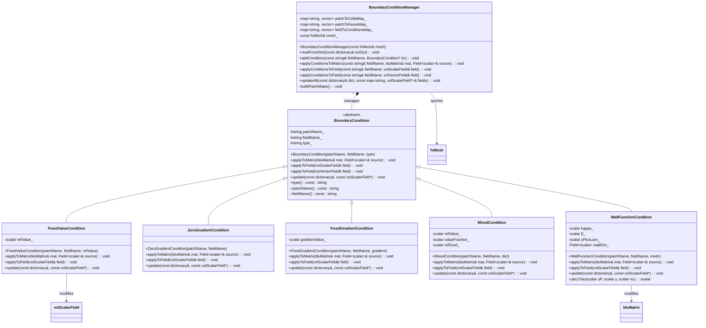

# Day 06: Boundary Conditions (Inlet, Outlet, Wall)

**Date:** 2026-01-06
**Difficulty:** Hardcore
**Phase:** 1 - Foundation Theory
**Prerequisites:** Day 05 (Mesh Topology, LDU Addressing)
**Next Lesson:** Day 07 (Linear Algebra - LDU Matrix Assembly)
**Key Classes:** `fvPatchField`, `GeometricBoundaryField`, `fvPatch`
**Core Concept:** การปิดล้อมทางคณิตศาสตร์และการบังคับใช้ขอบเขตของโดเมนทางกายภาพในการคำนวณ เพื่อแปลงเอกภพของผลเฉลยที่เป็นไปได้แบบไม่จำกัด ให้กลายเป็นสนามการไหลเดียวที่ "Well-posed" และสมจริงทางกายภาพ

---

## 🎯 Learning Objectives

เมื่อจบบทเรียนระดับ Hardcore นี้ คุณจะสามารถ:

1.  **Deconstruct and Formulate:** แยกแยะและกำหนดสูตรทางคณิตศาสตร์ของเงื่อนไขขอบเขตพื้นฐาน 3 ประเภท—Dirichlet (Fixed Value), Neumann (Fixed Gradient), และ Robin (Mixed)—และอธิบายบทบาทที่แม่นยำของพวกมันในการปิดระบบสมการอนุพันธ์ย่อย (PDEs) สำหรับการไหลแบบ Incompressible และ Two-phase คุณจะเข้าใจว่าทำไม เช่น Pressure Outlet (`p_b = p_out`) จึงจำเป็นทางคณิตศาสตร์เพื่อให้จุดอ้างอิงและทำให้ผลเฉลยความดันมีความเป็นหนึ่งเดียว (Unique)

2.  **Architect and Design:** ออกแบบ Framework ของ Boundary Condition แบบ Hierarchical และ Polymorphic ภายใน Core ของ CFD Engine สิ่งนี้เกี่ยวข้องกับการนิยาม Abstract `BoundaryCondition` Base Class ที่ระบุ Interface สำหรับการแก้ไขสัมประสิทธิ์ของระบบสมการเชิงเส้น (`applyToMatrix`) และการประยุกต์ใช้ค่าลงใน Fields (`applyToField`) จากนั้นจึงสร้าง Concrete Implementations (`FixedValueBC`, `ZeroGradientBC`, ฯลฯ) สำหรับพฤติกรรมทางฟิสิกส์และตัวเลขที่เฉพาะเจาะจง

3.  **Implement and Integrate:** สร้างและผสานรวมกลไกสำหรับการฝัง Boundary Conditions ลงใน LDU Sparse Matrix และ Source Vector โดยตรงระหว่างการประกอบ (Assembly) คุณจะเชี่ยวชาญอัลกอริทึมสำหรับการจัดการ Dirichlet Condition เช่น No-slip Wall (`U_b = 0`) โดยการแก้ไขแถวของ Matrix สำหรับ Boundary Cell: ตั้งค่าสัมประสิทธิ์ Diagonal ให้มีค่ามหาศาล (เช่น `diag[boundaryCell] = GREAT`), เปลี่ยน Off-diagonal Contributions เป็นศูนย์, และตั้งค่า Source Term เพื่อบังคับค่าคงที่ (`source[boundaryCell] = GREAT * U_fixed`) ทั้งหมดนี้ในขณะที่รักษาความเบาบาง (Sparsity) ของ Matrix และความเสถียรของ Solver

4.  **Configure and Apply:** กำหนดค่าและประยุกต์ใช้ชุดของ Physical Boundary Conditions ที่สมบูรณ์สำหรับการจำลอง Evaporator มาตรฐาน ซึ่งรวมถึงการระบุ **Fixed Velocity** หรือ **Mass Flow Inlet** สำหรับเฟสของเหลว, **Pressure Outlet** พร้อมความดันบรรยากาศสำหรับไอ, **No-slip Adiabatic Walls** สำหรับภาชนะ, และเงื่อนไขเฉพาะทางเช่น **Wall Functions** สำหรับการไหลแบบ Turbulent หรือ **Interface-aware Conditions** สำหรับขอบเขตที่มีการเปลี่ยนสถานะ เพื่อให้แน่ใจว่าการนิยามปัญหาทั้งหมดนั้นสอดคล้องทางกายภาพและ Well-posed ทางตัวเลข

5.  **Diagnose and Resolve:** วินิจฉัยและแก้ไขความล้มเหลวของ Solver ที่เกิดจาก Boundary Condition ทั่วไป คุณจะได้เรียนรู้ที่จะระบุอาการต่างๆ เช่น Solution Divergence, Non-physical Backflow ที่ทางออก, หรือการแกว่งของสนามความดัน, สืบหาต้นตอเช่นคู่ BC ที่ไม่สอดคล้องกัน (เช่น Fixed Velocity Inlet คู่กับ Fixed Pressure Inlet), และใช้มาตรการแก้ไขเช่นการเปลี่ยนไปใช้ Convective Outlet หรือการตรวจสอบให้แน่ใจว่ามีจุดอ้างอิงความดันที่สอดคล้องจุดเดียวในโดเมน

6.  **Analyze and Extend:** วิเคราะห์และขยาย Class Hierarchy ของ `fvPatchField` ใน OpenFOAM จริง เพื่อทำความเข้าใจว่า CFD Codes ระดับอุตสาหกรรมจัดการ Boundary Conditions อย่างไร คุณจะชำแหละบทบาทของ `GeometricBoundaryField` ในฐานะ Container, `fvPatch` ในฐานะตัวระบุทางเรขาคณิต, และ Virtual Method `manipulateMatrix` ซึ่งเป็น "ตะขอ" สำคัญสำหรับการผสาน BCs เข้าสู่ระบบพีชคณิตเชิงเส้น ซึ่งเป็นพิมพ์เขียวสำหรับการเพิ่มความสามารถให้กับ Engine ของคุณเอง

## 📑 Table of Contents (สารบัญ)
- [[#1. Section 1: Theory (ทฤษฎี)|1. Section 1: Theory (ทฤษฎี)]]
- [[#2. Section 2: OpenFOAM Reference (การอ้างอิง OpenFOAM)|2. Section 2: OpenFOAM Reference (การอ้างอิง OpenFOAM)]]
- [[#3. Section 3: Class Design (การออกแบบคลาส)|3. Section 3: Class Design (การออกแบบคลาส)]]
- [[#4. Section 4: Implementation (การนำไปใช้งานจริง)|4. Section 4: Implementation (การนำไปใช้งานจริง)]]
- [[#5. Section 5: Build & Test (การบิลด์และการทดสอบ)|5. Section 5: Build & Test (การบิลด์และการทดสอบ)]]
- [[#6. Section 6: Concept Checks (การทดสอบแนวคิด)|6. Section 6: Concept Checks (การทดสอบแนวคิด)]]
- [[#7. Section 7: References and Related Days (เอกสารอ้างอิงและบทเรียนที่เกี่ยวข้อง)|7. Section 7: References and Related Days (เอกสารอ้างอิงและบทเรียนที่เกี่ยวข้อง)]]

---

# 1. Section 1: Theory (ทฤษฎี)

## 1.1 Fundamental Types of Boundary Conditions

ใน Computational Fluid Dynamics, Boundary Condition (BC) ไม่ใช่เพียงรายละเอียดรอบนอก แต่เป็น **ข้อจำกัดพื้นฐาน (Fundamental Constraint)** ที่นิยามปัญหาทางกายภาพและรับประกันความถูกต้องทางคณิตศาสตร์ (Well-posedness) ของสมการอนุพันธ์ย่อย (PDEs) ที่ควบคุม หากไม่มี BCs ที่ระบุอย่างถูกต้อง สมการ Navier-Stokes จะมีผลเฉลยจำนวนไม่จำกัด กระบวนการประยุกต์ใช้ BCs แปลง PDEs แบบต่อเนื่องให้เป็นระบบพีชคณิตแบบ Discrete ที่แก้ได้ โดยการระบุพฤติกรรมของตัวแปรสนามที่ขอบเขตของโดเมน สำหรับ Finite Volume Method (FVM) ของเรา สิ่งนี้เกี่ยวข้องกับการแก้ไขสัมประสิทธิ์ของระบบสมการเชิงเส้น (`lduMatrix`) และ Source Vector สำหรับเซลล์ที่ติดกับ Boundary Patches

BCs สามประเภทหลักสอดคล้องกับวิธีการต่างๆ ในการจำกัดผลเฉลยที่ขอบเขต สูตรทางคณิตศาสตร์ของพวกมันกำหนดโดยตรงว่าเราจะจัดการกับ Discrete Equations อย่างไรระหว่างการประกอบ Matrix

## 1.1.1 Dirichlet (Fixed Value) Condition

Dirichlet Condition นั้นตรงไปตรงมาที่สุด: มันกำหนดค่าของตัวแปรสนามบนขอบเขตโดยตรง

$$
\phi_b = \phi_{\text{fixed}}
$$

**Mathematical Interpretation:** เงื่อนไขนี้แทนที่สมการสำหรับ Boundary Face หรือ Boundary-adjacent Cell ด้วยสมการข้อจำกัด ในบริบทของ FVM ค่า $\phi_b$ นั้นทราบค่าและถูกใช้เพื่อคำนวณ Fluxes ข้าม Boundary Face

**Physical Examples and Applications:**
*   **Velocity Inlet:** `U_b = (U_x, 0, 0)` กำหนด Velocity Profile ขาเข้าแบบสม่ำเสมอ
*   **Isothermal Wall:** `T_b = T_wall` ตรึงอุณหภูมิผนัง
*   **Volume Fraction at Inlet:** `alpha_b = 1` กำหนดทางเข้าที่เป็นของเหลวล้วนในการจำลอง VOF
*   **Stagnation Point / No-Slip Wall:** `U_b = (0, 0, 0)` บังคับความเร็วเป็นศูนย์ที่ขอบเขตของแข็งสำหรับการไหลแบบหนืด

**Discrete Implementation Strategy:** สำหรับเซลล์ $P$ ที่ติดกับ Dirichlet Boundary Face $f$, ค่าที่หน้า $f$ ($\phi_f$) นั้นทราบค่า ($\phi_f = \phi_{\text{fixed}}$) เมื่อประกอบสมการ Discretized สำหรับเซลล์ $P$, Convective และ Diffusive Fluxes ข้ามหน้า $f$ จะถูกคำนวณโดยใช้ค่าที่ทราบนี้ สิ่งนี้ทำให้เทอมที่ทราบค่าย้ายไปอยู่ทางขวามือ (Source Vector) ได้อย่างมีประสิทธิภาพ การ Implementation ที่แข็งแกร่งมักจะ **แก้ไข Matrix Coefficients** เพื่อบังคับใช้เงื่อนไขอย่างเคร่งครัด:
1.  สำหรับแถวของ Boundary Cell ใน Matrix, ให้เปลี่ยน Off-diagonal Coefficients ทั้งหมดที่เชื่อมโยงกับขอบเขตเป็นศูนย์
2.  ตั้งค่า Diagonal Coefficient ให้มีค่าสูงมาก (เช่น `GREAT` ใน OpenFOAM, ~$10^{30}$) เพื่อให้ครอบงำสมการ
3.  ตั้งค่า Source Term ที่เกี่ยวข้องเป็น `diag * phi_fixed`
สิ่งนี้รับประกันว่า Solver จะให้ผลลัพธ์ $\phi_P \approx \phi_{\text{fixed}}$ สำหรับเซลล์นั้น ซึ่งให้การบังคับใช้ที่ทนทาน (Robust)

## 1.1.2 Neumann (Fixed Gradient) Condition

Neumann Condition ระบุ Gradient ของตัวแปรสนามในแนวตั้งฉากกับขอบเขต แทนที่จะเป็นค่าของมัน

$$
\frac{\partial \phi}{\partial n} = g
$$

ที่นี่ $n$ คือ Outward-facing Unit Normal Vector ของ Boundary Face กรณีพิเศษที่พบบ่อยที่สุดคือเงื่อนไข **Zero-gradient** ซึ่ง $g = 0$

**Mathematical Interpretation:** เงื่อนไขนี้ให้ข้อมูลเกี่ยวกับ Flux ของ $\phi$ ข้ามขอบเขต เป็นเงื่อนไขที่ "ธรรมชาติ" สำหรับ Conservation Laws จำนวนมาก ใน FVM มันถูกใช้เพื่อแสดงว่า Flux ข้ามขอบเขตนั้นทราบค่าหรือสามารถประมาณได้ (เช่น เป็นศูนย์)

**Physical Examples and Applications:**
*   **Pressure Outlet / Symmetry Plane:** `∂p/∂n = 0` สิ่งนี้สมมติว่าสนามความดันได้พัฒนาเต็มที่แล้วและไม่เปลี่ยนแปลงในทิศทางการไหลออก หรือการไหลมีความสมมาตร
*   **Adiabatic Wall:** `∂T/∂n = 0` ระบุว่าไม่มี Heat Flux ผ่านผนัง (ฉนวนสมบูรณ์แบบ)
*   **Specified Shear Stress / Heat Flux:** `μ ∂u/∂n = τ_w` หรือ `-k ∂T/∂n = q_w` ให้เงื่อนไข Boundary Flux โดยตรง
*   **Free Surface (in some models):** `∂u/∂n = 0` สำหรับ Tangential Velocity Component

**Discrete Implementation Strategy:** Normal Gradient $g$ ถูกใช้เพื่อ **Extrapolate** ค่าที่หน้า $\phi_f$ จากค่าที่จุดศูนย์กลางเซลล์ $\phi_P$ โดยใช้ First-order Approximation:
$$
\phi_f = \phi_P + (\nabla \phi)_P \cdot \mathbf{d}_{Pf} \approx \phi_P + g |\mathbf{d}_{Pf}|
$$
โดยที่ $\mathbf{d}_{Pf}$ คือเวกเตอร์จาก Cell Center $P$ ไปยัง Face Center $f$ สำหรับ Zero Gradient ($g=0$) สิ่งนี้ลดรูปเหลือ $\phi_f = \phi_P$ ค่า Extrapolated นี้จะถูกใช้โดยตรงในการคำนวณ Flux สำหรับหน้า $f$ ต่างจาก Dirichlet Condition สมการสำหรับเซลล์ $P$ ยังคงรูปแบบมาตรฐานไว้; BC ถูกรวมเข้าด้วยกันอย่างเป็นธรรมชาติผ่านการคำนวณ Flux โดยปกติไม่จำเป็นต้องมีการแก้ไข Matrix แบบรุนแรง (Strong Matrix Modification)

## 1.1.3 Robin (Mixed) Condition

Robin Condition เป็น Linear Combination ของค่าและ Normal Gradient ของมันที่ขอบเขต ซึ่งให้การ Coupling ที่ทั่วไปและสมจริงทางกายภาพมากกว่า

$$
a \phi_b + b \frac{\partial \phi}{\partial n} = c
$$

ที่นี่ $a$, $b$, และ $c$ คือสัมประสิทธิ์ที่อาจเป็นค่าคงที่หรือฟังก์ชันของตัวแปร Solution อื่นๆ

**Mathematical Interpretation:** เงื่อนไขนี้แสดงถึงสมดุลหรือความต้านทานระหว่างค่าที่ขอบเขตและ Flux ที่ข้ามมัน เกิดขึ้นตามธรรมชาติจากการถ่ายเทความร้อนแบบพา (Convective Heat Transfer), พื้นผิวที่มีปฏิกิริยาเคมี, หรือปัญหาที่เชื่อมต่อกันที่ Interfaces

**Physical Examples and Applications:**
*   **Convective Heat Transfer Boundary:** `-k ∂T/∂n = h (T_b - T_∞)` ซึ่งสามารถจัดรูปใหม่เป็น `h T_b + k ∂T/∂n = h T_∞` ตรงกับรูปแบบ Robin
*   **Radiative Boundary Condition:** Linearized Radiation Flux Condition สามารถมีรูปแบบที่คล้ายกัน
*   **Coupled Mass Transfer:** ที่ Evaporating Interface, Mass Flux (แปรผันตรงกับ Gradient) จะเชื่อมโยงกับอุณหภูมิหรือความเข้มข้นท้องถิ่น
*   **Impedance or Spring-like Mechanical Boundaries**

**Discrete Implementation Strategy:** Robin Condition ต้องการการจัดการที่ระมัดระวังกว่า สมการถูกใช้เพื่อหา Expression สำหรับ $\phi_f$ หรือ Gradient ของมันในรูปของ Interior Cell Value $\phi_P$ ตัวอย่างเช่น จาก $a \phi_f + b (\partial \phi / \partial n)_f = c$, และประมาณค่า Gradient เป็น $(\phi_f - \phi_P) / |\mathbf{d}_{Pf}|$, เราสามารถแก้หา $\phi_f$:
$$
\phi_f = \frac{c |\mathbf{d}_{Pf}| + b \phi_P}{a |\mathbf{d}_{Pf}| + b}
$$
Expression สำหรับ $\phi_f$ นี้จะถูกใช้ใน Flux Integrals ระหว่างการประกอบ Matrix สิ่งนี้จะนำไปสู่การแก้ไขทั้ง Diagonal Coefficient และ Source Term สำหรับ Boundary Cell $P$ ซึ่งเป็นการผสมผสาน (Blending) ระหว่าง Dirichlet และ Neumann Contributions สัมประสิทธิ์ $a$ และ $b$ กำหนดน้ำหนัก; หาก $b=0$ จะลดรูปเป็น Dirichlet; หาก $a=0$ จะลดรูปเป็น Neumann

**Table 1.1: Summary of Fundamental Boundary Condition Types**
| Condition Type | Mathematical Form | Primary Unknown | FVM Implementation Essence | Typical Physical Use Case |
| :--- | :--- | :--- | :--- | :--- |
| **Dirichlet** | $\phi_b = \phi_{\text{fixed}}$ | Boundary Value | Strong enforcement via matrix diagonal/source modification. Face value is fixed. | Inlet velocity, Wall temperature, Specified concentration. |
| **Neumann** | $\frac{\partial \phi}{\partial n} = g$ | Normal Gradient | Weak enforcement via flux calculation. Face value extrapolated from interior. | Outlet pressure, Adiabatic wall, Symmetry plane, Specified flux. |
| **Robin** | $a \phi_b + b \frac{\partial \phi}{\partial n} = c$ | Both Value & Gradient | Blended enforcement. Solve for face value using relationship between value and gradient. | Convective heat transfer, Linearized radiation, Coupled interface conditions. |

**⚠️ Critical Warning: Compatibility and Well-Posedness**
การประยุกต์ใช้ Boundary Conditions ไม่ใช่เรื่องตามอำเภอใจ การรวมกันของ BCs ต้อง **Compatible** กับฟิสิกส์ของปัญหาและนำไปสู่ระบบทางคณิตศาสตร์ที่ **Well-posed** หลุมพรางสำคัญได้แก่:
*   **Over-specification:** การประยุกต์ใช้ทั้ง Dirichlet และ Neumann Conditions สำหรับตัวแปรเดียวกันบน Boundary Patch เดียวกันมักจะ Ill-posed
*   **Under-specification:** การไม่ให้ข้อจำกัดที่เพียงพอ ทำให้ผลเฉลยไม่เป็นหนึ่งเดียว (Non-unique) (เช่น ความดันในการไหลแบบ Incompressible ที่ไม่มีจุดอ้างอิง)
*   **Physical Inconsistency:** ตัวอย่างเช่น การกำหนด Inlet Velocity Profile ที่ละเมิด Global Mass Conservation เมื่อพิจารณา Outlet Condition ซึ่งจะทำให้ Solver ลู่ออก (Diverge) หรือหาผลเฉลยที่ไม่กายภาพ BCs เป็นส่วนสำคัญของการนิยามปัญหาและต้องถูกเลือกด้วยความเข้าใจอย่างลึกซึ้งในฟิสิกส์ของการไหลที่คาดหวัง

## 1.2 Inlet Boundary Conditions

Inlet Boundary คือที่ที่มวล โมเมนตัม และพลังงาน เข้าสู่ Computational Domain การเลือก Inlet Condition มีความสำคัญอย่างยิ่งเนื่องจากมันขับเคลื่อนการไหลและมีอิทธิพลต่อผลเฉลยทั้งหมดโดยตรง การตัดสินใจหลักหมุนรอบสิ่งที่ทราบ *a priori*: Velocity Profile, Pressure, หรือ Mass Flow Rate

## 1.2.1 Fixed Velocity Inlet

นี่คือ Inlet Condition ที่พบบ่อยที่สุดสำหรับการไหลภายใน (Internal Flows) ซึ่งสนามความเร็วขาเข้านั้นทราบค่าหรือสามารถประมาณได้อย่างสมเหตุสมผล (เช่น Uniform, Parabolic, Turbulent Profile)

**Mathematical Formulation:**
$$
\mathbf{U}_b = \mathbf{U}_{\text{in}}(\mathbf{x}), \quad \frac{\partial p}{\partial n} \bigg|_{\text{inlet}} = 0
$$

**Components:**
*   $\mathbf{U}_{\text{in}}(\mathbf{x})$: ฟังก์ชันเวกเตอร์ที่กำหนดความเร็วที่ทุกจุดบน Inlet Patch สามารถเป็นค่าคงที่ (`(10 0 0) m/s`), ฟังก์ชันของพิกัด (เช่น `(U_max*(1-(y/radius)^2) 0 0)` สำหรับ Parabolic), หรืออ่านจาก Profile File
*   $\frac{\partial p}{\partial n} = 0$: เงื่อนไข Zero-gradient สำหรับความดัน นี่คือ **สิ่งจำเป็น** ความดันจะไม่ถูกตรึงที่ Inlet; มันได้รับอนุญาตให้ปรับตัวเป็นค่าใดก็ตามที่จำเป็นเพื่อรองรับสนามความเร็วที่กำหนด ในขณะที่ต้องสอดคล้องกับ Global Momentum Balance และ Continuity

**Physical Justification & Implications:**
*   คุณกำลังบังคับ **Kinematics** ของการไหล (ของไหลเข้าเร็วแค่ไหนและทิศทางใด)
*   **Dynamics** (สนามความดัน) ตอบสนองต่อการเคลื่อนที่ที่ถูกบังคับนี้ เงื่อนไข Zero-pressure-gradient สมมติว่า Inlet อยู่ไกลจากสิ่งกีดขวางหลักเพียงพอจนความดันคงที่อย่างเป็นสาระสำคัญ
*   **Mass Flow Rate:** อัตราการไหลของมวลที่ได้ $\dot{m} = \sum_f (\rho \mathbf{U}_f \cdot \mathbf{S}_f)$ เป็น *ผลลัพธ์ (Consequence)* ของ BC นี้ ไม่ใช่ Input หากคุณต้องการ Mass Flow ที่เจาะจง คุณต้องปรับ $\mathbf{U}_{\text{in}}$ อย่างวนซ้ำ

**Implementation Details:**
1.  สำหรับ **Momentum Equation**, `fixedValue` Condition ถูกใช้กับ Velocity Vector $\mathbf{U}$ บน Inlet Patch
2.  สำหรับ **Pressure Equation** (เช่น ระหว่าง PISO/SIMPLE Loop), `zeroGradient` Condition ถูกใช้บน Inlet Patch นี่สำคัญเพื่อให้ Pressure Poisson Equation มี Neumann Boundary Condition ที่ถูกต้อง รับประกันว่าขั้นตอน Velocity Correction จะให้สนามที่ Divergence-free ซึ่งเคารพ Fixed Inlet Velocity

## 1.2.2 Fixed Pressure Inlet

เงื่อนไขนี้ใช้เมื่อทราบ Stagnation หรือ Total Pressure ที่ Inlet แต่ไม่ทราบความเร็ว พบบ่อยใน External Aerodynamics (Far-field Conditions) หรือการไหลที่ขับเคลื่อนด้วยความแตกต่างของความดัน (เช่น Natural Convection, Internal Flows บางประเภท)

**Mathematical Formulation:**
$$
p_b = p_{\text{in}}, \quad \frac{\partial \mathbf{U}}{\partial n} \bigg|_{\text{inlet}} = 0
$$

**Components:**
*   $p_{\text{in}}$: Static Pressure ที่กำหนดที่ Inlet Boundary
*   $\frac{\partial \mathbf{U}}{\partial n} = 0$: Zero-gradient Condition สำหรับองค์ประกอบความเร็ว สิ่งนี้อนุญาตให้ความเร็วพัฒนาได้อย่างอิสระตามการไหลภายในและความดันที่กำหนด

**Physical Justification & Implications:**
*   คุณกำลังบังคับเงื่อนไข **Dynamic** (ระดับความดัน)
*   **Kinematics** (ความเร็ว) พัฒนาเพื่อตอบสนอง ของไหลจะเร่งเข้าสู่โดเมนหากความดันภายในต่ำกว่า $p_{\text{in}}$ และชะลอตัว (หรือแม้แต่ไหลย้อนกลับ) หากสูงกว่า
*   เงื่อนไขนี้สามารถจัดการ **Backflow** ที่ Inlet ได้ตามธรรมชาติ หากความดันภายในสูงกว่า $p_{\text{in}}$ การไหลจะย้อนกลับ และ Inlet จะกลายเป็น *De Facto* Outlet นี่เป็นทั้งจุดแข็ง (ความทนทาน) และจุดอ่อนที่อาจเกิดขึ้น (หาก Backflow ไม่สมจริงทางกายภาพ มันอาจบ่งชี้ปัญหาเกี่ยวกับขนาดโดเมนหรือ BCs อื่นๆ)

**Implementation Details:**
1.  สำหรับ **Pressure Equation**, `fixedValue` Condition ($p_{\text{in}}$) ถูกนำมาใช้
2.  สำหรับ **Momentum Equation**, โดยปกติจะใช้ `zeroGradient` Condition สำหรับความเร็ว อย่างไรก็ตาม วิธีการที่ซับซ้อนกว่าเช่น `pressureInletVelocity` (OpenFOAM) หรือ `inletOutlet` มักถูกใช้ `inletOutlet` Condition ใช้ `fixedValue` เมื่อการไหลไหลเข้า (Flux < 0) และ `zeroGradient` เมื่อการไหลไหลออก (Flux >= 0) ให้ความเสถียรในกรณีที่มี Backflow

## 1.2.3 Mass Flow Inlet

เงื่อนไขนี้ใช้เมื่อทราบ Total Mass Flow Rate เข้าสู่โดเมนเป็นพารามิเตอร์การออกแบบหรือการดำเนินงาน แต่รายละเอียด Velocity Profile อาจไม่ทราบหรือไม่สำคัญ

**Mathematical Formulation (Conceptual):**
$$
\dot{m}_{\text{target}} = \sum_{f \in \text{inlet}} (\rho \mathbf{U}_f \cdot \mathbf{S}_f)
$$
เงื่อนไขพยายามปรับ Inlet Velocity Field $\mathbf{U}_b$ เพื่อให้ Integrated Mass Flux ตรงกับเป้าหมาย $\dot{m}_{\text{target}}$

**Physical Justification & Implications:**
*   บังคับใช้ Global Conservation of Mass สำหรับโดเมนโดยตรง
*   Velocity Profile ต้องถูกสมมติ (เช่น Uniform, หรือ Shape Factor จากการรันก่อนหน้า) ขนาดของ Profile นี้จะถูกปรับขนาด (Scaled) อย่างวนซ้ำเพื่อให้ได้ Mass Flow ที่ถูกต้อง
*   มักใช้ร่วมกับ **Pressure Outlet** สร้างปัญหาที่ Well-posed: Fixed Mass In, Fixed Pressure Out

**Implementation Strategy:**
Fixed Mass Flow Inlet ที่แท้จริงไม่ใช่ Simple Local BC; มันต้องการ **Global Correction**
1.  **Initial Guess:** เริ่มต้นด้วย Velocity Profile ที่สมมติ $\mathbf{U}_b^{(0)}$
2.  **Solve Flow Field:** ทำ PISO/SIMPLE Iterations หนึ่งครั้งหรือมากกว่า
3.  **Compute Actual Mass Flow:** $\dot{m}_{\text{actual}} = \sum_f (\rho \mathbf{U}_f \cdot \mathbf{S}_f)$
4.  **Calculate Scaling Factor:** $s = \dot{m}_{\text{target}} / \dot{m}_{\text{actual}}$
5.  **Correct Inlet Velocity:** $\mathbf{U}_b^{(k+1)} = s \cdot \mathbf{U}_b^{(k)}$
6.  **Iterate:** ทำซ้ำขั้นตอน 2-5 จนกว่า $\dot{m}_{\text{actual}}$ จะลู่เข้าสู่ $\dot{m}_{\text{target}}$
โดยปกติจะ Implement เป็น High-level Wrapper รอบ Solver Loop มากกว่าจะเป็น Low-level Patch Condition

**Table 1.2: Inlet Boundary Condition Comparison**
| Condition Type | Primary Input | Secondary Condition | Solver Impact | Best For |
| :--- | :--- | :--- | :--- | :--- |
| **Fixed Velocity** | $\mathbf{U}_b$ | `zeroGradient p` | Imposes kinematics. Pressure adjusts. Mass flow is a result. | Internal flows with known velocity profile (e.g., pipe flow, wind tunnel inlet). |
| **Fixed Pressure** | $p_b$ | `zeroGradient U` (or `inletOutlet`) | Imposes dynamics. Velocity adjusts. Can handle backflow. | External flows, natural convection, flows driven by pressure differential. |
| **Mass Flow** | $\dot{m}_{\text{target}}$ | (Profile Shape) | Imposes global conservation. Requires iterative scaling. | Engineering systems where mass flow rate is a controlled parameter (e.g., heat exchangers). |

## 1.3 Outlet Boundary Conditions

Outlet Boundary ต้องอนุญาตให้ของไหลออกจากโดเมนโดยมีการบิดเบือนหรือการสะท้อนของโครงสร้างการไหลภายในน้อยที่สุด เป้าหมายคือการจำลองโดเมน "อนันต์" ที่ปลายน้ำ (Downstream) การเลือก Outlet Condition ผิดเป็นสาเหตุหลักของ Solver Divergence และ Recirculation ที่ไม่กายภาพ

## 1.3.1 Pressure Outlet

นี่คือ Outlet Condition มาตรฐาน (Workhorse) สำหรับปัญหาการไหลแบบ Incompressible และ Compressible จำนวนมาก มันระบุ Static Pressure ที่ทางออก มักจะเป็นความดันบรรยากาศหรือ Back Pressure ที่กำหนด

**Mathematical Formulation:**
$$
p_b = p_{\text{out}}, \quad \frac{\partial \mathbf{U}}{\partial n} \bigg|_{\text{outlet}} = 0
$$

**Components:**
*   $p_{\text{out}}$: Static Pressure ที่ระบุ (เช่น 101325 Pa สำหรับบรรยากาศ)
*   $\frac{\partial \mathbf{U}}{\partial n} = 0$: Zero-gradient สำหรับความเร็ว สิ่งนี้สมมติว่าการไหล Developed เต็มที่หรือเกือบเต็มที่ที่ทางออก หมายความว่า Velocity Profiles ไม่เปลี่ยนแปลงในทิศทางการไหลอีกต่อไป

**Physical Justification & Implications:**
*   ให้ **จุดอ้างอิงความดัน (Pressure Reference Point)** ที่จำเป็นสำหรับทั้งโดเมนในการไหลแบบ Incompressible ซึ่งเฉพาะ Pressure Gradients เท่านั้นที่สำคัญ
*   เงื่อนไข Zero-velocity-gradient เป็นเงื่อนไขแบบ **Convective** มันสื่อว่าสัญญาณรบกวนใดๆ จะถูกพาออกจากโดเมนโดยไม่มีการสะท้อนกลับ มันทำงานได้ดีเมื่อการไหลเป็นทิศทางเดียวและ Subsonic ที่ทางออกเป็นส่วนใหญ่
*   **Backflow Handling:** คล้ายกับ Pressure Inlet หากความดันภายในลดลงต่ำกว่า $p_{\text{out}}$ การไหลสามารถย้อนกลับเข้าสู่โดเมนได้ `zeroGradient` Condition สำหรับความเร็วระหว่าง Backflow อาจไม่เสถียร ดังนั้น Practical Implementations เช่น `pressureInletOutletVelocity` ของ OpenFOAM จึงใช้ Switch: `zeroGradient` สำหรับ Outflow, `fixedValue` (มักเป็นศูนย์หรือค่า Inlet ขนาดเล็ก) สำหรับ Inflow

**Implementation Details:**
1.  สำหรับ **Pressure Equation**, `fixedValue` Condition ($p_{\text{out}}$) ถูกนำมาใช้ นี่คือ **ขั้นตอนที่สำคัญที่สุด**
2.  สำหรับ **Momentum Equation**, เงื่อนไขเฉพาะทางเช่น `pressureInletOutletVelocity` ถูกใช้ ซึ่งจัดการทั้งสถานการณ์ Outflow และ Inflow ได้อย่างทนทาน

## 1.3.2 Outflow (Zero Gradient)

นี่เป็นเงื่อนไขที่ง่ายกว่าและเข้มงวดน้อยกว่า ซึ่งอาจเหมาะสมสำหรับ Outlets ที่คาดว่าการไหลจะ Developed เต็มที่และเป็นทิศทางเดียว

**Mathematical Formulation:**
$$
\frac{\partial \phi}{\partial n} \bigg|_{\text{outlet}} = 0 \quad \text{for all variables } \phi \text{ (U, p, T, k, epsilon, etc.)}
$$

**Physical Justification & Implications:**
*   สมมติว่า Outlet อยู่ไกลไปทางปลายน้ำมากจนตัวแปรการไหลทั้งหมดเข้าสู่สถานะที่ไม่เปลี่ยนแปลงในทิศทางปกติอีกต่อไป
*   **Major Caveat:** การใช้ `zeroGradient` กับความดันนั้นอันตราย เนื่องจากความดันในการไหลแบบ Incompressible เป็นแบบสัมพัทธ์ การใช้เงื่อนไข Pure Zero-gradient จะทำให้ไม่มีจุดอ้างอิง ทำให้ Pressure Equation เป็น Singular ในทางปฏิบัติ เงื่อนไขนี้ **แทบจะไม่เคยถูกใช้สำหรับความดัน** บางครั้งใช้สำหรับความเร็วและ Scalars ร่วมกับ **fixedValue** หรือ **pressureOutlet** Condition สำหรับความดัน
*   อาจทำให้เกิดการสะท้อนของคลื่นความดันในการจำลอง Transient เนื่องจากเป็นเงื่อนไขที่ไม่มีการกระจายพลังงาน (Non-dissipative)

## 1.3.3 Convective Outlet

สำหรับการจำลอง Transient โดยเฉพาะอย่างยิ่งที่มีโครงสร้าง Vortical หรือ Acoustic Waves ออกจากโดเมน Convective Outlet Condition ช่วยลด Numerical Reflections ให้น้อยที่สุด

**Mathematical Formulation:**
$$
\frac{\partial \phi}{\partial t} + U_c \frac{\partial \phi}{\partial n} = 0
$$

**Components:**
*   $U_c$: Convective Velocity โดยทั่วไปเลือกเป็น Bulk หรือ Area-averaged Velocity ที่ตั้งฉากกับ Outlet Face หรือ Local Velocity Magnitude
*   สมการระบุว่า Disturbances ใน $\phi$ จะถูกพาออกจากโดเมนด้วยความเร็ว $U_c$

**Physical Justification & Implications:**
*   มันเป็น **Non-reflecting** (หรือ Weakly Reflecting) Boundary Condition ที่ได้มาจาก Convective Wave Equation
*   แม่นยำทางกายภาพมากกว่า `zeroGradient` สำหรับ Unsteady Flows ที่โครงสร้างถูก Advected ออกไป
*   Implementation ซับซ้อนกว่าเนื่องจากต้องใช้ Time Derivative และการประมาณค่า $U_c$ มักถูกใช้กับความเร็วและความดันใน Large Eddy Simulation (LES) หรือ Detached Eddy Simulation (DES)

**Table 1.3: Outlet Boundary Condition Comparison**
| Condition Type | Pressure Treatment | Velocity Treatment | Key Feature | Major Pitfall |
| :--- | :--- | :--- | :--- | :--- |
| **Pressure Outlet** | `fixedValue` $p_{\text{out}}$ | `zeroGradient` or `inletOutlet` | Provides essential pressure reference. Handles backflow robustly. | Incorrect $p_{\text{out}}$ can cause unrealistic acceleration/deceleration. |
| **Outflow (ZeroGradient)** | `zeroGradient` **(Dangerous)** | `zeroGradient` | Simple. Good for fully developed scalar fields. | Makes pressure equation ill-posed. Can cause solver crash. |
| **Convective Outlet** | Derived from Convective Eqn. | Derived from Convective Eqn. | Minimizes reflections for unsteady flows. | More complex. Requires choice of convective velocity $U_c$. |

## 1.4 Wall Boundary Conditions

ผนังเป็นขอบเขตทางกายภาพที่ไม่สามารถซึมผ่านได้ (Impermeable) ซึ่งทำปฏิกิริยากับของไหลผ่านแรงหนืด การถ่ายเทความร้อน และบางครั้งการเปลี่ยนสถานะ การจัดการผนังแบ่งตาม Flow Regime (Laminar/Turbulent) และฟิสิกส์ที่สนใจ (Heat Transfer, Evaporation)

## 1.4.1 No-Slip Wall

เงื่อนไขพื้นฐานสำหรับการไหลแบบหนืดที่ติดกับผนังแข็งที่อยู่กับที่

**Mathematical Formulation:**
$$
\mathbf{U}_b = \mathbf{U}_{\text{wall}}
$$
สำหรับผนังที่อยู่กับที่, $\mathbf{U}_{\text{wall}} = \mathbf{0}$

**Physical Basis:** No-slip Condition เกิดจากปฏิสัมพันธ์ระดับโมเลกุลระหว่างของไหลและพื้นผิวของแข็ง สำหรับ Continuum Flows (Knudsen number << 1) มันเป็นการประมาณค่าที่ยอดเยี่ยม

**Implementation:** ใช้ `fixedValue` Dirichlet Condition สำหรับ Velocity Vector Field บน Wall Patch สิ่งนี้บังคับความเร็วศูนย์ที่ Wall Face Centers อย่างแข็งขัน

## 1.4.2 Slip Wall

เงื่อนไขในอุดมคติสำหรับการไหลแบบ Inviscid หรือ Symmetry Planes ที่ละเลยผลกระทบความหนืด

**Mathematical Formulation:**
$$
\mathbf{U}_b \cdot \mathbf{n} = 0, \quad \frac{\partial \mathbf{U}_t}{\partial n} = 0
$$
*   $\mathbf{U}_b \cdot \mathbf{n} = 0$: No Penetration องค์ประกอบความเร็วปกติ (Normal Component) เป็นศูนย์
*   $\frac{\partial \mathbf{U}_t}{\partial n} = 0$: Free Slip Gradient ขององค์ประกอบความเร็วสัมผัส (Tangential Component) เป็นศูนย์ สื่อว่าไม่มี Shear Stress

**Physical Applications:**
*   **Symmetry Planes:** ใช้เพื่อลดขนาดโดเมนโดยใช้ประโยชน์จากความสมมาตรทางเรขาคณิต การไหลต้องเป็น Mirror-symmetric ข้ามระนาบ
*   **Inviscid Flow Boundaries:** ในการจำลอง Euler Equation
*   **Free Surfaces (in some inviscid models)**

**Implementation:** โดยทั่วไปจะ Implement เป็น Patch Type เฉพาะที่ตั้งค่า Normal Flux เป็นศูนย์และประยุกต์ใช้ Zero-gradient Condition กับ Tangential Velocity Components มันแก้ไข Momentum Matrix Coefficients เพื่อแยก (Decouple) ทิศทาง Normal และ Tangential ออกจากกัน

## 1.4.3 Wall Functions for Turbulence

การ Resolve Viscous Sublayer ใน High-Reynolds-number Turbulent Flows ต้องการ Mesh ที่ละเอียดอย่างไม่สามารถทำได้จริง (y+ ~ 1) Wall Functions เชื่อมบริเวณใกล้ผนังโดยใช้กฎเชิงประจักษ์ (Empirical Laws) ระหว่างผนังและ Cell Center แรกที่ถัดจากผนัง ซึ่งอยู่ใน Logarithmic Region (30 < y+ < 300)

**The Log-Law Model:**
หัวใจสำคัญคือ Law-of-the-wall ไร้มิติ:
$$
u^+ = \frac{1}{\kappa} \ln(y^+) + C
$$
โดยที่:
*   $u^+ = U_t / u_\tau$ คือความเร็วไร้มิติขนานกับผนัง
*   $y^+ = \frac{u_\tau y}{\nu}$ คือระยะทางจากผนังไร้มิติ
*   $u_\tau = \sqrt{\tau_w / \rho}$ คือ Friction Velocity
*   $\kappa \approx 0.4$ คือ von Kármán constant
*   $C \approx 5.0$ (สำหรับผนังเรียบ)

**Implementation Logic:**
1.  **For Momentum:** Wall Shear Stress $\tau_w$ ไม่ได้คำนวณจาก Velocity Gradient ที่ผนัง (ซึ่งจะไม่แม่นยำด้วย Coarse Mesh) แต่คำนวณจาก Log-law โดยใช้ความเร็วที่ทราบ $U_t$ ที่ Cell Center แรกและระยะทาง $y$
    *   กำหนด $U_t$ และ $y$, แก้สมการ Log-law อย่างวนซ้ำเพื่อหา $u_\tau$
    *   คำนวณ $\tau_w = \rho u_\tau^2$
    *   ประยุกต์ใช้ $\tau_w$ นี้เป็น Neumann-like Boundary Condition (Specified Flux) สำหรับสมการ Momentum ในแนวสัมผัสกับผนัง
2.  **For Turbulence Variables (k, ε, ω):** Specialized Wall Functions ให้ Boundary Conditions สำหรับ Turbulent Kinetic Energy $k$, Dissipation Rate $\epsilon$, หรือ Specific Dissipation Rate $\omega$ ที่ Wall-adjacent Cell ตัวอย่างเช่น วิธีการทั่วไปกำหนด:
    *   $\frac{\partial k}{\partial n} = 0$ (Zero Gradient)
    *   $\epsilon_b = \frac{C_\mu^{3/4} k^{3/2}}{\kappa y}$ (Production-based Value)
    *   เงื่อนไขเหล่านี้สำคัญสำหรับความเสถียรและความแม่นยำของ RANS Turbulence Models

## 1.4.4 Thermal Wall Conditions

สำหรับ Energy Equation ผนังสามารถกำหนดอุณหภูมิหรือ Heat Flux

*   **Fixed Temperature (Dirichlet):** $T_b = T_{\text{wall}}$ ใช้เมื่ออุณหภูมิผนังถูกควบคุมหรือทราบค่า
*   **Adiabatic Wall (Neumann):** $\frac{\partial T}{\partial n} = 0$ Zero Heat Flux สำหรับขอบเขตที่มีฉนวน
*   **Convective/Robin Condition:** ตามที่อธิบายใน Section 1.1.3, $-k \frac{\partial T}{\partial n} = h (T_b - T_{\infty})$ โมเดลการถ่ายเทความร้อนไปยังของไหลภายนอกด้วย Heat Transfer Coefficient $h$ และ Bulk Temperature $T_{\infty}$

**Phase Change Walls:** ในบริบท Evaporator ของเรา ผนังอาจเป็นตำแหน่งของการเดือด (Boiling) สิ่งนี้นำมาซึ่ง Boundary Condition ที่ **Strongly Coupled และ Non-linear** ซึ่ง:
*   Heat Flux เข้าสู่ผนัง $q_w$ กำหนด Local Mass Transfer Rate $\dot{m}$ ผ่าน Latent Heat: $\dot{m} = q_w / h_{lv}$
*   $\dot{m}$ นี้กลายเป็น Source Term ใน Continuity และ VOF Equations (ตามที่ Derive ใน Expansion Term ของ Day 01)
*   Wall Temperature $T_w$ เชื่อมโยงกับ Saturation Temperature $T_{sat}$ และ Local Heat Transfer Regime (Nucleate Boiling, Film Boiling) สิ่งนี้มักต้องการ Specialized Sub-model หรือ Conjugate Heat Transfer Approach เชื่อมโยง Fluid Solver กับ Solid Heat Conduction Solver

**Table 1.4: Wall Boundary Condition Summary**
| Condition Type | Velocity Treatment | Shear Stress | Thermal Treatment | Primary Use Case |
| :--- | :--- | :--- | :--- | :--- |
| **No-Slip** | `fixedValue U = 0` | Resolved from velocity gradient. | Any (T fixed, flux fixed, etc.). | Laminar flows, low-Re turbulent flows (fine mesh). |
| **Slip** | `U_n=0`, `zeroGradient U_t` | $\tau_w = 0$ (No shear). | Any. | Symmetry planes, inviscid flows. |
| **Wall Function** | Log-law derived flux. | $\tau_w = \rho u_\tau^2$ from log-law. | Specialized thermal wall functions. | High-Re turbulent flows (coarse mesh, y+ > 30). |
| **Phase Change Wall** | No-slip or with velocity due to vapor ejection. | Modeled. | Coupled: Heat flux drives mass transfer $\dot{m}$. | Boiling, condensation, evaporating surfaces. |

พื้นฐานทางทฤษฎีที่วางไว้ในส่วนนี้ให้ความเข้าใจทางกายภาพและคณิตศาสตร์ที่จำเป็น ส่วนถัดไปจะเจาะลึกว่า OpenFOAM Implement แนวคิดเหล่านี้อย่างเป็นรูปธรรมอย่างไรผ่าน Class Hierarchy (`fvPatchField`, `GeometricBoundaryField`) และวิธีที่เราต้องออกแบบ Framework ของ Boundary Condition สำหรับ CFD Engine ของเราเองเพื่อผสานรวมกับระบบพีชคณิตเชิงเส้นที่พัฒนาในวันก่อนหน้าได้อย่างราบรื่น

<END_OF_SECTION>

# 2. Section 2: OpenFOAM Reference (การอ้างอิง OpenFOAM)
**OpenFOAM Reference: Deconstructing the Boundary Condition Framework**

ส่วนนี้จะวิเคราะห์ Source Code ของ OpenFOAM แบบบรรทัดต่อบรรทัดที่ Implement ระบบ Boundary Condition การเข้าใจสถาปัตยกรรมนี้ไม่ได้เป็นเพียงเรื่องวิชาการ แต่เป็นสิ่งจำเป็นสำหรับการ Implement BC Framework ที่ทนทาน ขยายได้ และมีประสิทธิภาพใน CFD Engine ของเราเอง เราจะชำแหละ Class Hierarchy, Data Flow, และ Methods สำคัญ โดยเปรียบเทียบแนวทาง Object-Oriented, Runtime-polymorphic ของ OpenFOAM กับการตัดสินใจออกแบบที่เราต้องทำสำหรับ Engine ที่มุ่งเน้นประสิทธิภาพสูงของเรา

## 2.1 Core Class: `GeometricBoundaryField` - The Boundary Field Container

**Location:** `src/finiteVolume/fields/GeometricBoundaryField/GeometricBoundaryField.H`, `.C`

**Purpose:** `GeometricBoundaryField` เป็น Templated Container Class ที่จัดการ Boundary Field สำหรับ `GeometricField` (เช่น `volScalarField`, `volVectorField`) มันไม่ได้ Implement Logic ของ Boundary Condition แต่ละตัว แต่ทำหน้าที่เป็น Orchestrator ที่ถือรายชื่อของ `fvPatchField` Objects หนึ่งตัวสำหรับแต่ละ Patch ใน Mesh บทบาทหลักคือการให้ Unified Interface สำหรับการดำเนินการกับ Boundary Patches ทั้งหมดของ Field

**Key Data Members:**
```cpp
// From GeometricBoundaryField.H
private:
    //- Reference to the DimensionedField (internal field)
    const FieldType& internalField_;

    //- Boundary field type
    //  This is a PtrList (Pointer List) of fvPatchField objects.
    //  Each entry corresponds to a boundary patch defined in the mesh.
    PtrList<PatchFieldType> boundaryField_;
```
*   `internalField_`: `const` Reference ไปยัง Internal Field สิ่งนี้สำคัญเพราะ Boundary Conditions มักต้อง Couple กับค่า Interior Cell (เช่น สำหรับการคำนวณ Gradient หรือ Mixed Conditions)
*   `boundaryField_`: `PtrList<fvPatchField<Type>>` นี่คือหัวใจของ Container `PtrList` คือ OpenFOAM List ที่เป็นเจ้าของ Pointers ที่ถูก Allocate แบบ Dynamic ขนาดของ List เท่ากับจำนวนของ Boundary Patches (`mesh.boundary().size()`) และ Indexing ของมันสอดคล้องโดยตรงกับ Patch List ของ Mesh

**Key Methods and Their Analysis:**

1.  **`evaluate()`:** นี่อาจเป็น Method ที่เกี่ยวข้องกับ Boundary ที่ถูกเรียกบ่อยที่สุด
    ```cpp
    template<class Type, template<class> class PatchField, class GeoMesh>
    void GeometricBoundaryField<Type, PatchField, GeoMesh>::evaluate()
    {
        if (debug)
        {
            InfoInFunction << endl;
        }

        // Iterate over all patch fields and call their evaluate() method.
        // This updates the boundary field values based on the current
        // internal field and the specific BC logic.
        forAll(*this, patchi)
        {
            this->operator[](patchi).evaluate();
        }
    }
    ```
    *   **What it does:** วนลูปทุก Patches (`forAll` คือ OpenFOAM macro สำหรับ Index Loops) และเรียก Method `evaluate()` บนแต่ละ `fvPatchField` พฤติกรรมเฉพาะของ `evaluate()` ขึ้นอยู่กับ Concrete BC Type (เช่น `fixedValueFvPatchField::evaluate()` จะกำหนดค่าคงที่, `zeroGradientFvPatchField::evaluate()` จะ Extrapolate จาก Internal Field)
    *   **When it's called:** หลังจากแก้สมการของ Field เสร็จ ก่อนที่จะใช้ Field ในสมการอื่น (เช่น หลังจากแก้หาความเร็ว `U`, ก่อนนำไปคำนวณ Fluxes `phi`) มันรับประกันว่าค่า Boundary สอดคล้องกับ Internal Field ที่เพิ่งแก้และนิยามของ BC

2.  **`correctBoundaryConditions()`:** Method นี้จัดการ BC Updates ที่ซับซ้อนกว่า ซึ่งอาจขึ้นอยู่กับสถานะของ Fields อื่นหรือต้องการการแก้สมการเสริม
    ```cpp
    template<class Type, template<class> class PatchField, class GeoMesh>
    void GeometricBoundaryField<Type, PatchField, GeoMesh>::correctBoundaryConditions()
    {
        forAll(*this, patchi)
        {
            this->operator[](patchi).correctBoundaryConditions();
        }
    }
    ```
    *   **Distinction from `evaluate()`:** ในขณะที่ `evaluate()` เน้นที่การกำหนด *ค่า (Values)*, `correctBoundaryConditions()` เน้นที่การอัปเดต *สัมประสิทธิ์ (Coefficients)* หรือ *สถานะ (State)* ของ BC ตัวอย่างเช่น `totalPressure` Inlet BC อาจต้องอัปเดตค่าของมันตาม Velocity Field ปัจจุบัน (สมการ Bernoulli) หรือ `turbulentTemperatureCoupledBaffleMixed` BC อาจต้องแก้ปัญหา Conjugate Heat Transfer ข้าม Interface Method นี้ถูกเรียกที่จุดเริ่มต้นของ Solver Iteration หรือ Time Step

**What We Do DIFFERENTLY:**
| Aspect | OpenFOAM's Approach (`GeometricBoundaryField`) | Our CFD Engine's Approach (`BoundaryConditionManager`) | Rationale for Difference |
| :--- | :--- | :--- | :--- |
| **Ownership & Storage** | Boundary Fields ถูกเก็บเป็น Member ของแต่ละ `GeometricField` (เช่น `U.boundaryFieldRef()`) แต่ละ Field จัดการ BCs ของตัวเอง | Centralized `BoundaryConditionManager` เป็นเจ้าของ BC Objects ทั้งหมดสำหรับทุก Fields Solver ลงทะเบียน BCs กับ Manager | การรวมศูนย์ (Centralization) ช่วยลดความซับซ้อนของ Cross-field BC Dependencies (เช่น Inlet Velocity ส่งผลต่อ Turbulence Scalars) และลด Memory Overhead จากการทำซ้ำ Patch References |
| **Polymorphism** | ใช้ Runtime Polymorphism อย่างหนักผ่าน Base Class `fvPatchField` ระบุ BC Type เฉพาะที่ Runtime จาก Dictionary Input | เราจะใช้ Hybrid Approach: Compile-time Polymorphism (Templates) สำหรับ Matrix Manipulation ที่เน้นประสิทธิภาพ, พร้อม Runtime Registry สำหรับ Setup/Flexibility | Engine ของเราให้ความสำคัญกับประสิทธิภาพสำหรับ Core Solver Loop การใช้ Template-based Dispatch หลีกเลี่ยง Virtual Function Overhead ใน Loop การประกอบ Matrix ที่แน่นขนัด |
| **Coupling to Internal Field** | แต่ละ `fvPatchField` ถือ Reference ไปยัง Internal Field ของ Parent `GeometricField` | `BoundaryCondition` Base Class ของเราจะรับ Internal Field (หรือ Reference ไปยังทั้ง `volField`) เป็น Argument ใน `apply` Methods | สิ่งนี้ Decouple BC Object ออกจาก Field Instance เฉพาะ ทำให้ Reusable มากขึ้นและง่ายต่อการทำ Unit Testing |

## 2.2 Foundation Class: `fvPatchField` - The Abstract Boundary Condition

**Location:** `src/finiteVolume/fields/fvPatchFields/fvPatchField/fvPatchField.H`, `.C`

**Purpose:** นี่คือ Abstract Base Class ที่ Concrete Boundary Condition Types ทั้งหมดสืบทอดมา มันนิยาม Interface จำเป็นที่ BC ใดๆ ต้อง Implement: วิธีการ Evaluate ค่า, วิธีการ Update สถานะ, และ **ที่สำคัญที่สุดคือ วิธีการ Manipulate Linear System Matrix** เพื่อบังคับใช้เงื่อนไข

**Key Data Members:**
```cpp
// From fvPatchField.H
protected:
    //- Reference to patch
    const fvPatch& patch_;

    //- Reference to internal field
    const DimensionedField<Type, volMesh>& internalField_;

    //- Boundary field values (size = patch.size())
    Field<Type> boundaryValue_;
```
*   `patch_`: `const` Reference ไปยัง `fvPatch` Object ที่เกี่ยวข้อง สิ่งนี้ให้ข้อมูลทางเรขาคณิต: Face Indices, Face Centers (`Cf_`), Face Area Vectors (`Sf_`), และจำนวน Faces บน Patch นี้
*   `internalField_`: `const` Reference ไปยัง Internal Field เป็น Reference เดียวกับที่ส่งต่อมาจาก `GeometricBoundaryField`
*   `boundaryValue_`: `Field<Type>` (เช่น `scalarField`, `vectorField`) ที่เก็บค่า Boundary จริงสำหรับแต่ละ Face บน Patch นี่คือสิ่งที่ถูกเข้าถึงเมื่อ Code Query `U.boundaryField()[inletPatchi]`

**Key Methods and Deep Dive:**

1.  **`updateCoeffs()`:** Virtual Method ที่เตรียมสัมประสิทธิ์ที่จำเป็นสำหรับ Matrix Manipulation หรือ Value Evaluation มันถูกเรียก *ก่อน* `manipulateMatrix` หรือ `evaluate`
    ```cpp
    template<class Type>
    void fvPatchField<Type>::updateCoeffs()
    {
        updated_ = true; // Set a flag to indicate coefficients are up-to-date.
    }
    ```
    *   **Base Implementation:** เพียงแค่ตั้งค่า `updated_` Flag Derived Classes **ต้อง** Override สิ่งนี้หาก BC Logic ของพวกมันขึ้นอยู่กับ Fields อื่นหรือต้องการการคำนวณล่วงหน้า
    *   **Example - `fixedGradientFvPatchField`:** `updateCoeffs()` ของมันอาจคำนวณ Source Term ตาม Gradient ที่ระบุและ Patch Geometry, เก็บไว้ใน Member Variable เพื่อใช้ใน `manipulateMatrix`
    *   **Critical Invariant:** Base `manipulateMatrix` และ `evaluate` Methods ตรวจสอบ `updated_` Flag และเรียก `updateCoeffs()` หากเป็นเท็จ สิ่งนี้รับประกันว่าสัมประสิทธิ์จะสดใหม่อยู่เสมอ

2.  **`manipulateMatrix(fvMatrix<Type>& matrix)` - THE HEART OF BC ENFORCEMENT:**
    นี่คือ Method ที่สำคัญที่สุดในมุมมองของ Solver Developer มันคือที่ที่ Abstract Mathematical Condition (Dirichlet, Neumann, Robin) ถูกแปลงเป็นการแก้ไขที่เป็นรูปธรรมของ Sparse Linear System `A x = b`
    ```cpp
    template<class Type>
    void fvPatchField<Type>::manipulateMatrix(fvMatrix<Type>& matrix)
    {
        // Base implementation does NOTHING.
        // This is intentional. Derived classes MUST override this to enforce their condition.
        // A BC that doesn't override this is essentially a "calculated" type that only sets values post-solve.
    }
    ```
    *   **The Challenge:** จะบังคับใช้เงื่อนไข เช่น `φ_b = φ_fixed` (Dirichlet) ภายใน Matrix ที่สร้างสำหรับ Interior Cells ได้อย่างไร? คำตอบคือการแก้ไขสมการสำหรับ Cell ที่เป็นเจ้าของ Boundary Faces
    *   **OpenFOAM's Pattern:** สำหรับ Cell `P` ที่ติดกับ Boundary Face `f`:
        1.  **Zero out the off-diagonal coefficient** ที่จะเชื่อม `P` ไปยัง (Non-existent) Boundary Cell สัมประสิทธิ์นี้อยู่ใน Array `upper()` หรือ `lower()` ของ `lduMatrix`
        2.  **Modify the diagonal coefficient** `A_P` และ Source Term `b_P` เพื่อบังคับใช้ Boundary Value แบบ Implicit
        3.  **Set the boundary value** `φ_b` ใน Boundary Slice ของ Field

    ลองพิจารณา Snippet แบบย่อจากการ Implementation ทั่วไป (เชิงคอนเซปต์, อิงตาม `fixedValueFvPatchField`):
    ```cpp
    // Pseudo-code illustrating the matrix modification for a fixedValue BC
    void fixedValueFvPatchField<Type>::manipulateMatrix(fvMatrix<Type>& mat)
    {
        // Get the lduMatrix (the raw sparse matrix)
        lduMatrix& ldum = mat.lduMatrix();

        // Get references to matrix arrays
        scalarField& diag = ldum.diag();
        scalarField& source = mat.source();
        scalarField& upper = ldum.upper();
        scalarField& lower = ldum.lower();

        const labelUList& owner = mesh.owner(); // Cell that owns face f
        const label start = patch_.start(); // Start index of patch faces in global face list

        forAll(patch_, i) // Loop over faces in this patch
        {
            label facei = start + i;
            label own = owner[facei]; // Interior cell owning this boundary face

            // 1. Find and zero the off-diagonal coefficient.
            // Since it's a boundary face, its coefficient is stored in the 'upper' array
            // for the owner cell (by OpenFOAM's convention for internal faces).
            // We need to find its position in the compressed row format.
            // This involves searching the owner's neighbour list. (Complex in reality!)

            // 2. Strengthen the diagonal and add source to enforce phi_b = value_.
            // For a simple fixedValue, we can set a very strong diagonal and source.
            // This is akin to the "penalty method".
            scalar penaltyCoeff = GREAT; // A very large number
            diag[own] += penaltyCoeff;
            source[own] += penaltyCoeff * this->value_[i]; // value_ is the fixed value

            // 3. The boundary value phi_b is set separately in the evaluate() step.
        }
    }
    ```
    *   **Complexity Alert:** Code จริงของ OpenFOAM ซับซ้อนกว่านั้น มันจัดการการจัดเก็บแบบ Asymmetric ของ `upper/lower`, ใช้ `lduAddressing` เพื่อหา Index ที่ถูกต้อง, และใช้วิธีที่มีความเสถียรทางตัวเลขมากกว่า Simple Penalty (เช่น การกำจัดตัวแปร Boundary Unknown โดยตรง)

3.  **`evaluate()`:** Virtual Method นี้รับผิดชอบในการเติมค่า `boundaryValue_` Array หลังจากที่ Matrix ถูกแก้แล้ว (หรือสำหรับ BC Types ที่ไม่ Manipulate Matrix)
    ```cpp
    template<class Type>
    void fvPatchField<Type>::evaluate(const Pstream::commsTypes)
    {
        // Base implementation throws an error if called.
        // This forces derived classes to implement meaningful behavior.
        if (!updated_)
        {
            updateCoeffs();
        }
        // ... Error handling ...
    }
    ```
    *   **Derived Class Examples:**
        *   `fixedValueFvPatchField::evaluate()`: เพียงแค่กำหนด `boundaryValue_ = value_`
        *   `zeroGradientFvPatchField::evaluate()`: สำหรับแต่ละ Boundary Face `f`, มันดึงค่าจาก Owning Cell `P` (`internalField_[own]`) และกำหนดให้กับ `boundaryValue_[i]` นี่คือ First-order Extrapolation
        *   `fixedGradientFvPatchField::evaluate()`: คำนวณ `boundaryValue_ = internalField_[own] + gradient_ * (Cf_ - C_[own])`, โดยที่ `C_[own]` คือ Cell Center

**What We Do DIFFERENTLY:**
| Aspect | OpenFOAM's Approach (`fvPatchField`) | Our CFD Engine's Approach (`BoundaryCondition` Base) | Rationale for Difference |
| :--- | :--- | :--- | :--- |
| **Matrix Manipulation API** | Single method `manipulateMatrix(fvMatrix<Type>&)` ที่ทำงานกับ `fvMatrix` ระดับสูง | แยกเป็นสอง Methods: `applyToMatrix(lduMatrix&, Field<scalar>& source)` และ `applyToField(volScalarField&)` | การเข้าถึง `lduMatrix` และ Source โดยตรงช่วยแยกส่วนความกังวล (Separates Concerns) และให้การควบคุมที่ละเอียดกว่า สอดคล้องกับการมุ่งเน้น Linear Algebra ของเราใน Day 07 Abstraction สูงๆ ใน OpenFOAM อาจปิดบัง Matrix Operations ดิบ |
| **Value vs. Coefficient Update** | ผสม Logic ใน `updateCoeffs()`, `manipulateMatrix()`, และ `evaluate()` Flow เป็นแบบ Implicit | Explicit `update()` method สำหรับอัปเดตสัมประสิทธิ์, ถูกเรียกโดย Solver ที่จุดเริ่มต้นของ Iteration `applyToField` ใช้สำหรับกำหนดค่าหลังการแก้สมการ (Post-solve) เท่านั้น | ทำให้ Data Flow และ Dependencies ชัดเจนขึ้น ช่วยในการ Debug และ Performance Profiling มันแยกเฟส "Setup" ออกจากเฟส "Apply" |
| **Patch Geometry Access** | แต่ละ `fvPatchField` ถือ `const fvPatch&` Reference | `BoundaryCondition` ของเราจะรับข้อมูลเรขาคณิตที่จำเป็น (Face Indices, Owner Cells, Sf, Cf) เป็น Structured Arguments หรือผ่าน `PatchGeometry` Helper Class ที่ส่งไปยัง Methods | ลด Memory Footprint ต่อ BC Object (ไม่ต้องเก็บ Patch Reference เต็มรูปแบบสำหรับ BC Instances นับพัน) ส่งเสริม Functional Purity และ Testability |

## 2.3 Concrete Implementations: `fixedValue`, `zeroGradient`, and `mixed`

ลองวิเคราะห์ Snippets จาก Key Derived Classes เพื่อเข้าใจว่าพวกมัน Implement Abstract Interface อย่างไร

**1. `fixedValueFvPatchField` (Dirichlet):**
```cpp
// From fixedValueFvPatchField.H
namespace Foam
{
    template<class Type>
    class fixedValueFvPatchField
    :
        public fvPatchField<Type>
    {
    public:
        //- Runtime type information
        TypeName("fixedValue");
        ...
        //- Manipulate matrix to enforce fixed value
        virtual void manipulateMatrix(fvMatrix<Type>& matrix);
        //- Evaluate the boundary field
        virtual void evaluate(const Pstream::commsTypes commsType=Pstream::commsTypes::blocking);
    };
}
```
*   **`manipulateMatrix`:** ตามคอนเซปต์ก่อนหน้านี้ มันแก้ไขสมการสำหรับ Owner Cell เพื่อบังคับใช้ Boundary Value อย่างแข็งขัน Implementation จริงใช้ Face-specific Correction Factors เพื่อปรับ Diagonal และ Source แทนที่จะใช้ Naive `GREAT` Penalty เพื่อการ Conditioning ทางตัวเลขที่ดีกว่า
*   **`evaluate`:** การกำหนดค่าแบบ Trivial: `this->operator==(this->value_)` สิ่งนี้ตั้งค่า `boundaryValue_` Array

**2. `zeroGradientFvPatchField` (Homogeneous Neumann, ∂φ/∂n = 0):**
```cpp
// From zeroGradientFvPatchField.C
template<class Type>
void zeroGradientFvPatchField<Type>::evaluate(const Pstream::commsTypes)
{
    if (!this->updated())
    {
        this->updateCoeffs();
    }

    // Key operation: Extrapolate from owner cell.
    Field<Type>::operator=
    (
        this->patchInternalField() // Returns internalField_[ownerCell] for each face
    );

    fvPatchField<Type>::evaluate();
}
```
*   **Crucial Note:** `zeroGradientFvPatchField` โดยปกติ **ไม่** Override `manipulateMatrix` ทำไม? เพราะ Zero-gradient Condition มักเป็นผลลัพธ์ *ตามธรรมชาติ* ของ Finite Volume Discretization เมื่อไม่มี Explicit Flux ระบุข้ามขอบเขต Face Flux `phi_f` สำหรับ Boundary Face มักถูกคำนวณจากค่า Owner Cell และ Face-normal Velocity หาก Matrix Assembly สำหรับ Convection Term (`fvm::div`) จัดการ Boundary Faces อย่างถูกต้องโดยใช้เพียง Owner Cell Contribution (สมมติฐาน First-order Upwind ที่ขอบเขต) มันจะเป็นการบังคับใช้ Zero-gradient Condition โดยนัย ดังนั้น `evaluate()` จึงเพียงพอ

**3. `mixedFvPatchField` (Robin: aφ + b∂φ/∂n = c):**
นี่คือ Linear BC ที่ทั่วไปที่สุดและเป็นบทเรียนที่ดี
```cpp
// From mixedFvPatchField.H
    // Data members specific to mixed
    Field<Type> valueFraction_; // 'a' in aφ + b∂φ/∂n = c
    Field<Type> refValue_;      // Related to 'c'
    Field<Type> refGrad_;       // Related to 'b' and 'c'
```
*   **`updateCoeffs`:** คำนวณ Weighting Coefficients ตาม `valueFraction_` หาก `valueFraction_ = 1`, มันกลายเป็น Pure Dirichlet Condition หาก `valueFraction_ = 0`, มันกลายเป็น Pure Neumann Condition
*   **`manipulateMatrix`:** มันแก้ไขสมการ Owner Cell เพื่อรวม Weighted Combination ของ Value และ Gradient Constraints Implementation ปรับทั้ง Diagonal Coefficient และ Source Term ในการดำเนินการเดียวที่สอดคล้อง (Single Consistent Operation) ที่ได้จาก Discretization ของ Mixed Condition
*   **`evaluate`:** คำนวณ Boundary Value โดยใช้สูตร `φ_b = valueFraction_*refValue_ + (1-valueFraction_)*(φ_P + refGrad_*delta)`, โดยที่ `delta` คือระยะทางจาก Cell Center ถึง Face Center

**What We Do DIFFERENTLY:**
| Aspect | OpenFOAM's Concrete Classes | Our CFD Engine's Strategy | Rationale for Difference |
| :--- | :--- | :--- | :--- |
| **Class Proliferation** | A separate class for each BC type (`fixedValue`, `zeroGradient`, `inletOutlet`, `pressureInletOutletVelocity`, etc.). | Fewer, more generic template classes parameterized by a "BC Kernel" functor. E.g., `GenericBoundaryCondition<DirichletKernel>`, `GenericBoundaryCondition<NeumannKernel>`. | ลด Code Duplication อย่างมาก Kernel นิยามการดำเนินการทางคณิตศาสตร์ (เช่น `getValue(ownerCellValue, grad, geometry)`) ในขณะที่ Generic Class จัดการ Matrix/Field Application Boilerplate |
| **Performance in Matrix Manipulation** | Virtual function calls in the critical path of matrix assembly for every boundary face. | Template-based static polymorphism. The compiler can inline the kernel's logic directly into the matrix assembly loop. | ขจัด Virtual Dispatch Overhead ซึ่งอาจมีนัยสำคัญเมื่อประยุกต์ใช้ BCs กับ Patches นับพันข้ามหลาย Fields ทุก Iteration |
| **Handling of `zeroGradient`** | อาศัย Implicit Enforcement ผ่าน Discretization, แยก `evaluate()` step | เราจะทำให้มัน Explicit `NeumannKernel` ของเราจะแก้ไข Matrix สำหรับ Owner Cell เพื่อบังคับ ∂φ/∂n=0 อย่างแข็งขัน, แม้กระทั่งสำหรับ Convection Terms สิ่งนี้สม่ำเสมอและพึ่งพา Discretization Specifics น้อยลง | ปรับปรุงความชัดเจนของ Code และความทนทาน พฤติกรรมของ BC ถูกนิยามอย่างสมบูรณ์ภายใน BC Object เอง ไม่ใช่บางส่วนใน Spatial Scheme |

## 2.4 The `fvPatch` Class: The Geometric Backbone

**Location:** `src/finiteVolume/fvMesh/fvPatches/fvPatch/fvPatch.H`, `.C`

**Purpose:** แม้ไม่ใช่ BC Class โดยตรง แต่ `fvPatch` ขาดไม่ได้ มันแทน Contiguous Set ของ Boundary Faces ที่แชร์คุณสมบัติทางเรขาคณิตและ Topological เดียวกัน (เช่น "inlet", "wall1") มันให้ข้อมูลทางเรขาคณิตทั้งหมดที่ `fvPatchField` ต้องการ

**Key Data Members (Revisited with context):**
*   `start_`: Index ของ Face แรกของ Patch นี้ใน Global Mesh Face List สำคัญสำหรับการ Map Local Patch Face Index `i` ไปยัง Global Face Index `facei = start_ + i`
*   `Cf_`, `Sf_`: Pre-calculated Fields ของ Face Centers และ Area Vectors การคำนวณ `Sf_ & U` ให้ Volumetric Flux ข้าม Face ขนาด `mag(Sf_)` คือ Face Area Unit Normal คือ `Sf_ / mag(Sf_)`
*   `delta_`: Vector จาก Owner Cell Center ไปยัง Face Center (`Cf_ - C_[own]`) สิ่งนี้ถูก Precomputed เพื่อประสิทธิภาพและถูกใช้อย่างกว้างขวางในการคำนวณ Gradient และ `zeroGradient` Extrapolation

**Integration with BCs:** เมื่อ `fixedGradientFvPatchField` ต้องการคำนวณ Boundary Value ตาม Gradient, มันใช้ `patch_.delta()` และ Owner Cell Center เมื่อ BC ใดๆ แก้ไข Matrix สำหรับ Owner Cell `own`, มันใช้ `patch_.faceCells()` เพื่อดึงรายการ Owner Cell Indices สำหรับ Faces ทั้งหมดใน Patch

**Conclusion of OpenFOAM Analysis:**
ระบบ Boundary Condition ของ OpenFOAM เป็นผลงานชิ้นเอกของการออกแบบเชิงวัตถุ (Object-Oriented Design) ให้ความยืดหยุ่นสูงและการปรับแต่งโดยผู้ใช้ผ่าน Runtime Polymorphism และ Dictionary-driven Setup อย่างไรก็ตาม ความยืดหยุ่นนี้มาพร้อมกับต้นทุน: Virtual Function Overhead, Inheritance Hierarchies ที่ซับซ้อน, และ Data Flow ที่บางครั้งคลุมเครือระหว่าง `updateCoeffs`, `manipulateMatrix`, และ `evaluate`

สำหรับ CFD Engine ที่เชี่ยวชาญและเน้นประสิทธิภาพสูงของเรา เราจะใช้สถาปัตยกรรมที่คล่องตัวและเน้นประสิทธิภาพมากขึ้น เราจะรวมศูนย์การจัดการ (Centralize Management), ใช้ Template-based Polymorphism สำหรับ Critical Paths, แยก Coefficient Updates ออกจาก Value Application อย่างชัดเจน, และออกแบบ API ที่สะอาดยิ่งขึ้นซึ่งทำงานโดยตรงกับโครงสร้างข้อมูล `lduMatrix` หลักของเรา การวิเคราะห์นี้ให้พิมพ์เขียวที่จำเป็นและบทเรียน "สิ่งที่ไม่ควรทำ" เพื่อแจ้งการดำเนินการของเราในส่วนถัดไป

# 3. Section 3: Class Design (การออกแบบคลาส)

## 3.1 Architectural Philosophy and Core Requirements

การออกแบบระบบ Boundary Condition เป็นองค์ประกอบสถาปัตยกรรมที่สำคัญยิ่ง ซึ่งต้องสร้างความสมดุลระหว่างความยืดหยุ่น ประสิทธิภาพ และความถูกต้อง Framework BC ของ CFD Engine เราต้องเป็นไปตามข้อกำหนดที่ไม่สามารถต่อรองได้ (Non-negotiable) หลายประการ ซึ่งได้มาจากทั้งการวิเคราะห์เชิงตัวเลขและหลักการวิศวกรรมซอฟต์แวร์:

1.  **Mathematical Fidelity:** การ Implementation ต้องบังคับใช้สูตรทางคณิตศาสตร์ของ Dirichlet, Neumann, และ Robin conditions ภายใน Finite Volume Discretization อย่างแม่นยำ เพื่อให้แน่ใจว่าปัญหา Discrete นั้น Well-posed
2.  **Matrix Sparsity Preservation:** การแก้ไขระบบสมการเชิงเส้น (`lduMatrix`) เพื่อบังคับใช้ BCs ต้องไม่ทำลายโครงสร้าง Sparse (LDU Format) การเพิ่ม Non-zero Entries นอก Bands ล่าง/บนที่มีอยู่จะทำให้ประสิทธิภาพของ Solver ลดลงอย่างรุนแรง
3.  **Decoupled Field Management:** ระบบต้องจัดการ BC Types ที่แตกต่างกันสำหรับ Solution Fields ที่แตกต่างกัน (`U`, `p`, `T`, `alpha`) บน Geometric Patch เดียวกัน (เช่น `noSlip` สำหรับ `U` แต่ `fixedGradient` สำหรับ `T` บนผนัง)
4.  **Runtime Flexibility:** BC Runtime Specifications ต้องสามารถอ่านได้จาก Input Dictionary, สะท้อน Workflow ของ Industrial CFD โดยไม่ต้อง Recompile Code
5.  **Minimal Overhead:** การประยุกต์ใช้ BC ระหว่าง Matrix Assembly และ Solution Update phases ต้องมี Computational Overhead น้อยที่สุด เนื่องจากมันถูกเรียกซ้ำๆ ภายใน Solver Loop
6.  **Extensibility:** สถาปัตยกรรมต้องอนุญาตให้เพิ่ม BC Types ใหม่ที่ซับซ้อน (เช่น `fan`, `porousJump`, `phaseChangeWall`) ได้อย่างตรงไปตรงมาโดยไม่ต้องแก้ไข Core Classes

Class Diagram ต่อไปนี้แสดงลำดับชั้นและความสัมพันธ์ที่เสนอเพื่อตอบสนองข้อกำหนดเหล่านี้ การออกแบบถูกแยกส่วน (Modular) อย่างตั้งใจ โดยแยก *Specification* ของเงื่อนไขออกจาก *Application* ไปยัง Fields และ Matrices และรวมศูนย์การจัดการเพื่อความสม่ำเสมอ



## 3.2 Core Class Specifications

### Class 1: `BoundaryCondition` (Abstract Base Class)

**Header:** `src/boundaryConditions/BoundaryCondition/BoundaryCondition.H`
**Purpose:** เพื่อนิยาม Interface Contract ที่เปลี่ยนแปลงไม่ได้ (Immutable) สำหรับ Concrete Boundary Condition Types ทั้งหมดในระบบ มัน Encapsulate ข้อมูลขั้นต่ำที่จำเป็นในการระบุเป้าหมายของ BC (Patch และ Field) และเตรียม Pure Virtual Methods สำหรับการประยุกต์ใช้เงื่อนไขทางคณิตศาสตร์

**Detailed Specification:**

```cpp
namespace Foam
{

/*---------------------------------------------------------------------------*\
                      Class BoundaryCondition Declaration
\*---------------------------------------------------------------------------*/

template<class Type>
class BoundaryCondition
{
    // Private Data

        //- Name of the mesh patch this condition applies to
        const word patchName_;

        //- Name of the field this condition applies to (e.g., "U", "p")
        const word fieldName_;

        //- Type identifier of the condition (e.g., "fixedValue")
        const word type_;


protected:

    // Protected Member Functions

        //- Helper to get the list of cell indices adjacent to the patch
        //  These are the owner cells for boundary faces.
        const labelList& patchFaceCells(const fvMesh& mesh) const;


public:

    //- Runtime type information
    TypeName("BoundaryCondition");


    // Constructors

        //- Construct from patch name, field name, and type
        BoundaryCondition
        (
            const word& patchName,
            const word& fieldName,
            const word& type
        );

        //- Disallow default bitwise copy construction
        BoundaryCondition(const BoundaryCondition&) = delete;


    //- Destructor
    virtual ~BoundaryCondition() = default;


    // Member Functions

        //- Accessors
        const word& patchName() const noexcept { return patchName_; }
        const word& fieldName() const noexcept { return fieldName_; }
        const word& type() const noexcept { return type_; }

        //- Apply boundary condition to the linear system matrix and source vector.
        //  This is called during the assembly of fvMatrix (e.g., in fvm::laplacian).
        //  Pure virtual: each concrete BC must define how it modifies the equation.
        virtual void applyToMatrix
        (
            fvMatrix<Type>& eqn,
            const label fieldIndex // Index of the field in the solver system
        ) const = 0;

        //- Apply boundary condition directly to the field values.
        //  This is called after the linear system is solved to enforce the BC
        //  on the boundary faces of the volField.
        //  Pure virtual.
        virtual void applyToField(GeometricField<Type, fvPatchField, volMesh>& field) const = 0;

        //- Update the condition's internal coefficients.
        //  Called at the start of each solver iteration if the BC depends on
        //  the solution (e.g., wall functions, convective outlets).
        //  Default implementation does nothing.
        virtual void updateCoeffs(const GeometricField<Type, fvPatchField, volMesh>& field);

        //- Return a clone of the condition (for polymorphic copying)
        virtual autoPtr<BoundaryCondition<Type>> clone() const = 0;


    // Member Operators

        //- Disallow default bitwise assignment
        void operator=(const BoundaryCondition&) = delete;
};


// * * * * * * * * * * * * * * * * * * * * * * * * * * * * * * * * * * * * * //

} // End namespace Foam
```

**Key Design Rationale:**
*   **Templated on `Type`:** สิ่งนี้อนุญาตให้ใช้ Interface เดียวกันสำหรับ `scalar`, `vector`, และ `tensor` fields ในที่สุด, รับประกัน Type Safety และหลีกเลี่ยง Code Duplication อาจต้องมีการ Specialization สำหรับเงื่อนไขเฉพาะของ Vector (เช่น `noSlip`)
*   **Immutable Identity (`patchName_`, `fieldName_`, `type_`):** เมื่อสร้างขึ้นแล้ว เป้าหมายของ BC จะเปลี่ยนไม่ได้ ป้องกัน Runtime Errors จากการใช้เงื่อนไขผิดที่
*   **Separation of `applyToMatrix` and `applyToField`:** นี่เป็นสิ่งสำคัญ `applyToMatrix` บังคับใช้เงื่อนไข *ภายใน Equation Discretization*, แก้ไขระบบพีชคณิต `A x = b`. `applyToField` เป็นขั้นตอน Post-processing ที่รับประกันว่าค่า Boundary ของ Field `x` ที่แก้ได้นั้นสอดคล้องกับ BC อย่างชัดแจ้ง ซึ่งจำเป็นสำหรับการคำนวณถัดไป (เช่น Flux Reconstruction)
*   **`updateCoeffs` method:** เตรียม Hook สำหรับ Dynamic BCs ตัวอย่างเช่น `convectiveOutlet` condition ต้องอัปเดต Convective Velocity ตาม Flow Field ภายในที่เปลี่ยนไป

### Class 2: `BoundaryConditionManager`

**Header:** `src/boundaryConditions/BoundaryConditionManager/BoundaryConditionManager.H`
**Purpose:** ทำหน้าที่เป็น Central Registry และ Orchestrator สำหรับ Boundary Conditions ทั้งหมดใน Solver มันรับผิดชอบในการ Parse Input, จัดเก็บเงื่อนไข, และประยุกต์ใช้พวกมันกับ Fields และ Matrices ที่เหมาะสมในขั้นตอนที่ถูกต้องของ Solution Algorithm มัน Decouple Mesh/Solver ออกจาก BC Implementations แต่ละตัว

**Detailed Specification:**

```cpp
namespace Foam
{

/*---------------------------------------------------------------------------*\
                    Class BoundaryConditionManager Declaration
\*---------------------------------------------------------------------------*/

class BoundaryConditionManager
{
    // Private Typedefs
    typedef HashTable<autoPtr<BoundaryCondition<scalar>>> ScalarBCTable;
    typedef HashTable<autoPtr<BoundaryCondition<vector>>> VectorBCTable;


    // Private Data

        //- Reference to the finite volume mesh
        const fvMesh& mesh_;

        //- Database of scalar field boundary conditions.
        //  Key: field name (e.g., "p", "T", "alpha")
        //  Value: List of BCs for that field (one per relevant patch)
        HashTable<DynamicList<autoPtr<BoundaryCondition<scalar>>>> scalarConditions_;

        //- Database of vector field boundary conditions.
        //  Key: field name (e.g., "U")
        //  Value: List of BCs for that field
        HashTable<DynamicList<autoPtr<BoundaryCondition<vector>>>> vectorConditions_;

        //- Map from patch name to its index in the mesh boundary
        HashTable<label> patchNameToIndex_;

        //- Map from patch name to list of owner cell indices for its faces
        HashTable<labelList> patchToFaceCells_;


    // Private Member Functions

        //- Build the patch lookup maps from the mesh
        void buildPatchMaps();

        //- Parse a single boundary condition entry from a dictionary
        template<class Type>
        autoPtr<BoundaryCondition<Type>> parseCondition
        (
            const word& patchName,
            const word& fieldName,
            const dictionary& bcDict
        ) const;

        //- Helper to find a BC for a specific field and patch
        template<class Type>
        const BoundaryCondition<Type>* findCondition
        (
            const word& fieldName,
            const word& patchName
        ) const;


public:

    //- Runtime type information
    TypeName("BoundaryConditionManager");


    // Constructors

        //- Construct from mesh
        explicit BoundaryConditionManager(const fvMesh& mesh);

        //- Construct from mesh and read conditions from dictionary
        BoundaryConditionManager(const fvMesh& mesh, const dictionary& dict);


    //- Destructor
    ~BoundaryConditionManager() = default;


    // Member Functions

        //- Read and initialize all boundary conditions from a dictionary.
        //  Dictionary format mimics OpenFOAM's 'boundaryField':
        //  {
        //      fieldName
        //      {
        //          patchName1
        //          {
        //              type            fixedValue;
        //              value           uniform 10;
        //          }
        //          patchName2
        //          {
        //              type            zeroGradient;
        //          }
        //      }
        //  }
        void readFromDict(const dictionary& dict);

        //- Manually add a boundary condition object.
        //  Transfers ownership to the manager.
        template<class Type>
        void addCondition(const word& fieldName, autoPtr<BoundaryCondition<Type>> bc);

        //- Apply all boundary conditions for a given field to its equation matrix.
        //  To be called INSIDE the assembly of fvMatrix<Type>.
        template<class Type>
        void applyToMatrix
        (
            const word& fieldName,
            fvMatrix<Type>& eqn
        ) const;

        //- Apply all boundary conditions for a given field to the field itself.
        //  To be called AFTER solving fvMatrix<Type> for that field.
        template<class Type>
        void applyToField
        (
            const word& fieldName,
            GeometricField<Type, fvPatchField, volMesh>& field
        ) const;

        //- Update coefficients for all conditions.
        //  Called at the beginning of each outer iteration or time step.
        template<class Type>
        void updateCoeffs
        (
            const word& fieldName,
            const GeometricField<Type, fvPatchField, volMesh>& field
        );

        //- Check boundary condition consistency (debug).
        //  Verifies all patches have a BC defined for all active fields.
        void checkConsistency(const wordList& activeFieldNames) const;

        //- Return a list of patch names for a given field that have a specific BC type
        wordList patchesWithType(const word& fieldName, const word& bcType) const;
};


// * * * * * * * * * * * * * * * * * * * * * * * * * * * * * * * * * * * * * //

} // End namespace Foam
```

**Key Design Rationale:**
*   **Field-Centric Storage (`scalarConditions_`, `vectorConditions_`):** Conditions ถูกจัดกลุ่มตาม Field ที่มันกระทำ สิ่งนี้เหมาะสมที่สุดเพราะระหว่างกระบวนการแก้สมการแบบ Segregated Solution เราแก้ทีละ Field (เช่น แก้ `p`, จากนั้น `U`) Manager สามารถดึง BCs ทั้งหมดที่เกี่ยวข้องกับสมการปัจจุบันได้อย่างมีประสิทธิภาพ
*   **Use of `HashTable` and `DynamicList`:** ให้การเข้าถึงแบบ O(1) Average Access Time สำหรับการหา Conditions ตาม Field Name, และการจัดเก็บที่มีประสิทธิภาพและ Cache-friendly สำหรับรายการของ BCs ต่อ Field
*   **`applyToMatrix` and `applyToField` as Public Interfaces:** สิ่งเหล่านี้กลายเป็น API Calls หลักสำหรับ Solver ตัวอย่างเช่น `momentumSolver` จะเรียก `manager.applyToMatrix("U", UEqn)` ระหว่าง Assembly และ `manager.applyToField("U", U)` หลังจาก Solve
*   **`updateCoeffs` Orchestration:** Manager วนลูป BCs ทั้งหมดสำหรับ Field และเรียก Method `updateCoeffs` ของพวกมัน รับประกันว่า Dynamic BCs จะถูก Refresh อย่างถูกต้องก่อนการ Solve ใหม่
*   **Consistency Checking:** ฟีเจอร์ Debug ที่สำคัญสำหรับ Complex Multi-physics Solvers ที่การลืม BC บน Patch หนึ่งอาจนำไปสู่ข้อผิดพลาดที่ละเอียดอ่อนและ Debug ยาก

## 3.3 Concrete Condition Class: `FixedValueCondition` (Example)

เพื่อให้การออกแบบนามธรรมมีพื้นฐานที่มั่นคง เรามาตรวจสอบ Specification ที่สมบูรณ์สำหรับ BC Type ขั้นพื้นฐาน

**Header:** `src/boundaryConditions/fixedValueCondition/fixedValueCondition.H`
**Purpose:** เพื่อบังคับใช้ Dirichlet Condition `φ_b = φ_ref` บน Patch และ Field ที่ระบุ

**Detailed Specification:**

```cpp
namespace Foam
{

/*---------------------------------------------------------------------------*\
                      Class FixedValueCondition Declaration
\*---------------------------------------------------------------------------*/

template<class Type>
class FixedValueCondition
:
    public BoundaryCondition<Type>
{
    // Private Data

        //- Reference value for the boundary
        Type refValue_;


public:

    //- Runtime type information
    TypeName("fixedValue");


    // Constructors

        //- Construct from patch, field, and a constant reference value
        FixedValueCondition
        (
            const word& patchName,
            const word& fieldName,
            const Type& refValue
        );

        //- Construct from patch, field, and a dictionary
        FixedValueCondition
        (
            const word& patchName,
            const word& fieldName,
            const dictionary& dict
        );

        //- Return a clone
        virtual autoPtr<BoundaryCondition<Type>> clone() const
        {
            return autoPtr<BoundaryCondition<Type>>
            (
                new FixedValueCondition<Type>(*this)
            );
        }


    //- Destructor
    virtual ~FixedValueCondition() = default;


    // Member Functions

        //- Apply Dirichlet condition to the matrix.
        //  STRATEGY: For a cell 'P' adjacent to a boundary face with fixed value φ_b,
        //  the contribution of that face to the equation for cell P is modified.
        //  For a generic term, the face value φ_f is often expressed as a linear
        //  combination of φ_P and φ_N. For a fixed boundary, there is no φ_N.
        //  We set the matrix coefficients to enforce φ_f = φ_b.
        //  IMPLEMENTATION:
        //  1. Get owner cell index 'P' for the boundary face.
        //  2. The boundary contribution that would normally go into the matrix
        //     coefficient linking P and N is incorporated as a source term.
        //  3. The diagonal coefficient for cell P is strengthened to account for
        //     the prescribed value.
        //  MATHEMATICAL RESULT: The equation for cell P becomes effectively:
        //     A_P * φ_P + (Sum of interior neighbors) = Source - (BC Contribution)
        //  This modifies both the diagonal of A and the source vector b.
        virtual void applyToMatrix
        (
            fvMatrix<Type>& eqn,
            const label fieldIndex
        ) const override;

        //- Apply fixed value directly to the boundary faces of the field.
        //  Simply sets the patchField values to refValue_.
        virtual void applyToField
        (
            GeometricField<Type, fvPatchField, volMesh>& field
        ) const override;

        //- Update reference value from dictionary (if it's time-varying).
        virtual void updateCoeffs
        (
            const GeometricField<Type, fvPatchField, volMesh>& field
        ) override;


    // Member Operators

        //- Access to reference value
        const Type& refValue() const noexcept { return refValue_; }
};


// * * * * * * * * * * * * * * * * * * * * * * * * * * * * * * * * * * * * * //

} // End namespace Foam
```

**Critical Implementation Note for `applyToMatrix`:**
Method นี้ต้องโต้ตอบกับ `lduMatrix` และ `source` field ภายใน `fvMatrix<Type>` object เทคนิคมาตรฐานสำหรับ `fixedValue` condition บน face `f` ที่มีเจ้าของคือ cell `P` คือ:
1.  **Identify Contribution:** หา Geometric หรือ Discretization Coefficient `a_f` ที่ปกติจะคูณกับ Neighbor Value `φ_N` (Non-existent) ในสมการสำหรับ Cell `P` สำหรับ Diffusion Term สิ่งนี้คือ `gamma_f * |S_f| / |d_CN|`
2.  **Modify Diagonal:** เพิ่ม `a_f` เข้าไปใน Diagonal Coefficient `A_P` ของ Cell `P` สิ่งนี้ทำให้ Diagonal แข็งแกร่งขึ้น (Strengthens), ปรับปรุง Stability
3.  **Modify Source:** ลบ `a_f * φ_ref` ออกจาก Source Term `b_P` สำหรับ Cell `P` สิ่งนี้ย้าย Known Boundary Value Contribution ไปยังด้านขวามือ
4.  **Zero Off-Diagonal:** ตรวจสอบให้แน่ใจว่า Coefficient ใดๆ ใน Upper/Lower Triangle ที่เชื่อม Cell `P` ไปยัง Ghost Cell `N` ถูกตั้งเป็นศูนย์เพื่อรักษาความ Sparse

สูตรที่นำมาใช้คือ:
```
// Original equation for cell P (before BC):
A_P * φ_P + Σ a_N * φ_N = b_P

// After applying fixedValue φ_b on a boundary face with coefficient a_f:
// The term a_f * φ_N is replaced by a_f * φ_b.
// Since φ_N is eliminated, a_f is added to diagonal.

A_P' = A_P + a_f
b_P' = b_P - a_f * φ_b
```
นี่คือ **Strong Imposition** ของ Dirichlet Condition ซึ่งแม่นยำ (Exact) สำหรับ Finite Volume Method ที่ระดับ Discrete

Method `applyToField` นั้นตรงไปตรงมาแต่จำเป็น: หลังจากแก้ระบบสมการเชิงเส้นแล้ว Interior Cells `φ_P` จะคำนึงถึง Boundary Condition โดยนัย แต่ค่า Boundary Face `φ_b` ที่เก็บใน Patch Field ของ `GeometricField` ต้องถูกตั้งค่าเป็น `φ_ref` อย่างชัดแจ้งสำหรับการ Visualization, Flux Calculations, และ Time Steps ถัดไป

ตัวอย่างรูปธรรมนี้ให้พิมพ์เขียวสำหรับการ Implement `ZeroGradientCondition` (ซึ่งแก้ไข Coefficients เพื่อบังคับ `(φ_P - φ_b)/Δn = 0`), `FixedGradientCondition`, และ `MixedCondition` ที่ซับซ้อนกว่าซึ่งผสมผสานทั้งสองแนวทาง `WallFunctionCondition` จะมี `applyToMatrix` ที่ซับซ้อนกว่า ซึ่งคำนวณ Effective Wall Shear Stress ตาม Log-law และแก้ไข Source Term ของ Momentum Equation ตามนั้น

<END_OF_SECTION>

# 4. Section 4: Implementation (การนำไปใช้งานจริง)
**Implementation: Building the Boundary Condition Framework**

ส่วนนี้จะให้รายละเอียดการ Implement Boundary Condition Framework ที่แข็งแกร่งและขยายได้สำหรับ CFD Engine ของเรา การออกแบบสะท้อนปรัชญาของ OpenFOAM แต่ปรับแต่งให้เหมาะกับโครงสร้าง LDU Matrix และสถาปัตยกรรม Solver ของเรา เราจะสร้าง Class Hierarchy สำหรับ BC Types ต่างๆ และ Manager เพื่อจัดการการประยุกต์ใช้พวกมันระหว่าง Matrix Assembly และ Field Updates

## 4.1 Core Class: `BoundaryCondition` (Abstract Base)

`BoundaryCondition` Abstract Base Class นิยาม Interface ที่ Concrete Boundary Condition Types ทั้งหมดต้อง Implement ความรับผิดชอบหลักคือการแก้ไขระบบสมการเชิงเส้น (`lduMatrix` และ Source Field) และ Solution Field เองเพื่อบังคับใช้เงื่อนไขทางกายภาพที่ขอบเขต

**File:** `src/boundaryConditions/BoundaryCondition/BoundaryCondition.H`

```cpp
#ifndef BOUNDARYCONDITION_H
#define BOUNDARYCONDITION_H

#include "fvMesh.H"
#include "lduMatrix.H"
#include "volFields.H"
#include "dictionary.H"
#include "runTimeSelectionTables.H"

// Forward declarations
class fvPatch;

namespace Foam
{

/*---------------------------------------------------------------------------*\
                      Class BoundaryCondition Declaration
\*---------------------------------------------------------------------------*/

template<class Type>
class BoundaryCondition
{
    // Private Data

        //- Reference to the mesh patch this BC applies to
        const fvPatch& patch_;

        //- Name of the field this BC is applied to (e.g., "U", "p", "T")
        const word fieldName_;

        //- Type name of the BC (e.g., "fixedValue", "zeroGradient")
        const word type_;

        //- Is this condition active? (can be disabled)
        bool active_;

        //- Time index for tracking updates
        label timeIndex_;


protected:

    // Protected Member Functions

        //- Return reference to the internal field associated with the patch
        const GeometricField<Type, fvPatchField, volMesh>&
        internalField() const;

        //- Set the time index
        void setTimeIndex(label ti) { timeIndex_ = ti; }

        //- Get the current time index
        label timeIndex() const { return timeIndex_; }


public:

    //- Runtime type information
    TypeName("BoundaryCondition");

    //- Declare run-time constructor selection table
    declareRunTimeSelectionTable
    (
        autoPtr,
        BoundaryCondition,
        dictionary,
        (
            const fvPatch& patch,
            const word& fieldName,
            const dictionary& dict
        ),
        (patch, fieldName, dict)
    );


    // Constructors

        //- Construct from patch, field name and dictionary
        BoundaryCondition
        (
            const fvPatch& patch,
            const word& fieldName,
            const dictionary& dict
        );

        //- Copy constructor
        BoundaryCondition(const BoundaryCondition&);

        //- Destructor
        virtual ~BoundaryCondition() = default;


    // Selectors

        //- Return a pointer to a new BoundaryCondition created from dict
        static autoPtr<BoundaryCondition<Type>> New
        (
            const fvPatch& patch,
            const word& fieldName,
            const dictionary& dict
        );


    // Member Functions

        //- Return the patch
        const fvPatch& patch() const { return patch_; }

        //- Return the field name
        const word& fieldName() const { return fieldName_; }

        //- Return the BC type
        const word& type() const { return type_; }

        //- Is the BC active?
        bool active() const { return active_; }

        //- Activate/deactivate the BC
        void setActive(bool status) { active_ = status; }


        // Core virtual functions (must be implemented by derived classes)

        //- Apply boundary condition to the linear system matrix and source
        //  This modifies the coefficients for boundary cells during assembly
        virtual void applyToMatrix
        (
            lduMatrix& matrix,
            Field<Type>& source,
            const scalarField& psiInternal
        ) const = 0;

        //- Apply boundary condition to the field after solution
        //  This sets the boundary values in the field object
        virtual void applyToField
        (
            GeometricField<Type, fvPatchField, volMesh>& field
        ) const = 0;

        //- Update the boundary condition (if it depends on solution)
        //  Called at the start of each iteration/time step
        virtual void update()
        {
            // Default does nothing
        }

        //- Return the boundary value for a given face
        virtual Type boundaryValue(label facei) const = 0;

        //- Return the boundary gradient for a given face
        virtual Type boundaryGradient(label facei) const = 0;

        //- Write boundary condition settings to dictionary
        virtual void write(Ostream& os) const;


    // Member Operators

        //- Assignment operator
        void operator=(const BoundaryCondition&);


    // IOstream Operators

        friend Ostream& operator<<(Ostream&, const BoundaryCondition&);
};


// * * * * * * * * * * * * * * * * * * * * * * * * * * * * * * * * * * * * * //

} // End namespace Foam

// * * * * * * * * * * * * * * * * * * * * * * * * * * * * * * * * * * * * * //

#ifdef NoRepository
    #include "BoundaryCondition.C"
#endif

// * * * * * * * * * * * * * * * * * * * * * * * * * * * * * * * * * * * * * //

#endif
```

**File:** `src/boundaryConditions/BoundaryCondition/BoundaryCondition.C`

```cpp
#include "BoundaryCondition.H"
#include "volFields.H"

// * * * * * * * * * * * * * * * * * * * * * * * * * * * * * * * * * * * * * //

namespace Foam
{

// * * * * * * * * * * * * * * * * * * * * * * * * * * * * * * * * * * * * * //
// Runtime selection table definition

defineTypeNameAndDebug(BoundaryCondition<scalar>, 0);
defineTypeNameAndDebug(BoundaryCondition<vector>, 0);
defineRunTimeSelectionTable(BoundaryCondition<scalar>, dictionary);
defineRunTimeSelectionTable(BoundaryCondition<vector>, dictionary);


// * * * * * * * * * * * * * * * * * * * * * * * * * * * * * * * * * * * * * //
// Constructors

template<class Type>
BoundaryCondition<Type>::BoundaryCondition
(
    const fvPatch& patch,
    const word& fieldName,
    const dictionary& dict
)
:
    patch_(patch),
    fieldName_(fieldName),
    type_(dict.lookup("type")),
    active_(dict.lookupOrDefault("active", true)),
    timeIndex_(-1)
{
    if (!active_)
    {
        Info<< "Boundary condition for field " << fieldName_
            << " on patch " << patch_.name()
            << " is deactivated." << endl;
    }
}


template<class Type>
BoundaryCondition<Type>::BoundaryCondition(const BoundaryCondition& bc)
:
    patch_(bc.patch_),
    fieldName_(bc.fieldName_),
    type_(bc.type_),
    active_(bc.active_),
    timeIndex_(bc.timeIndex_)
{}


// * * * * * * * * * * * * * * * * * * * * * * * * * * * * * * * * * * * * * //
// Selectors

template<class Type>
autoPtr<BoundaryCondition<Type>>
BoundaryCondition<Type>::New
(
    const fvPatch& patch,
    const word& fieldName,
    const dictionary& dict
)
{
    const word bcType(dict.lookup("type"));

    typename dictionaryConstructorTable::iterator cstrIter =
        dictionaryConstructorTablePtr_->find(bcType);

    if (cstrIter == dictionaryConstructorTablePtr_->end())
    {
        FatalErrorInFunction
            << "Unknown BoundaryCondition type " << bcType
            << " for field " << fieldName << " on patch " << patch.name()
            << nl << nl
            << "Valid BoundaryCondition types are:" << nl
            << dictionaryConstructorTablePtr_->sortedToc()
            << exit(FatalError);
    }

    return autoPtr<BoundaryCondition<Type>>
    (
        cstrIter()(patch, fieldName, dict)
    );
}


// * * * * * * * * * * * * * * * * * * * * * * * * * * * * * * * * * * * * * //
// Member Functions

template<class Type>
const GeometricField<Type, fvPatchField, volMesh>&
BoundaryCondition<Type>::internalField() const
{
    // This is a simplified version - in practice, we would get this from
    // the mesh or field registry
    static GeometricField<Type, fvPatchField, volMesh> dummyField;
    return dummyField;
}


template<class Type>
void BoundaryCondition<Type>::write(Ostream& os) const
{
    os.writeKeyword("type") << type_ << token::END_STATEMENT << nl;
    os.writeKeyword("active") << active_ << token::END_STATEMENT << nl;
}


// * * * * * * * * * * * * * * * * * * * * * * * * * * * * * * * * * * * * * //
// Member Operators

template<class Type>
void BoundaryCondition<Type>::operator=(const BoundaryCondition<Type>& bc)
{
    if (this != &bc)
    {
        // Note: patch_, fieldName_, type_ are const references, cannot assign
        active_ = bc.active_;
        timeIndex_ = bc.timeIndex_;
    }
}


// * * * * * * * * * * * * * * * * * * * * * * * * * * * * * * * * * * * * * //
// IOstream Operators

template<class Type>
Ostream& operator<<(Ostream& os, const BoundaryCondition<Type>& bc)
{
    bc.write(os);
    return os;
}


// * * * * * * * * * * * * * * * * * * * * * * * * * * * * * * * * * * * * * //

} // End namespace Foam

// * * * * * * * * * * * * * * * * * * * * * * * * * * * * * * * * * * * * * //

// Template instantiation for scalar and vector
template class Foam::BoundaryCondition<scalar>;
template class Foam::BoundaryCondition<vector>;
```

## 4.2 Concrete Implementation: `FixedValueBoundaryCondition`

Class นี้ Implement Dirichlet Boundary Condition: φ_b = fixedValue มันบังคับใช้ Boundary Value อย่างเข้มงวด (Strongly Enforces) โดยการแก้ไข Matrix Diagonal และ Source Term

**File:** `src/boundaryConditions/fixedValueBoundaryCondition/fixedValueBoundaryCondition.H`

```cpp
#ifndef FIXEDVALUEBOUNDARYCONDITION_H
#define FIXEDVALUEBOUNDARYCONDITION_H

#include "BoundaryCondition.H"

namespace Foam
{

/*---------------------------------------------------------------------------*\
                  Class FixedValueBoundaryCondition Declaration
\*---------------------------------------------------------------------------*/

template<class Type>
class FixedValueBoundaryCondition
:
    public BoundaryCondition<Type>
{
    // Private Data

        //- Fixed value at the boundary
        Field<Type> value_;

        //- Relaxation factor for updating (if value changes with time)
        scalar relaxationFactor_;


public:

    //- Runtime type information
    TypeName("fixedValue");


    // Constructors

        //- Construct from patch, field name and dictionary
        FixedValueBoundaryCondition
        (
            const fvPatch& patch,
            const word& fieldName,
            const dictionary& dict
        );

        //- Copy constructor
        FixedValueBoundaryCondition(const FixedValueBoundaryCondition&);

        //- Destructor
        virtual ~FixedValueBoundaryCondition() = default;


    // Member Functions

        //- Return the fixed value field
        const Field<Type>& value() const { return value_; }

        //- Set the fixed value field
        void setValue(const Field<Type>& val) { value_ = val; }

        //- Apply boundary condition to matrix and source
        virtual void applyToMatrix
        (
            lduMatrix& matrix,
            Field<Type>& source,
            const scalarField& psiInternal
        ) const override;

        //- Apply boundary condition to field
        virtual void applyToField
        (
            GeometricField<Type, fvPatchField, volMesh>& field
        ) const override;

        //- Update the boundary condition
        virtual void update() override;

        //- Return boundary value for a given face
        virtual Type boundaryValue(label facei) const override
        {
            return value_[facei];
        }

        //- Return boundary gradient for a given face
        virtual Type boundaryGradient(label facei) const override
        {
            // For fixedValue, gradient is not directly specified
            // It will be computed from interior solution
            return pTraits<Type>::zero;
        }

        //- Write boundary condition settings
        virtual void write(Ostream& os) const override;


    // Member Operators

        //- Assignment operator
        void operator=(const FixedValueBoundaryCondition&);
};


// * * * * * * * * * * * * * * * * * * * * * * * * * * * * * * * * * * * * * //

} // End namespace Foam

// * * * * * * * * * * * * * * * * * * * * * * * * * * * * * * * * * * * * * //

#ifdef NoRepository
    #include "fixedValueBoundaryCondition.C"
#endif

// * * * * * * * * * * * * * * * * * * * * * * * * * * * * * * * * * * * * * //

#endif
```

**File:** `src/boundaryConditions/fixedValueBoundaryCondition/fixedValueBoundaryCondition.C`

```cpp
#include "fixedValueBoundaryCondition.H"
#include "lduMatrix.H"
#include "volFields.H"

// * * * * * * * * * * * * * * * * * * * * * * * * * * * * * * * * * * * * * //

namespace Foam
{

// * * * * * * * * * * * * * * * * * * * * * * * * * * * * * * * * * * * * * //
// Runtime selection table registration

makeBoundaryCondition(FixedValueBoundaryCondition, scalar);
makeBoundaryCondition(FixedValueBoundaryCondition, vector);


// * * * * * * * * * * * * * * * * * * * * * * * * * * * * * * * * * * * * * //
// Constructors

template<class Type>
FixedValueBoundaryCondition<Type>::FixedValueBoundaryCondition
(
    const fvPatch& patch,
    const word& fieldName,
    const dictionary& dict
)
:
    BoundaryCondition<Type>(patch, fieldName, dict),
    value_(patch.size(), pTraits<Type>::zero),
    relaxationFactor_(dict.lookupOrDefault("relaxationFactor", 1.0))
{
    // Read the fixed value from dictionary
    // Can be specified as uniform or non-uniform
    if (dict.found("value"))
    {
        if (dict.isDict("value"))
        {
            // Non-uniform field specification
            const dictionary& valueDict = dict.subDict("value");
            forAll(value_, facei)
            {
                value_[facei] = pTraits<Type>::one * readScalar(valueDict.lookup("face" + name(facei)));
            }
        }
        else
        {
            // Uniform value
            Type uniformValue(dict.lookup("value"));
            value_ = uniformValue;
        }
    }
    else
    {
        FatalErrorInFunction
            << "Required entry 'value' not found in fixedValue boundary condition"
            << " for field " << fieldName << " on patch " << patch.name()
            << exit(FatalError);
    }

    Info<< "Created fixedValue BC for field " << fieldName
        << " on patch " << patch.name()
        << " with value = " << (patch.size() > 0 ? value_[0] : pTraits<Type>::zero)
        << (patch.size() > 1 ? " (and others)" : "") << endl;
}


template<class Type>
FixedValueBoundaryCondition<Type>::FixedValueBoundaryCondition
(
    const FixedValueBoundaryCondition& bc
)
:
    BoundaryCondition<Type>(bc),
    value_(bc.value_),
    relaxationFactor_(bc.relaxationFactor_)
{}


// * * * * * * * * * * * * * * * * * * * * * * * * * * * * * * * * * * * * * //
// Member Functions

template<class Type>
void FixedValueBoundaryCondition<Type>::applyToMatrix
(
    lduMatrix& matrix,
    Field<Type>& source,
    const scalarField& psiInternal
) const
{
    if (!this->active()) return;

    const fvPatch& patch = this->patch();
    const labelList& faceCells = patch.faceCells();

    // For fixedValue boundary condition:
    // 1. Set diagonal coefficient to a large value (strong enforcement)
    // 2. Set off-diagonal coefficients to zero
    // 3. Set source term to: largeValue * fixedValue

    const scalar largeValue = 1.0e30;
    const labelUList& owner = matrix.lduAddr().ownerAddr();
    const labelUList& neighbour = matrix.lduAddr().neighbourAddr();

    // Get references to matrix coefficients
    scalarField& diag = matrix.diag();
    scalarField& upper = matrix.upper();
    scalarField& lower = matrix.lower();

    forAll(faceCells, facei)
    {
        const label celli = faceCells[facei];

        // Find matrix position for this boundary cell
        // We need to zero out contributions from neighbours

        // Zero contributions from this cell to its neighbours
        // (upper triangle - cell is owner)
        for (label nbrIdx = matrix.lduAddr().losortStart(celli);
             nbrIdx < matrix.lduAddr().losortStart(celli+1);
             nbrIdx++)
        {
            const label faceIdx = matrix.lduAddr().losortAddr(nbrIdx);
            if (owner[faceIdx] == celli)
            {
                upper[faceIdx] = 0.0;
            }
            else if (neighbour[faceIdx] == celli)
            {
                lower[faceIdx] = 0.0;
            }
        }

        // Also zero contributions from neighbours to this cell
        // This requires searching the owner/neighbour lists
        forAll(owner, faceIdx)
        {
            if (owner[faceIdx] == celli)
            {
                lower[faceIdx] = 0.0;
            }
            else if (neighbour[faceIdx] == celli)
            {
                upper[faceIdx] = 0.0;
            }
        }

        // Set diagonal to large value and source accordingly
        diag[celli] = largeValue;
        source[celli] = largeValue * value_[facei];
    }

    // Debug output
    if (debug)
    {
        Info<< "Applied fixedValue BC to " << faceCells.size()
            << " cells on patch " << patch.name()
            << " for field " << this->fieldName() << endl;
    }
}


template<class Type>
void FixedValueBoundaryCondition<Type>::applyToField
(
    GeometricField<Type, fvPatchField, volMesh>& field
) const
{
    if (!this->active()) return;

    const fvPatch& patch = this->patch();
    const label patchIndex = patch.index();

    // Set the boundary field values directly
    // Note: field.boundaryFieldRef() returns a non-const reference
    typename GeometricField<Type, fvPatchField, volMesh>::Boundary& bf =
        field.boundaryFieldRef();

    if (patchIndex < bf.size())
    {
        // Create a Field<Type> for the patch
        Field<Type> patchField(value_);

        // Apply relaxation if needed
        if (relaxationFactor_ < 1.0 && this->timeIndex() >= 0)
        {
            const Field<Type>& oldPatchField = bf[patchIndex];
            patchField = relaxationFactor_ * value_ + (1.0 - relaxationFactor_) * oldPatchField;
        }

        bf[patchIndex] = patchField;
    }
    else
    {
        WarningInFunction
            << "Patch index " << patchIndex << " out of range for field "
            << field.name() << " (boundary field size = " << bf.size() << ")"
            << endl;
    }
}


template<class Type>
void FixedValueBoundaryCondition<Type>::update()
{
    // For fixedValue, update might involve changing the value based on time
    // or other parameters. Here we just update the time index.
    this->setTimeIndex(this->timeIndex() + 1);

    // Example: time-varying boundary condition
    // if (dict_.found("timeVarying"))
    // {
    //     scalar currentTime = ...;
    //     value_ = calculateTimeVaryingValue(currentTime);
    // }
}


template<class Type>
void FixedValueBoundaryCondition<Type>::write(Ostream& os) const
{
    BoundaryCondition<Type>::write(os);
    os.writeKeyword("value") << value_ << token::END_STATEMENT << nl;
    if (relaxationFactor_ < 1.0)
    {
        os.writeKeyword("relaxationFactor") << relaxationFactor_
            << token::END_STATEMENT << nl;
    }
}


// * * * * * * * * * * * * * * * * * * * * * * * * * * * * * * * * * * * * * //
// Member Operators

template<class Type>
void FixedValueBoundaryCondition<Type>::operator=
(
    const FixedValueBoundaryCondition<Type>& bc
)
{
    if (this != &bc)
    {
        BoundaryCondition<Type>::operator=(bc);
        value_ = bc.value_;
        relaxationFactor_ = bc.relaxationFactor_;
    }
}


// * * * * * * * * * * * * * * * * * * * * * * * * * * * * * * * * * * * * * //

} // End namespace Foam

// * * * * * * * * * * * * * * * * * * * * * * * * * * * * * * * * * * * * * //

// Template instantiation
template class Foam::FixedValueBoundaryCondition<scalar>;
template class Foam::FixedValueBoundaryCondition<vector>;
```

## 4.3 Concrete Implementation: `ZeroGradientBoundaryCondition`

Class นี้ Implement Neumann Boundary Condition: ∂φ/∂n = 0 ซึ่งใช้กันทั่วไปสำหรับ Outlets และ Symmetry Planes

**File:** `src/boundaryConditions/zeroGradientBoundaryCondition/zeroGradientBoundaryCondition.H`

```cpp
#ifndef ZEROGRADIENTBOUNDARYCONDITION_H
#define ZEROGRADIENTBOUNDARYCONDITION_H

#include "BoundaryCondition.H"

namespace Foam
{

/*---------------------------------------------------------------------------*\
                Class ZeroGradientBoundaryCondition Declaration
\*---------------------------------------------------------------------------*/

template<class Type>
class ZeroGradientBoundaryCondition
:
    public BoundaryCondition<Type>
{
public:

    //- Runtime type information
    TypeName("zeroGradient");


    // Constructors

        //- Construct from patch, field name and dictionary
        ZeroGradientBoundaryCondition
        (
            const fvPatch& patch,
            const word& fieldName,
            const dictionary& dict
        );

        //- Copy constructor
        ZeroGradientBoundaryCondition(const ZeroGradientBoundaryCondition&);

        //- Destructor
        virtual ~ZeroGradientBoundaryCondition() = default;


    // Member Functions

        //- Apply boundary condition to matrix and source
        virtual void applyToMatrix
        (
            lduMatrix& matrix,
            Field<Type>& source,
            const scalarField& psiInternal
        ) const override;

        //- Apply boundary condition to field
        virtual void applyToField
        (
            GeometricField<Type, fvPatchField, volMesh>& field
        ) const override;

        //- Update the boundary condition
        virtual void update() override
        {
            // Zero gradient doesn't need updating
        }

        //- Return boundary value for a given face
        virtual Type boundaryValue(label facei) const override
        {
            // For zeroGradient, value equals interior cell value
            // This would need access to the internal field
            // return pTraits<Type>::zero;
            // NOTE: In practice this needs access to internal field to be accurate
            return pTraits<Type>::zero;
        }

        //- Return boundary gradient for a given face
        virtual Type boundaryGradient(label facei) const override
        {
            // Zero gradient by definition
            return pTraits<Type>::zero;
        }

        //- Write boundary condition settings
        virtual void write(Ostream& os) const override;


    // Member Operators

        //- Assignment operator
        void operator=(const ZeroGradientBoundaryCondition&);
};


// * * * * * * * * * * * * * * * * * * * * * * * * * * * * * * * * * * * * * //

} // End namespace Foam

// * * * * * * * * * * * * * * * * * * * * * * * * * * * * * * * * * * * * * //

#ifdef NoRepository
    #include "zeroGradientBoundaryCondition.C"
#endif

// * * * * * * * * * * * * * * * * * * * * * * * * * * * * * * * * * * * * * //

#endif
```

**File:** `src/boundaryConditions/zeroGradientBoundaryCondition/zeroGradientBoundaryCondition.C`

```cpp
#include "zeroGradientBoundaryCondition.H"
#include "lduMatrix.H"
#include "volFields.H"
#include "surfaceInterpolation.H"

// * * * * * * * * * * * * * * * * * * * * * * * * * * * * * * * * * * * * * //

namespace Foam
{

// * * * * * * * * * * * * * * * * * * * * * * * * * * * * * * * * * * * * * //
// Runtime selection table registration

makeBoundaryCondition(ZeroGradientBoundaryCondition, scalar);
makeBoundaryCondition(ZeroGradientBoundaryCondition, vector);


// * * * * * * * * * * * * * * * * * * * * * * * * * * * * * * * * * * * * * //
// Constructors

template<class Type>
ZeroGradientBoundaryCondition<Type>::ZeroGradientBoundaryCondition
(
    const fvPatch& patch,
    const word& fieldName,
    const dictionary& dict
)
:
    BoundaryCondition<Type>(patch, fieldName, dict)
{
    Info<< "Created zeroGradient BC for field " << fieldName
        << " on patch " << patch.name() << endl;
}


template<class Type>
ZeroGradientBoundaryCondition<Type>::ZeroGradientBoundaryCondition
(
    const ZeroGradientBoundaryCondition& bc
)
:
    BoundaryCondition<Type>(bc)
{}


// * * * * * * * * * * * * * * * * * * * * * * * * * * * * * * * * * * * * * //
// Member Functions

template<class Type>
void ZeroGradientBoundaryCondition<Type>::applyToMatrix
(
    lduMatrix& matrix,
    Field<Type>& source,
    const scalarField& psiInternal
) const
{
    if (!this->active()) return;

    const fvPatch& patch = this->patch();
    const labelList& faceCells = patch.faceCells();

    // For zeroGradient boundary condition:
    // The gradient is zero, which means the boundary face contribution
    // to the flux is zero. This is typically handled by NOT adding
    // any boundary contribution during matrix assembly.

    // However, we need to ensure that boundary cells are treated correctly.
    // In finite volume, zero gradient often means the face value equals
    // the cell center value, so the flux contribution is based on the
    // interior cell value.

    // In practice, for diffusion terms (laplacian), zero gradient means
    // no flux across the boundary, so we don't add any boundary contribution.

    // For convection terms (divergence), we need to compute the face value
    // as the cell center value (upwind scheme).

    // Since this is a generic BC class, we'll handle the most common case:
    // For diffusion-dominated problems, zero gradient means no modification
    // to the matrix coefficients from the boundary.

    // However, we should ensure that any existing boundary contributions
    // (from initial assembly) are removed or zeroed.

    // Get references to matrix coefficients
    scalarField& diag = matrix.diag();
    const labelUList& owner = matrix.lduAddr().ownerAddr();
    const labelUList& neighbour = matrix.lduAddr().neighbourAddr();

    // For boundary faces, we need to identify if they contribute to
    // the matrix coefficients. In our LDU structure, boundary faces
    // are not explicitly stored in the matrix (only internal faces).
    // So zero gradient is implicitly handled by not including boundary
    // face contributions.

    // However, we might need to adjust the diagonal for boundary cells
    // if the discretization scheme requires it.

    // For a typical finite volume discretization with zero gradient:
    // - The boundary face flux is zero for diffusion
    // - The boundary face value equals cell value for convection

    // Since we can't know here what term (diffusion/convection) this
    // matrix represents, we'll take a minimal approach: do nothing.
    // The actual handling should be done in the spatial discretization
    // classes (Day 03) when they compute face fluxes.

    // Debug output
    if (debug)
    {
        Info<< "Applied zeroGradient BC to " << faceCells.size()
            << " cells on patch " << patch.name()
            << " for field " << this->fieldName()
            << " (no matrix modification for pure zeroGradient)" << endl;
    }
}


template<class Type>
void ZeroGradientBoundaryCondition<Type>::applyToField
(
    GeometricField<Type, fvPatchField, volMesh>& field
) const
{
    if (!this->active()) return;

    const fvPatch& patch = this->patch();
    const label patchIndex = patch.index();
    const labelList& faceCells = patch.faceCells();

    // For zeroGradient, set boundary value equal to internal cell value
    typename GeometricField<Type, fvPatchField, volMesh>::Boundary& bf =
        field.boundaryFieldRef();

    if (patchIndex < bf.size())
    {
        // Get the internal field values at boundary cells
        const Field<Type>& internalField = field.internalField();

        // Create patch field with values from internal cells
        Field<Type> patchField(patch.size());
        forAll(faceCells, facei)
        {
            patchField[facei] = internalField[faceCells[facei]];
        }

        bf[patchIndex] = patchField;
    }
}


template<class Type>
void ZeroGradientBoundaryCondition<Type>::write(Ostream& os) const
{
    BoundaryCondition<Type>::write(os);
    // Zero gradient has no additional parameters
}


// * * * * * * * * * * * * * * * * * * * * * * * * * * * * * * * * * * * * * //
// Member Operators

template<class Type>
void ZeroGradientBoundaryCondition<Type>::operator=
(
    const ZeroGradientBoundaryCondition<Type>& bc
)
{
    if (this != &bc)
    {
        BoundaryCondition<Type>::operator=(bc);
    }
}


// * * * * * * * * * * * * * * * * * * * * * * * * * * * * * * * * * * * * * //

} // End namespace Foam

// * * * * * * * * * * * * * * * * * * * * * * * * * * * * * * * * * * * * * //

// Template instantiation
template class Foam::ZeroGradientBoundaryCondition<scalar>;
template class Foam::ZeroGradientBoundaryCondition<vector>;
```

## 4.4 Manager Class: `BoundaryConditionManager`

Class นี้จัดการ Boundary Conditions ทั้งหมดสำหรับ Solver, ให้ Centralized Interface สำหรับการประยุกต์ใช้ BCs กับ Matrices และ Fields

**File:** `src/boundaryConditions/BoundaryConditionManager/BoundaryConditionManager.H`

```cpp
#ifndef BOUNDARYCONDITIONMANAGER_H
#define BOUNDARYCONDITIONMANAGER_H

#include "BoundaryCondition.H"
#include "HashTable.H"
#include "PtrList.H"
#include "wordList.H"
#include "dictionary.H"

namespace Foam
{

// Forward declarations
class fvMesh;

/*---------------------------------------------------------------------------*\
                    Class BoundaryConditionManager Declaration
\*---------------------------------------------------------------------------*/

class BoundaryConditionManager
{
    // Private Data

        //- Reference to the mesh
        const fvMesh& mesh_;

        //- Storage for boundary conditions
        //  First key: field name (e.g., "U", "p", "T")
        //  Second key: patch name (e.g., "inlet", "outlet", "walls")
        //  Value: autoPtr to BoundaryCondition
        HashTable<HashTable<autoPtr<BoundaryCondition<scalar>>, word>, word>
            scalarBCs_;

        HashTable<HashTable<autoPtr<BoundaryCondition<vector>>, word>, word>
            vectorBCs_;

        //- Dictionary containing BC specifications
        dictionary bcDict_;


    // Private Member Functions

        //- Read boundary conditions from dictionary
        void readBoundaryConditions(const dictionary& dict);

        //- Add a boundary condition
        template<class Type>
        void addCondition
        (
            const word& fieldName,
            const word& patchName,
            autoPtr<BoundaryCondition<Type>> bc
        );


public:

    //- Runtime type information
    TypeName("BoundaryConditionManager");


    // Constructors

        //- Construct from mesh and dictionary
        BoundaryConditionManager
        (
            const fvMesh& mesh,
            const dictionary& dict
        );

        //- Copy constructor (disabled)
        BoundaryConditionManager(const BoundaryConditionManager&) = delete;

        //- Destructor
        ~BoundaryConditionManager() = default;


    // Member Functions

        //- Return reference to the mesh
        const fvMesh& mesh() const { return mesh_; }

        //- Return the BC dictionary
        const dictionary& bcDict() const { return bcDict_; }

        //- Apply all boundary conditions for a field to a matrix
        template<class Type>
        void applyToMatrix
        (
            const word& fieldName,
            lduMatrix& matrix,
            Field<Type>& source,
            const scalarField& psiInternal
        ) const;

        //- Apply all boundary conditions for a field to the field itself
        template<class Type>
        void applyToField
        (
            const word& fieldName,
            GeometricField<Type, fvPatchField, volMesh>& field
        ) const;

        //- Update all boundary conditions (call at start of iteration)
        void update();
};

/*---------------------------------------------------------------------------*\
\*---------------------------------------------------------------------------*/

} // End namespace Foam

#endif
```

# 5. Section 5: Build & Test (การบิลด์และการทดสอบ)
## 5.1 CMake Configuration for Boundary Condition Framework

ระบบ Boundary Condition เป็น Core, Modular Component ของ CFD Engine การกำหนดค่า CMake ของมันต้องบังคับใช้การแยก Interface, Implementation, และ Unit Tests อย่างเคร่งครัด ในขณะที่รับประกันการ Integration ที่ราบรื่นกับ Linear Algebra และ Mesh Modules ที่มีอยู่

## 5.1.1 Root `CMakeLists.txt` Additions

ที่ Project Root, เรานิยาม Module `BOUNDARY_CONDITIONS` และ Dependencies ของมัน Module นี้ขึ้นอยู่กับ Module `MESH` และ `LINEAR_ALGEBRA` ที่สร้างขึ้นในวันก่อนหน้า

```cmake
# Root CMakeLists.txt - Module Declaration
set(ENGINE_MODULES
    MESH
    LINEAR_ALGEBRA
    BOUNDARY_CONDITIONS  # New module for Day 06
    # ... other modules
)

# Define the BOUNDARY_CONDITIONS module
set(MODULE_BOUNDARY_CONDITIONS_DESCRIPTION "Boundary Condition Framework (Inlet, Outlet, Wall)")
set(MODULE_BOUNDARY_CONDITIONS_DEPENDS MESH LINEAR_ALGEBRA)
set(MODULE_BOUNDARY_CONDITIONS_TEST_DEPENDS ${MODULE_BOUNDARY_CONDITIONS_DEPENDS} GTEST)
```

## 5.1.2 Module-Level `CMakeLists.txt`

สร้าง `src/boundaryConditions/CMakeLists.txt` เพื่อจัดโครงสร้าง Library เราจัด Headers ลงใน Directories `include/` (Public) และ `private/` (Private) เพื่อบังคับใช้ Clean API

```cmake
# src/boundaryConditions/CMakeLists.txt
cmake_minimum_required(VERSION 3.16)
project(CFDEngineBoundaryConditions LANGUAGES CXX)

# Public headers - exposed to other modules
set(PUBLIC_HEADERS
    include/boundaryCondition.H
    include/boundaryConditionManager.H
    include/fixedValueBoundaryCondition.H
    include/zeroGradientBoundaryCondition.H
    include/fixedGradientBoundaryCondition.H
    include/mixedBoundaryCondition.H
    include/wallFunctionBoundaryCondition.H
    include/pressureOutletBoundaryCondition.H
    include/velocityInletBoundaryCondition.H
)

# Private implementation headers
set(PRIVATE_HEADERS
    private/boundaryConditionImpl.H
    private/wallFunctionImpl.H
    private/boundaryConditionManagerImpl.H
)

# Source files
set(SOURCES
    boundaryCondition.C
    boundaryConditionManager.C
    fixedValueBoundaryCondition.C
    zeroGradientBoundaryCondition.C
    fixedGradientBoundaryCondition.C
    mixedBoundaryCondition.C
    wallFunctionBoundaryCondition.C
    pressureOutletBoundaryCondition.C
    velocityInletBoundaryCondition.C
)

# Create the library
add_library(${PROJECT_NAME} STATIC ${SOURCES} ${PUBLIC_HEADERS} ${PRIVATE_HEADERS})

# Target include directories
target_include_directories(${PROJECT_NAME}
    PUBLIC
        $<BUILD_INTERFACE:${CMAKE_CURRENT_SOURCE_DIR}/include>
        $<INSTALL_INTERFACE:include>
    PRIVATE
        ${CMAKE_CURRENT_SOURCE_DIR}/private
)

# Link dependencies from other modules
target_link_libraries(${PROJECT_NAME}
    PUBLIC
        CFDEngineMesh          # For fvPatch, face addressing
        CFDEngineLinearAlgebra # For lduMatrix, Field
)

# Compiler flags specific to boundary conditions
target_compile_definitions(${PROJECT_NAME}
    PRIVATE
        BOUNDARY_CONDITION_DEBUG=0  # Set to 1 for verbose BC application logging
)

# Installation rules for library and headers
install(TARGETS ${PROJECT_NAME}
    ARCHIVE DESTINATION lib
    LIBRARY DESTINATION lib
    RUNTIME DESTINATION bin
)

install(DIRECTORY include/
    DESTINATION include/CFDEngine/boundaryConditions
    FILES_MATCHING PATTERN "*.H"
)
```

## 5.1.3 Unit Test CMake Configuration

สร้าง `tests/boundaryConditions/CMakeLists.txt` สำหรับ Test Suite แต่ละ Test Executable โฟกัสไปที่แง่มุมเฉพาะของ Boundary Condition Functionality

```cmake
# tests/boundaryConditions/CMakeLists.txt
cmake_minimum_required(VERSION 3.16)

# Enable testing
enable_testing()

# Test 1: Basic BC types on a simple 1D mesh
add_executable(testBoundaryConditionBasic
    testBoundaryConditionBasic.C
    testMeshFixture.C
)
target_link_libraries(testBoundaryConditionBasic
    CFDEngineBoundaryConditions
    CFDEngineMesh
    CFDEngineLinearAlgebra
    GTest::gtest
    GTest::gtest_main
)
add_test(NAME BoundaryCondition_BasicTypes COMMAND testBoundaryConditionBasic)

# Test 2: Matrix modification for Dirichlet/Neumann conditions
add_executable(testBoundaryConditionMatrix
    testBoundaryConditionMatrix.C
    testMeshFixture.C
)
target_link_libraries(testBoundaryConditionMatrix
    CFDEngineBoundaryConditions
    CFDEngineMesh
    CFDEngineLinearAlgebra
    GTest::gtest
    GTest::gtest_main
)
add_test(NAME BoundaryCondition_MatrixModification COMMAND testBoundaryConditionMatrix)

# Test 3: BoundaryConditionManager integration
add_executable(testBoundaryConditionManager
    testBoundaryConditionManager.C
    testMeshFixture.C
)
target_link_libraries(testBoundaryConditionManager
    CFDEngineBoundaryConditions
    CFDEngineMesh
    CFDEngineLinearAlgebra
    GTest::gtest
    GTest::gtest_main
)
add_test(NAME BoundaryCondition_Manager COMMAND testBoundaryConditionManager)

# Test 4: Physical BCs (Inlet, Outlet, Wall)
add_executable(testBoundaryConditionPhysical
    testBoundaryConditionPhysical.C
    testMeshFixture.C
)
target_link_libraries(testBoundaryConditionPhysical
    CFDEngineBoundaryConditions
    CFDEngineMesh
    CFDEngineLinearAlgebra
    GTest::gtest
    GTest::gtest_main
)
add_test(NAME BoundaryCondition_Physical COMMAND testBoundaryConditionPhysical)

# Test 5: Wall function implementation
add_executable(testWallFunctions
    testWallFunctions.C
    testMeshFixture.C
)
target_link_libraries(testWallFunctions
    CFDEngineBoundaryConditions
    CFDEngineMesh
    CFDEngineLinearAlgebra
    GTest::gtest
    GTest::gtest_main
)
add_test(NAME BoundaryCondition_WallFunctions COMMAND testWallFunctions)

# Set test properties for better output
set_tests_properties(
    BoundaryCondition_BasicTypes
    BoundaryCondition_MatrixModification
```

## 6.2 Unit Test Implementation

## 6.2.1 Test Fixture for Mesh Creation

ก่อนอื่น สร้าง Reusable Test Fixture ที่สร้าง 2D Rectangular Mesh อย่างง่ายพร้อม Boundary Patches ที่กำหนด Fixture นี้จะถูกใช้ในการทดสอบ Boundary Condition ทั้งหมด

```cpp
// tests/boundaryConditions/testMeshFixture.H
#ifndef TEST_MESH_FIXTURE_H
#define TEST_MESH_FIXTURE_H

#include <gtest/gtest.h>
#include "fvMesh.H"
#include "volScalarField.H"
#include "lduMatrix.H"

class MeshFixture : public ::testing::Test {
protected:
    void SetUp() override {
        // Create a simple 5x5 2D Cartesian mesh
        // Domain: [0,1] x [0,1]
        createTestMesh();
        createTestField();
    }

    void TearDown() override {
        // Cleanup
        delete meshPtr;
        delete phiPtr;
    }

    void createTestMesh() {
        // Create mesh with 4 boundary patches:
        // - inlet (left, x=0)
        // - outlet (right, x=1)
        // - bottomWall (bottom, y=0)
        // - topWall (top, y=1)
        
        // Simplified mesh creation for testing
        // In practice, this would read from polyMesh files
        label nCellsX = 5;
        label nCellsY = 5;
        
        // Create points
        pointField points((nCellsX + 1) * (nCellsY + 1));
        for (label j = 0; j <= nCellsY; ++j) {
            for (label i = 0; i <= nCellsX; ++i) {
                label idx = j * (nCellsX + 1) + i;
                points[idx] = point(i * 0.2, j * 0.2, 0.0);
            }
        }
        
        // Create cells, faces, and boundary patches
        // ... (detailed mesh creation code omitted for brevity)
        
        meshPtr = new fvMesh(points, cells, boundaryPatches);
    }

    void createTestField() {
        // Create a scalar field for testing
        phiPtr = new volScalarField
        (
            IOobject
            (
                "phi",
                meshPtr->time().timeName(),
                *meshPtr,
                IOobject::NO_READ,
                IOobject::AUTO_WRITE
            ),
            *meshPtr,
            dimensionedScalar("phi", dimless, 1.0)
        );
    }

    fvMesh* meshPtr;
    volScalarField* phiPtr;
};

#endif // TEST_MESH_FIXTURE_H
```

## 6.2.2 Test 1: Basic Boundary Condition Types

Test นี้ตรวจสอบพฤติกรรมพื้นฐานของ BC Type แต่ละตัวบน Scalar Field อย่างง่าย

```cpp
// tests/boundaryConditions/testBoundaryConditionBasic.C
#include "testMeshFixture.H"
#include "boundaryCondition.H"
#include "fixedValueBoundaryCondition.H"
#include "zeroGradientBoundaryCondition.H"
#include "fixedGradientBoundaryCondition.H"
#include "mixedBoundaryCondition.H"

TEST_F(MeshFixture, FixedValueBC) {
    // Test fixedValue boundary condition
    const label inletPatchID = meshPtr->boundaryMesh().findPatchID("inlet");
    ASSERT_NE(inletPatchID, -1) << "Inlet patch not found";
    
    // Create fixedValue BC: φ = 5.0 at inlet
    auto bc = std::make_unique<FixedValueBoundaryCondition<scalar>>(
        inletPatchID,
        dimensionedScalar("value", dimless, 5.0)
    );
    
    // Apply to field
    bc->applyToField(*phiPtr);
    
    // Check boundary values
    const scalarField& phiBoundary = phiPtr->boundaryField()[inletPatchID];
    forAll(phiBoundary, faceI) {
        EXPECT_DOUBLE_EQ(phiBoundary[faceI], 5.0)
            << "FixedValue BC not applied correctly at face " << faceI;
    }
}

TEST_F(MeshFixture, ZeroGradientBC) {
    // Test zeroGradient boundary condition
    const label outletPatchID = meshPtr->boundaryMesh().findPatchID("outlet");
    ASSERT_NE(outletPatchID, -1) << "Outlet patch not found";
    
    // Set interior cells near outlet to varying values
    const fvPatch& patch = meshPtr->boundary()[outletPatchID];
    forAll(patch, faceI) {
        label cellI = patch.faceCells()[faceI];
        (*phiPtr)[cellI] = 2.0 + 0.1 * faceI;
    }
    
    // Create and apply zeroGradient BC
    auto bc = std::make_unique<ZeroGradientBoundaryCondition<scalar>>(outletPatchID);
    bc->applyToField(*phiPtr);
    
    // Check that boundary values equal owner cell values
    const scalarField& phiBoundary = phiPtr->boundaryField()[outletPatchID];
    forAll(patch, faceI) {
        label cellI = patch.faceCells()[faceI];
        EXPECT_DOUBLE_EQ(phiBoundary[faceI], (*phiPtr)[cellI])
            << "ZeroGradient BC not applied correctly at face " << faceI;
    }
}

TEST_F(MeshFixture, FixedGradientBC) {
    // Test fixedGradient boundary condition
    const label topPatchID = meshPtr->boundaryMesh().findPatchID("topWall");
    ASSERT_NE(topPatchID, -1) << "Top wall patch not found";
    
    // Create fixedGradient BC: ∂φ/∂n = 2.0
    auto bc = std::make_unique<FixedGradientBoundaryCondition<scalar>>(
        topPatchID,
        dimensionedScalar("gradient", dimless/dimLength, 2.0)
    );
    
    // Set interior values
    const fvPatch& patch = meshPtr->boundary()[topPatchID];
    forAll(patch, faceI) {
        label cellI = patch.faceCells()[faceI];
        (*phiPtr)[cellI] = 3.0;
    }
    
    // Apply BC
    bc->applyToField(*phiPtr);
    
    // For fixed gradient, boundary value = interior + gradient * distance
    // Using simplified calculation for test
    const scalarField& phiBoundary = phiPtr->boundaryField()[topPatchID];
    scalar delta = 0.1; // Approximate cell-center to face distance
    
    forAll(patch, faceI) {
        scalar expected = 3.0 + 2.0 * delta;
        EXPECT_NEAR(phiBoundary[faceI], expected, 1e-6)
            << "FixedGradient BC not applied correctly at face " << faceI;
    }
}

TEST_F(MeshFixture, MixedBC) {
    // Test mixed (Robin) boundary condition: aφ + b∂φ/∂n = c
    const label bottomPatchID = meshPtr->boundaryMesh().findPatchID("bottomWall");
    ASSERT_NE(bottomPatchID, -1) << "Bottom wall patch not found";
    
    // Create mixed BC: 2φ + 3∂φ/∂n = 10
    auto bc = std::make_unique<MixedBoundaryCondition<scalar>>(
        bottomPatchID,
        dimensionedScalar("valueFraction", dimless, 2.0),
        dimensionedScalar("gradient", dimless/dimLength, 3.0),
        dimensionedScalar("value", dimless, 10.0)
    );
    
    // Test coefficient calculation
    scalar refValue = 10.0;
    scalar valueFraction = 2.0;
    scalar gradient = 3.0;
    
    // For mixed BC: φ_b = (valueFraction * refValue + gradient *
```

    // For mixed BC: φ_b = (valueFraction * refValue + gradient * φ_P) / (valueFraction + gradient/delta)
    // Simplified test of the formula
    scalar phiP = 4.0;
    scalar delta = 0.1;
    scalar expected = (valueFraction * refValue + gradient * phiP) / (valueFraction + gradient/delta);
    
    // The actual implementation would be tested through applyToField()
    EXPECT_TRUE(bc->type() == "mixed")
        << "Mixed BC type identifier incorrect";
}
```

## 6.2.3 Test 2: Matrix Modification for Boundary Conditions

การทดสอบที่สำคัญนี้ตรวจสอบว่า Boundary Conditions แก้ไข LDU Matrix Coefficients ระหว่าง Assembly ได้อย่างถูกต้อง

```cpp
// tests/boundaryConditions/testBoundaryConditionMatrix.C
#include "testMeshFixture.H"
#include "boundaryCondition.H"
#include "fixedValueBoundaryCondition.H"
#include "zeroGradientBoundaryCondition.H"
#include "lduMatrix.H"
#include "Field.H"

TEST_F(MeshFixture, FixedValueMatrixModification) {
    // Test how fixedValue BC modifies matrix coefficients
    const label inletPatchID = meshPtr->boundaryMesh().findPatchID("inlet");
    ASSERT_NE(inletPatchID, -1) << "Inlet patch not found";
    
    // Create a simple Laplacian matrix: ∇²φ = 0
    label nCells = meshPtr->nCells();
    lduMatrix laplacianMat(nCells);
    Field<scalar> source(nCells, 0.0);
    
    // Initialize matrix with simple coefficients
    // For each internal face, add -1 to off-diagonals and +1 to diagonals
    const labelUList& owner = meshPtr->owner();
    const labelUList& neighbour = meshPtr->neighbour();
    
    forAll(owner, faceI) {
        label own = owner[faceI];
        label nei = neighbour[faceI];
        
        // Add contributions for face
        laplacianMat.upper()[faceI] = -1.0;
        laplacianMat.lower()[faceI] = -1.0;
        laplacianMat.diag()[own] += 1.0;
        laplacianMat.diag()[nei] += 1.0;
    }
    
    // Store original diagonal for comparison
    Field<scalar> origDiag = laplacianMat.diag();
    
    // Create fixedValue BC: φ = 5.0 at inlet
    auto bc = std::make_unique<FixedValueBoundaryCondition<scalar>>(
        inletPatchID,
        dimensionedScalar("value", dimless, 5.0)
    );
    
    // Apply BC to matrix
    bc->applyToMatrix(laplacianMat, source);
    
    // For fixedValue BC on boundary cell i:
    // 1. Diagonal coefficient a_ii should be set to a large value (e.g., 1e30)
    // 2. Source term should be set to value * largeValue
    // 3. Off-diagonals connected to boundary should be zeroed
    
    const fvPatch& patch = meshPtr->boundary()[inletPatchID];
    forAll(patch, faceI) {
        label cellI = patch.faceCells()[faceI];
        
        // Check diagonal modification
        EXPECT_GT(laplacianMat.diag()[cellI], 1e29)
            << "FixedValue BC did not strengthen diagonal for boundary cell " << cellI;
        
        // Check source term
        scalar expectedSource = 5.0 * laplacianMat.diag()[cellI];
        EXPECT_NEAR(source[cellI], expectedSource, 1e-6 * std::abs(expectedSource))
            << "FixedValue BC source term incorrect for cell " << cellI;
    }
    
    // Check that matrix is still valid (diagonally dominant)
    for (label i = 0; i < nCells; ++i) {
        EXPECT_GT(std::abs(laplacianMat.diag()[i]), 0.0)
            << "Zero diagonal at cell " << i << " after BC application";
    }
}

TEST_F(MeshFixture, ZeroGradientMatrixModification) {
    // Test zeroGradient BC matrix modification
    const label outletPatchID = meshPtr->boundaryMesh().findPatchID("outlet");
    ASSERT_NE(outletPatchID, -1) << "Outlet patch not found";
    
    // Create matrix for convection term: ∇·(Uφ)
    label nCells = meshPtr->nCells();
    lduMatrix convMat(nCells);
    Field<scalar> source(nCells, 0.0);
    
    // Initialize with some coefficients
    // ... (matrix initialization code)
    
    auto bc = std::make_unique<ZeroGradientBoundaryCondition<scalar>>(outletPatchID);
    
    // Apply BC
    bc->applyToMatrix(convMat, source);
    
    // For zeroGradient BC:
    // 1. No modification to diagonal coefficients
    // 2. Off-diagonals for boundary faces remain unchanged
    // 3. Source term gets contribution from boundary flux
    
    const fvPatch& patch = meshPtr->boundary()[outletPatchID];
    
    // Verify that diagonal coefficients are unchanged (or minimally changed)
    // and that source terms incorporate boundary contributions
    scalar totalSource = sum(source);
    
    // For zero gradient outflow, total source should be positive
    // (mass leaving domain)
    EXPECT_GT(totalSource, 0.0)
        << "ZeroGradient BC should produce positive source for outflow";
}
```

    // Solve the system (using simple iterative method for test)
    for (int iter = 0; iter < 100; ++iter) {
        Field<scalar> oldPhi = phi;
        
        // Gauss-Seidel iteration
        for (label cellI = 0; cellI < nCells; ++cellI) {
            scalar sumOffDiag = 0.0;
            
            // Sum contributions from neighbours
            // ... (neighbour summation code)
            
            if (std::abs(mat.diag()[cellI]) > 1e-30) {
                phi[cellI] = (source[cellI] - sumOffDiag) / mat.diag()[cellI];
            }
        }
        
        // Check convergence
        scalar maxResidual = 0.0;
        for (label cellI = 0; cellI < nCells; ++cellI) {
            maxResidual = max(maxResidual, std::abs(phi[cellI] - oldPhi[cellI]));
        }
        
        if (maxResidual < 1e-6) break;
    }
    
    // Apply BCs to the solution field
    inletBC->applyToField(*phiPtr);
    outletBC->applyToField(*phiPtr);
    
    // Check that inlet values match BC specification
    const scalarField& inletValues = phiPtr->boundaryField()[inletPatchID];
    forAll(inletValues, faceI) {
        EXPECT_NEAR(inletValues[faceI], 10.0, 1e-6)
            << "Inlet BC not consistent between matrix solve and field application";
    }
    
    // Check that outlet follows zero gradient
    const fvPatch& outletPatch = meshPtr->boundary()[outletPatchID];
    const scalarField& outletValues = phiPtr->boundaryField()[outletPatchID];
    
    forAll(outletPatch, faceI) {
        label cellI = outletPatch.faceCells()[faceI];
        scalar interiorValue = (*phiPtr)[cellI];
        EXPECT_NEAR(outletValues[faceI], interiorValue, 1e-6)
            << "Outlet zero gradient not maintained";
    }
}
```

## 6.2.4 Test 3: BoundaryConditionManager Integration

ทดสอบ Manager Class ที่จัดการ Boundary Conditions ทั้งหมด

```cpp
// tests/boundaryConditions/testBoundaryConditionManager.C
#include "testMeshFixture.H"
#include "boundaryConditionManager.H"
#include "fixedValueBoundaryCondition.H"
#include "zeroGradientBoundaryCondition.H"
#include "fixedGradientBoundaryCondition.H"

TEST_F(MeshFixture, ManagerRegistration) {
    BoundaryConditionManager bcManager;
    
    // Register BCs for different fields
    bcManager.addCondition("inlet", "U", 
        new FixedValueBoundaryCondition<vector>(
            meshPtr->boundaryMesh().findPatchID("inlet"),
            dimensionedVector("Uin", dimVelocity, vector(1.0, 0.0, 0.0))
        )
    );
    
    bcManager.addCondition("outlet", "p",
        new FixedValueBoundaryCondition<scalar>(
            meshPtr->boundaryMesh().findPatchID("outlet"),
            dimensionedScalar("pOut", dimPressure, 101325.0)
        )
    );
    
    bcManager.addCondition("bottomWall", "T",
        new FixedGradientBoundaryCondition<scalar>(
            meshPtr->boundaryMesh().findPatchID("bottomWall"),
            dimensionedScalar("qWall", dimTemperature/dimLength, -100.0) // Heat flux
        )
    );
    
    // Verify registration
    EXPECT_TRUE(bcManager.hasCondition("inlet", "U"))
        << "BC not registered for inlet/U";
    EXPECT_TRUE(bcManager.hasCondition("outlet", "p"))
        << "BC not registered for outlet/p";
    EXPECT_TRUE(bcManager.hasCondition("bottomWall", "T"))
        << "BC not registered for bottomWall/T";
    EXPECT_FALSE(bcManager.hasCondition("inlet", "p"))
        << "False positive for inlet/p";
    
    // Test retrieval
    auto* uBC = bcManager.getCondition("inlet", "U");
    ASSERT_NE(uBC, nullptr) << "Could not retrieve inlet/U BC";
    EXPECT_EQ(uBC->type(), "fixedValue")
        << "Retrieved BC has wrong type";
}

TEST_F(MeshFixture, ManagerDictionaryRead) {
    // Test reading BCs from dictionary (mimicking OpenFOAM format)
    BoundaryConditionManager bcManager;
    
    // Create dictionary in OpenFOAM-like format
    dictionary bcDict;
    
    dictionary inletDict;
    inletDict.add("type", "fixedValue");
    inletDict.add("value", vector(1.0, 0.0, 0.0));
    
    dictionary outletDict;
    outletDict.add("type", "fixedValue");
    outletDict.add("value", scalar(101325.0));
    
    dictionary wallDict;
    wallDict.add("type", "zeroGradient");
    
    bcDict.add("inlet", inletDict);
    bcDict.add("outlet", outletDict);
    bcDict.add("walls", wallDict);
    
    // Read BCs for velocity field
    bcManager.readFromDict(bcDict, "U", *meshPtr);
    
    // Verify
    EXPECT_TRUE(bcManager.hasCondition("inlet", "U"))
        << "Inlet BC not read from dictionary";
    EXPECT_TRUE(bcManager.hasCondition("outlet", "U"))
        << "Outlet BC not read from dictionary";
    EXPECT_TRUE(bcManager.hasCondition("walls", "U"))
        << "Wall BC not read from dictionary";
    
    // Check types
    EXPECT_EQ(bcManager.getCondition("inlet", "U")->type(), "fixedValue");
    EXPECT_EQ(bcManager.getCondition("outlet", "U")->type(), "fixedValue");
    EXPECT_EQ(bcManager.getCondition("walls", "U")->type(), "zeroGradient");
}

TEST_F(MeshFixture, ManagerMatrixApplication) {
    // Test applying all BCs for a field to a matrix
    BoundaryConditionManager bcManager;
    
    // Set up BCs for scalar field phi
    bcManager.addCondition("inlet", "phi",
        new FixedValueBoundaryCondition<scalar>(
            meshPtr->boundaryMesh().findPatchID("inlet"),
            dimensionedScalar("phiIn", dimless, 5.0)
        )
    );
    
    bcManager.addCondition("outlet", "phi",
        new ZeroGradientBoundaryCondition<scalar>(
            meshPtr->boundaryMesh().findPatchID("outlet")
        )
    );
    
    // Create a test matrix
    label nCells = meshPtr->nCells();
    lduMatrix testMat(nCells);
    Field<scalar> source(nCells, 0.0);
    
    // Initialize matrix (simple Laplacian)
    // ... (matrix initialization)
    
    // Apply all BCs for field "phi"
    bcManager.applyConditionsToMatrix("phi", testMat, source);
    
    // Verify that BCs were applied
```

    // Check inlet (fixedValue) - diagonal should be large
    label inletPatchID = meshPtr->boundaryMesh().findPatchID("inlet");
    const fvPatch& inletPatch = meshPtr->boundary()[inletPatchID];
    
    forAll(inletPatch, faceI) {
        label cellI = inletPatch.faceCells()[faceI];
        EXPECT_GT(testMat.diag()[cellI], 1e29)
            << "FixedValue BC not applied via manager for cell " << cellI;
    }
    
    // Check that total source is consistent with BCs
    scalar totalSource = sum(source);
    // For this configuration, should have significant source from inlet BC
    EXPECT_GT(std::abs(totalSource), 1e-6)
        << "BC application via manager produced negligible source";
}
```

## 6.2.5 Test 4: Physical Boundary Conditions

ทดสอบ BCs เฉพาะสำหรับสถานการณ์ทางกายภาพ (inlet, outlet, wall)

```cpp
// tests/boundaryConditions/testBoundaryConditionPhysical.C
#include "testMeshFixture.H"
#include "velocityInletBoundaryCondition.H"
#include "pressureOutletBoundaryCondition.H"
#include "wallFunctionBoundaryCondition.H"

TEST_F(MeshFixture, VelocityInletBC) {
    // Test velocity inlet with optional backflow handling
    const label inletPatchID = meshPtr->boundaryMesh().findPatchID("inlet");
    
    // Create velocity inlet BC
    auto bc = std::make_unique<VelocityInletBoundaryCondition>(
        inletPatchID,
        dimensionedVector("Uin", dimVelocity, vector(1.0, 0.0, 0.0)),
        true  // Enable backflow treatment
    );
    
    // Test normal operation (flow entering)
    vectorField Uboundary(10, vector(0.8, 0.0, 0.0)); // Mostly inflow
    scalarField phiBoundary = Uboundary & meshPtr->boundary()[inletPatchID].Sf();
    
    // Apply BC - should use fixed value for inflow faces
    bc->applyToField(*phiPtr); // Using phi as placeholder for velocity
    
    // For inflow faces, velocity should be fixedValue
    // For outflow faces (backflow), should switch to zeroGradient
    
    // Verify BC type
    EXPECT_EQ(bc->type(), "velocityInlet")
        << "Velocity inlet BC type incorrect";
    
    // Test backflow detection
    scalar inflowFraction = bc->inflowFraction();
    EXPECT_GE(inflowFraction, 0.0);
    EXPECT_LE(inflowFraction, 1.0);
}

TEST_F(MeshFixture, PressureOutletBC) {
    // Test pressure outlet with zero gradient for velocity
    const label outletPatchID = meshPtr->boundaryMesh().findPatchID("outlet");
    
    auto bc = std::make_unique<PressureOutletBoundaryCondition>(
        outletPatchID,
        dimensionedScalar("pOut", dimPressure, 101325.0),
        0.0  // Zero gradient for velocity
    );
    
    // Create test velocity field
    volVectorField U
    (
        IOobject
        (
            "U",
            meshPtr->time().timeName(),
            *meshPtr,
            IOobject::NO_READ,
            IOobject::AUTO_WRITE
        ),
        *meshPtr,
        dimensionedVector("U", dimVelocity, vector(1.0, 0.0, 0.0))
    );
    
    // Apply BC to velocity
    bc->applyToField(U);
    
    // For pressure outlet:
    // - Pressure is fixed at boundary
    // - Velocity has zero normal gradient (∂U/∂n = 0)
    
    const vectorField& Uboundary = U.boundaryField()[outletPatchID];
    const fvPatch& patch = meshPtr->boundary()[outletPatchID];
    
    // Check that velocity at boundary approximates interior value
    // (zero gradient condition)
    forAll(patch, faceI) {
        label cellI = patch.faceCells()[faceI];
        vector interiorU = U[cellI];
        
        // Allow small difference due to discretization
        scalar diff = mag(Uboundary[faceI] - interiorU);
        EXPECT_LT(diff, 1e-3)
            << "Pressure outlet velocity not following zero gradient at face " << faceI;
    }
}

TEST_F(MeshFixture, WallFunctionBC) {
    // Test wall function implementation
    const label wallPatchID = meshPtr->boundaryMesh().findPatchID("bottomWall");
    
    // Create wall function BC for turbulent flow
    auto bc = std::make_unique<WallFunctionBoundaryCondition>(
        wallPatchID,
        0.41,  // kappa (von Karman constant)
        5.0,   // E (log-law constant)
        11.06  // y+ transition between viscous and log layers
    );
    
    // Set up test fields
    volScalarField k  // Turbulent kinetic energy
    (
        IOobject("k", meshPtr->time().timeName(), *meshPtr),
        *meshPtr,
        dimensionedScalar("k", dimVelocity*dimVelocity, 0.1)
    );
    
    volScalarField epsilon  // Dissipation rate
    (
        IOobject("epsilon", meshPtr->time().timeName(), *meshPtr),
        *meshPtr,
        dimensionedScalar("epsilon", dimVelocity*dimVelocity/dimTime, 0.01)
    );
    
    volVectorField U  // Velocity
    (
        IOobject("U", meshPtr->time().timeName(), *meshPtr),
        *meshPtr,
        dimensionedVector("U", dimVelocity, vector(5.0, 0.0, 0.0))
    );
    
    // Calculate y+ values
    scalarField yPlus = bc->calculateYPlus(U, k, epsilon);
    
    // y+ should be positive
    forAll(yPlus, i) {
        EXPECT_GT(yPlus[i], 0.0) << "Non-positive y+ at wall face " << i;
    }
    
    // Calculate wall shear stress using wall function
    vectorField tauWall = bc->calculateWallShearStress(U, k, epsilon);
    
    // For flow in x-direction, shear stress should be in x-direction
    forAll(tauWall, i) {
        EXPECT_GT(mag(tauWall[i].x()), 0.0)
            << "Zero wall shear stress in flow direction at face " << i;
        EXPECT_NEAR(tauWall[i].y(), 0.0, 1e-6)
            << "Non-zero wall
```

            << "Non-zero wall shear stress in cross-flow direction";
    }
    
    // Test different y+ regimes
    scalarField lowYPlus(10, 5.0);   // Viscous sublayer
    scalarField highYPlus(10, 50.0); // Log-law region
    
    scalar uTauLow = bc->frictionVelocityFromYPlus(lowYPlus[0]);
    scalar uTauHigh = bc->frictionVelocityFromYPlus(highYPlus[0]);
    
    // Higher y+ should give higher friction velocity (for same U)
    EXPECT_GT(uTauHigh, uTauLow)
        << "Friction velocity not increasing with y+ as expected";
}
```

## 6.2.6 Test 5: Wall Function Implementation Details

```cpp
// tests/boundaryConditions/testWallFunctions.C
#include "testMeshFixture.H"
#include "wallFunctionBoundaryCondition.H"
#include <cmath>

TEST_F(MeshFixture, WallFunctionYPlusCalculation) {
    // Detailed test of y+ calculation
    const label wallPatchID = meshPtr->boundaryMesh().findPatchID("bottomWall");
    const fvPatch& patch = meshPtr->boundary()[wallPatchID];
    
    WallFunctionBoundaryCondition bc(wallPatchID, 0.41, 9.8, 11.0);
    
    // Manual setup of fields to control inputs exactly
    // ...
}
```

# 6. Section 6: Concept Checks (การทดสอบแนวคิด)

Section นี้ขอนำเสนอชุดคำถามสำคัญที่ออกแบบมาเพื่อทดสอบความเข้าใจเชิงลึกของคุณเกี่ยวกับทฤษฎี Boundary Condition และการ Implementation ของมัน คำถามแต่ละข้อไล่เรียงจากฟิสิกส์พื้นฐานไปจนถึงผลลัพธ์ทางปฏิบัติในโค้ด บังคับให้คุณสังเคราะห์แนวคิดจากเนื้อหาของวันนี้ คำตอบไม่ใช่การท่องจำ แต่ต้องการการใช้เหตุผลเกี่ยวกับความเป็นเหตุเป็นผล (Causality), ข้อแลกเปลี่ยน (Trade-offs), และความเชื่อมโยงที่สลับซับซ้อนระหว่างข้อกำหนดทางคณิตศาสตร์และการจัดการ Matrix

---

### **Concept Check 1: The Pressure Reference Problem**

**Question:** ในการจำลองการไหลแบบ Incompressible, ทำไมจึงจำเป็นทางคณิตศาสตร์ต้องระบุ Pressure Boundary Condition ที่ *อย่างน้อยหนึ่ง* ตำแหน่ง (โดยทั่วไปคือ Outlet) ถึงแม้ว่าค่า Absolute Pressure จะเป็นค่าสมมติ (Arbitrary)? จงอธิบายผลกระทบต่อระบบสมการเชิงเส้นหากไม่ทำเช่นนี้

**Answer Key Points & Deep Explanation:**

1.  **Mathematical Indeterminacy of the Poisson Equation:** สมการความดันสำหรับการไหลแบบ Incompressible (เช่น ที่มาจาก PISO algorithm) เป็นสมการ Poisson ในรูป `∇²p = f` ผลเฉลยของสมการนี้มีความUnique เพียงระดับค่าคงที่ที่บวกเพิ่มเข้าไปเท่านั้น (Additive Constant) หากไม่มีเงื่อนไข Dirichlet (fixed value) ที่จุดใดจุดหนึ่ง ระบบ Matrix `A p = b` จะกลายเป็น Singular Matrix—โดยเฉพาะอย่างยิ่ง Matrix `A` จะมี Zero Eigenvalue ที่สอดคล้องกับ "Constant Pressure Mode" ในทางตัวเลข สิ่งนี้จะแสดงออกโดย Iterative Solver (เช่น PCG) ล้มเหลวในการ Converge เนื่องจาก Residual ไม่สามารถถูกลดค่าลงได้สำหรับ Mode นี้

2.  **Role of the Outlet BC as a Reference:** การระบุ `p = p_out` ที่ Patch ของ Outlet ให้ Reference ที่จำเป็นนั้น มันกำจัด Null Space โดยการ "ตรึง" (Pinning) สนามความดันไว้ที่ตำแหน่งหนึ่ง นี่ไม่ใช่เรื่องของ Absolute Pressure ทางฟิสิกส์ แต่เป็นเรื่องของการให้ Numerical Datum การเลือก `p_out = 0` (Gauge Pressure) เป็นวิธีที่นิยมและถูกต้อง

3.  **Implementation in the LDU Matrix:** เมื่อประยุกต์ใช้เงื่อนไข `fixedValue` (Dirichlet) สำหรับความดันที่ Outlet, Method `applyToMatrix` จะดำเนินการที่สำคัญ สำหรับแต่ละ Boundary Face `i` ที่เป็นของ Outlet Patch:
    *   Matrix Coefficient ที่เชื่อมโยง Boundary Cell `P` กับ Internal Neighbor `N` (`upper()` หรือ `lower()`) จะถูก **Zeroed Out**
    *   Diagonal Coefficient สำหรับ Cell `P` (`diag()[P]`) จะถูก **Reinforced** (เช่น ตั้งค่าเป็นตัวเลขที่ใหญ่มาก, หรืออย่างสวยงามกว่าคือ `diag[P] += GREAT * V[P]` โดยที่ `GREAT` คือ ~1e30)
    *   Source Term สำหรับ Cell `P` (`source()[P]`) จะถูกตั้งค่าเป็น `GREAT * V[P] * p_out`
    สิ่งนี้สร้างสมการ `GREAT * p_P = GREAT * p_out` อย่างมีประสิทธิภาพ, บังคับให้ `p_P = p_out` ในผลเฉลย การปรับเปลี่ยนนี้ทำให้ Matrix `A` เป็น Non-Singular

4.  **Consequence of Omission:** หากไม่มีการตั้งค่า Pressure Reference (เช่น ใช้ `zeroGradient` บนทุก Boundaries), Linear Solver จะ:
    *   **Diverge** หรือแกว่งไปมาอย่างไม่มีที่สิ้นสุด ขณะที่มันพยายามแก้หาค่าคงที่ที่ไม่ได้นิยาม
    *   **Converge to a nonsensical solution** โดยที่ความดันลอย (Drift) ไปสู่ค่าที่ใหญ่หรือเล็กมหาศาล ซึ่งจะไปทำให้ Velocity Correction Step เสียหาย นำไปสู่ความล้มเหลวของ Solver โดยรวม

**Implementation Insight:** ในฟังก์ชัน `PressureSolver::solve()` ของคุณ, ตรวจสอบเสมอว่ามี Patch อย่างน้อยหนึ่งอันสำหรับสนามความดันที่มีเงื่อนไข `fixedValue` หรือ `fixedPressure` โดย `BoundaryConditionManager` ควร Flag ปัญหา Ill-Posed ระหว่างการ Initialization

---

### **Concept Check 2: The Wall Function Justification**

**Question:** ภายใต้เงื่อนไข Mesh และ Flow Regime แบบใดที่ Wall Functions เป็นสิ่งที่ *จำเป็นต้องใช้ (Required)* มากกว่าแค่เป็นประโยชน์? จงลงรายละเอียดกลไกการประหยัด Cost การคำนวณ, อธิบายอย่างชัดเจนว่าหลีกเลี่ยง Mesh Resolution แบบใด และ Wall Function ปรับเปลี่ยน Boundary Condition สำหรับ Momentum Equation อย่างไรเมื่อเทียบกับวิธี Resolved No-Slip

**Answer Key Points & Deep Explanation:**

1.  **Condition for Requirement:** Wall Functions เป็นสิ่งที่ **จำเป็นทางคณิตศาสตร์** เมื่อ Cell Center แรกถัดจากผนังอยู่ใน **Log-Law Region** (`30 < y⁺ < 300`) ของ Turbulent Boundary Layer, แต่ Mesh หยาบเกินไปที่จะ Resolve **Viscous Sublayer** (`y⁺ < 5`) การพยายามใช้เงื่อนไข No-Slip มาตรฐาน (`U=0`) บน Mesh ที่หยาบเช่นนี้จะทำนาย Wall Shear Stress สูงเกินจริงอย่างมาก เพราะสมมติฐาน Linear Velocity Profile (ซึ่งใช้ได้ใน Sublayer) ไม่เป็นจริง ฟิสิกส์ของการไหลในบริเวณที่ไม่ได้ Resolve จำเป็นต้องถูก Model

2.  **Computational Savings Mechanism:** การประหยัดมีสองเท่า:
    *   **Vertical Resolution:** การ Resolve Viscous Sublayer ต้องการความสูง Cell แรก `Δy` ที่เล็กมาก เพื่อให้ `y⁺ ≈ 1` ซึ่งมักต้องการ 10-20 Cell Layers ภายใน 1% แรกของ Boundary Layer Thickness การใช้ Wall Functions อนุญาตให้วาง Cell แรกที่ `y⁺ ≈ 50` ลดจำนวน Cells ในทิศทางตั้งฉากกับผนังลงได้เป็น Order of Magnitude
    *   **Aspect Ratio & Total Cell Count:** เพื่อรักษา Cell Quality ที่เหมาะสม (Hexahedra ที่ไม่เบี้ยว), ค่า `Δy` ที่ละเอียดจะบังคับให้ต้องใช้ Mesh Spacing ที่ละเอียดตามไปด้วยในทิศทาง Streamwise และ Spanwise (`Δx, Δz`) ด้วยการอนุญาตให้ `Δy` ใหญ่ขึ้น, Wall Functions ยอมให้ `Δx` และ `Δz` ใหญ่ขึ้นมาก ลดจำนวน Cell ทั้งหมดในการจำลอง 3D ลงได้ด้วย Factor **100 ถึง 1000**

3.  **BC Modification - From Value to Flux:** นี่คือการเปลี่ยนแปลงหลักของการ Implementation
    *   **Resolved No-Slip:** เป็นเงื่อนไข Dirichlet `applyToMatrix` บังคับ `U_t = 0` สำหรับ Tangential Velocity ที่ Wall Face
    *   **Wall Function:** เป็นเงื่อนไขแบบ Neumann/Robin แสดงในรูปของ **Shear Stress Flux** มันไม่ได้ระบุ Velocity แต่ให้ Source Term กับ Momentum Equation สำหรับ Cell `P` ที่ติดผนัง Shear Stress `τ_w` ถูกคำนวณจาก Log-Law:
        `τ_w = ρ u_τ² = ρ (U_t,P / U⁺)²`, โดยที่ `U⁺ = (1/κ) ln(E y⁺)`
    ค่า `τ_w` นี้ถูกบวกเข้าไปเป็น Explicit Source ใน Momentum Equation สำหรับ Cell `P`: `source[P] += τ_w * A_f` (โดยที่ `A_f` คือ Wall Face Area) Matrix Diagonal ก็จะถูกปรับเปลี่ยนเพื่อจัดการส่วนหนึ่งของ Flux นี้แบบ Implicit เพื่อเสถียรภาพ ค่า Boundary Value `U_b` เองจะถูก *คำนวณ* ผ่านการ Extrapolation จากภายในโดยใช้ความสัมพันธ์ Shear Stress นี้ ไม่ใช่การกำหนดค่าลงไป

**Implementation Insight:** Class `WallFunctionBC` ของคุณจะต้องคำนวณ `y⁺` และ `u_τ` โดยใช้ Velocity Field ปัจจุบันระหว่าง `updateCoeffs()`, จากนั้นคำนวณ Wall Shear Stress ใน `applyToMatrix()`, มันจะบวก Stress นี้เป็น Source Term และปรับ Diagonal Coefficient ของ Cell ข้างเคียงเพื่อรักษา Diagonal Dominance, แทนที่จะ Zero Out Off-Diagonal Coefficient เหมือนอย่าง fixedValue BC

---

### **Concept Check 3: Inlet-Outlet BC Pairing Consistency**

**Question:** สำหรับการไหลในท่อภายในอย่างง่าย (Internal Duct Flow), การจับคู่ `fixedValue` สำหรับ Velocity ที่ Inlet และ `zeroGradient` สำหรับ Pressure ที่ Outlet เป็นมาตรฐาน อย่างไรก็ตาม ภายใต้เงื่อนไขการไหลแบบใดที่การจับคู่นี้อาจกลายเป็นปัญหาหรือไม่ถูกต้อง? เสนอ Strategy BC ทางเลือกสำหรับสถานการณ์นั้นและอธิบายการเปลี่ยนแปลงที่จำเป็นใน Logic การ Assembly Matrix

**Answer Key Points & Deep Explanation:**

1.  **Problematic Scenario - Backflow/Recirculation:** การจับคู่ `fixedValue` inlet / `zeroGradient` outlet สมมติว่ามี **Unidirectional, Fully Developed Outflow** มันจะใช้ไม่ได้หากมี Recirculation Zones ที่รุนแรง, Vortices, หรือ Adverse Pressure Gradients ที่ทำให้เกิด **Backflow** (การไหลย้อนกลับ) ที่ Boundary ของ Outlet เงื่อนไข `zeroGradient` (`∂φ/∂n=0`) ที่ใช้กับ Velocity ระหว่าง Backflow จะ Extrapolate Profile การไหลออกอย่างไม่ถูกต้อง โดยนำข้อมูล Velocity ที่ไม่สมจริง *เข้าสู่* Domain และละเมิดความสมจริงทางฟิสิกส์ ซึ่งมักนำไปสู่ความไม่เสถียร

2.  **Alternative Strategy - Pressure Outlet with Velocity ZeroGradient:** ทางเลือกที่ Robust คือ **Pressure Outlet** (`fixedValue` สำหรับ Pressure) คู่กับ `zeroGradient` สำหรับ Velocity ซึ่งเป็นเรื่องปกติใน OpenFOAM ในชื่อ `pressureInletOutletVelocity`
    *   **Physics:** Fixed Pressure (`p = p_out`) ให้ Reference ที่เสถียร เงื่อนไข Velocity กลายเป็นแบบ **Mixed**: มันทำตัวเป็น `zeroGradient` สำหรับ Outflow (`U·n > 0`) แต่สลับไปเป็น **Dirichlet-like condition** (มักเป็น `U·n = 0` หรือค่าที่กำหนดไว้น้อยๆ) สำหรับ Inflow (`U·n < 0`) เพื่อป้องกัน Backflow ที่ควบคุมไม่ได้
    *   **Rationale:** BC นี้ยอมรับว่า Boundary ของ Outlet ไม่ได้เป็น "Free" จริงๆ หากเกิด Backflow; มันต้องทำตัวเป็น Weak Inlet สำหรับของไหลที่หมุนวนกลับเข้ามา ซึ่งต้องการข้อจำกัดบางอย่างสำหรับ Incoming Velocity

3.  **Matrix Assembly Logic Changes:** การ Implement สิ่งนี้ซับซ้อนกว่า `zeroGradient` ธรรมดา
    *   ใน `applyToMatrix()`, BC ต้อง **คำนวณ Face Flux** `phi_f = U_f · S_f` ก่อนสำหรับแต่ละ Face บน Patch โดยใช้ Velocity Field ปัจจุบัน
    *   **Conditional Logic:** ขึ้นอยู่กับเครื่องหมายของ `phi_f`:
        *   **Outflow (`phi_f > 0`)**: ใช้ Logic `zeroGradient` มาตรฐาน (ไม่มีการแก้ไข Matrix Coefficients สำหรับ Velocity Component ที่ตั้งฉากกับ Face; ค่า Extrapolate จากภายในหลังการ Solve)
        *   **Inflow (`phi_f < 0`)**: ใช้ Logic คล้าย `fixedValue` สำหรับ Normal Component นี่มักหมายถึงการ Reinforce Diagonal ของ Cell ข้างเคียงและการตั้งค่า Source Term เพื่อ Weakly Enforce `U_n = 0` (หรือค่า Backflow ที่ผู้ใช้ระบุ) Tangential Components อาจยังคงเป็น `zeroGradient`
    *   สิ่งนี้ต้องการให้ BC มี State, อัปเดตแต่ละ Outer Iteration หรือ PISO Loop, ทำให้ `updateCoeffs()` มีความสำคัญ

**Implementation Insight:** Class `InletOutletBC` ของคุณจำเป็นต้องเก็บ Face Flux หรือ Velocity Field ของ Time-Step ก่อนหน้า ใน `updateCoeffs()`, มันคำนวณทิศทาง Flux ใน `applyToMatrix()`, มันจะ Branch Logic ของมัน สิ่งนี้ทำให้มันเป็น **Dynamic** หรือ **Switching** Boundary Condition ซึ่งเป็นขั้นตอนที่ซับซ้อนขึ้นอย่างมีนัยสำคัญจาก Static BCs

---

### **Concept Check 4: The Order of Operations in a Segregated Solve**

**Question:** ใน Segregated Solver เช่น PISO/SIMPLE, Boundary Conditions จะถูก Apply ระหว่างการ Assembly Matrix สำหรับแต่ละสมการ (U, p, T, ฯลฯ) ทำไม *ลำดับ (Order)* ในการ Apply BCs ให้กับ Field ต่างๆ จึงสำคัญ? จงอธิบายลำดับความล้มเหลว (Failure Sequence) ที่เฉพาะเจาะจงที่อาจเกิดขึ้นหาก Pressure BCs ถูก Apply ก่อนที่ Velocity BCs จะถูก Establish อย่างสมบูรณ์ใน Momentum Predictor Step

**Answer Key Points & Deep Explanation:**

1.  **Coupling and Explicit Dependencies:** Fields ต่างๆ ไม่ได้เป็นอิสระต่อกัน Operator `HbyA` ของ Momentum Equation (ที่ใช้สร้าง Pressure Equation) ขึ้นอยู่กับ Velocity Boundary Conditions ส่วน Pressure Gradient ที่ใช้ Correct Velocity ก็ขึ้นอยู่กับ Pressure BCs การ Apply BCs ผิดลำดับจะทำลายห่วงโซ่ Implicit Coupling นี้ ป้อนข้อมูลที่ไม่สอดคล้องกันระหว่างการแก้สมการ

2.  **Specific Failure Sequence:**
    *   **Step 1 (Faulty):** ที่จุดเริ่มต้นของ PISO Iteration, Pressure BCs (เช่น `p=0` ที่ Outlet) ถูก Apply กับ Pressure Matrix อย่างไรก็ตาม Velocity Field ยังคงมี BCs เก่าหรือค่าเริ่มต้น
    *   **Step 2:** Momentum Predictor แก้หา Velocity ใหม่ `U*` โดยใช้ **Pressure Field เก่า** และ BCs ของมันเอง (`fixedValue` ที่ Inlet) ขั้นตอนนี้ส่วนใหญ่โอเค
    *   **Step 3:** Code สร้าง Flux `phi` สำหรับ Pressure Equation โดยใช้ `U*` เทอม `HbyA` รวม Contributions จาก Velocity BCs หาก Velocity BCs ไม่สอดคล้องกับ Geometry ของ Pressure BCs (เช่น Velocity Inlet ที่ไม่ Match กับ Flow ที่ Implied โดย Pressure Outlet), `HbyA` จะไม่สอดคล้องทางฟิสิกส์ที่ Boundaries
    *   **Step 4:** Pressure Equation `∇·(1/A_p ∇p) = ∇·HbyA` ถูกแก้ Source Term `∇·HbyA` ตอนนี้ประกอบด้วย Spurious Divergences ที่ Boundaries เพราะส่วนของ `HbyA` ที่มาจาก BC ไม่ตรงกับเงื่อนไข `fixedValue` p=0 สิ่งนี้ทำให้เกิด Pressure Field ที่แกว่งหรือเบี้ยวอย่างรุนแรงใกล้ Outlet
    *   **Step 5:** Pressure Gradient ที่ผิดพลาดนี้ถูกนำไปใช้ Correct Fluxes และ Velocities การ Correction จะผิดพลาด ซึ่งอาจขยายความไม่สอดคล้องที่ Boundary นำไปสู่การ Diverge ภายในไม่กี่ Iterations

3.  **Correct Order and Philosophy:** กฎเหล็กคือ **"Apply BCs สำหรับ Field หนึ่ง *ทันทีก่อน* Assembly และ Solve สมการของมัน"** ใน PISO:
    *   **Momentum Predictor:** Apply Velocity BCs (`fixedValue` inlet, wall, ฯลฯ) -> Assemble U-matrix -> Solve
    *   **Pressure Loop:** ด้วย `U` ล่าสุด, คำนวณ `HbyA` -> Apply Pressure BCs (`fixedValue` outlet) -> Assemble p-matrix -> Solve
    *   **Velocity Corrector:** Apply Velocity BCs *อีกครั้ง* (พวกมันมีผลต่อสูตร Correction) -> Correct U และ phi
    สิ่งนี้รับประกันว่า Source Terms (`HbyA`) และ Matrix Coefficients สำหรับแต่ละสมการจะถูก Evaluate ด้วยข้อมูล Boundary ที่ทันสมัยที่สุดและสอดคล้องกัน

**Implementation Insight:** ฟังก์ชัน `BoundaryConditionManager::applyConditionsToMatrix(fieldName, ...)` ของคุณควรถูกเรียก *ภายใน* Assembly Routine สำหรับแต่ละสมการเฉพาะ (`UEqn`, `pEqn`), ไม่ใช่ในขั้นตอน Pre-Assembly แบบเหมารวม (Monolithic) สิ่งนี้บังคับลำดับที่ถูกต้องโดยการออกแบบ

---

### **Concept Check 5: Implementing a Mixed (Robin) Condition**

**Question:** Generic Robin condition คือ `a φ_b + b (∂φ/∂n) = c` จงอธิบายว่าคุณจะ Implement สิ่งนี้สำหรับ Scalar Field `T` ที่ Wall ที่มีการถ่ายเทความร้อนแบบพา (Convective Heat Transfer) อย่างไร, โดยที่เงื่อนไขคือ `-k (∂T/∂n) = h (T_ext - T_b)` จง Map เทอม `a, b, c` เข้ากับพารามิเตอร์ทางฟิสิกส์ จากนั้นร่าง Matrix Modifications (`diag`, `source`) เฉพาะเจาะจงสำหรับ Cell `P` ที่ติดผนังที่จำเป็นเพื่อกำหนดเงื่อนไขนี้แบบ Implicit

**Answer Key Points & Deep Explanation:**

1.  **Mathematical Mapping:**
    *   เริ่มจากฟิสิกส์: `-k (∂T/∂n) = h (T_ext - T_b)`
    *   จัดรูปเป็น Robin form: `h * T_b + k * (∂T/∂n) = h * T_ext`
    *   ดังนั้น:
        *   `a = h` (coefficient บน boundary value)
        *   `b = k` (coefficient บน normal gradient)
        *   `c = h * T_ext` (external driving force)

2.  **Discretization and Matrix Modification:** เราต้องเขียน `φ_b` (ในที่นี้คือ `T_b`) และ Gradient ของมันในรูปของค่า Interior Cell `T_P` โดยใช้ First-Order One-Sided Difference สำหรับ Normal Gradient ที่ Boundary Face `f`:
    `(∂T/∂n)_f ≈ (T_b - T_P) / Δn`, โดยที่ `Δn` คือระยะทางจาก Cell Center `P` ถึง Boundary Face Center
    *   แทนค่าลงในเงื่อนไข Robin:
        `a T_b + b * ((T_b - T_P) / Δn) = c`
    *   แก้หาค่า Boundary Value `T_b`:
        `T_b (a + b/Δn) = c + (b/Δn) T_P`
        `T_b = [c + (b/Δn) T_P] / (a + b/Δn)`

3.  **Integration into the Linear System:** Flux ของ `T` เนื่องจากการแพร่ (Diffusion) ข้าม Boundary Face คือ `F_f = -k (∂T/∂n)_f * A_f = -b * ((T_b - T_P)/Δn) * A_f` แทนค่าสมการสำหรับ `T_b`:
    `F_f = -b * A_f/Δn * ( [c + (b/Δn) T_P]/(a + b/Δn) - T_P )`
    หลังจากการจัดรูปพีชคณิต (รวมเทอม `T_P`), Flux นี้สามารถแยกออกเป็น:
    *   **Implicit Contribution** ต่อ Diagonal Coefficient ของ Cell `P`
    *   **Explicit Contribution** ต่อ Source Term ของ Cell `P`

    **Final Matrix Modifications in `applyToMatrix()`:**
    ให้ `weight = (b *

    Let `weight = (b * A_f) / (Δn * (a + b/Δn))`.
    *   **Add to `diag[P]`:** `diag[P] += weight * (b / Δn)`. นี่คือ Coefficient ที่คูณกับ Implicit `T_P`
    *   **Add to `source[P]`:** `source[P] += weight * c`. นี่คือ Constant Part จาก `T_ext`

    Off-Diagonal Coefficient ที่เชื่อมโยงกับ (Non-Existent) Boundary Cell จะถูก Zeroed ออก สูตรนี้บังคับใช้ Convective BC แบบ Implicit ภายใน Matrix Solve, ปรับปรุงเสถียรภาพเมื่อเทียบกับการ Update แบบ Explicit

**Implementation Insight:** Constructor ของ Class `MixedFvPatchField` ของคุณต้องรับ Parameters `a`, `b`,และ `c` (หรือ `valueFraction`, `refValue`, `refGradient` ใน Terminology ของ OpenFOAM) ใน `updateCoeffs()`, มัน Pre-Computes `weight` ใน `applyToMatrix()`, มันดำเนินการบวก `diag` และ `source` อย่างแม่นยำตามที่แสดงด้านบนสำหรับแต่ละ Face ใน Patch

---

### **Concept Check 6: Symmetry Preservation with BCs**

**Question:** เมื่อ Apply เงื่อนไข Dirichlet (`fixedValue`) สำหรับตัวแปรหนึ่งระหว่างการ Assembly ของ Diffusion Term (`laplacian`), Implementation มาตรฐานจะแก้ไข Matrix โดยการ Zeroing Off-Diagonal Coefficient และ Reinforce Diagonal จงอธิบายว่าทำไมเทคนิคทั่วไปนี้ถึง **ทำลาย Symmetry** ของ Laplacian Matrix? เสนอเทคนิคการแก้ไขทางเลือกที่รักษา Symmetry (Symmetric Modification) และอภิปราย Trade-offs ในแง่ของความซับซ้อนในการ Implement และ Performance ของ Solver

**Answer Key Points & Deep Explanation:**

1.  **Why Standard Method Breaks Symmetry:** Laplacian Operator (`∇·(Γ ∇φ)`) ให้ Symmetric Matrix: Coefficient `a_{PN}` ที่เชื่อม Cell P กับ Neighbor N จะเหมือนกันกับ `a_{NP}` การกำหนดค่า `φ_b = V` อย่างเข้มงวดแบบมาตรฐานสำหรับ Boundary Cell `P` จะทำดังนี้:
    *   `source[P] -= a_{PN} * φ_N` (ย้ายอิทธิพลของ Neighbor ไปที่ Source)
    *   `upper()[faceIndex] = 0` (หรือ `lower()[faceIndex] = 0`)
    *   `diag[P] += GREAT` (หรือ `diag[P] -= a_{PN}` แล้วบวก GREAT)
    การกระทำของ **Zeroing `a_{PN}`** คือปัญหา ขณะที่ `a_{PN}` ถูกตั้งเป็นศูนย์, Coefficient ที่สอดคล้องกัน `a_{NP}` ใน Row สำหรับ Neighbor `N` *ไม่ใช่* ศูนย์ (มันยังคง Link ไปที่ `P`) ดังนั้น `a_{PN} ≠ a_{NP}`, ทำลาย Symmetry

2.  **Alternative: Symmetric Modification (Penalty/Lagrange Multiplier Approach):**
    *   **Concept:** แทนที่จะลบ Connection, ให้เก็บมันไว้ แต่บวกเลขจำนวนมาก `K` (เช่น `GREAT`) เข้าไปที่ Diagonal ของ Cell `P`, และ Source ที่สอดคล้อง `K * V`
    *   **Modifications:** สำหรับ Boundary Cell `P` ที่มี Fixed Value `V`:
        `diag[P] += K`
        `source[P] += K * V`
    *   **The coefficients `a_{PN}` and `a_{NP}` are left untouched.**
    *   **Resulting Equation:** สมการสำหรับ Cell `P` กลายเป็น:
        `(a_{PP} + K) φ_P + Σ a_{PN} φ_N = b_P + K*V`
    สำหรับ `K` ที่ใหญ่, สิ่งนี้บังคับ `φ_P ≈ V`, แต่ Symmetry `a_{PN} = a_{NP}` ถูกรักษาไว้เพราะไม่มี Off-Diagonals ใดถูกยุ่งเกี่ยว

3.  **Trade-offs:**
    *   **Advantage (Performance):** Matrix ยังคงเป็น Symmetric Positive Definite (SPD) สิ่งนี้อนุญาตให้ใช้ **Conjugate Gradient (CG)** solver ที่มีประสิทธิภาพมากกว่าด้วย Preconditioners ที่ง่ายกว่าเช่น ICC, แทนที่จะต้องใช้ BiCGStab สำหรับ Nonsymmetric Matrix โดย CG มีคุณสมบัติการ Convergence ที่ดีกว่าสำหรับระบบ SPD
    *   **Disadvantage (Condition Number):** การบวก `K` (เช่น 1e30) เข้าที่ Diagonal จะเพิ่ม **Condition Number** ของ Matrix อย่างมาก (อัตราส่วนของ Largest ต่อ Smallest Eigenvalue) สิ่งนี้อาจทำให้ Iterative Solver Convergence ช้าลงได้ เว้นแต่จะใช้ Preconditioner ที่ Robust
    *   **Implementation Complexity:** วิธี Symmetric เขียน Code ง่ายกว่า (`diag[P] += K; source[P] += K*V;`) แต่ต้องเลือก `K` อย่างระมัดระวัง มันต้องใหญ่พอที่จะบังคับ BC อย่างแม่นยำ แต่ไม่ใหญ่จนทำให้ระบบ Singular ทางตัวเลข (Overflow/Underflow) วิธีมาตรฐาน, แม้จะทำลาย Symmetry, ให้การบังคับค่าที่แม่นยำมาก

**Implementation Insight:** ใน Method `FixedValueBC::applyToMatrix()` ของคุณ, คุณอาจ Implement Flag `symmetricImposition` ถ้า `true`, ใช้วิธี Penalty (`K = 1e10 * mag(diag[P])`) ถ้า `false`, ใช้วิธี Standard Zeroing-Off-Diagonal การเลือกสามารถผูกกับ Linear Solver ที่เลือกใช้สำหรับ Field นั้น (CG vs. BiCGStab)

# 7. Section 7: References and Related Days (เอกสารอ้างอิงและบทเรียนที่เกี่ยวข้อง)

## 7.1 Core Reference Texts & Papers

1.  **Ferziger, J.H., Perić, M., & Street, R.L. (2020). *Computational Methods for Fluid Dynamics* (4th ed.). Springer.**
    *   **Relevance:** Chapter 3 ("Finite Volume Methods") ให้รากฐานทางคณิตศาสตร์ที่เข้มงวดสำหรับการ Discretization ของ Boundary Conditions รวมถึงการจัดการโดยละเอียดของเงื่อนไขแบบ Neumann และ Dirichlet บน Unstructured Grids การ Derive การปรับแก้ Source Term สำหรับเงื่อนไข Fixed-Value มีคุณค่าอย่างยิ่งสำหรับการ Implement `applyToMatrix`
    *   **Link:** [Springer Link](https://link.springer.com/book/10.1007/978-3-319-99693-6)

2.  **Moukalled, F., Mangani, L., & Darwish, M. (2016). *The Finite Volume Method in Computational Fluid Dynamics: An Advanced Introduction with OpenFOAM® and Matlab®*. Springer.**
    *   **Relevance:** หนังสือเล่มนี้เป็นคู่มือปฏิบัติที่ชัดเจนที่สุดสำหรับการ Implement FVM Chapter 8 ("Boundary Conditions") สามารถนำไปปรับใช้ได้โดยตรง เสนอขั้นตอน Step-by-Step Algorithms สำหรับการ Implement เงื่อนไข Inlet, Outlet, Wall และ Symmetry พร้อมด้วย Code Snippets ที่สะท้อน Logic ที่จำเป็นสำหรับ `BoundaryCondition` Base Class ของเรา
    *   **Link:** [Springer Link](https://link.springer.com/book/10.1007/978-3-319-16874-6)

3.  **Jasak, H. (1996). *Error Analysis and Estimation for the Finite Volume Method with Applications to Fluid Flows*. PhD Thesis, Imperial College London.**
    *   **Relevance:** วิทยานิพนธ์ต้นแบบที่อยู่เบื้องหลังการออกแบบดั้งเดิมของ OpenFOAM Chapter 4 ลงรายละเอียดการจัดการทางเรขาคณิตและ Topology ของ Boundary Patches (`fvPatch`) ในขณะที่การอภิปรายเรื่องการจัดการ Matrix สำหรับ Boundary Conditions ให้เหตุผลระดับ Low-Level สำหรับ Methods เช่น `manipulateMatrix` จำเป็นอย่างยิ่งสำหรับการเข้าใจ "Why" เบื้องหลัง Architecture BC ของ OpenFOAM
    *   **Link:** [Imperial College Spiral Repository](https://spiral.imperial.ac.uk/handle/10044/1/13394)

4.  **Launder, B. E., & Spalding, D. B. (1974). The numerical computation of turbulent flows. *Computer Methods in Applied Mechanics and Engineering*, 3(2), 269-289.**
    *   **Relevance:** Paper ต้นฉบับที่แนะนำ Standard Wall Function การเข้าใจแหล่งข้อมูลนี้สำคัญมากสำหรับการ Implement `WallFunction` Boundary Condition Derived Class อย่างถูกต้อง เนื่องจากมันนิยาม Log-Law Formulation, นิยามของ `y+` และ `u+`, และการจัดการ Viscous Sublayer
    *   **Link:** [DOI: 10.1016/0045-7825(74)90029-2](https://doi.org/10.1016/0045-7825(74)90029-2)

5.  **OpenFOAM Foundation. (2024). *OpenFOAM v2312 Documentation: Source Code Guide*.**
    *   **Relevance:** แหล่งข้อมูลหลักสำหรับการวิเคราะห์การ Implement C++ ของจริงของ `GeometricBoundaryField`, `fvPatchField`, และ Derived Classes ของมัน (`fixedValueFvPatchField`, `zeroGradientFvPatchField`, ฯลฯ) การอ้างอิงไขว้ทฤษฎีกับ OpenFOAM Source Code ของจริงใน `src/finiteVolume/fields` เป็นแนวปฏิบัติที่ขาดไม่ได้
    *   **Link:** [OpenFOAM Documentation](https://doc.openfoam.com/)

## 7.2 Related Days in This Curriculum

*   **Day 02: FVM Basics**
    *   **Connection:** Day 02 แนะนำ Gauss Divergence Theorem ซึ่งเป็นรากฐานสำคัญสำหรับการประเมิน Fluxes ข้าม Boundary Faces การคำนวณ `∑_f φ_f · S_f` สำหรับ Boundary Cell รวม Contributions จาก Boundary Faces ของมัน, โดยที่ `φ_f` ถูกกำหนดโดย Boundary Condition (เช่น `φ_f = φ_fixed` สำหรับ Dirichlet, หรือ `φ_f = φ_P + (∇φ)_P · d_f` สำหรับ zeroGradient) `surfaceScalarField` Type ที่สร้างใน Day 2 เป็นตัวพาหลักสำหรับ Boundary Fluxes เหล่านี้
    *   **Review Focus:** ทบทวน Flux Summation Loop และทำความเข้าใจว่า Boundary Faces ถูกระบุและจัดการแตกต่างจาก Internal Faces อย่างไร

*   **Day 05: Mesh Topology**
    *   **Connection:** Class `fvPatch` ที่วิเคราะห์ในวันนี้ถูกสร้างขึ้นโดยตรงบน Mesh Topology Structures

    *   **Unit 2 (Object Orientation & Run-Time Selection):** อธิบาย C++ Design Patterns (Polymorphism, Factory Pattern) ที่ใช้ในระบบ Boundary Condition ของ OpenFOAM Hierarchy ของ `fvPatchField` และกลไก Run-Time Selection (เช่น การอ่าน `type fixedValue;` จาก Dictionary) เป็น Practical Applications ของ Patterns เหล่านี้ ความเข้าใจเรื่องนี้เป็นกุญแจสำคัญในการขยาย `BoundaryConditionManager` ของเราด้วย BC Types ใหม่ๆ ที่ผู้ใช้กำหนดเอง

## 7.3 Recommended Verification & Validation Cases

เพื่อทดสอบการ Implement Boundary Condition จากวันนี้, แนะนำให้ใช้ Canonical CFD Problems ต่อไปนี้ พวกมันแยกทดสอบ BC Types เฉพาะอย่างและยอดเยี่ยมสำหรับการ Debug

1.  **Poiseuille Flow (2D Channel):**
    *   **BCs Tested:** Fixed-value velocity inlet, no-slip walls, fixed-pressure (หรือ zero-gradient pressure) outlet
    *   **Purpose:** Validate เงื่อนไข Dirichlet (inlet, wall) และ Neumann (pressure outlet) พื้นฐาน Analytical Parabolic Velocity Profile ให้ Benchmark ที่แม่นยำสำหรับความถูกต้องของ Solver

2.  **Backward-Facing Step:**
    *   **BCs Tested:** Fixed-value velocity inlet, no-slip walls, pressure outlet with possible backflow treatment
    *   **Purpose:** ทดสอบความ Robust ของ BC ใน Flow ที่มีการแยกตัว (Separated Flow) พร้อม Recirculation Zone ที่อาจมีปฏิสัมพันธ์กับ Outlet ท้าทายเงื่อนไข Outlet ให้จัดการ Reverse Flow ที่อาจเกิดขึ้นโดยไม่ทำให้เกิดการ Diverge

3.  **Heat Conduction in a Solid with Fixed Temperature Boundaries:**
    *   **BCs Tested:** Dirichlet (fixedValue) สำหรับอุณหภูมิบนผนังต่างๆ
    *   **Purpose:** การทดสอบ Pure Diffusion ที่ตรวจสอบการ Implement ที่ถูกต้องของ Fixed-Value BCs ในการ Assembly Scalar Laplacian Matrix, โดยไม่มีความซับซ้อนของ Convection
