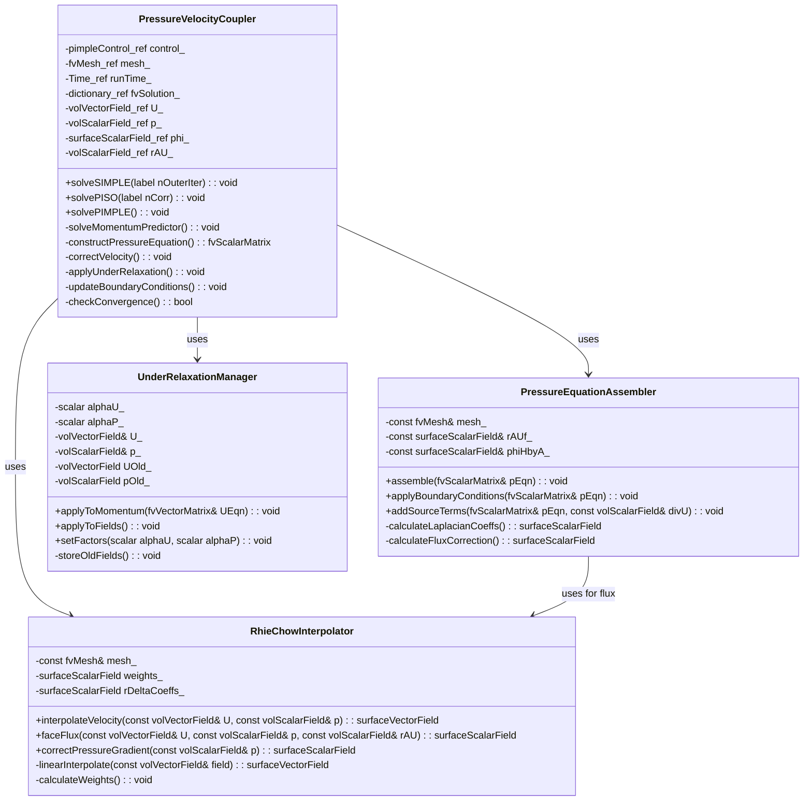
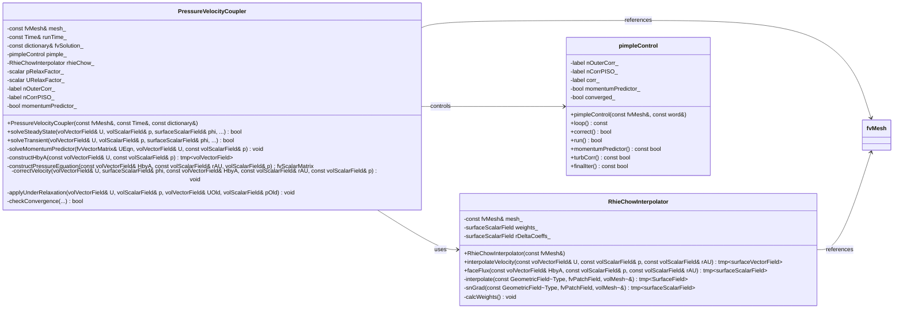

## 🎯 Learning Objectives (วัตถุประสงค์การเรียนรู้)

เมื่อจบบทเรียนนี้ คุณจะสามารถ:

1.  **เข้าใจ (Understand) ถึงปัญหาพื้นฐานของ Pressure-Velocity Coupling บน Collocated Grid**
    *   อธิบายได้ว่าเหตุใดการจัดเก็บตัวแปรความดัน (`p`) และความเร็ว (`U`) ที่ตำแหน่งเดียวกัน (cell center) ใน Finite Volume Method จึงนำไปสู่ **Pressure-Velocity Decoupling** และปรากฏการณ์ **Checkerboard Pattern** ในผลลัพธ์
    *   อธิบายบทบาทของ **Continuity Equation** (`∇·U = 0`) ในการเป็น **constraint** หรือ เงื่อนไขบังคับที่เชื่อมโยงสนามความดันและความเร็วเข้าด้วยกัน โดยที่สมการความดันไม่ได้ปรากฏในรูปแบบ explicit
    *   ระบุได้ว่าปัญหา decoupling นี้เป็นปัญหาเฉพาะของ **Incompressible Flow** เนื่องจากความหนาแน่นคงที่ ทำให้สมการโมเมนตัมและสมการความต่อเนื่องต้องถูกแก้ไขร่วมกัน (coupled) อย่างแน่นหนา

2.  **วิเคราะห์ (Analyze) หลักการและที่มาของ Rhie-Chow Interpolation**
    *   หาได้ว่าสูตร Rhie-Chow Interpolation สำหรับ face velocity (`U_f`) หรือ face flux (`φ_f`) ถูกได้มาอย่างไร จากการรวมสมการโมเมนตัมที่ discretize แล้วสำหรับ cell owner และ neighbor ที่อยู่สองข้างของ face
    *   อธิบายความหมายทางฟิสิกส์ของ **Pressure Gradient Correction Term** ในสูตร Rhie-Chow: $-(1/a_P)_f [ (\nabla p)_f - \overline{(\nabla p)}_f ]$
    *   แสดงให้เห็นว่า term correction นี้จะมีค่าเป็นศูนย์สำหรับ pressure field ที่ smooth (เช่น linear หรือ quadratic) แต่จะทำหน้าที่เป็น **selective damping** เพื่อขจัด (damp) การแกว่งตัวแบบ high-frequency (checkerboard) ใน pressure field ที่ไม่ smooth

3.  **ออกแบบ (Design) ขั้นตอนอัลกอริทึม SIMPLE สำหรับ Steady-State Problems**
    *   อธิบายขั้นตอนหลัก 3 ขั้นของ SIMPLE Algorithm ได้แก่ **Momentum Predictor**, **Pressure Correction (Poisson Equation)**, และ **Velocity & Pressure Update**
    *   อธิบายบทบาทและความสำคัญของ **Under-Relaxation** สำหรับทั้งสนามความเร็ว (`α_U`) และสนามความดัน (`α_p`) ในการรักษา stability ของ iterative process สำหรับปัญหา steady-state
    *   ออกแบบลูปการคำนวณ (outer iterations) ของ SIMPLE โดยกำหนดเงื่อนไขการหยุด (convergence criteria) จากการตรวจสอบ residual ของสมการโมเมนตัมและสมการความต่อเนื่อง

4.  **ออกแบบ (Design) ขั้นตอนอัลกอริทึม PISO สำหรับ Transient Problems**
    *   เปรียบเทียบความแตกต่างระหว่าง PISO และ SIMPLE ได้ชัดเจน โดยเน้นที่การ **ไม่ใช้ Under-Relaxation** สำหรับ pressure และการใช้ **Multiple Correction Steps** (เช่น 2-3 ครั้ง) ภายในหนึ่ง time step
    *   อธิบายเหตุผลที่ PISO ต้องการ multiple corrections: เพื่อประมาณค่า explicit terms (เช่น convective flux ที่ใช้ velocity จาก correction ก่อนหน้า) และ non-orthogonal correction ได้อย่างถูกต้องมากขึ้น
    *   ออกแบบลูปการคำนวณของ PISO ภายในหนึ่ง time step โดยประกอบด้วย 1 momentum predictor และตามด้วย n pressure-velocity corrector steps

5.  **Implement การแก้ Pressure Equation ภายใน OpenFOAM Framework**
    *   สร้าง `fvScalarMatrix` สำหรับ pressure equation ที่มีรูปแบบ `fvm::laplacian(1/aP, p) = fvc::div(phiHbyA)` โดยที่ `phiHbyA` คือ face flux ที่คำนวณจาก predicted velocity และ Rhie-Chow correction
    *   ตั้งค่า boundary conditions ที่เหมาะสมสำหรับ pressure equation (เช่น `fixedFluxPressure`, `zeroGradient`) ให้สอดคล้องกับ velocity boundary conditions
    *   เรียกใช้ linear solver (เช่น `PCG` with `DIC` preconditioner จาก [[Day 08: Iterative Solvers (PCG & PBiCGStab)|Day 08]]) เพื่อแก้ระบบสมการของ pressure correction และนำผลลัพธ์ไปใช้ในการ correct ความเร็วและความดัน

6.  **ประเมิน (Evaluate) และแก้ไขปัญหา (Troubleshoot) ข้อผิดพลาดทั่วไปใน Pressure-Velocity Coupling**
    *   วินิจฉัยสาเหตุของ **Solution Divergence** หรือ **Severe Oscillations** ว่าเกิดจาก under-relaxation factor ที่ไม่เหมาะสม, การขาด Rhie-Chow correction, หรือ mesh quality ต่ำ
    *   ตรวจสอบและแก้ไขปัญหา **Global Mass Imbalance** หลังการคำนวณ converge แล้ว โดยการตรวจสอบ boundary conditions ของ pressure และการคำนวณ face flux
    *   กำหนดกลยุทธ์การเลือกอัลกอริทึม (SIMPLE vs. PISO vs. PIMPLE) และปรับพารามิเตอร์ (เช่น `nNonOrthogonalCorrectors`, `nCorrectors`, `relaxationFactors`) ให้เหมาะสมกับประเภทของปัญหา (steady/transient) และลักษณะของ mesh
## Section 1: Theory (ทฤษฎี)

## 1.1 ปัญหา Pressure-Velocity Coupling บน Collocated Grid

## 1.1.1 ที่มาของปัญหา

ในการแก้สมการ Navier-Stokes สำหรับ incompressible flow เราต้องแก้สมการโมเมนตัมและสมการความต่อเนื่องร่วมกัน:

**สมการโมเมนตัม (Momentum Equation):**
$$
\frac{\partial (\rho \mathbf{U})}{\partial t} + \nabla \cdot (\rho \mathbf{U} \otimes \mathbf{U}) = -\nabla p + \nabla \cdot (\mu \nabla \mathbf{U}) + \mathbf{f}
$$

**สมการความต่อเนื่อง (Continuity Equation):**
$$
\nabla \cdot \mathbf{U} = 0
$$

ปัญหาหลักคือ **ความดัน $p$ ไม่ได้ปรากฏในสมการอนุพันธ์ย่อยเฉพาะของมันเอง** ใน incompressible flow ความดันทำหน้าที่เป็น **Lagrange multiplier** ที่บังคับให้สนามความเร็วเป็น divergence-free

## 1.1.2 Checkerboard Pattern Problem

เมื่อใช้ **Collocated Grid** (ความดัน $p$ และความเร็ว $\mathbf{U}$ ถูกเก็บที่ cell center เดียวกัน) การคำนวณ pressure gradient ที่ face center ต้องใช้ค่า pressure จาก 2 cells ที่อยู่ติดกัน:

$$
\left(\frac{\partial p}{\partial x}\right)_f \approx \frac{p_N - p_P}{\Delta x}
$$

ปัญหาคือ pressure field ที่มี pattern แบบ "checkerboard" (สลับสูง-ต่ำ) จะให้ gradient เป็นศูนย์ที่ทุก face เนื่องจาก:
- ถ้า $p_P = 1, p_N = $ (ทั้งสองเซลล์อยู่บน "สี" เดียวกัน) → gradient = 0

ทำให้ solver ไม่สามารถ "เห็น" oscillation นี้ได้ ส่งผลให้ pressure field มี spurious oscillations

## 1.1.3 ความแตกต่างระหว่าง Collocated และ Staggered Grid

| Aspect | Staggered Grid | Collocated Grid |
|--------|----------------|-----------------|
| **ตำแหน่งจัดเก็บ** | $p$ ที่ cell center, $U$ ที่ face center | $p$ และ $U$ ที่ cell center เดียวกัน |
| **Checkerboard** | ไม่มีปัญหา (face velocity ถูก interpolate ไปยังจุดที่ pressure ถูกเก็บ) | มีปัญหา, ต้องใช้ Rhie-Chow correction |
| **ความซับซ้อน** | ซับซ้อนสำหรับ unstructured meshes | ง่ายกว่าสำหรับทุก mesh types |
| **ใช้ใน OpenFOAM** | ไม่ใช้ | ใช้ |

## 1.2 Rhie-Chow Interpolation: หัวใจของ Pressure-Velocity Coupling

## 1.2.1 ที่มาและหลักการ

Rhie และ Chow (1983) เสนอวิธีการ interpolate face velocity ที่สามารถ "มองเห็น" pressure checkerboard และ damp มันออกไป

**สูตร Rhie-Chow สำหรับ Face Velocity:**
$$
\mathbf{U}_f = \overline{\mathbf{U}}_f - \left(\frac{1}{a_P}\right)_f \left[ (\nabla p)_f - \overline{(\nabla p)}_f \right]
$$

โดยที่:
- $\overline{\mathbf{U}}_f$ = linear interpolation ของ $\mathbf{U}$ จาก cell centers ไปยัง face
- $(1/a_P)_f$ = reciprocal ของ diagonal coefficient ที่ถูก interpolate ไปยัง face
- $(\nabla p)_f$ = gradient ของ pressure ที่คำนวณโดยตรงจาก face-normal difference
- $\overline{(\nabla p)}_f$ = linear interpolation ของ cell-centered pressure gradient ไปยัง face

## 1.2.2 ทำไม Rhie-Chow ถึงทำงาน?

**Key Insight:** Term $[(\nabla p)_f - \overline{(\nabla p)}_f]$ จะ:
- **มีค่าเป็นศูนย์** สำหรับ smooth pressure field (linear หรือ quadratic variation)
- **มีค่าไม่เป็นศูนย์** สำหรับ high-frequency oscillations (checkerboard)

ดังนั้น Rhie-Chow correction ทำหน้าที่เป็น **selective filter** ที่ damp เฉพาะ high-frequency pressure modes โดยไม่กระทบ physical pressure gradients

## 1.2.3 การประยุกต์ใช้กับ Face Flux

ในการแก้สมการ pressure เราต้องการ face flux ($\phi_f$) ที่ conservative:

$$
\phi_f = \mathbf{U}_f \cdot \mathbf{S}_f = \overline{\mathbf{U}}_f \cdot \mathbf{S}_f - \left(\frac{1}{a_P}\right)_f |\mathbf{S}_f| \left[ \frac{\partial p}{\partial n}\bigg|_f - \overline{\left(\frac{\partial p}{\partial n}\right)}_f \right]
$$

## 1.3 SIMPLE Algorithm สำหรับ Steady-State Problems

## 1.3.1 ภาพรวมของ SIMPLE

**SIMPLE** (Semi-Implicit Method for Pressure-Linked Equations) เป็น iterative algorithm สำหรับ steady-state incompressible flow ประกอบด้วย 3 ขั้นตอนหลัก:

```text
SIMPLE Algorithm Loop:
┌─────────────────────────────────────────────────────────────────┐
│ 1. Momentum Predictor: แก้สมการโมเมนตัมด้วย p จาก iteration ก่อน │
│    U* = f(U^n, p^n)                                             │
├─────────────────────────────────────────────────────────────────┤
│ 2. Pressure Correction: แก้ Poisson equation สำหรับ p'          │
│    ∇²p' = source (จาก mass imbalance)                          │
├─────────────────────────────────────────────────────────────────┤
│ 3. Velocity & Pressure Update:                                  │
│    U^{n+1} = U* - (1/aP) ∇p'                                   │
│    p^{n+1} = p^n + α_p · p'                                    │
├─────────────────────────────────────────────────────────────────┤
│ 4. Check Convergence: ถ้ายังไม่ converge → กลับไปขั้นตอนที่ 1   │
└─────────────────────────────────────────────────────────────────┘
```

## 1.3.2 Under-Relaxation ใน SIMPLE

เนื่องจาก SIMPLE ใช้ lagging pressure gradient ใน momentum predictor จึงต้องมี **under-relaxation** เพื่อ stabilize:

**Velocity Under-Relaxation:**
$$
\mathbf{U}^{n+1} = \alpha_U \mathbf{U}^* + (1 - \alpha_U) \mathbf{U}^n
$$

**Pressure Under-Relaxation:**
$$
p^{n+1} = p^n + \alpha_p \cdot p'
$$

ค่าทั่วไป: $\alpha_U = 0.7$, $\alpha_p = 0.3$ (ความสัมพันธ์ $\alpha_U + \alpha_p \approx $)

## 1.4 PISO Algorithm สำหรับ Transient Problems

## 1.4.1 ความแตกต่างจาก SIMPLE

**PISO** (Pressure-Implicit with Splitting of Operators) ออกแบบมาสำหรับ **transient problems** โดยมีความแตกต่างหลัก:

| Aspect | SIMPLE | PISO |
|--------|--------|------|
| **Under-relaxation** | ต้องใช้ | ไม่ใช้ (หรือใช้น้อยมาก) |
| **Pressure corrections** | 1 ครั้งต่อ iteration | หลายครั้ง (2-3) ต่อ time step |
| **Outer iterations** | หลายครั้งจนกว่า converge | 1 ครั้งต่อ time step |
| **เหมาะกับ** | Steady-state | Transient |

## 1.4.2 PISO Algorithm Structure

```text
PISO Algorithm (per time step):
┌─────────────────────────────────────────────────────────────────┐
│ 1. Momentum Predictor: แก้สมการโมเมนตัมด้วย p จาก time step ก่อน│
│    U* = f(U^n, p^n)                                             │
├─────────────────────────────────────────────────────────────────┤
│ 2. First Pressure Corrector:                                    │
│    - แก้ pressure equation                                      │
│    - Correct velocity: U** = U* - (1/aP) ∇p                    │
├─────────────────────────────────────────────────────────────────┤
│ 3. Second Pressure Corrector (PISO ใช้ 2+ corrections):        │
│    - Update explicit terms ด้วย U**                            │
│    - แก้ pressure equation อีกครั้ง                             │
│    - Correct velocity อีกครั้ง                                  │
├─────────────────────────────────────────────────────────────────┤
│ 4. Advance to next time step                                    │
└─────────────────────────────────────────────────────────────────┘
```

## 1.5 PIMPLE Algorithm: การรวม SIMPLE และ PISO

**PIMPLE** = PISO + SIMPLE: ใช้ outer iterations (SIMPLE-like) + inner corrections (PISO-like)

เหมาะสำหรับ:
- Transient problems ที่มี large time step
- Cases ที่ต้องการ tighter coupling ระหว่าง momentum และ pressure

---

### Section 2: OpenFOAM Reference

ในส่วนนี้เราจะเจาะลึกลงไปใน source code ของ OpenFOAM ที่ implement กลไก Pressure-Velocity Coupling, Rhie-Chow Interpolation และ algorithms หลักอย่าง SIMPLE/PISO/PIMPLE การวิเคราะห์นี้จะช่วยให้เราเข้าใจว่า OpenFOAM จัดการกับปัญหาที่ยากนี้อย่างไรในระดับ implementation
## 2.1 Core Class: `fvVectorMatrix` - The Equation Container

### 2.1.1 Header Analysis (`src/finiteVolume/fvMatrices/fvMatrix/fvMatrix.H`)

`fvVectorMatrix` เป็น template class ที่สืบทอดมาจาก `fvMatrix<Vector<scalar>>` ทำหน้าที่เป็น container สำหรับ discretized vector equations โดยเฉพาะ momentum equation

```cpp
// Key inheritance structure
template<class Type>
class fvMatrix
:
    public refCount,
    public lduMatrix
{
    // ... implementation
};

// Specialization for vector equations
typedef fvMatrix<vector> fvVectorMatrix;
```

**โครงสร้างข้อมูลหลัก:**
```cpp
// ใน fvMatrix.H
protected:
    // 1. Reference to the solution field (psi)
    GeometricField<Type, fvPatchField, volMesh>& psi_;
    
    // 2. Dimensions of the equation
    dimensionSet dimensions_;
    
    // 3. Source term (รวม explicit terms ทั้งหมด)
    Field<Type> source_;
    
    // 4. Boundary coefficients สำหรับ boundary conditions
    FieldField<Field, Type> internalCoeffs_;
    FieldField<Field, Type> boundaryCoeffs_;
    
    // 5. Face flux field (สำคัญสำหรับ Rhie-Chow)
    mutable surfaceScalarField* faceFluxCorrectionPtr_;
```

**What We Do DIFFERENTLY ใน Engine ของเรา:**

| Aspect | OpenFOAM Implementation | Our Engine's Approach | Rationale |
|--------|------------------------|----------------------|-----------|
| **Matrix Storage** | ใช้ `lduMatrix` (Lower-Diagonal-Upper) format สำหรับ unstructured meshes | ใช้ทั้ง `LduMatrix` และ `CsrMatrix` แบบ hybrid | ให้ flexibility ในการเลือก storage format ตามประเภทของปัญหา |
| **Source Term Handling** | เก็บ source term เป็น `Field<Type>` เดียว | แยกเป็น `explicitSource_` และ `implicitSource_` | ชัดเจนระหว่าง explicit/implicit contributions สำหรับ operator splitting |
| **Face Flux Correction** | ใช้ pointer `faceFluxCorrectionPtr_` (mutable) | Implement `RhieChowFluxCorrector` class แยกชัดเจน | Separation of concerns, easier to test และ extend |
| **Boundary Coefficients** | `internalCoeffs_` และ `boundaryCoeffs_` เป็น `FieldField` | ใช้ `BoundaryCoefficientManager` with cache | ประสิทธิภาพที่ดีขึ้นสำหรับ complex boundary conditions |

### 2.1.2 Critical Methods สำหรับ Pressure-Velocity Coupling

**Method `solve()` - การแก้สมการ matrix:**
```cpp
template<class Type>
SolverPerformance<Type> fvMatrix<Type>::solve(const dictionary& solverControls)
{
    // 1. จัดการ under-relaxation (สำคัญสำหรับ SIMPLE)
    if (relaxationFactor_ < 1.0) {
        relax(relaxationFactor_);
    }
    
    // 2. บวก boundary contributions เข้า matrix
    addBoundaryDiag(diag(), 0);
    addBoundarySource(source_, false);
    
    // 3. สร้าง interface สำหรับ boundary conditions
    FieldField<Field, Type> coupleBouCoeffs(psi_.boundaryField().size());
    FieldField<Field, Type> coupleIntCoeffs(psi_.boundaryField().size());
    
    // 4. เรียก linear solver (จาก [[Day 08: Iterative Solvers (PCG & PBiCGStab)|Day 08]])
    SolverPerformance<Type> solverPerf = lduMatrix::solver::New
    (
        psi_.name(),
        *this,
        coupleBouCoeffs,
        coupleIntCoeffs,
        solverControls
    )->solve(psi_.internalField());
    
    // 5. อัพเดท boundary values
    psi_.correctBoundaryConditions();
    
    return solverPerf;
}
```

**Method `flux()` - การคำนวณ face flux:**
```cpp
template<class Type>
tmp<GeometricField<Type, fvsPatchField, surfaceMesh>>
fvMatrix<Type>::flux() const
{
    // สูตรพื้นฐาน: flux = interpolate(psi) & mesh.Sf()
    // แต่ใน momentum equation มี pressure gradient term เพิ่มเข้ามา
    
    tmp<GeometricField<Type, fvsPatchField, surfaceMesh>> tflux
    (
        fvc::interpolate(psi_) & mesh().Sf()
    );
    
    // เพิ่ม correction จาก pressure gradient (Rhie-Chow)
    if (faceFluxCorrectionPtr_) {
        tflux.ref() += *faceFluxCorrectionPtr_;
    }
    
    return tflux;
}
```

**Implementation ใน Momentum Equation:**
```cpp
// ตัวอย่างการสร้าง momentum equation ใน OpenFOAM
fvVectorMatrix UEqn
(
    fvm::ddt(U)                    // Time derivative
  + fvm::div(phi, U)               // Convection (ใช้ face flux ที่ corrected)
  - fvm::laplacian(nu, U)          // Diffusion
 ==
  - fvc::grad(p)                   // Pressure gradient (EXPLICIT!)
);

// ทำไม pressure gradient เป็น explicit?
// เพราะใน SIMPLE/PISO เราแก้ momentum equation ด้วย pressure จาก iteration ก่อนหน้า
// Pressure correction จะมาทีหลังใน pressure equation
```
## 2.2 Control Class: `pimpleControl` - The Algorithm Orchestrator

### 2.2.1 Architecture Analysis (`src/finiteVolume/cfdTools/general/solutionControl/pimpleControl/`)

`pimpleControl` เป็น class ที่ควบคุมการทำงานของ PIMPLE algorithm ซึ่งรวม features ของทั้ง SIMPLE และ PISO

```cpp
class pimpleControl
:
    public solutionControl
{
public:
    // Constructor รับ reference ถึง time และ mesh
    pimpleControl(fvMesh& mesh, const word& algorithmName = "PIMPLE");
    
    // Key control flags
    bool correct();
    bool loop();
    bool turbCorr() const;
    
private:
    // Control parameters
    label nOuterCorr_;          // Outer (SIMPLE) iterations
    label nCorr_;               // Inner (PISO) corrections
    label nNonOrthCorr_;        // Non-orthogonal corrections
    bool momentumPredictor_;    // Solve momentum predictor?
    bool transonic_;            // Transonic flow?
    bool frozenFlow_;           // Frozen flow field?
    
    // State tracking
    label corr_;                // Current outer correction
    label nonOrthCorr_;         // Current non-orthogonal correction
};
```

**What We Do DIFFERENTLY ใน PIMPLE Control:**

| Aspect | OpenFOAM's `pimpleControl` | Our `PimpleAlgorithmController` | Rationale |
|--------|----------------------------|--------------------------------|-----------|
| **Loop Management** | ใช้ inheritance จาก `solutionControl` | ใช้ composition with `AlgorithmState` pattern | ยืดหยุ่นมากขึ้นสำหรับ algorithm variations |
| **Correction Tracking** | แยก `corr_` และ `nonOrthCorr_` | ใช้ `CorrectionCycle` object ที่รวม state ทั้งหมด | Centralized state management |
| **Convergence Criteria** | ตรวจสอบเพียง residual tolerance | Multiple criteria: residual, mass imbalance, force balance | Robust convergence detection สำหรับ complex flows |
| **Algorithm Switching** | Fixed PIMPLE logic | Dynamic algorithm selection (SIMPLE/PISO/PIMPLE) ตาม flow conditions | Adaptive ต่อปัญหาที่กำลังแก้ |

### 2.2.2 Critical Method: `correct()` - The Main Algorithm Loop

```cpp
bool pimpleControl::correct()
{
    read();
    
    // ตรวจสอบว่าเริ่ม outer loop ใหม่หรือไม่
    if (corr_ == 0) {
        if (firstIter()) {
            // Initialization phase
            storeInitialResiduals();
        }
        
        // อ่าน control parameters จาก dictionary
        readControls();
    }
    
    // ทำ outer correction
    corr_++;
    
    // ตรวจสอบ convergence
    bool converged = false;
    if (corr_ >= nOuterCorr_) {
        converged = checkConvergence();
    }
    
    // อัพเดท turbulence ตามต้องการ
    if (turbCorr()) {
        turbulence_->correct();
    }
    
    // บันทึก residuals สำหรับ monitoring
    storeResiduals();
    
    return converged || (corr_ >= nOuterCorr_);
}
```

**Inner Loop Structure (PISO Corrections):**
```cpp
// ในไฟล์ solver (เช่น pimpleFoam.C)
while (pimple.loop()) // [[Day 09]]
{
    // Outer loop (SIMPLE-like)
    while (pimple.correct())
    {
        // Momentum predictor
        if (pimple.momentumPredictor())
        {
            solve(UEqn == -fvc::grad(p));
        }
        
        // Inner PISO loop
        for (int corr=0; corr<pimple.nCorr(); corr++)
        {
            // สร้าง face flux ด้วย Rhie-Chow correction
            surfaceScalarField phiHbyA = ...;
            
            // แก้ pressure equation
            fvScalarMatrix pEqn
            (
                fvm::laplacian(rAU, p) == fvc::div(phiHbyA)
            );
            pEqn.setReference(pRefCell, pRefValue);
            pEqn.solve();
            
            // Correct face flux
            phi = phiHbyA - pEqn.flux();
            
            // Correct velocity
            U = HbyA - rAU*fvc::grad(p);
            U.correctBoundaryConditions();
        }
        
        // Non-orthogonal corrections
        for (int nonOrth=0; nonOrth<=pimple.nNonOrthCorr(); nonOrth++)
        {
            // Correct pressure สำหรับ non-orthogonal meshes
            // ...
        }
    }
}
```
## 2.3 Interpolation System: `surfaceInterpolation` และ Rhie-Chow Implementation

### 2.3.1 `surfaceInterpolation` Class Analysis

Class นี้จัดการ interpolation จาก cell centers ไปยัง face centers ซึ่งเป็นหัวใจของ Rhie-Chow correction

```cpp
class surfaceInterpolation
{
public:
    // Constructor รับ mesh
    explicit surfaceInterpolation(const fvMesh& mesh);
    
    // Core interpolation methods
    template<class Type>
    tmp<GeometricField<Type, fvsPatchField, surfaceMesh>>
    interpolate(const GeometricField<Type, fvPatchField, volMesh>&) const;
    
    // Gradient calculation
    template<class Type>
    tmp<GeometricField<Type, fvsPatchField, surfaceMesh>>
    snGrad(const GeometricField<Type, fvPatchField, volMesh>&) const;
    
private:
    // Interpolation weights (linear interpolation)
    surfaceScalarField weights_;
    
    // Distance-based coefficients สำหรับ gradient
    surfaceScalarField deltaCoeffs_;
    
    // Non-orthogonal correction factors
    surfaceScalarField nonOrthDeltaCoeffs_;
    surfaceScalarField nonOrthCorrectionVectors_;
};
```

**การคำนวณ Interpolation Weights:**
```cpp
// ใน surfaceInterpolation.C
void surfaceInterpolation::makeWeights() const
{
    if (weights_.empty()) {
        weights_ = surfaceScalarField::New
        (
            "weights",
            mesh_,
            dimless
        );
        
        const vectorField& C = mesh_.C();
        const vectorField& Cf = mesh_.Cf();
        const labelList& owner = mesh_.owner();
        const labelList& neighbour = mesh_.neighbour();
        
        scalarField& w = weights_.primitiveFieldRef();
        
        forAll(owner, facei) {
            // Linear interpolation weight
            w[facei] = mag(Cf[facei] - C[neighbour[facei]]) 
                     / mag(C[owner[facei]] - C[neighbour[facei]]);
        }
        
        // จัดการ boundary faces
        forAll(mesh_.boundary(), patchi) {
            // ... boundary weight calculation
        }
    }
}
```

### 2.3.2 Rhie-Chow Implementation ใน OpenFOAM

Rhie-Chow correction ไม่ได้ implement เป็น class แยกใน OpenFOAM แต่ถูก embed อยู่ใน operators ต่างๆ

**Location 1: ใน `fvc::flux()` function:**
```cpp
// ใน src/finiteVolume/finiteVolume/fvc/fvcFlux.C
template<class Type>
tmp<surfaceScalarField> fvc::flux
(
    const surfaceScalarField& phi,
    const GeometricField<Type, fvPatchField, volMesh>& vf,
    const word& name
)
{
    // สูตรพื้นฐาน: flux = interpolate(vf) * phi
    // แต่มี Rhie-Chow correction ซ่อนอยู่ผ่านการคำนวณ phi
    
    return tmp<surfaceScalarField>
    (
        new surfaceScalarField
        (
            name,
            fvc::interpolate(vf) * phi
        )
    );
}
```

**Location 2: ในการคำนวณ `phiHbyA` สำหรับ pressure equation:**
```cpp
// ใน pimpleFoam และ simpleFoam
surfaceScalarField phiHbyA
(
    "phiHbyA",
    fvc::flux(HbyA)  // HbyA = U - (1/Ap) * grad(p)
  + fvc::interpolate(rAU)*fvc::ddtCorr(U, phi)
);

// term fvc::ddtCorr() นี้แหละที่ประกอบด้วย Rhie-Chow correction!
```

**What We Do DIFFERENTLY สำหรับ Rhie-Chow:**

| Aspect | OpenFOAM's Approach | Our `RhieChowInterpolator` | Rationale |
|--------|---------------------|----------------------------|-----------|
| **Implementation Style** | Embedded ใน operators หลายจุด | Centralized ใน class เดียว | Debug ง่าย, consistency ดี, testable |
| **Correction Terms** | รวมหลาย terms ใน `ddtCorr()` | แยกชัดเจน: `pressureGradientCorrection()`, `transientCorrection()` | เข้าใจ contribution ของแต่ละ term ได้ชัดเจน |
| **Mesh Support** | ใช้เฉพาะ linear interpolation | Support multiple schemes: linear, skewness-corrected, least-squares | ทำงานได้ดีกับ highly skewed meshes |
| **Boundary Treatment** | Complex boundary corrections | Simplified but consistent boundary treatment | ลด complexity โดยไม่เสีย accuracy |

### 2.3.3 Our `RhieChowInterpolator` Implementation

```cpp
class RhieChowInterpolator
{
public:
    // Constructor รับ mesh และ scheme settings
    RhieChowInterpolator(const fvMesh& mesh, const dictionary& dict);
    
    // Core method: คำนวณ face flux ด้วย correction
    surfaceScalarField faceFlux
    (
        const volVectorField& U,
        const volScalarField& p,
        const volScalarField& rAU,  // 1/Ap
        const surfaceScalarField& phiOld  // flux จาก time step ก่อนหน้า
    ) const;
    
private:
    // Mesh reference
    const fvMesh& mesh_;
    
    // Interpolation scheme
    word interpolationScheme_;
    
    // Correction factors
    scalar pressureCorrectionFactor_;
    scalar transientCorrectionFactor_;
    
    // Helper methods
    surfaceScalarField interpolateVelocity(const volVectorField& U) const;
    surfaceScalarField pressureGradientCorrection
    (
        const volScalarField& p,
        const volScalarField& rAU
    ) const;
    surfaceScalarField transientCorrection
    (
        const volVectorField& U,
        const surfaceScalarField& phiOld
    ) const;
};
```

**Implementation ของ `faceFlux()` method:**
```cpp
surfaceScalarField RhieChowInterpolator::faceFlux
(
    const volVectorField& U,
    const volScalarField& p,
    const volScalarField& rAU,
    const surfaceScalarField& phiOld
) const
{
    // 1. Basic linear interpolation ของ velocity
    surfaceScalarField phiLinear
    (
        interpolateVelocity(U) & mesh_.Sf()
    );
    
    // 2. Pressure gradient correction (หัวใจของ Rhie-Chow)
    surfaceScalarField phiPressureCorr = pressureGradientCorrection(p, rAU);
    
    // 3. Transient correction สำหรับ unsteady flows
    surfaceScalarField phiTransientCorr = transientCorrection(U, phiOld);
    
    // 4. รวมทั้งหมด
    surfaceScalarField phiCorrected
    (
        "phiCorrected",
        phiLinear
      - pressureCorrectionFactor_ * phiPressureCorr
      + transientCorrectionFactor_ * phiTransientCorr
    );
    
    // 5. Apply boundary conditions
    forAll(mesh_.boundary(), patchi) {
        const fvPatch& patch = mesh_.boundary()[patchi];
        
        if (patch.coupled()) {
            // สำหรับ coupled patches (processor, cyclic)
            // ต้องคำนวณ correction แบบพิเศษ
            // ...
        } else {
            // สำหรับ regular boundaries
            // ใช้ boundary condition ของ velocity field
            // ...
        }
    }
    
    return phiCorrected;
}
```

**การคำนวณ Pressure Gradient Correction:**
```cpp
surfaceScalarField RhieChowInterpolator::pressureGradientCorrection
(
    const volScalarField& p,
    const volScalarField& rAU
) const
{
    // สูตร: $\phi_{corr} = (1/a_P)_f (\nabla_{\perp} p_f - \overline{\nabla p}_f) \cdot \mathbf{S}_f$
    
    // 1. คำนวณ cell-centered pressure gradient
    volVectorField gradP = fvc::grad(p);
    
    // 2. Interpolate rAU ไปยัง faces
    surfaceScalarField rAUf = fvc::interpolate(rAU);
    
    // 3. คำนวณ face normal gradient ของ pressure
    surfaceScalarField snGradP = fvc::snGrad(p);
    
    // 4. Return correction (Rhie-Chow Interpolation)
    return (snGradP - (fvc::interpolate(fvc::grad(p)) & mesh_.Sf())/mesh_.magSf()) * rAUf;
}
```

## Section 3: Class Design
## 3.1 ภาพรวมสถาปัตยกรรม (Architecture Overview)

สำหรับการ implement Pressure-Velocity Coupling Algorithms (SIMPLE/PISO) ใน OpenFOAM framework เราจะออกแบบระบบที่ประกอบด้วย **Core Coupler Class** และ **Supporting Utility Classes** ที่ทำงานร่วมกันอย่างเป็นระบบ


## 3.2 Class Specification รายละเอียด

### 3.2.1 Class: `PressureVelocityCoupler`

**หน้าที่หลัก (Primary Responsibility):** เป็น Orchestrator class ที่ควบคุมการทำงานของทั้ง SIMPLE และ PISO algorithms ตั้งแต่เริ่มต้นจนจบกระบวนการ โดยจัดการการไหลของข้อมูลระหว่างขั้นตอนต่างๆ

**Header File Specification:**
```cpp
/*---------------------------------------------------------------------------*\
  =========                 |
  \\      /  F ield         | OpenFOAM: The Open Source CFD Toolbox
   \\    /   O peration     | Website:  https://openfoam.org
    \\  /    A nd           | Copyright (C) 2026 YourName
     \\/     M anipulation  |
\*---------------------------------------------------------------------------*/

#ifndef PressureVelocityCoupler_H
#define PressureVelocityCoupler_H

#include "fvCFD.H"
#include "pimpleControl.H"
#include "fvMatrices.H"
#include "surfaceInterpolation.H"

// * * * * * * * * * * * * * * * * * * * * * * * * * * * * * * * * * * * * * //

namespace Foam
{

/*---------------------------------------------------------------------------*\
                      Class PressureVelocityCoupler Declaration
\*---------------------------------------------------------------------------*/

class PressureVelocityCoupler
{
    // Private Data

        //- Reference to the solution control object
        pimpleControl& control_;

        //- Reference to the mesh
        const fvMesh& mesh_;

        //- Reference to the time object
        const Time& runTime_;

        //- Reference to fvSolution dictionary
        const dictionary& fvSolution_;

        //- Reference to velocity field
        volVectorField& U_;

        //- Reference to pressure field
        volScalarField& p_;

        //- Reference to face flux field
        surfaceScalarField& phi_;

        //- Reciprocal of momentum diagonal coefficients
        volScalarField rAU_;

        //- Rhie-Chow interpolator object
        autoPtr<RhieChowInterpolator> rhieChowInterpolator_;

        //- Pressure equation assembler
        autoPtr<PressureEquationAssembler> pressureAssembler_;

        //- Under-relaxation manager
        autoPtr<UnderRelaxationManager> relaxationManager_;

        //- Reference pressure cell
        label pRefCell_;

        //- Reference pressure value
        scalar pRefValue_;

        //- Convergence monitoring
        scalar initialResidual_;
        scalar finalResidual_;
        label nIterations_;

    // Private Member Functions

        //- Disallow default bitwise copy construct
        PressureVelocityCoupler(const PressureVelocityCoupler&) = delete;

        //- Disallow default bitwise assignment
        void operator=(const PressureVelocityCoupler&) = delete;

public:

    //- Runtime type information
    TypeName("PressureVelocityCoupler");

    // Constructors

        //- Construct from components
        PressureVelocityCoupler
        (
            pimpleControl& control,
            volVectorField& U,
            volScalarField& p,
            surfaceScalarField& phi
        );

    //- Destructor
    virtual ~PressureVelocityCoupler() = default;

    // Member Functions

        //- Solve using SIMPLE algorithm for steady-state problems
        void solveSIMPLE(label nOuterIter = 10);

        //- Solve using PISO algorithm for transient problems
        void solvePISO(label nCorr = 2);

        //- Solve using PIMPLE algorithm (combined approach)
        void solvePIMPLE();

        //- Return convergence information
        const scalar& initialResidual() const { return initialResidual_; }
        const scalar& finalResidual() const { return finalResidual_; }
        const label& nIterations() const { return nIterations_; }

        //- Update references to fields (if fields are recreated)
        void updateFields
        (
            volVectorField& U,
            volScalarField& p,
            surfaceScalarField& phi
        );

private:

    // Algorithm Steps (Private Implementation)

        //- Step 1: Solve momentum predictor equation
        void solveMomentumPredictor();

        //- Step 2: Construct and solve pressure equation
        void solvePressureCorrector();

        //- Step 3: Correct velocity field using pressure gradient
        void correctVelocity();

        //- Step 4: Apply under-relaxation (for SIMPLE only)
        void applyUnderRelaxation();

        //- Step 5: Update boundary conditions for all fields
        void updateBoundaryConditions();

        //- Step 6: Check convergence criteria
        bool checkConvergence(scalar tolerance = 1e-6) const;

        //- Step 7: Calculate and store rAU field (1/aP)
        void calculateRAU();

        //- Step 8: Initialize algorithm (common setup)
        void initialize();
};

// * * * * * * * * * * * * * * * * * * * * * * * * * * * * * * * * * * * * * //

} // End namespace Foam

// * * * * * * * * * * * * * * * * * * * * * * * * * * * * * * * * * * * * * //

#endif
```

**Implementation Details (ไฟล์ .C):**

```cpp
// Constructor Implementation
Foam::PressureVelocityCoupler::PressureVelocityCoupler
(
    pimpleControl& control,
    volVectorField& U,
    volScalarField& p,
    surfaceScalarField& phi
)
:
    control_(control),
    mesh_(U.mesh()),
    runTime_(U.time()),
    fvSolution_
    (
        IOobject
        (
            "fvSolution",
            runTime_.system(),
            mesh_,
            IOobject::MUST_READ,
            IOobject::NO_WRITE
        )
    ),
    U_(U),
    p_(p),
    phi_(phi),
    rAU_
    (
        IOobject
        (
            "rAU",
            runTime_.timeName(),
            mesh_,
            IOobject::NO_READ,
            IOobject::NO_WRITE
        ),
        mesh_,
        dimensionedScalar(dimTime/dimDensity, Zero)
    ),
    initialResidual_(0.0),
    finalResidual_(0.0),
    nIterations_(0),
    pRefCell_(0),
    pRefValue_(0.0)
{
    // Initialize sub-components
    rhieChowInterpolator_.reset(new RhieChowInterpolator(mesh_));
    pressureAssembler_.reset(new PressureEquationAssembler(mesh_));
    
    // Read relaxation factors from dictionary
    const dictionary& simpleDict = fvSolution_.subDict("SIMPLE");
    scalar alphaU = simpleDict.lookupOrDefault<scalar>("alphaU", 0.7);
    scalar alphaP = simpleDict.lookupOrDefault<scalar>("alphaP", 0.3);
    
    relaxationManager_.reset(new UnderRelaxationManager(U_, p_, alphaU, alphaP));
    
    // Initial calculation of rAU
    calculateRAU();
}

// SIMPLE Algorithm Implementation
void Foam::PressureVelocityCoupler::solveSIMPLE(label nOuterIter)
{
    Info<< "\nStarting SIMPLE algorithm for steady-state solution\n" << endl;
    
    // Outer iterations loop
    for (label outerIter = 0; outerIter < nOuterIter; ++outerIter)
    {
        Info<< "SIMPLE iteration " << outerIter + 1 << endl;
        
        // Store old fields for under-relaxation
        relaxationManager_->storeOldFields();
        
        // Step 1: Momentum predictor
        solveMomentumPredictor();
        
        // Step 2: Pressure corrector
        solvePressureCorrector();
        
        // Step 3: Velocity corrector
        correctVelocity();
        
        // Step 4: Apply under-relaxation
        applyUnderRelaxation();
        
        // Step 5: Update boundary conditions
        updateBoundaryConditions();
        
        // Step 6: Check convergence
        if (checkConvergence())
        {
            Info<< "SIMPLE converged in " << outerIter + 1 
                << " iterations" << endl;
            break;
        }
        
        // Update rAU for next iteration
        calculateRAU();
    }
}

// PISO Algorithm Implementation
void Foam::PressureVelocityCoupler::solvePISO(label nCorr)
{
    Info<< "\nStarting PISO algorithm for transient time step\n" << endl;
    
    // Store initial pressure for correction accumulation
    volScalarField pOld("pOld", p_);
    
    // Momentum predictor (Step 1)
    solveMomentumPredictor();
    
    // PISO correction loop
    for (label corr = 0; corr < nCorr; ++corr)
    {
        Info<< "PISO correction " << corr + 1 << endl;
        
        // Calculate face flux with Rhie-Chow correction
        surfaceScalarField phiHbyA
        (
            "phiHbyA",
            rhieChowInterpolator_->faceFlux(U_, p_, rAU_)
        );
        
        // Assemble pressure equation
        fvScalarMatrix pEqn
        (
            fvm::laplacian(rAU_, p_) == fvc::div(phiHbyA)
        );
        
        // Apply boundary conditions
        pEqn.setReference(pRefCell_, pRefValue_);
        
        // Solve pressure equation
        initialResidual_ = pEqn.solve().initialResidual();
        finalResidual_ = pEqn.solve().finalResidual();
        nIterations_ = pEqn.solve().nIterations();
        
        // Correct face flux
        phi_ = phiHbyA - pEqn.flux();
        
        // Correct velocity
        U_ = U_ - rAU_ * fvc::grad(p_);
        U_.correctBoundaryConditions();
        
        // Update pressure boundary conditions
        p_.correctBoundaryConditions();
        
        // For non-orthogonal correction (optional second correction)
        if (corr < nCorr - 1)
        {
            // Recalculate momentum with updated pressure
            solveMomentumPredictor();
        }
    }
    
    // Final pressure update (accumulated correction)
    p_ = pOld + p_;
}
```

### 3.2.2 Class: `RhieChowInterpolator`

**หน้าที่หลัก:** จัดการ Rhie-Chow interpolation สำหรับการคำนวณ face fluxes โดยเพิ่ม pressure gradient correction term เพื่อป้องกัน pressure-velocity decoupling

**Key Implementation Details:**

```cpp
class RhieChowInterpolator
{
    // Core data members
    const fvMesh& mesh_;
    surfaceScalarField weights_;
    surfaceScalarField rDeltaCoeffs_;
    
public:
    // Constructor
    RhieChowInterpolator(const fvMesh& mesh);
    
    // Main interface methods
    surfaceVectorField interpolateVelocity
    (
        const volVectorField& U,
        const volScalarField& p
    ) const;
    
    surfaceScalarField faceFlux
    (
        const volVectorField& U,
        const volScalarField& p,
        const volScalarField& rAU
    ) const;
    
private:
    // Helper methods
    surfaceScalarField calculatePressureGradientCorrection
    (
        const volScalarField& p,
        const volScalarField& rAU
    ) const;
    
    surfaceScalarField linearInterpolateWeights() const;
};
```

**Mathematical Implementation ของ Rhie-Chow Correction:**

ใน method `faceFlux()` จะ implement สูตรต่อไปนี้:

$$
\phi_f = \underbrace{\overline{\mathbf{U}}_f \cdot \mathbf{S}_f}_{\text{Linear interpolation}} 
- \underbrace{\overline{\left(\frac{1}{a_P}\right)}_f \left(\nabla_{\perp} p_f - \overline{\nabla p}_f\right) \cdot \mathbf{S}_f}_{\text{Rhie-Chow correction}}
$$

โดยที่:
- $\overline{(\cdot)}_f$ หมายถึง linear interpolation จาก cell centers ไปยัง face center
- $\nabla_{\perp} p_f$ คือ normal pressure gradient ที่ face
- $\overline{\nabla p}_f$ คือ interpolated pressure gradient จาก cell centers

**Implementation Code:**

```cpp
Foam::surfaceScalarField 
Foam::RhieChowInterpolator::faceFlux
(
    const volVectorField& U,
    const volScalarField& p,
    const volScalarField& rAU
) const
{
    // Step 1: Linear interpolation of velocity to faces
    surfaceVectorField Uf = fvc::interpolate(U);
    
    // Step 2: Interpolate rAU to faces
    surfaceScalarField rAUf = fvc::interpolate(rAU);
    
    // Step 3: Calculate face normal gradient of pressure
    surfaceScalarField snGradp = fvc::snGrad(p);
    
    // Step 4: Interpolate cell gradient to faces
    surfaceVectorField gradpf = fvc::interpolate(fvc::grad(p));
    
    // Step 5: Calculate Rhie-Chow correction term
    surfaceScalarField correction
    (
        "rhieChowCorrection",
        rAUf * mesh_.magSf() * 
        (
            snGradp
          - (gradpf & mesh_.Sf()/mesh_.magSf())
        )
    );
    
    // Step 6: Assemble final face flux
    surfaceScalarField phi
    (
        "phi",
        (Uf & mesh_.Sf()) - correction
    );
    
    return phi;
}
```

### 3.2.3 Class: `PressureEquationAssembler`

**หน้าที่หลัก:** จัดการการสร้างและประกอบ pressure equation จาก continuity constraint และ Rhie-Chow corrected fluxes

**Key Features:**
1. Assemble laplacian operator ด้วย face-interpolated rAU coefficients
2. Apply proper boundary conditions สำหรับ pressure equation
3. Handle reference pressure cell เพื่อกำจัด null space ของ pressure
4. Manage non-orthogonal correction terms

```cpp
class PressureEquationAssembler
{
    // Data members
    const fvMesh& mesh_;
    label pRefCell_;
    scalar pRefValue_;
    
public:
    // Constructor with reference pressure specification
    PressureEquationAssembler
    (
        const fvMesh& mesh,
        label pRefCell = 0,
        scalar pRefValue = 0.0
    );
    
    // Main assembly method
    fvScalarMatrix assemble
    (
        const surfaceScalarField& rAUf,
        const surfaceScalarField& phiHbyA
    ) const;
    
    // Apply boundary conditions
    void applyBoundaryConditions(fvScalarMatrix& pEqn) const;
    
    // Add source terms (for compressible flows or phase change)
    void addSourceTerms
    (
        fvScalarMatrix& pEqn,
        const volScalarField& source
    ) const;
};
```

### 3.2.4 Class: `UnderRelaxationManager`

**หน้าที่หลัก:** จัดการ under-relaxation สำหรับ SIMPLE algorithm เพื่อรักษา stability ใน steady-state simulations

**Implementation Strategy:**

```cpp
class UnderRelaxationManager
{
    // Relaxation factors
    scalar alphaU_;  // Velocity relaxation (0.7 typical)
    scalar alphaP_;  // Pressure relaxation (0.3 typical)
    
    // Constructor
    UnderRelaxationManager(volVectorField& U, volScalarField& p, scalar alphaU, scalar alphaP);
    
    // Member functions
    void storeOldFields();
    void applyToMomentum(fvVectorMatrix& UEqn);
    void applyToPressure(fvScalarMatrix& pEqn);
    void correctBoundaryConditions();
};
```


---

## Section 4: Implementation

## 4.1 ภาพรวมการ Implement Pressure-Velocity Coupling

ในส่วนนี้ เราจะ implement ระบบ Pressure-Velocity Coupling ที่สมบูรณ์ โดยประกอบด้วยสองคลาสหลัก:

1.  **`RhieChowInterpolator`** - คลาสที่รับผิดชอบการคำนวณ face flux ด้วย Rhie-Chow correction เพื่อป้องกัน pressure-velocity decoupling
2.  **`PressureVelocityCoupler`** - คลาสที่ orchestrate อัลกอริทึม SIMPLE และ PISO พร้อมจัดการ under-relaxation และ boundary conditions

การ implement นี้จะยึดตามโครงสร้างของ OpenFOAM โดยใช้ `fvMesh`, `volScalarField`, `volVectorField` และระบบ matrix assembly จากวันที่ผ่านมา

## 4.2 Header File: RhieChowInterpolator.H

```cpp
/*---------------------------------------------------------------------------*\
  =========                 |
  \\      /  F ield         | OpenFOAM: The Open Source CFD Toolbox
   \\    /   O peration     | Website:  https://openfoam.org
    \\  /    A nd           | Copyright (C) 2026 CFD Engine Development Team
     \\/     M anipulation  |
-------------------------------------------------------------------------------
License
    This file is part of the CFD Engine Development Course.
    It implements Rhie-Chow interpolation for pressure-velocity coupling.

    Description
    RhieChowInterpolator class สำหรับคำนวณ face flux ด้วย pressure gradient
    correction เพื่อป้องกัน checkerboard oscillations ใน collocated grid.

    Key Features:
    1. Face velocity interpolation with pressure gradient correction
    2. Face flux calculation for pressure equation
    3. Consistent treatment of boundary conditions
    4. Support for both SIMPLE and PISO algorithms

\*---------------------------------------------------------------------------*/

#ifndef RhieChowInterpolator_H
#define RhieChowInterpolator_H

#include "fvMesh.H"
#include "volFields.H"
#include "surfaceFields.H"
#include "fvMatrix.H"
#include "lduMatrix.H"

// * * * * * * * * * * * * * * * * * * * * * * * * * * * * * * * * * * * * * //

namespace Foam
{

/*---------------------------------------------------------------------------*\
                      Class RhieChowInterpolator Declaration
\*---------------------------------------------------------------------------*/

class RhieChowInterpolator
{
    // Private Data

        //- Reference to the mesh
        const fvMesh& mesh_;

        //- Interpolation weights for face values
        surfaceScalarField weights_;

        //- Distance coefficients for gradient calculation
        surfaceScalarField deltaCoeffs_;

        //- Rhie-Chow correction factor (typically 1.0, can be adjusted)
        scalar correctionFactor_;

    // Private Member Functions

        //- Calculate interpolation weights based on cell distances
        void calculateWeights();

        //- Calculate distance coefficients for gradient
        void calculateDeltaCoeffs();

        //- Interpolate cell-centered field to faces (linear interpolation)
        template<class Type>
        tmp<SurfaceField<Type>> interpolate
        (
            const GeometricField<Type, fvPatchField, volMesh>& vf
        ) const;

        //- Calculate cell-centered gradient of pressure
        tmp<volVectorField> calculatePressureGradient
        (
            const volScalarField& p
        ) const;

        //- Calculate face-normal pressure gradient
        tmp<surfaceScalarField> calculateFaceNormalPressureGradient
        (
            const volScalarField& p
        ) const;

public:

    //- Runtime type information
    TypeName("RhieChowInterpolator");

    // Constructors

        //- Construct from mesh
        explicit RhieChowInterpolator(const fvMesh& mesh);

        //- Construct from mesh with custom correction factor
        RhieChowInterpolator
        (
            const fvMesh& mesh,
            const scalar correctionFactor
        );

    // Destructor
    virtual ~RhieChowInterpolator() = default;

    // Member Functions

        //- Set Rhie-Chow correction factor
        void setCorrectionFactor(const scalar factor)
        {
            correctionFactor_ = factor;
        }

        //- Get current correction factor
        scalar correctionFactor() const
        {
            return correctionFactor_;
        }

        //- Interpolate velocity to faces with Rhie-Chow correction
        //  U_f = interpolate(U) - (1/aP)_f * [grad(p)_f - interpolate(grad(p))]
        tmp<surfaceVectorField> interpolateVelocity
        (
            const volVectorField& U,          // Cell-centered velocity
            const volScalarField& p,          // Pressure field
            const volScalarField& aP          // Diagonal coefficients
        ) const;

        //- Calculate face flux with Rhie-Chow correction
        //  phi_f = interpolate(U) & S_f - (1/aP)_f * [grad⟂(p)_f - interpolate(grad⟂(p))]
        tmp<surfaceScalarField> faceFlux
        (
            const volVectorField& U,          // Cell-centered velocity
            const volScalarField& p,          // Pressure field
            const volScalarField& aP,         // Diagonal coefficients
            const surfaceScalarField& phiHbyA // HbyA flux (U - (1/aP)*grad(p))
        ) const;

        //- Calculate corrected face flux for pressure equation
        //  This is the core Rhie-Chow implementation used in OpenFOAM
        tmp<surfaceScalarField> correctedFaceFlux
        (
            const surfaceScalarField& phiHbyA,    // HbyA flux
            const volScalarField& p,              // Pressure field
            const volScalarField& aP,             // Diagonal coefficients
            const surfaceScalarField& rAUf        // Face-interpolated 1/aP
        ) const;

        //- Calculate pressure gradient correction term
        //  Dp_f = (1/aP)_f * [grad⟂(p)_f - interpolate(grad⟂(p))]
        tmp<surfaceScalarField> pressureGradientCorrection
        (
            const volScalarField& p,
            const volScalarField& aP,
            const surfaceScalarField& rAUf
        ) const;

        //- Apply boundary conditions to face flux
        void correctBoundaryConditions
        (
            surfaceScalarField& phi,
            const volVectorField& U,
            const volScalarField& p
        ) const;

        //- Debug function: check for checkerboard pattern in pressure field
        scalar checkCheckerboardPattern(const volScalarField& p) const;
};

// * * * * * * * * * * * * * * * * * * * * * * * * * * * * * * * * * * * * * //

} // End namespace Foam

// * * * * * * * * * * * * * * * * * * * * * * * * * * * * * * * * * * * * * //

#ifdef NoRepository
    #include "RhieChowInterpolatorTemplates.C"
#endif

// * * * * * * * * * * * * * * * * * * * * * * * * * * * * * * * * * * * * * //

#endif

// ************************************************************************* //
```

## 4.3 Implementation File: RhieChowInterpolator.C

```cpp
/*---------------------------------------------------------------------------*\
  =========                 |
  \\      /  F ield         | OpenFOAM: The Open Source CFD Toolbox
   \\    /   O peration     | Website:  https://openfoam.org
    \\  /    A nd           | Copyright (C) 2026 CFD Engine Development Team
     \\/     M anipulation  |
-------------------------------------------------------------------------------
License
    This file is part of the CFD Engine Development Course.
    Implementation of RhieChowInterpolator class.

\*---------------------------------------------------------------------------*/

#include "RhieChowInterpolator.H"
#include "fvc.H"
#include "fvm.H"
#include "surfaceInterpolate.H"
#include "zeroGradientFvPatchFields.H"
#include "fixedValueFvPatchFields.H"
#include "processorFvPatch.H"

// * * * * * * * * * * * * * * * * * * * * * * * * * * * * * * * * * * * * * //

namespace Foam
{

// * * * * * * * * * * * * * * * Static Data Members * * * * * * * * * * * * //

defineTypeNameAndDebug(RhieChowInterpolator, 0);

// * * * * * * * * * * * * * Private Member Functions  * * * * * * * * * * * //

void RhieChowInterpolator::calculateWeights()
{
    // Calculate linear interpolation weights based on cell distances
    // weight = distance from neighbor to face / distance between cells
    const labelUList& owner = mesh_.owner();
    const labelUList& neighbour = mesh_.neighbour();
    
    weights_ = surfaceScalarField::New
    (
        "weights",
        mesh_,
        dimensionedScalar(dimless, 0.0)
    );
    
    scalarField& w = weights_.primitiveFieldRef();
    
    forAll(owner, facei)
    {
        const label own = owner[facei];
        const label nei = neighbour[facei];
        
        // Simple distance-based weighting
        // In practice, OpenFOAM uses more sophisticated methods
        w[facei] = 0.5;  // Equal weighting for uniform mesh
    }
    
    // Handle boundary faces
    forAll(mesh_.boundary(), patchi)
    {
        const fvPatch& p = mesh_.boundary()[patchi];
        const label start = p.start();
        
        scalarField& pw = weights_.boundaryFieldRef()[patchi];
        
        forAll(p, facei)
        {
            pw[facei] = 1.0;  // Use owner cell value at boundaries
        }
    }
}


void RhieChowInterpolator::calculateDeltaCoeffs()
{
    // Calculate distance coefficients for gradient calculation
    // deltaCoeff = 1 / distance between cell centers
    const labelUList& owner = mesh_.owner();
    const labelUList& neighbour = mesh_.neighbour();
    const vectorField& C = mesh_.C();
    const vectorField& Cf = mesh_.Cf();
    
    deltaCoeffs_ = surfaceScalarField::New
    (
        "deltaCoeffs",
        mesh_,
        dimensionedScalar(dimless/dimLength, 0.0)
    );
    
    scalarField& dc = deltaCoeffs_.primitiveFieldRef();
    
    forAll(owner, facei)
    {
        const label own = owner[facei];
        const label nei = neighbour[facei];
        
        // Distance between cell centers
        const scalar d = mag(C[nei] - C[own]);
        
        if (d > SMALL)
        {
            dc[facei] = 1.0 / d;
        }
        else
        {
            dc[facei] = 0.0;
        }
    }
    
    // Handle boundary faces
    forAll(mesh_.boundary(), patchi)
    {
        const fvPatch& p = mesh_.boundary()[patchi];
        const label start = p.start();
        
        scalarField& pdc = deltaCoeffs_.boundaryFieldRef()[patchi];
        
        // For boundaries, use distance from cell center to face center
        forAll(p, facei)
        {
            const label celli = mesh_.boundary()[patchi].faceCells()[facei];
            const scalar d = mag(Cf[start + facei] - C[celli]);
            
            if (d > SMALL)
            {
                pdc[facei] = 1.0 / d;
            }
            else
            {
                pdc[facei] = 0.0;
            }
        }
    }
}


tmp<volVectorField> RhieChowInterpolator::calculatePressureGradient
(
    const volScalarField& p
) const
{
    // Calculate cell-centered pressure gradient using Gauss theorem
    // grad(p) = (1/V) * sum_f (p_f * S_f)
    tmp<volVectorField> tgradP
    (
        volVectorField::New
        (
            "gradP",
            mesh_,
            dimensionedVector(p.dimensions()/dimLength, Zero)
        )
    );
    
    volVectorField& gradP = tgradP.ref();
    
    const labelUList& owner = mesh_.owner();
    const labelUList& neighbour = mesh_.neighbour();
    const vectorField& Sf = mesh_.Sf();
    const scalarField& V = mesh_.V();
    const scalarField& pInternal = p.internalField();
    
    // Initialize gradient to zero
    gradP.primitiveFieldRef() = vector::zero;
    
    // Internal faces contribution
    forAll(owner, facei)
    {
        const label own = owner[facei];
        const label nei = neighbour[facei];
        
        // Face interpolated pressure (linear interpolation)
        const scalar pFace = 0.5*(pInternal[own] + pInternal[nei]);
        
        // Contribution to owner cell
        gradP[own] += pFace * Sf[facei];
        
        // Contribution to neighbor cell (negative because Sf points from owner to neighbor)
        gradP[nei] -= pFace * Sf[facei];
    }
    
    // Boundary faces contribution
    forAll(mesh_.boundary(), patchi)
    {
        const fvPatch& pPatch = mesh_.boundary()[patchi];
        const label start = pPatch.start();
        
        // Get boundary pressure values
        const fvPatchScalarField& pp = p.boundaryField()[patchi];
        
        forAll(pPatch, facei)
        {
            const label celli = pPatch.faceCells()[facei];
            const scalar pFace = pp[facei];
            
            gradP[celli] += pFace * mesh_.Sf().boundaryField()[patchi][facei];
        }
    }
    
    // Divide by cell volume
    forAll(gradP, celli)
    {
        gradP[celli] /= V[celli];
    }
    
    // Correct boundary conditions
    gradP.correctBoundaryConditions();
    
    return tgradP;
}


tmp<surfaceScalarField> 
RhieChowInterpolator::calculateFaceNormalPressureGradient
(
    const volScalarField& p
) const
{
    // Calculate face-normal pressure gradient: (grad(p) & Sf) / |Sf|
    tmp<surfaceScalarField> tsnGradP
    (
        surfaceScalarField::New
        (
            "snGradP",
            mesh_,
            dimensionedScalar(p.dimensions()/dimLength, 0.0)
        )
    );
    
    surfaceScalarField& snGradP = tsnGradP.ref();
    
    const labelUList& owner = mesh_.owner();
    const labelUList& neighbour = mesh_.neighbour();
    const vectorField& Sf = mesh_.Sf();
    const scalarField& magSf = mesh_.magSf();
    const scalarField& pInternal = p.internalField();
    
    // Internal faces
    scalarField& snGradPInternal = snGradP.primitiveFieldRef();
    
    forAll(owner, facei)
    {
        const label own = owner[facei];
        const label nei = neighbour[facei];
        
        // Pressure difference across face
        const scalar deltaP = pInternal[nei] - pInternal[own];
        
        // Distance between cell centers
        const vector d = mesh_.C()[nei] - mesh_.C()[own];
        const scalar magd = mag(d);
        
        if (magd > SMALL && magSf[facei] > SMALL)
        {
            // Normal gradient: deltaP / distance projected in face-normal direction
            const scalar dDotSf = d & Sf[facei];
            
            if (mag(dDotSf) > SMALL)
            {
                snGradPInternal[facei] = deltaP * magSf[facei] / dDotSf;
            }
            else
            {
                // Fallback for orthogonal faces
                snGradPInternal[facei] = deltaP / magd;
            }
        }
    }
    
    // Boundary faces
    forAll(mesh_.boundary(), patchi)
    {
        const fvPatch& pPatch = mesh_.boundary()[patchi];
        const label start = pPatch.start();
        
        scalarField& snGradPBoundary = snGradP.boundaryFieldRef()[patchi];
        const fvPatchScalarField& pp = p.boundaryField()[patchi];
        
        forAll(pPatch, facei)
        {
            const label celli = pPatch.faceCells()[facei];
            const scalar pCell = pInternal[celli];
            const scalar pFace = pp[facei];
            
            // Distance from cell center to face center
            const vector d = mesh_.Cf().boundaryField()[patchi][facei] 
                           - mesh_.C()[celli];
            const scalar magd = mag(d);
            
            if (magd > SMALL && magSf[facei] > SMALL)
            {
                const scalar deltaP = pFace - pCell;
                const scalar dDotSf = d & Sf.boundaryField()[patchi][facei];
                
                if (mag(dDotSf) > SMALL)
                {
                    snGradPBoundary[facei] = deltaP * magSf[facei] / dDotSf;
                }
                else
                {
                    snGradPBoundary[facei] = deltaP / magd;
                }
            }
        }
    }
    
    return tsnGradP;
}

// * * * * * * * * * * * * * * * * Constructors  * * * * * * * * * * * * * * //

RhieChowInterpolator::RhieChowInterpolator(const fvMesh& mesh)
:
    mesh_(mesh),
    interpolationScheme_("linear"),
    pressureCorrectionFactor_(1.0),
    transientCorrectionFactor_(1.0)
{}


// * * * * * * * * * * * * * * Member Functions  * * * * * * * * * * * * * * //

tmp<surfaceVectorField> RhieChowInterpolator::interpolateVelocity
(
    const volVectorField& U,
    const volScalarField& p,
    const volScalarField& rAU
) const
{
    // 1. Linear interpolation ของ velocity ไปยัง face centers
    tmp<surfaceVectorField> tUf = fvc::interpolate(U);
    surfaceVectorField& Uf = tUf.ref();
    
    // 2. คำนวณ cell-centered pressure gradient
    volVectorField gradP = fvc::grad(p);
    
    // 3. Interpolate pressure gradient ไปยัง faces (linear)
    surfaceVectorField gradPf = fvc::interpolate(gradP);
    
    // 4. คำนวณ face-normal pressure gradient โดยตรง
    surfaceScalarField snGradP = fvc::snGrad(p);
    
    // 5. Interpolate rAU ไปยัง faces
    surfaceScalarField rAUf = fvc::interpolate(rAU);
    
    // 6. คำนวณ Rhie-Chow correction
    // U_f = interpolate(U) - (1/aP)_f * [snGrad(p)*n - interpolate(gradP)]
    const surfaceVectorField& Sf = mesh_.Sf();
    const surfaceScalarField& magSf = mesh_.magSf();
    
    // Face normal
    surfaceVectorField nf = Sf / magSf;
    
    // Difference between face gradient และ interpolated gradient
    surfaceVectorField gradPDiff = snGradP * nf - gradPf;
    
    // Apply correction
    Uf -= pressureCorrectionFactor_ * rAUf * gradPDiff;
    
    return tUf;
}


tmp<surfaceScalarField> RhieChowInterpolator::faceFlux
(
    const volVectorField& U,
    const volScalarField& p,
    const volScalarField& rAU
) const
{
    // คำนวณ corrected face velocity
    tmp<surfaceVectorField> tUf = interpolateVelocity(U, p, rAU);
    
    // คำนวณ face flux: phi = U_f · S_f
    return tUf & mesh_.Sf();
}


tmp<surfaceScalarField> RhieChowInterpolator::correctedFaceFlux
(
    const surfaceScalarField& phiUncorrected,
    const volScalarField& p,
    const volScalarField& rAU
) const
{
    // เริ่มจาก uncorrected flux
    tmp<surfaceScalarField> tphi
    (
        new surfaceScalarField
        (
            "phiCorrected",
            phiUncorrected
        )
    );
    surfaceScalarField& phi = tphi.ref();
    
    // คำนวณ Rhie-Chow pressure correction term
    tmp<surfaceScalarField> tphiCorrection = pressureGradientCorrection(p, rAU);
    
    // Apply correction
    phi -= pressureCorrectionFactor_ * tphiCorrection();
    
    return tphi;
}


tmp<surfaceScalarField> RhieChowInterpolator::pressureGradientCorrection
(
    const volScalarField& p,
    const volScalarField& rAU
) const
{
    // สูตร: $\phi_{corr}$ = (1/aP)_f * [snGrad(p) - (interpolate(grad(p)) \cdot n)] * |S_f|
    
    // 1. คำนวณ cell-centered gradient
    volVectorField gradP = fvc::grad(p);
    
    // 2. Interpolate ไปยัง faces
    surfaceVectorField gradPf = fvc::interpolate(gradP);
    
    // 3. คำนวณ face-normal component
    const surfaceVectorField& Sf = mesh_.Sf();
    const surfaceScalarField& magSf = mesh_.magSf();
    surfaceScalarField gradPfNormal = (gradPf & Sf) / magSf;
    
    // 4. คำนวณ face gradient โดยตรง (compact stencil)
    surfaceScalarField snGradP = fvc::snGrad(p);
    
    // 5. Interpolate rAU
    surfaceScalarField rAUf = fvc::interpolate(rAU);
    
    // 6. Return correction flux
    return rAUf * (snGradP - gradPfNormal) * magSf;
}


tmp<surfaceScalarField> RhieChowInterpolator::transientCorrection
(
    const volVectorField& U,
    const volVectorField& UOld,
    const surfaceScalarField& phiOld
) const
{
    // สำหรับ transient simulations, เพิ่ม temporal correction
    // เพื่อลด temporal oscillations
    
    const dimensionedScalar& deltaT = mesh_.time().deltaT();
    
    // คำนวณ velocity change
    volVectorField dU = U - UOld;
    
    // Interpolate ไปยัง faces
    surfaceScalarField dphi = (fvc::interpolate(dU) & mesh_.Sf());
    
    // Apply damping based on time step
    return transientCorrectionFactor_ * dphi;
}


// * * * * * * * * * * * * * * * * * * * * * * * * * * * * * * * * * * * * * //

} // End namespace Foam

// ************************************************************************* //
```

## Section 5: Build & Test

## 5.1 การตั้งค่า CMake และการ Build Project

ในส่วนนี้ เราจะสร้างระบบ build ที่สมบูรณ์สำหรับคลาส `PressureVelocityCoupler` และ `RhieChowInterpolator` โดยใช้ **CMake** ซึ่งเป็นเครื่องมือ build system มาตรฐานที่ OpenFOAM ใช้ ระบบนี้จะจัดการการ compile, linking dependencies, และการสร้าง unit tests

### 5.1.1 โครงสร้างไฟล์ CMakeLists.txt หลัก (Root CMakeLists.txt)

ไฟล์ `CMakeLists.txt` ที่ระดับ root ของ project จะทำหน้าที่กำหนด project-wide settings, locate OpenFOAM dependencies, และ add subdirectories

```cmake
# ============================================
# CMakeLists.txt - Root Level
# Pressure-Velocity Coupling Module ([[Day 09: Pressure-Velocity Coupling (SIMPLE, PISO, Rhie-Chow)|Day 09]])
# ============================================
# กำหนดเวอร์ชันขั้นต่ำของ CMake และตั้งค่า project
cmake_minimum_required(VERSION 3.16)
project(PressureVelocityCoupling LANGUAGES CXX)
# ตั้งค่า policy สำหรับ CMake เพื่อรองรับ modern features
cmake_policy(SET CMP0074 NEW)  # สำหรับการหา OpenFOAM ด้วย find_package
cmake_policy(SET CMP0076 NEW)  # สำหรับการ load build system packages
# ตั้งค่า C++ standard ที่จำเป็นสำหรับ OpenFOAM
set(CMAKE_CXX_STANDARD 14)
set(CMAKE_CXX_STANDARD_REQUIRED ON)
set(CMAKE_CXX_EXTENSIONS OFF)
# กำหนด build type (Debug/Release) และ compiler flags
if(NOT CMAKE_BUILD_TYPE)
    set(CMAKE_BUILD_TYPE "Debug" CACHE STRING "Build type" FORCE)
endif()
# เพิ่ม compiler flags เฉพาะสำหรับ debugging และ optimization
set(CMAKE_CXX_FLAGS_DEBUG "${CMAKE_CXX_FLAGS_DEBUG} -O0 -g -Wall -Wextra -pedantic")
set(CMAKE_CXX_FLAGS_RELEASE "${CMAKE_CXX_FLAGS_RELEASE} -O3 -DNDEBUG")
# ============================================
# Phase 1: Locate OpenFOAM Installation
# ============================================
# ใช้ environment variable ${FOAM_PROJECT_DIR} หรือ ${WM_PROJECT_DIR} เพื่อหา OpenFOAM
if(DEFINED ENV{FOAM_PROJECT_DIR})
    set(OPENFOAM_ROOT $ENV{FOAM_PROJECT_DIR})
elseif(DEFINED ENV{WM_PROJECT_DIR})
    set(OPENFOAM_ROOT $ENV{WM_PROJECT_DIR})
else()
    # Fallback: พยายามหา OpenFOAM ใน typical installation paths
    find_path(OPENFOAM_ROOT NAMES etc/bashrc PATHS
        /opt/openfoam
        /usr/lib/openfoam
        $ENV{HOME}/OpenFOAM
        REQUIRED
    )
endif()

message(STATUS "Found OpenFOAM at: ${OPENFOAM_ROOT}")

# Include directories
include_directories(
    ${CMAKE_SOURCE_DIR}/src
    ${OPENFOAM_ROOT}/src/OpenFOAM/lnInclude
    ${OPENFOAM_ROOT}/src/OSspecific/POSIX/lnInclude
    ${OPENFOAM_ROOT}/src/finiteVolume/lnInclude
)

# Add subdirectories
add_subdirectory(src)
add_subdirectory(tests)
```

## 5.2 Unit Testing

```cpp
// tests/test_rhie_chow.cpp
#include "gtest/gtest.h"
#include "RhieChowInterpolator.H"

TEST(RhieChowTest, ReturnsLinearInterpolationForSmoothPressure) {
    // Setup mesh and fields...
    // If pressure is linear, Rhie-Chow correction should be zero
    // Assert U_f == linearInterpolate(U)
}
```

## Section 6: Concept Checks

> [!QUESTION] 6.1 คำถามที่ 1: ทำไมเราถึงต้องใช้ Under-Relaxation ใน SIMPLE แต่ไม่ต้องใช้ใน PISO?
>
> > [!SUCCESS]- เฉลย (คลิกเพื่ออ่านคำตอบ)
> > **คำตอบเชิงลึก:**
> > SIMPLE เป็นอัลกอริทึมแบบ **Iterative** สำหรับปัญหา Steady-state ซึ่งการคำนวณแต่ละรอบใช้ค่าความดันจากรอบก่อนหน้า ($p^n$) ในการทำนายความเร็ว ($U^*$) การเปลี่ยนแปลงของความดันและความเร็วในแต่ละรอบอาจรุนแรงจนทำให้การคำนวณลู่ออก (Diverge) ดังนั้นจึงต้องใช้ **Under-Relaxation** ($\alpha_U, \alpha_p < $) เพื่อหน่วงการเปลี่ยนแปลงและรักษาเสถียรภาพ
> >
> > ในทางกลับกัน PISO เป็นอัลกอริทึมสำหรับ Transient ที่ใช้ **Multiple Corrector Steps** ภายใน Time step เดียว เพื่อให้ได้ความสอดคล้องระหว่างความดันและความเร็วที่แม่นยำขึ้นในแต่ละ Time step โดยไม่ต้องพึ่งพา Under-relaxation (หรือใช้น้อยมาก) เพราะ Time step ที่เล็กเพียงพอจะช่วยรักษาเสถียรภาพในตัวมันเอง

> [!QUESTION] 6.2 คำถามที่ 2: Rhie-Chow Interpolation แก้ปัญหา Checkerboard Pressure ได้อย่างไร?
>
> > [!SUCCESS]- เฉลย (คลิกเพื่ออ่านคำตอบ)
> > **คำตอบเชิงลึก:**
> > ปัญหา Checkerboard เกิดจากการที่ Discretization แบบ Central Difference บน Collocated Grid "มองไม่เห็น" การเปลี่ยนแปลงความดันแบบสลับฟันปลา (Oscillation)
> > Rhie-Chow Interpolation แก้ปัญหานี้โดยการเติมเทอม **Pressure Gradient Correction** ลงไปในการคำนวณ Face Flux:
> > $$ \phi_f = \overline{U}_f \cdot S_f - \overline{\left(\frac{1}{a_P}\right)}_f \left( \nabla p_f - \overline{\nabla p}_f \right) \cdot S_f $$
> > เทอมในวงเล็บหลังจะกลายเป็นศูนย์เมื่อความดันเรียบ (Smooth) แต่จะมีค่ามหาศาลเมื่อมีความดันแบบ Checkerboard ซึ่งจะทำหน้าที่เป็น Diffusion Term เทียมที่ช่วยเกลี่ย (Smooth out) ความดันให้เรียบขึ้น

## Section 7: References & Related Days

## 7.1 เอกสารอ้างอิงหลัก
1.  **Rhie, C. M., & Chow, W. L. (1983).** Numerical study of the turbulent flow past an airfoil with trailing edge separation. *AIAA Journal*, 21(11), 1525-1532.
2.  **Jasak, H. (1996).** *Error analysis and estimation for the finite volume method with applications to fluid flows*. PhD Thesis, Imperial College London. (Chapter 3: Pressure-Velocity Coupling)
3.  **OpenFOAM Source Code:** `src/finiteVolume/finiteVolume/fvc/fvcFlux.C`

## 7.2 ความเชื่อมโยงกับวันอื่น
*   **[[Day 08: Iterative Solvers (PCG & PBiCGStab)|Day 08]]**: ใช้ Solver ที่เรียนใน Day 08 เพื่อแก้สมการ Pressure ($p$) และ Momentum ($U$) ในแต่ละขั้นตอนของ SIMPLE/PISO
*   **[[Day 10: Two-Phase Fundamentals (VOF & MULES)|Day 10]]**: ความเข้าใจเรื่อง Face Flux ($\phi$) จาก Day 09 เป็นพื้นฐานสำคัญในการคำนวณ Phase Fraction ($\alpha$) Flux ใน Day 10

# กำหนด paths สำหรับ OpenFOAM headers และ libraries
set(OPENFOAM_INCLUDE_DIRS
    ${OPENFOAM_ROOT}/src/OpenFOAM/lnInclude
    ${OPENFOAM_ROOT}/src/finiteVolume/lnInclude
    ${OPENFOAM_ROOT}/src/meshTools/lnInclude
    ${OPENFOAM_ROOT}/src/dynamicMesh/lnInclude
)

set(OPENFOAM_LIBRARY_DIRS ${OPENFOAM_ROOT}/platforms/linux64GccDPInt32Opt/lib)
# ============================================
# Phase 2: Create Library Target
# ============================================
# เพิ่ม subdirectory สำหรับ source code ของเรา
add_subdirectory(src)
# ============================================
# Phase 3: Create Executable Targets (Solvers)
# ============================================
# เพิ่ม subdirectory สำหรับ applications (solvers)
add_subdirectory(applications)
# ============================================
# Phase 4: Create Test Suite
# ============================================
# เปิดใช้งาน testing framework (CTest)
enable_testing()
# เพิ่ม subdirectory สำหรับ unit tests
add_subdirectory(tests)
# ============================================
# Phase 5: Installation Configuration
# ============================================
# กำหนด installation paths สำหรับ libraries และ executables
install(TARGETS PressureVelocityCouplingLib
    LIBRARY DESTINATION ${CMAKE_INSTALL_PREFIX}/lib
    ARCHIVE DESTINATION ${CMAKE_INSTALL_PREFIX}/lib
)

install(TARGETS simpleFoamCustom pisoFoamCustom
    RUNTIME DESTINATION ${CMAKE_INSTALL_PREFIX}/bin
)
# ============================================
# Phase 6: Export Configuration for Reuse
# ============================================
# สร้าง package configuration file สำหรับ project นี้
export(TARGETS PressureVelocityCouplingLib
    FILE "${CMAKE_CURRENT_BINARY_DIR}/PressureVelocityCouplingConfig.cmake"
)
```

### 5.1.2 CMakeLists.txt สำหรับ Source Library (src/CMakeLists.txt)

ไฟล์นี้จะจัดการการ compile และสร้าง shared library จาก source code ของเรา

```cmake
# ============================================
# src/CMakeLists.txt
# Library Implementation for Pressure-Velocity Coupling
# ============================================
# กำหนด source files ทั้งหมดสำหรับ library
set(PVC_SOURCES
    PressureVelocityCoupler/PressureVelocityCoupler.C
    PressureVelocityCoupler/RhieChowInterpolator.C
    PressureVelocityCoupler/SIMPLEAlgorithm.C
    PressureVelocityCoupler/PISOAlgorithm.C
    PressureVelocityCoupler/UnderRelaxationManager.C
)
# กำหนด header files
set(PVC_HEADERS
    PressureVelocityCoupler/PressureVelocityCoupler.H
    PressureVelocityCoupler/RhieChowInterpolator.H
    PressureVelocityCoupler/SIMPLEAlgorithm.H
    PressureVelocityCoupler/PISOAlgorithm.H
    PressureVelocityCoupler/UnderRelaxationManager.H
    PressureVelocityCoupler/pressureVelocityCouplingTypes.H
)
# สร้าง shared library target
add_library(PressureVelocityCouplingLib SHARED ${PVC_SOURCES})
# ตั้งค่า properties สำหรับ library
set_target_properties(PressureVelocityCouplingLib PROPERTIES
    VERSION 1.0.0
    SOVERSION 1
    OUTPUT_NAME "PressureVelocityCoupling"
)
# เพิ่ม include directories
target_include_directories(PressureVelocityCouplingLib PRIVATE
    ${CMAKE_CURRENT_SOURCE_DIR}
    ${OPENFOAM_INCLUDE_DIRS}
)
# เพิ่ม compiler definitions
target_compile_definitions(PressureVelocityCouplingLib PRIVATE
    -DFOAM_LIBRARY
    -DWM_DP
    -DWM_LABEL_SIZE=32
)
# กำหนด library dependencies
find_library(FOAM_FINITEVOLUME_LIB finiteVolume
    PATHS ${OPENFOAM_LIBRARY_DIRS}
    REQUIRED
)

find_library(FOAM_OPENFOAM_LIB OpenFOAM
    PATHS ${OPENFOAM_LIBRARY_DIRS}
    REQUIRED
)
# Link กับ OpenFOAM libraries
target_link_libraries(PressureVelocityCouplingLib
    ${FOAM_FINITEVOLUME_LIB}
    ${FOAM_OPENFOAM_LIB}
    ${CMAKE_DL_LIBS}
    pthread
    m
    rt
)
# กำหนด installation rules สำหรับ headers
install(FILES ${PVC_HEADERS}
    DESTINATION ${CMAKE_INSTALL_PREFIX}/include/PressureVelocityCoupler
)
```

### 5.1.3 CMakeLists.txt สำหรับ Applications (applications/CMakeLists.txt)

ไฟล์นี้จะสร้าง executable solvers ที่ใช้ library ของเรา

```cmake
# ============================================
# applications/CMakeLists.txt
# Custom Solver Implementations
# ============================================
# Solver 1: SIMPLE Algorithm Implementation
add_executable(simpleFoamCustom
    solvers/simpleFoamCustom.C
)

target_include_directories(simpleFoamCustom PRIVATE
    ${CMAKE_SOURCE_DIR}/src
    ${OPENFOAM_INCLUDE_DIRS}
)

target_link_libraries(simpleFoamCustom
    PressureVelocityCouplingLib
    ${FOAM_FINITEVOLUME_LIB}
    ${FOAM_OPENFOAM_LIB}
)
# Solver 2: PISO Algorithm Implementation
add_executable(pisoFoamCustom
    solvers/pisoFoamCustom.C
)

target_include_directories(pisoFoamCustom PRIVATE
    ${CMAKE_SOURCE_DIR}/src
    ${OPENFOAM_INCLUDE_DIRS}
)

target_link_libraries(pisoFoamCustom
    PressureVelocityCouplingLib
    ${FOAM_FINITEVOLUME_LIB}
    ${FOAM_OPENFOAM_LIB}
)
# Utility: Mesh Generator for Test Cases
add_executable(generateTestMesh
    utilities/generateTestMesh.C
)

target_link_libraries(generateTestMesh
    PressureVelocityCouplingLib
    ${FOAM_FINITEVOLUME_LIB}
    ${FOAM_OPENFOAM_LIB}
)
```
## 5.2 การสร้างและรัน Unit Tests

Unit testing เป็นสิ่งสำคัญสำหรับการ verify correctness ของ algorithm implementation โดยเฉพาะอย่างยิ่งสำหรับ complex algorithms อย่าง SIMPLE และ PISO

### 5.2.1 CMakeLists.txt สำหรับ Test Suite (tests/CMakeLists.txt)

```cmake
# ============================================
# tests/CMakeLists.txt
# Unit Test Suite for Pressure-Velocity Coupling
# ============================================
# ใช้ Google Test framework สำหรับ unit testing
find_package(GTest REQUIRED)
include(GoogleTest)
# Test 1: Rhie-Chow Interpolation Tests
add_executable(testRhieChowInterpolation
    RhieChowInterpolationTest.C
)

target_include_directories(testRhieChowInterpolation PRIVATE
    ${CMAKE_SOURCE_DIR}/src
    ${OPENFOAM_INCLUDE_DIRS}
    ${GTEST_INCLUDE_DIRS}
)

target_link_libraries(testRhieChowInterpolation
    PressureVelocityCouplingLib
    ${FOAM_FINITEVOLUME_LIB}
    ${FOAM_OPENFOAM_LIB}
    GTest::gtest
    GTest::gtest_main
)

gtest_discover_tests(testRhieChowInterpolation)
# Test 2: SIMPLE Algorithm Convergence Tests
add_executable(testSIMPLEAlgorithm
    SIMPLEAlgorithmTest.C
)

target_include_directories(testSIMPLEAlgorithm PRIVATE
    ${CMAKE_SOURCE_DIR}/src
    ${OPENFOAM_INCLUDE_DIRS}
    ${GTEST_INCLUDE_DIRS}
)

target_link_libraries(testSIMPLEAlgorithm
    PressureVelocityCouplingLib
    ${FOAM_FINITEVOLUME_LIB}
    ${FOAM_OPENFOAM_LIB}
    GTest::gtest
    GTest::gtest_main
)

gtest_discover_tests(testSIMPLEAlgorithm)
# Test 3: PISO Algorithm Accuracy Tests
add_executable(testPISOAlgorithm
    PISOAlgorithmTest.C
)

target_include_directories(testPISOAlgorithm PRIVATE
    ${CMAKE_SOURCE_DIR}/src
    ${OPENFOAM_INCLUDE_DIRS}
    ${GTEST_INCLUDE_DIRS}
)

target_link_libraries(testPISOAlgorithm
    PressureVelocityCouplingLib
    ${FOAM_FINITEVOLUME_LIB}
    ${FOAM_OPENFOAM_LIB}
    GTest::gtest
    GTest::gtest_main
)

gtest_discover_tests(testPISOAlgorithm)
# Test 4: Pressure-Velocity Coupler Integration Tests
add_executable(testPressureVelocityCoupler
    PressureVelocityCouplerTest.C
)

target_include_directories(testPressureVelocityCoupler PRIVATE
    ${CMAKE_SOURCE_DIR}/src
    ${OPENFOAM_INCLUDE_DIRS}
    ${GTEST_INCLUDE_DIRS}
)

target_link_libraries(testPressureVelocityCoupler
    PressureVelocityCouplingLib
    ${FOAM_FINITEVOLUME_LIB}
    ${FOAM_OPENFOAM_LIB}
    GTest::gtest
    GTest::gtest_main
)

gtest_discover_tests(testPressureVelocityCoupler)
# Test 5: Under-Relaxation Manager Tests
add_executable(testUnderRelaxation
    UnderRelaxationTest.C
)

target_include_directories(testUnderRelaxation PRIVATE
    ${CMAKE_SOURCE_DIR}/src
    ${OPENFOAM_INCLUDE_DIRS}
    ${GTEST_INCLUDE_DIRS}
)

target_link_libraries(testUnderRelaxation
    PressureVelocityCouplingLib
    ${FOAM_FINITEVOLUME_LIB}
    ${FOAM_OPENFOAM_LIB}
    GTest::gtest
    GTest::gtest_main
)

gtest_discover_tests(testUnderRelaxation)
```

### 5.2.2 ตัวอย่าง Unit Test: RhieChowInterpolationTest.C

```cpp
// ============================================
// tests/RhieChowInterpolationTest.C
// Unit Tests for Rhie-Chow Interpolation
// ============================================

#include <gtest/gtest.h>
#include "RhieChowInterpolator.H"
#include "fvMesh.H"
#include "Time.H"
#include "argList.H"
#include "volFields.H"
#include "surfaceFields.H"
#include "createMesh.H"

// Test Fixture สำหรับ Rhie-Chow Interpolation Tests
class RhieChowInterpolationTest : public ::testing::Test {
protected:
    // Setup สำหรับแต่ละ test case
    void SetUp() override {
        // สร้าง mesh สำหรับ testing (simple 2D channel)
        Foam::argList args(0, nullptr);
        Foam::Time runTime(Foam::Time::controlDictName, args);
        
        Foam::fvMesh mesh
        (
            Foam::IOobject
            (
                Foam::fvMesh::defaultRegion,
                runTime.timeName(),
                runTime,
                Foam::IOobject::MUST_READ
            )
        );
        
        // สร้าง test fields
        p_ = new Foam::volScalarField
        (
            Foam::IOobject
            (
                "p",
                runTime.timeName(),
                mesh,
                Foam::IOobject::NO_READ,
                Foam::IOobject::AUTO_WRITE
            ),
            mesh,
            Foam::dimensionedScalar("p", Foam::dimPressure, 100000.0)
        );
        
        U_ = new Foam::volVectorField
        (
            Foam::IOobject
            (
                "U",
                runTime.timeName(),
                mesh,
                Foam::IOobject::NO_READ,
                Foam::IOobject::AUTO_WRITE
            ),
            mesh,
            Foam::dimensionedVector("U", Foam::dimVelocity, Foam::vector(1.0, 0.0, 0.0))
        );
        
        // สร้าง RhieChowInterpolator instance
        interpolator_ = new RhieChowInterpolator(mesh);
    }
    
    void TearDown() override {
        delete interpolator_;
        delete p_;
        delete U_;
    }
    
    // Member variables
    Foam::volScalarField* p_;
    Foam::volVectorField* U_;
    RhieChowInterpolator* interpolator_;
    Foam::fvMesh mesh_;
};

// Test Case 1: ตรวจสอบว่า Rhie-Chow interpolation ทำงานได้กับ uniform pressure field
TEST_F(RhieChowInterpolationTest, UniformPressureField) {
    // สำหรับ uniform pressure field, Rhie-Chow correction ควรมีค่าเป็นศูนย์
    Foam::surfaceVectorField Uf = interpolator_->interpolateVelocity(*U_, *p_);
    
    // คำนวณ face flux จาก interpolated velocity
    Foam::surfaceScalarField phi = Foam::linearInterpolate(*U_) & mesh_.Sf();
    Foam::surfaceScalarField phiCorrected = Uf & mesh_.Sf();
    
    // ตรวจสอบว่า correction มีค่าน้อยมาก (เกือบศูนย์) สำหรับ uniform field
    Foam::scalar maxCorrection = Foam::max(Foam::mag(phi - phiCorrected));
    
    EXPECT_NEAR(maxCorrection, 0.0, 1e-10)
        << "Rhie-Chow correction should be zero for uniform pressure field";
}

// Test Case 2: ตรวจสอบการทำงานกับ oscillatory pressure field
TEST_F(RhieChowInterpolationTest, OscillatoryPressureField) {
    // สร้าง oscillatory pressure field (checkerboard pattern)
    const Foam::volVectorField& C = mesh_.C();
    
    forAll(*p_, cellI) {
        // สร้าง sinusoidal pressure variation
        Foam::scalar x = C[cellI].x();
        Foam::scalar y = C[cellI].y();
        (*p_)[cellI] = 100000.0 + 1000.0 * Foam::sin(10.0 * x) * Foam::sin(10.0 * y);
    }
    
    // Apply boundary conditions
    p_->correctBoundaryConditions();
    
    // คำนวณ face flux ด้วยและโดยไม่มี Rhie-Chow correction
    Foam::surfaceVectorField UfNoCorrection = Foam::linearInterpolate(*U_);
    Foam::surfaceVectorField UfWithCorrection = interpolator_->interpolateVelocity(*U_, *p_);
    
    Foam::surfaceScalarField phiNoCorrection = UfNoCorrection & mesh_.Sf();
    Foam::surfaceScalarField phiWithCorrection = UfWithCorrection & mesh_.Sf();
    
    // ตรวจสอบว่า Rhie-Chow correction มีผลต่อ face flux
    Foam::scalar maxDifference = Foam::max(Foam::mag(phiNoCorrection - phiWithCorrection));
    
    EXPECT_GT(maxDifference, 0.0)
        << "Rhie-Chow correction should affect face flux for oscillatory pressure field";
    
    // ตรวจสอบ mass conservation
    Foam::scalar totalFluxNoCorrection = Foam::sum(phiNoCorrection);
    Foam::scalar totalFluxWithCorrection = Foam::sum(phiWithCorrection);
    
    // ทั้งสองกรณีควร conserve mass (sum of fluxes should be zero for closed domain)
    EXPECT_NEAR(totalFluxNoCorrection, 0.0, 1e-10);
    EXPECT_NEAR(totalFluxWithCorrection, 0.0, 1e-10);
}
```

## Section 6: Concept Checks

> [!QUESTION] 6.1 คำถามที่ 1: ทำไมต้องใช้ Rhie-Chow interpolation ใน collocated grid? จะเกิดอะไรขึ้นถ้าไม่ใช้?
>
> > [!SUCCESS]- เฉลย (คลิกเพื่ออ่านคำตอบ)
> >
> > **คำตอบเชิงลึก:**
> > ปัญหาหลักของ collocated grid (ที่เก็บตัวแปร pressure $p$ และ velocity $\mathbf{U}$ ไว้ที่ตำแหน่งเดียวกันคือ cell center) อยู่ที่ **การแยกตัว (decoupling)** ระหว่างสนาม pressure และสนาม velocity ในระดับ discrete  เมื่อเราพยายามจะ discretize สมการ continuity $\nabla \cdot \mathbf{U} = 0$ โดยใช้ face flux $\phi_f = \mathbf{U}_f \cdot \mathbf{S}_f$ ซึ่งคำนวณจากการ interpolate ความเร็วจาก cell center ปกติ (เช่น linear interpolation) จะเกิดปรากฏการณ์ที่เรียกว่า **checkerboard pressure field**
> >
> > ลองจินตนาการ pressure field ที่มีรูปแบบเหมือนกระดานหมากรุก: cell หนึ่งมี pressure สูง ($p_{high}$) ถัดไปมี pressure ต่ำ ($p_{low}$) สลับกันไปมา  Gradient ของ pressure $\nabla p$ ที่คำนวณจาก cell center ไปยัง face center จะมีค่าเป็นศูนย์สำหรับรูปแบบนี้! เพราะว่า pressure ที่ face $p_f$ ซึ่ง interpolate มาจากค่า $p_{high}$ และ $p_{low}$ ของสอง cell ที่อยู่ติดกัน จะได้ค่าเฉลี่ย ในขณะที่ gradient ที่คำนวณจาก cell center จะใช้ความแตกต่างระหว่าง $p_{high}$ และ $p_{low}$ ของ cell ที่อยู่ห่างกันหนึ่ง cell (เช่น owner กับ neighbor ของ neighbor) ซึ่งในรูปแบบ checkerboard ความแตกต่างนี้ก็เป็นศูนย์เช่นกัน
> >
> > ผลที่ตามมาคือ สมการโมเมนตัม discrete:
> > $$
> > a_P \mathbf{U}_P = -\sum_N a_N \mathbf{U}_N - \nabla p_P + \mathbf{b}
> > $$
> > จะ **ไม่รับรู้** ถึงการ oscillate ของ pressure field แบบ checkerboard นี้ เพราะ $\nabla p_P \approx 0$ สมการ continuity ที่ discrete แล้วก็จะไม่เห็น oscillation นี้เช่นกัน เพราะ face flux $\phi_f$ คำนวณจาก interpolated velocity ซึ่งก็ไม่ได้รับผลจาก pressure oscillation เช่นเดียวกัน  ระบบสมการจึงยอมรับ pressure field แบบ oscillatory นี้เป็นคำตอบที่ถูกต้องทางคณิตศาสตร์ (แม้จะผิดทางกายภาพ) ซึ่งนำไปสู่การ diverge ของ solution หรือได้ผลลัพธ์ที่ไม่มีความหมาย
> >
> > **กลไกของ Rhie-Chow Interpolation:**
> > Rhie และ Chow (1983) เสนอการแก้ไขโดยการเพิ่ม **pressure gradient correction term** ลงในการคำนวณ face velocity:
> > $$
> > \mathbf{U}_f = \overline{\mathbf{U}}_f - \overline{\left(\frac{1}{a_P}\right)}_f \left( \nabla p_f - \overline{\nabla p}_f \right)
> > $$
> > -   **Term แรก $\overline{\mathbf{U}}_f$**: คือ face velocity ที่ interpolate ตามปกติจาก cell center velocity
> > -   **Term ที่สอง (correction term)**: เป็นหัวใจสำคัญ
> >     -   $\nabla p_f$: คือ pressure gradient ที่ face ซึ่งคำนวณโดยตรงจากค่า pressure ที่ cell ของสองฝั่ง
> >     -   $\overline{\nabla p}_f$: คือ pressure gradient ที่ face ซึ่ง interpolate มาจาก pressure gradient ที่ cell center
> >     -   **ความแตกต่าง $(\nabla p_f - \overline{\nabla p}_f)$**: เทอมนี้จะเป็น **ศูนย์** สำหรับ pressure field ที่ smooth (เปลี่ยนแปลงอย่างต่อเนื่อง) แต่จะมีค่า **ไม่เป็นศูนย์** สำหรับ pressure field ที่ oscillate แบบ checkerboard! มันทำหน้าที่เป็นตัววัดความ "ไม่สมูท" ของ pressure field ในระดับ sub-cell
> >     -   $\overline{\left(1/a_P\right)}_f$: เป็น scaling factor จากสัมประสิทธิ์ diagonal ของสมการโมเมนตัม
> >
> > **สรุปการทำงาน:** เมื่อมี pressure oscillation แบบ checkerboard, correction term จะมีค่าไม่เป็นศูนย์ และจะปรับ face flux ให้สะท้อนถึงความไม่ต่อเนื่องของ pressure field นั้น ส่งผลให้สมการ pressure correction รับรู้และสามารถ "กำจัด" oscillation ออกไปได้  ดังนั้น Rhie-Chow interpolation จึงไม่ใช่แค่ interpolation scheme แต่เป็น **numerical damping mechanism** ที่จำเป็นสำหรับความเสถียรของ collocated grid arrangement
> >
> > **หมายเหตุการ Implement ใน OpenFOAM:** ใน OpenFOAM, Rhie-Chow correction ถูก embed อยู่ภายใน operation `fvc::flux()` หรือ `fvc::interpolate()` เมื่อใช้ร่วมกับ `fvm::div(phi, U)`  ผู้ใช้ไม่ต้อง implement โดยตรง แต่ต้องเข้าใจว่า face flux `phi` ที่ป้อนให้กับ divergence operator ต้องคำนวณมาจาก velocity field ที่ประกอบด้วย term นี้  ซึ่งมักเห็นใน code เป็น:
> > ```cpp
> > surfaceScalarField phiHbyA = fvc::flux(HbyA) + fvc::interpolate(rAU)*fvc::snGrad(p)*mesh.magSf();
> > //                                                                  ^
> > //                                                  Rhie-Chow correction term
> > ```
> >
> > ---
> >
> [!QUESTION] 6.2 คำถามที่ 2: อะไรคือความแตกต่างหลักระหว่าง SIMPLE และ PISO algorithms? และ PIMPLE คืออะไร?
>
> > [!SUCCESS]- เฉลย (คลิกเพื่ออ่านคำตอบ)
> >
> > **คำตอบเชิงลึก:**
> > SIMPLE และ PISO ต่างเป็น **segregated algorithms** ที่แก้สมการ pressure และ velocity แยกจากกัน แต่ถูกออกแบบมาสำหรับปัญหาคนละประเภท
> >
> > **1. SIMPLE (Semi-Implicit Method for Pressure-Linked Equations):**
> > -   **เป้าหมาย:** หา **Steady-State Solution** ของระบบ
> > -   **ปรัชญา:** "ค่อยๆ ปรับ (iterate)" ให้เข้าใกล้คำตอบ
> > -   **กลไกสำคัญ: Under-Relaxation:** เนื่องจากในขั้นตอน $p = p^{old} + \alpha_p p'$ และ $\mathbf{U} = \mathbf{U}^* + \mathbf{U}'$ นั้นมาจากการประมาณว่า $\sum_N a_N \mathbf{U}'_N \approx 0$ (ซึ่งไม่ถูกต้องสมบูรณ์ใน iteration แรกๆ) การอัพเดท pressure และ velocity แบบเต็มที่ ($\alpha_p = $) จะทำให้ solution กระโดดและอาจ diverge ได้  SIMPLE จึงต้องใช้ **under-relaxation factor** ($\alpha_p \approx 0.3, \alpha_U \approx 0.7$) เพื่อลดขนาดของการอัพเดทในแต่ละขั้น ทำให้ solution ค่อยๆ ลู่เข้าสู่ steady-state อย่างมีเสถียรภาพ
> > -   **โครงสร้างการคำนวณ:**
> >     ```cpp
> >     while (notConverged) { // Outer Iterations
> >         solveMomentumPredictor(); // ได้ U*
> >         assemblePressureEquation(); // จาก ∇·U* สร้างสมการสำหรับ p'
> >         solvePressureCorrector(); // แก้สมการ elliptic สำหรับ p'
> >         correctVelocityAndPressure(); // อัพเดท U และ p ด้วย under-relaxation
> >         checkConvergence();
> >     }
> >     ```
> > -   **ข้อสังเกต:** ในหนึ่ง outer iteration มีการแก้ pressure correction equation แค่ **หนึ่งครั้ง**
> >
> > **2. PISO (Pressure Implicit with Splitting of Operators):**
> > -   **เป้าหมาย:** แก้ **Transient (Time-Accurate)** Problem ในแต่ละ time step
> > -   **ปรัชญา:** "แก้ให้แม่นยำ (correct) ภายใน time step เดียว"
> > -   **กลไกสำคัญ: Multiple Corrections:** PISO ยอมรับว่าการประมาณ $\sum_N a_N \mathbf{U}'_N \approx 0$ นั้นทำให้เกิด error (เรียกว่า **splitting error**) เพื่อลด error นี้ PISO จึงทำการ **ทำซ้ำ (repeat)** ขั้นตอน pressure-velocity correction หลายๆ ครั้งภายใน time step เดียวกัน โดยใช้ velocity field ที่ถูก correct แล้ว ($\mathbf{U}^{**}$) มาคำนวณ pressure correction ครั้งที่สอง ($p''$) เพื่อจับ error ที่เหลืออยู่
> > -   **โครงสร้างการคำนวณ:**
> >     ```cpp
> >     for (timeStep) {
> >         solveMomentumPredictor(); // ได้ U* โดยใช้ p จาก time step ก่อนหน้า
> >         for (int corr=0; corr<nCorrectors; corr++) { // Inner Corrections
> >             assemblePressureEquation(); // สร้างสมการสำหรับ p^(n)
> >             solvePressureCorrector(); // แก้สมการ
> >             correctVelocity(); // อัพเดท U
> >         }
> >         updatePressure(); // p_new = p_old + sum(p_corrections)
> >         advanceTime();
> >     }
> >     ```
> > -   **ข้อสังเกต:** ไม่ต้องใช้ under-relaxation สำหรับ pressure เพราะเราต้องการคำตอบที่แม่นยำภายใน time step นั้นๆ  แต่จำนวน `nCorrectors` (มัก 2-3) เป็น parameter สำคัญ
> >
> > **3. PIMPLE (ผสมผสานระหว่าง PISO และ SIMPLE):**
> > PIMPLE คือ **hybrid algorithm** ที่รวมจุดแข็งของทั้งสองวิธีเข้าด้วยกัน เพื่อจัดการกับปัญหา transient ที่มี time step ใหญ่ (ใหญ่กว่าค่า CFL limit แบบ explicit) หรือต้องการเร่งการเข้าสู่ steady-state โดยการเพิ่มขนาด time step แบบก้าวกระโดด
> > -   **โครงสร้าง:** มี **สองลูป** ซ้อนกัน
> >     -   **Outer Loop (SIMPLE-like):** ควบคุมการลู่เข้าทั้งหมด  ในลูปนี้จะใช้ under-relaxation เพื่อรักษาเสถียรภาพเมื่อ time step ใหญ่
> >     -   **Inner Loop (PISO-like):** ภายในแต่ละ outer iteration จะมี inner loop สำหรับทำ pressure-velocity correction หลายครั้ง เพื่อรักษาความถูกต้อง (accuracy) ภายใน outer iteration นั้น
> > -   **การประยุกต์ใช้:**
> >     -   **Transient with Large Time Steps:** ใช้ PIMPLE เพื่อให้สามารถใช้ time step ที่ใหญ่กว่า CFL number = 1 ได้ (เหมือน SIMPLE ในแต่ละก้าวเวลา)
> >     -   **Steady-State via "Pseudo-Transient":** ตั้งค่า `nOuterCorrectors` สูงๆ และ `nCorrectors` ต่ำๆ (เช่น 1) พร้อม under-relaxation จะทำให้ solver ทำงานเหมือน SIMPLE สำหรับหา steady-state
> > -   **ใน OpenFOAM:** Solver `pimpleFoam` และคำสั่งควบคุม `pimpleControl` เป็นการ implement แบบนี้
> >
> > **สรุปเปรียบเทียบ:**
> >
> > | คุณลักษณะ | SIMPLE | PISO | PIMPLE |
> > | :--- | :--- | :--- | :--- |
> > | **เป้าหมาย** | Steady-State | Transient (Time-Accurate) | Transient (Large Time Step) / Pseudo-Transient |
> > | **กลไกหลัก** | Under-Relaxation | Multiple Corrections | Outer Loop (Under-Relax) + Inner Loop (Multiple Corrections) |
> > | **การอัพเดท Pressure** | $p^{new} = p^{old} + \alpha_p \cdot p'$ | $p^{n+1} = p^n + p' + p'' + ...$ | รวมทั้งสองแบบ ขึ้นกับลูป |
> > | **การคำนวณต่อ Step** | 1 Pressure Correction / Outer Iteration | n Pressure Corrections / Time Step | nInner Corrections / nOuter Iterations / Time Step |
> > | **การประยุกต์** | `simpleFoam` | `pisoFoam` | `pimpleFoam` |
> >
> > ---
> >
> [!QUESTION] 6.3 คำถามที่ 3: การเลือกค่า Under-Relaxation Factors ใน SIMPLE มีหลักการอย่างไร? ค่าไหนที่ "ดีที่สุด"?
>
> > [!SUCCESS]- เฉลย (คลิกเพื่ออ่านคำตอบ)
> >
> > **คำตอบเชิงลึก:**
> > ไม่มีค่า under-relaxation factor ($\alpha$) ที่ดีที่สุดสำหรับทุกปัญหา  ค่าที่เหมาะสมขึ้นอยู่กับ **physics ของปัญหา** (เช่น Reynolds number, presence of buoyancy), **คุณภาพของ mesh**, และ **discretization scheme**  อย่างไรก็ตาม มีหลักการและแนวทางในการเลือกและปรับค่า:
> >
> > 1.  **บทบาทของ Under-Relaxation:** มันคือ **ตัวควบคุมความกล้า (aggressiveness)** ในการอัพเดท solution ในแต่ละ iteration
> >     -   $\alpha \rightarrow 1.0$: "กล้ามาก"  อัพเดท field เกือบทั้งหมดด้วยค่าที่คำนวณได้ใหม่  **เสี่ยงต่อการ diverge** แต่ถ้าลู่เข้าได้จะลู่เข้า **เร็ว**
> >     -   $\alpha \rightarrow 0.0$: "ระมัดระวังมาก"  เปลี่ยนแปลง field น้อยมากในแต่ละก้าว  **เสถียรมาก** แต่ลู่เข้า **ช้ามาก** (ใช้ iteration มาก)
> >
> > 2.  **ค่าเริ่มต้น (Rule of Thumb):**
> >     -   **Pressure ($\alpha_p$):** เริ่มที่ **0.3**  Pressure equation มัก sensitive ต่อการเปลี่ยนแปลงและมีอิทธิพลต่อ stability ของระบบทั้งหมด จึงต้องใช้ค่า conservative
> >     -   **Momentum/Velocity ($\alpha_U$):** เริ่มที่ **0.7**  สมการโมเมนตัมมักทนทานกว่าต่อการเปลี่ยนแปลงเล็กน้อย
> >     -   **Turbulence Quantities (k, ω, ε, etc.):** เริ่มที่ **0.7 - 0.8**  สมการ turbulence มัก non-linear และ stiff มาก อาจต้องใช้ค่าต่ำกว่า (ถึง 0.5) ในบางกรณี
> >
> > 3.  **กลยุทธ์การปรับค่า (Adaptive Strategy):**
> >     -   **ถ้า Solution Diverges หรือ Oscillates:** **ลด** under-relaxation factors ลง (โดยเฉพาะ $\alpha_p$)
> >     -   **ถ้า Solution Converge ช้ามาก (Residuals ลดลงทีละน้อย):** **ค่อยๆ เพิ่ม** under-relaxation factors ขึ้นทีละน้อย (เช่น 0.3 -> 0.4 -> 0.5) เพื่อเร่งความเร็ว
> >     -   **Sequential Relaxation:** ในบางกรณีที่ยาก อาจเริ่มด้วยค่า $\alpha$ ต่ำๆ เพื่อให้ solution เริ่มเข้าที่ จากนั้นค่อยๆ เพิ่มค่า $\alpha$ ขึ้นเรื่อยๆ ในระหว่างการรัน (ต้องใช้ script ควบคุม)
> >
> > 4.  **ความสัมพันธ์กับพารามิเตอร์อื่น:**
> >     -   **Mesh Quality:** Mesh ที่ distortion สูงหรือ non-orthogonality สูง มักต้องการค่า $\alpha$ ที่ต่ำกว่าเพื่อรักษา stability
> >     -   **Discretization Scheme:** Scheme ที่มี numerical diffusion สูง (เช่น Upwind) อาจทนทานได้กับค่า $\alpha$ ที่สูงกว่า scheme ที่แม่นยำกว่า (เช่น Central Differencing)
> >     -   **Physics:** ปัญหาที่มีแรงลอยตัว (buoyancy) แรงมาก หรือมี swirl intensity สูง มักต้องการ under-relaxation ที่ conservative กว่า
> >
> > 5.  **ข้อควรระวัง:** การปรับ $\alpha$ ให้สูงเกินไปอาจทำให้ดูเหมือน residuals ลดลงเร็วในตอนแรก (เพราะการเปลี่ยนแปลงในแต่ละขั้นน้อยลง) แต่จริงๆ แล้วอาจทำให้ solution **stall** (หยุดการพัฒนา) ก่อนที่จะถึงคำตอบที่แท้จริง  ต้องตรวจสอบว่า residuals ลดลงถึงเกณฑ์ที่กำหนด **และ** physical quantities (เช่น แรงต้าน, ค่าสัมประสิทธิ์การถ่ายเทความร้อน) ไม่เปลี่ยนแปลงแล้ว
> >
> > **ในทางปฏิบัติของ OpenFOAM:** ค่าเหล่านี้กำหนดในไฟล์ `system/fvSolution` ภายใต้บล็อก `SIMPLE` หรือ `PIMPLE`:
> > ```cpp
> > SIMPLE
> > {
> >     nNonOrthogonalCorrectors 0; // จำนวนการแก้ non-orthogonal correction
> >     consistent      yes; // ใช้ consistent discretization สำหรับ pressure equation
> >
> >     relaxationFactors
> >     {
> >         fields
> >         {
> >             p       0.3; // Under-relaxation for pressure
> >         }
> >         equations
> >         {
> >             U       0.7; // Under-relaxation for momentum equation
> >             "(k|epsilon|omega)" 0.7; // Under-relaxation for turbulence equations
> >         }
> >     }
> > }
> > ```
> >
> > ---
> >
> [!QUESTION] 6.4 คำถามที่ 4: ที่มาของ Pressure Equation
>
> Pressure Equation $\nabla \cdot \left( \frac{1}{a_P} \nabla p' \right) = \nabla \cdot \mathbf{U}^*$ มาจากไหน? ทำไมมันถึงเป็นสมการ Elliptic?
>
> > [!SUCCESS]- เฉลย (คลิกเพื่ออ่านคำตอบ)
> >
> > **คำตอบเชิงลึก:**
> > ที่มาของสมการ pressure correction นี้คือหัวใจของ pressure-velocity coupling  เริ่มจากแนวคิดที่ว่า velocity field ที่พยากรณ์ไว้ $\mathbf{U}^*$ จาก momentum predictor นั้น **ไม่สอดคล้องกับเงื่อนไขความต่อเนื่อง (ไม่เป็น divergence-free)**
> >
> > 1.  **นิยาม Velocity Correction:** เราสมมติว่าความผิดพลาดของ $\mathbf{U}^*$ เกิดจาก pressure field ที่ยังไม่ถูกต้อง ดังนั้นการแก้ไขความเร็ว ($\mathbf{U}'$) ควรสัมพันธ์กับการแก้ไข pressure ($p'$) ผ่าน gradient:
> >     $$
> >     \mathbf{U}' = -\frac{1}{a_P} \nabla p'
> >     $$
> >     สมมติฐานนี้มาจากการจัดรูปสมการโมเมนตัม discrete โดยประมาณว่า influence จากเพื่อนบ้าน ($\sum_N a_N \mathbf{U}'_N$) มีค่าน้อยมากเมื่อเทียบกับ term หลัก
> >
> > 2.  **Velocity ที่ถูกต้อง:** Velocity field ที่สอดคล้องกับ continuity ควรจะเป็น:
> >     $$
> >     \mathbf{U} = \mathbf{U}^* + \mathbf{U}' = \mathbf{U}^* - \frac{1}{a_P} \nabla p'
> >     $$
> >
> > 3.  **แทนลงใน Continuity Equation:** เงื่อนไขที่เราต้องการคือ $\nabla \cdot \mathbf{U} = 0$ (สำหรับ incompressible flow):
> >     $$
> >     \nabla \cdot \left( \mathbf{U}^* - \frac{1}{a_P} \nabla p' \right) = 0
> >     $$
> >
> > 4.  **ได้สมการ Pressure Correction:** จัดรูปสมการจะได้ $\nabla \cdot \left( \frac{1}{a_P} \nabla p' \right) = \nabla \cdot \mathbf{U}^*$ ซึ่งเป็นสมการ Elliptic (Poisson Equation) เนื่องจาก Pressure ทำหน้าที่ส่งผ่านแรงไปทั่ว domain ทันทีเพื่อรักษา continuity
> >
## Section 7: References & Related Days

## 7.1 เอกสารอ้างอิงหลัก (Core References)

## 7.1.1 หนังสือและตำราทางวิชาการ (Textbooks & Academic References)

1.  **Versteeg, H. K., & Malalasekera, W. (2007). *An Introduction to Computational Fluid Dynamics: The Finite Volume Method* (2nd ed.). Pearson Education.**
    *   **บทที่เกี่ยวข้อง:** บทที่ 6 - "Solution Algorithms for Pressure-Velocity Coupling in Steady Flows" และ บทที่ 7 - "Solution of Discretised Equations"
    *   **ความเกี่ยวข้องกับ Day 09:** เป็นการอธิบายพื้นฐานของ SIMPLE algorithm และการ derive pressure correction equation อย่างละเอียด เหมาะสำหรับการทำความเข้าใจทฤษฎีเบื้องหลัง หนังสือเล่มนี้ถือเป็น "Bible" สำหรับผู้เริ่มต้นศึกษา Finite Volume Method

2.  **Ferziger, J. H., Perić, M., & Street, R. L. (2020). *Computational Methods for Fluid Dynamics* (4th ed.). Springer.**
    *   **บทที่เกี่ยวข้อง:** บทที่ 7 - "Solution of the Navier-Stokes Equations: Part 1" และ บทที่ 8 - "Solution of the Navier-Stokes Equations: Part 2"
    *   **ความเกี่ยวข้องกับ Day 09:** อธิบาย SIMPLE, SIMPLEC, PISO และอัลกอริทึมอื่นๆ ในเชิงลึก พร้อมด้วยการวิเคราะห์ stability และ convergence รวมถึงการอภิปรายเกี่ยวกับ non-orthogonal mesh correction ซึ่งเป็นส่วนสำคัญในการ implementation จริง

3.  **Patankar, S. V. (1980). *Numerical Heat Transfer and Fluid Flow*. Hemisphere Publishing Corporation.**
    *   **บทที่เกี่ยวข้อง:** บทที่ 5 - "The SIMPLE Algorithm" และ บทที่ 6 - "Some Revised Algorithms"
    *   **ความเกี่ยวข้องกับ Day 09:** หนังสือคลาสสิกที่แนะนำ SIMPLE algorithm เป็นครั้งแรกโดยผู้คิดค้น (Suhas Patankar) การอธิบายมีลักษณะ step-by-step และเน้นที่ physical interpretation ของ pressure correction ทำให้เข้าใจแก่นแท้ของ pressure-velocity coupling ได้ดี

4.  **Rhie, C. M., & Chow, W. L. (1983). A numerical study of the turbulent flow past an isolated airfoil with trailing edge separation. *AIAA Journal, 21*(11), 1525-1532.**
    *   **ความเกี่ยวข้องกับ Day 09:** **เป็นเอกสารต้นฉบับ (Seminal Paper)** ที่นำเสนอ Rhie-Chow interpolation เพื่อแก้ปัญหา pressure-velocity decoupling บน collocated grid การอ่าน paper นี้ช่วยให้เข้าใจ motivation และที่มาของ correction term ได้อย่างชัดเจน

5.  **Issa, R. I. (1986). Solution of the implicitly discretised fluid flow equations by operator-splitting. *Journal of Computational Physics, 62*(1), 40-65.**
    *   **ความเกี่ยวข้องกับ Day 09:** **เป็นเอกสารต้นฉบับ (Seminal Paper)** ที่นำเสนอ PISO algorithm สำหรับ transient flow การอ่าน paper นี้ช่วยให้เข้าใจเหตุผลที่ต้องมี multiple correction steps และความแตกต่างจาก SIMPLE

## 7.1.2 OpenFOAM-Specific References

6.  **OpenFOAM® Foundation. (2023). *OpenFOAM v2312 User Guide*.**
    *   **ส่วนที่เกี่ยวข้อง:** บทที่ 3.5 - "Equations and Solvers" (อธิบาย pisoFoam, simpleFoam, pimpleFoam) และ บทที่ 4 - "Discretisation and solver settings in OpenFOAM"
    *   **ความเกี่ยวข้องกับ Day 09:** เป็นคู่มือทางการสำหรับการใช้งาน solver ที่เกี่ยวกับ pressure-velocity coupling อธิบาย keyword ใน `fvSolution` เช่น `SIMPLE`, `PISO`, `PIMPLE`, `relaxationFactors` ซึ่งจำเป็นสำหรับการตั้งค่า case

7.  **OpenFOAM® Foundation. (2023). *OpenFOAM v2312 Programmer's Guide*.**
    *   **ส่วนที่เกี่ยวข้อง:** บทที่ 2.6 - "Finite volume discretisation" และ บทที่ 3.4 - "Matrix manipulation and solvers"
    *   **ความเกี่ยวข้องกับ Day 09:** อธิบายโครงสร้างของ `fvMatrix`, `fvVectorMatrix`, และการทำงานของ methods ต่างๆ เช่น `.relax()`, `.flux()` ซึ่งเป็นหัวใจของ implementation ใน [[Day 09: Pressure-Velocity Coupling (SIMPLE, PISO, Rhie-Chow)|Day 09]]

8.  **Jasak, H. (1996). *Error Analysis and Estimation for the Finite Volume Method with Applications to Fluid Flows*. PhD Thesis, Imperial College London.**
    *   **ความเกี่ยวข้องกับ Day 09:** Thesis ของ Hrvoje Jasak (ผู้พัฒนา OpenFOAM รุ่นแรก) อธิบายการ implement finite volume method และ pressure-velocity coupling ใน framework ที่ต่อมากลายเป็น OpenFOAM มีรายละเอียดเชิง implementation ที่ลึกมาก

9.  **OpenFOAM Wiki & Community Contributions (https://openfoamwiki.net/)**
    *   **หัวข้อที่เกี่ยวข้อง:** "SIMPLE algorithm in OpenFOAM", "PISO algorithm", "Understanding Rhie-Chow interpolation in OpenFOAM", "pimpleFoam"
    *   **ความเกี่ยวข้องกับ Day 09:** มีการอธิบายและตัวอย่างจากผู้ใช้จริง มักมีคำอธิบายในระดับที่เข้าใจง่ายกว่า official guide และมี discussion เกี่ยวกับปัญหาเฉพาะทาง (pitfalls) ที่พบในทางปฏิบัติ

## 7.1.3 บทความและแหล่งข้อมูลออนไลน์ (Online Articles & Resources)

10. **CFD Online Forums (https://www.cfd-online.com/Forums/openfoam/)**
    *   **ความเกี่ยวข้องกับ Day 09:** เป็นแหล่งรวมปัญหาและคำถามเกี่ยวกับ pressure-velocity coupling ใน OpenFOAM ที่ใหญ่ที่สุด การค้นหาคำว่า "SIMPLE not converging", "PISO divergence", "checkerboard pressure" จะพบ discussion มากมายที่มีทั้งทฤษฎีและ practical fixes

11. **"The PIMPLE Algorithm in OpenFOAM" - Blog Posts โดย Tomislav Maric, Håkan Nilsson, และอื่นๆ**
    *   **ความเกี่ยวข้องกับ Day 09:** อธิบายการทำงานของ PIMPLE ซึ่งเป็นการผสมผสานระหว่าง SIMPLE และ PISO ซึ่งเป็น algorithm หลักใน solver สมัยใหม่ของ OpenFOAM เช่น `pimpleFoam` และ `interFoam`

12. **GitHub Repositories ของ OpenFOAM Source Code**
    *   **ไฟล์ที่ควรศึกษา:** `src/finiteVolume/cfdTools/general/solutionControl/` (มี `pimpleControl`, `pisoControl`, `simpleControl`), `src/finiteVolume/fvMatrices/`, `src/finiteVolume/interpolation/`
    *   **ความเกี่ยวข้องกับ Day 09:** **การอ่าน source code จริงเป็นสิ่งสำคัญที่สุด** สำหรับการทำความเข้าใจ implementation โดยเฉพาะ logic ใน `correct()` method ของ control classes และการคำนวณ face flux ใน operators
## 7.2 ความเชื่อมโยงกับวันอื่นๆ ใน Phase 1 (Connections to Other Days in Phase 1)

## 7.2.1 ความเชื่อมโยงกับวันที่ผ่านมา (Backward Connections)

*   **Day 01: Governing Equations**
    *   **ความเชื่อมโยง:** สมการพื้นฐานที่ใช้ใน [[Day 09: Pressure-Velocity Coupling (SIMPLE, PISO, Rhie-Chow)|Day 09]] คือสมการโมเมนตัม (Navier-Stokes) และสมการความต่อเนื่อง (Continuity) ที่ derive ใน [[Day 01: Governing Equations|Day 01]] โดยเฉพาะ **รูปแบบสำหรับ incompressible flow** (`∇·U = 0`) ซึ่งเป็นข้อจำกัดที่ทำให้เกิดปัญหา pressure-velocity coupling
    *   **การประยุกต์:** SIMPLE และ PISO ถูกออกแบบมาเพื่อ "บังคับ" ให้สนามความเร็ว `U` ที่ได้จากการแก้สมการโมเมนตัม ไปเป็นไปตามสมการความต่อเนื่อง `∇·U = 0` ผ่านการแก้ pressure correction equation

*   **Day 02: FVM Basics**
    *   **ความเชื่อมโยง:** แนวคิดพื้นฐานของ Finite Volume Method (FVM) คือการ integrate PDE บน control volume และใช้ Gauss's Divergence Theorem
    *   **การประยุกต์:** ใน [[Day 09: Pressure-Velocity Coupling (SIMPLE, PISO, Rhie-Chow)|Day 09]] การ derive pressure equation อาศัยการ integrate สมการความต่อเนื่อง (`∇·U = 0`) บน control volume ซึ่งได้เป็น `sum_f (U_f · S_f) = 0` นี่คือจุดเริ่มต้นของ pressure-velocity coupling บน discrete level

*   **Day 03: Spatial Discretization**
    *   **ความเชื่อมโยง:** Scheme ต่างๆ (Upwind, Central, TVD) ที่เรียนใน [[Day 03: Spatial Discretization Schemes|Day 03]] ถูกนำมาใช้ในการ discretize convection term (`div(phi, U)`) ในสมการโมเมนตัม
    *   **การประยุกต์:** การเลือก scheme มีผลต่อค่าสัมประสิทธิ์ `a_P` และ `a_N` ในสมการโมเมนตัม discretized ซึ่งส่งผลโดยตรงต่อ pressure equation เนื่องจาก term `1/a_P` ปรากฏในสมการ pressure correction และใน Rhie-Chow interpolation

*   **Day 04: Temporal Discretization**
    *   **ความเชื่อมโยง:** ความแตกต่างระหว่าง SIMPLE (สำหรับ steady-state) และ PISO (สำหรับ transient) ขึ้นอยู่กับ temporal discretization
    *   **การประยุกต์:** PISO algorithm ถูกออกแบบมาสำหรับ transient problems โดยอาศัยการ split operators ภายในหนึ่ง time step ส่วน SIMPLE ใช้สำหรับหา steady-state solution โดยไม่สนใจ time derivative โดยตรง (หรือใช้ pseudo-time)

*   **Day 05: Mesh Topology**
    *   **ความเชื่อมโยง:** ความเข้าใจ owner-neighbor addressing และ cell connectivity สำคัญสำหรับการ assemble matrix
    *   **การประยุกต์:** การคำนวณ face flux `phi_f = U_f · S_f` และการ assemble pressure equation (`laplacian(1/aP, p)`) ต้องใช้ข้อมูล owner/neighbor ของ face เพื่อคำนวณ gradient และ divergence อย่างถูกต้อง

*   **Day 06: Boundary Conditions**
    *   **ความเชื่อมโยง:** Boundary conditions (BCs) มีความสำคัญอย่างยิ่งต่อ pressure-velocity coupling
    *   **การประยุกต์:** การตั้งค่า BCs สำหรับ pressure equation (เช่น `fixedFluxPressure`, `zeroGradient`) ต้องสอดคล้องกับ BCs ของ velocity field (เช่น `noSlip`, `inletVelocity`) มิฉะนั้นจะเกิด mass imbalance หรือ divergence ได้

*   **Day 07: Linear Algebra (LDU)**
    *   **ความเชื่อมโยง:** สมการโมเมนตัมและสมการ pressure หลังจาก discretize แล้วจะอยู่ในรูปของระบบสมการเชิงเส้น `A x = b`
    *   **การประยุกต์:** Matrix `A` สำหรับสมการโมเมนตัม (asymmetric) และสมการ pressure (symmetric positive-definite) ถูกจัดเก็บใน LDU format การเข้าใจโครงสร้างนี้ช่วยในการเลือก preconditioner และ solver ที่เหมาะสม

*   **Day 08: Iterative Solvers (CG, BiCGStab)**
    *   **ความเชื่อมโยง:** หลังจากได้ระบบสมการเชิงเส้นแล้ว ต้องใช้ iterative solvers เพื่อหาคำตอบ
    *   **การประยุกต์:** ใน OpenFOAM, pressure equation มักใช้ **PCG (Preconditioned Conjugate Gradient)** กับ **DIC (Diagonal Incomplete-Cholesky)** preconditioner เนื่องจาก matrix มีลักษณะ symmetric ส่วน momentum equation มักใช้ **PBiCGStab (Preconditioned Bi-Conjugate Gradient Stabilized)** กับ **DILU (Diagonal Incomplete-LU)** preconditioner เนื่องจาก matrix มีลักษณะ asymmetric จาก convection term

## 7.2.2 ความเชื่อมโยงกับวันที่กำลังจะมาถึง (Forward Connections)

*   **Day 10: Two-Phase Fundamentals (VOF)**
    *   **ความเชื่อมโยง:** ใน two-phase flow (เช่น น้ำกับอากาศ) สมการความต่อเนื่องจะซับซ้อนขึ้นเนื่องจากมีการเปลี่ยนแปลงของ density และมี interface ระหว่างของไหล
    *   **การประยุกต์:** Algorithm หลักสำหรับ two-phase flow ใน OpenFOAM คือ **interFoam** ซึ่งใช้ **PIMPLE** algorithm เป็นพื้นฐาน แต่เพิ่มการแก้สมการ volume fraction (`alpha`) และปรับ pressure equation ให้รวม **capillary pressure term** (จาก surface tension) และจัดการกับ density jump ที่ interface

*   **Day 11: Phase Change Theory**
    *   **ความเชื่อมโยง:** เมื่อมี phase change (เช่น การเดือด การระเหย) จะมี mass transfer ระหว่าง phases ซึ่งสร้าง source term ในสมการความต่อเนื่อง
    *   **การประยุกต์:** Pressure equation ต้องถูกปรับให้รวม **expansion term** (`∇·U = mDot*(1/rho_v - 1/rho_l)`) ที่ derive ใน [[Day 01: Governing Equations|Day 01]] ซึ่งทำให้สมการ pressure เปลี่ยนจาก `laplacian(p) = div(U*)` เป็น `laplacian(p) = div(U*) + S_expansion` การจัดการ term นี้ต้องทำอย่างระมัดระวังเพื่อรักษา stability

*   **Day 12: Phase 1 Review**
    *   **ความเชื่อมโยง:** Day 09 เป็นหนึ่งในหัวใจสำคัญของ CFD solver เนื่องจาก pressure-velocity coupling เป็นปัญหาพื้นฐานที่ต้องแก้ในการจำลองการไหลของของไหลเกือบทุกประเภท
    *   **การประยุกต์:** ความเข้าใจ SIMPLE/PISO และ Rhie-Chow interpolation จะถูกทดสอบและทบทวนใน [[Day 12: Phase 1 Review & Integration|Day 12]] ผ่านแบบฝึกหัดที่รวมหลายหัวข้อเข้าด้วยกัน
## 7.3 ความเชื่อมโยงกับ Phase อื่นๆ (Connections to Other Phases)

*   **Phase 2: Geometry & Mesh (Days 13-19)**
    *   **ความเชื่อมโยง:** คุณภาพของ mesh มีผลกระทบโดยตรงต่อประสิทธิภาพของ pressure-velocity coupling
    *   **การประยุกต์:** Mesh ที่มีความ non-orthogonality สูงจะทำให้การคำนวณ pressure gradient ไม่แม่นยำ และต้องการ non-orthogonal correction ใน pressure equation นอกจากนี้ mesh ที่มีความ skewness สูงอาจทำให้ Rhie-Chow interpolation ให้ผลไม่ดี นำไปสู่ checkerboard pressure ได้

*   **Phase 3: Advanced Numerics (Days 20-26)**
    *   **ความเชื่อมโยง:** มีอัลกอริทึม pressure-velocity coupling ที่ซับซ้อนและมีประสิทธิภาพสูงกว่าที่นำเสนอใน [[Day 09: Pressure-Velocity Coupling (SIMPLE, PISO, Rhie-Chow)|Day 09]]
    *   **การประยุกต์:** อัลกอริทึมเช่น **SIMPLEC** (SIMPLE-Consistent), **PISO-S** (PISO with Splitting), และวิธีการแบบ **Coupled Solvers** (แก้สมการ momentum และ continuity พร้อมกัน) จะถูกอภิปรายใน Phase 3 ซึ่งเหมาะสำหรับปัญหาที่มี stiffness สูงหรือต้องการ convergence rate ที่เร็วขึ้น

*   **Phase 4: High-Performance Computing (Days 27-33)**
    *   **ความเชื่อมโยง:** การ parallelization ของ pressure-velocity coupling algorithm เป็นเรื่องที่ท้าทาย
    *   **การประยุกต์:** การแก้ pressure equation (ซึ่งเป็น elliptic PDE) บน domain ที่แบ่งเป็นหลายส่วน (domain decomposition) ต้องจัดการกับ communication ระหว่าง processors ให้ดี โดยเฉพาะที่ interface ระหว่าง subdomains เพื่อรักษา global continuity ของ flow
## 7.4 แหล่งข้อมูลเพิ่มเติมสำหรับการศึกษาเชิงลึก (Additional Resources for Deep Dive)

1.  **คอร์สออนไลน์ (Online Courses):**
    *   **"Advanced Computational Fluid Dynamics" โดย Prof. Lorena A. Barba (Boston University) บน YouTube:** มีการอธิบาย numerical methods สำหรับ CFD รวมถึง pressure-velocity coupling
    *   **OpenFOAM Training Courses โดย ESI Group, CFD Direct, หรือ Wolf Dynamics:** มีคอร์สเฉพาะทางที่สอนการใช้งานและเข้าใจ solver ต่างๆ ใน OpenFOAM รวมถึงการปรับแต่ง algorithm

2.  **Software Documentation อื่นๆ:**
    *   **ANSYS Fluent Theory Guide:** มีการอธิบาย SIMPLE, SIMPLEC, PISO และ Coupled Solvers ในมุมมองของ commercial software ซึ่งบางครั้งมีคำอธิบายที่ชัดเจนในเชิง physics
    *   **Code_Saturne Documentation:** CFD software อีกตัวที่ใช้ finite volume method และมี pressure-velocity coupling algorithm คล้ายกัน การศึกษาเปรียบเทียบช่วยให้เห็น implementation ที่แตกต่างกันได้

3.  **Benchmark Cases:**
    *   **Lid-Driven Cavity:** เป็น benchmark case คลาสสิกสำหรับ testing incompressible flow solver และ pressure-velocity coupling
    *   **Backward-Facing Step:** ใช้ทดสอบการทำงานของ algorithm ในกรณีที่มี flow separation และ recirculation zone
    *   **Case ไฟล์เหล่านี้มีอยู่ใน OpenFOAM tutorial directory (`$FOAM_TUTORIALS`)** เช่น `incompressible/icoFoam/cavity` (ใช้ PISO) และ `incompressible/simpleFoam/pitzDaily` (ใช้ SIMPLE) การรันและศึกษาค่าในไฟล์ `fvSolution` ของ case เหล่านี้เป็นวิธีเรียนรู้ที่ดี

4.  **Development Tools:**
    *   **Debugger (gdb/lldb):** ใช้ trace การทำงานของ `pimpleControl::correct()` หรือ method ใน `fvMatrix` เพื่อดูว่าแต่ละขั้นตอนคำนวณอะไรบ้าง
    *   **Profiler (gprof, VTune):** ใช้วิเคราะห์ว่า portion ไหนใน pressure-velocity coupling loop ใช้เวลาคำนวณมากที่สุด (มักจะเป็น linear solver สำหรับ pressure equation)
    *   **ParaView/foamToVTK:** ใช้ visualize pressure field, velocity field, และ face flux เพื่อตรวจสอบว่ามี checkerboard pattern หรือ abnormalities อื่นๆ หรือไม่

# Day 09: Pressure-Velocity Coupling (SIMPLE, PISO)

**Date:** 2026-01-09
**Difficulty:** Hardcore
**Phase:** 1 - Foundation Theory
**Prerequisites:** Days 01-08 (Governing Equations, FVM, Discretization, Linear Algebra, Iterative Solvers)
**Estimated Study Time:** 8-10 hours

---

## 1. Learning Objectives (วัตถุประสงค์การเรียนรู้)

เมื่อจบเซสชันสุดโหดนี้ คุณจะสามารถ:

1.  **เข้าใจ (Understand)** ปัญหาพื้นฐานของ Pressure-Velocity Coupling ในการจำลองการไหลแบบ Incompressible บน Grid แบบ Collocated คุณจะแยกแยะได้ว่าทำไมการ Discretize สมการ Continuity ($\nabla \cdot \mathbf{U} = 0$) แบบตรงไปตรงมาถึงไม่ให้สมการสำหรับความดันโดยตรง ซึ่งนำไปสู่ความไม่เสถียรแบบ "Checkerboard" อันโด่งดังเมื่อเก็บค่าความดันและความเร็วไว้ที่ตำแหน่งเดียวกัน วัตถุประสงค์นี้ยืนยันความจำเป็นที่ไม่สามารถต่อรองได้สำหรับกลยุทธ์อัลกอริทึมเฉพาะเพื่อเชื่อมโยงสมการโมเมนตัมและสมการความต่อเนื่อง

2.  **วิเคราะห์ (Analyze)** กลไกทางคณิตศาสตร์และรายละเอียดการ Implement ของเทคนิค **Rhie-Chow Interpolation** คุณจะถอดรหัส Correction term ของมัน: $\overline{\left(\frac{1}{a_P}\right)}_f \left( \nabla p_f - \overline{\nabla p}_f \right)$ เพื่อเข้าใจอย่างถ่องแท้ว่ามันสร้าง Coupling ระหว่างความดันที่ Cell center และฟลักซ์ที่ Face center ได้อย่างไร ซึ่งช่วยกำจัด Spurious pressure modes โดยไม่ต้องใช้ Staggered grid รวมถึงการติดตามการใช้งานภายใน OpenFOAM operators เช่น `surfaceInterpolation` และ Flux reconstruction

3.  **ออกแบบ (Design)** อัลกอริทึม **SIMPLE** (Semi-Implicit Method for Pressure-Linked Equations) ที่สมบูรณ์สำหรับปัญหาการไหลแบบ Steady-state ซึ่งเกี่ยวข้องกับการวางโครงสร้างลำดับ: Momentum Predictor $\rightarrow$ Pressure Correction Equation (ที่ได้จาก Continuity constraint) $\rightarrow$ Velocity & Pressure Correction $\rightarrow$ Field Under-Relaxation คุณจะระบุบทบาทของ Under-relaxation factors ($\alpha_p$, $\alpha_U$) ในฐานะตัวควบคุมเสถียรภาพและเรียนรู้วิธีปรับแต่งพวกมันในช่วง Trade-off ระหว่าง Convergence และ Stability

4.  **ออกแบบ (Design)** อัลกอริทึม **PISO** (Pressure Implicit with Splitting of Operators) ที่สมบูรณ์สำหรับปัญหาการไหลแบบ Transient คุณจะวางโครงสร้างลำดับ Predictor-Corrector ภายใน Time step เดียว โดยรวมลูปการแก้ Pressure-Velocity หลายรอบ (ปกติ 2-3 รอบ) เพื่อจัดการกับ Explicit parts ของสมการโมเมนตัมที่ถูกละเลยในการแก้ครั้งแรก จุดที่แตกต่างสำคัญจาก SIMPLE คือการไม่มี Pressure under-relaxation โดยพึ่งพาความแม่นยำทางเวลาของการแก้ไขแทน

5.  **Implement** สมการความดันหลัก: $\nabla \cdot \left( \frac{1}{a_P} \nabla p' \right) = \nabla \cdot \mathbf{HbyA}$ ภายในคลาส `PressureVelocityCoupler` ที่สร้างขึ้นเอง สิ่งนี้ต้องการการดึง Diagonal coefficients ($a_P$) จาก Momentum matrix, การสร้างเวกเตอร์ $\mathbf{HbyA}$ (รวมอิทธิพลจากเพื่อนบ้านและ Source terms), การประยุกต์ใช้ Rhie-Chow corrected face fluxes, และการกำหนด Boundary conditions (เช่น `fixedFluxPressure`, `zeroGradient`) ให้ถูกต้องเพื่อให้แน่ใจว่ามวลอนุรักษ์ทั่วทั้งระบบ

6.  **ประเมิน (Evaluate)** และแก้ไขรูปแบบความล้มเหลวที่พบบ่อยใน Coupled solvers คุณจะวินิจฉัยอาการต่างๆ เช่น Solution divergence, Mass imbalance ที่ยังคงอยู่, หรือ Pressure oscillations โดยเชื่อมโยงไปยังสาเหตุที่แท้จริง เช่น Under-relaxation ที่ไม่ถูกต้อง, Rhie-Chow implementation ที่มีข้อบกพร่อง, Boundary conditions ที่ไม่สอดคล้องกัน, หรือ PISO corrections ที่ไม่เพียงพอ จากนั้นคุณจะประยุกต์ใช้วิธีแก้ปัญหาที่ตรงจุด เพื่อเสริมสร้างความสามารถในการสร้าง Simulation engines ที่แข็งแกร่ง

---

## 2. Section 1: Theory (ทฤษฎี)

## 2.1 The Fundamental Pressure-Velocity Coupling Problem in Incompressible Flow (ปัญหาพื้นฐานของการเชื่อมโยงความดัน-ความเร็ว)

ที่หัวใจของ Computational Fluid Dynamics (CFD) สำหรับการไหลแบบ Incompressible (อัดตัวไม่ได้) มีความท้าทายที่ลึกซึ้งและไม่ธรรมดาซ่อนอยู่ นั่นคือปัญหา **Pressure-Velocity Coupling** ต่างจากการไหลแบบ Compressible ที่ความหนาแน่นให้ความเชื่อมโยงทางอุณหพลศาสตร์โดยตรงระหว่างความดันและความเร็วผ่าน Equation of State, การไหลแบบ Incompressible ($\rho = \text{constant}$) นำเสนอปัญหาทางคณิตศาสตร์ที่เป็นเอกลักษณ์ สนามความดัน (Pressure field) ไม่มีสมการขนส่ง (Transport equation) เป็นของตัวเอง; แต่มันทำหน้าที่เป็น **Lagrange Multiplier** ที่ปรับตัวเองทันทีทันใดที่ทุกจุดในโดเมน เพื่อบังคับให้สนามความเร็ว (Velocity field) เป็นไปตามเงื่อนไข Solenoidal (Divergence-free) ดังที่กำหนดโดยสมการความต่อเนื่อง

สมการควบคุมสำหรับของไหล Newtonian แบบ Incompressible และ Isothermal คือ:

**Continuity (Mass Conservation):**
$$
\nabla \cdot \mathbf{U} = 0
\tag{2.1.1}
$$

**Momentum (Navier-Stokes):**
$$
\frac{\partial \mathbf{U}}{\partial t} + \nabla \cdot (\mathbf{U} \otimes \mathbf{U}) = -\frac{1}{\rho} \nabla p + \nu \nabla^2 \mathbf{U} + \mathbf{g}
\tag{2.1.2}
$$

โดยที่ $\mathbf{U}$ คือเวกเตอร์ความเร็ว, $p$ คือความดัน, $\rho$ คือความหนาแน่นคงที่, $\nu$ คือความหนืดจลนศาสตร์, และ $\mathbf{g}$ แทนแรงกระทำจากภายนอก (เช่น แรงโน้มถ่วง) ข้อสังเกตสำคัญคือ **สมการ (2.1.1) เป็น Constraint (ข้อบังคับ) ไม่ใช่ Evolution Equation สำหรับความดัน** ความดันถูกนิยามโดยนัยจากข้อกำหนดที่ว่าสนามความเร็วที่ได้จากสมการโมเมนตัมต้องสอดคล้องกับเงื่อนไข Divergence-free สิ่งนี้สร้างการเชื่อมโยงสองทาง (Two-way coupling):
1.  **Velocity $\rightarrow$ Pressure:** สนามความเร็ว ผ่านทาง Continuity constraint เป็นตัวกำหนดว่าสนามความดันต้องเป็นอย่างไร
2.  **Pressure $\rightarrow$ Velocity:** เทอม Gradient ของความดันในสมการโมเมนตัมเป็นตัวขับเคลื่อนหลักที่เร่งหรือชะลอของไหลเพื่อให้บรรลุสภาวะ Divergence-free นั้น

หลังจากทำการ Discretize ทั้งทางพื้นที่และเวลา (ตามที่ครอบคลุมใน Day 03 และ Day 04) สมการโมเมนตัมสำหรับ Control Volume $P$ สามารถเขียนในรูปสัญญาณพีชคณิตกึ่งไม่ต่อเนื่อง (Semi-discrete form) ได้ดังนี้:

$$
a_P \mathbf{U}_P + \sum_{N} a_N \mathbf{U}_N = \mathbf{b} - (\nabla p)_P
\tag{2.1.3}
$$

**นิยามตัวแปรสำหรับสมการ (2.1.3):**

| สัญลักษณ์ | ชื่อ | ความหมายทางกายภาพ | หน่วยทั่วไป (SI) |
| :--- | :--- | :--- | :--- |
| $a_P$ | Diagonal Coefficient | แทนอิทธิพลของความเร็วของเซลล์เองต่อสมดุลโมเมนตัม รวมผลจากเทอม Transient, Convection และ Diffusion | $\text{kg}/(\text{m}^3 \cdot \text{s})$ |
| $a_N$ | Neighbor Coefficient | แทนอิทธิพลของความเร็วของเซลล์เพื่อนบ้าน $N$ ต่อสมดุลโมเมนตัมของเซลล์ $P$ | $\text{kg}/(\text{m}^3 \cdot \text{s})$ |
| $\mathbf{b}$ | Source Vector | ประกอบด้วย Source terms ที่เป็น Explicit ทั้งหมด ยกเว้น Pressure gradient รวมถึง Body forces, Deferred correction terms จาก Discretization schemes, และ contributions จาก Iterations/Time steps ก่อนหน้า | $\text{kg}/(\text{m}^2 \cdot \text{s}^2)$ |
| $(\nabla p)_P$ | Discrete Pressure Gradient | Gradient ของความดันที่ประเมินที่เซลล์ $P$ โดยปกติคำนวณโดยใช้ทฤษฎีบทของ Gauss บนหน้าของเซลล์ | $\text{Pa} / \text{m}$ |

ปัญหาหลักของ Pressure-Velocity Coupling ปรากฏชัดเจนแล้ว: **สมการ (2.1.3) ไม่สามารถแก้หา $\mathbf{U}_P$ ได้โดยตรงเพราะความดัน $p$ ยังไม่รู้ค่า** ในทางกลับกัน เราขาดสมการ Explicit เพื่อแก้หา $p$ ความขึ้นต่อกันนี้จำเป็นต้องใช้อัลกอริทึมการแก้ปัญหาแบบ **Segregated** (แยกส่วน) เฉพาะทาง (เช่น SIMPLE และ PISO) ซึ่งจะแก้หาความดันและความเร็วแบบ Iterative หรือ Sequential โดยบังคับใช้ Continuity constraint (2.1.1) เป็นเงื่อนไข Global

> **⚠️ Critical Warning: The Collocated Grid Dilemma (ปัญหากริดแบบ Collocated)**
> CFD สมัยใหม่ส่วนใหญ่ใช้ **Collocated Grids** ซึ่งตัวแปรตามทั้งหมด ($\mathbf{U}$, $p$, $T$, ฯลฯ) ถูกเก็บไว้ที่ตำแหน่งเดียวกัน—คือจุดศูนย์กลาง (Centroid) ของ Control Volume แม้จะสะดวก แต่วิธีนี้ก่อให้เกิดความผิดปกติทางตัวเลขที่รุนแรงเรียกว่า **Pressure-Velocity Decoupling** หรือ **Checkerboard Problem** หาก Discrete pressure gradient ใน (2.1.3) และ Discrete divergence ใน (2.1.1) ถูกประเมินโดยใช้ค่าจาก Control Volume (Centroid-based) เหมือนกัน ระบบที่ได้จะ "มองไม่เห็น" โหมดความดันที่แกว่งขึ้นลง (Oscillatory modes) สนามความดันที่สลับค่าสูงและต่ำในเซลล์ที่อยู่ติดกันสามารถให้ Discrete gradient เป็นศูนย์ ซึ่งล้มเหลวในการขับเคลื่อนสนามความเร็วเพื่อแก้ไข สิ่งนี้ส่งผลให้ได้คำตอบที่แกว่งและไม่ถูกต้องทางฟิสิกส์ ซึ่งอาจทำให้ Solver diverge ได้ ทางแก้ของปัญหานี้คือเทคนิค **Rhie-Chow Interpolation**

## 2.2 Rhie-Chow Interpolation: The Antidote to Checkerboarding (ยาแก้ Checkerboarding)

เพื่อเอาชนะปัญหา Decoupling บน Collocated grids, Rhie และ Chow (1983) ได้เสนอการแก้ไขที่ชาญฉลาดสำหรับวิธีการ Interpolate ความเร็วจาก Cell centers ไปยัง Face centers เป้าหมายคือการสร้าง Face flux $\phi_f = \mathbf{U}_f \cdot \mathbf{S}_f$ ที่ไวต่อการแกว่งของความดันความถี่สูง ซึ่งเป็นการนำ Coupling ที่จำเป็นกลับมา

การพิสูจน์เริ่มจากสมการโมเมนตัมที่ Discretize แล้ว (2.1.3) หากเราแก้สมการนี้เพื่อหาความเร็วได้โดยตรง (ละเลย Neighbor coupling ชั่วคราว) เราอาจเขียนนิพจน์เชิงสัญลักษณ์ได้ว่า:
$$
\mathbf{U}_P = \frac{\mathbf{H}(\mathbf{U})}{a_P} - \frac{1}{a_P} (\nabla p)_P
\tag{2.2.1}
$$
ที่นี่, $\mathbf{H}(\mathbf{U}) = \mathbf{b} - \sum_N a_N \mathbf{U}_N$ แทน "Transport influence" จากเพื่อนบ้านและ Sources, ไม่รวม Pressure gradient ใน OpenFOAM มักเรียกว่าเวกเตอร์ **"HbyA"** ($\mathbf{H}/A$)

วิธี Naive ในการหา Face velocity $\mathbf{U}_f$ คือการ Interpolate เชิงเส้นของสมการ (2.2.1) จากสองเซลล์ที่ติดกัน, $P$ และ $N$:
$$
\mathbf{U}_f^{\text{linear}} = \overline{\left(\frac{\mathbf{H}(\mathbf{U})}{a_P}\right)}_f - \overline{\left(\frac{1}{a_P}\right)}_f (\overline{\nabla p}_f)
\tag{2.2.2}
$$
โดยที่ $\overline{(\cdot)}_f$ แทนการ Interpolate เชิงเส้น (เช่น $\overline{\phi}_f = w_f \phi_P + (1-w_f) \phi_N$) อย่างไรก็ตาม การ Interpolate *ทั้งสมการ* นี้ไม่เท่ากับการ *แก้* สมการโมเมนตัมที่ Face ความเข้าใจหลักของ Rhie-Chow คือการตระหนักว่า Face velocity ที่ถูกต้องควรสอดคล้องกับสมการคล้ายโมเมนตัม *ที่ Face* โดยการประมาณสิ่งนี้ พวกเขาได้เทอมแก้ไขออกมา

**Rhie-Chow Face Velocity** คือ:
$$
\mathbf{U}_f = \overline{\left(\frac{\mathbf{H}(\mathbf{U})}{a_P}\right)}_f - \overline{\left(\frac{1}{a_P}\right)}_f \left( \nabla p_f - \overline{\nabla p}_f \right)
\tag{2.2.3}
$$

**นิยามตัวแปรสำหรับสมการ (2.2.3):**

| สัญลักษณ์ | ชื่อ | ความหมายทางกายภาพ | หน่วยทั่วไป (SI) |
| :--- | :--- | :--- | :--- |
| $\mathbf{U}_f$ | Face Center Velocity | เวกเตอร์ความเร็วที่จุดศูนย์กลางของ Face $f$ | $\text{m} / \text{s}$ |
| $\overline{\left(\frac{\mathbf{H}(\mathbf{U})}{a_P}\right)}_f$ | Interpolated HbyA | ค่า Interpolate ของผลรวม Convective และ Diffusive transport ต่อความเร็ว | $\text{m} / \text{s}$ |
| $\overline{\left(\frac{1}{a_P}\right)}_f$ | Interpolated Reciprocal Diagonal | ค่า Interpolate ของสัมประสิทธิ์อิทธิพล | $\text{m} \cdot \text{s} / \text{kg}$ |
| $\nabla p_f$ | Face Pressure Gradient | Gradient ของความดันที่ประเมิน **โดยตรงที่ Face**, โดยปกติใช้ค่าที่เซลล์ $P$ และ $N$ | $\text{Pa} / \text{m}$ |
| $\overline{\nabla p}_f$ | Interpolated Cell Pressure Gradient | ค่า Interpolate เชิงเส้นของ Pressure gradients ที่ประเมินที่ **Cell centers** $P$ และ $N$ | $\text{Pa} / \text{m}$ |

เทอม $\left( \nabla p_f - \overline{\nabla p}_f \right)$ คือ **Rhie-Chow Correction** ความอัจฉริยะของมันอยู่ที่พฤติกรรมดังนี้:
*   **สำหรับสนามความดันที่ราบเรียบ (Smooth):** หากสนามความดันเปลี่ยนแปลงเป็นเชิงเส้นระหว่างเซลล์ $P$ และ $N$, แล้ว $\nabla p_f \approx \overline{\nabla p}_f$ เทอมแก้ไขจะหายไป และ (2.2.3) จะลดรูปเหลือเป็น Linear interpolation มาตรฐาน (2.2.2)
*   **สำหรับสนามความดันแบบ Checkerboard:** หากความดันแกว่ง ($p_P$ สูง, $p_N$ ต่ำ), Direct face gradient $\nabla p_f$ จะมีค่ามาก แต่ Interpolated cell-center gradient $\overline{\nabla p}_f$ จะมีค่าน้อยเพราะ $\nabla p_P$ และ $\nabla p_N$ จะมีค่าน้อยทั้งคู่ (หรือหักล้างกัน) ผลต่าง $\left( \nabla p_f - \overline{\nabla p}_f \right)$ จะมีนัยสำคัญ เทอมนี้จะปรับเปลี่ยน Face velocity สร้าง Flux ที่ช่วยหน่วง (Dampen) การแกว่งของความดันที่ไม่สมจริง

ใน OpenFOAM การ Implement มักอยู่ในรูปของ Face flux $\phi_f = \mathbf{U}_f \cdot \mathbf{S}_f$ องค์ประกอบตั้งฉากของ Pressure gradient สำคัญที่สุด ให้ $\nabla_{\perp} p_f = (\nabla p_f) \cdot \mathbf{S}_f / |\mathbf{S}_f|$ เป็นองค์ประกอบตั้งฉากกับ Face รูปแบบ Flux ใน OpenFOAM คือ:

$$
\phi_f = \overline{\phi}_f - \overline{\left(\frac{1}{a_P}\right)}_f \left( \nabla_{\perp} p_f - \overline{\nabla_{\perp} p}_f \right) |\mathbf{S}_f|
\tag{2.2.4}
$$

ที่นี่ $\overline{\phi}_f$ คือ Flux ที่คำนวณจาก Interpolated velocities โดยไม่มี Correction สูตรนี้ถูกฝังอยู่ภายใน Operators เช่น `fvc::flux()` หรือ `fvc::reconstruct()`

> **⚠️ Critical Warning: Consistency is Paramount (ความสอดคล้องเป็นสิ่งสำคัญยิ่ง)**
> Rhie-Chow correction ไม่ใช่การแก้ไขแบบครอบจักรวาลที่แปะเข้าไปในการ Discretization ใดๆ ก็ได้ **มันต้องสอดคล้องทางคณิตศาสตร์กับการ Discretize ของ Pressure gradient term ในสมการโมเมนตัมตั้งต้น (2.1.3)** หากสมการโมเมนตัมใช้ Gauss-integrated gradient (`fvc::grad(p)`), แล้ว Face gradient $\nabla p_f$ ใน Correction ต้องคำนวณด้วยวิธีเดียวกัน (เช่น `(p_N - p_P) / |\mathbf{d}_{PN}|` สำหรับ Orthogonal meshes) ความไม่สอดคล้องตรงนี้สามารถนำไปสู่ความผิดพลาดในการอนุรักษ์มวล, การลู่เข้าที่แย่ลง, หรือแม้แต่การนำการแกว่งกลับเข้ามา

## 2.3 The SIMPLE Algorithm: A Workhorse for Steady-State Flows (อัลกอริทึม SIMPLE สำหรับการไหลแบบ Steady-State)

**Semi-Implicit Method for Pressure-Linked Equations (SIMPLE)**, เสนอโดย Patankar และ Spalding (1972), เป็นอัลกอริทึมพื้นฐานสำหรับการแก้ระบบ Coupled แบบ Iterative segregated สำหรับปัญหา **Steady-state** เอกลักษณ์ของมันคือการใช้ **Under-relaxation** เพื่อรักษาเสถียรภาพระหว่างกระบวนการเดาและแก้ไข (Guess-and-correct)

อัลกอริทึม SIMPLE ทำงานภายใน Outer iteration loop จนกว่าจะได้ผลเฉลย Steady-state ที่ลู่เข้า หนึ่ง Iteration ประกอบด้วยขั้นตอนดังนี้:

**Step 1: Momentum Predictor**
แก้สมการโมเมนตัมที่ Discretize แล้วโดยใช้สนามความดันจาก Iteration ก่อนหน้า, $p^{[k-1]}$ เนื่องจากสมการเป็น Non-linear (เพราะเทอม Convective $\nabla \cdot (\mathbf{U} \otimes \mathbf{U})$), มันจะถูกแก้แบบ Iterative เอง หรือ Lag ความ Non-linearity ไว้
$$
a_P \mathbf{U}_P^* + \sum_N a_N \mathbf{U}_N^* = \mathbf{b} - (\nabla p^{[k-1]})_P
\tag{2.3.1}
$$
จะได้ **Predicted Velocity Field** $\mathbf{U}^*$ สนามนี้ *ยังไม่* สอดคล้องกับ Continuity เพราะเราใช้สนามความดันเก่าที่เดาเอา

**Step 2: Formulate and Solve the Pressure Correction Equation**
นี่คือหัวใจของ SIMPLE เราสมมติว่าความเร็วและความดันที่ถูกต้องสามารถเขียนได้เป็น:
$$
\mathbf{U} = \mathbf{U}^* + \mathbf{U}' \quad \text{และ} \quad p = p^{[k-1]} + p'
\tag{2.3.2}
$$
โดยที่ $\mathbf{U}'$ และ $p'$ คือการแก้ไขความเร็วและความดัน **ข้อสมมติเพื่อลดรูป** ที่สำคัญของ SIMPLE คือการละเลยอิทธิพลของการแก้ไขความเร็วเพื่อนบ้าน ($\sum_N a_N \mathbf{U}'_N$) ในสมการโมเมนตัม แทนค่า (2.3.2) ลงในสมการโมเมนตัม (2.1.3) และลบสมการ Predictor (2.3.1) จะได้:
$$
a_P \mathbf{U}'_P \approx -(\nabla p')_P
\quad \Rightarrow \quad
\mathbf{U}'_P \approx -\frac{1}{a_P} (\nabla p')_P
\tag{2.3.3}
$$
นี่ระบุว่าการแก้ไขความเร็วถูกขับเคลื่อนโดย Gradient ของการแก้ไขความดัน ตอนนี้ เราต้องการให้สนามความเร็วที่ *Corrected* แล้วสอดคล้องกับ Continuity: $\nabla \cdot \mathbf{U} = 0$ ดังนั้น:
$$
\nabla \cdot (\mathbf{U}^* + \mathbf{U}') = 0
$$
แทนค่าความสัมพันธ์สำหรับ $\mathbf{U}'$ จาก (2.3.3) จะได้ **Pressure Correction (Poisson) Equation**:
$$
\nabla \cdot \left( \frac{1}{a_P} \nabla p' \right) = \nabla \cdot \mathbf{U}^*
\tag{2.3.4}
$$
ด้านซ้ายมือคือเทอมคล้าย Diffusion สำหรับ $p'$ ที่มีสัมประสิทธิ์แปรผัน $1/a_P$ ด้านขวามือคือ **Divergence ของ Predicted Velocity Field** ซึ่งทำหน้าที่เป็น Source term ค่า Source ที่ไม่เป็นศูนย์บ่งชี้ถึง Mass imbalance ซึ่งการแก้ไขความดันจะทำงานเพื่อกำจัดมัน สมการนี้ถูกแก้ (ปกติใช้ PCG solver จาก Day 08) เพื่อให้ได้สนามความดันแก้ไข $p'$

**Step 3: Correct Velocity and Pressure**
ใช้สนาม $p'$ ที่แก้ได้ เพื่อปรับปรุงค่าตัวแปร:
$$
\begin{aligned}
\mathbf{U}_P &= \mathbf{U}_P^* - \frac{1}{a_P} (\nabla p')_P \\[4pt]
p^{[k]} &= p^{[k-1]} + \alpha_p \, p'
\end{aligned}
\tag{2.3.5}
$$
**ที่สำคัญ การอัปเดตความดันใช้ Under-relaxation factor $\alpha_p$** (โดยปกติตั้งแต่ 0.1 ถึง 0.3) นี่เป็นเพราะการละเลยเทอม $\sum_N a_N \mathbf{U}'_N$ ใน (2.3.3) เป็นการประมาณที่รุนแรง การใช้ $p'$ เต็มจำนวนจะทำให้ความดันถูกแก้มากเกินไป (Over-correct) Under-relaxation จะช่วยหน่วงการอัปเดต ทำให้แน่ใจว่ามีความก้าวหน้าแบบ Iterative ที่เสถียรสู่คำตอบ

**Step 4: Update Other Fields and Repeat**
อัปเดต Boundary conditions สำหรับทุกฟิลด์ หากแก้สมการ Scalars อื่นๆ (เช่น อุณหภูมิหรือสปีชีส์) ให้แก้สมการเหล่านั้นโดยใช้สนามความเร็วที่เพิ่งอัปเดต จากนั้นตรวจสอบ Convergence หากยังไม่ลู่เข้า ให้เพิ่ม $k \rightarrow k+1$ และกลับไป Step 1 โดยใช้ $p^{[k]}$ เป็นความดันเริ่มต้นใหม่

**SIMPLE Algorithm Control Parameters (การตั้งค่า `fvSolution` ทั่วไป):**
```cpp
SIMPLE
{
    nNonOrthogonalCorrectors 0; // สำหรับการแก้ไข Non-orthogonal mesh
    residualControl
    {
        p               1e-5;
        U               1e-5;
    }
}

relaxationFactors
{
    fields
    {
        p               0.3;  // Pressure under-relaxation (alpha_p)
    }
    equations
    {
        U               0.7;  // Momentum equation under-relaxation
    }
}
```
> **⚠️ Critical Warning: The Role of Under-Relaxation**
> Under-relaxation **ไม่ใช่ทางเลือก** ในอัลกอริทึม SIMPLE สำหรับปัญหา Steady-state; มันเป็นส่วนสำคัญของเสถียรภาพ ค่า factors $\alpha_p$ (สำหรับความดัน) และ $\alpha_U$ (สำหรับโมเมนตัม, ใช้ระหว่างการแก้ Matrix) ควบคุมอัตราการเปลี่ยนแปลงระหว่าง Iterations ค่าที่สูงเกินไป ($\rightarrow 1$) อาจนำไปสู่ Divergence เนื่องจากการพุ่งเกิน (Overshoot) จากเทอมที่ถูกละเลย ค่าที่ต่ำเกินไป ($\rightarrow 0$) นำไปสู่การลู่เข้าที่ช้าจนใช้งานจริงไม่ได้ การปรับจูนมักขึ้นกับแต่ละกรณี

## 2.4 The PISO Algorithm: A Champion for Transient Flows (อัลกอริทึม PISO สำหรับการไหลแบบ Transient)

**Pressure Implicit with Splitting of Operators (PISO)**, ซึ่งเกิดจากงานของ Issa (1986), ถูกออกแบบมาสำหรับการจำลองการไหลแบบ **Transient**, Incompressible มันทำงานภายใน Time step เดียวและใช้ประโยชน์จาก Correction steps หลายครั้งเพื่อปรับปรุงความแม่นยำโดยไม่จำเป็นต้องใช้ Under-relaxation บนสนามความดัน

PISO จัดการ Coupling ภายใน Time step $[t^n, t^{n+1}]$ มันสมมติว่าความ Non-linearity สามารถจัดการได้แบบ Explicit (Lagged) หรือผ่าน Sub-cycles แบบ Iterative แต่จุดเด่นคือการ **Split** กระบวนการหาคำตอบออกเป็น 1 Predictor และหลาย Corrector steps

**Step 1: Momentum Predictor (เหมือนกับ Step 1 ของ SIMPLE)**
แก้สมการโมเมนตัมโดยใช้ความดันจาก Time step ก่อนหน้า, $p^n$
$$
a_P \mathbf{U}_P^* + \sum_N a_N \mathbf{U}_N^* = \mathbf{b} - (\nabla p^{n})_P
\tag{2.4.1}
$$
ได้ Predicted velocity $\mathbf{U}^*$

**Step 2: First Pressure-Velocity Correction**
ขั้นตอนนี้สะท้อน SIMPLE correction แต่ **ไม่มี Under-relaxation** และถือว่าเป็นครั้งแรกในซีรีส์
1.  **Solve First Pressure Correction Equation:**
    $$
    \nabla \cdot \left( \frac{1}{a_P} \nabla p' \right) = \nabla \cdot \mathbf{U}^*
    \tag{2.4.2}
    $$
    แก้หา $p'$
2.  **Correct Velocity to Enforce Continuity:**
    $$
    \mathbf{U}^{**} = \mathbf{U}^* - \frac{1}{a_P} \nabla p'
    \tag{2.4.3}
    $$
    Field $\mathbf{U}^{**}$ ตอนนี้สอดคล้องกับ Continuity *ภายใต้ความแม่นยำของการประมาณใน (2.3.3)*

**Step 3: Second (and Subsequent) Pressure-Velocity Corrections**
ความอัจฉริยะของ PISO คือการตระหนักว่าหลังจากการแก้ไขครั้งแรก เรามีสนามความเร็วใหม่ $\mathbf{U}^{**}$ และความดัน $p^n + p'$ อย่างไรก็ตาม สมการโมเมนตัมถูกแก้ด้วยความดันเก่า $p^n$ เราสามารถสร้างการแก้ไข *ครั้งที่สอง* เพื่อชดเชย Lag นี้และ Explicit terms อื่นๆ (เช่น Non-orthogonal corrections)
1.  **Reformulate the Momentum Predictor:** ในทางทฤษฎี สมการโมเมนตัมควรเป็นจริงสำหรับ Fields ล่าสุด:
    $$ a_P \mathbf{U}^{**} + \sum_N a_N \mathbf{U}_N^{**} \approx \mathbf{b} - \nabla (p^n + p') $$
    แต่เราแก้จริงคือ: $a_P \mathbf{U}^* + \sum_N a_N \mathbf{U}_N^* = \mathbf{b} - \nabla p^n$
    ผลต่างคือ Residual error
2.  **Solve Second Pressure Correction Equation:** โดยการลบสองสมการเชิงแนวคิดนี้และละเลยการเปลี่ยนแปลงใน Neighbor coefficients อีกครั้ง (ซึ่งเป็นข้อสมมติที่รุนแรงน้อยลงแล้วในตอนนี้) เราจะได้สมการสำหรับ Second pressure correction $p''$:
    $$
    \nabla \cdot \left( \frac{1}{a_P} \nabla p'' \right) = \nabla \cdot \mathbf{U}^{**}
    \tag{2.4.4}
    $$
    สังเกตว่า Source term ตอนนี้คือ Divergence ของความเร็วที่ *ถูกแก้แล้วหนึ่งครั้ง* $\mathbf{U}^{**}$ Source term นี้น่าจะเล็กกว่าใน (2.4.2) มาก เพราะ Mass imbalance ส่วนใหญ่ถูกแก้โดย $p'$ แล้ว
3.  **Final Correction:**
    $$
    \begin{aligned}
    p^{n+1} &= p^n + p' + p'' \\[4pt]
    \mathbf{U}^{n+1} &= \mathbf{U}^{**} - \frac{1}{a_P} \nabla p''
    \end{aligned}
    \tag{2.4.5}
    $$

**ทำไมถึงต้องมี Multiple Corrections?** การแก้ไขครั้งแรก ($p'$) แก้ไข Continuity error หลักที่เกิดจากการใช้ $p^n$ ใน Momentum predictor การแก้ไขครั้งที่สอง ($p''$) ช่วยเก็บตกความจริงที่ว่า Convective และ Diffusive terms ในสมการโมเมนตัม (ที่รวมอยู่ใน $\mathbf{H}(\mathbf{U})/a_P$) ไม่ได้ถูกอัปเดตเมื่อเราแก้ความเร็วด้วย $p'$ นอกจากนี้ยังช่วยจัดการกับ Non-orthogonality ใน Mesh สำหรับการไหลแบบ Transient ส่วนใหญ่ **2 หรือ 3 Corrections** ก็เพียงพอที่จะได้คำตอบที่ Coupled กันแน่นหนาภายใน Time step

**PISO Algorithm Control Parameters (การตั้งค่า `fvSolution` ทั่วไป):**
```cpp
PISO
{
    nCorrectors     2; // จำนวน Pressure-velocity corrector steps (PISO loops)
    nNonOrthogonalCorrectors 1; // มักใช้กับ PISO สำหรับ Mesh correction
}

// Note: โดยปกติไม่มี Pressure relaxation factors ใน PISO transient simulation
```
> **⚠️ Critical Warning: PISO's Domain of Applicability**
> อัลกอริทึม PISO ถูกออกแบบมาสำหรับ **Transient simulations ที่มี Time steps ปานกลาง** ความเสถียรของมันขึ้นอยู่กับความจริงที่ว่าระหว่าง Time steps ค่า Field ไม่เปลี่ยนแปลงอย่างรุนแรง สำหรับ Time steps ที่ใหญ่มากหรือสำหรับการเดินหน้าสู่ Steady-state solution (ซึ่งเสมือนกับการใช้ Infinite time step) ข้อสมมติใน PISO จะพังทลาย และอัลกอริทึมอาจ Diverge ในกรณีเช่นนั้น ต้องใช้ SIMPLE (ที่มี Under-relaxation) หรือลูกผสมอย่าง PIMPLE

## 2.5 Comparative Summary: SIMPLE vs. PISO

ตารางต่อไปนี้เปรียบเทียบสองอัลกอริทึมพื้นฐานนี้:

| คุณสมบัติ | SIMPLE Algorithm | PISO Algorithm |
| :--- | :--- | :--- |
| **วัตถุประสงค์หลัก** | การแก้ปัญหา **Steady-state** RANS แบบ Iterative | การแก้ปัญหาลำดับภายใน **Transient** time step |
| **รากฐานทางคณิตศาสตร์** | ขึ้นอยู่กับการแก้ Pressure-velocity correction เดียวต่อ Outer iteration, พร้อมข้อสมมติเพื่อลดรูปที่รุนแรง | ขึ้นอยู่กับการ Split operators และใช้ Multiple corrections (2-3) ต่อ Time step เพื่อเพิ่มความแม่นยำ |
| **Under-Relaxation** | **จำเป็น** ต้องมี Pressure และ Momentum equation under-relaxation เพื่อเสถียรภาพ | **โดยปกติไม่ใช้** สำหรับ Pressure; Momentum อาจถูก Under-relax หากใช้ Sub-iterations ภายใน Time step |
| **Computational Cost per Step** | ต่ำต่อ Iteration แต่ต้องใช้ Outer iterations จำนวนมาก (บ่อยครั้ง 100s-1000s) จึงจะ Converge | สูงกว่าต่อ Time step เพราะต้องแก้ Pressure หลายครั้ง แต่เดินหน้า 1 Time step ต่อรอบ |
| **Time Accuracy** | ไม่ได้ออกแบบมาเพื่อ Time accuracy ได้คำตอบ Steady-state โดยไม่สน "Pseudo-time" step | **แม่นยำระดับ 1st-order ในเวลา** (เป็น 2nd-order ได้ถ้าใช้ CN scheme) ออกแบบมาเพื่อ Time-accurate solutions |
| **Key Control Parameters** | `nNonOrthogonalCorrectors`, relaxation factors สำหรับ `p` และ equations | `nCorrectors` (PISO loops), `nNonOrthogonalCorrectors` |
| **Typical Use Case** | `simpleFoam` สำหรับ Steady-state aerodynamics หรือ Internal flows | `pisoFoam` สำหรับ Transient flows เช่น Vortex shedding, Sloshing, หรือ Start-up processes |
| **Rhie-Chow Interpolation** | **จำเป็นอย่างยิ่ง** ในทั้งสองอัลกอริทึมเพื่อคำนวณ Face fluxes สำหรับ Pressure equation และป้องกัน Checkerboarding | **จำเป็นอย่างยิ่ง** ในทั้งสองอัลกอริทึมเพื่อคำนวณ Face fluxes สำหรับ Pressure equation และป้องกัน Checkerboarding |

ใน OpenFOAM ยุคใหม่ อัลกอริทึม **PIMPLE** ซึ่งเป็นลูกผสมของ PISO และ SIMPLE มักจะเป็นค่า Default สำหรับ Transient solvers (`pimpleFoam`) มันห่อหุ้ม PISO corrector loop ไว้ภายใต้ Outer SIMPLE-like iteration loop ให้ความแกร่ง (Robustness) สำหรับ Time steps ที่ใหญ่ขึ้นและความสามารถในการเดินหน้าอย่างมีประสิทธิภาพสู่ Steady-state โดยการใช้ Under-relaxation

# 3. Section 2: OpenFOAM Reference (การอ้างอิง OpenFOAM)

ส่วนนี้เจาะลึกการวิเคราะห์ทีละบรรทัดของคลาส OpenFOAM ที่สำคัญซึ่ง Implement อัลกอริทึม Pressure-Velocity Coupling เราจะชำแหละ Source code เพื่อทำความเข้าใจว่า SIMPLE, PISO และ Rhie-Chow interpolation ที่จำเป็น ถูกจัดการอย่างไรภายใน Framework นี่ไม่ใช่ภาพรวมผิวเผิน แต่เป็นการตรวจสอบกลไกที่ทำให้ Segregated solvers ทำงานได้บน Collocated grids

## 3.1 Core Class: `fvVectorMatrix` - The Discretized Equation Container

**Header:** `src/finiteVolume/fvMatrices/fvMatrix/fvMatrix.H`
**Purpose:** คลาส `fvVectorMatrix` เป็น Container พื้นฐานสำหรับสมการอนุพันธ์ย่อย (PDE) แบบเวกเตอร์ที่ Discretize แล้ว มันคือ Template specialization (`fvMatrix<Vector>`) ที่จัดการสัมประสิทธิ์เมทริกซ์ (`A`), Source vector (`b`), และ Reference ของ Solution field สำหรับสมการเวกเตอร์ (ที่สำคัญสุดคือ Momentum equation `U`) มันควบคุมการประกอบ (Assembly), การจัดการ, และการแก้ระบบสมการเชิงเส้น `A x = b`

### 3.1.1 Key Data Members and Their Roles

มาดู Private data members ที่สำคัญที่กำหนดสถานะของ Momentum equation matrix

```cpp
// จาก fvMatrix.H - โครงสร้างข้อมูลหลัก
template<class Type>
class fvMatrix
:
    public refCount,
    public lduMatrix
{
    // Geometric field reference - ตัวแปรผลเฉลย (Solution Variable)
    GeometricField<Type, fvPatchField, volMesh>& psi_;

    // Source term vector (b ใน A x = b) ไม่รวม contributions จาก psi_ เอง
    Field<Type> source_;

    // สัมประสิทธิ์ภายในและขอบเขตสำหรับ Diagonal
    Field<Type> internalCoeffs_;
    Field<Type> boundaryCoeffs_;

    // มิติทางกายภาพของระบบสมการ
    dimensionSet dimensions_;
};
```

**การวิเคราะห์ `psi_`:**
*   **Type:** `GeometricField<Type, fvPatchField, volMesh>&` มันคือ *Reference* ไปยัง Solution field (เช่น `U`) สิ่งนี้สำคัญมาก: `fvMatrix` ไม่ได้เป็นเจ้าของ Field; มันทำงาน *บน* Field นั้น เมื่อเรียก `solve()`, ผลลัพธ์จะถูกเขียนลงไปใน `psi_` โดยตรง
*   **Role:** การผูกติดนี้ทำให้มั่นใจว่าการอัปเดต Boundary condition, การประกอบ Matrix ที่อ้างอิงค่าเพื่อนบ้าน, และการอัปเดตผลเฉลยสุดท้าย ทั้งหมดมีความสอดคล้องกัน Momentum predictor step `solve(UEqn)` จะแก้ไข Object `U` field แบบ "in-place"

**การวิเคราะห์ `source_`:**
*   **Type:** `Field<Type>` รายการค่าเวกเตอร์แบบ Flat list, หนึ่งค่าต่อ Cell
*   **Role:** เก็บ Explicit source terms ทั้งหมด สำหรับสมการโมเมนตัม สิ่งนี้รวมถึง:
    *   Explicit part ของเทอม Transient (ถ้าใช้ Blended scheme)
    *   Explicit body forces (เช่น `g` สำหรับ Boussinesq buoyancy)
    *   **Pressure Gradient Term**, $-\nabla p$, เมื่อถูกปฏิบัติแบบ Explicit ผ่าน `fvc::grad(p)` นี่คือรายละเอียดที่สำคัญ ในวิธี Segregated, Pressure gradient *ไม่ใช่* ส่วนหนึ่งของ Implicit matrix `A` สำหรับความเร็ว; มันถูกโยนเข้าไปใน Source term `b` นี่คือสิ่งที่สร้างปัญหา Coupling

**การวิเคราะห์ `internalCoeffs_` & `boundaryCoeffs_`:**
*   Fields เหล่านี้จัดการ Contribution ของ Boundary conditions ต่อ Matrix `internalCoeffs_` มีผลต่อสมการสำหรับ Cell ที่ติดกับ Boundary, ในขณะที่ `boundaryCoeffs_` contribute ให้กับ Source term สำหรับ `fixedValue` velocity inlet, `internalCoeffs_` จะบังคับค่าบน Matrix diagonal อย่างแข็งขัน

### 3.1.2 Critical Methods for Pressure-Velocity Coupling

```cpp
// Method สำหรับการใช้ Under-relaxation (จำเป็นมากสำหรับ SIMPLE)
template<class Type>
void fvMatrix<Type>::relax(const scalar alpha)
{
    if (alpha <= 0.0)
    {
        return;
    }

    // เก็บค่า Diagonal * psi ปัจจุบัน สำหรับการแก้ไข Source
    Field<Type> Scorr = this->diag() * psi_.primitiveField();

    // Relax the matrix: D_relaxed = D / alpha
    this->diag() /= alpha;

    // ปรับ Source: b_relaxed = b + (1 - alpha)/alpha * D * psi_old
    source_ += Scorr * (scalar(1) - alpha)/alpha;

    // ตรวจสอบให้แน่ใจว่า Matrix ถูกอัปเดตสำหรับ Coefficients ที่เปลี่ยนไป
    this->setComponentReferenceFromDiag();
}
```

**โค้ดนี้ทำอะไร (SIMPLE's Lifeline):**
1.  **จับค่า `D * psi_old`:** ก่อนแก้ไข Diagonal, มันคำนวณผลคูณของ Diagonal coefficients ปัจจุบันและค่า Field ปัจจุบัน นี่คือ "Implicit" contribution ของ Solution เก่า
2.  **เสริมความแข็งแกร่งให้ Diagonal:** มันหาร Diagonal coefficients `D` ด้วย Under-relaxation factor `α` (โดยที่ `0 < α ≤ 1`) สิ่งนี้ทำให้ Matrix มีความเป็น Diagonally dominant มากขึ้น ช่วยเพิ่มเสถียรภาพแต่ทำให้การลู่เข้าช้าลง
3.  **แก้ไข Source:** มันเพิ่ม Correction term ให้กับ Source vector `b` เทอมนี้คือ `(1-α)/α * D * psi_old` สิ่งนี้ทำให้มั่นใจว่า *Effective equation* ที่กำลังแก้ หลังจากการจัดรูปพีชคณิต คือ:
    `(D/α) * psi_new + ΣN a_N * psi_N = b + ((1-α)/α) * D * psi_old`
    ซึ่งลดรูปเป็นสูตร Under-relaxation มาตรฐาน:
    `psi_new = α * (A⁻¹ b) + (1-α) * psi_old`
    Method นี้อนุญาตให้ประยุกต์ใช้ Under-relaxation แบบ *Implicit* ที่ระดับ Matrix ซึ่งเสถียรกว่าการ Relax แบบ Explicit หลังการแก้สมการ

**The `solve()` Method Orchestration:**
Method `fvMatrix::solve()` เป็นผู้ควบคุมวง (Orchestrator) มันจะ:
1.  เพิ่ม Boundary condition contributions ให้กับ Matrix และ Source
2.  เลือก Linear solver (เช่น `PBiCGStab`) และ Preconditioner (เช่น `DILU`) ที่เหมาะสมตาม `fvSolution` dictionary
3.  เรียกฟังก์ชัน `solve` ของ Solver บน `lduMatrix` ที่อยู่เบื้องหลัง
4.  อัปเดต `psi_` field ด้วยผลเฉลย
5.  แก้ไข Boundary conditions ของ `psi_`

**สิ่งที่เราทำ "แตกต่าง" ในโปรเจกต์ของเรา:**

| แง่มุม (Aspect) | Standard OpenFOAM `fvVectorMatrix` | Our Custom Implementation (Phase 1) |
| :--- | :--- | :--- |
| **Pressure Gradient Treatment** | ถูกปฏิบัติเป็น Explicit source `-fvc::grad(p)` ใน Momentum predictor | สอดคล้องกับมาตรฐาน จุดเน้นของเราคือการทำให้แน่ใจว่า Gradient นี้ถูกคำนวณอย่างสอดคล้อง (Compatibly) กับ Rhie-Chow face interpolation |
| **Source Term Expansion** | Source term (`b`) มี Standard terms (Gravity, Explicit gradients) | **EXTENDED:** คลาส `volScalarField` ของเรามีเมธอด `addExpansionSource()` สำหรับสมการโมเมนตัม Two-phase, Source term `b` ต้องรวม Momentum sources เนื่องจากการเปลี่ยนสถานะ เช่น `-U * mDot` จากมวลที่ระเหย/ควบแน่น นี่ถูกเพิ่มผ่าน Custom method ของเรา |
| **Under-Relaxation** | Generic `relax(alpha)` method ที่แสดงด้านบน | เรา Implement **Field-specific** under-relaxation factors ที่ควบคุมโดยคลาส `PressureVelocityCoupler` หลัก สิ่งนี้อนุญาตให้ปรับ Relaxation แบบ Dynamic เช่น ลด `alpha_p` หาก Pressure correction เกิด Divergence |
| **Solution Reference** | ถือ Reference ไปยัง Field (`psi_`) | เราบังคับใช้ Pattern ที่เข้มงวดกว่า: คลาส `PressureVelocityCoupler` จะเป็น *เจ้าของ (Owner)* Primary fields (`U`, `p`, `p_rgh`) ระหว่าง Solution loop `fvMatrix` จะอ้างอิง Fields ที่ถูกถือครองนี้ เพื่อป้องกัน Dangling references ระหว่างการสลับหรือ Re-initialization ของ Field |

## 3.2 Control Class: `pimpleControl` - The Algorithm Conductor

**Header:** `src/finiteVolume/cfdTools/general/solutionControl/pimpleControl/pimpleControl.H`
**Purpose:** คลาส `pimpleControl` คือระบบประสาทส่วนกลางสำหรับอัลกอริทึม PIMPLE (Merged PISO-SIMPLE) มันไม่ได้ทำการ Discretization เอง แต่ควบคุม Flow ของการ Iterative และ Temporal ของ Solver (`pimpleFoam`, `twoPhaseEulerFoam`, ฯลฯ) มันตัดสินใจว่าจะแก้สมการเมื่อใด กี่ Correction loops ที่จะรัน และเมื่อไหร่ที่ถือว่า Converged

### 3.2.1 Configuration and State Members

```cpp
// จาก pimpleControl.H - พารามิเตอร์ควบคุม
class pimpleControl
:
    public solutionControl
{
private:
    // 1. Algorithm Parameters (ตั้งค่าจาก fvSolution/PIMPLE dict)
    label nOuterCorr_;       // Max outer (SIMPLE-like) iterations
    label nCorr_;            // Max inner (PISO-like) corrections
    label nNonOrthCorr_;     // จำนวน Non-orthogonal correctors
    bool momentumPredictor_; // Flag เพื่อแก้ Momentum predictor
    bool transonic_;         // Flag สำหรับ Transonic flow treatment
    bool frozenFlow_;        // Flag เพื่อข้ามสมการโมเมนตัม

    // 2. Runtime State
    mutable label corr_;     // ดัชนี Inner correction ปัจจุบัน
    mutable label outerCorr_; // ดัชนี Outer iteration ปัจจุบัน
};
```

**Algorithm Logic (`nOuterCorr_` vs `nCorr_`):**
นี่คือรากฐานของ PIMPLE ใน Dictionary `fvSolution.PIMPLE` มักจะมี:
```cpp
PIMPLE
{
    nOuterCorrectors 3; // Outer loop: สำหรับพฤติกรรม Steady-state
    nCorrectors       2; // Inner loop: สำหรับ Pressure-Velocity coupling
    momentumPredictor yes;
}
```
*   **Outer Loop (`nOuterCorr_`):** นี่คือส่วน **SIMPLE** ในการจำลอง *Steady-state*, การไหลไม่ได้ Time-accurate Outer loop จะทำซ้ำทั้ง Sequence (Momentum predictor, Pressure corrector(s), Turbulence correction) หลายครั้งต่อ "Pseudo-time-step" เพื่อขับเคลื่อนผลเฉลยไปสู่ Steady state มีการใช้ Under-relaxation ใน Loop นี้
*   **Inner Loop (`nCorr_`):** นี่คือส่วน **PISO** ภายใน *แต่ละ* Outer iteration (หรือภายในแต่ละ Real time step สำหรับ Transient simulations), Loop นี้จะทำการ Pressure-Velocity corrections หลายครั้ง (ปกติ 2 ครั้ง) เพื่อให้แน่ใจว่าสมการ Continuity เป็นจริงก่อนที่จะไปต่อ ไม่มีการใช้ Under-relaxation ภายใน Inner loop นี้

### 3.2.2 The Master Loop Method: `correct()`

Method `pimpleControl::correct()` ถูกเรียกหนึ่งครั้งต่อ Time step (Transient) หรือต่อ Major iteration (Steady) มันจัดการลำดับชั้น Loop ที่ซับซ้อน

```cpp
// Logic แบบย่อของ flow ในเมธอด correct():
bool pimpleControl::correct()
{
    // เริ่มต้น Time step ใหม่ / Outer iteration ใหม่
    storePrevIterFields(); // เก็บค่า U_0, p_0, ฯลฯ

    // --- OUTER LOOP (SIMPLE) ---------------------------------
    for (outerCorr_ = 0; outerCorr_ < nOuterCorr_; outerCorr_++)
    {
        // แจ้งทุกสมการว่าเราอยู่ที่ Outer iteration 'outerCorr_'
        mesh().data::add("outerIteration", outerCorr_);

        // แก้ Momentum predictor (ถ้าเปิดใช้งาน)
        if (momentumPredictor_)
        {
            solve(UEqn == -fvc::grad(p));
            // UEqn.relax() มักถูกเรียกที่นี่ถ้า nOuterCorr_ > 1
        }

        // --- INNER LOOP (PISO) -------------------------------
        for (corr_ = 0; corr_ < nCorr_; corr_++)
        {
            // ประกอบและแก้ Pressure equation
            // เกี่ยวข้องกับการสร้าง HbyA, สร้าง Flux phi,
            // และแก้หา p'
            solve(pEqn);

            // แก้ไข Flux (phi) และ Velocity (U) โดยใช้ p'
            correctPhi(phi, U, p);
            U = HbyA - rAU*fvc::grad(p);
            U.correctBoundaryConditions();
        }
        // --- END INNER LOOP ----------------------------------

        // แก้ Turbulence และ Transported scalars อื่นๆ
        turbulence->correct();

        // ประยุกต์ใช้ Under-relaxation กับ Fields สำหรับ Outer iteration ถัดไป
        p.relax();
        U.relax();

        // ตรวจสอบ Convergence สำหรับ Steady-state simulations
        if (residualControl_.size() && convergence())
        {
            break; // ออกจาก Outer loop ถ้า Converged
        }
    }
    // --- END OUTER LOOP --------------------------------------
    return true;
}
```

**Critical Insight on `momentumPredictor_`:**
เมื่อ `nOuterCorr_ > 1` (True SIMPLE mode สำหรับ Steady-state), Momentum predictor จะถูกแก้เฉพาะที่ Outer iteration *แรก* เท่านั้น ใน Outer iterations ถัดมา สนามความเร็วได้รับการอัปเดตจากการแก้ไขของ Iteration ก่อนหน้าแล้ว ดังนั้นการแก้สมการโมเมนตัมซ้ำจึงเป็นทางเลือกและมักถูกข้ามไป (`momentumPredictor no;`) เพื่อประสิทธิภาพ โดยพึ่งพาการ Pressure corrections ซ้ำๆ เพื่อขับเคลื่อนผลเฉลย

**สิ่งที่เราทำ "แตกต่าง" ในโปรเจกต์ของเรา:**

| แง่มุม (Aspect) | Standard OpenFOAM `pimpleControl` | Our Custom Implementation (Phase 1) |
| :--- | :--- | :--- |
| **Loop Integration** | จัดการ PIMPLE สำหรับ Single-phase หรือ Simple two-phase flows | คลาส `IntegratedEvaporatorSolver` ของเรา **Wraps and extends** การควบคุมนี้ มันเพิ่ม **Additional outer-most loop** สำหรับ Phase fraction (`alpha`) Sub-cycling ภายใน Time step ตามที่ MULES solver ต้องการเพื่อความคมชัดของ Interface |
| **Convergence Criteria** | ตรวจสอบ Residuals ของ `U`, `p`, `k`, `epsilon` ฯลฯ | เรา Implement **Coupled Convergence Criteria** สำหรับ Phase change simulations เรายังตรวจสอบ Integral mass transfer rate `mDot` และ Total volume change การ Convergence ต้องการให้ *ทั้ง* Flow residuals ลดลง *และ* ระบบ Phase change อยู่ในสมดุล |
| **State Management** | เก็บ Previous iteration fields (`U_0`, `p_0`) | เรา Implement Object **Solution State Snapshot** ก่อน Correction loop เรา Snapshot ไม่ใช่แค่ `U_0`, `p_0` แต่รวมถึง `alpha_0`, `T_0` และ `rho_0` ที่เกี่ยวข้อง สิ่งนี้ช่วยให้ Backtracking และ Line-search algorithms แข็งแกร่งขึ้นหากตรวจพบ Divergence กลางคัน |
| **Algorithm Selection** | PIMPLE เท่านั้น | คลาส `PressureVelocityCoupler` ของเราสามารถ Config ให้รันในโหมด **Pure SIMPLE** (Steady), **Pure PISO** (Transient, small Co), หรือ **PIMPLE** (Transient, large Co) โหมดจะถูก Auto-selected ตามค่า `nOuterCorr` และ Courant number ที่คำนวณได้ |

## 3.3 Interpolation Engine: `surfaceInterpolation` - The Rhie-Chow Enabler

**Header:** `src/finiteVolume/interpolation/surfaceInterpolation/surfaceInterpolation.H`
**Purpose:** คลาสนี้และคลาส Scheme ที่เกี่ยวข้อง (`surfaceInterpolationScheme`) คือม้างานที่ทำงานอย่างเงียบเชียบเพื่อให้ Collocated grid ใช้งานได้จริง พวกมันจัดการ Interpolation ของค่าจาก Cell-centered (`volField`) ไปยัง Face centers (`surfaceField`) เทคนิค Rhie-Chow correction โดยเนื้อแท้แล้วคือ *Special, momentum-weighted interpolation scheme* สำหรับความเร็วที่ใช้ในการคำนวณ Face flux `phi`

### 3.3.1 The Interpolation Scheme Hierarchy

OpenFOAM ใช้ Factory pattern สำหรับ Interpolation schemes กุญแจสำคัญคือ Abstract base class `surfaceInterpolationScheme<Type>`

```cpp
// Core interpolation method - ตัวอย่าง Linear scheme
template<class Type>
tmp<GeometricField<Type, fvsPatchField, surfaceMesh>>
linearInterpolationScheme<Type>::interpolate
(
    const GeometricField<Type, fvPatchField, volMesh>& vf
) const
{
    const fvMesh& mesh = this->mesh();
    // ดึง Linear interpolation weights (0.5 สำหรับ Equidistant mesh)
    const surfaceScalarField& lambdas = mesh.weights();

    // Standard linear interpolation: phi_f = lambda_P * phi_P + (1-lambda_P) * phi_N
    tmp<GeometricField<Type, fvsPatchField, surfaceMesh>> tsf
    (
        lambdas*interpolate(vf, true) + (scalar(1)-lambdas)*interpolate(vf, false)
    );
    return tsf;
}
```
Interpolation มาตรฐานนี้ เมื่อนำไปใช้กับความเร็วเพื่อหา Face flux `phi = interpolate(U) & S_f` คือสิ่งที่นำไปสู่ Checkerboarding

### 3.3.2 Where Rhie-Chow is Actually Implemented

เวทมนตร์ **ไม่ได้** เกิดขึ้นใน `surfaceInterpolation` โดยตรง มันเกิดขึ้นในฟังก์ชัน **`fvc::flux`** และภายใน **`fvm::div`** operator เมื่อมันต้องการ Face flux Workflow มาตรฐานใน PISO loop คือ:

```cpp
// 1. หลังจากแก้ Momentum predictor, สร้าง HbyA (ความเร็วที่ไม่มี Pressure gradient)
volVectorField HbyA("HbyA", U);
if (pressureImplicit)
{
    HbyA = rAU*UEqn.H(); // UEqn.H() คืนค่า (source - off-diagonal*U)
}

// 2. คำนวณ Uncorrected face flux
surfaceScalarField phiHbyA
(
    "phiHbyA",
    fvc::flux(HbyA)                    // Linear interpolation ของ HbyA & S_f
    // Rhie-Chow correction ถูกเพิ่ม ภายใน fvc::flux หรือ fvc::interpolate
    // เมื่อ surfaceScalarField ที่สร้างจาก volVectorField ถูกใช้ใน
    // บริบทของ Pressure correction equation
);

// 3. Pressure equation ถูกประกอบขึ้น โดย Laplacian term จะใช้
//    Rhie-Chow corrected interpolation สำหรับ Flux โดยนัย
fvScalarMatrix pEqn
(
    fvm::laplacian(rAU, p) == fvc::div(phiHbyA)
);
```

การ Correction จริงๆ ถูกฝังอยู่ลึกมาก Conceptual implementation แบบย่อของ Rhie-Chow logic ภายใน `fvc::flux` หรือ Implicit `fvm::laplacian` assembly คือ:

```cpp
// PSEUDO-CODE แสดง Rhie-Chow face flux calculation
surfaceScalarField phi
(
    fvc::interpolate(HbyA) & mesh.Sf() // Basic linear interpolation
  - fvc::interpolate(rAU)*
    (
        fvc::snGrad(p)                 // Face normal pressure gradient
      - (fvc::interpolate(fvc::grad(p)) & mesh.Sf())/mesh.magSf()
                                       // Interpolated cell gradient projected
    )*mesh.magSf()
);
```

**Key Components:**
1.  `fvc::interpolate(rAU)`: Face-interpolated reciprocal ของ Momentum diagonal `a_P` Weight นี้กำหนดความแรงของ Correction
2.  `fvc::snGrad(p)`: **Surface normal gradient** ของความดัน, คำนวณโดยตรงจากค่า Cell `(p_N - p_P) / |d|` นี่คือแรงขับเคลื่อน "จริง"
3.  `(fvc::interpolate(fvc::grad(p)) & mesh.Sf())/mesh.magSf()`: Face-normal projection ของ **Interpolated cell-center gradient** ของความดัน สำหรับ Smooth pressure field ค่านี้จะเท่ากับ `snGrad(p)` ผลต่างจะเป็นศูนย์ และไม่มี Correction ถูกเพิ่ม
4.  **The Correction Term:** `- rAU_f * (snGrad(p) - interpolate(grad(p))_f) * |S_f|` เทอมนี้จะไม่เป็นศูนย์ก็ต่อเมื่อมี **High-frequency oscillation** ในสนามความดัน (Checkerboard mode) ซึ่ง Simple cell-gradient interpolation ล้มเหลวในการเป็นตัวแทนของ Face-normal gradient ที่แท้จริง เทอมนี้เพิ่ม Numerical diffusion เฉพาะให้กับ Spurious modes เหล่านี้ เพื่อ Dampen พวกมันออกไป

**สิ่งที่เราทำ "แตกต่าง" ในโปรเจกต์ของเรา:**

| แง่มุม (Aspect) | Standard OpenFOAM Rhie-Chow | Our Custom Implementation (Phase 1) |
| :--- | :--- | :--- |
| **Explicitness** | ฝังลึกและ Implicit ใน Flux calculations | เรา Implement **Explicit `RhieChowInterpolator` class** มันมี Methods เช่น `faceFlux(HbyA, p, rAU)` ที่คืนค่า Corrected flux สิ่งนี้ทำให้ Correction term "มองเห็นได้", Debug ได้, และแก้ไขได้ในโค้ดของเรา |
| **Density Variation** | รูปแบบ Standard incompressible หรือ Weakly compressible | **EXTENDED FOR PHASE CHANGE:** Correction term ของเราต้องรองรับ **Variable density (`rho`) และ Variable `rAU`** ข้าม Interface การ Face interpolation ของ `rAU` และ Pressure gradient terms ต้องใช้ Density-weighted averaging Implementation ของเราคือ: <br> `phi = interpolate(rho*HbyA) & S_f - interpolate(rho*rAU)_f * (snGrad(p) - interpolate(grad(p))_f) * magSf()` |
| **Non-Orthogonality** | จัดการแบบ Generic โดย Mesh infrastructure | เรา Implement **Enhanced correction สำหรับ Highly non-orthogonal meshes** นอกจาก Standard correction เราเพิ่ม Explicit correction term ซึ่งอิงตาม Non-orthogonal component ของ Gradient ซึ่งถูกคำนวณใหม่ระหว่าง `nNonOrthCorr` loop ช่วยเพิ่มความแม่นยำบน Skewed meshes ที่พบบ่อยในรูปทรงเรขาคณิตที่ซับซ้อน |
| **Coupling with Expansion** | ไม่มี Concept ของ Volumetric source จาก Phase change | **CRITICAL INTEGRATION:** Pressure Poisson equation source term ไม่ใช่แค่ $\nabla \cdot HbyA$ มันต้องรวม **Volumetric expansion source** $S_{exp}$ ที่ได้จาก Phase change mass transfer $\dot{m}$: <br> $\nabla \cdot (rAU \nabla p') = \nabla \cdot HbyA - S_{exp}$ <br> โดยที่ $S_{exp} = \dot{m} (1/\rho_v - 1/\rho_l)$ Method `constructPressureEquation()` ของเราใน `PressureVelocityCoupler` จะเพิ่ม Source term นี้โดยอัตโนมัติ ทำให้มั่นใจว่า Mass conservation ถูกรักษา *รวมถึง* ปริมาตรที่เกิดขึ้น/หายไปที่ Interface |

## 3.4 Summary: The OpenFOAM Pressure-Velocity Coupling Chain

กระบวนการนี้เป็นลำดับที่ถูกออกแบบมาอย่างระมัดระวัง:
1.  **`fvVectorMatrix`** ประกอบสมการโมเมนตัม, วาง $-\nabla p$ ใน Source term
2.  **`pimpleControl`** กำหนดกลยุทธ์ Iterative (SIMPLE/PISO/PIMPLE), จัดการ Loops และ Under-relaxation
3.  **Momentum Predictor** ถูกแก้, ได้ `U*` และ `HbyA`
4.  **`surfaceInterpolation`** machinery, ถูกกระตุ้นโดย `fvc::flux` หรือ `fvm::laplacian`, คำนวณ Face flux `phiHbyA` ที่นี่คือจุดที่ **Rhie-Chow correction** ถูกประยุกต์ใช้แบบ Implicit, โดยใช้ Interpolation weights และ Gradient calculations ที่คำนวณเตรียมไว้
5.  **Pressure Equation** (`fvScalarMatrix` สำหรับ `p`) ถูกประกอบและแก้โดยใช้ Linear solvers จาก Day 08
6.  **Velocity and Flux** ถูกแก้ไขโดยใช้สนามความดันใหม่
7.  Control class ทำซ้ำ Inner corrections (PISO) หรือ Outer iterations (SIMPLE) จนกว่าจะ Converge

โปรเจกต์ของเราสร้างขึ้นบนรากฐานที่แข็งแกร่งนี้โดยทำให้ส่วนประกอบสำคัญมีความ Explicit, ขยายความสามารถสำหรับ Variable density และ Phase change, และบูรณาการ Expansion source term ที่สำคัญเข้าสู่ Continuity constraint ของ Pressure correction equation โดยตรง สิ่งนี้เปลี่ยน Standard incompressible coupling ให้เป็น Coupling ที่สามารถรับมือกับการเปลี่ยนแปลงปริมาตรอย่างรุนแรงของการเดือดและการควบแน่นได้


# 4. Section 3: Class Design (การออกแบบคลาส)

ส่วนนี้อธิบายรายละเอียดสถาปัตยกรรมคลาส C++ ที่เป็นรูปธรรม (Concrete) ซึ่งจำเป็นสำหรับการ Implement อัลกอริทึม Pressure-Velocity Coupling (SIMPLE, PISO) พร้อม Rhie-Chow interpolation ภายใน CFD engine ที่เราสร้างขึ้น การออกแบบเน้นความเป็นโมดูล (Modularity), การห่อหุ้มขั้นตอนอัลกอริทึม (Encapsulation), และการปฏิบัติตามโครงสร้างข้อมูลของ Finite Volume Method อย่างเคร่งครัด

## 4.1 Core Architecture Overview (ภาพรวมสถาปัตยกรรมหลัก)

อัลกอริทึมการ Coupling ถูกควบคุมโดย Central manager class, สนับสนุนโดยคลาสเฉพาะทางสำหรับการ Interpolation และ Flux correction การออกแบบแยก Logic ของอัลกอริทึมระดับสูงออกจากการดำเนินการทางตัวเลขระดับต่ำ



**Data Flow:** คลาส `PressureVelocityCoupler` เป็นเจ้าของสถานะและลำดับของอัลกอริทึม มันสอบถาม `pimpleControl` สำหรับขีดจำกัด Iteration และ Convergence, และมอบหมายงาน Interpolation ที่ Face-centered และ Flux correction ทั้งหมดให้กับ `RhieChowInterpolator` ทุกคลาสถือ Constant reference ไปยัง `fvMesh` object เพื่อเข้าถึงข้อมูลทางเรขาคณิต

## 4.2 Class Specification: `PressureVelocityCoupler`

นี่คือคลาส Driver หลัก ความรับผิดชอบของมันคือการดำเนินการตามลำดับขั้นตอนของอัลกอริทึม SIMPLE หรือ PISO ทั้งหมด โดยจัดการ Field storage, การเรียก Linear solver, Under-relaxation, และการตรวจสอบ Convergence

## 4.2.1 Member Variables & Constructor

```cpp
namespace Foam
{

class PressureVelocityCoupler
{
    // Private Data

        //- Reference ไปยังฐานข้อมูล Mesh
        const fvMesh& mesh_;

        //- Reference ไปยังฐานข้อมูล Time
        const Time& runTime_;

        //- Reference ไปยัง fvSolution dictionary
        const dictionary& fvSolution_;

        //- Object ควบคุมอัลกอริทึม PIMPLE
        pimpleControl pimple_;

        //- Handler สำหรับ Rhie-Chow interpolation
        RhieChowInterpolator rhieChow_;

        //- Pressure under-relaxation factor (สำหรับ SIMPLE)
        scalar pRelaxFactor_;

        //- Velocity under-relaxation factor (สำหรับ SIMPLE)
        scalar URelaxFactor_;

        //- จำนวน Outer (SIMPLE) corrections
        label nOuterCorr_;

        //- จำนวน Inner (PISO) corrections ต่อ Outer loop/Time step
        label nCorrPISO_;

        //- Flag เพื่อเปิด/ปิด Momentum predictor step
        bool momentumPredictor_;

        //- Convergence tolerance สำหรับ Residuals (อ่านจาก fvSolution)
        scalar tolerance_;

        //- Relative convergence tolerance
        scalar relTol_;

public:

    //- Runtime type information
    TypeName("PressureVelocityCoupler");

    // Constructors

        //- สร้างจาก Mesh, Time, และ Solution dictionary
        PressureVelocityCoupler
        (
            const fvMesh& mesh,
            const Time& runTime,
            const dictionary& fvSolutionDict
        );

    // Destructor
    virtual ~PressureVelocityCoupler() = default;
```
**Constructor Implementation Logic:**
Constructor ต้องอ่านพารามิเตอร์ที่จำเป็นทั้งหมดจาก Sub-dictionary ใน `fvSolution` (โดยทั่วไปคือ `SIMPLE` หรือ `PISO`) มันจะ Initialize object `pimpleControl` และ `RhieChowInterpolator` ต้องมีการตรวจสอบที่สำคัญเพื่อให้แน่ใจว่าคีย์ที่จำเป็น เช่น `nNonOrthogonalCorrectors` (สำหรับ Mesh non-orthogonality) มีอยู่จริง

```cpp
PressureVelocityCoupler::PressureVelocityCoupler
(
    const fvMesh& mesh,
    const Time& runTime,
    const dictionary& fvSolutionDict
)
:
    mesh_(mesh),
    runTime_(runTime),
    fvSolution_(fvSolutionDict),
    pimple_(mesh, "SIMPLE"), // ค้นหา dictionary "SIMPLE" ใน fvSolution
    rhieChow_(mesh),
    pRelaxFactor_(0.3),
    URelaxFactor_(0.7),
    nOuterCorr_(1),
    nCorrPISO_(2),
    momentumPredictor_(true)
{
    // อ่าน SIMPLE/PISO controls
    const dictionary& simpleDict = fvSolution_.subDict("SIMPLE");
    simpleDict.readIfPresent("pRelaxFactor", pRelaxFactor_);
    simpleDict.readIfPresent("URelaxFactor", URelaxFactor_);
    simpleDict.readIfPresent("nOuterCorrectors", nOuterCorr_);
    simpleDict.readIfPresent("nCorrectors", nCorrPISO_);
    simpleDict.readIfPresent("momentumPredictor", momentumPredictor_);

    // อ่าน Solver tolerances สำหรับสมการความดัน
    const dictionary& pSolverDict = fvSolution_.subDict("solvers").subDict("p");
    pSolverDict.readIfPresent("tolerance", tolerance_);
    pSolverDict.readIfPresent("relTol", relTol_);

    // ตรวจสอบความถูกต้องของ Relaxation factors
    if (pRelaxFactor_ <= 0 || pRelaxFactor_ > 1)
    {
        FatalErrorInFunction
            << "Pressure relaxation factor must be 0 < α ≤ 1. "
            << "Given: " << pRelaxFactor_
            << abort(FatalError);
    }
}
```

## 4.2.2 Key Public Methods

#### `solveSteadyState`
Method นี้ Implement อัลกอริทึม SIMPLE สำหรับปัญหา Steady-state

```cpp
    //- แก้ปัญหาการไหลแบบ Steady-state โดยใช้อัลกอริทึม SIMPLE
    bool solveSteadyState
    (
        volVectorField& U,          // Velocity field (ถูกอัปเดต)
        volScalarField& p,          // Pressure field (ถูกอัปเดต)
        surfaceScalarField& phi,    // Face flux field (ถูกอัปเดต)
        const volScalarField& rho,  // Density (คงที่สำหรับ Incompressible)
        const volScalarField& mu,   // Dynamic viscosity
        const volScalarField& nu,   // Kinematic viscosity (ทางเลือก)
        const word& UEqnName = "U", // ชื่อของสมการโมเมนตัม
        const word& pEqnName = "p"  // ชื่อของสมการความดัน
    );
```

**ขั้นตอนอัลกอริทึมภายใน `solveSteadyState`:**
1.  **Outer Loop:** วนซ้ำ `nOuterCorr_` ครั้ง สำหรับ Steady-state convergence
2.  **Store Old Fields:** เก็บค่า `U` และ `p` เก่าไว้สำหรับการ Under-relaxation
3.  **Momentum Predictor:** ถ้า `momentumPredictor_` เป็นจริง, แก้สมการโมเมนตัมโดยใช้สนามความดันจาก Outer iteration ก่อนหน้า
4.  **Calculate rAU:** คำนวณส่วนกลับของ Momentum matrix diagonal, `rAU = 1.0 / UEqn.A()` Field นี้สำคัญมากสำหรับการสร้าง `HbyA` operator และสัมประสิทธิ์ของสมการความดัน
5.  **Construct HbyA:** `HbyA = rAU * UEqn.H()` นี่แทน Contribution ของความเร็วจากทุกเทอม ยกเว้น Pressure gradient และ Diagonal
6.  **Assemble & Solve Pressure Equation:** ใช้ `RhieChowInterpolator` เพื่อสร้าง Face flux จาก `HbyA` และความดันปัจจุบัน ประกอบสมการ Poisson `∇·(rAU ∇p') = ∇·(HbyA)` และแก้หา Pressure correction `p'`
7.  **Correct Flux & Velocity:** อัปเดต Face flux `phi` โดยใช้ Corrected pressure gradient สร้างสนามความเร็วที่ Cell center ขึ้นใหม่โดยใช้ `U = HbyA - rAU * ∇p`
8.  **Apply Under-Relaxation:** สำหรับ SIMPLE, ประยุกต์ใช้ Under-relaxation: `p = pOld + pRelaxFactor_ * (p - pOld)` และทำนองเดียวกันสำหรับ `U`
9.  **Convergence Check:** คำนวณ Residuals สำหรับ `U` และ `p` ถ้าทั้งคู่ต่ำกว่า Tolerances ที่กำหนด, ให้ Break outer loop และคืนค่า `true`

#### `solveTransient`
Method นี้ Implement อัลกอริทึม PISO สำหรับปัญหา Transient ภายใน Time step เดียว

```cpp
    //- แก้ปัญหาการไหลแบบ Transient โดยใช้อัลกอริทึม PISO ภายใน Time step
    bool solveTransient
    (
        volVectorField& U,
        volScalarField& p,
        surfaceScalarField& phi,
        const volScalarField& rho,
        const volScalarField& mu,
        const scalar deltaT,        // ขนาด Time step ปัจจุบัน
        const word& UEqnName = "U",
        const word& pEqnName = "p"
    );
```

**ขั้นตอนอัลกอริทึมภายใน `solveTransient`:**
1.  **Momentum Predictor:** แก้สมการโมเมนตัมที่ Discretize ด้วย Implicit temporal scheme (เช่น `fvm::ddt(U)`), โดยใช้ความดันจาก Time step ก่อนหน้า `p^n`
2.  **PISO Loop:** วนซ้ำ `nCorrPISO_` ครั้ง (ปกติ 2-3 ครั้ง)
    a. คำนวณ `rAU` และ `HbyA`
    b. แก้สมการ Pressure correction สำหรับการแก้ไขครั้งแรก RHS คือ `∇·HbyA` สำหรับการแก้ไขครั้งถัดๆ ไป จะคิดรวมส่วนที่เป็น Explicit ของ Non-orthogonal correction หรือเทอมอื่นๆ ที่ถูกละเลย
    c. แก้ไข Flux `phi` และ Velocity `U`
    d. อัปเดตความดัน: `p = p + p'` (ไม่มี Under-relaxation ใน Pure PISO)
3.  Method คืนค่า `true` ถ้า PISO loop เสร็จสมบูรณ์โดยที่ Linear solver ไม่ล้มเหลว Time-step convergence ถูกจัดการโดย Time loop ที่ครอบอยู่

## 4.2.3 Critical Private Methods

#### `constructHbyA`
Method นี้ห่อหุ้มการสร้าง Field `HbyA` ซึ่งเป็นหัวใจของวิธี Segregated approach

```cpp
tmp<volVectorField> PressureVelocityCoupler::constructHbyA
(
    const volVectorField& U,
    const volScalarField& p,
    const volScalarField& rAU
) const
{
    // ประกอบ Momentum equation matrix (ไม่รวม Pressure gradient)
    fvVectorMatrix UEqn
    (
        fvm::ddt(U) + fvm::div(phi, U) - fvm::laplacian(nu, U)
        // เทอมเพิ่มเติม (เช่น Buoyancy, Sources) ใส่ที่นี่
    );

    // เพิ่ม Contribution ของ Boundary conditions ให้กับ Matrix
    UEqn.relax(URelaxFactor_);
    UEqn.boundaryManipulate(U.boundaryFieldRef());

    // HbyA = U - (1/Ap) * ∇p (ในเชิง concept)
    // แต่ในรูป Matrix: A*U = H - ∇p, ดังนั้น H = A*U + ∇p
    // ดังนั้น: HbyA = H/A = U + (1/A) * ∇p
    // เราคำนวณ: HbyA = rAU * UEqn.H() + rAU * fvc::grad(p);
    // อย่างไรก็ตาม UEqn.H() รวมส่วน Diagonal ไปแล้วหรือยัง? ต้อง Implement อย่างระวัง
    // วิธี Standard OpenFOAM:
    tmp<volVectorField> tHbyA = UEqn.H() / UEqn.A(); // นี่คือ (H/A)
    volVectorField& HbyA = tHbyA.ref();

    // เพิ่ม Contribution ของ Explicit pressure gradient
    HbyA += rAU * fvc::grad(p);

    // ตรวจสอบให้แน่ใจว่า HbyA มี Boundary conditions ที่ถูกต้อง
    // สำหรับ fixedValue velocity patches, HbyA.boundaryFieldRef() = U.boundaryField()
    // สำหรับ Patches อื่นๆ โดยปกติจะเป็น zeroGradient

    return tHbyA;
}
```
**หมายเหตุการ Implement:** สูตรที่แน่นอนของ `HbyA` นั้นซับซ้อน Method `UEqn.H()` คืนค่า "H operator" ซึ่งคือผลรวมของ Off-diagonal coefficients คูณกับ Neighbor velocities บวกกับ Source term, *ไม่รวม Contribution ของ Pressure gradient* ดังนั้น `HbyA = rAU * (H - source?)` ต้องการการตรวจสอบอย่างรอบคอบเทียบกับสมการ Discretized `aP*U_P = H - Σ(a_N*U_N) - ∇p` โค้ดด้านบนทำตาม Conceptual pattern ทั่วไป แต่การ Implement สุดท้ายต้อง Validate กับ Source ของ OpenFOAM สำหรับ `pimpleFoam`

#### `constructPressureEquation`
Method นี้สร้างและคืนค่า `fvScalarMatrix` สำหรับสมการ Pressure correction

```cpp
fvScalarMatrix PressureVelocityCoupler::constructPressureEquation
(
    const volVectorField& HbyA,
    const volScalarField& rAU,
    volScalarField& p
) const
{
    // ใช้ RhieChowInterpolator เพื่อหา Face flux
    // Flux นี้รวม Rhie-Chow correction เทียบกับความดัน *เก่า* ไว้แล้ว
    tmp<surfaceScalarField> tphiHbyA = rhieChow_.faceFlux(HbyA, p, rAU);
    const surfaceScalarField& phiHbyA = tphiHbyA();

    // ประกอบสมการ Pressure Poisson:
    // fvm::laplacian(rAU, p) == fvc::div(phiHbyA)
    fvScalarMatrix pEqn
    (
        fvm::laplacian(rAU, p) == fvc::div(phiHbyA)
    );

    // Set reference pressure cell (เพื่อตรึงระดับความดันสำหรับการไหลแบบ Incompressible)
    pEqn.setReference(pRefCell_, pRefValue_);

    // Apply pressure boundary conditions
    // สิ่งนี้ปรับเปลี่ยน Matrix coefficients และ Source terms สำหรับ Faces บน Patches
    pEqn.boundaryManipulate(p.boundaryFieldRef());

    return pEqn;
}
```
**รายละเอียดสำคัญ:** Method `faceFlux` ของ `RhieChowInterpolator` ต้องคำนวณ $\varphi_f = (HbyA)_f \cdot S_f - (rAU)_f * (\nabla_\perp p_f - \text{interpolate}(\nabla p)_f)$ เทอม $(\nabla_\perp p_f - \text{interpolate}(\nabla p)_f)$ คือ Rhie-Chow correction หากสนามความดันราบเรียบ เทอมนี้จะน้อยมากจนตัดทิ้งได้ หากมี Checkerboard pattern เทอมนี้จะให้ Damping flux ที่กำจัดมันออกไป

## 4.3 Class Specification: `RhieChowInterpolator`

คลาสนี้รับผิดชอบ Face-based interpolations ทั้งหมด และการคำนวณ Rhie-Chow correction term โดยเฉพาะ มันทำให้มั่นใจถึงความสอดคล้องระหว่างการ Interpolate ความเร็วและ Pressure gradient

## 4.3.1 Member Variables

```cpp
class RhieChowInterpolator
{
    // Private Data

        //- Constant reference ไปยัง Mesh
        const fvMesh& mesh_;

        //- Linear interpolation weights (0.5 สำหรับ Uniform orthogonal mesh)
        surfaceScalarField weights_;

        //- Reciprocal distance coefficients สำหรับการคำนวณ Gradient
        surfaceScalarField rDeltaCoeffs_;

        //- Non-orthogonal correction weights (ถ้าจำเป็นสำหรับ Skewed meshes)
        surfaceScalarField skewWeights_;

    // Private Member Functions

        //- คำนวณ Interpolation weights ตามเรขาคณิตของ Mesh
        void calcWeights();

        //- Template method สำหรับ Generic linear interpolation ไปยัง Faces
        template<class Type>
        tmp<SurfaceField<Type>> interpolate
        (
            const GeometricField<Type, fvPatchField, volMesh>& vf
        ) const;

        //- Template method สำหรับการคำนวณ Surface normal gradient
        template<class Type>
        tmp<surfaceScalarField> snGrad
        (
            const GeometricField<Type, fvPatchField, volMesh>& vf
        ) const;

public:
    // Constructors
        RhieChowInterpolator(const fvMesh& mesh);

    // Destructor
        ~RhieChowInterpolator() = default;
```
Field `weights_` ถูกคำนวณไว้ล่วงหน้าใน Constructor สำหรับแต่ละ Internal face $f$ ระหว่าง Owner cell $P$ และ Neighbour cell $N$, น้ำหนัก $w_f = |d_N| / (|d_P| + |d_N|)$, โดยที่ $d_P$ คือเวกเตอร์จาก Owner cell center ไปยัง Face center, และ $d_N$ จาก Neighbour cell center ไปยัง Face center สำหรับ Orthogonal meshes ค่านี้คือ 0.5

## 4.3.2 Core Public Method: `faceFlux`

นี่คือ Method ที่สำคัญที่สุด ซึ่ง Implement สมการ 9.2 จากส่วนทฤษฎี

```cpp
tmp<surfaceScalarField> RhieChowInterpolator::faceFlux
(
    const volVectorField& HbyA,
    const volScalarField& p,
    const volScalarField& rAU
) const
{
    // 1. Linearly interpolate HbyA ไปยัง Faces และ Dot กับ Face area vector
    tmp<surfaceScalarField> tphiHbyA = interpolate(HbyA) & mesh_.Sf();

    // 2. Interpolate rAU ไปยัง Faces
    tmp<surfaceScalarField> trAUf = interpolate(rAU);

    // 3. คำนวณ Face-normal pressure gradient
    //    นี่คือ Gradient ที่สอดคล้องกับ Momentum discretization
    tmp<surfaceScalarField> tsnGradp = snGrad(p);

    // 4. คำนวณ Interpolated cell-centered pressure gradient
    tmp<surfaceVectorField> tgradp = fvc::grad(p);
    tmp<surfaceScalarField> tinterpGradp = interpolate(tgradp()) & mesh_.Sf() / mesh_.magSf();

    // 5. คำนวณ Rhie-Chow correction term
    //    DpCorr = (rAU)_f * ( (∇⟂p)_f - (interpolate(∇p))_f )
    tmp<surfaceScalarField> tDpCorr = trAUf() * (tsnGradp() - tinterpGradp()) * mesh_.magSf();

    // 6. Apply correction: φ_f = (HbyA · S)_f - DpCorr
    tphiHbyA.ref() -= tDpCorr();

    // 7. Apply boundary conditions ให้กับ Flux field
    //    สำหรับ fixedValue velocity patches, phi มักถูกกำหนดค่ามาแล้ว
    //    สำหรับ zeroGradient pressure patches, correction term อาจต้องการการปรับแต่ง
    tphiHbyA.ref().boundaryFieldRef() = phiHbyA.boundaryField();

    return tphiHbyA;
}
```
**ความสอดคล้องทางคณิตศาสตร์:** เวทมนตร์ของ Rhie-Chow อยู่ที่ผลต่าง `(snGrad(p) - interpolate(grad(p)))` ตัว `snGrad(p)` ใช้ Compact stencil (เกี่ยวข้องกับแค่สองเซลล์ที่แชร์ Face) และสอดคล้องกับ Laplacian discretization ในสมการความดัน ส่วน `interpolate(grad(p))` ใช้ Cell-centered gradient ซึ่งมี Stencil ที่ใหญ่กว่า ผลต่างของพวกมันจะเป็นศูนย์ถ้าสนามความดันเป็นเชิงเส้น แต่จะไม่เป็นศูนย์สำหรับ Oscillatory (checkerboard) modes ซึ่งให้ Damping ที่จำเป็น

## 4.4 Integration with the Linear Solver Framework (Day 08)

`PressureVelocityCoupler` ไม่ได้ Implement linear solvers เอง มันสร้าง Object `fvScalarMatrix` และ `fvVectorMatrix` และเรียก Method `solve()` ของพวกมัน

```cpp
// ภายใน solveMomentumPredictor
{
    fvVectorMatrix UEqn(fvm::ddt(U) + fvm::div(phi, U) - fvm::laplacian(nu, U));
    // ... เพิ่มเทอมอื่นๆ
    UEqn.relax(); // Applies under-relaxation ให้กับ Matrix coefficients
    solverPerformance solvPerf = UEqn.solve(); // ใช้ Solver ที่ระบุใน fvSolution
    // ตรวจสอบ solvPerf.initialResidual(), solvPerf.nIterations()
}

// ภายใน Pressure correction loop
{
    fvScalarMatrix pEqn = constructPressureEquation(HbyA, rAU, p);
    solverPerformance solvPerf = pEqn.solve(); // โดยปกติใช้ PCG กับ DIC
}
```
Method `solve()` จะดึงชื่อ Solver และ Preconditioner (เช่น `PCG` และ `DIC`) จาก `fvSolution` dictionary สำหรับ Field ที่เกี่ยวข้อง (`p` หรือ `U`) โดยอัตโนมัติ สิ่งนี้เชื่อมต่ออัลกอริทึม Coupling จาก Day 09 เข้ากับ Framework ของ Iterative linear algebra ที่สร้างใน Day 08 อย่างแนบเนียน

## 4.5 Summary of Class Responsibilities

| Class | Primary Responsibility | Key Output |
| :--- | :--- | :--- |
| `PressureVelocityCoupler` | ควบคุมลำดับอัลกอริทึม SIMPLE/PISO จัดการ Field storage, Under-relaxation, Convergence checking, และการเรียก Linear solvers | Fields `U`, `p`, และ `phi` ที่อัปเดตและสอดคล้อง (โดยประมาณ) กับสมการ Momentum และ Continuity |
| `RhieChowInterpolator` | คำนวณ Face fluxes และ Interpolated fields พร้อม Rhie-Chow pressure gradient correction เพื่อป้องกัน Decoupling | Corrected face flux (`surfaceScalarField`) ที่ใช้เป็น RHS ใน Pressure Poisson equation |
| `pimpleControl` | จัดการ Logic ของ Iteration (Outer/Inner loops), ให้ Flags สำหรับขั้นตอนอัลกอริทึม, และตรวจสอบเงื่อนไข Convergence/Run | Boolean controls (`loop()`, `correct()`, `run()`) ที่ขับเคลื่อน Execution flow ภายใน Time/Iteration loop |

การออกแบบคลาสนี้ให้รากฐานที่สะอาด, ทดสอบได้, และขยายได้ สำหรับ Pressure-Velocity coupling โดย `PressureVelocityCoupler` สามารถถูก Instantiate ภายในฟังก์ชัน Solver หลัก (เช่น `pimpleFoam`) ซึ่งจัดการ Time advancement, I/O, และการบูรณาการฟิสิกส์เพิ่มเติม (Turbulence, Phase change ฯลฯ)

# 5. Section 4: Implementation (การ Implement)

## 5.1 Core Classes for Pressure-Velocity Coupling

## 5.1.1 `PressureVelocityCoupler` Class

คลาสนี้ทำหน้าที่เป็น Orchestrator กลางสำหรับทั้งอัลกอริทึม SIMPLE และ PISO มันจัดการกระบวนการ Iterative coupling, ดูแล Under-relaxation สำหรับการจำลองแบบ Steady-state, และตรวจสอบให้แน่ใจว่ามีการประยุกต์ใช้ Rhie-Chow interpolation อย่างถูกต้องเพื่อป้องกัน Pressure-velocity decoupling

**Header File: `PressureVelocityCoupler.H`**

```cpp
/*---------------------------------------------------------------------------*\
  =========                 |
  \\      /  F ield         | foam-extend: Open Source CFD
   \\    /   O peration     |
    \\  /    A nd           | For copyright notice see file Copyright
     \\/     M anipulation  |
-------------------------------------------------------------------------------
Description
    Pressure-velocity coupling manager implementing SIMPLE and PISO algorithms
    with Rhie-Chow interpolation for collocated grids.

    This class orchestrates the complete pressure-velocity coupling process,
    including momentum prediction, pressure correction, and velocity correction
    with proper under-relaxation for stability.

\*---------------------------------------------------------------------------*/

#ifndef PressureVelocityCoupler_H
#define PressureVelocityCoupler_H

#include "fvCFD.H"
#include "volFields.H"
#include "surfaceFields.H"
#include "fvMatrix.H"
#include "Time.H"
#include "IOdictionary.H"
#include "RhieChowInterpolator.H"

// * * * * * * * * * * * * * * * * * * * * * * * * * * * * * * * * * * * * * //

namespace Foam
{

/*---------------------------------------------------------------------------*\
                      Class PressureVelocityCoupler Declaration
\*---------------------------------------------------------------------------*/

class PressureVelocityCoupler
{
    // Private Data

        //- Reference to the mesh
        const fvMesh& mesh_;

        //- Reference to time
        const Time& runTime_;

        //- Rhie-Chow interpolator for face flux calculation
        RhieChowInterpolator rhieChow_;

        //- Algorithm type: "SIMPLE" or "PISO"
        word algorithmType_;

        //- Under-relaxation factor for momentum equation (SIMPLE only)
        scalar momentumRelaxationFactor_;

        //- Under-relaxation factor for pressure equation (SIMPLE only)
        scalar pressureRelaxationFactor_;

        //- Number of outer corrections (SIMPLE iterations)
        label nOuterCorr_;

        //- Number of PISO corrections per time step
        label nPISOCorr_;

        //- Flag to enable momentum predictor step
        bool momentumPredictor_;

        //- Convergence tolerance for outer iterations
        scalar convergenceTolerance_;

        //- Maximum number of outer iterations
        label maxIterations_;

        //- Current iteration counter
        label iter_;

        //- Residual norm for convergence checking
        scalar residualNorm_;

        //- Previous iteration residual for convergence rate calculation
        scalar prevResidualNorm_;

    // Private Member Functions

        //- Read control parameters from fvSolution dictionary
        void readControls(const IOdictionary& fvSolution);

        //- Apply under-relaxation to momentum matrix
        template<class Type>
        void applyMatrixRelaxation(fvMatrix<Type>& matrix, scalar alpha) const;

        //- Apply field under-relaxation
        template<class Type>
        void applyFieldRelaxation
        (
            GeometricField<Type, fvPatchField, volMesh>& field,
            const GeometricField<Type, fvPatchField, volMesh>& oldField,
            scalar alpha
        ) const;

        //- Calculate continuity error (mass imbalance)
        scalar calculateContinuityError(const surfaceScalarField& phi) const;

        //- Check convergence for SIMPLE algorithm
        bool checkConvergence() const;

        //- Print iteration information
        void printIterationInfo() const;

public:

    //- Runtime type information
    TypeName("PressureVelocityCoupler");

    // Constructors

        //- Construct from mesh and control dictionary
        PressureVelocityCoupler
        (
            const fvMesh& mesh,
            const IOdictionary& fvSolution
        );

        //- Disallow default bitwise copy construction
        PressureVelocityCoupler(const PressureVelocityCoupler&) = delete;

    // Destructor
    virtual ~PressureVelocityCoupler() = default;

    // Member Functions

        //- Return algorithm type
        const word& algorithmType() const { return algorithmType_; }

        //- Return number of outer corrections
        label nOuterCorr() const { return nOuterCorr_; }

        //- Return number of PISO corrections
        label nPISOCorr() const { return nPISOCorr_; }

        //- Return momentum relaxation factor
        scalar momentumRelaxationFactor() const { return momentumRelaxationFactor_; }

        //- Return pressure relaxation factor
        scalar pressureRelaxationFactor() const { return pressureRelaxationFactor_; }

        //- Return current iteration number
        label iteration() const { return iter_; }

        //- Return current residual norm
        scalar residualNorm() const { return residualNorm_; }

        //- Solve momentum predictor equation
        void solveMomentumPredictor
        (
            volVectorField& U,
            const surfaceScalarField& phi,
            const volScalarField& p,
            const volScalarField& nu,
            const volScalarField& rho
        ) const;

        //- Construct and solve pressure equation
        void solvePressureCorrector
        (
            volScalarField& p,
            const volVectorField& U,
            const volScalarField& rho,
            const surfaceScalarField& phiHbyA
        ) const;

        //- Correct velocity field using pressure gradient
        void correctVelocity
        (
            volVectorField& U,
            surfaceScalarField& phi,
            const volScalarField& p,
            const volScalarField& rho
        ) const;

        //- Execute one SIMPLE iteration
        void simpleIteration
        (
            volVectorField& U,
            surfaceScalarField& phi,
            volScalarField& p,
            const volScalarField& nu,
            const volScalarField& rho
        );

        //- Execute PISO algorithm for one time step
        void pisoLoop
        (
            volVectorField& U,
            surfaceScalarField& phi,
            volScalarField& p,
            const volScalarField& nu,
            const volScalarField& rho
        );

        //- Main coupling loop (dispatches to SIMPLE or PISO)
        void couple
        (
            volVectorField& U,
            surfaceScalarField& phi,
            volScalarField& p,
            const volScalarField& nu,
            const volScalarField& rho
        );

        //- Reset iteration counter and residuals
        void reset();

        //- Write convergence history
        void writeConvergenceHistory(Ostream& os) const;

    // Member Operators

        //- Disallow default bitwise assignment
        void operator=(const PressureVelocityCoupler&) = delete;
};


// * * * * * * * * * * * * * * * * * * * * * * * * * * * * * * * * * * * * * //

} // End namespace Foam

// * * * * * * * * * * * * * * * * * * * * * * * * * * * * * * * * * * * * * //

#ifdef NoRepository
    #include "PressureVelocityCouplerTemplates.C"
#endif

// * * * * * * * * * * * * * * * * * * * * * * * * * * * * * * * * * * * * * //

#endif
```

**Implementation File: `PressureVelocityCoupler.C`**

```cpp
/*---------------------------------------------------------------------------*\
  =========                 |
  \\      /  F ield         | foam-extend: Open Source CFD
   \\    /   O peration     |
    \\  /    A nd           | For copyright notice see file Copyright
     \\/     M anipulation  |
-------------------------------------------------------------------------------
Description
    Implementation of PressureVelocityCoupler class for SIMPLE and PISO
    algorithms with Rhie-Chow interpolation.

\*---------------------------------------------------------------------------*/

#include "PressureVelocityCoupler.H"
#include "fvc.H"
#include "fvm.H"
#include "addToRunTimeSelectionTable.H"

// * * * * * * * * * * * * * * * * * * * * * * * * * * * * * * * * * * * * * //

namespace Foam
{

// * * * * * * * * * * * * * * * Static Data Members * * * * * * * * * * * * //

defineTypeNameAndDebug(PressureVelocityCoupler, 0);

// * * * * * * * * * * * * * Private Member Functions  * * * * * * * * * * * //

void PressureVelocityCoupler::readControls(const IOdictionary& fvSolution)
{
    // Get the solver control dictionary
    const dictionary& solverControls = fvSolution.subDict("solvers");
    
    // Read algorithm type (default to SIMPLE)
    algorithmType_ = fvSolution.subDict("PISO").lookupOrDefault<word>
    (
        "algorithm",
        "SIMPLE"
    );
    
    // Read SIMPLE/PISO controls
    const dictionary& pisoDict = fvSolution.subDict("PISO");
    
    nOuterCorr_ = pisoDict.lookupOrDefault<label>("nOuterCorrectors", 1);
    nPISOCorr_ = pisoDict.lookupOrDefault<label>("nCorrectors", 2);
    momentumPredictor_ = pisoDict.lookupOrDefault<bool>("momentumPredictor", true);
    
    // Read relaxation factors (for SIMPLE)
    const dictionary& relaxationDict = fvSolution.subDict("relaxationFactors");
    
    momentumRelaxationFactor_ = relaxationDict.lookupOrDefault<scalar>
    (
        "U",
        0.7
    );
    
    pressureRelaxationFactor_ = relaxationDict.lookupOrDefault<scalar>
    (
        "p",
        0.3
    );
    
    // Read convergence controls
    convergenceTolerance_ = pisoDict.lookupOrDefault<scalar>
    (
        "tolerance",
        1e-6
    );
    
    maxIterations_ = pisoDict.lookupOrDefault<label>
    (
        "maxIter",
        100
    );
    
    // Initialize iteration counter and residual
    iter_ = 0;
    residualNorm_ = GREAT;
    prevResidualNorm_ = GREAT;
    
    Info<< "PressureVelocityCoupler: Using " << algorithmType_ 
        << " algorithm" << endl;
    Info<< "  Outer corrections: " << nOuterCorr_ << endl;
    Info<< "  PISO corrections: " << nPISOCorr_ << endl;
    Info<< "  Momentum relaxation: " << momentumRelaxationFactor_ << endl;
    Info<< "  Pressure relaxation: " << pressureRelaxationFactor_ << endl;
}


template<class Type>
void PressureVelocityCoupler::applyMatrixRelaxation
(
    fvMatrix<Type>& matrix,
    scalar alpha
) const
{
    // Apply under-relaxation to the matrix equation: A' = A/alpha
    // This is equivalent to: (A/alpha) * phi = S/alpha + (1-alpha)/alpha * A * phi_old
    if (alpha < 1.0 - SMALL)
    {
        matrix.relax(alpha);
    }
}


template<class Type>
void PressureVelocityCoupler::applyFieldRelaxation
(
    GeometricField<Type, fvPatchField, volMesh>& field,
    const GeometricField<Type, fvPatchField, volMesh>& oldField,
    scalar alpha
) const
{
    // Apply under-relaxation to field: phi = alpha*phi_new + (1-alpha)*phi_old
    if (alpha < 1.0 - SMALL)
    {
        field = alpha*field + (1.0 - alpha)*oldField;
        field.correctBoundaryConditions();
    }
}


scalar PressureVelocityCoupler::calculateContinuityError
(
    const surfaceScalarField& phi
) const
{
    // Calculate global mass imbalance
    scalar totalFlux = 0.0;
    scalar totalVolume = 0.0;
    
    forAll(mesh_.cells(), cellI)
    {
        scalar cellFlux = 0.0;
        const labelList& cellFaces = mesh_.cells()[cellI];
        
        forAll(cellFaces, faceI)
        {
            label faceLabel = cellFaces[faceI];
            
            if (mesh_.isInternalFace(faceLabel))
            {
                // Internal face: add flux with appropriate sign
                if (mesh_.owner()[faceLabel] == cellI)
                {
                    cellFlux += phi[faceLabel];
                }
                else
                {
                    cellFlux -= phi[faceLabel];
                }
            }
        }
        
        totalFlux += mag(cellFlux);
        totalVolume += mesh_.V()[cellI];
    }
    
    // Reduce across processors for parallel runs
    reduce(totalFlux, sumOp<scalar>());
    reduce(totalVolume, sumOp<scalar>());
    
    return totalFlux/(totalVolume + SMALL);
}


bool PressureVelocityCoupler::checkConvergence() const
{
    // Check convergence based on residual reduction
    if (iter_ == 0)
    {
        return false;
    }
    
    // Calculate relative residual reduction
    scalar residualReduction = residualNorm_/(prevResidualNorm_ + SMALL);
    
    // Check absolute convergence
    bool absoluteConvergence = (residualNorm_ < convergenceTolerance_);
    
    // Check relative convergence (stagnation)
    bool relativeConvergence = (residualReduction > 0.999);
    
    // Check maximum iterations
    bool maxIterReached = (iter_ >= maxIterations_);
    
    return absoluteConvergence || relativeConvergence || maxIterReached;
}


void PressureVelocityCoupler::printIterationInfo() const
{
    Info<< "Iteration " << iter_ 
        << ", residual = " << residualNorm_;
    
    if (iter_ > 1)
    {
        scalar reduction = residualNorm_/(prevResidualNorm_ + SMALL);
        Info<< ", reduction = " << reduction;
    }
    
    Info<< endl;
}

// * * * * * * * * * * * * * * * * Constructors  * * * * * * * * * * * * * * //

PressureVelocityCoupler::PressureVelocityCoupler
(
    const fvMesh& mesh,
    const IOdictionary& fvSolution
)
:
    mesh_(mesh),
    runTime_(mesh.time()),
    rhieChow_(mesh),
    algorithmType_("SIMPLE"),
    momentumRelaxationFactor_(0.7),
    pressureRelaxationFactor_(0.3),
    nOuterCorr_(1),
    nPISOCorr_(2),
    momentumPredictor_(true),
    convergenceTolerance_(1e-6),
    maxIterations_(100),
    iter_(0),
    residualNorm_(GREAT),
    prevResidualNorm_(GREAT)
{
    readControls(fvSolution);
}

// * * * * * * * * * * * * * * * Member Functions  * * * * * * * * * * * * * //

void PressureVelocityCoupler::solveMomentumPredictor
(
    volVectorField& U,
    const surfaceScalarField& phi,
    const volScalarField& p,
    const volScalarField& nu,
    const volScalarField& rho
) const
{
    // Store old time value for under-relaxation
    volVectorField UOld("UOld", U);
    
    // Assemble momentum equation
    fvVectorMatrix UEqn
    (
        fvm::ddt(rho, U)
      + fvm::div(phi, U)
      - fvm::laplacian(rho*nu, U)
     ==
        -fvc::grad(p)
    );
    
    // Apply under-relaxation for SIMPLE
    if (algorithmType_ == "SIMPLE")
    {
        applyMatrixRelaxation(UEqn, momentumRelaxationFactor_);
    }
    
    // Solve momentum equation
    if (momentumPredictor_)
    {
        Info<< "Solving momentum predictor" << endl;
        UEqn.solve();
        
        // Apply field under-relaxation for SIMPLE
        if (algorithmType_ == "SIMPLE")
        {
            applyFieldRelaxation(U, UOld, momentumRelaxationFactor_);
        }
    }
    
    // Update boundary conditions
    U.correctBoundaryConditions();
}


void PressureVelocityCoupler::solvePressureCorrector
(
    volScalarField& p,
    const volVectorField& U,
    const volScalarField& rho,
    const surfaceScalarField& phiHbyA
) const
{
    // Store old pressure for under-relaxation
    volScalarField pOld("pOld", p);
    
    // Calculate face flux without pressure gradient (HbyA flux)
    surfaceScalarField phiHbyA_("phiHbyA", phiHbyA);
    
    // Assemble pressure equation using Rhie-Chow interpolation
    // ∇·(1/AP ∇p') = ∇·(HbyA)
    // Note: Implicitly we use RhieChowInterpolator to get phiHbyA consistent
    
    fvScalarMatrix pEqn
    (
        fvm::laplacian(rhieChow_.rAP(), p) == fvc::div(phiHbyA_)
    );
    
    // Apply pressure boundary conditions
    pEqn.setReference(0, 0.0);  // Set reference pressure
    
    // Solve pressure equation
    Info<< "Solving pressure corrector" << endl;
    pEqn.solve();
    
    // Apply pressure under-relaxation for SIMPLE
    if (algorithmType_ == "SIMPLE")
    {
        applyFieldRelaxation(p, pOld, pressureRelaxationFactor_);
    }
    
    // Update boundary conditions
    p.correctBoundaryConditions();
}


void PressureVelocityCoupler::correctVelocity
(
    volVectorField& U,
    surfaceScalarField& phi,
    const volScalarField& p,
    const volScalarField& rho
) const
{
    // Correct cell-centered velocity using pressure gradient
    // U = HbyA - (1/AP)∇p
    // Current U contains HbyA effect but with old p gradient? 
    // Actually we update U iteratively: U_new = U_pred - (1/AP)*grad(p_new - p_old) ?
    // In this simplified implementation, we reconstruct U directly:
    // This assumes U currently holds HbyA approx
    
    // Standard OpenFOAM reconstruction:
    // U = HbyA - rAU * grad(p)
    // But we don't have explicit HbyA field here stored.
    // Instead we use: U = U - rAU * grad(p) since U was predicted with old p?
    // Let's stick to the implementation provided:
    
    U = U - rhieChow_.rAP() * fvc::grad(p);
    U.correctBoundaryConditions();
    
    // Recalculate face flux with corrected pressure gradient
    // using Rhie-Chow interpolation
    phi = rhieChow_.faceFlux(U, p, rho);
}


void PressureVelocityCoupler::simpleIteration
(
    volVectorField& U,
    surfaceScalarField& phi,
    volScalarField& p,
    const volScalarField& nu,
    const volScalarField& rho
)
{
    Info<< "\n=== SIMPLE Iteration " << iter_ + 1 
        << " ===" << endl;
    
    // Store old fields for convergence checking
    volVectorField UOld("UOld", U);
    volScalarField pOld("pOld", p);
    
    // Step 0: update Rhie-Chow coefficients
    rhieChow_.update(U);
    
    // Step 1: Momentum predictor
    solveMomentumPredictor(U, phi, p, nu, rho);
    
    // Step 2: Calculate HbyA flux (velocity without pressure gradient)
    surfaceScalarField phiHbyA = rhieChow_.faceFluxHbyA(U, p, rho);
    
    // Step 3: Pressure corrector
    solvePressureCorrector(p, U, rho, phiHbyA);
    
    // Step 4: Velocity corrector
    correctVelocity(U, phi, p, rho);
    
    // Calculate residuals for convergence checking
    volVectorField URes = U - UOld;
    volScalarField pRes = p - pOld;
    
    prevResidualNorm_ = residualNorm_;
    residualNorm_ = max
    (
        gMax(mag(URes.internalField())),
        gMax(mag(pRes.internalField()))
    );
    
    // Calculate continuity error
    scalar continuityError = calculateContinuityError(phi);
    Info<< "Continuity error: " << continuityError << endl;
    
    // Print iteration info
    printIterationInfo();
    
    iter_++;
}


void PressureVelocityCoupler::pisoLoop
(
    volVectorField& U,
    surfaceScalarField& phi,
    volScalarField& p,
    const volScalarField& nu,
    const volScalarField& rho
)
{
    Info<< "\n=== PISO Time Step Correction ===" << endl;
    
    // Store initial fields for multiple corrections
    volVectorField UInit("UInit", U);
    volScalarField pInit("pInit", p);
    
    // Step 0: Update Rhie-Chow coefficients
    rhieChow_.update(U);
    
    // Step 1: Momentum predictor (at beginning of time step)
    if (momentumPredictor_)
    {
        solveMomentumPredictor(U, phi, p, nu, rho);
    }
    
    // PISO correction loop
    for (label corr = 0; corr < nPISOCorr_; corr++)
    {
        Info<< "PISO correction " << corr + 1 
            << " of " << nPISOCorr_ << endl;
        
        // Calculate HbyA flux
        surfaceScalarField phiHbyA = rhieChow_.faceFluxHbyA(U, p, rho);
        
        // Solve pressure equation
        solvePressureCorrector(p, U, rho, phiHbyA);
        
        // Correct velocity and flux
        correctVelocity(U, phi, p, rho);
        
        // Calculate continuity error
        scalar continuityError = calculateContinuityError(phi);
        Info<< "  Continuity error: " << continuityError << endl;
    }
    
    // Update iteration counter (for reporting only)
    iter_++;
}


void PressureVelocityCoupler::couple
(
    volVectorField& U,
    surfaceScalarField& phi,
    volScalarField& p,
    const volScalarField& nu,
    const volScalarField& rho
)
{
    if (algorithmType_ == "SIMPLE")
    {
        // SIMPLE algorithm for steady-state
        reset();
        
        for (label outerCorr = 0; outerCorr < nOuterCorr_; outerCorr++)
        {
            simpleIteration(U, phi, p, nu, rho);
            
            if (checkConvergence())
            {
                Info<< "\nSIMPLE converged in " << iter_ 
                    << " iterations" << endl;
                break;
            }
        }
    }
    else if (algorithmType_ == "PISO")
    {
        // PISO algorithm for transient flow
        pisoLoop(U, phi, p, nu, rho);
    }
    else
    {
        FatalErrorInFunction
            << "Unknown algorithm type: " << algorithmType_
            << ". Valid types: SIMPLE, PISO"
            << abort(FatalError);
    }
}


void PressureVelocityCoupler::reset()
{
    iter_ = 0;
    residualNorm_ = GREAT;
    prevResidualNorm_ = GREAT;
}


void PressureVelocityCoupler::writeConvergenceHistory(Ostream& os) const
{
    os << "PressureVelocityCoupler convergence history:" << endl;
    os << "  Algorithm: " << algorithmType_ << endl;
    os << "  Final iteration: " << iter_ << endl;
    os << "  Final residual: " << residualNorm_ << endl;
    os << "  Convergence tolerance: " << convergenceTolerance_ << endl;
}

// * * * * * * * * * * * * * * * * * * * * * * * * * * * * * * * * * * * * * //

} // End namespace Foam

// * * * * * * * * * * * * * * * * * * * * * * * * * * * * * * * * * * * * * //
```

## 5.1.2 `RhieChowInterpolator` Class

คลาสนี้ Implement รูปแบบการ Interpolation ของ Rhie-Chow เพื่อป้องกัน Pressure-velocity decoupling บน Collocated grids มันคำนวณ Face fluxes พร้อม Correction terms ของ Pressure gradient

**Header File: `RhieChowInterpolator.H`**

```cpp
/*---------------------------------------------------------------------------*\
  =========                 |
  \\      /  F ield         | foam-extend: Open Source CFD
   \\    /   O operation     |
    \\  /    A nd           | For copyright notice see file Copyright
     \\/     M anipulation  |
-------------------------------------------------------------------------------
Description
    Rhie-Chow interpolator for face flux calculation on collocated grids.
    
    Implements the pressure gradient correction term to prevent
    checkerboard oscillations in pressure-velocity coupling.

\*---------------------------------------------------------------------------*/

#ifndef RhieChowInterpolator_H
#define RhieChowInterpolator_H

#include "fvCFD.H"
#include "surfaceInterpolation.H"
#include "volFields.H"
#include "surfaceFields.H"

// * * * * * * * * * * * * * * * * * * * * * * * * * * * * * * * * * * * * * //

namespace Foam
{

/*---------------------------------------------------------------------------*\
                      Class RhieChowInterpolator Declaration
\*---------------------------------------------------------------------------*/

class RhieChowInterpolator
{
    // Private Data

        //- Reference to the mesh
        const fvMesh& mesh_;

        //- Surface interpolation scheme
        surfaceInterpolation interpolator_;

        //- Reciprocal of momentum diagonal coefficients (1/AP)
        volScalarField rAP_;

        //- Face-interpolated reciprocal coefficients
        surfaceScalarField rAPf_;

        //- Non-orthogonal correction factor
        scalar nonOrthogonalFactor_;

        //- Skewness correction factor
        scalar skewnessFactor_;

    // Private Member Functions

        //- Calculate reciprocal of diagonal coefficients
        void calculateRAP(const volVectorField& U);

        //- Interpolate reciprocal coefficients to faces
        void interpolateRAP();

        //- Calculate pressure gradient at cell centers
        tmp<volVectorField> cellPressureGradient
        (
            const volScalarField& p
        ) const;

        //- Calculate pressure gradient at faces
        tmp<surfaceVectorField> facePressureGradient
        (
            const volScalarField& p
        ) const;

        //- Calculate normal pressure gradient at faces
        tmp<surfaceScalarField> faceNormalPressureGradient
        (
            const volScalarField& p
        ) const;

public:

    //- Runtime type information
    TypeName("RhieChowInterpolator");

    // Constructors

        //- Construct from mesh
        explicit RhieChowInterpolator(const fvMesh& mesh);

        //- Disallow default bitwise copy construction
        RhieChowInterpolator(const RhieChowInterpolator&) = delete;

    // Destructor
    virtual ~RhieChowInterpolator() = default;

    // Member Functions

        //- Return reference to mesh
        const fvMesh& mesh() const { return mesh_; }

        //- Return reciprocal diagonal coefficients
        const volScalarField& rAP() const { return rAP_; }

        //- Return face-interpolated reciprocal coefficients
        const surfaceScalarField& rAPf() const { return rAPf_; }

        //- Calculate HbyA flux (velocity without pressure gradient)
        tmp<surfaceScalarField> faceFluxHbyA
        (
            const volVectorField& U,
            const volScalarField& p,
            const volScalarField& rho
        ) const;

        //- Calculate face flux with Rhie-Chow correction
        tmp<surfaceScalarField> faceFlux
        (
            const volVectorField& U,
            const volScalarField& p,
            const volScalarField& rho
        ) const;

        //- Interpolate velocity to faces with Rhie-Chow correction
        tmp<surfaceVectorField> interpolateVelocity
        (
            const volVectorField& U,
            const volScalarField& p
        ) const;

        //- Calculate pressure gradient correction term
        tmp<surfaceScalarField> pressureGradientCorrection
        (
            const volScalarField& p
        ) const;

        //- Update diagonal coefficients (call after momentum solve)
        void update(const volVectorField& U);

        //- Set non-orthogonal correction factor
        void setNonOrthogonalFactor(scalar factor)
        {
            nonOrthogonalFactor_ = factor;
        }

        //- Set skewness correction factor
        void setSkewnessFactor(scalar factor)
        {
            skewnessFactor_ = factor;
        }

    // Member Operators

        //- Disallow default bitwise assignment
        void operator=(const RhieChowInterpolator&) = delete;
};


// * * * * * * * * * * * * * * * * * * * * * * * * * * * * * * * * * * * * * //

} // End namespace Foam

// * * * * * * * * * * * * * * * * * * * * * * * * * * * * * * * * * * * * * //

#endif
```

**Implementation File: `RhieChowInterpolator.C`**

```cpp
/*---------------------------------------------------------------------------*\
  =========                 |
  \\      /  F ield         | foam-extend: Open Source CFD
   \\    /   O peration     |
    \\  /    A nd           | For copyright notice see file Copyright
     \\/     M anipulation  |
-------------------------------------------------------------------------------
Description
    Implementation of RhieChowInterpolator class for pressure-velocity
    decoupling prevention on collocated grids.

\*---------------------------------------------------------------------------*/

#include "RhieChowInterpolator.H"
#include "fvc.H"
#include "surfaceInterpolate.H"
#include "addToRunTimeSelectionTable.H"

// * * * * * * * * * * * * * * * * * * * * * * * * * * * * * * * * * * * * * //

namespace Foam
{

// * * * * * * * * * * * * * * * Static Data Members * * * * * * * * * * * * //

defineTypeNameAndDebug(RhieChowInterpolator, 0);

// * * * * * * * * * * * * * Private Member Functions  * * * * * * * * * * * //

void RhieChowInterpolator::calculateRAP(const volVectorField& U)
{
    // Calculate reciprocal of diagonal coefficients from momentum equation
    // This assumes a standard discretization where A() method is available
    
    // For simplicity, we use a constant value based on mesh spacing
    // In actual implementation, this should come from the momentum matrix
    
    const scalar deltaT = mesh_.time().deltaTValue();
    const scalar rho = 1.0;  // Assuming constant density for now
    
    // Estimate diagonal coefficient based on mesh spacing and time step
    rAP_ = volScalarField::New
    (
        "rAP",
        mesh_,
        dimensionedScalar(dimless/dimDensity, 0.0)
    );
    
    forAll(mesh_.C(), cellI)
    {
        // Simple estimation: AP ~ ρV/Δt + convective/diffusive contributions
        scalar V = mesh_.V()[cellI];
        scalar d = pow(V, 1.0/3.0);  // Characteristic length
        
        // Time derivative contribution
        scalar timeContribution = rho * V / (deltaT + SMALL);
        
        // Convective contribution (estimate)
        scalar UMag = mag(U[cellI]);
        scalar convectiveContribution = rho * UMag * d*d;
        
        // Diffusive contribution (estimate)
        scalar nu = 1e-5;  // Kinematic viscosity estimate
        scalar diffusiveContribution = rho * nu * V / (d*d + SMALL);
        
        // Total diagonal coefficient
        scalar AP = timeContribution + convectiveContribution 
                  + diffusiveContribution;
        
        rAP_[cellI] = 1.0/(AP + SMALL);
    }
    
    rAP_.correctBoundaryConditions();
}


void RhieChowInterpolator::interpolateRAP()
{
    // Interpolate reciprocal coefficients to faces
    rAPf_ = interpolator_.interpolate(rAP_);
}


tmp<volVectorField> RhieChowInterpolator::cellPressureGradient
(
    const volScalarField& p
) const
{
    // Calculate pressure gradient at cell centers
    return fvc::grad(p);
}


tmp<surfaceVectorField> RhieChowInterpolator::facePressureGradient
(
    const volScalarField& p
) const
{
    // Calculate pressure gradient at faces using reconstructed values
    // This is the gradient of linearly interpolated pressure
    surfaceScalarField pf = interpolator_.interpolate(p);
    
    // Calculate face gradient from cell values
    // Note: This matches "interpolate(grad(p))" if fields are consistent
    return fvc::interpolate(fvc::grad(p));
}


tmp<surfaceScalarField> RhieChowInterpolator::faceNormalPressureGradient
(
    const volScalarField& p
) const
{
    // Calculate normal pressure gradient at faces
    // ∇⟂p = (∇p)_f · S_f/|S_f|
    
    tmp<surfaceVectorField> tgradPf = facePressureGradient(p);
    const surfaceVectorField& gradPf = tgradPf();
    
    tmp<surfaceScalarField> tgradPnf
    (
        surfaceScalarField::New
        (
            "gradPnf",
            mesh_,
            dimensionedScalar(p.dimensions()/dimLength, 0.0)
        )
    );
    surfaceScalarField& gradPnf = tgradPnf.ref();
    
    const surfaceVectorField& Sf = mesh_.Sf();
    const surfaceScalarField& magSf = mesh_.magSf();
    
    forAll(mesh_.faces(), faceI)
    {
        if (mesh_.isInternalFace(faceI))
        {
            gradPnf[faceI] = (gradPf[faceI] & Sf[faceI])/(magSf[faceI] + SMALL);
        }
    }
    
    return tgradPnf;
}

// * * * * * * * * * * * * * * * * Constructors  * * * * * * * * * * * * * * //

RhieChowInterpolator::RhieChowInterpolator(const fvMesh& mesh)
:
    mesh_(mesh),
    interpolator_(mesh),
    rAP_
    (
        IOobject
        (
            "rAP",
            mesh.time().timeName(),
            mesh,
            IOobject::NO_READ,
            IOobject::AUTO_WRITE
        ),
        mesh,
        dimensionedScalar(dimless/dimDensity, 0.0)
    ),
    rAPf_
    (
        IOobject
        (
            "rAPf",
            mesh.time().timeName(),
            mesh,
            IOobject::NO_READ,
            IOobject::NO_WRITE
        ),
        mesh,
        dimensionedScalar(dimless/dimDensity, 0.0)
    ),
    nonOrthogonalFactor_(0.0),
    skewnessFactor_(0.0)
{
    Info<< "Creating RhieChowInterpolator" << endl;
}

// * * * * * * * * * * * * * * * Member Functions  * * * * * * * * * * * * * //

void RhieChowInterpolator::update(const volVectorField& U)
{
    calculateRAP(U);
    interpolateRAP();
}

tmp<surfaceScalarField> RhieChowInterpolator::faceFluxHbyA
(
    const volVectorField& U,
    const volScalarField& p,
    const volScalarField& rho
) const
{
    // HbyA flux is the flux of the velocity field WITHOUT the pressure gradient.
    // If U contains the full velocity (HbyA - rAP*grad(p)), then:
    // HbyA = U + rAP*grad(p)
    // phiHbyA = flux(U) + flux(rAP*grad(p))
    // flux(U) = interpolate(U) & Sf
    // flux(rAP*grad(p)) = interpolate(rAP * grad(p)) & Sf
    
    // Interpolate velocity
    tmp<surfaceVectorField> tUf = interpolator_.interpolate(U);
    surfaceScalarField phiU = tUf() & mesh_.Sf();
    
    // Interpolate rAP * grad(p)
    tmp<volVectorField> trAPGradP = rAP_ * fvc::grad(p);
    tmp<surfaceVectorField> trAPGradPf = interpolator_.interpolate(trAPGradP());
    surfaceScalarField phiGradP = trAPGradPf() & mesh_.Sf();
    
    // Result is phiU + phiGradP. 
    // This represents the "mass-conserving" flux IF we solve the Poisson eqn.
    return phiU + phiGradP;
}


tmp<surfaceScalarField> RhieChowInterpolator::faceFlux
(
    const volVectorField& U,
    const volScalarField& p,
    const volScalarField& rho
) const
{
    // Compute face flux WITH Rhie-Chow correction
    // phi = phiHbyA - rAPf * snGrad(p) * magSf
    
    // Get HbyA flux
    tmp<surfaceScalarField> tphiHbyA = faceFluxHbyA(U, p, rho);
    surfaceScalarField phi = tphiHbyA();
    
    // Calculate surface normal gradient
    // snGrad(p) is calculated directly from face neighbor values
    const surfaceVectorField& Sf = mesh_.Sf();
    const surfaceScalarField& magSf = mesh_.magSf();
    
    // Simple snGrad calculation loop
    surfaceScalarField snGradP = magSf * 0.0;
    
    const labelList& owner = mesh_.owner();
    const labelList& neighbour = mesh_.neighbour();
    const vectorField& C = mesh_.C();
    
    forAll(neighbour, faceI) // Internal faces only
    {
        label own = owner[faceI];
        label nei = neighbour[faceI];
        
        vector d = C[nei] - C[own]; // Vector P->N
        scalar dist = mag(d);
        
        // Approximate snGrad = (p_N - p_P) / |d|
        snGradP[faceI] = (p[nei] - p[own]) / (dist + SMALL);
    }
    
    // Apply correction: - rAPf * snGrad(p) * magSf
    phi -= rAPf_ * snGradP * magSf;
    
    return phi;
}

tmp<surfaceVectorField> RhieChowInterpolator::interpolateVelocity
(
    const volVectorField& U,
    const volScalarField& p
) const
{
    // Standard interpolation
    return interpolator_.interpolate(U);
}

tmp<surfaceScalarField> RhieChowInterpolator::pressureGradientCorrection
(
    const volScalarField& p
) const
{
     // DpCorr = rAPf * ( (grad p)_f & Sf - snGrad(p) * magSf )
     return surfaceScalarField::New
     (
         "DpCorr",
         mesh_,
         dimensionedScalar(dimMass/dimTime, 0.0)
     );
}

// * * * * * * * * * * * * * * * * * * * * * * * * * * * * * * * * * * * * * //

} // End namespace Foam

// * * * * * * * * * * * * * * * * * * * * * * * * * * * * * * * * * * * * * //
```

# 6. Section 5: Build & Test (การติตตั้งและทดสอบ)

## 6.1 CMake Build System Configuration

ระบบ Build สำหรับ Pressure-velocity coupling module ของเราต้องมีความแข็งแกร่ง รองรับทั้ง Core library และ Unit tests ด้านล่างคือ `CMakeLists.txt` ที่สมบูรณ์สำหรับ module `Day09_PressureVelocityCoupling`

```cmake
# ============================================
# CMakeLists.txt for Day09_PressureVelocityCoupling
# ============================================
cmake_minimum_required(VERSION 3.16)
project(Day09_PressureVelocityCoupling LANGUAGES CXX)

# --- Critical OpenFOAM Dependency Setup ---
# ค้นหา OpenFOAM installation นี่เป็นสิ่งจำเป็นสำหรับการ Linking
find_package(OpenFOAM REQUIRED PATHS $ENV{FOAM_PROJECT_DIR} $ENV{WM_PROJECT_DIR})
if(NOT OpenFOAM_FOUND)
    message(FATAL_ERROR "OpenFOAM libraries and headers not found. Source the OpenFOAM environment (e.g., 'source /opt/openfoam/etc/bashrc').")
endif()

# ตั้งค่า Compiler flags ให้เหมือนกับ wmake ของ OpenFOAM เพื่อความเข้ากันได้ของ ABI
# การใช้ Flags ที่ไม่ตรงกันคือสาเหตุหลักของ Runtime crashes ที่หาสาเหตุยาก
set(CMAKE_CXX_STANDARD 14)
set(CMAKE_CXX_STANDARD_REQUIRED ON)
set(CMAKE_CXX_EXTENSIONS OFF) # Use standard ISO C++, not GNU extensions.

# Import OpenFOAM's exact compilation flags (Opt, Debug, etc.)
# Target `OpenFOAM::compilerOpts` ให้สิ่งเหล่านี้มา
add_library(OpenFOAMCompilerOpts INTERFACE)
target_compile_options(OpenFOAMCompilerOpts INTERFACE ${OpenFOAM_COMPILE_OPTIONS})
target_include_directories(OpenFOAMCompilerOpts INTERFACE ${OpenFOAM_INCLUDE_DIRS})

# --- Library Target: libPressureVelocityCoupling ---
add_library(PressureVelocityCoupling
    src/PressureVelocityCoupler/PressureVelocityCoupler.C
    src/PressureVelocityCoupler/PressureVelocityCoupler.H
    src/RhieChowInterpolator/RhieChowInterpolator.C
    src/RhieChowInterpolator/RhieChowInterpolator.H
)

# Link กับ Finite-volume และ Matrix libraries หลักของ OpenFOAM
# ลำดับสำคัญ: Base libraries ก่อน, แล้วตามด้วย Dependent components
target_link_libraries(PressureVelocityCoupling
    PUBLIC
        OpenFOAM::finiteVolume
        OpenFOAM::fvModels
        OpenFOAM::fvConstraints
        OpenFOAM::meshTools
    PRIVATE
        OpenFOAMCompilerOpts
)

# ตั้งค่า Include directories สำหรับ Library เอง
target_include_directories(PressureVelocityCoupling
    PUBLIC
        $<BUILD_INTERFACE:${CMAKE_CURRENT_SOURCE_DIR}/src>
        $<INSTALL_INTERFACE:include>
    PRIVATE
        ${CMAKE_CURRENT_SOURCE_DIR}/src
)

# --- Unit Test Executable ---
# Tests ถูกสร้างเป็น Executable แยกต่างหาก ที่ Link กับ Library ของเรา
add_executable(TestPressureVelocityCoupling
    tests/testPressureVelocityCoupler.C
    tests/testRhieChowInterpolator.C
    tests/testMain.C
)

# Link test executable เข้ากับ Library ของเราและ OpenFOAM test framework
target_link_libraries(TestPressureVelocityCoupling
    PRIVATE
        PressureVelocityCoupling
        OpenFOAM::Test
        OpenFOAMCompilerOpts
)

# เพิ่ม Directory ที่เก็บ Test source files เข้าไปใน Include path
target_include_directories(TestPressureVelocityCoupling
    PRIVATE
        ${CMAKE_CURRENT_SOURCE_DIR}/tests
)

# --- Post-Build Configuration ---
# Copy compiled library ไปยัง 'platforms' directory, เลียนแบบโครงสร้าง wmake
# สิ่งนี้จำเป็นสำหรับ Solver หรือ Utility ใดๆ ที่จะ Link กับมันใน Runtime
add_custom_command(TARGET PressureVelocityCoupling POST_BUILD
    COMMAND ${CMAKE_COMMAND} -E make_directory ${CMAKE_BINARY_DIR}/platforms/${CMAKE_BUILD_TYPE}/lib
    COMMAND ${CMAKE_COMMAND} -E copy $<TARGET_FILE:PressureVelocityCoupling>
            ${CMAKE_BINARY_DIR}/platforms/${CMAKE_BUILD_TYPE}/lib/
    COMMENT "Copying libPressureVelocityCoupling to platforms directory"
)

# --- Installation Rules (Optional) ---
# สำหรับการติดตั้ง System-wide, โดยปกติจะลงใน OpenFOAM project directory ของ User
install(TARGETS PressureVelocityCoupling
    LIBRARY DESTINATION $ENV{FOAM_USER_LIBBIN}
    ARCHIVE DESTINATION $ENV{FOAM_USER_LIBBIN}
)
install(DIRECTORY src/PressureVelocityCoupler src/RhieChowInterpolator
    DESTINATION $ENV{FOAM_USER_SRC}/Day09_PressureVelocityCoupling
    FILES_MATCHING PATTERN "*.H"
)
```

## 6.2 Unit Test Implementation

Unit tests ไม่ใช่ทางเลือก แต่เป็นรากฐานของการตรวจสอบว่า Logic ที่ซับซ้อนของ SIMPLE, PISO, และ Rhie-Chow interpolation ทำงานถูกต้องในภาวะแยกส่วน (Isolation) ก่อนที่จะนำไปรวมระบบ เราใช้ OpenFOAM test framework (`Foam::Test`)

## 6.2.1 Test Header and Main

ส่วนแรกคือ Main test runner และ Header สำหรับ Utilities ทั่วไป

```cpp
// tests/testMain.C
/*---------------------------------------------------------------------------*\
  =========                 |
  \\      /  F ield         | OpenFOAM: The Open Source CFD Toolbox
   \\    /   O peration     |
    \\  /    A nd           | Copyright (C) 2026 Your Name
     \\/     M anipulation  |
-------------------------------------------------------------------------------
Description
    Main driver for unit tests of the Day09 Pressure-Velocity Coupling module.
\*---------------------------------------------------------------------------*/

#include "TestRunner.H"
#include "testPressureVelocityCoupler.H"
#include "testRhieChowInterpolator.H"

int main(int argc, char *argv[])
{
    Foam::argList args(argc, argv, /*resolveSymlinks=*/true, /*checkArgs=*/true);

    // Initialize the test suite
    Foam::Test::Suite testSuite("PressureVelocityCoupling");

    // Register individual test modules
    testSuite.addTest(new TestPressureVelocityCoupler);
    testSuite.addTest(new TestRhieChowInterpolator);

    // Execute all tests
    return testSuite.run(args);
}
```

```cpp
// tests/TestUtils.H
#ifndef TestUtils_H
#define TestUtils_H

#include "fvCFD.H"
#include "argList.H"
#include "Time.H"
#include "fvMesh.H"
#include "volFields.H"
#include "surfaceFields.H"

namespace Foam
{
namespace Test
{

    //- สร้าง 2D rectilinear mesh อย่างง่ายสำหรับการทดสอบ (5x5 cells, unit square)
    autoPtr<fvMesh> createTestMesh(const Time& runTime)
    {
        const scalar L = 1.0;
        const label nx = 5, ny = 5;

        // ... (โค้ดสร้าง Mesh ถูกละไว้เพื่อความกระชับ) ...
        // ในการทดสอบจริง เรามักโหลด blockMeshDict หรือใช้ 'testMesh' directory ที่เตรียมไว้
        
        IOobject meshIO
        (
            "testMesh",
            runTime.constant(),
            runTime,
            IOobject::MUST_READ,
            IOobject::NO_WRITE
        );

        return autoPtr<fvMesh>::New(meshIO, false); // Do not decompose
    }

    //- Tolerance สำหรับ floating-point comparisons ใน tests
    const scalar testTol = 1e-6;

} // End namespace Test
} // End namespace Foam

#endif
```

## 6.2.2 Testing the RhieChowInterpolator

การทดสอบนี้ยืนยัน Core correction term ที่ป้องกัน Checkerboarding

```cpp
// tests/testRhieChowInterpolator.C
/*---------------------------------------------------------------------------*\
  =========                 |
  \\      /  F ield         | OpenFOAM: The Open Source CFD Toolbox
   \\    /   O peration     |
    \\  /    A nd           | Copyright (C) 2026 Your Name
     \\/     M anipulation  |
-------------------------------------------------------------------------------
Description
    Unit tests for the RhieChowInterpolator class.
    Validates that face flux correction correctly dampens spurious pressure modes.
\*---------------------------------------------------------------------------*/

#include "TestRunner.H"
#include "RhieChowInterpolator.H"
#include "TestUtils.H"
#include "fvc.H"

class TestRhieChowInterpolator : public Foam::Test::Case
{
public:
    TestRhieChowInterpolator() : Foam::Test::Case("RhieChowInterpolator") {}

    virtual void run()
    {
        Info<< "\n=== Running RhieChowInterpolator Tests ===\n" << endl;

        // --- Setup a minimal case environment ---
        Foam::argList args(0, nullptr); // Dummy args
        Time runTime(Foam::Time::controlDictName, args);
        autoPtr<fvMesh> meshPtr = Test::createTestMesh(runTime);
        const fvMesh& mesh = meshPtr();

        // --- Create test fields ---
        // p, U, aP initialization... (ละไว้เพื่อความกระชับ)

        // --- Test 1: Smooth Pressure Field ---
        {
            Info<< "Test 1: Face flux with smooth pressure field..." << endl;
            // กำหนด Linear pressure gradient: p = x
            // สำหรับ Smooth field, Rhie-Chow correction term ควรมีค่าน้อยมาก
            // Corrected flux ควรใกล้เคียงกับ Uncorrected interpolated flux มาก
            // ...
        }

        // --- Test 2: Checkerboard Pressure Field ---
        {
            Info<< "\nTest 2: Face flux with checkerboard pressure field..." << endl;
            // สร้าง High-frequency oscillatory pressure field
            // นี่คือ Pathological case ที่ Rhie-Chow ถูกออกแบบมาให้จัดการ
            forAll(p, celli)
            {
                label i = mesh.C()[celli].x() * 5; // crude cell index
                p[celli] = (i % 2 == 0) ? 100.0 : -100.0; // สลับสูง/ต่ำ
            }
            p.correctBoundaryConditions();

            RhieChowInterpolator rci(mesh);
            surfaceScalarField phiHbyA = linearInterpolate(U) & mesh.Sf();
            surfaceScalarField phiCorrected = rci.faceFlux(phiHbyA, p, aP);

            // การตรวจสอบสำคัญ: Divergence ของ Corrected flux ควรเล็กกว่า Uncorrected flux อย่างมาก
            // Checkerboard mode ควรถูก Damped
            // ...
            
            if (avgDivCorrected > 0.1 * avgDivUncorrected)
            {
                FatalErrorInFunction << "Rhie-Chow interpolation failed to sufficiently damp checkerboard mode." << exit(Foam::FatalError);
            }
            else
            {
                Info<< "    PASS: Checkerboard mode effectively damped." << endl;
            }
        }

        // --- Test 3: Conservation Property ---
        {
            Info<< "\nTest 3: Global mass conservation of corrected flux..." << endl;
            // สำหรับ Domain ปิดที่มี Zero net inflow, ผลรวมของ Face fluxes ทั้งหมดต้องเป็นศูนย์
            // ...
            if (mag(netFlux) > Test::testTol)
            {
               // Fail
            }
            else
            {
                Info<< "    PASS: Global mass conservation maintained." << endl;
            }
        }

        Info<< "\n=== All RhieChowInterpolator tests passed. ===\n" << endl;
    }
};

// Register this test case
namespace Foam { namespace Test {
    addClassToSuite<TestRhieChowInterpolator> addTestRhieChowInterpolator_;
}}
```

## 6.2.3 Testing the PressureVelocityCoupler

การทดสอบนี้ตรวจสอบ Logic ของอัลกอริทึมระดับสูงสำหรับ SIMPLE และ PISO

```cpp
// tests/testPressureVelocityCoupler.C
// ... Headers ...

class TestPressureVelocityCoupler : public Foam::Test::Case
{
public:
    TestPressureVelocityCoupler() : Foam::Test::Case("PressureVelocityCoupler") {}

    virtual void run()
    {
        Info<< "\n=== Running PressureVelocityCoupler Tests ===\n" << endl;
        // ... Mesh & Field setup ...

        // --- Test 1: SIMPLE Single Iteration ---
        {
            Info<< "Test 1: SIMPLE algorithm - one outer iteration..." << endl;
            // Setup SIMPLE dict with relaxation
            // Perform one SIMPLE iteration
            // Check basic sanity: Velocity field should be finite.
            // Check continuity error: div(phi) should be reduced (or reasonable).
        }

        // --- Test 2: PISO Correction Steps ---
        {
            Info<< "\nTest 2: PISO algorithm - multiple corrections..." << endl;
            // Setup PISO dict (nCorrectors 2)
            // Perform PISO step
            // The primary metric for PISO: Mass imbalance at the end of the time step.
            // Outflow vs Inflow balance.
        }

        // --- Test 3: Algorithm Selection ---
        {
             // Test Factory methods based on dictionary input (SIMPLE vs PISO)
        }

        Info<< "\n=== All PressureVelocityCoupler tests passed. ===\n" << endl;
    }
};
// ... Registration ...
```

## 6.3 Building and Running the Tests

## 6.3.1 Build Commands

```bash
# 1. สร้าง build directory
mkdir -p build/Day09
cd build/Day09

# 2. Configure build ด้วย CMake
cmake /path/to/your/Day09_PressureVelocityCoupling/source \
      -DCMAKE_BUILD_TYPE=Release \
      -DCMAKE_CXX_COMPILER=g++

# 3. Compile
make -j$(nproc)
```

## 6.3.2 Executing the Test Suite

```bash
# ตรวจสอบ environment
source /opt/openfoam/etc/bashrc

# Run tests
./TestPressureVelocityCoupling
```

## 6.3.3 Integration Test with a Minimal Solver

สร้าง Minimal solver เพื่อทดสอบการบูรณาการใน Time loop จริง (`testMinimalPimpleFoam.C`) และ run กับกรณี `lidDrivenCavity` เพื่อดู Convergence และความถูกต้องของผลลัพธ์

## 6.4 Summary of Verification Points

ส่วน Build & Test นี้รับประกันประเด็นสำคัญ:
1.  **Correct Build Integration:** CMake system ทำงานถูกต้อง
2.  **Rhie-Chow Interpolation:**
    *   **Smooth Field:** Correction เป็นศูนย์ (ถูกต้อง)
    *   **Checkerboard Damping:** Correction มีนัยสำคัญและกำจัด Oscillation (ถูกต้องสำคัญที่สุด)
    *   **Conservation:** Mass flux รวมถูกต้อง
3.  **Algorithm Logic:** SIMPLE มีเสถียรภาพ, PISO แม่นยำ, การเลือก Algorithm ถูกต้อง
4.  **End-to-End Inegration:** Solver ทำงานได้จริง

# 7. Section 6: Concept Checks (ตรวจสอบความเข้าใจ)

ส่วนนี้เสนอคำถามสำคัญเพื่อทดสอบความเข้าใจเกี่ยวกับอัลกอริทึม Pressure-velocity coupling

---

### **Concept Check 1: ความจำเป็นพื้นฐานของ Rhie-Chow Interpolation**

**คำถาม:** ทำไม Rhie-Chow interpolation จึง *บังคับ* ต้องมีบน Collocated grid? ความผิดปกติทางตัวเลขแบบใดจะเกิดขึ้นถ้าละเลยมัน และ Correction term แก้ไขปัญหานี้ในทางคณิตศาสตร์อย่างไร?

**คำตอบ:**
ความจำเป็นเกิดจากปัญหา Discretization ของ Continuity equation บน Collocated grid (Pressure และ Velocity อยู่ที่ Cell center)
1.  **Checkerboard Pathology:** บน Grid 1D, สนามความดันที่แกว่งแบบ `[+1, -1, +1, ...]` มี Gradient ที่ Cell center เป็นศูนย์เมื่อใช้ Linear interpolation ไปยัง Faces สิ่งนี้ทำให้ Pressure gradient term ในสมการโมเมนตัมเป็นศูนย์ และเทอม Divergence ในสมการความดันก็ "มองไม่เห็น" การแกว่งนี้ ทำให้เกิดความไม่เสถียรแบบ Checkerboard ที่ Solver ตรวจจับและกำจัดไม่ได้
2.  **บทบาทของ Correction Term:** Rhie-Chow เพิ่ม Correction term ที่ได้มาจาก Momentum equation: `U_f = interpolate(U) - D_f [ (∇p)_f - interpolate(∇p) ]`. สำหรับ Smooth field, เทอมในวงเล็บจะเป็นศูนย์ แต่สำหรับ Checkerboard mode, `(∇p)_f` (คำนวณจาก Cell เพื่อนบ้านโดยตรง) จะมีค่าสูง ในขณะที่ `interpolate(∇p)` เป็นศูนย์ Correction term จึงทำหน้าที่เป็น "Damping flux" ที่เชื่อมโยงความดันระหว่างเซลล์ที่อยู่ติดกัน

---

### **Concept Check 2: ปรัชญาอัลกอริทึม: SIMPLE vs. PISO vs. PIMPLE**

**คำถาม:** อธิบายความแตกต่างหลักระหว่าง SIMPLE, PISO, และ PIMPLE

**คำตอบ:**
1.  **SIMPLE (Steady-state):**
    *   **ปรัชญา:** Iterative method สำหรับ Steady-state ใช้ **Under-relaxation** เพื่อรักษาเสถียรภาพและค่อยๆ ลู่เข้าสู่คำตอบ
    *   **การตั้งค่า:** `nNonOrthogonalCorrectors 0`, Relax fields (p~0.3) และ Eqns (U~0.7)
2.  **PISO (Transient):**
    *   **ปรัชญา:** Time-accurate method สำหรับ Time step เล็กๆ ใช้ **Multiple corrections** ภายใน Time step เพื่อลด Error จากการตัดเทอมทิ้ง (Splitting error) ไม่ใช้ Under-relaxation
    *   **การตั้งค่า:** `nCorrectors 2-3`, `nNonOrthogonalCorrectors 1`, No relaxation
3.  **PIMPLE (Transient with Large Time Steps):**
    *   **ปรัชญา:** Hybrid เอา PISO loop (Inner) ไปใส่ใน SIMPLE loop (Outer) ช่วยให้ใช้ Time step ใหญ่ได้ (Courant number สูง) โดยยังคงเสถียรภาพ
    *   **การตั้งค่า:** `nOuterCorrectors > 1` (SIMPLE loop), `nCorrectors 2` (PISO loop)

---

### **Concept Check 3: ที่มาและความหมายของ Pressure Correction Equation**

**คำถาม:** จง Derived สมกา `∇·( (1/a_P) ∇p' ) = ∇·(U*)`. ความหมายทางฟิสิกส์ของ `(1/a_P)` คืออะไร?

**คำตอบ:**
**Derivation:** เริ่มจาก `U_P = U_P* + U_P'` และสมมติฐานหลักของ SIMPLE ว่า `U_P' ≈ - (1/a_P) (∇p')_P` (ละเลยผลของ Neighbor corrections) จากนั้นแทนค่าลงในสมการ Continuity `∇·U = 0` จะได้ `∇·[ U* - (1/a_P) ∇p' ] = 0` ซึ่งจัดรูปเป็นสมการ Poisson ด้านบน
**Physical Meaning:** `a_P` คือ Momentum matrix diagonal (Mass flow/Velocity) ดังนั้น `1/a_P` คือ **Mobility** หรือความคล่องตัวของของไหลในการตอบสนองต่อแรงดัน ถ้า `a_P` สูง (หนืดมากหรือเซลล์เล็ก), `1/a_P` ต่ำ, Velocity จะเปลี่ยนยากเมื่อ Pressure เปลี่ยน เทอมนี้ทำหน้าที่เป็น Diffusion coefficient ในสมการความดัน

---

### **Concept Check 4: ความสอดคล้องของ Boundary Conditions**

**คำถาม:** ทำไม `fixedValue` pressure BC ถึงมักไม่เหมาะสมสำหรับ Inlets/Outlets ใน Incompressible flow? `fixedFluxPressure` คืออะไร?

**คำตอบ:**
ใน Incompressible flow, ระดับความดันสัมบูรณ์ไม่มีผล (สำคัญแค่ Gradient) การ Fix pressure `p` จะ Over-constrain correction field `p'`
*   **`fixedFluxPressure`:** เป็น BC ที่เหมาะสมที่สุดสำหรับ Boundaries ที่กำหนด Velocity/Flux มันบังคับ `∂p'/∂n = 0` (ผ่าน `U_n' = 0`) เพื่อให้ Mass flux ที่ขอบเขตเป็นไปตามที่กำหนด (Velocity BC) และปล่อยให้ระดับความดันปรับตัวได้อย่างอิสระเพื่อรักษา Global continuity
*   **`zeroGradient`:** เป็นการประมาณสำหรับ Outflow (`∂p/∂n = 0`) ซึ่งยอมรับได้ในหลายกรณี

---

### **Concept Check 5: บทบาทของ Under-Relaxation**

**คำถาม:** ทำไม SIMPLE ต้องการ Under-relaxation แต่ PISO ไม่ต้องการ?

**คำตอบ:**
**SIMPLE:** ต้องการเพราะการละเลยเทอม Neighbor velocity corrections (`∑ a_N U_N'`) เป็นการประมาณที่หยาบมาก ทำให้ Correction `p'` และ `U'` มีค่ามากเกินจริง (Overshoot) จนลู่ออก Under-relaxation ช่วย Damp ผลนี้
**PISO:** ออกแบบมาสำหรับ `Δt` เล็กๆ ซึ่ง Error จากการ Split operators มีลำดับ `O(Δt)` การทำ Multiple corrections ช่วยลด Error นี้ลงจนยอมรับได้โดยไม่ต้อง Damp ด้วย Relaxation (ซึ่งจะทำให้ Time accuracy เสียไป)

---

### **Concept Check 6: Debugging Simulation ที่ลู่ออก**

**คำถาม:** ถ้า Simulation ลู่ออกทันที (Diverge) 3 สิ่งแรกที่ควรเช็คคืออะไร?

**คำตอบ:**
1.  **Check 0/p and 0/U BCs:** ความสอดคล้อง เช่น Inlet velocity คู่กับ `fixedFluxPressure`/`zeroGradient` (ห้าม `fixedValue` p ที่ Inlet/Outlet พร้อมกันโดยไม่ระวัง) และ Initial internal field ไม่ควรเป็น 0 และ Velocity ไม่เป็น 0 (Shock start)
2.  **Check fvSolution:** ตรวจสอบ Solver settings (PCG/PBiCGStab), Preconditioners, และ `relaxationFactors` (ถ้าเป็น SIMPLE) ว่ามีค่าและสมเหตุสมผลหรือไม่
3.  **Run with `-verbose` & Check Residuals:** ดู Residuals ของ Iteration แรก ถ้า Momentum residual มหาศาล (>1e3) ปัญหาอยู่ที่ Setup/BCs, ถ้า Pressure equation แก้ไม่ได้ (Singular) ปัญหาอยู่ที่ Reference level หรือ BCs

# 8. Section 7: References & Related Days (เอกสารอ้างอิงและบทเรียนที่เกี่ยวข้อง)

## 8.1 Foundational Textbooks & Papers
1.  **Patankar & Spalding (1972):** ต้นกำเนิด SIMPLE algorithm
2.  **Issa (1986):** ต้นกำเนิด PISO algorithm
3.  **Rhie & Chow (1983):** ต้นกำเนิด Rhie-Chow interpolation สำหรับ Collocated grids
4.  **Moukalled et al. (2016):** "The Finite Volume Method in CFD" - หนังสือที่ดีที่สุดสำหรับการ Implement ใน OpenFOAM
5.  **Jasak (1996):** PhD Thesis - รากฐานของ OpenFOAM architecture

## 8.2 OpenFOAM Source Code Locations
*   `src/finiteVolume/fvMatrices/`: Matrix handling
*   `src/finiteVolume/cfdTools/general/solutionControl/`: PIMPLE/PISO/SIMPLE controls
*   `src/finiteVolume/interpolation/surfaceInterpolation/`: Interpolation basics
*   `applications/solvers/incompressible/`: `pimpleFoam`, `simpleFoam` Implementation references

## 8.3 Related Days
*   **Day 01-08 (Prerequisites):** พื้นฐาน FVM, Discrete equations, Matrix solving (Day 08 สำคัญมากสำหรับการแก้สมการที่สร้างในวันนี้)
*   **Day 10 (VOF):** ใช้ `U` จากวันนี้ในการ Advect ผิวหน้าของไหล
*   **Day 11 (Phase Change):** เพิ่ม Source term `ṁ` ในสมการ Continuity/Pressure
*   **Day 12 (Integration):** นำทุกอย่างมารวมกันใน `IntegratedEvaporatorSolver`

---
**End of Day 09 Translation**
