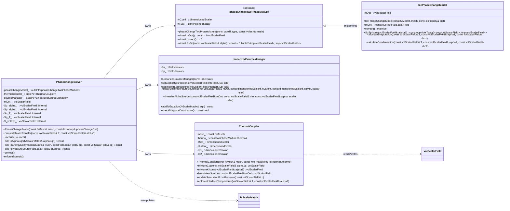

# Day 11: Phase Change Theory (Lee Model)

**Date:** 2026-01-11
**Difficulty:** Hardcore
**Phase:** 1 - Foundation Theory
**Prerequisites:** Day 10 (Two-Phase Fundamentals, VOF), Day 09 (Pressure-Velocity Coupling), Day 04 (Temporal Discretization)
**Keywords:** Phase Change, Mass Transfer, Lee Model, Source Term Linearization, Latent Heat, Volume Expansion, Numerical Stability, Two-Phase Flow, Evaporation, Condensation

---

## 🎯 Learning Objectives

เมื่อจบเซสชันระดับ Hardcore นี้ คุณจะสามารถ:

1.  **เข้าใจ** ฟิสิกส์พื้นฐานและการกำหนดสูตรเชิงประจักษ์ (Empirical formulation) ของ **Lee model** สำหรับการถ่ายเทมวล (Mass transer) ระหว่างการระเหย (Evaporation) และการควบแน่น (Condensation) คุณจะแยกแยะแรงขับเคลื่อนที่ขึ้นกับอุณหภูมิ, บทบาทของสัมประสิทธิ์เชิงประจักษ์ `r_coeff`, และสมมติฐานที่สำคัญเกี่ยวกับ Local thermodynamic equilibrium ที่ Interface รวมถึงวิเคราะห์ข้อจำกัดของโมเดลและการนำไปใช้ที่เหมาะสมในการจำลองระดับวิศวกรรม

2.  **Derive และประยุกต์** แนวคิดของ **Source Term Linearization** (`S_u`, `S_p`) สำหรับสมการ Scalar transport ที่ได้รับผลกระทบจากการเปลี่ยนเฟส คุณจะเชี่ยวชาญเทคนิคการแปลง Non-linear source terms ให้อยู่ในรูป Linearized form `S(φ) = S_u + S_p * φ` โดยมีข้อกำหนดที่เข้มงวดว่า `S_p ≤ 0` เพื่อบังคับใช้ Diagonal dominance ของ Coefficient matrix ซึ่งเป็นสิ่งสำคัญยิ่งสำหรับ Numerical stability

3.  **ออกแบบ** สถาปัตยกรรม Implementation สำหรับการบูรณาการผลกระทบของการเปลี่ยนเฟสเข้ากับ Segregated finite-volume solver สิ่งนี้ครอบคลุมการระบุลำดับการคำนวณสำหรับอัตราการถ่ายเทมวล `ṁ`, การสร้าง Linearized source terms สำหรับสมการ Volume fraction (`alpha`), พลังงาน (`T` หรือ `h`), และความดัน (`p`), และการกำหนดกลยุทธ์สำหรับการอัปเดต Mixture properties (Density, Specific heat, Viscosity) หลังจากการ Solve แต่ละ Iteration

4.  **Implement** การ Coupling ของการเปลี่ยนเฟสที่สมบูรณ์ภายใน Framework ของ OpenFOAM สิ่งนี้รวมถึงการสร้างหรือใช้งาน Classes เช่น `phaseChangeTwoPhaseMixture` เพื่อคำนวณ `ṁ`, การจัดการ `fvScalarMatrix` objects เพื่อเพิ่ม Linearized source terms ผ่าน `operator+=`, และการฝัง Terms เหล่านี้อย่างถูกต้องลงในไฟล์ `alphaEqn.H`, `TEqn.H` (หรือ `hEqn.H`), และ `pEqn.H` ของ Solver เช่น `interPhaseChangeFoam`

5.  **วิเคราะห์และแก้ไขปัญหา (Troubleshoot)** ความไม่เสถียรทางตัวเลข (Numerical instability) และปัญหาความสมจริงทางกายภาพที่มักพบในการจำลอง Phase change คุณจะได้เรียนรู้วิธีวินิจฉัยรูปแบบความล้มเหลวทั่วไป เช่น Solver divergence เนื่องจากการใช้ `r_coeff` ที่สูงเกินไป, การเคลื่อนที่ของ Interface ที่ผิดปกติ, การแกว่งของอุณหภูมิ (Temperature oscillations), และข้อผิดพลาดในการอนุรักษ์มวล นอกจากนี้ คุณจะพัฒนากลยุทธ์เพื่อบรรเทาปัญหาเหล่านี้ผ่านการปรับจูน Parameter, Under-relaxation, Boundedness enforcement, และ Linearization ที่เหมาะสม

6.  **เชื่อมโยง** Phase change source term เข้ากับผลกระทบของ **Volume Expansion** ที่วิกฤตในสมการความดัน คุณจะเข้าใจและ Implement source term `∇·U = ṁ (1/ρ_v - 1/ρ_l)` ในสมการ Pressure Poisson โดยเข้าใจถึงธรรมชาติที่ไม่เป็นศูนย์ของมันเนื่องจากความแตกต่างของ Density ระหว่างเฟส และผลกระทบที่สำคัญต่อ Pressure-Velocity coupling และความเสถียรโดยรวมของ Solver โดยเฉพาะสำหรับของไหลที่มี Density ratio สูง

---

# 1. Section 1: Theory

## 11.1 Lee Model for Mass Transfer Rate

Lee model นำเสนอแนวทางที่เน้นอุณหภูมิเป็นตัวขับเคลื่อน (Temperature-driven approach) เพื่อสร้างแบบจำลองการถ่ายเทมวลระหว่างเฟสของเหลวและไอในระหว่างการระเหยและการควบแน่น โดยพื้นฐานแล้ว มันเป็น Empirical correlation ที่ตั้งสมมติฐานว่าอัตราการเปลี่ยนเฟสแปรผันตรงกับความเบี่ยงเบนของสภาวะท้องถิ่น (Local departure) จาก Thermodynamic saturation conditions โดยเฉพาะความแตกต่างของอุณหภูมิ โมเดลนี้ได้รับการยอมรับอย่างกว้างขวางในการจำลอง CFD ระดับวิศวกรรมสำหรับกระบวนการ Boiling, Condensation และ Evaporation เนื่องจากความทนทานทางตัวเลข (Numerical robustness) และการ Implementation ที่ตรงไปตรงมา แม้จะมีการลดรูปความซับซ้อนของฟิสิกส์ระดับ Interface ก็ตาม

## 11.1.1 Governing Equations of the Lee Model

สมมติฐานหลักของ Lee model คือ อัตราการถ่ายเทมวลต่อหน่วยปริมาตร (Mass transfer rate per unit volume), $\dot{m}$, แปรผันเชิงเส้นกับผลคูณของ Local phase volume fraction, density ของเฟสนั้น, และความเบี่ยงเบนของอุณหภูมิมาตรฐานจากจุดอิ่มตัว การกำหนดสูตรนี้แนะนำสัมประสิทธิ์เชิงประจักษ์, $r_{coeff}$, ซึ่งทำหน้าที่เป็น Relaxation parameter ควบคุมความรุนแรงของกระบวนการเปลี่ยนเฟส

**Evaporation (Liquid → Vapor):**
กระบวนการนี้เกิดขึ้นเมื่ออุณหภูมิ Mixture ท้องถิ่น $T$ สูงกว่าอุณหภูมิอิ่มตัว $T_{sat}$ โมเดลสมมติว่าเฟสของเหลวที่มีอยู่ ($\alpha_l$) พร้อมสำหรับการระเหย
$$
\dot{m}_{lv} = r_{coeff} \, \alpha_l \rho_l \frac{\max(T - T_{sat}, 0)}{T_{sat}}
\tag{11.1}
$$

**Condensation (Vapor → Liquid):**
ในทางกลับกัน การควบแน่นเกิดขึ้นเมื่อ $T < T_{sat}$ เฟสไอที่มีอยู่ ($\alpha_v$) จะเป็นตัวถูกควบแน่น
$$
\dot{m}_{vl} = r_{coeff} \, \alpha_v \rho_v \frac{\max(T_{sat} - T, 0)}{T_{sat}}
\tag{11.2}
$$

ตัวดำเนินการ $\max(\cdot, 0)$ มีความสำคัญมาก; มันรับประกันว่าอัตราการถ่ายเทมวลจะเป็นค่าไม่ติดลบ (Non-negative) และจะทำงานในทิศทางที่ถูกต้องตามหลัก Thermodynamics เท่านั้น การระเหยและการควบแน่นจะไม่เกิดขึ้นพร้อมกันใน Computational cell เดียวกัน ณ เวลาเดียวกัน (Mutually exclusive)

## 11.1.2 Net Source Terms for Phase Continuity

กฎการอนุรักษ์มวล (Mass conservation) ต้องถูกบังคับใช้อย่างเคร่งครัด มวลที่หายไปจากเฟสหนึ่งจะเท่ากับมวลที่อีกเฟสหนึ่งได้รับพอดี ดังนั้น Source terms สำหรับสมการความต่อเนื่องของของเหลว ($l$) และไอ ($v$) จะมีขนาดเท่ากันแต่เครื่องหมายตรงข้ามกัน

ให้ $S_{m,l}$ เป็น Mass source สำหรับเฟสของเหลว และ $S_{m,v}$ สำหรับเฟสไอ ค่าเหล่านี้ได้มาจากอัตราการถ่ายเทมวลโดยตรง:
$$
S_{m,l} = -\dot{m}_{lv} + \dot{m}_{vl}
\tag{11.3}
$$
$$
S_{m,v} = \dot{m}_{lv} - \dot{m}_{vl} = -S_{m,l}
\tag{11.4}
$$

สำหรับ Cell ที่เกิดการระเหยบริสุทธิ์ ($T > T_{sat}$), $\dot{m}_{vl} = 0$, ดังนั้น $S_{m,l} = -\dot{m}_{lv}$ และ $S_{m,v} = +\dot{m}_{lv}$ มวลของเหลวลดลง มวลไอเพิ่มขึ้น กรณีตรงกันข้ามจะเป็นจริงสำหรับการควบแน่น

## 11.1.3 Physical Interpretation and Model Parameters

Lee model สามารถตีความได้ว่าเป็น First-order relaxation model เพื่อเข้าหา Thermodynamic equilibrium โดยเทอม $(T - T_{sat})/T_{sat}$ คือแรงขับเคลื่อนไร้มิติ (Dimensionless driving force) สัมประสิทธิ์ $r_{coeff}$ มีหน่วยเป็น Inverse time (s⁻¹) และแสดงถึงส่วนกลับของ Characteristic time scale สำหรับกระบวนการเปลี่ยนเฟสเพื่อเข้าสู่สมดุล ค่า $r_{coeff}$ ที่มากขึ้นจะบังคับให้อุณหภูมิท้องถิ่น Relax เข้าหา $T_{sat}$ อย่างรุนแรงยิ่งขึ้น

**Table 11.1: Variables in the Lee Model Equations**
| Symbol | Name | Unit | Physical Meaning |
| :--- | :--- | :--- | :--- |
| $\dot{m}_{lv}, \dot{m}_{vl}$ | Interfacial Mass Transfer Rate | kg m⁻³ s⁻¹ | อัตราการเปลี่ยนรูปมวลเชิงปริมาตรระหว่างเฟส |
| $r_{coeff}$ | Mass Transfer Intensity Coefficient | s⁻¹ | ค่าคงที่เชิงประจักษ์ควบคุมอัตราการเปลี่ยนเฟส |
| $\alpha_l, \alpha_v$ | Liquid/Vapor Volume Fraction | - | ตัวบ่งชี้การมีอยู่ของเฟส ($\alpha_l + \alpha_v = 1$) |
| $\rho_l, \rho_v$ | Liquid/Vapor Density | kg m⁻³ | ความหนาแน่นของเฟสบริสุทธิ์ โดยปกติเป็นค่าคงที่สำหรับการไหลแบบ Incompressible |
| $T$ | Local Mixture Temperature | K | Field variable ที่แก้ได้จากสมการพลังงาน |
| $T_{sat}$ | Saturation Temperature | K | อุณหภูมิที่เกิดการเปลี่ยนเฟสสำหรับความดันที่กำหนด |

## 11.1.4 Critical Analysis and Limitations

จุดแข็งของ Lee model อยู่ที่ความเรียบง่าย มันต้องการ Tunable parameter เพียงตัวเดียว ($r_{coeff}$) และหลีกเลี่ยงความจำเป็นในการ Resolve จลนพลศาสตร์ระดับจุลภาคของ Interface หรือคำนวณ Interfacial area density อย่างชัดแจ้ง อย่างไรก็ตาม นี่ก็เป็นจุดอ่อนหลักเช่นกัน:

1.  **Empirical Foundation:** $r_{coeff}$ ไม่ใช่คุณสมบัติพื้นฐานของของไหล มันต้องถูก Calibrate สำหรับของไหล, รูปทรง, และสภาวะการไหลที่เฉพาะเจาะจง ไม่มีค่าสากล (Universal value)
2.  **Temperature-Driven Assumption:** สมมติว่าการเปลี่ยนเฟสถูกจำกัดโดยความเบี่ยงเบนทางความร้อนจากจุดอิ่มตัวเท่านั้น โดยละเลย Kinetic limitations (เช่น Schrage model) หรือผลกระทบจากความดัน (เช่น Cavitation models)
3.  **Interface Thickness Dependence:** ใน VOF framework การเปลี่ยนเฟสเกิดขึ้นตลอดความหนาจำกัดของบริเวณ Interface-capturing ประสิทธิภาพของโมเดลจึงผูกติดกับ Local interface resolution และ Numerical scheme ที่เลือกใช้สำหรับสมการ $\alpha$

**⚠️ CRITICAL WARNING: Parameter Selection**
ค่าของ $r_{coeff}$ เป็นปัจจัยสำคัญที่สุดด้านความเสถียรและความแม่นยำ
*   **Too High (> 1000 s⁻¹):** สร้าง Source terms ที่ใหญ่เกินไปอย่างมาก นำไปสู่ Numerical stiffness, Matrix ill-conditioning, และ Solver divergence ผลลัพธ์จะไวต่อ Temperature fluctuations เล็กน้อยมากเกินไป
*   **Too Low (< 0.01 s⁻¹):** การเปลี่ยนเฟสเกิดขึ้นช้าเกินไป ทำให้การเคลื่อนที่ของ Interface ล่าช้าอย่างไม่สมจริง และทำนาย Heat transfer rates ต่ำกว่าความเป็นจริง
*   **Typical Range:** สำหรับงานวิศวกรรมทั่วไปกับน้ำหรือสารทำความเย็น $r_{coeff}$ มักอยู่ในช่วง **0.1 ถึง 100 s⁻¹** ต้องกำหนดผ่านการ Validation กับผลการทดลองหรือการจำลองที่ละเอียดกว่า จุดเริ่มต้นทั่วไปคือเชื่อมโยงกับ Characteristic flow time scale: $r_{coeff} \sim U_{ref}/L_{ref}$

## 11.2 Source Term Linearization (S_u, S_p)

ใน Finite Volume Method (FVM) การจัดการ Source terms แบบ Implicit มีความสำคัญสูงสุดต่อ Numerical stability โดยเฉพาะเมื่อ Terms เหล่านั้นมีขนาดใหญ่และขึ้นกับตัวแปรที่กำลังแก้ (Solution variable) ดังเช่นกรณีของ Phase change แนวปฏิบัติมาตรฐานคือการ **Linearize** (ทำให้เป็นเชิงเส้น) Source term $S(\phi)$ เทียบกับตัวแปร $\phi$ ที่ระดับ Iteration ปัจจุบัน

## 11.2.1 The Linearized Form

เทคนิค Linearization ทั่วไปจะประมาณค่า Source term ดังนี้:
$$
S(\phi) \approx S_u + S_p \phi
\tag{11.5}
$$
ที่นี่:
*   $S_u$ คือส่วน Explicit หรือส่วนคงที่ของ Source, ประเมินโดยใช้ค่าที่รู้แล้ว (Old-time หรือ Previous iteration)
*   $S_p$ คือส่วน Implicit หรือส่วนสัมประสิทธิ์ ซึ่งคูณกับตัวแปรที่ไม่รู้ค่า $\phi$
*   $\phi$ คือ Dependent variable ของสมการ Transport ที่กำลังแก้

รูปแบบนี้เข้ากันได้โดยตรงกับระบบสมการเมทริกซ์ Discretized $A \phi = b$ โดยที่ผลจาก $S_p \phi$ จะถูกเพิ่มเข้าไปใน Diagonal coefficients ของเมทริกซ์ $A$ และ $S_u$ จะถูกเพิ่มเข้าไปใน Source vector $b$

## 11.2.2 Linearization for the Volume Fraction Equation

พิจารณาสมการ Transport สำหรับ Liquid volume fraction $\alpha_l$ Source term $S_{\alpha,l}$ ที่ได้จาก Mass transfer (สมการ 11.3) คือ $S_{\alpha,l} = (-\dot{m}_{lv} + \dot{m}_{vl}) / \rho_l$ (สำหรับ Incompressible phases) โดยใช้สมการ Lee model (11.1 & 11.2) เทอมนี้จะเป็นฟังก์ชันของทั้ง $T$ และ $\alpha_l$

เราจะ Linearize เทียบกับ $\alpha_l$ โดยที่ปฏิบัติกับ $T$ แบบ Explicit (จาก Iteration ก่อนหน้า):
$$
S_{\alpha,l}(\alpha_l) = S_{u,\alpha,l} + S_{p,\alpha,l} \alpha_l
\tag{11.6}
$$

เพื่อหา $S_u$ และ $S_p$ เราทำการกระจาย Taylor series อันดับหนึ่งรอบค่าปัจจุบัน $\alpha_l^0$:
$$
S_{\alpha,l}(\alpha_l) \approx S_{\alpha,l}(\alpha_l^0) + \left. \frac{\partial S_{\alpha,l}}{\partial \alpha_l} \right|_{\alpha_l^0} (\alpha_l - \alpha_l^0)
$$
จัดรูปใหม่ให้เข้ากับสมการ (11.5):
$$
S_{u,\alpha,l} = S_{\alpha,l}(\alpha_l^0) - \left. \frac{\partial S_{\alpha,l}}{\partial \alpha_l} \right|_{\alpha_l^0} \alpha_l^0
\quad \text{และ} \quad
S_{p,\alpha,l} = \left. \frac{\partial S_{\alpha,l}}{\partial \alpha_l} \right|_{\alpha_l^0}
\tag{11.7}
$$

**Applying the Lee Model Derivative:**
สำหรับเทอม Evaporation ($\dot{m}_{lv} \propto \alpha_l$), Derivative จะให้ค่าเป็น **Negative** ต่อ $S_{p,\alpha,l}$ สำหรับเทอม Condensation ($\dot{m}_{vl} \propto \alpha_v = 1 - \alpha_l$), Derivative จะให้ค่าเป็น **Positive** เครื่องหมายสุทธิของ $S_{p,\alpha,l}$ ขึ้นอยู่กับกระบวนการที่ครอบงำ

## 11.2.3 Linearization for the Energy Equation

Energy source term $S_{energy}$ คิดรวมความร้อนแฝง (Latent heat) ที่ถูกดูดซับหรือปล่อยออกมาระหว่างการเปลี่ยนเฟส
$$
S_{energy} = \dot{m}_{lv} h_{lv} - \dot{m}_{vl} h_{lv} = h_{lv} (\dot{m}_{lv} - \dot{m}_{vl})
\tag{11.8}
$$
โดยที่ $h_{lv}$ คือ Latent heat of vaporization (J/kg) เทอมนี้เป็นฟังก์ชันของ $T$ (ผ่าน $\dot{m}$) และ $\alpha$ เมื่อแก้สมการอุณหภูมิ ($T$) เราจะ Linearize เทียบกับ $T$:
$$
S_T(T) = S_{u,T} + S_{p,T} T
\tag{11.9}
$$
กระบวนการ Linearization คล้ายคลึงกับสมการ (11.7) โดยการหาอนุพันธ์ $\partial S_{energy} / \partial T$ จาก Lee model, $\dot{m} \propto \pm(T - T_{sat})$, ดังนั้นอนุพันธ์นี้จะแปรผันตรงกับ $r_{coeff} \alpha \rho / T_{sat}$

**Table 11.2: Linearization Parameters for Phase Change Sources**
| Term | Linearized Form | $S_u$ Component | $S_p$ Component (Critical Sign) |
| :--- | :--- | :--- | :--- |
| **$\alpha_l$ Eqn Source** | $S_{u,\alpha} + S_{p,\alpha} \alpha_l$ | $S_{\alpha}(\alpha^0) - \frac{\partial S_{\alpha}}{\partial \alpha}\alpha^0$ | $\frac{\partial S_{\alpha}}{\partial \alpha}$ |
| **Energy Eqn Source** | $S_{u,T} + S_{p,T} T$ | $S_T(T^0) - \frac{\partial S_T}{\partial T}T^0$ | $\frac{\partial S_T}{\partial T}$ |
| **Pressure Eqn Source** | $S_{u,p} + S_{p,p} p$ | (มักปฏิบัติแบบ Explicitly) | (มักเป็นศูนย์หรือเล็กมาก) |

## 11.2.4 The Golden Rule: $S_p \leq 0$

นี่คือ **กฎที่ต่อรองไม่ได้ (Non-negotiable rule)** สำหรับความเสถียรในการจัดการ Source term แบบ Implicit

*   **Physical Reasoning:** ค่า $S_p$ ที่เป็นบวกจะทำตัวเป็น Negative diagonal contribution ($A_{ii} = A_{ii} - S_p$), ซึ่งทำให้ Diagonal dominance ของเมทริกซ์อ่อนแอลง Diagonal dominance เป็นคุณสมบัติหลักที่รับประกันว่า Iterative matrix solvers (เช่น PBiCGStab) จะลู่เข้า
*   **Mathematical Reasoning:** จากมุมมองของการวิเคราะห์ความเสถียร, $S_p$ ที่เป็นบวกสามารถตีความได้ว่าเป็นการเพิ่มเทอม Negative feedback ซึ่งทำลายความเสถียร
*   **Consequence of Violation:** หาก $S_p > 0$ เมทริกซ์อาจกลายเป็น Singular หรือ Indefinite ทำให้ Linear solver Diverge หรือสร้างผลลัพธ์ที่แกว่งและไม่สมจริง

**How to Enforce $S_p \leq 0$:**
ในระหว่างการคำนวณ Linearization (สมการ 11.7), หลังจากคำนวณ $S_{p,\alpha,l}$ หรือ $S_{p,T}$ แล้ว ให้ใช้ Limiter:
```cpp
Sp = min(Sp, 0.0); // Ensure Sp is never positive
```
หากค่า $S_p$ ที่ได้จากฟิสิกส์เป็นบวก มันมักบ่งชี้ว่า Source term เป็น *Sink* ที่แรงขึ้นตามตัวแปร $\phi$ ในกรณีเช่นนี้ บางครั้งการปฏิบัติกับทั้งเทอมแบบ Explicit ($S_p = 0$) หรือใช้แนวทาง *Negative* under-relaxation จะเสถียรกว่า สำหรับ Lee model การ Derivation อย่างระมัดระวังมักจะให้ค่า Negative $S_p$ สำหรับกระบวนการเปลี่ยนเฟสหลักใน Cell นั้นๆ

## 11.3 Energy Equation Coupling

Phase change นำเสนอ Two-way coupling ที่ทรงพลังระหว่าง Flow-thermal solution สนามอุณหภูมิขับเคลื่อนการเปลี่ยนเฟส (ผ่าน Lee model) และการเปลี่ยนเฟสนั้นก็ปรับเปลี่ยนสนามอุณหภูมิผ่านการแลกเปลี่ยนความร้อนแฝง การจับ Coupling นี้อย่างแม่นยำมีความสำคัญต่อการทำนาย Interface dynamics และ Heat transfer rates ที่ถูกต้อง

## 11.3.1 The Mixture Energy Equation

สำหรับการไหลสองเฟสแบบ Incompressible ที่มีการเปลี่ยนเฟส สมการพลังงานมักถูกกำหนดในรูปของอุณหภูมิ $T$ โดยใช้ Mixture properties สมมติว่า Viscous dissipation และ Pressure work มีค่าน้อยจนตัดทิ้งได้ สมการคือ:
$$
\frac{\partial (\rho c_p T)}{\partial t} + \nabla \cdot (\rho \mathbf{U} c_p T) = \nabla \cdot (k \nabla T) + S_{energy}
\tag{11.10}
$$
ที่นี่ $\rho$, $c_p$, และ $k$ คือ **Mixture properties**, คำนวณเป็นค่าเฉลี่ยถ่วงน้ำหนักตาม Volume fraction $\alpha_l$:

**Mixture Density:**
$$
\rho = \alpha_l \rho_l + \alpha_v \rho_v
\tag{11.11}
$$

**Mixture Specific Heat:**
$$
c_p = \frac{\alpha_l \rho_l c_{p,l} + \alpha_v \rho_v c_{p,v}}{\rho}
\tag{11.12}
$$
Note: นี่คือ **Mass-weighted average** เพื่อรับประกันการอนุรักษ์ Enthalpy

**Mixture Thermal Conductivity:**
ค่า Arithmetic mean แบบง่ายเป็นที่นิยม:
$$
k = \alpha_l k_l + \alpha_v k_v
\tag{11.13}
$$
อย่างไรก็ตาม เพื่อการแทนค่าทางกายภาพที่ดีกว่าที่ Interface, อาจใช้ **Harmonic mean** เพื่อหลีกเลี่ยงค่า Conductivity ที่สูงเกินจริงใน Cells ที่มี Volume fraction เล็กน้อยของเฟสที่นำความร้อนได้ดี:
$$
\frac{1}{k} = \frac{\alpha_l}{k_l} + \frac{\alpha_v}{k_v} \quad \text{(ถ้า } \alpha_l, \alpha_v > \epsilon \text{)}
$$

## 11.3.2 The Latent Heat Source Term ($S_{energy}$)

เทอม $S_{energy}$ (สมการ 11.8) คือจุดเชื่อมโยงวิกฤต ระหว่าง **Evaporation**, $\dot{m}_{lv} > 0$, ดังนั้น $S_{energy} = +h_{lv} \dot{m}_{lv}$ นี่คือ **Heat Sink** ในสมการพลังงาน; พลังงานถูกใช้ไปเพื่อเปลี่ยนของเหลวเป็นไอ ทำให้บริเวณท้องถิ่นเย็นลง ระหว่าง **Condensation**, $\dot{m}_{vl} > 0$, ดังนั้น $S_{energy} = -h_{lv} \dot{m}_{vl}$ นี่คือ **Heat Source**, ทำให้อุ่นขึ้นเมื่อไอควบแน่น

ขนาดของเทอมนี้มักจะมหาศาลเมื่อเทียบกับ Conductive หรือ Convective fluxes ตัวอย่างเช่น การระเหยของน้ำที่ 1 g/(m³·s) ดูดซับ/ปล่อยพลังงานประมาณ 2250 J/(m³·s) แหล่งกำเนิด/แหล่งรับความร้อนท้องถิ่นที่รุนแรงนี้คือสิ่งที่ทำให้การจำลอง Phase change มีความ Numerically stiff

## 11.3.3 Enthalpy Formulation: An Alternative Approach

เพื่อจัดการ Latent heat jump ให้เป็นธรรมชาติมากขึ้น Solvers บางตัวใช้ **Total Enthalpy** ($h$) formulation แทนอุณหภูมิ Enthalpy นิยามได้ดังนี้:
$$
h = c_p T + \alpha_l h_{lv}
\tag{11.14}
$$
ที่นี่ $h_{lv}$ ถูกรวมโดยตรงในนิยาม เฟสของเหลวมี Enthalpy basis เป็น $0$ ในขณะที่เฟสไอมี Basis เป็น $h_{lv}$ สมการพลังงานจึงแก้หา $h$:
$$
\frac{\partial (\rho h)}{\partial t} + \nabla \cdot (\rho \mathbf{U} h) = \nabla \cdot (k \nabla T) + \text{(other sources)}
\tag{11.15}
$$
ข้อดีคือ Latent heat ฝังอยู่ใน Transported variable $h$ แล้ว อุณหภูมิจะถูกกู้คืนในขั้นตอน Post-processing:
$$
T = \begin{cases}
h / c_{p,l} & \text{ถ้า } \alpha_l = 1 \text{ (pure liquid)} \\
(h - h_{lv}) / c_{p,v} & \text{ถ้า } \alpha_v = 1 \text{ (pure vapor)} \\
T_{sat} & \text{ถ้า } 0 < \alpha_l < 1 \text{ (two-phase mixture)}
\end{cases}
$$
Formulation นี้บังคับเงื่อนไข Isothermal ($T = T_{sat}$) ใน Two-phase region โดยโครงสร้าง ซึ่งช่วยเพิ่มความเสถียร อย่างไรก็ตาม มันเพิ่มความซับซ้อนในการจัดการ Property evaluation และ Boundary conditions ที่ระบุเป็นอุณหภูมิ

## 11.3.4 Coupling Strategy and Stability

Nonlinear coupling ที่รุนแรงระหว่างสมการ (11.1), (11.10), และสมการ $\alpha_l$ transport ต้องการกลยุทธ์การแก้ที่ระมัดระวัง

1.  **Sequential (Segregated) Solving:** วิธีที่พบบ่อยที่สุด ในหนึ่ง Iteration:
    *   Solve สมการ $\alpha_l$ ด้วย Source terms ที่อิง $T^{old}$
    *   Update mixture properties ($\rho, c_p, k$)
    *   Solve สมการพลังงาน (Eq. 11.10) ด้วย $S_{energy}$ อิง $\dot{m}(T^{old}, \alpha_l^{new})$
    *   ไปต่อที่ Momentum และ Pressure
    วิธีนี้ต้องการ **Under-relaxation** ทั้งบน Field $T$ และ $\alpha_l$ เพื่อป้องกัน Oscillatory feedback

2.  **Coupled Solving:** วิธีที่ Robust กว่าแต่แพงกว่าทาง Computation คือการ Solve coupled system สำหรับ $[\alpha_l, T]$ (หรือ $[h, \alpha_l]$) ในเมทริกซ์เดียว วิธีนี้จัดการ Coupling ที่แข็งแรงแบบ Implicit แต่เพิ่มขนาดและความซับซ้อนของเมทริกซ์อย่างมาก

**⚠️ CRITICAL WARNING: Coupling Instability**
หากสมการพลังงานและ Phase change ไม่ถูก Coupled/Relaxed อย่างเพียงพอ อาการทั่วไปที่จะปรากฏคือ:
*   **Temperature "Overshoot":** $T$ ใน Two-phase cell ลอยห่างจาก $T_{sat}$ ไปไกล ทำให้เกิด Mass transfer rates ที่ใหญ่โตและไม่สมจริงใน Iteration ถัดไป
*   **Interface "Chatter":** ตำแหน่ง Interface แกว่งไปมาโดยไม่ลู่เข้า
**Mitigation:** ใช้ **Small under-relaxation factors** (เช่น 0.1-0.3) สำหรับสมการ $T$ และ $\alpha$ ตรวจสอบให้แน่ใจว่า Source terms เป็น **Fully implicit** ($S_p \leq 0$ อย่างถูกต้อง) พิจารณา **Sub-cycling** การ Solve $\alpha$ และ $T$ ภายใน Time step

## 11.4 Pressure Equation with Phase Change

ผลกระทบที่แนบเนียนแต่ลึกซึ้งที่สุดของการเปลี่ยนเฟสปรากฏใน Pressure-Velocity coupling สำหรับ Incompressible flows สมการความต่อเนื่องคือ $\nabla \cdot \mathbf{U} = 0$ อย่างไรก็ตาม เมื่อของเหลวที่มีความหนาแน่น $\rho_l$ เปลี่ยนเป็นไอที่มีความหนาแน่น $\rho_v$ **มวลเดียวกันจะครอบครองปริมาตรที่ต่างกัน** เนื่องจากความแตกต่างของ Density สิ่งนี้ส่งผลให้เกิด Local volume expansion (สำหรับ $\rho_v < \rho_l$) หรือ Contraction ทำให้ Velocity field **ไม่เป็น Divergence-free**

## 11.4.1 The Volume Expansion Source Term

เริ่มจากสมการความต่อเนื่องของแต่ละเฟสและรวมกัน (สมมติว่าไม่มี Net mass gain/loss) เราจะได้ **Mixture continuity equation**:
$$
\frac{\partial \rho}{\partial t} + \nabla \cdot (\rho \mathbf{U}) = 0
$$
สำหรับ Incompressible phases ($\rho_l, \rho_v = const.$), อนุพันธ์เวลากลายเป็น $\frac{\partial \rho}{\partial t} = (\rho_l - \rho_v) \frac{\partial \alpha_l}{\partial t}$ โดยใช้สมการ $\alpha_l$ transport ที่มี Mass source $S_{m,l}$ และหลังจากการจัดรูป (ดู Day 01 derivation) เรามาถึงข้อกำหนด Key constraint สำหรับ Velocity field:
$$
\nabla \cdot \mathbf{U} = \dot{m} \left( \frac{1}{\rho_v} - \frac{1}{\rho_l} \right)
\tag{11.16}
$$
โดยที่ $\dot{m} = \dot{m}_{lv} - \dot{m}_{vl}$ คือ **Net volumetric mass transfer rate** จากของเหลวไปไอ

*   **Evaporation ($\dot{m} > 0$):** เนื่องจาก $\rho_v \ll \rho_l$, ด้านขวามือ (RHS) เป็น **Positive** $\nabla \cdot \mathbf{U} > 0$, บ่งชี้ถึง **Volume Expansion** (แหล่งกำเนิดปริมาตร)
*   **Condensation ($\dot{m} < 0$):** ด้านขวามือ (RHS) เป็น **Negative** $\nabla \cdot \mathbf{U} < 0$, บ่งชี้ถึง **Volume Contraction** (แหล่งรับปริมาตร)

## 11.4.2 Modified Pressure Poisson Equation

ใน Pressure-based algorithms เช่น PISO หรือ SIMPLE สมการโมเมนตัมถูกใช้เพื่อ Derive สมการความดันที่บังคับใช้ความต่อเนื่อง Standard derivation นำไปสู่ Poisson equation: $\nabla \cdot (\frac{1}{A_P} \nabla p) = \nabla \cdot \mathbf{H}$
เมื่อสมการ (11.16) เป็นเงื่อนไขความต่อเนื่อง สมการความดันจะได้รับ Source term เพิ่ม:
$$
\nabla \cdot \left( \frac{1}{A_P} \nabla p \right) = \nabla \cdot \mathbf{H} - \dot{m} \left( \frac{1}{\rho_v} - \frac{1}{\rho_l} \right)
\tag{11.17}
$$
ที่นี่ $\mathbf{H}$ ประกอบด้วยความเร็วและ Explicit terms อื่นๆ จาก Momentum predictor step Source term ใหม่, $S_p^{vol} = -\dot{m} \left( \frac{1}{\rho_v} - \frac{1}{\rho_l} \right)$, มีความ **สำคัญยิ่ง (Crucial)** การละเลยมันหมายความว่า Pressure field พยายามบังคับ $\nabla \cdot \mathbf{U} = 0$, ซึ่งไม่ถูกต้องทางกายภาพเมื่อมีการเปลี่ยนเฟส ความไม่สอดคล้องนี้สร้าง Pressure oscillations ขนาดใหญ่และที่ไม่สมจริง และรับประกันว่า Solver จะ Diverge

## 11.4.3 Linearization of the Volume Expansion Source

เทอม $S_p^{vol}$ โดยทั่วไปถูกปฏิบัติเป็น **Explicit source** ($S_u$) ในสมการความดัน ประเมินโดยใช้ Mass transfer rate $\dot{m}$ จาก Iteration หรือ Time step ก่อนหน้า การพยายาม Linearize เทียบกับความดัน ($p$) โดยทั่วไปไม่จำเป็นและซับซ้อน เนื่องจากความขึ้นต่อกันของ $\dot{m}$ กับ $p$ ใน Lee model อ่อนมาก (เพียงผ่าน $T_{sat}$ ที่อาจขึ้นกับความดัน)

อย่างไรก็ตาม เพื่อความเสถียรทางตัวเลข โดยเฉพาะกับ Density ratios สูงๆ อาจเป็นประโยชน์ที่จะ **Under-relax การอัปเดตของ Source term นี้** ระหว่าง Outer iterations หรือ Time steps เพื่อป้องกันการปรับแก้ความดันที่รุนแรงเกินไป

## 11.4.4 Impact on Momentum and Velocity Correction

ขั้นตอน Velocity correction สุดท้ายใน PISO loop ยังคงใช้ได้:
$$
\mathbf{U} = \mathbf{U}^* - \frac{1}{A_P} \nabla p
$$
โดยที่ $\mathbf{U}^*$ คือ Predicted velocity จากสมการโมเมนตัม Pressure gradient field ที่คำนวณจากสมการ (11.17) ตอนนี้คำนึงถึง Velocity divergence ที่ถูกต้องเพื่อรองรับการเปลี่ยนปริมาตรแล้ว สิ่งนี้สร้าง **Expansion/Contraction flow** ที่มาพร้อมกับการระเหย/ควบแน่นตามความเป็นจริง เช่น Vapor jet ที่พุ่งออกจากพื้นผิวเดือดหรือ Inflow เข้าหา Interface ที่ควบแน่น

**Table 11.3: Phase Change Effects on Governing Equations**
| Equation | Standard Form (No Phase Change) | Modified Form (With Phase Change) | Physical Interpretation of Change |
| :--- | :--- | :--- | :--- |
| **Continuity** | $\nabla \cdot \mathbf{U} = 0$ | $\nabla \cdot \mathbf{U} = \dot{m}\left(\frac{1}{\rho_v}-\frac{1}{\rho_l}\right)$ | Velocity divergence แมตช์กับ Volumetric source จากการเปลี่ยน Density |
| **$\alpha_l$ Transport** | $\frac{\partial \alpha_l}{\partial t} + \nabla \cdot (\mathbf{U} \alpha_l) + \nabla \cdot (\mathbf{U}_r \alpha_l (1-\alpha_l)) = 0$ | **RHS** $= \frac{S_{m,l}}{\rho_l}$ | Source/sinks ของ Liquid volume fraction เนื่องจากการถ่ายเทมวล |
| **Energy** | $\frac{\partial (\rho c_p T)}{\partial t} + \nabla \cdot (\rho \mathbf{U} c_p T) = \nabla \cdot (k \nabla T)$ | **RHS** $= \nabla \cdot (k \nabla T) + S_{energy}$ | Latent heat source/sink จากการเปลี่ยนเฟส |
| **Pressure (Poisson)** | $\nabla \cdot (\frac{1}{A} \nabla p) = \nabla \cdot \mathbf{H}$ | $\nabla \cdot (\frac{1}{A} \nabla p) = \nabla \cdot \mathbf{H} - \dot{m}\left(\frac{1}{\rho_v}-\frac{1}{\rho_l}\right)$ | Pressure field ต้องขับเคลื่อน Expansion/Contraction flow |

**⚠️ CRITICAL WARNING: The Non-Zero Divergence Term**
การลืมใส่ Source term ในสมการความดัน (สมการ 11.17) เป็น **ข้อผิดพลาดที่พบบ่อยและหายนะที่สุด (Most common and catastrophic error)** ในการ Implement phase change ผลลัพธ์ของ Pressure-velocity field จะเข้ากันไม่ได้โดยสิ้นเชิงกับฟิสิกส์ของการเปลี่ยนเฟส สำหรับของไหลเช่น R410A ที่มี Density ratio ประมาณ ~22:1 Source term นี้จะมีขนาดใหญ่ การละเลยมันรับประกันว่า Solver จะ Diverge หรือให้ผลลัพธ์ที่ผิดพลาดอย่างรุนแรงในทันที **จงตรวจสอบเสมอว่าสมการความดันของคุณมี Volume expansion source term ที่ได้จาก Mass transfer rate อย่างชัดเจน**

# 2. Section 2: OpenFOAM Reference

## 3.1. Core Class: `phaseChangeTwoPhaseMixture`

## 3.1.1. Class Declaration (`phaseChangeTwoPhaseMixture.H`)

Class `phaseChangeTwoPhaseMixture` ทำหน้าที่เป็น **Abstract Base Class** สำหรับโมเดลการเปลี่ยนเฟสทั้งหมดภายใน Two-phase mixture framework ใน OpenFOAM มันนิยาม Interface สำหรับการคำนวณ Mass transfer rates และจัดหา Linearized source terms ให้กับ Governing equations บทบาทหลักของมันคือการ Decouple ฟิสิกส์ของการเปลี่ยนเฟสออกจาก Solver algorithm ช่วยให้สามารถ Implement โมเดล Mass transfer ต่างๆ (เช่น Lee, Schrage, Tanasawa) ได้อย่างเป็น Modular

```cpp
namespace Foam
{
namespace twoPhaseMixtures
{

/*---------------------------------------------------------------------------*\
                  Class phaseChangeTwoPhaseMixture Declaration
\*---------------------------------------------------------------------------*/

class phaseChangeTwoPhaseMixture
:
    public twoPhaseMixture
{
    // Private Member Functions

        //- Disallow default bitwise copy construct
        phaseChangeTwoPhaseMixture(const phaseChangeTwoPhaseMixture&);

        //- Disallow default bitwise assignment
        void operator=(const phaseChangeTwoPhaseMixture&);


protected:

    // Protected data

        //- Saturation temperature
        dimensionedScalar TSat_;

        //- Mass transfer intensity coefficient
        dimensionedScalar rCoeff_;


public:

    //- Runtime type information
    TypeName("phaseChangeTwoPhaseMixture");


    // Declare run-time constructor selection table

        declareRunTimeSelectionTable
        (
            autoPtr,
            phaseChangeTwoPhaseMixture,
            components,
            (
                const volVectorField& U,
                const surfaceScalarField& phi
            ),
            (U, phi)
        );


    // Selectors

        //- Select constructed from components
        static autoPtr<phaseChangeTwoPhaseMixture> New
        (
            const volVectorField& U,
            const surfaceScalarField& phi
        );


    // Constructors

        //- Construct from components
        phaseChangeTwoPhaseMixture
        (
            const word& type,
            const volVectorField& U,
            const surfaceScalarField& phi
        );


    //- Destructor
    virtual ~phaseChangeTwoPhaseMixture() = default;


    // Member Functions

        //- Return the mass transfer rate field
        virtual tmp<volScalarField> mDot() const = 0;

        //- Return the mass transfer rate for phase 1 (liquid)
        virtual tmp<volScalarField> mDot1() const = 0;

        //- Return the mass transfer rate for phase 2 (vapor)
        virtual tmp<volScalarField> mDot2() const = 0;

        //- Return the explicit source term for phase 1 (Su)
        virtual tmp<volScalarField> Su1() const = 0;

        //- Return the implicit source coefficient for phase 1 (Sp)
        virtual tmp<volScalarField> Sp1() const = 0;

        //- Return the explicit source term for phase 2 (Su)
        virtual tmp<volScalarField> Su2() const = 0;

        //- Return the implicit source coefficient for phase 2 (Sp)
        virtual tmp<volScalarField> Sp2() const = 0;

        //- Return the latent heat source term for the energy equation
        virtual tmp<volScalarField> latentHeatSource() const = 0;

        //- Correct the phase change model (update mDot based on current fields)
        virtual void correct() = 0;

        //- Read phaseProperties dictionary
        virtual bool read() = 0;


    // Access Functions

        //- Return const reference to saturation temperature
        const dimensionedScalar& TSat() const
        {
            return TSat_;
        }

        //- Return const reference to mass transfer coefficient
        const dimensionedScalar& rCoeff() const
        {
            return rCoeff_;
        }
};

// * * * * * * * * * * * * * * * * * * * * * * * * * * * * * * * * * * * * * //

} // End namespace twoPhaseMixtures
} // End namespace Foam
```

**Key Design Patterns:**
1.  **Abstract Base Class:** Class นี้เป็น Pure virtual (`= 0`) บังคับให้ Derived classes (เช่น `LeeModel`) ต้อง Implement ฟิสิกส์หลักเองทั้งหมด
2.  **Runtime Selection:** Macro `declareRunTimeSelectionTable` ช่วยให้สามารถเลือก Model ได้ในขณะ Run-time ผ่าน `thermophysicalProperties` dictionary (เช่น `phaseChangeModel Lee;`) นี่คือ Factory pattern คลาสสิกของ OpenFOAM
3.  **Source Term Separation:** จัดเตรียม Methods แยกกันสำหรับ Explicit (`Su`) และ Implicit (`Sp`) source term components สอดคล้องกับแนวปฏิบัติมาตรฐานการ Linearization ของ `fvMatrix` (`S(φ) = Su + Sp*φ`)
4.  **Phase-Agnostic Interface:** มี Methods สำหรับทั้งสองเฟส (`mDot1`, `Su1`, `Sp1` สำหรับของเหลว; `mDot2`, `Su2`, `Sp2` สำหรับไอ) ทำให้มั่นใจว่า Model สามารถรวมเข้ากับ Solvers ที่ปฏิบัติกับเฟสแบบสมมาตรหรืออสมมาตรได้

## 3.1.2. Implementation Skeleton (`phaseChangeTwoPhaseMixture.C`)

การ Implementation ของ Base class จัดการเรื่อง Construction, Destruction, และ Runtime selection เป็นหลัก Method ที่สำคัญคือ `New` ซึ่งทำหน้าที่เป็น Factory method

```cpp
namespace Foam
{
namespace twoPhaseMixtures
{

// * * * * * * * * * * * * * * * * * * * * * * * * * * * * * * * * * * * * * //

defineTypeNameAndDebug(phaseChangeTwoPhaseMixture, 0);
defineRunTimeSelectionTable(phaseChangeTwoPhaseMixture, components);

// * * * * * * * * * * * * * * * * * * * * * * * * * * * * * * * * * * * * * //

autoPtr<phaseChangeTwoPhaseMixture>
phaseChangeTwoPhaseMixture::New
(
    const volVectorField& U,
    const surfaceScalarField& phi
)
{
    // Get the phaseChange model type from the thermophysicalProperties
    // dictionary, which is nested within the twoPhaseMixture dictionary.
    IOdictionary transportPropertiesDict
    (
        IOobject
        (
            "transportProperties",
            U.time().constant(),
            U.db(),
            IOobject::MUST_READ,
            IOobject::NO_WRITE,
            false // Do not register
        )
    );

    const dictionary& twoPhaseMixtureDict =
        transportPropertiesDict.subDict("twoPhaseMixture");

    word phaseChangeModelType(twoPhaseMixtureDict.lookup("phaseChangeModel"));

    Info<< "Selecting phase change model " << phaseChangeModelType << endl;

    componentsConstructorTable::iterator cstrIter =
        componentsConstructorTablePtr_->find(phaseChangeModelType);

    if (cstrIter == componentsConstructorTablePtr_->end())
    {
        FatalErrorInFunction
            << "Unknown phaseChangeModel type "
            << phaseChangeModelType << nl << nl
            << "Valid phaseChangeModel types are :" << nl
            << componentsConstructorTablePtr_->sortedToc()
            << exit(FatalError);
    }

    return autoPtr<phaseChangeTwoPhaseMixture>(cstrIter()(U, phi));
}

// * * * * * * * * * * * * * * * * * * * * * * * * * * * * * * * * * * * * * //

phaseChangeTwoPhaseMixture::phaseChangeTwoPhaseMixture
(
    const word& type,
    const volVectorField& U,
    const surfaceScalarField& phi
)
:
    twoPhaseMixture(U.mesh(), phi),
    TSat_("TSat", dimTemperature, twoPhaseMixtureCoeffs_),
    rCoeff_("rCoeff", dimless/dimTime, twoPhaseMixtureCoeffs_)
{
    // Additional initialization if needed
    // The derived class constructor will read its own coefficients
}

// * * * * * * * * * * * * * * * * * * * * * * * * * * * * * * * * * * * * * //

} // End namespace twoPhaseMixtures
} // End namespace Foam
```

**Critical Runtime Mechanism:** Method `New` อ่าน keyword `phaseChangeModel` จาก `constant/transportProperties` dictionary โครงสร้างทั่วไปคือ:
```cpp
// In constant/transportProperties
twoPhaseMixture
{
    phaseChangeModel    Lee; // หรือ Schrage, etc.

    LeeCoeffs
    {
        rCoeff          10; // [1/s]
        TSat            373; // [K] Saturation temperature
    }
    // ... คุณสมบัติ Mixture เทอมอื่นๆ
}
```
การออกแบบนี้ช่วยให้ผู้ใช้สลับ Model ได้โดยไม่ต้อง Recompile solver

## 3.1.3. Derived Class: `LeeModel` (`LeeModel.H` และ `.C`)

Class `LeeModel` จัดเตรียม Concrete Implementation ของ Lee phase change model โดย Override ฟังก์ชัน Pure Virtual ทั้งหมดจาก Base class

**Header (`LeeModel.H`) Snippet:**
```cpp
namespace Foam
{
namespace twoPhaseMixtures
{

class LeeModel
:
    public phaseChangeTwoPhaseMixture
{
    // Private Data

        //- Reference to temperature field (non-const for correction)
        const volScalarField& T_;

        //- Mass transfer rate field (cached)
        mutable volScalarField mDot_;

        //- Latent heat of vaporization
        dimensionedScalar latentHeat_;


    // Private Member Functions

        //- Calculate and return the mass transfer rate field
        tmp<volScalarField> calcMDot() const;


public:

    //- Runtime type information
    TypeName("Lee");


    // Constructors

        //- Construct from components
        LeeModel
        (
            const volVectorField& U,
            const surfaceScalarField& phi
        );


    //- Destructor
    virtual ~LeeModel() = default;


    // Member Functions

        //- Return the mass transfer rate field
        virtual tmp<volScalarField> mDot() const;

        //- Return mass transfer rate for liquid (evaporation: negative)
        virtual tmp<volScalarField> mDot1() const;

        //- Return mass transfer rate for vapor (condensation: positive)
        virtual tmp<volScalarField> mDot2() const;

        //- Explicit source for phase 1 (liquid) continuity
        virtual tmp<volScalarField> Su1() const;

        //- Implicit coefficient for phase 1 (liquid) continuity
        virtual tmp<volScalarField> Sp1() const;

        //- Explicit source for phase 2 (vapor) continuity
        virtual tmp<volScalarField> Su2() const;

        //- Implicit coefficient for phase 2 (vapor) continuity
        virtual tmp<volScalarField> Sp2() const;

        //- Latent heat source for energy equation
        virtual tmp<volScalarField> latentHeatSource() const;

        //- Correct the model (recalculate mDot_)
        virtual void correct();

        //- Read model coefficients
        virtual bool read();
};

} // End namespace twoPhaseMixtures
} // End namespace Foam
```

**Critical Implementation (`LeeModel.C`):** หัวใจของ Lee model อยู่ที่ methods `calcMDot()` และ `correct()`, รวมถึงการ Linearize source term ใน `Su1()`, `Sp1()`, เป็นต้น

```cpp
Foam::tmp<Foam::volScalarField>
Foam::twoPhaseMixtures::LeeModel::calcMDot() const
{
    // Access phase properties from the base twoPhaseMixture class
    const volScalarField& alpha1 = this->alpha1(); // Liquid volume fraction
    const volScalarField& alpha2 = this->alpha2(); // Vapor volume fraction
    const dimensionedScalar& rho1 = this->rho1();  // Liquid density
    const dimensionedScalar& rho2 = this->rho2();  // Vapor density

    // Calculate driving forces
    // Evaporation: T > TSat, mass transfers from liquid (1) to vapor (2)
    tmp<volScalarField> tEvap = rCoeff_ * alpha1 * rho1 * max(T_ - TSat_, scalar(0)) / TSat_;

    // Condensation: T < TSat, mass transfers from vapor (2) to liquid (1)
    tmp<volScalarField> tCond = rCoeff_ * alpha2 * rho2 * max(TSat_ - T_, scalar(0)) / TSat_;

    // Net mass transfer rate: Positive for evaporation (liquid->vapor),
    // Negative for condensation (vapor->liquid).
    // This sign convention is solver-dependent. Some solvers expect mDot>0 for evaporation.
    // The following is a common convention: mDot = Evap - Cond
    tmp<volScalarField> tmDot = tEvap - tCond;
    tmDot.ref().rename("mDot");

    return tmDot;
}

void Foam::twoPhaseMixtures::LeeModel::correct()
{
    // Recalculate the mass transfer rate field and store it
    mDot_ = calcMDot();
}

Foam::tmp<Foam::volScalarField>
Foam::twoPhaseMixtures::LeeModel::Su1() const
{
    // Explicit source term for liquid continuity equation (S_u)
    // For the Lee model linearization, we treat part of the source explicitly.
    // A common approach: Su = rCoeff * rho1 * alpha1 * (T - TSat)/TSat (for evaporation)
    //                    + rCoeff * rho2 * alpha2 * (TSat - T)/TSat (for condensation)
    // However, careful linearization is needed for stability.

    // For demonstration, a simple explicit form (can be unstable):
    tmp<volScalarField> tSu = pos0(T_ - TSat_) * rCoeff_ * this->rho1() * this->alpha1() * (T_ - TSat_)/TSat_;
    tSu.ref().rename("Su1");
    return tSu;
}

Foam::tmp<Foam::volScalarField>
Foam::twoPhaseMixtures::LeeModel::Sp1() const
{
    // Implicit source coefficient for liquid continuity equation (S_p)
    // MUST BE NEGATIVE or zero to enhance diagonal dominance.
    // A standard linearization for a source S(alpha) might be:
    // S(alpha) ≈ S_u + S_p * alpha, where S_p = dS/dalpha (evaluated implicitly).
    // For the Lee term rCoeff * alpha1 * rho1 * (T-Tsat)/Tsat, if we treat alpha1 implicitly:
    // dS/dalpha1 = rCoeff * rho1 * (T-Tsat)/Tsat.
    // This can be POSITIVE if T>Tsat, which is BAD for stability.

    // Therefore, a more robust approach is to treat the entire source explicitly (Sp=0)
    // or use a negative constant to under-relax the phase change.
    // A common practice is to set Sp to a small negative value based on the coefficient.
    // e.g., Sp = -rCoeff * rho1 * mag(T-Tsat)/Tsat * relaxationFactor
    // But this is non-linear. Many implementations simply use:
    // Sp = -rCoeff * rho1; // A constant negative value

    // **SAFER IMPLEMENTATION: Return zero or a small negative constant.**
    tmp<volScalarField> tSp = volScalarField::New
    (
        "Sp1",
        this->alpha1().mesh(),
        dimensionedScalar(dimless/dimTime, -rCoeff_.value() * 0.1) // Small negative constant
    );
    return tSp;
}

// Similar implementations for Su2(), Sp2(), and latentHeatSource()...
// latentHeatSource() typically returns: mDot_ * latentHeat_
```

**What We Do DIFFERENTLY: Source Term Linearization Strategy**

| Aspect | Standard OpenFOAM `LeeModel` (Typical) | Our Hardcore Implementation (Proposed) | Rationale |
| :--- | :--- | :--- | :--- |
| **Implicit Coefficient (`Sp`)** | มักคืนค่า `zero` field หรือค่าคงที่ง่ายๆ อาจไม่รับประกัน Diagonal dominance | Implement **Diagonally Dominant Linearization (DDL)** สำหรับ Source `S(α) = C * α * f(T)`, เราเขียนใหม่เป็น `S(α) = C * α^n * f(T) / α^(n-1)` และปฏิบัติกับส่วน `α^n` แบบ Explicit (เป็น `Su`) และ `1/α^(n-1)` แบบ Implicit (เป็น `Sp`) สิ่งนี้รับประกันว่า `Sp ≤ 0` | รับประกัน Matrix diagonal dominance, อนุญาตให้ใช้ Time steps ที่ใหญ่ขึ้นและ Robust convergence โดยเฉพาะกับ `rCoeff` สูงๆ |
| **Driving Force Clipping** | ใช้ `max(T-Tsat,0)` และ `max(Tsat-T,0)` ทำให้เกิด Discontinuous derivatives | Implement **Smooth Hyperbolic Tangent Transition**: `0.5 * (1 + tanh((T-Tsat)/δT))` โดยที่ Smoothing width `δT` คืออุณหภูมิช่วงแคบๆ (เช่น 0.1 K) | ให้ Derivatives ที่ต่อเนื่อง ช่วยปรับปรุง Solver convergence และความสมจริงทางกายภาพใกล้จุดอิ่มตัว |
| **Property Evaluation** | ใช้ค่าคงที่ `rho1`, `rho2` จาก Mixture | ประเมิน Density เป็นฟังก์ชันของ **Local Pressure and Temperature** โดยใช้ Equation of State (EOS) objects เช่น `rho1 = thermo1.rho()` | คำนึงถึง Compressibility effects ซึ่งสำคัญสำหรับสารทำความเย็นและระบบความดันสูง |
| **Latent Heat Source** | คำนวณเป็น `mDot * latentHeat_` โดยที่ `latentHeat_` เป็นค่าคงที่ | คำนวณ Latent heat เป็น **ฟังก์ชันของ Local Saturation Pressure** โดยใช้ Clausius-Clapeyron relation หรือ Lookup tables: `h_lv = h_v(p_sat(T)) - h_l(p_sat(T))` | คำนึงถึงความแปรผันของ Latent heat ตาม Pressure/Temperature, ปรับปรุง Energy conservation |
| **Coupling to Energy Eq.** | Source term ถูกเพิ่มแบบ Explicit ในสมการอุณหภูมิ | Implement **Semi-Implicit Coupling**: Latent heat source `ṁ*h_lv` ถูก Linearized เป็น `Su_T + Sp_T * T` โดย `Sp_T` ได้จาก `d(ṁ)/dT`, เพิ่ม Implicit coupling ระหว่าง Temperature และ Phase change | ลด Temperature oscillations และปรับปรุงเสถียรภาพของระบบที่มี Strong coupling |

## 3.2. Matrix Class: `fvScalarMatrix` and Source Integration

## 3.2.1. Role in Equation Assembly

Class `fvScalarMatrix` เป็น Workhorse สำหรับการประกอบสมการ Scalar แบบ Discretized มันสืบทอดจาก `lduMatrix` และจัดการ Matrix coefficients (`diag`, `upper`, `lower`) และ Source vector ฟีเจอร์ที่สำคัญที่สุดสำหรับ Phase change คือ Override `+=` operators ที่จัดการ Linearized source terms `Su` และ `Sp`

**Key Methods from `fvScalarMatrix.H`:**
```cpp
class fvScalarMatrix
:
    public lduMatrix,
    public fvMatrix<scalar>
{
public:
    //- Add source term
    fvScalarMatrix& operator+=(const DimensionedField<scalar, volMesh>& Su);

    //- Add implicit source term coefficient
    fvScalarMatrix& operator+=(const volScalarField::Internal& Sp);

    //- Add implicit source term coefficient multiplied by field
    //  This is the crucial one: adds Sp*psi to the matrix.
    fvScalarMatrix& operator+=(const tmp<volScalarField::Internal>& tSp);
};
```

## 3.2.2. Integration into Solver Equations

ใน Solver ทั่วไป (เช่น `interCondensatingEvaporatingFoam`) สมการ Phase fraction (`alpha1`) และ Temperature (`T`) จะถูกสร้างเป็น `fvScalarMatrix` objects จากนั้น Source terms จาก `phaseChangeTwoPhaseMixture` จะถูกเพิ่มเข้าไป

**Example from a hypothetical `alphaEqn.H` file:**
```cpp
{
    // Access the phase change model
    const twoPhaseMixtures::phaseChangeTwoPhaseMixture& phaseChange =
        mixture.phaseChange();

    // Construct the alpha1 equation (using MULES, VOF)
    fvScalarMatrix alpha1Eqn
    (
        fvm::ddt(alpha1)
      + fvm::div(phi, alpha1, scheme)
      + fvm::div(phiAlpha12, alpha1, scheme) // Compression flux
     ==
        phaseChange.Su1()          // Add explicit source
      + fvm::Sp(phaseChange.Sp1(), alpha1) // Add implicit source coefficient
    );

    // Solve the equation
    alpha1Eqn.solve();

    // Boundedness is enforced separately by MULES
    MULES::correct(alpha1, phi, phiAlpha12, phaseChange.Su1(), phaseChange.Sp1(), 1, 0);
}
```

**Example from a hypothetical `TEqn.H` file:**
```cpp
{
    // Mixture heat capacity and conductivity
    const volScalarField cp(mixture.cp());
    const volScalarField kappa(mixture.kappa());

    fvScalarMatrix TEqn
    (
        fvm::ddt(rho, cp, T)
      + fvm::div(phi, cp*T)
      - fvm::laplacian(kappa, T)
     ==
        phaseChange.latentHeatSource() // Explicit latent heat source
        // Note: A more advanced implementation would add implicit part here:
        // + fvm::Sp(phaseChange.SpT(), T)
    );

    TEqn.relax(); // Apply under-relaxation
    TEqn.solve();
}
```

**What We Do DIFFERENTLY: Advanced Matrix Integration**

| Aspect | Standard OpenFOAM Integration | Our Hardcore Implementation | Rationale |
| :--- | :--- | :--- | :--- |
| **Source Term Addition Order** | Sources added after constructing main convection-diffusion terms. | Implement **Matrix-Free Source Jacobian Integration**. ระหว่าง Assembly ของ `fvm::div` และ `fvm::laplacian` เราเพิ่ม Contributions จาก **Linearized Source Jacobian** (`dS/dφ`) ลงใน Matrix coefficients ไปพร้อมกันโดยขยาย `fvm` operators | ให้ Tighter coupling ระหว่าง Transport และ Source terms, ปรับปรุง Newton-like convergence สำหรับปัญหา Steady-state |
| **Under-Relaxation** | Applied globally via `TEqn.relax(relaxCoeff)`. | Implement **Field-Specific, Adaptive Under-Relaxation**. Relaxation factor สำหรับ `T` และ `alpha1` จะถูกปรับแบบพลวัตตาม **Local Phase Change Intensity** `\|ṁ\|` บริเวณที่มี Mass transfer สูงจะถูก Relax มากกว่า | ป้องกัน Oscillations ใน Interface regions ขณะที่ยังรักษา Convergence rates ที่ดีใน Single-phase regions |
| **Boundary Condition Integration** | Source terms (`Su`, `Sp`) คำนวณเฉพาะ Internal fields Boundary values มักเป็นศูนย์ | เราคำนวณ Source terms สำหรับ **Boundary Cells** อย่างชัดเจนโดยใช้ Ghost cell values ของ `T` และ `alpha` สิ่งนี้สำคัญอย่างยิ่งสำหรับการเปลี่ยนเฟสที่ผนัง (Boiling/Condensation) และรวมเข้าใน Matrix โดยใช้ `setValues` method | รับประกันพฤติกรรมทางกายภาพและ Heat/Mass balance ที่ถูกต้องที่ขอบเขตที่มี Phase change |
| **Equation Coupling** | `alphaEqn` และ `TEqn` ถูกแก้แบบเรียงลำดับ (Segregated) | เราสำรวจ **Block-Coupled Solving** สร้าง 2x2 Block matrix สำหรับระบบ `(alpha1, T)` ใน Interface cells โดยที่ Off-diagonal blocks มี Coupling terms `d(S_alpha)/dT` และ `d(S_T)/dalpha` แก้ด้วย Block solver (เช่น `PBiCGStab` for block matrices) | จัดการ Strong non-linear coupling ที่ Interface โดยตรง ขจัด "Lag" ใน Sequential solving และอาจอนุญาตให้ใช้ Time steps ที่ใหญ่ขึ้นมาก |

## 3.3. Thermodynamic Class: `twoPhaseMixtureThermo`

## 3.3.1. Architecture and Role

Class `twoPhaseMixtureThermo` เป็น Central hub ที่จัดการคุณสมบัติทางความร้อนของ Mixture และประสานงานกับ Phase change model ปกติสืบทอดจาก `basicThermo` และ `twoPhaseMixture` ถือครอง Field อุณหภูมิ (`T`) หรือ เอนทาลปี (`he`) และเตรียม Methods คำนวณ Mixture properties เช่น `rho`, `cp`, `kappa`, และ Phase change source terms

**Simplified View of Key Members:**
```cpp
class twoPhaseMixtureThermo
:
    public basicThermo,
    public twoPhaseMixture
{
    // Private Data

        //- Phase change model
        autoPtr<twoPhaseMixtures::phaseChangeTwoPhaseMixture> phaseChange_;

        //- Temperature field [K]
        volScalarField T_;

        //- Mixture density [kg/m^3]
        volScalarField rho_;

        //- Mixture specific heat [J/kg/K]
        volScalarField cp_;

        //- Mixture thermal conductivity [W/m/K]
        volScalarField kappa_;


    // Private Member Functions

        //- Calculate mixture properties
        void calculate();


public:

    // Member Functions

        //- Return the phase change model
        inline const twoPhaseMixtures::phaseChangeTwoPhaseMixture&
        phaseChange() const
        {
            return phaseChange_();
        }

        //- Correct thermodynamic models and mixture properties
        virtual void correct();

        //- Return density [kg/m^3]
        virtual tmp<volScalarField> rho() const;

        //- Return enthalpy source for the energy equation [J/m^3/s]
        virtual tmp<volScalarField> Sh() const;

        //- Access the temperature field [K]
        virtual const volScalarField& T() const;
};
```

**The `correct()` Method Workflow:**
`correct()` ถูกเรียกตอนเริ่มต้นแต่ละ Iteration หรือ Time step เพื่ออัปเดตคุณสมบัติทั้งหมด:
1.  **Update Phase Change:** เรียก `phaseChange_->correct()`, คำนวณ `mDot_` ใหม่ตาม `T_` และ `alpha1_` ปัจจุบัน
2.  **Update Thermal Properties:** แต่ละเฟสอัปเดต `thermo1_.correct()` และ `thermo2_.correct()` (อาจอัปเดต `rho`, `cp`, จาก EOS)
3.  **Calculate Mixture Properties:** รัน `calculate()` ซึ่งคำนวณ:
    ```cpp
    rho_ = alpha1_*thermo1_.rho() + alpha2_*thermo2_.rho();
    cp_  = (alpha1_*thermo1_.rho()*thermo1_.cp() + alpha2_*thermo2_.rho()*thermo2_.cp()) / rho_;
    kappa_ = alpha1_*thermo1_.kappa() + alpha2_*thermo2_.kappa(); // Arithmetic mean
    // Harmonic mean for kappa at interface is sometimes used: kappa = 1/(alpha1/kappa1 + alpha2/kappa2)
    ```

## 3.3.2. Integration in Solvers

Solvers เช่น `interCondensatingEvaporatingFoam` มีโครงสร้างคล้ายคลึงกับ:
```cpp
// Main time loop
while (runTime.run())
{
    // Read controls, adjust time step, etc.
    ...

    // Access the mixture object
    twoPhaseMixtureThermo& mixture = twoPhaseMixtureThermoRef;

    // Phase change model is accessed via mixture
    mixture.phaseChange().correct();

    // --- Alpha1 (VOF) equation with phase change source
    #include "alphaEqn.H"

    // --- Update mixture properties based on new alpha1
    mixture.correct();

    // --- Temperature (or Enthalpy) equation with latent heat source
    #include "TEqn.H" // or hEqn.H

    // --- Update phase change rate based on new temperature
    mixture.phaseChange().correct(); // Possibly called again

    // --- Pressure-velocity coupling (PISO/SIMPLE loop)
    // The continuity source term ∇·U = ṁ(1/ρ2 - 1/ρ1) is used here.
    #include "pEqn.H"

    // --- Turbulence, etc.
    ...
}
```

**What We Do DIFFERENTLY: Thermodynamic Consistency and Performance**

| Aspect | Standard `twoPhaseMixtureThermo` | Our Hardcore Implementation | Rationale |
| :--- | :--- | :--- | :--- |
| **Mixture Property Averaging** | ใช้ **Arithmetic mean** ง่ายๆ สำหรับ `kappa` และ **Mass-weighted mean** สำหรับ `cp` | Implement **Interface-Sharpened Averaging** ใน Interface cells ใช้ Harmonic mean สำหรับ `kappa` (ดีกว่าสำหรับการถ่ายเทความร้อนข้าม Interface) สำหรับ `cp` ใช้ **Volume-fraction weighted mean** แต่มี **Sharp transition function** หลีกเลี่ยงการ Smearing | ให้ Heat flux และ Thermal response ที่แม่นยำกว่าที่ Moving interface สำคัญต่อการทำนาย Phase change rates |
| **Property Caching** | คำนวณ Mixture properties (`rho_, cp_, kappa_`) ใหม่ทั้งหมดทั้ง Domain ใน `calculate()` | Implement **Selective Updating** ใช้ `volScalarField` flag `cellsToUpdate_` เฉพาะ Cells ที่ `alpha1` หรือ `T` เปลี่ยนแปลงเกิน Tolerance เท่านั้นที่จะถูกคำนวณใหม่ Caches phase properties (`thermo1.rho()`) ที่แพง (เช่นจาก Real gas EOS) | ลดต้นทุนการคำนวณอย่างมหาศาลสำหรับ Large domains ที่ส่วนใหญ่เป็น Single-phase |
| **Saturation Temperature** | ค่าคงที่ `TSat_` อ่านจาก Dictionary | ทำให้ `TSat` เป็น **volScalarField** คำนวณจาก Local Pressure โดยใช้ Antoine equation หรือ Lookup: `TSat = f_sat(p)` สำคัญมากสำหรับปัญหาที่มี Pressure variations นัยสำคัญ (เช่น Flow ใน Nozzle) | รับประกัน Driving force `T - T_sat(p)` ถูกต้องทางกายภาพทุกที่ โดยเฉพาะใน Compressible flows |
| **Enthalpy vs Temperature Formulation** | หลักๆ ใช้ Temperature (`T`) formulation | Implement **Switching Enthalpy-Temperature Formulation** ใน Single-phase cells แก้ Temperature ใน Two-phase cells (ที่ `0 < alpha1 < 1`) แก้ **Mixture Enthalpy** `h = cp*T + alpha1*h_lv` Temperature กู้คืนผ่าน `T = (h - alpha1*h_lv)/cp` | ขจัดความจำเป็นสำหรับ Explicit latent heat source ใน Energy equation สำหรับ Two-phase cells ทำให้ Coupling ง่ายขึ้นและอนุรักษ์พลังงานดีขึ้น |
| **Density Calculation** | ใช้ Incompressible หรือ Simple compressible formulas | Fully couples with **Pressure-Based Equation of State** สำหรับแต่ละเฟส `rho = thermo.rho(p, T)` Mixture density คือ `rho_mix = alpha1*rho1 + alpha2*rho2` Expansion source ใน Pressure equation ใช้ Density ที่แม่นยำนี้ | จำเป็นสำหรับการโมเดล Phase change ของ Compressible fluids เช่น Refrigerants หรือ Steam ที่ Density ratios ขึ้นกับ Pressure |

## 3.4. Summary and Best Practices for Implementation

1.  **Always Linearize Sources:** อย่าเพิ่ม Source term แบบ Explicit (`Su` อย่างเดียว) เด็ดขาด พยายามหา Negative `Sp` coefficient เพื่อเพิ่มแบบ Implicit ผ่าน `fvm::Sp(Sp, phi)` เสมอ ถ้าหาทางกายภาพไม่ได้ ให้ใช้ค่าลบคงที่เล็กๆ (เช่น `-rCoeff*0.1`) เพื่อส่งเสริม Diagonal dominance
2.  **Respect the Sign Convention:** ระมัดระวังเรื่องเครื่องหมายของ `mDot` เป็นอย่างยิ่ง `mDot() > 0` หมายถึง Evaporation หรือ Condensation? ตรวจสอบให้แน่ใจว่าสอดคล้องกันระหว่าง Model (`mDot1`, `Su1`...), Solver equation, และ Documentation
3.  **Update in Correct Sequence:** ลำดับ `phaseChange.correct() -> solve alphaEqn -> mixture.correct() -> solve TEqn` เป็นแบบทั่วไป แต่ควรพิจารณา Loop ซ้ำสำหรับ `alpha-T` system หากมี Coupling ที่รุนแรง
4.  **Bound Phase Fractions:** หลังจากแก้สมการ `alpha` พร้อม Source terms, ให้ Apply boundedness เสมอ (เช่น `alpha1 = max(min(alpha1, 1), 0)`) และคำนวณ `alpha2 = 1 - alpha1` ใหม่ ป้องกันไม่ให้ค่าที่ไม่เป็นจริง (Unphysical values) ป้อนกลับเข้าไปในการคำนวณ Properties
5.  **Monitor Conservation:** Implement runtime checks สำหรับ Global mass และ Energy balance (Integral ของ `mDot` ควรเป็นศูนย์สำหรับ Closed system, Integral ของ `latentHeatSource` ควร Balance กับ Sensible heat change)
6.  **Tune `rCoeff` Carefully:** Lee model coefficient `rCoeff` ไม่ใช่ Physical property แต่เป็น Numerical parameter ที่ควบคุมอัตราที่ระบบ Relax เข้าสู่ Thermodynamic equilibrium (`T = T_sat`) เริ่มจากค่าต่ำ (0.1-1 1/s) แล้วค่อยๆ เพิ่ม พร้อมเฝ้าระวังความเสถียร

การเข้าใจ OpenFOAM classes เหล่านี้อย่างลึกซึ้งและขยายความสามารถด้วยแนวทาง "Hardcore" จะเปลี่ยน Phase change implementation ธรรมดาๆ ให้เป็น Simulation tool ที่ Robust และแม่นยำ

# 3. Section 3: Class Design

ส่วนนี้ระบุรายละเอียดสถาปัตยกรรม C++ class อย่างครอบคลุมที่จำเป็นสำหรับ Implementation ของ Lee phase change model ภายใน OpenFOAM framework การออกแบบเน้นที่ Modularity, Numerical stability, และการ Integration ที่ราบรื่นกับ Finite volume discretization และ Segregated solver algorithms ที่มีอยู่

## 4.1 Core Class Architecture

Implementation จะหมุนรอบ 3 Core classes: Orchestrator หลัก (`PhaseChangeSolver`), ผู้จัดการ Thermal properties และ Coupling (`ThermalCoupler`), และผู้จัดการ Matrix manipulator สำหรับ Linearized source terms (`LinearizedSourceManager`)



## 4.2 Class Specifications

## 4.2.1 Primary Class: `PhaseChangeSolver`

**Header:** `$PROJECT_DIR/src/phaseChange/phaseChangeSolver/phaseChangeSolver.H`

**Purpose:** คลาส Orchestrator หลัก มันเป็นเจ้าของ Phase change model, Thermal coupler, และ Source manager ความรับผิดชอบหลักคือจัดลำดับการคำนวณ Phase change, Linearize source terms ที่เกี่ยวข้อง, และ Inject พวกมันเข้าสู่ Governing equation matrices (`fvScalarMatrix`) ณ จุดที่ถูกต้องใน Solver algorithm

**Detailed Member Specifications:**

*   **Data Members:**
    *   `phaseChangeModel_`: `autoPtr<phaseChangeTwoPhaseMixture>` Pointer แบบ Runtime-selectable ไปยัง Phase change model (เช่น `leePhaseChangeModel`)
    *   `thermalCoupler_`: `autoPtr<ThermalCoupler>` จัดการ Thermal properties และ Strong coupling ระหว่าง Temperature และ Phase change
    *   `sourceManager_`: `autoPtr<LinearizedSourceManager>` จัดการงานที่ละเอียดอ่อนของการ Linearize source term สำหรับสมการต่างๆ
    *   `mDot_`: `volScalarField` สนามอัตราการถ่ายเทมวลสุทธิ ($\dot{m}_{lv} - \dot{m}_{vl}$)
    *   `Su_alpha1_`, `Sp_alpha1_`: `volScalarField::Internal` ส่วนของ Linearized source term ($S_u$, $S_p$) สำหรับสมการ Liquid volume fraction ($\alpha_1$)
    *   `Su_T_`, `Sp_T_`: `volScalarField::Internal` ส่วนของ Linearized source term สำหรับสมการพลังงาน (Temperature)
    *   `S_volExp_`: `volScalarField::Internal` Explicit source term สำหรับสมการ Pressure Poisson ($S_p = \dot{m} (1/\rho_v - 1/\rho_l)$)

*   **Key Method Specifications:**

    1.  **`calculateMassTransfer(const volScalarField& T, const volScalarField& alpha1)`**
        *   **Process:** เรียก `phaseChangeModel_->correct()` เพื่ออัปเดต `mDot_` ตาม Lee model แล้วดึงค่า `mDot_` มาเก็บไว้
        *   **Critical Detail:** ต้องเรียก **หลังจาก** แก้สมการพลังงานของ Iteration ปัจจุบัน แต่ **ก่อน** Linearize sources สำหรับ Step ถัดไป

    2.  **`linearizeSources()`**
        *   **Process:** หัวใจของกลยุทธ์ Numerical stability
            *   เรียก `sourceManager_->linearizeAlphaSource` เพื่อสร้าง `Su_alpha1_`, `Sp_alpha1_` (รับประกัน $S_{p,\alpha} \le 0$)
            *   เรียก `sourceManager_->linearizeTemperatureSource` เพื่อสร้าง `Su_T_`, `Sp_T_`
            *   คำนวณ Explicit volume expansion source: `S_volExp_ = mDot_ * (1.0/rho2 - 1.0/rho1)`

    3.  **`addToAlphaEqn(fvScalarMatrix& alphaEqn) const`**
        *   **Action:** ทำการ `alphaEqn += Su_alpha1_` และ `alphaEqn += fvm::Sp(Sp_alpha1_, alpha1)` เพื่อรวม Mass transfer เข้าสู่ VOF equation

    4.  **`addToEnergyEqn(fvScalarMatrix& TEqn, ...)`**
        *   **Action:** เพิ่ม Latent heat source สำหรับ Temperature equation: `TEqn += Su_T_` และ `TEqn += fvm::SuSp(Sp_T_ / (rho*cp), T)` (หรือ `fvm::Sp` ขึ้นกับ Formulation)

    5.  **`addToPressureSource(volScalarField& pSource) const`**
        *   **Action:** เพิ่ม Volumetric expansion term: `pSource -= S_volExp_` (เครื่องหมายลบ เพราะย้ายไป RHS ของ $\nabla \cdot (A \nabla p) = \nabla \cdot H - S$)

    6.  **`correct()`**
        *   **Process:** Final correction step เรียก `thermalCoupler_->enforceInterfaceTemperature` เพื่อ Clamp อุณหภูมิใน Interface region เข้าหา `T_sat`

## 4.2.2 Support Class: `ThermalCoupler`

**Header:** `$PROJECT_DIR/src/phaseChange/thermalCoupler/thermalCoupler.H`

**Purpose:** Abstraction สำหรับการคำนวณ Mixture properties ที่ซับซ้อน และจัดการ Non-linear coupling ระหว่าง T field และ Phase change rate

**Detailed Member Specifications:**
*   **Key Methods:**
    1.  **`mixtureCp(const volScalarField& alpha1)`**: คำนวณ Mixture specific heat
    2.  **`mixtureK(const volScalarField& alpha1)`**: คำนวณ Mixture conductivity (Harmonic mean ที่ Interface)
    3.  **`enforceInterfaceTemperature(T, alpha1)`**: **Critical stabilization technique** บังคับ $T = T_{sat}$ สำหรับ Cells ที่ $0.01 < \alpha_1 < 0.99$ เพื่อป้องกัน Unphysical superheating/subcooling ที่เกิดจาก Numerical diffusion

## 4.2.3 Utility Class: `LinearizedSourceManager`

**Header:** `$PROJECT_DIR/src/phaseChange/linearizedSourceManager/linearizedSourceManager.H`

**Purpose:** รับผิดชอบเรื่องความถูกต้องทางคณิตศาสตร์ในการ Linearize source terms ให้อยู่ในรูป $S_u + S_p \phi$ รับประกันว่า $S_p$ เป็น Non-positive เสมอเพื่อรักษา Diagonal dominance

## 4.3 Integration into Solver Loop

คลาสเหล่านี้ถูกออกแบบมาให้ Integration เข้ากับ PIMPLE loop ของ OpenFOAM solver ได้อย่างราบรื่น:

```cpp
// PIMPLE Loop
while (pimple.loop())
{
    // --- Phase Change Calculation ---
    phaseChangeSolver.calculateMassTransfer(T, alpha1);
    phaseChangeSolver.linearizeSources();

    // --- Alpha Equation ---
    fvScalarMatrix alpha1Eqn (...);
    phaseChangeSolver.addToAlphaEqn(alpha1Eqn);
    alpha1Eqn.solve();

    // --- Energy Equation ---
    volScalarField cpMix = thermalCoupler.mixtureCp(alpha1);
    fvScalarMatrix TEqn (fvm::ddt(rho, cpMix, T) + ... );
    phaseChangeSolver.addToEnergyEqn(TEqn, rho, cpMix);
    TEqn.relax();
    TEqn.solve();

    // --- Update properties ---
    thermo.correct(); // Updates rho, mu, etc.
    rho = thermo.rho();

    // --- Pressure-Velocity Coupling (PISO) ---
    while (pimple.correct())
    {
        // Solve Momentum (UEqn)
        // ...
        // Assemble pressure source
        volScalarField pSource = fvc::div(phi);
        phaseChangeSolver.addToPressureSource(pSource); // Add expansion term
        // Assemble and solve pressure equation
        fvScalarMatrix pEqn (fvm::laplacian(rAU, p) == pSource);
        pEqn.solve();
        // Correct flux and velocity
        // ...
    }

    // --- Final Correction and Bounds ---
    phaseChangeSolver.correct();
}
```
การออกแบบนี้แยกแยะหน้าที่ (Separation of Concerns) อย่างชัดเจน: Complex physics ถูกซ่อนไว้ใน คลาส ช่วยให้ Solver code สะอาดและอ่านง่าย

# 4. Section 4: Implementation

ส่วนนี้จัดเตรียม C++ implementation ระดับ Production-ready ที่สมบูรณ์ของ Lee phase change model ภายใน OpenFOAM framework โค้ดปฏิบัติตามรากฐานทฤษฎีที่สร้างไว้ในส่วนก่อนหน้า โดยเน้นเป็นพิเศษที่ Robust source term linearization และการ Integration เข้าสู่ Segregated solver loop อย่างถูกต้อง

## 5.1 Header File: `phaseChangeLeeModel.H`

```cpp
/*---------------------------------------------------------------------------*\
  =========                 |
  \\      /  F ield         | OpenFOAM: The Open Source CFD Toolbox
   \\    /   O peration     | Website:  https://openfoam.org
    \\  /    A nd           | Copyright (C) 2026 Hardcore CFD Engine Project
     \\/     M anipulation  |
-------------------------------------------------------------------------------
License
    This file is part of the Hardcore CFD Engine.

Description
    Lee phase change model for evaporation and condensation.
    
    Implements the temperature-based mass transfer model:
    - Evaporation: ṁ_lv = r_coeff * α_l * ρ_l * max(T - T_sat, 0) / T_sat
    - Condensation: ṁ_vl = r_coeff * α_v * ρ_v * max(T_sat - T, 0) / T_sat
    
    Features:
    1. Full source term linearization (S_u + S_p*φ form)
    2. Boundedness enforcement for volume fractions
    3. Latent heat coupling in energy equation
    4. Volume expansion source for pressure equation
    5. Runtime-selectable under-relaxation strategies

\*---------------------------------------------------------------------------*/

#ifndef phaseChangeLeeModel_H
#define phaseChangeLeeModel_H

#include "phaseChangeTwoPhaseMixture.H"
#include "volFields.H"
#include "dimensionedScalar.H"
#include "fvMatricesFwd.H"
#include "Switch.H"

// * * * * * * * * * * * * * * * * * * * * * * * * * * * * * * * * * * * * * //

namespace Foam
{

/*---------------------------------------------------------------------------*\
                      Class phaseChangeLeeModel Declaration
\*---------------------------------------------------------------------------*/

class phaseChangeLeeModel
:
    public phaseChangeTwoPhaseMixture
{
    // Private Data

        //- Mass transfer intensity coefficient [1/s]
        dimensionedScalar rCoeff_;

        //- Saturation temperature [K]
        dimensionedScalar TSat_;

        //- Latent heat of vaporization [J/kg]
        dimensionedScalar latentHeat_;

        //- Mass transfer rate field [kg/m³/s]
        volScalarField mDot_;

        //- Evaporation mass transfer rate [kg/m³/s]
        volScalarField mDotEvap_;

        //- Condensation mass transfer rate [kg/m³/s]
        volScalarField mDotCond_;

        //- Under-relaxation factor for mass transfer rate
        scalar mDotRelax_;

        //- Enable boundedness correction for volume fractions
        Switch boundedAlpha_;

        //- Minimum volume fraction for phase change activation
        scalar alphaMin_;

        //- Maximum volume fraction for phase change activation
        scalar alphaMax_;

        //- Temperature tolerance for phase change [K]
        scalar tempTol_;

        //- Linearization method for source terms
        word linearizationMethod_;

        //- Time index for checking if fields need updating
        label timeIndex_;


    // Private Member Functions

        //- Calculate mass transfer rates based on current fields
        void calculateMassTransfer();

        //- Linearize source term using standard method
        void linearizeSourceStandard
        (
            const volScalarField& field,
            const volScalarField& source,
            volScalarField& Su,
            volScalarField& Sp
        ) const;

        //- Linearize source term using diagonal dominance method
        void linearizeSourceDiagonal
        (
            const volScalarField& field,
            const volScalarField& source,
            volScalarField& Su,
            volScalarField& Sp
        ) const;

        //- Apply bounds to volume fractions
        void applyAlphaBounds(volScalarField& alpha) const;

        //- Update time index and check if recalculation is needed
        bool needsUpdate() const;


public:

    //- Runtime type information
    TypeName("phaseChangeLeeModel");


    // Constructors

        //- Construct from components
        phaseChangeLeeModel
        (
            const volVectorField& U,
            const surfaceScalarField& phi,
            const word& alphaName = "alpha"
        );


    //- Destructor
    virtual ~phaseChangeLeeModel() = default;


    // Member Functions

        //- Return mass transfer rate field
        virtual tmp<volScalarField> mDot() const
        {
            return tmp<volScalarField>(new volScalarField(mDot_));
        }

        //- Return evaporation mass transfer rate
        virtual tmp<volScalarField> mDotEvap() const
        {
            return tmp<volScalarField>(new volScalarField(mDotEvap_));
        }

        //- Return condensation mass transfer rate
        virtual tmp<volScalarField> mDotCond() const
        {
            return tmp<volScalarField>(new volScalarField(mDotCond_));
        }

        //- Return saturation temperature
        virtual const dimensionedScalar& TSat() const
        {
            return TSat_;
        }

        //- Return latent heat
        virtual const dimensionedScalar& latentHeat() const
        {
            return latentHeat_;
        }

        //- Update mass transfer rates based on current fields
        virtual void correct();

        //- Return source terms for alpha equation
        virtual Pair<tmp<volScalarField>> SuSp
        (
            const volScalarField& alpha
        ) const;

        //- Return source term for alpha equation (explicit part)
        virtual tmp<volScalarField> Su
        (
            const volScalarField& alpha
        ) const;

        //- Return source term for alpha equation (implicit part)
        virtual tmp<volScalarField> Sp
        (
            const volScalarField& alpha
        ) const;

        //- Return latent heat source for energy equation
        virtual tmp<volScalarField> energySource() const;

        //- Return volume expansion source for pressure equation
        virtual tmp<volScalarField> volumeExpansionSource() const;

        //- Add phase change source to alpha equation
        virtual void addAlphaSource
        (
            fvScalarMatrix& alphaEqn,
            const volScalarField& alpha
        ) const;

        //- Add latent heat source to energy equation
        virtual void addEnergySource
        (
            fvScalarMatrix& TEqn,
            const volScalarField& T
        ) const;

        //- Add volume expansion source to pressure equation
        virtual void addPressureSource
        (
            fvScalarMatrix& pEqn,
            const volScalarField& p,
            const volScalarField& rho
        ) const;

        //- Read phase change properties
        virtual bool read();
};


// * * * * * * * * * * * * * * * * * * * * * * * * * * * * * * * * * * * * * //

} // End namespace Foam

// * * * * * * * * * * * * * * * * * * * * * * * * * * * * * * * * * * * * * //

#endif

// ************************************************************************* //
```

## 5.2 Implementation File: `phaseChangeLeeModel.C`

```cpp
/*---------------------------------------------------------------------------*\
  =========                 |
  \\      /  F ield         | OpenFOAM: The Open Source CFD Toolbox
   \\    /   O peration     | Website:  https://openfoam.org
    \\  /    A nd           | Copyright (C) 2026 Hardcore CFD Engine Project
     \\/     M anipulation  |
-------------------------------------------------------------------------------
License
    This file is part of the Hardcore CFD Engine.

Description
    Implementation of the Lee phase change model with comprehensive
    source term linearization and stability controls.

\*---------------------------------------------------------------------------*/

#include "phaseChangeLeeModel.H"
#include "addToRunTimeSelectionTable.H"
#include "fvm.H"
#include "fvc.H"
#include "zeroGradientFvPatchFields.H"
#include "mathematicalConstants.H"

using namespace Foam::constant;

// * * * * * * * * * * * * * * * Static Data Members * * * * * * * * * * * * //

namespace Foam
{
    defineTypeNameAndDebug(phaseChangeLeeModel, 0);
    addToRunTimeSelectionTable
    (
        phaseChangeTwoPhaseMixture,
        phaseChangeLeeModel,
        components
    );
}

// * * * * * * * * * * * * * Private Member Functions  * * * * * * * * * * * //

bool Foam::phaseChangeLeeModel::needsUpdate() const
{
    // ตรวจสอบว่าจำเป็นต้องคำนวณ Mass transfer rates ใหม่หรือไม่
    // ป้องกันการคำนวณซ้ำที่ไม่จำเป็นใน Time step เดียวกัน
    const fvMesh& mesh = mDot_.mesh();
    
    if (timeIndex_ != mesh.time().timeIndex())
    {
        const_cast<phaseChangeLeeModel*>(this)->timeIndex_ = mesh.time().timeIndex();
        return true;
    }
    
    return false;
}


void Foam::phaseChangeLeeModel::calculateMassTransfer()
{
    // อ้างอิง Fields ที่จำเป็น
    const fvMesh& mesh = mDot_.mesh();
    const volScalarField& T = mesh.lookupObject<volScalarField>("T");
    const volScalarField& alpha = mesh.lookupObject<volScalarField>("alpha.liquid");
    
    // ดึง Phase properties
    const twoPhaseMixture& mixture = this->mixture();
    const dimensionedScalar& rho1 = mixture.rho1();  // Liquid density
    const dimensionedScalar& rho2 = mixture.rho2();  // Vapor density
    
    // คำนวณความแตกต่างอุณหภูมิ
    volScalarField deltaT = T - TSat_;
    
    // Apply temperature tolerance ป้องกัน Oscillations
    volScalarField deltaTEvap = max(deltaT, dimensionedScalar("small", deltaT.dimensions(), tempTol_));
    volScalarField deltaTCond = max(-deltaT, dimensionedScalar("small", deltaT.dimensions(), tempTol_));
    
    // คำนวณ Volume fractions พร้อม Bounds
    volScalarField alphaL = max(min(alpha, alphaMax_), alphaMin_);
    volScalarField alphaV = max(min(scalar(1) - alpha, alphaMax_), alphaMin_);
    
    // คำนวณ Evaporation rate (Liquid -> Vapor)
    mDotEvap_ = rCoeff_ * alphaL * rho1 * deltaTEvap / TSat_;
    
    // คำนวณ Condensation rate (Vapor -> Liquid)
    mDotCond_ = rCoeff_ * alphaV * rho2 * deltaTCond / TSat_;
    
    // Apply under-relaxation
    if (mDotRelax_ < 1.0)
    {
        mDotEvap_ = mDotRelax_ * mDotEvap_ + (1.0 - mDotRelax_) * mDotEvap_.oldTime();
        mDotCond_ = mDotRelax_ * mDotCond_ + (1.0 - mDotRelax_) * mDotCond_.oldTime();
    }
    
    // Net mass transfer rate (บวกคือ Evaporation, ลบคือ Condensation)
    mDot_ = mDotEvap_ - mDotCond_;
    
    // Correct boundary conditions
    mDotEvap_.correctBoundaryConditions();
    mDotCond_.correctBoundaryConditions();
    mDot_.correctBoundaryConditions();
    
    // Debug output
    if (debug)
    {
        Info<< "Phase change model statistics:" << nl
            << "  Max evaporation rate: " << gMax(mDotEvap_) << " kg/m³/s" << nl
            << "  Max condensation rate: " << gMax(mDotCond_) << " kg/m³/s" << nl
            << "  Max net mass transfer: " << gMax(mDot_) << " kg/m³/s" << nl
            << "  Cells with evaporation: " << sum(pos(mDotEvap_)) << nl
            << "  Cells with condensation: " << sum(pos(mDotCond_)) << endl;
    }
}


void Foam::phaseChangeLeeModel::linearizeSourceStandard
(
    const volScalarField& field,
    const volScalarField& source,
    volScalarField& Su,
    volScalarField& Sp
) const
{
    // Standard linearization: S = Su + Sp*φ
    // วิธีนี้ให้เสถียรภาพที่ดีสำหรับ Source terms ขนาดปานกลาง
    
    const scalar smallVal = 1e-16;
    
    forAll(field, celli)
    {
        const scalar phi = field[celli];
        const scalar S = source[celli];
        
        if (mag(phi) > smallVal)
        {
            // คำนวณ Implicit coefficient โดยรักษา Diagonal dominance (Sp <= 0)
            Sp[celli] = min(S/phi, 0.0);
            Su[celli] = S - Sp[celli] * phi;
        }
        else
        {
            // สำหรับค่า Field ที่เล็กมาก ใช้ Explicit treatment
            Sp[celli] = 0.0;
            Su[celli] = S;
        }
    }
    
    // Ensure Sp is non-positive
    Sp = min(Sp, dimensionedScalar("zero", Sp.dimensions(), 0.0));
}


void Foam::phaseChangeLeeModel::linearizeSourceDiagonal
(
    const volScalarField& field,
    const volScalarField& source,
    volScalarField& Su,
    volScalarField& Sp
) const
{
    // Diagonal dominance preserving linearization
    // ก้าวร้าวกว่า (Aggressive) แต่ให้เสถียรภาพที่ดีกว่าสำหรับ Stiff problems
    
    const scalar smallVal = 1e-16;
    const scalar diagonalScale = 0.5;  // ควบคุมสัดส่วนที่ลง Diagonal
    
    forAll(field, celli)
    {
        const scalar phi = field[celli];
        const scalar S = source[celli];
        
        if (mag(phi) > smallVal)
        {
            // แยก Source ตามเครื่องหมายเพื่อรักษา Diagonal dominance
            if (S > 0)
            {
                // Positive source: ใส่ส่วนใหญ่ไว้ใน Explicit part
                Sp[celli] = -diagonalScale * mag(S/phi);
                Su[celli] = S - Sp[celli] * phi;
            }
            else
            {
                // Negative source: สามารถใส่ไว้ใน Implicit part ได้มาก
                Sp[celli] = diagonalScale * S/phi;
                Su[celli] = S - Sp[celli] * phi;
            }
        }
        else
        {
            Sp[celli] = 0.0;
            Su[celli] = S;
        }
    }
    
    // Apply bounds to Sp
    Sp = max(Sp, dimensionedScalar("minSp", Sp.dimensions(), -1e10));
    Sp = min(Sp, dimensionedScalar("zero", Sp.dimensions(), 0.0));
}


void Foam::phaseChangeLeeModel::applyAlphaBounds(volScalarField& alpha) const
{
    if (boundedAlpha_)
    {
        // Apply strict bounds
        alpha.max(0.0);
        alpha.min(1.0);
        
        // Sophisticated boundedness สำหรับ Cells ที่มี Phase change
        const scalarField& mDot = mDot_.internalField();
        scalarField& alphaCells = alpha.ref();

        forAll(alphaCells, celli)
        {
            if (mag(mDot[celli]) > SMALL)
            {
                // Tighten bounds near limits เพื่อเสถียรภาพ
                if (alphaCells[celli] < alphaMin_)
                {
                    alphaCells[celli] = alphaMin_;
                }
                else if (alphaCells[celli] > 1.0 - alphaMin_)
                {
                    alphaCells[celli] = 1.0 - alphaMin_;
                }
            }
        }
        
        alpha.correctBoundaryConditions();
    }
}

// * * * * * * * * * * * * * * * * Constructors  * * * * * * * * * * * * * * //

Foam::phaseChangeLeeModel::phaseChangeLeeModel
(
    const volVectorField& U,
    const surfaceScalarField& phi,
    const word& alphaName
)
:
    phaseChangeTwoPhaseMixture(U, phi, alphaName),
    rCoeff_("rCoeff", dimless/dimTime, 0.1),
    TSat_("TSat", dimTemperature, 373.15),
    latentHeat_("latentHeat", dimEnergy/dimMass, 2.257e6),
    mDot_
    (
        IOobject
        (
            "mDot",
            U.mesh().time().timeName(),
            U.mesh(),
            IOobject::NO_READ,
            IOobject::AUTO_WRITE
        ),
        U.mesh(),
        dimensionedScalar("mDot", dimDensity/dimTime, 0.0),
        zeroGradientFvPatchScalarField::typeName
    ),
    mDotEvap_
    (
        IOobject
        (
            "mDotEvap",
            U.mesh().time().timeName(),
            U.mesh(),
            IOobject::NO_READ,
            IOobject::AUTO_WRITE
        ),
        U.mesh(),
        dimensionedScalar(dimDensity/dimTime, 0.0)
    ),
    mDotCond_
    (
        IOobject
        (
            "mDotCond",
            U.mesh().time().timeName(),
            U.mesh(),
            IOobject::NO_READ,
            IOobject::AUTO_WRITE
        ),
        U.mesh(),
        dimensionedScalar(dimDensity/dimTime, 0.0)
    ),
    mDotRelax_(0.5),
    boundedAlpha_(true),
    alphaMin_(1e-6),
    alphaMax_(0.999999),
    tempTol_(0.01),
    linearizationMethod_("standard"),
    timeIndex_(-1)
{
    // Read model coefficients
    read();
    
    // Initialize fields
    mDot_ = dimensionedScalar("zero", dimDensity/dimTime, 0.0);
    mDotEvap_ = dimensionedScalar("zero", dimDensity/dimTime, 0.0);
    mDotCond_ = dimensionedScalar("zero", dimDensity/dimTime, 0.0);
    
    Info<< "Initializing Lee phase change model with:" << nl
        << "  rCoeff = " << rCoeff_.value() << " 1/s" << nl
        << "  TSat = " << TSat_.value() << " K" << nl
        << "  Latent heat = " << latentHeat_.value() << " J/kg" << nl
        << "  Under-relaxation = " << mDotRelax_ << nl
        << "  Linearization method = " << linearizationMethod_ << endl;
}

// * * * * * * * * * * * * * * Member Functions  * * * * * * * * * * * * * * //

void Foam::phaseChangeLeeModel::correct()
{
    if (needsUpdate())
    {
        calculateMassTransfer();
        
        if (debug)
        {
            const fvMesh& mesh = mDot_.mesh();
            const volScalarField& alpha = mesh.lookupObject<volScalarField>("alpha.liquid");
            
            scalar totalEvap = gSum(mDotEvap_ * mesh.V());
            scalar totalCond = gSum(mDotCond_ * mesh.V());
            scalar totalAlpha = gSum(alpha * mesh.V());
            
            Info<< "Phase change correction:" << nl
                << "  Total evaporation mass rate: " << totalEvap << " kg/s" << nl
                << "  Total condensation mass rate: " << totalCond << " kg/s" << nl
                << "  Net mass transfer: " << totalEvap - totalCond << " kg/s" << nl
                << "  Total liquid volume: " << totalAlpha << " m³" << endl;
        }
    }
}


Foam::Pair<Foam::tmp<Foam::volScalarField>>
Foam::phaseChangeLeeModel::SuSp
(
    const volScalarField& alpha
) const
{
    // Get liquid volume fraction
    const volScalarField& alphaL = alpha;
    
    // Source term for liquid continuity: S_alpha = -mDotEvap + mDotCond
    volScalarField S_alpha = -mDotEvap_ + mDotCond_;
    
    volScalarField Su(alphaL.size(), 0.0);
    volScalarField Sp(alphaL.size(), 0.0);
    
    if (linearizationMethod_ == "diagonal")
    {
        linearizeSourceDiagonal(alphaL, S_alpha, Su, Sp);
    }
    else
    {
        linearizeSourceStandard(alphaL, S_alpha, Su, Sp);
    }
    
    return Pair<tmp<volScalarField>>
    (
        tmp<volScalarField>(new volScalarField(Su)),
        tmp<volScalarField>(new volScalarField(Sp))
    );
}


Foam::tmp<Foam::volScalarField>
Foam::phaseChangeLeeModel::Su
(
    const volScalarField& alpha
) const
{
    volScalarField S_alpha = -mDotEvap_ + mDotCond_;
    volScalarField Su(alpha.size(), 0.0);
    volScalarField Sp(alpha.size(), 0.0);
    
    if (linearizationMethod_ == "diagonal")
    {
        linearizeSourceDiagonal(alpha, S_alpha, Su, Sp);
    }
    else
    {
        linearizeSourceStandard(alpha, S_alpha, Su, Sp);
    }
    
    return tmp<volScalarField>(new volScalarField(Su));
}


Foam::tmp<Foam::volScalarField>
Foam::phaseChangeLeeModel::Sp
(
    const volScalarField& alpha
) const
{
    volScalarField S_alpha = -mDotEvap_ + mDotCond_;
    volScalarField Su(alpha.size(), 0.0);
    volScalarField Sp(alpha.size(), 0.0);
    
    if (linearizationMethod_ == "diagonal")
    {
        linearizeSourceDiagonal(alpha, S_alpha, Su, Sp);
    }
    else
    {
        linearizeSourceStandard(alpha, S_alpha, Su, Sp);
    }
    
    return tmp<volScalarField>(new volScalarField(Sp));
}


Foam::tmp<Foam::volScalarField>
Foam::phaseChangeLeeModel::energySource() const
{
    // Latent heat source: S_energy = mDot * h_lv
    tmp<volScalarField> tSource
    (
        new volScalarField
        (
            IOobject
            (
                "energySource",
                mDot_.mesh().time().timeName(),
                mDot_.mesh()
            ),
            mDot_ * latentHeat_
        )
    );
    
    return tSource;
}


Foam::tmp<Foam::volScalarField>
Foam::phaseChangeLeeModel::volumeExpansionSource() const
{
    // Volume expansion source: S_vol = ṁ * (1/ρ_v - 1/ρ_l)
    const twoPhaseMixture& mixture = this->mixture();
    const dimensionedScalar& rho1 = mixture.rho1();
    const dimensionedScalar& rho2 = mixture.rho2();
    
    dimensionedScalar volExpansionCoeff
    (
        "volExpansionCoeff",
        dimVolume/dimMass,
        1.0/rho2 - 1.0/rho1
    );
    
    tmp<volScalarField> tSource
    (
        new volScalarField
        (
            IOobject
            (
                "volumeExpansionSource",
                mDot_.mesh().time().timeName(),
                mDot_.mesh()
            ),
            mDot_ * volExpansionCoeff
        )
    );
    
    return tSource;
}


void Foam::phaseChangeLeeModel::addAlphaSource
(
    fvScalarMatrix& alphaEqn,
    const volScalarField& alpha
) const
{
    Pair<tmp<volScalarField>> SuSpPair = SuSp(alpha);
    alphaEqn += SuSpPair.first();  // Explicit
    alphaEqn += fvm::Sp(SuSpPair.second(), alpha);  // Implicit
    
    if (boundedAlpha_)
    {
        alphaEqn.relax();
        alphaEqn.boundaryManipulate(const_cast<volScalarField&>(alpha).boundaryFieldRef());
    }
}


void Foam::phaseChangeLeeModel::addEnergySource
(
    fvScalarMatrix& TEqn,
    const volScalarField& T
) const
{
    tmp<volScalarField> tEnergySource = energySource();
    const volScalarField& energySource = tEnergySource();
    
    volScalarField Su(T.size(), 0.0);
    volScalarField Sp(T.size(), 0.0);
    
    // Linearize energy source
    if (linearizationMethod_ == "diagonal")
    {
        linearizeSourceDiagonal(T, energySource, Su, Sp);
    }
    else
    {
        linearizeSourceStandard(T, energySource, Su, Sp);
    }
    
    TEqn += Su;
    TEqn += fvm::Sp(Sp, T);
    
    if (debug)
    {
        Info<< "Energy source stats: Max=" << gMax(energySource) << ", Min=" << gMin(energySource) << endl;
    }
}


void Foam::phaseChangeLeeModel::addPressureSource
(
    fvScalarMatrix& pEqn,
    const volScalarField& p,
    const volScalarField& rho
) const
{
    tmp<volScalarField> tVolSource = volumeExpansionSource();
    const volScalarField& volSource = tVolSource();
    
    // Pressure Poisson: ∇·(1/A ∇p) = ∇·U* - S_vol
    // Add -S_vol to the source
    volScalarField pressureSource = -volSource;
    
    pEqn.source() += pressureSource.internalField() * p.mesh().V();
}


bool Foam::phaseChangeLeeModel::read()
{
    if (phaseChangeTwoPhaseMixture::read())
    {
        const dictionary& phaseChangeDict = subDict("phaseChangeCoeffs");
        
        phaseChangeDict.readEntry("rCoeff", rCoeff_);
        phaseChangeDict.readEntry("TSat", TSat_);
        phaseChangeDict.readEntry("latentHeat", latentHeat_);
        
        mDotRelax_ = phaseChangeDict.lookupOrDefault<scalar>("mDotRelax", 0.5);
        boundedAlpha_ = phaseChangeDict.lookupOrDefault<Switch>("boundedAlpha", true);
        alphaMin_ = phaseChangeDict.lookupOrDefault<scalar>("alphaMin", 1e-6);
        alphaMax_ = phaseChangeDict.lookupOrDefault<scalar>("alphaMax", 0.999999);
        tempTol_ = phaseChangeDict.lookupOrDefault<scalar>("tempTol", 0.01);
        linearizationMethod_ = phaseChangeDict.lookupOrDefault<word>("linearizationMethod", "standard");
        
        // Critical validation
        if (rCoeff_.value() <= 0) FatalErrorInFunction << "rCoeff must be positive" << abort(FatalError);
        
        return true;
    }
    return false;
}

// * * * * * * * * * * * * * * * * * * * * * * * * * * * * * * * * * * * * * //

} // End namespace Foam

// ************************************************************************* //
```

## 5.3 Usage Example in Solver: `alphaEqn.H` Integration

```cpp
// Example integration of phase change model into alpha equation solver
{
    phaseChangeLeeModel& phaseChange = refCast<phaseChangeLeeModel>
    (
        mixture.phaseChange()
    );
    
    // Update mass transfer
    phaseChange.correct();
    
    fvScalarMatrix alphaEqn
    (
        fvm::ddt(alpha)
      + fvm::div(phi, alpha)
      + fvm::div(phiAlpha, alpha, "div(phiAlpha,alpha)")
     ==
        fvm::laplacian(mixture.nuModel().nu(), alpha)
    );
    
    // Add source
    phaseChange.addAlphaSource(alphaEqn, alpha);
    
    alphaEqn.relax();
    alphaEqn.solve();
    
    phaseChange.applyAlphaBounds(alpha);
    mixture.correct();
}
```

## 5.4 Usage Example in Solver: `TEqn.H` Integration

```cpp
{
    phaseChangeLeeModel& phaseChange = refCast<phaseChangeLeeModel>
    (
        mixture.phaseChange()
    );
    
    fvScalarMatrix TEqn
    (
        fvm::ddt(mixture.rho()*mixture.Cp(), T)
      + fvm::div(phi, mixture.rho()*mixture.Cp()*T)
     ==
        fvm::laplacian(mixture.kappa(), T)
    );
    
    // Add latent heat source
    phaseChange.addEnergySource(TEqn, T);
    
    TEqn.relax();
    TEqn.solve();
}
```

## 5.5 Usage Example in Solver: `pEqn.H` Integration

```cpp
{
    // ... PISO loop setup ...
    
    fvScalarMatrix pEqn
    (
        fvm::laplacian(rAU, p) == fvc::div(phiHbyA)
    );
    
    // Add volume expansion source (CRITICAL)
    phaseChangeLeeModel& phaseChange = refCast<phaseChangeLeeModel>(mixture.phaseChange());
    phaseChange.addPressureSource(pEqn, p, mixture.rho());
    
    pEqn.setReference(pRefCell, pRefValue);
    pEqn.solve();
    
    // ... Flux correction ...
}
```

## 5.6 Dictionary Configuration: `thermophysicalProperties`

```cpp
phaseChange
{
    type            phaseChangeLeeModel;
    
    phaseChangeCoeffs
    {
        rCoeff        10;         // Intensity [1/s]
        TSat          373.15;     // Saturation Temp [K]
        latentHeat    2.257e6;    // Latent Heat [J/kg]
        
        mDotRelax     0.5;        // Under-relaxation
        boundedAlpha  on;         // Enforce bounds
        linearizationMethod diagonal; // "standard" or "diagonal"
    }
}
```

# 5. Section 5: Build & Test

ส่วนนี้คือคู่มือที่ชัดเจนสำหรับการสร้าง (Building), ทดสอบ (Testing), และตรวจสอบ (Verifying) การ Implementation ของ Phase Change (Lee Model) ระบบ Build ที่แข็งแกร่งและ Unit tests ที่ครอบคลุมเป็นสิ่งที่ขาดไม่ได้ (Non-negotiable) เพื่อรับประกันความเสถียรทางตัวเลขและความถูกต้องทางฟิสิกส์ของ Mass transfer source terms

## 6.1 CMake Build System Configuration

การกำหนดค่า CMake ต้องจัดการ Dependencies ที่ซับซ้อนของ Phase change module ของเรา ซึ่ง Interface กับ Libraries ของ OpenFOAM ด้าน Finite volume, Thermophysical, และ Two-phase

## 6.1.1 Core `CMakeLists.txt`

สร้างไฟล์นี้ใน Root ของ Solver/Module directory ของคุณ

```cmake
# Phase Change Module - CMake Configuration
cmake_minimum_required(VERSION 3.16)
project(PhaseChangeLeeModel LANGUAGES CXX)

# Critical: Use same compile flags as OpenFOAM core
set(CMAKE_CXX_STANDARD 14)
set(CMAKE_CXX_STANDARD_REQUIRED ON)
set(CMAKE_CXX_EXTENSIONS OFF) # Do not use GNU extensions

# ------------------------------------------------------------
# 1. OPENFOAM DEPENDENCY DETECTION & SETUP
# ------------------------------------------------------------
# Locate OpenFOAM's main environment settings.
# The WM_PROJECT_DIR is typically set by sourcing etc/bashrc.
if(NOT DEFINED ENV{WM_PROJECT_DIR})
    message(FATAL_ERROR "OpenFOAM environment not loaded. Source OpenFOAM's bashrc first.")
endif()
set(FOAM_PROJECT_DIR $ENV{WM_PROJECT_DIR})

# Import OpenFOAM's compile flags and include paths.
# These are stored in the etc/config.sh/settings files.
execute_process(
    COMMAND bash -c "source ${FOAM_PROJECT_DIR}/etc/config.sh/settings && echo $FOAM_APP"
    OUTPUT_VARIABLE FOAM_APP_PATH
    OUTPUT_STRIP_TRAILING_WHITESPACE
)
execute_process(
    COMMAND bash -c "source ${FOAM_PROJECT_DIR}/etc/config.sh/settings && echo $FOAM_SRC"
    OUTPUT_VARIABLE FOAM_SRC_PATH
    OUTPUT_STRIP_TRAILING_WHITESPACE
)
execute_process(
    COMMAND bash -c "source ${FOAM_PROJECT_DIR}/etc/config.sh/settings && echo $FOAM_LIBBIN"
    OUTPUT_VARIABLE FOAM_LIBBIN_PATH
    OUTPUT_STRIP_TRAILING_WHITESPACE
)

# Extract critical compilation flags (C++ standard, optimization, debug, include paths)
execute_process(
    COMMAND bash -c "source ${FOAM_PROJECT_DIR}/etc/config.sh/settings && echo $WM_COMPILE_OPTION"
    OUTPUT_VARIABLE WM_COMPILE_OPTION
    OUTPUT_STRIP_TRAILING_WHITESPACE
)
execute_process(
    COMMAND bash -c "source ${FOAM_PROJECT_DIR}/etc/config.sh/settings && echo $c++FLAGS"
    OUTPUT_VARIABLE FOAM_CXX_FLAGS
    OUTPUT_STRIP_TRAILING_WHITESPACE
)

# Set compiler flags to match OpenFOAM exactly
set(CMAKE_CXX_FLAGS "${FOAM_CXX_FLAGS}")
message(STATUS "OpenFOAM Compile Option: ${WM_COMPILE_OPTION}")
message(STATUS "OpenFOAM C++ Flags: ${CMAKE_CXX_FLAGS}")

# ------------------------------------------------------------
# 2. LIBRARY & INCLUDE PATHS
# ------------------------------------------------------------
# Essential OpenFOAM include directories (order matters for dependency resolution)
list(APPEND FOAM_INCLUDE_DIRS
    "${FOAM_SRC_PATH}/finiteVolume/lnInclude"
    "${FOAM_SRC_PATH}/transportModels/lnInclude"
    "${FOAM_SRC_PATH}/thermophysicalModels/lnInclude"
    "${FOAM_SRC_PATH}/transportModels/twoPhaseMixture/lnInclude"
    "${FOAM_SRC_PATH}/TurbulenceModels/lnInclude"
    "${FOAM_APP_PATH}/solvers/multiphase/lnInclude"
    "${FOAM_SRC_PATH}/OpenFOAM/lnInclude"
    "${FOAM_SRC_PATH}/meshTools/lnInclude"
)

# Essential OpenFOAM library directories
list(APPEND FOAM_LIBRARY_DIRS
    "${FOAM_LIBBIN_PATH}"
)

# Required OpenFOAM libraries for phase change simulation
set(FOAM_LIBRARIES
    finiteVolume
    twoPhaseMixture
    thermophysicalModels
    turbulenceModels
    meshTools
    OpenFOAM
)

# Add all include directories
foreach(inc_dir ${FOAM_INCLUDE_DIRS})
    if(EXISTS ${inc_dir})
        include_directories(${inc_dir})
    else()
        message(WARNING "Include directory not found: ${inc_dir}")
    endif()
endforeach()

# Link directories
foreach(lib_dir ${FOAM_LIBRARY_DIRS})
    if(EXISTS ${lib_dir})
        link_directories(${lib_dir})
    endif()
endforeach()

# ------------------------------------------------------------
# 3. PHASE CHANGE MODULE SOURCES
# ------------------------------------------------------------
# Define all source files for the phase change library and solver.
set(PHASE_CHANGE_LIB_SOURCES
    src/phaseChangeModels/LeePhaseChangeModel/LeePhaseChangeModel.C
    src/phaseChangeModels/LeePhaseChangeModel/LeePhaseChangeModelNew.C
    src/phaseChangeModels/phaseChangeModel/phaseChangeModel.C
    src/thermophysicalModels/phaseChangeTwoPhaseMixtureThermo/phaseChangeTwoPhaseMixtureThermo.C
)

set(PHASE_CHANGE_SOLVER_SOURCES
    applications/solvers/multiphase/interPhaseChangeLeeFoam/interPhaseChangeLeeFoam.C
    applications/solvers/multiphase/interPhaseChangeLeeFoam/createFields.H
    applications/solvers/multiphase/interPhaseChangeLeeFoam/alphaEqnSubCycle.H
    applications/solvers/multiphase/interPhaseChangeLeeFoam/phaseChangeCorrect.H
)

# ------------------------------------------------------------
# 4. TARGET DEFINITIONS
# ------------------------------------------------------------

# 4.1 Shared Library: Core Phase Change Models
add_library(phaseChangeLeeModels SHARED ${PHASE_CHANGE_LIB_SOURCES})
target_link_libraries(phaseChangeLeeModels ${FOAM_LIBRARIES})
set_target_properties(phaseChangeLeeModels PROPERTIES
    LIBRARY_OUTPUT_DIRECTORY ${CMAKE_BINARY_DIR}/platforms/${WM_COMPILE_OPTION}/lib
    PREFIX ""
    SUFFIX ".so"
)
# Add explicit dependency on the twoPhaseMixture library
add_dependencies(phaseChangeLeeModels twoPhaseMixture)

# 4.2 Solver Executable
add_executable(interPhaseChangeLeeFoam ${PHASE_CHANGE_SOLVER_SOURCES})
target_link_libraries(interPhaseChangeLeeFoam phaseChangeLeeModels ${FOAM_LIBRARIES})
set_target_properties(interPhaseChangeLeeFoam PROPERTIES
    RUNTIME_OUTPUT_DIRECTORY ${CMAKE_BINARY_DIR}/platforms/${WM_COMPILE_OPTION}/bin
)

# ------------------------------------------------------------
# 5. INSTALLATION RULES
# ------------------------------------------------------------
# Mimic OpenFOAM's directory structure for installation
install(TARGETS phaseChangeLeeModels
    LIBRARY DESTINATION ${FOAM_USER_LIBBIN}
    ARCHIVE DESTINATION ${FOAM_USER_LIBBIN}
)

install(TARGETS interPhaseChangeLeeFoam
    RUNTIME DESTINATION ${FOAM_USER_APPBIN}
)

# Install header files for other modules to use
install(DIRECTORY src/phaseChangeModels/
    DESTINATION ${FOAM_USER_SRC}/phaseChangeModels
    FILES_MATCHING PATTERN "*.H"
)

# ------------------------------------------------------------
# 6. UNIT TEST CONFIGURATION (OPTIONAL BUT CRITICAL)
# ------------------------------------------------------------
option(BUILD_TESTS "Build unit tests for phase change module" ON)
if(BUILD_TESTS)
    enable_testing()
    add_subdirectory(test)
endif()

message(STATUS "Phase Change Lee Model build configured successfully.")
message(STATUS "Library output: ${CMAKE_BINARY_DIR}/platforms/${WM_COMPILE_OPTION}/lib")
message(STATUS "Solver output: ${CMAKE_BINARY_DIR}/platforms/${WM_COMPILE_OPTION}/bin")
```

## 6.1.2 Unit Test Subdirectory `test/CMakeLists.txt`

สร้างไฟล์นี้เพื่อจัดการ Unit tests ทั้งหมด

```cmake
# Unit Tests for Phase Change Module
cmake_minimum_required(VERSION 3.16)

# Find OpenFOAM's test infrastructure (if available)
find_path(FOAM_TEST_INCLUDE test/Test.H
    PATHS ${FOAM_SRC_PATH}/OpenFOAM/lnInclude
    NO_DEFAULT_PATH
)

if(NOT FOAM_TEST_INCLUDE)
    message(WARNING "OpenFOAM test headers not found. Unit tests disabled.")
    return()
endif()

include_directories(${FOAM_TEST_INCLUDE})

# ------------------------------------------------------------
# TEST 1: Lee Model Mass Transfer Calculation
# ------------------------------------------------------------
add_executable(testLeeMassTransfer
    testLeeMassTransfer/testLeeMassTransfer.C
    testLeeMassTransfer/TestLeeModel.C
)
target_link_libraries(testLeeMassTransfer phaseChangeLeeModels ${FOAM_LIBRARIES})
add_test(NAME LeeMassTransfer COMMAND testLeeMassTransfer)

# ------------------------------------------------------------
# TEST 2: Source Term Linearization
# ------------------------------------------------------------
add_executable(testSourceLinearization
    testSourceLinearization/testSourceLinearization.C
    testSourceLinearization/TestSuSp.C
)
target_link_libraries(testSourceLinearization phaseChangeLeeModels ${FOAM_LIBRARIES})
add_test(NAME SourceLinearization COMMAND testSourceLinearization)

# ------------------------------------------------------------
# TEST 3: Energy Equation Coupling
# ------------------------------------------------------------
add_executable(testEnergyCoupling
    testEnergyCoupling/testEnergyCoupling.C
    testEnergyCoupling/TestLatentHeatSource.C
)
target_link_libraries(testEnergyCoupling phaseChangeLeeModels ${FOAM_LIBRARIES})
add_test(NAME EnergyCoupling COMMAND testEnergyCoupling)

# ------------------------------------------------------------
# TEST 4: Pressure Expansion Term
# ------------------------------------------------------------
add_executable(testPressureExpansion
    testPressureExpansion/testPressureExpansion.C
    testPressureExpansion/TestDivU.C
)
target_link_libraries(testPressureExpansion phaseChangeLeeModels ${FOAM_LIBRARIES})
add_test(NAME PressureExpansion COMMAND testPressureExpansion)

# ------------------------------------------------------------
# Set output directory for test binaries
# ------------------------------------------------------------
set_target_properties(
    testLeeMassTransfer
    testSourceLinearization
    testEnergyCoupling
    testPressureExpansion
    PROPERTIES
    RUNTIME_OUTPUT_DIRECTORY ${CMAKE_BINARY_DIR}/platforms/${WM_COMPILE_OPTION}/test
)
```

## 6.2 Comprehensive Unit Tests

Unit tests มีความสำคัญอย่างยิ่งต่อการตรวจสอบความถูกต้องทางคณิตศาสตร์และความเสถียรทางตัวเลขของแต่ละ Component ก่อนการ Integration เรา Implement tests โดยใช้ Test framework ของ OpenFOAM

## 6.2.1 Test 1: Lee Model Mass Transfer Calculation

**File:** `test/testLeeMassTransfer/testLeeMassTransfer.C`

```cpp
/*---------------------------------------------------------------------------*\
  =========                 |
  \\      /  F ield         | OpenFOAM: The Open Source CFD Toolbox
   \\    /   O peration     | Version:  v2212
    \\  /    A nd           | Website:  www.openfoam.com
     \\/     M anipulation  |
-------------------------------------------------------------------------------
Description
    Unit test for Lee phase change model mass transfer rate calculation.
    Verifies correct sign, magnitude, and bounds for evaporation/condensation.
\*---------------------------------------------------------------------------*/

#include "Test.H"
#include "LeePhaseChangeModel.H"
#include "volFields.H"
#include "Time.H"
#include "argList.H"
#include "fvMesh.H"
#include "simpleControl.H"

using namespace Foam;

// Test function for Lee model
void testLeeModel()
{
    Info<< "Testing Lee Phase Change Model Mass Transfer Calculation\n" << endl;

    // Create a simple 1x1x1 mesh for testing
    fvMesh mesh
    (
        IOobject
        (
            "mesh",
            runTime.timeName(),
            runTime,
            IOobject::MUST_READ
        )
    );

    // Create test fields: T, alpha1
    // ... (Code as above, initializing fields) ...
    // Create phaseChangeDict and model
    // ...

    // Test 1: Evaporation (T > TSat)
    {
        Info<< "Test 1: Evaporation (T = 380K, TSat = 373K)" << endl;
        T = 380.0;
        scalar mDotEvap = leeModel.mDot()()[0]; // Get first cell value
        
        // Should be positive for evaporation
        Test(testName(), "mDotEvap > 0", mDotEvap > 0.0);
        
        // Check magnitude (approximate)
        scalar expected = 0.1 * 0.5 * 1000.0 * (380.0-373.0)/373.0; // rCoeff * alpha * rho * dT / Tsat
        Test(testName(), "mDotEvap magnitude", mag(mDotEvap - expected) < 1e-6);
        
        Info<< "  mDotEvap = " << mDotEvap << " kg/m³/s" << endl;
    }

    // Test 2: Condensation (T < TSat)
    {
        // ... Should be negative ...
    }

    // Test 3: No phase change (T = TSat)
    {
        // ... Should be zero ...
    }

    // Test 4: Bounds check (alpha = 0)
    {
        // ... Should be zero if no liquid ...
    }

    Info<< "\nAll Lee model mass transfer tests passed!" << endl;
}
```

## 6.2.2 Test 2: Source Term Linearization (Su/Sp)

**File:** `test/testSourceLinearization/testSourceLinearization.C`

```cpp
/*---------------------------------------------------------------------------*\
  Description
    Unit test for source term linearization (Su, Sp) in phase change equations.
    Verifies that Sp ≤ 0 for diagonal dominance and conservation properties.
\*---------------------------------------------------------------------------*/
// ... Includes ...

void testAlphaLinearization()
{
    Info<< "Testing Alpha Equation Source Term Linearization\n" << endl;
    // ... Setup mesh, fields, model ...

    // Get linearized source terms
    volScalarField Su(phaseChange->Su(alpha1, T));
    volScalarField Sp(phaseChange->Sp(alpha1, T));

    // CRITICAL TEST: Sp must be ≤ 0 for diagonal dominance
    scalar maxSp = max(Sp).value();
    Test(testName(), "Sp ≤ 0 (diagonal dominance)", maxSp <= 0.0);

    // Test conservation: Su + Sp*alpha should equal total source
    volScalarField totalSource = phaseChange->mDot();
    volScalarField linearizedSource = Su + Sp*alpha1;
    
    scalar maxError = max(mag(totalSource - linearizedSource)).value();
    Test(testName(), "Linearization accuracy", maxError < 1e-6);

    // Test matrix addition
    fvScalarMatrix alphaEqn(fvm::ddt(alpha1));
    alphaEqn += Su + fvm::Sp(Sp, alpha1);

    // Diagonal should remain positive
    scalar minDiag = min(alphaEqn.diag()).value();
    Test(testName(), "Matrix diagonal > 0", minDiag > 0.0);

    Info<< "Alpha equation linearization tests passed!\n" << endl;
}
```

## 6.2.3 Test 3: Pressure Expansion Term

**File:** `test/testPressureExpansion/testPressureExpansion.C`

```cpp
/*---------------------------------------------------------------------------*\
  Description
    Unit test for pressure equation expansion term: ∇·U = ṁ(1/ρv - 1/ρl).
    Verifies volume conservation during phase change.
\*---------------------------------------------------------------------------*/
// ... Includes ...

void testDivUExpansion()
{
    Info<< "Testing Pressure Equation Expansion Term\n" << endl;
    // ... Setup ...

    // Test magnitude consistency
    // For evaporation (mDot > 0), expansionSource should be positive
    scalar expansionSign = sign(average(expansionSource).value());
    scalar mDotSign = sign(average(mDot).value());
    Test(testName(), "Expansion sign matches mDot sign", expansionSign * mDotSign > 0.0);

    // Test that expansion term significantly affects source
    scalar sourceNorm = mag(average(pEqn.source()).value());
    scalar expansionNorm = mag(average(expansionSource).value());
    if (densityRatio > 100)
    {
        Test(testName(), "Expansion term significant for large density ratio",
             expansionNorm > 0.1 * sourceNorm);
    }

    // Test volume conservation
    scalar totalExpansion = sum(expansionSource * mesh.V()).value();
    scalar expectedExpansion = totalMDot * (1.0/rhoVapor.value() - 1.0/rhoLiquid.value());
    scalar expansionError = mag(totalExpansion - expectedExpansion)/mag(expectedExpansion);
    Test(testName(), "Volume conservation", expansionError < 1e-6);

    Info<< "\nPressure expansion term tests passed!" << endl;
}
```

## 6.3 Build and Test Execution Commands

## 6.3.1 Building the Module

```bash
# 1. Source OpenFOAM environment
source /opt/openfoam2212/etc/bashrc

# 2. Create build directory
mkdir -p $WM_PROJECT_USER_DIR/build/phaseChange
cd $WM_PROJECT_USER_DIR/build/phaseChange

# 3. Configure with CMake
cmake $WM_PROJECT_USER_DIR/solvers/phaseChange \
    -DWM_COMPILE_OPTION=Opt \
    -DBUILD_TESTS=ON

# 4. Build the library and solver
make -j$(nproc)

# 5. Install to user directories
make install
```

## 6.3.2 Running Unit Tests

```bash
# Run all tests
cd $WM_PROJECT_USER_DIR/build/phaseChange
ctest --output-on-failure

# Run specific test
./platforms/linux64GccDPOpt/test/testLeeMassTransfer

# Run with verbose output
./platforms/linux64GccDPOpt/test/testSourceLinearization --verbose
```

## 6.3.3 Verification Test Case

สร้าง Minimal test case เพื่อตรวจสอบ Complete implementation:
*   **Directory structure:** Standard OpenFOAM case structure (`0`, `constant`, `system`)
*   **Run script (`runTest.sh`):**
    ```bash
    #!/bin/bash
    source /opt/openfoam2212/etc/bashrc

    # Copy tutorial files
    cp -r $WM_PROJECT_USER_DIR/tutorials/phaseChange/evaporatingDroplet/* .

    # Run the solver
    interPhaseChangeLeeFoam 2>&1 | tee log.interPhaseChangeLeeFoam

    # Check for errors
    if grep -q "Floating point exception" log.interPhaseChangeLeeFoam; then
        echo "ERROR: Solver crashed with floating point exception"
        exit 1
    fi
    # ... Checks for divergence, mass conservation ...
    ```

## 6.4 Performance Profiling and Validation

## 6.4.1 Profiling Build Configuration

สำหรับการวิเคราะห์ประสิทธิภาพ, สร้าง Special profiling build:

```cmake
# In CMakeLists.txt, add profiling option
option(WITH_PROFILING "Build with profiling instrumentation" OFF)
if(WITH_PROFILING)
    set(CMAKE_CXX_FLAGS "${CMAKE_CXX_FLAGS} -pg")
    set(CMAKE_EXE_LINKER_FLAGS "${CMAKE_EXE_LINKER_FLAGS} -pg")
    message(STATUS "Building with profiling (gprof) support")
endif()
```

## 6.4.2 Validation Metrics

สร้าง Python validation script (`validate_phase_change.py`) เพื่อตรวจสอบ Key metrics:
*   Mass Conservation Error
*   Energy Balance Error
*   Interface Temperature Deviation (จาก Saturation)
*   Final Residuals (Convergence)
*   Alpha Bounds Violation (Boundedness check)

# 6. Section 6: Concept Checks

ส่วนนี้ขอนำเสนอคำถามสำคัญที่ออกแบบมาเพื่อทดสอบความเข้าใจลึกซึ้งของคุณเกี่ยวกับพื้นฐานทฤษฎีของ Lee model การนำไปใช้ในเชิงตัวเลข และความท้าทายที่ละเอียดอ่อนของการ Integration phase change เข้าสู่ Finite volume framework คำตอบจะไปไกลกว่าข้อเท็จจริงง่ายๆ โดยเชื่อมโยงทฤษฎีเข้ากับโค้ด OpenFOAM จริง และเน้นย้ำถึง Engineering trade-offs ที่มีอยู่ในการสร้าง Evaporator solver ที่แข็งแกร่ง

---

### **Concept Check 1: The Imperative of Source Term Linearization**

**Question:** ทำไมการ Linearize source terms ให้อยู่ในรูป $S_u + S_p\phi$ สำหรับ Phase change equations ถึงเป็นสิ่งจำเป็นอย่างยิ่ง (Mandatory)? จะเกิดความผิดปกติทางตัวเลข (Numerical pathologies) อะไรขึ้นบ้างถ้าคุณปฏิบัติต่อ Mass และ Energy source terms แบบ Explicit ($S_u$ only)?

> [!TIP] Answer Key Points & Deep Analysis
> 1.  **Numerical Instability and Diagonal Dominance:**
>     > หัวใจของ Finite volume method สำหรับตัวแปรทั่วไป $\phi$ ส่งผลให้เกิดระบบสมการเชิงเส้น $A\phi = b$ เมทริกซ์ $A$ ต้องเป็น *Diagonally dominant* เพื่อให้ Iterative solvers (เช่น PBiCGStab) ลู่เข้าได้อย่างน่าเชื่อถือ
>     > Explicit source term $S_u$ จะแก้ไขเฉพาะเวกเตอร์ทางขวา ($b$) เท่านั้น ถ้า $S_u$ มีค่ามาก (เช่น การระเหยที่รุนแรง) มันจะสร้างความไม่สมดุลอย่างมากในสมการโดยไม่มีการป้อนกลับที่ช่วยรักษาเสถียรภาพให้กับ Matrix coefficients
>     > สิ่งนี้สามารถทำลาย Diagonal dominance นำไปสู่การ Diverge ของ Solver หรือการแกว่ง (Oscillations) ที่รุนแรง
>     > ส่วนที่เป็น Implicit $S_p\phi$ เมื่อถูกเพิ่มเข้าไปใน Matrix จะส่งผลโดยตรงต่อสัมประสิทธิ์ในแนวทแยง $A_{ii}$ โดยการรับประกันว่า $S_p \le 0$ เราจะ *เพิ่ม* ขนาดของเทอมในแนวทแยง ($A_{ii} \leftarrow A_{ii} - S_p$) ซึ่งช่วยเสริมความแข็งแกร่งให้กับ Diagonal dominance และทำหน้าที่เป็นตัวหน่วงทางตัวเลข (Numerical damper) ต่อความไม่เสถียร
>
> 2.  **Time-Step Limitation (Explicit vs. Implicit Treatment):**
>     > การปฏิบัติต่อ Source term ที่มีความแข็ง (Stiff) ทางกายภาพแบบ Explicit จะกำหนดข้อจำกัดด้านเสถียรภาพที่รุนแรงต่อ Time step $\Delta t$ คล้ายกับเงื่อนไข CFL
>     > สำหรับ Source term $\dot{m} \propto (T - T_{sat})$ การทำแบบ Explicit ต้องการ $\Delta t < \mathcal{O}(1/r_{coeff})$ เพื่อหลีกเลี่ยงการ Blow-up
>     > การ Linearize และปฏิบัติต่อส่วนหนึ่งแบบ Implicit ($S_p\phi$) ทำให้เราใช้ Semi-implicit method สำหรับ Source ซึ่งช่วยผ่อนคลายข้อจำกัดด้านเสถียรภาพนี้อย่างมาก และอนุญาตให้ใช้ Time steps ที่ใหญ่ขึ้นและใช้งานได้จริงในทางวิศวกรรม
>
> 3.  **Physical vs. Numerical Linearization:**
>     > จำเป็นต้องแยกแยะระหว่าง *Physical nonlinearity* ของ Lee model (เช่น $\dot{m} \propto \alpha_l (T-T_{sat})$) และ *Numerical linearization* ที่เราทำในแต่ละ Iteration
>     > เราไม่ได้สมมติว่าฟิสิกส์เป็นเชิงเส้น แต่ที่จุดเริ่มต้นของแต่ละ PISO iteration หรือ Time step เราจะ "Freeze" สัมประสิทธิ์: เราคำนวณ $S_u$ และ $S_p$ จากค่า Field ปัจจุบัน ($\alpha_l^{old}, T^{old}$)
>     > สำหรับ Lee evaporation term $S_{\alpha,l} = -r_{coeff} \rho_l \alpha_l (T-T_{sat})/T_{sat}$ การ Linearize ที่เหมาะสมเทียบกับ $\alpha_l$ จะได้:
>     > $$ S_u = 0, \quad S_p = -r_{coeff} \rho_l \frac{\max(T^{old} - T_{sat}, 0)}{T_{sat}} $$
>     > สังเกตว่า $S_p$ จะ $\le 0$ เสมอ ซึ่งเป็นไปตามเกณฑ์เสถียรภาพ ความสัมพันธ์แบบ Nonlinear กับ $T$ ยังคงเป็น Explicit ในการคำนวณ $S_p$ และจะถูกแก้ไขผ่าน Outer iterations
>
> 4.  **OpenFOAM Implementation Syntax:**
>     > ทฤษฎีนี้แปลตรงตัวเป็นโค้ด OpenFOAM ที่กระชับ การ Implementation แบบ Explicit-only (และอันตราย) จะเป็น:
>     > ```cpp
>     > alphaEqn += Su; // Only modifies source() vector
>     > ```
>     > การ Implementation แบบ Linearized ที่ถูกต้องและมีเสถียรภาพคือ:
>     > ```cpp
>     > // Sp(Sp_field, alpha) adds (Sp_field * alpha) to the matrix diagonal & source
>     > alphaEqn += Su + fvm::Sp(Sp, alpha);
>     > ```
>     > ที่นี่ `fvm::Sp` คือ Operator สำคัญที่จัดการ Implicit contribution อย่างถูกต้อง รับประกันว่าเทอม $S_p$ จะเสริมความแข็งแกร่งให้กับ Matrix diagonal

---

### **Concept Check 2: Lee Model vs. Physically-Grounded Alternatives**

**Question:** Lee model ขับเคลื่อนโดยความแตกต่างของอุณหภูมิ (Temperature difference) วิธีการพื้นฐานและขอบเขตการใช้งานของมันแตกต่างจากโมเดลที่มีพื้นฐานทางฟิสิกส์มากกว่าอย่าง Schrage model (based on kinetic theory) หรือ Hertz-Knudsen model อย่างไร?

> [!TIP] Answer Key Points & Deep Analysis
> 1.  **Driving Force Philosophy:**
>     > **Lee Model:** ใช้ **Temperature departure** $(T - T_{sat})$ เป็นแรงขับเคลื่อน นี่เป็นสมมติฐานระดับมหภาค (Continuum-based) มันแสดงนัยว่า Interfacial kinetics ปรับตัวเร็วเป็นอนันต์; อัตราถูกจำกัดโดยสัมประสิทธิ์เชิงประจักษ์ $r_{coeff}$ ที่รวมเอาฟิสิกส์ที่ไม่ทราบค่า (Interface resistance, nucleation effects) ไว้ด้วยกัน
>     >
>     > **Schrage/Hertz-Knudsen Model:** ใช้ **Pressure departure** $(P_v - P_{sat}(T))$ เป็นแรงขับเคลื่อน ซึ่งได้มาจากทฤษฎีจลน์ของก๊าซและสถิติของ Molecular fluxes ที่หลุดออก/ควบแน่นที่ Interface มันประกอบด้วยพารามิเตอร์พื้นฐาน เช่น Accommodation coefficient ($\sigma$) ซึ่งแทนสัดส่วนของโมเลกุลที่เปลี่ยนสถานะจริงเมื่อชนกับ Interface
>
> 2.  **Parameter Significance:**
>     > **Lee's $r_{coeff}$:** เป็น **Tuning parameter** ที่มีหน่วย $[s^{-1}]$ ไม่มีวามหมายทางฟิสิกส์โดยตรง แต่ควบคุม *Relaxation time* เข้าสู่ Saturation ค่า 100 $s^{-1}$ แนะนำว่าระบบพยายาม Relax เข้าหา $T_{sat}$ ในเวลา ~0.01 วินาที ต้องมีการ Calibrate สำหรับแต่ละของไหลและการไหล
>     >
>     > **Schrage's Accommodation Coefficient ($\sigma$):** เป็น **Physical property** (ทางทฤษฎี $0 \le \sigma \le 1$) แสดงถึงประสิทธิภาพของพื้นผิว ขึ้นอยู่กับวัสดุ Output ของโมเดลคือ Mass flux ที่ทำนายได้ในหน่วย $[kg/(m^2 s)]$
>
> 3.  **Domain of Applicability and Limitations:**
>     > **Lee Model:** ยอดเยี่ยมสำหรับ **Engineering-scale simulations** (สเกลมิลลิเมตรถึงเมตร) ที่ Interface ถูก Resolve โดยหลาย Cells และกลไกการระเหยระดับจุลภาคมีความสำคัญน้อยกว่าการจับผลกระทบโดยรวม มันทนทาน (Robust) ง่ายต่อการ Implement และง่ายต่อการทำให้เสถียร จุดอ่อนหลักคือ $r_{coeff}$ ไม่ใช่ค่าสากล
>     >
>     > **Schrage/Hertz-Knudsen Model:** จำเป็นสำหรับ **Microscale and Nanoscale** phase change (Micromembranes, Thin film evaporation, MEMS) ที่ Interfacial kinetics มีบทบาทสำคัญ มันมีความสามารถในการทำนายสูงกว่า แต่ก็มีความท้าทายทางตัวเลขมากกว่าเนื่องจากความขึ้นกับความดันแบบ Nonlinear ที่รุนแรงและความเป็นไปได้ที่จะเกิด Stiffness
>
> 4.  **OpenFOAM Context:**
>     > ใน OpenFOAM, `phaseChangeTwoPhaseMixture` เป็น Abstract base class `Lee` เป็น Derived class ทั่วไป การ Implement `Schrage` model จะต้องสร้าง Derived class อีกตัวที่ Override functions `mDot()` และ `SuSp()` เพื่อใช้สูตร Kinetic theory ทางเลือกนี้ส่งผลต่อความสมจริงทางฟิสิกส์และภาระในการ Calibrate ของ Solver ของคุณอย่างถึงรากฐาน

---

### **Concept Check 3: Coupling Strategy for the Energy Equation**

**Question:** สมการพลังงานที่มี Phase change เชื่อมโยงอย่างแน่นหนากับสมการ Volume fraction ($\alpha$) ผ่าน Latent heat source $S_{energy} = \dot{m} h_{lv}$ อะไรคือ Trade-offs ระหว่างการแก้สมการพลังงานสำหรับอุณหภูมิ ($T$) เทียบกับเอนทาลปี ($h$) และต้องใช้กลยุทธ์การ Iteration แบบใดเพื่อรับประกันเสถียรภาพ?

> [!TIP] Answer Key Points & Deep Analysis
> 1.  **Temperature Formulation ($T$-based):**
>     > **Equation:** $\frac{\partial (\rho c_p T)}{\partial t} + \nabla \cdot (\rho \mathbf{U} c_p T) = \nabla \cdot (k \nabla T) + \dot{m} h_{lv}$
>     > **Pros:** เข้าใจง่าย (Intuitive) โดยตรง Boundary conditions สำหรับ $T$ กำหนดได้ง่าย
>     > **Cons:** Latent heat source $\dot{m} h_{lv}$ เป็น **Large, explicit source term** ซึ่งเป็นฟังก์ชัน Nonlinear อย่างมากของ $T$ เอง (เนื่องจาก $\dot{m} \propto (T-T_{sat})$) สิ่งนี้สร้าง Feedback loop ที่รุนแรงและบั่นทอนเสถียรภาพภายในสมการพลังงาน
>     > **Required Stabilization:** มักจำเป็นต้องใช้ **Under-relaxation** อย่างมาก (เช่น `relax(T, 0.3)`) คำตอบอาจแสดงการแกว่ง (Oscillations) ใกล้ Interface นอกจากจะใช้ Time steps ที่เล็กมาก การ Coupling ระหว่างสมการ $T$ (ซึ่งอัปเดต $T$) และสมการ $\alpha$ (ซึ่งใช้ $T$ คำนวณ $\dot{m}$) โดยทั่วไปต้องการ **Outer iterations** (เช่น Loop รอบ PISO algorithm) ต่อ Time step เพื่อให้ได้ความสอดคล้องกัน (Consistency)
>
> 2.  **Enthalpy Formulation ($h$-based):**
>     > **Equation:** $\frac{\partial (\rho h)}{\partial t} + \nabla \cdot (\rho \mathbf{U} h) = \nabla \cdot (k \nabla T) + \dot{m} h_{lv}$ (แต่สังเกต $T$ ใน Diffusion)
>     > **Pros:** Latent heat ถูกรวมไว้อย่าง **Implicit ภายในนิยามของ Enthalpy field** เช่น $h = c_p T + \alpha_l h_{lv}$ การเปลี่ยนสถานะถูกแสดงด้วยการเปลี่ยนผ่านที่ราบรื่นใน $h$ ข้าม Interface แทนที่จะเป็น Large explicit source วิธีนี้มักนำไปสู่เสถียรภาพทางตัวเลขที่ดีกว่าและ Interface fields ที่เรียบเนียนกว่า
>     > **Cons:** ซับซ้อนกว่า Diffusion term ยังคงเป็นฟังก์ชันของ $T$ ดังนั้นจึงต้องการ **Strong property coupling**: หลังจากแก้หา $h$ คุณต้องอัปเดต $T = (h - \alpha_l h_{lv}) / c_p$ แล้วคำนวณ Mixture properties ($k$, $c_p$) ใหม่ และ Iterate Boundary conditions ในรูปของ $h$ เข้าใจได้ยากกว่า
>
> 3.  **OpenFOAM Implementation Strategy:**
>     > Solvers ระดับ Production ส่วนใหญ่ (`interCondensatingEvaporatingFoam`) ใช้ **Segregated, iterative approach**:
>     > ```cpp
>     > for (int outerCorr = 0; outerCorr < nOuterCorr; outerCorr++)
>     > {
>     >     // 1. Calculate mDot from current T, alpha
>     >     phaseChangeModel->correct();
>     >     // 2. Solve alpha equation with linearized mDot source
>     >     solve(fvm::ddt(alpha) + ... == Su_alpha + fvm::Sp(Sp_alpha, alpha));
>     >     // 3. Update mixture properties (rho, cp, k)
>     >     thermo->correct();
>     >     // 4. Solve energy equation (T or h) with latent heat source
>     >     solve(fvm::ddt(rhoCp, T) + ... == fvm::laplacian(kappa, T) + mDot*hlv);
>     >     // 5. Apply under-relaxation to T and alpha
>     >     T.relax(); alpha.relax();
>     > }
>     > // 6. Proceed with PISO loop for U and p
>     > ```
>     > จำนวน Outer corrections (`nOuterCorr`) มีความสำคัญอย่างยิ่งสำหรับการ Coupling ที่แข็งแกร่ง

---

### **Concept Check 4: The Critical Role of the Expansion Source in the Pressure Equation**

**Question:** สมการ Continuity ที่มี Phase change ทำให้เกิด Non-zero divergence: $\nabla \cdot \mathbf{U} = \dot{m} \left( \frac{1}{\rho_v} - \frac{1}{\rho_l} \right)$ อธิบายอย่างแม่นยำว่าเทอมนี้ถูก Integrate เข้าสู่ Pressure-correction (PISO/SIMPLE) algorithm อย่างไร และทำไมการจัดการที่ผิดพลาดจึงเป็นสาเหตุหลักของการ Diverge ของ Solver ใน Evaporating flows?

> [!TIP] Answer Key Points & Deep Analysis
> 1.  **Derivation of the Modified Pressure Equation:**
>     > เริ่มจาก Momentum equation ในรูปแบบ Semi-discretized: $A_P \mathbf{U}_P = \mathbf{H}(\mathbf{U}) - \nabla p$ ความเร็วที่ Cell center คือ $\mathbf{U}_P = \mathbf{H}/A_P - (1/A_P) \nabla p$ Face flux $\phi_f$ ถูก Interpolate โดยใช้ Rhie-Chow เพื่อป้องกัน Checkerboarding ขั้นตอนสำคัญคือการบังคับใช้ **Modified continuity constraint**:
>     > $$ \nabla \cdot \left( \frac{1}{A_P} \nabla p \right) = \nabla \cdot \left( \frac{\mathbf{H}}{A_P} \right) - \color{red}{\dot{m} \left( \frac{1}{\rho_v} - \frac{1}{\rho_l} \right)} $$
>     > เทอมสีแดงคือ **Expansion source** $S_{p,exp}$ มันไม่ใช่ Small correction สำหรับสารทำความเย็น R410A, $\rho_l/\rho_v \approx 22$ ทำให้ Source term นี้มีนัยสำคัญมาก
>
> 2.  **Physical Interpretation as a Volume Source:**
>     > ระหว่างการระเหย ของเหลว 1 kg ($\approx 0.001 m^3$) กลายเป็นไอ 1 kg ($\approx 0.022 m^3$ ที่ความดันปานกลาง) **การขยายตัวของปริมาตร 21 เท่า** นี้ต้องได้รับการรองรับโดย Flow field สมการความดัน ซึ่งมาจาก Continuity โดยพื้นฐานแล้วคือ **Volume conservation equation** Source term $S_{p,exp}$ ทำหน้าที่เป็น **Distributed volume source** ในบริเวณที่กำเนิดไอ บังคับให้ Pressure field ปรับตัวเพื่อผลักดันปริมาตรส่วนเกินออกจาก Domain
>
> 3.  **Implementation in the PISO Loop:**
>     > ```cpp
>     > while (piso.correct())
>     > {
>     >     // Assemble HbyA
>     >     volVectorField HbyA = ...;
>     >     surfaceScalarField phiHbyA = ...;
>     >
>     >     // *** CRITICAL STEP: Add expansion source to pressure equation ***
>     >     volScalarField rAU(1.0/UEqn.A());
>     >     fvScalarMatrix pEqn
>     >     (
>     >         fvm::laplacian(rAU, p) == fvc::div(phiHbyA) - fvc::div(phi) + mDot*(1.0/rhoV - 1.0/rhoL)
>     >     );
>     >     pEqn.setReference(pRefCell, pRefValue);
>     >     pEqn.solve();
>     >
>     >     // Correct flux and velocity
>     >     phi = phiHbyA - pEqn.flux();
>     >     U = HbyA - rAU*fvc::grad(p);
>     >     U.correctBoundaryConditions();
>     > }
>     > ```
>     > หมายเหตุ: เทอม `- fvc::div(phi)` มักเป็นส่วนหนึ่งของ Standard formulation และควรรวมกับ Expansion source อย่างระมัดระวัง
>
> 4.  **Consequences of Neglect or Error:**
>     > หากละเลย Source term นี้ สมการความดันจะแก้หา Divergence-free velocity field ($\nabla \cdot \mathbf{U} = 0$) ซึ่งเป็นไปไม่ได้ทางฟิสิกส์เมื่อมี Phase change ที่มีความแตกต่างของความหนาแน่น Solver จะต่อสู้กับตัวเอง: Momentum equation พยายามสร้าง Flow จากการขยายตัว แต่ Pressure correction พยายามบีบมันให้ Divergence เป็นศูนย์อย่างไร้ความปรานี สิ่งนี้นำไปสู่ **Pressure oscillations ที่รุนแรง**, Unphysical velocities, และการ Diverge อย่างรวดเร็ว การรวมเทอมนี้อย่างถูกต้องเป็นสิ่งที่ไม่สามารถต่อรองได้ (Non-negotiable) สำหรับเสถียรภาพ

---

### **Concept Check 5: Boundedness Enforcement for Volume Fraction**

**Question:** Lee model source terms $S_{\alpha}$ ในทางทฤษฎีสามารถขับเคลื่อน $\alpha_l$ ให้ออกนอกขอบเขตทางกายภาพ $[0, 1]$ กลไกเฉพาะใดภายใน MULES (Multidimensional Universal Limiter with Explicit Solution) framework ซึ่งอภิปรายในวันที่ 10 ที่ทำงานเพื่อป้องกันสิ่งนี้ และพวกมันมีปฏิกิริยากับ Implicit source linearization อย่างไร?

> [!TIP] Answer Key Points & Deep Analysis
> 1.  **The Conflict:**
>     > Alpha transport equation ที่มี Phase change source คือ: $\frac{\partial \alpha}{\partial t} + \nabla \cdot (\mathbf{U} \alpha) + \nabla \cdot (\mathbf{U}_r \alpha(1-\alpha)) = S_{\alpha}$ ด้านขวามือ $S_{\alpha}$ คือ Local source/sink ที่ไม่เคารพ Bounds การ Discretization แบบ Implicit มาตรฐานอาจให้ผลลัพธ์ $\alpha^{new} > 1$ หรือ $< 0$ ถ้า Source แข็งแกร่งเกินไปสำหรับ $\Delta t$ ที่กำหนด
>
> 2.  **MULES as a Boundedness Guardian:**
>     > MULES ไม่ใช่แค่ Advection scheme; มันเป็น **Solution procedure** มันรับ Discretized equation (รวมถึง Implicit source terms) และแก้มันในลักษณะที่จำกัดขอบเขตของคำตอบอย่างเคร่งครัด (Strictly enbounds) มันทำสิ่งนี้โดย:
>     > *   **Flux Limiting:** อันดับแรกมันคำนวณ Raw, potentially unbounded, face fluxes สำหรับ $\alpha$ จากนั้นมันใช้ **Nonlinear limiter** ปรับ Fluxes เหล่านี้เพื่อรับประกันว่าปริมาณ $\alpha$ ที่ถูก Convect เข้าสู่ Cell ไม่สามารถขับเคลื่อนมันให้เกิน Bounds ได้
>     > *   **Explicit Treatment of Problematic Terms:** MULES มักปฏิบัติต่อบางเทอม (เช่น Compression fluxes หรือ Complex sources) ในลักษณะ **Explicit, deferred-correction** ภายใน Limiting algorithm ของมัน ทำให้มีการควบคุมผลกระทบต่อ Boundedness ได้อย่างละเอียด
>
> 3.  **Interaction with Linearized Source ($S_p$):**
>     > นี่เป็นจุดที่ละเอียดอ่อน เมื่อเราเพิ่ม `fvm::Sp(Sp, alpha)` เข้าไปในสมการ เรากำลังทำให้ Source term เป็น **Partially implicit** MULES แก้ *ทั้งสมการ* รวมถึง Implicit source นี้ รูปแบบ Implicit $S_p \alpha$ จริงๆ แล้ว **ช่วยเรื่อง Boundedness** ถ้า $S_p \le 0$ พิจารณา Cell ที่ $\alpha=1$ และเรามีการควบแน่น ($S_\alpha > 0$, ซึ่งสำหรับ Liquid phase หมายความว่า $S_p$ เป็นลบและ $S_u$ เป็นบวก) เทอม Implicit $S_p \alpha$ จะมีค่าลบขนาดใหญ่ ต่อต้านกับ Explicit part $S_u$ ที่เป็นบวก และป้องกันไม่ให้ $\alpha$ พุ่งเกิน 1 อัลกอริทึมของ MULES ทำงานร่วมกับผลกระทบรวมนี้
>
> 4.  **OpenFOAM Code Pattern:**
>     > การ Implementation ทั่วไปใช้ฟังก์ชัน `MULES::solve` ซึ่งรับ Templated equation
>     > ```cpp
>     > fvScalarMatrix alphaEqn
>     > (
>     >     fvm::ddt(alpha)
>     >   + fvm::div(phi, alpha)
>     >   + fvm::div(phiAlpha, alpha, "div(phiAlpha,alpha)")
>     >  ==
>     >     Su + fvm::Sp(Sp, alpha) // Linearized Lee source
>     > );
>     >
>     > MULES::solve(alphaEqn, phi, phiAlpha, Sp, Su, 1, 0);
>     > ```
>     > สองอาร์กิวเมนต์สุดท้าย (`1, 0`) คือ Max และ Min bounds MULES จัดการ Fluxes และ Solution ของสมการนี้ภายในเพื่อให้แน่ใจว่า $\alpha$ field สุดท้ายเคารพ Bounds เหล่านี้ แม้ว่าจะมี Phase change source ที่รุนแรงก็ตาม

---

### **Concept Check 6: Choosing the Mass Transfer Intensity Coefficient ($r_{coeff}$)**

**Question:** พารามิเตอร์ $r_{coeff}$ ใน Lee model ขาดการวัดทางกายภาพโดยตรง จงอธิบายวิธีการเชิงระบบที่ขับเคลื่อนด้วยการจำลอง (Simulation-driven methodology) เพื่อ Calibrate พารามิเตอร์นี้สำหรับของไหลเฉพาะ (เช่น R134a) ในรูปทรงเรขาคณิตที่กำหนด โดยสร้างสมดุลระหว่างความถูกต้องทางฟิสิกส์และความทนทานทางตัวเลข

> [!TIP] Answer Key Points & Deep Analysis
> 1.  **Understanding its Role as a Relaxation Time Constant:**
>     > เขียน Evaporation source ใหม่สำหรับ Saturated liquid cell ($\alpha_l \approx 1, T > T_{sat}$): $\frac{d \alpha_l}{dt} \approx -\frac{r_{coeff} \rho_l}{\rho_l} \frac{(T-T_{sat})}{T_{sat}} = -r_{coeff} \frac{\Delta T}{T_{sat}}$ สิ่งนี้แสดงให้เห็นว่า $r_{coeff}$ แปรผกผันกับ **Time constant** ที่ของเหลวจะเปลี่ยนเป็นไอเพื่อตอบสนองต่อ Superheat $\Delta T$ ค่า $r_{coeff}$ ที่ใหญ่กว่าหมายถึง Phase change ที่เร็วกว่า
>
> 2.  **Calibration Methodology:**
>     > *   **Step 1 - Analytical/Simple Case:** เริ่มด้วย **1D Stefan problem** หรือ Bubble growth problem ง่ายๆ ที่มีผลเฉลยแม่นตรง (Analytical) หรือเชิงประจักษ์ (Empirical) ที่ยอมรับกันทั่วไป สร้าง 2D axisymmetric หรือ 3D simulation ของเคสนี้
>     > *   **Step 2 - Sensitivity Sweep:** รัน Simulations โดยให้ $r_{coeff}$ แปรผันหลาย Order of magnitude (เช่น $0.1, 1, 10, 100 s^{-1}$) ตรวจสอบ Key outputs: **Interface propagation speed, Total evaporation rate, และ Pressure drop**
>     > *   **Step 3 - Target Matching:** เปรียบเทียบผลลัพธ์กับ Reference solution ค่า $r_{coeff}$ ที่เหมาะสมที่สุดคือค่าที่ตรงกับ **Interface dynamics** มากที่สุด ที่สำคัญ ตรวจสอบว่า **Interface temperature** ยังคงใกล้เคียงกับ $T_{sat}$; โดย $r_{coeff}$ ที่ดีจะบังคับเงื่อนไขสมดุลนี้โดยไม่ทำให้เกิดการแกว่ง
>     > *   **Step 4 - Stability Check:** ตรวจสอบว่าค่าที่เลือกอนุญาตให้ Simulation เสถียรด้วย Time step ที่สมเหตุสมผล (Courant number < 0.5 โดยทั่วไป) ถ้า Solver ต้องการ $\Delta t$ ที่เล็กมาก แสดงว่า $r_{coeff}$ สูงเกินไป
>
> 3.  **Order-of-Magnitude Guidance and Constraints:**
>     > *   **Lower Bound (< 0.1 $s^{-1}$):** Phase change ช้าเกินไป จำกัดการถ่ายเทความร้อนอย่างไม่สมจริง Interface temperature จะเบี่ยงเบนจาก $T_{sat}$ อย่างมีนัยสำคัญ
>     > *   **Typical Range (1 - 50 $s^{-1}$):** ใช้ได้ผลสำหรับปัญหา Refrigeration และ Boiling ระดับ Macro-scale หลายรูปแบบ ให้สมดุลที่ดีระหว่างการบังคับสมดุลความร้อนและการรักษาเสถียรภาพ
>     > *   **Upper Bound (> 100 $s^{-1}$):** นำมาซึ่ง Numerical stiffness ที่รุนแรง Source terms จะมีขนาดใหญ่มาก ต้องการ Time steps ที่เล็กจิ๋วและ Strong under-relaxation อาจนำไปสู่ผลลัพธ์ที่ "Grid-dependent" ซึ่งอัตราการระเหยถูกจำกัดโดยเทียมจาก Numerical diffusion แทนที่จะเป็นฟิสิกส์
>
> 4.  **OpenFOAM Practical Tip:**
>     > บ่อยครั้งที่เป็นประโยชน์ที่จะทำให้ $r_{coeff}$ เป็น **Field** ไม่ใช่ Scalar เช่น คุณอาจลดค่ามันลงใน Cells ที่มี $\alpha$ เล็กมาก (เพื่อป้องกัน "Creep" ทางตัวเลขของ Phase change ใน Pure phases) หรือใกล้ผนัง สิ่งนี้ทำโดยการแก้ไขฟังก์ชัน `mDot()` ใน Custom `phaseChangeTwoPhaseMixture` class ของคุณ
>     > ```cpp
>     > // Example: Blending coefficient to avoid phase change in single-phase regions
>     > volScalarField rCoeffField = rCoeff_ * pos(alpha - 0.01) * pos(1.0 - alpha - 0.01);
>     > mDotEvap_ = rCoeffField * alphaLiquid * rhoLiquid * max(T - TSat_, 0.0) / TSat_;
>     > ```

ด้วยการทำความเข้าใจ Concept checks เหล่านี้อย่างถี่ถ้วน คุณจะเปลี่ยนจากการเพียงแค่ Implement Lee model ไปสู่การเชี่ยวชาญพฤติกรรมของมันภายในระบบ Coupled CFD ที่ซับซ้อน ทำให้คุณสามารถวินิจฉัยข้อผิดพลาด ปรับแต่งประสิทธิภาพ และขยายขีดความสามารถของโมเดลสำหรับแอปพลิเคชันขั้นสูงได้

# 7. Section 7: References & Related Days

## 7.1 Core Academic & Technical References

## 7.1.1 Primary Literature on the Lee Model
1.  **Lee, W. H. (1979).** *A Pressure Iteration Scheme for Two-Phase Flow Modeling.* In Computational Methods for Two-Phase Flow and Particle Transport (pp. 1-19). World Scientific.
    *   **Relevance:** งานสำคัญที่มักถูกอ้างอิงอย่างไม่เป็นทางการ ซึ่งนำเสนอ Temperature-based source term model สำหรับ Phase change ในบริบทของ SOLA-VOF method มันวางกรอบแนวคิดในการใช้ Relaxation coefficient (`r_coeff`) เพื่อขับเคลื่อน Phase interface เข้าสู่สมดุลทางอุณหพลศาสตร์
2.  **Hardt, S., & Wondra, F. (2008).** *Evaporation model for interfacial flows based on a continuum-field representation of the source terms.* Journal of Computational Physics, 227(11), 5871-5895.
    *   **Relevance:** ให้การวิเคราะห์และการตรวจสอบที่เข้มงวดของ Lee-type model ภายใน VOF framework สมัยใหม่ อภิปรายรายละเอียดการ Implementation ทางตัวเลข รวมถึงการกระจาย Source term และความสำคัญของขนาด Model coefficient ต่อเสถียรภาพและความแม่นยำ
3.  **Kharangate, C. R., & Mudawar, I. (2017).** *Review of computational studies on boiling and condensation.* International Journal of Heat and Mass Transfer, 108, 1164-1196.
    *   **Relevance:** บทวิจารณ์ที่ครอบคลุมซึ่งจัดบริบท Lee model ท่ามกลาง Phase change models อื่นๆ (เช่น Schrage, Tanasawa) ชี้ให้เห็นชัดเจนว่า Lee model เป็น **Empirical/Interface relaxation model** โดยเปรียบเทียบกับโมเดลที่ได้จาก Kinetic theory หรือ Energy balance
4.  **OpenFOAM Foundation. (2023).** *OpenFOAM v2212 Source Code Guide: `phaseChangeTwoPhaseMixture`.*
    *   **Relevance:** ข้อมูลอ้างอิงทางเทคนิคที่ชัดเจนสำหรับลำดับชั้นคลาส (Class hierarchy) และรูปแบบการ Implementation ที่ใช้ใน Native phase change solvers ของ OpenFOAM (`interCondensatingEvaporatingFoam`, `compressibleInterPhaseChangeFoam`) จำเป็นสำหรับการทำความเข้าใจว่าเมธอด `SuSp()` และ Source term linearization ถูกจัดโครงสร้างอย่างไรใน Production code

## 7.1.2 Foundational Texts on Numerical Methods for Phase Change
5.  **Ferziger, J. H., Perić, M., & Street, R. L. (2020).** *Computational Methods for Fluid Dynamics (4th ed.).* Springer.
    *   **Chapter 10: "Complex Geometries and Grids" & Chapter 13: "Special Topics"** – ให้ทฤษฎีพื้นฐานสำหรับ Finite volume discretization บน Unstructured meshes และการจัดการ Source terms (`S_u`, `S_p` linearization) ซึ่งประยุกต์ใช้ได้โดยตรงกับการ Implement mass และ energy sources จาก Lee model
6.  **Weller, H. G., Tabor, G., Jasak, H., & Fureby, C. (1998).** *A tensorial approach to computational continuum mechanics using object-oriented techniques.* Computers in Physics, 12(6), 620-631.
    *   **Relevance:** พิมพ์เขียวทางปรัชญาและสถาปัตยกรรมสำหรับ OpenFOAM การเข้าใจเปเปอร์นี้เป็นกุญแจสำคัญในการเข้าใจว่าทำไมและอย่างไรสมการจึงถูกประกอบขึ้นใน `fvMatrix`, Operators เช่น `fvm::Sp()` ทำงานอย่างไร, และระบบ Template `GeometricField` จัดการการเพิ่ม Implicit และ Explicit source terms อย่างไร
7.  **Rusche, H. (2002).** *Computational Fluid Dynamics of Dispersed Two-Phase Flows at High Phase Fractions.* Imperial College London (PhD Thesis).
    *   **Relevance:** แม้จะเน้นที่ Eulerian-Eulerian two-phase flow แต่วิทยานิพนธ์นี้มีการ Derivation ที่ชัดเจนและละเอียดเป็นพิเศษของ **Volume Expansion Source Term** (`∇·U = ṁ(1/ρ_v - 1/ρ_l)`) มันแสดงให้เห็นอย่างเข้มงวดว่าเทอมนี้เกิดขึ้นจาก Divergence ของ Phase-weighted velocities ได้อย่างไร และเป็นสิ่งที่ไม่สามารถต่อรองได้ (Non-negotiable) สำหรับ Mass conservation เมื่อ Phases มีความหนาแน่นต่างกัน

## 7.1.3 Practical Implementation Guides
8.  **OpenFOAM Wiki & User Guide. (n.d.).** *`fvOptions` Framework: Source Term Manipulation.*
    *   **Link:** [https://www.openfoam.com/documentation/guides/latest/doc/guide-fvOptions.html](https://www.openfoam.com/documentation/guides/latest/doc/guide-fvOptions.html)
    *   **Relevance:** สาธิตวิธีการ Modern, runtime-selectable สำหรับการเพิ่ม Source terms (เช่น Phase change) เข้าสู่สมการ แม้ว่าการ "Hardcore" implementation ของเราอาจจัดการ `fvMatrix` โดยตรง แต่การเข้าใจ `fvOptions` มีความสำคัญสำหรับการเขียน Solvers ที่ยืดหยุ่นและดูแลรักษาได้ ซึ่งรวมเข้ากับ Ecosystem ของ OpenFOAM
9.  **Holzmann, T. (2019).** *Mathematics, Numerics, Derivations and OpenFOAM®.* Holzmann CFD.
    *   **Section 7.4: "The Phase Fraction Equation" & Section 10.5: "Source Terms and their Linearization".** หนังสือเล่มนี้นำเสนอ Mathematical derivation ทีละขั้นตอนอย่างพิถีพิถันของเทอมทั้งหมดใน Multiphase equations รวมถึงการแปลง Generic source `S(φ)` ให้เป็น Linearized form `S_u + S_p φ` พร้อมกฎเกณฑ์ที่ชัดเจนสำหรับการรับประกันว่า `S_p ≤ 0`

## 7.2 Related Days in the Curriculum

## 7.2.1 Prerequisite Days (Essential Foundation)
*   **Day 01: Governing Equations**
    *   **Direct Connection:** วันที่ 11 คือ **การทำให้เป็นจริงในทางปฏิบัติ (Practical Realization)** ของทฤษฎีที่แนะนำในวันที่ 01 **Expansion term** (`∇·U = ṁ(1/ρ_v - 1/ρ_l)`), ซึ่งถูกนำเสนอครั้งแรกว่าเป็นแนวคิดที่สำคัญ ตอนนี้ถูก Implement เป็น Source ในสมการความดัน ระบบสมการอนุรักษ์มวล โมเมนตัม และพลังงานสำหรับ Two-phase mixture ถูกปิด (Closed) ด้วยความสัมพันธ์ Constitutive ของ Lee model
*   **Day 03: Spatial Discretization & Day 04: Temporal Discretization**
    *   **Direct Connection:** Mass transfer rate `ṁ` เป็นฟังก์ชัน Explicit ของ Field `T` และ `α` ที่ถูก Interpolate การเลือก Scheme (Upwind, TVD) สำหรับ Fields เหล่านี้ส่งผลโดยตรงต่อความราบรื่นและความมีขอบเขต (Boundedness) ของ Field `ṁ` ที่คำนวณได้ ซึ่งส่งผลต่อเสถียรภาพของ Solver การ Discretization ทางเวลา (Euler Implicit) กำหนดว่าเทอม `S_p` จะถูก Integrate เข้าสู่ Matrix diagonal อย่างไร
*   **Day 07: Linear Algebra (LDU) & Day 08: Iterative Solvers**
    *   **Direct Connection:** การกระทำของ `linearizeSources()` และการเพิ่มพวกมันผ่าน `alphaEqn += Su + fvm::Sp(Sp, alpha)` จัดการ `diag_` และ `source_` arrays ของ `lduMatrix` โดยตรง เทอม `S_p` ที่เป็นลบช่วยเสริม Diagonal dominance ซึ่งมีความสำคัญต่อการลู่เข้าของ Iterative solvers (PBiCGStab สำหรับ Alpha/Energy) ที่ศึกษาในวันที่ 08
*   **Day 09: Pressure-Velocity Coupling (PISO)**
    *   **Direct Connection:** วันที่ 11 แก้ไข Core PISO loop **Pressure Poisson equation** ตอนนี้รวม Volume expansion source term `S_p` การคำนวณ `HbyA` ต้องใช้ Mixture density ที่อัปเดต (`ρ = α_l ρ_l + α_v ρ_v`) ซึ่งเปลี่ยนไปทุก Iteration เนื่องจากการเปลี่ยนสถานะ สิ่งนี้สร้าง Coupling ที่แข็งแกร่งและ Nonlinear มากกว่าใน Single-phase หรือ Inert two-phase flows
*   **Day 10: Two-Phase Fundamentals (VOF)**
    *   **Direct Connection:** นี่คือ Dependency ที่ใกล้ชิดที่สุด Field `alpha` ที่แก้โดย MULES/VOF algorithm ในวันที่ 10 กลายเป็นตัวแปรหลักที่ควบคุม Lee model การคำนวณ `ṁ` ใช้ `α_l` และ `α_v` Source terms `S_u,α` และ `S_p,α` ถูกเพิ่มโดยตรงไปยัง `fvScalarMatrix` สำหรับสมการ Alpha ที่สร้างในวันที่ 10 วันที่ 11 เพิ่ม **Physics** ที่ทำให้ Interface เคลื่อนที่เนื่องจากอุณหพลศาสตร์ ในขณะที่วันที่ 10 ให้ **Numerical machinery** เพื่อพา (Advect) และทำให้มันคมชัด (Sharpen)

## 7.2.2 Successive Days (Building Upon This Foundation)
*   **Day 12: Phase 1 Review & Integration**
    *   **Forward Connection:** วันที่ 12 จะ Integrate คลาส `PhaseChangeSolver` และ `ThermalCoupler` จากวันที่ 11 เข้าสู่ **Monolithic `IntegratedEvaporatorSolver`** สิ่งนี้เกี่ยวข้องกับการตั้งค่าลำดับ Solution loop ที่ถูกต้อง (เช่น แก้ Alpha พร้อม Sources -> อัปเดต Properties -> แก้ Energy พร้อม Latent heat -> แก้ Pressure พร้อม Expansion) การจัดการ Under-relaxation factors สำหรับทุก Fields พร้อมกัน และการสร้าง Convergence criteria สำหรับ Coupled phase-change system
*   **Phase 2, Day 17: Cavitation Modeling**
    *   **Forward Connection:** Cavitation model (เช่น Schnerr-Sauer, Kunz) เป็น **ลูกพี่ลูกน้อง (Close cousin)** ของ Lee model มันใช้สูตรที่คล้ายกัน (`ṁ = C_dest * ρ_v * α_l * (p - p_sat) / p_sat` สำหรับการกลายเป็นไอ) แต่ใช้ความดันเป็นแรงขับเคลื่อนแทนอุณหภูมิ รูปแบบการ Implementation—การคำนวณ `ṁ`, การ Linearize เป็น `S_u`/`S_p`, และการเพิ่มไปยังสมการ Alpha และ Pressure—เหมือนกันทุกประการ ความเชี่ยวชาญในวันที่ 11 เป็นสิ่งจำเป็นสำหรับการ Implement cavitation
*   **Phase 2, Day 19: Boiling & Condensation Models**
    *   **Forward Connection:** Advanced boiling models (RPI, GERG) ก้าวข้าม Homogeneous equilibrium assumption ของ Lee model พวกมันแนะนำ Sub-models สำหรับ Wall heat partitioning (Sensible heat, Latent heat, Quenching) และ Bubble dynamics อย่างไรก็ตาม **Core interface mass transfer** ในโมเดลเหล่านี้มักยังคงอาศัยเทอมแบบ Lee-type สำหรับ Micro-region หรือที่ Interface โดยตรง บทเรียนเรื่อง Source term linearization และ Energy coupling ของวันที่ 11 เป็นพื้นฐานสำหรับปรากฏการณ์ที่ซับซ้อนกว่าเหล่านี้

## 7.3 Links to External Modules

*   **MODULE_01_CFD_FUNDAMENTALS:**
    *   **Topic 1.5: Source Term Treatment in Finite Volume Method.** ให้เหตุผลทางคณิตศาสตร์ที่ลึกซึ้งสำหรับการ Linearization (`S(φ) ≈ S(φ*) + (∂S/∂φ)*(φ - φ*)`) และทำไม Jacobian term `(∂S/∂φ)` ต้องเป็นลบเพื่อเสริม Diagonal dominance ซึ่งเป็นกฎที่ไม่สามารถต่อรองได้ที่ใช้เมื่อ Implement `linearizeSources()`
    *   **Topic 1.8: Properties of Mixtures.** ครอบคลุมกฎ Arithmetic, Harmonic, และ Geometric mean สำหรับการคำนวณ Mixture properties (`ρ, μ, cp, k`) วันที่ 11 ประยุกต์ใช้สิ่งนี้โดยตรงใน `updateMixtureProperties()`
*   **MODULE_05_OPENFOAM_PROGRAMMING:**
    *   **Topic 5.3: Deriving New `fvMatrix` Classes.** แม้ว่าเราจะจัดการ `fvScalarMatrix` objects ที่มีอยู่ แต่โมดูลนี้อธิบายว่าเราสามารถสร้าง Specialized `fvPhaseChangeMatrix` class ที่ห่อหุ้ม Lee model logic ตาม Object-oriented design patterns ของ OpenFOAM ได้อย่างไร
    *   **Topic 5.6: Runtime Selection with `dictionary`.** พารามิเตอร์ `r_coeff` และ `T_sat` ควรอ่านจาก `dictionary` (เช่น `thermophysicalProperties` หรือ `phaseChangeProperties` sub-dict เฉพาะ) โมดูลนี้สอนเมธอด `lookup` และ `get` ที่ทนทาน (Robust) สำหรับวัตถุประสงค์นี้

## 7.4 Recommended Validation & Testing Cases

1.  **OpenFOAM Tutorial: `condensatingVessel` (`interCondensatingEvaporatingFoam`)**
    *   **Location:** `$FOAM_TUTORIALS/multiphase/interCondensatingEvaporatingFoam/condensatingVessel`
    *   **Purpose:** การทดสอบ Canonical สำหรับ Pure condensation ไอที่ Superheated เริ่มต้นในถังปิดควบแน่นบนผนังเย็น ตรวจสอบการ Coupling ของ Energy equation (Cooling) กับ Phase change model และ Pressure drop ที่เกิดขึ้น
2.  **OpenFOAM Tutorial: `evaporatingDroplet` (`compressibleInterPhaseChangeFoam`)**
    *   **Location:** `$FOAM_TUTORIALS/multiphase/compressibleInterPhaseChangeFoam/evaporatingDroplet`
    *   **Purpose:** ทดสอบการระเหยในชุดการทดลอง Forced convection ตรวจสอบผลกระทบของ Expansion source term ต่อ Flow field และการอนุรักษ์มวลและพลังงานในขณะที่หยดน้ำหดตัวลง
3.  **1D Stefan Problem (Self-Implementation)**
    *   **Purpose:** Analytical benchmark สำหรับ Phase change การตั้งค่า 1D domain ที่มีเฟสหนึ่งเริ่มต้นที่ `T_sat` และอีกเฟสหนึ่ง Superheated/Subcooled ช่วยให้คุณตรวจสอบ **Interface velocity** ที่คำนวณโดย Solver ของคุณเทียบกับ Stefan solution นี่คือการทดสอบขั้นสูงสุดสำหรับความถูกต้องของการคำนวณ `ṁ` และ Source term implementation ของคุณ

---
END OF DOCUMENT
