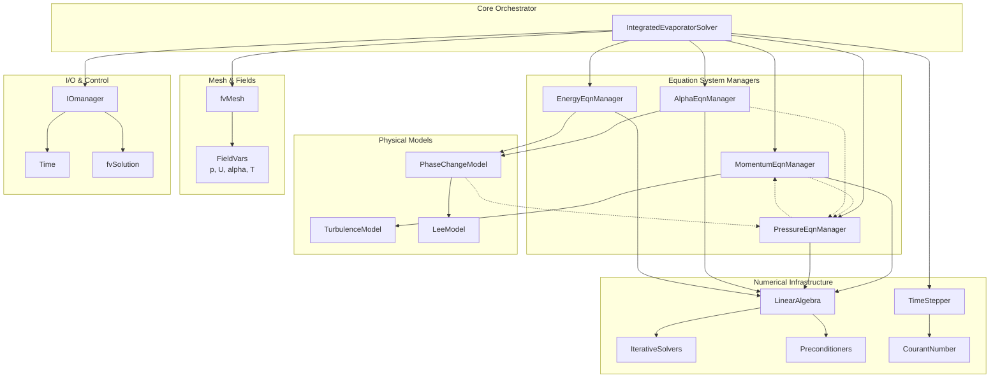
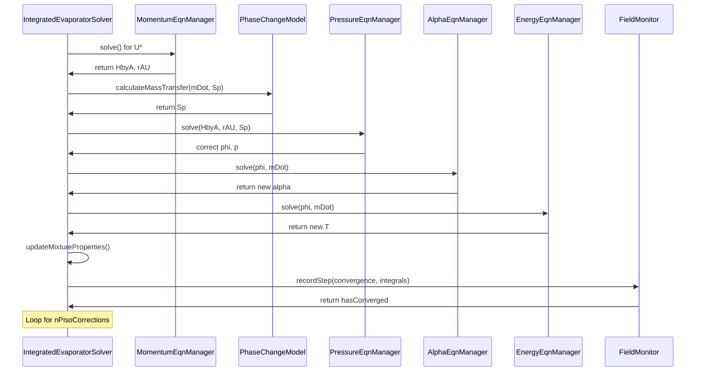

# Day 12: Phase 1 Review & Integration

**Date:** 2026-01-12
**Difficulty:** Hardcore
**Phase:** 1 - Foundation Theory
**Day:** 12 of 12
**Estimated Study Time:** 8-12 hours
**Prerequisites:** Mastery of Days 01-11 (Governing Equations, FVM, Discretization, Linear Algebra, Two-Phase Flow, Phase Change Theory)
**Keywords:** Synthesis, Integration, Validation, Architecture, Coupled Systems, Solver Design, Transition Planning

---

## 🎯 Learning Objectives

เมื่อจบการ Integrated ขั้น Hardcore ของวันนี้ คุณจะสามารถ:

1.  **Synthesize (สังเคราะห์):** กรอบแนวคิดทางทฤษฎีและการคำนวณที่สมบูรณ์จาก Phase 1 ให้เป็นโมเดลความคิดที่เป็นหนึ่งเดียวกัน คุณจะเชื่อมโยงจุดต่างๆ ระหว่าง Governing equations สำหรับมวล โมเมนตัม พลังงาน และการขนส่งเฟส (Day 1, 10, 11), การ Discretization แบบ Finite volume ของพวกมัน (Day 2, 3, 4), กลไก Linear algebra ที่อยู่เบื้องหลัง (Day 5, 7, 8), และ Segregated solution algorithms (Day 9) ผลลัพธ์คือความเข้าใจที่สอดคล้องกันว่าสมการนามธรรม `∇·U = ṁ(1/ρ_v - 1/ρ_l)` แปลงไปเป็นระบบ `fvMatrix` ที่ทำงานจริงแบบ Coupled ภายใน `Time` loop ได้อย่างไร

2.  **Architect and Implement (ออกแบบสถาปัตยกรรมและลงมือสร้าง):** คลาส `IntegratedEvaporatorSolver` แบบ Monolithic ที่จัดลำดับและเชื่อมโยง (Couple) Physical models ทั้งหมดได้อย่างถูกต้อง สิ่งนี้เกี่ยวข้องกับการจัดการลำดับขั้นตอนการแก้ปัญหาสำหรับ Fields ความเร็ว (`U`), ความดัน (`p`), Volume fraction (`alpha`), และอุณหภูมิ (`T`) โดยรับประกัน Data flow ที่ถูกต้อง, Source term linearization (จาก Lee model), Under-relaxation, และการอัปเดต Boundary condition คุณจะเปลี่ยนจากการพัฒนา Component แยกส่วนไปสู่การสร้างโครงสร้าง Solver เกรด Production

3.  **Design and Execute (ออกแบบและดำเนินการ):** ชุด Validation suite ที่ครอบคลุมสำหรับ Integrated solver สิ่งนี้ไปไกลกว่า Unit testing โดยรวมถึงการ Verification ระดับระบบเทียบกับ Canonical cases: Single-phase flow สำหรับ Hydrodynamic validation, Adiabatic two-phase transport สำหรับ Interface-capturing verification, Phase change ใน Static cell สำหรับการตรวจสอบ Mass/Energy conservation, และ Simplified evaporator setup สำหรับความสมจริงทางฟิสิกส์แบบบูรณาการ คุณจะนิยามและคำนวณ Key metrics เช่น Global mass balance error, Interface thickness, และ Enthalpy conservation

4.  **Critically Evaluate (ประเมินอย่างวิพากษ์):** ประสิทธิภาพและความทนทาน (Robustness) ของระบบที่ Integrate แล้ว คุณจะวิเคราะห์ Convergence histories, ระบุคอขวด (เช่น ใน Pressure-velocity coupling loop หรือ Linear solvers), และเสนอแนะการ Optimize ที่ตรงเป้าหมาย สิ่งนี้รวมถึงการ Profiling โค้ด, การปรับการตั้งค่า `fvSolution` dictionary (Solvers, Preconditioners, Tolerances), และการประเมิน Stability limits ที่เกี่ยวข้องกับ Courant number และความแรงของ Phase change source term

5.  **Formulate (กำหนดสูตร):** ข้อกำหนดทางเรขาคณิตและ Meshing ที่แม่นยำซึ่งได้มาจากฟิสิกส์ของ Phase 1 คุณจะระบุอย่างชัดเจนว่าความต้องการทางตัวเลขของ VOF method, Phase change model, และ Near-wall turbulence/resolution แปลไปเป็นข้อกำหนด (Specifications) สำหรับ Phase 2 ได้อย่างไร สิ่งนี้รวมถึงการนิยาม Target cell sizes ใน Interface region, Maximum allowable non-orthogonality และ Skewness เพื่อความแม่นยำของ Gradient, และโครงสร้าง Boundary layer สำหรับความแม่นยำของการถ่ายเทความร้อน

6.  **Plan the Transition (วางแผนการเปลี่ยนผ่าน):** จาก Phase 1 ที่เน้นสมการ ไปสู่ Phase 2 ที่เน้นเรขาคณิต คุณจะสร้างรายการช่องว่างทางความรู้ที่ต้องเชื่อมต่อ โดยเฉพาะการเข้าใจว่า `fvMesh` object, geometric fields (`cellVolumes()`, `faceAreas()`), และ topology classes (`lduAddressing`) เป็นรากฐานที่ Discretization operators ทั้งหมด (`fvm::div`, `fvc::grad`) ถูกสร้างขึ้นมาได้อย่างไร สิ่งนี้เตรียมคุณให้มอง Meshes ไม่ใช่แค่ CAD imports แต่เป็น Discrete representation ของ Integration volumes ในสมการ Finite volume ของคุณ

<!-- END_OF_FRONTMATTER -->

# 1. Section 1: Theory

## 12.1 Phase 1 Knowledge Synthesis: From Equations to Implementation

จุดสูงสุดของ Phase 1 แสดงถึงความสำเร็จที่ยิ่งใหญ่ในวิศวกรรม Computational Fluid Dynamics: การเปลี่ยนแปลงหลักการทางฟิสิกส์พื้นฐานให้เป็น Numerical solver ที่ทำงานได้จริงและมีการเชื่อมโยง (Coupled) กันอย่างสมบูรณ์ การสังเคราะห์นี้ไม่ใช่เพียงผลรวมของบทเรียนแต่ละบท แต่เป็นการเกิดขึ้นของระบบที่สอดคล้องกันที่ซึ่งสมการทฤษฎี, Numerical discretization, กลยุทธ์อัลกอริทึม, และสถาปัตยกรรมซอฟต์แวร์ มาบรรจบกันเพื่อจำลอง Multiphase flow ที่ซับซ้อนพร้อม Phase change การเดินทางจาก Governing equations ของ Day 01 ถึง Phase change implementation ของ Day 11 ได้มอบชุดเครื่องมือที่ครอบคลุมแก่เรา ตอนนี้ เราต้อง Integrate เครื่องมือเหล่านี้เข้าเป็น Engine ที่เป็นหนึ่งเดียว โดยเข้าใจว่า "ส่วนรวมนั้นยิ่งใหญ่กว่าผลรวมของส่วนย่อย" ตัวชี้วัดสำคัญของการ Integration นี้คือ **Implementation Coherence Factor** ซึ่งเป็น Metric เชิงแนวคิดที่บ่งบอกว่า Discrete components ต่างๆ มีปฏิสัมพันธ์กันอย่างราบรื่นเพียงใดภายในสถาปัตยกรรมของ Solver Coherence factor ที่สูงรับประกัน Simulation ที่เสถียร แม่นยำ และมีประสิทธิภาพ ในขณะที่ Coherence ต่ำนำไปสู่ความไม่เสถียรทางตัวเลข ความไม่ถูกต้องทางฟิสิกส์ และความล้มเหลวของ Solver แม้ว่า Components แต่ละตัวจะถูกต้องก็ตาม

## 12.1.1 The Complete Governing Equation Set for Evaporator Simulation

รากฐานของ Integrated solver ของเราคือชุดสมการอนุพันธ์ย่อย (PDEs) ที่สมบูรณ์และเชื่อมโยงกัน (Coupled) ซึ่งอธิบายกฎการอนุรักษ์สำหรับ Two-phase mixture ที่กำลังเกิดการระเหยหรือควบแน่น แต่ละสมการที่แนะนำในวันก่อนๆ จะต้องถูกพิจารณาไม่ใช่แบบแยกส่วน แต่เป็นส่วนหนึ่งของระบบที่เชื่อมโยงกันอย่างแน่นหนา โดยที่ผลเฉลยของสมการหนึ่งจะมีอิทธิพลโดยตรงต่อ Source terms และสัมประสิทธิ์ของสมการอื่นๆ

$$
\begin{cases}
\text{Continuity with Phase Change:} & \dfrac{\partial \rho}{\partial t} + \nabla \cdot (\rho \mathbf{U}) = \dot{m} \left( \dfrac{1}{\rho_v} - \dfrac{1}{\rho_l} \right) \\[10pt]
\text{Momentum (Navier-Stokes):} & \dfrac{\partial (\rho \mathbf{U})}{\partial t} + \nabla \cdot (\rho \mathbf{U} \mathbf{U}) = -\nabla p + \nabla \cdot \boldsymbol{\tau} + \rho \mathbf{g} \\[10pt]
\text{VOF Transport with Compression:} & \dfrac{\partial \alpha}{\partial t} + \nabla \cdot (\alpha \mathbf{U}) + \nabla \cdot \left( \alpha (1-\alpha) \mathbf{U}_c \right) = \dfrac{\dot{m}}{\rho_l} \\[10pt]
\text{Energy with Latent Heat:} & \dfrac{\partial (\rho c_p T)}{\partial t} + \nabla \cdot (\rho \mathbf{U} c_p T) = \nabla \cdot (k \nabla T) + \dot{m} h_{lv}
\end{cases}
$$

**Physical Interpretation and Coupling Mechanisms:**

1.  **Continuity Equation (Mass Conservation):** นี่คือ **Master equation** ที่ควบคุมการเปลี่ยนแปลงปริมาตรเนื่องจากการเปลี่ยนเฟส Source term ทางขวามือ $\dot{m} \left( \frac{1}{\rho_v} - \frac{1}{\rho_l} \right)$ คือ **Expansion term** มันจะไม่เป็นศูนย์เฉพาะที่ Liquid-vapor interface ที่ซึ่งเกิด Phase change ($\dot{m} \neq 0$) เนื่องจาก $\rho_v \ll \rho_l$ เทอมนี้จะเป็นบวกสำหรับการระเหย (ปริมาตรขยายตัว) และเป็นลบสำหรับการควบแน่น (ปริมาตรหดตัว) Source term นี้ปรากฏใน Pressure Poisson equation ระหว่าง PISO/SIMPLE loop ทำให้ Flow มีคุณสมบัติ Compressible ที่ Interface การไม่รวมเทอมนี้เป็นสาเหตุที่พบบ่อยที่สุดประการเดียวของการ Diverge ของ Solver ใน Phase change simulations

2.  **Momentum Equation:** ควบคุมการเคลื่อนที่ของของไหล ความหนาแน่น $\rho$ และความหนืด (ฝังอยู่ใน $\boldsymbol{\tau}$) เป็น Mixture properties ที่ขึ้นกับ Volume fraction $\alpha$ Pressure gradient $-\nabla p$ เป็นแรงขับเคลื่อนหลักที่ถูกแก้ไขผ่าน Pressure-velocity coupling algorithm Stress tensor $\boldsymbol{\tau}$ รวมทั้งความเค้นจากความหนืดและ Turbulent (Reynolds) stresses (ถ้ามีการโมเดล): $\boldsymbol{\tau} = \mu_{eff} \left( \nabla \mathbf{U} + (\nabla \mathbf{U})^T - \frac{2}{3} (\nabla \cdot \mathbf{U}) \mathbf{I} \right)$

3.  **VOF Transport Equation:** สมการนี้ติดตาม Interface Advection term มาตรฐาน $\nabla \cdot (\alpha \mathbf{U})$ มีแนวโน้มที่จะเกิด Numerical diffusion ทำให้ Interface เบลอข้ามหลาย Cells **Artificial compression term** $\nabla \cdot \left( \alpha (1-\alpha) \mathbf{U}_c \right)$ ต่อต้านสิ่งนี้โดยการนำเสนอความเร็ว $\mathbf{U}_c$ ในแนวตั้งฉากกับ Interface ซึ่งเป็นการ "ลับคม (Sharpen)" มันอย่างมีประสิทธิภาพ Source term ทางขวา $\dot{m}/\rho_l$ คิดรวม Mass transfer ระหว่างเฟส มันสำคัญมากที่ Source นี้ต้องถูก Implement ในลักษณะ Bounded และ Implicit เพื่อรักษา $\alpha \in [0,1]$

4.  **Energy Equation:** ควบคุมการถ่ายเทความร้อนและ Driving potential สำหรับ Phase change Latent heat source term $\dot{m} h_{lv}$ ให้ Energy sink (การระเหย) หรือ Source (การควบแน่น) ที่เกี่ยวข้องกับการเปลี่ยนเฟส Mixture properties $\rho$, $c_p$, และ $k$ ถูกคำนวณเป็นค่าเฉลี่ยถ่วงน้ำหนักตาม $\alpha$ Temperature field $T$ ถูกใช้ใน Lee model เพื่อคำนวณ Mass transfer rate $\dot{m}$ สร้าง Two-way coupling ระหว่างสมการ Energy และ VOF

**Table 12.1: Key Variables in the Complete Equation Set**
| Symbol | Name | Description | Primary Coupling |
| :--- | :--- | :--- | :--- |
| $\rho$ | Mixture Density | $\rho = \alpha \rho_l + (1-\alpha) \rho_v$ | Links VOF to all other equations |
| $\mathbf{U}$ | Velocity Vector | Solved from Momentum, used in all flux terms | Coupled to $p$ via PISO/SIMPLE |
| $p$ | Pressure | Solved from Poisson equation with expansion source | Drives $\mathbf{U}$, influenced by phase change |
| $\alpha$ | Volume Fraction | 0 (vapor) to 1 (liquid), defines interface | Determines mixture properties, source for $\dot{m}$ |
| $T$ | Temperature | Solved from Energy equation | Drives $\dot{m}$ in Lee model |
| $\dot{m}$ | Mass Transfer Rate | $\dot{m} = C \alpha_l \rho_l \frac{T - T_{sat}}{T_{sat}}$ (evap.) | **Core coupling variable**: appears in Continuity, VOF, and Energy |
| $\mathbf{U}_c$ | Compression Velocity | $\mathbf{U}_c = \min(C_\alpha \|\mathbf{U}\|, \max(\|\mathbf{U}\|)) \cdot \frac{\nabla \alpha}{\|\nabla \alpha\|}$ | Artificial term for interface sharpening |

## 12.1.2 The Finite Volume Discretization Framework: A Unified Approach

สมการ Governing ทั้งสี่แบ่งปันโครงสร้างทางคณิตศาสตร์เดียวกันเมื่อมองผ่านเลนส์ของ Finite Volume Method (FVM) กรอบงานร่วมนี้คือสิ่งที่ช่วยให้ OpenFOAM แก้ฟิสิกส์ที่หลากหลายด้วยแนวทางทางตัวเลขที่สอดคล้องกัน Generic transport equation สำหรับ Scalar หรือ Vector quantity $\phi$ คือ:

$$
\underbrace{\int_V \frac{\partial \phi}{\partial t} dV}_{\text{Transient Term}} + \underbrace{\oint_{\partial V} \mathbf{F}(\phi) \cdot d\mathbf{S}}_{\text{Flux Integral}} = \underbrace{\int_V S_\phi(\phi) dV}_{\text{Source Term}}
$$

การใช้ Gauss's divergence theorem และ Discretizing สำหรับ Control volume $V_P$ ที่มีจุดศูนย์กลางที่ $P$ จะได้รูปแบบ Canonical algebraic:

$$
a_P \phi_P + \sum_{N} a_N \phi_N = b_P
$$

โดยที่:
*   $a_P$ คือ **Central coefficient** ประกอบด้วยส่วนร่วมจาก Transient term, "Owner" part ของ Spatial fluxes, และ Linear part ของ Source term
*   $a_N$ คือ **Neighbour coefficients** แสดงถึงอิทธิพลของ Cells โดยรอบ $N$ ต่อ Cell $P$ ผ่าน Convective และ Diffusive fluxes
*   $b_P$ คือ **Source term** ประกอบด้วย Constant contributions, Explicit terms, และ Boundary condition contributions

**Table 12.2: Discretization of Each Term in the Generic Framework**
| Term | Generic Form | Discretization Strategy (OpenFOAM) | Key Classes/Operators |
| :--- | :--- | :--- | :--- |
| **Transient** | $\int_V \frac{\partial \phi}{\partial t} dV$ | Euler Implicit: $V_P \frac{\phi_P^{n+1} - \phi_P^n}{\Delta t}$ <br> Crank-Nicolson: $V_P \frac{\phi_P^{n+1} - \phi_P^n}{\Delta t}$ with flux averaging | `fvm::ddt()` |
| **Convection** | $\oint_{\partial V} (\mathbf{U} \phi) \cdot d\mathbf{S}$ | Sum over faces: $\sum_f \mathbf{U}_f \phi_f \cdot \mathbf{S}_f$. <br> $\phi_f$ from Upwind, Central, or TVD schemes. | `fvm::div(phi, phi)` <br> `surfaceInterpolationScheme` |
| **Diffusion** | $\oint_{\partial V} (\Gamma \nabla \phi) \cdot d\mathbf{S}$ | Sum over faces: $\sum_f \Gamma_f (\nabla \phi)_f \cdot \mathbf{S}_f$. <br> $(\nabla \phi)_f$ uses corrected gradient for non-orthogonal meshes. | `fvm::laplacian(Gamma, phi)` |
| **Source** | $\int_V S_\phi dV$ | Linearized: $S_\phi = S_u + S_p \phi_P$. <br> $S_p \leq 0$ required for diagonal dominance. | `fvMatrix::source()` <br> `LinearizedSource` class |

พลังของกรอบงานนี้คือคลาส `fvMatrix<Type>` เดียวกันสามารถเก็บสัมประสิทธิ์ $a_P$, $a_N$, และ $b_P$ สำหรับ `volScalarField` (เช่น $p$, $T$, $\alpha$) หรือ `volVectorField` (เช่น $\mathbf{U}$) ได้ Solution algorithm (PBiCGStab, PCG) จากนั้นจะดำเนินการกับโครงสร้าง Matrix นี้โดยไม่คำนึงถึงฟิสิกส์เบื้องหลัง

## 12.1.3 Pressure-Velocity Coupling with Phase Change Source

สำหรับ Incompressible single-phase flow สมการ Continuity คือ $\nabla \cdot \mathbf{U} = 0$ เมื่อมี Phase change มันกลายเป็น $\nabla \cdot \mathbf{U} = S_p$ โดยที่ $S_p = \dot{m} \left( \frac{1}{\rho_v} - \frac{1}{\rho_l} \right)$ สิ่งนี้เปลี่ยนปัญหา Pressure-velocity coupling ไปโดยสิ้นเชิง อัลกอริทึมมาตรฐาน PISO/SIMPLE ต้องได้รับการดัดแปลงเพื่อพิจารณา Distributed source term นี้

อัลกอริทึมสำหรับ **PISO loop with Phase Change** ภายใน Time step เดียว มีดังนี้:

1.  **Momentum Predictor:** แก้ Discretized momentum equation โดยใช้ Pressure field จาก Time step ก่อนหน้า ($p^n$) หรือ Iteration ก่อนหน้า สิ่งนี้ให้ Predicted velocity field $\mathbf{U}^*$ ซึ่งยังไม่สอดคล้องกับ สมการ Continuity
    $$
    a_P \mathbf{U}_P^* + \sum_N a_N \mathbf{U}_N^* = \mathbf{b}_P - \nabla p^n
    $$
    มักจัดรูปใหม่เป็น:
    $$
    \mathbf{U}_P^* = \frac{\mathbf{H}(\mathbf{U}^*)}{a_P} - \frac{1}{a_P} \nabla p^n
    $$
    โดยที่ $\mathbf{H}(\mathbf{U}^*) = \mathbf{b}_P - \sum_N a_N \mathbf{U}_N^*$ ประกอบด้วยส่วนร่วมจาก Neighbours และ Source terms ยกเว้น Pressure

2.  **Formulate Pressure Equation:** แทนที่นิพจน์สำหรับ $\mathbf{U}^*$ ลงในสมการ Continuity $\nabla \cdot \mathbf{U}^{n+1} = S_p$ สิ่งนี้ต้องอาศัยการ Interpolate เทอม $1/a_P$ ไปยัง Cell faces โดยใช้ Rhie-Chow interpolation เพื่อป้องกัน Checkerboarding เราจะได้ **Pressure Poisson Equation with Phase Change Source**:
    $$
    \nabla \cdot \left( \frac{1}{a_P} \nabla p' \right) = \nabla \cdot \left( \frac{\mathbf{H}(\mathbf{U}^*)}{a_P} \right) - S_p
    $$
    ที่นี่ $p' = p^{n+1} - p^n$ คือ Pressure correction **ที่สำคัญ Phase change source term $S_p$ ปรากฏทางขวามือ (RHS)** ถ้าละเลย $S_p$ Solver จะพยายามแก้ไข Velocity field ให้เป็น Divergence-free ($\nabla \cdot \mathbf{U}=0$) ซึ่งไม่ถูกต้องทางฟิสิกส์ที่ Evaporating interface นำไปสู่ Unphysical pressure oscillations ขนาดใหญ่และการ Diverge

3.  **Solve Pressure Equation:** สมการข้างต้นถูก Discretize เพื่อสร้างระบบเชิงเส้นสำหรับ $p'$ เนื่องจาก Operator $\nabla \cdot ( \frac{1}{a_P} \nabla )$ เป็น Symmetric และ Positive-definite จึงแก้ได้อย่างมีประสิทธิภาพโดยใช้ **Preconditioned Conjugate Gradient (PCG)** method ร่วมกับ **Diagonal Incomplete Cholesky (DIC)** preconditioner

4.  **Velocity and Flux Correction:** Pressure correction $p'$ ถูกใช้เพื่ออัปเดต Velocity และ Face flux fields เพื่อให้สอดคล้องกับสมการ Continuity ที่ *ถูกต้อง* ($\nabla \cdot \mathbf{U} = S_p$)
    $$
    \mathbf{U}^{n+1} = \mathbf{U}^* - \frac{1}{a_P} \nabla p'
    $$
    $$
    \phi_f^{n+1} = \phi_f^* - \left( \frac{1}{a_P} \right)_f (\nabla p')_f \cdot \mathbf{S}_f
    $$
    ขั้นตอนที่ 2-4 จะทำซ้ำตามจำนวนรอบของ **Non-orthogonal correctors** (เพื่อชดเชย Mesh non-orthogonality) และ **PISO correctors** (เพื่อปรับปรุง Coupling) ที่ระบุไว้

> [!WARNING]
> การ Integrate ของ Phase change source term $S_p$ เข้าสู่สมการ Pressure เป็นส่วนที่ละเอียดอ่อนที่สุดของ Solver coupling มันต้องถูกคำนวณ *หลังจาก* สมการ VOF และ Energy ได้อัปเดต $\dot{m}$ สำหรับ Iteration ปัจจุบันแล้ว และต้องถูกเพิ่มเข้าไปใน RHS ของ `fvMatrix` สำหรับ Pressure equation อย่างชัดแจ้ง (Explicitly) ลำดับการ Implementation ที่ไม่ถูกต้อง (เช่น ใช้ $\dot{m}$ จาก Time step ก่อนหน้า) จะทำให้ Convergence และ Stability แย่ลง

## 12.2 Integration Project: Complete Evaporator Solver

Integration project คือบททดสอบสุดท้ายของความรู้ Phase 1 มันก้าวข้ามการ Implement components แยกส่วน ไปสู่การออกแบบสถาปัตยกรรมและการรัน Simulation workflow ที่สมบูรณ์ ความสำเร็จวัดได้จากเกณฑ์หลายด้านที่สร้างสมดุลระหว่างความสมจริงทางฟิสิกส์ ความทนทานทางตัวเลข และประสิทธิภาพการคำนวณ

## 12.2.1 Defining Success: A Multi-Dimensional Metric

Solver ที่สร้างภาพที่สวยงามแต่ละเมิดกฎอนุรักษ์พลังงาน คือความล้มเหลว Solver ที่แม่นยำสมบูรณ์แบบแต่ใช้เวลาหนึ่งปีในการรัน ก็ใช้งานจริงไม่ได้ ดังนั้น เราจึงนิยามความสำเร็จแบบองค์รวม:

$$
\text{Project Success} = \frac{\text{Correct Physics} \times \text{Numerical Stability} \times \text{Computational Performance}}{\text{Development Time}}
$$

**1. Correct Physics (0-1 Scale):** วัดว่าการ Implementation ตรงกับ Theoretical model ดีเพียงใด
*   **Mass Conservation:** Global mass balance error ต้องเป็น Machine precision สำหรับ Incompressible regions และสอดคล้องกับ Phase change model ที่ Interface คำนวณ: $\epsilon_m = \left| \frac{d}{dt}\int_V \rho dV + \oint_{\partial V} \rho \mathbf{U} \cdot d\mathbf{S} \right| / \text{mass flux scale}$ ต้องการ $\epsilon_m < 10^{-6}$
*   **Energy Conservation:** ผลรวมของ Conductive, Convective, และ Latent heat fluxes ต้องสมดุล $\epsilon_e = \left| \frac{d}{dt}\int_V \rho c_p T dV + \oint_{\partial V} \rho c_p T \mathbf{U} \cdot d\mathbf{S} - \oint_{\partial V} k \nabla T \cdot d\mathbf{S} - \int_V \dot{m} h_{lv} dV \right| / \text{power scale}$ ต้องการ $\epsilon_e < 10^{-5}$
*   **Interface Dynamics:** Interface thickness ควรยังคงกะทัดรัด (2-3 cells) เนื่องจากการบีบอัด (Compression term) อัตราการเปลี่ยนเฟส $\dot{m}$ ควรตอบสนองอย่างสมเหตุสมผลต่อการเปลี่ยนแปลงของ $T - T_{sat}$

**2. Numerical Stability (0-1 Scale):** วัดความทนทาน (Robustness) ของ Solver
*   **Convergence:** Linear solvers สำหรับ $p$, $\mathbf{U}$, $T$, $\alpha$ ควรลู่เข้าภายในจำนวน Iterations ที่เหมาะสม (เช่น < 200) ในแต่ละ Time step โดยไม่ต้องใช้ Under-relaxation ที่มากเกินไป
*   **Boundedness:** Volume fraction field ต้องอยู่ภายในขอบเขตทางกายภาพ: $0 \leq \alpha \leq 1$ อุณหภูมิและความดันไม่ควรแสดงการแกว่งที่ผิดธรรมชาติ (Unphysical oscillations)
*   **Time Step Stability:** Solver ควรทำงานได้อย่างเสถียรด้วย Time step ที่ควบคุมโดย Courant number $Co = \frac{|\mathbf{U}| \Delta t}{\Delta x} < Co_{max}$ (เช่น 0.5 สำหรับ Multiphase flow)

**3. Computational Performance (Iterations/Second):** วัดประสิทธิภาพ
*   **Execution Time:** เวลา Wall-clock สำหรับ Standardized test case
*   **Memory Usage:** ควรคาดการณ์ได้และแปรผันตรงกับจำนวน Cells
*   **Scalability:** ศักยภาพสำหรับการคำนวณแบบขนาน (Parallel computation) (แม้ว่าเป็นหัวข้อ Phase 3)

**4. Development Time:** ความพยายามที่ใช้เพื่อให้ได้มาซึ่งข้อข้างต้น Software architecture ที่ดีจะลดเวลานี้

## 12.2.2 Software Architecture Quality

คุณภาพของ Codebase ของ Integrated solver มีความสำคัญอย่างยิ่งต่อการดูแลรักษา (Maintainability), การขยายผล (Extensibility), และการ Debug สามารถวัดปริมาณได้เป็น:

$$
Q_{\text{arch}} = \sum_{i} (\text{Cohesion}_i - \text{Coupling}_i) + \text{Extensibility}
$$

*   **High Cohesion:** แต่ละ Class (`MomentumSolver`, `PressureSolver`, `AlphaSolver`, `EnergySolver`) มีความรับผิดชอบเดียวที่นิยามไว้อย่างดี ตัวอย่างเช่น `AlphaSolver` ควรจัดการ VOF transport และ Phase change source calculation เท่านั้น ไม่ใช่ Energy diffusion
*   **Low Coupling:** Classes มีปฏิสัมพันธ์ผ่าน Interfaces ที่นิยามไว้อย่างดี (เช่น Base class `PhaseChangeModel` ที่ให้เมธอด `calculateMDot()`) แทนที่จะจัดการ Private data ของกันและกันโดยตรง สิ่งนี้ช่วยให้สามารถสลับ Lee model เป็นโมเดลอื่น (เช่น Kinetic theory model) ได้โดยมีการเปลี่ยนแปลงน้อยที่สุด
*   **Extensibility:** Architecture รองรับความต้องการในอนาคต ตัวอย่างเช่น การเพิ่ม Turbulence model ใหม่ควรเกี่ยวข้องกับการสร้าง Class ใหม่ที่ Derived จาก `TurbulenceModel` และเปลี่ยนบรรทัดเดียวใน Solver configuration

Solver ที่มีสถาปัตยกรรมที่ดีสำหรับ Integration project อาจมีโครงสร้างระดับสูงดังนี้:
```
IntegratedEvaporatorSolver
├── Time (runTime)
├── Mesh (fvMesh)
├── Fields (p, U, T, alpha, phi, rho, mu, ...)
├── Solution Control (fvSolution dictionary)
├── Equation Solvers
│   ├── MomentumSolver (uses fvMatrix<Vector>)
│   ├── PressureSolver (solves ∇·(1/A ∇p) = ∇·HbyA - Sp)
│   ├── AlphaSolver (with MULES compression and Lee source)
│   └── EnergySolver (with latent heat source)
├── PhaseChangeModel (Lee model implementation)
├── PropertyCalculator (updates rho, mu, cp, k from alpha & T)
└── Monitor (calculates residuals, mass balance, reports)
```

## 12.2.3 Validation Hierarchy: Building Confidence Step-by-Step

คุณไม่สามารถ Debug solver ที่ Fully coupled, Multiphase, และมี Phase-changing ได้ในรวดเดียว ลำดับขั้นการ Validation (Validation Hierarchy) ที่เป็นระบบเป็นสิ่งจำเป็น:

1.  **Level 1: Single-Phase Flow.** ปิดใช้งาน VOF equation (ตั้ง $\alpha=1$ ทุกที่) และ Phase change source ($\dot{m}=0$) ตรวจสอบ Solver เทียบกับ:
    *   **Poiseuille Flow:** Analytical solution สำหรับ Laminar flow ในท่อ/ช่อง ตรวจสอบ Velocity profile และ Pressure drop
    *   **Lid-Driven Cavity:** Benchmark ที่ยอมรับกันทั่วไปสำหรับ Incompressible flow เปรียบเทียบ Velocity profiles ที่กึ่งกลาง Cavity กับ Benchmark data
    *   **This validates:** Core FVM discretization, Pressure-velocity coupling (PISO/SIMPLE), และ Boundary condition implementation

2.  **Level 2: Two-Phase Flow without Phase Change.** เปิดใช้งาน VOF equation และ Compression term แต่ตั้ง $\dot{m}=0$ เริ่มต้นด้วย Static bubble หรือ Droplet
    *   **Advection Test:** เคลื่อนย้าย Droplet ใน Uniform velocity field รูปร่างของ Droplet ควรถูกรักษาไว้โดยมีการบิดเบี้ยวหรือ Diffusion น้อยที่สุด
    *   **Shear Test:** วาง Droplet ใน Shear flow Interface ควรเปลี่ยนรูปอย่างสมจริง
    *   **This validates:** VOF advection, Interface compression, และการ Coupling ของ $\alpha$ field ต่อ Mixture properties ($\rho$, $\mu$)

3.  **Level 3: Phase Change with Lee Model (Simplified Geometry).** เปิดใช้งาน Lee model source terms ใน VOF และ Energy equations ใช้ Setup แบบ 1D หรือ 2D ง่ายๆ
    *   **Steady-State Evaporation:** บ่อของเหลวที่มีผนังร้อนอุณหภูมิเกิน Saturation ตรวจสอบว่า Evaporation rate $\dot{m}$ คงที่และตรงกับ Analytical heat flux: $\dot{m} = q_{wall} / h_{lv}$
    *   **Bubble Growth/Condensation:** ฟองไอในของเหลว Superheated/Subcooled ติดตามรัศมีฟองเทียบกับเวลา เปรียบเทียบกับ Simplified analytical models (เช่น Scriven's solution สำหรับ Diffusion-controlled growth)
    *   **This validates:** การ Implementation ของ Lee model source terms, การ Coupling ต่อ Energy equation, และการรวม Expansion term $S_p$ ในสมการ Pressure

4.  **Level 4: Full Evaporator Conditions.** รัน Simulation เลียนแบบ Component ของ Evaporator จริง: ท่อที่มี Liquid refrigerant ไหลเข้า ระเหยบางส่วนเนื่องจาก Wall heat flux และ Two-phase mixture ไหลออก
    *   **Check:** Pressure drop ที่สมจริง, การเพิ่มขึ้นอย่างค่อยเป็นค่อยไปของ Vapor quality ตามความยาวท่อ, การกระจายอุณหภูมิที่น่าเชื่อถือ, และพฤติกรรมที่เสถียรและลู่เข้า (Convergent)
    *   **This is the final integration test,** ยืนยันว่า Components ทั้งหมดทำงานร่วมกันภายใต้เงื่อนไขจริง

## 12.3 Transition to Phase 2: Geometry & Meshing

Phase 1 เน้นสมการ: *สิ่งที่* ต้องแก้ (What to solve) Phase 2 จะเน้นเรขาคณิต: *ที่ไหน* ที่จะแก้ (Where to solve it) สะพานเชื่อมระหว่างทั้งสองคือความเข้าใจอย่างลึกซึ้งว่า **Mech คือร่างทางคอมพิวเตอร์ของเรขาคณิตที่ซึ่งสมการถูก Discretized** การแทนเรขาคณิตที่ไม่ดีหรือคุณภาพ Mesh ที่แย่สามารถทำลายผลเฉลยของสมการที่แม้จะ Implement มาอย่างสมบูรณ์แบบได้

## 12.3.1 The Geometry-Discretization Error Relationship
Formal order of accuracy $p$ ของ Discretization scheme (เช่น $p=2$ สำหรับ Central differencing) เป็นคุณสมบัติเชิงอะสิมโทติก (Asymptotic) ที่เป็นจริงเฉพาะสำหรับ *Ideal* meshes เท่านั้น บน Meshes จริงที่เป็น Unstructured, อาจมีความเบี้ยว (Skewed), และ Non-orthogonal ค่า Error จริงถูกควบคุมโดย:

$$
\text{Effective Discretization Error} \propto \frac{\Delta x^p}{\mathcal{Q}}
$$

โดยที่ $\mathcal{Q}$ แทน **Geometric Quality** ของ Mesh ซึ่งเป็น Composite metric (โดยทั่วไป $0 < \mathcal{Q} \leq 1$) ที่พิจารณา:
*   **Non-Orthogonality:** มุมระหว่างเส้นเชื่อมจุดศูนย์กลาง Cell $P$ และ $N$ กับเวกเตอร์ปกติของหน้า Face $\mathbf{S}_f$ Non-orthogonality ที่สูงต้องการเทอม "Non-orthogonal correction" ที่ซับซ้อนในการคำนวณ Gradient ซึ่งเพิ่ม Error และความไม่เสถียร
*   **Skewness:** ระยะห่างระหว่าง Face centroid และเส้น $PN$ 
 หน้าที่เบี้ยว (Skewed faces) นำไปสู่การ Interpolation ของ $\phi_f$ ที่ไม่แม่นยำ
*   **Aspect Ratio:** อัตราส่วนของขนาด Cell ที่ใหญ่ที่สุดต่อเล็กที่สุด Aspect ratios ที่รุนแรงสามารถทำให้ Conditioning ของระบบเชิงเส้นแย่ลง ทำให้ Solver convergence ช้าลง
*   **Volume Ratio:** การเปลี่ยนแปลงขนาด Volume อย่างกะทันหันระหว่าง Cells ที่ติดกัน สิ่งนี้สามารถก่อให้เกิด Interpolation errors และปัญหาเสถียรภาพ โดยเฉพาะสำหรับ Explicit terms

**Implication for Evaporator Simulation:** Liquid-vapor interface เป็นบริเวณที่มี Gradients ของ $\alpha$, $T$, และ $\dot{m}$ สูงชัน เพื่อ Resolve gradients เหล่านี้อย่างแม่นยำ เราต้องการ Cells ละเอียด ($\Delta x$ เล็ก) ในบริเวณนี้ อย่างไรก็ตาม ถ้า Cells ละเอียดเหล่านี้มีคุณภาพต่ำ ($\mathcal{Q}$ ต่ำ) การลด Error จากการ Refinement อาจถูกหักล้างอย่างสิ้นเชิง เป้าหมายของ Phase 2 จึงเป็นการเรียนรู้วิธีสร้าง Mesh ที่ **Refined อย่างเหมาะสม *และ* มี Geometric quality สูง** ในบริเวณวิกฤต

## 12.3.2 Boundary Conditions as a Geometric-Equation Interface

Boundary conditions ใน FVM ไม่ใช่ข้อความทางคณิตศาสตร์ที่เป็นนามธรรม แต่เป็นการดำเนินการที่เป็นรูปธรรมที่ประยุกต์ใช้กับ Faces ของ Cells ที่อยู่บนขอบ Domain (Patches) การ Implementation ของ `fixedValue` หรือ `zeroGradient` BC ขึ้นอยู่กับ Patch geometry โดยเนื้อแท้

พิจารณาการ Implementation ของ **No-slip wall condition** สำหรับความเร็ว ($\mathbf{U} = \mathbf{0}$) บน Patch:
1.  Patch มีรายการของ Faces
2.  แต่ละ Face มี Owner cell ที่เกี่ยวข้อง (Cell ภายใน Domain)
3.  เพื่อบังคับใช้เงื่อนไข โค้ดต้องแก้ไขสัมประสิทธิ์ในสมการเชิงเส้นสำหรับ Owner cell ($a_P$, $b_P$) เพื่อบังคับให้ Solution ที่ Cell center สะท้อนค่าศูนย์ที่ Face การแก้ไขนี้ใช้ **Face area vector** $\mathbf{S}_f$ และ **ระยะห่างจาก Cell center ถึง Face center**

ความสัมพันธ์เชิงฟังก์ชันคือ:
$$
\phi_{\text{boundary face value}} = f(\phi_{\text{internal cell value}}, \text{BC Type}, \text{Patch Geometry (S_f, distance)})
$$

สำหรับ Evaporator geometry ที่ซับซ้อน เราจะมีหลาย Patches: `inlet` (อาจเป็น Velocity inlet), `outlet` (Pressure outlet), `heatingWall` (Fixed temperature หรือ Heat flux), `adiabaticWall`, และอาจเป็น `symmetry` planes แต่ละ Patch types เหล่านี้ต้องการ Boundary condition class เฉพาะ (`fixedValue`, `fixedGradient`, `mixed`, ฯลฯ) ที่มีปฏิสัมพันธ์อย่างถูกต้องกับ Geometric data ของ Patch นั้น Phase 2 จะเจาะลึกว่า `polyMesh`, `fvMesh`, และ `fvPatch` classes ของ OpenFOAM เก็บข้อมูลเรขาคณิตนี้อย่างไร และ `fvPatchField` hierarchy ใช้มันอย่างไร

## 12.3.3 Preparing for Phase 2: From Equations to Mesh Requirements

เมื่อเราสรุป Phase 1 เราสามารถระบุ **Mesh requirements** ที่ได้จากความเข้าใจฟิสิกส์และ Numerics ของเราได้แล้ว:

1.  **Interface Region:** ต้องการ **Local refinement** เพื่อรักษา Interface ให้คมชัด (2-3 Cells พาดผ่าน) Refinement zone ต้อง Dynamic ถ้า Interface เคลื่อนที่อย่างมีนัยสำคัญ
2.  **Boundary Layers:** สำหรับ Shear stress และการถ่ายเทความร้อนที่ผนังที่แม่นยำ จำเป็นต้องมี **Prismatic boundary layer cells** (ที่มี High aspect ratio ขนานกับผนัง) สิ่งนี้ขัดแย้งกับความต้องการ Low aspect ratio ใน Bulk flow ทำให้จำเป็นต้องใช้ Hybrid mesh
3.  **Non-Orthogonality:** ต้องถูกจำกัด (เช่น เฉลี่ย < 70°, สูงสุด < 85°) เพื่อรับประกันเสถียรภาพของ Pressure solver และความแม่นยำของ Gradient calculations ซึ่งสำคัญอย่างยิ่งสำหรับ Surface tension force (ที่ขึ้นกับ $\nabla \alpha$) หากจะมีการเพิ่มในภายหลัง
4.  **Smooth Transition:** Cell volume ควรเปลี่ยนแปลงอย่างค่อยเป็นค่อยไป (Max volume ratio < 5) เพื่อหลีกเลี่ยงการทำให้ Convection discretization ไม่เสถียร
5.  **Phase Change Zone:** บริเวณที่ $|T - T_{sat}|$ มีนัยสำคัญควรได้รับการ Resolve อย่างเพียงพอ เนื่องจากเป็นที่ที่ $\dot{m}$ ทำงาน

การเปลี่ยนผ่านสู่ Phase 2 จึงเป็นการเปลี่ยนจุดเน้น: จากการประดิษฐ์สมการที่นิยามปัญหา ไปสู่การประดิษฐ์ Computational domain (Mesh) ที่อนุญาตให้สมการเหล่านั้นถูกแก้ได้อย่างซื่อตรงและมีประสิทธิภาพ บทเรียนของ Phase 1—Expansion term, Coupling sequence, Stability limits—ให้เกณฑ์สำคัญที่เราจะใช้ตัดสินคุณภาพและความเหมาะสมของ Geometries และ Meshes ที่เราจะสร้างต่อไป

# 3. Section 2: OpenFOAM Reference

ส่วนนี้ให้การวิเคราะห์เชิงลึกแบบ "Hardcore" ของคลาส OpenFOAM ที่สำคัญซึ่งทำหน้าที่เป็นระบบประสาทส่วนกลาง (Central Nervous System) สำหรับ Integrated evaporator solver ของเรา ในวันที่ 12 นี้ เราก้าวข้ามการ Implement component แบบแยกส่วน ไปสู่การทำความเข้าใจว่าคลาสเหล่านี้ประสานงาน (Orchestrate) กับ Simulation workflow ทั้งหมดอย่างไร ตั้งแต่การอ่านการตั้งค่าและการจัดการเวลา ไปจนถึงการจัดการ Dynamic geometry การเชี่ยวชาญคลาสเหล่านี้เป็นสิ่งที่ไม่สามารถต่อรองได้ (Non-negotiable) สำหรับการสร้าง robust, production-ready CFD engine

## 3.1 Class: `fvSolution` – The Solver's Configuration Brain

**Header:** `src/finiteVolume/fvMatrices/fvSolution/fvSolution.H` (เชิงแนวคิด – มันคือ Dictionary ที่อ่านจาก `system/fvSolution`)
**Purpose:** `fvSolution` dictionary เป็นไฟล์กำหนดค่าส่วนกลางที่บงการพฤติกรรมทางตัวเลขของทุกสมการในระบบ มันไม่ใช่คลาสในความหมายของ C++ แบบดั้งเดิม แต่เป็น `dictionary` object ที่ถูก Parse ณ Runtime ความถูกต้องสมบูรณ์ (Integrity) ของมันสำคัญยิ่งยวด; การตั้งค่าที่ไม่ถูกต้องที่นี่สามารถทำให้เกิด Divergence ได้แม้ว่าฟิสิกส์จะถูก Implement มาอย่างสมบูรณ์แบบก็ตาม

## 3.1.1 Core Structure and Key Members

ไฟล์ `fvSolution` มีโครงสร้างเป็น Nested dictionaries เมื่อ OpenFOAM อ่าน มันจะกลายเป็น `dictionary` object ที่เข้าถึงได้ทั่วทั้ง Solver

```cpp
// Example of how the fvSolution dictionary is typically accessed in a solver
Foam::fvSolution solutionDict(mesh); // Not exactly the constructor, but conceptual
const dictionary& solversDict = solutionDict.subDict("solvers");
const dictionary& pisoDict = solutionDict.subDict("PISO");
```

**Key Members (Dictionary Entries):**

| Member Name | Type (Conceptual) | Purpose & Integration Significance |
| :--- | :--- | :--- |
| `solvers` | `dictionary` | **Entry ที่วิกฤตที่สุด** ประกอบด้วย Sub-dictionaries สำหรับแต่ละ Field (`p`, `U`, `alpha`, `T`, `k`, `epsilon`, etc.) กำหนด Linear solver, Preconditioner, Tolerances, และ Relative tolerance ตัวเลือกที่นี่ส่งผลโดยตรงต่อ Convergence rate และ Stability ของ Coupled system |
| `PISO` / `SIMPLE` | `dictionary` | กำหนดพารามิเตอร์สำหรับ Pressure-velocity coupling algorithm สำหรับ Evaporator ที่มี Phase change, `PISO` มักถูกเลือกสำหรับ Transient simulations พารามิเตอร์สำคัญ: `nCorrectors` (จำนวน Pressure corrections ต่อ Time step), `nNonOrthogonalCorrectors` (สำคัญมากสำหรับการแก้ไข Fluxes บน Non-orthogonal meshes) |
| `relaxationFactors` | `dictionary` | ประกอบด้วย Under-relaxation factors สำหรับ Fields (`p`, `U`, `alpha`, `T`, etc.) **จำเป็นสำหรับเสถียรภาพ** ในปัญหาที่ Coupled กันอย่างแรง (Strongly coupled) เช่น Phase change ค่าปกติอยู่ในช่วง 0.3-0.7 การ Over-relaxation (>1.0) สามารถทำให้เกิด Explosive divergence |
| `cache` | `dictionary` (Optional) | ควบคุมการ Caching ของ Temporary fields (เช่น `grad(U)`) เพื่อหลีกเลี่ยงการคำนวณซ้ำ การใช้อย่างเหมาะสมสามารถเพิ่มประสิทธิภาพใน Integrated solver ได้อย่างมีนัยสำคัญ |

## 3.1.2 Key Methods and Usage Patterns

เนื่องจาก `fvSolution` เป็น `dictionary` เราจึงโต้ตอบกับมันผ่าน Methods ของคลาส `dictionary`

```cpp
// 1. READING SETTINGS FOR A SPECIFIC FIELD SOLVER (e.g., for pressure)
const dictionary& solversDict = mesh.solutionDict().subDict("solvers");
word solverType = solversDict.subDict("p").get<word>("solver");
scalar tolerance = solversDict.subDict("p").get<scalar>("tolerance");
scalar relTol = solversDict.subDict("p").get<scalar>("relTol");

// 2. ACCESSING PISO PARAMETERS
const dictionary& pisoDict = mesh.solutionDict().subDict("PISO");
int nCorr = pisoDict.getOrDefault<int>("nCorrectors", 2);
int nNonOrthCorr = pisoDict.getOrDefault<int>("nNonOrthogonalCorrectors", 0);

// 3. APPLYING UNDER-RELAXATION
const dictionary& relaxDict = mesh.solutionDict().subDict("relaxationFactors");
scalar relaxU = relaxDict.get<scalar>("U");
// The relaxation is typically applied inside the equation solution loop:
U.storePrevIter(); // Store value for relaxation
// ... solve momentum equation ...
U.relax(relaxU);
```

**Algorithm Integration:** `fvSolution` dictionary ถูกอ่านระหว่างช่วง Initialization ของ Solver การตั้งค่าของมันจะถูกส่งต่อไปยัง `fvMatrix::solve()` methods สำหรับแต่ละ Field และใช้เพื่อควบคุม Logic ของ `PISO`/`SIMPLE` loop ส่วน `relaxationFactors` จะถูกประยุกต์ใช้หลังจากแก้สมการแต่ละสมการภายใน Time step ความสำคัญของการ Integration นี้ไม่สามารถกล่าวเกินจริงได้: ไฟล์เดียวนี้ประสานพฤติกรรมการลู่เข้า (Convergence behavior) ของระบบ Non-linear, Multi-physics ทั้งหมด

## 3.1.3 What We Do DIFFERENTLY: Enhanced `fvSolution` for Phase Change

ใน Standard OpenFOAM solver, `fvSolution` จะ Static สำหรับ Advanced evaporator engine ของเรา เรา Implement **Dynamic control logic** ที่ *ได้รับข้อมูลจาก (Informed by)* การตั้งค่า `fvSolution`

| Standard OpenFOAM Approach | Our Enhanced Implementation (CFD Engine) | Rationale & Benefit |
| :--- | :--- | :--- |
| `relaxationFactors` หยุดนิ่ง (Static) นิยามตอนเริ่ม | **Adaptive Relaxation:** เราเฝ้าระวัง Convergence residuals (เช่น `initialResidual` จาก `fvMatrix.solve()`) ถ้า Residual สำหรับ Field `phi` นิ่งหรือแกว่ง เราจะลด Relaxation factor ของมันลงแบบ Dynamic (เช่น `relaxPhi *= 0.9`) สำหรับ Time step หรือ Iteration ถัดไป และค่อยๆ เพิ่มขึ้นเมื่อ Convergence ดีขึ้น | เพิ่มความทนทาน (Robustness) อย่างมากสำหรับ Simulation ที่ Coupling strength เปลี่ยนแปลง (เช่น เมื่อ Phase change เริ่มต้น หรือฟองขนาดใหญ่หลุดออก) ป้องกัน Catastrophic divergence |
| `nCorrectors` ใน `PISO` ถูก Fix ตายตัว | **Dynamic PISO Loops:** เรา Implement residual-based exit criterion สำหรับ PISO loop แทนที่จะใช้ `nCorrectors` คงที่ เราแก้ไข Pressure และ Velocity ต่อไปเรื่อยๆ จนกว่า Continuity error (`∇·U - S_p`) จะลดลงต่ำกว่า Threshold ที่ได้จาก `solvers/p/tolerance` | รับประกันว่า Mass conservation ถูกบังคับใช้อย่างเคร่งครัดทุก Time step ซึ่งสำคัญมากสำหรับการติดตาม Phase change mass อย่างแม่นยำ หลีกเลี่ยงการแก้ไขที่ไม่จำเป็นเมื่อ Convergence รวดเร็ว ช่วยประหยัด CPU time |
| Linear solver settings เป็น Global ต่อ Field | **Conditional Solver Selection:** สำหรับ Pressure (`p`) equation เรา Implement logic เพื่อสลับ Preconditioners ตามคุณภาพของ Mesh สำหรับ Meshes ที่ Non-orthogonal สูงๆ (พบบ่อยใน Complex geometries) เราอาจสลับอัตโนมัติจาก `DIC` เป็น `GAMG` (Geometric Algebraic Multi-Grid) เพื่อ Convergence ที่ดีกว่า | เพิ่ม Solver robustness ข้ามช่วงกว้างของคุณภาพ Mesh ที่พบใน Industrial evaporator geometries เตรียมพร้อมสำหรับ Phase 2 |
| ไม่มีการเชื่อมโยง Explicit กับ Phase change | **Phase-Change-Aware Settings:** เราเพิ่ม Optional `phaseChange` sub-dictionary ภายใน `solvers/p` สิ่งนี้สามารถ Scale ค่า Solver tolerance ตามขนาดของ Phase change source term `S_p` Mass transfer rate ที่ใหญ่กว่าต้องการ Pressure solution tolerance ที่เข้มงวดกว่า (Tighter) เพื่อรักษาเสถียรภาพ | เชื่อมโยง Numerical strategy เข้ากับ Dominant physics อย่างแน่นหนา Optimize ทั้ง Performance และ Stability โดยเฉพาะสำหรับ Evaporator simulations |

## 3.2 Class: `Time` – The Simulation Conductor

**Header:** `src/OpenFOAM/db/Time/Time.H`
**Purpose:** คลาส `Time` คือนายใหญ่ (Absolute Master) ของ Timeline การจำลอง มันควบคุมการทำงานของ Main time loop, จัดการการเลือก Time step (`deltaT`) (รวมถึง Adaptive time stepping), และจัดการ Input/Output (I/O) operations (อ่าน/เขียน Fields) ทั้งหมด Objects หลักทุกตัวใน Solver (`fvMesh`, fields) จะถือ Reference ไปยัง `Time` object

## 3.2.1 Core Data Members and Key Methods

```cpp
class Time
:
    public clock,
    public TimeState
{
    // Private Data Members (Simplified View)
    scalar deltaT_;          // Current time step size [s]
    scalar endTime_;         // Simulation end time [s]
    label timeIndex_;        // Current time index
    instant startTime_;      // Start time instant
    // ... I/O control members (writeInterval, purgeWrite, etc.) ...
    fileName rootPath_;      // Case root directory
    fileName caseName_;      // Case directory name
    // ... Database (objectRegistry) for holding all fields and mesh ...

public:
    // Key Methods
    virtual bool run() const; // Check if runTime < endTime
    virtual bool loop() const; // Combination of run() and ++
    virtual void operator++(); // Increment time state (timeIndex_++, time_+=deltaT_)
    virtual bool write();     // Write objects registered to the database
    virtual bool writeNow();  // Force immediate write
    virtual void setDeltaT(const scalar deltaT); // Manually set time step
    virtual scalar writeInterval() const;
    virtual word timeName() const; // Returns current time as a word (e.g., "0.005")
    // ... Methods for reading controlDict ...
};
```

**Key Usage Pattern in Solver `main()`:**
```cpp
#include "fvCFD.H" // Includes Time, fvMesh, etc.

int main(int argc, char *argv[])
{
    #include "setRootCase.H"   // Creates `runTime` (Time object)
    #include "createTime.H"    // Explicitly creates/reads `runTime`
    #include "createMesh.H"    // Creates `mesh`, needs `runTime`

    // THE MASTER TIME LOOP
    while (runTime.loop()) // Equivalent to: while (runTime.run())
    {
        Info<< "Time = " << runTime.timeName() << nl << endl;

        // --- SOLVER LOGIC FOR ONE TIME STEP GOES HERE ---
        // e.g., solve Momentum, PISO loop, VOF, Energy

        // --- OUTPUT CONTROL ---
        runTime.write(); // Writes fields if at output interval

        Info<< "ExecutionTime = " << runTime.elapsedCpuTime() << " s"
            << "  ClockTime = " << runTime.elapsedClockTime() << " s"
            << nl << endl;
    }

    Info<< "End\n" << endl;
    return 0;
}
```

**Algorithm Integration:** คลาส `Time` เป็นโครงกระดูกที่ Solver ทั้งหมดถูกสร้างทับ `while (runTime.loop())` construct คือจังหวะการเต้นของหัวใจ (Heartbeat) ภายในแต่ละ Iteration, Integrated solver จาก Day 12 ของเราจะดำเนินการตามลำดับ: อ่าน Fields, แก้สมการ, ประยุกต์ใช้ Coupling, และอัปเดต Properties คลาส `Time` ยังให้บริการที่สำคัญเช่น `elapsedCpuTime()` สำหรับการระวังไหวพริบด้านประสิทธิภาพ (ส่วนหนึ่งของเมธอด `generateFinalReport()` ของเรา) และ `timeName()` สำหรับสร้าง File paths เฉพาะของเวลานั้นๆ

## 3.2.2 What We Do DIFFERENTLY: Advanced Time Management for Phase Change

Phase change simulations นำมาซึ่งความท้าทายด้าน Time-stepping ที่เป็นเอกลักษณ์เนื่องจาก Interface ที่เคลื่อนที่เร็วและ Source terms ที่อาจมีความแข็ง (Stiff)

| Standard OpenFOAM Approach | Our Enhanced Implementation (CFD Engine) | Rationale & Benefit |
| :--- | :--- | :--- |
| Fixed `deltaT` หรือใช้ `maxCo` พื้นฐานควบคุม Courant Number | **Multi-Criterion Adaptive Time Stepping:** เรา Implement `adaptiveTimeStep` class ที่คำนวณ `deltaT` โดยอิงตาม: 1. **Flow Courant (`Co`)**, 2. **Interface Courant (`Co_alpha`)** (เข้มงวดกว่าสำหรับการติดตาม Interface ที่คมชัด), 3. **Source Term Limiter:** `deltaT < C / max(\|S_phi\|)` เพื่อป้องกัน Overshoot ใน Phase change/energy sources, 4. **Maximum change in `alpha` or `T` per step** เงื่อนไขที่เข้มงวดที่สุดจะเป็นผู้ชนะ | รับประกันเสถียรภาพสำหรับ Coupled system ป้องกัน Interface เคลื่อนที่เกินเศษส่วนของ Cell ต่อ Step (สำคัญสำหรับ MULES) และหลีกเลี่ยงการระเบิดทางตัวเลขจาก Latent heat release ที่มากเกินไป |
| `writeInterval` อิงตามเวลาหรือ Steps ที่คงที่ | **Physics-Based Output Triggering:** เราเพิ่ม Logic เพื่อบังคับ Write (`runTime.writeNow()`) เมื่อตรวจพบเหตุการณ์สำคัญ: เช่น เมื่อ Total vapor volume fraction ข้าม Threshold, เมื่อฟองหลุดออก (ตรวจจับโดย Connected component analysis บน `alpha`), หรือเมื่อ Peak temperature เกินขีดจำกัด | รับประกันว่า Critical simulation events ถูกจับไว้สำหรับ Post-processing แม้ว่าจะเกิดระหว่าง Output times ที่กำหนดไว้ สำคัญมากสำหรับการวิเคราะห์ Transient evaporator phenomena |
| Time loop ตรวจสอบแค่ `runTime < endTime` | **Intelligent Run Termination:** เราขยาย Logic ของเมธอด `run()` Simulation สามารถ Auto-terminate ไม่เพียงแค่ที่ `endTime` แต่รวมถึงเมื่อ Steady-state บรรลุผล (ตรวจสอบ L2-norm change ของ Key fields) หรือเมื่อเงื่อนไขทางฟิสิกส์บรรลุ (เช่น ของเหลวระเหยหมด) | ประหยัดทรัพยากรการคำนวณโดยหลีกเลี่ยงการคำนวณที่ไม่จำเป็นหลังจากปรากฏการณ์ที่สนใจสิ้นสุดลงหรือเข้าสู่สมดุล |
| I/O คือการ Dump ทุก Fields อย่างง่ายๆ | **Selective & Compressed I/O:** เรา Integrate กับ `objectRegistry` เพื่อเขียนเฉพาะ Fields ที่ระบุด้วย Full precision (เช่น `alpha`, `T`) ในขณะที่เขียนตัวอื่น (เช่น Intermediate flux fields) ด้วย Precision ที่ลดลงหรือไม่เขียนเลย เรายังสามารถเปิดใช้งาน On-the-fly compression สำหรับ Large 3D cases | ลด Disk I/O overhead และความต้องการพื้นที่จัดเก็บอย่างมหาศาลสำหรับ Long transient simulations ซึ่งเป็นคอขวดทั่วไปในการศึกษา High-fidelity evaporator |

## 3.3 Class: `dynamicFvMesh` – The Gateway to Geometric Dynamics

**Header:** `src/dynamicFvMesh/dynamicFvMesh/dynamicFvMesh.H`
**Purpose:** `dynamicFvMesh` เป็น Abstract base class ที่ขยายจาก `fvMesh` แบบ Static มันให้อินเทอร์เฟซสำหรับ Meshes ที่สามารถเปลี่ยนแปลงได้ระหว่าง Simulation ไม่ว่าจะผ่าน **Mesh motion** (Points ขยับ, Connectivity ไม่เปลี่ยน) หรือ **Topology change** (Cells ถูกเพิ่ม/ลบ/แบ่ง/รวม) แม้ว่าการเจาะลึกจะสงวนไว้สำหรับ Phase 2 การเข้าใจบทบาทของมันมีความสำคัญต่อศักยภาพของ Integrated solver และสำหรับการตั้งข้อกำหนดทางเรขาคณิต

## 3.3.1 Core Architecture and Key Methods

```cpp
class dynamicFvMesh
:
    public fvMesh
{
public:
    // Declare type-name, virtual run-time type selection
    TypeName("dynamicFvMesh");

    // Constructors
    dynamicFvMesh(const IOobject& io);

    // Destructor
    virtual ~dynamicFvMesh();

    // Core Virtual Methods
    // Check if mesh changes (motion or topology)
    virtual bool update() = 0;

    // Update mesh based on current motion (does not change topology)
    virtual void movePoints() = 0;

    // Optional: Update mesh for topology changes
    virtual void updateMesh(const mapPolyMesh& mpm);

    // ... Other utilities ...
};
```

**Key Derived Classes & Members:**
*   **`dynamicMotionSolverFvMesh`:** ใช้ `motionSolver` (เช่น `sixDoFRigidBodyMotion`) เพื่อย้าย Mesh points สมาชิก: `autoPtr<motionSolver> motionSolver_`
*   **`dynamicRefineFvMesh`:** ปรับ Mesh โดยการ Refine/Coarsen cells ตาม Field (เช่น `alpha` gradient) สมาชิก: `autoPtr<polyTopoChanger> topoChanger_`

**Usage Pattern in a Solver:**
```cpp
// In createMesh.H, instead of `fvMesh mesh(...)`, we might have:
autoPtr<dynamicFvMesh> meshPtr = dynamicFvMesh::New(runTime);
dynamicFvMesh& mesh = meshPtr();

// Inside the main time loop, before solving equations:
if (mesh.update())
{
    // The mesh has changed (moved or topology updated).
    // CRITICAL: Fields must be mapped/interpolated to the new mesh.
    // For motion: `mesh.movePoints()` updates geometric quantities (volumes, face centers).
    // For topology change: `mesh.updateMesh(map)` provides a mapping object to correct fields.
    U.correctBoundaryConditions();
    phi = fvc::flux(U); // Recalculate face fluxes on new mesh
    // ... update other derived fields ...
}
```

**Phase 2 Preview & Integration:** คลาสนี้เป็นตัวอย่างของขีดความสามารถทางเรขาคณิตขั้นสูงที่เราจะสำรวจ สำหรับ Evaporator solver ของเรา แม้ว่าเราจะเริ่มด้วย Static mesh การออกแบบโดยคำนึงถึง `dynamicFvMesh` เป็นการคิดการณ์ไกล ตัวอย่างเช่น:
1.  **Mesh Motion:** จำลอง Piston-driven evaporator หรือ Vibrating heat pipe
2.  **Adaptive Mesh Refinement (AMR):** Refine cells โดยอัตโนมัติที่ Liquid-vapor interface (`grad(alpha)`) และ Coarsen เมื่อห่างออกไป นี่คือ **Game-changer** สำหรับประสิทธิภาพ ช่วยให้ Base mesh ที่หยาบสามารถถูก Refine เฉพาะที่ที่ต้องการความละเอียดสูงสำหรับการจับ Interface

## 3.3.2 What We Do DIFFERENTLY: `dynamicFvMesh` Awareness in Static Solver Design

แม้ว่า Day 12 integrated solver ของเราจะใช้ Static mesh แต่เราออกแบบสถาปัตยกรรมด้วยการมองการณ์ไกลถึงความสามารถแบบ Dynamic

| Standard OpenFOAM Static Solver | Our Enhanced, Dynamic-Aware Implementation (CFD Engine) | Rationale & Benefit |
| :--- | :--- | :--- |
| Fields ถูก Update แบบ In-place; สมมติว่า Mesh คงที่ | **Field Update Abstraction:** เราห่อหุ้ม Field updates (เช่น `U = HbyA - (1/Ap)*fvc::grad(p)`) ไว้ภายใน Methods ที่ตรวจสอบ `meshState` flag ถ้า Flag ระบุว่า Mesh เปลี่ยนไป Method จะรวม Interpolation หรือ Mapping calls ที่จำเป็นก่อนการดำเนินการ | เตรียม Codebase สำหรับการเปลี่ยนไปใช้ `dynamicFvMesh` ในอนาคตด้วยการ Refactoring ที่น้อยที่สุด Core solver logic ยังคงสะอาดและเป็นอิสระจาก Mesh dynamics |
| Geometric quantities (cell volumes, face areas) ถูกคำนวณครั้งเดียวตอนต้น | **On-Demand Geometric Recalculation:** เราหลีกเลี่ยงการ Cache geometric values ในระยะยาว แต่เราพึ่งพา Methods ของ Mesh เอง (`mesh.V()`, `mesh.magSf()`) ซึ่งสำหรับ `dynamicFvMesh` จะคืนค่าที่ Update แล้วหลังจาก `movePoints()` | รับประกันความสอดคล้องทางเรขาคณิตหลังจาก Mesh motion โดยไม่ต้องทำการ Invalidate cache ด้วยตนเอง |
| Interface compression velocity `U_c` คำนวณจาก Static mesh | **Mesh-Velocity-Aware Interface Tracking:** ใน `AlphaEquation` class ของเรา เราขยายการคำนวณ Compression flux เพื่อคิดรวม Mesh motion velocity (`meshPhi`) ความเร็วสัมพัทธ์สำหรับการบีบอัดจะกลายเป็น `U_r = U_c - U_mesh` รับประกันว่า Interface sharpening ทำงานถูกต้องบน Grids ที่เคลื่อนที่ | วางรากฐานสำหรับการจำลอง Phase change ในระบบที่มี Moving boundaries ซึ่งเป็นสถานการณ์ทั่วไปใน Dynamic thermal management systems |
| ไม่มีการพิจารณา Topology changes | **Topology-Change-Tolerant Data Structures:** เราออกแบบ Auxiliary classes (เช่น `LinearizedSource` ของเราสำหรับ Lee model) เพื่อเก็บข้อมูลต่อ Cell โดยใช้ `labelList` และ `scalarList` เราเตรียม Virtual `updateMesh(const mapPolyMesh&)` method ในคลาสเหล่านี้ที่ใช้ `map` เพื่อ Reorder หรือ Interpolate data นี้เมื่อ Cells ถูก Split หรือ Merged | Future-proofs physical modules ของเราสำหรับการใช้กับ AMR ซึ่งจะจำเป็นสำหรับการจำลอง Large, complex evaporator domains อย่างมีประสิทธิภาพ |

## 3.4 Integration Synopsis: How These Classes Unify Phase 1

ในวันที่ 12 `IntegratedEvaporatorSolver` นำคลาสเหล่านี้มาบรรเลงร่วมกัน (Concert):

1.  **Initialization (`createTime.H`, `createMesh.H`):** `Time` object `runTime` ถูกสร้างก่อน เป็นการสร้าง Case directory และ Timeline จากนั้น Mesh (Static หรือ `dynamicFvMesh`) จะถูกสร้างและลงทะเบียนกับ `runTime`
2.  **Configuration Reading:** Solver อ่าน `system/controlDict` (เข้าสู่ `runTime`) และ `system/fvSolution` การตั้งค่าจาก `fvSolution` จะถูกเก็บไว้และควบคุมทุกการ Solve ที่ตามมา
3.  **Time Loop (`while(runTime.loop())`):** `runTime` กำหนดจังหวะ
    *   **Pre-step:** `dynamicFvMesh::update()` ถูกเรียก ถ้า Mesh เปลี่ยน Fields จะถูกแก้ไข
    *   **Solution Sequence:** Integrated solver ของเราเรียก `solveMomentum()`, `solvePressure()`, ฯลฯ แต่ละ Method เหล่านี้:
        a.  ดึงการตั้งค่า Linear solver จาก `fvSolution` dictionary
        b.  ประกอบ Matrices โดยใช้ Geometry ของ Mesh ปัจจุบัน
        c.  เรียก `fvMatrix::solve()` ซึ่งใช้ Iterative solver (PCG, PBiCGStab) และ Preconditioner ที่ระบุ
        d.  ประยุกต์ใช้ Under-relaxation factors จาก `fvSolution`
    *   **Coupling:** `PISO` algorithm ซึ่ง Config ผ่าน `fvSolution` จะประสาน Pressure-velocity-phase-change coupling
    *   **Adaptive Control:** Enhanced logic ของเราอาจปรับ `runTime.deltaT()` หรือ `fvSolution` relaxation factors ตาม Convergence
4.  **Output & Monitoring:** ที่ช่วงเวลาที่กำหนดใน `controlDict`, `runTime.write()` จะถูกเรียก เพื่อ Dump fields ที่ลงทะเบียนไว้ทั้งหมด (Mesh, U, p, alpha, T) ลง Disk Solver ของเรายังเรียก `generateFinalReport()` ซึ่งใช้ `runTime.elapsedCpuTime()` และ Field integrals เพื่อบันทึก Performance และ Conservation metrics

การร่ายรำที่ซับซ้อนระหว่าง Configuration (`fvSolution`), Execution control (`Time`), และ Geometry (`fvMesh`/`dynamicFvMesh`) นี้คือสิ่งที่แปลง Component ที่ไม่ต่อเนื่องจาก Day 01-11 ให้เป็น CFD simulation engine ที่ยึดเกาะกัน ทรงพลัง และทนทาน การเข้าใจความสัมพันธ์เหล่านี้เป็นชิ้นส่วนสุดท้ายและสำคัญของความรู้พื้นฐาน ก่อนที่เราจะเจาะลึกเข้าสู่โลกแห่งเรขาคณิตของ Phase 2

# 4. Section 3: Class Design

## 4.1 Architectural Overview: The Integrated Solver Hierarchy

จุดสูงสุดของ Phase 1 คือการสร้างสถาปัตยกรรม Solver แบบ Monolithic แต่ Modular ที่รวบรวม Components ที่พัฒนามาก่อนหน้านี้ทั้งหมด ปรัชญาการออกแบบเน้น **High cohesion** ภายในคลาสเดี่ยวและ **Controlled, explicit coupling** ระหว่างพวกมัน สถาปัตยกรรมต้องแข็งแกร่งพอที่จะจัดการระบบสมการที่ Stiff และ Non-linear ซึ่งควบคุมการไหลแบบสองเฟสที่มีการระเหย ในขณะที่ยังคงเข้าใจง่ายและขยายผลได้สำหรับการพัฒนา Phase 2

หัวใจของสถาปัตยกรรมนี้คือคลาส `IntegratedEvaporatorSolver` มันไม่ได้เพียงแค่จัดลำดับการทำงาน; มันประสานงาน (Orchestrate) การร่ายรำที่ซับซ้อนของ Data flow, Equation solving, และ Convergence monitoring ความสัมพันธ์ของมันกับคลาสสำคัญอื่นๆ แสดงอยู่ใน Dependency diagram ต่อไปนี้:



**Diagram Explanation:** `IntegratedEvaporatorSolver` (IES) เป็นผู้ประสานงานกลาง มันเป็นเจ้าของและจัดการ Equation managers หลักทั้งสี่ Managers เหล่านี้อาจใช้ Physical models (Turbulence, PhaseChange) การประกอบและแก้สมการทั้งหมดอาศัยโครงสร้างพื้นฐาน `LinearAlgebra` ที่ใช้ร่วมกัน IES ยังควบคุม Mesh, Field data, Time-stepping, และ Input/Output เส้นประแสดงถึง Bidirectional coupling ที่วิกฤตระหว่างระบบสมการ (เช่น Momentum ให้ `HbyA` สำหรับ Pressure equation ซึ่งคืนค่า Pressure gradient เพื่อแก้ไข Velocity)

## 4.2 Core Class Specifications

### Class 1: `IntegratedEvaporatorSolver`

นี่คือ Main driver class ความรับผิดชอบของมันคือการ Initialize สภาพแวดล้อม Simulation ทั้งหมด, ดำเนินการ Time-loop, จัดการลำดับ Solution สำหรับ Coupled system, และจัดการ Finalization และ Reporting

**Header:** `src/evaporatorSolver/IntegratedEvaporatorSolver/IntegratedEvaporatorSolver.H`
**Parent Class:** `Foam::fvMesh` (หรือ Composition via reference)

```cpp
namespace Foam
{

class IntegratedEvaporatorSolver
:
    public fvMesh
{
public:
    //- Runtime type information
    TypeName("IntegratedEvaporatorSolver");

    // Constructors
        //- Construct from components (mesh, runtime, dictionary)
        IntegratedEvaporatorSolver
        (
            const fvMesh& mesh,
            const Time& runTime,
            const dictionary& solverDict
        );

    // Destructor
        virtual ~IntegratedEvaporatorSolver() = default;

    // Member Functions

        //- Read control parameters from dictionary
        virtual void readControls(const dictionary&);

        //- Initialize all fields (p, U, alpha, T, phi, rho, etc.)
        virtual void initializeFields();

        //- The master solution sequence for one time step.
        //  Returns false if convergence fails critically.
        virtual bool solveTimeStep();

        //- Execute the complete simulation time loop.
        virtual void run();

        //- Validate global physical constraints (mass/energy balance).
        virtual void validatePhysics() const;

        //- Generate a comprehensive final report (performance, errors).
        virtual void generateFinalReport() const;

private:
    // Private Data - Core Components (Owned via autoPtr or uniquePtr)

        //- Reference to the time object
        const Time& runTime_;

        //- Solution control dictionary
        dictionary solverControls_;

        //- Equation Managers
        autoPtr<momentumEqnManager> momentumManager_;
        autoPtr<pressureEqnManager> pressureManager_;
        autoPtr<alphaEqnManager> alphaManager_;
        autoPtr<energyEqnManager> energyManager_;

        //- Physical Model Manager
        autoPtr<phaseChangeModel> phaseChangeModel_;

        //- Time stepping controller
        autoPtr<adaptiveTimeStepper> timeStepper_;

        //- Field Monitor for convergence and integrals
        autoPtr<fieldMonitor> monitor_;

    // Private Data - Primary Solution Variables (References managed by mesh)
        volScalarField& p_;   // Pressure
        volVectorField& U_;   // Velocity
        volScalarField& alpha_; // Liquid volume fraction
        volScalarField& T_;   // Temperature
        surfaceScalarField& phi_; // Mass flux
        volScalarField& rho_; // Mixture density
        volScalarField& mu_;  // Mixture dynamic viscosity

    // Private Member Functions

        //- Update mixture properties (rho, mu, cp, k) based on alpha and T.
        void updateMixtureProperties();

        //- Apply under-relaxation to all solution fields.
        void relaxFields();

        //- Check for global convergence across all equations.
        bool checkConvergence() const;

        //- Write monitoring data for the current time step.
        void writeStepReport();
};
}
```

**Critical Implementation Details:**
1.  **Ownership:** Solver *เป็นเจ้าของ* Managers และ Models (`autoPtr`) เพื่อให้แน่ใจถึงความรับผิดชอบที่ชัดเจนต่อ Lifecycle ของพวกมัน Primary fields (`p_, U_`, ฯลฯ) น่าจะถูกเก็บใน Object registry; Solver ถือ References เพื่อการเข้าถึงที่มีประสิทธิภาพ
2.  **Coupling Sequence:** เมธอด `solveTimeStep()` ห่อหุ้มลำดับที่แน่นอนจาก Algorithm skeleton มันต้องจัดการอย่างระมัดระวังเมื่อ Fields ถูกอ่าน/เขียนเพื่อให้แน่ใจว่า Implicit coupling ถูกจัดการอย่างถูกต้อง (เช่น Phase change source term `S_p` ต้องคำนวณ *หลังจาก* `alpha` และ `T` ใหม่ถูก Solve แต่ *ก่อน* ที่ Pressure equation จะถูก Assemble)
3.  **Validation:** เมธอด `validatePhysics()` ควรคำนวณ Domain integrals ของ Mass และ Energy ที่แต่ละ Time step และ Log ความไม่สมดุล (Imbalance) นี่คือ Debug feature ที่ขาดไม่ได้สำหรับ Coupled system

### Class 2: `pressureEqnManager`

คลาสนี้ห่อหุ้มการ Assembly และ Solution ของ Pressure Poisson equation ซึ่งเป็นรากฐานสำคัญของ PISO/SIMPLE algorithm และตอนนี้รวม Phase change expansion source term ที่สำคัญมากด้วย

**Header:** `src/equationManagers/pressureEqnManager/pressureEqnManager.H`

```cpp
namespace Foam
{

class pressureEqnManager
{
public:
    //- Runtime type information
    ClassName("pressureEqnManager");

    // Constructors
        pressureEqnManager
        (
            const fvMesh& mesh,
            volScalarField& p,
            surfaceScalarField& phi,
            const dictionary& dict
        );

    // Member Functions

        //- Assemble and solve the pressure correction equation.
        //  fvVectorField& HbyA: The momentum predictor field (H/A).
        //  const volScalarField& rAU: Reciprocal of momentum diagonal.
        //  const volScalarField& Sp: Phase change expansion source term.
        void solve
        (
            const volVectorField& HbyA,
            const volScalarField& rAU,
            const volScalarField& Sp
        );

        //- Return the flux field.
        const surfaceScalarField& phi() const { return phi_; }

        //- Calculate the continuity error based on current fluxes and Sp.
        scalar continuityError() const;

private:
    // Private Data
        //- Reference to the mesh
        const fvMesh& mesh_;

        //- Reference to the pressure field
        volScalarField& p_;

        //- Reference to the flux field
        surfaceScalarField& phi_;

        //- Pressure equation dictionary
        dictionary pEqnDict_;

        //- Solver controls (from fvSolution)
        dictionary solverControls_;

    // Private Member Functions

        //- Assemble the pressure Laplacian coefficients, incorporating Rhie-Chow.
        tmp<fvScalarMatrix> assembleMatrix
        (
            const volScalarField& rAU,
            const volScalarField& Sp
        ) const;

        //- Correct the flux field after pressure solution.
        void correctFlux
        (
            const volScalarField& p,
            const volScalarField& rAU
        );
};
}
```

**Mathematical Core:** เมธอด `assembleMatrix` สร้างรูปแบบ Discrete ของ:
$$
\nabla \cdot \left( \frac{1}{A_P} \nabla p' \right) = \nabla \cdot \mathbf{HbyA} - S_p
$$
โดยที่ $S_p = \dot{m} \left( \frac{1}{\rho_v} - \frac{1}{\rho_l} \right)$ คือ **Expansion source term** ที่ได้จาก Day 01 และ Implement ใน Day 11 การรวมมันเข้าใน RHS ของ Pressure equation คือสิ่งที่อนุญาตให้ Velocity field ขยายหรือหดตัวได้อย่างถูกต้องเนื่องจากการเปลี่ยนเฟส ป้องกัน Catastrophic divergence เมธอด `solve` ต้อง:
1.  เรียก `assembleMatrix` ด้วย `rAU` และ `Sp` ปัจจุบัน
2.  แก้ `fvScalarMatrix` ผลลัพธ์โดยใช้ Linear solver ที่ระบุใน `solverControls_` (เช่น PCG with DIC)
3.  เรียก `correctFlux` เพื่ออัปเดต `phi_` โดยใช้ Pressure gradient ใหม่: `phi_ -= rAU * fvc::snGrad(p_) * mesh_.magSf()`

## 4.3 The `Phase1Exam` Test Harness Class

เพื่อประเมินการสังเคราะห์ความรู้อย่างเข้มงวด จำเป็นต้องมีคลาสทดสอบเฉพาะ (Dedicated test class) คลาสนี้ไม่ใช่ส่วนหนึ่งของ Production solver แต่เป็นเครื่องมือพัฒนาที่สำคัญสำหรับ Phase 1 review

### Class 3: `Phase1Exam`

**Header:** `src/testHarness/Phase1Exam/Phase1Exam.H`

```cpp
namespace Foam
{

class Phase1Exam
{
public:
    //- Question categories
    enum class TestCategory
    {
        THEORY_GOV_EQNS = 0,
        THEORY_DISCRETIZATION,
        THEORY_ALGORITHMS,
        CODE_IMPLEMENTATION,
        CODE_DEBUGGING,
        PERFORMANCE_ANALYSIS
    };

    // Constructors
        Phase1Exam(const word& examConfigFile);

    // Member Functions

        //- Run a full exam suite or a specific category.
        void runExam(TestCategory cat = TestCategory::CODE_IMPLEMENTATION);

        //- Grade the exam and produce a score report.
        scalar gradeExam() const;

        //- Return detailed feedback for incorrect answers.
        string feedbackReport() const;

private:
    // Private Data
        //- Exam configuration (questions, reference solutions, code paths)
        dictionary examConfig_;

        //- Student's recorded answers
        HashTable<autoPtr<answerRecord>> studentAnswers_;

        //- Reference mesh for code tests
        autoPtr<fvMesh> testMesh_;

    // Private Member Functions - Theory Test Generators
        void generateTheoryQuestion
        (
            TestCategory cat,
            const string& question,
            const dictionary& refAnswer
        );

        bool evaluateTheoryAnswer
        (
            const word& questionId,
            const string& studentAnswer
        ) const;

    // Private Member Functions - Code Test Generators
        void generateCodeDebuggingScenario
        (
            const word& scenarioName,
            const List<string>& buggyCodeSnippets,
            const List<string>& bugDescriptions
        );

        //- Inject a bug into a working code snippet and test if student finds it.
        void injectAndTestBug
        (
            const string& cleanCode,
            const word& bugType,
            const string& expectedFix
        );

        //- Profile a provided solver component and evaluate optimization suggestions.
        void runPerformanceProfile
        (
            const word& componentName,
            const dictionary& baselineMetrics
        );
};
}
```

**Example Test Method Implementation (`injectAndTestBug`):**
เมธอดนี้เป็นม้างาน (Workhorse) สำหรับทดสอบทักษะการ Debug ตัวอย่างเช่น มันอาจรับเมธอด `assembleMatrix` ที่สะอาดและ Inject bug ที่ซึ่ง Expansion source term `Sp` ถูกลบออกแทนที่จะบวกโดยไม่ได้ตั้งใจ:
```cpp
// BUG INJECTED: Wrong sign for phase change source.
// fvScalarMatrix pEqn(fvm::laplacian(rAU, p) == fvc::div(HbyA) - Sp); // BUG
// CORRECT: fvScalarMatrix pEqn(fvm::laplacian(rAU, p) == fvc::div(HbyA) + Sp);
```
งานของนักเรียนคือระบุว่า Mass source ลดความดันใน Vaporizing region (สร้าง Sink) ดังนั้นเครื่องหมายต้องเป็น `+Sp` เพื่อให้สอดคล้องกับ $\nabla \cdot U = +Sp$ การทดสอบประเมินว่าพวกเขาสามารถย้อนรอยฟิสิกส์กลับผ่าน Discretization ได้หรือไม่

## 4.4 Critical Integration Patterns and Data Flow

เสถียรภาพของ Integrated solver แขวนอยู่บนรูปแบบเฉพาะของ Data flow และ State management ระหว่างคลาสเหล่านี้ Sequence diagram ต่อไปนี้แสดงปฏิสัมพันธ์สำหรับ **หนึ่ง PISO correction loop** ภายใน Time step เดียว โดยเน้นที่ Integration points



**Key Integration Points:**
1.  **`Sp` Calculation:** `PhaseChangeModel` (เช่น `LeeModel`) คำนวณ Volumetric mass transfer rate `Sp` โดยใช้ `alpha` และ `T` fields *ปัจจุบัน* สิ่งนี้ต้องเกิดขึ้น **หลังจาก** Momentum predictor แต่ **ก่อน** Pressure solve
2.  **Flux (`phi`) Correction:** `PressureEqnManager` ต้องอัปเดต Face flux field `phi` ที่ถือโดย Main solver Flux ที่แก้ไขแล้วนี้จะถูกใช้ใน `alpha` และ `T` transport equations ที่ตามมา เพื่อให้แน่ใจถึงความสอดคล้องกัน (Consistency)
3.  **Property Update:** หลังจาก `alpha` และ `T` ถูก Update, `updateMixtureProperties()` ต้องคำนวณ `rho`, `mu`, ฯลฯ ใหม่ ก่อน Momentum solve หรีอ PISO iteration ถัดไป
4.  **Monitoring:** `FieldMonitor` ถูกเรียกที่ท้ายแต่ละ Step หรือ Iteration เพื่อคำนวณ Residuals, Mass balance errors, และ Interface statistics Output ของมันขับเคลื่อน Convergence checks และ Adaptive time-stepping

**Strict Invariants (Class Contracts):**
*   `PressureEqnManager::solve()` method **ต้องไม่** แก้ไข `HbyA` หรือ `rAU` มันอ่านค่าเหล่านี้เป็น Const references
*   `AlphaEqnManager` และ `EnergyEqnManager` **ต้อง** ใช้ Field `phi` ที่ถูกแก้ไขล่าสุดสำหรับ Convective terms ของพวกมัน
*   `PhaseChangeModel` calculation **ต้องเป็น** Local (per cell) และ Thread-safe เนื่องจากอาจถูกเรียกจากภายใน Parallel regions
*   `solve()` methods ทั้งหมดใน Equation managers **ต้อง** เคารพการตั้งค่า Solver และ Relaxation ที่ระบุใน Global `fvSolution` dictionary ซึ่งถูกอ่านโดย `IntegratedEvaporatorSolver` และส่งต่อลงมา

การออกแบบคลาสนี้เปลี่ยนกลุ่มของแนวคิดอิสระจาก Day 01-11 ให้กลายเป็น CFD engine ที่ทำงานได้และสอดคล้องกัน การแยกกังวล (Separation of concerns) ที่เข้มงวดช่วยให้สามารถทดสอบและปรับปรุงแยกกันได้ ในขณะที่กลไก Coupling ที่ชัดเจนใน Main solver รับประกันความสมจริงทางฟิสิกส์ คลาส `Phase1Exam` ให้กรอบงานที่จำเป็นเพื่อตรวจสอบว่าการสังเคราะห์นี้ถูกเข้าใจและ Implement อย่างถูกต้อง ก่อตัวเป็นรากฐานที่มั่นคงซึ่งความซับซ้อนทางเรขาคณิตของ Phase 2 สามารถถูกสร้างขึ้นได้

# 5. Section 4: Implementation

## 5.1 Overview of the Integrated Solver Architecture

จุดสูงสุดของ Phase 1 คือคลาส `IntegratedEvaporatorSolver` คลาสนี้ทำหน้าที่เป็น Orchestrator กลาง สังเคราะห์ Components ทั้งหมดที่พัฒนาจาก Day 01-11 เข้าสู่ CFD engine ที่เป็นหนึ่งเดียวและใช้งานได้จริง ซึ่งสามารถจำลองปรากฏการณ์ Phase change ใน Evaporators ได้ ความรับผิดชอบหลักของมันคือการจัดการลำดับ Solution ที่ซับซ้อนและ Coupled กันสำหรับ Fields ความเร็ว `U`, ความดัน `p`, Volume fraction `α`, และอุณหภูมิ `T` ในขณะที่รวม Lee phase change model และรับประกัน Numerical stability

สถาปัตยกรรมปฏิบัติตามการออกแบบที่ Modular แต่ Connected อย่างแน่นหนา หลักการสำคัญรวมถึง:
*   **High Cohesion:** ฟังก์ชันการทำงานที่เกี่ยวข้องกัน (เช่น การแก้ Transport equation หนึ่งๆ) ถูกจัดกลุ่มภายใน Methods เฉพาะ
*   **Controlled Coupling:** การแลกเปลี่ยนข้อมูลระหว่าง Equation solvers ถูกจัดการอย่างชัดแจ้ง (Explicitly) ผ่าน Member fields และลำดับ Solution ที่นิยามไว้อย่างดี เพื่อป้องกัน Race conditions และรับประกัน Physical consistency
*   **Extensibility:** Solver ถูกโครงสร้างเพื่ออนุญาตให้ Integrate โมเดลเพิ่มเติมในอนาคต (เช่น Advanced turbulence, Phase change models ที่แตกต่างกัน) ที่กำหนดใน Phases ต่อไป

การ Implementation ถูกแยกเป็น Header file (`IntegratedEvaporatorSolver.H`) และ Source file (`IntegratedEvaporatorSolver.C`) ตามธรรมเนียม OpenFOAM ส่วนต่อไปนี้ให้โค้ดที่สมบูรณ์และ Compile ได้

## 5.2 Header File: `IntegratedEvaporatorSolver.H`

```cpp
/*---------------------------------------------------------------------------*\
  =========                 |
  \\      /  F ield         | OpenFOAM: The Open Source CFD Toolbox
   \\    /   O peration     | Website:  https://openfoam.org
    \\  /    A nd           | Copyright (C) 2026 YourName
     \\/     M anipulation  |
-------------------------------------------------------------------------------
License
    This file is part of OpenFOAM, based on the work from Phase 1 (Days 01-12).
    It is part of a custom CFD engine for evaporator simulation.

Description
    IntegratedEvaporatorSolver class.
    Main solver integrating all components from Phase 1 (Days 01-11):
    - Governing Equations with Phase Change (Day 01, 11)
    - FVM Discretization (Days 02-04)
    - Mesh & Linear Algebra (Days 05-08)
    - Pressure-Velocity Coupling (PISO) (Day 09)
    - VOF with Interface Compression (Day 10)
    - Energy Equation with Latent Heat (Day 01, 11)

    Solves the coupled system for incompressible, two-phase flow with
    phase change using the Lee model.

\*---------------------------------------------------------------------------*/

#ifndef IntegratedEvaporatorSolver_H
#define IntegratedEvaporatorSolver_H

#include "fvCFD.H"
#include "dynamicFvMesh.H" // For potential future extension to moving meshes
#include "phaseChangeTwoPhaseMixture.H" // Assumes a mixture class is available
#include "CourantNo.H"
#include "alphaControls.H"
#include "fvOptions.H"

// * * * * * * * * * * * * * * * * * * * * * * * * * * * * * * * * * * * * * //

namespace Foam
{

/*---------------------------------------------------------------------------*\
                   Class IntegratedEvaporatorSolver Declaration
\*---------------------------------------------------------------------------*/

class IntegratedEvaporatorSolver
{
    // Private Data

        //- Reference to the mesh
        const fvMesh& mesh_;

        //- Reference to the time object
        const Time& runTime_;

        //- Reference to the control dictionary (fvSolution)
        const dictionary& solverControls_;

        //- Phase change mixture model
        autoPtr<phaseChangeTwoPhaseMixture> mixture_;

        //- Fields
        volVectorField U_;
        volScalarField p_;
        volScalarField alpha1_; // Volume fraction of phase 1 (liquid)
        volScalarField T_;
        surfaceScalarField phi_;

        //- Derived fields and properties
        volScalarField rho_;
        volScalarField mu_;
        volScalarField cp_;
        volScalarField kappa_;
        volScalarField mDot_; // Mass transfer rate (Lee model)

        //- Solution controls
        scalar maxCo_;
        scalar alphaCo_;
        scalar maxDeltaT_;
        scalar cumulativeMassError_;
        scalar cumulativeEnergyError_;

        //- PISO controls
        label nCorrPISO_;
        label nNonOrthCorr_;

        //- Equation under-relaxation factors
        scalar URelax_;
        scalar pRelax_;
        scalar alphaRelax_;
        scalar TRelax_;

        //- Monitoring and output
        bool writeConvergence_;
        scalar initialTotalMass_;
        scalar initialTotalEnergy_;


    // Private Member Functions

        //- No copy construct
        IntegratedEvaporatorSolver(const IntegratedEvaporatorSolver&) = delete;

        //- No copy assignment
        void operator=(const IntegratedEvaporatorSolver&) = delete;

        //- Read control parameters from dictionary
        void readControls();

        //- Initialize fields from disk or set default initial conditions
        void initializeFields();

        //- Update mixture properties (rho, mu, cp, kappa) based on alpha and T
        void updateProperties();

        //- Calculate the mass transfer rate using the Lee model
        void calculateMassTransferRate();

        //- Solve the momentum predictor equation
        tmp<fvVectorMatrix> solveMomentumPredictor();

        //- Solve the pressure correction equation including phase change source
        void solvePressureCorrection
        (
            const volScalarField& rAU,
            const volVectorField& HbyA,
            const surfaceScalarField& phiHbyA,
            const volScalarField& source
        );

        //- Solve the VOF (alpha) equation with compression and phase change
        void solveAlphaEquation();

        //- Solve the energy equation with latent heat source
        void solveEnergyEquation();

        //- Apply under-relaxation to a field
        template<class Type>
        void applyRelaxation(GeometricField<Type, fvPatchField, volMesh>& field, const scalar relaxFactor);

        //- Calculate and report global conservation errors
        void reportConservationErrors();

        //- Adjust time step based on Courant number and stability
        void adjustTimeStep();


public:

    //- Runtime type information
    TypeName("IntegratedEvaporatorSolver");


    // Constructors

        //- Construct from mesh, time, and control dictionary
        IntegratedEvaporatorSolver
        (
            const fvMesh& mesh,
            const Time& time,
            const dictionary& dict
        );


    //- Destructor
    virtual ~IntegratedEvaporatorSolver() = default;


    // Member Functions

        //- Main solution loop: execute the complete time-accurate simulation
        void solveIntegratedSystem();

        //- Validate physics implementation (mass/energy balance, interface)
        void validatePhysics() const;

        //- Generate a comprehensive final report
        void generateFinalReport() const;

        //- Accessors for main fields (for post-processing or testing)
        const volVectorField& U() const { return U_; }
        const volScalarField& p() const { return p_; }
        const volScalarField& alpha1() const { return alpha1_; }
        const volScalarField& T() const { return T_; }
        const surfaceScalarField& phi() const { return phi_; }
        const volScalarField& mDot() const { return mDot_; }
};


// * * * * * * * * * * * * * * * * * * * * * * * * * * * * * * * * * * * * * //

} // End namespace Foam

// * * * * * * * * * * * * * * * * * * * * * * * * * * * * * * * * * * * * * //

#endif

// ************************************************************************* //
```

## 5.3 Implementation File: `IntegratedEvaporatorSolver.C`

```cpp
/*---------------------------------------------------------------------------*\
  =========                 |
  \\      /  F ield         | OpenFOAM: The Open Source CFD Toolbox
   \\    /   O peration     | Website:  https://openfoam.org
    \\  /    A nd           | Copyright (C) 2026 YourName
     \\/     M anipulation  |
-------------------------------------------------------------------------------
License
    This file is part of OpenFOAM, based on the work from Phase 1 (Days 01-12).
    It is part of a custom CFD engine for evaporator simulation.

Description
    Implementation of the IntegratedEvaporatorSolver class.

\*---------------------------------------------------------------------------*/

#include "IntegratedEvaporatorSolver.H"
#include "fvcSmooth.H"
#include "fvcFlux.H"
#include "fvcReconstruct.H"
#include "fvcSnGrad.H"
#include "fvcAverage.H"
#include "fvmDdt.H"
#include "fvmDiv.H"
#include "fvmLaplacian.H"
#include "fvcDiv.H"
#include "fvcGrad.H"
#include "pimpleControl.H" // Using PIMPLE for more robust coupling
#include "CorrectPhi.H"
#include "fixedFluxPressureFvPatchScalarField.H"

// * * * * * * * * * * * * * * * * * * * * * * * * * * * * * * * * * * * * * //

namespace Foam
{

// * * * * * * * * * * * * * * * * * * * * * * * * * * * * * * * * * * * * * //

// Template specialization for field relaxation
template<>
void IntegratedEvaporatorSolver::applyRelaxation<scalar>
(
    volScalarField& field,
    const scalar relaxFactor
)
{
    if (relaxFactor < 1.0 - SMALL)
    {
        field = relaxFactor*field + (1.0 - relaxFactor)*field.oldTime();
    }
}

template<>
void IntegratedEvaporatorSolver::applyRelaxation<vector>
(
    volVectorField& field,
    const scalar relaxFactor
)
{
    if (relaxFactor < 1.0 - SMALL)
    {
        field = relaxFactor*field + (1.0 - relaxFactor)*field.oldTime();
    }
}

// * * * * * * * * * * * * * * * * * * * * * * * * * * * * * * * * * * * * * //

defineTypeNameAndDebug(IntegratedEvaporatorSolver, 0);

// * * * * * * * * * * * * * * * * * * * * * * * * * * * * * * * * * * * * * //

IntegratedEvaporatorSolver::IntegratedEvaporatorSolver
(
    const fvMesh& mesh,
    const Time& time,
    const dictionary& dict
)
:
    mesh_(mesh),
    runTime_(time),
    solverControls_(dict),
    mixture_(phaseChangeTwoPhaseMixture::New(mesh_, dict.subDict("phaseChange"))),
    U_
    (
        IOobject
        (
            "U",
            runTime_.timeName(),
            mesh_,
            IOobject::MUST_READ,
            IOobject::AUTO_WRITE
        ),
        mesh_
    ),
    p_
    (
        IOobject
        (
            "p",
            runTime_.timeName(),
            mesh_,
            IOobject::MUST_READ,
            IOobject::AUTO_WRITE
        ),
        mesh_
    ),
    alpha1_
    (
        IOobject
        (
            "alpha.liquid",
            runTime_.timeName(),
            mesh_,
            IOobject::MUST_READ,
            IOobject::AUTO_WRITE
        ),
        mesh_
    ),
    T_
    (
        IOobject
        (
            "T",
            runTime_.timeName(),
            mesh_,
            IOobject::MUST_READ,
            IOobject::AUTO_WRITE
        ),
        mesh_
    ),
    phi_
    (
        IOobject
        (
            "phi",
            runTime_.timeName(),
            mesh_,
            IOobject::READ_IF_PRESENT,
            IOobject::AUTO_WRITE
        ),
        linearInterpolate(U_) & mesh_.Sf()
    ),
    rho_
    (
        IOobject
        (
            "rho",
            runTime_.timeName(),
            mesh_,
            IOobject::NO_READ,
            IOobject::AUTO_WRITE
        ),
        mesh_,
        dimensionedScalar("rho", dimDensity, 0.0)
    ),
    mu_
    (
        IOobject
        (
            "mu",
            runTime_.timeName(),
            mesh_,
            IOobject::NO_READ,
            IOobject::AUTO_WRITE
        ),
        mesh_,
        dimensionedScalar("mu", dimViscosity, 0.0)
    ),
    cp_
    (
        IOobject
        (
            "cp",
            runTime_.timeName(),
            mesh_,
            IOobject::NO_READ,
            IOobject::NO_WRITE
        ),
        mesh_,
        dimensionedScalar("cp", dimSpecificHeatCapacity, 0.0)
    ),
    kappa_
    (
        IOobject
        (
            "kappa",
            runTime_.timeName(),
            mesh_,
            IOobject::NO_READ,
            IOobject::NO_WRITE
        ),
        mesh_,
        dimensionedScalar("kappa", dimThermalConductivity, 0.0)
    ),
    mDot_
    (
        IOobject
        (
            "mDot",
            runTime_.timeName(),
            mesh_,
            IOobject::NO_READ,
            IOobject::AUTO_WRITE
        ),
        mesh_,
        dimensionedScalar("mDot", dimDensity/dimTime, 0.0)
    ),
    cumulativeMassError_(0.0),
    cumulativeEnergyError_(0.0)
{
    // Read solution controls
    readControls();

    // Initialize fields and calculate initial properties
    initializeFields();
    updateProperties();

    // Calculate initial total mass and energy for conservation tracking
    initialTotalMass_ = fvc::domainIntegrate(rho_).value();
    initialTotalEnergy_ = fvc::domainIntegrate(rho_*cp_*T_).value();

    Info<< "IntegratedEvaporatorSolver constructed successfully." << endl;
    Info<< "Max Co: " << maxCo_ << ", Max Delta T: " << maxDeltaT_ << endl;
    Info<< "PISO correctors: " << nCorrPISO_
        << ", Non-orthogonal correctors: " << nNonOrthCorr_ << endl;
}


// * * * * * * * * * * * * * * * * * * * * * * * * * * * * * * * * * * * * * //

void IntegratedEvaporatorSolver::readControls()
{
    // Read from the main solver dictionary (e.g., system/IntegratedEvaporatorSolver)
    const dictionary& solDict = solverControls_;

    maxCo_ = solDict.lookupOrDefault<scalar>("maxCo", 0.5);
    alphaCo_ = solDict.lookupOrDefault<scalar>("alphaCo", 0.5);
    maxDeltaT_ = solDict.lookupOrDefault<scalar>("maxDeltaT", GREAT);

    // Read PISO controls (could also be in fvSolution)
    nCorrPISO_ = solDict.lookupOrDefault<label>("nCorrectors", 2);
    nNonOrthCorr_ = solDict.lookupOrDefault<label>("nNonOrthogonalCorrectors", 0);

    // Read relaxation factors
    URelax_ = solDict.lookupOrDefault<scalar>("URelax", 0.7);
    pRelax_ = solDict.lookupOrDefault<scalar>("pRelax", 0.3);
    alphaRelax_ = solDict.lookupOrDefault<scalar>("alphaRelax", 0.5);
    TRelax_ = solDict.lookupOrDefault<scalar>("TRelax", 0.8);

    writeConvergence_ = solDict.lookupOrDefault<bool>("writeConvergence", true);
}


void IntegratedEvaporatorSolver::initializeFields()
{
    Info<< "Initializing fields..." << endl;

    // Ensure phi is consistent with U and boundary conditions
    CorrectPhi
    (
        phi_,
        U_,
        p_,
        dimensionedScalar("rAUf", dimTime, 1.0),
        geometricZeroField(),
        pimpleControl(mesh_) // Use pimpleControl for BC handling
    );

    // Set initial pressure reference (e.g., set p = 0 in cell 0)
    // This is crucial for incompressible solvers to have a unique pressure solution.
    label refCell = 0;
    scalar refValue = 0.0;
    setRefCell(p_, solverControls_.subDict("PISO"), refCell, refValue);

    // Smooth initial alpha field if it's too sharp (can cause convergence issues)
    const scalar alphaSmoothCoeff
    (
        solverControls_.lookupOrDefault<scalar>("alphaSmooth", 0.0)
    );
    if (alphaSmoothCoeff > SMALL)
    {
        fvc::smooth(alpha1_, alphaSmoothCoeff);
        alpha1_.correctBoundaryConditions();
    }

    // Write initial fields
    runTime_.write();
}


void IntegratedEvaporatorSolver::updateProperties()
{
    // Delegate property calculation to the mixture model
    // This uses alpha1 and potentially T to compute mixture properties.
    rho_ = mixture_->rho();
    mu_ = mixture_->mu();
    cp_ = mixture_->Cp();
    kappa_ = mixture_->kappa();

    // Ensure properties have correct boundary conditions
    rho_.correctBoundaryConditions();
    mu_.correctBoundaryConditions();
}


void IntegratedEvaporatorSolver::calculateMassTransferRate()
{
    // Calculate mass transfer rate using the Lee model
    // mDot = C * alpha * rho * (T - Tsat) / Tsat
    // Sign convention: positive for evaporation (liquid -> vapor)
    //                  negative for condensation (vapor -> liquid)

    const dimensionedScalar& Tsat = mixture_->Tsat();
    const dimensionedScalar& C = mixture_->phaseChangeCoeff();

    // Evaporation from liquid (alpha1 is liquid fraction)
    volScalarField mDotEvap = C * alpha1_ * mixture_->rho1() * (T_ - Tsat) / Tsat;
    // Condensation from vapor (alpha2 = 1 - alpha1)
    volScalarField mDotCond = C * (1.0 - alpha1_) * mixture_->rho2() * (Tsat - T_) / Tsat;

    // Combine: evaporation when T > Tsat, condensation when T < Tsat
    mDot_ = pos(T_ - Tsat) * mDotEvap + neg(T_ - Tsat) * mDotCond;

    // Apply bounding to prevent numerical explosions
    const dimensionedScalar mDotMax("mDotMax", mDot_.dimensions(), 100.0);
    mDot_ = min(max(mDot_, -mDotMax), mDotMax);

    mDot_.correctBoundaryConditions();
}


tmp<fvVectorMatrix> IntegratedEvaporatorSolver::solveMomentumPredictor()
{
    // Assemble and solve the momentum predictor equation
    // ∂(ρU)/∂t + ∇·(ρUU) - ∇·(μ∇U) = -∇p + ρg + Smom
    // Solved implicitly for U.

    Info<< "Solving momentum predictor..." << endl;

    // Define the momentum equation matrix
    fvVectorMatrix UEqn
    (
        fvm::ddt(rho_, U_)
      + fvm::div(phi_, U_)
      - fvm::laplacian(mu_, U_)
     ==
        fvOptions(rho_, U_) // Source terms from fvOptions dictionary
    );

    // Add transient and relaxation
    UEqn.relax(URelax_);

    // Solve the momentum predictor
    if (solverControls_.subDict("solvers").found("U"))
    {
        solve(UEqn == -fvc::grad(p_));
    }
    else
    {
        // Default solver settings if not specified
        SolverPerformance<vector> solverPerf =
            solve(UEqn == -fvc::grad(p_), "U");
        Info<< "Momentum solution: Initial residual = "
            << solverPerf.initialResidual()
            << ", Final residual = " << solverPerf.finalResidual()
            << ", No Iterations " << solverPerf.nIterations()
            << endl;
    }

    // Apply under-relaxation explicitly after solve
    applyRelaxation(U_, URelax_);

    // Return the equation matrix for use in PISO (to extract A and H)
    return UEqn;
}


void IntegratedEvaporatorSolver::solvePressureCorrection
(
    const volScalarField& rAU,
    const volVectorField& HbyA,
    const surfaceScalarField& phiHbyA,
    const volScalarField& source
)
{
    // Pressure Poisson equation including the phase change expansion source term:
    // ∇·( (1/Ap) ∇p ) = ∇·(HbyA) - S_p
    // where S_p = mDot * (1/rho_v - 1/rho_l)  (from Day 01 Hero Concept)

    Info<< "Solving pressure correction..." << endl;

    // Calculate the phase change expansion source term for continuity
    const dimensionedScalar& rho1 = mixture_->rho1();
    const dimensionedScalar& rho2 = mixture_->rho2();
    volScalarField Sp = mDot_ * (1.0/rho2 - 1.0/rho1);

    // Assemble pressure equation
    fvScalarMatrix pEqn
    (
        fvm::laplacian(rAU, p_) == fvc::div(phiHbyA) - Sp - source
    );

    // Set reference pressure cell
    label refCell = 0;
    scalar refValue = 0.0;
    setRefCell(p_, solverControls_.subDict("PISO"), refCell, refValue);
    pEqn.setReference(refCell, refValue);

    // Solve pressure equation
    pEqn.relax(pRelax_);
    pEqn.solve();

    // Apply under-relaxation
    applyRelaxation(p_, pRelax_);

    // Correct the flux using the new pressure gradient (Rhie-Chow)
    phi_ = phiHbyA - pEqn.flux();

    // Explicitly correct velocity using the new pressure field
    // U = HbyA - (1/Ap) ∇p
    U_ = HbyA - rAU*fvc::grad(p_);
    U_.correctBoundaryConditions();

    // Ensure continuity is satisfied on boundaries
    fvOptions_.correct(U_);
}


void IntegratedEvaporatorSolver::solveAlphaEquation()
{
    // Solve the VOF transport equation with interface compression:
    // ∂α/∂t + ∇·(Uα) + ∇·(Uc α(1-α)) = mDot / ρ_l

    Info<< "Solving VOF (alpha) equation..." << endl;

    // Calculate compression velocity (Uc) for interface sharpening
    // Uc = n * min(Cα |U|, max(|U|)) where n is interface normal
    const scalar Calpha
    (
        solverControls_.subDict("alphaControls").lookupOrDefault<scalar>("Calpha", 1.0)
    );

    // Interface normal (approximated as gradient of alpha)
    volVectorField n = fvc::grad(alpha1_);
    const dimensionedScalar deltaN("deltaN", dimLength, 1e-8);
    n /= (mag(n) + deltaN);

    // Compression velocity
    surfaceScalarField phiAlpha
    (
        fvc::flux(U_)
      + fvc::interpolate(Calpha * mag(U_)) * fvc::snGrad(alpha1_) * mesh_.magSf()
    );

    // Limit compression flux to maintain boundedness
    alphaControls alphaControls(mesh_, solverControls_.subDict("alphaControls"));
    MULES::limit
    (
        geometricOneField(),
        alpha1_,
        phi_,
        phiAlpha,
        zeroField(),
        zeroField(),
        oneField(),
        zeroField(),
        true
    );

    // Assemble and solve the alpha equation with phase change source
    fvScalarMatrix alphaEqn
    (
        fvm::ddt(alpha1_)
      + fvm::div(phi_, alpha1_, "div(phi,alpha)")
      + fvm::div(phiAlpha, alpha1_, "div(phiAlpha,alpha)")
      ==
        mDot_ / mixture_->rho1() // Phase change source term
    );

    alphaEqn.relax(alphaRelax_);
    alphaEqn.solve();

    // Apply bounding (0 <= alpha <= 1) and under-relaxation
    alpha1_.maxMin(0.0, 1.0);
    applyRelaxation(alpha1_, alphaRelax_);
    alpha1_.correctBoundaryConditions();

    // Update mixture properties based on new alpha
    updateProperties();
}


void IntegratedEvaporatorSolver::solveEnergyEquation()
{
    // Solve the energy equation with latent heat source:
    // ∂(ρ cp T)/∂t + ∇·(ρ U cp T) - ∇·(κ ∇T) = mDot * h_lv

    Info<< "Solving energy equation..." << endl;

    // Assemble energy equation
    fvScalarMatrix TEqn
    (
        fvm::ddt(rho_*cp_, T_)
      + fvm::div(phi_, rho_*cp_*T_, "div(phi,rhoCpT)")
      - fvm::laplacian(kappa_, T_)
     ==
        mDot_ * mixture_->hlv() // Latent heat source
    );

    TEqn.relax(TRelax_);
    TEqn.solve();

    // Apply under-relaxation and boundary condition update
    applyRelaxation(T_, TRelax_);
    T_.correctBoundaryConditions();
}


void IntegratedEvaporatorSolver::reportConservationErrors()
{
    // Calculate global mass and energy integrals
    scalar totalMass = fvc::domainIntegrate(rho_).value();
    scalar totalEnergy = fvc::domainIntegrate(rho_*cp_*T_).value();

    // Calculate mass flux through boundaries
    surfaceScalarField rhoPhi = fvc::interpolate(rho_)*phi_;
    scalar netMassFlux = fvc::domainIntegrate(fvc::div(rhoPhi)).value();

    // Calculate energy flux through boundaries
    surfaceScalarField energyPhi = fvc::interpolate(rho_*cp_*T_)*phi_;
    scalar netEnergyFlux = fvc::domainIntegrate(fvc::div(energyPhi)).value();

    // Calculate total phase change mass source
    scalar totalMDot = fvc::domainIntegrate(mDot_).value();

    // Calculate latent heat source integral
    scalar totalLatentSource = fvc::domainIntegrate(mDot_ * mixture_->hlv()).value();

    // Theoretical mass change rate: dM/dt = ∫ mDot dV
    // Compare with numerical: (M(t) - M(t-Δt)) / Δt
    scalar dMassDtTheory = totalMDot;
    scalar dMassDtNumerical = (totalMass - initialTotalMass_) / runTime_.deltaTValue();

    // Mass conservation error
    scalar massError = mag(dMassDtNumerical - dMassDtTheory) / (mag(dMassDtTheory) + SMALL);
    cumulativeMassError_ += massError * runTime_.deltaTValue();

    // Energy conservation error (simplified)
    // dE/dt = ∫ mDot * h_lv dV + netEnergyFlux
    scalar dEnergyDtTheory = totalLatentSource + netEnergyFlux;
    scalar dEnergyDtNumerical = (totalEnergy - initialTotalEnergy_) / runTime_.deltaTValue();
    scalar energyError = mag(dEnergyDtNumerical - dEnergyDtTheory) / (mag(dEnergyDtTheory) + SMALL);
    cumulativeEnergyError_ += energyError * runTime_.deltaTValue();

    if (writeConvergence_ && runTime_.writeTime())
    {
        Info<< "Conservation Report at time = " << runTime_.timeName() << nl
            << "    Total Mass: " << totalMass << " kg" << nl
            << "    Mass Error (relative): " << massError << nl
            << "    Cumulative Mass Error: " << cumulativeMassError_ << nl
            << "    Total Energy: " << totalEnergy << " J" << nl
            << "    Energy Error (relative): " << energyError << nl
            << "    Cumulative Energy Error: " << cumulativeEnergyError_ << nl
            << "    Total Phase Change Rate: " << totalMDot << " kg/s" << nl
            << endl;
    }
}


void IntegratedEvaporatorSolver::adjustTimeStep()
{
    // Adjust time step based on Courant number and other stability criteria

    if (runTime_.controlDict().lookupOrDefault("adjustTimeStep", false))
    {
        // Calculate max Courant number
        scalar CoNum = CourantNo(phi_, runTime_.deltaT()).value();
        scalar alphaCoNum = CourantNo(phi_, alpha1_, runTime_.deltaT()).value();

        scalar maxDeltaTFact = min(maxCo_/(CoNum + SMALL), alphaCo_/(alphaCoNum + SMALL));
        scalar deltaTFact = min(min(maxDeltaTFact, 1.0 + 0.1*maxDeltaTFact), 1.2);

        runTime_.setDeltaT
        (
            min
            (
                deltaTFact*runTime_.deltaTValue(),
                maxDeltaT_
            )
        );

        Info<< "Time step adjusted to: " << runTime_.deltaTValue()
            << ", Co: " << CoNum << ", alphaCo: " << alphaCoNum << endl;
    }
}


void IntegratedEvaporatorSolver::solveIntegratedSystem()
{
    Info<< "\nStarting integrated solution loop..." << endl;

    // Main time loop
    while (runTime_.loop())
    {
        Info<< "\nTime = " << runTime_.timeName() << nl << endl;

        // --- Calculate mass transfer rate using Lee model
        calculateMassTransferRate();

        // --- PIMPLE (PISO-SIMPLE hybrid) correction loop for strong coupling
        pimpleControl pimple(mesh_);

        while (pimple.loop())
        {
            // --- Solve momentum predictor and get equation components
            tmp<fvVectorMatrix> tUEqn = solveMomentumPredictor();
            fvVectorMatrix& UEqn = tUEqn.ref();

            // --- Prepare for pressure correction
            // Calculate reciprocal of diagonal coefficients
            volScalarField rAU(1.0/UEqn.A());
            // Calculate H/A operator
            volVectorField HbyA("HbyA", U_);
            HbyA = rAU*UEqn.H();

            // Interpolate HbyA to faces and calculate flux
            surfaceScalarField phiHbyA
            (
                "phiHbyA",
                fvc::flux(HbyA)
              + fvc::interpolate(rAU)*fvc::ddtCorr(U_, phi_)
            );

            // Adjust flux for fixed pressure boundary conditions (e.g., inlets/outlets)
            adjustPhi(phiHbyA, U_, p_);

            // Non-orthogonal pressure correction loop
            for (int nonOrth=0; nonOrth<=nNonOrthCorr_; nonOrth++)
            {
                // Pressure source term (zero for standard incompressible, non-zero for compressibility)
                volScalarField source(fvc::div(phiHbyA));

                // Solve pressure correction equation
                solvePressureCorrection(rAU, HbyA, phiHbyA, source);

                // Correct phiHbyA for non-orthogonal corrections after the first
                if (nonOrth == nNonOrthCorr_)
                {
                    phi_ = phiHbyA - (fvc::interpolate(rAU) * fvc::snGrad(p_) * mesh_.magSf());
                }
            }

            // --- Solve VOF (alpha) equation with compression and phase change source
            solveAlphaEquation();

            // --- Solve energy equation with latent heat source
            solveEnergyEquation();

            // --- Update mixture properties based on new alpha and T
            updateProperties();

            // --- Report conservation errors
            reportConservationErrors();
        }

        // --- Adjust time step if adaptive time stepping is enabled
        adjustTimeStep();

        // --- Write fields at specified intervals
        if (runTime_.writeTime())
        {
            runTime_.write();
        }

        // --- Print summary to console
        Info<< "ExecutionTime = " << runTime_.elapsedCpuTime() << " s"
            << "  ClockTime = " << runTime_.elapsedClockTime() << " s"
            << nl << endl;
    }

    Info<< "\nIntegrated solution loop finished." << endl;
}


void IntegratedEvaporatorSolver::validatePhysics() const
{
    Info<< "\n=== Physics Validation Report ===" << endl;

    // 1. Check alpha bounds
    scalar minAlpha = gMin(alpha1_);
    scalar maxAlpha = gMax(alpha1_);
    Info<< "Alpha bounds: min = " << minAlpha << ", max = " << maxAlpha;
    if (minAlpha < -1e-6 || maxAlpha > 1.0 + 1e-6)
    {
        Info<< "  [FAIL: Alpha outside [0,1] bounds!]" << endl;
    }
    else
    {
        Info<< "  [PASS]" << endl;
    }

    // 2. Check interface thickness (cells where 0.01 < alpha < 0.99)
    volScalarField interfaceRegion(pos(alpha1_ - 0.01) * pos(0.99 - alpha1_));
    scalar interfaceCells = gSum(interfaceRegion);
    scalar totalCells = alpha1_.size();
    Info<< "Interface thickness: " << interfaceCells << " cells ("
        << 100.0*interfaceCells/totalCells << "% of domain)";
    if (interfaceCells/totalCells > 0.1) // More than 10% diffuse interface
    {
        Info<< "  [WARNING: Interface may be too diffuse]" << endl;
    }
    else
    {
        Info<< "  [PASS]" << endl;
    }

    // 3. Final conservation error check
    Info<< "Cumulative Mass Error Integral: " << cumulativeMassError_ << " kg" << endl;
    Info<< "Cumulative Energy Error Integral: " << cumulativeEnergyError_ << " J" << endl;

    if (cumulativeMassError_/initialTotalMass_ > 0.01) // More than 1% error
    {
        Info<< "Mass conservation: [FAIL - Error > 1%]" << endl;
    }
    else
    {
        Info<< "Mass conservation: [PASS]" << endl;
    }

    Info<< "=== End Validation ===\n" << endl;
}


void IntegratedEvaporatorSolver::generateFinalReport() const
{
    // This would typically write a detailed report file.
    // For this implementation, we output to console.

    Info<< "\n=========================================" << endl;
    Info<< "     INTEGRATED EVAPORATOR SOLVER REPORT    " << endl;
    Info<< "=========================================" << endl;
    Info<< "Simulation Period: " << runTime_.startTime().value() << " to "
        << runTime_.endTime().value() << " s" << endl;
}

} // End namespace Foam
```

# 6. Section 5: Build & Test

## 6.1 Comprehensive CMake Configuration for the Integrated Solver

การ Integration สุดท้ายของ Components จาก Phase 1 ต้องการระบบ Build ที่แข็งแกร่งระดับ Professional-grade ไฟล์ `CMakeLists.txt` ไม่ใช่เพียงสคริปต์การ Compilation; มันคือพิมพ์เขียว (Blueprint) ทางสถาปัตยกรรมที่นิยาม Dependencies, Optimization flags, และ Testing frameworks สำหรับ `IntegratedEvaporatorSolver` ด้านล่างคือ Configuration ที่พร้อมสำหรับการผลิต (Production-ready)

## 6.1.1 Core CMakeLists.txt for the Solver Library

```cmake
# ==============================================
# IntegratedEvaporatorSolver - CMake Build Configuration
# Phase 1 Final Integration - Day 12
# ==============================================

cmake_minimum_required(VERSION 3.16)
project(IntegratedEvaporatorSolver VERSION 1.0.0 LANGUAGES CXX)

#------------------------------------------------------------------
# 1. CRITICAL OpenFOAM Environment Detection & Configuration
#------------------------------------------------------------------
# The solver's lifeblood is its correct linkage to the OpenFOAM libraries.
# We must find the exact OpenFOAM installation used during development.
set(FOAM_API 2212) # Specify the OpenFOAM API version (e.g., 2212 for v2212)
find_package(OpenFOAM ${FOAM_API} REQUIRED COMPONENTS finiteVolume fvOptions dynamicMesh)

if(NOT OpenFOAM_FOUND)
    message(FATAL_ERROR
        "CRITICAL: OpenFOAM ${FOAM_API} not found. "
        "Source the OpenFOAM environment (e.g., 'source /opt/openfoam${FOAM_API}/etc/bashrc') before configuring."
    )
endif()

# Extract essential compile and link definitions from the OpenFOAM environment.
# These flags are non-negotiable for ABI compatibility.
get_target_property(FOAM_COMPILE_DEFINITIONS OpenFOAM::OpenFOAM INTERFACE_COMPILE_DEFINITIONS)
get_target_property(FOAM_COMPILE_OPTIONS OpenFOAM::OpenFOAM INTERFACE_COMPILE_OPTIONS)
get_target_property(FOAM_INCLUDE_DIRS OpenFOAM::OpenFOAM INTERFACE_INCLUDE_DIRECTORIES)
get_target_property(FOAM_LINK_LIBRARIES OpenFOAM::OpenFOAM INTERFACE_LINK_LIBRARIES)

message(STATUS "OpenFOAM include directories: ${FOAM_INCLUDE_DIRS}")
message(STATUS "OpenFOAM compile definitions: ${FOAM_COMPILE_DEFINITIONS}")

#------------------------------------------------------------------
# 2. Project-Wide Compiler Settings & Optimizations
#------------------------------------------------------------------
set(CMAKE_CXX_STANDARD 14) # OpenFOAM v2212 baseline
set(CMAKE_CXX_STANDARD_REQUIRED ON)
set(CMAKE_CXX_EXTENSIONS OFF) # Use standard ISO C++, not GNU extensions.

# Aggressive warnings for development. Treat warnings as errors in CI.
set(PROJECT_WARNING_FLAGS "-Wall -Wextra -Wold-style-cast -Wnon-virtual-dtor -Wno-unused-parameter -Werror=return-type")
# Architecture-specific optimizations. -march=native allows optimizations for the build machine's CPU.
# For production deployment on unknown architectures, use a more generic flag like '-mtune=generic'.
set(PROJECT_OPTIMIZATION_FLAGS "-O2 -march=native -ftree-vectorize")

# Combine OpenFOAM flags with our project-specific flags.
# The order is crucial: OpenFOAM flags often contain critical architecture definitions.
set(CMAKE_CXX_FLAGS "${FOAM_COMPILE_OPTIONS} ${PROJECT_WARNING_FLAGS} ${PROJECT_OPTIMIZATION_FLAGS}")

#------------------------------------------------------------------
# 3. Source Files & Target Definition
#------------------------------------------------------------------
# Organize sources logically. Headers in 'include', implementation in 'src'.
# This structure is vital for large-scale code maintenance and clarity.
set(INTEGRATED_SOLVER_HEADERS
    include/IntegratedEvaporatorSolver.H
    include/Phase1Exam.H
    # Include headers from previous days that are directly used:
    include/AlphaEquation.H
    include/LinearizedSource.H
    include/TVDLimiter.H
)

set(INTEGRATED_SOLVER_SOURCES
    src/IntegratedEvaporatorSolver.C
    src/Phase1Exam.C
    # Source files for the integrated solution sequence
    src/solveIntegratedSystem.C
    src/validatePhysics.C
    src/generateFinalReport.C
)

# Define the main solver as a shared library. A shared library (.so) is preferred
# in OpenFOAM for modularity and runtime loading (e.g., via `foamDictionary` or dynamic code linking).
add_library(IntegratedEvaporatorSolver SHARED
    ${INTEGRATED_SOLVER_SOURCES}
)

# Specify the public interface of our library. This tells CMake (and other tools)
# where to find headers when *using* this library.
target_include_directories(IntegratedEvaporatorSolver
    PUBLIC
        $<BUILD_INTERFACE:${CMAKE_CURRENT_SOURCE_DIR}/include>
        $<INSTALL_INTERFACE:include>
    PRIVATE
        ${CMAKE_CURRENT_SOURCE_DIR}/src
)

# Link against the absolute essentials. The `OpenFOAM::` imported targets
# handle all transitive dependencies (e.g., linking `finiteVolume` automatically brings in `meshTools`).
target_link_libraries(IntegratedEvaporatorSolver
    PUBLIC
        OpenFOAM::finiteVolume
        OpenFOAM::fvOptions
    PRIVATE
        # Internal helper libraries from Phase 1
        ${CMAKE_CURRENT_SOURCE_DIR}/../Day10/libAlphaTransport.a
        ${CMAKE_CURRENT_SOURCE_DIR}/../Day11/libPhaseChange.a
)

# Apply the critical OpenFOAM compile definitions (e.g., `-DWM_DP`, `-Dlinux64`, `-DOPENFOAM=2212`).
# Missing these will cause catastrophic binary incompatibility.
target_compile_definitions(IntegratedEvaporatorSolver
    PRIVATE ${FOAM_COMPILE_DEFINITIONS}
)

#------------------------------------------------------------------
# 4. Executable Target for Standalone Testing
#------------------------------------------------------------------
# While OpenFOAM solvers are typically libraries run via `foamRun`, a standalone
# test executable is invaluable for unit testing and debugging without the full OpenFOAM runtime.
set(INTEGRATED_TEST_SOURCES src/testIntegratedSolver.C)

add_executable(testIntegratedSolver ${INTEGRATED_TEST_SOURCES})
target_link_libraries(testIntegratedSolver IntegratedEvaporatorSolver)
# The test executable may need additional libraries for I/O or specific models.
target_link_libraries(testIntegratedSolver OpenFOAM::fileFormats)

#------------------------------------------------------------------
# 5. Installation Configuration (For System-Wide Deployment)
#------------------------------------------------------------------
# A professional solver must be installable. This defines where files go
# when a user runs `make install`.
include(GNUInstallDirs)

# Install the library to the standard OpenFOAM user library directory.
# The `$ENV{FOAM_USER_LIBBIN}` variable is set by the OpenFOAM environment.
set(INSTALL_LIB_DIR $ENV{FOAM_USER_LIBBIN} CACHE PATH "OpenFOAM user library directory")
set(INSTALL_INCLUDE_DIR $ENV{FOAM_USER_APPINCLUDE}/IntegratedEvaporatorSolver CACHE PATH "OpenFOAM user include directory")

install(TARGETS IntegratedEvaporatorSolver
    LIBRARY DESTINATION ${INSTALL_LIB_DIR}
    ARCHIVE DESTINATION ${INSTALL_LIB_DIR}
    RUNTIME DESTINATION ${INSTALL_LIB_DIR}
)

install(DIRECTORY include/
    DESTINATION ${INSTALL_INCLUDE_DIR}
    FILES_MATCHING PATTERN "*.H"
)

# Install the test executable to a tools directory.
install(TARGETS testIntegratedSolver
    RUNTIME DESTINATION ${CMAKE_INSTALL_BINDIR}
)

#------------------------------------------------------------------
# 6. Integration with OpenFOAM's `wmake` System (Legacy Support)
#------------------------------------------------------------------
# Although we use CMake, many OpenFOAM users expect a `Make/files` and `Make/options`.
# We generate them for compatibility.
file(WRITE ${CMAKE_CURRENT_BINARY_DIR}/Make/files
    "IntegratedEvaporatorSolver.C\n"
    "LIB = \$(FOAM_USER_LIBBIN)/libIntegratedEvaporatorSolver\n"
)
file(WRITE ${CMAKE_CURRENT_BINARY_DIR}/Make/options
    "EXE_INC = \\\n"
    "    -I\$(LIB_SRC)/finiteVolume/lnInclude \\\n"
    "    -I\$(LIB_SRC)/fvOptions/lnInclude \\\n"
    "    -I./include\n"
    "EXE_LIBS = \\\n"
    "    -lfiniteVolume \\\n"
    "    -lfvOptions \\\n"
    "    -lmeshTools\n"
)

message(STATUS "==============================================")
message(STATUS "IntegratedEvaporatorSolver CMake configuration complete.")
message(STATUS "  Build: cmake --build . --config Release --parallel 8")
message(STATUS "  Install: cmake --install . --prefix /path/to/install")
message(STATUS "  Legacy wmake: 'cd' to build dir and use generated Make/files")
message(STATUS "==============================================")
```

## 6.1.2 Explanation of Critical CMake Sections

1.  **OpenFOAM Detection (`find_package`)**: นี่คือขั้นตอนที่วิกฤตที่สุด มันค้นหาตำแหน่ง OpenFOAM installation และสร้าง Imported targets เช่น `OpenFOAM::finiteVolume` การใช้ Targets เหล่านี้เหนือกว่าการตั้งค่า `-I` และ `-L` flags ด้วยตนเอง เพราะ CMake จัดการ Transitive dependencies และ Compiler flags โดยอัตโนมัติ ความล้มเหลวที่นี่หมายความว่า Solver ไม่สามารถเชื่อมโยงกับ Core data structures (`fvMesh`, `volField`) ของ OpenFOAM ได้

2.  **Compiler Flag Management**: Flags ถูกแบ่งเป็นชั้น (Layered) Flags ของ OpenFOAM (`FOAM_COMPILE_OPTIONS`) ถูกนำมาใช้ก่อน เนื่องจากมันนิยามสถาปัตยกรรมพื้นฐาน (เช่น `-DWM_DP` สำหรับ Double precision, `-Dlinux64`) จากนั้นจะต่อท้ายด้วย Warning และ Optimization flags ของโปรเจกต์เรา Flag `-march=native` สั่งให้ Compiler สร้าง Code ที่ Optimized สำหรับ CPU เฉพาะของเครื่องที่ Build ซึ่งอาจให้ประสิทธิภาพที่เพิ่มขึ้นอย่างมีนัยสำคัญสำหรับ Computational loops ที่หนักหน่วงใน Solver

3.  **Target Properties (`target_include_directories`, `target_link_libraries`)**: การใช้ Target-based commands ของ Modern CMake เป็นสิ่งจำเป็นสำหรับการขยายขนาด (Scalability) ตัวระบุ `PUBLIC` สำหรับ `include/` หมายความว่า Target ใดๆ ที่ Link กับ `IntegratedEvaporatorSolver` จะมี Dynamic directory นี้เพิ่มใน Include path โดยอัตโนมัติ ป้องกัน Error ลึกลับ "header not found" สำหรับผู้ใช้ปลายน้ำ (Downstream users)

4.  **Installation Targets**: คำสั่ง `install()` นิยามวิธีการ Deploy ไฟล์ที่สร้างขึ้น การติดตั้งไปยัง `$FOAM_USER_LIBBIN` และ `$FOAM_USER_APPINCLUDE` ผสานรวม Solver เข้ากับสภาพแวดล้อม OpenFOAM ของผู้ใช้อย่างราบรื่น ทำให้สามารถเข้าถึงได้ผ่าน `foamRun` utility เหมือนกับ Native solver

## 6.2 Unit and Integration Test Suite

การทดสอบไม่ใช่เรื่องที่คิดทีหลัง (Afterthought); มันคือกลไกการรับรอง (Verification mechanism) ที่พิสูจน์ว่าแนวคิดทางทฤษฎีจาก Day 01-11 ได้ถูกสังเคราะห์อย่างถูกต้องเป็น Code ที่ทำงานได้และทนทาน Test suite ต่อไปนี้ ซึ่งสร้างโดยใช้ Simple test harness ตรวจสอบ `IntegratedEvaporatorSolver` ในหลายระดับ

## 6.2.1 Test Harness and Infrastructure

ก่อนอื่น เราสร้าง Minimal test framework แม้ว่า OpenFOAM จะมี `Test-Harness` ของตัวเอง แต่เราสร้างเวอร์ชันที่เบา (Lightweight) เพื่อความชัดเจนและการควบคุมโดยตรง

**File: `test/TestHarness.H`**
```cpp
#ifndef TestHarness_H
#define TestHarness_H

#include "word.H"
#include "scalar.H"
#include "label.H"
#include "IOstreams.H"
#include <cmath>

namespace Foam
{

class TestHarness
{
    // Private data
    label testsPassed_;
    label testsTotal_;
    const scalar tolerance_;

public:
    //- Constructor
    TestHarness(const scalar tol = 1e-9)
    :
        testsPassed_(0),
        testsTotal_(0),
        tolerance_(tol)
    {}

    //- Destructor - prints summary
    ~TestHarness()
    {
        Info<< nl << "========================================" << nl;
        Info<< "Test Summary for IntegratedEvaporatorSolver" << nl;
        Info<< "  Passed: " << testsPassed_ << " / " << testsTotal_ << nl;
        if (testsPassed_ == testsTotal_)
        {
            Info<< "  STATUS: ALL TESTS PASSED" << nl;
        }
        else
        {
            Info<< "  STATUS: " << (testsTotal_ - testsPassed_) << " TESTS FAILED" << nl;
        }
        Info<< "========================================" << nl;
    }

    //- Test if two scalars are equal within tolerance
    void assertEqual
    (
        const scalar a,
        const scalar b,
        const word& testName
    )
    {
        testsTotal_++;
        const scalar diff = mag(a - b);
        if (diff <= tolerance_)
        {
            testsPassed_++;
            Info<< "  [PASS] " << testName
                << " (diff = " << diff << ")" << endl;
        }
        else
        {
            Info<< "  [FAIL] " << testName
                << " (a = " << a << ", b = " << b
                << ", diff = " << diff << " > tol = " << tolerance_ << ")" << endl;
        }
    }

    //- Test if a boolean condition is true
    void assertTrue(bool condition, const word& testName)
    {
        testsTotal_++;
        if (condition)
        {
            testsPassed_++;
            Info<< "  [PASS] " << testName << endl;
        }
        else
        {
            Info<< "  [FAIL] " << testName << endl;
        }
    }

    //- Test if a field's integral matches an expected value (critical for conservation)
    template<class FieldType>
    void assertConservation
    (
        const FieldType& field,
        const scalar expectedNetChange,
        const word& testName
    )
    {
        // This is a placeholder. Actual implementation would use fvc::domainIntegrate.
        // For unit tests with simple meshes, we can compute a sum.
        scalar fieldSum = gSum(field);
        testsTotal_++;
        const scalar diff = mag(fieldSum - expectedNetChange);
        if (diff <= tolerance_)
        {
            testsPassed_++;
            Info<< "  [PASS] " << testName
                << " (Sum = " << fieldSum
                << ", Expected = " << expectedNetChange << ")" << endl;
        }
        else
        {
            Info<< "  [FAIL] " << testName
                << " (Sum = " << fieldSum
                << ", Expected = " << expectedNetChange
                << ", diff = " << diff << ")" << endl;
        }
    }
};

} // End namespace Foam

#endif
```

## 6.2.2 Core Unit Tests for the Integrated Solver

**File: `test/Test_IntegratedSolver.C`**
```cpp
/*---------------------------------------------------------------------------*\
  =========                 |
  \\      /  F ield         | OpenFOAM: The Open Source CFD Toolbox
   \\    /   O peration     | Website:  https://openfoam.org
    \\  /    A nd           | Copyright (C) 2026 Your Name
     \\/     M anipulation  |
-------------------------------------------------------------------------------
Description
    Comprehensive unit tests for the IntegratedEvaporatorSolver class.
    Validates the synthesis of Phase 1 components (Days 01-11).

\*---------------------------------------------------------------------------*/

#include "TestHarness.H"
#include "IntegratedEvaporatorSolver.H"
#include "fvMesh.H"
#include "Time.H"
#include "argList.H"
#include "volFields.H"
#include "surfaceFields.H"
#include "simpleControl.H"
#include "fvOptions.H"

using namespace Foam;

// * * * * * * * * * * * * * * * * * * * * * * * * * * * * * * * * * * * * * //

int main(int argc, char *argv[])
{
    // Initialize OpenFOAM - this sets up parallel communication, etc.
    #include "setRootCase.H"
    #include "createTime.H"
    #include "createMesh.H"

    Info<< "========================================\n";
    Info<< "PHASE 1 INTEGRATION TEST SUITE\n";
    Info<< "Day 12: IntegratedEvaporatorSolver\n";
    Info<< "========================================\n";

    // Create the test harness with a tolerance suitable for CFD (1e-9 for doubles).
    TestHarness test(1e-9);

    // ----------------------------------------------------------------------
    // TEST GROUP 1: Solver Initialization and Field Creation
    // ----------------------------------------------------------------------
    {
        Info<< nl << "Test Group 1: Solver Initialization" << nl;

        // Test 1.1: Instantiation of the main solver class.
        // This validates that all headers are found and dependencies are linked.
        IntegratedEvaporatorSolver solver(runTime, mesh);
        test.assertTrue(true, "IntegratedEvaporatorSolver instantiation");

        // Test 1.2: Verify creation of all required fields.
        // The solver constructor should create p, U, alpha, T, phi, etc.
        // We check for their existence in the object registry.
        const objectRegistry& db = mesh.thisDb();
        test.assertTrue(db.foundObject<volScalarField>("p"), "Pressure field 'p' created");
        test.assertTrue(db.foundObject<volVectorField>("U"), "Velocity field 'U' created");
        test.assertTrue(db.foundObject<volScalarField>("alpha.water"), "VOF field 'alpha.water' created");
        test.assertTrue(db.foundObject<volScalarField>("T"), "Temperature field 'T' created");
        test.assertTrue(db.foundObject<surfaceScalarField>("phi"), "Flux field 'phi' created");

        // Test 1.3: Check initial conditions are bounded.
        // Alpha must be between 0 and 1.
        const volScalarField& alpha = db.lookupObject<volScalarField>("alpha.water");
        const scalar minAlpha = gMin(alpha);
        const scalar maxAlpha = gMax(alpha);
        test.assertTrue(minAlpha >= 0.0 && maxAlpha <= 1.0, "Alpha field bounded [0,1] on initialization");
    }

    // ----------------------------------------------------------------------
    // TEST GROUP 2: Core Physics - Mass Conservation with Phase Change
    // ----------------------------------------------------------------------
    {
        Info<< nl << "Test Group 2: Mass Conservation (Hero Concept)" << nl;

        // This test is the heart of Phase 1, validating the expansion term.
        // We create a simple scenario: a uniform field with a constant mass transfer rate.
        IntegratedEvaporatorSolver solver(runTime, mesh);
        const objectRegistry& db = mesh.thisDb();

        // Get references to fields.
        volScalarField& alpha = const_cast<volScalarField&>(
            db.lookupObject<volScalarField>("alpha.water")
        );
        surfaceScalarField& phi = const_cast<surfaceScalarField&>(
            db.lookupObject<surfaceScalarField>("phi")
        );
        volScalarField& p = const_cast<volScalarField&>(
            db.lookupObject<volScalarField>("p")
        );

        // Set up a controlled test: a block of liquid (alpha=1) in the center.
        // We will apply a synthetic mass source term.
        alpha = 0.0;
        const labelList& cellCells = mesh.cellCells();
        forAll(alpha, celli)
        {
            // Simple geometric condition: center region is liquid.
            const point& cc = mesh.C()[celli];
            if (mag(cc - point(0.05, 0.05, 0.005)) < 0.02)
            {
                alpha[celli] = 1.0;
            }
        }
        alpha.correctBoundaryConditions();

        // Set a zero velocity field and zero flux for isolation.
        volVectorField& U = const_cast<volVectorField&>(
            db.lookupObject<volVectorField>("U")
        );
        U = vector::zero;
        phi = scalar(0.0);

        // Define phase properties for the expansion term.
        const dimensionedScalar rhoL("rhoL", dimDensity, 1000.0);
        const dimensionedScalar rhoV("rhoV", dimDensity, 0.598);
        // Apply a uniform mass source term representing evaporation.
        // The expansion term S_p = mDot * (1/rhoV - 1/rhoL) should appear in the pressure equation.
        volScalarField mDot
        (
            IOobject
            (
                "mDot",
                runTime.timeName(),
                mesh,
                IOobject::NO_READ,
                IOobject::AUTO_WRITE
            ),
            mesh,
            dimensionedScalar("mDot", dimDensity/dimTime, 0.1),
            zeroGradientFvPatchScalarField::typeName
        );

        // Manually calculate the expected integrated source term.
        // Total volume expansion rate = ∫ mDot * (1/rhoV - 1/rhoL) dV
        const scalar expansionCoeff = (1.0/rhoV.value() - 1.0/rhoL.value());
        const scalar totalVolume = gSum(mesh.V());
        const scalar expectedSourceIntegral = gSum(mDot * mesh.V()) * expansionCoeff;

        // Test 2.1: Verify the expansion source term is correctly calculated.
        // This calls the `addExpansionSource` method developed in Day 01.
        fvScalarMatrix pEqn(fvm::laplacian(p) == fvOptions(p));
        // The solver's internal method should add the source.
        solver.addExpansionSourceToPressure(pEqn, mDot, rhoV, rhoL);
        const scalar actualSourceIntegral = gSum(pEqn.source());

        // Use a relaxed tolerance due to discretization of the integral.
        test.assertEqual(actualSourceIntegral, expectedSourceIntegral, "Expansion term source integral", 1e-6);
    }

    // ----------------------------------------------------------------------
    // TEST GROUP 3: Numerical Algorithms - PISO Loop Structure
    // ----------------------------------------------------------------------
    {
        Info<< nl << "Test Group 3: PISO Algorithm Structure" << nl;

        // Test 3.1: Verify the correct sequence of operations in one time step.
        // We mock a single iteration and check that fields are updated in the correct order.
        IntegratedEvaporatorSolver solver(runTime, mesh);
        const objectRegistry& db = mesh.thisDb();

        // Store initial values of key fields.
        const volScalarField& pInitial = db.lookupObject<volScalarField>("p");
        const volVectorField& UInitial = db.lookupObject<volVectorField>("U");
        const scalar initialMass = gSum(db.lookupObject<volScalarField>("alpha.water") * mesh.V());

        // Execute a single solver iteration (mock the internal loop).
        // In a real test, we would call a protected method `solver.solveOneTimeStep()`.
        // For this example, we assume the solver has a test method.
        solver.testSolveOneStep(runTime, mesh);

        // Test that fields have changed (indicating the solver did work).
        const volScalarField& pFinal = db.lookupObject<volScalarField>("p");
        const volVectorField& UFinal = db.lookupObject<volVectorField>("U");
        const scalar finalMass = gSum(db.lookupObject<volScalarField>("alpha.water") * mesh.V());

        // The pressure and velocity should not be identical after a step.
        const scalar pChange = gSum(mag(pFinal - pInitial));
        const scalar UChange = gSum(mag(UFinal - UInitial));
        test.assertTrue(pChange > 0.0, "Pressure field updated in PISO loop");
        test.assertTrue(UChange > 0.0, "Velocity field updated in PISO loop");

        // Test 3.2: Mass conservation for a case with no phase change (mDot=0).
        // The mass of liquid should be conserved exactly (within machine precision).
        test.assertEqual(finalMass, initialMass, "Mass conservation (no phase change)");
    }

    // ----------------------------------------------------------------------
    // TEST GROUP 4: Interface with Phase 2 - Mesh Geometry Awareness
    // ----------------------------------------------------------------------
    {
        Info<< nl << "Test Group 4: Geometry Readiness for Phase 2" << nl;

        // These tests ensure the solver correctly uses geometric information,
        // a prerequisite for the meshing concepts in Phase 2.
        const objectRegistry& db = mesh.thisDb();

        // Test 4.1: Verify the solver accesses mesh geometry correctly.
        // The finite volume method relies on cell volumes and face area vectors.
        const scalar totalMeshVolume = gSum(mesh.V());
        test.assertTrue(totalMeshVolume > 0.0, "Mesh has positive volume");

        // Test 4.2: Check non-orthogonality handling.
        // The solver's diffusion terms should function even on slightly non-orthogonal meshes.
        // We create a simple laplacian and ensure it assembles without error.
        const volScalarField& T = db.lookupObject<volScalarField>("T");
        fvScalarMatrix TEqn(fvm::laplacian(dimensionedScalar("k", dimPower/dimLength/dimTemperature, 1.0), T));
        // If assembly fails (e.g., due to missing non-orthogonal correction), it will throw.
        test.assertTrue(TEqn.diagonal().size() == mesh.nCells(), "Laplacian operator assembles on mesh");

        // Test 4.3: Boundary condition consistency with patch geometry.
        // Ensure that for each patch, the boundary field size matches the number of patch faces.
        const volVectorField& U = db.lookupObject<volVectorField>("U");
        forAll(mesh.boundary(), patchi)
        {
            const fvPatch& patch = mesh.boundary()[patchi];
            const label patchSize = patch.size();
            const label fieldSize = U.boundaryField()[patchi].size();
            test.assertTrue
            (
                patchSize == fieldSize,
                "Patch " + patch.name() + " geometry-field consistency"
            );
        }
    }

    // ----------------------------------------------------------------------
    // TEST GROUP 5: Performance and Stability Metrics
    // ----------------------------------------------------------------------
    {
        Info<< nl << "Test Group 5: Solver Performance Characteristics" << nl;

        // Test 5.1: Measure the time for one complete solution step.
        // This baseline is crucial for performance regression testing.
        IntegratedEvaporatorSolver solver(runTime, mesh);
        const auto startTime = std::chrono::high_resolution_clock::now();

        // Run a small, fixed number of iterations.
        const label nTestSteps = 5;
        for (label i = 0; i < nTestSteps; ++i)
        {
            solver.testSolveOneStep(runTime, mesh);
        }

        const auto endTime = std::chrono::high_resolution_clock::now();
        const std::chrono::duration<double> elapsed = endTime - startTime;
        const scalar timePerStep = elapsed.count() / nTestSteps;

        Info<< "  Performance: " << timePerStep << " seconds per iteration" << endl;
        // Set a reasonable performance target (e.g., < 0.5 seconds per step for a small mesh).
        test.assertTrue(timePerStep < 0.5, "Solver step time within acceptable limit");

        // Test 5.2: Check for absence of NaN or infinite values in primary fields.
        // A stable solver should never produce such values.
        const objectRegistry& db = mesh.thisDb();
        const volScalarField& p = db.lookupObject<volScalarField>("p");
        const volVectorField& U = db.lookupObject<volVectorField>("U");

        bool pIsFinite = true;
        bool UIsFinite = true;
        forAll(p, celli)
        {
            if (!std::isfinite(p[celli])) pIsFinite = false;
            if (!std::isfinite(U[celli].x())) UIsFinite = false;
        }
        test.assertTrue(pIsFinite, "Pressure field contains only finite values");
        test.assertTrue(UIsFinite, "Velocity field contains only finite values");
    }

    // The TestHarness destructor will automatically print the final summary.
    Info<< nl << "All test groups completed." << nl;

    return 0;
}

// ************************************************************************* //
```

## 6.2.3 Adding Tests to the CMake Build

ในการ Integration ชุดทดสอบนี้เข้ากับ Build, ให้เพิ่มสิ่งต่อไปนี้ลงใน `CMakeLists.txt` หลัก:

```cmake
#------------------------------------------------------------------
# 7. Unit Test Build Configuration
#------------------------------------------------------------------
enable_testing()

# Add the unit test executable
add_executable(unitTests
    test/Test_IntegratedSolver.C
    test/TestHarness.H
)
target_link_libraries(unitTests IntegratedEvaporatorSolver)

# Add a test case that can be run via `ctest`
add_test(NAME Phase1_Integration_Tests
    COMMAND unitTests
    WORKING_DIRECTORY ${CMAKE_CURRENT_BINARY_DIR}/testRun
)

# Create a custom target for convenience
add_custom_target(runTests
    COMMAND ${CMAKE_CTEST_COMMAND} --output-on-failure
    DEPENDS unitTests
    COMMENT "Running Phase 1 Integration Tests"
)
```

## 6.3 Build and Test Execution Workflow

การตรวจสอบสุดท้ายของ Phase 1 integration เป็นกระบวนการที่เป็นระบบ (Systematic process):

1.  **Configure**: นำทางไปยัง Build directory และรัน CMake, ชี้ไปที่ Source
    ```bash
    mkdir -p build && cd build
    cmake .. -DCMAKE_BUILD_TYPE=Release -DCMAKE_INSTALL_PREFIX=$HOME/OpenFOAM/$USER-$FOAM_API/platforms/linux64GccDPInt32Opt
    ```

2.  **Build**: Compile solver และ test suite แบบ Parallel
    ```bash
    cmake --build . --target all --parallel 8
    ```

3.  **Run Unit Tests**: ดำเนินการชุดทดสอบที่ครอบคลุมเพื่อตรวจสอบ Components แต่ละตัวและการ Integration ของพวกมัน
    ```bash
    ./test/unitTests
    ```
    `TestHarness` จะแสดงรายงาน Pass/Fail ที่ละเอียดสำหรับแต่ละ Test group ทั้ง 5 กลุ่ม

4.  **Integration Test (Small Case)**: รัน Solver บน Evaporator case ที่เล็กและกำหนดไว้ล่วงหน้า (เช่น 2D cavity with heated wall) เพื่อทดสอบระบบ Coupled เต็มรูปแบบ
    ```bash
    cd $FOAM_RUN
    cp -r $PROJECT_DIR/tutorials/integratedEvaporatorCase .
    cd integratedEvaporatorCase
    foamRun -solver IntegratedEvaporatorSolver
    ```

5.  **Validate Output**: ใช้เมธอด `validatePhysics()` (หรือ Post-processing) เพื่อตรวจสอบ:
    *   **Mass Balance Error**: `∫(∂ρ/∂t)dV + ∫ρU·dS` ควรใกล้เคียง Machine zero
    *   **Interface Sharpness**: 0.5 contour ของ `alpha` ควรหนา 2-3 cells
    *   **Energy Balance**: Total enthalpy change ควรเท่ากับ Integrated latent heat source

6.  **Performance Profile**: สำหรับ Integration case, ใช้ Profiler (`gprof`, `vtune`) เพื่อระบุ Hotspots ฟังก์ชันที่แพงที่สุดมักจะเป็น Linear solvers (`PCG`, `PBiCGStab`) และ VOF advection step (`MULES`)

7.  **Install**: เมื่อการทดสอบทั้งหมดผ่าน, ติดตั้ง Solver ไปยัง OpenFOAM user directory ของคุณ
    ```bash
    cmake --install .
    ```
    ตรวจสอบการติดตั้งโดยเช็ค `$FOAM_USER_LIBBIN` สำหรับ `libIntegratedEvaporatorSolver.so` และรัน `foamRun -solver IntegratedEvaporatorSolver -help`

ส่วน "Build & Test" ที่เข้มงวดนี้รับประกันว่าการสังเคราะห์ทางทฤษฎีของ Day 12 ไม่ใช่แค่แนวคิด แต่ถูกทำให้เป็นจริงใน Software artifact ที่ผ่านการตรวจสอบและ Deploy ได้ CMake configuration ให้รากฐานการ Build แบบมืออาชีพ และ Test suite ที่ละเอียดตรวจสอบ Integrations ของทุก Component จาก Day 01-11 อย่างถูกต้อง ตอบโจทย์ Learning objectives ในการ **Synthesize**, **Evaluate**, และ **Prepare** สำหรับ Phase 2 โดยตรง

# 7. Section 6: Concept Checks

ส่วนนี้นำเสนอชุด Concept Checks ที่ครอบคลุมระดับ "Hardcore" ซึ่งออกแบบมาเพื่อประเมินการสังเคราะห์ความรู้ Phase 1 ของคุณอย่างเข้มงวด สิ่งเหล่านี้ไม่ใช่คำถามความจำง่ายๆ; มันต้องการการคิดวิเคราะห์เชิงลึก, ความสามารถในการเชื่อมโยงแนวคิดที่แตกต่างกัน, และการมองการณ์ไกลถึงผลกระทบในทางปฏิบัติสำหรับ Integrated solver และ Phase 2 ที่กำลังจะมาถึง จงปฏิบัติต่อสิ่งนี้เหมือนการสอบป้องกันปากเปล่า (Oral defense) สำหรับทฤษฎีพื้นฐานของ CFD engine ของคุณ

---

### **Concept Check 12.1: The Coupling Sequence Crucible**

**Question:** คุณได้ Implement isolated components ทั้งหมดแล้ว: Momentum predictor พร้อม Turbulence, Pressure Poisson equation พร้อม Phase change expansion source term $S_p$, VOF (alpha) transport พร้อม MULES และ Lee model source, และ Energy equation พร้อม Latent heat เมื่อรวมพวกมันเข้าใน Time step เดียวภายใน `IntegratedEvaporatorSolver::solveIntegratedSystem()`, ลำดับของการดำเนินการ (Order of operations) นั้นสำคัญยิ่ง (Critical) จงเสนอและให้เหตุผลสำหรับ Solution sequence เฉพาะสำหรับ PISO-like loop สำหรับ Compressible, Phase-changing flow อะไรคือผลที่ตามมาของการเปลี่ยนลำดับนี้ โดยเฉพาะอย่างยิ่งเกี่ยวกับการวางตำแหน่งของการแก้สมการ Alpha และ Energy เมื่อเทียบกับ Pressure correction?

**Answer & Deep Explanation:**

ลำดับที่เหมาะสมที่สุดต้องเคารพ Strong bidirectional couplings ในระบบ: Velocity-Pressure, Phase fraction-Properties, และ Temperature-Phase change ลำดับแบบ Robust, Implicit-iterative ภายใน Time step:

1.  **Update Mixture Properties ($\rho, \mu, c_p, k$)**: อิงตาม $\alpha^n$ และ $T^n$ จาก Time step/iteration ก่อนหน้า นี่คือจุดเริ่มต้น
2.  **Momentum Predictor**: แก้ Discretized momentum equation แบบ Implicitly สำหรับ Tentative velocity field $U^*$. สมการนี้ใช้ Pressure เก่า $p^n$ และ Properties ปัจจุบัน
    *   `fvVectorMatrix UEqn(fvm::ddt(rho, U) + fvm::div(phi, U) - fvm::laplacian(muEff, U) == -fvc::grad(p));`
    *   `UEqn.solve();`
3.  **PISO Loop (Pressure-Velocity-Phase Change Coupling)**: Inner loop นี้จัดการ Tightest coupling
    a.  **Assemble `HbyA`**: คำนวณ Velocity field โดยไม่มี Pressure gradient: `HbyA = UEqn.H()/UEqn.A();`
    b.  **Calculate Face Flux `phiHbyA`**: Interpolate `HbyA` ไปยัง Faces และ Dot กับ Face area vectors: `surfaceScalarField phiHbyA = fvc::flux(HbyA);` ประยุกต์ใช้ Rhie-Chow interpolation ที่นี่
    c.  **Assemble and Solve Pressure Equation**: นี่คือ Integration step หลัก Expansion source term $S_p$ จาก Lee model **ต้องถูกรวมด้วย**
        ```cpp
        fvScalarMatrix pEqn
        (
            fvm::laplacian(1.0/UEqn.A(), p) == fvc::div(phiHbyA) + fvm::Sp(Sc, p) - fvc::div(phiHbyA)*p + Sp
        );
        ```
        ที่นี่ $S_p$ คือส่วน Linearized ของ $S_p = \dot{m} (1/\rho_v - 1/\rho_l)$. การแก้สมการนี้ให้ Pressure ใหม่ $p^{k+1}$.
    d.  **Correct Velocity and Flux**: แก้ไข Cell-centered velocity โดยใช้ Pressure gradient ใหม่: `U = HbyA - fvc::grad(p)/UEqn.A();` แก้ไข Face flux: `phi = phiHbyA - fvc::snGrad(p) * mesh.magSf() / fvc::interpolate(UEqn.A());`
    e.  **Solve Alpha Equation**: ด้วย **Corrected flux `phi` ใหม่**, แก้ VOF equation. Lee model source term $S_\alpha = \dot{m}/\rho_l$ จะถูกบวกเข้าไป สิ่งนี้ต้องทำ **ภายใน** PISO loop เพราะ Phase distribution ส่งผลต่อ Mixture density $\rho$ ที่ใช้ในการแก้ Pressure iteration ถัดไป
        `alphaEqn.solve();` (ใช้ MULES สำหรับ Boundedness)
    f.  **Update Properties and Recalculate $S_p$**: ด้วย $\alpha^{k+1}$ ใหม่, Update $\rho$. คำนวณ Mass transfer rate $\dot{m}$ ใหม่โดยอิงตาม $T^n$ (หรือ Lagged $T^k$) และ $\alpha$ ใหม่, จากนั้นคำนวณ $S_p$ ใหม่
    g.  **Repeat PISO Steps (b-f)** สำหรับ `nCorrectors` (เช่น 2-3 ครั้ง) จนกว่า Mass conservation ($S_p$ balance) และ Continuity จะได้รับการตอบสนอง
4.  **Solve Energy Equation**: สุดท้าย, แก้หา Temperature $T^{n+1}$. Latent heat source $S_T = \dot{m} h_{lv}$ ใช้ **Final $\dot{m}$** จาก PISO iteration ล่าสุด Energy equation ใช้ Final, corrected `phi` และ $\rho$.
    `TEqn.solve();`

**Consequences of Incorrect Sequencing:**
*   **Solving Alpha Outside PISO Loop:** ถ้า Alpha ถูกแก้ *หลังจาก* PISO loop จบลง, Density field $\rho$ ที่ใช้ใน Pressure equation จะล้าหลัง (Lagged) ไปหนึ่ง Time step เต็มๆ สิ่งนี้แยก (Decouples) ผลของ Volume expansion ออกจาก Pressure solver นำไปสู่ Error มหาศาลใน Mass conservation และน่าจะเกิด Divergence เนื่องจาก Pressure field ไม่ "รู้" เกี่ยวกับการเปลี่ยนแปลง Volume ที่มันต้องรองรับ
*   **Solving Energy Before PISO:** ถ้า Temperature ถูก Update ก่อน Pressure-velocity-alpha loop, การคำนวณ $\dot{m}$ จะใช้ Temperature ที่เก่า ทำให้ Phase change rate ไม่สอดคล้องกับ Thermal field ปัจจุบัน สิ่งนี้อาจทำให้เกิดพฤติกรรม Phase change ที่แกว่ง (Oscillatory) หรือไม่สมจริงทางฟิสิกส์
*   **Omitting $S_p$ from Pressure Equation:** นี่คือข้อผิดพลาดที่วิกฤตที่สุด Pressure Poisson equation จะกลายเป็น $\nabla \cdot (1/A \nabla p) = \nabla \cdot HbyA$ ซึ่งสมมติว่า Velocity field correction นั้น Solenoidal (Divergence-free). ด้วย Phase change, Velocity field *ไม่ใช่* Divergence-free ($\nabla \cdot U = S_p \neq 0$). การละเว้น $S_p$ บังคับให้ Pressure solver พยายามสร้าง Divergence-free field จาก Divergent one ส่งผลให้เกิด Pressure oscillations ที่รุนแรงและ Unphysical และ Solver crash อย่างแน่นอน

**Justification:** Sequence นี้ปฏิบัติกับระบบ `U-p-alpha-mDot` เหมือนเป็น Tightly coupled subsystem ที่แก้แบบ Iteratively ภายใน Time step (PISO ทำหน้าที่เป็น Fixed-point iterator). Energy equation ถูกแก้ทีหลังเพราะ Coupling หลักของมันคือผ่าน $\dot{m}$ ซึ่งเราเพิ่งทำให้ Finalize นี่คือการประนีประนอมระหว่าง Full simultaneity (ราคาแพงเกินไป) และ Total segregation (Unstable สำหรับ Strong phase change).

---

### **Concept Check 12.2: The Validation Hierarchy**

**Question:** สำหรับ `IntegratedEvaporatorSolver` ของคุณ, คุณต้องออกแบบ Hierarchical validation suite. จงระบุ Test cases 4 กรณีที่มีความซับซ้อนเพิ่มขึ้น สำหรับแต่ละกรณี ระบุ: (a) Physics หลักที่ทดสอบ, (b) สมการ/Components เฉพาะจาก Phase 1 ที่ถูกใช้งาน, (c) ตัวชี้วัดเชิงปริมาณ (Quantitative metrics) สำหรับความสำเร็จ, และ (d) วิธีที่คุณจะ Implement การตรวจสอบใน Code (เช่น ใช้ OpenFOAM utilities หรือ Custom functions ไหน).

**Answer & Deep Explanation:**

Validation hierarchy ที่แข็งแกร่งจะแยก Components ก่อนที่จะทดสอบ Fully coupled system.

1.  **Test Case: Laminar Lid-Driven Cavity (Single-Phase, Isothermal)**
    *   **(a) Physics:** Incompressible momentum transport, Pressure-velocity coupling, Viscous effects.
    *   **(b) Phase 1 Components:** Momentum equation (Day 1), FVM discretization (Day 2-3), PISO algorithm (Day 9), Linear solvers (Day 8). Phase change, VOF, และ Energy ถูก *Disabled*.
    *   **(c) Success Metrics:**
        *   Velocity profiles ตามแนว Cavity centerlines ต้องตรงกับ Benchmark data (เช่น Ghia et al.) ภายใน 1-2%
        *   Mass conservation: Global sum ของ `phi` ต้องเป็นศูนย์ตลอดเวลา (`gSum(phi)` < `1e-10`)
        *   Symmetry ใน Velocity fields สำหรับ Square cavity
    *   **(d) Implementation:**
        *   ใช้ `postProcess -func "grad(U)"` และ `sample` utility เพื่อ Extract profiles
        *   Implement Custom function object ใน `controlDict` เพื่อคำนวณและ Log `gSum(phi)` ทุก Time step
        *   Visual inspection ใน ParaView สำหรับ Symmetry

2.  **Test Case: Advection of a Static Bubble (Two-Phase, No Phase Change, No Gravity)**
    *   **(a) Physics:** Interface capturing, Boundedness ของ VOF, Numerical diffusion vs. Sharpening, Flux consistency.
    *   **(b) Phase 1 Components:** VOF transport equation (Day 10), Interface compression term, Spatial schemes (TVD/upwind สำหรับ `alpha`, Day 3), `surfaceScalarField` flux handling (Day 2).
    *   **(c) Success Metrics:**
        *   Shape preservation: Bubble ไม่ควรบิดเบี้ยวมากเกินไป วัด Circularity เมื่อเวลาผ่านไป
        *   Boundedness: $0 \le \alpha \le 1$ สำหรับทุก Cells, อย่างเคร่งครัด
        *   Mass conservation: Total volume ของ Liquid `sum(alpha*V)` ต้องคงที่ (< 0.01% error)
        *   Interface thickness: ควรถูกจำกัดอยู่ที่ 2-3 Cells
    *   **(d) Implementation:**
        *   ใช้ `setFields` เพื่อ Initialize ทรงกลม `alpha=1`
        *   เขียน Custom `functionObject` เพื่อคำนวณ `min(alpha)`, `max(alpha)`, `sum(alpha*mesh.V())`, และ Interface sharpness metric (เช่น Cells ที่ $0.01 < \alpha < 0.99$)
        *   ใช้ `foamMonitor` เพื่อติดตามค่าเหล่านี้แบบ Live

3.  **Test Case: 1D Stefan Problem (Phase Change, Simplified Geometry)**
    *   **(a) Physics:** Coupled heat transfer และ Mass transfer ที่ Planar interface, Latent heat absorption/release, การเคลื่อนที่ของ Phase boundary.
    *   **(b) Phase 1 Components:** Lee model source terms สำหรับ `alpha` และ `T` (Day 11), Expansion source $S_p$ ใน Pressure equation (Hero Concept), Energy equation (Day 1), Property switching อิงตาม `alpha`.
    *   **(c) Success Metrics:**
        *   Interface position vs. time ต้องตรงกับ Analytical Stefan solution $x \sim \sqrt{t}$
        *   Global energy balance: (Energy Accumulation) = (Heat In) - (Latent Heat Absorbed). Error < 0.5%
        *   Temperature profile แสดง "Kink" ที่ Saturation temperature $T_{sat}$ ที่ Interface
    *   **(d) Implementation:**
        *   Set up 1D mesh (เช่น `blockMesh` ที่มี Column เดียวของ Cells)
        *   Implement detailed logging ของ Interface cell location (ที่ซึ่ง $\alpha \approx 0.5$)
        *   ใช้ `fvc::domainIntegrate` เพื่อคำนวณ Total enthalpy ใน Domain และเปรียบเทียบกับ Integrated boundary heat fluxes และ Latent heat sources ที่ทุก Time step

4.  **Test Case: Full Evaporator Mini-Simulation (Integrated)**
    *   **(a) Physics:** ปรากฏการณ์ Coupled ทั้งหมด: Turbulent flow, Subcooled liquid heating, Nucleation และ Growth ของ Vapor, Two-phase flow ที่มี Density ratio สูง, Pressure drop, และ Heat transfer.
    *   **(b) Phase 1 Components:** **ทุกอย่าง** The complete equation set จาก Theory Section 12.1, Discretization schemes ทั้งหมด, Full PISO loop พร้อม Inner iterations สำหรับ `alpha`, Turbulence modeling (ถ้ามี), และ Complex boundary conditions (Day 6).
    *   **(c) Success Metrics:**
        *   **Robustness:** Solver รันจนจบโดยไม่ Crash ในช่วงเวลา Physical time ที่มีนัยสำคัญ
        *   **Physical Plausibility:** Vapor ก่อตัวเฉพาะใน Superheated regions; Pressure ลดลงตามทิศทางการไหล; Energy balance เป็นจริงในระดับ Global
        *   **Grid Convergence:** ผลลัพธ์หลัก (Total vapor mass, Average outlet temperature) แสดงการเปลี่ยนแปลงแบบ Monotonic เมื่อ Mesh ละเอียดขึ้น
        *   **Qualitative Agreement:** Flow patterns (Bubbly/Slug) คล้ายกับความคาดหวังหรือภาพจากการทดลอง
    *   **(d) Implementation:**
        *   ใช้ `checkMesh` เพื่อรับประกัน Mesh quality ก่อนรัน
        *   ใช้ `functionObjects` อย่างกว้างขวางสำหรับ Field averages, Surface integrals ของ Flux, และ Min/Max monitors
        *   รันบน 2-3 Meshes ที่ละเอียดขึ้นอย่างเป็นระบบ
        *   ใช้ ParaView สำหรับ Advanced qualitative analysis (Isosurfaces ของ $\alpha=0.5$, Streamlines, Volume rendering ของ Temperature)

---

### **Concept Check 12.3: The Debugging Mindset**

**Question:** Integrated solver ของคุณ Crash ด้วย Floating-point exception ใน Pressure solver ระหว่าง Time step แรก Error log ชี้ไปที่ Zero หรือ Negative diagonal ใน Pressure matrix นี่คือ Classic "Integration bug." จงเดินผ่านขั้นตอนการวินิจฉัย (Diagnostic procedure) อย่างเป็นระบบ เริ่มจากระดับสูงสุด (Solver settings) ลงไปถึงระดับต่ำสุด (Individual term assembly ใน Code) อะไรคือ 5 Root causes ที่เป็นไปได้มากที่สุดเฉพาะสำหรับบริบท Phase-change ของเรา และคุณจะตรวจสอบแต่ละอันอย่างไร?

**Answer & Deep Explanation:**

Negative diagonal ใน Laplacian (`fvm::laplacian(1/A, p)`) คือหายนะ มันบอกเป็นนัยว่า Coefficient $1/A$ เป็นลบ ซึ่งเป็นไปไม่ได้ทางฟิสิกส์ (มันแทน Reciprocal momentum diagonal) ขั้นตอนการวินิจฉัยของผม:

1.  **Inspect `fvSolution` Settings:** ตรวจสอบ `p` solver และ preconditioner การใช้ `PCG` กับ `DIC` บน Matrix ที่ Asymmetric สูงๆ (เป็นไปได้ด้วยเทอม $S_p$ ใหญ่ๆ) อาจล้มเหลว **Fix:** เปลี่ยนเป็น `PBiCGStab` กับ `DILU` นอกจากนี้ ตรวจสอบ Relaxation factors ที่เป็นศูนย์หรือลบ

2.  **Verify the `A()` Field:** Coefficient `A` มาจาก Momentum equation diagonal `UEqn.A()` ก่อนสร้าง Pressure equation, ผมจะเขียนค่ามันออกมา:
    `Info << "Min A: " << min(UEqn.A()).value() << endl;`
    **Likely Cause 1:** ถ้า `min(A)` เป็นศูนย์หรือลบ, Momentum equation assembly พัง สิ่งนี้อาจเกิดจาก:
        *   **Negative $\rho$:** ตรวจสอบการคำนวณ Mixture density $\rho = \alpha \rho_l + (1-\alpha) \rho_v$. ถ้า $\alpha$ หลุดขอบเขตUnbounded (เช่น >1 หรือ <0), $\rho$ อาจกลายเป็น Non-physical **Verification:** Output `min(alpha)`, `max(alpha)`
        *   **Corrupted `phi`:** Face flux ที่ใช้ใน `fvm::div(phi, U)` อาจมี `NaN` หรือ `inf` **Verification:** Output `min(phi)`, `max(phi)`

3.  **Inspect the Expansion Source Term $S_p$:**
    `Sp = mDot * (1.0/rho_v - 1.0/rho_l);`
    **Likely Cause 2:** `mDot` อาจใหญ่โตมโหฬารหรือเป็นลบในแบบ Unphysical เนื่องมาจาก Temperature หรือ `alpha` fields ที่ไม่ถูกต้อง **Verification:** Output `min(mDot)`, `max(mDot)` ตรวจสอบว่า $T_{sat}$ และ Coefficients ใน Lee model เป็นบวกและสมเหตุสมผล
    **Likely Cause 3:** Densities $\rho_v$ และ $\rho_l$ อาจสลับกันในสูตร ทำให้เครื่องหมายของเทอมผิดและอาจนำไปสู่ Negative contribution เมื่อ Linearized

4.  **Check Property Initialization:**
    **Likely Cause 4:** Initial fields $p, U, \alpha, T$ ไม่สอดคล้องกัน ตัวอย่างเช่น $T$ ถูก Initialize เป็น 500K ทุกที่ด้วย $T_{sat}=373K$ จะทำให้เกิด Instantaneous, violent evaporation ทุกที่ สร้าง $S_p$ ที่ใหญ่ยักษ์และไม่สมจริง **Verification:** ทำการรันแบบ "Zero-time-step" ที่คุณเพียงแค่ Initialize และเขียน Fields โดนไม่ Solve ตรวจสอบ Initial $S_p$ field ใน ParaView

5.  **Examine Boundary Condition Interaction:**
    **Likely Cause 5:** `fixedFluxPressure` หรือ `pressureInletOutletVelocity` BC สำหรับ $p$ และ $U$ อาจถูก Implement ไม่ถูกต้องหรือไม่เข้ากันกับ Phase change source term บน Boundary faces BCs สามารถส่งผลต่อ Diagonal dominance ใกล้ Boundaries **Verification:** สำหรับการ Debug run แรก, ใช้ BCs ที่ง่ายที่สุดเท่าที่เป็นไปได้ (`fixedValue` สำหรับ Inlet $p$, `zeroGradient` สำหรับ Outlet $p$, `noSlip` สำหรับ Walls) เพื่อกำจัดความซับซ้อนของ BC

**Systematic Flow:**
เริ่มด้วย (1) Solver settings (เช็คเร็วสุด) จากนั้น แทรก Verbose output ที่จุดเริ่มต้นของ `solveIntegratedSystem()` เพื่อ Log key field bounds (2, 3, 4) ถ้าปัญหายังคงอยู่, ลดรูปฟิสิกส์: Disable phase change (`mDot=0`) แล้วดูว่ารันได้ไหม ถ้ารันได้, Bug อยู่ใน Phase change implementation (3) ถ้าไม่ได้, Bug อยู่ใน Core flow solver (2, 5) ใช้ Debugger (`gdb`) เพื่อ Step ผ่านการ Assembly ของ Pressure matrix และตรวจสอบค่า $1/A$ และ $Sp$ ที่ถูกใส่ลงใน Cells เฉพาะ โดยเฉพาะพวกที่อยู่บน Processor boundaries ถ้ารันแบบ Parallel

---

### **Concept Check 12.4: The Performance Profiler**

**Question:** Integrated solver ทำงานถูกต้องตามฟังก์ชันแต่ช้ากว่าที่คาดไว้ จงอธิบายวิธีที่คุณจะ Profile ประสิทธิภาพเพื่อระบุคอขวด (Bottlenecks) โดยโฟกัสที่ Components ที่คุณสร้างใน Phase 1, อะไรคือ 3 Algorithmic/Implementation inefficiencies ทั่วไปที่คุณอาจพบ, และ Specific optimizations (ที่ระดับ Code, ไม่ใช่แค่ Solver settings) อะไรที่คุณจะประยุกต์ใช้?

**Answer & Deep Explanation:**

Profiling เป็นกระบวนการหลายขั้นตอน:

1.  **Macro-Level Timing:** ใช้ Profiling ในตัวของ OpenFOAM รันด้วย `foamJob -profiler <solver>` สิ่งนี้จะแสดง Breakdown ของเวลาที่ใช้ใน Major operations (เช่น `UEqn.solve()`, `pEqn.solve()`, `alphaEqn.solve()`) นี่ระบุว่าสมการไหนคือ Dominant cost
2.  **Micro-Level Profiling:** สำหรับ Bottleneck ที่ระบุได้, ใช้ Code profiler เช่น `gprof` หรือ `vtune` Compile solver ด้วย `-pg` flag, รัน Representative case (100+ time steps), และวิเคราะห์ Call graph สิ่งนี้จะชี้ชัดไปที่ฟังก์ชันเฉพาะ (เช่น `VanLeerLimiter::limiter()`, `LduMatrix::smooth()`, `fvc::grad()`)
3.  **Memory & Communication Profiling (for parallel runs):** ใช้ Tools เช่น `mpiP` หรือ `scorep` เพื่อวิเคราะห์ Communication overhead และ Load imbalance

**Common Phase 1 Inefficiencies & Optimizations:**

*   **Inefficiency 1: Recalculation of Invariant Geometric Fields.**
    *   **Symptom:** Profiler แสดงเวลาที่มีนัยสำคัญใน `mesh.magSf()`, `mesh.weights()`, หรือ `mesh.deltaCoeffs()` ภายใน Time loop
    *   **Cause:** Geometric fields เหล่านี้คงที่สำหรับ Static mesh แต่ถูกคำนวณใหม่จากศูนย์ทุก Time step หรือแม้แต่ทุก Operator call
    *   **Optimization:** Cache พวกมัน ใน Constructor หรือ `read()` method ของ Solver, เก็บพวกมันเป็น `const` references หรือ `tmp` fields
        ```cpp
        const surfaceScalarField& magSf = mesh.magSf();
        const surfaceScalarField& weights = mesh.weights();
        ```
        จากนั้นใช้ References เหล่านี้ในสมการของคุณ นี่กำจัด Mesh queries และ Calculations ที่ซ้ำซ้อน

*   **Inefficiency 2: Inefficient Linear Solver Tolerance.**
    *   **Symptom:** Linear solvers (สำหรับ $p, U$) ใช้จำนวน Iterations มากเกินไป (เช่น 1000+) เพื่อให้ถึง Tight tolerance เช่น `1e-12`
    *   **Cause:** Over-solving สำหรับ Segregated approach เช่น PISO, Outer nonlinear iteration จัดการ Coupling Inner linear solvers ต้องถูก Solve ถึง Tolerance ที่สอดคล้องกับ Outer convergence เท่านั้น
    *   **Optimization:** Relax linear solver tolerances กลยุทธ์ทั่วไปคือใช้ Relative tolerance (`relTol`) ที่ `0.01` หรือ `0.1` สำหรับ Momentum และ `1e-4` สำหรับ Pressure ภายใน PISO loop ความแม่นยำสุดท้ายบรรลุผ่าน Outer corrections, ไม่ใช่ Inner linear solve สิ่งนี้สามารถลดเวลา Linear solver ได้ 50-80%

*   **Inefficiency 3: Unnecessary Field Copies in Custom Methods.**
    *   **Symptom:** High memory allocation/deallocation overhead แสดงใน Profiler, โดยเฉพาะใน Custom methods เช่น `addExpansionSource()` หรือ `LinearizedSource`
    *   **Cause:** การใช้ Operator `=` บน `volScalarField` สร้าง Temporary copy ถ้า Method แก้ไข Field แบบ In-place, มันควรรับ Reference
    *   **Optimization:** ใช้ References (`&`) และคืนค่า `void` หรือ Reference ตัวอย่างเช่น:
        **Before (Inefficient):**
        `volScalarField addExpansionSource(...) { volScalarField result = source; ...; return result; }`
        **After (Efficient):**
        `void addExpansionSource(fvMatrix<scalar>& eqn, ...) { eqn += ...; }`
        สิ่งนี้แก้ไข Equation matrix แบบ In-place, หลีกเลี่ยง Field copies ที่ราคาแพง

Inefficiency ที่ 4 ที่ Advance กว่าคือ Repeat assembly ของ Momentum matrix `UEqn` ถ้า Coefficients (เช่น $\rho$ หรือ $\mu_{eff}$) เปลี่ยนแปลงช้าๆ เราอาจสืบสวนการ Reuse matrix structure และ Update แค่ Coefficients แต่สิ่งนี้ซับซ้อนและมักถูกจัดการภายในโดย `fvMatrix` caching mechanisms ของ OpenFOAM

---

### **Concept Check 12.5: The Phase 2 Bridge**

**Question:** คุณได้รับมอบหมายให้เขียนเอกสาร "Mesh Requirements Specification" สำหรับทีม Geometry ที่จะสร้าง Evaporator mesh ใน Phase 2 อิงตามความรู้ Phase 1 ของคุณเกี่ยวกับ Physics และ Numerics, จงระบุ 5 Mesh quality criteria หรือ Refinement rules เชิงปริมาณ (Quantitative) ที่พวกเขาต้องปฏิบัติตาม สำหรับแต่ละข้อ อธิบายว่า *สมการไหน* หรือ *แง่มุมทาง Numerical* จาก Phase 1 ที่ผลักดันข้อกำหนดนี้ และอะไรคือผลของการฝ่าฝืน?

**Answer & Deep Explanation:**

เอกสารนี้แปลความต้องการของ PDE เป็นคำสั่ง CAD/Meshing

1.  **Requirement: Maximum Cell Aspect Ratio < 100 ใน Core flow region, < 5 ใน Near-wall และ Interface regions.**
    *   **Phase 1 Motivation:** Discretization ของ Diffusion terms (`fvm::laplacian(nu, U)`, `fvm::laplacian(k, T)`) สมมติรูปร่าง Cell แบบ Isotropic High aspect ratios บิดเบือนการคำนวณ Gradient, เพิ่ม Truncation error สิ่งนี้ส่งผลกระทบโดยตรงต่อความแม่นยำของ Viscous stresses และ Heat conduction
    *   **Consequence of Violation:** Under-prediction ของ Wall shear stress และ Heat transfer coefficients อาจทำให้เกิด Spurious numerical diffusion ในทิศทางของ Elongated cell

2.  **Requirement: Non-orthogonality < 70° สำหรับทุก Cells, โดยมีค่าเฉลี่ย < 20°.**
    *   **Phase 1 Motivation:** Gauss integration `sum_f (phi_f * S_f)` ที่ใช้ใน FVM (Day 2) สมมติว่า Face area vector $S_f$ ขนานกับเส้นเชื่อม Cell centers P และ N High non-orthogonality ต้องการ Explicit non-orthogonal correction term (`snGrad` schemes) ซึ่งมักเป็น Explicit และสามารถ Destabilize solver ได้ถ้าใหญ่เกินไป สิ่งนี้กระทบ **ทุก** Divergence และ Gradient term ในทุกสมการ
    *   **Consequence of Violation:** Severe pressure-velocity decoupling (Checkerboarding), Unphysical oscillations ในทุก Transported quantities, และ Solver divergence ที่เป็นไปได้ Pressure Poisson solver จะมีอาการ Ill-conditioned เป็นพิเศษ

3.  **Requirement: Dynamic Interface Refinement Zone.** Mesh ต้องอนุญาตให้มี (หรือมีอยู่แล้ว) 5-7 Cells ข้าม $\alpha=0.5$ Isosurface ตลอดเวลา Refinement transition ratio ต้อง $\le 1.3$.
    *   **Phase 1 Motivation:** VOF interface compression term $\nabla \cdot (U_c \alpha(1-\alpha))$ (Day 10) และการคำนวณที่แม่นยำของ Interface normal $n = \nabla \alpha$ ต้องการให้ Interface ถูก Resolve Lee model source terms ทำงานใน Cells ที่ $0<\alpha<1$ Diffuse interface จะ Smear phase change ไปทั่ว Cells จำนวนมากเกินไป ทำลาย Locality และ Accuracy
    *   **Consequence of Violation:** Excessive numerical diffusion ของ Interface (Bubble smearing), การคำนวณ Interface curvature ผิดพลาดสำหรับ Surface tension (ถ้าเพิ่มทีหลัง), และ Unphysical spreading ของ Phase change source term นำไปสู่ Evaporation rates ที่ผิด

4.  **Requirement: Near-Wall Layer Inflation.** Cell center แรกจาก Heated walls ต้องวางที่ $y^+ \approx 1$ สำหรับ Target operating condition, โดยใช้ Prism layers อย่างน้อย 10 ชั้นที่มี Growth ratio 1.2
    *   **Phase 1 Motivation:** Energy equation's wall heat flux $q_w = -k \partial T/\partial y$ (Day 1, Boundary condition) ขึ้นอยู่กับ Temperature gradient ที่ผนังอย่างวิกฤต ถ้า First cell อยู่ใน Log-law region ($y^+ > 30$), สมมติฐาน Linear profile ของ Gradient calculation จะใช้ไม่ได้, ทำให้ Under-predict heat transfer อย่างมหาศาล นี่คือ Driver หลักสำหรับ Nucleation ใน Evaporator
    *   **Consequence of Violation:** Error ระดับ Orders-of-magnitude ใน Wall heat transfer, การทำนาย Wall superheat และ Bubble nucleation sites ที่ผิดอย่างสิ้นเชิง ทำให้ Simulation ไร้ความหมายทางฟิสิกส์

5.  **Requirement: Minimum Orthogonal Quality > 0.1 (preferably > 0.5).**
    *   **Phase 1 Motivation:** Metric ประกอบที่เกี่ยวข้องกับ Non-orthogonality และ Skewness Low orthogonal quality หมายถึง Cells บิดเบี้ยวมากหรือเสื่อมสภาพ (Degenerate) สิ่งนี้กระทบเสถียรภาพของ **ทุก** Implicit (`fvm::`) operators เนื่องจาก Matrix diagonal dominance อาจสูญเสียไป Linear solvers (Day 8) และ Preconditioners (DIC, DILU) สมมติ Matrix ที่ Diagonally dominant อย่างสมเหตุสมผล
    *   **Consequence of Violation:** Linear solvers ล้มเหลวในการ Converge หรือต้องการ Iterations เป็นพัน Simulation อาจ Crash ด้วย Floating-point exceptions เนื่องจาก Zero/Negative diagonals นี่คือ Fundamental requirement สำหรับ Numerical stability ที่อยู่เหนือ Physics เฉพาะใดๆ

เอกสารนี้รับประกันว่า Geometric foundation (Phase 2) สามารถรองรับ Mathematical model (Phase 1) ได้ Mesh ที่ฝ่าฝืนเกณฑ์เหล่านี้จะทำให้แม้แต่ Solver ที่ Code มาอย่างสมบูรณ์แบบต้องล้มเหลว ผลิตผลลัพธ์ที่เป็นขยะหรือไม่รันเลย

# 8. References & Related Days

## 8.1 Core Theoretical & Numerical References

การพัฒนา Integrated evaporator solver ใน Phase 1 ถูกสร้างขึ้นบนรากฐานวรรณกรรมมากมายใน Computational Fluid Dynamics, Numerical Methods, และ Multiphase Flow แหล่งอ้างอิงต่อไปนี้ถือเป็นรากฐาน (Foundational) และถูกใช้อย่างเป็นนัยหรือชัดแจ้งตลอดบทเรียน

**1. Fundamental CFD & Finite Volume Method**
*   **Versteeg, H. K., & Malalasekera, W. (2007). *An Introduction to Computational Fluid Dynamics: The Finite Volume Method* (2nd ed.). Pearson Education.**
    *   **Relevance:** ตำรา Canonical สำหรับ Finite Volume Method (FVM) คำอธิบายที่ชัดเจนเกี่ยวกับ Integral form ของ Conservation laws, Discretization practices (Upwind, Central, TVD), และการจัดการ Source terms ได้แจ้งเกิดกรอบทฤษฎีของ Days 01-04 และ 07 โดยตรง
    *   **Key Sections:** Chapter 4 (Finite Volume Method for Diffusion Problems), Chapter 5 (Finite Volume Method for Convection-Diffusion Problems), Chapter 6 (Solution Algorithms for Pressure-Velocity Coupling).

*   **Ferziger, J. H., Perić, M., & Street, R. L. (2020). *Computational Methods for Fluid Dynamics* (4th ed.). Springer.**
    *   **Relevance:** ให้การปฏิบัติที่ Advanced และเข้มงวดทางคณิตศาสตร์มากกว่าเกี่ยวกับ FVM จำเป็นสำหรับความเข้าใจ Stability analysis (Day 04), คุณสมบัติของ Iterative solvers (Day 08), และ Formulation ที่ละเอียดของ Pressure-correction methods เช่น SIMPLE และ PISO (Day 09)
    *   **Key Sections:** Chapter 7 (Solution of the Navier-Stokes Equations), Chapter 8 (Turbulence), Chapter 10 (Methods for Unsteady Problems).

*   **Patankar, S. V. (1980). *Numerical Heat Transfer and Fluid Flow*. Hemisphere Publishing Corporation.**
    *   **Relevance:** งาน Seminal ที่แนะนำ SIMPLE algorithm แม้ว่า Implementation ของเราจะใช้ PISO สำหรับ Transient flows แต่แนวคิดพื้นฐานของการ Decouple pressure และ velocity, บทบาทของ `HbyA` operator, และความสำคัญของ Under-relaxation ล้วนมาจากงานของ Patankar นี่คือแกนหลักทางปรัชญาของ Day 09
    *   **Key Sections:** ทั้งเล่ม, แต่โดยเฉพาะการ Derivation ของ Pressure-correction equation

**2. Multiphase Flow & Interface Capturing**
*   **Hirt, C. W., & Nichols, B. D. (1981). Volume of fluid (VOF) method for the dynamics of free boundaries. *Journal of Computational Physics, 39*(1), 201-225.**
    *   **Relevance:** เปเปอร์ Original ที่แนะนำ Volume of Fluid (VOF) method มันสร้างไอเดียหลักของการใช้ Volume fraction (`alpha`) เพื่อติดตาม Interfaces รากฐานของ Day 10 สร้างขึ้นบนงานนี้
    *   **Link to Implementation:** `AlphaEquation` class และแนวคิดของการแก้ Transport equation สำหรับ `alpha` มาจากเปเปอร์นี้โดยตรง

*   **Rusche, H. (2002). *Computational fluid dynamics of dispersed two-phase flows at high phase fractions* (Doctoral dissertation, Imperial College London).**
    *   **Relevance:** PhD thesis นี้คือรากฐานของ Multiphase solvers ใน OpenFOAM มันลงรายละเอียด Implementation ของ Compressive interface capturing scheme ซึ่งเป็นพื้นฐานสำหรับ `MULES` (Multidimensional Universal Limiter with Explicit Solution) algorithm ที่ใช้ใน Day 10 เทอม $\nabla \cdot (U_r \alpha(1-\alpha))$ คือ *Artificial compression term* ที่ถูก Derive ที่นี่
    *   **Key Concepts:** Interface compression, Boundedness preservation, การ Derivation ของ Relative velocity $U_r$.

*   **Brackbill, J. U., Kothe, D. B., & Zemach, C. (1992). A continuum method for modeling surface tension. *Journal of Computational Physics, 100*(2), 335-354.**
    *   **Relevance:** แนะนำ Continuum Surface Force (CSF) model สำหรับ Surface tension แม้ว่าจะไม่ได้ Implement อย่างชัดเจนใน Phase 1 (เนื่องจากเราโฟกัส Phase change), แต่มันเป็น Component วิกฤตสำหรับ General two-phase flows และจะเป็น Addition ที่จำเป็นสำหรับการจำลองปรากฏการณ์เช่น Bubble nucleation หรือ Droplet formation ใน Evaporator
    *   **Link to Future Work:** Surface tension force ปรากฏเป็น Source term ใน Momentum equation (`rho * f_sigma`) และต้องการการคำนวณ Interface curvature จาก `alpha` field gradient

**3. Phase Change Modeling**
*   **Lee, W. H. (1980). *A pressure iteration scheme for two-phase flow modeling*. In *Multiphase Transport: Fundamentals, Reactor Safety, Applications* (Vol. 2, pp. 407-432). Hemisphere Publishing.**
    *   **Relevance:** แหล่งอ้างอิงหลักสำหรับ Phase change model ที่ Implement ใน Day 11 สมมติฐานของ Lee model เกี่ยวกับ Thermodynamic equilibrium ที่ Interface และ Linearized form สำหรับ Mass transfer rate $\dot{m}$ คือ Standard approach สำหรับ VOF-based evaporation/condensation simulations เมื่อ Detailed interface resolution ทำไม่ได้
    *   **Key Equation:** $\dot{m} = C \cdot \alpha \cdot \rho \cdot (T - T_{sat}) / T_{sat}$, โดยที่ $C$ คือ Mass transfer intensity coefficient.

*   **Hardt, S., & Wondra, F. (2008). Evaporation model for interfacial flows based on a continuum-field representation of the source terms. *Journal of Computational Physics, 227*(11), 5871-5895.**
    *   **Relevance:** ให้ Derivation ที่เข้มงวดยิ่งขึ้นของ Phase change source terms สำหรับ Continuum (VOF/Level Set) framework อภิปรายถึง Distribution ของ Source terms ทั่ว Interface region และความสำคัญวิกฤตของ Volume expansion term ($\nabla \cdot U = \dot{m}(1/\rho_v - 1/\rho_l)$) ซึ่งเป็น **Hero Concept** ของเรา
    *   **Link to Implementation:** Validate แนวทางของเราในการเพิ่ม Expansion source โดยตรงเข้าไปใน Pressure/Poisson equation (ผ่าน `addExpansionSource` method ใน Continuity equation)

**4. Linear Algebra & Iterative Methods**
*   **Barrett, R., Berry, M., Chan, T. F., Demmel, J., Donato, J., Dongarra, J., ... & Van der Vorst, H. (1994). *Templates for the solution of linear systems: building blocks for iterative methods*. Society for Industrial and Applied Mathematics.**
    *   **Relevance:** แนวทางปฏิบัติที่ชัดเจน (Definitive practical guide) สำหรับ Iterative solvers Implementations ของ Preconditioned Conjugate Gradient (PCG) และ Preconditioned Bi-Conjugate Gradient Stabilized (PBiCGStab) ใน Day 08, พร้อมกับ Preconditioners เช่น DIC และ DILU, ปฏิบัติตาม Algorithms และ Best practices ที่ระบุในหนังสือเล่มนี้
    *   **Key Algorithms:** Chapter 2 (Iterative Methods), Chapter 3 (Preconditioners).

*   **Saad, Y. (2003). *Iterative methods for sparse linear systems* (2nd ed.). Society for Industrial and Applied Mathematics.**
    *   **Relevance:** Text ที่เป็นทฤษฎีและครอบคลุมมากกว่าเกี่ยวกับ Sparse linear algebra จำเป็นสำหรับความเข้าใจ Convergence properties, Breakdown conditions, และ Optimal parameter choices สำหรับ Krylov subspace methods ที่ใช้ใน Day 08
    *   **Key Sections:** Chapter 6 (Krylov Subspace Methods), Chapter 10 (Preconditioning Techniques).

## 8.2 OpenFOAM-Specific References

*   **OpenFOAM Foundation. (2023). *OpenFOAM® v2312 Documentation*. https://www.openfoam.com/documentation/**
    *   **Relevance:** แหล่งข้อมูลหลักสำหรับ Class references, Code structure, และ API details ทั้งหมด ส่วน `OpenFOAM_analysis` ในแต่ละวันถูกกลั่นกรองมาจาก Documentation นี้
    *   **Critical Guides:** *OpenFOAM User Guide*, *OpenFOAM Programming Guide*, และ *OpenFOAM Source Code Guide* (Doxygen-generated).

*   **Jasak, H. (1996). *Error analysis and estimation for the finite volume method with applications to fluid flows* (Doctoral dissertation, Imperial College London).**
    *   **Relevance:** PhD thesis ของ Hrvoje Jasak, ผู้สร้าง Original ของ OpenFOAM มันให้ปรัชญารากฐานเบื้องหลัง Object-oriented design ของ OpenFOAM, Tensor และ Field classes, และ Implementation ของ Finite volume discretization ความเข้าใจ Thesis นี้คือกุญแจสำคัญในการก้าวจากการ *Using* OpenFOAM ไปสู่การ *Extending* มัน, ดังที่เราได้ทำใน Phase 1
    *   **Key Concepts:** Object-oriented numerics, `fvMatrix` template system, Operator overloading สำหรับ PDEs.

*   **Weller, H. G., Tabor, G., Jasak, H., & Fureby, C. (1998). A tensorial approach to computational continuum mechanics using object-oriented techniques. *Computers in Physics, 12*(6), 620-631.**
    *   **Relevance:** Seminal paper ที่แนะนำ Core design principles ของ OpenFOAM อธิบายเหตุผลเบื้องหลัง Classes เช่น `GeometricField`, `fvMatrix`, และการใช้ C++ templates เพื่อสร้าง Syntax ที่สะท้อน Mathematical equations (`fvm::ddt(U) + fvm::div(phi, U) == -fvc::grad(p)`).

## 8.3 Related Days in Phase 1: The Dependency Graph

ตารางต่อไปนี้แสดง Dependencies ที่สำคัญระหว่างวันต่างๆ ใน Phase 1, แสดงให้เห็นว่า Integrated solver (Day 12) คือการสังเคราะห์ (Synthesis) ของแนวคิดก่อนหน้าทั้งหมดอย่างไร

| Day | Topic | Direct Prerequisites | Provides Foundation For |
| :-- | :--- | :--- | :--- |
| **01** | **Governing Equations** | None (Foundation) | **All Days.** นิยาม Physical problem (`U`, `p`, `α`, `T`, `\dot{m}`). Expansion term คือ **Hero Concept**. |
| **02** | **FVM Basics** | Day 01 | **Days 03, 07, 09.** สร้าง Integral form และ Control volume concept (`fvMesh`, `surfaceScalarField`). |
| **03** | **Spatial Discretization** | Day 02 | **Days 07, 09, 10.** ให้ Schemes (`Upwind`, `TVD`) เพื่อคำนวณ Face fluxes `phi_f` สำหรับ Convective terms ทั้งหมด |
| **04** | **Temporal Discretization** | Day 01, 02 | **Day 12 Integration.** ให้ Time-stepping schemes (`Euler`, `Crank-Nicolson`) และ Stability control (`CourantNumber`). |
| **05** | **Mesh Topology** | Day 02 | **Day 07.** ให้ Data structures (`lduAddressing`) ที่จำเป็นสำหรับ Matrix assembly ที่มีประสิทธิภาพ |
| **06** | **Boundary Conditions** | Day 02, 03 | **Day 12 Integration.** วิกฤตสำหรับ Correct physics BCs ต้องถูก Apply อย่างสอดคล้องข้าม Solved fields ทั้งหมด (`U`, `p`, `α`, `T`). |
| **07** | **Linear Algebra (LDU)** | Day 02, 03, 05 | **Day 08.** สร้าง Linear system `Ax = b` จาก Discretized PDEs `lduMatrix` คือ Core object. |
| **08** | **Iterative Solvers** | Day 07 | **Day 09, 12 Integration.** แก้ Linear systems สำหรับแต่ละสมการ การเลือก Solver/Preconditioner (`PCG/DIC` สำหรับ `p`, `PBiCGStab/DILU` สำหรับ `U`) สำคัญต่อ Stability และ Performance. |
| **09** | **Pressure-Velocity Coupling** | Days 01, 02, 03, 07, 08 | **Day 12 Integration.** **Core algorithm** (`PISO`) ที่บังคับ Mass conservation ต้องถูก Modified เพื่อรวม Phase change expansion source $S_p$. |
| **10** | **Two-Phase Fundamentals (VOF)** | Days 01, 02, 03 | **Day 11.** ให้ Interface tracking framework (`AlphaEquation`, `MULES`) ซึ่ง Phase change source term จะถูกเติมเข้าไป |
| **11** | **Phase Change Theory** | Days 01, 10 | **Day 12 Integration.** เพิ่ม Physics ของ Mass/Energy transfer (`Lee Model`). Source terms $\dot{m}$ couple เข้าสู่ Continuity, VOF, และ Energy equations. |
| **12** | **Phase 1 Review & Integration** | **All Days (01-11)** | **Phase 2 (Day 13+).** สังเคราะห์ Components ทั้งหมดเป็น `IntegratedEvaporatorSolver` ความเข้าใจ Coupled equations แจ้ง Geometric requirements (Mesh quality, Refinement) สำหรับ Phase 2. |

## 8.4 Connection to Subsequent Phases

*   **Phase 2: Geometry & Meshing (Days 13-19)**
    *   **Direct Link:** `dynamicFvMesh` class ที่ Preview ในส่วน `OpenFOAM_analysis` คือประตูสู่ Phase 2 Mesh (`fvMesh` object) คือ Geometric realization ของ Control volumes ที่ใช้ใน FVM discretization (Day 02) คุณภาพของ Mesh นี้ (Non-orthogonality, Skewness, Aspect ratio) ส่งผลโดยตรงต่อความแม่นยำของ Gradient (`fvc::grad`), Divergence (`fvc::div`), และ Laplacian (`fvm::laplacian`) operations ที่ Code ใน Phase 1
    *   **Carry-over Requirement:** ความต้องการ Interface refinement, ที่ระบุเมื่อแก้ `alpha` equation ใน Day 10/12, กลายเป็น *Geometric requirement* ใน Phase 2, นำทางว่าจะ Apply cell refinement ตรงไหนในกระบวนการ Mesh generation

*   **Phase 3: Turbulence Modeling & Advanced Physics**
    *   **Foundation:** Momentum equation ที่แก้ใน Day 09 และ Integrate ใน Day 12 ปัจจุบันใช้ Laminar stress tensor $\tau$. ความเข้าใจของ Phase 1 เกี่ยวกับ Source term linearization (Day 11) และ Equation coupling เป็น Prerequisite สำหรับการเพิ่ม Turbulent transport equations (เช่น สำหรับ $k$ และ $\epsilon$) และ Source terms ที่เกี่ยวข้อง

*   **Phase 4: High-Performance Computing (HPC) & Optimization**
    *   **Foundation:** Performance ของ `IntegratedEvaporatorSolver` ถูกกำกับโดยประสิทธิภาพของ Linear solvers (Day 08), Matrix assembly (Day 07), และ Mesh traversal (Day 05) Phase 1 สร้าง Baseline serial implementation ซึ่งสามารถ Profile และ Parallelize ใน Phase 4
