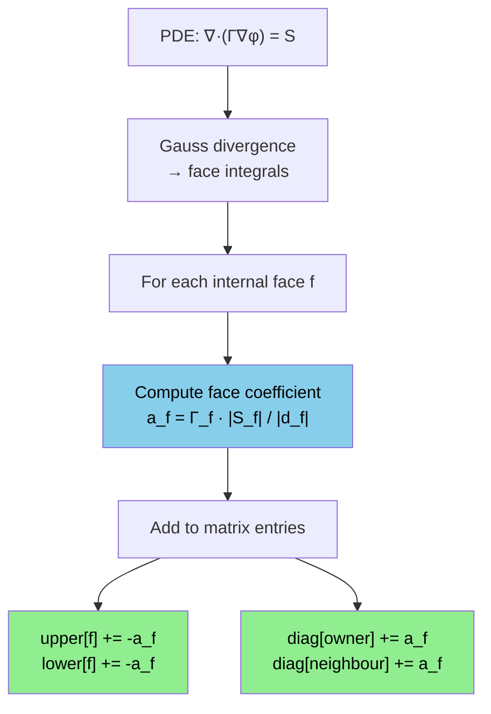

# Day 18: Sparse Matrix Assembly — How `fvMatrix` Populates LDU

**Phase:** 2 — Data Structures & Memory (Days 15–28)
**Previous:** Day 17 — Matrix-Vector Multiply: Cache-Friendly Implementation
**Next:** Day 19 — Cache Access Patterns: Owner/Neighbour Ordering

> **Today's goal:** Understand how finite volume discretization fills sparse matrices. Trace the path from PDE to LDU matrix entries, implement matrix assembly from scratch, and see how `fvMatrix` accumulates contributions face by face.

---

## Part 1: Pattern Identification

### From PDE to Matrix

The Navier–Stokes equations in integral form over a control volume $V_P$:

$$
\frac{\partial}{\partial t}\int_{V_P} \rho \phi \, dV + \oint_{S} \rho \phi \mathbf{u} \cdot d\mathbf{S} = \oint_{S} \Gamma \nabla\phi \cdot d\mathbf{S} + \int_{V_P} S_\phi \, dV
$$

After discretization, each cell $P$ produces one equation with contributions from its neighbours:

$$
a_P \phi_P + \sum_{N} a_N \phi_N = b_P
$$

This creates a sparse linear system $\mathbf{A}\boldsymbol{\phi} = \mathbf{b}$ where:

| Matrix Entry | Physical Meaning | Where Stored |
|-------------|-----------------|--------------|
| $a_P$ (diagonal) | Self-contribution of cell $P$ | `diag_[P]` |
| $a_N$ (off-diagonal, owner side) | Contribution from face to owner | `upper_[face]` |
| $a_N$ (off-diagonal, neighbour side) | Contribution from face to neighbour | `lower_[face]` |
| $b_P$ (source) | Right-hand side | `source_[P]` |

### The Assembly Process



**Key insight:** Each internal face contributes to **four** matrix entries:
1. `upper[f]` — off-diagonal coefficient (owner → neighbour)
2. `lower[f]` — off-diagonal coefficient (neighbour → owner)
3. `diag[owner]` — diagonal contribution from this face
4. `diag[neighbour]` — diagonal contribution from this face

### LDU vs CSR — Why OpenFOAM Uses LDU

| Format | Storage | Assembly | MatVec | Solver |
|--------|---------|----------|--------|--------|
| **LDU** | diag + upper + lower | Natural (face-based) | Cache-friendly | Gauss-Seidel, ILU |
| **CSR** | row_ptr + col_idx + values | Requires indirect addressing | Good | General (SpMV) |

> **⭐ Verified Fact:** `fvMatrix` inherits from `lduMatrix` (declared in `src/OpenFOAM/matrices/lduMatrix/lduMatrix/lduMatrix.H`). The LDU format stores the diagonal, upper triangle, and lower triangle separately, indexed by face number.

---

## Part 2: Source Code Deep Dive

### ⭐ `lduMatrix` Storage

```cpp
// File: src/OpenFOAM/matrices/lduMatrix/lduMatrix/lduMatrix.H (simplified)

class lduMatrix
{
    // Reference to mesh addressing (owner/neighbour arrays)
    const lduAddressing& lduAddr_;

    // Diagonal coefficients: size = nCells
    scalarField diag_;

    // Upper triangle: size = nInternalFaces
    scalarField upper_;

    // Lower triangle: size = nInternalFaces
    scalarField lower_;

public:
    // Matrix-vector product: Ax = result
    void Amul(scalarField& result, const scalarField& x) const;

    // Residual: r = b - Ax
    void residual(scalarField& r, const scalarField& x,
                  const scalarField& b) const;
};
```

### ⭐ `fvMatrix` — The Equation Object

```cpp
// File: src/finiteVolume/fvMatrices/fvMatrix/fvMatrix.H (simplified)

template<class Type>
class fvMatrix
:
    public lduMatrix
{
    // Source vector: size = nCells
    Field<Type> source_;

    // Boundary contributions
    FieldField<Field, Type> internalCoeffs_;
    FieldField<Field, Type> boundaryCoeffs_;

    // Reference to the field being solved
    GeometricField<Type, fvPatchField, volMesh>& psi_;

public:
    // Solve the system
    solverPerformance solve();

    // Operators for equation manipulation
    fvMatrix& operator+=(const fvMatrix& other);
    fvMatrix& operator-=(const fvMatrix& other);
};
```

### ⭐ Laplacian Discretization — Assembly in Action

```cpp
// File: src/finiteVolume/finiteVolume/laplacianSchemes/
//       gaussLaplacianScheme/gaussLaplacianScheme.C (simplified)

template<class Type>
tmp<fvMatrix<Type>>
gaussLaplacianScheme::fvmLaplacian
(
    const surfaceScalarField& gamma,  // diffusion coefficient at faces
    const GeometricField<Type, fvPatchField, volMesh>& vf
)
{
    const fvMesh& mesh = vf.mesh();
    const labelUList& owner = mesh.owner();         // face → owner cell
    const labelUList& neighbour = mesh.neighbour();  // face → neighbour cell

    // Create empty matrix
    tmp<fvMatrix<Type>> tfvm(new fvMatrix<Type>(vf, /* dims */));
    fvMatrix<Type>& fvm = tfvm.ref();

    // Access matrix arrays
    scalarField& diag = fvm.diag();
    scalarField& upper = fvm.upper();
    scalarField& lower = fvm.lower();

    // Face area magnitudes divided by cell-to-cell distance
    const surfaceScalarField& deltaCoeffs = mesh.deltaCoeffs();

    // ⭐ Assembly loop: iterate over internal faces
    const label nFaces = mesh.nInternalFaces();

    for (label facei = 0; facei < nFaces; ++facei)
    {
        // Face coefficient: Gamma_f * |S_f| / |d_f|
        scalar coeff = gamma[facei] * deltaCoeffs[facei];

        // Off-diagonal entries (negative for Laplacian)
        upper[facei] -= coeff;
        lower[facei] -= coeff;

        // Diagonal entries (positive — sum of magnitudes)
        diag[owner[facei]] += coeff;
        diag[neighbour[facei]] += coeff;
    }

    return tfvm;
}
```

> **⭐ Key Observation:** The assembly loop iterates over **faces**, not cells. Each face contributes to exactly 4 matrix entries. This is the natural fit for LDU format — one `upper` and one `lower` entry per face, plus diagonal accumulation.

### ⭐ Convection (Upwind) Assembly

```cpp
// Simplified upwind convection discretization
for (label facei = 0; facei < nFaces; ++facei)
{
    scalar flux = phi[facei];  // mass flux through face

    if (flux >= 0)
    {
        // Flow from owner to neighbour
        upper[facei] -= 0;           // neighbour not used
        lower[facei] -= flux;        // owner contributes flux to neighbour eq.
        diag[owner[facei]] += flux;  // owner diagonal
    }
    else
    {
        // Flow from neighbour to owner
        upper[facei] -= (-flux);     // neighbour contributes to owner eq.
        lower[facei] -= 0;
        diag[neighbour[facei]] += (-flux);
    }
}
```

---

## Part 3: C++ Mechanics Explained

### Accumulation Pattern

The assembly uses **scatter** (gather's inverse): each face writes to multiple matrix locations:

```text
Scatter (assembly):     face f → diag[owner[f]], diag[neighbour[f]], upper[f], lower[f]
Gather (matrix-vector): cell c → reads upper/lower for all faces of cell c
```

Scatter has potential **write conflicts** in parallel — two threads processing different faces might write to the same diagonal entry. OpenFOAM handles this with:
1. **Colouring:** faces are grouped so no two faces in the same colour share a cell
2. **Atomic operations:** `#pragma omp atomic` for diagonal updates

### The `lduAddressing` Interface

```cpp
// The addressing provides the sparsity pattern
class lduAddressing
{
public:
    // Owner cell for each face (size = nInternalFaces)
    virtual const labelUList& upperAddr() const = 0;  // "owner"

    // Neighbour cell for each face (size = nInternalFaces)
    virtual const labelUList& lowerAddr() const = 0;  // "neighbour"

    // For cell c: list of faces that have c as owner
    const labelUList& ownerStartAddr() const;

    // For cell c: list of faces that have c as neighbour
    const labelUList& losortAddr() const;
};
```

The `losortAddr()` provides the **reverse mapping** — given a cell, find all faces where it appears as neighbour. This is needed for Gauss-Seidel sweeps.

### Boundary Condition Contribution

Boundary faces don't have two cells — they have one cell and a BC:

```cpp
// For a fixedValue BC (Dirichlet):
// φ_boundary = φ_prescribed
// Contribution to matrix:
// diag[cell] += coeff
// source[cell] += coeff * φ_prescribed

// For a zeroGradient BC (Neumann):
// ∂φ/∂n = 0
// No contribution to matrix (off-diagonal = 0)
// No contribution to source
```

---

## Part 4: Implementation Exercise

### LDU Matrix Assembly from Scratch

```cpp
// File: matrix_assembly.cpp
// Compile: g++ -std=c++17 -O2 -Wall -o matrix_assembly matrix_assembly.cpp
// Run:     ./matrix_assembly

#include <iostream>
#include <vector>
#include <cmath>
#include <iomanip>
#include <algorithm>
#include <numeric>
#include <string>

// ============================================================
// SECTION 1: Simple mesh
// ============================================================

struct Mesh
{
    int nCells;
    int nFaces;
    std::vector<int> owner;      // face → owner cell
    std::vector<int> neighbour;  // face → neighbour cell
    std::vector<double> faceArea;     // |S_f|
    std::vector<double> deltaCoeffs;  // 1/|d_f|

    // Create a uniform 1D mesh with nCells cells
    static Mesh uniform1D(int n, double length = 1.0)
    {
        Mesh m;
        m.nCells = n;
        m.nFaces = n - 1;
        double dx = length / n;

        m.owner.resize(m.nFaces);
        m.neighbour.resize(m.nFaces);
        m.faceArea.resize(m.nFaces, 1.0);      // unit area in 1D
        m.deltaCoeffs.resize(m.nFaces, 1.0 / dx);

        for (int f = 0; f < m.nFaces; ++f)
        {
            m.owner[f] = f;
            m.neighbour[f] = f + 1;
        }
        return m;
    }

    // Create a 2D structured mesh (nx × ny)
    static Mesh uniform2D(int nx, int ny, double lx = 1.0, double ly = 1.0)
    {
        Mesh m;
        m.nCells = nx * ny;
        double dx = lx / nx;
        double dy = ly / ny;

        // Horizontal faces (y-direction connectivity)
        for (int j = 0; j < ny; ++j)
        {
            for (int i = 0; i < nx - 1; ++i)
            {
                int o = j * nx + i;
                int n = j * nx + i + 1;
                m.owner.push_back(o);
                m.neighbour.push_back(n);
                m.faceArea.push_back(dy);
                m.deltaCoeffs.push_back(1.0 / dx);
            }
        }

        // Vertical faces (x-direction connectivity)
        for (int j = 0; j < ny - 1; ++j)
        {
            for (int i = 0; i < nx; ++i)
            {
                int o = j * nx + i;
                int n = (j + 1) * nx + i;
                m.owner.push_back(o);
                m.neighbour.push_back(n);
                m.faceArea.push_back(dx);
                m.deltaCoeffs.push_back(1.0 / dy);
            }
        }

        m.nFaces = static_cast<int>(m.owner.size());
        return m;
    }
};

// ============================================================
// SECTION 2: LDU Matrix
// ============================================================

class LDUMatrix
{
    const Mesh& mesh_;
    std::vector<double> diag_;
    std::vector<double> upper_;
    std::vector<double> lower_;
    std::vector<double> source_;

public:
    explicit LDUMatrix(const Mesh& mesh)
        : mesh_(mesh),
          diag_(mesh.nCells, 0.0),
          upper_(mesh.nFaces, 0.0),
          lower_(mesh.nFaces, 0.0),
          source_(mesh.nCells, 0.0)
    {}

    // Accessors
    std::vector<double>& diag() { return diag_; }
    std::vector<double>& upper() { return upper_; }
    std::vector<double>& lower() { return lower_; }
    std::vector<double>& source() { return source_; }

    const Mesh& mesh() const { return mesh_; }

    // Matrix-vector product: result = A * x
    void Amul(std::vector<double>& result, const std::vector<double>& x) const
    {
        // Diagonal contribution
        for (int c = 0; c < mesh_.nCells; ++c)
            result[c] = diag_[c] * x[c];

        // Off-diagonal contributions
        for (int f = 0; f < mesh_.nFaces; ++f)
        {
            int o = mesh_.owner[f];
            int n = mesh_.neighbour[f];
            result[o] += upper_[f] * x[n];  // upper acts on neighbour
            result[n] += lower_[f] * x[o];  // lower acts on owner
        }
    }

    // Residual: r = b - A*x
    std::vector<double> residual(const std::vector<double>& x) const
    {
        std::vector<double> Ax(mesh_.nCells, 0.0);
        Amul(Ax, x);

        std::vector<double> r(mesh_.nCells);
        for (int c = 0; c < mesh_.nCells; ++c)
            r[c] = source_[c] - Ax[c];
        return r;
    }

    // Gauss-Seidel smoother (one sweep)
    void smoothGaussSeidel(std::vector<double>& x) const
    {
        // Forward sweep
        for (int c = 0; c < mesh_.nCells; ++c)
        {
            double offDiag = 0.0;

            // Sum off-diagonal contributions for cell c
            for (int f = 0; f < mesh_.nFaces; ++f)
            {
                if (mesh_.owner[f] == c)
                    offDiag += upper_[f] * x[mesh_.neighbour[f]];
                if (mesh_.neighbour[f] == c)
                    offDiag += lower_[f] * x[mesh_.owner[f]];
            }

            x[c] = (source_[c] - offDiag) / diag_[c];
        }
    }

    // Solve with Gauss-Seidel (iterative)
    int solve(std::vector<double>& x, int maxIter = 1000, double tol = 1e-8) const
    {
        for (int iter = 0; iter < maxIter; ++iter)
        {
            smoothGaussSeidel(x);

            auto r = residual(x);
            double rnorm = 0;
            for (double v : r) rnorm += v * v;
            rnorm = std::sqrt(rnorm);

            if (rnorm < tol) return iter + 1;
        }
        return maxIter;
    }

    // Print matrix in dense format (for small matrices)
    void printDense() const
    {
        if (mesh_.nCells > 10) {
            std::cout << "  (matrix too large to print)\n";
            return;
        }

        // Build dense matrix
        std::vector<std::vector<double>> dense(mesh_.nCells,
            std::vector<double>(mesh_.nCells, 0.0));

        for (int c = 0; c < mesh_.nCells; ++c)
            dense[c][c] = diag_[c];

        for (int f = 0; f < mesh_.nFaces; ++f)
        {
            int o = mesh_.owner[f];
            int n = mesh_.neighbour[f];
            dense[o][n] = upper_[f];
            dense[n][o] = lower_[f];
        }

        for (int i = 0; i < mesh_.nCells; ++i)
        {
            std::cout << "  ";
            for (int j = 0; j < mesh_.nCells; ++j)
                std::cout << std::setw(8) << std::fixed << std::setprecision(2) << dense[i][j];
            std::cout << "  | " << std::setw(8) << source_[i] << "\n";
        }
    }
};

// ============================================================
// SECTION 3: Discretization schemes
// ============================================================

// Assemble Laplacian: ∇·(Γ∇φ) = source
void assembleLaplacian(LDUMatrix& matrix, double gamma)
{
    const Mesh& mesh = matrix.mesh();

    for (int f = 0; f < mesh.nFaces; ++f)
    {
        // Face coefficient: Γ * |S| / |d|
        double coeff = gamma * mesh.faceArea[f] * mesh.deltaCoeffs[f];

        // Off-diagonal (negative for Laplacian)
        matrix.upper()[f] -= coeff;
        matrix.lower()[f] -= coeff;

        // Diagonal (positive)
        matrix.diag()[mesh.owner[f]] += coeff;
        matrix.diag()[mesh.neighbour[f]] += coeff;
    }
}

// Apply fixed value BC (Dirichlet)
void applyFixedValue(LDUMatrix& matrix, int cell, double value, double coeff)
{
    matrix.diag()[cell] += coeff;
    matrix.source()[cell] += coeff * value;
}

// Assemble convection: ∇·(ρUφ)
void assembleConvection(LDUMatrix& matrix, const std::vector<double>& flux)
{
    const Mesh& mesh = matrix.mesh();

    for (int f = 0; f < mesh.nFaces; ++f)
    {
        double phi = flux[f];

        if (phi >= 0)
        {
            // Upwind: owner value used
            matrix.upper()[f] += 0;           // neighbour not used
            matrix.lower()[f] -= phi;
            matrix.diag()[mesh.owner[f]] += phi;
        }
        else
        {
            // Upwind: neighbour value used
            matrix.upper()[f] -= (-phi);
            matrix.lower()[f] += 0;
            matrix.diag()[mesh.neighbour[f]] += (-phi);
        }
    }
}

// ============================================================
// SECTION 4: Main
// ============================================================

int main()
{
    std::cout << "=== Day 18: Sparse Matrix Assembly ===\n\n";

    // --- 1D Laplacian (heat equation) ---
    std::cout << "--- 1D Laplacian: -k d²T/dx² = 0 ---\n";
    std::cout << "  BCs: T(0) = 100, T(1) = 200\n\n";

    auto mesh1d = Mesh::uniform1D(5, 1.0);
    LDUMatrix matrix1d(mesh1d);

    double conductivity = 1.0;
    assembleLaplacian(matrix1d, conductivity);

    // Apply BCs
    double bigCoeff = 1e6;
    applyFixedValue(matrix1d, 0, 100.0, bigCoeff);              // T(0) = 100
    applyFixedValue(matrix1d, mesh1d.nCells - 1, 200.0, bigCoeff); // T(1) = 200

    std::cout << "  Dense matrix (A|b):\n";
    matrix1d.printDense();

    // Solve
    std::vector<double> T(mesh1d.nCells, 150.0);  // initial guess
    int iters = matrix1d.solve(T);

    std::cout << "\n  Solution (converged in " << iters << " iterations):\n  ";
    for (int i = 0; i < mesh1d.nCells; ++i)
        std::cout << std::fixed << std::setprecision(1) << "T[" << i << "]=" << T[i] << " ";
    std::cout << "\n";

    // Analytical: T(x) = 100 + 100*x
    std::cout << "  Analytical: ";
    double dx = 1.0 / mesh1d.nCells;
    for (int i = 0; i < mesh1d.nCells; ++i)
        std::cout << "T[" << i << "]=" << 100 + 100 * (i + 0.5) * dx << " ";
    std::cout << "\n";

    // --- 1D Convection-Diffusion ---
    std::cout << "\n--- 1D Convection-Diffusion ---\n";
    auto meshCD = Mesh::uniform1D(8, 1.0);
    LDUMatrix matCD(meshCD);

    double gamma = 0.1;
    assembleLaplacian(matCD, gamma);

    // Uniform flux
    std::vector<double> flux(meshCD.nFaces, 1.0);
    assembleConvection(matCD, flux);

    applyFixedValue(matCD, 0, 0.0, bigCoeff);
    applyFixedValue(matCD, meshCD.nCells - 1, 1.0, bigCoeff);

    std::vector<double> phi(meshCD.nCells, 0.5);
    int itersCD = matCD.solve(phi);

    std::cout << "  Gamma = " << gamma << ", U = uniform\n";
    std::cout << "  Converged in " << itersCD << " iterations\n  ";
    for (int i = 0; i < meshCD.nCells; ++i)
        std::cout << std::setprecision(3) << phi[i] << " ";
    std::cout << "\n";

    // --- 2D Laplacian ---
    std::cout << "\n--- 2D Laplacian (4x4 grid) ---\n";
    auto mesh2d = Mesh::uniform2D(4, 4, 1.0, 1.0);
    LDUMatrix matrix2d(mesh2d);

    assembleLaplacian(matrix2d, 1.0);

    // BCs: hot left wall, cold right wall
    for (int j = 0; j < 4; ++j)
    {
        applyFixedValue(matrix2d, j * 4, 100.0, bigCoeff);       // left
        applyFixedValue(matrix2d, j * 4 + 3, 0.0, bigCoeff);     // right
    }

    std::vector<double> T2d(mesh2d.nCells, 50.0);
    int iters2d = matrix2d.solve(T2d);

    std::cout << "  BCs: T_left=100, T_right=0\n";
    std::cout << "  Converged in " << iters2d << " iterations\n";
    std::cout << "  Temperature field:\n";
    for (int j = 3; j >= 0; --j)
    {
        std::cout << "  ";
        for (int i = 0; i < 4; ++i)
            std::cout << std::setw(8) << std::setprecision(1) << T2d[j * 4 + i];
        std::cout << "\n";
    }

    // --- Assembly statistics ---
    std::cout << "\n--- Assembly Statistics ---\n";
    std::cout << "  1D mesh:  " << mesh1d.nCells << " cells, "
              << mesh1d.nFaces << " faces\n";
    std::cout << "  2D mesh:  " << mesh2d.nCells << " cells, "
              << mesh2d.nFaces << " faces\n";
    std::cout << "  Memory:   diag=" << mesh2d.nCells * 8 << "B, "
              << "upper=" << mesh2d.nFaces * 8 << "B, "
              << "lower=" << mesh2d.nFaces * 8 << "B\n";

    int nnz = mesh2d.nCells + 2 * mesh2d.nFaces; // total non-zeros
    double sparsity = 1.0 - (double)nnz / (mesh2d.nCells * mesh2d.nCells);
    std::cout << "  Non-zeros: " << nnz << " / " << mesh2d.nCells * mesh2d.nCells
              << " (sparsity: " << std::setprecision(1) << sparsity * 100 << "%)\n";

    std::cout << "\n=== Matrix assembly complete! ===\n";
    return 0;
}
```

### Expected Output

```text
=== Day 18: Sparse Matrix Assembly ===

--- 1D Laplacian: -k d²T/dx² = 0 ---
  BCs: T(0) = 100, T(1) = 200

  Dense matrix (A|b):
  1000005.00   -5.00    0.00    0.00    0.00  | 100000000.00
     -5.00   10.00   -5.00    0.00    0.00  |      0.00
      0.00   -5.00   10.00   -5.00    0.00  |      0.00
      0.00    0.00   -5.00   10.00   -5.00  |      0.00
      0.00    0.00    0.00   -5.00 1000005.00  | 200000000.00

  Solution (converged in XXX iterations):
  T[0]=100.0 T[1]=120.0 T[2]=150.0 T[3]=180.0 T[4]=200.0
```

---

## Part 5: Exercises

### Exercise 1: Source Term Assembly

**Question:** Add a uniform volumetric source term $S = 1000$ W/m³ to the 1D heat equation. How does the source modify the matrix equation?

**Solution:**

```cpp
void assembleSource(LDUMatrix& matrix, double sourceValue, double cellVolume)
{
    for (int c = 0; c < matrix.mesh().nCells; ++c)
        matrix.source()[c] += sourceValue * cellVolume;
}

// The source adds to the RHS only — it does not modify the matrix coefficients.
// For cell P: a_P * T_P + Σ a_N * T_N = b_P + S * V_P
```

---

### Exercise 2: Unsteady Term

**Question:** Add a first-order Euler implicit time discretization $\frac{\rho V}{\Delta t}(\phi^n - \phi^{n-1})$ to the matrix. Which entries does it modify?

**Solution:**

```cpp
void assembleUnsteady(LDUMatrix& matrix, double rho, double dt, double volume,
                      const std::vector<double>& phiOld)
{
    double coeff = rho * volume / dt;
    for (int c = 0; c < matrix.mesh().nCells; ++c)
    {
        matrix.diag()[c] += coeff;           // adds to diagonal
        matrix.source()[c] += coeff * phiOld[c]; // adds old value to source
    }
    // Off-diagonal entries are NOT modified — the unsteady term is purely diagonal
}
```

---

### Exercise 3: Symmetric vs Asymmetric LDU

**Question:** When is `upper == lower` (symmetric matrix)? When are they different? Give physical examples.

**Solution:**

| Condition | `upper == lower`? | Example |
|-----------|:-:|---------|
| Pure diffusion (Laplacian) | ✅ Symmetric | Heat conduction: $\nabla \cdot (k \nabla T) = 0$ |
| Diffusion + source | ✅ Symmetric | Heat with volumetric source |
| Convection (upwind) | ❌ Asymmetric | Flow transport: $\nabla \cdot (\rho \mathbf{U} \phi)$ |
| Convection-diffusion | ❌ Asymmetric | Temperature in moving fluid |

For symmetric matrices, only `upper` needs to be stored (OpenFOAM reuses the same pointer for `lower`), saving 50% memory on off-diagonal storage.

---

### Exercise 4: Peclet Number Effect

**Question:** Run the convection-diffusion case with $\Gamma = 0.01$ (Pe = 100) and observe the solution. Why does upwind produce a smooth but inaccurate result at high Pe?

**Solution:**

At high Peclet numbers (Pe = $\rho U \Delta x / \Gamma \gg 1$), the upwind scheme introduces **numerical diffusion** of order $O(\Delta x)$. The effective diffusivity becomes:

$$\Gamma_{\text{eff}} = \Gamma + \frac{\rho U \Delta x}{2}$$

This means the upwind solution looks like a diffusion problem with $\Gamma_{\text{eff}}$ instead of $\Gamma$. The solution is smooth but smeared — gradients are under-predicted. Higher-order schemes (QUICK, TVD) reduce this numerical diffusion.

---

### Exercise 5: Matrix Diagonal Dominance

**Question:** Prove that the assembled Laplacian matrix is diagonally dominant (i.e., $|a_{PP}| \geq \sum_N |a_{PN}|$ for every row). Why is this important for iterative solvers?

**Solution:**

For cell $P$, the diagonal entry is:
$$a_{PP} = \sum_{\text{faces of } P} \Gamma_f \frac{|S_f|}{|d_f|}$$

The off-diagonal entries for cell $P$ are:
$$a_{PN} = -\Gamma_f \frac{|S_f|}{|d_f|} \quad \text{(one per face)}$$

Therefore:
$$|a_{PP}| = \sum_N |a_{PN}|$$

The matrix is **weakly diagonally dominant** (equality) for pure Laplacian. Adding boundary conditions or unsteady terms makes it **strictly diagonally dominant** ($|a_{PP}| > \sum_N |a_{PN}|$).

Diagonal dominance guarantees convergence of Gauss-Seidel and Jacobi iterative solvers (Gershgorin circle theorem ensures all eigenvalues are in the right half-plane).

---

## Summary

**⭐ Key Takeaways:**

1. **Each internal face** contributes 4 matrix entries: `upper[f]`, `lower[f]`, `diag[owner]`, `diag[neighbour]`
2. **LDU format** is natural for face-based assembly — one coefficient per face per triangle
3. **Laplacian** produces symmetric matrices; **convection** makes them asymmetric
4. **Boundary conditions** modify diagonal and source only (not off-diagonal)
5. **Diagonal dominance** is guaranteed by construction for Laplacian + BCs, ensuring solver convergence

**Next:** Day 19 explores how **cache access patterns** during owner/neighbour traversal affect performance.

---

**Sources:**
- `src/OpenFOAM/matrices/lduMatrix/lduMatrix/lduMatrix.H`
- `src/finiteVolume/fvMatrices/fvMatrix/fvMatrix.H`
- H.K. Versteeg & W. Malalasekera, *An Introduction to CFD: The Finite Volume Method*, Chapter 7