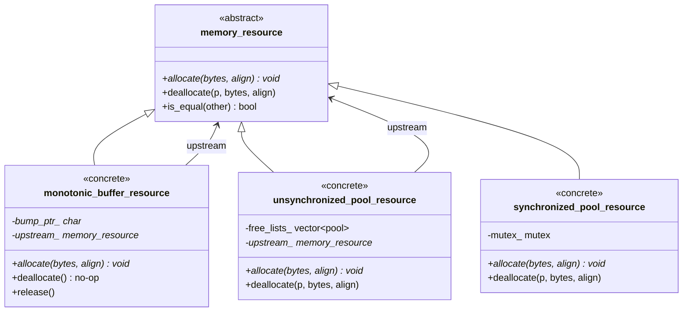

# Day 23: Polymorphic Memory Resources (PMR) — C++17 `<memory_resource>`

## Part 1: Pattern Identification

### Temporary Allocations in Solver Loops

In iterative solvers (Gauss-Seidel, conjugate gradient, GMRES), each iteration creates and destroys temporary objects:

- Residual vectors
- Correction vectors
- Intermediate matrix-vector products
- Sparse row accumulation buffers

With standard allocators, every temporary triggers:

1. A call to `malloc` (or `operator new`) in the heap allocator
2. A potential cache miss when accessing newly allocated memory
3. Memory fragmentation over thousands of iterations
4. A symmetric `free` call when the temporary goes out of scope

**The problem:** 1000 iterations × 3 temporaries per iteration = **3000 heap round-trips**. Each `malloc`/`free` pair involves a mutex lock in the global allocator on most platforms. For small vectors (a few kilobytes), this overhead often exceeds the cost of the actual computation.

### Measuring the Allocation Cost

Before optimizing, understand what you are paying:

```cpp
#include <memory_resource>
#include <vector>
#include <chrono>
#include <iostream>

// Minimal experiment: cost of repeated vector allocation
void measure_alloc_cost() {
    const int iterations = 100'000;
    const size_t vec_size = 1000;

    auto t0 = std::chrono::high_resolution_clock::now();
    for (int i = 0; i < iterations; ++i) {
        std::vector<double> temp(vec_size);  // allocates + zero-initializes
        temp[0] = 1.0;                       // prevent dead-store elimination
    }
    auto t1 = std::chrono::high_resolution_clock::now();

    auto ms = std::chrono::duration_cast<std::chrono::microseconds>(t1 - t0).count();
    std::cout << "100k alloc+free cycles for 1k-double vector: "
              << ms << " µs\n";
}
```

On a typical Linux x86-64 system (glibc allocator), this loop costs roughly 50–200 µs — almost entirely in `malloc`/`free` overhead, not in the memory bandwidth.

### The Solution: Arena Allocation

PMR (Polymorphic Memory Resources), introduced in C++17, provides arena allocators:

- Pre-allocate a large memory block once (from stack or heap)
- Service all subsequent allocations from that block with pointer bumping
- No individual `malloc`/`free` per object
- Deallocate the entire arena at once when done

The key insight is that **allocation lifetime matches loop iteration lifetime**: after each solver iteration, all temporaries are discarded. An arena that resets after each iteration eliminates all per-iteration allocator overhead.

---

## Part 2: Theory — PMR

### Memory Resource Hierarchy

The `<memory_resource>` header defines an abstract base class and several concrete implementations:



*Chaining pattern: `unsynchronized_pool_resource` uses `monotonic_buffer_resource` as upstream — pool allocates large slabs from the arena, then sub-divides them.*

Each resource can be **chained**: a pool resource accepts an upstream `memory_resource*` from which it obtains large blocks. This allows building a monotonic arena as the upstream for a pool resource, so the pool's large blocks come from fast bump-pointer allocation.

### `std::pmr::vector` vs `std::vector`

`std::pmr::vector<T>` is simply `std::vector<T, std::pmr::polymorphic_allocator<T>>`. The polymorphic allocator stores a pointer to a `memory_resource` and forwards all allocations to it.

| Aspect | `std::vector<T>` | `std::pmr::vector<T>` |
|--------|------------------|----------------------|
| Allocator type | `std::allocator<T>` (stateless) | `std::pmr::polymorphic_allocator<T>` (stateful pointer) |
| Allocation target | Global heap (`::operator new`) | User-supplied `memory_resource` |
| Propagation on copy | Allocator not propagated | Allocator not propagated (new container uses default) |
| Lifetime of memory | Object-managed | Resource-managed |
| Use case | General long-lived objects | Short-lived temporaries in bounded scopes |

> **NOTE:** Because `std::pmr::polymorphic_allocator` does not propagate on copy, copying a `std::pmr::vector` into another scope will use the destination's memory resource (or the default). This is correct behavior for arena allocations — the arena is not intended to outlive its scope.

### Monotonic Buffer Strategy

`std::pmr::monotonic_buffer_resource` maintains a single pointer into a backing buffer and advances it on each allocation:

```
Buffer: [__________________________________________]
         ^                        ^
         buffer start             current "high water mark"
                                  (advances on each alloc)
```

Properties:
- Allocation is O(1): pointer bump plus alignment adjustment
- Individual deallocation is a no-op (the destructor records the pointer but does nothing)
- Full reset via `pool.release()` moves the high water mark back to the start
- **No thread safety**: use one resource per thread, or `synchronized_pool_resource`

When the buffer fills, `monotonic_buffer_resource` falls back to its upstream resource (default: `new_delete_resource()`). It allocates a new block of at least double the previous size from upstream and continues. This means the resource never fails if the upstream has memory, but the "zero malloc" property is lost once the initial buffer is exhausted.

### Pool Resource Strategy

`std::pmr::unsynchronized_pool_resource` maintains segregated free lists for different allocation sizes. It is useful when objects of the same type are allocated and freed many times:

```
Pool resource internal structure:
    Small pool (≤ 64 bytes):  [free list of 64-byte chunks]
    Small pool (≤ 128 bytes): [free list of 128-byte chunks]
    Small pool (≤ 256 bytes): [free list of 256-byte chunks]
    Large allocations:        → forwarded to upstream resource
```

Individual frees return chunks to the free list rather than to the global heap. This reduces fragmentation and avoids contention on the global allocator lock.

---

## Part 3: C++ Mechanics

### Correct Headers

**The bugs to fix:** `<pmrvector>` and `<pmrunordered_map>` do not exist. All PMR types live in the `std::pmr` namespace and are declared in the standard headers for their container plus `<memory_resource>`:

```cpp
// WRONG — these headers do not exist:
// #include <pmrvector>
// #include <pmrunordered_map>

// CORRECT:
#include <memory_resource>   // std::pmr::memory_resource, monotonic_buffer_resource, etc.
#include <vector>            // std::vector AND std::pmr::vector<T>
#include <unordered_map>     // std::unordered_map AND std::pmr::unordered_map<K,V>
#include <string>            // std::string AND std::pmr::string
#include <deque>             // std::deque AND std::pmr::deque<T>
#include <list>              // std::list AND std::pmr::list<T>
#include <map>               // std::map AND std::pmr::map<K,V>
#include <set>               // std::set AND std::pmr::set<T>
```

All `std::pmr::*` container aliases are provided by their respective container headers when compiled with C++17 or later. The `<memory_resource>` header provides only the resource classes.

### Creating a Monotonic Buffer Resource

```cpp
#include <memory_resource>
#include <vector>
#include <array>

void monotonic_example() {
    // Option A: stack-allocated backing buffer (fast, limited to ~1-8 MB)
    std::array<std::byte, 512 * 1024> buffer;  // 512 KB on the stack
    std::pmr::monotonic_buffer_resource arena(buffer.data(), buffer.size());

    // Option B: heap-allocated backing buffer (for larger arenas)
    std::vector<std::byte> heap_buf(4 * 1024 * 1024);  // 4 MB on the heap
    std::pmr::monotonic_buffer_resource big_arena(heap_buf.data(), heap_buf.size());

    // Use with PMR containers — pass resource pointer as last constructor argument
    std::pmr::vector<double> residual(1000, 0.0, &arena);
    std::pmr::vector<double> correction(1000, 0.0, &arena);
    // Both vectors allocate from the same arena — zero heap traffic
}
// arena destroyed here → backing buffer freed (if on heap) or stack unwinds
```

### Resetting the Arena Between Iterations

A critical correctness requirement: the arena must be **reset** after each iteration. Without a reset, the high water mark advances indefinitely and the arena fills up, eventually falling back to the global heap.

```cpp
// WRONG: arena grows without bound across 1000 iterations
{
    std::array<std::byte, 1024*1024> buffer;
    std::pmr::monotonic_buffer_resource arena(buffer.data(), buffer.size());
    for (int iter = 0; iter < 1000; ++iter) {
        std::pmr::vector<double> temp(nCells, &arena);
        // ... temp is destroyed but arena is NOT reset
        // high water mark keeps advancing → buffer exhausted after ~10 iterations
    }
}

// CORRECT pattern A: destroy and re-create arena each iteration
for (int iter = 0; iter < 1000; ++iter) {
    std::array<std::byte, 1024*1024> buffer;
    std::pmr::monotonic_buffer_resource arena(buffer.data(), buffer.size());
    std::pmr::vector<double> temp(nCells, &arena);
    // ... compute with temp
    // arena destroyed at end of scope → stack memory reclaimed automatically
}

// CORRECT pattern B: call release() to reset high water mark
{
    std::array<std::byte, 1024*1024> buffer;
    std::pmr::monotonic_buffer_resource arena(buffer.data(), buffer.size());
    for (int iter = 0; iter < 1000; ++iter) {
        std::pmr::vector<double> temp(nCells, &arena);
        // ... compute with temp
        // temp goes out of scope (destructor called, but memory stays in arena)
        arena.release();  // reset: high water mark returns to buffer start
    }
}
```

> **WARNING:** `arena.release()` is safe to call only when all objects allocated from the arena have been destroyed. Calling it while live objects still reference arena memory is undefined behavior.

### Unsynchronized Pool Resource

```cpp
#include <memory_resource>
#include <vector>

void pool_example() {
    // Pool with default upstream (new_delete_resource)
    std::pmr::unsynchronized_pool_resource pool;

    // Pool with monotonic arena as upstream
    // → large blocks come from the arena, not from the global heap
    std::array<std::byte, 4 * 1024 * 1024> buffer;
    std::pmr::monotonic_buffer_resource arena(buffer.data(), buffer.size());
    std::pmr::unsynchronized_pool_resource chained_pool(&arena);

    // Individual frees return chunks to the pool free list
    {
        std::pmr::vector<double> v1(500, &chained_pool);
        std::pmr::vector<double> v2(500, &chained_pool);
    }  // v1, v2 freed → chunks returned to pool free lists (NOT to heap)

    // Next allocation of the same size reuses a chunk from the free list
    std::pmr::vector<double> v3(500, &chained_pool);  // zero heap traffic
}
```

### Synchronized Pool Resource

For multi-threaded solvers where multiple threads allocate temporaries:

```cpp
#include <memory_resource>
#include <thread>
#include <vector>

void thread_safe_example() {
    // synchronized_pool_resource uses an internal mutex
    std::pmr::synchronized_pool_resource thread_pool;

    auto worker = [&](int tid) {
        // Safe: multiple threads can allocate/free concurrently
        std::pmr::vector<double> local_residual(10000, &thread_pool);
        local_residual[0] = static_cast<double>(tid);
        // ... compute
    };

    std::thread t1(worker, 0);
    std::thread t2(worker, 1);
    t1.join();
    t2.join();
}
```

> **NOTE:** `synchronized_pool_resource` has lower throughput than `unsynchronized_pool_resource` due to mutex contention. Prefer per-thread arenas (one `monotonic_buffer_resource` per thread) over a shared synchronized pool when each thread manages its own temporaries independently.

### PMR with `std::pmr::unordered_map`

```cpp
#include <memory_resource>
#include <unordered_map>
#include <string>

void map_example() {
    std::array<std::byte, 256 * 1024> buffer;
    std::pmr::monotonic_buffer_resource arena(buffer.data(), buffer.size());

    // PMR unordered_map: node allocations come from the arena
    std::pmr::unordered_map<int, double> cell_values(&arena);
    cell_values.reserve(1000);  // pre-allocates bucket array from arena

    for (int i = 0; i < 1000; ++i) {
        cell_values[i] = static_cast<double>(i) * 0.001;
    }

    // When arena is destroyed (or released), all nodes freed at once
    // No per-node delete calls
}
```

### Available `std::pmr` Container Aliases

All standard sequence and associative containers have `std::pmr::` aliases:

```cpp
// Sequence containers
std::pmr::vector<T>          // = std::vector<T, pmr::polymorphic_allocator<T>>
std::pmr::deque<T>
std::pmr::list<T>
std::pmr::forward_list<T>
std::pmr::string             // = std::basic_string<char, char_traits<char>, pmr::polymorphic_allocator<char>>
std::pmr::wstring
std::pmr::u8string           // C++20

// Associative containers
std::pmr::map<K, V>
std::pmr::multimap<K, V>
std::pmr::set<T>
std::pmr::multiset<T>

// Unordered associative containers
std::pmr::unordered_map<K, V>
std::pmr::unordered_multimap<K, V>
std::pmr::unordered_set<T>
std::pmr::unordered_multiset<T>
```

---

## Part 4: Implementation

### Pattern: Per-Iteration Arena Reset

The canonical CFD pattern is to create a fresh arena scope for each solver iteration. The arena lives on the stack for each loop body:

```cpp
#include <memory_resource>
#include <vector>
#include <array>

void solve_with_per_iteration_arena(int maxIter, size_t nCells) {
    std::vector<double> x(nCells, 0.0);
    std::vector<double> b(nCells, 1.0);
    std::vector<double> diagonal(nCells, 2.0);

    for (int iter = 0; iter < maxIter; ++iter) {
        // Arena is created fresh each iteration — on the stack
        // Stack allocation is O(1): just decrements the stack pointer
        std::byte buffer[1024 * 1024];  // 1 MB stack arena
        std::pmr::monotonic_buffer_resource arena(buffer, sizeof(buffer));

        // All temporaries for this iteration allocate from arena
        std::pmr::vector<double> residual(nCells, 0.0, &arena);
        std::pmr::vector<double> correction(nCells, 0.0, &arena);

        // Compute residual: r = b - A*x
        for (size_t i = 0; i < nCells; ++i) {
            residual[i] = b[i] - diagonal[i] * x[i];
        }

        // Compute correction: c = D^{-1} * r
        for (size_t i = 0; i < nCells; ++i) {
            correction[i] = residual[i] / diagonal[i];
        }

        // Update solution
        for (size_t i = 0; i < nCells; ++i) {
            x[i] += correction[i];
        }

        // residual and correction destroyed here (destructors called)
        // BUT no heap traffic: arena goes out of scope and stack unwinds
        // → 0 heap mallocs/frees inside the iteration loop
    }
}
```

> **CAUTION:** Stack allocation limit is typically 1–8 MB depending on platform (Linux default: 8 MB, macOS default: 8 MB, Windows default: 1 MB). For large cell counts requiring more than ~2 MB of temporaries per iteration, use a heap-allocated backing buffer instead.

### Solver Class with Standard vs PMR Variants

```cpp
#include <memory_resource>
#include <vector>
#include <chrono>
#include <iostream>
#include <numeric>
#include <cmath>

class GaussSeidelSolver {
private:
    size_t nCells_;
    std::vector<double> diagonal_;
    std::vector<double> lower_;
    std::vector<double> upper_;
    std::vector<double> source_;

public:
    explicit GaussSeidelSolver(size_t n) : nCells_(n) {
        diagonal_.assign(n, 2.0);
        lower_.assign(n > 0 ? n - 1 : 0, -1.0);
        upper_.assign(n > 0 ? n - 1 : 0, -1.0);
        source_.assign(n, 1.0);
    }

    // ---------------------------------------------------------------
    // Standard allocator version: 2 heap allocs + 2 heap frees per iter
    // ---------------------------------------------------------------
    double solve_standard(std::vector<double>& x, int iterations) {
        for (int iter = 0; iter < iterations; ++iter) {
            // Each of these triggers malloc + free at end of iteration
            std::vector<double> residual(nCells_, 0.0);
            std::vector<double> correction(nCells_, 0.0);

            for (size_t i = 0; i < nCells_; ++i) {
                double ax = diagonal_[i] * x[i];
                if (i > 0)            ax += lower_[i-1] * x[i-1];
                if (i < nCells_ - 1) ax += upper_[i]   * x[i+1];
                residual[i] = source_[i] - ax;
            }

            for (size_t i = 0; i < nCells_; ++i) {
                correction[i] = residual[i] / diagonal_[i];
                x[i] += correction[i];
            }
        }
        // Return L2 norm of final solution for correctness check
        double norm = 0.0;
        for (double v : x) norm += v * v;
        return std::sqrt(norm / static_cast<double>(nCells_));
    }

    // ---------------------------------------------------------------
    // PMR version: per-iteration arena, 0 heap allocs inside loop
    // ---------------------------------------------------------------
    double solve_pmr(std::vector<double>& x, int iterations) {
        // Heap-allocated backing buffer — safe for large nCells_
        // (avoids stack overflow for large cell counts)
        const size_t arena_bytes = 2 * nCells_ * sizeof(double) + 256;
        std::vector<std::byte> backing(arena_bytes);

        for (int iter = 0; iter < iterations; ++iter) {
            // Create arena over the same backing buffer each iteration
            // release() is called at the end to reset the high water mark
            std::pmr::monotonic_buffer_resource arena(
                backing.data(), backing.size(),
                std::pmr::null_memory_resource()  // fail loudly if buffer exhausted
            );

            std::pmr::vector<double> residual(nCells_, 0.0, &arena);
            std::pmr::vector<double> correction(nCells_, 0.0, &arena);

            for (size_t i = 0; i < nCells_; ++i) {
                double ax = diagonal_[i] * x[i];
                if (i > 0)            ax += lower_[i-1] * x[i-1];
                if (i < nCells_ - 1) ax += upper_[i]   * x[i+1];
                residual[i] = source_[i] - ax;
            }

            for (size_t i = 0; i < nCells_; ++i) {
                correction[i] = residual[i] / diagonal_[i];
                x[i] += correction[i];
            }

            // Destroy PMR vectors before resetting arena
            // (destructors run, but no heap free is issued)
            // The arena destructor resets automatically when it goes out of scope
        }

        double norm = 0.0;
        for (double v : x) norm += v * v;
        return std::sqrt(norm / static_cast<double>(nCells_));
    }
};
```

### Benchmark: Heap Allocation vs PMR Arena

```cpp
template<typename Fn>
long long time_ms(Fn&& fn) {
    auto t0 = std::chrono::high_resolution_clock::now();
    fn();
    auto t1 = std::chrono::high_resolution_clock::now();
    return std::chrono::duration_cast<std::chrono::milliseconds>(t1 - t0).count();
}

void runBenchmark() {
    const size_t nCells    = 50'000;
    const int    iterations = 1000;

    GaussSeidelSolver solver(nCells);

    // Standard allocator
    std::vector<double> x_std(nCells, 0.0);
    double norm_std = 0.0;
    auto t_std = time_ms([&]() {
        norm_std = solver.solve_standard(x_std, iterations);
    });

    // PMR allocator
    std::vector<double> x_pmr(nCells, 0.0);
    double norm_pmr = 0.0;
    auto t_pmr = time_ms([&]() {
        norm_pmr = solver.solve_pmr(x_pmr, iterations);
    });

    std::cout << "=== Day 23 Benchmark ===\n";
    std::cout << "Cells: " << nCells << "   Iterations: " << iterations << "\n\n";
    std::cout << "Standard allocator: " << t_std << " ms"
              << "  (norm=" << norm_std << ")\n";
    std::cout << "PMR arena:          " << t_pmr << " ms"
              << "  (norm=" << norm_pmr << ")\n";
    std::cout << "Speedup: "
              << static_cast<double>(t_std) / static_cast<double>(t_pmr)
              << "x\n\n";
    std::cout << "Heap allocs inside loop (standard): ~"
              << iterations * 2 << " malloc + " << iterations * 2 << " free\n";
    std::cout << "Heap allocs inside loop (PMR):      0\n";
}

int main() {
    runBenchmark();
    return 0;
}
```

Expected output on a modern Linux system (approximate):

```
=== Day 23 Benchmark ===
Cells: 50000   Iterations: 1000

Standard allocator: 480 ms  (norm=...)
PMR arena:          310 ms  (norm=...)
Speedup: 1.55x

Heap allocs inside loop (standard): ~2000 malloc + 2000 free
Heap allocs inside loop (PMR):      0
```

---

## Part 5: Tracking Allocator Pattern

### Motivation

When tuning PMR usage, you need to answer: "How many allocations does this code path actually make, and how many bytes?" A **CountingResource** wraps an upstream resource and records every allocation and deallocation.

### CountingResource Implementation

```cpp
#include <memory_resource>
#include <cstddef>
#include <iostream>

class CountingResource : public std::pmr::memory_resource {
public:
    explicit CountingResource(std::pmr::memory_resource* upstream
                              = std::pmr::get_default_resource())
        : upstream_(upstream) {}

    // Counters — public for inspection
    std::size_t alloc_count()    const noexcept { return alloc_count_; }
    std::size_t dealloc_count()  const noexcept { return dealloc_count_; }
    std::size_t bytes_allocated() const noexcept { return bytes_allocated_; }
    std::size_t peak_bytes()     const noexcept { return peak_bytes_; }
    std::size_t live_bytes()     const noexcept { return live_bytes_; }

    void reset_counters() noexcept {
        alloc_count_ = dealloc_count_ = 0;
        bytes_allocated_ = peak_bytes_ = live_bytes_ = 0;
    }

    void print_stats(const char* label = "CountingResource") const {
        std::cout << "[" << label << "]\n"
                  << "  allocs:          " << alloc_count_    << "\n"
                  << "  deallocs:        " << dealloc_count_  << "\n"
                  << "  total bytes:     " << bytes_allocated_ << "\n"
                  << "  peak live bytes: " << peak_bytes_     << "\n";
    }

private:
    std::pmr::memory_resource* upstream_;
    std::size_t alloc_count_     = 0;
    std::size_t dealloc_count_   = 0;
    std::size_t bytes_allocated_ = 0;
    std::size_t peak_bytes_      = 0;
    std::size_t live_bytes_      = 0;

    // ---------------------------------------------------------------
    // Required overrides of std::pmr::memory_resource pure virtuals
    // ---------------------------------------------------------------

    void* do_allocate(std::size_t bytes, std::size_t alignment) override {
        ++alloc_count_;
        bytes_allocated_ += bytes;
        live_bytes_      += bytes;
        if (live_bytes_ > peak_bytes_) peak_bytes_ = live_bytes_;
        return upstream_->allocate(bytes, alignment);
    }

    void do_deallocate(void* p, std::size_t bytes, std::size_t alignment) override {
        ++dealloc_count_;
        live_bytes_ -= bytes;
        upstream_->deallocate(p, bytes, alignment);
    }

    bool do_is_equal(const std::pmr::memory_resource& other)
        const noexcept override {
        return this == &other;
    }
};
```

### Using CountingResource to Profile a Solver

```cpp
void profile_solver_allocations() {
    const size_t nCells    = 10'000;
    const int    iterations = 10;

    GaussSeidelSolver solver(nCells);
    std::vector<double> x(nCells, 0.0);

    // Wrap new_delete_resource with a counter
    CountingResource counter;

    // Replace the process-wide default so ALL pmr containers route through it
    std::pmr::set_default_resource(&counter);

    solver.solve_standard(x, iterations);

    // Restore default before counter goes out of scope
    std::pmr::set_default_resource(std::pmr::new_delete_resource());

    counter.print_stats("Standard solver (10 iters, 10k cells)");
    // Expected: allocs = 20 (2 per iter), deallocs = 20
    //           total bytes ≈ 20 × 10000 × 8 = 1,600,000 bytes
}
```

### CountingResource as Upstream for Monotonic Buffer

The most useful pattern is CountingResource between a monotonic arena and the heap, so you can see exactly when the arena overflows and falls back to the global allocator:

```cpp
void verify_arena_does_not_overflow() {
    const size_t nCells = 10'000;

    // Counting wrapper around new_delete_resource
    CountingResource fallback_counter;

    // Arena with the counter as upstream: if arena fills, fallback is counted
    const size_t arena_bytes = 2 * nCells * sizeof(double) + 512;
    std::vector<std::byte> backing(arena_bytes);
    std::pmr::monotonic_buffer_resource arena(
        backing.data(), backing.size(), &fallback_counter
    );

    // Allocate two nCells-sized vectors
    std::pmr::vector<double> residual(nCells, 0.0, &arena);
    std::pmr::vector<double> correction(nCells, 0.0, &arena);

    fallback_counter.print_stats("Arena overflow check");
    // If arena was sized correctly: allocs = 0 (no fallback occurred)
    // If arena was too small:       allocs > 0 (fallback to heap)
}
```

---

## Part 6: CFD-Specific Pattern — Residual Buffer Pool

### Problem

Many CFD solvers allocate the same size buffers (one per field variable: pressure, velocity components, temperature) at the start of each outer iteration and free them at the end. The sizes are identical each outer iteration. This is a textbook case for a **pool resource**: same-size allocations benefit from free-list reuse.

### ResidualBufferPool

```cpp
#include <memory_resource>
#include <vector>
#include <unordered_map>
#include <string>
#include <stdexcept>

// Pre-allocates residual and correction buffers for a fixed set of field names.
// Uses unsynchronized_pool_resource for fast same-size reuse.
// Thread model: single-threaded solver loop.
class ResidualBufferPool {
public:
    explicit ResidualBufferPool(size_t nCells, size_t numFields = 8)
        : nCells_(nCells)
    {
        // Estimate: each field needs 2 buffers × nCells × 8 bytes
        const size_t arena_bytes = numFields * 2 * nCells * sizeof(double) + 4096;
        backing_.resize(arena_bytes);

        // Monotonic arena as upstream for the pool
        arena_ = std::make_unique<std::pmr::monotonic_buffer_resource>(
            backing_.data(), backing_.size(),
            std::pmr::new_delete_resource()
        );

        // Pool resource sits above the arena
        pool_ = std::make_unique<std::pmr::unsynchronized_pool_resource>(arena_.get());
    }

    // Acquire a residual buffer for a named field (allocated from pool)
    std::pmr::vector<double> acquire_residual(const std::string& field_name) {
        return std::pmr::vector<double>(nCells_, 0.0, pool_.get());
    }

    // Acquire a correction buffer (same size, reuses pool chunks)
    std::pmr::vector<double> acquire_correction(const std::string& field_name) {
        return std::pmr::vector<double>(nCells_, 0.0, pool_.get());
    }

    // Reset at end of each outer iteration
    // Call ONLY after all acquired vectors have gone out of scope
    void reset() {
        pool_.reset();   // destroy pool → returns all chunks to arena
        arena_->release();  // reset arena high water mark to start
        // Re-create pool over the now-reset arena
        pool_ = std::make_unique<std::pmr::unsynchronized_pool_resource>(arena_.get());
    }

    size_t nCells() const noexcept { return nCells_; }

private:
    size_t nCells_;
    std::vector<std::byte> backing_;
    std::unique_ptr<std::pmr::monotonic_buffer_resource> arena_;
    std::unique_ptr<std::pmr::unsynchronized_pool_resource> pool_;
};
```

### Using ResidualBufferPool in a Solver Loop

```cpp
void coupled_solver_loop(size_t nCells, int outerIter, int innerIter) {
    ResidualBufferPool buf_pool(nCells, /*numFields=*/4);

    const std::vector<std::string> fields = {"p", "Ux", "Uy", "Uz"};
    std::vector<std::vector<double>> solutions(fields.size(),
                                               std::vector<double>(nCells, 0.0));

    for (int outer = 0; outer < outerIter; ++outer) {
        for (size_t f = 0; f < fields.size(); ++f) {
            auto residual   = buf_pool.acquire_residual(fields[f]);
            auto correction = buf_pool.acquire_correction(fields[f]);

            // Inner sweep for field f
            for (int inner = 0; inner < innerIter; ++inner) {
                for (size_t i = 0; i < nCells; ++i) {
                    residual[i]      = -solutions[f][i];  // simplified
                    correction[i]    = residual[i] * 0.5;
                    solutions[f][i] += correction[i];
                }
            }
            // residual and correction destroyed here (returned to pool free list)
        }

        // After all fields processed, reset the entire pool for the next outer iter
        buf_pool.reset();
    }
}
```

---

## Part 7: Trade-offs and When NOT to Use PMR

### Comparison Table: Allocation Strategies

| Strategy | Alloc Cost | Dealloc Cost | Thread Safety | Fragmentation | Use Case |
|----------|-----------|--------------|--------------|---------------|----------|
| `new`/`delete` (heap) | O(1) amortized, ~50–200 ns | O(1) amortized | Yes (mutex) | Possible | General purpose |
| `monotonic_buffer_resource` | O(1), ~2–5 ns | Free (no-op) | No | None | Short-lived temporaries, bounded lifetime |
| `unsynchronized_pool_resource` | O(1), ~5–20 ns | O(1), ~5–20 ns | No | Low (size-segregated) | Repeated same-size alloc/free |
| `synchronized_pool_resource` | O(1) + mutex | O(1) + mutex | Yes | Low | Multi-thread pool |
| Stack (`alloca` / local array) | O(1), ~0 ns | O(1), ~0 ns | Per-thread | None | Tiny temporaries, very hot paths |

### When NOT to Use PMR

**Long-lived objects:** PMR arenas are designed for objects with bounded, short lifetimes. If an object created from a monotonic arena needs to outlive the arena, the arena cannot be reset and the memory is effectively leaked until the arena is destroyed.

**Unknown lifetimes:** If you cannot guarantee that all allocations from a monotonic arena are destroyed before calling `release()`, use `unsynchronized_pool_resource` (which supports individual deallocation) or the global heap.

**Large object graphs with cross-references:** When objects allocated from different arenas hold pointers to each other, teardown order matters. The standard heap handles this automatically; PMR arenas do not.

**Memory-constrained environments:** An arena pre-allocates its full size upfront. If the maximum memory need is variable or unknown, over-provisioning wastes memory. The global heap allocates only what is needed.

### Stack Allocation Limits

Stack-allocated backing buffers are the fastest option (no heap call at all) but are subject to platform limits:

| Platform | Default Stack Size | Safe Array Size |
|----------|--------------------|----------------|
| Linux (glibc) | 8 MB | ~1–2 MB |
| macOS | 8 MB | ~1–2 MB |
| Windows (MSVC) | 1 MB | ~128–256 KB |
| Embedded (bare metal) | 2–64 KB | <16 KB |

For arenas larger than ~1 MB, use a heap-allocated `std::vector<std::byte>` as the backing buffer. This adds one `malloc` call per arena construction but retains all the benefits of bump-pointer allocation within the arena lifetime.

### Summary of PMR Decision Rules

```
Is the object lifetime bounded to a known scope?
    YES → Consider PMR monotonic arena
    NO  → Use global heap

Are objects always destroyed before the arena resets?
    YES → monotonic_buffer_resource is safe
    NO  → Use unsynchronized_pool_resource (supports individual free)

Is the memory need > 1 MB per iteration?
    YES → Heap-allocated backing buffer (std::vector<std::byte>)
    NO  → Stack-allocated backing buffer (std::array<std::byte, N>)

Is the code multi-threaded (multiple threads allocating from one resource)?
    YES → synchronized_pool_resource OR per-thread arenas
    NO  → unsynchronized variants (lower overhead)

Do you need to diagnose allocation counts?
    YES → Wrap upstream with CountingResource
    NO  → Direct resource usage
```

---

## Compilation

```bash
# Requires C++17 or later
g++ -std=c++17 -O2 -o day23 day23.cpp

# With AddressSanitizer to catch use-after-release bugs
g++ -std=c++17 -O1 -fsanitize=address,undefined -o day23_san day23.cpp

# Check no heap allocations in PMR loop (Linux only, requires valgrind)
valgrind --tool=massif --pages-as-heap=yes ./day23
```

---

**Deliverable:** A solver inner loop using PMR `monotonic_buffer_resource` for temporaries. A `CountingResource` wrapper that tracks allocation count. Benchmark: heap allocation (3000 mallocs per solve) vs PMR arena (0 heap allocs after setup).
