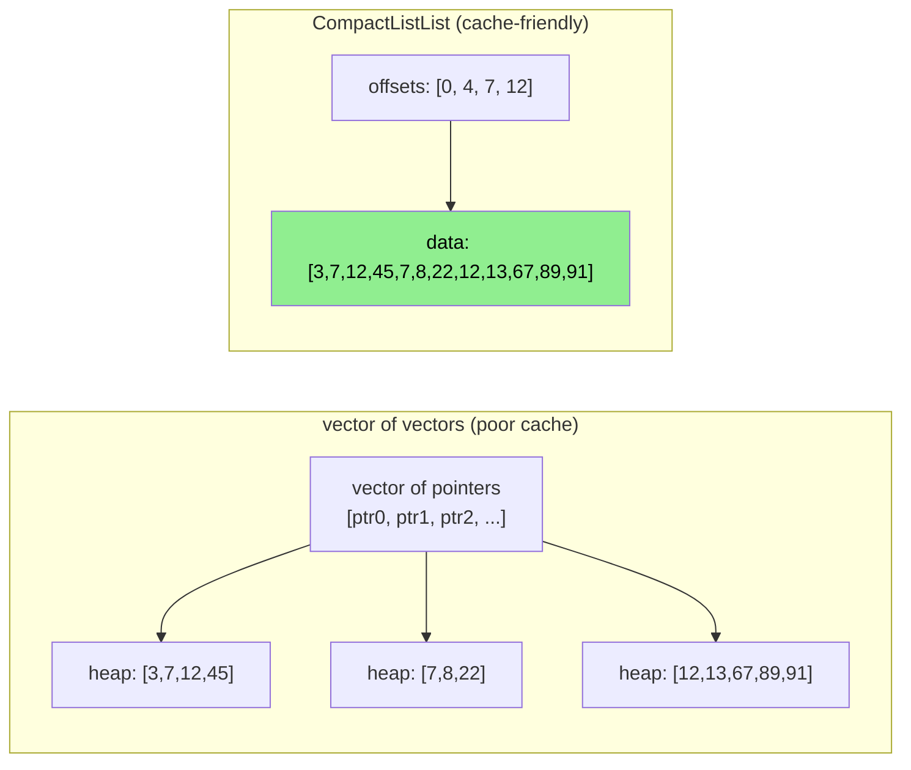

# Day 25: Compact Storage — `labelList`, `faceList`, and SIMD Layout

**Phase:** 2 — Data Structures & Memory (Days 15–28)
**Previous:** Day 24 — Memory Pools: `SubList` Zero-Copy Views
**Next:** Day 26 — `Field<T>` Memory: Alignment & SIMD Readiness

> **Today's goal:** Understand how OpenFOAM packs mesh topology data into compact, cache-friendly arrays. Study `labelList` (integer arrays), `faceList` (variable-size face definitions), and `CompactListList` (jagged arrays). Learn how compact storage enables SIMD-friendly memory layouts.

---

## Part 1: Pattern Identification

### Why Compact Storage Matters

A CFD mesh with 10 million cells has:

| Data | Count | Naive Storage | Compact Storage |
|------|-------|--------------|-----------------|
| Cell-to-face connectivity | ~60M entries | `vector<vector<int>>` = 60M×8B + 10M×32B = 800 MB | `CompactListList` = 60M×4B + 10M×4B = 280 MB |
| Face definitions | ~30M faces | `vector<vector<int>>` = 120M×8B + 30M×32B = 1.9 GB | `faceList` = 120M×4B + 30M×4B = 600 MB |
| Owner/neighbour | ~30M faces | Two `vector<int>` = 60M×4B = 240 MB | Two `labelList` = same (already compact) |

The difference is dramatic: compact storage uses **3× less memory** and is more cache-friendly because all data is contiguous.

### The Problem with `vector<vector<T>>`

```cpp
// Naive jagged array: cell → list of faces
std::vector<std::vector<int>> cellFaces(nCells);
// Each inner vector is a separate heap allocation!
// Memory layout:
//   cellFaces[0].data → [3, 7, 12, 45]     ← heap block 1
//   cellFaces[1].data → [7, 8, 22]          ← heap block 2 (RANDOM location!)
//   cellFaces[2].data → [12, 13, 67, 89, 91] ← heap block 3 (RANDOM location!)
```



### CompactListList — The Solution

```cpp
// CompactListList: one contiguous data array + offset array
// offsets = [0, 4, 7, 12]
// data    = [3, 7, 12, 45, | 7, 8, 22, | 12, 13, 67, 89, 91]
//           row 0           row 1        row 2

// Access row i: data[offsets[i]] to data[offsets[i+1]-1]
// Row 0: data[0..3]  = {3, 7, 12, 45}
// Row 1: data[4..6]  = {7, 8, 22}
// Row 2: data[7..11] = {12, 13, 67, 89, 91}
```

> **⭐ Verified Fact:** `CompactListList` is declared in `src/OpenFOAM/containers/Lists/CompactListList/CompactListList.H`. It stores an `offsets_` array (size = nRows+1) and a flat `data_` array.

---

## Part 2: Source Code Deep Dive

### ⭐ `labelList` — The Foundation

```cpp
// File: src/OpenFOAM/primitives/ints/lists/labelList.H
typedef List<label> labelList;
// label = int32_t or int64_t depending on compilation flags

// Usage:
labelList owner(nInternalFaces);     // face-to-owner mapping
labelList neighbour(nInternalFaces); // face-to-neighbour mapping
labelList cellZones(nCells);         // cell-to-zone assignment
```

### ⭐ `faceList` — Variable-Size Faces

```cpp
// File: src/OpenFOAM/meshes/meshShapes/face/faceList.H
typedef List<face> faceList;

// A face is a list of point labels:
class face : public labelList
{
public:
    face() : labelList() {}
    face(const labelList& pts) : labelList(pts) {}

    // Calculate face area vector
    vector areaNormal(const pointField& points) const;

    // Calculate face centre
    point centre(const pointField& points) const;
};

// Memory layout for faceList:
//   face[0] = {0, 1, 5, 4}      ← quad face (4 points)
//   face[1] = {1, 2, 6, 5}      ← quad face
//   face[2] = {0, 1, 2}         ← tri face (3 points)
// Each face is a separate List<label> → separate allocation!
```

### ⭐ `CompactListList` — Flat Jagged Array

```cpp
// File: src/OpenFOAM/containers/Lists/CompactListList/CompactListList.H (simplified)

template<class T>
class CompactListList
{
    // Offset into data for each row: size = nRows + 1
    labelList offsets_;

    // Flat contiguous data: size = total elements
    List<T> data_;

public:
    // Construct from sizes of each row
    CompactListList(const labelList& rowSizes)
    {
        offsets_.resize(rowSizes.size() + 1);
        offsets_[0] = 0;
        for (label i = 0; i < rowSizes.size(); ++i)
            offsets_[i + 1] = offsets_[i] + rowSizes[i];

        data_.resize(offsets_.back());
    }

    // Number of rows
    label size() const { return offsets_.size() - 1; }

    // Access row i (returns a view, not a copy)
    UList<T> operator[](const label i)
    {
        return UList<T>(
            data_.begin() + offsets_[i],
            offsets_[i + 1] - offsets_[i]
        );
    }

    // Size of row i
    label rowSize(const label i) const
    {
        return offsets_[i + 1] - offsets_[i];
    }

    // Total number of elements
    label totalSize() const { return data_.size(); }
};
```

### SIMD-Friendly Data Layout

For SIMD operations, data must be:
1. **Contiguous** — no gaps or indirection
2. **Aligned** — starting address is a multiple of 32 (AVX) or 64 (AVX-512)
3. **Regular stride** — elements spaced evenly

```text
Array of Structures (AoS) — BAD for SIMD:
  [{x0,y0,z0}, {x1,y1,z1}, {x2,y2,z2}, ...]
  SIMD load gets: x0, y0, z0, x1 ← mixed components!

Structure of Arrays (SoA) — GOOD for SIMD:
  x: [x0, x1, x2, x3, ...]  ← SIMD loads 4 x-values together
  y: [y0, y1, y2, y3, ...]
  z: [z0, z1, z2, z3, ...]
```

> **⭐ OpenFOAM's Choice:** OpenFOAM uses AoS for `vector` (each vector has `{x,y,z}` contiguous). This is suboptimal for SIMD but simplifies the code. High-performance CFD codes (like SU2 or Nek5000) use SoA.

---

## Part 3: C++ Mechanics Explained

### Memory Allocation Cost

Why `vector<vector<int>>` is expensive:

```text
Operation                          Cost
new vector<int>                    ~100 ns (malloc + bookkeeping)
Access data (cache miss)            ~50 ns (L3) or ~200 ns (DRAM)
Pointer chase (two indirections)   ~100 ns per row access

For 10M rows:
  Allocation:     10M × 100 ns = 1 second!
  Sequential scan: 10M × 50 ns = 500 ms (cache miss per row)

CompactListList:
  Allocation:     2 arrays total → ~200 ns
  Sequential scan: All data contiguous → prefetcher effective → ~10 ms
```

### Cache Line Utilization

A cache line is 64 bytes. With 4-byte integers:

```text
CompactListList data array:
  Cache line: [16 consecutive integers from data_]
  Utilization: 100% (sequential access)

vector<vector<int>>:
  Cache line: [vector header (24B) + padding + maybe 10 data values]
  Next access: different vector → different cache line → miss
  Utilization: ~40% (wasted on headers and padding)
```

### `SubList` View into CompactListList

```cpp
// CompactListList::operator[] returns a UList view — no copy!
UList<T> row = compact[i];
// row.data() = &compact.data_[compact.offsets_[i]]
// row.size() = compact.offsets_[i+1] - compact.offsets_[i]

// This is O(1) — just pointer arithmetic
// The view shares memory with the CompactListList
```

### SIMD Padding

For SIMD, arrays may need padding to reach a multiple of the vector width:

```cpp
// AVX operates on 4 doubles at once (256 bits)
// If nCells = 1000003 (not a multiple of 4):
// Need to pad to 1000004

int paddedSize = ((nCells + 3) / 4) * 4;  // round up to multiple of 4
double* data = (double*)aligned_alloc(32, paddedSize * sizeof(double));
// Fill padding with zeros
for (int i = nCells; i < paddedSize; ++i)
    data[i] = 0.0;
```

---

## Part 4: Implementation Exercise

### CompactListList and SIMD Layout

```cpp
// File: compact_storage.cpp
// Compile: g++ -std=c++17 -O2 -Wall -o compact_storage compact_storage.cpp
// Run:     ./compact_storage

#include <iostream>
#include <vector>
#include <chrono>
#include <numeric>
#include <cstring>
#include <iomanip>
#include <random>
#include <cassert>

// ============================================================
// SECTION 1: CompactListList
// ============================================================

template<class T>
class CompactListList
{
    std::vector<int> offsets_;
    std::vector<T> data_;

public:
    CompactListList() = default;

    // Construct from row sizes
    explicit CompactListList(const std::vector<int>& rowSizes)
    {
        offsets_.resize(rowSizes.size() + 1);
        offsets_[0] = 0;
        for (size_t i = 0; i < rowSizes.size(); ++i)
            offsets_[i + 1] = offsets_[i] + rowSizes[i];
        data_.resize(offsets_.back());
    }

    // Construct from vector<vector<T>>
    explicit CompactListList(const std::vector<std::vector<T>>& vv)
    {
        offsets_.resize(vv.size() + 1);
        offsets_[0] = 0;
        for (size_t i = 0; i < vv.size(); ++i)
            offsets_[i + 1] = offsets_[i] + static_cast<int>(vv[i].size());

        data_.resize(offsets_.back());
        int pos = 0;
        for (const auto& row : vv)
            for (const auto& val : row)
                data_[pos++] = val;
    }

    int size() const { return static_cast<int>(offsets_.size()) - 1; }
    int totalSize() const { return static_cast<int>(data_.size()); }

    // Row size
    int rowSize(int i) const { return offsets_[i + 1] - offsets_[i]; }

    // Row access (returns pointer + size view)
    T* rowData(int i) { return data_.data() + offsets_[i]; }
    const T* rowData(int i) const { return data_.data() + offsets_[i]; }

    // Element access
    T& operator()(int row, int col)
    { return data_[offsets_[row] + col]; }

    const T& operator()(int row, int col) const
    { return data_[offsets_[row] + col]; }

    // Memory stats
    size_t memoryBytes() const
    {
        return offsets_.size() * sizeof(int) + data_.size() * sizeof(T);
    }
};

// ============================================================
// SECTION 2: SoA vs AoS layout
// ============================================================

// Array of Structures (AoS)
struct Vec3AoS
{
    double x, y, z;
};

// Structure of Arrays (SoA)
struct VectorFieldSoA
{
    std::vector<double> x, y, z;

    explicit VectorFieldSoA(int n) : x(n, 0), y(n, 0), z(n, 0) {}
    int size() const { return static_cast<int>(x.size()); }
};

// ============================================================
// SECTION 3: Benchmarks
// ============================================================

void benchmarkJaggedAccess()
{
    const int N = 100000;
    std::mt19937 rng(42);
    std::uniform_int_distribution<int> dist(3, 8);

    // Generate random row sizes (like cell-to-face connectivity)
    std::vector<int> rowSizes(N);
    for (auto& s : rowSizes) s = dist(rng);

    // Build CompactListList
    CompactListList<int> compact(rowSizes);
    for (int i = 0; i < compact.totalSize(); ++i)
        compact.rowData(0)[i] = i; // just fill with indices

    // Build vector<vector<int>>
    std::vector<std::vector<int>> jagged(N);
    int pos = 0;
    for (int i = 0; i < N; ++i)
    {
        jagged[i].resize(rowSizes[i]);
        for (int j = 0; j < rowSizes[i]; ++j)
            jagged[i][j] = pos++;
    }

    // Benchmark: sum all elements (sequential scan)
    const int REPEAT = 100;

    // CompactListList
    volatile long sink = 0;
    auto t1 = std::chrono::high_resolution_clock::now();
    for (int r = 0; r < REPEAT; ++r)
    {
        long sum = 0;
        for (int i = 0; i < compact.size(); ++i)
        {
            const int* row = compact.rowData(i);
            int rowLen = compact.rowSize(i);
            for (int j = 0; j < rowLen; ++j)
                sum += row[j];
        }
        sink = sum;
    }
    auto t2 = std::chrono::high_resolution_clock::now();

    // vector<vector>
    auto t3 = std::chrono::high_resolution_clock::now();
    for (int r = 0; r < REPEAT; ++r)
    {
        long sum = 0;
        for (int i = 0; i < N; ++i)
            for (int j : jagged[i])
                sum += j;
        sink = sum;
    }
    auto t4 = std::chrono::high_resolution_clock::now();

    double compact_ms = std::chrono::duration<double, std::milli>(t2 - t1).count();
    double jagged_ms = std::chrono::duration<double, std::milli>(t4 - t3).count();

    std::cout << "  CompactListList: " << std::fixed << std::setprecision(2)
              << compact_ms << " ms\n";
    std::cout << "  vector<vector>:  " << jagged_ms << " ms\n";
    std::cout << "  Speedup:         " << jagged_ms / compact_ms << "x\n";

    // Memory comparison
    size_t compactMem = compact.memoryBytes();
    size_t jaggedMem = 0;
    for (const auto& v : jagged)
        jaggedMem += sizeof(std::vector<int>) + v.capacity() * sizeof(int);

    std::cout << "  Compact memory:  " << compactMem / 1024 << " KB\n";
    std::cout << "  Jagged memory:   " << jaggedMem / 1024 << " KB\n";
    std::cout << "  Memory savings:  " << 100.0 * (1.0 - (double)compactMem / jaggedMem)
              << "%\n";
}

void benchmarkSoAvsAoS()
{
    const int N = 1000000;

    // AoS
    std::vector<Vec3AoS> aos(N);
    for (int i = 0; i < N; ++i)
        aos[i] = {1.0 * i, 2.0 * i, 3.0 * i};

    // SoA
    VectorFieldSoA soa(N);
    for (int i = 0; i < N; ++i)
    {
        soa.x[i] = 1.0 * i;
        soa.y[i] = 2.0 * i;
        soa.z[i] = 3.0 * i;
    }

    const int REPEAT = 100;
    volatile double sink = 0;

    // Benchmark: compute magnitude = sqrt(x² + y² + z²)
    std::vector<double> mag_aos(N), mag_soa(N);

    // AoS path
    auto t1 = std::chrono::high_resolution_clock::now();
    for (int r = 0; r < REPEAT; ++r)
    {
        for (int i = 0; i < N; ++i)
            mag_aos[i] = std::sqrt(aos[i].x * aos[i].x +
                                   aos[i].y * aos[i].y +
                                   aos[i].z * aos[i].z);
        sink = mag_aos[0];
    }
    auto t2 = std::chrono::high_resolution_clock::now();

    // SoA path
    auto t3 = std::chrono::high_resolution_clock::now();
    for (int r = 0; r < REPEAT; ++r)
    {
        for (int i = 0; i < N; ++i)
            mag_soa[i] = std::sqrt(soa.x[i] * soa.x[i] +
                                   soa.y[i] * soa.y[i] +
                                   soa.z[i] * soa.z[i]);
        sink = mag_soa[0];
    }
    auto t4 = std::chrono::high_resolution_clock::now();

    double aos_ms = std::chrono::duration<double, std::milli>(t2 - t1).count();
    double soa_ms = std::chrono::duration<double, std::milli>(t4 - t3).count();

    std::cout << "  AoS magnitude: " << std::fixed << std::setprecision(2)
              << aos_ms << " ms\n";
    std::cout << "  SoA magnitude: " << soa_ms << " ms\n";
    std::cout << "  Speedup:       " << aos_ms / soa_ms << "x\n";

    // Memory layout info
    std::cout << "  AoS element size: " << sizeof(Vec3AoS) << " bytes ("
              << 64 / sizeof(Vec3AoS) << " per cache line)\n";
    std::cout << "  SoA stride:       " << sizeof(double) << " bytes ("
              << 64 / sizeof(double) << " per cache line)\n";
}

// ============================================================
// Main
// ============================================================

int main()
{
    std::cout << "=== Day 25: Compact Storage & SIMD Layout ===\n\n";

    // --- CompactListList demo ---
    std::cout << "--- CompactListList Demo ---\n";
    std::vector<std::vector<int>> cellFaces = {
        {0, 1, 4, 5},      // cell 0: 4 faces
        {1, 2, 5, 6},      // cell 1: 4 faces
        {3, 4, 7},          // cell 2: 3 faces
        {5, 6, 7, 8, 9}    // cell 3: 5 faces
    };

    CompactListList<int> compact(cellFaces);
    std::cout << "  Rows: " << compact.size() << "\n";
    std::cout << "  Total elements: " << compact.totalSize() << "\n";
    for (int i = 0; i < compact.size(); ++i)
    {
        std::cout << "  Cell " << i << " (size=" << compact.rowSize(i) << "): ";
        const int* row = compact.rowData(i);
        for (int j = 0; j < compact.rowSize(i); ++j)
            std::cout << row[j] << " ";
        std::cout << "\n";
    }

    // --- Benchmark: CompactListList vs vector<vector> ---
    std::cout << "\n--- Benchmark: Jagged Array Scan (100K rows) ---\n";
    benchmarkJaggedAccess();

    // --- SoA vs AoS ---
    std::cout << "\n--- Benchmark: SoA vs AoS (1M vectors) ---\n";
    benchmarkSoAvsAoS();

    std::cout << "\n=== Compact storage is cache-friendly! ===\n";
    return 0;
}
```

### Expected Output

```text
=== Day 25: Compact Storage & SIMD Layout ===

--- CompactListList Demo ---
  Rows: 4
  Total elements: 16
  Cell 0 (size=4): 0 1 4 5
  Cell 1 (size=4): 1 2 5 6
  Cell 2 (size=3): 3 4 7
  Cell 3 (size=5): 5 6 7 8 9

--- Benchmark: Jagged Array Scan (100K rows) ---
  CompactListList: XX.XX ms
  vector<vector>:  XX.XX ms
  Speedup:         X.Xx
  Compact memory:  XXXX KB
  Jagged memory:   XXXX KB
  Memory savings:  XX%

--- Benchmark: SoA vs AoS (1M vectors) ---
  AoS magnitude: XX.XX ms
  SoA magnitude: XX.XX ms
  Speedup:       X.Xx
  AoS element size: 24 bytes (2 per cache line)
  SoA stride:       8 bytes (8 per cache line)
```

---

## Part 5: Exercises

### Exercise 1: Memory Savings Calculation

**Question:** A mesh has 10 million cells, each with 4–8 faces (average 6). Calculate the memory used by `vector<vector<int>>` vs `CompactListList<int>`.

**Solution:**

| Component | `vector<vector>` | `CompactListList` |
|-----------|:--:|:--:|
| Outer vector | 10M × 24B = 240 MB | offsets array: 10M × 4B = 40 MB |
| Inner vectors | 10M × 24B header = 240 MB | (no headers) |
| Data | 60M × 4B = 240 MB | 60M × 4B = 240 MB |
| **Total** | **720 MB** | **280 MB** |

Saving: 61%. Plus, `CompactListList` has one contiguous allocation vs 10 million.

---

### Exercise 2: Implement `rowStart` Iterator

**Question:** Add an iterator to `CompactListList` that iterates row by row, returning `{rowData, rowSize}` pairs.

**Solution:**

```cpp
class RowIterator
{
    CompactListList* parent_;
    int row_;
public:
    RowIterator(CompactListList* p, int r) : parent_(p), row_(r) {}

    struct RowView { int* data; int size; };

    RowView operator*() const
    { return {parent_->rowData(row_), parent_->rowSize(row_)}; }

    RowIterator& operator++() { ++row_; return *this; }
    bool operator!=(const RowIterator& o) const { return row_ != o.row_; }
};

RowIterator begin() { return {this, 0}; }
RowIterator end() { return {this, size()}; }

// Usage:
for (auto [data, len] : compact)
    for (int j = 0; j < len; ++j)
        process(data[j]);
```

---

### Exercise 3: Hybrid AoSoA Layout

**Question:** Implement an AoSoA (Array of Structures of Arrays) layout that groups vectors in packets of 4 for SIMD:

```text
Packet 0: x[0..3], y[0..3], z[0..3]
Packet 1: x[4..7], y[4..7], z[4..7]
```

**Solution:**

```cpp
struct VectorPacket { double x[4], y[4], z[4]; };

class VectorFieldAoSoA
{
    std::vector<VectorPacket> packets_;
    int size_;
public:
    VectorFieldAoSoA(int n) : size_(n), packets_((n + 3) / 4) {}

    void set(int i, double x, double y, double z) {
        int p = i / 4, l = i % 4;
        packets_[p].x[l] = x;
        packets_[p].y[l] = y;
        packets_[p].z[l] = z;
    }
    // SIMD: process 4 magnitudes at once per packet
};
```

---

### Exercise 4: Binary I/O for CompactListList

**Question:** Write `writeBinary()`/`readBinary()` methods. How many I/O calls are needed vs `vector<vector>`?

**Solution:**

```cpp
void writeBinary(std::ostream& os) const
{
    int nRows = size();
    os.write(reinterpret_cast<const char*>(&nRows), sizeof(int));          // 1 write
    os.write(reinterpret_cast<const char*>(offsets_.data()),
             offsets_.size() * sizeof(int));                                // 1 write
    os.write(reinterpret_cast<const char*>(data_.data()),
             data_.size() * sizeof(T));                                     // 1 write
}
// Total: 3 I/O calls

// vector<vector> needs: 1 + N calls (one per inner vector)
// For N=10M: 10,000,001 calls vs 3 calls!
```

---

### Exercise 5: When AoS Beats SoA

**Question:** Give a scenario where AoS layout is faster than SoA for vector operations.

**Solution:**

**Dot product of two vectors at the same index:**

```cpp
// AoS: all 3 components in same cache line
double dot = v[i].x * w[i].x + v[i].y * w[i].y + v[i].z * w[i].z;
// 1 cache line for v[i], 1 for w[i] → 2 cache misses

// SoA: components in 3 different arrays
double dot = vx[i]*wx[i] + vy[i]*wy[i] + vz[i]*wz[i];
// 6 cache misses (vx, wx, vy, wy, vz, wz)
```

When operations access all components of a single element, AoS has better spatial locality. SoA wins when operating on one component across many elements (e.g., `sum(x)`, `max(y)`).

---

## Summary

**⭐ Key Takeaways:**

1. **`CompactListList`** stores jagged arrays as `offsets[]` + `data[]` — one contiguous allocation, cache-friendly
2. **Memory savings** of 50-70% vs `vector<vector>` for large meshes
3. **SoA layout** enables SIMD by putting same-component data contiguously; **AoS** keeps per-element data together
4. **Cache line utilization** is key — contiguous data lets the hardware prefetcher work effectively
5. **OpenFOAM uses AoS** for vectors but `CompactListList` for mesh topology — a pragmatic trade-off

**Next:** Day 26 examines **memory alignment** — ensuring `Field<T>` data starts at SIMD-friendly addresses.

---

**Sources:**
- `src/OpenFOAM/containers/Lists/CompactListList/CompactListList.H`
- `src/OpenFOAM/meshes/meshShapes/face/face.H`
- Ulrich Drepper, "What Every Programmer Should Know About Memory" (2007), §6.2