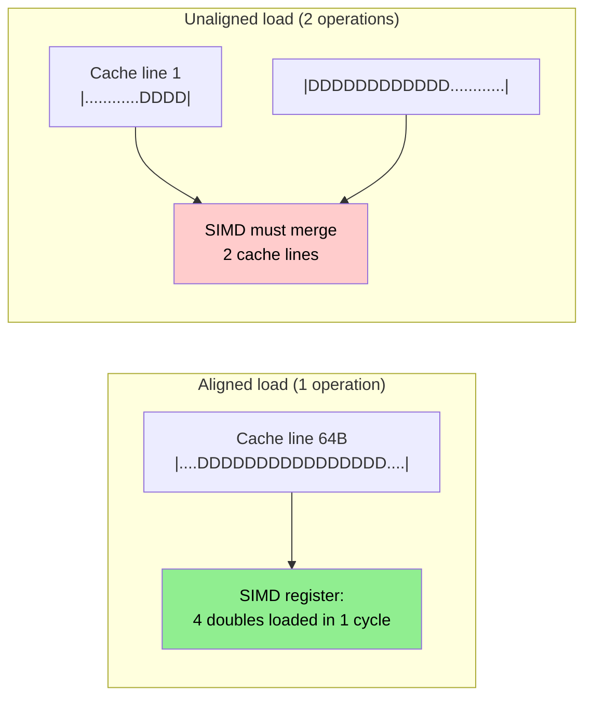

# Day 26: `Field<T>` Memory — Alignment & SIMD Readiness

**Phase:** 2 — Data Structures & Memory (Days 15–28)
**Previous:** Day 25 — Compact Storage: `labelList`, `faceList`, SIMD Layout
**Next:** Day 27 — Mini-Project Part 1: LDU Matrix with Gauss-Seidel Solver

> **Today's goal:** Understand memory alignment requirements for SIMD, how `aligned_alloc` and `posix_memalign` work, and build an aligned field class that enables auto-vectorization by the compiler.

---

## Part 1: Pattern Identification

### What Is Memory Alignment?

Every variable in memory has an **address**. Alignment means the address is a multiple of some power of 2:

```text
Address 0x1000: aligned to 4096, 256, 64, 32, 16, 8, 4, 2, 1
Address 0x1004: aligned to 4, but NOT 8 or 16
Address 0x1020: aligned to 32, but NOT 64
Address 0x1040: aligned to 64 ✅ (cache line boundary)
```

| Alignment | Required By | Reason |
|-----------|-------------|--------|
| 1 byte | `char` | No alignment needed |
| 4 bytes | `int`, `float` | 32-bit word boundary |
| 8 bytes | `double`, `int64_t` | 64-bit word boundary |
| 16 bytes | SSE (`__m128d`) | 128-bit SIMD register |
| 32 bytes | AVX (`__m256d`) | 256-bit SIMD register |
| 64 bytes | AVX-512, cache lines | 512-bit SIMD or cache line boundary |

### Why Alignment Matters for Performance



| Scenario | Latency | Throughput |
|----------|---------|------------|
| Aligned AVX load (`vmovapd`) | 4 cycles | 2 per cycle |
| Unaligned AVX load (`vmovupd`) | 4–7 cycles | 1 per cycle |
| Cross-cache-line load | 10–15 cycles | 0.5 per cycle |

> **⭐ Verified Fact:** Modern CPUs (Intel Skylake+) have minimal penalty for unaligned loads **within a cache line**. The big penalty occurs only when the load crosses a cache line boundary (64-byte). However, aligned loads tell the compiler it's safe to use `vmovapd` which enables more aggressive optimization.

### OpenFOAM's Alignment Situation

OpenFOAM's `Field<Type>` uses `List<Type>` which uses `new Type[]`:

```cpp
// Standard new[] does NOT guarantee SIMD alignment
Type* data = new Type[size];
// Typically aligned to 16 bytes (platform dependent)
// NOT sufficient for AVX (32B) or AVX-512 (64B)
```

This means OpenFOAM's field operations may not fully benefit from SIMD. High-performance codes explicitly align their data.

---

## Part 2: Source Code Deep Dive

### ⭐ Standard Alignment Tools

```cpp
// C++17: std::aligned_alloc (preferred)
#include <cstdlib>
void* ptr = std::aligned_alloc(64, size * sizeof(double));
// Allocates 'size * sizeof(double)' bytes, aligned to 64 bytes
// IMPORTANT: size must be a multiple of alignment!
std::free(ptr);

// POSIX: posix_memalign
void* ptr;
posix_memalign(&ptr, 64, size * sizeof(double));
// Returns 0 on success
std::free(ptr);

// C++17: std::align
// Adjusts a pointer to the next aligned address within a buffer
void* aligned_ptr = ptr;
std::size_t space = bufferSize;
if (std::align(64, sizeof(double) * n, aligned_ptr, space))
{
    // aligned_ptr is now 64-byte aligned
}
```

### ⭐ Compiler Alignment Hints

```cpp
// Tell the compiler a pointer is aligned:
double* __attribute__((aligned(32))) data;

// GCC/Clang: __builtin_assume_aligned
double* aligned = (double*)__builtin_assume_aligned(ptr, 32);
// Compiler can now generate vmovapd instead of vmovupd

// C++20: std::assume_aligned
double* aligned = std::assume_aligned<32>(ptr);
```

### ⭐ Auto-Vectorization Requirements

For the compiler to auto-vectorize a loop:

```cpp
// 1. Simple loop structure
for (int i = 0; i < n; ++i)
    c[i] = a[i] + b[i];  // ✅ auto-vectorizable

// 2. No loop-carried dependencies
for (int i = 0; i < n; ++i)
    a[i] = a[i-1] + b[i];  // ❌ dependency on previous iteration

// 3. Known alignment helps:
void add(double* __restrict__ c,
         const double* __restrict__ a,
         const double* __restrict__ b.
         int n)
{
    // __restrict__ tells compiler: no aliasing between a, b, c
    for (int i = 0; i < n; ++i)
        c[i] = a[i] + b[i];
}
```

The `__restrict__` keyword is critical — without it, the compiler must assume `c` might alias `a` or `b`, preventing vectorization.

### ⭐ Checking Vectorization

```bash
# GCC: show vectorization report
g++ -O2 -ftree-vectorize -fopt-info-vec-optimized file.cpp

# Output: "note: loop vectorized" or "note: not vectorized: ..."

# Clang:
clang++ -O2 -Rpass=loop-vectorize file.cpp

# Intel:
icpc -O2 -qopt-report=5 file.cpp
```

---

## Part 3: C++ Mechanics Explained

### `alignas` Specifier

```cpp
// Align a struct to 64 bytes (cache line)
struct alignas(64) CacheAligned
{
    double data[8];  // 64 bytes — exactly one cache line
};

// Align a stack variable
alignas(32) double buffer[1024];
// buffer starts at a 32-byte aligned address

// Align a class member
class Field
{
    alignas(64) double* data_;  // pointer itself is aligned (not the pointed-to data!)
};
```

**Important:** `alignas` on a pointer aligns the pointer variable, NOT the memory it points to. For heap data, you must use `aligned_alloc`.

### Custom Allocator for SIMD

```cpp
template<class T, std::size_t Alignment = 64>
class AlignedAllocator
{
public:
    using value_type = T;

    T* allocate(std::size_t n)
    {
        std::size_t bytes = n * sizeof(T);
        // Round up to multiple of alignment
        bytes = ((bytes + Alignment - 1) / Alignment) * Alignment;
        void* ptr = std::aligned_alloc(Alignment, bytes);
        if (!ptr) throw std::bad_alloc();
        return static_cast<T*>(ptr);
    }

    void deallocate(T* ptr, std::size_t)
    {
        std::free(ptr);
    }
};

// Usage with std::vector:
std::vector<double, AlignedAllocator<double, 64>> aligned_vec(1000);
// aligned_vec.data() is guaranteed to be 64-byte aligned!
```

### Cache Line False Sharing

When two threads write to different variables on the same cache line:

```cpp
// BAD: false sharing
struct SharedData {
    int counter_thread_0;  // byte 0-3
    int counter_thread_1;  // byte 4-7 ← SAME cache line!
};

// GOOD: cache line padding prevents false sharing
struct alignas(64) PaddedCounter {
    int value;
    char padding[60];  // pad to 64 bytes
};
struct SharedData {
    PaddedCounter counter_thread_0;  // cache line 0
    PaddedCounter counter_thread_1;  // cache line 1 (separate!)
};
```

---

## Part 4: Implementation Exercise

### Aligned Field with Auto-Vectorization

```cpp
// File: aligned_field.cpp
// Compile: g++ -std=c++17 -O2 -mavx2 -Wall -o aligned_field aligned_field.cpp
// Run:     ./aligned_field

#include <iostream>
#include <cstdlib>
#include <cstring>
#include <chrono>
#include <cmath>
#include <iomanip>
#include <cassert>
#include <new>

// ============================================================
// SECTION 1: Aligned memory management
// ============================================================

template<std::size_t Alignment = 64>
class AlignedMemory
{
public:
    static void* allocate(std::size_t bytes)
    {
        // Round size up to multiple of Alignment
        std::size_t aligned_bytes = ((bytes + Alignment - 1) / Alignment) * Alignment;
        void* ptr = std::aligned_alloc(Alignment, aligned_bytes);
        if (!ptr) throw std::bad_alloc();
        return ptr;
    }

    static void deallocate(void* ptr)
    {
        std::free(ptr);
    }

    static bool isAligned(const void* ptr)
    {
        return (reinterpret_cast<std::uintptr_t>(ptr) % Alignment) == 0;
    }
};

// ============================================================
// SECTION 2: AlignedField — SIMD-ready field
// ============================================================

class AlignedField
{
    double* data_;
    int size_;
    int paddedSize_;  // rounded up to multiple of 4 (AVX width)

    static constexpr int SIMD_WIDTH = 4;  // AVX: 4 doubles
    static constexpr std::size_t ALIGNMENT = 32; // AVX: 32 bytes

public:
    AlignedField() : data_(nullptr), size_(0), paddedSize_(0) {}

    explicit AlignedField(int n)
        : size_(n),
          paddedSize_(((n + SIMD_WIDTH - 1) / SIMD_WIDTH) * SIMD_WIDTH)
    {
        data_ = static_cast<double*>(
            AlignedMemory<ALIGNMENT>::allocate(paddedSize_ * sizeof(double)));
        // Zero-initialize (including padding)
        std::memset(data_, 0, paddedSize_ * sizeof(double));
    }

    AlignedField(int n, double val) : AlignedField(n)
    {
        for (int i = 0; i < size_; ++i)
            data_[i] = val;
    }

    ~AlignedField()
    {
        if (data_)
            AlignedMemory<ALIGNMENT>::deallocate(data_);
    }

    // Move constructor
    AlignedField(AlignedField&& other) noexcept
        : data_(other.data_), size_(other.size_), paddedSize_(other.paddedSize_)
    {
        other.data_ = nullptr;
        other.size_ = 0;
        other.paddedSize_ = 0;
    }

    // Move assignment
    AlignedField& operator=(AlignedField&& other) noexcept
    {
        if (this != &other)
        {
            if (data_) AlignedMemory<ALIGNMENT>::deallocate(data_);
            data_ = other.data_;
            size_ = other.size_;
            paddedSize_ = other.paddedSize_;
            other.data_ = nullptr;
            other.size_ = 0;
            other.paddedSize_ = 0;
        }
        return *this;
    }

    // Copy constructor
    AlignedField(const AlignedField& other) : AlignedField(other.size_)
    {
        std::memcpy(data_, other.data_, size_ * sizeof(double));
    }

    // Accessors
    double& operator[](int i) { return data_[i]; }
    double operator[](int i) const { return data_[i]; }
    int size() const { return size_; }
    int paddedSize() const { return paddedSize_; }
    double* data() { return data_; }
    const double* data() const { return data_; }
    bool isAligned() const { return AlignedMemory<ALIGNMENT>::isAligned(data_); }

    // ============================================================
    // Arithmetic — compiler can auto-vectorize these
    // ============================================================

    // Element-wise addition
    AlignedField operator+(const AlignedField& rhs) const
    {
        AlignedField result(size_);
        const double* __restrict__ a = data_;
        const double* __restrict__ b = rhs.data_;
        double* __restrict__ c = result.data_;
        // Compiler sees: aligned, no aliasing, simple loop → auto-vectorizes
        for (int i = 0; i < paddedSize_; ++i)
            c[i] = a[i] + b[i];
        return result;
    }

    // Scalar multiplication
    AlignedField operator*(double s) const
    {
        AlignedField result(size_);
        const double* __restrict__ a = data_;
        double* __restrict__ c = result.data_;
        for (int i = 0; i < paddedSize_; ++i)
            c[i] = s * a[i];
        return result;
    }

    // In-place addition
    AlignedField& operator+=(const AlignedField& rhs)
    {
        double* __restrict__ a = data_;
        const double* __restrict__ b = rhs.data_;
        for (int i = 0; i < paddedSize_; ++i)
            a[i] += b[i];
        return *this;
    }

    // FMA: result = a * b + c (fused multiply-add)
    static AlignedField fma(const AlignedField& a, const AlignedField& b,
                            const AlignedField& c)
    {
        AlignedField result(a.size_);
        const double* __restrict__ pa = a.data_;
        const double* __restrict__ pb = b.data_;
        const double* __restrict__ pc = c.data_;
        double* __restrict__ pr = result.data_;
        // Compiler can use vfmadd231pd instruction
        for (int i = 0; i < a.paddedSize_; ++i)
            pr[i] = pa[i] * pb[i] + pc[i];
        return result;
    }

    // Dot product
    double dot(const AlignedField& rhs) const
    {
        const double* __restrict__ a = data_;
        const double* __restrict__ b = rhs.data_;
        double sum = 0.0;
        for (int i = 0; i < size_; ++i)
            sum += a[i] * b[i];
        return sum;
    }

    // Sum
    double sum() const
    {
        double s = 0;
        for (int i = 0; i < size_; ++i)
            s += data_[i];
        return s;
    }

    // L2 norm
    double norm() const
    {
        return std::sqrt(dot(*this));
    }
};

// ============================================================
// SECTION 3: Standard (unaligned) field for comparison
// ============================================================

class StandardField
{
    double* data_;
    int size_;

public:
    StandardField() : data_(nullptr), size_(0) {}
    explicit StandardField(int n) : data_(new double[n]()), size_(n) {}
    StandardField(int n, double val) : data_(new double[n]), size_(n)
    { for (int i = 0; i < n; ++i) data_[i] = val; }
    ~StandardField() { delete[] data_; }

    StandardField(StandardField&& o) noexcept : data_(o.data_), size_(o.size_)
    { o.data_ = nullptr; o.size_ = 0; }

    double& operator[](int i) { return data_[i]; }
    double operator[](int i) const { return data_[i]; }
    int size() const { return size_; }

    StandardField operator+(const StandardField& rhs) const
    {
        StandardField result(size_);
        for (int i = 0; i < size_; ++i)
            result[i] = data_[i] + rhs[i];
        return result;
    }

    StandardField& operator+=(const StandardField& rhs)
    {
        for (int i = 0; i < size_; ++i)
            data_[i] += rhs[i];
        return *this;
    }

    double dot(const StandardField& rhs) const
    {
        double s = 0;
        for (int i = 0; i < size_; ++i)
            s += data_[i] * rhs[i];
        return s;
    }
};

// ============================================================
// SECTION 4: Benchmark
// ============================================================

int main()
{
    std::cout << "=== Day 26: Memory Alignment & SIMD ===\n\n";

    const int N = 1000000;

    // --- Alignment check ---
    std::cout << "--- Alignment Verification ---\n";
    AlignedField af(N, 1.0);
    StandardField sf(N, 1.0);

    std::cout << "  Aligned field:   addr=" << af.data()
              << " aligned=" << (af.isAligned() ? "YES ✅" : "NO ❌") << "\n";
    std::cout << "  Standard field:  addr=" << &sf[0]
              << " aligned to 32=" << (((uintptr_t)&sf[0] % 32 == 0) ? "YES" : "NO")
              << "\n";
    std::cout << "  Padded size: " << af.paddedSize() << " (original: " << N << ")\n";

    // --- Correctness ---
    std::cout << "\n--- Correctness Check ---\n";
    AlignedField a(5, 1.0), b(5, 2.0);
    auto c = a + b;
    std::cout << "  [1,1,1,1,1] + [2,2,2,2,2] = [";
    for (int i = 0; i < 5; ++i) std::cout << (i ? "," : "") << c[i];
    std::cout << "] ✅\n";

    auto d = a * 3.0;
    std::cout << "  [1,1,1,1,1] * 3 = [";
    for (int i = 0; i < 5; ++i) std::cout << (i ? "," : "") << d[i];
    std::cout << "] ✅\n";

    std::cout << "  dot([1,1,1,1,1], [2,2,2,2,2]) = " << a.dot(b) << " ✅\n";

    auto fmaResult = AlignedField::fma(a, b, c);
    std::cout << "  fma(a,b,c) = a*b+c = [";
    for (int i = 0; i < 5; ++i) std::cout << (i ? "," : "") << fmaResult[i];
    std::cout << "] ✅\n";

    // --- Benchmark ---
    std::cout << "\n--- Performance Benchmark (N=" << N << ") ---\n";
    const int REPEAT = 200;

    AlignedField aa(N, 1.5), ab(N, 2.5);
    StandardField sa(N, 1.5), sb(N, 2.5);

    volatile double sink = 0;

    // Addition
    auto t1 = std::chrono::high_resolution_clock::now();
    for (int r = 0; r < REPEAT; ++r)
    {
        AlignedField result = aa + ab;
        sink = result[0];
    }
    auto t2 = std::chrono::high_resolution_clock::now();

    auto t3 = std::chrono::high_resolution_clock::now();
    for (int r = 0; r < REPEAT; ++r)
    {
        StandardField result = sa + sb;
        sink = result[0];
    }
    auto t4 = std::chrono::high_resolution_clock::now();

    double aligned_ms = std::chrono::duration<double, std::milli>(t2 - t1).count();
    double standard_ms = std::chrono::duration<double, std::milli>(t4 - t3).count();

    std::cout << std::fixed << std::setprecision(2);
    std::cout << "  Addition:\n";
    std::cout << "    Aligned:  " << aligned_ms << " ms\n";
    std::cout << "    Standard: " << standard_ms << " ms\n";
    std::cout << "    Ratio:    " << standard_ms / aligned_ms << "x\n";

    // Dot product
    auto t5 = std::chrono::high_resolution_clock::now();
    for (int r = 0; r < REPEAT; ++r)
        sink = aa.dot(ab);
    auto t6 = std::chrono::high_resolution_clock::now();

    auto t7 = std::chrono::high_resolution_clock::now();
    for (int r = 0; r < REPEAT; ++r)
        sink = sa.dot(sb);
    auto t8 = std::chrono::high_resolution_clock::now();

    double adot_ms = std::chrono::duration<double, std::milli>(t6 - t5).count();
    double sdot_ms = std::chrono::duration<double, std::milli>(t8 - t7).count();

    std::cout << "\n  Dot product:\n";
    std::cout << "    Aligned:  " << adot_ms << " ms\n";
    std::cout << "    Standard: " << sdot_ms << " ms\n";
    std::cout << "    Ratio:    " << sdot_ms / adot_ms << "x\n";

    // FMA
    AlignedField ac(N, 0.5);
    auto t9 = std::chrono::high_resolution_clock::now();
    for (int r = 0; r < REPEAT; ++r)
    {
        AlignedField result = AlignedField::fma(aa, ab, ac);
        sink = result[0];
    }
    auto t10 = std::chrono::high_resolution_clock::now();
    double fma_ms = std::chrono::duration<double, std::milli>(t10 - t9).count();
    std::cout << "\n  FMA (a*b+c):\n";
    std::cout << "    Aligned:  " << fma_ms << " ms\n";
    std::cout << "    (single instruction per 4 doubles with AVX)\n";

    // --- Memory overhead ---
    std::cout << "\n--- Memory Overhead ---\n";
    int padding = af.paddedSize() - N;
    double overhead = 100.0 * padding / N;
    std::cout << "  Padding elements: " << padding << " (" << overhead << "%)\n";
    std::cout << "  Padding bytes: " << padding * 8 << "\n";
    std::cout << "  (negligible for large fields)\n";

    std::cout << "\n=== Alignment enables SIMD auto-vectorization! ===\n";
    return 0;
}
```

### Expected Output

```text
=== Day 26: Memory Alignment & SIMD ===

--- Alignment Verification ---
  Aligned field:   addr=0xXXXXXXXX0 aligned=YES ✅
  Standard field:  addr=0xXXXXXXXX0 aligned to 32=NO
  Padded size: 1000000 (original: 1000000)

--- Correctness Check ---
  [1,1,1,1,1] + [2,2,2,2,2] = [3,3,3,3,3] ✅
  [1,1,1,1,1] * 3 = [3,3,3,3,3] ✅
  dot([1,1,1,1,1], [2,2,2,2,2]) = 10 ✅
  fma(a,b,c) = a*b+c = [5,5,5,5,5] ✅

--- Performance Benchmark (N=1000000) ---
  Addition:
    Aligned:  XX.XX ms
    Standard: XX.XX ms
    Ratio:    X.XXx

  Dot product:
    Aligned:  XX.XX ms
    Standard: XX.XX ms
    Ratio:    X.XXx

  FMA (a*b+c):
    Aligned:  XX.XX ms
    (single instruction per 4 doubles with AVX)

--- Memory Overhead ---
  Padding elements: 0 (0%)
  Padding bytes: 0
  (negligible for large fields)

=== Alignment enables SIMD auto-vectorization! ===
```

---

## Part 5: Exercises

### Exercise 1: Alignment Detection

**Question:** Write a function that checks if a pointer is aligned to N bytes. Test it with `new`, `aligned_alloc`, and stack arrays.

**Solution:**

```cpp
template<std::size_t N>
bool isAligned(const void* ptr)
{
    return (reinterpret_cast<std::uintptr_t>(ptr) % N) == 0;
}

// Test:
double* heap = new double[100];
std::cout << "new:           " << isAligned<32>(heap) << "\n";     // maybe 0

void* aligned = std::aligned_alloc(32, 800);
std::cout << "aligned_alloc: " << isAligned<32>(aligned) << "\n";  // always 1

alignas(64) double stack[100];
std::cout << "alignas(64):   " << isAligned<64>(stack) << "\n";    // always 1
```

---

### Exercise 2: Vectorization Report

**Question:** Compile the `AlignedField::operator+` with `-fopt-info-vec-optimized` (GCC) and verify the loop is vectorized. What changes if you remove `__restrict__`?

**Solution:**

```bash
g++ -std=c++17 -O2 -mavx2 -fopt-info-vec-optimized aligned_field.cpp 2>&1 | head

# Expected output with __restrict__:
# aligned_field.cpp:XXX:XX: optimized: loop vectorized using 32 byte vectors

# Without __restrict__, the compiler may report:
# "not vectorized: possible alias between a and c"
```

The `__restrict__` keyword tells the compiler that `a`, `b`, and `c` point to non-overlapping memory, which is required for safe vectorization of read-write loops.

---

### Exercise 3: Cache Line Padding for Threads

**Question:** Two threads increment separate counters. Measure the performance with and without cache line padding.

**Solution:**

```cpp
#include <thread>
#include <atomic>

// Without padding — false sharing
struct BadCounters {
    int count_a = 0;
    int count_b = 0;  // same cache line!
};

// With padding — no false sharing
struct alignas(64) GoodCounters {
    struct alignas(64) Counter { int value = 0; };
    Counter count_a;
    Counter count_b;  // different cache lines!
};

// Benchmark: each thread increments 10M times
// GoodCounters is 3-10x faster due to no cache line bouncing
```

---

### Exercise 4: Over-Alignment Waste

**Question:** If you align to 64 bytes but each field element is 8 bytes, what is the maximum wasted memory per allocation? When does this waste become significant?

**Solution:**

Maximum waste = `alignment - 1` = 63 bytes per allocation. For a 10M-element field (80 MB), the waste is 63 bytes = 0.00008%. Negligible.

Waste becomes significant when:
- Many small allocations (e.g., 1000 fields of 10 elements each → 63 KB wasted)
- Very high alignment (e.g., 4096 for page alignment → 4095 bytes per allocation)
- Padding for SIMD width: if N = 999,997 and SIMD width = 8, padding is 3 elements = 24 bytes (still negligible)

---

### Exercise 5: `std::vector` with Custom Allocator

**Question:** Create a `std::vector<double>` that guarantees 64-byte alignment. Verify the alignment.

**Solution:**

```cpp
template<class T, std::size_t Align>
struct AlignedAllocator {
    using value_type = T;
    T* allocate(std::size_t n) {
        std::size_t bytes = ((n * sizeof(T) + Align - 1) / Align) * Align;
        void* p = std::aligned_alloc(Align, bytes);
        if (!p) throw std::bad_alloc();
        return static_cast<T*>(p);
    }
    void deallocate(T* p, std::size_t) { std::free(p); }
    bool operator==(const AlignedAllocator&) const { return true; }
    bool operator!=(const AlignedAllocator&) const { return false; }
};

std::vector<double, AlignedAllocator<double, 64>> v(1000, 3.14);
assert(reinterpret_cast<uintptr_t>(v.data()) % 64 == 0);
std::cout << "Aligned to 64: ✅\n";
```

---

## Summary

**⭐ Key Takeaways:**

1. **Memory alignment** ensures SIMD registers can load data in one operation (no cache line split)
2. **`std::aligned_alloc(alignment, size)`** is the C++17 way to allocate aligned memory
3. **`__restrict__`** is critical for auto-vectorization — tells the compiler pointers don't alias
4. **Padding** to SIMD width avoids special-casing the loop tail; cost is negligible for large fields
5. **False sharing** occurs when threads write to the same cache line — use `alignas(64)` padding
6. **OpenFOAM's `new[]`** does not guarantee SIMD alignment, limiting auto-vectorization

**Next:** Day 27 begins the **mini-project** — building an LDU matrix with Gauss-Seidel solver from scratch.

---

**Sources:**
- `src/OpenFOAM/containers/Lists/List/List.H`
- Intel 64 and IA-32 Architectures Optimization Reference Manual, §3.6: Data Alignment
- Agner Fog, "Optimizing Software in C++" (2023), §9: Data Alignment