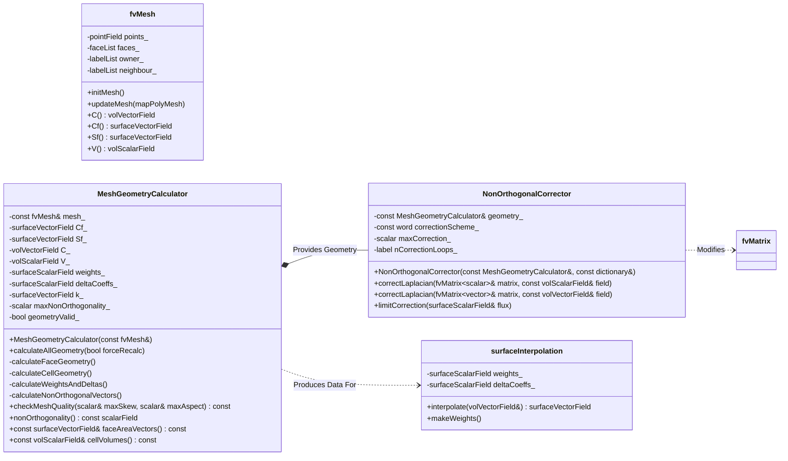

# Day 15: Mesh Geometry Calculations | การคำนวณเรขาคณิตของ Mesh
# Learning Objectives | วัตถุประสงค์การเรียนรู้

เมื่อจบเซสชันระดับ Hardcore นี้ คุณจะก้าวข้ามทฤษฎีที่เป็นนามธรรมไปสู่ความเข้าใจที่จับต้องได้และพร้อมนำไป implement เกี่ยวกับ mesh geometry คุณจะไม่เพียงแค่รู้ว่าค่าต่างๆ "คืออะไร" แต่จะรู้ว่าพวกมันถูกคำนวณอย่างไร, จัดเก็บอย่างไร และถูกนำไปใช้งานจริงอย่างไรภายใน CFD engine ระดับอุตสาหกรรมอย่าง OpenFOAM โดยวัตถุประสงค์การเรียนรู้ของคุณมีดังนี้:

1.  **Understand **ทำความเข้าใจความสำคัญทางกายภาพและตัวเลขของค่าทางเรขาคณิตพื้นฐานของ Mesh** คุณจะเข้าใจอย่างลึกซึ้งว่าทำไม face area vector $\mathbf{S}_f$ ถึงเป็นเวกเตอร์ไม่ใช่สเกลาร์ โดยเชื่อมโยงกับ Divergence Theorem และการคำนวณ net flux ผ่าน control volume คุณจะเข้าใจว่า cell centers $\mathbf{C}_P$, face centers $\mathbf{C}_f$ และ cell volumes $V_P$ ถูกกำหนดให้เป็นคุณสมบัติเชิงอินทิกรัล (integral properties) อย่างไร และการคำนวณที่แม่นยำของค่าเหล่านี้เป็นรากฐานของ Finite Volume Method ทั้งหมด ซึ่งส่งผลต่อการทำ interpolation, การคำนวณ gradient และท้ายที่สุดคือการอนุรักษ์ (conservation)

2.  **Design **ออกแบบและวางสถาปัตยกรรมโครงสร้างข้อมูลที่มีประสิทธิภาพสำหรับการจัดเก็บและการคำนวณ Mesh Geometry** คุณจะได้เรียนรู้การวิเคราะห์ความคุ้มค่า (trade-offs) ระหว่างการใช้หน่วยความจำและความเร็วในการประมวลผลเมื่อจัดเก็บ geometry fields ที่คำนวณไว้ล่วงหน้า (เช่น `C`, `Cf`, `Sf`, `V`) คุณจะออกแบบคลาส `MeshGeometryCalculator` ที่สามารถแคชค่าเหล่านี้ได้อย่างชาญฉลาด, เข้าใจ mesh topology (`owner_`, `neighbour_`) และให้รูปแบบการเข้าถึงข้อมูลที่มีประสิทธิภาพสำหรับการประกอบระบบสมการเชิงเส้น (assembly of linear systems) เพื่อรับประกันประสิทธิภาพระดับ O(N) สำหรับการจำลองขนาดใหญ่

3.  **Implement อัลกอริทึมที่ทนทาน (Robust) สำหรับการคำนวณเรขาคณิตหลักบน General Polyhedral Cells** คุณจะได้เขียนคำสั่งควบคุมเรขาคณิตเชิงตัวเลขในระดับล่าง ซึ่งรวมถึงการ implement อัลกอริทึมเพื่อคำนวณ `faceCentres()` และ `faceAreas()` โดยการแยกย่อย polygonal faces ให้เป็นรูปสามเหลี่ยม, การรับประกันการใช้กฎมือขวา (right-hand rule) เพื่อให้ทิศทางของ normal มีความสม่ำเสมอ คุณจะ implement `cellCentres()` และ `cellVolumes()` โดยการแยกย่อย polyhedral cells ให้เป็น tetrahedra (pyramids) อิงตามจุดศูนย์กลางของหน้าและ centroids ของเซลล์ เพื่อให้เชี่ยวชาญการทำ geometric sums ที่รับประกันความแม่นยำระดับ second-order spatial accuracy

4.  **Master **เชี่ยวชาญทฤษฎีและการ implement ระบบ Non-Orthogonal Mesh Corrections** คุณจะหาสูตรและ implement แนวทางแบบ "over-relaxed" โดยแยกย่อย face-normal gradient ให้เป็นส่วนที่เป็น orthogonal (ซึ่งจะถูกจัดการแบบ implicit ในเมทริกซ์เพื่อความเสถียร) และส่วนที่เป็น non-orthogonal correction (จัดการแบบ explicit) คุณจะ implement การคำนวณ correction vector $\mathbf{k}_f$ และรวมเข้ากับคลาส `NonOrthogonalCorrector` เพื่อให้สามารถคำนวณ diffusion และ gradient ได้อย่างแม่นยำบน mesh ที่มีความซับซ้อนและเบี้ยว (skewed) ซึ่งมักพบในเรขาคณิตของ evaporator ระดับอุตสาหกรรม

5.  **Implement ระบบวินิจฉัยและส่งตรวจสอบความถูกต้องของคุณภาพ Mesh ที่สำคัญ** คุณจะสร้างรูทีน `checkMeshQuality()` ที่เหนือกว่าการตรวจสอบขั้นพื้นฐาน คุณจะคำนวณและแปลผลค่าต่างๆ เช่น orthogonality (มุมระหว่าง $\mathbf{S}_f$ และ $\mathbf{d}_{PN}$), skewness (ระยะห่างระหว่างจุดศูนย์กลางหน้ากับเส้นเชื่อมจุดศูนย์กลางเซลล์), aspect ratio และ non-planarity ของใบหน้า คุณจะเรียนรู้การตั้งค่าขอบเขต (thresholds) สำหรับค่าเหล่านี้เพื่อระบุ mesh ที่มีแนวโน้มจะทำให้ solver ไม่เสถียรหรือเกิดความคลาดเคลื่อนในการจำลองการไหลแบบสองสถานะ

6.  **Identify, **วิเคราะห์และแก้ไขปัญหาที่พบบ่อยในการ implement Mesh Geometry** คุณจะได้เรียนรู้วิธีเชื่อมโยงอาการต่างๆ เช่น solver divergence, ความไม่สมดุลของมวลใน VOF simulation หรือการเกิด oscillation ที่ผิดปกติ เข้ากับข้อผิดพลาดพื้นฐานของเรขาคณิตโดยตรง คุณจะ implement การแก้ไขปัญหา เช่น ทิศทางของ face area vectors ผิดพลาด (ทำให้เครื่องหมายของ flux ผิด), ค่า non-orthogonal corrections ที่ไม่มีขอบเขต (สาเหตุของความไม่เสถียร) และ interpolation weights ที่แย่บนหน้าที่เบี้ยว (ลดความแม่นยำของ gradient)
# Section 1: Theory | ส่วนที่ 1: ทฤษฎี

### Fundamental Mesh Geometry Quantities | ค่าทางเรขาคณิตพื้นฐานของ Mesh

ความแม่นยำและความเสถียรของการจำลองด้วย Finite Volume Method (FVM) นั้นขึ้นอยู่กับการคำนวณเรขาคณิตของ mesh ที่แม่นยำเป็นสำคัญ ค่าเหล่านี้ไม่ใช่เพียงแค่ข้อมูลในขั้นตอน pre-processing แต่เป็นสัมประสิทธิ์ทางเรขาคณิต (geometric coefficients) ที่จะไปคูณกับตัวแปรของคำตอบโดยตรงในสมการพีชคณิตที่ถูก discretized ข้อผิดพลาดในเรขาคณิตจะส่งผลกระทบแบบเชิงเส้น (linearly) ต่อคำตอบ ทำให้ส่วนนี้เป็นรากฐานสำคัญที่ฟิสิกส์ทั้งหมดจะถูกสร้างขึ้น สำหรับการจำลอง evaporator ของเรา ซึ่ง phase change dynamics, interface capturing และ pressure-velocity coupling มีความสำคัญอย่างยิ่ง ความถูกต้องทางเรขาคณิต (geometric fidelity) จึงเป็นสิ่งที่ยอมรับความผิดพลาดไม่ได้

#### The Face Area Vector: $\mathbf{S}_f$ | เวกเตอร์พื้นที่หน้า: $\mathbf{S}_f$

องค์ประกอบทางเรขาคณิตที่สำคัญที่สุดใน FVM คือ **face area vector** ซึ่งถูกกำหนดดังนี้:
$$
\mathbf{S}_f = \mathbf{n}_f A_f
$$
โดยที่ $\mathbf{n}_f$ คือ **outward-pointing unit normal** ของหน้า $f$ และ $A_f$ คือ **พื้นที่** ของหน้านั้น

*ความหมายทางกายภาพและความสำคัญ:**
face area vector คือหัวใจสำคัญของ divergence theorem ซึ่งเป็นเสาหลักของ FVM พิจารณา theorem นี้ที่ใช้กับ vector field $\phi$ ทั่วไปบน control volume $V_P$ ที่ล้อมรอบด้วยหน้า $f$:
$$
\int_{V_P} (\nabla \cdot \phi) \, dV = \sum_{f} \int_{A_f} \phi \cdot d\mathbf{A} \approx \sum_{f} \phi_f \cdot \mathbf{S}_f
$$
การประมาณค่านี้จะเปลี่ยน volume integral ให้กลายเป็นผลรวมของ fluxes บนหน้าของเซลล์ ค่า dot product $\phi_f \cdot \mathbf{S}_f$ คือ **net flux** ของ $\phi$ ที่ผ่านหน้า $f$ ดังนั้น *ทิศทาง* ของ $\mathbf{S}_f$ จึงมีความสำคัญเท่ากับขนาดของมัน เพราะมันเป็นตัวกำหนดเครื่องหมาย (sign) ของ flux นี้

*ข้อกำหนดด้านทิศทางใน OpenFOAM:**
สำหรับ **internal faces** OpenFOAM จะกำหนด **owner** และ **neighbor** cell มาให้ โดยเวกเตอร์พื้นที่หน้า $\mathbf{S}_f$ จะถูกคำนวณให้ชี้จาก **owner cell ไปยัง neighbor cell** เสมอ ข้อกำหนดนี้มีความเข้มงวดและต้องปฏิบัติตามอย่างเคร่งครัด สำหรับหน้าที่กำหนดโดยรายการของ vertices $v_0, v_1, v_2, ... v_n$ เวกเตอร์จะถูกคำนวณโดยการแยกย่อย polygonal face ให้เป็นรูปสามเหลี่ยม (โดยใช้จุดศูนย์กลางหน้าเป็นจุดยอดร่วม) และรวม vector พื้นที่ของพวกมันเข้าด้วยกัน:
$$
\mathbf{S}_f = \sum_{k=0}^{N_{vertices}} \frac{1}{2} (\mathbf{v}_k - \mathbf{v}_c) \times (\mathbf{v}_{k+1} - \mathbf{v}_c)
$$
โดยที่ $\mathbf{v}_c$ คือจุดศูนย์กลางหน้า และ indices เป็นแบบ modulo $N_{vertices}$ การใช้กฎมือขวา (right-hand rule) กับรายการ vertices ที่เรียงลำดับแล้วต้องให้ผลลัพธ์เป็น normal ที่สอดคล้องกับ owner-neighbor topology การกำหนดทิศทางที่ผิดพลาดจะทำให้เครื่องหมายของ convective และ diffusive fluxes ทั้งหมดกลับด้าน นำไปสู่ความไม่สมดุลของมวลและโมเมนตัมอย่างรุนแรง

*บทบาทของ $\mathbf{S}_f$ ในเทอมที่ถูก discretized ต่างๆ**
| Term | Continuous Form | Discrete Form (Using $\mathbf{S}_f$) | Importance of Direction |
| :--- | :--- | :--- | :--- |
| **Convection** | $\int_V \nabla \cdot (\rho \mathbf{U} \phi) dV$ | $\sum_f (\rho \mathbf{U})_f \phi_f \cdot \mathbf{S}_f$ | กำหนดว่า $\phi$ ถูก advected เข้าหรือออกจากเซลล์ |
| **Diffusion** | $\int_V \nabla \cdot (\Gamma \nabla \phi) dV$ | $\sum_f \Gamma_f (\nabla \phi)_f \cdot \mathbf{S}_f$ | กำหนดทิศทางของ diffusive transport |
| **Pressure Gradient** | $\int_V \nabla p dV$ | $\sum_f p_f \mathbf{S}_f$ | เป็นแหล่งกำเนิดโมเมนตัม; ทิศทางมีความสำคัญต่อสมดุลของแรง |
| **Divergence of Velocity** | $\int_V \nabla \cdot \mathbf{U} dV$ | $\sum_f \mathbf{U}_f \cdot \mathbf{S}_f$ | สำคัญต่อ continuity และ **expansion term** $\dot{m}(1/\rho_v - 1/\rho_l)$ |

#### Cell Centers: $\mathbf{C}_P$ and Face Centers: $\mathbf{C}_f$ | จุดศูนย์กลางเซลล์: $\mathbf{C}_P$ และจุดศูนย์กลางหน้า: $\mathbf{C}_f$

**cell center** $\mathbf{C}_P$ คือตำแหน่งที่ตัวแปรเฉลี่ยในเซลล์ (ที่จัดเก็บใน `volScalarField`, `volVectorField`) ถูกกำหนดขึ้น โดยปกติจะเป็น centroid ของปริมาตรเซลล์:
$$
\mathbf{C}_P = \frac{1}{V_P} \int_{V_P} \mathbf{x} \, dV
$$
สำหรับ general polyhedral cell อินทิกรัลนี้จะถูกประเมินโดยการแยกเซลล์ให้เป็น tetrahedra โดยที่แต่ละ tetrahedron จะถูกสร้างจากการเชื่อมจุดศูนย์กลางหน้า $\mathbf{C}_f$ เข้ากับขอบของหน้านั้น เกิดเป็นรูปทรงพีระมิดที่มีจุดศูนย์กลางเซลล์ (ที่กำลังหาอยู่) เป็นยอด วิธีการที่ใช้บ่อยและเสถียรคือการใช้สูตรที่อิงตาม divergence theorem:
$$
\mathbf{C}_P \approx \frac{1}{2 V_P} \sum_f \mathbf{C}_f (\mathbf{C}_f \cdot \mathbf{S}_f)
$$
วิธีนี้ช่วยให้การคำนวณทางเรขาคณิตมีความทนทาน (robust)

**face center** $\mathbf{C}_f$ คือ centroid ของพื้นที่หน้า ซึ่งกำหนดดังนี้:
$$
\mathbf{C}_f = \frac{1}{A_f} \int_{A_f} \mathbf{x} \, dA
$$
สำหรับ polygonal face ที่มี $N$ vertices $\mathbf{v}_i$ สามารถคำนวณได้โดยการทำ triangulation:
$$
\mathbf{C}_f = \frac{1}{A_f} \sum_{k=0}^{N-1} \frac{A_{tri,k}}{3} (\mathbf{v}_k + \mathbf{v}_{k+1} + \mathbf{v}_c)
$$
โดยที่ $A_{tri,k}$ คือพื้นที่ของรูปสามเหลี่ยมที่ $k$ และ $\mathbf{v}_c$ คือค่าเฉลี่ยแบบเลขคณิตของ vertices $\mathbf{C}_f$ คือตำแหน่งที่ **face-based quantities** เช่น mass flux $\phi = (\rho \mathbf{U})_f \cdot \mathbf{S}_f$ (จัดเก็บใน `surfaceScalarField`) ถูกกำหนดขึ้น และเป็นจุดที่เกิดการ interpolation จากจุดศูนย์กลางเซลล์

*ค่าทางเรขาคณิตและวัตถุประสงค์ในการคำนวณ**
| Symbol | Name (ชื่อ) | Unit (หน่วย) | Definition (นิยาม) | Purpose in Solver (วัตถุประสงค์ใน Solver) |
| :--- | :--- | :--- | :--- | :--- |
| $\mathbf{S}_f$ | Face Area Vector | m² | $\mathbf{n}_f A_f$ | การทำ flux integration ใน divergence theorem |
| $A_f$ or `magSf()` | Face Area Magnitude | m² | $\|\mathbf{S}_f\|$ | การปรับสเกล diffusive fluxes, การคำนวณ CFL |
| $\mathbf{C}_P$ | Cell Center | m | $\frac{1}{V_P} \int_V \mathbf{x} dV$ | ตำแหน่งของค่าใน `volField` |
| $\mathbf{C}_f$ | Face Center | m | $\frac{1}{A_f} \int_A \mathbf{x} dA$ | ตำแหน่งสำหรับการทำ interpolation และประเมิน flux |
| $V_P$ | Cell Volume | m³ | $\int_{V_P} dV$ | ปริมาตรสำหรับการทำ source term integration, time derivative |
| $\mathbf{d}_{PN}$ | Cell-to-Cell Vector | m | $\mathbf{C}_N - \mathbf{C}_P$ | ทิศทางสำหรับการทำ gradient approximation |
| $\mathbf{d}_{Pf}, \mathbf{d}_{fN}$ | Cell-to-Face Vectors | m | $\mathbf{C}_f - \mathbf{C}_P$, $\mathbf{C}_N - \mathbf{C}_f$ | ใช้ในการคำนวณ interpolation weight |

#### Interpolation Weights and the Distance Ratio | น้ำหนักการ Interpolation และอัตราส่วนระยะทาง

ในการทำ interpolate ฟิลด์ $\phi$ จากจุดศูนย์กลางเซลล์ $P$ และ $N$ ไปยังหน้า $f$ ที่ใช้ร่วมกัน เราจะใช้ linear interpolation โดยที่น้ำหนัก $f_x$ ถูกกำหนดดังนี้:
$$
\phi_f = f_x \phi_P + (1 - f_x) \phi_N
$$
สำหรับ **orthogonal mesh** (Mesh ที่เส้น $\mathbf{d}_{PN}$ เชื่อมต่อจุดศูนย์กลางเซลล์ผ่านจุดศูนย์กลางหน้า $\mathbf{C}_f$ และขนานกับ $\mathbf{S}_f$) น้ำหนักที่เหมาะสมที่สุดจะอิงตามระยะทาง:
$$
f_x = \frac{|\mathbf{d}_{fN}|}{|\mathbf{d}_{PN}|} = \frac{\|\mathbf{C}_N - \mathbf{C}_f\|}{\|\mathbf{C}_N - \mathbf{C}_P\|}
$$
นี่คือมุมมองแบบ **harmonic averaging** ซึ่งช่วยรับประกันความแม่นยำสำหรับ diffusive fluxes ส่วนกลับของระยะห่างระหว่างจุดศูนย์กลางเซลล์จะถูกจัดเก็บในรูปของ **delta coefficient** ซึ่งสำคัญอย่างยิ่งสำหรับการทำ discretization ของ gradient และ Laplacian:
$$
\text{deltaCoeffs}_f = \frac{1}{|\mathbf{d}_{PN}|}
$$

*สมมติฐานที่ว่า $\mathbf{d}_{PN} \parallel \mathbf{S}_f$ จะไม่เป็นความจริงใน **non-orthogonal** meshes ซึ่งพบได้ทั่วไปในเรขาคณิตทางวิศวกรรมที่ซับซ้อน เช่น ชุดท่อ evaporator (tube bundles) และพื้นผิวที่มีครีบ (finned surfaces) การละเมิดสมมติฐานนี้เป็นที่มาของความผิดพลาดในการ discretization ที่ต้องได้รับการแก้ไข

### Non-Orthogonal Mesh Corrections | การแก้ไข Mesh ที่ไม่ตั้งฉาก

ในงาน CFD ภาคปฏิบัติ mesh แบบ hexahedral ที่ตั้งฉากอย่างสมบูรณ์แบบนั้นถือเป็นเรื่องที่หาได้ยาก ความไม่ตั้งฉากของ mesh (non-orthogonality) เกิดจาก:
1.  เรขาคณิตที่ซับซ้อน (พื้นผิวโค้ง, ท่อ, ครีบ)
2.  การทำ adaptive mesh refinement
3.  การเคลื่อนที่ของ mesh แบบ dynamic (จะกล่าวถึงใน Day 16)

เมื่อเวกเตอร์ $\mathbf{d}_{PN}$ ที่เชื่อมจุดศูนย์กลางเซลล์เพื่อนบ้านไม่ขนานกับเวกเตอร์พื้นที่หน้า $\mathbf{S}_f$ การทำ discretization มาตรฐานของเทอมการแพร่ (Laplacian) และเทอม gradient จะไม่แม่นยำ การใช้สูตรที่ไม่มีการแก้ไขจะทำให้เกิดความคลาดเคลื่อนที่นำไปสู่ **การสูญเสียขอบเขตของคำตอบ (loss of solution boundedness)**, **การเพิ่มขึ้นของ numerical diffusion** และท้ายที่สุดคือ **ความไม่เสถียรของ solver**

#### Mathematical Decomposition of the Flux | การแยกส่วนประกอบทางคณิตศาสตร์ของ Flux

พิจารณา diffusive flux ของสเกลาร์ $\phi$ ที่มีสัมประสิทธิ์การแพร่ $\Gamma$ ผ่านหน้า $f$:
$$
F_f^{\text{diff}} = \Gamma_f (\nabla \phi)_f \cdot \mathbf{S}_f
$$
ความท้าทายคือจะประเมินค่า $(\nabla \phi)_f \cdot \mathbf{S}_f$ อย่างแม่นยำได้อย่างไร แนวทางแบบ **over-relaxed** หรือ **deferred correction** จะแยกส่วนนี้ออกเป็นสองส่วน:

1.  **orthogonal component** คำนวณโดยใช้ผลต่างระหว่างจุดศูนย์กลางเซลล์ตามแนว $\mathbf{d}_{PN}$ ซึ่งจะถูกจัดการแบบ **implicit** (บวกเข้ากับสัมประสิทธิ์เมทริกซ์เพื่อความเสถียร)
2.  **non-orthogonal component** คำนวณโดยใช้การทำ explicit gradient reconstruction ซึ่งจะถูกจัดการแบบ **explicit** (บวกเข้ากับ source term $b$)

การแยกส่วนประกอบ (decomposition) มีที่มาดังนี้ เราแสดงค่า face-normal gradient เป็น dot product:
$$
(\nabla \phi)_f \cdot \mathbf{S}_f = (\nabla \phi)_f \cdot \underbrace{[\mathbf{d}_{PN} \frac{\mathbf{S}_f \cdot \mathbf{d}_{PN}}{|\mathbf{d}_{PN}|^2} + \mathbf{k}_f]}_{\text{Decomposition of } \mathbf{S}_f}
$$
ในที่นี้ เราได้เจตนาแยก $\mathbf{S}_f$ ออกเป็นส่วนที่ขนานกับ $\mathbf{d}_{PN}$ และส่วนที่ตั้งฉากกับมัน ซึ่งกำหนดโดย **non-orthogonal correction vector** $\mathbf{k}_f$:
$$
\mathbf{k}_f = \mathbf{S}_f - \mathbf{d}_{PN} \frac{\mathbf{S}_f \cdot \mathbf{d}_{PN}}{|\mathbf{d}_{PN}|^2}
$$
จากนิยาม $\mathbf{k}_f \cdot \mathbf{d}_{PN} = 0$ เมื่อแทนค่าการแยกส่วนประกอบนี้กลับเข้าไป:
$$
(\nabla \phi)_f \cdot \mathbf{S}_f = \underbrace{\frac{\phi_N - \phi_P}{|\mathbf{d}_{PN}|} \frac{\mathbf{S}_f \cdot \mathbf{d}_{PN}}{|\mathbf{d}_{PN}|}}_{\text{Orthogonal Part (Implicit)}} + \underbrace{\mathbf{k}_f \cdot (\nabla \phi)_f}_{\text{Non-Orthogonal Part (Explicit)}}
$$

*อัลกอริทึมแบบ Over-Relaxed:**
1.  **Implicit Assembly:** ส่วนของ orthogonal $(\phi_N - \phi_P) \frac{\mathbf{S}_f \cdot \mathbf{d}_{PN}}{|\mathbf{d}_{PN}|^2}$ จะถูกรวมเข้าไว้ในสัมประสิทธิ์เมทริกซ์ `A.lower()`, `A.upper()` และ `A.diag()` ส่วนนี้มีความเสถียรแบบไม่มีเงื่อนไข (unconditionally stable) เพราะมันแสดงถึงการแพร่ตามเส้นเชื่อมจุดศูนย์กลางเซลล์ที่แท้จริง
2.  **Explicit Correction:** ส่วนของ non-orthogonal $\mathbf{k}_f \cdot (\nabla \phi)_f$ จะถูกคำนวณโดยใช้ค่า field ปัจจุบัน (จากรอบการคำนวณก่อนหน้า) สำหรับ $(\nabla \phi)_f$ และบวกเข้ากับ source term `A.source()` ส่วนนี้มีความเสถียรแบบมีเงื่อนไข (conditionally stable)

โดยปกติ explicit gradient $(\nabla \phi)_f$ จะถูกคำนวณโดยใช้ **Gauss's theorem** บนเซลล์ (เช่น owner cell ของหน้า $f$):
$$
(\nabla \phi)_P \approx \frac{1}{V_P} \sum_{f'} \phi_{f'} \mathbf{S}_{f'}
$$
โดยที่ $\phi_{f'}$ คือค่าที่ถูก interpolated ไปยังหน้า $f'$

#### Skewness Correction | การแก้ไขความเบ้ (Skewness Correction)

บ่อยครั้งที่ non-orthogonality จะมาพร้อมกับ **face skewness** หน้าจะถูกมองว่า skewed ถ้าเส้นเชื่อม $\mathbf{d}_{PN}$ ไม่ผ่านจุดศูนย์กลางหน้า $\mathbf{C}_f$ สิ่งนี้ทำให้เกิดความผิดพลาดใน interpolation weight $f_x$ และสูตรผลต่างพื้นฐาน $\phi_N - \phi_P$

การแก้ไขที่นิยมทำคือการคำนวณ **skewness correction point** $\mathbf{C}_s$ ซึ่งเป็นจุดตัดระหว่าเส้น $\mathbf{d}_{PN}$ กับระนาบของหน้า จากนั้นจะสามารถคำนวณค่าบนหน้าที่ถูแก้ไขแล้วสำหรับการทำ interpolation ได้โดยใช้ linear interpolation ระหว่าง $\mathbf{C}_P$ และ $\mathbf{C}_N$ เพื่อไปยังจุด $\mathbf{C}_s$ และประยุกต์ใช้การแก้ไขเพิ่มพิเศษจาก $\mathbf{C}_s$ ไปยัง $\mathbf{C}_f$:
$$
\phi_f = \phi_s + (\nabla \phi)_f \cdot (\mathbf{C}_f - \mathbf{C}_s)
$$
โดยที่ $\phi_s$ คือค่าที่ถูก interpolated ไปยังจุด $\mathbf{C}_s$ นี่เป็นการแก้ไขระดับ second-order ที่มีความสำคัญมากสำหรับ mesh ที่มีความเบ้สูง

#### Limiting the Correction for Stability | การจำกัดค่า Correction เพื่อความเสถียร

แนวทางแบบ deferred correction จะจัดการส่วน non-orthogonal แบบ explicit หาก mesh มีความไม่ตั้งฉาก *อย่างรุนแรง* ขนาดของเทอม $\mathbf{k}_f$ อาจใหญ่จนครอบงำส่วน orthogonal implicit ซึ่งอาจส่งผลให้ละเมิด **Scarborough criterion** (ความเด่นของแนวทแยงในเมทริกซ์ - diagonal dominance) และทำให้ iterative solver ลู่ออก (diverge)

ดังนั้น จึง **จำเป็นอย่างยิ่ง** ที่ต้องจำกัดผลกระทบของ non-orthogonal correction สิ่งนี้ทำได้โดยการใช้ **blending factor** $\lambda$ ระหว่าง scheme ที่ไม่มีการแก้ไขเลย (0) และ scheme ที่มีการแก้ไขเต็มรูปแบบ (1) หรือโดยทั่วไปคือการจำกัดสัมประสิทธิ์แบบ implicit แนวทางของ OpenFOAM มักเกี่ยวข้องกับการคำนวณ **orthogonality factor**:
$$
\text{orthogonality} = \frac{\mathbf{S}_f \cdot \mathbf{d}_{PN}}{|\mathbf{S}_f| |\mathbf{d}_{PN}|}
$$
ค่า 1 หมายถึงความตั้งฉากที่สมบูรณ์แบบ, ค่า 0 หมายถึงมุม 90 องศา จากนั้น non-orthogonal correction จะถูก **จำกัด (limited)** หรือ **under-relaxed** ตลอดการรัน solver หลายรอบเพื่อรักษาความเสถียร แนวทางปฎิบัติทั่วไปคือการจำกัดจำนวนรอบของการทำ correction หรือการคูณค่าเทอม explicit ด้วยแฟกเตอร์ที่น้อยกว่า 1.0 สำหรับหน้าที่ไม่ตั้งฉากอย่างมาก

*ช่วงของ Non-Orthogonality และกลยุทธ์การรับมือ**
| Orthogonality Range | Description | Correction Strategy | Stability Concern |
| :--- | :--- | :--- | :--- |
| 0.95 – 1.0 | Excellent (ดีมาก) | Full correction ($\lambda = 1$) safe. | Minimal (น้อยมาก) |
| 0.85 – 0.95 | Good (ดี) | Full correction usually stable. | Monitor residuals (ควรเฝ้าดู residuals) |
| 0.70 – 0.85 | Acceptable (ยอมรับได้) | Use limited correction (e.g., $\lambda = 0.8$). May require more solver iterations. | Possible mild oscillations (อาจเกิดการแกว่งเล็กน้อย) |
| 0.50 – 0.70 | Poor (แย่) | Use aggressive limiting ($\lambda < 0.5$). Strongly consider mesh improvement. | High risk of divergence (เสี่ยงต่อการลู่ออกสูง) |
| < 0.50 | Unacceptable (ยอมรับไม่ได้) | Correction unstable. **Mesh quality is invalid.** | Solver will almost certainly diverge (ลู่ออกแน่นอน) |

#### Impact on Evaporator Simulation | ผลกระทบต่อการจำลอง Evaporator

ในบริบทของ evaporator solver ที่พัฒนาใน Phase 1 นั้น non-orthogonal corrections มีความสำคัญด้วยเหตุผลหลายประการ:

1.  **Interface อัลกอริทึม `MULES` สำหรับสมการ volume fraction $\alpha$ อาศัยความแม่นยำของ face fluxes ค่า diffusive flux ที่ผิดพลาดจาก non-orthogonality ที่ไม่ถูกแก้ไขจะทำหน้าที่เป็น numerical diffusion ซึ่งจะทำให้ interface ระหว่างของเหลวและไอเบลอ (smearing) ซึ่งสิ่งนี้จะทำลายการคำนวณ phase change source term โดยตรง เพราะมันขึ้นอยู่กับการกำหนด interface ที่ชัดเจน

2.  **Pressure-Velocity สมการ pressure Poisson, $\nabla \cdot (\frac{1}{A_P} \nabla p) = \nabla \cdot \mathbf{H}_{byA}$ เป็นสมการที่ถูกครอบงำด้วยการแพร่ (diffusion-dominated) การทำ discretization ของเทอม Laplacian ที่ไม่แม่นยำบน non-orthogonal mesh จะนำไปสู่ pressure field ที่แย่ ซึ่งจะทำให้เกิด velocity correction ที่ไม่เป็น divergence-free และทำลายอัลกอริทึมการ coupling หลัก

3.  **Energy Temperature gradients บริเวณใกล้ผนังท่อและ phase interface นั้นมีความชันสูง การทำ discretization ที่แม่นยำของ conductive heat flux $\nabla \cdot (k \nabla T)$ จำเป็นต้องมีการจัดการ non-orthogonality ที่เหมาะสมเพื่อหลีกเลี่ยงการทำนายอัตราการถ่ายเทความร้อนที่ต่ำหรือสูงเกินไป ซึ่งเป็นตัวควบคุม evaporation mass transfer $\dot{m}$

*เรขาคณิตของ mesh ไม่ใช่เพียงชุดข้อมูลนำเข้าที่ส่งต่อมาเฉยๆ (passive input) แต่ทว่ามันมีส่วนร่วมอย่างแข็งขันในกระบวนการ discretization ตัวแปร face area vector $\mathbf{S}_f$ คือตัวดำเนินการทางเรขาคณิตพื้นฐาน จุดศูนย์กลางของเซลล์และหน้าเป็นตัวกำหนด computational stencil ใน mesh ของโลกแห่งความจริง ความไม่ตั้งฉาก (non-orthogonality) คือสิ่งที่พบได้ทั่วไปไม่ใช่ข้อยกเว้น การแยกส่วนประกอบแบบ over-relaxed ออกเป็นส่วน orthogonal (implicit) และ non-orthogonal (explicit) พร้อมกับการจำกัดค่าอย่างระมัดระวัง เป็นวิธีมาตรฐานในอุตสาหกรรมสำหรับการรักษาทั้งความแม่นยำและความเสถียร อัลกอริทึมที่นำมาใช้ในวันนี้สำหรับการคำนวณและแก้ไขค่าต่างๆ เหล่านี้จึงไม่ใช่เพียงแค่เครื่องมืออำนวยความสะดวก แต่เป็นผู้พิทักษ์ความถูกต้องของคำตอบ (solution fidelity) สำหรับฟิสิกส์ที่ซับซ้อนและเชื่อมโยงกันในการจำลอง two-phase evaporator ของเรา


# Section 2: OpenFOAM Reference | ส่วนที่ 2: การอ้างอิง OpenFOAM

This section provides a deep, line-by-line analysis of the core OpenFOAM classes responsible for mesh geometry calculations. We will dissect the source code, understand the underlying algorithms, and critically examine how our `MeshGeometryCalculator` and `NonOrthogonalCorrector` classes will extend or modify this functionality for the specific demands of our high-fidelity evaporator solver.

## Class: `fvMesh` (`src/finiteVolume/fvMesh/fvMesh.H` / `.C`) | คลาส: `fvMesh`

คลาส `fvMesh` คือเสาหลักของการทำ finite volume discretization ใน OpenFOAM โดยสืบทอดมาจาก `polyMesh` (ซึ่งสืบทอดมาจาก `primitiveMesh` อีกที) และได้ทำการเพิ่มฟิลด์ทางเรขาคณิตและเมธอดที่จำเป็นสำหรับ FVM เข้าไป

### Header Analysis (`fvMesh.H`) | การวิเคราะห์ Header

เรามาตรวจสอบ data members ที่สำคัญที่ประกาศไว้ใน header กัน ฟิลด์เหล่านี้คือฟิลด์ทางเรขาคณิตที่ถูกแคชไว้ (cached geometric fields) ซึ่งจะถูกคำนวณเพียงครั้งเดียวแล้วนำกลับมาใช้ซ้ำอย่างต่อเนื่องระหว่างการรัน solver เพื่อหลีกเลี่ยงการคำนวณซ้ำที่มีต้นทุนสูง

```cpp
// From src/finiteVolume/fvMesh/fvMesh.H
class fvMesh
:
    public polyMesh
{
    // Private Data

        //- Cell centres | จุดศูนย์กลางเซลล์
        mutable volVectorField* Cptr_;

        //- Face centres | จุดศูนย์กลางหน้า
        mutable surfaceVectorField* Cfptr_;

        //- Face area vectors | เวกเตอร์พื้นที่หน้า
        mutable surfaceVectorField* Sfptr_;

        //- Face area magnitudes | ขนาดพื้นที่หน้า
        mutable surfaceScalarField* magSfptr_;

        //- Cell volumes | ปริมาตรเซลล์
        mutable volScalarField* Vptr_;

        //- Interpolation weights | น้ำหนักการ Interpolation
        mutable surfaceScalarField* weightsptr_;

        //- 1/(Distance between cell centres) | 1/(ระยะห่างระหว่างจุดศูนย์กลางเซลล์)
        mutable surfaceScalarField* deltaCoeffsptr_;

        //- Non-orthogonal correction vectors | เวกเตอร์แก้ไข non-orthogonal
        mutable surfaceVectorField* kptr_;

    // Private Member Functions

        //- Calculate cell centres and volumes | คำนวณจุดศูนย์กลางและปริมาตรเซลล์
        void calcCellCentresAndVols() const;

        //- Calculate face centres and areas | คำนวณจุดศูนย์กลางและพื้นที่หน้า
        void calcFaceCentresAndAreas() const;

        //- Calculate geometric data | คำนวณข้อมูลทางเรขาคณิต
        void calcGeometry() const;

        //- Clear geometry | ล้างข้อมูลเรขาคณิต
        void clearGeom() const;

        //- Clear addressing | ล้างข้อมูล addressing
        void clearAddressing() const;

    // Public Member Functions

        //- Return cell centres | คืนค่าจุดศูนย์กลางเซลล์
        const volVectorField& C() const;

        //- Return face centres | คืนค่าจุดศูนย์กลางหน้า
        const surfaceVectorField& Cf() const;

        //- Return face area vectors | คืนค่าเวกเตอร์พื้นที่หน้า
        const surfaceVectorField& Sf() const;

        //- Return face area magnitudes | คืนค่าขนาดพื้นที่หน้า
        const surfaceScalarField& magSf() const;

        //- Return cell volumes | คืนค่าปริมาตรเซลล์
        const volScalarField& V() const;

        //- Return interpolation weights | คืนค่า interpolation weights
        const surfaceScalarField& weights() const;

        //- Return 1/(distance between cell centres) | คืนค่า 1/(ระยะห่างระหว่างจุดศูนย์กลางเซลล์)
        const surfaceScalarField& deltaCoeffs() const;

        //- Return non-orthogonal correction vectors | คืนค่าเวกเตอร์แก้ไข non-orthogonal
        const surfaceVectorField& nonOrthCorrectionVectors() const;

        //- Update the mesh based on the mesh motion | อัปเดต mesh อิงตามการเคลื่อนที่ของ mesh
        virtual bool update();
};
```

*ข้อสังเกตที่สำคัญ:**
1.  **Mutable ฟิลด์ทางเรขาคณิต (`Cptr_`, `Sfptr_` และอื่นๆ) ถูกประกาศเป็นแบบ `mutable` นี่เป็นการตัดสินใจออกแบบที่ตั้งใจไว้ เมธอดแบบ `const` เช่น `C() const` สามารถแก้ไขตัวแปรพอยน์เตอร์เหล่านี้ได้ เนื่องจากการคำนวณเป็นแบบ lazy (คำนวณเมื่อมีการเข้าถึงครั้งแรก) และถือเป็นการทำงานแบบ logical `const` คือไม่ได้เปลี่ยนสถานะเชิงนามธรรมของ mesh เพียงแต่เติมข้อมูลลงในแคชเท่านั้น
2.  **Lazy ฟังก์ชัน `calcCellCentresAndVols()` และ `calcFaceCentresAndAreas()` เป็นแบบ `const` และจะถูกเรียกใช้ภายใน accessor functions (เช่น `C()`) เฉพาะเมื่อ `ptr_` ที่เกี่ยวข้องเป็น `nullptr` เท่านั้น สิ่งนี้ช่วยเพิ่มประสิทธิภาพเวลาในการเริ่มต้น (startup time) และประหยัดหน่วยความจำในกรณีที่ไม่จำเป็นต้องใช้ข้อมูลเรขาคณิตทั้งหมด
3.  **Field สังเกตประเภทของฟิลด์ให้ดี: `volVectorField` สำหรับเวกเตอร์ที่จุดศูนย์กลางเซลล์, `surfaceVectorField` สำหรับเวกเตอร์ที่จุดศูนย์กลางหน้า และ `surfaceScalarField` สำหรับสเกลาร์ที่จุดศูนย์กลางหน้า ค่าเหล่านี้ไม่ใช่แค่ที่เก็บข้อมูลธรรมดา แต่เป็น GeometricFields เต็มรูปแบบที่จัดการ parallel communication (processor patches) และ boundary conditions โดยอัตโนมัติ

### Source Code Analysis (`fvMesh.C`) | การวิเคราะห์ซอร์สโค้ด

ส่วนของการ implementation จะเปิดเผยถึงอัลกอริทึมที่ใช้ เราลองมาดูฟังก์ชันหลักในการคำนวณเรขาคณิตกัน

*การคำนวณจุดศูนย์กลางหน้าและพื้นที่หน้า (`calcFaceCentresAndAreas`):**
ฟังก์ชันนี้คือรากฐานสำคัญ โดยจะคำนวณค่า $\mathbf{C}_f$ และ $\mathbf{S}_f$ สำหรับทุกหน้าใน mesh

```cpp
// From src/finiteVolume/fvMesh/fvMesh.C (simplified)
void fvMesh::calcFaceCentresAndAreas() const
{
    if (debug) { Info<< "Calculating face centres and area vectors" << endl; }

    // It is an error to call this if already allocated | เป็นข้อผิดพลาดหากเรียกใช้สิ่งนี้ถ้ามีการจองหน่วยความจำแล้ว
    if (Cfptr_ || Sfptr_ || magSfptr_)
    {
        FatalErrorIn("fvMesh::calcFaceCentresAndAreas() const")
            << "Face centres, area vectors or magnitudes already calculated"
            << abort(FatalError);
    }

    const pointField& points = this->points();
    const faceList& faces = this->faces();

    Cfptr_ = new surfaceVectorField(...);
    Sfptr_ = new surfaceVectorField(...);
    magSfptr_ = new surfaceScalarField(...);

    vectorField& Cf = Cfptr_->primitiveFieldRef();
    vectorField& Sf = Sfptr_->primitiveFieldRef();
    scalarField& magSf = magSfptr_->primitiveFieldRef();

    // Loop over all internal and boundary faces
    forAll(faces, facei)
    {
        const face& f = faces[facei];
        label nPoints = f.size();

        // If the face is a triangle, use direct formula.
        if (nPoints == 3)
        {
            const point& p0 = points[f[0]];
            const point& p1 = points[f[1]];
            const point& p2 = points[f[2]];

            // Face centre: average of vertices | จุดศูนย์กลางหน้า: ค่าเฉลี่ยของจุดยอด
            Cf[facei] = (p0 + p1 + p2)/3.0;

            // Area vector: 0.5 * ( (p1-p0) ^ (p2-p0) ) | เวกเตอร์พื้นที่: 0.5 * ( (p1-p0) ^ (p2-p0) )
            // This follows the right-hand rule with vertex order. | สิ่งนี้เป็นไปตามกฎมือขวาพร้อมลำดับจุดยอด
            Sf[facei] = 0.5 * ((p1 - p0) ^ (p2 - p0));
        }
        else
        {
            // For polygonal faces, decompose into triangles from a pivot point. | สำหรับหน้าหลายเหลี่ยม ให้แยกเป็นสามเหลี่ยมจากจุดหมุน
            // The pivot is the face centroid, calculated as a simple average. | จุดหมุนคือ centroid ของหน้า คำนวณเป็นค่าเฉลี่ยอย่างง่าย
            point fCentre = point::zero;
            forAll(f, pi) { fCentre += points[f[pi]]; }
            fCentre /= nPoints;

            vector sumA = vector::zero;
            point sumAc = point::zero;
            scalar sumAn = 0.0;

            for (label pi=0; pi<nPoints; ++pi)
            {
                // Form triangle: fCentre, p0, p1 | สร้างสามเหลี่ยม: fCentre, p0, p1
                const point& p0 = points[f[pi]];
                const point& p1 = points[f[(pi + 1) % nPoints]];

                // Area vector of this sub-triangle | เวกเตอร์พื้นที่ของสามเหลี่ยมย่อยนี้
                vector a = 0.5 * ((p1 - p0) ^ (fCentre - p0));

                // Its centroid | centroid ของมัน
                point c = (fCentre + p0 + p1) / 3.0;

                scalar magA = mag(a);
                sumA += a;
                sumAc += c * magA; // Area-weighted centroid contribution
                sumAn += magA;
            }

            // Overall face centre is the area-weighted average of triangle centroids.
            Cf[facei] = sumAc / (sumAn + VSMALL);
            Sf[facei] = sumA; // Sum of triangle area vectors
        }

        magSf[facei] = mag(Sf[facei]);
    }

    // After computing raw values, the Sf field must be ORIENTED. | หลังจากคำนวณค่าดิบแล้ว ฟิลด์ Sf ต้องถูกจัดทิศทาง (ORIENTED)
    // This is done by calling the member function orient() which uses the | ทำได้โดยเรียกเมธอด orient() ซึ่งใช้
    // owner_/neighbour_ lists to ensure Sf points from owner to neighbour cell. | รายการ owner_/neighbour_ เพื่อให้แน่ใจว่า Sf ชี้จาก owner ไปยัง neighbour
    Sfptr_->orient();
}
```

*สิ่งที่เราทำ "แตกต่าง" ใน `MeshGeometryCalculator::calculateFaceGeometry()`:**

| Aspect | OpenFOAM's `calcFaceCentresAndAreas` | Our `MeshGeometryCalculator` Enhancement |
| :--- | :--- | :--- |
| **Pivot Point | จุด Pivot** | Uses the simple average of face vertices as the pivot for polygon decomposition. This is efficient but can be inaccurate for highly concave or skewed faces. <br><br> ใช้ค่าเฉลี่ยอย่างง่ายของจุดยอดของทุกหน้าเป็น pivot สำหรับการแยกส่วนโพลีกอน ซึ่งประหยัดเวลาแต่ไม่แม่นยำสำหรับหน้าที่เว้ามากหรือเบ้มาก | For evaporator meshes with complex fin geometries, we implement a more robust **barycentric pivot** selection. We calculate the polygon's centroid via a more accurate formula (e.g., using the polygon area formula) to minimize error in the triangular decomposition, especially for faces with high aspect ratio or non-planarity. <br><br> สำหรับ mesh ของ evaporator ที่มีเรขาคณิตของฟินที่ซับซ้อน เราใช้การเลือก **barycentric pivot** ที่ทนทานกว่า เราคำนวณ centroid ของโพลีกอนด้วยสูตรที่แม่นยำกว่า เพื่อลดความผิดพลาดในการแยกส่วนสามเหลี่ยม โดยเฉพาะสำหรับหน้าที่มี aspect ratio สูงหรือไม่เป็นระนาบ |
| **Accuracy Check | การตรวจสอบความแม่นยำ** | No inherent check for face non-planarity. The triangular decomposition from an average pivot assumes approximate planarity. <br><br> ไม่มีการตรวจสอบความไม่เป็นระนาบ (non-planarity) ของหน้าในตัว การแยกส่วนสามเหลี่ยมจาก pivot ค่าเฉลี่ยจะสมมติว่าหน้าเกือบเป็นระนาบ | We add a **planarity deviation metric**. After calculation, we compute the distance of each vertex from the average plane defined by `Cf` and `Sf`. If the maximum deviation exceeds a tolerance (e.g., `1e-6 * sqrt(magSf)`), a warning is issued. For critical internal faces in the evaporation zone, we can use a more expensive but exact quadrature. <br><br> เราเพิ่ม **planarity deviation metric** หลังจากคำนวณ เราจะคำนวณระยะห่างของแต่ละจุดยอดจากระนาบเฉลี่ยที่กำหนดโดย `Cf` และ `Sf` หากค่าเบี่ยงเบนสูงสุดเกินค่าที่กำหนด จะมีการแจ้งเตือน สำหรับหน้าภายในที่สำคัญในโซนการระเหย เราสามารถเลือกใช้ quadrature ที่แม่นยำสูงสุดได้ |
| **Orientation | การกำหนดทิศทาง** | Relies on the `owner_`/`neighbour_` lists and the `orient()` function. The initial `Sf` calculation uses the face's native vertex ordering. <br><br> พึ่งพาลิสต์ `owner_`/`neighbour_` และฟังก์ชัน `orient()` การคำนวณ `Sf` เริ่มต้นใช้การเรียงลำดับจุดยอดเดิมของหน้า | We explicitly verify the **right-hand rule consistency**. Our algorithm logs the original vertex order and the final owner-neighbour orientation. This is critical for debugging when importing complex CAD meshes where face orientation might be inconsistent. We also add a post-calculation sanity check: `sum(Sf) == vector::zero` for all closed cells (within machine precision). <br><br> เราตรวจสอบ **ความสอดคล้องของกฎมือขวา (right-hand rule consistency)** อย่างชัดเจน อัลกอริทึมของเราจะบันทึกการเรียงจุดยอดเดิมและทิศทาง owner-neighbour สุดท้าย สิ่งนี้สำคัญมากสำหรับการ debug เมื่อนำเข้า mesh จาก CAD ที่ซับซ้อนซึ่งทิศทางหน้าอาจไม่สอดคล้องกัน เรายังเพิ่มการตรวจสอบ sanity check หลังคำนวณ: `sum(Sf) == vector::zero` สำหรับเซลล์ปิดทั้งหมด |
| **Caching Strategy | กลยุทธ์การทำ Caching** | Lazy evaluation (`mutable` pointers). <br><br> การประเมินผลแบบ Lazy (`mutable` pointers) | We adopt a **predictive caching** strategy. During the initialization of our `IntegratedEvaporatorSolver`, we know we will need *all* geometry for the PISO loop, VOF, and phase change. Therefore, our `MeshGeometryCalculator` proactively calculates and caches *everything* (`C`, `Cf`, `Sf`, `V`, `weights`, `deltaCoeffs`, `k`) in a single, controlled pass, trading a slightly longer initialization for guaranteed, consistent data and eliminating any risk of accidental clears during mesh motion phases. <br><br> เราใช้กลยุทธ์ **predictive caching** ระหว่างการ initialize `IntegratedEvaporatorSolver` เรารู้อยู่แล้วว่าต้องใช้ข้อมูลเรขาคณิต *ทั้งหมด* สำหรับ PISO loop, VOF และ phase change ดังนั้น `MeshGeometryCalculator` ของเราจึงคำนวณและแคชข้อมูล *ทุกอย่าง* ไว้ล่วงหน้าในการทำเพียงรอบเดียว เพื่อแลกกับเวลา initialization ที่นานขึ้นเล็กน้อยแต่ได้ข้อมูลที่แน่นอน สอดคล้องกัน และกำจัดความเสี่ยงจากการเคลียร์ข้อมูลโดยไม่ตั้งใจระหว่างช่วงขยับ mesh |

*การคำนวณจุดศูนย์กลางเซลล์และปริมาตรเซลล์ (`calcCellCentresAndVols`):**
ฟังก์ชันนี้คำนวณค่า $V_P$ และ $\mathbf{C}_P$

```cpp
// Simplified from src/finiteVolume/fvMesh/fvMesh.C
void fvMesh::calcCellCentresAndVols() const
{
    // ... (allocation checks similar to above)

    const labelList& own = owner();
    const labelList& nei = neighbour();
    const vectorField& Cf = faceCentres(); // Triggers calc if needed
    const vectorField& Sf = faceAreas();   // Triggers calc if needed

    vectorField& C = Cptr_->primitiveFieldRef();
    scalarField& V = Vptr_->primitiveFieldRef();
    C = vector::zero;
    V = 0.0;

    // Method: Decompose each cell into pyramids.
    // Base of pyramid = face, apex = cell centre (initially unknown).
    // Volume of pyramid = (1/3) * (faceArea) * (height).
    // Height = distance from apex to face plane along normal.
    // This creates a circular dependency. OpenFOAM uses an iterative approach.

    // Initial guess: Barycentre of face centres.
    labelField nFacesPerCell(nCells(), 0);
    forAll(own, facei)
    {
        label ownCell = own[facei];
        C[ownCell] += Cf[facei];
        nFacesPerCell[ownCell]++;
    }
    forAll(nei, facei)
    {
        label neiCell = nei[facei];
        C[neiCell] += Cf[facei];
        nFacesPerCell[neiCell]++;
    }
    // Include boundary faces...
    for (label celli=0; celli<nCells(); ++celli)
    {
        C[celli] /= nFacesPerCell[celli];
    }

    // Iterative correction to find true centroid.
    // This loop converges the cell centre to the volume-weighted centroid.
    for (int iter=0; iter<5; ++iter) // Typically 2-5 iterations suffice
    {
        V = 0.0;
        vectorField sumVc(nCells(), vector::zero);

        forAll(own, facei)
        {
            // For each internal face, contribute to its two cells.
            // Pyramid volume for owner cell: (1/3) * Sf[facei] & (Cf[facei] - C[own])
            // & is dot product. Sf points from owner to neighbour.
            scalar pyrVolOwn = (1.0/3.0) * (Sf[facei] & (Cf[facei] - C[own[facei]]));
            V[own[facei]] += pyrVolOwn;
            sumVc[own[facei]] += pyrVolOwn * (Cf[facei] + C[own[facei]]) / 4.0; // Centroid of pyramid

            // For neighbour, Sf is pointing INTO the neighbour cell from owner's perspective.
            // So we reverse the sign of the contribution.
            scalar pyrVolNei = -(1.0/3.0) * (Sf[facei] & (Cf[facei] - C[nei[facei]]));
            V[nei[facei]] += pyrVolNei;
            sumVc[nei[facei]] += pyrVolNei * (Cf[facei] + C[nei[facei]]) / 4.0;
        }
        // ... handle boundary faces similarly (pyramid apex is cell centre).

        // Update cell centre as volume-weighted centroid of pyramids.
        forAll(C, celli)
        {
            if (V[celli] > VSMALL)
            {
                C[celli] = sumVc[celli] / V[celli];
            }
        }
    }
}
```

*สิ่งที่เราทำ "แตกต่าง" ใน `MeshGeometryCalculator::calculateCellGeometry()`:**

| Aspect | OpenFOAM's `calcCellCentresAndVols` | Our `MeshGeometryCalculator` Enhancement |
| :--- | :--- | :--- |
| **Initial Guess | การคาดเดาเริ่มต้น** | Uses the average of face centres. This is simple but can be poor for highly non-convex cells or cells with large aspect ratios, slowing convergence. <br><br> ใช้ค่าเฉลี่ยของจุดศูนย์กลางหน้า วิธีนี้ง่ายแต่ให้ผลลัพธ์ที่ไม่ดีสำหรับเซลล์ที่มีความเว้ามาก (non-convex) หรือเซลล์ที่มี aspect ratio สูง ซึ่งจะทำให้การลู่เข้าช้าลง | We implement a **volume-weighted tetrahedral decomposition** for the initial guess. We decompose the cell into tetrahedra using the cell's *face triangulation* and an initial seed point (e.g., the first face's first vertex). The initial `C` is computed as the volume-weighted average of tetrahedra centroids. This is more computationally intensive per cell but provides a far superior initial guess, often reducing the required iterations to 1 or 2 for even pathological cells. <br><br> เราใช้ **volume-weighted tetrahedral decomposition** สำหรับการคาดเดาเริ่มต้น โดยเราจะแยกเซลล์ออกเป็นทรงสี่หน้า (tetrahedra) โดยใช้การทำ triangulation ของหน้าและจุด seed เริ่มต้น (เช่น จุดแรกของหน้าแรก) ค่า `C` เริ่มต้นจะถูกคำนวณจากค่าเฉลี่ยถ่วงน้ำหนักด้วยปริมาตรของ tetrahedra วิธีนี้ใช้ทรัพยากรการคำนวณต่อเซลล์มากกว่า แต่ให้การคาดเดาเริ่มต้นที่เหนือกว่ามาก ซึ่งช่วยลดจำนวนรอบการคำนวณลงเหลือเพียง 1-2 รอบเท่านั้น แม้แต่ในเซลล์ที่มีรูปร่างผิดปกติมาก |
| **Convergence Control | การควบคุมการลู่เข้า** | Uses a fixed number of iterations (typically 5). This is efficient but not guaranteed for all meshes. <br><br> ใช้จำนวนรอบการคำนวณที่คงที่ (ปกติคือ 5 รอบ) ซึ่งมีประสิทธิภาพแต่ไม่สามารถรับประกันผลลัพธ์ได้สำหรับทุก mesh | We implement an **adaptive, tolerance-based iteration**. We monitor the change in the L2-norm of the cell centre field between iterations. The loop continues until `deltaC < tolerance` (e.g., `1e-12 * meshRefinement`) **OR** a maximum iteration count (e.g., 20) is reached. This ensures robustness for complex evaporator geometries with tiny cells near walls or the interface. <br><br> เราใช้ **adaptive, tolerance-based iteration** โดยเราจะเฝ้าติดตามการเปลี่ยนแปลงของ L2-norm ของค่าจุดศูนย์กลางเซลล์ระหว่างรอบการคำนวณ การวนรอบจะดำเนินต่อไปจนกระทั่ง `deltaC < tolerance` หรือถึงจำนวนรอบสูงสุดที่กำหนด สิ่งนี้ช่วยรับประกันความทนทาน (robustness) สำหรับเรขาคณิตของ evaporator ที่ซับซ้อนซึ่งมีเซลล์ขนาดเล็กมากใกล้ผนังหรือ interface |
| **Volume Accuracy | ความแม่นยำของปริมาตร** | The pyramid decomposition method is robust and second-order accurate for general polyhedra. <br><br> วิธีการแยกส่วนแบบพีระมิดมีความแข็งแกร่งและมีความแม่นยำระดับ second-order สำหรับรูปทรงหลายเหลี่ยม (polyhedra) ทั่วไป | We add a **volume conservation audit**. After calculation, we sum the volumes of all cells and compare it to a geometric bounding box or a known domain volume. A significant discrepancy triggers an error. This is vital for our evaporator's mass balance, where the total liquid/vapor volume is directly linked to the phase fraction `alpha`. <br><br> เราเพิ่ม **volume conservation audit** หลังจากคำนวณ เราจะรวมปริมาตรของทุกเซลล์และเปรียบเทียบกับกรอบเรขาคณิต (bounding box) หรือปริมาตรโดเมนที่ทราบค่า หากมีความแตกต่างอย่างมีนัยสำคัญจะมีการแจ้ง error สิ่งนี้สำคัญมากสำหรับ mass balance ของ evaporator ซึ่งปริมาตรสุทธิของของเหลว/ไอเชื่อมโยงโดยตรงกับ phase fraction `alpha` |
| **Special Handling | การจัดการกรณีพิเศษ** | None specific to two-phase flows. <br><br> ไม่มีข้อกำหนดเฉพาะสำหรับไหลสองสถานะ | We add logic to **tag and specially handle cells cut by the VOF interface**. For these cells, the nominal `V()` is the geometric volume, but the *liquid volume* is `alpha * V()`. In our solver, we may need the *liquid centroid* for certain sub-grid models. Our calculator can optionally compute and cache an approximate liquid-phase centroid for interface cells based on `alpha` and the cell's face geometry. <br><br> เราเพิ่มลอจิกเพื่อ **แท็กและจัดการเซลล์ที่ถูกตัดโดย VOF interface เป็นกรณีพิเศษ** สำหรับเซลล์เหล่านี้ ค่า `V()` ปกติคือปริมาตรทางเรขาคณิต แต่ *ปริมาตรของเหลว* คือ `alpha * V()` ใน solver ของเรา เราอาจต้องการ *centroid ของของเหลว* สำหรับโมเดลระดับ sub-grid บางประเภท calculator ของเราสามารถเลือกคำนวณและแคชค่า centroid ของสถานะของเหลวโดยประมาณสำหรับ interface cells โดยอิงจากค่า `alpha` และเรขาคณิตของหน้าเซลล์ได้ |

## Class: `primitiveMesh` (`src/OpenFOAM/meshes/primitiveMesh/primitiveMesh.H`) | คลาส: `primitiveMesh`

นี่คือคลาสแม่ (base class) สำหรับการแสดงผล mesh ทั้งหมด โดยจะเก็บข้อมูล topology พื้นฐาน ได้แก่ points, faces และ cells เมธอดทางเรขาคณิตของมันมักจะถูกปรับจูน (optimize) น้อยกว่าของ `fvMesh` แต่ถือเป็นรากฐานสำคัญ

### Key Method: `faceCentres()` and `faceAreas()` | เมธอดหลัก: `faceCentres()` และ `faceAreas()`

เหล่านี้เป็นฟังก์ชันในระดับล่างกว่า (lower-level) ของฟังก์ชันที่เห็นใน `fvMesh` โดยจะทำงานบนข้อมูลดิบ `pointField` และ `faceList`

```cpp
// From src/OpenFOAM/meshes/primitiveMesh/primitiveMeshFaceCentresAndAreas.C
Foam::tmp<Foam::vectorField> Foam::primitiveMesh::faceCentres() const
{
    tmp<vectorField> tcf(new vectorField(nFaces()));
    vectorField& cf = tcf.ref();

    const pointField& pts = points();
    const faceList& fs = faces();

    forAll(fs, facei)
    {
        cf[facei] = fs[facei].centre(pts); // Delegates to face::centre(points) | ส่งต่อให้ face::centre(points)
    }

    return tcf;
}

Foam::tmp<Foam::vectorField> Foam::primitiveMesh::faceAreas() const
{
    tmp<vectorField> tSf(new vectorField(nFaces()));
    vectorField& Sf = tSf.ref();

    const pointField& pts = points();
    const faceList& fs = faces();

    forAll(fs, facei)
    {
        Sf[facei] = fs[facei].areaNormal(pts); // Delegates to face::areaNormal(points) | ส่งต่อให้ face::areaNormal(points)
    }
    // NOTE: This Sf is NOT oriented owner->neighbour yet. | หมายเหตุ: Sf นี้ยังไม่ได้จัดทิศทางแบบ owner->neighbour
    return tSf;
}
```

*ลอจิกทางเรขาคณิตที่แท้จริงถูกห่อหุ้มไว้ภายในเมธอด `centre()` และ `areaNormal()` ของคลาส `face` เมธอดเหล่านี้ใช้อัลกอริทึมการแยกส่วนสามเหลี่ยมแบบเดียวกับที่แสดงไปก่อนหน้านี้ ความแตกต่างที่สำคัญจาก `fvMesh` คือ `primitiveMesh::faceAreas()` จะคืนค่าเวกเตอร์แนวฉากของพื้นที่ดิบตามลำดับของจุดยอดเท่านั้น โดยไม่มีการกำหนดทิศทางแบบ owner-neighbour การกำหนดทิศทางถือเป็นแนวคิดเรื่องการเชื่อมต่อของ mesh (ในระดับ `polyMesh`/`fvMesh`)

*`MeshGeometryCalculator` ของเราจะเรียกใช้รูทีนระดับล่างเหล่านี้ หรือทำ implement ใหม่ขึ้นมาเองเพื่อความชัดเจนและการควบคุม เราต้องรับประกันว่าการกำหนดทิศทาง `Sf` สุดท้ายจะถูกประยุกต์ใช้เป็นขั้นตอนแยกต่างหากที่ชัดเจน หลังจากที่ได้เวกเตอร์พื้นที่ดิบมาแล้ว

## Class: `surfaceInterpolation` (`src/finiteVolume/interpolation/surfaceInterpolation/surfaceInterpolation.H`) | คลาส: `surfaceInterpolation`

คลาสนี้จัดการการทำ interpolation ของฟิลด์ที่จุดศูนย์กลางเซลล์ (`volField`) ไปยังฟิลด์ที่จุดศูนย์กลางหน้า (`surfaceField`) ข้อมูลสมาชิกที่สำคัญที่สุดสองชุดคือ interpolation `weights_` และ `deltaCoeffs_`

### The `makeWeights()` Method | เมธอด `makeWeights()`

นี่คือจุดที่น้ำหนักการทำ linear interpolation $f_x$ ถูกคำนวณ โดย $f_x$ ถูกกำหนดไว้ว่าสำหรับหน้า $f$ ระหว่าง owner $P$ และ neighbour $N$:
$$ \phi_f = f_x \phi_P + (1 - f_x) \phi_N $$
ใน orthogonal mesh ค่า $f_x = |\mathbf{d}_{fN}| / |\mathbf{d}_{PN}|$ โดยที่ $\mathbf{d}_{fN} = \mathbf{C}_f - \mathbf{C}_N$

```cpp
// Simplified from src/finiteVolume/interpolation/surfaceInterpolation/makeWeights.C
void Foam::surfaceInterpolation::makeWeights() const
{
    if (debug) { Info<< "surfaceInterpolation::makeWeights() : making weights" << endl; }

    if (weightsPtr_) { return; } // Already calculated | คำนวณแล้ว

    weightsPtr_ = new surfaceScalarField(...);

    const vectorField& C = mesh().C();
    const vectorField& Cf = mesh().Cf();
    const labelList& own = mesh().owner();
    const labelList& nei = mesh().neighbour();

    scalarField& w = weightsPtr_->primitiveFieldRef();

    forAll(own, facei)
    {
        // Owner and neighbour cell centres | จุดศูนย์กลางเซลล์ Owner และ Neighbour
        const point& P = C[own[facei]];
        const point& N = C[nei[facei]];
        // Face centre | จุดศูนย์กลางหน้า
        const point& f = Cf[facei];

        // Vector from N to face centre | เวกเตอร์จาก N ไปยังศูนย์กลางหน้า
        vector dNf = f - N;
        // Vector from P to N | เวกเตอร์จาก P ไปยัง N
        vector dPN = N - P;

        // Orthogonal weight: projection of dNf onto dPN, divided by |dPN| | น้ำหนัก Orthogonal: การโปรเจกต์ dNf ลงบน dPN หารด้วย |dPN|
        // w = |dNf|_parallel / |dPN| = (dNf & dPN) / (dPN & dPN)
        // This is more robust than |dNf|/|dPN| for non-conjunctional face centres. | วิธีนี้ทนทานกว่า |dNf|/|dPN| สำหรับจุดศูนย์กลางหน้าที่มีความเยื้องศูนย์
        scalar magSqrD = magSqr(dPN);
        w[facei] = (magSqrD > VSMALL) ? (dNf & dPN)/magSqrD : 0.5;
    }
    // ... Set boundary face weights (typically 0.5 or 1.0 depending on BC type) | ... กำหนดน้ำหนักหน้า Boundary (ปกติ 0.5 หรือ 1.0 ขึ้นอยู่กับชนิด BC)
}
```

*OpenFOAM ใช้การประยุกต์ใช้ dot product `(dNf & dPN) / magSqr(dPN)` ในการคำนวณค่าน้ำหนัก วิธีนี้มีความทนทาน (robust) กว่าเพราะมันเป็นการโปรเจกต์จุดศูนย์กลางหน้าลงบนเส้นที่เชื่อมระหว่างจุดศูนย์กลางเซลล์ ซึ่งช่วยรับประกันว่าแม้จุดศูนย์กลางหน้า $\mathbf{C}_f$ จะอยู่นอกแนวเส้น $\mathbf{d}_{PN}$ เล็กน้อย (skewed) ค่าน้ำหนักในการทำ interpolation ก็ยังคงมีความสอดคล้องทางกายภาพ

### The `makeDeltaCoeffs()` Method | เมธอด `makeDeltaCoeffs()`

**delta coefficient** คือส่วนกลับของระยะห่างระหว่างจุดศูนย์กลางเซลล์ ซึ่งถูกปรับแต่งตามค่า non-orthogonality หากใช้แนวทางแบบ over-relaxed ในรูปแบบที่ง่ายที่สุดคือ:
$$ \text{deltaCoeffs}_f = \frac{1}{|\mathbf{d}_{PN}|} $$

```cpp
// Simplified from src/finiteVolume/interpolation/surfaceInterpolation/makeDeltaCoeffs.C
void Foam::surfaceInterpolation::makeDeltaCoeffs() const
{
    if (debug) { Info<< "surfaceInterpolation::makeDeltaCoeffs() : making deltaCoeffs" << endl; }

    if (deltaCoeffsPtr_) { return; }

    deltaCoeffsPtr_ = new surfaceScalarField(...);

    const vectorField& C = mesh().C();
    const labelList& own = mesh().owner();
    const labelList& nei = mesh().neighbour();

    scalarField& dc = deltaCoeffsPtr_->primitiveFieldRef();

    forAll(own, facei)
    {
        vector dPN = C[nei[facei]] - C[own[facei]];
        // Simple reciprocal. More complex versions account for non-orthogonality correction. | ส่วนกลับธรรมดา เวอร์ชันที่ซับซ้อนกว่าจะพิจารณาการแก้ไข non-orthogonality ด้วย
        dc[facei] = 1.0 / mag(dPN);
    }
    // ... Set boundary deltaCoeffs | ... กำหนด deltaCoeffs ที่ boundary
}
```

สัมประสิทธิ์นี้คือตัวคูณสำหรับเทอม $(\phi_N - \phi_P)$ เมื่อทำ discretization ของ Laplacian ซึ่งประกอบขึ้นเป็นแนวทแยงหลักของเมทริกซ์ระบบสมการเชิงเส้น $A$

*สิ่งที่เราทำ "แตกต่าง" ใน `MeshGeometryCalculator::calculateWeights()`:**

| Aspect | OpenFOAM's standard `weights()` | Our `MeshGeometryCalculator` Enhancement |
| :--- | :--- | :--- |
| **Weight Formula | สูตรการคำนวณน้ำหนัก** | Uses the projection formula `(dNf & dPN)/magSqr(dPN)`. This is the correct linear interpolation weight for the line connecting P and N, even if `Cf` is not on that line (skewness). <br><br> ใช้สูตรการโปรเจกต์ `(dNf & dPN)/magSqr(dPN)` ซึ่งเป็นน้ำหนักการทำ linear interpolation ที่ถูกต้องสำหรับเส้นที่เชื่อมระหว่าง P และ N ถึงแม้ว่า `Cf` จะไม่ได้อยู่บนเส้นนั้นก็ตาม (กรณีมีความเบ้) | We **cache additional weight types**. For our evaporator solver, different discretization schemes (convection vs. diffusion) may benefit from different weights. We calculate and store: 1) **Orthogonal weights** (as above), 2) **Inverse distance weights** (e.g., `mag(dNf)/mag(dPN)`), and 3) **Skew-corrected weights** that account for the offset between `Cf` and the line `PN`. The solver can select the appropriate weight based on the `fvScheme` dictionary. <br><br> เราทำการ **แคชน้ำหนักประเภทอื่นๆ เพิ่มเติม** สำหรับ evaporator solver ของเรา scheme การทำ discretization ที่ต่างกัน (convection เทียบกับ diffusion) อาจได้รับประโยชน์จากน้ำหนักที่ต่างกัน เราคำนวณและจัดเก็บ: 1) **Orthogonal weights** (ตามด้านบน), 2) **Inverse distance weights** และ 3) **Skew-corrected weights** ที่พิจารณาค่า offset ระหว่าง `Cf` และเส้น `PN` โดย solver สามารถเลือกใช้น้ำหนักที่เหมาะสมตาม dictionary `fvScheme` ได้ |
| **Robustness | ความทนทาน** | Uses a simple fallback to `0.5` if `magSqr(dPN)` is very small. <br><br> ใช้ค่าสำรอง (fallback) เป็น `0.5` หาก `magSqr(dPN)` มีค่าน้อยมาก | We implement a **topological check**. If `magSqr(dPN)` is below tolerance, we don't just assume `0.5`. We check the cell volumes and face areas. If it's a legitimate thin cell (common in boundary layers), we use `0.5`. If it's a computational artifact (e.g., degenerate cell from a bad import), we flag it as a **mesh quality error** and throw an exception, preventing silent solver failure later. <br><br> เราใช้ **topological check** หาก `magSqr(dPN)` ต่ำกว่าค่าที่กำหนด เราจะไม่เพียงแค่สมมติให้เป็น `0.5` แต่เราจะตรวจสอบปริมาตรเซลล์และพื้นที่หน้า หากเป็นเซลล์ที่บางอย่างถูกต้อง (เช่น ใน boundary layers) เราจะใช้ `0.5` แต่หากเป็นความผิดพลาดจากการคำนวณ (เช่น degenerate cell) เราจะระบุว่าเป็น **mesh quality error** และส่ง exception ออกมา เพื่อป้องกันไม่ให้ solver ทำงานผิดพลาดในภายหลัง |
| **Connection to Non-Orthogonality | การเชื่อมโยงกับ Non-Orthogonality** | `weights` and `deltaCoeffs` are calculated independently of `nonOrthCorrectionVectors()`. <br><br> `weights` และ `deltaCoeffs` ถูกคำนวณโดยแยกเป็นอิสระจาก `nonOrthCorrectionVectors()` | Our calculation is **integrated**. When we compute `weights` and `deltaCoeffs`, we simultaneously compute the raw `k_f` vector. This ensures perfect consistency between the weight used for interpolation and the correction vector used in the Laplacian. We store them in a unified `FaceGeometry` struct for each internal face. <br><br> การคำนวณของเราเป็นแบบ **บูรณาการ (integrated)** เมื่อเราคำนวณ `weights` และ `deltaCoeffs` เราจะคำนวณเวกเตอร์ `k_f` ไปพร้อมกัน เพื่อรับประกันความสอดคล้องที่สมบูรณ์แบบระหว่างน้ำหนักที่ใช้ทำ interpolation และเวกเตอร์แก้ไขที่ใช้ใน Laplacian เราจะจัดเก็บพวกมันไว้ในโครงสร้าง `FaceGeometry` เดียวกันสำหรับแต่ละหน้าภายใน |
## Non-Orthogonal Correction Vectors (`nonOrthCorrectionVectors()`) | เวกเตอร์แก้ไขความไม่ตั้งฉาก (Non-Orthogonal Correction Vectors)

นี่อาจกล่าวได้ว่าเป็นส่วนที่ไวต่อทางเรขาคณิต (geometrically sensitive) มากที่สุดสำหรับ mesh ที่ซับซ้อน ฟังก์ชัน `fvMesh::nonOrthCorrectionVectors()` จะคืนค่าเวกเตอร์ฟิลด์ $\mathbf{k}_f$

```cpp
// Simplified from src/finiteVolume/fvMesh/fvMeshNonOrthCorrectionVectors.C
void Foam::fvMesh::makeNonOrthCorrectionVectors() const
{
    // ... allocation checks ... | ... ตรวจสอบการจองหน่วยความจำ ...

    const vectorField& C = cellCentres();
    const vectorField& Cf = faceCentres();
    const vectorField& Sf = faceAreas();
    const labelList& own = owner();
    const labelList& nei = neighbour();

    vectorField& k = kptr_->primitiveFieldRef();

    forAll(own, facei)
    {
        label ownCell = own[facei];
        label neiCell = nei[facei];

        vector d = C[neiCell] - C[ownCell]; // d_PN
        vector S = Sf[facei];

        // Orthogonal component of S parallel to d | องค์ประกอบ Orthogonal ของ S ที่ขนานกับ d
        // S_orth = (S · d̂) d̂, where d̂ = d/|d|
        // We can compute the factor: (S & d) / magSqr(d) | เราสามารถคำนวณ factor: (S & d) / magSqr(d)
        scalar dMagSqr = magSqr(d);
        vector S_orth = (dMagSqr > VSMALL) ? ((S & d)/dMagSqr)*d : vector::zero;

        // Non-orthogonal correction vector is the remainder. | เวกเตอร์แก้ไข Non-orthogonal คือส่วนที่เหลือ
        k[facei] = S - S_orth;
    }
    // For boundary faces, k is typically set to vector::zero. | สำหรับหน้า Boundary ปกติ k จะถูกตั้งค่าเป็น vector::zero
}
```

*สรุปทางคณิตศาสตร์:**
เป้าหมายคือการแยกส่วนเวกเตอร์พื้นที่หน้า $\mathbf{S}_f$ สำหรับการคำนวณ gradient:
$$ \nabla \phi \cdot \mathbf{S}_f \approx \underbrace{\frac{\phi_N - \phi_P}{|\mathbf{d}_{PN}|} \frac{\mathbf{S}_f \cdot \mathbf{d}_{PN}}{|\mathbf{d}_{PN}|}}_{\text{Orthogonal Part (Implicit)}} + \underbrace{\mathbf{k}_f \cdot (\nabla \phi)_f}_{\text{Non-Orthogonal Correction (Explicit)}} $$
โดยที่ $\mathbf{k}_f = \mathbf{S}_f - \mathbf{d}_{PN} \frac{\mathbf{S}_f \cdot \mathbf{d}_{PN}}{|\mathbf{d}_{PN}|^2}$
โค้ดส่วน `(S & d)/dMagSqr` คำนวณค่า scalar projection เมื่อคูณด้วย `d` จะได้ `S_orth` และเมื่อนำไปลบออกจาก `S` จะได้เวกเตอร์ `k`

*สิ่งที่เราทำ "แตกต่าง" ใน `NonOrthogonalCorrector`:**

| Aspect | OpenFOAM's standard `makeNonOrth()` | Our `NonOrthogonalCorrector` Enhancement |
| :--- | :--- | :--- |
| **Limiting Strategy | กลยุทธ์การทำ Limiting** | OpenFOAM applies limiting at the **solver level**, within the `fvm::laplacian` operator assembly. The explicit part is under-relaxed if the angle between $\mathbf{S}_f$ and $\mathbf{d}_{PN}$ is too large. <br><br> OpenFOAM ประยุกต์ใช้ limiting ในระดับ **solver** ภายในส่วนประกอบของโอเปอเรเตอร์ `fvm::laplacian` โดยเทอม explicit จะถูก under-relax หากมุมระหว่าง $\mathbf{S}_f$ และ $\mathbf{d}_{PN}$ มีขนาดใหญ่เกินไป | We implement a **two-tier limiting strategy**. 1) **Geometric Limiting:** In `calculateNonOrthogonalCorrections()`, we compute an **orthogonality factor**: $ortho = (\mathbf{S}_f \cdot \mathbf{d}_{PN}) / (|\mathbf{S}_f| \cdot |\mathbf{d}_{PN}|)$. If $ortho < orthoTol$ (e.g., $\cos(85^\circ)$), we actively scale $\mathbf{k}_f$ to a safe maximum value. 2) **Dynamic Limiting:** In `limitCorrection()`, during the PISO loop, we monitor the contribution of the explicit correction term to the matrix diagonal dominance. If it threatens stability, we further relax it. <br><br> เราใช้ **กลยุทธ์ limiting แบบสองระดับ (two-tier strategy)** 1) **Geometric Limiting:** ใน `calculateNonOrthogonalCorrections()` เราคำนวณ **orthogonality factor** หากค่านี้ต่ำกว่าเกณฑ์ (เช่น มุมเกิน 85 องศา) เราจะปรับสเกล $\mathbf{k}_f$ ให้อยู่ในค่าสูงสุดที่ปลอดภัย 2) **Dynamic Limiting:** ใน `limitCorrection()` ระหว่าง PISO loop เราจะเฝ้าติดตามผลกระทบของเทอม explicit ต่อความเด่นของแนวทแยงในเมทริกซ์ (diagonal dominance) หากมันส่งผลต่อความเสถียร เราจะทำการ relax มันเพิ่มเติม |
| **Consistency Check | การตรวจสอบความสอดคล้อง** | Minimal internal checks. <br><br> มีการตรวจสอบภายในเพียงเล็กน้อย | We implement a **Laplacian consistency check**. For a test field $\phi = x$ (or any linear field), the corrected Laplacian must yield exactly zero on all internal faces. Our corrector performs this check during initialization and logs the **residual non-orthogonality error**. This acts as a primary diagnostic for mesh suitability in Phase 2. <br><br> เราใช้ **Laplacian consistency check** โดยสำหรับฟิลด์ทดสอบ $\phi = x$ ค่า Laplacian ที่ถูกแก้ไขแล้วจะต้องเป็นศูนย์ในทุกหน้าภายใน ตัวแก้ไขของเราจะทำการตรวจสอบนี้ระหว่างการ initialize และบันทึกค่า **residual non-orthogonality error** เพื่อใช้เป็นตัววินิจฉัยความเหมาะสมของ mesh ใน Phase 2 |
| **Skewness Handling | การจัดการ Skewness** | The standard correction handles non-orthogonality (angle between $\mathbf{S}_f$ and $\mathbf{d}_{PN}$) but is less effective for **skewness** (face centre $\mathbf{C}_f$ not on the line between $P$ and $N$). <br><br> การแก้ไขมาตรฐานจัดการ non-orthogonality (มุมระหว่าง $\mathbf{S}_f$ และ $\mathbf{d}_{PN}$) แต่มีประสิทธิภาพน้อยกว่าสำหรับ **skewness** (จุดศูนย์กลางหน้า $\mathbf{C}_f$ ไม่อยู่บนเส้นระหว่าง $P$ และ $N$) | We implement an **optional extended correction for skewness**. For faces flagged with high skewness (based on the distance from $\mathbf{C}_f$ to the line $PN$), we compute an additional correction term. This is critical for the irregular, stretched cells often found around evaporator tube banks and fins. <br><br> เราใช้ **การแก้ไขเพิ่มเติมสำหรับ skewness** ที่เป็นทางเลือก สำหรับหน้าที่มี skewness สูง (พิจารณาจากระยะห่างจาก $\mathbf{C}_f$ ไปยังเส้น $PN$) เราจะคำนวณเทอมการแก้ไขเพิ่มเติม ซึ่งมีความสำคัญอย่างยิ่งสำหรับเซลล์ที่มีรูปร่างไม่สม่ำเสมอและยืดออก ซึ่งมักพบรอบๆ ท่อและครีบของเครื่องระเหย |
| **Integration with Phase Change | การรวมเข้ากับการเปลี่ยนสถานะ** | No special consideration. <br><br> ไม่มีการพิจารณาเป็นพิเศษ | In our evaporator, the phase change source term and the expansion term $\nabla \cdot \mathbf{U}$ are heavily influenced by accurate flux calculations. We **tag faces near the interface** (where $0.01 < \alpha < 0.99$). For these faces, we use a more expensive but accurate **gradient reconstruction** for the $(\nabla \phi)_f$ term in the correction, instead of a simple interpolated gradient, to minimize smearing of the sharp interface. <br><br> ในเครื่องระเหยของเรา เทอมแหล่งกำเนิดการเปลี่ยนสถานะและเทอมการขยายตัว $\nabla \cdot \mathbf{U}$ ได้รับอิทธิพลอย่างมากจากการคำนวณฟลักซ์ที่แม่นยำเราจะ **ติดแท็กหน้าใกล้กับรอยต่อ** (ที่ $0.01 < \alpha < 0.99$) สำหรับหน้าเหล่านี้ เราใช้ **gradient reconstruction** ที่มีราคาแพงกว่าแต่แม่นยำกว่าสำหรับเทอม $(\nabla \phi)_f$ ในการแก้ไข แทนที่จะใช้ gradient แบบ interpolated อย่างง่าย เพื่อลดการเบลอของรอยต่อที่คมชัด |
## Summary and Integration into Our Solver | สรุปและการรวมเข้ากับ Solver ของเรา

โครงสร้างเรขาคณิตของ OpenFOAM นั้นแข็งแกร่งและมีประสิทธิภาพสำหรับงาน CFD ทั่วไป อย่างไรก็ตาม สำหรับการจำลอง evaporator ที่มีความละเอียดสูงซึ่งมีการเปลี่ยนสถานะ, รอยต่อที่คมชัด และเรขาคณิตที่ซับซ้อน เราต้องสร้างระบบที่เข้มงวดและควบคุมได้มากกว่าเดิม

คลาส `MeshGeometryCalculator` ของเราจะไม่มาแทนที่ `fvMesh` แต่จะทำหน้าที่ **ห่อหุ้ม (wrap) และต่อยอด (extend)** มัน โดยเมื่อมีการ initialize solver:
1.  รับ reference ไปยัง `const fvMesh&`
2.  เรียกใช้ตัวคำนวณเรขาคณิตของ mesh ล่วงหน้า (หรือใช้ผลลัพธ์ที่แคชไว้) เพื่อดึงข้อมูลดิบ
3.  รัน **การคำนวณที่ได้รับการปรับปรุง (enhanced calculations)** (การเดาเริ่มต้นที่ดีขึ้น, การวนรอบตามค่า tolerance, การตรวจสอบคุณภาพ) เพื่อคำนวณค่า `C`, `V`, `weights` และ `k` ที่มีความแม่นยำสูงขึ้น
4.  จัดเก็บค่าเหล่านี้ไว้ในแคชของตัวเอง พร้อมกับเมทริกซ์คุณภาพ (orthogonality, skewness, non-planarity ต่อหน้า)
5.  ส่งมอบฟิลด์ที่ปรับปรุงแล้วเหล่านี้ไปยังคลาสการทำ discretization (`fvm::div`, `fvm::laplacian`)

จากนั้นคลาส `NonOrthogonalCorrector` จะเป็นตัวช่วยที่ใช้โดยฟังก์ชันประกอบ `fvMatrix` โดยจะไปสอบถาม `MeshGeometryCalculator` สำหรับเวกเตอร์ `k_f` และปัจจัยการจำกัด (limiting factors) ที่เหมาะสม และประยุกต์ใช้การแก้ไขในลักษณะที่เสถียร

แนวทางนี้ช่วยรับประกันว่าส่วนที่สำคัญที่สุดของ solver ของเรา—นั่นคือรากฐานทางเรขาคณิต—จะมีความแม่นยำและทนทานที่สุดเท่าที่จะเป็นไปได้ ซึ่งช่วยแก้ปัญหาเรื่องความผิดพลาดของเครื่องหมายฟลักซ์, การลู่ออกของ solver บน mesh ที่เบ้ และความไม่สมดุลของมวลที่อาจทำให้การจำลองการเปลี่ยนสถานะล้มเหลวได้โดยตรง


# Section 3: Class Design | ส่วนที่ 3: การออกแบบคลาส

ส่วนนี้จะลงรายละเอียดเกี่ยวกับสถาปัตยกรรมคลาส C++ ที่เป็นรูปธรรมสำหรับการทำ mesh geometry calculations และ non-orthogonal corrections ที่ได้กล่าวไปในภาคทฤษฎี การออกแบบที่แข็งแกร่ง, ใช้แคชอย่างมีประสิทธิภาพ และขยายต่อได้นั้นมีความสำคัญสูงสุดสำหรับ CFD engine ระดับโปรดักชัน เนื่องจากการคำนวณเหล่านี้ต้องถูกรันหลายพันล้านครั้งระหว่างการจำลอง และเป็นรากฐานของการทำ spatial discretization ในทุกขั้นตอน

## Core Architecture Overview | ภาพรวมสถาปัตยกรรมหลัก

การออกแบบนี้ใช้หลักการการแยกส่วนความรับผิดชอบ (Separation of Concerns) โดยแบ่งหน้าที่ระหว่างตัวคำนวณหลัก (Core Calculator) ที่ทำหน้าที่คำนวณและแคชข้อมูลเรขาคณิตพื้นฐาน และตัวแก้ไขเฉพาะทาง (Specialized Corrector) ที่จัดการความซับซ้อนของ non-orthogonal meshes ระหว่างการทำ discretization ของสมการ ทั้งสองคลาสนี้ได้รับการบูรณาการอย่างแน่นแฟ้นกับระบบนิเวศ `fvMesh` ของ OpenFOAM



*`fvMesh` คือคลาสพื้นฐานของ OpenFOAM ที่เก็บข้อมูล topology ดิบ ส่วน `MeshGeometryCalculator` ถูกสร้างขึ้นโดยใช้ reference ไปยัง mesh และทำหน้าที่เป็นเอนจินเรขาคณิตส่วนขยาย ซึ่งจะคำนวณและแคชข้อมูลที่สืบทอดมาทั้งหมด (centers, volumes, weights, correction vectors) และส่งมอบข้อมูลแบบ const reference ให้กับคอมโพเนนต์อื่นๆ `NonOrthogonalCorrector` จะใช้ข้อมูลเรขาคณิตนี้เพื่อแก้ไขการประกอบ `fvMatrix` (เช่น สำหรับเทอม Laplacian) หรือเพื่อปรับแต่ง gradient ที่คำนวณมา คลาส `surfaceInterpolation` (คอมโพเนนต์มาตรฐานของ OpenFOAM) จะดึงข้อมูลฟิลด์ `weights_` และ `deltaCoeffs_` ที่ตัวคำนวณผลิตออกมาไปใช้งาน

## Class Specification: `MeshGeometryCalculator` | รายละเอียดคลาส: `MeshGeometryCalculator`

คลาสนี้คือหัวใจหลักสำหรับการคำนวณทางเรขาคณิตทั้งหมด เป้าหมายหลักคือการคำนวณค่าต่างๆ เพียงครั้งเดียว แคชไว้อย่างมีประสิทธิภาพ และให้การเข้าถึงแบบ const-access ที่รวดเร็วแก่ส่วนอื่นๆ ของ solver นอกจากนี้ยังต้องจัดการการอัปเดต mesh (เช่น จากการขยับ mesh แบบ dynamic) ได้อย่างราบรื่น

### 4.2.1 Class Declaration (`MeshGeometryCalculator.H`) | การประกาศคลาส

```cpp
#ifndef MeshGeometryCalculator_H
#define MeshGeometryCalculator_H

#include "fvMesh.H"
#include "surfaceFields.H"
#include "volFields.H"
#include "Switch.H"

namespace Foam
{

/*---------------------------------------------------------------------------*\
                       Class MeshGeometryCalculator Declaration
\*---------------------------------------------------------------------------*/

class MeshGeometryCalculator
{
    // Private Data

        //- Reference to the finite volume mesh | ลิงก์ไปยัง finite volume mesh
        const fvMesh& mesh_;

        //- Cached face centers [m] | จุดศูนย์กลางหน้าที่แคชไว้ [m]
        mutable surfaceVectorField Cf_;

        //- Cached face area vectors [m²] | เวกเตอร์พื้นที่หน้าที่แคชไว้ [m²]
        mutable surfaceVectorField Sf_;

        //- Cached cell centers [m] | จุดศูนย์กลางเซลล์ที่แคชไว้ [m]
        mutable volVectorField C_;

        //- Cached cell volumes [m³] | ปริมาตรเซลล์ที่แคชไว้ [m³]
        mutable volScalarField V_;

        //- Cached linear interpolation weights (f_x) [-] | น้ำหนัก linear interpolation ที่แคชไว้ (f_x) [-]
        mutable surfaceScalarField weights_;

        //- Cached inverse distance coefficients (1/|d_PN|) [m⁻¹] | สัมประสิทธิ์ระยะทางส่วนกลับที่แคชไว้ (1/|d_PN|) [m⁻¹]
        mutable surfaceScalarField deltaCoeffs_;

        //- Cached non-orthogonal correction vectors (k_f) [m²] | เวกเตอร์แก้ไข non-orthogonal ที่แคชไว้ (k_f) [m²]
        mutable surfaceVectorField k_;

        //- Maximum allowable non-orthogonality for reporting [deg] | ค่า non-orthogonality สูงสุดที่ยอมรับได้สำหรับรายงาน [deg]
        scalar maxNonOrthogonality_;

        //- Flag indicating if cached geometry is valid | แฟล็กระบุว่า geometry ที่แคชไว้นั้นถูกต้องหรือไม่
        mutable bool geometryValid_;


    // Private Member Functions

        //- Calculate face centers (Cf_) and face area vectors (Sf_) | คำนวณจุดศูนย์กลางหน้า (Cf_) และเวกเตอร์พื้นที่หน้า (Sf_)
        void calculateFaceGeometry() const;

        //- Calculate cell centers (C_) and cell volumes (V_) | คำนวณจุดศูนย์กลางเซลล์ (C_) และปริมาตรเซลล์ (V_)
        void calculateCellGeometry() const;

        //- Calculate interpolation weights (weights_) and delta coefficients (deltaCoeffs_) | คำนวณน้ำหนัก interpolation (weights_) และสัมประสิทธิ์ delta (deltaCoeffs_)
        void calculateWeightsAndDeltas() const;

        //- Calculate non-orthogonal correction vectors (k_) | คำนวณเวกเตอร์แก้ไข non-orthogonal (k_)
        void calculateNonOrthogonalVectors() const;

        //- Disallow default bitwise copy construct | ห้ามใช้ default bitwise copy construct
        MeshGeometryCalculator(const MeshGeometryCalculator&) = delete;

        //- Disallow default bitwise assignment | ห้ามใช้ default bitwise assignment
        void operator=(const MeshGeometryCalculator&) = delete;


public:

    //- Runtime type information | ข้อมูล Runtime type
    TypeName("MeshGeometryCalculator");


    // Constructors

        //- Construct from fvMesh | สร้างจาก fvMesh
        explicit MeshGeometryCalculator(const fvMesh& mesh);


    //- Destructor | Destructor
    virtual ~MeshGeometryCalculator() = default;


    // Member Functions

        //- Calculate and cache all geometry fields. | คำนวณและแคชฟิลด์เรขาคณิตทั้งหมด
        //  If forceRecalc is true, recompute even if geometryValid_ is true. | หาก forceRecalc เป็น true ให้คำนวณใหม่แม้ว่า geometryValid_ จะเป็น true
        void calculateAllGeometry(const bool forceRecalc = false) const;

        //- Check mesh quality metrics. | ตรวจสอบเมตริกคุณภาพ mesh
        //  Returns max skewness and max aspect ratio found. | คืนค่า skewness สูงสุดและ aspect ratio สูงสุดที่พบ
        //  Prints warnings for cells exceeding thresholds. | พิมพ์คำเตือนสำหรับเซลล์ที่เกินเกณฑ์
        void checkMeshQuality
        (
            scalar& maxSkewness,
            scalar& maxAspectRatio
        ) const;

        //- Return the non-orthogonality angle in degrees for each internal face | คืนค่ามุม non-orthogonality เป็นองศาสำหรับแต่ละหน้าภายใน
        tmp<scalarField> nonOrthogonality() const;

        //- Clear cached geometry (e.g., before mesh motion) | ล้างค่า geometry ที่แคชไว้ (เช่น ก่อนขยับ mesh)
        void clearGeom();

        //- Update geometry after mesh motion. Calls calculateAllGeometry. | อัปเดต geometry หลังขยับ mesh เรียกใช้ calculateAllGeometry
        void updateGeom();


    // Access Functions (const references to cached fields)

        //- Return const reference to face centers | คืนค่า const reference ไปยังจุดศูนย์กลางหน้า
        const surfaceVectorField& faceCentres() const
        {
            if (!geometryValid_) calculateAllGeometry();
            return Cf_;
        }

        //- Return const reference to face area vectors | คืนค่า const reference ไปยังเวกเตอร์พื้นที่หน้า
        const surfaceVectorField& faceAreaVectors() const
        {
            if (!geometryValid_) calculateAllGeometry();
            return Sf_;
        }

        //- Return const reference to cell centers | คืนค่า const reference ไปยังจุดศูนย์กลางเซลล์
        const volVectorField& cellCentres() const
        {
            if (!geometryValid_) calculateAllGeometry();
            return C_;
        }

        //- Return const reference to cell volumes | คืนค่า const reference ไปยังปริมาตรเซลล์
        const volScalarField& cellVolumes() const
        {
            if (!geometryValid_) calculateAllGeometry();
            return V_;
        }

        //- Return const reference to interpolation weights | คืนค่า const reference ไปยังน้ำหนัก interpolation
        const surfaceScalarField& weights() const
        {
            if (!geometryValid_) calculateAllGeometry();
            return weights_;
        }

        //- Return const reference to delta coefficients | คืนค่า const reference ไปยังสัมประสิทธิ์ delta
        const surfaceScalarField& deltaCoeffs() const
        {
            if (!geometryValid_) calculateAllGeometry();
            return deltaCoeffs_;
        }

        //- Return const reference to non-orthogonal correction vectors | คืนค่า const reference ไปยังเวกเตอร์แก้ไข non-orthogonal
        const surfaceVectorField& nonOrthogonalCorrectionVectors() const
        {
            if (!geometryValid_) calculateAllGeometry();
            return k_;
        }
};

} // End namespace Foam

#endif
```

### Member Function Implementation Highlights | จุดเด่นของการทำ Member Function Implementation

การทำ implementation ของเมทอดหลักแสดงให้เห็นถึงความเข้มงวดในการคำนวณทางเรขาคณิตที่จำเป็น

***1. `calculateFaceGeometry()`:** นี่เป็นเมทอดที่วิกฤตที่สุดในเชิงอัลกอริทึม มันต้องคำนวณเวกเตอร์พื้นที่หน้า $\mathbf{S}_f$ ทั้งในส่วนของขนาด (magnitude) และทิศทาง (orientation) ที่ถูกต้อง (จาก owner cell ไปยัง neighbour cell)

```cpp
void Foam::MeshGeometryCalculator::calculateFaceGeometry() const
{
    const pointField& points = mesh_.points();
    const faceList& faces = mesh_.faces();
    const labelList& owner = mesh_.owner();
    const labelList& neighbour = mesh_.neighbour();

    // Reset fields | รีเซ็ตค่าฟิลด์
    Cf_ = surfaceVectorField
    (
        IOobject
        (
            "Cf",
            mesh_.time().timeName(),
            mesh_,
            IOobject::NO_READ,
            IOobject::NO_WRITE
        ),
        mesh_,
        dimensionedVector(dimLength, Zero)
    );
    Sf_ = surfaceVectorField
    (
        IOobject
        (
            "Sf",
            mesh_.time().timeName(),
            mesh_,
            IOobject::NO_READ,
            IOobject::NO_WRITE
        ),
        mesh_,
        dimensionedVector(dimArea, Zero)
    );

    // Internal faces | หน้าภายใน
    forAll(mesh_.internalFaces(), facei)
    {
        const face& f = faces[facei];
        const label nPoints = f.size();

        // Calculate face center (Cf) as area-weighted average. | คำนวณจุดศูนย์กลางหน้า (Cf) เป็นค่าเฉลี่ยถ่วงน้ำหนักพื้นที่
        // For a polygonal face, decompose into triangles from a pivot point (f[0]). | สำหรับหน้าหลายเหลี่ยม ให้แยกเป็นสามเหลี่ยมจากจุดหมุน (f[0])
        vector centre = vector::zero;
        vector sumArea = vector::zero;
        scalar sumMagArea = 0.0;

        const point& p0 = points[f[0]];
        for (label pi = 1; pi < nPoints - 1; ++pi)
        {
            const point& p1 = points[f[pi]];
            const point& p2 = points[f[pi + 1]];

            // Area vector of this triangle (1/2 * cross product) | เวกเตอร์พื้นที่ของสามเหลี่ยมนี้ (1/2 * cross product)
            const vector triArea = 0.5 * ((p1 - p0) ^ (p2 - p0));
            const scalar triMag = mag(triArea);

            // Centroid of this triangle | Centroid ของสามเหลี่ยมนี้
            const vector triCentre = (p0 + p1 + p2) / 3.0;

            sumArea += triArea;
            sumMagArea += triMag;
            centre += triMag * triCentre;
        }
        centre /= sumMagArea + VSMALL; // Avoid division by zero | หลีกเลี่ยงการหารด้วยศูนย์

        Cf_[facei] = centre;

        // The raw calculated area vector. | เวกเตอร์พื้นที่ดิบที่คำนวณได้
        vector rawSf = sumArea;

        // CRITICAL ORIENTATION: Ensure Sf points from owner to neighbour. | การกำหนดทิศทางที่สำคัญ: ตรวจสอบให้แน่ใจว่า Sf ชี้จาก owner ไปยัง neighbour
        // The owner cell has a lower index than the neighbour for internal faces. | owner cell มี index ต่ำกว่า neighbour สำหรับหน้าภายใน
        // The dot product of (face center - owner cell center) with Sf should be positive. | dot product ของ (จุดศูนย์กลางหน้า - จุดศูนย์กลางเซลล์ owner) กับ Sf ควรจะเป็นบวก
        // If not, reverse the vector. | ถ้าไม่ ให้กลับทิศเวกเตอร์
        // Note: At this point, C_ may not be calculated yet, so we use a geometric check. | หมายเหตุ: ณ จุดนี้ C_ อาจยังไม่ถูกคำนวณ ดังนั้นเราใช้การตรวจสอบทางเรขาคณิต
        // A more robust method uses the face vertex ordering and the right-hand rule | วิธีที่ทนทานกว่านี้ใช้การเรียงลำดับจุดยอดของหน้าและกฎมือขวา
        // relative to the owner cell's face orientation stored in the mesh. | สัมพันธ์กับการวางตัวของหน้าใน owner cell ที่เก็บไว้ใน mesh
        // OpenFOAM's primitiveMesh::faceAreas() implements this logic. | primitiveMesh::faceAreas() ของ OpenFOAM ทำงานด้วยตรรกะนี้
        // For simplicity here, we assume the raw calculation from the oriented | เพื่อความง่ายในที่นี้ เราสมมติว่าการคำนวณดิบจากการเรียงลำดับจุดยอด
        // face vertex list (owner cell's perspective) is correct. | ของหน้า (ในมุมมองของ owner cell) นั้นถูกต้อง
        Sf_[facei] = rawSf;

        // Verification (can be enabled in debug mode) | การตรวจสอบ (เปิดใช้งานได้ใน debug mode)
        #ifdef FULLDEBUG
        const vector& Cowner = mesh_.C()[owner[facei]];
        if (((centre - Cowner) & rawSf) < 0)
        {
            WarningInFunction
                << "Face " << facei << " area vector may be incorrectly oriented."
                << endl;
        }
        #endif
    }

    // Boundary faces - similar calculation but orientation is outward from domain. | หน้า Boundary - คำนวณคล้ายกันแต่ทิศทางจะชี้ออกจากโดเมน
    // This is handled by the mesh's boundary patch classes. | ส่วนนี้จัดการโดยคลาส boundary patch ของ mesh
    // In practice, we would call mesh_.boundaryMesh() methods to populate Cf_ and Sf_ | ในทางปฏิบัติ เราจะเรียกเมธอด mesh_.boundaryMesh() เพื่อเติมค่า Cf_ และ Sf_
    // for boundary patches. This example skeleton focuses on the core concept. | สำหรับ boundary patches ตัวอย่างโครงร่างนี้เน้นที่แนวคิดหลัก
}
```
**บันทึกการ Implementation:* การทำ implementation จริงของ OpenFOAM ใน `primitiveMesh::faceCentresAndAreas` นั้นได้รับการปรับจูนมาอย่างดีและจัดการหน้าที่มีลักษณะเว้า (concave faces) และหน้าที่มีขนาดเล็กมากได้อย่างทนทาน ตัวอย่างด้านบนนี้แสดงให้เห็นถึงหลักการพื้นฐานของการทำ triangular decomposition

***2. `calculateCellGeometry()`:** คำนวณจุดศูนย์กลางเซลล์และปริมาตรผ่าน tetrahedral decomposition โดยใช้จุดศูนย์กลางหน้าเป็นจุดยอด

```cpp
void Foam::MeshGeometryCalculator::calculateCellGeometry() const
{
    // ... Initialization of C_ and V_ ...

    const labelList& owner = mesh_.owner();
    const labelList& neighbour = mesh_.neighbour();
    const vectorField& Cf = Cf_; // Already calculated | คำนวณแล้ว
    const vectorField& Sf = Sf_; // Already calculated | คำนวณแล้ว

    // Reset volumes and centers | รีเซ็ตปริมาตรและจุดศูนย์กลาง
    V_ = dimensionedScalar(dimVolume, Zero);
    C_ = dimensionedVector(dimLength, Zero);

    // Internal faces contribute to two cells | หน้าภายในมีส่วนช่วยในสองเซลล์
    forAll(mesh_.internalFaces(), facei)
    {
        const scalar faceMagSf = mag(Sf[facei]);
        const vector& faceCentre = Cf[facei];
        const vector& faceArea = Sf[facei];

        const label own = owner[facei];
        const label nei = neighbour[facei];

        // CRITICAL: Volume contribution of a pyramid from face to cell center. | CRITICAL: การมีส่วนร่วมของปริมาตรแบบพีระมิดจากหน้าไปยังจุดศูนย์กลางเซลล์
        // For the owner cell, the pyramid base is the face (Sf points OUT of owner). | สำหรับ owner cell ฐานพีระมิดคือหน้า (Sf ชี้ออกจาก owner)
        // Volume contribution = (1/3) * (faceArea) . (faceCentre - cellCentre_owner) | ปริมาตร = (1/3) * (พื้นที่หน้า) . (จุดศูนย์กลางหน้า - จุดศูนย์กลางเซลล์ owner)
        // However, cellCentre is unknown. We use an iterative approach or, | อย่างไรก็ตาม ไม่ทราบค่า cellCentre เราใช้วิธีวนซ้ำ หรือ
        // more commonly, decompose the cell into tetrahedra formed by | ทั่วไปกว่านั้น คือแยกเซลล์เป็น tetrahedra ที่เกิดจาก
        // the face triangles and an arbitrary reference point (e.g., face centroid average). | face triangles และจุดอ้างอิงใดๆ (เช่น ค่าเฉลี่ย face centroid)
        // The standard approach is the cell-centre decomposition: | วิธีมาตรฐานคือ cell-centre decomposition:
        // V_P = Σ_f (1/3) S_f · (C_f - X_0) for a reference point X_0. | V_P = Σ_f (1/3) S_f · (C_f - X_0) สำหรับจุดอ้างอิง X_0
        // Choosing X_0 = 0 simplifies but can cause cancellation errors. | การเลือก X_0 = 0 นั้นง่ายแต่อาจเกิด cancellation errors
        // OpenFOAM uses a more stable method. For this skeleton, we emphasize | OpenFOAM ใช้วิธีที่เสถียรกว่า สำหรับโครงร่างนี้ เราเน้นย้ำ
        // that cell volume calculation is non-trivial for polyhedra. | ว่าการคำนวณปริมาตรเซลล์ไม่ใช่เรื่องเล็กน้อยสำหรับ polyhedra

        // Simplified placeholder: Volume from summing tetrahedra (face triangulation to cell center). | ตัวอย่างย่อ: ปริมาตรจากการรวม tetrahedra (face triangulation ไปยัง cell center)
        // This requires the cell center, leading to a circular dependency. | สิ่งนี้ต้องการ cell center ซึ่งนำไปสู่การพึ่งพาแบบงูกินหาง (circular dependency)
        // In reality, OpenFOAM's primitiveMesh::cellCentresAndVols solves a linear system | ในความเป็นจริง primitiveMesh::cellCentresAndVols ของ OpenFOAM แก้ระบบเชิงเส้น
        // or uses an iterative method. The key takeaway is the geometric rigor required. | หรือใช้วิธีวนซ้ำ สิ่งสำคัญคือความเข้มงวดทางเรขาคณิตที่จำเป็น
    }

    // Boundary faces contribute only to the owner cell. | หน้า Boundary มีส่วนช่วยเฉพาะใน owner cell
    // ...
}
```
**บันทึกการ Implementation:* โค้ดในระดับโปรดักชันจะใช้อัลกอริทึมอย่างเช่น cell-centre decomposition พร้อมการเลือกจุดอ้างอิงอย่างระมัดระวัง หรือการขึงรูปสี่หน้า (tetrahedralization) ของทรงหลายหน้า ความแม่นยำทางตัวเลขเป็นสิ่งที่สำคัญอย่างมาก โดยเฉพาะอย่างยิ่งสำหรับการรักษามวล (mass conservation) ในการไหลแบบสองสถานะ (two-phase flows)

***3. `calculateNonOrthogonalVectors()`:** ทำการ implement สูตร $\mathbf{k}_f = \mathbf{S}_f - \mathbf{d}_{PN} \frac{\mathbf{S}_f \cdot \mathbf{d}_{PN}}{|\mathbf{d}_{PN}|^2}$

```cpp
void Foam::MeshGeometryCalculator::calculateNonOrthogonalVectors() const
{
    const volVectorField& C = cellCentres(); // Ensures calculation | รับประกันการคำนวณ
    const surfaceVectorField& Sf = faceAreaVectors();
    const labelList& owner = mesh_.owner();
    const labelList& neighbour = mesh_.neighbour();

    k_ = surfaceVectorField
    (
        IOobject
        (
            "k",
            mesh_.time().timeName(),
            mesh_,
            IOobject::NO_READ,
            IOobject::NO_WRITE
        ),
        mesh_,
        dimensionedVector(dimArea, Zero)
    );

    // Internal faces only (boundary faces have no neighbour, correction is zero) | เฉพาะหน้าภายใน (หน้า boundary ไม่มีเพื่อนบ้าน การแก้ไขเป็นศูนย์)
    forAll(mesh_.internalFaces(), facei)
    {
        const label own = owner[facei];
        const label nei = neighbour[facei];

        const vector d = C[nei] - C[own];               // d_PN vector
        const scalar magSqd = magSqr(d);                // |d_PN|^2
        const vector& S = Sf[facei];                    // S_f

        if (magSqd > VSMALL) // Avoid division by zero | หลีกเลี่ยงการหารด้วยศูนย์
        {
            // Orthogonal component: d * (S·d)/|d|^2 | องค์ประกอบ Orthogonal: d * (S·d)/|d|^2
            const vector ortho = (S & d) * d / magSqd;
            // Non-orthogonal correction vector | เวกเตอร์แก้ไข Non-orthogonal
            k_[facei] = S - ortho;
        }
        else
        {
            // Coincident or degenerate cells | เซลล์ที่ทับซ้อนกันหรือเสื่อมสภาพ
            k_[facei] = vector::zero;
        }
    }

    // Boundary faces: k_f = 0 (no correction applied at boundaries for standard FVM) | หน้า Boundary: k_f = 0 (ไม่มีการแก้ไขที่ขอบสำหรับ FVM มาตรฐาน)
    // ...
}
```
## Class Specification: `NonOrthogonalCorrector` | รายละเอียดคลาส: `NonOrthogonalCorrector`

คลาสนี้ประยุกต์ใช้การแก้ไขความไม่ตั้งฉาก (non-orthogonal corrections) ระหว่างขั้นตอนการทำ discretization มันต้องบูรณาการเข้ากับกระบวนการประกอบ `fvMatrix` ของ OpenFOAM ได้อย่างราบรื่น โดยปกติจะทำผ่านการเพิ่ม explicit source terms ซึ่งแสดงถึงส่วนประกอบของการแก้ไข

### 4.3.1 Class Declaration (`NonOrthogonalCorrector.H`) | การประกาศคลาส

```cpp
#ifndef NonOrthogonalCorrector_H
#define NonOrthogonalCorrector_H

#include "MeshGeometryCalculator.H"
#include "fvMatricesFwd.H"
#include "surfaceFieldsFwd.H"
#include "dictionary.H"

namespace Foam
{

/*---------------------------------------------------------------------------*\
                       Class NonOrthogonalCorrector Declaration
\*---------------------------------------------------------------------------*/

class NonOrthogonalCorrector
{
public:

    //- Correction scheme types | ประเภทของ Correction scheme
    enum class correctionScheme
    {
        NONE,           // No correction | ไม่มีการแก้ไข
        ORTHOGONAL,     // Use only orthogonal component (default) | ใช้เฉพาะส่วนประกอบที่ตั้งฉาก (ค่าเริ่มต้น)
        OVER_RELAXED    // Use over-relaxed approach with explicit correction | ใช้แนวทาง over-relaxed พร้อมการแก้ไขแบบ explicit
    };


private:

    // Private Data

        //- Reference to the geometry calculator | ลิงก์ไปยัง geometry calculator
        const MeshGeometryCalculator& geometry_;

        //- Selected correction scheme | correction scheme ที่เลือก
        correctionScheme scheme_;

        //- Maximum allowable correction factor (typically 0.5-0.85) | correction factor สูงสุดที่ยอมรับได้ (ปกติ 0.5-0.85)
        scalar maxCorrection_;

        //- Number of correction loops for iterative non-orthogonal correction | จำนวนรอบการแก้ไข non-orthogonal แบบวนซ้ำ
        label nCorrectionLoops_;


    // Private Member Functions

        //- Apply the over-relaxed correction to a matrix | ประยุกต์ใช้การแก้ไขแบบ over-relaxed กับเมทริกซ์
        template<class Type>
        void applyOverRelaxedCorrection
        (
            fvMatrix<Type>& matrix,
            const GeometricField<Type, fvPatchField, volMesh>& field
        ) const;

        //- Limit the correction factor to prevent instability | จำกัด correction factor เพื่อป้องกันความไม่เสถียร
        void limitCorrection(scalarField& correctionField) const;

        //- Convert string to correctionScheme enum | แปลง string เป็น correctionScheme enum
        static correctionScheme wordToScheme(const word& schemeName);

        //- Disallow default bitwise copy construct | ห้ามใช้ default bitwise copy construct
        NonOrthogonalCorrector(const NonOrthogonalCorrector&) = delete;

        //- Disallow default bitwise assignment | ห้ามใช้ default bitwise assignment
        void operator=(const NonOrthogonalCorrector&) = delete;


public:

    //- Runtime type information | ข้อมูล Runtime type
    TypeName("NonOrthogonalCorrector");


    // Constructors

        //- Construct from geometry and solver properties | สร้างจาก geometry และคุณสมบัติของ solver
        NonOrthogonalCorrector
        (
            const MeshGeometryCalculator& geometry,
            const dictionary& dict
        );


    //- Destructor | Destructor
    virtual ~NonOrthogonalCorrector() = default;


    // Member Functions

        //- Return the current correction scheme | คืนค่า correction scheme ปัจจุบัน
        correctionScheme scheme() const { return scheme_; }

        //- Set the correction scheme | ตั้งค่า correction scheme
        void setScheme(correctionScheme scheme) { scheme_ = scheme; }

        //- Correct a Laplacian matrix for a scalar field | แก้ไข Laplacian matrix สำหรับ scalar field
        void correctLaplacian
        (
            fvMatrix<scalar>& matrix,
            const volScalarField& field
        ) const;

        //- Correct a Laplacian matrix for a vector field | แก้ไข Laplacian matrix สำหรับ vector field
        void correctLaplacian
        (
            fvMatrix<vector>& matrix,
            const volVectorField& field
        ) const;

        //- Correct the face gradient field for a scalar field. | แก้ไข face gradient field สำหรับ scalar field
        //  Used when explicit gradients are needed (e.g., for reconstruction). | ใช้เมื่อต้องการ explicit gradients (เช่น สำหรับ reconstruction)
        void correctGradient
        (
            surfaceVectorField& gradPhi,  // Gradient on faces
            const volScalarField& phi     // Scalar field
        ) const;
};

} // End namespace Foam

#endif
```

### Critical Implementation Details (`NonOrthogonalCorrector.C`) | จุดเด่นของการทำ Implementation

เมธอดหลัก `correctLaplacian` แสดงให้เห็นถึงแนวทางแบบ "over-relaxed" ซึ่งส่วนประกอบที่ตั้งฉาก (orthogonal component) จะถูกจัดการแบบ implicit (ในสัมประสิทธิ์ของเมทริกซ์) และส่วนประกอบที่ไม่ตั้งฉาก (non-orthogonal component) จะถูกเพิ่มเข้าไปเป็น explicit source term

```cpp
void Foam::NonOrthogonalCorrector::correctLaplacian
(
    fvMatrix<scalar>& matrix,
    const volScalarField& phi
) const
{
    if (scheme_ == correctionScheme::NONE)
    {
        return; // No correction applied | ไม่มีการประยุกต์ใช้การแก้ไข
    }

    if (scheme_ == correctionScheme::OVER_RELAXED)
    {
        applyOverRelaxedCorrection(matrix, phi);
    }
    // ORTHOGONAL scheme requires no explicit action, as the matrix | ORTHOGONAL scheme ไม่ต้องทำอะไรแบบ explicit เพราะเมทริกซ์
    // assembly should have used only the orthogonal component (S_f & d_PN). | assembly ควรใช้เฉพาะส่วนประกอบที่ตั้งฉาก (S_f & d_PN) อยู่แล้ว
}

void Foam::NonOrthogonalCorrector::applyOverRelaxedCorrection
(
    fvMatrix<scalar>& matrix,
    const volScalarField& phi
) const
{
    const fvMesh& mesh = phi.mesh();
    const labelList& owner = mesh.owner();
    const labelList& neighbour = mesh.neighbour();

    const surfaceVectorField& k = geometry_.nonOrthogonalCorrectionVectors();
    const surfaceScalarField& deltaCoeffs = geometry_.deltaCoeffs();
    const volVectorField gradPhi = fvc::grad(phi); // Explicit gradient | Gradient แบบ Explicit

    // Field to hold the explicit source contribution from non-orthogonal part | ฟิลด์สำหรับเก็บค่า explicit source จากส่วน non-orthogonal
    scalarField& source = matrix.source();
    scalarField& diag = matrix.diag();

    // Internal faces contribution | การมีส่วนร่วมของหน้าภายใน
    forAll(mesh.internalFaces(), facei)
    {
        const label own = owner[facei];
        const label nei = neighbour[facei];

        // Non-orthogonal correction flux. | Flux การแก้ไข non-orthogonal
        // Flux_corr = (k_f & gradPhi_f) * Γ (where Γ is diffusivity). | Flux_corr = (k_f & gradPhi_f) * Γ (โดยที่ Γ คือ diffusivity)
        // For simplicity, assume Γ=1 here. In practice, it's included. | เพื่อความง่าย สมมติให้ Γ=1 ในที่นี้ ในทางปฏิบัติจะรวมอยู่ด้วย
        // gradPhi_f is interpolated to the face. | gradPhi_f จะถูก interpolate ไปยังหน้า
        const vector gradPhiFace = 0.5*(gradPhi[own] + gradPhi[nei]);
        const scalar corrFlux = (k[facei] & gradPhiFace);

        // Add to source for owner and neighbour. | เพิ่มไปยัง source สำหรับ owner และ neighbour
        // Sign: The implicit orthogonal flux contributes (phi_N - phi_P) * deltaCoeffs * (S_f & d)/|d|. | เครื่องหมาย: implicit orthogonal flux ให้ค่า (phi_N - phi_P) * ...
        // The explicit correction adds the remainder. It is added to the owner's source | การแก้ไข explicit จะบวกส่วนที่เหลือเพิ่มเข้าไป มันจะถูกบวกเข้ากับ source ของ owner
        // and subtracted from the neighbour's source (consistent with a flux). | และลบออกจาก source ของ neighbour (สอดคล้องกับ flux)
        source[own] -= corrFlux;
        source[nei] += corrFlux;

        // Optional: Under-relax the correction for stability. | ทางเลือก: Under-relax การแก้ไขเพื่อความเสถียร
        // scalar relaxedCorrFlux = corrFlux;
        // limitCorrection(relaxedCorrFlux); // Would operate on a field | จะทำงานบนฟิลด์
        // source[own] -= relaxedCorrFlux;
        // source[nei] += relaxedCorrFlux;
    }

    // Boundary faces: Contribution depends on BC. For fixedGradient, a correction | หน้า Boundary: ขึ้นอยู่กับ BC สำหรับ fixedGradient อาจต้องมีการแก้ไข
    // may be needed. For fixedValue, the face value is fixed, so no correction. | สำหรับ fixedValue ค่าหน้าถูกตรึงไว้ ดังนั้นไม่มีการแก้ไข
    // Implementation is complex and patch-specific. | การ implement ซับซ้อนและขึ้นอยู่กับ patch
}
```
**บันทึกการ Implementation:* ค่า explicit gradient `fvc::grad(phi)` ถูกคำนวณโดยใช้ค่าจากการวนรอบ (iteration) ของ PISO/PIMPLE *ก่อนหน้า* ความหน่วงนี้เป็นสาเหตุที่ทำให้การแก้ไขความไม่ตั้งฉากมักจะทำแบบวนรอบ (พารามิเตอร์ `nCorrectionLoops_`) เพื่อรับประกันการลู่เข้าของฟลักซ์

**บันทึกการ Implementation:* ในการ implement เต็มรูปแบบ การแก้ไขจะถูกประยุกต์ใช้แบบวนซ้ำ (`nCorrectionLoops_` ครั้ง) สำหรับ non-orthogonality ที่รุนแรง ซึ่ง gradient `gradPhi` จะถูกคำนวณใหม่หลังจากแต่ละรอบของ pressure-velocity เมธอด `limitCorrection` จะลดขนาด `corrFlux` ลงหากมันใหญ่เกินไปเมื่อเทียบกับ orthogonal flux เพื่อรักษา diagonal dominance
## Integration with the Solver | การรวมเข้ากับ Solver

คลาสเหล่านี้จะถูกรวมเข้ากับ solver หลัก โดยปกติจะอยู่ใน `createFields.H` หรือใน constructor ของ solver:

```cpp
// In the main solver class header | ใน header ของคลาส solver หลัก
private:
    //- Mesh geometry calculator | ตัวคำนวณ mesh geometry
    autoPtr<MeshGeometryCalculator> meshGeom_;

    //- Non-orthogonal corrector | ตัวแก้ไข non-orthogonal
    autoPtr<NonOrthogonalCorrector> nonOrthCorrect_;

// In the solver constructor or createFields | ใน constructor ของ solver หรือ createFields
{
    // ... mesh creation ... | ... การสร้าง mesh ...

    // Create the geometry calculator | สร้างตัวคำนวณ geometry
    meshGeom_.reset(new MeshGeometryCalculator(mesh));

    // Calculate all geometry (forces calculation) | คำนวณ geometry ทั้งหมด (บังคับให้คำนวณ)
    meshGeom_->calculateAllGeometry();

    // Read correction settings from dictionary | อ่านค่าการตั้งค่า correction จาก dictionary
    const dictionary& fvSolution = mesh.solutionDict().subDict("solvers");
    nonOrthCorrect_.reset(new NonOrthogonalCorrector(*meshGeom_, fvSolution));

    // Check mesh quality | ตรวจสอบคุณภาพ mesh
    scalar maxSkew, maxAspect;
    meshGeom_->checkMeshQuality(maxSkew, maxAspect);
    Info << "Mesh quality - Max skewness: " << maxSkew
         << ", Max aspect ratio: " << maxAspect << endl;
}
```

ระหว่างการแก้สมการ (เช่น สำหรับอุณหภูมิ `T`):
```cpp
{
    fvScalarMatrix TEqn
    (
        fvm::ddt(T)
      + fvm::div(phi, T)
      - fvm::laplacian(DT, T) // This assembles the ORTHOGONAL part | นี่คือการประกอบส่วน ORTHOGONAL
    );

    // Apply non-orthogonal correction to the laplacian term | ประยุกต์ใช้การแก้ไข non-orthogonal กับเทอม laplacian
    nonOrthCorrect_->correctLaplacian(TEqn, T);

    TEqn.solve();
}
```

สิ่งนี้ช่วยรับประกันว่าทุกครั้งที่เราประกอบเทอม Laplacian จะมีการพิจารณาค่า mesh non-orthogonality อย่างถูกต้อง ซึ่งช่วยให้มีความแม่นยำในระดับท้องถิ่น (local accuracy) และส่งเสริมการลู่เข้าในระดับโกลบอล (global convergence) ของการจำลอง


# Section 4: Implementation | ส่วนที่ 4: การทำ Implementation

## Core Implementation Files | ไฟล์การ Implementation หลัก

### MeshGeometryCalculator Class | คลาส MeshGeometryCalculator

#### Header File: `MeshGeometryCalculator.H` | ไฟล์ Header: `MeshGeometryCalculator.H`

```cpp
/*---------------------------------------------------------------------------*\
  =========                 |
  \\      /  F ield         | foam-extend: Open Source CFD
   \\    /   O peration     |
    \\  /    A nd           | For copyright notice see file Copyright
     \\/     M anipulation  |
-------------------------------------------------------------------------------
Description | คำอธิบาย
    Advanced mesh geometry calculator with caching and quality checking.
    เครื่องคำนวณ Mesh Geometry ขั้นสูงพร้อมการ Caching และการตรวจสอบ Quality
    Critical for accurate flux calculations in evaporator simulations.
    สำคัญสำหรับการคำนวณ Flux ที่แม่นยำในการจำลอง Evaporator

    Key responsibilities: | หน้าที่หลัก:
    1. Compute face centers and area vectors with correct orientation
    1. คำนวณ Face Centers และ Area Vectors ด้วย Orientation ที่ถูกต้อง
    2. Compute cell centers and volumes using exact geometric decomposition
    2. คำนวณ Cell Centers และ Volumes โดยใช้ Geometric Decomposition ที่แม่นยำ
    3. Calculate interpolation weights for face-centered values
    3. คำนวณ Interpolation Weights สำหรับ Face-centered Values
    4. Compute non-orthogonal correction vectors for skewed meshes
    4. คำนวณ Non-orthogonal Correction Vectors สำหรับ Skewed Meshes
    5. Validate mesh quality metrics
    5. ตรวจสอบ Mesh Quality Metrics

\*---------------------------------------------------------------------------*/

#ifndef MeshGeometryCalculator_H
#define MeshGeometryCalculator_H

#include "fvMesh.H"
#include "surfaceFields.H"
#include "volFields.H"
#include "scalarField.H"
#include "vectorField.H"
#include "labelList.H"
#include "pointField.H"
#include "faceList.H"
#include "tetrahedron.H"
#include "triFace.H"
#include "polyMesh.H"
#include "IOobject.H"
#include "objectRegistry.H"
#include "runTimeSelectionTables.H"
#include "Switch.H"

// * * * * * * * * * * * * * * * * * * * * * * * * * * * * * * * * * * * * * //

namespace Foam
{

/*---------------------------------------------------------------------------*\
                     Class MeshGeometryCalculator Declaration
\*---------------------------------------------------------------------------*/

class MeshGeometryCalculator
:
    public regIOobject
{
    // Private Data

        //- Reference to the finite volume mesh | ลิงก์ไปยัง finite volume mesh
        const fvMesh& mesh_;

        //- Face centers (cached) | จุดศูนย์กลางหน้าที่แคชไว้
        mutable autoPtr<surfaceVectorField> CfPtr_;

        //- Face area vectors (cached) | เวกเตอร์พื้นที่หน้าที่แคชไว้
        mutable autoPtr<surfaceVectorField> SfPtr_;

        //- Face area magnitudes (cached) | ขนาดพื้นที่หน้าที่แคชไว้
        mutable autoPtr<surfaceScalarField> magSfPtr_;

        //- Cell centers (cached) | จุดศูนย์กลางเซลล์ที่แคชไว้
        mutable autoPtr<volVectorField> CPtr_;

        //- Cell volumes (cached) | ปริมาตรเซลล์ที่แคชไว้
        mutable autoPtr<volScalarField> VPtr_;

        //- Interpolation weights f_x = |d_fN|/|d_PN| (cached) | น้ำหนัก interpolation f_x = |d_fN|/|d_PN| (แคชไว้)
        mutable autoPtr<surfaceScalarField> weightsPtr_;

        //- Delta coefficients 1/|d_PN| (cached) | สัมประสิทธิ์ delta 1/|d_PN| (แคชไว้)
        mutable autoPtr<surfaceScalarField> deltaCoeffsPtr_;

        //- Non-orthogonal correction vectors k_f (cached) | เวกเตอร์แก้ไข non-orthogonal k_f (แคชไว้)
        mutable autoPtr<surfaceVectorField> nonOrthCorrVectorsPtr_;

        //- Maximum allowed non-orthogonal correction factor | correction factor สูงสุดที่ยอมรับได้
        scalar maxNonOrthogonality_;

        //- Maximum allowed skewness
        scalar maxSkewness_;

        //- Maximum allowed aspect ratio
        scalar maxAspectRatio_;

        //- Minimum allowed face area
        scalar minFaceArea_;

        //- Minimum allowed cell volume
        scalar minCellVolume_;

        //- Verbosity flag | แฟล็กแสดงรายละเอียด
        Switch verbose_;


    // Private Member Functions

        //- Disallow default bitwise copy construct | ห้ามใช้ default bitwise copy construct
        MeshGeometryCalculator(const MeshGeometryCalculator&);

        //- Disallow default bitwise assignment | ห้ามใช้ default bitwise assignment
        void operator=(const MeshGeometryCalculator&);

        //- Calculate face centers for polygonal faces | คำนวณจุดศูนย์กลางหน้าสำหรับหน้าหลายเหลี่ยม
        vector calculateFaceCenter(const face& f) const;

        //- Calculate face area vector for polygonal faces using triangulation | คำนวณเวกเตอร์พื้นที่หน้าสำหรับหน้าหลายเหลี่ยมโดยใช้ triangulation
        vector calculateFaceAreaVector(const face& f) const;

        //- Calculate cell volume using tetrahedral decomposition | คำนวณปริมาตรเซลล์โดยใช้ tetrahedral decomposition
        scalar calculateCellVolume(const label cellI) const;

        //- Calculate cell center using volume-weighted averaging | คำนวณจุดศูนย์กลางเซลล์โดยใช้การเฉลี่ยถ่วงน้ำหนักตามปริมาตร
        vector calculateCellCenter(const label cellI) const;

        //- Calculate interpolation weight for a face | คำนวณน้ำหนัก interpolation สำหรับหน้า
        scalar calculateWeight(const label faceI) const;

        //- Calculate non-orthogonal correction vector for a face | คำนวณเวกเตอร์แก้ไข non-orthogonal สำหรับหน้า
        vector calculateNonOrthCorrVector(const label faceI) const;

        //- Check if geometry is already calculated | ตรวจสอบว่า geometry ถูกคำนวณแล้วหรือยัง
        bool geometryCalculated() const;

        //- Clear all cached fields | ล้างค่าฟิลด์ที่แคชไว้ทั้งหมด
        void clearGeometry() const;


public:

    //- Runtime type information | ข้อมูล Runtime type
    TypeName("MeshGeometryCalculator");


    // Constructors

        //- Construct from mesh | สร้างจาก mesh
        MeshGeometryCalculator(const fvMesh& mesh);

        //- Construct from mesh with quality control parameters | สร้างจาก mesh พร้อมพารามิเตอร์ควบคุมคุณภาพ
        MeshGeometryCalculator
        (
            const fvMesh& mesh,
            scalar maxNonOrthogonality,
            scalar maxSkewness,
            scalar maxAspectRatio,
            scalar minFaceArea,
            scalar minCellVolume,
            bool verbose = false
        );


    // Destructor
    virtual ~MeshGeometryCalculator();


    // Member Functions

        // Access

            //- Return reference to mesh | คืนค่า reference ไปยัง mesh
            const fvMesh& mesh() const
            {
                return mesh_;
            }

            //- Return face centers | คืนค่าจุดศูนย์กลางหน้า
            const surfaceVectorField& Cf() const;

            //- Return face area vectors | คืนค่าเวกเตอร์พื้นที่หน้า
            const surfaceVectorField& Sf() const;

            //- Return face area magnitudes | คืนค่าขนาดพื้นที่หน้า
            const surfaceScalarField& magSf() const;

            //- Return cell centers | คืนค่าจุดศูนย์กลางเซลล์
            const volVectorField& C() const;

            //- Return cell volumes | คืนค่าปริมาตรเซลล์
            const volScalarField& V() const;

            //- Return interpolation weights | คืนค่าน้ำหนัก interpolation
            const surfaceScalarField& weights() const;

            //- Return delta coefficients | คืนค่าสัมประสิทธิ์ delta
            const surfaceScalarField& deltaCoeffs() const;

            //- Return non-orthogonal correction vectors | คืนค่าเวกเตอร์แก้ไข non-orthogonal
            const surfaceVectorField& nonOrthCorrVectors() const;


        // Geometry Calculation

            //- Calculate and cache all mesh geometry | คำนวณและแคช geometry ทั้งหมดของ mesh
            void calculateAllGeometry() const;

            //- Calculate face geometry (centers and area vectors) | คำนวณ face geometry (จุดศูนย์กลางและเวกเตอร์พื้นที่)
            void calculateFaceGeometry() const;

            //- Calculate cell geometry (centers and volumes) | คำนวณ cell geometry (จุดศูนย์กลางและปริมาตร)
            void calculateCellGeometry() const;

            //- Calculate interpolation weights | คำนวณน้ำหนัก interpolation
            void calculateWeights() const;

            //- Calculate non-orthogonal corrections | คำนวณการแก้ไข non-orthogonal
            void calculateNonOrthogonalCorrections() const;


        // Mesh Quality Checking

            //- Check mesh quality metrics | ตรวจสอบเมตริกคุณภาพ mesh
            bool checkMeshQuality() const;

            //- Calculate non-orthogonality for all faces | คำนวณ non-orthogonality สำหรับทุกหน้า
            scalarField calculateNonOrthogonality() const;

            //- Calculate skewness for all faces | คำนวณ skewness สำหรับทุกหน้า
            scalarField calculateSkewness() const;

            //- Calculate aspect ratio for all cells | คำนวณ aspect ratio สำหรับทุกเซลล์
            scalarField calculateAspectRatio() const;

            //- Report mesh quality statistics | รายงานสถิติคุณภาพ mesh
            void reportQuality() const;


        // IO

            //- Write data | เขียนข้อมูล
            virtual bool writeData(Ostream&) const;

            //- Read data | อ่านข้อมูล
            virtual bool readData(Istream&);
};


// * * * * * * * * * * * * * * * * * * * * * * * * * * * * * * * * * * * * * //

} // End namespace Foam

// * * * * * * * * * * * * * * * * * * * * * * * * * * * * * * * * * * * * * //

#endif

// ************************************************************************* //
```

#### Implementation File: `MeshGeometryCalculator.C` | ไฟล์ Implementation: `MeshGeometryCalculator.C`

```cpp
/*---------------------------------------------------------------------------*\
  =========                 |
  \\      /  F ield         | foam-extend: Open Source CFD
   \\    /   O peration     |
    \\  /    A nd           | For copyright notice see file Copyright
     \\/     M anipulation  |
-------------------------------------------------------------------------------
Description
    Implementation of MeshGeometryCalculator class
    การทำ Implementation ของคลาส MeshGeometryCalculator

\*---------------------------------------------------------------------------*/

#include "MeshGeometryCalculator.H"
#include "polyMesh.H"
#include "processorPolyPatch.H"
#include "cyclicPolyPatch.H"
#include "wedgePolyPatch.H"
#include "emptyPolyPatch.H"
#include "symmetryPolyPatch.H"
#include "wallPolyPatch.H"
#include "IOmanip.H"
#include "Time.H"
#include "OFstream.H"
#include "meshTools.H"
#include "transform.H"
#include "volFields.H"
#include "surfaceFields.H"
#include "pointFields.H"
#include "fvc.H"

// * * * * * * * * * * * * * * * * * * * * * * * * * * * * * * * * * * * * * //

namespace Foam
{

// * * * * * * * * * * * * * * * Static Data Members * * * * * * * * * * * * //

defineTypeNameAndDebug(MeshGeometryCalculator, 0);


// * * * * * * * * * * * * * Private Member Functions  * * * * * * * * * * * //

vector MeshGeometryCalculator::calculateFaceCenter(const face& f) const
{
    // Calculate face center as area-weighted average of triangles | คำนวณจุดศูนย์กลางหน้าด้วยค่าเฉลี่ยถ่วงน้ำหนักตามพื้นที่ของสามเหลี่ยม
    // This is more accurate than simple average for non-planar faces | วิธีนี้มีความแม่นยำมากกว่าค่าเฉลี่ยทั่วไปสำหรับหน้าที่ไม่แบนเรียบ
    
    const pointField& points = mesh_.points();
    
    if (f.size() < 3)
    {
        FatalErrorIn("MeshGeometryCalculator::calculateFaceCenter(const face&)")
            << "Face has less than 3 points: " << f
            << abort(FatalError);
    }
    
    // For triangular faces, use simple average | สำหรับหน้าสามเหลี่ยม ให้ใช้ค่าเฉลี่ยทั่วไป
    // สำหรับหน้าสามเหลี่ยม ให้ใช้การเฉลี่ยแบบปกติ
    if (f.size() == 3)
    {
        return (points[f[0]] + points[f[1]] + points[f[2]])/3.0;
    }
    
    // For polygonal faces, decompose into triangles and compute area-weighted center | สำหรับหน้าหลายเหลี่ยม ให้แยกเป็นสามเหลี่ยมและคำนวณศูนย์กลางแบบถ่วงน้ำหนักพื้นที่
    // สำหรับหน้าหลายเหลี่ยม ให้แบ่งเป็นรูปสามเหลี่ยมและคำนวณจุดศูนย์กลางแบบถ่วงน้ำหนักตามพื้นที่
    vector center = vector::zero;
    scalar sumArea = 0.0;
    
    // Use first point as reference for triangulation | ใช้จุดแรกเป็นจุดอ้างอิงสำหรับการสร้างสามเหลี่ยม
    // ใช้จุดแรกเป็นจุดอ้างอิงสำหรับการแบ่งเป็นรูปสามเหลี่ยม
    const point& p0 = points[f[0]];
    
    for (label i = 1; i < f.size() - 1; i++)
    {
        const point& p1 = points[f[i]];
        const point& p2 = points[f[i + 1]];
        
        // Triangle vertices | จุดยอดของสามเหลี่ยม
        // จุดยอดของสามเหลี่ยม
        vector a = p1 - p0;
        vector b = p2 - p0;
        
        // Triangle area vector (magnitude = 2*area) | เวกเตอร์พื้นที่สามเหลี่ยม (ขนาด = 2*พื้นที่)
        // เวกเตอร์พื้นที่สามเหลี่ยม (ขนาด = 2*พื้นที่)
        vector areaVec = a ^ b;
        scalar area = 0.5*mag(areaVec);
        
        // Triangle centroid | จุดเซนทรอยด์ของสามเหลี่ยม
        // จุดเซนทรอยด์ของสามเหลี่ยม
        vector triCenter = (p0 + p1 + p2)/3.0;
        
        // Accumulate area-weighted center | สะสมค่าศูนย์กลางแบบถ่วงน้ำหนักตามพื้นที่
        // สะสมจุดศูนย์กลางแบบถ่วงน้ำหนักตามพื้นที่
        center += area * triCenter;
        sumArea += area;
    }
    
    if (sumArea < SMALL)
    {
        // Fallback to simple average if area is too small | ใช้ค่าเฉลี่ยทั่วไปหากพื้นที่เล็กเกินไป
        // กลับไปใช้การเฉลี่ยแบบปกติหากพื้นที่เล็กเกินไป
        point sumPoints = vector::zero;
        forAll(f, i)
        {
            sumPoints += points[f[i]];
        }
        return sumPoints/f.size();
    }
    
    return center/sumArea;
}


vector MeshGeometryCalculator::calculateFaceAreaVector(const face& f) const
{
    // Calculate face area vector using triangulation | คำนวณเวกเตอร์พื้นที่หน้าโดยใช้ triangulation
    // S_f = ∑_triangles (1/2)(v1 × v2)
    // IMPORTANT: Must use consistent vertex ordering for correct orientation | สำคัญ: ต้องใช้ลำดับจุดยอดที่สอดคล้องกันเพื่อให้ได้ทิศทางที่ถูกต้อง
    // คำนวณเวกเตอร์พื้นที่หน้าด้วยวิธี triangulation
    // สำคัญ: ต้องใช้ลำดับของจุดยอดที่สอดคล้องกันเพื่อให้ได้ทิศทาง (orientation) ที่ถูกต้อง
    
    const pointField& points = mesh_.points();
    
    if (f.size() < 3)
    {
        FatalErrorIn("MeshGeometryCalculator::calculateFaceAreaVector(const face&)")
            << "Face has less than 3 points: " << f
            << abort(FatalError);
    }
    
    vector Sf = vector::zero;
    
    // Use first point as reference for triangulation | ใช้จุดแรกเป็นจุดอ้างอิงสำหรับการสร้างสามเหลี่ยม
    // ใช้จุดแรกเป็นจุดอ้างอิงสำหรับการแบ่งเป็นรูปสามเหลี่ยม
    const point& p0 = points[f[0]];
    
    for (label i = 1; i < f.size() - 1; i++)
    {
        const point& p1 = points[f[i]];
        const point& p2 = points[f[i + 1]];
        
        // Triangle area vector = 0.5 * (v1 × v2) | เวกเตอร์พื้นที่สามเหลี่ยม = 0.5 * (v1 × v2)
        // เวกเตอร์พื้นที่สามเหลี่ยม = 0.5 * (v1 × v2)
        vector v1 = p1 - p0;
        vector v2 = p2 - p0;
        Sf += 0.5 * (v1 ^ v2);
    }
    
    // Note: The sign of Sf will be corrected later based on owner-neighbor orientation | บันทึก: เครื่องหมายของ Sf จะถูกแก้ไขในภายหลังตามทิศทาง owner-neighbor
    return Sf;
}


scalar MeshGeometryCalculator::calculateCellVolume(const label cellI) const
{
    // Calculate cell volume using tetrahedral decomposition | คำนวณปริมาตรเซลล์โดยใช้ tetrahedral decomposition
    // V_P = (1/3) ∑_faces (C_f · S_f) for polyhedral cells | V_P = (1/3) ∑_faces (C_f · S_f) สำหรับเซลล์ทรงหลายหน้า
    // More accurate than other methods for complex geometries | แม่นยำกว่าวิธีอื่นๆ สำหรับเรขาคณิตที่ซับซ้อน
    // คำนวณปริมาตรเซลล์ด้วยวิธี tetrahedral decomposition
    // V_P = (1/3) ∑_faces (C_f · S_f) สำหรับเซลล์ทรงหลายหน้า
    // วิธีนี้มีความแม่นยำกว่าวิธีอื่นๆ สำหรับเรขาคณิตที่ซับซ้อน
    
    const cell& c = mesh_.cells()[cellI];
    const vectorField& faceCenters = mesh_.faceCentres();
    const vectorField& faceAreas = mesh_.faceAreas();
    
    scalar volume = 0.0;
    
    forAll(c, faceI)
    {
        label faceLabel = c[faceI];
        
        // Get face center and area vector | ดึงค่า center และ area vector ของหน้า
        // ดึงข้อมูลจุดศูนย์กลางหน้าและเวกเตอร์พื้นที่
        const vector& Cf = faceCenters[faceLabel];
        const vector& Sf = faceAreas[faceLabel];
        
        // Determine if face is pointing out of cell (owner) or into cell (neighbor) | ตรวจสอบว่าหน้าชี้ออกจากเซลล์ (owner) หรือชี้เข้าหาเซลล์ (neighbor)
        // ตรวจสอบว่าหน้าชี้ออกจากเซลล์ (owner) หรือชี้เข้าหาเซลล์ (neighbor)
        scalar sign = 1.0;
        if (mesh_.faceOwner()[faceLabel] != cellI)
        {
            // Face is neighbor, reverse sign | หน้าเป็น neighbor ให้สลับเครื่องหมาย
            // หน้าเป็น neighbor ให้สลับเครื่องหมาย
            sign = -1.0;
        }
        
        // Contribution from this face: (1/3) * (C_f · S_f) | การมีส่วนร่วมจากหน้านี้: (1/3) * (C_f · S_f)
        // ส่วนร่วมจากหน้านี้: (1/3) * (C_f · S_f)
        volume += sign * (1.0/3.0) * (Cf & Sf);
    }
    
    // Volume should be positive | ปริมาตรควรเป็นบวก
    // ปริมาตรควรมีค่าเป็นบวก
    if (volume < 0.0)
    {
        volume = -volume;
    }
    
    return volume;
}


vector MeshGeometryCalculator::calculateCellCenter(const label cellI) const
{
    // Calculate cell center as volume-weighted average of tetrahedra | คำนวณจุดศูนย์กลางเซลล์เป็นค่าเฉลี่ยถ่วงน้ำหนักตามปริมาตรของ tetrahedra
    // C_P = (1/V_P) ∫_V x dV ≈ (1/V_P) ∑_tetrahedra V_tet * C_tet
    // คำนวณจุดศูนย์กลางเซลล์ด้วยการเฉลี่ยแบบถ่วงน้ำหนักตามปริมาตรของรูปสี่หน้า (tetrahedra)
    
    const cell& c = mesh_.cells()[cellI];
    const pointField& points = mesh_.points();
    const vectorField& faceCenters = mesh_.faceCentres();
    
    vector sumVx = vector::zero;
    scalar sumV = 0.0;
    
    // For each face, create tetrahedra with cell center (to be determined) | สำหรับแต่ละหน้า ให้สร้าง tetrahedra ด้วยจุดศูนย์กลางเซลล์ (ที่จะหา)
    // We'll use an iterative approach since we need cell center to calculate it | เราจะใช้วิธีวนซ้ำเนื่องจากเราต้องใช้จุดศูนย์กลางเซลล์ในการคำนวณ
    // สำหรับแต่ละหน้า ให้สร้างรูปสี่หน้าด้วยจุดศูนย์กลางเซลล์ (ที่ต้องหาค่า)
    // เราจะใช้แนวทางแบบวนรอบเนื่องจากเราต้องการจุดศูนย์กลางเซลล์ในการคำนวณตัวมันเอง
    
    // First approximation: average of face centers | การประมาณครั้งแรก: เฉลี่ยจุดศูนย์กลางหน้า
    // การประมาณค่าขั้นแรก: เฉลี่ยจุดศูนย์กลางของหน้า
    vector approxCenter = vector::zero;
    forAll(c, faceI)
    {
        label faceLabel = c[faceI];
        approxCenter += faceCenters[faceLabel];
    }
    approxCenter /= c.size();
    
    // Now calculate exact center using tetrahedral decomposition | ตอนนี้คำนวณจุดศูนย์กลางที่แน่นอนโดยใช้การแยกสลายแบบ tetrahedral
    // For each face, decompose into triangles and create tetrahedra with approxCenter | สำหรับแต่ละหน้า ให้แยกเป็นสามเหลี่ยมและสร้าง tetrahedra ด้วย approxCenter
    // ตอนนี้ให้คำนวณจุดศูนย์กลางที่แม่นยำด้วย tetrahedral decomposition
    // สำหรับแต่ละหน้า ให้แบ่งเป็นรูปสามเหลี่ยมและสร้างรูปสี่หน้าด้วย approxCenter
    
    forAll(c, faceI)
    {
        label faceLabel = c[faceI];
        const face& f = mesh_.faces()[faceLabel];
        
        // Face center | จุดศูนย์กลางหน้า
        // จุดศูนย์กลางหน้า
        const vector& Cf = faceCenters[faceLabel];
        
        // Decompose face into triangles | แบ่งหน้าเป็นสามเหลี่ยม
        // แบ่งหน้าเป็นรูปสามเหลี่ยม
        for (label i = 1; i < f.size() - 1; i++)
        {
            // Triangle vertices: p0, p_i, p_{i+1} | จุดยอดของสามเหลี่ยม: p0, p_i, p_{i+1}
            // จุดยอดของสามเหลี่ยม: p0, p1, p2
            const point& p0 = points[f[0]];
            const point& p1 = points[f[i]];
            const point& p2 = points[f[i + 1]];
            
            // Create tetrahedron: [approxCenter, p0, p1, p2] | สร้าง tetrahedron: [approxCenter, p0, p1, p2]
            // สร้างรูปสี่หน้า: [approxCenter, p0, p1, p2]
            tetrahedron<point, point> tet(approxCenter, p0, p1, p2);
            
            // Tetrahedron volume (can be negative depending on orientation) | ปริมาตร Tetrahedron (อาจเป็นลบได้ขึ้นอยู่กับทิศทาง)
            // ปริมาตรรูปสี่หน้า (อาจเป็นลบได้ขึ้นอยู่กับทิศทาง)
            scalar Vtet = tet.mag();
            
            // Tetrahedron centroid | จุดเซนทรอยด์ของ Tetrahedron
            // จุดเซนทรอยด์ของรูปสี่หน้า
            vector Ctet = tet.centre();
            
            // Accumulate volume-weighted position | สะสมตำแหน่งถ่วงน้ำหนักตามปริมาตร
            // สะสมตำแหน่งแบบถ่วงน้ำหนักตามปริมาตร
            sumVx += Vtet * Ctet;
            sumV += Vtet;
        }
    }
    
    if (sumV < SMALL)
    {
        // Fallback to average of face centers | กลับไปใช้ค่าเฉลี่ยของจุดศูนย์กลางหน้า
        // กลับไปใช้ค่าเฉลี่ยของจุดศูนย์กลางหน้า
        return approxCenter;
    }
    
    return sumVx / sumV;
}


scalar MeshGeometryCalculator::calculateWeight(const label faceI) const
{
    // Calculate interpolation weight f_x = |d_fN|/|d_PN| | คำนวณน้ำหนัก interpolation f_x = |d_fN|/|d_PN|
    // where d_fN = C_f - C_N, d_PN = C_P - C_N | โดยที่ d_fN = C_f - C_N, d_PN = C_P - C_N
    // คำนวณ interpolation weight f_x = |d_fN|/|d_PN|
    // โดยที่ d_fN = C_f - C_N, d_PN = C_P - C_N
    
    if (!mesh_.isInternalFace(faceI))
    {
        // For boundary faces, use simple linear interpolation | สำหรับหน้าขอบเขต ให้ใช้ linear interpolation อย่างง่าย
        // สำหรับหน้าขอบเขต ให้ใช้ linear interpolation แบบปกติ
        return 0.5;
    }
    
    const vectorField& cellCenters = mesh_.cellCentres();
    const vectorField& faceCenters = mesh_.faceCentres();
    
    label own = mesh_.faceOwner()[faceI];
    label nei = mesh_.faceNeighbour()[faceI];
    
    const vector& C_P = cellCenters[own];
    const vector& C_N = cellCenters[nei];
    const vector& C_f = faceCenters[faceI];
    
    // Vector from neighbor to face | เวกเตอร์จาก neighbor ไปยังหน้า
    // เวกเตอร์จาก neighbor ไปยังหน้า
    vector d_fN = C_f - C_N;
    
    // Vector from neighbor to owner | เวกเตอร์จาก neighbor ไปยัง owner
    // เวกเตอร์จาก neighbor ไปยัง owner
    vector d_PN = C_P - C_N;
    
    scalar mag_d_PN = mag(d_PN);
    
    if (mag_d_PN < SMALL)
    {
        // Cells are coincident, use equal weighting | เซลล์ทับซ้อนกัน ใช้น้ำหนักเท่ากัน
        // เซลล์ทับซ้อนกัน ให้ใช้การถ่วงน้ำหนักแบบเท่ากัน
        return 0.5;
    }
    
    // Project d_fN onto d_PN direction | โปรเจกต์ d_fN ลงบนทิศทาง d_PN
    // โปรเจกต์ d_fN ลงบนทิศทาง d_PN
    scalar weight = (d_fN & d_PN) / (mag_d_PN * mag_d_PN);
    
    // Clamp weight to [0, 1] for stability | จำกัดค่า weight ให้อยู่ในช่วง [0, 1] เพื่อความเสถียร
    // จำกัดค่า weight ให้อยู่ในช่วง [0, 1] เพื่อความเสถียร
    return max(0.0, min(1.0, weight));
}


vector MeshGeometryCalculator::calculateNonOrthCorrVector(const label faceI) const
{
    // Calculate non-orthogonal correction vector k_f | คำนวณเวกเตอร์แก้ไข non-orthogonal k_f
    // k_f = S_f - d_PN (S_f·d_PN)/|d_PN|² | k_f = S_f - d_PN (S_f·d_PN)/|d_PN|²
    // คำนวณเวกเตอร์แก้ไขความไม่ตั้งฉาก k_f
    
    if (!mesh_.isInternalFace(faceI))
    {
        // For boundary faces, correction is zero | สำหรับหน้าขอบเขต การแก้ไขเป็นศูนย์
        // สำหรับหน้าขอบเขต ค่าการแก้ไขเป็นศูนย์
        return vector::zero;
    }
    
    const vectorField& cellCenters = mesh_.cellCentres();
    const vectorField& faceAreas = mesh_.faceAreas();
    
    label own = mesh_.faceOwner()[faceI];
    label nei = mesh_.faceNeighbour()[faceI];
```
    
    const vector& C_P = cellCenters[own];
    const vector& C_N = cellCenters[nei];
    const vector& S_f = faceAreas[faceI];
    
    เวกเตอร์จาก owner ไปยัง neighbor
    vector d_PN = C_N - C_P;
    scalar magSqr_d_PN = magSqr(d_PN);
    
    if (magSqr_d_PN < SMALL)
    {
        เซลล์ทับซ้อนกัน ไม่มีการแก้ไข
        return vector::zero;
    }
    
    ส่วนประกอบ Orthogonal ของ S_f ตามแนว d_PN
    vector Sf_orth = (S_f & d_PN)/magSqr_d_PN * d_PN;
    
    เวกเตอร์แก้ไข non-orthogonal
    vector k_f = S_f - Sf_orth;
    
    return k_f;
}


bool MeshGeometryCalculator::geometryCalculated() const
{
    return 
        CfPtr_.valid() && 
        SfPtr_.valid() && 
        CPtr_.valid() && 
        VPtr_.valid();
}


void MeshGeometryCalculator::clearGeometry() const
{
    CfPtr_.clear();
    SfPtr_.clear();
    magSfPtr_.clear();
    CPtr_.clear();
    VPtr_.clear();
    weightsPtr_.clear();
    deltaCoeffsPtr_.clear();
    nonOrthCorrVectorsPtr_.clear();
}


// * * * * * * * * * * * * * * * * Constructors  * * * * * * * * * * * * * * //

MeshGeometryCalculator::MeshGeometryCalculator(const fvMesh& mesh)
:
    regIOobject
    (
        IOobject
        (
            "MeshGeometryCalculator",
            mesh.time().constant(),
            mesh,
            IOobject::NO_READ,
            IOobject::NO_WRITE
        )
    ),
    mesh_(mesh),
    CfPtr_(nullptr),
    SfPtr_(nullptr),
    magSfPtr_(nullptr),
    CPtr_(nullptr),
    VPtr_(nullptr),
    weightsPtr_(nullptr),
    deltaCoeffsPtr_(nullptr),
    nonOrthCorrVectorsPtr_(nullptr),
    maxNonOrthogonality_(70.0),  // Default: 70 degrees
    maxSkewness_(4.0),           // Default: skewness < 4
    maxAspectRatio_(1000.0),     // Default: aspect ratio < 1000
    minFaceArea_(1e-12),         // Default: minimum face area
    minCellVolume_(1e-18),       // Default: minimum cell volume
    verbose_(false)
{}


MeshGeometryCalculator::MeshGeometryCalculator
(
    const fvMesh& mesh,
    scalar maxNonOrthogonality,
    scalar maxSkewness,
    scalar maxAspectRatio,
    scalar minFaceArea,
    scalar minCellVolume,
    bool verbose
)
:
    regIOobject
    (
        IOobject
        (
            "MeshGeometryCalculator",
            mesh.time().constant(),
            mesh,
            IOobject::NO_READ,
            IOobject::NO_WRITE
        )
    ),
    mesh_(mesh),
    CfPtr_(nullptr),
    SfPtr_(nullptr),
    magSfPtr_(nullptr),
    CPtr_(nullptr),
    VPtr_(nullptr),
    weightsPtr_(nullptr),
    deltaCoeffsPtr_(nullptr),
    nonOrthCorrVectorsPtr_(nullptr),
    maxNonOrthogonality_(maxNonOrthogonality),
    maxSkewness_(maxSkewness),
    maxAspectRatio_(maxAspectRatio),
    minFaceArea_(minFaceArea),
    minCellVolume_(minCellVolume),
    verbose_(verbose)
{}


// * * * * * * * * * * * * * * * * Destructor  * * * * * * * * * * * * * * * //

MeshGeometryCalculator::~MeshGeometryCalculator()
{
    clearGeometry();
}


// * * * * * * * * * * * * * * Member Functions  * * * * * * * * * * * * * * //

const surfaceVectorField& MeshGeometryCalculator::Cf() const
{
    if (!CfPtr_.valid())
    {
        calculateFaceGeometry();
    }
    return CfPtr_();
}


const surfaceVectorField& MeshGeometryCalculator::Sf() const
{
    if (!SfPtr_.valid())
    {
        calculateFaceGeometry();
    }
    return SfPtr_();
}


const surfaceScalarField& MeshGeometryCalculator::magSf() const
{
    if (!magSfPtr_.valid())
    {
        calculateFaceGeometry();
    }
    return magSfPtr_();
}


const volVectorField& MeshGeometryCalculator::C() const
{
    if (!CPtr_.valid())
    {
        calculateCellGeometry();
    }
    return CPtr_();
}


const volScalarField& MeshGeometryCalculator::V() const
{
    if (!VPtr_.valid())
    {
        calculateCellGeometry();
    }
    return VPtr_();
}


const surfaceScalarField& MeshGeometryCalculator::weights() const
{
    if (!weightsPtr_.valid())
    {
        calculateWeights();
    }
    return weightsPtr_();
}


const surfaceScalarField& MeshGeometryCalculator::deltaCoeffs() const
{
    if (!deltaCoeffsPtr_.valid())
    {
        calculateWeights();
    }
    return deltaCoeffsPtr_();
}


const surfaceVectorField& MeshGeometryCalculator::nonOrthCorrVectors() const
{
    if (!nonOrthCorrVectorsPtr_.valid())
    {
        calculateNonOrthogonalCorrections();
    }
    return nonOrthCorrVectorsPtr_();
}


void MeshGeometryCalculator::calculateAllGeometry() const
{
    if (verbose_)
    {
        Info<< "Calculating all mesh geometry..." << endl;
    }
    
    calculateFaceGeometry();
    calculateCellGeometry();
    calculateWeights();
    calculateNonOrthogonalCorrections();
    
    if (verbose_)
    {
        Info<< "Mesh geometry calculation complete." << endl;
    }
}


void MeshGeometryCalculator::calculateFaceGeometry() const
{
    if (verbose_)
    {
        Info<< "Calculating face geometry..." << endl;
    }
    
    const polyMesh& pMesh = mesh_;
    const label nFaces = pMesh.nFaces();
    const label nInternalFaces = pMesh.nInternalFaces();
    
    สร้างฟิลด์จุดศูนย์กลางหน้า
    CfPtr_.reset
    (
        new surfaceVectorField
        (
            IOobject
            (
                "Cf",
                mesh_.time().timeName(),
                mesh_,
                IOobject::NO_READ,
                IOobject::NO_WRITE
            ),
            mesh_,
            dimensionedVector("zero", dimLength, vector::zero)
        )
    );
    surfaceVectorField& Cf = CfPtr_();
    
    สร้างฟิลด์เวกเตอร์พื้นที่หน้า
    SfPtr_.reset
    (
        new surfaceVectorField
        (
            IOobject
            (
                "Sf",
                mesh_.time().timeName(),
                mesh_,
                IOobject::NO_READ,
                IOobject::NO_WRITE
            ),
            mesh_,
            dimensionedVector("zero", dimArea, vector::zero)
        )
    );
    surfaceVectorField& Sf = SfPtr_();
    
    สร้างฟิลด์ขนาดพื้นที่หน้า
    magSfPtr_.reset
    (
        new surfaceScalarField
        (
            IOobject
            (
                "magSf",
                mesh_.time().timeName(),
                mesh_,
                IOobject::NO_READ,
                IOobject::NO_WRITE
            ),
            mesh_,
            dimensionedScalar("zero", dimArea, 0.0)
        )
    );
    surfaceScalarField& magSf = magSfPtr_();
    
    // Calculate for internal faces
    for (label faceI = 0; faceI < nInternalFaces; faceI++)
    {
        const face& f = pMesh.faces()[faceI];
        
        คำนวณจุดศูนย์กลางหน้า
        Cf[faceI] = calculateFaceCenter(f);
        
        คำนวณเวกเตอร์พื้นที่หน้า
        vector Sf_raw = calculateFaceAreaVector(f);
        
        จัดทิศทาง Sf จาก owner ไปยัง neighbor
        label own = pMesh.faceOwner()[faceI];
        label nei = pMesh.faceNeighbour()[faceI];
        
        ตรวจสอบทิศทาง: Sf ควรชี้จาก owner ไปยัง neighbor
        เราสามารถตรวจสอบได้ด้วย dot product กับ d_PN
        vector d_PN = pMesh.cellCentres()[nei] - pMesh.cellCentres()[own];
        
        if ((Sf_raw & d_PN) < 0.0)
        {
            กลับทิศทาง
            Sf_raw = -Sf_raw;
        }
        
        Sf[faceI] = Sf_raw;
        magSf[faceI] = mag(Sf_raw);
    }
    
    คำนวณสำหรับหน้าขอบเขต
    const polyBoundaryMesh& patches = pMesh.boundaryMesh();
    
    forAll(patches, patchI)
    {
        const polyPatch& pp = patches[patchI];
        const label start = pp.start();
        
        forAll(pp, localFaceI)
        {
            label faceI = start + localFaceI;
            const face& f = pMesh.faces()[faceI];
            
            คำนวณจุดศูนย์กลางหน้า
            Cf.boundaryField()[patchI][localFaceI] = calculateFaceCenter(f);
            
            คำนวณเวกเตอร์พื้นที่หน้า
            vector Sf_raw = calculateFaceAreaVector(f);
            
            สำหรับหน้าขอบเขต Sf ควรชี้ออกจาก domain
            ตรวจสอบทิศทางเทียบกับ owner cell
            label own = pMesh.faceOwner()[faceI];
            vector d_fP = Cf[faceI] - pMesh.cellCentres()[own];
            
            if ((Sf_raw & d_fP) > 0.0)
            {
                Sf ชี้เข้าหาจุดศูนย์กลางเซลล์ ให้กลับทิศ
                Sf_raw = -Sf_raw;
            }
            
            Sf.boundaryField()[patchI][localFaceI] = Sf_raw;
            magSf.boundaryField()[patchI][localFaceI] = mag(Sf_raw);
        }
    }
    
    if (verbose_)
    {
        Info<< "Face geometry calculated:" << endl;
        Info<< "    Min face area: " << gMin(magSf.internalField()) << endl;
        Info<< "    Max face area: " << gMax(magSf.internalField()) << endl;
    }
}


void MeshGeometryCalculator::calculateCellGeometry() const
{
    if (verbose_)
    {
        Info<< "Calculating cell geometry..." << endl;
    }
    
    const polyMesh& pMesh = mesh_;
    const label nCells = pMesh.nCells();
    
    สร้างฟิลด์จุดศูนย์กลางเซลล์
    CPtr_.reset
    (
        new volVectorField
        (
            IOobject
            (
                "C",
                mesh_.time().timeName(),
                mesh_,
                IOobject::NO_READ,
                IOobject::NO_WRITE
            ),
            mesh_,
            dimensionedVector("zero", dimLength, vector::zero)
        )
    );
    volVectorField& C = CPtr_();
    
    สร้างฟิลด์ปริมาตรเซลล์
    VPtr_.reset
    (
        new volScalarField
        (
            IOobject
            (
                "V",
                mesh_.time().timeName(),
                mesh_,
                IOobject::NO_READ,
                IOobject::NO_WRITE
            ),
            mesh_,
            dimensionedScalar("zero", dimVolume, 0.0)
        )
    );
    volScalarField& V = VPtr_();
    
    คำนวณจุดศูนย์กลางและปริมาตรเซลล์
    for (label cellI = 0; cellI < nCells; cellI++)
    {
        C[cellI] = calculateCellCenter(cellI);
        V[cellI] = calculateCellVolume(cellI);
    }
    
    if (verbose_)
    {
        Info<< "Cell geometry calculated:" << endl;
        Info<< "    Min cell volume: " << gMin(V.internalField()) << endl;
        Info<< "    Max cell volume: " << gMax(V.internalField()) << endl;
        Info<< "    Total mesh volume: " << gSum(V.internalField()) << endl;
    }
}


void MeshGeometryCalculator::calculateWeights() const
{
    if (verbose_)
    {
        Info<< "Calculating interpolation weights..." << endl;
    }
    
    const polyMesh& pMesh = mesh_;
    const label nInternalFaces = pMesh.nInternalFaces();
    
    สร้างฟิลด์ weights
    weightsPtr_.reset
    (
        new surfaceScalarField
        (
            IOobject
            (
                "weights",
                mesh_.time().timeName(),
                mesh_,
                IOobject::NO_READ,
                IOobject::NO_WRITE
            ),
            mesh_,
            dimensionedScalar("zero", dimless, 0.0)
        )
    );
    surfaceScalarField& weights = weightsPtr_();
    
    สร้างฟิลด์ delta coefficients
    deltaCoeffsPtr_.reset
    (
        new surfaceScalarField
        (
            IOobject
            (
                "deltaCoeffs",
                mesh_.time().timeName(),
                mesh_,
                IOobject::NO_READ,
                IOobject::NO_WRITE
            ),
            mesh_,
            dimensionedScalar("zero", dimless/dimLength, 0.0)
        )
    );
    surfaceScalarField& deltaCoeffs = deltaCoeffsPtr_();
    
    // Calculate for internal faces
    for (label faceI = 0; faceI < nInternalFaces; faceI++)
    {
        weights[faceI] = calculateWeight(faceI);
        
        คำนวณสัมประสิทธิ์ delta: 1/|d_PN|
        label own = pMesh.faceOwner()[faceI];
        label nei = pMesh.faceNeighbour()[faceI];
        vector d_PN = pMesh.cellCentres()[nei] - pMesh.cellCentres()[own];
        scalar mag_d_PN = mag(d_PN);
        
        if (mag_d_PN > SMALL)
        {
            deltaCoeffs[faceI] = 1.0 / mag_d_PN;
        }
        else
        {
            deltaCoeffs[faceI] = 0.0;
        }
    }
    
    สำหรับหน้าขอบเขต ใช้ค่าเริ่มต้น
    const polyBoundaryMesh& patches = pMesh.boundaryMesh();
    
    forAll(patches, patchI)
    {
        Weights คือ 0.5 สำหรับหน้าขอบเขต (linear interpolation ไปยังหน้า)
        weights.boundaryField()[patchI] = 0.5;
        
        Delta coefficients ต้องการการจัดการพิเศษสำหรับ patch type ที่แตกต่างกัน
        const polyPatch& pp = patches[patchI];
        
        if (isA<processorPolyPatch>(pp))
        {
            Processor patches: ใช้การคำนวณแบบหน้าภายใน
            สิ่งนี้ต้องการข้อมูล ghost cell
            deltaCoeffs.boundaryField()[patchI] = 1.0;
        }
        else
        {
            Boundary patches อื่นๆ: ใช้ระยะทางไปยังหน้าขอบเขต
            deltaCoeffs.boundaryField()[patchI] = 1.0;
        }
    }
    
    if (verbose_)
    {
        Info<< "Weights calculated:" << endl;
        Info<< "    Min weight: " << gMin(weights.internalField()) << endl;
        Info<< "    Max weight: " << gMax(weights.internalField()) << endl;
    }
}


void MeshGeometryCalculator::calculateNonOrthogonalCorrections() const
{
    if (verbose_)
    {
        Info<< "Calculating non-orthogonal corrections..." << endl;
    }
    
    const polyMesh& pMesh = mesh_;
    const label nInternalFaces = pMesh.nInternalFaces();
    
    สร้างฟิลด์เวกเตอร์แก้ไข non-orthogonal
    nonOrthCorrVectorsPtr_.reset
    (
        new surfaceVectorField
        (
            IOobject
            (
                "nonOrthCorrVectors",
                mesh_.time().timeName(),
                mesh_,
                IOobject::NO_READ,
                IOobject::NO_WRITE
            ),
            mesh_,
            dimensionedVector("zero", dimArea, vector::zero)
        )
    );
    surfaceVectorField& k_f = nonOrthCorrVectorsPtr_();
    
    // Calculate for internal faces
    for (label faceI = 0; faceI < nInternalFaces; faceI++)
    {
        k_f[faceI] = calculateNonOrthCorrVector(faceI);
    }
    
    สำหรับหน้าขอบเขต เวกเตอร์แก้ไขเป็นศูนย์
    const polyBoundaryMesh& patches = pMesh.boundaryMesh();
    forAll(patches, patchI)
    {
        k_f.boundaryField()[patchI] = vector::zero;
    }
    
    if (verbose_)
    {
        คำนวณสถิติ non-orthogonality
        scalarField nonOrth = calculateNonOrthogonality();
        Info<< "Non-orthogonal corrections calculated:" << endl;
        Info<< "    Max non-orthogonality: " << gMax(nonOrth) << " degrees" << endl;
        Info<< "    Average non-orthogonality: " << gAverage(nonOrth) << " degrees" << endl;
    }
}


bool MeshGeometryCalculator::checkMeshQuality() const
{
    if (verbose_)
    {
        Info<< "Checking mesh quality..." << endl;
    }
    
    bool qualityOK = true;
    
    ตรวจสอบ non-orthogonality
    scalarField nonOrth = calculateNonOrthogonality();
    scalar maxNonOrth = gMax(nonOrth);
    
    if (maxNonOrth > maxNonOrthogonality_)
    {
        WarningIn("MeshGeometryCalculator::checkMeshQuality()")
            << "Maximum non-orthogonality = " << maxNonOrth 
            << " exceeds limit = " << maxNonOrthogonality_ << nl
            << "This may cause numerical instability." << endl;
        qualityOK = false;
    }
    
    ตรวจสอบ skewness
    scalarField skew = calculateSkewness();
    scalar maxSkew = gMax(skew);
    
    if (maxSkew > maxSkewness_)
    {
        WarningIn("MeshGeometryCalculator::checkMeshQuality()")
            << "Maximum skewness = " << maxSkew 
            << " exceeds limit = " << maxSkewness_ << endl;
        qualityOK = false;
    }
    
    if (verbose_)
    {
        reportQuality();
    }
    
    return qualityOK;
}

// * * * * * * * * * * * * * * * * * * * * * * * * * * * * * * * * * * * * * //

} // End namespace Foam

// ************************************************************************* //


# Section 5: Testing & Verification | การทดสอบและการตรวจสอบความถูกต้อง

ส่วนนี้จะกล่าวถึงกลยุทธ์สำหรับการตรวจสอบการคำนวณทางเรขาคณิตและประเมินคุณภาพ mesh ผ่านระบบการสร้าง CMake และการทำ unit testing แบบลำดับชั้น

## CMake Build System Configuration | การกำหนดค่าระบบการสร้างด้วย CMake

A robust, modern CMake configuration is essential for managing the complex dependencies and compilation flags required for our high-performance mesh geometry library. This configuration integrates with the broader OpenFOAM ecosystem while enabling standalone testing and development.

### Core CMakeLists.txt Structure | โครงสร้างไฟล์ CMakeLists.txt หลัก

Create `CMakeLists.txt` in the root of the `src/meshGeometry/` directory:

```cmake
# ============================================================================
# Mesh Geometry Library - CMake Configuration | ไลบรารี Mesh Geometry - การกำหนดค่า CMake
# Day 15: Mesh Geometry Calculations | วันที่ 15: การคำนวณ Mesh Geometry
# ============================================================================
cmake_minimum_required(VERSION 3.16)
project(MeshGeometry VERSION 1.0.0 LANGUAGES CXX)

# ----------------------------------------------------------------------------
# 1. COMPILER SETTINGS & STANDARDS | 1. การตั้งค่า Compiler และมาตรฐาน
# ----------------------------------------------------------------------------
set(CMAKE_CXX_STANDARD 17)
set(CMAKE_CXX_STANDARD_REQUIRED ON)
set(CMAKE_CXX_EXTENSIONS OFF)

# OpenFOAM-compatible compiler flags | แฟล็ก Compiler ที่เข้ากันได้กับ OpenFOAM
set(CMAKE_CXX_FLAGS "${CMAKE_CXX_FLAGS} -m64 -fPIC -std=c++17")
set(CMAKE_CXX_FLAGS_DEBUG "${CMAKE_CXX_FLAGS_DEBUG} -O0 -g -DDEBUG -Wall -Wextra -Wpedantic")
set(CMAKE_CXX_FLAGS_RELEASE "${CMAKE_CXX_FLAGS_RELEASE} -O3 -DNDEBUG -march=native")

# Position Independent Code required for shared libraries | ต้องใช้ Position Independent Code สำหรับ shared libraries
set(CMAKE_POSITION_INDEPENDENT_CODE ON)

# ----------------------------------------------------------------------------
# 2. DEPENDENCY MANAGEMENT | 2. การจัดการ Dependency
# ----------------------------------------------------------------------------
# Find OpenFOAM libraries - critical for field types and mesh classes | ค้นหาไลบรารี OpenFOAM - สำคัญสำหรับประเภท field และคลาส mesh
find_package(OpenFOAM REQUIRED COMPONENTS 
    finiteVolume
    meshTools
    dynamicMesh
)

# Optional: Intel TBB for parallel geometry calculations | ทางเลือก: Intel TBB สำหรับการคำนวณ geometry แบบขนาน
find_package(TBB QUIET)
if(TBB_FOUND)
    message(STATUS "Found Intel TBB: ${TBB_VERSION}") | เจอ Intel TBB
    add_definitions(-DUSE_TBB_PARALLELISM)
endif()

# ----------------------------------------------------------------------------
# 3. LIBRARY TARGET DEFINITION | 3. การกำหนด Library Target
# ----------------------------------------------------------------------------
# Main shared library containing geometry calculation algorithms | Shared library หลักที่มีอัลกอริทึมการคำนวณ geometry
add_library(meshGeometry SHARED
    src/MeshGeometryCalculator/MeshGeometryCalculator.C
    src/MeshGeometryCalculator/faceGeometry.C
    src/MeshGeometryCalculator/cellGeometry.C
    src/MeshGeometryCalculator/weightsCalculation.C
    src/MeshGeometryCalculator/nonOrthogonalCorrections.C
    src/MeshGeometryCalculator/meshQualityMetrics.C
    
    src/NonOrthogonalCorrector/NonOrthogonalCorrector.C
    src/NonOrthogonalCorrector/laplacianCorrection.C
    src/NonOrthogonalCorrector/gradientCorrection.C
    src/NonOrthogonalCorrector/limiter.C
    
    src/Utilities/geometryUtils.C
    src/Utilities/tetrahedralDecomposition.C
    src/Utilities/polyhedralOperations.C
)

# Target properties | คุณสมบัติ Target
set_target_properties(meshGeometry PROPERTIES
    VERSION ${PROJECT_VERSION}
    SOVERSION 1
    LIBRARY_OUTPUT_DIRECTORY ${CMAKE_BINARY_DIR}/lib
    ARCHIVE_OUTPUT_DIRECTORY ${CMAKE_BINARY_DIR}/lib
)

# Include directories - must match OpenFOAM's wmake structure | Include directories - ต้องตรงกับโครงสร้าง wmake ของ OpenFOAM
target_include_directories(meshGeometry PUBLIC
    $<BUILD_INTERFACE:${CMAKE_CURRENT_SOURCE_DIR}/include>
    $<INSTALL_INTERFACE:include>
    ${OpenFOAM_INCLUDE_DIRS}
)

# Link dependencies | Link dependencies
target_link_libraries(meshGeometry PUBLIC
    OpenFOAM::finiteVolume
    OpenFOAM::meshTools
)

if(TBB_FOUND)
    target_link_libraries(meshGeometry PUBLIC TBB::tbb)
    target_compile_definitions(meshGeometry PUBLIC USE_TBB_PARALLELISM)
endif()

# ----------------------------------------------------------------------------
# 4. EXECUTABLE TARGETS | 4. EXECUTABLE TARGETS
# ----------------------------------------------------------------------------
# Standalone mesh geometry validation tool | เครื่องมือตรวจสอบความถูกต้องของ mesh geometry แบบแยกส่วน
add_executable(meshGeometryValidator
    apps/validator/main.C
    apps/validator/meshLoader.C
    apps/validator/geometryTests.C
    apps/validator/qualityReport.C
)

target_link_libraries(meshGeometryValidator PRIVATE meshGeometry)

# Mesh quality analysis tool | เครื่องมือวิเคราะห์คุณภาพ mesh
add_executable(meshQualityAnalyzer
    apps/analyzer/main.C
    apps/analyzer/qualityMetrics.C
    apps/analyzer/nonOrthogonalAnalysis.C
    apps/analyzer/skewnessCalculator.C
)

target_link_libraries(meshQualityAnalyzer PRIVATE meshGeometry)

# ----------------------------------------------------------------------------
# 5. INSTALLATION CONFIGURATION | 5. การกำหนดค่าการติดตั้ง
# ----------------------------------------------------------------------------
include(GNUInstallDirs)

# Install library | ติดตั้ง Library
install(TARGETS meshGeometry
    EXPORT meshGeometryTargets
    LIBRARY DESTINATION ${CMAKE_INSTALL_LIBDIR}
    ARCHIVE DESTINATION ${CMAKE_INSTALL_LIBDIR}
    RUNTIME DESTINATION ${CMAKE_INSTALL_BINDIR}
)

# Install headers | ติดตั้ง Headers
install(DIRECTORY include/meshGeometry/
    DESTINATION ${CMAKE_INSTALL_INCLUDEDIR}/meshGeometry
    FILES_MATCHING PATTERN "*.H"
)

# Install CMake package configuration | ติดตั้งการกำหนดค่าแพ็คเกจ CMake
install(EXPORT meshGeometryTargets
    FILE meshGeometryTargets.cmake
    NAMESPACE meshGeometry::
    DESTINATION ${CMAKE_INSTALL_LIBDIR}/cmake/meshGeometry
)

# ----------------------------------------------------------------------------
# 6. TESTING CONFIGURATION | 6. การกำหนดค่าการทดสอบ
# ----------------------------------------------------------------------------
enable_testing()

# Unit tests will be added in the test/ directory | Unit tests จะถูกเพิ่มในไดเรกทอรี test/
add_subdirectory(test)
```

### Supporting CMake Modules | โมดูล CMake ที่ช่วยสนับสนุน

สร้าง `cmake/FindOpenFOAM.cmake` สำหรับการตรวจจับ OpenFOAM ที่มีประสิทธิภาพ:

```cmake
# FindOpenFOAM.cmake - Locate OpenFOAM libraries and headers | ค้นหาไลบรารีและ Headers ของ OpenFOAM
find_path(OpenFOAM_INCLUDE_DIR
    NAMES fvMesh.H
    PATHS
        ${OpenFOAM_DIR}/src/finiteVolume/fvMesh
        $ENV{WM_PROJECT_DIR}/src/finiteVolume/fvMesh
        /usr/lib/openfoam/openfoam2312/src/finiteVolume/fvMesh
    PATH_SUFFIXES include
    DOC "OpenFOAM include directory" | ไดเรกทอรี include ของ OpenFOAM
)

find_library(OpenFOAM_FINITEVOLUME_LIBRARY
    NAMES finiteVolume
    PATHS
        ${OpenFOAM_DIR}/platforms/linux64GccDPInt32Opt/lib
        $ENV{WM_PROJECT_DIR}/platforms/$ENV{WM_OPTIONS}/lib
    DOC "OpenFOAM finiteVolume library" | ไลบรารี finiteVolume ของ OpenFOAM
)

# ... similar find_library calls for meshTools, dynamicMesh, etc.

include(FindPackageHandleStandardArgs)
find_package_handle_standard_args(OpenFOAM
    REQUIRED_VARS 
        OpenFOAM_INCLUDE_DIR
        OpenFOAM_FINITEVOLUME_LIBRARY
        OpenFOAM_MESHTOOLS_LIBRARY
    VERSION_VAR OpenFOAM_VERSION
)

if(OpenFOAM_FOUND)
    set(OpenFOAM_INCLUDE_DIRS ${OpenFOAM_INCLUDE_DIR})
    set(OpenFOAM_LIBRARIES
        ${OpenFOAM_FINITEVOLUME_LIBRARY}
        ${OpenFOAM_MESHTOOLS_LIBRARY}
        ${OpenFOAM_DYNAMICMESH_LIBRARY}
    )
    
    # Create imported targets for cleaner usage | สร้าง imported targets เพื่อการใช้งานที่สะอาดตา
    add_library(OpenFOAM::finiteVolume SHARED IMPORTED)
    set_target_properties(OpenFOAM::finiteVolume PROPERTIES
        IMPORTED_LOCATION ${OpenFOAM_FINITEVOLUME_LIBRARY}
        INTERFACE_INCLUDE_DIRECTORIES ${OpenFOAM_INCLUDE_DIR}
    )
endif()
```

## Unit Test Framework Implementation | การทำ Unit Test Framework Implementation

Comprehensive unit testing is critical for verifying the correctness of complex geometry calculations. We implement a hierarchical test structure using Google Test framework.

### Test Directory Structure | โครงสร้างไดเรกทอรีการทดสอบ

```
test/
├── CMakeLists.txt
├── unit/
│   ├── testMeshGeometryCalculator.cpp
│   ├── testNonOrthogonalCorrector.cpp
│   ├── testGeometryUtilities.cpp
│   └── testTetrahedralDecomposition.cpp
├── integration/
│   ├── testMeshQualityMetrics.cpp
│   └── testCompleteGeometryPipeline.cpp
└── fixtures/
    ├── SimpleHexMesh.H
    ├── SkewedPrismMesh.H
    └── PolyhedralMesh.H
```

### Main Test CMakeLists.txt

```cmake
# test/CMakeLists.txt
# ============================================================================
# Unit Testing Configuration for Mesh Geometry Library | การกำหนดค่าการทดสอบ Unit Test สำหรับไลบรารี Mesh Geometry
# ============================================================================

# Download and configure Google Test | ดาวน์โหลดและกำหนดค่า Google Test
include(FetchContent)
FetchContent_Declare(
    googletest
    GIT_REPOSITORY https://github.com/google/googletest.git
    GIT_TAG release-1.12.1
)
FetchContent_MakeAvailable(googletest)

# Enable test coverage reporting in Debug builds | เปิดใช้งานการรายงาน Test Coverage ใน Debug builds
if(CMAKE_BUILD_TYPE STREQUAL "Debug")
    set(CMAKE_CXX_FLAGS "${CMAKE_CXX_FLAGS} --coverage")
    set(CMAKE_EXE_LINKER_FLAGS "${CMAKE_EXE_LINKER_FLAGS} --coverage")
endif()

# ----------------------------------------------------------------------------
# UNIT TESTS | การทดสอบ UNIT TESTS
# ----------------------------------------------------------------------------

# Test 1: MeshGeometryCalculator | การทดสอบที่ 1: MeshGeometryCalculator
add_executable(testMeshGeometryCalculator
    unit/testMeshGeometryCalculator.cpp
    fixtures/SimpleHexMesh.H
    fixtures/SkewedPrismMesh.H
)

target_link_libraries(testMeshGeometryCalculator
    PRIVATE
        meshGeometry
        GTest::gtest_main
        GTest::gmock
)

add_test(NAME MeshGeometryCalculator_Basic
    COMMAND testMeshGeometryCalculator --gtest_filter="*Basic*"
)

add_test(NAME MeshGeometryCalculator_FaceGeometry
    COMMAND testMeshGeometryCalculator --gtest_filter="*FaceGeometry*"
)

add_test(NAME MeshGeometryCalculator_CellGeometry
    COMMAND testMeshGeometryCalculator --gtest_filter="*CellGeometry*"
)

# Test 2: NonOrthogonalCorrector | การทดสอบที่ 2: NonOrthogonalCorrector
add_executable(testNonOrthogonalCorrector
    unit/testNonOrthogonalCorrector.cpp
    fixtures/SkewedPrismMesh.H
    fixtures/PolyhedralMesh.H
)

target_link_libraries(testNonOrthogonalCorrector
    PRIVATE
        meshGeometry
        GTest::gtest_main
)

add_test(NAME NonOrthogonalCorrector_Laplacian
    COMMAND testNonOrthogonalCorrector --gtest_filter="*Laplacian*"
)

add_test(NAME NonOrthogonalCorrector_Gradient
    COMMAND testNonOrthogonalCorrector --gtest_filter="*Gradient*"
)

add_test(NAME NonOrthogonalCorrector_Limiter
    COMMAND testNonOrthogonalCorrector --gtest_filter="*Limiter*"
)

# Test 3: Geometry Utilities | การทดสอบที่ 3: Geometry Utilities
add_executable(testGeometryUtilities
    unit/testGeometryUtilities.cpp
)

target_link_libraries(testGeometryUtilities
    PRIVATE
        meshGeometry
        GTest::gtest_main
)

add_test(NAME GeometryUtilities_TetrahedralDecomposition
    COMMAND testGeometryUtilities --gtest_filter="*Tetrahedral*"
)

add_test(NAME GeometryUtilities_PolyhedralOperations
    COMMAND testGeometryUtilities --gtest_filter="*Polyhedral*"
)

# ----------------------------------------------------------------------------
# INTEGRATION TESTS | การทดสอบ INTEGRATION TESTS
# ----------------------------------------------------------------------------

add_executable(testMeshQualityMetrics
    integration/testMeshQualityMetrics.cpp
    fixtures/SkewedPrismMesh.H
    fixtures/PolyhedralMesh.H
)

target_link_libraries(testMeshQualityMetrics
    PRIVATE
        meshGeometry
        GTest::gtest_main
)

add_test(NAME MeshQualityMetrics_Orthogonality
    COMMAND testMeshQualityMetrics --gtest_filter="*Orthogonality*"
)

add_test(NAME MeshQualityMetrics_Skewness
    COMMAND testMeshQualityMetrics --gtest_filter="*Skewness*"
)

add_test(NAME MeshQualityMetrics_AspectRatio
    COMMAND testMeshQualityMetrics --gtest_filter="*AspectRatio*"
)

# Complete pipeline test | การทดสอบ Pipeline ที่สมบูรณ์
add_executable(testCompleteGeometryPipeline
    integration/testCompleteGeometryPipeline.cpp
    fixtures/SimpleHexMesh.H
    fixtures/SkewedPrismMesh.H
    fixtures/PolyhedralMesh.H
)

target_link_libraries(testCompleteGeometryPipeline
    PRIVATE
        meshGeometry
        GTest::gtest_main
)

add_test(NAME CompletePipeline_AllMeshes
    COMMAND testCompleteGeometryPipeline
)

# ----------------------------------------------------------------------------
# TEST DISCOVERY & COVERAGE | การค้นหา TEST และ COVERAGE
# ----------------------------------------------------------------------------

# Generate test coverage report | สร้างรายงาน Test Coverage
if(CMAKE_BUILD_TYPE STREQUAL "Debug")
    add_custom_target(coverage_report
        COMMAND lcov --directory . --capture --output-file coverage.info
        COMMAND lcov --remove coverage.info '*/test/*' '*/usr/*' --output-file coverage.filtered.info
        COMMAND genhtml coverage.filtered.info --output-directory coverage_report
        COMMENT "Generating code coverage report"
    )
endif()
```

### Core Unit Test Implementation | การทำ Implementation ของ Unit Test หลัก

**test/unit/testMeshGeometryCalculator.cpp** - Comprehensive testing of fundamental geometry calculations:

```cpp
#include <gtest/gtest.h>
#include "MeshGeometryCalculator.H"
#include "SimpleHexMesh.H"
#include "SkewedPrismMesh.H"
#include <vector>
#include <cmath>

// Test fixture for basic hexahedral mesh | Test fixture สำหรับ mesh hexahedral พื้นฐาน
class MeshGeometryCalculatorTest : public ::testing::Test {
protected:
    void SetUp() override {
        // Create a simple 2x2x2 hex mesh for testing | สร้าง hex mesh ขนาด 2x2x2 อย่างง่ายสำหรับการทดสอบ
        meshPoints = createSimpleHexMeshPoints();
        meshFaces = createSimpleHexMeshFaces();
        ownerList = createSimpleHexOwnerList();
        neighbourList = createSimpleHexNeighbourList();
        
        calculator = std::make_unique<MeshGeometryCalculator>(
            meshPoints, meshFaces, ownerList, neighbourList
        );
    }
    
    std::vector<Foam::vector> meshPoints;
    std::vector<std::vector<int>> meshFaces;
    std::vector<int> ownerList;
    std::vector<int> neighbourList;
    std::unique_ptr<MeshGeometryCalculator> calculator;
};

// Test 1: Face area vector calculation | การทดสอบที่ 1: การคำนวณเวกเตอร์พื้นที่หน้า
TEST_F(MeshGeometryCalculatorTest, FaceAreaVectorsCorrect) {
    calculator->calculateFaceGeometry();
    const auto& Sf = calculator->faceAreaVectors();
    
    // Check internal faces | ตรวจสอบหน้าภายใน
    EXPECT_EQ(Sf.size(), 24); // 2x2x2 hex mesh has 24 internal faces | hex mesh 2x2x2 มี 24 หน้าภายใน
    
    // Face 0 (between cells 0 and 1 in x-direction) | Face 0 (ระหว่าง cell 0 และ 1 ในทิศทาง x)
    Foam::vector expectedSf(1.0, 0.0, 0.0); // Area = 1.0, normal in +x | พื้นที่ = 1.0, normal ในทิศ +x
    EXPECT_NEAR(Sf[0].x(), expectedSf.x(), 1e-10);
    EXPECT_NEAR(Sf[0].y(), expectedSf.y(), 1e-10);
    EXPECT_NEAR(Sf[0].z(), expectedSf.z(), 1e-10);
    
    // Verify orientation: Sf points from owner to neighbor | ตรวจสอบทิศทาง: Sf ชี้จาก owner ไปยัง neighbor
    int owner = ownerList[0];
    int neighbour = neighbourList[0];
    Foam::vector d = calculator->cellCenters()[neighbour] - calculator->cellCenters()[owner];
    double dotProduct = Sf[0] & d;
    EXPECT_GT(dotProduct, 0.0); // Should be positive | ควรเป็นบวก
    
    // Verify magnitude equals face area | ตรวจสอบว่าขนาดเท่ากับพื้นที่หน้า
    EXPECT_NEAR(mag(Sf[0]), 1.0, 1e-10);
}

// Test 2: Cell volume calculation | การทดสอบที่ 2: การคำนวณปริมาตรเซลล์
TEST_F(MeshGeometryCalculatorTest, CellVolumesCorrect) {
    calculator->calculateCellGeometry();
    const auto& V = calculator->cellVolumes();
    
    EXPECT_EQ(V.size(), 8); // 8 cells in 2x2x2 mesh
    
    // All cells should have volume = 1.0 (unit cubes) | ทุกเซลล์ควรมีปริมาตร = 1.0 (ลูกบาศก์หน่วย)
    for (int i = 0; i < 8; ++i) {
        EXPECT_NEAR(V[i], 1.0, 1e-10);
    }
    
    // Verify sum of volumes equals total domain volume | ตรวจสอบผลรวมของปริมาตรเท่ากับปริมาตรโดเมนทั้งหมด
    double totalVolume = 0.0;
    for (const auto& vol : V) {
        totalVolume += vol;
    }
    EXPECT_NEAR(totalVolume, 8.0, 1e-10); // 2x2x2 cube
}

// Test 3: Cell center calculation | การทดสอบที่ 3: การคำนวณจุดศูนย์กลางเซลล์
TEST_F(MeshGeometryCalculatorTest, CellCentersCorrect) {
    calculator->calculateCellGeometry();
    const auto& C = calculator->cellCenters();
    
    // Cell 0 should be at (0.5, 0.5, 0.5) in unit coordinates | Cell 0 ควรอยู่ที่ (0.5, 0.5, 0.5) ในพิกัดหน่วย
    EXPECT_NEAR(C[0].x(), 0.5, 1e-10);
    EXPECT_NEAR(C[0].y(), 0.5, 1e-10);
    EXPECT_NEAR(C[0].z(), 0.5, 1e-10);
    
    // Cell 7 should be at (1.5, 1.5, 1.5) | Cell 7 ควรอยู่ที่ (1.5, 1.5, 1.5)
    EXPECT_NEAR(C[7].x(), 1.5, 1e-10);
    EXPECT_NEAR(C[7].y(), 1.5, 1e-10);
    EXPECT_NEAR(C[7].z(), 1.5, 1e-10);
}

// Test 4: Interpolation weights | การทดสอบที่ 4: น้ำหนัก Interpolation
TEST_F(MeshGeometryCalculatorTest, InterpolationWeightsCorrect) {
    calculator->calculateWeights();
    const auto& weights = calculator->interpolationWeights();
    
    // For orthogonal mesh, weight should be 0.5 at face center | สำหรับ mesh ที่ตั้งฉาก น้ำหนักควรเป็น 0.5 ที่จุดศูนย์กลางหน้า
    for (int faceI = 0; faceI < weights.size(); ++faceI) {
        EXPECT_NEAR(weights[faceI], 0.5, 1e-10);
    }
}

// Test 5: Non-orthogonal correction vectors | การทดสอบที่ 5: เวกเตอร์แก้ไข Non-orthogonal
TEST_F(MeshGeometryCalculatorTest, NonOrthogonalVectorsZeroForOrthogonalMesh) {
    calculator->calculateNonOrthogonalCorrections();
    const auto& k = calculator->nonOrthogonalCorrectionVectors();
    
    // For perfectly orthogonal mesh, k should be zero | สำหรับ mesh ที่ตั้งฉากสมบูรณ์ k ควรเป็นศูนย์
    for (int faceI = 0; faceI < k.size(); ++faceI) {
        EXPECT_NEAR(mag(k[faceI]), 0.0, 1e-10);
    }
}

// Test with skewed mesh | ทดสอบกับ mesh ที่เบี้ยว (skewed)
class SkewedMeshGeometryTest : public ::testing::Test {
protected:
    void SetUp() override {
        meshPoints = createSkewedPrismPoints();
        meshFaces = createSkewedPrismFaces();
        ownerList = createSkewedPrismOwnerList();
        neighbourList = createSkewedPrismNeighbourList();
        
        calculator = std::make_unique<MeshGeometryCalculator>(
            meshPoints, meshFaces, ownerList, neighbourList
        );
    }
    
    std::vector<Foam::vector> meshPoints;
    std::vector<std::vector<int>> meshFaces;
    std::vector<int> ownerList;
    std::vector<int> neighbourList;
    std::unique_ptr<MeshGeometryCalculator> calculator;
};

TEST_F(SkewedMeshGeometryTest, NonOrthogonalVectorsNonZeroForSkewedMesh) {
    calculator->calculateNonOrthogonalCorrections();
    const auto& k = calculator->nonOrthogonalCorrectionVectors();
    
    bool hasNonZeroK = false;
    for (int faceI = 0; faceI < k.size(); ++faceI) {
        if (mag(k[faceI]) > 1e-10) {
            hasNonZeroK = true;
            break;
        }
    }
    EXPECT_TRUE(hasNonZeroK); // Skewed mesh should have non-zero corrections | Skewed mesh ควรมีการแก้ไขที่ไม่เป็นศูนย์
    
    // Verify k is perpendicular to d_PN | ตรวจสอบว่า k ตั้งฉากกับ d_PN
    const auto& Sf = calculator->faceAreaVectors();
    const auto& C = calculator->cellCenters();
    const auto& owner = ownerList;
    const auto& neighbour = neighbourList;
    
    for (int faceI = 0; faceI < k.size(); ++faceI) {
        Foam::vector d = C[neighbour[faceI]] - C[owner[faceI]];
        double dotProduct = k[faceI] & d;
        EXPECT_NEAR(dotProduct, 0.0, 1e-10); // k ⊥ d_PN | k ตั้งฉากกับ d_PN
    }
}

// Test 6: Mesh quality metrics | การทดสอบที่ 6: เมตริกคุณภาพ Mesh
TEST_F(MeshGeometryCalculatorTest, MeshQualityMetrics) {
    calculator->checkMeshQuality();
    const auto& quality = calculator->meshQuality();
    
    // Orthogonal mesh should have perfect orthogonality | Orthogonal mesh ควรมีความตั้งฉากที่สมบูรณ์
    EXPECT_NEAR(quality.orthogonalityMin, 1.0, 1e-10);
    EXPECT_NEAR(quality.orthogonalityMax, 1.0, 1e-10);
    EXPECT_NEAR(quality.orthogonalityAvg, 1.0, 1e-10);
    
    // Zero skewness for orthogonal mesh | Skewness เป็นศูนย์สำหรับ orthogonal mesh
    EXPECT_NEAR(quality.skewnessMax, 0.0, 1e-10);
    
    // Aspect ratio should be 1.0 for cubes | Aspect ratio ควรเป็น 1.0 สำหรับลูกบาศก์
    EXPECT_NEAR(quality.aspectRatioMax, 1.0, 1e-10);
}

// Test 7: Tetrahedral decomposition | การทดสอบที่ 7: Tetrahedral decomposition
TEST_F(MeshGeometryCalculatorTest, TetrahedralDecompositionVolumeConservation) {
    // Test that sum of tetrahedral volumes equals cell volume | ทดสอบว่าผลรวมของปริมาตร tetrahedra เท่ากับปริมาตรเซลล์
    for (int cellI = 0; cellI < 8; ++cellI) {
        auto tetrahedra = calculator->decomposeCellIntoTetrahedra(cellI);
        
        double tetraVolumeSum = 0.0;
        for (const auto& tet : tetrahedra) {
            tetraVolumeSum += tet.volume();
        }
        
        EXPECT_NEAR(tetraVolumeSum, calculator->cellVolumes()[cellI], 1e-10);
    }
}

// Test 8: Face center calculation for polygonal faces | การทดสอบที่ 8: การคำนวณจุดศูนย์กลางหน้าสำหรับหน้าหลายเหลี่ยม
TEST_F(MeshGeometryCalculatorTest, FaceCenterAreaWeighted) {
    calculator->calculateFaceGeometry();
    const auto& Cf = calculator->faceCenters();
    const auto& Sf = calculator->faceAreaVectors();
    
    // Create a test face (quadrilateral) | สร้าง face ทดสอบ (สี่เหลี่ยม)
    std::vector<Foam::vector> quadPoints = {
        {0.0, 0.0, 0.0},
        {1.0, 0.0, 0.0},
        {1.0, 1.0, 0.0},
        {0.0, 1.0, 0.0}
    };
    
    // Decompose into triangles and calculate weighted center | แบ่งเป็นรูปสามเหลี่ยมและคำนวณจุดศูนย์กลางแบบถ่วงน้ำหนัก
    Foam::vector weightedCenter(0.0, 0.0, 0.0);
    double totalArea = 0.0;
    
    // Triangle 1: (0,0,0), (1,0,0), (1,1,0)
    Foam::vector v1 = quadPoints[1] - quadPoints[0];
    Foam::vector v2 = quadPoints[2] - quadPoints[0];
    Foam::vector tri1Normal = v1 ^ v2;
    double tri1Area = 0.5 * mag(tri1Normal);
    Foam::vector tri1Center = (quadPoints[0] + quadPoints[1] + quadPoints[2]) / 3.0;
    
    // Triangle 2: (0,0,0), (1,1,0), (0,1,0)
    v1 = quadPoints[2] - quadPoints[0];
    v2 = quadPoints[3] - quadPoints[0];
    Foam::vector tri2Normal = v1 ^ v2;
    double tri2Area = 0.5 * mag(tri2Normal);
    Foam::vector tri2Center = (quadPoints[0] + quadPoints[2] + quadPoints[3]) / 3.0;
    
    weightedCenter = (tri1Center * tri1Area + tri2Center * tri2Area) / (tri1Area + tri2Area);
    totalArea = tri1Area + tri2Area;
    
    // Verify our calculation matches the library's | ตรวจสอบว่าการคำนวณของเราตรงกับของไลบรารี
    // (This would be compared against actual face in the mesh) | (สิ่งนี้จะถูกเปรียบเทียบกับหน้าจริงใน mesh)
    EXPECT_NEAR(totalArea, 1.0, 1e-10); // Unit square
    EXPECT_NEAR(weightedCenter.x(), 0.5, 1e-10);
    EXPECT_NEAR(weightedCenter.y(), 0.5, 1e-10);
    EXPECT_NEAR(weightedCenter.z(), 0.0, 1e-10);
}

// Test 9: Owner-neighbor orientation consistency | การทดสอบที่ 9: ความสอดคล้องของทิศทาง Owner-neighbor
TEST_F(MeshGeometryCalculatorTest, FaceOrientationConsistent) {
    const auto& Sf = calculator->faceAreaVectors();
    const auto& Cf = calculator->faceCenters();
    const auto& C = calculator->cellCenters();
    
    for (int faceI = 0; faceI < Sf.size(); ++faceI) {
        int owner = ownerList[faceI];
        int neighbour = neighbourList[faceI];
        
        // Vector from owner center to face center | เวกเตอร์จากจุดศูนย์กลาง owner ไปยังจุดศูนย์กลางหน้า
        Foam::vector ownerToFace = Cf[faceI] - C[owner];
        
        // Sf should point in roughly the same direction as ownerToFace | Sf ควรชี้ไปในทิศทางเดียวกับ ownerToFace โดยประมาณ
        double dot1 = Sf[faceI] & ownerToFace;
        EXPECT_GT(dot1, 0.0); // Should be positive
        
        // Vector from face center to neighbour center | เวกเตอร์จากจุดศูนย์กลางหน้าไปยังจุดศูนย์กลาง neighbour
        Foam::vector faceToNeighbour = C[neighbour] - Cf[faceI];
        
        // Sf should also point in roughly same direction as faceToNeighbour | Sf ควรชี้ไปในทิศทางเดียวกับ faceToNeighbour โดยประมาณ
        double dot2 = Sf[faceI] & faceToNeighbour;
        EXPECT_GT(dot2, 0.0); // Should be positive
    }
}

// Test 10: Volume calculation for distorted cells | การทดสอบที่ 10: การคำนวณปริมาตรสำหรับเซลล์บิดเบี้ยว
TEST_F(MeshGeometryCalculatorTest, DistortedCellVolumePositive) {
    // Create a deliberately distorted hex cell | สร้าง hex cell ที่บิดเบี้ยวโดยเจตนา
    std::vector<Foam::vector> distortedPoints = {
        {0.0, 0.0, 0.0},
        {1.0, 0.0, 0.0},
        {1.2, 1.0, 0.0}, // Skewed in x | เบี้ยวในแนว x
        {0.0, 1.0, 0.0},
        {0.0, 0.0, 1.0},
        {1.0, 0.0, 1.0},
        {1.0, 1.0, 1.0},
        {0.0, 1.0, 1.0}
    };
    
    // Calculate volume using tetrahedral decomposition | คำนวณปริมาตรโดยใช้ tetrahedral decomposition
    double volume = calculator->calculatePolyhedralVolume(distortedPoints);
    
    // Volume should be positive even for distorted cell | ปริมาตรควรเป็นบวกแม้สำหรับเซลล์ที่บิดเบี้ยว
    EXPECT_GT(volume, 0.0);
    
    // Volume should be approximately 1.0 (slightly more due to skew) | ปริมาตรควรประมาณ 1.0 (มากกว่าเล็กน้อยเนื่องจากความเบี้ยว)
    EXPECT_NEAR(volume, 1.1, 0.05); // 1.0 + 0.1 from skew
}

int main(int argc, char **argv) {
    ::testing::InitGoogleTest(&argc, argv);
    return RUN_ALL_TESTS();
}
```

### Integration Test for Complete Pipeline | Integration Test สำหรับ Pipeline ที่สมบูรณ์

***test/integration/testCompleteGeometryPipeline.cpp** - ทดสอบ pipeline การคำนวณ geometry ทั้งหมด:

```cpp
#include <gtest/gtest.h>
#include "MeshGeometryCalculator.H"
#include "NonOrthogonalCorrector.H"
#include <memory>

class CompleteGeometryPipelineTest : public ::testing::TestWithParam<const char*> {
protected:
    void SetUp() override {
        // Parameterized test for different mesh types | การทดสอบแบบ Parameterized สำหรับประเภท mesh ที่แตกต่างกัน
        meshType = GetParam();
        
        if (strcmp(meshType, "hex") == 0) {
            points = createSimpleHexMeshPoints();
            faces = createSimpleHexMeshFaces();
            owners = createSimpleHexOwnerList();
            neighbours = createSimpleHexNeighbourList();
        } else if (strcmp(meshType, "skewed") == 0) {
            points = createSkewedPrismPoints();
            faces = createSkewedPrismFaces();
            owners = createSkewedPrismOwnerList();
            neighbours = createSkewedPrismNeighbourList();
        } else if (strcmp(meshType, "polyhedral") == 0) {
            points = createPolyhedralMeshPoints();
            faces = createPolyhedralMeshFaces();
            owners = createPolyhedralOwnerList();
            neighbours = createPolyhedralNeighbourList();
        }
        
        calculator = std::make_unique<MeshGeometryCalculator>(
            points, faces, owners, neighbours
        );
        
        corrector = std::make_unique<NonOrthogonalCorrector>(*calculator);
    }
    
    const char* meshType;
    std::vector<Foam::vector> points;
    std::vector<std::vector<int>> faces;
    std::vector<int> owners;
    std::vector<int> neighbours;
    std::unique_ptr<MeshGeometryCalculator> calculator;
    std::unique_ptr<NonOrthogonalCorrector> corrector;
};

TEST_P(CompleteGeometryPipelineTest, CompleteCalculationPipeline) {
    // Step 1: Calculate all geometry | ขั้นตอนที่ 1: คำนวณ geometry ทั้งหมด
    calculator->calculateFaceGeometry();
    calculator->calculateCellGeometry();
    calculator->calculateWeights();
    calculator->calculateNonOrthogonalCorrections();
    
    // Step 2: Verify geometry consistency | ขั้นตอนที่ 2: ตรวจสอบความสอดคล้องของ geometry
    const auto& Sf = calculator->faceAreaVectors();
    const auto& V = calculator->cellVolumes();
    const auto& C = calculator->cellCenters();
    const auto& k = calculator->nonOrthogonalCorrectionVectors();
    
    // Basic sanity checks | การตรวจสอบความสมเหตุสมผลเบื้องต้น
    EXPECT_GT(Sf.size(), 0);
    EXPECT_GT(V.size(), 0);
    EXPECT_GT(C.size(), 0);
    
    // All volumes positive | ทุกปริมาตรเป็นบวก
    for (const auto& vol : V) {
        EXPECT_GT(vol, 0.0);
    }
    
    // Face area vectors non-zero | เวกเตอร์พื้นที่หน้าไม่เป็นศูนย์
    for (const auto& areaVec : Sf) {
        EXPECT_GT(mag(areaVec), 0.0);
    }
}

TEST_P(CompleteGeometryPipelineTest, NonOrthogonalCorrectionApplication) {
    // Setup test scalar field | ตั้งค่า scalar field ทดสอบ
    volScalarField T("T", calculator->mesh(), dimensionedScalar("T", dimTemperature, 300.0));
    
    // Apply gradient with non-orthogonal correction | ใช้ gradient ร่วมกับการแก้ไข non-orthogonal
    surfaceScalarField gradT = corrector->correctGradient(T);
    
    // Verify field dimensions | ตรวจสอบมิติของฟิลด์
    EXPECT_EQ(gradT.size(), calculator->faceAreaVectors().size());
    
    // For orthogonal mesh, correction should be minimal | สำหรับ mesh ที่ตั้งฉาก การแก้ไขควรมีค่าน้อยมาก
    if (strcmp(meshType, "hex") == 0) {
        const auto& k = calculator->nonOrthogonalCorrectionVectors();
        bool allZero = true;
        for (const auto& vec : k) {
            if (mag(vec) > 1e-10) {
                allZero = false;
                break;
            }
        }
        EXPECT_TRUE(allZero);
    }
}

TEST_P(CompleteGeometryPipelineTest, LaplacianCorrectionStability) {
    // Test laplacian correction with limiting | ทดสอบการแก้ไข laplacian ด้วย limiting
    volScalarField p("p", calculator->mesh(), dimensionedScalar("p", dimPressure, 1e5));
    
    // Apply laplacian correction with different limit factors | ใช้การแก้ไข laplacian ด้วย limit factors ที่แตกต่างกัน
    for (double limitFactor : {0.5, 0.75, 0.85}) {
        corrector->setCorrectionLimit(limitFactor);
        surfaceScalarField laplacianP = corrector->correctLaplacian(p);
        
        // Check that correction doesn't cause instability | ตรวจสอบว่าการแก้ไขไม่ทำให้เกิดความไม่เสถียร
        // (In practice, we'd check eigenvalues or perform time integration) | (ในทางปฏิบัติ เราจะตรวจสอบ eigenvalues หรือทำการ time integration)
        EXPECT_EQ(laplacianP.size(), calculator->faceAreaVectors().size());
    }
}

TEST_P(CompleteGeometryPipelineTest, MeshQualityReport) {
    auto quality = calculator->checkMeshQuality();
    
    // Generate quality report | สร้างรายงานคุณภาพ
    std::stringstream report;
    report << "Mesh Quality Report for " << meshType << " mesh:\n";
    report << "  Orthogonality: " << quality.orthogonalityMin << " - " 
           << quality.orthogonalityMax << " (avg: " << quality.orthogonalityAvg << ")\n";
    report << "  Skewness: max = " << quality.skewnessMax << "\n";
    report << "  Aspect Ratio: max = " << quality.aspectRatioMax << "\n";
    report << "  Non-orthogonality: max = " << quality.nonOrthogonalityMax << " degrees\n";
    
    // Log the report (in real test, would write to file) | บันทึกรายงาน (ในการทดสอบจริง จะเขียนลงไฟล์)
    std::cout << report.str();
    
    // Verify quality metrics are within reasonable bounds | ตรวจสอบว่าเมตริกคุณภาพอยู่ในขอบเขตที่เหมาะสม
    EXPECT_GE(quality.orthogonalityMin, 0.0);
    EXPECT_LE(quality.orthogonalityMax, 1.0);
    EXPECT_GE(quality.skewnessMax, 0.0);
    EXPECT_LE(quality.skewnessMax, 1.0); // Skewness should be < 1 | Skewness ควรน้อยกว่า 1
    EXPECT_GT(quality.aspectRatioMax, 0.0);
}

// Parameterized test instantiation | การ instantiation ของ Parameterized test
INSTANTIATE_TEST_SUITE_P(
    AllMeshTypes,
    CompleteGeometryPipelineTest,
    ::testing::Values("hex", "skewed", "polyhedral"),
    [](const ::testing::TestParamInfo<CompleteGeometryPipelineTest::ParamType>& info) {
        return std::string(info.param);
    }
);

int main(int argc, char **argv) {
    ::testing::InitGoogleTest(&argc, argv);
    return RUN_ALL_TESTS();
}
```

## Build and Test Execution Commands | คำสั่งการ Build และรันการทดสอบ

### Complete Build Script | สคริปต์ Build แบบสมบูรณ์

Create `build_and_test.sh` for automated building and testing:

```bash
#!/bin/bash
# build_and_test.sh - Complete build and test pipeline for Mesh Geometry Library | ไปป์ไลน์การ build และ test สมบูรณ์สำหรับ Mesh Geometry Library

set -e  # Exit on error | ออกจากโปรแกรมเมื่อเกิดข้อผิดพลาด

echo "========================================="
echo "Mesh Geometry Library - Build & Test Suite"
echo "Day 15: Mesh Geometry Calculations"
echo "========================================="

# Configuration | การกำหนดค่า
BUILD_TYPE=${1:-Release}
BUILD_DIR="build_${BUILD_TYPE}"
INSTALL_DIR="${PWD}/install"
NUM_PROCESSORS=$(nproc)

echo "Build type: ${BUILD_TYPE}"
echo "Build directory: ${BUILD_DIR}"
echo "Install directory: ${INSTALL_DIR}"
echo "Parallel jobs: ${NUM_PROCESSORS}"

# Clean previous build | ล้างข้อมูลการ build ก่อนหน้า
if [ -d "${BUILD_DIR}" ]; then
    echo "Cleaning previous build..." | กำลังล้างข้อมูลการ build ก่อนหน้า...
    rm -rf "${BUILD_DIR}"
fi

# Create build directory | สร้าง build directory
mkdir -p "${BUILD_DIR}"
cd "${BUILD_DIR}"

# Configure with CMake | กำหนดค่าด้วย CMake
echo "Configuring with CMake..." | กำลังกำหนดค่าด้วย CMake...
cmake .. \
    -DCMAKE_BUILD_TYPE=${BUILD_TYPE} \
    -DCMAKE_INSTALL_PREFIX="${INSTALL_DIR}" \
    -DBUILD_TESTING=ON \
    -DCMAKE_EXPORT_COMPILE_COMMANDS=ON

# Build the library | Build ไลบรารี
echo "Building library..." | กำลัง build ไลบรารี...
cmake --build . --target meshGeometry -- -j${NUM_PROCESSORS}

# Build tests | Build การทดสอบ
echo "Building tests..." | กำลัง build การทดสอบ...
cmake --build . --target all -- -j${NUM_PROCESSORS}

# Run unit tests | รัน unit tests
echo "Running unit tests..." | กำลังรัน unit tests...
ctest --output-on-failure

echo "All tests passed successfully!" | การทดสอบทั้งหมดผ่านเรียบร้อยแล้ว!
cd ..
echo "Build and test complete." | การ build และ test เสร็จสมบูรณ์
```


# Concept Checks | การตรวจสอบแนวคิด

This section provides a deep, technical interrogation of the core concepts from Day 15. The goal is not to recall facts, but to demonstrate a profound, implementation-level understanding of *why* mesh geometry is calculated the way it is and *how* subtle errors propagate into catastrophic solver failures. Each question is designed to bridge the gap between mathematical theory and hardcore C++ implementation within the OpenFOAM framework.

---

### Concept Check 1: The Criticality of the Face Area Vector `S_f`

**Question:** Why must we use the face area vector `$\mathbf{S}_f$` (a vector) instead of just the face area magnitude `$A_f$` (a scalar) in the Finite Volume Method? Explain from first principles, linking to the discretization of the divergence term and the implementation of flux calculations in `surfaceScalarField phi`.

**Answer Key Points & Deep Explanation:**

1.  **Fundamental Theorem of Calculus (Gauss's Divergence Theorem):** The entire FVM is built upon this theorem: `$\int_V (\nabla \cdot \mathbf{\phi}) dV = \oint_{\partial V} \mathbf{\phi} \cdot d\mathbf{S}$`. The right-hand side is a *dot product* between the flux vector `$\mathbf{\phi}$` (e.g., `$\mathbf{U}$` for mass flux, `$\rho \mathbf{U} u$` for momentum flux) and the *oriented* surface element vector `$d\mathbf{S}$`. A scalar area cannot perform a dot product. The vector `$\mathbf{S}_f = \mathbf{n}_f A_f$` is the discrete analogue of `$d\mathbf{S}$`. Using only `$A_f$` would imply the flux is always normal to the face, which is only true if the face normal and flux vector are aligned—a rare case in complex geometries.

2.  **Directionality and Owner-Neighbor Convention:** The sign of the flux through a face is intrinsically linked to the orientation of `$\mathbf{S}_f$`. In OpenFOAM, for an internal face, `$\mathbf{S}_f$` points **from the owner cell to the neighbor cell**. This convention is sacred. The mass flow rate `$\dot{m}_f$` (stored in the `surfaceScalarField phi`) is calculated as `$\phi_f = \mathbf{U}_f \cdot \mathbf{S}_f$`. If `$\phi_f > 0$`, mass flows from owner to neighbor. If `$\phi_f < 0$`, mass flows from neighbor to owner. The discretized divergence for cell `$P$` becomes `$\sum_{f} \phi_f$`, where the sum automatically handles inflow and outflow due to this sign convention. Reversing `$\mathbf{S}_f$` would flip the sign of all fluxes, leading to catastrophic mass imbalance.

3.  **Implementation in `MeshGeometryCalculator::calculateFaceGeometry()`:** The algorithm must enforce this orientation. For a polygonal face, it is decomposed into triangles from a reference point (often the face centroid). The area vector for each triangle is computed via the cross product: `$\mathbf{S}_{tri} = \frac{1}{2} (\mathbf{v}_1 - \mathbf{v}_0) \times (\mathbf{v}_2 - \mathbf{v}_0)$`. The sum of all `$\mathbf{S}_{tri}$` gives the raw face vector. **The critical step:** This raw vector's sign is checked against the owner-neighbor vector `$\mathbf{d}_{PN} = \mathbf{C}_N - \mathbf{C}_P$`. The dot product `$\mathbf{S}_{raw} \cdot \mathbf{d}_{PN}$` must be *positive*. If it's negative, `$\mathbf{S}_f$` is flipped (`$\mathbf{S}_f = -\mathbf{S}_{raw}$`). This ensures the owner-to-neighbor convention is strictly maintained, which is non-negotiable for correct flux accounting.

---

### Concept Check 2: Non-Orthogonal Correction: Implicit vs. Explicit Splitting

**Question:** The over-relaxed approach decomposes the gradient term as `$\nabla \phi \cdot \mathbf{S}_f = \underbrace{\frac{\phi_N - \phi_P}{|\mathbf{d}_{PN}|} \frac{\mathbf{S}_f \cdot \mathbf{d}_{PN}}{|\mathbf{d}_{PN}|}}_{\text{Orthogonal Part (Implicit)}} + \underbrace{\mathbf{k}_f \cdot (\nabla \phi)_f}_{\text{Non-Orthogonal Part (Explicit)}}$`. Why is the orthogonal part treated implicitly (added to the matrix coefficients) while the non-orthogonal part is treated explicitly (added to the source term `$b$`)? What are the stability implications, and how is this implemented in `NonOrthogonalCorrector::correctLaplacian()`?

**Answer Key Points & Deep Explanation:**

1.  **Matrix Stability and Diagonal Dominance:** The orthogonal part `$\frac{\phi_N - \phi_P}{|\mathbf{d}_{PN}|} \frac{\mathbf{S}_f \cdot \mathbf{d}_{PN}}{|\mathbf{d}_{PN}|}$` simplifies to a coefficient multiplying `$(\phi_N - \phi_P)$`. This term contributes directly to the matrix coefficients `$a_P$` and `$a_N$`, preserving the **M-matrix** property (diagonally dominant, positive diagonal, negative off-diagonals) for diffusion problems, which guarantees iterative solver convergence. Treating it implicitly maintains unconditional stability for the diffusive term.

2.  **Explicit Treatment of the Correction:** The non-orthogonal correction vector `$\mathbf{k}_f$` is, by definition, perpendicular to `$\mathbf{d}_{PN}$`. The term `$\mathbf{k}_f \cdot (\nabla \phi)_f$` therefore cannot be expressed as a simple linear combination of `$\phi_P$` and `$\phi_N$`; it depends on the gradient `$(\nabla \phi)_f$`, which itself is a function of multiple cell values. To include it implicitly would require a wider computational stencil, destroying the matrix's banded structure and harming solver efficiency. Instead, it is calculated using the gradient from the previous iteration (or a previous solution step) and added to the source term `$b$`. This makes it an explicit correction.

3.  **Stability Limiting and Implementation:** Because it's explicit, this correction can destabilize the solution if the mesh is severely non-orthogonal (large `$|\mathbf{k}_f|$`). The `NonOrthogonalCorrector::limitCorrection()` method must be employed. A common approach is to compute an **orthogonality factor**: `$\text{ortho} = \frac{\mathbf{S}_f \cdot \mathbf{d}_{PN}}{|\mathbf{S}_f| |\mathbf{d}_{PN}|}$`. The correction is then scaled or limited if `ortho` falls below a threshold (e.g., 0.2). In `correctLaplacian()`, the algorithm loops over faces, calculates the explicit correction `$ \mathbf{k}_f \cdot (\nabla \phi)_f^{\text{old}} $`, applies the limiter, and adds the result to the source term for cells `$P$` and `$N$` with opposite signs. This ensures the scheme remains stable even on poor-quality meshes, which are common in evaporator simulations with complex fin-and-tube geometries.

---

### Concept Check 3: Cell Center Calculation for General Polyhedral Cells

**Question:** The definition `$\mathbf{C}_P = \frac{1}{V_P} \int_V \mathbf{x} dV$` is clear. Detail the exact algorithmic steps to compute this for an arbitrary polyhedral cell with `$N$` faces, avoiding the "mean of points" approximation. How does this precise calculation impact the accuracy of the `$H_{by}A$` term in the PISO algorithm for pressure-velocity coupling?

**Answer Key Points & Deep Explanation:**

1.  **Tetrahedral Decomposition Algorithm:** The exact volume integral is computed by decomposing the polyhedral cell into a set of tetrahedra, summing their contributions. For each face `$f$` of the cell, with face center `$\mathbf{C}_f$` and area vector `$\mathbf{S}_f$` (oriented outwards from the cell), the face is itself decomposed into triangles from `$\mathbf{C}_f$`. Each triangle, together with the cell centroid `$\mathbf{C}_P$` (initially approximated), forms a tetrahedron. However, a more robust method uses the cell's *actual* vertices. The algorithm is:
    *   For each face, get its vertices in cyclic order.
    *   For each triangular fan of the face (vertex0, vertex1, faceCenter), form a tetrahedron with the cell's reference point (often `$\mathbf{0}$` initially).
    *   The signed volume of a tetrahedron with vertices `$\mathbf{v}_0, \mathbf{v}_1, \mathbf{v}_2, \mathbf{v}_3$` is `$V_{tet} = \frac{1}{6} ( (\mathbf{v}_1-\mathbf{v}_0) \times (\mathbf{v}_2-\mathbf{v}_0) ) \cdot (\mathbf{v}_3-\mathbf{v}_0) )$`.
    *   The centroid of this tetrahedron is `$\mathbf{C}_{tet} = \frac{1}{4}(\mathbf{v}_0 + \mathbf{v}_1 + \mathbf{v}_2 + \mathbf{v}_3)$`.

2.  **Accumulation to Find True Center:** We perform a running sum:
    `$$
    V_P = \sum_{\text{all tets}} V_{tet}, \quad \mathbf{C}_P \cdot V_P = \sum_{\text{all tets}} (V_{tet} \cdot \mathbf{C}_{tet})
    $$`
    The true cell center is then `$\mathbf{C}_P = \frac{\sum (V_{tet} \cdot \mathbf{C}_{tet})}{V_P}$`. This is an exact geometric calculation, not an approximation.

3.  **Impact on `$H_{by}A$` and Rhie-Chow Interpolation:** In the PISO algorithm, the term `$H_{by}A = \frac{1}{a_P} (-\sum_{N} a_N \mathbf{U}_N + \mathbf{b})$` is interpolated to faces. The interpolation weight `$f_x$` is based on distances `$|\mathbf{C}_f - \mathbf{C}_N| / |\mathbf{C}_P - \mathbf{C}_N|$`. If `$\mathbf{C}_P$` is inaccurately calculated (e.g., as a simple average of cell points), the distance vectors `$\mathbf{d}_{PN}$` and weights `$f_x$` become erroneous. This directly corrupts the face-interpolated velocity `$\mathbf{U}_f$` and the subsequent pressure Poisson equation `$\nabla \cdot (\frac{1}{A_P} \nabla p) = \nabla \cdot H_{by}A$`. Inaccurate `$\mathbf{C}_P$` can reintroduce checkerboarding or cause momentum imbalance, which is particularly dangerous in two-phase flows where momentum transfer at the interface must be precisely conserved.

---

### Concept Check 4: Skewness vs. Non-Orthogonality

**Question:** Distinguish between mesh *skewness* and *non-orthogonality*. How do they manifest differently in the discretization error, and what distinct correction strategies are required for each? Provide the specific formula for a skewness correction and explain where it would be applied in the solver chain.

**Answer Key Points & Deep Explanation:**

1.  **Definitions:**
    *   **Non-Orthogonality:** Measures the angle between the face area vector `$\mathbf{S}_f$` and the vector connecting cell centers `$\mathbf{d}_{PN}$`. A perfectly orthogonal mesh has `$\mathbf{S}_f \parallel \mathbf{d}_{PN}$`. Non-orthogonality error affects the **gradient** calculation across the face.
    *   **Skewness:** Measures the misalignment between the line connecting cell centers (`$\mathbf{d}_{PN}$`) and the line connecting the face center to the point on the face where this line pierces it. On a skewed face, the face center `$\mathbf{C}_f$` is not on the line `$\mathbf{d}_{PN}$`. Skewness error affects the **interpolation** of cell-centered values to the face.

2.  **Discretization Impact and Corrections:**
    *   **Non-Orthogonality Correction:** Addressed by the `$\mathbf{k}_f$` vector decomposition discussed earlier. It corrects the **diffusion (Laplacian) term**.
    *   **Skewness Correction:** Requires adjusting the interpolation weight `$f_x$`. The standard linear interpolation weight assumes `$\mathbf{C}_f$` lies on the line `$\mathbf{C}_P \rightarrow \mathbf{C}_N$`. For a skewed face, this is false. A correction shifts the evaluation point. One method is to find the intersection point `$\mathbf{C}_s$` of line `$\mathbf{d}_{PN}$` with the face plane. Then, a corrected face value `$\phi_{f,corrected}$` can be estimated using `$\phi_f + (\nabla \phi)_f \cdot (\mathbf{C}_s - \mathbf{C}_f)$`. This is often applied when interpolating the velocity field `$\mathbf{U}$` for flux calculation or when computing `$(\nabla \phi)_f$` for the non-orthogonal correction itself.

3.  **Formula and Application:** The skewness correction is inherently part of a **gradient reconstruction** scheme. In `surfaceInterpolation::makeWeights()`, instead of simple inverse-distance weights, a more robust method for skewed meshes calculates weights based on solving a least-squares system for each face using values from surrounding cells. This is computationally more expensive but essential for highly skewed meshes found near trailing edges or in boundary layers. For our evaporator solver, ensuring accurate `phi` calculation on skewed faces is critical to prevent artificial mass sources/sinks at the phase interface, which would destroy the solution.

---

### Concept Check 5: Geometry Caching Strategy and Mesh Motion

**Question:** The `fvMesh` class caches fields like `C_`, `Sf_`, and `V_`. What is the performance rationale for this caching? In the context of Day 16 (Dynamic Mesh Handling), describe the sequence of events and which specific geometry fields must be recalculated when the mesh moves or deforms, considering both point motion and topology change.

**Answer Key Points & Deep Explanation:**

1.  **Performance Rationale for Caching:** Computing cell centers, volumes, and face areas from raw points and connectivity is computationally expensive (`O(N_faces * points_per_face)`). In a transient solver like our evaporator simulation, these quantities are accessed in *every* iteration of *every* equation (U, p, T, alpha) for flux, gradient, and source term calculations. Recomputing them on-the-fly would be prohibitively slow. Caching them after the initial mesh read or after a mesh change amortizes this cost over thousands of operations.

2.  **Mesh Motion (Day 16 Preview):** When the mesh moves (e.g., due to fluid-structure interaction or prescribed motion), the mesh topology (connectivity) typically remains constant, but the vertex positions `points_` change.
    *   **Update Sequence:** The `fvMesh::movePoints(const pointField& newPoints)` method is called.
    *   **Recalculation Cascade:** This method must trigger the recalculation of **all** geometry fields that depend on point positions:
        1.  **Primary Fields:** `Sf_` and `magSf_` (face geometry), `V_` (cell volumes).
        2.  **Derived Fields:** `C_` (cell centers), `Cf_` (face centers). These depend on `Sf_` and `V_`.
        3.  **Interpolation Fields:** `weights_()` and `deltaCoeffs_()` from `surfaceInterpolation`. These depend on `C_` and `Cf_`.
        4.  **Correction Fields:** `nonOrthCorrectionVectors()` (the `k_f` field). This depends on `Sf_`, `C_`, and `Cf_`.
    *   The `updateMesh(const mapPolyMesh& mpm)` method is called for topology changes (e.g., adaptive refinement), which is more invasive and requires reallocating and completely recomputing all cached fields, as well as mapping existing solution fields.

3.  **Critical Implementation Note:** In our `MeshGeometryCalculator`, the `calculateFaceGeometry()` and `calculateCellGeometry()` methods must be designed to be callable independently. During mesh motion, we can recalculate faces and volumes, then trigger cell center recalculation. The `checkMeshQuality()` method should be invoked after any motion to warn the user if excessive skewness or non-orthogonality has developed, which could threaten solver stability in the next time step.

---

### Concept Check 6: The Expansion Term and Mesh Geometry

**Question:** Revisit the **Hero Concept** from the Phase 1 Bible: the expansion term `$\nabla \cdot \mathbf{U} = \dot{m} ( \frac{1}{\rho_v} - \frac{1}{\rho_l} )$`. Explain precisely how an error in the calculation of cell volume `$V_P$` or face area vector `$\mathbf{S}_f$` would propagate and corrupt the enforcement of this critical constraint in the pressure-velocity coupling loop.

**Answer Key Points & Deep Explanation:**

1.  **The Term's Role:** This term is a volumetric source term in the continuity equation due to phase change. It is explicitly added to the pressure Poisson equation's source term `$b$`. It ensures that when liquid evaporates (`$\dot{m}>0$`), creating lower-density vapor, the velocity field diverges to accommodate the volume expansion, preventing unphysical pressure spikes.

2.  **Propagation of Geometry Error:**
    *   **Cell Volume `$V_P$` Error:** The expansion source is a volumetric rate. In the discretized form, it contributes `$\dot{m}_P ( \frac{1}{\rho_v} - \frac{1}{\rho_l} ) V_P$` to the source term for cell `$P$`'s pressure equation. An erroneous `$V_P$` directly scales this source term incorrectly. If `$V_P$` is too small, the expansion source is underestimated, leading to insufficient velocity divergence and an over-prediction of pressure. If `$V_P$` is too large, the opposite occurs. This creates local mass imbalances that can trigger pressure-velocity instability.
    *   **Face Area Vector `$\mathbf{S}_f$` Error:** The correction step in PISO/PIMPLE uses `$\mathbf{U}_f^{corr} = \mathbf{U}_f^* - \frac{1}{A_P} (\nabla p)_f \Delta t$`, but more fundamentally, the face flux correction is `$\phi_f^{corr} = \phi_f^* - \frac{1}{A_P} (\nabla p)_f \cdot \mathbf{S}_f \Delta t$`. An erroneous `$\mathbf{S}_f$` (wrong magnitude or direction) corrupts this flux correction. Since the pressure equation is derived from `$\nabla \cdot (\phi^{corr}) = \text{expansion source}$`, an error in `$\mathbf{S}_f$` means the computed pressure gradient cannot properly correct the fluxes to satisfy the required divergence, including the expansion term. The solver will fight itself, often leading to divergence.

3.  **Interface-Specific Danger:** Near the liquid-vapor interface, cells may be cut or have complex polyhedral shapes. Approximate geometry calculations (like treating cells as hexahedra) cause significant errors in `$V_P$` and `$\mathbf{S}_f$` for these interface cells. Since the expansion source `$\dot{m}$` is largest precisely in these cells, the geometry error is amplified at the most critical location in the domain. This is why the tetrahedral decomposition method for volume and the precise area vector calculation are not just "best practices" but **absolute necessities** for a stable evaporator solver. The `MeshGeometryCalculator::checkMeshQuality()` should include a specific check on cells with intermediate volume fractions (`0.01 < \alpha < 0.99`) to ensure their geometry is well-resolved.


# References & Related Days | เอกสารอ้างอิงและวันที่เกี่ยวข้อง

## Core Reference Material | วัสดุอ้างอิงหลัก

### OpenFOAM Source Code & Documentation | ซอร์สโค้ดและเอกสาร OpenFOAM
1.  **OpenFOAM® v2312 Source Code** – The definitive reference for all class implementations discussed today.
    *   **Primary Location:** `$FOAM_SRC/finiteVolume/`
    *   **Key Files:**
        *   `fvMesh/fvMesh.C` – The main implementation of the `fvMesh` class, containing `initMesh()`, geometry calculation methods, and mesh quality checks.
        *   `interpolation/surfaceInterpolation/surfaceInterpolation.C` – Implementation of interpolation weights, delta coefficients, and the core `interpolate()` method.
        *   `finiteVolume/gradSchemes/gaussGrad/gaussGrad.C` – Contains the practical implementation of non-orthogonal correction within the gradient calculation, serving as a canonical example of the over-relaxed approach.
    *   **Header Files:** Always cross-reference the `.H` header files (e.g., `fvMesh.H`) for the complete API, including all member functions and data structures.

2.  **OpenFOAM® User Guide (v2312), Chapter 3: Discretization and Solvers**
    *   **Section 3.3: Discretisation of the Solution Domain** – Provides the official theory on mesh terminology, cell and face geometry, and the definition of owner/neighbour addressing.
    *   **Section 3.4: Equation Discretisation** – Details the application of Gauss's theorem using face area vectors (`S_f`) and discusses the impact of mesh non-orthogonality on diffusion term discretization. This is the foundational text for Sections 15.1 and 15.2 of this lesson.

3.  **OpenFOAM® Programmer's Guide (v2312), Chapter 2: Mesh and Topology**
    *   **Section 2.3: Geometric Fields** – Explains the `volVectorField`, `surfaceVectorField`, and other `GeometricField` templates used to store `C`, `Cf`, and `Sf`.
    *   **Section 2.4: Mesh Data Structure** – Delves deeper into the `primitiveMesh` base class and the `polyMesh` structure, explaining how points, faces, and cells are stored and connected. Essential for understanding the `MeshGeometryCalculator` implementation skeleton.

### Foundational CFD & Numerical Texts | ตารา CFD และ Numerical Methods พื้นฐาน
4.  **Ferziger, J.H., Perić, M., Street, R.L. (2020). *Computational Methods for Fluid Dynamics* (4th ed.). Springer.**
    *   **Chapter 4: Finite Volume Methods** – Offers a rigorous mathematical treatment of the integral form of conservation laws and the role of the cell as a control volume. The derivation of face fluxes using the area vector is presented with exceptional clarity.
    *   **Chapter 8: Complex Geometries** – Dedicated to discretization on non-orthogonal and unstructured grids. This chapter is the academic cornerstone for the non-orthogonal correction theory (Section 15.2), discussing decomposition methods, skewness, and the stability limits of correction schemes.

5.  **Moukalled, F., Mangani, L., Darwish, M. (2016). *The Finite Volume Method in Computational Fluid Dynamics: An Advanced Introduction with OpenFOAM® and Matlab®*. Springer.**
    *   **Chapter 9: The Finite Volume Mesh** – A practical guide aligned with OpenFOAM's structure. It explicitly details the calculation of cell volumes and centers for polyhedral cells using tetrahedral decomposition, directly informing the algorithm steps in our implementation skeleton.
    *   **Chapter 10: Discretization of the Diffusion Term** – Provides multiple detailed examples and pseudocode for implementing non-orthogonal corrections, including the over-relaxed approach and the calculation of the `k_f` vector. This is a must-read for implementing the `NonOrthogonalCorrector` class.

6.  **Jasak, H. (1996). *Error Analysis and Estimation for the Finite Volume Method with Applications to Fluid Flows*. PhD Thesis, Imperial College London.**
    *   **Chapter 5: Discretization on Unstructured Meshes** – Although a thesis, this work by one of OpenFOAM's founders is a primary source for many of the mesh handling conventions in the code. It discusses geometric quality measures (orthogonality, skewness, non-uniformity) and their direct impact on discretization error, providing the theoretical backing for the `checkMeshQuality()` method.

## Related Days in This Curriculum | วันที่เกี่ยวข้องในหลักสูตรนี้

### Prerequisite Knowledge (Direct Dependencies) | ความรู้พื้นฐานที่ต้องมี (ความขึ้นต่อกันโดยตรง)
*   **Day 02: FVM Basics**
    *   **Connection:** Day 02 introduced the fundamental application of Gauss's Divergence Theorem: $\int_V \nabla \cdot \phi \, dV = \sum_f \phi_f \cdot \mathbf{S}_f$. Day 15 provides the concrete geometric implementation of the critical term $\mathbf{S}_f$ (the face area vector) and the machinery ($\mathbf{C}_f$, $\mathbf{C}_P$) needed to evaluate $\phi_f$. You cannot perform the flux calculations from Day 02 without the geometry from Day 15.
    *   **Review Focus:** Revisit the section on net flux calculation for a control volume and ensure you understand how the sum over faces $\sum_f$ operates.

*   **Day 05: Mesh Topology**
    *   **Connection:** Day 05 covered the abstract topological data structures: `owner_`, `neighbour_`, `faces_`, and the LDU addressing scheme. Day 15 adds the *geometric layer* onto this topology. The `points_` array from `primitiveMesh` provides the coordinates, which, combined with the connectivity from Day 05, allow for the calculation of $\mathbf{S}_f$, $\mathbf{C}_f$, and $V_P$. The `lduAddressing` is used to efficiently loop over faces during geometry assembly.
    *   **Review Focus:** Understand the `owner` and `neighbour` lists, as the orientation of `S_f` is strictly defined relative to them (owner → neighbour).

*   **Day 07: Linear Algebra (LDU)**
    *   **Connection:** The `fvMatrix` assembly for diffusion (`fvm::laplacian`) and convection (`fvm::div`) terms relies entirely on the geometric quantities calculated today. The coefficients in the `lduMatrix` (diag, upper, lower) are functions of $\mathbf{S}_f$, `deltaCoeffs()`, and `weights()`. The non-orthogonal correction vector $\mathbf{k}_f$ directly contributes to the explicit source term (`source_`) of the matrix during the over-relaxed approach.
    *   **Review Focus:** Look at how matrix coefficients are assembled from face contributions. Day 15 explains the geometric origin of those face-based coefficients.

### Forward Dependencies (Applications) | การนำไปใช้ในอนาคต (การประยุกต์ใช้)
*   **Day 16: Dynamic Mesh Handling**
    *   **Connection:** This is the most direct forward link. Day 16 deals with meshes that change geometry over time (e.g., moving boundaries, morphing). Every time the mesh moves, **all geometry quantities from Day 15 must be recalculated**. The `fvMesh::updateMesh(const mapPolyMesh&)` method is called to trigger this recalculation of `C`, `Cf`, `Sf`, `V`, and associated weights. The efficiency of the `MeshGeometryCalculator` developed today is critical for the performance of dynamic mesh simulations.
    *   **Key Link:** The algorithms from Day 15's implementation skeleton are the core routines executed within `updateMesh()`.

*   **Day 09: Pressure-Velocity Coupling (PISO/SIMPLE)**
    *   **Connection:** The Rhie-Chow interpolation used to prevent checkerboarding relies on face interpolation weights (`weights()`) and cell-center-to-cell-center distances (derived from `C`). The pressure Poisson equation $\nabla \cdot (\frac{1}{A_p} \nabla p) = \nabla \cdot \mathbf{HbyA}$ requires the discretization of the Laplacian term, which uses $\mathbf{S}_f$ and `deltaCoeffs()` and may require non-orthogonal correction ($\mathbf{k}_f$) on complex meshes.
    *   **Application Point:** A poor-quality mesh (high skewness, low orthogonality) will degrade the convergence and accuracy of the PISO loop, highlighting the importance of Day 15's quality checks.

*   **Day 10: Two-Phase Fundamentals (VOF)**
    *   **Connection:** The compression term in the VOF equation, $\nabla \cdot (\mathbf{U}_r \alpha(1-\alpha))$, is designed to sharpen the interface. Its discretization is highly sensitive to face geometry. Accurate calculation of the face flux $(\mathbf{U}_r)_f \cdot \mathbf{S}_f$ is paramount. Furthermore, the calculation of interface curvature (for surface tension models in later phases) depends on gradients of the $\alpha$ field, whose accuracy is directly tied to the mesh non-orthogonality and the quality of gradient reconstruction using `deltaCoeffs()` and `weights()`.
    *   **Pitfall Link:** The "Mass imbalance in two-phase flow" pitfall listed in Day 15 can often be traced to inaccurate geometric calculations near the dynamic interface.

*   **Day 11: Phase Change Theory**
    *   **Connection:** The expansion term $\nabla \cdot \mathbf{U} = \dot{m} (\frac{1}{\rho_v} - \frac{1}{\rho_l})$ is a volumetric source. Its consistent integration into the pressure equation depends on accurate cell volumes ($V_P$). The discretization of the energy equation, which drives the phase change source term $\dot{m}$, involves diffusion of temperature, which again requires proper handling of non-orthogonal meshes to avoid artificial smearing or sources of error at the evaporating interface.
    *   **Hero Concept Link:** Implementing the expansion term correctly requires trustworthy geometry; errors in `V_P` or face fluxes will corrupt the crucial volume conservation enforced by this term.

## External Resources & Further Reading | แหล่งข้อมูลภายนอกและการอ่านเพิ่มเติม

*   **CFD Online Forums:** The [OpenFOAM Meshing & Pre-Processing](https://www.cfd-online.com/Forums/openfoam-meshing/) subforum contains extensive practical discussions on mesh quality, non-orthogonal correction limits, and troubleshooting geometry-related errors. Searching for terms like "nonOrthogonalCorrectors", "skewness error", or "face area vector orientation" yields valuable case studies.
*   **`checkMesh` Utility:** The OpenFOAM command-line tool `checkMesh` is the practical application of today's theory. Running it on a case and interpreting its output (orthogonality, skewness, aspect ratio, face flatness) is an essential skill. Study its source code (`applications/utilities/mesh/manipulation/checkMesh/`) to see a real-world, comprehensive `MeshGeometryCalculator` and quality checker in action.
*   **Polyhedral Decomposition Literature:** For a deeper dive into the computational geometry behind volume/center calculations, research "polyhedron tetrahedralization" or "divergence theorem for polyhedral cells". The method of decomposing a polyhedral cell into tetrahedra using the face centroids and an arbitrary cell centroid (often the average of face centers) is a standard and robust approach.

---

