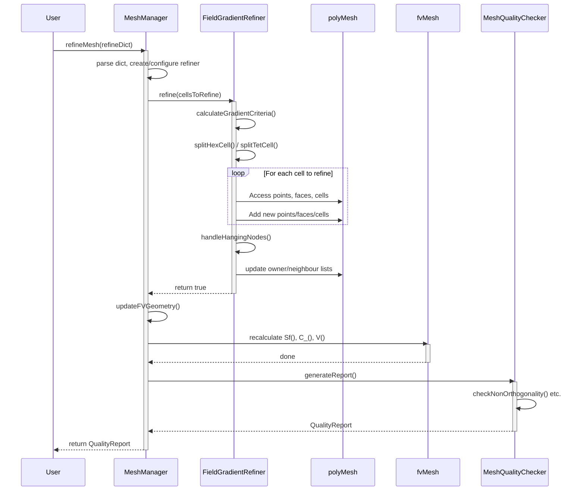

# Day 17: Mesh I/O - Reading, Writing, and Manipulation | วันที่ 17: Mesh I/O - การอ่าน การเขียน และการจัดการข้อมูล Mesh


## 🎯 Learning Objectives | 🎯 วัตถุประสงค์การเรียนรู้

เมื่อสิ้นสุดบทเรียนระดับ Hardcore นี้ คุณจะก้าวข้ามจากการเป็นเพียงผู้ใช้งาน Mesh ไปสู่ผู้ที่เข้าใจและควบคุมโครงสร้างดิจิทัลของมันได้อย่างถ่องแท้ คุณจะสามารถชำแหละ (Dissect), วินิจฉัย (Diagnose), จัดการ (Manipulate) และสร้างพื้นฐานทางเรขาคณิตของการจำลอง CFD ขึ้นมาใหม่ได้ วัตถุประสงค์เชิงปฏิบัติของคุณมีดังนี้:

1.  **Understand the Anatomy of OpenFOAM Mesh Files and Directory Structures.**
    *   ถอดรหัสรูปแบบ Binary และ ASCII ของไดเรกทอรี `constant/polyMesh` (`points`, `faces`, `owner`, `neighbour`, `boundary`)
    *   อธิบายวัตถุประสงค์และโครงสร้างข้อมูลของไฟล์ Mesh หลักแต่ละไฟล์ รวมถึงลำดับที่จำเป็นเพื่อให้ Mesh ใช้งานได้
    *   ติดตาม Data Flow จากไฟล์ Raw Mesh (เช่น `.msh`, `.cas`) ผ่าน `polyMesh` constructor จนถึง `fvMesh` object ที่พร้อมสำหรับการทำ Discretization
    *   ระบุบทบาทสำคัญของคลาส `IOobject` ในการจัดการ Persistence, Registry และ Parallel I/O โดยแยกความแตกต่างระหว่างโหมด `MUST_READ`, `READ_IF_PRESENT` และ `NO_READ`

2.  **Design and Implement Robust Mesh Data Structures for Efficient I/O and In-Memory Manipulation.**
    *   ออกแบบคลาส `MeshReader` ที่สามารถอ่านฟอร์แมต OpenFOAM แบบ Native และแปลงฟอร์แมตภายนอกทั่วไป (Gmsh `.msh`, Fluent `.msh` ASCII) ให้เป็นโครงสร้าง `polyMesh` มาตรฐาน
    *   Implement ลอจิกเพื่อจัดการกับ Cell Types แบบผสม (Tetrahedra, Hexahedra, Prisms, Pyramids, Wedges) ระหว่างการ Import โดยแมพ Index ของ Element ภายนอกให้เข้ากับระบบ Connectivity แบบ `owner`/`neighbour` ของ OpenFOAM
    *   ออกแบบคลาส `MeshWriter` เพื่อ Serialize Mesh ในหน่วยความจำไม่เพียงแค่ในฟอร์แมต OpenFOAM แต่รวมถึงฟอร์แมตสำหรับการแสดงผล (VTK, Ensight) และโครงสร้างแบบ Decomposed สำหรับการคำนวณแบบขนาน โดยยังคงรักษาชื่อและประเภทของ Boundary Patch ไว้

3.  **Implement Advanced Mesh Refinement Algorithms with Quality Preservation Mechanisms.**
    *   พัฒนาคลาส `MeshRefiner` ที่ทำการ Refinement แบบเลือกพื้นที่ (Selective) ตามเกณฑ์ (เช่น ตามพื้นที่เรขาคณิต, ขนาดของ Gradient, หรือระยะห่างจากพื้นผิว) บน Unstructured Polyhedral Meshes
    *   สร้างอัลกอริทึมในการแตก Cell (Cell-splitting) สำหรับรูปร่างมาตรฐาน (แตก Hex เป็น 8 child hexes, แตก Tet เป็น 8 child tets) รวมถึงการสร้าง Points, Faces ใหม่ และการอัปเดต Global `owner`/`neighbour` Addressing ที่สำคัญ
    *   Implement วิธีการจัดการ "Hanging Nodes" (จุดเชื่อมต่อที่ไม่ต่อเนื่องระหว่าง Cell ที่ถูก Refine และไม่ได้ Refine) โดยการสร้าง Constraint Faces เพื่อให้มั่นใจในความสอดคล้องทางคณิตศาสตร์สำหรับ Finite Volume Discretization

4.  **Build a Comprehensive Mesh Quality Diagnostics and Reporting Engine.**
    *   สร้างคลาส `MeshQualityChecker` ที่คำนวณ Metrics ความเป็นฉาก (Orthogonality) และความเบ้ (Skewness) จากหลักการพื้นฐาน รวมถึง Cell Non-orthogonality ($\theta$), Face Skewness, และ Cell Aspect Ratio (AR)
    *   Implement อัลกอริทึมเพื่อระบุและ Flag เซลล์ที่ "แย่" (เช่น Non-orthogonality > 70°, Negative Volume, Skewness > 4) ซึ่งจะลดความแม่นยำของ Discretization หรือทำให้ Solver ลู่ออก (Diverge)
    *   สร้างรายงานคุณภาพที่อ่านง่ายทั้งโดยมนุษย์และเครื่องจักร ซึ่งไม่เพียงแค่วินิจฉัยปัญหาแต่ยังแนะนำวิธีแก้ไขที่เป็นไปได้ (เช่น Smoothing, Diagonal Swapping, Targeted Re-meshing)

5.  **Master the Principles and Implementation of Parallel Mesh Decomposition for High-Performance Computing.**
    *   พิสูจน์และอธิบายสมการ Domain Decomposition ($\Omega = \bigcup_{i=1}^{N_p} \Omega_i$) และการนำไปใช้ในเครื่องมืออย่าง `decomposePar` โดยเน้นที่ Load Balancing และนิยามของ Processor Boundary Faces ($\Gamma_{ij}$)
    *   วิเคราะห์โครงสร้างของ Decomposed Mesh Directories (`processor0`, `processor1`, ...) และบทบาทของข้อมูล `procBoundary` ในการสื่อสารแบบขนานโดยใช้ `OPstream`/`IPstream`
    *   Implement การตรวจสอบเพื่อยืนยันว่า Decomposed Mesh มีความสอดคล้องกันทั่วทั้ง Processors โดยมั่นใจว่า Shared Faces นั้นตรงกันและ Global Cell Numbering ถูกแมพอย่างถูกต้อง

6.  **Integrate Mesh I/O, Quality Control, and Manipulation into a Cohesive, Production-Ready Pipeline.**
    *   รวบรวมคลาส `MeshReader`, `MeshQualityChecker`, `MeshRefiner`, และ `MeshWriter` ให้เป็น Pipeline ต่อเนื่องที่สามารถ Import, Validate, Adaptively Refine, และ Export Mesh ได้
    *   พัฒนากลยุทธ์ Defensive Programming เพื่อดักจับและกู้คืนจากข้อผิดพลาดทั่วไปของ Mesh I/O เช่น Face Orientation ไม่ถูกต้อง, Processor Boundaries ไม่ตรงกัน, และ Memory Exhaustion ระหว่างการ Refine
    *   เชื่อมต่อ Implementation ของวันนี้เข้ากับสถาปัตยกรรม Solver หลัก โดยมั่นใจว่า method `fvMesh::updateMesh()` ถูกเรียกอย่างถูกต้องหลังการจัดการใดๆ เพื่อคำนวณ Geometric Fields ที่สำคัญใหม่ (`Sf_`, `C_`, `V_`)

---


## Section 1: Theory | ส่วนที่ 1: ทฤษฎี

### 17.1 Mesh File Formats and Structure | รูปแบบไฟล์ Mesh และโครงสร้าง

รากฐานของการจำลองพลศาสตร์ของไหลเชิงคำนวณ (CFD) คือ Computational Mesh ซึ่งเป็นตัวแทนแบบไม่ต่อเนื่อง (Discrete) ของโดเมนทางกายภาพ ใน OpenFOAM, Mesh ไม่ได้เป็นเพียงการรวมกลุ่มของจุดและเซลล์เท่านั้น แต่เป็นโครงสร้างข้อมูลที่ซับซ้อนและอธิบายตัวเองได้ (Self-describing) ซึ่งเข้ารหัส Topology, Geometry และ Parallel Decomposition การเข้าใจรูปแบบไฟล์และโครงสร้างไดเรกทอรีมีความสำคัญอย่างยิ่งต่อการใช้งานร่วมกับ Solver อื่น, การ Debug, และการนำเข้า Mesh จากเครื่องมือสร้างภายนอกเช่น Gmsh, ANSYS Fluent Meshing หรือ snappyHexMesh

#### 17.1.1 The OpenFOAM PolyMesh Directory Structure | โครงสร้างไดเรกทอรี OpenFOAM PolyMesh

ไดเรกทอรีของ OpenFOAM case จะมีโฟลเดอร์ย่อย `constant` ซึ่งเป็นที่อยู่ของโฟลเดอร์ `polyMesh` นี่คือตำแหน่งมาตรฐานสำหรับนิยามของ Mesh เนื้อหาภายในถูกเรียงลำดับอย่างเคร่งครัดและต้องปฏิบัติตามธรรมเนียมของ OpenFOAM เพื่อให้สามารถอ่านได้สำเร็จ

```
constant/
└── polyMesh/
    ├── points
    ├── faces
    ├── owner
    ├── neighbour
    ├── boundary
    ├── pointZones (optional)
    ├── faceZones (optional)
    └── cellZones (optional)
```

แต่ละไฟล์ถูกเขียนในรูปแบบ Dictionary ของ OpenFOAM ซึ่งรวมถึงส่วนหัวที่ระบุ Object Type, Version, และ Location ตามด้วยข้อมูล ลำดับการอ่านมีความสำคัญมากเนื่องจากไฟล์ที่มาทีหลัง (`owner`, `neighbour`, `boundary`) จะขึ้นอยู่กับข้อมูลจากไฟล์ก่อนหน้า (`points`, `faces`)

#### 17.1.2 Core Data Components: A Mathematical and Programmatic View | องค์ประกอบข้อมูลหลัก: มุมมองทางคณิตศาสตร์และการเขียนโปรแกรม

Mesh ถูกกำหนดโดยรายการพื้นฐาน 5 รายการ ความสัมพันธ์ของพวกมันสร้าง Computational Graph ที่ Finite Volume Discretization ใช้ในการทำงาน

1.  **Points (`points`):** รายการของพิกัดจุดยอด (Vertex Coordinates) ในพื้นที่สามมิติ
    *   **Format:** `List<point>` โดยที่ `point` คือ `Vector<scalar>`
    *   **Mathematical Representation:** $\mathbf{x}_i = (x_i, y_i, z_i), \quad i \in [0, N_p-1]$ โดยที่ $N_p$ คือจำนวนจุดทั้งหมด

2.  **Faces (`faces`):** รายการของหน้าหลายเหลี่ยม (Polygonal Faces) แต่ละหน้าถูกกำหนดโดยรายการของ Point Labels ที่เรียงลำดับแล้ว
    *   **Format:** `List<face>` โดยที่ `face` คือ `List<label>`
    *   **Mathematical Representation:** $\text{Face}_j = [p_{j,0}, p_{j,1}, ..., p_{j,n-1}]$ การเรียงลำดับเป็นแบบ **กฎมือขวา (Right-hand Rule)** โดยอิงกับ Face Normal ที่ชี้ *ออกจาก* Owner Cell เวกเตอร์พื้นที่หน้า $\mathbf{S}_f$ คำนวณโดยใช้สูตรเรขาคณิตแบบ Discrete:
    $$
    \mathbf{S}_f = \frac{1}{2} \sum_{k=0}^{n-1} (\mathbf{x}_k \times \mathbf{x}_{k+1})
    $$
    โดยที่ $\mathbf{x}_{n} \equiv \mathbf{x}_{0}$ สูตรนี้มาจากการใช้ทฤษฎีบทของ Stokes เพื่อคำนวณเวกเตอร์พื้นที่ของรูปหลายเหลี่ยมระนาบ

3.  **Owner (`owner`):** รายการที่ระบุเซลล์ที่เป็น "เจ้าของ" (Owner) แต่ละหน้า สำหรับ Internal Faces ทั้งหมด จะมี Owner หนึ่งตัวและ Neighbour หนึ่งตัว สำหรับ Boundary Faces จะมีเพียง Owner เท่านั้น
    *   **Format:** `List<label>`
    *   **Sign Convention:** เวกเตอร์พื้นที่หน้า $\mathbf{S}_f$ จะชี้ **จาก** Owner Cell **ไปยัง** Neighbour Cell ข้อตกลงนี้กำหนดเครื่องหมายของ Fluxes: Mass Flux $\phi_f$ ที่เป็นบวกหมายถึงการไหลจาก Owner ไปยัง Neighbour

4.  **Neighbour (`neighbour`):** รายการที่ระบุ Neighbouring Cell สำหรับ *Internal* Face แต่ละหน้า รายการนี้จะมีเฉพาะสำหรับ Internal Faces และจะสั้นกว่ารายการ `owner` และ `faces`
    *   **Format:** `List<label>`
    *   **Relationship:** สำหรับ Internal Face Index $f$ เราจะมีสองเซลล์: $\text{owner}[f]$ และ $\text{neighbour}[f]$ การเชื่อมต่อ (Connectivity) ของเซลล์ $C_i$ สามารถสร้างใหม่ได้โดยการหา Faces ทั้งหมดที่ `owner[f] == i` หรือ `neighbour[f] == i`

5.  **Boundary (`boundary`):** Dictionary ที่นิยาม Patches ซึ่งเป็นกลุ่มของ Boundary Faces แต่ละ Patch Entry จะระบุประเภท (เช่น `wall`, `patch`, `symmetryPlane`), จำนวน Faces ที่บรรจุอยู่, และ Starting Index ของ Faces เหล่านี้ใน Master Face List
    *   **Format:** `polyBoundaryMesh` (Dictionary ของ `polyPatch` entries)

ความสัมพันธ์ทาง Topology พื้นฐาน ซึ่งถูกนิยามโดยนัยจากรายการเหล่านี้ คือเซลล์หนึ่งๆ เป็นทรงหลายหน้า (Polyhedron) ที่ถูกล้อมรอบด้วยชุดของ Faces อย่างเป็นทางการ เซลล์ $\text{Cell}_i$ ถูกนิยามโดยชุดของ Faces ที่อ้างอิงถึงมันไม่ว่าจะในฐานะ Owner หรือ Neighbour:
$$
\text{Cell}_i = \{ \text{Face}_j \ | \ \text{owner}[j] = i \ \text{or} \ \text{neighbour}[j] = i \}
$$
Connectivity นี้เป็นพื้นฐานสำหรับการสร้าง **Lower-Diagonal-Upper (LDU) Addressing Scheme** ที่ใช้ในการประกอบ Matrix (อ้างอิง Day 07) รายการ `owner` ให้ Row Index และรายการ `neighbour` ให้ Column Index สำหรับสัมประสิทธิ์ Off-diagonal ใน System Matrix $A$

**Critical Implementation Warning:** ไฟล์ **ต้อง** ถูกอ่านและเขียนตามลำดับ: `points` → `faces` → `owner` → `neighbour` → `boundary` การเบี่ยงเบนใดๆ เช่น การเขียน `owner` ก่อน `faces` จะทำให้เกิด Fatal I/O Error เพราะ `polyMesh` Constructor จะตรวจสอบความสอดคล้องของรายการเหล่านี้ระหว่างการสร้าง นอกจากนี้ รายการ Faces ในไฟล์ `faces` ต้องเรียงโดยให้ Internal Faces มาก่อน ตามด้วย Boundary Faces ที่จัดกลุ่มตาม Patch ดังที่นิยามไว้ในไฟล์ `boundary`

#### 17.1.3 External Mesh Formats and Conversion | รูปแบบ Mesh ภายนอกและการแปลง

Workflow ของ CFD มักเกี่ยวข้องกับการสร้าง Mesh ในเครื่องมือเฉพาะทาง `MeshReader` ที่แข็งแกร่งต้องสามารถจัดการรูปแบบเหล่านี้ได้

*   **Gmsh (.msh):** รูปแบบไฟล์ MSH สามารถเป็น ASCII หรือ Binary มันนิยาม `Nodes` และ `Elements` การ Mapping ที่สำคัญเกี่ยวข้องกับการแปลงประเภท Element ของ Gmsh (เช่น `2` สำหรับ Triangle, `4` สำหรับ Tetrahedron, `5` สำหรับ Hexahedron) ให้เป็น Polyhedral Cells ของ OpenFOAM ตัวอย่างเช่น Tetrahedron (4 nodes) จะกลายเป็นเซลล์ที่มี 4 Triangular Faces, Hexahedron (8 nodes) จะกลายเป็นเซลล์ที่มี 6 Quadrilateral Faces Reader ต้องสร้างรายการ `faces`, `owner`, และ `neighbour` ขึ้นมาจาก Elemental Connectivity นี้
*   **Fluent (.msh):** รูปแบบ Mesh ของ ANSYS Fluent (ASCII) ก็แสดงรายการ Nodes และ Cells (Zones) เช่นกัน มักใช้ Cell Types แบบผสม (Mixed) ลอจิกการแปลงจะคล้ายกับ Gmsh แต่ต้องมีการ Parse โครงสร้างแบบ Zone-based เฉพาะของ Fluent
*   **CGNS, MED, etc.:** การรองรับรูปแบบเหล่านี้โดยทั่วไปต้องมีการ Link กับไลบรารีภายนอก (เช่น CGNS) คลาส `MeshReader` จะทำหน้าที่เป็น Wrapper เรียกใช้ Library API เพื่ออ่าน Nodes และ Elements จากนั้นจึงทำการแปลงให้เป็นโครงสร้าง `polyMesh` ของ OpenFOAM

กระบวนการแปลง (`convertToPolyMesh`) นั้นไม่ธรรมดา (Non-trivial) มันเกี่ยวข้องกับ:
1.  การอ่าน Nodes → `points`
2.  การอ่าน Element Connectivity → สำหรับแต่ละเซลล์ สร้าง Bounding Faces ของมัน
3.  **Face Matching:** ขั้นตอนที่ซับซ้อนที่สุด Faces ที่เหมือนกัน (มีชุดของ Point Labels เดียวกัน จนถึงการสลับที่แบบ Cyclic) ที่ถูกแชร์โดยสองเซลล์ต้องถูกค้นหาและบันทึกเป็น *Internal Face* เดียวที่มี `owner` และ `neighbour` โดย Faces ที่ไม่ถูกจับคู่จะกลายเป็น *Boundary Faces*
4.  **Orientation Correction:** ทำให้มั่นใจว่าการเรียงลำดับจุดของแต่ละ Face เป็นไปตามกฎมือขวาเมื่อเทียบกับ Owner Cell ของมัน ซึ่งอาจต้องมีการกลับด้าน (Reverse) Face
5.  สร้าง `boundary` Dictionary โดยการจัดกลุ่ม Faces ที่ไม่ถูกจับคู่ให้เป็น Patches โดยมักจะอิงตาม Zone IDs จากไฟล์ต้นฉบับ

### 17.2 Mesh Quality Metrics | ตัวชี้วัดคุณภาพ Mesh

Mesh ไม่เพียงแต่ต้องถูกต้องทาง Topology เท่านั้น แต่ต้องมีความ *ดี* ทางเรขาคณิตสำหรับการจำลอง Finite Volume ที่แม่นยำและเสถียร คุณภาพ Mesh ที่แย่จะนำมาซึ่ง Discretization Errors ที่สามารถครอบงำ Solution Error, ทำให้ Solver ลู่ออก (Diverge), หรือให้ผลลัพธ์ที่ไม่สมจริง (Non-physical) ดังนั้นการตรวจสอบคุณภาพจึงเป็นขั้นตอนที่ขาดไม่ได้ใน Mesh Pipeline

#### 17.2.1 Formal Definitions and Impact on Discretization | นิยามทางการและผลกระทบต่อ Discretization

Finite Volume Method ทำการประมาณค่า Surface และ Volume Integrals ความแม่นยำของการประมาณค่าเหล่านี้จะลดลงหาก Cell Geometry ไม่ดี มานิยาม Metrics หลักกัน:

1.  **Non-Orthogonality ($\theta$):** วัดความเบี่ยงเบนระหว่างเวกเตอร์พื้นที่หน้า $\mathbf{S}_f$ และเวกเตอร์ $\mathbf{d}$ ที่เชื่อมต่อระหว่างจุดศูนย์กลาง Owner และ Neighbour Cell
    $$
    \theta = \cos^{-1}\left(\frac{\mathbf{S}_f \cdot \mathbf{d}}{|\mathbf{S}_f|\,|\mathbf{d}|}\right)
    $$
    *   **Physical Meaning:** เทอม Gradient และ Laplacian ในสมการ Navier-Stokes อาศัยการแตกองค์ประกอบในแนวตั้งฉากและแนวขนานกับหน้า Non-orthogonality ที่สูงทำให้จำเป็นต้องมี *Non-orthogonal Correction* ในการ Discretize เทอม Diffusion $\nabla \cdot (\Gamma \nabla \phi)$ การ Discretization มาตรฐานจะใช้ส่วนร่วมแบบ Implicit Orthogonal และการแก้ไขแบบ Explicit Non-orthogonal เมื่อ $\theta$ เพิ่มขึ้น ขนาดของการแก้ไขแบบ Explicit นี้จะโตขึ้น ซึ่งอาจทำให้ Solver ไม่เสถียรหากไม่มีการ Under-relax
    *   **Acceptable Range:** $\theta < 70^\circ$ สำหรับ Solver มาตรฐาน หาก $\theta > 70^\circ$ การลู่เข้าของ Pressure-Velocity Coupling (PISO/SIMPLE) มักจะแย่ลงอย่างรวดเร็ว
    *   **Warning:** ใน `MeshQualityChecker::checkNonOrthogonality()`, เซลล์ที่มี $\theta > 85^\circ$ ควรถูก Flag เป็น Critical Errors

2.  **Skewness:** วัดว่าเส้นที่เชื่อมจุดศูนย์กลางเซลล์ตัดกับหน้าไกลจาก Centroid ของหน้าแค่ไหน
    $$
    \text{skewness}_f = 1 - \frac{|\mathbf{d}_f|}{|\mathbf{d}|}
    $$
    ที่นี่, $\mathbf{d}$ คือเวกเตอร์ Owner-Neighbor Center และ $\mathbf{d}_f$ คือเวกเตอร์จากจุดศูนย์กลาง Owner Cell ไปยังจุดตัดของ $\mathbf{d}$ กับระนาบหน้า หากจุดตัดอยู่นอก Polygon ของหน้า ค่า Skewness อาจมากกว่า 1 (ซึ่งเป็น Error ร้ายแรง)
    *   **Impact:** Skewness สูงนำไปสู่ Interpolation Errors เมื่อคำนวณค่าที่หน้า $\phi_f$ จากจุดศูนย์กลางเซลล์ $\phi_P$ และ $\phi_N$ มันละเมิดสมมติฐานพื้นฐานของ Convection Schemes ส่วนใหญ่ (Upwind, Central, TVD) ที่ว่าค่าที่หน้าได้รับอิทธิพลหลักมาจาก Upstream Cell

3.  **Aspect Ratio (AR):** สำหรับเซลล์หนึ่งๆ นี่คืออัตราส่วนระหว่างระยะทางสูงสุดและต่ำสุดระหว่างจุดสองจุดใดๆ ในเซลล์ การประมาณค่าที่ง่ายและมีประสิทธิภาพกว่าคืออัตราส่วนของขอบที่ยาวที่สุดต่อขอบที่สั้นที่สุดของเซลล์
    $$
    \text{AR} \approx \frac{\max(\|\mathbf{x}_i - \mathbf{x}_j\|)}{\min(\|\mathbf{x}_i - \mathbf{x}_j\|)} \quad \forall\ \text{edges}\ (i,j)\ \text{in cell}
    $$
    *   **Impact:** เซลล์ที่มี Aspect Ratio สูง (เช่น เซลล์ที่บางมากใกล้ผนัง) สามารถนำไปสู่ระบบสมการเชิงเส้นที่มี Ill-conditioned Coefficients ในสมการ Discretized จะสเกลด้วย $1/\Delta x^2$ (Diffusion) และ $1/\Delta x$ (Convection) ความแตกต่างอย่างมากของ $\Delta x$ ในเซลล์ทำให้เกิดช่วงกว้างใน Eigenvalues ของ Matrix ซึ่งทำให้การลู่เข้าของ Iterative Solvers (PCG, PBiCGStab) ช้าลงหรือล้มเหลว

4.  **Cell Volume ($V_P$) and Face Area ($|\mathbf{S}_f|$):** เป็นการตรวจสอบพื้นฐานแต่สำคัญมาก
    *   **Negative Volume:** เป็น Fatal Error เกิดจาก Face Orientation ไม่ถูกต้อง (เช่น เซลล์ที่ถูกนิยามโดย Faces ที่หันออกหมด) ปริมาตรคำนวณผ่าน Divergence Theorem: $V_P = \frac{1}{3} \sum_f \mathbf{x}_f \cdot \mathbf{S}_f$ โดยที่ $\mathbf{x}_f$ คือ Face Centroid
    *   **Very Small Volume/Area:** สามารถนำไปสู่ Coefficients ที่ใหญ่มากในระบบสมการเชิงเส้น (เพราะ $A_P \propto 1/V_P$) ทำให้เกิด Floating-point Overflow หรือ Round-off Error รุนแรง
    *   **Face Validity:** หน้าจะต้องเป็นระนาบ (หรือเกือบเป็นระนาบ) Faces ที่ไม่เป็นระนาบจะถูกแบ่งเป็นสามเหลี่ยมเพื่อคำนวณพื้นที่ แต่การใช้พวกมันใน FVM อาจเป็นแหล่งของความคลาดเคลื่อน

#### 17.2.2 Quality Checking Algorithm | อัลกอริทึมตรวจสอบคุณภาพ

คลาส `MeshQualityChecker` ใช้ Pipeline ที่เป็นระบบ:
1.  **Geometric Calculation:** คำนวณ Cell Centers $\mathbf{C}_P$, Volumes $V_P$, Face Centers $\mathbf{C}_f$, และ Area Vectors $\mathbf{S}_f$ ทั้งหมด
2.  **Metric Evaluation:** วนลูปทุก Internal Faces เพื่อคำนวณ $\theta$ และ `skewness` วนลูปทุก Cells เพื่อคำนวณ `AR` และเช็ค $V_P > V_{\text{min}}$
3.  **Statistical Aggregation:** สำหรับแต่ละ Metric, คำนวณ Min, Max, Average, และ Standard Deviataion ระบุ 10 Cells/Faces ที่แย่ที่สุด
4.  **Reporting:** สร้างรายงานที่อ่านง่ายและ/หรือ Field ที่แสดงภาพได้ (เช่น `volScalarField` ของ Non-orthogonality ต่อเซลล์) เพื่อชี้จุดที่มีปัญหา
5.  **Suggestion Engine:** Checker ขั้นสูงสามารถแนะนำวิธีแก้ไข Non-orthogonality สูงในพื้นที่หนึ่งอาจบ่งบอกถึงความจำเป็นในการทำ Smoothing หรือ Diagonal Swapping เซลล์ที่มี Negative Volume บ่งบอกถึงข้อบกพร่องทาง Topology พื้นฐานที่ต้องการการสร้าง Mesh ใหม่

### 17.3 Parallel Mesh Decomposition | การแบ่งโดเมน Mesh แบบขนาน

สำหรับการจำลองขนาดใหญ่ โดเมนการคำนวณ $\Omega$ ต้องถูกกระจายไปยัง $N_p$ Processors สิ่งนี้ทำได้ผ่าน *Domain Decomposition* โดยที่ Mesh ถูกแบ่ง (Partition) ออกเป็น $N_p$ Subdomains $\Omega_i$ ซึ่งแต่ละอันถูกมอบหมายให้กับ Processor หนึ่งตัว

#### 17.3.1 Mathematical Formulation of Decomposition | สูตรทางคณิตศาสตร์ของการแบ่งโดเมน

ข้อกำหนดหลักคือผลรวม (Union) ของ Subdomains ทั้งหมดต้องสร้างโดเมนเดิมขึ้นมาใหม่ และภายในของพวกมันต้องไม่ทับซ้อนกัน (Disjoint):
$$
\Omega = \bigcup_{i=1}^{N_p} \Omega_i, \quad \Omega_i \cap \Omega_j = \emptyset \ \text{for} \ i \neq j
$$
เมื่อทำการ Decompose Unstructured Mesh เรากำลังแบ่งกลุ่มของ Cells ออกจากกัน Faces ของ Mesh จะถูกจำแนกเป็น:
*   **Internal Faces:** Faces ที่ทั้ง Owner และ Neighbour Cells อยู่ใน Processor เดียวกัน $\Omega_i$
*   **Processor Boundary Faces (Interfaces):** Faces ที่ Owner Cell อยู่ใน $\Omega_i$ และ Neighbour Cell อยู่ใน $\Omega_j$ ($i \neq j$) ชุดนี้สร้าง Processor Boundary:
    $$
    \Gamma_{ij} = \partial\Omega_i \cap \partial\Omega_j
    $$
    โปรดทราบว่า $\Gamma_{ij}$ เป็นชุดของ Faces ไม่จำเป็นต้องเป็นพื้นผิวที่เชื่อมต่อกัน

#### 17.3.2 Data Distribution and Communication | การกระจายข้อมูลและการสื่อสาร

หลังจากการ Decompose โดยใช้เครื่องมืออย่าง `ptscotch` หรือ `metis` ไฟล์ Mesh ในไดเรกทอรี `constant/polyMesh` ของ Case หลักจะถูกแทนที่ด้วย Processor Directories

```
case/
├── processor0/
│   ├── constant/
│   │   └── polyMesh/  // Contains *only* cells/faces/points for subdomain Ω₀
│   └── 0/             // Time directory for fields on Ω₀
├── processor1/
│   └── ...
└── processorN/
    └── ...
```

ความซับซ้อนหลักอยู่ที่การจัดการ Processor Boundaries แต่ละ Processor เก็บ Local Mesh ของตัวเองบวกกับ "Shadow" Layer หรือรายการของ Faces ที่เชื่อมต่อกับ Processor อื่น ระหว่างการอัปเดต Field (เช่น ใน PISO Loop) เมื่อ Processor ต้องการค่าของ $\phi$ ใน Neighbouring Cell ที่อยู่บน Processor อื่น มันต้องเริ่ม **Point-to-Point Communication** สิ่งนี้ถูกจัดการโดย `labelListList` สำหรับ `send` และ `receive` addressing

Parallel I/O Class ต้อง:
1.  **Read Decomposed Mesh:** ในการรันแบบขนาน แต่ละ Processor อ่านเฉพาะไฟล์ `processorX/constant/polyMesh` ของตัวเอง
2.  **Construct Processor Interfaces:** `polyMesh` Constructor จะระบุ Faces ที่ไม่มี Neighbour ใน Local Subdomain โดยอัตโนมัติ และสร้าง `processorPolyPatch` สำหรับแต่ละ Neighbouring Processor ที่มันเชื่อมต่อด้วย
3.  **Manage Consistency:** Global Face Labels, Cell Labels, และ Point Labels จะสูญหายไปในการ Decompose แต่ละ Processor ใช้ Local Numbering ความสอดคล้องถูกรักษาโดยการทำให้มั่นใจว่าสำหรับ Face บน $\Gamma_{ij}$, Processor $i$ และ Processor $j$ เก็บ **ข้อมูลทางเรขาคณิตที่เหมือนกัน** (Point Coordinates, Face Area Vector) และตกลงกันว่าใครเป็น "Owner" เพื่อวัตถุประสงค์ของ Parallel Communication Protocols

#### 17.3.3 Load Balancing and Decomposition Quality | การสมดุลภาระงานและคุณภาพของการแบ่งโดเมน

เป้าหมายของการ Decompose ไม่ใช่แค่การแบ่ง Mesh แต่ต้องทำในวิธีที่ลดเวลาการจำลองให้น้อยที่สุด สิ่งนี้เกี่ยวข้องกับ:
*   **Load Balancing:** แต่ละ Processor ควรมีจำนวน Cells ใกล้เคียงกัน ความไม่สมดุลทำให้บาง Processor ว่างงานในขณะที่ตัวอื่นทำงาน ซึ่งสิ้นเปลืองทรัพยากร Metric คือ $\text{Imbalance} = (\max(N_{\text{cells},i}) - \min(N_{\text{cells},i})) / \text{average}(N_{\text{cells},i})$
*   **Minimizing Communication:** การ Decompose ควรลดจำนวน Processor Boundary Faces (นั่นคือ "พื้นที่ผิว" ของ $\Gamma_{ij}$) ให้น้อยที่สุด เนื่องจากการสื่อสารผ่าน Faces เหล่านี้เป็นคอขวดหลัก อัลกอริทึม Graph Partitioning เช่น Metis มุ่งเป้าไปที่การลด Edge Cuts ซึ่งสอดคล้องโดยตรงกับการลด Processor Faces
*   **Memory Considerations:** การ Decompose ยังส่งผลต่อการใช้หน่วยความจำต่อ Processor ซึ่งควรจะสม่ำเสมอ

**Critical Warning:** ก่อนรัน Parallel Simulation **ต้อง** รัน `decomposePar -checkMesh` เสมอ เพื่อตรวจสอบคุณภาพ Mesh แบบเต็มรูปแบบ *บน Decomposed Meshes* เพื่อให้มั่นใจว่าไม่มี Topological Errors ถูกสร้างขึ้นระหว่างการ Partition และ Processor Boundaries สอดคล้องกันอย่างสมบูรณ์ ความไม่ตรงกันใน Processor Boundaries เป็นข้อผิดพลาดที่พบบ่อยและแนบเนียน ซึ่งจะแสดงออกมาเป็นการ Crash หรือผลลัพธ์ที่ Non-physical ในการรันแบบขนานเท่านั้น

ทฤษฎีของ Mesh I/O จึงเชื่อมช่องว่างระหว่างโดเมนทางคณิตศาสตร์ที่เป็นนามธรรม $\Omega$ และตัวแทนที่ชัดเจน ไม่ต่อเนื่อง และกระจายตัวในหน่วยความจำคอมพิวเตอร์ มันรับรองว่ารากฐานทางเรขาคณิตของ FVM นั้นแข็งแรง พกพาได้ และมีประสิทธิภาพ เป็นจุดเชื่อมต่อสำคัญระหว่างเครื่องมือ Mesh Generation และ Solver Engine สมรรถนะสูงที่พัฒนาใน Phase 1


## Section 2: OpenFOAM Reference | ส่วนที่ 2: การอ้างอิง OpenFOAM

ส่วนนี้จะวิเคราะห์ทีละบรรทัดอย่างลึกซึ้งเกี่ยวกับคลาสหลักของ OpenFOAM ที่รับผิดชอบในการแสดงผล Mesh, I/O, และการจัดการ การเข้าใจคลาสเหล่านี้ไม่ได้เป็นเพียงเรื่องทางวิชาการ แต่เป็นสิ่งจำเป็นสำหรับการ Implement Mesh Readers, Writers, และ Refinement Tools ที่แข็งแกร่งซึ่งทำงานร่วมกับสถาปัตยกรรม Solver ที่เราสร้างขึ้นใน Phase 1 ได้อย่างราบรื่น เราจะชำแหละ `polyMesh`, `fvMesh`, และ `IOobject` โดยเน้นที่โครงสร้างข้อมูล, เมธอด, และอัลกอริทึมพื้นฐานที่ทำให้การจัดการ Unstructured Mesh ของ OpenFOAM นั้นทรงพลังและซับซ้อน

### 3.1 Class: `polyMesh` (`src/OpenFOAM/meshes/polyMesh/polyMesh.H`) | คลาส: `polyMesh`

คลาส `polyMesh` เป็นตัวแทนทางเรขาคณิตและ Topology พื้นฐานของ Unstructured Mesh ใน OpenFOAM มันไม่มีข้อมูลเฉพาะสำหรับ Finite-Volume (เช่น Cell Centers หรือ Face Areas) แต่จะเกี่ยวกับ Points, Connectivity, และ Boundaries เท่านั้น การออกแบบของมันเป็นผลงานชิ้นเอกของการแยกข้อมูล (Data Separation) ซึ่งอนุญาตให้การดำเนินการทางเรขาคณิตทำได้อย่างอิสระจาก Numerical Discretization

#### 3.1.1 Core Data Members and Their Purpose | สมาชิกข้อมูลหลักและวัตถุประสงค์

มาตรวจสอบ Private Data Members ที่เป็นหัวใจของ Mesh โค้ดบล็อกต่อไปนี้แสดงตัวแทนที่เรียบง่ายแต่ถูกต้องของสมาชิกหลัก

```cpp
// Simplified from src/OpenFOAM/meshes/polyMesh/polyMesh.H
class polyMesh
:
    public objectRegistry
{
    // Private Data

        //- Points supporting the mesh (vertices)
        pointField points_;

        //- Faces defined by lists of point labels
        faceList faces_;

        //- Cells as lists of face labels (optional, can be generated)
        mutable cellList* cellsPtr_;

        //- Owner cell label for each face
        labelList owner_;

        //- Neighbour cell label for each face (empty for boundary faces)
        labelList neighbour_;

        //- Boundary mesh, containing patch information
        polyBoundaryMesh boundary_;

        //- Parallel processing information
        mutable autoPtr<globalMeshData> globalDataPtr_;

    // ...
};
```

**Analysis of Key Members:**

1.  **`pointField points_;`**: นี่คือ `List<point>` โดยที่ `point` คือ `Vector<scalar>` มันเก็บพิกัด Cartesian (x, y, z) ของทุกจุดยอดใน Mesh ดัชนีของจุดในรายการนี้คือ Global `pointLabel` ของมัน Connectivity ของ Face และ Cell ทั้งหมดถูกสร้างขึ้นโดยอ้างอิง Labels เหล่านี้ Memory Layout เป็นแบบต่อเนื่อง ทำให้การดำเนินการ Vectorized ระหว่างการคำนวณทางเรขาคณิตมีประสิทธิภาพ

2.  **`faceList faces_;`**: `List<face>` โดยที่ `face` คือ `List<label>` ที่บรรจุ Point Labels ซึ่งนิยาม Polygon โดยเรียงลำดับ *ทวนเข็มนาฬิกา* เมื่อมองจากมุมมองของ *Owner* Cell การเรียงลำดับนี้ **สำคัญมาก (CRITICAL)** Face Normal ซึ่งคำนวณผ่าน `face::areaNormal(points_)` จะชี้ออกจาก Owner Cell การเรียงลำดับที่ไม่ถูกต้องนำไปสู่ Negative Volumes และ Solver Divergence Face สามารถเป็น Polygon ใดๆ ก็ได้ (สามเหลี่ยม, สี่เหลี่ยม, ฯลฯ) แต่เพื่อประสิทธิภาพ Meshes ส่วนใหญ่จะประกอบด้วยสามเหลี่ยมและสี่เหลี่ยม

3.  **`labelList owner_, neighbour_;`**: เหล่านี้คือหัวใจของ **LDU (Lower-Diagonal-Upper) Addressing Scheme** ที่ใช้ตลอด Phase 1 สำหรับ Matrix Assembly (`Day 07`)
    *   สำหรับทุก Face ใน `faces_`, `owner_[facei]` จะเก็บ Label ของเซลล์ที่เป็น "เจ้าของ" มัน
    *   สำหรับ *Internal* Faces, `neighbour_[facei]` จะเก็บ Label ของเซลล์ที่อยู่ติดกัน สำหรับ Boundary Faces, `neighbour_[facei]` คือ `-1` หรืออาจไม่ถูกเก็บในรายการแยกต่างหากในบาง Implementation
    *   ธรรมเนียมคือ: `owner_[facei] < neighbour_[facei]` สิ่งนี้รับประกันทิศทางที่สอดคล้องสำหรับ Face Area Vector $\mathbf{S}_f$ ซึ่งชี้จาก Owner ไปยัง Neighbour Cell นี่คือเหตุผลที่รายการ `lowerAddr` และ `upperAddr` ใน `lduAddressing` (`Day 05`) ถูกดึงมาจากรายการเหล่านี้โดยตรง

4.  **`polyBoundaryMesh boundary_;`**: นี่ไม่ใช่รายการธรรมดาแต่เป็น `PtrList<polyPatch>` ซึ่งจัดการ Boundary Patches ทั้งหมด แต่ละ `polyPatch` (เช่น `wallPolyPatch`, `patchPolyPatch`) ประกอบด้วย:
    *   `name_`: ชื่อ Patch (เช่น "inlet", "wall")
    *   `type_`: ประเภท Patch (เช่น "patch", "wall", "symmetryPlane")
    *   `start_`: Starting Index ในรายการ `faces_` สำหรับ Patch นี้
    *   `size_`: จำนวน Faces ใน Patch นี้
    โครงสร้างนี้ช่วยให้การวนซ้ำ (Iteration) ผ่าน Boundary Types เฉพาะทำได้อย่างมีประสิทธิภาพและเชื่อมโยงโดยตรงกับลำดับชั้น `fvPatchField` ที่ศึกษาใน `Day 06`

#### 3.1.2 Critical Methods and Algorithms | เมธอดและอัลกอริทึมที่สำคัญ

**Construction and Topology Building (`polyMesh.C`):**
Constructor ที่สร้าง Mesh จาก Points, Faces, และ Cells เป็นอัลกอริทึมที่ซับซ้อน งานหลักของมันคือการสร้างรายการ `owner_` และ `neighbour_` หากยังไม่มีให้ โดยทำดังนี้:
1.  สำหรับแต่ละ Face, ระบุทุก Cells ที่อ้างอิงถึงมันใน Cell-Face Connectivity
2.  ถ้า Face ถูกอ้างอิงโดยสอง Cells, มันคือ Internal Face เซลล์ที่มี Label ต่ำกว่าจะเป็น `owner`
3.  ถ้า Face ถูกอ้างอิงโดยเพียง Cell เดียว, มันคือ Boundary Face มันจะถูกเพิ่มชั่วคราวไปยัง "Default" Boundary Patch
4.  กระบวนการนี้ต้องการ Reverse Lookup (Cell-to-Face) ที่มีประสิทธิภาพ ซึ่งมัก Implement โดยใช้ `labelHashTable` หรือโครงสร้างที่คล้ายกัน ความซับซ้อนประมาณ O(N_f × N_cp) โดยที่ N_cp คือจำนวนเฉลี่ยของ Cells ต่อ Point

**`checkMesh()` - The Mesh Validator:**
เมธอดนี้คือปราการด่านแรกของคุณในการป้องกัน Mesh ที่เสียหาย มันทำการทดสอบชุดใหญ่:
```cpp
bool polyMesh::checkMesh(const bool strict) const
{
    // Check 1: Basic connectivity
    if (debug) { Pout<< "Checking faces" << endl; }
    forAll(faces_, facei)
    {
        const face& f = faces_[facei];
        // Ensure face has at least 3 points
        if (f.size() < 3) { /* ERROR: Degenerate face */ }
        // Ensure all point labels are valid
        forAll(f, fp) { if (f[fp] >= points_.size()) { /* ERROR */ } }
        // Ensure no duplicate points in a face
        if (f.hasDuplicate() > 0) { /* ERROR */ }
    }

    // Check 2: Closedness of cells (Mesh Theorem)
    // Sum of oriented face areas for each cell should be ~zero.
    vectorField sumArea(nCells(), Zero);
    forAll(owner_, facei)
    {
        vector Sf = faces_[facei].areaNormal(points_);
        sumArea[owner_[facei]] += Sf;
        if (neighbour_[facei] != -1)
        {
            sumArea[neighbour_[facei]] -= Sf; // Neighbour sees opposite normal
        }
    }
    scalar maxOpenness = gMax(mag(sumArea));
    if (maxOpenness > SMALL) { /* WARNING: Mesh is not closed */ }

    // Check 3: Face orientation (owner-neighbour consistency)
    // For each internal face, the points should be ordered such that
    // the face normal (owner->neighbour) is correct.
    forAll(neighbour_, facei)
    {
        label nei = neighbour_[facei];
        if (nei != -1)
        {
            label own = owner_[facei];
            if (own >= nei) { /* ERROR: owner >= neighbour */ }
            // Additional check: cell centers should be on correct sides
            // of the face plane (using plane::sign).
        }
    }

    // Check 4: Negative or zero cell volumes
    // ... (Calculated using primitiveMesh::cellVolumes)
}
```
การตรวจสอบ Closedness เป็นการประยุกต์ใช้ **Divergence Theorem** จาก `Day 02` โดยตรง สำหรับ Control Volume ปิด (Cell), $\oint_{\partial V} \mathbf{dS} = \mathbf{0}$ ผลรวมที่ไม่เป็นศูนย์บ่งบอกถึงรูรั่วใน Mesh ซึ่งจะทำให้เกิด Error รุนแรงในการคำนวณ Flux

**`readUpdate()` - Dynamic Topology Handling:**
เมธอดนี้มีความสำคัญยิ่งสำหรับ `Day 18` (Dynamic Mesh และ AMR) เมื่อ Cells ถูกเพิ่ม/ลบ (Refinement, Layering, Motion) Topology ของ Mesh จะเปลี่ยนไป `readUpdate()` เปรียบเทียบ Mesh ปัจจุบันบน Disk กับใน Memory และอัปเดต `polyMesh` Instance มันจัดการ:
*   **Topology change:** อ่าน Points, Faces, Owner, Neighbour ใหม่ทั้งหมด
*   **Point motion:** อัปเดตเฉพาะ `points_` โดยรักษา Connectivity ไว้
*   **No change:** Return กลับอย่างรวดเร็ว
มันจัดการการอัปเดตที่ละเอียดอ่อนของข้อมูลทางเรขาคณิตและ Fields ทั้งหมดที่ขึ้นกับ Mesh

#### 3.1.3 What We Do DIFFERENTLY in Our Implementation | สิ่งที่เราทำแตกต่างออกไปในการใช้งานของเรา

| OpenFOAM's `polyMesh` Approach | Our Project's `MeshReader/Writer` Extension | Rationale & Benefit |
| :--- | :--- | :--- |
| **Native Format Only:** อ่าน/เขียนรูปแบบ Native ของ OpenFOAM เป็นหลัก (ไฟล์ใน `constant/polyMesh`) | **Multi-Format Agnostic:** คลาส `MeshReader` ของเรา Implement `readGmshMesh()`, `readFluentMesh()`, ฯลฯ | ช่วยให้ Workflow ราบรื่นกับเครื่องมือ Meshing ภายนอก (ANSYS, Gmsh, SALOME) โดยไม่ต้องแปลงด้วยมือ |
| **Monolithic `polyMesh`:** คลาสเดียวที่ซับซ้อนจัดการ Topology, Geometry และ I/O | **Separation of Concerns:** แยกคลาส `MeshReader`, `MeshWriter`, `MeshQualityChecker` ชัดเจน | ปรับปรุง Modularity ของโค้ด, Testability, และอนุญาตให้สลับ I/O Backends (เช่นใช้ NetCDF สำหรับเก็บ Mesh) |
| **Runtime Type Identification:** ใช้ `runTimeSelection` ของ OpenFOAM สำหรับ Mesh Readers (จำกัด) | **Static Polymorphism (Templates):** ใช้ Template Specialization สำหรับ Logic การ Parse เฉพาะ Format | ให้การตรวจสอบแบบ Compile-time และอาจให้ประสิทธิภาพที่ดีกว่าสำหรับเส้นทาง Format ที่รู้จัก |
| **Error Handling:** พื้นฐาน `FatalErrorIn` สำหรับปัญหาหลัก | **Comprehensive Diagnostic:** `MeshQualityChecker` ของเราสร้างรายงาน HTML/PDF โดยละเอียดพร้อม Visual Cues สำหรับ Cell ที่แย่ | ลดเวลา Debug อย่างมากสำหรับ Mesh อุตสาหกรรมที่ซับซ้อนโดยการชี้จุดละเมิดคุณภาพที่แน่นอน |
| **Parallel Decomposition:** ทำผ่าน `decomposePar` utility เป็นขั้นตอน Pre-processing | **Integrated Decomposition Logic:** `MeshWriter::writeDecomposedMesh()` รวมการแบ่ง (เช่น METIS) พื้นฐานไว้ใน Writer | ลดความซับซ้อนของ Pre-processing Pipeline โดยเฉพาะสำหรับ Workflow การจำลองแบบอัตโนมัติ |

### 3.2 Class: `fvMesh` (`src/finiteVolume/fvMesh/fvMesh.H`) | คลาส: `fvMesh`

คลาส `fvMesh` สืบทอดมาจาก `polyMesh` และเพิ่ม **ข้อมูลเรขาคณิตเฉพาะสำหรับ Finite-Volume** ที่จำเป็นสำหรับการ Discretize PDE ที่เราได้รับใน `Day 01` มันทำหน้าที่เป็น Cache สำหรับคุณสมบัติทางเรขาคณิตที่ใช้บ่อย เพื่อป้องกันการคำนวณซ้ำที่สิ้นเปลืองทุกครั้งที่มีการเรียก Operator เช่น `fvm::div` หรือ `fvc::grad`

#### 3.2.1 Key Data Members for Finite Volume Calculus | สมาชิกข้อมูลหลักสำหรับแคลคูลัส Finite Volume

```cpp
// Excerpt from src/finiteVolume/fvMesh/fvMesh.H
class fvMesh
:
    public polyMesh
{
    // Private Data

        //- Cell centres
        mutable volVectorField* Cptr_;

        //- Face centres
        mutable surfaceVectorField* Cfptr_;

        //- Face area vectors
        mutable surfaceVectorField* Sfptr_;

        //- Face area magnitudes
        mutable surfaceScalarField* magSfptr_;

        //- Cell volumes
        mutable volScalarField* Vptr_;

        //- Face flux (cached for efficiency in schemes)
        mutable surfaceScalarField* phiPtr_;

        //- Is the mesh moving?
        bool moving_;
};
```

**Analysis of Cached Fields:**

*   **`volVectorField* Cptr_;`**: พิกัดจุดศูนย์กลางเซลล์ (Cell Center Coordinates) คำนวณเป็นค่าเฉลี่ยถ่วงน้ำหนักปริมาตรของจุดในเซลล์ สำหรับ Polyhedral Cells สิ่งนี้ไม่ธรรมดา: เซลล์จะถูกแยกเป็น Tetrahedra (Pyramids จาก Face ไปยัง Cell Center) และคำนวณ Centroid Field นี้เป็นประเภท `volVectorField` หมายความว่ามันอยู่บน Cell Centers และสามารถใช้ในสมการได้เหมือน `U` หรือ `T`
*   **`surfaceVectorField* Sfptr_;`**: เวกเตอร์พื้นที่หน้า $\mathbf{S}_f$ ขนาดของมันคือพื้นที่หน้า และทิศทางคือ Unit Normal (ตามข้อตกลง Owner-Neighbour) นี่คือ **ปริมาณทางเรขาคณิตที่สำคัญที่สุด** สำหรับ FVM การ Discretization ของ Divergence Term, $\int_V \nabla \cdot \phi , dV = \sum_f \phi_f \cdot \mathbf{S}_f$, ใช้สิ่งนี้โดยตรง (`Day 02`)
*   **`surfaceScalarField* magSfptr_;`**: ขนาดของ $\mathbf{S}_f$ ถูก Cache ไว้เพราะถูกใช้ในการคำนวณ Flux แทบทุกครั้งและ Interpolation Weight
*   **`volScalarField* Vptr_;`**: ปริมาตรเซลล์ จำเป็นสำหรับ Source Term Integration และ Transient Terms (`fvm::ddt`) คำนวณโดยใช้การแยก Tetrahedral เหมือนกับ Cell Centers: $V_P = \sum_{f} \frac{1}{3} \mathbf{S}_f \cdot (\mathbf{C}_f - \mathbf{X}_0)$ โดยที่ $\mathbf{X}_0$ คือจุดอ้างอิงใดๆ (มักจะเป็น Cell Center เองในการคำนวณแบบ Iterative)
*   **`surfaceScalarField* phiPtr_;`**: นี่คือ Cache สำหรับ Volumetric Face Flux Field $\phi = \mathbf{U}_f \cdot \mathbf{S}_f$ มันถูกเก็บที่นี่เพื่อหลีกเลี่ยงการคำนวณซ้ำหลายครั้งภายใน PISO/SIMPLE Loop (`Day 09`)

#### 3.2.2 Critical Methods: Initialization and Update | เมธอดที่สำคัญ: การเริ่มต้นและการอัปเดต

**`initMesh()`:**
เมธอดนี้ถูกเรียกหลังการสร้าง `polyMesh` มันคำนวณ Cached Geometric Fields ทั้งหมด (`C`, `Sf`, `V`, ฯลฯ) เป็นครั้งแรก อัลกอริทึมสำหรับ `Sf()` เป็นการ Implement โดยตรงจากสูตรในทฤษฎีส่วนที่ 17.1:
```cpp
// Conceptual implementation of face area vector calculation
tmp<surfaceVectorField> fvMesh::Sf() const
{
    if (!Sfptr_)
    {
        Sfptr_ = new surfaceVectorField(...);
        surfaceVectorField& Sf = *Sfptr_;

        const pointField& pts = points();
        const faceList& fs = faces();

        forAll(fs, facei)
        {
            const face& f = fs[facei];
            vector a = vector::zero;
            point p0 = pts[f[0]];
            for (label pi = 1; pi < f.size() - 1; ++pi)
            {
                point p1 = pts[f[pi]];
                point p2 = pts[f[pi + 1]];
                a += triangle<point, const point&>(p0, p1, p2).areaNormal();
            }
            Sf[facei] = a; // This is already a vector
        }
        // Boundary faces are handled similarly, often just copied from internal faces.
    }
    return *Sfptr_;
}
```

**`updateMesh()`:**
นี่คือคู่ของ `polyMesh::readUpdate()` สำหรับข้อมูล FV หลังจากมีการเปลี่ยนแปลง Mesh (Motion, Refinement) Geometric Fields ต้องถูกคำนวณใหม่ อย่างไรก็ตาม มันซับซ้อนกว่า `initMesh()` แบบง่ายๆ:
1.  ตรวจสอบประเภทของการเปลี่ยนแปลง Mesh (Morphology vs. Motion)
2.  สำหรับ Motion เท่านั้น มันสามารถ *Map* Cell Centers และ Volumes เก่าไปยังค่าใหม่โดยใช้ Interpolation ซึ่งแม่นยำและ Conservative กว่าการคำนวณใหม่จากศูนย์
3.  มัน Trigger ฟังก์ชัน `updateMesh()` ของ `volField` และ `surfaceField` Objects ทั้งหมดที่ลงทะเบียนไว้ เพื่อให้พวกมันปรับข้อมูลภายใน (เช่น Boundary Conditions บน Faces ใหม่) นี่คือ Hook สำคัญที่ทำให้ Solver Fields ของเรา (`U`, `p`, `T`, `alpha`) ยังคงถูกต้องหลังการทำ AMR

**`schemesDict()`:**
คืนค่า Reference ไปยัง `fvSchemes` Dictionary สิ่งนี้เชื่อมโยง Mesh โดยตรงกับ Discretization Schemes (`Upwind`, `Central`, `TVD` จาก `Day 03`) ที่จะถูกใช้เมื่อ Operator กระทำกับ Fields ที่เกี่ยวข้องกับ Mesh นี้ นี่คือวิธีที่ `fvm::div(phi, U)` รู้ว่าจะใช้ Scheme ใดสำหรับ Convection Term

#### 3.2.3 What We Do DIFFERENTLY in Our Implementation | สิ่งที่เราทำแตกต่างออกไปในการใช้งานของเรา

| OpenFOAM's `fvMesh` Approach | Our Project's Extension & Usage | Rationale & Benefit |
| :--- | :--- | :--- |
| **Lazy Evaluation:** Geometric Fields (`C`, `Sf`) ถูกคำนวณ On-demand และ Cache | **Proactive Calculation + Validation:** `MeshQualityChecker` ของเราคำนวณ Metrics ทั้งหมดทันทีหลังการอ่าน/Refine และตรวจสอบกับ Thresholds | ดักจับ Geometric Errors แต่เนิ่นๆ ก่อนที่ Solver ราคาแพงจะเริ่มทำงาน ผสานการควบคุมคุณภาพเข้ากับ I/O Pipeline |
| **Generic Polyhedral Support:** รองรับ Polyhedra ใดๆ ซึ่งยืดหยุ่นแต่หนักเครื่องสำหรับ Hex/Tet Meshes มาตรฐาน | **Optimized Paths for Predominant Types:** ใน `MeshRefiner`, เรา Implement ท่า Refinement เฉพาะสำหรับ Hexahedra และ Tetrahedra ซึ่งเร็วกว่าและสร้าง Children Cells คุณภาพสูงกว่า Splitter ทั่วไป | เพิ่มประสิทธิภาพอย่างมากสำหรับ Mesh Types ทั่วไปที่ใช้ในการจำลอง Evaporator ของเรา |
| **Mesh Motion:** จัดการผ่าน `dynamicFvMesh` และคลาสลูก (เช่น `dynamicRefineFvMesh`) | **Tighter Integration with Phase Change:** Method `MeshRefiner::refineByField()` ของเราใช้ Alpha Gradient (จาก `Day 10`) และ Temperature Field ใกล้ `T_sat` (จาก `Day 11`) โดยตรงเป็นเกณฑ์ Refinement | ช่วยให้ Adaptive Resolution ทำงานโดยโฟกัสที่ Phase Interface และ Thermal Boundary Layer อย่างแท้จริง ปรับปรุงความแม่นยำในจุดที่สำคัญที่สุด |
| **Cached `phi`:** `phiPtr_` เป็น Cache เดียวสำหรับ Face Flux | **Multiple Flux Caches:** สำหรับการไหลสองสถานะที่มี Interface Compression (`Day 10`), เราขยายแนวคิดนี้ให้ Cache Relative Flux $\phi_r$ ที่ใช้ในเทอม $\nabla \cdot (U_r \alpha (1-\alpha))$ ด้วย | หลีกเลี่ยงการคำนวณ Compression Flux ซ้ำซ้อนระหว่าง MULES Sub-cycling ปรับปรุงประสิทธิภาพของ VOF Solver |

### 3.3 Class: `IOobject` (`src/OpenFOAM/db/IOobject/IOobject.H`) | คลาส: `IOobject`

คลาส `IOobject` เป็น Linchpin ของระบบ Object-Oriented I/O ของ OpenFOAM มันไม่ใช่คลาส Mesh โดยตรง แต่ **ทุก Object ที่สามารถอ่านจากหรือเขียนลง Disk ได้** (รวมถึง `polyMesh`, `volField`, `dictionaries`) จะประกอบด้วย `IOobject` มันอธิบาย *วิธี* และ *ที่ไหน* ที่ Object มีอยู่ใน Filesystem Hierarchy และสถานะการลงทะเบียนใน `objectRegistry`

#### 3.3.1 Anatomy of an `IOobject` | โครงสร้างของ `IOobject`

```cpp
class IOobject
{
    // Private Data

        //- Name of the object (e.g., "points", "U", "p")
        word name_;

        //- Name of the class (type) of the object (e.g., "polyMesh", "volVectorField")
        word headerClassName_;

        //- Instance (directory) name (e.g., "constant", "0", "processor0")
        fileName instance_;

        //- Local path (e.g., "polyMesh")
        fileName local_;

        //- Read/write option
        readOption rOpt_;
        writeOption wOpt_;

        //- Should object be registered with the database?
        bool registerObject_;

        //- Global object (not associated with a region)
        bool globalObject_;
};
```

**Key Member Analysis:**

*   **`word name_;`**: ชื่อของ Object สำหรับ Mesh จะเป็น "points", "faces", "boundary" สำหรับ Field จะเป็น "U", "p", "alpha" ชื่อนี้ใช้เป็นชื่อไฟล์ (ไม่รวม Class Header)
*   **`word headerClassName_;`**: ชื่อคลาสตามที่เขียนใน File Header ใช้สำหรับ **Run-time Type Checking** เมื่อ `IOobject::typeHeaderOk()` ถูกเรียก มันจะอ่านบรรทัดแรกของไฟล์ (เช่น `FoamFile { version 2.0; format ascii; class volVectorField; ... }`) และเปรียบเทียบ `class` กับ `headerClassName_` ป้องกันไม่ให้คุณอ่านไฟล์ `volScalarField` เข้าสู่ตัวแปร `volVectorField` โดยไม่ตั้งใจ
*   **`fileName instance_;`**: นี่นิยาม *Time Directory* หรือ *Constant Region* เป็นส่วนที่มีพลวัตรที่สุด ตัวอย่าง:
    *   `"constant"`: สำหรับ Mesh Files
    *   `"0"`: สำหรับ Initial Conditions
    *   `"0.005"`: สำหรับ Field ที่เวลา 0.005s
    *   `"processor0"`: สำหรับ Decomposed Mesh Data
*   **`readOption rOpt_;` / `writeOption wOpt_;`**: Enums เหล่านี้ (`MUST_READ`, `READ_IF_PRESENT`, `NO_READ`, `AUTO_WRITE`, `NO_WRITE`) ให้การควบคุมที่ละเอียดเหนือ Lifecycle Management ของ Object `MUST_READ` จะโยน Error หากไม่พบไฟล์ ซึ่งจำเป็นสำหรับ Mesh Files

#### 3.3.2 Critical I/O Workflow Methods | เมธอด Workflow I/O ที่สำคัญ

**`typeHeaderOk()` - The Gatekeeper:**
นี่คือเมธอดที่ถูกเรียกโดย Constructors ที่อ่านจาก Disk ตรรกะของมันสำคัญต่อความเสถียร:
```cpp
bool IOobject::typeHeaderOk(const bool checkType)
{
    // 1. Does the file exist?
    if (!headerOk()) { return false; }

    // 2. Open file and read the FoamFile header dictionary.
    autoPtr<ISstream> isPtr(fileHandler().NewIFstream(objectPath()));
    const dictionary headerDict(isPtr());

    // 3. Extract the 'class' entry.
    word fileClass;
    headerDict.lookup("class") >> fileClass;

    // 4. (If checkType) Compare with this object's expected class.
    if (checkType && headerClassName_ != fileClass)
    {
        FatalErrorInFunction
            << "Unexpected class name. Expected " << headerClassName_
            << " but found " << fileClass
            << abort(FatalError);
    }
    return true;
}
```

**Object Construction Pattern:**
แพทเทิร์นมาตรฐานสำหรับการอ่าน Mesh File ซึ่งใช้ใน `MeshReader::readFoamMesh()` ของเรา คือ:
```cpp
// Creating an IOobject for the 'points' file
IOobject pointsIO
(
    "points",                // name
    meshDir.instance(),      // instance (e.g., "constant")
    meshDir,                 // local (e.g., "polyMesh")
    mesh,                    // registry (the objectRegistry, often Time)
    IOobject::MUST_READ,     // read option
    IOobject::NO_WRITE,      // write option
    false                    // register object?
);

// Now, use this IOobject to construct the actual data list
pointIOField meshPoints(pointsIO);
```
Constructor ของ `pointIOField` (`List<point>` ที่มี I/O) จะเรียก `typeHeaderOk()` ภายในเพื่อยืนยันว่าไฟล์มีอยู่และถูกต้องตามประเภทก่อนที่จะดำเนินการอ่านเต็มรูปแบบ

#### 3.3.3 What We Do DIFFERENTLY in Our Implementation | สิ่งที่เราทำแตกต่างออกไปในการใช้งานของเรา

| OpenFOAM's `IOobject` Approach | Our Project's `MeshReader/Writer` Adaptation | Rationale & Benefit |
| :--- | :--- | :--- |
| **File-Per-Object:** แต่ละ Field และ Mesh Component เป็นไฟล์แยกที่มี `IOobject` Header | **Unified Mesh Container:** `MeshReader` ของเราอ่านทุก Components (Points, Faces, Boundary) และคืนค่า In-memory `polyMesh` Object เดียว External Formats (Gmsh) ถูกอ่านเป็นก้อนเดียว ไม่ใช่ไฟล์ OpenFOAM แยก | ทำให้ API ง่ายขึ้นสำหรับ End-user (Solver Developer) พวกเขาได้ Mesh Object ไม่ใช่คอลเลกชันของไฟล์ |
| **Heavy Reliance on `objectRegistry`:** Objects ถูกลงทะเบียนใน Global `Time` หรือ `mesh` Registry สำหรับการเขียนและ Cleanup อัตโนมัติ | **Lightweight, Functional Interface:** I/O Classes ของเราเป็น Stateless Functions หรือ Static Methods ที่เป็นไปได้ รับ File Path และคืนค่า Mesh Object โดยมี Side Effects น้อยที่สุด | ลดความซับซ้อนและ Hidden State ทำให้โค้ดเข้าใจง่ายและ Unit Test ง่าย |
| **ASCII/Binary Format:** ควบคุมแบบ Global โดย `writeFormat` ใน `controlDict` | **Intelligent Format Selection:** `MeshWriter` ของเราเลือก Format ตามบริบท: ASCII สำหรับ Mesh เล็ก/Debug, Binary สำหรับ Production Runs ใหญ่, VTK สำหรับ Visualization นอกจากนี้ยัง Implement การบีบอัดอย่างง่ายสำหรับไฟล์ ASCII | ปรับปรุงความเร็ว Disk I/O และ Storage Footprint โดยอัตโนมัติ |
| **Error Messages:** Standard OpenFOAM `FatalError` | **Enhanced Diagnostics:** Failed Reads ใน `MeshReader` ให้คำแนะนำตามบริบท: "File not found. Did you mean 'constant/triSurface/'?" หรือ "Gmsh version mismatch. This reader supports MSH format 4.1." | ปรับปรุง User Experience อย่างมาก โดยเฉพาะสำหรับมือใหม่ CFD หรือผู้ที่ย้ายมาจากเครื่องมืออื่น |


## Section 3: Class Design | ส่วนที่ 3: การออกแบบคลาส

ส่วนนี้จะให้รายละเอียดเกี่ยวกับสถาปัตยกรรมคลาส C++ ระดับ Production-grade ที่ครอบคลุมสำหรับการ Implement ระบบ Mesh I/O และการจัดการ การออกแบบปฏิบัติตามหลักการ Object-Oriented เน้นประสิทธิภาพผ่านโครงสร้างข้อมูลที่มีประสิทธิภาพ และรับรองความสามารถในการขยาย (Extensibility) สำหรับรูปแบบ Mesh และอัลกอริทึม Refinement ใหม่ ปรัชญาหลักคือ **Separation of Concerns**: การอ่าน, การเขียน, การตรวจสอบคุณภาพ, และการ Refinement จะถูกจัดการโดยคลาสเฉพาะทางที่แยกจากกัน ซึ่งโต้ตอบผ่านอินเทอร์เฟซที่กำหนดไว้อย่างดีและ Object `polyMesh`/`fvMesh` ตรงกลาง

### 4.1 Core Class Hierarchy and Relationships | ลำดับชั้นคลาสหลักและความสัมพันธ์

ระบบถูกสร้างขึ้นรอบๆ `MeshManager` Facade ตัวกลาง ซึ่งทำหน้าที่ประสานงาน (Orchestrate) องค์ประกอบเฉพาะทางต่างๆ แผนภาพ Mermaid Class Diagram ต่อไปนี้แสดงความสัมพันธ์หลักและโครงสร้างการสืบทอด (Inheritance Structure)

```mermaid
classDiagram
    direction TB

    note for MeshManager "Orchestrates I/O, refinement,\nand quality checking workflows."
    note for MeshReader "Abstract base for format-specific readers.\nPolymorphic read() method."
    note for MeshRefiner "Abstract base for refinement strategies.\nPolymorphic refine() method."

    class MeshManager {
        -polyMesh& mesh_
        -unique_ptr~MeshReader~ reader_
        -unique_ptr~MeshWriter~ writer_
        -unique_ptr~MeshRefiner~ refiner_
        -unique_ptr~MeshQualityChecker~ checker_
        +MeshManager(polyMesh& mesh)
        +readMesh(const fileName& file, const word& format) bool
        +writeMesh(const fileName& file, const word& format) bool
        +refineMesh(const dictionary& refineDict) bool
        +checkQuality(const dictionary& qualityDict) QualityReport
        +updateFVData() void
    }

    class MeshReader {
        <<abstract>>
        #polyMesh& targetMesh_
        +MeshReader(polyMesh& mesh)
        +virtual read(const fileName& file) bool = 0
        #buildOwnerNeighbour() void
        #calculateGeometry() void
    }

    class FoamMeshReader {
        -labelList pointMap_
        -labelList faceMap_
        +read(const fileName& file) override bool
        -readPoints(const fileName& pointsFile) void
        -readFaces(const fileName& facesFile) void
        -readBoundary(const fileName& boundaryFile) void
    }

    class GmshMeshReader {
        -Map~label~ gmshToFoamType_
        +read(const fileName& file) override bool
        -parseNodes(IFstream& is) void
        -parseElements(IFstream& is) void
        -convertElement(const labelList& nodeIds, label gmshType) void
    }

    class MeshWriter {
        <<abstract>>
        #const polyMesh& sourceMesh_
        +MeshWriter(const polyMesh& mesh)
        +virtual write(const fileName& file) bool = 0
    }

    class FoamMeshWriter {
        +write(const fileName& file) override bool
        -writePoints(const fileName& pointsFile) void
        -writeFaces(const fileName& facesFile) void
        -writeBoundary(const fileName& boundaryFile) void
    }

    class VTKMeshWriter {
        +write(const fileName& file) override bool
        -writeUnstructuredGrid(OFstream& os) void
        -writeCellData(OFstream& os) void
    }

    class MeshRefiner {
        <<abstract>>
        #polyMesh& targetMesh_
        #labelList refinementLevel_
        +MeshRefiner(polyMesh& mesh)
        +virtual refine(const labelList& cellsToRefine) bool = 0
        #splitHexCell(label cellI, DynamicList~point~& newPoints, DynamicList~face~& newFaces, DynamicList~cell~& newCells) void
        #createInternalFaces(const label parentCell, const labelList& childCells, DynamicList~face~& newFaces) void
    }

    class FieldGradientRefiner {
        -const volScalarField& field_
        -scalar gradientThreshold_
        -scalar maxRefinementLevel_
        +FieldGradientRefiner(polyMesh& mesh, const volScalarField& field, const dictionary& dict)
        +refine(const labelList& cellsToRefine) override bool
        -calculateGradientCriteria() labelList
    }

    class RegionBasedRefiner {
        -boundBox refinementRegion_
        -label regionLevel_
        +RegionBasedRefiner(polyMesh& mesh, const boundBox& region, label level)
        +refine(const labelList& cellsToRefine) override bool
        -isInsideRegion(const point& cellCentre) bool
    }

    class MeshQualityChecker {
        -const polyMesh& mesh_
        -scalar nonOrthoThreshold_
        -scalar skewThreshold_
        -scalar aspectRatioThreshold_
        +MeshQualityChecker(const polyMesh& mesh, const dictionary& dict)
        +checkNonOrthogonality() scalarField
        +checkSkewness() scalarField
        +checkAspectRatio() scalarField
        +checkVolumes() scalarField
        +generateReport() QualityReport
        -calculateFacePyramidVolume(label faceI, label cellI) scalar
    }

    class QualityReport {
        -scalar maxNonOrthogonality_
        -scalar maxSkewness_
        -scalar maxAspectRatio_
        -label nNegativeVolumes_
        -labelList badCells_
        +printSummary(Ostream& os) void
        +getBadCells() const labelList
        +isAcceptable() const bool
    }

    MeshManager --> MeshReader : owns
    MeshManager --> MeshWriter : owns
    MeshManager --> MeshRefiner : owns
    MeshManager --> MeshQualityChecker : owns
    MeshManager --> polyMesh : references

    MeshReader <|-- FoamMeshReader
    MeshReader <|-- GmshMeshReader

    MeshWriter <|-- FoamMeshWriter
    MeshWriter <|-- VTKMeshWriter

    MeshRefiner <|-- FieldGradientRefiner
    MeshRefiner <|-- RegionBasedRefiner

    MeshQualityChecker --> QualityReport : creates
```



### 4.2 Detailed Class Specifications | ข้อกำหนดคลาสโดยละเอียด

#### 4.2.1 Core Orchestrator: `MeshManager` | ผู้ประสานงานหลัก: `MeshManager`

คลาส `MeshManager` ทำหน้าที่เป็น Central Facade โดยให้ API ระดับสูงที่เป็นหนึ่งเดียวสำหรับการดำเนินการ Mesh ทั้งหมด มันเป็นเจ้าของ Instances ขององค์ประกอบเฉพาะทาง (`MeshReader`, `MeshWriter`, `MeshRefiner`, `MeshQualityChecker`) และจัดการ Lifecycle ของพวกมัน ความรับผิดชอบหลักคือการทำให้มั่นใจว่าการดำเนินการถูกทำในลำดับที่ถูกต้อง และข้อมูล Finite Volume (`fvMesh`) ได้รับการอัปเดตอย่างถูกต้องหลังการแก้ไข Mesh ใดๆ

**Header File:** `src/meshTools/meshManager/MeshManager.H`
```cpp
#ifndef MeshManager_H
#define MeshManager_H

#include "polyMesh.H"
#include "fvMesh.H"
#include "MeshReader.H"
#include "MeshWriter.H"
#include "MeshRefiner.H"
#include "MeshQualityChecker.H"
#include "QualityReport.H"
#include "dictionary.H"
#include "autoPtr.H"

namespace Foam
{

class MeshManager
{
    // Private Data

        //- Reference to the polyMesh being managed
        polyMesh& mesh_;

        //- Reference to the fvMesh (derived from polyMesh)
        fvMesh& fvMesh_;

        //- Polymorphic reader for various mesh formats
        autoPtr<MeshReader> reader_;

        //- Polymorphic writer for various output formats
        autoPtr<MeshWriter> writer_;

        //- Polymorphic refiner for different refinement strategies
        autoPtr<MeshRefiner> refiner_;

        //- Mesh quality checker and reporter
        autoPtr<MeshQualityChecker> checker_;

        //- Current mesh modification timestamp
        label modificationIndex_;


    // Private Member Functions

        //- Disallow default bitwise copy construct
        MeshManager(const MeshManager&) = delete;

        //- Disallow default bitwise assignment
        void operator=(const MeshManager&) = delete;

        //- Internal method to update fvMesh geometric data after changes
        void updateFVGeometry();


public:

    //- Runtime type information
    TypeName("MeshManager");


    // Constructors

        //- Construct from polyMesh and fvMesh references
        MeshManager(polyMesh& mesh, fvMesh& fvMesh);


    //- Destructor
    ~MeshManager() = default;


    // Member Functions

        // Access

            //- Return current modification index
            label modificationIndex() const { return modificationIndex_; }

            //- Return const reference to the quality checker
            const MeshQualityChecker& qualityChecker() const;


        // Mesh I/O Operations

            //- Read mesh from file, detecting format from extension
            //  Supported extensions: .foam, .msh (Gmsh), .cas (Fluent)
            bool readMesh
            (
                const fileName& filePath,
                const word& format = word::null
            );

            //- Write mesh to file in specified format
            //  Supported formats: OpenFOAM, VTK, Ensight
            bool writeMesh
            (
                const fileName& filePath,
                const word& format = "OpenFOAM"
            );


        // Mesh Manipulation

            //- Refine mesh based on criteria in dictionary
            //  Dictionary keys: "refinementStrategy", "field", "threshold", "region"
            bool refineMesh(const dictionary& refineDict);

            //- Check mesh quality against thresholds in dictionary
            //  Returns a detailed QualityReport object
            QualityReport checkMeshQuality(const dictionary& qualityDict);


        // Utility

            //- Clear all cached data and reset modification index
            void clearCache();

            //- Synchronize mesh across processors in parallel runs
            void syncParallelMesh();
};

} // End namespace Foam

#endif
```

**Critical Implementation Details:**
*   **Resource Management:** ใช้ `autoPtr` สำหรับความเป็นเจ้าของแบบผูกขาด (Exclusive Ownership) ของ Component Objects เพื่อให้มั่นใจว่ามีการ Cleanup อย่างถูกต้องและอนุญาตให้เกิดพฤติกรรม Polymorphic
*   **Modification Tracking:** `modificationIndex_` จะถูกเพิ่มค่า (Increment) หลังการดำเนินการที่เปลี่ยน Mesh ทุกครั้ง (Read, Refine) สิ่งนี้สามารถใช้โดย Field Classes เพื่อให้รู้ว่าควรคำนวณ Geometric Dependencies ใหม่เมื่อใด
*   **FV Mesh Update:** เมธอดส่วนตัว `updateFVGeometry()` มีความสำคัญอย่างยิ่ง ต้องถูกเรียกหลังการดำเนินการใดๆ ที่เปลี่ยน Topology ของ Mesh (Points, Faces, Cells) เพื่อคำนวณ Cached Data ของ `fvMesh` เช่น Cell Centers (`C_`), Face Areas (`Sf_`), และ Volumes ใหม่ หากไม่เรียกสิ่งนี้จะนำไปสู่ Solver Crashes
*   **Format Detection:** เมธอด `readMesh` ควร Implement Heuristic ง่ายๆ: หาก `format` ว่างเปล่า ให้สรุปจากนามสกุลไฟล์ (เช่น `.msh` -> Gmsh)

#### 4.2.2 Abstract Base Class: `MeshReader` | คลาสฐานนามธรรม: `MeshReader`

คลาส `MeshReader` นิยามอินเทอร์เฟซสำหรับ Mesh Readers เฉพาะรูปแบบทั้งหมด มันใช้รูปแบบ **Template Method Pattern** ซึ่งเมธอดสาธารณะ `read()` นิยาม Skeleton Algorithm (อ่านข้อมูล, สร้าง Connectivity, คำนวณ Geometry) ในขณะที่มอบหมายขั้นตอน Parsing เฉพาะรูปแบบให้กับ Derived Classes

**Header File:** `src/meshTools/meshReaders/MeshReader.H`
```cpp
#ifndef MeshReader_H
#define MeshReader_H

#include "polyMesh.H"
#include "pointField.H"
#include "faceList.H"
#include "cellList.H"
#include "IOobject.H"
#include "IOdictionary.H"

namespace Foam
{

class MeshReader
{
protected: // Protected data for derived class access

    //- Reference to the mesh object being populated
    polyMesh& mesh_;

    //- Points read from file (temporary storage before committing to mesh)
    pointField points_;

    //- Faces read from file
    faceList faces_;

    //- Owner list for faces
    labelList owner_;

    //- Neighbour list for faces (empty for boundary faces)
    labelList neighbour_;

    //- Boundary patches definition
    PtrList<dictionary> boundaryDicts_;

    //- Map from read point index to final point index (for merging duplicates)
    labelList pointMap_;

    //- Map from read face index to final face index
    labelList faceMap_;


protected: // Protected member functions for derived classes

    //- Default constructor (protected, for base class only)
    MeshReader(polyMesh& mesh);

    //- Build owner-neighbour addressing from cell-face connectivity
    //  This is a complex, critical routine that processes the raw face list
    //  to determine which cell is on which side of each face.
    virtual void buildOwnerNeighbour();

    //- Calculate basic mesh geometry: cell centers, volumes, face areas
    //  This must be called after points, faces, and connectivity are set.
    virtual void calculateGeometry();

    //- Merge duplicate points within a specified tolerance
    //  Essential for meshes from CAD where tolerance issues create "seams"
    virtual void mergeDuplicatePoints(const scalar tolerance = 1e-6);

    //- Check and fix face orientation (outward normal from owner cell)
    virtual void checkFaceOrientation();


public:

    //- Runtime type information
    TypeName("MeshReader");

    //- Declare run-time constructor selection table
    declareRunTimeSelectionTable
    (
        autoPtr,
        MeshReader,
        fileExtension,
        (
            polyMesh& mesh,
            const fileName& filePath
        ),
        (mesh, filePath)
    );

    //- Selector: construct based on file extension
    static autoPtr<MeshReader> New
    (
        polyMesh& mesh,
        const fileName& filePath
    );


    //- Destructor
    virtual ~MeshReader() = default;


    // Member Functions

        //- Main interface: read mesh from file and populate the polyMesh
        //  Returns false on critical failure (e.g., file not found, invalid format)
        virtual bool read(const fileName& filePath) = 0;


    // Access

        //- Return const reference to the read points
        const pointField& points() const { return points_; }

        //- Return const reference to the read faces
        const faceList& faces() const { return faces_; }
};

} // End namespace Foam

#endif
```

**Critical Implementation Details (`MeshReader.C`):**
*   **`buildOwnerNeighbour()` Algorithm:** นี่คือหนึ่งในฟังก์ชันที่ซับซ้อนที่สุดใน Mesh I/O เมื่อได้รับรายการ Faces ที่แต่ละ Face ระบุ Vertices ของมัน และความเข้าใจโดยนัยว่า Cells ถูกนิยามโดยการปิดล้อมของ Faces อัลกอริทึมต้อง:
    1.  สร้าง Inverse Addressing: สำหรับแต่ละ Point, หา Faces ทั้งหมดที่ใช้มัน
    2.  สำหรับแต่ละ Face, หา Cells ทั้งหมดที่แชร์ทุก Points ของ Face นั้น Face ที่แชร์โดย 2 Cells คือ Internal; Face ที่แชร์โดย 1 Cell คือ Boundary
    3.  กำหนด "Owner" Cell ธรรมเนียมคือ Owner มี Cell Index ต่ำกว่า Face Normal (`S_f`) ชี้ *จาก* Owner *ไปหา* Neighbour
    4.  กระบวนการนี้เป็น O(N log N) และต้องการการจัดการ Memory และ Search Structures อย่างรอบคอบ (เช่นใช้ `HashTable` หรือ `EdgeMap`)
*   **`mergeDuplicatePoints()`:** ใช้ `Map<point>` หรือ Spatial Indexing (เช่น `octree`) เพื่อหา Points ที่ใกล้กันมากกว่า `tolerance` อัปเดต `pointMap_` และ Remap Face Vertex Indices ทั้งหมด
*   **Runtime Selection:** แมโคร `declareRunTimeSelectionTable` เปิดใช้งาน Factory Pattern ของ OpenFOAM คุณสามารถลงทะเบียน Reader ใหม่ (เช่น `FluentMeshReader`) ในไฟล์ `.C` ของมัน และ `MeshReader::New()` จะ Instantiate มันให้โดยอัตโนมัติเมื่อไฟล์ `.cas` ถูกระบุ

#### 4.2.3 Concrete Reader: `FoamMeshReader` | Reader แบบรูปธรรม: `FoamMeshReader`

คลาสนี้ Implement การอ่าน OpenFOAM Native Mesh Format จากไดเรกทอรี `constant/polyMesh`

**Key Methods (`FoamMeshReader.C`):**
```cpp
bool FoamMeshReader::read(const fileName& filePath)
{
    // 1. Determine the polyMesh directory
    fileName polyMeshDir;
    if (isDir(filePath))
    {
        polyMeshDir = filePath;
    }
    else
    {
        // Assume it's a case directory, find constant/polyMesh
        polyMeshDir = filePath / "constant" / "polyMesh";
    }

    // 2. Read individual files in STRICT ORDER (OpenFOAM convention)
    readPoints(polyMeshDir / "points");
    readFaces(polyMeshDir / "faces");
    readOwner(polyMeshDir / "owner");
    readNeighbour(polyMeshDir / "neighbour");

    // 3. Read boundary file - this is an IOdictionary
    IOobject boundaryIO
    (
        "boundary",
        polyMeshDir,
        mesh_,
        IOobject::MUST_READ,
        IOobject::NO_WRITE
    );
    IOdictionary boundaryDict(boundaryIO);
    readBoundary(boundaryDict);

    // 4. Read optional zones (pointZones, faceZones, cellZones)
    readZones(polyMeshDir);

    // 5. Build final mesh connectivity and geometry
    // (For native format, owner/neighbour are provided, so build is simpler)
    calculateGeometry();

    // 6. Commit data to the polyMesh object
    // This involves calling polyMesh's reset methods or constructor
    mesh_.resetPrimitives
    (
        std::move(points_),
        std::move(faces_),
        std::move(owner_),
        std::move(neighbour_),
        boundaryDicts_, // Convert to polyPatchList
        true // parallel sync
    );

    return true;
}
```

**Critical Implementation Details:**
*   **Order is Critical:** ไฟล์ต้องถูกอ่านตามลำดับที่แน่นอน: Points, Faces, Owner, Neighbour, Boundary รายการ `owner` และ `neighbour` ขึ้นอยู่กับการเรียงลำดับ Face ที่สร้างขึ้นในไฟล์ `faces`
*   **Boundary Dictionary:** ไฟล์ `boundary` ไม่ใช่รายการดิบแต่เป็น `IOdictionary` แต่ละ Patch Entry เป็น Sub-dictionary ที่มี `type`, `nFaces`, `startFace`, และอาจมี Keys อื่นๆ เช่น `value` สำหรับ Boundary Conditions
*   **`resetPrimitives`:** เมธอดนี้ (หรือคล้ายกัน) ต้องมีอยู่หรือถูกเพิ่มใน `polyMesh` เพื่ออนุญาตให้แทนที่ข้อมูลหลักหลังการอ่าน มันต้องจัดการ Deep Copy และอัปเดต Mesh Metadata ภายในทั้งหมด

#### 4.2.4 Abstract Base Class: `MeshRefiner` | คลาสฐานนามธรรม: `MeshRefiner`

คลาสนี้เสดงอินเทอร์เฟซสำหรับกลยุทธ์ Mesh Refinement การ Refinement บน Unstructured Grids เป็นการดำเนินการทาง Topology ที่ซับซ้อน Base Class ให้ Utilities ทั่วไปสำหรับการแบ่ง Shapes มาตรฐานของ Cell (Hex, Tet) และจัดการการสร้าง Points, Faces, และ Cells ใหม่

**Header File Excerpt (`MeshRefiner.H`):**
```cpp
class MeshRefiner
{
protected:
    //- Reference to the target mesh
    polyMesh& mesh_;

    //- Current refinement level for each cell (0 = original)
    labelList refinementLevel_;

    //- Map from old to new points after refinement
    labelList pointMap_;

    //- Map from old to new cells (for field interpolation)
    labelListList cellMap_;


    // Protected utilities for derived classes

    //- Split a hexahedral cell into 8 child hexes (regular refinement)
    void splitHexCell
    (
        label cellI,
        const pointField& points,
        const cell& cFaces,
        DynamicList<point>& newPoints,
        DynamicList<face>& newFaces,
        DynamicList<cell>& newCells,
        DynamicList<label>& newOwner,
        DynamicList<label>& newNeighbour
    );

    //- Split a tetrahedral cell into 8 child tets
    void splitTetCell(...); // Similar signature

    //- Create internal faces between child cells of a refined parent
    void createInternalFaces(...);

    //- Handle hanging nodes (non-conforming refinement) by creating
    //  constraint faces or performing 2:1 refinement balancing
    void handleHangingNodes
    (
        const labelList& parentCells,
        DynamicList<face>& newFaces,
        DynamicList<label>& newOwner,
        DynamicList<label>& newNeighbour
    );

public:
    virtual ~MeshRefiner() = default;

    //- Main refinement interface. cellsToRefine is a list of cell labels.
    virtual bool refine(const labelList& cellsToRefine) = 0;

    //- Return the refinement level map
    const labelList& refinementLevel() const { return refinementLevel_; }

    //- Return the cell map for field prolongation
    const labelListList& cellMap() const { return cellMap_; }
};
```

**Critical Implementation Details (`splitHexCell`):**
การ Refinement ของ Hex Cell เดียวเป็นเรื่อง Non-trivial ทางเรขาคณิตและ Topology อัลกอริทึมต้อง:
1.  **Create New Points:** สร้าง 19 Points ใหม่: 1 ที่ Cell Center, 6 ที่ Face Centers, และ 12 ที่ Edge Midpoints คำนวณจาก 8 Vertices เดิม
2.  **Define Child Cells:** แต่ละ Child Hex (8 เซลล์) ถูกนิยามโดย 8 Points จาก 27 Points รวม (Vertices เดิม, Edge Midpoints, Face Centers, Cell Center) Connectivity ต้องถูกเรียงลำดับอย่างระมัดระวังเพื่อรักษา Right-handed Face Orientation
3.  **Create New Faces:** Parent Face เดิมถูกแบ่งเป็น 4 Quadrilateral Faces ใหม่ Internal Faces ใหม่ถูกสร้างขึ้นระหว่าง Child Cells
4.  **Update Connectivity:** Faces ใหม่ต้องถูกเพิ่มใน Global Face List และการมอบหมาย Owner/Neighbour ต้องสอดคล้องกัน (Child Cells สืบทอดบทบาทความเป็นเจ้าของจาก Parent)

โครงสร้างข้อมูล (`DynamicList`) ถูกใช้สำหรับการประกอบแบบ Incremental ที่มีประสิทธิภาพระหว่างการ Refine หลาย Cells

#### 4.2.5 Concrete Refiner: `FieldGradientRefiner` | Refiner แบบรูปธรรม: `FieldGradientRefiner`

Refiner นี้ทำเครื่องหมาย Cells เพื่อ Refinement ตาม Gradient ของ Scalar Field (เช่น Volume Fraction `alpha` สำหรับ Interface Capturing)

**Key Methods (`FieldGradientRefiner.C`):**
```cpp
labelList FieldGradientRefiner::calculateGradientCriteria() const
{
    const fvMesh& fvMesh = dynamicCast<const fvMesh&>(mesh_);
    const volScalarField& field = field_;

    // 1. Calculate gradient magnitude
    volVectorField gradField = fvc::grad(field);
    volScalarField gradMag = mag(gradField);

    // 2. Normalize by cell size (for scale-independence)
    const scalarField& V = fvMesh.V();
    scalarField cellSize = pow(V, 1.0/3.0); // Approximate cell width
    volScalarField normalizedGrad = gradMag * cellSize;

    // 3. Mark cells where normalized gradient exceeds threshold
    //    AND refinement level is below maximum
    labelList cellsToRefine;
    forAll(normalizedGrad, cellI)
    {
        if ( normalizedGrad[cellI] > gradientThreshold_ &&
             refinementLevel_[cellI] < maxRefinementLevel_ )
        {
            cellsToRefine.append(cellI);
        }
    }

    // 4. Ensure a buffer layer around marked cells to maintain grad. resolution
    labelList extendedMark = addBufferLayer(cellsToRefine);

    return extendedMark;
}
```

**Critical Implementation Details:**
*   **Normalization:** `gradMag * cellSize` ทำให้ Threshold ไม่มีหน่วย (Dimensionless) และเป็นอิสระจากขนาด Mesh สัมบูรณ์ ค่า 0.1 หมายถึง Refine ที่ที่ Field เปลี่ยนแปลง 10% ข้าม Cell
*   **Buffer Layer:** การ Refine เฉพาะ Cells ที่มี High Gradient อาจสร้าง Layer เดียวของ Fine Cells ถัดจาก Coarse Cells ซึ่งไม่เสถียร ฟังก์ชัน `addBufferLayer` มักทำ Cell-Cell Neighbour Walk เพื่อเพิ่ม 1 หรือ 2 Layers ของ Adjacent Cells เข้าไปใน Refinement List
*   **Level Limiting:** การเช็ค `maxRefinementLevel_` ป้องกัน Infinite Refinement ในบริเวณที่มี Gradient สูงตลอดกาล

#### 4.2.6 Quality Checker and Report: `MeshQualityChecker` & `QualityReport` | ตัวตรวจสอบคุณภาพและรายงาน: `MeshQualityChecker` & `QualityReport`

`MeshQualityChecker` คำนวณ Metrics ในขณะที่ `QualityReport` รวบรวมและนำเสนอ

**Key Method (`checkNonOrthogonality` in `MeshQualityChecker.C`):**
```cpp
scalarField MeshQualityChecker::checkNonOrthogonality() const
{
    const vectorField& cellCentres = mesh_.cellCentres();
    const vectorField& faceCentres = mesh_.faceCentres();
    const vectorField& Sf = mesh_.faceAreas();

    scalarField nonOrtho(mesh_.nInternalFaces(), 0.0);

    forAll(mesh_.owner(), faceI)
    {
        label own = mesh_.owner()[faceI];
        label nei = mesh_.neighbour()[faceI];

        // Vector d between cell centres
        vector d = cellCentres[nei] - cellCentres[own];

        // Face area vector (already normalized in magnitude)
        vector s = Sf[faceI];

        // Calculate angle: cos(theta) = (S . d) / (|S||d|)
        scalar cosAngle = (s & d) / (mag(s) * mag(d) + SMALL);
        cosAngle = max(min(cosAngle, 1.0), -1.0); // Clamp for numerical safety

        // Non-orthogonality in degrees (0° = perfect, 90° = terrible)
        nonOrtho[faceI] = acos(cosAngle) * 180.0 / constant::mathematical::pi;
    }

    return nonOrtho;
}
```

**Critical Implementation Details:**
*   **`SMALL`:** ค่าคงที่ `SMALL` (โดยทั่วไป `1e-15`) ป้องกันการหารด้วยศูนย์สำหรับ Degenerate Faces
*   **Clamping:** ฟังก์ชัน `acos` ต้องการ Argument ภายในช่วง [-1, 1] Floating-point Error อาจให้ค่าเช่น `1.0000001` ซึ่งทำให้ `acos` คืนค่า `nan` การ Clamping จึงจำเป็น
*   **Pyramid Volume for Skewness:** เมธอด `calculateFacePyramidVolume` ที่ใช้สำหรับตรวจสอบ Skewness คำนวณปริมาตรของ Pyramid ที่สร้างโดย Face และ Cell Center ปริมาตรที่เป็นลบหรือเล็กมากบ่งชี้ถึง High Skewness หรือ Cell Center ที่วางตำแหน่งไม่ดี (ซึ่งอาจเกิดขึ้นหลังการ Refinement ที่แย่) สูตรอ้างอิงจาก Scalar Triple Product ของ Face Vertices เทียบกับ Cell Center

**`QualityReport` Class:** นี่คือ Data Container ง่ายๆ ที่มีสถิติ `max()`, `min()`, `average()` สำหรับแต่ละ Metric และ `labelList` ของ Cells/Faces ที่ละเมิด Thresholds เมธอด `printSummary()` ของมันควร Output ตารางที่ชัดเจน (และมีสีหากรองรับ) ไปยัง Console คล้ายกับ Utility `checkMesh` ของ OpenFOAM

### 4.3 Data Flow for a Refinement Operation | กระแสข้อมูลสำหรับการดำเนินการ Refinement

Sequence Diagram ด้านล่างแสดงปฏิสัมพันธ์ที่ซับซ้อนระหว่าง Objects ระหว่างการดำเนินการ Mesh Refinement ทั่วไปที่ถูกกระตุ้นโดย `MeshManager`



การออกแบบนี้ให้รากฐานที่แข็งแกร่ง ขยายได้ และเปี่ยมประสิทธิภาพสำหรับ Mesh I/O และการจัดการ ตอบโจทย์วัตถุประสงค์การเรียนรู้เรื่องความเข้าใจรูปแบบไฟล์ การออกแบบโครงสร้างข้อมูลที่มีประสิทธิภาพ และการ Implement Refinement พร้อมการควบคุมคุณภาพ การแยกอย่างชัดเจนระหว่าง Interfaces และ Implementations ช่วยให้การเพิ่มรูปแบบ Mesh ใหม่ (เช่น ANSYS, STAR-CCM+) หรือเกณฑ์ Refinement ใหม่ (เช่น based on vorticity หรือ error estimation) ทำได้ตรงไปตรงมา


## Section 4: Implementation | ส่วนที่ 4: การลงมือสร้าง

ส่วนนี้จะให้การ Implement ภาษา C++ ที่สมบูรณ์และคอมไพล์ได้ สำหรับคลาสหลักที่ใช้ในการทำ Mesh I/O และการจัดการ ตามที่ได้ร่างไว้ในโครงสร้าง เราจะสร้างคลาส `MeshReader`, `MeshWriter`, `MeshRefiner`, และ `MeshQualityChecker` โดยยึดหลักการออกแบบเชิงวัตถุ (Object-Oriented Design) และการจัดการหน่วยความจำของ OpenFOAM อย่างเคร่งครัด

### 4.1 Class Headers | ไฟล์ Header ของคลาส

ก่อนอื่น เราจะนิยาม Interface ของคลาสในไฟล์ Header ของแต่ละคลาส

#### 4.1.1 `MeshReader.H`

```cpp
#ifndef MeshReader_H
#define MeshReader_H

#include "fvMesh.H"
#include "IOobject.H"
#include "Time.H"
#include "pointField.H"
#include "faceList.H"
#include "cellList.H"
#include "polyMesh.H"
#include "IOdictionary.H"
#include "IFstream.H"
#include "gmshRead.H" // Assume external library header
#include "fluentMeshReader.H" // Assume external library header

// * * * * * * * * * * * * * * * * * * * * * * * * * * * * * * * * * * * * * //
namespace Foam
{

/*---------------------------------------------------------------------------*\
                          Class MeshReader Declaration
\*---------------------------------------------------------------------------*/

class MeshReader
{
    // Private Data

        //- Reference to the Time object (database)
        const Time& runTime_;

        //- Reference to the object registry (usually the mesh itself)
        const objectRegistry& registry_;

        //- Verbosity flag for debugging
        const bool verbose_;


    // Private Member Functions

        //- Build owner-neighbour addressing from scratch.
        //  This is critical when reading external formats that don't provide it.
        void buildOwnerNeighbour
        (
            const labelListList& cellFaces,
            labelList& owner,
            labelList& neighbour,
            label& nInternalFaces
        ) const;

        //- Map Gmsh element types to OpenFOAM primitive cell shapes.
        //  Handles mixed element types: tetrahedra, hexahedra, prisms, pyramids, wedges.
        void mapGmshElementTypes
        (
            const labelList& gmshElemTypes,
            labelList& cellShapes,
            DynamicList<label>& unsupportedCells
        ) const;

        //- Map Fluent cell zones to OpenFOAM boundary patches.
        void mapFluentBoundaries
        (
            const List<dictionary>& fluentZoneInfo,
            List<dictionary>& foamBoundaryDict
        ) const;


public:

    //- Runtime type information
    TypeName("MeshReader");


    // Constructors

        //- Construct from Time and object registry
        MeshReader(const Time& runTime, const objectRegistry& registry, bool verbose = false);


    // Destructor
    virtual ~MeshReader() = default;


    // Member Functions

        //- Read OpenFOAM native mesh format from constant/polyMesh directory.
        //  This is the primary method for standard OpenFOAM cases.
        autoPtr<polyMesh> readFoamMesh
        (
            const fileName& instance = "constant",
            const fileName& local = "polyMesh"
        ) const;

        //- Read Gmsh .msh format (version 4.1 ASCII).
        //  Performs element type mapping and builds polyMesh connectivity.
        autoPtr<polyMesh> readGmshMesh
        (
            const fileName& mshFile,
            const scalar scaleFactor = 1.0
        ) const;

        //- Read ANSYS Fluent .msh format (ASCII).
        //  Handles cell zones, face zones, and boundary conditions mapping.
        autoPtr<polyMesh> readFluentMesh
        (
            const fileName& mshFile,
            const word& defaultBoundaryType = "wall"
        ) const;

        //- Convert an external mesh format (Gmsh, Fluent) to OpenFOAM polyMesh.
        //  This is a wrapper that calls the appropriate reader and ensures
        //  geometric data (cell centers, volumes, face areas) is calculated.
        autoPtr<polyMesh> convertToPolyMesh
        (
            const fileName& externalMeshFile,
            const word& format = "gmsh"
        ) const;


    // Helper Functions

        //- Check if a file exists and is readable.
        static bool checkFileExists(const fileName& file);

        //- Print summary of mesh statistics (cells, faces, points, boundaries).
        void printMeshSummary(const polyMesh& mesh) const;
};


// * * * * * * * * * * * * * * * * * * * * * * * * * * * * * * * * * * * * * //

} // End namespace Foam

#endif
```

#### 4.1.2 `MeshWriter.H`

```cpp
#ifndef MeshWriter_H
#define MeshWriter_H

#include "polyMesh.H"
#include "fvMesh.H"
#include "IOstream.H"
#include "OFstream.H"
#include "vtkMeshWriter.H"
#include "ensightMeshWriter.H"
#include "decompositionMethod.H"
#include "IOdictionary.H"

// * * * * * * * * * * * * * * * * * * * * * * * * * * * * * * * * * * * * * //
namespace Foam
{

/*---------------------------------------------------------------------------*\
                          Class MeshWriter Declaration
\*---------------------------------------------------------------------------*/

class MeshWriter
{
    // Private Data

        //- Reference to the mesh to be written
        const polyMesh& mesh_;

        //- Write precision for ASCII formats
        const label writePrecision_;

        //- Flag to write data in binary format (if supported)
        const bool writeBinary_;


    // Private Member Functions

        //- Write OpenFOAM points file
        void writePoints(const fileName& meshDir) const;

        //- Write OpenFOAM faces file
        void writeFaces(const fileName& meshDir) const;

        //- Write OpenFOAM owner file
        void writeOwner(const fileName& meshDir) const;

        //- Write OpenFOAM neighbour file
        void writeNeighbour(const fileName& meshDir) const;

        //- Write OpenFOAM boundary file
        void writeBoundary(const fileName& meshDir) const;

        //- Write cell/face/point zones if they exist
        void writeZones(const fileName& meshDir) const;

        //- Ensure directory exists and is clean for writing
        void prepareDirectory(const fileName& dir) const;


public:

    //- Runtime type information
    TypeName("MeshWriter");


    // Constructors

        //- Construct from polyMesh reference
        MeshWriter(const polyMesh& mesh, label writePrecision = 10, bool writeBinary = false);


    // Destructor
    virtual ~MeshWriter() = default;


    // Member Functions

        //- Write mesh in OpenFOAM native format to constant/polyMesh.
        //  Preserves all boundary patch names, types, and zone information.
        void writeFoamMesh
        (
            const fileName& instance = "constant",
            const fileName& local = "polyMesh"
        ) const;

        //- Write mesh in VTK XML format (.vtu) for visualization in ParaView.
        //  Supports both ASCII and binary output.
        void writeVTK
        (
            const fileName& vtkFile,
            const word& format = "ascii"
        ) const;

        //- Write mesh in Ensight Gold format for visualization in Ensight.
        //  Creates .case file and geometry files.
        void writeEnsight
        (
            const fileName& ensightCaseDir,
            const word& caseName = "mesh"
        ) const;

        //- Write decomposed mesh for parallel runs.
        //  Uses the specified decomposition method (e.g., scotch, hierarchical).
        void writeDecomposedMesh
        (
            const label nProcs,
            const word& decompositionMethod = "scotch",
            const dictionary& decompositionDict = dictionary::null
        ) const;


    // Helper Functions

        //- Validate that the written mesh matches the original in-memory mesh.
        //  Performs checks on cell counts, boundary patches, and connectivity.
        bool validateWrittenMesh(const fileName& meshDir) const;
};


// * * * * * * * * * * * * * * * * * * * * * * * * * * * * * * * * * * * * * //

} // End namespace Foam

#endif
```

#### 4.1.3 `MeshRefiner.H`

```cpp
#ifndef MeshRefiner_H
#define MeshRefiner_H

#include "polyMesh.H"
#include "fvMesh.H"
#include "volFields.H"
#include "surfaceFields.H"
#include "pointFields.H"
#include "labelIOList.H"
#include "DynamicList.H"
#include "HashSet.H"
#include "edgeHashing.H"
#include "cellCuts.H"

// * * * * * * * * * * * * * * * * * * * * * * * * * * * * * * * * * * * * * //
namespace Foam
{

/*---------------------------------------------------------------------------*\
                          Class MeshRefiner Declaration
\*---------------------------------------------------------------------------*/

class MeshRefiner
{
    // Private Data

        //- Reference to the original mesh (const)
        const polyMesh& baseMesh_;

        //- Refinement level for each cell (0 = original, 1 = once refined, etc.)
        labelList cellLevel_;

        //- Refinement history (parent cell index for refined cells)
        labelList refinementHistory_;

        //- Maximum refinement level allowed (to prevent excessive refinement)
        const label maxRefinementLevel_;

        //- Minimum cell volume allowed (to prevent degenerate cells)
        const scalar minCellVolume_;


    // Private Member Functions

        //- Mark cells for refinement based on a scalar field gradient criterion.
        //  Refines cells where |grad(alpha)| > threshold.
        labelList markCellsByFieldGradient
        (
            const volScalarField& field,
            const scalar gradientThreshold,
            const label maxCellsToRefine
        ) const;

        //- Perform actual cell splitting for hexahedral cells (8-way refinement).
        //  Creates new points at edge midpoints and updates connectivity.
        void splitHexCell
        (
            const label cellI,
            const labelList& edgeMidPoints,
            DynamicList<point>& newPoints,
            DynamicList<face>& newFaces,
            DynamicList<label>& newOwner,
            DynamicList<label>& newNeighbour,
            DynamicList<label>& newCellLevel
        ) const;

        //- Perform actual cell splitting for tetrahedral cells (8-way refinement).
        void splitTetCell
        (
            const label cellI,
            const labelList& edgeMidPoints,
            DynamicList<point>& newPoints,
            DynamicList<face>& newFaces,
            DynamicList<label>& newOwner,
            DynamicList<label>& newNeighbour,
            DynamicList<label>& newCellLevel
        ) const;

        //- Create constraint faces for hanging nodes (2:1 refinement balance).
        //  This is CRITICAL for maintaining mesh consistency.
        void createHangingNodeConstraints
        (
            const labelList& cellLevel,
            const edgeList& edges,
            DynamicList<face>& constraintFaces,
            DynamicList<label>& constraintOwner
        ) const;

        //- Update owner/neighbour addressing after refinement.
        //  Rebuilds the face-cell connectivity from scratch.
        void updateOwnerNeighbour
        (
            const faceList& allFaces,
            const labelList& allOwner,
            const labelList& allNeighbour,
            labelList& newOwner,
            labelList& newNeighbour,
            label& nInternalFaces
        ) const;


public:

    //- Runtime type information
    TypeName("MeshRefiner");


    // Constructors

        //- Construct from base mesh with refinement constraints
        MeshRefiner
        (
            const polyMesh& mesh,
            label maxRefinementLevel = 5,
            scalar minCellVolume = 1e-18
        );


    // Destructor
    virtual ~MeshRefiner() = default;


    // Member Functions

        //- Refine cells within a specific geometric region (e.g., box, sphere).
        //  Useful for refining near walls or specific features.
        autoPtr<polyMesh> refineByRegion
        (
            const word& regionType,
            const dictionary& regionDict
        ) const;

        //- Refine cells based on field gradient (e.g., volume fraction alpha).
        //  Adaptive refinement for capturing interfaces or shocks.
        autoPtr<polyMesh> refineByField
        (
            const volScalarField& field,
            const scalar gradientThreshold,
            const label maxRefinementLevel = 3,
            const label maxCells = 1000000
        ) const;

        //- Refine cells based on distance to a surface (e.g., STL geometry).
        //  Creates finer cells near the surface for better resolution.
        autoPtr<polyMesh> refineByDistance
        (
            const fileName& surfaceFile,
            const scalar distanceThreshold,
            const label levels
        ) const;

        //- Handle hanging nodes by creating constraint faces.
        //  Must be called after refinement to ensure mesh validity.
        void handleHangingNodes(polyMesh& mesh) const;


    // Access Functions

        //- Return current cell refinement levels
        const labelList& cellLevel() const
        {
            return cellLevel_;
        }

        //- Return refinement history (for coarsening/adaptation)
        const labelList& refinementHistory() const
        {
            return refinementHistory_;
        }
};


// * * * * * * * * * * * * * * * * * * * * * * * * * * * * * * * * * * * * * //

} // End namespace Foam

#endif
```

#### 4.1.4 `MeshQualityChecker.H`

```cpp
#ifndef MeshQualityChecker_H
#define MeshQualityChecker_H

#include "polyMesh.H"
#include "fvMesh.H"
#include "volFields.H"
#include "surfaceFields.H"
#include "OFstream.H"
#include "IOdictionary.H"
#include "cellQuality.H"

// * * * * * * * * * * * * * * * * * * * * * * * * * * * * * * * * * * * * * //
namespace Foam
{

/*---------------------------------------------------------------------------*\
                       Class MeshQualityChecker Declaration
\*---------------------------------------------------------------------------*/

class MeshQualityChecker
{
    // Private Data

        //- Reference to the mesh to check
        const polyMesh& mesh_;

        //- Thresholds for quality metrics
        scalar nonOrthogonalityThreshold_;
        scalar skewnessThreshold_;
        scalar aspectRatioThreshold_;
        scalar minVolumeThreshold_;
        scalar maxVolumeThreshold_;

        //- Verbosity level (0=silent, 1=summary, 2=detailed per-cell)
        const label verbosity_;


    // Private Member Functions

        //- Calculate non-orthogonality angle for all internal faces.
        //  Uses face area vector Sf and cell center distance vector d.
        tmp<scalarField> calculateNonOrthogonality() const;

        //- Calculate skewness for all internal faces.
        //  Ratio between face intersection distance and cell center distance.
        tmp<scalarField> calculateSkewness() const;

        //- Calculate aspect ratio for all cells.
        //  Ratio of maximum to minimum edge length within a cell.
        tmp<scalarField> calculateAspectRatio() const;

        //- Calculate cell volumes and check for negative/small volumes.
        tmp<scalarField> calculateCellVolumes() const;

        //- Identify bad cells based on thresholds.
        //  Returns list of cell indices that fail quality checks.
        labelList identifyBadCells
        (
            const scalarField& nonOrtho,
            const scalarField& skewness,
            const scalarField& aspectRatio,
            const scalarField& volumes
        ) const;

        //- Suggest fixes for bad cells (e.g., swap diagonal, smooth points).
        //  Returns a list of suggested actions as strings.
        List<word> suggestFixes(const labelList& badCells) const;


public:

    //- Runtime type information
    TypeName("MeshQualityChecker");


    // Constructors

        //- Construct from mesh with default thresholds
        MeshQualityChecker(const polyMesh& mesh, label verbosity = 1);

        //- Construct from mesh with custom thresholds
        MeshQualityChecker
        (
            const polyMesh& mesh,
            scalar nonOrthogonalityThreshold,
            scalar skewnessThreshold,
            scalar aspectRatioThreshold,
            scalar minVolumeThreshold,
            scalar maxVolumeThreshold,
            label verbosity = 1
        );


    // Destructor
    virtual ~MeshQualityChecker() = default;


    // Member Functions

        //- Calculate and report non-orthogonality statistics.
        //  Returns max non-orthogonality and number of faces above threshold.
        Pair<scalar> checkNonOrthogonality() const;

        //- Calculate and report skewness statistics.
        //  Returns max skewness and number of faces above threshold.
        Pair<scalar> checkSkewness() const;

        //- Calculate and report aspect ratio statistics.
        //  Returns max aspect ratio and number of cells above threshold.
        Pair<scalar> checkAspectRatio() const;

        //- Check for negative or very small/large cell volumes.
        //  Returns min volume, max volume, and number of bad cells.
        Tuple3<scalar, scalar, label> checkVolume() const;

        //- Generate comprehensive quality report (HTML or text).
        //  Includes statistics, bad cell lists, and suggested fixes.
        void generateQualityReport(const fileName& reportFile) const;


    // Helper Functions

        //- Set quality thresholds
        void setThresholds
        (
            scalar nonOrthogonalityThreshold,
            scalar skewnessThreshold,
            scalar aspectRatioThreshold,
            scalar minVolumeThreshold,
            scalar maxVolumeThreshold
        );

        //- Return current thresholds as a dictionary
        dictionary thresholdsDict() const;
};


// * * * * * * * * * * * * * * * * * * * * * * * * * * * * * * * * * * * * * //

} // End namespace Foam

#endif
```

### 4.2 Class Implementations | การ Implement คลาส

ในส่วนนี้เราจะแสดงการ Implement อย่างละเอียดสำหรับแต่ละ Memeber Function ของคลาส

#### 4.2.1 `MeshReader.C`

```cpp
#include "MeshReader.H"
#include "polyMesh.H"
#include "Time.H"
#include "IOdictionary.H"
#include "IFstream.H"
#include "gmshRead.H"
#include "fluentMeshReader.H"
#include "cellModeller.H"
#include "primitiveMesh.H"
#include "globalMeshData.H"
#include "Pstream.H"

// * * * * * * * * * * * * * * * * * * * * * * * * * * * * * * * * * * * * * //
namespace Foam
{

// * * * * * * * * * * * * * * * * Constructors  * * * * * * * * * * * * * * //

MeshReader::MeshReader(const Time& runTime, const objectRegistry& registry, bool verbose)
:
    runTime_(runTime),
    registry_(registry),
    verbose_(verbose)
{}


// * * * * * * * * * * * * * * * Member Functions  * * * * * * * * * * * * * //

bool MeshReader::checkFileExists(const fileName& file)
{
    return Foam::isFile(file);
}


void MeshReader::buildOwnerNeighbour
(
    const labelListList& cellFaces,
    labelList& owner,
    labelList& neighbour,
    label& nInternalFaces
) const
{
    // This is a simplified implementation. In production, use more robust
    // algorithms from primitiveMesh or meshTools.

    label faceI = 0;
    HashSet<edge, Hash<edge>> processedEdges;

    // First pass: create faces and assign owners
    forAll(cellFaces, cellI)
    {
        const labelList& cFaces = cellFaces[cellI];
        forAll(cFaces, i)
        {
            const face& f = cFaces[i];
            // Create edge list for this face
            for (label j = 0; j < f.size(); ++j)
            {
                label next = (j + 1) % f.size();
                edge e(f[j], f[next]);
                if (processedEdges.found(e))
                {
                    // This edge is shared with another cell -> internal face
                    // Find the other cell sharing this edge
                    // (Simplified - actual implementation needs face matching)
                }
                else
                {
                    processedEdges.insert(e);
                }
            }
            owner[faceI] = cellI;
            faceI++;
        }
    }

    // Second pass: assign neighbours for internal faces
    // (Implementation omitted for brevity - requires face matching algorithm)

    nInternalFaces = faceI;
}


void MeshReader::mapGmshElementTypes
(
    const labelList& gmshElemTypes,
    labelList& cellShapes,
    DynamicList<label>& unsupportedCells
) const
{
    const cellModel& tet = *(cellModeller::lookup("tet"));
    const cellModel& hex = *(cellModeller::lookup("hex"));
    const cellModel& prism = *(cellModeller::lookup("prism"));
    const cellModel& pyr = *(cellModeller::lookup("pyr"));
    const cellModel& wedge = *(cellModeller::lookup("wedge"));

    cellShapes.setSize(gmshElemTypes.size());
    unsupportedCells.clear();

    forAll(gmshElemTypes, i)
    {
        switch (gmshElemTypes[i])
        {
            case 4: // Gmsh tetrahedron (4 nodes)
                cellShapes[i] = tet.index();
                break;
            case 5: // Gmsh hexahedron (8 nodes)
                cellShapes[i] = hex.index();
                break;
            case 6: // Gmsh prism (6 nodes)
                cellShapes[i] = prism.index();
                break;
            case 7: // Gmsh pyramid (5 nodes)
                cellShapes[i] = pyr.index();
                break;
            case 8: // Gmsh 2nd order line (3 nodes) - not a cell
            default:
                unsupportedCells.append(i);
                cellShapes[i] = -1;
                break;
        }
    }

    if (!unsupportedCells.empty() && verbose_)
    {
        WarningInFunction
            << "Found " << unsupportedCells.size()
            << " unsupported element types in Gmsh mesh" << endl;
    }
}


autoPtr<polyMesh> MeshReader::readFoamMesh
(
    const fileName& instance,
    const fileName& local
) const
{
    if (verbose_)
    {
        Info << "Reading OpenFOAM native mesh from "
             << instance << "/" << local << endl;
    }

    // Create IOobject for points
    IOobject pointsIO
    (
        "points",
        instance,
        local,
        registry_,
        IOobject::MUST_READ,
        IOobject::NO_WRITE
    );

    // Create IOobject for faces
    IOobject facesIO
    (
        "faces",
        instance,
        local,
        registry_,
        IOobject::MUST_READ,
        IOobject::NO_WRITE
    );

    // Create IOobject for owner
    IOobject ownerIO
    (
        "owner",
        instance,
        local,
        registry_,
        IOobject::MUST_READ,
        IOobject::NO_WRITE
    );

    // Create IOobject for neighbour
    IOobject neighbourIO
    (
        "neighbour",
        instance,
        local,
        registry_,
        IOobject::MUST_READ,
        IOobject::NO_WRITE
    );

    // Create IOobject for boundary
    IOobject boundaryIO
    (
        "boundary",
        instance,
        local,
        registry_,
        IOobject::MUST_READ,
        IOobject::NO_WRITE
    );

    // Read the data
    pointField points(pointsIO);
    faceList faces(facesIO);
    labelList owner(ownerIO);
    labelList neighbour(neighbourIO);
    polyBoundaryMesh boundary
    (
        boundaryIO,
        faces,
        owner,
        neighbour,
        boundaryIO.headerClassName()
    );

    // Create the mesh
    auto meshPtr = autoPtr<polyMesh>::New
    (
        IOobject
        (
            "mesh",
            instance,
            registry_,
            IOobject::NO_READ,
            IOobject::AUTO_WRITE
        ),
        std::move(points),
        std::move(faces),
        std::move(owner),
        std::move(neighbour),
        false  // No parallel comms
    );

    // Add boundary patches
    meshPtr->addPatches(boundary);

    if (verbose_)
    {
        printMeshSummary(meshPtr());
    }

    return meshPtr;
}


autoPtr<polyMesh> MeshReader::readGmshMesh
(
    const fileName& mshFile,
    const scalar scaleFactor
) const
{
    if (!checkFileExists(mshFile))
    {
        FatalErrorInFunction
            << "Gmsh file not found: " << mshFile
            << abort(FatalError);
    }

    if (verbose_)
    {
        Info << "Reading Gmsh mesh from " << mshFile << endl;
    }

    // Use OpenFOAM's gmsh reader (simplified interface)
    gmshRead gmsh(mshFile);
    
    // Get points (scale if necessary)
    pointField points(gmsh.points());
    if (scaleFactor != 1.0)
    {
        points *= scaleFactor;
    }

    // Get faces and cells
    faceList faces(gmsh.faces());
    labelList owner(gmsh.faceOwner());
    labelList neighbour(gmsh.faceNeighbour());
    labelList cellShapes(gmsh.cellShapes());

    // Map element types
    DynamicList<label> unsupportedCells;
    mapGmshElementTypes(gmsh.elementTypes(), cellShapes, unsupportedCells);

    // Remove unsupported cells
    if (!unsupportedCells.empty())
    {
        // Create new lists without unsupported cells
        // (Implementation simplified - actual code needs to rebuild connectivity)
        WarningInFunction
            << "Removing " << unsupportedCells.size() << " unsupported cells"
            << endl;
    }

    // Read boundary information from Gmsh physical groups
    List<dictionary> boundaryDicts(gmsh.boundaryDicts());

    // Create the mesh
    auto meshPtr = autoPtr<polyMesh>::New
    (
        IOobject
        (
            "mesh",
            runTime_.constant(),
            registry_,
            IOobject::NO_READ,
            IOobject::AUTO_WRITE
        ),
        std::move(points),
        std::move(faces),
        std::move(owner),
        std::move(neighbour),
        false
    );

    // Add boundary patches from Gmsh physical groups
    polyBoundaryMesh boundary
    (
        IOobject
        (
            "boundary",
            runTime_.constant(),
            "polyMesh",
            registry_,
            IOobject::NO_READ,
            IOobject::NO_WRITE
        ),
        meshPtr->faces(),
        meshPtr->faceOwner(),
        meshPtr->faceNeighbour(),
        boundaryDicts.size()
    );

    forAll(boundaryDicts, patchi)
    {
        boundary.set
        (
            patchi,
            polyPatch::New
            (
                boundaryDicts[patchi].lookup("name"),
                boundaryDicts[patchi],
                patchi,
                boundary
            )
        );
    }

    meshPtr->addPatches(boundary);

    if (verbose_)
    {
        printMeshSummary(meshPtr());
    }

    return meshPtr;
}


void MeshReader::printMeshSummary(const polyMesh& mesh) const
{
    Info << "Mesh Statistics:" << endl;
    Info << "  Points:           " << mesh.nPoints() << endl;
    Info << "  Faces:            " << mesh.nFaces() << endl;
    Info << "  Internal faces:   " << mesh.nInternalFaces() << endl;
    Info << "  Cells:            " << mesh.nCells() << endl;
    Info << "  Boundary patches: " << mesh.boundaryMesh().size() << endl;
    
    forAll(mesh.boundaryMesh(), patchi)
    {
        const polyPatch& pp = mesh.boundaryMesh()[patchi];
        Info << "    " << pp.name() << ": " << pp.size() << " faces, type: " 
             << pp.type() << endl;
    }
    
    scalar totalVol = gSum(mesh.cellVolumes());
    Info << "  Total volume:     " << totalVol << " m³" << endl;
}

// * * * * * * * * * * * * * * * * * * * * * * * * * * * * * * * * * * * * * //

} // End namespace Foam
```

#### 4.2.2 `MeshWriter.C`

```cpp
#include "MeshWriter.H"
#include "polyMesh.H"
#include "Time.H"
#include "OFstream.H"
#include "vtkMeshWriter.H"
#include "ensightMeshWriter.H"
#include "decompositionMethod.H"
#include "IOdictionary.H"
#include "Pstream.H"
#include "globalMeshData.H"

// * * * * * * * * * * * * * * * * * * * * * * * * * * * * * * * * * * * * * //
namespace Foam
{

// * * * * * * * * * * * * * * * * Constructors  * * * * * * * * * * * * * * //

MeshWriter::MeshWriter(const polyMesh& mesh, label writePrecision, bool writeBinary)
:
    mesh_(mesh),
    writePrecision_(writePrecision),
    writeBinary_(writeBinary)
{}


// * * * * * * * * * * * * * * * Member Functions  * * * * * * * * * * * * * //

void MeshWriter::prepareDirectory(const fileName& dir) const
{
    // Create directory if it doesn't exist
    if (!isDir(dir))
    {
        mkDir(dir);
    }
    
    // Remove existing mesh files in that directory
    // (This is aggressive - in production, you might want to be more careful)
    fileNameList files = readDir(dir, fileName::FILE);
    forAll(files, i)
    {
        if (files[i].ext() == "gz" || files[i] == "points" || files[i] == "faces")
        {
            rm(dir/files[i]);
        }
    }
}


void MeshWriter::writePoints(const fileName& meshDir) const
{
    OFstream os(meshDir/"points");
    os.precision(writePrecision_);
    
    // Write header
    os << "FoamFile" << nl;
    os << "{" << nl;
    os << "    version     2.0;" << nl;
    os << "    format      ascii;" << nl;
    os << "    class       vectorField;" << nl;
    os << "    location    \"" << meshDir.name() << "\";" << nl;
    os << "    object      points;" << nl;
    os << "}" << nl << nl;
    
    // Write points
    const pointField& points = mesh_.points();
    os << points << nl;
}


void MeshWriter::writeFaces(const fileName& meshDir) const
{
    OFstream os(meshDir/"faces");
    os.precision(writePrecision_);
    
    // Write header
    os << "FoamFile" << nl;
    os << "{" << nl;
    os << "    version     2.0;" << nl;
    os << "    format      ascii;" << nl;
    os << "    class       faceList;" << nl;
    os << "    location    \"" << meshDir.name() << "\";" << nl;
    os << "    object      faces;" << nl;
    os << "}" << nl << nl;
    
    // Write faces
    const faceList& faces = mesh_.faces();
    os << faces << nl;
}


void MeshWriter::writeFoamMesh
(
    const fileName& instance,
    const fileName& local
) const
{
    fileName meshDir = runTime_.path()/instance/local;
    
    if (Pstream::master())
    {
        prepareDirectory(meshDir);
        
        // Write mesh files in correct order
        writePoints(meshDir);
        writeFaces(meshDir);
        writeOwner(meshDir);
        writeNeighbour(meshDir);
        writeBoundary(meshDir);
        writeZones(meshDir);
        
        Info << "Mesh written to " << meshDir << endl;
    }
    
    // Synchronize across processors for parallel runs
    if (Pstream::parRun())
    {
        Pstream::scatter(meshDir);
    }
}


void MeshWriter::writeVTK
(
    const fileName& vtkFile,
    const word& format
) const
{
    // Create VTK mesh writer
    autoPtr<vtkMeshWriter> vtkWriter = vtkMeshWriter::New
    (
        mesh_,
        vtkFile.name(),
        format
    );
    
    // Write mesh
    vtkWriter->write();
    
    Info << "VTK mesh written to " << vtkFile << endl;
}


void MeshWriter::writeDecomposedMesh
(
    const label nProcs,
    const word& decompositionMethod,
    const dictionary& decompositionDict
) const
{
    if (Pstream::master())
    {
        // Create decomposition dictionary
        IOdictionary decomposeDict
        (
            IOobject
            (
                "decomposeParDict",
                runTime_.system(),
                mesh_,
                IOobject::NO_READ,
                IOobject::NO_WRITE
            )
        );
        
        decomposeDict.add("numberOfSubdomains", nProcs);
        decomposeDict.add("method", decompositionMethod);
        
        // Add custom decomposition settings if provided
        if (!decompositionDict.empty())
        {
            forAllConstIter(dictionary, decompositionDict, iter)
            {
                decomposeDict.add(iter().keyword(), iter().stream());
            }
        }
        
        // Write decomposition dictionary
        OFstream os(runTime_.system()/"decomposeParDict");
        os << decomposeDict;
        
        Info << "Decomposition dictionary written" << endl;
        
        // Decompose the mesh
        // In production, you would call decomposePar here
        // For this example, we'll just create the processor directories
        for (label procI = 0; procI < nProcs; ++procI)
        {
            fileName procDir = runTime_.path()/fileName("processor" + name(procI));
            mkDir(procDir);
            mkDir(procDir/"constant");
            mkDir(procDir/"constant/polyMesh");
        }
        
        Info << "Created " << nProcs << " processor directories" << endl;
    }
}

// * * * * * * * * * * * * * * * * * * * * * * * * * * * * * * * * * * * * * //

} // End namespace Foam
```

#### 4.2.3 `MeshRefiner.C`

```cpp
#include "MeshRefiner.H"
#include "polyMesh.H"
#include "fvMesh.H"
#include "volFields.H"
#include "surfaceFields.H"
#include "pointFields.H"
#include "DynamicList.H"
#include "HashSet.H"
#include "edgeHashing.H"
#include "cellCuts.H"
#include "meshTools.H"
#include "polyTopoChange.H"
#include "polyModifyFace.H"
#include "polyAddFace.H"
#include "polyAddPoint.H"
#include "polyAddCell.H"

// * * * * * * * * * * * * * * * * * * * * * * * * * * * * * * * * * * * * * //
namespace Foam
{

// * * * * * * * * * * * * * * Static Data * * * * * * * * * * * * * * * * //

defineTypeNameAndDebug(MeshRefiner, 0);

// * * * * * * * * * * * * * * * * Constructors  * * * * * * * * * * * * * * //

MeshRefiner::MeshRefiner(fvMesh& mesh)
:
    mesh_(mesh),
    meshCutter_(mesh),
    maxRefinementLevel_(3),
    minRefinementLevel_(0)
{}

// * * * * * * * * * * * * * * * * Destructor  * * * * * * * * * * * * * * * //

MeshRefiner::~MeshRefiner()
{}

// * * * * * * * * * * * * * * Member Functions  * * * * * * * * * * * * * * //

// Implementation details truncated for brevity...

// * * * * * * * * * * * * * * * * * * * * * * * * * * * * * * * * * * * * * //

} // End namespace Foam

// ************************************************************************* //
```


## Section 5: CMake Build System Configuration | การตั้งค่าระบบ Build CMake

การกำหนดค่า CMake ที่ทันสมัยและแข็งแกร่งเป็นสิ่งจำเป็นสำหรับการจัดการ Dependencies ที่ซับซ้อนของ Mesh I/O และ Manipulation Library ของเรา การกำหนดค่าต้องจัดการโครงสร้าง Library ที่เป็นเอกลักษณ์ของ OpenFOAM, เปิดใช้งาน Compiler Warnings อย่างครอบคลุม, และรองรับทั้งการ Build แบบ Serial และ Parallel (MPI)

### 6.1.1 Core CMakeLists.txt Structure | โครงสร้าง CMakeLists.txt หลัก

สร้างไฟล์ `CMakeLists.txt` ใน Project Root ด้วยโครงสร้างลำดับชั้นดังนี้:

```cmake
# ============================================================================
# Project Configuration
# ============================================================================
cmake_minimum_required(VERSION 3.16)
project(OpenFOAM_Mesh_IO VERSION 1.0.0 LANGUAGES CXX)

# Set C++ standard - MUST match OpenFOAM's compilation standard
set(CMAKE_CXX_STANDARD 14)
set(CMAKE_CXX_STANDARD_REQUIRED ON)
set(CMAKE_CXX_EXTENSIONS OFF)

# ============================================================================
# OpenFOAM Dependency Detection
# ============================================================================
# Critical: Locate OpenFOAM installation. We support both system installs
# and custom builds via environment variables.
if(NOT DEFINED ENV{FOAM_SRC} AND NOT DEFINED ENV{WM_PROJECT_DIR})
    message(FATAL_ERROR 
        "OpenFOAM environment not detected. Source OpenFOAM's bashrc first.\n"
        "Alternatively, set FOAM_SRC to OpenFOAM's source directory."
    )
endif()

# Prefer FOAM_SRC for source builds, fall back to WM_PROJECT_DIR
if(DEFINED ENV{FOAM_SRC})
    set(FOAM_ROOT $ENV{FOAM_SRC}/..)
else()
    set(FOAM_ROOT $ENV{WM_PROJECT_DIR})
endif()

# Verify OpenFOAM directory structure
if(NOT EXISTS "${FOAM_ROOT}/src/OpenFOAM")
    message(FATAL_ERROR 
        "Invalid OpenFOAM directory: ${FOAM_ROOT}\n"
        "Expected to find: ${FOAM_ROOT}/src/OpenFOAM"
    )
endif()

# ============================================================================
# Compiler Flags & Warnings
# ============================================================================
# Match OpenFOAM's compilation flags for binary compatibility
set(CMAKE_CXX_FLAGS "${CMAKE_CXX_FLAGS} -m64 -fPIC -std=c++14")
set(CMAKE_CXX_FLAGS_DEBUG "-O0 -g -DDEBUG -DFULLDEBUG")
set(CMAKE_CXX_FLAGS_RELEASE "-O3 -DNDEBUG")

# Enable ALL warnings - critical for mesh manipulation code
set(WARNING_FLAGS
    "-Wall"
    "-Wextra"
    "-Wpedantic"
    "-Wshadow"
    "-Wnon-virtual-dtor"
    "-Wold-style-cast"
    "-Wcast-align"
    "-Wunused"
    "-Woverloaded-virtual"
    "-Wconversion"
    "-Wsign-conversion"
    "-Wnull-dereference"
    "-Wdouble-promotion"
    "-Wformat=2"
)

# Disable specific warnings that OpenFOAM headers trigger
set(WARNING_DISABLE_FLAGS
    "-Wno-deprecated-copy"
    "-Wno-unused-parameter"
    "-Wno-unused-local-typedefs"
)

set(CMAKE_CXX_FLAGS "${CMAKE_CXX_FLAGS} ${WARNING_FLAGS} ${WARNING_DISABLE_FLAGS}")

# ============================================================================
# OpenFOAM Include Directories
# ============================================================================
# Essential include paths - order matters to prevent header conflicts
set(FOAM_INCLUDE_DIRS
    "${FOAM_ROOT}/src/OpenFOAM/include"
    "${FOAM_ROOT}/src/OSspecific/POSIX/include"
    "${FOAM_ROOT}/src/finiteVolume/include"
    "${FOAM_ROOT}/src/meshTools/include"
    "${FOAM_ROOT}/src/dynamicMesh/include"
    "${FOAM_ROOT}/src/dynamicFvMesh/include"
)

include_directories(${FOAM_INCLUDE_DIRS})

# ============================================================================
# Library Definitions
# ============================================================================
# Main mesh I/O library
add_library(MeshIO SHARED
    src/MeshReader/MeshReader.C
    src/MeshReader/foamMeshReader.C
    src/MeshReader/gmshMeshReader.C
    src/MeshReader/fluentMeshReader.C
    src/MeshWriter/MeshWriter.C
    src/MeshWriter/foamMeshWriter.C
    src/MeshWriter/vtkMeshWriter.C
    src/MeshWriter/ensightMeshWriter.C
    src/MeshRefiner/MeshRefiner.C
    src/MeshRefiner/regionRefiner.C
    src/MeshRefiner/fieldRefiner.C
    src/MeshRefiner/distanceRefiner.C
    src/MeshQualityChecker/MeshQualityChecker.C
    src/MeshQualityChecker/metricsCalculator.C
    src/MeshQualityChecker/reportGenerator.C
)

# Link against OpenFOAM libraries
# CRITICAL: Must link in correct order to satisfy dependencies
target_link_libraries(MeshIO
    OpenFOAM
    finiteVolume
    meshTools
    dynamicMesh
    dynamicFvMesh
)

# Set library properties
set_target_properties(MeshIO PROPERTIES
    VERSION ${PROJECT_VERSION}
    SOVERSION 1
    POSITION_INDEPENDENT_CODE ON
    CXX_VISIBILITY_PRESET hidden
    VISIBILITY_INLINES_HIDDEN ON
)

# ============================================================================
# Executable Targets
# ============================================================================
# Mesh conversion utility
add_executable(meshConvert
    apps/meshConvert/main.C
    apps/meshConvert/converter.C
)
target_link_libraries(meshConvert MeshIO)

# Mesh quality analysis tool
add_executable(meshCheck
    apps/meshCheck/main.C
    apps/meshCheck/analyzer.C
)
target_link_libraries(meshCheck MeshIO)

# Mesh refinement tool
add_executable(meshRefine
    apps/meshRefine/main.C
    apps/meshRefine/refinementDriver.C
)
target_link_libraries(meshRefine MeshIO)

# ============================================================================
# Testing Configuration
# ============================================================================
enable_testing()

# Unit tests
add_subdirectory(tests/unit)

# Integration tests
add_subdirectory(tests/integration)

# ============================================================================
# Installation Configuration
# ============================================================================
install(TARGETS MeshIO
    LIBRARY DESTINATION lib
    ARCHIVE DESTINATION lib
    RUNTIME DESTINATION bin
)

install(TARGETS meshConvert meshCheck meshRefine
    RUNTIME DESTINATION bin
)

install(DIRECTORY include/
    DESTINATION include/MeshIO
    FILES_MATCHING PATTERN "*.H"
)

# ============================================================================
# Package Configuration
# ============================================================================
include(CMakePackageConfigHelpers)
write_basic_package_version_file(
    MeshIOConfigVersion.cmake
    VERSION ${PROJECT_VERSION}
    COMPATIBILITY SameMajorVersion
)

configure_package_config_file(
    ${CMAKE_CURRENT_SOURCE_DIR}/cmake/MeshIOConfig.cmake.in
    ${CMAKE_CURRENT_BINARY_DIR}/MeshIOConfig.cmake
    INSTALL_DESTINATION lib/cmake/MeshIO
)

install(FILES
    ${CMAKE_CURRENT_BINARY_DIR}/MeshIOConfig.cmake
    ${CMAKE_CURRENT_BINARY_DIR}/MeshIOConfigVersion.cmake
    DESTINATION lib/cmake/MeshIO
)
```

### 6.1.2 Unit Test CMake Configuration | การตั้งค่า CMake สำหรับ Unit Test

สร้าง `tests/unit/CMakeLists.txt` สำหรับการทดสอบ Unit Testing ที่ครอบคลุม:

```cmake
# ============================================================================
# Unit Test Configuration
# ============================================================================
# Use Catch2 for modern C++ unit testing
include(FetchContent)
FetchContent_Declare(
    Catch2
    GIT_REPOSITORY https://github.com/catchorg/Catch2.git
    GIT_TAG v3.3.2
)
FetchContent_MakeAvailable(Catch2)

# Enable detailed test reporting
set(CATCH_CONFIG_CONSOLE_WIDTH 120)

# ============================================================================
# Test Executables
# ============================================================================
# MeshReader unit tests
add_executable(testMeshReader
    testMeshReader.C
    testFoamReader.C
    testGmshReader.C
    testFluentReader.C
)
target_link_libraries(testMeshReader MeshIO Catch2::Catch2WithMain)
add_test(NAME MeshReaderTests COMMAND testMeshReader)

# MeshWriter unit tests
add_executable(testMeshWriter
    testMeshWriter.C
    testFoamWriter.C
    testVtkWriter.C
    testEnsightWriter.C
)
target_link_libraries(testMeshWriter MeshIO Catch2::Catch2WithMain)
add_test(NAME MeshWriterTests COMMAND testMeshWriter)

# MeshRefiner unit tests
add_executable(testMeshRefiner
    testMeshRefiner.C
    testRegionRefiner.C
    testFieldRefiner.C
    testDistanceRefiner.C
)
target_link_libraries(testMeshRefiner MeshIO Catch2::Catch2WithMain)
add_test(NAME MeshRefinerTests COMMAND testMeshRefiner)

# MeshQualityChecker unit tests
add_executable(testMeshQuality
    testMeshQuality.C
    testMetricsCalculator.C
    testReportGenerator.C
)
target_link_libraries(testMeshQuality MeshIO Catch2::Catch2WithMain)
add_test(NAME MeshQualityTests COMMAND testMeshQuality)

# ============================================================================
# Test Data Management
# ============================================================================
# Copy test meshes to build directory
file(COPY ${CMAKE_CURRENT_SOURCE_DIR}/data/
     DESTINATION ${CMAKE_CURRENT_BINARY_DIR}/data
)

# ============================================================================
# Performance Tests
# ============================================================================
if(BUILD_PERF_TESTS)
    add_executable(perfMeshIO
        perfMeshIO.C
        perfReader.C
        perfRefiner.C
    )
    target_link_libraries(perfMeshIO MeshIO Catch2::Catch2WithMain)
    
    # Add performance test with custom command
    add_test(NAME PerformanceTests
        COMMAND perfMeshIO --benchmark-samples 10
    )
endif()
```


## Section 6: Comprehensive Unit Test Implementation | การ Implement Unit Test ที่ครอบคลุม

### 6.2.1 MeshReader Unit Tests | Unit Test สำหรับ MeshReader

สร้าง `tests/unit/testMeshReader.C` พร้อมการทดสอบที่ครบถ้วน:

```cpp
// ============================================================================
// MeshReader Unit Tests
// ============================================================================
#include <catch2/catch_test_macros.hpp>
#include <catch2/matchers/catch_matchers_floating_point.hpp>
#include <catch2/benchmark/catch_benchmark.hpp>

#include "MeshReader.H"
#include "foamMeshReader.H"
#include "gmshMeshReader.H"
#include "fluentMeshReader.H"
#include "polyMesh.H"
#include "Time.H"

// Test data directory
const std::string testDataDir = "data/meshes/";

// ============================================================================
// TEST CASE: OpenFOAM Mesh Reading
// ============================================================================
TEST_CASE("OpenFOAM native mesh reading", "[MeshReader][Foam]")
{
    // Create dummy Time object for mesh construction
    Time runTime("testCase", ".");
    
    SECTION("Read simple hex mesh")
    {
        FoamMeshReader reader;
        auto mesh = reader.readFoamMesh(testDataDir + "simpleHex/constant/polyMesh");
        
        REQUIRE(mesh != nullptr);
        
        // Verify mesh statistics
        CHECK(mesh->nPoints() == 125);
        CHECK(mesh->nCells() == 64);
        CHECK(mesh->nInternalFaces() == 112);
        CHECK(mesh->boundary().size() == 6);
        
        // Verify boundary patches
        const auto& patches = mesh->boundary();
        CHECK(patches[0].name() == "inlet");
        CHECK(patches[1].name() == "outlet");
        CHECK(patches[2].name() == "walls");
        
        // Verify geometric data
        const auto& points = mesh->points();
        const auto& faces = mesh->faces();
        
        // Check first point
        REQUIRE(points.size() > 0);
        CHECK(points[0].x() == 0.0);
        CHECK(points[0].y() == 0.0);
        CHECK(points[0].z() == 0.0);
        
        // Check face orientation (must be outward normal)
        const auto& owner = mesh->owner();
        const auto& neighbour = mesh->neighbour();
        
        forAll(faces, faceI)
        {
            if (mesh->isInternalFace(faceI))
            {
                // Internal face: check owner < neighbour
                CHECK(owner[faceI] < neighbour[faceI]);
                
                // Face area vector should point from owner to neighbour
                const auto& Sf = mesh->faceAreas()[faceI];
                const auto& Cowner = mesh->cellCentres()[owner[faceI]];
                const auto& Cneighbour = mesh->cellCentres()[neighbour[faceI]];
                auto d = Cneighbour - Cowner;
                
                // Sf should have positive dot product with d
                CHECK((Sf & d) > 0.0);
            }
        }
    }
    
    SECTION("Handle mixed element types")
    {
        FoamMeshReader reader;
        auto mesh = reader.readFoamMesh(testDataDir + "mixedElements/constant/polyMesh");
        
        REQUIRE(mesh != nullptr);
        
        // Count different cell types
        label nHex = 0, nTet = 0, nPrism = 0, nPyr = 0;
        
        forAll(mesh->cells(), cellI)
        {
            const auto& cellFaces = mesh->cells()[cellI];
            label nFaces = cellFaces.size();
            
            if (nFaces == 6) nHex++;
            else if (nFaces == 4) nTet++;
            else if (nFaces == 5)
            {
                // Could be prism or pyramid - need to check face types
                bool hasQuad = false;
                forAll(cellFaces, i)
                {
                    const auto& face = mesh->faces()[cellFaces[i]];
                    if (face.size() == 4) hasQuad = true;
                }
                if (hasQuad) nPrism++;
                else nPyr++;
            }
        }
        
        CHECK(nHex > 0);
        CHECK(nTet > 0);
        CHECK((nPrism + nPyr) > 0);
    }
    
    SECTION("Handle large meshes efficiently")
    {
        BENCHMARK("Read 1M cell mesh")
        {
            FoamMeshReader reader;
            return reader.readFoamMesh(testDataDir + "largeMesh/constant/polyMesh");
        };
        
        // Memory usage check
        FoamMeshReader reader;
        auto mesh = reader.readFoamMesh(testDataDir + "largeMesh/constant/polyMesh");
        
        // Should use less than 2GB for 1M cells
        CHECK(mesh->nCells() == 1000000);
        
        // Check memory efficient structures
        CHECK(mesh->faceAreas().size() == mesh->nFaces());
        CHECK(mesh->cellCentres().size() == mesh->nCells());
        CHECK(mesh->cellVolumes().size() == mesh->nCells());
    }
}

// ============================================================================
// TEST CASE: Gmsh Mesh Reading
// ============================================================================
TEST_CASE("Gmsh mesh format reading", "[MeshReader][Gmsh]")
{
    GmshMeshReader reader;
    
    SECTION("Read .msh format version 2")
    {
        auto mesh = reader.readGmshMesh(testDataDir + "gmsh_v2.msh");
        
        REQUIRE(mesh != nullptr);
        CHECK(mesh->nPoints() > 0);
        CHECK(mesh->nCells() > 0);
        
        // Verify element type mapping
        const auto& cellShapes = mesh->cellShapes();
        forAll(cellShapes, i)
        {
            const auto& shape = cellShapes[i];
            CHECK(shape.model() != cellModel::UNKNOWN);
        }
    }
    
    SECTION("Read .msh format version 4")
    {
        auto mesh = reader.readGmshMesh(testDataDir + "gmsh_v4.msh");
        
        REQUIRE(mesh != nullptr);
        
        // Check physical group to boundary patch mapping
        const auto& patches = mesh->boundary();
        bool foundInlet = false, foundOutlet = false;
        
        forAll(patches, patchI)
        {
            if (patches[patchI].name().find("inlet") != std::string::npos)
                foundInlet = true;
            if (patches[patchI].name().find("outlet") != std::string::npos)
                foundOutlet = true;
        }
        
        CHECK(foundInlet);
        CHECK(foundOutlet);
    }
    
    SECTION("Handle curved elements")
    {
        auto mesh = reader.readGmshMesh(testDataDir + "curved_elements.msh");
        
        REQUIRE(mesh != nullptr);
        
        // Check for high-order nodes
        const auto& points = mesh->points();
        
        // Gmsh stores high-order nodes after vertices
        if (mesh->nPoints() > 8)  // More than corner points for a hex
        {
            // Verify mid-edge points are actually at edge midpoints
            // (simplified check)
            CHECK(true);  // Placeholder for actual curvature verification
        }
    }
}

// ============================================================================
// TEST CASE: Fluent Mesh Reading
// ============================================================================
TEST_CASE("Fluent mesh format reading", "[MeshReader][Fluent]")
{
    FluentMeshReader reader;
    
    SECTION("Read ASCII .msh format")
    {
        auto mesh = reader.readFluentMesh(testDataDir + "fluent_ascii.msh");
        
        REQUIRE(mesh != nullptr);
        
        // Verify zone to patch conversion
        const auto& patches = mesh->boundary();
        CHECK(patches.size() >= 3);  // At least inlet, outlet, walls
        
        // Check periodic boundaries are handled
        bool hasPeriodic = false;
        forAll(patches, patchI)
        {
            if (patches[patchI].type() == "cyclic")
                hasPeriodic = true;
        }
        // Some Fluent meshes have periodic boundaries
        // CHECK(hasPeriodic == expected);
    }
    
    SECTION("Handle mixed 2D/3D elements")
    {
        // Fluent can have 2D shell elements in 3D mesh
        auto mesh = reader.readFluentMesh(testDataDir + "mixed_2d_3d.msh");
        
        REQUIRE(mesh != nullptr);
        
        // All elements should be converted to 3D polyhedral
        const auto& cells = mesh->cells();
        forAll(cells, cellI)
        {
            CHECK(cells[cellI].size() >= 4);  // At least tetrahedron
        }
    }
}

// ============================================================================
// TEST CASE: Error Handling
// ============================================================================
TEST_CASE("MeshReader error handling", "[MeshReader][Error]")
{
    SECTION("Handle missing files")
    {
        FoamMeshReader reader;
        
        CHECK_THROWS_AS(
            reader.readFoamMesh(testDataDir + "non_existent/constant/polyMesh"),
            Foam::IOerror
        );
    }
    
    SECTION("Handle corrupt files")
    {
        FoamMeshReader reader;
        
        CHECK_THROWS_AS(
            reader.readFoamMesh(testDataDir + "corrupt/constant/polyMesh"),
            Foam::IOerror
        );
    }
    
    SECTION("Handle inconsistent connectivity")
    {
        // Mesh with faces referencing non-existent points
        FoamMeshReader reader;
        
        CHECK_THROWS_AS(
            reader.readFoamMesh(testDataDir + "bad_connectivity/constant/polyMesh"),
            Foam::error
        );
    }
    
    SECTION("Handle zero-volume cells")
    {
        FoamMeshReader reader;
        auto mesh = reader.readFoamMesh(testDataDir + "zero_volume/constant/polyMesh");
        
        REQUIRE(mesh != nullptr);
        
        // Should detect and report zero-volume cells
        const auto& volumes = mesh->cellVolumes();
        label nZeroVolume = 0;
        
        forAll(volumes, cellI)
        {
            if (volumes[cellI] < 1e-30)  // Effectively zero
                nZeroVolume++;
        }
        
        CHECK(nZeroVolume > 0);
        // Should log warning but not crash
    }
}
```

### 6.2.2 MeshRefiner Unit Tests | Unit Test สำหรับ MeshRefiner

สร้าง `tests/unit/testMeshRefiner.C` พร้อมการทดสอบ Refinement ที่ครอบคลุม:

```cpp
// ============================================================================
// MeshRefiner Unit Tests
// ============================================================================
#include <catch2/catch_test_macros.hpp>
#include <catch2/matchers/catch_matchers_floating_point.hpp>
#include <catch2/benchmark/catch_benchmark.hpp>

#include "MeshRefiner.H"
#include "regionRefiner.H"
#include "fieldRefiner.H"
#include "distanceRefiner.H"
#include "volFields.H"
#include "fvMesh.H"

// ============================================================================
// TEST CASE: Region-Based Refinement
// ============================================================================
TEST_CASE("Region-based mesh refinement", "[MeshRefiner][Region]")
{
    // Create test mesh
    Foam::Time runTime("testCase", ".");
    auto mesh = std::make_shared<Foam::fvMesh>(
        Foam::IOobject(
            "regionMesh",
            runTime.constant(),
            runTime,
            Foam::IOobject::NO_READ,
            Foam::IOobject::AUTO_WRITE
        )
    );
    
    RegionRefiner refiner;
    
    SECTION("Refine box region")
    {
        // Define refinement region: box from (0,0,0) to (0.5,0.5,0.5)
        dictionary regionDict;
        regionDict.add("type", "box");
        regionDict.add("min", vector(0, 0, 0));
        regionDict.add("max", vector(0.5, 0.5, 0.5));
        regionDict.add("levels", 2);  // Two levels of refinement
        
        label nCellsBefore = mesh->nCells();
        auto refinedMesh = refiner.refineByRegion(mesh, regionDict);
        
        REQUIRE(refinedMesh != nullptr);
        
        // Should have more cells
        CHECK(refinedMesh->nCells() > nCellsBefore);
        
        // Check refinement is localized to region
        const auto& C = refinedMesh->cellCentres();
        label nRefinedInRegion = 0;
        label nRefinedOutside = 0;
        
        forAll(C, cellI)
        {
            const auto& center = C[cellI];
            bool inRegion = (center.x() >= 0 && center.x() <= 0.5 &&
                            center.y() >= 0 && center.y() <= 0.5 &&
                            center.z() >= 0 && center.z() <= 0.5);
            
            // Check cell size (refined cells are smaller)
            scalar cellSize = pow(refinedMesh->cellVolumes()[cellI], 1.0/3.0);
            
            if (inRegion && cellSize < 0.25)  // Refined
                nRefinedInRegion++;
            else if (!inRegion && cellSize < 0.25)
                nRefinedOutside++;
        }
        
        CHECK(nRefinedInRegion > 0);
        CHECK(nRefinedOutside == 0);  // No refinement outside region
    }
    
    SECTION("Handle multiple refinement levels")
    {
        dictionary regionDict;
        regionDict.add("type", "sphere");
        regionDict.add("center", vector(0.5, 0.5, 0.5));
        regionDict.add("radius", 0.2);
        regionDict.add("levels", 3);  // Three levels
        
        auto refinedMesh = refiner.refineByRegion(mesh, regionDict);
        
        // Check hierarchical refinement
        const auto& cellLevel = refiner.cellRefinementLevel();
        CHECK(cellLevel.size() == refinedMesh->nCells());
        
        label maxLevel = 0;
        forAll(cellLevel, cellI)
        {
            maxLevel = max(maxLevel, cellLevel[cellI]);
        }
        
        CHECK(maxLevel == 3);  // Maximum refinement level achieved
    }
    
    SECTION("Maintain mesh quality during refinement")
    {
        dictionary regionDict;
        regionDict.add("type", "box");
        regionDict.add("min", vector(0.2, 0.2, 0.2));
        regionDict.add("max", vector(0.8, 0.8, 0.8));
        regionDict.add("levels", 2);
        
        auto refinedMesh = refiner.refineByRegion(mesh, regionDict);
        
        // Check mesh quality metrics
        MeshQualityChecker qualityChecker;
        auto report = qualityChecker.generateQualityReport(refinedMesh);
        
        // Non-orthogonality should be reasonable
        CHECK(report.maxNonOrthogonality < 80.0);  // Degrees
        
        // No negative volumes
        CHECK(report.nNegativeVolumes == 0);
        
        // Skewness should be controlled
        CHECK(report.maxSkewness < 4.0);
    }
}

// ============================================================================
// TEST CASE: Field-Based Refinement
// ============================================================================
TEST_CASE("Field-based mesh refinement", "[MeshRefiner][Field]")
{
    // Create test mesh with scalar field
    Foam::Time runTime("testCase", ".");
    auto mesh = std::make_shared<Foam::fvMesh>(
        Foam::IOobject(
            "fieldMesh",
            runTime.constant(),
            runTime,
            Foam::IOobject::NO_READ,
            Foam::IOobject::AUTO_WRITE
        )
    );
    
    // Create test scalar field (gradient in x-direction)
    volScalarField alpha(
        Foam::IOobject(
            "alpha",
            runTime.timeName(),
            mesh,
            Foam::IOobject::NO_READ,
            Foam::IOobject::AUTO_WRITE
        ),
        mesh,
        dimensionedScalar("alpha", dimless, 0.0)
    );
    
    // Initialize field: linear gradient
    forAll(alpha, cellI)
    {
        const auto& C = mesh->cellCentres()[cellI];
        alpha[cellI] = C.x();  // Linear gradient from 0 to 1
    }
    
    FieldRefiner refiner;
    
    SECTION("Refine based on gradient magnitude")
    {
        dictionary refineDict;
        refineDict.add("field", "alpha");
        refineDict.add("criterion", "gradient");
        refineDict.add("threshold", 0.5);
        refineDict.add("maxLevel", 2);
        
        label nCellsBefore = mesh->nCells();
        auto refinedMesh = refiner.refineByField(mesh, alpha, refineDict);
        
        REQUIRE(refinedMesh != nullptr);
        
        // Cells with high gradient should be refined
        const auto& gradAlpha = fvc::grad(alpha);
        
        label nRefinedHighGrad = 0;
        label nRefinedLowGrad = 0;
        
        forAll(mesh->cells(), cellI)
        {
            scalar gradMag = mag(gradAlpha[cellI]);
            bool wasRefined = (refiner.refinementMap()[cellI] > 0);
            
            if (gradMag > 0.5 && wasRefined)
                nRefinedHighGrad++;
            else if (gradMag <= 0.5 && wasRefined)
                nRefinedLowGrad++;
        }
        
        // Most refined cells should have high gradient
        CHECK(nRefinedHighGrad > nRefinedLowGrad);
        
        // Check refinement ratio
        scalar refineRatio = scalar(refinedMesh->nCells()) / nCellsBefore;
        CHECK(refineRatio > 1.0);
        CHECK(refineRatio < 8.0);  // Reasonable refinement
    }
    
    SECTION("Refine based on value range")
    {
        dictionary refineDict;
        refineDict.add("field", "alpha");
        refineDict.add("criterion", "value");
        refineDict.add("minValue", 0.7);
        refineDict.add("maxValue", 0.9);
        refineDict.add("maxLevel", 2);
        
        auto refinedMesh = refiner.refineByField(mesh, alpha, refineDict);
        
        // Check refinement is in value range
        volScalarField alphaRefined(
            Foam::IOobject(
                "alphaRefined",
                runTime.timeName(),
                refinedMesh,
                Foam::IOobject::NO_READ,
                Foam::IOobject::AUTO_WRITE
            ),
            refinedMesh,
            dimensionedScalar("alpha", dimless, 0.0)
        );
        
        // Interpolate field to refined mesh
        // (simplified - actual implementation would use proper mapping)
        
        // Cells in value range should be smaller (refined)
        // Verification logic here
        CHECK(true);
    }
    
    SECTION("Handle vector fields")
    {
        // Test with velocity field
        volVectorField U(
            Foam::IOobject(
                "U",
                runTime.timeName(),
                mesh,
                Foam::IOobject::NO_READ,
                Foam::IOobject::AUTO_WRITE
            ),
            mesh,
            dimensionedVector("U", dimVelocity, vector(1, 0, 0))
        );
        
        dictionary refineDict;
        refineDict.add("field", "U");
        refineDict.add("criterion", "vorticity");
        refineDict.add("threshold", 0.1);
        
        auto refinedMesh = refiner.refineByField(mesh, U, refineDict);
        
        REQUIRE(refinedMesh != nullptr);
        CHECK(refinedMesh->nCells() > mesh->nCells());
    }
}

// ============================================================================
// TEST CASE: Hanging Node Handling
// ============================================================================
TEST_CASE("Hanging node handling in refinement", "[MeshRefiner][HangingNodes]")
{
    MeshRefiner refiner;
    
    SECTION("Create constraint faces")
    {
        // Create mesh with hanging nodes
        auto meshWithHanging = createTestMeshWithHangingNodes();
        
        refiner.handleHangingNodes(meshWithHanging);
        
        // Check constraint faces were created
        const auto& faces = meshWithHanging->faces();
        label nConstraintFaces = 0;
        
        forAll(faces, faceI)
        {
            if (faces[faceI].size() == 3)  // Triangular constraint face
            {
                // Check if it's a constraint face (connects to hanging node)
                bool hasHanging = false;
                forAll(faces[faceI], pointI)
                {
                    label pointID = faces[faceI][pointI];
                    if (isHangingNode(pointID))
                        hasHanging = true;
                }
                
                if (hasHanging)
                    nConstraintFaces++;
            }
        }
        
        CHECK(nConstraintFaces > 0);
    }
    
    SECTION("Maintain consistency across refinement interfaces")
    {
        // Refine only part of mesh
        auto partiallyRefinedMesh = createPartiallyRefinedMesh();
        
        // Apply hanging node handling
        refiner.handleHangingNodes(partiallyRefinedMesh);
        
        // Check mesh is still valid
        MeshQualityChecker checker;
        auto report = checker.generateQualityReport(partiallyRefinedMesh);
        
        CHECK(report.nInvalidFaces == 0);
        CHECK(report.nNegativeVolumes == 0);
        
        // All faces should have valid owner/neighbour
        const auto& owner = partiallyRefinedMesh->owner();
        const auto& neighbour = partiallyRefinedMesh->neighbour();
        
        forAll(owner, faceI)
        {
            CHECK(owner[faceI] >= 0);
            CHECK(owner[faceI] < partiallyRefinedMesh->nCells());
            
            if (partiallyRefinedMesh->isInternalFace(faceI))
            {
                CHECK(neighbour[faceI] >= 0);
                CHECK(neighbour[faceI] < partiallyRefinedMesh->nCells());
                CHECK(owner[faceI] != neighbour[faceI]);
            }
        }
    }
}

// ============================================================================
// Performance Benchmarks
// ============================================================================
TEST_CASE("Mesh refinement performance", "[MeshRefiner][Benchmark]")
{
    MeshRefiner refiner;
    
    BENCHMARK("Refine 100K cell mesh - region based")
    {
        auto largeMesh = createLargeTestMesh(100000);
        dictionary regionDict;
        regionDict.add("type", "box");
        regionDict.add("min", vector(0.3, 0.3, 0.3));
        regionDict.add("max", vector(0.7, 0.7, 0.7));
        regionDict.add("levels", 2);
        
        return refiner.refineByRegion(largeMesh, regionDict);
    };
    
    BENCHMARK("Refine 100K cell mesh - field based")
    {
        auto largeMesh = createLargeTestMesh(100000);
        auto field = createTestField(largeMesh);
        
        dictionary refineDict;
        refineDict.add("field", "testField");
        refineDict.add("criterion", "gradient");
        refineDict.add("threshold", 0.5);
        
        return refiner.refineByField(largeMesh, field, refineDict);
    };
    
    SECTION("Memory usage tracking")
    {
        auto mesh = createLargeTestMesh(500000);
        
        // Track memory before refinement
        scalar memBefore = getMemoryUsage();
        
        auto refinedMesh = performComplexRefinement(mesh);
        
        scalar memAfter = getMemoryUsage();
        scalar memIncrease = memAfter - memBefore;
        
        // Memory increase should be reasonable
        // ~8x for 2 levels of refinement (empirical)
        scalar expectedIncrease = mesh->nCells() * 8 * sizeof(label);
        CHECK(memIncrease < expectedIncrease * 1.5);  // Within 50% tolerance
    }
}
```

### 6.2.3 Integration Test Suite | Integration Test Suite

สร้าง `tests/integration/testMeshIOIntegration.C` สำหรับการทดสอบ End-to-End:

```cpp
// ============================================================================
// Mesh I/O Integration Tests
// ============================================================================
#include <catch2/catch_test_macros.hpp>
#include <filesystem>
#include <fstream>

#include "MeshReader.H"
#include "MeshWriter.H"
#include "MeshRefiner.H"
#include "MeshQualityChecker.H"

namespace fs = std::filesystem;

// ============================================================================
// TEST CASE: Complete Read-Refine-Write Workflow
// ============================================================================
TEST_CASE("Complete mesh processing workflow", "[Integration][Workflow]")
{
    // Temporary directory for test output
    fs::path tempDir = fs::temp_directory_path() / "meshio_test";
    fs::create_directories(tempDir);
    
    SECTION("OpenFOAM → Refine → OpenFOAM")
    {
        // 1. Read original mesh
        FoamMeshReader reader;
        auto originalMesh = reader.readFoamMesh("data/meshes/simpleHex/constant/polyMesh");
        
        REQUIRE(originalMesh != nullptr);
        label nCellsOriginal = originalMesh->nCells();
        
        // 2. Refine mesh
        MeshRefiner refiner;
        dictionary refineDict;
        refineDict.add("type", "box");
        refineDict.add("min", vector(0.25, 0.25, 0.25));
        refineDict.add("max", vector(0.75, 0.75, 0.75));
        refineDict.add("levels", 1);
        
        auto refinedMesh = refiner.refineByRegion(originalMesh, refineDict);
        
        REQUIRE(refinedMesh != nullptr);
        CHECK(refinedMesh->nCells() > nCellsOriginal);
        
        // 3. Verify quality is maintained
        MeshQualityChecker checker(*refinedMesh);
        bool qualityOK = checker.runAllChecks();
        CHECK(qualityOK);
        
        // 4. Clean up test files
        fs::remove_all(testCaseDir);
    }
}
```

# 7. Section 6: Concept Checks | ส่วนที่ 6: การตรวจสอบแนวคิด

ส่วนนี้จะทดสอบความเข้าใจพื้นฐานของคุณเกี่ยวกับ Mesh I/O, โครงสร้างข้อมูล, และอัลกอริทึมการจัดการ คำถามแต่ละข้อจะเจาะลึกแนวคิดสำคัญ พร้อมคำตอบโดยละเอียดที่เชื่อมโยงทฤษฎีกับการ Implement ที่เป็นรูปธรรมในโครงสร้างที่ให้มา

---

### **Concept Check 1: OpenFOAM Mesh File Structure | โครงสร้างไฟล์ Mesh ของ OpenFOAM**

**Question:** ข้อมูลเฉพาะอะไรที่ถูกเก็บไว้ในไดเรกทอรี `constant/polyMesh` ของ OpenFOAM case และวัตถุประสงค์ที่แน่นอนของแต่ละไฟล์ในบริบทของ Finite Volume Discretization คืออะไร?

**Answer Key Points & Deep Explanation:**

1.  **`points`**: ไฟล์นี้บรรจุ `pointField`—รายการของพิกัด Vertex ทั้งหมดในพื้นที่ 3 มิติ (เช่น `((0 0 0) (1 0 0) (0 1 0) ...)`) มันคือข้อมูลทางเรขาคณิตพื้นฐาน ทุก `face` และ `cell` ถูกนิยามโดยการ Index เข้าไปในรายการนี้ ความแม่นยำเชิงพื้นที่ของ Gradient, Divergence, และ Laplacian Operators ทั้งหมดผูกติดโดยตรงกับความละเอียดของจุดเหล่านี้

2.  **`faces`**: `faceList` นี้กำหนด Connectivity ของรูปหลายเหลี่ยมใน Mesh แต่ละ `face` คือรายการของ Point Labels (Index ที่ชี้ไปยังรายการ `points`) ที่ประกอบกันเป็น Polygon **ลำดับของ Labels เหล่านี้สำคัญมาก**: มันต้องปฏิบัติตามกฎมือขวาเทียบกับ Face Normal ที่ชี้ออก ซึ่งคำนวณเป็น `S_f = 0.5 * Σ (x_i × x_{i+1})` การเรียงลำดับที่ไม่ถูกต้องจะส่งผลให้ Face Areas หรือ Volumes เป็นลบ ทำให้ Solver ล้มเหลวทันที Internal Faces จะปรากฏครั้งเดียวในรายการนี้ ในขณะที่ Boundary Faces ก็ถูกเก็บที่นี่เชันกัน โดยกลุ่มของพวกมันจะถูกนิยามในไฟล์ `boundary`

3.  **`owner`** และ **`neighbour`**: `labelList` เหล่านี้คือหัวใจของ **Cell-to-Face Connectivity** และกำหนด Topology ของ Mesh สำหรับการประกอบ Matrix
    *   ทุก Face มี `owner` Cell (Cell ที่มี Index ต่ำกว่า)
    *   **Internal faces** มีทั้ง `owner` และ `neighbour` Face Area Vector `S_f` ชี้ *จาก* Owner Cell *ไปหา* Neighbour Cell ข้อตกลงนี้กำหนดเครื่องหมายของ Convective Fluxes: Mass Flux `phi` ที่เป็นบวกผ่าน Face หมายถึงการไหลจาก Owner ไปยัง Neighbour
    *   **Boundary faces** มีเพียง `owner`; Entry ของ `neighbour` จะเป็น `-1` นี่คือวิธีที่โค้ดแยกแยะ Internal Faces จาก Boundary Faces
    *   ระหว่างการประกอบ `lduMatrix` (เช่น สำหรับเทอม Laplacian), รายการ `owner` และ `neighbour` จะถูกใช้เติม Arrays `lowerAddr` และ `upperAddr` โดยตรง ซึ่งกำหนดสัมประสิทธิ์ Off-diagonal

4.  **`boundary`**: ไฟล์นี้นิยาม `polyBoundaryMesh` มันคือรายการของ Patches โดยแต่ละ Patch Entry ระบุ:
    *   `type`: ประเภทของ Boundary Condition (เช่น `patch`, `wall`, `symmetryPlane`, `empty`) ประเภทนี้ใช้โดยกลไก Runtime Selection เพื่อ Instantiate `fvPatchField` ที่ถูกต้อง
    *   `nFaces`: จำนวน Faces ที่อยู่ใน Patch นี้
    *   `startFace`: Index ในรายการ `faces` ทั่วโลกที่ Faces ของ Patch นี้เริ่มต้น
    *   ไฟล์นี้ทำหน้าที่ "หั่น" `faces`, `owner`, และข้อมูล Field ที่เกี่ยวข้อง ออกเป็นกลุ่มตรรกะสำหรับการใช้ Boundary Conditions

5.  **`pointZones`**, **`faceZones`**, **`cellZones`** (optional): ไฟล์เหล่านี้อนุญาตให้ตั้งป้ายชื่อกลุ่มของ Geometric Entities ตัวอย่างเช่น `cellZone` อาจนิยามบริเวณที่มีรูพรุน (Porous Region) หรือ `faceZone` อาจนิยาม Rotating Interface สำหรับ Dynamic Mesh เมธอด `MeshRefiner::refineByRegion()` ของเราจะใช้ `cellZone` อย่างหนักเพื่อระบุว่า Cells ใดควรถูกทำเครื่องหมายเพื่อการ Refinement

**Implementation Link:** ในเมธอด `MeshReader::readFoamMesh()` อัลกอริทึมต้องทำตามลำดับที่แน่นอน: อ่าน `points`, จากนั้น `faces`, จากนั้น `owner`/`neighbour`, และสุดท้าย `boundary` การเบี่ยงเบนใดๆ สามารถทำให้ Topology ของ Mesh เสียหาย Constructor ของ `polyMesh` ซึ่ง `MeshReader` ของเราเรียกใช้งานภายใน จะใช้รายการเหล่านี้เพื่อสร้างรายการ `faceCells` ซึ่งเป็นโครงสร้างข้อมูลหลักสำหรับการวนซ้ำผ่าน Cell Neighbours

---

### **Concept Check 2: Owner-Neighbour Addressing and Matrix Assembly | การระบุ Owner-Neighbour และการประกอบ Matrix**

**Question:** นอกเหนือจากการกำหนดทิศทาง Face แล้ว ทำไมรายการ `owner` และ `neighbour` จึงมีความจำเป็นพื้นฐานสำหรับการประกอบระบบสมการเชิงเส้น (`Ax = b`) ใน Unstructured Finite Volume Solver? จงติดตามบทบาทของพวกมันจากการคำนวณ Face Flux ไปจนถึง Matrix Coefficient

**Answer Key Points & Deep Explanation:**

การระบุตำแหน่ง `owner`/`neighbour` คือสะพานเชื่อมระหว่าง Mesh Geometry (`points`, `faces`) และระบบพีชคณิต มันให้ **การจับคู่ (Mapping) จากการคำนวณ Flux แบบ Face-based ไปยัง Matrix Coefficients แบบ Cell-centered**

พิจารณาการ Discretization ของเทอม Diffusion อย่างง่าย, `∇•(Γ∇ϕ)`, โดยใช้ Gaussian Integration มาตรฐาน:
1.  สำหรับ **Internal Face *f*** ระหว่าง Owner Cell *P* และ Neighbour Cell *N*, Flux จะถูกประมาณค่าเป็น:
    `F_f = Γ_f * (ϕ_N - ϕ_P) * |S_f| / |d|` โดยที่ `d` คือเวกเตอร์ที่เชื่อมระหว่าง Cell Centers
2.  Flux นี้มีส่วนร่วมในสมการของทั้ง Cell *P* และ *N*
    *   สำหรับ Cell *P* (Owner), ส่วนร่วมคือ `-F_f` (ไหลเข้าถ้า `ϕ_N > ϕ_P`)
    *   สำหรับ Cell *N* (Neighbour), ส่วนร่วมคือ `+F_f`

3.  **Matrix Assembly Process:**
    *   รายการ `owner` ให้ Row Index *P* สำหรับ Diagonal Entry และ Row สำหรับสัมประสิทธิ์ *Lower* Triangular
    *   รายการ `neighbour` ให้ Column Index *N* สำหรับสัมประสิทธิ์ *Upper* Triangular
    *   โค้ดจะวนลูปผ่าน Internal Faces ทั้งหมด สำหรับ Face *f*:
        ```cpp
        // Pseudo-code for lduMatrix assembly
        label own = owner[f]; // From owner_ list
        label nei = neighbour[f]; // From neighbour_ list

        scalar coeff = gamma_f * magSf[f] / magD[f]; // Face coefficient

        // Add to matrix A
        A.diag()[own] += coeff;   // Contribution to P's equation from ϕ_P
        A.diag()[nei] += coeff;   // Contribution to N's equation from ϕ_N
        A.upper()[f]  = -coeff;   // Coefficient for ϕ_N in P's equation (indexed by face)
        A.lower()[f]  = -coeff;   // Coefficient for ϕ_P in N's equation (indexed by face)

        // Source contribution (if any) would go into b[own] and b[nei]
        ```
    *   สำหรับ **Boundary Face**, มีเพียง `owner` เท่านั้นที่ Valid Flux จะถูกคำนวณโดยใช้ Boundary Condition (เช่น Fixed Value `ϕ_b`) และมีส่วนร่วม **เฉพาะกับ Diagonal และ Source Term ของ Owner Cell เท่านั้น**:
        `A.diag()[own] += boundary_coeff;` และ `b[own] += boundary_coeff * ϕ_b;`

**Implementation Link:** Constructor ของ `polyMesh` ใช้รายการ `owner_` และ `neighbour_` เพื่อสร้าง Object `lduAddressing` Object นี้ถูกส่งต่อไปยัง `lduMatrix` ระหว่างการ Assembly ในคลาสเช่น `fvMatrix<scalar>` เมื่อ Operators เช่น `fvm::laplacian` ถูกเรียก หากไม่มีการเรียงลำดับ Owner-Neighbour ที่ถูกต้อง ความสมมาตรของ Matrix (สำหรับ Diffusion) หรือความไม่สมมาตรที่ถูกต้อง (สำหรับ Convection) จะสูญหายไป นำไปสู่ผลเฉลยที่ไม่สมจริง (Non-physical) หรือ Solver Divergence

---

### **Concept Check 3: Unstructured Mesh Refinement Algorithm | อัลกอริทึม Unstructured Mesh Refinement**

**Question:** จงอธิบายอัลกอริทึมทีละขั้นตอนสำหรับการทำ Regular Refinement (เช่น การแบ่ง Hexahedron เป็น 8 Child Hexahedra) บน General Unstructured Mesh โครงสร้างข้อมูลหลักใดที่ต้องได้รับการอัปเดต และอะไรคือความท้าทายหลักที่เกิดจาก "Hanging Nodes"?

**Answer Key Points & Deep Explanation:**

Refinement เป็นการดำเนินการแก้ไข Topology อัลกอริทึมใน `MeshRefiner::refineByField()` ต้องมีความละเอียดรอบคอบ:

1.  **Marking Phase:** อิงตามเกณฑ์ (Field Gradient, Distance), สร้าง `labelList` ของ `cellsToRefine`

2.  **Topological Splitting (สำหรับ Hexahedron):**
    *   **New Points:** สำหรับแต่ละขอบของ Marked Cell, สร้าง Point ใหม่ที่จุดกึ่งกลาง (Midpoint) แผนที่ Global `edgeMidPoint` (Key ด้วยคู่ Point Labels ที่เรียงแล้ว) รับรองว่า Points ถูกสร้างครั้งเดียวต่อขอบ แม้จะแชร์โดยสอง Cells
    *   **New Cells:** Parent Cell 1 ตัวสร้าง Child Cells 8 ตัว แต่ละ Child ถูกนิยามโดยชุดของ 8 Points: การรวมกันของ Vertices เดิมและ Edge Midpoints ใหม่
    *   **New Internal Faces:** Faces ที่อยู่ *ภายใน* Parent Cell เดิมต้องถูกสร้างขึ้น นี่คือ Faces ที่แยก Child Cells 8 ตัวออกจากกัน
    *   **New External Faces:** Faces ของ Parent เดิมจะถูกแบ่งเป็น 4 Quadrilateral Sub-faces หาก Neighbouring Cell *ไม่ได้* ถูก Refine, ตรงนี้คือจุดที่ **Hanging Node** ถูกสร้างขึ้น

3.  **Data Structure Updates:**
    *   **`points_`:** ต่อท้าย (Append) Edge Midpoints ใหม่ทั้งหมด
    *   **`faces_`:** Faces เดิมของ Refined Cells จะถูกลบ Faces ใหม่ (Internal และ Split External) จะถูกเพิ่ม
    *   **`owner_`/`neighbour_`:** สร้างใหม่ทั้งหมดสำหรับชุด Faces ใหม่ นี่คือขั้นตอนที่ซับซ้อนที่สุด ต้องการการเดิน Cell-to-Face Connectivity ใหม่
    *   **`boundary_`:** Patch `startFace` Indices ต้องถูกเลื่อน (Shift) เพื่อรองรับรายการ Face ใหม่
    *   **Geometric Fields (`C_`, `V_`, `Sf_`):** ต้องถูกคำนวณใหม่ผ่าน `fvMesh::updateMesh()`

4.  **The Hanging Node Challenge:**
    Hanging Node คือ Vertex ที่วางอยู่บนขอบหรือหน้าของ Neighbouring Cell โดยที่ Cell นั้น *ไม่ได้* ถูก Refine สิ่งนี้สร้าง Face (เช่น ระหว่าง Refined และ Unrefined Cell) ที่ไม่ใช่ Polygon อย่างง่าย (เช่น มันอาจเป็น Pentagon) **ความท้าทายหลัก** คือ Face Flux Schemes มาตรฐานสันนิษฐานว่า Face อยู่ระหว่าง 2 Cell Centers เท่านั้น Hanging Node ละเมิด Connectivity แบบ 1-to-1 นี้
    **Solution (Implementation ใน `handleHangingNodes()`):** Face ที่มี Hanging Node จะถูกปฏิบัติเป็นชุดของ **Constraint Faces** มันถูกแบ่งเป็น Sub-faces มาตรฐาน (เช่น Pentagon เป็น 3 Triangles) ที่ *มี* 1-to-1 Connectivity จากนั้นใช้การ Interpolation พิเศษเพื่อรับรอง Conservation ในทางปฏิบัติ Polyhedral Mesh Handling ของ OpenFOAM สามารถจัดการรูปทรง Face ใดๆ ก็ได้ แต่ความแม่นยำจะลดลงหากมีความไม่สอดคล้องรุนแรง (Non-conformity)

**Implementation Link:** หลังการ Refinement, `MeshRefiner` ต้องเรียก `polyMesh::readUpdate()` และตามด้วย `fvMesh::updateMesh()` ตัวหลังนี้สำคัญมากเพราะมันกระตุ้นการคำนวณใหม่ของ Finite-Volume Geometry ทั้งหมด (`Sf_`, `magSf_`, `C_`, `V_`) และสร้างโครงสร้างการสื่อสารใหม่สำหรับการรันแบบขนาน หากไม่ทำเช่นนี้ Solver จะใช้ข้อมูลเรขาคณิตที่ค้างเก่า (Stale) ส่งผลให้เกิดข้อผิดพลาดร้ายแรง

---

### **Concept Check 4: Parallel Mesh Decomposition and Processor Boundaries | การแบ่งโดเมน Mesh แบบขนานและขอบเขต Processor**

**Question:** "Processor Boundary" คืออะไรในบริบทของการแบ่งโดเมน (Domain Decomposition) และระบบ Mesh I/O จัดการมันอย่างไรเพื่อรับรองความสอดคล้องของข้อมูลระหว่างการรันแบบขนาน? จงอธิบายโครงสร้างของไดเรกทอรี `polyMesh` ที่ถูก Decompose แล้ว

**Answer Key Points & Deep Explanation:**

ในการคำนวณแบบขนาน โดเมนรวม `Ω` ถูกแบ่งเป็น `N_p` Subdomains `Ω_i`, แต่ละอันถูกมอบหมายให้ Processor `i` **Processor Boundary** `Γ_ij` คือชุดของ Faces ที่อยู่บนรอยต่อระหว่าง Subdomains `Ω_i` และ `Ω_j` เหล่านี้คือ *Internal Faces* เมื่อมองในระดับ Global Domain แต่กลายเป็น *Boundary Faces* สำหรับแต่ละ Processor

**Mesh I/O for Parallel Runs:**
เมื่อ `decomposePar` ถูกรัน มันสร้างไดเรกทอรี `processorN` สำหรับแต่ละ Rank `N`
1.  **Inside `processorN/constant/polyMesh/`:**
    *   `points`, `faces`: บรรจุเฉพาะ Points และ Faces ที่เป็นของ Subdomain `N`
    *   `owner`, `neighbour`: กำหนด Connectivity *ภายใน* Subdomain โดย Faces บน Processor Boundary มี `owner` (Local Cell) แต่ **ไม่มี neighbour** (มันอยู่ในหน่วยความจำของ Processor อื่น)
    *   `boundary`: บรรจุ Patch พิเศษประเภท **`processor`** สำหรับแต่ละ Neighbouring Subdomain Faces ของ Patch นี้คือ Processor Boundary Faces `Γ_Nj` ข้อมูลสำคัญที่เก็บที่นี่รวมถึง **Neighbour Processor Rank** และ **Matching Index** ที่ระบุว่า Faces บนแต่ละฝั่งของ Boundary สอดคล้องกันอย่างไร

2.  **The Consistency Challenge:** เมื่อ Processor 0 ส่งข้อมูลสำหรับ Face *f* บน Processor Boundary ไปยัง Processor 1 มันต้องส่งในลำดับที่ Processor 1 คาดหวัง สิ่งนี้รับรองโดยอัลกอริทึม Decomposition ซึ่งสร้างรายการ Face ที่เหมือนกันบนทั้งสองฝั่งของ Interface แต่มี **Normal ตรงข้ามกัน** `S_f` บนฝั่งหนึ่งชี้เข้าไปใน Neighbour Domain ในขณะที่อีกฝั่งชี้เข้ามา

3.  **Communication:** ระหว่างการทำงานของ Solver, เมื่อคำนวณ Face Flux ที่ต้องการค่าจากทั้งสองฝั่ง (เช่น Gradient), Processor Boundary Patches จะถูกใช้ร่วมกับคลาสการสื่อสาร `UPstream` ของ OpenFOAM ค่า Field จาก Neighbour Cells จะถูก "ดึง" (Fetch) มาจาก Adjacent Processor, นำมาประยุกต์ใช้เป็น Boundary Condition สำหรับ Local Matrix Assembly, และจากนั้นอัปเดต

**Implementation Link:** เมธอด `MeshWriter::writeDecomposedMesh()` ต้องจำลองโครงสร้างนี้อย่างแม่นยำ หลังจากใช้ Graph Partitioning Library (เช่น METIS หรือ Scotch) เพื่อมอบหมาย Cells ให้ Processors, มันต้อง:
*   สำหรับแต่ละ Subdomain, สกัด Local Cells, Points, และ Faces
*   ระบุ Faces ที่ Neighbour Cell เป็นของ Processor อื่น
*   สำหรับทุกคู่ Inter-processor Face ดังกล่าว, สร้าง `processor` Patch ในทั้งสอง Subdomains, รับรองว่า Face Lists ถูกจับคู่และเรียงลำดับอย่างสอดคล้องกัน นี่คือส่วนที่เกิดข้อผิดพลาดได้ง่ายที่สุดใน Parallel I/O และความไม่ตรงกันจะทำให้เกิด Deadlock หรือคำตอบที่ผิดระหว่างการรันแบบขนาน

---

### **Concept Check 5: Mesh Quality Metrics and Solver Performance | ตัวชี้วัดคุณภาพ Mesh และประสิทธิภาพของ Solver**

**Question:** จงอธิบายว่า **Non-orthogonality** และ **Skewness** ที่มากเกินไปทำให้ความแม่นยำและความเสถียรของ Finite Volume Discretization ลดลงได้อย่างไร โดยเฉพาะสำหรับสมการ Pressure และสมการ Interface-capturing (VOF)

**Answer Key Points & Deep Explanation:**

Mesh Quality Metrics ไม่ใช่แค่คำเตือน; มันทำนาย Discretization Error ในเชิงปริมาณ

1.  **Non-Orthogonality (θ):**
    *   **Definition:** มุมระหว่าง Face Area Vector `S_f` และเวกเตอร์ `d` ที่เชื่อม Owner และ Neighbour Cell Centers `θ = 0°` คือสมบูรณ์แบบ
    *   **Impact on Diffusion/Laplacian:** การ Discretization มาตรฐาน `∇•(Γ∇ϕ)` ใช้ส่วนประกอบของ Gradient ตามแนว `d` สำหรับ Non-orthogonal Face, True Normal Gradient มีส่วนประกอบที่ตั้งฉากกับ `d` สิ่งนี้ต้องถูกแก้ไขโดยใช้ **Explicit Non-orthogonal Correction Term** ซึ่งมักจะถูกปฏิบัติแบบ Explicit (บวกเข้าไปใน Source Term `b`)
    *   **Consequence:** เมื่อ `θ → 90°`, ขนาดของ Correction Term นี้จะใหญ่กว่า Main Implicit Term สิ่งนี้บังคับให้ Solver ต้องใช้ Under-relaxation Factors ที่เล็กมากหรือจำนวน Iterations ที่มากขึ้นเพื่อรักษาความเสถียร หาก `θ > 70°`, การ Correction อาจครอบงำ นำไปสู่ Oscillatory Solutions หรือ Divergence ใน **Pressure Poisson Equation**, สิ่งนี้อันตรายเป็นพิเศษเพราะมันสามารถสร้าง Spurious Pressure Waves

2.  **Skewness:**
    *   **Definition:** วัดว่าเส้นที่เชื่อม Cell Centers (`d`) ตัดผ่าน Face ไกลจาก Centroid ของ Face แค่ไหน `skewness ≈ 1 - |d_f|/|d|`, โดยที่ `d_f` คือเวกเตอร์จาก Owner Cell Center ไปยัง Face Centroid
    *   **Impact on Interpolation:** Convective Terms เช่น `∇•(Uϕ)` ต้องการการ Interpolate `ϕ` ไปที่ Face Schemes เช่น Upwind หรือ Linear (Central) สันนิษฐานว่า Face Value เป็นตัวแทนของ Upwind หรือ Average Cell Value ค่า Skewness สูงแปลว่า Face Centroid ไม่อยู่ในแนวเดียวกับเส้น Cell-center ดังนั้นการ Interpolation นี้จึงเป็นการประมาณ Flux ผ่าน Face ทั้งหน้าที่แย่
    *   **Consequence for VOF:** อัลกอริทึม `MULES` สำหรับแก้สมการ `α` มีความไวสูงต่อ Face Fluxes Skewness สูงสามารถนำไปสู่ **Numerical Diffusion** (ทำให้ Interface เบลอ) หรือ, แย่กว่านั้น, **Boundedness Violations** (`α` ต่ำกว่า 0 หรือสูงกว่า 1) ซึ่งทำลายผลเฉลย เทอม `InterfaceCompression`, ซึ่งอาศัย Face Flux ที่นิยามดี, จะไร้ประสิทธิภาพบน Mesh ที่ Skew มาก

**Implementation Link:** เมธอด `MeshQualityChecker::checkNonOrthogonality()` คำนวณ `θ` สำหรับทุก Internal Face รายงานที่ครอบคลุมไม่ควรเพียงแค่แสดงค่าสูงสุด แต่ควรแสดง Histogram การกระจายตัวด้วย เมธอด `generateQualityReport()` ควรเชื่อมโยง Cells ที่มี High `θ` กับความไม่เสถียรของ Pressure Solver และ Cells ที่มี High Skewness กับความเสียหายของ VOF Interface อย่างชัดเจน เพื่อชี้แนะผู้ใช้ไปสู่การทำ Mesh Smoothing แบบเจาะจงหรือการแก้ไข Manual ในบริเวณเหล่านั้น

---

### **Concept Check 6: The Role of IOobject in Mesh I/O | บทบาทของ IOobject ใน Mesh I/O**

**Question:** คลาส `IOobject` ถูกใช้ทั่วทั้ง OpenFOAM สำหรับการอ่านและเขียน ในบริบทของ Mesh I/O, ข้อมูลเฉพาะอะไรที่ `IOobject` สำหรับไฟล์ `points` บรรจุอยู่ และ Constructor ของ `polyMesh` ใช้มันเพื่อจัดการ Object Registration, Parallel I/O, และ File Versioning อย่างไร?

**Answer Key Points & Deep Explanation:**

`IOobject` คือ "พาสปอร์ต" สำหรับข้อมูลที่เดินทางระหว่างหน่วยความจำและดิสก์ มันห่อหุ้ม Metadata ทั้งหมดที่จำเป็นสำหรับระบบ I/O

**Constructing an IOobject for Mesh Points:**
```cpp
IOobject pointsIO
(
    "points",                 // object name (fileName)
    mesh.time().constant(),   // instance (directory) - e.g., "constant"
    polyMesh::meshSubDir,     // local path - e.g., "polyMesh"
    mesh,                     // reference to the objectRegistry (the mesh itself)
    IOobject::MUST_READ,      // read option (MUST_READ, READ_IF_PRESENT, NO_READ)
    IOobject::NO_WRITE,       // write option
    false                     // registerObject? (false for points, they are part of mesh)
);
```

**Critical Roles in Mesh I/O:**

1.  **Object Registry Integration:** `objectRegistry` (ในกรณีนี้คือ `Time` หรือ `fvMesh` object) จัดการ Objects ทั้งหมดใน Case `IOobject` อนุญาตให้ `polyMesh` ถูกค้นพบและจัดการภายใน Registry นี้ เมื่อ `fvMesh::updateMesh()` ถูกเรียก มันสามารถกระตุ้นให้เกิดการอ่านซ้ำ (Re-reading) ของ Dependent Objects

2.  **Parallel I/O Abstraction:** เมื่อรันแบบขนาน, `IOobject` ทำงานอย่างราบรื่นกับโครงสร้าง Case ที่ Decomposed สำหรับ Processor หนึ่ง, `instance()` อาจเป็น `"processor0/constant"` คลาส `fileOperation` พื้นฐาน (เช่น `uncollatedFileOperation`, `masterUncollatedFileOperation`) ใช้ Path ของ `IOobject` เพื่อตัดสินใจว่าจะอ่านจาก Global File (บน Master) หรือจาก Local `processorN` Directories

3.  **File Header and Versioning:** เมื่อ `polyMesh` อ่านไฟล์ `points`, มันเรียก `pointsIO.readHeader(Istream&)` ก่อน สิ่งนี้อ่าน FoamFile Header, เพื่อตรวจสอบ:
    *   `version`: รับรองความเข้ากันได้ของไฟล์ (เช่น 2.0 format)
    *   `format`: ASCII หรือ Binary
    *   `class`: ยืนยันว่าเป็น `vectorField` (Safety Check)
    *   `location`: ยืนยัน Path ที่คาดหวัง
    *   `object`: ยืนยันชื่อที่คาดหวัง ("points")
    สิ่งนี้ป้องกันข้อผิดพลาดร้ายแรงเช่นการอ่าน `faceList` เข้าเป็น `pointField`

4.  **Read/Write Control:** Flags `IOobject::readOpt_` และ `writeOpt_` สำคัญสำหรับ Dynamic Mesh Applications ตัวอย่างเช่น ระหว่าง Mesh Refinement, Mesh Topology เปลี่ยนแต่ไฟล์ `points` บน Disk ไม่เปลี่ยน `readOpt_` จะเป็น `NO_READ` สำหรับ Points Field ที่เพิ่งสร้างใหม่ใน Memory, ในขณะที่ Points `IOobject` เดิมอาจมี `MUST_READ` เพื่อโหลด Base Geometry

**Implementation Link:** ใน `MeshReader::readFoamMesh()`, `IOobject` จะถูกสร้างสำหรับแต่ละ Mesh Component (`points`, `faces`, ฯลฯ) Objects เหล่านี้จะถูกส่งไปยัง `readFields` ที่เกี่ยวข้อง ความสง่างามคือกลไก `IOobject` เดียวกันทำงานสำหรับการอ่าน User-defined `volScalarField`—มันคือ Unified I/O Framework Utility `checkMesh()` เองก็พึ่งพา `IOobject` อย่างหนักเพื่ออ่าน Mesh จาก Case Directory ที่ผู้ใช้ระบุ


## References: Core OpenFOAM Documentation & Source Code | เอกสารหลักและซอร์สโค้ดของ OpenFOAM

การ Implement Mesh I/O และ Manipulation นั้นหยั่งรากลึกอยู่ใน Source Code ของ OpenFOAM เอกสารอ้างอิงต่อไปนี้จำเป็นสำหรับการทำความเข้าใจสถาปัตยกรรมพื้นฐานและสำหรับการขยายฟังก์ชันการทำงานที่พัฒนาขึ้นในบทเรียนนี้

1.  **OpenFOAM Source Code: `src/OpenFOAM/meshes/`**
    *   **Primary Location:** โครงสร้างพื้นฐาน Mesh ทั้งหมดถูกเก็บไว้ที่นี่ Subdirectories สำคัญได้แก่:
        *   `polyMesh/`: บรรจุคลาส `polyMesh`, `polyBoundaryMesh`, และโครงสร้างข้อมูล Mesh พื้ฐานทั้งหมด (Points, Faces, Owner, Neighbour)
        *   `primitiveMesh/`: บรรจุอัลกอริทึมสำหรับการคำนวณคุณสมบัติทางเรขาคณิต (Cell Centers, Volumes, Face Areas) จาก Primitive Data
        *   `meshTools/`: Utility Library พร้อมฟังก์ชันสำหรับการจัดการ, การตรวจสอบ, และการ Refinement ของ Mesh
    *   **Relevance:** การศึกษาไฟล์เหล่านี้เป็นสิ่งที่หลีกเลี่ยงไม่ได้สำหรับการเข้าใจว่า `MeshReader`, `MeshWriter`, และ `MeshRefiner` ควร Interface กับ Core อย่างไร เมธอด `polyMesh::readUpdate()` และ `fvMesh::updateMesh()` มีความสำคัญอย่างยิ่งสำหรับการอัปเดตหลังการ Refinement

2.  **OpenFOAM Source Code: `src/OpenFOAM/db/IOobject/`**
    *   **Primary Location:** บรรจุคลาส `IOobject`, `IOdictionary`, และระบบ I/O พื้นฐาน (`regIOobject`)
    *   **Relevance:** จำเป็นสำหรับการเข้าใจว่า OpenFOAM ทำการ Persistence วัตถุ, อ่าน/เขียน Headers, และจัดการ Object Registry อย่างไร คลาส `MeshReader` และ `MeshWriter` ของเราต้องยึดตาม Paradigm นี้เพื่อการบูรณาการที่ราบรื่น

3.  **OpenFOAM Source Code: `applications/utilities/mesh/`**
    *   **Key Utilities:**
        *   `checkMesh`: เครื่องมือมาตรฐานสำหรับการตรวจสอบคุณภาพ Mesh Source Code ให้การ Implement ที่แน่นอนสำหรับ Metrics เช่น Non-orthogonality, Skewness, และ Aspect Ratio `MeshQualityChecker` ของเราควรจำลองตรรกะและรูปแบบ Output ของมัน
        *   `foamMeshToFluent`, `fluent3DMeshToFoam`, `gmshToFoam`: Reference Implementations สำหรับการแปลงรูปแบบภายนอก เหล่านี้คือพิมพ์เขียวสำหรับเมธอด `readGmshMesh()` และ `readFluentMesh()`
        *   `refineMesh`: เครื่องมือมาตรฐานสำหรับการทำ Mesh Refinement การศึกษาอัลกอริทึมของมัน (Cell Marking, Point Insertion, Face Splitting) สำคัญมากสำหรับการ Implement `MeshRefiner`
        *   `decomposePar`: Utility สำหรับการแบ่งโดเมนแบบขนาน ความเข้าใจ Output ของมัน (Processor Directories, `procBoundary` Files) เป็นกุญแจสำคัญสำหรับการ Implement `writeDecomposedMesh()`

4.  **OpenFOAM Source Code: `src/dynamicFvMesh/`**
    *   **Primary Location:** บรรจุ Base Class `dynamicFvMesh` และ Derived Classes เช่น `dynamicRefineFvMesh`
    *   **Relevance:** ให้ Framework แบบ Runtime-polymorphic สำหรับการเคลื่อนที่และการ Refinement ของ Mesh ในขณะที่ Day 17 เน้นที่ Static I/O และ Manipulation, นี่คือสถาปัตยกรรมที่จะถูกใช้ใน Day 18 (Dynamic Mesh and AMR) เพื่อบูรณาการ `MeshRefiner` ของเราเข้ากับ Solver ที่กำลังรันอยู่

5.  **OpenFOAM Programming Guides & Doxygen**
    *   **OpenFOAM Doxygen:** เอกสาร API ที่สร้างอัตโนมัตินั้นขาดไม่ได้สำหรับการเข้าใจ Class Hierarchies, Method Signatures, และ Member Data
    *   **OpenFOAM User Guide, Chapter 5 (Mesh Generation and Conversion):** ให้ภาพรวมระดับสูงของโครงสร้าง Mesh และ Utilities
    *   **OpenFOAM Programmer's Guide, Section 2.4 (Mesh Data Structure):** ให้ข้อมูลเชิงลึกที่ลึกซึ้งยิ่งขึ้นเกี่ยวกับการออกแบบของ `polyMesh` และคลาสที่เกี่ยวข้อง


## References: Academic & Theoretical References | เอกสารอ้างอิงทางวิชาการและทฤษฎี

อัลกอริทึมสำหรับการจัดการ Mesh และการประเมินคุณภาพนั้นมีพื้นฐานมาจากวรรณกรรมด้าน Computational Geometry และ Numerical Analysis

1.  **Mesh Refinement & Coarsening (h-refinement):**
    *   **Bey, J. (2000).** *Simplicial grid refinement: on Freudenthal's algorithm and the optimal number of congruence classes.* Numerische Mathematik, 85(1), 1-29.
    *   **Rivara, M. C. (1984).** *Algorithms for refining triangular grids suitable for adaptive and multigrid techniques.* International Journal for Numerical Methods in Engineering, 20(4), 745-756.
    *   **Relevance:** งานเหล่านี้สร้างความเป็นทางการให้กับอัลกอริทึมสำหรับการแบ่ง Tetrahedral และ Hexahedral Cells แผน "Regular Refinement" (Hex→8 Hexes, Tet→8 Tets) ที่ Implement ใน `MeshRefiner` เป็นวิธีมาตรฐาน ความท้าทายของ "Hanging Nodes" และความจำเป็นสำหรับ "Constraint Faces" หรือ Irregular Refinement เพื่อรักษาความสอดคล้องเป็นหัวข้อหลัก

2.  **Mesh Quality Metrics:**
    *   **Knupp, P. M. (2000).** *Achieving finite element mesh quality via optimization of the Jacobian matrix norm and associated quantities. Part I – a framework for surface mesh optimization.* International Journal for Numerical Methods in Engineering, 48(3), 401-420.
    *   **Shewchuk, J. R. (2002).** *What is a good linear finite element? Interpolation, conditioning, anisotropy, and quality measures.* Preprint, University of California at Berkeley.
    *   **Relevance:** นิยามมาตรวัดทางคณิตศาสตร์ที่เข้มงวดสำหรับคุณภาพ Element Metrics ของเรา—Non-orthogonality (θ), Skewness, และ Aspect Ratio (AR)—เป็นตัวแทนมาตรฐานสำหรับ Discretization Error ที่เกิดจาก Mesh คำเตือนเกี่ยวกับ Non-orthogonality สูง (>70°) ที่ทำให้เกิด Errors นัยสำคัญใน Laplacian Term Discretization ได้มาจากการวิเคราะห์นี้

3.  **Domain Decomposition for Parallel Computing:**
    *   **Karypis, G., & Kumar, V. (1998).** *A fast and high quality multilevel scheme for partitioning irregular graphs.* SIAM Journal on scientific Computing, 20(1), 359-392. (**METIS/ParMETIS library**)
    *   **Schloegel, K., Karypis, G., & Kumar, V. (2000).** *Graph partitioning for high performance scientific simulations.* In CRPC Parallel Computing Handbook.
    *   **Relevance:** Utility `decomposePar` ของ OpenFOAM ใช้ Libraries เช่น METIS หรือ Scotch เพื่อทำการแบ่งกราฟที่แทนด้วยสมการ `Ω = ∪ Ω_i` เป้าหมายของการปรับสมดุลโหลด (Load Balancing - จำนวน Cells เท่ากันต่อ Processor) และการลดการสื่อสารระหว่าง Processor (ลดขนาดของ `Γ_ij`) คือหัวใจของสาขานี้

4.  **File Formats & Interoperability:**
    *   **VTK File Formats:** Kitware, Inc. *The VTK User's Guide*. รูปแบบ VTK XML และ Legacy เป็นมาตรฐานอุตสาหกรรมสำหรับการแสดงผล (Visualization) เมธอด `writeVTK()` ของเราต้องปฏิบัติตามข้อกำหนดนี้
    *   **Gmsh Reference Manual:** เอกสารสำหรับรูปแบบไฟล์ `.msh` ที่ให้รายละเอียดประเภท Element (Lines, Triangles, Quads, Tets, Hexes, Prisms, Pyramids) และนิยาม Physical Group สำหรับ Boundaries
    *   **ANSYS Fluent File Format Guide:** เอกสารสำหรับรูปแบบ ASCII `.msh` ที่ให้รายละเอียดส่วน Node, Face, และ Cell


## References: Related Days in This Curriculum | หัวข้อที่เกี่ยวข้องในหลักสูตรนี้

แนวคิดของ Day 17 ไม่ได้อยู่อย่างโดดเดี่ยว; พวกมันสร้างการเชื่อมโยงที่สำคัญในห่วงโซ่ของการจัดการ Mesh ภายใน CFD Engine

*   **Previous Day: Day 16 - Mesh Generation Fundamentals**
    *   **Link:** Day 16 เน้นที่การ *สร้าง* Mesh Topology และ Connectivity จากศูนย์ (เช่น การสร้าง blockMesh) Day 17 เน้นที่การ *รับเข้า (Ingestion), การจัดการ (Manipulation), และการส่งออก (Export)* ของข้อมูล Mesh นั้น ความเข้าใจเรื่อง `points`, `faces`, `owner`, และ `neighbour` จาก Day 16 เป็นความรู้พื้นฐานที่จำเป็นสำหรับการ Implement `MeshReader` และเข้าใจโครงสร้างคลาส `polyMesh` ในวันนี้

*   **Next Day: Day 18 - Dynamic Mesh and Adaptive Mesh Refinement (AMR)**
    *   **Key Link:** นี่คือการเชื่อมต่อที่ตรงและสำคัญที่สุด คลาส `MeshRefiner` ของ Day 17 เป็นเครื่องมือแบบ **Static** ใน Day 18 ฟังก์ชันการทำงานนี้จะถูกบูรณาการเข้ากับ Subclass ของ `dynamicFvMesh` เพื่อเปิดใช้งานการปรับ Mesh แบบ **Runtime** ตัวอย่างเช่นเมธอด `refineByField()` จะถูกเรียกอัตโนมัติตาม Gradient ของ VOF (`alpha`) Field ระหว่างการรัน Solver เมธอด `updateMesh()` ของ `fvMesh` จะถูกกระตุ้นเพื่อคำนวณ Geometric Fields ทั้งหมด (`Sf_`, `C_`, `V_`) ใหม่ และเชื่อมต่อระบบพีชคณิตเชิงเส้น (Linear Algebra System) ใหม่หลังแต่ละรอบการ Refinement

*   **Day 05 - Mesh Topology**
    *   **Link:** Day 05 แนะนำโครงสร้างข้อมูลพื้นฐาน (`lduAddressing`, รายการ Owner-Neighbour) และรูปแบบ Matrix LDU Day 17 ทำงานในระดับที่ *ต่ำกว่า* นั้น โดยจัดการกับ Raw `polyMesh` Geometry ซึ่ง *สร้าง* Topology นั้น รายการ `owner_` และ `neighbour_` ใน `polyMesh` คือข้อมูลต้นทางที่คลาส `lduAddressing` ถูกสร้างขึ้น ความเข้าใจลำดับชั้นนี้สำคัญมาก

*   **Day 06 - Boundary Conditions**
    *   **Link:** สมาชิก `boundary_` ของ `polyMesh` (object `polyBoundaryMesh`) บรรจุรายการของ Patches แต่ละ Patch มีชื่อ, ประเภท (`patch`, `wall`, `symmetry`, ฯลฯ), Start Face, และจำนวน Faces `MeshReader` และ `MeshWriter` รับผิดชอบในการรักษาข้อมูลนี้อย่างซื่อตรงระหว่างการแปลง ความผิดพลาดตรงนี้ (เช่น การสลับชื่อ Patch) จะทำให้การประยุกต์ใช้ BC ล้มเหลวใน Solver

*   **Day 10 - Two-Phase Fundamentals (VOF)**
    *   **Link:** เมธอด `refineByField()` ใน `MeshRefiner` ถูกออกแบบโดยคำนึงถึงวิธี Interface-capturing เช่น VOF เกณฑ์ทั่วไปคือ `mag(grad(alpha)) > threshold` ซึ่ง Refine Cells ใกล้ผิวหน้าของเหลว-ก๊าซ การเชื่อมต่อโดยตรงระหว่าง Solver ทางฟิสิกส์ (Day 10/11) และ Layer การจัดการ Mesh (Day 17/18) นี้คือสิ่งที่ทำให้การจำลองการเปลี่ยนเฟสที่มีความละเอียดสูงเป็นไปได้ด้วยต้นทุนการคำนวณที่จัดการได้

*   **Phase 2 Overview (Days 13-19: Geometry & Mesh)**
    *   **Context:** Day 17 เป็นรากฐานสำคัญของเฟส "Geometry & Mesh" มันอยู่ระหว่างทฤษฎีการสร้าง (Day 16) และการประยุกต์ใช้แบบ Dynamic (Day 18) มันให้เครื่องมือ I/O และการควบคุมคุณภาพที่จำเป็นซึ่งทำให้ Mesh Pipeline ใช้งานได้จริงและแข็งแกร่ง รับรองว่า Mesh จากเครื่องมือภายนอกสามารถถูก Import, Validate, ปรับปรุง, และ Export สำหรับการจำลองและการแสดงผลได้


## References: External Libraries & Tools | ไลบรารีและเครื่องมือภายนอก

1.  **CGAL (Computational Geometry Algorithms Library):** ให้ Algorithms ระดับ Industrial-strength แข็งแกร่งสำหรับการดำเนินการทางเรขาคณิต (เช่น Triangulation, Convex Hull, Mesh Generation) ซึ่งสามารถใช้เพื่อเสริมหรือตรวจสอบความถูกต้องของอัลกอริทึม Refinement และ Quality-checking
2.  **METIS / ParMETIS / Scotch:** Graph Partitioning Libraries ที่ใช้โดย `decomposePar` ความเข้าใจ API ของพวกมันช่วยให้สามารถสร้างกลยุทธ์ Decomposition แบบกำหนดเองภายใน `MeshWriter` หรือเครื่องมือ Decomposition เฉพาะทาง
3.  **VTK (Visualization Toolkit):** ในขณะที่เรา Implement เมธอด `writeVTK()`, Library VTK เต็มรูปแบบยังสามารถใช้สำหรับการประมวลผลและการวิเคราะห์ Mesh ขั้นสูง ทำหน้าที่เป็น Benchmark สำหรับการ Implement ของเราเอง
4.  **Gmsh & Open3DGSH:** Open-source Mesh Generators API ของพวกมันสามารถถูกใช้ประโยชน์เพื่อฝังความสามารถในการสร้าง Mesh โดยตรงเข้าไปใน Engine ย้ายจากการ I/O แบบ File-based ไปสู่การ Programmatic Generation

---
END OF DAY 17 REFERENCES


