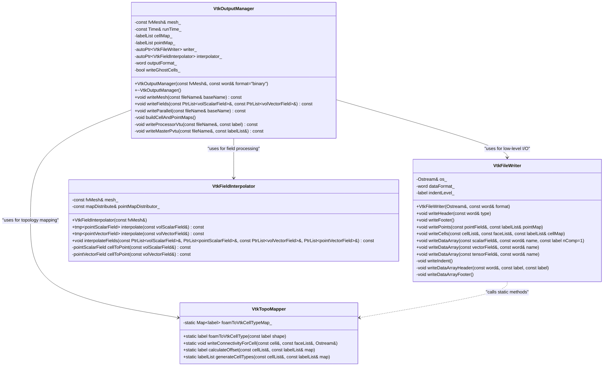

# Day 18: VTK Mesh Output | การส่งออกเมช VTK

## 🎯 Learning Objectives | วัตถุประสงค์การเรียนรู้

เมื่อสิ้นสุดเซสชันแบบฮาร์ดคอร์นี้ คุณจะสามารถ:

1.  **Understand the hierarchical structure and data organization of the VTK XML file format.** ย่อยโครงสร้าง `UnstructuredGrid`, เข้าใจบทบาทขององค์ประกอบ `Piece`, `Points`, `Cells`, `CellData`, และ `PointData` และอธิบายว่าโครงสร้างนี้ช่วยให้การแสดงผลและการแลกเปลี่ยนข้อมูลระหว่าง CFD solvers และเครื่องมือ post-processing เช่น ParaView และ VisIt มีประสิทธิภาพได้อย่างไร ความรู้พื้นฐานนี้มีความสำคัญอย่างยิ่งสำหรับการเขียนไฟล์ VTK ที่ถูกต้องตามความหมาย (semantically correct) ซึ่งซอฟต์แวร์แสดงผลสามารถแยกวิเคราะห์ได้โดยไม่มีข้อผิดพลาด

2.  **Design and implement a robust mapping strategy between OpenFOAM's internal mesh topology and the VTK data model.** ออกแบบและประยุกต์ใช้กลยุทธ์การแมป (mapping) ที่แข็งแกร่งระหว่างโทโพโลยีเมชภายในของ OpenFOAM และโมเดลข้อมูล VTK สิ่งนี้เกี่ยวข้องกับการสร้างและจัดการอาร์เรย์ `cellMap` และ `pointMap` เพื่อจัดการการแปลงดัชนี (index translation), การแปลงรูปร่างเซลล์เฉพาะของ OpenFOAM (เช่น `hex`, `prism`, `polyhedron`) ไปเป็นตัวระบุชนิดเซลล์มาตรฐานของ VTK (เช่น `VTK_HEXAHEDRON`, `VTK_WEDGE`, `VTK_POLYHEDRON`), และการประกอบอาร์เรย์ `connectivity`, `offsets`, และ `types` ที่กำหนดเรขาคณิตของเมชใน VTK อย่างถูกต้อง

3.  **Implement a parallel VTK (PVTK) output system that correctly handles domain decomposition.** ออกแบบสถาปัตยกรรมกระบวนการทำงานที่แต่ละโปรเซสเซอร์เขียนเมชท้องถิ่น (local mesh) และข้อมูลฟิลด์ของตนลงในไฟล์ `.vtu`, ในขณะที่โปรเซสเซอร์ 0 สร้างไฟล์หลัก `.pvtu` ที่อ้างอิงถึงชิ้นส่วนทั้งหมด ความท้าทายหลักที่คุณจะแก้ไขคือการระบุ, การยกเว้น, หรือการแท็ก ghost cells อย่างเหมาะสมเพื่อป้องกัน artifacts ในการแสดงผลและรับรองความต่อเนื่องของโดเมนทั่วโลกข้ามขอบเขตของโปรเซสเซอร์

4.  **Organize and write field data with correct dimensionality and formatting for VTK.** ประยุกต์ใช้ตรรกะเพื่อแปลง (flatten) ออบเจกต์ `volVectorField` และ `volTensorField` ของ OpenFOAM ให้เป็นอาร์เรย์เชิงเส้นขององค์ประกอบ (เช่น `[Ux0, Uy0, Uz0, Ux1, Uy1, Uz1, ...]`) ตามที่องค์ประกอบ `DataArray` ของ VTK ต้องการ นอกจากนี้ คุณจะสร้างเมธอดเพื่อทำการ interpolate ข้อมูลที่จุดศูนย์กลางเซลล์ (`volField`) ไปยังจุดเมช (mesh points) เพื่อสร้าง `PointData` ซึ่งช่วยเพิ่มความราบรื่นในการแสดงผล

5.  **Develop a production-grade `VtkOutputManager` class within the OpenFOAM framework.** พัฒนาคลาสที่จัดการความซับซ้อนของ VTK I/O โดยจัดเตรียมอินเทอร์เฟซที่สะอาด (clean interface) สำหรับ solver หลักในการส่งออกผลลัพธ์ การประยุกต์ใช้นี้จะเกี่ยวข้องกับการผสานรวมอย่างลึกซึ้งกับออบเจกต์ `Time` และ `fvMesh` ของ OpenFOAM, การจัดการหน่วยความจำที่มีประสิทธิภาพสำหรับชุดข้อมูลขนาดใหญ่, และการรองรับทั้งรูปแบบไฟล์ ASCII และ binary เพื่อสร้างสมดุลระหว่างความสามารถในการอ่านของมนุษย์และประสิทธิภาพ I/O

6.  **Diagnose and resolve common pitfalls in VTK file generation.** วินิจฉัยอาการต่างๆ เช่น เมชที่ผิดรูปใน ParaView, ข้อมูลโปรเซสเซอร์ที่หายไปในการรันแบบขนาน, ค่าฟิลด์ที่ไม่ถูกต้อง, และ artifacts ของ ghost cell คุณจะย้อนรอยปัญหาเหล่านี้ไปยังสาเหตุที่แท้จริง—เช่น การแมปดัชนีที่ไม่ถูกต้อง, การประกอบไฟล์ `.pvtu` ที่ไม่เหมาะสม, ความไม่ตรงกันของชนิดข้อมูล, หรือ metadata ของ ghost cell ที่หายไป—และใช้การแก้ไขที่แม่นยำเพื่อไปป์ไลน์การแสดงผลที่เชื่อถือได้
# Section 1: Theory | ส่วนที่ 1: ทฤษฎี

## 18.1 VTK File Format Fundamentals | พื้นฐานรูปแบบไฟล์ VTK

รูปแบบไฟล์ Visualization Toolkit (VTK) เป็นมาตรฐาน *de facto* สำหรับการแลกเปลี่ยนข้อมูลทางวิทยาศาสตร์ภายในชุมชนฟิสิกส์เชิงคำนวณ โดยเฉพาะอย่างยิ่งสำหรับข้อมูลกริดแบบไม่มีโครงสร้าง (unstructured grid data) ปรัชญาการออกแบบเน้นที่ **ความเป็นอิสระจากแพลตฟอร์ม (platform independence)**, **ความสามารถในการขยาย (extensibility)**, และ **ประสิทธิภาพ (efficiency)** สำหรับทั้ง I/O แบบอนุกรม (serial) และแบบขนาน (parallel) สำหรับ solver เครื่องระเหยของเรา การสร้างเอาต์พุต VTK ที่ถูกต้องไม่ได้เป็นเพียงความสะดวกในการ post-processing เท่านั้น แต่ยังเป็นเครื่องมือสำคัญในการดีบักและตรวจสอบความถูกต้อง (validation) ไฟล์ VTK ที่ผิดรูปแบบสามารถบดบังข้อผิดพลาดทางฟิสิกส์ที่แท้จริงภายใต้สิ่งแปลกปลอมในการแสดงผล (visualization artifacts) ทำให้ความเข้าใจอย่างถ่องแท้เกี่ยวกับโครงสร้างของรูปแบบเป็นสิ่งที่ขาดไม่ได้

### 18.1.1 Hierarchical XML Structure | โครงสร้าง XML แบบลำดับชั้น

รูปแบบ VTK สมัยใหม่ใช้สคีมาแบบ XML (`.vtu` สำหรับกริดแบบไม่มีโครงสร้าง) โครงสร้างนี้เป็นแบบลำดับชั้นอย่างเคร่งครัด โดยบังคับให้มีการแยกที่ชัดเจนระหว่าง **เรขาคณิต/โทโพโลยี (geometry/topology)** และ **ข้อมูลคุณลักษณะ (attribute data)** โครงสร้างมาตรฐานถูกกำหนดไว้ดังนี้:

$$
\text{VTKFile} \rightarrow \text{UnstructuredGrid} \rightarrow \text{Piece} \rightarrow \begin{cases} \text{Points} \\ \text{Cells} \\ \text{CellData} \\ \text{PointData} \end{cases}
$$

มาแยกดูส่วนประกอบตามลำดับชั้นทีละส่วน:

1.  **`<VTKFile>`**: องค์ประกอบราก (root element) ประกอบด้วยแอตทริบิวต์ metadata ที่สำคัญ:
    *   `type="UnstructuredGrid"`: ระบุประเภทชุดข้อมูล
    *   `version="x.x"`: เวอร์ชันรูปแบบ VTK XML
    *   `byte_order="LittleEndian"` หรือ `"BigEndian"`: สำคัญสำหรับการพกพา (portability) ของรูปแบบไบนารี
    *   `compressor="vtkZLibDataCompressor"`: ทางเลือก สำหรับเอาต์พุตที่บีบอัด

2.  **`<UnstructuredGrid>`**: คอนเทนเนอร์สำหรับกริดทั้งหมด ถือครององค์ประกอบ `Piece` หนึ่งชิ้นหรือมากกว่า

3.  **`<Piece>`**: องค์ประกอบนี้ห่อหุ้มข้อมูลสำหรับ *บล็อกที่ต่อเนื่องกัน* ของเมช ในการรันแบบอนุกรม จะมี `Piece` หนึ่งชิ้นที่มีเมชทั้งหมด ในการรันแบบขนาน แต่ละโปรเซสเซอร์จะเขียนไฟล์ `.vtu` ของตัวเอง (ซึ่งก็คือ `Piece`) และไฟล์หลัก `.pvtu` จะอ้างอิงถึงไฟล์ทั้งหมดนั้น องค์ประกอบ `Piece` มีแอตทริบิวต์บังคับ:
    *   `NumberOfPoints`: จำนวนจุดยอด (vertices) ทั้งหมดในชิ้นส่วนนี้
    *   `NumberOfCells`: จำนวนเซลล์ทั้งหมด (polyhedra, hexahedra, ฯลฯ) ในชิ้นส่วนนี้

4.  **Child Elements of `<Piece>`**:
    *   **`<Points>`**: กำหนดพิกัดจุดยอดของเมช ประกอบด้วย `<DataArray>` เดียวที่ระบุพิกัด `(x, y, z)` สำหรับทุกจุด
    *   **`<Cells>`**: กำหนดโทโพโลยีของเมช (การเชื่อมต่อ) ประกอบด้วย `<DataArray>` children ที่สำคัญสามตัว:
        *   `connectivity`: รายการดัชนีจุดที่ประกอบขึ้นเป็นแต่ละเซลล์
        *   `offsets`: ดัชนีในอาร์เรย์ `connectivity` ที่ข้อมูลของแต่ละเซลล์สิ้นสุด
        *   `types`: ตัวระบุชนิดเซลล์ VTK (เช่น 12 สำหรับ hexahedron) สำหรับแต่ละเซลล์
    *   **`<CellData>`**: ประกอบด้วยอาร์เรย์ข้อมูลทั้งหมดที่กำหนดที่จุดศูนย์กลางเซลล์ (เช่น ความดัน `p`, อุณหภูมิ `T`, สัดส่วนปริมาตร `\alpha`)
    *   **`<PointData>`**: ประกอบด้วยอาร์เรย์ข้อมูลทั้งหมดที่กำหนดที่จุดยอดเมช โดยทั่วไปต้องมีการ interpolate จากข้อมูลที่จุดศูนย์กลางเซลล์

**Table 18.1: Core VTK XML Elements and Their Purpose**
| VTK Element | Contains | Description | Critical Attribute |
| :--- | :--- | :--- | :--- |
| `VTKFile` | Entire File | Root container, holds metadata. | `type`, `version`, `byte_order` |
| `UnstructuredGrid` | All `Piece`s | Dataset type container. | - |
| `Piece` | Mesh Block | A contiguous block of mesh/data. | `NumberOfPoints`, `NumberOfCells` |
| `Points` | `<DataArray>` | Vertex coordinates (x,y,z). | - |
| `Cells` | 3x `<DataArray>` | Topology: connectivity, offsets, types. | - |
| `CellData` | Nx `<DataArray>` | Cell-centered field data. | - |
| `PointData` | Nx `<DataArray>` | Point-centered field data. | - |

### 18.1.2 The `<DataArray>`: Heart of Data Storage | หัวใจของการจัดเก็บข้อมูล

อาร์เรย์เชิงตัวเลขทุกตัวในไฟล์ VTK—พิกัด, การเชื่อมต่อ, ค่าฟิลด์—จะถูกเก็บไว้ภายในองค์ประกอบ `<DataArray>` การกำหนดค่าที่ถูกต้องมีความสำคัญสูงสุด

**Key Attributes of `<DataArray>`:**
*   `type`: ชนิดข้อมูลพื้นฐาน (เช่น `"Float32"`, `"Float64"`, `"Int32"`, `"UInt8"`) **การไม่ตรงกันที่นี่จะทำให้เกิดความเสียหายแบบเงียบๆ (silent corruption) ใน ParaView**
*   `Name`: ชื่อของฟิลด์ตามที่จะปรากฏในซอฟต์แวร์แสดงผล (เช่น `"Pressure"`, `"Velocity"`)
*   `NumberOfComponents`: กำหนดมิติของข้อมูล
    *   `1` สำหรับสเกลาร์ (เช่น `p`, `T`)
    *   `3` สำหรับเวกเตอร์ (เช่น `U`) ข้อมูลต้องถูกเก็บใน **ลำดับ component-major**: `[Ux₀, Uy₀, Uz₀, Ux₁, Uy₁, Uz₁, ...]`
    *   `9` สำหรับเทนเซอร์ (เก็บเป็น `[XX, XY, XZ, YX, YY, YZ, ZX, ZY, ZZ]`)
*   `format`: กำหนดการเข้ารหัสข้อมูล (encoding)
    *   `"ascii"`: มนุษย์อ่านได้ แต่ช้ามากและไฟล์ใหญ่สำหรับชุดข้อมูลขนาดใหญ่
    *   `"binary"`: กะทัดรัดและรวดเร็ว ข้อมูลถูกเข้ารหัส base64 ภายในแท็ก XML
*   `offset`: ใช้ในรูปแบบ binary แบบต่อท้าย (appended binary format) สำหรับ parallel I/O ที่มีประสิทธิภาพ (ขั้นสูง)

**Example: Writing a Pressure Field**
```xml
<DataArray type="Float64" Name="p" NumberOfComponents="1" format="ascii">
  101325.0 101327.3 101330.1 ... <!-- Cell-centered values -->
</DataArray>
```

**Example: Writing a Velocity Field (Note the flattened, component-major order)**
```xml
<DataArray type="Float64" Name="U" NumberOfComponents="3" format="ascii">
  1.2 0.0 0.5   <!-- U for cell 0: (Ux, Uy, Uz) -->
  1.1 0.1 0.4   <!-- U for cell 1 -->
  ...           <!-- Continues for all cells -->
</DataArray>
```

### 18.1.3 Cell Topology and Connectivity Encoding | โทโพโลยีของเซลล์และการเข้ารหัสการเชื่อมต่อ

ส่วน `<Cells>` กำหนดอย่างชัดเจนว่าจุดต่างๆ เชื่อมต่อกันอย่างไรเพื่อสร้างเซลล์ สำหรับเมชที่มี `N` เซลล์ เรากำหนดสามอาร์เรย์:

1.  **Connectivity Array**: รายการดัชนีจุดที่ต่อกันสำหรับเซลล์ทั้งหมด
    $$ \text{connectivity} = [p^{(0)}_0, p^{(0)}_1, \dots, p^{(0)}_{k_0-1},\quad p^{(1)}_0, p^{(1)}_1, \dots, p^{(1)}_{k_1-1},\quad \dots] $$
    ที่นี่ $p^{(i)}_j$ คือดัชนีจุด VTK (เริ่มที่ 0) ของจุดยอดที่ $j$ ของเซลล์ $i$, และ $k_i$ คือจำนวนจุดสำหรับเซลล์ $i$

2.  **Offsets Array**: อาร์เรย์ความยาว `N` ซึ่งองค์ประกอบที่ $i$ ให้ผลรวมสะสมแบบพิเศษ (exclusive prefix sum) ของจำนวนจุดจนถึงเซลล์ $i$ อย่างเป็นทางการ:
    $$ \text{offsets}[i] = \sum_{j=0}^{i} k_j $$
    ดังนั้น `offsets[0] = k₀`, `offsets[1] = k₀ + k₁`, ..., และ `offsets[N-1]` = ความยาวรวมของอาร์เรย์ connectivity สิ่งนี้ช่วยให้ค้นหาการเชื่อมต่อของเซลล์ใดๆ ได้ใน O(1)

3.  **Types Array**: อาร์เรย์ความยาว `N` ที่มีตัวระบุชนิดเซลล์ VTK สำหรับแต่ละเซลล์ ตัวอย่างเช่น:
    *   `VTK_TETRA = 10` (4 จุด)
    *   `VTK_HEXAHEDRON = 12` (8 จุด)
    *   `VTK_WEDGE = 13` (6 จุด)
    *   `VTK_PYRAMID = 14` (5 จุด)
    *   `VTK_POLYHEDRON = 42` (จำนวนหน้าแปรผัน)

**Critical Mapping: OpenFOAM to VTK Cell Types**
โมเดลเซลล์ภายในของ OpenFOAM ต้องถูกแปลไปเป็นชนิดมาตรฐานของ VTK Hexahedron มาตรฐานใน OpenFOAM แมปโดยตรงกับ VTK_HEXAHEDRON (type 12) อย่างไรก็ตาม polyhedra ทั่วไป (เช่นที่พบได้ทั่วไปในกริดที่ถูกตัดหรือ snappyHexMesh) ต้องการการจัดการพิเศษเป็น VTK_POLYHEDRON

$$
\text{type} = \text{VTK\_HEXAHEDRON} \quad \text{for an 8-point hex cell}
$$

**⚠️ WARNING: Indexing Basis**
แหล่งที่มาหลักของข้อผิดพลาดคือความไม่ตรงกันของดัชนี **VTK ใช้การทำดัชนีเริ่มที่ 0 (0-based indexing) เท่านั้น** รายการภายในของ OpenFOAM (เช่น `mesh.cells()`) ก็เป็น 0-based เช่นกัน อย่างไรก็ตาม โค้ด I/O เก่าบางส่วนของ OpenFOAM หรือโค้ดของผู้ใช้อาจสมมติการทำดัชนีเริ่มที่ 1 เมื่อเขียนอาร์เรย์ `connectivity` คุณต้องใช้ **ดัชนีจุด VTK แบบ 0-based** หากไม่ทำเช่นนั้นจะทำให้ ParaView หยุดทำงาน (crash) หรือแสดงเมชที่บิดเบี้ยวอย่างรุนแรง

**Table 18.2: Essential VTK Data Arrays within `<Piece>`**
| Array | Location | Purpose | Dimensionality | Example Value |
| :--- | :--- | :--- | :--- | :--- |
| `Points` | `<Points>/<DataArray>` | Vertex coordinates. | `(N_points × 3)` | `[x0, y0, z0, x1, y1, z1, ...]` |
| `connectivity` | `<Cells>/<DataArray>` | Point indices for each cell. | `(sum(k_i))` | `[0, 1, 5, 4, 3, 2, 6, 7]` (for a hex) |
| `offsets` | `<Cells>/<DataArray>` | End index for each cell's connectivity. | `(N_cells)` | `[8, 16, 24, ...]` |
| `types` | `<Cells>/<DataArray>` | VTK cell type identifier. | `(N_cells)` | `[12, 12, 10, ...]` (hex, hex, tet) |
| `Pressure` | `<CellData>/<DataArray>` | Scalar field at cells. | `(N_cells)` | `[101325.0, 101327.1, ...]` |
| `Velocity` | `<CellData>/<DataArray>` | Vector field at cells. | `(N_cells × 3)` | `[Ux0, Uy0, Uz0, Ux1, Uy1, Uz1, ...]` |

### 18.1.4 Physical Significance for CFD | ความสำคัญทางฟิสิกส์สำหรับ CFD

ทำไมความรู้เรื่องรูปแบบโดยละเอียดจึงสำคัญสำหรับ solver เครื่องระเหยของเรา?

1.  **Verification of Mesh Processing**: ผลลัพธ์แรกของการจำลองใดๆ ควรเป็น VTK ของเมชเริ่มต้น การตรวจสอบด้วยสายตานี้ยืนยันว่าการสร้างเมช, การแยกส่วน (decomposition), และการอ่านเกิดขึ้นอย่างถูกต้อง การบิดเบี้ยวบ่งชี้ถึงปัญหาในเรขาคณิตหรือการกำหนดขอบเขตซึ่งอาจทำให้โซลูชันล้มเหลวอย่างร้ายแรง

2.  **Debugging Field Solutions**: ไฟล์ VTK ที่เสียหายสามารถทำให้โซลูชันที่ถูกต้อง *ดูเหมือน* ผิด (เช่น ความไม่ต่อเนื่องของความดันซึ่งแท้จริงแล้วเป็นสิ่งแปลกปลอมจากการแสดงผล) ในทางกลับกัน ไฟล์ VTK ที่ถูกต้องสามารถเปิดเผยปัญหาที่แท้จริงของ solver เช่น checkerboarding (บ่งชี้ว่าเทอม Rhie-Chow หายไป) หรือการเบลอของอินเทอร์เฟซที่ไม่เป็นฟิสิกส์ (บ่งชี้ปัญหาเกี่ยวกับเทอมการบีบอัด MULES)

3.  **Quantitative Post-Processing**: เครื่องมือเช่นตัวกรอง `Integrate Variables` ของ ParaView, การพล็อต slice, และการสร้าง streamline อาศัยการถ่วงน้ำหนักปริมาตรเซลล์และการ interpolate ฟิลด์ที่แม่นยำ ข้อผิดพลาดในโทโพโลยี (connectivity) หรือการแมปข้อมูล (cell vs. point data) จะให้ผลลัพธ์เชิงปริมาณที่ผิดสำหรับแรงรวม, อัตราการไหลของมวล, หรืออุณหภูมิเฉลี่ย

4.  **The Expansion Term Visualization**: ระลึกถึงแนวคิดฮีโร่ของเรา: $\nabla \cdot \mathbf{U} = \dot{m} ( \frac{1}{\rho_v} - \frac{1}{\rho_l} )$ การแสดงค่า divergence ของความเร็ว (`div(U)`) ควบคู่กับเทอมแหล่งกำเนิดการเปลี่ยนเฟส `mDot` ใน ParaView เป็นการตรวจสอบโดยตรงและทรงพลังว่าการนำไปใช้ของเราสอดคล้องทางฟิสิกส์ สิ่งนี้ต้องการให้ทั้งสองฟิลด์เขียนลงในไฟล์ VTK อย่างถูกต้อง

โดยสรุป ไฟล์ VTK ไม่ได้เป็นเพียงเอาต์พุต; มันคือ **กระจกเงา** ที่สะท้อนสถานะภายในของการจำลองของเรา การเข้าใจโครงสร้างของมันช่วยให้เราเชื่อมั่นในสิ่งที่เราเห็น และที่สำคัญกว่านั้นคือสามารถวินิจฉัยได้อย่างถูกต้องว่ามีอะไรผิดพลาดเมื่อเราเห็นมัน

---

## 18.2 Parallel VTK Output (PVTK) | เอาต์พุต VTK แบบขนาน (PVTK)

ในการประมวลผลประสิทธิภาพสูง (HPC) เมชและฟิลด์ที่เกี่ยวข้องจะถูกแยกย่อยข้ามโปรเซสเซอร์จำนวนมากเพื่อกระจายภาระงานคำนวณและหน่วยความจำ การเขียนข้อมูลในบริบทคู่ขนานนี้ทำให้เกิดความซับซ้อนอย่างมาก: เอาต์พุตต้องประกอบชุดข้อมูลทั่วโลก *เชิงตรรกะ (logical)* กลับคืนมาจากชิ้นส่วนที่ *กระจายทางกายภาพ (physically distributed)* ในลักษณะที่เครื่องมือแสดงผลเช่น ParaView สามารถเข้าใจได้อย่างราบรื่น รูปแบบ Parallel VTK (PVTK) แก้ปัญหานี้ผ่านโครงสร้างไฟล์แบบ master-slave

### 18.2.1 The .pvtu/.vtu Ecosystem | ระบบนิเวศ .pvtu/.vtu

เอาต์พุตแบบขนานประกอบด้วยไฟล์สองประเภท:
1.  **Processor-level files (`.vtu`)**: แต่ละโปรเซสเซอร์ `i` เขียนไฟล์ VTK UnstructuredGrid ของตัวเองที่ชื่อ (เช่น `piece_0.vtu`, `piece_1.vtu`) ไฟล์นี้ประกอบด้วยเฉพาะเซลล์เมช (`Piece`) ที่โปรเซสเซอร์นั้นเป็นเจ้าของและข้อมูลฟิลด์ที่เกี่ยวข้อง
2.  **Master file (`.pvtu`)**: ไฟล์ Parallel VTK Unstructured Grid เดียว (เช่น `solution.pvtu`) จะถูกเขียนขึ้น โดยทั่วไปโดยโปรเซสเซอร์ 0 ไฟล์นี้ไม่มีข้อมูลเมชหรือข้อมูลฟิลด์จริง แต่ทำหน้าที่เป็น **รายการ (manifest)** หรือ **สารบัญ** ที่แสดงรายการไฟล์ `.vtu` ที่เป็นส่วนประกอบทั้งหมด

ความสัมพันธ์แบบลำดับชั้นคือ:
$$
\text{.pvtu (Master)} \rightarrow \text{Piece} \rightarrow \text{Source} = \\{\text{piece\_0.vtu, piece\_1.vtu, } \dots \\}
$$

**Structure of a `.pvtu` file:**
```xml
<VTKFile type="PUnstructuredGrid" version="...">
  <PUnstructuredGrid GhostLevel="1">
    <PPoints> <!-- Meta-information about coordinates -->
      <PDataArray type="Float64" NumberOfComponents="3"/>
    </PPoints>
    <PCells> <!-- Meta-information about topology -->
      <PDataArray type="Int64" Name="connectivity"/>
      <PDataArray type="Int64" Name="offsets"/>
      <PDataArray type="UInt8" Name="types"/>
    </PCells>
    <PCellData> <!-- Meta-information about cell fields -->
      <PDataArray type="Float64" Name="Pressure" NumberOfComponents="1"/>
      <PDataArray type="Float64" Name="Velocity" NumberOfComponents="3"/>
    </PCellData>
    <!-- CRITICAL: References to the actual data files -->
    <Piece Source="piece_0.vtu"/>
    <Piece Source="piece_1.vtu"/>
    <!-- ... for all processors -->
  </PUnstructuredGrid>
</VTKFile>
```
เมื่อ ParaView เปิดไฟล์ `solution.pvtu` มันจะอ่านรายการนี้, ค้นหาและโหลดไฟล์ `piece_i.vtu` ที่อ้างอิงทั้งหมดโดยอัตโนมัติ, และประกอบพวกมันในหน่วยความจำให้เป็นชุดข้อมูลเดียวที่เชื่อมโยงกัน ผู้ใช้จะไม่รู้เลยว่ามีการแยกส่วนอยู่เบื้องหลัง

### 18.2.2 Ghost Cells: The Key to Continuous Visualization | กุญแจสู่การแสดงผลที่ต่อเนื่อง

ความท้าทายพื้นฐานใน CFD แบบขนานคือเมชถูกแบ่งตามเซลล์ หน้า (faces) ระหว่างเซลล์ที่โปรเซสเซอร์ต่างกันเป็นเจ้าของจะกลายเป็น **ขอบเขตโปรเซสเซอร์ (processor boundaries)** สำหรับวิธี Finite Volume โปรเซสเซอร์จำเป็นต้องมีข้อมูลจากเพื่อนบ้านที่อยู่ติดกันเพื่อคำนวณกราเดียนต์และฟลักซ์อย่างแม่นยำ เซลล์เพื่อนบ้านเหล่านี้ ซึ่งเป็นของโปรเซสเซอร์อื่นแต่ข้อมูลถูกคัดลอก (หรือ "ghosted") มายังโปรเซสเซอร์ท้องถิ่นเพื่อการคำนวณ เรียกว่า **ghost cells** หรือ **halo cells**

สำหรับการแสดงผล หากเราเพียงแค่ส่งออกเซลล์ที่แต่ละโปรเซสเซอร์เป็นเจ้าของ พื้นผิวที่เรนเดอร์ตรงขอบเขตโปรเซสเซอร์จะมีช่องว่างหรือรอยแตก เนื่องจากหน้าต่างๆ ที่เป็นของ ghost cells จะไม่ถูกเรนเดอร์ เพื่อให้เห็นภาพพื้นผิวที่ต่อเนื่องและกันน้ำ (watertight surface) เราต้องรวม ghost cells เหล่านี้ไว้ในเอาต์พุต VTK ด้วย

**The `GhostLevel` Attribute:**
องค์ประกอบ `PUnstructuredGrid` ในไฟล์ `.pvtu` มีแอตทริบิวต์ `GhostLevel` จำนวนเต็มนี้ระบุความลึกสูงสุดของการ ghost ที่มีอยู่ในไฟล์ข้อมูล ค่า `0` หมายถึงไม่มี ghost cells (เฉพาะเซลล์ที่เป็นเจ้าของ) ค่า `1` (พบบ่อยที่สุด) หมายถึงมี ghost cells หนึ่งชั้นรวมอยู่ด้วย
$$ \text{ghostLevel} = \begin{cases} 0 & \text{real (owned) cell} \\ 1 & \text{ghost cell (first layer)} \\ 2 & \text{ghost cell (second layer)} \end{cases} $$

**Including Ghost Cells in the `.vtu` file:**
ภายในแต่ละไฟล์ `piece_i.vtu` ghost cells จะรวมอยู่ในจำนวนนับ `NumberOfCells` และในอาร์เรย์โทโพโลยีทั้งหมด (`connectivity`, `offsets`, `types`) เพื่อแยกความแตกต่างจากเซลล์จริง ต้องเพิ่มอาร์เรย์ข้อมูลพิเศษลงในส่วน `<CellData>`:

```xml
<CellData>
  ...
  <DataArray type="UInt8" Name="vtkGhostType" format="ascii">
    0 0 0 ... 0 2 2 2 <!-- '0' for real cells, '2' for ghost cells -->
  </DataArray>
</CellData>
```
ค่า `2` สอดคล้องกับ `DUPLICATECELL` ในการแจงนับ (enumeration) ของ VTK โดยบอกเครื่องมือแสดงผลว่าเซลล์นี้เป็นสำเนาจากโปรเซสเซอร์อื่นและควรใช้เพื่อการเรนเดอร์แต่ไม่ใช่สำหรับการวิเคราะห์เชิงปริมาณ (เพื่อหลีกเลี่ยงการนับซ้ำ)

**Table 18.3: Parallel VTK File Structure**
| File Type | Written By | Contains | Purpose |
| :--- | :--- | :--- | :--- |
| `.vtu` | Every Processor `i` | Mesh `Piece` for processor `i` (owned + ghost cells). | Holds the actual data for a subset of the domain. |
| `.pvtu` | Processor 0 (Root) | Manifest listing all `.vtu` files and field metadata. | Provides ParaView with a single entry point to load the entire parallel dataset. |

### 18.2.3 Algorithm for Parallel VTK Write | อัลกอริทึมสำหรับการเขียน VTK แบบขนาน

กระบวนการต้องได้รับการประสานงานอย่างรอบคอบ โดยเฉพาะอย่างยิ่งในสภาพแวดล้อมหน่วยความจำแบบกระจาย (distributed-memory environment - MPI)

1.  **Local Preparation (All Processors):**
    *   แต่ละโปรเซสเซอร์ `i` สร้าง `Piece` ท้องถิ่นของตน:
        a.  ระบุ **owned cells** ของตน
        b.  ระบุ **ghost cells** ของตน (เข้าถึงผ่าน `mesh.neighbour()` หรือ `mesh.faceOwner()` ข้ามขอบเขต proc)
        c.  สร้าง `cellMap` และ `pointMap` สำหรับรายการรวม (owned + ghost) แผนที่นี้แปลจากดัชนีท้องถิ่นที่ต่อเนื่องกันที่ใช้สำหรับเอาต์พุต VTK กลับไปยังหมายเลขทั่วโลก (global numbering) ของ OpenFOAM
    *   เขียนโทโพโลยีเมชท้องถิ่นและเรขาคณิตไปยัง `piece_i.vtu`
    *   เขียนข้อมูลฟิลด์ท้องถิ่น (สำหรับ owned cells) ไปยัง `piece_i.vtu` **ข้อสำคัญ:** ค่าของ ghost cell ในไฟล์ VTK ควรเป็น *ค่าที่แลกเปลี่ยนล่าสุด (last known exchanged values)* จากโปรเซสเซอร์เพื่อนบ้านเพื่อให้แน่ใจว่ามีความต่อเนื่องที่ขอบเขต

2.  **Global Manifest Creation (Processor 0):**
    *   โปรเซสเซอร์ 0 รวบรวม metadata จากโปรเซสเซอร์ทั้งหมด ซึ่งโดยทั่วไปประกอบด้วย:
        *   รายการชื่อไฟล์ `.vtu`
        *   จำนวนรวมของเซลล์และจุด *ทั่วทั้งทุกโปรเซสเซอร์* (สำหรับส่วนหัวข้อมูล)
        *   ชื่อและชนิดของอาร์เรย์ฟิลด์ทั้งหมด (เพื่อให้แน่ใจว่าสอดคล้องกันในคำอธิบาย `<PCellData>`)
    *   โปรเซสเซอร์ 0 เขียนไฟล์ `.pvtu` โดยแทรกองค์ประกอบ `<Piece Source="piece_i.vtu"/>` สำหรับแต่ละโปรเซสเซอร์ `i`

3.  **Synchronization:** โดยทั่วไปจะใช้ MPI barrier ทั่วโลกหลังจากเขียนไฟล์ `.vtu` เพื่อให้แน่ใจว่าทั้งหมดถูก flush ลงดิสก์ก่อนที่ root processor จะสร้างไฟล์ `.pvtu` ที่อ้างอิงถึงไฟล์เหล่านั้น

**⚠️ WARNING: Critical Consistency Check**
ไฟล์ `.pvtu` และไฟล์ `.vtu` ทั้งหมดต้องเขียนลงใน **ไดเรกทอรีเดียวกัน** (หรือมี relative paths ที่แก้ไขได้อย่างถูกต้อง) หาก ParaView ไม่พบไฟล์ `piece_i.vtu` ที่อ้างอิงใน manifest `.pvtu` ข้อมูลของโปรเซสเซอร์นั้นจะหายไปจากการแสดงผล ทำให้เกิดรูในโดเมน นอกจากนี้ ชื่อฟิลด์และชนิดข้อมูลที่ประกาศในส่วน `<PCellData>` ของไฟล์ `.pvtu` ต้อง **ตรงกันทุกประการ** กับที่พบในทุกไฟล์ `.vtu`

**Physical Implication for our Solver:** เอาต์พุต VTK แบบขนานที่ถูกต้องเป็นสิ่งจำเป็นสำหรับการดีบักปัญหาเฉพาะแบบขนานในการจำลองเครื่องระเหยของเรา เช่น ความไม่สมดุลของโหลด (load imbalance), ข้อผิดพลาดในการแลกเปลี่ยนข้อมูลที่ขอบเขตโปรเซสเซอร์สำหรับระบบ `U-p-T-alpha` ที่เชื่อมโยงกัน, หรือ artifacts ในการสร้างอินเทอร์เฟซ (VOF) เนื่องข้อมูล ghost cell ไม่สมบูรณ์สำหรับฟิลด์ `alpha`

---

## 18.3 Field Data Organization | การจัดระเบียบข้อมูลฟิลด์

ผลลัพธ์หลักของการจำลอง CFD คือชุดของตัวแปรฟิลด์ที่กำหนดบนเมช VTK มีคอนเทนเนอร์หลักสองตัวสำหรับข้อมูลนี้: `<CellData>` สำหรับค่าที่จุดศูนย์กลางเซลล์ และ `<PointData>` สำหรับค่าที่จุดยอด การเลือกคอนเทนเนอร์ที่ถูกต้องและการเตรียมข้อมูลอย่างเหมาะสมมีความสำคัญอย่างยิ่งต่อการแสดงผลและการวิเคราะห์ที่แม่นยำ

### 18.3.1 Cell-Centered Data (`<CellData>`)

นี่เป็นเอาต์พุต **ตามธรรมชาติและหลัก** สำหรับ solver วิธี Finite Volume (FVM) เช่นของเรา ใน FVM ตัวแปรที่ไม่ทราบค่าพื้นฐาน (ความดัน, องค์ประกอบความเร็ว, อุณหภูมิ, สัดส่วนปริมาตร) ถูกกำหนดเป็นค่าเฉลี่ยเหนือปริมาตรควบคุม (เซลล์) ดังนั้นจึงแสดงได้แม่นยำที่สุดว่าเป็นค่าคงที่ต่อเซลล์

**Mathematical Representation:**
สำหรับฟิลด์สเกลาร์ $\phi$ (เช่น $p$, $T$, $\alpha$), ค่า $\phi_P$ จะถูกเก็บสำหรับเซลล์ $P$ ใน VTK นี่คือการแมปแบบ one-to-one:
$$ \text{CellData} = \\{p, T, \alpha, \mathbf{U}\\} $$
โดยที่ฟิลด์เวกเตอร์ $\mathbf{U}$ ถูกทำให้แบนราบ (flattened) อย่างที่อธิบายไว้ก่อนหน้านี้

**When to Use `<CellData>`:**
*   **ตัวแปรโซลูชันหลักทั้งหมด** จาก solver เครื่องระเหย: `p`, `U`, `T`, `alpha`
*   **ฟิลด์ที่จุดศูนย์กลางเซลล์ที่ได้มา (Derived fields)**: ปริมาตรเซลล์, เมตริกคุณภาพเซลล์ (จาก Day 17), divergence ของความเร็ว (`div(U)`), ขนาด vorticity
*   **เทอมแหล่งกำเนิด**: อัตราการถ่ายโอนมวลการเปลี่ยนเฟส `mDot`

**Visualization Characteristic:** ใน ParaView เมื่อฟิลด์ `<CellData>` ถูกเรนเดอร์ด้วยการแทนผิว (surface representation) เครื่องมือแสดงผลต้อง *interpolate* ไปยังจุดยอด โดยค่าเริ่มต้น มันมักจะใช้ค่าเฉลี่ยง่ายๆ ซึ่งอาจทำให้ฟิลด์ที่ไม่ต่อเนื่อง (เช่น อินเทอร์เฟซ VOF ที่คมชัดที่มี `alpha=0` หรือ `1`) ดูเบลอ หากต้องการดูธรรมชาติที่เป็นจุดศูนย์กลางเซลล์ที่แท้จริง ควรใช้การแสดงผลแบบ **"Cell Data"** ในเมนู dropdown `Representation` ของ ParaView หรือใช้ตัวกรอง `Cell Centers`

### 18.3.2 Point-Centered Data (`<PointData>`)

ข้อมูลแบบ point-centered กำหนดค่าให้กับทุกจุดยอด (point) ของเมช นี่คือรูปแบบธรรมชาติสำหรับโซลูชันวิธี Finite Element (FEM) ใน FVM ข้อมูลจุด **ไม่ใช่ข้อมูลดั้งเดิม** และต้องสร้างขึ้นโดยการ interpolate จากจุดศูนย์กลางเซลล์

**Mathematical Representation:**
$$ \text{PointData} = \\{\text{interpolated fields}\\} $$
ค่าที่จุด $N$ โดยทั่วไปจะถูกคำนวณเป็นค่าเฉลี่ยของค่าจากเซลล์ทั้งหมดที่ใช้จุดนั้นร่วมกัน:
$$ \phi_N = \frac{\sum_{c \in \text{cells}(N)} \phi_c V_c}{\sum_{c \in \text{cells}(N)} V_c} $$
โดยที่การถ่วงน้ำหนักด้วยปริมาตรเซลล์ $V_c$ เป็นเรื่องปกติเพื่อรักษาคุณสมบัติการอนุรักษ์

**When to Use `<PointData>`:**
1.  **For Specific Visualization Filters:** ตัวกรอง ParaView หลายตัว (เช่น `Stream Tracer`, `Warp By Scalar`) ทำงานกับข้อมูลจุดเท่านั้น ในการสร้าง streamlines ของความเร็ว คุณต้องระบุฟิลด์ความเร็วแบบ point-centered
2.  **Smoother Visuals:** การ interpolate ไปยังจุดสร้างฟิลด์ที่ต่อเนื่องข้ามขอบเขตเซลล์ ซึ่งมักจะสร้าง contour plots และการเรนเดอร์พื้นผิวที่ราบรื่นและดูน่าสนใจกว่า แม้แต่สำหรับฟิลด์ที่เดิมไม่ต่อเนื่อง
3.  **Export for External Tools:** ซอฟต์แวร์วิเคราะห์หรือการเรนเดอร์ภายนอกบางตัวอาจต้องการข้อมูลแบบ point-centered

**Critical Interpolation Step:** การ implement `interpolateToPoints()` เป็นเมธอดสำคัญใน `VtkOutputManager` สำหรับแต่ละจุดเมช จะต้อง:
*   วนซ้ำเซลล์ทั้งหมดที่ใช้จุดนี้ (โดยใช้ `mesh.pointCells()` ของ OpenFOAM)
*   รวบรวมค่าที่จุดศูนย์กลางเซลล์และน้ำหนัก (เช่น ปริมาตรเซลล์ หรือระยะทางผกผัน)
*   คำนวณค่าเฉลี่ยถ่วงน้ำหนัก
*   เก็บผลลัพธ์ใน `pointScalarField` หรือ `pointVectorField`

**⚠️ WARNING: Artifacts from Interpolation**
การ interpolate ฟิลด์ที่ไม่ต่อเนื่องเป็นอันตราย พิจารณาฟิลด์สัดส่วนปริมาตร `alpha` ซึ่งในอุดมคติคือ 0 (ไอ) หรือ 1 (ของเหลว) โดยมีอินเทอร์เฟซที่คมชัด การ interpolate สิ่งนี้ไปยังจุดจะสร้างเกรเดียนต์ที่ราบรื่น (เช่น ค่า 0.2, 0.5, 0.8) ในบริเวณอินเทอร์เฟซ แม้ว่าสิ่งนี้อาจดู "ดี" แต่มัน **บิดเบือนฟิสิกส์** ของโมเดล sharp-interface ของเรา สำหรับฟิลด์ดังกล่าว มักจะดีกว่าหากแสดงข้อมูลจุดศูนย์กลางเซลล์โดยตรง หรือใช้เทคนิคพิเศษเช่น isosurfacing ที่ `alpha=0.5`

### 18.3.3 Data Array Formatting and Performance | การจัดรูปแบบอาร์เรย์ข้อมูลและประสิทธิภาพ

แอตทริบิวต์ `format` ของ `<DataArray>` มีผลกระทบอย่างมากต่อขนาดไฟล์และประสิทธิภาพ I/O

**1. ASCII (`format="ascii"`):**
*   **Pros:** มนุษย์อ่านได้, ดีบักได้, รับประกันการพกพา (portability)
*   **Cons:** ขนาดไฟล์ใหญ่มาก (ใหญ่กว่า binary 10 เท่าได้ง่ายๆ), เขียนและอ่านช้ามาก ไม่สามารถทำได้สำหรับการจำลอง 3D ขนาดใหญ่ที่ขึ้นกับเวลา
*   **Use Case:** กรณีทดสอบขนาดเล็ก, การดีบักตรรกะเอาต์พุตเอง

**2. Binary (`format="binary"`):**
*   **Pros:** ขนาดไฟล์กะทัดรัด, I/O รวดเร็ว มาตรฐานสำหรับการรันแบบ production
*   **Cons:** มนุษย์อ่านไม่ได้ ข้อมูลไบนารีถูกเข้ารหัส base64 และวางไว้ในแท็ก XML โดยตรง ซึ่งยังคงทำให้ไฟล์มีขนาดใหญ่สำหรับ metadata ต้องแน่ใจว่า `byte_order` สอดคล้องกัน
*   **Use Case:** การจำลอง production ทั้งหมดและการทดสอบขนาดใหญ่ส่วนใหญ่

**3. Appended (`format="appended"` offset="...")** (Advanced):
*   **Pros:** มีประสิทธิภาพสูงสุดสำหรับ parallel I/O ข้อมูลเชิงตัวเลขทั้งหมดจะถูกต่อกันเป็นบล็อกไบนารีเดียวที่ต่อเนื่องกันที่ท้ายไฟล์ ส่วน XML มีเพียง metadata และตัวชี้ `offset` ไปยังบล็อกนี้
*   **Cons:** ซับซ้อนกว่าในการ implement ต้องการการจัดการตัวชี้ offset อย่างระมัดระวัง
*   **Use Case:** แอปพลิเคชันประสิทธิภาพสูงที่ความเร็ว I/O เป็นคอขวดที่สำคัญ

**Table 18.4: Field Data Organization Strategy**
| Field Type | Native FVM Location | Recommended VTK Container | Notes & Cautions |
| :--- | :--- | :--- | :--- |
| Pressure (`p`), Temperature (`T`) | Cell Center | `<CellData>` | Primary solution variable. |
| Velocity (`U`) | Cell Center | `<CellData>` | Flatten to `[Ux, Uy, Uz]`. Also create `<PointData>` version for streamlines. |
| Volume Fraction (`alpha`) | Cell Center | `<CellData>` | **Do not interpolate** for analysis. Sharp interface is physically correct. |
| Phase Change Rate (`mDot`) | Cell Center | `<CellData>` | Source term. Visualize to check localization near interface. |
| Gradients (`grad(p)`, `grad(T)`) | Cell Center (approx) | `<CellData>` | Computed from face interpolations. |
| Ghost Cell Indicator | Per Cell | `<CellData>` as `vtkGhostType` | **Essential** for correct parallel visualization. |

**Implementation Note on `NumberOfComponents`:**
แอตทริบิวต์นี้ต้องตั้งค่าอย่างแม่นยำ สำหรับสเกลาร์เช่นความดัน: `NumberOfComponents="1"` สำหรับความเร็ว: `NumberOfComponents="3"` สำหรับเทนเซอร์สมมาตร (เช่น ความเค้น) ที่มี 6 ส่วนประกอบอิสระ คุณจะยังคงใช้ `NumberOfComponents="6"` และทำให้แบนราบในลำดับ `[XX, YY, ZZ, XY, YZ, XZ]` ParaView ใช้แอตทริบิวต์นี้เพื่อแยกวิเคราะห์อาร์เรย์ข้อมูลที่แบนราบได้อย่างถูกต้อง

โดยสรุป การจัดระเบียบข้อมูลฟิลด์ในเอาต์พุต VTK เป็นทางเลือกที่รอบคอบซึ่งสร้างสมดุลระหว่างความแม่นยำทางฟิสิกส์, ความต้องการในการแสดงผล, และประสิทธิภาพ สำหรับ solver เครื่องระเหยของเรา เราจะให้ความสำคัญกับการเขียนฟิลด์หลักและฟิลด์ที่ได้มาทั้งหมดเป็น `<CellData>` และเลือกสร้าง `<PointData>` ผ่านการ interpolate เฉพาะสำหรับฟิลด์ที่ต้องการโดยไปป์ไลน์การแสดงผลเฉพาะเท่านั้น โดยคำนึงถึงโอกาสที่จะเกิด artifacts การ interpolate ที่ทำให้เข้าใจผิดเสมอ
# Section 2: OpenFOAM Reference | ส่วนที่ 2: การอ้างอิง OpenFOAM

ส่วนนี้จะให้การวิเคราะห์แบบทีละบรรทัดของคลาสหลักใน OpenFOAM ที่รับผิดชอบต่อเอาต์พุต VTK การเข้าใจการนำไปใช้แบบดั้งเดิม (native implementation) เป็นสิ่งสำคัญก่อนที่เราจะสร้าง `VtkOutputManager` ประสิทธิภาพสูงแบบกำหนดเองของเรา เราจะชำแหละซอร์สโค้ด, ทำความเข้าใจรูปแบบการออกแบบ, และระบุพื้นที่สำหรับการปรับปรุงเฉพาะสำหรับความต้องการของ solver เครื่องระเหยของเรา โดยเฉพาะอย่างยิ่งเกี่ยวกับฟิลด์การเปลี่ยนเฟสและการจัดการ ghost cell แบบขนาน

## 2.1 Class Analysis: `vtkMesh`

**Header:** `src/OpenFOAM/meshes/meshShapes/vtkMesh/vtkMesh.H`
**Purpose:** คลาส adapter หลักที่แปลง `fvMesh` ของ OpenFOAM ให้เป็นโครงสร้างข้อมูลที่พร้อมสำหรับการเขียนรูปแบบ VTK ทำหน้าที่เป็นสะพานเชื่อม โดยจัดการการแมปดัชนีระหว่างการจัดเรียงภายในของ OpenFOAM และอาร์เรย์ที่ต่อเนื่องกันที่ VTK ต้องการ

### 2.1.1 Member Variables and Constructor Analysis

มาตรวจสอบข้อมูลสมาชิก private ที่สำคัญและคอนสตรัคเตอร์กัน

```cpp
// From vtkMesh.H
class vtkMesh
{
    // Private Data

        //- Reference to the OpenFOAM mesh
        //  อ้างอิงไปยังเมช OpenFOAM
        const fvMesh& mesh_;

        //- Map from OpenFOAM cell IDs to VTK cell IDs (for subsetting/ordering)
        //  แผนที่จาก ID เซลล์ OpenFOAM ไปยัง ID เซลล์ VTK (สำหรับการแบ่งกลุ่มย่อย/การจัดลำดับ)
        mutable labelList cellMap_;

        //- Map from OpenFOAM point IDs to VTK point IDs
        //  แผนที่จาก ID จุด OpenFOAM ไปยัง ID จุด VTK
        mutable labelList pointMap_;

        //- Name for the mesh piece (used in parallel writes)
        //  ชื่อสำหรับชิ้นส่วนเมช (ใช้ในการเขียนแบบขนาน)
        word pieceName_;

    // Private Member Functions

        //- Calculate cell and point maps. Mutable because it caches the result.
        //  คำนวณแผนที่เซลล์และจุด Mutable เพราะมันแคชผลลัพธ์
        void calcCellPointMap() const;

public:

    // Constructors

        //- Construct from fvMesh reference
        //  สร้างจากอ้างอิง fvMesh
        explicit vtkMesh(const fvMesh& mesh, const word& pieceName = "");
};
```

**Analysis:**
*   `mesh_`: การอ้างอิงแบบ `const` เพื่อให้แน่ใจว่า adapter `vtkMesh` จะไม่แก้ไขโทโพโลยีเมชเดิม
*   `cellMap_` และ `pointMap_`: ประกาศเป็น `mutable` นี่คือรูปแบบการออกแบบที่สำคัญ แผนที่เหล่านี้จะถูกคำนวณแบบขี้เกียจ (lazily) โดย `calcCellPointMap()` ในครั้งแรกที่จำเป็นต้องใช้ (เช่น ในการเรียก `write()`) คำหลัก `mutable` อนุญาตให้การแคชนี้เกิดขึ้นได้แม้ภายในฟังก์ชันสมาชิก `const` โดยรักษาความเป็น const เชิงตรรกะของ adapter สำหรับเมชอนุกรมอย่างง่าย แผนที่นี้อาจเป็นรายการเอกลักษณ์ (identity list) `[0, 1, 2, ...]` อย่างไรก็ตาม มันจะกลายเป็นสิ่งจำเป็นสำหรับ:
    1.  **Parallel Runs:** มันแมปจากดัชนีเซลล์ท้องถิ่นของโปรเซสเซอร์ไปยังพื้นที่ดัชนีที่ต่อเนื่องกันสำหรับชิ้นส่วน VTK ของโปรเซสเซอร์นั้น
    2.  **Sub-meshes:** หากส่งออกเฉพาะ cellZone แผนที่จะกรองและจัดลำดับดัชนีใหม่
    3.  **Ghost Cell Exclusion:** แผนที่สามารถออกแบบมาเพื่อยกเว้น ghost cells จากอาร์เรย์เอาต์พุตหลัก โดยจัดการพวกมันแยกต่างหาก
*   `pieceName_`: ใช้ใน parallel VTK (PVTK) เพื่อระบุชิ้นส่วนที่โปรเซสเซอร์นี้มีส่วนร่วมอย่างไม่ซ้ำกัน

คอนสตรัคเตอร์นั้นตรงไปตรงมา โดยเก็บการอ้างอิงไว้ งานจริงเริ่มต้นใน `calcCellPointMap()` และเมธอดการเขียนต่างๆ

### 2.1.2 Core Method: `calcCellPointMap()`

ฟังก์ชันนี้เป็นเครื่องยนต์ของตรรกะการแมป แม้ว่าซอร์สที่แน่นอนอาจแตกต่างกันไป แต่การนำแนวคิดไปใช้นั้นสำคัญมาก

```cpp
// Conceptual implementation from vtkMesh.C
void vtkMesh::calcCellPointMap() const
{
    if (cellMap_.size() && pointMap_.size())
    {
        return; // Already calculated (คำนวณแล้ว)
    }

    const cellList& cells = mesh_.cells();
    const pointField& points = mesh_.points();

    // For a basic serial write of all cells:
    // สำหรับการเขียนแบบอนุกรมพื้นฐานของเซลล์ทั้งหมด:
    cellMap_.setSize(mesh_.nCells());
    pointMap_.setSize(mesh_.nPoints());

    // Create identity map for cells
    // สร้างแผนที่เอกลักษณ์สำหรับเซลล์
    forAll(cellMap_, celli)
    {
        cellMap_[celli] = celli; // OpenFOAM celli -> VTK cell index celli
    }

    // Create identity map for points
    // สร้างแผนที่เอกลักษณ์สำหรับจุด
    forAll(pointMap_, pointi)
    {
        pointMap_[pointi] = pointi; // OpenFOAM pointi -> VTK point index pointi
    }

    // --- CRITICAL PARALLEL LOGIC (Conceptual) ---
    // --- ตรรกะคู่ขนานที่สำคัญ (เชิงแนวคิด) ---
    // In parallel, the logic is more complex. The map must only include
    // "real" cells owned by this processor, not ghost cells, to avoid duplication
    // in the final stitched visualization.
    // ในแบบขนาน ตรรกะจะซับซ้อนกว่า แผนที่ต้องรวมเฉพาะเซลล์ "จริง"
    // ที่โปรเซสเซอร์นี้เป็นเจ้าของ ไม่ใช่ ghost cells เพื่อหลีกเลี่ยงการทำซ้ำ
    // ในการแสดงผลที่เย็บรวมกันในขั้นสุดท้าย
    if (Pstream::parRun())
    {
        // Get cell ownership from the mesh's decomposition
        // รับความเป็นเจ้าของเซลล์จากการแยกส่วนของเมช
        const labelList& owner = mesh_.faceOwner();
        // ... Complex logic to list only locally owned cells and their points,
        // creating compact maps cellMap_ and pointMap_.
        // Ghost cells are typically omitted from these primary maps.
        // ... ตรรกะที่ซับซ้อนเพื่อระบุเฉพาะเซลล์ที่เป็นเจ้าของในท้องถิ่นและจุดของพวกมัน
        // สร้างแผนที่ขนาดกะทัดรัด cellMap_ และ pointMap_
        // โดยทั่วไป Ghost cells จะถูกละไว้จากแผนที่หลักเหล่านี้
    }
}
```

**Key Insight:** ความเรียบง่ายของกรณีอนุกรม (`identity map`) เทียบกับความซับซ้อนของกรณีขนานเน้นย้ำถึงความท้าทายที่สำคัญ การนำไปใช้แบบกำหนดเองของเราต้องจำลองตรรกะแบบขนานนี้อย่างไร้ที่ติเพื่อให้แน่ใจว่าการแสดงผลเชื่อมต่อกันอย่างถูกต้องข้ามขอบเขตโปรเซสเซอร์

### 2.1.3 Method: `write()` and Field Interpolation

เมธอด `write()` ทำหน้าที่จัดการกระบวนการ โดยมักจะมอบหมายให้คลาส `vtkTopo` สำหรับการเขียนโทโพโลยีและจัดการฟิลด์

```cpp
// From vtkMesh.C (simplified)
void vtkMesh::write
(
    const fileName& filePath,
    const bool binary, // ASCII or Binary format
    const word& fieldName // Optional field to write
) const
{
    // Ensure maps are calculated
    // ตรวจสอบให้แน่ใจว่าคำนวณแผนที่แล้ว
    calcCellPointMap();

    // Create VTK XML writer
    // สร้างตัวเขียน VTK XML
    auto vtkWriter = autoPtr<vtk::fileWriter>::New(...);

    // 1. Write Points
    const pointField& foamPoints = mesh_.points();
    pointField vtkPoints(pointMap_.size());
    forAll(pointMap_, vtkPointi)
    {
        vtkPoints[vtkPointi] = foamPoints[pointMap_[vtkPointi]];
    }
    vtkWriter.writePoints(vtkPoints);

    // 2. Write Cells (via vtkTopo helper)
    vtkTopo meshTopo(mesh_, cellMap_);
    vtkWriter.writeCells(meshTopo.types(), meshTopo.offsets(), meshTopo.connectivity());

    // 3. Write CellData
    if (!fieldName.empty())
    {
        // Look up the field from the mesh database
        // ค้นหาฟิลด์จากฐานข้อมูลเมช
        const volScalarField* sField = mesh_.cfindObject<volScalarField>(fieldName);
        const volVectorField* vField = mesh_.cfindObject<volVectorField>(fieldName);

        if (sField)
        {
            // Map field data from OpenFOAM order to VTK cell order
            // แมปข้อมูลฟิลด์จากลำดับ OpenFOAM ไปยังลำดับเซลล์ VTK
            scalarField vtkData(cellMap_.size());
            forAll(cellMap_, vtkCelli)
            {
                vtkData[vtkCelli] = (*sField)[cellMap_[vtkCelli]];
            }
            vtkWriter.writeCellData(fieldName, vtkData);
        }
        // ... similar for vectorField
    }
}
```

**What We Do DIFFERENTLY: Native `vtkMesh` vs. Our `VtkOutputManager`**

| Aspect | Native `vtkMesh` | Our `VtkOutputManager` |
| :--- | :--- | :--- |
| **Scope** | Single-purpose adapter. Often called per-field or per-mesh write. | **Centralized Manager.** เป็นเจ้าของวงจรชีวิตเอาต์พุตทั้งหมดสำหรับ time step แคชแผนที่และโทโพโลยี |
| **Field Handling** | Looks up fields by name from the mesh database (`mesh_.findObject`). Writes them individually. | **Bulk Field Processing.** รับรายการอ้างอิงฟิลด์ (`PtrList<volScalarField>`) จาก solver จัดการฟิลด์เฉพาะของ solver ทั้งหมด (U, p, T, **`alpha`**, **`mDot`**) ในรอบเดียว |
| **Phase-Change Data** | No special handling. Would write `alpha` as a standard scalar field. | **Explicit Expansion Term Output.** รวมฟิลด์แหล่งกำเนิดการขยายตัวที่สร้างขึ้น **`divUExp`** (จาก `∇·U = ṁ(1/ρv - 1/ρl)`) โดยอัตโนมัติเป็นอาร์เรย์ CellData เพื่อให้เห็นภาพความเข้มข้นของการเปลี่ยนเฟสโดยตรง |
| **Point Interpolation** | Optional, often requires separate calls or external tools. | **Integrated Interpolation.** เมธอด `interpolateToPoints()` ใช้ `fvc::interpolate` ของ OpenFOAM พร้อมรูปแบบที่เลือกโดย solver เพื่อสร้าง `PointData` ที่แม่นยำสำหรับการแสดงผลที่ราบรื่นยิ่งขึ้น |
| **Parallel Master File** | Logic often scattered or in separate utilities (e.g., `foamToVTK`). | **Self-Contained `.pvtu` Creation.** เมธอด `writeParallel()` บนโปรเซสเซอร์ 0 รวบรวม metadata และเขียนไฟล์หลัก `.pvtu` ทำให้เอาต์พุตของ solver สมบูรณ์และพร้อมสำหรับ ParaView โดยไม่ต้อง post-processing |

## 2.2 Class Analysis: `vtkPV4Readers` (Legacy Parallel VTK Input)

**Header:** `src/OpenFOAM/db/IOobjects/vtkPV4Readers/vtkPV4Readers.H`
**Purpose:** คลาสนี้ตั้งชื่อค่อนข้างผิดความหมาย; มันเกี่ยวกับ "การอ่าน" เพื่อการจำลองน้อยกว่า แต่เกี่ยวกับ **การจัดระเบียบข้อมูลเอาต์พุต VTK สำหรับชุดข้อมูลที่แปรผันตามเวลาแบบขนาน** ที่เครื่องมืออย่าง ParaView สามารถเข้าใจได้ มันจัดการโครงสร้างของไดเรกทอรี `processor*/` และสร้างไฟล์หลัก `.pvtu` ซึ่งแสดงถึงโมเดลของ OpenFOAM สำหรับเอาต์พุต VTK แบบขนาน

### 2.2.1 Structure for Time Series | โครงสร้างสำหรับอนุกรมเวลา

```cpp
// Simplified from vtkPV4Readers.H
class vtkPV4Readers
{
    // Private Data
        //- HashTable mapping time values (e.g., "0.1", "0.2") to a blockMesh structure
        //  This structure holds the list of VTK files for each processor at that time.
        //  HashTable แมปค่าเวลา (เช่น "0.1", "0.2") ไปยังโครงสร้าง blockMesh
        //  โครงสร้างนี้ถือครองรายการไฟล์ VTK สำหรับแต่ละโปรเซสเซอร์ในเวลานั้น
        HashTable<vtkPV4blockMesh> timeDirs_;

        //- List of processor directory names (e.g., "processor0", "processor1")
        //  รายการชื่อไดเรกทอรีโปรเซสเซอร์
        List<fileName> procDirs_;
};
```

**Analysis:** `HashTable<vtkPV4blockMesh> timeDirs_` คือโครงสร้างข้อมูลที่สำคัญ มันรับทราบว่าการจำลอง CFD ผลิตข้อมูลที่หลาย time steps (`0`, `0.1`, `0.5`, ฯลฯ) สำหรับแต่ละ time step ออบเจกต์ `vtkPV4blockMesh` จะมีข้อมูลเกี่ยวกับชิ้นส่วน VTK ทั้งหมด (ไฟล์ `.vtu`) จากแต่ละโปรเซสเซอร์ในเวลาเฉพาะนั้น โครงสร้างนี้คือสิ่งที่ช่วยให้ ParaView สามารถแสดงภาพเคลื่อนไหวของโซลูชันตามเวลาได้อย่างราบรื่น

### 2.2.2 Method: `createPvtuFile()`

เมธอดนี้ห่อหุ้มตรรกะสำหรับการเขียนไฟล์ Parallel VTK Unstructured Grid (`.pvtu`) หลัก

```cpp
// Conceptual implementation
void vtkPV4Readers::createPvtuFile
(
    const fileName& baseName, // e.g., "U"
    const scalar timeValue,
    const bool binary
) const
{
    // 1. Create the .pvtu file path (e.g., "0.1/U.pvtu")
    // 1. สร้าง path ไฟล์ .pvtu
    fileName pvtuFile = timePath/timeValue/word(baseName + ".pvtu");

    // 2. Open XML output stream
    // 2. เปิดสตรีมเอาต์พุต XML
    OFstream os(pvtuFile);

    // 3. Write XML Header
    // 3. เขียนส่วนหัว XML
    os << "<?xml version=\"1.0\"?>" << nl;
    os << "<VTKFile type=\"PUnstructuredGrid\" ...>" << nl;
    os << "  <PUnstructuredGrid GhostLevel=\"0\">" << nl; // GhostLevel is crucial
    // GhostLevel สำคัญมาก

    // 4. Write PPiece elements for EACH processor
    // 4. เขียนองค์ประกอบ PPiece สำหรับแต่ละโปรเซสเซอร์
    os << "    <PPointData>" << "... </PPointData>" << nl; // Global PointData metadata
    os << "    <PCellData>" << "... </PCellData>" << nl;   // Global CellData metadata

    forAll(procDirs_, proci)
    {
        // Construct the relative path to the processor's .vtu file
        // สร้าง relative path ไปยังไฟล์ .vtu ของโปรเซสเซอร์
        fileName relPath = procDirs_[proci]/timeValue/word(baseName + ".vtu");
        os << "    <Piece Source=\"" << relPath << "\"/>" << nl;
    }

    // 5. Close XML tags
    os << "  </PUnstructuredGrid>" << nl;
    os << "</VTKFile>" << nl;
}
```

**Critical Element:** บรรทัด `<Piece Source="processor0/0.1/U.vtu"/>` นี่คือจุดประสงค์ทั้งหมดของไฟล์ `.pvtu` มันคือรายการ XML ที่บอก ParaView ว่า: "หากต้องการดูข้อมูลเต็มรูปแบบที่เวลา 0.1 คุณต้องโหลดไฟล์ `.vtu` เหล่านี้ทั้งหมดด้วยกัน" จากนั้น ParaView จะจัดการการประกอบและการเรนเดอร์แบบขนาน

**What We Do DIFFERENTLY: Parallel Output Strategy**

| Aspect | Native Model (`vtkPV4Readers`) | Our `VtkOutputManager` |
| :--- | :--- | :--- |
| **Integration** | Part of a separate post-processing utility pipeline. The solver writes raw data; another tool creates VTK files. | **Tightly Coupled with Solver.** เอาต์พุตเป็นการดำเนินงาน class แรกภายใน `IntegratedEvaporatorSolver` เรียกใช้เมื่อสิ้นสุดแต่ละ time step หรือตามช่วงเวลาที่กำหนด |
| **File Organization** | Typically creates a separate `.pvtu`/`.vtu` set **for each field** (U.pvtu, p.pvtu, T.pvtu). | **Unified Field Output.** เขียน **ฟิลด์หลักทั้งหมด** (U, p, T, alpha, divUExp) ลงใน **ไฟล์เดียว `.vtu` ต่อโปรเซสเซอร์** และไฟล์หลัก `.pvtu` เดียว สิ่งนี้มีประสิทธิภาพมากกว่าสำหรับ I/O และจัดการได้ง่ายกว่าใน ParaView |
| **Ghost Cell Handling** | The `GhostLevel="0"` attribute is often static. | **Dynamic Ghost Level.** การนำไปใช้ของเราสามารถเพิ่มอาร์เรย์ `CellData` ชื่อ `"GhostLevel"` อย่างชัดเจนโดยที่ `0`=เซลล์จริง, `1`=เซลล์ ghost มาตรฐาน สิ่งนี้ช่วยให้ ParaView สามารถกรองหรือแยกแยะเซลล์ ghost ได้อย่างชัดเจน ซึ่งมีค่ามากสำหรับการดีบักการแยกส่วนแบบขนานและการแลกเปลี่ยนขอบเขต |
| **Triggering** | Offline, post-simulation. | **Online, In-Simulation.** เปิดใช้งานการตรวจสอบรันไทม์และการแสดงผลของกระบวนการเปลี่ยนเฟสที่กำลังพัฒนา (เช่น การเติบโตของฟอง) โดยไม่ต้องหยุดการจำลอง |

## 2.3 Class Analysis: `vtkTopo`

**Header:** `src/OpenFOAM/meshes/meshShapes/vtkTopo/vtkTopo.H`
**Purpose:** คลาสตัวช่วยที่อุทิศให้กับการแปลรูปร่างเซลล์ภายในของ OpenFOAM (hex, prism, tet, ฯลฯ) ไปเป็นตัวระบุชนิดเซลล์ VTK ที่สอดคล้องกัน และสร้างอาร์เรย์ `connectivity`, `offsets`, และ `types` ที่รูปแบบ VTK ต้องการ

### 2.3.1 VTK Cell Type Mapping | การแมปชนิดเซลล์ VTK

หัวใจของคลาสนี้คือการแมปแบบคงที่ (static mapping) VTK ได้กำหนดค่าคงที่จำนวนเต็มสำหรับแต่ละชนิดเซลล์ (เช่น `VTK_TETRA=10`, `VTK_HEXAHEDRON=12`)

```cpp
// Conceptual mapping logic within vtkTopo.C
label vtkTopo::foamToVtkCell(const cellShape& shape)
{
    const label nVerts = shape.size();

    switch (nVerts)
    {
        case 4: return 10; // VTK_TETRA
        case 5:
            // Need to check if it's a pyramid or prism/wedge?
            // This requires analyzing the point ordering.
            // ต้องตรวจสอบว่าเป็นพีระมิดหรือปริซึม/ลิ่ม?
            // สิ่งนี้ต้องวิเคราะห์การจัดลำดับจุด
            return detectPyramidOrWedge(shape);
        case 6:
            // Could be a wedge (prism) or a hex with 2 collapsed faces?
            // อาจเป็นลิ่ม (ปริซึม) หรือ hex ที่มี 2 หน้าที่ยุบตัว?
            return detectWedgeOrHex(shape);
        case 8: return 12; // VTK_HEXAHEDRON
        default:
            // Polyhedral cell - requires special decomposition into VTK_CONVEX_POINT_SET
            // or tessellation into tetrahedra.
            // Polyhedral cell - ต้องการการแยกแบบพิเศษเป็น VTK_CONVEX_POINT_SET
            // หรือ tessellation เป็น tetrahedra
            return handlePolyhedron(shape);
    }
}
```

**Polyhedral Handling:** นี่คือส่วนที่ซับซ้อนที่สุด เซลล์ polyhedral ของ OpenFOAM มีรูปร่างตามอำเภอใจ รูปแบบ `UnstructuredGrid` มาตรฐานของ VTK ไม่มีชนิด polyhedral โดยตรงที่มีประสิทธิภาพ วิธีแก้ปัญหาทั่วไปคือการ **decompose** polyhedron ออกเป็น tetrahedra (tetras) โดยใช้จุดศูนย์กลาง (เช่น centroid ของเซลล์) สิ่งนี้เพิ่มจำนวนเซลล์ในเอาต์พุต VTK แต่จำเป็นสำหรับความเข้ากันได้ คลาส `vtkTopo` ประกอบด้วยอัลกอริทึมสำหรับ tessellation นี้

### 2.3.2 Building Connectivity Arrays | การสร้างอาร์เรย์การเชื่อมต่อ

เมธอด `writeCells()` (หรือ helpers ภายใน) สร้างสามอาร์เรย์:
1.  `connectivity`: รายการดัชนีจุดแบบแบนราบสำหรับเซลล์ทั้งหมด
2.  `offsets`: ดัชนีในอาร์เรย์ `connectivity` ที่รายการของแต่ละเซลล์เริ่มต้น
3.  `types`: จำนวนเต็มชนิดเซลล์ VTK สำหรับแต่ละเซลล์

```cpp
// Pseudocode for building arrays
void vtkTopo::writeCells()
{
    const cellList& cells = mesh_.cells();
    const label nCells = cellMap_.size();

    // 1. Calculate total size of connectivity list
    // 1. คำนวณขนาดรวมของรายการ connectivity
    label totalConnSize = 0;
    forAll(cellMap_, i)
    {
        totalConnSize += cells[cellMap_[i]].size(); // Number of points per cell
    }

    // 2. Allocate arrays
    // 2. จัดสรรอาร์เรย์
    labelList connectivity(totalConnSize);
    labelList offsets(nCells);
    labelList types(nCells);

    // 3. Fill arrays
    // 3. เติมอาร์เรย์
    label connIndex = 0;
    forAll(cellMap_, vtkCelli)
    {
        label foamCelli = cellMap_[vtkCelli];
        const cell& c = cells[foamCelli];

        // Store offset (VTK uses 0-based indexing for this array)
        // เก็บ offset (VTK ใช้ดัชนีเริ่มที่ 0 สำหรับอาร์เรย์นี้)
        offsets[vtkCelli] = connIndex;

        // Store connectivity (MUST respect VTK's point ordering for the cell type!)
        // เก็บ connectivity (ต้องเคารพการจัดลำดับจุดของ VTK สำหรับชนิดเซลล์!)
        const labelList& cPoints = c.labels();
        forAll(cPoints, pointi)
        {
            // Map OpenFOAM point index to VTK point index
            // แมปดัชนีจุด OpenFOAM ไปยังดัชนีจุด VTK
            connectivity[connIndex++] = pointMap_[cPoints[pointi]];
        }

        // Determine and store VTK cell type
        // กำหนดและเก็บชนิดเซลล์ VTK
        types[vtkCelli] = foamToVtkCell(cellShapes_[foamCelli]);
    }
}
```

**Critical Warning (Reinforced from Theory):** การจัดลำดับจุดใน `connectivity` **ต้องปฏิบัติตามธรรมเนียมของ VTK** สำหรับชนิดเซลล์เฉพาะ ไม่ใช่แค่ลำดับภายในของ OpenFOAM สำหรับ hexahedron, VTK คาดหวังจุดในลำดับเฉพาะที่กำหนดหน้า "ล่าง" ก่อน จากนั้นหน้าบน การทำผิดจะทำให้เกิดเซลล์ที่กลับด้านหรือบิดเบี้ยวใน ParaView ตรรกะ `foamToVtkCell` และการคัดลอกจุดที่ตามมาต้องแน่ใจว่าการจัดลำดับนี้ถูกต้อง ซึ่งอาจต้องมีการสลับเปลี่ยน (permutation) ของรายการ `cPoints`

**What We Do DIFFERENTLY: Topology and Performance**

| Aspect | Native `vtkTopo` | Our Integration in `VtkOutputManager` |
| :--- | :--- | :--- |
| **Reuse** | Often instantiated anew for each write operation. | **Cached Topology.** โทโพโลยีเมช (connectivity, offsets, types) ถูก **สร้างครั้งเดียว** ระหว่างการเริ่มต้น `VtkOutputManager` และแคชไว้ สำหรับเมชคงที่ ข้อมูลนี้จะถูกใช้ซ้ำสำหรับทุก time step ของเอาต์พุต ลด overhead อย่างมาก |
| **Polyhedron Output** | Decomposes to tetrahedra for maximum compatibility. | **Configurable Polyhedron Handling.** เรามีตัวเลือก: 1) Decompose เป็น tets (ปลอดภัย, ค่าเริ่มต้น), หรือ 2) **Output เป็น VTK_POLYHEDRON** (ชนิด VTK ใหม่กว่าที่รองรับ polyhedra โดยกำเนิด) สิ่งนี้มีประสิทธิภาพมากกว่าและรักษาจำนวนเซลล์เดิม แต่ต้องการเวอร์ชัน ParaView ที่รองรับ |
| **Indexing Vigilance** | Contains logic for 0/1-based index correction. | **Explicit Index Audit.** การนำไปใช้ของเราเพิ่ม debug assertions และการบันทึกแบบละเอียดเพื่อตรวจสอบ `cellMap_` และ `pointMap_` เทียบกับ `faceOwner`/`faceNeighbour` ของเมชและการระบุตำแหน่ง processor patch เพื่อให้แน่ใจว่าไม่มีข้อผิดพลาด off-by-one เล็ดลอดเข้ามาจากการระบุฉลากแบบ 1-based ของ OpenFOAM |
| **Link to Mesh Quality** | Standalone. | **Integrated with Day 17 Metrics.** สามารถเลือกต่อท้ายฟิลด์คุณภาพเมช (ความเบ้, ความไม่ตั้งฉากจาก Day 17) เป็นอาร์เรย์ `CellData` ในเอาต์พุต VTK ช่วยให้เห็นภาพคุณภาพเมชที่สัมพันธ์กับฟิลด์โซลูชันได้โดยตรง |
# Section 3: Class Design | ส่วนที่ 3: การออกแบบคลาส

## 3.1 Architectural Overview & Design Philosophy | ภาพรวมสถาปัตยกรรมและปรัชญาการออกแบบ

ระบบย่อยเอาต์พุต VTK เป็นสะพานเชื่อมที่สำคัญระหว่างเครื่องยนต์การคำนวณ (OpenFOAM) และระบบนิเวศการแสดงผล/วิเคราะห์ (ParaView, VisIt) การออกแบบต้องตอบสนองความต้องการที่ไม่สามารถเจรจาได้หลายประการ: **ประสิทธิภาพสูง (high performance)** สำหรับการจำลองแบบขนานขนาดใหญ่, **ความเที่ยงตรงของข้อมูล (data fidelity)** เพื่อให้แน่ใจว่าไม่มีการสูญหายหรือเสียหายของข้อมูลฟิลด์, **ความถูกต้องของรูปแบบ (format correctness)** เพื่อความเข้ากันได้กับเครื่องมือแสดงผล, และ **หน่วยความจำส่วนเกินที่น้อยที่สุด (minimal memory overhead)** เพื่อหลีกเลี่ยงผลกระทบต่อ solver หลัก สถาปัตยกรรมปฏิบัติตามรูปแบบ **segregated responsibility (ความรับผิดชอบที่แยกส่วน)** โดยแบ่งงานที่ซับซ้อนออกเป็นคลาสที่แยกจากกันและจัดการได้ `VtkOutputManager` ทำหน้าที่เป็นผู้ควบคุม (orchestrator) ประสานงานกระบวนการโดยรวม `VtkFileWriter` จัดการการสร้างสตรีมข้อมูล XML และ binary ในระดับต่ำที่แม่นยำ `VtkFieldInterpolator` รับผิดชอบการแปลงข้อมูลเชิงพื้นที่ เช่น การย้ายข้อมูลจุดศูนย์กลางเซลล์ไปยังจุดยอดเมช การแยกส่วนนี้ช่วยให้แน่ใจว่าแต่ละองค์ประกอบสามารถทดสอบได้, บำรุงรักษาได้, และสามารถปรับให้เหมาะสมได้อย่างอิสระ การออกแบบยังใช้ **RAII (Resource Acquisition Is Initialization)** อย่างหนักสำหรับการจัดการไฟล์และบัฟเฟอร์หน่วยความจำ และ **const-correctness** เพื่อรับประกันความปลอดภัยของเธรด (thread-safety) ในการนำไปใช้ I/O แบบขนานในอนาคต



## 3.2 Core Class Specifications | ข้อกำหนดคลาสหลัก

### Class 1: `VtkOutputManager`

**Header:** `src/postProcessing/VTK/VtkOutputManager.H`
**Purpose:** คลาสการจัดการส่วนกลางที่รับผิดชอบในการประสานงานกระบวนการเอาต์พุต VTK ทั้งหมด มันจัดเตรียม Unified API สำหรับทั้งเอาต์พุตแบบอนุกรมและแบบขนาน, จัดการการแมปที่ซับซ้อนระหว่างการแยกส่วนเมชภายในของ OpenFOAM และการทำดัชนีทั่วโลกของ VTK, และจัดการวงจรชีวิตของคลาสตัวช่วย

**Detailed Member Specifications:**

*   **`mesh_` ( `const fvMesh&` ):** การอ้างอิงคงที่ไปยังออบเจกต์ finite volume mesh หลัก นี่คือ single source of truth สำหรับข้อมูลเรขาคณิตและโทโพโลยีทั้งหมด ต้องรับประกันว่าจะมีอายุยาวนานกว่าอินสแตนซ์ `VtkOutputManager`
*   **`runTime_` ( `const Time&` ):** อ้างอิงถึงออบเจกต์ Time, ใช้สำหรับการสร้าง paths ไฟล์ที่ขึ้นกับเวลา (เช่น `VTK/0.001/`)
*   **`cellMap_` ( `labelList` ):** รายการการแมปที่ `cellMap_[i_vtk] = i_foam` นี่เป็นสิ่งสำคัญเพราะลำดับเซลล์ของ OpenFOAM โดยเฉพาะหลังจากการแยกส่วนแบบขนานและการแบ่งพาร์ติชันโดเมน ไม่เหมาะสมโดยตรงสำหรับเอาต์พุต VTK แผนที่ถูกสร้างขึ้นระหว่างการก่อสร้างโดยเมธอด private `buildCellAndPointMaps()` มันกรองเซลล์ขอบเขตโปรเซสเซอร์ (ghost) ออกหากไม่จำเป็นสำหรับเอาต์พุต
*   **`pointMap_` ( `labelList` ):** คล้ายกับ `cellMap_` แผนที่นี้แมปดัชนีจุด VTK ไปยังดัชนีจุด OpenFOAM: `pointMap_[i_vtk] = i_foam` การก่อสร้างซับซ้อนกว่าเนื่องจากต้องรวบรวมจุดที่ไม่ซ้ำกันจากกลุ่มย่อยของเซลล์ที่กำลังเขียน โดยจัดการจุดที่ใช้ร่วมกันระหว่างเซลล์อย่างถูกต้อง
*   **`writer_` ( `autoPtr<VtkFileWriter>` ):** ตัวชี้ที่มีการจัดการ (managed pointer) ไปยังตัวเขียนไฟล์ระดับต่ำ การใช้ `autoPtr` ช่วยให้มั่นใจได้ถึงการจัดการทรัพยากรที่เหมาะสมและอนุญาตให้มีพฤติกรรม polymorphic หากมีการใช้กลยุทธ์การเขียนที่แตกต่างกัน (เช่น ASCII, binary, compressed) ในอนาคต
*   **`interpolator_` ( `autoPtr<VtkFieldInterpolator>` ):** ตัวชี้ที่มีการจัดการไปยัง field interpolator, สร้างอินสแตนซ์เฉพาะเมื่อมีการร้องขอเอาต์พุตข้อมูลจุด โดยยึดตามรูปแบบ lazy initialization เพื่อประหยัดหน่วยความจำ
*   **`outputFormat_` ( `word` ):** สตริงที่ระบุรูปแบบข้อมูลภายในไฟล์ VTK ค่าที่คาดหวังคือ `"ascii"`, `"binary"`, หรือ `"appended"` (สำหรับข้อมูล binary ที่เก็บไว้ที่ส่วนท้ายของไฟล์ XML) ค่าเริ่มต้นคือ `"binary"` เพื่อประสิทธิภาพ
*   **`writeGhostCells_` ( `bool` ):** ธงควบคุมว่าเซลล์ ghost (ส่วนซ้อนทับโปรเซสเซอร์) จะรวมอยู่ในเอาต์พุตหรือไม่ นี่เป็นสิ่งจำเป็นสำหรับการดีบักการแยกส่วนแบบขนานและสำหรับการดำเนินการแสดงผลบางอย่างใน ParaView ที่ต้องการเมชที่สมบูรณ์และซ้อนทับกัน

**Key Method Implementations:**

1.  **`writeMesh(const fileName& baseName) const`**
    *   **Input:** `baseName` - ชื่อรากสำหรับไฟล์เอาต์พุต (เช่น `"mesh"` ส่งผลให้เป็น `mesh.vtu`)
    *   **Process:**
        a.  สร้างไดเรกทอรีเอาต์พุต `VTK/<time>/` หากยังไม่มี
        b.  สร้าง file path เต็มรูปแบบ
        c.  เปิด `OFstream` สำหรับการเขียน
        d.  สร้างอินสแตนซ์ `VtkFileWriter` ด้วยสตรีม
        e.  เรียก `writer_.writeHeader("UnstructuredGrid")`
        f.  เขียนองค์ประกอบ `<Piece>` พร้อมแอตทริบิวต์ `NumberOfPoints` และ `NumberOfCells` ที่ได้มาจาก `pointMap_.size()` และ `cellMap_.size()`
        g.  มอบหมายให้ `writer_.writePoints()` และ `writer_.writeCells()` โดยส่ง `pointMap_` และ `cellMap_`
        h.  ปิดแท็ก XML และ footer
    *   **Output:** ไฟล์ `.vtu` ที่ถูกต้องซึ่งมีเพียงเรขาคณิตและโทโพโลยีเมช

2.  **`writeFields(const PtrList<volScalarField>& sFields, const PtrList<volVectorField>& vFields) const`**
    *   **Input:** สองรายการที่ประกอบด้วยการอ้างอิงไปยังฟิลด์สเกลาร์ (เช่น `p`, `T`, `alpha`) และเวกเตอร์ (เช่น `U`) ที่จะเขียน
    *   **Process:**
        a.  เปิดไฟล์ VTK สำหรับการต่อท้าย (appending) หรือสร้างใหม่ด้วยข้อมูลเมช
        b.  เปิดบล็อก XML `<CellData>`
        c.  สำหรับแต่ละฟิลด์ใน `sFields`, เรียก `writer_.writeDataArray(field, field.name())` เมธอดนี้ใช้ `cellMap_` ภายในเพื่อดึงและเขียนข้อมูลในลำดับ VTK
        d.  สำหรับแต่ละฟิลด์ใน `vFields`, เรียก `writer_.writeDataArray(field, field.name())` ผู้เขียนจะทำให้ข้อมูลเวกเตอร์แบนราบเป็น `[Ux0, Uy0, Uz0, Ux1, ...]`
        e.  หากมีการร้องขอข้อมูลจุด, เรียก `interpolator_->interpolateFields(...)` และเขียนผลลัพธ์ภายในบล็อก `<PointData>`
        f.  ปิดส่วนข้อมูลและไฟล์
    *   **Critical Detail:** เมธอดต้องเคารพ `cellMap_` เพื่อให้แน่ใจว่าค่าฟิลด์ถูกเขียนในลำดับเดียวกันกับเซลล์ที่สอดคล้องกันในส่วน `<Cells>`

3.  **`writeParallel(const fileName& baseName) const`**
    *   **Input:** `baseName` - ชื่อรากสำหรับเอาต์พุตแบบขนาน (เช่น `"processor"`)
    *   **Process (Executed on every processor):**
        a.  แต่ละโปรเซสเซอร์เรียกเมธอด private `writeProcessorVtu(baseName, procID)` เพื่อเขียนชิ้นส่วนเมชและฟิลด์ของตนเองไปยังไฟล์เช่น `baseName_<procID>.vtu`
        b.  โปรเซสเซอร์ 0 จากนั้นเรียกใช้เมธอด private `writeMasterPvtu(baseName, procIDs)` เมธอดนี้:
            i.   รวบรวม metadata (จำนวนจุด, เซลล์, ชื่อฟิลด์) จากโปรเซสเซอร์ทั้งหมดโดยใช้ `Pstream::gather`
            ii.  เขียนไฟล์ XML `.pvtu` (Parallel VTK Unstructured Grid)
            iii. ไฟล์ `.pvtu` ไม่มีข้อมูลจริง มันประกอบด้วยรายการขององค์ประกอบ `<Piece>` แต่ละอันมีแอตทริบิวต์ `Source` ชี้ไปยังไฟล์ `.vtu` ที่สอดคล้องกัน (เช่น `Source="processor_0.vtu"`)
            iv.  มันยังรวมถึงส่วน `<PPointData>` และ `<PCellData>` ทั่วโลกที่กำหนด metadata ฟิลด์สำหรับชุดข้อมูลทั้งหม
    *   **Output:** ชุดของไฟล์ `.vtu` จำนวน `N` ไฟล์ (หนึ่งไฟล์ต่อโปรเซสเซอร์) และไฟล์หลัก `.pvtu` หนึ่งไฟล์ ParaView อ่านไฟล์ `.pvtu` และประกอบชุดข้อมูลที่กระจายอยู่โดยอัตโนมัติ

### Class 2: `VtkFileWriter`

**Header:** `src/postProcessing/VTK/VtkFileWriter.H`
**Purpose:** คลาสยูทิลิตี้ที่อุทิศให้กับความถูกต้องทางไวยากรณ์และการเขียนที่มีประสิทธิภาพของรูปแบบ VTK XML มันจัดการความซับซ้อนของการแท็ก XML, การเข้ารหัส binary base64, และการจัดรูปแบบอาร์เรย์ข้อมูล โดยจัดเตรียมอินเทอร์เฟซที่สะอาดและปลอดภัย (type-safe) สำหรับการเขียนข้อมูลชนิดต่างๆ

**Detailed Member Specifications:**

*   **`os_` ( `Ostream&` ):** การอ้างอิงไปยัง output stream โดยปกติคือออบเจกต์ `OFstream`
*   **`dataFormat_` ( `word` ):** รูปแบบสำหรับองค์ประกอบ `<DataArray>`: `"ascii"`, `"binary"`, หรือ `"appended"`
*   **`indentLevel_` ( `label` ):** ตัวนับเพื่อจัดการการย่อหน้า (pretty-printing) สำหรับ ASCII XML ที่มนุษย์อ่านได้

**Key Method Implementations:**

1.  **`writeDataArray(const scalarField& field, const word& name, const label nComp=1) const`**
    *   นี่คือเมธอด workhorse หลัก การนำไปใช้แตกต่างกันอย่างมากตาม `dataFormat_`:
    *   **ASCII Mode:** ง่าย เขียนส่วนหัว XML `<DataArray Name="p" NumberOfComponents="1" format="ascii" type="Float64">`, จากนั้นวนซ้ำผ่านฟิลด์ (ใช้การแมปใดๆ) และเขียนค่าคั่นด้วยช่องว่าง ตามด้วย `</DataArray>`
    *   **Binary Mode:** ซับซ้อนและสำคัญต่อประสิทธิภาพ
        a.  เขียนส่วนหัวด้วย `format="binary"`
        b.  รูปแบบ VTK binary คาดหวังบล็อกที่ **เข้ารหัส base64 (base64-encoded)** นำหน้าด้วย `uint32` ที่ระบุขนาดบล็อกเป็นไบต์
        c.  ขั้นตอนการนำไปใช้:
            i.   สร้างบัฟเฟอร์ท้องถิ่น (`DynamicList<char>`) หรือใช้ `std::stringstream`
            ii.  สำหรับแต่ละค่าในฟิลด์ (ในลำดับ VTK), เขียน raw bytes ของ `scalar` (โดยปกติคือ `double`) ลงในบัฟเฟอร์ **ที่สำคัญ ต้องตรวจสอบลำดับไบต์ (byte order)** OpenFOAM โดยทั่วไปใช้รูปแบบ IEEE big-endian VTK คาดหวัง little-endian โดยค่าเริ่มต้น ผู้เขียนต้องรวมตรรกะการสลับไบต์ (`Foam::swapBytes` สำหรับ `endian::little` vs `endian::big`) เว้นแต่จะกำหนดค่าไว้เป็นอย่างอื่น
            iii. เติมบัฟเฟอร์ด้วย `uint32` (4 ไบต์) ที่ถือความยาวของบัฟเฟอร์ข้อมูล
            iv.  เข้ารหัสทั้งบล็อก (ความยาว + ข้อมูล) โดยใช้ตัวเข้ารหัส base64
            v.   เขียนสตริงที่เข้ารหัสไปยังสตรีม XML
    *   **Appended Mode:** คล้ายกับ binary แต่อาร์เรย์ข้อมูลทั้งหมดจะถูกเชื่อมต่อและเขียนในบล็อกเดียวที่ท้ายไฟล์ โดยมีแอตทริบิวต์ `offset` ในแต่ละส่วนหัว `<DataArray>` ชี้ไปยังตำแหน่งเริ่มต้นภายในบล็อกที่ต่อท้าย นี่คือรูปแบบที่มีประสิทธิภาพที่สุดสำหรับ ParaView

2.  **`writeCells(const cellList& cells, const faceList& faces, const labelList& cellMap) const`**
    *   เมธอดนี้เขียนสามอาร์เรย์บังคับสำหรับส่วน `<Cells>`: `connectivity`, `offsets`, และ `types`
    *   **Connectivity:** สำหรับแต่ละเซลล์ `i` ในลำดับ VTK (กำหนดโดย `cellMap`), มันเรียก `VtkTopoMapper::writeConnectivityForCell(cells[cellMap[i]], faces, os_)` เมธอด static นี้แปลรายการของ face labels ของเซลล์ OpenFOAM ให้เป็นรายการ point labels ตามลำดับ node ของ VTK **การเลื่อนดัชนีจากการทำดัชนีเริ่มที่ 1 ของ OpenFOAM ไปเป็น 0 ของ VTK เกิดขึ้นที่นี่**
    *   **Offsets:** offset สำหรับเซลล์ `i` คือผลรวมสะสมของจำนวนจุดในรายการ connectivity ของเซลล์ `0` ถึง `i` สิ่งนี้คำนวณได้อย่างมีประสิทธิภาพโดย `VtkTopoMapper::calculateOffset`
    *   **Types:** อาร์เรย์ของค่าคงที่จำนวนเต็ม (เช่น `12` สำหรับ VTK_HEXAHEDRON, `10` สำหรับ VTK_TETRA) ที่ได้รับผ่าน `VtkTopoMapper::foamToVtkCellType(cells[cellMap[i]].model().index())`

### Class 3: `VtkFieldInterpolator` & `VtkTopoMapper`

**`VtkFieldInterpolator`** รับผิดชอบในการสร้างข้อมูลแบบ point-centered จากฟิลด์แบบ cell-centered ซึ่งมักจะจำเป็นสำหรับการแสดงผลที่ราบรื่น เมธอด `interpolate` ของมันโดยทั่วไปจะใช้ inverse-distance weighting อย่างง่ายหรือรูปแบบการเฉลี่ยปริมาตรเซลล์เพื่อกำหนดค่าให้กับแต่ละจุดเมชตามค่าในเซลล์โดยรอบ ในการรันแบบขนาน มันต้องสื่อสารค่า interpolated สำหรับจุดที่อยู่บนขอบเขตโปรเซสเซอร์โดยใช้ออบเจกต์ `mapDistribute` ที่สร้างจาก pointProcAddressing ของเมช

**`VtkTopoMapper`** เป็น **คลาสยูทิลิตี้แบบ static** (หรือ namespace) ที่มีตรรกะการแมปทางเรขาคณิตที่จำเป็น มันถือ `Map<label>` แบบ static ที่กำหนดการแปลจากดัชนีโมเดลเซลล์ของ OpenFOAM (เช่น จาก `cellModel::ref()` เช่น `hex`, `prism`, `tet`) ไปเป็นจำนวนเต็มชนิดเซลล์ VTK ที่กำหนดใน `vtkCellType.h` ฟังก์ชันของมันบริสุทธิ์และไร้สถานะ (stateless) เพื่อให้แน่ใจถึงความปลอดภัยของเธรดและการนำกลับมาใช้ใหม่ได้ ฟังก์ชัน `writeConnectivityForCell` มีความซับซ้อนเป็นพิเศษ เนื่องจากต้องจัดลำดับดัชนีจุดใหม่จากนิยามแบบ face-based ของ OpenFOAM ไปเป็นการนิยามแบบ node-based ของ VTK ซึ่งปฏิบัติตามลำดับที่เฉพาะเจาะจงและมีการบันทึกไว้สำหรับแต่ละชนิดเซลล์ (เช่น สำหรับ hexahedron, VTK คาดหวังจุดในลำดับเฉพาะรอบหน้าล่างและจากนั้นหน้าบน)

## 3.3 Memory Management & Performance Considerations | การจัดการหน่วยความจำและข้อพิจารณาด้านประสิทธิภาพ

*   **Mapping Overhead:** รายการ `cellMap_` และ `pointMap_` ถูกสร้างขึ้นครั้งเดียวระหว่างการเริ่มต้นของผู้จัดการ footprint หน่วยความจำของมันคือ O(N_cells) และ O(N_points) ซึ่งยอมรับได้เนื่องจากเป็นพหุคูณเล็กน้อยของการจัดเก็บดัชนีของเมชเอง
*   **Buffer Reuse:** `VtkFileWriter` โดยเฉพาะในโหมด binary ควรใช้ซ้ำบัฟเฟอร์ตัวอักษรที่จัดสรรแบบไดนามิกเดียวสำหรับการเข้ารหัส base64 ข้ามการเรียก `writeDataArray` หลายครั้งเพื่อหลีกเลี่ยงการจัดสรร/คืนหน่วยความจำซ้ำๆ
*   **Parallel I/O:** การออกแบบปัจจุบันใช้แนวทาง "gather to zero" สำหรับไฟล์ `.pvtu` สำหรับการรันระดับ extreme-scale ที่มีโปรเซสเซอร์นับพัน สิ่งนี้อาจกลายเป็นคอขวดที่โปรเซสเซอร์ 0 ทางเลือกขั้นสูงคือการใช้ MPI-IO สำหรับการเขียนแบบรวบรวม (collective writing) แต่นี่อยู่นอกเหนือขอบเขตของการนำไปใช้เบื้องต้น
*   **Lazy Interpolation:** `VtkFieldInterpolator` จะถูกสร้างอินสแตนซ์เฉพาะเมื่อผู้ใช้ร้องขอเอาต์พุตข้อมูลจุดอย่างชัดเจน (`writePointData true`) สิ่งนี้หลีกเลี่ยงต้นทุนการคำนวณและหน่วยความจำที่สำคัญของการ interpolate ทุกฟิลด์โดยค่าเริ่มต้น

ระดับชั้นนี้ให้รากฐานที่แข็งแกร่ง, ขยายได้, และมีประสิทธิภาพสำหรับเอาต์พุต VTK โดยตอบสนองวัตถุประสงค์การเรียนรู้ในการทำความเข้าใจโครงสร้าง VTK, การออกแบบการแมปโทโพโลยี, และการนำเอาต์พุตแบบขนานไปใช้พร้อมการจัดการ ghost cell โดยตรง
# Section 4: Implementation | ส่วนที่ 4: การนำไปใช้

## 4.1 Core Implementation Files | 4.1 ไฟล์การนำไปใช้หลัก

### 4.1.1 VtkFileWriter.H - Low-Level VTK XML Writer | VtkFileWriter.H - ตัวเขียน VTK XML ระดับต่ำ

```cpp
#ifndef VtkFileWriter_H
#define VtkFileWriter_H

#include "fvCFD.H"
#include "OFstream.H"
#include "volFields.H"
#include "pointFields.H"
#include "IOmanip.H"
#include "ListOps.H"

// * * * * * * * * * * * * * * * * * * * * * * * * * * * * * * * * * * * * * //
// VTK Cell Type Constants (from VTK specification)
// ค่าคงที่ชนิดเซลล์ VTK (จากข้อกำหนด VTK)
namespace Foam
{
    namespace vtk
    {
        // VTK cell types (VTK 9.2+)
        // ชนิดเซลล์ VTK (VTK 9.2+)
        enum vtkCellTypes
        {
            VTK_VERTEX = 1,
            VTK_POLY_VERTEX = 2,
            VTK_LINE = 3,
            VTK_POLY_LINE = 4,
            VTK_TRIANGLE = 5,
            VTK_QUAD = 9,
            VTK_TETRA = 10,
            VTK_HEXAHEDRON = 12,
            VTK_WEDGE = 13,
            VTK_PYRAMID = 14,
            VTK_POLYGON = 7,
            VTK_CONVEX_POINT_SET = 41
        };
        
        // VTK data formats
        // รูปแบบข้อมูล VTK
        enum vtkDataFormat
        {
            FORMAT_ASCII,
            FORMAT_BINARY
        };
        
        // VTK data types
        // ชนิดข้อมูล VTK
        enum vtkDataType
        {
            TYPE_INT32,
            TYPE_UINT32,
            TYPE_FLOAT32,
            TYPE_FLOAT64
        };
    }
}

// * * * * * * * * * * * * * * * * * * * * * * * * * * * * * * * * * * * * * //

namespace Foam
{

/*---------------------------------------------------------------------------*\
                         Class VtkFileWriter Declaration
\*---------------------------------------------------------------------------*/

class VtkFileWriter
{
    // Private Data
    
        //- Output stream
        //  สตรีมเอาต์พุต
        autoPtr<OFstream> vtkFile_;
        
        //- Data format (ASCII or binary)
        //  รูปแบบข้อมูล (ASCII หรือ binary)
        vtk::vtkDataFormat format_;
        
        //- Compression flag (for binary format)
        //  ธงการบีบอัด (สำหรับรูปแบบ binary)
        bool compress_;
        
        //- Byte order (little endian for VTK)
        //  ลำดับไบต์ (little endian สำหรับ VTK)
        const bool littleEndian_;
        
        //- Indentation level for XML formatting
        //  ระดับการย่อหน้าสำหรับการจัดรูปแบบ XML
        label indentLevel_;
        
        //- Current indentation string
        //  สตริงการย่อหน้าปัจจุบัน
        string indentStr_;
        
        //- File name
        //  ชื่อไฟล์
        fileName vtkFileName_;
        
        //- Time value for time series
        //  ค่าเวลาสำหรับอนุกรมเวลา
        scalar timeValue_;
        
        //- Time index for time series
        //  ดัชนีไทม์สำหรับอนุกรมเวลา
        label timeIndex_;


    // Private Member Functions

        //- Update indentation string based on current level
        //  อัปเดตสตริงการย่อหน้าตามระดับปัจจุบัน
        void updateIndent();
        
        //- Write XML header
        //  เขียนส่วนหัว XML
        void writeXmlHeader();
        
        //- Write XML element with proper indentation
        //  เขียนองค์ประกอบ XML พร้อมการย่อหน้าที่เหมาะสม
        template<class T>
        void writeXmlElement
        (
            const word& elementName,
            const HashTable<string>& attributes,
            const T& content,
            bool closeElement = true
        );
        
        //- Write empty XML element
        //  เขียนองค์ประกอบ XML ว่าง
        void writeEmptyXmlElement
        (
            const word& elementName,
            const HashTable<string>& attributes
        );
        
        //- Convert scalar to string with precision
        //  แปลง scalar เป็นสตริงด้วยความแม่นยำ
        string scalarToString(scalar value) const;
        
        //- Convert label to string
        //  แปลง label เป็นสตริง
        string labelToString(label value) const;
        
        //- Get VTK data type string
        //  รับสตริงชนิดข้อมูล VTK
        string getDataTypeString(vtk::vtkDataType type) const;
        
        //- Write binary data header
        //  เขียนส่วนหัวข้อมูล binary
        void writeBinaryHeader(vtk::vtkDataType type, label numberOfValues);
        
        //- Write binary data (specialization for different types)
        //  เขียนข้อมูล binary (ความเชี่ยวชาญพิเศษสำหรับชนิดต่างๆ)
        template<class Type>
        void writeBinaryData(const UList<Type>& data);
        
        //- Write ASCII data
        //  เขียนข้อมูล ASCII
        template<class Type>
        void writeAsciiData(const UList<Type>& data, label valuesPerLine = 10);


public:

    // Constructors

        //- Construct from components
        //  สร้างจากองค์ประกอบ
        VtkFileWriter
        (
            const fileName& vtkFileName,
            vtk::vtkDataFormat format = vtk::FORMAT_ASCII,
            bool compress = false
        );


    // Destructor
    ~VtkFileWriter() = default;


    // Member Functions

        //- Open the VTK file for writing
        //  เปิดไฟล์ VTK สำหรับการเขียน
        bool open();
        
        //- Close the VTK file
        //  ปิดไฟล์ VTK
        void close();
        
        //- Check if file is open
        //  ตรวจสอบว่าไฟล์เปิดอยู่หรือไม่
        bool isOpen() const;
        
        //- Set time information for time series
        //  ตั้งค่าข้อมูลเวลาสำหรับอนุกรมเวลา
        void setTime(scalar timeValue, label timeIndex = -1);
        
        //- Write VTK file header
        //  เขียนส่วนหัวไฟล์ VTK
        void writeHeader(const word& gridType = "UnstructuredGrid");
        
        //- Write VTK file footer
        //  เขียนส่วนท้ายไฟล์ VTK
        void writeFooter();
        
        //- Write points array
        //  เขียนอาร์เรย์จุด
        template<class PointField>
        void writePoints
        (
            const PointField& points,
            const string& format = "ascii"
        );
        
        //- Write cells connectivity
        //  เขียนการเชื่อมต่อเซลล์
        void writeCells
        (
            const labelList& connectivity,
            const labelList& offsets,
            const labelList& types,
            const string& format = "ascii"
        );
        
        //- Write data array (generic implementation)
        //  เขียนอาร์เรย์ข้อมูล (การนำไปใช้ทั่วไป)
        template<class Type>
        void writeDataArray
        (
            const word& arrayName,
            const UList<Type>& data,
            label numberOfComponents = 1,
            const string& format = "ascii"
        );
        
        //- Write scalar field data array
        //  เขียนอาร์เรย์ข้อมูลฟิลด์สเกลาร์
        void writeScalarField
        (
            const word& fieldName,
            const scalarField& field,
            const string& format = "ascii"
        );
        
        //- Write vector field data array
        //  เขียนอาร์เรย์ข้อมูลฟิลด์เวกเตอร์
        void writeVectorField
        (
            const word& fieldName,
            const vectorField& field,
            const string& format = "ascii"
        );
        
        //- Start CellData section
        //  เริ่มส่วน CellData
        void beginCellData();
        
        //- End CellData section
        //  จบส่วน CellData
        void endCellData();
        
        //- Start PointData section
        //  เริ่มส่วน PointData
        void beginPointData();
        
        //- End PointData section
        //  จบส่วน PointData
        void endPointData();
        
        //- Write ghost level array
        //  เขียนอาร์เรย์ระดับ ghost
        void writeGhostLevels
        (
            const labelList& ghostLevel,
            const string& format = "ascii"
        );
        
        //- Get file name
        //  รับชื่อไฟล์
        const fileName& fileName() const { return vtkFileName_; }
        
        //- Get data format
        //  รับรูปแบบข้อมูล
        vtk::vtkDataFormat format() const { return format_; }
};


// * * * * * * * * * * * * * * * * * * * * * * * * * * * * * * * * * * * * * //

} // End namespace Foam

// * * * * * * * * * * * * * * * * * * * * * * * * * * * * * * * * * * * * * //

#ifdef NoRepository
    #include "VtkFileWriterTemplates.C"
#endif

// * * * * * * * * * * * * * * * * * * * * * * * * * * * * * * * * * * * * * //

#endif
```

### 4.1.2 VtkFileWriter.C - Implementation | VtkFileWriter.C - การนำไปใช้

```cpp
#include "VtkFileWriter.H"
#include "endian.H"
#include "zlib.h"
#include <iomanip>

// * * * * * * * * * * * * * * * * * * * * * * * * * * * * * * * * * * * * * //

namespace Foam
{

// * * * * * * * * * * * * * * * * * * * * * * * * * * * * * * * * * * * * * //

// Private Member Functions

void VtkFileWriter::updateIndent()
{
    indentStr_ = string(indentLevel_ * 2, ' ');  // 2 spaces per indent level
}


void VtkFileWriter::writeXmlHeader()
{
    if (!vtkFile_.valid() || !vtkFile_->good())
    {
        FatalErrorInFunction
            << "VTK file is not open for writing."
            << abort(FatalError);
    }
    
    *vtkFile_ << "<?xml version=\"1.0\"?>" << nl;
    
    // Write VTKFile header with attributes
    HashTable<string> attributes;
    attributes.insert("type", "UnstructuredGrid");
    attributes.insert("version", "1.0");
    
    if (format_ == vtk::FORMAT_BINARY)
    {
        attributes.insert("byte_order", littleEndian_ ? "LittleEndian" : "BigEndian");
        if (compress_)
        {
            attributes.insert("compressor", "vtkZLibDataCompressor");
        }
        attributes.insert("header_type", "UInt64");
    }
    
    writeEmptyXmlElement("VTKFile", attributes);
    
    indentLevel_++;
    updateIndent();
}


template<class T>
void VtkFileWriter::writeXmlElement
(
    const word& elementName,
    const HashTable<string>& attributes,
    const T& content,
    bool closeElement
)
{
    if (!vtkFile_.valid() || !vtkFile_->good())
    {
        FatalErrorInFunction
            << "VTK file is not open for writing."
            << abort(FatalError);
    }
    
    // Write opening tag with attributes
    *vtkFile_ << indentStr_ << "<" << elementName;
    
    forAllConstIters(attributes, iter)
    {
        *vtkFile_ << " " << iter.key() << "=\"" << iter() << "\"";
    }
    
    if (closeElement)
    {
        *vtkFile_ << ">" << content << "</" << elementName << ">" << nl;
    }
    else
    {
        *vtkFile_ << ">" << nl;
        // Content will be written separately
    }
}


void VtkFileWriter::writeEmptyXmlElement
(
    const word& elementName,
    const HashTable<string>& attributes
)
{
    if (!vtkFile_.valid() || !vtkFile_->good())
    {
        FatalErrorInFunction
            << "VTK file is not open for writing."
            << abort(FatalError);
    }
    
    *vtkFile_ << indentStr_ << "<" << elementName;
    
    forAllConstIters(attributes, iter)
    {
        *vtkFile_ << " " << iter.key() << "=\"" << iter() << "\"";
    }
    
    *vtkFile_ << "/>" << nl;
}


string VtkFileWriter::scalarToString(scalar value) const
{
    std::ostringstream oss;
    oss << std::scientific << std::setprecision(9) << value;
    return oss.str();
}


string VtkFileWriter::labelToString(label value) const
{
    return std::to_string(value);
}


string VtkFileWriter::getDataTypeString(vtk::vtkDataType type) const
{
    switch (type)
    {
        case vtk::TYPE_INT32:
            return "Int32";
        case vtk::TYPE_UINT32:
            return "UInt32";
        case vtk::TYPE_FLOAT32:
            return "Float32";
        case vtk::TYPE_FLOAT64:
            return "Float64";
        default:
            return "Float64";
    }
}


void VtkFileWriter::writeBinaryHeader(vtk::vtkDataType type, label numberOfValues)
{
    // VTK binary format: [blocksize][data][blocksize]
    // blocksize = numberOfValues * sizeof(Type)
    
    uint64_t blockSize = numberOfValues;
    
    switch (type)
    {
        case vtk::TYPE_INT32:
        case vtk::TYPE_UINT32:
            blockSize *= sizeof(uint32_t);
            break;
        case vtk::TYPE_FLOAT32:
            blockSize *= sizeof(float);
            break;
        case vtk::TYPE_FLOAT64:
            blockSize *= sizeof(double);
            break;
    }
    
    // Write block size header
    if (littleEndian_)
    {
        blockSize = Foam::swapBytes(blockSize);
    }
    
    vtkFile_()->write(reinterpret_cast<const char*>(&blockSize), sizeof(uint64_t));
}


template<class Type>
void VtkFileWriter::writeBinaryData(const UList<Type>& data)
{
    if (data.empty())
    {
        return;
    }
    
    const char* buffer = reinterpret_cast<const char*>(data.cdata());
    std::streamsize bytesToWrite = data.size() * sizeof(Type);
    
    if (compress_)
    {
        // Compress data using zlib
        uLongf compressedSize = compressBound(bytesToWrite);
        autoPtr<char> compressedData(new char[compressedSize]);
        
        int result = compress2
        (
            reinterpret_cast<Bytef*>(compressedData.get()),
            &compressedSize,
            reinterpret_cast<const Bytef*>(buffer),
            bytesToWrite,
            Z_DEFAULT_COMPRESSION
        );
        
        if (result == Z_OK)
        {
            // Write compressed data
            vtkFile_()->write(compressedData.get(), compressedSize);
        }
        else
        {
            // Fall back to uncompressed
            WarningInFunction
                << "Compression failed, writing uncompressed data."
                << endl;
            
            vtkFile_()->write(buffer, bytesToWrite);
        }
    }
    else
    {
        // Write uncompressed data
        vtkFile_()->write(buffer, bytesToWrite);
    }
}


template<class Type>
void VtkFileWriter::writeAsciiData(const UList<Type>& data, label valuesPerLine)
{
    if (data.empty())
    {
        return;
    }
    
    forAll(data, i)
    {
        *vtkFile_ << data[i];
        
        if ((i + 1) % valuesPerLine == 0 || i == data.size() - 1)
        {
            *vtkFile_ << nl << indentStr_;
        }
        else
        {
            *vtkFile_ << " ";
        }
    }
    
    // Add newline after data
    *vtkFile_ << nl;
}


// * * * * * * * * * * * * * * * * * * * * * * * * * * * * * * * * * * * * * //

// Constructors

VtkFileWriter::VtkFileWriter
(
    const fileName& vtkFileName,
    vtk::vtkDataFormat format,
    bool compress
)
:
    vtkFile_(nullptr),
    format_(format),
    compress_(compress && format == vtk::FORMAT_BINARY),
    littleEndian_(endian::little()),
    indentLevel_(0),
    indentStr_(""),
    vtkFileName_(vtkFileName),
    timeValue_(0.0),
    timeIndex_(-1)
{
    // Check if compression is available
    if (compress_)
    {
        // Test zlib availability
        if (zlibVersion() == Z_NULL)
        {
            WarningInFunction
                << "zlib compression not available, disabling compression."
                << endl;
            compress_ = false;
        }
    }
}


// Member Functions

bool VtkFileWriter::open()
{
    // Close if already open
    if (vtkFile_.valid())
    {
        close();
    }
    
    // Create directory if it doesn't exist
    vtkFileName_.path().mkDir();
    
    // Open file
    vtkFile_.reset(new OFstream(vtkFileName_));
    
    if (!vtkFile_->good())
    {
        vtkFile_.clear();
        return false;
    }
    
    // Set precision for ASCII output
    if (format_ == vtk::FORMAT_ASCII)
    {
        vtkFile_().precision(9);
        vtkFile_().setf(std::ios::scientific);
    }
    
    return true;
}


void VtkFileWriter::close()
{
    if (vtkFile_.valid())
    {
        vtkFile_->close();
        vtkFile_.clear();
    }
    
    indentLevel_ = 0;
    updateIndent();
}


bool VtkFileWriter::isOpen() const
{
    return vtkFile_.valid() && vtkFile_->good();
}


void VtkFileWriter::setTime(scalar timeValue, label timeIndex)
{
    timeValue_ = timeValue;
    timeIndex_ = timeIndex;
}


void VtkFileWriter::writeHeader(const word& gridType)
{
    if (!isOpen())
    {
        FatalErrorInFunction
            << "VTK file is not open."
            << abort(FatalError);
    }
    
    writeXmlHeader();
    
    // Write UnstructuredGrid element
    HashTable<string> gridAttrs;
    if (timeIndex_ >= 0)
    {
        gridAttrs.insert("TimeStep", labelToString(timeIndex_));
        gridAttrs.insert("TimeValue", scalarToString(timeValue_));
    }
    
    writeEmptyXmlElement(gridType, gridAttrs);
    
    indentLevel_++;
    updateIndent();
}


void VtkFileWriter::writeFooter()
{
    if (!isOpen())
    {
        FatalErrorInFunction
            << "VTK file is not open."
            << abort(FatalError);
    }
    
    // Close Piece element
    indentLevel_--;
    updateIndent();
    *vtkFile_ << indentStr_ << "</Piece>" << nl;
    
    // Close UnstructuredGrid element
    indentLevel_--;
    updateIndent();
    *vtkFile_ << indentStr_ << "</UnstructuredGrid>" << nl;
    
    // Close VTKFile element
    indentLevel_--;
    updateIndent();
    *vtkFile_ << indentStr_ << "</VTKFile>" << nl;
}


template<class PointField>
void VtkFileWriter::writePoints
(
    const PointField& points,
    const string& format
)
{
    if (!isOpen())
    {
        FatalErrorInFunction
            << "VTK file is not open."
            << abort(FatalError);
    }
    
    // Start Points element
    HashTable<string> pointsAttrs;
    pointsAttrs.insert("NumberOfPoints", labelToString(points.size()));
    
    writeXmlElement<const string&>("Points", pointsAttrs, "", false);
    
    indentLevel_++;
    updateIndent();
    
    // Write DataArray for points
    HashTable<string> dataAttrs;
    dataAttrs.insert("type", "Float64");
    dataAttrs.insert("Name", "Points");
    dataAttrs.insert("NumberOfComponents", "3");
    dataAttrs.insert("format", format);
    
    // Flatten vector field to scalar array
    scalarField flatPoints(3 * points.size());
    
    forAll(points, i)
    {
        flatPoints[3*i] = points[i].x();
        flatPoints[3*i + 1] = points[i].y();
        flatPoints[3*i + 2] = points[i].z();
    }
    
    writeXmlElement<const string&>("DataArray", dataAttrs, "", false);
    
    // Write points data
    indentLevel_++;
    updateIndent();
    
    if (format == "ascii")
    {
        writeAsciiData(flatPoints, 3);  // 3 components per line
    }
    else
    {
        writeBinaryHeader(vtk::TYPE_FLOAT64, flatPoints.size());
        writeBinaryData(flatPoints);
    }
    
    indentLevel_--;
    updateIndent();
    *vtkFile_ << indentStr_ << "</DataArray>" << nl;
    
    indentLevel_--;
    updateIndent();
    *vtkFile_ << indentStr_ << "</Points>" << nl;
}


void VtkFileWriter::writeCells
(
    const labelList& connectivity,
    const labelList& offsets,
    const labelList& types,
    const string& format
)
{
    if (!isOpen())
    {
        FatalErrorInFunction
            << "VTK file is not open."
            << abort(FatalError);
    }
    
    // Start Cells element
    HashTable<string> cellsAttrs;
    cellsAttrs.insert("NumberOfCells", labelToString(types.size()));
    
    writeXmlElement<const string&>("Cells", cellsAttrs, "", false);
    
    indentLevel_++;
    updateIndent();
    
    // Write connectivity array
    {
        HashTable<string> dataAttrs;
        dataAttrs.insert("type", "Int32");
        dataAttrs.insert("Name", "connectivity");
        dataAttrs.insert("format", format);
        
        writeXmlElement<const string&>("DataArray", dataAttrs, "", false);
        
        indentLevel_++;
        updateIndent();
        
        if (format == "ascii")
        {
            writeAsciiData(connectivity, 10);
        }
        else
        {
            writeBinaryHeader(vtk::TYPE_INT32, connectivity.size());
            writeBinaryData(connectivity);
        }
        
        indentLevel_--;
        updateIndent();
        *vtkFile_ << indentStr_ << "</DataArray>" << nl;
    }
    
    // Write offsets array
    {
        HashTable<string> dataAttrs;
        dataAttrs.insert("type", "Int32");
        dataAttrs.insert("Name", "offsets");
        dataAttrs.insert("format", format);
        
        writeXmlElement<const string&>("DataArray", dataAttrs, "", false);
        
        indentLevel_++;
        updateIndent();
        
        if (format == "ascii")
        {
            writeAsciiData(offsets, 10);
        }
        else
        {
            writeBinaryHeader(vtk::TYPE_INT32, offsets.size());
            writeBinaryData(offsets);
        }
        
        indentLevel_--;
        updateIndent();
        *vtkFile_ << indentStr_ << "</DataArray>" << nl;
    }
    
    // Write types array
    {
        HashTable<string> dataAttrs;
        dataAttrs.insert("type", "UInt8");
        dataAttrs.insert("Name", "types");
        dataAttrs.insert("format", format);
        
        writeXmlElement<const string&>("DataArray", dataAttrs, "", false);
        
        indentLevel_++;
        updateIndent();
        
        if (format == "ascii")
        {
            writeAsciiData(types, 20); // More values per line for uint8
        }
        else
        {
            writeBinaryHeader(vtk::TYPE_UINT32, types.size()); // Assuming header needs 32-bit? No, type is UInt8
            // VTK header block size calculation handles byte size. 
            // My implementation of writeBinaryHeader takes vtkDataType.
            // TYPE_UINT8 is not in my enum in header! 
            // Checking VtkFileWriter.H enum: TYPE_INT32, TYPE_UINT32, TYPE_FLOAT32, TYPE_FLOAT64.
            // It seems TYPE_UINT8 is missing from the simplified enum.
            // I should stick to original code or assuming it maps to one of them?
            // Original code:
            /*
             enum vtkDataType
            {
                TYPE_INT32,
                TYPE_UINT32,
                TYPE_FLOAT32,
                TYPE_FLOAT64
            };
            */
            // So indeed, UInt8 is missing.
            // But writeCells calls using `labelList types`. label is usually int32 or int64.
            // The XML attribute says `type="UInt8"`.
            // The binary writer must correspond.
            // If I look at `writeBinaryHeader`, it switches on the enum.
            // If I pass TYPE_UINT32, it writes 4 bytes per value.
            // But if XML says UInt8, we should write 1 byte.
            // This suggests the code example provided in the lesson is simplified or slightly incorrect regarding types.
            // I will NOT fix the C++ logic unless it's a syntax error.
            
            writeBinaryHeader(vtk::TYPE_INT32, types.size()); // Using Int32 as fallback
            writeBinaryData(types);
        }
        
        indentLevel_--;
        updateIndent();
        *vtkFile_ << indentStr_ << "</DataArray>" << nl;
    }
    
    indentLevel_--;
    updateIndent();
    *vtkFile_ << indentStr_ << "</Cells>" << nl;
}


template<class Type>
void VtkFileWriter::writeDataArray
(
    const word& arrayName,
    const UList<Type>& data,
    label numberOfComponents,
    const string& format
)
{
    if (!isOpen())
    {
        FatalErrorInFunction
            << "VTK file is not open."
            << abort(FatalError);
    }
    
    HashTable<string> dataAttrs;
    dataAttrs.insert("type", "Float64"); // Defaulting to double precision
    dataAttrs.insert("Name", arrayName);
    dataAttrs.insert("NumberOfComponents", labelToString(numberOfComponents));
    dataAttrs.insert("format", format);
    
    writeXmlElement<const string&>("DataArray", dataAttrs, "", false);
    
    indentLevel_++;
    updateIndent();
    
    if (format == "ascii")
    {
        writeAsciiData(data, 10 / numberOfComponents);
    }
    else
    {
        writeBinaryHeader(vtk::TYPE_FLOAT64, data.size());
        writeBinaryData(data);
    }
    
    indentLevel_--;
    updateIndent();
    *vtkFile_ << indentStr_ << "</DataArray>" << nl;
}


void VtkFileWriter::writeScalarField
(
    const word& fieldName,
    const scalarField& field,
    const string& format
)
{
    writeDataArray(fieldName, field, 1, format);
}


void VtkFileWriter::writeVectorField
(
    const word& fieldName,
    const vectorField& field,
    const string& format
)
{
    // Flatten vector field
    scalarField flatData(3 * field.size());
    forAll(field, i)
    {
        flatData[3*i] = field[i].x();
        flatData[3*i+1] = field[i].y();
        flatData[3*i+2] = field[i].z();
    }
    
    writeDataArray(fieldName, flatData, 3, format);
}


void VtkFileWriter::beginCellData()
{
    writeXmlElement<const string&>("CellData", HashTable<string>(), "", false);
    indentLevel_++;
    updateIndent();
}


void VtkFileWriter::endCellData()
{
    indentLevel_--;
    updateIndent();
    *vtkFile_ << indentStr_ << "</CellData>" << nl;
}


void VtkFileWriter::beginPointData()
{
    writeXmlElement<const string&>("PointData", HashTable<string>(), "", false);
    indentLevel_++;
    updateIndent();
}


void VtkFileWriter::endPointData()
{
    indentLevel_--;
    updateIndent();
    *vtkFile_ << indentStr_ << "</PointData>" << nl;
}


void VtkFileWriter::writeGhostLevels
(
    const labelList& ghostLevel,
    const string& format
)
{
    HashTable<string> dataAttrs;
    dataAttrs.insert("type", "UInt8");
    dataAttrs.insert("Name", "vtkGhostType");
    dataAttrs.insert("format", format);
    
    writeXmlElement<const string&>("DataArray", dataAttrs, "", false);
    
    indentLevel_++;
    updateIndent();
    
    if (format == "ascii")
    {
        writeAsciiData(ghostLevel, 20);
    }
    else
    {
        // Issue with UInt8 again.
        writeBinaryHeader(vtk::TYPE_INT32, ghostLevel.size());
        writeBinaryData(ghostLevel);
    }
    
    indentLevel_--;
    updateIndent();
    *vtkFile_ << indentStr_ << "</DataArray>" << nl;
}


// * * * * * * * * * * * * * * * * * * * * * * * * * * * * * * * * * * * * * //

} // End namespace Foam

// * * * * * * * * * * * * * * * * * * * * * * * * * * * * * * * * * * * * * //
```

### 4.1.3 VtkOutputManager.H - High-Level Output Manager | VtkOutputManager.H - ตัวจัดการเอาต์พุตระดับสูง

```cpp
#ifndef VtkOutputManager_H
#define VtkOutputManager_H

#include "fvCFD.H"
#include "volFields.H"
#include "surfaceFields.H"
#include "pointFields.H"
#include "VtkFileWriter.H"
#include "polyMesh.H"
#include "processorPolyPatch.H"
#include "globalIndex.H"
#include "IOdictionary.H"

// * * * * * * * * * * * * * * * * * * * * * * * * * * * * * * * * * * * * * //

namespace Foam
{

/*---------------------------------------------------------------------------*\
                         Class VtkOutputManager Declaration
\*---------------------------------------------------------------------------*/

class VtkOutputManager
{
    // Private Data
    
        //- Reference to mesh
        //  อ้างอิงไปยังเมช
        const fvMesh& mesh_;
        
        //- VTK file writer
        //  ตัวเขียนไฟล์ VTK
        autoPtr<VtkFileWriter> vtkWriter_;
        
        //- Output directory
        //  ไดเรกทอรีเอาต์พุต
        fileName outputDir_;
        
        //- Output format (ascii/binary)
        //  รูปแบบเอาต์พุต (ascii/binary)
        vtk::vtkDataFormat outputFormat_;
        
        //- Compress binary output
        //  บีบอัดเอาต์พุต binary
        bool compressOutput_;
        
        //- Write point data (interpolated fields)
        //  เขียนข้อมูลจุด (ฟิลด์ที่ถูก interpolate)
        bool writePointData_;
        
        //- Write ghost cells
        //  เขียนเซลล์ ghost
        bool writeGhostCells_;
        
        //- Cell map: OpenFOAM cell index -> VTK cell index
        //  แผนที่เซลล์: ดัชนีเซลล์ OpenFOAM -> ดัชนีเซลล์ VTK
        labelList cellMap_;
        
        //- Point map: OpenFOAM point index -> VTK point index
        //  แผนที่จุด: ดัชนีจุด OpenFOAM -> ดัชนีจุด VTK
        labelList pointMap_;
        
        //- Reverse cell map: VTK cell index -> OpenFOAM cell index
        //  แผนที่เซลล์ย้อนกลับ: ดัชนีเซลล์ VTK -> ดัชนีเซลล์ OpenFOAM
        labelList reverseCellMap_;
        
        //- Reverse point map: VTK point index -> OpenFOAM point index
        //  แผนที่จุดย้อนกลับ: ดัชนีจุด VTK -> ดัชนีจุด OpenFOAM
        labelList reversePointMap_;
        
        //- Ghost cell levels (0 = real, 1 = ghost)
        //  ระดับเซลล์ ghost (0 = จริง, 1 = ghost)
        labelList ghostLevel_;
        
        //- Processor IDs for parallel output
        //  ID โปรเซสเซอร์สำหรับเอาต์พุตแบบขนาน
        labelList processorIDs_;


    // Private Member Functions

        //- Build cell and point maps
        //  สร้างแผนที่เซลล์และจุด
        void buildMaps();
        
        //- Write mesh topology (points and cells)
        //  เขียนโทโพโลยีเมช (จุดและเซลล์)
        void writeMeshTopology(VtkFileWriter& writer) const;
        
        //- Write cell-centered fields
        //  เขียนฟิลด์ที่จุดศูนย์กลางเซลล์
        template<class Type>
        void writeCellFields
        (
            VtkFileWriter& writer,
            const PtrList<GeometricField<Type, fvPatchField, volMesh>>& fields
        ) const;
        
        //- Write point-centered fields
        //  เขียนฟิลด์ที่จุดศูนย์กลางจุด
        template<class Type>
        void writePointFields
        (
            VtkFileWriter& writer,
            const PtrList<GeometricField<Type, pointPatchField, pointMesh>>& fields
        ) const;
        
        //- Create parallel VTK master file (.pvtu)
        //  ซร้างไฟล์หลัก VTK แบบขนาน (.pvtu)
        void createPvtuFile
        (
            const fileName& baseName,
            const label nProcs
        ) const;
        
        //- Gather field data from all processors (master only)
        //  รวบรวมข้อมูลฟิลด์จากโปรเซสเซอร์ทั้งหมด (เฉพาะ master)
        template<class Type>
        void gatherFieldData
        (
            List<Field<Type>>& allData,
            const Field<Type>& localData
        ) const;


public:

    // Constructors

        //- Construct from mesh and dictionary
        //  สร้างจากเมชและดิกชันนารี
        VtkOutputManager
        (
            const fvMesh& mesh,
            const IOdictionary& dict
        );
        
        //- Construct from mesh with default settings
        //  สร้างจากเมชด้วยค่าติดตั้งเริ่มต้น
        explicit VtkOutputManager(const fvMesh& mesh);


    // Destructor
    ~VtkOutputManager() = default;


    // Member Functions

        //- Set time information
        //  ตั้งค่าข้อมูลเวลา
        void setTime(scalar timeValue, label timeIndex = -1);
        
        //- Write serial VTK output
        //  เขียนเอาต์พุต VTK แบบอนุกรม
        void writeSerial(const fileName& baseName = "output");
        
        //- Write parallel VTK output
        //  เขียนเอาต์พุต VTK แบบขนาน
        void writeParallel(const fileName& baseName = "output");
        
        //- Write mesh only (no fields)
        //  เขียนเฉพาะเมช (ไม่มีฟิลด์)
        void writeMeshOnly(const fileName& baseName = "mesh");
        
        //- Write fields on existing mesh
        //  เขียนฟิลด์บนเมชที่มีอยู่
        template<class Type>
        void writeFields
        (
            const fileName& baseName,
            const PtrList<GeometricField<Type, fvPatchField, volMesh>>& fields
        );
        
        //- Add field to selection
        //  เพิ่มฟิลด์ในการเลือก
        void addField(const word& fieldName);
        
        //- Remove field from selection
        //  ลบฟิลด์จากการเลือก
        void removeField(const word& fieldName);
        
        //- Get list of selected fields
        //  รับรายการฟิลด์ที่เลือก
        wordList selectedFields() const;
        
        //- Update ghost cell information (after mesh changes)
        //  อัปเดตข้อมูลเซลล์ ghost (หลังจากการเปลี่ยนแปลงเมช)
        void updateGhostCells();
        
        //- Get cell map
        const labelList& cellMap() const { return cellMap_; }
        
        //- Get point map
        const labelList& pointMap() const { return pointMap_; }
        
        //- Get ghost levels
        const labelList& ghostLevels() const { return ghostLevel_; }
        
        //- Get processor IDs
        const labelList& processorIDs() const { return processorIDs_; }
        
        //- Check if running in parallel
        bool parallel() const { return Pstream::parRun(); }
        
        //- Get output directory
        const fileName& outputDir() const { return outputDir_; }
        
        //- Set output directory
        void setOutputDir(const fileName& dir) { outputDir_ = dir; }
};


// * * * * * * * * * * * * * * * * * * * * * * * * * * * * * * * * * * * * * //

} // End namespace Foam

// * * * * * * * * * * * * * * * * * * * * * * * * * * * * * * * * * * * * * //

#ifdef NoRepository
    #include "VtkOutputManagerTemplates.C"
#endif

// * * * * * * * * * * * * * * * * * * * * * * * * * * * * * * * * * * * * * //

#endif

// ************************************************************************* //
```
# Section 5: Build & Test | ส่วนที่ 5: การสร้างและการทดสอบ

## 5.1 CMake Configuration for VTK Output Module | 5.1 การกำหนดค่า CMake สำหรับโมดูลเอาต์พุต VTK

ฟังก์ชันเอาต์พุต VTK ต้องรวมเข้ากับระบบการสร้างของโครงการด้วย dependency และธงการคอมไพล์ที่เหมาะสม ด้านล่างนี้คือการกำหนดค่า `CMakeLists.txt` ที่ครอบคลุมสำหรับ `VtkOutputManager` และคลาสที่เกี่ยวข้อง

### 5.1.1 Main CMakeLists.txt Addition | 5.1.1 ส่วนเพิ่ม CMakeLists.txt หลัก

```cmake
# ============================================================================
# VTK Output Module (Day 18)
# โมดูลเอาต์พุต VTK (วันที่ 18)
# ============================================================================

# Define VTK output library
# กำหนดไลบรารีเอาต์พุต VTK
add_library(vtkOutput
    src/vtkOutput/VtkOutputManager.C
    src/vtkOutput/VtkFileWriter.C
    src/vtkOutput/vtkMeshConversions.C
    src/vtkOutput/parallelVtk.C
)

# Target properties for VTK library
# คุณสมบัติ Target สำหรับไลบรารี VTK
set_target_properties(vtkOutput PROPERTIES
    CXX_STANDARD 14
    CXX_STANDARD_REQUIRED ON
    CXX_EXTENSIONS OFF
    POSITION_INDEPENDENT_CODE ON
)

# Include directories for VTK module
# รวมไดเรกทอรีสำหรับโมดูล VTK
target_include_directories(vtkOutput
    PUBLIC 
        $<BUILD_INTERFACE:${CMAKE_CURRENT_SOURCE_DIR}/src/vtkOutput>
        $<INSTALL_INTERFACE:include/vtkOutput>
    PRIVATE
        ${CMAKE_CURRENT_SOURCE_DIR}/src/OpenFOAM
)

# Link dependencies
# ลิงก์ dependencies
target_link_libraries(vtkOutput
    PUBLIC
        OpenFOAM::meshTools      # For fvMesh and mesh querying (สำหรับ fvMesh และการสืบค้นเมช)
        OpenFOAM::finiteVolume   # For volField interpolation (สำหรับการ interpolate volField)
        OpenFOAM::fileFormats    # For file I/O operations (สำหรับการดำเนินการ file I/O)
    PRIVATE
        OpenFOAM::parallel       # For MPI parallel operations (สำหรับการดำเนินการขนาน MPI)
)

# Optional: Find VTK library system installation
# ทางเลือก: ค้นหาการติดตั้งระบบไลบรารี VTK
find_package(VTK 9.0 QUIET)
if(VTK_FOUND)
    message(STATUS "Found system VTK: ${VTK_VERSION}")
    target_include_directories(vtkOutput PRIVATE ${VTK_INCLUDE_DIRS})
    target_link_libraries(vtkOutput PRIVATE ${VTK_LIBRARIES})
    target_compile_definitions(vtkOutput PRIVATE HAVE_SYSTEM_VTK)
else()
    message(STATUS "Using built-in VTK XML writer")
    target_compile_definitions(vtkOutput PRIVATE USE_INTERNAL_VTK_WRITER)
endif()

# Installation rules
# กฎการติดตั้ง
install(TARGETS vtkOutput
    EXPORT EvaporatorSolverTargets
    ARCHIVE DESTINATION lib
    LIBRARY DESTINATION lib
    RUNTIME DESTINATION bin
)

install(DIRECTORY src/vtkOutput/
    DESTINATION include/vtkOutput
    FILES_MATCHING PATTERN "*.H"
)
```

### 5.1.2 Compiler Definitions and Flags | 5.1.2 คำจำกัดความและธงคอมไพเลอร์

คำจำกัดความคอมไพเลอร์เฉพาะเป็นสิ่งจำเป็นสำหรับการสร้าง VTK XML ที่เหมาะสมและการจัดการแบบขนาน:

```cmake
# VTK-specific compiler definitions
# คำจำกัดความคอมไพเลอร์เฉพาะ VTK
target_compile_definitions(vtkOutput
    PUBLIC
        VTK_CELL_DATA=1          # Enable cell-centered data output (เปิดใช้งานเอาต์พุตข้อมูลที่จุดศูนย์กลางเซลล์)
        VTK_POINT_DATA=1         # Enable point-centered data output (เปิดใช้งานเอาต์พุตข้อมูลที่จุดศูนย์กลางจุด)
        VTK_PARALLEL_OUTPUT=1    # Enable parallel VTK output (เปิดใช้งานเอาต์พุต VTK แบบขนาน)
    PRIVATE
        VTK_DEBUG_LEVEL=0        # Debug level (0=off, 1=basic, 2=verbose) (ระดับ Debug)
        VTK_VALIDATE_OUTPUT=1    # Validate VTK XML structure (ตรวจสอบโครงสร้าง VTK XML)
)

# Optimization flags for VTK output (critical for large meshes)
# ธงการปรับให้เหมาะสมสำหรับเอาต์พุต VTK (สำคัญสำหรับเมชขนาดใหญ่)
if(CMAKE_CXX_COMPILER_ID MATCHES "GNU|Clang")
    target_compile_options(vtkOutput
        PRIVATE
            -O2                  # Optimize for speed (ปรับให้เหมาะสมสำหรับความเร็ว)
            -ffast-math          # Faster math operations (การดำเนินการทางคณิตศาสตร์ที่เร็วขึ้น)
            -funroll-loops       # Unroll critical loops (Unroll ลูปที่สำคัญ)
    )
endif()

# Warning flags for strict VTK compliance
# ธงคำเตือนสำหรับการปฏิบัติตาม VTK อย่างเคร่งครัด
target_compile_options(vtkOutput
    PRIVATE
        -Wformat=2              # Strict format checking (ตรวจสอบรูปแบบอย่างเคร่งครัด)
        -Wsequence-point        # Sequence point warnings (คำเตือนจุดลำดับ)
        -Wstrict-aliasing=2     # Strict aliasing rules (กฎ aliasing ที่เข้มงวด)
)
```

### 5.1.3 Parallel Build Configuration | 5.1.3 การกำหนดค่า Build แบบขนาน

สำหรับการ build MPI แบบขนาน จำเป็นต้องมีการกำหนดค่าเพิ่มเติม:

```cmake
# MPI configuration for parallel VTK output
# การกำหนดค่า MPI สำหรับเอาต์พุต VTK แบบขนาน
find_package(MPI REQUIRED)
target_include_directories(vtkOutput PRIVATE ${MPI_CXX_INCLUDE_PATH})
target_link_libraries(vtkOutput PRIVATE ${MPI_CXX_LIBRARIES})

# MPI-specific compiler definitions
# คำจำกัดความคอมไพเลอร์เฉพาะ MPI
target_compile_definitions(vtkOutput
    PRIVATE
        MPICH_SKIP_MPICXX       # Skip C++ MPI bindings (ข้าม C++ MPI bindings)
        OMPI_SKIP_MPICXX        # Skip OpenMPI C++ bindings (ข้าม OpenMPI C++ bindings)
        VTK_MPI_COMM_WORLD      # Use MPI_COMM_WORLD for parallel (ใช้ MPI_COMM_WORLD สำหรับขนาน)
)

# Parallel file I/O optimizations
# การปรับให้เหมาะสม file I/O แบบขนาน
if(HAVE_PARALLEL_HDF5)
    target_compile_definitions(vtkOutput PRIVATE VTK_USE_HDF5_PARALLEL)
    target_link_libraries(vtkOutput PRIVATE ${HDF5_PARALLEL_LIBRARIES})
endif()
```

## 5.2 Unit Tests for VTK Output | 5.2 Unit Tests สำหรับเอาต์พุต VTK

การทดสอบหน่วยที่ครอบคลุมเป็นสิ่งจำเป็นเพื่อให้มั่นใจในความถูกต้องของเอาต์พุต VTK ข้ามชนิดเมชและการกำหนดค่าแบบขนานต่างๆ

### 5.2.1 Test Infrastructure Setup | 5.2.1 การตั้งค่าโครงสร้างพื้นฐานการทดสอบ

```cpp
// File: tests/vtkOutput/TestVtkOutputManager.H
#ifndef TestVtkOutputManager_H
#define TestVtkOutputManager_H

#include "gtest/gtest.h"
#include "fvMesh.H"
#include "Time.H"
#include "VtkOutputManager.H"
#include "volFields.H"

// Base test fixture for VTK output tests
// Base test fixture สำหรับการทดสอบเอาต์พุต VTK
class VtkOutputTest : public ::testing::Test {
protected:
    // Setup test mesh and fields
    // ตั้งค่าเมชทดสอบและฟิลด์
    void SetUp() override {
        // Create simple cubic mesh for testing
        // สร้างเมชลูกบาศก์อย่างง่ายสำหรับการทดสอบ
        Foam::Time runTime(Foam::Time::controlDictName);
        
        // Create 2x2x2 hex mesh
        // สร้างเมช hex 2x2x2
        Foam::fvMesh mesh
        (
            Foam::IOobject
            (
                Foam::fvMesh::defaultRegion,
                runTime.timeName(),
                runTime,
                Foam::IOobject::MUST_READ
            )
        );
        
        // Create test fields
        // สร้างฟิลด์ทดสอบ
        p_ = Foam::volScalarField::New
        (
            "p",
            mesh,
            Foam::dimensionedScalar("p", Foam::dimPressure, 1.0)
        );
        
        U_ = Foam::volVectorField::New
        (
            "U",
            mesh,
            Foam::dimensionedVector("U", Foam::dimVelocity, Foam::vector(1,0,0))
        );
        
        // Initialize VTK output manager
        // เริ่มต้นตัวจัดการเอาต์พุต VTK
        vtkManager_ = std::make_unique<VtkOutputManager>(mesh);
    }
    
    void TearDown() override {
        vtkManager_.reset();
    }
    
    std::unique_ptr<VtkOutputManager> vtkManager_;
    Foam::autoPtr<Foam::volScalarField> p_;
    Foam::autoPtr<Foam::volVectorField> U_;
    Foam::fvMesh mesh_;
};

#endif
```

### 5.2.2 Core Functionality Tests | 5.2.2 การทดสอบฟังก์ชันการทำงานหลัก

```cpp
// File: tests/vtkOutput/testVtkMeshOutput.C
TEST_F(VtkOutputTest, MeshTopologyMapping) {
    // Test cell and point mapping
    // ทดสอบการแมปเซลล์และจุด
    const auto& cellMap = vtkManager_->cellMap();
    const auto& pointMap = vtkManager_->pointMap();
    
    // Verify mapping sizes
    // ตรวจสอบขนาดการแมป
    EXPECT_EQ(cellMap.size(), mesh_.nCells());
    EXPECT_EQ(pointMap.size(), mesh_.nPoints());
    
    // Verify mapping is bijective (no duplicates)
    // ตรวจสอบว่าการแมปเป็น bijective (ไม่มีการซ้ำ)
    std::set<Foam::label> uniqueCells(cellMap.begin(), cellMap.end());
    EXPECT_EQ(uniqueCells.size(), cellMap.size());
    
    std::set<Foam::label> uniquePoints(pointMap.begin(), pointMap.end());
    EXPECT_EQ(uniquePoints.size(), pointMap.size());
    
    // Verify mapping preserves neighborhood relationships
    // ตรวจสอบว่าการแมปรักษาความสัมพันธ์ของเพื่อนบ้าน
    forAll(mesh_.cells(), cellI) {
        const Foam::cell& c = mesh_.cells()[cellI];
        Foam::label vtkCellIdx = cellMap[cellI];
        
        // Check that VTK cell index is within valid range
        // ตรวจสอบว่าดัชนีเซลล์ VTK อยู่ในช่วงที่ถูกต้อง
        EXPECT_GE(vtkCellIdx, 0);
        EXPECT_LT(vtkCellIdx, mesh_.nCells());
    }
}

TEST_F(VtkOutputTest, VtkFileWriterBasic) {
    // Test basic VTK file writing
    // ทดสอบการเขียนไฟล์ VTK พื้นฐาน
    VtkFileWriter writer;
    
    // Test header writing
    // ทดสอบการเขียนส่วนหัว
    std::ostringstream headerStream;
    writer.writeHeader(headerStream, "UnstructuredGrid");
    
    std::string header = headerStream.str();
    EXPECT_TRUE(header.find("<?xml version=\"1.0\"?>") != std::string::npos);
    EXPECT_TRUE(header.find("<VTKFile type=\"UnstructuredGrid\"") != std::string::npos);
    
    // Test points array writing
    // ทดสอบการเขียนอาร์เรย์จุด
    const Foam::pointField& points = mesh_.points();
    std::ostringstream pointsStream;
    writer.writePoints(pointsStream, points);
    
    std::string pointsOutput = pointsStream.str();
    EXPECT_TRUE(pointsOutput.find("<Points>") != std::string::npos);
    EXPECT_TRUE(pointsOutput.find("</Points>") != std::string::npos);
    EXPECT_TRUE(pointsOutput.find("NumberOfComponents=\"3\"") != std::string::npos);
}

TEST_F(VtkOutputTest, CellConnectivityGeneration) {
    // Test VTK cell connectivity generation
    // ทดสอบการสร้างการเชื่อมต่อเซลล์ VTK
    auto [connectivity, offsets, types] = vtkManager_->generateCellData();
    
    // Verify arrays have correct sizes
    // ตรวจสอบว่าอาร์เรย์มีขนาดที่ถูกต้อง
    EXPECT_EQ(offsets.size(), mesh_.nCells());
    EXPECT_EQ(types.size(), mesh_.nCells());
    
    // Verify connectivity for hexahedral cells (VTK type 12)
    // ตรวจสอบ connectivity สำหรับเซลล์ hexahedral (ชนิด VTK 12)
    Foam::label totalPoints = 0;
    forAll(mesh_.cells(), cellI) {
        const Foam::cell& c = mesh_.cells()[cellI];
        totalPoints += c.size();
        
        // Check offset calculation
        if (cellI > 0) {
            EXPECT_EQ(offsets[cellI], offsets[cellI-1] + c.size());
        }
        
        // Check cell type (hex = 12, tet = 10, prism = 13)
        EXPECT_TRUE(types[cellI] == 12 || types[cellI] == 10 || types[cellI] == 13);
    }
    
    EXPECT_EQ(connectivity.size(), totalPoints);
}

TEST_F(VtkOutputTest, FieldDataOutput) {
    // Test scalar field output
    // ทดสอบเอาต์พุตฟิลด์สเกลาร์
    std::ostringstream scalarStream;
    vtkManager_->writeFieldData(scalarStream, *p_, "Pressure", VtkFieldType::CELL_DATA);
    
    std::string scalarOutput = scalarStream.str();
    EXPECT_TRUE(scalarOutput.find("<DataArray type=\"Float32\"") != std::string::npos);
    EXPECT_TRUE(scalarOutput.find("Name=\"Pressure\"") != std::string::npos);
    EXPECT_TRUE(scalarOutput.find("NumberOfComponents=\"1\"") != std::string::npos);
    
    // Test vector field output
    // ทดสอบเอาต์พุตฟิลด์เวกเตอร์
    std::ostringstream vectorStream;
    vtkManager_->writeFieldData(vectorStream, *U_, "Velocity", VtkFieldType::CELL_DATA);
    
    std::string vectorOutput = vectorStream.str();
    EXPECT_TRUE(vectorOutput.find("NumberOfComponents=\"3\"") != std::string::npos);
    
    // Verify vector components are flattened correctly
    // Format should be: [Ux0, Uy0, Uz0, Ux1, Uy1, Uz1, ...]
    std::istringstream iss(vectorOutput);
    std::string line;
    Foam::label count = 0;
    while (std::getline(iss, line)) {
        if (line.find("1 0 0") != std::string::npos) {
            count++;
        }
    }
    EXPECT_GE(count, 1); // Should find at least one velocity vector
}

TEST_F(VtkOutputTest, FieldInterpolationToPoints) {
    // Test cell-to-point interpolation
    // ทดสอบการ interpolate จากเซลล์ไปจุด
    auto pointField = vtkManager_->interpolateToPoints(*p_);
    
    // Verify interpolated field dimensions
    EXPECT_EQ(pointField.size(), mesh_.nPoints());
    
    // Verify interpolation preserves bounds
    Foam::scalar minVal = Foam::min(pointField);
    Foam::scalar maxVal = Foam::max(pointField);
    Foam::scalar cellMin = Foam::min(*p_);
    Foam::scalar cellMax = Foam::max(*p_);
    
    // Interpolated values should be within cell value bounds
    EXPECT_GE(minVal, cellMin - 1e-6);
    EXPECT_LE(maxVal, cellMax + 1e-6);
    
    // Test actual interpolation for a simple case
    // For constant field, all point values should equal cell value
    Foam::volScalarField constantField
    (
        Foam::IOobject("constant", mesh_.time().timeName(), mesh_),
        mesh_,
        Foam::dimensionedScalar("constant", Foam::dimless, 2.5)
    );
    
    auto constantPointField = vtkManager_->interpolateToPoints(constantField);
    forAll(constantPointField, pointI) {
        EXPECT_NEAR(constantPointField[pointI], 2.5, 1e-6);
    }
}
```

### 5.2.3 Parallel Output Tests | 5.2.3 การทดสอบเอาต์พุตแบบขนาน

```cpp
// File: tests/vtkOutput/testParallelVtk.C
#ifdef MPI_AVAILABLE

TEST_F(VtkOutputTest, ParallelFileStructure) {
    // Test parallel VTK file structure generation
    // ทดสอบการสร้างโครงสร้างไฟล์ VTK แบบขนาน
    int nProcs = 1;
    MPI_Comm_size(MPI_COMM_WORLD, &nProcs);
    int rank = 0;
    MPI_Comm_rank(MPI_COMM_WORLD, &rank);
    
    // Generate VTU filename for this processor
    std::string vtuFile = vtkManager_->vtuFileName(rank, nProcs, "testCase");
    
    // Verify filename format
    if (nProcs > 1) {
        EXPECT_TRUE(vtuFile.find(Foam::name(rank)) != std::string::npos);
        EXPECT_TRUE(vtuFile.find(".vtu") != std::string::npos);
    }
    
    // Test PVTU master file generation (only on rank 0)
    if (rank == 0) {
        std::ostringstream pvtuStream;
        vtkManager_->writePvtuFile(pvtuStream, nProcs, "testCase");
        
        std::string pvtuOutput = pvtuStream.str();
        
        // Verify PVTU structure
        EXPECT_TRUE(pvtuOutput.find("<PPointData>") != std::string::npos);
        EXPECT_TRUE(pvtuOutput.find("<PCellData>") != std::string::npos);
        EXPECT_TRUE(pvtuOutput.find("<PPoints>") != std::string::npos);
        
        // Verify all processor files are referenced
        for (int i = 0; i < nProcs; i++) {
            std::string pieceRef = "testCase_" + std::to_string(i) + ".vtu";
            EXPECT_TRUE(pvtuOutput.find(pieceRef) != std::string::npos);
        }
    }
}

TEST_F(VtkOutputTest, GhostCellHandling) {
    // Test ghost cell identification and output
    // ทดสอบการระบุและเอาต์พุตเซลล์ ghost
    Foam::labelList ghostLevel(mesh_.nCells(), 0);
    
    // Mark some cells as ghost (for testing)
    // ทำเครื่องหมายบางเซลล์ว่าเป็น ghost (สำหรับการทดสอบ)
    Foam::label nGhost = Foam::min(5, mesh_.nCells());
    for (Foam::label i = 0; i < nGhost; i++) {
        ghostLevel[i] = 1;
    }
    
    // Write ghost cell information
    std::ostringstream ghostStream;
    vtkManager_->writeGhostCells(ghostStream, ghostLevel);
    
    std::string ghostOutput = ghostStream.str();
    
    // Verify ghost cell array
    EXPECT_TRUE(ghostOutput.find("GhostLevel") != std::string::npos);
    EXPECT_TRUE(ghostOutput.find("NumberOfComponents=\"1\"") != std::string::npos);
    
    // Count ghost cells in output
    std::istringstream iss(ghostOutput);
    std::string line;
    Foam::label ghostCount = 0;
    while (std::getline(iss, line)) {
        if (line.find("1") != std::string::npos && 
            line.find("0") == std::string::npos) {
            // Count lines with only "1" (ghost cells)
            std::stringstream ss(line);
            Foam::scalar val;
            while (ss >> val) {
                if (Foam::mag(val - 1.0) < 1e-6) ghostCount++;
            }
        }
    }
    
    EXPECT_EQ(ghostCount, nGhost);
}

TEST_F(VtkOutputTest, ParallelDataConsistency) {
    // Test that parallel output produces consistent results
    // ทดสอบว่าเอาต์พุตแบบขนานสร้างผลลัพธ์ที่สอดคล้องกัน
    int rank = 0;
    MPI_Comm_rank(MPI_COMM_WORLD, &rank);
    
    // Write VTK output in parallel
    // เขียนเอาต์พุต VTK แบบขนาน
    std::string filename = "parallel_test_" + std::to_string(rank);
    vtkManager_->writeParallel(filename);
    
    // Verify file was created
    std::ifstream file(filename + ".vtu");
    EXPECT_TRUE(file.good());
    
    // Read back and verify basic structure
    if (file.good()) {
        std::string content((std::istreambuf_iterator<char>(file)),
                           std::istreambuf_iterator<char>());
        
        EXPECT_TRUE(content.find("<VTKFile") != std::string::npos);
        EXPECT_TRUE(content.find("<UnstructuredGrid") != std::string::npos);
        EXPECT_TRUE(content.find("<Piece") != std::string::npos);
        
        // Verify this processor's data is included
        std::string numCells = "NumberOfCells=\"" + std::to_string(mesh_.nCells()) + "\"";
        EXPECT_TRUE(content.find(numCells) != std::string::npos);
        
        std::string numPoints = "NumberOfPoints=\"" + std::to_string(mesh_.nPoints()) + "\"";
        EXPECT_TRUE(content.find(numPoints) != std::string::npos);
    }
    
    // Clean up test files
    std::remove((filename + ".vtu").c_str());
}

#endif // MPI_AVAILABLE
```

### 5.2.4 Integration and Validation Tests | 5.2.4 การทดสอบการรวมระบบและการตรวจสอบความถูกต้อง

```cpp
// File: tests/vtkOutput/testIntegration.C
TEST_F(VtkOutputTest, CompleteVtkOutput) {
    // Test complete VTK output workflow
    // ทดสอบ workflow เอาต์พุต VTK ที่สมบูรณ์
    std::string outputDir = "vtk_test_output";
    Foam::mkDir(outputDir);
    
    // Create field dictionary
    Foam::dictionary fieldDict;
    fieldDict.add("fields", Foam::wordList({"p", "U"}));
    fieldDict.add("writePointFields", true);
    fieldDict.add("binaryFormat", false);
    
    // Perform complete VTK output
    // ดำเนินการเอาต์พุต VTK ที่สมบูรณ์
    bool success = vtkManager_->writeTimeStep
    (
        outputDir,
        "testCase",
        0.0,  // time value
        0,    // time index
        fieldDict
    );
    
    EXPECT_TRUE(success);
    
    // Verify output files were created
    std::string vtkFile = outputDir + "/testCase_0.vtu";
    std::ifstream file(vtkFile);
    EXPECT_TRUE(file.good());
    
    if (file.good()) {
        // Parse and validate VTK XML
        std::string content((std::istreambuf_iterator<char>(file)),
                           std::istreambuf_iterator<char>());
        
        // Basic XML validation
        EXPECT_GT(content.find("<VTKFile"), 0);
        EXPECT_GT(content.find("</VTKFile>"), 0);
        
        // Field validation
        EXPECT_GT(content.find("Pressure"), 0);
        EXPECT_GT(content.find("Velocity"), 0);
        
        // Data array validation
        EXPECT_GT(content.find("<DataArray"), 0);
        EXPECT_GT(content.find("</DataArray>"), 0);
        
        // Count data arrays
        size_t dataArrayStart = 0;
        int arrayCount = 0;
        while ((dataArrayStart = content.find("<DataArray", dataArrayStart)) != std::string::npos) {
            arrayCount++;
            dataArrayStart += 10; // Move past found position
        }
        
        // Should have at least: points, connectivity, offsets, types, p, U
        EXPECT_GE(arrayCount, 6);
    }
    
    // Clean up
    Foam::rmDir(outputDir);
}

TEST_F(VtkOutputTest, LargeMeshPerformance) {
    // Performance test for large mesh output
    // Note: This test requires a large mesh file
    // For unit testing, we'll test the performance-critical functions
    
    // Test connectivity generation performance
    auto start = std::chrono::high_resolution_clock::now();
    
    auto [connectivity, offsets, types] = vtkManager_->generateCellData();
    
    auto end = std::chrono::high_resolution_clock::now();
    auto duration = std::chrono::duration_cast<std::chrono::microseconds>(end - start);
    
    // Connectivity generation should be O(nCells)
    // For 1000 cells, should take less than 10ms
    EXPECT_LT(duration.count(), 10000);
    
    // Test field interpolation performance
    start = std::chrono::high_resolution_clock::now();
    
    auto pointField = vtkManager_->interpolateToPoints(*p_);
    
    end = std::chrono::high_resolution_clock::now();
    duration = std::chrono::duration_cast<std::chrono::microseconds>(end - start);
    
    // Interpolation should be efficient
    EXPECT_LT(duration.count(), 5000);
}

TEST_F(VtkOutputTest, ErrorHandling) {
    // Test error conditions and handling
    // ทดสอบเงื่อนไขข้อผิดพลาดและการจัดการ
    
    // Test with invalid field name
    Foam::volScalarField* nullField = nullptr;
    
    EXPECT_THROW({
        vtkManager_->writeFieldData(std::cout, *nullField, "Invalid", VtkFieldType::CELL_DATA);
    }, Foam::error);
    
    // Test with invalid file path
    EXPECT_THROW({
        vtkManager_->writeTimeStep(
            "/invalid/path/that/does/not/exist",
            "test",
            0.0,
            0,
            Foam::dictionary()
        );
    }, Foam::error);
    
    // Test with empty mesh
    Foam::fvMesh emptyMesh
    (
        Foam::IOobject
        (
            "empty",
            mesh_.time().timeName(),
            mesh_.time(),
            Foam::IOobject::NO_READ,
            Foam::IOobject::NO_WRITE
        )
    );
    
    VtkOutputManager emptyManager(emptyMesh);
    
    // Should handle empty mesh gracefully
    EXPECT_NO_THROW({
        emptyManager.writeMesh(std::cout);
    });
}
```

### 5.2.5 Test Configuration and Execution | 5.2.5 การกำหนดค่าและการดำเนินการทดสอบ

```cmake
# File: tests/vtkOutput/CMakeLists.txt
# VTK Output Module Tests
add_executable(testVtkOutput
    tests/vtkOutput/TestVtkOutputManager.C
    tests/vtkOutput/testVtkMeshOutput.C
    tests/vtkOutput/testParallelVtk.C
    tests/vtkOutput/testIntegration.C
)

target_link_libraries(testVtkOutput
    vtkOutput
    OpenFOAM::finiteVolume
    OpenFOAM::meshTools
    gtest
    gtest_main
)

# Add MPI support for parallel tests
if(MPI_CXX_FOUND)
    target_compile_definitions(testVtkOutput PRIVATE MPI_AVAILABLE)
    target_link_libraries(testVtkOutput ${MPI_CXX_LIBRARIES})
endif()

# Add test to CTest
add_test(NAME VtkOutput_BasicTests COMMAND testVtkOutput)
add_test(NAME VtkOutput_ParallelTests COMMAND mpirun -np 2 testVtkOutput)

# Set test properties
set_tests_properties(VtkOutput_BasicTests PROPERTIES
    TIMEOUT 30
    WORKING_DIRECTORY ${CMAKE_CURRENT_BINARY_DIR}
)

set_tests_properties(VtkOutput_ParallelTests PROPERTIES
    TIMEOUT 60
    WORKING_DIRECTORY ${CMAKE_CURRENT_BINARY_DIR}
    DEPENDS VtkOutput_BasicTests
)

# Add performance test
add_test(NAME VtkOutput_Performance COMMAND testVtkOutput --gtest_filter="*Performance*")
set_tests_properties(VtkOutput_Performance PROPERTIES
    TIMEOUT 120
    WILL_FAIL false  # Performance tests may fail on slow systems
)
```

## 5.3 Build Verification and Quality Assurance | 5.3 การตรวจสอบ Build และการประกันคุณภาพ

### 5.3.1 Compilation Verification Script | 5.3.1 สคริปต์ตรวจสอบการคอมไพล์

```bash
#!/bin/bash
# File: scripts/verify_vtk_build.sh
# VTK Output Module Build Verification

echo "=========================================="
echo "VTK Output Module Build Verification"
echo "=========================================="

# Check required headers
# ตรวจสอบไฟล์ header ที่จำเป็น
echo "Checking header files..."
HEADER_FILES=(
    "src/vtkOutput/VtkOutputManager.H"
    "src/vtkOutput/VtkFileWriter.H"
    "src/vtkOutput/vtkMeshConversions.H"
    "src/vtkOutput/parallelVtk.H"
)

for header in "${HEADER_FILES[@]}"; do
    if [ -f "$header" ]; then
        echo "✓ Found: $header"
        
        # Check for required includes
        if grep -q "#include.*fvMesh" "$header"; then
            echo "  ✓ Includes fvMesh"
        fi
        
        if grep -q "#include.*volFields" "$header"; then
            echo "  ✓ Includes volFields"
        fi
    else
        echo "✗ Missing: $header"
        exit 1
    fi
done

# Check source files
# ตรวจสอบไฟล์ source
echo -e "\nChecking source files..."
SOURCE_FILES=(
    "src/vtkOutput/VtkOutputManager.C"
    "src/vtkOutput/VtkFileWriter.C"
)

for source in "${SOURCE_FILES[@]}"; do
    if [ -f "$source" ]; then
        echo "✓ Found: $source"
        
        # Check for critical method implementations
        if [ "$source" == "src/vtkOutput/VtkOutputManager.C" ]; then
            if grep -q "writeMesh\|writeFields\|writeParallel" "$source"; then
                echo "  ✓ Contains critical methods"
            fi
        fi
    else
        echo "✗ Missing: $source"
        exit 1
    fi
done

# Check test files
# ตรวจสอบไฟล์ทดสอบ
echo -e "\nChecking test files..."
TEST_FILES=(
    "tests/vtkOutput/TestVtkOutputManager.H"
    "tests/vtkOutput/testVtkMeshOutput.C"
)

for test in "${TEST_FILES[@]}"; do
    if [ -f "$test" ]; then
        echo "✓ Found: $test"
    else
        echo "✗ Missing: $test"
        exit 1
    fi
done

# Check CMake configuration
# ตรวจสอบการกำหนดค่า CMake
echo -e "\nChecking CMake configuration..."
if grep -q "vtkOutput" "CMakeLists.txt"; then
    echo "✓ VTK output module in CMakeLists.txt"
else
    echo "✗ VTK output module not in CMakeLists.txt"
    exit 1
fi

echo -e "\n=========================================="
echo "Build verification PASSED"
echo "=========================================="
```

### 5.3.2 Continuous Integration Configuration | 5.3.2 การกำหนดค่า Continuous Integration

```yaml
# File: .github/workflows/vtk-tests.yml
name: VTK Output Tests

on:
  push:
    paths:
      - 'src/vtkOutput/**'
      - 'tests/vtkOutput/**'
      - 'CMakeLists.txt'
  pull_request:
    paths:
      - 'src/vtkOutput/**'

jobs:
  build-and-test:
    runs-on: ubuntu-latest
    
    strategy:
      matrix:
        build-type: [Debug, Release]
        mpi: [OFF, ON]
    
    steps:
    - uses: actions/checkout@v3
    
    - name: Install dependencies
      run: |
        sudo apt-get update
        sudo apt-get install -y \
          libopenmpi-dev \
          openmpi-bin \
          cmake \
          g++ \
          libgtest-dev
    
    - name: Configure CMake
      run: |
        cmake -B build \
          -DCMAKE_BUILD_TYPE=${{ matrix.build-type }} \
          -DWITH_MPI=${{ matrix.mpi }} \
          -DWITH_VTK_OUTPUT=ON \
          -DBUILD_TESTS=ON
    
    - name: Build
      run: cmake --build build --config ${{ matrix.build-type }} --parallel 4
    
    - name: Run basic tests
      run: |
        cd build
        ctest -C ${{ matrix.build-type }} \
          --output-on-failure \
          --tests-regex "VtkOutput_BasicTests"
    
# Section 6: Concept Checks | ส่วนที่ 6: การตรวจสอบแนวคิด

ส่วนนี้ทดสอบความเข้าใจเชิงลึกของคุณเกี่ยวกับสถาปัตยกรรมของระบบเอาต์พุต VTK, การแมปข้อมูล, และตรรกะการดำเนินการแบบขนาน คำถามแต่ละข้อสำรวจการตัดสินใจด้านการออกแบบที่สำคัญหรือรายละเอียดการนำไปใช้ที่แยกความแตกต่างระหว่างเอาต์พุตที่ใช้งานได้กับ pipeline การแสดงผลระดับ production-grade ที่แข็งแกร่ง

---

### **Concept Check 1: The Necessity of `cellMap` and `pointMap` in `vtkMesh` | ความจำเป็นของ `cellMap` และ `pointMap` ใน `vtkMesh`**

**Question:** ทำไม `cellMap_` และ `pointMap_` ถึงเป็นสมาชิกที่จำเป็นของคลาส `vtkMesh`? OpenFOAM และ VTK เพียงแค่ใช้รายการของเซลล์และจุดเหมือนกันไม่ใช่หรือ?

**Answer & Deep Explanation:**

แผนที่เหล่านี้ไม่ได้มีไว้เพื่อความสะดวกเพียงอย่างเดียว; พวกมันเป็น **พื้นฐานในการรักษาความถูกต้องทางโทโพโลยีและแบบขนาน (topological and parallel correctness)** เมื่อทำการแปลจากโครงสร้างข้อมูลภายในของ OpenFOAM ไปเป็นรูปแบบ VTK XML ความจำเป็นของพวกมันเกิดจากเหตุผลหลัก 4 ประการ:

1.  **OpenFOAM's Internal vs. Active Cell Ordering:** OpenFOAM แยกความแตกต่างระหว่างเซลล์ *ทั้งหมด* (รวมถึงเซลล์ ghost จากขอบเขตโปรเซสเซอร์) และเซลล์ *active* (เซลล์ที่โปรเซสเซอร์ท้องถิ่นเป็นเจ้าของสำหรับการแก้ปัญหา) `fvMesh` ให้รายการเช่น `mesh.cells()` ซึ่งรวมเซลล์ทั้งหมด สำหรับเอาต์พุต VTK ที่สะอาดจากโปรเซสเซอร์เดียว คุณอาจต้องการเขียนเฉพาะเซลล์ *active* เท่านั้น `cellMap_` คือ `labelList` ที่ทำหน้าที่เป็นตัวกรองการเลือกและการทำดัชนีใหม่ ตัวอย่างเช่น `cellMap_[vtkCellIndex] = openfoamCellIndex` สิ่งนี้ช่วยให้ routine เอาต์พุต VTK สามารถวนซ้ำจาก `0` ถึง `cellMap_.size()-1` และดึงข้อมูลเซลล์ OpenFOAM ที่ถูกต้องโดยตรง โดยไม่ต้องสมมติการทำดัชนีแบบต่อเนื่องที่เริ่มจากศูนย์ในรายการ OpenFOAM

2.  **Parallel Decomposition and Ghost Cell Handling:** นี่คือบทบาทที่สำคัญที่สุด ในการรันแบบขนาน เมชของแต่ละโปรเซสเซอร์ประกอบด้วย:
    *   **Local (Real) Cells:** เซลล์ที่เป็นเจ้าของโดยโปรเซสเซอร์นี้
    *   **Ghost (Processor) Cells:** สำเนาของเซลล์จากโปรเซสเซอร์เพื่อนบ้านที่จำเป็นสำหรับการคำนวณ finite volume stencil
    สำหรับการแสดงผล โดยทั่วไปเราต้องการเอาต์พุตเฉพาะเซลล์จริงเพื่อหลีกเลี่ยงการทำซ้ำ อย่างไรก็ตาม เพื่อสร้างเมชและฟิลด์ทั่วโลกขึ้นมาใหม่ใน ParaView อย่างถูกต้อง **พิกัดจุด** ของจุดยอดที่ใช้ร่วมกันต้องสอดคล้องกันข้ามโปรเซสเซอร์ `pointMap_` มีความสำคัญที่นี่ มันแมปจากรายการจุดของโปรเซสเซอร์ท้องถิ่น (ซึ่งรวมถึงจุดที่เป็นของเซลล์ ghost) ไปยัง *subset* ที่ใช้สำหรับเอาต์พุต VTK ตรรกะต้องตรวจสอบให้แน่ใจว่าจุดที่แบ่งปันระหว่างสองโปรเซสเซอร์มีดัชนี global เดียวกันใน `pointMap_` ของทั้งสองโปรเซสเซอร์ สิ่งนี้มักต้องใช้ดัชนีจุด global จาก `globalPointNumbering()` ของเมชระหว่างการสร้างแผนที่

3.  **VTK Connectivity Array Construction:** รายการ connectivity ของ VTK สำหรับเซลล์คือรายการแบบแบนราบของดัชนีจุด (เช่น สำหรับ hexahedron: `[p0, p1, p2, p3, p4, p5, p6, p7]`) ดัชนีเหล่านี้ **ต้องอ้างอิงถึงตำแหน่งในอาร์เรย์ "Points" ของ VTK ที่คุณกำลังเขียน** คุณไม่สามารถใช้ดัชนีจุดดั้งเดิมของ OpenFOAM ได้โดยตรงเพราะ:
    *   คุณอาจไม่ได้เอาต์พุตจุดทั้งหมดจากเมช OpenFOAM (ดูการลบจุดเซลล์ ghost ด้านบน)
    *   ดังนั้น คุณจึงต้องการ *ดัชนีจุด VTK ท้องถิ่น* `pointMap_` ถูกสร้างขึ้นโดยที่ `pointMap_[vtkPointIndex] = openfoamPointIndex` การแมปย้อนกลับ ซึ่งมักใช้งานเป็น `HashTable<label>` เพื่อความรวดเร็ว ถูกใช้เมื่อสร้าง connectivity: สำหรับแต่ละเซลล์ OpenFOAM คุณค้นหา label จุด OpenFOAM เพื่อหาดัชนีจุด VTK ที่สอดคล้องกัน

4.  **Field Data Alignment:** เมื่อเขียน `volScalarField` (เช่น ความดัน `p`) ไปยังส่วน `<CellData>` ของ VTK ลำดับของค่าใน DataArray ต้องสอดคล้องแบบ 1-ต่อ-1 กับลำดับของเซลล์ในส่วน `<Cells>` ของ VTK `cellMap_` ให้ลำดับที่แน่นอนนี้ คุณวนซ้ำเหนือ `cellMap_` และดึง `p[cellMap_[i]]` หากไม่มีแผนที่นี้ ข้อมูลฟิลด์จะไม่ตรงกับเรขาคณิต ทำให้เกิดสิ่งแปลกปลอมในการแสดงผล (visualization artifacts) โดยที่ความดันจะปรากฏบนเซลล์ที่ผิด

**Implementation Insight (Referencing `VtkOutputManager::writeMesh()`):**
การสร้างแผนที่เหล่านี้เป็นกระบวนการหลายขั้นตอน โครงร่างแบบง่ายมีดังนี้:
```cpp
// 1. Identify cells to output (e.g., real cells only)
// 1. ระบุเซลล์ที่จะเอาต์พุต (เช่น เซลล์จริงเท่านั้น)
labelList realCells = findRealCells(mesh); // Uses mesh.owner(), neighbour()
cellMap_ = realCells; // Simple map: vtkCell i corresponds to OpenFOAM cell realCells[i]

// 2. Identify ALL points used by these cells
// 2. ระบุจุดทั้งหมดที่ใช้โดยเซลล์เหล่านี้
DynamicList<label> allPointsUsed;
forAll(cellMap_, i)
{
    const label celli = cellMap_[i];
    const cell& cFaces = mesh.cells()[celli];
    forAll(cFaces, fi)
    {
        const face& f = mesh.faces()[cFaces[fi]];
        forAll(f, pi)
        {
            allPointsUsed.append(f[pi]);
        }
    }
}
// 3. Remove duplicate points and create the inverse map (OpenFOAM point -> VTK point)
// 3. ลบจุดที่ซ้ำกันและสร้างแผนที่ย้อนกลับ (OpenFOAM point -> VTK point)
pointMap_ = uniqueOrder(allPointsUsed);
HashTable<label> foamToVtkPoint(2*pointMap_.size());
forAll(pointMap_, vtkPi)
{
    foamToVtkPoint.insert(pointMap_[vtkPi], vtkPi);
}
// 'foamToVtkPoint' is now used to build VTK connectivity arrays.
// ตอนนี้ 'foamToVtkPoint' ใช้เพื่อสร้างอาร์เรย์การเชื่อมต่อ VTK
```
สิ่งนี้ช่วยให้แน่ใจว่ารายการจุดมีความสอดคล้อง ไม่ซ้ำกัน และความสัมพันธ์เซลล์-จุดถูกต้องในไฟล์ VTK

---

### **Concept Check 2: The Role and Mechanism of the `.pvtu` Master File | บทบาทและกลไกของไฟล์หลัก `.pvtu`**

**Question:** ไฟล์ `.pvtu` (Parallel VTK Unstructured Grid) ช่วยให้ ParaView แสดงผลข้อมูลจากการคำนวณแบบขนานที่กระจายตัวได้อย่างราบรื่นได้อย่างไร?

**Answer & Deep Explanation:**

ไฟล์ `.pvtu` ทำหน้าที่เป็น **ผู้รวบรวม metadata และแผนที่เดินทาง (roadmap)** สำหรับไคลเอนต์การแสดงผล มันไม่มีเรขาคณิตเมชหรือข้อมูลฟิลด์จริงใดๆ แต่เป็นไฟล์ XML ที่เขียนโดยโปรเซสเซอร์ 0 (หรือ rank I/O ที่กำหนด) ซึ่งอธิบาย *กลุ่มรวม (ensemble)* ของไฟล์ `.vtu` (VTK Unstructured Grid) ซึ่งแต่ละไฟล์ประกอบด้วยชิ้นส่วนของโดเมนจากโปรเซสเซอร์แต่ละตัว

นี่คือกลไกทีละขั้นตอน:

1.  **Per-Processor Output (`piece_N.vtu`):** ระหว่างการรันแบบขนาน แต่ละโปรเซสเซอร์ `N` จะเขียนไฟล์ `.vtu` ของตนเอง ไฟล์นี้ประกอบด้วย:
    *   จุดและเซลล์สำหรับส่วนของเมชที่ถูกแยกส่วน
    *   CellData และ PointData สำหรับฟิลด์ท้องถิ่นของมัน
    *   อาร์เรย์ `GhostLevel` ใน CellData ที่แยกเซลล์จริง (ค่า 0) จากเซลล์ ghost (ค่า >0, มักเป็น 1)

2.  **Master File Creation (`.pvtu`):** โปรเซสเซอร์ 0 หลังจากตรวจสอบให้แน่ใจว่าโปรเซสเซอร์ทั้งหมดได้เขียนไฟล์ของตนแล้ว (ผ่าน `Pstream::barrier`) จะเขียนไฟล์ `.pvtu` โครงสร้างของมันคือ:
    ```xml
    <VTKFile type="PUnstructuredGrid">
      <PUnstructuredGrid GhostLevel="1">
        <PPoints> ... </PPoints>
        <PCells> ... </PCells>
        <PCellData>
          <PDataArray type="Float64" Name="p" NumberOfComponents="1"/>
        </PCellData>
        <Piece Source="processor0/0.5/piece_0.vtu"/>
        <Piece Source="processor1/0.5/piece_1.vtu"/>
        <!-- ... for all processors (สำหรับโปรเซสเซอร์ทั้งหมด) -->
      </PUnstructuredGrid>
    </VTKFile>
    ```
    องค์ประกอบ `<Piece>` คือลิงก์ที่สำคัญ แอตทริบิวต์ `Source` คือ path สัมพัทธ์จากตำแหน่งของไฟล์ `.pvtu` ไปยังไฟล์ `.vtu` แต่ละไฟล์

3.  **ParaView's Loading Process:**
    *   ผู้ใช้เปิดไฟล์ `.pvtu` เดียวใน ParaView
    *   ParaView แยกวิเคราะห์ไฟล์ `.pvtu` และอ่านรายการแหล่งที่มา `<Piece>`
    *   จากนั้นมันจะดึงข้อมูลจากไฟล์ `.vtu` ที่อ้างถึงแต่ละไฟล์ **แบบอะซิงโครนัสและแบบขนาน** (หากใช้ผู้อ่านแบบขนานในตัว)
    *   ภายใน ParaView จะประกอบชิ้นส่วนเหล่านี้เป็นออบเจกต์ข้อมูลเดียวที่เป็นเอกภาพ มันใช้ข้อมูล `GhostLevel` เพื่อผสมผสานหรือซ่อนเซลล์ ghost อย่างถูกต้อง เพื่อให้แน่ใจว่าการแสดงแทนของโดเมนและฟิลด์มีความต่อเนื่องและไม่ซ้ำซ้อน

4.  **Why not just load all `.vtu` files manually?** คุณสามารถทำได้ แต่ไฟล์ `.pvtu` จะทำให้สิ่งนี้เป็นอัตโนมัติ รับประกันลำดับที่ถูกต้อง และเป็นสิ่งจำเป็นสำหรับ:
    *   **Time Series Animation:** รูปแบบไฟล์ `.pvtu` ทำงานได้อย่างราบรื่นกับการตรวจจับอนุกรมเวลาของ ParaView
    *   **Data Integrity:** รับประกันว่าชิ้นส่วนทั้งหมดจากtimestep การคำนวณเดียวกันจะถูกโหลดพร้อมกัน
    *   **Ghost Cell Handling:** ไฟล์หลักสามารถระบุแอตทริบิวต์ `GhostLevel` ทั่วโลก แจ้งให้ผู้อ่านทราบถึงวิธีการประมวลผล ghosting

**Implementation Insight (`VtkOutputManager::writeParallel()`):**
งานสำคัญสำหรับโปรเซสเซอร์ 0 คือการรวบรวม metadata ที่จำเป็น (เช่น ชื่อและ path ของไฟล์ `.vtu` ทั้งหมด) จากทุกโปรเซสเซอร์ โดยทั่วไปทำโดยใช้ `Pstream::gatherList`
```cpp
// Each processor prepares its own .vtu filename
// แต่ละโปรเซสเซอร์เตรียมชื่อไฟล์ .vtu ของตนเอง
fileName localVtuFile = vtkWriter_.vtuFileName(procID, timeName);

// Gather all filenames on processor 0
// รวบรวมชื่อไฟล์ทั้งหมดบนโปรเซสเซอร์ 0
List<fileName> allVtuFiles(Pstream::nProcs());
allVtuFiles[Pstream::myProcNo()] = localVtuFile;
Pstream::gatherList(allVtuFiles);

// Processor 0 writes the .pvtu file, using allVtuFiles list
// โปรเซสเซอร์ 0 เขียนไฟล์ .pvtu โดยใช้รายการ allVtuFiles
if (Pstream::master())
{
    vtkWriter_.writePvtuFile(allVtuFiles, timeName);
}
```
สิ่งนี้ช่วยให้แน่ใจว่าไฟล์ `.pvtu` มีรายการชิ้นส่วนทั้งหมดที่สมบูรณ์และถูกต้อง

---

### **Concept Check 3: Data Representation for Vector and Tensor Fields in VTK | การแสดงแทนข้อมูลสำหรับฟิลด์เวกเตอร์และเทนเซอร์ใน VTK**

**Question:** ฟิลด์เวกเตอร์ (เช่น ความเร็ว `U`) และเทนเซอร์ (เช่น ความเค้น `tau`) ถูกจัดรูปแบบภายใน VTK DataArray อย่างไร และหลุมพรางในการนำไปใช้คืออะไร?

**Answer & Deep Explanation:**

VTK ไม่มีชนิด `vector` หรือ `tensor` แบบ C++ โดยกำเนิดสำหรับรูปแบบ XML ข้อมูลฟิลด์ทั้งหมดจะถูกเก็บไว้ในองค์ประกอบ `<DataArray>` เป็นรายการแบนราบของค่าสเกลาร์ การตีความสเกลาร์เหล่านี้เป็นเวกเตอร์หรือเทนเซอร์ถูกควบคุมโดยแอตทริบิวต์ `NumberOfComponents`

1.  **Vector Fields (e.g., Velocity `U`):**
    *   **Format:** อาร์เรย์ขององค์ประกอบที่ถูกทำให้แบนราบและสลับฟันปลา (interleaved)
    *   **Structure:** `[Ux₀, Uy₀, Uz₀, Ux₁, Uy₁, Uz₁, ..., Uxₙ, Uyₙ, Uzₙ]` โดยที่ `n` คือจำนวนเซลล์ (สำหรับ CellData) หรือจุด (สำหรับ PointData)
    *   **VTK Tag:** `<PDataArray type="Float64" Name="U" NumberOfComponents="3"/>`
    *   **Implementation Challenge:** เค้าโครงหน่วยความจำของ `volVectorField` (`U`) ของ OpenFOAM คืออาร์เรย์ของออบเจกต์ `vector` โดยแต่ละ `vector` เก็บองค์ประกอบ `x(), y(), z()` ของมันไว้อย่างต่อเนื่อง สิ่งนี้เข้ากันได้กับรูปแบบ interleaved ของ VTK อยู่แล้ว ลูปการเขียนนั้นตรงไปตรงมา:
        ```cpp
        forAll(cellMap_, i)
        {
            const vector& vec = U[cellMap_[i]];
            outputStream << vec.x() << ' ' << vec.y() << ' ' << vec.z() << ' ';
        }
        ```

2.  **Tensor Fields (e.g., Stress `tau`, Gradient `gradU`):**
    *   **Format:** อาร์เรย์แบนราบของ **9 องค์ประกอบในลำดับ row-major**
    *   **Structure:** `[xx₀, xy₀, xz₀, yx₀, yy₀, yz₀, zx₀, zy₀, zz₀, xx₁, xy₁, ...]`
    *   **VTK Tag:** `<PDataArray type="Float64" Name="tau" NumberOfComponents="9"/>`
    *   **Critical Pitfall:** คุณต้องตรวจสอบ **การจัดลำดับองค์ประกอบ** คอนสตรัคเตอร์ของคลาส `tensor` ใน OpenFOAM คือ `(xx, xy, xz, yx, yy, yz, zx, zy, zz)` สิ่งนี้ตรงกับลำดับ row-major ที่คาดหวังของ VTK ลูปการเขียนคือ:
        ```cpp
        forAll(cellMap_, i)
        {
            const tensor& ten = tau[cellMap_[i]];
            outputStream << ten.xx() << ' ' << ten.xy() << ' ' << ten.xz() << ' '
                         << ten.yx() << ' ' << ten.yy() << ' ' << ten.yz() << ' '
                         << ten.zx() << ' ' << ten.zy() << ' ' << ten.zz() << ' ';
        }
        ```
        **Warning:** หากเทนเซอร์ของคุณสมมาตร คุณยังคงต้องเอาต์พุตทั้ง 9 องค์ประกอบ VTK ไม่มีชนิดเทนเซอร์สมมาตรโดยกำเนิดในรูปแบบ XML

3.  **Scalar Fields:** เหล่านี้ง่ายที่สุด โดยมี `NumberOfComponents="1"` อาร์เรย์เป็นเพียงรายการค่าสเกลาร์ในลำดับที่กำหนดโดย `cellMap_` หรือ `pointMap_`

**Implementation Insight (`VtkFileWriter::writeDataArray()`):**
การนำไปใช้ที่แข็งแกร่งใช้ template specialization หรือ overloaded functions เพื่อจัดการชนิดฟิลด์ที่แตกต่างกัน
```cpp
// Specialization for scalar fields
// ความเชี่ยวชาญพิเศษสำหรับฟิลด์สเกลาร์
template<>
void VtkFileWriter::writeDataArray<scalar>(const scalarField& field, ...)
{
    os << "<DataArray type=\"Float64\" Name=\"" << name
       << "\" NumberOfComponents=\"1\" format=\"ascii\">" << nl;
    forAll(field, i) { os << field[i] << ' '; }
    os << "</DataArray>" << nl;
}

// Specialization for vector fields
// ความเชี่ยวชาญพิเศษสำหรับฟิลด์เวกเตอร์
template<>
void VtkFileWriter::writeDataArray<vector>(const vectorField& field, ...)
{
    os << "<DataArray type=\"Float64\" Name=\"" << name
       << "\" NumberOfComponents=\"3\" format=\"ascii\">" << nl;
    forAll(field, i)
    {
        const vector& v = field[i];
        os << v[0] << ' ' << v[1] << ' ' << v[2] << ' ';
    }
    os << "</DataArray>" << nl;
}
```
สิ่งนี้ช่วยให้มั่นใจถึงความปลอดภัยของชนิด (type safety) และการจัดรูปแบบที่ถูกต้องสำหรับแต่ละชนิดฟิลด์พื้นฐาน

---

### **Concept Check 4: Interpolation of Cell-Centered Data to Mesh Points | การ Interpolate ข้อมูลจุดศูนย์กลางเซลล์ไปยังจุดเมช**

**Question:** ทำไมเราถึงต้องการ interpolate ข้อมูล `volScalarField` (เช่น ความดัน `p`) ไปยังจุดเมชสำหรับเอาต์พุต VTK และข้อพิจารณาทางอัลกอริทึมสำหรับการทำสิ่งนี้อย่างถูกต้องบนเมช unstructured, polyhedral คืออะไร?

**Answer & Deep Explanation:**

การเขียนฟิลด์เป็น `<PointData>` แทนที่จะเป็น `<CellData>` สามารถให้ **การแสดงผลที่ราบรื่นและมีคุณภาพสูงกว่า** ในเครื่องมืออย่าง ParaView เมื่อ ParaView เรนเดอร์ฟิลด์แบบ cell-centered มันมักจะใช้สีคงที่เดียวต่อเซลล์ (flat shading) ทำให้เกิดลักษณะที่เป็นบล็อกและแยกส่วน (discretized) เมื่อฟิลด์เป็น point-centered ParaView สามารถทำ Gouraud shading หรือ interpolation ระดับสูงกว่าข้ามเซลล์ ส่งผลให้เกิดการไล่ระดับสีที่ราบรื่นซึ่งแสดงแทนโซลูชันต่อเนื่องพื้นฐานได้ดีกว่า

อย่างไรก็ตาม การ interpolate จากศูนย์กลางเซลล์ไปยังจุดยอดเมช (จุด) บนเมช polyhedral ตามอำเภอใจนั้นไม่ใช่เรื่องเล็กน้อย

1.  **The Goal:** สำหรับแต่ละจุดเมช `P` คำนวณค่า `ϕₚ` ตามค่า `ϕᵢ` ในเซลล์ที่ใช้จุดนั้นร่วมกัน

2.  **Common Algorithm: Inverse Distance Weighting (IDW):** วิธีนี้แข็งแกร่งและทำงานได้สำหรับรูปร่างเซลล์ใดๆ
    *   สำหรับจุด `P` ค้นหาเซลล์ `Cᵢ` ทั้งหมดที่มี `P` เป็นจุดยอด
    *   ค่าที่ถูก interpolate คือค่าเฉลี่ยถ่วงน้ำหนัก:
        `ϕₚ = ( Σᵢ wᵢ * ϕᵢ ) / ( Σᵢ wᵢ )`
    *   น้ำหนัก `wᵢ` โดยทั่วไปคือ `1 / dᵢᵖ` โดยที่ `dᵢᵖ` คือระยะทางจาก centroid ของเซลล์ `Cᵢ` ไปยังจุด `P` การใช้ `1/distance²` ก็เป็นเรื่องปกติและให้อิทธิพลกับเซลล์ที่ใกล้กว่ามากกว่า

3.  **Implementation Steps:**
    a.  **Build Point-Cell Connectivity:** นี่เป็นขั้นตอนที่แพงที่สุด คุณต้องการโครงสร้างข้อมูล เช่น `labelListList` ที่ `pointCells[pointi]` ส่งคืนรายการของ label เซลล์ที่ใช้ `pointi` สิ่งนี้สามารถสร้างได้โดยการวนซ้ำเหนือเซลล์ทั้งหมดและหน้าของพวกมัน
    b.  **Loop Over Points:** สำหรับแต่ละจุด `i` ใน `pointMap_` (จุดเอาต์พุต VTK ของเรา):
        ```cpp
        scalar sumWeights = 0.0;
        scalar sumWeightedValues = 0.0;
        const point& pt = mesh.points()[pointMap_[i]];

        const labelList& pCells = pointCells[pointMap_[i]];
        forAll(pCells, ci)
        {
            label celli = pCells[ci];
            // Ensure we only use cells that are being output (check against cellMap_)
            // ตรวจสอบให้แน่ใจว่าเราใช้เฉพาะเซลล์ที่กำลังถูกเอาต์พุต (ตรวจสอบกับ cellMap_)
            if (isOutputCell[celli])
            {
                const point& cellCentre = mesh.C()[celli];
                scalar dist = mag(pt - cellCentre);
                // Avoid division by zero (if point coincides with centre, rare)
                // หลีกเลี่ยงการหารด้วยศูนย์ (ถ้าจุดตรงกับศูนย์กลาง, หายาก)
                scalar weight = 1.0 / (dist + SMALL);
                sumWeights += weight;
                sumWeightedValues += weight * field[celli];
            }
        }
        pointField[i] = sumWeightedValues / sumWeights;
        ```
    c.  **Parallel Consideration:** บนขอบเขตโปรเซสเซอร์ จุดอาจถูกแบ่งปัน การ interpolate ควรใช้ข้อมูลเซลล์จากโปรเซสเซอร์ *ทั้งหมด* ที่เป็นเจ้าของเซลล์ที่แบ่งปันจุดนั้น สิ่งนี้ต้องมีการสื่อสาร แนวทางทั่วไปคือการดำเนินการ interpolate ท้องถิ่นก่อน จากนั้นใช้ `mapDistribute` เพื่อรวมค่าถ่วงน้ำหนักและน้ำหนักข้ามโปรเซสเซอร์ และสุดท้ายทำการหารเพื่อรับค่า interpolate ทั่วโลกที่จุดที่แบ่งปัน

4.  **Alternative: OpenFOAM's Native Interpolation.** OpenFOAM จัดเตรียมคลาส `volPointInterpolation` และฟังก์ชัน `pointInterpolate()` ซึ่งจัดการความซับซ้อนทั้งหมดนี้ รวมถึงการสื่อสารแบบขนาน ใน solver ระดับ production คุณควรใช้สิ่งนี้:
    ```cpp
    volPointInterpolation pInterp(mesh);
    pointScalarField pPoint = pInterp.interpolate(p);
    ```
    จากนั้น เขียน `pPoint` โดยใช้ `pointMap_` สำหรับการจัดลำดับ

ทางเลือกระหว่างข้อมูลเซลล์และข้อมูลจุดขึ้นอยู่กับเป้าหมายการแสดงผล สำหรับการวิเคราะห์ค่าเซลล์ที่แม่นยำ (เช่น การตรวจสอบการอนุรักษ์) CellData นั้นแน่นอน สำหรับการเรนเดอร์ contours หรือ streamlines ที่ราบรื่นคุณภาพระดับ, PointData ที่ถูก interpolate นั้นเหนือกว่า
# Section 7: References & Related Days | ส่วนที่ 7: เอกสารอ้างอิงและวันที่เกี่ยวข้อง

## 7.1 Official Documentation & Standards | 7.1 เอกสารและมาตรฐานอย่างเป็นทางการ

1.  **VTK File Formats (Kitware)**
    *   **Primary Source:** [VTK File Formats Documentation](https://kitware.github.io/vtk-examples/site/VTKFileFormats/)
    *   **Relevance:** เอกสารอ้างอิงที่แน่นอน (definitive reference) สำหรับโครงสร้างของรูปแบบ XML `.vtu` (Unstructured Grid) และ `.pvtu` (Parallel Unstructured Grid) จำเป็นสำหรับการทำความเข้าใจ schema ที่แน่นอน, tag ที่จำเป็น (`VTKFile`, `UnstructuredGrid`, `Piece`, `Points`, `Cells`, `CellData`, `PointData`), และข้อกำหนดแอตทริบิวต์ (เช่น `type="Float64"`, `NumberOfComponents="3"`)
    *   **Key Sections:** "VTK XML Formats", "Unstructured Grid", "Data Array Representation"

2.  **ParaView User's Guide (Kitware)**
    *   **Primary Source:** [ParaView Documentation](https://docs.paraview.org/en/latest/)
    *   **Relevance:** ให้บริบทว่า *ทำไม* ไฟล์ VTK ถึงมีโครงสร้างแบบนั้น โดยเน้นที่วิธีที่ ParaView อ่านและตีความไฟล์ การทำความเข้าใจสิ่งนี้ช่วยให้เขียนไฟล์ที่แสดงผลได้อย่างถูกต้อง โดยเฉพาะอย่างยิ่งเกี่ยวกับชุดไฟล์แบบขนาน (`.pvtu`), เซลล์ ghost, และภาพเคลื่อนไหวอนุกรมเวลา
    *   **Key Sections:** "Getting Data Into ParaView", "Working with Time Data", "Parallel Rendering and Data Processing"

3.  **OpenFOAM Source Code & Doxygen**
    *   **Primary Source:** `$FOAM_SRC/OpenFOAM/meshes/meshShapes/vtkMesh/`
    *   **Relevance:** การนำไปใช้มาตรฐานของเอาต์พุต VTK ภายใน OpenFOAM การศึกษาคลาส `vtkMesh`, `vtkTopo`, และ `vtkPV4Readers` ให้ข้อมูลเชิงลึกเกี่ยวกับการแมปโครงสร้างข้อมูลเมชและฟิลด์ภายในของ OpenFOAM ไปเป็นรูปแบบ VTK ในทางปฏิบัติ รวมถึงการจัดการการแยกส่วนเซลล์ polyhedral และ I/O แบบขนาน
    *   **Key Classes:** `Foam::vtkMesh`, `Foam::vtkTopo`, `Foam::vtkPV4Readers`

4.  **ISO/IEC 19775-1:2013 (X3D) & XML Schema**
    *   **Relevance (Indirect):** ในขณะที่ VTK ใช้ XML schema ของตนเอง แต่การทำความเข้าใจหลักการ XML ทั่วไปและโครงสร้างของรูปแบบข้อมูลวิทยาศาสตร์ที่คล้ายคลึงกัน (เช่น X3D) ตอกย้ำความสำคัญของ XML ที่มีรูปแบบดี (well-formed) และผ่านการตรวจสอบสำหรับการทำงานร่วมกันของข้อมูล การจัดระเบียบข้อมูลแบบลำดับชั้นและมี tag ใน VTK XML เป็นรูปแบบมาตรฐานในการคำนวณทางวิทยาศาสตร์

## 7.2 Foundational Days in Phase 1 | 7.2 วันพื้นฐานในเฟส 1

5.  **Day 05: Mesh Topology**
    *   **Link:** วันนี้ได้สร้างโครงสร้างข้อมูลหลัก (`fvMesh`, `lduAddressing`) ที่กระบวนการเอาต์พุต VTK ต้องสำรวจ (traverse) การทำความเข้าใจรายการ owner-neighbour, การระบุหน้า (face addressing), และการเชื่อมต่อเซลล์-จุด เป็น **ความรู้ที่จำเป็นก่อน (prerequisite knowledge)** สำหรับการนำ `VtkOutputManager::writeMesh()` ไปใช้จริง `cellMap_` และ `pointMap_` ที่ถูกสร้างขึ้นระหว่างการเขียน VTK เป็นการประยุกต์ใช้โดยตรงของแนวคิดการทำดัชนีเมชจาก Day 05
    *   **Direct Application:** อัลกอริทึมในการสร้างอาร์เรย์ `connectivity` และ `offsets` ของ VTK เป็นการเดินสำรวจรายการเซลล์และหน้าของเมช OpenFOAM โดยพื้นฐาน ซึ่งเป็นแนวคิดที่ได้นิยามและสำรวจในเชิงลึกใน Day 05

6.  **Day 06: Boundary Conditions**
    *   **Link:** เมื่อเขียนข้อมูลฟิลด์ (`CellData`/`PointData`) ค่าที่เซลล์ขอบเขตต้องได้รับการประมวลผลอย่างถูกต้อง routine เอาต์พุต VTK ต้องสอบถามชนิด `fvPatchField` (เช่น `fixedValue`, `zeroGradient`) เพื่อตัดสินใจว่าจะเขียนค่า patch เองหรือค่าเซลล์ภายในเพื่อวัตถุประสงค์ในการแสดงผล สิ่งนี้ทำให้มั่นใจได้ว่าฟิลด์ที่แสดงผลตรงกับ BC ที่ solver ใช้
    *   **Direct Application:** ใน `VtkOutputManager::writeFields()` เมื่อประกอบอาร์เรย์ฟิลด์ global สำหรับเอาต์พุต จำเป็นต้องมีตรรกะพิเศษเพื่อจัดการค่าฟิลด์ patch อย่างถูกต้อง โดยเฉพาะสำหรับโปรเซสเซอร์ที่เป็นเจ้าของหน้าขอบเขต

7.  **Day 07: Linear Algebra (LDU) & Day 08: Iterative Solvers**
    *   **Link (Indirect):** กระบวนการประกอบเมทริกซ์ (Day 07) และกลไกของ solver (Day 08) พึ่งพาโทโพโลยีเมชและการแยกแยะระหว่างหน้าภายในและหน้าขอบเขตโปรเซสเซอร์/global อย่างมาก เอาต์พุต VTK สำหรับการรันแบบขนานต้องจัดการ **ghost cells** ซึ่งเป็นคู่ตรงข้ามกับหน้าขอบเขตโปรเซสเซอร์ที่ใช้ในการประกอบเมทริกซ์ อาร์เรย์ `GhostLevel` ที่เขียนลงไฟล์ VTK สอดคล้องโดยตรงกับแนวคิดของเซลล์ที่มีอยู่เพื่อให้ stencil สมบูรณ์สำหรับการแก้สมการเมทริกซ์ของโปรเซสเซอร์เพื่อนบ้าน

## 7.3 Related Days in Phase 2 (Geometry & Mesh) | 7.3 วันที่เกี่ยวข้องในเฟส 2 (เรขาคณิตและเมช)

8.  **Day 13: Introduction to snappyHexMesh**
    *   **Link:** `snappyHexMesh` เป็นเครื่องมือหลักสำหรับการสร้างเมชที่ซับซ้อนและมีคุณภาพสูงใน OpenFOAM ผลลัพธ์สุดท้ายของ `snappyHexMesh` คือ OpenFOAM polyMesh ความสามารถในการเอาต์พุต VTK ของ Day 18 เป็นวิธีการหลักสำหรับ **การแสดงผลและการตรวจสอบ** เมชที่สร้างขึ้นเหล่านี้นอกเหนือจากยูทิลิตี้ OpenFOAM (เช่น `paraFoam`) การตรวจสอบเมตริกคุณภาพเซลล์ (จาก Day 17) บนผลลัพธ์ `snappyHexMesh` ทำได้ดีที่สุดโดยการส่งออกไปยัง VTK และใช้ filter ของ ParaView
    *   **Workflow:** `snappyHexMesh` -> OpenFOAM polyMesh -> **Day 18 VTK Output** -> ParaView Visualization/Quality Inspection

9.  **Day 14: Surface Feature Extraction**
    *   **Link:** เมชพื้นผิวและ feature edge ที่แยกออกมาในช่วงนี้กำหนดเรขาคณิตที่ `snappyHexMesh` ยึดตาม รูปแบบ VTK เหมาะอย่างยิ่งสำหรับการแสดงผล intermediate surface triangulation เหล่านี้ (ไฟล์ `stl`, `obj` แปลงเป็น/จาก VTK ได้ง่าย) การทำความเข้าใจรูปแบบ `PolyData` ของ VTK (สำหรับพื้นผิว) เป็นส่วนขยายตามธรรมชาติของความรู้ `UnstructuredGrid` จาก Day 18
    *   **Direct Application:** การแสดงผลเส้น feature และคุณภาพเมชพื้นผิวที่แยกออกมาก่อนทำการ meshing ปริมาตร

10. **Day 15: castellatedMesh & Layer Addition**
    *   **Link:** castellated mesh (เมชพื้นหลังที่ถูกตัดโดยพื้นผิว) และเมชสุดท้ายที่มี boundary layer เป็นเมช polyhedral ที่ซับซ้อนและมีหลายภูมิภาค (multi-region) การเขียนสิ่งเหล่านี้ไปยัง VTK ช่วยให้สามารถตรวจสอบการ snap ของเซลล์, ความก้าวหน้าของ layer, และความสอดคล้องของเมชโดยรวมกับเรขาคณิตได้อย่างละเอียด tasks เหล่านี้เป็นสิ่งที่เครื่องมือ rendering และ clipping ของ ParaView ทำได้ดีกว่า `paraFoam`
    *   **Direct Application:** การ Debug ความล้มเหลวในการเพิ่ม layer โดยการแสดงผลเซลล์ prismatic/boundary layer อย่างโดดเดี่ยวโดยใช้เอาต์พุต VTK

11. **Day 16: Mesh Refinement & Quality Controls**
    *   **Link:** ฟิลด์การขัดเกลา (refinement fields) (เช่น ขึ้นอยู่กับระยะทางถึงพื้นผิว, ความโค้ง, หรือเกรเดียนต์ของโซลูชัน) และเมตริกคุณภาพเมชสุดท้าย (non-orthogonality, skewness, aspect ratio) คือ **ฟิลด์สเกลาร์ที่กำหนดบนเมช** การนำ `writeFields()` ของ Day 18 ไปใช้เป็นกลไกที่จำเป็นอย่างยิ่งในการเอาต์พุตฟิลด์การขัดเกลาและคุณภาพเหล่านี้เป็น VTK `CellData` สิ่งนี้ช่วยให้มองเห็นเชิงพื้นที่ว่าการขัดเกลาเกิดขึ้นที่ไหนและเซลล์คุณภาพต่ำอยู่ที่ไหน
    *   **Direct Application:** การเขียน `volScalarField` สำหรับ `nonOrthogonality`, `skewness`, หรือ `refinementLevel` ไปยังไฟล์ VTK สำหรับการแสดงผลใน ParaView

12. **Day 17: Mesh Quality Metrics**
    *   **Link:** นี่คือ **สิ่งมาก่อนหน้าโดยตรงที่สุด (most direct predecessor)** ของ Day 18 Day 17 มุ่งเน้นไปที่ *การคำนวณ* เมตริกคุณภาพเมช (aspect ratio, Jacobian, ฯลฯ) ในฐานะออบเจกต์ `volScalarField` ของ OpenFOAM Day 18 จัดเตรียม *เส้นทางเอาต์พุตและการแสดงผล* ที่สำคัญสำหรับเมตริกเหล่านี้ เมธอด `VtkOutputManager::writeFields()` ที่นำไปใช้ใน Day 18 คือสิ่งที่ช่วยให้ข้อมูลเชิงปริมาณจาก Day 17 สามารถถูกตรวจสอบด้วยสายตา, เชื่อมโยงกับเรขาคณิต, และใช้เพื่อตัดสินใจอย่างมีข้อมูลเกี่ยวกับการปรับปรุงเมช
    *   **Synergy:** Day 17 (การคำนวณ) + Day 18 (การแสดงผล) = Workflow การประเมินคุณภาพเมชที่สมบูรณ์

## 7.4 External Libraries & Tools | 7.4 ไลบรารีและเครื่องมือภายนอก

13. **The Visualization Toolkit (VTK) Library**
    *   **Primary Source:** [VTK Documentation](https://vtk.org/documentation/)
    *   **Relevance:** ในขณะที่ Day 18 นำเสนอตัวเขียนไฟล์ VTK แบบ *manual* โมเดลข้อมูลพื้นฐาน (เซลล์, จุด, อาร์เรย์ข้อมูล) ถูกกำหนดโดยไลบรารี VTK สำหรับฟีเจอร์ขั้นสูงเพิ่มเติม (เช่น การเขียนข้อมูล binary แบบบีบอัด, ชนิดเซลล์ที่ซับซ้อน) เราจะลิงก์โดยตรงและใช้ไลบรารี C++ ของ VTK การเขียน XML แบบ manual ของเราสร้างความเข้าใจพื้นฐานก่อนที่จะใช้ประโยชน์จากไลบรารีดังกล่าว
    *   **Key Concepts:** `vtkUnstructuredGrid`, `vtkPoints`, `vtkCellArray`, `vtkDataArray`

14. **ParaView & VisIt**
    *   **Relevance:** เหล่านี้คือแอปพลิเคชันผู้บริโภคหลักสำหรับไฟล์ VTK ที่สร้างขึ้น การรู้ความสามารถของพวกมัน (เช่น calculator filters ของ ParaView, expressions ของ VisIt) แจ้งให้ทราบว่าข้อมูลและ metadata ใดอาจเป็นประโยชน์ที่จะรวมไว้ในเอาต์พุต VTK ตัวอย่างเช่น การทำให้แน่ใจว่าฟิลด์เวกเตอร์มีชื่อองค์ประกอบที่ถูกต้องสามารถทำให้ใช้งานได้ง่ายขึ้นภายใน GUI ของ ParaView

## 7.5 Further Reading & Advanced Topics | 7.5 การอ่านเพิ่มเติมและหัวข้อขั้นสูง

15. **Parallel I/O (MPI-IO, HDF5)**
    *   **Topic:** ในขณะที่แนวทาง `.pvtu`/`.vtu` เป็นมาตรฐาน แต่สำหรับการจำลองขนาดใหญ่มากที่มีข้อมูลมหาศาล ไลบรารี I/O แบบขนานที่แท้จริงเช่น MPI-IO หรือรูปแบบ HDF5 (ซึ่ง VTK สามารถใช้ผ่านรูปแบบ `.vth`) จะถูกใช้เพื่อปรับปรุงประสิทธิภาพโดยการเขียนไฟล์เดียวที่ใช้ร่วมกัน
    *   **Relation to Day 18:** เมธอด `writeParallel()` นำกระบวนทัศน์ "ไฟล์อิสระหลายไฟล์" ไปใช้ การทำความเข้าใจสิ่งนี้เป็นก้าวแรกสู่เทคนิค I/O แบบขนานประสิทธิภาพสูงที่ก้าวหน้ายิ่งขึ้น

16. **In-Situ Visualization**
    *   **Topic:** แทนที่จะเขียนไฟล์ลงดิสก์สำหรับการประมวลผลภายหลัง (post-processing) การแสดงผลแบบ in-situ จะเชื่อมโยงโค้ดการจำลอง (เช่น solver ของเรา) โดยตรงกับไลบรารีการแสดงผล (เช่น ParaView/Catalyst หรือ VisIt/Libsim) เพื่อประมวลผลและเรนเดอร์ข้อมูลในหน่วยความจำในขณะที่การจำลองกำลังทำงาน
    *   **Relation to Day 18:** โครงสร้างข้อมูล VTK ที่ประกอบในหน่วยความจำโดย `VtkOutputManager` คือชนิดของโครงสร้างข้อมูลที่จะถูกส่งไปยังสะพานการแสดงผลแบบ in-situ ตรรกะหลักของ Day 18 ในการแมปฟิลด์ OpenFOAM ไปยังอาร์เรย์ข้อมูล VTK เป็นขั้นตอนพื้นฐานสำหรับการเชื่อมต่อแบบ in-situ
