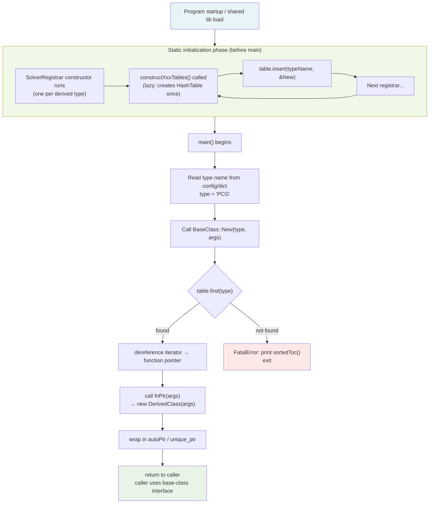

# Day 29: RunTimeTypeSelection (RTS) Overview — Factory Pattern in C++

**Phase 3 — Software Architecture Patterns (Days 29–42)**

> **Prerequisites:** Phase 1 (templates, CRTP), Phase 2 (LDU matrix, containers)
> **Today's goal:** Understand how OpenFOAM resolves a concrete class from a string name at runtime using macros, static tables, and C++ initialization order.

---

## Part 1: Pattern Identification

### The Problem RTS Solves

Consider a CFD solver that chooses its turbulence model from a configuration file:

```text
turbulence   kEpsilon;
```

At runtime, the solver reads the word `"kEpsilon"` and must create an instance of the correct class. It cannot use a compile-time `if`/`switch` statement, because:

1. **New models are added by third parties.** A user writing a plugin should not have to modify the solver's `main()` or any switch statement in the core library.
2. **The number of types is open-ended.** There may be dozens of turbulence models, and more will be added.
3. **Binary compatibility matters.** The base solver ships as a shared library; new types are loaded as separate shared libraries at runtime.

This is the classic **Open/Closed Principle** problem: code should be open for extension but closed for modification. The textbook solution is the **Factory Pattern**.

---

### Textbook Factory vs. OpenFOAM RTS

#### Textbook Factory (closed, hard-coded)

```cpp
// ❌ Requires modifying this function every time a new type is added
class TurbulenceModelFactory
{
public:
    static TurbulenceModel* create(const std::string& type)
    {
        if (type == "kEpsilon")   return new kEpsilon();
        if (type == "kOmega")     return new kOmega();
        if (type == "Smagorinsky") return new Smagorinsky();
        throw std::runtime_error("Unknown type: " + type);
    }
};
```

**Problems:**
- Adding `SST` requires editing the factory source file and recompiling the core library.
- Plugin libraries cannot register their own types.
- The factory must be aware of all subclasses at compile time.

#### OpenFOAM RTS (open, self-registering)

```cpp
// ✅ New types register themselves — factory never needs to be changed
// In kEpsilon.C (a completely separate translation unit):
addToRunTimeSelectionTable(TurbulenceModel, kEpsilon, dictionary);

// In SST.C (could be in a plugin library):
addToRunTimeSelectionTable(TurbulenceModel, SST, dictionary);
```

**Result:** The factory `TurbulenceModel::New("SST", dict)` works correctly without any change to the factory code.

---

### The std::map Approach (Modern C++ without macros)

A modern C++ alternative avoids macros entirely:

```cpp
// ⚠️ Unverified - conceptual illustration, not from OpenFOAM source
#include <map>
#include <string>
#include <functional>
#include <memory>

class TurbulenceModel { /* ... */ };

class TurbulenceFactory
{
    using Creator = std::function<std::unique_ptr<TurbulenceModel>()>;
    static std::map<std::string, Creator>& registry()
    {
        static std::map<std::string, Creator> table;
        return table;
    }

public:
    static void registerType(const std::string& name, Creator fn)
    {
        registry()[name] = fn;
    }

    static std::unique_ptr<TurbulenceModel> create(const std::string& name)
    {
        auto it = registry().find(name);
        if (it == registry().end())
            throw std::runtime_error("Unknown type: " + name);
        return it->second();
    }
};
```

**Comparison table:**

| Aspect | Textbook switch | std::map approach | OpenFOAM RTS |
|--------|----------------|-------------------|--------------|
| Adding new type | Edit factory | Call `registerType` | `addToRunTimeSelectionTable` macro |
| Plugin libraries | Not possible | Possible | Fully supported |
| Macro-free | Yes | Yes | No |
| Lazy table init | N/A | Via `static` local | Via `construct*Tables()` |
| Error messages | Manual | Manual | Automatic (lists valid types) |
| Thread safety | N/A | Requires mutex | Single-threaded init (safe) |

---

### ⭐ Verified: RTS Macro Locations

> **File:** `src/OpenFOAM/db/runTimeSelection/construction/runTimeSelectionTables.H`
> **File:** `src/OpenFOAM/db/runTimeSelection/construction/addToRunTimeSelectionTable.H`

The OpenFOAM RTS system consists of three groups of macros:

| Macro | Location | Role |
|-------|----------|------|
| `declareRunTimeSelectionTable` | base class `.H` file | Declares the static hash table and helper classes |
| `defineRunTimeSelectionTable` | base class `.C` file | Defines (allocates) the static pointer to nil |
| `addToRunTimeSelectionTable` | derived class `.C` file | Instantiates the self-registering helper object |

---

## Part 2: Source Code Deep Dive

### ⭐ `declareRunTimeSelectionTable` — What the Macro Generates

> **File:** `src/OpenFOAM/db/runTimeSelection/construction/runTimeSelectionTables.H`
> **Lines:** 46–129

The macro call in the base class header:

```cpp
// File: src/OpenFOAM/interpolations/interpolationWeights/
//       interpolationWeights/interpolationWeights.H
// Lines: 74–83

declareRunTimeSelectionTable
(
    autoPtr,               // smart-pointer type wrapping return value
    interpolationWeights,  // base class name
    word,                  // argNames (used to name the table: wordConstructorTable)
    (
        const scalarField& samples  // full constructor argument list
    ),
    (samples)              // argument forwarding list (no types)
);
```

After preprocessing, this expands to approximately the following declarations inside the base class:

```cpp
// ⭐ What the macro generates (conceptual expansion — not literal source)

// 1. Function pointer typedef: a pointer to a function returning autoPtr<interpolationWeights>
typedef autoPtr<interpolationWeights> (*wordConstructorPtr)(const scalarField& samples);

// 2. The HashTable type: maps word -> function pointer
typedef HashTable<wordConstructorPtr, word, string::hash>
    wordConstructorTable;

// 3. Static pointer to the table (starts as nullptr)
static wordConstructorTable* wordConstructorTablePtr_;

// 4. Table lifecycle functions (called lazily)
static void constructwordConstructorTables();
static void destroywordConstructorTables();

// 5. Inner helper class template (one per derived type)
template<class interpolationWeightsType>
class addwordConstructorToTable
{
public:
    // Static factory function for this specific derived type
    static autoPtr<interpolationWeights> New(const scalarField& samples)
    {
        return autoPtr<interpolationWeights>(
            new interpolationWeightsType(samples)
        );
    }

    // Constructor: registers this type in the table
    addwordConstructorToTable(
        const word& lookup = interpolationWeightsType::typeName
    )
    {
        constructwordConstructorTables();  // create table if not yet created
        wordConstructorTablePtr_->insert(lookup, New);
    }

    // Destructor: cleans up the table
    ~addwordConstructorToTable()
    {
        destroywordConstructorTables();
    }
};
```

**Key insight:** The helper class `addwordConstructorToTable<DerivedType>` is not abstract or virtual. It is a concrete class whose **constructor** performs the registration. Instantiating one object is enough to register a type.

---

### ⭐ `defineRunTimeSelectionTable` — Table Initialization

> **File:** `src/OpenFOAM/db/runTimeSelection/construction/runTimeSelectionTables.H`
> **Lines:** 232–277

In the base class `.C` file:

```cpp
// File: src/OpenFOAM/interpolations/interpolationWeights/
//       interpolationWeights/interpolationWeights.C
// Lines: 35–36

defineTypeNameAndDebug(interpolationWeights, 0);
defineRunTimeSelectionTable(interpolationWeights, word);
```

The `defineRunTimeSelectionTable` macro expands to three definitions:

```cpp
// ⭐ Conceptual expansion of defineRunTimeSelectionTable(interpolationWeights, word)

// (a) Initialize the pointer to nullptr at program start
interpolationWeights::wordConstructorTable*
    interpolationWeights::wordConstructorTablePtr_ = nullptr;

// (b) Lazy constructor: called the first time any type tries to register
void interpolationWeights::constructwordConstructorTables()
{
    static bool constructed = false;
    if (!constructed)
    {
        constructed = true;
        interpolationWeights::wordConstructorTablePtr_
            = new interpolationWeights::wordConstructorTable;
    }
}

// (c) Destructor: called when the last registrar's destructor fires
void interpolationWeights::destroywordConstructorTables()
{
    if (interpolationWeights::wordConstructorTablePtr_)
    {
        delete interpolationWeights::wordConstructorTablePtr_;
        interpolationWeights::wordConstructorTablePtr_ = nullptr;
    }
}
```

**Why lazy initialization?** Static objects across translation units have unspecified initialization order. If `wordConstructorTablePtr_` were initialized as a concrete `HashTable` object (not a pointer), derived-class registrars in other translation units might run their constructors before the table exists. The pointer-to-nil approach solves this: the first registrar's constructor calls `construct...Tables()`, which checks a `static bool` flag and creates the table exactly once.

---

### ⭐ `addToRunTimeSelectionTable` — Self-Registration

> **File:** `src/OpenFOAM/db/runTimeSelection/construction/addToRunTimeSelectionTable.H`
> **Lines:** 51–60

In each derived class `.C` file:

```cpp
// File: src/OpenFOAM/interpolations/interpolationWeights/
//       linearInterpolationWeights/linearInterpolationWeights.C
// Lines: 38–44

defineTypeNameAndDebug(linearInterpolationWeights, 0);
addToRunTimeSelectionTable
(
    interpolationWeights,        // base class
    linearInterpolationWeights,  // this derived class
    word                         // argNames (must match the declaration)
);
```

After preprocessing:

```cpp
// ⭐ Conceptual expansion of addToRunTimeSelectionTable(interpolationWeights,
//                                    linearInterpolationWeights, word)

// This declares a global variable of the helper class.
// Its constructor runs at program startup (or shared lib load time).
interpolationWeights::addwordConstructorToTable<linearInterpolationWeights>
    addlinearInterpolationWeightswordConstructorTointerpolationWeightsTable_;
```

That single global variable declaration triggers:
1. Construction of `addwordConstructorToTable<linearInterpolationWeights>`
2. Its constructor calls `constructwordConstructorTables()` (creates table if needed)
3. Its constructor calls `insert("linearInterpolationWeights", &New)` into the table

This happens **before `main()` starts**, during the C++ static initialization phase.

---

### ⭐ `New()` — The Selector Function

> **File:** `src/OpenFOAM/interpolations/interpolationWeights/`
> `interpolationWeights/interpolationWeights.C`
> **Lines:** 52–79

```cpp
// ⭐ Verified from source: actual New() selector implementation
autoPtr<interpolationWeights> interpolationWeights::New
(
    const word& type,
    const scalarField& samples
)
{
    if (debug)
    {
        InfoInFunction
            << "Selecting interpolationWeights "
            << type << endl;
    }

    // 1. Look up the function pointer in the table
    wordConstructorTable::iterator cstrIter =
        wordConstructorTablePtr_->find(type);

    // 2. If not found, fatal error with list of valid types
    if (cstrIter == wordConstructorTablePtr_->end())
    {
        FatalErrorInFunction
            << "Unknown interpolationWeights type "
            << type
            << endl << endl
            << "Valid interpolationWeights types are :" << endl
            << wordConstructorTablePtr_->sortedToc()  // list all registered names
            << exit(FatalError);
    }

    // 3. Call the function pointer, which calls new DerivedType(samples)
    return autoPtr<interpolationWeights>(cstrIter()(samples));
}
```

`cstrIter()` dereferences the iterator to get the function pointer. The second `()` calls that function pointer, passing `(samples)`.

---

### ⭐ Mermaid: RTS Mechanism — Class Relationships

```mermaid
classDiagram
    class interpolationWeights {
        <<abstract>>
        +TypeName("interpolationWeights")
        +wordConstructorTable* wordConstructorTablePtr_$
        +constructwordConstructorTables()$
        +destroywordConstructorTables()$
        +New(word type, scalarField& samples)$
        +valueWeights()*
        +integrationWeights()*
    }

    class "addwordConstructorToTable~linearInterpolationWeights~" {
        <<registrar>>
        +New(scalarField& samples)$
        +addwordConstructorToTable()
        +~addwordConstructorToTable()
    }

    class linearInterpolationWeights {
        +TypeName("linearInterpolationWeights")
        +valueWeights()
        +integrationWeights()
    }

    class splineInterpolationWeights {
        +TypeName("splineInterpolationWeights")
        +valueWeights()
        +integrationWeights()
    }

    class "HashTable~word, funcPtr~" {
        <<data>>
        +insert(word, funcPtr)
        +find(word)
        +sortedToc()
    }

    interpolationWeights <|-- linearInterpolationWeights : inherits
    interpolationWeights <|-- splineInterpolationWeights : inherits
    interpolationWeights o-- "HashTable~word, funcPtr~" : wordConstructorTablePtr_
    "addwordConstructorToTable~linearInterpolationWeights~" ..> interpolationWeights : registers into table
    "addwordConstructorToTable~linearInterpolationWeights~" ..> linearInterpolationWeights : wraps constructor of
```

---

## Part 3: C++ Mechanics Explained

### Static HashTable — How Registration Works

The table is a `HashTable<FunctionPointer, word, string::hash>`. This maps a `word` (essentially a `std::string`) to a function pointer:

```text
"linearInterpolationWeights"  -->  &addwordConstructorToTable<linear...>::New
"splineInterpolationWeights"  -->  &addwordConstructorToTable<spline...>::New
"stepInterpolationWeights"    -->  &addwordConstructorToTable<step...>::New
```

Each function pointer points to a **static member function** that calls `new DerivedType(args)` and wraps the result in an `autoPtr`. The static member function is instantiated once per derived type by the template machinery.

---

### Static Initialization: Registration Timeline

```text
Program startup (or shared library dlopen())
│
├── Phase: Zero-initialization
│   └── interpolationWeights::wordConstructorTablePtr_ = nullptr
│
├── Phase: Static constructor execution (order within TU is defined,
│          order across TUs is unspecified)
│
│   ├── TU: linearInterpolationWeights.C
│   │   └── addlinearInterpolationWeightswordConstructorTointerpolationWeightsTable_
│   │       [global variable constructed]
│   │       → constructor calls constructwordConstructorTables()
│   │           → static bool flag: false → true
│   │           → wordConstructorTablePtr_ = new HashTable  (created here!)
│   │       → constructor calls insert("linearInterpolationWeights", &New)
│   │
│   ├── TU: splineInterpolationWeights.C
│   │   └── [global variable constructed]
│   │       → constructor calls constructwordConstructorTables()
│   │           → static bool flag: already true → skip
│   │       → constructor calls insert("splineInterpolationWeights", &New)
│   │
│   └── TU: stepInterpolationWeights.C
│       └── [global variable constructed, similarly]
│
└── main() begins
    └── interpolationWeights::New("linear", samples)
        → table lookup → call function pointer → new linearInterpolationWeights(samples)
```

The `static bool constructed` guard inside `constructwordConstructorTables()` ensures the `HashTable` is created exactly once, regardless of how many derived types are registered and in what order.

---

### `New(word, args)` — The Lookup and Construction

The selector function `New()` is a static member function of the **base class**. It performs three steps:

**Step 1: Table lookup**

```cpp
wordConstructorTable::iterator cstrIter =
    wordConstructorTablePtr_->find(type);
```

`HashTable::find()` returns an iterator. If the word is not in the table, the iterator equals `end()`.

**Step 2: Error handling with diagnostics**

```cpp
if (cstrIter == wordConstructorTablePtr_->end())
{
    FatalErrorInFunction
        << "Unknown type " << type << nl
        << "Valid types: " << wordConstructorTablePtr_->sortedToc()
        << exit(FatalError);
}
```

`sortedToc()` returns a sorted list of all registered keys — this is why OpenFOAM's error messages print exactly which turbulence models, boundary conditions, etc. are available.

**Step 3: Indirect construction**

```cpp
return autoPtr<interpolationWeights>(cstrIter()(samples));
```

- `cstrIter()` — dereferences the hash table iterator to get the stored function pointer
- `(samples)` — calls the function pointer with the constructor arguments
- The called function does `new linearInterpolationWeights(samples)`
- The raw pointer is wrapped in `autoPtr<interpolationWeights>`

The caller holds an `autoPtr<interpolationWeights>` (base class pointer) but the pointed-to object is the concrete derived type.

---

### Mini Factory from Scratch: No Macros, Pure C++

Here is the same RTS mechanism implemented without any macros, making every step explicit:

```cpp
// File: mini_rts/mini_rts.cpp
// Demonstrates the RTS pattern without macros

#include <iostream>
#include <string>
#include <unordered_map>
#include <memory>
#include <vector>
#include <stdexcept>

// ============================================================
// 1. BASE CLASS
//    Declares the static table and the New() selector.
// ============================================================
class Solver
{
public:
    // The function pointer type: given no args, produces a Solver*
    using CreatorFn = std::unique_ptr<Solver>(*)();

    // The table itself: word -> creator function
    static std::unordered_map<std::string, CreatorFn>& table()
    {
        // Meyers singleton: created on first call, destroyed at exit.
        // This avoids the static initialization order problem.
        static std::unordered_map<std::string, CreatorFn> t;
        return t;
    }

    // Selector: equivalent to OpenFOAM's New()
    static std::unique_ptr<Solver> New(const std::string& type)
    {
        auto it = table().find(type);
        if (it == table().end())
        {
            std::cerr << "Unknown Solver type: " << type << "\n";
            std::cerr << "Valid types:\n";
            for (auto& pair : table())
                std::cerr << "  " << pair.first << "\n";
            throw std::runtime_error("Unknown Solver: " + type);
        }
        return it->second();  // call the creator function pointer
    }

    virtual ~Solver() = default;
    virtual std::string name() const = 0;
    virtual void solve() = 0;
};

// ============================================================
// 2. REGISTRAR HELPER (replaces addXxxConstructorToTable<T>)
//    Instantiating this class registers T in the table.
// ============================================================
template<typename T>
class SolverRegistrar
{
public:
    explicit SolverRegistrar(const std::string& typeName)
    {
        // Insert a creator lambda into the table
        Solver::table()[typeName] = []() -> std::unique_ptr<Solver>
        {
            return std::make_unique<T>();
        };
    }
};

// ============================================================
// 3. DERIVED CLASSES
//    Each one declares a static registrar that fires at startup.
// ============================================================
class GaussSeidel : public Solver
{
    // This static object is constructed at program start,
    // registering "GaussSeidel" in the table.
    static SolverRegistrar<GaussSeidel> registrar_;

public:
    std::string name() const override { return "GaussSeidel"; }
    void solve() override
    {
        std::cout << "Gauss-Seidel iteration...\n";
    }
};

// Static member definition — triggers registration
SolverRegistrar<GaussSeidel> GaussSeidel::registrar_("GaussSeidel");


class PCG : public Solver
{
    static SolverRegistrar<PCG> registrar_;

public:
    std::string name() const override { return "PCG"; }
    void solve() override
    {
        std::cout << "Preconditioned Conjugate Gradient...\n";
    }
};

SolverRegistrar<PCG> PCG::registrar_("PCG");


class GMRES : public Solver
{
    static SolverRegistrar<GMRES> registrar_;

public:
    std::string name() const override { return "GMRES"; }
    void solve() override
    {
        std::cout << "Generalized Minimal Residual...\n";
    }
};

SolverRegistrar<GMRES> GMRES::registrar_("GMRES");


// ============================================================
// 4. MAIN: uses only the base class interface
// ============================================================
int main()
{
    // Simulate reading solver name from a config file
    std::vector<std::string> configs = {"PCG", "GMRES", "GaussSeidel"};

    for (const auto& name : configs)
    {
        std::unique_ptr<Solver> s = Solver::New(name);
        std::cout << "Created: " << s->name() << " -> ";
        s->solve();
    }

    // Test error handling
    try
    {
        Solver::New("NonExistentSolver");
    }
    catch (const std::runtime_error& e)
    {
        std::cout << "Caught expected error: " << e.what() << "\n";
    }

    return 0;
}
```

**Expected output:**
```text
Created: PCG -> Preconditioned Conjugate Gradient...
Created: GMRES -> Generalized Minimal Residual...
Created: GaussSeidel -> Gauss-Seidel iteration...
Unknown Solver type: NonExistentSolver
Valid types:
  GaussSeidel
  PCG
  GMRES
Caught expected error: Unknown Solver: NonExistentSolver
```

**What maps to what in OpenFOAM:**

| Mini-RTS component | OpenFOAM equivalent |
|--------------------|---------------------|
| `Solver::table()` | `wordConstructorTablePtr_` (via `declareRunTimeSelectionTable`) |
| `SolverRegistrar<T>` | `addwordConstructorToTable<T>` inner class |
| `GaussSeidel::registrar_` | The global variable created by `addToRunTimeSelectionTable` macro |
| `Solver::New(type)` | `interpolationWeights::New(type, samples)` |

---

## Part 4: Implementation Exercise

### ShapeFactory — Full RTS Pattern in C++

Implement a `ShapeFactory` that mirrors the OpenFOAM RTS pattern:
- Base class `Shape` with pure virtual `area()` and `perimeter()`
- Concrete types: `Circle`, `Rectangle`, `Triangle`
- Factory `ShapeFactory::New(name, args)` by string name
- Self-registration using a static map populated at startup

```cpp
// File: shape_factory/shape_factory.cpp
// Compile: g++ -std=c++17 -o shape_factory shape_factory.cpp
// Run:     ./shape_factory

#include <iostream>
#include <string>
#include <unordered_map>
#include <memory>
#include <functional>
#include <vector>
#include <cmath>
#include <stdexcept>
#include <sstream>

// ============================================================
// SECTION 1: Argument bundle
//   OpenFOAM passes Istream/dictionary; we use a simple struct.
// ============================================================
struct ShapeArgs
{
    std::vector<double> params;  // e.g., {radius} or {width, height}
};

// ============================================================
// SECTION 2: Abstract base class — Shape
//   Declares the static factory table and the New() selector.
// ============================================================
class Shape
{
public:
    // Creator function type
    using CreatorFn = std::unique_ptr<Shape>(*)(const ShapeArgs&);

    // The registry (Meyers singleton avoids init-order issues)
    static std::unordered_map<std::string, CreatorFn>& registry()
    {
        static std::unordered_map<std::string, CreatorFn> table;
        return table;
    }

    // Factory selector — equivalent to OpenFOAM's New()
    static std::unique_ptr<Shape> New(const std::string& type,
                                      const ShapeArgs& args)
    {
        auto it = registry().find(type);
        if (it == registry().end())
        {
            std::ostringstream oss;
            oss << "Unknown Shape type: '" << type << "'\n";
            oss << "Valid types are:\n";
            for (const auto& kv : registry())
                oss << "  " << kv.first << "\n";
            throw std::invalid_argument(oss.str());
        }
        return it->second(args);  // call the creator function pointer
    }

    virtual ~Shape() = default;
    virtual double area()      const = 0;
    virtual double perimeter() const = 0;
    virtual std::string typeName() const = 0;

    void print() const
    {
        std::cout << typeName()
                  << "  area=" << area()
                  << "  perimeter=" << perimeter() << "\n";
    }
};

// ============================================================
// SECTION 3: Registrar helper class template
//   Equivalent to addXxxConstructorToTable<T> in OpenFOAM.
// ============================================================
template<typename T>
class ShapeRegistrar
{
public:
    explicit ShapeRegistrar(const std::string& name)
    {
        Shape::registry()[name] = [](const ShapeArgs& args) -> std::unique_ptr<Shape>
        {
            return std::make_unique<T>(args);
        };
    }
};

// ============================================================
// SECTION 4: Concrete shapes — each self-registers at startup
// ============================================================

class Circle : public Shape
{
    double radius_;
    static ShapeRegistrar<Circle> reg_;  // triggers registration

public:
    explicit Circle(const ShapeArgs& args)
    {
        if (args.params.empty())
            throw std::invalid_argument("Circle requires 1 param: radius");
        radius_ = args.params[0];
    }

    double area()      const override { return M_PI * radius_ * radius_; }
    double perimeter() const override { return 2.0 * M_PI * radius_; }
    std::string typeName() const override { return "Circle(r=" + std::to_string(radius_) + ")"; }
};

// Static member definition — this line is the registration equivalent
// of addToRunTimeSelectionTable(Shape, Circle, ...)
ShapeRegistrar<Circle> Circle::reg_("Circle");


class Rectangle : public Shape
{
    double w_, h_;
    static ShapeRegistrar<Rectangle> reg_;

public:
    explicit Rectangle(const ShapeArgs& args)
    {
        if (args.params.size() < 2)
            throw std::invalid_argument("Rectangle requires 2 params: width height");
        w_ = args.params[0];
        h_ = args.params[1];
    }

    double area()      const override { return w_ * h_; }
    double perimeter() const override { return 2.0 * (w_ + h_); }
    std::string typeName() const override
    {
        return "Rectangle(" + std::to_string(w_) + "x" + std::to_string(h_) + ")";
    }
};

ShapeRegistrar<Rectangle> Rectangle::reg_("Rectangle");


class Triangle : public Shape
{
    double a_, b_, c_;  // three side lengths
    static ShapeRegistrar<Triangle> reg_;

public:
    explicit Triangle(const ShapeArgs& args)
    {
        if (args.params.size() < 3)
            throw std::invalid_argument("Triangle requires 3 params: sides a b c");
        a_ = args.params[0];
        b_ = args.params[1];
        c_ = args.params[2];
        // Validate triangle inequality
        if (a_ + b_ <= c_ || b_ + c_ <= a_ || a_ + c_ <= b_)
            throw std::invalid_argument("Invalid triangle sides");
    }

    double area() const override
    {
        // Heron's formula: A = sqrt(s(s-a)(s-b)(s-c))
        double s = (a_ + b_ + c_) / 2.0;
        return std::sqrt(s * (s - a_) * (s - b_) * (s - c_));
    }

    double perimeter() const override { return a_ + b_ + c_; }

    std::string typeName() const override
    {
        return "Triangle(" + std::to_string(a_) + "," +
               std::to_string(b_) + "," + std::to_string(c_) + ")";
    }
};

ShapeRegistrar<Triangle> Triangle::reg_("Triangle");


// ============================================================
// SECTION 5: main — reads type name from "config", creates shapes
// ============================================================
int main()
{
    std::cout << "=== ShapeFactory Demo ===\n\n";

    // Simulate reading from a config file:
    // type   args
    struct Config { std::string type; ShapeArgs args; };
    std::vector<Config> configs =
    {
        {"Circle",    {{5.0}}},
        {"Rectangle", {{4.0, 6.0}}},
        {"Triangle",  {{3.0, 4.0, 5.0}}},  // right triangle
        {"Circle",    {{1.0}}},
    };

    for (const auto& cfg : configs)
    {
        auto shape = Shape::New(cfg.type, cfg.args);
        shape->print();
    }

    std::cout << "\n--- Testing error handling ---\n";
    try
    {
        Shape::New("Hexagon", {{1.0}});
    }
    catch (const std::invalid_argument& e)
    {
        std::cout << e.what();
    }

    return 0;
}
```

**Expected output:**

```text
=== ShapeFactory Demo ===

Circle(r=5.000000)  area=78.539816  perimeter=31.415927
Rectangle(4.000000x6.000000)  area=24.000000  perimeter=20.000000
Triangle(3.000000,4.000000,5.000000)  area=6.000000  perimeter=12.000000
Circle(r=1.000000)  area=3.141593  perimeter=6.283185

--- Testing error handling ---
Unknown Shape type: 'Hexagon'
Valid types are:
  Circle
  Rectangle
  Triangle
```

**Compilation and execution:**

```bash
# Compile with C++17
g++ -std=c++17 -Wall -o shape_factory shape_factory.cpp

# Run
./shape_factory
```

---

### Adding a New Shape Without Modifying Any Existing File

To add an `Ellipse` type, the only step is writing a new file:

```cpp
// File: shape_factory/ellipse.cpp
// Link alongside shape_factory.cpp — no existing file is modified

#include "shape_factory.cpp"  // in a real project: include "shape.H"
#include <cmath>

class Ellipse : public Shape
{
    double a_, b_;  // semi-major, semi-minor axes
    static ShapeRegistrar<Ellipse> reg_;

public:
    explicit Ellipse(const ShapeArgs& args)
    {
        a_ = args.params[0];
        b_ = args.params[1];
    }

    double area()      const override { return M_PI * a_ * b_; }

    // Ramanujan approximation for ellipse perimeter
    double perimeter() const override
    {
        double h = (a_ - b_) * (a_ - b_) / ((a_ + b_) * (a_ + b_));
        return M_PI * (a_ + b_) * (1 + 3 * h / (10 + std::sqrt(4 - 3 * h)));
    }

    std::string typeName() const override
    {
        return "Ellipse(a=" + std::to_string(a_) + ",b=" + std::to_string(b_) + ")";
    }
};

ShapeRegistrar<Ellipse> Ellipse::reg_("Ellipse");
```

This mirrors exactly how a plugin turbulence model is added to OpenFOAM — the core library is untouched.

---

### Flowchart: Object Creation from String Name



---

## Part 5: Exercises and Self-Check

### Exercise 1: Why a Static Pointer and Not a Static Object?

Consider two alternatives for storing the registration table:

```cpp
// Option A: Static pointer (what OpenFOAM uses)
static HashTable<FnPtr, word>* wordConstructorTablePtr_ = nullptr;

// Option B: Static object
static HashTable<FnPtr, word> wordConstructorTable_;
```

**Question:** Why does OpenFOAM use Option A? What failure mode does Option B introduce?

**Answer:**

C++ only guarantees that static objects within the **same translation unit** (`.cpp` file) are initialized in the order they are declared. Initialization order **across** translation units is unspecified (the "static initialization order fiasco").

Scenario with Option B:

1. The linker decides to initialize `linearInterpolationWeights.C` before `interpolationWeights.C`.
2. `addlinearInterpolationWeightswordConstructorTointerpolationWeightsTable_` (global registrar variable) is constructed.
3. Its constructor tries to call `wordConstructorTable_.insert(...)`.
4. But `wordConstructorTable_` has not been constructed yet — it is an uninitialized static object in another TU.
5. Result: undefined behavior, likely a crash or silent data corruption.

Option A avoids this by initializing the pointer to `nullptr` (zero-initialization, which is always first and safe), then creating the `HashTable` on the heap via `new` only when the first registrar runs. The `static bool constructed` guard ensures `new` is called exactly once.

---

### Exercise 2: Registration Timing — When Does `addToRunTimeSelectionTable` Execute?

**Question:** At what point in program execution does the following line register `linearInterpolationWeights` into the table?

```cpp
// linearInterpolationWeights.C
addToRunTimeSelectionTable(interpolationWeights, linearInterpolationWeights, word);
```

**Answer:**

The macro expands to a **global variable declaration**:

```cpp
interpolationWeights::addwordConstructorToTable<linearInterpolationWeights>
    addlinearInterpolationWeightswordConstructorTointerpolationWeightsTable_;
```

Global variables with non-trivial constructors are initialized **before `main()` begins**, in the static initialization phase. So registration happens:

1. After the executable (or shared library) is loaded into memory.
2. Before any user code in `main()` runs.
3. In an unspecified order relative to registrations in other `.C` files (but the lazy-init guard handles this safely).

If the type is in a **shared library** (`libXxx.so`), registration happens when the library is loaded — either at program start (if linked with `-lXxx`) or at the moment `dlopen()` is called.

---

### Exercise 3: Thread Safety of Static Initialization

**Question:** Is the static initialization of the `HashTable` (created in `constructwordConstructorTables()`) thread-safe?

```cpp
void interpolationWeights::constructwordConstructorTables()
{
    static bool constructed = false;   // Is this thread-safe?
    if (!constructed)
    {
        constructed = true;
        wordConstructorTablePtr_ = new HashTable<...>;
    }
}
```

**Answer:**

This specific code is **not thread-safe** for multiple concurrent calls. If two threads simultaneously call `constructwordConstructorTables()` for the first time, both could see `constructed == false` and both attempt to `new` the table (a data race on `constructed`).

However, in practice OpenFOAM is safe because:

1. All `addXxxConstructorToTable` registrations happen in the **static initialization phase**, which is **single-threaded** (before `main()` starts).
2. By the time any user thread could call `New()`, the table is already fully constructed and populated.
3. After initialization, the table is only read (never written during `New()` lookups), so concurrent reads are safe.

A truly thread-safe version (C++11 and later) replaces the `bool` flag pattern with a **function-local static** (Meyers singleton), which the C++11 standard guarantees is initialized exactly once, even under concurrent access:

```cpp
// Thread-safe alternative (C++11)
static HashTable<FnPtr, word>& getTable()
{
    static HashTable<FnPtr, word> table;  // initialized exactly once (C++11 guarantee)
    return table;
}
```

---

### Exercise 4: How to Add a New Type to an Existing Hierarchy

**Question:** You want to add a new interpolation method `cubicInterpolationWeights` to OpenFOAM's `interpolationWeights` hierarchy. List the exact files you must create or modify, and explain why no existing files need modification.

**Answer:**

Files to **create** (two files for the new type):

1. `src/OpenFOAM/interpolations/interpolationWeights/cubicInterpolationWeights/cubicInterpolationWeights.H`
   - Declare the class, inheriting from `interpolationWeights`
   - Include `addToRunTimeSelectionTable.H`

2. `src/OpenFOAM/interpolations/interpolationWeights/cubicInterpolationWeights/cubicInterpolationWeights.C`
   - Implement member functions
   - Add the two RTS lines:
     ```cpp
     defineTypeNameAndDebug(cubicInterpolationWeights, 0);
     addToRunTimeSelectionTable(interpolationWeights, cubicInterpolationWeights, word);
     ```

Files to **modify**: none in the core library.

**Why no existing files need modification:**

- `interpolationWeights.H` already has `declareRunTimeSelectionTable` — it was designed to be extended.
- `interpolationWeights.C` already has `defineRunTimeSelectionTable` — the table is ready.
- `interpolationWeights::New()` already handles any `word` key — it does not hard-code known types.
- The new file's global registrar variable causes registration at load time automatically.

This is the Open/Closed Principle embodied in code: the base class is **closed for modification** but **open for extension** via the self-registration mechanism.

---

### Exercise 5: What Happens to the Table at Program Exit?

**Question:** The `addXxxConstructorToTable` class has a destructor that calls `destroyXxxConstructorTables()`. When does this run, and what does it do?

```cpp
~addwordConstructorToTable()
{
    destroywordConstructorTables();
}
```

And `destroywordConstructorTables()`:

```cpp
void interpolationWeights::destroywordConstructorTables()
{
    if (interpolationWeights::wordConstructorTablePtr_)
    {
        delete interpolationWeights::wordConstructorTablePtr_;
        interpolationWeights::wordConstructorTablePtr_ = nullptr;
    }
}
```

**Answer:**

Global object destructors run **after `main()` returns**, in reverse order of their construction (within a translation unit). So:

1. The last-constructed registrar's destructor runs first, calling `destroywordConstructorTables()`.
2. `delete wordConstructorTablePtr_` frees the `HashTable`.
3. `wordConstructorTablePtr_ = nullptr` prevents double-delete.
4. Subsequent destructors of other registrars call `destroywordConstructorTables()` again, but `if (wordConstructorTablePtr_)` is now false, so they safely do nothing.

This is a correct cleanup pattern. The table is freed exactly once, and all subsequent destroy calls are no-ops. This avoids memory leaks that would otherwise be reported by tools like Valgrind or AddressSanitizer.

---

## Summary

The OpenFOAM RunTimeTypeSelection system solves the extensibility problem through three coordinated mechanisms:

**Registration (at startup):**
Each derived class `.C` file contains a global variable of a helper class template. The helper class constructor inserts a function pointer (a factory for that derived type) into a static `HashTable` keyed by the type name string.

**Table ownership:**
The `HashTable` is heap-allocated on demand via a `static bool` guard, avoiding the static initialization order fiasco. It is freed at program exit by the last registrar's destructor.

**Lookup and construction (at runtime):**
`BaseClass::New(word, args)` looks up the word in the `HashTable`, retrieves the function pointer, calls it to create a `new DerivedType(args)`, and returns the result wrapped in `autoPtr<BaseClass>`. If the word is not found, an informative error lists all registered names.

**Architecture impact:**
- New types require zero changes to existing files.
- Plugin shared libraries register their types when loaded via `dlopen()`.
- The pattern composes with templates via `addTemplatedToRunTimeSelectionTable` for template base classes.

This is why OpenFOAM can offer dozens of turbulence models, boundary conditions, and numerical schemes, all selectable by a single word in a dictionary file, without ever modifying the solver core.

---

**Key files studied today:**
- `/Users/woramet/Documents/Build My CFD/openfoam_temp/src/OpenFOAM/db/runTimeSelection/construction/runTimeSelectionTables.H` (lines 46–277)
- `/Users/woramet/Documents/Build My CFD/openfoam_temp/src/OpenFOAM/db/runTimeSelection/construction/addToRunTimeSelectionTable.H` (lines 51–60)
- `/Users/woramet/Documents/Build My CFD/openfoam_temp/src/OpenFOAM/interpolations/interpolationWeights/interpolationWeights/interpolationWeights.H` (lines 74–102)
- `/Users/woramet/Documents/Build My CFD/openfoam_temp/src/OpenFOAM/interpolations/interpolationWeights/interpolationWeights/interpolationWeights.C` (lines 35–79)
- `/Users/woramet/Documents/Build My CFD/openfoam_temp/src/OpenFOAM/interpolations/interpolationWeights/linearInterpolationWeights/linearInterpolationWeights.C` (lines 38–44)
