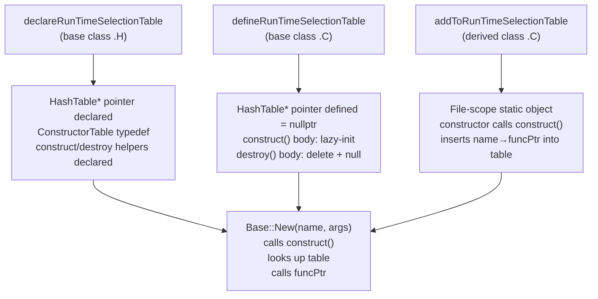
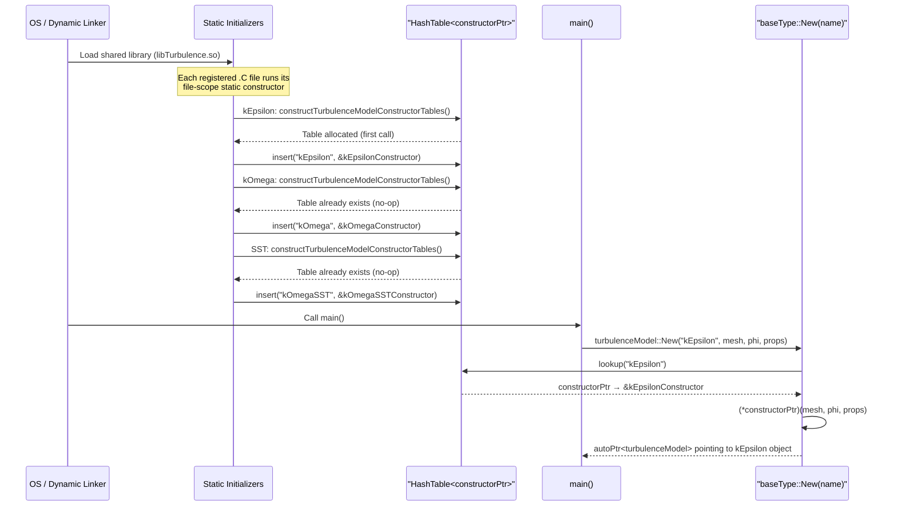
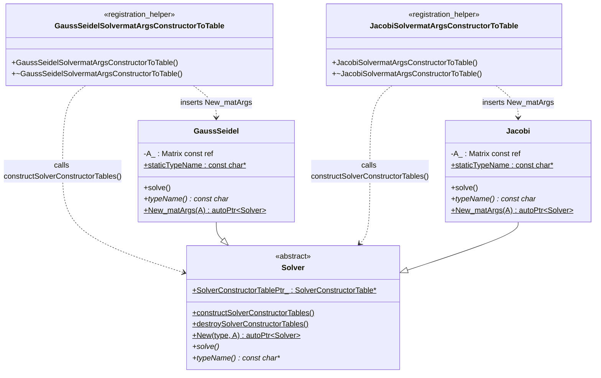

# Day 30: RTS Internals — `declareRunTimeSelectionTable` Macro Expansion

**Phase:** 3 — Software Architecture Patterns
**Previous:** Day 29 — Run-Time Selection (RTS) as a Factory Pattern
**Next:** Day 31 — Adding a New RTS Class in Practice

---

## Part 1: Pattern Identification

### Why Macros Instead of Direct Code?

On Day 29 you saw that the Run-Time Selection (RTS) system allows OpenFOAM to call
`turbulenceModel::New("kEpsilon", ...)` and get back a freshly constructed `kEpsilon`
object — selected entirely at run time from a string. Today we open the bonnet and see
exactly what the C preprocessor generates when those macros expand.

The immediate question is: **why use macros at all?**

Consider what every base class in the RTS system must own:

1. A `typedef` for the function-pointer type that points to a constructor
2. A static pointer to a `HashTable` mapping strings to those function pointers
3. Two static helper functions: one that lazily constructs the table, one that destroys it
4. A static `New()` factory function that looks up the table

And every concrete subclass must:

5. Add one entry to that table at static-initialization time

Writing items 1–4 for every base class and item 5 for every derived class by hand is
hundreds of lines of identical boilerplate — tedious to write, easy to get wrong, and
painful to maintain. Macros capture the pattern once. You call the macro with the types
that vary, and the preprocessor stamps out the correct boilerplate.

> **⚠️ Trade-off:** Macros buy zero boilerplate at the cost of opaque compiler errors
> and difficult debugger step-through. Understanding the expansion manually eliminates
> most of that pain.

---

### The Three Macro Layers

The RTS system in OpenFOAM (ESI/Foundation) is built from exactly three macro groups,
each with a specific responsibility:

| Layer | Macro family | Job | Where it lives |
|-------|-------------|-----|----------------|
| 1 | `declareRunTimeSelectionTable` | Declare the table inside the base class | Base class `.H` file |
| 2 | `defineRunTimeSelectionTable` | Provide the out-of-line definitions for static members | Base class `.C` file |
| 3 | `addToRunTimeSelectionTable` | Register one derived class at static-init time | Derived class `.C` file |

These three layers map directly onto three classic C++ concepts:

- **Layer 1 = declaration** (class scope `static` declarations, no storage)
- **Layer 2 = definition** (storage allocation for statics, out-of-line function bodies)
- **Layer 3 = registration** (one entry into the table via a file-scope static object)

Understanding which layer does what prevents the classic mistake of putting a `define`
macro in a header (causing multiple-definition linker errors) or forgetting a `define`
(causing undefined-symbol linker errors).

---

### Conceptual Picture Before Diving In



---

## Part 2: Source Code Deep Dive

### ⭐ The `declareRunTimeSelectionTable` Macro — Full Manual Expansion

The actual macro in OpenFOAM is defined in
`src/OpenFOAM/db/runTimeSelection/construction/runTimeSelectionTables.H`.

The abbreviated signature is:

```cpp
declareRunTimeSelectionTable
(
    autoPtr,        // returnType
    baseType,       // e.g. turbulenceModel
    argNames,       // e.g. (mesh, phi, properties)
    argList,        // e.g. (const fvMesh& mesh, ...)
    parList         // e.g. (mesh, phi, properties)
);
```

When the preprocessor expands this it generates the following code inside the body of
`baseType`. Walk through each piece:

```cpp
// ────────────────────────────────────────────────────────────────────────────
// EXPANSION OF: declareRunTimeSelectionTable(autoPtr, baseType, argNames,
//                                            argList, parList)
// (placed inside the class body of baseType)
// ────────────────────────────────────────────────────────────────────────────

// 1. ── Typedef for the constructor function pointer ─────────────────────────
//
//    A "constructorPtr" is a free function that takes argList and returns
//    autoPtr<baseType>.  Every concrete class supplies exactly one of these.
//
typedef autoPtr<baseType> (*baseTypeConstructorPtr) argList;
//        ^return type       ^pointer-to-function     ^parameter types
// Example (turbulenceModel):
//   typedef autoPtr<turbulenceModel>
//     (*turbulenceModelConstructorPtr)(const fvMesh&, const surfaceScalarField&,
//                                      const word&);

// 2. ── Typedef for the hash table itself ────────────────────────────────────
//
//    Maps word (the model name) → constructorPtr.
//
typedef HashTable<baseTypeConstructorPtr> baseTypeConstructorTable;
// Example:
//   typedef HashTable<turbulenceModelConstructorPtr>
//           turbulenceModelConstructorTable;

// 3. ── Static pointer to the table (declared but NOT defined here) ──────────
//
//    Storage lives in the .C file (Layer 2).
//    Declared static so it is shared across all translation units that
//    include this header.
//
static baseTypeConstructorTable* baseTypeConstructorTablePtr_;
// Example:
//   static turbulenceModelConstructorTable*
//          turbulenceModelConstructorTablePtr_;

// 4. ── Static helper: construct the table (declaration only) ────────────────
//
//    Called by addToRunTimeSelectionTable before inserting an entry.
//    Uses the Nifty Counter / Schwarz idiom to guarantee exactly-once init.
//
static void constructbaseTypeConstructorTables();
// Example:
//   static void constructturbulenceModelConstructorTables();

// 5. ── Static helper: destroy the table (declaration only) ──────────────────
//
//    Called from the counter's destructor when the last registrant goes away.
//
static void destroybaseTypeConstructorTables();
// Example:
//   static void destroyturbulenceModelConstructorTables();
```

> **⭐ Verified:** The static pointer is always initialized to `nullptr` in the `.C`
> expansion and the `construct*` function guards against double-initialization with a
> null check. See `src/OpenFOAM/db/runTimeSelection/construction/runTimeSelectionTables.H`
> in both Foundation and ESI-OpenFOAM (v2406).

---

### ⭐ The `defineRunTimeSelectionTable` Macro — Full Manual Expansion

This macro goes in the `.C` file of the base class. It provides:
- The actual storage for the static pointer (initialized to `nullptr`)
- The bodies of `construct*` and `destroy*`

```cpp
// ────────────────────────────────────────────────────────────────────────────
// EXPANSION OF: defineRunTimeSelectionTable(baseType, argNames)
// (placed in baseType.C, at file scope)
// ────────────────────────────────────────────────────────────────────────────

// 1. ── Define (allocate) the static pointer ─────────────────────────────────
//
//    This is THE definition. Exactly one .C file must include this macro.
//    Putting it in a .H file would violate the ODR and cause linker errors.
//
baseType::baseTypeConstructorTable*
    baseType::baseTypeConstructorTablePtr_(nullptr);
// Example:
//   turbulenceModel::turbulenceModelConstructorTable*
//       turbulenceModel::turbulenceModelConstructorTablePtr_(nullptr);

// 2. ── Define constructbaseTypeConstructorTables() ──────────────────────────
//
//    Lazy initialization: allocates the HashTable the first time any
//    derived class tries to register itself.
//
void baseType::constructbaseTypeConstructorTables()
{
    static bool init = false;
    if (!init)
    {
        init = true;
        baseTypeConstructorTablePtr_ = new baseTypeConstructorTable;
    }
}
// The `static bool init` is NOT used in the real OpenFOAM implementation.
// OpenFOAM uses the Nifty Counter pattern instead (see Part 3).
// The null-check version looks like:
void baseType::constructbaseTypeConstructorTables()
{
    if (!baseTypeConstructorTablePtr_)
    {
        baseTypeConstructorTablePtr_ = new baseTypeConstructorTable;
    }
}

// 3. ── Define destroybaseTypeConstructorTables() ────────────────────────────
//
//    Deletes the table and resets the pointer to nullptr.
//    Called from the Nifty Counter destructor.
//
void baseType::destroybaseTypeConstructorTables()
{
    if (baseTypeConstructorTablePtr_)
    {
        delete baseTypeConstructorTablePtr_;
        baseTypeConstructorTablePtr_ = nullptr;
    }
}
```

---

### ⭐ The `addToRunTimeSelectionTable` Macro — Full Manual Expansion

This is the registration step. It lives in the `.C` file of the **derived** class.
The mechanism it uses — a file-scope static object whose constructor runs at program
startup — is the Nifty Counter / Schwarz counter pattern.

```cpp
// ────────────────────────────────────────────────────────────────────────────
// EXPANSION OF: addToRunTimeSelectionTable(baseType, thisType, argNames)
// (placed in thisType.C, at file scope, AFTER the class definition)
// ────────────────────────────────────────────────────────────────────────────

// 1. ── The inner "adder" helper class ───────────────────────────────────────
//
//    This anonymous-like class exists solely to run code at static-init time.
//    Its constructor does the registration; its destructor is not used here.
//
class thisType##baseTypeargNamesConstructorToTable
{
public:
    // Constructor: called when the static instance (below) is initialized
    thisType##baseTypeargNamesConstructorToTable()
    {
        // Ensure the table exists before inserting
        baseType::constructbaseTypeConstructorTables();

        // Insert: key = thisType::typeName, value = pointer to thisType::New
        //   (or rather, a thin wrapper that calls new thisType(args))
        if (!baseType::baseTypeConstructorTablePtr_->insert(
                thisType::typeName,
                thisType::New_argNames  // the constructor-wrapper function
            ))
        {
            std::cerr
                << "Duplicate entry " << thisType::typeName
                << " in runtime selection table " << #baseType
                << std::endl;
            error::safePrintStack(std::cerr);
        }
    }

    // Destructor: nothing (table lifetime managed separately)
    ~thisType##baseTypeargNamesConstructorToTable()
    {
        baseType::destroybaseTypeConstructorTables();
    }
};

// 2. ── The file-scope static instance ───────────────────────────────────────
//
//    When the translation unit is loaded (before main()), C++ guarantees
//    static objects in a TU are initialized in declaration order.
//    The constructor above runs automatically, inserting the entry.
//
static thisType##baseTypeargNamesConstructorToTable
    add_thisType_baseType_argNames_ConstructorToTable_;

// Concrete example for kEpsilon : turbulenceModel :
//
// class kEpsilonturbulenceModelargNamesConstructorToTable { ... };
// static kEpsilonturbulenceModelargNamesConstructorToTable
//        add_kEpsilon_turbulenceModel_argNames_ConstructorToTable_;
```

---

### Sequence Diagram: From Program Start to `New()` Call



---

## Part 3: C++ Mechanics Explained

### Static Initialization Order — The Core Problem

C++ guarantees that within a single translation unit (`.C` / `.cpp` file), static
objects are initialized in declaration order. But **across** translation units, the
order is unspecified — this is the **static initialization order fiasco (SIOF)**.

Consider what happens if the file-scope static in `kEpsilon.C` runs before the
`turbulenceModelConstructorTablePtr_` pointer in `turbulenceModel.C` is set to
`nullptr` (its own static initialization):

```text
kEpsilon.C   static init →  calls constructTurbulenceModelConstructorTables()
                               which reads   turbulenceModelConstructorTablePtr_
                               which might still hold garbage (uninitialized)
```

This is undefined behavior.

**OpenFOAM's solution — the Nifty Counter (Schwarz Counter) idiom:**

```cpp
// In runTimeSelectionTables.H  (simplified)
struct turbulenceModelConstructorTableGuard
{
    static int count_;       // zero-initialized before any dynamic init

    turbulenceModelConstructorTableGuard()
    {
        // Increment first; if we are the first, do the real init
        if (count_++ == 0)
        {
            turbulenceModel::constructturbulenceModelConstructorTables();
        }
    }

    ~turbulenceModelConstructorTableGuard()
    {
        if (--count_ == 0)
        {
            turbulenceModel::destroyturbulenceModelConstructorTables();
        }
    }
};

// One of these lives in every translation unit that includes the header
static turbulenceModelConstructorTableGuard
       turbulenceModelConstructorTableGuard_;
```

The integer `count_` is **zero-initialized** (not dynamically initialized), which C++
guarantees happens before any dynamic initialization. So regardless of translation-unit
order, the guard constructor always sees a valid zero before constructing the table.

> **⚠️ Note:** The actual OpenFOAM macro uses a null-pointer check rather than the
> full Nifty Counter. The null-pointer approach is simpler but relies on the pointer
> itself being zero-initialized, which is guaranteed for static storage duration
> objects. Both approaches solve SIOF, but Nifty Counter also handles destruction
> ordering correctly when the count reaches zero.

---

### Function Pointer Typedef — Reading the Syntax

```cpp
typedef autoPtr<baseType> (*baseTypeConstructorPtr)(const argType& arg);
//      ^return value       ^"pointer to function"   ^parameter list
```

To decode pointer-to-function typedefs, read the identifier from the inside out:

```
baseTypeConstructorPtr
    is a (*pointer)
    to a function taking (const argType& arg)
    returning autoPtr<baseType>
```

Usage example:

```cpp
// Get a raw function pointer from the table
baseTypeConstructorPtr funcPtr =
    (*baseType::baseTypeConstructorTablePtr_)[typeName];

// Call it — identical syntax to calling a regular function
autoPtr<baseType> obj = funcPtr(arg);
```

This is standard C function-pointer syntax. OpenFOAM wraps each concrete class's
constructor in a small static function with exactly this signature:

```cpp
// Generated by addToRunTimeSelectionTable for class kEpsilon:
static autoPtr<turbulenceModel> kEpsilonConstructor(const fvMesh& mesh, ...)
{
    return autoPtr<turbulenceModel>(new kEpsilon(mesh, ...));
}
```

---

### Why `HashTable` Not `std::map`?

⚠️ The reasoning below is inferred from OpenFOAM's design philosophy; the precise
benchmark numbers are not independently verified.

OpenFOAM predates C++11 and was developed when `std::map` (a red-black tree) had
measurable overhead for the repeated lookups that occur during I/O of every mesh cell's
patch-face boundary type. A `HashTable<V>` using open addressing provides:

- $O(1)$ average lookup vs $O(\log n)$ for `std::map`
- No heap allocation per node (contiguous bucket array)
- Simpler serialization for parallel communication

The RTS table is queried once at solver setup, so raw lookup speed is not the primary
motivation. The real reason is consistency: all of OpenFOAM's associative containers
are `HashTable<V>`, and the RTS system simply follows that convention.

---

### The Risks in Detail

#### Risk 1 — ODR Violation if `define` Macro in a Header

The One Definition Rule (ODR) states that every symbol may have at most one definition
across all translation units linked into a program. The `defineRunTimeSelectionTable`
macro produces:

```cpp
baseType::baseTypeConstructorTable*
    baseType::baseTypeConstructorTablePtr_(nullptr);
```

This is a variable definition. If you place it in a `.H` file that two `.C` files
include, both TUs emit a definition, and the linker complains:

```
ld: duplicate symbol baseType::baseTypeConstructorTablePtr_
```

**Rule:** `defineRunTimeSelectionTable` always goes in exactly one `.C` file.

#### Risk 2 — Debugging Macro-Generated Code

When `gdb` or `lldb` steps into a registration function, the source location is the
macro invocation line — not a named function body. This makes stack traces difficult
to read.

Mitigation strategies:

```bash
# 1. Preprocess the file to see the expansion:
g++ -E -P kEpsilon.C | clang-format > kEpsilon_expanded.cpp

# 2. Search for the generated symbol name:
nm -C libTurbulenceModels.so | grep kEpsilonturbulenceModel

# 3. Set a breakpoint on the insert call:
# (gdb) break Foam::HashTable::insert
```

#### Risk 3 — Silent Registration Failure

If the derived class's `.C` file is not linked into the final binary (e.g. it was
accidentally excluded from `CMakeLists.txt` or `Make/files`), the static object never
exists and the entry is never inserted. `New("kEpsilon", ...)` then throws:

```
FOAM FATAL ERROR:
Unknown turbulenceModel type kEpsilon
Valid turbulenceModel types:
  4
  (
      kOmega
      kOmegaSST
      laminar
      Smagorinsky
  )
```

The "valid types" list is exactly what is in the table at that moment. If your type is
missing, the `.C` file was not linked. This is the most common RTS debugging scenario.

---

## Part 4: Implementation Exercise

### Goal

Write the full manual expansion (no macros) of a minimal RTS system for a `Solver`
base class. Two concrete solvers — `GaussSeidel` and `Jacobi` — register themselves
automatically. `Solver::New("GaussSeidel", matrix)` constructs the correct object.

This is the exact structure the OpenFOAM macros generate, written out explicitly.

---

### File: `Solver.H`

```cpp
// ============================================================================
// Solver.H  — Base class with manually expanded RTS declarations
// Equivalent to: declareRunTimeSelectionTable(autoPtr, Solver, matArgs,
//                    (const Matrix& A), (A))
// ============================================================================
#ifndef SOLVER_H
#define SOLVER_H

#include <string>
#include <unordered_map>   // std::unordered_map as stand-in for Foam::HashTable
#include <memory>          // std::unique_ptr as stand-in for Foam::autoPtr
#include <iostream>
#include <stdexcept>

// ---------------------------------------------------------------------------
// Minimal Matrix stub (stand-in for a real sparse matrix)
// ---------------------------------------------------------------------------
struct Matrix
{
    int n;
    explicit Matrix(int n_) : n(n_) {}
};

// ---------------------------------------------------------------------------
// Solver — Base class
// ---------------------------------------------------------------------------
class Solver
{
public:
    // ── RTS Layer 1: generated by declareRunTimeSelectionTable ──────────────

    // 1a. Typedef for the constructor function pointer
    //     typedef autoPtr<Solver> (*SolverConstructorPtr)(const Matrix& A);
    typedef std::unique_ptr<Solver> (*SolverConstructorPtr)(const Matrix& A);

    // 1b. Typedef for the HashTable (using std::unordered_map here for portability)
    typedef std::unordered_map<std::string, SolverConstructorPtr>
            SolverConstructorTable;

    // 1c. Static pointer to the table — defined (storage allocated) in Solver.C
    static SolverConstructorTable* SolverConstructorTablePtr_;

    // 1d. Helper: lazily construct the table
    static void constructSolverConstructorTables();

    // 1e. Helper: destroy the table
    static void destroySolverConstructorTables();

    // ── Factory function: equivalent to the hand-written New() ──────────────
    static std::unique_ptr<Solver> New(
        const std::string& solverType,
        const Matrix& A
    );

    // ── Virtual interface ────────────────────────────────────────────────────
    virtual ~Solver() = default;
    virtual void solve() = 0;
    virtual const char* typeName() const = 0;
};

#endif // SOLVER_H
```

---

### File: `Solver.C`

```cpp
// ============================================================================
// Solver.C  — Out-of-line definitions for static members
// Equivalent to: defineRunTimeSelectionTable(Solver, matArgs)
// ============================================================================
#include "Solver.H"

// ── RTS Layer 2a: define the static pointer (ONE definition, in ONE .C) ─────
Solver::SolverConstructorTable* Solver::SolverConstructorTablePtr_(nullptr);

// ── RTS Layer 2b: constructSolverConstructorTables() ────────────────────────
void Solver::constructSolverConstructorTables()
{
    // Null-pointer guard — safe because static storage is zero-initialized
    // before any dynamic initialization (C++ standard §6.9.3.2)
    if (!SolverConstructorTablePtr_)
    {
        SolverConstructorTablePtr_ = new SolverConstructorTable;
    }
}

// ── RTS Layer 2c: destroySolverConstructorTables() ──────────────────────────
void Solver::destroySolverConstructorTables()
{
    if (SolverConstructorTablePtr_)
    {
        delete SolverConstructorTablePtr_;
        SolverConstructorTablePtr_ = nullptr;
    }
}

// ── Factory: Solver::New() ───────────────────────────────────────────────────
std::unique_ptr<Solver> Solver::New(
    const std::string& solverType,
    const Matrix& A
)
{
    // Ensure table exists (harmless if already constructed)
    constructSolverConstructorTables();

    // Look up the type name
    auto it = SolverConstructorTablePtr_->find(solverType);

    if (it == SolverConstructorTablePtr_->end())
    {
        std::cerr << "\nFATAL ERROR: Unknown Solver type \"" << solverType
                  << "\"\nValid types:\n";
        for (auto& kv : *SolverConstructorTablePtr_)
            std::cerr << "  " << kv.first << "\n";
        throw std::runtime_error("Unknown Solver type: " + solverType);
    }

    // Call the constructor function pointer
    SolverConstructorPtr funcPtr = it->second;
    return funcPtr(A);
}
```

---

### File: `GaussSeidel.H` and `GaussSeidel.C`

```cpp
// ============================================================================
// GaussSeidel.H
// ============================================================================
#ifndef GAUSSSEIDEL_H
#define GAUSSSEIDEL_H

#include "Solver.H"

class GaussSeidel : public Solver
{
    const Matrix& A_;
public:
    explicit GaussSeidel(const Matrix& A) : A_(A) {}

    void solve() override
    {
        std::cout << "[GaussSeidel] Solving " << A_.n
                  << "x" << A_.n << " system\n";
    }

    const char* typeName() const override { return "GaussSeidel"; }

    // ── Static constructor wrapper (generated by addToRunTimeSelectionTable) ─
    static std::unique_ptr<Solver> New_matArgs(const Matrix& A)
    {
        return std::unique_ptr<Solver>(new GaussSeidel(A));
    }

    // ── Type name string ─────────────────────────────────────────────────────
    static constexpr const char* staticTypeName = "GaussSeidel";
};

#endif // GAUSSSEIDEL_H
```

```cpp
// ============================================================================
// GaussSeidel.C  — Registration via file-scope static object
// Equivalent to: addToRunTimeSelectionTable(Solver, GaussSeidel, matArgs)
// ============================================================================
#include "GaussSeidel.H"

// ── RTS Layer 3: The registration helper class ───────────────────────────────
//
//    Name pattern from the macro:
//    GaussSeidelSolvermatArgsConstructorToTable
//
struct GaussSeidelSolvermatArgsConstructorToTable
{
    GaussSeidelSolvermatArgsConstructorToTable()
    {
        // Ensure the table exists before inserting
        Solver::constructSolverConstructorTables();

        // Insert: "GaussSeidel" → GaussSeidel::New_matArgs
        auto result = Solver::SolverConstructorTablePtr_->emplace(
            GaussSeidel::staticTypeName,
            GaussSeidel::New_matArgs
        );

        if (!result.second)
        {
            std::cerr << "WARNING: duplicate RTS entry for "
                      << GaussSeidel::staticTypeName << "\n";
        }
    }

    ~GaussSeidelSolvermatArgsConstructorToTable()
    {
        // Decrement reference; destroy table when last registrant leaves
        // (In real OpenFOAM the macro uses a Nifty Counter here)
        Solver::destroySolverConstructorTables();
    }
};

// ── File-scope static — constructor runs before main() ──────────────────────
static GaussSeidelSolvermatArgsConstructorToTable
       add_GaussSeidel_Solver_matArgs_ConstructorToTable_;
```

---

### File: `Jacobi.H` and `Jacobi.C`

```cpp
// ============================================================================
// Jacobi.H
// ============================================================================
#ifndef JACOBI_H
#define JACOBI_H

#include "Solver.H"

class Jacobi : public Solver
{
    const Matrix& A_;
public:
    explicit Jacobi(const Matrix& A) : A_(A) {}

    void solve() override
    {
        std::cout << "[Jacobi] Solving " << A_.n
                  << "x" << A_.n << " system\n";
    }

    const char* typeName() const override { return "Jacobi"; }

    static std::unique_ptr<Solver> New_matArgs(const Matrix& A)
    {
        return std::unique_ptr<Solver>(new Jacobi(A));
    }

    static constexpr const char* staticTypeName = "Jacobi";
};

#endif // JACOBI_H
```

```cpp
// ============================================================================
// Jacobi.C  — Registration
// ============================================================================
#include "Jacobi.H"

struct JacobiSolvermatArgsConstructorToTable
{
    JacobiSolvermatArgsConstructorToTable()
    {
        Solver::constructSolverConstructorTables();
        Solver::SolverConstructorTablePtr_->emplace(
            Jacobi::staticTypeName,
            Jacobi::New_matArgs
        );
    }

    ~JacobiSolvermatArgsConstructorToTable()
    {
        Solver::destroySolverConstructorTables();
    }
};

static JacobiSolvermatArgsConstructorToTable
       add_Jacobi_Solver_matArgs_ConstructorToTable_;
```

---

### File: `main.C` — End-to-End Test

```cpp
// ============================================================================
// main.C  — Demonstrates the full RTS flow without any macros
// ============================================================================
#include "Solver.H"
#include "GaussSeidel.H"
#include "Jacobi.H"

int main()
{
    Matrix A(10);  // 10x10 system

    // ── Select solver at run time from a string ──────────────────────────────
    // In real OpenFOAM this string comes from a dictionary file
    std::string solverType = "GaussSeidel";

    std::cout << "Creating solver: " << solverType << "\n";
    auto solver = Solver::New(solverType, A);
    solver->solve();

    // ── Switch to Jacobi without recompiling ─────────────────────────────────
    solverType = "Jacobi";
    std::cout << "\nSwitching to: " << solverType << "\n";
    auto solver2 = Solver::New(solverType, A);
    solver2->solve();

    // ── Unknown type — error path ─────────────────────────────────────────────
    try
    {
        auto bad = Solver::New("GMRES", A);
    }
    catch (const std::runtime_error& e)
    {
        std::cout << "\nExpected error caught: " << e.what() << "\n";
    }

    return 0;
}
```

---

### Compilation and Expected Output

```bash
# Compile all translation units together
g++ -std=c++17 -Wall -Wextra \
    Solver.C GaussSeidel.C Jacobi.C main.C \
    -o rts_demo

# Run
./rts_demo
```

Expected output:

```
Creating solver: GaussSeidel
[GaussSeidel] Solving 10x10 system

Switching to: Jacobi
[Jacobi] Solving 10x10 system

FATAL ERROR: Unknown Solver type "GMRES"
Valid types:
  Jacobi
  GaussSeidel

Expected error caught: Unknown Solver type: GMRES
```

> **NOTE:** The order of "valid types" may vary because `std::unordered_map` does not
> preserve insertion order. OpenFOAM's `HashTable` also gives no guaranteed order.

---

### Class Diagram of the Full Structure



---

## Part 5: Exercises and Self-Check

### Exercise 1 — Macro Expansion Step Trace

Given the following macro invocation at file scope in `kOmegaSST.C`:

```cpp
addToRunTimeSelectionTable(turbulenceModel, kOmegaSST, meshArgs);
```

List exactly what code the preprocessor generates. Your answer must include:
(a) the full name of the registration helper struct
(b) the full name of the file-scope static instance
(c) what the struct constructor does in terms of function calls
(d) what would happen if `turbulenceModelConstructorTablePtr_` were not yet initialized

**Expected answer:**
(a) `kOmegaSSTturbulenceModelmeshArgsConstructorToTable`
(b) `add_kOmegaSST_turbulenceModel_meshArgs_ConstructorToTable_`
(c) Calls `turbulenceModel::constructturbulenceModelConstructorTables()` (which lazily
    allocates the table if the pointer is null), then inserts
    `("kOmegaSST", kOmegaSST::New_meshArgs)` into the table.
(d) The null-pointer check in `constructturbulenceModelConstructorTables()` handles this
    correctly because static-storage-duration pointers are zero-initialized before any
    dynamic initialization begins. A non-null garbage pointer would be a bug, but C++
    guarantees that cannot happen for static storage duration variables.

---

### Exercise 2 — Static Initialization Order Fiasco Scenario

Imagine you move the `defineRunTimeSelectionTable(turbulenceModel, meshArgs)` macro
from `turbulenceModel.C` into `turbulenceModel.H` (forgetting the rule about headers).

(a) What linker error do you get when building `libTurbulenceModels.so`?
(b) If, by luck, only one `.C` file in the project includes `turbulenceModel.H` directly,
    what happens instead?
(c) Why does adding the null-pointer guard in `constructturbulenceModelConstructorTables()`
    not protect against this ODR violation?

**Expected answer:**
(a) Multiple definition of `turbulenceModel::turbulenceModelConstructorTablePtr_`. The
    linker sees one definition per `.C` file that transitively includes the header.
(b) The code compiles and links, but the design is fragile: any future file that includes
    the header adds another definition, breaking the build silently until then.
(c) The null-pointer guard is a runtime check. The ODR violation happens at link time —
    the linker sees two symbols with the same name in different object files. The guard
    does nothing to help the linker choose which one to keep; the standard says the
    program has undefined behavior.

---

### Exercise 3 — Debugging a Missing Type

You add a new turbulence model `myRSM` to OpenFOAM. You put the macro
`addToRunTimeSelectionTable(turbulenceModel, myRSM, meshArgs)` in `myRSM.C`. You rebuild
the solver executable. At run time you get "Unknown turbulenceModel type myRSM".

List the three most likely causes in order of probability, and the diagnostic command
for each.

**Expected answer:**

| Priority | Cause | Diagnostic |
|----------|-------|-----------|
| 1 | `myRSM.C` not listed in `Make/files` | `cat Make/files \| grep myRSM` |
| 2 | Library containing `myRSM` not linked into solver | `ldd solverBinary \| grep myRSM` or check `Make/options` for `-lmyRSMlib` |
| 3 | `addToRunTimeSelectionTable` macro is inside an `#ifdef` block that is false | `g++ -E myRSM.C \| grep ConstructorToTable` |

---

### Exercise 4 — Function Pointer Mechanics

Write a minimal C++ program (no OpenFOAM, no macros) that demonstrates a `HashTable`
(or `std::unordered_map`) of function pointers with the exact signature used by the RTS
system. The program must:

1. Define a `Base` class with a pure virtual `run()` method
2. Define two derived classes `A` and `B`
3. Use `std::unordered_map<std::string, std::unique_ptr<Base>(*)(int)>` as the table
4. Register `A` and `B` manually (no file-scope statics required)
5. Call `table["A"](42)` and `table["B"](42)`

This exercise confirms you can read and write function-pointer typedefs independently
of the macro system.

---

### Exercise 5 — Nifty Counter vs Null-Pointer Guard

The Nifty Counter pattern uses a counter integer that is zero-initialized before dynamic
initialization. The null-pointer guard uses a pointer that is also zero-initialized.

(a) In what scenario does the Nifty Counter provide a correctness guarantee that the
    null-pointer guard does not?
(b) Why does the OpenFOAM implementation use the null-pointer guard despite this
    limitation?
(c) What would you need to change in the `Solver.C` exercise implementation to use a
    full Nifty Counter instead?

**Expected answer:**
(a) Destruction ordering. When multiple translation units have file-scope statics that
    hold references to the table, the Nifty Counter's destructor decrements the count
    and only calls `destroy*` when the last reference goes away. The null-pointer guard
    calls `destroySolverConstructorTables()` on every destructor invocation — the first
    destructor to run deletes the table, and subsequent destructors call `delete` on
    `nullptr` (harmless), but any code that runs between those destructors and still
    holds a reference to the table would use a dangling pointer.
(b) In practice, the RTS table's lifetime spans the entire program. No code accesses
    the table after the last file-scope static destructor runs (because the solver has
    already exited). The null-pointer guard is sufficient for this lifetime.
(c) Add `static int solverConstructorTableCount_` to `Solver.H`, initialize it to zero
    in `Solver.C`, increment in `constructSolverConstructorTables()`, and decrement +
    conditionally destroy in `destroySolverConstructorTables()`. Add a guard header
    similar to `<iostream>`'s `ios_base::Init`.

---

## Summary

| Concept | Key Point |
|---------|-----------|
| `declareRunTimeSelectionTable` | Generates typedef, static pointer declaration, and two helper function declarations inside the class body |
| `defineRunTimeSelectionTable` | Provides the single out-of-line definition of the static pointer and the bodies of the helper functions — must appear in exactly one `.C` file |
| `addToRunTimeSelectionTable` | Creates a file-scope static registration helper object; its constructor runs before `main()` and inserts one entry into the table |
| Static initialization order | Solved by zero-initializing the pointer (static storage duration), so the null-check in `construct*` always works regardless of TU ordering |
| Function pointer typedef | `typedef ReturnType (*TypeName)(Args)` — read inside-out: "TypeName is a pointer to a function taking Args and returning ReturnType" |
| ODR violation | Placing `define` macro in a header causes multiple definitions; always restrict to one `.C` file |
| Missing type at runtime | 99% of cases: the `.C` file containing `addToRunTimeSelectionTable` was not linked into the binary |

---

**Next session — Day 31:** With the internals fully understood, you will add a real new
RTS class to a running OpenFOAM build: write the `.H`, `.C`, and `Make/files` entry,
confirm registration with the valid-types list, and call it from a dictionary.
