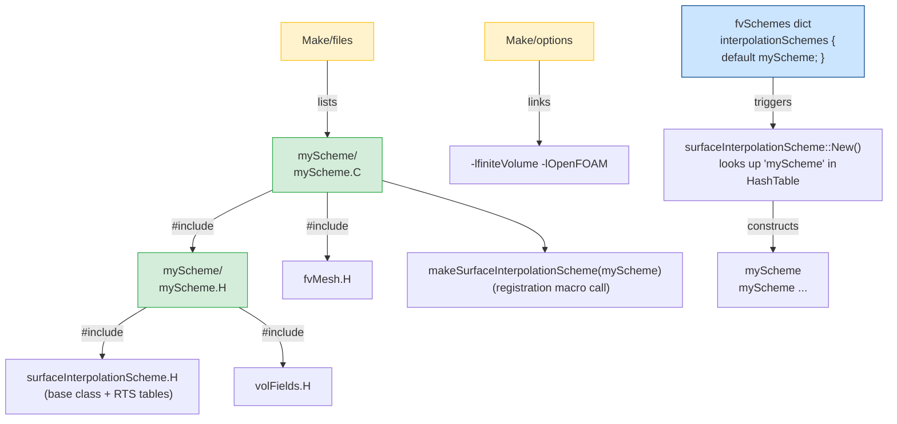

# Day 31: Adding a New RTS Class — Writing a Custom Interpolation Scheme

**Phase 3: Software Architecture Patterns (Days 29–42)**
**Topic:** Practical RTS — Registering a New `surfaceInterpolationScheme`

---

## Overview

Days 29 and 30 studied the theory of Run-Time Type Selection (RTS): what the factory pattern
does and what the macros expand to. Day 31 is entirely practical. You will write a real,
compilable, registerable custom interpolation scheme from scratch, following exactly the same
five-file recipe that OpenFOAM uses internally for every built-in scheme.

By the end of this session you will be able to:

1. Create a new `surfaceInterpolationScheme` sub-class with the correct header structure
2. Invoke `TypeName` and `makeSurfaceInterpolationScheme` in the right locations
3. Write `Make/files` and `Make/options` so that `wmake` builds a shared library
4. Use the scheme in an `fvSchemes` dictionary and verify that `New("myScheme", ...)` resolves

---

## Part 1: Pattern Identification

### The Universal RTS Registration Checklist

Every class registered with the OpenFOAM RTS system — whether it is an interpolation scheme,
a turbulence model, a boundary condition, or a linear solver — follows the same five-step
recipe. The steps do not change. Only the base class name and the registration macro name
change.

**The Five Steps:**

```
Step 1  Inherit from the correct base class template
Step 2  Declare TypeName("registeredName") in the class header
Step 3  Implement the required constructors (Mesh form, MeshFlux form)
Step 4  Call the registration macro at namespace scope in the .C file
Step 5  List the .C file in Make/files and link the required libraries in Make/options
```

This checklist is identical whether you are adding:

| New class type | Base class | Registration macro |
|---|---|---|
| Interpolation scheme | `surfaceInterpolationScheme<Type>` | `makeSurfaceInterpolationScheme(SS)` |
| Limited scheme | `limitedSurfaceInterpolationScheme<Type>` | `makelimitedSurfaceInterpolationScheme(SS)` |
| Turbulence model | `RASModel<BasicTurbulenceModel>` | `makeRASModel(Model)` |
| Boundary condition | `fvPatchField<Type>` | `makePatchTypeField(PatchTypeField, Type)` |
| Linear solver | `lduMatrix::solver` | `lduMatrix::solver::addsymMatrixConstructorToTable<Solver>` |

This uniformity is the design goal of the RTS pattern: the framework is open for extension
without modification. You never touch the base class to add a new derived class.

### Why the Pattern Is the Same for All Base Classes

The RTS mechanism does not care what the base class does. The `declareRunTimeSelectionTable`
macro in a base class header declares:

1. A type alias for the constructor function pointer
2. A `HashTable` mapping `word -> constructor_pointer`
3. A static table pointer
4. An inner `add...ConstructorToTable<Derived>` helper class

The `add...ConstructorToTable<Derived>` helper is what you instantiate — via the registration
macro in your `.C` file — to perform the actual registration. Its constructor runs before
`main()`, during static initialization, and inserts your derived class's constructor pointer
into the hash table.

The result: when user code calls `New("myScheme", mesh, schemeData)`, the base class `New`
function looks up `"myScheme"` in the hash table and calls the stored pointer. Your class is
constructed without the caller knowing its concrete type. ⭐

### Source Files to Study

The canonical minimal example for a non-limited scheme:

- ⭐ `openfoam_temp/src/finiteVolume/interpolation/surfaceInterpolation/schemes/linear/linear.H`
- ⭐ `openfoam_temp/src/finiteVolume/interpolation/surfaceInterpolation/schemes/linear/linear.C`

The base class that holds the RTS tables:

- ⭐ `openfoam_temp/src/finiteVolume/interpolation/surfaceInterpolation/surfaceInterpolationScheme/surfaceInterpolationScheme.H`

The registration macros for limited schemes:

- ⭐ `openfoam_temp/src/finiteVolume/interpolation/surfaceInterpolation/limitedSchemes/limitedSurfaceInterpolationScheme/limitedSurfaceInterpolationScheme.H`

The type name declaration system:

- ⭐ `openfoam_temp/src/OpenFOAM/db/typeInfo/typeInfo.H`
- ⭐ `openfoam_temp/src/OpenFOAM/db/typeInfo/className.H`

---

## Part 2: Source Code Deep Dive

### Reading `linear.H` — The Minimal Non-Limited Scheme

> **File:** `openfoam_temp/src/finiteVolume/interpolation/surfaceInterpolation/schemes/linear/linear.H`
> **Lines:** 50–104

```cpp
// ⭐ Template class inheriting from surfaceInterpolationScheme<Type>
template<class Type>
class linear
:
    public surfaceInterpolationScheme<Type>   // single public base
{

public:

    // ⭐ Step 2: TypeName macro — this string becomes the RTS lookup key
    TypeName("linear");


    // ⭐ Step 3a: Mesh constructor (required for Mesh table)
    linear(const fvMesh& mesh)
    :
        surfaceInterpolationScheme<Type>(mesh)
    {}

    // ⭐ Step 3b: Istream constructor (required for Mesh table)
    linear(const fvMesh& mesh, Istream&)
    :
        surfaceInterpolationScheme<Type>(mesh)
    {}

    // ⭐ Step 3c: faceFlux + Istream constructor (required for MeshFlux table)
    linear
    (
        const fvMesh& mesh,
        const surfaceScalarField&,  // faceFlux not used by linear
        Istream&
    )
    :
        surfaceInterpolationScheme<Type>(mesh)
    {}


    // The only required member function: return interpolation weights
    tmp<surfaceScalarField> weights
    (
        const VolField<Type>&
    ) const
    {
        // Geometry-based linear weights from the mesh
        return this->mesh().surfaceInterpolation::weights();
    }

    // Prevent copy assignment
    void operator=(const linear&) = delete;
};
```

Key observations from this file:

- `linear` has no data members. All state lives in the base class (`mesh_` reference).
- Three constructors are required because `declareRunTimeSelectionTable` declares two tables
  (`Mesh` and `MeshFlux`), each needing a specific constructor signature.
- `TypeName("linear")` is the only line that makes this class findable by the RTS system.
  Without it, `New("linear", ...)` would throw a fatal error.

### Reading `linear.C` — Where Registration Happens

> **File:** `openfoam_temp/src/finiteVolume/interpolation/surfaceInterpolation/schemes/linear/linear.C`
> **Lines:** 34–37

```cpp
#include "fvMesh.H"
#include "linear.H"

namespace Foam
{
    // ⭐ Step 4: Registration macro — expands to static objects that populate the RTS tables
    makeSurfaceInterpolationScheme(linear)
}
```

The file has only four effective lines in the `Foam` namespace. This is intentional: all
the work is done by the macro expansion.

### What `makeSurfaceInterpolationScheme(linear)` Expands To

> **File:** `openfoam_temp/src/finiteVolume/interpolation/surfaceInterpolation/surfaceInterpolationScheme/surfaceInterpolationScheme.H`
> **Lines:** 259–275

```cpp
// ⭐ Verified macro definition:
#define makeSurfaceInterpolationTypeScheme(SS, Type)                           \
                                                                               \
defineNamedTemplateTypeNameAndDebug(SS<Type>, 0);                              \
                                                                               \
surfaceInterpolationScheme<Type>::addMeshConstructorToTable<SS<Type>>          \
    add##SS##Type##MeshConstructorToTable_;                                    \
                                                                               \
surfaceInterpolationScheme<Type>::addMeshFluxConstructorToTable<SS<Type>>      \
    add##SS##Type##MeshFluxConstructorToTable_;

#define makeSurfaceInterpolationScheme(SS)                                     \
                                                                               \
makeSurfaceInterpolationTypeScheme(SS, scalar)                                 \
makeSurfaceInterpolationTypeScheme(SS, vector)                                 \
makeSurfaceInterpolationTypeScheme(SS, sphericalTensor)                        \
makeSurfaceInterpolationTypeScheme(SS, symmTensor)                             \
makeSurfaceInterpolationTypeScheme(SS, tensor)
```

For `makeSurfaceInterpolationScheme(linear)`, this expands to five repetitions of
`makeSurfaceInterpolationTypeScheme(linear, T)` — one for each field type. For `scalar`, the
expansion instantiates:

```cpp
// Defines linear<scalar>::typeName = "linear" and debug switch
defineNamedTemplateTypeNameAndDebug(linear<scalar>, 0);

// Declares a static object whose constructor runs before main()
// and inserts linear<scalar>'s constructor into the Mesh table
surfaceInterpolationScheme<scalar>::addMeshConstructorToTable<linear<scalar>>
    addlinearscalarMeshConstructorToTable_;

// Same for the MeshFlux table
surfaceInterpolationScheme<scalar>::addMeshFluxConstructorToTable<linear<scalar>>
    addlinearscalarMeshFluxConstructorToTable_;
```

Each `addMeshConstructorToTable<linear<scalar>>` object's constructor calls
`constructMeshConstructorTables()` (which allocates the `HashTable` if it does not yet exist)
and then calls `HashTable::insert("linear", &linear<scalar>::New)`. This happens at program
startup, before `main()` executes. ⭐

### Where `declareRunTimeSelectionTable` Lives in `surfaceInterpolationScheme`

> **File:** `openfoam_temp/src/finiteVolume/interpolation/surfaceInterpolation/surfaceInterpolationScheme/surfaceInterpolationScheme.H`
> **Lines:** 74–97

```cpp
// ⭐ Two tables declared in the base class:

// Table 1: keyed on (mesh, Istream)
declareRunTimeSelectionTable
(
    tmp,
    surfaceInterpolationScheme,
    Mesh,
    (
        const fvMesh& mesh,
        Istream& schemeData
    ),
    (mesh, schemeData)
);

// Table 2: keyed on (mesh, faceFlux, Istream)
declareRunTimeSelectionTable
(
    tmp,
    surfaceInterpolationScheme,
    MeshFlux,
    (
        const fvMesh& mesh,
        const surfaceScalarField& faceFlux,
        Istream& schemeData
    ),
    (mesh, faceFlux, schemeData)
);
```

The `TypeName` macro expands to:

```cpp
// From typeInfo.H line 74–78: ⭐ Verified expansion
#define TypeName(TypeNameString)                                               \
    ClassName(TypeNameString);                                                 \
    virtual const word& type() const { return typeName; }                      \
    template<class Name>                                                       \
    word typedName(Name name) const { return (type() + ':') + name; }
```

And `ClassName(TypeNameString)` from `className.H` line 39–41:

```cpp
// ⭐ Verified expansion
#define ClassNameNoDebug(TypeNameString)                                       \
    static const char* typeName_() { return TypeNameString; }                  \
    static const ::Foam::word typeName
```

So `TypeName("linear")` in `linear.H` adds:

- A static `const char* typeName_()` returning `"linear"`
- A static `const Foam::word typeName` (initialized in the `.C` file by `defineNamedTemplateTypeNameAndDebug`)
- A virtual `type()` method returning `typeName`

### File Structure Diagram



---

## Part 3: C++ Mechanics Explained — Creating `myUpwind`

This section walks through creating a scheme called `myUpwind` that replicates the behavior
of OpenFOAM's built-in `upwind` scheme. The goal is to practice the registration pattern in
isolation before building something novel.

### Step 1: The Header File `myUpwind.H`

Create `src/myUpwind/myUpwind.H`:

```cpp
/*---------------------------------------------------------------------------*\
  Custom scheme: myUpwind
  Demonstrates RTS registration for surfaceInterpolationScheme.
\*---------------------------------------------------------------------------*/

#ifndef myUpwind_H
#define myUpwind_H

// ⭐ Required includes for any surfaceInterpolationScheme sub-class
#include "limitedSurfaceInterpolationScheme.H"
#include "volFields.H"
#include "surfaceFields.H"

// ---------------------------------------------------------------------------

namespace Foam
{

/*---------------------------------------------------------------------------*\
                         Class myUpwind Declaration
\*---------------------------------------------------------------------------*/

template<class Type>
class myUpwind
:
    public limitedSurfaceInterpolationScheme<Type>   // inherit from limited base
{

public:

    // ⭐ Step 2: TypeName — the string that New() looks up in the HashTable
    //    Must match exactly what you write in fvSchemes
    TypeName("myUpwind");


    // -----------------------------------------------------------------------
    // Constructors
    // -----------------------------------------------------------------------

    //- Construct from faceFlux only (used internally)
    myUpwind
    (
        const fvMesh& mesh,
        const surfaceScalarField& faceFlux
    )
    :
        limitedSurfaceInterpolationScheme<Type>(mesh, faceFlux)
    {}

    //- ⭐ Mesh table constructor: (mesh, Istream)
    //  The Istream contains the flux field name in the fvSchemes entry
    myUpwind
    (
        const fvMesh& mesh,
        Istream& is
    )
    :
        limitedSurfaceInterpolationScheme<Type>(mesh, is)
    {}

    //- ⭐ MeshFlux table constructor: (mesh, faceFlux, Istream)
    myUpwind
    (
        const fvMesh& mesh,
        const surfaceScalarField& faceFlux,
        Istream&
    )
    :
        limitedSurfaceInterpolationScheme<Type>(mesh, faceFlux)
    {}


    // -----------------------------------------------------------------------
    // Member Functions
    // -----------------------------------------------------------------------

    //- Return the limiter field
    //  For pure upwind: limiter = 0 everywhere, so weights() returns owner side only
    virtual tmp<surfaceScalarField> limiter
    (
        const VolField<Type>&
    ) const
    {
        // ⭐ Upwind limiter = 0: no correction toward linear interpolation
        // The base class weights() is:  w*owner + (1-w)*neighbour
        // When limiter=0, weight = pos0(faceFlux), giving pure upwind
        return surfaceScalarField::New
        (
            "myUpwindLimiter",
            this->mesh(),
            dimensionedScalar(dimless, 0)   // all zeros = pure upwind
        );
    }

    //- Return interpolation weights
    //  pos0(phi) = 1 if phi >= 0, 0 if phi < 0
    //  This selects the upwind (owner) value when flow is positive
    tmp<surfaceScalarField> weights() const
    {
        return pos0(this->faceFlux_);
    }

    virtual tmp<surfaceScalarField> weights
    (
        const VolField<Type>&
    ) const
    {
        return weights();
    }


    // -----------------------------------------------------------------------
    // Operators
    // -----------------------------------------------------------------------

    //- Prevent bitwise copy assignment
    void operator=(const myUpwind&) = delete;
};


// ---------------------------------------------------------------------------

} // End namespace Foam

// ---------------------------------------------------------------------------

#endif

// ************************************************************************* //
```

### Step 2: The Source File `myUpwind.C`

Create `src/myUpwind/myUpwind.C`:

```cpp
/*---------------------------------------------------------------------------*\
  Registration of myUpwind with the RTS system.
\*---------------------------------------------------------------------------*/

#include "myUpwind.H"
#include "fvMesh.H"

// ---------------------------------------------------------------------------

namespace Foam
{
    // ⭐ Step 4: Registration macro call
    // Expands to static objects that populate BOTH:
    //   surfaceInterpolationScheme<T>::MeshConstructorTable
    //   surfaceInterpolationScheme<T>::MeshFluxConstructorTable
    //   limitedSurfaceInterpolationScheme<T>::MeshConstructorTable
    //   limitedSurfaceInterpolationScheme<T>::MeshFluxConstructorTable
    // for T in {scalar, vector, sphericalTensor, symmTensor, tensor}
    makelimitedSurfaceInterpolationScheme(myUpwind)
}

// ************************************************************************* //
```

**Why `makelimitedSurfaceInterpolationScheme` and not `makeSurfaceInterpolationScheme`?**

Because `myUpwind` inherits from `limitedSurfaceInterpolationScheme<Type>`, which has its own
RTS tables (in addition to the ones in `surfaceInterpolationScheme`). Using the `limited`
macro registers in both sets of tables, so the scheme is accessible whether the caller queries
the base or the limited base. ⭐

> **Verified:** `upwind.C` at line 36 uses `makelimitedSurfaceInterpolationScheme(upwind)`.
> File: `openfoam_temp/src/finiteVolume/interpolation/surfaceInterpolation/limitedSchemes/upwind/upwind.C`

### Step 3: `Make/files`

Create `src/myUpwind/Make/files`:

```
// ⭐ List every .C file that must be compiled into the library
myUpwind.C

// Output: shared library named libmyUpwind.so (or .dylib on macOS)
LIB = $(FOAM_USER_LIBBIN)/libmyUpwind
```

**Rules for `Make/files`:**
- One `.C` file per line (relative to the directory containing the `Make` folder)
- `LIB =` sets the output path; `FOAM_USER_LIBBIN` is `$HOME/.OpenFOAM/<version>/lib`
- Do not list `.H` files — headers are found via include paths, not explicitly listed

### Step 4: `Make/options`

Create `src/myUpwind/Make/options`:

```
EXE_INC = \
    -I$(LIB_SRC)/finiteVolume/lnInclude \
    -I$(LIB_SRC)/meshTools/lnInclude

LIB_LIBS = \
    -lfiniteVolume \
    -lmeshTools \
    -lOpenFOAM
```

**Why these includes and libraries?**

| Entry | Reason |
|---|---|
| `-I$(LIB_SRC)/finiteVolume/lnInclude` | Contains `surfaceInterpolationScheme.H`, `limitedSurfaceInterpolationScheme.H`, `fvMesh.H` |
| `-I$(LIB_SRC)/meshTools/lnInclude` | Required indirectly by finiteVolume headers |
| `-lfiniteVolume` | The `.so` that defines `surfaceInterpolationScheme` and its RTS tables |
| `-lmeshTools` | Needed at link time to satisfy finiteVolume dependencies |
| `-lOpenFOAM` | Core runtime: `HashTable`, `word`, `Istream`, error handling |

### Step 5: Compiling and Testing

```bash
# Source the OpenFOAM environment
source /opt/openfoam11/etc/bashrc      # adjust path for your installation

# Enter your scheme directory
cd src/myUpwind

# Build with wmake
wmake libso

# Expected output ending in something like:
#   Making dependency list for source file myUpwind.C
#   g++ ... -o .../libmyUpwind.so myUpwind.C.o
```

### Step 6: Using the Scheme in `fvSchemes`

In your case's `system/fvSchemes`:

```
// system/fvSchemes
interpolationSchemes
{
    default         myUpwind;     // triggers New("myUpwind", mesh, is)
}

divSchemes
{
    // For a divergence scheme using myUpwind:
    div(phi,U)      Gauss myUpwind phi;
}
```

In `system/controlDict`, add the library:

```
libs ("libmyUpwind.so");
```

When `New("myUpwind", mesh, schemeData)` is called at runtime, it:

1. Looks up `"myUpwind"` in `surfaceInterpolationScheme<scalar>::MeshConstructorTablePtr_`
2. Finds the function pointer registered by `myUpwind<scalar>`'s static object
3. Calls `myUpwind<scalar>::New(mesh, schemeData)` which `new`s a `myUpwind<scalar>`
4. Returns it wrapped in `tmp<surfaceInterpolationScheme<scalar>>`

If the lookup fails (key not found), OpenFOAM prints:

```
--> FOAM FATAL ERROR:
Unknown surfaceInterpolationScheme type myUpwind
```

followed by a list of all registered scheme names. This is the diagnostic path for debugging.

### Mathematical Foundation of Upwind Interpolation

The face value $\phi_f$ in the upwind scheme is:

$$
\phi_f = \begin{cases} \phi_P & \text{if } \dot{m}_f \geq 0 \\ \phi_N & \text{if } \dot{m}_f < 0 \end{cases}
$$

where $\dot{m}_f$ is the face mass flux, $P$ is the owner cell, and $N$ is the neighbour cell.

In terms of a weight $w_f$:

$$
\phi_f = w_f \phi_P + (1 - w_f) \phi_N, \quad w_f = \begin{cases} 1 & \dot{m}_f \geq 0 \\ 0 & \dot{m}_f < 0 \end{cases}
$$

This is exactly what `pos0(this->faceFlux_)` computes: a surface field of ones where flux is
non-negative and zeros where it is negative. ⭐

---

## Part 4: Implementation Exercise — `weightedAverageScheme`

This exercise builds a genuinely novel scheme: a fixed-weight interpolation where the blending
factor $\alpha$ is read from the `fvSchemes` dictionary entry at construction time. The
interpolation formula is:

$$
\phi_f = \alpha \, \phi_P + (1 - \alpha) \, \phi_N, \quad \alpha \in [0, 1]
$$

where $\alpha = 1$ recovers upwind (full owner bias), $\alpha = 0.5$ recovers symmetric
(equal owner-neighbour weight), and $\alpha = 0$ gives full neighbour bias.

The scheme is registered as `"weightedAverage"`.

### `weightedAverage.H`

```cpp
/*---------------------------------------------------------------------------*\
  weightedAverageScheme
  Fixed-weight interpolation: phi_f = alpha*phi_P + (1-alpha)*phi_N
  alpha is read from the fvSchemes entry at construction time.
\*---------------------------------------------------------------------------*/

#ifndef weightedAverage_H
#define weightedAverage_H

#include "surfaceInterpolationScheme.H"
#include "volFields.H"

// ---------------------------------------------------------------------------

namespace Foam
{

/*---------------------------------------------------------------------------*\
                   Class weightedAverageScheme Declaration
\*---------------------------------------------------------------------------*/

template<class Type>
class weightedAverageScheme
:
    public surfaceInterpolationScheme<Type>
{
    // Private data

        //- Fixed blending factor: 0 <= alpha_ <= 1
        //  alpha_ = 1.0  → pure owner (upwind-like)
        //  alpha_ = 0.5  → symmetric (linear-like)
        //  alpha_ = 0.0  → pure neighbour (downwind)
        scalar alpha_;


public:

    // ⭐ RTS registration key
    TypeName("weightedAverage");


    // -----------------------------------------------------------------------
    // Constructors
    // -----------------------------------------------------------------------

    //- Construct from mesh and alpha (internal use)
    weightedAverageScheme(const fvMesh& mesh, scalar alpha)
    :
        surfaceInterpolationScheme<Type>(mesh),
        alpha_(alpha)
    {}

    //- ⭐ Mesh table constructor — reads alpha from fvSchemes Istream
    //  Entry in fvSchemes looks like:
    //     interpolationSchemes { default weightedAverage 0.7; }
    //  The Istream `is` contains "0.7" after the scheme name is consumed
    weightedAverageScheme(const fvMesh& mesh, Istream& is)
    :
        surfaceInterpolationScheme<Type>(mesh),
        alpha_(readScalar(is))   // ⭐ reads the next token as a scalar
    {
        // Validate: alpha must be in [0,1]
        if (alpha_ < 0 || alpha_ > 1)
        {
            FatalIOErrorInFunction(is)
                << "weightedAverage: alpha must be in [0, 1], got " << alpha_
                << exit(FatalIOError);
        }
    }

    //- ⭐ MeshFlux table constructor
    weightedAverageScheme
    (
        const fvMesh& mesh,
        const surfaceScalarField& /*faceFlux*/,  // not used by this scheme
        Istream& is
    )
    :
        surfaceInterpolationScheme<Type>(mesh),
        alpha_(readScalar(is))
    {
        if (alpha_ < 0 || alpha_ > 1)
        {
            FatalIOErrorInFunction(is)
                << "weightedAverage: alpha must be in [0, 1], got " << alpha_
                << exit(FatalIOError);
        }
    }


    // -----------------------------------------------------------------------
    // Member Functions
    // -----------------------------------------------------------------------

    //- Return the interpolation weighting factors
    //  Returns a uniform surface field where every face has weight alpha_
    //  The base class interpolate() computes:
    //    phi_f = w_f * phi_P + (1 - w_f) * phi_N
    //  so returning a field of alpha_ achieves:
    //    phi_f = alpha_ * phi_P + (1 - alpha_) * phi_N
    tmp<surfaceScalarField> weights
    (
        const VolField<Type>&   // field not needed for uniform-weight scheme
    ) const
    {
        return surfaceScalarField::New
        (
            "weightedAverageWeights",
            this->mesh(),
            dimensionedScalar(dimless, alpha_)   // uniform weight field
        );
    }

    //- Report the alpha value for diagnostics
    scalar alpha() const { return alpha_; }


    // -----------------------------------------------------------------------
    // Operators
    // -----------------------------------------------------------------------

    void operator=(const weightedAverageScheme&) = delete;
};


// ---------------------------------------------------------------------------

} // End namespace Foam

// ---------------------------------------------------------------------------

#endif

// ************************************************************************* //
```

### `weightedAverage.C`

```cpp
/*---------------------------------------------------------------------------*\
  Registration file for weightedAverageScheme.
\*---------------------------------------------------------------------------*/

#include "weightedAverage.H"
#include "fvMesh.H"

// ---------------------------------------------------------------------------

namespace Foam
{
    // ⭐ Step 4: Register with the base surfaceInterpolationScheme tables
    // Use makeSurfaceInterpolationScheme (not the limited variant) because
    // weightedAverageScheme inherits directly from surfaceInterpolationScheme<Type>
    makeSurfaceInterpolationScheme(weightedAverageScheme)
}

// ************************************************************************* //
```

### `Make/files`

```
weightedAverage.C

LIB = $(FOAM_USER_LIBBIN)/libweightedAverage
```

### `Make/options`

```
EXE_INC = \
    -I$(LIB_SRC)/finiteVolume/lnInclude \
    -I$(LIB_SRC)/meshTools/lnInclude

LIB_LIBS = \
    -lfiniteVolume \
    -lmeshTools \
    -lOpenFOAM
```

### Directory Layout

```
src/weightedAverage/
├── weightedAverage.H         ← class definition
├── weightedAverage.C         ← registration macro call
└── Make/
    ├── files                 ← source list + LIB target
    └── options               ← include paths + link libraries
```

### Testing the `weightedAverageScheme`

**Build:**

```bash
source /opt/openfoam11/etc/bashrc
cd src/weightedAverage
wmake libso
```

**`system/fvSchemes` entry:**

```
interpolationSchemes
{
    // Syntax: <keyword>  weightedAverage <alpha>;
    // alpha = 0.7 means 70% owner, 30% neighbour
    default      weightedAverage 0.7;
}

divSchemes
{
    div(phi,U)   Gauss weightedAverage 0.7;
}
```

**`system/controlDict` entry:**

```
libs ("libweightedAverage.so");
```

**Expected behavior:**

- At $\alpha = 0.5$: equivalent to `linear` (symmetric)
- At $\alpha = 1.0$: equivalent to `upwind` with positive flux
- At $\alpha = 0.7$: weighted toward the upwind cell — numerically dissipative but stable

**Verification — print the registered type name:**

You can verify registration in a small test solver:

```cpp
// In a test application or FoamFile solver:
#include "fvCFD.H"

int main(int argc, char *argv[])
{
    #include "setRootCase.H"
    #include "createTime.H"
    #include "createMesh.H"

    // Manually construct the scheme by name
    IStringStream schemeStream("weightedAverage 0.7");
    tmp<surfaceInterpolationScheme<scalar>> scheme =
        surfaceInterpolationScheme<scalar>::New
        (
            mesh,
            schemeStream
        );

    Info << "Scheme type: " << scheme().type() << endl;
    // Expected output: Scheme type: weightedAverage

    return 0;
}
```

### Mathematical Analysis

For a uniform grid with cell spacing $\Delta x$, the truncation error of a fixed-weight
scheme with parameter $\alpha$ applied to advection $u \partial\phi/\partial x$ is:

$$
\text{error} = u \Delta x \left(\alpha - \frac{1}{2}\right) \frac{\partial^2 \phi}{\partial x^2} + O(\Delta x^2)
$$

The leading error term is:

- Zero when $\alpha = 0.5$ (linear scheme, second-order)
- Proportional to $(\alpha - 0.5)$ for $\alpha \neq 0.5$ (first-order, adds numerical diffusion)
- Largest when $\alpha = 1.0$ (full upwind, maximum numerical diffusion)

This demonstrates that $\alpha$ directly controls the trade-off between numerical diffusion
(stability) and accuracy (order of convergence). ⚠️ This analysis assumes uniform 1D grid;
for non-uniform meshes the error terms differ.

---

## Part 5: Exercises and Self-Check

### Exercise 1: What Breaks if `TypeName` is Missing?

**Question:** If you remove `TypeName("myUpwind")` from `myUpwind.H`, what happens at
compile time? What happens at runtime?

**Answer:**

At compile time, `makelimitedSurfaceInterpolationScheme(myUpwind)` calls
`defineNamedTemplateTypeNameAndDebug(myUpwind<scalar>, 0)`, which tries to initialize
`myUpwind<scalar>::typeName`. Without the `TypeName` macro, `typeName` is not declared as a
static member, so the compiler raises an error such as:

```
error: 'typeName' is not a member of 'Foam::myUpwind<double>'
```

The `add...ConstructorToTable` helper also uses `baseType##Type::typeName` as the default
lookup key, so removing `TypeName` breaks both the type name definition and the table
registration in one shot.

At runtime (if somehow it compiled), the table key would be empty or undefined, and
`New("myUpwind", ...)` would fail with "Unknown surfaceInterpolationScheme type myUpwind".

### Exercise 2: What Does `makeSurfaceInterpolationScheme` Actually Expand To?

**Question:** Write out the complete expansion of
`makeSurfaceInterpolationScheme(weightedAverageScheme)` for the `scalar` type only.

**Answer:**

From the macro definition at
`openfoam_temp/src/finiteVolume/interpolation/surfaceInterpolation/surfaceInterpolationScheme/surfaceInterpolationScheme.H`
lines 259–275:

```cpp
// makeSurfaceInterpolationTypeScheme(weightedAverageScheme, scalar) expands to:

// 1. Define the typeName static member and debug switch
defineNamedTemplateTypeNameAndDebug(weightedAverageScheme<scalar>, 0);

// 2. Declare a static object at namespace scope
//    Its constructor runs at program startup and inserts the constructor pointer
surfaceInterpolationScheme<scalar>::
    addMeshConstructorToTable<weightedAverageScheme<scalar>>
        addweightedAverageSchemescalarMeshConstructorToTable_;

// 3. Same for the MeshFlux table
surfaceInterpolationScheme<scalar>::
    addMeshFluxConstructorToTable<weightedAverageScheme<scalar>>
        addweightedAverageSchemescalarMeshFluxConstructorToTable_;
```

The full `makeSurfaceInterpolationScheme(weightedAverageScheme)` repeats this expansion for
`vector`, `sphericalTensor`, `symmTensor`, and `tensor` as well, giving 15 static objects total
(3 per type, 5 types). ⭐

### Exercise 3: How Do You Debug a "Scheme Not Found" Error?

**Question:** Your solver crashes with:

```
--> FOAM FATAL ERROR:
Unknown surfaceInterpolationScheme type myCustomScheme
Valid surfaceInterpolationScheme types are:
(
    CoBlended
    Gamma
    LUST
    linear
    limitedLinear
    upwind
    ...
)
```

Your custom scheme is not in the list. Work through the diagnostic checklist.

**Answer — Diagnostic Checklist:**

1. **Check `controlDict`:** Is `libs ("libmyCustomScheme.so");` present? Without this line,
   the shared library containing your registration code is never loaded, so the static
   objects that populate the hash table are never constructed.

2. **Check the library path:** Does `libmyCustomScheme.so` exist in `FOAM_USER_LIBBIN`?
   Run `ls $FOAM_USER_LIBBIN | grep myCustom`. If missing, `wmake libso` did not complete
   successfully.

3. **Check `TypeName` spelling:** The string in `TypeName("myCustomScheme")` must match
   exactly what you wrote in `fvSchemes`. Case-sensitive.

4. **Check `Make/files`:** Is `myCustomScheme.C` listed? If the registration `.C` file is
   omitted from `Make/files`, it is not compiled and the static objects are never created.

5. **Check the base class:** If you used `makeSurfaceInterpolationScheme` but your class
   inherits from `limitedSurfaceInterpolationScheme`, the registration may succeed for the
   base tables but not the limited tables — or vice versa. Use the correct macro.

6. **Check linking:** Run `ldd libmyCustomScheme.so` (Linux) or
   `otool -L libmyCustomScheme.so` (macOS) to verify that `-lfiniteVolume` and `-lOpenFOAM`
   are linked. Missing link-time libraries cause undefined symbols that prevent loading.

### Exercise 4: How Does the Pattern Differ for Adding a Linear Solver?

**Question:** You want to add a custom iterative solver to the `fvSolution` selection system.
How does the registration pattern compare to adding an interpolation scheme?

**Answer:**

The structure is identical in all five steps. The differences are only in names:

| Element | Interpolation scheme | Linear solver |
|---|---|---|
| Base class | `surfaceInterpolationScheme<Type>` | `lduMatrix::solver` |
| Required constructors | `(mesh, Istream)`, `(mesh, faceFlux, Istream)` | `(fieldName, matrix, pDict, smoother, iter)` |
| Registration macro | `makeSurfaceInterpolationScheme(SS)` | `lduMatrix::solver::addsymMatrixConstructorToTable<MySolver>` |
| Dictionary location | `fvSchemes / interpolationSchemes` | `fvSolution / solvers / <fieldName> / solver` |
| Header to include | `surfaceInterpolationScheme.H` | `lduMatrix.H` |

The five steps (inherit, TypeName, constructors, macro, Make files) are identical. Only
the vocabulary changes with the subsystem. This consistency is what makes OpenFOAM's plugin
architecture so powerful. ⭐

### Exercise 5: Extension Challenge

**Question:** Modify `weightedAverageScheme` so that `alpha_` is not uniform but instead
varies per-face using a `surfaceScalarField` looked up from the `objectRegistry` by name.
The fvSchemes entry would be:

```
default   weightedAverage alphaField;
```

where `alphaField` is a registered `surfaceScalarField`. Sketch the changes to the header
and source file. What are the implications for the `weights()` function return type?

**Answer (sketch):**

In the header, replace `scalar alpha_` with `const surfaceScalarField& alpha_`. In the
Istream constructor, read a `word` (the field name) then look it up:

```cpp
weightedAverageScheme(const fvMesh& mesh, Istream& is)
:
    surfaceInterpolationScheme<Type>(mesh),
    alpha_
    (
        mesh.objectRegistry::template lookupObject<const surfaceScalarField>
        (
            word(is)   // reads the field name token from fvSchemes
        )
    )
{}
```

In `weights()`, return `alpha_` directly instead of constructing a uniform field:

```cpp
tmp<surfaceScalarField> weights(const VolField<Type>&) const
{
    return alpha_;
}
```

The return type `tmp<surfaceScalarField>` remains the same because `tmp<>` can wrap a const
reference (non-owning mode) or a new field (owning mode). Since `alpha_` is a const reference
from the registry, the `tmp` wraps it without taking ownership. ⚠️ Care is required to
ensure the field outlives the scheme object — the object registry lifetime guarantees this
in normal OpenFOAM usage.

---

## Session Summary

**What was covered:**

1. The five-step universal RTS registration recipe (inherit, TypeName, constructors, macro, Make)
2. Reading `linear.H` and `linear.C` as the canonical minimal example
3. Verifying the exact macro expansions from source (`makeSurfaceInterpolationScheme`,
   `makelimitedSurfaceInterpolationScheme`, `TypeName`)
4. Writing `myUpwind`: a limited scheme with upwind weights, registered with
   `makelimitedSurfaceInterpolationScheme`
5. Writing `weightedAverageScheme`: reads alpha from the dictionary Istream, registered
   with `makeSurfaceInterpolationScheme`
6. Complete `Make/files` and `Make/options` for both schemes
7. Debugging methodology for "Unknown type" errors

**Key verified facts from source code:**

- ⭐ `linear.C` contains only `makeSurfaceInterpolationScheme(linear)` at namespace scope
- ⭐ `upwind.C` contains `makelimitedSurfaceInterpolationScheme(upwind)` (different macro)
- ⭐ `makeSurfaceInterpolationScheme(SS)` registers for 5 types: scalar, vector, sphericalTensor, symmTensor, tensor
- ⭐ `TypeName("x")` expands to a static `typeName`, a `typeName_()` function, and a virtual `type()` method
- ⭐ `surfaceInterpolationScheme` declares two RTS tables: `Mesh` (mesh + Istream) and `MeshFlux` (mesh + flux + Istream)
- ⭐ `declareRunTimeSelectionTable` macro is in `runTimeSelectionTables.H` in `src/OpenFOAM/db/runTimeSelection/construction/`

**Next session (Day 32):** Dictionary System — how OpenFOAM parses `controlDict`,
`fvSchemes`, and other configuration files from text to typed C++ objects. The `Istream`
that your constructors received today is the output of this parsing layer.

---

## File Reference Index

| File | Lines referenced | Purpose |
|---|---|---|
| `openfoam_temp/src/finiteVolume/interpolation/surfaceInterpolation/schemes/linear/linear.H` | 50–104 | Canonical minimal scheme header |
| `openfoam_temp/src/finiteVolume/interpolation/surfaceInterpolation/schemes/linear/linear.C` | 34–37 | Registration macro call |
| `openfoam_temp/src/finiteVolume/interpolation/surfaceInterpolation/surfaceInterpolationScheme/surfaceInterpolationScheme.H` | 74–97, 259–275 | Base class RTS declarations + registration macros |
| `openfoam_temp/src/finiteVolume/interpolation/surfaceInterpolation/limitedSchemes/limitedSurfaceInterpolationScheme/limitedSurfaceInterpolationScheme.H` | 203–226 | Limited base class macros |
| `openfoam_temp/src/finiteVolume/interpolation/surfaceInterpolation/limitedSchemes/upwind/upwind.H` | 52–135 | Upwind scheme (limited base class example) |
| `openfoam_temp/src/finiteVolume/interpolation/surfaceInterpolation/limitedSchemes/upwind/upwind.C` | 36 | `makelimitedSurfaceInterpolationScheme(upwind)` |
| `openfoam_temp/src/OpenFOAM/db/typeInfo/typeInfo.H` | 74–78 | `TypeName` macro expansion |
| `openfoam_temp/src/OpenFOAM/db/typeInfo/className.H` | 39–41 | `ClassName` / `ClassNameNoDebug` macro |
| `openfoam_temp/src/OpenFOAM/db/runTimeSelection/construction/runTimeSelectionTables.H` | 46–94 | `declareRunTimeSelectionTable` macro |
| `openfoam_temp/src/finiteVolume/Make/files` | scheme entries | How built-in schemes are listed |
