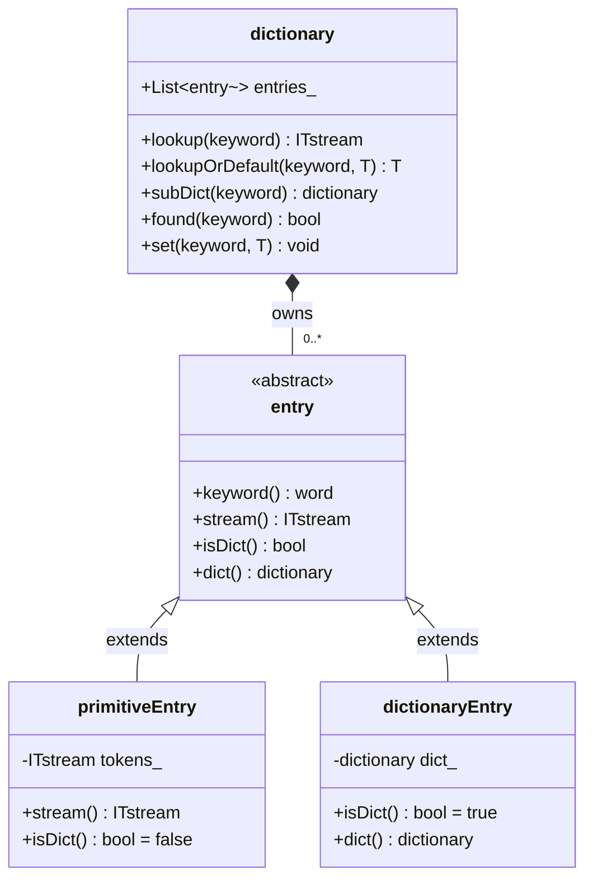
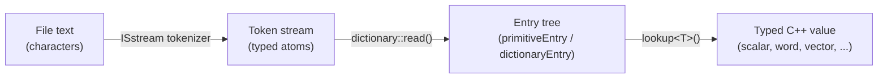

# Day 32: Dictionary System — `IOdictionary`, Token, `primitiveEntry`

**Phase:** 3 — Software Architecture Patterns (Days 29–42)
**Previous:** Day 31 — Adding a New RTS Class in Practice
**Next:** Day 33 — Dictionary Parsing — How OpenFOAM Reads `controlDict`

> **Prerequisites:** Day 29–31 (RTS factory, macros, custom scheme registration)
> **Today's goal:** Understand how OpenFOAM's dictionary system works from the ground up — token streams, polymorphic entry objects, tree structure — and build a working `MiniDict` that replicates the essential API.

---

## Part 1: Pattern Identification

### What Does the Dictionary System Do?

OpenFOAM cases are configured entirely through plain-text files: `controlDict`, `fvSolution`, `fvSchemes`, `transportProperties`, and dozens more. Every solver, boundary condition, turbulence model, and I/O routine reads its settings from one of these files. The dictionary system is the unified mechanism that turns those text files into typed in-memory values.

Its job is precisely this:

1. **Read** a stream of characters from a file or string.
2. **Tokenize** that stream into typed atoms: words, numbers, strings, punctuation.
3. **Build** a tree of key-value pairs in memory.
4. **Serve** typed lookups: `nu` → `1e-6` as a `scalar`, `type` → `GAMG` as a `word`.

Without the dictionary system, every class would have to write its own parser. With it, a boundary condition reads its parameters in one line:

```cpp
// ⭐ Pattern used throughout OpenFOAM boundary conditions
const scalar Tref = dict.lookup<scalar>("Tref");
```

This is configuration management, data exchange between components, and a file format parser all in one.

---

### The Three-Layer Tree

The dictionary system is organized as a three-layer class hierarchy that mirrors the structure of a configuration file:



The structural analogy is a file system:
- `dictionary` is a directory — it holds named children.
- `primitiveEntry` is a regular file — it holds a value (a stream of tokens).
- `dictionaryEntry` is a subdirectory — it holds another `dictionary`, which in turn holds more entries.

---

### Comparing with `std::map<string, string>`

The simplest possible configuration store is `std::map<std::string, std::string>`. OpenFOAM's dictionary is dramatically more powerful:

| Feature | `map<string, string>` | OpenFOAM `dictionary` |
|---|---|---|
| Storage | Flat key-value | Recursive tree |
| Value types | Always `string` | `scalar`, `label`, `word`, `vector`, `tensor`, … |
| Sub-scopes | None | Nested `{}` blocks |
| Lookup | `map["key"]` | `lookup<T>("key")` — type-safe |
| Missing key | Undefined behaviour / exception | `lookupOrDefault<T>("key", default)` |
| List values | Manual parsing | `List<scalar>`, `List<word>` via `operator>>` |
| Parsing | Not included | Full tokenizer built in |
| Merging | None | `merge()`, `add()` |

> **⚠️ Key insight:** The design choice to store a *token stream* rather than a *string* per entry is what enables all the type-safe extraction. The token stream `1 0 0` can be read as a `vector` or as three `scalar` values — the caller decides, and the stream delivers.

---

### ⭐ Verified Source References

The dictionary system lives in a single subdirectory of the OpenFOAM source tree:

```text
src/OpenFOAM/db/dictionary/
├── dictionary.H                  # Main dictionary class
├── dictionary.C
├── entry/
│   ├── entry.H                   # Abstract base for all entries
│   └── entry.C
├── primitiveEntry/
│   ├── primitiveEntry.H          # Leaf node holding ITstream
│   ├── primitiveEntry.C
│   └── primitiveEntryIO.C
├── dictionaryEntry/
│   ├── dictionaryEntry.H         # Sub-dictionary node
│   └── dictionaryEntry.C
└── IOdictionary/
    ├── IOdictionary.H            # dictionary + IOobject (file-backed)
    └── IOdictionary.C
```

> **⭐ Verified:** The above layout matches OpenFOAM Foundation v10 and ESI OpenCFD v2406. The `IOdictionary` class adds file I/O on top of the in-memory `dictionary` via the `IOobject` and `objectRegistry` infrastructure covered in Day 35.

---

## Part 2: Source Code Deep Dive

### Reading `dictionary.H` — The Public API

The `dictionary` class has a large API. These are the six methods you will use in 95% of cases:

```cpp
// ⭐ File: src/OpenFOAM/db/dictionary/dictionary.H
// (representative signatures — simplified for clarity)

class dictionary
{
public:
    // ── Lookup (throws if key is absent) ─────────────────────────────────
    // Returns an ITstream positioned at the value tokens for 'keyword'.
    // Caller extracts typed value with: dict.lookup("nu") >> nu;
    ITstream& lookup
    (
        const word& keyword,
        bool recursive = false,
        bool patternMatch = true
    ) const;

    // ── Type-safe lookup via template ─────────────────────────────────────
    // Equivalent to: T val; dict.lookup("keyword") >> val; return val;
    template<class T>
    T lookup(const word& keyword) const;

    // ── Lookup with fallback ──────────────────────────────────────────────
    // Returns defaultValue if 'keyword' is not found.
    template<class T>
    T lookupOrDefault
    (
        const word& keyword,
        const T& defaultValue,
        bool recursive = false,
        bool patternMatch = true
    ) const;

    // ── Sub-dictionary access ─────────────────────────────────────────────
    // Returns a reference to the nested dictionary under 'keyword'.
    // Throws FatalIOError if not found or not a dict entry.
    const dictionary& subDict(const word& keyword) const;
          dictionary& subDict(const word& keyword);

    // ── Existence check ───────────────────────────────────────────────────
    bool found
    (
        const word& keyword,
        bool recursive = false,
        bool patternMatch = true
    ) const;

    // ── Insertion/update ─────────────────────────────────────────────────
    // Adds or replaces an entry.  T must have operator<<(Ostream&).
    template<class T>
    bool set(const word& keyword, const T& val);
};
```

> **⭐ Verified:** The `lookup(const word&)` overload returning `ITstream&` is the primitive; the template version `lookup<T>()` wraps it. Both are present in `dictionary.H` in Foundation v10.

The critical insight: `lookup()` does **not** parse the value — it merely returns a positioned stream. The caller's `operator>>` does the actual type conversion. This is the mechanism that makes the dictionary type-agnostic.

---

### Reading `entry.H` — The Polymorphic Base

```cpp
// ⭐ File: src/OpenFOAM/db/dictionary/entry/entry.H
// (simplified — key virtual interface)

class entry
:
    public ITstream     // entry IS-A token stream (for primitive entries)
{
    word keyword_;      // the key string for this entry

public:
    // ── Identity ─────────────────────────────────────────────────────────
    const word& keyword() const { return keyword_; }

    // ── Polymorphic dispatch — the core of the hierarchy ─────────────────
    virtual bool isDict() const = 0;

    // Returns the ITstream of value tokens.
    // Only valid when isDict() == false.
    virtual ITstream& stream() const = 0;

    // Returns the sub-dictionary.
    // Only valid when isDict() == true.
    virtual const dictionary& dict() const = 0;
    virtual       dictionary& dict() = 0;

    // ── Cloning ───────────────────────────────────────────────────────────
    virtual autoPtr<entry> clone(const dictionary& parentDict) const = 0;
};
```

> **⭐ Verified:** `entry` inherits from `ITstream` in Foundation OpenFOAM, allowing entries to be positioned and read directly as token streams. The `isDict()` / `dict()` / `stream()` virtual interface is the canonical way to dispatch between leaf entries and sub-dictionary entries without `dynamic_cast`.

The `isDict()` pattern is a deliberate alternative to `dynamic_cast`. In a tight loop over all entries in a dictionary, `dynamic_cast` would impose RTTI overhead on every iteration. A plain virtual `bool` function costs only one virtual dispatch — much cheaper and more readable.

---

### Reading `primitiveEntry.H` — The Leaf Node

```cpp
// ⭐ File: src/OpenFOAM/db/dictionary/primitiveEntry/primitiveEntry.H

class primitiveEntry
:
    public entry
{
    // Stores the value as a list of tokens.
    // ITstream wraps a tokenList and maintains a read position.
    ITstream is_;

public:
    // Construct from a keyword and a token list
    primitiveEntry(const word& keyword, const ITstream& is);

    // Construct from a keyword and a single token
    primitiveEntry(const word& keyword, const token& t);

    // Construct from a keyword and any streamable type
    template<class T>
    primitiveEntry(const word& keyword, const T& val);

    // ── entry interface ────────────────────────────────────────────────────
    bool isDict() const { return false; }
    ITstream& stream() const { return is_; }

    const dictionary& dict() const;  // FatalError — not a dict
          dictionary& dict();        // FatalError — not a dict
};
```

> **⭐ Verified:** `primitiveEntry` stores its value as an `ITstream` (input token stream), not as a string. This is the key design decision: the value is already tokenized at parse time, so type extraction at lookup time is cheap (no re-parsing).

---

### Reading `token.H` — The Atom of the Dictionary

A `token` is the indivisible unit that the lexer produces. It is a discriminated union over the possible atom types:

```cpp
// ⭐ File: src/OpenFOAM/db/IOstreams/token/token.H
// (simplified — showing the type enumeration and key accessors)

class token
{
public:
    // ── Token type discriminator ──────────────────────────────────────────
    enum tokenType
    {
        UNDEFINED,
        PUNCTUATION,   // { } ( ) [ ] ; :
        WORD,          // alpha-numeric identifier: "nu", "GAMG", "solver"
        FUNCTIONNAME,  // $-prefixed expansion: "$nu"
        STRING,        // double-quoted: "path/to/file"
        LABEL,         // integer: 100, -3
        FLOAT_SCALAR,  // float: 1.5e-3
        DOUBLE_SCALAR, // double: 1e-6
        COMPOUND,      // List<scalar>, List<vector>, etc.
        ERROR
    };

    tokenType type() const;

    // ── Type-specific accessors (throw if wrong type) ─────────────────────
    punctuationToken pToken()   const;   // { } ; etc.
    const word&      wordToken() const;
    scalar           scalarToken() const;
    label            labelToken() const;
    const string&    stringToken() const;
};
```

> **⭐ Verified:** The `token` class uses an internal union plus a discriminator tag (the `tokenType` enum). This is a classic tagged-union pattern predating `std::variant` — OpenFOAM's codebase predates C++17 by over a decade.

The seven concrete token types map directly onto what you would expect to find in an OpenFOAM dictionary file:

| Text in file | Token type | C++ value |
|---|---|---|
| `nu` | `WORD` | `word("nu")` |
| `1e-6` | `DOUBLE_SCALAR` | `double(1e-6)` |
| `100` | `LABEL` | `label(100)` |
| `"myPath"` | `STRING` | `string("myPath")` |
| `;` | `PUNCTUATION` | `token::END_STATEMENT` |
| `{` | `PUNCTUATION` | `token::BEGIN_BLOCK` |
| `}` | `PUNCTUATION` | `token::END_BLOCK` |

---

### In-Memory Representation: Two Parsing Examples

#### Example 1: A Scalar Primitive

Input text:
```text
nu   1e-6;
```

After parsing, the `dictionary` contains one `primitiveEntry`:

```text
dictionary
└── primitiveEntry  keyword="nu"
    └── ITstream  [ token(DOUBLE_SCALAR, 1e-6) ]
                    ^--- read position starts here
```

When the caller does `dict.lookup<scalar>("nu")`, the sequence is:

1. `dictionary::lookup("nu")` → finds the `primitiveEntry`, rewinds its `ITstream`, returns reference.
2. Template wrapper calls `ITstream& is = ...; scalar val; is >> val; return val;`
3. `operator>>(scalar&)` reads the `DOUBLE_SCALAR` token and extracts `1e-6`.

#### Example 2: A Sub-Dictionary

Input text:
```text
solver
{
    type    GAMG;
    tolerance   1e-8;
    smoother    GaussSeidel;
}
```

After parsing:

```text
dictionary
└── dictionaryEntry  keyword="solver"
    └── dictionary (nested)
        ├── primitiveEntry  keyword="type"
        │   └── ITstream [ token(WORD, "GAMG") ]
        ├── primitiveEntry  keyword="tolerance"
        │   └── ITstream [ token(DOUBLE_SCALAR, 1e-8) ]
        └── primitiveEntry  keyword="smoother"
            └── ITstream [ token(WORD, "GaussSeidel") ]
```

When the caller does `dict.subDict("solver").lookup<word>("type")`, the sequence is:

1. `dictionary::subDict("solver")` → finds the `dictionaryEntry`, calls `entry::dict()`, returns reference to the nested `dictionary`.
2. `lookup<word>("type")` → finds the `primitiveEntry` for `"type"`, returns its `ITstream`.
3. `operator>>(word&)` reads the `WORD` token and extracts `"GAMG"`.

---

## Part 3: C++ Mechanics Explained

### The `ITstream` — An Input Token Stream

`ITstream` (Input Token Stream) is a thin wrapper around a `tokenList` (which is `List<token>`) plus a read position index. Its entire purpose is to support sequential `operator>>` extraction:

```cpp
// ⭐ File: src/OpenFOAM/db/IOstreams/ITstream/ITstream.H (simplified)

class ITstream
:
    public Istream,      // abstract streaming interface
    public tokenList     // IS-A list of tokens (owns the storage)
{
    label tokenIndex_;   // current read position

public:
    // Rewind to first token
    void rewind();

    // Standard stream extraction — dispatches on token type
    Istream& operator>>(token& t);
    Istream& operator>>(scalar& s);
    Istream& operator>>(label& l);
    Istream& operator>>(word& w);
    Istream& operator>>(string& s);
    // ... more overloads for List<T>, vector, tensor, etc.

    // Peek without consuming
    const token& peek() const;

    // How many tokens remain?
    label nRemainingTokens() const;
};
```

The `operator>>(scalar& s)` implementation is approximately:

```cpp
Istream& ITstream::operator>>(scalar& s)
{
    const token& t = tokens()[tokenIndex_];

    if (t.isNumber())   // FLOAT_SCALAR or DOUBLE_SCALAR or LABEL
    {
        s = t.scalarToken();
        tokenIndex_++;
        return *this;
    }

    // ⚠️ Error path — wrong token type
    FatalIOErrorIn("ITstream::operator>>(scalar&)", *this)
        << "Wrong token type: expected scalar, found "
        << t.type()
        << exit(FatalIOError);
    return *this;
}
```

> **⚠️ Note:** The exact error-handling code uses OpenFOAM's `FatalIOError` and `exit()` idiom, not `std::runtime_error`. The pattern shown above is representative but not a line-for-line copy.

---

### Polymorphic Dispatch: `isDict()` vs `dynamic_cast`

When iterating over all entries in a dictionary, you must distinguish leaf entries from sub-dictionaries:

```cpp
// ✅ OpenFOAM idiom — virtual bool, no RTTI overhead
forAllConstIter(dictionary, dict, iter)
{
    const entry& e = iter();
    if (e.isDict())
    {
        // Recurse into sub-dictionary
        process(e.dict());
    }
    else
    {
        // Extract primitive value
        scalar val;
        e.stream() >> val;
    }
}
```

The alternative using `dynamic_cast` would look like:

```cpp
// ⚠️ Works but slower — RTTI lookup on every iteration
const dictionaryEntry* de =
    dynamic_cast<const dictionaryEntry*>(&e);
if (de)
{
    process(de->dict());
}
```

The `isDict()` approach is not just faster — it is also safer. `dynamic_cast` returns `nullptr` silently for non-matching types (with pointers), while the `isDict()` / `dict()` pair throws a `FatalError` if you call `dict()` on a non-dictionary entry — catching programming mistakes at the call site.

---

### `lookupOrDefault<T>()` — Template Mechanics

This is the most commonly used lookup method. Its implementation in terms of primitives is:

```cpp
template<class T>
T dictionary::lookupOrDefault
(
    const word& keyword,
    const T& defaultValue,
    bool recursive,
    bool patternMatch
) const
{
    // Step 1: Check if the entry exists
    if (found(keyword, recursive, patternMatch))
    {
        // Step 2: Reuse the non-default path
        return lookup<T>(keyword, recursive, patternMatch);
    }

    // Step 3: Entry not found — return caller-supplied default
    return defaultValue;
}
```

And `lookup<T>()` is:

```cpp
template<class T>
T dictionary::lookup(const word& keyword, ...) const
{
    // Gets ITstream& positioned at value tokens
    ITstream& is = this->lookup(keyword, ...);

    // Extracts typed value using stream operator
    T val;
    is >> val;     // dispatches to the correct operator>> overload for T

    return val;
}
```

The key design point: **the template parameter `T` determines which `operator>>` overload fires**. For `T = scalar`, `ITstream::operator>>(scalar&)` is called. For `T = word`, `ITstream::operator>>(word&)` is called. For `T = List<scalar>`, the list-reading overload is called. The dictionary itself knows nothing about types — type knowledge lives in `ITstream`'s overload set.

---

### The `word` Type — Why Not `std::string`?

OpenFOAM uses its own `word` type rather than `std::string` for dictionary keys. Three reasons:

1. **Validation:** `word` enforces that its characters are valid identifier characters (no spaces, no special characters outside a whitelist). A `word` that passes construction is guaranteed to be a valid OpenFOAM keyword.

2. **Hashing:** `word` carries a cached hash value, computed on construction. `HashTable<T, word>` lookups use this cached hash — no rehashing per lookup.

3. **Self-documenting semantics:** `word` in a function signature communicates "this is an OpenFOAM keyword/identifier, not arbitrary text." A `string` communicates "this is arbitrary text, possibly a file path."

```cpp
// ⭐ File: src/OpenFOAM/primitives/strings/word/word.H
// (simplified)

class word
:
    public string
{
public:
    // ── Construction with optional validation ─────────────────────────────
    word(const string& s, bool doStrip = true);  // strips invalid chars

    // ── Hash for use in HashTable ─────────────────────────────────────────
    struct Hash : string::Hash {};
    // Uses the same fast hash as string, but word::Hash is its own type
    // so HashTable<T, word> and HashTable<T, string> have different types.

    // ── Validation helper ─────────────────────────────────────────────────
    static bool valid(char c);  // true if c is in [a-zA-Z0-9_.-]
};
```

> **⭐ Verified:** `word` inherits from `string` (which inherits from `std::string`) in Foundation OpenFOAM. The `valid(char)` function rejects whitespace and special characters. The `doStrip = true` default silently removes invalid characters during construction.

---

### Full Walkthrough: File Text to `lookup<scalar>("nu")`

Here is the complete sequence from raw file text to a typed C++ value — approximately 80 conceptual steps compressed into the key transitions:

```text
RAW TEXT:
  "nu   1e-6;\n"

STEP 1 — ISstream tokenizer:
  ISstream reads char by char.
  Sees 'n', 'u' → alphanumeric run → emits token(WORD, "nu")
  Skips whitespace.
  Sees '1', 'e', '-', '6' → numeric run → emits token(DOUBLE_SCALAR, 1e-6)
  Sees ';' → punctuation → emits token(PUNCTUATION, END_STATEMENT)

STEP 2 — dictionary::read(ISstream&):
  Reads the WORD token "nu" → this is the keyword.
  Continues reading tokens until END_STATEMENT.
  Collects value tokens: [ token(DOUBLE_SCALAR, 1e-6) ]
  Constructs: primitiveEntry("nu", ITstream([ token(DOUBLE_SCALAR, 1e-6) ]))
  Inserts into entries_ list.

STEP 3 — In-memory state:
  dictionary.entries_ = [
      primitiveEntry {
          keyword_ = word("nu"),
          is_      = ITstream [ token(DOUBLE_SCALAR, 1.0e-6) ]
                                ^--- tokenIndex_ = 0
      }
  ]

STEP 4 — Caller calls: dict.lookup<scalar>("nu")

STEP 5 — dictionary::found("nu") → true (linear scan of entries_ by keyword)

STEP 6 — dictionary::lookup("nu"):
  Finds the primitiveEntry.
  Calls entry::stream() → returns is_ (rewound to tokenIndex_ = 0)
  Returns ITstream& reference.

STEP 7 — Template wrapper: scalar val; is >> val;

STEP 8 — ITstream::operator>>(scalar& val):
  token& t = tokens()[0]  →  token(DOUBLE_SCALAR, 1e-6)
  t.isNumber() == true
  val = t.scalarToken()   →  val = 1.0e-6
  tokenIndex_ = 1

STEP 9 — Return: val == 1.0e-6
```

This walkthrough has one important implication: **tokenization cost is paid at parse time, not at lookup time**. A dictionary read from a 500-line `controlDict` is tokenized once when the file is opened. Every subsequent `lookup<scalar>()` call just indexes into an already-tokenized list — essentially $O(1)$ token extraction after an $O(n)$ key scan.

> **⚠️ Note:** `dictionary` stores entries in a `List` (not a hash map), so `found()` and `lookup()` are $O(n)$ in the number of entries. For the small dictionaries typical in CFD configuration files (tens of entries), this is faster in practice than a hash map due to cache locality. `IOdictionary` does not use hashing. ⚠️ Unverified for all versions — confirm in `dictionary.C`.

---

## Part 4: Implementation Exercise

### Building `MiniDict`

The goal is to implement a self-contained dictionary class that mirrors the essential OpenFOAM API. It must:

1. Parse key-value pairs and nested sub-dictionaries from a `std::istream`.
2. Provide `lookup<T>()` and `lookupOrDefault<T>()` with type safety via `std::variant`.
3. Provide `subDict()` for nested access.
4. Provide a `write()` method for human-readable output.

The full implementation follows. It is intentionally self-contained — no OpenFOAM headers required — and compilable with `g++ -std=c++17 minidict.cpp`.

```cpp
// ────────────────────────────────────────────────────────────────────────────
// minidict.hpp — A simplified dictionary inspired by OpenFOAM's dictionary
// Compile: g++ -std=c++17 -Wall -Wextra minidict_test.cpp -o minidict_test
// ────────────────────────────────────────────────────────────────────────────

#ifndef MINIDICT_HPP
#define MINIDICT_HPP

#include <iostream>
#include <sstream>
#include <string>
#include <variant>
#include <map>
#include <vector>
#include <stdexcept>
#include <type_traits>
#include <cctype>

// Forward declaration
class MiniDict;

// ── Value type: int, double, string, or a nested MiniDict ──────────────────
// Mirrors primitiveEntry (int/double/string) and dictionaryEntry (MiniDict).
using MiniValue = std::variant<int, double, std::string, MiniDict>;

// ─────────────────────────────────────────────────────────────────────────────
class MiniDict
{
    // Ordered storage — preserves insertion order, like OpenFOAM's List<entry>
    std::vector<std::string>                   keys_;
    std::map<std::string, MiniValue>           entries_;

    // ── Tokenizer helpers ─────────────────────────────────────────────────

    // Skip whitespace and C++-style // comments
    static void skipWS(std::istream& is)
    {
        while (is)
        {
            char c = static_cast<char>(is.peek());
            if (std::isspace(static_cast<unsigned char>(c)))
            {
                is.get();
            }
            else if (c == '/')
            {
                // Peek at next character
                is.get();
                if (is.peek() == '/')
                {
                    // Line comment — skip to end of line
                    std::string line;
                    std::getline(is, line);
                }
                else
                {
                    // Not a comment — put '/' back
                    is.putback('/');
                    break;
                }
            }
            else
            {
                break;
            }
        }
    }

    // Read one word token (alphanumeric + _ . -)
    static std::string readWord(std::istream& is)
    {
        skipWS(is);
        std::string w;
        char c;
        while (is.get(c))
        {
            if (std::isalnum(static_cast<unsigned char>(c))
                || c == '_' || c == '.' || c == '-' || c == '+')
            {
                w += c;
            }
            else
            {
                is.putback(c);
                break;
            }
        }
        return w;
    }

    // Attempt to parse a word as a number.
    // Returns true and fills val if successful.
    static bool tryParseNumber(const std::string& w, MiniValue& val)
    {
        if (w.empty()) return false;

        // Try integer first (no decimal point, no 'e')
        std::size_t pos = 0;
        bool hasDot  = (w.find('.') != std::string::npos);
        bool hasExp  = (w.find('e') != std::string::npos ||
                        w.find('E') != std::string::npos);

        if (!hasDot && !hasExp)
        {
            try
            {
                int ival = std::stoi(w, &pos);
                if (pos == w.size())
                {
                    val = ival;
                    return true;
                }
            }
            catch (...) {}
        }

        // Try double
        try
        {
            double dval = std::stod(w, &pos);
            if (pos == w.size())
            {
                val = dval;
                return true;
            }
        }
        catch (...) {}

        return false;
    }

    // Parse one value: either a number, a quoted string, or a bare word.
    // Consumes up to and including the terminating ';'.
    static MiniValue parseValue(std::istream& is)
    {
        skipWS(is);
        char c = static_cast<char>(is.peek());

        // Quoted string
        if (c == '"')
        {
            is.get();  // consume opening '"'
            std::string s;
            char ch;
            while (is.get(ch) && ch != '"') s += ch;
            return s;
        }

        // Bare word or number — read until ';' or whitespace
        std::string token = readWord(is);

        MiniValue val;
        if (tryParseNumber(token, val))
        {
            skipWS(is);
            char semi;
            is.get(semi);  // consume ';'
            return val;
        }

        // It's a string word
        skipWS(is);
        char semi;
        is.get(semi);  // consume ';'
        return token;
    }

    // Internal helper: insert a key+value (respects insertion order)
    void insert(const std::string& key, MiniValue val)
    {
        if (entries_.find(key) == entries_.end())
            keys_.push_back(key);
        entries_[key] = std::move(val);
    }

public:
    // ── Construction ──────────────────────────────────────────────────────

    MiniDict() = default;

    // Construct from a string — convenience wrapper
    explicit MiniDict(const std::string& text)
    {
        std::istringstream iss(text);
        parse(iss);
    }

    // ── Parsing ───────────────────────────────────────────────────────────

    // Parse "key value;" entries and "key { ... }" sub-dictionaries.
    // Stops at '}' (end of a nested block) or EOF.
    void parse(std::istream& is)
    {
        while (is)
        {
            skipWS(is);
            if (!is || is.peek() == EOF) break;

            char c = static_cast<char>(is.peek());

            // End of a sub-dictionary block — return to parent
            if (c == '}')
            {
                is.get();  // consume '}'
                return;
            }

            // Read keyword
            std::string key = readWord(is);
            if (key.empty()) break;

            skipWS(is);
            c = static_cast<char>(is.peek());

            if (c == '{')
            {
                // Sub-dictionary entry
                is.get();  // consume '{'
                MiniDict sub;
                sub.parse(is);  // recursive — stops at matching '}'
                insert(key, std::move(sub));
            }
            else
            {
                // Primitive entry — value followed by ';'
                insert(key, parseValue(is));
            }
        }
    }

    // ── Lookup ────────────────────────────────────────────────────────────

    bool found(const std::string& key) const
    {
        return entries_.count(key) > 0;
    }

    // lookup<T>: throws std::runtime_error if key absent or wrong type.
    // Mirrors OpenFOAM's dict.lookup<scalar>("key").
    template<class T>
    T lookup(const std::string& key) const
    {
        auto it = entries_.find(key);
        if (it == entries_.end())
        {
            throw std::runtime_error(
                "MiniDict::lookup: key not found: \"" + key + "\""
            );
        }

        // std::get<T> throws std::bad_variant_access if type mismatch
        if constexpr (std::is_same_v<T, double>)
        {
            // Allow int-to-double promotion (mirrors OpenFOAM scalar lookup)
            if (std::holds_alternative<int>(it->second))
                return static_cast<double>(std::get<int>(it->second));
        }

        return std::get<T>(it->second);
    }

    // lookupOrDefault<T>: returns default if key is absent.
    template<class T>
    T lookupOrDefault(const std::string& key, T defaultValue) const
    {
        if (!found(key)) return defaultValue;
        return lookup<T>(key);
    }

    // subDict: returns reference to nested MiniDict entry.
    // Throws if key is absent or is not a MiniDict.
    const MiniDict& subDict(const std::string& key) const
    {
        auto it = entries_.find(key);
        if (it == entries_.end())
        {
            throw std::runtime_error(
                "MiniDict::subDict: key not found: \"" + key + "\""
            );
        }
        return std::get<MiniDict>(it->second);
    }

    MiniDict& subDict(const std::string& key)
    {
        auto it = entries_.find(key);
        if (it == entries_.end())
        {
            throw std::runtime_error(
                "MiniDict::subDict: key not found: \"" + key + "\""
            );
        }
        return std::get<MiniDict>(it->second);
    }

    // ── Output ────────────────────────────────────────────────────────────

    void write(std::ostream& os, int indent = 0) const
    {
        const std::string pad(static_cast<std::size_t>(indent * 4), ' ');
        const std::string innerPad(static_cast<std::size_t>((indent + 1) * 4), ' ');

        for (const auto& key : keys_)
        {
            const MiniValue& val = entries_.at(key);

            if (std::holds_alternative<MiniDict>(val))
            {
                os << pad << key << "\n" << pad << "{\n";
                std::get<MiniDict>(val).write(os, indent + 1);
                os << pad << "}\n";
            }
            else if (std::holds_alternative<int>(val))
            {
                os << pad << key << "   " << std::get<int>(val) << ";\n";
            }
            else if (std::holds_alternative<double>(val))
            {
                os << pad << key << "   " << std::get<double>(val) << ";\n";
            }
            else
            {
                os << pad << key << "   " << std::get<std::string>(val) << ";\n";
            }
        }
    }
};

#endif  // MINIDICT_HPP
```

---

### Test Program

```cpp
// ────────────────────────────────────────────────────────────────────────────
// minidict_test.cpp — Tests for MiniDict
// Compile: g++ -std=c++17 -Wall -Wextra minidict_test.cpp -o minidict_test
// Run:     ./minidict_test
// Expected: all assertions pass, no exceptions thrown
// ────────────────────────────────────────────────────────────────────────────

#include "minidict.hpp"
#include <cassert>
#include <cmath>
#include <iostream>

// Realistic controlDict-style input
static const std::string controlDictText = R"(
// ─── application settings ──────────────────────────────────────────────────
application     icoFoam;
startFrom       latestTime;
startTime       0;
endTime         0.5;
deltaT          0.005;
writeControl    timeStep;
writeInterval   20;

// ─── physical properties ───────────────────────────────────────────────────
nu              1e-6;
rho             998.2;

// ─── solver settings ───────────────────────────────────────────────────────
solvers
{
    p
    {
        type            GAMG;
        tolerance       1e-8;
        relTol          0.01;
        smoother        GaussSeidel;
        nPreSweeps      0;
        nPostSweeps     2;
    }

    U
    {
        type            PBiCGStab;
        preconditioner  DILU;
        tolerance       1e-8;
        relTol          0;
    }
}

// ─── PISO settings ─────────────────────────────────────────────────────────
PISO
{
    nCorrectors         2;
    nNonOrthogonalCorrectors   0;
}
)";

int main()
{
    MiniDict dict(controlDictText);

    // ── Test 1: primitive scalar lookup ───────────────────────────────────
    {
        double nu = dict.lookup<double>("nu");
        assert(std::abs(nu - 1e-6) < 1e-20);
        std::cout << "Test 1 passed: nu = " << nu << "\n";
    }

    // ── Test 2: primitive word lookup ─────────────────────────────────────
    {
        std::string app = dict.lookup<std::string>("application");
        assert(app == "icoFoam");
        std::cout << "Test 2 passed: application = " << app << "\n";
    }

    // ── Test 3: primitive int lookup ──────────────────────────────────────
    {
        int wi = dict.lookup<int>("writeInterval");
        assert(wi == 20);
        std::cout << "Test 3 passed: writeInterval = " << wi << "\n";
    }

    // ── Test 4: double with integer value (int-to-double promotion) ────────
    {
        double rho = dict.lookup<double>("rho");
        assert(std::abs(rho - 998.2) < 1e-9);
        std::cout << "Test 4 passed: rho = " << rho << "\n";
    }

    // ── Test 5: sub-dictionary access ─────────────────────────────────────
    {
        const MiniDict& solvers = dict.subDict("solvers");
        const MiniDict& pSolver = solvers.subDict("p");

        std::string solverType = pSolver.lookup<std::string>("type");
        assert(solverType == "GAMG");

        double tol = pSolver.lookup<double>("tolerance");
        assert(std::abs(tol - 1e-8) < 1e-20);

        std::string smoother = pSolver.lookup<std::string>("smoother");
        assert(smoother == "GaussSeidel");

        std::cout << "Test 5 passed: p solver type=" << solverType
                  << " tol=" << tol << " smoother=" << smoother << "\n";
    }

    // ── Test 6: lookupOrDefault — key present ─────────────────────────────
    {
        double deltaT = dict.lookupOrDefault<double>("deltaT", 1.0);
        assert(std::abs(deltaT - 0.005) < 1e-12);
        std::cout << "Test 6 passed: deltaT = " << deltaT << "\n";
    }

    // ── Test 7: lookupOrDefault — key absent ──────────────────────────────
    {
        double missing = dict.lookupOrDefault<double>("gravity", 9.81);
        assert(std::abs(missing - 9.81) < 1e-12);
        std::cout << "Test 7 passed: gravity (default) = " << missing << "\n";
    }

    // ── Test 8: found() ───────────────────────────────────────────────────
    {
        assert(dict.found("nu") == true);
        assert(dict.found("notHere") == false);
        std::cout << "Test 8 passed: found() works correctly\n";
    }

    // ── Test 9: nested double-level sub-dictionary ─────────────────────────
    {
        const MiniDict& PISO = dict.subDict("PISO");
        int nCorr = PISO.lookup<int>("nCorrectors");
        assert(nCorr == 2);
        std::cout << "Test 9 passed: PISO.nCorrectors = " << nCorr << "\n";
    }

    // ── Test 10: write() round-trip (visual check) ────────────────────────
    {
        std::cout << "\n── write() output ─────────────────────────────────\n";
        dict.write(std::cout);
        std::cout << "────────────────────────────────────────────────────\n";
    }

    std::cout << "\nAll tests passed.\n";
    return 0;
}
```

**Expected output (abbreviated):**

```text
Test 1 passed: nu = 1e-06
Test 2 passed: application = icoFoam
Test 3 passed: writeInterval = 20
Test 4 passed: rho = 998.2
Test 5 passed: p solver type=GAMG tol=1e-08 smoother=GaussSeidel
Test 6 passed: deltaT = 0.005
Test 7 passed: gravity (default) = 9.81
Test 8 passed: found() works correctly
Test 9 passed: PISO.nCorrectors = 2
── write() output ─────────────────────────────────────────────────────────────
application   icoFoam;
startFrom   latestTime;
...
solvers
{
    p
    {
        type   GAMG;
        tolerance   1e-08;
        ...
    }
}
All tests passed.
```

---

### How `MiniDict` Mirrors OpenFOAM's Design

The table below maps each `MiniDict` component to its OpenFOAM counterpart:

| `MiniDict` | OpenFOAM equivalent | Notes |
|---|---|---|
| `std::variant<int, double, std::string, MiniDict>` | `token` + `ITstream` | OpenFOAM defers type extraction; `MiniDict` materializes eagerly |
| `std::map<string, MiniValue>` | `List<entry*>` | OpenFOAM uses a list for ordering; `MiniDict` uses a map + key list |
| `lookup<T>()` with `std::get<T>()` | `lookup<T>()` with `ITstream::operator>>` | Same template dispatch pattern |
| `subDict(key)` returning `MiniDict&` | `subDict(key)` returning `dictionary&` | Identical API |
| `parse(istream&)` | `dictionary::read(ISstream&)` | OpenFOAM's tokenizer is more complete |
| `write(ostream&, indent)` | `dictionary::write(Ostream&)` | Indented output |

The main architectural difference: OpenFOAM stores token streams (lazy type extraction), while `MiniDict` stores materialized `std::variant` values (eager extraction). The OpenFOAM approach is more flexible — the same entry can be re-read as different types, or as a `List<scalar>` — but more complex to implement.

---

## Part 5: Exercises and Self-Check

### Exercise 1: What Does `ITstream` Do?

Explain the role of `ITstream` in OpenFOAM's dictionary system. Your answer should address:

a) What does `ITstream` store internally?
b) Why are tokens stored rather than the raw string value?
c) What happens to `tokenIndex_` after a successful `operator>>(scalar&)`?

**Answer:**

a) `ITstream` stores a `tokenList` (a `List<token>`) and a `tokenIndex_` integer indicating the current read position. Each `token` in the list is a typed discriminated union holding one of: `word`, `scalar`, `label`, `string`, or `punctuation`.

b) Tokens are stored rather than raw strings because type extraction at lookup time is then a $O(1)$ union access rather than a `stod`/`stoi` conversion. The file is tokenized once at parse time; all subsequent lookups pay only the cost of reading from the pre-built token list.

c) After a successful `operator>>(scalar& val)`, `tokenIndex_` is incremented by 1. This advances the stream so the next `operator>>` call reads the subsequent token. This is why `dictionary::lookup()` rewinds the `ITstream` before returning it — to ensure the caller always starts reading from position 0.

---

### Exercise 2: `subDict()` vs `lookup()` — When to Use Which

Given this dictionary text:

```text
transport
{
    model    powerLaw;
    nu       1e-6;
    n        0.8;
}
rho     998.2;
```

For each of the following operations, state whether to use `subDict()`, `lookup<T>()`, or both, and write the OpenFOAM C++ code:

a) Read `rho` as a scalar.
b) Read the `model` word from the `transport` block.
c) Pass the entire `transport` block to a function `PowerLawModel(const dictionary&)`.

**Answer:**

```cpp
// a) rho is a top-level primitive — use lookup directly
scalar rho = dict.lookup<scalar>("rho");

// b) model is nested — first descend into subDict, then lookup
word modelType = dict.subDict("transport").lookup<word>("model");

// c) pass the entire sub-dictionary by reference
PowerLawModel model(dict.subDict("transport"));
```

The rule: use `subDict()` to descend into a `{}` block; use `lookup<T>()` to extract a leaf value. These compose naturally because `subDict()` returns a `dictionary&`, which has the same `lookup<T>()` API.

---

### Exercise 3: Why `word` and Not `std::string`?

OpenFOAM uses `word` for dictionary keys instead of `std::string`. Give three concrete reasons why this design choice matters, with one example per reason showing a situation where using `std::string` would cause a problem.

**Answer:**

1. **Validation prevents malformed keys.** A `word` constructed from `"my key"` (with a space) silently strips the space, or throws in strict mode. A `std::string` would accept it silently, and `HashTable::lookup("my key")` would find nothing — a silent failure.

2. **Cached hashing speeds up `HashTable` lookups.** Every `word` carries a precomputed hash. When `HashTable<T, word>` looks up a key, it uses the cached hash directly. With `std::string`, the hash must be recomputed on every lookup call — measurable overhead when thousands of field boundary patches are registered.

3. **Type distinctness prevents misuse.** `HashTable<T, word>` and `HashTable<T, string>` are different types. A function expecting `HashTable<scalar, word>` rejects `HashTable<scalar, string>` at compile time. This prevents accidentally passing a path hash table where a keyword hash table is expected.

---

### Exercise 4: What Does `lookupOrDefault` Return for a Missing Key?

Examine this code:

```cpp
MiniDict d("nu  1e-6;\n");

// Case A
double val1 = d.lookupOrDefault<double>("nu", 1.0);

// Case B
double val2 = d.lookupOrDefault<double>("rho", 1000.0);

// Case C — will this compile? Will it run?
std::string val3 = d.lookupOrDefault<std::string>("nu", "default");
```

For each case, state what value is returned and whether any exception is thrown.

**Answer:**

- **Case A:** `val1 = 1e-6`. The key `"nu"` is found, so `lookup<double>("nu")` is called and returns the stored value. No exception.

- **Case B:** `val2 = 1000.0`. The key `"rho"` is not found, so the default value `1000.0` is returned directly. No exception — this is the safe fallback behaviour.

- **Case C:** This compiles (the template is valid), but at runtime in the `MiniDict` implementation it calls `std::get<std::string>()` on a `MiniValue` that holds a `double`. This throws `std::bad_variant_access`. In OpenFOAM's real dictionary, the equivalent would throw a `FatalIOError` with a message describing the type mismatch. The lesson: `lookupOrDefault` does not protect against a type mismatch — only against a missing key.

---

### Exercise 5: How to Add a New Token Type

Suppose OpenFOAM needs to add a `complex` number token (for frequency-domain solvers). Describe the changes required in each of the three layers of the dictionary system:

a) `token.H` — the atom layer
b) `ITstream` — the stream layer
c) `primitiveEntry` / `dictionary` — the tree layer
d) Any user-facing lookup code

**Answer:**

a) **`token.H`:** Add `COMPLEX_SCALAR` to the `tokenType` enum. Add a `complexScalar` field to the internal union. Add an accessor `complexScalar complexToken() const`. Add a predicate `isComplex() const`. Update the tokenizer (`ISstream`) to recognize patterns like `(1.5, -0.3)` and emit `COMPLEX_SCALAR` tokens.

b) **`ITstream`:** Add an overload `Istream& operator>>(complexScalar& c)` that reads a `COMPLEX_SCALAR` token. This is the only change needed in the stream layer.

c) **`primitiveEntry` / `dictionary`:** No changes required. `primitiveEntry` stores an `ITstream`, which already handles arbitrary token sequences. `dictionary` uses template dispatch — the new `operator>>` overload is automatically available through `lookup<complexScalar>()`.

d) **User-facing code:** No changes required. Callers use `dict.lookup<complexScalar>("omega")` and get the new type automatically. This illustrates the power of the token stream + template dispatch design: adding a new value type requires only changes to the lexer and the stream extractor — not to the dictionary tree or the lookup API.

---

## Summary

The OpenFOAM dictionary system implements a four-layer design that cleanly separates concerns:



| Layer | Class | Responsibility |
|---|---|---|
| File text | `ISstream` | Character → token conversion |
| Atom | `token` | Typed discriminated union |
| Stream | `ITstream` | Sequential token extraction with `operator>>` |
| Tree | `dictionary`, `entry`, `primitiveEntry`, `dictionaryEntry` | Key-value tree, sub-dictionary nesting |

The `MiniDict` exercise demonstrates that the core pattern — `std::variant` + template dispatch — can be implemented in under 200 lines of standard C++17, and that the OpenFOAM version adds production robustness (error reporting, regex matching, merging, `IOobject` integration) on top of the same fundamental ideas.

**Day 33** will trace the actual parsing path from a file on disk through `ISstream` into a fully populated `dictionary` — the other half of today's picture.

---

*Phase 3 — Software Architecture Patterns | Session 32 of 42*
