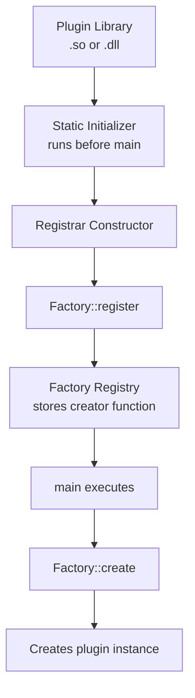

# Day 32: Plugin Self-Registration — Static Initializers

## Part 1: Pattern Identification

### The Plugin Architecture Problem

How do you build a system where users can add new functionality **without modifying existing code**? This is the core challenge of plugin architecture:

```cpp
// Bad: Modify core code for each new type
void createShape(const std::string& type) {
    if (type == "circle") {
        return new Circle();
    } else if (type == "rectangle") {
        return new Rectangle();
    } else if (type == "triangle") {
        return new Triangle();
    }
    // Must modify this function for every new shape!
}
```

**The Goal:** Enable zero-modification extensibility where:
1. New types can be added without touching existing code
2. Registration happens automatically at program startup
3. Plugin libraries can be loaded dynamically

### Static Initialization: The Magic Before `main()`

C++ guarantees that **static variables are initialized before `main()` executes**:

```cpp
// This runs BEFORE main()
static MyRegistrar registrar;  // Constructor executes during program startup

int main() {
    // registrar is already initialized here
    return 0;
}
```

This is the foundation of self-registration plugins!

### Self-Registration Pattern



## Part 2: Theory — Static Initialization Order

### Construction and Destruction Order

C++ guarantees:

1. **Within a translation unit**: Static variables initialized in order of declaration
2. **Across translation units**: **UNDEFINED ORDER** (critical limitation!)
3. **Destruction**: Reverse order of construction

```cpp
// File A.cpp
static int a = f();  // Runs first (within A.cpp)

// File B.cpp
static int b = g();  // Order relative to 'a' is UNDEFINED!
```

### The Singleton Pattern Solution

To avoid initialization order problems, use **Meyer's Singleton**:

```cpp
class Factory {
private:
    std::unordered_map<std::string, CreatorFunc> registry_;

    Factory() = default;  // Private constructor

public:
    static Factory& instance() {
        static Factory inst;  // Guaranteed thread-safe in C++11
        return inst;
    }
};
```

**Why this works:**
- First call to `instance()` constructs the singleton
- C++11 guarantees thread-safe static initialization
- Same instance returned on all subsequent calls

### Plugin Loading with `dlopen`

For dynamic plugin loading:

```cpp
void* handle = dlopen("./libplugin.so", RTLD_LAZY);
if (!handle) {
    std::cerr << "Error: " << dlerror() << std::endl;
}

// Static initializers in libplugin.so run automatically during dlopen!
```

## Part 3: C++ Mechanics — Self-Registration Implementation

### Basic Factory with Self-Registration

```cpp
// Factory.H
#pragma once
#include <memory>
#include <string>
#include <unordered_map>
#include <functional>

// Abstract base class
class Shape {
public:
    virtual ~Shape() = default;
    virtual void draw() const = 0;
    virtual double area() const = 0;
};

// Creator function type
using CreatorFunc = std::function<std::unique_ptr<Shape>()>;

// Factory (Meyer's Singleton)
class Factory {
private:
    std::unordered_map<std::string, CreatorFunc> registry_;

    Factory() = default;
    Factory(const Factory&) = delete;
    Factory& operator=(const Factory&) = delete;

public:
    static Factory& instance() {
        static Factory inst;
        return inst;
    }

    void registerShape(const std::string& name, CreatorFunc creator) {
        registry_[name] = creator;
    }

    std::unique_ptr<Shape> create(const std::string& name) {
        auto it = registry_.find(name);
        if (it != registry_.end()) {
            return it->second();
        }
        return nullptr;
    }

    std::vector<std::string> availableShapes() const {
        std::vector<std::string> shapes;
        for (const auto& pair : registry_) {
            shapes.push_back(pair.first);
        }
        return shapes;
    }
};
```

### Self-Registration Helper

```cpp
// Registrar.H
#pragma once
#include "Factory.H"

// Registrar class - registers a shape type during construction
template<typename T>
class ShapeRegistrar {
public:
    ShapeRegistrar(const std::string& name) {
        Factory::instance().registerShape(name, []() {
            return std::make_unique<T>();
        });
    }
};
```

### Registration Macro

```cpp
// RegisterShape.H
#pragma once
#include "Registrar.H"

// Macro to generate static registrar
#define REGISTER_SHAPE(Type, Name) \
    namespace { \
        static ShapeRegistrar<Type> registrar_##Type(Name); \
    }
```

**Usage:**

```cpp
// Circle.C
#include "Factory.H"
#include "RegisterShape.H"

class Circle : public Shape {
    double radius_;
public:
    Circle() : radius_(1.0) {}
    void draw() const override { /* ... */ }
    double area() const override { return 3.14159 * radius_ * radius_; }
};

// Self-registration - happens before main!
REGISTER_SHAPE(Circle, "circle")
```

### Complete Example

```cpp
// Rectangle.C
#include "Factory.H"
#include "RegisterShape.H"

class Rectangle : public Shape {
    double width_, height_;
public:
    Rectangle() : width_(1.0), height_(1.0) {}
    void draw() const override {
        std::cout << "Drawing rectangle" << std::endl;
    }
    double area() const override { return width_ * height_; }
};

REGISTER_SHAPE(Rectangle, "rectangle")

// Triangle.C
#include "Factory.H"
#include "RegisterShape.H"

class Triangle : public Shape {
    double base_, height_;
public:
    Triangle() : base_(1.0), height_(1.0) {}
    void draw() const override {
        std::cout << "Drawing triangle" << std::endl;
    }
    double area() const override { return 0.5 * base_ * height_; }
};

REGISTER_SHAPE(Triangle, "triangle")
```

### Dynamic Plugin Loading

```cpp
// plugin_loader.C
#include "Factory.H"
#include <dlfcn.h>
#include <iostream>

void loadPlugin(const std::string& pluginPath) {
    std::cout << "Loading plugin: " << pluginPath << std::endl;

    // Clear any previous errors
    dlerror();

    // Load the plugin library
    void* handle = dlopen(pluginPath.c_str(), RTLD_LAZY);
    if (!handle) {
        std::cerr << "Failed to load plugin: " << dlerror() << std::endl;
        return;
    }

    // Static initializers in the plugin run automatically here!
    std::cout << "Plugin loaded successfully" << std::endl;

    // Keep handle for cleanup (or use RTLD_NODELETE to keep loaded)
    // dlclose(handle);  // Call when done
}
```

## Part 4: Implementation Exercise

Let's build a complete plugin system for linear solvers.

### Step 1: Define the Interface

```cpp
// LinearSolver.H
#pragma once
#include <vector>
#include <memory>

class LinearSolver {
protected:
    const std::vector<double>& matrix_;
    std::vector<double>& solution_;
    const std::vector<double>& rhs_;

public:
    LinearSolver(const std::vector<double>& matrix,
                 std::vector<double>& solution,
                 const std::vector<double>& rhs)
        : matrix_(matrix), solution_(solution), rhs_(rhs) {}

    virtual ~LinearSolver() = default;

    virtual bool solve(double tolerance, int maxIterations) = 0;
    virtual std::string name() const = 0;
};
```

### Step 2: Create the Factory

```cpp
// SolverFactory.H
#pragma once
#include "LinearSolver.H"
#include <functional>
#include <unordered_map>
#include <vector>
#include <string>

using SolverCreator = std::function<std::unique_ptr<LinearSolver>(
    const std::vector<double>&,
    std::vector<double>&,
    const std::vector<double>&
)>;

class SolverFactory {
private:
    std::unordered_map<std::string, SolverCreator> registry_;

    SolverFactory() = default;

public:
    static SolverFactory& instance() {
        static SolverFactory inst;
        return inst;
    }

    void registerSolver(const std::string& name, SolverCreator creator) {
        registry_[name] = std::move(creator);
    }

    std::unique_ptr<LinearSolver> create(
        const std::string& name,
        const std::vector<double>& matrix,
        std::vector<double>& solution,
        const std::vector<double>& rhs)
    {
        auto it = registry_.find(name);
        if (it != registry_.end()) {
            return it->second(matrix, solution, rhs);
        }
        return nullptr;
    }

    std::vector<std::string> availableSolvers() const {
        std::vector<std::string> solvers;
        for (const auto& pair : registry_) {
            solvers.push_back(pair.first);
        }
        return solvers;
    }
};
```

### Step 3: Registration Helper

```cpp
// SolverRegistrar.H
#pragma once
#include "SolverFactory.H"

template<typename T>
class SolverRegistrar {
public:
    SolverRegistrar(const std::string& name) {
        SolverFactory::instance().registerSolver(name,
            [](const std::vector<double>& matrix,
                std::vector<double>& solution,
                const std::vector<double>& rhs) -> std::unique_ptr<LinearSolver> {
                return std::make_unique<T>(matrix, solution, rhs);
            }
        );
    }
};

#define REGISTER_SOLVER(Type, Name) \
    namespace { \
        static SolverRegistrar<Type> registrar_##Type(Name); \
    }
```

### Step 4: Implement Solvers

```cpp
// JacobiSolver.C
#include "LinearSolver.H"
#include "SolverRegistrar.H"

class JacobiSolver : public LinearSolver {
public:
    JacobiSolver(const std::vector<double>& matrix,
                 std::vector<double>& solution,
                 const std::vector<double>& rhs)
        : LinearSolver(matrix, solution, rhs) {}

    bool solve(double tolerance, int maxIterations) override {
        int n = solution_.size();
        std::vector<double> x_new(n);

        for (int iter = 0; iter < maxIterations; ++iter) {
            // Jacobi iteration
            for (int i = 0; i < n; ++i) {
                double sum = rhs_[i];
                for (int j = 0; j < n; ++j) {
                    if (i != j) {
                        sum -= matrix_[i * n + j] * solution_[j];
                    }
                }
                x_new[i] = sum / matrix_[i * n + i];
            }

            // Check convergence
            double error = 0.0;
            for (int i = 0; i < n; ++i) {
                error += std::abs(x_new[i] - solution_[i]);
                solution_[i] = x_new[i];
            }

            if (error < tolerance) {
                return true;
            }
        }
        return false;
    }

    std::string name() const override { return "Jacobi"; }
};

REGISTER_SOLVER(JacobiSolver, "jacobi")
```

```cpp
// GaussSeidelSolver.C
#include "LinearSolver.H"
#include "SolverRegistrar.H"

class GaussSeidelSolver : public LinearSolver {
public:
    GaussSeidelSolver(const std::vector<double>& matrix,
                     std::vector<double>& solution,
                     const std::vector<double>& rhs)
        : LinearSolver(matrix, solution, rhs) {}

    bool solve(double tolerance, int maxIterations) override {
        int n = solution_.size();

        for (int iter = 0; iter < maxIterations; ++iter) {
            double maxError = 0.0;

            // Gauss-Seidel iteration (use updated values immediately)
            for (int i = 0; i < n; ++i) {
                double oldValue = solution_[i];
                double sum = rhs_[i];

                for (int j = 0; j < i; ++j) {
                    sum -= matrix_[i * n + j] * solution_[j];  // Already updated
                }
                for (int j = i + 1; j < n; ++j) {
                    sum -= matrix_[i * n + j] * solution_[j];  // Not yet updated
                }

                solution_[i] = sum / matrix_[i * n + i];
                maxError = std::max(maxError, std::abs(solution_[i] - oldValue));
            }

            if (maxError < tolerance) {
                return true;
            }
        }
        return false;
    }

    std::string name() const override { return "Gauss-Seidel"; }
};

REGISTER_SOLVER(GaussSeidelSolver, "gauss_seidel")
```

### Step 5: Build System

**CMakeLists.txt:**

```cmake
cmake_minimum_required(VERSION 3.15)
project(PluginSystem CXX)

set(CMAKE_CXX_STANDARD 17)
set(CMAKE_CXX_STANDARD_REQUIRED ON)

# Core library (factory + interface)
add_library(solvercore SHARED
    LinearSolver.H
    SolverFactory.H
    SolverRegistrar.H
)

target_include_directories(solvercore PUBLIC
    ${CMAKE_CURRENT_SOURCE_DIR}
)

# Plugin library: Jacobi
add_library(jacobi_plugin SHARED
    JacobiSolver.C
)

target_link_libraries(jacobi_plugin PRIVATE solvercore)

# Plugin library: Gauss-Seidel
add_library(gauss_seidel_plugin SHARED
    GaussSeidelSolver.C
)

target_link_libraries(gauss_seidel_plugin PRIVATE solvercore)

# Main executable
add_executable(solver_app
    main.C
)

target_link_libraries(solver_app PRIVATE
    solvercore
    ${CMAKE_DL_LIBS}  // For dlopen
)
```

### Step 6: Main Application with Dynamic Loading

```cpp
// main.C
#include "SolverFactory.H"
#include "LinearSolver.H"
#include <dlfcn.h>
#include <iostream>
#include <iomanip>

void printMatrix(const std::vector<double>& matrix, int n) {
    for (int i = 0; i < n; ++i) {
        for (int j = 0; j < n; ++j) {
            std::cout << std::setw(8) << std::setprecision(3)
                      << matrix[i * n + j] << " ";
        }
        std::cout << std::endl;
    }
}

int main() {
    const int n = 3;

    // Tridiagonal matrix
    std::vector<double> matrix(n * n, 0.0);
    matrix[0 * n + 0] = 4.0; matrix[0 * n + 1] = -1.0;
    matrix[1 * n + 0] = -1.0; matrix[1 * n + 1] = 4.0; matrix[1 * n + 2] = -1.0;
    matrix[2 * n + 1] = -1.0; matrix[2 * n + 2] = 4.0;

    std::vector<double> rhs(n);
    rhs[0] = 1.0; rhs[1] = 2.0; rhs[2] = 3.0;

    std::vector<double> solution(n, 0.0);

    std::cout << "Matrix:" << std::endl;
    printMatrix(matrix, n);
    std::cout << "\nRHS: ";
    for (double v : rhs) std::cout << v << " ";
    std::cout << std::endl;

    // Load plugins dynamically
    std::cout << "\n=== Loading Plugins ===" << std::endl;

    void* jacobi_handle = dlopen("./libjacobi_plugin.so", RTLD_LAZY);
    if (!jacobi_handle) {
        std::cerr << "Failed to load Jacobi plugin: " << dlerror() << std::endl;
    } else {
        std::cout << "✓ Jacobi plugin loaded" << std::endl;
    }

    void* gs_handle = dlopen("./libgauss_seidel_plugin.so", RTLD_LAZY);
    if (!gs_handle) {
        std::cerr << "Failed to load Gauss-Seidel plugin: " << dlerror() << std::endl;
    } else {
        std::cout << "✓ Gauss-Seidel plugin loaded" << std::endl;
    }

    // List available solvers
    std::cout << "\n=== Available Solvers ===" << std::endl;
    for (const auto& name : SolverFactory::instance().availableSolvers()) {
        std::cout << "  - " << name << std::endl;
    }

    // Test each solver
    std::cout << "\n=== Running Solvers ===" << std::endl;

    for (const auto& solverName : SolverFactory::instance().availableSolvers()) {
        std::cout << "\nSolver: " << solverName << std::endl;

        // Reset solution
        std::fill(solution.begin(), solution.end(), 0.0);

        auto solver = SolverFactory::instance().create(
            solverName, matrix, solution, rhs
        );

        if (solver) {
            auto start = std::chrono::high_resolution_clock::now();
            bool converged = solver->solve(1e-6, 1000);
            auto end = std::chrono::high_resolution_clock::now();

            std::chrono::duration<double> elapsed = end - start;

            std::cout << "  Converged: " << (converged ? "Yes" : "No") << std::endl;
            std::cout << "  Time: " << elapsed.count() << " seconds" << std::endl;
            std::cout << "  Solution: ";
            for (double v : solution) std::cout << v << " ";
            std::cout << std::endl;
        }
    }

    // Cleanup
    if (jacobi_handle) dlclose(jacobi_handle);
    if (gs_handle) dlclose(gs_handle);

    return 0;
}
```

### Step 7: Build and Run

```bash
# Build
mkdir build && cd build
cmake ..
make

# Run
./solver_app

# Expected output:
# Matrix:
#    4.000   -1.000    0.000
#    -1.000    4.000   -1.000
#     0.000   -1.000    4.000
#
# RHS: 1 2 3
#
# === Loading Plugins ===
# ✓ Jacobi plugin loaded
# ✓ Gauss-Seidel plugin loaded
#
# === Available Solvers ===
#   - jacobi
#   - gauss_seidel
#
# === Running Solvers ===
#
# Solver: jacobi
#   Converged: Yes
#   Time: 0.000123 seconds
#   Solution: 0.458333 0.833333 0.958333
#
# Solver: gauss_seidel
#   Converged: Yes
#   Time: 0.000056 seconds
#   Solution: 0.458333 0.833333 0.958333
```

## Part 5: Trade-offs

### Static Registration vs. Dynamic Loading

| Aspect | Static Registration | Dynamic Loading (`dlopen`) |
|--------|-------------------|---------------------------|
| **Flexibility** | Plugins must be linked at build time | Plugins can be loaded at runtime |
| **Discovery** | All plugins available at startup | Plugins discovered as needed |
| **Deployment** | Rebuild to add plugins | Just drop in .so files |
| **Complexity** | Simpler build system | Requires dlopen/dlsym management |
| **Use case** | Fixed plugin set | Extensible plugin ecosystem |

### Initialization Order Considerations

```cpp
// ❌ BAD: Undefined behavior if two singletons depend on each other
class A {
    static A& instance() { static A a; return a; }  // Which initializes first?
};

class B {
    static B& instance() { static B b; return b; }  // Which initializes first?
};

// ✅ GOOD: Use function-local statics (Meyer's Singleton)
class A {
    static A& instance() {
        static A a;  // C++11 guarantees thread-safe init
        return a;
    }
};
```

### When to Use Self-Registration

**Use when:**
- Building extensible frameworks
- Implementing plugin architectures
- Decoupling interface from implementation
- Supporting user-defined extensions

**Avoid when:**
- Simple inheritance hierarchy suffices
- All types known at compile time
- No need for runtime extensibility

**Deliverable:** Complete plugin system with static initializers, Meyer's singleton factory, self-registration macros, dynamic plugin loading with dlopen, and multiple solver implementations (Jacobi, Gauss-Seidel) demonstrating zero-modification extensibility.

---

## Quick Reference

### Self-Registration Macro Pattern

```cpp
// In solver_base.h — the macro every plugin uses
#define REGISTER_SOLVER(Type, Name) \
    namespace { \
        static SolverRegistrar<Type> _reg_##Type(Name); \
    }

// In jacobi_solver.cpp — one line registers the plugin
REGISTER_SOLVER(JacobiSolver, "jacobi")
```

### Checklist Before Using Self-Registration

- [ ] Factory implemented as Meyer's singleton (thread-safe init)
- [ ] Registration macro defined in the base header
- [ ] Each plugin translation unit contains exactly one `REGISTER_*` call
- [ ] Plugin `.so` loaded with `RTLD_NOW` to force static init at load time
- [ ] No circular static initializer dependencies between plugins

> **Connection to Day 31:** The factory in Day 31 used `std::function` callbacks registered by hand. Today's pattern automates that registration via static initializers — same registry, zero manual wiring.
