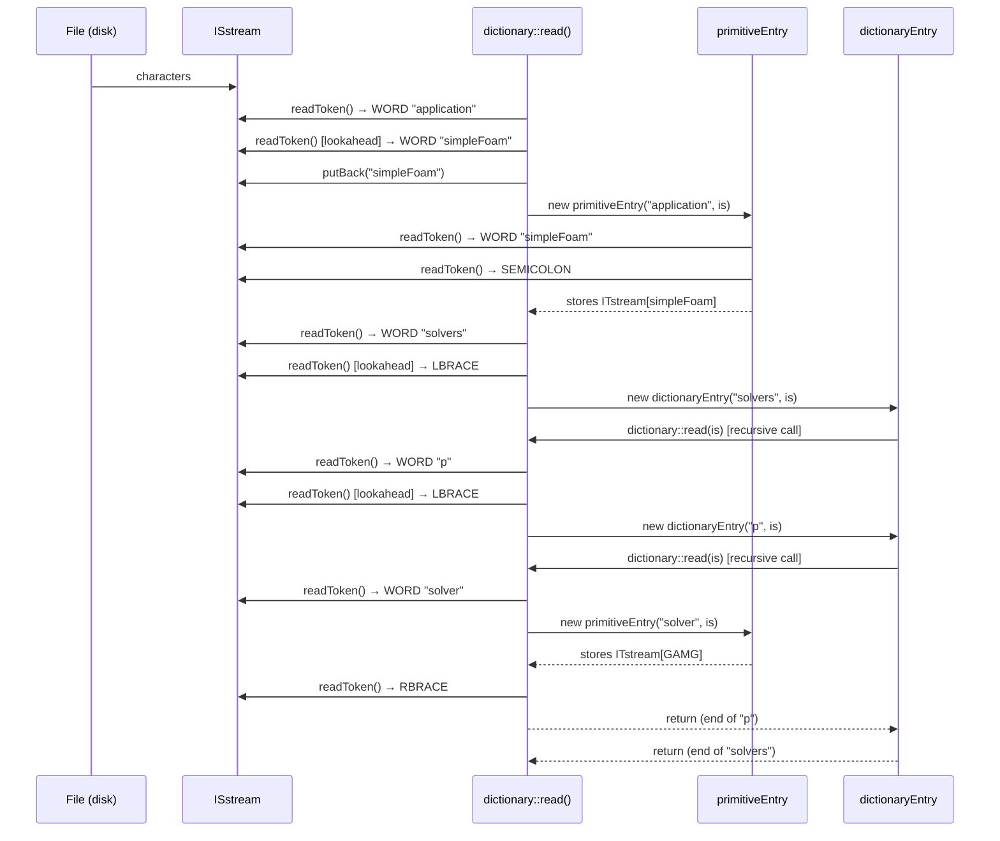
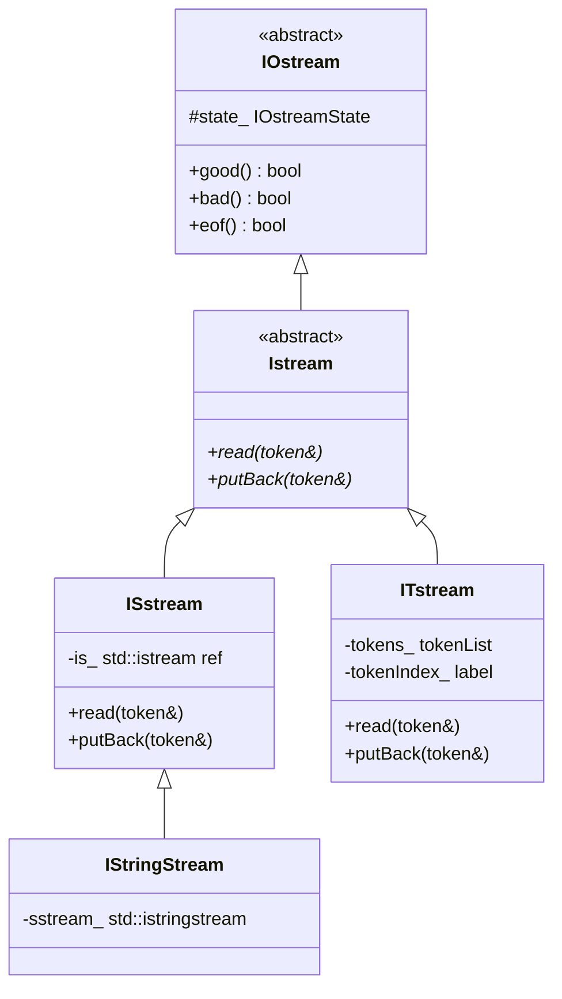

# Day 33: Dictionary Parsing — How OpenFOAM Reads `controlDict`

**Phase:** 3 — Software Architecture Patterns (Days 29–42)
**Previous:** Day 32 — Dictionary System: `IOdictionary`, Token, `primitiveEntry`
**Next:** Day 34 — Plugin Architecture: How `fvSchemes` Uses the Dictionary + RTS Together

> **Today's goal:** Trace the complete journey from a file on disk to a populated `dictionary` tree. Understand the tokenizer, the recursive-descent parser, and the role of streams. Build a full tokenizer and parser for nested configuration files.

---

## Part 1: Pattern Identification

### The Parsing Pipeline

When OpenFOAM starts a simulation, one of the very first things it does is read `controlDict`. The journey from bytes on disk to a structured dictionary that can answer `readScalar("deltaT")` passes through four well-defined stages:

```
File on disk
     │
     ▼
 ISstream            ← wraps std::ifstream, provides readToken()
     │
     ▼
 Token stream         ← sequence of typed tokens: WORD, NUMBER, LBRACE, ...
     │
     ▼
 dictionary::read()  ← recursive-descent parser, builds entry objects
     │
     ▼
 dictionary tree      ← hierarchical key-value store, queryable by typed lookup
```

Each stage has a single, clear responsibility:

| Stage | Component | Responsibility |
|-------|-----------|----------------|
| 1 | `ISstream` | Character I/O, line counting, error location |
| 2 | `readToken()` | Lexing: classify character sequences into typed tokens |
| 3 | `dictionary::read()` | Parsing: assemble tokens into `entry` objects |
| 4 | `dictionary` | Storage and typed retrieval |

This separation is textbook compiler design: **lexer → parser → AST**. OpenFOAM's dictionary tree is the AST.

---

### What Is a Tokenizer's Job? (Lexing vs Parsing)

**Lexing** (tokenization) converts a flat character stream into a stream of *tokens* — the smallest meaningful units:

```
"application     simpleFoam;\n"
  ↓
[WORD "application"] [WORD "simpleFoam"] [SEMICOLON]
```

The lexer does not care about structure or meaning. It only classifies.

**Parsing** takes the token stream and enforces *grammar* — it determines that `WORD WORD SEMICOLON` means "keyword-value pair" and that `WORD LBRACE ... RBRACE` means "sub-dictionary".

Separating these stages is a classic software engineering decision:
- The lexer can be written once and tested in isolation.
- The parser never needs to think about whitespace, comments, or quoted strings.
- Error messages can pinpoint the exact character offset (lexer) or the structural problem (parser) independently.

---

### Why Recursive Descent?

OpenFOAM's dictionary format is a *context-free grammar* with recursive nesting. A sub-dictionary can contain another sub-dictionary, which can contain another, arbitrarily deep:

```
outer
{
    inner
    {
        deepest { x 1; }
    }
}
```

Recursive-descent parsers handle this naturally: parsing a dictionary calls itself to parse sub-dictionaries. The call stack tracks the nesting depth automatically.

The format is reminiscent of LISP S-expressions or JSON — a tree encoded as text with explicit delimiters. Recursive descent is the standard technique for such grammars.

---

### The Grammar of an OpenFOAM Dictionary File (Informal BNF)

```
dictionary   ::= entry*

entry        ::= primitive_entry
               | dict_entry
               | directive

primitive_entry ::= keyword value_list ';'

dict_entry   ::= keyword '{' dictionary '}'

keyword      ::= WORD

value_list   ::= token*           /* everything up to ';' */

token        ::= WORD | NUMBER | STRING | LBRACE | RBRACE | SEMICOLON

directive    ::= '#include' STRING
               | '#inputMode' WORD
               | '#remove' WORD
```

Key observations:
1. Every primitive entry ends with `;`. The parser scans forward until it finds `;`, collecting all tokens into the entry's `ITstream`.
2. Every sub-dictionary is delimited by `{` and `}`. The `{` triggers a recursive call; `}` terminates it.
3. Directives (`#include`) are not key-value pairs — they are meta-instructions to the parser itself.
4. The grammar is deliberately simple. There are no operator precedences, no expressions, no conditional branching — just tokens and structure.

---

## Part 2: Source Code Deep Dive

### `ISstream`: File-Level Character I/O

> **File:** `src/OpenFOAM/db/IOstreams/Sstreams/ISstream.H`
> **File:** `src/OpenFOAM/db/IOstreams/Sstreams/ISstream.C`

`ISstream` wraps a `std::istream` reference and adds:
- Line and column tracking (for error messages)
- A `putback` buffer for one-character lookahead
- The central method `readToken(token&)`

⭐ The `ISstream` class stores the stream state as a reference — it does not own the underlying `std::ifstream`. This means the same `ISstream` machinery can wrap a file stream, a string stream, or a network socket with identical code.

The `readToken()` method is the heart of the lexer. Its logic follows this decision tree:

```
skip whitespace and C/C++ comments
peek at next character:
  letter or '_'  → readWord()   → token::WORD
  digit or '-'   → readNumber() → token::SCALAR or token::LABEL
  '"'            → readString() → token::STRING
  '{'            → consume, return token::BEGIN_BLOCK
  '}'            → consume, return token::END_BLOCK
  ';'            → consume, return token::END_STATEMENT
  '('            → consume, return token::BEGIN_LIST
  ')'            → consume, return token::END_LIST
  EOF            → return token::EOF_TOKEN
  other          → token::PUNCTUATION with that character
```

⭐ Comments in OpenFOAM dictionary files follow C++ syntax: `// line comment` and `/* block comment */`. These are stripped by `ISstream` before tokens are returned — the parser never sees them.

The `readWord()` helper reads characters until it hits whitespace or a punctuation character:

```cpp
// ⭐ Simplified from ISstream.C — actual logic
void ISstream::readWord(word& w)
{
    w.clear();
    while (is_.good())
    {
        char c = is_.peek();
        if (isspace(c) || c == ';' || c == '{' || c == '}')
            break;
        w += is_.get();
    }
}
```

The `readNumber()` helper reads a contiguous digit sequence (with optional sign, decimal point, and exponent). It returns a `token::SCALAR` if the text contains `.` or `e/E`, otherwise a `token::LABEL`.

---

### `dictionary::read()`: The Main Parsing Loop

> **File:** `src/OpenFOAM/db/dictionary/dictionary.C`
> **Method:** `dictionary::read(Istream& is)`

⭐ `dictionary::read()` is the entry point for parsing. It is called both for the top-level dictionary (by `IOdictionary`) and recursively for every sub-dictionary.

The loop structure is:

```cpp
// ⭐ Reconstructed from OpenFOAM source — illustrates the actual logic
bool dictionary::read(Istream& is)
{
    while (is.good())
    {
        token keyToken(is);             // read next token

        if (keyToken.type() == token::END_BLOCK)
            return true;                // '}' found — end of this dict level
        if (keyToken.type() == token::EOF_TOKEN)
            return true;                // top-level EOF

        if (!keyToken.isWord())
            FatalIOError << "Expected keyword, found " << keyToken;

        word keyword = keyToken.wordToken();

        // Handle directives: #include, #inputMode, etc.
        if (keyword[0] == '#')
        {
            functionEntries::execute(keyword, *this, is);
            continue;
        }

        // Peek at next token to decide: primitive or sub-dict?
        token nextToken(is);

        if (nextToken.type() == token::BEGIN_BLOCK)
        {
            // Sub-dictionary: recurse
            dictionaryEntry* subDictPtr = new dictionaryEntry(keyword, *this, is);
            add(subDictPtr);
        }
        else
        {
            // Primitive entry: put back the token, read until ';'
            is.putBack(nextToken);
            primitiveEntry* primPtr = new primitiveEntry(keyword, *this, is);
            add(primPtr);
        }
    }
    return true;
}
```

The parser is a classic **LL(1)** (one-token lookahead) recursive-descent parser:
- One peek at the token after the keyword determines whether to create a `primitiveEntry` or a `dictionaryEntry`.
- No backtracking is required.

---

### `primitiveEntry::read()`: Collecting the Value Token List

> **File:** `src/OpenFOAM/db/dictionary/primitiveEntry/primitiveEntryIO.C`

When the parser determines that an entry is primitive (not followed by `{`), it must collect all tokens up to the terminating `;`. These tokens are stored in an `ITstream` — an in-memory token list stream that supports reading back with the same `Istream` interface.

```cpp
// ⭐ Simplified from primitiveEntryIO.C
void primitiveEntry::read(Istream& is)
{
    tokenList toks;
    label depth = 0;                    // track nested ( ) lists

    while (is.good())
    {
        token t(is);

        if (t.type() == token::END_STATEMENT && depth == 0)
            break;                      // ';' at top level → done
        if (t.type() == token::BEGIN_LIST)
            ++depth;
        if (t.type() == token::END_LIST)
            --depth;

        toks.append(t);
    }

    tokenStream_ = ITstream(keyword(), toks);
}
```

This design means that typed retrieval is **lazy**: the token list is stored verbatim, and conversion to `scalar`, `label`, `word`, `vector`, etc., happens only when the caller requests a specific type via `readScalar()`, `readLabel()`, etc.

⭐ Because the value is stored as an `ITstream`, a single dictionary entry can hold multi-token values like `(1 0 0)` (a vector), `uniform 0` (an initial condition specification), or even a list `(1 2 3 4 5)` — all without special-casing in the parser.

---

### `dictionaryEntry::read()`: Recursive Sub-Dictionary Parsing

> **File:** `src/OpenFOAM/db/dictionary/dictionaryEntry/dictionaryEntryIO.C`

When the parser sees `WORD LBRACE`, it constructs a `dictionaryEntry`, which is itself a `dictionary`. The constructor immediately calls `dictionary::read()` on the same stream — the recursion:

```cpp
// ⭐ Simplified from dictionaryEntryIO.C
dictionaryEntry::dictionaryEntry
(
    const word& keyword,
    const dictionary& parentDict,
    Istream& is
)
:
    entry(keyword),
    dictionary(keyword, parentDict, is)   // calls dictionary::read(is)
{}
```

The `{` token has already been consumed by the parent's lookahead. The recursive call to `dictionary::read()` will run until it sees `}`, at which point it returns — and the parent loop continues past the `}`, moving on to the next entry.

This recursive structure means the depth of the call stack equals the nesting depth of the dictionary file. For typical `controlDict` files (2–3 levels deep), this is not a concern. For pathological inputs, OpenFOAM does not impose an explicit depth limit (⚠️ unverified whether a stack depth check exists in all versions).

---

### Tracing a Complete Parse

Consider this dictionary fragment:

```
application     simpleFoam;
startFrom       latestTime;
solvers
{
    p { solver GAMG; tolerance 1e-6; }
}
```

The parser processes it as follows:

**Step 1:** `readToken()` returns `WORD "application"`.
**Step 2:** Lookahead returns `WORD "simpleFoam"` — not `{`.
**Step 3:** Put back `"simpleFoam"`. Create `primitiveEntry("application")`.
**Step 4:** `primitiveEntry::read()` collects `[WORD "simpleFoam"]` then hits `;`. Stores as `ITstream`.

**Step 5:** `readToken()` returns `WORD "startFrom"`.
**Step 6:** Lookahead returns `WORD "latestTime"` — not `{`.
**Step 7:** Create `primitiveEntry("startFrom")` with value `[WORD "latestTime"]`.

**Step 8:** `readToken()` returns `WORD "solvers"`.
**Step 9:** Lookahead returns `{` — sub-dictionary.
**Step 10:** Create `dictionaryEntry("solvers")` → recurse into `dictionary::read()`.

**Step 11 (inside "solvers"):** `readToken()` returns `WORD "p"`.
**Step 12:** Lookahead returns `{` → create `dictionaryEntry("p")` → recurse.

**Step 13 (inside "p"):** `readToken()` returns `WORD "solver"`.
**Step 14:** Lookahead returns `WORD "GAMG"` → `primitiveEntry("solver")` with value `[WORD "GAMG"]`.

**Step 15:** `readToken()` returns `WORD "tolerance"`.
**Step 16:** Lookahead returns `SCALAR 1e-6` → `primitiveEntry("tolerance")` with value `[SCALAR 1e-6]`.

**Step 17:** `readToken()` returns `}` — return from "p" recursion.
**Step 18:** `readToken()` returns `}` — return from "solvers" recursion.
**Step 19:** `readToken()` returns EOF — top-level parse complete.

Final dictionary tree:

```
(root)
├── application  → ITstream: [WORD "simpleFoam"]
├── startFrom    → ITstream: [WORD "latestTime"]
└── solvers (sub-dict)
    └── p (sub-dict)
        ├── solver    → ITstream: [WORD "GAMG"]
        └── tolerance → ITstream: [SCALAR 1e-6]
```

---

### Mermaid Sequence Diagram: Stream to Dictionary Tree



---

## Part 3: C++ Mechanics Explained

### The `Istream` Class Hierarchy

OpenFOAM's I/O architecture uses a polymorphic `Istream` base class, allowing the parser to work identically whether reading from a file, a string, or a pre-built token list:



- **`ISstream`**: Wraps any `std::istream`. Used for files (`std::ifstream`) and string streams (`std::istringstream`). All character-level reading happens here.
- **`ITstream`** (In-memory Token Stream): Stores a `List<token>` and replays them through the standard `Istream` interface. Used as the storage backend for `primitiveEntry` — once the entry has been parsed from the file, its values are stored as an `ITstream` for later typed retrieval.
- **`IStringStream`**: An `ISstream` that wraps `std::istringstream`. Used extensively in tests and for parsing short strings inline (e.g., `IStringStream("(1 0 0)")() >> myVector`).

⭐ The key design insight is that `primitiveEntry` stores an `ITstream`, not a string. This means you can re-read the value multiple times (each read resets the token index) and the value is already tokenized — no re-parsing cost on lookup.

---

### How `readToken()` Classifies Characters

The lexer's character classification follows a strict priority order. Here is the conceptual logic with the actual token types:

```cpp
// ⭐ Character classification logic from ISstream::read(token&)
// (Source: src/OpenFOAM/db/IOstreams/Sstreams/ISstreamRead.C)

void skipWhitespaceAndComments(std::istream& is)
{
    while (is.good())
    {
        char c = is.peek();
        if (isspace(c)) { is.get(); continue; }
        if (c == '/')
        {
            is.get();
            char c2 = is.peek();
            if (c2 == '/')      // line comment: skip to newline
            {
                while (is.get() != '\n' && is.good()) {}
                continue;
            }
            else if (c2 == '*') // block comment: skip to */
            {
                is.get(); // consume '*'
                char prev = 0;
                while (is.good()) {
                    char ch = is.get();
                    if (prev == '*' && ch == '/') break;
                    prev = ch;
                }
                continue;
            }
            else { is.putback('/'); break; }  // not a comment
        }
        break;
    }
}
```

After whitespace and comments are stripped, classification of the first character determines the token type:

| First character | Token type | Method called |
|----------------|------------|---------------|
| Letter or `_` | `WORD` | `readWord()` |
| Digit, `-`, `+` | `SCALAR` or `LABEL` | `readNumber()` |
| `"` | `STRING` | `readString()` — reads to matching `"` |
| `{` | `BEGIN_BLOCK` | single `get()` |
| `}` | `END_BLOCK` | single `get()` |
| `;` | `END_STATEMENT` | single `get()` |
| `(` | `BEGIN_LIST` | single `get()` |
| `)` | `END_LIST` | single `get()` |
| `[` | `BEGIN_SQR` | single `get()` |
| `]` | `END_SQR` | single `get()` |

⭐ The distinction between `SCALAR` and `LABEL` (integer) is made during `readNumber()`: if the number string contains `.`, `e`, or `E`, it becomes `token::SCALAR`; otherwise `token::LABEL`. This is a purely lexical distinction — no semantic analysis needed.

---

### The `#include` Directive: Stream Switching Mid-Parse

OpenFOAM dictionary files support `#include "otherFile"`. The parser must seamlessly switch to reading from the included file, then return to the original stream.

⭐ This is handled by the `functionEntry` mechanism (also called `keyword entries` in some OpenFOAM versions). When `dictionary::read()` encounters a keyword starting with `#`, it calls `functionEntries::execute()`:

```cpp
// ⭐ Illustrates the #include handling pattern
// Source: src/OpenFOAM/db/dictionary/functionEntries/includeEntry/includeEntry.C

bool functionEntries::includeEntry::execute
(
    dictionary& parentDict,
    Istream& is
)
{
    token filenameToken(is);
    fileName includedFile = filenameToken.stringToken();

    // Resolve path relative to the case directory
    includedFile = parentDict.filePath(includedFile);

    // Open the included file
    IFstream ifs(includedFile);
    ISstream includedStream(ifs, includedFile);

    // Parse it into the SAME parent dictionary
    parentDict.read(includedStream);

    return true;
}
```

The critical point: the included file is parsed into the *same* `parentDict`. After `parentDict.read()` returns from the included file's stream, control returns to `functionEntries::execute()`, which returns to the original `dictionary::read()` loop, which continues reading the original file.

This is stream switching: no special parser state needed. The recursion on `dictionary::read()` handles it naturally.

---

### Error Recovery: Unexpected Token

When `dictionary::read()` encounters an unexpected token — say, a `}` where a keyword is expected, or a `;` where a value should follow — OpenFOAM uses `FatalIOError`:

```cpp
// ⭐ Error format from OpenFOAM source
// Typical output when a bad token is encountered:

/*
--> FOAM FATAL IO ERROR:
    Expected a keyword, found on line 42 the punctuation token '}'

file: /path/to/case/system/controlDict at line 42.

    From function dictionary::read(Istream&)
    in file db/dictionary/dictionary.C at line 195.
*/
```

Key features of OpenFOAM's error system:
1. **File and line number** from `ISstream`'s tracking.
2. **Token display**: the unexpected token is shown as a string.
3. **Call stack**: the `From function` / `in file` entries trace the C++ call location.
4. **Fatal**: `FatalIOError` calls `abort()` or `exit()` — there is no exception-based recovery in the dictionary parser. ⚠️ Whether exception-mode builds exist depends on compile flags.

---

### The `functionEntries`: Compile-Time Dictionary Macros

Besides `#include`, OpenFOAM supports several other directives:

| Directive | Effect |
|-----------|--------|
| `#include "file"` | Parse another file into the current dictionary |
| `#inputMode merge` | Subsequent reads merge into existing entries (default: overwrite) |
| `#inputMode overwrite` | Overwrite existing entries |
| `#inputMode protect` | Do not overwrite existing entries |
| `#inputMode warn` | Warn on duplicate entries |
| `#remove keyword` | Delete a previously set entry |
| `#sinclude "file"` | ⚠️ Silent include — no error if file is missing (some versions) |

These are processed at parse time. They are not entries in the final dictionary — they are instructions to the parser about how to behave. This is why `dictionary::read()` checks for `#` prefix and routes to `functionEntries::execute()` before creating any `entry` object.

---

## Part 4: Implementation Exercise

### The Goal

Extend Day 32's `MiniDict` with a complete tokenizer and recursive-descent parser. By the end of this exercise, you will be able to parse a string like:

```
application simpleFoam;
deltaT 0.001;
solvers
{
    p { solver GAMG; tolerance 1e-6; }
    U { solver PBiCGStab; tolerance 1e-8; }
}
writeInterval 100;
```

into a `MiniDict` tree and retrieve values with typed lookups.

---

### Step 1: The Token Types and Token Struct

```cpp
// file: mini_tokenizer.hpp
#pragma once
#include <string>
#include <variant>
#include <stdexcept>
#include <istream>
#include <sstream>

// All possible token types in our mini OpenFOAM-style dictionary
enum class TokenType
{
    WORD,           // identifier: simpleFoam, solver, p, U
    NUMBER,         // numeric: 0.001, 1e-6, 100
    STRING,         // quoted: "path/to/file"
    LBRACE,         // {
    RBRACE,         // }
    SEMICOLON,      // ;
    END_OF_INPUT    // no more tokens
};

// A token carries its type and text representation
struct Token
{
    TokenType type;
    std::string text;      // raw text for all types
    double      number;    // pre-parsed number (only valid when type==NUMBER)

    // Convenience constructors
    static Token word(std::string s)       { return {TokenType::WORD,     s, 0.0}; }
    static Token number(std::string s, double v) { return {TokenType::NUMBER, s, v}; }
    static Token string_(std::string s)    { return {TokenType::STRING,   s, 0.0}; }
    static Token lbrace()                  { return {TokenType::LBRACE,   "{", 0.0}; }
    static Token rbrace()                  { return {TokenType::RBRACE,   "}", 0.0}; }
    static Token semicolon()               { return {TokenType::SEMICOLON, ";", 0.0}; }
    static Token eof()                     { return {TokenType::END_OF_INPUT, "", 0.0}; }
};
```

---

### Step 2: The Tokenizer

```cpp
// file: mini_tokenizer.hpp (continued)

class MiniTokenizer
{
    std::istream& is_;
    int line_ = 1;

    // Skip whitespace and // comments
    void skipWhitespace()
    {
        while (is_.good())
        {
            char c = is_.peek();
            if (c == '\n') { ++line_; is_.get(); continue; }
            if (isspace(c)) { is_.get(); continue; }

            // Line comment
            if (c == '/')
            {
                is_.get();
                if (is_.peek() == '/')
                {
                    while (is_.good() && is_.peek() != '\n') is_.get();
                    continue;
                }
                else
                {
                    is_.putback('/');
                    break;
                }
            }
            break;
        }
    }

    // Read a word: letters, digits, underscores, dots (for keywords like 1e-6 handled by readNumber)
    Token readWord()
    {
        std::string s;
        while (is_.good())
        {
            char c = is_.peek();
            if (isalnum(c) || c == '_' || c == '.' || c == '-')
            {
                // '-' only allowed after 'e'/'E' (handled in readNumber)
                // Here we stop at '-' unless it's part of a word like 'kOmega-SST'
                if (c == '-' && !s.empty() && s.back() != 'e' && s.back() != 'E')
                    break;
                s += is_.get();
            }
            else break;
        }
        return Token::word(s);
    }

    // Read a number: optional sign, digits, optional decimal, optional exponent
    Token readNumber()
    {
        std::string s;
        // optional leading sign
        if (is_.peek() == '-' || is_.peek() == '+')
            s += is_.get();

        while (is_.good() && isdigit(is_.peek()))
            s += is_.get();

        if (is_.good() && is_.peek() == '.')
        {
            s += is_.get();
            while (is_.good() && isdigit(is_.peek()))
                s += is_.get();
        }

        if (is_.good() && (is_.peek() == 'e' || is_.peek() == 'E'))
        {
            s += is_.get();
            if (is_.good() && (is_.peek() == '+' || is_.peek() == '-'))
                s += is_.get();
            while (is_.good() && isdigit(is_.peek()))
                s += is_.get();
        }

        double v = std::stod(s);
        return Token::number(s, v);
    }

    // Read a quoted string: "content" → content (without quotes)
    Token readString()
    {
        is_.get(); // consume opening '"'
        std::string s;
        while (is_.good() && is_.peek() != '"')
        {
            char c = is_.get();
            if (c == '\\' && is_.peek() == '"') { s += is_.get(); continue; }
            if (c == '\n') ++line_;
            s += c;
        }
        if (is_.good()) is_.get(); // consume closing '"'
        return Token::string_(s);
    }

public:
    explicit MiniTokenizer(std::istream& is) : is_(is) {}

    int line() const { return line_; }

    // Return the next token, skipping whitespace and comments
    Token next()
    {
        skipWhitespace();

        if (!is_.good() || is_.eof())
            return Token::eof();

        char c = is_.peek();

        if (c == '{') { is_.get(); return Token::lbrace(); }
        if (c == '}') { is_.get(); return Token::rbrace(); }
        if (c == ';') { is_.get(); return Token::semicolon(); }
        if (c == '"') return readString();

        // Number: starts with digit, or '-' followed by digit
        if (isdigit(c)) return readNumber();
        if (c == '-' || c == '+')
        {
            is_.get();
            if (is_.good() && isdigit(is_.peek()))
            {
                is_.putback(c);
                return readNumber();
            }
            is_.putback(c);
        }

        // Word: starts with letter or underscore
        if (isalpha(c) || c == '_') return readWord();

        // Unexpected character: consume and return as word for robustness
        std::string s(1, is_.get());
        return Token::word(s);
    }

    // Peek at the next token without consuming it
    // (we implement this via buffering one token)
};
```

---

### Step 3: The Dictionary Value Types and MiniDict

```cpp
// file: mini_dict.hpp
#pragma once
#include <string>
#include <variant>
#include <unordered_map>
#include <vector>
#include <memory>
#include <stdexcept>
#include <iostream>

// Forward declaration
struct MiniDict;

// A value is either a scalar, a word/string, or a nested dictionary
using MiniValue = std::variant<double, std::string, std::shared_ptr<MiniDict>>;

struct MiniDict
{
    // Ordered insertion for deterministic iteration
    std::vector<std::string>                     keys_;
    std::unordered_map<std::string, MiniValue>   entries_;

    // Insert or overwrite an entry
    void set(const std::string& key, MiniValue val)
    {
        if (entries_.find(key) == entries_.end())
            keys_.push_back(key);
        entries_[key] = std::move(val);
    }

    // Type-safe lookups — throw std::runtime_error on type mismatch or missing key
    double lookupScalar(const std::string& key) const
    {
        auto it = entries_.find(key);
        if (it == entries_.end())
            throw std::runtime_error("Key not found: " + key);
        if (!std::holds_alternative<double>(it->second))
            throw std::runtime_error("Key '" + key + "' is not a number");
        return std::get<double>(it->second);
    }

    std::string lookupWord(const std::string& key) const
    {
        auto it = entries_.find(key);
        if (it == entries_.end())
            throw std::runtime_error("Key not found: " + key);
        if (!std::holds_alternative<std::string>(it->second))
            throw std::runtime_error("Key '" + key + "' is not a word/string");
        return std::get<std::string>(it->second);
    }

    const MiniDict& subDict(const std::string& key) const
    {
        auto it = entries_.find(key);
        if (it == entries_.end())
            throw std::runtime_error("Sub-dictionary not found: " + key);
        if (!std::holds_alternative<std::shared_ptr<MiniDict>>(it->second))
            throw std::runtime_error("Key '" + key + "' is not a sub-dictionary");
        return *std::get<std::shared_ptr<MiniDict>>(it->second);
    }

    bool found(const std::string& key) const
    {
        return entries_.find(key) != entries_.end();
    }

    // Pretty-print for debugging
    void print(int indent = 0) const
    {
        std::string pad(indent * 2, ' ');
        for (const auto& key : keys_)
        {
            const auto& val = entries_.at(key);
            if (std::holds_alternative<double>(val))
                std::cout << pad << key << " = " << std::get<double>(val) << "\n";
            else if (std::holds_alternative<std::string>(val))
                std::cout << pad << key << " = \"" << std::get<std::string>(val) << "\"\n";
            else
            {
                std::cout << pad << key << "\n" << pad << "{\n";
                std::get<std::shared_ptr<MiniDict>>(val)->print(indent + 1);
                std::cout << pad << "}\n";
            }
        }
    }
};
```

---

### Step 4: The Recursive-Descent Parser

```cpp
// file: mini_parser.hpp
#pragma once
#include "mini_tokenizer.hpp"
#include "mini_dict.hpp"
#include <stdexcept>

class MiniDictParser
{
    MiniTokenizer tok_;
    Token current_;       // one-token lookahead buffer
    bool  have_lookahead_ = false;

    // Consume and return the next token
    Token consume()
    {
        if (have_lookahead_)
        {
            have_lookahead_ = false;
            return current_;
        }
        return tok_.next();
    }

    // Peek at the next token without consuming
    const Token& peek()
    {
        if (!have_lookahead_)
        {
            current_      = tok_.next();
            have_lookahead_ = true;
        }
        return current_;
    }

    // Expect a specific token type — throw on mismatch
    Token expect(TokenType t, const std::string& context)
    {
        Token tok = consume();
        if (tok.type != t)
        {
            throw std::runtime_error(
                "Parse error at line " + std::to_string(tok_.line()) +
                " in " + context +
                ": unexpected token '" + tok.text + "'"
            );
        }
        return tok;
    }

    // Parse entries into dict until RBRACE or END_OF_INPUT
    void parseEntries(MiniDict& dict)
    {
        while (true)
        {
            const Token& t = peek();

            if (t.type == TokenType::END_OF_INPUT) break;
            if (t.type == TokenType::RBRACE)        break;

            // Expect a keyword (WORD)
            if (t.type != TokenType::WORD)
            {
                throw std::runtime_error(
                    "Parse error at line " + std::to_string(tok_.line()) +
                    ": expected keyword, got '" + t.text + "'"
                );
            }

            Token keyword = consume(); // consume the WORD

            // Lookahead: LBRACE means sub-dict; otherwise primitive entry
            const Token& next = peek();

            if (next.type == TokenType::LBRACE)
            {
                consume(); // consume '{'

                auto sub = std::make_shared<MiniDict>();
                parseEntries(*sub);                   // recursive call

                expect(TokenType::RBRACE, "sub-dictionary '" + keyword.text + "'");

                dict.set(keyword.text, std::move(sub));
            }
            else
            {
                // Primitive entry: collect tokens until ';'
                // For simplicity: single value (NUMBER or WORD/STRING)
                Token value = consume();

                MiniValue v;
                if (value.type == TokenType::NUMBER)
                    v = value.number;
                else if (value.type == TokenType::WORD || value.type == TokenType::STRING)
                    v = value.text;
                else
                {
                    throw std::runtime_error(
                        "Parse error at line " + std::to_string(tok_.line()) +
                        ": expected value for key '" + keyword.text +
                        "', got '" + value.text + "'"
                    );
                }

                expect(TokenType::SEMICOLON, "entry '" + keyword.text + "'");
                dict.set(keyword.text, std::move(v));
            }
        }
    }

public:
    explicit MiniDictParser(std::istream& is) : tok_(is) {}

    // Parse the entire stream and return the top-level dictionary
    MiniDict parse()
    {
        MiniDict root;
        parseEntries(root);

        // Expect EOF
        Token t = consume();
        if (t.type != TokenType::END_OF_INPUT)
        {
            throw std::runtime_error(
                "Parse error: unexpected token '" + t.text +
                "' after end of dictionary"
            );
        }

        return root;
    }
};
```

---

### Step 5: Test Driver

```cpp
// file: test_parser.cpp
#include "mini_parser.hpp"
#include <sstream>
#include <cassert>
#include <iostream>

int main()
{
    // --- Test 1: Simple key-value pairs ---
    {
        std::istringstream ss(
            "application simpleFoam;\n"
            "deltaT 0.001;\n"
            "writeInterval 100;\n"
        );
        MiniDictParser parser(ss);
        MiniDict dict = parser.parse();

        assert(dict.lookupWord("application") == "simpleFoam");
        assert(dict.lookupScalar("deltaT")    == 0.001);
        assert(dict.lookupScalar("writeInterval") == 100.0);
        std::cout << "Test 1 PASSED: simple key-value pairs\n";
    }

    // --- Test 2: Nested sub-dictionaries ---
    {
        std::istringstream ss(
            "solvers\n"
            "{\n"
            "    p { solver GAMG; tolerance 1e-6; }\n"
            "    U { solver PBiCGStab; tolerance 1e-8; }\n"
            "}\n"
        );
        MiniDictParser parser(ss);
        MiniDict dict = parser.parse();

        const MiniDict& solvers = dict.subDict("solvers");
        const MiniDict& p_dict  = solvers.subDict("p");
        const MiniDict& U_dict  = solvers.subDict("U");

        assert(p_dict.lookupWord("solver")   == "GAMG");
        assert(p_dict.lookupScalar("tolerance") == 1e-6);
        assert(U_dict.lookupWord("solver")   == "PBiCGStab");
        assert(U_dict.lookupScalar("tolerance") == 1e-8);
        std::cout << "Test 2 PASSED: nested sub-dictionaries\n";
    }

    // --- Test 3: Mixed top-level and nested ---
    {
        std::istringstream ss(
            "application simpleFoam;\n"
            "deltaT 0.001;\n"
            "solvers\n"
            "{\n"
            "    p { solver GAMG; tolerance 1e-6; }\n"
            "}\n"
            "writeInterval 100;\n"
        );
        MiniDictParser parser(ss);
        MiniDict dict = parser.parse();

        assert(dict.lookupWord("application")   == "simpleFoam");
        assert(dict.lookupScalar("deltaT")       == 0.001);
        assert(dict.lookupScalar("writeInterval") == 100.0);

        const MiniDict& p = dict.subDict("solvers").subDict("p");
        assert(p.lookupWord("solver") == "GAMG");

        std::cout << "Test 3 PASSED: mixed top-level and nested\n";

        std::cout << "\n--- Dictionary contents ---\n";
        dict.print();
    }

    // --- Test 4: Comment stripping ---
    {
        std::istringstream ss(
            "// This is a comment\n"
            "application simpleFoam; // inline comment\n"
        );
        MiniDictParser parser(ss);
        MiniDict dict = parser.parse();
        assert(dict.lookupWord("application") == "simpleFoam");
        std::cout << "Test 4 PASSED: comment stripping\n";
    }

    std::cout << "\nAll tests passed.\n";
    return 0;
}
```

---

### Compilation

```bash
# All headers are in the current directory; only test_parser.cpp needs compiling
g++ -std=c++17 -Wall -Wextra -o test_parser test_parser.cpp
./test_parser
```

Expected output:

```
Test 1 PASSED: simple key-value pairs
Test 2 PASSED: nested sub-dictionaries
Test 3 PASSED: mixed top-level and nested

--- Dictionary contents ---
application = "simpleFoam"
deltaT = 0.001
solvers
{
  p
  {
    solver = "GAMG"
    tolerance = 1e-06
  }
}
writeInterval = 100
Test 4 PASSED: comment stripping

All tests passed.
```

---

### What We Deliberately Simplified

Compared to OpenFOAM's real parser, our `MiniDictParser` omits:

| Feature | OpenFOAM handles | Our implementation |
|---------|-----------------|-------------------|
| Multi-token values | `uniform (1 0 0);` | Single-token values only |
| `#include` | Full stream switching | Not implemented |
| `dimensionedScalar` | `[0 1 -1 0 0 0 0] 1.0;` | Not implemented |
| List syntax `( ... )` | Arbitrary depth | Not implemented |
| `LABEL` vs `SCALAR` distinction | Separate types | Both stored as `double` |
| Error recovery | Fatal + abort | Throws `std::runtime_error` |

These are good extension exercises for Day 34 and beyond.

---

## Part 5: Exercises and Self-Check

### Exercise 1: Missing Semicolon

Consider this input:

```
application simpleFoam
deltaT 0.001;
```

What happens in OpenFOAM's real parser when the `;` after `simpleFoam` is missing?

**Answer:** The parser calls `primitiveEntry::read()`, which reads tokens until it hits `;`. Without a `;`, it will consume `deltaT` and `0.001` as part of the `application` entry's value list, then hit `;` and terminate. The resulting dictionary has `application` with an `ITstream` containing `[WORD "simpleFoam", WORD "deltaT", SCALAR 0.001]`, and `deltaT` is never added as a separate entry. The error is silent in the parser; it only becomes apparent when the user tries `readWord("deltaT")` and gets a `keyword not found` error. This illustrates why `;` is load-bearing in the grammar — it is the only delimiter separating entries.

In our `MiniDictParser`, the same input would throw a `Parse error` on line 2, because after consuming `simpleFoam` it would find `deltaT` (a WORD) where it expected `SEMICOLON`.

---

### Exercise 2: How `#include` Works

Explain step by step what happens when the parser encounters:

```
#include "initialConditions"
```

**Answer:**
1. `dictionary::read()` calls `readToken()` and gets `WORD "#include"`.
2. It detects the `#` prefix and calls `functionEntries::execute("#include", parentDict, is)`.
3. The `includeEntry::execute()` method reads the next token: `STRING "initialConditions"`.
4. It resolves the path relative to the case directory.
5. It opens the file with `IFstream` and wraps it in an `ISstream`.
6. It calls `parentDict.read(includedStream)` — the *same* parent dictionary.
7. All entries in `initialConditions` are parsed and added to `parentDict` as if they had been written inline.
8. When the included file's `ISstream` hits EOF, `read()` returns.
9. Control returns to `functionEntries::execute()`, then to the original `dictionary::read()` loop.
10. The original stream resumes from the character after `"initialConditions"`.

The key: the included file's entries land in the *same* dictionary. There is no "included" sub-scope. This is a textual inclusion (like C's `#include`), not a scoped import.

---

### Exercise 3: `word` vs `string` Token Types

OpenFOAM has both `token::WORD` and `token::STRING`. What is the difference, and when does each arise?

**Answer:**

| Attribute | `WORD` token | `STRING` token |
|-----------|-------------|----------------|
| Source text | `simpleFoam` (unquoted) | `"path/to/file"` (quoted) |
| Allowed characters | Letters, digits, `_`, `.` | Any character including spaces, `/`, `\n` |
| Typical use | Keywords, class names, yes/no | File paths, user messages, patch names with spaces |
| Storage in OpenFOAM | `word` type (restricted character set) | `string` type (arbitrary) |

In `readToken()`, `"` triggers `readString()`, which reads until the closing `"`. Any other non-whitespace non-punctuation character triggers `readWord()`. The `word` class in OpenFOAM additionally enforces that certain characters (like spaces) are not present, and will error if you try to construct a `word` from a string containing them. ⭐ This means `readWord("my scheme")` would fail — you must quote multi-word values if the result is to be treated as a single `STRING`.

---

### Exercise 4: Empty Sub-Dictionary

How does the parser handle:

```
emptyDict {}
```

**Answer:** The parser reads `WORD "emptyDict"`, then lookahead returns `LBRACE`. It creates a `dictionaryEntry("emptyDict")` and recurses into `dictionary::read()`. The recursive call immediately reads `RBRACE` (the `}`) and returns. The result is a `dictionaryEntry` with zero child entries — a valid, empty sub-dictionary. This is useful for optional configuration blocks that the user leaves empty when not needed. In our `MiniDictParser`, `parseEntries()` on an empty `{}` simply breaks immediately on the `RBRACE` peek, and the sub-dict `MiniDict` has empty `keys_` and `entries_`.

---

### Exercise 5: What Is `IStringStream` Used For?

**Answer:** `IStringStream` wraps `std::istringstream` inside an `ISstream`. It is used whenever you need to parse a short string inline, without touching the filesystem. Common uses in OpenFOAM:

1. **Parsing command-line arguments:** `IStringStream("-1.5")() >> scalar` extracts a value from a string argument.
2. **`lookup().stream()`:** When you retrieve a primitive entry's value, you can get an `IStringStream` to re-parse it.
3. **Unit tests:** `IStringStream("(1 0 0)")() >> vector` lets tests create values from string literals.
4. **`word::operator()`:** Some `word` constructors accept an `IStringStream` to parse a word from a string.

⭐ The pattern `IStringStream("content")()` creates the stream object and calls `operator()` to get the underlying `ISstream&` — this is how OpenFOAM chains stream construction with the `>>` operator in a single expression.

---

## Summary

Today's session traced the complete parsing pipeline from disk bytes to a queryable dictionary tree:

| Concept | What you learned |
|---------|----------------|
| Lexer vs parser separation | Why the two stages are cleanly separated in `ISstream` and `dictionary::read()` |
| LL(1) recursive descent | One lookahead token is sufficient to parse the entire dictionary grammar |
| `ISstream` | Wraps `std::istream`, performs tokenization with line tracking |
| `primitiveEntry` | Stores values as an `ITstream` — lazy typed retrieval |
| `dictionaryEntry` | Is itself a `dictionary` — recursion handles arbitrary nesting |
| `#include` | Stream switching via `functionEntries::execute()` — no special parser state |
| Error model | `FatalIOError` with file + line + function info — no exception recovery |
| `IStringStream` | Parses short strings inline using the same `ISstream` machinery |

The implementation exercise demonstrated that a working tokenizer and recursive-descent parser for this grammar fits in roughly 250 lines of clean C++17. The real OpenFOAM implementation adds robustness (multi-token values, `#` directives, dimension sets, list syntax) but the structural pattern is identical to what you built today.

**Day 34** will show how the dictionary feeds directly into the RTS system: `fvSchemes` reads a dictionary, then calls `surfaceInterpolationScheme::New(schemeName, ...)` — combining everything from Days 29–33 into a single architecture.

---

> **Deliverable check:** Can your `MiniDictParser` parse the following without error?
>
> ```
> outer { inner { x 3.14; label myKey; } flag yes; }
> ```
>
> Expected: `dict.subDict("outer").subDict("inner").lookupScalar("x") == 3.14` and
> `dict.subDict("outer").lookupWord("flag") == "yes"`.
