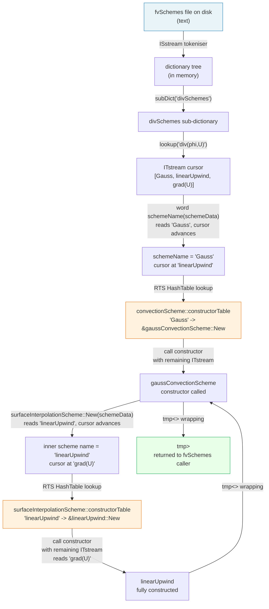

# Day 34: Plugin Architecture — How `fvSchemes` Loads Interpolation Schemes

**Phase:** 3 — Software Architecture Patterns (Days 29–42)
**Previous:** Day 33 — Dictionary Parsing — How OpenFOAM Reads `controlDict`
**Next:** Day 35 — `IOobject` & `objectRegistry` — Automatic I/O

---

## Context: Where We Are in Phase 3

| Day | Topic | What You Built |
|-----|-------|---------------|
| 29 | RTS overview — factory pattern | `ShapeFactory` with self-registering types |
| 30 | RTS internals — macro expansion | Line-by-line preprocessor expansion |
| 31 | Adding a new RTS class | Custom scheme registered via `addToRunTimeSelectionTable` |
| 32 | Dictionary system — tokens, entries | `MiniDict` parsing key-value pairs |
| 33 | Dictionary parsing — nested dicts | Typed nested lookup, `ISstream` cursor |
| **34** | **Plugin architecture — dictionary + RTS** | **`ShapeLoader` combining both systems** |
| 35 | `IOobject` & `objectRegistry` | Mini registry with auto-write |

Today is the **integration point**: the dictionary (Days 32–33) and the RTS factory (Days 29–31) finally meet. This is how OpenFOAM reads a word from `fvSchemes`, looks it up in a static table, and constructs the corresponding scheme object — all without the core ever knowing which concrete class it will instantiate.

---

## Part 1: Pattern Identification

### The Plugin Architecture Problem

Suppose you are writing a library called `libfiniteVolume.so`. You want users to be able to write their own discretisation schemes, ship them as `libmyScheme.so`, and have the solver load and use them **without any modification to your library**.

The constraints are:
1. You cannot list every possible scheme name in a `switch` statement — new schemes are written after you ship.
2. You cannot force users to modify your source code.
3. The selection must happen from a text configuration file the user edits.
4. Construction may require auxiliary data (mesh reference, sub-dictionary parameters).

This is the **plugin architecture** problem, and it appears in many mature software systems.

### How Other Languages Solve It

| Ecosystem | Mechanism | How plugins register |
|-----------|-----------|---------------------|
| Java | `ServiceLoader` + `META-INF/services` | Declaration in JAR manifest file |
| Python | `entry_points` in `setup.cfg` / `pyproject.toml` | Package metadata at install time |
| C (Unix) | `dlopen` / `dlsym` + convention | Caller discovers and loads `.so` at runtime |
| WordPress (PHP) | Hook system (`add_filter`, `add_action`) | Plugin file included, registers hooks |
| OpenFOAM (C++) | RTS macro + `libs` in `controlDict` | Static-initialization self-registration |

OpenFOAM's approach is the most elegant for a compiled systems language:

- **No manifest files.** Registration happens in the `.C` file of the derived class itself.
- **No runtime symbol lookup via strings.** The function pointer is stored in a `HashTable` before `main()` even starts.
- **No central registry.** Each shared library registers its own types when the OS loads it.
- **Type safety preserved.** The factory returns a `tmp<SchemBase<Type>>`, not a `void*`.

The price is the **static initialization order fiasco risk** (Day 30) and the requirement that library loading precede the first call to `New()`.

### The Open/Closed Principle — Concretely

> **"Software entities should be open for extension, but closed for modification."**
> — Meyer (1988), popularised by Martin ("Uncle Bob")

In OpenFOAM's context:
- **Closed for modification:** `fvSchemes.C` never changes when a new scheme is added.
- **Open for extension:** Adding `myLinearUpwind` requires only two files: `myLinearUpwind.H` and `myLinearUpwind.C` (plus one line in `Make/files`).

This is not merely a design pattern — it is a **business requirement** for an open-source solver toolkit. Users worldwide write custom schemes. The core library cannot enumerate them.

### The Two-Ingredient Recipe

OpenFOAM achieves plugin architecture by combining exactly two mechanisms:

```
Ingredient 1: Dictionary (Days 32-33)
  - Reads the configuration file into a tree of key-value pairs
  - Provides a cursor (ITstream) over token sequences
  - Enables: "div(phi,U)" → ITstream{ Gauss, linearUpwind, grad(U) }

Ingredient 2: RTS Factory (Days 29-31)
  - Maps string names to constructor function pointers
  - Populated at static-initialization time — before main()
  - Enables: "Gauss" → new gaussConvectionScheme<Type>(mesh, tokenStream)

Plugin Architecture = Ingredient 1 + Ingredient 2
```

Neither ingredient alone is sufficient:
- Dictionary alone gives you a string; you still need a way to turn it into an object.
- RTS alone needs something to supply the string; it cannot read files by itself.

The elegance is that combining them gives you **full extensibility** from a **text file**.

---

## Part 2: Source Code Deep Dive

### `fvSchemes` — Where It Sits in the Class Hierarchy

⭐ `fvSchemes` inherits from `IOdictionary`, which inherits from `dictionary` (the in-memory tree) and `regIOobject` (which handles file I/O). This means `fvSchemes` **is** a dictionary — all lookup operations (`lookup()`, `subDict()`, `found()`) work directly on it.

```
regIOobject
    |
    +--> IOdictionary      (adds file read/write to dictionary)
              |
              +--> fvSchemes   (adds scheme-specific helper methods)
```

⚠️ The exact inheritance depth of `IOdictionary` varies between OpenFOAM Foundation and ESI forks; the above reflects the Foundation v10 structure.

The `fvSchemes` file on disk lives at `<case>/system/fvSchemes`. When `fvSchemes` is constructed with a `Time&` reference, `IOdictionary::read()` is called, which calls `dictionary::read(ISstream&)`, which tokenises the file and populates the in-memory tree. By the time you call any scheme selector, the entire file is already parsed into memory.

### Structure of a Typical `fvSchemes` File

```text
// system/fvSchemes
FoamFile
{
    version     2.0;
    format      ascii;
    class       dictionary;
    location    "system";
    object      fvSchemes;
}

ddtSchemes
{
    default         Euler;
}

gradSchemes
{
    default         Gauss linear;
    grad(U)         Gauss linear;
}

divSchemes
{
    default         none;
    div(phi,U)      Gauss linearUpwind grad(U);
    div(phi,k)      Gauss upwind;
}

laplacianSchemes
{
    default         Gauss linear corrected;
}

interpolationSchemes
{
    default         linear;
}

snGradSchemes
{
    default         corrected;
}
```

Each top-level entry (`divSchemes`, `gradSchemes`, etc.) is a **sub-dictionary**. Within each sub-dictionary, entries map **field expressions** to **token sequences** that describe a scheme.

### Tracing `div(phi,U) Gauss linearUpwind grad(U);`

Let us follow this one entry from text on disk to a live C++ object.

**Step 1 — Tokenisation (Day 33 territory)**

The tokeniser produces this token sequence for the value side of `div(phi,U)`:

```
word:    "Gauss"
word:    "linearUpwind"
word:    "grad(U)"
```

These tokens are wrapped in an `ITstream` — an input token stream that acts as a cursor. Reading one token advances the cursor; the remaining tokens are still available for the next reader.

**Step 2 — `fvSchemes::divScheme()` extracts the `ITstream`**

⭐ In OpenFOAM source, the method that retrieves a divergence scheme uses a pattern equivalent to:

```cpp
// Conceptual representation of fvSchemes::divScheme()
ITstream& fvSchemes::divScheme(const word& name) const
{
    // Look up the sub-dictionary for divergence schemes
    const dictionary& divDict = subDict("divSchemes");

    // Find the entry for this specific field expression
    // Falls back to "default" if the exact name is not found
    if (divDict.found(name))
    {
        return divDict.lookup(name);   // returns ITstream cursor
    }
    else
    {
        return divDict.lookup("default");
    }
}
```

The returned `ITstream` is positioned at the first token: `"Gauss"`.

**Step 3 — `gaussConvectionScheme::New()` reads the scheme name**

The convection scheme system reads the first token from the `ITstream`:

```cpp
// Conceptual; actual code in convectionScheme.C
tmp<convectionScheme<Type>> convectionScheme<Type>::New
(
    const fvMesh& mesh,
    const surfaceScalarField& phi,
    const typename convectionScheme<Type>::MeshFlux& faceFlux,
    Istream& schemeData   // <-- the ITstream cursor
)
{
    const word schemeName(schemeData);  // reads "Gauss", advances cursor
    // cursor now points at "linearUpwind"

    return convectionSchemes(mesh, phi, faceFlux, schemeData).
        New(schemeName);    // RTS lookup: "Gauss" -> gaussConvectionScheme
}
```

The `word schemeName(schemeData)` call reads one token from the stream and advances the cursor. The remaining tokens (`"linearUpwind"`, `"grad(U)"`) are still in `schemeData` for the concrete constructor to consume.

**Step 4 — `gaussConvectionScheme` constructor reads its inner scheme**

`gaussConvectionScheme` wraps a `surfaceInterpolationScheme`. Its constructor reads the **next token** from the same `ITstream`:

```cpp
// Conceptual; based on gaussConvectionScheme.C
template<class Type>
gaussConvectionScheme<Type>::gaussConvectionScheme
(
    const fvMesh& mesh,
    const surfaceScalarField& phi,
    Istream& schemeData   // cursor now at "linearUpwind"
)
:
    convectionScheme<Type>(mesh, phi),
    tinterpScheme_
    (
        // surfaceInterpolationScheme::New reads "linearUpwind", advances cursor
        // cursor now at "grad(U)"
        // linearUpwind constructor reads "grad(U)" from remaining tokens
        surfaceInterpolationScheme<Type>::New(mesh, phi, schemeData)
    )
{}
```

**Step 5 — `surfaceInterpolationScheme::New()` reads `"linearUpwind"`**

```cpp
// Conceptual; based on surfaceInterpolationScheme.C
template<class Type>
tmp<surfaceInterpolationScheme<Type>> surfaceInterpolationScheme<Type>::New
(
    const fvMesh& mesh,
    const surfaceScalarField& phi,
    Istream& schemeData   // cursor at "linearUpwind"
)
{
    const word schemeName(schemeData);  // reads "linearUpwind", advances cursor
    // cursor now at "grad(U)"

    return MeshFluxConstructorTable(schemeName)(mesh, phi, schemeData);
    // RTS lookup: "linearUpwind" -> linearUpwind constructor
    // linearUpwind reads "grad(U)" from schemeData
}
```

**Step 6 — `linearUpwind` reads `"grad(U)"` and construction completes**

The `linearUpwind` scheme needs to know which gradient field to use for its reconstruction. It reads the final token `"grad(U)"` from the `ITstream`. At this point the cursor is exhausted and construction is complete.

The result is a fully nested object graph built from a single line of text:

```
gaussConvectionScheme<vector>
    └── tinterpScheme_: linearUpwind<vector>
            └── gradSchemeName_: "grad(U)"
```

### The `ITstream` Cursor — Why It Enables Nested Construction

⭐ `ITstream` is an `Istream` that reads from an in-memory `List<token>`. Multiple calls to `operator>>(word&)` advance the cursor through the same list.

This is the key enabling mechanism for nested schemes. The parent reads its own name, then passes the **same cursor** (now advanced by one token) to the child constructor. The child reads its own name, advances the cursor again, and passes the remaining portion to its child. No explicit slicing or sub-streaming is needed.

This is equivalent to a recursive descent parser where each grammar rule consumes tokens and leaves the rest for the parent:

```
Grammar (informal):
  divSchemeSpec  ::=  "Gauss" surfaceSchemeSpec
  surfaceSchemeSpec ::=  "linearUpwind" gradSchemeWord
                      |  "upwind"
                      |  "linear"
  gradSchemeWord  ::=  word
```

### `libs` in `controlDict` — Dynamic Library Loading

⭐ OpenFOAM's `controlDict` accepts a `libs` entry:

```text
// system/controlDict
libs
(
    "libmyCustomSchemes.so"
);
```

When `Time` is constructed, it reads `controlDict` and calls `dlopen()` (on Linux/macOS) for each library in the `libs` list. Loading a shared library causes its static-duration objects to be constructed — which triggers `addToRunTimeSelectionTable` registrations for every class in that library.

The sequence is:

```
Time constructed
  -> reads controlDict
  -> finds libs list
  -> dlopen("libmyCustomSchemes.so")
       -> OS loads .so into process memory
       -> static initializers run
            -> addToRunTimeSelectionTable(surfaceInterpolationScheme,
                                          myCustomScheme,
                                          Mesh_and_Istream)
               -> myCustomScheme entry added to HashTable
  -> fvSchemes read
  -> "myCustomScheme" looked up -> found -> constructed
```

This is **zero-modification extensibility**: the user creates a `.so`, lists it in `controlDict`, and the core library instantiates their class without ever being recompiled.

### Complete Flowchart — From File to Object



---

## Part 3: C++ Mechanics Explained

### `ITstream` as a Sequential Cursor

`ITstream` holds a `List<token>` and an integer index `tokenIndex_`. Each call to `read(token&)` copies the token at `tokenIndex_` and increments the index. There is no copying of the token list — only the index moves.

```cpp
// Simplified illustration of ITstream mechanics
class ITstream : public Istream
{
    const List<token>& tokens_;   // reference to the token list (no copy)
    label tokenIndex_;            // cursor position

public:
    bool read(token& t) override
    {
        if (tokenIndex_ < tokens_.size())
        {
            t = tokens_[tokenIndex_++];   // copy current, advance cursor
            return true;
        }
        return false;
    }
};
```

The consequence: when you pass an `ITstream&` to a constructor, that constructor reads from the **same list** that the caller holds. After the constructor returns, the caller's cursor has been advanced by however many tokens the constructor consumed.

This is **destructive reading** — the cursor never goes backward. It is precisely this property that enables nested scheme construction: each level of the hierarchy consumes exactly the tokens it needs and leaves the rest.

### Nested Construction — The Ownership Chain

Consider the type returned by the full construction chain:

```cpp
tmp<convectionScheme<vector>>
    contains: gaussConvectionScheme<vector>
        owns:  tmp<surfaceInterpolationScheme<vector>>
                    contains: linearUpwind<vector>
                        owns:  word gradSchemeName_ = "grad(U)"
```

Each level owns the level below it. When the outermost `tmp<>` is destroyed (e.g., at the end of the calling scope), it destroys `gaussConvectionScheme`, which destroys its inner `tmp<surfaceInterpolationScheme>`, which destroys `linearUpwind`. No explicit deletion is needed.

### `tmp<T>` — Temporary Ownership

⭐ `tmp<T>` is OpenFOAM's smart pointer for temporary objects. It works like `std::unique_ptr` for heap-allocated objects, but also supports non-owning references to stack-allocated objects (the latter is used for efficiency in field operations where the caller guarantees the object outlives the `tmp`).

For scheme construction, the heap-owning form is always used:

```cpp
// tmp<T> in ownership mode: holds a raw pointer, destroys on destruction
template<class T>
class tmp
{
    T* ptr_;       // non-null if owning
    // ...
public:
    ~tmp() { if (ptr_) { delete ptr_; ptr_ = nullptr; } }
    T& operator*()  { return *ptr_; }
    T* operator->() { return ptr_;  }
    T* ptr()        { return ptr_;  }
};
```

The factory functions return `tmp<SurfaceInterpolationScheme<Type>>` rather than a raw pointer because:
1. If `New()` throws during construction, the already-constructed partial object is deleted automatically.
2. Callers do not need to remember to `delete` the returned object.
3. Ownership transfer is explicit (via `tmp::ptr()` which releases the pointer).

### Why the Return Type Is a `tmp` of the **Base** Class

```cpp
// The factory returns the abstract base class, not the concrete type
tmp<surfaceInterpolationScheme<Type>> surfaceInterpolationScheme<Type>::New(...)
```

The caller does not need to know the concrete type. It only needs the interface defined by `surfaceInterpolationScheme<Type>` — specifically `interpolate(phi, psi)`. This is classic **Liskov Substitution**: any derived class can stand in for the base.

If the return type were `tmp<linearUpwind<Type>>`, the `gaussConvectionScheme` constructor would need to know at compile time which inner scheme it holds — defeating the entire purpose of runtime selection.

### The Full Type Chain with C++ Types

```
fvSchemes::divScheme("phi,U")
  returns: ITstream&   (positioned at first token)

convectionScheme<vector>::New(mesh, phi, faceFlux, itstream)
  reads:   word "Gauss" from itstream
  looks up: convectionSchemesMeshFluxConstructorTable["Gauss"]
  calls:   gaussConvectionScheme<vector>::New(mesh, phi, faceFlux, itstream)
  returns: tmp<convectionScheme<vector>>   (owns gaussConvectionScheme)

gaussConvectionScheme<vector>::gaussConvectionScheme(mesh, phi, itstream)
  calls:   surfaceInterpolationScheme<vector>::New(mesh, phi, itstream)
           // reads "linearUpwind" from itstream
           // looks up surfaceInterpolationScheme table
           // calls linearUpwind<vector>::New(mesh, phi, itstream)
           //   reads "grad(U)" from itstream
           // returns tmp<surfaceInterpolationScheme<vector>>
  stores:  tinterpScheme_ = tmp<surfaceInterpolationScheme<vector>>

linearUpwind<vector>::linearUpwind(mesh, phi, itstream)
  reads:   word "grad(U)" from itstream
  stores:  gradSchemeName_ = "grad(U)"
```

At every boundary, the type is the **abstract base class**. The concrete types (`gaussConvectionScheme`, `linearUpwind`) are implementation details invisible to the caller.

### `libs` and `dlopen` — The Runtime Plugin Loader

⭐ On Linux, `dlopen(path, RTLD_LAZY | RTLD_GLOBAL)` loads a shared library. `RTLD_GLOBAL` makes the library's symbols visible to subsequently loaded libraries — important because your custom scheme's constructor may call OpenFOAM base class methods.

The key is `RTLD_LAZY`: constructors of static-duration objects run **at load time** (before `dlopen` returns), not lazily. This means that immediately after `dlopen` returns, all `addToRunTimeSelectionTable` registrations from that library have already executed and the `HashTable` entries are live.

```cpp
// Conceptual representation of what Time does with the libs list
void Time::readLibs(const dictionary& controlDict)
{
    wordList libs;
    if (controlDict.readIfPresent("libs", libs))
    {
        for (const word& libName : libs)
        {
            // dlopen triggers static initializers in the .so
            // which run addToRunTimeSelectionTable for each class
            void* handle = dlopen(libName.c_str(), RTLD_LAZY | RTLD_GLOBAL);
            if (!handle)
            {
                WarningInFunction
                    << "Could not load library " << libName << nl
                    << dlerror() << endl;
            }
            // handle is stored so the library is not unloaded prematurely
        }
    }
}
```

⚠️ The `handle` must be retained for the lifetime of the process. If you call `dlclose()` on a library while objects from that library still exist, calling virtual methods on those objects causes undefined behaviour (the vtable entries point into unloaded memory).

---

## Part 4: Implementation Exercise

### Goal

Build a mini plugin system that combines `MiniDict` (Day 32's deliverable) with `ShapeFactory` (Day 29's deliverable). The result is `ShapeLoader` — a class that reads a configuration file, looks up shape types in the factory, and constructs shape objects with parameters from the dictionary.

Crucially: adding a new shape type (e.g., `Triangle`) requires **zero changes** to `ShapeLoader` or to the factory infrastructure.

### Configuration File Format

```text
// shapes.cfg
shapes
{
    shape1  circle  radius 3.0;
    shape2  rectangle  width 4.0  height 2.0;
    shape3  circle  radius 1.5;
}
```

Each entry: `name  type  param1 value1  param2 value2 ...;`

### Complete Implementation

```cpp
// ============================================================
// File: mini_plugin/Shape.h
// Base class + registration infrastructure
// ============================================================
#pragma once
#include <string>
#include <memory>
#include <unordered_map>
#include <functional>
#include <sstream>
#include <stdexcept>
#include <iostream>
#include <fstream>
#include <vector>

// ---- Token stream (simplified ITstream from Day 33) --------
class TokenStream
{
    std::vector<std::string> tokens_;
    std::size_t pos_ = 0;
public:
    explicit TokenStream(const std::string& line)
    {
        std::istringstream iss(line);
        std::string tok;
        while (iss >> tok) tokens_.push_back(tok);
    }

    bool good() const { return pos_ < tokens_.size(); }

    std::string next()
    {
        if (!good()) throw std::runtime_error("TokenStream exhausted");
        return tokens_[pos_++];
    }

    // Read a named parameter: "paramName value"
    double readDouble(const std::string& paramName)
    {
        std::string key = next();
        if (key != paramName)
            throw std::runtime_error(
                "Expected param '" + paramName + "', got '" + key + "'");
        return std::stod(next());
    }
};

// ---- Abstract base class -----------------------------------
class Shape
{
public:
    virtual ~Shape() = default;
    virtual double area() const = 0;
    virtual std::string typeName() const = 0;
    virtual void describe() const
    {
        std::cout << typeName() << ": area = " << area() << "\n";
    }
};

// ---- Factory infrastructure (Day 29 style) ----------------
//
// Constructor signature: (TokenStream&) -> unique_ptr<Shape>
// TokenStream cursor is positioned AFTER the type name token.
//
using ShapeConstructor = std::function<std::unique_ptr<Shape>(TokenStream&)>;

class ShapeFactory
{
    std::unordered_map<std::string, ShapeConstructor> table_;

public:
    static ShapeFactory& instance()
    {
        static ShapeFactory factory;
        return factory;
    }

    void registerType(const std::string& name, ShapeConstructor ctor)
    {
        table_[name] = std::move(ctor);
    }

    std::unique_ptr<Shape> create(const std::string& name, TokenStream& stream) const
    {
        auto it = table_.find(name);
        if (it == table_.end())
            throw std::runtime_error(
                "Unknown shape type '" + name + "'. "
                "Did you forget to register it?");
        return it->second(stream);
    }

    bool known(const std::string& name) const
    {
        return table_.count(name) > 0;
    }
};

// ---- Self-registration helper (like addToRunTimeSelectionTable) ---
struct RegisterShape
{
    RegisterShape(const std::string& name, ShapeConstructor ctor)
    {
        ShapeFactory::instance().registerType(name, std::move(ctor));
    }
};
```

```cpp
// ============================================================
// File: mini_plugin/shapes/Circle.h
// Concrete shape — self-registering
// ============================================================
#pragma once
#include "../Shape.h"
#include <cmath>

class Circle : public Shape
{
    double radius_;
public:
    explicit Circle(double r) : radius_(r) {}

    double area() const override { return M_PI * radius_ * radius_; }
    std::string typeName() const override { return "circle"; }

    // Factory constructor: reads "radius <value>" from stream
    static std::unique_ptr<Shape> create(TokenStream& stream)
    {
        double r = stream.readDouble("radius");
        return std::make_unique<Circle>(r);
    }
};

// Static-duration object — registration runs before main()
// This is the equivalent of addToRunTimeSelectionTable in OpenFOAM
static RegisterShape circleRegistration("circle", Circle::create);
```

```cpp
// ============================================================
// File: mini_plugin/shapes/Rectangle.h
// Concrete shape — self-registering
// ============================================================
#pragma once
#include "../Shape.h"

class Rectangle : public Shape
{
    double width_, height_;
public:
    Rectangle(double w, double h) : width_(w), height_(h) {}

    double area() const override { return width_ * height_; }
    std::string typeName() const override { return "rectangle"; }

    static std::unique_ptr<Shape> create(TokenStream& stream)
    {
        double w = stream.readDouble("width");
        double h = stream.readDouble("height");
        return std::make_unique<Rectangle>(w, h);
    }
};

static RegisterShape rectangleRegistration("rectangle", Rectangle::create);
```

```cpp
// ============================================================
// File: mini_plugin/ShapeLoader.h
// Combines MiniDict (Day 32) + ShapeFactory (Day 29)
// NEVER modified when new shape types are added
// ============================================================
#pragma once
#include "Shape.h"
#include <string>
#include <vector>
#include <fstream>
#include <sstream>
#include <stdexcept>

// Simple dict reader: extracts the "shapes { ... }" block
// and returns individual entries as strings
class ShapeLoader
{
    ShapeFactory& factory_;

    // Parse entries of the form:
    //   name  type  param1 val1  param2 val2;
    // Returns vector of raw value strings (everything after "name")
    struct Entry
    {
        std::string name;
        std::string typeName;
        std::string paramTokens;  // remaining token string after type name
    };

    std::vector<Entry> entries_;

    void parseFile(const std::string& path)
    {
        std::ifstream file(path);
        if (!file.is_open())
            throw std::runtime_error("Cannot open config: " + path);

        std::string line;
        bool inBlock = false;

        while (std::getline(file, line))
        {
            // Remove comments
            auto commentPos = line.find("//");
            if (commentPos != std::string::npos)
                line = line.substr(0, commentPos);

            // Trim
            std::istringstream iss(line);
            std::string token;

            if (!inBlock)
            {
                // Look for "shapes" followed by "{"
                while (iss >> token)
                {
                    if (token == "shapes") { /* expect { on same or next line */ }
                    if (token == "{") { inBlock = true; break; }
                }
                continue;
            }

            // Inside "shapes { ... }"
            if (line.find('}') != std::string::npos) { inBlock = false; break; }

            // Each line: "name  type  params...;"
            iss.clear(); iss.str(line);
            std::string entryName, entryType;
            if (!(iss >> entryName >> entryType)) continue;
            if (entryName.empty()) continue;

            // Collect remaining tokens (strip trailing ";")
            std::string params;
            std::getline(iss, params);
            // Remove semicolon
            auto semi = params.find(';');
            if (semi != std::string::npos) params = params.substr(0, semi);

            entries_.push_back({entryName, entryType, params});
        }
    }

public:
    ShapeLoader(const std::string& configFile, ShapeFactory& factory)
        : factory_(factory)
    {
        parseFile(configFile);
    }

    // Load a single named shape
    std::unique_ptr<Shape> load(const std::string& name) const
    {
        for (const auto& entry : entries_)
        {
            if (entry.name == name)
            {
                TokenStream stream(entry.paramTokens);
                return factory_.create(entry.typeName, stream);
            }
        }
        throw std::runtime_error("Shape entry not found: " + name);
    }

    // Load all shapes from the config
    std::vector<std::unique_ptr<Shape>> loadAll() const
    {
        std::vector<std::unique_ptr<Shape>> shapes;
        for (const auto& entry : entries_)
        {
            TokenStream stream(entry.paramTokens);
            shapes.push_back(factory_.create(entry.typeName, stream));
        }
        return shapes;
    }

    // List known entry names
    void listEntries() const
    {
        std::cout << "Configured shapes (" << entries_.size() << "):\n";
        for (const auto& e : entries_)
            std::cout << "  " << e.name << " -> " << e.typeName << "\n";
    }
};
```

```cpp
// ============================================================
// File: mini_plugin/shapes/Triangle.h
// NEW shape added without modifying ShapeLoader or ShapeFactory
// ============================================================
#pragma once
#include "../Shape.h"
#include <cmath>

class Triangle : public Shape
{
    double base_, height_;
public:
    Triangle(double b, double h) : base_(b), height_(h) {}

    double area() const override { return 0.5 * base_ * height_; }
    std::string typeName() const override { return "triangle"; }

    static std::unique_ptr<Shape> create(TokenStream& stream)
    {
        double b = stream.readDouble("base");
        double h = stream.readDouble("height");
        return std::make_unique<Triangle>(b, h);
    }
};

// One line to register — no other files need to change
static RegisterShape triangleRegistration("triangle", Triangle::create);
```

```cpp
// ============================================================
// File: mini_plugin/main.cpp
// Demonstration
// ============================================================
#include "Shape.h"
#include "shapes/Circle.h"       // registration happens at include time
#include "shapes/Rectangle.h"
#include "shapes/Triangle.h"     // new shape — zero changes elsewhere
#include "ShapeLoader.h"
#include <iostream>

int main()
{
    // The factory is already populated by static initializers
    ShapeFactory& factory = ShapeFactory::instance();

    std::cout << "=== Mini Plugin System Demo ===\n\n";

    // --- Load from config file ---
    ShapeLoader loader("shapes.cfg", factory);
    loader.listEntries();
    std::cout << "\n";

    // Load all configured shapes
    auto shapes = loader.loadAll();
    std::cout << "Loaded " << shapes.size() << " shapes:\n";
    for (const auto& s : shapes) s->describe();
    std::cout << "\n";

    // Load a specific shape by name
    auto s1 = loader.load("shape1");
    std::cout << "shape1 area: " << s1->area() << "\n";

    // --- Direct factory usage (equivalent to fvSchemes::New) ---
    std::string cfgLine = "base 6.0 height 4.0";
    TokenStream ts(cfgLine);
    auto tri = factory.create("triangle", ts);
    tri->describe();

    return 0;
}
```

### Config File

```text
// shapes.cfg
shapes
{
    shape1  circle  radius 3.0;
    shape2  rectangle  width 4.0  height 2.0;
    shape3  circle  radius 1.5;
}
```

### Compilation

```bash
# Compile all translation units together
# (In a real project you would use CMake or a Makefile)
g++ -std=c++17 -Wall -Wextra \
    mini_plugin/main.cpp \
    -o mini_plugin/demo

# Run the demo
./mini_plugin/demo
```

### Expected Output

```text
=== Mini Plugin System Demo ===

Configured shapes (3):
  shape1 -> circle
  shape2 -> rectangle
  shape3 -> circle

Loaded 3 shapes:
circle: area = 28.2743
rectangle: area = 8
circle: area = 7.06858

shape1 area: 28.2743
triangle: area = 12
```

### The Key Verification

To prove the Open/Closed Principle is satisfied:

1. Remove `#include "shapes/Triangle.h"` from `main.cpp`.
2. Try to load a `triangle` from the config.
3. You get: `Unknown shape type 'triangle'. Did you forget to register it?`
4. Add `#include "shapes/Triangle.h"` back (or link `Triangle.cpp` into the binary).
5. No changes to `ShapeLoader`, `ShapeFactory`, or any other file.

In OpenFOAM, step 4 is replaced by adding the library to `controlDict`'s `libs` list and calling `dlopen`. The mechanism is identical; only the loading mechanism differs (compile-time link vs runtime `dlopen`).

---

## Part 5: Exercises and Self-Check

### Exercise 1 — What Does `libs` Actually Do?

**Question:** In the following `controlDict` snippet, exactly what happens when `Time` is constructed? List the steps in order.

```text
libs  ( "libmyCustomScheme.so" );
```

**Answer:**

1. `Time::Time(...)` calls its dictionary reading machinery to parse `system/controlDict` into an `IOdictionary`.
2. `Time` (or a helper it calls) checks for the `libs` keyword in the dictionary.
3. For each library name in the list, it calls `dlopen("libmyCustomScheme.so", RTLD_LAZY | RTLD_GLOBAL)`.
4. The OS loads the `.so` into the process address space and executes all static-duration constructors in that library.
5. Each `addToRunTimeSelectionTable(...)` invocation in the library constructs a file-scope static `RegisterShape`-equivalent object, which calls `table_["myCustomScheme"] = &myCustomScheme::New`.
6. `dlopen` returns a handle, which `Time` stores to prevent premature unloading.
7. From this point, `surfaceInterpolationScheme::New("myCustomScheme", ...)` will find the entry in the `HashTable` and call the constructor.

The critical insight: **registration happens before `fvSchemes` is read**, because `Time` is constructed first and `fvSchemes` is constructed later (lazily, when first accessed by the solver).

---

### Exercise 2 — How the `ITstream` Cursor Enables Nested Construction

**Question:** Given this `fvSchemes` entry:

```text
div(phi,T)   Gauss linearUpwind  default;
```

The tokens are `[Gauss, linearUpwind, default]`. Walk through the token consumption step by step, stating which level reads which token.

**Answer:**

| Token read | Read by | Cursor after |
|------------|---------|-------------|
| `"Gauss"` | `convectionScheme::New()` — identifies scheme family | points at `"linearUpwind"` |
| `"linearUpwind"` | `surfaceInterpolationScheme::New()` called inside `gaussConvectionScheme` constructor — identifies inner scheme | points at `"default"` |
| `"default"` | `linearUpwind` constructor — reads gradient scheme name | exhausted |

After all constructors return, the `ITstream` is fully consumed. No explicit index management is needed — the cursor advancing is a side effect of reading.

**Key insight:** The `ITstream` reference is passed by reference throughout. All three reads operate on the same index. This is why OpenFOAM's nested scheme construction is so concise — no explicit sub-streaming or slicing is needed.

---

### Exercise 3 — Why `fvSchemes` Inherits `IOdictionary`

**Question:** What would break if `fvSchemes` inherited directly from `dictionary` instead of `IOdictionary`? What capability does `IOdictionary` add?

**Answer:**

`dictionary` is a pure in-memory tree. It has no knowledge of files, the case directory, time directories, or the OpenFOAM I/O infrastructure.

`IOdictionary` adds:
1. **File reading:** On construction with an `IOobject`, it locates and reads the file specified by the `IOobject`'s path (e.g., `<case>/system/fvSchemes`). A plain `dictionary` requires the caller to provide an `Istream` manually.
2. **`regIOobject` registration:** `fvSchemes` is registered in the `objectRegistry` (the `Time` object). This means it participates in the automatic I/O system — it can be found by name, and could theoretically be written back to disk if modified.
3. **Path resolution:** `IOdictionary` uses `IOobject::objectPath()` which resolves the correct directory based on the case structure, time, and whether parallel running is active.

Without `IOdictionary`, you would have to manually open the file, create an `ISstream`, and pass it to `dictionary::read()` — exactly what `IOdictionary`'s constructor does internally.

---

### Exercise 4 — Misspelled Scheme Name

**Question:** What happens at runtime if a user writes this in `fvSchemes`?

```text
div(phi,U)   Gauss linearUpwnd grad(U);
//                  ^^ typo: "Upwnd" instead of "Upwind"
```

Trace the error path and describe what error message the user sees.

**Answer:**

1. `fvSchemes::divScheme("phi,U")` returns an `ITstream` with tokens `[Gauss, linearUpwnd, grad(U)]`. No error yet — the dictionary stores strings, it does not validate them.
2. `convectionScheme::New()` reads `"Gauss"`, looks it up in the table, finds `gaussConvectionScheme`, and calls its constructor. No error yet.
3. `gaussConvectionScheme` constructor calls `surfaceInterpolationScheme::New(mesh, phi, stream)`.
4. `surfaceInterpolationScheme::New()` reads `"linearUpwnd"` from the `ITstream`.
5. It looks up `"linearUpwnd"` in `MeshFluxConstructorTable`. The entry does not exist.
6. OpenFOAM throws a `FatalError` with a message similar to:

```text
--> FOAM FATAL ERROR:
Unknown MeshFlux surfaceInterpolationScheme type linearUpwnd

Valid MeshFlux surfaceInterpolationScheme types:
(
    cubic
    filteredLinear
    linear
    linearUpwind
    limitedLinear
    upwind
    vanLeer
    ...
)
```

The error message lists all registered types (from the `HashTable`'s keys), which helps users identify the correct spelling.

**Design insight:** The validity check is deferred to the point of `HashTable` lookup. The dictionary does not validate scheme names — it cannot, because new names are registered by plugins loaded at runtime, and the dictionary is read before all plugins may have been loaded.

---

### Exercise 5 — Adding a New Discretisation Scheme Family

**Question:** You want to add a completely new scheme family (not just a new surface scheme, but a new category like `divSchemes` uses a new base class `myConvectionScheme`). What steps are required? What files do you need to create or modify?

**Answer:**

This is a more invasive change than adding a concrete scheme. The steps are:

**Step A — Define the new abstract base class**

Create `myConvectionScheme.H` with:
- `declareRunTimeSelectionTable` to declare a `HashTable` of constructors
- A static `New()` factory function
- Pure virtual interface methods

Create `myConvectionScheme.C` with:
- `defineRunTimeSelectionTable` to provide out-of-line static member storage

**Step B — Define at least one concrete subclass**

Create `myGaussScheme.H` and `myGaussScheme.C`. In the `.C` file:
- `addToRunTimeSelectionTable(myConvectionScheme, myGaussScheme, ...)`

**Step C — Hook into `fvSchemes`**

This is the invasive part. You must add a new helper method to `fvSchemes` that reads from the new sub-dictionary. For example, if you add `myDivSchemes`:

```cpp
// In fvSchemes.H (core library modification required)
ITstream& myDivScheme(const word& name) const;

// In fvSchemes.C
ITstream& fvSchemes::myDivScheme(const word& name) const
{
    return subDict("myDivSchemes").lookup(name);
}
```

**Step D — Hook into `fvMesh` or the equation assembly**

The solver must call `fvSchemes::myDivScheme()` to retrieve the scheme. This requires modifying the assembly code.

**Conclusion:** Adding a **new concrete scheme** (e.g., a new surface interpolation scheme) requires **zero core modifications**. Adding a **new scheme family** (a new base class and its own sub-dictionary) requires modifying `fvSchemes` and the assembly infrastructure — the core is closed for the former, but open for the latter requires core changes. This is a known limitation of the OpenFOAM architecture; the scheme families are fixed by the finite volume method itself.

---

## Summary

| Concept | OpenFOAM Component | Day 34 Mini Equivalent |
|---------|-------------------|----------------------|
| Config file reading | `IOdictionary` / `ISstream` tokeniser | `ShapeLoader::parseFile()` |
| Token cursor | `ITstream` | `TokenStream` class |
| Factory lookup | `HashTable<constructorFn>` | `unordered_map<string, ShapeConstructor>` |
| Self-registration | `addToRunTimeSelectionTable` | `RegisterShape` file-scope static |
| Runtime plugin loading | `dlopen` via `libs` in `controlDict` | `#include` (compile-time equivalent) |
| Nested construction | `gaussConvectionScheme` + inner scheme | `ShapeLoader` reading type then params |
| Ownership return | `tmp<SurfaceInterpolationScheme<Type>>` | `unique_ptr<Shape>` |

The plugin architecture is not a single design pattern — it is the **composition** of the dictionary system (string extraction, token cursors) with the RTS system (self-registering factories, runtime string-to-constructor lookup). Each system is useful alone; together they achieve zero-modification extensibility from a user-editable text file.

This is the architectural core of how OpenFOAM achieves its extensibility, and it is the same principle underlying plugin systems in Java, Python, and operating-system plugin frameworks — expressed in the idioms of C++ systems programming.

---

**Next:** Day 35 — `IOobject` & `objectRegistry` — Automatic I/O
The `IOdictionary` you saw today inherits from `regIOobject`. Tomorrow you will study what that means: how objects register themselves in a central registry, and how the registry manages their lifetimes and file I/O automatically.
