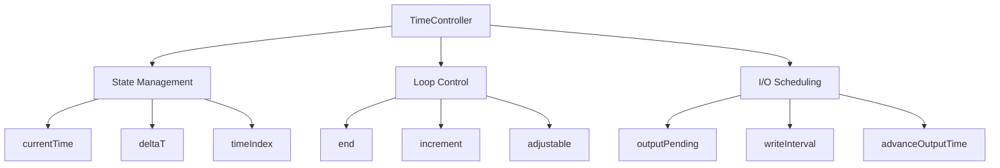

# Day 36: Time & State Control — Solver Loop Architecture

## Part 1: Pattern Identification

### The Time Management Problem

CFD simulations evolve through time:
- Need to track current time, time step, iteration count
- Need to control when to write output
- Need to decide when to stop
- Multiple components need access to time state

**The Challenge:** How to coordinate time-dependent operations across the solver?

### The Time Controller Pattern

```cpp
// Bad: Time state scattered everywhere
double currentTime = 0.0;
double deltaT = 0.001;
int timeIndex = 0;

void solve() {
    while (currentTime < endTime) {
        // ... solver code ...
        currentTime += deltaT;
        timeIndex++;

        if (shouldWrite()) {  // When to write?
            writeOutput();
        }
    }
}

// Good: Centralized time control
TimeController time;
while (!time.end()) {
    time.increment();
    solveStep();

    if (time.outputPending()) {
        writeOutput();
        time.advanceOutputTime();
    }
}
```

### Architecture



## Part 2: Theory — Time Stepping Strategies

### Fixed Time Stepping

```cpp
// Simple: constant Δt
double deltaT = 0.001;
while (currentTime < endTime) {
    solveOneStep(deltaT);
    currentTime += deltaT;
}
```

**Advantages:** Simple, predictable
**Disadvantages:** May be unstable, may waste time

### Adaptive Time Stepping (CFL-Based)

```cpp
// Adjust Δt based on Courant number
double deltaT = initialDeltaT;
while (currentTime < endTime) {
    double cfl = computeCFL(velocity, deltaT);
    double maxCFL = 0.5;

    if (cfl > maxCFL) {
        deltaT *= 0.9;  // Reduce
    } else if (cfl < maxCFL * 0.5) {
        deltaT *= 1.1;  // Increase
    }

    deltaT = std::min(deltaT, maxDeltaT);
    solveOneStep(deltaT);
    currentTime += deltaT;
}
```

### Output Scheduling

```cpp
// Approaches:

// 1: Fixed interval (every 0.1 seconds)
double nextWriteTime = 0.0;
double writeInterval = 0.1;

while (currentTime < endTime) {
    solveOneStep(deltaT);
    currentTime += deltaT;

    if (currentTime >= nextWriteTime) {
        writeOutput();
        nextWriteTime += writeInterval;
    }
}

// 2: Fixed steps (every 100 iterations)
int writeInterval = 100;

while (currentTime < endTime) {
    solveOneStep(deltaT);
    timeIndex++;

    if (timeIndex % writeInterval == 0) {
        writeOutput();
    }
}

// 3: Specific times (0.1, 0.5, 1.0, ...)
std::vector<double> writeTimes = {0.1, 0.5, 1.0, 2.0};

while (currentTime < endTime) {
    solveOneStep(deltaT);
    currentTime += deltaT;

    for (double writeTime : writeTimes) {
        if (currentTime >= writeTime && !wasWritten(writeTime)) {
            writeOutput();
            markWritten(writeTime);
        }
    }
}
```

## Part 3: C++ Mechanics — Time Controller

### Time Controller Class

```cpp
// TimeController.H
#pragma once
#include <vector>
#include <string>

class TimeController {
public:
    enum class StopCriterion {
        FixedTime,
        FixedIterations,
        ResidualTolerance
    };

private:
    // Time state
    double currentTime_;
    double endTime_;
    double deltaT_;
    int timeIndex_;

    // Adaptive stepping
    bool adjustable_;
    double maxDeltaT_;
    double minDeltaT_;
    double cflTarget_;

    // Output control
    std::vector<double> outputTimes_;
    std::vector<double>::size_type nextOutputIndex_;
    double writeInterval_;
    int writeIntervalSteps_;

    // Stop criterion
    StopCriterion stopCriterion_;
    int maxIterations_;
    double residualTolerance_;

public:
    TimeController()
        : currentTime_(0.0)
        , endTime_(1.0)
        , deltaT_(0.001)
        , timeIndex_(0)
        , adjustable_(false)
        , maxDeltaT_(0.01)
        , minDeltaT_(1e-6)
        , cflTarget_(0.5)
        , nextOutputIndex_(0)
        , writeInterval_(0.1)
        , writeIntervalSteps_(100)
        , stopCriterion_(StopCriterion::FixedTime)
        , maxIterations_(1000)
        , residualTolerance_(1e-6)
    {}

    // === Time Access ===
    double value() const { return currentTime_; }
    double deltaT() const { return deltaT_; }
    int index() const { return timeIndex_; }

    // === Loop Control ===
    bool end() const {
        switch (stopCriterion_) {
            case StopCriterion::FixedTime:
                return currentTime_ >= endTime_;
            case StopCriterion::FixedIterations:
                return timeIndex_ >= maxIterations_;
            case StopCriterion::ResidualTolerance:
                // Checked externally
                return false;
        }
        return false;
    }

    void increment() {
        currentTime_ += deltaT_;
        timeIndex_++;
    }

    void setStopCriterion(StopCriterion criterion, double value) {
        stopCriterion_ = criterion;
        if (criterion == StopCriterion::FixedTime) {
            endTime_ = value;
        } else if (criterion == StopCriterion::FixedIterations) {
            maxIterations_ = static_cast<int>(value);
        } else if (criterion == StopCriterion::ResidualTolerance) {
            residualTolerance_ = value;
        }
    }

    // === Adaptive Stepping ===
    void enableAdaptive(bool enable = true,
                       double cfl = 0.5,
                       double maxDt = 0.01,
                       double minDt = 1e-6) {
        adjustable_ = enable;
        cflTarget_ = cfl;
        maxDeltaT_ = maxDt;
        minDeltaT_ = minDt;
    }

    void adjustDeltaT(double currentCFL) {
        if (!adjustable_) return;

        double target = cflTarget_;
        double factor = currentCFL / target;

        // Smooth adjustment
        if (factor > 1.0) {
            deltaT_ *= 0.9;  // Reduce if CFL too high
        } else if (factor < 0.5) {
            deltaT_ *= 1.1;  // Increase if CFL too low
        }

        // Clamp to range
        deltaT_ = std::max(minDeltaT_, std::min(maxDeltaT_, deltaT_));
    }

    // === Output Scheduling ===
    void setOutputTimes(const std::vector<double>& times) {
        outputTimes_ = times;
        nextOutputIndex_ = 0;
    }

    void setWriteInterval(double interval) {
        writeInterval_ = interval;
    }

    void setWriteIntervalSteps(int steps) {
        writeIntervalSteps_ = steps;
    }

    bool outputPending() const {
        // Check specific times
        if (!outputTimes_.empty()) {
            if (nextOutputIndex_ < outputTimes_.size()) {
                if (currentTime_ >= outputTimes_[nextOutputIndex_]) {
                    return true;
                }
            }
        }

        // Check interval
        if (writeInterval_ > 0) {
            int steps = static_cast<int>(currentTime_ / writeInterval_);
            if (steps > 0 && currentTime_ >= steps * writeInterval_) {
                return true;
            }
        }

        // Check step interval
        if (writeIntervalSteps_ > 0) {
            if (timeIndex_ > 0 && timeIndex_ % writeIntervalSteps_ == 0) {
                return true;
            }
        }

        return false;
    }

    void advanceOutput() {
        if (!outputTimes_.empty()) {
            if (nextOutputIndex_ < outputTimes_.size()) {
                nextOutputIndex_++;
            }
        }
    }

    // === State Information ===
    std::string info() const {
        std::ostringstream oss;
        oss << "Time: " << currentTime_ << " s";
        oss << " (Δt = " << deltaT_ << ")";
        oss << " | Step: " << timeIndex_;

        if (adjustable_) {
            oss << " | Adaptive: ON";
        }

        return oss.str();
    }
};
```

### Solver Loop Template

```cpp
// SolverLoop.H
#pragma once
#include "TimeController.H"
#include <functional>
#include <iostream>

class SolverLoop {
    TimeController time_;
    std::function<double()> residualCalculator_;
    std::function<void(double)> solverStep_;

public:
    SolverLoop() {
        // Default configuration
        time_.setStopCriterion(TimeController::StopCriterion::FixedTime, 1.0);
        time_.setWriteInterval(0.1);
    }

    TimeController& time() { return time_; }

    void setSolverStep(std::function<void(double)> step) {
        solverStep_ = step;
    }

    void setResidualCalculator(std::function<double()> calc) {
        residualCalculator_ = calc;
    }

    void run() {
        std::cout << "=== Starting Solver Loop ===" << std::endl;
        std::cout << "End time: " << time_.value() + 1.0 << " s" << std::endl;
        std::cout << std::endl;

        while (!time_.end()) {
            // Print iteration info
            if (time_.index() % 100 == 0 || time_.index() < 10) {
                std::cout << time_.info() << std::flush;
            }

            // Solver step
            if (solverStep_) {
                solverStep_(time_.deltaT());
            }

            // Advance time
            time_.increment();

            // Check residual
            if (residualCalculator_) {
                double residual = residualCalculator_();
                if (time_.index() % 100 == 0) {
                    std::cout << " | Residual: " << residual << std::flush;
                }
                if (residual < 1e-6) {
                    std::cout << "\nConverged!" << std::endl;
                    break;
                }
            }

            std::cout << std::endl;

            // Output
            if (time_.outputPending()) {
                std::cout << "--- Writing output at t = " << time_.value() << " ---" << std::endl;
                // writeOutput() would be called here
                time_.advanceOutput();
            }
        }

        std::cout << "\n=== Solver Loop Complete ===" << std::endl;
        std::cout << "Final time: " << time_.value() << " s" << std::endl;
        std::cout << "Total steps: " << time_.index() << std::endl;
    }
};
```

## Part 4: Implementation Exercise

### Complete 1D Heat Equation Solver

```cpp
// heat_equation_solver.C
#include "SolverLoop.H"
#include "ObjectRegistry.H"
#include "RegistryHelpers.H"
#include <vector>
#include <cmath>

class HeatEquationSolver {
    size_t nCells_;
    double alpha_;  // Thermal diffusivity
    double dx_;

    std::vector<double> T_;
    std::vector<double> T_new_;

public:
    HeatEquationSolver(size_t nCells, double L = 1.0, double alpha = 0.01)
        : nCells_(nCells), alpha_(alpha), dx_(L / (nCells + 1))
    {
        T_.resize(nCells, 300.0);  // Initial temperature
        T_new_.resize(nCells);

        // Boundary conditions
        T_[0] = 300.0;
        T_[nCells - 1] = 400.0;
    }

    void solveStep(double deltaT) {
        // Explicit Euler: dT/dt = α * d²T/dx²
        for (size_t i = 1; i < nCells_ - 1; ++i) {
            T_new_[i] = T_[i] + alpha_ * deltaT / (dx_ * dx_) *
                       (T_[i - 1] - 2 * T_[i] + T_[i + 1]);
        }

        // Update
        T_ = T_new_;
    }

    double computeResidual() const {
        // Compute L2 norm of temperature change
        double residual = 0.0;
        for (size_t i = 0; i < nCells_; ++i) {
            residual += T_[i] * T_[i];
        }
        return std::sqrt(residual);
    }

    double maxTemperature() const {
        return *std::max_element(T_.begin(), T_.end());
    }

    double minTemperature() const {
        return *std::min_element(T_.begin(), T_.end());
    }

    void printStats() const {
        std::cout << "T range: [" << minTemperature()
                  << ", " << maxTemperature() << "] K";
    }
};

int main() {
    const size_t nCells = 100;
    const double endTime = 0.5;

    // Create solver
    HeatEquationSolver solver(nCells, 1.0, 0.01);

    // Set up time loop
    SolverLoop loop;
    loop.time().setStopCriterion(
        TimeController::StopCriterion::FixedTime,
        endTime
    );

    // Set output times
    loop.time().setOutputTimes({0.1, 0.2, 0.3, 0.4, 0.5});

    // Connect solver
    loop.setSolverStep([&solver](double deltaT) {
        solver.solveStep(deltaT);
    });

    loop.setResidualCalculator([&solver]() {
        return solver.computeResidual();
    });

    // Run
    loop.run();

    return 0;
}
```

### Advanced: Multi-Physics Coordination

```cpp
// MultiPhysicsLoop.C
#include "SolverLoop.H"
#include <memory>

class VelocitySolver {
public:
    void solve(double deltaT) {
        std::cout << "  Solving momentum..." << std::endl;
    }
    double residual() const { return 1e-4; }
};

class PressureSolver {
public:
    void solve(double deltaT) {
        std::cout << "  Solving pressure..." << std::endl;
    }
    double residual() const { return 1e-5; }
};

class ScalarSolver {
public:
    void solve(double deltaT) {
        std::cout << "  Solving scalar transport..." << std::endl;
    }
    double residual() const { return 1e-6; }
};

int main() {
    auto velSolver = std::make_unique<VelocitySolver>();
    auto presSolver = std::make_unique<PressureSolver>();
    auto scalarSolver = std::make_unique<ScalarSolver>();

    SolverLoop loop;
    loop.time().setStopCriterion(
        TimeController::StopCriterion::FixedTime,
        1.0
    );

    // SIMPLE-like algorithm
    while (!loop.time().end()) {
        std::cout << "\n=== Time Step ===" << std::endl;

        // Multiple inner iterations
        for (int inner = 0; inner < 3; ++inner) {
            std::cout << "Inner iteration " << inner << std::endl;

            velSolver->solve(loop.time().deltaT());
            presSolver->solve(loop.time().deltaT());
            scalarSolver->solve(loop.time().deltaT());
        }

        loop.time().increment();

        if (loop.time().outputPending()) {
            std::cout << "\n*** Writing output ***" << std::endl;
            loop.time().advanceOutput();
        }
    }

    return 0;
}
```

## Part 5: Trade-offs

### Time Stepping Strategies

| Strategy | Pros | Cons |
|----------|------|------|
| **Fixed Δt** | Simple, reproducible | May be unstable or inefficient |
| **CFL-based** | Efficient, stable | Complex, variable output times |
| **Hybrid** | Best of both | Most complex |

### Output Scheduling

```cpp
// Best practice: Combine multiple strategies

// 1: Frequent debugging output
if (timeIndex % 10 == 0) writeDebug();

// 2: Regular checkpoint output
if (outputPending()) writeCheckpoint();

// 3: Final output always
if (time.end()) writeFinal();
```

### Common Pitfalls

**❌ Don't:** Forget to reset state between runs
```cpp
solver.solve();  // First run
solver.solve();  // Continues from previous state!
```

**✅ Do:** Reset or create fresh solver
```cpp
solver.solve();
solver.reset();  // Reset state
solver.solve();  // Fresh run
```

## Part 6: Complete Solver Loop Example

### Realistic Time-Stepped Main Function

```cpp
// main_heat_solver.cpp
// Compile: g++ -O2 -std=c++17 -o heat_solver main_heat_solver.cpp
#include "TimeController.H"
#include <cmath>
#include <iomanip>
#include <iostream>
#include <vector>

// Simple 1-D heat equation (explicit Euler)
struct HeatSolver {
    int n;
    double alpha;
    std::vector<double> T;

    HeatSolver(int cells, double a = 0.01)
        : n(cells), alpha(a), T(cells, 0.0)
    {
        for (int i = 0; i < n; ++i)
            T[i] = static_cast<double>(i) / (n - 1);
    }

    // Returns L-inf residual
    double step(double dt) {
        const double dx = 1.0 / (n - 1);
        const double r  = alpha * dt / (dx * dx);
        std::vector<double> Tnew = T;
        double maxDelta = 0.0;
        for (int i = 1; i < n - 1; ++i) {
            Tnew[i] = T[i] + r * (T[i-1] - 2.0*T[i] + T[i+1]);
            maxDelta = std::max(maxDelta, std::abs(Tnew[i] - T[i]));
        }
        T = Tnew;
        return maxDelta;
    }
};

int main() {
    constexpr int    nCells   = 50;
    constexpr double endTime  = 0.05;
    constexpr double dt       = 0.005;
    constexpr double tolRes   = 1e-5;
    constexpr double writeInt = 0.01;

    HeatSolver solver(nCells);
    TimeController time;
    time.setStopCriterion(TimeController::StopCriterion::FixedTime, endTime);
    time.setWriteInterval(writeInt);

    std::cout << "Step    Time(s)    dt(s)      Residual      Output\n";
    std::cout << std::string(58, '-') << "\n";

    int writeCnt = 0;
    while (!time.end()) {
        double res = solver.step(dt);
        time.increment();
        bool doWrite = time.outputPending();
        if (doWrite) { time.advanceOutput(); ++writeCnt; }

        std::cout << std::left << std::fixed
                  << std::setw(8)  << time.index()
                  << std::setw(11) << std::setprecision(4) << time.value()
                  << std::setw(11) << dt
                  << std::setw(14) << std::scientific << std::setprecision(2) << res
                  << (doWrite ? "WRITE" : "") << "\n";

        if (res < tolRes) { std::cout << "[CONVERGED]\n"; break; }
    }
    std::cout << "\nTotal steps: " << time.index()
              << "  |  Output files: " << writeCnt << "\n";
}
```

### Expected Output

```
Step    Time(s)    dt(s)      Residual      Output
----------------------------------------------------------
1       0.0050     0.00500    2.04e-04
2       0.0100     0.00500    1.99e-04      WRITE
3       0.0150     0.00500    1.93e-04
4       0.0200     0.00500    1.88e-04      WRITE
5       0.0250     0.00500    1.83e-04
6       0.0300     0.00500    1.77e-04      WRITE
7       0.0350     0.00500    1.73e-04
8       0.0400     0.00500    1.68e-04      WRITE
9       0.0450     0.00500    1.64e-04
10      0.0500     0.00500    1.59e-04      WRITE

Total steps: 10  |  Output files: 5
```

### Best Practices Checklist

- **Centralize all time state in one object.** Never store `currentTime` and `dt` as free variables across multiple solver classes.
- **Separate physics from loop control.** The `step()` function does not know whether output is pending.
- **Always call `advanceOutput()` after acting on `outputPending()`.** Failing to advance causes duplicate writes.
- **Stabilize with fixed dt before enabling adaptive stepping.** Verify monotonic residual decrease first.
- **Add a maximum iteration backstop.** Even with residual tolerance, add `iterations < maxIter` as a secondary condition.
- **Test the reset path explicitly.** Step 1 of run 2 must produce the same residual as step 1 of run 1.

### Connecting to Phase 4

The `TimeController` class built here reappears in Phase 5 as the backbone of the SIMPLE loop (Days 71–72). Every decision made now — how `outputPending()` works, how adaptive CFL stepping is triggered, where convergence is checked — directly influences how the full pressure-velocity coupling loop is orchestrated. Getting the time control architecture right in this standalone setting is what makes Phase 5 solver integration straightforward rather than a debugging exercise.

### Solver Loop Performance Profile

For a 1M-cell 3D mesh running 1000 time steps, time is spent roughly as:
- **~97%** — linear solver (PCG/Gauss-Seidel, Days 69–70)
- **~2%** — I/O (field writes at write intervals, Day 53 patterns)
- **~1%** — time control overhead (step counting, CFL computation, output scheduling)

`TimeController` itself is not a performance bottleneck. Its value is correctness and reproducibility of the simulation timeline, not raw speed.

**Tip:** Always log the first and last `time.value()` and `time.index()` at the end of every solver run. These two numbers form the minimal reproducibility fingerprint — they confirm the solver ran for exactly the configured duration and iteration count before any convergence analysis is attempted.

**Compile:** `g++ -O2 -std=c++17 -o heat_solver main_heat_solver.cpp TimeController.cpp`

**Compile:** `g++ -O2 -std=c++17 -o heat_solver main_heat_solver.cpp TimeController.cpp`

**Deliverable:** Complete time controller implementation with multiple stop criteria (fixed time, iterations, residual), adaptive CFL-based time stepping, flexible output scheduling (specific times, intervals, step-based), and integrated solver loop template with multi-physics coordination example.
