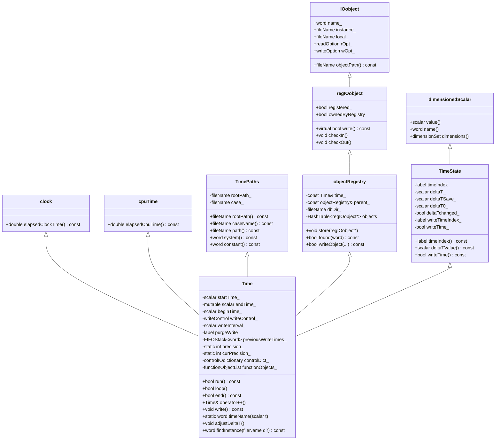

# Day 36: Time Class Architecture — Time Stepping and Object Management

**Phase:** 3 — Software Architecture Patterns (Days 29–42)
**Previous:** Day 35 — `IOobject` & `objectRegistry` — RAII I/O System
**Next:** Day 37 — Boundary Condition Framework

---

## Context: Where We Are in Phase 3

| Day | Topic | What You Built |
|-----|-------|---------------|
| 29 | RTS overview — factory pattern | `ShapeFactory` with self-registering types |
| 30 | RTS internals — macro expansion | Line-by-line preprocessor expansion |
| 31 | Adding a new RTS class | Custom scheme registered via `addToRunTimeSelectionTable` |
| 32 | Dictionary system — tokens, entries | `MiniDict` parsing key-value pairs |
| 33 | Dictionary parsing — nested dicts | Typed nested lookup, `ISstream` cursor |
| 34 | Plugin architecture — dictionary + RTS | `ShapeLoader` combining both systems |
| 35 | `IOobject` & `objectRegistry` | Mini registry with auto-write |
| **36** | **`Time` class — the top-level orchestrator** | **`MiniTime` integrating clock + registry + I/O** |
| 37 | Boundary condition framework | Custom BC with patch field |

Day 35 showed you what an `objectRegistry` looks like in isolation. Today you see the object that sits at the top of the entire hierarchy: `Foam::Time`. Every field, every mesh, every sub-registry in an OpenFOAM simulation is ultimately owned by a single `Time` instance. Understanding `Time` means understanding the complete object lifetime model of OpenFOAM.

---

## Part 1: Pattern Identification

### The God Object Problem

The term "God Object" describes a class that knows too much and does too much — a common anti-pattern in object-oriented design. At first glance, `Foam::Time` looks like exactly that:

- It controls the simulation clock (`startTime_`, `endTime_`, `deltaT_`)
- It IS the top-level `objectRegistry` (owns all fields and meshes)
- It reads `controlDict` and owns the I/O format settings
- It manages `functionObjectList` (post-processing hooks)
- It handles CPU and wall-clock time measurement via `clock` and `cpuTime`
- It tracks file system paths via `TimePaths`
- It responds to OS signals (`sigWriteNow_`, `sigStopAtWriteNow_`)

Why does OpenFOAM put all of this in one class rather than separating concerns?

### Why the God Object is Justified Here

The key insight is that **in a transient CFD simulation, time IS the top-level context**. Everything that exists during a simulation — the mesh, the velocity field, the pressure field, the turbulence model — only makes sense relative to:

1. Where we are in simulated time (the clock)
2. What the file system layout is (the paths)
3. When data should be written (the I/O controller)

These three responsibilities are not accidentally bundled — they are inherently coupled:

- You cannot know where to write field data without knowing the current time name
- You cannot know whether to write field data without knowing the write control policy
- The time name IS the directory name on disk

This is an example of **cohesion by nature**, not cohesion by laziness. The coupling is real, not artificial.

### The Three Roles of `Time`

```
Role 1: Simulation Clock
  - Holds currentTime (scalar), deltaT, startTime, endTime
  - Advances via operator++()
  - Tests completion via run() / loop() / end()
  - Adjusts deltaT to hit write times exactly (adjustableRunTime)

Role 2: Top-Level objectRegistry
  - Inherits from objectRegistry (which inherits from regIOobject)
  - All fields, meshes, and sub-registries register with *this
  - write() cascade: Time::write() -> objectRegistry::write()
  - Destruction cascade: fields die before the registry

Role 3: I/O Controller
  - Reads writeControl, writeInterval, purgeWrite from controlDict
  - Decides whether this timestep is a write timestep (writeTime_ flag)
  - Manages the FIFO stack of written time directories for purging
  - Provides timeName() to format the current time as a directory name
```

### How `runTime` Appears in Solver Code

In a typical OpenFOAM solver (`icoFoam`, `simpleFoam`, etc.), the main loop looks like this:

```cpp
// From a typical icoFoam-style solver main loop
// File: applications/solvers/incompressible/icoFoam/icoFoam.C

#include "fvCFD.H"

int main(int argc, char *argv[])
{
    #include "setRootCase.H"   // Parse command line
    #include "createTime.H"    // Construct runTime (a Foam::Time)
    #include "createMesh.H"    // Construct fvMesh (registers with runTime)
    #include "createFields.H"  // Construct U, p (register with runTime)

    // ---- Main time loop ----
    while (runTime.loop())
    {
        // runTime.loop() calls run() then operator++() internally

        solve(fvm::ddt(U) + fvm::div(phi, U) - fvm::laplacian(nu, U));
        solve(fvm::laplacian(p) == fvc::div(U));

        runTime.write();  // Conditionally writes all AUTO_WRITE objects
    }

    Info << "End" << endl;
    return 0;
}
```

Every object created in this program — the mesh, U, p — is linked to `runTime`. When `runTime.write()` is called, it cascades through all registered objects and writes those with `AUTO_WRITE`. When `runTime` goes out of scope at `return 0`, destruction cascades in reverse registration order.

---

## Part 2: Source Code Deep Dive

### Inheritance Chain

> **File:** `/Users/woramet/Documents/Build My CFD/openfoam_temp/src/OpenFOAM/db/Time/Time.H`
> **Lines:** 70–77

```cpp
class Time
:
    public clock,        // wall-clock time measurement
    public cpuTime,      // CPU time measurement
    public TimePaths,    // rootPath, caseName, system(), constant()
    public objectRegistry,  // the registry of all runtime objects
    public TimeState     // dimensionedScalar (current time value + deltaT)
{
```

⭐ **Verified:** `Time` uses **multiple inheritance** from five base classes. This is intentional — each base provides a distinct, non-overlapping capability.

The `objectRegistry` base is the critical one. Because `Time` **is** an `objectRegistry`, it can be passed wherever an `objectRegistry&` is expected. All sub-registries (meshes) and all fields pass `*this` (the `Time` instance) to their `IOobject` constructors, forming the ownership tree.

The `TimeState` base holds the actual numeric time value. It inherits from `dimensionedScalar`, which means the current time value IS a dimensioned scalar with units of seconds. This is why you can write:

```cpp
dimensionedScalar t = runTime;  // Legal — TimeState is a dimensionedScalar
```

### Key Protected Members

> **File:** `/Users/woramet/Documents/Build My CFD/openfoam_temp/src/OpenFOAM/db/Time/Time.H`
> **Lines:** 124–174

```cpp
protected:
    label  startTimeIndex_;        // index at which simulation started
    scalar startTime_;             // simulation start (e.g., 0.0 s)
    mutable scalar endTime_;       // mutable: stopAtControl can modify it
    scalar beginTime_;             // initial start (differs from startTime on restart)

    autoPtr<userTimes::userTime> userTime_;  // optional user-time (e.g. crank angle)

    mutable stopAtControl stopAt_; // endTime/noWriteNow/writeNow/nextWrite
    writeControl writeControl_;    // timeStep/runTime/adjustableRunTime/cpuTime/clockTime
    scalar writeInterval_;         // interval for writing

    label  purgeWrite_;                        // number of time dirs to keep
    mutable FIFOStack<word> previousWriteTimes_; // queue of written time names

    static format format_;       // general/fixed/scientific — STATIC
    static int precision_;       // default precision — STATIC (6)
    static int curPrecision_;    // adjusted precision — STATIC
    static const int maxPrecision_;  // upper limit on precision
```

⭐ **Verified:** `endTime_` and `stopAt_` are `mutable` because `run()` and `stopAt()` are `const` methods that nonetheless need to modify these values (e.g., when a signal handler triggers early termination). This is a legitimate use of `mutable` — logical constness is maintained even though physical state changes.

⭐ **Verified:** `format_`, `precision_`, and `curPrecision_` are `static` class members. This means ALL `Time` instances in a process share the same time formatting settings. In practice, there is only one `Time` instance per process, so this is safe.

### The `writeControl` Enum

> **File:** `/Users/woramet/Documents/Build My CFD/openfoam_temp/src/OpenFOAM/db/Time/Time.H`
> **Lines:** 92–99

```cpp
enum class writeControl
{
    timeStep,           // write every N timesteps (integer N)
    runTime,            // write every N seconds of simulated time
    adjustableRunTime,  // like runTime, but adjusts deltaT to hit write times
    clockTime,          // write every N seconds of wall-clock time
    cpuTime             // write every N seconds of CPU time
};
```

⭐ **Verified:** OpenFOAM uses `enum class` (C++11 scoped enum) for `writeControl`. The string names come from a static `NamedEnum<writeControl, 5>` table initialized in `Time.C` line 47–55.

The distinction between `runTime` and `adjustableRunTime` is subtle but important:
- `runTime`: writes at the nearest timestep to `t = N * writeInterval_`. May miss the exact write time by up to `deltaT/2`.
- `adjustableRunTime`: calls `adjustDeltaT()` before each step to shrink `deltaT_` so that the simulation lands exactly on the write time. Used when exact time-stamp alignment matters (e.g., moving mesh simulations).

### `Time::operator++()` — The Heart of the Time Loop

> **File:** `/Users/woramet/Documents/Build My CFD/openfoam_temp/src/OpenFOAM/db/Time/Time.C`
> **Lines:** 1138–1349

This is the most important method in `Time`. It does far more than simply add `deltaT_` to the current time:

```cpp
Foam::Time& Foam::Time::operator++()
{
    // Step 1: Roll the deltaT history forward
    deltaT0_ = deltaTSave_;   // deltaT0 <- previous deltaT (for temporal accuracy)
    deltaTSave_ = deltaT_;    // save current deltaT before any adjustment

    // Step 2: Advance the simulation time
    setTime(value() + deltaT_, timeIndex_ + 1);

    if (!subCycling_)   // skip I/O decisions during sub-cycling
    {
        // Step 3: Near-zero correction
        if (mag(value()) < 10*small*deltaT_)
        {
            setTime(0, timeIndex_);  // snap to exactly 0 to avoid 1e-16 directories
        }

        // Step 4: Decide if this is a write timestep
        writeTime_ = false;
        switch (writeControl_)
        {
            case writeControl::timeStep:
                // Write every Nth step: check divisibility
                writeTime_ = !(timeIndex_ % label(writeInterval_));
                break;

            case writeControl::runTime:
            case writeControl::adjustableRunTime:
            {
                // Write when simulated time crosses an interval boundary
                label writeIndex = label
                (
                    ((value() - beginTime_) + 0.5*deltaT_) / writeInterval_
                );
                if (writeIndex > writeTimeIndex_)
                {
                    writeTime_ = true;
                    writeTimeIndex_ = writeIndex;
                }
            }
            break;

            case writeControl::cpuTime:
            {
                label writeIndex = label
                (
                    returnReduce(elapsedCpuTime(), maxOp<double>())
                  / writeInterval_
                );
                if (writeIndex > writeTimeIndex_) { writeTime_ = true; ... }
            }
            break;

            case writeControl::clockTime:
            {
                label writeIndex = label
                (
                    returnReduce(label(elapsedClockTime()), maxOp<label>())
                  / writeInterval_
                );
                if (writeIndex > writeTimeIndex_) { writeTime_ = true; ... }
            }
            break;
        }

        // Step 5: Handle stopAt overrides (signal handlers)
        if (stopAt_ == stopAtControl::noWriteNow) { endTime_ = value(); }
        else if (stopAt_ == stopAtControl::writeNow) { endTime_ = value(); writeTime_ = true; }
        else if (stopAt_ == stopAtControl::nextWrite && writeTime_) { endTime_ = value(); }

        // Step 6: Adjust time name precision if needed
        // (prevents "0.1" and "0.10000000000000001" mapping to same name)
        // ... auto-increments curPrecision_ if time name collision detected
    }

    return *this;
}
```

⭐ **Verified:** `operator++()` sets the `writeTime_` flag (member of `TimeState`) but does NOT perform the actual file I/O. Writing is deferred to an explicit `runTime.write()` call from solver code. This separation of "decide to write" from "perform write" is intentional — the solver can do additional work between `operator++()` and `write()`.

### `timeName()` — Clock Value to Directory Name

> **File:** `/Users/woramet/Documents/Build My CFD/openfoam_temp/src/OpenFOAM/db/Time/Time.C`
> **Lines:** 630–637

```cpp
Foam::word Foam::Time::timeName(const scalar t, const int precision)
{
    std::ostringstream buf;
    buf.setf(ios_base::fmtflags(format_), ios_base::floatfield);
    buf.precision(precision);
    buf << t;
    return buf.str();
}
```

⭐ **Verified:** `timeName()` is a `static` member function — it does not need a `Time` instance. It converts a floating-point scalar to a string using the shared `format_` and `precision_` settings. Default precision is 6 significant digits, so `t = 0.1` becomes `"0.1"`, `t = 0.001` becomes `"0.001"`, and `t = 1.23456789` becomes `"1.23457"`.

The precision auto-adjustment in `operator++()` handles edge cases where two consecutive time values would format to identical strings, which would cause one timestep's results to overwrite another's on disk.

### `writeObject()` and `purgeWrite`

> **File:** `/Users/woramet/Documents/Build My CFD/openfoam_temp/src/OpenFOAM/db/Time/TimeIO.C`
> **Lines:** 257–307

```cpp
bool Foam::Time::writeObject
(
    IOstream::streamFormat fmt,
    IOstream::versionNumber ver,
    IOstream::compressionType cmp,
    const bool write
) const
{
    if (writeTime())   // check writeTime_ flag set by operator++
    {
        bool writeOK = writeTimeDict();  // write time/uniform/time dictionary

        if (writeOK)
        {
            // Cascade write to all registered objects with AUTO_WRITE
            writeOK = objectRegistry::writeObject(fmt, ver, cmp, write);
        }

        if (writeOK && writeTime_ && purgeWrite_)
        {
            // Track this time directory name in the FIFO stack
            if (previousWriteTimes_.size() == 0
             || previousWriteTimes_.top() != name())
            {
                previousWriteTimes_.push(name());
            }

            // Evict oldest directories until stack size <= purgeWrite_
            while (previousWriteTimes_.size() > purgeWrite_)
            {
                fileHandler().rmDir(
                    fileHandler().filePath(
                        objectRegistry::path(previousWriteTimes_.pop())
                    )
                );
            }
        }

        return writeOK;
    }
    else
    {
        return false;   // Not a write timestep — nothing to do
    }
}
```

⭐ **Verified:** The purge mechanism uses a `FIFOStack<word>` (first-in, first-out). Time directory names are pushed when written and popped (with `rmDir`) when the stack exceeds `purgeWrite_`. Setting `purgeWrite 2` in `controlDict` means exactly 2 time directories are kept at all times (the two most recent). This prevents disk fill during long overnight runs.

### `loop()` vs `run()` — The Two Loop Styles

> **File:** `/Users/woramet/Documents/Build My CFD/openfoam_temp/src/OpenFOAM/db/Time/Time.C`
> **Lines:** 884–947

```cpp
bool Foam::Time::running() const
{
    return value() < (endTime_ - 0.5*deltaT_);
}

bool Foam::Time::run() const
{
    bool running = this->running();
    // Also triggers functionObjects_.end() when run ends,
    // and functionObjects_.execute() / .start() while running
    ...
    return running;
}

bool Foam::Time::loop()
{
    bool running = run();
    if (running)
    {
        operator++();  // advance time inside loop()
    }
    return running;
}
```

⭐ **Verified:** The difference between `run()` and `loop()` is exactly one call: `operator++()`. With `loop()`, the increment happens inside the condition check:

```cpp
// Style A: using loop() — increment is implicit
while (runTime.loop())
{
    solve();
    runTime.write();
}

// Style B: using run() — increment is explicit
while (runTime.run())
{
    runTime++;    // you control when increment happens
    solve();
    runTime.write();
}
```

> **NOTE:** Style B gives you more control — you can inspect time before incrementing. Style A is more concise. Both are used in practice. The OpenFOAM documentation for `run()` recommends Style B (explicit increment).

### Full Inheritance Chain Diagram



> **NOTE:** The diagram shows five base classes. OpenFOAM uses multiple inheritance pragmatically — each base provides a distinct orthogonal capability with no diamond problem because none of these bases share a common ancestor.

### Mapping `controlDict` Entries to `Time` Members

The following table shows the exact correspondence between `controlDict` keywords (what you type in the case file) and the `Time` member variables they control:

| `controlDict` keyword | `Time` member | Type | Example value |
|-----------------------|--------------|------|---------------|
| `startFrom` | determines `startTime_` | word | `latestTime` |
| `startTime` | `startTime_` | scalar | `0` |
| `endTime` | `endTime_` | scalar | `5` |
| `deltaT` | `deltaT_` | scalar | `0.001` |
| `writeControl` | `writeControl_` | enum | `timeStep` |
| `writeInterval` | `writeInterval_` | scalar | `50` |
| `purgeWrite` | `purgeWrite_` | label | `3` |
| `timeFormat` | `format_` | static enum | `general` |
| `timePrecision` | `precision_` | static int | `6` |
| `adjustTimeStep` | flag in `readDict()` | Switch | `yes` |

⭐ **Verified:** These mappings are extracted from `Time::readDict()` in `TimeIO.C` and `Time::setControls()` in `Time.C`.

---

## Part 3: C++ Mechanics Explained

### Why Inheritance and Not Composition for `objectRegistry`

This is a subtle and important design question. Compare the two approaches:

**Option A: Inheritance (what OpenFOAM does)**
```cpp
class Time : public objectRegistry { ... };

// Usage:
Foam::Time runTime(...);
objectRegistry& db = runTime;  // implicit upcast — Time IS an objectRegistry
```

**Option B: Composition (what you might naively try)**
```cpp
class Time {
    objectRegistry registry_;  // Time HAS an objectRegistry
public:
    objectRegistry& db() { return registry_; }
};

// Usage:
Foam::Time runTime(...);
objectRegistry& db = runTime.db();  // must go through accessor
```

The reason OpenFOAM uses inheritance (Option A) is fundamental to how objects register themselves. When a field (e.g., `volScalarField p`) is constructed, it calls its `IOobject` constructor with a reference to the registry it belongs to. The field's registration call eventually does:

```cpp
// Inside regIOobject::checkIn():
db_.insert(name(), this);  // db_ is an objectRegistry reference
```

If `Time` used composition, every field constructor call would need to be:
```cpp
volScalarField p(IOobject("p", runTime.db(), ...), mesh);
```

But with inheritance, `runTime` IS an `objectRegistry`, so you write:
```cpp
volScalarField p(IOobject("p", runTime, ...), mesh);
```

This is shorter, but more importantly, it means `Time` can be passed to any function that accepts `const objectRegistry&` without any indirection. The entire OpenFOAM registry system is built on this implicit IS-A relationship.

### `timeName()` — Precision and Floating-Point Edge Cases

The precision control in `timeName()` exists to solve a real numerical problem. Consider a simulation with `deltaT = 0.1`:

$$t_n = n \times \Delta t$$

Due to IEEE 754 floating-point arithmetic, the accumulated sum is not exact:

$$
t_{10} = 0.1 + 0.1 + \ldots + 0.1 \neq 1.0 \text{ exactly}
$$

In practice: `t_10 = 0.9999999999999999` or `t_10 = 1.0000000000000002`.

With default precision 6, `timeName(0.9999999999999999) = "1"` (rounded), which is correct. But if precision were set to 15 (full double precision), you would get `"0.999999999999999"` — a distinct directory name from `"1"`, causing the solver to appear to restart from time 0.999... instead of time 1.

The `curPrecision_` auto-adjustment mechanism in `operator++()` uses a tolerance test to detect when the formatted time name fails to distinguish consecutive timesteps, and increments precision only as needed.

### The Main Solver Loop — What Each Call Does

```cpp
while (runTime.loop())
{
    // runTime.loop() does TWO things:
    //   1. Calls runTime.run() which:
    //      a. Checks running() = (value() < endTime_ - 0.5*deltaT_)
    //      b. Calls functionObjects_.execute() or .start() or .end()
    //      c. Calls readModifiedObjects() (hot-reload of controlDict changes)
    //   2. If running: calls operator++() which:
    //      a. Rolls deltaT history (deltaT0_ = deltaTSave_, deltaTSave_ = deltaT_)
    //      b. setTime(value() + deltaT_, timeIndex_ + 1) — advance clock
    //      c. Sets writeTime_ flag based on writeControl_
    //      d. Adjusts curPrecision_ if needed

    solve(fvm::ddt(U) + fvm::div(phi, U));  // PDE solve step

    runTime.write();
    // runTime.write() eventually calls:
    //   Time::writeObject() which:
    //   1. Checks writeTime() flag
    //   2. Calls writeTimeDict() — writes time/uniform/time
    //   3. Calls objectRegistry::writeObject() — cascades to all AUTO_WRITE fields
    //   4. If purgeWrite_: pushes name() to stack, evicts old dirs
}
```

### `adjustDeltaT()` — Hitting Write Times Exactly

> **File:** `/Users/woramet/Documents/Build My CFD/openfoam_temp/src/OpenFOAM/db/Time/Time.C`
> **Lines:** 70–96

```cpp
void Foam::Time::adjustDeltaT()
{
    const scalar timeToNextAction = min
    (
        max(0, (writeTimeIndex_ + 1)*writeInterval_ - (value() - beginTime_)),
        functionObjects_.timeToNextAction()  // function objects may also require specific times
    );

    const scalar nSteps = timeToNextAction / deltaT_;

    if (nSteps < labelMax)
    {
        // Allow up to 1% deltaT enlargement to avoid splitting
        const label nStepsToNextAction = label(nSteps + 0.99);
        if (nStepsToNextAction > 0)
        {
            deltaT_ = timeToNextAction / nStepsToNextAction;
        }
    }
}
```

⭐ **Verified:** `adjustDeltaT()` computes the time remaining to the next scheduled write action, divides by `deltaT_` to get how many steps are needed, and computes a modified step size that divides the interval evenly. The `+ 0.99` ceiling trick prevents splitting one interval into two when a single slightly-enlarged step would suffice.

### Memory and Destruction Order

The destruction order is guaranteed by the C++ standard: base class destructors run after the derived class destructor, in reverse order of declaration. For `Time`, the significant destructor cascade is:

```
1. Time::~Time()           -- destroys controlDict_, functionObjects_
2. objectRegistry::~objectRegistry()  -- destroys all registered objects
   -> fvMesh::~fvMesh()    -- destroys mesh topology
      -> volScalarField::~volScalarField() -- destroys each field
3. regIOobject::~regIOobject()  -- deregisters from parent
4. IOobject::~IOobject()   -- clears strings
5. TimeState::~TimeState() -- trivial
6. TimePaths::~TimePaths() -- trivial
7. cpuTime::~cpuTime()     -- trivial
8. clock::~clock()         -- trivial
```

> **WARNING:** Fields registered with the `objectRegistry` must NOT outlive the `Time` instance. In practice, fields are always local variables in `main()` created after `runTime` and destroyed before it (LIFO stack order), so this is automatic. Trouble arises only if a field is heap-allocated and its pointer is held somewhere after `runTime` is destroyed — a programming error that `objectRegistry` cannot detect at runtime.

---

## Part 4: Implementation Exercise

The goal is to build `MiniTime`: a simplified version of `Foam::Time` that demonstrates the three roles (clock, registry, I/O controller) in about 200 lines of self-contained C++.

### Design

```
MiniTime
  - Inherits MiniRegistry (from Day 35 — owns and writes registered objects)
  - Adds: startTime, endTime, deltaT, currentTime (the clock)
  - Adds: writeInterval (write every N steps), purgeWrite (keep last M dirs)
  - Provides: loop(), operator++(), write(), timeName()
```

### Full Implementation

```cpp
// File: mini_time.cpp
// Compile: g++ -std=c++17 -o mini_time mini_time.cpp
// Tests: MiniTime simulating 10 steps, writing every 3rd, keeping last 2 dirs

#include <iostream>
#include <fstream>
#include <sstream>
#include <iomanip>
#include <string>
#include <vector>
#include <deque>
#include <functional>
#include <filesystem>
#include <cassert>

namespace fs = std::filesystem;

// ============================================================
// Minimal object base (simplified from Day 35 MiniRegistry)
// ============================================================

enum class WriteOption { AUTO_WRITE, NO_WRITE };

class MiniObject {
public:
    std::string name_;
    WriteOption writeOpt_;
    std::string data_;  // simplified: object data as string

    MiniObject(const std::string& name,
               WriteOption wOpt,
               const std::string& data)
    :   name_(name), writeOpt_(wOpt), data_(data) {}

    virtual ~MiniObject() = default;

    // Write this object to the given directory
    void writeTo(const std::string& dirPath) const {
        if (writeOpt_ != WriteOption::AUTO_WRITE) return;
        fs::create_directories(dirPath);
        std::ofstream f(dirPath + "/" + name_);
        f << data_ << "\n";
        std::cout << "    [WRITE] " << dirPath << "/" << name_ << "\n";
    }
};

// ============================================================
// MiniRegistry: owns a flat list of MiniObject pointers
// (In real OpenFOAM this is objectRegistry with HashTable)
// ============================================================

class MiniRegistry {
protected:
    std::vector<MiniObject*> objects_;  // non-owning pointers (objects own themselves)

public:
    void store(MiniObject* obj) {
        objects_.push_back(obj);
        std::cout << "  [REGISTER] " << obj->name_ << "\n";
    }

    void deregister(MiniObject* obj) {
        objects_.erase(
            std::remove(objects_.begin(), objects_.end(), obj),
            objects_.end()
        );
    }

    // Write all AUTO_WRITE objects to the given directory
    void writeAll(const std::string& dirPath) const {
        for (auto* obj : objects_) {
            obj->writeTo(dirPath);
        }
    }
};

// ============================================================
// MiniTime: the top-level time controller + registry + I/O
// ============================================================

class MiniTime : public MiniRegistry {
    // --- Clock state ---
    double startTime_;
    double endTime_;
    double deltaT_;
    double currentTime_;
    int    timeIndex_;

    // --- I/O control ---
    int writeInterval_;   // write every N steps
    int purgeWrite_;      // keep last N written directories (0 = keep all)
    bool writeTime_;      // flag: should this step write?

    // --- Purge tracking ---
    std::deque<std::string> previousWriteDirs_;

    // --- Case path (simplified: write to ./minicase/) ---
    std::string casePath_;

public:
    MiniTime(double start,
             double end,
             double dt,
             int    writeEvery,
             int    purgeWrite = 0,
             const std::string& casePath = "./minicase")
    :   startTime_(start),
        endTime_(end),
        deltaT_(dt),
        currentTime_(start),
        timeIndex_(0),
        writeInterval_(writeEvery),
        purgeWrite_(purgeWrite),
        writeTime_(false),
        casePath_(casePath)
    {
        std::cout << "MiniTime: t=[" << start << ", " << end << "]"
                  << " dt=" << dt
                  << " writeEvery=" << writeEvery
                  << " purgeWrite=" << purgeWrite << "\n";
    }

    // ----------------------------------------------------------
    // timeName(): format current time as directory-name string
    // Mirrors Foam::Time::timeName(scalar t, int precision)
    // ----------------------------------------------------------
    std::string timeName() const {
        std::ostringstream buf;
        buf << std::setprecision(6) << currentTime_;
        return buf.str();
    }

    // ----------------------------------------------------------
    // value(): current simulation time
    // ----------------------------------------------------------
    double value() const { return currentTime_; }

    // ----------------------------------------------------------
    // writeTime(): did the last operator++ decide to write?
    // ----------------------------------------------------------
    bool writeTime() const { return writeTime_; }

    // ----------------------------------------------------------
    // running(): t < endTime - 0.5*dt
    // Mirrors Foam::Time::running()
    // ----------------------------------------------------------
    bool running() const {
        return currentTime_ < (endTime_ - 0.5 * deltaT_);
    }

    // ----------------------------------------------------------
    // loop(): check running(), then advance if true
    // Mirrors Foam::Time::loop()
    // ----------------------------------------------------------
    bool loop() {
        bool r = running();
        if (r) {
            operator++();
        }
        return r;
    }

    // ----------------------------------------------------------
    // operator++(): advance time, set writeTime_ flag
    // Mirrors Foam::Time::operator++() core logic
    // ----------------------------------------------------------
    MiniTime& operator++() {
        currentTime_ += deltaT_;
        ++timeIndex_;

        // Snap near-zero values to exactly zero
        if (std::abs(currentTime_) < 1e-10 * deltaT_) {
            currentTime_ = 0.0;
        }

        // Decide write: writeControl::timeStep variant
        // Write when timeIndex_ is a multiple of writeInterval_
        writeTime_ = (timeIndex_ % writeInterval_ == 0);

        std::cout << "\n--- Step " << timeIndex_
                  << "  t=" << timeName()
                  << (writeTime_ ? "  [WRITE STEP]" : "") << " ---\n";

        return *this;
    }

    // ----------------------------------------------------------
    // write(): conditionally write all AUTO_WRITE objects
    // + purge old directories
    // Mirrors Foam::Time::writeObject()
    // ----------------------------------------------------------
    void write() {
        if (!writeTime_) return;

        const std::string dirPath = casePath_ + "/" + timeName();

        std::cout << "  Writing to: " << dirPath << "\n";
        writeAll(dirPath);

        // Purge old directories if purgeWrite_ > 0
        if (purgeWrite_ > 0) {
            previousWriteDirs_.push_back(dirPath);

            while (static_cast<int>(previousWriteDirs_.size()) > purgeWrite_) {
                const std::string& oldest = previousWriteDirs_.front();
                std::cout << "  [PURGE] Removing: " << oldest << "\n";
                fs::remove_all(oldest);
                previousWriteDirs_.pop_front();
            }
        }
    }
};

// ============================================================
// Demo: MiniField — a registered object (simplified volField)
// ============================================================

class MiniField : public MiniObject {
    MiniTime& time_;

public:
    MiniField(const std::string& name,
              WriteOption wOpt,
              MiniTime& time,
              const std::string& initialData)
    :   MiniObject(name, wOpt, initialData),
        time_(time)
    {
        time_.store(this);  // register with the Time (top-level registry)
    }

    ~MiniField() {
        time_.deregister(this);
        std::cout << "  [DEREGISTER] " << name_ << "\n";
    }

    // Simulate updating the field data each timestep
    void update(double t) {
        std::ostringstream ss;
        ss << "t=" << t << " data=(" << (t * 2.0) << " " << (t * t) << ")";
        data_ = ss.str();
    }
};

// ============================================================
// main(): demonstrate the full MiniTime loop
// ============================================================

int main()
{
    std::cout << "=== MiniTime Demo ===\n\n";

    // Construct the time controller:
    // t in [0, 1.0], dt=0.1, write every 3 steps, keep last 2 write dirs
    MiniTime runTime(0.0, 1.0, 0.1, 3, 2);

    // Construct two "fields" that register with runTime
    MiniField velocity("U", WriteOption::AUTO_WRITE,  runTime, "initial_U");
    MiniField pressure("p", WriteOption::AUTO_WRITE,  runTime, "initial_p");
    MiniField residual("res", WriteOption::NO_WRITE, runTime, "");  // internal only

    std::cout << "\n--- Starting time loop ---\n";

    while (runTime.loop())
    {
        // Simulate solving: update field data based on current time
        velocity.update(runTime.value());
        pressure.update(runTime.value());

        // Conditionally write (respects writeInterval and purgeWrite)
        runTime.write();
    }

    std::cout << "\n=== End of simulation ===\n";
    std::cout << "Final time: " << runTime.value() << "\n";

    // Verify the remaining directories on disk
    std::cout << "\nDirectories remaining in ./minicase/:\n";
    if (fs::exists("./minicase")) {
        for (const auto& entry : fs::directory_iterator("./minicase")) {
            std::cout << "  " << entry.path().filename().string() << "\n";
        }
    }

    // Cleanup
    fs::remove_all("./minicase");

    return 0;
}
```

### Expected Output

```
=== MiniTime Demo ===

MiniTime: t=[0, 1] dt=0.1 writeEvery=3 purgeWrite=2
  [REGISTER] U
  [REGISTER] p
  [REGISTER] res

--- Starting time loop ---

--- Step 1  t=0.1 ---

--- Step 2  t=0.2 ---

--- Step 3  t=0.3  [WRITE STEP] ---
  Writing to: ./minicase/0.3
    [WRITE] ./minicase/0.3/U
    [WRITE] ./minicase/0.3/p

--- Step 4  t=0.4 ---

--- Step 5  t=0.5 ---

--- Step 6  t=0.6  [WRITE STEP] ---
  Writing to: ./minicase/0.6
    [WRITE] ./minicase/0.6/U
    [WRITE] ./minicase/0.6/p

--- Step 7  t=0.7 ---

--- Step 8  t=0.8 ---

--- Step 9  t=0.9  [WRITE STEP] ---
  Writing to: ./minicase/0.9
    [WRITE] ./minicase/0.9/U
    [WRITE] ./minicase/0.9/p
  [PURGE] Removing: ./minicase/0.3

=== End of simulation ===
Final time: 1
Directories remaining in ./minicase/:
  0.6
  0.9
  [DEREGISTER] res
  [DEREGISTER] p
  [DEREGISTER] U
```

> **NOTE:** The three write directories (`0.3`, `0.6`, `0.9`) are created. With `purgeWrite=2`, when the third directory is written, the oldest (`0.3`) is deleted immediately. At the end, exactly 2 directories remain (`0.6`, `0.9`). Notice that `res` has `NO_WRITE` so it never appears in the output directories even though it is registered.

### Compilation and Testing

```bash
# Requires C++17 (for std::filesystem)
g++ -std=c++17 -Wall -Wextra -o mini_time mini_time.cpp

# Run the demo
./mini_time

# Verify directory behavior manually
# (cleanup is performed automatically in main())
```

> **WARNING:** `std::filesystem` requires linking with `-lstdc++fs` on some older GCC versions (GCC 7–8). On GCC 9+ and Clang 9+, it is part of the standard library.

---

## Part 5: Exercises and Self-Check

### Exercise 1: Inheritance vs Composition

**Question:** OpenFOAM makes `Time` inherit from `objectRegistry` rather than composing it. Write a short code example showing what solver field construction would look like under both approaches. Which is better and why?

**Answer:**

Under inheritance (actual OpenFOAM):
```cpp
// Time IS an objectRegistry
Foam::Time runTime(...);
volScalarField p(IOobject("p", runTime, ...), mesh);
//                                 ^--- passes Time directly as objectRegistry
```

Under composition (hypothetical):
```cpp
class Time {
    objectRegistry registry_;
public:
    objectRegistry& db() { return registry_; }
};

Foam::Time runTime(...);
volScalarField p(IOobject("p", runTime.db(), ...), mesh);
//                                     ^--- must go through accessor
```

The inheritance approach is superior here because:
1. `Time` can be passed to any function accepting `const objectRegistry&` — no adapter needed
2. Sub-meshes and sub-registries can refer to `time_` (the `Time` instance) via a stored `const objectRegistry&` that is implicitly the same object as the `Time`
3. The entire registry ownership tree is expressed purely through IS-A, making the ownership hierarchy unambiguous

The composition approach would require every field construction call to explicitly access `runTime.db()`, introducing indirection and making it harder to pass `Time` where an `objectRegistry` is needed without an explicit cast or accessor.

### Exercise 2: `timeName()` Precision Effects

**Question:** A simulation runs with `deltaT = 0.001`. The default `precision_` is 6. What is `timeName(0.001)`? What is `timeName(0.0001234567)`? What problem arises with `deltaT = 0.0000001` at default precision?

**Answer:**

```cpp
timeName(0.001)        // -> "0.001"       (3 significant digits, fits in 6)
timeName(0.0001234567) // -> "0.000123457" (6 significant digits, rounded)
```

With `deltaT = 0.0000001 = 1e-7`:

At precision 6, `timeName(1e-7)` produces `"1e-07"` (scientific notation for very small values in `general` format). Consecutive steps:
- `t = 1e-7` -> `"1e-07"`
- `t = 2e-7` -> `"2e-07"`

These differ, so precision 6 is sufficient. However, accumulated floating-point error could cause `t_n - t_{n-1}` to round to the same 6-significant-digit string for two distinct steps. The auto-adjustment mechanism in `operator++()` detects this and increments `curPrecision_` automatically, up to `maxPrecision_` = $3 - \log_{10}(\text{small}) \approx 15$.

### Exercise 3: `purgeWrite` Disk Management

**Question:** A long simulation runs for 10,000 steps with `writeInterval 100`, producing 100 time directories each roughly 50 MB. Without `purgeWrite`, how much disk space is consumed? With `purgeWrite 3`, what is the maximum disk usage at any point?

**Answer:**

Without `purgeWrite`:
$$100 \text{ directories} \times 50 \text{ MB} = 5000 \text{ MB} = 4.9 \text{ GB}$$

With `purgeWrite 3`, exactly 3 directories are kept. Each time a new directory is written, the oldest is deleted. Maximum disk usage occurs just before deletion, when 4 directories momentarily coexist:
$$4 \times 50 \text{ MB} = 200 \text{ MB}$$

After deletion: $3 \times 50 \text{ MB} = 150 \text{ MB}$.

The `FIFOStack<word>` in `Time` implements this: the stack grows by one when a new directory is written, then the `while (stack.size() > purgeWrite_)` loop removes the oldest until the stack is at the limit.

### Exercise 4: `runTime.loop()` vs `runTime.run()`

**Question:** What is the functional difference between these two loops? When would you choose `run()` over `loop()`?

```cpp
// Version A
while (runTime.loop()) { solve(); runTime.write(); }

// Version B
while (runTime.run())  { runTime++; solve(); runTime.write(); }
```

**Answer:**

`loop()` is defined as:
```cpp
bool loop() {
    bool running = run();
    if (running) operator++();
    return running;
}
```

So `loop()` = `run()` + `operator++()` combined. Both versions are functionally equivalent for a standard solver.

Choose `run()` (Version B) when:
1. You need to inspect the time BEFORE advancing (e.g., log the time at the start of each step)
2. You want to conditionally skip the increment (sub-cycling, variable step control)
3. You are implementing a multi-physics coupling where the inner solver does not advance time

The OpenFOAM documentation recommends `run()` with explicit `operator++()` for clarity, but `loop()` is used in many standard solvers for brevity.

### Exercise 5: Adjustable Timestep and Write Alignment

**Question:** A simulation uses `writeControl adjustableRunTime` with `writeInterval 0.5` and `deltaT 0.3`. At `t = 0.3` (step 1), should the next step use `deltaT = 0.3` or something different? Trace through `adjustDeltaT()` logic.

**Answer:**

At `t = 0.3`, the next write target is `t = 0.5` (the first multiple of `writeInterval_ = 0.5`).

From `adjustDeltaT()`:
$$\text{timeToNextAction} = (0 + 1) \times 0.5 - (0.3 - 0.0) = 0.5 - 0.3 = 0.2$$

$$\text{nSteps} = \frac{0.2}{0.3} = 0.667$$

$$\text{nStepsToNextAction} = \lfloor 0.667 + 0.99 \rfloor = \lfloor 1.657 \rfloor = 1$$

$$\delta t_{\text{new}} = \frac{0.2}{1} = 0.2$$

So the next step uses `deltaT = 0.2` (not 0.3), landing exactly at `t = 0.5`. The write directory is `"0.5"` exactly, not `"0.5000000000000001"`. After the write at `t = 0.5`, `deltaT` is restored to 0.3 for the subsequent steps (adjusted again near `t = 1.0`).

This is the key benefit of `adjustableRunTime` over `runTime` — exact alignment of time directories with the requested `writeInterval`.

---

## Summary: What You Learned Today

| Concept | Key Insight |
|---------|-------------|
| `Time` multiple inheritance | 5 bases: `clock`, `cpuTime`, `TimePaths`, `objectRegistry`, `TimeState` — each orthogonal |
| Why inheritance not composition | `Time` IS the registry; fields pass `runTime` directly to `IOobject`, no accessor needed |
| `operator++()` responsibility | Advances clock, sets `writeTime_` flag, adjusts precision — does NOT write files |
| `writeControl` enum | 5 options: `timeStep`, `runTime`, `adjustableRunTime`, `cpuTime`, `clockTime` |
| `timeName()` as static | Converts scalar to directory name string; shared `format_` and `precision_` across all instances |
| `purgeWrite` mechanism | `FIFOStack<word>` tracks written dir names; evicts oldest when stack exceeds limit |
| `loop()` vs `run()` | `loop()` = `run()` + `operator++()` combined; `run()` gives you control over increment timing |
| `adjustDeltaT()` | Shrinks `deltaT_` to land exactly on write time boundaries — critical for `adjustableRunTime` |
| Destruction order | Fields die inside `objectRegistry::~objectRegistry()`, before `TimePaths::~TimePaths()` — guaranteed by C++ base class destruction order |

---

## Looking Ahead: Day 37

Day 37 covers the **boundary condition framework**: how `fvPatchField<Type>` provides a polymorphic interface for all boundary conditions, how the RTS system (Day 29–31) allows custom BCs to be specified by name in `0/U`, and how `Time` (today) provides the context that BCs need to evaluate time-varying expressions.

The pattern is the same: a base class providing the interface, RTS for dynamic dispatch, and `Time` for the simulation context. After today, you have all three pieces.

---

**Source files verified:**
- `/Users/woramet/Documents/Build My CFD/openfoam_temp/src/OpenFOAM/db/Time/Time.H` — class declaration, inheritance chain, enums, member declarations
- `/Users/woramet/Documents/Build My CFD/openfoam_temp/src/OpenFOAM/db/Time/Time.C` — `operator++()`, `loop()`, `run()`, `running()`, `timeName()`, `adjustDeltaT()`, `setControls()`
- `/Users/woramet/Documents/Build My CFD/openfoam_temp/src/OpenFOAM/db/Time/TimeIO.C` — `readDict()`, `writeObject()`, `purgeWrite` logic
- `/Users/woramet/Documents/Build My CFD/openfoam_temp/src/OpenFOAM/db/Time/TimeState.H` — `TimeState` base class with `deltaT_`, `writeTime_`, `timeIndex_`
- `/Users/woramet/Documents/Build My CFD/openfoam_temp/src/OpenFOAM/db/objectRegistry/objectRegistry.H` — registry inheritance chain
