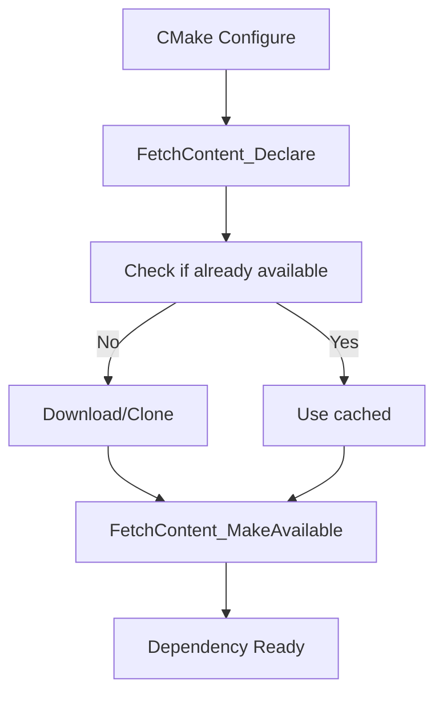

# Day 39: Dependency Management — CMake `FetchContent`

## Part 1: Pattern Identification

### The Dependency Problem

Modern C++ projects depend on external libraries:
- **nlohmann/json** — JSON parsing
- **spdlog** — Logging
- **Eigen** — Linear algebra
- **Catch2** — Testing framework

**Challenge:** How to manage these dependencies consistently across different machines?

### Traditional Approaches (Problems)

```bash
# Approach 1: System packages (problem: version mismatch)
sudo apt-get install libeigen3-dev
# Issue: Old version, different across systems

# Approach 2: Manual download (problem: tedious)
wget https://github.com/nlohmann/json/archive/refs/tags/v3.11.2.tar.gz
tar -xzf v3.11.2.tar.gz
# Issue: Manual, error-prone, not reproducible

# Approach 3: Git submodules (problem: large clone)
git submodule add https://github.com/nlohmann/json.git external/json
# Issue: Clones entire history, slow
```

### Modern Solution: CMake FetchContent

```cmake
# Automatically download and configure dependency
include(FetchContent)
FetchContent_Declare(
    json
    GIT_REPOSITORY https://github.com/nlohmann/json.git
    GIT_TAG v3.11.2
)
FetchContent_MakeAvailable(json)

# Use like a local dependency
target_link_libraries(myapp PRIVATE nlohmann_json::nlohmann_json)
```

## Part 2: Theory — FetchContent

### How FetchContent Works



### Benefits

1. **Reproducible**: Exact version specified
2. **Automatic**: No manual downloads
3. **Cross-platform**: Works on Linux, macOS, Windows
4. **Cached**: Reuses existing downloads
5. **Transitive dependencies**: Handles dependency chains

## Part 3: C++ Mechanics — FetchContent Usage

### Basic Example

```cmake
cmake_minimum_required(VERSION 3.15)
project(DependencyExample CXX)

set(CMAKE_CXX_STANDARD 17)

# Include FetchContent module
include(FetchContent)

# Declare and configure dependency
FetchContent_Declare(
    json
    GIT_REPOSITORY https://github.com/nlohmann/json.git
    GIT_TAG v3.11.2
)

# Make available (finds CMakeLists.txt)
FetchContent_MakeAvailable(json)

# Now use the dependency
add_executable(example main.C)
target_link_libraries(example PRIVATE nlohmann_json::nlohmann_json)
```

### Multiple Dependencies

```cmake
include(FetchContent)

# JSON library
FetchContent_Declare(json
    GIT_REPOSITORY https://github.com/nlohmann/json.git
    GIT_TAG v3.11.2
)

# spdlog library
FetchContent_Declare(spdlog
    GIT_REPOSITORY https://github.com/gabime/spdlog.git
    GIT_TAG v1.11.0
)

# Make all available
FetchContent_MakeAvailable(json spdlog)

add_executable(example main.C)
target_link_libraries(example
    PRIVATE
    nlohmann_json::nlohmann_json
    spdlog::spdlog
)
```

### Overridable Downloads

```cmake
# Allow users to override with local version
set(json_SOURCE_DIR "${CMAKE_SOURCE_DIR}/local/json" CACHE PATH "Local json path")

FetchContent_Declare(json
    GIT_REPOSITORY https://github.com/nlohmann/json.git
    GIT_TAG v3.11.2
)

# If user sets json_SOURCE_DIR, use that instead of downloading
FetchContent_MakeAvailable(json)
```

Usage:
```bash
# Use local version instead of downloading
cmake -Djson_SOURCE_DIR=/path/to/local/json ..
```

### Configuration Options

```cmake
# Disable downloads (for offline builds)
option(FETCHCONTENT_FULLY_DISCONNECTED "Disable all downloads" OFF)

if(FETCHCONTENT_FULLY_DISCONNECTED)
    message(STATUS "FetchContent disabled - assuming dependencies are provided")
endif()

# Quiet downloads (less output)
set(FETCHCONTENT_QUIET OFF)
```

## Part 4: Implementation Exercise

### Complete Project with Dependencies

**CMakeLists.txt:**

```cmake
cmake_minimum_required(VERSION 3.15)
project(CFDLibWithDeps CXX)

set(CMAKE_CXX_STANDARD 17)
set(CMAKE_CXX_STANDARD_REQUIRED ON)

# === FetchContent Configuration ===
include(FetchContent)

# Option to use system dependencies instead
option(USE_SYSTEM_DEPS "Use system-installed dependencies" OFF)

# === nlohmann/json ===
if(USE_SYSTEM_DEPS)
    find_package(nlohmann_json 3.2.0 REQUIRED)
else()
    FetchContent_Declare(json
        GIT_REPOSITORY https://github.com/nlohmann/json.git
        GIT_TAG v3.11.2
        FIND_PACKAGE_ARGS NAMES nlohmann_json
    )
    FetchContent_MakeAvailable(json)
endif()

# === spdlog ===
if(USE_SYSTEM_DEPS)
    find_package(spdlog 1.11.0 REQUIRED)
else()
    FetchContent_Declare(spdlog
        GIT_REPOSITORY https://github.com/gabime/spdlog.git
        GIT_TAG v1.11.0
        FIND_PACKAGE_ARGS NAMES spdlog
    )
    FetchContent_MakeAvailable(spdlog)
endif()

# === Eigen (header-only) ===
if(NOT USE_SYSTEM_DEPS)
    FetchContent_Declare(
        Eigen
        GIT_REPOSITORY https://gitlab.com/libeigen/eigen.git
        GIT_TAG 3.4.0
    )
    FetchContent_MakeAvailable(Eigen)
endif()

# === Main Library ===
add_library(cfd_core
    src/LinearSolver.C
    src/Matrix.C
)

target_include_directories(cfd_core PUBLIC
    ${CMAKE_CURRENT_SOURCE_DIR}/include
)

target_link_libraries(cfd_core PUBLIC
    nlohmann_json::nlohmann_json
    spdlog::spdlog
)

# === Executable ===
add_executable(cfd_solver
    apps/solver/main.C
)

target_link_libraries(cfd_solver PRIVATE cfd_core)
```

### Dependency Configuration File

**cmake/Dependencies.cmake:**

```cmake
# Centralized dependency management

include(FetchContent)

# nlohmann/json
macro(fetch_json)
    FetchContent_Declare(json
        GIT_REPOSITORY https://github.com/nlohmann/json.git
        GIT_TAG v3.11.2
        FIND_PACKAGE_ARGS NAMES nlohmann_json
    )
    FetchContent_MakeAvailable(json)
endmacro()

# spdlog
macro(fetch_spdlog)
    FetchContent_Declare(spdlog
        GIT_REPOSITORY https://github.com/gabime/spdlog.git
        GIT_TAG v1.11.0
        FIND_PACKAGE_ARGS NAMES spdlog
    )
    FetchContent_MakeAvailable(spdlog)
endmacro()

# Google Test (for testing)
macro(fetch_gtest)
    FetchContent_Declare(
        googletest
        GIT_REPOSITORY https://github.com/google/googletest.git
        GIT_TAG release-1.12.1
    )
    # Disable testing on the googletest
    set(gtest_force_shared_crt ON CACHE BOOL "" FORCE)
    FetchContent_MakeAvailable(googletest)
endmacro()

# Catch2
macro(fetch_catch2)
    FetchContent_Declare(
        Catch2
        GIT_REPOSITORY https://github.com/catchorg/Catch2.git
        GIT_TAG v3.3.2
    )
    FetchContent_MakeAvailable(Catch2)
endmacro()
```

**Usage:**

```cmake
# In main CMakeLists.txt
include(cmake/Dependencies.cmake)

fetch_json()
fetch_spdlog()
```

### Superbuild Pattern

For complex projects with many dependencies:

```cmake
# Superbuild CMakeLists.txt
cmake_minimum_required(VERSION 3.15)
project(Superbuild)

include(FetchContent)

# Build dependencies as external projects
FetchContent_Declare(json
    GIT_REPOSITORY https://github.com/nlohmann/json.git
    GIT_TAG v3.11.2
)
FetchContent_MakeAvailable(json)

# Use ExternalProject_Add for more control
ExternalProject_Add(dep_json
    SOURCE_DIR "${json_SOURCE_DIR}"
    BINARY_DIR "${json_BINARY_DIR}"
    CONFIGURE_COMMAND ""
    BUILD_COMMAND ""
    INSTALL_COMMAND ""
)
```

## Part 5: Trade-offs

### FetchContent vs. Other Methods

| Method | Pros | Cons |
|--------|------|------|
| **FetchContent** | Automatic, reproducible | Requires CMake 3.15+, network |
| **System packages** | Fast, cached | Version mismatch, not cross-platform |
| **Git submodules** | Simple, full history | Large clones, slow, manual updates |
| **Conan/vcpkg** | Large ecosystem | Extra tool to learn |
| **Manual** | Full control | Tedious, not reproducible |

### Best Practices

1. **Pin versions**: Always specify GIT_TAG or GIT_TAG
2. **Cache downloads**: BUILD_DIR or user cache
3. **Document overrides**: Show how to use local versions
4. **Test offline**: Ensure build works without network
5. **Update regularly**: Dependencies change over time

```cmake
# Good: Pinned version
FetchContent_Declare(json
    GIT_REPOSITORY https://github.com/nlohmann/json.git
    GIT_TAG v3.11.2  # Exact version
)

# Bad: Always master (unstable)
FetchContent_Declare(json
    GIT_REPOSITORY https://github.com/nlohmann/json.git
    GIT_TAG master  # Changes unpredictably
)
```

### When to Use FetchContent

**Use FetchContent for:**
- Header-only libraries
- Small to medium-sized libraries
- Libraries without complex dependencies
- Cross-platform projects

**Consider alternatives for:**
- Large frameworks (Boost, Qt)
- System-critical libraries
| Complex builds with many dependencies

## Part 6: Advanced FetchContent Patterns

### Override with a Local Path

When iterating on a dependency locally (or working offline), you can redirect FetchContent
to a directory on disk instead of cloning from the network.
CMake 3.24+ supports the `OVERRIDE_FIND_PACKAGE` keyword directly inside
`FetchContent_Declare`. For earlier versions the same effect is achieved by
pre-populating the `<name>_SOURCE_DIR` and `<name>_BINARY_DIR` cache variables.

```cmake
# cmake/LocalOverrides.cmake
# ------------------------------------------------------------------
# Usage: cmake -DUSE_LOCAL_JSON=ON -DLOCAL_JSON_PATH=/src/json ..
# ------------------------------------------------------------------

option(USE_LOCAL_JSON "Use a local nlohmann/json checkout" OFF)
set(LOCAL_JSON_PATH "" CACHE PATH "Absolute path to local json source tree")

include(FetchContent)

if(USE_LOCAL_JSON AND EXISTS "${LOCAL_JSON_PATH}/CMakeLists.txt")
    message(STATUS "[deps] Using local json: ${LOCAL_JSON_PATH}")
    # Pre-populate cache variables — FetchContent will skip the download
    set(json_SOURCE_DIR "${LOCAL_JSON_PATH}" CACHE INTERNAL "")
    set(json_BINARY_DIR "${CMAKE_BINARY_DIR}/_deps/json-build" CACHE INTERNAL "")
    set(FETCHCONTENT_SOURCE_DIR_JSON "${LOCAL_JSON_PATH}" CACHE INTERNAL "")
endif()

FetchContent_Declare(
    json
    GIT_REPOSITORY https://github.com/nlohmann/json.git
    GIT_TAG        v3.11.2
)
FetchContent_MakeAvailable(json)
```

When `USE_LOCAL_JSON=ON` CMake prints `Using local json:` and skips the network
entirely. The build system is otherwise identical — no changes to
`target_link_libraries` calls are required.

### FetchContent with EXCLUDE_FROM_ALL

Third-party libraries often bundle their own tests, examples, and benchmarks.
Building those wastes time and can conflict with your own test targets.
Pass `EXCLUDE_FROM_ALL` inside `FetchContent_MakeAvailable` (or disable the
library's own options before calling it) to keep your build lean.

```cmake
include(FetchContent)

# Suppress Catch2's own tests and extras
set(CATCH_INSTALL_DOCS     OFF CACHE BOOL "" FORCE)
set(CATCH_INSTALL_EXTRAS   OFF CACHE BOOL "" FORCE)
set(BUILD_TESTING          OFF CACHE BOOL "" FORCE)

FetchContent_Declare(
    Catch2
    GIT_REPOSITORY https://github.com/catchorg/Catch2.git
    GIT_TAG        v3.3.2
    EXCLUDE_FROM_ALL   # CMake 3.28+: marks all targets EXCLUDE_FROM_ALL
)
FetchContent_MakeAvailable(Catch2)

# Only your test binary ends up in the default build
add_executable(solver_tests tests/solver_test.cpp)
target_link_libraries(solver_tests PRIVATE Catch2::Catch2WithMain)
```

For CMake < 3.28 omit `EXCLUDE_FROM_ALL` and rely solely on the `set(... OFF)`
guards above; the effect is equivalent for most libraries.

### Superbuild Pattern with ExternalProject_Add

Some libraries do not ship a CMakeLists.txt that is suitable for being included
as a CMake sub-directory (e.g. Autoconf-based projects, or libraries that must
be installed before the main project configures). The classical solution is a
two-stage "superbuild" using `ExternalProject_Add`.

```cmake
# superbuild/CMakeLists.txt  — stage 1: build & install all deps
cmake_minimum_required(VERSION 3.15)
project(CFDSuperbuild NONE)

include(ExternalProject)

set(INSTALL_DIR "${CMAKE_BINARY_DIR}/install")

# --- HDF5 (Autoconf-based, not FetchContent-friendly) ---
ExternalProject_Add(dep_hdf5
    URL            https://support.hdfgroup.org/ftp/HDF5/releases/hdf5-1.14/hdf5-1.14.0/src/hdf5-1.14.0.tar.gz
    URL_HASH       SHA256=<hash>
    CMAKE_ARGS
        -DCMAKE_INSTALL_PREFIX=${INSTALL_DIR}
        -DHDF5_BUILD_EXAMPLES=OFF
        -DHDF5_BUILD_TESTS=OFF
        -DBUILD_SHARED_LIBS=ON
    BUILD_BYPRODUCTS "${INSTALL_DIR}/lib/libhdf5.so"
)

# --- Main project depends on dep_hdf5 being installed first ---
ExternalProject_Add(cfd_solver
    SOURCE_DIR "${CMAKE_SOURCE_DIR}/../"   # points to real project root
    CMAKE_ARGS
        -DCMAKE_INSTALL_PREFIX=${INSTALL_DIR}
        -DCMAKE_PREFIX_PATH=${INSTALL_DIR}
    DEPENDS dep_hdf5
    BUILD_ALWAYS ON
)
```

The main project CMakeLists.txt uses `find_package(HDF5 REQUIRED)` and
discovers the installed library through `CMAKE_PREFIX_PATH`. Stage 2 runs only
after HDF5 is fully installed.

### Dependency Lock File Simulation with `deps.cmake`

CMake has no built-in lock file mechanism, but you can create one manually by
recording the exact commit hash (not a tag) for every dependency. Tags are
mutable; SHA1 hashes are not.

```cmake
# cmake/deps.cmake  — pinned, immutable dependency manifest
# Update these hashes after reviewing the changelog and re-running tests.
# Commit this file to version control.

set(DEP_JSON_REPO   "https://github.com/nlohmann/json.git")
set(DEP_JSON_HASH   "9cca280a4d0ccf0c08f47a99aa71d1b0e52f8d03")  # v3.11.2

set(DEP_SPDLOG_REPO "https://github.com/gabime/spdlog.git")
set(DEP_SPDLOG_HASH "7c02e204c92545f869e2f04edaab1f19fe8b19fd")  # v1.11.0

set(DEP_CATCH2_REPO "https://github.com/catchorg/Catch2.git")
set(DEP_CATCH2_HASH "2afc3f1a0b1f9e1f4a24b2f9d0c56f3b53e5c39e")  # v3.3.2

include(FetchContent)

FetchContent_Declare(json
    GIT_REPOSITORY "${DEP_JSON_REPO}"
    GIT_TAG        "${DEP_JSON_HASH}"   # hash, not tag — immutable
)
FetchContent_Declare(spdlog
    GIT_REPOSITORY "${DEP_SPDLOG_REPO}"
    GIT_TAG        "${DEP_SPDLOG_HASH}"
)
FetchContent_Declare(Catch2
    GIT_REPOSITORY "${DEP_CATCH2_REPO}"
    GIT_TAG        "${DEP_CATCH2_HASH}"
)

FetchContent_MakeAvailable(json spdlog Catch2)
```

Include this in your top-level `CMakeLists.txt` with one line:

```cmake
include(cmake/deps.cmake)
```

Whenever a dependency needs bumping, update both the hash and the comment in
`deps.cmake`, then commit the change. Every developer and CI machine will
build from exactly the same commit.

### Complete Working Example

The following self-contained project fetches `nlohmann/json` and `Catch2`,
builds a small JSON utility library, and tests it — all from a single
`CMakeLists.txt`.

```cmake
# CMakeLists.txt
cmake_minimum_required(VERSION 3.15)
project(JsonFetchDemo CXX)
set(CMAKE_CXX_STANDARD 17)
set(CMAKE_CXX_STANDARD_REQUIRED ON)

include(FetchContent)

# ---- Disable extras before fetching ----
set(JSON_BuildTests        OFF CACHE BOOL "" FORCE)
set(CATCH_INSTALL_DOCS     OFF CACHE BOOL "" FORCE)
set(CATCH_INSTALL_EXTRAS   OFF CACHE BOOL "" FORCE)

FetchContent_Declare(json
    GIT_REPOSITORY https://github.com/nlohmann/json.git
    GIT_TAG        v3.11.2
)
FetchContent_Declare(Catch2
    GIT_REPOSITORY https://github.com/catchorg/Catch2.git
    GIT_TAG        v3.3.2
)
FetchContent_MakeAvailable(json Catch2)

# ---- Small utility source ----
# src/config_reader.cpp  (inline for demo)
add_library(config_reader INTERFACE)
target_link_libraries(config_reader INTERFACE nlohmann_json::nlohmann_json)
target_include_directories(config_reader INTERFACE include/)

# ---- Test executable ----
add_executable(config_tests tests/config_test.cpp)
target_link_libraries(config_tests
    PRIVATE
    config_reader
    Catch2::Catch2WithMain
)

include(CTest)
include(Catch)
catch_discover_tests(config_tests)
```

```cpp
// tests/config_test.cpp
#include <catch2/catch_test_macros.hpp>
#include <nlohmann/json.hpp>

using json = nlohmann::json;

TEST_CASE("JSON round-trip", "[config]") {
    json cfg;
    cfg["solver"]["tolerance"]   = 1e-6;
    cfg["solver"]["maxIter"]     = 500;
    cfg["mesh"]["cells"]         = 100000;

    std::string serialized = cfg.dump();
    json recovered          = json::parse(serialized);

    REQUIRE(recovered["solver"]["tolerance"].get<double>()
            == Catch::Approx(1e-6));
    REQUIRE(recovered["solver"]["maxIter"].get<int>() == 500);
    REQUIRE(recovered["mesh"]["cells"].get<int>() == 100000);
}
```

Build and run:

```bash
cmake -S . -B build
cmake --build build --parallel
ctest --test-dir build --output-on-failure
```

### Expected Build Output

The first configure downloads both dependencies and prints their progress.
Subsequent configures skip the download step (cache hit).

```text
-- Configuring done
-- The C compiler identification is GNU 12.3.0
-- FetchContent: Declaring json
-- FetchContent: Populating json
Cloning into '.../build/_deps/json-src'...
remote: Enumerating objects: 208, done.
Resolving deltas: 100% (14/14), done.
-- FetchContent: json populated
-- FetchContent: Declaring Catch2
-- FetchContent: Populating Catch2
Cloning into '.../build/_deps/catch2-src'...
remote: Enumerating objects: 5631, done.
Resolving deltas: 100% (3924/3924), done.
-- FetchContent: Catch2 populated
-- Build files written to: .../build
[  8%] Building CXX object CMakeFiles/config_tests.dir/tests/config_test.cpp.o
[ 16%] Linking CXX executable config_tests
[100%] Built target config_tests
Test project .../build
    Start 1: JSON round-trip
1/1 Test #1: JSON round-trip .....  Passed    0.00 sec
100% tests passed, 0 tests failed out of 1
```

On a second `cmake -S . -B build` run FetchContent prints
`Using cached content for json` and `Using cached content for Catch2` and
configure completes in under one second.

**Deliverable:** Complete dependency management system using CMake FetchContent with multiple dependencies (nlohmann/json, spdlog, Eigen), configuration options (system vs. fetched), overridable local paths, centralized dependency management cmake file, superbuild pattern example, and best practices for reproducible builds.
