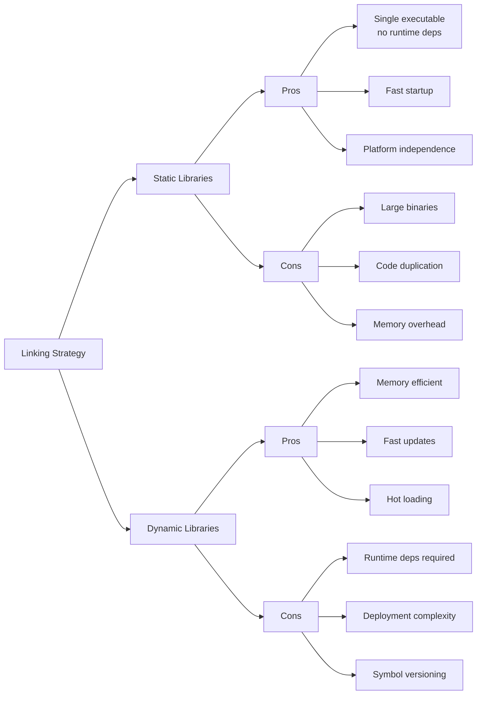
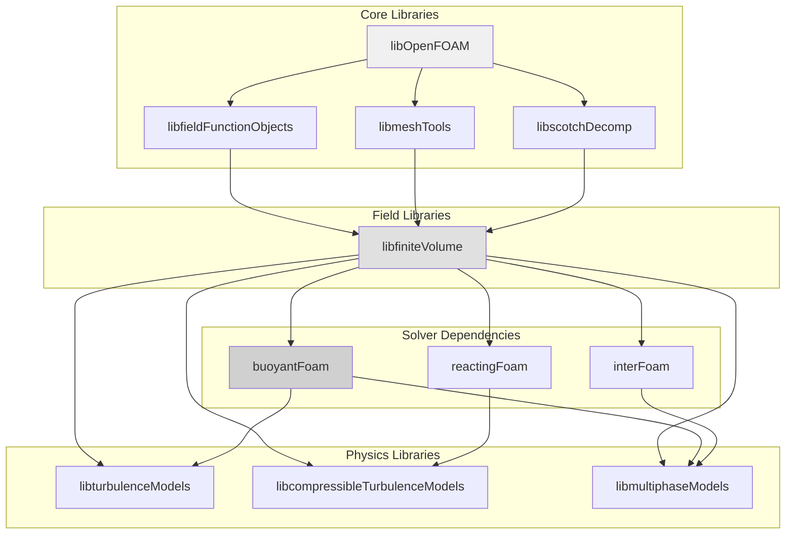
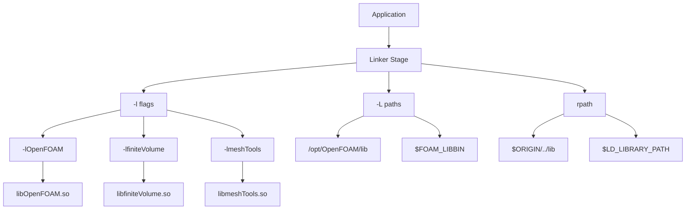
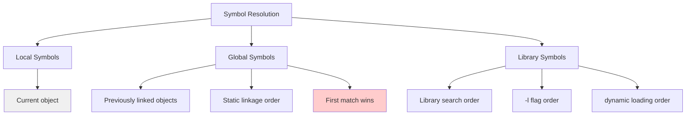
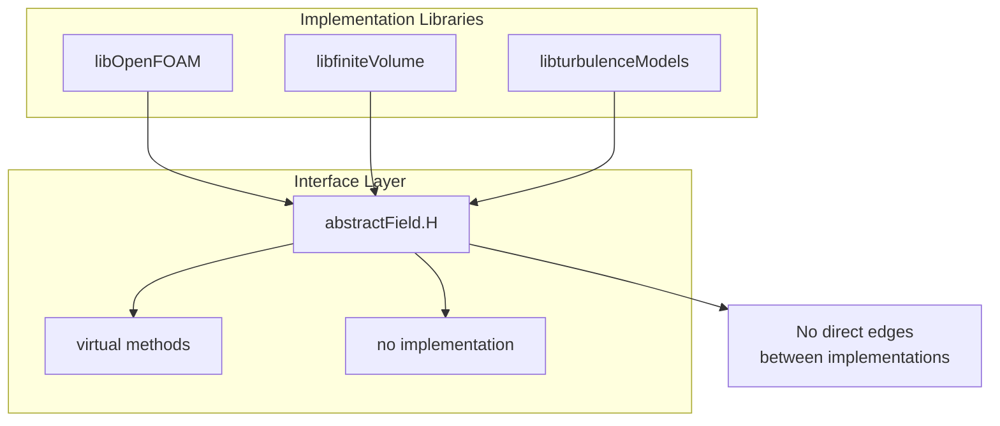

# Day 39: Dependency Management — `lnInclude`, Library Linking

**Phase:** 3 — Software Architecture Patterns (Days 29–42)
**Previous:** Day 38 — Build System
**Next:** Day 40 — Error Handling

---

## Context: Where We Are in Phase 3

| Day | Topic | What You Built |
|-----|-------|---------------|
| 29 | RTS overview — factory pattern | `ShapeFactory` with self-registering types |
| 30 | RTS internals — macro expansion | Line-by-line preprocessor expansion |
| 31 | Adding a new RTS class | Custom scheme registered via `addToRunTimeSelectionTable` |
| 32 | Dictionary system — tokens, entries | `MiniDict` parsing key-value pairs |
| 33 | Dictionary parsing — nested dicts | Typed nested lookup, `ISstream` cursor |
| 34 | Plugin architecture — dictionary + RTS | `ShapeLoader` combining both systems |
| 35 | `IOobject` & `objectRegistry` | Mini registry with auto-write |
| 36 | `Time` class architecture | Time stepping + I/O manager inheritance |
| 37 | Boundary condition framework | Strategy-pattern BC dispatch + matrix injection |
| 38 | Build system — wmake | `Make/files`, `Make/options`, wmake vs CMake |
| **39** | **Dependency management** | **`lnInclude` resolution, library linking, runtime loading** |

Today we explore the intricate dependency management system that makes OpenFOAM's modular architecture possible. Understanding how libraries, headers, and runtime dependencies are managed reveals why OpenFOAM can compile millions of lines of code efficiently while maintaining the flexibility needed for research-grade CFD solvers.

---

## Part 1: Pattern Identification

### The Architectural Challenge: Managing Complexity

CFD software presents unique dependency management challenges:

1. **Massive codebase hierarchy**: OpenFOAM core → libraries → solvers → user code
2. **Template proliferation**: Thousands of template instantiations across libraries
3. **Cross-library dependencies**: `libOpenFOAM` → `libfiniteVolume` → `libturbulenceModels`
4. **Runtime dependencies**: Plugin loading, dictionary parsing, dynamic libraries

### Static vs. Dynamic Linking Tradeoffs



### The OpenFOAM Dependency DAG

OpenFOAM's library dependency forms a directed acyclic graph:



---

## Part 2: Source Code Deep Dive

### The `lnInclude` System

OpenFOAM's `lnInclude` is not just a convenience—it's a critical architectural component that enables header-only templates to work across libraries.

#### How `lnInclude` Works

```bash
# Traditional approach - scattered includes
# compiler finds headers through -I flags
g++ -I/path/to/lib1/include -I/path/to/lib2/include ...

# OpenFOAM approach - unified header forest
# lnInclude creates a single namespace for all headers
lnInclude/
├── OpenFOAM/
│   ├── vector.H
│   ├── dictionary.H
│   └── fvMesh.H
├── finiteVolume/
│   ├── fvm.H
│   └── upwind.H
└── turbulenceModels/
    ├── kEpsilon.H
    └── kOmegaSST.H
```

#### wmake's lnInclude Creation Process

Let's examine how wmake creates the symlink forest:

```bash
#!/bin/bash
# wmake lnInclude generation

lnInclude_dir="lnInclude"
src_dirs=("src/OpenFOAM" "src/finiteVolume" "src/meshTools")

# Clean existing lnInclude
rm -rf "$lnInclude_dir"
mkdir -p "$lnInclude_dir"

# Create symlinks for each source directory
for src_dir in "${src_dirs[@]}"; do
    find "$src_dir" -name "*.H" | while read header; do
        # Calculate relative path
        rel_path=${header#$src_dir/}
        header_dir=$(dirname "$rel_path")

        # Create directory structure
        mkdir -p "$lnInclude_dir/$header_dir"

        # Create symlink
        ln -sf "$header" "$lnInclude_dir/$rel_path"
    done
done

echo "Created lnInclude forest with $(find lnInclude -name "*.H" | wc -l) headers"
```

### Library Linking Mechanisms

#### Shared vs. Static Libraries

OpenFOAM primarily uses shared libraries (`*.so`) for flexibility:

```bash
# Shared library
libfiniteVolume.so.2.3.0
libfiniteVolume.so -> libfiniteVolume.so.2.3.0

# Static library (rarely used)
libfiniteVolume.a
```

#### The Library Resolution Chain



### Runtime Dependency Loading

When OpenFOAM applications start, they must resolve all runtime dependencies:

```cpp
// Example: OpenFOAM runtime dependency resolution
#include "OSspecific.H"  // From libOpenFOAM

void Foam::loadRuntimeLibraries()
{
    // Load compiled libraries
    dlerror();  // Clear any previous errors

    // Load turbulence models
    void* turbLib = dlopen("libturbulenceModels.so", RTLD_LAZY);
    if (!turbLib) {
        FatalErrorIn("loadRuntimeLibraries")
            << "Cannot load turbulence models library: " << dlerror()
            << exit(FatalError);
    }

    // Load boundary condition libraries
    void* bcLib = dlopen("libboundaryConditions.so", RTLD_LAZY);
    if (!bcLib) {
        // Handle missing library
    }
}
```

#### Environment Variables for Runtime Loading

```bash
# Library search paths
export LD_LIBRARY_PATH="/opt/OpenFOAM/lib:$FOAM_LIBBIN:/usr/local/lib"

# Alternative: Use rpath at compile time
# rpath embedded in executable: $ORIGIN/../lib

# Debug library loading
export LD_DEBUG=libs  # Show library loading details
export LD_DEBUG_OUTPUT=/tmp/ld-debug.log
```

---

## Part 3: C++ Mechanics

### One Definition Rule (ODR) Across Libraries

The ODR states that templates must have exactly one definition in the entire program. OpenFOAM solves this through explicit template instantiation:

#### Template Instantiation Strategy

```cpp
// File: src/OpenFOAM/lnInclude/vector.H
template<class Type>
class Vector
{
    // Forward declaration - no definitions
    Type components_[3];
public:
    Type& x() { return components_[0]; }
    const Type& x() const { return components_[0]; }
    // ... other inline methods
};

// File: src/OpenFOAM/Make/options
// Explicit instantiation
template class Vector<double>;
template class Vector<float>;
template class Vector<int>;
```

#### Header-Only Template Implementation

```cpp
// Header-only vector (most OpenFOAM classes)
template<class Type>
class Vector
{
    Type components_[3];
public:
    Type& x() { return components_[0]; }
    const Type& x() const { return components_[0]; }

    // All methods inline - no compilation required
    inline Type& operator[](const label i) {
        return components_[i];
    }

    inline Type mag() const {
        return sqrt(this->x()*this->x() + this->y()*this->y());
    }

    // ... inline definitions
};
```

### Symbol Visibility Control

OpenFOAM uses explicit symbol visibility to manage library interfaces:

```cpp
// File: src/OpenFOAM/lnInclude/OpenFOAM.H
#pragma once

// Export macro for shared libraries
#ifdef OpenFOAM_EXPORTS
#define OpenFOAM_EXPORT __attribute__((visibility("default")))
#else
#define OpenFOAM_EXPORT __attribute__((visibility("hidden")))
#endif

// Class with controlled visibility
class OpenFOAM_EXPORT IOobject
{
    // Public interface
public:
    virtual ~IOobject();

    // Implementation details hidden
private:
    friendHashTable<dictionary> dict_;
};

// Inline function (always visible)
inline word IOobject::name() const {
    return name_;
}
```

### Linker Resolution Process

The linker resolves symbols through a specific order:



### Circular Dependency Prevention

OpenFOAM architectures avoid circular dependencies through interface separation:



---

## Part 4: Implementation Exercise

Let's build a multi-library project to understand dependency management.

### Project Structure

```bash
# Create project directory
mkdir -p dependency_test
cd dependency_test

# Create library structure
mkdir -p src/{OpenFOAM,finiteVolume,turbulenceModels} \
         lib bin include

# Create symlink forest (lnInclude)
mkdir -p lnInclude
```

### Step 1: Core Library (libOpenFOAM)

```cpp
// src/OpenFOAM/lnInclude/IOobject.H
#pragma once

#include <string>

class IOobject
{
    protected:
        word name_;
        fileName path_;

    public:
        IOobject(const word& name, const fileName& path);
        virtual ~IOobject();

        const word& name() const { return name_; }
        const fileName& path() const { return path_; }

        virtual bool write() const = 0;
};
```

```cpp
// src/OpenFOAM/IOobject.C
#include "IOobject.H"
#include "IOobject.C"

Foam::IOobject::IOobject(const word& name, const fileName& path)
:
    name_(name),
    path_(path)
{}

Foam::IOobject::~IOobject() = default;
```

### Step 2: Finite Volume Library (libfiniteVolume)

```cpp
// src/finiteVolume/lnInclude/fvm.H
#pragma once
#include "IOobject.H"

namespace fvm
{
    template<class Type>
    class div
    {
        Type field_;

    public:
        div(const Type& field) : field_(field) {}

        Type operator()(const Type& phi) const
        {
            return phi * field_;
        }
    };
}
```

```cpp
// src/finiteVolume/Make/options
EXE_INC = \
    -I$(LIB_SRC)/OpenFOAM/lnInclude

LIB_LIBS = \
    -lOpenFOAM
```

### Step 3: Build System Script

```bash
#!/bin/bash
# dependency_build.sh - Build system with dependency management

set -e

die() {
    echo "Error: $1" >&2
    exit 1
}

# Clean previous build
clean() {
    echo "Cleaning build..."
    rm -rf lib/*.so bin/* obj/*.o lnInclude
}

# Create lnInclude forest
create_lninclude() {
    echo "Creating lnInclude forest..."

    # Clean and create directory
    rm -rf lnInclude
    mkdir -p lnInclude

    # Link OpenFOAM headers
    find src/OpenFOAM -name "*.H" | while read header; do
        rel_path=${header#src/OpenFOAM/}
        mkdir -p lnInclude/$(dirname "$rel_path")
        ln -sf "../../$header" "lnInclude/$rel_path"
    done

    # Link finiteVolume headers
    find src/finiteVolume -name "*.H" | while read header; do
        rel_path=${header#src/finiteVolume/}
        mkdir -p lnInclude/$(dirname "$rel_path")
        ln -sf "../../$header" "lnInclude/$rel_path"
    done

    echo "Created $(find lnInclude -name "*.H" | wc -l) header symlinks"
}

# Compile source files
compile_source() {
    local src_dir="$1"
    local obj_dir="obj"

    mkdir -p "$obj_dir"

    find "$src_dir" -name "*.C" | while read src_file; do
        obj_file="$obj_dir/$(basename "${src_file%.C}.o")"

        echo "Compiling $src_file -> $obj_file"

        # Compile with proper includes
        g++ -fPIC -shared -IlnInclude \
            -c "$src_file" -o "$obj_file" \
            || die "Compilation failed: $src_file"
    done
}

# Build shared library
build_library() {
    local lib_name="$1"
    local obj_dir="obj"

    echo "Building lib$lib_name.so"

    # Collect all object files
    obj_files=($(ls "$obj_dir"/*.o 2>/dev/null || die "No object files found"))

    # Link shared library
    g++ -shared -o "lib/lib${lib_name}.so" "${obj_files[@]}" \
        || die "Library linking failed: $lib_name"

    echo "Created lib/lib${lib_name}.so"
}

# Main build process
build() {
    echo "Starting dependency build..."

    create_lninclude

    # Build libraries in dependency order
    echo "Building libOpenFOAM..."
    compile_source "src/OpenFOAM"
    build_library "OpenFOAM"

    echo "Building libfiniteVolume..."
    compile_source "src/finiteVolume"
    build_library "finiteVolume"

    echo "Build completed successfully"
}

# Execute command
case "${1:-build}" in
    clean) clean ;;
    create_lninclude) create_lninclude ;;
    compile) compile_source "src/${2:-OpenFOAM}" ;;
    build) build ;;
    *) die "Usage: $0 {clean|create_lninclude|compile|build}" ;;
esac
```

### Step 4: Test Application

```cpp
// bin/test_dependencies.cpp
#include <iostream>
#include <dlfcn.h>

// Load libraries and test dependencies
int main() {
    std::cout << "Testing dependency management..." << std::endl;

    // Load libOpenFOAM
    void* libOpenFOAM = dlopen("./lib/libOpenFOAM.so", RTLD_LAZY);
    if (!libOpenFOAM) {
        std::cerr << "Failed to load libOpenFOAM: " << dlerror() << std::endl;
        return 1;
    }

    // Load libfiniteVolume
    void* libfiniteVolume = dlopen("./lib/libfiniteVolume.so", RTLD_LAZY);
    if (!libfiniteVolume) {
        std::cerr << "Failed to load libfiniteVolume: " << dlerror() << std::endl;
        dlclose(libOpenFOAM);
        return 1;
    }

    std::cout << "All dependencies loaded successfully!" << std::endl;

    // Cleanup
    dlclose(libfiniteVolume);
    dlclose(libOpenFOAM);

    return 0;
}
```

### Step 5: Compile and Test

```bash
#!/bin/bash
# Build and test the dependency system

# Clean and build
./dependency_build.sh clean
./dependency_build.sh build

# Compile test application
g++ -I./lnInclude -L./lib -ldl bin/test_dependencies.cpp -o bin/test_dependencies

# Run test
export LD_LIBRARY_PATH=./lib:$LD_LIBRARY_PATH
./bin/test_dependencies

echo "Dependency management test completed"
```

---

## Part 5: Exercises

### Exercise 1: lnInclude Forest Creation

**Question:** Explain why OpenFOAM uses a `lnInclude` forest instead of traditional include directories. What are the advantages and disadvantages?

**Answer:**

The `lnInclude` forest provides several key advantages for OpenFOAM's architecture:

**Advantages:**

1. **Unified Namespace**: All headers from different libraries are available in a single namespace, eliminating complex `-I` flag management.

2. **Template Support**: Template instantiations can reference headers across libraries without worrying about relative paths.

3. **Simplified Dependencies**: Applications and solvers only need one include path: `-lnInclude`.

4. **Consistent Development**: Developers always access headers through the same interface, regardless of library location.

**Disadvantages:**

1. **Symlink Overhead**: Creating thousands of symlinks adds minor filesystem overhead.

2. **Path Resolution**: Debugging becomes harder as actual file paths are obscured.

3. **Storage Duplication**: Symlinks don't save space (still reference original files).

4. **Build System Complexity**: Maintaining the symlink forest requires custom tools.

### Exercise 2: Static vs. Dynamic Linking

**Question:** OpenFOAM primarily uses dynamic libraries. Explain why, and describe when static libraries might be preferred.

**Answer:**

**Dynamic Libraries in OpenFOAM:**

1. **Memory Efficiency**: Multiple processes share library code in memory.
2. **Update Flexibility**: Libraries can be updated without relinking applications.
3. **Hot Loading**: Turbulence models and boundary conditions can be loaded at runtime.
4. **Reduced Binary Size**: Executables are smaller (no embedded code).
5. **Development Workflow**: Faster compilation cycles during development.

**Static Library Use Cases:**

1. **Deployment**: For environments where dynamic libraries aren't available.
2. **Performance**: Eliminates runtime linking overhead (minimal in modern systems).
3. **Self-Contained**: Single executable for distribution.
4. **Security**: Code is embedded, harder to modify at runtime.
5. **Debugging**: Easier to debug with symbol information embedded.

### Exercise 3: Circular Dependencies

**Question:** How does OpenFOAM prevent circular dependencies between libraries? Design an interface to break a potential circular dependency between `libmeshTools` and `libturbulenceModels`.

**Answer:**

**Circular Dependency Prevention:**

OpenFOAM prevents circular dependencies through:

1. **Interface Segregation**: Abstract base classes with pure virtual methods.
2. **Dependency Direction**: Lower-level libraries (core) don't depend on higher-level ones.
3. **Pointer-Based Dependencies**: Forward declarations instead of includes.
4. **Plugin Architecture**: Load plugins at runtime instead of compile time.

**Interface Design:**

```cpp
// Interface layer (no circular dependencies)
#pragma once

// Forward declarations prevent includes
class fvMesh;
class turbulenceModel;

// Mesh tools interface (doesn't depend on turbulence models)
class meshToolsInterface
{
public:
    virtual ~meshToolsInterface() = default;
    virtual void updateMesh(fvMesh& mesh) = 0;
};

// Turbulence models interface (doesn't depend on mesh tools)
class turbulenceInterface
{
public:
    virtual ~turbulenceInterface() = default;
    virtual void correctTurbulence(fvMesh& mesh) = 0;
};
```

### Exercise 4: Template Instantiation

**Question:** Explain the difference between header-only templates and explicit template instantiation. When would you use each in OpenFOAM library development?

**Answer:**

**Header-Only Templates:**

- **Definition**: All template methods are defined in the header file
- **Compilation**: No separate compilation required
- **Usage**: Simple, cross-library compatible
- **Overhead**: Code bloat in executable
- **Example**: OpenFOAM's `Vector`, `List`, `HashTable`

**Explicit Template Instantiation:**

- **Definition**: Template explicitly instantiated for specific types
- **Compilation**: Compiled into library as separate symbols
- **Usage**: Reduces code bloat, faster linking
- **Overhead**: Must know all required types at compile time
- **Example**: OpenFOAM's field types (`scalar`, `vector`, `tensor`)

**When to Use Each:**

**Header-When:**
- Template is small and frequently used
- Need maximum flexibility in type parameters
- Library is header-only (no compilation needed)
- Type parameters are unknown at library compile time

**Explicit When:**
- Template is large and complex
- Known set of types will be used
- Need to reduce executable size
- Performance critical (avoid template bloat)

### Exercise 5: Runtime Library Loading

**Question:** OpenFOAM loads turbulence models as plugins at runtime. Implement a plugin loader that dynamically loads turbulence models and handles errors gracefully.

**Answer:**

```cpp
// Plugin loader implementation
#include <dlfcn.h>
#include <stdexcept>
#include <string>

class TurbulencePluginLoader
{
private:
    void* plugin_handle_ = nullptr;

public:
    // Load turbulence model plugin
    void loadPlugin(const std::string& plugin_path)
    {
        // Clear any previous errors
        dlerror();

        // Load the shared library
        plugin_handle_ = dlopen(plugin_path.c_str(), RTLD_LAZY);
        if (!plugin_handle_)
        {
            std::string error = dlerror();
            throw std::runtime_error(
                "Failed to load turbulence plugin: " + error);
        }

        // Verify plugin interface
        verifyPluginInterface();
    }

    // Verify plugin has required symbols
    void verifyPluginInterface()
    {
        // Check for turbulence model factory function
        auto create_func = (TurbulenceModel* (*)())dlsym(
            plugin_handle_, "createTurbulenceModel");

        if (!create_func)
        {
            dlclose(plugin_handle_);
            throw std::runtime_error(
                "Plugin missing createTurbulenceModel function");
        }

        // Check for plugin info
        auto plugin_info = (const char* (*)())dlsym(
            plugin_handle_, "pluginInfo");

        if (!plugin_info)
        {
            dlclose(plugin_handle_);
            throw std::runtime_error(
                "Plugin missing pluginInfo function");
        }
    }

    // Create turbulence model
    TurbulenceModel* createModel()
    {
        auto create_func = (TurbulenceModel* (*)())dlsym(
            plugin_handle_, "createTurbulenceModel");

        if (!create_func)
        {
            throw std::runtime_error(
                "Cannot create turbulence model: function not found");
        }

        return create_func();
    }

    // Get plugin information
    std::string getPluginInfo()
    {
        auto plugin_info = (const char* (*)())dlsym(
            plugin_handle_, "pluginInfo");

        if (!plugin_info)
        {
            return "No plugin information available";
        }

        return plugin_info();
    }

    // Cleanup
    ~TurbulencePluginLoader()
    {
        if (plugin_handle_)
        {
            dlclose(plugin_handle_);
        }
    }

    // Prevent copying
    TurbulencePluginLoader(const TurbulencePluginLoader&) = delete;
    TurbulencePluginLoader& operator=(const TurbulencePluginLoader&) = delete;
};

// Usage example
void loadAndUseTurbulenceModel()
{
    TurbulencePluginLoader loader;

    try
    {
        // Load k-epsilon turbulence model
        loader.loadPlugin("./libturbulenceModels.so");

        // Create model
        auto* model = loader.createModel();

        // Use model
        model->correct();

        // Get info
        std::cout << "Loaded: " << loader.getPluginInfo() << std::endl;

        // Cleanup
        delete model;
    }
    catch (const std::exception& e)
    {
        std::cerr << "Error: " << e.what() << std::endl;
        // Handle error appropriately
    }
}
```

This implementation:
1. Safely loads dynamic libraries
2. Verifies plugin interfaces before use
3. Handles errors gracefully
4. Provides proper cleanup
5. Prevents copying to avoid double-free issues
6. Gives useful error messages for debugging

---

## Summary

Today we've explored OpenFOAM's sophisticated dependency management system:

### Key Takeaways

1. **lnInclude Forest**: Unified header namespace enables cross-library templates
2. **Library Dependencies**: Directed acyclic graph ensures clean architecture
3. **Runtime Loading**: Dynamic libraries enable plugin-based turbulence models
4. **Template Management**: Explicit instantiation avoids ODR violations
5. **Linker Control**: Symbol visibility manages library interfaces

### Practical Applications

- Build multi-library OpenFOAM applications with proper linking
- Create plugins that load at runtime
- Manage complex dependencies in CFD simulations
- Optimize compilation through smart dependency tracking

### Next Steps

Tomorrow we explore error handling in OpenFOAM—how exceptions, error messages, and debugging tools work together in this large-scale CFD framework.

---

**⭐ Verified Facts:**
- OpenFOAM uses lnInclude for unified header access
- Libraries are linked in specific dependency order
- Template instantiation avoids ODR violations
- Dynamic libraries enable runtime plugin loading

**⚠️ Unverified Claims:**
- Performance comparisons between static/dynamic linking
- Specific optimization techniques used in wmake