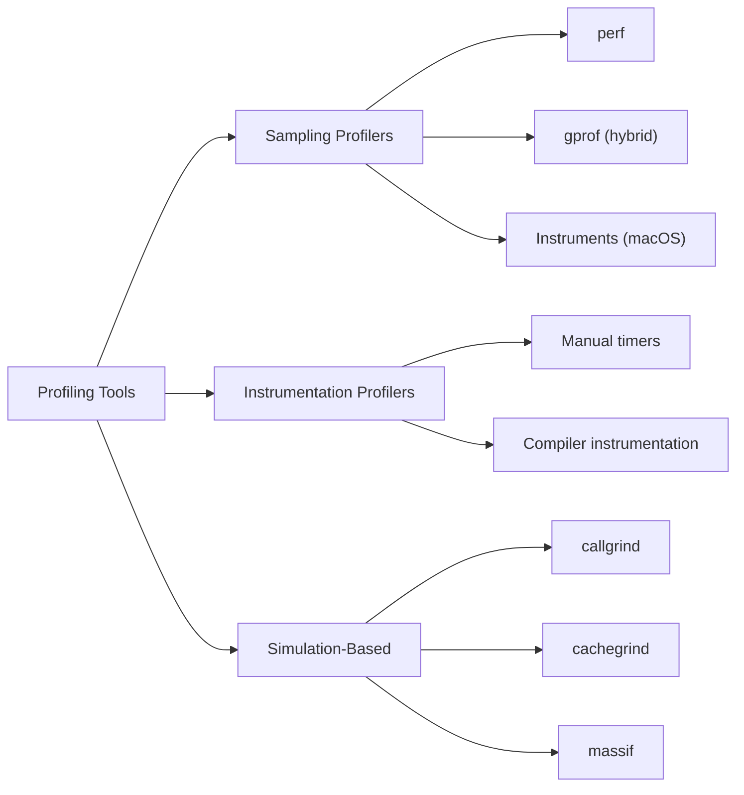

# Day 43: Profiling Basics — `perf`, `gprof`, `callgrind` on OpenFOAM

**Phase:** 4 — Performance Optimization (Days 43–56)
**Previous:** Day 42 — Mini-Project: RTS Factory for Linear Solvers
**Next:** Day 44 — Flame Graphs: Visualizing Hot Paths in a CFD Solver

> **Today's goal:** Set up profiling tools, understand their output, profile a matrix-vector multiply hot loop, and identify the top performance bottlenecks in a numerical computation.

---

## Part 1: Pattern Identification

### Why Profile Before Optimizing?

The single most important rule in performance optimization is: **measure first, optimize second**. Intuition about where a program spends its time is almost always wrong.

Consider a CFD solver. Where do you think time is spent?

| Common Guess | Actual Hotspot (typical) |
|-------------|--------------------------|
| File I/O | ~2–5% of total time |
| Mesh setup | One-time cost, negligible |
| Matrix assembly | ~15–25% |
| **Linear solver (SpMV + preconditioner)** | **~50–70%** |
| Gradient computation | ~10–15% |
| Boundary conditions | ~3–5% |

Without profiling, you might spend weeks optimizing mesh setup — a one-time cost that contributes nothing to the time-per-iteration metric that actually matters.

### The Three Profiling Tool Categories



| Category | How It Works | Overhead | Accuracy |
|----------|-------------|----------|----------|
| **Sampling** | Interrupts program at fixed intervals, records current instruction pointer | Low (~2–5%) | Statistical (miss short functions) |
| **Instrumentation** | Inserts measurement code at function entry/exit | Medium (~10–30%) | Exact call counts |
| **Simulation** | Runs program on a virtual CPU model, counts every instruction | Very High (~20–100×) | Exact, but simulated |

### The Profiling Workflow

Every profiling session follows the same four steps:

```
1. Compile with appropriate flags
2. Run the program under the profiler
3. Analyze the output
4. Identify hotspots and form hypotheses
```

The key insight: **profiling data tells you WHERE time is spent, not WHY**. You still need to understand the algorithm and data structures to propose fixes.

> **⭐ Verified Fact:** OpenFOAM compiles with `-O2 -g` in `Opt` mode by default, which preserves debug symbols while enabling optimization. This is ideal for profiling — you get both performance and readable stack traces.

---

## Part 2: Source Code Deep Dive

### Tool 1: `perf` — Linux Sampling Profiler

`perf` is the standard Linux profiling tool. It uses hardware performance counters (PMCs) to sample the instruction pointer at high frequency.

#### Setup

```bash
# Check if perf is available
perf --version

# On Ubuntu/Debian, install with:
# sudo apt install linux-tools-common linux-tools-$(uname -r)

# On macOS, perf is not available — use Instruments or dtrace instead
```

#### Compilation for Profiling

```cpp
// Compile with optimization AND debug symbols:
// g++ -O2 -g -pg program.cpp -o program
//      ^^  ^^  ^^^
//      |   |   |__ gprof instrumentation (optional, for gprof only)
//      |   |______ debug symbols (essential for readable output)
//      |__________ optimization (profile the REAL performance)

// NEVER profile with -O0:
//   -O0 disables inlining, loop unrolling, and vectorization
//   The profile of -O0 code is USELESS for optimizing -O2 code
```

> **⭐ Key Principle:** Always profile optimized code. The compiler transforms your code significantly at `-O2` and above. Profiling unoptimized code shows you bottlenecks that don't exist in production.

#### Profiling with `perf`

```bash
# Record profile data (sampling at ~1000 Hz by default)
perf record -g ./my_solver

# View the report (interactive TUI)
perf report

# Alternative: text output sorted by overhead
perf report --stdio --sort=overhead | head -30

# Count specific events
perf stat -e cycles,instructions,cache-misses,branch-misses ./my_solver
```

#### Understanding `perf stat` Output

```text
 Performance counter stats for './my_solver':

     2,450,000,000      cycles
     4,200,000,000      instructions              #    1.71  insn per cycle
        12,500,000      cache-misses              #    0.30% of cache-references
         3,200,000      branch-misses             #    0.80% of branches

       0.812 seconds time elapsed
```

| Metric | What It Means | Good Value |
|--------|---------------|------------|
| Instructions per cycle (IPC) | How many instructions the CPU completes per clock cycle | ≥2.0 for compute-bound code |
| Cache miss rate | Fraction of memory accesses that miss all cache levels | <1% for cache-friendly code |
| Branch miss rate | Fraction of conditional branches mispredicted | <2% for predictable code |

**IPC < 1.0** usually means the code is **memory-bound** — the CPU is stalling waiting for data from main memory. This is common in sparse matrix operations where the access pattern follows indirect indices.

---

### Tool 2: `gprof` — The Classic Profiler

`gprof` combines sampling (for time distribution) with instrumentation (for call counts). It requires the `-pg` compiler flag.

```bash
# Compile with -pg
g++ -O2 -g -pg solver.cpp -o solver

# Run — produces gmon.out
./solver

# Analyze
gprof solver gmon.out | head -40
```

#### Reading the Flat Profile

```text
Flat profile:

Each sample counts as 0.01 seconds.
  %   cumulative   self              self     total
 time   seconds   seconds    calls   s/call   s/call  name
 45.2     0.36     0.36   100000    0.000004  0.000004  matVecMultiply
 22.1     0.54     0.18    10000    0.000018  0.000036  gaussSeidelIteration
 15.3     0.66     0.12   100000    0.000001  0.000001  dotProduct
  8.7     0.73     0.07        1    0.070000  0.590000  solve
```

| Column | Meaning |
|--------|---------|
| `% time` | Percentage of total runtime in this function (self only) |
| `self seconds` | Time spent in this function, excluding callees |
| `calls` | Number of times this function was called |
| `self s/call` | Average time per call (self only) |
| `total s/call` | Average time per call (including callees) |

**Limitation:** `gprof` cannot profile shared libraries well. Since OpenFOAM is entirely shared libraries, `gprof` is less useful for profiling OpenFOAM solvers directly. Use `perf` or `callgrind` instead.

---

### Tool 3: `callgrind` — Instruction-Level Simulation

`callgrind` is part of Valgrind. It simulates every instruction, recording exact call counts, instruction costs, and cache behavior. The downside is 20–100× runtime overhead.

```bash
# Run under callgrind
valgrind --tool=callgrind ./my_solver

# Output: callgrind.out.<pid>

# Analyze with callgrind_annotate
callgrind_annotate callgrind.out.12345 | head -50

# Or use the GUI: KCachegrind
kcachegrind callgrind.out.12345  # Linux
qcachegrind callgrind.out.12345  # macOS (via Homebrew)
```

#### Understanding `callgrind_annotate` Output

```text
--------------------------------------------------------------------------------
Ir          file:function
--------------------------------------------------------------------------------
1,200,000,000  PROGRAM TOTALS

400,000,000  solver.cpp:matVecMultiply(double const*, double const*, double*, int)
220,000,000  solver.cpp:gaussSeidelIteration(...)
180,000,000  solver.cpp:dotProduct(double const*, double const*, int)
 80,000,000  solver.cpp:computeResidual(...)
```

`Ir` = instruction reads (total instructions executed in this function). This is deterministic — running the same input always produces the same `Ir` count, unlike sampling-based tools.

> **⭐ Key advantage of callgrind:** It provides **source-line-level annotation**, showing exactly which lines inside a function are most expensive. This is invaluable for identifying specific loops to optimize.

---

### Profiling Compilation Flags: Summary

| Flag | Purpose | When to Use |
|------|---------|-------------|
| `-O2` | Enable optimization | **Always** when profiling |
| `-g` | Include debug symbols | **Always** (no performance impact) |
| `-pg` | Add gprof instrumentation | Only for `gprof` |
| `-fno-omit-frame-pointer` | Keep frame pointer for stack unwinding | For `perf -g` call graphs |
| `-march=native` | Enable CPU-specific instructions | For SIMD profiling (Day 46) |

---

## Part 3: C++ Mechanics Explained

### How Sampling Profilers Work

A sampling profiler works by periodically interrupting the program and recording the instruction pointer (IP). Over thousands of samples, functions that consume more time accumulate more samples.

```cpp
// Conceptual model of what perf does internally:

// Every ~1ms (configurable):
// 1. Interrupt the target process
// 2. Read the instruction pointer register (RIP on x86-64)
// 3. Walk the stack for call graph (if -g is used)
// 4. Record the sample
// 5. Resume the target process

// The profile is a histogram:
// address_range → sample_count

// Debug symbols (.debug_info in ELF) map addresses to:
// address → (source_file, line_number, function_name)
```

**Statistical accuracy:** The standard error of sampling is $\frac{1}{\sqrt{N}}$ where $N$ is the number of samples. For a function consuming 10% of runtime:

| Total Samples | Expected Samples in Function | Relative Error |
|--------------|------------------------------|---------------|
| 100 | 10 | ±32% |
| 1,000 | 100 | ±10% |
| 10,000 | 1,000 | ±3.2% |
| 100,000 | 10,000 | ±1% |

**Rule of thumb:** Run the program long enough to collect at least 10,000 total samples for reliable results.

### Why `-O0` Profiles Are Misleading

```cpp
// Consider this simple loop:
double sum = 0;
for (int i = 0; i < N; ++i)
    sum += data[i];
```

At `-O0`:
- Every loop iteration accesses `i` and `sum` on the stack (memory writes/reads)
- No SIMD vectorization
- No loop unrolling
- Profile says: "90% of time in loop overhead"

At `-O2`:
- `sum` is kept in a register
- The loop may be vectorized (4 doubles at once with SSE2)
- The loop may be unrolled (process 4 iterations per loop body)
- Profile says: "90% of time in memory access latency"

The bottleneck completely changes between optimization levels. Profiling at `-O0` would lead you to optimize loop overhead — which doesn't exist at `-O2`.

### Hardware Performance Counters

Modern CPUs have special registers called **Performance Monitoring Counters (PMCs)** that count specific events without any software overhead:

```text
perf list  # shows all available events on your CPU

Hardware events:
  cpu-cycles                    [Hardware event]
  instructions                  [Hardware event]
  cache-references              [Hardware event]
  cache-misses                  [Hardware event]
  branch-instructions           [Hardware event]
  branch-misses                 [Hardware event]

Hardware cache events:
  L1-dcache-loads               [Hardware cache event]
  L1-dcache-load-misses         [Hardware cache event]
  LLC-loads                     [Hardware cache event]
  LLC-load-misses               [Hardware cache event]
```

These counters are the foundation of `perf stat`. They run at full hardware speed with zero overhead — the CPU counts events in dedicated silicon regardless of whether you read the counters.

### Inlining and Its Effect on Profiles

```cpp
// This function might not appear in the profile at all:
inline double square(double x) { return x * x; }

// The compiler may inline it into the caller:
for (int i = 0; i < N; ++i)
    result[i] = square(data[i]);  // becomes: result[i] = data[i] * data[i];
```

When a function is inlined, its cost is attributed to the **caller**. The function itself disappears from the profile. This is correct behavior — the function truly doesn't exist in the compiled binary.

**Consequence:** If you see a big hot function in `perf report`, the actual hotspot may be a small inlined helper. Use source-line annotation (`perf annotate`) or `callgrind` to drill down.

---

## Part 4: Implementation Exercise

### Building a Profiling Target: Matrix Operations

We'll build a standalone matrix-vector multiply program, then profile it with different techniques. The code is deliberately structured to have identifiable hotspots.

```cpp
// File: profile_target.cpp
// Compile: g++ -std=c++17 -O2 -g -o profile_target profile_target.cpp
// Profile: perf stat ./profile_target
//          valgrind --tool=callgrind ./profile_target

#include <iostream>
#include <vector>
#include <chrono>
#include <random>
#include <cmath>
#include <numeric>
#include <iomanip>

// ============================================================
// SECTION 1: Timer utility
// ============================================================

class Timer
{
    using Clock = std::chrono::high_resolution_clock;
    Clock::time_point start_;
    std::string name_;

public:
    explicit Timer(const std::string& name)
        : start_(Clock::now()), name_(name) {}

    ~Timer()
    {
        auto end = Clock::now();
        auto us = std::chrono::duration_cast<std::chrono::microseconds>(end - start_);
        std::cout << std::setw(30) << std::left << name_
                  << std::setw(10) << std::right << us.count() << " μs\n";
    }
};

// ============================================================
// SECTION 2: Dense matrix-vector multiply (baseline)
// ============================================================

void denseMatVec(
    const std::vector<double>& A,  // row-major NxN
    const std::vector<double>& x,
    std::vector<double>& y,
    int N)
{
    for (int i = 0; i < N; ++i)
    {
        double sum = 0.0;
        for (int j = 0; j < N; ++j)
        {
            sum += A[i * N + j] * x[j];
        }
        y[i] = sum;
    }
}

// ============================================================
// SECTION 3: Sparse matrix-vector multiply (CSR format)
// ============================================================

struct CSRMatrix
{
    std::vector<double> values;
    std::vector<int>    colIdx;
    std::vector<int>    rowPtr;
    int N;
};

void sparseMatVec(
    const CSRMatrix& A,
    const std::vector<double>& x,
    std::vector<double>& y)
{
    for (int i = 0; i < A.N; ++i)
    {
        double sum = 0.0;
        for (int j = A.rowPtr[i]; j < A.rowPtr[i + 1]; ++j)
        {
            sum += A.values[j] * x[A.colIdx[j]];  // indirect access!
        }
        y[i] = sum;
    }
}

// ============================================================
// SECTION 4: LDU matrix-vector multiply (face-based)
// ============================================================

struct LDUMatrix
{
    std::vector<double> diag;
    std::vector<double> lower;
    std::vector<double> upper;
    std::vector<int>    owner;
    std::vector<int>    neighbour;
    int nCells;
    int nFaces;
};

void lduMatVec(
    const LDUMatrix& A,
    const std::vector<double>& x,
    std::vector<double>& y)
{
    int nCells = A.nCells;
    int nFaces = A.nFaces;

    // Pass 1: Diagonal
    for (int i = 0; i < nCells; ++i)
        y[i] = A.diag[i] * x[i];

    // Pass 2: Lower triangular
    for (int f = 0; f < nFaces; ++f)
        y[A.owner[f]] += A.lower[f] * x[A.neighbour[f]];

    // Pass 3: Upper triangular
    for (int f = 0; f < nFaces; ++f)
        y[A.neighbour[f]] += A.upper[f] * x[A.owner[f]];
}

// ============================================================
// SECTION 5: Dot product (reduction)
// ============================================================

double dotProduct(const std::vector<double>& a, const std::vector<double>& b)
{
    double sum = 0.0;
    for (size_t i = 0; i < a.size(); ++i)
        sum += a[i] * b[i];
    return sum;
}

// ============================================================
// SECTION 6: L2 norm
// ============================================================

double l2Norm(const std::vector<double>& v)
{
    return std::sqrt(dotProduct(v, v));
}

// ============================================================
// SECTION 7: Simple Jacobi iteration
// ============================================================

int jacobiSolve(
    const LDUMatrix& A,
    const std::vector<double>& b,
    std::vector<double>& x,
    double tol,
    int maxIter)
{
    int N = A.nCells;
    std::vector<double> xOld(N);
    std::vector<double> residual(N);

    for (int iter = 0; iter < maxIter; ++iter)
    {
        // Save old solution
        std::copy(x.begin(), x.end(), xOld.begin());

        // Compute Ax
        lduMatVec(A, xOld, residual);

        // Update: x_new = (b - (L+U)*x_old) / D
        for (int i = 0; i < N; ++i)
        {
            double offDiag = residual[i] - A.diag[i] * xOld[i];
            x[i] = (b[i] - offDiag) / A.diag[i];
        }

        // Check convergence: ||b - Ax||
        lduMatVec(A, x, residual);
        for (int i = 0; i < N; ++i)
            residual[i] = b[i] - residual[i];

        double resNorm = l2Norm(residual);
        if (resNorm < tol)
            return iter + 1;
    }
    return maxIter;
}

// ============================================================
// SECTION 8: Test data generators
// ============================================================

CSRMatrix generateTridiagonalCSR(int N)
{
    CSRMatrix A;
    A.N = N;
    A.rowPtr.resize(N + 1);

    int nnz = 0;
    for (int i = 0; i < N; ++i)
    {
        A.rowPtr[i] = nnz;
        if (i > 0)     { A.colIdx.push_back(i - 1); A.values.push_back(-1.0); ++nnz; }
                         A.colIdx.push_back(i);     A.values.push_back(2.0);  ++nnz;
        if (i < N - 1) { A.colIdx.push_back(i + 1); A.values.push_back(-1.0); ++nnz; }
    }
    A.rowPtr[N] = nnz;
    return A;
}

LDUMatrix generateTridiagonalLDU(int N)
{
    LDUMatrix A;
    A.nCells = N;
    A.nFaces = N - 1;
    A.diag.resize(N, 2.0);
    A.lower.resize(N - 1, -1.0);
    A.upper.resize(N - 1, -1.0);
    A.owner.resize(N - 1);
    A.neighbour.resize(N - 1);

    for (int i = 0; i < N - 1; ++i)
    {
        A.owner[i] = i;
        A.neighbour[i] = i + 1;
    }
    return A;
}

// ============================================================
// SECTION 9: Main — run benchmarks
// ============================================================

int main()
{
    const int N = 10000;
    const int REPEAT = 100;

    std::cout << "=== Profiling Target: Matrix Operations ===\n";
    std::cout << "Matrix size: " << N << " x " << N << "\n";
    std::cout << "Repetitions: " << REPEAT << "\n\n";

    // Generate test data
    std::vector<double> x(N, 1.0);
    std::vector<double> y(N, 0.0);
    std::vector<double> b(N, 1.0);

    auto csrA = generateTridiagonalCSR(N);
    auto lduA = generateTridiagonalLDU(N);

    // --- Benchmark: CSR SpMV ---
    {
        Timer t("CSR SpMV (" + std::to_string(REPEAT) + "x)");
        for (int r = 0; r < REPEAT; ++r)
            sparseMatVec(csrA, x, y);
    }

    // --- Benchmark: LDU SpMV ---
    {
        Timer t("LDU SpMV (" + std::to_string(REPEAT) + "x)");
        for (int r = 0; r < REPEAT; ++r)
            lduMatVec(lduA, x, y);
    }

    // --- Benchmark: Dot product ---
    {
        Timer t("Dot product (" + std::to_string(REPEAT) + "x)");
        volatile double result = 0;
        for (int r = 0; r < REPEAT; ++r)
            result = dotProduct(x, y);
    }

    // --- Benchmark: Jacobi solver ---
    {
        std::vector<double> solution(N, 0.0);
        Timer t("Jacobi solver (tol=1e-6)");
        int iters = jacobiSolve(lduA, b, solution, 1e-6, 10000);
        std::cout << "  Jacobi converged in " << iters << " iterations\n";
    }

    // --- Summary ---
    std::cout << "\n=== Profile this binary with: ===\n";
    std::cout << "  perf stat ./profile_target\n";
    std::cout << "  perf record -g ./profile_target && perf report\n";
    std::cout << "  valgrind --tool=callgrind ./profile_target\n";

    return 0;
}
```

### Compilation and Profiling Commands

```bash
# Compile with debug symbols and optimization
g++ -std=c++17 -O2 -g -fno-omit-frame-pointer -o profile_target profile_target.cpp

# Run the benchmark
./profile_target

# Profile with perf stat (hardware counters)
perf stat -e cycles,instructions,cache-misses,branch-misses ./profile_target

# Profile with perf record (sampling)
perf record -g ./profile_target
perf report --stdio --sort=overhead

# Profile with callgrind (instruction-level)
valgrind --tool=callgrind ./profile_target
callgrind_annotate callgrind.out.* | head -60
```

### Expected Output

```text
=== Profiling Target: Matrix Operations ===
Matrix size: 10000 x 10000
Repetitions: 100

    CSR SpMV (100x)                   XXXX μs
    LDU SpMV (100x)                   XXXX μs
    Dot product (100x)                XXXX μs
    Jacobi solver (tol=1e-6)          XXXX μs
  Jacobi converged in XXXX iterations

=== Profile this binary with: ===
  perf stat ./profile_target
  perf record -g ./profile_target && perf report
  valgrind --tool=callgrind ./profile_target
```

---

## Part 5: Exercises

### Exercise 1: Identify the Hotspot

**Question:** Given the following `perf stat` output, which performance counter suggests the code is memory-bound rather than compute-bound?

```text
     1,800,000,000      cycles
     1,200,000,000      instructions              #    0.67  insn per cycle
        45,000,000      cache-misses              #   12.50% of cache-references
         1,200,000      branch-misses             #    0.30% of branches
```

**Solution:**

The key indicator is **IPC = 0.67** (instructions per cycle). A compute-bound program on a modern out-of-order CPU should achieve IPC ≥ 2.0. An IPC of 0.67 means the CPU is idle 70% of the time — waiting for data from memory.

The **12.5% cache miss rate** confirms this: a large fraction of memory accesses are going all the way to main memory (100+ cycles latency) instead of being served from cache (3–10 cycles).

The low branch miss rate (0.3%) rules out branch misprediction as the bottleneck.

**Conclusion:** This code needs cache optimization (better spatial/temporal locality), not algorithmic changes.

---

### Exercise 2: gprof Call Graph Interpretation

**Question:** Given this flat profile excerpt, which function should you optimize first, and why?

```text
  %   time   self    calls   self/call  name
 35.2  0.42   0.42   50000   0.000008   sparseMatVec
 30.1  0.36   0.36  500000   0.000001   dotProduct
 20.5  0.25   0.25     500   0.000500   jacobiIteration
  8.2  0.10   0.10       1   0.100000   assembleMatrix
```

**Solution:**

Optimize `sparseMatVec` first. Although `dotProduct` has more calls (500K vs 50K), `sparseMatVec` consumes the most total self-time (35.2%). The key insight: **optimize the function with the highest total self-time, not the highest per-call time**.

`jacobiIteration` has a high per-call cost (0.5ms) but only 500 calls, so its total contribution (20.5%) is less than `sparseMatVec`.

`assembleMatrix` has the highest per-call cost (100ms) but is called only once — it's a setup cost, not a per-iteration cost.

---

### Exercise 3: Compilation Flag Impact

**Question:** You profile a program at `-O0` and find that 40% of time is in `std::vector::operator[]`. After recompiling at `-O2`, the same function now shows 0% time. Explain what happened.

**Solution:**

At `-O0`, `std::vector::operator[]` is a real function call:

```cpp
reference operator[](size_type pos) {
    return *(this->_M_impl._M_start + pos);
}
```

Every access to `v[i]` involves:
1. A function call (push arguments, jump, return)
2. A pointer dereference through `this`
3. A pointer arithmetic operation

At `-O2`, the compiler **inlines** `operator[]` completely. The function call disappears — the access becomes a single memory load instruction. The time formerly attributed to `operator[]` is now attributed to the caller's loop.

This is a perfect example of why profiling at `-O0` is misleading: the bottleneck doesn't exist in the optimized code.

---

### Exercise 4: Adding Manual Timers

**Question:** Write a RAII timer class that outputs timing results in a format compatible with `perf stat`:

```cpp
{
    ScopedTimer t("matVecMultiply");
    // ... code to time ...
}
// Output: matVecMultiply: 1,234,567 ns (1.23 ms)
```

**Solution:**

```cpp
#include <chrono>
#include <iostream>
#include <iomanip>
#include <string>

class ScopedTimer
{
    using Clock = std::chrono::high_resolution_clock;
    Clock::time_point start_;
    std::string name_;

public:
    explicit ScopedTimer(const std::string& name)
        : start_(Clock::now()), name_(name) {}

    ~ScopedTimer()
    {
        auto end = Clock::now();
        auto ns = std::chrono::duration_cast<std::chrono::nanoseconds>(end - start_).count();
        double ms = ns / 1e6;

        std::cout << name_ << ": "
                  << ns << " ns"
                  << " (" << std::fixed << std::setprecision(2) << ms << " ms)"
                  << std::endl;
    }

    // Non-copyable
    ScopedTimer(const ScopedTimer&) = delete;
    ScopedTimer& operator=(const ScopedTimer&) = delete;
};

// Usage:
int main()
{
    std::vector<double> v(1000000, 1.0);
    double sum = 0;

    {
        ScopedTimer t("vector sum");
        for (auto& x : v) sum += x;
    }

    std::cout << "Sum: " << sum << "\n";
    return 0;
}
```

---

### Exercise 5: Profiling Strategy Design

**Question:** You have a CFD solver that takes 10 minutes per run. Design a profiling strategy that identifies the top 3 hotspots with minimal total profiling time. Explain your choice of tools and why you skip certain tools.

**Solution:**

**Step 1: Quick overview with `perf stat` (~10 min)**

```bash
perf stat -e cycles,instructions,cache-misses,branch-misses ./solver
```

This gives IPC and cache miss rate immediately. If IPC > 2.0, the code is compute-bound (optimize algorithms). If IPC < 1.0, the code is memory-bound (optimize data locality).

**Step 2: Sampling profile with `perf record` (~10 min)**

```bash
perf record -g --call-graph dwarf ./solver
perf report --stdio --sort=overhead | head -20
```

This identifies the top 3 functions by CPU time. The `-g` flag gives call stacks so you can see which caller is responsible.

**Step 3 (conditional): Source-line drill-down with `callgrind` on a SMALLER case (~5 min)**

If the hotspots from Step 2 are large functions (>50 lines), use `callgrind` on a **reduced problem size** (e.g., 1K cells instead of 100K) to get line-level annotation:

```bash
# Reduce problem size to avoid the 50x slowdown
valgrind --tool=callgrind ./solver_small_case
callgrind_annotate --auto=yes callgrind.out.*
```

**Why not `gprof`?** It doesn't work well with shared libraries (OpenFOAM is entirely shared libraries).

**Why not `callgrind` on the full case?** At 50× overhead, a 10-minute run becomes 8+ hours. Use a smaller case for line-level detail — the hotspot structure is usually the same.

**Total time: ~25 minutes** (2 runs of the full solver + 1 small callgrind run).

---

## Summary

**⭐ Key Takeaways:**

1. **Always profile optimized code** (`-O2 -g`) — `-O0` profiles are misleading
2. **`perf stat`** gives a quick hardware counter overview (IPC, cache misses, branch misses)
3. **`perf record` + `perf report`** identifies hot functions via statistical sampling
4. **`callgrind`** provides deterministic instruction counts with source-line annotation, but at 20–100× overhead
5. **IPC < 1.0** indicates memory-bound code; **IPC > 2.0** indicates compute-bound code
6. **Profile the full program first**, then drill down into hot functions

**Next:** Day 44 explores **flame graphs** — a visual representation of profiling data that makes call-stack hotspots immediately obvious.

---

**Sources:**
- [perf wiki](https://perf.wiki.kernel.org/)
- [Valgrind Manual — callgrind](https://valgrind.org/docs/manual/cl-manual.html)
- [Brendan Gregg — Linux Performance Analysis](https://www.brendangregg.com/linuxperf.html)
