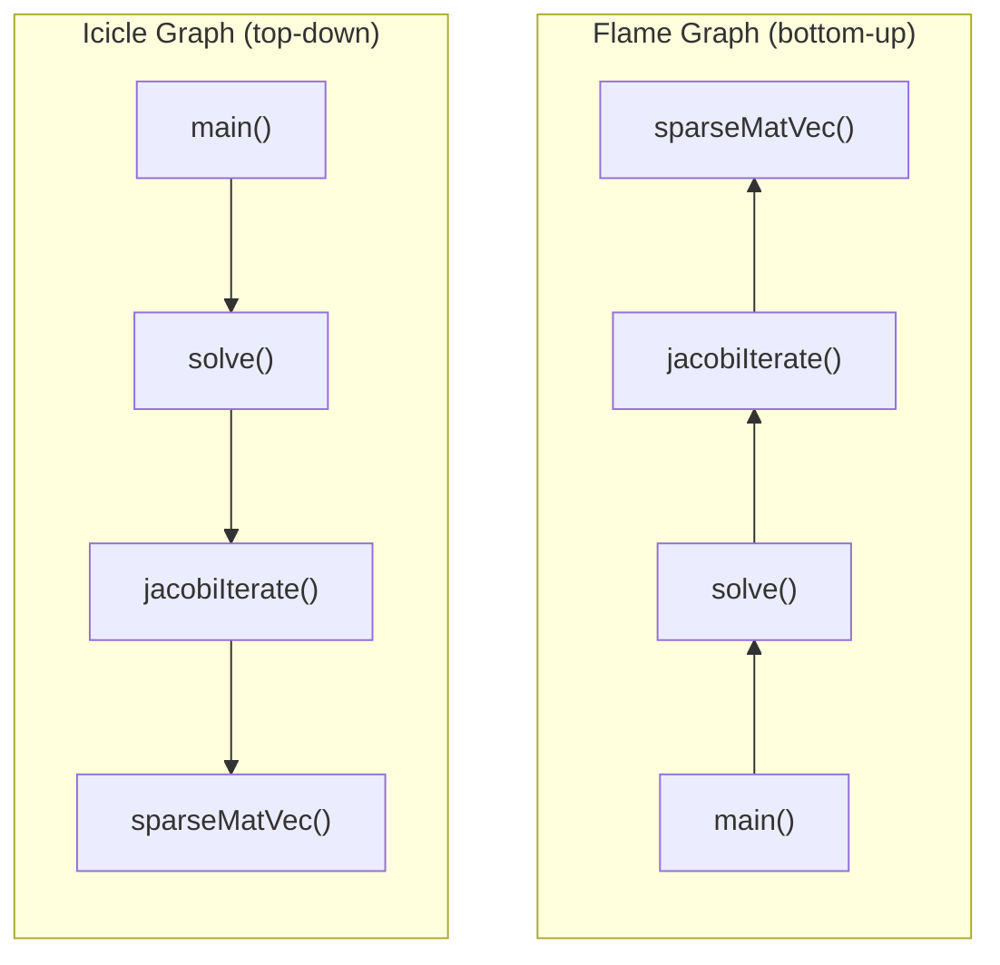

# Day 44: Flame Graphs — Visualizing Hot Paths in a CFD Solver

**Phase:** 4 — Performance Optimization (Days 43–56)
**Previous:** Day 43 — Profiling Basics: `perf`, `gprof`, `callgrind`
**Next:** Day 45 — Cache Analysis: `cachegrind`, Understanding L1/L2/L3 Misses

> **Today's goal:** Generate and interpret flame graphs from profiling data. Understand how call-stack depth maps to visual width, compare flame graphs across mesh sizes, and identify the scaling bottleneck in a solver.

---

## Part 1: Pattern Identification

### Why Flame Graphs?

On Day 43, `perf report` gave us a flat list of hot functions. But a flat list doesn't answer the most important question: **who called the hot function?**

Consider this profile output:

```text
  45%  sparseMatVec
  25%  dotProduct
  20%  preconditioner
  10%  other
```

You know `sparseMatVec` is hot. But is it called from:
- The main solver loop? (optimize the SpMV itself)
- The preconditioner? (optimize the preconditioning strategy)
- The residual computation? (maybe compute the residual less often)

A flame graph answers this instantly with a visual stack trace.

### Anatomy of a Flame Graph

```text
┌────────────────────────────────────────────────────────────────┐
│                          main()                                │  ← bottom: entry point
├────────────────────────────────────────┬───────────────────────┤
│            solve()                     │     assembleMatrix()  │
├─────────────────┬──────────────────────┤                       │
│  jacobiIterate()│  computeResidual()   │                       │
├──────┬──────────┼──────┬───────────────┤                       │
│SpMV()│dotProd() │SpMV()│  l2Norm()     │                       │
└──────┴──────────┴──────┴───────────────┴───────────────────────┘

  ◄──── WIDTH = time spent ────►
  ▲ HEIGHT = call stack depth
```

| Visual Element | Meaning |
|----------------|---------|
| **Width** of a box | Time spent in that function (including callees) |
| **Height** of the stack | Call depth (deeper = more nested calls) |
| **Color** | Random or category-based (not meaningful by default) |
| **Box at the top** | A leaf function — actually executing instructions |
| **Wide flat top** | A hot leaf function — optimize this |

**Key insight:** The widest boxes at the **top** of the flame graph are the actual CPU consumers. Wide boxes at the bottom just mean the function is a common ancestor (like `main()`).

### Flame Graph vs. Icicle Graph



| Type | Root Position | Reading Direction | Typical Tool |
|------|--------------|-------------------|--------------|
| **Flame graph** | Bottom | Bottom → Top (callers → callees) | FlameGraph, speedscope |
| **Icicle graph** | Top | Top → Bottom (entry → leaf) | Chrome DevTools, perfetto |

Brendan Gregg's original flame graphs use the bottom-up convention. Both representations contain the same information — choose whichever is more intuitive for you.

### The Three Types of Flame Graphs

| Type | What It Profiles | When to Use |
|------|-----------------|-------------|
| **CPU flame graph** | On-CPU time (where cycles are spent) | Default — identifies compute hotspots |
| **Off-CPU flame graph** | Blocking time (I/O, locks, sleep) | Diagnosing latency, I/O bottlenecks |
| **Memory flame graph** | Allocation stacks | Finding memory-heavy call paths |

For CFD, **CPU flame graphs** are almost always what you want. Off-CPU is useful when I/O dominates (large mesh output).

---

## Part 2: Source Code Deep Dive

### Generating Flame Graphs from `perf` Data

The standard workflow uses Brendan Gregg's [FlameGraph tools](https://github.com/brendangregg/FlameGraph):

```bash
# Step 1: Clone the FlameGraph repository
git clone https://github.com/brendangregg/FlameGraph.git

# Step 2: Record profile with perf (with call graph)
perf record -g --call-graph dwarf ./my_solver

# Step 3: Convert perf data to folded stacks
perf script | FlameGraph/stackcollapse-perf.pl > folded.txt

# Step 4: Generate the SVG flame graph
FlameGraph/flamegraph.pl folded.txt > flamegraph.svg

# Step 5: Open in a browser (interactive — click to zoom)
open flamegraph.svg  # macOS
xdg-open flamegraph.svg  # Linux
```

#### The Folded Stack Format

The intermediate `folded.txt` file looks like:

```text
main;solve;jacobiIterate;sparseMatVec 450
main;solve;jacobiIterate;dotProduct 120
main;solve;computeResidual;sparseMatVec 200
main;solve;computeResidual;l2Norm;dotProduct 80
main;assembleMatrix 100
main;assembleMatrix;addBoundaryContrib 50
```

Each line is a semicolon-separated call stack followed by a sample count. The `flamegraph.pl` script reads this format and produces the SVG.

> **⭐ Important:** The call stack order is bottom-to-top: `main` is the deepest frame (entry point), and the last function before the count is the leaf (where the CPU was actually executing).

### Alternative: `speedscope` (Web-Based)

For macOS users or those who prefer a web UI:

```bash
# Install speedscope
npm install -g speedscope

# Convert perf data to speedscope format
perf script > perf_output.txt

# Open in speedscope (launches web browser)
speedscope perf_output.txt
```

`speedscope` provides interactive zoom, search, and both flame graph and icicle views.

### Alternative: `callgrind` + KCachegrind

For callgrind data (from Day 43):

```bash
# Run under callgrind
valgrind --tool=callgrind --callgrind-out-file=callgrind.out ./my_solver

# Open with KCachegrind (has built-in call graph visualization)
kcachegrind callgrind.out  # Linux
qcachegrind callgrind.out  # macOS
```

KCachegrind provides a treemap view that is similar to a flame graph but uses rectangles proportional to cost.

### Reading Real Flame Graph Patterns

#### Pattern 1: Single Dominant Hotspot

```text
┌──────────────────────────────────────────────────────────────────────┐
│                              main()                                  │
├──────────────────────────────────────────────────────┬───────────────┤
│                    solve() [90%]                     │  setup() [10%]│
├──────────────────────────────────────────────────────┤               │
│              jacobiIterate() [90%]                   │               │
├──────────────────────────────────────────────────────┤               │
│              sparseMatVec() [85%]                    │               │
└──────────────────────────────────────────────────────┴───────────────┘
```

**Diagnosis:** One function dominates. Optimize `sparseMatVec` — even a 10% improvement yields 8.5% total speedup.

#### Pattern 2: Distributed Cost

```text
┌──────────────────────────────────────────────────────────────────────┐
│                              main()                                  │
├─────────────────┬──────────────────┬──────────────────┬──────────────┤
│  solve() [30%]  │ assemble() [25%] │ gradient() [25%] │ IO() [20%]   │
├───────┬─────────┼──────────────────┼──────────────────┤              │
│SpMV() │dotPrd() │ faceLoop()       │ faceInterp()     │              │
└───────┴─────────┴──────────────────┴──────────────────┴──────────────┘
```

**Diagnosis:** Cost is spread across multiple subsystems. No single optimization gives a large speedup. Consider algorithmic changes (reduce the number of operations) rather than micro-optimization of any one path.

#### Pattern 3: Deep Call Stack

```text
┌──────────────────────────────────────────────────────────────────────┐
│                              main()                                  │
├──────────────────────────────────────────────────────────────────────┤
│                          runTimeLoop()                               │
├──────────────────────────────────────────────────────────────────────┤
│                       solve()                                        │
├──────────────────────────────────────────────────────────────────────┤
│                    iterativeSolver()                                  │
├──────────────────────────────────────────────────────────────────────┤
│                 preconditionedCG()                                    │
├──────────────────────────────────────────────────────────────────────┤
│               matrixVecProduct()                                     │
├──────────────────────────────────────────────────────────────────────┤
│           lduMatrix::Amul()                                          │
├──────────────────────────────────────────────────────────────────────┤
│        scalarField::operator+=()                                     │
└──────────────────────────────────────────────────────────────────────┘
```

**Diagnosis:** Deep call stack but uniformly wide — every function has the same width, meaning the leaf function dominates entirely. The intermediate layers are just dispatch overhead. Consider inlining or flattening the call chain if dispatch cost is significant. In this case, it's `scalarField::operator+=()` that's hot.

---

## Part 3: C++ Mechanics Explained

### Call Graph Recording Methods

When `perf record -g` is used, `perf` needs to capture not just the instruction pointer but the entire call stack at each sample. There are three methods:

| Method | Flag | How It Works | Pros | Cons |
|--------|------|-------------|------|------|
| **Frame pointer** | `--call-graph fp` | Walks the stack using `rbp` register | Very fast | Requires `-fno-omit-frame-pointer` |
| **DWARF** | `--call-graph dwarf` | Uses debug info to unwind stack | Works with any binary | Larger data files |
| **Last Branch Record** | `--call-graph lbr` | Uses CPU LBR hardware | Zero overhead | Limited stack depth (~16 frames) |

```bash
# Frame pointer method (fastest, requires compile flag)
g++ -O2 -g -fno-omit-frame-pointer program.cpp -o program
perf record -g --call-graph fp ./program

# DWARF method (most reliable)
g++ -O2 -g program.cpp -o program
perf record -g --call-graph dwarf ./program

# LBR method (hardware-assisted, Intel only)
perf record -g --call-graph lbr ./program
```

> **⭐ Recommendation:** Use `--call-graph dwarf` for general profiling. Use `fp` if data size is a concern and you can compile with `-fno-omit-frame-pointer`.

### Amdahl's Law and Flame Graph Interpretation

Amdahl's Law relates the speedup of a program to the fraction of time spent in the optimized portion:

$$
S = \frac{1}{(1 - f) + \frac{f}{s}}
$$

where:
- $S$ = overall speedup
- $f$ = fraction of runtime in the optimized portion
- $s$ = speedup of the optimized portion

| Fraction $f$ (from flame graph width) | Local Speedup $s$ | Overall Speedup $S$ |
|---------------------------------------|-------------------|---------------------|
| 50% | 2× | 1.33× |
| 50% | ∞ (eliminated) | 2.0× |
| 80% | 2× | 1.67× |
| 80% | 10× | 4.17× |
| 80% | ∞ | 5.0× |
| 5% | ∞ | 1.05× |

**Flame graph insight:** If a function is only 5% wide in the flame graph, even eliminating it entirely gives only 5% speedup. The flame graph's width directly shows you the maximum possible benefit of optimizing each component.

### Differential Flame Graphs

When comparing two implementations (before/after optimization, or small vs large mesh), differential flame graphs highlight the changes:

```bash
# Record before optimization
perf record -g -o perf_before.data ./solver_v1

# Record after optimization
perf record -g -o perf_after.data ./solver_v2

# Generate folded stacks for each
perf script -i perf_before.data | stackcollapse-perf.pl > before.folded
perf script -i perf_after.data | stackcollapse-perf.pl > after.folded

# Generate differential flame graph
difffolded.pl before.folded after.folded | flamegraph.pl > diff.svg
```

In the differential flame graph:
- **Red** = functions that got slower (more samples in "after")
- **Blue** = functions that got faster (fewer samples in "after")
- **White/gray** = unchanged

This is invaluable for validating that your optimization actually worked where you expected, and didn't accidentally regress other functions.

### Scaling Analysis with Flame Graphs

Running the same solver on different mesh sizes reveals **scaling bottlenecks**:

```text
1K cells:   solve()  ████████░░░░░░░░  50%    IO()  ████████░░░░░░░░  50%
10K cells:  solve()  ████████████░░░░  75%    IO()  ████░░░░░░░░░░░░  25%
100K cells: solve()  ████████████████  95%    IO()  █░░░░░░░░░░░░░░░   5%
```

**Interpretation:**
- At 1K cells, I/O is 50% of runtime — the solve is too fast for the overhead to be hidden
- At 100K cells, the solver dominates — I/O is negligible
- The solver scales as $O(N)$ or $O(N \log N)$ while I/O scales as $O(N)$ with a smaller constant

**Conclusion:** For production-size meshes, focus on solver optimization. For small test cases, I/O overhead may dominate your profiles — this is why you should profile at production scale.

---

## Part 4: Implementation Exercise

### Building a Flame Graph Generator

We'll build a program that generates synthetic profiling data and converts it to the folded stack format for flame graph generation.

```cpp
// File: flame_demo.cpp
// Compile: g++ -std=c++17 -O2 -g -fno-omit-frame-pointer -o flame_demo flame_demo.cpp
// Record:  perf record -g --call-graph dwarf ./flame_demo
// Convert: perf script | stackcollapse-perf.pl | flamegraph.pl > flame.svg

#include <iostream>
#include <vector>
#include <cmath>
#include <chrono>
#include <numeric>
#include <random>
#include <string>
#include <iomanip>

// ============================================================
// Utility: prevent dead code elimination
// ============================================================

volatile double sink = 0;

void consumeResult(double val)
{
    sink = val;
}

// ============================================================
// SECTION 1: Matrix operations (solver subsystem)
// These will appear as the widest boxes in the flame graph.
// ============================================================

// Simulates sparse matrix-vector multiply
void sparseMatVec(const std::vector<double>& values,
                  const std::vector<int>& colIdx,
                  const std::vector<int>& rowPtr,
                  const std::vector<double>& x,
                  std::vector<double>& y,
                  int N)
{
    for (int i = 0; i < N; ++i)
    {
        double sum = 0.0;
        for (int j = rowPtr[i]; j < rowPtr[i + 1]; ++j)
            sum += values[j] * x[colIdx[j]];
        y[i] = sum;
    }
}

// Dot product for convergence checking
double dotProduct(const std::vector<double>& a,
                  const std::vector<double>& b, int N)
{
    double sum = 0.0;
    for (int i = 0; i < N; ++i)
        sum += a[i] * b[i];
    return sum;
}

// AXPY: y = a*x + y (common BLAS operation)
void axpy(double alpha, const std::vector<double>& x,
          std::vector<double>& y, int N)
{
    for (int i = 0; i < N; ++i)
        y[i] += alpha * x[i];
}

// ============================================================
// SECTION 2: Solver (calls matrix operations)
// ============================================================

void conjugateGradient(
    const std::vector<double>& values,
    const std::vector<int>& colIdx,
    const std::vector<int>& rowPtr,
    const std::vector<double>& b,
    std::vector<double>& x,
    int N, int maxIter, double tol)
{
    std::vector<double> r(N), p(N), Ap(N);

    // r = b - A*x
    sparseMatVec(values, colIdx, rowPtr, x, Ap, N);
    for (int i = 0; i < N; ++i)
        r[i] = b[i] - Ap[i];

    std::copy(r.begin(), r.end(), p.begin());
    double rsOld = dotProduct(r, r, N);

    for (int iter = 0; iter < maxIter; ++iter)
    {
        // Ap = A * p
        sparseMatVec(values, colIdx, rowPtr, p, Ap, N);

        // alpha = rsOld / (p . Ap)
        double pAp = dotProduct(p, Ap, N);
        double alpha = rsOld / pAp;

        // x = x + alpha * p
        axpy(alpha, p, x, N);

        // r = r - alpha * Ap
        axpy(-alpha, Ap, r, N);

        // rsNew = r . r
        double rsNew = dotProduct(r, r, N);

        if (std::sqrt(rsNew) < tol)
        {
            std::cout << "  CG converged in " << iter + 1 << " iterations\n";
            return;
        }

        // p = r + (rsNew/rsOld) * p
        double beta = rsNew / rsOld;
        for (int i = 0; i < N; ++i)
            p[i] = r[i] + beta * p[i];

        rsOld = rsNew;
    }
    std::cout << "  CG did not converge\n";
}

// ============================================================
// SECTION 3: Assembly (matrix setup)
// ============================================================

void assembleTridiagonal(
    std::vector<double>& values,
    std::vector<int>& colIdx,
    std::vector<int>& rowPtr,
    int N)
{
    rowPtr.resize(N + 1);
    values.clear();
    colIdx.clear();

    int nnz = 0;
    for (int i = 0; i < N; ++i)
    {
        rowPtr[i] = nnz;
        if (i > 0)     { colIdx.push_back(i-1); values.push_back(-1.0); ++nnz; }
                         colIdx.push_back(i);   values.push_back(2.0);  ++nnz;
        if (i < N - 1) { colIdx.push_back(i+1); values.push_back(-1.0); ++nnz; }
    }
    rowPtr[N] = nnz;
}

// ============================================================
// SECTION 4: I/O simulation (writes field to stdout)
// ============================================================

void writeField(const std::vector<double>& field, int N,
                const std::string& name)
{
    // Simulate I/O by computing statistics (avoids actual file I/O)
    double minVal = *std::min_element(field.begin(), field.end());
    double maxVal = *std::max_element(field.begin(), field.end());
    double avgVal = std::accumulate(field.begin(), field.end(), 0.0) / N;

    std::cout << "  " << std::setw(12) << name
              << ": min=" << std::fixed << std::setprecision(4) << minVal
              << " max=" << maxVal
              << " avg=" << avgVal << "\n";
}

// ============================================================
// SECTION 5: Gradient computation
// ============================================================

void computeGradient(const std::vector<double>& field,
                     std::vector<double>& grad, int N, double dx)
{
    // Central differences for interior, one-sided at boundaries
    grad[0] = (field[1] - field[0]) / dx;
    for (int i = 1; i < N - 1; ++i)
        grad[i] = (field[i+1] - field[i-1]) / (2.0 * dx);
    grad[N-1] = (field[N-1] - field[N-2]) / dx;
}

// ============================================================
// SECTION 6: Main — full solver simulation
// ============================================================

int main()
{
    const int N = 50000;
    const int TIME_STEPS = 5;
    const double dx = 1.0 / N;

    std::cout << "=== Flame Graph Demo: Mini CFD Solver ===\n";
    std::cout << "Mesh size: " << N << " cells\n";
    std::cout << "Time steps: " << TIME_STEPS << "\n\n";

    // Assembly phase
    std::vector<double> values;
    std::vector<int> colIdx, rowPtr;
    {
        std::cout << "Phase: Assembly\n";
        assembleTridiagonal(values, colIdx, rowPtr, N);
        std::cout << "  Matrix: " << N << "x" << N
                  << ", nnz=" << values.size() << "\n";
    }

    // Initialize fields
    std::vector<double> T(N, 0.0);     // temperature
    std::vector<double> b(N, 0.0);     // RHS
    std::vector<double> grad(N, 0.0);  // gradient

    // Set boundary conditions
    T[0] = 1.0;
    T[N-1] = 0.0;

    // Time stepping
    for (int step = 0; step < TIME_STEPS; ++step)
    {
        std::cout << "\n--- Time step " << step + 1 << " ---\n";

        // Assemble RHS
        for (int i = 0; i < N; ++i)
            b[i] = T[i] + 0.001 * std::sin(i * dx * 3.14159);

        // Solve
        std::cout << "Phase: Solve\n";
        conjugateGradient(values, colIdx, rowPtr, b, T, N, 1000, 1e-8);

        // Post-processing
        std::cout << "Phase: Post-processing\n";
        computeGradient(T, grad, N, dx);
        writeField(T, N, "temperature");
        writeField(grad, N, "gradient");
    }

    std::cout << "\n=== Done. Generate flame graph with: ===\n";
    std::cout << "perf record -g --call-graph dwarf ./flame_demo\n";
    std::cout << "perf script | stackcollapse-perf.pl | flamegraph.pl > flame.svg\n";

    return 0;
}
```

### Generating and Viewing the Flame Graph

```bash
# Compile
g++ -std=c++17 -O2 -g -fno-omit-frame-pointer -o flame_demo flame_demo.cpp

# Record profile
perf record -g --call-graph dwarf ./flame_demo

# Generate flame graph
perf script | stackcollapse-perf.pl | flamegraph.pl > flame.svg

# Open (interactive SVG — click to zoom)
open flame.svg
```

### Expected Flame Graph Structure

The generated flame graph should show:

1. **`main()` at the bottom** — spans the full width
2. **`conjugateGradient()`** — the widest child (~80% of total)
3. Inside CG: **`sparseMatVec()`** (~50% of total) and **`dotProduct()`** (~20%)
4. **`computeGradient()`** — a narrow box (~5%)
5. **`writeField()`** — another narrow box (~5%)
6. **`assembleTridiagonal()`** — barely visible (one-time cost)

### Synthetic Flame Graph Generation

If you don't have `perf` (e.g., on macOS), you can generate a synthetic folded stack file:

```cpp
// File: gen_folded.cpp
// Compile: g++ -std=c++17 -o gen_folded gen_folded.cpp
// Run:     ./gen_folded > folded.txt
// Then:    flamegraph.pl folded.txt > flame.svg

#include <iostream>

int main()
{
    // Synthetic profile data (manually constructed)
    // Format: stack;frame1;frame2;...;leaf count

    // Solver path (dominant)
    std::cout << "main;timeLoop;solve;conjugateGradient;sparseMatVec 450\n";
    std::cout << "main;timeLoop;solve;conjugateGradient;dotProduct 200\n";
    std::cout << "main;timeLoop;solve;conjugateGradient;axpy 80\n";
    std::cout << "main;timeLoop;solve;conjugateGradient;vectorCopy 30\n";

    // Residual computation path
    std::cout << "main;timeLoop;computeResidual;sparseMatVec 100\n";
    std::cout << "main;timeLoop;computeResidual;l2Norm;dotProduct 50\n";

    // Post-processing path
    std::cout << "main;timeLoop;postProcess;computeGradient 30\n";
    std::cout << "main;timeLoop;postProcess;writeField 20\n";

    // Setup (one-time cost)
    std::cout << "main;setupMesh 15\n";
    std::cout << "main;assembleMatrix 25\n";

    return 0;
}
```

---

## Part 5: Exercises

### Exercise 1: Reading Folded Stacks

**Question:** Given this folded stack data, determine:
1. What percentage of total time is in `sparseMatVec`?
2. From which caller does `sparseMatVec` consume more time?

```text
main;solve;CG;sparseMatVec 300
main;solve;CG;dotProduct 150
main;solve;residual;sparseMatVec 100
main;solve;residual;l2Norm 50
main;IO;writeField 50
main;setup 50
```

**Solution:**

1. Total samples: 300 + 150 + 100 + 50 + 50 + 50 = 700
   - `sparseMatVec` total: 300 (from CG) + 100 (from residual) = 400
   - Percentage: 400/700 = **57.1%**

2. From CG: 300 samples (75% of SpMV time). From residual: 100 samples (25%).
   - **CG is the dominant caller.** Optimizing SpMV in the CG path has 3× more impact.

---

### Exercise 2: Amdahl's Law Application

**Question:** Your flame graph shows `sparseMatVec` is 60% of total runtime. You plan to SIMD-vectorize it, expecting 3× speedup for that function. What is the expected overall speedup? Is it worth the effort?

**Solution:**

Using Amdahl's Law: $S = \frac{1}{(1 - 0.6) + \frac{0.6}{3}} = \frac{1}{0.4 + 0.2} = \frac{1}{0.6} = 1.67\times$

Overall speedup: **1.67×** (from 10 minutes to ~6 minutes)

Is it worth it? **Yes.** A 1.67× speedup on a function that's straightforward to vectorize (regular loop over arrays) is an excellent return on investment. The 3× local speedup is achievable with SSE/AVX as we'll see on Day 46.

---

### Exercise 3: Scaling Bottleneck Identification

**Question:** You generate flame graphs for three mesh sizes:

| Mesh Size | `solve()` | `assemble()` | `IO()` |
|-----------|-----------|---------------|--------|
| 1K cells | 40% | 10% | 50% |
| 10K cells | 70% | 5% | 25% |
| 100K cells | 90% | 2% | 8% |

Which component scales worst? What does this tell you about optimization priorities?

**Solution:**

`IO()` scales worst relative to the solve. At 1K cells, I/O is 50% of runtime, but the solve is only 40%. This means for very small meshes, the program is **I/O-bound**.

However, `solve()` grows from 40% to 90% — it becomes the dominant bottleneck at production scale. This means:
- **For production:** Optimize the solver (SpMV, preconditioner, convergence rate)
- **For testing/development:** Optimize I/O if you run many small cases quickly

**Key insight:** Always profile at **production-representative** mesh sizes. Profiling at 1K cells would mislead you into optimizing I/O, which is irrelevant at 100K cells.

---

### Exercise 4: Differential Flame Graph Analysis

**Question:** You optimized `sparseMatVec` and generated a differential flame graph. It shows `sparseMatVec` in blue (faster) but `dotProduct` in red (slower). The overall runtime decreased. Explain what likely happened.

**Solution:**

The optimization likely changed the data layout or access pattern in `sparseMatVec`. For example:
- You might have transposed the matrix storage to improve cache locality for SpMV
- This new layout is excellent for SpMV but slightly worse for the dot product's access pattern
- Or: the SpMV optimization increased its throughput, meaning the solver does more iterations per second, and `dotProduct` is now a larger fraction of the remaining time (its **absolute** time may be unchanged)

The second explanation is more common: when you speed up one function, the **relative** cost of other functions increases. This is not regression — it's the natural consequence of Amdahl's Law. The key metric is **overall runtime**, which decreased.

**Lesson:** Always look at absolute times, not just percentages. A function's percentage can increase even as its absolute time stays constant, simply because everything else got faster.

---

### Exercise 5: Flame Graph Tooling

**Question:** You're on macOS and don't have `perf`. Design an alternative approach to generate a flame graph for a C++ program using tools available on macOS.

**Solution:**

**Option A: Using `dtrace` + FlameGraph tools:**

```bash
# Sample the program at 997 Hz
sudo dtrace -x ustackframes=100 -n 'profile-997 /pid == $target/ { @[ustack()] = count(); }' \
    -c './my_solver' -o dtrace_stacks.txt

# Convert to folded format
FlameGraph/stackcollapse.pl dtrace_stacks.txt > folded.txt

# Generate flame graph
FlameGraph/flamegraph.pl folded.txt > flame.svg
```

**Option B: Using `Instruments` (Apple's profiler):**

1. Open Instruments → Choose "Time Profiler" template
2. Set target to `./my_solver`
3. Record the run
4. Export the trace (`File → Export Trace...`)
5. Use `instruments2calltree.py` or similar converter to get folded stacks

**Option C: Using `samply` (modern Rust-based profiler):**

```bash
# Install samply
cargo install samply

# Profile and open in web viewer (uses Firefox profiler UI)
samply record ./my_solver
```

**Option D: Manual instrumentation (always works):**

Use the `ScopedTimer` class from Day 43 Exercise 4. While this doesn't give a true flame graph, it provides function-level timing that you can manually plot.

**Recommendation:** `samply` is the most practical option — it's cross-platform, requires no special compilation flags, and opens an interactive web-based flame graph automatically.

---

## Summary

**⭐ Key Takeaways:**

1. **Flame graphs visualize call stacks** — width = time, top = leaf function (actual CPU consumer)
2. **Wide flat tops** are the optimization targets — they're where the CPU actually spends time
3. **Amdahl's Law** limits the benefit of optimizing any single function: $S = \frac{1}{(1-f) + f/s}$
4. **Differential flame graphs** compare before/after — red = slower, blue = faster
5. **Profile at production scale** — small-mesh profiles may be dominated by I/O or setup
6. **Multiple generation methods**: `perf` → `stackcollapse-perf.pl` → `flamegraph.pl`, or use `speedscope`/`samply`

**Next:** Day 45 dives into **cache analysis** with `cachegrind` — understanding L1/L2/L3 misses and how they dominate performance in memory-bound CFD codes.

---

**Sources:**
- [Brendan Gregg — Flame Graphs](https://www.brendangregg.com/flamegraphs.html)
- [FlameGraph GitHub Repository](https://github.com/brendangregg/FlameGraph)
- [speedscope](https://www.speedscope.app/)
- [samply](https://github.com/mstange/samply)

**Deliverable:** Flame graph visualization from profiling data, hotspot identification, and Amdahl's Law analysis for optimization targets.
