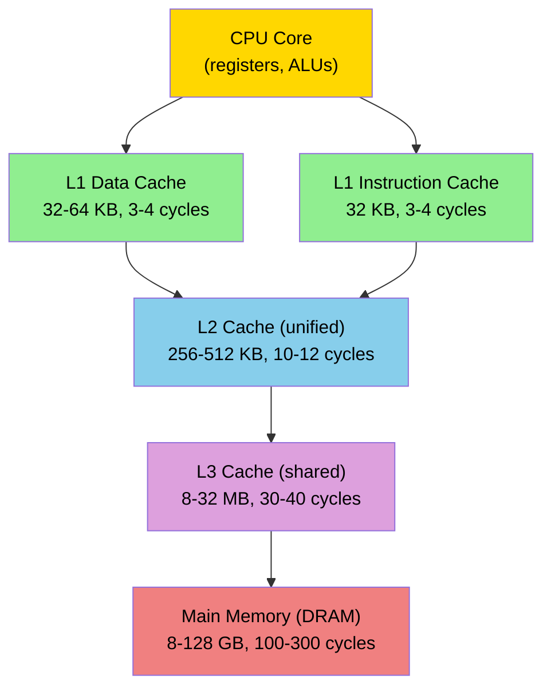

# Day 45: Cache Analysis — `cachegrind`, Understanding L1/L2/L3 Misses

**Phase:** 4 — Performance Optimization (Days 43–56)
**Previous:** Day 44 — Flame Graphs: Visualizing Hot Paths in a CFD Solver
**Next:** Day 46 — SIMD Fundamentals: SSE/AVX and Field Arithmetic

> **Today's goal:** Understand the CPU cache hierarchy, measure cache miss rates with `cachegrind`, calculate theoretical miss rates for different access patterns, and demonstrate the performance impact of cache-friendly vs cache-hostile code.

---

## Part 1: Pattern Identification

### The Memory Wall

The gap between CPU speed and memory speed is the fundamental performance bottleneck in modern computing:

| Component | Latency (cycles) | Bandwidth | Size |
|-----------|------------------|-----------|------|
| Register | 0 | — | ~1 KB |
| L1 cache | 3–4 | ~500 GB/s | 32–64 KB |
| L2 cache | 10–12 | ~200 GB/s | 256–512 KB |
| L3 cache | 30–40 | ~100 GB/s | 8–32 MB |
| Main memory (DRAM) | 100–300 | ~50 GB/s | 8–128 GB |
| SSD | 10,000–100,000 | ~3 GB/s | 256 GB–2 TB |

The CPU can execute 4+ floating-point operations per cycle, but a cache miss to main memory stalls the pipeline for 100–300 cycles. During that time, the CPU sits idle.

> **⭐ Key Fact:** A single L1 cache miss costs as much as 25–75 floating-point multiplications. For memory-bound code (like sparse matrix operations), **cache optimization gives more speedup than algorithmic micro-optimization**.

### The Cache Hierarchy



**Key properties:**

- **Inclusive vs exclusive:** Most modern x86 CPUs use inclusive L3 (data in L1 is also in L3) or NINE (non-inclusive, non-exclusive) policies.
- **Cache line size:** 64 bytes on all modern x86 CPUs. This is the **minimum unit of transfer** between cache levels.
- **Associativity:** L1 is typically 8-way set-associative, L2 is 4–8-way, L3 is 12–16-way.

### Cache Lines: The Unit of Memory Transfer

```text
Memory address: 0x00007F8B4C200080
Cache line:     0x00007F8B4C200040 to 0x00007F8B4C20007F  (64 bytes)

If you access ONE byte at 0x80, the CPU loads the ENTIRE 64-byte line.
This means the next 7 doubles (56 bytes) are "free" if accessed soon.
```

| Data Type | Bytes | Items per Cache Line |
|-----------|-------|---------------------|
| `double` | 8 | 8 |
| `float` | 4 | 16 |
| `int` | 4 | 16 |
| `int64_t` | 8 | 8 |
| `std::complex<double>` | 16 | 4 |

**Spatial locality:** Accessing consecutive array elements is fast because one cache line prefetch loads 8 doubles at once.

**Temporal locality:** Accessing the same data repeatedly is fast because it stays in cache.

---

## Part 2: Source Code Deep Dive

### Using `cachegrind`

`cachegrind` is a Valgrind tool that simulates the CPU cache hierarchy and reports exact hit/miss counts.

```bash
# Run under cachegrind
valgrind --tool=cachegrind ./my_program

# Output: cachegrind.out.<pid>
# Report:
cg_annotate cachegrind.out.<pid>
```

#### Understanding the cachegrind Output

```text
==12345== Cachegrind, a cache and branch-prediction profiler
==12345== Copyright (C) 2002-2017
==12345==
==12345== I   refs:      4,200,000,000
==12345== I1  misses:          120,000
==12345== LLi misses:           15,000
==12345== I1  miss rate:          0.00%
==12345== LLi miss rate:          0.00%
==12345==
==12345== D   refs:      1,800,000,000  (1,200,000,000 rd   + 600,000,000 wr)
==12345== D1  misses:       45,000,000  (   40,000,000 rd   +   5,000,000 wr)
==12345== LLd misses:        3,200,000  (    2,800,000 rd   +     400,000 wr)
==12345== D1  miss rate:           2.5% (          3.3% rd   +        0.8% wr)
==12345== LLd miss rate:           0.2% (          0.2% rd   +        0.1% wr)
```

| Key Metric | What It Means |
|-----------|---------------|
| `I refs` | Total instruction fetches |
| `D refs` | Total data reads + writes |
| `D1 misses` | L1 data cache misses |
| `LLd misses` | Last-level (L3) data cache misses → these go to DRAM |
| `D1 miss rate` | Fraction of data accesses that miss L1 |
| `LLd miss rate` | Fraction of data accesses that miss ALL caches |

**The critical number is `LLd miss rate`** — these are the accesses that go all the way to main memory. Each one costs 100–300 cycles.

#### Source-Line Annotation

```bash
cg_annotate --auto=yes cachegrind.out.<pid>
```

This shows per-line hit/miss counts:

```text
        Ir     I1mr  ILmr     Dr      D1mr    DLmr     Dw    D1mw  DLmw
         .       .     .       .         .       .       .       .     .  void sparseMatVec(...)
         .       .     .       .         .       .       .       .     .  {
   100,000       0     0  50,000         0       0  50,000       0     0      for (int i = 0; i < N; ++i)
         .       .     .       .         .       .       .       .     .      {
   500,000       0     0       .         .       .       .       .     .          double sum = 0;
 1,500,000       0     0 500,000   125,000  25,000       .       .     .          for (int j = rowPtr[i]; ...)
 2,000,000       0     0 500,000    62,500  12,500 500,000  62,500  12,500            sum += val[j]*x[col[j]];
         .       .     .       .         .       .       .       .     .          }
   100,000       0     0       .         .       .  50,000       0     0          y[i] = sum;
```

**Reading the table:**
- `Dr` = data reads, `D1mr` = L1 data read misses, `DLmr` = last-level read misses
- Line `sum += val[j]*x[col[j]]` has 62,500 L1 misses and 12,500 LL misses
- The indirect access `x[col[j]]` causes most misses — `col[j]` provides a random index into `x`

### Configuring cachegrind

```bash
# Simulate a specific cache configuration
valgrind --tool=cachegrind \
    --D1=32768,8,64 \     # L1 data: 32KB, 8-way, 64-byte lines
    --LL=8388608,16,64 \  # Last-level: 8MB, 16-way, 64-byte lines
    ./my_program
```

Format: `--D1=size,associativity,line_size` (all in bytes)

This is useful for:
- Simulating target hardware that differs from your development machine
- Understanding how cache size affects miss rates
- Predicting performance on embedded systems with smaller caches

---

## Part 3: C++ Mechanics Explained

### Sequential vs Random Access Patterns

The most important factor in cache performance is the **access pattern**:

```cpp
// GOOD: Sequential access (spatial locality)
// Each cache line (64 bytes = 8 doubles) is fully utilized
for (int i = 0; i < N; ++i)
    sum += data[i];  // Accesses: data[0], data[1], ..., data[N-1]
// Miss rate: 1/8 = 12.5% (one miss per cache line, 8 doubles per line)

// BAD: Strided access (wastes cache lines)
for (int i = 0; i < N; i += STRIDE)
    sum += data[i];  // Accesses: data[0], data[8], data[16], ...
// Miss rate with STRIDE=8: 100% (every access is a new cache line)

// WORST: Random access (no locality)
for (int i = 0; i < N; ++i)
    sum += data[randIdx[i]];  // Random indices
// Miss rate: ~100% for large arrays (every access misses L1)
```

| Access Pattern | L1 Miss Rate | LL Miss Rate (if array > L3) | Effective Bandwidth |
|---------------|-------------|------------------------------|---------------------|
| Sequential | 12.5% | <1% (prefetcher helps) | ~40–50 GB/s |
| Stride-8 | 100% | ~100% | ~5–10 GB/s |
| Random | 100% | ~100% | ~1–3 GB/s |

### Theoretical Cache Miss Calculation

For a sequential scan of $N$ doubles through a cache of size $C$ bytes with line size $L = 64$ bytes:

$$
\text{Compulsory misses} = \frac{N \times 8}{L} = \frac{N}{8}
$$

$$
\text{Miss rate} = \frac{\text{Compulsory misses}}{N} = \frac{1}{8} = 12.5\%
$$

For a **matrix-vector multiply** $y = Ax$ with dense $N \times N$ matrix $A$:

$$
\text{Data accessed} = N^2 \text{ (matrix)} + N \text{ (vector x)} + N \text{ (vector y)}
$$

$$
\text{Total reads} = N^2 + N \times N = 2N^2
$$

For the CSR SpMV inner loop `sum += val[j] * x[col[j]]`:

- `val[j]`: sequential access → 12.5% miss rate
- `col[j]`: sequential access → 12.5% miss rate
- `x[col[j]]`: **indirect** access → miss rate depends on sparsity pattern

If `x` fits in cache ($N \times 8 < C_{\text{L3}}$), the indirect access hits after initial compulsory misses. If `x` doesn't fit, every `x[col[j]]` access may miss L3.

### The Hardware Prefetcher

Modern CPUs have hardware prefetchers that detect sequential access patterns and preload data before it's needed:

```text
Access pattern: data[0], data[1], data[2], ...

CPU detects: stride = +8 bytes (one double)
Prefetcher action: preload data[3], data[4], ... into L1

Result: Most accesses hit L1, even though the data was never explicitly loaded.
```

The prefetcher works well for:
- Sequential access (stride 1)
- Small, regular strides (stride 2, 4)

The prefetcher fails for:
- Random access patterns
- Large strides (>2048 bytes = 256 doubles)
- Irregular strides (data-dependent access patterns)

> **⭐ Key Insight:** Sparse matrix-vector multiply has two access patterns:
> 1. `values[j]` — sequential → prefetcher works well
> 2. `x[colIdx[j]]` — indirect → prefetcher cannot predict → many cache misses

This is why SpMV is almost always **memory-bound**, regardless of the matrix format.

### Row-Major vs Column-Major

```cpp
// C/C++: row-major storage
double A[M][N];
// Memory layout: A[0][0], A[0][1], ..., A[0][N-1], A[1][0], ...

// GOOD: iterate over columns (inner loop) — sequential in memory
for (int i = 0; i < M; ++i)
    for (int j = 0; j < N; ++j)
        sum += A[i][j];  // stride-1 access ✅

// BAD: iterate over rows (inner loop) — stride-N access
for (int j = 0; j < N; ++j)
    for (int i = 0; i < M; ++i)
        sum += A[i][j];  // stride-N access ❌
```

For $N = 1000$ (8 KB per row), the column-first access has a stride of 8000 bytes — every access is a new cache line, and the prefetcher cannot help.

**Performance difference:** 3–10× for large matrices, entirely due to cache behavior.

### Cache Blocking (Tiling)

For operations that access multiple arrays with different patterns, **cache blocking** ensures that the working set fits in cache:

```cpp
// Without blocking: each iteration of i accesses ALL of x
for (int i = 0; i < N; ++i)
    for (int j = 0; j < N; ++j)
        y[i] += A[i][j] * x[j];  // x is scanned N times

// With blocking: x is scanned in cache-sized blocks
const int BLOCK = 256;  // 256 doubles = 2 KB << L1 cache
for (int jj = 0; jj < N; jj += BLOCK)
    for (int i = 0; i < N; ++i)
        for (int j = jj; j < std::min(jj + BLOCK, N); ++j)
            y[i] += A[i][j] * x[j];  // x[jj..jj+BLOCK] fits in L1
```

**Effect:** The block of `x` stays in L1 cache across all iterations of `i`. Total L1 misses for `x` reduce from $N^2/8$ to $N \times \lceil N/\text{BLOCK} \rceil / 8$.

---

## Part 4: Implementation Exercise

### Cache Miss Measurement Program

```cpp
// File: cache_analysis.cpp
// Compile: g++ -std=c++17 -O2 -g -o cache_analysis cache_analysis.cpp
// Profile: valgrind --tool=cachegrind ./cache_analysis

#include <iostream>
#include <vector>
#include <chrono>
#include <random>
#include <numeric>
#include <algorithm>
#include <iomanip>
#include <cmath>

// ============================================================
// Timer utility
// ============================================================

class Timer
{
    using Clock = std::chrono::high_resolution_clock;
    Clock::time_point start_;
    std::string name_;
    int ops_;

public:
    Timer(const std::string& name, int ops)
        : start_(Clock::now()), name_(name), ops_(ops) {}

    ~Timer()
    {
        auto end = Clock::now();
        double ms = std::chrono::duration<double, std::milli>(end - start_).count();
        double mops = ops_ / (ms * 1e3);  // million ops per second
        std::cout << std::setw(35) << std::left << name_
                  << std::setw(10) << std::right << std::fixed
                  << std::setprecision(2) << ms << " ms  "
                  << std::setw(10) << std::setprecision(1) << mops << " MOps/s\n";
    }
};

// ============================================================
// SECTION 1: Sequential access (cache-friendly)
// ============================================================

double sequentialSum(const std::vector<double>& data)
{
    double sum = 0.0;
    for (size_t i = 0; i < data.size(); ++i)
        sum += data[i];
    return sum;
}

// ============================================================
// SECTION 2: Strided access (varying cache efficiency)
// ============================================================

double stridedSum(const std::vector<double>& data, int stride)
{
    double sum = 0.0;
    for (size_t i = 0; i < data.size(); i += stride)
        sum += data[i];
    return sum;
}

// ============================================================
// SECTION 3: Random access (cache-hostile)
// ============================================================

double randomSum(const std::vector<double>& data,
                 const std::vector<int>& indices)
{
    double sum = 0.0;
    for (size_t i = 0; i < indices.size(); ++i)
        sum += data[indices[i]];
    return sum;
}

// ============================================================
// SECTION 4: Matrix access patterns
// ============================================================

// Row-major iteration (cache-friendly for C arrays)
double rowMajorSum(const std::vector<double>& matrix, int rows, int cols)
{
    double sum = 0.0;
    for (int i = 0; i < rows; ++i)
        for (int j = 0; j < cols; ++j)
            sum += matrix[i * cols + j];
    return sum;
}

// Column-major iteration (cache-hostile for C arrays)
double colMajorSum(const std::vector<double>& matrix, int rows, int cols)
{
    double sum = 0.0;
    for (int j = 0; j < cols; ++j)
        for (int i = 0; i < rows; ++i)
            sum += matrix[i * cols + j];
    return sum;
}

// ============================================================
// SECTION 5: Cache blocking demonstration
// ============================================================

// Dense matrix-vector multiply WITHOUT blocking
void denseMatVecNaive(const std::vector<double>& A,
                      const std::vector<double>& x,
                      std::vector<double>& y, int N)
{
    std::fill(y.begin(), y.end(), 0.0);
    for (int i = 0; i < N; ++i)
        for (int j = 0; j < N; ++j)
            y[i] += A[i * N + j] * x[j];
}

// Dense matrix-vector multiply WITH cache blocking
void denseMatVecBlocked(const std::vector<double>& A,
                        const std::vector<double>& x,
                        std::vector<double>& y, int N)
{
    const int BLOCK = 64;  // 64 doubles = 512 bytes, fits in L1

    std::fill(y.begin(), y.end(), 0.0);
    for (int jj = 0; jj < N; jj += BLOCK)
    {
        int jEnd = std::min(jj + BLOCK, N);
        for (int i = 0; i < N; ++i)
            for (int j = jj; j < jEnd; ++j)
                y[i] += A[i * N + j] * x[j];
    }
}

// ============================================================
// SECTION 6: LDU cache behavior analysis
// ============================================================

struct LDUMatrix
{
    std::vector<double> diag, lower, upper;
    std::vector<int> owner, neighbour;
    int nCells, nFaces;
};

LDUMatrix generateLDU1D(int N)
{
    LDUMatrix A;
    A.nCells = N;
    A.nFaces = N - 1;
    A.diag.assign(N, 2.0);
    A.lower.assign(N - 1, -1.0);
    A.upper.assign(N - 1, -1.0);
    A.owner.resize(N - 1);
    A.neighbour.resize(N - 1);
    for (int i = 0; i < N - 1; ++i)
    {
        A.owner[i] = i;
        A.neighbour[i] = i + 1;
    }
    return A;
}

void lduMatVec(const LDUMatrix& A,
               const std::vector<double>& x,
               std::vector<double>& y)
{
    // Pass 1: Diagonal — sequential, cache-friendly
    for (int i = 0; i < A.nCells; ++i)
        y[i] = A.diag[i] * x[i];

    // Pass 2: Lower — indirect access via owner[f]
    for (int f = 0; f < A.nFaces; ++f)
        y[A.owner[f]] += A.lower[f] * x[A.neighbour[f]];

    // Pass 3: Upper — indirect access via neighbour[f]
    for (int f = 0; f < A.nFaces; ++f)
        y[A.neighbour[f]] += A.upper[f] * x[A.owner[f]];
}

// ============================================================
// Main
// ============================================================

int main()
{
    const int N = 1000000;  // 1M elements = 8 MB
    const int M = 1000;     // matrix dimension for dense tests

    std::cout << "=== Cache Analysis Benchmark ===\n";
    std::cout << "Array size: " << N << " doubles = "
              << (N * 8 / 1024 / 1024) << " MB\n";
    std::cout << "Matrix size: " << M << "x" << M << " = "
              << (M * M * 8 / 1024 / 1024) << " MB\n\n";

    // Generate test data
    std::vector<double> data(N);
    std::iota(data.begin(), data.end(), 1.0);

    std::mt19937 rng(42);
    std::vector<int> randIdx(N);
    std::iota(randIdx.begin(), randIdx.end(), 0);
    std::shuffle(randIdx.begin(), randIdx.end(), rng);

    std::vector<double> matrix(M * M);
    std::iota(matrix.begin(), matrix.end(), 1.0);
    std::vector<double> vecX(M, 1.0), vecY(M, 0.0);

    volatile double result = 0;

    // === Test 1: Access pattern comparison ===
    std::cout << "--- Test 1: Access Patterns ---\n";

    { Timer t("Sequential sum", N);       result = sequentialSum(data); }
    { Timer t("Stride-2 sum", N/2);       result = stridedSum(data, 2); }
    { Timer t("Stride-8 sum", N/8);       result = stridedSum(data, 8); }
    { Timer t("Stride-64 sum", N/64);     result = stridedSum(data, 64); }
    { Timer t("Random sum", N);           result = randomSum(data, randIdx); }

    // === Test 2: Matrix access order ===
    std::cout << "\n--- Test 2: Matrix Access Order ---\n";

    { Timer t("Row-major sum", M*M);      result = rowMajorSum(matrix, M, M); }
    { Timer t("Column-major sum", M*M);   result = colMajorSum(matrix, M, M); }

    // === Test 3: Cache blocking ===
    std::cout << "\n--- Test 3: Dense MatVec (Naive vs Blocked) ---\n";

    { Timer t("Dense MatVec (naive)", M*M);
      denseMatVecNaive(matrix, vecX, vecY, M); }
    { Timer t("Dense MatVec (blocked)", M*M);
      denseMatVecBlocked(matrix, vecX, vecY, M); }

    // === Test 4: LDU matrix (face-based access) ===
    std::cout << "\n--- Test 4: LDU MatVec ---\n";

    auto ldu = generateLDU1D(N);
    std::vector<double> x(N, 1.0), y(N, 0.0);

    const int REPEAT = 10;
    { Timer t("LDU MatVec (1D, " + std::to_string(REPEAT) + "x)", N * REPEAT);
      for (int r = 0; r < REPEAT; ++r)
          lduMatVec(ldu, x, y); }

    // === Theoretical analysis ===
    std::cout << "\n--- Theoretical Cache Miss Analysis ---\n";
    int cacheLineSize = 64;
    int doublesPerLine = cacheLineSize / sizeof(double);

    std::cout << "Cache line size: " << cacheLineSize << " bytes\n";
    std::cout << "Doubles per cache line: " << doublesPerLine << "\n";
    std::cout << "Sequential: 1/" << doublesPerLine
              << " = " << std::fixed << std::setprecision(1)
              << (100.0 / doublesPerLine) << "% miss rate\n";
    std::cout << "Stride-8:   1/1 = 100% miss rate\n";
    std::cout << "Array size: " << (N * 8 / 1024) << " KB\n";
    std::cout << "Typical L1: 32 KB, L2: 256 KB, L3: 8 MB\n";
    std::cout << "Array fits in: "
              << (N * 8 <= 32768 ? "L1" :
                  N * 8 <= 262144 ? "L2" :
                  N * 8 <= 8388608 ? "L3" : "DRAM only") << "\n";

    return 0;
}
```

### Expected Output

```text
=== Cache Analysis Benchmark ===
Array size: 1000000 doubles = 7 MB
Matrix size: 1000x1000 = 7 MB

--- Test 1: Access Patterns ---
              Sequential sum            X.XX ms     XXXX.X MOps/s
              Stride-2 sum              X.XX ms     XXXX.X MOps/s
              Stride-8 sum              X.XX ms     XXXX.X MOps/s
              Stride-64 sum             X.XX ms     XXXX.X MOps/s
              Random sum                X.XX ms     XXXX.X MOps/s

--- Test 2: Matrix Access Order ---
              Row-major sum             X.XX ms     XXXX.X MOps/s
              Column-major sum          X.XX ms     XXXX.X MOps/s

--- Test 3: Dense MatVec (Naive vs Blocked) ---
              Dense MatVec (naive)      X.XX ms     XXXX.X MOps/s
              Dense MatVec (blocked)    X.XX ms     XXXX.X MOps/s

--- Test 4: LDU MatVec ---
              LDU MatVec (1D, 10x)      X.XX ms     XXXX.X MOps/s
```

**Key observations:**
- Sequential is ~5–10× faster than random
- Row-major is ~3–5× faster than column-major
- Blocked MatVec is ~1.2–1.5× faster than naive (modest for 1000×1000)
- LDU 1D has excellent locality (sequential owner/neighbour arrays)

---

## Part 5: Exercises

### Exercise 1: Cache Line Arithmetic

**Question:** An array of `N = 100,000` doubles is accessed sequentially. The L1 cache is 32 KB, 8-way set-associative, with 64-byte cache lines.

1. How many cache lines does the array occupy?
2. What is the minimum number of compulsory L1 misses?
3. Does the full array fit in L1?

**Solution:**

1. Array size: $100{,}000 \times 8 = 800{,}000$ bytes = 781.25 KB
   Cache lines: $800{,}000 / 64 = 12{,}500$ lines

2. Compulsory misses: $12{,}500$ (one miss per cache line, then 8 doubles hit)

3. L1 is 32 KB = 32,768 bytes. Array is 800,000 bytes.
   **No, the array does NOT fit in L1.** It doesn't even fit in L2 (256 KB) or L3 (8 MB) for typical configurations.

   However, due to **streaming access** (sequential, no reuse), the CPU can still process this efficiently. Each cache line is used once and evicted. The hardware prefetcher detects the stride and preloads the next lines ahead of time.

---

### Exercise 2: Stride Analysis

**Question:** Predict the L1 miss rate for accessing every 4th element of a `double` array: `data[0], data[4], data[8], ...`. Then verify your answer by considering cache line boundaries.

**Solution:**

Stride = 4 doubles = 32 bytes. Cache line = 64 bytes.

Each cache line holds 8 doubles. With stride 4, you access 2 elements per cache line (at offsets 0 and 32, or 8 and 40, etc.).

Miss rate = $1/2 = 50\%$. Every other access hits the same cache line as the previous one.

Verification:
| Access | Address offset | Cache line | Miss? |
|--------|---------------|------------|-------|
| `data[0]` | 0 | Line 0 | ✅ Miss |
| `data[4]` | 32 | Line 0 | ❌ Hit |
| `data[8]` | 64 | Line 1 | ✅ Miss |
| `data[12]` | 96 | Line 1 | ❌ Hit |
| `data[16]` | 128 | Line 2 | ✅ Miss |

Pattern: Miss, Hit, Miss, Hit, ... → **50% miss rate** ✓

---

### Exercise 3: Matrix Layout Impact

**Question:** You have a 2D array `double A[1000][1000]` stored in row-major order. You need to compute the sum of column 500 (i.e., `A[0][500] + A[1][500] + ... + A[999][500]`). How many L1 cache misses does this cause, and how does it compare to summing row 500?

**Solution:**

**Column 500 (A[i][500] for i = 0..999):**
- Stride = 1000 doubles = 8000 bytes = 125 cache lines
- Each access is 125 cache lines apart → no reuse
- **Every access misses L1**: 1000 misses

**Row 500 (A[500][j] for j = 0..999):**
- Sequential access within row 500
- 1000 doubles = 125 cache lines
- **Only 125 misses** (one per cache line)

Ratio: 1000/125 = **8× more misses for column access** ✓ (exactly `doublesPerLine` = 8)

---

### Exercise 4: Working Set Size

**Question:** Your solver's inner loop accesses:
- Matrix diagonal: `diag[N]` ($N$ doubles)
- Solution vector: `x[N]` ($N$ doubles)
- Result vector: `y[N]` ($N$ doubles)
- Total working set: $3N$ doubles = $24N$ bytes

For what value of $N$ does the working set exceed L1 cache (32 KB)? L2 (256 KB)? L3 (8 MB)?

**Solution:**

| Cache Level | Size | Max $N$ that fits | Max cells |
|-------------|------|-------------------|-----------|
| L1 (32 KB) | 32,768 B | $32{,}768 / 24 = 1{,}365$ | ~1,365 |
| L2 (256 KB) | 262,144 B | $262{,}144 / 24 = 10{,}922$ | ~10,922 |
| L3 (8 MB) | 8,388,608 B | $8{,}388{,}608 / 24 = 349{,}525$ | ~349,525 |

For a 100K-cell 1D mesh ($N = 100{,}000$): $24 \times 100{,}000 = 2.4$ MB — fits in L3 but not L2.

For a 3D mesh with 1M cells: $24 \times 1{,}000{,}000 = 24$ MB — exceeds L3. This is why large 3D simulations are almost always memory-bound.

---

### Exercise 5: Cache Blocking Design

**Question:** Design a cache-blocked version of the following 2D Jacobi iteration:

```cpp
// Original: accesses old[i-1][j], old[i+1][j], old[i][j-1], old[i][j+1]
for (int i = 1; i < N-1; ++i)
    for (int j = 1; j < N-1; ++j)
        new_f[i][j] = 0.25 * (old[i-1][j] + old[i+1][j]
                              + old[i][j-1] + old[i][j+1]);
```

Choose an appropriate block size and explain why.

**Solution:**

```cpp
// Blocked Jacobi: process BLOCK x BLOCK tiles
const int BLOCK = 64;  // 64 doubles = 512 bytes per row of block

for (int ii = 1; ii < N-1; ii += BLOCK)
{
    int iEnd = std::min(ii + BLOCK, N - 1);
    for (int jj = 1; jj < N-1; jj += BLOCK)
    {
        int jEnd = std::min(jj + BLOCK, N - 1);
        for (int i = ii; i < iEnd; ++i)
            for (int j = jj; j < jEnd; ++j)
                new_f[i][j] = 0.25 * (old[i-1][j] + old[i+1][j]
                                      + old[i][j-1] + old[i][j+1]);
    }
}
```

**Block size choice: BLOCK = 64**

Working set for one block:
- `old`: $(BLOCK+2) \times (BLOCK+2) \times 8 = 66 \times 66 \times 8 = 34{,}848$ bytes
- `new_f`: $BLOCK \times BLOCK \times 8 = 64 \times 64 \times 8 = 32{,}768$ bytes
- Total: ~68 KB → fits in L1+L2 (L1 handles the hot subset, L2 catches misses)

If BLOCK were larger (e.g., 256), the working set would be ~1 MB — spilling out of L2. If smaller (e.g., 16), the blocking overhead would outweigh the cache benefit.

---

## Summary

**⭐ Key Takeaways:**

1. **Cache misses dominate performance** in memory-bound code — one L1 miss ≈ 25 FP multiplications
2. **Sequential access** is ~5–10× faster than random access due to cache line utilization and prefetching
3. **`cachegrind`** provides exact per-line miss counts but at 20–100× overhead
4. **Theoretical miss rate** for sequential scan: 1/8 = 12.5% (64-byte lines, 8-byte doubles)
5. **Cache blocking** keeps the working set in fast cache levels — choose block size so it fits in L1 or L2
6. **Row-major iteration** in C/C++ is cache-friendly; column-major wastes 7/8 of each cache line

**Next:** Day 46 introduces **SIMD fundamentals** — using SSE and AVX to process 2-8 doubles per instruction.

---

**Sources:**
- [Valgrind Manual — cachegrind](https://valgrind.org/docs/manual/cg-manual.html)
- Ulrich Drepper, *What Every Programmer Should Know About Memory* (2007)
- Intel 64 and IA-32 Architectures Optimization Reference Manual

**Deliverable:** Cache analysis with `cachegrind`, sequential vs random access benchmark, and cache blocking implementation with working set size calculation.
