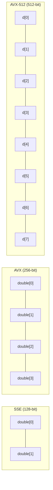

# Day 46: SIMD Fundamentals — SSE/AVX and Field Arithmetic

**Phase:** 4 — Performance Optimization (Days 43–56)
**Previous:** Day 45 — Cache Analysis: `cachegrind`, Understanding L1/L2/L3 Misses
**Next:** Day 47 — Auto-Vectorization: Compiler Flags, Checking Assembly Output

> **Today's goal:** Understand SIMD (Single Instruction, Multiple Data) instruction sets, write explicit SIMD kernels for field arithmetic using compiler intrinsics, and benchmark SSE vs AVX vs scalar performance.

---

## Part 1: Pattern Identification

### What Is SIMD?

SIMD allows a single CPU instruction to operate on multiple data elements simultaneously:

```text
Scalar (1 operation per instruction):
  a[0] + b[0] → c[0]      instruction 1
  a[1] + b[1] → c[1]      instruction 2
  a[2] + b[2] → c[2]      instruction 3
  a[3] + b[3] → c[3]      instruction 4

SSE2 (2 doubles per instruction):
  a[0:1] + b[0:1] → c[0:1]    instruction 1  (processes 2 doubles)
  a[2:3] + b[2:3] → c[2:3]    instruction 2

AVX (4 doubles per instruction):
  a[0:3] + b[0:3] → c[0:3]    instruction 1  (processes 4 doubles)

AVX-512 (8 doubles per instruction):
  a[0:7] + b[0:7] → c[0:7]    instruction 1  (processes 8 doubles)
```

### SIMD Register Sizes



| ISA | Register Width | Doubles per Register | Floats per Register | Available Since |
|-----|---------------|---------------------|--------------------:|----------------|
| SSE2 | 128-bit | 2 | 4 | Pentium 4 (2001) |
| AVX | 256-bit | 4 | 8 | Sandy Bridge (2011) |
| AVX2 | 256-bit | 4 | 8 | Haswell (2013) |
| AVX-512 | 512-bit | 8 | 16 | Skylake-X (2017) |

### Why SIMD Matters for CFD

Field arithmetic is the core of CFD computation. Operations like:

```cpp
// Field addition: c = a + b
for (int i = 0; i < N; ++i)
    c[i] = a[i] + b[i];

// Scalar multiply: b = alpha * a
for (int i = 0; i < N; ++i)
    b[i] = alpha * a[i];

// SAXPY: y = a*x + y
for (int i = 0; i < N; ++i)
    y[i] += a * x[i];
```

These are **embarrassingly parallel** — each element is independent. SIMD can process 2–8 elements per instruction cycle.

> **⭐ Theoretical speedup:** 2× with SSE2, 4× with AVX, 8× with AVX-512. In practice, speedup is limited by memory bandwidth (Day 45), but compute-bound loops see near-theoretical gains.

### Alignment Requirements

| ISA | Required Alignment | Penalty for Misaligned |
|-----|-------------------|----------------------|
| SSE2 | 16 bytes | Fault or ~2× slower |
| AVX | 32 bytes | ~10–20% slower |
| AVX-512 | 64 bytes | ~10–20% slower |

```cpp
// Aligned allocation (C++17)
double* data = static_cast<double*>(std::aligned_alloc(32, N * sizeof(double)));
// Must be freed with std::free(), not delete

// Or use alignas
alignas(32) double data[1024];  // stack-allocated, 32-byte aligned
```

---

## Part 2: Source Code Deep Dive

### SIMD Intrinsics: The API

SIMD intrinsics are C/C++ functions that map directly to single CPU instructions. They live in header files:

```cpp
#include <immintrin.h>   // All Intel SIMD: SSE, AVX, AVX-512
// Or individually:
// #include <xmmintrin.h>  // SSE (float)
// #include <emmintrin.h>  // SSE2 (double)
// #include <immintrin.h>  // AVX, AVX2, AVX-512
```

### Data Types

| Type | ISA | Width | Elements |
|------|-----|-------|----------|
| `__m128d` | SSE2 | 128-bit | 2 doubles |
| `__m128` | SSE | 128-bit | 4 floats |
| `__m256d` | AVX | 256-bit | 4 doubles |
| `__m256` | AVX | 256-bit | 8 floats |
| `__m512d` | AVX-512 | 512-bit | 8 doubles |

### Key Intrinsic Functions (double precision)

#### SSE2 (128-bit, 2 doubles)

```cpp
// Load 2 doubles from aligned memory
__m128d a = _mm_load_pd(&data[i]);      // aligned: data must be 16-byte aligned
__m128d b = _mm_loadu_pd(&data[i]);     // unaligned: slower but no alignment needed

// Arithmetic
__m128d c = _mm_add_pd(a, b);           // c = a + b (element-wise)
__m128d d = _mm_mul_pd(a, b);           // d = a * b
__m128d e = _mm_sub_pd(a, b);           // e = a - b
__m128d f = _mm_div_pd(a, b);           // f = a / b

// Fused multiply-add (FMA, requires FMA ISA extension)
__m128d g = _mm_fmadd_pd(a, b, c);     // g = a*b + c (single instruction)

// Store 2 doubles
_mm_store_pd(&result[i], c);            // aligned store
_mm_storeu_pd(&result[i], c);           // unaligned store

// Broadcast: fill all lanes with one value
__m128d alpha = _mm_set1_pd(3.14);      // alpha = [3.14, 3.14]

// Set specific values
__m128d v = _mm_set_pd(2.0, 1.0);      // v = [1.0, 2.0] (note: reversed order!)
```

#### AVX (256-bit, 4 doubles)

```cpp
// Load 4 doubles
__m256d a = _mm256_load_pd(&data[i]);   // aligned (32-byte)
__m256d b = _mm256_loadu_pd(&data[i]);  // unaligned

// Arithmetic (same naming pattern, just _mm256_ prefix)
__m256d c = _mm256_add_pd(a, b);
__m256d d = _mm256_mul_pd(a, b);
__m256d e = _mm256_fmadd_pd(a, b, c);  // FMA: a*b + c

// Store
_mm256_store_pd(&result[i], c);
_mm256_storeu_pd(&result[i], c);

// Broadcast
__m256d alpha = _mm256_set1_pd(3.14);   // [3.14, 3.14, 3.14, 3.14]
```

### Naming Convention

The intrinsic naming follows a pattern:

```text
_mm[width]_[operation]_[type]

width:     (none)=128-bit, 256=256-bit, 512=512-bit
operation: add, mul, sub, div, load, store, set1, fmadd, ...
type:      pd = packed double, ps = packed single (float)
           sd = scalar double, ss = scalar single
           epi32 = packed 32-bit integer

Examples:
_mm_add_pd       → SSE2:  2 doubles added
_mm256_mul_pd    → AVX:   4 doubles multiplied
_mm512_fmadd_pd  → AVX-512: 8 doubles fused multiply-add
```

### Field Addition in Three Variants

```cpp
// Variant 1: Scalar
void fieldAddScalar(const double* a, const double* b, double* c, int N)
{
    for (int i = 0; i < N; ++i)
        c[i] = a[i] + b[i];
}

// Variant 2: SSE2 (2 doubles per iteration)
void fieldAddSSE(const double* a, const double* b, double* c, int N)
{
    int i = 0;
    // Main SIMD loop
    for (; i + 2 <= N; i += 2)
    {
        __m128d va = _mm_loadu_pd(&a[i]);
        __m128d vb = _mm_loadu_pd(&b[i]);
        __m128d vc = _mm_add_pd(va, vb);
        _mm_storeu_pd(&c[i], vc);
    }
    // Remainder (if N is odd)
    for (; i < N; ++i)
        c[i] = a[i] + b[i];
}

// Variant 3: AVX (4 doubles per iteration)
void fieldAddAVX(const double* a, const double* b, double* c, int N)
{
    int i = 0;
    // Main SIMD loop
    for (; i + 4 <= N; i += 4)
    {
        __m256d va = _mm256_loadu_pd(&a[i]);
        __m256d vb = _mm256_loadu_pd(&b[i]);
        __m256d vc = _mm256_add_pd(va, vb);
        _mm256_storeu_pd(&c[i], vc);
    }
    // Remainder
    for (; i < N; ++i)
        c[i] = a[i] + b[i];
}
```

### Horizontal Reduction (Sum All Elements)

SIMD excels at vertical operations (element-wise). Horizontal operations (reducing across lanes) are more complex:

```cpp
// SSE2: sum of 2 doubles in a __m128d register
double horizontalSumSSE(__m128d v)
{
    // v = [a, b]
    __m128d high = _mm_unpackhi_pd(v, v);  // high = [b, b]
    __m128d sum = _mm_add_sd(v, high);     // sum = [a+b, ...]
    return _mm_cvtsd_f64(sum);             // extract first element
}

// AVX: sum of 4 doubles in a __m256d register
double horizontalSumAVX(__m256d v)
{
    // v = [a, b, c, d]
    // Step 1: add high 128 bits to low 128 bits
    __m128d low  = _mm256_castpd256_pd128(v);        // [a, b]
    __m128d high = _mm256_extractf128_pd(v, 1);      // [c, d]
    __m128d sum2 = _mm_add_pd(low, high);            // [a+c, b+d]

    // Step 2: add the two remaining elements
    __m128d hi64 = _mm_unpackhi_pd(sum2, sum2);      // [b+d, b+d]
    __m128d total = _mm_add_sd(sum2, hi64);           // [a+b+c+d, ...]
    return _mm_cvtsd_f64(total);
}
```

---

## Part 3: C++ Mechanics Explained

### SIMD and the Compiler

There are three ways to use SIMD:

| Method | Control | Portability | Difficulty |
|--------|---------|-------------|------------|
| **Auto-vectorization** | Compiler decides | High | Easy (just write loops) |
| **Intrinsics** | Programmer decides | Medium (ISA-specific) | Medium |
| **Inline assembly** | Full control | Low | Hard |

**Recommendation for CFD:** Use auto-vectorization (Day 47) for most code. Use intrinsics only for the 1-2 hottest kernels identified by profiling (Day 43-44).

### FMA: Fused Multiply-Add

FMA computes $a \times b + c$ in a single instruction with a single rounding step:

```cpp
// Without FMA: two instructions, two rounding errors
__m256d temp = _mm256_mul_pd(a, b);     // temp = a*b (rounded)
__m256d result = _mm256_add_pd(temp, c); // result = temp+c (rounded again)

// With FMA: one instruction, one rounding error
__m256d result = _mm256_fmadd_pd(a, b, c); // result = a*b+c (rounded once)
```

Benefits:
1. **Performance:** 2 ops in 1 instruction (same throughput as multiply alone)
2. **Accuracy:** Only 1 rounding instead of 2 — important for iterative solvers

> **⭐ Availability:** FMA is available on Intel Haswell (2013) and AMD Piledriver (2012) and later. Compile with `-mfma` or `-march=native`.

### Memory Alignment and Performance

```cpp
// Misaligned access: may cross cache line boundary
double* data = new double[1000];  // 8-byte aligned (sufficient for scalar)
_mm256_load_pd(data);             // CRASH if data is not 32-byte aligned

// Solution 1: Use unaligned loads
_mm256_loadu_pd(data);            // Works but may be slightly slower

// Solution 2: Aligned allocation
double* data = static_cast<double*>(std::aligned_alloc(32, 1000 * sizeof(double)));
_mm256_load_pd(data);             // OK — guaranteed 32-byte aligned

// Solution 3: std::vector with custom allocator (advanced)
template<typename T, size_t Alignment>
struct AlignedAllocator
{
    using value_type = T;
    T* allocate(size_t n)
    {
        return static_cast<T*>(std::aligned_alloc(Alignment, n * sizeof(T)));
    }
    void deallocate(T* p, size_t) { std::free(p); }
};

std::vector<double, AlignedAllocator<double, 32>> aligned_vec(1000);
```

### Remainder Handling

When $N$ is not a multiple of the SIMD width, you need to handle the remainder:

```cpp
void fieldAddAVX_safe(const double* a, const double* b, double* c, int N)
{
    int simdWidth = 4;  // AVX: 4 doubles
    int mainEnd = N - (N % simdWidth);  // largest multiple of 4 ≤ N

    // SIMD loop: processes 4 elements at a time
    for (int i = 0; i < mainEnd; i += simdWidth)
    {
        __m256d va = _mm256_loadu_pd(&a[i]);
        __m256d vb = _mm256_loadu_pd(&b[i]);
        _mm256_storeu_pd(&c[i], _mm256_add_pd(va, vb));
    }

    // Scalar remainder: 0-3 elements
    for (int i = mainEnd; i < N; ++i)
        c[i] = a[i] + b[i];
}
```

For AVX-512 with **masking**, you can handle the remainder without a scalar loop:

```cpp
// AVX-512 masked store (handles partial last vector)
int remaining = N - mainEnd;
__mmask8 mask = (1 << remaining) - 1;  // e.g., remaining=3 → mask=0b00000111
__m512d va = _mm512_maskz_loadu_pd(mask, &a[mainEnd]);
__m512d vb = _mm512_maskz_loadu_pd(mask, &b[mainEnd]);
_mm512_mask_storeu_pd(&c[mainEnd], mask, _mm512_add_pd(va, vb));
```

---

## Part 4: Implementation Exercise

### Complete SIMD Benchmark

```cpp
// File: simd_benchmark.cpp
// Compile: g++ -std=c++17 -O2 -g -mavx2 -mfma -o simd_benchmark simd_benchmark.cpp
// Note:    -mavx2 enables AVX+AVX2 intrinsics
//          -mfma enables FMA intrinsics
// Run:     ./simd_benchmark

#include <iostream>
#include <vector>
#include <chrono>
#include <cmath>
#include <iomanip>
#include <cstdlib>     // std::aligned_alloc, std::free
#include <cstring>     // std::memset
#include <immintrin.h> // SSE, AVX, FMA intrinsics

// ============================================================
// Section 1: Aligned memory management
// ============================================================

double* allocAligned(size_t count, size_t alignment = 32)
{
    size_t bytes = count * sizeof(double);
    // std::aligned_alloc requires bytes to be a multiple of alignment
    bytes = ((bytes + alignment - 1) / alignment) * alignment;
    double* ptr = static_cast<double*>(std::aligned_alloc(alignment, bytes));
    if (!ptr) throw std::bad_alloc();
    return ptr;
}

void freeAligned(double* ptr)
{
    std::free(ptr);
}

// ============================================================
// Section 2: Scalar field operations
// ============================================================

void fieldAddScalar(const double* a, const double* b,
                    double* c, int N)
{
    for (int i = 0; i < N; ++i)
        c[i] = a[i] + b[i];
}

double dotProductScalar(const double* a, const double* b, int N)
{
    double sum = 0.0;
    for (int i = 0; i < N; ++i)
        sum += a[i] * b[i];
    return sum;
}

void saxpyScalar(double alpha, const double* x,
                 double* y, int N)
{
    for (int i = 0; i < N; ++i)
        y[i] += alpha * x[i];
}

// ============================================================
// Section 3: SSE2 field operations (128-bit, 2 doubles)
// ============================================================

void fieldAddSSE(const double* a, const double* b,
                 double* c, int N)
{
    int i = 0;
    for (; i + 2 <= N; i += 2)
    {
        __m128d va = _mm_loadu_pd(&a[i]);
        __m128d vb = _mm_loadu_pd(&b[i]);
        _mm_storeu_pd(&c[i], _mm_add_pd(va, vb));
    }
    for (; i < N; ++i)
        c[i] = a[i] + b[i];
}

double dotProductSSE(const double* a, const double* b, int N)
{
    __m128d vsum = _mm_setzero_pd();
    int i = 0;
    for (; i + 2 <= N; i += 2)
    {
        __m128d va = _mm_loadu_pd(&a[i]);
        __m128d vb = _mm_loadu_pd(&b[i]);
        vsum = _mm_add_pd(vsum, _mm_mul_pd(va, vb));
    }
    // Horizontal sum
    double tmp[2];
    _mm_storeu_pd(tmp, vsum);
    double sum = tmp[0] + tmp[1];
    for (; i < N; ++i)
        sum += a[i] * b[i];
    return sum;
}

// ============================================================
// Section 4: AVX field operations (256-bit, 4 doubles)
// ============================================================

void fieldAddAVX(const double* a, const double* b,
                 double* c, int N)
{
    int i = 0;
    for (; i + 4 <= N; i += 4)
    {
        __m256d va = _mm256_loadu_pd(&a[i]);
        __m256d vb = _mm256_loadu_pd(&b[i]);
        _mm256_storeu_pd(&c[i], _mm256_add_pd(va, vb));
    }
    for (; i < N; ++i)
        c[i] = a[i] + b[i];
}

double dotProductAVX(const double* a, const double* b, int N)
{
    __m256d vsum = _mm256_setzero_pd();
    int i = 0;
    for (; i + 4 <= N; i += 4)
    {
        __m256d va = _mm256_loadu_pd(&a[i]);
        __m256d vb = _mm256_loadu_pd(&b[i]);
        vsum = _mm256_add_pd(vsum, _mm256_mul_pd(va, vb));
    }
    // Horizontal sum of 4 doubles
    __m128d lo = _mm256_castpd256_pd128(vsum);
    __m128d hi = _mm256_extractf128_pd(vsum, 1);
    __m128d sum2 = _mm_add_pd(lo, hi);
    __m128d hi64 = _mm_unpackhi_pd(sum2, sum2);
    double sum = _mm_cvtsd_f64(_mm_add_sd(sum2, hi64));
    for (; i < N; ++i)
        sum += a[i] * b[i];
    return sum;
}

void saxpyAVX(double alpha, const double* x,
              double* y, int N)
{
    __m256d valpha = _mm256_set1_pd(alpha);
    int i = 0;
    for (; i + 4 <= N; i += 4)
    {
        __m256d vx = _mm256_loadu_pd(&x[i]);
        __m256d vy = _mm256_loadu_pd(&y[i]);
        // FMA: y = alpha * x + y
        vy = _mm256_fmadd_pd(valpha, vx, vy);
        _mm256_storeu_pd(&y[i], vy);
    }
    for (; i < N; ++i)
        y[i] += alpha * x[i];
}

// ============================================================
// Section 5: Benchmark harness
// ============================================================

struct BenchResult
{
    std::string name;
    double ms;
    double gflops;
    double bandwidth_gb;
};

template<typename Func>
BenchResult benchmark(const std::string& name, int ops, int bytes,
                      int repeats, Func&& fn)
{
    // Warmup
    fn();

    auto start = std::chrono::high_resolution_clock::now();
    for (int r = 0; r < repeats; ++r)
        fn();
    auto end = std::chrono::high_resolution_clock::now();

    double ms = std::chrono::duration<double, std::milli>(end - start).count();
    double totalOps = static_cast<double>(ops) * repeats;
    double totalBytes = static_cast<double>(bytes) * repeats;
    double gflops = totalOps / (ms * 1e6);
    double bw = totalBytes / (ms * 1e6);

    return {name, ms / repeats, gflops, bw};
}

void printResults(const std::vector<BenchResult>& results)
{
    std::cout << std::setw(30) << std::left << "Operation"
              << std::setw(12) << std::right << "Time (ms)"
              << std::setw(12) << "GFlop/s"
              << std::setw(14) << "BW (GB/s)"
              << "\n";
    std::cout << std::string(68, '-') << "\n";

    for (const auto& r : results)
    {
        std::cout << std::setw(30) << std::left << r.name
                  << std::setw(12) << std::right << std::fixed
                  << std::setprecision(3) << r.ms
                  << std::setw(12) << std::setprecision(2) << r.gflops
                  << std::setw(14) << std::setprecision(2) << r.bandwidth_gb
                  << "\n";
    }
}

// ============================================================
// Main
// ============================================================

int main()
{
    const int N = 1000000;  // 1M doubles = 8 MB
    const int REPEAT = 100;

    std::cout << "=== SIMD Benchmark: Field Operations ===\n";
    std::cout << "Field size: " << N << " doubles = "
              << (N * 8 / 1024 / 1024) << " MB\n";
    std::cout << "Repetitions: " << REPEAT << "\n\n";

    // Allocate aligned arrays
    double* a = allocAligned(N);
    double* b = allocAligned(N);
    double* c = allocAligned(N);

    // Initialize
    for (int i = 0; i < N; ++i)
    {
        a[i] = 1.0 + 0.001 * i;
        b[i] = 2.0 - 0.001 * i;
        c[i] = 0.0;
    }

    std::vector<BenchResult> results;

    // Field addition: c = a + b (1 FLOP per element, reads 2N + writes N doubles)
    int addOps = N;
    int addBytes = 3 * N * sizeof(double);

    results.push_back(benchmark("Add: Scalar", addOps, addBytes, REPEAT,
        [&]() { fieldAddScalar(a, b, c, N); }));

    results.push_back(benchmark("Add: SSE2 (128-bit)", addOps, addBytes, REPEAT,
        [&]() { fieldAddSSE(a, b, c, N); }));

    results.push_back(benchmark("Add: AVX (256-bit)", addOps, addBytes, REPEAT,
        [&]() { fieldAddAVX(a, b, c, N); }));

    std::cout << "--- Field Addition: c = a + b ---\n";
    printResults(results);
    results.clear();

    // Dot product: sum(a*b) (2 FLOPs per element: mul + add)
    int dotOps = 2 * N;
    int dotBytes = 2 * N * sizeof(double);

    results.push_back(benchmark("Dot: Scalar", dotOps, dotBytes, REPEAT,
        [&]() { volatile double r = dotProductScalar(a, b, N); }));

    results.push_back(benchmark("Dot: SSE2 (128-bit)", dotOps, dotBytes, REPEAT,
        [&]() { volatile double r = dotProductSSE(a, b, N); }));

    results.push_back(benchmark("Dot: AVX (256-bit)", dotOps, dotBytes, REPEAT,
        [&]() { volatile double r = dotProductAVX(a, b, N); }));

    std::cout << "\n--- Dot Product: sum(a[i]*b[i]) ---\n";
    printResults(results);
    results.clear();

    // SAXPY: y += alpha * x (2 FLOPs per element: mul + add)
    int saxpyOps = 2 * N;
    int saxpyBytes = 3 * N * sizeof(double);  // read x, read y, write y

    results.push_back(benchmark("SAXPY: Scalar", saxpyOps, saxpyBytes, REPEAT,
        [&]() { saxpyScalar(2.5, a, c, N); }));

    results.push_back(benchmark("SAXPY: AVX+FMA", saxpyOps, saxpyBytes, REPEAT,
        [&]() { saxpyAVX(2.5, a, c, N); }));

    std::cout << "\n--- SAXPY: y += alpha * x ---\n";
    printResults(results);

    // Verify correctness
    std::cout << "\n--- Correctness Check ---\n";
    fieldAddScalar(a, b, c, N);
    double expected = c[0];
    fieldAddAVX(a, b, c, N);
    double actual = c[0];
    std::cout << "Scalar c[0] = " << expected << ", AVX c[0] = " << actual
              << " → " << (std::abs(expected - actual) < 1e-15 ? "PASS" : "FAIL")
              << "\n";

    double dotScalar = dotProductScalar(a, b, N);
    double dotAVX_val = dotProductAVX(a, b, N);
    std::cout << "Scalar dot = " << dotScalar << ", AVX dot = " << dotAVX_val
              << " → "
              << (std::abs(dotScalar - dotAVX_val) / std::abs(dotScalar) < 1e-10
                  ? "PASS" : "FAIL")
              << "\n";

    // Cleanup
    freeAligned(a);
    freeAligned(b);
    freeAligned(c);

    return 0;
}
```

### Compilation

```bash
# With AVX2 and FMA support
g++ -std=c++17 -O2 -g -mavx2 -mfma -o simd_benchmark simd_benchmark.cpp

# Check what your CPU supports
g++ -march=native -dM -E - < /dev/null | grep -i avx

# On macOS with Apple Silicon (ARM):
# Use NEON intrinsics instead (arm_neon.h)
# The program above is x86-specific
```

### Expected Results (Approximate)

```text
--- Field Addition: c = a + b ---
Operation                        Time (ms)   GFlop/s      BW (GB/s)
--------------------------------------------------------------------
Add: Scalar                        X.XXX       X.XX          XX.XX
Add: SSE2 (128-bit)                X.XXX       X.XX          XX.XX
Add: AVX (256-bit)                 X.XXX       X.XX          XX.XX
```

**Expected speedups:**
- SSE2 vs Scalar: ~1.3–1.8× (often limited by memory bandwidth)
- AVX vs Scalar: ~1.5–2.5× (larger improvement if compute-bound)

> **⭐ Important:** For 8 MB arrays (does not fit in L1/L2), field addition is **memory-bandwidth-bound**. The speedup from wider SIMD is limited because the bottleneck is memory, not computation. SIMD shines most on compute-heavy operations (division, transcendentals) or when data fits in cache.

---

## Part 5: Exercises

### Exercise 1: SIMD Width Calculation

**Question:** You have a `Field<double>` with N = 1,000,000 elements. How many SIMD iterations are needed for:
1. SSE2 (128-bit)
2. AVX (256-bit)
3. AVX-512 (512-bit)

Also calculate the number of remainder elements for each.

**Solution:**

| ISA | Doubles per Register | SIMD Iterations | Remainder |
|-----|---------------------|-----------------|-----------|
| SSE2 | 2 | $1{,}000{,}000 / 2 = 500{,}000$ | 0 |
| AVX | 4 | $1{,}000{,}000 / 4 = 250{,}000$ | 0 |
| AVX-512 | 8 | $1{,}000{,}000 / 8 = 125{,}000$ | 0 |

Since 1,000,000 is divisible by 2, 4, and 8, there are 0 remainder elements for all three.

For $N = 1{,}000{,}003$:

| ISA | SIMD Iterations | Remainder |
|-----|----------------|-----------|
| SSE2 | 500,001 (last with 1 useful + 1 wasted) | 1 |
| AVX | 250,000 | 3 |
| AVX-512 | 125,000 | 3 |

---

### Exercise 2: Roofline Analysis

**Question:** Your CPU has a peak of 32 GFlop/s (double precision) and memory bandwidth of 25 GB/s. Field addition `c = a + b` performs 1 FLOP per 24 bytes transferred (read 2 doubles + write 1 double = 24 bytes). Is this operation compute-bound or memory-bound?

**Solution:**

**Arithmetic intensity:** $\text{AI} = \frac{1 \text{ FLOP}}{24 \text{ bytes}} = 0.042 \text{ FLOP/byte}$

**Ridge point:** $\frac{\text{Peak compute}}{\text{Peak bandwidth}} = \frac{32}{25} = 1.28 \text{ FLOP/byte}$

Since $\text{AI} = 0.042 \ll \text{Ridge} = 1.28$, the operation is **memory-bound**.

Maximum achievable performance: $25 \text{ GB/s} \times 0.042 \text{ FLOP/byte} = 1.04 \text{ GFlop/s}$

This is only $1.04 / 32 = 3.25\%$ of peak compute! No amount of SIMD will help beyond what the memory bandwidth allows.

**Key insight:** Field addition is always memory-bound on modern hardware. To benefit from SIMD, you need operations with higher arithmetic intensity (e.g., matrix-matrix multiply: $N^3$ FLOPs, $N^2$ data).

---

### Exercise 3: Write a SIMD `fieldScale`

**Question:** Write an AVX version of `fieldScale` that computes `b[i] = alpha * a[i]` for all `i`.

**Solution:**

```cpp
void fieldScaleAVX(double alpha, const double* a, double* b, int N)
{
    __m256d valpha = _mm256_set1_pd(alpha);
    int i = 0;
    for (; i + 4 <= N; i += 4)
    {
        __m256d va = _mm256_loadu_pd(&a[i]);
        __m256d vb = _mm256_mul_pd(valpha, va);
        _mm256_storeu_pd(&b[i], vb);
    }
    for (; i < N; ++i)
        b[i] = alpha * a[i];
}
```

---

### Exercise 4: FMA vs Separate Multiply-Add

**Question:** How many rounding errors occur in computing $y = a \times b + c$ with:
1. Separate `_mm256_mul_pd` + `_mm256_add_pd`
2. FMA `_mm256_fmadd_pd`

Why does this matter for iterative solvers?

**Solution:**

1. **Separate:** 2 rounding errors — once after multiply, once after add
2. **FMA:** 1 rounding error — the intermediate product $a \times b$ is computed in extended precision before adding $c$ and rounding

For iterative solvers:
- Each Gauss-Seidel or CG iteration accumulates rounding errors
- With FMA, the error per iteration is smaller
- Over thousands of iterations, this means: slightly faster convergence (fewer iterations needed) and slightly more accurate final result
- In practice the difference is small (<1 iteration), but FMA is also faster (2 FLOPs in 1 instruction), so there's no reason not to use it

---

### Exercise 5: Detect ISA Support at Runtime

**Question:** Write a function that detects at runtime which SIMD instruction sets the current CPU supports, and selects the best available `fieldAdd` implementation.

**Solution:**

```cpp
#include <cpuid.h>  // GCC/Clang built-in

bool hasSSE2()
{
    unsigned int eax, ebx, ecx, edx;
    __get_cpuid(1, &eax, &ebx, &ecx, &edx);
    return (edx >> 26) & 1;  // SSE2 is bit 26 of EDX
}

bool hasAVX()
{
    unsigned int eax, ebx, ecx, edx;
    __get_cpuid(1, &eax, &ebx, &ecx, &edx);
    return (ecx >> 28) & 1;  // AVX is bit 28 of ECX
}

bool hasFMA()
{
    unsigned int eax, ebx, ecx, edx;
    __get_cpuid(1, &eax, &ebx, &ecx, &edx);
    return (ecx >> 12) & 1;  // FMA is bit 12 of ECX
}

// Runtime dispatch
using FieldAddFunc = void(*)(const double*, const double*, double*, int);

FieldAddFunc selectBestFieldAdd()
{
    if (hasAVX())  return fieldAddAVX;
    if (hasSSE2()) return fieldAddSSE;
    return fieldAddScalar;
}

// Usage:
int main()
{
    FieldAddFunc bestAdd = selectBestFieldAdd();
    bestAdd(a, b, c, N);  // calls the best available implementation
}
```

This is the **runtime dispatch** pattern. Libraries like Intel MKL and Eigen use this extensively — they compile multiple versions of each kernel and select the best at startup.

---

## Summary

**⭐ Key Takeaways:**

1. **SIMD processes 2–8 doubles per instruction** (SSE2: 2, AVX: 4, AVX-512: 8)
2. **Intrinsics** map 1:1 to CPU instructions: `_mm256_add_pd` → `vaddpd`
3. **Alignment matters:** Use `std::aligned_alloc(32, ...)` for AVX, or use unaligned loads (`_mm256_loadu_pd`)
4. **FMA** does $a \times b + c$ in one instruction with better accuracy than separate mul+add
5. **Memory-bound operations** (field add, dot product on large arrays) see limited SIMD benefit — the bottleneck is bandwidth, not compute
6. **Handle remainders** with a scalar tail loop when $N$ is not a multiple of SIMD width

**Next:** Day 47 explores **auto-vectorization** — letting the compiler generate SIMD code automatically, and how to check if it actually does.

---

**Sources:**
- [Intel Intrinsics Guide](https://www.intel.com/content/www/us/en/docs/intrinsics-guide/)
- Agner Fog, *Optimizing Software in C++* (2024)
- Intel 64 and IA-32 Architectures Software Developer's Manual
