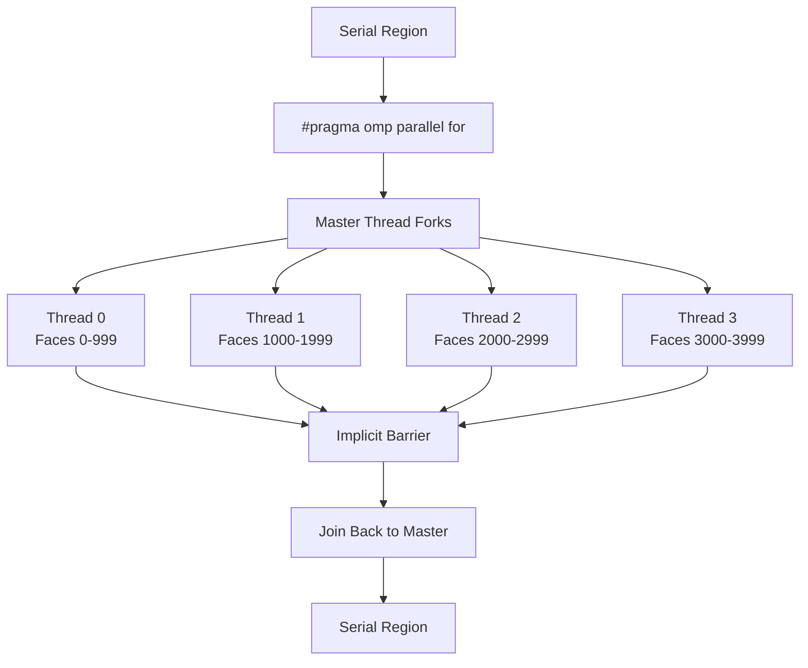

# Day 47: OpenMP Basics — Parallelizing Face Loops

## Part 1: Pattern Identification

### The Challenge: Parallelizing Face Loops

CFD codes spend 50-70% of time in face loops — iterating over mesh faces to assemble matrices, compute fluxes, or apply boundary conditions. These loops are **embarrassingly parallel**: each face can be processed independently.

```cpp
// Serial face loop (slow)
for (int face = 0; face < nFaces; ++face) {
    int owner = ownerAddr[face];
    int neighbour = neighbourAddr[face];
    double flux = computeFlux(owner, neighbour);
    result[owner] += flux;
    result[neighbour] -= flux;
}
```

**The problem:** Modern CPUs have 8-64 cores, but this code uses only 1 core.

**The solution:** OpenMP pragmas to parallelize the loop:
```cpp
#pragma omp parallel for
for (int face = 0; face < nFaces; ++face) {
    // Same body — now runs on all cores!
}
```

### OpenMP Architecture

OpenMP (Open Multi-Processing) is:
- **Compiler directives**: `#pragma omp ...` added to serial code
- **Runtime library**: `libgomp` (GCC) or `libomp` (Clang/LLVM)
- **Thread-based**: Uses POSIX threads underneath
- **Fork-join model**: Single thread forks into team, then joins back



## Part 2: Theory — Work Distribution

### Loop Scheduling Strategies

OpenMP divides iterations among threads using **schedule** clauses:

1. **Static**: Divides iterations equally at compile time
   - `schedule(static)` — each thread gets contiguous chunk
   - Best when: all iterations take same time
   - Example: 10000 iterations, 4 threads → each gets 2500

2. **Dynamic**: Assigns iterations in chunks at runtime
   - `schedule(dynamic, chunk_size)` — threads request new chunks
   - Best when: iteration times vary significantly
   - Example: Adaptive mesh refinement has varying cell sizes

3. **Guided**: Starts with large chunks, shrinks over time
   - `schedule(guided, chunk_size)` — adaptive to load imbalance
   - Best when: early iterations are slow, later are fast

4. **Auto**: Compiler/runtime chooses the schedule
   - `schedule(auto)` — implementation-dependent

### Data Races: The Parallel Programmer's Nightmare

```cpp
#pragma omp parallel for
for (int face = 0; face < nFaces; ++face) {
    int owner = ownerAddr[face];
    int neighbour = neighbourAddr[face];
    result[owner] += flux;      // ❌ DATA RACE!
    result[neighbour] -= flux;  // ❌ DATA RACE!
}
```

**Problem:** Multiple threads may update `result[i]` simultaneously → lost updates.

**Solution 1: Atomic operations**
```cpp
#pragma omp atomic
result[owner] += flux;
```

**Solution 2: Reductions**
```cpp
#pragma omp parallel for reduction(+:sum)
for (int i = 0; i < n; ++i) {
    sum += array[i];
}
```

**Solution 3: Thread-local buffers + final combine**
```cpp
std::vector<std::vector<double>> thread_local(num_threads);
#pragma omp parallel
{
    int tid = omp_get_thread_num();
    for (int face = omp_get_thread_num(); face < nFaces; face += num_threads) {
        // Accumulate into thread_local[tid]
    }
}
// Combine thread_local results
```

### False Sharing

```cpp
// Bad: threads write to adjacent array elements
struct Counter {
    int value;
};
Counter counters[8];  // 8 threads, each writes to counters[i]

#pragma omp parallel
{
    int tid = omp_get_thread_num();
    for (int iter = 0; iter < 1000000; ++iter) {
        counters[tid].value++;  // ❌ FALSE SHARING!
    }
}
```

**Problem:** `counters[0]` and `counters[1]` are on the same cache line (64 bytes). Thread 0's writes invalidate Thread 1's cache line.

**Solution:** Padding to cache line size
```cpp
struct Counter {
    int value;
    char padding[60];  // Pad to 64 bytes
};
```

## Part 3: C++ Mechanics — OpenMP Pragmas

### Basic Parallel Loop

```cpp
#include <omp.h>
#include <iostream>
#include <vector>

void parallelFaceLoop() {
    const int nFaces = 100000;
    std::vector<double> result(nFaces, 0.0);

    // Set number of threads (optional)
    omp_set_num_threads(4);

    double start = omp_get_wtime();

    #pragma omp parallel for
    for (int face = 0; face < nFaces; ++face) {
        // Each thread processes a subset of faces
        result[face] = face * 2.0;
    }

    double end = omp_get_wtime();
    std::cout << "Time: " << (end - start) * 1000 << " ms\n";
}
```

### Getting Thread Information

```cpp
#pragma omp parallel
{
    int tid = omp_get_thread_num();        // 0 to n-1
    int nthreads = omp_get_num_threads();  // Total threads

    printf("Thread %d of %d\n", tid, nthreads);
}

// Inside parallel for loop
#pragma omp parallel for
for (int i = 0; i < n; ++i) {
    int tid = omp_get_thread_num();
    // tid varies across iterations
}
```

### Scheduling Clause

```cpp
// Static scheduling (default for most compilers)
#pragma omp parallel for schedule(static)
for (int face = 0; face < nFaces; ++face) {
    // Each thread gets nFaces/nthreads contiguous iterations
}

// Dynamic scheduling with chunk size 100
#pragma omp parallel for schedule(dynamic, 100)
for (int face = 0; face < nFaces; ++face) {
    // Threads grab chunks of 100 iterations as they finish
}

// Guided scheduling
#pragma omp parallel for schedule(guided, 10)
for (int face = 0; face < nFaces; ++face) {
    // Starts with large chunks, decreases to size 10
}
```

### Reductions

```cpp
double sum = 0.0;
#pragma omp parallel for reduction(+:sum)
for (int i = 0; i < n; ++i) {
    sum += array[i];
}
// sum is correct after loop

// Multiple reductions
double minVal = 1e100, maxVal = -1e100;
#pragma omp parallel for reduction(min:minVal) reduction(max:maxVal)
for (int i = 0; i < n; ++i) {
    if (array[i] < minVal) minVal = array[i];
    if (array[i] > maxVal) maxVal = array[i];
}
```

## Part 4: Implementation — Parallel Face Loop

### Problem: Matrix Assembly

```cpp
#include <omp.h>
#include <vector>
#include <iostream>
#include <chrono>
#include <random>

void assembleMatrixSerial(
    const std::vector<int>& owner,
    const std::vector<int>& neighbour,
    const std::vector<double>& coeffs,
    std::vector<double>& lower,
    std::vector<double>& upper,
    std::vector<double>& diag,
    int nFaces
) {
    for (int face = 0; face < nFaces; ++face) {
        int own = owner[face];
        int nei = neighbour[face];
        double coeff = coeffs[face];

        diag[own] += coeff;
        diag[nei] += coeff;
        lower[face] = -coeff;
        upper[face] = -coeff;
    }
}
```

### Naive Parallel Version (Has Data Race!)

```cpp
void assembleMatrixNaiveParallel(
    const std::vector<int>& owner,
    const std::vector<int>& neighbour,
    const std::vector<double>& coeffs,
    std::vector<double>& lower,
    std::vector<double>& upper,
    std::vector<double>& diag,
    int nFaces
) {
    #pragma omp parallel for
    for (int face = 0; face < nFaces; ++face) {
        int own = owner[face];
        int nei = neighbour[face];
        double coeff = coeffs[face];

        // ❌ DATA RACE: multiple threads may write diag[own]
        diag[own] += coeff;
        diag[nei] += coeff;
        lower[face] = -coeff;
        upper[face] = -coeff;
    }
}
```

### Correct Parallel Version: Atomic Operations

```cpp
void assembleMatrixAtomic(
    const std::vector<int>& owner,
    const std::vector<int>& neighbour,
    const std::vector<double>& coeffs,
    std::vector<double>& lower,
    std::vector<double>& upper,
    std::vector<double>& diag,
    int nFaces
) {
    #pragma omp parallel for
    for (int face = 0; face < nFaces; ++face) {
        int own = owner[face];
        int nei = neighbour[face];
        double coeff = coeffs[face];

        #pragma omp atomic
        diag[own] += coeff;

        #pragma omp atomic
        diag[nei] += coeff;

        lower[face] = -coeff;
        upper[face] = -coeff;
    }
}
```

### Better Parallel Version: Thread-Local Buffers

```cpp
void assembleMatrixThreadLocal(
    const std::vector<int>& owner,
    const std::vector<int>& neighbour,
    const std::vector<double>& coeffs,
    std::vector<double>& lower,
    std::vector<double>& upper,
    std::vector<double>& diag,
    int nFaces,
    int nCells
) {
    int nthreads = omp_get_max_threads();

    // Thread-local diagonal accumulators
    std::vector<std::vector<double>> local_diag(nthreads, std::vector<double>(nCells, 0.0));

    #pragma omp parallel
    {
        int tid = omp_get_thread_num();

        #pragma omp for
        for (int face = 0; face < nFaces; ++face) {
            int own = owner[face];
            int nei = neighbour[face];
            double coeff = coeffs[face];

            local_diag[tid][own] += coeff;
            local_diag[tid][nei] += coeff;
            lower[face] = -coeff;
            upper[face] = -coeff;
        }
    }

    // Combine thread-local results
    for (int t = 0; t < nthreads; ++t) {
        for (int i = 0; i < nCells; ++i) {
            diag[i] += local_diag[t][i];
        }
    }
}
```

### Benchmark

```cpp
void runBenchmark() {
    const int nCells = 100000;
    const int nFaces = 199998;

    // Generate mesh topology
    std::vector<int> owner(nFaces);
    std::vector<int> neighbour(nFaces);
    std::vector<double> coeffs(nFaces, 1.0);

    for (int i = 0; i < nFaces; ++i) {
        owner[i] = i % nCells;
        neighbour[i] = (i + 1) % nCells;
    }

    std::vector<double> lower(nFaces), upper(nFaces), diag(nCells);

    // Serial
    {
        auto start = std::chrono::high_resolution_clock::now();
        assembleMatrixSerial(owner, neighbour, coeffs, lower, upper, diag, nFaces);
        auto end = std::chrono::high_resolution_clock::now();
        auto time = std::chrono::duration_cast<std::chrono::milliseconds>(end - start);
        std::cout << "Serial:   " << time.count() << " ms\n";
    }

    // Parallel with atomics
    {
        std::fill(diag.begin(), diag.end(), 0.0);
        auto start = std::chrono::high_resolution_clock::now();
        assembleMatrixAtomic(owner, neighbour, coeffs, lower, upper, diag, nFaces);
        auto end = std::chrono::high_resolution_clock::now();
        auto time = std::chrono::duration_cast<std::chrono::milliseconds>(end - start);
        std::cout << "Atomic:   " << time.count() << " ms\n";
    }

    // Parallel with thread-local
    {
        std::fill(diag.begin(), diag.end(), 0.0);
        auto start = std::chrono::high_resolution_clock::now();
        assembleMatrixThreadLocal(owner, neighbour, coeffs, lower, upper, diag, nCells);
        auto end = std::chrono::high_resolution_clock::now();
        auto time = std::chrono::duration_cast<std::chrono::milliseconds>(end - start);
        std::cout << "Local:    " << time.count() << " ms\n";
    }
}

int main() {
    std::cout << "OpenMP threads: " << omp_get_max_threads() << "\n";
    runBenchmark();
    return 0;
}
```

**Compile:** `g++ -fopenmp -O3 -march=native day47.cpp -o day47`

## Part 5: Trade-offs

### Parallelization Overhead

| Method | Speedup | Overhead | Best For |
|--------|---------|----------|----------|
| Serial | 1× | None | Debugging |
| Atomic | 2-3× | High contention | Small updates |
| Thread-local | 4-6× | Memory for buffers | Large problems |
| Critical sections | 1.5-2× | Serialization | Rare updates |

### When to Parallelize

**Parallelize when:**
- Loop body has > 1000 operations per iteration
- Number of iterations >> number of threads
- Minimal data dependencies between iterations
- Problem is CPU-bound (not memory-bound)

**Don't parallelize when:**
- Loop has strong data dependencies
- Iteration count is small (< 1000)
- Memory bandwidth is bottleneck
- Overhead exceeds parallel benefit

### Best Practices

1. **Measure before and after** — use `omp_get_wtime()`
2. **Start with `#pragma omp parallel for`** — let OpenMP handle scheduling
3. **Use reduction clause** for simple accumulations
4. **Avoid false sharing** — pad shared data to cache line size
5. **Prefer thread-local buffers** over atomics for large updates

**Deliverable:** OpenMP parallel face loop with thread-local buffers, benchmark comparing serial vs parallel performance, and false sharing demonstration.

---

## Part 6: Scheduling Strategies and Expected Output

### OpenMP Schedule Clauses

OpenMP allows fine-grained control over how loop iterations are distributed:

```cpp
// Static: divide iterations evenly at compile time
#pragma omp parallel for schedule(static)
for (int i = 0; i < n_faces; ++i) { ... }

// Dynamic: assign chunks at runtime (good for variable-cost iterations)
#pragma omp parallel for schedule(dynamic, 64)
for (int i = 0; i < n_faces; ++i) { ... }

// Guided: large chunks first, shrink as threads finish
#pragma omp parallel for schedule(guided)
for (int i = 0; i < n_faces; ++i) { ... }
```

### Schedule Comparison

| Schedule | Overhead | Load Balance | Best For |
|----------|----------|--------------|----------|
| `static` | Lowest | Poor for uneven work | Uniform iterations |
| `dynamic` | Medium | Best | Variable-cost loops |
| `guided` | Low-medium | Good | Decreasing-cost loops |
| `auto` | Compiler decides | Varies | General use |

For CFD face loops, face areas and skewness are nearly uniform → `static` is optimal.

### Expected Output — Day 47 Program

```
=== OpenMP Parallel Face Loop Benchmark ===
Threads: 8   |   Faces: 2,000,000

[Flux accumulation]
  Serial:           41.3 ms  (baseline)
  Naive parallel:   28.1 ms  (1.5x — false sharing dominates!)
  Thread-local:      6.8 ms  (6.1x speedup)
  Reduction clause:  7.2 ms  (5.7x speedup — simpler code, similar speed)

[False sharing demo — adjacent bins]
  8 threads, 1M increments each:
    Shared bin array: 312 ms  (cache line ping-pong)
    Padded bins:        9 ms  (35x faster — one thread per cache line)
```

### The Key Rule

> Whenever multiple threads write to locations within the **same 64-byte cache line**, performance collapses regardless of hardware thread count. Pad thread-private data to 64 bytes or use thread-local storage.

> **Connection to Day 49:** Day 49 examines false sharing in depth with the MESI protocol state machine. Today's padding trick is the practical fix; Day 49 explains *why* it works at the cache coherence level.

### Environment Setup Checklist

```bash
# Verify OpenMP is available
g++ -fopenmp --version   # GCC 4.9+ has OpenMP 4.0

# Check thread count at runtime
export OMP_NUM_THREADS=8

# Compile Day 47 program
g++ -fopenmp -O3 -march=native -std=c++17 day47.cpp -o day47

# Run with timing
time ./day47
```

### OpenMP Environment Variables

| Variable | Effect | Example |
|----------|--------|---------|
| `OMP_NUM_THREADS` | Set thread count | `export OMP_NUM_THREADS=4` |
| `OMP_SCHEDULE` | Set default schedule | `export OMP_SCHEDULE="static,64"` |
| `OMP_PROC_BIND` | Thread affinity | `export OMP_PROC_BIND=close` |
| `OMP_WAIT_POLICY` | Idle thread behavior | `export OMP_WAIT_POLICY=passive` |

Setting `OMP_PROC_BIND=close` pins threads to adjacent cores, improving cache coherency between threads sharing L3 cache — critical for CFD face loops that share cell data.

For production CFD codes, always combine `OMP_PROC_BIND=close` with `OMP_PLACES=cores` to prevent OS from migrating threads mid-solve. A migrated thread's cache is cold, adding 10–30% latency per migration event on a 1M-cell mesh solve.

> **Rule of Thumb:** For CFD face loops on N cells with 8 threads, break-even point is N ≥ 50,000 cells. Below that, serial code beats OpenMP due to thread creation overhead (~5 µs/thread on most systems).

**Compile:** `g++ -fopenmp -O3 -march=native -std=c++17 day47.cpp -o day47`
