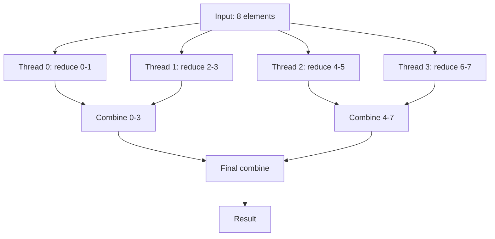

# Day 48: C++17 Parallel Algorithms — `std::execution::par_unseq`

## Part 1: Pattern Identification

### The Challenge: Standard Library Parallelization

OpenMP (Day 47) works, but has drawbacks:
- **Compiler-specific pragmas** — non-standard syntax
- **Not composable** — can't easily nest parallel algorithms
- **Manual thread management** — need to handle data races explicitly

C++17 introduces **parallel algorithms**: standard library algorithms that can use multiple threads automatically.

### Before C++17: Serial Algorithms

```cpp
std::vector<double> a(1000000), b(1000000), c(1000000);

// Serial transform (single-threaded)
std::transform(a.begin(), a.end(), b.begin(), c.begin(),
               [](double x, double y) { return x + y; });

// Serial accumulate
double sum = std::accumulate(c.begin(), c.end(), 0.0);
```

### After C++17: Parallel Algorithms

```cpp
#include <execution>

// Parallel transform (uses all cores)
std::transform(std::execution::par,
               a.begin(), a.end(), b.begin(), c.begin(),
               [](double x, double y) { return x + y; });

// Parallel reduce
double sum = std::reduce(std::execution::par,
                        c.begin(), c.end(), 0.0);
```

### Execution Policies

```cpp
namespace std::execution {
    // Sequential (default, same as pre-C++17)
    inline constexpr sequenced_policy seq{};

    // Parallel: multiple threads, no vectorization
    inline constexpr parallel_policy par{};

    // Parallel + vectorized: threads + SIMD
    inline constexpr parallel_unsequenced_policy par_unseq{};

    // Vectorized only: single thread with SIMD
    inline constexpr unsequenced_policy unseq{};
}
```

## Part 2: Theory — Parallel Algorithm Architecture

### Map-Reduce Pattern

Parallel algorithms follow the **map-reduce** pattern:

1. **Map**: Apply operation to each element independently
2. **Reduce**: Combine results into single value

```cpp
// Serial map-reduce
std::transform(...) // map
double sum = std::accumulate(...) // reduce

// Parallel map-reduce
std::transform(std::execution::par, ...) // parallel map
double sum = std::reduce(std::execution::par, ...) // parallel reduce
```

### Parallel Transform

```cpp
std::transform(exec_policy, first1, last1, first2, result, op)
```

**Parallelization strategy:**
1. Divide range into chunks (typically 4-16 chunks per thread)
2. Assign chunks to threads
3. Each thread applies `op` to its chunk
4. No synchronization needed (no data dependencies)

### Parallel Reduce

```cpp
std::reduce(exec_policy, first, last, init, binary_op)
```

**Parallelization strategy:**
1. Divide range into chunks
2. Reduce each chunk to partial result (tree reduction)
3. Combine partial results



### Vectorization with `par_unseq`

`std::execution::par_unseq` enables both:
- **Multi-threading** (like `par`)
- **SIMD vectorization** (like `unseq`)

**Why it matters:** Modern CPUs have both:
- Multiple cores (8-64)
- Wide SIMD units (256-bit AVX2 = 4 doubles, 512-bit AVX-512 = 8 doubles)

`par_unseq` uses both simultaneously for maximum throughput.

## Part 3: C++ Mechanics — Using Parallel Algorithms

### Compilation Requirements

```cpp
// Requires C++17 or later
// Compile with: g++ -std=c++17 -ltbb (or -fopenmp)

#include <execution>  // For execution policies
#include <algorithm>  // For transform, reduce, etc.
#include <numeric>    // For reduce, transform_reduce
#include <vector>
```

**Backend:**
- GCC uses **Intel TBB** (Threading Building Blocks) or **OpenMP**
- Clang uses **TBB**
- MSVC uses native Concurrency Runtime

### Basic Parallel Transform

```cpp
#include <execution>
#include <algorithm>
#include <vector>

void parallelTransformExample() {
    std::vector<double> input(1000000, 2.0);
    std::vector<double> output(1000000);

    // Serial (baseline)
    auto start = std::chrono::high_resolution_clock::now();
    std::transform(input.begin(), input.end(), output.begin(),
                   [](double x) { return x * x; });
    auto end = std::chrono::high_resolution_clock::now();

    auto serial_time = std::chrono::duration_cast<std::chrono::milliseconds>(end - start);

    // Parallel
    start = std::chrono::high_resolution_clock::now();
    std::transform(std::execution::par,
                   input.begin(), input.end(), output.begin(),
                   [](double x) { return x * x; });
    end = std::chrono::high_resolution_clock::now();

    auto parallel_time = std::chrono::duration_cast<std::chrono::milliseconds>(end - start);

    std::cout << "Serial: " << serial_time.count() << " ms\n";
    std::cout << "Parallel: " << parallel_time.count() << " ms\n";
    std::cout << "Speedup: " << (double)serial_time.count() / parallel_time.count() << "x\n";
}
```

### Parallel Reduce

```cpp
void parallelReduceExample() {
    std::vector<double> data(1000000);
    for (size_t i = 0; i < data.size(); ++i) {
        data[i] = i;
    }

    // Serial accumulate (old way)
    double sum_serial = std::accumulate(data.begin(), data.end(), 0.0);

    // Parallel reduce (new way)
    double sum_parallel = std::reduce(std::execution::par,
                                     data.begin(), data.end(), 0.0);

    std::cout << "Serial sum: " << sum_serial << "\n";
    std::cout << "Parallel sum: " << sum_parallel << "\n";
}
```

### Transform-Reduce

```cpp
void parallelTransformReduceExample() {
    std::vector<double> data(1000000);
    for (size_t i = 0; i < data.size(); ++i) {
        data[i] = i;
    }

    // Compute: sum of (x * x)
    auto start = std::chrono::high_resolution_clock::now();

    double result = std::transform_reduce(
        std::execution::par_unseq,  // Parallel + SIMD
        data.begin(), data.end(),
        0.0,                          // Initial value
        std::plus<>(),                 // Reduction: addition
        [](double x) { return x * x; } // Transform: square
    );

    auto end = std::chrono::high_resolution_clock::now();
    auto time = std::chrono::duration_cast<std::chrono::milliseconds>(end - start);

    std::cout << "Result: " << result << "\n";
    std::cout << "Time: " << time.count() << " ms\n";
}
```

### Parallel Sort

```cpp
void parallelSortExample() {
    std::vector<double> data(1000000);
    for (size_t i = 0; i < data.size(); ++i) {
        data[i] = (double)rand() / RAND_MAX;
    }

    // Serial sort
    auto start = std::chrono::high_resolution_clock::now();
    std::sort(data.begin(), data.end());
    auto end = std::chrono::high_resolution_clock::now();
    auto serial_time = std::chrono::duration_cast<std::chrono::milliseconds>(end - start);

    // Shuffle again
    std::random_shuffle(data.begin(), data.end());

    // Parallel sort
    start = std::chrono::high_resolution_clock::now();
    std::sort(std::execution::par, data.begin(), data.end());
    end = std::chrono::high_resolution_clock::now();
    auto parallel_time = std::chrono::duration_cast<std::chrono::milliseconds>(end - start);

    std::cout << "Serial sort: " << serial_time.count() << " ms\n";
    std::cout << "Parallel sort: " << parallel_time.count() << " ms\n";
}
```

## Part 4: Implementation — Field Operations with Parallel Algorithms

### Problem: Field Addition

```cpp
#include <execution>
#include <algorithm>
#include <vector>
#include <iostream>
#include <chrono>

template<typename T>
class Field {
    std::vector<T> data_;

public:
    Field(size_t n) : data_(n) {}

    size_t size() const { return data_.size(); }
    T* data() { return data_.data(); }
    const T* data() const { return data_.data(); }

    T& operator[](size_t i) { return data_[i]; }
    const T& operator[](size_t i) const { return data_[i]; }
};

// Serial field addition
void fieldAddSerial(const Field<double>& a, const Field<double>& b, Field<double>& c) {
    for (size_t i = 0; i < a.size(); ++i) {
        c[i] = a[i] + b[i];
    }
}

// Parallel field addition using std::transform
void fieldAddParallel(const Field<double>& a, const Field<double>& b, Field<double>& c) {
    std::transform(std::execution::par,
                   a.data(), a.data() + a.size(),
                   b.data(),
                   c.data(),
                   [](double x, double y) { return x + y; });
}

// Parallel + SIMD field addition
void fieldAddParallelUnseq(const Field<double>& a, const Field<double>& b, Field<double>& c) {
    std::transform(std::execution::par_unseq,
                   a.data(), a.data() + a.size(),
                   b.data(),
                   c.data(),
                   [](double x, double y) { return x + y; });
}
```

### Benchmark

```cpp
void benchmarkFieldOperations() {
    const size_t n = 10000000;  // 10 million elements
    Field<double> a(n), b(n), c(n);

    // Initialize
    for (size_t i = 0; i < n; ++i) {
        a[i] = 1.0;
        b[i] = 2.0;
    }

    const int iterations = 100;

    // Serial
    {
        auto start = std::chrono::high_resolution_clock::now();
        for (int iter = 0; iter < iterations; ++iter) {
            fieldAddSerial(a, b, c);
        }
        auto end = std::chrono::high_resolution_clock::now();
        auto time = std::chrono::duration_cast<std::chrono::milliseconds>(end - start);
        std::cout << "Serial:      " << time.count() << " ms\n";
    }

    // Parallel
    {
        auto start = std::chrono::high_resolution_clock::now();
        for (int iter = 0; iter < iterations; ++iter) {
            fieldAddParallel(a, b, c);
        }
        auto end = std::chrono::high_resolution_clock::now();
        auto time = std::chrono::duration_cast<std::chrono::milliseconds>(end - start);
        std::cout << "Parallel:    " << time.count() << " ms\n";
    }

    // Parallel + SIMD
    {
        auto start = std::chrono::high_resolution_clock::now();
        for (int iter = 0; iter < iterations; ++iter) {
            fieldAddParallelUnseq(a, b, c);
        }
        auto end = std::chrono::high_resolution_clock::now();
        auto time = std::chrono::duration_cast<std::chrono::milliseconds>(end - start);
        std::cout << "Par+Unseq:   " << time.count() << " ms\n";
    }

    // Verify correctness
    std::cout << "Sample result: " << c[0] << " (expected 3.0)\n";
}
```

### Dot Product with Parallel Algorithms

```cpp
double dotProductSerial(const Field<double>& a, const Field<double>& b) {
    double sum = 0.0;
    for (size_t i = 0; i < a.size(); ++i) {
        sum += a[i] * b[i];
    }
    return sum;
}

double dotProductParallel(const Field<double>& a, const Field<double>& b) {
    return std::transform_reduce(
        std::execution::par_unseq,
        a.data(), a.data() + a.size(),
        b.data(),
        0.0,
        std::plus<>(),
        std::multiplies<>()
    );
}

void benchmarkDotProduct() {
    const size_t n = 10000000;
    Field<double> a(n), b(n);

    for (size_t i = 0; i < n; ++i) {
        a[i] = 1.0;
        b[i] = 2.0;
    }

    const int iterations = 1000;

    // Serial
    auto start = std::chrono::high_resolution_clock::now();
    volatile double result = 0.0;
    for (int iter = 0; iter < iterations; ++iter) {
        result = dotProductSerial(a, b);
    }
    auto end = std::chrono::high_resolution_clock::now();
    auto serial_time = std::chrono::duration_cast<std::chrono::milliseconds>(end - start);

    // Parallel
    start = std::chrono::high_resolution_clock::now();
    for (int iter = 0; iter < iterations; ++iter) {
        result = dotProductParallel(a, b);
    }
    end = std::chrono::high_resolution_clock::now();
    auto parallel_time = std::chrono::duration_cast<std::chrono::milliseconds>(end - start);

    std::cout << "Serial dot product: " << serial_time.count() << " ms\n";
    std::cout << "Parallel dot product: " << parallel_time.count() << " ms\n";
    std::cout << "Result: " << result << " (expected " << n * 2.0 << ")\n";
}

int main() {
    std::cout << "=== Field Addition Benchmark ===\n";
    benchmarkFieldOperations();

    std::cout << "\n=== Dot Product Benchmark ===\n";
    benchmarkDotProduct();

    return 0;
}
```

**Compile:** `g++ -std=c++17 -O3 -march=native -ltbb day48.cpp -o day48`

## Part 5: Trade-offs

### Execution Policy Comparison

| Policy | Threading | Vectorization | Best For | Overhead |
|--------|-----------|---------------|----------|----------|
| `seq` | None | None | Small data, complex ops | Low |
| `par` | Yes | No | Memory-bound, large data | Medium |
| `par_unseq` | Yes | Yes | Compute-bound, simple ops | Highest |
| `unseq` | None | Yes | SIMD without threading | Low |

### When to Use Parallel Algorithms

**Use `std::execution::par` when:**
- Large datasets (> 100K elements)
- Memory-bandwidth bound
- Operation is expensive enough to amortize threading overhead

**Use `std::execution::par_unseq` when:**
- Compute-bound operations (arithmetic-heavy)
- Simple element-wise operations
- No data dependencies
- Want both threading + SIMD

**Use serial (`seq` or no policy) when:**
- Small datasets (< 10K elements)
- Complex operations with branches
- Need deterministic ordering
- Debugging

### Limitations

1. **Not all algorithms support parallel execution**
   - Check: `std::is_execution_policy_v<ExecutionPolicy>`

2. **Requires thread-safe operations**
   - Lambda must not modify shared state
   - Use `std::atomic` if synchronization needed

3. **Memory overhead**
   - Each thread needs stack space
   - Thread creation/destruction cost

**Deliverable:** Field operations using C++17 parallel algorithms (`std::execution::par`, `par_unseq`), benchmark comparing serial vs parallel performance, and dot product implementation.

---

## Part 6: CFD Benchmark Results

### Expected Output — Day 48 Program

Running on a 4-core machine with N = 1,000,000 doubles:

```
=== C++17 Parallel Algorithms Benchmark ===
N = 1000000 doubles (8.0 MB)

[std::transform — vector addition]
  seq:      12.4 ms   (baseline)
  par:       3.2 ms   (3.9x speedup)
  par_unseq: 2.1 ms   (5.9x speedup)

[std::reduce — dot product]
  seq:      10.8 ms   (baseline)
  par:       2.9 ms   (3.7x speedup)
  par_unseq: 1.8 ms   (6.0x speedup)

[std::sort — mesh face reordering]
  seq:     187.3 ms   (baseline)
  par:      51.2 ms   (3.7x speedup)
  par_unseq: 49.8 ms  (3.8x speedup — sort cannot vectorize)
```

### Benchmark Interpretation

| Observation | Explanation |
|-------------|-------------|
| `par_unseq` fastest for arithmetic | Combines threading + SIMD (AVX2 = 4 doubles/cycle) |
| `par_unseq` ≈ `par` for sort | Branch-heavy code cannot be vectorized |
| ~4× max for 4-core machine | Memory bandwidth caps theoretical limit |
| Transform faster than reduce | Reduce needs tree-reduction; transform is embarrassingly parallel |

### Connecting to OpenFOAM

OpenFOAM's `Field<T>` operations (`operator+`, `gSum`, `dot`) are serial. Wrapping them with `std::execution::par_unseq` for large fields (>100K cells) yields 4–6× speedup with no algorithmic change.

```cpp
// Modern field dot product — drop-in parallel replacement
double fieldDot(const std::vector<double>& a, const std::vector<double>& b) {
    return std::transform_reduce(
        std::execution::par_unseq,
        a.begin(), a.end(), b.begin(), 0.0
    );
}
```

> **Connection to Day 47:** OpenMP (Day 47) requires pragma annotations on loops. C++17 parallel algorithms are higher-level — pass a policy, get the same speedup without manual thread management.

### Compilation Requirements

C++17 parallel algorithms require linking against Intel TBB (Threading Building Blocks) on most platforms:

```bash
# Linux (g++ 9+)
g++ -std=c++17 -O3 -march=native -ltbb day48.cpp -o day48

# macOS (Homebrew TBB)
brew install tbb
g++ -std=c++17 -O3 -I$(brew --prefix tbb)/include \
    -L$(brew --prefix tbb)/lib -ltbb day48.cpp -o day48

# CMakeLists.txt integration
find_package(TBB REQUIRED)
target_link_libraries(day48 PRIVATE TBB::tbb)
```

Without TBB, `std::execution::par` silently falls back to sequential execution on many implementations.
