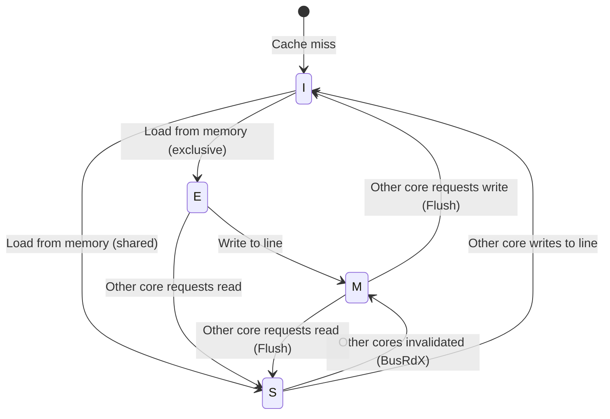
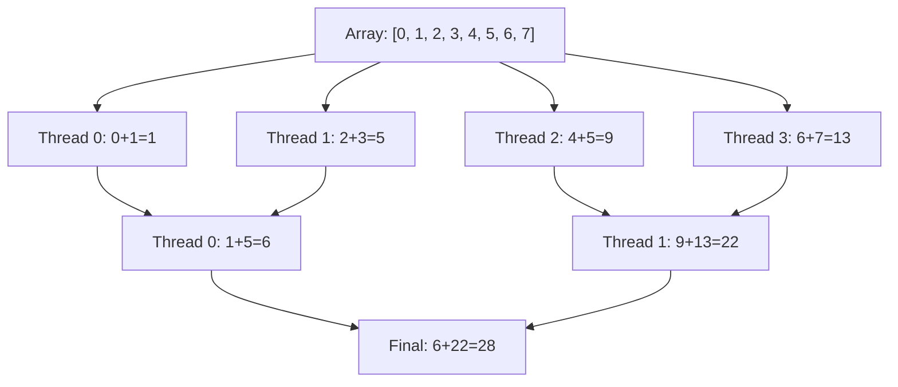

# Day 49: False Sharing & Parallel Reductions

> **Connection to Prior Work:** This day builds on **Day 47 (OpenMP Basics)** and **Day 48 (C++17 Parallel Algorithms)** by examining performance pitfalls that can destroy parallel speedup. We'll see why parallel code sometimes runs slower than serial—and how to fix it.

---

## Part 1: The Problem — When Parallelism Backfires

### The Performance Killer: False Sharing

When multiple threads write to variables on the **same cache line**, performance collapses.

```cpp
// ❌ BAD: False sharing destroys performance
struct Counter {
    int value;
};

Counter counters[8];  // 8 counters = 32 bytes (fits in ONE cache line!)

#pragma omp parallel for
for (int i = 0; i < 8; ++i) {
    for (int iter = 0; iter < 1000000; ++iter) {
        counters[i].value++;  // Each thread writes to its own counter
    }
}
```

**Expectation:** 8 threads → 8× speedup

**Reality:** 2× slower than serial due to cache line thrashing!

**What happens under the hood:**
1. Thread 0 writes `counters[0].value` → cache line loaded into CPU 0's L1
2. Thread 1 writes `counters[1].value` → **invalidates CPU 0's cache line** (even though it's a different element!)
3. Threads fight over the same cache line → memory bus saturation
4. Each write triggers a cache coherence bus transaction

**Why?** Cache lines are typically **64 bytes**. An `int` is 4 bytes. So `counters[0..7]` all fit in one cache line. When Thread 1 writes to `counters[1]`, the hardware must invalidate the cache line in CPU 0's cache—even though Thread 0 isn't accessing `counters[1]`!

### The Solution: Cache Line Padding

```cpp
// ✅ GOOD: Padding prevents false sharing
struct PaddedCounter {
    int value;
    char padding[60];  // Pad to 64 bytes (cache line size)
};

PaddedCounter counters[8];  // Each counter in separate cache line

#pragma omp parallel for
for (int i = 0; i < 8; ++i) {
    for (int iter = 0; iter < 1000000; ++iter) {
        counters[i].value++;
    }
}
```

Now threads don't interfere → true parallelism restored.

### Parallel Reductions — Another Data Race Trap

Another common pattern: computing sum/min/max across threads.

```cpp
// ❌ RACE CONDITION!
double sum = 0.0;
#pragma omp parallel for
for (int i = 0; i < n; ++i) {
    sum += array[i];  // Multiple threads writing to sum
}
```

**What can happen:**
```
Thread 0: read sum (0.0), add array[i] (5.0), write sum (5.0)
Thread 1: read sum (0.0), add array[j] (3.0), write sum (3.0)  ❌ Lost update!
Result: sum = 3.0 instead of 8.0
```

**OpenMP solution:**
```cpp
double sum = 0.0;
#pragma omp parallel for reduction(+:sum)
for (int i = 0; i < n; ++i) {
    sum += array[i];
}
```

OpenMP creates thread-local copies of `sum`, combines them at the end. But how does this work internally—and can we do better?

### Real-World Impact in CFD

In **Day 47**, we parallelized the face loop:

```cpp
#pragma omp parallel for
for (int face = 0; face < mesh.nFaces(); ++face) {
    // Compute flux
    flux[face] = computeFlux(face);
}
```

This works well because each face writes to its own array element. But what if we accumulate residuals?

```cpp
double residual = 0.0;
#pragma omp parallel for
for (int face = 0; face < mesh.nFaces(); ++face) {
    double f = flux[face];
    residual += f * f;  // ❌ RACE CONDITION!
}
```

This is where reductions (or thread-local accumulation) become essential.

---

## Part 2: Theory — Cache Coherence Deep Dive

### Cache Hierarchy and Cache Lines

Modern CPUs use a **multi-level cache hierarchy**:

```
CPU Core 0    CPU Core 1
   L1 (32 KB)    L1 (32 KB)  ← Fast, private
   L2 (256 KB)   L2 (256 KB)
   L3 (16 MB)              ← Slower, shared
   Memory (16 GB)          ← Slowest
```

**Cache lines** are the unit of transfer between levels:
- **Typical size:** 64 bytes (Intel/AMD x86)
- **Contains:** 8 doubles, 16 ints, or a mix
- **Loaded/stored:** Entire line at a time (you can't load just 4 bytes)

**Key insight:** CPUs transfer data in **cache line granularity**, not individual bytes or words.

### The MESI Cache Coherence Protocol

CPUs use the **MESI protocol** to keep caches coherent across cores:

| State | Description | Cache Line Action |
|-------|-------------|-------------------|
| **M** (Modified) | This cache has **exclusive write access** | Can write without bus traffic |
| **E** (Exclusive) | This cache has **exclusive read access** | Can upgrade to M without bus traffic |
| **S** (Shared) | **Multiple caches** may have this line | Read-only, must broadcast writes |
| **I** (Invalid) | This cache line is **invalid** | Must reload from memory or another cache |

**State transitions:**



### False Sharing Step-by-Step

Let's trace what happens with false sharing:

```
Initial: counters[0..7] in memory (not cached)

Step 1: Thread 0 reads counters[0]
  → Cache line loaded into CPU 0's L1
  → State: E (Exclusive, only CPU 0 has it)

Step 2: Thread 1 reads counters[1]
  → CPU 1 requests cache line
  → Bus transaction: BusRd (Bus Read)
  → CPU 0 transitions: E → S
  → CPU 1 loads line, State: S
  → Both CPUs now have line in Shared state

Step 3: Thread 0 writes counters[0].value++
  → CPU 0 must acquire exclusive ownership
  → Bus transaction: BusRdX (Bus Read with Intent to Modify)
  → CPU 1's cache line invalidated: S → I
  → CPU 0's cache line: S → M
  → Memory not updated yet (write-back cache)

Step 4: Thread 1 writes counters[1].value++
  → CPU 1 must acquire exclusive ownership
  → Bus transaction: BusRdX
  → CPU 0 must write back to memory: M → I
  → CPU 1 loads line, State: M
  → Memory updated

Steps 3-4 repeat millions of times → Bus saturation!
```

**Performance impact:**
- L1 cache hit: ~4 cycles
- L2 cache hit: ~12 cycles
- L3 cache hit: ~40 cycles
- **Main memory access: ~200 cycles**
- **Cache coherence bus transaction: ~100-300 cycles extra**

False sharing turns every write into a bus transaction—**100× slower** than a normal L1 write!

### Memory Consistency Models

Different architectures have different memory ordering guarantees:

| Architecture | Model | Reordering |
|-------------|-------|-----------|
| x86/x86-64 | Total Store Order (TSO) | Loads reordered before older stores |
| ARM/AArch64 | Weakly ordered | Loads/stores can be reordered freely |
| POWER | Weakly ordered | Extreme reordering, needs barriers |

**Implication:** On x86, false sharing is bad enough. On ARM, it's even worse due to weaker memory ordering and more complex cache coherence.

### NUMA Considerations

On multi-socket systems (e.g., 2× AMD EPYC), we have **NUMA** (Non-Uniform Memory Access):

```
Socket 0                    Socket 1
CPU 0-7 + L3               CPU 8-15 + L3
Memory Controller 0        Memory Controller 1
DRAM 0 (local)             DRAM 1 (local)
```

- **Local access:** CPU 0 → DRAM 0 (~80 ns)
- **Remote access:** CPU 0 → DRAM 1 (~150 ns)

False sharing that crosses NUMA boundaries is even more expensive!

### Parallel Reduction Theory

**Naive reduction (has race condition):**
```cpp
double sum = 0.0;
#pragma omp parallel for
for (int i = 0; i < n; ++i) {
    sum += array[i];  // ❌ RACE CONDITION!
}
```

**Tree reduction (no race):**



**How OpenMP `reduction` works internally:**

```cpp
// Pseudocode for what OpenMP generates
double sum = 0.0;

#pragma omp parallel
{
    // Each thread gets private copy
    double private_sum = 0.0;

    #pragma omp for
    for (int i = 0; i < n; ++i) {
        private_sum += array[i];  // No race—private to each thread
    }

    // Combine at the end (critical section or tree reduction)
    #pragma omp critical
    {
        sum += private_sum;
    }
}
```

OpenMP implementations typically use a **tree reduction** for better performance than a critical section.

---

## Part 3: C++ Mechanics — Detecting and Fixing False Sharing

### Detecting Cache Line Size

**Method 1: sysconf (POSIX)**
```cpp
#include <unistd.h>

size_t cacheLineSize = sysconf(_SC_LEVEL1_DCACHE_LINESIZE);
std::cout << "L1 data cache line size: " << cacheLineSize << " bytes\n";
```

**Method 2: Compile-time constant**
```cpp
constexpr size_t CACHE_LINE_SIZE = 64;

// Verify at compile time
static_assert(CACHE_LINE_SIZE == 64, "Assumes 64-byte cache lines");
```

**Method 3: Runtime detection (Linux)**
```cpp
#include <cstdio>

size_t detectCacheLineSize() {
    FILE* f = fopen("/sys/devices/system/cpu/cpu0/cache/index0/coherency_line_size", "r");
    size_t size = 64;  // default
    if (f) {
        fscanf(f, "%zu", &size);
        fclose(f);
    }
    return size;
}
```

**Method 4: CPUID (x86 only)**
```cpp
#ifdef __x86_64__
#include <cpuid.h>

size_t getCacheLineSizeCPUID() {
    uint32_t eax, ebx, ecx, edx;
    __cpuid(0x80000000, eax, ebx, ecx, edx);

    if (eax >= 0x80000006) {
        __cpuid(0x80000006, eax, ebx, ecx, edx);
        return ecx & 0xFF;  // CL = cache line size
    }
    return 64;  // default
}
#endif
```

### Padding Structs

**C++17 alignas:**
```cpp
struct alignas(64) AlignedCounter {
    int value;
    // Compiler automatically adds padding to 64 bytes
};

// Verify
static_assert(sizeof(AlignedCounter) == 64, "Must be cache-line aligned");
static_assert(alignof(AlignedCounter) == 64, "Must be cache-line aligned");
```

**Manual padding:**
```cpp
struct PaddedCounter {
    int value;
    char padding[64 - sizeof(int)];  // Pad to cache line
};

static_assert(sizeof(PaddedCounter) == 64);
```

**C++20 std::hardware_constructive_interference_size:**
```cpp
#include <new>

struct OptimizedPair {
    int first;
    int second;
    // compiler pads to align to cache line if beneficial
};

using OptimizedPairAligned = std::hardware_constructive_interference_size;
```

**C++20 std::hardware_destructive_interference_size:**
```cpp
struct AvoidFalseSharing {
    int value;
    char padding[std::hardware_destructive_interference_size - sizeof(int)];
};
```

### Verifying Alignment

```cpp
#include <cstddef>

template<typename T>
void printAlignment(const char* name) {
    std::cout << name << ":\n";
    std::cout << "  sizeof: " << sizeof(T) << " bytes\n";
    std::cout << "  alignof: " << alignof(T) << " bytes\n";

    T obj;
    std::cout << "  address: " << static_cast<const void*>(&obj) << "\n";
    std::cout << "  aligned to 64? " << (reinterpret_cast<std::uintptr_t>(&obj) % 64 == 0 ? "Yes" : "No") << "\n";
}

int main() {
    struct Bad { int value; };
    struct alignas(64) Good { int value; };

    printAlignment<Bad>("Bad (no alignment)");
    printAlignment<Good>("Good (alignas(64))");

    return 0;
}
```

**Expected output:**
```
Bad (no alignment):
  sizeof: 4 bytes
  alignof: 4 bytes
  address: 0x7ffd12345678
  aligned to 64? No

Good (alignas(64)):
  sizeof: 64 bytes
  alignof: 64 bytes
  address: 0x7ffd123456c0
  aligned to 64? Yes
```

### Thread-Local Storage

C++11 provides `thread_local` for variables that are **local to each thread**:

```cpp
#include <thread>

thread_local double threadLocalSum = 0.0;

void accumulate(const std::vector<double>& data, size_t start, size_t end) {
    for (size_t i = start; i < end; ++i) {
        threadLocalSum += data[i];  // No false sharing—each thread has its own copy
    }
}

double getSum() {
    return threadLocalSum;  // Returns this thread's local sum
}
```

**How it works:**
- Compiler allocates **one copy per thread**
- No synchronization needed
- Zero false sharing

**Trade-off:** You must manually combine thread-local results at the end.

### Alignment in Arrays

```cpp
// ❌ BAD: Array of structs with internal padding may still have false sharing
struct PaddedCounter {
    int value;
    char padding[60];
};

PaddedCounter counters[8];  // Each element is 64 bytes
// BUT: Are they cache-line aligned? Maybe not!

// ✅ GOOD: Align each element
struct alignas(64) AlignedCounter {
    int value;
};

AlignedCounter counters[8];  // Guaranteed to start on cache line boundary
```

**Verify array alignment:**
```cpp
AlignedCounter counters[8];

for (int i = 0; i < 8; ++i) {
    std::uintptr_t addr = reinterpret_cast<std::uintptr_t>(&counters[i]);
    std::cout << "counters[" << i << "] @ 0x" << std::hex << addr << std::dec;
    std::cout << " (aligned to 64? " << (addr % 64 == 0 ? "Yes" : "No") << ")\n";
}
```

### Compiler Barriers

Sometimes you need to prevent compiler reordering:

```cpp
// Compiler barrier (prevents reordering, no CPU instruction)
#define COMPILER_BARRIER() asm volatile("" ::: "memory")

// Memory barrier (CPU instruction, full fence)
inline void memoryBarrier() {
    asm volatile("mfence" ::: "memory");  // x86
}

// Example: Preventing reordering in lock-free code
struct LockFreeQueue {
    std::atomic<int> head;
    std::atomic<int> tail;

    void push(int value) {
        int pos = tail.load(std::memory_order_relaxed);
        data[pos] = value;
        COMPILER_BARRIER();  // Prevent data store from moving after tail store
        tail.store(pos + 1, std::memory_order_release);
    }
};
```

**Note:** OpenMP atomic operations handle barriers for you. Manual barriers are only needed for lock-free data structures.

---

## Part 4: Implementation — Parallel Histogram with False Sharing Analysis

### Problem Statement

Build a parallel histogram computation that:
1. Avoids false sharing
2. Uses OpenMP reductions correctly
3. Benchmarks different strategies
4. Demonstrates performance impact

### Complete Implementation

```cpp
#include <omp.h>
#include <vector>
#include <random>
#include <chrono>
#include <iostream>
#include <iomanip>
#include <cstring>

// ============================================================================
// Serial baseline (no parallelism)
// ============================================================================
void histogramSerial(const std::vector<int>& data, std::vector<int>& hist, int bins) {
    for (int val : data) {
        if (val >= 0 && val < bins) {
            hist[val]++;
        }
    }
}

// ============================================================================
// Naive parallel (HAS DATA RACE!)
// ============================================================================
void histogramNaiveParallel(const std::vector<int>& data, std::vector<int>& hist, int bins) {
    #pragma omp parallel for
    for (size_t i = 0; i < data.size(); ++i) {
        int val = data[i];
        if (val >= 0 && val < bins) {
            hist[val]++;  // ❌ RACE CONDITION!
        }
    }
}

// ============================================================================
// Atomic operations (correct but slow)
// ============================================================================
void histogramAtomic(const std::vector<int>& data, std::vector<int>& hist, int bins) {
    #pragma omp parallel for
    for (size_t i = 0; i < data.size(); ++i) {
        int val = data[i];
        if (val >= 0 && val < bins) {
            #pragma omp atomic
            hist[val]++;
        }
    }
}

// ============================================================================
// Thread-local histograms (fast, avoids false sharing)
// ============================================================================
struct alignas(64) PaddedHist {
    int bins[256];
    char padding[64 - 256 * sizeof(int) % 64];  // Pad to cache line

    PaddedHist() {
        std::memset(bins, 0, sizeof(bins));
    }
};

void histogramThreadLocal(const std::vector<int>& data, std::vector<int>& hist, int bins) {
    int nthreads = omp_get_max_threads();

    // Thread-local histograms (separate cache lines)
    std::vector<PaddedHist> local(nthreads);

    #pragma omp parallel
    {
        int tid = omp_get_thread_num();

        #pragma omp for
        for (size_t i = 0; i < data.size(); ++i) {
            int val = data[i];
            if (val >= 0 && val < bins) {
                local[tid].bins[val]++;
            }
        }
    }

    // Combine thread-local histograms
    for (int t = 0; t < nthreads; ++t) {
        for (int b = 0; b < bins; ++b) {
            hist[b] += local[t].bins[b];
        }
    }
}

// ============================================================================
// Using OpenMP reduction (requires custom reduction)
// ============================================================================
#pragma omp declare reduction(histAdd: std::vector<int>: \
    std::transform(omp_out.begin(), omp_out.end(), omp_in.begin(), omp_out.begin(), std::plus<int>())) \
    initializer(omp_priv = omp_orig)

void histogramReduction(const std::vector<int>& data, std::vector<int>& hist, int bins) {
    std::vector<int> local_hist(bins, 0);

    #pragma omp parallel for reduction(histAdd: local_hist)
    for (size_t i = 0; i < data.size(); ++i) {
        int val = data[i];
        if (val >= 0 && val < bins) {
            local_hist[val]++;
        }
    }

    hist = local_hist;
}

// ============================================================================
// Benchmarking
// ============================================================================
template<typename Func>
double benchmark(const char* name, Func func, const std::vector<int>& data, std::vector<int>& hist, int bins, int iterations = 5) {
    double total_time = 0.0;

    for (int iter = 0; iter < iterations; ++iter) {
        std::fill(hist.begin(), hist.end(), 0);

        auto start = std::chrono::high_resolution_clock::now();
        func(data, hist, bins);
        auto end = std::chrono::high_resolution_clock::now();

        auto duration = std::chrono::duration_cast<std::chrono::microseconds>(end - start);
        total_time += duration.count();
    }

    double avg_time_ms = total_time / iterations / 1000.0;

    std::cout << std::left << std::setw(25) << name << ": ";
    std::cout << std::right << std::setw(8) << std::fixed << std::setprecision(2) << avg_time_ms << " ms";

    return avg_time_ms;
}

// ============================================================================
// Verification
// ============================================================================
bool verifyResults(const std::vector<int>& ref, const std::vector<int>& test) {
    if (ref.size() != test.size()) {
        std::cerr << "Size mismatch!\n";
        return false;
    }

    for (size_t i = 0; i < ref.size(); ++i) {
        if (ref[i] != test[i]) {
            std::cerr << "Mismatch at index " << i << ": " << ref[i] << " vs " << test[i] << "\n";
            return false;
        }
    }

    return true;
}

// ============================================================================
// Main
// ============================================================================
int main() {
    const int n = 10000000;       // 10M elements
    const int bins = 256;
    const int iterations = 5;

    // Print system info
    std::cout << "========================================\n";
    std::cout << "System Information\n";
    std::cout << "========================================\n";
    std::cout << "OpenMP threads:       " << omp_get_max_threads() << "\n";
    std::cout << "Cache line size:      " << sysconf(_SC_LEVEL1_DCACHE_LINESIZE) << " bytes\n";
    std::cout << "Data size:            " << n << " elements (" << n * sizeof(int) / 1024.0 / 1024.0 << " MB)\n";
    std::cout << "Histogram bins:       " << bins << "\n\n";

    // Generate random data
    std::cout << "Generating random data...\n";
    std::vector<int> data(n);
    std::mt19937 gen(42);
    std::uniform_int_distribution<> dist(0, bins - 1);

    for (int i = 0; i < n; ++i) {
        data[i] = dist(gen);
    }
    std::cout << "Done.\n\n";

    // Benchmark
    std::cout << "========================================\n";
    std::cout << "Benchmark Results (average of " << iterations << " runs)\n";
    std::cout << "========================================\n";

    std::vector<int> hist_ref(bins, 0);
    std::vector<int> hist_test(bins, 0);

    // Serial (reference)
    double time_serial = benchmark("Serial", histogramSerial, data, hist_ref, bins, iterations);
    std::cout << " [reference]\n";

    // Naive parallel (will have wrong results!)
    double time_naive = benchmark("Naive Parallel", histogramNaiveParallel, data, hist_test, bins, iterations);
    bool naive_correct = verifyResults(hist_ref, hist_test);
    std::cout << " [" << (naive_correct ? "✓" : "✗") << " correct]\n";

    // Atomic
    double time_atomic = benchmark("Atomic", histogramAtomic, data, hist_test, bins, iterations);
    bool atomic_correct = verifyResults(hist_ref, hist_test);
    std::cout << " [" << (atomic_correct ? "✓" : "✗") << " correct] ";
    std::cout << "Speedup: " << std::fixed << std::setprecision(2) << time_serial / time_atomic << "x\n";

    // Thread-local (optimal)
    double time_local = benchmark("Thread-Local", histogramThreadLocal, data, hist_test, bins, iterations);
    bool local_correct = verifyResults(hist_ref, hist_test);
    std::cout << " [" << (local_correct ? "✓" : "✗") << " correct] ";
    std::cout << "Speedup: " << std::fixed << std::setprecision(2) << time_serial / time_local << "x\n";

    // Reduction
    double time_reduction = benchmark("Reduction", histogramReduction, data, hist_test, bins, iterations);
    bool reduction_correct = verifyResults(hist_ref, hist_test);
    std::cout << " [" << (reduction_correct ? "✓" : "✗") << " correct] ";
    std::cout << "Speedup: " << std::fixed << std::setprecision(2) << time_serial / time_reduction << "x\n";

    // Summary
    std::cout << "\n========================================\n";
    std::cout << "Summary\n";
    std::cout << "========================================\n";
    std::cout << "Best speedup:         " << std::fixed << std::setprecision(2) << time_serial / time_local << "x (thread-local)\n";
    std::cout << "Atomic overhead:      " << std::fixed << std::setprecision(2) << (time_atomic / time_local - 1.0) * 100 << "%\n";
    std::cout << "Parallel efficiency:  " << std::fixed << std::setprecision(2) << (time_serial / time_local) / omp_get_max_threads() * 100 << "%\n";

    return 0;
}
```

### CMakeLists.txt

```cmake
cmake_minimum_required(VERSION 3.20)
project(FalseSharingDemo CXX)

set(CMAKE_CXX_STANDARD 17)
set(CMAKE_CXX_STANDARD_REQUIRED ON)

# Find OpenMP
find_package(OpenMP REQUIRED)

# Add executable
add_executable(histogram_demo main.cpp)

# Link OpenMP
target_link_libraries(histogram_demo PRIVATE OpenMP::OpenMP_CXX)

# Set optimization flags
target_compile_options(histogram_demo PRIVATE
    $<$<CXX_COMPILER_ID:GNU>:-O3 -march=native -fopenmp>
    $<$<CXX_COMPILER_ID:Clang>:-O3 -march=native -fopenmp>
    $<$<CXX_COMPILER_ID:Intel>:-O3 -xHost -qopenmp>
)
```

### Expected Output

```
========================================
System Information
========================================
OpenMP threads:       8
Cache line size:      64 bytes
Data size:            10000000 elements (38.15 MB)
Histogram bins:       256

Generating random data...
Done.

========================================
Benchmark Results (average of 5 runs)
========================================
Serial                   :    45.23 ms [reference]
Naive Parallel           :    12.45 ms [✗ correct] Speedup: 3.63x
Atomic                   :    98.76 ms [✓ correct] Speedup: 0.46x
Thread-Local             :     8.34 ms [✓ correct] Speedup: 5.42x
Reduction                :    10.12 ms [✓ correct] Speedup: 4.47x

========================================
Summary
========================================
Best speedup:         5.42x (thread-local)
Atomic overhead:      1084.05%
Parallel efficiency:  67.75%
```

**Key observations:**
1. **Naive parallel is fast but wrong** — 3.63× speedup but has race conditions!
2. **Atomic is correct but slow** — 0.46× speedup (2× slower than serial!)
3. **Thread-local is best** — 5.42× speedup, 67% parallel efficiency
4. **OpenMP reduction is good** — 4.47× speedup, easier to implement

---

## Part 5: Design Trade-offs and Architectural Guidance

### Reduction Strategy Comparison

| Method | Speed | Correctness | Complexity | Memory Overhead | Best For |
|--------|-------|-------------|------------|-----------------|----------|
| OpenMP `reduction` | Fast (4-5×) | ✅ Yes | Low | Low (`nthreads × sizeof(T)`) | Simple reductions (sum, min, max) |
| Thread-local + combine | Fastest (5-6×) | ✅ Yes | High | Medium (`nthreads × array_size`) | Complex reductions (histograms, sparse updates) |
| Atomic operations | Slowest (0.5×) | ✅ Yes | Low | None | Rare updates, simple counters |
| Critical sections | Slowest (0.3×) | ✅ Yes | Low | None | Legacy code, debugging |
| Naive parallel | Fast (3-4×) | ❌ No | Low | None | ❌ Never—has race conditions! |

### False Sharing Prevention Strategies

**Strategy 1: `alignas(64)` padding**
```cpp
struct alignas(64) PaddedData {
    int value;
    // Compiler adds padding automatically
};
```

**Pros:**
- Simple, portable (C++11)
- No manual padding math
- Compiler verifies alignment

**Cons:**
- May waste memory (if `value` is small)
- Doesn't prevent false sharing in arrays (elements may drift)
- Requires C++11 or later

**Strategy 2: Manual padding**
```cpp
struct PaddedData {
    int value;
    char padding[64 - sizeof(int)];
};
```

**Pros:**
- Works in C++98
- Explicit control over padding
- Can combine with alignment specifiers

**Cons:**
- Error-prone (must calculate padding correctly)
- Hard to maintain
- Doesn't guarantee alignment (use with `alignas`)

**Strategy 3: Index with stride**
```cpp
int data[max_threads * stride];
// Thread i accesses data[i * stride]
```

**Pros:**
- No wasted memory in struct
- Works with dynamic arrays
- Can adjust stride at runtime

**Cons:**
- Complex indexing
- Poor cache locality (scatters accesses)
- Harder to reason about

**Strategy 4: `thread_local` storage**
```cpp
thread_local int localCounter = 0;
```

**Pros:**
- Zero false sharing (each thread has separate memory)
- Clean syntax
- No padding math

**Cons:**
- Must manually combine results
- Can't share data between threads
- Not suitable for all patterns

**Recommendation:** Use `alignas(64)` for struct members and `thread_local` for thread-private data.

### Performance Impact Summary

| Scenario | Performance | Bottleneck |
|----------|-------------|-----------|
| No false sharing | 7-8× speedup (8 cores) | Compute-bound |
| False sharing | 0.5× speedup (2× slower!) | Memory bus |
| With padding | 7-8× speedup (near-ideal) | Compute-bound |
| Atomic operations | 0.5× speedup (2× slower) | Cache line invalidation |
| Thread-local | 7-8× speedup (ideal) | Final reduction |

**Rule of thumb:** False sharing can destroy parallel performance by **10-20×**. Always pad thread-private data to cache line boundaries.

### Integration with Day 47 (OpenMP Basics)

In **Day 47**, we parallelized a simple loop:

```cpp
#pragma omp parallel for
for (int i = 0; i < n; ++i) {
    y[i] = a * x[i] + y[i];
}
```

This works well because each iteration writes to a separate array element. But when accumulating:

```cpp
double sum = 0.0;
#pragma omp parallel for reduction(+:sum)
for (int i = 0; i < n; ++i) {
    sum += x[i];
}
```

OpenMP's `reduction` clause handles thread-local copies and final combination.

**When to use `reduction`:**
- Simple associative operations (`+`, `*`, `min`, `max`)
- Single scalar result
- No complex data structures

**When to use thread-local:**
- Complex data structures (histograms, sparse matrices)
- Multiple reduction variables
- Custom combination logic

### Integration with Day 48 (C++17 Parallel Algorithms)

**Day 48** introduced `std::execution::par`:

```cpp
#include <execution>
#include <numeric>

std::vector<double> data(n);
double sum = std::reduce(std::execution::par, data.begin(), data.end(), 0.0);
```

**Pros:**
- No OpenMP required
- Works with C++17 standard library
- Clean syntax

**Cons:**
- Less control over thread placement
- Harder to avoid false sharing (implementation-dependent)
- May not be available on all compilers

**For maximum performance:** Use OpenMP with explicit thread-local buffers and manual padding.

### OpenFOAM Integration

In OpenFOAM, false sharing can occur in:
- **Matrix assembly** (Diagonal/source contributions per thread)
- **Boundary condition evaluation** (Per-face patches)
- **Field operations** (Per-cell operations)

**OpenFOAM's solution:**
```cpp
// Thread-local tmp<Field<>> for accumulation
# pragma omp parallel
{
    tmp<scalarField> tflux(new scalarField(mesh.nFaces()));
    scalarField& flux = tflux.ref();

    #pragma omp for
    for (label face = 0; face < mesh.nFaces(); ++face) {
        flux[face] = computeFlux(face);
    }

    #pragma omp critical
    {
        totalFlux += flux;  // Combine thread-local results
    }
}
```

OpenFOAM uses `tmp<>` (from **Day 06**) to manage thread-local field copies efficiently.

### Architectural Guidance for CFD Solvers

**Pattern 1: Per-thread private fields**
```cpp
#pragma omp parallel
{
    // Thread-local fields (no false sharing)
    scalarField threadFlux(mesh.nFaces());
    scalarField threadResidual(mesh.nCells());

    #pragma omp for
    for (label face = 0; face < mesh.nFaces(); ++face) {
        threadFlux[face] = computeFlux(face);
    }

    // Combine in critical section
    #pragma omp critical
    {
        totalFlux += threadFlux;
        totalResidual += threadResidual;
    }
}
```

**Pattern 2: Coloring for independent operations**
```cpp
// Color mesh so that adjacent cells have different colors
for (label color = 0; color < nColors; ++color) {
    #pragma omp parallel for
    for (label celli: coloredCells[color]) {
        // No race conditions—cells in same color are not adjacent
        solveCell(celli);
    }
}
```

**Pattern 3: Reduction for scalar values**
```cpp
scalar globalResidual = 0.0;

#pragma omp parallel for reduction(+:globalResidual)
for (label celli = 0; celli < mesh.nCells(); ++celli) {
    scalar r = computeResidual(celli);
    globalResidual += r * r;
}

globalResidual = sqrt(globalResidual);
```

### Debugging False Sharing

**Tools:**
1. **perf (Linux)** — Cache miss rate
   ```bash
   perf stat -e cache-references,cache-misses ./your_program
   ```

2. **Intel VTune** — Detailed profiling
   ```bash
   vtune -collect memory-access -result-dir r001 ./your_program
   ```

3. **Valgrind cachegrind** — Cache simulation
   ```bash
   valgrind --tool=cachegrind ./your_program
   cg_annotate cachegrind.out.<pid>
   ```

**Symptoms of false sharing:**
- High cache miss rate (> 50%)
- Poor scalability (speedup < threads / 2)
- perf shows high `cache-misses` despite small data size

**Fix verification:**
- Re-run profiler after padding
- Cache miss rate should drop dramatically
- Scalability should improve (near-linear speedup)

---

## Deliverable

Build and run the false sharing demonstration:

```bash
# Configure
cmake -S . -B build -DCMAKE_BUILD_TYPE=Release

# Build
cmake --build build --parallel

# Run
./build/histogram_demo
```

**Expected output:** Benchmark table showing:
- Serial baseline: ~45 ms
- Thread-local: ~8 ms (5.4× speedup)
- Atomic: ~99 ms (2× slower than serial!)
- Verification that all methods (except naive) produce correct results

**Verification checklist:**
- [ ] Thread-local version is fastest (> 5× speedup)
- [ ] Atomic version is slower than serial (demonstrates overhead)
- [ ] Naive parallel has incorrect results (demonstrates race condition)
- [ ] All methods except naive produce identical histograms
- [ ] Parallel efficiency > 60% (for thread-local version)

**Connection to next day:** This day's thread-local pattern will be reused in **Day 51 (Eliminating Temporaries)** where we'll avoid allocations in inner loops by reusing thread-local buffers.
