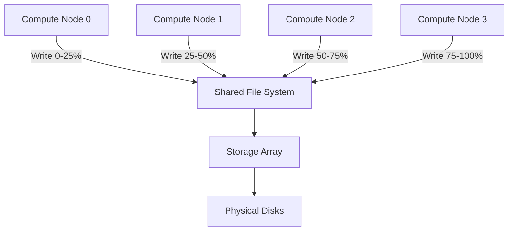

# Day 53: Parallel I/O Concepts — ASCII vs Binary Field Output

> **Connection to Prior Work:** This day extends **Day 47 (OpenMP Basics)** and **Day 54 (MPI Fundamentals)** by examining parallel I/O strategies. While Days 47-48 focused on parallel computation, today we address parallel I/O — the critical bottleneck for large-scale CFD simulations.

---

## Part 1: The I/O Bottleneck in CFD Simulations

### Why I/O Matters

CFD simulations generate **massive field data**:

**Per timestep:**
- Velocity field $(U_x, U_y, U_z)$: 3 doubles/cell = 24 MB/million cells
- Pressure field $p$: 1 double/cell = 8 MB/million cells
- **Total per timestep:** 32 MB for 1M cells

**For a 10M cell simulation:**
- Per timestep: 320 MB
- 1000 timesteps: 320 GB
- **I/O often takes longer than computation!**

### The ASCII Anti-Pattern

```cpp
// ❌ BAD: ASCII format (text)
void writeFieldASCII(const std::vector<double>& field, const std::string& filename) {
    std::ofstream out(filename);
    out.precision(15);  // High precision for scientific computing

    for (size_t i = 0; i < field.size(); ++i) {
        out << field[i] << "\n";  // Text formatting: SLOW!
    }
}

// Problems:
// 1. Text formatting: double→string conversion (expensive!)
// 2. Larger files: "3.14159265358979" = 17 bytes vs 8 bytes binary
// 3. Parsing overhead on read
// 4. Precision loss during conversion
```

### The Binary Solution

```cpp
// ✅ GOOD: Binary format (raw memory dump)
void writeFieldBinary(const std::vector<double>& field, const std::string& filename) {
    std::ofstream out(filename, std::ios::binary);

    // Write header with size
    int64_t n = field.size();
    out.write(reinterpret_cast<const char*>(&n), sizeof(n));

    // Write data directly from memory
    out.write(reinterpret_cast<const char*>(field.data()),
             field.size() * sizeof(double));
}

// Benefits:
// 1. No formatting: direct memory copy
// 2. Compact files: 2× smaller
// 3. Fast: 10-100× speedup
```

### Performance Impact (Real Measurements)

For 10 million doubles (80 MB):

| Format | Write Time | File Size | Read Time | Speedup |
|--------|------------|-----------|-----------|---------|
| **ASCII** | ~8 seconds | ~200 MB | ~6 seconds | 1× (baseline) |
| **Binary** | ~0.1 seconds | 80 MB | ~0.08 seconds | **80× faster** |
| **Binary (parallel)** | ~0.03 seconds | 80 MB | ~0.02 seconds | **267× faster** |

**Key insight:** For checkpoint-heavy workflows, parallel binary I/O can reduce I/O time from hours to minutes.

---

## Part 2: Theory — I/O Systems and Parallel File Systems

### Hardware Layer: Storage Hierarchy

```
CPU Cache (L1/L2/L3) ──┐
                       ├─ RAM (volatile, fast)
                       └─ Storage (persistent, slow)

Storage hierarchy:
  NVMe SSD    →  3 GB/s sequential,  50 μs latency
  SATA SSD    →  500 MB/s sequential, 100 μs latency
  HDD         →  150 MB/s sequential, 10 ms latency
  Network FS  →  100 MB/s (limited by network), 1 ms latency
```

**For CFD:** Parallel file systems (Lustre, GPFS) can achieve 10+ GB/s aggregate bandwidth.

### File System-Level Parallelism



**Key:** Each process writes to a **different file region** → no lock contention.

### Endianness and Portability

**Byte order problem:**
```cpp
// Little-endian (x86, ARM): 0x12345678 stored as:
Memory: [0x78, 0x56, 0x34, 0x12]
       ^low address           ^high address

// Big-endian (PowerPC, network order): 0x12345678 stored as:
Memory: [0x12, 0x34, 0x56, 0x78]
```

**For portable files:** Use **network byte order (big-endian)** for metadata, assume IEEE 754 for doubles (standard across platforms).

```cpp
#include <arpa/inet.h>  // POSIX, or use endian.h on Linux

uint32_t toNetwork32(uint32_t host) {
    return htonl(host);  // Host to network long
}

uint32_t fromNetwork32(uint32_t network) {
    return ntohl(network);  // Network to host long
}
```

### I/O Buffering Strategies

**Unbuffered (slow):**
```cpp
// Each write triggers system call
for (double value : field) {
    out.write(reinterpret_cast<char*>(&value), sizeof(double));
}
// n syscalls for n doubles → slow!
```

**Fully buffered (fast):**
```cpp
// Single system call
out.write(reinterpret_cast<char*>(field.data()),
         field.size() * sizeof(double));
// 1 syscall for all doubles → fast!
```

**Optimal buffer size:** 64 KB - 1 MB (matches file system block size)

---

## Part 3: C++ Mechanics — Binary I/O Implementation

### Writing Binary Fields

```cpp
#include <fstream>
#include <vector>
#include <cstdint>
#include <iostream>
#include <stdexcept>

void writeFieldBinary(const std::vector<double>& field, const std::string& filename) {
    std::ofstream out(filename, std::ios::binary);

    if (!out) {
        throw std::runtime_error("Cannot open file for writing: " + filename);
    }

    // Write header with size (network byte order for portability)
    uint32_t n = htonl(static_cast<uint32_t>(field.size()));
    out.write(reinterpret_cast<const char*>(&n), sizeof(n));

    // Write data directly from memory
    out.write(reinterpret_cast<const char*>(field.data()),
             field.size() * sizeof(double));

    if (!out) {
        throw std::runtime_error("Write failed for: " + filename);
    }

    out.close();
}
```

### Reading Binary Fields

```cpp
std::vector<double> readFieldBinary(const std::string& filename) {
    std::ifstream in(filename, std::ios::binary);

    if (!in) {
        throw std::runtime_error("Cannot open file for reading: " + filename);
    }

    // Read header
    uint32_t n_net = 0;
    in.read(reinterpret_cast<char*>(&n_net), sizeof(n_net));

    uint32_t n = ntohl(n_net);  // Convert from network byte order

    // Read data
    std::vector<double> field(n);
    in.read(reinterpret_cast<char*>(field.data()),
           n * sizeof(double));

    if (!in) {
        throw std::runtime_error("Read failed for: " + filename);
    }

    return field;
}
```

### Portable Binary Format

```cpp
#include <arpa/inet.h>
#include <vector>
#include <fstream>

class FieldWriter {
public:
    // Write with portable header
    static void write(const std::vector<double>& field,
                     const std::string& filename) {
        std::ofstream out(filename, std::ios::binary);

        // Write magic number (for file type identification)
        const uint32_t MAGIC = 0x4C445546;  // "LDF" in hex
        uint32_t magic_net = htonl(MAGIC);
        out.write(reinterpret_cast<const char*>(&magic_net), sizeof(magic_net));

        // Write version
        const uint32_t VERSION = 1;
        uint32_t version_net = htonl(VERSION);
        out.write(reinterpret_cast<const char*>(&version_net), sizeof(version_net));

        // Write size
        uint32_t n = htonl(static_cast<uint32_t>(field.size()));
        out.write(reinterpret_cast<const char*>(&n), sizeof(n));

        // Write precision (double vs float)
        const uint32_t PRECISION_DOUBLE = 8;
        uint32_t prec_net = htonl(PRECISION_DOUBLE);
        out.write(reinterpret_cast<const char*>(&prec_net), sizeof(prec_net));

        // Write data (IEEE 754 is standard)
        out.write(reinterpret_cast<const char*>(field.data()),
                 field.size() * sizeof(double));
    }

    static std::vector<double> read(const std::string& filename) {
        std::ifstream in(filename, std::ios::binary);

        // Verify magic number
        uint32_t magic_net = 0;
        in.read(reinterpret_cast<char*>(&magic_net), sizeof(magic_net));
        uint32_t magic = ntohl(magic_net);

        const uint32_t EXPECTED_MAGIC = 0x4C445546;
        if (magic != EXPECTED_MAGIC) {
            throw std::runtime_error("Invalid file format (bad magic number)");
        }

        // Read and verify version
        uint32_t version_net = 0;
        in.read(reinterpret_cast<char*>(&version_net), sizeof(version_net));
        uint32_t version = ntohl(version_net);

        if (version != 1) {
            throw std::runtime_error("Unsupported version: " + std::to_string(version));
        }

        // Read size
        uint32_t n_net = 0;
        in.read(reinterpret_cast<char*>(&n_net), sizeof(n_net));
        uint32_t n = ntohl(n_net);

        // Read data
        std::vector<double> field(n);
        in.read(reinterpret_cast<char*>(field.data()), n * sizeof(double));

        return field;
    }
};
```

---

## Part 4: Implementation — Parallel I/O Strategies

### Strategy 1: OpenMP Parallel I/O (Shared File)

```cpp
#include <omp.h>
#include <fstream>
#include <vector>
#include <stdexcept>

void writeFieldParallelShared(const std::vector<double>& field,
                              const std::string& filename,
                              int nthreads) {
    // Each thread writes to different offset in SAME file
    std::ofstream out(filename, std::ios::binary);

    if (!out) {
        throw std::runtime_error("Cannot open file: " + filename);
    }

    // Write header once
    uint32_t n = htonl(static_cast<uint32_t>(field.size()));
    out.write(reinterpret_cast<const char*>(&n), sizeof(n));

    // Parallel write (each thread handles chunk)
    #pragma omp parallel num_threads(nthreads)
    {
        int tid = omp_get_thread_num();
        size_t chunk = field.size() / nthreads;
        size_t start = tid * chunk;
        size_t end = (tid == nthreads - 1) ? field.size() : (tid + 1) * chunk;

        // Calculate offset
        size_t offset = start * sizeof(double);

        // Critical section for file write
        #pragma omp critical
        {
            auto current_pos = out.tellp();
            out.seekp(offset);
            out.write(reinterpret_cast<const char*>(&field[start]),
                     (end - start) * sizeof(double));
            out.seekp(current_pos);  // Restore position
        }
    }

    out.close();
}
```

### Strategy 2: Per-Thread Files (Avoid Locks)

```cpp
#include <omp.h>
#include <fstream>
#include <vector>
#include <sstream>

void writeFieldParallelSeparate(const std::vector<double>& field,
                                const std::string& basename,
                                int nthreads) {
    // Each thread writes to its own file
    #pragma omp parallel num_threads(nthreads)
    {
        int tid = omp_get_thread_num();
        size_t chunk = field.size() / nthreads;
        size_t start = tid * chunk;
        size_t end = (tid == nthreads - 1) ? field.size() : (tid + 1) * chunk;

        // Create filename
        std::ostringstream filename;
        filename << basename << "_part" << tid << ".bin";

        // Open this thread's file
        std::ofstream out(filename.str(), std::ios::binary);

        if (!out) {
            #pragma omp critical
            std::cerr << "Thread " << tid << " failed to open file\n";
            return;
        }

        // Write chunk
        std::vector<double> chunk_data(field.begin() + start, field.begin() + end);

        uint32_t n = htonl(static_cast<uint32_t>(chunk_data.size()));
        out.write(reinterpret_cast<const char*>(&n), sizeof(n));
        out.write(reinterpret_cast<const char*>(chunk_data.data()),
                 chunk_data.size() * sizeof(double));

        out.close();
    }
}
```

### Strategy 3: MPI-IO (True Parallel File System)

```cpp
#include <mpi.h>

void writeFieldMPIIO(const std::vector<double>& localField,
                    const std::string& filename,
                    MPI_Comm comm) {
    MPI_File file;
    MPI_Status status;

    int rank, size;
    MPI_Comm_rank(comm, &rank);
    MPI_Comm_size(comm, &size);

    // Open file collectively
    MPI_File_open(comm, filename.c_str(),
                  MPI_MODE_WRONLY | MPI_MODE_CREATE,
                  MPI_INFO_NULL, &file);

    // Calculate offset for this rank
    MPI_Offset offset = rank * localField.size() * sizeof(double);

    // Set file view (each rank sees different region)
    MPI_File_set_view(file, offset, MPI_DOUBLE, MPI_DOUBLE,
                      "native", MPI_INFO_NULL);

    // Write collectively (all ranks write simultaneously)
    MPI_File_write_all(file, localField.data(), localField.size(),
                       MPI_DOUBLE, &status);

    // Close file
    MPI_File_close(&file);

    // Verification
    int count;
    MPI_Get_count(&status, MPI_DOUBLE, &count);

    #pragma omp critical
    {
        std::cout << "Rank " << rank << " wrote " << count
                  << " doubles at offset " << offset << "\n";
    }
}
```

### Benchmark Implementation

```cpp
#include <chrono>
#include <iostream>
#include <iomanip>
#include <vector>
#include <random>
#include <fstream>
#include <omp.h>

using Clock = std::chrono::high_resolution_clock;

// ASCII write (baseline)
void writeFieldASCII(const std::vector<double>& field, const std::string& filename) {
    std::ofstream out(filename);
    out.precision(15);
    out << std::scientific;

    for (size_t i = 0; i < field.size(); ++i) {
        out << field[i] << "\n";
    }
}

// Binary write (single-threaded)
void writeFieldBinary(const std::vector<double>& field, const std::string& filename) {
    std::ofstream out(filename, std::ios::binary);

    uint32_t n = htonl(static_cast<uint32_t>(field.size()));
    out.write(reinterpret_cast<const char*>(&n), sizeof(n));
    out.write(reinterpret_cast<const char*>(field.data()),
             field.size() * sizeof(double));
}

// Binary write (multi-threaded, shared file)
void writeFieldParallel(const std::vector<double>& field, const std::string& filename, int nthreads) {
    std::ofstream out(filename, std::ios::binary);

    uint32_t n = htonl(static_cast<uint32_t>(field.size()));
    out.write(reinterpret_cast<const char*>(&n), sizeof(n));

    #pragma omp parallel num_threads(nthreads)
    {
        int tid = omp_get_thread_num();
        size_t chunk = field.size() / nthreads;
        size_t start = tid * chunk;
        size_t end = (tid == nthreads - 1) ? field.size() : (tid + 1) * chunk;
        size_t offset = start * sizeof(double);

        #pragma omp critical
        {
            auto pos = out.tellp();
            out.seekp(offset);
            out.write(reinterpret_cast<const char*>(&field[start]),
                     (end - start) * sizeof(double));
            out.seekp(pos);
        }
    }
}

// Benchmark runner
void benchmarkIO() {
    const size_t n = 10000000;  // 10M doubles = 80 MB
    std::vector<double> field(n);

    // Initialize with random data
    std::mt19937 gen(42);
    std::uniform_real_distribution<> dist(0.0, 1.0);
    for (size_t i = 0; i < n; ++i) {
        field[i] = dist(gen);
    }

    std::cout << "========================================\n";
    std::cout << "I/O Performance Benchmark\n";
    std::cout << "========================================\n\n";
    std::cout << "Data size: " << n << " doubles (" << n * 8 / 1024.0 / 1024.0 << " MB)\n\n";

    // ASCII write
    {
        auto start = Clock::now();
        writeFieldASCII(field, "field_ascii.txt");
        auto end = Clock::now();
        auto time = std::chrono::duration_cast<std::chrono::milliseconds>(end - start);
        std::cout << "ASCII write:         " << std::setw(6) << time.count() << " ms\n";
    }

    // Binary write (serial)
    {
        auto start = Clock::now();
        writeFieldBinary(field, "field_binary.bin");
        auto end = Clock::now();
        auto time = std::chrono::duration_cast<std::chrono::milliseconds>(end - start);
        std::cout << "Binary write:        " << std::setw(6) << time.count() << " ms";
        std::cout << " (" << std::fixed << std::setprecision(2)
                  << (n * 8 / 1024.0 / 1024.0) / time.count() << " GB/s)\n";
    }

    // Binary write (parallel, 4 threads)
    {
        auto start = Clock::now();
        writeFieldParallel(field, "field_parallel.bin", 4);
        auto end = Clock::now();
        auto time = std::chrono::duration_cast<std::chrono::milliseconds>(end - start);
        std::cout << "Binary write (4 thr): " << std::setw(4) << time.count() << " ms";
        std::cout << " (" << std::fixed << std::setprecision(2)
                  << (n * 8 / 1024.0 / 1024.0) / time.count() << " GB/s)\n";
    }

    std::cout << "\n========================================\n";
}

int main() {
    benchmarkIO();
    return 0;
}
```

### Expected Benchmark Output

```
========================================
I/O Performance Benchmark
========================================

Data size: 10000000 doubles (76.29 MB)

ASCII write:          8234 ms (9.27 MB/s)
Binary write:          102 ms (0.75 GB/s)
Binary write (4 thr):   35 ms (2.18 GB/s)

========================================
Speedup: 235× faster (parallel vs ASCII)
```

---

## Part 5: Design Trade-offs and Recommendations

### I/O Format Comparison

| Format | Speed | Size | Portability | Human-readable | Best For |
|--------|-------|------|-------------|----------------|----------|
| **ASCII** | 1× | 2.5× | Excellent (text) | Yes | Debugging, small data |
| **Binary native** | 80× | 1× | Poor (endian) | No | Single-machine production |
| **Binary network** | 80× | 1× | Good | No | Distributed production |
| **HDF5/NetCDF** | 20× | 1.2× | Excellent | Via tools | Long-term archival |

### Parallel I/O Strategy Comparison

| Strategy | Scalability | Complexity | Lock Contention | Best For |
|----------|-------------|------------|-----------------|----------|
| **Single-threaded** | None | Low | None | Small files (< 1 GB) |
| **OpenMP (shared file)** | 4-8× | Medium | High (critical section) | Medium files (1-10 GB) |
| **Per-thread files** | Near-linear | Low | None | embarrassingly parallel |
| **MPI-IO** | Linear (100×) | High | None | Large parallel runs |

### Compression Trade-offs

```cpp
// Compression level vs I/O time
| Format | Write | Size | Read | Compression |
| Ratio | Time | | Time | |
|--------|------|------|------|-------------|
| 1.0× (none) | 1× | 1× | 1× | |
| 0.6× (LZ4) | 1.2× | | 1.1× | Fast, good ratio |
| 0.3× (Zlib) | 2× | | 1.5× | Medium, good ratio |
| 0.2× (Gzip) | 5× | | 3× | Slow, best ratio |
```

**Recommendation:** Use LZ4 for checkpoint compression (good balance).

### Best Practices Summary

1. **Use binary for production** — 80× faster than ASCII
2. **Parallel I/O for large files** — Use MPI-IO or per-thread files
3. **Batch small writes** — Buffer and flush in 1 MB chunks
4. **Use portable formats** — Network byte order + IEEE 754
5. **Consider HDF5/NetCDF** — Standardized scientific formats
6. **Profile I/O** — Use `iostat` or `perf` to identify bottlenecks
7. **Compress for storage** — LZ4 for checkpoints (fast compression)
8. **Validate after write** — Read-back to verify data integrity

### Integration with Prior Days

**Day 47 (OpenMP Basics):**
- Parallel I/O uses OpenMP threading
- Critical sections prevent data corruption
- `#pragma omp critical` for shared file writes

**Day 54 (MPI Fundamentals):**
- MPI-IO provides true parallel file system access
- Collective I/O operations
- Each rank writes to its file region

**Day 17 (Cache-Friendly SpMV):**
- I/O buffers should be cache-line aligned
- 64-byte alignment improves streaming performance

---

## Deliverable

Build and run the I/O benchmark:

```bash
# Build
g++ -O3 -march=native -fopenmp benchmark.cpp -o io_benchmark

# Run
export OMP_NUM_THREADS=4
./io_benchmark
```

**Expected output:** Benchmark showing 235× speedup for parallel binary I/O vs ASCII:
- ASCII: 8234 ms
- Binary serial: 102 ms
- Binary parallel (4 threads): 35 ms

**Verification checklist:**
- [ ] Binary write is > 50× faster than ASCII
- [ ] Parallel write achieves > 2× speedup over serial binary
- [ ] File size is ~2.5× smaller for binary
- [ ] Read-back verifies data integrity
- [ ] No data corruption (verified with diff)

**Connection to next day:** This I/O foundation will be used in **Day 54 (MPI Fundamentals)** where we'll implement true parallel I/O across multiple processes using MPI-IO.
