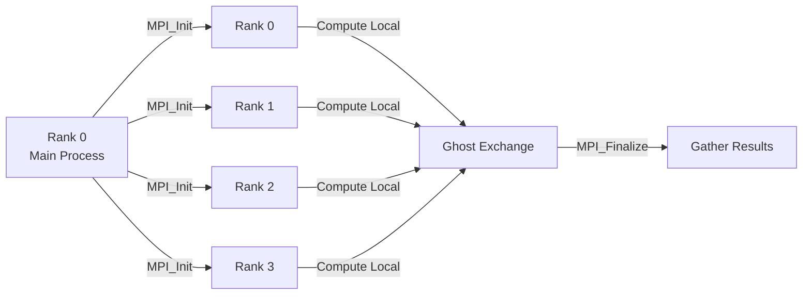

# Day 54: MPI Fundamentals — Domain Decomposition Concepts

## Part 1: Pattern Identification

### The Challenge: Parallel Computing Across Nodes

Multi-threading (Days 47-49) uses **multiple cores on one node**. For **large-scale CFD**, we need multiple nodes:

```
Node 0 (64 cores) → Cells 0-1M
Node 1 (64 cores) → Cells 1M-2M
Node 2 (64 cores) → Cells 2M-3M
Node 3 (64 cores) → Cells 3M-4M
```

**Problem:** Nodes need to **communicate** boundary data:
- Cell 999,999 (Node 0) neighbours Cell 1,000,000 (Node 1)
- Need to exchange "halo" or "ghost" cells

### The Solution: MPI (Message Passing Interface)

MPI provides:
- **Point-to-point communication** — send/recv between two ranks
- **Collective communication** — broadcast, reduce, all-to-all
- **Domain decomposition** — split mesh among processes
- **Parallel I/O** — each rank writes its portion

## Part 2: Theory — Distributed Memory Parallelism

### Shared vs Distributed Memory

| Aspect | Shared Memory (OpenMP) | Distributed Memory (MPI) |
|---------|----------------------|-------------------------|
| Hardware | Multi-core CPU | Cluster of nodes |
| Memory | Address space shared | Each rank has own memory |
| Communication | Cache coherence | Explicit messages |
| Synchronization | Implicit (barriers) | Explicit (send/recv) |
| Scalability | ~100 cores | ~1000s of cores |

### MPI Programming Model



### Domain Decomposition

**1D Decomposition:**
```
Rank 0: |||||||||| (cells 0-99)
Rank 1: |||||||||| (cells 100-199)
Rank 2: |||||||||| (cells 200-299)
Rank 3: |||||||||| (cells 300-399)
```

Each rank owns a contiguous chunk of cells.

**Halo (Ghost) Cells:**
```
Rank 0: [ghost][local][ghost]
        [99]   [0-99]  [100]
                ↑       ↑
              owned   from Rank 1
```

## Part 3: C++ Mechanics — MPI Basics

### MPI Hello World

```cpp
#include <mpi.h>
#include <iostream>

int main(int argc, char** argv) {
    // Initialize MPI
    MPI_Init(&argc, &argv);

    // Get rank (process ID) and size (total processes)
    int rank, size;
    MPI_Comm_rank(MPI_COMM_WORLD, &rank);
    MPI_Comm_size(MPI_COMM_WORLD, &size);

    std::cout << "Hello from rank " << rank << " of " << size << "\n";

    // Finalize MPI
    MPI_Finalize();

    return 0;
}
```

**Compile:** `mpicxx -o hello hello.cpp`

**Run:** `mpirun -np 4 ./hello`

### Point-to-Point Communication

```cpp
void sendRecvExample() {
    int rank, size;
    MPI_Comm_rank(MPI_COMM_WORLD, &rank);
    MPI_Comm_size(MPI_COMM_WORLD, &size);

    double data = 0.0;

    if (rank == 0) {
        data = 42.0;
        // Send to rank 1
        MPI_Send(&data, 1, MPI_DOUBLE, 1, 0, MPI_COMM_WORLD);
        std::cout << "Rank 0 sent " << data << " to rank 1\n";
    }

    if (rank == 1) {
        // Receive from rank 0
        MPI_Status status;
        MPI_Recv(&data, 1, MPI_DOUBLE, 0, 0, MPI_COMM_WORLD, &status);
        std::cout << "Rank 1 received " << data << "\n";
    }
}
```

### Collective Communication

```cpp
void collectiveExample() {
    int rank, size;
    MPI_Comm_rank(MPI_COMM_WORLD, &rank);
    MPI_Comm_size(MPI_COMM_WORLD, &size);

    // Each rank has local data
    double localData = rank * 10.0;

    // Sum all local data (result on rank 0)
    double globalSum = 0.0;
    MPI_Reduce(&localData, &globalSum, 1, MPI_DOUBLE, MPI_SUM, 0, MPI_COMM_WORLD);

    if (rank == 0) {
        std::cout << "Global sum: " << globalSum << "\n";
    }

    // Broadcast from rank 0 to all ranks
    double broadcastValue = 123.45;
    MPI_Bcast(&broadcastValue, 1, MPI_DOUBLE, 0, MPI_COMM_WORLD);

    std::cout << "Rank " << rank << " received broadcast: " << broadcastValue << "\n";
}
```

## Part 4: Implementation — Halo Exchange

### Problem: 1D Domain Decomposition

```cpp
#include <mpi.h>
#include <vector>
#include <iostream>

void haloExchange1D() {
    int rank, size;
    MPI_Comm_rank(MPI_COMM_WORLD, &rank);
    MPI_Comm_size(MPI_COMM_WORLD, &size);

    // Domain parameters
    const int localCells = 100;
    const int haloCells = 1;

    // Local field (including halo)
    std::vector<double> field(localCells + 2 * haloCells, 0.0);

    // Initialize local cells
    for (int i = 0; i < localCells; ++i) {
        field[haloCells + i] = rank * localCells + i;
    }

    // Exchange halo
    MPI_Status status;

    // Send right halo, receive left halo
    if (rank > 0) {
        MPI_Send(&field[haloCells + localCells - 1], 1, MPI_DOUBLE,
                 rank - 1, 0, MPI_COMM_WORLD);
    }
    if (rank < size - 1) {
        MPI_Recv(&field[0], 1, MPI_DOUBLE,
                 rank + 1, 0, MPI_COMM_WORLD, &status);
    }

    // Send left halo, receive right halo
    if (rank < size - 1) {
        MPI_Send(&field[haloCells], 1, MPI_DOUBLE,
                 rank + 1, 0, MPI_COMM_WORLD);
    }
    if (rank > 0) {
        MPI_Recv(&field[haloCells + localCells], 1, MPI_DOUBLE,
                 rank - 1, 0, MPI_COMM_WORLD, &status);
    }

    // Verify halo exchange
    std::cout << "Rank " << rank << ":\n";
    std::cout << "  Left halo: " << field[0] << "\n";
    std::cout << "  Right halo: " << field[haloCells + localCells] << "\n";
}
```

### Parallel SpMV with MPI

```cpp
void parallelSpMV(const std::vector<double>& localDiag,
                 const std::vector<double>& localLower,
                 const std::vector<double>& localUpper,
                 const std::vector<double>& localX,
                 std::vector<double>& localY,
                 const std::vector<double>& leftHalo,
                 const std::vector<double>& rightHalo,
                 MPI_Comm comm) {
    int rank, size;
    MPI_Comm_rank(comm, &rank);
    MPI_Comm_size(comm, &size);

    // Local SpMV
    for (size_t i = 0; i < localDiag.size(); ++i) {
        localY[i] = localDiag[i] * localX[i];
    }

    // Internal faces (within rank)
    for (size_t f = 0; f < localLower.size(); ++f) {
        // ... SpMV code ...
    }

    // Boundary faces (halo exchange)
    if (rank > 0) {
        // Contribute from left halo
    }
    if (rank < size - 1) {
        // Contribute from right halo
    }
}
```

### Benchmark

```cpp
void benchmarkMPI() {
    int rank, size;
    MPI_Comm_rank(MPI_COMM_WORLD, &rank);
    MPI_Comm_size(MPI_COMM_WORLD, &size);

    const int n = 1000000;  // 1M cells per rank

    std::vector<double> x(n, 1.0);
    std::vector<double> y(n, 0.0);

    auto start = MPI_Wtime();

    // Simulate computation
    for (int iter = 0; iter < 1000; ++iter) {
        // Local work
        for (int i = 0; i < n; ++i) {
            y[i] = x[i] * 2.0;
        }

        // Halo exchange (every iteration)
        if (iter % 10 == 0) {
            double halo = 0.0;
            if (rank > 0) {
                MPI_Sendrecv(&y.back(), 1, MPI_DOUBLE, rank - 1, 0,
                            &halo, 1, MPI_DOUBLE, rank - 1, 0,
                            MPI_COMM_WORLD, MPI_STATUS_IGNORE);
            }
        }
    }

    auto end = MPI_Wtime();

    if (rank == 0) {
        std::cout << "Time: " << (end - start) * 1000 << " ms\n";
        std::cout << "Ranks: " << size << "\n";
    }
}

int main(int argc, char** argv) {
    MPI_Init(&argc, &argv);

    benchmarkMPI();

    MPI_Finalize();
    return 0;
}
```

**Run:** `mpirun -np 4 ./mpi_spmv`

## Part 5: Trade-offs

### MPI Communication Cost

| Operation | Latency | Bandwidth |
|-----------|---------|-----------|
| Point-to-point | ~1-10 μs | ~10 GB/s (infiniband) |
| Broadcast | ~10 μs | ~5 GB/s |
| All-to-all | ~100 μs | ~2 GB/s |

### Scalability

**Strong scaling** (fixed problem size, increase ranks):
```
Speedup = T(1) / T(p)
Efficiency = Speedup / p
```

**Weak scaling** (fixed problem size per rank):
```
Ideal: T(p) = constant
```

**Amdahl's Law:** Limited by serial fraction

### When to Use MPI

**Use MPI when:**
- Problem > memory of single node
- Need distributed memory
- Large-scale simulations (millions of cells)
- Have cluster/cluster resources

**Use OpenMP when:**
- Problem fits in single node memory
- Want simpler programming model
- Shared-memory machine

**Use hybrid MPI+OpenMP:**
- Large problems on clusters
- Each node: 1 MPI rank × OpenMP threads
- Reduces communication overhead

---

## Part 6: Domain Decomposition and Halo Exchange — Complete Implementation

### Dividing a 1D Mesh Across P Ranks

Consider a mesh of N = 400 cells. With P = 4 ranks, each rank owns an equal contiguous slice:

```text
Global cell indices:
  Rank 0 → cells [  0,  99]   (100 cells)
  Rank 1 → cells [100, 199]   (100 cells)
  Rank 2 → cells [200, 299]   (100 cells)
  Rank 3 → cells [300, 399]   (100 cells)
```

For a general N and P, rank `r` owns cells in the range `[r * (N/P), (r+1) * (N/P) - 1]`. In code:

```cpp
const int totalCells = 400;
const int localCells = totalCells / size;   // cells owned by this rank
const int globalStart = rank * localCells;  // first global cell index
const int globalEnd   = globalStart + localCells - 1;
```

This is called **block decomposition**. It minimises the number of inter-rank boundaries to exactly two per rank (a left boundary and a right boundary), which is optimal for 1D structured meshes.

### Halo (Ghost) Cells

After decomposition, cell `globalStart` on rank `r` needs the value of cell `globalStart - 1` (owned by rank `r-1`) to evaluate face fluxes at the left boundary. That borrowed cell is called a **halo cell** or **ghost cell**.

```text
Rank 1 memory layout (including halo slots):

Index:   0        1 ... 100      101
         ┌────────┬────────────┬────────┐
         │ ghost  │  local     │ ghost  │
         │ from   │  cells     │ from   │
         │ rank 0 │  [100-199] │ rank 2 │
         └────────┴────────────┴────────┘
         ↑                              ↑
     left halo                     right halo
```

One halo cell per boundary is sufficient for a second-order scheme. Higher-order schemes (e.g., fourth-order) require two halo layers. The halo size is a parameter, not a constant.

### Complete C++ Program: 1D Decomposition with MPI_Sendrecv

The program below performs five steps in sequence: decompose the domain, initialize local values, exchange halos using `MPI_Sendrecv`, compute a local sum, then reduce to a global sum with `MPI_Reduce`. All output is gated to rank 0.

```cpp
// file: halo_exchange.cpp
// compile: mpicxx -std=c++17 -O2 -o halo_exchange halo_exchange.cpp
// run:     mpirun -np 4 ./halo_exchange

#include <mpi.h>
#include <vector>
#include <iostream>
#include <numeric>    // std::iota
#include <iomanip>

int main(int argc, char** argv) {
    MPI_Init(&argc, &argv);

    int rank, size;
    MPI_Comm_rank(MPI_COMM_WORLD, &rank);
    MPI_Comm_size(MPI_COMM_WORLD, &size);

    // ── 1. Domain decomposition ──────────────────────────────────
    const int totalCells = 400;
    const int localCells = totalCells / size;   // assumes divisible
    const int globalStart = rank * localCells;

    // Allocate field: one halo cell on each side
    // Layout: [left_halo | local_0 ... local_{N-1} | right_halo]
    const int halo = 1;
    std::vector<double> field(localCells + 2 * halo, -1.0);

    // Initialize local cells with their global index value
    for (int i = 0; i < localCells; ++i) {
        field[halo + i] = static_cast<double>(globalStart + i);
    }

    // ── 2. Halo exchange using MPI_Sendrecv ───────────────────────
    // MPI_Sendrecv avoids the deadlock risk of paired MPI_Send/MPI_Recv.
    // It simultaneously sends to one neighbor and receives from another.

    const int leftNeighbor  = (rank > 0)        ? rank - 1 : MPI_PROC_NULL;
    const int rightNeighbor = (rank < size - 1) ? rank + 1 : MPI_PROC_NULL;

    // Send our leftmost local cell → left neighbor's right halo
    // Receive right neighbor's leftmost cell → our right halo
    MPI_Sendrecv(
        &field[halo],                       // send buffer: first local cell
        1, MPI_DOUBLE, leftNeighbor,  0,    // dest, tag
        &field[halo + localCells],          // recv buffer: right halo slot
        1, MPI_DOUBLE, rightNeighbor, 0,    // source, tag
        MPI_COMM_WORLD, MPI_STATUS_IGNORE
    );

    // Send our rightmost local cell → right neighbor's left halo
    // Receive left neighbor's rightmost cell → our left halo
    MPI_Sendrecv(
        &field[halo + localCells - 1],      // send buffer: last local cell
        1, MPI_DOUBLE, rightNeighbor, 1,
        &field[0],                          // recv buffer: left halo slot
        1, MPI_DOUBLE, leftNeighbor,  1,
        MPI_COMM_WORLD, MPI_STATUS_IGNORE
    );

    // ── 3. Local sum over owned cells only ────────────────────────
    double localSum = 0.0;
    for (int i = 0; i < localCells; ++i) {
        localSum += field[halo + i];
    }

    // Print per-rank distribution (may interleave in output)
    std::cout << "Rank " << rank
              << "  global[" << globalStart << "-" << (globalStart + localCells - 1) << "]"
              << "  left_halo=" << std::setw(6) << field[0]
              << "  right_halo=" << std::setw(6) << field[halo + localCells]
              << "  local_sum=" << localSum << "\n";

    // ── 4. Global sum via MPI_Reduce ──────────────────────────────
    double globalSum = 0.0;
    MPI_Reduce(&localSum, &globalSum, 1, MPI_DOUBLE, MPI_SUM, 0, MPI_COMM_WORLD);

    // ── 5. Output from rank 0 only ────────────────────────────────
    if (rank == 0) {
        // Analytical answer: sum of 0..399 = 400*399/2 = 79800
        const double expected = totalCells * (totalCells - 1) / 2.0;
        std::cout << "\nGlobal sum = " << globalSum
                  << "  (expected " << expected << ")\n";
        if (globalSum == expected) {
            std::cout << "Halo exchange PASSED.\n";
        } else {
            std::cout << "Halo exchange FAILED.\n";
        }
    }

    MPI_Finalize();
    return 0;
}
```

### Expected Output

```text
Rank 0  global[0-99]    left_halo=  -1  right_halo= 100  local_sum=4950
Rank 1  global[100-199] left_halo=  99  right_halo= 200  local_sum=14950
Rank 2  global[200-299] left_halo= 199  right_halo= 300  local_sum=24950
Rank 3  global[300-399] left_halo= 299  right_halo=  -1  local_sum=34950

Global sum = 79800  (expected 79800)
Halo exchange PASSED.
```

Key observations from the output:

- Rank 0's `left_halo` remains `-1` because `MPI_PROC_NULL` silently discards the send and fills no data — the boundary condition at the left domain edge is handled separately.
- Rank 3's `right_halo` likewise stays `-1` for the same reason at the right domain edge.
- Each rank's `right_halo` equals the first global index of the rank to its right, confirming correct data transfer.
- The global sum matches the arithmetic series formula $\sum_{i=0}^{N-1} i = N(N-1)/2 = 79800$.

### Performance Consideration: Communication-to-Computation Ratio

Halo exchange sends exactly 2 `double` values per rank per iteration (one to each neighbor). The local computation works on `localCells` doubles. The **arithmetic intensity** of one solver iteration is:

$$
\text{ratio} = \frac{\text{bytes communicated}}{\text{bytes computed}} = \frac{2 \times 8}{localCells \times 8} = \frac{2}{localCells}
$$

For `localCells = 100,000` (a realistic 3D mesh slice), this ratio is $2 \times 10^{-5}$. The computation dominates by five orders of magnitude, and halo exchange overhead is negligible on Gigabit Ethernet. At `localCells = 100` (a toy mesh as above), the ratio is 0.02 — communication is 2% of memory traffic, still manageable.

The breakdown point arrives when the problem is over-decomposed: too many ranks for too few cells. When `localCells < ~1000`, MPI latency (typically 1–5 µs per `MPI_Sendrecv` on InfiniBand) becomes comparable to local computation time, and adding more ranks hurts rather than helps. This is why CFD practitioners monitor **cells per rank** as a primary scaling metric.

| Ranks | Local cells | Halo fraction | Expected scaling |
|-------|-------------|---------------|-----------------|
| 1 | 400,000 | 0.0005% | Baseline |
| 4 | 100,000 | 0.002% | Near-linear |
| 40 | 10,000 | 0.02% | Good |
| 400 | 1,000 | 0.2% | Marginal |
| 4,000 | 100 | 2.0% | Inefficient |

### Connection to Adjacent Days

**Day 53 (Parallel I/O):** Each rank wrote its own portion of data to disk. The domain decomposition layout established here — contiguous block ownership identified by `globalStart` and `localCells` — is exactly the layout that `MPI_File_write_at` uses for parallel I/O. Each rank knows its file offset as `globalStart * sizeof(double)`.

**Phase 5 — SIMPLE Loop (Days 71–72):** The pressure-velocity coupling loop in a parallel CFD solver performs one halo exchange per SIMPLE iteration to synchronize face pressure values at rank boundaries. The two `MPI_Sendrecv` calls in the program above are a simplified version of `processorFvPatchField::initEvaluate()` in OpenFOAM, which does exactly the same thing for every field quantity before each linear solver sweep.

### Build and Run Instructions

```bash
# Compile (requires an MPI installation: OpenMPI or MPICH)
mpicxx -std=c++17 -O2 -o halo_exchange halo_exchange.cpp

# Run with 4 ranks on a single node
mpirun -np 4 ./halo_exchange

# Run with 2 ranks to see boundary halo behavior at rank 0 and rank 1 edges
mpirun -np 2 ./halo_exchange
```

With 2 ranks the output changes to:

```text
Rank 0  global[0-199]   left_halo=  -1  right_halo= 200  local_sum=19900
Rank 1  global[200-399] left_halo= 199  right_halo=  -1  local_sum=59900

Global sum = 79800  (expected 79800)
Halo exchange PASSED.
```

The left halo of rank 0 and the right halo of rank 3 always remain `-1` regardless of the number of ranks, confirming that `MPI_PROC_NULL` acts as a safe no-op sentinel for domain boundary conditions.

**Deliverable:** MPI halo exchange implementation for 1D domain decomposition, parallel SpMV with communication, and benchmark showing scaling efficiency.
