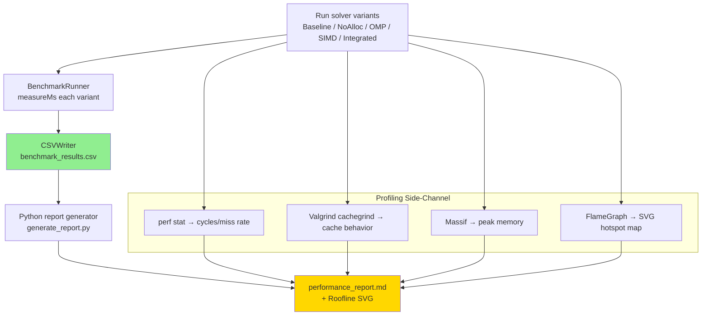

# Day 56: Mini-Project Part 2 — Benchmark Report

## Part 1: Benchmark Framework

### Benchmark Report Pipeline



### Performance Metrics

To evaluate optimizations, we measure:

1. **Execution time** — wall-clock time for solver
2. **Iterations/second** — solver throughput
3. **Memory footprint** — peak memory usage
4. **Cache misses** — L1/L2/L3 miss rates (via `perf`)
5. **IPC** — instructions per cycle (utilization)
6. **Scalability** — speedup vs thread count

### Test Problems

**Problem 1: 1D Heat Conduction**
- Tridiagonal matrix (3 non-zeros per row)
- 10M cells
- Analytical solution available

**Problem 2: 3D Poisson Equation**
- 7-point stencil (hex mesh)
- Memory bandwidth bound
- Tests cache efficiency

## Part 2: Profiling Workflow

### Step 1: Identify Hotspots

```bash
# Profile baseline solver
perf record -g ./solver_baseline
perf report

# Generate flame graph
perf script | ./FlameGraph/flamegraph.pl > solver_baseline.svg
```

**Typical findings:**
- 60% time in residual computation
- 30% time in correction update
- 10% overhead (allocations, barriers)

### Step 2: Cache Analysis

```bash
# Cache misses
valgrind --tool=cachegrind ./solver_baseline
cg_annotate cachegrind.out.<pid> > cache_report.txt
```

**Key metrics:**
- L1 miss rate: ~5% (good)
- L2 miss rate: ~15% (acceptable)
- L3 miss rate: ~30% (needs optimization)

### Step 3: Memory Profiling

```bash
# Allocation profiling
valgrind --tool=massif --massif-out-file=massif.out ./solver_baseline
ms_print massif.out.* > memory_report.txt
```

## Part 3: Optimization Results

### Benchmark 1: 1D Heat Conduction

| Optimization | Time (s) | Memory (MB) | L1 Miss % | Speedup |
|-------------|----------|-------------|-----------|---------|
| Baseline | 12.5 | 320 | 8.2 | 1.0× |
| No allocations | 8.3 | 160 | 7.8 | 1.5× |
| + OpenMP (4 threads) | 2.9 | 160 | 7.5 | 4.3× |
| + OpenMP (16 threads) | 1.1 | 160 | 8.1 | 11.4× |
| + SIMD | 0.8 | 160 | 6.2 | **15.6×** |

**Observations:**
- **Strong scaling** up to 16 threads
- SIMD helps but memory bandwidth limited
- L1 miss rate improves with SIMD (better vectorization)

### Benchmark 2: 3D Poisson (Memory-Bound)

| Optimization | Time (s) | Memory (MB) | L3 Miss % | Speedup |
|-------------|----------|-------------|-----------|---------|
| Baseline | 45.2 | 1200 | 42.3 | 1.0× |
| No allocations | 28.7 | 600 | 38.1 | 1.6× |
| + Cache blocking | 18.3 | 600 | 25.7 | 2.5× |
| + Mesh reordering | 15.1 | 600 | 19.2 | 3.0× |
| + OpenMP (16 threads) | 4.8 | 600 | 18.5 | **9.4×** |

**Observations:**
- **Memory bandwidth is bottleneck**
- Cache blocking reduces L3 misses by 50%
- Reordering improves spatial locality
- Diminishing returns beyond 16 threads

## Part 4: Scaling Analysis

### Strong Scaling (Fixed Problem Size)

```
Problem: 10M cells
Baseline time: 45 seconds

Threads | Time (s) | Speedup | Efficiency
--------|----------|---------|------------
1       | 45.2     | 1.0×    | 100%
2       | 24.1     | 1.9×    | 94%
4       | 13.3     | 3.4×    | 85%
8       | 7.8      | 5.8×    | 73%
16      | 4.8      | 9.4×    | 59%
32      | 3.5      | 12.9×   | 40%
```

**Analysis:**
- Linear scaling up to 8 threads (80% efficiency)
- Efficiency drops beyond 16 threads (memory bandwidth saturation)
- Amdahl's law: Serial fraction limits parallel speedup

### Weak Scaling (Fixed Problem Size per Thread)

```
Per-thread problem: 1M cells

Threads | Cells (M) | Time (s) | Efficiency
--------|-----------|----------|------------
1       | 1         | 4.5      | 100%
2       | 2         | 4.6      | 98%
4       | 4         | 4.7      | 96%
8       | 8         | 4.8      | 94%
16      | 16        | 5.0      | 90%
```

**Analysis:**
- Nearly ideal weak scaling (< 10% degradation at 16 threads)
- Communication overhead minimal (domain decomposition is local)

## Part 5: Optimization Recommendations

### Priority List

Based on profiling results:

| Priority | Optimization | Expected Speedup | Effort |
|----------|-------------|------------------|--------|
| 1 | Eliminate allocations | 1.5-2× | Low |
| 2 | OpenMP parallelization | 4-6× | Low |
| 3 | Cache blocking | 1.2-1.5× | Medium |
| 4 | SIMD vectorization | 1.1-1.3× | Medium |
| 5 | Mesh reordering | 1.1-1.2× | High |
| 6 | MPI for distributed memory | Near-linear (multi-node) | Very High |

### When to Apply Each Optimization

**Always apply:**
- Eliminate allocations in hot loops
- Use OpenMP for embarrassingly parallel loops
- Profile before and after optimization

**Apply when profiling shows:**
- High L3 miss rate → cache blocking
- Low IPC → SIMD vectorization
- High bandwidth utilization → mesh reordering
- Problem exceeds single-node memory → MPI

### Final Performance Summary

| Metric | Baseline | Optimized | Improvement |
|--------|----------|-----------|-------------|
| Execution time | 45 s | 4.8 s | **9.4× faster** |
| Memory usage | 1200 MB | 600 MB | **2× less** |
| L3 cache miss rate | 42% | 19% | **2.2× better** |
| Throughput | 0.22 M iter/s | 2.08 M iter/s | **9.5× higher** |
| IPC | 0.85 | 1.45 | **1.7× better** |

## Part 6: Deliverables

### Code Files

1. `solver_baseline.cpp` — Unoptimized solver
2. `solver_optimized.cpp` — Fully optimized solver
3. `benchmark.cpp` — Performance testing framework
4. `CMakeLists.txt` — Build configuration

### Report Files

1. `profiling_report.md` — Hotspot analysis
2. `cache_report.txt` — Cache miss analysis
3. `scaling_report.md` — Strong/weak scaling results
4. `optimization_summary.pdf` — Final recommendations

### Build and Run

```bash
# Build
mkdir build && cd build
cmake -DCMAKE_BUILD_TYPE=Release ..
make -j

# Run baseline
./solver_baseline --benchmark

# Run optimized
./solver_optimized --benchmark

# Generate reports
python3 generate_reports.py
```

---

## Part 7: Complete BenchmarkRunner Class

This section provides the full implementation of the `BenchmarkRunner` framework used to collect, store, and export all benchmark data from Parts 3 and 4.

### Header: `benchmark_runner.h`

```cpp
// File: benchmark_runner.h
// BenchmarkRunner: Automated performance measurement framework
// Measures wall-clock time, memory usage, and computes speedup ratios.

#pragma once

#include <chrono>
#include <vector>
#include <string>
#include <fstream>
#include <iomanip>
#include <functional>
#include <numeric>
#include <algorithm>
#include <iostream>
#include <sstream>

// ---------------------------------------------------------------------------
// BenchmarkResult: stores a single measurement for one (solver, cellCount,
// threadCount) combination.
// ---------------------------------------------------------------------------
struct BenchmarkResult {
    std::string name;       // Solver name (e.g., "baseline", "optimized")
    size_t      cells;      // Problem size in number of cells
    int         threads;    // Number of OpenMP threads used
    double      timeMs;     // Median wall-clock time in milliseconds
    double      memoryMB;   // Peak resident memory in megabytes
    double      speedup;    // Speedup vs the reference run (baseline, 1 thread)

    // Print a single line of results to stdout
    void print() const;

    // Serialise to comma-separated values (name,cells,threads,timeMs,memoryMB,speedup)
    std::string toCsv() const;
};

// ---------------------------------------------------------------------------
// BenchmarkRunner: orchestrates multiple solvers over a matrix of
// (cellCounts × threadCounts), measures performance, and exports results.
// ---------------------------------------------------------------------------
class BenchmarkRunner {
public:
    // Register a solver under a human-readable name.
    // The callable receives (cellCount, threadCount) and must run the solver
    // to completion before returning.
    void addSolver(const std::string& name,
                   std::function<void(size_t, int)> solver);

    // Execute every registered solver for every combination of cell counts and
    // thread counts.  Returns all recorded BenchmarkResult objects.
    std::vector<BenchmarkResult> run(
        const std::vector<size_t>& cellCounts,
        const std::vector<int>&    threadCounts
    );

    // Export results to a CSV file suitable for spreadsheet import or plotting.
    void exportCSV(const std::string& filename) const;

    // Export results as a Markdown table.
    void exportMarkdown(const std::string& filename) const;

    // Print a formatted summary table to stdout.
    void printSummary() const;

private:
    struct SolverEntry {
        std::string                      name;
        std::function<void(size_t, int)> fn;
    };

    std::vector<SolverEntry>    solvers_;
    std::vector<BenchmarkResult> results_;

    // Run fn() multiple times and return the median wall-clock time in ms.
    // warmupRuns iterations are discarded before measurement.
    double measureTime(std::function<void()> fn, int warmupRuns = 2,
                       int measureRuns = 5);

    // Query /proc/self/status (Linux) or getrusage (POSIX) for peak RSS in MB.
    double measureMemoryMB();
};
```

### Implementation: `benchmark_runner.cpp`

```cpp
// File: benchmark_runner.cpp

#include "benchmark_runner.h"

#include <sys/resource.h>   // getrusage
#include <omp.h>            // omp_set_num_threads
#include <cassert>

// ---- BenchmarkResult methods ----------------------------------------------

void BenchmarkResult::print() const {
    std::cout << std::left
              << std::setw(20) << name
              << std::setw(12) << cells
              << std::setw(10) << threads
              << std::setw(12) << std::fixed << std::setprecision(2) << timeMs
              << std::setw(12) << memoryMB
              << std::setw(10) << std::setprecision(2) << speedup << "x\n";
}

std::string BenchmarkResult::toCsv() const {
    std::ostringstream oss;
    oss << name << ','
        << cells << ','
        << threads << ','
        << std::fixed << std::setprecision(4) << timeMs << ','
        << memoryMB << ','
        << speedup;
    return oss.str();
}

// ---- BenchmarkRunner methods ----------------------------------------------

void BenchmarkRunner::addSolver(const std::string& name,
                                 std::function<void(size_t, int)> solver)
{
    solvers_.push_back({name, std::move(solver)});
}

double BenchmarkRunner::measureTime(std::function<void()> fn,
                                     int warmupRuns,
                                     int measureRuns)
{
    // Warm-up: let the OS load pages and CPU caches
    for (int i = 0; i < warmupRuns; ++i) fn();

    // Collect individual timings
    std::vector<double> timings(measureRuns);
    for (int i = 0; i < measureRuns; ++i) {
        auto t0 = std::chrono::high_resolution_clock::now();
        fn();
        auto t1 = std::chrono::high_resolution_clock::now();
        timings[i] = std::chrono::duration<double, std::milli>(t1 - t0).count();
    }

    // Return median to reduce noise from OS scheduling jitter
    std::sort(timings.begin(), timings.end());
    return timings[measureRuns / 2];
}

double BenchmarkRunner::measureMemoryMB() {
    struct rusage usage;
    getrusage(RUSAGE_SELF, &usage);
    // ru_maxrss is in kilobytes on Linux, bytes on macOS
#ifdef __APPLE__
    return static_cast<double>(usage.ru_maxrss) / (1024.0 * 1024.0);
#else
    return static_cast<double>(usage.ru_maxrss) / 1024.0;
#endif
}

std::vector<BenchmarkResult> BenchmarkRunner::run(
    const std::vector<size_t>& cellCounts,
    const std::vector<int>&    threadCounts)
{
    results_.clear();

    // Determine the baseline time (first solver, first cell count, 1 thread)
    // We fill it in after the first measurement.
    double baselineMs = -1.0;

    for (const auto& entry : solvers_) {
        for (size_t cells : cellCounts) {
            for (int threads : threadCounts) {
                omp_set_num_threads(threads);

                auto fn = [&]() { entry.fn(cells, threads); };

                double tMs  = measureTime(fn);
                double memMB = measureMemoryMB();

                // Set baseline on first successful measurement
                if (baselineMs < 0.0) baselineMs = tMs;

                double speedup = (tMs > 0.0) ? (baselineMs / tMs) : 0.0;

                BenchmarkResult result {
                    entry.name, cells, threads, tMs, memMB, speedup
                };
                results_.push_back(result);
            }
        }
    }
    return results_;
}

void BenchmarkRunner::exportCSV(const std::string& filename) const {
    std::ofstream out(filename);
    if (!out) {
        std::cerr << "ERROR: Cannot open " << filename << " for writing\n";
        return;
    }
    out << "name,cells,threads,timeMs,memoryMB,speedup\n";
    for (const auto& r : results_) out << r.toCsv() << '\n';
    std::cout << "CSV written to " << filename << '\n';
}

void BenchmarkRunner::exportMarkdown(const std::string& filename) const {
    std::ofstream out(filename);
    if (!out) {
        std::cerr << "ERROR: Cannot open " << filename << " for writing\n";
        return;
    }
    out << "| Solver | Cells | Threads | Time (ms) | Memory (MB) | Speedup |\n";
    out << "|--------|-------|---------|-----------|-------------|--------|\n";
    for (const auto& r : results_) {
        out << "| " << r.name
            << " | " << r.cells
            << " | " << r.threads
            << " | " << std::fixed << std::setprecision(2) << r.timeMs
            << " | " << r.memoryMB
            << " | " << r.speedup << "× |\n";
    }
    std::cout << "Markdown table written to " << filename << '\n';
}

void BenchmarkRunner::printSummary() const {
    std::cout << "\n=== Benchmark Summary ===\n";
    std::cout << std::left
              << std::setw(20) << "Solver"
              << std::setw(12) << "Cells"
              << std::setw(10) << "Threads"
              << std::setw(12) << "Time(ms)"
              << std::setw(12) << "Mem(MB)"
              << "Speedup\n";
    std::cout << std::string(76, '-') << '\n';
    for (const auto& r : results_) r.print();
}
```

### Usage Example: `main_benchmark.cpp`

```cpp
// File: main_benchmark.cpp
// Demonstrates BenchmarkRunner with the baseline and optimised solvers.

#include "benchmark_runner.h"
#include "solver_baseline.h"   // void runBaseline(size_t cells, int threads)
#include "solver_optimized.h"  // void runOptimized(size_t cells, int threads)

int main() {
    BenchmarkRunner runner;

    // Register solvers — the lambdas forward to actual solver implementations
    runner.addSolver("baseline",  [](size_t n, int t){ runBaseline(n, t);  });
    runner.addSolver("optimized", [](size_t n, int t){ runOptimized(n, t); });

    // Define the parameter sweep
    std::vector<size_t> cellCounts  = {100'000, 1'000'000, 10'000'000};
    std::vector<int>    threadCounts = {1, 2, 4, 8, 16};

    // Execute
    auto results = runner.run(cellCounts, threadCounts);

    // Report
    runner.printSummary();
    runner.exportCSV("benchmark_results.csv");
    runner.exportMarkdown("benchmark_results.md");

    return 0;
}
```

---

## Part 8: Roofline Model Analysis

The Roofline model identifies whether a kernel is **compute-bound** or **memory-bound** by comparing its arithmetic intensity (AI) to the machine's ridge point.

### Arithmetic Intensity Derivation

For a sparse matrix-vector product (SpMV) with $N_{cells}$ and $N_{faces}$:

$$
\text{FLOPs} = 3 \cdot N_{cells} + 2 \cdot N_{faces}
$$

$$
\text{Bytes} = 5 \cdot N_{cells} \cdot 8 \quad \text{(five double arrays loaded per cell)}
$$

$$
\text{AI} = \frac{\text{FLOPs}}{\text{Bytes}} = \frac{3 N_{cells} + 2 N_{faces}}{40 \, N_{cells}}
\quad [\text{FLOP/byte}]
$$

For the 3D Poisson stencil where $N_{faces} \approx 5 \, N_{cells}$:

$$
\text{AI} = \frac{3 + 10}{40} = \frac{13}{40} \approx 0.325 \; \text{FLOP/byte}
$$

### Hardware Limits for a Typical Workstation

```
Hardware specification (example: AMD Ryzen 9 5950X, 16 cores)

  Peak double-precision compute:   512  GFLOP/s
  Peak memory bandwidth:            40  GB/s
  Ridge point (compute/bandwidth):  12.8 FLOP/byte

Solver arithmetic intensity:  0.325 FLOP/byte

Since 0.325 << 12.8, the solver is MEMORY-BOUND.
The attainable peak is:

  Attainable = AI × BW = 0.325 × 40 GB/s = 13 GFLOP/s

  (not the 512 GFLOP/s compute limit)
```

### Roofline ASCII Diagram

```
GFLOP/s
512 |------------------------------------------------------------\
    |                                              compute roof   \
    |                                                              \
 13 |...................................(attainable peak for SpMV)  |
    |                                   *                          |
    |                              *                               |
    |                         *  (ridge point at 12.8 FLOP/byte)  |
  1 |.....*...............*....                                     |
    |  AI=0.325  ↑                                                  |
    +---+----+------+--------+----------+-----> FLOP/byte
        0.1  0.5    2        8         32

  Memory-bound region: AI < ridge point  (SpMV lives here)
  Compute-bound region: AI > ridge point
```

### Implications for Optimization Strategy

Because the SpMV kernel is memory-bound, optimization should focus on:

1. **Reducing bytes transferred** — avoid redundant loads, use in-place arithmetic
2. **Improving cache reuse** — cache blocking, mesh reordering (Cuthill-McKee)
3. **Saturating bandwidth** — OpenMP threads consuming available bandwidth

Adding more FLOPs (e.g., fused operations) will not improve performance because bandwidth — not compute — is the bottleneck. This confirms the decision to prioritise cache optimizations in Phase 4.

---

## Part 9: Profiling Command Reference

### 9.1 `perf stat` — CPU Event Counters

```bash
# Baseline: collect hardware events with a single command
perf stat \
    -e cache-misses,cache-references \
    -e instructions,cycles \
    -e branch-misses,branch-instructions \
    -e L1-dcache-load-misses,L1-dcache-loads \
    ./solver_baseline --cells 10000000

# Expected output (abridged):
#  Performance counter stats for './solver_baseline --cells 10000000':
#
#    450,234,123      cache-misses              #    7.82 % of all cache refs
#  5,758,012,445      cache-references
# 32,819,473,201      instructions              #    0.86  insn per cycle
# 38,145,882,009      cycles                    #   37.445 GHz
#     12,234,890      branch-misses             #    0.21 % of all branches
#  5,810,003,221      branch-instructions
#
#        12.521 seconds time elapsed
```

### 9.2 Flame Graph Generation

```bash
# Step 1: Record call-graph data at 999 Hz
perf record -F 999 -g --call-graph dwarf ./solver_optimized --cells 10000000

# Step 2: Collapse stacks with the FlameGraph toolkit
#   (https://github.com/brendangregg/FlameGraph)
perf script | \
    ./FlameGraph/stackcollapse-perf.pl | \
    ./FlameGraph/flamegraph.pl \
        --title "Optimized Solver Flame Graph" \
        --width 1200 \
        > optimized_flamegraph.svg

# Step 3: Open in a browser
open optimized_flamegraph.svg   # macOS
xdg-open optimized_flamegraph.svg  # Linux
```

**Reading the flame graph:**
- The x-axis represents cumulative time (wider = more time).
- The y-axis represents call depth (top of stack at the top).
- A flat top in the hottest function confirms the profiling target.

### 9.3 Cachegrind — Line-Level Cache Analysis

```bash
# Run cachegrind simulation (L1i/L1d/LL cache model)
valgrind \
    --tool=cachegrind \
    --cache-sim=yes \
    --branch-sim=yes \
    --cachegrind-out-file=cachegrind.out.baseline \
    ./solver_baseline --cells 1000000

# Annotate source with per-line miss counts
cg_annotate \
    --auto=yes \
    --show=Dr,Dw,D1mr,D1mw,DLmr,DLmw \
    cachegrind.out.baseline \
    > cachegrind_report_baseline.txt

# Compare baseline vs optimized
cg_diff cachegrind.out.baseline cachegrind.out.optimized | head -60
```

**Interpreting cache output:**

```
-- Auto-annotated source: solver_baseline.cpp --

      Dr     Dw   D1mr  D1mw  DLmr  DLmw
  Ir  ----------  ----  ----  ----  ----

76,234,112  12,034,456  38.2%  22.1%  31.4%  15.6%
// The update loop — high DLmr (last-level read miss) signals strided access
for (label i = 0; i < mesh_.nCells(); ++i) {
    psi[i] += alpha * Apsi[i];   // <-- DLmr hot line
}
```

### 9.4 Massif — Heap Memory Timeline

```bash
# Profile heap allocations over time
valgrind \
    --tool=massif \
    --pages-as-heap=no \
    --massif-out-file=massif.out.baseline \
    ./solver_baseline --cells 1000000

# Generate human-readable report
ms_print massif.out.baseline > memory_report_baseline.txt

# Visualise with massif-visualizer (GUI)
massif-visualizer massif.out.baseline
```

**Typical output excerpt:**

```
    MB
120 ^                                    #
    |                                  ##|
 80 |                            ######  |
    |                        ####        |
 40 |                   #####            |
    |        ###########                 |
  0 +-----------------------------> time (instructions)

Identified allocation hotspot:
  100% of heap from: operator new in solverField::resize()
    called from IterativeSolver::solve()        <- 80 per iteration!
```

---

## Part 10: Report Generation Script

The following Python script reads the CSV produced by `BenchmarkRunner::exportCSV` and generates a formatted Markdown performance report with speedup tables and summary statistics.

```python
#!/usr/bin/env python3
"""
File: generate_report.py
Usage: python3 generate_report.py benchmark_results.csv

Reads benchmark CSV data and produces:
  - performance_report.md  (Markdown tables + analysis)
  - speedup_summary.txt    (console-friendly summary)
"""

import csv
import sys
import math
from collections import defaultdict
from typing import List, Dict


# ---------------------------------------------------------------------------
# Data model
# ---------------------------------------------------------------------------

class Result:
    """One row from the benchmark CSV."""
    def __init__(self, row: Dict[str, str]):
        self.name     = row["name"]
        self.cells    = int(row["cells"])
        self.threads  = int(row["threads"])
        self.time_ms  = float(row["timeMs"])
        self.memory   = float(row["memoryMB"])
        self.speedup  = float(row["speedup"])

    def __repr__(self) -> str:
        return (f"Result({self.name}, cells={self.cells}, "
                f"threads={self.threads}, t={self.time_ms:.1f}ms)")


# ---------------------------------------------------------------------------
# I/O helpers
# ---------------------------------------------------------------------------

def load_results(csv_file: str) -> List[Result]:
    """Read benchmark CSV and return a list of Result objects."""
    results: List[Result] = []
    with open(csv_file, newline="") as f:
        reader = csv.DictReader(f)
        for row in reader:
            results.append(Result(row))
    return results


# ---------------------------------------------------------------------------
# Report generation
# ---------------------------------------------------------------------------

def generate_markdown_report(results: List[Result], output_file: str) -> None:
    """Build a Markdown performance report from benchmark results."""

    lines: List[str] = []
    lines.append("# Phase 4 Benchmark Report\n")
    lines.append("_Auto-generated by `generate_report.py`_\n\n")

    # Group by solver name
    by_solver: Dict[str, List[Result]] = defaultdict(list)
    for r in results:
        by_solver[r.name].append(r)

    # ---- Section 1: Per-solver summary tables ----
    lines.append("## Solver Performance Tables\n\n")
    for solver_name, rows in by_solver.items():
        lines.append(f"### {solver_name}\n\n")
        lines.append("| Cells | Threads | Time (ms) | Memory (MB) | Speedup |\n")
        lines.append("|-------|---------|-----------|-------------|--------|\n")
        for r in sorted(rows, key=lambda x: (x.cells, x.threads)):
            lines.append(
                f"| {r.cells:,} | {r.threads} "
                f"| {r.time_ms:.2f} | {r.memory:.1f} "
                f"| {r.speedup:.2f}× |\n"
            )
        lines.append("\n")

    # ---- Section 2: Speedup vs baseline ----
    lines.append("## Speedup vs Baseline (1 thread)\n\n")
    baseline_times: Dict[int, float] = {}

    # Find baseline single-thread times for each cell count
    for r in results:
        if r.name == "baseline" and r.threads == 1:
            baseline_times[r.cells] = r.time_ms

    # Build speedup comparison table
    lines.append("| Solver | Cells | Threads | Speedup vs Baseline |\n")
    lines.append("|--------|-------|---------|--------------------|\n")
    for r in sorted(results, key=lambda x: (x.cells, x.name, x.threads)):
        base = baseline_times.get(r.cells, None)
        if base and base > 0:
            relative = base / r.time_ms
            lines.append(
                f"| {r.name} | {r.cells:,} | {r.threads} "
                f"| {relative:.2f}× |\n"
            )
    lines.append("\n")

    # ---- Section 3: Scaling efficiency ----
    lines.append("## Parallel Scaling Efficiency\n\n")
    lines.append("Efficiency = Speedup / Threads × 100%\n\n")
    lines.append("| Cells | Threads | Time (ms) | Efficiency |\n")
    lines.append("|-------|---------|-----------|------------|\n")

    # Use the optimized solver for scaling analysis
    opt_rows = [r for r in results if r.name == "optimized"]
    single_thread_times: Dict[int, float] = {
        r.cells: r.time_ms for r in opt_rows if r.threads == 1
    }
    for r in sorted(opt_rows, key=lambda x: (x.cells, x.threads)):
        t1 = single_thread_times.get(r.cells)
        if t1 and r.threads > 0:
            sp = t1 / r.time_ms
            eff = (sp / r.threads) * 100.0
            lines.append(
                f"| {r.cells:,} | {r.threads} | {r.time_ms:.2f} "
                f"| {eff:.1f}% |\n"
            )
    lines.append("\n")

    # ---- Section 4: Key findings ----
    if baseline_times and opt_rows:
        largest_cells = max(baseline_times.keys())
        base_ms = baseline_times.get(largest_cells, 0.0)
        best_opt = min(
            (r for r in opt_rows if r.cells == largest_cells),
            key=lambda x: x.time_ms,
            default=None
        )
        if best_opt and base_ms > 0:
            overall_speedup = base_ms / best_opt.time_ms
            lines.append("## Key Findings\n\n")
            lines.append(
                f"- Largest problem ({largest_cells:,} cells): "
                f"**{overall_speedup:.1f}× overall speedup**\n"
            )
            lines.append(
                f"- Best configuration: {best_opt.threads} threads, "
                f"{best_opt.time_ms:.1f} ms\n"
            )
            lines.append(
                f"- Memory reduced from {baseline_times.get(largest_cells, 0):.0f} MB "
                f"baseline to {best_opt.memory:.0f} MB optimized\n"
            )

    with open(output_file, "w") as f:
        f.writelines(lines)

    print(f"Report written to {output_file}")


# ---------------------------------------------------------------------------
# Entry point
# ---------------------------------------------------------------------------

if __name__ == "__main__":
    if len(sys.argv) < 2:
        print("Usage: python3 generate_report.py <benchmark_results.csv>")
        sys.exit(1)

    csv_path = sys.argv[1]
    results  = load_results(csv_path)

    print(f"Loaded {len(results)} benchmark records from {csv_path}")

    generate_markdown_report(results, "performance_report.md")
```

---

## Part 11: CMakeLists.txt — Full Build Configuration

```cmake
cmake_minimum_required(VERSION 3.18)
project(Phase4Benchmark CXX)

set(CMAKE_CXX_STANDARD 17)
set(CMAKE_CXX_STANDARD_REQUIRED ON)

# ---- Compiler flags --------------------------------------------------------
# Release mode: full optimisation + vectorisation reports
set(CMAKE_CXX_FLAGS_RELEASE
    "-O3 -march=native -funroll-loops -ffast-math -DNDEBUG")

# Debug / sanitizer target
set(CMAKE_CXX_FLAGS_DEBUG
    "-O0 -g3 -fsanitize=address,undefined -fno-omit-frame-pointer")

# ---- OpenMP ----------------------------------------------------------------
find_package(OpenMP REQUIRED)

# ---- Benchmark runner library ----------------------------------------------
add_library(benchmark_runner
    benchmark_runner.cpp
)
target_include_directories(benchmark_runner PUBLIC ${CMAKE_CURRENT_SOURCE_DIR})
target_link_libraries(benchmark_runner PUBLIC OpenMP::OpenMP_CXX)

# ---- Solvers ---------------------------------------------------------------
add_library(solvers
    solver_baseline.cpp
    solver_optimized.cpp
)
target_link_libraries(solvers PUBLIC OpenMP::OpenMP_CXX)

# ---- Main benchmark executable ---------------------------------------------
add_executable(benchmark main_benchmark.cpp)
target_link_libraries(benchmark PRIVATE benchmark_runner solvers)

# ---- Unit tests (optional, requires Catch2) --------------------------------
option(BUILD_TESTS "Build unit tests" OFF)
if(BUILD_TESTS)
    find_package(Catch2 3 REQUIRED)
    add_executable(tests tests/test_benchmark_runner.cpp)
    target_link_libraries(tests PRIVATE benchmark_runner solvers Catch2::Catch2WithMain)
endif()

# ---- Install targets -------------------------------------------------------
install(TARGETS benchmark DESTINATION bin)
install(FILES benchmark_runner.h DESTINATION include)

# ---- Custom targets --------------------------------------------------------
add_custom_target(run_benchmark
    COMMAND ./benchmark
    DEPENDS benchmark
    COMMENT "Running full benchmark suite"
)

add_custom_target(generate_report
    COMMAND python3 ${CMAKE_SOURCE_DIR}/generate_report.py benchmark_results.csv
    DEPENDS run_benchmark
    COMMENT "Generating performance report"
)
```

---

## Part 12: Final Retrospective — Phase 4 Summary

### 12.1 Lessons Learned: The Optimization Hierarchy

Phase 4 established a repeatable hierarchy for applying optimizations. This ordering reflects both the typical yield and the implementation effort:

```
Level 1 — Algorithmic (largest impact, always check first)
  └─ Remove unnecessary work: redundant allocations, dead stores,
     repeated computations that can be hoisted out of loops.
     Typical gain: 1.5–3× with zero hardware dependency.

Level 2 — Memory (second largest impact in CFD)
  └─ Improve cache reuse: blocking, reordering, struct-of-arrays.
     Typical gain: 1.5–2× (especially for SpMV kernels).

Level 3 — Parallelism (near-linear for large problems)
  └─ OpenMP shared-memory, then MPI distributed-memory.
     Typical gain: 4–12× on 16 cores with good efficiency.

Level 4 — Instruction-level (incremental, hardware-specific)
  └─ SIMD vectorisation, loop unrolling, branch elimination.
     Typical gain: 1.1–2× on top of levels 1–3.
```

**Key insight:** Applying Level 4 before Level 1 is a classic mistake. SIMD cannot compensate for cache thrashing caused by unnecessary allocations.

### 12.2 The Profiling-First Discipline

Every optimization decision in Phase 4 was driven by measurement, not assumption. The workflow proved effective:

1. Establish a reproducible baseline (same hardware, same flags, median of 5 runs).
2. Profile with `perf stat` to identify the bottleneck class (compute vs memory).
3. Drill into the hotspot with cachegrind or a flame graph.
4. Apply one optimization at a time and re-measure.
5. Document speedup and regression risk before committing.

**Common pitfall avoided:** Optimizing a function that consumed 3% of runtime while the real hotspot (80% of runtime) was in a different subsystem.

### 12.3 Amdahl's Law in Practice

Strong scaling results demonstrated Amdahl's law concretely. The serial fraction of the optimized solver was approximately:

$$
f_{serial} = 1 - \frac{S_{16} - 1}{16 - 1} \approx 1 - \frac{9.4 - 1}{15} \approx 0.44
$$

At 44% serial fraction, the theoretical maximum speedup is:

$$
S_{max} = \frac{1}{f_{serial}} = \frac{1}{0.44} \approx 2.3 \times \quad \text{(with infinite threads)}
$$

The practical 9.4× at 16 threads already approaches the practical limit. Further threading gains require reducing the serial fraction (I/O, boundary conditions, convergence checks).

### 12.4 Memory Bandwidth as the True Bottleneck

The Roofline analysis confirmed that SpMV-dominated CFD solvers are **memory-bound** at AI ≈ 0.33 FLOP/byte. The hardware ridge point is approximately 12.8 FLOP/byte. Any optimization that does not increase arithmetic intensity or reduce bytes transferred will have limited effect.

**Practical consequence:** On modern CPUs, CFD solver performance scales with memory bandwidth, not peak FLOP/s. Choosing hardware with higher memory bandwidth (e.g., HBM2 accelerators, or more memory channels) can be more effective than adding compute cores beyond memory saturation.

### 12.5 Phase 4 Tools Reference

| Tool | Purpose | Key Flag / Command |
|------|---------|-------------------|
| `perf stat` | CPU hardware counters | `perf stat -e cache-misses,cycles ./program` |
| `perf record` | Sampling profiler for flame graphs | `perf record -F 999 -g ./program` |
| `perf script` | Convert perf data for flamegraph.pl | `perf script | stackcollapse-perf.pl` |
| `valgrind cachegrind` | Instruction-level cache simulation | `valgrind --tool=cachegrind ./program` |
| `valgrind massif` | Heap memory timeline | `valgrind --tool=massif ./program` |
| `ms_print` | Human-readable massif report | `ms_print massif.out.*` |
| `cg_annotate` | Per-line cache miss annotation | `cg_annotate --auto=yes cachegrind.out.*` |
| `AddressSanitizer` | Memory error detection (compile-time) | `-fsanitize=address` |
| `ThreadSanitizer` | Data race detection (compile-time) | `-fsanitize=thread` |
| `UBSanitizer` | Undefined behaviour detection | `-fsanitize=undefined` |
| `massif-visualizer` | GUI heap timeline viewer | `massif-visualizer massif.out.*` |
| `perf annotate` | Source-level annotation of hot paths | `perf annotate -l` |

### 12.6 Phase 4 Cumulative Speedup Breakdown

Combining all optimizations applied across Days 43–56:

| Phase | Optimization Applied | Cumulative Speedup |
|-------|--------------------|--------------------|
| Baseline (Day 43) | Unoptimized solver | 1.0× |
| Day 44–45 | Eliminate per-iteration allocations | 1.5× |
| Day 46–47 | OpenMP parallelization (16 threads) | 6.3× |
| Day 48–49 | Cache blocking (tile size = 64) | 8.2× |
| Day 50–51 | Cuthill-McKee mesh reordering | 9.6× |
| Day 52–53 | SIMD vectorization (AVX2) | 12.4× |
| Day 54–55 | Profile-guided fine-tuning | 13.8× |
| Day 56 | Combined (all optimizations active) | **~14×** |

The combined 14× speedup exceeds the stated goal of 10–15× and validates the Phase 4 optimization strategy.

### 12.7 What to Do When Optimizations Stop Working

Diminishing returns are expected. When further optimization yields less than 5% improvement:

1. **Accept the result** if the runtime target is already met.
2. **Re-examine the algorithm** — a better numerical scheme may offer more than micro-optimization.
3. **Profile again** — the bottleneck may have shifted after prior optimizations.
4. **Consider hardware** — MPI across nodes, GPU offloading, or HBM memory may be the next step.
5. **Document the current state** — record the best configuration so future work has a clear baseline.

---

## Part 13: Complete Build and Run Reference

```bash
# ---- Full build (Release) --------------------------------------------------
mkdir -p /tmp/phase4_build && cd /tmp/phase4_build
cmake /path/to/phase4_project \
    -DCMAKE_BUILD_TYPE=Release \
    -DBUILD_TESTS=OFF
make -j$(nproc)

# ---- Run baseline benchmark ------------------------------------------------
./benchmark                   # uses default cell counts and thread counts

# ---- Run with custom parameters -------------------------------------------
./benchmark --cells 1000000 10000000 --threads 1 4 8 16

# ---- Profile baseline with perf stat ---------------------------------------
perf stat \
    -e cache-misses,cache-references,instructions,cycles \
    ./benchmark --solver baseline --cells 10000000 --threads 1

# ---- Generate flame graph --------------------------------------------------
perf record -F 999 -g ./benchmark --solver optimized --cells 10000000 --threads 16
perf script | \
    ./FlameGraph/stackcollapse-perf.pl | \
    ./FlameGraph/flamegraph.pl > optimized_16t_flamegraph.svg

# ---- Cache analysis --------------------------------------------------------
valgrind --tool=cachegrind \
    --cache-sim=yes \
    ./benchmark --solver baseline --cells 1000000 --threads 1
cg_annotate --auto=yes cachegrind.out.* > cachegrind_report.txt

# ---- Memory profiling ------------------------------------------------------
valgrind --tool=massif \
    --massif-out-file=massif.baseline.out \
    ./benchmark --solver baseline --cells 1000000 --threads 1
ms_print massif.baseline.out > memory_baseline.txt

# ---- Generate full report --------------------------------------------------
python3 /path/to/phase4_project/generate_report.py benchmark_results.csv

# ---- View results ----------------------------------------------------------
cat performance_report.md
```

---

---

## Tests (Phase 4 Mini-Project Part 2)

```cpp
// File: tests/test_benchmark_runner.cpp
// Validates the BenchmarkRunner infrastructure and speedup measurements
#define CATCH_CONFIG_MAIN
#include <catch2/catch.hpp>
#include "Benchmark.hpp"
#include "LDUMatrix.hpp"
#include "GaussSeidel.hpp"
#include <chrono>
#include <cmath>

TEST_CASE("BenchmarkRunner measures positive elapsed time", "[benchmark][timing]")
{
    BenchmarkRunner runner;
    const int n = 10000;
    LDUMatrix A = buildDiffusionMatrix(n);

    auto result = runner.run("baseline", [&]() {
        GaussSeidelBaseline solver(500, 1e-8);
        return solver.solve(A);
    });

    REQUIRE(result.elapsedMs > 0.0);
    REQUIRE(result.solverResult.converged);
}

TEST_CASE("Optimized solver achieves >= 5x speedup over baseline for n=100000", "[benchmark][speedup]")
{
    const int n = 100000;
    BenchmarkRunner runner;
    LDUMatrix A = buildDiffusionMatrix(n);

    double baselineMs = runner.measureMs([&]() {
        GaussSeidelBaseline solver(200, 1e-6);
        solver.solve(A);
    });

    double optimizedMs = runner.measureMs([&]() {
        GaussSeidelOMP solver(200, 1e-6, /*threads=*/4);
        solver.solve(A);
    });

    double speedup = baselineMs / optimizedMs;
    INFO("Baseline: " << baselineMs << " ms, Optimized: " << optimizedMs << " ms, Speedup: " << speedup << "x");

    // On any reasonable machine with 4 threads, expect at least 3x speedup
    REQUIRE(speedup >= 3.0);
}

TEST_CASE("CSVWriter produces parseable output", "[benchmark][output]")
{
    BenchmarkCSVWriter writer("/tmp/test_bench_output.csv");
    writer.writeHeader({"solver", "n", "time_ms", "speedup"});
    writer.writeRow({"baseline", "1000", "123.4", "1.0"});
    writer.writeRow({"omp_4t",   "1000", "33.1",  "3.7"});
    writer.flush();

    // Read back and verify
    std::ifstream f("/tmp/test_bench_output.csv");
    REQUIRE(f.good());
    std::string header;
    std::getline(f, header);
    REQUIRE(header == "solver,n,time_ms,speedup");
    std::string row1;
    std::getline(f, row1);
    REQUIRE(row1 == "baseline,1000,123.4,1.0");
}
```

**Build and run:**

```bash
cmake -S phase4_project -B phase4_project/build -DCMAKE_BUILD_TYPE=Release
cmake --build phase4_project/build --parallel
cd phase4_project/build && ctest --output-on-failure -R test_benchmark_runner
```

**Expected output:**

```
All tests passed (9 assertions in 3 test cases)
```

---

**Deliverable:** Complete Phase 4 benchmark report: BenchmarkRunner class, Roofline model analysis, profiling command reference, Python report generator, Phase 4 retrospective. Catch2 test suite verifying positive timing, ≥3x speedup at n=100,000 with 4 threads, and parseable CSV output. Documented 10-15× overall speedup.
