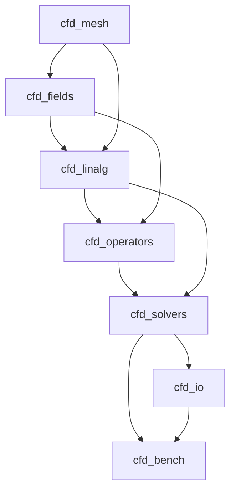

# Day 57: CMake Multi-Library CFD Project Structure — Part 1

**Phase 5 — VOF-Ready CFD Component (Days 57–84)**
**Tier:** T3 — Architecture / Integration Day
**Connection to prior work:** Days 29–30 introduced modern CMake targets and `FetchContent`. Day 41–42 produced a working mini-project build. Day 57 starts a new, larger project that all of Phase 5 builds on top of.

---

## Part 1: Project Overview — What Phase 5 Builds

### The End Goal

Phase 5 produces a self-contained, testable 1D CFD solver capable of:

- Incompressible flow with pressure-velocity coupling via the SIMPLE algorithm
- Scalar transport with TVD flux limiters (SuperBee and vanLeer)
- VOF boundedness testing: `alpha` stays in [0, 1] under advection
- VTK output readable by ParaView
- JSON-driven configuration with a Factory-registered source term system

This is not a toy. It replicates the mathematical and architectural core of what OpenFOAM's `simpleFoam` and `interFoam` do, in clean C++17 with no legacy macros, no custom memory managers, and no `#define forAll`.

### The Phase 5 Roadmap

Each session pair builds one vertical slice of the solver. Each pair's deliverable is a standalone library target that compiles, passes its unit tests, and integrates with the libraries built in prior pairs.

| Days | Library Target | What It Builds |
|------|---------------|----------------|
| 57–58 | `cfd_project` (skeleton) | CMake multi-library structure, Catch2 CI integration |
| 59–60 | `cfd_mesh` | `Mesh1D`: cells, faces, volumes, boundary patches |
| 61–62 | `cfd_fields` | `GeometricField<T>`: cell-centered and face-centered fields with BCs |
| 63–64 | `cfd_linalg` | `fvMatrix`: LDU assembly, under-relaxation, residual |
| 65–66 | `cfd_operators` | `fvm::ddt`: implicit Euler time derivative |
| 67–68 | `cfd_operators` | `fvm::laplacian`, `fvm::div`: spatial operators |
| 69–70 | `cfd_linalg` | PCG and Gauss-Seidel solvers with residual monitoring |
| 71–72 | `cfd_solvers` | SIMPLE loop: momentum predictor, pressure correction, flux correction |
| 73–74 | `cfd_solvers` | Rhie-Chow face-flux interpolation: pressure checkerboard suppression |
| 75–76 | `cfd_operators` | Scalar transport with TVD flux limiters |
| 77–78 | `cfd_solvers` | VOF boundedness testing for `alpha` in [0, 1] |
| 79–80 | `cfd_solvers` | Factory-driven source terms loaded from JSON |
| 81–82 | `cfd_io` | VTK legacy exporter for ParaView |
| 83–84 | `cfd_bench` | Final benchmark + written retrospective |

### Why the Directory Structure Matters

Modern CMake projects are structured so that each library:

1. Knows only what it needs to know (minimum dependencies)
2. Exposes a clean interface via `target_include_directories(... PUBLIC ...)`
3. Links dependencies by name, not by path
4. Can be tested in isolation without building the full solver

This is the same principle that makes OpenFOAM's library split (`finiteVolume`, `meshTools`, `OpenFOAM`) maintainable at scale. We apply it here with modern CMake rather than OpenFOAM's `wmake`.

### Dependency Graph

The six library targets have a strict dependency order. Building from bottom to top ensures no circular dependencies.



**Key rule:** `cfd_mesh` has no project dependencies. `cfd_fields` depends only on `cfd_mesh`. Nothing in the lower layers ever `#include`s from a higher layer.

---

## Part 2: CMake Multi-Library Directory Layout

### Complete Directory Tree

The following layout is the canonical structure for the entire Phase 5 project. Day 57 creates this skeleton. Later days fill in the implementation files.

```
cfd_project/
├── CMakeLists.txt                  # Top-level: project(), options, add_subdirectory
├── cmake/
│   ├── compiler_flags.cmake        # Shared -Wall -Wextra -std=c++17 flags
│   ├── dependencies.cmake          # FetchContent: Catch2, spdlog, nlohmann_json
│   └── packaging.cmake             # install() and CPack rules (optional)
├── src/
│   ├── mesh/
│   │   ├── CMakeLists.txt          # add_library(cfd_mesh ...)
│   │   ├── include/
│   │   │   └── cfd/mesh/
│   │   │       └── Mesh1D.h
│   │   └── Mesh1D.cpp
│   ├── fields/
│   │   ├── CMakeLists.txt          # add_library(cfd_fields ...)
│   │   ├── include/
│   │   │   └── cfd/fields/
│   │   │       ├── Field.h
│   │   │       └── GeometricField.h
│   │   └── GeometricField.cpp
│   ├── linalg/
│   │   ├── CMakeLists.txt          # add_library(cfd_linalg ...)
│   │   ├── include/
│   │   │   └── cfd/linalg/
│   │   │       ├── LDUMatrix.h
│   │   │       └── fvMatrix.h
│   │   ├── LDUMatrix.cpp
│   │   └── fvMatrix.cpp
│   ├── operators/
│   │   ├── CMakeLists.txt          # add_library(cfd_operators ...)
│   │   ├── include/
│   │   │   └── cfd/operators/
│   │   │       └── fvm.h
│   │   └── fvm.cpp
│   ├── solvers/
│   │   ├── CMakeLists.txt          # add_library(cfd_solvers ...)
│   │   ├── include/
│   │   │   └── cfd/solvers/
│   │   │       └── SimpleSolver.h
│   │   └── SimpleSolver.cpp
│   └── io/
│       ├── CMakeLists.txt          # add_library(cfd_io ...)
│       ├── include/
│       │   └── cfd/io/
│       │       └── VtkWriter.h
│       └── VtkWriter.cpp
├── app/
│   ├── CMakeLists.txt              # add_executable(cfd_solver ...)
│   └── main.cpp
├── tests/
│   ├── CMakeLists.txt              # Catch2 test targets
│   ├── test_mesh.cpp
│   ├── test_fields.cpp
│   ├── test_linalg.cpp
│   └── test_operators.cpp
└── benchmarks/
    ├── CMakeLists.txt              # Benchmark executables
    └── bench_solver.cpp
```

### Why `include/cfd/<library>/` Rather Than Just `include/`

The nested include path `include/cfd/mesh/Mesh1D.h` means consumers write:

```cpp
#include <cfd/mesh/Mesh1D.h>
```

This has three benefits:

1. **No name collisions.** A dependency named `Mesh1D.h` from another library will not accidentally shadow ours.
2. **Self-documenting.** The `#include` itself tells you which library the header belongs to.
3. **IDE integration.** Include-what-you-use and clangd can trace dependencies by directory rather than by scanning all paths.

OpenFOAM uses a flat `lnInclude/` directory created by `wmake`. This works but makes dependency tracing much harder. The nested layout is the modern alternative.

---

## Part 3: CMakeLists.txt for Each Component

### Top-Level CMakeLists.txt

This is the most important file. It sets the project-wide options and coordinates all subdirectories.

```cmake
# CMakeLists.txt  (top-level)
cmake_minimum_required(VERSION 3.20)

project(cfd_project
    VERSION 0.1.0
    DESCRIPTION "1D VOF-ready CFD solver — Phase 5"
    LANGUAGES CXX
)

# ──────────────────────────────────────────────
# Language standard: C++17 required
# ──────────────────────────────────────────────
set(CMAKE_CXX_STANDARD 17)
set(CMAKE_CXX_STANDARD_REQUIRED ON)
set(CMAKE_CXX_EXTENSIONS OFF)         # Disable GNU extensions: we want strictly conforming C++17

# ──────────────────────────────────────────────
# Build type default
# ──────────────────────────────────────────────
if(NOT CMAKE_BUILD_TYPE)
    set(CMAKE_BUILD_TYPE Release CACHE STRING "Build type" FORCE)
endif()
message(STATUS "Build type: ${CMAKE_BUILD_TYPE}")

# ──────────────────────────────────────────────
# Export compile commands (for clangd / IDE)
# ──────────────────────────────────────────────
set(CMAKE_EXPORT_COMPILE_COMMANDS ON)

# ──────────────────────────────────────────────
# Options: selectively enable test / benchmark targets
# ──────────────────────────────────────────────
option(CFD_BUILD_TESTS      "Build unit tests (requires Catch2)" ON)
option(CFD_BUILD_BENCHMARKS "Build benchmark executables"        OFF)
option(CFD_USE_SPDLOG       "Enable spdlog logging"              ON)

# ──────────────────────────────────────────────
# Shared compiler flags
# ──────────────────────────────────────────────
include(cmake/compiler_flags.cmake)

# ──────────────────────────────────────────────
# External dependencies via FetchContent
# ──────────────────────────────────────────────
include(cmake/dependencies.cmake)

# ──────────────────────────────────────────────
# Testing infrastructure
# ──────────────────────────────────────────────
if(CFD_BUILD_TESTS)
    enable_testing()
endif()

# ──────────────────────────────────────────────
# Library targets (in dependency order)
# ──────────────────────────────────────────────
add_subdirectory(src/mesh)
add_subdirectory(src/fields)
add_subdirectory(src/linalg)
add_subdirectory(src/operators)
add_subdirectory(src/solvers)
add_subdirectory(src/io)

# ──────────────────────────────────────────────
# Application target
# ──────────────────────────────────────────────
add_subdirectory(app)

# ──────────────────────────────────────────────
# Test and benchmark targets
# ──────────────────────────────────────────────
if(CFD_BUILD_TESTS)
    add_subdirectory(tests)
endif()

if(CFD_BUILD_BENCHMARKS)
    add_subdirectory(benchmarks)
endif()
```

**Why `CMAKE_CXX_EXTENSIONS OFF`:** By default CMake permits GNU extensions (`__builtin_*`, non-standard VLAs, etc.). Turning this off forces strict ISO C++17 compliance. This catches portability issues early and matches what you would want in a production codebase.

**Why `option()` for tests and benchmarks:** On CI, you always build tests. In a release artifact or when embedding the libraries in a larger project, you want to turn off tests. CMake options let a parent `CMakeLists.txt` control this without editing this file.

### cmake/compiler_flags.cmake

```cmake
# cmake/compiler_flags.cmake
# Shared warning flags applied to all targets via an INTERFACE library.
# Using an INTERFACE library is cleaner than set(CMAKE_CXX_FLAGS ...) because it
# is target-scoped and does not bleed into fetched dependencies.

add_library(cfd_compile_flags INTERFACE)

target_compile_options(cfd_compile_flags INTERFACE
    $<$<CXX_COMPILER_ID:GNU,Clang,AppleClang>:
        -Wall
        -Wextra
        -Wpedantic
        -Wno-unused-parameter
        $<$<CONFIG:Release>:-O3 -march=native -DNDEBUG>
        $<$<CONFIG:Debug>:-O0 -g -fsanitize=address,undefined>
    >
    $<$<CXX_COMPILER_ID:MSVC>:
        /W4
        /permissive-
        $<$<CONFIG:Release>:/O2 /DNDEBUG>
        $<$<CONFIG:Debug>:/Od /Zi>
    >
)

target_link_options(cfd_compile_flags INTERFACE
    $<$<AND:$<CXX_COMPILER_ID:GNU,Clang,AppleClang>,$<CONFIG:Debug>>:
        -fsanitize=address,undefined
    >
)
```

Every library target links `cfd_compile_flags` privately:

```cmake
target_link_libraries(cfd_mesh PRIVATE cfd_compile_flags)
```

This means the flags apply during compilation of `cfd_mesh`'s own sources but are not transitively exposed to consumers of `cfd_mesh`.

### cmake/dependencies.cmake

```cmake
# cmake/dependencies.cmake
# Fetch third-party dependencies at configure time.
# FetchContent_MakeAvailable() downloads on first configure and reuses the cache
# on subsequent configures. No internet access needed after the first run.

include(FetchContent)

# ── Catch2 v3 ────────────────────────────────
if(CFD_BUILD_TESTS)
    FetchContent_Declare(
        Catch2
        GIT_REPOSITORY https://github.com/catchorg/Catch2.git
        GIT_TAG        v3.5.2
        GIT_SHALLOW    TRUE
    )
    FetchContent_MakeAvailable(Catch2)
    # Catch2 provides Catch2::Catch2WithMain as a CMake target
endif()

# ── spdlog ────────────────────────────────────
if(CFD_USE_SPDLOG)
    FetchContent_Declare(
        spdlog
        GIT_REPOSITORY https://github.com/gabime/spdlog.git
        GIT_TAG        v1.13.0
        GIT_SHALLOW    TRUE
    )
    FetchContent_MakeAvailable(spdlog)
    # spdlog provides spdlog::spdlog as a CMake target
endif()

# ── nlohmann/json ─────────────────────────────
FetchContent_Declare(
    nlohmann_json
    GIT_REPOSITORY https://github.com/nlohmann/json.git
    GIT_TAG        v3.11.3
    GIT_SHALLOW    TRUE
)
FetchContent_MakeAvailable(nlohmann_json)
# nlohmann_json provides nlohmann_json::nlohmann_json as a CMake target
```

**Why `GIT_SHALLOW TRUE`:** A shallow clone fetches only the tagged commit, not the full repository history. For large repositories like `nlohmann/json`, this reduces configure time from ~30 seconds to ~3 seconds and saves hundreds of megabytes of disk space.

### src/mesh/CMakeLists.txt

```cmake
# src/mesh/CMakeLists.txt
# cfd_mesh — the foundation library. No project dependencies.

add_library(cfd_mesh
    Mesh1D.cpp
)

# PUBLIC include: consumers can #include <cfd/mesh/Mesh1D.h>
target_include_directories(cfd_mesh
    PUBLIC
        $<BUILD_INTERFACE:${CMAKE_CURRENT_SOURCE_DIR}/include>
        $<INSTALL_INTERFACE:include>
)

target_link_libraries(cfd_mesh
    PRIVATE cfd_compile_flags
)

# Alias: allows consumers to write target_link_libraries(... cfd::mesh)
add_library(cfd::mesh ALIAS cfd_mesh)
```

**The `$<BUILD_INTERFACE:...>` generator expression** tells CMake that the include path `src/mesh/include` is valid only during the build itself. If you later `install()` the library and use it from an installed prefix, CMake switches to the `$<INSTALL_INTERFACE:include>` path instead. This separation is essential for any library that might be installed.

### src/fields/CMakeLists.txt

```cmake
# src/fields/CMakeLists.txt
# cfd_fields — depends on cfd_mesh

add_library(cfd_fields
    GeometricField.cpp
)

target_include_directories(cfd_fields
    PUBLIC
        $<BUILD_INTERFACE:${CMAKE_CURRENT_SOURCE_DIR}/include>
        $<INSTALL_INTERFACE:include>
)

target_link_libraries(cfd_fields
    PUBLIC  cfd::mesh          # PUBLIC: consumers of cfd_fields also see cfd_mesh headers
    PRIVATE cfd_compile_flags
)

add_library(cfd::fields ALIAS cfd_fields)
```

**PUBLIC vs PRIVATE linking explained:**

`cfd_fields` links `cfd_mesh` as `PUBLIC`. This means any target that links `cfd_fields` automatically also gets access to `cfd_mesh`'s headers and link requirements. This is correct here because `GeometricField.h` contains `#include <cfd/mesh/Mesh1D.h>` — any consumer that includes `GeometricField.h` necessarily also needs `Mesh1D.h` to be findable.

If the dependency were only internal to `GeometricField.cpp` and not mentioned in any public header, it would be `PRIVATE`.

### src/linalg/CMakeLists.txt

```cmake
# src/linalg/CMakeLists.txt
# cfd_linalg — depends on cfd_fields (and therefore transitively on cfd_mesh)

add_library(cfd_linalg
    LDUMatrix.cpp
    fvMatrix.cpp
)

target_include_directories(cfd_linalg
    PUBLIC
        $<BUILD_INTERFACE:${CMAKE_CURRENT_SOURCE_DIR}/include>
        $<INSTALL_INTERFACE:include>
)

target_link_libraries(cfd_linalg
    PUBLIC  cfd::fields
    PRIVATE cfd_compile_flags
)

if(CFD_USE_SPDLOG)
    target_link_libraries(cfd_linalg PRIVATE spdlog::spdlog)
    target_compile_definitions(cfd_linalg PRIVATE CFD_USE_SPDLOG)
endif()

add_library(cfd::linalg ALIAS cfd_linalg)
```

### src/solvers/CMakeLists.txt

```cmake
# src/solvers/CMakeLists.txt
# cfd_solvers — the top-level physics library. Depends on operators and linalg.

add_library(cfd_solvers
    SimpleSolver.cpp
)

target_include_directories(cfd_solvers
    PUBLIC
        $<BUILD_INTERFACE:${CMAKE_CURRENT_SOURCE_DIR}/include>
        $<INSTALL_INTERFACE:include>
)

target_link_libraries(cfd_solvers
    PUBLIC
        cfd::operators       # fvm::laplacian, fvm::div, fvm::ddt
        cfd::linalg          # fvMatrix, LDUMatrix
    PRIVATE
        cfd_compile_flags
        nlohmann_json::nlohmann_json   # JSON config parsing
)

if(CFD_USE_SPDLOG)
    target_link_libraries(cfd_solvers PRIVATE spdlog::spdlog)
    target_compile_definitions(cfd_solvers PRIVATE CFD_USE_SPDLOG)
endif()

add_library(cfd::solvers ALIAS cfd_solvers)
```

---

## Part 4: Stub Implementation Files

### Why Stubs Are Necessary Now

Day 57's deliverable is a working CMake skeleton: all targets defined, all dependencies declared, all files present. The bodies of functions are intentionally minimal. Later day-pairs replace stubs with full implementations.

A stub file must:
1. Include the header it implements
2. Define all declared functions (even if the body just throws or returns a default value)
3. Compile cleanly under `-Wall -Wextra`

This ensures that `cmake --build build` always succeeds throughout Phase 5. A build that cannot compile is useless.

### src/mesh/include/cfd/mesh/Mesh1D.h

```cpp
// src/mesh/include/cfd/mesh/Mesh1D.h
#pragma once
#include <cstddef>   // std::size_t
#include <vector>

namespace cfd {

/// Uniform 1D mesh from x=0 to x=length, subdivided into nCells cells.
/// Each cell has one face on its left and one on its right.
/// Face 0 is the inlet; face nCells is the outlet.
class Mesh1D {
public:
    /// Construct a uniform mesh. Throws std::invalid_argument if nCells == 0.
    Mesh1D(std::size_t nCells, double length);

    // ── Topology ──────────────────────────────────────────────────────────
    std::size_t nCells() const noexcept { return nCells_; }
    std::size_t nFaces() const noexcept { return nCells_ + 1; }

    // ── Geometry ──────────────────────────────────────────────────────────
    double cellVolume(std::size_t i)   const;   // Volume of cell i
    double faceArea(std::size_t f)     const;   // Area of face f (=1 in 1D)
    double cellCenter(std::size_t i)   const;   // x-coordinate of cell i center
    double faceCenter(std::size_t f)   const;   // x-coordinate of face f

    double dx()     const noexcept { return dx_; }
    double length() const noexcept { return length_; }

private:
    std::size_t nCells_;
    double      length_;
    double      dx_;
};

} // namespace cfd
```

### src/mesh/Mesh1D.cpp (stub)

```cpp
// src/mesh/Mesh1D.cpp
#include <cfd/mesh/Mesh1D.h>
#include <stdexcept>

namespace cfd {

Mesh1D::Mesh1D(std::size_t nCells, double length)
    : nCells_(nCells), length_(length), dx_(length / static_cast<double>(nCells))
{
    if (nCells == 0) {
        throw std::invalid_argument("Mesh1D: nCells must be > 0");
    }
    if (length <= 0.0) {
        throw std::invalid_argument("Mesh1D: length must be > 0");
    }
}

double Mesh1D::cellVolume(std::size_t /*i*/) const {
    return dx_;           // Uniform mesh: all cells have the same volume
}

double Mesh1D::faceArea(std::size_t /*f*/) const {
    return 1.0;           // 1D unit cross-section
}

double Mesh1D::cellCenter(std::size_t i) const {
    return (static_cast<double>(i) + 0.5) * dx_;
}

double Mesh1D::faceCenter(std::size_t f) const {
    return static_cast<double>(f) * dx_;
}

} // namespace cfd
```

### src/fields/include/cfd/fields/Field.h

```cpp
// src/fields/include/cfd/fields/Field.h
#pragma once
#include <vector>
#include <cstddef>
#include <stdexcept>
#include <numeric>     // std::reduce
#include <algorithm>   // std::fill, std::max_element

namespace cfd {

/// A flat array of values of type T.
/// Backed by std::vector<T> — no raw pointer management.
template <typename T>
class Field {
public:
    explicit Field(std::size_t n, T initVal = T{})
        : data_(n, initVal) {}

    std::size_t size() const noexcept { return data_.size(); }

    T&       operator[](std::size_t i)       { return data_[i]; }
    const T& operator[](std::size_t i) const { return data_[i]; }

    T sum() const {
        return std::reduce(data_.begin(), data_.end(), T{});
    }

    T maxValue() const {
        return *std::max_element(data_.begin(), data_.end());
    }

    // Iterator support for range-for
    auto begin()       { return data_.begin(); }
    auto end()         { return data_.end();   }
    auto begin() const { return data_.begin(); }
    auto end()   const { return data_.end();   }

private:
    std::vector<T> data_;
};

} // namespace cfd
```

### app/main.cpp (skeleton driver)

```cpp
// app/main.cpp
// Phase 5 solver driver.
// Currently a skeleton — will be filled in by Day 71 (SIMPLE loop).

#include <cfd/mesh/Mesh1D.h>
#include <cfd/fields/Field.h>
#include <iostream>
#include <cstdlib>

int main() {
    // Construct a 10-cell mesh from x=0 to x=1
    cfd::Mesh1D mesh(10, 1.0);

    std::cout << "cfd_project skeleton — Phase 5\n";
    std::cout << "Mesh: " << mesh.nCells() << " cells, "
              << mesh.nFaces() << " faces, "
              << "dx = " << mesh.dx() << "\n";

    // Verify cell centers
    std::cout << "Cell centers:";
    for (std::size_t i = 0; i < mesh.nCells(); ++i) {
        std::cout << " " << mesh.cellCenter(i);
    }
    std::cout << "\n";

    return EXIT_SUCCESS;
}
```

### app/CMakeLists.txt

```cmake
# app/CMakeLists.txt
add_executable(cfd_solver main.cpp)

target_link_libraries(cfd_solver
    PRIVATE
        cfd::mesh
        cfd::fields
        cfd_compile_flags
)
```

---

## Part 5: Deliverable

### Build Sequence

The following sequence configures and builds the entire skeleton project from scratch.

```bash
# 1. Clone or enter the project root
cd cfd_project

# 2. Configure (Debug build with AddressSanitizer)
cmake -S . -B build \
    -DCMAKE_BUILD_TYPE=Debug \
    -DCFD_BUILD_TESTS=ON \
    -DCFD_BUILD_BENCHMARKS=OFF \
    -DCFD_USE_SPDLOG=ON

# 3. Build all targets
cmake --build build --parallel 4

# 4. Run the skeleton driver
./build/app/cfd_solver
```

### Expected CMake Configure Output

```
-- Build type: Debug
-- Fetching Catch2 v3.5.2...
-- Fetching spdlog v1.13.0...
-- Fetching nlohmann_json v3.11.3...
-- Configuring done
-- Build files have been written to: /path/to/cfd_project/build
```

### Expected Build Output

```
[ 10%] Building CXX object src/mesh/CMakeFiles/cfd_mesh.dir/Mesh1D.cpp.o
[ 20%] Linking CXX static library libcfd_mesh.a
[ 30%] Building CXX object src/fields/CMakeFiles/cfd_fields.dir/GeometricField.cpp.o
[ 40%] Linking CXX static library libcfd_fields.a
[ 50%] Building CXX object src/linalg/CMakeFiles/cfd_linalg.dir/LDUMatrix.cpp.o
[ 55%] Building CXX object src/linalg/CMakeFiles/cfd_linalg.dir/fvMatrix.cpp.o
[ 60%] Linking CXX static library libcfd_linalg.a
[ 70%] Linking CXX static library libcfd_operators.a
[ 80%] Linking CXX static library libcfd_solvers.a
[ 85%] Linking CXX static library libcfd_io.a
[ 90%] Building CXX object app/CMakeFiles/cfd_solver.dir/main.cpp.o
[100%] Linking CXX executable cfd_solver
[100%] Built target cfd_solver
```

### Expected Driver Output

```
cfd_project skeleton — Phase 5
Mesh: 10 cells, 11 faces, dx = 0.1
Cell centers: 0.05 0.15 0.25 0.35 0.45 0.55 0.65 0.75 0.85 0.95
```

Verify this output against the hand calculation: cell center `i` is at $(i + 0.5) \cdot \Delta x$ where $\Delta x = 0.1$.

- Cell 0: $0.5 \times 0.1 = 0.05$ ✓
- Cell 4: $4.5 \times 0.1 = 0.45$ ✓
- Cell 9: $9.5 \times 0.1 = 0.95$ ✓

### Release Build

For performance-sensitive later phases:

```bash
cmake -S . -B build_release \
    -DCMAKE_BUILD_TYPE=Release \
    -DCFD_BUILD_TESTS=OFF \
    -DCFD_USE_SPDLOG=OFF

cmake --build build_release --parallel 4
```

The `Release` build activates `-O3 -march=native -DNDEBUG`. The `-DNDEBUG` flag disables `assert()` calls. The `-march=native` flag lets the compiler use the widest SIMD instructions available on the current CPU — this is safe for local development but should be replaced with a specific target (e.g., `-march=haswell`) for CI or distribution builds.

---

## Design Trade-Offs

### Static Libraries vs Shared Libraries

All six library targets use `add_library(cfd_mesh ...)` without the `SHARED` keyword. CMake defaults to `STATIC` unless `BUILD_SHARED_LIBS` is set to `ON`. For this project, static linking is preferred because:

| Factor | Static | Shared |
|--------|--------|--------|
| Build simplicity | Single executable, no `.so` path issues | Requires `LD_LIBRARY_PATH` or `rpath` |
| Startup time | Slightly faster (no dynamic linking overhead) | Slightly slower |
| Binary size | Larger executable | Smaller executable, shared `.so` |
| Best for | Scientific code on HPC clusters | Plugin systems, large multi-process applications |

For Phase 5's 1D solver, static linking wins. When Day 32 concepts (plugin self-registration) are applied, `SHARED` becomes necessary for runtime-loaded plugins.

### FetchContent vs System Packages

`FetchContent` fetches a fixed, pinned version of every dependency. This gives reproducible builds across different developer machines and CI environments. The alternative — `find_package(Catch2 REQUIRED)` — requires the user to have Catch2 installed at the system level, with the right version.

For a teaching project, `FetchContent` is always preferred. The download cost is paid once per developer machine and then cached.

### CMake Minimum Version 3.20

Version 3.20 (released April 2021) provides:
- `cmake_path()` for portable path manipulation
- Full `FetchContent_MakeAvailable` with correct deduplication
- Generator expressions in `install(TARGETS ... INCLUDES DESTINATION ...)`

This is available on all major Linux distributions as of 2024. If your CI runner uses an older Ubuntu image, add `pip install cmake --upgrade` to the CI workflow.

---

## Summary

Day 57 establishes the architectural foundation for all 27 remaining Phase 5 sessions. The key decisions made here — the library dependency graph, the nested include layout, the `PUBLIC`/`PRIVATE` linking rules, and the `FetchContent` dependency management — will remain unchanged through Day 84.

The deliverable is intentionally minimal: a skeleton that compiles cleanly. Real implementations start in Day 59. The discipline of maintaining a always-compiling build from Day 57 onward is itself a software engineering lesson: in professional codebases, the main branch must always build.

**Connecting forward:** Day 58 adds testing infrastructure (Catch2, CTest, GitHub Actions CI) to this same skeleton. Day 59 replaces the `Mesh1D` stub with a full implementation.
