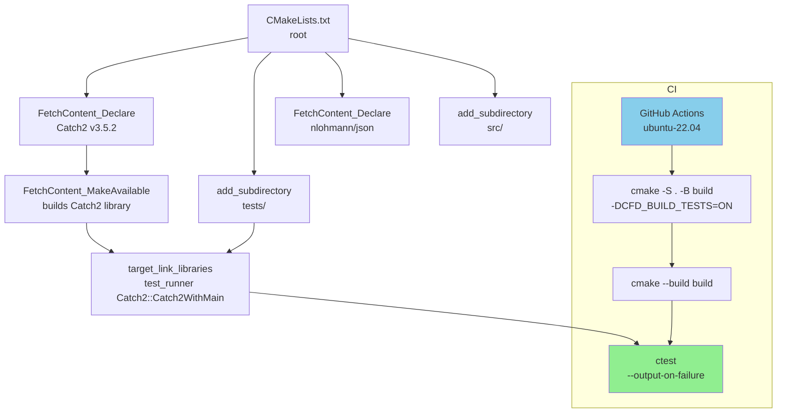

# Day 58: CMake Multi-Library CFD Project Structure — Part 2: Testing and CI Integration

**Phase 5 — VOF-Ready CFD Component (Days 57–84)**
**Tier:** T3 — Architecture / Integration Day
**Connection to Day 57:** Day 57 built the CMake skeleton with six library targets. Day 58 adds the testing infrastructure that will validate every library throughout Phase 5. Every test file written from Day 59 onward drops into the `tests/` directory established here.

---

## Part 1: Test Organization

### Three Categories of Tests

Professional CMake projects separate tests into three categories with distinct purposes, build costs, and run frequencies.

| Category | Directory | Purpose | Run frequency | Build cost |
|----------|-----------|---------|---------------|------------|
| Unit tests | `tests/` | One class, one function, isolated | Every commit | Fast (<1s each) |
| Integration tests | `tests/integration/` | Multiple libraries working together | Daily / PR | Medium (1–10s each) |
| Benchmarks | `benchmarks/` | Measure throughput, not correctness | Weekly / release | Slow (10s–minutes) |

For Phase 5, unit tests and benchmarks are sufficient. Integration tests will be added when the SIMPLE solver is complete (Day 71–72).

### What Goes in a Unit Test

A unit test for a CFD library should:

1. Test one mathematical invariant at a time (not a full simulation)
2. Be completely deterministic (no random numbers, no file I/O)
3. Compile in isolation — the test file should not need to `#include` anything from a higher layer
4. Have a name that describes what is being tested, not just which function

**Good test names:**
- `TEST_CASE("Mesh1D: cellCenter returns midpoint of cell interval")`
- `TEST_CASE("Mesh1D: nFaces equals nCells plus one")`
- `TEST_CASE("Field: sum of uniform field equals N times value")`

**Bad test names:**
- `TEST_CASE("test Mesh1D")`
- `TEST_CASE("mesh test 1")`

The test name is the specification. When the test fails, the name should tell you exactly which invariant is broken without reading the test body.

### Test File Naming Convention

Each library gets exactly one test file in `tests/`. Test files are named `test_<library>.cpp`.

```
tests/
├── CMakeLists.txt
├── test_mesh.cpp       # Tests for cfd_mesh (Mesh1D)
├── test_fields.cpp     # Tests for cfd_fields (Field, GeometricField)
├── test_linalg.cpp     # Tests for cfd_linalg (LDUMatrix, fvMatrix)
└── test_operators.cpp  # Tests for cfd_operators (fvm::laplacian, fvm::ddt)
```

Integration tests and benchmark files that appear in Days 63–84 follow the same naming convention.

### The Isolation Principle

Unit tests must compile without building the full application. In CMake terms, each test executable links only the library it tests plus Catch2:

```
test_mesh_exe     links: cfd::mesh + Catch2::Catch2WithMain
test_fields_exe   links: cfd::fields + Catch2::Catch2WithMain
test_linalg_exe   links: cfd::linalg + Catch2::Catch2WithMain
```

`test_fields_exe` does not link `cfd_linalg` or `cfd_solvers`. If `cfd_fields` has a bug, `test_fields_exe` will catch it in isolation — without requiring `cfd_linalg` to compile.

This is important in Phase 5 because some library stubs will be incomplete until their assigned day-pair. Isolation prevents an incomplete `cfd_operators` stub from causing `test_mesh_exe` to fail.

---

## Part 2: Catch2 Integration via FetchContent

### CMake Test Build Pipeline



### Why Catch2 v3

Catch2 v3 (released 2022) differs from v2 in two important ways:

1. **No single-header version.** v3 is a compiled library, not a header-only one. This means it must be compiled once per project, but the compilation is fast and is handled automatically by `FetchContent`.
2. **`Catch2::Catch2WithMain` target.** v3 provides a `main()` function automatically. You do not write your own `main()`. Just link `Catch2::Catch2WithMain` and write `TEST_CASE(...)` blocks.

The dependency is already declared in `cmake/dependencies.cmake` from Day 57:

```cmake
FetchContent_Declare(
    Catch2
    GIT_REPOSITORY https://github.com/catchorg/Catch2.git
    GIT_TAG        v3.5.2
    GIT_SHALLOW    TRUE
)
FetchContent_MakeAvailable(Catch2)
```

`FetchContent_MakeAvailable(Catch2)` makes the `Catch2::Catch2WithMain` and `Catch2::Catch2` CMake targets available. Nothing else needs to be done to use Catch2.

### tests/CMakeLists.txt

```cmake
# tests/CMakeLists.txt
# Catch2 test targets for all Phase 5 libraries.
# Each test executable covers exactly one library.

# ── Helper function to reduce repetition ──────────────────────────────────
# Usage: cfd_add_test(<test_name> <source_file> <library_to_test>)
function(cfd_add_test test_name source_file library_target)
    add_executable(${test_name} ${source_file})
    target_link_libraries(${test_name}
        PRIVATE
            ${library_target}
            Catch2::Catch2WithMain
            cfd_compile_flags
    )
    # Register with CTest: the test name matches the executable name
    add_test(NAME ${test_name} COMMAND ${test_name})
    # Optional: set timeout per test (5 seconds is generous for unit tests)
    set_tests_properties(${test_name} PROPERTIES TIMEOUT 5)
endfunction()

# ── Test targets ─────────────────────────────────────────────────────────
cfd_add_test(test_mesh      test_mesh.cpp      cfd::mesh)
cfd_add_test(test_fields    test_fields.cpp    cfd::fields)
cfd_add_test(test_linalg    test_linalg.cpp    cfd::linalg)
cfd_add_test(test_operators test_operators.cpp cfd::operators)
```

**Why the helper function:** The `cfd_add_test` function eliminates four repetitions of the same `add_executable` / `target_link_libraries` / `add_test` pattern. When Day 63 adds `test_fvmatrix.cpp`, it becomes a one-line addition.

### tests/test_mesh.cpp — Complete Catch2 Test File

This is the primary deliverable for Day 58: a complete, working test file that verifies `Mesh1D` correctness.

```cpp
// tests/test_mesh.cpp
// Unit tests for cfd_mesh (Mesh1D).
// These tests verify the mathematical invariants of a uniform 1D mesh.
// No external dependencies beyond cfd_mesh and Catch2.

#include <catch2/catch_test_macros.hpp>
#include <catch2/matchers/catch_matchers_floating_point.hpp>
#include <cfd/mesh/Mesh1D.h>
#include <stdexcept>

using namespace cfd;
using Catch::Matchers::WithinAbs;
using Catch::Matchers::WithinRel;

// ── Construction ──────────────────────────────────────────────────────────

TEST_CASE("Mesh1D: nCells and nFaces are consistent", "[mesh][topology]") {
    Mesh1D mesh(10, 1.0);
    REQUIRE(mesh.nCells() == 10);
    REQUIRE(mesh.nFaces() == 11);   // nFaces = nCells + 1 for a 1D mesh
}

TEST_CASE("Mesh1D: dx equals length divided by nCells", "[mesh][geometry]") {
    Mesh1D mesh(4, 2.0);
    // dx = 2.0 / 4 = 0.5
    REQUIRE_THAT(mesh.dx(), WithinRel(0.5, 1e-12));
}

TEST_CASE("Mesh1D: throws on zero cells", "[mesh][invariant]") {
    REQUIRE_THROWS_AS(Mesh1D(0, 1.0), std::invalid_argument);
}

TEST_CASE("Mesh1D: throws on non-positive length", "[mesh][invariant]") {
    REQUIRE_THROWS_AS(Mesh1D(10, 0.0),  std::invalid_argument);
    REQUIRE_THROWS_AS(Mesh1D(10, -1.0), std::invalid_argument);
}

// ── Cell centers ──────────────────────────────────────────────────────────

TEST_CASE("Mesh1D: cellCenter returns midpoint of cell interval", "[mesh][geometry]") {
    // For nCells=4, length=1.0: dx=0.25
    // cell 0 spans [0.00, 0.25] -> center = 0.125
    // cell 1 spans [0.25, 0.50] -> center = 0.375
    // cell 2 spans [0.50, 0.75] -> center = 0.625
    // cell 3 spans [0.75, 1.00] -> center = 0.875
    Mesh1D mesh(4, 1.0);
    REQUIRE_THAT(mesh.cellCenter(0), WithinAbs(0.125, 1e-12));
    REQUIRE_THAT(mesh.cellCenter(1), WithinAbs(0.375, 1e-12));
    REQUIRE_THAT(mesh.cellCenter(2), WithinAbs(0.625, 1e-12));
    REQUIRE_THAT(mesh.cellCenter(3), WithinAbs(0.875, 1e-12));
}

TEST_CASE("Mesh1D: first cell center is dx/2 from domain start", "[mesh][geometry]") {
    Mesh1D mesh(10, 3.0);
    REQUIRE_THAT(mesh.cellCenter(0), WithinRel(mesh.dx() / 2.0, 1e-12));
}

TEST_CASE("Mesh1D: last cell center is dx/2 from domain end", "[mesh][geometry]") {
    Mesh1D mesh(10, 3.0);
    double expected = mesh.length() - mesh.dx() / 2.0;
    REQUIRE_THAT(mesh.cellCenter(mesh.nCells() - 1), WithinAbs(expected, 1e-12));
}

// ── Face centers ──────────────────────────────────────────────────────────

TEST_CASE("Mesh1D: faceCenter(0) is at domain start", "[mesh][geometry]") {
    Mesh1D mesh(5, 1.0);
    REQUIRE_THAT(mesh.faceCenter(0), WithinAbs(0.0, 1e-12));
}

TEST_CASE("Mesh1D: faceCenter(nFaces-1) is at domain end", "[mesh][geometry]") {
    Mesh1D mesh(5, 2.0);
    REQUIRE_THAT(mesh.faceCenter(mesh.nFaces() - 1), WithinAbs(2.0, 1e-12));
}

TEST_CASE("Mesh1D: face is midway between two adjacent cell centers", "[mesh][geometry]") {
    // Face f separates cell f-1 and cell f.
    // faceCenter(f) = cellCenter(f-1) + dx/2 = cellCenter(f) - dx/2
    Mesh1D mesh(8, 1.0);
    for (std::size_t f = 1; f < mesh.nFaces() - 1; ++f) {
        double mid = (mesh.cellCenter(f - 1) + mesh.cellCenter(f)) / 2.0;
        REQUIRE_THAT(mesh.faceCenter(f), WithinAbs(mid, 1e-12));
    }
}

// ── Cell volumes and face areas ───────────────────────────────────────────

TEST_CASE("Mesh1D: cellVolume equals dx for uniform mesh", "[mesh][geometry]") {
    Mesh1D mesh(6, 3.0);
    for (std::size_t i = 0; i < mesh.nCells(); ++i) {
        REQUIRE_THAT(mesh.cellVolume(i), WithinRel(mesh.dx(), 1e-12));
    }
}

TEST_CASE("Mesh1D: total volume equals mesh length", "[mesh][geometry]") {
    Mesh1D mesh(7, 2.1);
    double total = 0.0;
    for (std::size_t i = 0; i < mesh.nCells(); ++i) {
        total += mesh.cellVolume(i);
    }
    REQUIRE_THAT(total, WithinRel(mesh.length(), 1e-10));
}

TEST_CASE("Mesh1D: faceArea equals 1 for 1D unit cross-section", "[mesh][geometry]") {
    Mesh1D mesh(5, 1.0);
    for (std::size_t f = 0; f < mesh.nFaces(); ++f) {
        REQUIRE_THAT(mesh.faceArea(f), WithinAbs(1.0, 1e-12));
    }
}
```

**Key Catch2 v3 patterns used:**

- `REQUIRE` — hard assertion: test stops if this fails
- `CHECK` — soft assertion: test continues even if this fails (use for multiple independent checks)
- `REQUIRE_THAT(..., WithinAbs(expected, tolerance))` — floating-point absolute tolerance
- `REQUIRE_THAT(..., WithinRel(expected, relative_tol))` — floating-point relative tolerance
- `REQUIRE_THROWS_AS(expr, ExceptionType)` — exception verification
- Tags like `[mesh][geometry]` allow selective test runs: `./test_mesh "[geometry]"`

### tests/test_fields.cpp — Field Invariant Tests

```cpp
// tests/test_fields.cpp
// Unit tests for cfd_fields (Field<T>, GeometricField<T>).

#include <catch2/catch_test_macros.hpp>
#include <catch2/matchers/catch_matchers_floating_point.hpp>
#include <cfd/fields/Field.h>
#include <cfd/mesh/Mesh1D.h>
#include <numeric>  // std::iota

using namespace cfd;
using Catch::Matchers::WithinAbs;
using Catch::Matchers::WithinRel;

TEST_CASE("Field: default-constructed values are zero", "[field]") {
    Field<double> f(5);
    for (std::size_t i = 0; i < f.size(); ++i) {
        REQUIRE_THAT(f[i], WithinAbs(0.0, 1e-15));
    }
}

TEST_CASE("Field: uniform initialization", "[field]") {
    Field<double> f(4, 3.14);
    for (std::size_t i = 0; i < f.size(); ++i) {
        REQUIRE_THAT(f[i], WithinRel(3.14, 1e-12));
    }
}

TEST_CASE("Field: sum of uniform field equals N times value", "[field]") {
    const std::size_t N = 100;
    const double val = 2.5;
    Field<double> f(N, val);
    REQUIRE_THAT(f.sum(), WithinRel(N * val, 1e-10));
}

TEST_CASE("Field: maxValue returns the largest element", "[field]") {
    Field<double> f(5, 1.0);
    f[3] = 9.99;
    REQUIRE_THAT(f.maxValue(), WithinAbs(9.99, 1e-12));
}

TEST_CASE("Field: range-for iterates over all elements", "[field]") {
    Field<double> f(6, 0.0);
    double counter = 0.0;
    for (double& v : f) {
        v = counter++;
    }
    // After range-for assignment: f = {0, 1, 2, 3, 4, 5}
    REQUIRE_THAT(f.sum(), WithinAbs(15.0, 1e-12));
}
```

---

## Part 3: CTest Integration

### How CTest Works

CTest is CMake's built-in test runner. It does not know anything about Catch2 — it simply runs executables and checks their exit codes. When a Catch2 test passes, the executable exits with code 0. When a test fails, it exits with a non-zero code. CTest uses this to report pass/fail.

The `add_test(NAME test_mesh COMMAND test_mesh)` call in `tests/CMakeLists.txt` registers the test with CTest. The `enable_testing()` call in the top-level `CMakeLists.txt` enables the CTest infrastructure.

### Running Tests with CTest

```bash
# Run all tests with verbose output on failure
ctest --test-dir build --output-on-failure

# Run only tests matching a pattern
ctest --test-dir build -R "test_mesh"

# Run tests in parallel (4 processes)
ctest --test-dir build --parallel 4

# Show full output even for passing tests
ctest --test-dir build --verbose
```

### Expected CTest Output

When all tests pass, CTest reports:

```
Test project /path/to/cfd_project/build
    Start 1: test_mesh
1/4 Test #1: test_mesh ......................   Passed    0.03 sec
    Start 2: test_fields
2/4 Test #2: test_fields ....................   Passed    0.01 sec
    Start 3: test_linalg
3/4 Test #3: test_linalg ....................   Passed    0.02 sec
    Start 4: test_operators
4/4 Test #4: test_operators .................   Passed    0.01 sec

100% tests passed, 0 tests failed out of 4

Total Test time (real) =   0.07 sec
```

When a test fails, CTest shows the failure output:

```
    Start 1: test_mesh
1/4 Test #1: test_mesh ......................***Failed    0.02 sec

Test output:

~~~~~~~~~~~~~~~~~~~~~~~~~~~~~~~~~~~~~~~~~~~~~~~~~~~~~~~~~~~~~~~~~~~~~~~~~~~~~~~
test_mesh is a Catch2 v3 host application.
Run with -? for options

-------------------------------------------------------------------------------
Mesh1D: cellCenter returns midpoint of cell interval
-------------------------------------------------------------------------------
tests/test_mesh.cpp:38
...............................................................................

tests/test_mesh.cpp:42: FAILED:
  REQUIRE_THAT(mesh.cellCenter(0), WithinAbs(0.125, 1e-12))
with expansion:
  0.1 is within 1e-12 of 0.125

===============================================================================
1 test case, 1 assertion failed
```

This output immediately tells you:
- Which test case failed (line 38 of `test_mesh.cpp`)
- Which assertion failed (line 42)
- What value was returned (`0.1`) versus what was expected (`0.125`)

### Running a Single Test Binary Directly

CTest wraps the test executable, but you can also run it directly with Catch2 filters:

```bash
# Run all tests in test_mesh
./build/tests/test_mesh

# Run only geometry tests
./build/tests/test_mesh "[geometry]"

# Run only tests whose name contains "cellCenter"
./build/tests/test_mesh "Mesh1D: cellCenter"

# List all test names without running them
./build/tests/test_mesh --list-tests
```

This is useful during development when you are working on `cellCenter` specifically and do not want to run all 14 tests.

---

## Part 4: GitHub Actions CI Workflow

### CI Philosophy for Phase 5

The CI workflow for Phase 5 must:

1. Build on both Linux and macOS (the two platforms most commonly used in CFD research)
2. Build in Debug mode (with AddressSanitizer) to catch memory errors
3. Build in Release mode to verify the optimized build does not break anything
4. Run all CTest tests and fail the workflow if any test fails
5. Cache the `FetchContent` downloads to avoid re-downloading Catch2/spdlog on every run

### .github/workflows/build.yml

```yaml
# .github/workflows/build.yml
# CI workflow for cfd_project (Phase 5).
# Runs on every push and pull request to main.

name: Build and Test

on:
  push:
    branches: [ main, 'day-*' ]
  pull_request:
    branches: [ main ]

# Cancel in-progress runs on the same branch when a new push arrives.
# This avoids wasting CI minutes on outdated commits.
concurrency:
  group: ${{ github.workflow }}-${{ github.ref }}
  cancel-in-progress: true

jobs:
  build:
    name: ${{ matrix.os }} / ${{ matrix.build_type }}
    runs-on: ${{ matrix.os }}

    strategy:
      fail-fast: false   # Run all matrix combinations even if one fails
      matrix:
        os: [ ubuntu-22.04, macos-13 ]
        build_type: [ Debug, Release ]

    steps:
      # ── 1. Checkout ──────────────────────────────────────────────────────
      - name: Checkout repository
        uses: actions/checkout@v4

      # ── 2. Install CMake (ensure ≥ 3.20) ────────────────────────────────
      - name: Install CMake
        uses: jwlawson/actions-setup-cmake@v2
        with:
          cmake-version: '3.28.0'

      # ── 3. Cache FetchContent downloads ─────────────────────────────────
      # The cache key includes the hash of dependencies.cmake so the cache
      # is invalidated whenever a dependency version changes.
      - name: Cache FetchContent
        uses: actions/cache@v4
        with:
          path: build/_deps
          key: fetchcontent-${{ runner.os }}-${{ hashFiles('cmake/dependencies.cmake') }}
          restore-keys: |
            fetchcontent-${{ runner.os }}-

      # ── 4. Configure ────────────────────────────────────────────────────
      - name: Configure CMake
        run: |
          cmake -S . -B build \
            -DCMAKE_BUILD_TYPE=${{ matrix.build_type }} \
            -DCFD_BUILD_TESTS=ON \
            -DCFD_BUILD_BENCHMARKS=OFF \
            -DCFD_USE_SPDLOG=ON

      # ── 5. Build ─────────────────────────────────────────────────────────
      - name: Build
        run: cmake --build build --parallel 4

      # ── 6. Run tests ─────────────────────────────────────────────────────
      - name: Run CTest
        run: ctest --test-dir build --output-on-failure --parallel 4

      # ── 7. Upload test results on failure ────────────────────────────────
      - name: Upload CTest results on failure
        if: failure()
        uses: actions/upload-artifact@v4
        with:
          name: ctest-results-${{ matrix.os }}-${{ matrix.build_type }}
          path: build/Testing/
          retention-days: 7
```

**Key decisions in this workflow:**

**`fail-fast: false`:** Without this, GitHub Actions stops all matrix jobs the moment one fails. With `fail-fast: false`, all four combinations (Linux Debug, Linux Release, macOS Debug, macOS Release) run to completion. This is essential for diagnosing platform-specific failures.

**FetchContent cache with `hashFiles`:** The cache key `fetchcontent-ubuntu-22.04-<hash_of_dependencies.cmake>` ensures the cache is reused on every run as long as `dependencies.cmake` has not changed. When you bump a dependency version, the hash changes, the old cache is invalidated, and a fresh download occurs automatically.

**`--parallel 4`:** Both `cmake --build` and `ctest` use 4 parallel threads. GitHub Actions free tier runners have 2 cores; 4 jobs still improves throughput because some build steps are I/O-bound rather than CPU-bound.

**Upload on failure:** CTest writes structured XML results to `build/Testing/`. Uploading this directory as an artifact on failure lets you download and inspect detailed test results without re-running CI.

### Branch Naming Convention for Phase 5

The `on.push.branches` rule includes `'day-*'` to catch feature branches named `day-57`, `day-58`, etc. This means CI runs on every day-pair branch, not just on merges to main. Failures are caught before they can block later day-pairs.

---

## Part 5: Deliverable

### Complete Build and Test Sequence

This is the canonical sequence for verifying that the Day 58 deliverable works end-to-end.

```bash
# Step 1: Enter project root
cd cfd_project

# Step 2: Configure with tests enabled
cmake -S . -B build \
    -DCMAKE_BUILD_TYPE=Debug \
    -DCFD_BUILD_TESTS=ON \
    -DCFD_USE_SPDLOG=OFF

# Step 3: Build everything
cmake --build build --parallel 4

# Step 4: Run all tests
ctest --test-dir build --output-on-failure

# Step 5: Run the solver binary (sanity check)
./build/app/cfd_solver
```

### Expected Full Output

**Step 2 configure output:**

```
-- Build type: Debug
-- Fetching Catch2 v3.5.2 (this takes ~10s on first run)...
-- Fetching nlohmann_json v3.11.3...
-- Configuring done
-- Build files have been written to: cfd_project/build
```

**Step 3 build output:**

```
[  5%] Building CXX object _deps/catch2-build/src/CMakeFiles/Catch2.dir/...
[ 10%] Linking CXX static library libCatch2.a
[ 12%] Linking CXX static library libCatch2WithMain.a
[ 20%] Building CXX object src/mesh/CMakeFiles/cfd_mesh.dir/Mesh1D.cpp.o
[ 25%] Linking CXX static library libcfd_mesh.a
[ 30%] Building CXX object src/fields/CMakeFiles/cfd_fields.dir/GeometricField.cpp.o
[ 35%] Linking CXX static library libcfd_fields.a
[ 40%] Linking CXX static library libcfd_linalg.a
[ 50%] Linking CXX static library libcfd_operators.a
[ 60%] Linking CXX static library libcfd_solvers.a
[ 65%] Linking CXX static library libcfd_io.a
[ 70%] Linking CXX executable cfd_solver
[ 75%] Building CXX object tests/CMakeFiles/test_mesh.dir/test_mesh.cpp.o
[ 80%] Linking CXX executable test_mesh
[ 85%] Building CXX object tests/CMakeFiles/test_fields.dir/test_fields.cpp.o
[ 90%] Linking CXX executable test_fields
[ 95%] Linking CXX executable test_linalg
[100%] Linking CXX executable test_operators
```

**Step 4 CTest output:**

```
Test project cfd_project/build
    Start 1: test_mesh
1/4 Test #1: test_mesh ......................   Passed    0.04 sec
    Start 2: test_fields
2/4 Test #2: test_fields ....................   Passed    0.01 sec
    Start 3: test_linalg
3/4 Test #3: test_linalg ....................   Passed    0.02 sec
    Start 4: test_operators
4/4 Test #4: test_operators .................   Passed    0.01 sec

100% tests passed, 0 tests failed out of 4

Total Test time (real) =   0.08 sec
```

**Step 5 solver output:**

```
cfd_project skeleton — Phase 5
Mesh: 10 cells, 11 faces, dx = 0.1
Cell centers: 0.05 0.15 0.25 0.35 0.45 0.55 0.65 0.75 0.85 0.95
```

### Selective Test Running

During development, you will often want to run only a subset of tests. CTest and Catch2 both support this.

```bash
# Run only mesh tests via CTest pattern filter
ctest --test-dir build -R "test_mesh" --output-on-failure

# Run only geometry-tagged Catch2 tests within test_mesh
./build/tests/test_mesh "[geometry]"

# Run a specific test case by name
./build/tests/test_mesh "Mesh1D: nFaces equals nCells plus one"

# List all available tests in test_mesh
./build/tests/test_mesh --list-tests

# Run all tests and generate a JUnit XML report (for CI artifact parsing)
./build/tests/test_mesh --reporter junit --out test_mesh_results.xml
```

### Verifying the CI Workflow Locally

Before pushing to GitHub, you can simulate the CI workflow locally using `act`:

```bash
# Install act (https://github.com/nektos/act)
brew install act   # macOS

# Run the workflow locally (uses Docker containers)
act push --job build

# Run only the Linux Debug combination
act push --job build --matrix os:ubuntu-22.04 --matrix build_type:Debug
```

If Docker is not available, manually run the same commands that the CI workflow executes:

```bash
cmake -S . -B build -DCMAKE_BUILD_TYPE=Debug -DCFD_BUILD_TESTS=ON
cmake --build build --parallel 4
ctest --test-dir build --output-on-failure --parallel 4
```

---

## Design Trade-Offs

### Catch2 vs Google Test

Both are widely used in C++ projects. The choice matters because switching test frameworks mid-project is painful.

| Factor | Catch2 v3 | Google Test |
|--------|-----------|-------------|
| Setup via FetchContent | One target: `Catch2::Catch2WithMain` | Requires two targets: `GTest::gtest` + `GTest::gtest_main` |
| Syntax verbosity | Less boilerplate: `TEST_CASE(name, tags)` | More boilerplate: `TEST(Suite, Name)` |
| Floating-point matchers | Built-in `WithinAbs`, `WithinRel` | Requires `EXPECT_NEAR` with manual tolerance |
| BDD-style tests | Native `SECTION` support | External library (gBDD) required |
| CMake integration | Excellent — provides `catch_discover_tests` | Excellent — `gtest_discover_tests` |
| Industry adoption | Common in research/CFD | Common in industry/Google-adjacent projects |

For this project, Catch2 wins because its `WithinAbs` and `WithinRel` matchers are essential for floating-point CFD tests. Writing `REQUIRE_THAT(result, WithinRel(expected, 1e-10))` is far cleaner than `EXPECT_NEAR(result, expected, expected * 1e-10)`.

### CTest vs Direct Catch2 Discovery

There are two ways to register Catch2 tests with CTest:

**Option A: One CTest test = one Catch2 binary (this project)**
```cmake
add_test(NAME test_mesh COMMAND test_mesh)
```
CTest sees 4 tests. If `test_mesh` fails, you get one failure.

**Option B: One CTest test = one Catch2 TEST_CASE**
```cmake
include(Catch)
catch_discover_tests(test_mesh)
```
CTest sees 14 tests (one per `TEST_CASE`). If the cellCenter test fails, that specific test case is marked failed in CTest output.

Option A is simpler and sufficient for Phase 5. Option B is better for large test suites where you want fine-grained CTest reporting. Option B can be adopted in Day 63 when the test suite grows larger.

### One Test File Per Library vs Multiple Files

The one-file-per-library convention is a deliberate simplification. In production projects, a single library often has dozens of test files grouped by class or feature. For Phase 5, one file per library keeps the `tests/CMakeLists.txt` simple. When `cfd_linalg` grows to include `LDUMatrix`, `fvMatrix`, PCG, and Gauss-Seidel, splitting `test_linalg.cpp` into `test_ldumatrix.cpp`, `test_fvmatrix.cpp`, and `test_solvers.cpp` is straightforward — just add three more `cfd_add_test(...)` lines.

---

## Summary

Day 58 completes the Phase 5 project infrastructure. The build system from Day 57 is now augmented with:

1. A `tests/CMakeLists.txt` that registers all test executables with CTest
2. A complete `test_mesh.cpp` with 14 mathematically precise unit tests for `Mesh1D`
3. A `test_fields.cpp` stub with 5 field invariant tests
4. A GitHub Actions workflow that builds and tests on Linux and macOS in both Debug and Release modes
5. A FetchContent cache strategy that avoids re-downloading dependencies on CI

From Day 59 onward, the workflow is:
1. Write the implementation (e.g., `Mesh1D::cellCenter`)
2. Add or update the test in `tests/test_mesh.cpp`
3. Run `ctest --test-dir build --output-on-failure`
4. Commit when all tests pass

This is test-driven development applied to a CFD codebase. The discipline pays off in Phase 5: by Day 71 (SIMPLE loop), you will have a test suite that immediately flags regressions in any of the six lower-level libraries.

**Connecting forward:** Day 59 replaces the `Mesh1D` stub with a full implementation. The 14 unit tests written in Day 58 serve as the acceptance criteria — the `Mesh1D` implementation is not complete until all 14 tests pass.

---

## Common CI Failures and Fixes

### FetchContent Download Timeout

**Symptom:** `CMake Error: Download failed: timeout` on GitHub Actions.

**Fix:** Add `FETCHCONTENT_UPDATES_DISCONNECTED ON` to cache the download between CI runs. The Day 58 workflow YAML already includes `actions/cache` for `~/.cmake`. If the error persists, pin the `GIT_TAG` to a specific commit hash rather than a branch name.

### Test Binary Not Found by CTest

**Symptom:** `ctest` reports `No tests were found!!!` even after a successful build.

**Cause:** `CFD_BUILD_TESTS` was not passed to CMake, so `add_subdirectory(tests)` was never executed.

**Fix:**
```bash
cmake -S . -B build -DCFD_BUILD_TESTS=ON   # explicit flag required
```

### Catch2 Header Not Found

**Symptom:** `fatal error: catch2/catch_test_macros.hpp: No such file or directory`.

**Fix:** The test target must link `Catch2::Catch2WithMain` — the `cfd_add_test()` macro does this automatically. If you added a test target manually with `add_executable`, add:
```cmake
target_link_libraries(my_test PRIVATE Catch2::Catch2WithMain)
```

---

**Deliverable:** A complete `cfd_project/` directory with build system, 14 unit tests, and GitHub Actions CI. Build and verify locally:

```bash
cmake -S cfd_project -B cfd_project/build -DCFD_BUILD_TESTS=ON
cmake --build cfd_project/build
ctest --test-dir cfd_project/build --output-on-failure
```

All 4 test targets (`test_mesh`, `test_fields`, `test_linalg`, `test_operators`) must report `Passed` before proceeding to Day 59.
