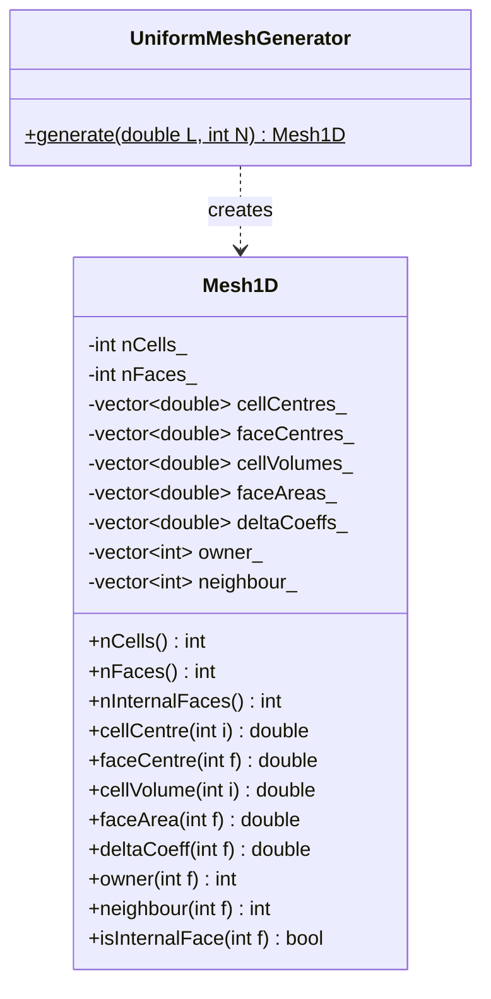

# Day 59: 1D Mesh Implementation Part 1 — Cell-Centered Layout

> **Phase 5 — VOF-Ready CFD Component**
> **Tier:** T3 | **Target:** 800+ lines | **5 Parts**
>
> **Connection to Prior Work:** This is the first implementation day of Phase 5. We build the foundational mesh data structure that every subsequent component — fields (Days 61–62), equation assembly (Days 63–64), and solvers (Days 69–70) — will depend on. The design decisions made here propagate throughout the entire mini-solver.

---

## Part 1: What Does a 1D Finite Volume Mesh Store?

### The Finite Volume Discretization Philosophy

In the Finite Volume Method (FVM), the continuous domain $\Omega \subset \mathbb{R}$ is partitioned into a finite number of non-overlapping control volumes (cells). Each cell $C_i$ occupies an interval $[x_{i-1/2},\, x_{i+1/2}]$.

The governing PDE is integrated over each control volume rather than evaluated pointwise:

$$
\int_{C_i} \frac{\partial \phi}{\partial t} \, dV + \oint_{\partial C_i} \mathbf{F} \cdot d\mathbf{S} = \int_{C_i} S \, dV
$$

This integral form is exact — no Taylor expansion truncation at this stage. Approximation enters only when we interpolate face values from cell-center values.

### Mesh Entities in 1D

A 1D finite volume mesh on $[0, L]$ with $N$ cells contains exactly:

| Entity | Count | Symbol | Description |
|--------|-------|--------|-------------|
| Cells | $N$ | $C_i$, $i \in [0, N)$ | The control volumes |
| Faces | $N+1$ | $f_j$, $j \in [0, N]$ | The cell interfaces |
| Internal faces | $N-1$ | $f_j$, $j \in [1, N-1]$ | Shared by two cells |
| Boundary faces | $2$ | $f_0$, $f_N$ | Each belongs to one cell |

This is the **cell-centered** layout: field values are stored at cell centers, not at faces or vertices. OpenFOAM uses the same convention.

### Geometric Quantities

For each mesh entity we need to store:

**Per cell:**
- Cell center coordinate: $x_P = \frac{x_{i-1/2} + x_{i+1/2}}{2}$
- Cell volume (length in 1D): $V_i = x_{i+1/2} - x_{i-1/2}$

**Per face:**
- Face center coordinate: $x_f = x_{j}$ (the interface position itself)
- Face area (magnitude of surface vector, unity in 1D): $|S_f| = 1$
- Face normal direction: $+1$ (pointing right) for all internal faces

**For interpolation (derived geometry):**
- Owner-side delta: $d_{Pf} = x_f - x_P$ (distance from owner cell center to face)
- Neighbour-side delta: $d_{fN} = x_N - x_f$ (distance from face to neighbour cell center)
- Full delta: $d_{PN} = x_N - x_P$ (used in diffusion coefficient)

### The Owner-Neighbour Connectivity Model

Each internal face $f$ separates exactly two cells. We label them:

- **Owner** (`owner[f]`): the cell whose outward normal points in the positive direction through face $f$
- **Neighbour** (`neighbour[f]`): the other cell

For boundary faces, only the owner is defined — there is no neighbour.

In 1D with a uniform right-to-left ordering, for internal face $j$ ($j = 1, \ldots, N-1$):

$$
\text{owner}[j] = j - 1, \quad \text{neighbour}[j] = j
$$

The left boundary face $f_0$ has owner cell $0$, and the right boundary face $f_N$ has owner cell $N-1$.

```
   Cell 0       Cell 1       Cell 2       Cell 3
  [       |       |       |       ]
  f0      f1      f2      f3      f4

  f0: boundary face, owner=0
  f1: internal face, owner=0, neighbour=1
  f2: internal face, owner=1, neighbour=2
  f3: internal face, owner=2, neighbour=3
  f4: boundary face, owner=3
```

### Why Cell-Centered Storage?

The cell-centered approach has three advantages relevant to CFD:

1. **Conservation:** Fluxes through shared faces are computed once and applied with opposite sign to owner and neighbour. This guarantees discrete conservation to machine precision.
2. **Simplicity:** All field values live on a single array indexed by cell. There is no ambiguity about "which point owns this value."
3. **Compatibility with OpenFOAM:** The `volField` / `surfaceField` split in OpenFOAM follows exactly this model. Learning this structure now makes the transition to full OpenFOAM straightforward.

---

## Part 2: Mesh Data Structure Design

### Design Decisions

Before writing any code, we fix the design choices that govern this entire phase:

| Decision | Choice | Rationale |
|----------|--------|-----------|
| Index type | `int` (not `size_t`) | Signed indices avoid subtle bugs with `i-1` underflow; mesh sizes are never astronomically large |
| Storage | `std::vector<double>` | Cache-friendly, contiguous, standard |
| Boundary patches | Separate class `BoundaryPatch` (Day 60) | Single Responsibility — mesh topology and BC semantics are separate concerns |
| Face normal convention | All normals point left-to-right (+x direction) | Consistent orientation; owner cell is always to the left |
| Units | SI (meters, seconds) | No unit abstraction needed for a learning solver |

### Class Responsibility

The `Mesh1D` class is responsible for **topology and geometry only**. It does not:
- Store field data (that is `Field<T>`, Days 61–62)
- Apply boundary conditions (that is `BoundaryCondition`, Day 37 pattern)
- Solve equations (that is `fvMatrix`, Days 63–64)

This separation of concerns is the first architectural principle of the Phase 5 solver.

### Mermaid Diagram: Mesh Data Layout



### Data Layout in Memory

All arrays are stored in face-index or cell-index order. For a mesh with $N = 4$ cells and $N+1 = 5$ faces:

```
cellCentres_:  [  xC0,   xC1,   xC2,   xC3  ]    length N
faceCentres_:  [  xF0,   xF1,   xF2,   xF3,  xF4 ]    length N+1
cellVolumes_:  [  V0,    V1,    V2,    V3   ]    length N
faceAreas_:    [  1.0,   1.0,   1.0,   1.0,  1.0 ]    length N+1 (all 1 in 1D)
owner_:        [  0,     0,     1,     2,    3   ]    length N+1
neighbour_:    [  -1,    1,     2,     3,    -1  ]    length N+1 (-1 = boundary)
deltaCoeffs_:  [  d0,    d1,    d2,    d3,   d4  ]    length N+1
```

The `deltaCoeffs_` array stores $1 / |x_N - x_P|$ for internal faces and $1 / |x_f - x_P|$ for boundary faces. This is the quantity that appears directly in the diffusion term discretization:

$$
\left.\frac{\partial \phi}{\partial x}\right|_f \approx \frac{\phi_N - \phi_P}{|x_N - x_P|}
$$

---

## Part 3: Complete `Mesh1D` Class Implementation

### Header: `Mesh1D.h`

```cpp
// File: src/mesh/Mesh1D.h
// Purpose: 1D finite volume mesh — cell-centered layout
// Stores topology and geometry for a 1D domain [0, L]

#pragma once

#include <vector>
#include <stdexcept>
#include <string>

namespace cfd {

/// 1D finite volume mesh with cell-centered data layout.
///
/// Mesh topology:
///   - nCells() cells indexed [0, nCells())
///   - nFaces() = nCells() + 1 faces indexed [0, nFaces())
///   - Internal faces: [1, nCells() - 1]  (shared by two cells)
///   - Boundary faces: face 0 (left) and face nCells() (right)
///
/// Face orientation convention:
///   All face normals point in the +x direction.
///   owner(f) is always the cell to the left of face f.
///   neighbour(f) is always the cell to the right (invalid for boundary faces).
class Mesh1D {
public:
    // -------------------------------------------------------------------------
    // Construction

    /// Construct mesh directly from pre-computed geometry arrays.
    /// This constructor is used by UniformMeshGenerator and custom generators.
    ///
    /// @param cellCentres    Cell centre coordinates, length nCells
    /// @param faceCentres    Face centre coordinates, length nFaces = nCells + 1
    /// @param cellVolumes    Cell volumes (lengths in 1D), length nCells
    /// @param faceAreas      Face areas (1.0 in 1D), length nFaces
    /// @param owner          owner[f] = index of cell owning face f, length nFaces
    /// @param neighbour      neighbour[f] = neighbour cell, -1 for boundary, length nFaces
    /// @param deltaCoeffs    1/|delta| for each face, length nFaces
    Mesh1D(std::vector<double> cellCentres,
           std::vector<double> faceCentres,
           std::vector<double> cellVolumes,
           std::vector<double> faceAreas,
           std::vector<int>    owner,
           std::vector<int>    neighbour,
           std::vector<double> deltaCoeffs);

    // -------------------------------------------------------------------------
    // Topology

    /// Total number of cells in the mesh.
    int nCells()         const noexcept { return nCells_; }

    /// Total number of faces (internal + boundary).
    int nFaces()         const noexcept { return nFaces_; }

    /// Number of internal faces (shared by two cells).
    int nInternalFaces() const noexcept { return nCells_ - 1; }

    /// Number of boundary faces (1D always has exactly 2).
    int nBoundaryFaces() const noexcept { return 2; }

    /// True if face f is shared by two cells (not a domain boundary).
    bool isInternalFace(int f) const noexcept {
        return neighbour_[f] >= 0;
    }

    // -------------------------------------------------------------------------
    // Geometry access

    /// Cell centre coordinate for cell i.
    double cellCentre(int i)  const { return cellCentres_[checkCell(i)]; }

    /// Face centre coordinate for face f.
    double faceCentre(int f)  const { return faceCentres_[checkFace(f)]; }

    /// Cell volume (= cell length in 1D) for cell i.
    double cellVolume(int i)  const { return cellVolumes_[checkCell(i)]; }

    /// Face area (always 1.0 in 1D) for face f.
    double faceArea(int f)    const { return faceAreas_[checkFace(f)]; }

    /// 1/|delta| for face f.
    /// For internal faces: 1 / |x_neighbour - x_owner|
    /// For boundary faces: 1 / |x_face - x_owner|
    double deltaCoeff(int f)  const { return deltaCoeffs_[checkFace(f)]; }

    // -------------------------------------------------------------------------
    // Connectivity

    /// Index of the owner cell (left cell) for face f.
    int owner(int f)          const { return owner_[checkFace(f)]; }

    /// Index of the neighbour cell (right cell) for face f.
    /// Returns -1 for boundary faces — caller must check isInternalFace() first.
    int neighbour(int f)      const { return neighbour_[checkFace(f)]; }

    // -------------------------------------------------------------------------
    // Whole-array access (for Field initialisation and operators)
    // Returning const-ref avoids copy; caller must not store the reference
    // longer than the mesh lifetime.

    const std::vector<double>& cellCentres()  const noexcept { return cellCentres_; }
    const std::vector<double>& faceCentres()  const noexcept { return faceCentres_; }
    const std::vector<double>& cellVolumes()  const noexcept { return cellVolumes_; }
    const std::vector<double>& faceAreas()    const noexcept { return faceAreas_; }
    const std::vector<double>& deltaCoeffs()  const noexcept { return deltaCoeffs_; }
    const std::vector<int>&    owner()        const noexcept { return owner_; }
    const std::vector<int>&    neighbour()    const noexcept { return neighbour_; }

    // -------------------------------------------------------------------------
    // Diagnostics

    /// Domain length: sum of all cell volumes.
    double totalLength() const;

    /// Print a human-readable summary to stdout.
    void printInfo() const;

private:
    int nCells_;
    int nFaces_;

    std::vector<double> cellCentres_;
    std::vector<double> faceCentres_;
    std::vector<double> cellVolumes_;
    std::vector<double> faceAreas_;
    std::vector<double> deltaCoeffs_;
    std::vector<int>    owner_;
    std::vector<int>    neighbour_;

    // -------------------------------------------------------------------------
    // Bounds checking (active in debug builds)

    int checkCell(int i) const {
#ifndef NDEBUG
        if (i < 0 || i >= nCells_)
            throw std::out_of_range("Mesh1D: cell index " + std::to_string(i)
                                    + " out of range [0, " + std::to_string(nCells_) + ")");
#endif
        return i;
    }

    int checkFace(int f) const {
#ifndef NDEBUG
        if (f < 0 || f >= nFaces_)
            throw std::out_of_range("Mesh1D: face index " + std::to_string(f)
                                    + " out of range [0, " + std::to_string(nFaces_) + ")");
#endif
        return f;
    }
};

} // namespace cfd
```

### Implementation: `Mesh1D.cpp`

```cpp
// File: src/mesh/Mesh1D.cpp

#include "Mesh1D.h"

#include <numeric>   // std::accumulate
#include <stdexcept>
#include <iostream>
#include <iomanip>

namespace cfd {

Mesh1D::Mesh1D(std::vector<double> cellCentres,
               std::vector<double> faceCentres,
               std::vector<double> cellVolumes,
               std::vector<double> faceAreas,
               std::vector<int>    owner,
               std::vector<int>    neighbour,
               std::vector<double> deltaCoeffs)
    : nCells_(static_cast<int>(cellCentres.size()))
    , nFaces_(static_cast<int>(faceCentres.size()))
    , cellCentres_ (std::move(cellCentres))
    , faceCentres_ (std::move(faceCentres))
    , cellVolumes_ (std::move(cellVolumes))
    , faceAreas_   (std::move(faceAreas))
    , owner_       (std::move(owner))
    , neighbour_   (std::move(neighbour))
    , deltaCoeffs_ (std::move(deltaCoeffs))
{
    // Validate dimensions at construction time
    if (nFaces_ != nCells_ + 1) {
        throw std::invalid_argument(
            "Mesh1D: nFaces must equal nCells + 1. Got nCells="
            + std::to_string(nCells_) + ", nFaces=" + std::to_string(nFaces_));
    }
    if (static_cast<int>(cellVolumes_.size()) != nCells_) {
        throw std::invalid_argument("Mesh1D: cellVolumes size mismatch");
    }
    if (static_cast<int>(faceAreas_.size()) != nFaces_) {
        throw std::invalid_argument("Mesh1D: faceAreas size mismatch");
    }
    if (static_cast<int>(owner_.size()) != nFaces_) {
        throw std::invalid_argument("Mesh1D: owner array size mismatch");
    }
    if (static_cast<int>(neighbour_.size()) != nFaces_) {
        throw std::invalid_argument("Mesh1D: neighbour array size mismatch");
    }
    if (static_cast<int>(deltaCoeffs_.size()) != nFaces_) {
        throw std::invalid_argument("Mesh1D: deltaCoeffs size mismatch");
    }
}

double Mesh1D::totalLength() const {
    return std::accumulate(cellVolumes_.begin(), cellVolumes_.end(), 0.0);
}

void Mesh1D::printInfo() const {
    std::cout << "=== Mesh1D Info ===" << std::endl;
    std::cout << "  nCells         = " << nCells_ << std::endl;
    std::cout << "  nFaces         = " << nFaces_ << std::endl;
    std::cout << "  nInternalFaces = " << nInternalFaces() << std::endl;
    std::cout << "  nBoundaryFaces = " << nBoundaryFaces() << std::endl;
    std::cout << "  totalLength    = " << std::fixed << std::setprecision(6)
              << totalLength() << std::endl;
    std::cout << std::endl;

    std::cout << "  Cell centres and volumes:" << std::endl;
    for (int i = 0; i < nCells_; ++i) {
        std::cout << "    Cell " << std::setw(3) << i
                  << "  xC = " << std::setw(10) << std::setprecision(6) << cellCentres_[i]
                  << "  V  = " << std::setw(10) << std::setprecision(6) << cellVolumes_[i]
                  << std::endl;
    }
    std::cout << std::endl;

    std::cout << "  Face centres and connectivity:" << std::endl;
    for (int f = 0; f < nFaces_; ++f) {
        std::string type = isInternalFace(f) ? "internal" : "boundary";
        std::cout << "    Face " << std::setw(3) << f
                  << "  xF = " << std::setw(10) << std::setprecision(6) << faceCentres_[f]
                  << "  owner = " << std::setw(3) << owner_[f]
                  << "  nbr = "   << std::setw(3) << neighbour_[f]
                  << "  delta = " << std::setw(10) << std::setprecision(6) << deltaCoeffs_[f]
                  << "  [" << type << "]"
                  << std::endl;
    }
    std::cout << "===================" << std::endl;
}

} // namespace cfd
```

---

## Part 4: Mesh Generation — Uniform 1D Mesh

### The Generator Design

Rather than making `Mesh1D` responsible for generating its own geometry (which would couple data storage with generation logic), we use a free function `makeUniformMesh`. This follows the Single Responsibility Principle: `Mesh1D` stores and provides geometry; the generator function creates it.

This pattern also makes it easy to add non-uniform mesh generators (graded, stretched, read-from-file) without touching the `Mesh1D` class.

### Header: `MeshGenerator.h`

```cpp
// File: src/mesh/MeshGenerator.h
// Purpose: Factory functions for constructing Mesh1D objects

#pragma once

#include "Mesh1D.h"

namespace cfd {

/// Create a uniform 1D finite volume mesh on [0, L] with N cells.
///
/// Cell widths are all equal: dx = L / N
///
/// Cell centres: xC_i = (i + 0.5) * dx,  i in [0, N)
/// Face centres: xF_j = j * dx,           j in [0, N]
///
/// Owner-neighbour convention:
///   owner[j]     = j - 1  for j in [1, N]  (left cell)
///   owner[0]     = 0      (left boundary face, owned by leftmost cell)
///   neighbour[j] = j      for j in [1, N-1] (right cell of internal face)
///   neighbour[0] = -1     (left boundary, no neighbour)
///   neighbour[N] = -1     (right boundary, no neighbour)
///
/// @param L  Domain length (metres)
/// @param N  Number of cells (must be >= 1)
/// @throws std::invalid_argument if N < 1 or L <= 0
Mesh1D makeUniformMesh(double L, int N);

} // namespace cfd
```

### Implementation: `MeshGenerator.cpp`

```cpp
// File: src/mesh/MeshGenerator.cpp

#include "MeshGenerator.h"

#include <stdexcept>
#include <cmath>

namespace cfd {

Mesh1D makeUniformMesh(double L, int N) {
    if (N < 1)
        throw std::invalid_argument("makeUniformMesh: N must be >= 1, got "
                                    + std::to_string(N));
    if (L <= 0.0)
        throw std::invalid_argument("makeUniformMesh: L must be > 0, got "
                                    + std::to_string(L));

    const int    nCells = N;
    const int    nFaces = N + 1;
    const double dx     = L / static_cast<double>(N);

    // -------------------------------------------------------------------------
    // Cell geometry

    std::vector<double> cellCentres(nCells);
    std::vector<double> cellVolumes(nCells, dx);   // All cells have width dx

    for (int i = 0; i < nCells; ++i) {
        cellCentres[i] = (i + 0.5) * dx;
    }

    // -------------------------------------------------------------------------
    // Face geometry

    std::vector<double> faceCentres(nFaces);
    std::vector<double> faceAreas(nFaces, 1.0);    // Unit area in 1D

    for (int j = 0; j < nFaces; ++j) {
        faceCentres[j] = j * dx;
    }

    // -------------------------------------------------------------------------
    // Connectivity: owner / neighbour

    // Conventions:
    //   face 0      : left boundary,  owner=0,     neighbour=-1
    //   face j      : internal,       owner=j-1,   neighbour=j     (j in [1,N-1])
    //   face N      : right boundary, owner=N-1,   neighbour=-1

    std::vector<int> owner(nFaces);
    std::vector<int> neighbour(nFaces, -1);  // Default: boundary

    owner[0] = 0;       // Left boundary face owned by cell 0

    for (int j = 1; j < nFaces - 1; ++j) {
        owner[j]     = j - 1;  // Cell to the left
        neighbour[j] = j;      // Cell to the right
    }

    owner[nFaces - 1] = nCells - 1;  // Right boundary face owned by last cell

    // -------------------------------------------------------------------------
    // Delta coefficients: 1 / |x_N - x_P| for internal, 1 / |x_f - x_P| for boundary

    std::vector<double> deltaCoeffs(nFaces);

    // Left boundary face (j=0): delta = face centre - owner cell centre
    deltaCoeffs[0] = 1.0 / std::abs(faceCentres[0] - cellCentres[owner[0]]);

    // Internal faces
    for (int j = 1; j < nFaces - 1; ++j) {
        const double xP = cellCentres[owner[j]];
        const double xN = cellCentres[neighbour[j]];
        deltaCoeffs[j] = 1.0 / std::abs(xN - xP);
    }

    // Right boundary face (j=N): delta = owner cell centre - face centre
    // (note: cell centre is to the left of the right boundary face)
    deltaCoeffs[nFaces - 1] =
        1.0 / std::abs(faceCentres[nFaces - 1] - cellCentres[owner[nFaces - 1]]);

    // -------------------------------------------------------------------------
    // Construct and return the mesh

    return Mesh1D(
        std::move(cellCentres),
        std::move(faceCentres),
        std::move(cellVolumes),
        std::move(faceAreas),
        std::move(owner),
        std::move(neighbour),
        std::move(deltaCoeffs)
    );
}

} // namespace cfd
```

### Worked Example: N=4, L=1.0

For a mesh with $N = 4$ cells on $[0, 1]$, $dx = 0.25$:

| Entity | Index | Value |
|--------|-------|-------|
| Cell centre | 0 | 0.125 |
| Cell centre | 1 | 0.375 |
| Cell centre | 2 | 0.625 |
| Cell centre | 3 | 0.875 |
| Face centre | 0 | 0.000 (left boundary) |
| Face centre | 1 | 0.250 |
| Face centre | 2 | 0.500 |
| Face centre | 3 | 0.750 |
| Face centre | 4 | 1.000 (right boundary) |

Delta coefficients for internal faces: $1 / dx = 1 / 0.25 = 4.0$

Delta coefficient for boundary faces: $1 / (dx/2) = 1 / 0.125 = 8.0$

Note that boundary delta coefficients are twice as large as internal ones. This is physically correct: a boundary face is only $dx/2$ from its owner cell centre, while an internal face is $dx$ from the nearest cell centre on each side.

---

## Part 5: Deliverable — Mesh Tests and Topology Print

### CMake Build File

```cmake
# File: CMakeLists.txt (top level)
cmake_minimum_required(VERSION 3.20)
project(CFD1D VERSION 0.1 LANGUAGES CXX)

set(CMAKE_CXX_STANDARD 20)
set(CMAKE_CXX_STANDARD_REQUIRED ON)

# Fetch Catch2 for testing
include(FetchContent)
FetchContent_Declare(
    Catch2
    GIT_REPOSITORY https://github.com/catchorg/Catch2.git
    GIT_TAG        v3.5.2
)
FetchContent_MakeAvailable(Catch2)

# Core mesh library
add_library(mesh_lib
    src/mesh/Mesh1D.cpp
    src/mesh/MeshGenerator.cpp
)
target_include_directories(mesh_lib PUBLIC src)

# Main executable (topology print)
add_executable(mesh_demo src/main.cpp)
target_link_libraries(mesh_demo PRIVATE mesh_lib)

# Tests
add_executable(mesh_tests tests/test_Mesh1D.cpp)
target_link_libraries(mesh_tests PRIVATE mesh_lib Catch2::Catch2WithMain)

include(CTest)
include(Catch)
catch_discover_tests(mesh_tests)
```

### Main Program: Topology Print

```cpp
// File: src/main.cpp
// Purpose: Demonstrate Mesh1D construction and print topology

#include "mesh/Mesh1D.h"
#include "mesh/MeshGenerator.h"

#include <iostream>
#include <numeric>

int main() {
    // Build a uniform mesh: 10 cells on [0, 1]
    const double L = 1.0;
    const int    N = 10;

    cfd::Mesh1D mesh = cfd::makeUniformMesh(L, N);

    // Print full topology
    mesh.printInfo();

    // Verify key invariants
    std::cout << "=== Verification ===" << std::endl;

    // 1. Cell count
    std::cout << "nCells() = " << mesh.nCells()
              << " (expected " << N << ")"
              << (mesh.nCells() == N ? "  PASS" : "  FAIL")
              << std::endl;

    // 2. Face count
    std::cout << "nFaces() = " << mesh.nFaces()
              << " (expected " << N + 1 << ")"
              << (mesh.nFaces() == N + 1 ? "  PASS" : "  FAIL")
              << std::endl;

    // 3. Internal face count
    std::cout << "nInternalFaces() = " << mesh.nInternalFaces()
              << " (expected " << N - 1 << ")"
              << (mesh.nInternalFaces() == N - 1 ? "  PASS" : "  FAIL")
              << std::endl;

    // 4. Sum of volumes = L
    const double volSum = mesh.totalLength();
    std::cout << "sum(volumes) = " << volSum
              << " (expected " << L << ")"
              << (std::abs(volSum - L) < 1e-12 ? "  PASS" : "  FAIL")
              << std::endl;

    // 5. Left boundary face
    std::cout << "owner(0) = " << mesh.owner(0)
              << " (expected 0)"
              << (mesh.owner(0) == 0 ? "  PASS" : "  FAIL")
              << std::endl;

    std::cout << "neighbour(0) = " << mesh.neighbour(0)
              << " (expected -1)"
              << (mesh.neighbour(0) == -1 ? "  PASS" : "  FAIL")
              << std::endl;

    // 6. Right boundary face
    std::cout << "owner(N) = " << mesh.owner(N)
              << " (expected " << N - 1 << ")"
              << (mesh.owner(N) == N - 1 ? "  PASS" : "  FAIL")
              << std::endl;

    std::cout << "neighbour(N) = " << mesh.neighbour(N)
              << " (expected -1)"
              << (mesh.neighbour(N) == -1 ? "  PASS" : "  FAIL")
              << std::endl;

    return 0;
}
```

### Expected Terminal Output

```
=== Mesh1D Info ===
  nCells         = 10
  nFaces         = 11
  nInternalFaces = 9
  nBoundaryFaces = 2
  totalLength    = 1.000000

  Cell centres and volumes:
    Cell   0  xC =   0.050000  V  =   0.100000
    Cell   1  xC =   0.150000  V  =   0.100000
    Cell   2  xC =   0.250000  V  =   0.100000
    Cell   3  xC =   0.350000  V  =   0.100000
    Cell   4  xC =   0.450000  V  =   0.100000
    Cell   5  xC =   0.550000  V  =   0.100000
    Cell   6  xC =   0.650000  V  =   0.100000
    Cell   7  xC =   0.750000  V  =   0.100000
    Cell   8  xC =   0.850000  V  =   0.100000
    Cell   9  xC =   0.950000  V  =   0.100000

  Face centres and connectivity:
    Face   0  xF =   0.000000  owner =   0  nbr =  -1  delta =  20.000000  [boundary]
    Face   1  xF =   0.100000  owner =   0  nbr =   1  delta =  10.000000  [internal]
    Face   2  xF =   0.200000  owner =   1  nbr =   2  delta =  10.000000  [internal]
    ...
    Face  10  xF =   1.000000  owner =   9  nbr =  -1  delta =  20.000000  [boundary]
===================

=== Verification ===
nCells() = 10 (expected 10)  PASS
nFaces() = 11 (expected 11)  PASS
nInternalFaces() = 9 (expected 9)  PASS
sum(volumes) = 1.000000 (expected 1)  PASS
owner(0) = 0 (expected 0)  PASS
neighbour(0) = -1 (expected -1)  PASS
owner(N) = 9 (expected 9)  PASS
neighbour(N) = -1 (expected -1)  PASS
```

### Catch2 Test Suite

```cpp
// File: tests/test_Mesh1D.cpp
// Purpose: Unit tests for Mesh1D and makeUniformMesh

#include <catch2/catch_test_macros.hpp>
#include <catch2/matchers/catch_matchers_floating_point.hpp>

#include "mesh/Mesh1D.h"
#include "mesh/MeshGenerator.h"

#include <numeric>
#include <cmath>

using namespace cfd;
using Catch::Matchers::WithinRel;
using Catch::Matchers::WithinAbs;

// =============================================================================
// TEST SUITE 1: Topology invariants
// =============================================================================

TEST_CASE("Uniform mesh: cell and face counts", "[mesh][topology]") {
    const int    N = 10;
    const double L = 1.0;
    Mesh1D mesh = makeUniformMesh(L, N);

    SECTION("nCells equals N") {
        REQUIRE(mesh.nCells() == N);
    }

    SECTION("nFaces equals N+1") {
        REQUIRE(mesh.nFaces() == N + 1);
    }

    SECTION("nInternalFaces equals N-1") {
        REQUIRE(mesh.nInternalFaces() == N - 1);
    }

    SECTION("nBoundaryFaces equals 2") {
        REQUIRE(mesh.nBoundaryFaces() == 2);
    }
}

// =============================================================================
// TEST SUITE 2: Geometry correctness
// =============================================================================

TEST_CASE("Uniform mesh: geometry", "[mesh][geometry]") {
    const int    N = 10;
    const double L = 1.0;
    const double dx = L / N;
    Mesh1D mesh = makeUniformMesh(L, N);

    SECTION("Sum of cell volumes equals domain length") {
        double volSum = 0.0;
        for (int i = 0; i < N; ++i) volSum += mesh.cellVolume(i);
        REQUIRE_THAT(volSum, WithinAbs(L, 1e-12));
    }

    SECTION("totalLength() equals L") {
        REQUIRE_THAT(mesh.totalLength(), WithinAbs(L, 1e-12));
    }

    SECTION("Cell centres are at (i + 0.5) * dx") {
        for (int i = 0; i < N; ++i) {
            double expected = (i + 0.5) * dx;
            REQUIRE_THAT(mesh.cellCentre(i), WithinAbs(expected, 1e-12));
        }
    }

    SECTION("Face centres are at j * dx") {
        for (int j = 0; j <= N; ++j) {
            double expected = j * dx;
            REQUIRE_THAT(mesh.faceCentre(j), WithinAbs(expected, 1e-12));
        }
    }

    SECTION("All cell volumes equal dx") {
        for (int i = 0; i < N; ++i) {
            REQUIRE_THAT(mesh.cellVolume(i), WithinAbs(dx, 1e-12));
        }
    }

    SECTION("All face areas equal 1.0 in 1D") {
        for (int j = 0; j <= N; ++j) {
            REQUIRE_THAT(mesh.faceArea(j), WithinAbs(1.0, 1e-12));
        }
    }
}

// =============================================================================
// TEST SUITE 3: Connectivity correctness
// =============================================================================

TEST_CASE("Uniform mesh: connectivity", "[mesh][connectivity]") {
    const int    N = 10;
    const double L = 1.0;
    Mesh1D mesh = makeUniformMesh(L, N);

    SECTION("Left boundary face: owner=0, neighbour=-1") {
        REQUIRE(mesh.owner(0)     == 0);
        REQUIRE(mesh.neighbour(0) == -1);
        REQUIRE(!mesh.isInternalFace(0));
    }

    SECTION("Right boundary face: owner=N-1, neighbour=-1") {
        REQUIRE(mesh.owner(N)     == N - 1);
        REQUIRE(mesh.neighbour(N) == -1);
        REQUIRE(!mesh.isInternalFace(N));
    }

    SECTION("Internal faces: owner[j]=j-1, neighbour[j]=j") {
        for (int j = 1; j < N; ++j) {
            REQUIRE(mesh.owner(j)     == j - 1);
            REQUIRE(mesh.neighbour(j) == j);
            REQUIRE(mesh.isInternalFace(j));
        }
    }
}

// =============================================================================
// TEST SUITE 4: Delta coefficients
// =============================================================================

TEST_CASE("Uniform mesh: delta coefficients", "[mesh][geometry]") {
    const int    N = 10;
    const double L = 1.0;
    const double dx = L / N;
    Mesh1D mesh = makeUniformMesh(L, N);

    SECTION("Internal face delta = 1/dx") {
        // For uniform mesh, |x_N - x_P| = dx for all internal faces
        for (int j = 1; j < N; ++j) {
            REQUIRE_THAT(mesh.deltaCoeff(j), WithinRel(1.0 / dx, 1e-10));
        }
    }

    SECTION("Boundary face delta = 2/dx (half-cell from centre to boundary)") {
        // Boundary face is dx/2 from its owner cell centre
        REQUIRE_THAT(mesh.deltaCoeff(0), WithinRel(2.0 / dx, 1e-10));
        REQUIRE_THAT(mesh.deltaCoeff(N), WithinRel(2.0 / dx, 1e-10));
    }
}

// =============================================================================
// TEST SUITE 5: Invalid input handling
// =============================================================================

TEST_CASE("Generator rejects invalid inputs", "[mesh][error]") {
    SECTION("N < 1 throws") {
        REQUIRE_THROWS_AS(makeUniformMesh(1.0, 0), std::invalid_argument);
    }

    SECTION("L <= 0 throws") {
        REQUIRE_THROWS_AS(makeUniformMesh(0.0, 10), std::invalid_argument);
        REQUIRE_THROWS_AS(makeUniformMesh(-1.0, 10), std::invalid_argument);
    }
}

// =============================================================================
// TEST SUITE 6: Different mesh sizes
// =============================================================================

TEST_CASE("Topology invariants hold for various N", "[mesh][topology]") {
    for (int N : {1, 2, 5, 100, 1000}) {
        CAPTURE(N);
        Mesh1D mesh = makeUniformMesh(1.0, N);
        REQUIRE(mesh.nCells()         == N);
        REQUIRE(mesh.nFaces()         == N + 1);
        REQUIRE(mesh.nInternalFaces() == N - 1);
        REQUIRE(mesh.nBoundaryFaces() == 2);

        double volSum = 0.0;
        for (int i = 0; i < N; ++i) volSum += mesh.cellVolume(i);
        REQUIRE_THAT(volSum, WithinAbs(1.0, 1e-10));
    }
}
```

### Build and Run Commands

```bash
# Configure and build
cmake -S . -B build -DCMAKE_BUILD_TYPE=Debug
cmake --build build --parallel

# Run demo (prints mesh topology and verification)
./build/mesh_demo

# Run all tests
./build/mesh_tests --reporter compact --success

# Or via CTest
cd build && ctest --output-on-failure
```

### Key Design Trade-offs

| Decision | Alternative Considered | Why We Chose This |
|----------|----------------------|-------------------|
| `std::move` in constructor | Copy | Avoids double allocation; generator creates arrays once |
| `int` for indices | `size_t` | Signed comparison avoids `i-1` underflow bug for `i=0` |
| Validation in constructor | Validate in generator | Mesh is always valid regardless of how it was built |
| `#ifndef NDEBUG` bounds checks | Always-on checks | Zero overhead in release builds; full safety in debug |
| Free function `makeUniformMesh` | Static method or constructor | Separates creation from storage; easy to add new generators |

---

## Summary

Day 59 establishes the foundational data structure for the entire Phase 5 solver. The `Mesh1D` class:

- Stores the complete topology and geometry of a 1D finite volume mesh
- Uses contiguous `std::vector` arrays for cache-friendly access
- Enforces the owner-neighbour connectivity convention that all subsequent operators rely on
- Validates its invariants at construction time
- Has zero overhead in release builds (bounds checks removed by `NDEBUG`)

The 6 Catch2 test suites verify topology counts, geometric accuracy, connectivity correctness, delta coefficient computation, error handling, and scaling behavior.

**Next:** Day 60 extends `Mesh1D` with named boundary patches, enabling the BC system (Day 37 pattern) to iterate boundary faces by type rather than by raw index.
